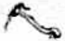

TOMO 307

Volumen 2

1985

A R G E N T [ N A

FALLOS

DE LA

Co R T E Su P R E M A

DE

JusTICIA DE LA NACION

CON LA RELACION DE SUS RESPECTIVAS CAUSAS

PUBLJCACION A CARGO DEL DEPARTAMENTO DE JURISPRUDENCLA Y PUBLICACIONES DEL TRIBUNAL

diciembre

TOMO 307 VOLUMEN 2

1885

## FALLOS DE LA CORTE SUPREMA DE JUSTICIA DE LA NACION

R E P U B L I C A A R G E N T I N A

## FALLOS

DE LA

Co R T E

DE

## JusTICIA DE LA NACION

CON LA RELACION DE SUS RESPECTIVAS CAUSAS

PUBLICACION A CARGO DEL DEPARTAMENTO DE JURISPRUDENCIA Y PUBLICACIONES DEL TRIBUNAL

diciembre

TOMO 307 VOLUMIEN 2

Luls Sáenz Poñe 1955/9 1985

## SEPTIEMBRE - DICIEMBRE

## AÑ0

## DF SFCRETARIOS LETRADOS

57

En Aires. los diasdel Mes de septiembre del Iribunal. de don  Jorge

## Consideraron:

Que   Mediante 7 ae junio de 1984. aclaranda por 5; del 14 de aoslo del Corle d: funcionarios cimen cubrir los siguienles Sccrelario Leuranlo reemplazo del doclor   Jorge 4 Leraudlo Juan Proscerelario Letrado Da -

Que Comision devignan procedio e

Por cllo.

Efccluar L Corte Suprema   de Justicia de la 1 doctora Inés Cures de (C. 3809321 Letranda 2 Ana Mari ' Avalos

148

1 mi. qu€ dov 5

DF ACORDIDA 9/77

sepliembre   del Presidente Petracchi el de de diligenciaQu requisito Fomercial.

comunicase anlc Ic F1

DI SF: RFTARIO DF 1 1 CORTF SU PREMA

&lt; L Salade

don  orge

## Consideraron:

34 del 7 dejunio dc 1984 . aclarada por del que  la  designacion de funcionatios en habilitante por Concursos.

Quc por Resolución N" concurso de Sccrelario Justicia

Que la Comisión Jictaminar Cn cl mencionado conprocedió &amp; los  posulanie ` mérilo de la prucba escrila.

Por cllo.

c} primcr ocup

Todo lo cral dispusieron mandaron. ordenando comunicase y registrase fe. Josi F Jokg

## REAJUSTFS PRESUPUFSTARIOS

los 6 duas del 198S . reunidos en ejercicio de la Presidencia. doclor don Auguslo César Belluscio. don

## Consideraron:

Quc erogaciones en concepio personal partir  del 1985. requeridas a fin de dar cumpliror situación ana- los P de We

en 4 eablecilo Jos 47 / Po 16,4821 comuni- olo Acorlula Que hacer de 1 utilizanndo allo 1 e 1 de Idministracion. ni 1 Con

que &lt; que

Ln efeclivas las hcer ello

5 1

1 1 doclo don Jo Suren

don

21 Mente pre-

Que . Federal 22192 4

Que de Federal no pueden aun cuando no S aplicacion.

Corle 61 2187. los   padrones irlud de Io dispone c 60 de   aquélla, Suprema lo Público de según inhabilidades los inscriptos en sonlas qu mientras superintendeneia Corle.

Por ello.

F deral por aclualmente de base " de lal regislro deberan dejadas

1 ordenando se comunicase regislrase n por anle mi. fe. 5. doy

mes de sepliembr: del año 1985 , Teunidos en Sala de cuerdos del Tribunal . Presidente de de Nación, doctor don Caballero. el Corte  Suprena César   Belluscio los   señores Jucces Minato Auguslo

## Consideraron:

5 con relaQue

Los desempenar   actividades   alcanzadas . por el régimen deinde no funcionarios en actividad, emergenles delas

La jurada anle de   Adminispercepción de compensación jerárquica que  refiere a

Ioo lo cual dispusieron mandaron,   ordenando se comunicase y registrase

## REGLAMENTO PARA LA JUSTICIA NACIONAL MODIFICACION

N" 67

mes Je otubre del año 1985, Tribunal, Presidente la Corte Acuerdos   del de doctor  don José Severo   Caballero los Suprema César Belluscio. don Carlos 5. Fayt, don Jueces oclores don Auguslo don Jorge Antonio Bacqué.

## Consideraron:

por el

Que las   modificacione` introducirse facilitarán la  labor   judicial permi -

## Resolvieron:

1 quedará redaclado de la siguiente mancra: Articulo dos de Secrclario 0 Prosccrclario. librados   contra una sola cuenta, debiendo   proccderse la unificación dc 0 Ja expedición de un giro para cada una de cllas. rasPadura 0 enmendadura, ni aun sahados. puño

- Suprimir  el articulo $8 Nacional .
- 3 quedará redaclado de la   siguiente mancra: Articulo 59: Para cuentasbancarias  deberá  delallarse cl nombre del beneficiario. lacantidad a con especificación dc 0 cl número 0 libro Caso cuenlas   judiciales se obscrvará lo dispuesto

Todo lo cual dispusieron mandaron, ordenando sc comunicase en cl libro JosÉ   SEVERO CAHALLERO FAYT JoRGE

## REAJUSTES PRESUPUESTARIOS

N" 68

En la ciudad de Buenos Aires, 9 los 8 días del mes de octubre del año 1985 , rcunidos cn la cl scñor Presidente la Corte Suprema dc la   Nación, doctor don José Sevcro Caballero, cl señor don Carlos $. Fayt, don Enrique Santiapo Petracchi y don Jorge Antonio Bacqué.

## Consideraron:

Que la resolución 637/85 de esla Corte Suprema, efecto de la Acordada 61/85,

Que se verifica al respecto una situación análoga a la   suscilada con respecto cuyos fundamentos Cabe dar por rcproducidos, y en su virtud correspond que se ponga ejecución de inmedialo el acto de que se aqui

sijo:

Quc Jo de 0n no debe

Ministro doctor don Calos Fadijo:

Acondada 47/85. del insisla cumplimiento 687/85. en 87 de Contabilidad . Ley

ordenando comunicanse Y registrase correspondiente. Juan

## ADICIONAL

N"

69

En ire . los 15 del Mes del de del rbunal el scñor Presidente de Supema de  Justicia doctor don José Severo Caballero, cl don   Jorge Antonio   Bacqué.

percepción del 1presente Acordada de de servicio del Poder   Judi0 scundario. si la Conslos 1 del art. 44 civilde 1a administración   pública de dehiendo  entcnderse lales   aquellas cuya  cjedel   titulo; la aplicación de adi-

conocimientos   udquiridos mediante   esludios cursados relalivos maleria en una mayor eficacia cumplimiento de éste.

## Resohieron:

Que sin rerjuicio de lo dispuesto Acordada 39/85, ICsulta prudente   delerminar  que   corresponde la percepción del   adicional por titulo rales de   abogado. escribano y procurador. ello sin perlos casos Particulares que los Iribunales organismos de Tribunal.

Todo lo cual Jispusieron registrase en el libro fc. F PLTRACCHI JoRG D

## JUBILACION DE MAGISTRADOS. INCOMPATIBILIDADES

N" 70

En la ciudad de Bucnos Aires. los del Mes de   oclubrc del año 1985 . reunidos en la Sala de Acuerdos  del Tribunal. el señor Presidente   de la de Justicia de Nación. doctor don José Severo   Caballero los Jucces doctores don Auguslo César Belluscio. don Carlos 5. Fayt, don   Jorge  Anlonio   Bacqué.

## Considleraron:

desempeñar actividades   lucralivas roliticas

## Acordaron:

Aclarar la en comunicase en el libro PLIRACCHI Eduardo D Craviotto (Secrelario)

## POR

N" 71

ciudad d lo del reunidos 1 Sala de Acuerdosdel Presidente de la de Nacion. José severo Caballero, cl Jos senores Jueces doclores don schor Carlos 5 don   lorge Anlonio   Bacque .

## Consideraron:

Por Acordadas 39/85 69/85

har fecha 27 de   julio y 15 de senlido como formulará las   Acordadas en cada Mado en

## Resohicron:

Mulos bonificables por aplicación de Jas Acornls en lanlas cuolas lo hubicran percibido partir   del mes de agosto del corriente año y nl de las Corte epida cn particular propuesla nacionales de- comunicase regislrase mi. Cisak 1 Craviotto (Sccrelario)

APL ICACION DE ACORDADA 65/85

N" 73

de   Buenos los 31 días   del de   octubre de Presidenle dc la

Corte   Suprema Justicia de Macion, doctor don   José Severo Caballcro Y los Jucces doctores don César   Belluscio, don Carlos S. Fayt, don Enrique   Santiago Petracchi y don   Jorge Anlonio   Bacqué.

## Consideraron:

Que régimen de Acordada   65/85 \_regla-menlariadel ciales al Servicio de Reconocimientos   Médicos. peri-

Por ello.

Acordaron.

Declarar quc lo dispueslo en miembros del Servicio comunicase libro D

## REAJUSTES PRESUPUESTARIOS

N"

En la ciudad de Buenos Airzs. los 21 mes de noviembre del año 1985. reunidos en JaSala de Acuerdos   del Tribunal. cl scñor Presidente de la Corle   Suprema Justicia de la  Nación. doctor don José   Severo Caballero, cl doc:or don   Auguslo César   Belluscio y Enrique  Santiago Petracchi " Anlonio Bacqué.

## Considcraron:

23.270 que eslablece el Presupueslo Gencral de  Gastos Recursos dc la Administración Nacional para cl Ejercicio 1985   presenta Nación que, en el inciso Personal \_ imposibilita  la liquidación de los haberes de los agenles para el mes de   dicicmbre el sueldo anual complemeniario.

Quc con fecha 25 de   julio   último  (Acordada   44/85) Tribunal   dispuso fijar en suma de 59.247.(00. c solicilado   para cilado inciso, : los efectos de solventar las remuneraciones aprobadas por la Acorpreservadas con arrcglo sen-

Bonorino Pen Abel Nacional 14)

Quc Por fiiar L remuneu miembro Ad

Pr de Educación Justicia la Honorable puesla en de de Prewupuesto promuleanda ror

Que cumplien Conpresupueslarios 4 informe N" de 1a Subde secrelia de don

argumenlos  espueslos especialnente en Acordada   47/85 partidas del Presuen Jurisdiccion Poder que . daion Poder de

Que. nola de Admipor 8 de

Consider de ror de compenJey

1 Macional con por la en 478 XX. Bonorino Pcró. Abel ampato no SC

Carlos $

conclusiones del olo de 1 47

## Reohicron:

Fncomendar President Ja Core   Suprema que disponga los Poder Judicial de la ciemhre del 0l Poder Ejecutivo 17 ~primer  parrafo comunicase fe. 5. F Juan dos

## REAJUSTES PRESUPUESTARIOS

Bucnos ire los días   del mesde   diciembre delaño Sal de Tribunal. el Presidente   de doclor don José Severo Caballero y los schores doa Auguslo Belluscio. don don Fnrique  Santiago Penacchi don   Jorge Intonio   Bacqué.

## Consideraron:

Quc de   conformidad con lo   prescripto por 23.199. Corle   fijó la a los magistrados. funcionarios pleandos del Poder   Judicialde los hade los relirados. cuyo monto delermina con relcion los primeros. en-

Poder   Ejecuiivo no los  créditos presupueslarios y de la Acordada 38 /85 . cepllado por el los   jueces Nación. para la concreta aplicación de amplió

dictaron no permitieron liquisar haberes on Catgo del Por resolucion requirió Poder Por fundamentos epuestos en 1 ampliara el credio dc dicha medida 1 los de dc Jas 4uC causa Un n Pode: Ficculivo L nenester conclu

Por ello.

fin de poner en conocimiento los comunicase correspondienie. ror ante

## EEAJUSTFS PRESUPUESTARIOS

76

Fn ciudad de Buenos Aires. los 9 diasdel de   diciembre del año de Tribunal. señor Presidente dela Corte   Suprema de Justicia de Nacion. doctor don   José el Minisiro Decano doclor  don Belluscio Fntdon Fnrique   Santiago Petraschi don Jorge Anlo-

## Consideraron:

de fccha 25 de  noviembre ulun

Acordada 74 del 21 noviembre dar por reproaqui

Que similar de las   resoluciones de 68 respectivameute, por cion dc 1medida ordenada.

Fl sehor  Presidente octor don Jose Severo (aballero. dijo:

Que por  los   fundamentos d: Su volo Acordada  53/85. no sdebe inTribunalde Cuenias de la Nación en resolución 867/85 corresponde  mantener el procedimiento expuesto Acordada 74 de fecha 21 86. inc . 1" 13 . de la

El schor Mlinistro doclor don Carlos $

reilera el crilerio ?presado en Acordada   47/85. especialmente lo expueslo en el considerando 9" del Volo minoría .

En consccuencia, por   mayoria

Resolv ieron:

Todo lo cual Jispusieron mandaron.  ordenando se comunicase y registrase libro correspondiente. por anle mí. que doy fe. FAYT ENRIQUE   Santiago PEIRACCHI Juan Escribano (Secrelario)

de la Corle  Suprema de Justicia de la Na25 de  noviembre último. en 87 dc la Conla bilidad. Ley

## DECLARACION DF ASUFTO Y FERIADO JUDICIAL

N" 77

En la ciudad a mes dediciembredel año 198S . reunidos en deAcuerdos   del Tribunal . el señor Presidente de la Corle   Suprema dc Justicia de la Nación. doctor don José Severo Caballero, cl senor Ministro Dccano doctor don Augusto César Belluscio Jueces don  Jorge Anlonio Bacqué .

Que For Macional dehoras 1 81 Me.

fundmenio Triconenicnic aopta L ( 1 Justicia

Keclmento 1 interior lodo comunicase Craviotto (Secretario)

POR MULO

e Presidente de dl Iribunal. los Belluscio don Carlos don octon don

## Consideraron:

sin rerjuicio lo que los Particulareorganisnos   cleven Pan cordd 71 del 29 dela partir   del de Julio

! particular. a propuesta

Que partir   deldictado Acordada 39 . continuaron paforn liquidaban con   anlerioridad: Sunas cuyo reinfija en Aconada en virlud de una   demora no imputable A Jasolucion no

Tribunal. senlandos situa ción que debera ser contemplada poslerior al diclado de por   Iitulos no pueden de  noviembre. lo que

Todo lo cual dispusieron mlandaron.   ordenando comunicase " regislrase en cl libro correspondiente. por ante mi. Eduardlo D

CORTE SUPREMA DFSIGNACION DE AUTORIDADFS DE FERIA

" N" 79

En li ciudad de   Buenos Aires, Mes de   diciembrc del año rcunidos en Ja Sala de Acuerdos   del  Tribunal. el schor Presidente de Ja los scores Auguslo César Belluscio. don Carlos $. Fayt, don Fnrique   Santiago Petracchi don Jorge Antonio Bacqué. con del sehor Procurador General 'van Otavio Gauna, con el objeto los funcionarios de  los   Ministerios Publicos

## Resolvieron:

19 Aldoctor Fnrique   Santiago Peiracchi como la Corte Suprema.

2 Al doctor José Osvaldo Casás como Procurador   Fiscal.

39 como Delensor dc Feria anle la Corle   Suprema demáis   Tribunales doclor Carlos Alberto Tavare .

mandaron.   ordenando comunicase } regislrase que   doy Eduardo

## D E

## SEPTIEMBRE DICIEMBRE

ACTUALIZACION DF MONTOS. LEY 22434

N" 511

1985 .

Vislas lo previsto  por el arliculo 1" dela 22434 y ley /78

## Considerando:

Quc rresponde csla Corte   aclualizar semestralmente los montos   eslablecidos en cl Código Procesal Civil Comercial con arreglo a los   índices de precios al por mayor, nivel general. ley según

20 Que   por Resolución 117/85 que   corresponde al semeslr: que corre desde el 26 de

- los   indices de aumento dc los   precios   scñalados para los mesesde respectivamente,  de 44.456.6 Y de 109.773.2

cocficiente quc corresponde   aplicar para cl va desdc el 26 septiembre de marzo de 1986 es, pues, dc 2,46.

- 49 Que en el supuesto del articulo 242, el índice a aplicar es el de precios mayorislas no agropecuarios, que en cl mes de marzo   ascendió lanto quc cn el mes de agoslo alcanzó 108.523.5: el cocficiente en

las   siguientes   cantidades:

Arliculo 29: 53,15

Arlículo 45: 11,71 767.79

Articulo 128:

0.48 a

Artículo 130:

4,73 a 472,48

Artículo 145:

8,86 885,92

Artículo 242:

61.31

Arliculo 286:

1 767.79

1

4724

329.

Arliculo 329

4724

Ariculo 399;

5315

Articulo 446 29

1

246 4184

Por ello.

Dichos de  sepliembre del corrienle saber cl Boletin Josi Cklos $ ERIQUE

LFY 22883

Buenos

Que Por elarculo hasta

Con 1 cilada,  realizar la  que 4 los de noviembre de 1985 abulde

Quedeacuerdo Con Nacional dc los de   precios   mayorislas para los de sepliembre   de respectivamente. de   44.456.6 qu2 corresponde aplicar 0

ror montos que deben obtienen acluali-

Articulo 27:

Articulo 28. inc. 1

130: de

171

Arliculo 133: de

10.34

2.8

Articulo 186: de

42 88

Articulo 291: de

Articulo 620:

Anieulo 642: de

16.99

monos Reajutar los de fecha de pudo forma   allí establecida. Jos blicacion cl Boletin   Oficial. partir publíquese. JoRGE CísR

DF PRENSA DF LA CORTF SUPREMA

5 de   diciembre de 198S

Vislo lo informanlo utorizar conttataF al ñor Héclor Grossi Con 31 del corriente ano,

Como Ncion.

Inputar de con cargo Peronal Temporario' financiero.

la de Administración, Josi Caklos $ JoRGF

DF LFY

Buenos  Aire 17 dediciembre d 1985 .

2 Fspediente bis/81 caralulado: "Corle cumplimiento montos  Código

( en 2372 Un monto 1" " suprimiendo del mismo

0necesario   nodificar

4 de L

1 1 fiiando c monto de

2 Surrimir &lt;

publiquese en Boletin Oficial. Joku

## DESIGNACION DEL SECRETARIO DF LA OFICINA DE INFORMACION Y PRENSA DE LA CORTE SUPREMA DE JUSTIC DF L NACION

N" 715

Buenos Aire  26 de diciembre de 1985 .

expediente   134/85.

Se resuchc:

Quc en la   aulorización Subsecretaria de   Administracion señor Héclor Grossi.   donde dice: "Jele de Prena de Corle   Suprema de Jusdebe decir: 'Secrelario de la Oficina  de Infornación y Prensa de laNación"

Josi

## HOJA COMPLEMENTARIA

Hoja incorporada a los efectos de permitir la búsqueda por página dentro del Volumen.

## SEPTIEMBRE

## CARLOS FDUARDO GUARDIA 1

En laConstilución e organización   nacional deciviones un finales 4 ningun Iribunal. nacional de   respelo y aclamiento maagistrado 1" cila medida   adoptada por e Iiende abrir Una in-lancia d: revisión   del pronunciamiento   diclado de la atribucion de

## FMLLO

Buenos   Aires. 3 de septiembre de 1985.

Visto el oficio del 26 de agosto de 1985 dirigido a esta Corte por Contencioso  Administrativo Federal  NP 1. Dr. Néstor H. Buján, en los la Nación s/amparo expte. N? 614/85

## Considcrando:

Que. además dc ser palmariamente   inadmisible la   acción a raiz de la el  magistrado aludido ha solicitado informe a la Corte (arts. 19.549 que el propio magistrado cita) a abrir una   instancia de revisión del pronunciamiento dictado por cl Tribunal el 8 de agosto próximo Y 101 de la Constitución ley

denegación de justicia deducido por Carlos   Eduardo  Guardia ! Susana America Forbacho de Abelson en los aulos 'Guardia, Carlos   Eduardo

2 ) Que esla Corte. Cn reiteradas ocasiones. ha   declarado que, Ja competencia  que le atribuyen la Constitución y Jas  leyes cs son   finales: nacional local   puede   desconocer la  necesidad institucional de respeto y acatamiento a las decisiones de la Corte Suprema  ( Fallos: causa B.24XX, "'Brieha. Rodolfo Jorge s/am-

Que:. los principios expuestos son particularmente aplicables al ciante importa interferir de Manera actual Cn procedimientos de superemplea lesiona las facultades  privativas quc se desprenden del art. atl. 94 )

Por ello. sin  diligenciar al Juzgado de origen dejará copia en cl legajo. A transcripción de esta providencia.

AUGUsTO CÉSAR CARLOS QUE PETRACCHI JORGE An-

## 1

Jederales de

62 4:

deducido contra nislerial inlersencion e sindicalo susceptible deconsideración de Una Cucstion   procesal ror normas de los propia lormalmente ha Una autoridad   ejercida en nombre de L Ministerio  de  Trabajo por intervencion delov organos de €inc. dicha   autoridad. Jey

## TRABAJADORES.

Por de la condición eigida 61 . inc. de Jley Fllo asi. pucs   dado lainterquc   parantiza Ja habida cuenla que el objetivo persepuido no puede demandar un tiempo indefinido, no revisle caracler permanente. Jey .

## D

no sin arbinariedad en aprcciación. los refieren los considerandos de cion minislerial. Fllo porque Linterprelacion de las leniendo en Quc for- demoraitica.

desustenlo lacha le inconstitucionalidad de ley si considera   desplazandla por la en la clección de

1874

1/

Supren Coue:

Fando 1 1 previsto por el art. 62 de Ja 1 34/43 del exple. alministalivo dispuso intervenir transitoriamente Con base en lo normado 22105 Con reglamentación de patrimonial   de conformidad 488 ver texto peticionante la procedencia lormal plameando esle senlido la inconstitucionalidad dc la

(ver: fs. 89/93, expte. medio   del   apoderado de entidad   intervenida se Camara  Nacional del Trabajo. Sala  VI, fs. 46/50 de estas S pronunció 75/78 declró la   admisibilidad   del rue ` 1 de ror 0a del d sndical

de CsC modo la mayoría   del Tribunal sostuvo una interpretación de la vía recursiva que cl art. 62 de la 22.105 . concordante con le asignara la Corte, in re: "Cabrera, Carlos  Roberlo causa €. 349. LXIX. sentencia  de fecha 15 de noviembre de 1983 . En solució: ministerial n0 rara la intervención art. 61. inc. 49 de la ley 22.105)\_ pues no es suficiente. juicio del Tribunal, la inserción de la palabra 'transitoriamenle para suplir la existencia legaí.  siro que debiera indicarse cuántiempo va 0 cuáles son las gestiones 0 trámilos derechos que consagra la Asimismo. en cuanto a los motivos invocados por la  autoridad   administrativa   para   disponer la intervención, a quo que no revestían la gravedad necesaria para dar lugar a magnitud. Por último a la cuestión de inconstitucionalidad   planteada ~compartida por el Procurador General del  Trabajo tratamiento. ley prevé amplia ley exigc

Contra este pronunciamiento dedujo recurso extraordinario el Proa fs. 132

primer lugar, porque estima que la vía   recursiva incl disidente en el lallo. advirtiendo que tal inteligencia implica indefensión sino la necesidad de recurrir : otros procedimientos Sostiene  luego la   constitucionalidad del art 61 , de la 22.105 . 10 qu2 ?sta medida hallarí en la ley 21.356, que estima de aplicación al dato prorrogado por el Ministerio de Trabajo. vocal

En cuanto a los argumentos expuestos por el Tribunal para anular la resolución ministerial, expresa el apelante que la exigencia legal refe- temporaalidad de la intervención se encuentra satisfecha porquz 4 ser ella transitoria ugrega la rcmisión al art. 33 22.105. el cual alude al "tiempo necelos actos irregulares producidos en la entidad gremial  aparecen  detallados en la resolución. D: modo la Iransitoriedad de la intervención.

entidad las   auloridades de en Ja senlencia equivale sustituir Poder Ejecutivo elercicio de facultades que la ley le confiere. Por omitir tanlo cl funcionamiento 2 consi - modode el recurso cxtraordinario procedente   dcsde punto de visla formal,  toda vez que se ha cucstionado la validez de de normas  federales. la   decisión   adoptada por el Tribunal ha   sido primera y a las prerrogativas invocadas por (art de l ley 48)

Fllo esim quc corresponde   abordar cl agravio amisibilidad   formal del rccurso de apclación que de la ley 22.105, por de por a la ví Fallos:  297:301: 298:730: 300:293; 301: 1401: sentencia de fecha 8 de noviembre de 1984, in re: L entre otros) . No encuentro razones excepcionalcs permitan   descalificar lo en csta   materia. on r:mision plan -

En cuanto al fondo del asunto; pienso que asiste razón al apclante cn lo esencial de sus agravios.

En primer   término, creo pertinente observar que, si bien el a quo consideró innecesario pronunciarse respecto de la constitucionalidad del 22.105 . norma invocada como fundamento dc la resolución  ministerial   impugnada, lo hizo  implícitamente al revocar cst? úhima por no   adecuarse norma   legal presuponiendo así su   validez. según

Sin perjuicio de ello. teniendo presente que la parte apelada reiter: el planteo de inconstitucionalidad al contestar [CCUrSO exlraordinario   (apartado fs. 119 cabe advertir que ese planteo no resulta   atendible, Cn tanto proviene   d: autoridades dela enlidad   gremial   intervenida que accedieron a en virtud de una   resolución del   propio   Ministerio de Trabajo (MT. 262/80) quc prorrogó sus mandatos 'en los términos de la ley 21.356" (art. 19, partc final. fs. 9 del expte. administrativo 722.270) El art. 49 de dicha contempla,   precisamente,la facultad para disponcr  intervencioncs  ad en las asociaciones   gremiales, régimen obviamente por el art. 61 de la 22.105 . vocado cono sustento de la  Resolución   41/84 impugnada. Por efectada por no haberse  agotado su "normalización en los términos de las leyes 22.105 y 23.071, lo cierto es que quienes asumieron los cargos directivos en las condiciones   apuntadas no mados para  cuestionar el régimen normativo en cuyo contexto   fueron ley ley aquí

Es doctrina constante de la Corte que cl sometimiento   voluntario de los interesados a un régimen jurídico; sin reserva expresa, obsta a su 402: 275.235; 299:373; 300:51, 62, 148; entre otros)\_ En esc scntido aplicables las   reflexiones   expuestas en mi  dictamen de Iecha 7 de junio de 1984 y en el fallo concordante de VE de fecha 8 de noviembre de 1984, cn la ya  citada causa "Pcrrone, Juan Angel otros' P. 60. XX pe rlincntes. aquí

la   resolución   ministerial N? 41/84, tocan dos   aspectos misma: POr un lado. cl cumplimiento de la exigencia   contenida de la de los magnitud ley

Fn cuanto apelante en que, si esahleció Un plazo para la actuación del interventor desigunida a la cita del 22.105. no ofrecen dudaas en el sentido que la intervención sólo ha sido prevista por el lapso a que Sc hace Tcfsrenia en la misma  resolución: vgr.: para adoptar los recaudos disponibilidad  de inmuebles,  verificar la  situación de las filiales, permitir el acceso de un de 0 sancar las de ficiencias ohservadas Cn los registros   de la entidad  gremial. gestión perito parte

En lo concerniente al olro aspecto, los que la   mcdida y que, conforme la apreciación del Tribunal; no tendrían gravedad suficiente, comparto tambien cl recurrente en tanto advierte un avance sobre En efecto, el cri no puede scr sustiIuido por los jueces, pues como normas reglamentarias 0 actos administrativos, escapa a la órbita del Poder Jupropia

Por consiguiente. los a quo basó la revocación marco d P consid. Y asimismo. quc al discurrir conclusioncs de cfectuada cl expediente   administrativo N? 742510 (fs 210/277) que. si bien posterior a la resolución 41/84, schala Ja eislencia de Iularios' "administración deficiente falta   de control interno ad277 del expte. citado)

En razón de lo expuesto;  opino quc corresponde   revocar cl pronunciamiento  recurrido; quedando firme la resolución 41/84 del Minismarzo de 1985. Juan   Octavio Gauna

## DF LA CORTE SUPREMA

3 de septiembre de 1985.

Vistos los :ulos: Cartón

## Consideranao:

Que la Cmara Nacional de   Apelaciones del d enero la quc se dispuso la intervención de los órganos de la Federación de Obreros de la Industria del Papel; Cartón Químicos . con fundamento art 61. de la ley 22.105 (inc. 20 4 ! b € inc. 40)

20) Quc para asi resolver. Tribunal   declaró   procedente cl rcante él deducido. resolución cumplía con el recaudo de transitoriedad impuesto por el inc. 40 de dicha ni 0 bicn eran facilmente subsanables. para justificar tralar damentos anles expuesios resultahan  suficientes para dejar sin efecto la apelada

Que contra   dicha   sentencia, Procurador   del Tesoro interpuso recurso extraordinario fue concedido agraviándose por el criterio acerca de las posibilidades  recursivas; por entender que la intervención dispuesta por el solo hecho de no habers:: cstablecido en la resolución ministerial seguido lérmino d: validez determinado, y finalmente por la calificación buida irregularidades en las que se funda la   resolución alri-

40) Que la Federación de Obreros y Empleados de la Industria del 1 Quimicos da cuenta a fs. 155 de la celebración dc actos lendientes normalización  que terminaron con la elección de manifiesta. n0 se hallan sometidos 1 con respondienelo la medida  de mejor proveer dictada a fs. 158, informa cl cual eligieron   autoridades, sc halla  objetado For impugnaciones pendientes de resolución  y cuyo trámite ha sido en estos autos. Jos según

5" procedente desde el punto de vista lormal. toda ha   cuestionado la   validez de una autoridad Yla  sentencia   recurrida   resolvió en dicha autoridad.

susceptible  de consideración esla inslancia pues. lal cono lo de fs 137/141 . Una cuestión  procesal que, cs de los jueces de la causa ajena 304:802 1 propia la cusal invocada por el Tribunal qu0 consistente en que la intervención Ic 4 aaracer que en ta} sentido se le asigna en Con los  considerandos   del en trunsgrcsiones que se tienen por perseguido demandar un tiempo indefinido. no reviste carácter permapuede

irrcgularidades comprobadas. su caracter subsanable. pueden

mninadlos   sino por el Poder   Administrador, sin que aparezca   arbitrarie dad manifiesta en su apreciación; tanto más por la cantidad y diversidad de las transgresiones comprobadas en los expedientes   sumariales a que rclicren los considerandos de la resolución MT 41.

leniendo cuenta el contexto general de ellas, del que forman   parte sus   considerandos (confr. Fallos: 255:241; 267:267)

90) Que la tacha de inconstitucionalidad que la Federación de Obreros de la Industria del Papel, Cartón y Químicos mantuvo al responder el rccurso extraordinario, basada   esencialmente en la restauración de la normalidad en lo dispuesto en los arts. 14 bis de la Constitución Ello cs así en 1azón de que la autoridad de la asociación gremial que se considera desplazada por la resolución ministerial   impugnada obluvo su mandato hajo el régimen de la ley 21.356, de modo que la designación no tuvo En la especie, resulta aplicable lo resuelto por este Tribunal en cl scntido de que la sustitución de una autoridad designada por la administración por olra   del mismo no puedc comportar  menoscabo dc la libertad sindical Perrone. Juan A de la sentencia del 8 de noviembre de 1984) origen ley

Por ello ! de conformidad con lo diclaminado por el señor Procurevoca la sentencia de fs. 75/78, quedando firme la resolución por la quc Iransitoriamente la  Federación de   Obreros   de Costas por su orden en virtud de que por las parIiculares circunslancias del recurrenles pudieron crcersc   asisti dos de derecho para litigar.

Josi AUGUsI0 CÉBELLUSCIO CARLOS FaYT JORGE AnTONIO BACQUÉ.

del 2 1787 de 1a cuales intimó empresa Js ganancias Ello de los ni clla

## Para

del 4: opcion instimuida dicho révimen uri- rr &lt; eudor de Iihutarias de del 4 Wonlo de secundarias aquel

que aphcable obligaciorc   impossilivas 4 ios Ielluscio Carlos 5

4 1787 admite adecuar a presunción de Cn en 1 de su 2 ' conduzca 2

## DICTAMEN DFL PROCURADOR FISCAL LA CoRTE SUPREMA

## Suprema Corle:

mi modo de procedente  desde el punto de vista formal,  habida cuenla que el fisco nalcional basó Sus pretensiones en la resolución general 1787. cuya lidez fuedesconocida en

En cuanto al cl Estado Nacional (Dirección General   Imnpositiva parle , aclúa por medio de apoderado cspecial naturaleza   estrictamente   patrimon al, ræzón por la que pido a VE me exima de emitir  opinión.  Buenos José  Augusto Lapierre.

Buenos Aires, 3 de septiembre de 1985.

Vistos los  autos: 'Elinstall SALC. y F. s/recurso de apelación impuesto a las ganancias'

## Considerando:

Contencioso Administrativo   Federal   confirmó el fallo dc la instancia F.el pago de

ferencias ganancias del año 1976. di - fue   concedido por el quo, agraviándose For Ja Tesolucion 1787 (DGL) contempla la cuestión susci9 4

Que de los anlecedentes de la causa surgC: que la firma que consagra cl art. 39 de la dl base del mcnto del gra1 ) la del ejercicio fiscal resulta de de las   diferencias anticiprse conforme al resuhtado real del 1 ingresaron; se calculó desde el mayo de 1977 \_fccha de areladas hasta cl 18 1 rspectivamente opción según

4 en la qu2 el Tribunal 4 quo susten1 2 sediscute la actualizaprocedimieno corresponde exender los fundamentos pues amhas 1 apli-

Que sin embango procede  analizar la instituida en lo cual importó aquél, opcion su  voluntario sometimiento dicho   régimen   juridico y ello obsla la impugnación ulterior con base constitucional 299:221 )

Que. por último;   corresponde   puntualizar   que los   accesorios reclamados en el suh iulice encuentran sustento en las disposiciones del 11.683 en 1978) ~art. 121 y concordantes las que no han sido objeto de tacha en cuanto a suS alcances. Salvo la argumentación que se refiere al plazo de caducidad que eslaría   consagrado en cl tri buna! ley

Por ello. de conformidad Con lo dictaminado por el señor Procu Jador Fiscal acerca de la procedencia del recurso, se revoca la sentencia 101/102 24 parte. de la 48) ley

JosÉSEVERO CABALLERO AUGUSTO CÉSAR BELLUSCIO (/" disidencia) CRLOS $. {endisidencia) ENRIQUE   SANTIA Go PETRACCHI JoRGE ANTONIO BACQUÉ.

AuGusto CÉSAR BELLUSCIO Y

Considerando:

Contencios Administrativo Federal confirmó el fallo dc la instancia SC intimó 9 Elinstall SALC. 1 actualización monetaria   originades en el ingreso tardío de agraviándesc por considerar que cl fundamento de ~ilegalidad del art. 20 de la re solución generai N? 1787 contempia la cuestón suscitada aquélla

de a) que la firma resolución N? 1787. ingresó oportunamente los anticipos del imobligación total del ejercicin de anticiparse conforme :l resultado real del Iisaal Sc calculó desde ei vencimiento presentación apeladas se reclamaron acordado para cl pago; respectivamente. opcion gravaperíodo plazo cn la 1a 2 prsblematica  plantcada  por cl art. estima cl dicha  Resolucion General cuando el deudor de anticipos animpueslo calcular los del ejerciestimación devienc inquedar en pecor situación que respeclo de ohligaciones   tributarias, basc. ley que aquella puede quien

primero conspunto al monto de los secundarias aclualización calculadas opción.

6" en supuestos de sometimiento voluntario Un determina jo  régimen  jurí-

dico Pues n leria especilicamente   fiscai rige el principio  dispopúblico preside las obligaciones impositivas, a loda noción contractual (Fallos: 218: 694; 226:22: 283.360: 288:279.

79 de n la  medida aplicación del criterio general ~arl Reso lución Gieneral 1787 conduzca ; resultados insatisfactorios para Fero sin viriualidad hastante cjercida las dc quienes no cjercieopción. pueda quC

89 Que lo expuesto no implica desconocer las facultades fiscalizadoras de Ia Dirección G.neral  Impositiva para verificar la corrección de la exigibilidad delas diferencias de anticipos   que hubiere lugar hasta el vencimiento general para cl pago del impuesto final y el ejercicio de las pretensiones fiscales   del caso, si mcdiare incxacta 0 maliciosa arts. 22. 28. 46, 73 " concordntes de la ley 11.683)orción penales opción dor Fiscal procedencia   del recurso. cia apelada.

CARLOS $. FAYT .

del ordinariode apclacion instan0 indireclamenle úl0 prelende la modificacion de la de

Jutcios

Improcedente 4 e interioner Flado ror di putado

## DI ! PRUURADOR GEnERAL

## Suprema Corte:

hallarse cumplimentados   los requisitos que lo tor-

En la   materia apelada d derecho comun. n0 corresponde que emita opinión

Aires. 3 dc septiembre de 1985

19 de Apelaciomes lo Contencioso Administralivo Federal perjuicios causados monto de los depósilos plazo

1 apelación que' autoriza el artículo 24, inciso 69 del decret-ley  1285/58 (fs. 506 ) el que fue concedido oportunidad de contestar el traslado del memorial proce -

20 la la 0 indirectamente  revista el carácter de parte, mon del su interposición propara

3" Y sobre la base la fundar su {ccurso refirió ese valor al monto de uno al imerponer ! en la condena; mientras que la consentida la responFslado se halla representada por la  diferencia entre las 'las menores aspiradas por la recurrente; porque tal sería Fallos: 261:394; 283:392: 285: Hilanderia Olmos SA. s/intervene ón órgano judicial del 28 de junio de 1984)

4 Que en lales condiciones, ! ante el cumplimiento de tal lademandada circunstancia del memorial   pertinente corresponde  declarar  improcedente la apelación respectiva, dadas las amplias facultades de que goza vste Tribunal exigen- cl Sr. Procurador  Gieneral a fs. 506. Con costas

AUGUSTO CísR BELLUsCIO CARLOS 5. F

## 1

1a con-tituciona Laleclacion 0 2 4 hecho e ni del inc. 2 ' del Menial

## 1

de L los arl 878 de que onen 1 un ley mi

## 1

orden e en 1 de ine. de de 1 imputa rarlicumr 1 mori Mililar . puede fundar por 1 Fllo L juidica no monía 1 los fines

## DICTAMEN DEL PROCURIDOR GENERAL

Suprema Corte:

La  presente contienda positiva de competencia  trabada entre el la inhibitoria planteada por el senor Jucz Militar al magistrado cial. desprendiera de Gusa en laque investiga conducta del Sargento 10 Carlos Euschio Villegas a SC provinquien arm: de rcglamento un civil luego de haher chocado con el camión del Ejérci:o, que conducía en cumplimiento ruta .

tienda de compelencia N? 716. L XIX , caratulada "Dor, L. s/hon cidio culposo V.E declaró, por remisión a mi dictamen; que la reforma introducida al art. 108 del Código de Justicia Mililar por la ley 23.049 rige para los hechos cometidos con posterioridad a su entrada en vigencia, tal cono lo prevé

Si su reforma, toda vez quC cl suceso mente pienso que corresponde  dirimir cl conflicto competencia de la justicia ordinaria.

lo entiendo. el delito que dio lugar investigación lue cometido como un  accionar   ajeno cumplimiento de las   órdenes   recibidas según

Opino, que debe de Instrucción de Primera   Nominación de la ciudad de Córdoba. nos Aires, 19 de marzo de 1985. Juan Octavio Gauna. scguir pucs.

3 de

Visto: ( onsiderando:

19) Con fecha 30 de produjo choque un camion Particular que se enconraba estacionado ~sin ocupantes Un une la Ciudad de Córdoba agente d en cl hedel  Sargento Euscbio conducia cl militar . del   propiehasta el destacamento pOcl quc precowetido desenlundar aina reglamentaria Francia. La contienda   positiva de conha cl cl sehor Jucz de   Instrucción dela 1 provincia desprende de las presenles acluaciones, e SarRegimiento de InfanIcia 17. Provincia de Calanare:. comisionado de intendencia al Comando de en la Ciudad de Cór1

3") 21 de comision deldelito dc 1029 al del 23049 justicia castrense

Tespeclo de los delitos comunes cometidos en aclos del servicio militar (Comp N? 716. Rubén s/homicidio   culposo en accidente de de junio de 1984)

40 Que   según doctrina de csla Corte. el concepto dc acto dc nornla   citada. debe SCr rclacionado de la misna con el critcrio que establecen los arts. 878 y 879 del Código de Justicia   Militar  (confr. ~Sudesacalo resuelta cl 13 de noviembre de 1984 ) ese senlido el Tribunal la  justicia   militar, cl delito de que SC motivo del cumplimiento de una Fallos: 238:292; 240:338; 246.32; 250:604; 263: Comp resuelta cl 5 de julio de 1984 ) y que esa orden debe referirse a la ejecución de un acto especifico del   servicio mililar las   pautas   que   proporcionan los arliculos mencionados Fallos: 108:27; 132:20; 141:71; 200:238; 206: 208: 210:745; 274:20 en cl exde la Fiscalía Nacional   de Investigaciones   AdminisIrativas de Intendencia   Miguel A Alesso "Sumario por averiguación de desacalo' resucltas cl 17 de abril. 28 de junio y 13 de noviembre de 1984, respectivamente ) \_ ley . Comp.

Que . gas se encontraba cumpliendo una   orden superiores que   consiscon lo que establece cl art. 879 del Código de Justicia Mililar ~manejo de material que se le imputa \_coacción a particular aparece directamente  rclacionada  ni   resulta   conducente coincidencia temporal del del militar. fundar por sí sola la competencia de la justicia castrense Fallos: 301:598 ! dectrina de FaIlos: 183:141 ) . Eilo de las más   seguras dc hermenéutica   jurídica Cs la que  atiende la  armonía las nornas Con las garantías de la conlemplados ha de preferirsc no l que dificulta los fines perseguid  legislativamente'  (conlr. causa ).74, puede propia reglas que aquella

nucla", del 7 de agosto de 1984 y sus citas). En efecto, una interpreta­ ción del art. 108, inc. 29, del Código de Justicia Militar que se fundara solamente en la coincidencia temporal del dclito con el acto del servicio, llevaría al resultado de que cualquier delito cometido en el servicio debe ser juzgado por la justicia castrense, interpretación que ya ha sido descartada por esta Corte en el caso de Fallos: 52:211. Por el contra­ rio, la vnlidcz constitucional que desde antiguo esta Corte le ha reco­ nocido (Fallos: 236:588), se funda en la relación que existe entre el hecho y la afectación o la amenaza a los principios que hacen a la dis­ ciplina de las fuerzas armadas y comprometen su existencia (Fallos: 100:233). Cuando el hecho no se relaciona directamente con la ejecu­ ción de un acto de servicio, ni resulta apto para la afectación de esos intereses, la aplicación extensiva del art. J 08, ine. 29. del Código de Justicia Militar excedería el marco que le fija la Carta Fundamental a la justicia castrense como fuero real o de causa.

Por ello, de conformidad con lo dictaminado por el señor Procu­ ) ff!dor GLYPH(cmap:df00)eneral, se dcclara que en estas actuaciones corresponde entender al señor Juez de Instrucción de Primera Nominación de la Provincia de Córdoba, a quien le serán remitidas. Hágase saber al señor Juez de Instrucción Militar a cargo del Juzgado N9 24, dependiente del Co­ mando de la Cuarta Brigada de Infantería 'Aerotransportada. con asien­ to en la aludida provincia.

JosÉ SEVERO CABALLERO - AUGLYPH(cmap:df00)USTO CÉ­ SAR BELLUSCIO - CARLOS S. FAYT ­ ENRIQUE SANTIAGLYPH(cmap:df00)O PETRACCHI - JORGLYPH(cmap:df00)E ANTONIO BACQUÉ.

ETHEL SUSANA PALOSCHI DE PIS DIEZ v. MARSANS INTERNATIONAt. VIAJES MARSANS ARGLYPH(cmap:df00). S.A.C.!."". y M. y OTROS

llJIUSDICC/ON y COM/)ETENCJA: Principios RCl1crales.

Para determinar la competencia ha de estar.e a la expoSICton de los hechos que el actor hace en su demanda, y después, y sólo en la medida en que se adecue a ellos, al derecho que se invoca como fundamento de su pretensión.

## JURISDICCJON y COMPETENCIA: e"es/ioll('.\' dc' ('(lmp('/ellda. IlItt'rI'l'llcilm de la Cor/e S"prC'IIw.

La competencia intermlcional de los jueces lIrgentinos para entender en la enusa por cobro de indemniz&lt;lción de los daños y perjuicios sufridos por los familiares de quien falleciera en las cercanías de Moscú (U.R.S.S.), al volcar el ómnibus que' conducía al un grupo de turistas, participantes de una excursión que habría sido contralada con la demandada. no ha sido cuestionad.l por ésta. 10 que exime a la Corte de tralar el tema. en aten. ción a 1.1 naturalezu pnlrimoniul de la dem:mda promovida por los actores (arg. arts. I Y 29 del C6digo Procesal Civil y Comercial de la Nación).

JUUISIJ/CCION y COMPETENCIA: Compt'/c'IIcill ordi1laria. Por la ma/cria. Clles/iom',\' ('¡dh'... y conu'rcitl/t',... Dmin... y pajllido,...

Todns las causus inici:ldas en la Capilal Federal que versen !\Obre acciones civiles y comerciales. concernientes a responsabilidad contractual o extra­ contractual, y aunque hl Nación o sus empresas y entidades autúrquicas sean pnrle. siempre que deriven de .Iccidentes de tránsito. inclusive el fe­ rroviario, caen en la competencia asignada ni fuero especi11 en lo civil y comercial rol' el l.lrt. 46, inc. dl, del decreto-ley 1285/58 según el texto e!':tahlccido por 1:.1 ley 22.093. Ello es lp1icable ,I caso en que se dcmandn por los daños y perjuicios drivados del f¡llIecimiento -al volenr un óm. nibus- de quien participaba de una excursión, por cnanto -con indepen­ dencia de la naluraleza contr;lclual o extracontractual de la ucci6n dedu­ cida por los nctores y, en su caso. del tipo' de contrato de que se trule­ la pretensi6n rcsarciloria de éstos deriva de un accidente de tr{lnsito, en Jos amplios términos del pl'cecd:mtc mencionndo. lo que llevIl a considemr competente al fuero csp'Ccial en lo civil y eomerci¡lI.

## DICTAMEN DEL PROCURADOR GLYPH(cmap:df00)ENERAL

## Suprema Corte:

Tanto la Excma. C(¡mara Nacional de Apelaciones Especial en 10 Civil y Comercial -Sala 11[(fs. 138), como el señor Juez a cargo del Juzgado Nacional de Primera Instancia en Jo Civil y Comercial NQ 8 (fs. 148), ambos de la Capital Federal, se declararon incompe­ tentes en estas actuaciones. En tales condiciones corresponde a V.E. dirimir el presente conflicto de competencia. por ser el único órgano

superior jerárquico común que puede resolverlo (art. 24, inc. 79, del decreto-ley 1285/58).

La demanda, promovida por la viuda e hijos de don Enrique Ale­ .¡llndro Pis Diez quien falleció al volcar el autobús. en el que viajaba, ti 150 km. eh: Moscú, U.R.S.S.. mientras realizaba una gira turística fue iniciada ante el Juzgado Nacional Especial de Primera Instancia en lo Civil y Comercial NQ 1 de la Capital Federal, que se declaró compctenh:. Contestada la demanda, la accionada opuso excepción de incompctencil. a la que no hizo lugar el juez, en decisión que fue re­ vocada por la Cámara respectiva.

En cuanto al fondo de la cuestión, si bien en una primera aproxi­ mación al tema, parl.:cc necesario determinar si es de aplicación al sub lile la regla o por el contrario la excepción contemplada por el ar­ tículo 42, inciso a), de la ley 13.998, no resulta indispensable en esta ocasi6n sentar un crilerio vinculado a las distinciones aludidas.

En efecto, en autos los daños y perjuicios reclamados en lá de­ nmnda derivan de un uccidentc de tránsito.

Resulta entonces aplicable al caso el artículo IQ de la ley 22.093, modificatoria de los arlículos 43 y 46 del deerelo-Iey 1285/58.

Es así que, con arreglo dicha norma, todas lus causas iniciadas en la Capital Federal, que versen sobre acciones civiles y comerciales concernientes a responstlbilidad contractutll o cxtncontractual, y aun­ que la Naci6n o una de sus entidades aulárquicas sean parle, siempre que deriven de accidentes de tránsito, caen en la competencia asignada al fuero especial en lo civil y comercial (cont. sentencia del 6 de di­ ciembre de 19X4, in. re: "Villea Mora de Caria Sandi, Emeteria e/Ferrrr e,,,riles Argentinos s/daños y perjuicios", Competencia N9 68, L.XX).

En definitiva, por lo precedentemente expuesto, opino que corres­ ponde dirimir d presente conflicto jurisdiccional declarando que com­ pete el conocimiento de ]a causa a la J llsticia Nacional Especial de Primera Inslancia en lo Civil y Comercial de la ü.pital Federal por in­ termedio del Juzgado N9 l del fuero. Buenos Aires, 18 de junio de 19H5. Juan Oclav;o GLYPH(cmap:df00)auna.

## FALLO DE LA CORTE SUPREMA

Buenos Ai",s, 3 de septiembre de 1985.

Autos y Vistos; Considerando:

19) Que ha quedado planteada en autos una cuestión de compe­ tt:ncia que, de acuerdo con lo prescripto por el art. 24, ¡ne. 79, del de­ creto-ley 1285/58, debe ser resuelta por esla Corte, pues tanto la Cá­ mara Nacional de Apelaciones Especial en lo Civil y Comercial, Sala 111, como el señor juez a cargo del Juzgado N:.tcional de Primera Ins­ lancia en lo Civil y Comercial Federal N9 X. ambos de la Capilal Federal, se declararon incompell:nlt..'s para conocer en la causa.

29) Que el presente juicio fue promovido por los aclares l viuda e hijos de la víctima) por cobro de indemnización de los daños y per­ juicios sufridos como consecucncia de la muerte de Enri4ue Alejandro Pis Diez, fallecido el 9 de agoslo &lt;..1-: 19X2 en las cercanías de Moscú (U.R.S.S,), al volcar el 'J1nl1ihus que conducía ¿I un grupo de turislas, participantes de una excursión que hahría sido contratada con la de­ mandada.

39) Oue el jukio fuL' iniciado un,te el Juzgado Nacional de Pri­ mera lnstunda Especial en lo Civil y Comercial N9 l Y la demandada opuso cXL'cpción de incompetencia por estimar que (h.:bía entender en la causa la justicia federal debido a SL'r la cuestión -en los términos en que la había planteado la actora- relatíva a un conlrato dc trans­ porte. Rechazada la cXl:cpeiún por el señor juez de Primera Instancia, el pronunciamiento fue n:.. voc¿ldo por la Cámam ud fuero, que ordenó remitir las actuaciones a II juslichl nacional de primera instancia en lo civil y comercial federal. Rl.:cibidos los aulos por el señor Juez Federal a cargo tlcl J lIzgatlo N9 8, dicho magislrmJo se declaró incom­ petente, con lo que quedó planteada la contienda de compelencia que corresponde a esla Corte resolvl:r.

4Q) Que para determinar la l:ompetL'ncia ha dc estarse a la expo­ sición de los hcchos que el aclor hace en su demanda. y después, y sólo en la medida en lIue se aUel.'lh.' a ellos, al derecho que se invoca como fundamenlo de su pretensión (sL'ntencia de fecha 23 de agosto de 1984, recaída en In l.'allsa Competencia N9 83, Lihro XX, "El Carrito S.R.!.. e/GLYPH(cmap:df00)reco, Juan Carlos" y sus cilas).

59) Que la competencia internacional de los jueces argentinos para entender en la causa no ha sido cuestionada por la demandada, lo que exime a este Tribunal de tratar el tema. en ltención a la natu­ raleza patrimoni:'ll de la demanda promovida por los actores (arg. arts. 19 y 2Q, del Código Procesal Civil y C0111cn:ial de la Nación).

69) Que scgún lo resuelto por este Tribunal en la sentencia de lecha 6 de diciemhre de 19X4, rec"ída en la causa Competencia N9 68, Libro XX. "Villcll Mora de Coria Sandi. Emeh.:riu e/Ferrocarriles Ar­ gentinos s/d:.¡ños y perjuicios", "todas las causas inidadas en la Capi­ tal Federal que versan sobre acciones civiles y comerciales, concer­ nientes a responsabilidad contmelUal o extraeontraelual. y aunque la Nación o sus empresas y entidades autárquicas sean parte, siempre que deriven de accidentes de tránsito, inclusive el ferroviario, cacn en ]a competencia asignadu al fuero especial en lo civil y comercial por el "rl. 46, ine. d), del decreto-ley 1285/58 según el texto establecido pur la ley 22.093" (considerando 10).

79) Que la citada uoctrina es aplicable al presente caso, por cuanto -con independencia de la naturaleza contractual o cxtracon­ tractual de la acci6n dcducidu por los actores y, en su caso, del tipo d contrato de que se tralcla pretensión rcsarciloria de éstos deriva de un accidente de trúnsito, en los amplios términos del prcccd:.ntc mencionado, lo que lleva a considerar competente al fuero especial en lo civil y comercial.

Por ello y lo concordcmentc dictaminado por el señor Procurador GLYPH(cmap:df00)eneral. se dl.'c1ara la competencia del sertar Juez a cargo del Juz­ gado Nacional de Primera ]nsluncia Especial en lo Civil y Comercial NQ I para continuar entendiendo en la causa, la que le será remitida. Hágase saber a la Cámara Nadonul de Apelaciones Especial en lo Civil y COlllerci"l, S"la lB y al señor Juez a cargo del Juzgado Nacional de Primera Instancia en lo Civil y Comercial Federal NQ 8.

AUGLYPH(cmap:df00)USTO CÉSAR IlELLUSCIO - ENRIQUE SANTIAGLYPH(cmap:df00)O PETRACCHI --JORGLYPH(cmap:df00)E ANTONiO BACQUÉ.

## DE JUSTICIA Df. LA NACiÓN

## AGLYPH(cmap:df00)ROMONTE s.,\. v. PAZ MALLMANN S.A.F.!. y c.

RECURSO EXTRAORDINARIO: Req/lisito. propios. Cuntiol/es 1/0 kdl'fllh',, 1"lt'rp,.,,"'ciálJ de normas 10cale,\ de procedimientos. Doble instancia y n'cl/r.m.".

Lo c:.ccidido por los tribunales de 1:\ calls:t acerca dc la deserción eJeI re. curso interpuesto para ante dios no suscita, como regla. clIcsliún federal qp habilite la instancia d' ;lrI. 14 dc I:l ley 4M (1).

RECURSO 1,'X"lRAUUD/NAUJO: UI"i,ti,,'ito,,' propio". S"II1t'lIcifl J"/illilinl. n",m. 111(';01/('." tUllail1ft,s lJ 11/ ,\('/I(('llI'i(/ l/t'/illiti"(I. COl/n'1110 y g"Ill'J"lllidlld,'s.

En tnnlo la n:curr;:nlc no cuestiona la nccesidad, expresad;1 tanto en el f"lIu de priml:ra intancia comu en el L1e la segunda. de que la litis se inteJ:!;rc con la totaliJad L1e los sujetos legitimaLlos :u.;tiva y pasivamente panl in1l'rvcnir cn el proCCiO, no media en el caso sentencia definitiva ni decisiún que pueda .. i,,;r equiparmla a dhl. pllCs el pronunciamiento que decla. ró desierto el recurso l!': apdaciún deducido il raíz del rechuzo Je la Jmand:l flor con;illacilm. y modificó el fallo de la demanda anterior en lo ati. !lente a la improcedencia llcl r..:d"mo por rcsuluciún de contrato de ¡j.:s­ monte y al pago dc lo daños y pcrjuido. no pone fin al difercndo surgido r.:llln. la'; parle.,; ni causa UlI !',raVaOlcn que no sa sll,,:cptiblc de repa:'¡H;i"ln posleriur.

RIClJf(SO ¡-:XTRAO/U&gt;JNAU/O; U('(/lIi.itm propio.\'. Sl'lIft'lIcia lh'/illitinl. R('.m. ludw/('.\' (/II/l'rim'l's ti 1" ,H'I/I(,lIda lh ¡illitin/. COIIl'lplo y ,('IIC'I"lII;tll/(h's.

La ¡I1VOc¡Illin de la L10Clrina dI: la arhilraricdaJ y de ganlnlí:ls constitu­ cionales no obvia la falta d decisiún final :.::n los terminos del art. 14 de la ley 4H. ,:d .... o qu.: se demuestre qlle la irreparahilidad del perjuicio que la resoluciún ocasiona la equipare a IIna sCIllenciu L1efinitiva. La enver. gadura d1 mCllO':cabo patrimonial que la demura y los inconvenientes pro. ccsalcs que .:vcnlualmellle pu::Jan pre.;cntarsc en virtud de la necesidad de intcgnll' corr.:l.:lamenle el proceso. no enL'uadran dentro de las excepciones que justifican dejar de lado tal principio (::).

(1) 3 dc sepliembre. fallos: :!86:177; 2M7:34; :!93:294. h16: 294:362.

(::) .... allos: 292: 144: 3113:K(.I. 19M9; 304:749. 1717.

16tH)

## I'AI I os nI:. LA.. CORTE SUPREMA..

## J. MELlAN \' CíA. S.A.C.F.

IH-.;CURSO LX"' RAOU/HNAIU(): R"(llIi.\;to.t propios. TrihlllUlf S/lp",.;or.

Si al dClll:J:!&lt;ll" el rC¡';llr.u 'cxtnH)rdinario ..:1 tribunaL oe la hlShtncia anterior afirm6 la existencia de Ví:1S .. ('cursivas en el orden provincial para la tutela del derel.:ho que pueda u''¡¡slir al apdan:c -en el caso. el recurso de revi­ .. iúoy aquél no se hizo cargo en la queja de dicho arlImcnto. ello obsta a ... 11 admisihilidad (1 \,

## ABEL SANDOV.'\L v. PKATI-VAZQUEZ IGLYPH(cmap:df00)LESIAS S.A.

u/:.'(' t I USO I'X'I NA ORIHNA U/O: Ut'ql¡isiro.\' I'l'Opios. TrilnllUlf slIpt'rior.

I.a revisión previ."!;1 en la ¡n..lancia cXl'rH,;ional sólo procede re"pecto de la snlcnci;t dcfinili\':l cm:mada del Sl!r'rior tribunal de la causa, luego tic hahi,.'r aolatlo la .. instancia .. exislente.. en la jurisdicción loc,'II (2).

H/('VUS{) HATUAORIJINAH/(}: UI'qlli,ülos prol'in.... TribUllal lIp('rior.

La sentencia ddiniliva lId ;¡ quo e .. la dil.:lada por el superior tribunal de la L'.Lllsa :L los fines lid ar!. 14, de 1;1 ley 4K, por lo que el remedio en esa norma rrevisto h:l sido del1eado -snhrc la base de la ex.istencia de "instancias posibles en la esfera Im'al"en términos no ajustados 1\ dere­ cho (Disidem:ia del doclor Carlos S. ayl) (:1).

IU.:CURSO ":ATN.A oIU-&gt;/N.tI U/O: RC''Iui.\iIOS Sc",ft"wia.\' "rMlrtlr;".... l'ro{'l',h'/j(';" clrI n'r'l/r.m. del/tr'. f"'Opirl.". ¡:(III{/ Cfft'.\liOl/('," /1O lC'dl',.{lII'.. ¡fc' !1I11cf"IIII'"WciótT sufi-

Corn:sponde hm.:cr lugar a Ins inlpugnacione.. sobre 1;1 actualización uel nloOln il'dcmn¡"wlorio y el l:úh:uh&gt; dc los intereses pllt=s, aunque se trate lle materias no fcd.:ralcs. el fallo no ;:xhihc a su rcsrecto fundamenlos l;llc 10 101'11.:1\ ¡rhllSlTj,lihk de la l:lcha de arhilrariedal1. Ello es así. pue...

ji) 3 ti ... cjll¡embrc. "Mariani, JLl:1Il E. c/Travcrso GLYPH(cmap:df00)oñi S.A.". Fallos: 307;7X l. Causa del I H de ahril dc 19X5.

- Fl ;\ de scplicOlhrc. rallos 307:4:\ 1, causa: "MunicipalidmJ de San Marlín de los Andes C/SlKc;'illn de Roqllc Ugal'tc", dcl 24 de mayo 1I 19N4.
- r:) Fallos: :\06: 1,,7Y.

,

dado el importe del salario al que se alu\'o el jU/.gador. a... í omu el Jd;.\. rado en la demanda, el índice de reajuste y lo!' intereses aplicados. carecen de razones mínimas que los expliquen. y. por cnde. justifiquen (Disilen;:ia del doctor Carlos S. Fayll.

## CARLOS EDUARDO (IUAROIA y OTR/\

## COH'IE SUPREMA,

La Corte. en uso de la comp¡;:tcn¡,:ia qLle le atribuyen la ConstilU\:hlll y la'i Leyes es Suprema; eS.1 suprcm:lI:ía ha silla reconocida desde los comien­ zos de la orcanil.i1ciún nacional: sus Icci'iioncs son finales; y nin!,\.ún tri4 buna! nacional o local. puede dc..cnno.:cr la ncccsklad in'itilllcional dc res­ p:1o y acai&lt;lmicnlO a hlS c.kcisiona:&lt;;, de llqllII.1 (1).

## SUPEI?/NTENDENCJA.

La meditlll adoptada por un magblrudo ---al ';olicililr informe a la CorIe (art. 19 y concordanles de la ley 19,549). Icndiendo .1 abrir una instancia de revisión del pronunciamiento dictado por 1 Tribunalimporta inter­ ferir de manera actual en procedimienlos uc stlpcrinh:mh.:ncia cn curso anle: el Tribunal Y referentes a sus propios emplc"dos. lo cual lesiona las fa­ cultades privativas que se desprenden del arlo 1)1) tic lB Ixy FUOllamcntal y menoscaba b. jerarquía otorgada por ésl:l a la Cmtc Suprema (MI. 94).

## JUAN DIF.&lt;iO VIL\

## JUECES,

Teniendo :1\ I.:l\cnla 411 ,1 los efedus patrimoniales la replcsent.lclun dcl Estado Nacional -sgún surge dc la ley 17.11(1solo inl:umbc al Poder Ejecutivo, corresponde lIevolvcl" el oficio en ci que un juc/\_ pide infurm... a la Corte con I'cspel.:to a IIp.a ¡¡cción de amparo cn la que un ex juez persigue el cobro del l.:omplmcnlo funcional reglamentado por 1:.1 Acor­ dada 43/K5 (ac\llradn pOf la N',' SU) dictada en liso de las f,u:ult:u.lcs que al Tribunal rccunm:c la h:y 23.199. impugnando 1;1 validez de In Acordlllla

(1) 3 de ... .::plicmbn:. ¡-',dios: 12: 134; 105:614: 13.'i:fl()2; :!)lJ:U3: 245:421); 264:443; 291:541,. 1;:lIlos: :\06:2n70.

I ()()2

4.'/H5 que delerminó con carúct.::r gener:.:al. que el aludido complemento funcioml! ólo corresponde a 10:-1 jueces y funcionario:-l jubilndos que no rcalicen :u:tividal.!es alc.lnz:ulas por la:-l incompatibilidades que la ley y los reglamentos establccen para los mag.istrados y funcionarios en ejercicio (1).

## ELENA ANA SZILAGLYPH(cmap:df00)UYI me MAQUEl.O 'V OTROS v, SANATORIO E II"STITUTO BUENOS AIRES S.A. 'V OTROS

## CONTU..lTO UE TRAllA/O.

Corrcsponllc confirmar hl senlcncia que hil.0 lugar a la demandu que rcrseguí:t el pago d hls indcnmizuciones derivadas del L1espido. ya que si hien es cierto que los acton::s' -que en virtllll de la tr:lnsferenda de un ::toatorio a OSI'I.AI) pas:lron .1 descmpciinrsc bujo su dcpndcncianeep­ taron expresamente someterse al régimen leg.l1 de los empIcados públicos. dk'ho somelimicnto nu rll absoluto. sino que varios .ISpcctos de 1", I"Ch.I­ ¡,:il'm fueron dejados a !o:alvo tamhién en forma expresa, y llquellos que no rewlten cOmp&lt;llihlcs entre sí por uplieación de regímenes distinlos. deben entenderse que fueron asumidos por OSPLAD y no rcnunciados por los tratmjadorcs (url. H74, Código Civil).

## CON1RATO I)[' TRA/lA/O,

Rcsult;¡ ineficaz el argumento esgrimido por la recurrente de no poder asumir ni sHtisfm:cr ohligaciones que excel!¡¡n el régimen del empleo pú­ hlico ya qLle, no ohstante su curüctcr de entidud uutúrquica, en el C.ISO -en que en virtud de la transferencia de un ;an;¡torio a OSPLAD los uc­ ton:... ras.,ron a t1esempcii.nl''':c bajo su dependeOf.:iametliú un "acto ex­ preso" (arlo 2(.', ine, :l, Ley de Contrato L1e Tnlbujo) por el cual ciertos aspeclos de la relacillll debían regirse por normas exlrañas al referido régimen.

## UH('UR.\'() EXTRA0«1)/NAU/O: U",/II;.\;Io.\' ('OIlIfII/(',f. (iral'l/II1('II.

Nadie f1ued ponerse en conlrmlicciún con sus propios actos cjercienLlu una conducta incompatihle con utra anterior deliberada, jurídicamente re­ levante y plc:numenlc efic.lz. Así ocurre en el caso en que -u través del traspaso de un sanatorio 11 OSI'l.AD, los Hclores pasaron a t1csempeñurse bajo la dependencia d éstano restllla posible neS:lr que se han incor. panIlla normas dc derecho privado a la rclacilln de derecho público.

::"

':-:

## lNTEUPRETACION DE LOS CONTRATOS.

Si el pacto comisorio produce con relación a las parLes, en princIpIo, los efectos de lu condición resolutoria, es decir que el contrato queda sin efecto retroactivamente (arts. 543, 555, 1374, 2669, 2670 Y sus concon.lantes del Código Civil, en el caso --en que en virtud de la transferencia de un sa­ natorio a OSPLAD los actores pm:aron a desempeñarse bajo la" dependencia de éstala solución no puede ser otru que declarar el derecho de los actores a percibir las indemnizaciones por despido y preaviso establecida.. en la Ley de Contmto de Trabajo.

## DICTAMEN DEL PROCURADOR GLYPH(cmap:df00)ENERAL

## Suprema Corte:

Contra la sentencia de la Sala Primera de la Cámara Nacional de Apelaciones del Trabajo (fs. 640/646), que acogió la demanda y man­ dó a las accionadas abonar las sumas que se indican en el fallo, inter­ puso recurso ordinario la Obra Social para la Actividad Docente (O.S. P.L.A.D.).

Analizados los agravios que trae la apelante a fs. 724/734, en­ cuentro que ellos se remiten a circunstancias de hecho y a ia aplica­ ción e interpretación de normas de derecho común, ajenas a mi dicta­ men, por lo que, encontrándose el ente autárquico debidamente repre­ sentado en autos, solicito se excuse de expresar mi parecer. Buenos Airse, 3 de abril de 1985. Juan Octavio GLYPH(cmap:df00)auna.

## FALLO DE LA CORTE SUPREMA

Buenos Aires, 5 dc septiembre de 1985.

Vistos los autos: "Szilaguyi de Maquelo, Elena Ana y otros q¡ Sanatorio e Instituto Buenos Aires S.A. y otros s/cobro de pesos ­ despido".

## Considerando:

19) Que contra la sentencia de la Sala 1 de la Cámara Nacional de Apelaciones del Trabajo (fs. 640/6), revocatoria de la dictada en

primera instancia, que hizo lugar a la demanda que perseguía el pago de las indemnizaciones derivadas del despido, la Obra Social para la Actividad Doccnte (O.S.P.L.A.D.) interpuso cl recurso ordinario pre­ visto por el art. 254 del Código Procesal, que, denegado, fue declarado procedente por este Tribunal al hacer lugar a la queja deducida (fs. 722).

- 29) Que se agravia la recurrente del alcance asignado por el a qua al acta suscripta por las partes el 21 de julio de 1975 ante la Escribanía GLYPH(cmap:df00)eneral de GLYPH(cmap:df00)obierno de la Nación en cuanto sostuvo que no hubo extinción por mutuo ¡Icuerdo de la relación laboral que unía a los actores con la otra empresa demandada y señala que ha cumplido con las ohlig¡lciones asumidas en dicho acto, las que deben limitarse a aque­ llas establecidas por el Estatuto del Personal Civil de la Administra­ ción Pública Nacional (Decreto N9 6666/57), en virtud de su carácter de ente autárquico integrante de la Administración Públiea Nacional, según surge de su ley de creación (art. 19, ley 19.655).
- 39) Oue, en primer término, corresponde determinar cuáles son las obligaciones r1slIl11itlas por OSPLAD en la referida acta para luego determinnr si fueron cumplidas por ella. ya que una respuesta nega­ tiva a este punto tornaría innecesario pronunciarse respecto a su validez en los términos del art. 241 de la Ley de Contrato de Trabajo.
- 49) Que, en ese sentido, cabe señalar que con fecha 21 de julio de 1975 comparecieron ante el Escribano GLYPH(cmap:df00)eneral del GLYPH(cmap:df00)obierno de la Naeión los representantes legales de OSPLAD y del Sanatorio e Ins­ tituto Buenos Aires S.A., y un gran número de empleados de esta úl­ tima -algunos de ellos aquí actores- que, en virtud de la transferencia del Sanatorio allí indicado dc la segunda a la primera, pasarían a de­ sempcñarse bajo la dependencia de OSPLAD dentro del régimen esta­ blecido para el personal civil de la Administración Pública Nacional a partir del 19 de agosto de 1975 (v. fs. 202). La recurrente se obligó a respetar las condiciones de trabajo, jornada laboral, y los salarios que percibían al 31 de j'llio de ese año los trabajadores en cuestión de su anterior empleador.

En esas condiciones, los demandantes fundaron su pretensión en la circunstancia de no haber sido respetados sus derechos, expresamente

•

dejados a salvo. Así, en su escrito de demanda, destacaron que les (ue desconocida la antigüedad adquirida con anterioridad a la fecha dc inicio de la relación de empleo público, la pérdida de un "plus" del 2 % de la retribución mensual vigente por año dc antigüedad (estable­ cido por la Convención Colectiva de Trabajo Ne 122/75), y también de un adicional del 10 % de la remuneraci6n por trabajo cn horario nocturno' (también establecido por la citada convención colectiva). Añaden la desaparición de algunos beneficios menores y que algunos de los trabajadores fueron con el tiempo declarados prescindibles por aplicación de la ley 21.274 (v. rs. 3/12 y ampliación de rs. 24/5).

Por su parte, OSPLAD manificst&lt;l no haber asumido Hlk's obli­ gaciones, 10 que no pudo haber hecho porque excedería el régimen de derecho público a que SI:: encuentm sometida. Adl:más, señala que si los actores se vieron privados de ulgún beneficio goz¿ldo con ¿lOlerio­ cidad, ello se vería compensado por el goce de otros que resultan de aplicar el decreto 6666/57.

59) Que si bien es cierlo que los actores aceptaron expresamente someterse al régimen legal de los empleados públicos -como sostiene la recurrente-, no lo es menos que dicho sometimiento no fuc abso­ luto, sino que varios aspectos de la relación fueron dejados a salvo también en forma expresa, y que aquellos que no resulten compatibles entre sí por aplicación de regímenes distintos, debe entenderse que fueron asumidos por OSPLAD y no renunciados por los trabajadores (ar!. 874, Código Civil). Ese rue, "dem"s, el espíritu de la negocia­ ción instrumentada en el acta mencionada, en la que se lec: .... .los empleados abajo firmantes munifiestan que acept¡1O cxpresamente y dan su conformidad a depender de la Ohra Social para la Actividad Docente, hajo el régimcn establecido pam cl personal civil de la Admi­ nistración Pública Nacional. que declaran conocer en todas sus partes, a partir del le de agosto de 1975, y que el cambio de régimen legal en modo alguno significa perjuicio, ni menoscabo a sus intereses, ni disminución de salarios, ni modificaciones respecto de su categoría la­ boral. ..... De este modo, es evidente que el sometimiento al nuevo régimen legal estaba supeditado a que no se les causara perjuicio.

Además, para que no quedasen dudas, OSPLAD se obligó expre­ samente a respetar los salarios que percibían al 31 de julio de 1975

del anterior empleador Sanatorio e Instituto Buenos Aires S.A., dere­ cho éste que los actores aducen que les fue desconocido con poste­ rioridad.

69) Que, con relación a dicho punto, cabe precisar que el perito contador determinó que el adicional por antigüedad se calculaba de manera distinta a la reclamuda, y que el perjuicio surgía porque el cómputo se hada al contemplar la fecha de ingreso a OSPLAD sin tomarse en cuenta el período trabajado bajo la dependencia de SEl­ BASA (v. fs. 538 vt¡o.). Además, la propia apelante reconoció en su escrito de contestación de demanda que el túlculo de la antigüedad debía ser diferente al reclamudo por los actores, justificando la distin.. ción en la naturaleza jurídicu del ente y en la supuesta compensación que se derivaríu del otorgamiento de beneficios de los que antes no gozaban (v. fs. 75 vl".f76). Igual consideración cabe respecto al adi. ciumal por trabajo en horario nocturno.

De lo expuesto se infiere que la obligación de respetar el salario no fue cumplida en detrimento dc los derechos que se pretendieron dejar a &lt;llvo al intrllmL'lltarsc la negociación motivo de esta contro­ versia. En ese mismo sentido se expidió l a qua al comparur la situa­ ción de quienes no se incorporaron al servicio de la nueva empleadora (n.'nte ti quicns ¡;¡í lo hicieron, establcciendo que estos últimos perdie­ ron su antigüed"d en el empleo (fs. 642), lo que no ha sido rebatido por ha apelante, de modo que ha consentido estas conclusiones (arts. 265 y 266 dcl Código Procesal Civil y Comercial de la N"ci6n).

79) Que rcsulta ineficaz el argumento esgrimido por la recurrente de no poder asumir ni satisfacer obligaciones que excedan el régimen del empico público ya que, no obstante su carácter de entidad autár... lIuica, .::n el cao medió un "acto exprcso" (art. 29, ine. a), Ley de. Contrato de Trabajo) por el cual ciertos aspectos de la relación debían regirse por normas extrnñas al referido régimen, Jo que hace inapli... cable en la especie la doctrina emergente de la causa registruda en Fallos: 300: 1138 -invoc"d" por aquéllapor tmtarse de situaciones difercntes.

8V) Que, cn lales condiciones, la postura asumidu por la code­ mandada OSPLAD se muestra contmdictoria pues si, como ella 508-

I

tiene, todas las cuestiones atinentes a los empleados que aceptaron in­ corporársele estuvieran absolutamente comprendidas en el Estatuto del Personal Civil de la Administración Pdblica, quedada desprovista de sentido su asunción en forma expresa de determinadas obligaciones (v. consid. 49), ya que elIo habría sido totalmente inútil e innecesario. Además, tampoco resulta posible en el sub lite negar que se' han incor­ porado normas de derecho privado a la relación de derecho público en virtud del principio según el cual nadie puede ponerse en contradicción con sus propios actos ejerciendo na conducta incompatible con otfa anterior deliberada, juridicamente relevante y plenamente cficaz (Fa­ lIos: 275:235, 459; 294:220; 300:480; causa B.47XX, "Bascuñán, GLYPH(cmap:df00)ermán y otros c/Y.C.F. s/cobro de pesos", sentencia del 6 de agosto de 1985).

99) Que, en razón de lo expuesto, es claro que los actores, al acor­ dar su incorporación a OSPLAD, vieron frustradas sus legítimas ex­ pectativas, pues no percibieron la indemnización por disolución del vínculo a que tenían derecho, ni tampoco conservaron su empleo en las condiciones prometidas en virtud del incumplimiento de la codeman­ dada. Desde esta óptica, aun cuando se acepte que el convenio encua­ dra en el marco de aquelIos negocios que pueden celebrar las partes sin violar la ley laboral, resulta ineficaz la defensa de esta última en el sentido de que los demandantes debieron limitarse a requerir el cum­ plimiento de lo pactado, ya que nada les impedia resolver el negocio juridico complejo motivo de estas actuaciones (doctr. arto 1204, Có­ digo Civil).

De esta manera, no es menester aludir a la configuración de ma­ niobras fraudulentas ---como hizo el a quo-- para arribar a la misma conclusión, ya que si el pacto comisario produce con relación a las partes, en principio, los efectos de la condición resolutoria, es decir que el contrato queda sin efecto retroactivamente (arts. 543, 555, 1374, 2669, 2670 Y sus ccdtes.; causa M. 9. XX, "Montenegro, Sergio R. l. c/Establecimientos Five S.A.", sentencia del 28 de mayo de 1985), en el caso la solución no puede ser otra que declarar el derecho de los actores a percibir las indemnizaciones por despido y preaviso estable­ cidas en la Ley de Contrato de Trabajo al mes de julio de 1975 en la forma dispuesta por la sentencia apelada.

Por ello. se confirma la   sentencia en cuanto fue   maleria de recurso con coslas a la vencida. apelada

BELLUSCIO CAkLOS $ FAYT ENRIQUE SANTIAGO PETRACCIII JoRGE BACQUÉ.

Farias.

Los pronunciamientos desesliman de del 14 48 ( !

1

de de  solución si la planteada el Iribunal para   hacerlo 24, de enlald bancari al lo Criminal Correccional. posibilidad cono-imienlo

1

4 ajeno. como principio. debale 0 Js razone

- 5 de 285:177: 286,86; del 19 de junio de 1984 .

de seguridad juridica lambién para   proscribir los debalcs jurisdiccionales manifiestamente

1 ordinaria . For

1o dispueslo por 19 del Codigo d: Procedimientos en Maleria nal. en cuanio la  improrrogabilidad de la   jurisdicción  criminal cl Frácler de orden público que las normas que reglan la &lt;om no lanle de norma que lambieén funda cn razones de orden   público lendientes lograr la  pronla   terminación de los   procesos   requeridos por la  buena adminisiración de justicia, cuando no sC oponen ello rrincipios fundamenlales pudicran   imredirla.

## de   compelencia. dela Corte Suprema

La mera  desacumulación malerial   efectuada no constiluye elemento de juicio por la Cámara en Criminal Correccional al dirimir de no ha   producido causa   ningún hecho que permila modificar c de aquella   decisión ~la rerjuicio ocasionado por el imputado haya   trasladado al Banco Central con motivo de la liquidación lo resuelto Janlo

## Y (ucstiones de   competencia. Intervencion Forte Suprema.

inc. 7 . del decrelude  competencia. porque ello conspifa  contra las de atribuSCbuena   aministración de   justicia. reglas

## DICTAMEN DEL PROCURADOR GENERAL

Lucgo de que la Cámara del Crimen dirimiera cn favor de la justicia   fcderal una primera  contienda de competencia   suscitada en cstas

judicial   menvuclve plantearse un conflicto   jurisdicen lo Criminal  de  Instrucción y la Sla la Camara Nacional de Apelaciones lo Criminal Comotivo dc la declinatoria   propiciada por el de este último fuero.

de la recogido  por cl oportunidad de cl primer   diferendo SC habia aún determinado Con Cn su I0 lornar del   imputado empleador. cl Ianco Latinoamericano, conque  resultaria independiente  de las irregularidades   cometidas los fondos quien la de el fallo 511 . soslienen a Por Indole. ajenas al excepción; sin que la circunslancia de Su investigación haya desarrollado por   largo jurisdicción   justifique su juzgamiento Con las   maniohras conocimiento la   justicia federal ha   rcservado opinin

que cabe resolver cl dilerendo   declarando que la Iusticia enlender de los hechos   ilícilos   atribuidos imputando Guerrero Aires. 21 defebrero de 1985. Juan (tavin

Vislos: Considerando:

19) Quc la presente causa seinició ante el Juzgado cn lo Crimi de  Instrucción N" 7 de esta Capital.  donde declaración in dagutoria Juan Carlos Guerrero motivo de la defraudación que se prestó na/

le impula perjuicio del Banco Latinoamericano S.A. que habría comelido aprovechando su calidad de funcionario mediante la simulación de distintas operaciones de compra de titulos valores por las que obtenía dincro de la institución bancaria (confr. fs. 113/117)El Juez de la prisión   preventiva del nombrado por los   hechos señalados, que consideró constitutivos de defraudación cn concurso ideal documento   privado, rciterada fs. 125/ 126); medida cautelar que confirmada por cioncs cn lo Criminal Corrcccional (fs. 167)

20) Que al prestar declaración indagaloria  ante el juez de Instruc ción. noticia de   diversas niobras que serían imputables a autoridades  del Banco Latinoamericano cometido Cn I República   Argentina (fs. 113/117 ). El juez de la causa amplió tácita oficiosamente del sumario respecto dc estos   hechos, corrió vista   sobre Ja comperencia al ministerio   público que fue evacuada antes de rcsolver dispuso la producción dc prueba   informativa acredilarlos hechos denunciados por  Guerrero,  los motivos   que determinaron la liquidación del Banco Latinoamericano S.A. cllo haber causedo al Banco Central  de la  República   Argentina. pudo

30) Que   lambién acumuló al objeto procesal   de la causa la Cenuncia   efectuada contra el imputado Guerrero con motivo dc las defraudaciones quehabía cometido perjuicio de distintos   particulacomo lomador de   dinero, de que hacía en provecho propio (confr. expediente   acumulado fs. 212/250)

40 Que cl Juez en lo Criminal   deInstrucción declaró incompelente para conocer en la totalidad de los hechos señalados (fs. 263/ 265 ) aunquc sólo consideró  expresamente  los  relatados en los  consi derandos   primcro y segundo de la   presente. Allí hizo mérito delas circunstancias  que de la  justicia   federal con relación a las maniobras   que habían comcBanco Latinoamericano S.A cn perjuicio del Banco Central de la Repúbiica   Argentina, cn especial del perjuicio que eventualmente   podría   resultar

la investigación de cshechos. la de la   defraudación   atribuida Gucrrero en perjuicio Banco   Latinoamericano SA~habida cuenta dela inmediatez y contemporaneidad existente entre ambos hechos y máxime que por su magnitud imposible   considerarlo   ajeno a las terminantes medidas cl Banco Central debió tomar poco tiempo después sobre el citado que organismo de crédito (sic)

5") Quc el Jucz nal Federal N? 3. rechazó la compctencia que se le atribuyó ( fs. 294/ 297) En esa resolución, cl magistrado  federal consideró expresamente ambos hechos a las maniobras que  Guerrero  habría   realizado perjuicio del banco porque el nombrado no la eventual situación   deficitaria del ente para el cual se desempeñaba" (confr. fs 295/295 vta.); y los relativos a los dclitos de que pudieran resultar   imputables  las   autoridades  del banco privado y que   Ilevaron a su liquidación por el Banco Central de la República Argentina, sobre a basc del precedente  de esta Corte que se registra en Fallos: 302:1209.

Que ante la insistencia del Juez de Instrucción fs: 302/304) y Correccional de claró. Con invocación de cl fs. 311 ). magistrado ante se   radicó la causa Posteriormenle. csle juez   declaró su incompetencia para hechos   relatados en cl considerando terccro fs. Cn los 212/250 los que habían   sido objeto de pronunciamiento expreso en tio los antecedentes sorteo, determinara l Juzgudo de   Instrucción que   debía conocer de Más   tarde. el mismo magistrado  ordenó formar nuevas actuaciones por separado respecto de los hechos que se detallaron el considerando segundo confr. fs. 461), de manera que, a raíz de CI eslas   decisioncs. el objeto   procesal   de circunscripto a las   maniobras Guerrero   habría   cometido en perjuicio del Banco Lalinoamericano S.A. (confr. considerando 19)\_ Sobre   estos  hechos, a instancia   del Fiscal Federal que intervenía en la causa (fs. 480/481) quien remiaquéllos qucdó

ha suscitado un nuevo incidente de competencia que, cn definitiva, quedó trabudo entre la Cámara   Nacional de Apclaciones en lo Criminal y Corrcccional Fcderal fs. 497 y 511/512) y el Jucz en lo Criminal   dc  Instrucción (fs. 502/503)

70) Que en la causa n0 existe en la actualidad contienda de comen resuelta por cl Tribunal instituido por la para   hacerlo (art. 24, inc. del decreto-ley   1285/58; Fallos: 290:103; 300:834; 305:1109 Competencias   Nros. 48, 'Escudero Rolón, Jorge   Alfredo' y 261, "Cclasco Acuña, Luis Alberto de noviembre de 1984, respectivamente ) . En efecto, los hechos sobre cuya competencia para   juzgarlos   discuten la   Cámara en lo Criminal y Correccional Federal y el cl original   objeto de esteproceso, y fueron expresa independientemente   considerados cn las resoluciones de fs. 263/265, 294/297 y 302/304, donde el conflic 1o versó sobrc la car la falencia de la entidad bancaria, e indirectamente, algún perjuicio al Banco Central como liquidador de aquélla. El punto fuc   decidido lo Criminal y Correccional, en ejercicio de facultades dirimentes, que   consideró rclevante esa posibilidad de perjuicio   para  atribuir su conocimiento a la   justicia de excepción fs. 311). Empero, se pretende ahora la revisión de ese pro nunciamiento sobre la tencias es de orden público y por ende cllas son improrrogables fs 497); y de que la división   material en dos expedientes que cfectuó el juez fcderal fs. 461) ha pcrmitido determinar "con claridad la ridad de objetos   procesales' que juicio de la Cámara   Federal no encontraban   concretamente   individualizados "al  dirimirse la migenia  contienda dc compctencia' (fs. 511/512) ley aptitud dispapri negativa

80) Que esta Corte  ya ha scñalado anteriormente que el régimen de la preclusión es ajeno, como principio; al debate entre  órganos jurisdiccionales sobre su pero que   sustentan   dicha   institución valen   también  para   proscribir los debates jurisdiccionales manifiestamente extemporáneos (Fallos: 257: 151)

una contienda dc competencia, ` modificó su propia decisión sobre basede los nuevos clementos   de   juicio que sólo fucron   conocidos a Iravés de las actuaciones   realizadas con posterioridad al fallo (confr. Fallos: 281:388) . En   sentido concordante con esta   regla ha   establecido lo dispuesto por e art. 19 del Código de  Procedimientos Materia Penal. a la improrrogabilidad   de la jurisdicción público que se reconoce a las normas que competencia de ese fucro, no eS absoluto ni excluye la solucion opuesta, resultante de otra norma que también de orden puhlico Iendientes a lograr la lerminación de los prorequetido por la no se especialmente Fallos: últino considerando: 240:456: 259: 305:/105 ) que cripronta desacumula 461 n0 constituye un elemento de  juicio minal al dirimir la cuestión 4 fs. 311. porque desde el producido en la causa   ningún hecho que decisión -la perjuicio vcasionado por Guerrero se haya   trasladado la liquidación " debe   rcconocerse eslabilidd no varie cl cstado de cosas tenido cn aspecto fáctico para discompelencia en la justicia   federal . oponerse la opiFallos: 267:57; 302:1209; 303:495 1 Competencias Nros.: 679 704. 121, 51 y 126, 8 de septiemhre 1 27 respeclivamente ) . Mas   no dentro de las facultades le confiere el art. 24, inc. 79, 1285/58. la de revisar las   Cimaras los flicos compelencia. porque cllo contra de atrihucioon contenidas en cuerpo legal, sino tambien contra las de buena   administración de   justicia a las el   considerando anlerior. Esta   doctrina ha probabiaquella aquel podría que conspira aquel

de la Competencia N? 661. "Cardona, Ricardo Jorge' defecha 18 de aposto de 1983, cuyo sumario se publica en Fallos: 305:1109.

Por ello habiendo   dictaminado cl Jeclara que Csla causa   debe conocCr cl scñor Juez  Nacional cn lo Criminal y Correccional  Federal a cargo del Juzgado NP 3, a se le   remitira por intermedio   de la Cámara   respcctiva. Hágase saber al cargo del Juzgado en lo Criminal  de Instrucción   No 7. quien

JosÉ SEVERO CABALLERO SAR BELLUSCIO CARLOS FAYT ExRIQUE SANTIAGO PETRACCHI JoRGE

## 1 1 Orkos

directa.

acciones fundamento vicio si concluir imParlicularmente neccsaUna cevión d: acciones. aunquc csle implicase viriualmenie la transferencia del fondlo de comercio: la continuación de que   pralcticaba Ja no

## KOBERTO EDUARDO VIOLA

Sentencia   delinitiva Kesoluciones  anleriores aulo de prisión preventiva los lérminos del 48 ni € cquiparable ella: la ausencia de lal Jcy

puede cuando federales supiid , varios

de en juicio dcl de

Un de la sociedad ~crificado en del detinuiva. Reso

pevenliva, admitio que   derecaban vicios determinacion de W respousubilidlad los ilícilos 1 malesin   per endids en finalidad de homicidios cuya configuración pri-

Ifpica objcio de comprobaciones Cn nunerusos no descubrir meros e lablecer pabilidad . cul-

## DECLARACION INDAGATORIA .

La lacha vinculada la forna de indagaloria solu   podria final pcro no dela medida caulelar   impugnada ~prisión   preventiva = si de por losrecurrenles no SC viciado de modo  manifiesto perceptible 01 Camen

RECURSO EXTRAORDIARIO: Requisitos  propios Sentencia definitiva. Reso Casos de prisión   prevenliva niliva en los términos  del 14 la  decisión un perjuicio que  podría  resultar  de imposible reaquélla (Voio del doctor Carlos $. Faya)

## DICTAMEN DEL PROCURADOR GENERAL

## Suprema Corte:

La Cámara   Nacional de Apclaciones en lo Criminal y Correcciorigurosa  la detención dcl Teniente General (RE) Roberto Eduardo Viola .

Contra csa decisión   interpuso la   defensa recurso   extraordinario, cuya dencgatoria dio lugar a la queja que tramita con el N? 111, letra V L XX, actualmente agregada por cuerda a la presente.

En dicha   actuación hube de dictaminar el 22 de febrero   último, ocasión en la que que debía hacerse lugar 0 la apelación y dejarse sin efecto la medida cautelar, sin que V.E haya dictado sentencia hasta opiné

Con posterioridad a ese dictamen, el Tribunal a quo dictó un nuepronunciamiento en el que rcsolvió mantener cn prisión   preventiva rigurosa al imputado Apelado  por los  defensorcs través del remedio 48. ésle fue denegado, lo que motivó esta presentación directa, cuya agregación sin acumular al expediente V. 111, por cl Secretario de VE lo mismo que la vista

decidir. senalo que. habida cuenta la   opinión que expresara a fs. 152/ 154 de la quvja que tramita por expediente V. 11, L XX, debo paraulo de prision   preventiva decretado contra el nombrado oficial supcrior del Ejercilo.

Tal punto partida tienc. a mi modo de ver,   la importancia a la resolución ahora recurrida. lo que cquivale una nueva medida cautclar acerca de la que corresponde al Tribunal establecer si. frente a los embatcs  de índole consitucional   que le son dirigidos. debe mantenida por sustcntarse jurisdiccional válido.

Aunque obvio decirlo, pienso cstrictas razoncs de cconomia celridad   procesal   tornarían   injustificado resolver  primero los cn lanse cncuentra  discutida la   facultad del   órgano judicial de dictar posibilidad de que este último plenamente   válido.

la razón  precedentemente  apuntada se suma aquella otra, cmanada  de h propia  doctrina de VE la  cual Corte Suprema deben atender a las circunstancias existentes al momento de Ia decisión, aunque ellas fueren sobrevinientes a la interposición del Fecurso exraordinario Fallos: Según a sintetizar los agravios expresados apelación federal  denegida (fs. 1/28 de este legajo ) los que, como es sabido; limitan la competencia de VE cuando conoce por la via excepcional.

Entre tales agravios sc encucntra el relativo a la forma en que fue cumplida la intimación de los hechos en el auto de la declaración inda-

el particular que la Cámara sólo cumplió con (art. 238 circunstancia quc al indagado de única   inquisición no fuc acompanada  por la descripción más y minuciosa de los hechos imputados en que la intimación consiste. unáinime nión de l: doctrina nacional que fue citada reglado privó aquella posible amplia opi-

El delecto schalado {Clo procesal  indagatorio se proyccta, a crilcrio delos delensores. sobre la   validez del aulo de prisión   prevenIiva que. el ar. 312. inc. 29, del ya citado Código, presupone que al prevenido Ie  haya   recibido una declaración válida.   Además, Cs juicio de aquéllos; impide la prosecución del proceso, por la de que  cualquicr decisión que SC tomc  durante su Iranscurso debe relacionarse   necesariamente con los hechos   que fucran materia indagatoria. según

Aparle  de los   cuestionamientos anolados, la   defensa   estimó   quc 2l aulo de cautela personal es nulo por otras razones pronunciamiento cl ha que corrcspondería: Ello, porquc no SC les couulorí: sino  auloría 0 participación cn hechos   dilerentes imputa c juicio de culpalilidad acerca de la conducta atribuida al TeRE) Viola formularse   simultáneamente con distintos. penal puede

causa  de invalidez del fallo la sustentación de responsubilidad Cn va-€ y a "su pública notoriedad que no haber escapado a ncs   cjercían  la responsabilidad   maxima   del Estado" , en alirmaciones que al par de muestra de  actitud prejuiciosa en los jueces, pecan dc dogmatismo y excesiva latitud,  vicios que constituyen otras  lantas causales de arbitrariedad en la jurisprudencia de la Corte. Talcs afirmacioa apuntalar cl efcctivo conocimiento del   procesaslo acerca de los dos homicidios y doce privaciones de libertad cargadas a aquella gas quicpuede

su cuenta, no sirven para demostrar que estos hechos en particular sean repercusión rosterior de dichos sucesos. Tambien la resolución recurrida 4"e cl prevenido su responsabilidad por la conducción en cl período en el que se desempenó como (omandanle cn Jcfe. de diciemhre 1979. muy   distinta es que  dicha   manifestación, tenliente : cubrir la actuación de sus subordinados cn cumplimiento de las órdenes lasubversión. sca ulilizada para   endilgarle   cualquier  hecho objeto de mvesligución sin eslablecer previamente: 12 cómo fue el hecho en particular: 2 ) dónde ! cuándo ocurrió; 3) intervino directamente en marco de las directivas y órdenes impanidas: 5 ) si n0 ha   mediado una causa de justificación 0 de inculpa hilidandde las previstas en el art. 34 del €. Ello porque, a su Juicio descartada por cl derecho moderno la responsabilidad 0 parlicipación criminal del acusado, aun si éste hubiera asumido la dentro de las fuerzas armadas quién penal

à los recurrentes  la resolución  atacada es participación del encartado. En de ambigua dicen se establcce allí que debe con rol cumplido en los supueslos delitos.

Nuevo agravio la cila generalizada d: Cn el considerando segundo del   fallo. mmpice   determinar si se rcficren las impulaciones que a cada procc respectivos períodos en que cjcrcieron en cada caso.

Finalmente. cxpresa cn rccurso quc la misma   imprecisión antes  senalada sC en lo alincnte a las pruebas   quc   acreditarían repite

que en el considerando timo  del   pronunciamiento   apelado ha recurrido Ja mcra citade de  cuálcs de suS   constancias emanaría la fuente de convicción de los jueces. Todos   los   vicios apuntados "purejarían. opinión de los defensores, de la doctrina y de la jurisprudencia elaborada en torno a la prisión   preventiva que   citaron; Ja nulidad  del auto recurrido. sép mi aravio que SC relaciona con la forma en quc [ue recibida la declaración indagatoria del imputado carcce de ap

Rcilero, ante el apartado II de mi anterior dictamen relerente al caso, en el sentido de que dicho sólo scría considerablc actual   estado del proceso si se lo incluye entre las prisión   preventiva, pero no como reparo autónomo capaz de invalidar lo actuado agravio acto procesal  impugha   derivado   afcctación la  defensa cn juicio de carácter sustancial , caraicter que, precisamente, reconocicra la Cortc la nencionada   Earantía Fallos: 189.306, 391: 192:240 y 308; 193:487,

Si bien &amp;s cierlo que en algunos casos de los alribuidos al Tcniente Gieneral (RE) Viola las descripciones rcferidas en cl listado que corre anexo SC trata de los menos. En su de se consumó, el resultado   principal y a Veces, da. asi como la fecha de liberación caso de haber tenido lugar. En lodos los casos. no obstante. se suministraron al indagado los se agrcga que había sido mente interrogado. de manera exhaustiva, en hechos y circuns lancias   gcnerales dc la   lucha antisubversiva; quc conocía   plenamente los lérminos del decrelo promotor de la causa y que dio respuesta pormenorizada Cn relación olros quc, por   distintas molivaciones. conocicra , sin que las intimaciones (ucran diversas a las efectuadas en aquellos que motivan la queja de su dcfensa, sc advierte pri previa punto amplia

cl sistena empleado para   inquirirlo permitió manifestar todo aquello que creyera conveniente para excluir 0 atenuar la responsabili caberle. Por otra parte. como bien lo puntualizara el a la invariable respucsta de desconocía hecho   que sC Ie de   manifiesto, sólo constituir formal . inidónco para fundar agravio alguno a la explícitamente las rclativas previamente conocido pudo pucde ponía colclusio que arribara precedentemente por aña la prisión   precarccer de sus presupuestos: la   previa a encarcclamiento Trataré cn los reslantes agravios   expresados cl auto dc cautela personal.

Alahonda modo de prefacio, que cl pronun clamicnto ha permitido   superar los  óbices quc mc

Sin perjuicio de la aclaración liminar cnsayada en cl cuarto párrafo de primero Cn el numcrado séptimo han acotado art. Coligo de Justicia Militar, justifican para el cncicrro preventivo considerando   segundo, in  fine )   cual episodios delictivos condlucta reprocha en In plan de acción ilegíimo, destinad comhatir la violencia subversiva, cuyos   resultadcs   fucron, privaciones   ilegales de   libertad homicidios. los puestos séptimo, qué

al intervención en   dicho plan cl Tribunal aporle en la empresa delictiva de que conductal   positiva dircctamente cnlazada con las MUerles privaciones   de   libentad  cargadas cuenla del justiciable.

Así   tambien, la  resolución   apelada limitó los   hechos que consti-

necral (RE) Viola al periodo en que fue comandante en jefe del Ejér cito Argentino.

Supcradas, por lo visto, las objeciones de índole constitucional que Mc determinaran 4diclaminar como lo hicc en cl rccurso dc hecho V res'mantcnimiento" de la prisión preventiva no deben encontrar acogida favorablc

En  principio, no advierto quc el ponsabilidad Fucrzas situación resuclvc ar su intervención quedó cciida, como cumplió durante el cjercicio de sus respeclivos   comandos máximos de cada Fuerza, no motivo el Tribunal debió analizar scparadamente la pruca acredilar cl cxtremo. penal qué

En respuesta al  scgundo de los agravios exprcsados con rclación al aulo de cautela personal en cl orden cn que aparece en cl recurso, asi como este   dictamcn debo indicar que la tacha de   arbitraricdad enderczada conira las   argumentaciones dcl considerando lerccro de aquél, 4 las que se imputa   vagucdad,  impreci sión ! dogmatismo. parte de lo que. a mi mancra de ver, constituye un conceplual de los apelantes. Digo esto, porque nes no fundan por sí el juicio provisional de reproche ajeno a toda sión preventiva. En cl caso, ésle  reposa, fundamentalmentc, cn cl mérito dc las   probanzas   citadas en cl considcrando   scgundo, dc las que un plan delictivo, quc como los descriptos a del cuarto considerando, dclerminad por los militare: cuya conducta alcanza. Luego, no c:be duda han vcnido sólo cn a remarcar que los cnjuiciados responsubilidad  cn la conducción del Estado y clectivo control de sus fuerzas \_ no tuvieron pri partir

posibilidad  de mantenerse   ajenos los   resultados de la cjecución de plan.

Tampoco provocar la caída del decisorio recurrido la falta dc concluyente  calificación de participación del   procesado 1 En cfecto, si bien es cierto que se le asigna calidad de autor parlicipe  circunslancia  que.  atendiendo concepto   técnico de os vocablos. rcsultar   cucstionable porque cllos dcnotan comporlamienlos   diferentes, lambién lo es que tal imprecisión   podría causar gravamen presencia de Su parte acerca de que la conducta atribuida no ser subsumida alguna de categorías 0 de que resulta  indiferente para el derecho represivo. Cemo no la  suministran los apelantes; el puedc podría puede

También precisión que los defensores le achacan en de las pruebas   acumuladas con  referencia punticular, lanto en las atinentes a la materialidad de los cl sustento  dc la rcsponsabilidad penal de sus presuntos partícipes lato Esto así porque no se considerando   segundo, sean inconducentes 0 sirvan para 'legar a con clusione` diversas ese mismo lugar, la cual es upreciación de (Fallos: 303:1988) . No debc perderse de vista, asimismo; que los magistrados no han dicho quc los im0 malado persona   alguna ~supuesto en que hallar cicrta justificación \_ sino qu2 privaciones de libertad mucrtes, etc., fuc la planifica cion de represión   que incluí  hechos como éstos, el que a cabo bajo el efeclivo control  de los imputados perodlos Cn que ejercieron la máxima   jefatura de sus respectivas Fucrparece  arbitrario quc rccurrieran jueces todas las ccnstancias a su   criterio, avalaran las anotadas conclusiones. según rcgla aquéllas podría quc el remedio intcr:ado no es la vía fin,

apta para cuestionar la valoración de los hechos efectuada por el a qu3, pues de conformidad con el art. 392 del Código de Justicia Militar, Jos jueces  que apliquen cl  procedimiento por él  estatuido   proceden como jurados en la apreciación de la prueba, es decir, con arreglo a Su conciencia ! no a las reglas de Ja sana crítica (Fallos: 298.286 y 300; 302: 983; 304:/120 y 1498, enlre otros) principio que debe ceder sólo en caso de arbitraricdad intolerable (Fallos  300:/173, considerando 90) supuesto que, por las razoncs dadas en esle dictamen, picnso que no Se configura con   relación al  pronunciamiento   que en copia se agregara a fs. 158/170 del expediente V. L. XX, agrepado sin acumular por

Por todo lo expuesto, soy dc opinión que resulta  actualmente inopresentación directa que corre por cuerda y que corresponde  desestimar la presente   queja. Buenos   Aires; 28 de junio de 1985. Juan Octavio Gauna .

Bucnos  Aires, 5 de scptiembre de 1985.

Vistos los autos: "Rccurso dc hecho deducido por José María Orgeira y Andrés Sergio Marutian en s/decreto 158/83 del Poder   Ejecutivo Nacional , a los   que halla agregado el Recurso de Hccho deducido por el abogado defcnsor la causa   Viola. Roberto Eduardo s/causa cn cumplim:ento del decre t0 158/83 del PEN: paradecidir sobre su procedencia.

## Considerando:

19) Quc por resolución de fs. 1581/83 de los autos   principales, la Cámara Naciovertir en prisión preventiva riguros;a  la detención que venía sufriendo el Tte. Gral. (RE) Robrto Eduardo  Viola. procesado dedujo el recurso   exlraordinario que, al dencgado, dio lugar a en cl cilado expediente.

2" Que de fs. 2942/2954 de los autos ha agrcgado fs. 158/70 de la menconad prisión   prevenliva al procesado en dos oportunidades,   privación   ilegal con   lormentos: todos cllos Cn concurso los defensorcs 4 denegación  originó la queja  obrante en prin copia

3" Quc las mencionadas fucron sin acumular provideneia de 67 . Ahora bien. es evidente que cl recurso fs. 1581/83 del principal. en la causa bertad del Gieneral Viol en Ja posterior Cusa principal, que cs materia del pronunciamiento  del Tribunal  debe Ja copiado

40 Quc apelantes   reproducen parcialmente. rclala presunta   insuficiencia del anterior auto de prisión  preventiva, prescindir de la necesaria individulización de los al General Viola. en falta de   concreción agravio cul la   resolución ahora apelada   imputa al nombrado General número individualizado no abandonan su agravio no ha precisado suficientemente la responsabilidad personal del acusado con respecto a los hchos aludidos. rC-

lal orden de ideas se inscrihen las argumentaciones formuladas determina si responsahilidad   mencionada imputa participación: la alirmación de la Cimara sobre com-

plejo   de los hechos Ja materia  de la Causa principal , que prima facie qucpa los ex comandantes cuya situación resuelve la   medida  cautelar alacada a la consideración conjunta de las prucbas acumuladas, sin referir cpenal

Asimismo. un hecho determinado pueda imputarse al procesado debe establecersc intervino este hecho. si acluó dentro del marco de las directivas órdenes impartidas. si no ha   mediado justificación desinculpabilidad . dclas previslas art. 34 del Código Penal. quién loria a que. scgún no amplia ! minuciosa

50) Que . ante todo. conlormc rciterada y constante doctrina Tribunal. cl auto dc preventiva no constituye sentencia definitiva en los términos del art. 14 de la la ausencia de lal rcquisito no suplida por la invocación dc garantís   constitucionales   supuestamentc vulncradas, ni por la pretendida  arbitrariedad del pronunciamiento 0 la alcgada interpretación crróaplicable, aun cuando sc tratc de delitos federales Fallos: 305:1022. suS citas y los pronunciamientos  recaídos en lascausas Recurso de Hecho "Mascali, Alejandro Antonio s/ averiguación   presunta   usurpación dc   propicdad S.327.XIX. Rccurso otro s/defraudación' A.295. XX. Rccurso de Hecho en autos "Ariznabarreta, Lino César y otros s/ admninistración y S.333XX. Recurso deHecho en autos con fecha 14 de junio respectivamente ) . Al respecto debe tenerse en cuenta que la invocación garantía  de en juicio no auloriza la concesión del 544 ) . prisión ley puede

Por otra parte, lambién es doctrina del Tribunal que el derecho de gozar de libertad hasta  cl momento Cn quc SCdicte sentencia de condena no constiluye una salvaguardia contra el arresto, detención 0 pri-

sión preventiva, medidas cautclares éstas que cuentan respaldo constitucional Fallos: 280:297 y el ya citado del tomo J05, pág: 1022) como lo expresó la Corte Suprema en Fallos: 272:188, la  idea de justicia impone que el derecho de la sociedad a defenderse contra el dielito sea conjugado con el del individuo sometido a proceso, en form:i de que ninguno de ellos sca sacrificado en aras del otro pues

Tales delerminan el línite de la falta de senlencia definitiva no carcelable cl delito por cl que se decrctala prisión preventiva. ción casos exccpcionales en los que admitió recurso extraordinario contra   dccisiones  que denegaban la excarcclación.  mediaba la   alegada inconstitucionalidad de normas impeditivas   de  aquélla 0 vicios  sumamente graves del pronunziamiento denegalorio 30 del ya citado precedente de Fallos: 305: 1022)

Quc a lo expueslo los agravios de la apcCon la responsabilidad   prima   facie   atribuida Tte. Gral. Viola por los los que dc concepión las   características y límites del proceso SuS tanciado en la causa  principal que abiertamente contradice lo declarado al respecto por esta Corte Cn los pronunciamientos   recaídos con fecha 27 de diciembre de 1984 y 20 de agosto de1985, respectivamente, cn cumplimiento del decreto   158/83" R. de H. yCompetencia 331. XX , Victor Mclchor s/querella" .

Ha de lenerse cuenla que de la separación entre las   causas  originalmente  iniciadas con cl fin de pan en el ambito del art. 10 de la 23.049 causas éstas cuyo objeto alos de culpabilidad, los   procesos   concernicntes a la autoría que cupicra las   personas   investidas superior hayan impartido u omitido impartir en lo vinculado las operaciones mencionadas por esa norma legal. ley grado asignar

En particular, sC afirma en cl considerando

tado "la determinación de responsabilidad del   imputado por u omitido impartir en relación con los restantes ilícitos investigados comprobación de la existencia à éstos

Pero basta pura   satisfacer lal   condición que alguno de Jos sumarios en los cuales obren elementos de juicio que revelen la existencia dc acciones   delictivas   matcriales aunque no esté declarada la culpabilidad de los autores inmcdialos a la   vista proceso al recurrente, sin perjuicio de la comprobación de tales acciones mediante   pruebas  directamente   rendidas en la audiencia.  Bien entendido, quela finalidad de esla causa es   determinar si   existe responsabilidad   del imputado y coproccsados   por ciones ilegitimas de libertad, tormentos y homicidios cuya configuración típica objeto de comprobación otros numerosos  sumarios, y no descubrir a los autores directos de tales hechos y menos   establccer su culpabilidad \_ seguido priva-

Dicho criterio ha sido ratificado por esta Corte, en su actual composición; en forna   unánime, en la las   sentencias antes recordadas (. su considerando 69)

70) Que la tacha vinculada la norma de la declaración loria  sólo podría significado   respecto de la   sentencia   final de la causa, pero no &amp; la manificsto superficial . indaga- lo concordementc   dictaminado por cl señor Procurador Gencral, el   pronunciamiento   respeclo de la queja dcducida en la causa V. 11. XX., quc corre agregada por cuerda y Sc descstina cl recurso interpuesto cn eslos autos. Intímese a la parte rccurrente para quc dentro del   quinto  día   deposite la suma australes con trescientos doce milésimos (A 9,312) cn cl la Ciudad de  Buenos Aires a la   orden de

JosÉ SEVERO CABALLERO AUGUSTO CÉ SAR BELLUSCIO CARLOS $. FAYT (sevolo) TRACCHI JORGE ANTONIO BACQUÉ. gún

Voo DON CARLOS $ FAYT

Considerando:

19) de los autos   principales, 53/58 de la de 4 Ipelaciones en lo Criminal Convcrprisión   preventiva   rigurosa la detención venía   sufriendo cl recurso exlraordinario quc, al denegado, dio Iugar Ja Jicnte.

20) Que por olra   resolución d: fs. 2942/2954 de los autos cerificada se ha (s. 158/70 de la men mantener prisión  prevenIiva al procesado facie  responsable de los delitosde: privación  ilegitima de la liberlad, reitcrado en ocho pportunidades: homicidio, reiterado en dos oportunidades; privación ile0usa prin copial prima

3v Que mencionadas agregadas   sin acumular 67. Ahora bien. rccurso Iraordinaio y la qucja motivada por la dencgación de aquél,desiin: dos impugnar cl fs. 1581/83 dcl   principal,   copiado Cn la actualmente de objeto, pues   la restricción de lalihertad del Gieneral Viola rcconoce la posdel recurso eraordinario copiado Ja denegación de dicho recurso El  pronunciamiento del   Tribunal los agravios   formulados Cn tal recurso y mante -

40 Quc apelante   reproduce,   parcialmente, el agravio relativo aulo de prisión preventiva, que prescindir  de Ja nccesaria individualización de los hechos.

Si bien Cono ha expresado el considerando 20. la   resolucion ahora apelada  imputa al nombrado General un númcro individua no àbandona el recurrente su agravio quo ha precisado suficientemetne Ja responsabi Con respecto 0 los hechos   :ludidos.

En lal orden ideas sc inscriben las   argumentaciones formula acerca de que la decisión sub exaen no detcr mina si la rcsponsabilidad   mencionada . se   imputa autoría 0 participación: la   alirmación de la Cámara sobre la   noioriedad del complejo de hechos que constituyen la maleria  dc la causa principal, al tratamiento conjunto del reproche que prima  facie quepa los ex comandantes cuya situación resuclve la  medida atacada, y a la una de ellas 9 cada uno de los casos que son objeto del proceso. Asimismo. sosticnc cl para quc un hecho   determinado imrutarse al   procesado debe establccerse intervino directamente en esle hccho; sj actuó dentro del marco dc las   directivas y órdenes im si ha   mediado justificación 0 desinculpabi34 del Código Penal. penal pueda quién

El rcslanle agravio SC rcficre cl apelante. descripción más amplia los hcchos. scgún rccordar que   conlorme rcitcrada doctrina   del Iribunal aulo de prisión   preventiva no constituye, en scnencia   definitiva los términos del la ley 48 Fallos: 305:1022. sus cilas ! pronunciamientos   rccaídos en MSXX. Recurso de hecho auos: "Mascali. Alejandro Antonio  s/avcrigua ción   presunta   usurpación de   propiedud" 5.327.XIX. Recurso de he cho aulos Bcinusz y s/defraudación A.259.XX. "Recurso de hecho en autos: "Ariznabarreta, Lino César y otros s/administración fraudulenta 5.333.XX Recurso de hecho cn autos con fecha 14 de junio respectivamente ) Pudiendo excepción lal   principio, cuando coio cl la  decisión impugnada,  restringió la  libertad  del imputado Con anterioridad al fallo final dc ocasionando un

rerjuicio que resullar de imposible reparación ulterior, supuesto se la  equipara en A 203.XX "Arévalo, Ramón Alberto s/incidente de excarcelación del 27 de noviembre de 1984 y su cita; C.242.XX. "Capussi, Miguel Pablo &gt;/solicita   suspensión de preventiva" , del 9 de  octubrc dc 1984 ) Sin  embargo la apertura de la instancia extraordinaria encuentre   involucrada cn cl caso alguna cuestión lederal. podria aquélla prisión requie -

60 Que lal supuesto configura en el sub lite atento que los coneclados con la responsabilidad facic atribuida al Tle. Gral. Viola por los hechos de los se Ic hacc cargodependen. en definitiva,   de una concepción accrca de las carcleristicas límites dcl   proceso sustanciado en la causa   principal que  abiertamente   contradice lo   declarado al respccto por esta   Corte los pronunciamientos   recaídos con fecha 27 de diciembre de 1984 20 de agosto de 1985, respectivamente; en los casos V.IIOXX; "ViRalael causa instruida en cumplimiento del decrcto 158/83" Recurso de hecho Competencia "Basterra, Victor   Melchor 'querella' prima apelante que

Ha Cn cuenta que Cn ptimera de dichas sentencias el Tribunal subrayó el carácter   razonable dela separación entre las   causas   originariamente   iniciadas fin de   invesligar   privaciones   ilegíimas otros   delitos  que 23.049 causas éstas cuyo obdescubrir los autorcs   directos del hecho y establecer de su culpabilidad, de los   procesos  concernientes a la a raíz de las órdenes que las personas investidas de mando superior hayan  impartido omitido  impartir en ley erado en el considerando 49 del precedente citado que la determinación de la responsabilidad del  imputado por u omitido impartir en relación con los restantes   ilícitos investigados sc   vincula comprobación de la exiséstos

Pero baslal satisfacer  tal   condición que algunos de los su narios en Ios cuales obren elementos de juicio que   revelen la existen-

no esté declarada la pabilidad de los autores inmediatos sean tenidas a la vista en el proceso al recurrente. sin perjuicio de la comprobación de tales acciones  mediante  pruebas directamente   rendidas en la audiencia. Bien entcndido que la finalidad de csta causa es determinar si   existe res ponsabilidad del  imputado y suS coprocesados   por las   múltiples vaciones   ilegítimas de   libertad, tormentos y homicidios cuya   configuración típica cs objeto de comprobación en otros numerosos   sumarios no descubrir a los autores directos de tales hechos y menos establecer su culpabilidad culseguido pri -

Dicho criterio ha sido ratificado por esta Corte en ;u actual comFosición, y en forma unánime, cn la segunda de las scntencias antes recordadas (v. su

70) Que en tanto cl aulo apelado sigue para   considerar   prima facie   acreditada la responsabilidad  del   imputa do. no susccptible de la tacha de arbitrariedad que respccto se articulara.

a la forma de la declaración la causa, pero no de la medida cautelar impugnada, pues de lo alegado por el recurrentc no se extrac que el de modo manificsto " perceptible  al examen más superficial. indaga-

90 Que. consecucncia, no median en la especie   circunstann0 encontrarse   vinculadas las garantías   constitucionales   invocadas con lo quc ha sido materia de decisión en la causa.

Por cllo lo concordemente   dictaminado por señor Procura dor Gcneral, se declara que  resulta  inoficioso el  pronunciamiento pccto de la queja deducida en la causa V.IIIXX. quc corre agregada por cucrda, y se desestima  el recurso interpuesto en estosautos. Intímese a la parte   rccurrente nueve   australes con Irescienios doce   milésimos 9,312) Banco de la Ciudad Buenos   Aires a la orden de esta Corte. bajo apercibimiento de eje-cución\_

CARLOS $. FAYT

propio que cuando Ldolencia origina en 9688 demaind por incapacidad promovida por Fllo lodecidido medico 4 lasconclusiones del   Cuerpo Medico de quc las 1 1

Rvquisito propios.

pr   presindir introducido aprcciados Con de   indemnización por in en cuanlo 1 4 constanle que vio consecuenci. Ja serie de   micropremalufo circunslancia invo1 de Ieo del

Jederale owision de Cn pone del bien dicha clara que 1 en la prc frente Jaccionad

RECURSO Rvquislo   propios del Codiso sino de 9688. los habrian   rroducido propósito de las de las prehecho.  prueba ajenas cMraordinario (DisiAuguslo César Kelluscio) regido

## DFL

Contra la senlencia   dictada 1 de la Cámara Nacional de Apelaciones del Trabajo a fs. 264/265 de los autos principales (folialura à en lo sucesivo) , interpuso la parte actora recu(so exlraordinario fs. 272 quc. dencgado fs. 290, motiva   esta prescntación   directa.

El decisorio de revocando lo resucllo Cn primera   instan cia, desestimó la demanda incouda   por la aclora en orden al  resarci por las afecciones que dijo padecer como resultado de desempeño para la   demandada.   Fundó su decisión en quc el caso no en la norma  del 1113 del Código Civil.

prueba que rrodujo para demostrar enlre la incapacidad de la actora los la dit:do su riesgo la   sentencia recurrida   interpreta  "equivocadamente el   sistema de ICS pxonsabilidad   extracontractual   fundado art. 11/3del Ci omite considerar la abundantc y coincidente prueba de autos. Código

Anade que fundó también la demanda en la responsabilidad conIs de seguridad   consagrados el art. 75 del   Régimen de Contrato de   Trabajo dto. 390/76) habiéndose   omitido en el fallo considerar &lt; régimen de responsabilidad   contractual, Y evaluar las pruebas rclativas al mismo derecho de propiedad.

La cuestion rclativa la pretendidamente xcada  interpreta~en mi criteardíamente introducida. cquis

En expresar   agravios la   demandada sostuvo   que "dc no impugnado, la afección ha derivado del trahajo v no h; sido causada 'con la cosa' ni 'por el riesgo 0 vicio Y cl Irabajo no Cs cosa agregando que "no puede ex Ienderse cl conceplo de 'riesgo propio de la   cosa' del art. 1113 del trabajador" , y que la afec'por haber sido originada por el Irabajo y no n0 encuadra en el art. 1113 del Código Civil" .

Eslos agravios concrcla de la aclora en la escuela contestación que ensayó al evacuar el traslado corrido por el Juzgado. Csos argumenios de la  accionada son los que el 4 qu0 rccogió convirtiéndolos en fundamento principal   de su dccisión en las consideraciones vertidas en el último párrafo de fs. 264 y los dos primeros de f a los que me remito por razones de brevedad.

V.E. tiene resuclto reiteradamcnte que tanto el acogimiento como las   pretensiones de las  partes  constituyen eventos entre otros) en consecuencia, no puede   ahora la demandante ~frente al resultado de la sentencia que ataca pretender que la arbitrariedad que le atrihuye sorpresiva. Por el contrario, el tema [ue expresaprevi -

renle   planteado por su contraria;, y la conclusión del aquo ha hersc   previsto. pudo

En a la  omisión la se imputa su planteo   también resulta tardío I al tenor de los agravios expresados por la demandada contra la senla actora invoca haberse ponderado la presunta   acreditación   relativa nexo causal entre cl riesgo generado por la cosa y el daño sufrido por la  trabajadora, aspecto sobre el qu? guardó silencio al conlcstar los agravios: sin que se advierta, además, influcncia  pudieron tener en cl fallo del quo las restantes   supuestas   deficiencias que apunta, en queda qué

En consecuencia opino que, en mar la queja .

La la   parte actora en orden la abitrariedad  que imputa a la sentencia del a quo, se dirige a la omi sión del   Iratamiento de  la responsabilidad de contractual   que la demandada . origen

En la   demanda no mencionó  expresamente   la norma del art. 75 del Régimen de Contrato de Trabajo (L. 0. dto. 390/76) que ahora se invoca, pcro ~a mi   juicio del apartado IV de la misma   resulta claramente la pretensión enmarcó   también el régimcn de responsabilidad contractual, desdc quc ningún otro   sentido cabe atri buir la presunta   falta de  previsión que, vinculada a la preservación un eventual   daño, se imputó a la accionada. Más aún. Ja concreta   referencia en la cita doctrinaria cfectuada al deber dc previsión a cargo del empleador, y el fundamento de derecho en las leycs 20.744 y 21.297 (apartado VIII de fs. 7 vta.) avalan; a mi modo dc vcr, aquella   conclusión. que

Ello asi, estimo que cl fallo recurrido ha   omitido el   tratamiento no ha hccho la menor   referencia al tema. Por sin ello signifique  abrir  juicio sobre la deber contractual eraordinario. aquel

que sólo respeclo de lo expucsto en cl a fin sedicte por   quien competa: Bucnos Aires, 24 de agoso de Juan opino

5 de septiembre de 1985.

'Recurso de hecho deducido por la actora cn Ja Joscla Maria € Hilanderia   Algodonera Villa D.volo SApara   decidir sobre su procedencia.

a de indennización por   incapacidad   laboral   promovida  por sohre la base de considerar que la empleadora no es del art. las alecciones 4u habria contraido su Irabajo en el de lal pronunciamicnto el actor curordinario denegacion motiva la presente

Quc que  cuando la   dolencia que sulre el ogina la reaccion interna  dc su organismo  frente a los esluerzos corporales cfectuados al rcalizar las no son apli SC producen propósito dc las cosas través de la acti-

lar por ellas. cualquier otra ucción. en la cual la cosa permanece inerIc: ! organismo humano que sC agrcde a sí mismo frente de los autos principales) ~ propio

Quc la la  interpretación de Ja porque cila omnite considerar creado porlas especiales de las maquinas   que debía   manejar   la actora SC prescind: de tratar la responsabilidad   contractual empleadora deriva del   incumplimiento de los debercs de 75 de la 20.744 con sus modilicaciones.

primero de los agravios el recurso debe ser cación al dispuesto arl. del Código Civil   satislas   sentencias consiiluyan derivación razonada del derecho   vigente con refcrencia a los hcchos del 57/vta . y las   conclusiones  del producido por cl Cuerpo fs. 233/234 de los  autos agregados, resulta   justilicado los fines una   adecuada funda meniación   prescindir de loda referencia la   eventual influencia   que pudo lener, la   posición parempleado debió manipuen el establecimiento.

Que cabe cn lal sentido. que cl designado de oficio atribuye &amp; la   ubicación constanle y excesivo cslucrzo quc sc vio sometida su columna vertebral. como consccuencia, la scrie de microtraumatismos que ocasionaron su desgaste prelos   mismos aulos Tal  circunstancia, invocada 2 vta./6 de los autos cilados constituye un aspccto relevante de la Cusal que debió scr ponderada 9 los   fincs de cstablede peligrosidad 0 de Iexlo) del art. mera   alusión al carácter incrte inmóvil que lerminar si ella puede 0 no ser reconocida como causa en la producción perilo grado aquclla

no exime del examen de otras características que, lal Ia  senalado.  impusieron determinado   modo de   operar al Irahajador.   ohligindolo asumir   posiciones clectuar movimicntos senlencia ha prescindido  de aspectos oportunamente   introduciscr suhtan conducentes 0 al desvirluados sus fundamcntos de dv cumplir con el adecuado resguardo de la defensa en juicio (Fallos: 302:358:  disidencia de los doctores Adolfo R. Gabrielli Elías P Guasaavino en Fallos: 305:718: y AGXX. "Astorachi, Salvador c /Tandanor TalleDirsena  Norte de junio de 1984 ! el 14 respectivamente. punto, que

7" Iérito lo expuesto y sin que cllo  importe  pronuncn definitiva la  controversia descalificar la   sentencia Con arreglo planteada   corresponde ldoctrina de la   arbitrariedad Fallos: 301:750; 302:358) apelada

60) Que en lo atinente a la segunda de las cuestiones planteadas; reclamo de la actora fundado en el incumplimiento dc los deberes   de previsión y seguridad pone a del emplador el art. 75 de la Ley de Conrato dc Trabajo; en e que lambien respecto, quc se da por repraulucido quc

Por ello. de conformidad con lo Jictamen del scnor Procurador Gcneral. sc hacc lugar a la queja y a Tecurso  eMraordinario   interpuesto dejandose sin  efecto cl pronuncia de 264/265 Con los alcances   indicados art. 16, la 48 ) primera rarle.

Josi SEVERO CABALLFRO (en  disidencia) BELLUSCIO (en disiden cia) CARLOS $. FAYT ENRIQUE SANPETKACCHI JoRGE ANTONIO BACQUÉ.

DISIDENCIA DEL SEÑOR PRESIDENTE DOCTOR DON JOSÉ SEVERO CABALLERO Y DON AuGusTo CÉSAR BELLUSCIO

## Considerando:

de la Cámara   Nacional de   Apelaciones del  Trabajo consideró que el planteamiento de la actora era ajeno al ámbito del art. 1113 del Civil, por 10 que rechazó la indemnimos que, demandada, su en scrvir al funcionamiento de determinadas   maquinas dc la industria   hilandcra a "pelación extraordinaria de la vencida, en la que se agravia del fundamento resenado, así como de haberse omitido aprcciar el litigio a la luz del art. 75 del Régimen de Contrato de Trabajo. Denegado el recurso, Iuc interpuesta la presente queja. Código scgún

Cn cl primcro de los aspectos mencionados, los agravios de la apelante conducen al examen de temas de hecho, prueba y derecaso planteado no está regido por la disposición legal invocada por la actora sino por las norhabrían  producido propósito de las cosas a través de la actividad del las   previsiones   del art. 1113 del CóIcy

Quc, la   sentencia ha omitido  pronunciarse   sobrc de la empleadora de   adoptar Jas medidlas nccesarias para la integridad   psicofisica de Jos traba judorcs. quc  también le fue imputado por la actora en su demanda y art. omisión acerca de una   cuestión oportunamente   introducida en el proceso, lo que justifica que sc deje sin efecto la sentencia   recurrida sión sobre el tema.

Por   ello. lo   dictaminado pr el señor Procurador   Gencral, se hacc lugar a la queja y al recurso  extraordinario en la medida indicada

considerando dejandose sin electo el fallo recurrido. Costas al resultado   del

## JosÉ SAR BELLUSCIO&gt;

del   planleu del derecho 48. mixime cuanll Jey lueco ine. reconocii las Poler Judlicial de equivalente al que oslentaba

## 0i PFRMUY

sede de desde punto de sisla penal.

901/84. 938/84, 1048/84

4

instruccion d sumario Pata aplicar disciplinarias los obrantes Iegajo dc la   agenle. corresponde  disroner a de supucsiamente  comctido en perjuicio de

## MICIOSAL DE RECAUDACION PREVISIONAL MOURF

Reso-

No Ministerio de Bicneslar Social por la 21.864 para loda Ello € asi. pues existe un para hacer la la 1 delalles ejecución. ley ley

4ue singulares  proporciones dedc faculta 4 Congreso no pierde

## Fonstituciomnalidlad inconstitucionalidlad .

No inconstilucional atribucion olorgada Minislcrio de Biene lar Social. Ioda de  facultades legis-

normaliva Su lo quc transmitió cl Paler   Legislativo un mismo. consicionado fin requcrido por

## DICTAMEN DEL PROCURADOR GENERAL

Suprem; Corle:

Contra la  sentencia de 2 de la Cámara Nacional dc Apelaciones Cn lo Civil y Comercial a fs.  52/53, iterpuso la ejecutada recurso  extraordinario, que Ic monto de la tasa de interés quc debe bonar, fijada de acucrdo con lo dispuesto en la Resolución 372/79 del Ministerio de Bienestar  Social, juzgándola   inconstitucional  por tratarse de un indice muy superior Asimisla la tasa a la (onstitución  pucs sanciones de tal envergadura   sólo ser biccidas por Finalmente. cncuentra   violada la garantía del debido proceso ! de su derecho de defensa por haberse  rcmitido el a quo, en los considerandos de su   resolución; Iucro, fs. 61 pueden

Mo encuentro conliguradas en autos ninguna de las   causales alegadas por apelante   que   determinen la   revisión de lo rcsuelto En por razones de brevedad me remito lo expucsto 11 de junio de 1985, en la causa "Dirección  Nacional de  Rccaudación   Previsional c/La Cantáy las consideraciones sostuve en los autos "Unión Tranviarios Automotor c /Expreso EsIchan Echeverría SRL de   aportes y contribucio-

Respecto al segundo de los agravios   recuerdo que la 21.864 ha implementado un sistema para el cálculo de las sumas que se adeudan seguridad  social, en los   casos que mediemora ley

del deudor.   distinguiendo   diversos   períodos en los que se aplican disimiles rcmcdios   tendientes repotenciar el capital   adeudado y para   fijar  las ta aplicables, a del 40 mes de atraso y hasta la interposición de la   demanda   judicial, por una parte, y por la otra, durante el   tiempo partir

En c marco de eslas   atribuciones expresas, la autoridad   adminisa mi modo dc ver no resulta inconstitucional , toda Vez que no blecidos por la norma fundamental   para el cjercicio de los departamen gobierno. Esta Corte, recuerdo, ha   cstablecido a del caso A M. Delfino y Cía. quc existe un distingo   fundamental entre la delegición de poder para hacer la y la de conferir cierta  autoridad al Poder   Ejecutivo 0 un cuerpo   administrativo, a fin de reglar los pormenores y detalles neccsarios   para Su ejecución, sostenicndo quc 1o rrimero no puede hacerse, pero lo segundo es admitido. partir

En dicho precedente. VE ciló la opinión de Marshall, quien penSaba que no ha sido trazada de nodo definitivo la Ilnea que separa los importantes asuntos quc deben ser regulados   por la  legislatura misma de aquellos de menor interés, acerca de los cuales sC acepta como iciente que resulten a través de una provisión general, en cuyo marco se otorgue facultad 0 poder a los que deben cumplirlos bajo tal general   provisión encontrar los   detalles   pertinentes   que comple(en y estimó que dicha doctrina es particularmente cxaCla dentro dc los   principios   consagrados sobre la materia  por la Constitución   argentina (Fallos: 148.430)\_ reglados

Según estos  principios conforme lo que sostuviera VE en Fallos:   286.325, la permanente   expansión del ámbito de actividad del Estado social imponc que la extensión del  área legislativa   adquiera sinello la   exigencia de la controlada y limitada   delegación  de  facultades, Ja poder; circunstancias que se observan en el prescnte caso, donde el legislador  atribuyó lan sólo al órgano administrativo la fijación de tasas deinterés discriminadas para   distintas   situaciones, cn las que ha pre-

visto las pautas de mantenimiento del valor del capital;   constituido por las   deudas   originadas aportes   destinados a cumplir   fines de scguridad social y necesarios  para cl soslenimiento de todo el sistema previsional.

Con los agravios de la apelante   resultan inidóneos   para  demostrar la inconstitucionalidad de la  atribución otorno existe propiamente   delegación de :acultades   legislativas   cuando la   actividad normativa   del administrador encucntra su fuente misma como sucede en la esrecie con la 21.864 (arts. legismismo. condicionado y dirigido al gada poder Jey . poder

Con respeclo al reslante agravio, a mi juicio tampoco resulta atendible puesto que no observo en la sentencia   atacada transgresión garantía del art. 18 de la Constitución; la que se encuentra debidamente abonadas conclusiones  con lacita de fallos 4 resulta   posible Iravës del número de la causa y la fecha de Ja resolución; indicada Cn sus ascsores   letrados  que quieran incontenidos público acceso: alguparte

Opino, por lo quc iada en lo que ha sido materia de recurso extraordinario.  Buenos Aires, 22 de julio de 1985. Juan  Octavio Gauna.

Bucnos  Aires. 10 de septiembre de 1985

Vislos los "DNRP c /Moure Hnos. y Cía. SAICIF. s/

Considerando:

hace suyos los argumentos   expucstos en que por reproducidos por razones debrevedad.

Por ello, se confirma la sentencia   apclada en cuanto fue materia de recurso, con coslas.

AUGUSTO CÉSAR BELLUSCIO CARLOS FAYT ENRIQUE SANTIAGO PETRACCHL

## ARMANDO JOSF ANGFL CARRIZO

RECURSO Scntencia definitiva. Resoluciones anteriores a la scntencia definiiva. Juicios de apremio y ejecutivo.

culivo el agravio referido el bien de familia que se pretcndió instrumentar cn la escrilura   Iraslativa dedominio del inmueble objelo de la sobre  aquél Pr Su el carácler exraordinario, cueslión no quc

La alectación de intcresado no &amp; 14.394 dispone que los cfeclos seproducen partir  de inscripción c registro   inmobiliario   corresrondiente" una correclu armonización dc las es consccuencia de un proccdimiento previo que también es oponible a (crceros (arts. 5" inc. b): 17 19: 24 26 y 40 de la 17.80/) ley su ley

## DE FAMILIA .

Aun   cuando en principio el regislro actúa no de oficio (arl. 6"

## DFL GENERAI

Coulc:

Contra la sentencia dictada a fs. 106/110 por la Sala II de la Cálo Civil y Comercial   de   Salta, confirmatoria de la de primera   instancia; que desestimó el incidente de levantamiento de embargo promovido por el demandado en el  principal,   dedujo este uitimo fs 13/145, el cual fue  concedido a fs 153

El recurrente había solicitado el levantamiento de los embargos trabados   sobre un   inmueble de su invocando cl carácter de "bien de (amilia' atribuido a éste con anterioridad al origen de la deuda. Expresó que los prcsentados  por el embargante   aparecían emitidos en mientras quc la constitución dcl bien de su favor, cual,   simultáneamente se atribuvó el carácter indicado al inmueble; donde tiene establecida su vivienda junto con su grupo familiar. propiedad pagarés

Sustanciado Sc produjeron   sucesivos informes   de la Se expresó en cllos que el registro funciona en virtud de asicntos y no de archivo de documentos por y no   constitutivo (fs. 24 ap. 19); que al inscribirse el embargo de que se trata ! su ampliación "bien de familia" y quc al no [uc registrado no inscripción" (fs. 24, aclaró que de acuerdo al testimonio de la cscrituotorgada en 1975 (cuya fotocopia obra a fs. 55/57) cn condiciones de tomar razón de la afectación como bien dc familia del inmueble Cabe observar que, tal como resulta de fs. 27 d: la "cédula parcelaria" folio real) glosada Ma.) la Direccion   inmobiliaria   registró   finalmente

alectación como bien de familia con fecha 10 de mayo de 1979, aludiendo a su presentación en de 1975.

Rcsta agregar que esa última fecha aparece en el sello de ción de la   Dirección  inmobiliaria puesto al pic de la cscritura  donde a bien de   familia, 4 de marzo de 1975 por la cual sc expresa quc 'sc tomó nota   de Compraventa y Bien de Familia" en la cédula parcelaria   correspondiente   al   inmueble dc marras.

la causa   luvieron a la visita al resolver la petición del rccurrente. La Cámara fundó su decicn csencia, en la falta de anotación oportuna de la afectación del inmueble como bien ción es constitutiva y que el peticionante no habría acreditado que so'icitó dicha  anotación en su momento, lo que no podría suplir cl funcionario del   registro. "como no se lo inscribió puede hablarse de prioridad respecto de los embargos' Añadió, por último; quc existiría en el caso minos   del art. 34 de la 17.801 , consistentc cn el error u omisión en el asiento registral cuyo  perjudicado sería cl peticionante de la medida ley

## IV

Expone el apelante una crítica prolija de cada uno de los argumenraciones, que se ha   omitido en la scntencia el derecho aplicable, aludiendo a Jo normado por los arts. 34 y 35 de la 17.801, por no habcr advertido el a quo que la inscripción del bicn de familia que invocara en su apoyo fue receptada por vía de una rectificación de asientos,   salvándosc gistro, cual   incorporó   dicha   inscripción con arreglo a la   realidad jurídica constatada y a la fecha de presentación del documento 0 título no adolecía de irreguIcy

laridad correspondía, por la anotación   dcl bcneficio Con independencia de la responsabilidad que  pudiera caber al Registro Senala el apartamiento de la a presentación (24 de Iehrero de 1975 ) y que de los inlormes  del Registro 0 solicilud de inscripción que c no sC haya  dado primacía Con lo que ha   conculcado su derecho arl. 14 bis especilicada tra - no obstante ralarsc de demanda   incidental   dentro dc cn el sentido que cabe atribuir alance con respeclo la cuestión   resuclta, pves aus al recurrente pravamen   insusceptible  de   ulterior reparación.

Fn los agravios quc Se traen conocimiento dc VE asiste al apelante. Asi lo pienso  porquc si bien art 48. encuentro conligurado en el suh exmine un supucsto excepcion dicha un pronunciamiento que desvirtúa ! torna inoperante el beneficio instituido Fer ~bien de   familia' (cf. Fallos: 278:35; otros ) . cuya defensa asume rango   constitucional aqui rcgulan

En cfeclo ror cncima las valoraciones 0 conjcluras de na contiene la sentencia y las   que no asigna Incidencia ladecisión . no cl tribunal   reputar   omitida peticionante  una "solicitud adicional para obtener la anotación rcgisIral del bien la pudo

vincial   informó fs. 60 que con cl testimonio de la cscritura  labrada en 1975 ((s. 55/57) solamente. en condiciones de proceder a la tonna de razón de

Tampoco cl a quo basarsc un presunto orden de ción   emergente  de la Ilamada "cédula parcelaria' 0 folio rcal (ver: fs. 69 y 135 vta ) sin advertir que el asiento correspondiente a la afecanotado cn de los embargos;   contiene la   fecha de   presentación en febrero prelapudo

Por último, la Cámara cn la dccisión del caso a la constancia organismo  provincial  de al   final del   testimonio de escritura dondc sc constituyó el bien de familia (ver: fs. 57 vta.) Y sC hizo  cargo cl a Quo cncontrándose   ambos   actos ~la transferencia del dominio y la constitución del bien de familia instrumentados uno cra inescindible   de la del otro, sin que exigir una   corroboración ulterior de registro cupiera

De los antecedentes mencionados cabc inferir que sc hallaban cumplidos   todos los requisitos de los arts. 42, 43 y concs. de la 14.394 conccrnicntes a la obtención del beneficio acordado por el art. 38 de la misma extremo que no aparece valorado debidamente por el Iribunal . ley

En las condiciones expresadas;, no parcce razonablc privar del aludido benelicio al constituyente del bien de familia   que todos los precisamente ante UII tipo de   contingencia,   sobrevcnida varios años afectación   tendía a conjurar. agotó aquclla que habría existido como derivación razonada del  derecho aplicable la conclusión que hace consria una   distorsión   dc dc la toda vez quc Ja

clusula   constitucional en que ésta Estado olor gar la seguridad   social con carácter integral € irrcnunciable, cspecificaciones   señala ~la defcnsa del bicn de lamilia no es razonable que el error u omisión de una repartición cslalal caso la Dirección inmobiliaria provincialcompueda

Maxime cuando no surge   de autos que el acreedor   embargante hubiera   tenido   específicamente en mira, al momcnlo de   constitución expedito dentro del  patrimonio del que su afectación 0 no y las cargas reales 0 personapodido   gravarlo, eran   simplemente una contingencia asumió. Con lo cual, la decisión del à quo vendría proporcionar un   beneficio adicional al embargante, a expensas de un crror del organismo  registrador a cuya   rectificación se cfecto lo que constituye una inteligencia razonable de los textos legales involucrados ni compatible con mandato constitucional   antes rclerido. punto aquél niega

Por todo lo expuesto, estimo que corresponde dejar sin efecto el pronunciamiento en cuanto ha sido materia de rccurso, a fin de que arreglo a derecho Buenos  Aires, 7 de meyo de 1985. Juan Octavio Gauna.

## DF LA CORTE SUPREMA

septiembre de 1985.

Vistos los autos: "Carrizo, José Angel Incidente de levantamien I0 de cmbargo en los autos: embargo preventivo ejecutivo)  Expte. N? 67.399/79". (hoy

## Considerando:

19) Que contra la sentencia de la Sala II de la Cámara dc Apelaen primera  instancia, que no hizo lugar al levantamiento del cmbargo prelendido por el incidentista, éste dedujo recurso exlraordinario, quc fue

concedido. al traslado   conferido en  virtud del art. 257 del Código Procesal Civil y Comercial de la Nación.

20) Que se agravia el recurrente de la decisión del a quo en cuan1o no tuvo por inscripto el bien de familia que se pretendió instrumentar antelación a los trabados sobre Su acrecdor. aquél

Quc una demanda   incidental dentro de un proceso  ejccutivo, lo resuelto sobre la embargabilidad del inmueble  reviste el carácter  de sentencia  dcfinitiva re curso extraordinario, ya que la cuestión no scrdcbatida nuevamente en otra clase de juicio sin que se afecte la cosa juzgada. podrá

Quc Cortc comparte y hace suyos los   argumcntos puestos por cl señor Procurador General en el sentido de que la afectarada desde cl dc febrero de 1975), y no a de aquel en que la Dirección General de Salta   practicó el asiento sobre cl folio rcal corres pondiente. partir en efccto; surge de la   escritura pública cuya copia obra a fs. 55/7, acto en el cual cl interesado manifestó su voluntad dc someter al inmucble al régimcn de la 14.394, dicho título fuc presentado ante el Registro   local el 24 de febrero de 1975 (v. sello rucsto por cl organismo   administrativo a fs. 57), y fue devuelto por éste cl 4 de marzo de dicho año con la constancia de haberse   anotado los derechos   cmergcntes de en la matrícula asignada   al inmueble (v. sello de fs. 57 vta.) Asimis mo, ha informado en autos la Dirccción General  de Inmuebles que, a pesar de la solicitud cfectuada en febrcro de 1975, "no fue registrado el bien de familia, ignorándose la causa de la no inscripción" (fs. 24) y también reconoció que no lo hizo no obstante eslar en condicioncs surge que la toma dc razón del bien de familia cs consecuencia dc una brero de 1975. según ley aquél copia

Que, en esas condiciones, la decisión del a quo de hacer surconstitución del bien de familia   solamente a del momento de Su inscripción, derecho   vigente aplicación las   circunslancias comprobadas   de la causa. Ello es así porque, si bien el 14.394 dispone producen a de su inscripción cn el  registro inmobiliario correspondiente una   correcta armonización de las normas juego permite inerprelar que la aludida  inscripción es consecuencia de procedimiento  previo que   lambién es oponible a terceros arts. 50: 90 inc. b); 17; 18; 19: 24; 25; 26; 40, 17.80). partir ley partir ley

7" a quo en cl sentido de quc el aclor derequerimiento  para   obtener la inscripción constiluye aun cuando cl registro instancia  de parte  interesada y no (a 69 17.801 ) . una la presentación  del ineresado el procedimiento registrador ohligatoria ley cil.) compadece con la conslancia puesta por el registro local al pie recono-imiento de dicho ente de habcr estado en condicioncs de hacerlo

Que. de 17.801 , el cual, presentada la petición de inscripción y cl documenlo. acto cl registrador anolar su presentación en el sisde ordenamiento   diario;  asignándole número que  sirva para las prioridades   legales cl cucrpo legal. d cual la prelación se determina  por la fccha y el número d: presentación  asignudo a los documentos. según ley primer que ser forme al la 14.394 "la auloridad  administrativa   eslará obligda preslar a lacionados la   constitución ley

Por ello, y de conformidad con lo dictaminado por el señor Pro curador Gencral. sedeja sin efecto la  resolución   apelada,

AUGUSTO CÉSAR BELLUSCIO CARLOS ENRIQUE PETRACCHI .

INES ROMFRO 1

Requisitos ciamiento con juicio de olro proceso las mismas   parles, rechazó laboral fundada considerar   injuriosa por producio dc de por vincularse con un motivo ajeao al contenido de los agravios que dieron a laintervención de la alzada y a los términos de la controversia (') reçó

CARMEN ARZENO Dl MASTRANGELO

RECURSO EXTRAORDINARIO: Furdlamento.

14 dc la mismo. de que Icclura suficiente para comprensión los   fines d: pronunciarse sobre ley

- 10de
- d: septiembre. Fallos: 243,423: 247.676: 288.448.

## AEROLINFAS IRGENTINAS

RECURSO Sentencia dcfinitiva. Concepto generalidades.

que ponen fin 0

## RECAUDACION PRFVISIONAL

Interes Para im - una normadebe de contrar; la Constitución Na miodo gralamen. Para ello. mencsler quc merainkabil 1 instancia exraordinaria.

para im -

Ministerio de Bienestar Ello asi. procura cumplimienio de las obligaciones en función aplicación intedesde de deuda mismal rclción aquel que las consideraciones formuladas las

0 de septiembre. Fallos: 182.168: 2*5.226:

Control constitucionalidad . Faculrades del Poder Judicial .

La declaración dc inconstitucionalidad de una disposición lcgal del orden juridico.

RECURSO EXTRAORDIVARIO: Requisitos propios. Cuestiones federale &gt;

demostrar laincons Mlinislerio de Bienestar Social. Ello es así, pucs la crítica del fallo no ha suficientcmente la  afirmación del quo sobre el hccho "los interescs   cueslionados como consecuencia dela propia conducla discrccional del deudor' {Oda no ha   alegado circunstancias cl Jas sumas   adcudadas al previsional .

## DICTAMEN DEL PROCURADOR   GENERAL

Suprema   Corte:

Contra la sentencia de la Sala [ de la Cámara   Nacional  de las sas de interés dispucstas en la   Resolución 372/79 del   Ministerio de recurso cxtraordinario, que al serle denegado ha dado origen a la presente queja. Ape-

Sosticne  la recurrente  que las tasas de  interés   fijadas   constituyen igualdad ante la quc las conviertc en confiscatorias.  Añade que no caso de una multa fiscal, ni existe la culpabilidad y anti juricidad quepresupone esa figura, por lo que no resulta aplicable la jurisprudencia elaborada en torno multiplicadas que en esos supucstos se admiten. Afirma quc el destino ley, de los fondos de la ejecución ~allegar medios al ente previsionalno como los intereses   fijados por la ya   citada. Rechaza la  afirmación del a que Ja deuda SC origine dice \_ se basa una   voluntariedad una neccsaria   culpabilidad   exigida para la aplicación demultas, que no sC ohsra Finalmente. que la tasa de interés que 4le impone guarda   prororción Con las que   utiliza cl Estado y cl Poder  Judicial suS   sentencias ordinarias. las que   tratándose de capital actualizado 8 ' anual alcga

Por parte. lacha de   arbitrario cl pronunciamiento, porque cn su opinión sólo #parentes.

Considero conveniente, Cn primer término. brevemente 21.864 para el cálculo de los enlesde seguridad social.  mediando mora ley

El art. 8? de la norma implanta un sistema de rccargos de la deupara cl primer mes de atraso, en 20 % tercer la del cuarto mes. e capital y los recargos devcnpor   mayor, nivel mcs de la penúltimo mes en lo quc interesa, que desde e Mcs de atr:so ! hasta la interposición de la demanda Suna con los intereses cuya rartir según aquí

espccial  paa la via judicial   para la satisfacción Ei este supucsto la deuda será incrementada con un interés punitorio, desde la demanda . cuya laSa   lambién   fijará  cl mismo Ministerio.

En virtud de las delegaciones a que hemos hecho mención, el Ministeriode En considerandos   recuerda que la   actualización monetaria,   establecida en el del día del mes anterior al de la por Jas lasas  de aplicarse  durante dicho período: Con basc cn lo dispuesto en la 21.864 y atendiendo a las peculiaridades del régimen por ella establecido; fija el siguiente cuadro de tasas, para los casos cn que deba promoverse la  demanda   judicial. Desde el comienzo dc actualización   monetaria y hasta la  interposición de la demanda, se calcularái mensual art. 19) . A partir de alli " aplicará un interés punitorio del 2 % mensual art. 20). Y para el período final, que media entre el penúltimo mes  anterior al pago y la fecha de éste, correrá un interés punitorio del 15 % mensual . primer partir

De modo liminar, destaco que el intercsado en la declaración de inconstitucionalidad de norma debe demostrar   claramente  de do un gravamen.  Para ello, es menester que precise y acredite fehacienIemente expcdiente cl pcrjuicio que le origina 1a aplicación de la disposición:   pues invocación de   agravios meramente   conjeturales 1186: 302:1013, 1066)qué

mi modo de ver. de las constancias de autos no surgc ningún claramente el   pcrjuicio   sufrido por no sc construye con actualización   monetaria   aplicada de modo lincal, entre la fecha CI que sc produce un índice variable, con la adición de una   tasa fija dc interés. Por el contrario, los diversos períodos   articulados   por la norma y que hemos  descripto; contemplan {ases en quc los recargos son fijos, otras con actualización monctaria intereses.  que dilieren medie se calculan sólo intereses quc dcben cumplir cl rol de en mora. según scgún

En tales   circunstancias, por mecanismo  legal   que procura mantener   la   intangibilidad del  crédito; a la adecuadamente al deudor por su atraso en el cumplimiento de las obligaciones , en función de los principios rectores en materia de seguridad social, el al  que se arribó aplicación integral desde cl origen de la deuda en relación a que arrojaría el sistema que proponga como alecuando, carga especie no ha satisfecho. aquel mi  juicio, esa omisión las consideraciones   formuladas sc limitan a señalar la desproporción entre las  tasas aplicadas Cn autos y las que establecen Olras normas 0 las   sentencias judiciales sosleniendo que 'la dcmostración de estos extremos   aparecc 'prucba'  alguna, ya que la realidad cotidiana manifiesta concordantemente y no se oculta a la vivencia de los Jueces ver fs. 3 vta.)suplen

En rcilcradas oportunidades VE ha resuclto   que la   declaración Cs acio dc suma gravedad institucional  que  debe considerado como última ralio dcl orden   jurídico (Fallos: 301:962, 1062; 302:457, 484 1149; otros ) por las consideraciones que vengo de exponer, que coinciden cn la causa: "Unión Tranviarios Automotor c/ Expreso Esteban   Echeverría SRL Línca 306 s/cobro dc   aportes Y contribuciones a las que esta Corte adhirió en la sentencia del 23 de en esta causa.

IV

En cuanto a la arbitrariedad de la scntencia apclada, considcro 'portuno recordar que lal doctrina no ticne por objeto convertir a la Corte Tribunal  de equivocados 0 que excepcional deficiencias   lógicas del razonamiento total   ausencia  de fundamento normativo,  impiden  considerar el los   jucces   ordinarios como a que hacen referencia los artículos 17 y 18 de la Constitución confr. senlencia del 26 de marzo de 1985, in re: "Delgado

Bajo   tales premisas,   pienso que, a contrario de lo que sc afirma en la lo que la coloca resguardo de la imputación dc arbitrariedad que no ha lodesvirtuar el destino   social de la deuda, como tampoco contro vierte   suficientemente  la afirmacióndel a quo sobre el hecho de que "los intereses cuestionados se devengan como consecuencia de la propia conducta   discrecional del deudor" toda vez que éste circunstancias   extraordinarias que impidan el pago oportuno de las sum:s adcudadas al ente previsional. rito, grado

Opino, por   tanto, que   corresponde   desestimar Buenos Aires, 11 de junio de 1985. Juan Octavio Gauna.

## DF

Buenos Aires, 10 de septiembre de 1985.

Vistos los autos: "Recurso de hecho deducido por la demandada tabrica SAMIC:' para decidir sobre su procedencia.

## Considerando:

Quc contra cl pronunciamiento de la Sala [ de la Cámara   Nacioen lo Civil y Comercial Federal que   rechazó los agravios   enderezados a  demostrar la  inconstitucionalidad de las lasas consecuencia; confirmó la sentencia de primera   instancia que había dujo el recurso cxtraordinario cuya   denegación origina la presente queja.

Quc las   impugnaciones   planteadas rccurrente cncuentran adecuada   aprcciación en los fundamentos del dictamen del señor Procurador General . a cuyas   consideraciones cabe   remitirse por  razón de brevedad.

Por cllo. de conformidad con lo dictaminado por cl curador Gieneral. se desestima la queja.

Augusto CÉSAR BELLUSCIO CARLOS Fayt EvRIQUE SANTIAGO PETRACCHIL .

halla eslencia dc

Fl principio que cncarcce no debe

## 1

## Y

un   beneficio arliculudos en 14870 ! 4'dl deereto

PROCURADOR FISCAL DE LA CORTE SUPREMA

## Core:

accionanle. doctor  don cs titular de Pensiones del Personal   del Banco de la Provincia  de Buenos Aires. Su para  Trabajadores Autónomos

reconoció al nombrado vcintinueve  años. nucve mescs servicios cumplidos bajo ese régimen.

Cabe   consignar, que de otorgante de la prestación que goza el titular sólo reconocería, su Carta Orgánica, cinco años de servicios puralelos (art. 38, tercer No constancia que el haber sido reajusvcr fs. 14/, 146, 148, 152 del expediente N? 998-9.1/7.585.6-0-3. agregado y fs. 19, del   principal ) scgún párrahaya hay ley

Por otra parte; es de advertir que el 6 de marzo de 1983. el Poder Ejecutivo Nacional   dictó cl decrclo normas jubilatorias

Municipal dePrevisión Social  que hayan   desempeñado 0 desempenen los cargos a que se refieren los arts. 49, 27 y 35 de la 19.987 Jos Secretarios y Subsecrelarios de la ex Sala de Representantes y los Subsccrelarios del   Departamento Ejecutivo que acrediten un año de afiliación continua 0 y la causa de cesación en el cargo y que a la fecha de solicitar el beneficio acreditaran un   mínimo de veinticinco (25) años de aportes en cualesquiera de los   regímenes jubilatorios   comprendidos dentro del régimen de rcciprocidad previsional,  gozarán de una jubilación   equivalente a un ochenta dos por ciento ~sin topes   limitativos   del monto de la   misma de la remuncración asignada por todo concepto al cargo cn aclividad. ley

El actor Marco rcúne los requisitos  pura ser encuadrado en dicha No obstante lo cual se subordina el reconocimiento de Su dereque haga entre esa jubilación menle mencionada   anteriormente. En esta forma se pronunciaron el Instituto Municipal y el Intendente de la Capital,  al confirmar dicha decisión. II dela Cámara Nacional de Apclaciones del Trabajo. opción g0za .

Contra csla interpretación cl interesado arguye sería exigible si no conlara opción

La expuesta por el solicitante cs una exégcsis  posible del art. 40 del citado decreto 1044/83. Pero; la adoptada en cl decisorio, conforme con la cual el bcneficio especial  que se impetra es excluyente del goce no admite ser descalificada con consideraciones genéricas 0 de equidad.

En este sentido, en primer término, que la acumulación de beneficios se halla   condicionada a la existencia de au lorización legal expresa Fallos:  283.299 y 284.97). En scgundo luno denegar sin cautela los  beneficios de la seguridad   social (Fallos: 294:94; 303:807 y causa sentencia   del 22 legal, como así también que en materia de  prestaciones  jubilatorias especiales la interpretación ha de scr cstricta. gar,

Por otra   parte, ellegislador imponer   condiciones   para cl un beneficio al que no se tenía derecho; sin incurrir en lesión de raiz constitucional Fallos:  259:15, consid. mu chos otros puede la luz de las consideraciones   precedentes, creo que' no deben tenCr acogida los planteos de inconstitucionalidad articulados en rclación con el art. 27 de la 14.370 y el art. 49 del decreto 1044/83. ley

Finalmente, no incide cn la cspecie  la doctrina de Fallos: 305: 535. Calisa Segundo  Víctor Cayetano Linares   Quintana' scntencia de VE. del 21 de abril de 1983, pues en dicho precedente la situación era alcanzada por la ley 21.153, lo que

Opino, corresponde declarar improcedente cl recurso exlraordinario   intentado, dejando a salvo el derecho de hacer   valer, ante la Caja para el Personal del Banco de la Provincia de Buenos AiICS, ser vicios y remuncraciones 'que acredite el actor (ley 14.370, arts. 23 y 24. doctrina de Fallos: 267:422) Buenos   Aires. 25 de junio de 1985Gome: Forgues.

DE NACIÓN

Buenos Aires; 10 de septiembre de 1985.

Vistos los  autos:   "Marco, Teodoro   Salvador   s/jubilación"\_

Considerando:

Queesta Cortecomparte y hace suyos los   argumentos   expuestos sc dan Por ICproducidos por razoncs de brevedad.

Por ello, se   declara improcedente el recurso   extraordinario  interpucsto. Costas por su orden cn razón de haber fundado el recurrcnte pretensiones en preccdentes de este Tribunal.

BELLUSCIO CARLOS ENRIQUE SANTIAGO PETRACCHI .

## BUENOS AHORRO PRESTAMO PARA LA VIVIENDA

créditos hipotecarios insinuadow cn cl corcurso dcl deudor   fallido Ello debidamente   sustanciada con de su extemporaneidad, cuando cila produjo con mucha antelación un año que arlicularse informc de la sinpudo

DICTAMEN DEL PROCURADOR GENERAL

Al promover este concurso especial para el cobro de su acreencia, la acrecdora   hipotecaria solicitó el rcajuste de su crédito por ciación monetaria, con base en

admitido. articulando la   inconstitucionalidad de los arts. 1 y 4 de Ja 21.488 si se pretendiera   fundar en ellos una   decisión   denegatoria pedido. El Juez de Primera Instancia estimó que no correspondía pronunciarse al respccto cn esla etapa procesal,   remitiéndose a lo dis citada.  Apelada csa decisión; la Sala Tercera de la Cánata de desestimó cl pedido de la acreedora. ley revocó

Para resolver dc ese modo, sostuvo que no cabía acoger el del acreedor en lo que respecta a la depreciación monetaria como rubro mismo no había  sido oportunamente rubro ha qucdel acreedor. pedido pedido

Contra pronunciamicnto   dedujo la intercsada dinario. 76/94.donde sostiene que es arbitrario y conculcatorio de su derecho de propiedad. Critica los argumentos expuestos por 4 Tribunal ! cntre fue   dictada con posterioridad a la   promoción del concurso especial   donde se  solicitó el  reajuste   por  desvalorización   monetaria, y que no puede   haber cosa   juzgada sobre esc tcma no   incluido en el redido de verificación; sino en el citado concurso simultaneamente.   Agrega   que, caso la petición debería  prosen   Telación los períodos no  abarcados por sión. El recurso {ue concedido 111/113. aquél aquella mimodlo de ver. &lt;in perjuicio de las peculiares caracteristicas que el cómputo de de los   créditos   hipotecarios   insinuados concurso del deudor faIlido Fallos: 303:1708; sentencia de fccha 'Morle. José María ! otros c/Suad, José R. y otra s/quiebra'

parece razonable   excluir la petición   formulada en la/ sentido en con las partes   interesadas, su extemporaneidad,   cuando clla produjo con mucha antelación un año \_ al momento en que articularse la impugnación al informe  de   la sindicatura que dio la resolución   verificatoria a la quedice Tribunal a quo aquí pudo origen

(s. 22 vta. y 4 del incidente agrePor como quiera que la   contienda sobre halló cauce y fue tramitada en esteconcurso especial, lampoco parcce rizonable que los jueces de alzada sC hayan sustraído de resolverla por de   dicha vía.

Opino; por tanto; que la sentencia  recurrida es descalificable y corresponde hacer lugar alos agravios de la apelante, en cuanto a que cl privilegio se extienda al reajuste del crédito hipotecario hasta la medida del producido del bien gravado, sin perjuicio de lo que corresponda resolver acerca del alcance así como la necesaria   adecuación de los intereses   pertinentes, extremos   quc rán al prudente arbitrio de   los jueces de la causa. queda- a fin de que se dicte nuevo pronunciamiento con arreglo a lo expuesto.  Buenos Aires, 17 de junio de 1985. Juan Octavio Gauna .

## Flio DF

Buenos Aires. 10 de septiembre de 1985.

Vistos los autos: "Concurso Cn la quiebra de COFORMA S.A. iniciado por: Buenos Aires   Building   Society S.Ade Ahorro Préstamo para la Vivienda cspecial

## Considcrando:

Que la Sala Tercera de la Cámara de Apclacioncs Civil y Comercial de la Ciudad de Salta; revocó cl fallo de la anterior instancia y no hizo lugar al pedido de reajuste del crédito por depreciación   monetaria formulado por la   acrcedora   hipotecaria, sobre   la base de considerar dicho reajuste no había   sido   solicitado oportunamente en cl proceso de verificación Contra lal interpuso el recurso extraordinario que fuc concedido a fs. 111/113. quc

Que los agravios de la  apelante  encuentran   apreciación   adecuada en los   lérminos Procurador   Gcneral , que esta Corte Suprem: comparte y a los que se remite por razones de brevedad.

Por   cllo, se declara   procedente cl rccurso extraordinario puesto y se deja sin efecto la sentencia dc fs. 65/68.

JosÉ SEVERO CABALLERO SAR BELLUSCIO ENRIQUE PETRACCHI .

## 0i ENTRF FERROVIARIOS. JUBILADOS 1 RUENOS AIRFS

RCURSO Requisitos Cucstiones el pronunciamienio no proporcionó   explicación adecuada que suslentara la  decisión de confirmar los honorarios repulados en primera instancia

84( . SANIA CRUZ

Esladlo Casos e derecho rcal instrumendebidamente notificado deudor dcl de todo movcr magistrado como Fesuhado de clemenial rccaudo procesal. dar intersencion no disponer parantía . 4i frustró la responsúbilidad dcl Eslado pro22 dc Codigo Civil.

varios.

compromelid:   por aclividad de unode un dano   independienie de la anccedente relación entre Su respectivo   deudor .

Buenos Aires, 10 de septiembre de 1985.

c/Santa Cruz , Provincia de s/daños y perjuicios'

## Resulta:

[) A fs. 18/21 ciando demanda contra la Provincia de Santa Cruz.

Dice que en el mes de enero de 1982, conccrló con "Constructora Vial SA. en garantía de créditos  oportunamente   acordados,  prendas comerciales los   términos de los arts. 580 y siguientes del Código obra númcros 10 y 10 P, rrespondicntes a la obra pública "Ruta Nacional  Tres, Tramo Río GaIlegos-Monte Aymond" Esa   garantía   amparaba   créditos por un importe de Sa 129.024,67.

Los   convenios constitutivos   del   gravamen ~continúa fueron protocolizados por las escrituras públicas números 60 y 64 del 19 y 23 de febrero ue 1982 escribano   interviniente  procedió a   comunicar la constitución de las prendas a la  Administración General  de   Vialidad notificación, esa repartición le hizo saber por medio del  telegrama del 25 de marzo de 1982 que SC encontraba al cobro la cantidad de Sa 85.743,66  correspondiente los certificados afcctados por la garantía .

Expresa   que al concurrir un   representante de la firma para   percibir el importe respectivo; pudo comprobar que del total  imputable se dcducía la cantidad de Sa 43.281 en razón de pcsar sobre ella los efectos de un embargo ordenado judicialmente en causas seguidas por labrar un acla salvaguarda   de sus   derechos. En su momento agregalas   autoridades del   organismo   provincial   comunicaron   al   juez embargante la cesión de los certificados, pesc a lo cual el magistrado mandó seguir adelante el trámite del embargo no obstante la comprobación de laexistencia  de un derecho de garantía y sin que adoptara medidas que. omitidas,tornaron ilusorio su derecho.

que ante la frustración de la garantía  inició una demaanda contra Constructora Vial, que debió suspender cuando tomó conocimiento de la  convocatoria de acreedores   solicitada por   aquélla su crédito. En ese trámite, su quicbra.

Considera que es responsable por el fondos a hacer la imposibilidad de foruna eventual tercería de mejor   derecho resultaba toda entegados los demandantes.

58 contesta la Provincia de Santa Cruz. Hacc una negadesecha la responsabilidad   estatal por los los magistrados   apelando para cllo quc. reconoce no ser   uniforme sobre la materia.

En otro orden de ideas. sostiene que la aclora no lomó lasmedidas   necesarias para proleger crédilo. toda Vez quc no presentó las Cusas tencr conocimiento de la decisión juperjuicio indemnizable habida reclano contra  Constructora Vial   formulado en la hay

19) Que competencia   originaria  de la Forte   Suprema de la   Constitución) .

2") Que a los efectos de la decisión del litigio es conveniente efecparticular del trámite procesal   acordado expediente contra Constructora Vial   por copiado, obra fs. 253/93. seguido

esa empresa conslituyó a favor de la actora un derecho real de prenda comcrcial   sobre Sa 88.617 y Sa 40.407 cscrituras   del 19 y 23 de febrero de 1982) La constitución de la prenda fue comunicada dad provincial por telegramas del 22 y 25 de febrcro y 9 de marzo de año (fs. 9, 10, 96). Por su parte, la   repartición   indicada notificó que se cncontraban al cobro las sumas correspondientes cados el día 24 de marzo.

Que, a su vez, Caichco inició juicio el 3 de marzo de 1982 solicitando habilitación de día y hora,  que el Juez, doctor   Augusto E Fernández mediante   resolución del mismo  día, en dio conformidad al pedido de información sumaria con que   permitió la  providencia de fojas 263. Al día   siguientc, cicron los propuestos, cumplió con la vista al agentefiscal y proveyó   favorablemente el embargo  preventivo sobre Jos   certifi cados de obra que tuviera pendiente de cobro la demandada en la Dirección de Vialidad. lo que en igual   fecha, a nismo. lestigos

Quc el 11 de marzo,   ingresó Cn el juzgado un oficio de la Dirección   citada haciendo saberla situación de los   certificados y ñalando que "si bien esa repartición considera que las susodichas negociaciones' sc   refiere a la constitución de la prenda) "no impiden la a cfectuar el depósito   judicial sc   considera conveniente que SS. tome conocimiento de las escrituras   citadas y aulal acompañó Esa   presentación sólo motivó que cl magistrado dispusiera "la prosecución del embargo decretado en auIos ((s. 280) fin;

las   partes   presentaron un escrito con junto. El doctor Gentile   reconoció a nombrc de su mandante   adeudar lo reclamado por Caicheo y autorizó la expedición de cheque 0 nombre de su letrado apoderado. Como resultado de la respuesta obrante 290. que no parece  consecuencia de petición   alguna del   Juzgado, el doctor Fernández Vivot ordenó el 25 de ese mes el libramiento del giro

cuyo importe fue percibido aun no había recibido cl oficio de Vialidad que daba cuenla de la traba del embargo el 24, {ue informado mediantc esa comunicación del 29 de marzo. Debe acotarse que ninguna decisión de fondo recayó sobre lo que constituía modo cl Título V del Código Procesal  local arts. 282 a 296) según

70 Que la comprobada   preexistencia de un derecho real de ga tuvo conocimicnto; debió mover al magistrado interviniente, como resultado de un clemental recaudo procesal, a dar intervención a disponer 1a enrega de los valores provenientes de los certificados por garantaa, maxime si se tienen los   alcances de la los actorcs su conducta compromete la responsabilidad del Estado   provincial,   sustentada en cl art. "VaFernando Aircs. Provincia de   s/indemnización" del Con particular alinencia al caso debatido juicio: "Hotelera Río de la Plata c / Bucnos Aires,   Provincia  de s /restitución de  dólares' del 4 de junio del corriente año. cual aquí

8" Que Io cxcusan esa responsabilidad las alegaciones de la demandada la  inactividad de la   demandante. toda Ja producida antes de su conocimiento de la exisalguno 5 más especilicamente. la interposición de unatercería de me jor  derecho (art. 97. del Código Procesal   local,   similar ~cn lo al del Código Procesal Civil y Comercial de la Nación) pcrti -

Quc en cuanto a la inexistencia  de perjuicio basada en la posibilidad por la Provincia de que la actora satisfaga su crédito mediante Su intervención  procesal en la quiebra del deudor   originario, no parece   argumento de  entidad  suficiente   para   liberar su responsabi Iidad. Si bien en situaciones de relativa analogía esta Corte ha sostenido que c Eslado exonerarse de responsabilidad   probando  la  exisargüida puede

0 disminuyan a condición de quc se acredite  fehacientemente tal extremo, lo que no ha acontecido Vez que posibilidad. Por otra parte, csta Corte, en actual  composición, no comparte ese criterio. aquella

En efecto, se trata dc la responsabilidad   extracontractual   del Estado que ve comprometida por la actividad de uno de nOS, lo que genera un daño independiente dela   antecedente   relación cntre la parte actora y respectivo deudor, Esa obligación resarcitoria convertiría, ia tesis citada, en subsidiaria de la de este último, lo que resulta inaceptablc. aquí órgascgún

Pcro existc aun otra   razón en abono de lo expuesto. El acogi miento de tal doctrina importaría de tal suertc someter el régimcn de responsabilidad a las   variaciones extrínsecas del daño, como por cjemplo, la situación   patrimonial del deudor  primitivo.

10) Que si bien  las conclusiones   precedentes   justifican el reclamo de la parte actora, no cabe cmpero En cfeccl resarcimiento   que se persiguc sólo debe cubrir el crédito satislecho en la causa por Caicheo donde se observaron las irregularidades señaladas pero no cabe extenderlo más allá de esc monporque cn lo atinentc al   juicio   iniciado por   Eusebio Ilhcro no medió   impedimento alguno para que cl  magistrado decidiera la nibilidad de los fondos cuyo cmbargo preventivo notificó a la Dirección de Vialidad, toda este organismo no expidió   comunicación alguna sobre la existencia de Jus   prendas. Por lo tanto, la condena alcanzará a la cantidad de tres australes con noventa centavos 3,90), que deberá ser   actualizada los índices de precios al consumidor que elabora el de marzo de 1982 hasta la fecha del cfectivo pago. seguida disposcgún

Por   cllo. se   decide: Hacer   lugar   parcialmente a la demanda por la Compañía Financiera SIC S.A. y condenar a la Provincia de Santa Cruz a pagar, dentro del plazo de J0 días, la suma que resulte dela   liquidación practicarse   conforme  lo establecido en el conside con más los   intercses que computarán desde el 31 de guida

a la En atención al monto pOr el quc prospera cl reclamo, las costas sC imponen cn un 60 % a la actora y en cl 40 % rcstante a

JOsÉSEVERO CABALLERO SAR BELLUSCIO CARLOS 5. Fayt ENRIQUE SANTIAGO PETRACCHI .

MIGUEL 1 ACIFI FICHEBFK

Fompetene ia   ordinaria. Por

{uero Cn 3284 . 4" delCodigo Civil acciones de difunto no ripe cl un único heredero herencia. pueslo "dten dirigirse eljuez del   domicilio su-

1 ordinaria .

cl imperalivas 0 de orden del palrimonio hcrehneficio e los acrcedores comode Cn

Fucro

Una comptencia Ja excluye los "n Por la quc no solamente obligaba sino lambien ui heredero (duxtrina del art. 3417 falua de Un

## DICTAMEN DEL GENERAL

Suprema  Corte:

Viencn estos autos : conocimiento de VE a efectos de que dirima lacontienda negativa de competencia   entablada entre el fuero civil de la  Capital  Federal y la justicia civil y comercial de la Provincia dc Buenos Aires.

En cuanto al fondo del asunto; resolver la prescnte  contienda imdeterminar si el fuero de atracción que establece el art. 3284 del Código Civil, aplicado al proccso radicado en jurisdicción   ajena a la ser atraído por ésta, alcanza al caso de autos. plica inc. 40 del Código Civil, cl juicio sucesorio atrae las  acciones nales emergentes de las obligaciones contraídas por el causante, lo que suponcque en virtud del fucro de atracción, se sustrae  la causa   del conocimiento de originariamente   entendió en ella, para   adjudicársela al juez del sucesorio. perso quien

Cabe agregar que. por el carácter de orden público que reviste el fucro de atracción no ser dejado de lado, ni aun por convenio de partes. pucdc

Sin embargo, es de senalar que, como en la sucesión la partición resulta innecesaria cuando existe un solo heredero ~~tal el caso de auen dicho supuesto el camente hasta la inscripción de la declaratoria de herederos 0 del testamento.

Por consiguiente, resultando de fs. 75 que tengo a la vista; que ha sido ordenada la inscripción de la respectiva declaratoria de herederos; no corresponde el fuero de  atracción consapor cl art. 3284 del Código Civil. grado

No obsta a ello lo dispuesto por el art. 3285 del citado Código; porque csta no rcsulta aplicable al caso, pues la demanda fuc promovida y la litis trabada en vida de la causante, sin que esta regla quedó

otra parte, es la indicada en el contrato que sirve de base a la acción.

Fn consecuencia, por lo precedentemente expuesto y, además, tratandose de jueces de competencia en la misma materia, estimo quc un adecuado   servicio de la justicia impone que a csta altura del   proceso el senor Jucz de la  Capital Fedcral. Bucnos Aircs, 5 de diciembre de 1984. Juan  Octavio Gauna.

## DI L CORIE SUPREMA

Buenos   Aires, 10 de septiembre de 1985.

Autos y Vistos: Considerando:

del   Juzgado Nacional dc Primera Instancia lo Civil cono el Señor jucz de Primera Instancia Buenos   Aires, han clarado incompetentes para entender en la causa. Corresponde; en conseeuencia. esa Corte  dirimir el conflicto planteado (art. 24, inc. 79, 1285 lexlo ley 21.708)según /58.

20 Que el presente juicio de cumplimiento de  boleto de\_ compravena fuc promovido por los actores contra Cccilia Maciel de Etcheber, lalleció después de la presentación en autos dc un que 7 del juicio sucesorio, ! fs. 73/74, 80 . 86. 93 95 vta. y 99 vta. Dicho  fallecimiento motivó que la juez nacional   que enendia para haciéndolo A su vez, el jucz del sucesorio no Ie atribuyó, con lo que gestor quien accptó quedó aquélla cl arl. 3.284. inc. 4 unico heredero que haya

e! juez del domicilio de esle heredero art. 3.285 del Código Civil; Fallos: 271:170)

Que las normas que rigen cl referido fuero de atracción imperativas 0 de orden público, 'pueslo que tienden 2 facilitar la liquidación del   patrimonio  hercditario   tanto en bencficio de los   acrecdores como de la  sucesión Fallos: 156:62; 181:273: 186:270: 195:485; 257:90)

Que, sin  embargo, reviste mismo   caraicter la del art. 3.285 qu2, lejos de establecer competencia   fundada en c inde sucesorcs la excluye en los   casos cxiste solo hercdero.  volviendo regla   general   basada antiguo adagio aclor sequitur forum rei. sión de la prórroga de la   competencia   territorial, ya quc sC trala de "n asunto exlusivamentc patrimonial (art. 1? del Procesal Civil Comercial de la Nación; y regla  similar del Código Procesal   Civil Comercial dc del 5 de junio de 1984) Código

60) Ouc, Cn tales   condiciones. cs dc aplicación la   competencia pæctada Cn la claiusula 26. dcducción de la demanda Cn la Capital   Fedcral pesar de la regla del no solamente obligaba 4 la doctrina del art. 3.417 del Cófalta   de norma   legal  imperativa  que disponga olra cosa .

señor declara la   competencia Nacional de Primera   Instancia en lo Civil N? 26 rara enlendiendo cn esla causa . la quc le será remitida . Hágase saber al señor jucz a cargo del Juzgado de Primera Instancia en lo Civil y Comercial de Mcrcedes. le devolverá el agregado. seguir quien

BELLUSCIO CARLOS 5 FAYT ENRIQUE PETRACCHI .

1

confliclo 7" deldecrelo-ley 1285/58. que lanlo Camar: Cuminal de Provincia de Jo Criminal 1 . simuharaamente desconocimiento uno del 1 1 lotalidad de Pulaprafo del ar. SX del Codigo Penal pri-

## DICTAMFN DEL PROCURADOR GENERAL

Suprem Corte:

El 15 de julio de 1982 la Cmara Cn lo Criminal de la Ciudad de Paso de los   Libres. a Pablo Fe0 Carlos Alberto Allara a la pena única de Ires años y scis de comprensiva  de las   dictadas Cn las causas nú3071/81 . 7397/82 3256/82 que por los   delitos de   lesiones calificadas Iesiones leves SC siguiera en jurisdicción al (ver 134 de la  presente ! 165 de la causa 3071. agregada por  cuerda) prisión.

Fon   posterioridad. cl 29 dc 1983, la Cámara   Federal de Parana condeno Vannoni por público  adulterado; y ordenó remitir la Paso de los  Libres a fin de que procedió de   conformidad lo resuclto por la Cámara   Federal a unificar con la recaída por sentencia del 16 de septiembre de 1983 conVannoni única de scis anos y seis mcses de accesorias legales fs. 174 del expediente 3071. agregado por cuerda) prisión prisión pena

Sin embargo; 188 del cilado expediente 3071 la Jucza en lo Criminal  de Sentencia de esta Capital Federal,doctora Liliana Catucci, anle su Juzgudo agregado por sentencia del 25 de febrero de 1983 condenó a Pablo Fclipe Vannoni a la pena   única de cuatro anos de   prisión, declarándolo   reincidente por segunda Vez, por los delitos dc hurtos rciterados dos hechos ) , en concurso (dos hechos), en concurso con lesiones  leves   calificadas, condena ésta comprensiva de:

- a) prisión por el delito de hurto recaída en la causa 18.135;
- b) la dedos meses dc prisión en suspenso impuesta el 8 de noviembre de 1979 en las ción en lo Criminal y Correccional de la terccra circunscripción de Curuzú Cualiá por los   delitos de hurto y lesiones leves, y
- c) la pena única de tres años y seis mcsesdc prisión que dictara cl 15 de julio de 1982

todos estos en Jo Criminal de Paso de Provincia de Corrientes,  advirtiendo que se dictaron varias scntencias en violación a las normas de   unificación y que   ninguna de ellas comprende todas las condenas recaídas   respecto dc Vannoni 0 Allara,  resolvió ~fs. 239 del agregado, expte. 3071 dc Primcra   Instancia dc Paso de a los efectos de que dicte nucva sentencia única. Ello, por haber impuesto la pena muyor, 0 sca la de tres años de prisión recaída en csta causa   2897/80 pOr cl delito dc dc documento público adulterado.

Recibida Juez Fedcral, dicho magistrado   cntiende que se ha   planteado una conticnda dc competencia   negativa cn   virtud su oportunidad decidió la Cámara Federal el 29 de marzo de 1983 cuando  remitió esta 2897 a la  Justicia Provincial para  la unifi cación de penas.

No obstante, considero que no cxiste hasta  cl momento una contienda   que corresponda   dirimir cn cuenta   circunstancias   diferentes aqucllas motivan resolvción del tribunal provincial. Siendo :si aquella  ocasión los Libres proxcedió a unificar las   condenas mientras que ahora ante quecomprucba las normas sobre   unificación   entiende que' es el magistrado que aplicó la pena mayor a quien le corresponde unificar todas las condenas  recaídas.

Opino. por ello. que   corresponde devolver las actuaciones a su procedencia fin de que cl magistrado   interviniente   resuelva lo que conforme 9 derecho. de julio de 1985. Juan Oetavio

## DF LA CORTE SUPREMIA

Buenos Aires, 10 de septiembre de 1985.

Autos y Vistos; Considerando:

19) lanto la Camara en Provincia de Corrientes, como el Juzgado   Nacional de Primera lancia en lo Criminal  de Sentencia, Letra T, unificaron  simultáncamen con desconocimiento las  diversas   penas   impuestas Pablo Felipe  Vannoni 0 Carlos Alberto  Allara; oportunidad en que la totalidad de las condenas c nombrado. Como consecuencia dc ello, Vannoni Cn la   actualidad con dos   scntencias unificatorias: una a scis allos scis prisión, que no comprende las condenas recaidas en del Juzgado de cia Letra T (fs. 174/175 de la causa N? J071); Y otra a cuatro años de  prisión, que lo declaró reincidente por segunda vez, que no abarca la  recaida Cn la causa N? 2897, del Juzgado Fedcral de Paso de los Libres fs. 197/202 de los autos N? 18.135).

20) Que fs. 239/240 de la en lo Criminal de Paso de los Libres consideró que tan particular   situación encontraba rcmcdio en las previsiones   contenidas en la  última   parte

del   primer  parágrafo del art. 58 del Código Penal, por lo que corrcsal  Juzgado Federal con asiento cn esa ciudad dictar una nueva sentencia   única, que salvara las omisiones  señaladas, por haber sido el segundo el que 1o demás, se corresponde con el por esta Corte al resolver en las causas que registran Y competencia "Fiscal c /Campillay, Raúl Adolfo y del 7 de marzo pondía por aplicó seguido ppdo.

las   actuacioPor entender que entre la Cámara cn lo Criminal de Paso de los Libres y la Cámara se había   suscitado una contienda  negativa de competencia, cl 27 los aulos a esta Corte; envío que sc hizo efectivo casi tres meses más tarde

40) Quc, como desprende en el considerando segundo y del detalle que en Gencral, no  cxiste en aulos, como equivocadamente sostiene el magistrado   federal, un conflicto quc en los del decreto-ley 1285/58. Ello cs así toda vez que la resolución de la Cámara Federal de Apelaciones de Paraná, obrante a fs. 137/140 expresamente   invocada cn la providencia de fs. 164 fue aceptada en su momento por la Cámara cn lo Crimi nal de Paso de los Libres,dictándose corriente a {s. 174/175 de los autos N? 3071.

las   actuaciones a csta Corte  reflcja un desconocimiento de las vicisitudes acaecidas con posterioridad al pronunciamiento antes apuntado; circunstancia que no admite ser soslayada en atención a que Pablo Felipe Vannoni, privado de su libcrtad desde larga data  (confr. considede ser en definitiva la pcna que deberá purgar. Máxime cuando el trámite   impuesto a las   actuacioncs en dicha sede ~reseñado en el considerando tercero concurrió, con la demora, cn detrimento  de una rápida y la  que esta Corte debe

propender de manera inexcusable (Fallos: 261:166; 269:152; 281:388; 298*721 y 30/:728)

Por ello. y de conformidad con lo dictaminado por el señor Procurador General,  corresponde   remitir las  actuaciones al Juzgado Fede ral de Paso de los   Libres, Provincia de Corrientes, sus   efectos. Hágase saber a la Cámara en lo Criminal   dcdicha ciudad y al Juzgado Nacional de Primera Instancia en lo Criminal de Sentencia, Letra T, al que se le devolverán los autos requeridos ad effectum videndi a fs. 167.

JosÉ SEVERO CABALLERO SAR BELLUSCIO CARLOS FAYt ENRIQUE SANTIAGO PETRACCHI .

1 ordinaria . Por sumario no se   desprende que donde   deherian de del inmueble. los biencs entre2 firma cWa de

## Y SEGURO

(ompetenia ordinaria . Por

Si entablar de indemnizacion por accidente "abajo de Ahorro fundo prelenn 276 de Lcv dc

- 1278. Causa: "Pizarro Posse , Serpio'

Contralo Je Trabajo. resulla compelente para enlender L 1 Justicia Macional del Trabajo ('

## PFIRONA

## Y

1aimpugnación del fallo  plenario 242 del fuero laboral quc determino 62 del 1645 /78 deducida   sobre a 'oslener interprclación   restrictiva dc norma en de iolar el orden no resulla una propuesla para habilitar excepción, loda qu0 ha arreciación del halla   cxenta de que le atribuyen. aparte de que la maleria la  que se refiere decreto 9/76 que menciona como la norma superior vioal litigio.

Corrc-ponde hacer   lugar los  agravios que vinculan con la   negaliva de la Camara sccuencia, si el pronunciamiento fuere   {avorablc a la   pretensión del apclante. as arriben. si el cambio de mov ilidad   ocasion cl haber   jubilalorio un delerioro

DEL PKOCURADOR FISCAL DE LA CORTE SUPREMA

## Suprema   Corte:

La Sala VIII de la Cámara   Nacional de  Apelaciones del Trabajo confirmó las   resoluciones   administrativas   que habían   denegado el dido de la beneficiaria para quc su jubilación siga sometida al  régimen SObre la base dc que al derogada dicha norma por el decreto  1645/ de coeficientes establecido por este último.

de la decisión del Tribunal sC desprende , en sustancia, que sus integrantes señalaron que surgía  de la doctrina del Plenario NP 242 (aulos Bonanata") de la cual les estaba vedado aparmovilidad   instituido por c decreto citado ejercer la que fiere námica de los haberes de todas las prestaciones debe regirse por el art. 46 del decrelo 1645/78. prescindencia  de la norma en virtud de la cual se accedió al derecho, siempre y cuando, del cambio de sistema resulte una   disminución que pueda   tacharse   de confiscatoria: según opción di -

Pero Con respecto esle  último  aspecto   puntualizaron, no sólo quc la apelante no cuestionó   la validez   constitucional dc las normas que rigen aclualmente la movilidad resultados  de la   medida indicaban que las diferencias emergentes del citado cambio de sistema no cran de una magnitud tal que   pudieran ser pronunciaron, en cambio, ni sobre las  quejas de la apelante Icleridas la incidencia que sobre podían cionales. ni sobre el planteo relativo a la "necesaria proporcionalidad" que, según rciterada doctrina de la Corte, debe existir entre los habcres dc pasividad actividad. pucs sostuvieron que no les   correspondía pronunciarse ya que, como no lo había hecho el órgano previsional de competencia   quedaba  limitada sobre cl

sentencia interpuso recurso   extraordinario, cuya denegaloria motivó la presente   queja quc, mi   juicio, sólo  procede parcialmente.

los agravios que en su presentación articula la apelante impugnar lo resuelto respecto la aplicabilidad del decrelo   1645/78. remiten la   interpretación dc normas   de carácter loxcal. maleria   propia  del Tribunal de la causa y ajena a esta instancia, han resuclto este lema de naluraleza no (cderal su acicrto 0 confieren base   juridica y descartan la tacha de arbitraricdad alegada.

Ello asi. pues no advierto que la  inteligencia   atribuida al art. 62 Jeldecreto   1645/78. 0 exceda cl ámbito de su com-

petencia, sin que las discrepancias de la recurrente, con el alcance atribuido cubiertas por la vía elegida, cuyo ob no es susliluir los jueces de la causa en cuestiones que les son privativas Fallos: 297:/73; 302:236)-

Igual   suerte debe correr la misma en la contradicción entre lo decidido y lo resuelto con fecha anterior al plenario en otros  casos similares. El agravio, en efecto, no se presenta como diverso del   anteriormente   examinado, en la medida   que la decisión la cual el sistema de coeficientcs   resulta aplicable, se haya no se discute. según

Me   parcce, en fin, que Ja impugnación dirigida a controvertir  la aplicabilidad de  dicha disposición y que se sustcnta en la primacía de no rcsulta un planteo de entidad para ser considerado por V.E (v. fallo del 22 de mayo de 1984, in re: "Du-

Pienso en cambio, que es atendible la queja   respecto a la falta de pronunciamiento sobre la impetrada computación de adicionales que a previo tratamiento por la   autoridad administrativa.

Crco que esc condicionamiento, con la   dilación Cs innccesario en las   circunstancias   del caso. En efecto, el órgano sional ha expcdido en forma suficientemente  clara contra la.preten(v. fs. 81/82 del   principal) \_ Por consiguiente es previsible, fuera de toda razonable duda, que un nuevo pronunciamiento sede   administrativa   será   similar al por lacual conceptúo de   aplicación al caso un temperamento   similar al contem plado en el art. 32 inc. c). de la el órgano judicial está habilitado para resolver directamente el punto. previ ley que

Si el pronunciamiento que adoptaren a la pretensión de la bcneficiaria, Cs decir, que resulten   incluidos os adicionales cn cuestión para la   determinación del haber  jubilatorio, se esc cálculo con lo que la   interesada   percibe  sin tal   inclusión en una quiebra   de la nccesaria   proporcionalidad, quc doctrina dc la scgún

Corle , debe exislir entre la preslación de pasiva y la que corresponde-

Fn fuerza queja ! al recurso extraordinario y dejar sin cfecto la sentencia apclada Cn cuanto rechaza pedido de inclusión de los   adicionales   aludidos, clectos de que se dicte un pronunciamiento a tenor de las paulas arriba expresudas. Buenos  Aires. 14 de mayo de 1985 . Márimo 1

Buenos Aires, 10 de septiembre de 1985.

"Recurso de hecho deducido por Zulema Petro Dellino. Zulema Petrona   $ /jubilación para procedencia.

## Considerando:

19) Kacional N" 6978/81 se  rcajustara sobre la conondenanza 31.382. cl interesado  dedujo el rccurso Pal

2" cl apelante   impugna resuclto la aplicacion de Con posterioridad al ccsc 1 porque en la sentencia no tema de los adicionales quereclan n0 existir pronunciamiento cn scde administrativa.  Asimismo, reitera cl planteo que se vincula con la 2 de inconstitude  dicha disposición. opción

3" Que con relación Cn una interprelación jucgo y de  violar cl orden de  prelación de las leyes. Io resulta una  propuesta con entidad para habilitar la instan-

cia de excepción, toda una aprcciación dc} tema que se halla exenta de los defectos que sc le de que la materia &amp; la que se refiere el decreto 9/76 ~que sc menciona como la norma superior  violadaes extraña al  litigio (ver causas D 336.XIX. "Demiard,   Enrique Luis   s/jubilación P.74XX. "Polti. Ernestina   Angela s/jubilación' del 4 de septiembre y el 28 de diciembre de 1984)

40) Que, cambio. de conformidad con los fundamcntos   del Procurador   Fiscal, a los quc csla Cortc inculan con la negativa dc la Cámara a tratar el tema de los adicionasc solicitan . En consccuencia, si cl  pronunciamiento   fuere favorable la pretensión   del  apelante, base de las   cifras a las que el cambio de   movilidad ocasionó cn el haber jubilatorio un deterioro irrazonable, conforme con las   pautas senladas   por conocida   doctrina dc cste   Tribunal (Fallos: P.493.XVIII,  "Pracger, Enrique   s /jubilación' A.377.XIX, "Alvarez, Rodolfo s /jubilación' "Kenny, Américo Patricio s/jubilación' entre

Por ello, y de conformidad con lo dictaminado por cl señor Procurador Fiscal, se   declara   procedente   parcialmente cl recurso cxtraor dinario y se deja sin efecto la sentencia con el alcance indicado.

BELLUSCIO CARLOS FAYT ENRIQUE PETRACCHI .

BEATRIZ IRUSTA FMPRESA FFRROCARRILES ARGENTINOS

Rrquisitos propios. arhitrarias. sufi-

Ja accion 4 rerjuicios   iniciada 4 raiz deun  accidente Ello

Laccion afirmaicion dogmática

## RUBEN

Requisitos  propios Con- requiere Ja resolusión ccter d: senlencia Cn Jos lérminos dcl los Uno de lo. aclore través de patrocinante, (omercial qu: inredía aquél suscribir cl l arclante de obtener de susderecho sicho requisito

## DFL PROCURADOR   GENERAL

Suprema Corte:

La Cimara Nacional de   Apelaciones   Especial lo Civil y Comercial. resolvió no cn cuenta los agravios cxpresados por Uno de los actores 1 Iravés dc su patrocinante,  quien invocó la calidad de gestor \_art. Comcrcial a raíz de la  enfermedad que impedía suscribir e! respectivo escrilo (fs. 319 del  principal )\_ aquél

Contra esa   decisión  interpuso rccurso   extraordinario  la leresada 321/326 ídem) cuya  denegatoria motivó esta presentación directa. parte mi de la apelante carccc cueslionar por vía   elegida la   sentencia mencionada, dado quc de {0 existe gravamen actual concreto para ella. Así lo pienso, porque al en c memorial de fs.

10 de septiembre. Fallos: 306.626, 1825.

310/318 ibídem nombre de la   recurrente de su padre,legitimado como accionante sólo en su representación; y al haber ordcnado el Tribunal el traslado de los agravios   presentados  por este   último   (párrafo final de la   resolución atacada ) no existe   actualmentc   afectación a la la instancia.

Lo dicho en el párrafo   anterior no empecc que las   cuestiones quc se pretenden federales en el remedio de que se trata sean susceptibles de conocimienio por la Corte en ocasión del recurso extraordinario que pueda deducirse contra el fallo   definitivo u equiparable, en el supuesto de que sc intente y consi cl desplazamiento del progenitor hasta reconocido por parte 298:113; 300:1136, cnire otros) hoy

Buenos   Ai res, 5 de junio de 1985. Juan Octavio Gauna.

## FALLO DE LA CORTE SUPREMA

Buenos  Aires, 10 de septiembre de 1985.

"Recurso de hecho deducido por Sandra   Beatriz Novas en la causa Novas, Ricardo c/Jara; Rubén Daniel Olros para decidir sobrc procedencia.

## Considcrando:

19) Que pronunciamiento de Ja Sala II de la Cámara Nacional de  Apelaciones Especial en lo Civil y Comercial  que dccidió no tener en cucnla los agravios   expresados contra el fallo que chazó la demanda de daños y prjuicios por invocó ser no cra aplicable gestor quien

20) Quc, reiterada   jurisprudencia de para quc proceda el recurso exlraordinario se requiere que la resolución  recurrida   revista el carácter de sentencia   definitiva, cn los   términos del art. 14 de la 48. En la espccie , la providencia de fs. 319 de los   autos principales apelante de obtener la tutela de sus dercchos en según ley priva instancias ulleriores. cho requisito

30 ) Que al lonar intcrvención cn forma   personal coactora, hasla cntonces   asistida por su representante   legal,  constituyó a un   domicilio que, mantenido subsistió por falta de constituciónde otro distinto (art. 42 del Código Procesal ) hasta cl escrito dc {s. 320. De tal suerte, la cédula de fs. 307 librada al domicilio de quien representación no fue apta para notificar la providcncia de 306.

4" modo, el cscrilo de fs. 320 que ratificó la actividad  del letrado {ue presentado en término, pues importó notificarse de expresión de agra310 evitando rcpeticiones innccesarias.

50 ) lo resuclto a fs. 319 con fecha posterior al escrito de fs. 320 no lomar en cuenta los agravos expresados fs. 310/318 Cn nombre de Sandra Bcatriz Novas, a hacerlo, no constituye una derivación derecho   vigente con aplicación a las   circunstancias vomprobadas de la causa .

Por cllo. habiendo  dictaminado cl schor Procurador Gencral, se dej: cl pronunciamiento de fs. 319 de los autos   principales

AUGUSIO CÉSAR BELLUSCIO CARLOS EvRIQUF   SANTIAGO

## USER ISAAC YUCHK

Requisiton propios. (uesliones "o federales del omisiones pro un requisito previo indisrensble Para poder Iralar la cueslión sobre las   auloridades   administralivas eslo si los han d: lomarse 0 no cn cucnla para reajustar la prcsla-

on de una la delas resoluciones Nros. 7827/79 4 dicladas con posterioridad al el caracler remuneralorio. los cleclos preFllo de lamiento de un queincurrió el qu0, priva pronunciamienlo del caraicter de válido por la defensa

## (RACIFLA AMADO CATANEO Simon A LAZARA Oika

Es improcedenie el recurso extraordinario deducido contra la sentencia que suma de condena pelicionada por pracno hasla cl momento del   efeclivo pago como pretendía.  Ello es asi. puesla invocación deagravios  meramente conjcturales   obsta la habilitación de Ja instancia cMraordinaria. sin   rerjuicio del derecho del replantear la cueslión Tribunal en cl supucsto de aclualcs agravios   fundados en la violación dclos 16 17 de la Constilusión Nacional @

## BANCO Di CATAMIARCA HUGO ALBERTO MOIT Y Orno

KECURSO EXTRAORDINARIO: Requisitos Cuestiones federales .

hipoteca quc   gravaba al inmucblc del Ello asi, pues los apravios referentes al principio prucba y derecho común irrevisables en la instancia extraordinaria  cuando, como suficientes que   permiten descarlar la  tacha Y. además, aquél no hacc

- 10 de spliembre.
- Fallos: 302;1013 . 1383 . 1666 .
- 10 de septiembre.

## 1

Requisito omisioes pro-

No pronunde   senlencia sientes miento lo Tesllelto cn aquélla. Asi el Caso cn quc la  liquidacion no aiende dchulamente Mienio, en eMendió cl periodo d: aclualización en de compensación monclaria cakulada conforme los indices se Po aplicaron tasa momenio en que   debió n

1 Causas   penales. De'ionales.

La circunstancia dc que los   delitos   confesados por   quicn denunció haber no baa la Causa cono imiento de la Justicia   nacional. Fllo la Policía   Fedc4u2 desempeinn en son inc. 3" de la ley 48. deimputa a sus  funcione .

De- aplicable I del 2; 4" Mleria Penal. conco:dante 3 inc. 4" regla ley

12dc septiembre.

inculada los fines para los insaló la dependencia   policial marras. pucs los lormentos no han   podido aplicarse sin afectar. los

Causas   penales. Denormal   funcionamiento de  las instituciones  nacionales.

lacausa por delito ~apremios   ilegales \_ cuya   comisión   resulla   aIribuida cmpleados de la Nación cn ejercicio d: sus funciones. Ello sibien las actuaciones de prevención por los hechos asignaados al denunciante no apadebe tenersc 1a base de un sumario criminal  previo; sino de conformidad con las facullades de identificación que concede cl inc. de cse cuerpo normaivo iniciaron las   actuaciones   sumariales insIrucción le es pcrmitida, en ciertos la   Policía   Federal   (confr. 10. inc. de la ley citada) seguida

## DICTAMEN DEL PROCURADOR GENERAL

La presente contienda de competencia suscitada entre el señor Juez Federal de Mar del Plata y el señor Juez en lo Penal de la misma ciudad de la Provincia de Buenos Aires, sc refiere a los apremios   ilegales licía   Federal de   dichalocalidad; donde había sido conducido acusado del delito de hurto en perjuicio de un miembro de la dotación de dicha Delegación

Habida   cuenta de quc lanto esc delito como otro  que  también confcsó niente actuó cumplicndo funcioncs de ese   carácter; estimo que cl proceso es ajeno a que no basta la sola circunstancia de que un hecho se produzca dentro

Estado  Nacional para quC surta la  compeolros )

Opino pues que  corresponde  dirimir cl conflicto declarando que la Causa debe Iramitar ante la justicia local. Buenos Aires. 6 de de 1985

septiembre de 1985.

Aulos Vistos; Considerando:

10) Quc desprende de cstas acluaciones. Carlos   Julio la en Mar Bucnos Aircs. a raiz de haberse'   descubicrto un particular de un suboticial cl nombrado había   efectuado unos trabajos   de pintura. Fernandez   resultó definitiva procesado por dos hurtos y Por anle las   autoridades de sido   objeto de Policia Federal raiz de los cuales cido aulor de esos hechos. Con los testimonios pertinentes scformaron Jucz en lo Penal Plala. como cl Jucz Fe(confr. fs. 4/5, 58/59 y 60)

20) delitos   confesados por Fernande/ la causa al nocimiento de la  justicia   nacional. Ello es así porquc los   funcionarios desempchan Cn delegaciones de   provincia la  Nación Cn los   términos  del arl 3" inc . de "Picos.. Francisco y otro' Carlos   Roberto resuellas el de scptiembre y a respcclo aplicable hace excepción csa rcgla empleados  de la Nación que, no obstante su investi-

desempenan   funciones   eminentemente locales en cl ámbito terrila Capital  Federal (confr. Fallos: 236:8; 237:288 y 346, y 301:113 entrc muchos

Que, por otra parte, cl delito que sc les imputa fue cometido en el ejercicio de sus funciones (confr. contrario Sens", Fallos:  294: 372). En clccto. si bien las  actuaciones de  prevención por asignados a Fcrnández no aparecen comprendidas en los supuestos   de los arts. 19 20 y 69 del dccreto-ley 333/58 (Ley Orcn cuenta que la detención del nombrado no se produjo en principio sobre la base de un sumario criminal   previo, con las   facultades de  identificación que concede cl art. inc. 19 de ese cuerpo normativo (confr. fs. 41/41 vta. y 47/47 vta.) y sólo después se iniciaron las actuacioCs permitida, en cicrtos casos, a la Policia   Federal (confr. 10. inc. 40. citada) En conse cuencia . sin que corresponda  abrir juicio sobre la procedencia, en el caso. de la   detención a lo cicrto cl delito cuya comisión investiga   resulta   atribuido en aulos a Cn cl cjercicio de sus   funciones. emplea -

40 Que   lambién es   relevante la circunstancia deque, cl En Ial   supucsto, la naturaleza   deldelito a los fines para los que sc instaló la   dependencia   policial  de pues los tormcntos no han I0. por lo que rige   lambién el caso la regla del art. 23, inc. 49 del Código de Procedimientos en Maleria Pcnal . su inc. 40 de la 48. según podido el senor Procurador Gencral, se Juez Federal a quien lescrán remi-

JosÉ SEVERO CABALLERO AuGUSTO CÉSAR BELLUSCIO CARLOS $. Fayt ENRIQUE

## 1

## D: VIIVINICULTURI

de o las facultades 24. inc. 7" del deJa Corte. las   decisiones dc las con tribunales  dirimentes en los cllo no solo conspira   contra sino también contra de   justicia.

4 hecho del d Cfaer las Muzsifas confederal al conocimiento d mediante la   intervención dirimente de 4 de qu2 comprenlidos 34 pordian nomico,

## DFL

Corte:

Coincido Con lo lo Cri mina Corrcccional Federal 6 ({s. 86/88) producido 67 por el Instituto Vacional Vitivinicultura Cn nada afccta del [uero dirimir el conflicto   planteado con cl en lo Penal Económico a cargo del Juzgado N? competencia de esle último para conocer de la causa .

las   acluaciones a la Justicia Nacional Cn lo Penal Econónico para   que siga  entendiendo de cllas. Buenos Aires. 7 de junio de 1985 . Juan Octavo Gauna.

Bucnos  Aires, 12 de septiembre de 1985.

19) Que a raíz  de la   violación de sellos " lacres   colocados por (uncionarios dcl Instituto   Nacional   de   Vitivinicultura   al exlraermucsIras para control el caso los tenían las botellas que quedaron Cn de los comerciantes y que éstos   presentaron para el   análisis organismo formuló denuncia criminal (fs. 24). La contienda negativa de competencia se trabó entre el juez a cargo del Juzgado en lo Criminal y Correccional  Federal N? 6, y el titular del Juzgado Nacional en lo Penal  Económico N? 4 (confr. fs. 32/33. 45/45 y fuc dirimida por la Cámara   Nacional de Apelaciones en lo Criminal y Correccional   Federal ~Sala de conformidad con la jurisdicción que le acuerda el art. 24, inc. 70, del decreto-ley  1285/58, la cual   atribuyó Ja causa al magistrado   citado en segundo término, con fundamento en la conducta investigada confiçurar alguna de las infracciones  previstas en art. 34, de la 14.878 (confr. fs. 51/51 vta. ) quc poder aqucl podía que ley

20) Quc a raíz dc un informedel Instituto   Nacional de   Vitivini cullura (fs. 67), tanto el juez como la Cámara de ese fucro replantearon la cuestión de competencia sobre la base de un presunto "desdoblamiento   jurisdiccional" consistente cn el   juzgamiento admi nistrativo de la presunta infracción al art. 24 inc. b) dc la 14.878, al art. 288. iné. Penal, que consideró de competencia a la justicia   federal, con cita de precedentes de esta Corte. Entre esa Cámara y el Jucz Federal se suscitó el conflicto que originó la elevación de la causa ley

Quc en aulos no cxiste en la actualidad una   verdadcra contienda de competencia   pendiente   dc solución; desde que la planteada fue resuelta por el Tribunal  instituido por la para   hacerlo (art. 24, XX. Albcrto dc fechas   10 de mayo y 27 de noviembrc de   1984, respcctivamente ) el hecho sobre cuya competencia  para juzgarlo discuten el juez federal y la Cámara Nacional  de  Apelaciones lo Penal Económico  fue atribuido micnto dc la   intervención   dirimente de Ja alzada   del primero, con el fundamento de que los casos comprendidos 14.878 correspondían a la justicia cn Jo renovar la cuestión sobre la base de la inexistencia  del  delito de falsificación 0 imposibilidad procesal acumular por conexidad la causa criminal al procedimiento   administrativo por   infracción al art. 24, inc. de penal Jey

Que, en tal sentido; cabe destacar que cl informe de fs. 67 no conslituye un elemento de juicio nuevo que permita  revisar cl critcrio mir la cucstión fs. 51/52, porquc esc informe no permite   modificar suslento   fáctico no varíc no los hechos comprendidos arl. dc la en examen son dc conocimiento de la justicia   nacional en lo penal cconómico.  Esta Corte 249 ! Su cila. nas no Se encuentra dentro de las facultades que le conarl. 24 inc. 70. cisiones de las Cámaras   Nacionales cuando ellas actúan como tribunales   dirimentes cn los conflictos de competencia, porque ello no sólo conspira las de   atribución contenidas cn cuerpo legal, sino) conira razoncs   de seguridad   jurídica y de bucna administración de justicia (confr. Comp. XX, "Guerrero, Juan Carlos" resuelta cl 5 de septiembre   de  1985 ). Cabc en aspecto senalar quedesde el 7 de   julio fecha cn que la denuncia ante 4 Poder   Judicial de la Nación. no obscrva en la actividad   jurisdiccional que la competencia, por lo que corresponde exhortar para que situaciones análogas reileren en cl futuro aquél ley aqucl reglas

Por   ello. lo dictaminado Cn concordantc por cl senor Procurador las prescntes actuacioncs al señor Jucz en lo Penal Económico a cargo del Juzgado NP 4 por interme-

dio dela Cámara respectiva.  Hágase saber altitular del Juzgado Nacional en lo Criminal Correccional   Federal  N? 6

JosÉ SEVERO CABALLERO SAR BELLUSCIO CARLOS $. FAYT ENRIQUE SANTIAGO PETRACCHI .

Derechos Delensa juicio.

Los reparos que suscila en el recurrenle el acicrlo lécnico del criterio adopinslancia resultan insuficientes para   habilitar cl caso extraordinaria Zon susento en la violación del derecho de defensa del proccsado ('

## A (UFRRERO LECONTF Y (iros

di-pusu que aquellos   funcionurios  respecto de quienes no rigcn en plenilud las incompalibilidades  que estatuye el artículo 8? del   Reglamenio, por Cslar 0 realiaclividades lucrativas no ha implicado un avunce sobre   disposiciones como modo de resarcir la incompalibilidad   ahsoluta que produce el ejercicio d pues en lanlo norma   facultó la Corle Suprema rcgular la procedencia  del adicional. Con arlerioridad . propia

## LA CORTE SUPREMIA

Buenos Aires. 12 de septiembre de 1985 .

Vistas   las   presentaciones   efectuadas en los expedientes de intendencia   Nros. 337/85; 339/85; 341/85; 344/85; 347/85; 348/85; 351/85; 352/85; 354/85; 356/85; 358/85; 361/85; 362/85: 363/85; Super-

364/85: 365/85; 366/85; 367/85; 368/ 85: 369/85; 373/85; 374/85; 375/85 386/85. por los doctores Víctor A Guerrero   Leconte, Jorge Ramón Fortich Ribero. Raúl   Jacinto De los Santos, Felipe Mario Liporace. Hernan Clemenle Ricardo  Rojo Jorge R. Moras Mom,   Adolfo Armando Rivas, Victor Anibal   Novaro, Jose Lvón Pagano, Raúl P. Rodríguez Araya; Pedro R. Liporace; Marcelo García Berro, Raúl Néstor Sanz , Raúl Noailles. Ricardo Torres, Luis Alberto Fortich Ri bero Fernando Nicolás Barrancos Allerto Pintos, Elsa Nelly Ricur. Víctor José Irurzun y Enrique Ramos

Considerando:

10) 23.199, facultó Ja Corle   Suprema para los magistrados Una compensación   funcional que superar el 25 ' , de a aportes   correspondientes a su ley podrá

2") Que esle adicional tiene la naturaleza de un suplemento ( HCde suplir: 'cumplir 0 integrar lo que falta en remediar la carencia de ella Dicc. R. A. Esp.), que tiensuhs Mnar la  situación de incompatibilidad   absolula la que, disposiciones   del decreto-ley   1285/58 (art. 9 ref. 21341 8. RJN) . somnetidos los magistrados y (unSi propoósito  de la los fines de la aplicación de las escalas porcentuales de la 22.969 suplir' ley ley . ley

3" Quc tanto la propia la Corle Suprema a la un avance sobre En   ejercicio dc tal   facultad por   medio de la  Acordada NP 38/85, este   Tribunal   dispuso corresponde cl pago   del   suplemento a funcionarios de quienes rigen Cn plenitud las incompatibilidadcs   que profesiones  desempenar otros empleos, realizar   :ctividades disporegular aquellos

40 Que l procedencia de a los magistrados bene-

la 19.939, corresponde con la   prescripción  del ar ticulo 39 de la misma que expresa que asignación  instituida cl 0 las   mismas   incompatibilidades   que   rijan ley .

la   compensación funcional   del 25 % cstablecida por el art. 30. segundo párrafo; de la Corte; sC encuentra   sujela al pago de aportes y  contribuciones, pues :l respecto rige lo prcceptuado por cl 14 de la 18.464 (concordante con los arts. 10 y 11 dc la 18.037), que dispone que "las   remuncraciones totales   que   perciban Jos magistrados funciona Cn cl art. 19,  cualquiera fucre su denominación, taran sujetos al pugo de aportes y contribuciones, con la sola excepción de los viáticos y gastos de representación. sujetos a rendición de cuenlas y dc asignaciones   familiares, nosiéndolcs aplicables lo establecido en cl 18.037" ley ley lcy

23.199 en lo atinente al   régimen   aplicable a la compensación   [uncional, y la exclusión de ésta a los fincs de la aplicación de las  cscalas   porcentuales dc la dc facto corrobora lo expuesto, toda vez quc de no bersc   establecido expresamente exclusión, habría correspondido computar   aquella  compensación dentro  del concepto de  remuneración a ley ley

60 Que la Acordada en cuestión no ha implicado un avance sobre disposicioncs   legales Cn pues   sólo ha   lijado   condiciones requcridas para posibilitar la percepción de la suma que la nueva acucrda como modo produce el cjercicio de la función. ley

Por lo expuesto,

S: resuclve:

No haccr Iugar 4 las peticiones formuladas los expedientes mcncionados Cn cl encabezamicnto de

JosÉ SEVERO CABALLERO AUGUSTO CÉ SAR BELLUSCIO CARLOS FAYT ENRIQUE SANTIAGO PETRACCHI .

## FSTFRO

Si ben por mnedidas de innovar no proceden legislativo, provinciales   leniendo en cunla que Oslenta  lal doctrina cede cuando 52 los im disposiciones

Ieniendo en cuenla al oprar cono un condicionamiento   innccesario Alimentario   Nacionalaparecen configurados   los exremos exigidebera de arlicar dc dicho durante laky loal 5379 cl de3017/8s

Buenos Aires. 13 de septiembre de 1985.

- Vistos:
- 19) Por presentado, por  parte y por constituido el domicilio.
- 20) Quc Cii antcriores pronunciamientos; esla Cortc ha   establecido que si bien por vía de principio, medidas como las requeridas no proceden   respecto dc actos   administrativos 0 legislativos   provinciales habida   cuenta de la como contrarios disposiciones emanadas de la autoridad   nacional Fallos: 250:154; 251:336)

3" Que sin perjuicio de juzgur, oportuna y acabadamentc, sobre las potcstadcs nacionalcs Y provinciales y examinar, en tal   contexto, las normas   dictadas por la

Provincia de Santiago del   Estero, es evidente cuestionadas ha sido propuesta como un condicionamiento innecesario al cupplimiento dcl Plan Alimcntario Nacional ! pueden interferir en sus propósitos   que, el   propio por objeto "enfrentar la crítica situación   alimentaria dela   población dc más extrema pobreza' ver

48) Que en tales condiciones, aparecen configurados los   extremos exigidos por el arl.  230 dcl Código Proccsal por lo hacer Suber al gobierno de Santiago del Estero que deberá abstenerse Nacional, la 5379 y cl decrcto scric "D" 3017. ley

JosÉ  SEVERO CABALLERO Augusto CÉSAR BELLUSCIO CARLOS

JUAN JOSE DE LA CANAL GOBIERNO De SAN LUIS

KECURSO EXTRAORDINARIO: Requisitos propios. Cuestiones Jedcrales. Rencral .

dc Justicia de  San Luis 4271, rclativas Y del art. 113, inc. la Constilución de la Provincia. Ello €s así, pucs cl tcma $ vincula con cl procesales que rigen la Constitución

con poslerioridad a 4: k Buenos Aires de q"e prelende la decisión   apelada. ruede definitiva Jcl su-" 2a scde

DICTAMEN DEL PROCURADOR GENERAL

una   demanda promovida a fin de oblener la indemnizción ! colocación de una prótesis funcional 0 su valor emergenmoral   derivado de un accidentc oc urrido vila relación de trabajo. gente

La parte deduce recurso   exlraordinario cn la doctrina   de la   arbitrariedad contra la sentencia  de fs. 171/178 entensuma   fijada por sin proprcionars: para cxiguo, descalifica e fallo como acto judicial.

Por parte, 241/242 ~por la cual 4 quo resolvió  alcanzarlo como al principal provisión de la prótesis. ante su presentación como tercero citado en 223 interpone aquel recurso basado en igual  doctrina afgumentando  que nunca 0 en garantía   conforme la ley

Con relación al primero de los rccursos hc dc puntualizar que en términos   semejantes, contra cl mismodecisorio y esa   parte dedujo además el de   inaplicabilidad  de y doctrina legal (fs. 189/192) ante la Suprema  Corte  de   Justicia de la Provincia de Buenos   Aires. luego de un pormenorizado   análisis del tcma es!udio, rechazó su revisión cn casación y por no entendcr cl dccisorio ley quien,

Sobre cl punto y ante la expresa disposición del art. 14 de la 48 en cuanlo determina quc  radicado un juicio antelos tribunales d provincia, scráí   sentenciado " fenecido cn la jurisdicción   provincial , cabe recordar que reiterada  doctrina de VE ha   cstablecido que cuando el tribunalde provincia de más   alto grado. al Iratar el asunto con motivo de recursos locales ha considerado y resuelto extremos análogos 4 los planteados por el apclante al deducir la vía federal, su pronunciamiento Cs la   sentencia final del tribunal   superior   de la causa a Jos fines de la citada  norma, por lo que improcedente el recurso interCon anterioridad . la   decisión de Camara (Fallos: 300:152) ley

Sobre lal   basc cstimo   extemporánea porprematura  la apelación federal dirigida contra a quo en la medida quc los temas traídos ante VE fuerondecididos por la Corte local, dc donde lo resuelto por no constituyó  la sentencia definiiiva del   superior   tribunal dc la causa 302:182, 237, 450, 712, 819, 952, entremuchos otros y más recienP. 188 XX. "Puerie. Viñedos   Santiago Graffigna   SA. dcl aquél

IV

En lo tocantc a la de ver. que cilación de cn aquellos era  previsible no lc fue plantcada al a quo

1706

primera   ocasión que   brindó proccdimiento, a fin de que pudicra considerarla y decidirla Fallos   300.522)

Si VE no lo considerase  así, corresponde recordar  que la doctrina de la arbitrariedad en se sustenta el recurso como está   rciteradamente   dicho rcqucrirse,  por su intermedio, el reexamen de cuestiones derales cuya solución es del resorte exclusivo de los jueces de la causa, salvo que se demuestre un notorio dcsvío dc las leyes aplicables 0 una total   ausencia de fundamentación (Fallos 300:82) aplica puede

En la especie cabe advertir que Ja recurrente dice en el remedio silencio cuando antc el equeCn pañase la  parte actora,  para ser exhibido a su represcntada. guardó 8

Por lo   antedicho, considero que la   decisión en apoya en la intcligencia atribuida por el Tribunal a normas de derccbo común, dista de resultar arbitraria a del  mentado   consentimiento del recurrcnte con los   actos cumplidos. partir mayor abundamiento, cs asimismo   improcedente porque la invocación de agravios   meramente conjcturales, mas no acreditados fehacicntemente, resulta   inhábil   para abrir instancia extraordinaria (Fallos J01:866; 302:1013) y conjetural   inatendible las  quejas vinculadas a la presunta falta dc vigencia del contralo de seguros, la cual no se acredita de modo fehaciente en cl escrito donde se interpone el

los recursos extraordinarios   indebcn terpuestos Ortavio Gauna.

## FALLO DE LA CORTE SUPREMA

Vistos   los aulos: "Pérez Humberto c/ICAS.A. s/daños y perjuicios

## Considcrando:

Quecontra la scntencia del Tribunal del Trabajo NP 3 d Lomas de Zamora de {s. 171/178 que condenó 8 la demandada a abonar una suma en concepto de indemnización con base nificado de que se le dicra una nueva 8 {u mano perdida en actor inaplicabilidad de y doctrinalegal para ante la Suprema Corte &amp; la Provincia de Buenos  Aires, y recurso extraordipario para Corte. vta ley

La 210/212 Y mandó dictar una nueva sentencia que considerase la provisión de la nueva   prótesis, la que 9 &amp; 243; se condenó 9 la demandada y a la  aseguradora   citada en garantía a provcer al aclor una prótesis bioeléctrica, 0 en su defecto, a abonarle la suma que se fijó como equivalente. vla ,

20) Que contra ordinario el tercero, que fueconcedido a {s. 274.

Que fs. 286 fue conccdido cxtraordinario quc había interpuesto la actora contra la sentencia dc fs.171/178 vta.

actora extemporónco, pucs con cucstionesque pretende trecr ante ser considcrada la sentencia   definitiva del   superior tribunal  dc la causa aquella que Icvisada " modificada en local, tras  la deducción

19 XX Lino de 1985 )

50) Quc Cn cuanto rccurso del (crccro, que fue interpuesto contra la sentencia de fs. 243, que lo condenó, junto al  principal; a Ja piovisión dc la prótesis, agravios se refieren a que dicho pronunciamiento se lo condenó, sin haber sido de en Ja causa.

Que  tales afirmaciones no compadecen con las   constancias ohrantes en el expediente, ya que del acta de fs. 235, se desprende que garantia, [xr lo que a quo de condenarlo solidariamente en base al art. 118 de la ley 17.418 y otras de   derecho común que cita cn la  votación que precede a su sentencia.

Por ello ! Io   concordantemente   dictaminado por el señor ProSC declaran   improcedentes   los recursos   extraordinarios concedidos.

BELLUSCIO CARLOS FT EvRIQUE

0 5.1

propios

Si Co-t 4 decision Lsenlencia definitiva de la tribunal eh:

la

Cn 6 minimo eslablecido en

## propivdad.

por d: 0a proiegidos por c 17 . de la Conslilución Nacioral pueden

Corle  Suprema Tribunal ie ha finales. por l0 qu: ningún tribunal 'as puede revocar.

dc Co

## DICTAMEN DEL PROCURADJR GENERAL

## Suprema  Corte:

Vuclven las actuaciones al csla Corte Con molivo   del recurso de a [s. 834 los Dres. Jorge  Aguilar y Salva dor María   Losada, contra la regulación   de  honorarios   practicada a su favor (fs. 829/830)

Considero que cl recurso ordinario es formalmente  procederte, da vez quc la Nación es parte y el valor cuestionado supera el mínimo establecido en el art. 24, inc. 69, apartado a), del decreto-ky 1285/58,

leyes 21.708 y 22.434 y Resolución 916/84 de VE En lo que respccta a este último requisito; a mi juicio los recurrentes han ditado que cl quantum de los aumentos  pretendidos, es decir la  diferencia entre la suma regulada y la que aspiran, a valores   constantes, y sentencia jel 4 de septiembre de 1984, in re: "La Rinconada SAAGI y F. c/Nación Argentina") . No obsta a csta conclusión, cl criterio utilizado por los impugnantes   para sostencr el monto  pretendido,toda vezque procedencia   en definitiva, hace al resultado final  del recurso y no su admisibilidad formal,  que único aspccto sobre el quc me scgún expido.

En cuanto agravios desarrollados a fs. 863/870, rcmite a aspectos   fácticos y de normas   arancelarias,que por natu raleza no constituyen Eslado Nacional se halla   debidamente   rcpresentado Cn autos por la Procuración del Tesoro, me excuso de dictaminar en este aspecto. Buenos Aires. 6 de mayo de 1985. Juan Octavio Gauna.

## Buenos Aires, 17 dc septiembre de 1985.

Vislos   los autos: ~Incidentc de regulación de honorarios de los Sres. veedores en la causa:  'Hilanderías Olmos S.A. s/solicitud de iatervención del Organo Judicial'

## Considerando:

laciones en lo Penal  Económico (fs. 829/30), con motivo del anterior fallo de esta Corte que dejó sin efccto el dictado por esa Sala con otra composición rios de los vecdorcs judicialcs  designados en autos.Contra dicho pronunciamiento   dedujeron éslos cl recurso ordinario de  apelación (Is. 834), que fue concedido (fs. 855), y fundado a fs. 863/70. Las partes contestaron los Apc-

es formalmente procedente toda vez trala de una causa la Nación es actualizado n el art. 24, inc. 68 apar tado a, del decreto-ley modificado ;or las leyes 21.708 y 22.434, y resolución de la Corte N? 916/84. do, relieren al alcance quc anterior pronunciamiento de este Tribunal, sobre todo cn lo que concierne a la pertinencia de la reducción de los honorarios que resultasen de la aplicación de la cscala establecida al efecto por los arts. 7, 15 y 16 de la 21.839 disminu Cuestionan también los fundamentos sustentar  la disminución   aludida y sclicitan que sean elevados ios fijados para retribuir su labor por el juez de mera   instancia. ley Pri-

Que se nada, como así también del recurso interpuesto contra ésta, ni el a quo ni los   recurrentes   han sabido interpretar el verdadero alcance del fallo de esta Corte  recaído con anterioridad. En esas condiciones, a los cfcctos de carácter previo scgún qué

50) Quc ello reviste   especial   importancia por cuanto más viabilidad delas pretensiones de los  recurrentes, por autoridad de cosa juzgada ~aunque   parcialmente, como se verá   más adclante Ilos y protcgidos por el art. 17 dc la Constitución  Nacional, de modo que no pueden ser privados de violc cl mencionsdo que aqué

68) Que, ese orden de ideas, cabeseñalar que lo decidido 21.839, a/ lapso quc duró su actuación cn los términos del art. 15 de dicha ley ley,

desarrollada   por los veedores. su dccisiÓn mediante distintos recursos   cxlraordinarios (v fs. 815/16vta , considerandlos Asimismo,   adquirió firmeza todo lo concerniente al modo en que {ueron impucstas las costas 4 presente  incidente fs. 816 vla., considerando 12)

En cambio, se hizo lugar parcialmente a los recursos   exlraordinarios de fs. 696/704 y de fs. 706/9 y se dejó sin efccto la sentencia de fs . de su valor. por considerarse que no se habían expuesto fundamentos validos   que avalasen   semejante   reducción. respecto, Cs importante  destacar que la Camara  justificó la disminución en su particular 'crilerio para apreciar la   depreciación   monetaria (v fs. 659 criterio éste que aceplado por esta Corte, la quc no sólo quita cncontrar suslento apreciación de aquellos  hcchos considerados como demérito de la tarea desarrollada por los vcedores porque: dichus circunstancias ya habían sido apreciadas  para fijar correspondientes V. fs. 816 Es claro, enonces, se apreciase   desfavorablemente dos veces con base en los mismos   hechos podía

7" lales condiciones, la nueva   resolucion que fuese la suerte de las pretensiones de los  profesionales interesados, de   ningún  modo ser resuclto el asunto en contra de las pautas eslablecidas por esle Tribunal (art. 16, 48)Tanto es así que en el efecto la que había sido apelada a fin de que se dictara "nucvo prOConiene lambién recordar, una vcz más, que la Corte Suprema de JusIodos los   asuntos contenciosos en que se le ha dado jurisdicción; SuS decisiones son   (inales, por lo que ningún Tribunal las   puede revocar (Fallos: podía cl a quo ~al dictar el nuevo pronunse   debía   disminuir en una proporción del

70 % el lotal del honorario reducción en las deficiencias  imputables a los veedores en la rcalización de su ( fs. 829)Sin  perjuicio de ser arbitraria   semcjante naturaleza " complcjidad del asunto (art. 69, inc. 21.839) aspecto considerado favorable a los veedores por el juez de primera inslancia (fs. 485 vta.) y que no fuc modificado por el anterior pronunciamiento de la Cámara causa se ha apartado de lo resuelto pOr Tribunal pucs aroyó en circunstancias cuya   valoración sc le ley los   estipendios de los veedores, en salvaguarda de la garantía de a cosa juzgada. Por último; la petición de los apelantes de que sean elevados los honorarios fijados por e} juez de primera instancia no ser acogida   porque: a) los honorarios  regulados en dicha  instancia no constituycn la basc mancra   distinta en la alzada y ello fue confirmado por la Corte el anterior   pronunciamiento de este Tribunal. de modo también   implicaría a la garantía de la cosa juzgada seguridad  jurídica. puede

10) Que   debe aciualizarse la suma de Sa 1.312.000. establecida como monio del juicio (v pronunciamiento conforme al   índicc de precios al por mayor, nivel general, que elabora el INDEC 21.839 Y por encontrarse firme lo rcsuclto en este sentido) cantidad quc resulte corrcsponde   aplicar el mínimo de los arts. 7. 15 y 16 del arancel. lo que significa cl 3,30 % del  monto que de los   honorarios se  descuenten, cado precedentemcnte desde la fecha dc Su percepción   hasta el pago Las costas del   presente   incidente dcberán scr portadas en la forma determinada a fs. 661 por existir cosa juzgada al según

rcspccio pucstas a los  vencidos (art. 68, Código Procesal   Civil y Comercial dc Ia Nación)

Por ello, se resuelve:

Hacer  lugar al rccurso  ordinario  de apelación   interpuesto contra res judiciales, en la suma de ciento cuarenta y ocho mil setccientos trcin-

Augusto CÉSAR BELLUSCIO CARLOS s. ENRJQUE SANTIAGO PETRACCH .

BODEGAS VIÑEDOS CASTRO Hxos.

No median razones de orden público quc obsten admitir

## FALLO DE LA CORTE SUPREMA

Buenos Aires, 17 de septiembre de 1985.

casación revisión'

Considerando: cl pedido de caducidad de la instancia formulado por la actora

Que corrido traslado de dicha solicitud a la demandada, csta parte se presentó total e incondicional" Y rcquiriendo la exención de costas.

Quc no median en aulos razones de orden público quc obsten a admitir cl referido allanamiento; y corresponde aplicar las costas de la

incidencia a quien Jo formuló (art. 70, inc. 19, in fine, del Pro cesal ) Código

Por ello, teniéndose por   allanada a Ja demandada, sc declara Ja caducidad dela instancia extraordinaria; con costas.

Augusto CÉSAR BELLUSCIO CARLOS FAYT ENRIQUE SANTIAGO PETRACCHI.

## MARTIN MASTINU

Causas penales Dela sguridad de la Nación, los poderes  públicos rl orden constitucional.

saparición dc una persona pueda putar al Eslado el monopolio &amp;l principaks amcnazas ese bien jurídico fundamental,  corresponde  atribuir el conocimicnio Je la causa

JURISDICCION Y (OMPETENCIA: Competencia ordinaria . Causas pcnales. Prevenciór privación ilegal de la libcrtad Je una persona previno vez qucpor 23.077,  publicada Bolctín Oficial el 27 dc aposio &amp; 1984, sederogó la que, ciertas circunstancias, atribuía competencia para hcchos análogos y de lo actuado huya   inlervenido   personal   militar Fucrzas Armadas 0 pcrso Dal de las fucrzas racional no resulla un  militar   individualizado. cllo no obsta la circunstancia de quc uno de los hechos s hubicra producido cn un río inc. 20 denunciado no habría   puesto   dircctamente librc los arts. 26 y 67, inc. 12, Constilución Nacional (Disidencia del doclor José Scvcro CebaJlcro) Jey ley ky Icy

La presente contienda   negativa de   compelencia Irabada cl Provincia de Buenos Aires el Juez Federal de la Capital Federal. privación ilede la libertand de Rosa   Emilia Lalorre de Mastinu, Santa   Mastinu al homicidio de gún la denunciante ocurricron en el año 1976 y de los que sindica como prolagonislis 4 fuertemente armadas.

mi   juicio las caracteristicas de los sucesos denunciados son similares por VE de septiembre de 1984 suscitado autos incompetencia ~Lepiscopo. PA víctima   de  privación L XIX. donde la Corte atribuyó el conocinento excepción sobre de que ducis incriminads Ja seguridad  de la  Nación prelensión de disputar al Estado el monopolio del principales amenazas al orden constitucional

Opino pues. que por uplicación dc lo resuelto en los citados. corresponde  declarar quc Fallos: 300:898). Buenos

Aires. 17 de

Auio Vislos:

Por lo fundaentos 1 conclusiones del dictanen del señor Pro quc dan por reproducidos Cn razón   de brevedad,

nos Aires. quien le seran rcmitidas. Saber al señor Juez en lo Penal a cargo del Juzgado N? 1 Juzgado Nacional cn Hágasc

JosÉ  SEVERO CABALLERO (en disidencia) AUGUSTO CÉSAR BELLUSCIO CARLOS ExRIQUE SANTIAGO PETRACCHI

DISIDENCI PRESIDENTE DOCTOR DON JosÉ SEVERO CABALLERO

Considerando:

Quc la  contienda negativa de competencia que cabe a esta Corte resolver por imperio del art. inc. del decreto-ley   1285/58, se trabó cntre el titular del Juzgado en lo Penal N? 1 del Departamento Judicial de San Isidro, Provincia de Buenos Aires, y el señor Juez Nacional en lo Criminal y Corrcccional Federal a cargo del Juzgado N? 6, quienes se declararon incompetentes conocer de los hechos ilícitos denunciados  por María  Manca de Mastinu, a saber: para

- cl homicidio de Bonarino Marras, que habría   sido comctido por cuatro personas de civil y un grupo de individuos vestidos con en la sección del río carabí comprendida entre los ríos Paraná Miní y Paraná de las Palmas ~Pcia. de uni Pay-
- b) la privación  ilegal de la   libertad de Rosa   Emilia Lalorre   de cl 22 de mayo de 1976 habría sido trasladada contra su voluntad por los autores del hccho anterior, de una isla situada frente al río Paycarabí hasta la localidad bonaerensc de Tigre. en cuya saría  habría permanecido detenida 18 ó 20 días, sufricndo torturas. Finalmente. la   víctima  habría   sido devuelta al lugar del cual se la Irajo: quien comi -
- la de Mastinu; que habría tenido comienzo el 7 de julio de 1976 en torre cl Hospital de Niños de la Capital Federal, de donde un grupo de per-

a lo largo del Acceso Norte hasta un cido retenida 8 días padeciendo  lormentos, para rcaparecer a una cuadra de la calle 9 de Julio en San Fernando, Provincia de Buenos   Aires:

- d la privación ilegal de la libertad de Santa Mastinu; que Sc habría iniciado el 7 de julio de 1976 en cl Talar de Pacheco, Provincia de Bucnos   Aires, donde habría   sido liberada a las pocas horas. En cl ceso habría intervenido un grupo de cuatro 0 cinco personas de civil, armadas;
- privación ilegal de la libertad de Martín Mastinu; quien habría sido aprehendido el 7 de julio de 1976 en San Isidro; Provincia de Bucnos   Aires, por las mismas  personas que causaron el hecho anterior que lo golpearon fuertemente, sin que hasta la fecha existan  noticias sobre su paradero.

Que cabe atribuir el conocimiento dc los delitos denunciados a la juslicia ordinaria . En cfecto, por ley 23.077, publicada en el Boletín Oficial &amp;l 27 de agosto de 1984, se derogó la ley del gobierno de facto N" 22.928 que, en ciertas   circunstancias, atribuía   competencia fcderal para hechos análogos: y dc lo actuado no SurgC, por ahora, quc en los sucesos haya intervenido personal  militar de las fuerzas armadas 0 personal delas fuerzas de seguridad,  policial 0 penitenciario bajo control operacional de aquéllas art. 10. 23.(49 ) resulta procedente  que   entienda en cl caso la  justicia   militar, ya que dicha  jurisdicción excepcional sólo conoce cuando aparecc dircctamente imputado un militar  individualizado (confr. votos cn disidencia del susctipto las Competencias "Wolff  de Sammartín Irma Amalia . su denuncia' resueltas el 13 dc de 1985. No obsta a lo expuesto la circunstancia de qu0 el hecho referido Cn el punto a) del considerando anterior se hubiera producido en argentino (art. 39, inc. 20, 48) pues el suceso denunciado no habría   puesto directamente en peligro los intere ses de la libre navegación del  comercio asegurados por los arts. 26 (Fallos: 283.34, Y sus ci~Ci cuanto al hecho relatado en el punto c) del Considerando  precedente  quc la mayoría de los tramos de tal lcy

delito permanente se habrían cumplido en la   Provincia de Buenos Ai res, donde también reside la víctima, por lo que existen razones de economía   procesal que  determinan conocimiento dicción quc, además, previno en la causa 610)

dictaminado el scñor Procurador General se declara que en estas actuaciones corresponde entender al señor Juez en 1 de dicha ciudad, a quien le serán y Correccional Federal N? 6.

JosÉ SEVERO CABALLERO.

## ANA TALEB DE MOLINA

JURISDICCION Y COMPETENCIA: Competencia ordinaria . Por la waleria . Delitos ordinaria. no Ja federal, para conoccr en la causa en la quc. habiéndose   denunciado la   desaparición de una menor con ocasión de Ja  delención madre. por un grupo armado de personas vestidas dc civil, posteriormente la  denuncia con relación al mite del proccso de adopción. de sición dcl   cslado civil de la mcnor 139. inc. 20 dcl Código Penal) la  prueba documental handesvirtuado la presunción dc quc Ja menor   pudlicra   haber sido   privada de la libertad junto con su madrc no SC han realizado las dili gencias necesarias para delerminar si efeclivamente la menor no pudo haber sido víclima dcl dclito dc suposición de eslado civil, quedó ante la detención Japersona que la tenía su madre. y en su Iraamplic

## DICTAMEN DEL PROCURADOR  GENERAL

Suprema Corte:

Toda vez que en autos no se ha practicado investigación suficiente determinar, siquiera   prima facie, la existencia de un delilo ni para para saber de auloridad orden que originó lu actividad ilegal que se denuncia, no aparcce justificada la supuesla de   maleria   federal que   imponga su COnocimiento al fucro de excepción (conf. doct. de "Sonini, R R:' Comp. 592. L XIX. ~Souto Comp:  796, L XIX, del 19 de mayo de respectivamente y más recientemente "RiComp. 191. L XX. sentencia del 17 de noviembre de 1984) pudo qué

Opino lo Penal de La Plata. Provincia Buenos   Aires. 30 de abril

Buenos   Aires. 17 de septiembre de 1985.

Autos Vistos: (onsiderando:

por organismo de  defensa d: huranos rclativa L desaparición de noventa 1982 . Planas 0 vcsión con relación 1 4": Cn de adopción   de por de la familia de Eduardo Jorge Is. 47/50) ) su 139 29 del Código Penal ) La   contiend:   regativa a cargo del Juzgado Plat. Provincia de Jo Penal N" 5 (s. 44 46 152/152 qui aquélla

20) Que Jos lestimonios documnental agregados de que la menor pudiera haber sido

Ello surge ante la detención de Cristina 73/73 2 los 4" ` 73 80/81 ! rizo la apcion de Jorgelina Pianas  (confr. expediente que corre' por cucrda ) Esus clementos la fedepunto. quien guarda

Que. ror Cn aulos han realizado aún las diligencias   necesaris la menor suposicion de   estado   civil, 0 si la incerlidumhre sohre identidad madre . de haber existido la alalteración de la   justicia   federal la doctrina de Fallos: 282:187. Por el contrario. nada se ha hecho  para   determinar   [ehacientemente si la entregada ción inscripción 48. ! lampoco sC ha   determinado aún invoca ser su de identidad (fs. 100 ) En de la audiencia celebrada en corre a (s. 77. los informes delas 117 de los aulos y fs. 45 del expediente de adopción. por sí solos Suficientes   para   determinar nombre. ni evenlualmente la expedición de documento   nacional de   identidad lo lanto   atribui: el conocimiento de la juslicia por rudo cometió adopquien princi pales posiponde

Por elio.  habiendo   dictaminado schor Procurador   General. se declara la competencia del Juez en lo Pcnal a cargo del Juzgado NP 5, Buenos   Aircs. que deberá

lender en esta causa, que se le remitirá. Hágase sabcr al titular del JuzFederal N? 1 de la misma ciudad. gudo

JosÉ SEVERO CABALLERO SAR BELLUSCIO CARLOS FAYT EvRIQUE PETRACCHI .

## EUGENIO ARCADIO SALVAI

Y Competencia ordinaria. Por la malcria . particular .   Incumplimiento de funionario puhlico

F competente la justicia local. documentos confiados su cuslodia. Ello no acuerdo con las probanzas arrimainculada con una aclividad dstinada combalirla subversión.

1a no Son aplicables conliendas que, como la quc d Acusación de la Provincia dehen   resoherse se   conformidad  con las normas nacionales de

## DEL PROCURADOR GENERAL

## Suprema Corte:

Sc reservó el conocimiento dc Ja investigación por tenencia de armas y munición de guerra y tenencia ilegitima de titulo de automotor libreta   de cnrolamiento, ambos doblanco  imputados Sc desempela Dirección Ja Policía de Córdob:, en cuyo domicilio las armas, nición documentos antes mencionados y, además, una   credencial de nombre de un tercero asi   como documcntación conquicn copiosa policía

leniendo datos y movimicntos de numcrosas personas y entidades que habría   obtenido en Ja repartición ya scñalada cn la que prestaba ser vicios.

Respecto de   dicha   documentación cl   magistrado  federal   entendió que cabía encuadrar su poscsión en los arlículos 249 y 255 del Código Penal y que la conducta de Salvai no aparecía, de acuerdo con las probanzas   arrimadas al proceso, como vinculada con una actividad desti nada a combatir la subversión.

Sobre esa basc, sosluvo que se tralaba de la posible   comisión de delitos comunes ajenos, tanto por razón de la materia como de la persona, al fucro de excepción.

Coincido con las apreciaciones que acabo de   rcseñar tanto, que corresponde  dirimir el conflicto trabado en ordcn a la investigación de los delitos de incumplimiento de los deberes de funcionario público y sustracción y/u ocultamiento de documentos confiados a su custodia, declarando que la justicia local debe entender de ella. Buenos Aires, 22 de mayo de 1985. Juan Octavio Gauna. pienso

## FALLO DE LA CORTE SUPREMA

Bucnos   Aires, 17 de septiembre de  1985.

Autos Vistos; Considerando:

la   Cámara de Acusación dela Provincia de Córdoba consideró improcedente la remisión efcctuada por la Secretaría de csta Corte, a fs. 92, porque la interpretación de las normas de derecho procesal Iocal que consideró aplicables; el juez de instrucción se encondc competencia. scgún la   resolución de fs. 92 suscripta por un sccretario   del Tribunal cn ejcrcicio de las facultades 43/73 (v. Fallos: 286:14) tiene por objeto dar acabado cumplimiento a la conocida doctrina que exige para la correcta traba del conflicto de competencia el conocimiento, por del Tribunal que lo promovió, de las razones que informan 1o dccidido por el otro magistrado interquc parte

0 posición  (confr. Fallos: 300:640 docuina ha   ajustado trabarse entre baslaha insislencia de Fallos: 231:237). En Con fs. 93 disposiciones locales que no Son aplicables a contiendas nacionales de procedimientos (confr. especialmente Fallos: 239:353) provipodía

Qu . esta Corte comparte  los del   precedente Jictamen del Schor Procurador General. Con justicia  de la Provincia de Córdoba es la compesguir

Por 1 For Procurador Gencral. se Ie remitidas por intermedio Canara de   Acusación dc a cargo del Juzgado quien

CALLERO SR CARLOS 5. PETRICCI .

1

inc . 1 1 federal, 0 elo n

1 persona&lt;

6 renlas generales Fmpresa Ferrocaltiles inaven comprometida las personas

resguardo d laborale` que   Iramilan ante la justicia   federal ripen por suslancian la Macional 4 Dc Jusici en los cuales 0 bucion ;ribunales de rroria priva

## DICTAMEN DEL PROCURADOR GENFRAL

Suprema Corle:

En cuanto al fondo de la cuestión; debo señalar quc cl actor señor Jesús Gómcz promueve demanda contra el señor Aldo A PasRogelio

Federal de Instancia la Ante cl Juzgado Ferrocarriles   Argentinos, mediante   "poderado; planteó  cuesEmpresa inhibitoria al Jucz Laboral y Registral, 29 Cirlión de competencia por conoce Judicial de  Merccdes, Provincia  de San Luis, que Empresa Fcrrocn los aulos Línca Gral. macarriles   Argentinos inhibición auto de fs. 19 el que postegistrado ésle quc la Minas Lariormente y Circunscripción  Judicial de San Luis 34/36. boral de la Segunda conflicto de En tales condiciones, cabe que VE dirima cl presente competencia planteado, por ser el único órgano jerárquico múin puedc   resolverlo (art. 24, del  decreto-ley  1285/58)\_ por aceptó superior

cucci y la empresa Ferrocarriles Argentinos, Línea GeneralSan Martín, por cobro de indemnizaciones por despido, salarios  impagos, aguinaldo, preaviso y antigüedad.

VE tiene   reileradamente   determinado en la maleria, de conformidad con lo establecido en los artículos 100 de la Constitución Nacioprovincial conocer de todo juicio promovido contra una entidad nacional 0 uno de sus organismos   aulárquicos como sin duda lo Cs demandada no obstante lo quc   puedan   disponer en contrario otras leyes Fallos: 247:713; 248.348, 279 y 506)-

Fn mi opinión dicho criterio resulta aplicable aun en las demandas emergenles de relaciones   laboralcs como autos pucs en atribuye  la competencia a la justicia   {ederal cn consideprovincia  del conocimiento del proceso (Fallos: 256:152; 259:)-

Ademais , esta   conclusión no se encuentra  alterada  por la jurisdicción rcconocida saS   sinilares a la presente, pues poseyendo los  tribunales laborales de la Caapital Federal carácter   nacional, su intcrvención en tales supuestos no (Fallos: 255.327; 259:11).

Por ello, considero que, por aplicación de los antecedentes expuescorresponde  atribuir Federal de Primera Instancia de la Provincia San Luis. Buenos Aires, 26 de junio de 1985. Juan Octavio Gauna. gado

Bucnos   Aires, 17 de septiembre de 1985.

Autos y Vistos; Considerando:

19) Que tanto el señor juez federal de San Luis como la Cámara la Segunda Circunscripción   Judicial  de la Provincia   dc San   Luis; han dcclarado

competentes   para entender en esta causa.  En consecuencia, corresponde a esta Corte dirimir el conflicto planteado cn razón de lo prescripto por el art. 24. inc. 70 del decreto-ley 1285/58.

20) Que cl actor promovió demanda por cobro de pesos en conPascucci y la Empresa Fcrrocarriles Argcntinos, la que se radicó ante el Juzgado Laboral y Registral de la Ciudad de Villa Mercedes, San Luis. El apoderado de la Empresa   Ferrocarriles Argentinos   dedujo ante el Juzgado Federal de San   Luis una solicitud de inhibitoria para que entendiesc cn la causa la   justicia nacional . El señor juez {ederal hizo lugar a declaró competenic al   juzgado   provincial para que le fuesen remitidas las actuaciones. La señora juez provincial la inhibitoria   planteada sc declaró incompctente, pero esa resolución competencia del juzgado intcrviniente y ordenó la remisión de los autos esla Cortc. aceptó

30) Que con arreglo a lo dispuesto en los arts. 100 de la Consy 12, de la 48, corresponde a la jusno a la ción 0 una cntidad nacional scaparte, aun en aquellas   emergentes de relaciones laborales (Fallos: 259:9 y sus citas y Fallos: 274:494, entre A ello no obsta la circunstancia de ser codemandados en la causa   personas situación que es ~precisamente \_ la quc se presenta en autos. Icy

40) Que el régimen que para la Empresa Ferrocarriles   Argentinos 18.360 hace aplicable la jurisprudencia' mencionada en art. 39 de dicha dispone y sufraga con cargo a rcntas generales los déficit que se produzcan de acuerdo con las los juicios en que aquélla intervenga  interesan a la Nación, ya que podría encontrarse   compromctida su rcsponsabilidad civil (doctrina de ley

Que, a Jo expresado cabe añadir que la interpretación restricliva de la competcncia federal en causas   laborales que se dcstaca cn

precedentes de Fallos: ?00:116: 293:287, 521: 294:60, 328; 296: interjurisdiccional 4 los procesos en que la   Nación 0 entidad nacional parte.

propia   de la   Justicia federesguardo de las instituciones  nacionales (Fallos: 277: 116 doctrina de Fallos: 286.153. entre 1 22.241 las causas laborales que tramitan ante la justicia Iederal rigen por las disposiciones   procesales aplicables los juicios Nacional  del Trabajo de la Capital Feque 0 Una entidad nacional constituida en parte. al trahajador de la intervención del Lboral priva procedente la inhibitoria planteada por el senor juez rccontinuar entendiendo en la causa, la saber a Ja de Minas 1 Lahoral de la Segunda Circunscripción de la Ciudad de MerProvincia Luis cargo del Juzgad , igual ciudad quien que

CAROS Fn

1

2n prisilevio beneficio

0 4: condicione` qu: pudicran

1 2 Ja bin

## 2

nnera 1 do 1974 1976 surge ineouivocamente que en lograr la invalidez se de lo que 430 de las   Palabras. 2en-

## Y

- 17 de 134870
- 17 de
- 1983 .

1730

ubilatorio con relación continuado en aclividad. sin que obste a cllo la circunslancia de que la Corte haya   pronunciado favor dc la   razonabilidad sistema dc

## Derecho de propiedad .

Iraliva que había rechazado la solicitud de no aplicación de lopes máximos 53 cquivalentes Je la 18.037. texlo original no hizo lucar al surge que !a disminución operada en el quantum del haber por aplicación € hizo   ilusorio de mancra Ja Constitución Nacional (arts, 14 bis 17) ley

## MARIA MARIA ROMAGNOLI BOTELLO (iko

RECURSO EXTRAORDINARIO: Rvquivitos Scntencia   definitiva.

que a kcidir la   impugnación de la liquidación aplicó las paulas de sino que injerló una clausula contraclual que los interess convenidos por las partes como cono moralorios sin   necesidad   de   requcrimiento  previo deudor quc unasiluacion normal sobre   imporles   nominales,

L aplicacion de del anual sobre capilal aclualizado por de propiedad   del   adquirente de buena nunca Csllivo " que   debió recurrir obtener cumplimienlo delas ohligaciones de la contraria.

DICTAMFN DEL PROCURADOR DE LA CORTE SUPREMA

## Suprema Corte:

Contra la sentencia de la Cámara de Apelaciones cn Comercial N? 2 de la ciudad y provincia de Corrientes 351/352) que modificó el decisorio de primera instancia (fs. 334/335), interpuso la actora recurso extraordinario (fs 357/366), cuyo traslado fue testado (fs. 386/387), denegándolo el Tribunal a quo (fs. 389), lo que motiva esta presentación directa. (fs.

La iclora   promovió demanda   contra los accionados por cumplimiento del contrato de compraventa, que había cclebrado con los mismos, referente 0 un inmueble sito en la ciudad de Corrientes.

La elevación del boleto 4 cscritura pública debió efectuarse, los términos dc éste, el 3 de mayo de 1977, día feriado por conmemo rarse la fundación de la ciudad en que correspondía otorgarse el acto notarial , impidiendo su ralización. scgún

Demandada la escrituración, los vendedores adujeron que la compradora   había incurrido en mora y que portanto resultaba de aplicación el  pacto comisorio establecido

El juez de la acción   promovida, condenando a los vendedores a escriturar el inmueble y a reparar el daño emergente, haciendo   lugar,  asimismo, al reclamo de desvalorización monctaria del saldo dc precio impago (fs. 228/230) \_ acogió grado

Apelada la sentencia, la Cámara la confirmó en lo sustancial, modificándola en cuanto dispuso que la repotenciación del daño emergente y de los saldos de precio debían efectuarse  desde la fecha en que se conceptos (fs. 257/ 260)

Antc un pedido de aclaratoria de los demandados (fs. 262), frente a la omisión cn que se habría incurrido al no fijar intereses por el saldo dc precio; la Cámara   resolvió no hacer lugar al recurso y expresó en sus   considerandos "no omisión por cuanto la cuestión que sc prehay

Cn cumplimiento se ordena fs. 263 )

La acona practico   liquidación (fs los   denandados Ja im 328/331 ) .

en el considerando 1 los intereses, concluyendo, que ios de compensatorios.  por lo cual.  limitó procedencia, los devengados  por los   períodos  correspondientes de pago olorgadas en cl boleto. resultando   por lanto "ado resolvió  moditicar el prointereses  convenidos por las partes de vencida la oblivación   continúan auiorequerimiento al boleto. 19 de dla liquidación de julio de 1982. al mensual , 192 previo

conjuntamente contra el decisorio de la Cá1a (fs. 354/356). detal evraordinario cl Superior Tribunal de Corricnles consideró quc pronunciamiento apelado no constituia sentencia definitiva al haberse dictado CI el pron0  incurtir en apartamiento del tanto   inadmisible. quien

instancia se senala:

Que violentaría garantía   constitucio17 una forma confiscaloria.

b) Qu: cldecisorio no se fundaría en alguna, sino en citas de autores presligiosos, conformando unal   abstracción por carecer de rcalidad actual vinculación al caso concrelo, por ende, la  resolución sultaría reposando exclusivamentc la Yoluntad del juzgador. ley

- Que la senlencia vulncraría   también la   garantía constitucional art. 18 de nuestra Carla Magna, al introducir al tcrlal n0   propueslo oportunamente por  las  partes.
- d ) Que la resolución no se compadecería con la prestación de un adecuado senvicio de justicia a quc apunta cl art. 18 de la Constitución Nacional !
- Que anl cualquier   falencia formal . cn quc podría   incurrir el cl por la   grave quc incurriría la  sentencia

Como   princirio: cabe recordar que Cs doctrina   de quc las resoluciones   dictadas Cn los   procedimientos   de   cjecución de sentencia {endlientes hacerla   cfcctiva. no revisten el carácter de fallo definitivo 48. salvo que sedemuestre que lo decidido   resulta   ajeno 4 la sentencia que Sc cjecuta 0 importe   apartamiento palmario de lo resuelto Ci clla ley

En cl presente Coio la primera sentencia  de Cémara (fs. 257/260 ) no Sc pronurció  sobre los  intereses, y sól 1o hizo en forma indirecta ante de aclaraloria dc los vendedores sin   sustanciación. cuyos considerandos. para   dencgar el rccurso, destacó que la cuestión no integraba  la litis y por Olra lada Cn el convenio cuyo cumplimiento ordena . pedido no puede   prctenderse:  para prcuna providencia   por la cual no se hizo lugar al pedido de aclaratoria:

Por lo demás. dicho decisorio bicn interpreiarse que resultaba  procedente el curso &amp;c los intercses sólo For el primer  timesFudo perío -

do sin establecer Su tasa dado la variación de un capital   fijo en inde0{inalmente   conforme lo rcsuelto en primera   instancia limilado a los compensatorios por los períodos en que habían otorgado facilidades en cl boleto.

En mi opinión; la resolución del Tribunal a quo dc extender cl juicio, y hasta cl pago del capital indexado a la tasa del 3 % mensual, Jesulta ajeno a la sentencia quc Sc cjecuta, aun a los   considerandos con un precio  fijo inamoviblc

Por lo expuesto, entiendo que cl inferior introdujo inesperadamente cucslión exlraia a la  litis. pareció   advertirlo en su propia aclaratoria, ! al decidir la impugnación de la liquidación no Jas una cláusula contracIual que nunca Csiuyo en debale, no fue sometida a decisión   del Tribunal. una situación normal y sobre   importes nominales. aplicó

En   tales  condiciones, la   resolución recurrida  debc SCI equiparada sentencia   definitiva;   viabilizando procedencia   del   remedio  federal.

Opino, por tanto, que debe hacersc lugar a la queja, dejar sin efecto nueva con acuerdo a derccho.  Buenos José Osvaldo Casas .

Asimismo, advierto que la aplicación de un interés del 36 % anual sobre  capital   actualizado por el índice de al consumidor recho de propiedad   del   adquirente de buena fe, que nuncacstuvo en mora y que debió recurrir 0 la vía judicial para obtener el cumplimiento dc  las obligaciones de la contraria. precios

## L1 CORTE SUPREMA

Buenos   Aires, 17 de

Vislos los autos: "Recurso de hecho deducido por la actora en Ia la otro para   decidir sobre su procedencia.

Considerando:

Que contra cl pronunciamiento de la Cámara de   Apclaciones en lo Civil y Comercial NP 2 de la Ciudad de Corrientes que, al revocar cl fallo de primera  instancia, la   liquidación de los intereses al 3 % mensual sobre el capilal   actualizado, la aclora   dedujo el recurso extraordinario cuyo rechazo   origina aprobó

Que los   agravios de la   apelante de apreciación adiecuada Cn cl dictamen del señor Procurador   Fiscal, a cuyos   fundamentos esta Corte se remite por razones de brevedad.

Por ello, se declara procedente el recurso  extraordinario v se deja sin electo la sentencia\_

BELLUSCIO CARLOS 5. FAYT ENRIQUE PETRACCHI .

CARLOS SOTELO FAS. PEPA OrRo

RECURSO EXTRAORDINARIO: Rcquisitos   propios Cuestiones federales. arbitrarias . Pracedencia del Delectos Jundamentación

No constiluyc  dcrivación razonada del derecho vigente el   pronunciamiento al   actor la carga de   probar configuración dc la dañosa. aparlándose así de lo dispuesto por en el caso, cl damnificado pruebe cl daño sufrido y el conlacto con la cosa dañosa.  quedando 0 puardián dcl vehículo. probar quc de su parte no hubo culpa (')

## JUAN CARLOS FIGUEROA

RECURSO EXTRAORDNARIO: Requisitos   propios. Cuestiones federales locales de   procedimientos Casos

Si razoncs   suficientes de   decisión ultra   petita. C improccdente * deducido contra cl

476.

de los 4 del run 1, modificacion introducila por Iadwaan 4ue enlendido de litis a 41

1a no obligaloriedaudl emanada de de Presidencia   de Y avaladas por Jos de Jademanda. hacen inalendible

Rvquisilo escrilo funamentacion aulónoma a 15 quivilo  de ontener una   crilica concrela

que Con razón ociai apelant deposito de reclamada.   requisito

ctigido por de L 12 de la 21.864 para procedencia del declaró   {ormalmente inadmisiblc Ja apelación interpuesla la  resolución del organismo  previsional   ~deseslimatoria dela impuenación formulada de la deuda Ello asi. qu0 no en cucnta documentación cumplimierto del recaudo quc no fue agregada al expediente por la loridad   administraliva ley

## IRUSTA ESUCO

RECURSO Rvquisito Suhsistemcia quisitos en lada   por cl jucz que Cn orden de lurno. cllo lorna   innecesario Iralamiento erlraordinario. toda cono de

## DEL PROCURADOR GENERAL

Suprema Corle:

Contra la   sentencia   intcrlocutoria   dictada por la Sala VI de Ja Cámara a fs. 107 de los autos principales Ar4 cuya foliatura rcferiré en lo sucesivo. se inlerpuso recurso extraordinario a motiva la   presente  qucja.

Considero que no es menester expedirme acerca de la procedcncia de la   misma, sus aspectos   formales 0 en  relación con sación al incidente que culminara en la resoluexcusarsc de scguir entendiendo en las mismas (fs. 141) Tal excusación -que a origen

en orden de lurno mi lado de la referida   excusación, la cuestión planteada en el recurso tralordinario ha   convertido abstracta. Bucnos Aires. 30 de julio seguia rcsul -

## LA (ORTF SUPREMA

Buenos Aires. 17 de septiembre

'Recurso de hecho deducido por la demandada c/ESUCO S.A. ! otra' para decidir sobre su procedencia .

Considerando:

Que contra cl pronunciamiento de la Sala VI de la Cámara Naciona de   Apelaciones   del Trabajo, que   desestimó la   recusación con cusa   deducida respeclo del Sr . Jucz de Primera Instancia, la deman dada su letrado ~por derecho dedujeron cl recurso exlraordinario dencgación origina la presente queja. propio a las razoncs ral, que esta Corte comparte y a las que se remite por razones de brevedad.  corresponde desestimar esta queja.

Por cllo. sC 'rechaza la queja:

AUGUSTO CÉSAR BELLUSCIO CARLOS 5 FAYT ENRIQUF SANTIAGO PETRACCHI .

## LUCIA MACFRA

Requisitos   propios Cuestiones u Jedvrales. honorarios.

deducido   contra la regulación de   honorarios   practicada en faor Ello

ordinario de cuestiones de hecho no federal propias dc los jueces d: la Y exranas. principio. la vía  del art. 14 de la ley 48, máxime si lo decidido la luz conslancias en

## WAGIH MIKCHFD KABA GIL

RECURSO Término.

14 de la 48 perentorio no interrumpe por de ccursos declarados   improc?denles ro: razones formales. cono ocurre en quc la aclaraloria por con el plazo previslo en el 257 del Código Procesal Civil (omercial dela ley

## OSVALDO MIGUEL SOLIMINE

de una   contienda   negativa de compelencia Suque  los Ja alribuyan reciprocamente. En en la compelencia   militar, no Fucrzas quc la de   justicia, que rcquiere la pronta minacior maleria pone penal.

## JURISDICCION Y COMPETENCIA: Cuestiones de competencia. Generalidades.

plantear  contiendas de competencia insustanciales la buena   administración dejusticia.

- 17 de septiembre.
- 17 de   septiembre.

!740

## Y COMPETENCIA: Competencia militur.

No corresponde   dividir si en Ilu vislumbran ckementos que permitan inferir la participación de civiles en los hechos sobre cuya

## Y COMPETENCIA: Principios gencralcs

Si la  invesiigacion practicada hasla el momento permite  Iencr dilada pelencia las 4 la

## DFI

## Suprema Corte:

El schor Juez Federal de San Isidro se expidió à Cn causal . resolviendo conservar su jurisdicción en lo Cn favor del señor que SC provincia de Buenos   Aiexpedientcs.

En cuanto 25.883 de operaciones   emprendidas  con el motivo alegado de reprimir el :errorismo Cn las   quc habría   participado   personal   militar de las Armadas bajo control   operacional de   aquéllos; 4u al {ucro de excepción. Coincido con esta última miento no corresponde apreciación "Competencia 40" sentencia del 24 de abril de por VE la causa 1984 policial

Icia   militar aunque no haya sido parte del mismo Fallos: 303:1763) \_

Respecto de las causas 25.876 y 25.879 (resultandos 3 y 6 de Ja mencionada   resolución ) sostiene   el magistrado federal que el de-los   victimarios scguridad de la Nación y que propósito uc

deral.

afirma acerca de esos hechos que habrían sido cometidos por personal   militar y fuerzas de seguridad.

En alención las accioa idéntica conclusión quc la indicada en párrafos   anteriores.

justicia caslrensc. Buenos   Aires. 21 de febrero de 1985 . Juan Ocravio Gauna.

## FALLO DF LA (ORTE SUPREMA

Buenos   Aircs. 19 dc septiembre de   1985.

Aulos ! Vistos; Considerando:

1 de San Isidro, Provincia de Buenos   Aires,  planteó la declinatoria de competencia ante el titular dc aquél, en las causas Nros. 25.152, 25.181, 25.853 y sus acumuladas; y solicitó su remisión al Consejo Supremo de las Fuerzas Armadas por aplicación de lo que dispone el art. 10 de la 23.049. la solicilud por considerar quc no se encontraba acreditado en csas causas que el personal de las fuerzas   armadas de seguridad   sometidas  al control   operacional de aquéllas , cuya   purticipación en los hechos dnunciados   presumió, hayan actuado con "el motivo alegado de reprimir el terrorismo" al quc alude norma legal   citada   anteriormente; y que no tampoco descartarse la  intervención de 'grupos  parapoliciales' y de "civiles" en esos hechos. No obstante; el magistrado   provincial declinó su competencia en favor de la justicia federal de la misma   jurisdicción; mento en quc por la vinculación con miembros dc las fuerzas armadas de seguridad, afirmarse   que los hechos comprometen el buen scrvicio de organismos  nacionalcs y atentan   contra la seguridad de Nación en causasNros. 25.152 y 25.181, y fs. 4/8 del incidente de competencia en causaN? sus   acumuladas ley podía agregó podía

20 4 jucz federal. la   sazón subrogante, declaró con petente en causas acumuladas y rechazó la competencia que sc le atribuía respecto de las restantess En ese sentido mente Con sus acumuladas Nros. 25.875, 25.878. 25.881 al conocimiento de la   justicia   militar haprima !acie acreditados los extremos del art; 10 de la ley 23.049; que con relación a las causas Nros. 25.816 y 25.879, debía continuar entendiendo el juez que previno pr no extremos ni   aparecer   inspirados cl propósito de afectar la seguridad de la Nación.  Empero. vez de remitir   las respectivas causas a los   tribunales  que consideró comptentes,  devolvió todo lo actuado al jucz que previno (confr. fs. 16/20 del incidente de competencia en causas Nros. 25.152 Y 25.181 . fs. 24/32 del  incidente   de  competencia en causa NP 25.853 sus   acumuladas ) El juez local recibió los Ics, consideró  que existía un conflicto de competencia en los   términos del art. 24. del  dccreto-ley  1285/58 y elevó las actuaciones a esta Corte. sin perjuicio de continuar con la  instrucción de las causas hasta la decisión Los ante bajo números 327 y 328, Y por Secrelaría SC dispuso su acumulación a fin dc posibilitar una única deXX) expedien que aquél.

Que el juez en lo de la Provincia   de Bucnos Aircs, raiz de las ulterioridades de la investigación que continuó en las causas Nros. 25.152 y 25.181 (a sc refiere ordenó la detención de los   generales Santiago Omar Riveros y Ramón posteriormente   declinó su competencia en favor del Consejo Supremo de las Fuerzas   Armadas dos. ción contra cuya y à la queja por su registra a (s. 107/109 de la Compctencumplimiento de Jo dispuesto por la Camara  departamental al resolver un recurso de hábcas corpus, remitió penal apela asi

al Presidente del Consejo Supremo de las Fuerzas  Armadas.

49)Que, conslante   doctrina de cstc Tribunal, cl correcto planteamiento de una   contienda   negativa de   competencia   supone que los   magistrados intervinicntes la atribuyan   recíprocamente (Fallos: 268:20; 284:389; 285.436; 296:715; 298:639; 299:282; y 304.342 y 1877). cuestión sólo ha sido correctamente   Irabada en relación a los hechos a que Sc relieren las y únicamente ICSdirimentes   que le acuerda el art. 24, inc. 79, del decreto-ley 1285/58. En efecto, conviene senalar a sostener la competencia militar para cl resto de las causas en lo que debió girar a los tribunales correspondientes las   actuacioncs Facausando  así, con a la buena administración de justicia, que requicre la pronta terminación de los procesos, especialmente cuando sc trala de materia penal  (confr. Fallos: 30/:728) \_ Al respecto el Tribunal ya ha declarado que tal agravio se configura en los procedi mientos que conducen plantear   contiendas de competencia insustanciales (Fallos: 271:121 ) mitirse lodas las restantes actuaciones al Consejo Supremo de las Fuer0 rechaza la intervención que le atribuye cl juez federal   (confr. doctr. de Fallos: 284:389; 285: en cl caso los supucstos en la Corte consideró oportuno pronunciarse definitivamente sobre el punto ( Fallos: 298:721 y 302:672 y Competen"Miami, Albcrto' resuelta según pese que

50) Que por el contrario, como antes se expuso; sí constituye uno de los conflictos que esta Corle debe dirimir el trabado entre el juez en lo de la Provincia de Bucnos Aires y el juez federal de la misma jurisdicción;   quiencs   recíprocamente atribuyen cl   conocimiento de hechos sobrc los cuales versan; efectuada por el subrogante en el Juzgado Federal en Su se desprcnde que la investigación practicada  hasta el momento no permite tener pOr pcnal

acreditada la comisión de algún delito de   materia  federal  que imponga competencia de fucro (confr.  competencia 195.XX resucltas cl 25 de octubre 1 13 de noviembre de 1984. respectivamente) \_

6" Que.  finalmente autos no vislum bran por cl clemenios que  permitan   inferir la participación de civiles los   hechos sobre Cuya competencia   debe   pronunciarse   la justicia  militar   (confr. considerando cuarto) por lo que resultaría preMaluta y contraria al buen  ordenamiento del   proceso la   división quc N? 327.XX y fs. 4/8 de la Comp Tribunal que corresponda confr. Comp: N? I24.XX, "Agustín Roberto Jesús Ruben Palma   s /homicidio' resuelta cl 25 de octubre de y 1984 ) posterioridad la clevación dc los respectivos incidentes a esta Corte, sustentados n los nUevos   clementos aportados   por la investiconducida por el juez preventor, no modifican   sustancialmente se arriba. según acaccigación

Por   ello.  habiendo dictaminado cl señor Procurador   Gencral, se corresponde continuar   entendiendo cn las causas Nros 25.876 Provincia   de Buenos Aires, que  previno, deberá   remitir que se refiere el considerando cuarto de la prescnte. al Consejo Supremo de las Fuerzas Armadas. los   efectos qu2 allí se schalan. Hágasc saber último  Tribunal, y al   titular del Juzgado Federal en lo Criminal y Correccional de San Isidro, Provincia de Buenos Aires, quien

JosÉ SEVERO CABALLERO SAR BFLLUSCIO CARLOS FAYT

## MIGUFI BFNSADOY FSTADO NACIONAL

RECURSO Cuesticn fedcral. Cuesticnes federales   simples. Inteypretacion  de acos federales .

Con arreglo l0 previsio por al controvertida l inteligencia de pronunciamiento con anlerioridad en lamism: caUsal , configura una   hipotesis de impugna consagre un inequívoco apartamieato de lo dispuesio Tribunal 0 desconozca, en lo esencial, Es improccdente el recurso exraordinario dequC el acior no Iiular cra Iitular de 1 consecuencia no poxlía ser relrogradudo sin sumario previo/' eslé haya

## JORGE RAUL AGUIRRF ELISEO VILAPLANA Oiko

JURISDICCION

lacionado quc no cabe excluir lademanda en Ja que sc solicitó que se declarara la simulación absoluta de sultó quc cl codemandado estaba   concursado en dcsocio manditado; cllo así.teniendo cn cucnta lidad   palrimonial   para (are. arl. 1077 . A ello no ~nr Iralarse de muy anterior la   presentación no SC comprendido cn las sioncs del arl. 22. inc. 20 aquël previ -

- 19 de septiembre. Fallos: 292; 216.580: 253.118; 266.273;
- 19 d: sepliembre.

BRUZZO

(uestiones de

Corre-ponde ln 4ue Ja validez del con; el conhabía   estipulado   disIribuir 44 ahuso lo referenle la   calificación de 0 gnancial del resultaba cueslión mcramente acalaforma señalda el valor Y acredilado que cl con0 1197 del Cóucal conpropio n propios

LUIS OSCAR BLINCO 1 OIRO % PROVINCIA DE JUJUY

del rccurso.

14 de la ley 48 es perentorio n con puesla, por a 257 Civil ermino

Si bicn el plazo para plantear la arclación del art. 1 intenumre ni se suspende por la presentación de recursos

19dc

rituales que afectan defensa en juicio, cn cn cl caso cabe hacer exccpción a dicha doctrina. Ello €s así, pues la actora aún nario y quc el expcdiente encontraba en secrctaría' dicha   afirmación no se compadecía con las conslancias del expediente (Voto del doctor Carlos

## Fundlamento.

perjuicios   provocados por la crccida *l rio San Francisco sobre Su de la falta de   Ierminación no G dido. esto no han configurado ninguno delos

## DICTAMEN DEL PROCURADOR GENERAL

## Considerando:

La sentencia de la Cámara   Segunda en lo Civil y Comercial de San Slvador de Jujuy, que obra fs. 248/262 de los autos principales agrcgados por cuerda, rechazó la demanda entablada por los Sres. Blana fijar la indemnización de los daños perjuicios   provocados por la crecida del Río San Francisco sobre sus propiedades, como determinación en ticmpo oportuno de la obra destinada a cvitarlos. pública

La representación del Estado   Provincial   dedujo   aclaratoria a fs. 264 y Con tal motivo la actora la suspensión de los términos a fs. 267, sin que el Tribunal lo pucs cntendió que aún no se había iniciado requirió acogiese

2/36 del expediente 2213/1 y que fue denegada por cl qu0 por rcsolución de fs. 45/46,

Coincido con cl proveyente recurso   extraordinario ha Iccurso de  aclazatoria, el código dc la   Provincia; porque' una decisión contraria 0 la luz de la actitud asumida por la apelante y lo resuello en tal oportunidad por el a quo fs. 271 ~autos cipales ritual manifiesto, que no se compadesegún prin -

En cuanto al contenido los   argumentos  recursivos;   senalo que Ja   quejosa  alega la   arbitrariedad del pronunciamiento, por prescindir de pruebas  decisivas 0 analizarlas. a su juicio;   caprichosamente. Por el decisorio contribuye sustenlar la ausencia del Estado de Derecho al reconocer la responsabilidad  de la   administración y Ja impunidad   de sus irres apañar no liene por objeto convertirla Cn un  Tribunal de tercera   instancia   ordinaria fallos equivocados prsigue   cubrir casos de carácter excepcional en los quc,  deficiencias lógicas   del razonamiento 0 una   total   ausencia de  fundamento normatiimpiden   considerar el   pronunciamiento delos jueccs de la causa Coio la  sentencia   fundada en ley a que hacen   referencia los artículcs 17 y 18 de la   Constitución muchos de 1985 . "Delgado Bácz. Blas A c/ SLPA. !

laluz de cstos principios  entiendo que el pronunciamiento im pugnado no puede  sufrir Ja tacha que le endilga la quejosa. En efecto, pretende mi   juicio   estérilmente. sentencia quc rcchazan la   existencia   de responsubilidad exlracontracla Mcra afirmación   dogmatica   de la   negligencia en que ha brian incurrido los funcionarios públicos   actuantes; sin abonar clusiones con la indicación dc prueba individualizada que pudiese  acre-

ditarla; dado que no resulla idónca tal fin la remisión genérica pedientes   administrativos   agregados a la causa 0 la invocación de la prueba   pericial   producida por cl experto en hidráulica.

Por otra parte, la recurrente, aunque se refiere, incluso cita, los la responsabilidad de la Provincia por no existir norma que imponga la obligación de ejecutar la obra, ni compromiso   jurídico que engendre la   obligación de resarcir, omite a mi modo de ver su refutación sistemática con el rigor que es requerido conocidos  antecedentes del Tribunal. Del mismo modo, no apasulicientemente   rebatidas las razones de la   scntencia quc consideran la construcción delas obras de defensa como un discre cional que por sus características 0 no ser realizado dependiendo dc la aprcciación subjetiva del  órgano administrativo "quien tomará Ja decisión conforme lo requiera la realidad ambiente, sin que este  juicio sobre cl mérito dcl acto scr  controlado por el Poder Judicial" (ver {s 256 vta. y 257 de los autos principales) Y finalmente, observo que cl mismo   defecto padece cl recurso en la   mcdida que no logra cemostrar la  irrazonabilidad  del   juicio del a quo, que si bien admite en principio la responsabilidadestatal especie no se han configurado ninguno de los requisitos que la doctrina exige para tornar procedente la  reparación. según puede pueda

En los agravios   enderczados a controvcrtir la carga de las costas. que el fallo obliga 0 soportar a la   rccurrente, careccn de en mi crtender descalificar el criterio del vencimiento que, con cita de la norma procesal local, ha adoptado cl a quo. aptitud para

Por lo demás, mi modo de ver no se configura en el sub judice uno de los supuestos de gravedad   institucional a quc ha aludido VE Cn olros pronunciamientos, desde que no obscrvo que la cucstión exceda cl interés cconómico de las partes.

Opino, en   consecuencia; que corrcsponde descstimar la   presente Juan Octavio Gauna.

## L CORTF SUPREMA

Buenos   Aires, 19 de septiembre de   1985.

istos los aulos: 'Recurso de hecho deducido por los actores en la causa   Blanco. Luis Oscar Blanco, Víctor Hugo c/Estado Provin cial" para   decidir sobre su procedencia.

## Considerando:

10) Que contra la sentencia de la Cámara  Segunda en lo Civil y Comercial fs. 248/62) que rechazó la dcmanda   incoada por perjuicios provocados por la crecida del río San Francisco sobre propiedades cono consecuencia de la  falta de   terminación en oporluno de la obra pública   destinada cvilarlos. la actora dcdujo al scr denegado, dio   origen a la   presen-

20 Que de las constancias de autos surgc que la demandada, desde dictada la   sentencia, dedujo   aclaratoria a fs. 264 y con tal motivo. aclora la suspensión de los términos para  interponer el remedio federal, reclamo que reiteró 4 fs. 267, sin que el tribunal lo no se había iniciado cl plazo para interponer el recurso extraordinario y que cl expediente Iraba (". fs. 271) pués requirió

Que. cabe rccordar una más, c para   plantear  la apelacion del art. 14 de la 48 es perentorio y no se interrumpe por recursos   declarados  improcedentes por razones formales, ocurre Cn cl caso la aclaratoria resuelta a fs. 272; de lal modo. el rcmcdio federal resulta tardío por hallarse   vencido con previsto en el art. 257 del Código Procesal Civil y Co mercial la Nación Fallos: 279:15; 281:267; 284.334 plazo lcy según corresponde   apartarse del  principio ante271 bis fue dictada consccuencia   del informe elevado por el oficial  de   justicia a fs. 271, recurrcnle se notificó dcla   sentencia aqui

con fecha 10 de octubre de 1983; de tal modo, al dictarse. no había  ninguna razón que  justificase la suspensión dl plazo para interponer cl recurso extraordinario en virtud de lición aún no había comenzado a correr el término para hacerlo y, el día de iniciarse expediente se encontraba a disposición del interesado, sin quc éste haya demostrado lo contrario. aquélla

Por obsta a lo expuesto la disposición dcl arl. 49 la na cional reglar las apelaciones ante la Corte Icy puede

Por cllo. habiendo   dictaminado cl señor   Procurador   General, se dcsestima la queja.

JosÉ SEVERO CABALLERO AuGusto CÉSAR BELLUSCIO CARLOS (según SANTIAGO PE TRACCHI .

Voro DEL SEÑOR MINISTRO DOCTOR DON FAYT

## Considerando:

en lo Civil y Comercial  de San vador de Jujuy, por sentencia a fs. 248/262 de los aulos principalcs corren la demanda   incoada por los aclores pcrjuicios provocados  por la crecida del río San Francisco  sobre propiedades,  como consecuencia de la :alta de lerminación tiempo oportuno de la obra pública evitarlos.

20) Que si bien cabe recordar una másque el para plantear la apelación del art. 14 de la 48 €s perentorio y no se iq le:rumpc ni se suspende por la presentación declarados improcedcntes por razones formales, ocurre cn el sub examine la   aclaraloria   resuelta a fs. 272 ~no obsta a lo expucsto la posición del art. 49 del Código de Proccdimientos de la Provincia de Jujuy. ya que sólo la nacional regir las   apelaciones ante la Flazo ley scgún puede

Corle Fallos: 296:553) para cvilar Cn riluales quc accian de la defensa en juicio, el caso dicha doctrina. alento las especiales   particula la   deducción del Fecurso  cxlraordinario

263 y 264 la actora requerió  del a quo la suspara   interponer cl remedio federal. pelición aún no plazo para  interponer el recurso   exlraordinario Dicha   afirmación que vez que el letrado a la fccha fs. 271 de autos principales. la interpretación que los tribunales locales otorgan procesal arriba citada 56/57 dc la queja) sulicicntes furdar apartamiento. aquel para los en los argumentos y conclusiones eypueslos cn su   dictamen, que csta da por reproducidos en razón de brevedad.

Por desestima la queja .

(ARLOS

## RFY MUNICIPAI

del

Las la sentenciani a una  idea cabai de inmediato

## DF LA

inconstitucionalidad .

que   desestimó 4 planteo   formulado lorno de como   requisito de admisibilidad para e ~anle Trabaju 4 contra preve en 2 psimer los supueslos de  desproporciode monlo falta   comprobada inculpable  de los nada medios   necesarios hac:r frentc erogación, no demostraron en cl caso. magnitud

## DICTAMEN DEL PROCURADOR GENERAL

Suprema Corte:

Contra   la  senlencia   dictada fs. 102 por la Sala VIII de la Cála   parte aclora traslado fue concedido a fs. 115. ~previo la impugdcl art. 15 de la 18.820, en cuanto exige cl depósito de la deuda resultante   de la resolución   administrativa, cono de   admisipárrafo de la misma norma. Ira ley requisito primer prevé

Como lo señala cl vocal   preopinantc;   tradicionalmente VE ha como la   viabilidad de no importa   restricción incons en juicio (Fallos: 155: previos quisito

sin desconocer por ello la existencia d  circunstancias de excepción  que permitan  apartarse de

En Fallos  247:181. precisando el alcance de tales exccpciones, sosiuvo que existe lesión al dcrecho de delensa  cuando el monto dcl depósilo; por su desproporcionada  magnitud con Ja concreta capacidad cconómica del  apelante.torna ilusorio su derecho en razón del imporlante:  desapoderamiento de bienes que podría significar su cumplimien prueba para que los jueces la causa misma Corte  puedan decidir sobre una alegación en ese sentido.

Tal crilerio, fuc rciterado el   allí citado; la neccsidad de aportar  elementos de juicio   que lan   admitir razonabilidad del   agravio con base   constitucional , de modo que sean índices reveladores de la capacidad económica 0 cstado patrimonial del apelante, reafirmándose lo ya   expuesto accrca de la insuficiencia   de las   manifestaciones en abstracto acerca de la imposibilidad del pago ~en el caso de la multa, como del consecuente cese de actividades resultante de la exigencia del previo depósito y de importe . pcrmi -

Esta  doctrina Mantuvo Cn Fallos 256:38 (dondc excepcional comprobada inculpable de los medios para encontrar su crogación), y 261:101. Y en Fallos  288.287 citado por cl a la par de reilerar la validez constitucional de requisitos como el suh examine, se quc, para   valorar la   eximición   del rccaudo, debe cuidarsc que a través del misino verifique un importante dcsapoderamicnto de bienes. 0 no gerequisito de marras   aparecc   manifiestamente desproporcionado ! comportando un   vcrdadero   desapropio,  agregándose posibilidad de excepción: cuando a través de su exigencia se revele d: modo inmediato € inequívoco un propósito persecutorio 0 desviación los órganos   administrativos dc cación cons precisó apli- segundo 15 de la ley 18.820. mantuvo el criterio   vinculado pá-

'a  validez constitucional  de la exigencia impucsta en esa norma al dcmen del Procurador Fiscal, VE. confirmó la doctrina de los anteriores pronunciamientos en el sentido que la exigencia referida reconoce como de su monto comprobada inculpable de los medios necesarios   para haccr frentc a la crogación;   receptándose esa postura con referencia a la disposición   cuestionada en Fallos 295:240; 296:10 y 51. magnitud

Ello así, no ~a mi juicio \_ recibir   favorable la pretensión del rccurrente, porque en a quo, sólo que el depósito del importe de la deuda determinada por la Dirccción  Nacional de Re caudación Previsional en sivo ! afectaba su derecho de   propiedad, lo que importaba en los hechos la venta de su al   tratamiento   judicial la cucstión acogida puede arguyó

Sin   embargo, como deslaca en el decisorio atacado, ningún elemento se arrimó a la causa tendiente a acreditar tal extremo, de manera   tal que su afirmación no dc ser una mera verbalización sin sustento fáctico en constancia alguna de las  afirmaciones. pasó

persecutorio y al desvío de quc pretende   atribuir a la ad ministración no esta instancia, toda vez que la misma no fue sometida a considcración del a quo. Por ello picnso que su planteamiento en oportunidad de in300:596; 302:656, 705)poder pósito pucde

Consccucntemente, "no cabe reconocer   viabilidad un planteo que se limita a invocar   distintos argumcntos de orden genérico que no son cficaces para excusar el incumplimiento de una disposición que integra el cuerpo legal sobre cuya basc se pretende impugnar la resoluEn tales   condiciones, las   garantías   conslitucionales que se dicen vulneradas carecen de ncxodirecto c inme-

diato con lo dccidido especic 48)" (F. 192, XVIIL "Fainboin Ignacio s/jubilación sentencia del 22 de octubre de 1981 ) ley

IV

Por cllo. opino que   correspondc dcclarar la   improcedencia del recurso   extraordinario intentado. Buenos Aires. 5 de julio de 1985 Juan

## L1 CORTE SUPREMA

Buenos Aires,   24 dc septiembre de1985.

Vistos los autos: "Complejo Pesquero   Marplatense   s /impugnación acha de inspección NP B 1304537" .

## Considerando:

Que la sentencia de la Sala VIII de la Cámara   Nacional de desestimatoria de la impugnación   formulada la deuda por aportes y contribuciones establecida por Ia Dirección Nacional de Recaudación Previsional . Contra   dicho pronunciamiento dedujo la referida firma Ape-

Quc esla Corte  comparte y hace suyos los   argumentos   expuestos en su dictamen, a los cabc lirsc  por razones de brevedad. remi que

Por cllo. sC confirma la scntencia en cuanto fue materia de con costas. apclada

BELLUSCIO CARLOS FAYT ENRIQUE SANTIAGO PETRACCHI .

## LU7 FUFRZA 1 CAPITAL FEDERAL

## militur .

108. inc. 2 aplicabie al caso por imperio del art. debe ser rclcionado con el critcrio que establccc cl art. 878 en cuanio determina "se enticnde por acto del reficre 0 específicas a las fuerzas armadas el personal no significaron cumplimienio de un :cto del servicio militar . milipropio

Y COMPETENCIA: Competencia Jederal. Causas penales.  Deli-

Aun cuando no integrantes de la   comisión   transitoria del   Sindicalo de Lw " rales. Ello lales sucesos   resultan comprendidos por previsiones del art. 39 ine. a los   delitos 2 hucn servicio de los qu obslruyen 0 corromren seuida

## DEL

## Suprema Corte:

La prcsente contienda de competencia trabada entre e! senor Juez de   Instrucción Militar 1 y el señor Juez Nasc ha originado motivo dc la do por el art. 173, inc. 70 del Código Penal, cuya comisión se denuncia y que habría sido consumado  por   personal   militar en   actividad, durante su desempeño en la intervención del Sindicato de Luz y Fuerza marzo de 1976 no-

La siluación   procesal en orden la jurisdicción   competente de los militares quc cumplieron (unciones político-administrativas en virtud del denoninado 'Proceso de Reorganización Nacional" ha sido ontemplado en el fallo dictado por VE. el 17 de abril de 1984, ComXX, caratulada "Denuncia  cfccluada en cl expede la Fiscalia Nacional de   Invcstigaciones Adminisquc involucraría personal  superior de la Armada"

En dicho antecedente a la   conclusión de que no desempeno de dichasfunciones y que, cn consecuencia, el conocimiende naluraleza común quchubicren cometido emergencia escapa a la competencia de

Opino. pues, que por aplicación del criterio recién indicado cabe Nacional en lo Crimninal de Instrucción a cargo del Juzgado N? 7 debe entender del prorespecto de los   delitos dieron nacimicnto. Bue-

## FALLO DE LA CORTE SUPREMA

Buenos

Autos

Que la presente contienda Primera  Inslancia Cn lo Criminal   de Instrucción, a cargo del Juzgado 1, rios militares duranle cl pasado   gobierno de   facto, naron a! ftente de la intervención en el Sindicato de Luz y Fuerza Carilal   Federal. SC Ics imputa a la   comisión su rcemplazo la   presunta   comisión del delito de  administración (raudulenta. quie-

20)

nuncias   formuladas en forma casi simultánea la   castrense, cn procura de   esclarecer las irregularidades   observadas con molivo de Direc ción Nacional Asociaciones Gremiales (confr.  actuaciones da)copia se incorporó a fs. 124/156, relativa a la compra del ~Hotel Panamericano dc la localidad de Río Hondo.

39) Que el 23 de abril de 1976, por resolución N? 106 del Ministerio de Trabajo, se dispuso la  intervención del Sindicato de Luz y Fuerza   Capital Federal, cuya zona de actuación comprende esta Cadiversos pital y cstatulo respectivo) ; situación que se prolongó hasta el 24 de noviembrc de 1982 cn que; por resolución N? 388, sc designó una   comisión transitoria   integrada por afiliados de la entidad:

40 Que Ios interventores designados cjercieron sus funciones coniorme con las   instrucciones Y directivas cn algunos  casos reservadas emanadas del   Ministerio de Trabajo;   instrucciones las que también debió sujetarse la comisión que los sucedió cn la conducción

S" se desprendc de las del locación con 9 compra  del "Hotel Panamericano" y su posterior   adquisición cuestionada   por los   denunciantes , contó con expresa carlera laboral,   previo  dictamen, en ambos casos, de la Asesoría Técnico Legal (confr. fs: 2, 20, 22, 32, 42 Además, d las explicaciones ofrecidas por el imputado Carlos  Alfredo Sabbatini, \_ incorporadas a [s. 94/ designado proveedor  exclusivo de los   diversos  hoteles del sindicato por convenio que los denunciantes   tachan\_de  irregular relativo al  pago de las "deudas no registradas en habría   sido alde diversas   tratativas en las   que participó el entonces ministro Julio César Porcile. copias opción

Que csta Corte concepio de acto del servicio   militar al que se refiere el art. 108, inc. 20 de la ley 14.029 19 de la 23.049 dcbe ser relacionado en cl contexto de la misma con el crilerio que establece cspecíficas que a las fuerzas armadas (confr. Compctencia N? 14, XX, resuelta cl 17 de abril de 1984 . 1 su cila ) En consecuencia, las  tareas desempeñadas por cl persignificaron el cumplimiento de un acto propio del servicio militar (FaIles: 1(8: 27: 132:20; 141:76: 200:238; 206:208 y 274:20), sino cl cjercicio de larcas no Correspwnelen  de ordinario a funciones inherentes  al servicio militar (FaIlo: 210.775.

desempenaron por   decisión ministerial   como interventores e integranIes la calidad de   funcionarios   públicos   nacionales y que, en atención al ám-( que excede el estrictamente locaso   funciones   eminentemcnte federales. AI ser aun  cuando ha   intervenido en la prescnte   contienda  ( Fallos: J01: 728 302.672 ). toda vez que tales sucesos resultan comprendidos por las 48, que abarca a los delitos obsiruen corrompen el buen servicio de los cmpleados de la Naperjuicio de atender, además, a las cvcntuales responsabilida el considerando 59, los ex titulares del Ministerio de Trabajo de la Na ley pudie-

Por ello. 1 de conlormidad con lo dictaminado en sentido concorGeneral, se declara que en la presente cntendiendo cl Juzgado   Nacional por lrno corresponda. al que se le remitirán los autos. Hágase saber al Juzseguir

1 con asiento en esta ciudad. gado

JosÉ SEVERO CABALLERO Augusto CÉSAR BELLUSCIO CARLOS $. FAYT ENRIQUE SANTIAGO PETRACCHI.

JOSE AMERICO SAN MARTIN Y OIRU 1 RECTORA DR. CARLOS LUBETKIN"

1 Competencia Por las persoas para conoccr en cl amparo iniciado Con de obtener quc SC judicialmenle la privó a dos menorcs dc la condición de alumnos   regulares decisión que enlender de ios actorcsnocidas lanto por de la Provincia regulan el funcionamicnio fiscalización enquc no confiere hacer surlir fuero   federal en razón dc la invocada no sujela, por si sola. las que de ella surjan, al fuero  {ederal. compe'encia sean lesionadas por 0 contra una auloridad nacional.

DICTAMEN DEL PROCURADOR GENERAL

Suprcma Corte:

vincia de Pampa. como el scñor Juez a cargo del Juzgado Federal

en eslas te conflicto de competencia por ser el único órgano superior jerárquico común que resolvcrlo (artículo 24, inciso 79, 1285/58) puede

En lal   circunstancia impone  rcsenar en primer término los an- lal fin debo indicar que en aulos los actores en representación de sus hijos menores, promovieron demanda de amparo en los términos provincial  703/75 contra la directora del colcgio comercial Dr. la   revisión de la resolución d.negaloria   de reincorporación de alumnos que los   afectara en ley

Por su haciendo lugar al amparo, disponiendo  que los alumnos de referencia mantengan condición de a la misma. regulares

Apelado   dicho   pronunciamiento la   mencionada Camara II en lo de   Minería, en ese estado, declara Su in-

En mi opinión; constituye  la   indicada, la oportunidad idónea oportunidades, Ios su incompetencia; se configuran 'ab initio" 0 al resolverse la excepción de incompelencia que  hubiere opuesto el demandado.  Después de   dichas oportunidades. las   parles no pueden argüirlas, ni los   jueces declararla

funclamento de lales directivas,   encuentra sustento Cn motivos de en la necesidad de lograr una administración de rrolonguen  indefinidamente  retrotrayéndosc procesales   precluSas Fallos: 272:/88; asimismo  autos  "Sindicato de Luz y Fuerza c/Asoc:. de Pers. de SEGBA. s/nul. acto jurídico" del 30 de mayo de  1985 )\_

lo dennis esle criterio sc compadece con Ja competencia   (Fallos: 280:101 y sus citas) -

De admilirse entonces, la incompetencia declarada a tojas  147. ello importaría  retrotraer el proceso a su etapa   inicial. a pesar de encontrarse consentida por las . partes no sólo la competencia {a consiguiente   inseguridad  jurídica   implicada cn una situación   tal.

En cl caso, tales   principios adquieren relevancia, si vierte que por su carácter amparo   judicial cl prescnte  proccso requiere un trámite rápido y certero. adespecial

Además debo señalar que, tal como surge del escrito de demanda, amparo pretendido SC   encuentra jurídicamente   fundado en normas

Tal antecedente y el propio tenor de los temas debatidos en autos, me litis no depende cn forma directa   de la delerminación   del alcance e interpretación de normas   constitucionales 0 federales, sino de la a los   alumnos   recurrentes rectora de la institución demandada. meri-

Finalmentc, no dejar de señalar que aun interpretando Ja configuración una cfectiva  controversia de   alcance   constitucional federal, nada obsta instancia, cl tema sea   resuelto quedando sujeto eventualmente la decisión definitiva de la Corte Sua través del recurso extraordinario previsto por el art. 14 de la prema, 48. puedo ley

Por ello, soy de debe   continuar  interviniendo cn auen lo Civil, Comercial , Laboral y de Minería de la Provincia de La Pampa, por intermedio de su Juzgado número 1 Ciudad de Gencral Pico. Buenos Aires, 26 de agosto de 1985. Juan Octavio Gauna. opinión

Buenos Aires. 24 de septiembre de 1985.

Autoš Vistos: Considerando:

19) Que Laboral la Ciudad de Santa   Rosa, Provincia de La Pampa, como el senor juez a Cargo del Juzgado Federal de dicha ciudad. sC han   declarado   incompetentes   para   entender en la causa. En creto-ley   1285/58 corresponde a esta Corte  dirimir el conflicto susci-

20 Que el presente juicio de amparo ha sido iniciado por los presentantes  legales de los menores José  Américo San Martín y Fer[0solución de la rectora del Colegio Comercial "Dr. Carlos Lubetkin" por a de la condición de alumnos regulares de di~a sionado las garantías constitucionales del debido proceso y del derecho de cnsenar aprender. reconocidas cuanto por la de la Provincia de La Pampa. aquéllos privó

4 Que . las   constancias de autos. cl Instituto   Comercial ~Dr. Carlos   Lubetkin al momento cn que lono las   decisiones impugnadas. un   instituto privado   incorporado a la 838 de la Provincia de La Pampa 19 40 del decreto 371/64 del ley

3" Que el magistrado local; ante el que fue promovida la deman pretensión y ordenó que los referidos alumnos manconlició de   regulares Cn el mencionado   establecimiento educacional (fs. 115 ) Apelada la sentencia por la  demandada, los auprovincial,   que a fs. 147 se declaró trata el juicio, a cuyo fin deSanta Rosa.   dicho   magistrado   también se dcclaró   incompetente y "rdeno la remisión de aquéllas a esla Corle Suprema, para que dirimicra el conflicto planteado (fs. 208) que

Poder   Ejecutivo   Nacional) Posteriormentc , la   citada ció que dicho establecimiento educacional  se incorporase a la enseñanza culivo   local firmar con el Servicio   Nacional   de  Enseñanza   Privada los convenios conducentes a fin de efectivizar la transferencia (art. 39, de la 838) Icy ley

Que; además, como lo dijo este Tribunal en el precedente recordado, la   invocada   violación de garantías   constitucionales no sujeta, tendrá competencia cuando scan lesionadas pOr 0 contra una autoridad   nacional   (fallo citado, motivo por cl cual presente caso corresponde descartar la competencia federal ratione mnateriae. aquéllas aplicables al caso las razones expresadas por este  Tribunal septiembre de 1984, recaída la causa "Carattoli, Universidad Católica dc La Plata s/nulidad de sanción"   (Competencia a descartar, en el caso, la competencia   federal ratione  personae. En efecto; la existencia de mas legales nacionales que el funcionamiento y fiscalización de institutos privados dc cnseñanza, no confiere a éstos el carácter de ensu respecto el fuero federal en razón dc la pcrsona. regulan

70) fuc iniciada.

JosÉ SEVERO CABALLERO AUGUSTO CÉSAR BELLUSCIO TRACCHI.

se   declarala competencia de la Cámara de Apelaciones y de Minería, Sala 2, de la   Provincia dc La mencionada los   considerandos   precedentes.   Hágase saber al scñor juez   federal a Primcra   Instancia de Ja Ciudad de Santa Rosa.

## EMA ROSA

Requisitos Cuestiones Jederales. rropios

Corresponde   dejar omiliendo planteo referido a ls modificaciones introducidas en cl escalafón tanto por cl decreto 4209/74. kabían   pronunciado concretamente sobre el en del rcencasillamiento 1a faha  de inclusión de los   adicionales cionados. peti-

## 1

hasla lanlo c Instituto Municipal 4diligencia Ie encomendó cn cuanto la  compapronunci: respeclo del demovilidad.

PKOCURADOR FISCAI DE LA CORTE SUPREMA

Suprema Corte:

En que goza de Una jubilación  municipal otorgada en el ano 1968 las prescripciola Ordenan/a dades  previsionales  por un lado, la revisión de las categorías las cuvles v le había abonado el beneficio. Por otro lado, e invocando cipios jurisprudenciales de 1a Corte, solicitó que el monto de dicha jubimovilidad que   establecía la ordenanza   vigente al cesc (82 pues aplicado durante el tiempo que rigieron la 18.259 y el decreto 995/70 ~31/1/69 al 31/12/75 \_ se tradujo en diferencias en su contra que tacharse de confiscaa citar en adclante) según según prin -% ) ley podian

La negativa   administrativa  motivó su recurso ante la Cámara  Nacional de   Apelaciones del Trabajo Cn el cual. además de mantenerlos

expresados   agravios,   solicitó que el tribunal ordene alInstituto sional  le sea   reconocida   desde enero de 1977 la categoría de Jefe d Sección 1624/77 con los adicionales rrespond; entes; como asi lambién que se le abone el bencficio considerando la movilidad del 82 % derccho que, expresó, le había sido arrebatado desde "gosto de 1978 por el decreto 1645/78. previ ~scgún

La Sala VI del tribunal   mencionado; por remisión a los fundamenuno nuevo que considerara concretamente todos los planteos de la recucn sedc previsional no había   mediado   pronunciamiento concreto sobre cl tema relalivo a las categorías   respecto dc las cuales   pretendía se afirmó en cra indispensable  resolver  para   luego decidir sobre el menoscabo cconómico alegado (v. P. 31/31 e interlocutoria de fs. 33) magistra do. scgún

Vucltas las   actuaciones scde municipal, por   dictamen de aseel   encasillamiento   practicado pOr el organismo era el correcto yaquc las   categorías   otorgadas superiores las   reclamadas por la soli cilante.

por ende, el dirigido a actualicen  por   desvalorización monctaria las sumas  que ran adeudarsc (v. fs. 40/41 y 41 pudic - su momento y mediante de6815/80 por el señor   Intendente   Municipal, motivó un nuevo reclamo en sede judicial   de la  beneficiaria ante la sosluvo, en síntesis, que las autoridades previsionales;   desobedeciendo la anterior sentcncia de la Cámara Laboral, no Irataron como que

Los jueces de la Sala VI nuevamente en conocimiento de los

Iuados expresaron en lo que hace de los   adicionales   peticionados, que a contrario de lo que ser acogidas en razón de su insuficiente   fundamenpodían esgrimia

Respecto no habia   ejercido la del los magistrados   sostuvieron;   dado lo resuelto cn el  plenario 'Bonanata, Jor no necesario ejercer la 4 quc SC refiere ge el art. 62 para que resulte aplicable el sistema de movilidad fijado por el decreto citado, no hacer lugar, en principio, al ciaria , la decisión acerca de la índole confiscatoria 0 irra pero zonablemente jubilatorio   por   aplicación dcl régimen dc movilidad por coeficientes, hasta lanto las autoridades   administrativas confeccionaran el   cuadro comparativo que el tribunal manda practicar . opción opción scpún pedido supediló

Contra esta   decisión sc interpuso rccurSo 73 cuya denegatoria 82 motivó csta   presentación dirccta.

En cuanto al el atinente  al encasilla niento. c quo   afirmó que había sido concretamente   tratado  por el organismo  administrativo y decidido de conformidad con las   constancias de autos, por lo que en este   aspecto había rechazado el recurso, como asimismo en lo locante a los   adicionales pretendidos. primer

Pienso que si bien las cuestioncs  expresadas   conducen al   análisis temas de derecho local,  ajenos a la agravio de la quejosa, en cuanto atañe a la influencia quc pueden ejercer Cn el sub lite Jas   modificaciones en el escalafón introducidas, tanto Ico que llevara a conocimiento del tribunal y que éste omitió examinar pesar de que mostraba ,   prima facie, como conducente para una acabada solución del caso. plan-

Respecto del restante agravio, 0 sca el atinente tema de movilidad, considero que en el estado actual dc las actuaciones no cabe que VE sc pronuncie.

Ello, dado que a mi entender este caso no es asimilable aquellos en que cl Tribunal ha ordenado a los organismos de  previsión confeccionar  cuadros   comparativos de los haberes percibidos por quien clama y los que le hubieren correspondido de haber continuado en actividad 0 de habersc aplicado la norma vigente al cese, Y así lo estimo porque en aquellos el tribunal ordinario por   ejemplo; in re: "Gianola, Abel $/jubilación" G.30, LXX) sc había desprendido de la jurisdicción; mientras que en éste no se da tal extrcmo ya que la Sala 4 cabo la diligencia que se le encomendó en cuanto a la comparación

Por lo demás, la propia interesada sc abstiene de concretar agravio sobre cl tema.

hacer lugar a la queja y al recurso extraordinario y revocar la scntencia Máximo Gómez Forgues.

## FALLO DE LA CORTE SUPREMA

Buenos   Aires, 24 de septiembre de 1985.

Vistos los autos: "Recurso de hecho deducido por Ema Rosa Naval en la causa   Naval, Ema Rosa s/jubilación' para decidir sobre procedencia.

## Considerando:

Que la Sala VI de la Cámara Naional de Apclaciones del Trabajo revocó el decreto municipal 6815/80 y dispuso devolver las actuaciones al organismo administrativo para que confeccionara un cuadro comparecurso dc ina plicabilidad de respecto de los   planteos rcferentes al   recncasilla miento y a los   adicionales   reclamados. Contra pronunciamiento el ley

aclor dedujo el Iecurso la scnlc queja . pre- de   conformidad con lo dictaminado por el señor ProPor cllo. y Fiscal. con cl alcance indicado en dicho dictamen declara curador extraordinario sc deja   sin efecto la scntencia procedente c Iecurso apelada. Vuelvan los autos al tribunal de origen para que, por un nuevo fallo de acuerdo lo expuesto. Agrécorresponda, la queja al principal. quien gucse

Que los agravios del encuentran adecuada  apreciación en fundamentos del dictamen del senor Procurador Fiscal; que esta Corlos Ic comparte y a los que se remite por razón de brevedad. apelante

Augusto CÉSAR BELLUSCIO CARLOS ENRIQUE PETRACCHI .

i AIRES JUAN BAUTISTA IGON

Jederales. de   rircunslancias de pruehu.

Corresponde indemnización del ~alor Ilave no hizo lucar no Ello el apelante en marcha lo lanto debe excluido de la  indemnizapor

DICTAMEN DEL PROCURADOR GENERAL

Suprema Corte:

La   Provincia   de Bucnos Aires   dedujo recurso  de inaplicabilidad Con cl objelo de la Suprema Corte otros que ley

da el rubro 'negocio en marcha' El rechazo de la apelación en este actora que, denegado, ha dado origen presente queja.

su jurisprudencia, el concepto de valor Ilave comprende  el de   valor en marcha,  criterio que disiente con el sostenido por esta Corte. Agrega, upelado; que aun admitiendo la procedencia del rubro in genere, no cab reconocerlo en todos los casos y, en la especie, atendiendo sibilidad del inquilino de  reinstalar su negocio en otro lugar, hacer Jugar este   rubro   indemnizatorio   constituiría una   demasía, ya sea por aplicación de la doctrina de VE;, 0 la de la Corte local "cuya generalización   indiscriminada no se advierterazonable" (fs. 536 vta. de los ~foliatura a me   referiré en la expropiante, pero el vocal que Ileva la en el acucrdo entiende que existen serios   obstáculos ceso, que pone de relieve. Rccuerda que en los pronunciamientos de Jas instancias inferiores sentenciantes   de han   considerado de mancra global y casi sinónima lo que   pudiera   denominarse "Ilave" 'negocio en marcha como   valores   indemnizables" (id.  foja) blemente motivados con lador. justipreciándolos en un valor único. scgún negocio grado proba perito

En basc aunque   teóricamente podría gerse el agravio, el a quo decidió no acccder a ello, dado que la apcY. debido su comportamiento en la ctapa probatoria, resulta  imposiblediscernir cuál es la proporción en que incide el rubro "negocio en marcha de igualmente ~como se vio  la mentada "Ilave" En síntesis, no habiéndose objetado por la apelante cste último rubro, no cs ais lar la cuantía del valor "negocio en marcha para dctracrlo de la indemnización  acordada, lo que determinó el resultado adverso del TCinteresa. posible aqui

Contra pronunciamicnto se alza le Fiscalía de Estado, del   remedio federal . y plantea con diversos   argumentos su descalifica -

ción por haber incurrido el juzgador en arbitrariedad; lo que lesiona las garantías contenidus cn los arts. 17 y 18 de la Constitución   Nacional.

modo de ver, corresponde acoger el rccurso   extraordinario Cn esta   instancia. Ello así. porque reiteradamente ha   sostenido VE ser dejada   sin cfecto incurra en unafalla de fundamentación, que impida sostenerla como la "sentencia fundada en ley` a que hacen  referencia los artículos de la Carta Fundamental en quc basa mi grave

En efecto, la   resolución criticada   asienta su conclusión en la circunstancia de no haber objetado la recurrente la indemnización del valor "Ilave' ésle que aparece totalmente   desvirtuado a poco Destaco. cn tal sentido, que al impugnar la pericia contable, cn el capítulo destinado 1o que   Ilamó "cuestiones  jurídicas" a la  "llave" sosiuvo: 'Este rubro integra cl lucro cesante y por lo tanto debe la siendo excluido de la indemnización' inaplicabilidad dc ley. Pienso que no cabe otra interpretación a los términos planteó Sus agravios, pues una vez definido cl concepto dis tintas objeto de la expropiación.  Dijo que si ésta persigue la apropiación por cl Estado del fondo de comercio; para continuar con ser  resarcido; en cambio. como ocurre en autos, si cl acto expropiatorio, el valor Ilave integra la órbita del lucro cesante y no debe indemnizarse (fs. 503 vta. ) Me afirma en 1o dicho, la doctrina jurisprupieza  recursoria,   donde Iccuerda: un resarcimiento por tales conceptos fs. 506):  manteniendo el criterio en oportunidad de ver 527 vta. ./528), en cl que resusu pensamiento: "Entiende esta representación que el fallo currido indemnizable; sc cquivoca aún más al afirmar  que marcha es la dentro del valor Ilave' (528 vta. ) nepocia en aquël según especic

En consecuencia: habiéndose   sustentado la dencgatoria de la ape-

lación en una   calificación de la actitud procesal   de la recurrente que aparece sólo fundada en la voluntad del tribunal, sin reconocer sustento fáctico, estimo que debe dejarse sin efecto el fallo apelado y remitirse

Opino, por tanto, que corresponde hacer lugar queja, con Octavio Gauna .

## FALLO DF LA CORTF SUPREMIA

Buenos Aires, 24 de

"Recurso de hecho deducido por la Fiscalía de Estado de la Pcia. de Bs. resulle responsable" , para   dccidir sobre su procedencia. quicn

## Considerando:

Que contra cl pronunciamiento de la Suprema Corte de Justicia de la Provincia dc Buenos   Aires  que, al  pronunciarse   respecto del curso de inaplicabilidad no hizo propietario del rubro "negocio en marcha cl vencido dedujo el remedio federal cuya dencgación origina la presente  queja.

Quelos agravios   del apelante han sido objeto de apreciación adecuada en el dictamen del señor Procurador General, cuyos   fundamentos esla Corte comparte y a ellos se remite por razones dc brevedad.

Por ello, con el  alcance indicado en el rcferido dictamen, se dcclara   procedentc cl rccurso extraordinario y se deja sin efecto la lencia \_ Con costas. Vuelvan los autos al   tribunal dc a fin  de que, por medio de origen quien

Augusto CÉSAR BELLUSCIO CARLOS FAYT ENRIQUE SANTIAGO PETRACCHI .

## M IRG;ARIA CAÑFTE DIRFCCION ENERGIA BUFNOS   AIRES

Sentencia   detinitiva de los   tribunales   ordinario, dc d: de Aires  con molivo del incremento dc no confipura 14de la no fin al pleilo ni  impide conlinuación. sin que 0 insuficiente

por  duda (2

! el  cumplimienio de participación de lodas las auloridanecesidades de la plena cumplir

24

24 de septicmbre. Fallos: 307,1456

los Elado su constilución;  auloridades y cucrpos orgánicos de represcnlalividad, a la quc una   clara   manifeslación yan de

La Camara  Nucional Electoral en cuanto rechazó el pedido &amp; un grupo de   afiliados   pertenecientes Partido Demócrata Progresisla suspendiesen las elecciones d: autoridades del paradoptasen no ha   cfectuado una   irrazonableponderación dc los   clementos normalivos facticos a en cuenla para Ja decisión del en lanto consideró que el cumplimiento   parcial  Jel cho   partido politico. del   partido. claro &amp; los   derechos Y expcc lativas ni la sin la Or que decretando una nulidad por la nulidad ganización  partidaria misma.

## FALLO DE LA CORTE SUPREMA

Buenos Aires, 24 de scptiembre de 1985.

Vistos los aulos: "Recurso de hecho deducido por Santiago Félix Barberis y Olros en la causa   Partido Demócrata  Progresista s /persone ría ' para  decidir sobre su procedencia.

## Considerando:

Que contra la   sentencia de Ja Cámara Nacional Electoral de un grupo de afiliados  pertenecientes a una corriente interna del Partido Demócrata   Progresista se suspendiesen   las elecciones de autoridades del   partido, sc tuvicsen dades que senalan y sc adoptasen olras

recurso  exraordinario Suntiago Félix Barberis desestimado. dio origen

Que en la sentencia apelada se consideró que los n0 indicaban c perjuicio concreto que les causaba uno de sus agravios días del anen que los movimientos internos luvieron su  dislo que obslaba al progreso de su una   nulidad solo interés de la actos de los recurrentes, al participar Cn mediante Ja integración de apoderado Cn la Junta Electoral. contradecían plazo Propios

3") principal agravio de los en el ICchazo de las impugnaciones que formularon por la cntrega del al comicio ! en que sc encucntran los afiliados. ! proraganda. e" adoQue incluidas cleccorrespordian cran aliliadas: 1 rersonas omitidas. Por tales razones, los de las eleccioncs internas las   autoriJisronga para la la ly 22.627 : rermita e Iodaslas list:s el asesoramieno la propaganda de padrón

d

de lal dctodos esos actos. Por csa razón y aun en defecto de una mejor lodoxia, mismo acto cleccionario del 14 de agosto y supeditado su validez. se realiza la elección de candidatos a represenlar al partido Cn las clecciones nacionales y localcs (conf. judicial a 22 de julio de 1983 un ejemplar del padrón elaborado por el juzgado igualdad de condiciones y con las mismas oportunidades   para formular observacioncs y realizar sus campañas  proselitistas   (conf. fs. 673 y 677/680 vta. ); c) que si bien los recurrentes pudieron  considerar   limitados   temporalmente dercchos a cfcctuar tachas, observa ciones y propuganda interna no han acreditado   perjuicio   concreto y sustancial  alguno que fuera consccuencia directa 0 indirecta dc la demora en la cntrega del padrón al partido, sin que sca relevante la mención, como mal incorporada al padrón, de una sola   persona   que no sería   afiliada (fs. 703 ) y; d) en lo que conciernc, que la Carta Orgá nica del distrito   Capital Fedcral del Partido Demócrata Progresista, exige quc la convocatoria a clecciones sca   rcalizada "con 15 días  por lo menos de anticipación' art. 42) lo que indicaría, dentro del ámbito reglamentario interno, quc los padrones deberían cstar a disposición de las fracciones 0 los   afiliados, dentro de ese plazo.

Quc cabc agregar quc cl propósito explícito de la ley de facto 22.627 su  modificatoria   22.734 fue  facilitar los partidos   políticos prcexistentes el cumplimiento de las exigencias impucstas para su reorganización con miras su participación en cl culminó con la elección de todas las autoridades  nacionales,  provincia Para ello ela indispensuble, como lo expres: el Mensajc quc acompana útil para cumplir la transferencia del en el plazo ya fijado" (B.O sin dejar de reconocer que la misón que compele los   partidos   políticos como mediadorcs entre la   sociedad Y el Estado 'requiere que autoridades y cuerpos orgánicos scan   transparente cxpresión de   represcntatividad, la que una clara manifestación   programática de las corrientes de opinión que fluyan de la sociedad polílica' ley. poder

Que nccesidad de armonizar organización y  tiempo   útil hizo necesaria creación, mediante las   disposiciones   transitorias que conticnen de una estructura normativa apta propúsito. Se nantuvo asi la  personería   juridico-pode los partidos de  distrito   nacionales y las confederaciones   preeistentes. de adecuarse a las disposicioncs   de la Se prorrogú cl mandalo de los partidos de   distrito de los partidos nacionales hasta la ascensión dc las   autoridades definitivas. padrón de aliliados. la convocatoria elecciones internas, la recepción y organización y control del acto electoral. Se confirió a los jucces de aplicación las más amplias facultades en cuanto a en cuenta que cl objetivo de designación cra de asegurar que los procesos de   afiliación ! de clección de auloridades acabadamente Con los   principios y disposiciones  de la Esto hace que los agravios de los recurrentes  dehan ser examinados teniendo en cuenlas exccpcionales   circunslancias   impueslas a organización de los partidos cl Iclorno de la República al orden   establecido por la ley , ley aprobaley .

7" Que las   circunslancias precedentemente   apuntadas. se debe cl condicionamiento   lemporal de la organización   funcional del sistema de partidos, razón por la cual constiluyen en óbices para la admisión de los agravios de los recurrentes, máxime si se tiene en cuenlas   facultades clectolos  afiliados por el encuadramiento estatutario, como la  normatividad, dcben ser objeto Cn la   medida en que cstén dirigidos a tusu  constitución; organización, gobierno proun instrumento necesario proceso   politico gubernamental la formulación ! Tealizacion de la politica nacional la  nominación de candidalos para integrar cl dircctorio politico del Estado. surgidos

8" Que  por lanto; corresponde concluir que la Cámara   Nacional Elcctoral Ilo ponderación de los clemen-

normalivos fácticos a tener en cuenta pura la decisión del caso, en lanto consideró que cl cumplimiento del real   incidencia   sobre la organización   del Progresista, partido, ni  causado perjuicio evidente y claro a los   derechos y cxpcc(ativas para la vida democrática del parla organización   partidaria   existente. dccretando una lar 1 ulidad   misma. plazo parcial padrón

Por ello, se desestima la qucja.

AUGUSTO CÉSAR BELLUSCIO CARLOS 5 ENRIQUE SANTIAGO PETRACCHI.

## RICARDO MARCELO DEJEAN

## SUPERINTENDENCIA.

sup:rintendencia adoptan las Camaras son Las decisiones quc ejercicio de la potestad irrevisables. cn lanio no s€ evidencie exccso la Corle por razones disciplinari  que de orden general. De modo que no motivo un prosecrelario con nistralivo ('1 admi-

CARLOS EDUARDO GUARDIA Y CORTF SUPRFM JUSTICIA NACON 1

no imporlen la requieren para su rena no legalidad. de la Jelensa, validez del   principio de intersención Iribunal   judicial. Por  ello. cuando lales indispensable funciones   jurisdiccionalevadministrativas son ejercidas Poder Judicual. Una poslerior inslancia Ls facul

Ies de resolucion firme de   justicia 1

Lle organizacion nacional,  carantizando Tribunal e cumplmiento los jueces losales 16. 48 regimen  aplicable lambien nacional por Por l demas ls graves re ponshilidades que deuan de 1 Misna de que ejerc: detenade

Por Corle  Suprema Fllo d:despluzar pronun ari- por jue/ de obligar qu los funFllo en c Ulle decisioydebe {in de éslas 1

Buenos Aires 25 de septiembre de 1985.

Guardi:. Carlos Eduardo olro ~Expte. N? 6147/ providencia de Superintendencia N? 415/

## Consideramndo:

Corte ha declarado la   resolución  463/85 del 3 septiembre de 1985. de a cabo cn que primera   inslancia  interviniente Irado de actual Cn procedimientos   de superintendencia en curso anle cl Tribunal rcferentes sus lo cual lesiona las   famagis propios subrayó la En de suh exanine (obligar al Tribunal a que su demlanda aiparo pronunciamient sobre las  excepciones opuestas Cn cl sunario de Sulos furcionarios por sispendidlos 1 importa G.303.XX. expediente For reiardo denegación de   justicia   deducido ror   Carlos Susana Corbacho de Ahelson los Corhacho d Ahelson. Susana   América amplíe

de esla Corte 2") Qu. P e fechas 3 d Cn considerand antcrios. cl j"ez incrviniente continuado ha comunicado tal cir -

1 consierando preccdenic imd

jurisdiccionales quc los arts. 100 y 101 de la Constitución   otorgan a la Corte Suprema.

aun cuando las   correcciones   disciplinarias no importen 4 cjercicio de Ja jurisdicción criminal   propiamente dicha   ni del ordinario de imponer penas, ampoco sabe   olvidar quc las sanciones csla indole   requieren para su validcz observancia del   principio dela defensa, de la   indispensable intervención   de tribunal   judicial Fallos: lales funciones jurisdiccionales-administrativas son cjercidas por órganos integren el Poder  Judicial, se requiere   garantizar una posterior instancia de   revisión del mismo carácter:   judicial, lo cual no exi gible facultades de relcrencia son por tribunales de Justicia . poder

40 consecucncia, media Cn el cl desconocimiento cjercicio dc compelencia   constitucional Ello sentado. cabe recordar 264.443 en cl sentido de quc "las sentencias de esla Corte deben Scr lealmente   acaladas lanlo por las partes como organismos   jurisdiccionales   que las caus:s olros )

Tal   principio basa,   primeramente, Cn la estabilidad   propia de loda resolución   lirme de los tribunales   de   justicia Fallos: 264.443. citado ) : pero ademas. cahe poner   énfasis Cn lo declarado cn cl lundamenil precedenle de Fallos: 205:614 (en cl cual Sc dijo: ~Quc supremacia   de Cortc  de Justicia de la Nación ha   sido rcconocida por la desde los   alborcs de la organización nacional , garantizando la  intangibilidad sus   decisiones   por medio dc la facultad   acordada su cumplimiento los jucces locales ~arl 16. final . 48 régimen   aplicable lamhién en el orden nacional por virtud de la ley 4055, Por lo denis la   naiuraleza   miscuidadosa   preservación es necesaria   para la   ordenada subsistencia del   régimen como lo recuerda cilndo Aladison The   Supreme Court  Crisis. pág. 59 la ley . Jey

cxistencia de un Iribunal semejante cs cvidentemente esencial para evilar el rccurso a la violencia y la disolución del pacto'

Accrtadas 0 no las sentencias de esta Corte, el resguardo de su integridad a la   vida de la Nación, su orden público y la paz social cuanto a la   estabilidad dc cioncs muy cspccialmentc, a la supremacía de la   Constitución cn que   aquéllas consid. 20)

Que el caracter obligatorio de las decisiones adoptadas  por la Corte Suprema en el cjcrcicio de su jurisdicción, comporta  indis tible mcnte lo conducentc haccrlas   cumplir Fallos: 147:149; 180:297

Con   relación a ello, surge delfallo citado cn último término que cl quebrantamiento, cn nuevos   trámites, de por cste Triintervenir si juicio 0 por procedimientos colaterales sc llegar a la consecuencia de desplazar el pronunciamiento de la Corpudic -

60) Quc, consecuencia, el Tribunal   tiene cn cste caso la jurislos trámites y decisiores verificados posterioridad sentencias definitivas, y debe ejercerla ilegítimo impedimento cn la espccic. propias

Por todo cllo se anulan las actuaciones en Su integridad y se dissu archivo. Llamar la   atención al señor Jucz doctor   Néstor ponc haber guardado la   consideración   dcbida al Tribunal al por no intentar.   dirigiéndose al Poder   Ejecutivo; la   renovación de actos de clarados irritos. Notifíquese y Remilase el expediente de Superintendencia N? 415/85 al Ministcrio de Educación y Justicia dc la   Nación con fotocopia de la   presente   sentencia.

JosÉ CABAL LERO SAR BELLUSCIO ENRIQUF SAnTIAGO PETRACCHI .

- 1 de no de derecho común de como la instraducen discrerancia nu para   descaliaplica -

1

- ine. cde Concuiso 4 or 4 1

## JORGF RAUL GALABURRI ERMINDA 0 ESMINDI MARTINEZ VEGA DF LANZONI ARAYA

La apelación del art. en rechazar el ley

RECURSO EXTRAORDINARIO: Requisitos   propios. Cuestiones "o Jederales. Sentencias Praxedenciu Dclectos dc inaplicabilidad &amp; interpueslo la Cámara de  cxlender   solidariamenle. Josdaños y per un inmucble cuya venla sc había prom:tido al aclor. pues en lo concerniente las defensas   planteadas por la apelante   lendientes la  incficacia bolelo Je compraventa invocado por el actor para compromeler la responcn forma aparente la   exicencia de   constiluir una   derivación razorada dcl dcrccho provincial deseslimó extemporáneas las   alepaciones no obslante quc al conteslar la demanda, expresamentc quc la compra invocada una operación real y al hacer lugar a un curso de  nulidad contra el qu2 había   omitido c tratarcconoió lo oportuno de tales argumentos ley

## DICTAMEN DEL PROCURADOR GENERAL

## Suprema Corte:

La Suprema   Corte   de   Justicia dc la Provincia   de Buenos Aircs rcchazó cl recurso de inaplicabilidad de interpucsto por el apoderado de una de las dcmandadas y, en consccuencia, dejó subsistente la sentencia de segunda instancia que la condenó crituración de un inmueble que se le prometiera en venta, luego enaIcy

1786

jenado a fs. 695/702 del principal,   foliatura a que se ajusfuluras citas

Contra intcresado recurso extraordi nario de fs, 706/719. cuya dencpatoria   motivó esta presentación directa.

quc. a mi modo de ver, la apelación provincial, pues se ha dado tratamiento a los agravios del apeFallos 300:152; 302:237. 450 y 927. olros )

Ello cstablecido. paso ocuparme de las protestas  elaboradas  por 4 apclante con basc cn la doctrina de la arbitraricdad.

en primer término, que la Corte local lc achaca no haber controvertido idóneamente los fundamcntos del fallo de la Cámara que, criterio de la obligación   contractualmente asumida por la escribana que representa, de cscriturar el bien en favor del aclor. Sin cmhargo esta conclusión evidencia, a su juicio; un injustificado apego la verdad apartamiento de otras no tenía derecho constituirse propietario por instrumentar cl respectivo   boleto una venta   simulada.   circunstancia   introducida a demandada desde la  contestación la demanda;   oportunidad en quc que cl actor fucra el comprador aquél

Lo apuntado   permite   expresar al recurrente, en segundo   lugar, la   afirmación del 4 quo vinculada a la cxtemporaneidad de tales alegaciones las   conslancias de autos, propuestas la primera intervención que su parte   tuvo en juicio, sin nccesidad de rcitcrarlas antc cl tribunal haberle sido accptadas por el de origen.

Ademas. destacó la  grave   contradicción cxistente entre Ja sentencia recurrida y la que dictara  la misma Corte a fs. 596/599 al acoger favorablemente un rccurso   exlraordinario de nulidad por él interpuesto. En cfecto, esa ocasión el superior tribunal de provincia anuló fallo   antcrior   dictado en causa por  haberse   omitido en éste cl Iralamiento 'de los planteamientos   esencialcs   relativos al boleto de   compraventa   impugnado introducidos  por la aquël

se desprende que el tribunal la oportunidad dc lales   planteos que mandó considerar y resolver a la Cámara.

agravios expuestos deben ser atendidos por VE en en apelante en cuanlo afirma que, sin solidariamente cslado vinculada contractualmentc con el actor circunstancia   acerca de la cual el fallo discurre con precisión parece   prioritario determinar si la venta que ante  ella y debía   documentarse era rcal, aspecto que cuestionó al contestar la demand: . razón por la cual sostener como lo hace el pronunciamiento del no fue sometida dicha cuestión a los jueces de la causa la consideraran y resolvieran no sc compadece con las conspara lancias   de Estc apartamiento   constituyc   arbitrariedad según   reiterada   jurisprudencia del Tribunal (Fallos 287:461; 289.218; 295:732; 296.633, entre otros) . haya que

Por otra parte,  pienso que  media la   contradicción   apuntada   por Si bien es cierto que jurisprununciamientos   dictados anteriormente por los   tribunales causa Cs propio de éstos, por vía d principio (Fallos 247:540; 251.236; 260: 182; 299:385, y otros) , en el caso cabe el apartamiento de tal Así lo considero, pues afirmar en el primero de tales pronunciamientos dc una cuestión   considerada   conducente a los fiel oportuno planteo nencia dc cse planteo, sostencr que ha  sido   intempestivo,  excede con mucho la facultad reconocida a los jueces de cambiar su criterio acerca laran sobre la cuestión. prcregla. perti -

En virtud de lo expuesto; soy de que  corresponde hacer lugar a esta presentación   directa,  dejar sin efecto la  scntencia  rccurrida y disponer que se dicte otra con arreglo 9 derecho. Buenos   Aires, 21 de mayo de 1985. Juan Octavio Gauna opinión

Buenos Aires, 26 de septiembre de 1985.

Vistos los autos: "Recurso de hecho deducido por Nelva N. Rafti Cn la dc Lanzoni   Aray:,   Erminda 0 Esminda pura decidir sobre proceden cia y "Galaburri, Jorge Raúl c /Martínez de Lanzoni  Araya, Erminda 0 Esminda s/cobro de pcsos Ordinario perjuicios" . Vega Vega

## Considerando:

Que cl recurso extraordinario, cuya   denegación motiva presentación   dirccla; fue deducido contra el  pronunciamiento de la Sucl rccurso de inaplicabilidad de ley interpuesto a raíz dc la decisión de la Camara de extender   solidariamcnte, a indemnización por los danos y perjuicios   derivados de la frustrada escrituración de inmueble cuya venta se había prometido al actor, apeclación del art. 14 de la 48 ha sido bien dirigida la   sentencia   definitiva  del  superior   tribunal de la causa, pues recurso interpuesto en el orden local, la Corte de la Provincia pronunció sobrc las   cucstiones de fondo planteadas porla Jey

3") Que cl responsabilidad que atribuye a la profesional. Cn 4 incumplimiento  contractual al 6 escrilurar el inmueble a otra pcrsona' fs. 698 vta./699 de los utos principales) Con quebranto del compromiso asumido en el juicio ejecutivo agrepado como prueba, cn el quc SC obtuvo cl levantamiento de la  medida caulelar que trababa la disposición del bien concluyera la operación   instrumentada en que sC considerar la causa, quedemucstran rclerido boleto sólo instrumentaba una venta   simulada, y que à aclor consintió que la operación con la otra   pcrsona

aludida en la   sentencia. fin un Con venio con el scntido de dejar sin electo el contrato primitivo.

Que la apelante suscita cuestión   {cderal bas vincial   desestima por extemporáneas las   alegaciones   reseñadas no obslante que, al conteslar la demanda, la escribana expresamente que Ja compra invocada por c aclor (ucra una operación   real ver fs. 17 de los autos  mencionados negó

Quc asisl :  igualmente   razón la recurrente   cuando afirma dc fs. 695/702 se contradice con la que el mismo tribunal dictó a fs. 596/599 al hacer lugar al recurso de nulidad, planteado a raíz del fallo de la Cámara  quehabía omitido el tratamiento de la cucstión. En cfecto. en tal ocasión la Corte local anuló la decisión de la Cámara porque se había prescindido "de los planleamientos   esenciales   relativos al boleto de compraventa   impugnado" argumentos y dc del punto cn disputa.

70 ) sobre este último   particular, resulta evidente que el en términos irrazonables la facultad que 1a jurisprudencia   de csta Cortc lcs rcconoce 0 los jueces, en punto a dclerminar e alcarce d sus decisiones y de modificar. incluso, con antcrioridad (Fallos: 25/:236; 260:182: 299.385 ). Cebe conchuir que cn lo   concerniente a Jas fensas plntcadas   por la apclante   tendientes a demostrar la incficacia dvi bolelo invocado por el actor para   comprometer ia de Ja profesional. la  sentencia  impugnada satislace suo derivacióa nada del derecho vigenie. aplicación a particularidad  que impone su descalilicación jurisdiccional Fallos: 301:472 ! sus cias) propias

Que afención Ja cono 755. c cxtraordi-

Pvr cilo ! por cl Gscral 695/702 .

rccurso  extraordinario concedido a fs. 744. Vuclvan los autos al tribunal de su procedencia, a fin de que se dicte nucyo pronunciamiento, con arreglo al   presente (art. 16, primera Acumúlese la queja al  principal, reintégrese cl dede fs. 1 ley rósito

BELLUSCIO CARLOS 5 Fayt ENRIQUE SAnTIAGO PETRACCHI .

## LA .

Requisitox   propios. "o Jederules. Sentencias   urhitrarias. dvl Fulta de fundamentacion sufi- descaificable 4lc Jel apartó. sin dar fundamento suficicnle, la docirina del   sindicu del concurso ha de

Di Pcu. BUENOS   AIRES

lo eslablecido por el art. ius de la Constitución  Nucional, corteronde en la Provincia vinculada delos articulos Parlido   Justicialisla d la Provincia de Aires " a la Junia Electoral dicha provincia   inlervenir en l slcionada loria kgisladores clales provin-

- 26 desepliembre. Balassanian Hnos. $A s/concursu preventivo'

DICTAMEN DEL PROCURADOR FISCAL DE La CORTE SUPREMA

## Suprema Corte:

Tanto la Junta Elcctoral de la Provincia de Buenos Aires por solución dictada en cl expediente número 5300-1833 (v. copia obrante fs. 45) cono el schor Jucz Federal con competencia electoral en la Provincia de Buenos Aircs por   pronunciamiento de fojas   56/57, declararon competentes   para  entender en las   cuestiones vinculadas a la clección dc las   autoridades   partidarias   del Partido   Justicialista en la Provincia de Bucnos Aircs.

En mi   opinión, la situución en debale guarda   analogía con la ya resuella por e Tribunal en autos  Junta   Electoral   de la Provincia  de Buenos   Aires con fccha 27 de julio de 1983 (v Fallos:   305:926)\_

Por parte pucs, el tenor de la matcria   controvertida y la inexislencia dc un superior jerárquico común, aulorizan de acuerdo con 1o en cxamen art. 24 inc. 70. del decrcto-ley 1285/58)

0 Jecisión comprende dos tedistintos somnetidos ámbitos   jurisdiccionales   también diferentcs.

expedienle ya citado de un lado, se decrete la ilegalidad de los artículos 49, 70, 90 16 y 27 del sistema clccloral del   Partido   Justicialista, cl cual   reglamenta las elecciones   internas del mismo en la provincia de Bucnos   Aires 9/14).

ferencia .

En lales condiciones merece señalarse que acorde con lo dispuesto inciso 59, de la 22.621, 9, 2 de la Provincia de Buenos  Aires 9889 y Carta Orgánica del  referido ente partidario, el mismo funciona tanto como partido provincial pcro conautoridades únicas a ambosfines ley

considerandos noyeno decimosegundo del fallo   precedentemente cilado cuycs fundamentos me remito )\_

Se enlonces de acuerdo con ello, que cuando se controvicrten caso los  vinculados a la reglamenta ción de comicios en que se hur de clegir autoridades únicas   partidarias tanto dedis:rito como dc provincia; el principio que consagra el art. 31 de la Constitución Naa los fines dc resolvcr controversias como Ja indicada, " la aplicación de normas fcderales y consecuentemente admitir la jurisdicción   federal reconocida por el art. 100 dc nucstra Carta   Fundamental. sigue

Sin embargo no se agotan allí los 4la litis, ya que losden ulntes a elecdesignación de candidatos legisladores   provinciales y concejales   municipales.

Fs se requiere cn dcfinitiva la convoca'oria &amp; smbito   partidario  provincial aqui

En tales condiciones, resulta razonable, que de acuerdo Ia que   entienda cono va lo ha hecho \_ a cste respecto Fallos: 286.53)

opinión que corresponde  a la Justicia  Federal con vompetencia   clectoral en Buenos Aires   conocer en icglamento electoral del Partido Justicialista de Ja Provincia de Buenos Aires Y en la causa 0 la oportunidad de convocatoria eleccioncs  para la designación  de candidalos legisladores   provinciales conceiales cipales. lo que así debe   declarar este Tribunal . Bucnos Aircs. 23 de septiembre' de 1985. Jøsé Osvaldo Casas. muni -

Buenos   Aircs. 26 de

Autos " Vistos:

De acuerdo con los   fundamcntos ! conclusiones del dictamcn del shor Procurador con la doctrina sentada cn el precedente que cita, sc electoral la justicia  federal con competencia ala legalidad de los artículos 49, 79, 99, 16 y 27 dl reglamento electoral Buenos   Aires a la Junta delPartido la causa   rclacionada a Ja en de convocatoria eleccioncs  para la designación dc canlegisladores   provinciales y  concejales   municipales

José SEVERO CAkALLERO AUGUSTO CÉ BELLUSCO CARLOS Fayt

Asimismo, sc dcclara   quc lo decidido torna   inoficioso de fs. 66/70. Devuélvanse con estos au presentación Nacional   Electoral, ios al Juzgado de origen; con noticia a la Cámara 9 los del  dictamcn de fs. 64/65 nos Aires; anadiéndosc a estos últimos copia dc la  presente' sentencia. expedirsc urgencia

MARIA ELISA  ORDQQUI DF GREEN NACION   ARGENTINA

EXTRAORDINARIO: Rcquisiios Jederales. RECURSO propios.

alineni:s la   violación de 4 Los   agravios indemnización   expropiatoria rcmiten a cxamen nalurakeza a la vía jucces dcla ~como regla por del art. 14 de la acicrlo 0 crtor, menios elimin;n de arbitraricdad  invocada. Jey su

1794

RECURSO Cucslioprvpios.

canen en alcance de norna ladecisión final es confunda en clla  (inciso 14 de

Requisitos   propios. federales .

Cn expropiación  inversa \_ del indc la 21.499, 4 objeto los   gastos 4ue regularmente   aparccen como consecuencia direcla ley

Buenos   Aires, 26 de septiembre de  1985.

"Recurso de hecho deducido c/Estado Nacional para decidlir sobre proxedencia.

## Considerando:

1?) Que contra pronunciamiento de Primera Civil de Federal de  Apelaciones   de La Plala,  quc confirmó cn lo instancia  que había hecho lugar a la deIraordinario la  presente   queja.

2) Quc los agravios de la apelante   atinentes la   violación de del cual debía  actualizarse  la inremiten al examen de cuestiones de hecho y de derecho ~como por su naluraleza \_ 48,máxime cuandc partir regla ley

más allá de Su :cicrlo 0 crror, elininan

Quc . con particular   referencia la cosa juzgada, la alzada   estimó que aun cuando cl mandamiento mediante el cual se otorgó la  poscsión se había librado en otro pleito; ello no era óbice para calcular los intereses a de cse momento, dado que cl ente rizaban   igualmente proxcedencia:   conclusión quc no pone de fiesto apartaniento de la  soluciónnormativa olros   dcfectos de fun partir mani -

40) Que. del mismo modo, la objeción relativa a la fecha partir de la cual dcbía calcularse la actualización del monto expropiatorio; no Su examen en esta Corte (Fallos: 293: 729; 294:373; 295:49; 296.546) máxime cuando lo expresado por el recurrenlc no alcanza para   demostrar la irrazonabilidad  de la  apreciay sólo pone dc manifiesto su divcrgencia con el Ierio de revalorización empleado.

50) Quc, empero, la cuestión atinente a la interpretación del art. derccho que la demandada   funda cn ella (inciso 39 48)Jey

Quc. tivado pr el desacucrdo acerca de la dicz por ciento reconocido en dicho art. 13 in Jine. Cabe señalar, sobre el punto que el mencionado arlículo contempla un resarcimienio   adi cional al valor dcl bien con cl objeto de reparar los que mente aparecen como consccuencia directa inmediata de a expropiación. rcgular gastos

70) acepla esc derccho en los supuestos de pero no surge  igual   reconocimiento para cl caso cxistir diferencias que obliguen promover demanda   judicial.   Por ello, se advierte quc lo rcferente al resarcimiento de los perjuicios   sufridos ror el expropiado debe scr mátcria   de debate apreciación ley ley,

jucccs (art 15 ), quienes no haccr aplicación   lisa y Ilana   del niccanismo que no fallada con fccha 5 dc agosto de 1982) . podrán prevé

80) en consecuencia, no es admisible una interprctación quc cquivalga la prescindencia  del (cxlo legal,  si no mediadebate y declaración de inconstitucionalidad, pucs la exégesis de la norma, aun con 9 debe practicarse sin violencia dc su letra y de su (Fallos: 257: cspiritu

Por ello procedente el alcance indicado se deja sin efecto la sentencia. Las costas se imponen de acuerdo con lo previsto por el art. 71 dcl Código Procesal, la actora aargará con cl 25 % de ellas y el 75 % restante   serán por cuenta de la  demandada .

Augusto CÉSAR BELLUSCIO CARLOS Fayt ENRIQUE Santiago Petracchi

## PERLF 8

Requisitos Cueviones Ho federales. Sentencias   arhitrarias. Proccdencia   dvl omisiones pro iv Tesuclto en accrca rioridad rero no Ello Cn el las formas oportunidades de liquidución afcclando las decisiones   jurisiccionaks Iutela   constitucional.

## DEL PROCURADOR GENERAL

## Suprema Corte:

Los recurrcntes   demandaron a la fallida en sedc laboral vieron la condena de ésta a abonarles diversos   rubros   salariales cindemnizatorios   derivados relación   de trabajo, actualización de los montos respectivos hasla el efectivo pago ver sentencia   obranle agregado a cstas ac Sobre esa Sucrédito se admitió el crédito pero no su actualización ver fs. 13, 27  28 de dicho inci dente) - resolver de csc modo, a una pauta establecida por Su dcnciaconforme a la cual actualización auio que d clara quicbra de acuerdo con la primacía que sentido a la legislación concursal sobre la que rigc en matcria laboral" Y agregó quc "la situación pretende ción de las tareas se produjo €l distracto por causa d la quiebra" .

Contra esta   dccisión   dcdujeron los   intcrcsados recurso   cxiraordi nario (fs. 32/37), cuya dcnegatoria (fs. 42) dio origcn de la propiedad y defensa en juicio; ya que importaríe un cn cl juicio laboral producción del distracto con  posterioridad 9 la claración de la quiebra. Sosticnen queparte d sujctas al régimen de la mas no los rubros indemnizatorios últimostendrían akcancc d créditos del 8 desvalorizaciónmonctaria. ley Jey

mi moxdo de ver. asiste razón a los apelantes y sus agravios sustexlo de un anlisis específico  concerniente legislación   concursal, el Iribunal a quo ha venido a alterar el contenido de la sentencia  firme pleito  tramitado ante la Justicia del Trabajo en aspectos produjo el distracto laboral. Al proceder de ese modo, cl a quo ha excedido el marco razonable de sus atribuciones concernientes la graduación dc los   créditos exteriorizados en concurso, las formas oportunidades  de su liquidación y la necesaria   cstabilidad que cabe reconocer a las   decisiones   jurisdic cionales presupuesto   ineludible de seguridad   jurídica, lo que lambiën reconaxe constitucional (cf. doctrina de Fallos: 291: 423; 294,434; 302.1383 y 1435. entre otros )

Por otra  parte; cabe senalar que la pauta adoplada por la Cámara tes. por   virtud de lo suelto por V.E. in re: "Complejo Textil Bernalesa SRL s/quiebra inc. de revisión. 38. 18S agravia asigna

Por las expuestas,   opino que  corresponde   admitir presentación   directa en consecuencia,  dejar sin efecto la   sentencia recurrida fin de que se  dicte nucvo pronunciamiento cn la causa . Buenos   Aires, 28 de junio de 1985. Juan Octavio Gauna.

## LA CORTE SUPREMA

Buenos   Aires, 26 de septiembre de 1985

Vistos  los "Recurso de hecho deducido por Mario D. PaJorge E Lópz y Renato Bearzot en la causa Perlé S.A. s/quicbra" , para   decidir sobre su procedencia.

## Considerando:

los   fundamentos y  conclusiones puestos pr el Sr. dictamcn anteccdcntc, al

que rcmite brevitatis causa, en cuanto acogen los agravios planteados, ión (art. 16, primcra  parte, de la 48)\_ ley

Por cllo; se hace lugar a la queja y al recurso exlraordinario, y se nera quc cl expediente deberá volver a fin de que, por ponda, se dicte una nueva. Con costas (art. 68 dcl Código Proccsal CiAgréguese copia del   prccedente citado ((s. 42) Hágase   saber.   acumúlese la queja al   principal Y,oportunaquicn

BELLUSCIO FAYT ENRIQUE PETRACCHI .

PLATA

Requisitos   propios. Sentencia   dcfinitiva. Reso del requisito de los dado que la recurrenle no lo rcsuclto unBravamen insusccptiole dereparación   ulterior . no proccde €l recurso contra la senlencia de Jos proccdimicntos en culivo

Dl VIALIDAD) MIGUEL ANGEL SABATINO

ccdimicnto   judicial frentc de Co su importe, ya quc de b contrario al  propiclario y causaría 17 * laConstitución Nacional. ley

Requisitos   propios.

Admitido que el deposito fue Tealizado con mucha antelacion 4 quc ésla. efectuó varios meses anles de que de no suma   depositada   del montu correspon- septiembre de 1985.

Vistos los autos: "Recurso de hccho deducido por a actora en la causa   Dirección para decidir sobre procedencia.

## Considerando:

Camara Federal de Apelaciones de La Plata que, al revocar   parcial-

20 aplicar el art. 20 de la 21.499 valor le expropiante S no prmiten   apreciar la lesión   constitucional   que se in-

Quc, en elccto, cntendone proccdimiento judicial y dada contemporánca  la   realizeción al pucde

rio y causaría un scrio menoscabo de lajusta contempla el art. 17 de la Constitución Nacional.

48)   Que tales   afirmacioncs ` permiten eccptar que el criterio dl à quo de hacer mérito de las particularidadcs del trámite del juicio para excluir la aplicación del  precepto invocado, no como irravonable si se considera que el fin propio de la rantía   constitucional   mcdiante la compatibilización de los dercchos que corresponden 0 ambas   partes.

Quc, en consecucncia, admitido que el depósito tue realizedo con mucha antelación a la loma &amp; VCZ propieterios  tomaran Co lorizado, ni

Por ello. sc rechaza la qucja.

JosÉ BELLUSCI Fayt ENRIQUE S;ntiaco

HUGO ALiCIA SCHWINDT

RECURSO EXTRAORDINARIO: Requisitos Cuesiones no federules. propios.

rechazó la oposición dcl   pudre para mudar su   domicilio ci Ucluhija recho común, malcria   propie d la   causa ajena no una perturbeción en cn propia   sentencia eslableció un régimen devisitas regla amplio

## LUIS GRFGORIO

Rrquisilos Cucsliones "o instancia que no hizo lugar a}   sobreseimiento causa de la acción, conduce cxamkn 0

## MEIJIDF

el apravio concernienle la no aplicación por parl: Jel 13.064 crearía lavor quiehra privilegio si bien la primera de las normas ciladas cs {edpor falta dc Linculación con las cuestiones   dbatidas, limita establecer una encpción conccbida en al principio de inembarcabilidad Je las sumas inmediala con ar 15 . 48 para Ja afliculo 14 privi-

Buenos Aires, 26 de septiembre de 1985 .

Vislos los autos: "Recurso de hecho   deducido por Construcciola causa Incidente d reposición de Construc ciones  Meijide SACI cn aulos: 'Construccioncs Meijide SACI s/ quicbra   pedida'

Considerando:

Que el agravio de la apelante conccrniente a la no aplicación por 13.064 que \_a Su entender aplicable el artículo 87, segundo párrafo, de la 19.551, no es bicn €s cicrto que la primcra de las normas   citadas esfederal  ( Fallos: 291 : 165) resulta clara de   vinculación con las   cuestioncs   debati Efcctivamcnte dicho artículo sc limita cstableccr una excepción ~concebida en favor dc cicrtos   acreedores al principio de inembargabilidad las sumas debidas al   contratista de Obra blica , sin que de él extracrse   privilegio alguno. En lales condi cioncs, el   precepto   federal invocado dirccta 48 para la procedencia del recurso estatuido por el artículo 14 (Fallos: y 330; 236:434; 244:491). ley lev púpueda remiten alcxamen dc cuestiones dc hccho, prueba y derecho común, materia propia dc los iueces de la causa ! ajcna ~como regla y por su naturaleza al rCmedio del art. 14 de la 48, máxime cuando la decisión se basa en fundamentos   suficientes d igual  carácter que, más allá de error,  impiden su descalificación como aclo jurisdiccional . apclante Jey

Por   ello, se da perdido el depósito

AUGUSTO CÉSAR BELLUSCIO CAkLOs Fayt ENKIQUF SantIAGO

TECHINT 5A. Y

RECURSO EXTRAORDINARIO: Requisilos Jederules. Sentenciasarbitrurias. Improcedcnciø del recurso.

las regulaciones por estimar que estipulada Cn el convenio Iransaccional

Su calculo. obscrvando no aclora sino quc adeSu avor los efcctos dc una compensación, exhibe cn transacción justifica   que amhos importes deban computarse al calcular Ello una interpretación   posibleJel razoncs cpieslas sus   conclusiones en con alcancc   asignado prccepto mcncionado. lo cual no basla que

## PROVINCIA DF SANTIAGO ESTERO NACION ARGENTINA Y

nkdida de no innovar una pro quc YPFF. abstencrse de Su Icrrilorio 0 imredir de la ky local y replanientarios ya que la aclora producirá como consccuencia de lu determinución por ella asumida. no los apravios de la no pucdan cn la   sentencia diclarse . unde la dcpropia

La accion mcramente declarativa prsigue.   contrariumenle pronunciamienlo que cree en los órpanos k aciua compulsivamente   contra cl obligado. L irrcvocable. relación   juridica 0 un cslado &amp; derccho en{onc:s enincertidumbre.

## DE

no innovai prevenir, n parecen   imaginables Cn unal acción mcra ccrleza 4 1 está   destinada, por su Jo qu no scría cución que condición   propia dc una sentencia decondena.

## MEDIDA DE

Corresponde hacer lupur Espara signifique el cierre bocas de expenio de combustibles qcitorif 0 la cación de la ley local 5464 y Procsal unc la evidencia Jel  pcligro 8s la provincia   razonablemenie asigna nacional y a evilar (Disidencia del doctor amaga. apli-

Buenos Aires, 26 de scptiembre d 1985 .

cional y /0 Yacimientos Petrolíferos  Fiscales s/acción declarativa", para

## Considcrando:

acordó al  presente caso el carácter de una Y entre reconoció existente se satisfacía con una "mera   declaraque ción de ccrteza (consid.70)

20) Que este lipo &amp; acción Do caracteriza a las de condena,

1xu

(Calamandrci: 'Estudios sobre el Proceso Civil" , págs. 55I y sigs.) La senlencia que en ella recaiga tiene como finalidad la de fijar, con caracter irrevocable. una   relación jurídica 0 un estado de derecho que hasta entonces   permanecía desconocido en incertidumbre . gado

30 ) actora.

40 Quc el art. 230 del Código Procesal, impone en requisitos para su admisibilidad. A la verosimilitud del derecho (inc. 19) impsibilidad de obtener por otras vías precautorias la protección   descada unc, con particular   atincncia  para la solución el recaudo del periculum in mora que la justificaría en las circunstancias de que e mantenimiento 0 alteración de la situación de hecho 0 de derccho. 'pudiera influir la  sentencia 0 convirticra pre senir. parecen imaginables en una acción de mera certeza que está destinada. por pr lo que medidas   precautorias cuya finali condición propia de una scntencia de condena.

Quc especificas de la causa. La actora dcnuncia ahora sin que se alcance a entender por omitió hacerlo al iniciar el juicio, copia del dccreto 253 del 29 de enero d   1985, por cl quc suspendió la vigencia de las normas 5464 . prevención   formulada por la Dirccción Nacional   de Combustibles torna   nccesario cl esclarecimiento de vincia   objeta ) V quc "hasta tanto esecsclarccimiento produzca crear interferencias cn las   acciones gubernativas' resultaba aconsejable aquella   decisión. qué ley

Quc tales   términos   ratifican la improcedencia  de la   medida solicitada. originariamente   denunciada por la aclora no Sc producirá en

scn una  situación  prcexistente que se procuasí peligro se   evidencia cn el siatuquo  actual quc los agravios de la actora no puedan scr   válidamente  remediados en la sentencia a dictarse. A ello cabe agregar, por último, que de concederse la medida se obtendría, por anticipado, el que sólo sc podría de resolución del 27 de diciembre de 1984) hay propósito

Por ello, no se hace lugar a la mcdida solicitada.

JosÉ SEVERO CABALLERO SaR BELLUSCIO CARLOS FAYt ENRIQUE PETRACCHI (en  disi dencia).

## DEL SEÑORMINISTRO Santiago

## Considcrando:

1P) Que se Or dene a la autoridad nacional   abstenerse de toda medida que signifique ~ cierre de las bocas de expendio de combustibles Su territorio, 0 impcdir la  provisión de productos motivada por a  aplicación de la local 5464 reglamentarios.  Afirma que la amenaza de respondcr con esos actos a la y los dccretos citados imponc considerar que los  procederes de la demandada constituyen  vías de hccho se suspendió la   puesta Cn vigencia dc esas disposiciones fue una mera   consecuencia de dichas amenazas. ley ley

20) Que como expresé en el voto emitido en minoría cn la resoa la Provincia de

1808

Santiago del Eslero que corresponde hacer lugar a la protección cautelar  reclamada .

3%) Quc . pticionado  persigue  el   mantenimiento del " prevenir  la   concreción de las medidas   cuestion;das. por las que se pretende impedir, sin fundamento legal   aparente, la aplicación de en cl ejercicio de la actividad legislaliva provincial ! que gozan por tanto de la presunción de validez.

- Quc no obsta contrariamente tado constituye una cvidente de la credibilidad que la Provincia razonablemene   asigna a la conducta con que la   autoridad nacional amaga, ! que el decreto local tiende a evitar. prucba

Que Cn lales condiciones;   resultan   suficientemente acredita das las exigencias del art. 230 del Código Proccsal pues a la verosimili(ud del derecho invocado se une la evidencia de' xligro en la demora, lo basla para autorizar cl rcconocimiento de la petición de la actora. quc mientr:s Scsustancia   este abstenerse de Estero 0 impedir la  provisión de productos cial de la 5464 y sus decretos reglamentarios. Ley

SANTIAGO

MACFDA

L no aulorizados Cs incompatible con 23.199, 2 5 50/85 (') ley

## M(NICA SUSANA PEREZ SORIA

## SUPERINTENDENCIA .

excepcionalosquc cn cl ejrcicio Jisciplinaria. 0 razones &amp; surerintendencia   eencral la lornanconveniente. Ello no caso dc una violación norma cenérica ar ticulo 8" 8 cionarios ! empkeados conducta   irreprochabk y prcservación dc la absoluta   confianza quc dcbc cial con la   debida intervención de

## FALLO DE LA CORTE SUPREMA

Bvenos Aires; 26 d septiembre d 1985.

Vistas ~Pérez Soria, M6

## Considerando:

cnIrámite por ante la Sccretaría a la Cámara Nacional de Apelaciones cargo"

20) Que pucstos excepcionalcs; en Jos que se advierte extralimiteción cn el ejercicio d la potcstad disciplinaria, 0 razoncs d supcrintendencia Beneral

Las circunstancias  mencionadas no fue regularmente   tramitado, con

liene suficiente la valoración de los clemenios que alli obran.

- Que la Crmara estimó que la conducta de la secretaria consgenérica del artículo 89 del Reglamen cmplcados conducta   irreprochable  (confr. fin la preservación  de que debe judlicial Fallos : 249:243)
- 40) causa pe "Nabias,  Ricardo Alberto; por defraudación remitida por cl juzgado ad effectm videndi surgen clemcntos de juicio que lan la dlecisión adoptada por la Cámara:
- En la presentación de fs. 19 (exple. penal), el abogado Nabías principios   de marzo de 1983 concurrió a su cstudio la esposa su actuación comoletrado a disposición del Juzgado Ante cllo, preparó y entregó escrito de designación El 15 de

37 del sumario administrativo, cl doctor Nabías detenido)   concurrió su esludio y solicitó que   defcndiera a su marido, hahida cuenta &amp;: que siendo residente de la ciudad de Nueva York coniercialmente vinculanda por   interpósita persona local   comercial Cn Pro la vinculación no cra dirccta, no puede acla"portunidad importancia cconómica del fin,

- cl doctor Pisarcnco la Defensoría 2 'por lal motivo sc cona (s. 109 presencia por la concurrente € inmedia -

cn Ircs 0 cuatro oportunidades con la  señora, en mente   postvriores su designación esposa de el día 8 de marzo al estudio del doctor Nabías; quc haya designado defensOr olicial el día 9 de marzo; su marido lo ratificara el día 11 del mismo mes, ! cl 15 firmara un convenio de honorarios.

- c) La doctora Pérez Soria (fs. 64/6) dijo que le tomó declaración marzo; lo había conocido el 28 de febrero, en una entrevista   que lc hizo en cl hotel Elevagc. La causa Ilegó la Sccrctaría el día 3; y las  manifestaciones   efcc'apersonó al juzgado a inquirir   información res pecto del procesado Navarrete de cibirse cl sumario" según pnal
- La secretaria expresó que entre la dcclaración indagatoria (3 de la cónvuge de Navarrcte presentó a la Secretaría, oportunidad en que la atendí,  consullandome sobre la situación procesal  del marido, " preguntó si harespondí que sí; ! creo recordar que le lo quc nc pregunió si eran bucnos, le conteslé que sí

schora dc Navarrete   designó al defensor oficial cl día 9 de es que entrevisló al doctor Nabías cl día 11 compartió con su esposo una   entrevista con la " cl día 15 firmó un presupucsto dehonorarios (er Ancxo "B" doc. en sobre exptc. penal)

- e) El señor Navarrete no conocía  personalmentc a la doctora Said pero sabc quc Iue propucsla en ausencia del doclor Nabías.
- [) La doctora Pérez Soria no conocía a Nabías (fs. 65 sumario),

concurrió varias Vcccs a su estudio, aunquc no recuerda la dirección . sufgeque cn el domicilio correspondiente   al  estudio citado, existe un cartel "cn letras negras de casi 10 centímetros de allo" sc lec: "Ricardo Albcrto Nabías María Rosa   Said Abogados desde la purte superior a la inferior; Ja Cs perfectamente   visible y legible desde los aproximadamente Mctro)s

La doctora Said \_socia del estudio Nabías  \_ sabía deltrámite de l causa por anle la secretaría de su una designación como codelensoa fs. 69) € intervino desde el principio en cl control del cobro   de los honorarios los   gastos   elecluados, y correspondencia enviada al detenido ver Ancxo "C de la documentación reservada en sobre en el expte. pcnal y carta del 11/11/83, Anexo "1"; otro anexo 3) aceptó amiga, g) Do € lotal: 26 de la causa dijo que "no puede determinar   fehacicntemenle que lc indicara pudiendo precisar la persona que se lo recomendó" quiere acotar que la persona que le indicara csa oportunipuede saber si al ambito judicial 0 no' Esto lo dcclaró el 26 de junio de 1984. fs: 70 del sunario 11 damente 45 días. pedido personal, luve una entrevista con la doctora siguc comprome describicra la persona con la que tuvo cl dialogo en marzo del 83" . En definitiva, fue alguien de Buenos Aires n0 de Nueva York quien le recomendó al abogado; se traló de no afirma con certcza penal quien pude

hasada exclusivamente en su 'personalidad sinuosa constituye una falacia ~por uso de argumento ad hominem \_ quc, si bien pucde resul -

Iar sicológicamente   persuasiva, es incorrecta desde cl punto de vista lógico.

- valoración de todos los clenentos obrantes cn el sumario administrativo, no adolece de arbitrafundamento en el  proceder  reprochable de una   sccretaria de juzgado incomputible con Ja norma del del Reglamento para la ante la  tramitación dc cscsumario como una previa

Que el comportamiento es reprochable aun cuando no pcrscguido un con las nes efectuadas en favor de terceros (art. 8, inc. d), RJN) haya gestio-

- quico expuso respecto de la doctora Pérez Soria en Ja rcsolución currida, cuyo cargo requiere de este requisito escncial para el dcscnvolno scr  restituida por medio de Ja los  agentcs y funcionarios dcl fucro que cn puede prin -

Por ello.

No hacer lugar por la doctora Mónica Susana

JosÉ SEVERO CABALLERO Augusto CÉSAR BFI LUSCIO CARLOS $. FAYT ENRI QUE SANTIAGO PETRACCHI .

MORGUF JUDICIAL

lo dispueslo en cl arl. 16 del decrelo-ky 1285/58. art. 18 17./16. corresponde aplicar mulla la sola Ias aclua-

no Judicial. lo manifiesta lemeridad han   comparecido para los   resulla dos " la rcconocimiento de de circunslancias vinculadas no importa una poria de defena sino que   constituye conducta   procesal d: por cn causa sevinculan dicon

## Buenos  Aires, 26 de septiembre de 1985.

Vislos ios de la   Capital   s/solicilan   investigacum plidas por la Morgue Judicial"

## Considerando:

19) dela Corte suspendidlo  preventivamente cn sus  funciones Dr. Carlos Alberto por las circunstancias quc en los comunicados de prensa  (que indican de irregularidades  suponc al neeligente displicente respeclo a hacen al   rcspeto por la vida ! personas humanas, quc no dcbe Cn mancra

Por Ilo solicil?n

20) Quc, antelodo. no es exacto que medie la  denunciada falta de adecuación cntre los contenidos de dichos comunicados y los hechos del sumario al que aquéllos

Al respcclo, idemtificado conforme a los datos registrados en la   División  Dactiloscopí de la Policía Federal, en la Morgue  Judicial v en el Registro Civil ) el Juzgado Nacional Sepor a conocer  por intermedio del diario "TiemArgentino' el 21 de   diciembre de 1982. po cha   identificación ya  había sido establecida por anterior composición ) cn la resolución del 7 de junio de 1983, en su ry Altamirano 0 Stella Maris Altamirano.

En consccuencia; dicen que el posterior anuncio de este Tribunal, aparecido en el diario 'Clarín cl 13 dc dicicmbre de 1984, acerca de la identificación de esos cadáveres supone "una falsedad" .

à las   conclusiones que dicron motivo al   referido informc a los   diarios, tuvo que acumulartodos los elcmcnlos disponibles sobre el caso.

(en su  anterior composición ) , fs. 258 via, que ha   sido identificada Cn causa judicial, correspondiéndole el expte. 99 dc la Morguc Judicial.

Sin embargo, Cn cl expediente 99 de Ja Morguc   Judicial no apavamcnle.

En la fotocopia   del expediente   0059/26 del Consejo dc Guerra Especial Estable N? 1/1 \_quc se cuenta entre los agregados por disposicion del vocal instructor (fs. 317/20) a fs. 39 figura un: nota donde sc expresa que dos cadáveres cuyos documentos de identidad se tiencn a la visla . perteneccn Mónica Edith   Jáuregui y Olga Delia Al Java.

Fn del  expediente   40.357 del Juzgado   Nacional   en a ~también dela citada providencia consde recibido partida   de defunción los expedientes 99 y 100 de la Morgue Judicial 1 corresponde a Mónica €. La defunción Iue   inscripta ror orden del Sr . Jucz Nacional en Sc(ver 42/42 del sumario de  Supcrintendencia) \_ A reza asi: "Confrontados los expedientes de la Morgue Judicial números 099/ 77 los  cuales los   cadáveres   de dos la causa Je Editl   Jáurcgui 11.440.455 ) sin que correspondle hay

Fn Jibrese   oficio al Juzgado   Nacional de Primera Instncia de Iustrucción 1@ Io efcctos que huhicre lugar, sin perjuicio de disponer las medidas para

Pr la de   rectificar conlenida en la Resolucion licencia 161.669 cra el dc Mócuando Cn de identilicaron conjuntamente dos cadávcres, el dc la nombal determinarsc la persona segun poder

Que. Por lo pública por esta Corte el 13 de 1984 . 1 las   diligencias   sumariales   posterisres : la Resolución N? 759,/83 arrojaran como resultado que "el cxaa Estela  Mary Altamirano 0 Slclla  Maaadaver de persona   adulta sin   identificar

Al respecto cabe tener en cuenta que, si bien Ja Resolución N? 759/ 83 ya había   establecido como ncra en cl expediente 2855!76 de la Morgue Judicial hubiera sido identificado el cadáver de Ja persona nombrada en el precedente, después de la reapertura del sumario se agregó fotocopia del expte; Letra 1J7, N? 0057-18 del año 1976. del Consejo Estable referente párrafo

La agregación del la información cxistente cn cl legajo de la morgue, en el no obra   la ficha   dactiloscópica de   Estela Altamirano 0 Stella Maris   Altamirano.  ni   reconocimniento del cadáver efectuado por persona alguna. El único clemento identificatorio en dicho legajo está consliluido por el oíicio dcl Comando del Primer Cuerpo de Ejército transcripto de pertene cientes. afirma la   autoridad militar , Juan Carlos   Frezia, Delia dichos   cuerpos (ucron   identificados   por parientes   próximos, como os de Carlos Alberlo Fessia y Nidia Cristina Fontanellas: De allí que queda que el tercer cadáver fuera de Estela Mary 0 Stella Maris Altamirano. cual ampliar Mary scpún

La remisión del cxpediente militar arrojó como único caso nuevo el añadirse   fue la folo dc ese tercer cadáver, quc se halla en Ja causa pcnal  N? 40.357 remitida disposición del Vocal Insiruclor (fs. 317,319) y oportunamente fotocopiada fs. 320 y fs. 395)pudo consccucncia de la aparición de estos cl Vocal Instruclor mcdianle la providencia   dc fs. 439 solicitó   que se invcstigara mayormente cl punio.

Que. en el considerando 1 de la  resolución 908 del 22 de ugosto de 1984, que dispuso la reapcrtura del sumario, el Tribunal najurisprudencia que exige los   jueces   ordinarios   que cxtrcmen la   diligencia y apoten los medios de investigación para aclarar la suerte de las personas víctimas   de arrestos   ilegales y clandestinos   ocurridos en Jas circunstancias   mencionadas olros )

- "Igualmente suscila laadhesión dc Ci su presente indoctrina   establecida Cn Fallos: los ohstaculos la   investiga-
- Ahoa hien. rrovincias Cn cuanto órganos de superintendencia especial. esla Cortc Supremá;   máximo órgano adart. 99 de Constitución las   prescripciones del decreto1285/58 que le atribuyen superintendencia  sobre los cuerpos de
- inexcusablc de cste Tribunal IlcCon la  investivación  administrativa   sólo iniciada cn por cl corrcclo desvmpeño dc Jos Iuncionarios ! empleados de los tribunales nacionales, como para revisIr 1 corregir lodo acto omisión administrativos   que   pudieran institucional   originado los rclerencia cl art. 10 de la ley

de udar los  presentantes.

- 6" aludidla 4l hermano de Altamirano   reconoció y solicitó diligencias quc sc hallan de Primera Instancia
- 7" poder la copia completa de eslas actuaciones que, consta en el la  Secrclaría   Judicial segiin copia

la sola lectura de las actuaciones bascl comunicado dc csta Coric' no   hacía sino   reflejar la   actividad instructora Cn los   considerandos   precedentes. Debe   concluirse, por lo comparecido   para   realizar impor alto cl significado .de una instrucción  que, logrando los   resultados en cl comunicado aludido, abría la posibilidad de la colburación de los posibles   interesados para cstablecer cl   reconocimiento delinitivo de los   cadaveres de  otras   circunstancias   vinculadas pasan

90 delos  presentantes no importa una   actividad anconstituye una conducta procesal   perturbadora   de la incn esta causa dc Supcrintendencia Jcspecto de finalidades de ella que no se vinculan directamenic con la

Por ello. juga cl Tribunal   que corresponde corregir a los   presen lanles aplicándoles multa   de diez australes (A 10) de acucrdo a lo dispuesto lada Co-

JosÉ SEVERO CABALLFRO SAR BELLUSCIO CARLOS FAYT EvRIQUF SANTIAGO PETRACCHI .

## HOJA COMPLEMENTARIA

Hoja incorporada a los efectos de permitir la búsqueda por página dentro del Volumen.

## OCTUBRE

no Ldoctsina atbitrariedad comprcndidela Corte. ladenegaloria quedan excluilas  del pronunciamiento investigación del  acierto de la   decisión dela cn el servicio efecJunta de Calificaciones que consideró al actor "inzpto para delos órganos superiores   que intervienen y evaluuron sus de   resolver el des con autoridad   adminisiraejercicio de ~~Policia   Fcderal € de justiva   demandada máxime si cl rccurrente no ha conscguido delificar el   control   judicial. moslrar la aptilu-

relcrido no haber sido fundudos los  votos de Debe rechazarse &amp; los   lérminos dcl art. 218, los  miembros de la Junta de   Calificaciones cn 4 del   decr:to 6580/58 que la fundamentación   única Y previsión  reglamentaria. uni-

Estabilidad   del   empleado púhlico del emplzado público consigrada Cn Constitución  Nacional derecho   absoluto, sino 14 bis de la ejercicio no a Su que no hizo lugar disdc la Policí   Federal, puso su sparación somelida   csta   institución en cuanio particular régimen 9 quc reliro la del prsonal   para 0 la obtención d: un ascenso. se mueslra razonable. aptilud

Buecnos  Aires, dc 1985\_

"Amoedo, Nacional policial"

Considerando:

1" Cn lo Contencioso Administrativo Federal , confirmato riade la dictada Cn primera instancia, que no hizo lugar a la demanda por la cual el actor perseguia la nulidad de la resolución   administrativa que dispuso su separación del servicio activo de la Policía Federal, dedujo rccurso exlraordinario, concedido sólo en tanto Sc controvierte de nornas de carácter fedcral fs. 236) aquél

20 ) Quc al no habersc  interpuesto la  queja   pertinente, las propuestas por el recurrenle con sustcnto en la  doctrina de la abitrariedad comprendidas cn cxcluidas del pronunciamiento del Tribunal

30) Quc, sentando lo anlerior, Cs doctrina de este Tribunal que adentrarsc actor "ineplo para cl servicio cfcctivo' de los órganos   superiores   que'  intervienen y cvaluaron artitudes con cl objeto comporla   el ejercicio de demandada, € insusceptible, por   principio, de   justificar

40 pronunciamiento apelado se dicló conforme a las pautas antes expuestas, y que cl apelante conseguido demostrar la irrazonabilidad del  proceder administrativo cueslión sobre la quc no Cs procedente   pronunciarse en el cxamcn de su naturaleza csla Corte

5? Quc, a la afirmación dcl rccurrcnte de no haber sido (undados los la Junta de Calificaciones

art. 218, apartado 4, del decreto 6580/58, cabe ñalar   que la fundamentación   única y uniforme  basta  para   satisfacer la previsión  reglamentaria (Fallos: 261:12, considerando 60)

6" Que, por último, no se halla   afectada la   cstabilidad del empleado público consagrada en el ar. 14 bis de la Constitución Nacional no es absolulo sino ejercicio Fallos: 250.418; 253.478; 254:169 entrc otros) en cl el particuler   régimen a quc encuentra   sometida la   Policía Federal en cuanto a la del personal   para la conservación del cargo, el pase 0 la obhtención de un ascenso. se muestra   razonable (Fallos: 261:12; 267.325) aptitud

Por ello; se confirm: la sentencia apelada en cuanto ser ma Icria dc rccurso. pudo

Augusto CÉSAR BELLUSCIO CARLOS ENRIQUE SANTIAGO PETRACCHI JORGE

FOSTAS ARGENTINAS Soc. Coor.

Jederal . Por Distinta vecindad.

'de dar al litigante el medio de Farantizarse   recurriendo un juez exraño dc je Sus connacionales Je la localidad comprovincianos,   eliminándose de ma que por una posible de antagonismo entrc Ello no ocurre que no ha sido pedida de @clubre. 77:121:

## 0i ALPARGAIAS

juicio dedujo eMraordinario en que cl Tribunal ligada que de Con 1 por Ja defenv

3" de la ley 1 1.682 (.0. de la   utilidad que por refe con   regularidad, suponc permanencia  de dche en considerano den requeridos por la decir la cislencia de comercio 0 profesión habilual de aapilal. en imos sujetos los alude la   segundu parle. un modo habilual con Jaconsidera conformada por la empresa qu certificados de deudas no fucron objclo la no sólo comprende las   ulilidadcs oblequiene  'endan lales bienes sino lambién resulten de cualquier forma

Configurada lahabitualidad Trihunal  Fiscal no cn principio   revisable, inc. 2, de la losrédilos conresullado dc Jas operaciones   rzalizadas con de  deudas ley en

DEL PROCURADOR FISCAL DE LA CORTE SUPREMA

## Suprema Corte:

mi modo de ver, la dencgatoria del recurso cxtraordinario de fs. se encuentra referida a los agravios vertidos en el punto A. del acápite III, 196 vta. /197

Habida cuenta que los mismos se fundan en el aducido aparamienrespccio de puntos en que la cisión de la Corte no contiene una  remisión al dictamen del Procurador General.  estimo que no esta causa .

Así lo pienso, porque entiendo que tratándose de restableccr el imdc un desconocimiento alegado suponc fijar su alcance preciso, respecto de lo cual, cn las circunstancias  apuntadas, sólo V.E está en condiciones dc expedirse. 19 de diciembre de 1984. José   Augusto Lapterre pcrio

Buenos   Aires,

Vistos los :uios: "Fábrica de Alpargatas S.AIC. s/recurso apelación réditos y emergencia' Arg imp.

## Considerando:

en bunal Fiscal de la Nación; dejó sin efecto las resolucioncs por las quc la contribuvente frente a los impuestos a los réditos y de emergencia por cl cjercicio   fiscal 1963, sobre   las   utilidadcs   obtenidas por en las aquélla

1826

20 Que contra   dicha   sentencia la representación   fiscal   intcrpuso recurso exlraordinario, cl que fue concedido por controvcrtirse la intelide normas federales, y denegado Cn cuanto involucraba la arbitrariedad del referido pronunciamiento. gencia vez quc la arbitrariedad alegada en cl escrito en cl que s' dedujo recurso exlraordinario se funda cn que el tribunal a qu0 fs. 137. y que dicha cuestión se encuentra  inescindiblemente  ligada a dc las normas   fedcrales en   discusión por la garantía de la  dcfensa en juicio, de acucrdo con la doctrina de esla Corle expresada en el caso D.8XX, "De Vicenzo, Allredo Natalio Ministerio dc Acción Social) fallo de fecha 18 de abril de 1985.

40 Quc la cuestión Iraida a S0 Pre la interpretación que corresponde asignar al primer  párrafo del art. 11.682, en su lexto ordenado en 1960, que establecía: "La ganancia oblenida 0 la pérdida   sufrida por una  pcrsona 0 entidad que 0 inmucbles. por valor mayor 0 menor del de costo, 0 valor a la techa del inpatrimonio a titulo gratuito 0 a no dcterminado, será considerada para los   cfcctos de como aumento pérdida de según el no como aumcnio 0 pérdida de rédito, salvo dlisposición   especial en contrario. Pero la   ganancia obtenida Ja dida sufrida en las operaciones mencionadas, será considerada como rédito operaciones 0 habitual 0 comercio de la compraventa,   cambio 0 disposición dctales bienes' precio greso capital, pér- virtud de tal norma, aldictar cl pronunciamiento de fs. 137, eslalCorte su   anterior   integración devolvió los   autos para que el Iribunal de la causa establecicra si la habitualidad  rcquerida por la segunda parte de la disposición  transcripta se había configurado, consecuentemente. para decidir si las operaciones en cuestión se ha~actos no grava dos 0 Cn la segunda ~actos gravados en razón de su rcalización habilual por el sujeto

Quc, en cumplimiento de tales pautas; el Tribunal   Fiscal tuvo For acreditada la habitualidad; y declaró consccucntemente que las utilidades  obtenidas como difcrencia   cntre el precio la contri buyentc por cada certificado ~bajo la par \_ y el valor por cl cual hahía sido dado en pago al Fisco \_a la par \_ conslituía un rédito en los pagado por

70) Que al revocar csa sentencia, la Cámara de Apelaciones entendió, con sustento cn la doctrina de Fallos: 304:1949, que por la índole de la nencia de la fuente productora de la ganancia, lo que privaba a ésta del carácter de   periodicidad neccsario   para considerarla   alcanzada por el gravamen. requisito pcrma -

89) Que no se comparte el criterio emanado del refcrido precedenIe de esta Corte su antcrior integración   toda vez la intelide la norma en examen impone advertir que el carácter pcriódico menlc con regularidad; supone 1a permanencia de la fuente productora dcbe scrtomado en consideración cuando no queridos por la segunda parte del  primer púrrafo del art. 3, es decir la existencia de comercio 0 profesión   habitual. que gencia

Ello implica; en otrcs términos; que la ganancia que, para otros sujetos, se considera derivada de la realización de un capital, y que por párrafo [? del art. 3 excluye del ámbito de imposición; constituye; para los   sujetos a los que alude la segunda parte, vez que por el modo habitual con que efectúan las opcrciones en cucstión, la prescinde de la permanencia Jc la fuente productora   inmediata, 0 aun la considera conformada por ley cuestión no fueron objeto de venta por la contribuyente, sino vez que la disposición lgal no sólo comprende a las utilidades obtenidas por quiencs vcndan tales bienes, sino también a las quc  resulten de cualquier otra forma de disposición. aplica-

- 10) Que aulos, según ya lo señaló, el considerado configurada la   habitualidad operaciones, su juicio no en principio revisable, en virtud de lo establecido por el art. 79, inc. 29, apartado 2 de  la 11.683 (Fallos: 300:985, otros ) ley
- 11) Que, como consecuencia de ello, y atento a la interpretación de la norma legal cn examen que resulta de los considerandos que anteceden; corresponde  declarar  alcanzadas por el impuesto a los réditos resultado   de las operaciones realizadas con ccrtificados   de cancclación de deuclas (art. 16. segunda de la ley 48)parte.

Por ello, se revoca la sentencia de fs. 181/183. Costas en el orden causado, alención a

JosÉ SEVERO CABALLERO ENRIQUE SAN TIGO PETRACCHI JoRGE ANTONIO BACQUÉ .

## SUR FFRROCARRILES ARGENTINOS

Jcderales.

dc Una federal. 54 del Replamenio Giencral dc Con"lacionc % laley 481.

cobio 4: indemnización de  gustos   improductivos Ikral de Contraiaciones forprccisa que   comprenle lambiën

DICTAMEN DEL PROCURADOR FISCAL DE LA SUPREMA

## Suprema Corte:

Se   interpuso recurso   extraordinario contra el pronunciamiento de fs. 212/215 en lo Contenciosoadministrativo Federal, que decretara la nulidad de la sentencia de fs. 178/181 y rechazara la demanda en la parte no abarcada pr el allanamiento de fs. 150/154, tenicndo  prcsente la reserve allí formulada.

La cuestión que suscitara el litigio versa sobre el monto que Ferrocarriles Argentinos debe abonar a la accionante en concepto de indemnización por gastos improductivos, derivada de la rescisión que por para la renovación de la vía y ejecución de trabajos  complementarios en cl sector comprcndido entre los kms. 726/000 y 756/000 de la Línea cuk recurrentc, dela interpretación a asignar al   artículo 54 del Ro glamenio de Contrataciones deFerrocarriles   Argentinos, cuya incons titucionalidad no fuera, por otra   parte, planteada.

Dicha por culpa de la Empresa, el   adjudicatario   tendrá derccho reconozcan en concepto de gastos dircctos e improductivos y como única y total   indemnización hasta del total contratado 0 que falte cumplir y materiales que fueron la   rescisión, scrán una 1o de su incorporación, si no existieren otros elementos concretos de su valor; sin lugar a reclamación alguna por lucro   cesante, por intereses dc capitales requeridos para financiaciones, ni por ningún otro concepto" . aquellos pagados

La norma  transcripta, a la quc sesometiera la contratante de en cuanto al origen de la improductividad, lo que significa que la misma cubre la totalidad del monto que, en supuestos como el examinado, Fcrrocarriles Argentiros debe reconocer en concepto de dircctos e Improductivos. gastos de cualquier otro que, acudiendo una se precxistiendo mi   juicio. vacíos   normativos  quc   requieran renormas, como lo establece, para situaciones no previstas, cl articulo 105 del Reglamento.

Resula Por ello   inobjetable. mi   juicio, el pronunciamiento del {ibunal aplicación que hiciera del mencionado artículo 54.

En consecuencia. eslimo que debe confirmarse la sentencia da Iucos de José   Augusto Lapierre. apela -

## DF

Vistos los autos: La Importadora   del Sur SRL. c/Ferrocarriles Argeniinos /indemnización

Considerando:

3 de la Cámara Nacional   de  Apelaciones en ~Cn la   parte no la demanda iniciada por cobro de pesos en concepto de indemnización y de improductivos derivados de la del para vías y ejecutar   trabajos complenentarios, Cn cl scctor comprendido los   Kms. 726/000 algastos

2" Que dicho  pronunciamiento la   partc aclora   interpuso fs. 245 y resulla   procedencontrovierte de una norma   fedcral, 14. inc. 30 . de la 48)

Que el relerido :rt. 54 eslablece que 'cuando un contralo fue4 € improductivos

lolal   indemnización hasta Un maximo del veinte por ciento ( 20 '; ) del total contratado 0 que falte cumplir aquellos maen capitales  requeridos para   financiación ni por   ningún Otro concepto pla -

40 Quc las   pares   discrepan accrca de si norma cuestión apiicable . a los crédilos por #aslos improductivos que generaron durnte la vivencia del contralo 0 sólo se refiere a las indemnizaciones ge-

Qu: esla Corte Suprema  comparte los fundamentos  del dicta men del senor Procurador Fiscal, a los que se remite por razones de brelalaciones de Ferrocarriles   Argentinos ha rcconocido Cn jucgo cuy:l conslitucionalidad no no da lugar, pues,

Por ello, ! de conlormidad con lo dictaminado por el señor Procurador Fiscal. sentencia de fs. 212/215.

JosÉ SEVFRO SAR BELLUSCIO FAYT EvRIQUE

MARIA

"n del   fucro federal ley

1 las el codemandado Banco de Nacion de Fllo s n L Jas 4ue pudiera derivar aforad

DIC TAMEN PROCURADOR GENERAL

## Suprema Corte:

Banco de la  Nación  Argentina a quo vino 0 defuero federal.

Tamhien debe prosperar en cuanto al fondo, el juzno dio argumcntos valederos que justifiquen en la causa apartarse de que corresponde a la justicia   federal. y no la provincial . enlender en los casos en que la Nación 0 uno dc aulirquico parle. aun cuando sc codemande personas no aloradas F 295.213 elc.) gador sólo con referencia al ámbito de aplicación en el suh eramine, en virtud de que el resullado   del pleito afectar cl patrimonio del Banco sc torna Meut aplicable sustancial   principio. les plena puede aquel

a este recurso y declarar en autos la 5 de 'ulio de 1985 lugar

Bucnos   Aires. 19 de oclubre de 1985.

Vislos los auios: 'Felchlvin de Perdiguero,  Marta Elena, c/GasAntonio Eduardo ! otro $ /sumario por indemnización de danos "

Que contra Apclciones en lo Civil y Comercial de Paraná, Provincia de Entre Ríos, confirmatoria   de la   dictada primera   instancia, que no hizo   lugar a la Nación Argentina:   éste  dedujo conccdido compelencia n6) son apelablcs por la vía del art. 14 de la 48, procdcnte en virtud de la denegación del fuero lederal Jey

Que esla Corte ha establecido. en conocida jurisprudencia, que corresponde la  justicia   federal no a la provincial   entender en las 0 uno de sus organismos   aulárquicos sea parte Fallos: 273.16: 276:222; 288.186; 292:227; 297:.159) doctrina que, fuc aplicada en aquellas causas de las que pudiera derivar un (doctr. de Fallos: 249:585; otros) , sin quc obste cn la causa una perFallos: 295:213)

Quc. por otra parte, como señala el scñor Procurador Geneno resulla aplicable al sub examine Ja jurisprudencia invocada quo, habida cuenta de que clla supone un   conflicto en cuyo ámbilo todos   revisten canacional, mientras que en el presente se ha opuesto una excepción de incompetencia antc la   justicia   provincial .

de conformidad con lo dictaminado por el señor ProcuGeneral. se declara en autos la rador

IFLLUSCIO CARLOS 5 ExRIQUE PETRACCIII .

## (

41

con [un sobre en juicio dererminadas 4"

## CP

de posiio legisiivo punto pro- de los Corle. procedencia de Ja

## DicAMEN PROCURADOR GENERAL

Suprema Corte:

Los agravios traidos conocimiento   de VE análogos a los en la cual dicla mino en el día de la fecha; motivo por el que debo remitirme, en homenaje la brevedad, a las en consecucncia, que el rccurso extraordinario es procedente y quc corresponde dictar de allí

Bucnos   Aires,

Vistos los aulos: "Garcia Joscfina cIC.AP. s/enfermedad-acci dente

## Considcrando:

Que a fs. 172/175 cl Tribunal del Trabajo N? 2 dc Avellaneda, Provincia de Bucnos Aires, condenó a la demandada al pago de la indennización por   incapacidad   laborativa   prevista en Ja ley 9688, la quc se calculó en base al salario promedio percibido por cl actor correspondiente al año anterior 4 la enfermedad-accidente oclubre de 1978 resullante de computar lo cobrado en dicho período a valores   nominales.

20) recurrente   cuestiona el procedimiento por qu0 para determinar cl monto de la compensación alegando que incuen arbitrariedad al interpretar cl art. 11 de la citada. scguido ley

"AranRoberto c !Transp. Automolores La Plata S.A. s/enfermedad" , yos fundamentos corresponde remitirse por razones de brevedad:. En esa oportunidad se dijo que al aludir cl ar. 11 de la ley 9688 al cálculo del salario diario, como punto de   referencia  para la   determinación de la da,

por la propueslo eslablece el resarcimiento sobre la basc de montos nola sentencia que minales   contradice cl relerido legislativo si no contempla cl envilecimiento del signo monctario en cl período en cucstión. proposito de  acuerdo con lo dictaminado por el señor  Procurador Vuelvan los autos al tribunal de origen a fin de que por 48) frespondla quicn lev

AUGUSTO CÉSAR CARLOS 5. FAYT ENRIQUE SANTIAGO PETRACCHI (en disidencia)

## DON   ENRIQUF

Que Aircs. condenó la demandada al pago de por   incapacidad laboraliva prevista en la 9688, la calculó en basc al salario promedio percibido por el actor co que enfermedad-accidente dc rrespoliente  al la 1978 de 1979 resultantc   de   computar lo cobrado en dicho a valores nominales. ley periodo

3" apelante omitió proponer a los de la los se pretende tracr a conlocimiento de a Fciterada doctrin:, obtu la procedencia de la vía del art: 14 de la 48 (FaAutomotores La Plata  S.A. s/enfermedad" , fallada el 11 dc c/Transp. ley

2" Que el recurrente   cuestiona cl procedimiento por compensación   alcgando que inarbinrariedad al interpretar el art. 11 de la citada scguido lcy .

Por cllo. señor   Procurador General , declara   improcedente el recurso interpuesto.

ENRIQUF PETRACCHI .

## RUFINA (;(NZALEZ CHIRINO

RECURSO Futstiones por entender que no encontrala   acredilada la primera &amp; las circunsarl d: primcra instancia que habia   declarado y cesión peclo de Mcnorcs. Ello son de hecho. prucba irrevisbles por su naluraleza, en inslancia d máxime cuando cl pronunsuficientes   fundamenios del piden judicial

## INDUSTRIAS FRIGiORIFICAS NELSON

procedencia un visla   para cl 0 cllo no SC configura   cuando Ja decisión   judicial   cucstionada pro- la   inexigibiiidaJ del gravamen si el monto dcl   Iributo actualización ha   limilado margen Jel   pronunciamiento Ja   apreciación deaquellus   causas la   exigibilidad de eslos   últimos, por lo cual unai de dcl pravamen   conslituiríu pronunciamiento petitun.

4

4 1 normas 1 auionticidal de los los plazo quc prin-

FIsCAL LA CoRTE SUPREMA

## Suprema Corte:

Contra la sentencia de la Sala Ide la Cámara Nacional de ApelacioContenciosoadministrativo Federal,   que dispuso compuiar los aclualización de 21.898 inlcreses la   resolución 521 dedujo la recurso   extraordinario, cl quc 1135 . partir /79 .

En debo senalar quc los agravios   releridos la reclamados  como consecuencia de del Tribunal Fiscal resuelto compelencia la cual. aun cuando entendiera que al respecto ha   mediado en por resolución   contraria por parte  del a qu0, la  mate48 primer aqui de los reslallles agravios, dejando opinión exMinisterio Público en las causas B.678, "Bunge ! Born entre muchos otros los al resolver esos precedentes con fecha 12 de abril de 1984 VE pronunció  por la improcedencia   del recurso  extraordinario, cabe cn Tesoher alención a la analogía dc prescnte sitnaciones

Vistos los autos: "Industrias Frigoríficas Nelson S.A. s/rccurso de apelación'

## Considerando:

1 lo Contencioso   Administrativo   Federal pronunciamiento de la instancia anterior que había  declarado exigibles desde la fecha de entrada vigencia de la ley 21.898 los intereses y actualización liquidados la Administración  Nacional de Aduanas cn relación con el grapor vamen con destino a la Dirccción  Nacional de  Vialidad, y rcsolvió que (sa exigibilidad se configuraba sólo a dc la vigencia dc la rcsolución 521/79. revocó partir fundar la procedencia del  rccurso   extraordinario que deduce contra dicha sentencia, formula la aclora argumentos coniradictancia   extraordinaria cuando el fallo atacado haya   omitido la   considesentencia diferentc, privando tal dccisión a la recurrente del cjera una cicio del derecho de dcfcnsa y no constiluyendo por lo tanto una dcri vción   razonada  del  derecho vigente  aplicable conforme a las circuns-

remitió a los   fundamentos vertidos por la misma Sala en el fallo dictado con fecha 31 de agosto de Aduanas s/rccurso de apelción", en cl que Sc eslableció que, a diria la procedencia de los accesorios, a de la entrada en vigor de las disposiciones de la 21.898 dicho curso se iniciaba cn forma automaitie: . aplicación de la doctrina  de Fallos:  304: 203, cntendió que la mora no resultaba imputable al deudor sino desde cl dictado de la resolución 521/79, quc fijó el criterio del cnte recaudaJor sobre la procedencia del tributo; luego de encontradas rcsoluciones aduaneras y ministeriales . previa partir ley

prccisamente los presupuestos de la menlo rcconoce scguidamente.

Al ser ello así, y habida cuenta de la concesión del recurso por el Iribunal marco los agravios de la recurrente para verificar si se han respetado los principios que hacen &amp; la garantía de la defensa en juicio y del debido

40 Que en lo atinente al reparo formulado a la remisión que efcca los fundamentos de otra   sentencia, su caráctcr excepcional   requiere para su procedencia un apartamiento inequívoco de la solución normativa prevista para el caso, una decisiva   carencia de {undamentación, y ello no se onfigura cuando la dccisión judicial cuestionada SC sustenta cn pronunciamientos anteriores admitidos como análogos Fallos: 302:175)

50) Que.  asimismo, apelante  impugna el fallo   por considerar que, al no atender el planteo relativo a la inexigibilidad  del gravamen, omitió la consideración de nunciándose sólo :ccrca delmomento se produjo  la mora dl dcudor cl consccuente  devengamiento dc Jos accesorios   cuestio nados

Tal agravio debe scr rcchazado a que, al excluir del monto del Iributo que ya había ingresado \_ y apclar sólo aquellos  conceptos   accesorios, ha sido cl propio contribuyente cl que ha limitado el margen del  pronunciamiento a la aprcciación de aqucllas cstos ú pronunciamiento petitumn.

No empecen a esta conclusión ni la afirmación dc no habcr consentido ni la 'resetva de oportuna repetición" que formula; al no ha4dictado de un pronunciamiento que pudiera concluir en

6" Que cabe destacar, por lo demás, que cl recurrente no controvierte en su memorial  ante la Cámara la afirmación vertida en el con-

siderando VI del fallo de la instancia antcrior, Ja cual y conformc agregadas a vo; la sentencia por él dictada ha respetado el principio de congrucncie toda vez que, por no haberse puesto en tela de juicio la validcz d los arts. 96 y 97 dc la de Aduanas, en su tcxto la sulta   ajustada a derecho la aplicación que de esas normas efectúa cl queellus establecen no significa  sino se según vigensegún ley Ley

70) Que en cuanto sc reficre a la falta de ponderación de ia inexistencia dc mora culpable, cabe también descchar los agravios, debiendo señalarse que Ios considerandos VIII y IX del pronunciamiento en recurvez quc ellos ponderan en detallelas   alternativas producidas los   criterios de la configuración del clemento subjetivo que integra la responsabilidad por mora del deudor (Fallos: 304.203)- a cuanto a que la negativa a producir la rado una   restricción al derecho de defensa que lc asiste, cabe scñalar que, al margen de la apreciación que corresponde a los jueccs d la causa acerca de la admisibilidad cn c caso tal pérdida del derecho sólo sería atribuible a la parte que la acusa, desde que consintió en la instancia respectiva €l auto de ncgatorio. prucba rios,

Por ello y lo dkctaminado por el señor Procurador   Fiscal, se dcclara la improcedencia del recurso interpuesto a fs. 106/130. Costas por su orden en atención a las características de las cucstiones dcbatidas.

BELLUSCIO CARLOS $ ENRIQUE

rrivacion

1

Consiitucion Nacional. 6 . 189}. corresponde 0 entidad nacional en por opración quirúrgica, contra ! 4 que   realizó  aquella   intervención, organismo autrderecom-

## DICTAMEN DEL PROCURADOR GENERAL

Tanto la Camara Nacional de Apelaciones en lo Contenciosoadmi ~Sala [ cono c Jucz a cargo del Juzgado Nacional &amp; Primera Cn ambos de la Capital Federal, sc declararon incompetentes 139/140 y fs 151. respectivamente) \_ En tales condicioel presente  conflicto dc   competencia (an 24 inc 70. del decreio-ley 1285/58) pucde danos ! perjuicios derivados de cl Instituto) de Obra   Social para cl Personal Acción   Social. y Medio Ambientc

Fn mi en juego el ejercicio por de particular de acción   personal  derivada de un contrato parle opinión.

federal   prevista por cl art. 29 de la la competencia enles de ohra social.  esta cuesliones   que resulten   violatorias los principios   de gobicmno invocados en la citada ley Fallos:  304:1222) \_ lcy aquellas de acuerdo con cl versia de aulos planilicación;   organizaObras   Sociales, circunstancia que la jurisdicción [ederal.

a los fines de decidir cuál cabe alenerse a la que se irvoca como funda279:95; 286:45). Y cs de hacer mento de la acción entablada Fallos: la accionanle se contenida cn el escrito de demanda; enfunda: alegación expresa en la previsión del artículo 7631 del Código Civil; disposición rsglamenta cl alcance de la responsabilidad del empresario en qu2 supuestos de contratos de locación de obra. Icy según

Por cllo, habida cucnta del cxamen de los hechos y del dcrccho cn funda el escrito de demanda, y en orden la necesidad dc disconocen Cn juicio de derecho común de caricter similar, una racionalización del trabajo, lo resuelto por esa Corte en Fallos:   303:1454, es mi aplicación lo dispuesto por

En consecucncia, competencia aun cuando no haya intervenido cn la condc lienda cslimo quien

que debe intervenir en eslas actuaciones la Justicia  Nacional  Especial de Primera  Instancia en lo Civil y Comercial de la Capital Federal, lervinientes. Buenos Aires, 27 de junio de 1985. Juan Octavio Gauna. quien

## DF: SUPKEMA

Buenos   Aires,

Administrativo Federal, Sala , como a cargo del Juzgado Nacional de Primera  Instancia en lo Civil y Comercial   Federal N? 3 que corresponde : esla Corte dirimir el conflicto plantcado conforme lo prescripto por el art. 24, inc. del decreto-ley   1285/58.

20 Que la actora promovió demanda por cobro de daños y perjuicios   derivados una operación   quirúrgica. contra Instituto dc Obra Social para el Personal de los Ministerios de Bienestar Social y de Trabajo ! contra el médico quc realizó   aquella   intervención. Radicada 18, el señor juez a su cargo se declaró incompetente (fs. 117) y crdenó al fuero contencioso   administrativo   federal. a cargo del Juzgado NP 5 sc declaró   incompctente ((s. 129) A {s. 146 csla Corte Suprema intervino en Ja contienda Y resolvió remitir los Nacional  de  Apelaciones en lo Civil y Comcrcial Fccargo del Juzgado  Nacional de Primcra   Instancia Cn lo Civil y Comer a (s 151 sc declaró incompetente dispuso   remitir las la Cámara dc su fuero, la que ~finalmente elevó los auios a esta Corte.

Que, Ci lales condiciones, rcsulta aplicable la doctrina dcl Tribunal con planteamiento de las cuestiones de competencia en obscquio a imperativos de economía  procesal y para   cvitar dilaciones que tradu cirsc en una privación de justicia (Fallos: 246:87; 261:166; 269:152; 276:89: 277.322; 281:196; 302:672) arreplo puedan

40 Que cl Instituto codemandado fue crcado por la 19.330, que en funcionará como organismo :utárquico Cn jurisdicción   del  Ministerio dc Bienestar Social, de acucrdo al régimen de la presente y de la 18.610". Al respecto cabe cido en el art. 69 dc la ley 22.269, el cual "las obras sociales acpor ley u oiro acto de auloridad continuarán funcionando con sujeción a las normas las competcnte, tituyan 0 se intcgren en cntcs de obra social condición esta última ~omo es notorio no cumplido art. dc la que 22.874) lev aquél ley scgún pública que ley aplicación la la cual, con arreglo los arts. 100 de la Constitución Nacional, 29, dispucsto por dc la deral conoccr cn las causas en ia Nación 0 una entidad nacional sea ( Fallos: 297:159 A parte codemandada en autos una  persona no aforada (Facunstancia dc ser Cs ~precisamente la  situación que se presenta en la causa . rei según ley ley que

69) Que; por lo demás, los hechos expuestos en cl escrito de deprocrsal cn sc cncuentra la causa resultan   prcvalecientes Jos aspcctos relativos al derecho privado sobre que conciernen al administrativo, lo que lleva a declarar la competencia del fuero civil y comercial   fedleral conlr. Beatriz * /Estado   Nacional   ( Ministerio del  Interior ) y Olro s/cobro dc pesos' considerando 70) que aquellos

Por  ello, habiendo dictaminado cl scñor Prourador   General, Sc declara la competencia del señor juez a cargo del Juzgado Nacional de Primera Instancia lo Civil Fedcral 3 para seguir a la CáNacional de Apclaciones lo Conlencioso Administrativo FcSla 1 al Juzgado Nacional de Primcra Instancia en lo Civil

Cisak BELLUSCIO CARLOS 5. EvRIQVE

1 Luur domicihien provincias   diferenles na una provincia no local la Ienierdo

## 1

d

## 1 For 4

quc c lahoral rarIe Iucar

del onicilio 4 mandado) W

Y Fowpetencia Por 41

los 4 Jocior orone  succside a menormal desensohv imiento del   rroceso de 4: violaria el cua ponerse contralicción una aneplenamente   eficaz (Disidencia del doctor Auguslo (ar Belluscio)

Si bien dela Justicia Nacional la   territorial,   guarda   silencio provincia en favor de dicho Civil de J Nación. los menle 18.345). lasparles (Disidencia dcl doctor Augusto César Belluscio)

## DICTAMEN DEL PROCURADOR GENERAL

## Suprema Corte:

El Tribural del Trabajo N? 4 del Dcparlamento  Judicial de MoBuenos   Aires ~fs. 43/46 del cxpediente   agregado por cuerda actuaciones y lucgo la Excma. Cámara   Nacional

se: declararon  incompetentes  para conocer en la demanda  entablada. En talescondiciones. toda vez que por decisiones  provenientes  deórganos judiciales de distintas jurisdicciones; que no tienen un superior jerárquiacceso de la reclamante diecional.  estimo configurado en el Caso el supueslo previsto por el art. in 'in. del decreto-ley 1285/58, en cuanto la intervención de V.E. en situaciones como la presente a fin de evitar una efecprivación de justicia. prevé

En cuanio al fondo de la cuestión; cabe señalar que de conformi18.345, en las causas entre trabajadores y empleadores será compctente, elección del demandante, el juez del lugar del trabajo el del lugar de la celebración del contrato 0 el dcl domicilio del dcmandado. El art. 19 de la misma dispone que: "La competencia  de la Justicia  Nacional   del   Trabajo. incluso la Icrritorial. improrrogable. ley ley torma ocasión de puntualizarlo là Corte en antiguo precedente vcr Fallos: 210.893) y se desprende  también 18.345. p rticularmente razoncs quc condujeron según ley

cl presente caso ofrecc   caraclerísticas   singularcs   que

El pactm de Joro  prorrogando  contenido en la cláusula   décimo cuarla del contrato de locación ~vinculado a la relación laboral cnlrc partesafecta primordialmente la  competencia   territorial de los la Provincia   de laboral N" 7718 admite ese tipo de prórroga (art. 65) por remisión al Cóligo Procesal Civil y Comercial de provincia ver resolución de fs. agrcgado ) . en lo normado por los arts. 101 y 102 del Código Civil. ley

Por otra   pante, la citada estipulación no se especie, contraria al orden público; ni compromete la finalidad tuitiva que hc señalado  respecto de las  disposiciones de la ley 18.345, toda trabajador demandado no ha encontrado impedimento alguno para aqui

proveer lanlo en los Iribunales deMorón, Provincia de Buenos   Aires, como en los de esta Capital   Federal. La distancia entre ambos y cl lugar de trabajo es similar de modo que no podría incidir en una mayor dificultad u onerosidad en dicha defensa.

cllo cabe agregar, como dato particularmente   significativo; que el propio demandado, al deducir la declinatoria ante la justicia cial,  convalidó la eficacia de la prórroga estipulada en el contrato y pumanificsto ella. propios actos precedentes. provin -

En mérito lo expuesto;teniendo cn cucnta alcance local de las  recordadas  disposiciones de la 18.345, y que su finalidad no se halla comprometida en el caso sub examine, no encuentro razoncs atenley

En consecuencia,  estimo que   corresponde declarar que, este caso, deberá conocer la Justicia Nacional del Trabajo de la Capital Fe deral Buenos  Aires, 31 de mayo de 1985. Juan Octavio Gauna.

4 de Morón, Provincia de Buenos   Aires, como la Cámara  Nacional de Apelaciones del Trabajo, Sala VII, de la Capital   Federal, se han declarado incompetentes para entender caso. En consccuencia,   corresponde   resolver a esta Corte in fine, del decreto-ley 1285/58, lexto de 21.708. qué según ley

20) Que la actora promovió demanda por desalojo de la casa que gentina SA.ubicado en la Ruta Nacional N? 3, km. 43. de González

Provincia de Buenos Aires. El demandado opuso excepción de incompetencia de jurisdicción (fs. 15/17 del juicio tramitado en Morón) Vel tribunal provincial hizo lugar a aquélla (fs. 43/46). resolución conaclora interpuso recurso extraordinario, que fue declarado Improcedente Ja Corte Suprema, por no tener la   decisión apeleda (fs. 63 de Iniciadas  las la la parte demandada dedujo cxcepción de 19/22 del expte. instancia la declaró  procedente  (fs. 35). Apeló la actora y la Cámara Nacional 54) las actuacioncs a esle Tribunal, que en la  actualidad iiene competencia para intervenir en cl caso, con arreglo en lo exprcsado en el considerando 19.

Que es doctrina de la Corte Suprema que lo razonable dentro dc una organización   federal como la de nucstro Cs que las leycs sohre las   personas   que ticnen su domicilio dentro de la respectiva   provincia. Por cl contrario, cuando SC domicilien provincias dilerentes 0 una Cn una provncia no Cs una ley local nacional, que cs tncia de las diversas jurisdicciones (Fallos: 239:80, considerando 59, Parana Juan Carlos   s/desalojo' y sus pais.

C0n expuesto, cuando quede provincial"APS Asocia Comercio y S-rvicios 22.269" de fecha 2 de julio de 1985 ) Icy c/ln-

Quc, establecido lo anterior; su domicicn la Capital  Federal y cl demandado en la  Provincia de Bucnos Aircs, 14 del "Reglamento de Ocupación' ~Toda divergencia entrc las partcs \_ deberá   plantcarse ante los Trihunales de la  Capital  Federal, cuya competencia sc acepta por mutuo acuerdo' se debe concluir la inaplicabilidad de la  referida cláusula a efcelos de determinar el tribunal competentc.

aplicable 18.345, que establece que "En las causas entre trabajadores % dores será competente, a elección del demandante, el juez del lugar del trabajo, el del lugar de celebración dcl contrato, 0 cl del domicilio del demandado' Pueslo que no surge de autos en lugar se ha celebrado el contrato de trabajo opciones de Ja 0 dcldomiciactora para cualquiera de Ja tido de ley emplca qué ~al quedan

Por ello, habiendo   dictaminado cl scñor Procurador General, se declara quc corresponde entender justicia del Sala VII y al Tribunal  del Trabajo N? 4 del Decional Judicial de Morón. al que sc le   remitirá la causa a partamento cfeclos.

JosÉ SEVERO CABALLERO AUGUSTO SAR BELLUsCIO (en   disidencia) ENRIJORGE

MINIsTRO DOCTOR DON Augusto CíSAR BELLUSCIO

Autos y Vistos; Considcrando:

4 de Morón, Provincia de Buenos Aires, como la Camara Nacional de Apelaciones del Trabajo,

la Capilal   Federal, se han declarado incompetentes para enlender en caso En consecuencia,corresponde a esta   Corte resolver tribunal ha de cntender en la con arreglo a lo presley 21.708. qué según

20) Que la actora promovió demanda por desalojo de la casa que el demandado ocupa en el Barrio Ciudad Jardín de Mercedes Benz ArProvincia de Buenos Aires. El demandado opuso excepción de incompetencia sosleniendo que la causa debía tramitar ante los tribunales de la Capital Federal como consccuencia de pactado en esc sentido cn la cláusula 14 del   denominado 'reglamento de ocupación' suscripto por las partes y agregado por la demandada (fs. 15/17 del expediente tramitado ante el Juzgado de Morón). El tribunal  provincial  hizo lugar dicha excepción la Cortc Suprema, por no tencr la decisión apelada el carácter de sen configurar denegación delfucro federal (fs. 63)

nucvas actuaciones anle la   Justicia Nacional del Trabajo, el denandado volvió a oponer excepción de incompetencia gabilidad de la atribuida por la los   tribunales laborales. El juez de primera  instancia la dcclaró procedente  ((s. 35). Apeló la actora y recurrida (fs. 54) y las  actuaciones &amp; este Tribunal, que debe resolver la contienda, arreglo a lo expresado en el considerando 1 ley envió

40 Que la jurisprudencia del  Tribunal  tiene establecido que para resolver las cuestiones de compctencia en los   casos en que las   partes 0 una una provincia la Ciudad de Bucnos   Aires, debe aplicarse la ley nacional (Fallos: 239:80, considerando 5, y sentencia del 23 de agosto de 1984 Ja competencia  I34.XX, "Alto Paraná c /DAmico, Juan Carlos s/ desalojo Ahora bien, el art. 19 de la ley 18.345 prohíbe la la territorial. guarda   silencio respccio de la de los   tribunales horales de una provincia en con lo quc recobra pcro

aplicación supletoria el art. 1 del Código Procesal Civil y Comercial de la los   asuntos   exciusivamente patrimoniales (arl. 165, Por lo tanto, nada obsta para admitir la validez de la prórroga   pactada   entre las partes.

5") Que. por otra parte, no tilud del   demandado. contrariando los   más   elementales cipios éticos y de conducta procesal\_ opone sucesivas  defensas de inen la Provincia de Buenos Aires   sosteniendo la competencia habilidad  para entender en la causa soslo demanda ante aqucllos cuya (uvo, ocasiona una indebida perturbación de la actividad de que con cllo se jurisdiccional   impidiendo mediante curialescas el  normal deadmisión de Corte sostienc  desde antiguo cl nadic ponerse en contradic ción con propios   actos   ejerciendo una conducta incompatible con eficaz puede prin quien primero argucias pucde cual según

Por ello, lo dictaminado en sentido concordante  por cl scñor Procurador Gencral, sc declara la competencia   para   entender csta causa Hágase   saber a Judicial de MoVII, y al Tribunal del Trabajo N? 4 del Departamento Bucnos   Aires.

## (iros

ordinaria . Por al desbaratamiento de derechos re-peclo de un inmueble ubicado en Frenlc de  dominio en la Capital sedle Federal. cl dciito que 2 investipa risdiccione, ! olorga su Cn provincial

## 1

1s decididas niendo que cl

## ordinaria. "or 4

eniendo quc Iecumplimiento dedominio

## 7 4 Ivrrilori

de qu: cierlos poteslad   sobre corsumi L conveniencia cual

## DICTAMEN DEL PROCURADOR GENERAL

Suprema   Corte:

señor Jucz en lo Penal de Lomas de Zamora; Provincia de Buenos Aires cargo del se reficre al desbaratamiento de derechos que se habría producido con motivo de que un inmucble ubicado en jurisdicción provincial, lucgo de prometido en venta a Ricardo D. Quatrocchi Y otros, fue enajenado a un terccro a cuyo favor se suscribió un boleto de se celebró riormente en csta Capital   Federal. poste - sC consumó   finalmente conla cscritura lativa   dc dominio como lo sostienc el magistrado provincial  y no con la firma del boleto de compraventa como lo afirma el jucz nacional su conocimiento debe   adjudicarse   igualmente al primero dc ellos.

En cleclo, en desbaralamiento de derechos   respecto de un inmuebleubicado en la una escritura   traslativa de domise investiga   debe reputarsc cometido en ambas jurisdicciones y otorgarse su competencia al juez que prcvino en la causa.

habiendo sido c señor Juez en lo Penal de previnicnte, cabe dirimir el conflicto atribuyénel conocimiento Bucnos Aires. 19 de diciembre de dole 1084 Juan  Octavio Gauna. aqui

Por losfundamentos y  conclusiones  del   dictamen del señor Pro curador General. que se

jurisprudencia que cita, se declaru que en estas acluaciones corresponde entender al senor Jucz cn lo Penal 6 dcl Rcmítanse Juez Nacional de Primera Instancia cn lo Criminal   de Instrucción

JosÉ  SEVERO CABALLERO CARLOS $. EvRIQUF Santiago PETRACCHI . sesún

IXXTOR

Considerando:

19) Provincia de Buenos Aires, y el señor Juez Nacional en lo Criminal de Instrucción cargo del Juzgado N? 19, sc dcclararon incompelentes para conocer en el desbaratamiento de derechos   acordados respecto de un  inmueble sito en la localidad bonacrense de Lanús suscribió un boleto de compraventa ciudad. celebrandose  posteriormente la en la que s hizo entrega de Ja posesión del bien. Luego, la escritura fue inscripta en el Registro de la

2" deben tancias especiales en que éslc se producido, apreciarse Fallos: 220.919; 242:529; 244:303) penal según pueda haya patrimonio del   primer   adquirente:   víctima del convenio mnediante e cual sc otorgó el mejor derecho a un tercero de buena fe que resultó frustratorio del  primer  contrato. En consccucncia, desegundo

be estimarse  que su consumación se produjo en el momento en que se lornó imposible cI cumplimiento de Ja promesa en las condiciones pacladas en el aclo firmada se inscribió en el Rerrespondiente al Partido de Lanús.

40 Que ello es así porque lo que debe determinarse en definitiva Cs el momento en que el contrato ulterior perfcccionado: Este criterio, que cstablece la delito, armoniza, además, en cl caso, con razones de economía procesal, entre las que se cncuentra el principio de la proximidad de la prucba enunciado en cl art. 102 de la Constitución   Nacional habida cuenta de quc la acreditación del supuesto desbaratamiento de derechos acordados surge de la antedicha inscripción De ese modo se procura la mejor actuación de Ia justicia; se permite que la investigación los   imputados ~algunos de los   cuales  sc   domicilian en esa jurisdic ciónsin que obste a ello la tivos se hayan  realizado { cscasa doctr. de Fallos: pucs,  aunque cabe   atribuir   competencia los jueces de cualquiera de los lugares en que s dcsarrolló el proceso ejea los  tribuse consumó, si ello hacc quedó que aquél

Por ello. y lo concordemente dictaminudo por el señor Procurador (ieneral. que en cstas   actuaciones corresponde   entender al schor Jucz cn lo Penal del Juzgado N? 6 del  Departamento Judicial   de Bucnos Aires.  Remítanse Primera   Instancia en lo Criminal  de Instrucción a cargo del Juzgado

JosÉ   SEVERO CABALLERO.

Curstiones federale &lt;

Jos no debe incu'arse Su 2n 4

## SFGKA

1

Cn 0 a SFGBA ycondicioncs rarpri

## , PROVINCIA SANTA FF

de hecho, prueba derecho  público local. Ello circunstancia de sido nonhrand prescindibilidad, no descalisicación del aente.

cewion. Prewindihilidad supresion

No procede requerir ircumbencia, en lanto no conozca J dehida indemnización al agente prescindido.

1 supresion EMPLEADOS

iun cuando pre cindlibilidad pusiera 2 constituciona! no fue impnpnada en dehe enlenderse concurso por J  propia que ror proxenir valozación &amp;: los antecedentes rersonalcs y un por la ley dencia de los doclures supresiom

esla  eximida baja Csa índole. nistración sobre real lo el resultado Con ecepción

## DFL PROCURADOR GENERAL

Suprema Corte:

Con arreglo a las argumentaciones expuestas por mi parte en va(causas "Nesich; Ricardo D diciamen del  30 de marzo de 1984, "Frugou Guillermo F: dictamen dcl 24 de ju'Banco dc la Nación c /Morcillo, Norberto" dic tamen dl 28 de   diciembre. también del año) a las   que me remito homenaje a la brevedad, opino; sobre la base de los expucsloscn de que no cabe echar sombras sobr: los agentes sin mediar el   sumario administrativo de rigor juzgador no vez  omitir el control destinado vcrificar la cxistencia las 'razones de servicio" invocadas. que corresponde hacer lugar queja.  revocar la   sentencia apelada devolver los autos al Tribunal de origen para quc dicte. por donde corresponde. Uno Gauna Rev, pusado princi puede

Vistos los aulos: "Recurso de hecho deducido por Marta Susana Irovelli   de   Girardini en la causa   Girardini. Provincia   de Santa procedencia:.

Considerando:

de Jusque rechazó la   demanda  contenciosoadministrativa   de nulidad de los actos quedispusieron su baja por Cn loslérminos de la local   7859 la actora dedujo extraordinario cuya denegación   origina la prescnte queja. lcy

20 ) los   "gravios de la  apelante  resultan ineficaces   para hilitar habida cuenta de quc remiten al examen de

cuestiones de hecho, y derecho público local, materia del a la ins14, de la 48, máxime cuando la decisión sc basa en suficientes dc  igual su acierto fundamentos error . climinan  la tacha   de arbitrariedad invocada. propia prueba ley no se advierte que la sola circunstancia de haber sido nombrada por concurso ponga de las leyes de margen aplicación del régimen sobre el tema no tiene las connotaciones que la que se !e atribuyen descalifi ción razones   que impliquen una cación del   agente Fallos: 300:509; 301:82; 302:192) aplica -

40 Olra   partc, los plantcos   sobre   inconstitucionalidad de la ley de prescindibilidad   que, ante cl cambio de autoridades inintroducir la demandante, deben correr   idéntica suerte, atento lenta de orden  procesal invocados por el los   argumentos cauLconor c/Caja  Nacional de Ahorro Sesas: del 23 de abril   del corriente  año)

el acto dc segregación del cargo obedcció dole que Jas enunciadas en el decreto respectivo; no permiten tampoco unasolución diversa, ya que no procede   requerir dc la autoridad administrativa explicación sobrc las son de su exclusiva   incumbencia, en tanlo no se desconozca la  debida   indemnización  al  agente   prescindido Fallos:   302:1096)

consecuencia;  las impugnaciones dc la recurrente S0Que. en brc el exceso ritual y acerca de la arbitrariedad de legitimidad  del acto las divergencias dc con los alcanccs asignados a las  normas no federales aplicadas, no amparados  por la vía elcgida  que, conocida   jurisno tiene por objeto   sustituir a los  jueccs dc privativas. aquella según tales condiciones. en la sentencia no Que .

hna reconocido cl derecho importan negación de ese derecho en favor de la parte, corresponde el rechazo de la presente queja por no mediar nexo directo inmedialo cntre lo resuclto las   garantías constitucionales quc se dicen

Por cll

JosÉ SR (en disidencia ) CaR5. FAYT ExRIQUE PE (en disudencia

DF SE OKES MIsIsTROS IXXTOKES CísR Y JoRGE

de Jus que rech:zó la   demanda coniencionulidad delos su baja por los   lérminos de la local 7859 actora edujo 4 denegación   origina la presente queja para   habilitar se reficre cuestio -! dederccho público local Cn pio del 48, tal circunstancia caso la cision conduce la (rustración de   garantías   constitucionales. princi -

3" ) la sola circunstancia dc haber sidononhrada por concurso pusiera la recurrente al margen dc las leyes de  prescindibilidad validez   conslitucional impugnada en la dem:nda debe entenderse que por  provenir nom concurso hecho por la propia   administración;

había   mediado los antecedentes   personales y mera  invocación sidir cl ejercicio de las atribuciones; quc emanan de la respectiva. lev

40 Que   tal   conclusión   rcsulta   impuesta por la circunstancia de que si por razoncs de un mejor servicio se realizó el concurso que llcvó no se advicrte cl molivo  para   excluirla de la administración a los pocos meses invocando también razones dc si Ja   fundamentación   resulta   válida con relación a Ja designación cn el cargo, no podría   admitirse   igual conclusión con en tanto no se acrcditen las reales razoncs queIlevaron a prescindir de la demandante.

59) Que, en consecuencia, aun cuando se aceptase la dcctrina se gún la   cual la   autoridad   administrativa   está   eximida de explicar  las razones de la baja cuando ha mediado pago de la respectiva indemnización  ( Fallos: 302:/096) habría de aceptarsc que la   cucstión Propucsta  justifica hacer excepción a dicha doctrina, pucsto que los argumentos   dados   justificarían evilar aplicación   rigurosa, ya que de 1o contrario  podrían   tejerse una seric dc conjeturas   sobre vación de la prescindibilidad dispuesta, con el  rcsultado ~no querido por la

60 Que, por lales fundamentos,   corrcsponde   admitir el recurso con el alcance indicado, situación que basta para descalificar Io resuelto obviar todo pronunciamiento   actual sobre la constitucionalidad dela aplicada. ley

Por ello; y de conformidad con lo dictaminado por el señor Pro curador General, procedente  el rccurso   extraordinario " se dcja   sin con el alcance indicado.

BELLUSCIO JoRGE AnTONIO BACQUÉ.

## Fallos DE

## Ani

Requisito Prvios.

de " decidalo

48 del " podia olosa An

0 0

un en fallo fundamentos

## DICTAMEN DEL PROCURADOR GENERAL

recurso   extraordinario interpuesescriluración se dedujo en aulos. hizo lugar a la reconvención opuesIa por la accionada.

Afirma   la apelante que el fallo arbilrario que vulnera lo prescripto por los arts.

El el puclo celebrado por las   partes   (que Cn copia   obra 4 fs. 55/59) no reúne   cstrictamente  loscaracteres de convenio de compraventa porque no cxiste en el cosa cierta dida, ni determinado. dado que entre las   partes lo que certó fue la construcción de una habitación de hotel por parte del propictario de un Siendo así, que se estaba cn prelo cstipulado por los arts. 1355. 1408 la art. 1629 precio pr SC   cita la   cláusula   décima) , en las quc hace   refecosto de construcción de la obra. su proyecto y dirección desistimiento de los trabajos encargados.

Afirmó seguidamente quc el pagó la totalidad de lo convcnido  porque no cumplió la   obligación que su cargo   fija el inciso b) dc del acuerdo   referida   al "costco' cn parte proporcional de mil cien mctros cuadrados de superficie  total de departamentos   para   hotelería   ubicados pisos intermedios, rcmiliéndosc en a pagar cuotas   adicionales, a pesar de lo establecido en la cláusula   quinta.

Negó luego la Cámara la existencia de mora por purte del demandado,  (undándosc en las prescripciones del art. 510 del   Código Civil

del contrato, admitió la reconvención que por cobro de las sumas adeu mi   entender, el decisorio atacado no origina   cuestión federal una distinta  interpretación por parte de la actora de constancias   de la causa cripciones   de   derecho común; materias que no habilitan cl remedio como lo tienedeterminado la Corte.

Si bien ello reconoce excepción en aquellos   casos en los que sc Cn arbitrariedad , no Mc parcce   que csta tacha sca lable al pronunciamiento   atacado que, como se desprende dc Jo puesto, descalifi cación impu-

Por lo expuesto, y porque csa doctrina autoriza al Tribunal para sustituir a los magistrados dc la causa en la decisión de cuestiones les Son privativas, ni ticne por objeto corregir  sentencias que cstimen crróneas   por discrepancia en la aprcciación de los hechos 0 pruebas Fallos 275:45; 286.291 " Olros) aunque   resultare opinable (scntencia del 1? de junio del año 1978 en la causa D.409, LXVII, "Di Paola, Angel Francisco   s/querella por calumnias € injurias' considerando 69, dicicmbre de 1971, 13 y J0 de agosto dc 1973, 19 de abril de 1974. 10 de julio de 1975 y 6 de abril de 1978, en las causas "Servera, MaIco c/Massalín y Celasco S.ACIF. s/demanda" , 5.341 , LXVI ~SufMoncs Ruiz de s /defraudación ~S.552, L XVI "Cooperativa   Agropecuaria Los   Surgentes   c/Tribunal Fiscal s/contencioso   administrativo' LXVI "Sabatino, Antonio Construcciones   Metálicas   Argcntinas S.A. pido' "Cortlez, Elba del Valle c /Misión   Argentina del Norte de los s/haberes" C.82, L 403. LXVII respectivamente) descstimar queja. Buenos Aires. 18 de marzo d: 1985. Gauna . s/dcs-

## FALlo DF LA CORTE SUPREMA

Vistos   los autos: "Recurso de hecho deducido por David Olmos en la causa: Olmos, David c/ANI SRL y Otros para decidir sobre su procedencia.

## Considerando:

1P) Que contra Ja sentencia de la Sala B de la Cámara   Nacional de Apclaciones en lo Civil, que rechazó la dcmanda de escrituración y cntrega de laposesión, hizo lugar a la reconvención por cobro del saldo de adeudado, el actordedujo recurso   cxtraordinario que, al ser dencgado, motiva la   presente   queja. precio

20) Que para arribar 4las   conclusioncs impugnadas el a quo se basó, fundamentalmente, las   siguientes   consideraciones: a) respcc1o a tendió quc sc trataba de una locación de obra y no de una   compraventa de cosa futura; b) no haber pagado cl actor latotalidad de Jo convenido, tanto en lo quc concierne al precio del terreno sobre el cual como rcspccto a la ejecución dc esta última ( fs.485/8).

J0) Que de las constancias de autos surge que el contrato firmado tuvo por indiviso  del lerreno queallí dcscribe y de una unidad funcional   ubicada en el edificio a construirse sobre cláusulas   primera Y tercera, fise obligó la transmitente "en un máximo de 36 mcses' (cláusula   octava), sería el de la tación hotclera. aquél explo Flazo

Que, como puede apreciarse, se trata dc una promesa de venta de parle indivisa del terreno a construirse con un simultánco conIrato de construcción que gencra con una   unidad   jurídica rente su la   construcción conforme al   porcentual aquél incsprecio

establecido la adjudicación de una unidad   bajo c régimen de propicdad horizontal.

Que, Cn primer lugar, es menester señalar que cualquiera que sca la naturaleza que $ atribuya la convención objeto de lalitis aspecto sobre cl cual no incumbe pronunciarse ello cación de la ley 19.724. no sólo porque así lo convinieron expresamentc undécima vigésimosino además, por el carácter de orden apli -

60 Que   también asiste razón al recurrente cn cuanto impugna lo decidido por cl qu0 respccto a la falta de pago del terrcno y del valor de la construcción. Ello cs así, porque la cláusula   segunda del de venta de la parte indivisa del terreno (0.260 ( 'sefija la un   millón quinientos   veinte la siguiente forma fs: continuación, mcdiante dos  incisos dctermina   cómo Sc inAhora  bien. cs claro que el mecanismo de pago determinado Cn exacta mcntc Con cl precio  fijado la   parte   indivisa dcl terrcno. sostenerse lambiér integra   adicionando lo que resulte de la aplicación dcl inal terreno. precio puede

Además. dehe tenerse en cuenta quc el mente pagu el día 10 de julio de 1977 ~fecha de vencimiento de la última de las  cuatro cuotas   fijadas de la obra sólo debía  comenzar cl (v. cláude modo que una corrccla interpretación del contrato no de venta dc la parte indivisa del terreno 'ambién 'mediante cl coslco proporcional  por la compradora de mil cien metros cuadrados  de superficie" como dis momento nohabía ninguna construcción precio pagado segunda se   halla   vinculado no

nal" dice  lextualmente: "siluación que se ha contemplado ción de los   porcentuales de costo" y cs justamente en la   disposición cuarta donde se determinan los porcentajes. En esta última se establece quc la   construcción se efectúa al costo y que el   porcentaje   atribuido cl costo tolal de la obra el que se formuló leniendo en cuenta, entre otras cosas, "la asunción por parJa compradora   del coslo proporcional  de la superficie de obra mnencionada en la cláusula scpunda' Y es también por csa razón que, mientras el comprador   adquirió el 0,260 % su porcentaje y no en Una   interpretación   distinta   haría pensar que el actor paga por una superficie de lerrcno realmente   adquirida aquél.

el actor cumplió con las obligaciones derivadas de la cláusula cuarta, ya que no se discule lo rclativo a la cantidad de $ 1.520.200 asignada al terreno. ser pagado por el en 36 cuotas mensuales; reajustables   bimestral mente sobre la base de la alteración sufrida por el costo de la consIrucción   emprendida (cláusula   quinta). Asimismo   que la obra   debía lerminarsc en el plazo máximo de 36 julio de 1977 (cláusula octava) , lo cual es importante porque demuescorrespondencia entre el período establecido para el  pago en el cual la   edificación   debía estar   concluida, jarían   fielmente sin pcrjuicio de lo dispuesto cn la   cláusula decimoséptima . aquel mientras el actor pugó  puntualmente no concluyó la   construcción en cl plazo acordado. En talcs   condiciones, no constituye derivación razonada del derecho vigente con aplicación a las cirlayarse que, aun cuando costo de la construcción resultó superior al pagado por el comprador, si la obra sc hubicra concluido cslablecido ello no habría   ocurrido. auplazo

mentosdel cosio   habrían   incidido en la  determinación de las   cuolas abonadas.  Tampoco se muestra  razonable la conclusión del a quo de de responsabilidad a la demandada por ser ésta sucesora par licular de otras   empresas asumió  expresamente su rcsponsabilidad (v aquélla se considere determinadas   circunstancias tornaron   excesivamente las que prestaciones cargo de la demandada,   ésta en Su rcconvención no ina quo apartarsc de convenido por las parles,

lo atinentc exégesis de la   voluntad contraca la instancia   extraordinaria, cllo rcconoe exccpción cuando, como ocurre en el caso. asignan a un conlrato un alcance reñido con la liteno basa cn 300: 676; 302:/111: ni SC.A. sentencia del 1P de marzo de 1984) por lo que corresponde dejar sin efccto el fallo recurrido.

12) Que, cesario  pronunciarse   respecio de los reslantes

Por ello, habiendo   dictaminado el scñor Procurador Gencral . se hace   lugar a la queja y se deja sin efecto el pronunciamiento apelado, Vuelvan los autos  al Tribunal de origen para quc, por corresponda, se dictc uno nucyo con arreglo a lo expuesto. Há fs. quien

JosÉSEVERO CABALLERO SAR BELLUSCIO CARLOS $ FAYT ENRIQUE PETRACCIII (c" disi dencia) JoRGE Antonio BACQUÉ (en disidencia)

DISIDENCIA DE LOS   SEÑORES MINISTROS DOCTORES DON ENRIQUE SANTIAGO PETRACCHI Y DON JORGE ANTONIO BACQUÉ

## Considerando:

19) Que contra la sentencia de la Sala B de la Cámara  Nacional de   Apelaciones en rechazó entrega de la posesión € hizo lugar a la reconvención por cobro del saldo de adeudado; el actor   dedujo cl recurso   cxtraordinario ser dcnegado; motiva la prcsente  queja. que precio a quo art. 14 de la 48. examina, en primcr lugar, las características   pcculiares de la. contrataa fin de determinar  el contenido de las obligacioncs asumidas por aquéllas y las   consecuencias   del   incumplimiento que recíprocamcnte atribuyen.  En segundo término, vincula y ponc el accnio en que valor estipulado fue el que resultase del por tal   razón, no le da   relevancia al La conclusión que extrae de tales   premisas cs que la demandada no incurrió en mora ni su conducta ser calificada de dolosa, en consecuencia que "no rresponde   indemnización alguna, por ser los actos ac tora, en lo que al cumplimiento del  contrato se refiere" (fs. 488) ley posible puedc

ceptos del Código Civil que se citan, circunstancia que excluye la descalificación que se pretende.  No resulta eficaz, a tal  fin; el desacuerdo manifiesta el recurrente en cuanto al tipo que las que 2 los elementos que integran el la lectura de las cláusulas qucproponc. Esta   Cortc en numcrosos precedentes, no basta la mera discrepancia con la interpretación   asignada que se  corfigurc un supuesto de arbitrariedad (Fallos: 265;146, 196; según precio que

40 Que cabe recordar. ese respecto. que la doctrina  aludida liene por objeto la corrección; cn crcera instancia, de  pronuncia mientos cquivocados 0 que se estimen tales, y sólo cs aplicable cuando media cl caso 0 una   decisiva   falta de fundamentación 278. 356, 420, Aunque   pueda  discutirse con base legal la doctrina que un fallo consagra, consccuencias concomo acto judicial (Fallos: 237:69:

Por ello. y de conformidad con lo dictaminad por el senor Procurador General . desestima  la   queja .

ENRIQUE PETRACCHI JoRGF

PROPIFTARIOS

una   indeterminada anlerior presenlación' es clarafundamentar el ecurso de queja, incluso pana copia de &amp;te provisoria 4l réginen de visilas de Menor no p;incipio senlencia   definitiva los efectos

## EMPRESA LINFAS

RECURSO Requisitos   formales. ertruordinario.

Corresponde el   planteo vinculado la   inconslilucionalidad Wu no [ueron oporlunamente propuesas los que para  hacerlo quc Ix podía   desconocer Su vigencia ni lampoco conleslar   Iraslado de la expresión de agravios aplicación   condujera resultados   desfavorables para sus por lo que ley

RECURSO EXIRAORDINARIO: del  recurso Fundamento.

exraordinario   interpuesto contra que rechazó el reclamo indemnizalorio por despido incausado solicitado por la ciakes   consideraciones del quo Jel  expedienle   adminisIralivo ofrecido como pruebu   por aclor en algunas por un período   considerable, como todo lo cual entre como bajo amparo del   régimen según propio

## HERMENEGILUO D RUSS()

RECURSO EXTRAORDINARIO: Cuestiones "io Jederale .

No corresponde son inconducenles para variar cl senlido de las   decisiones   (undadas la   causa, y en la

Je oclubrc.

Asi una erronca apreciación de los dichos piados cl desliz   dcscripto de la resolución. como para pri-

Requisitos   propios no federales.

No corresponde   :coger divorcio incuqu0 en punto lado le brindan apoyo lo suslentan como aclo judicial (Voto delos doctores Farlos $. Jorge

RECURSO EXTRAORDINARIO: Rrquisitos "o Principios Kencrules. propios de de la  asbitrariedad Cs corregir   fallos   cquivoni abrir una nucya insaancia   para revisr valoración k Ja prucba   pertinente decidir e pleito. ni cl acicrto con cl cual hayan ercarado la (Voto lox do:lore, Jorge   Antonio Bacqué).

## 1

incluida la movilidad Je las   prestacioncs delos mivimos que, Con crilerio Ejc~ hace posible la prede laseroguciones una   distribución más justa

- 368
- 1"

## DF D

RECURSO EXTRAORDINARIO: Requisitos propios. Cucstiones Jederales.

Lo resllelo en del delito pretisio en cl ari. la 14 la ley 48 ('

## MIGUEL A TALENTO AmATO TALENTO

EXTRAORDINARIO: Requisitos (uestiones Jederules. RECURSO Interprclacioin  de normas propios

Es improcedenle el recurso   exraurdinario deducido contra el   pronunciadel causanle dc malrimunio de bicnes olorgadas la sociedad y condenó pagar Jaños :ransferencias " perjuicios 'consislentes en {ccha dc l muer:e del causante cn l parle en que se han visto dos ocupación  exclusiva actualizado Je la venta de un dc hadados' reslituir ci imporie así, cienda  adquirido por el padre para la   socicdad Ello que pues €l a qu0 priva -

Reqnisitos propios. Cuestiones RECURSO

doctrina d la   arbitraricdad por   objeto  convertir la   Corlc L 0 quc lales los hcchos Y a las leyes comunes. cia quc jueces Su la mero aclo de Cn según

## Kequisitos

Al quedar subsislente Un fundamenio  autónon lorna inoficiosu el Iralamiento Je Su presuata Cun consideracioncs formuladas 0 por Un arriendo en detrinkniu de los inde cuya  indagución ~ inicrna anle n e compartai'

propio todos los lole de hacienda de dererminación por de L propio

Requisito Jederale .

de cuesiones de he-hu. rrucbu y ili ia  del loscontralos de de la sociedad anonima Jcmandad agropecuaria purtir 1 por el de cujus dicha con énfasis l amplitud de 1 L licitud del con:ralo dearrendaal concluir que e€ mismo 'nulo' por cn una insalvable contraevidente menoscabo de la :dkecuad: Auguslo César   Belluscio prepios.

2 impone pJr sola   afir -

nacion   Jogmatica   del Tribunal aparece   desarticulada del dc las consideraciones conlenidas Cn e! pronunciamienio   impugnado (Disidencia de do:lores Ielluscio Antonio

## DEL PR(XURADOR GENERAL

Suprema Corte:

La Sala B de la Cámara Nacional en lo CiviL 302/304. dictó sentencia   revocando la de  primera   instancia fs. 231/244) € hizo Jugar &amp; de bienes que el causantc había cclebrado con una sociedad anónima, con base sC tralabade negocios   simulados por   interpósita   persona cuyos destinatarios   realcs   habían sido los hcrederos demandados, quienes se hubo beneficiado actorcs en autos. Dispuso la Cámara que los efectos de csa   declaración ~restitución   proporcional la explotación del campo arrendado ! del valor de un lote de hacienda adquirida por los demantendrían  lugar a parlir de la fecha defallecimicnto del causantc.

Contra   cste recurso cxtraordinario a fs. 316/325, cuya dcncgatoria de fs. 339 dio lugar a la presente queja.

Los agravios de la apelante, basados en la doctrina sobre arbitrariedad,  remiten al análisis de cuestiones de hecho y de derecho común, como son las concernientes a los presupuestos de la acción de  simulación deducida   (cf. Fallos: 297:132, 333, cl cxamen de dichos temas es propio de los jueces dc la causa y extraño, como prin - cipio, con fundamcntos   suficientes de naturalcza excluyen Ja tacha arti culada, sin que las discrepancias de la recurrente con la solución arbitrada   por cl Tribunal  tengan entidad   para descalificarla. prin -

scnlencia, basado

que e con remisión al principio iura novit curia, ha sido   adecuadamente   rebatido porla recurrente, de modo quc resulta inoficioso considerar sus olras impugnaciones sobrc el mismo   punto, Pues   dejan subsistente un argumento  autónomo en apoyo de las con clusiones del Tribunal (cf. Fallos: 302:1008, y otros)

Por l expuesto, que   corresponde   desestimar   esta   presenta cion direcla. Buenos Aires, 29 de mayo de 1985. Juan Octavio Gauna. opino

Buenos   Aircs,

Vislos los autos: "Recurso de la Talento Amato,   Miguel A dc Talento para dccidir sobre su procedencia.

## Considerando:

Que surge de los autos principales, los hijos del matrimonio del causante  demandaron la nulidad de los conlralos dc arrendamiento  olorgados favor cl pago de los damos perjuicios   derivados de la ocupación indebida del campo con posterioridad al fallecimiento de La sentencia de primcra instanciu no hizo lugar la socicdad  anónima   constituida   para dadl nlo configuraron  opcraciones   simuladas   destinadas inlereses de los otros coherederos. sino que obedecicron al desco legilimo del padre de bencficiar a los hijos de su nial y compensar, de ese modo, un beneficio similar otorgado con ante rioridad a los actorcs sobre el mismo campo. primer según aquël.

20) Quc la Sala en lo Civil revocó el fallo de primera instancia; declaró la nulidad de los conIralos de arriendo y las transferencias de bienes otorgadas a la sociedad condenó a pagar danos y perjuicios 'consistentes en los frutos que se de la muerle del causante cn la

purte en que se han visto privados de esos frutos por la ocupución exlizado de la venta de un lote de hacienda adquirido por el para la   sociedad en cuestión. Conlra esc pronunciamiento los   demandados inerpusicron recurso extraordinario que, al ser denegado, motiva la presente queja. padre y resueltas en los autos   principules no autoriza su  revisión por la vía elegida,  máximc si se considera que el tribunal ha expresado fundamentos   fácticos legales   suficientes  que excluyen la tacha de arbitraricdad. Es conveesta   doctrina no tienc por   objeto convertir a lu niente recordarque Cortc en una tercera   instancia ordinaria ni corregirfallos equivocados 0 que reputen   lales la divergencia del apelante con   respecto reservada para una total carencia de fundamcntos 0 el aparsupuestos convierten al  pronunciamiento en un mero acto de voluntad, incompatible el la Constitución   Nacional Fallos:   246:77; 247:713; 250: art. 348; causa D.23.XX, "Delgado Báez, Blas A c/SIPA. Otros y/o resulte  responsable' fallada el 26 dc marzo de 1985, entre muchosotros) apelado según quedar quc aquellos quien

40 Que, por otra parte, la descalificación dc la sentencia que se Fersiguc no prosperar cn cuanto los recurrentes no controvierten; dejan incólumc, una de las premisas básicas sobre la que se asienta la justilicación a quo afirel contrato de locación celebrado por cl con dos de sus ma que hijos "ya [uera en forma aparente 0 a través de una estructura societaria" , si bien valcr en vida de su en los términos del art. 862 del Código Civil. En cl recurso dc fs. 316/325 vta. no se discute el aserto y, aún más, sc califica dc "construcción jurídica perfecta' (fs. 320) al desarrollo ultericr a concluir que al no ser los demandados terceros ajenos a] causante, sino sus heredcros al igual que los actores, no pueden  pretender impoper a éstos "un contrato de arrenpucde padrc pudo quc

damiento que n0 sirve ya para reglar las nuevas   relaciones entre Condóminos, que ha   dejado de para   converirse en coposesion

- no resultan  por ello atendibles. lema de se habría   consumado al   pactarse un arriendo en detrimento de los intereses de los otros   hijos. en cuya indagación la sentencia se interna sólo ante "la posibilidad de que no se razoramiento primero Al  quedar   subsistente, basta   para sustentar   vilidamente la lución, inoficioso el tratamicnto dc su dad con esc segundo orden de consideraciones formulados por cl Fallos:  295:99 691; 302: 1008)proce-
- 60) Que, por último. cabe acerca dc obligación derestituir los hcrederos   del causante cl valor quc la sociedad habría   recibido vida de Cs ! encuenir: motivación suficiente que los apelantes no disculen 'compensar, colacionar, lo cual hasta  para desechar el agravio expresado

70 Quc . las condiciones  schaladas. las garantías   constitucionales sedicen vulneradas no guardan Con la materia del pronundirccta 15 dc la rccurso exlraordinario

Por elo. de conlormidad con lo dictaminado por el curador General Declárase   perdido el depósito 1 .

SAR 5. Fr EvRIQUE PETRACAntonio  BacquÉ (en di sidencia)

DE SENORES DOCTORES Don CÉSAR BELLUSCIO ANTONIO BACQUÉ

## Considerando:

contra cl   pronunciamicnto de la   Sala B dela Cámara Nacional de Apelaciones en lo Civil que, al revocar el fallo de la inslancia anterior, declaró nulos por simulación   ilícita  "desde el día del fallccimiento   del causante los contratos  de arrendamicnto transferencia de bienes   entregudos a la   socicdad anónima demandada Y en consecuencia, condenó hercdcros   también demandados a restituir los frutos de la explotación agropecuaria de aquella data, y tampor el de cujus a dicha sociedd, los vencidos   interpusicron rccurso cxtraordinario cuya   denegación origina Csla presentación directa. partir

20) Que los fcderal bastan te para su tratamiento por la vía intentada, pues aun cuando remiten al pide a esta Corte conocer en el asunto loda vez que a sentencia apelada traducc una insalvable   contradicción, contcncr afirmaciones  incompatibles entre sí para la solución de idéntica problemaitica Fallos:  296:658; 302:1518. entre Olros ) evidente menoscabo de la adccuada fundamentación exigible a los fallos judiciales y lesiona la garantía de la defensa en juicio.

segundo considerando de su causante respecto de los bienes integrantes de su patrimonio y, en consecuencia, la  licitud del contralo de arrendamiento celcbrado ciedad   demandada . Concluye; sin embargo, en el quinto considerendo, que 'nulo' cn perjuicio de parte de los herederos ~los actores circunscribiendo a partir de la fecha del fallecimiento del de cujus, hecho que

40) base de producida para demostrar la supuesta insinceridad del   negocio al afirmar   sucesivamcnte la  validez y un mismo convenio vinculante, implicó en cl sub examine consagrar una inconciliable ción entre sus (arts, 1037 siguientes  del Código Civil), que atiendc a la ineficacia de los actos jurídicos por vicios existentes en su origen; no así a los posleriores a su cclebración. oposi -

50) lo demás. tampoco sc advierte cuál es el fundamennormativo de la restitución del valor  actualizado de la hacienda   verdida la sociedad, puesto que tal condena acccsoria sc imla   sola   afirmación   dogmática del   tribunal dcsar ticulada del Festo de las   consideraciones contenidas en cl  pronunciamiento  impugnado,  circunstancia que torna;   también en procedente  la tacha de  arbitrariedad   alcgada (Fallos: 298:317; 304: 583 y 629)

Quc lales   condicioncs, a las   objeciones senaladas en función de lo expresado, ya que cn esta mcdida la dccisión uarda ncxo directo € inmediato con Jas  garantías  constitucionales que se dicen vulneradas 48)ley

Por ello y oído cl señor Procurador General, se declara procedenIc el recurso extraordinario y se deju sin efecto la scntencia.

BFLLUSCIO

LILY

DE QUEJA: Tramite.

de 1 quiebra por avenimiento, corrcsponde fin dccvitar un pronuncia miento premaluro de la Corte. ya que cl agravio que invoca Su

## DEL  PROCURADOR GENERAL

Suprema Corte:

expediente "Goldin; Julio s/quiebla" agregado a ciló la extinción de la quiebra las nentes  conformidades 0 cartas de pago de Su petición a fscuenla de los efcctos quc el art. 227 dc la 19.551 atribuye al miento, tal  situación  podría asumir relevancia lite dados los alcances de la acción revocatoria concursal de que sc trata, cuyo objeto consiste e la declaración de inoponibilidad de ciertos actos del masa de acreedores arts. 109 y 11/ de la 1/.719 del concurso operaría la ausencia de sujeto  legitimado para proscguir esa acción 0 ejecutar 1a sentencia recaída cn ella. Por cso, estimo acondeudor cn cl concurso, pues de esa mancra sc evita un pronunciamiento autos resultar inocuo al quedar   enervada toda posibilidad cfcctivizar a perti avcni aquí (cont. lev podría

Opino, en consecuencia,que correspondería   suspender el   trámite sentencia del 6 d Fabricinta SRL: V.226, LXIX, y otros) hasta  tanto recaiga deciBuenos Aires, 12 de agosto dc 1985. Juan Octavio Gauna. origen.

## FALLO DE LA CORTE SUPREMA

por Ja demandada #n la causa decidir sobre procedencia. para

## Considerando:

Que por los  fundamentos del  dictamen del  senor Procurador Gcesta Corle comparte dificrese cl Iralamiento del hecho de la demand:da hasta tanto sc decida a cucstión planteada en el juicio de quiebra.

Augusto CÉSAR BELLUSCIO CARLOS 5 FAYT ENRIQUE SANTIAGo los con fundamento cn qu previslu ni rur para   siluaciones  analogas. quc la Forte   Suprema las aeuaciones

28 pirrafo de L nu enlraga previsla 19 respeelivamenle lejercicio de comrcio; Ucprivado ; convaaloria cumplir   funciones susrensión, licencia 0 vacancia) razón por la cual, de rercibir del 25 % establccido pr ci Acordadas   38/8$ los Jubilaulos. Y efcclo de suplir" 0 remediar lcarencia Dice. R. la situación Je incompa-

rel . 21841 hallan soneiidloslos Irados funcionarios 1

Corresponde funcionamiento del Partido Unión Con-

## Y

Es descalificable * pronunciamiento omiliendo lencr quienes   solicilaren beneficio parlir del l" de junio de 1974 caso  Jicho hecho que o excluye los supueslos de   actividades 1974.

## DICTAMEN DFL Fiscal DE LA CORTE SUPREMA

ciones del Trabajo que, confirmando lo resuelto por la Comisión Nacional de Previsión Social, denegó cl de reajuste del haber jubilatorio   formulado por el titular; interpuso éste recurso extraordinario a fs. 162/165 del  principal,  foliatura a citar en adelante, cuya dcnegaloria a fs. 172, previo traslado de pedido ley ,

- 3 de oclubre. Aires' 26 de scptiembre &amp;

apelante por haber considerado que era inaplicable al Caso cl decreto 1020/74 por habcr cesado en el año 1970, hecho que lo excluye de los bcneficios de la normativa   invocada la art. 48 de la 18.037 el sentenciante \_ los supucstos dc cesación de actividades del aquél Jcy ~según partir

Antes de tomar en consideración la impugnación que articula con base   constitucional el accionante respecto dcl citado art. crco del caso señalar una circunstancia que torna ocioso agravio. 48, aquel

En cfecto, uno de los párrafos de los   considerandos   del   cilado decrelo 1020/74 expresa: "Que de quicnes cesaren en la actividad 0 solicitaren el bencficio a del 19 de junio de 1974, es procedente determinar los cocficientes de actualización de las remuneraciones € ingresos partir

Esteenunciado quc, como a la detcrmi Ilación   del encuenlra rrelato en el art. 69 de la parte rcsolutiva del mencionado decreto 1020, diclado el J0 de marzo de 1974 (B.O, 5/4/74) donde determina que "las renuneraciones ingresos de los afiliados que cesaren en la actividad solicitaren el beneficio, (uere c a junio de 1974 y hasta el 31 de mavo de 1975, sc 'actualizarán a los fines   establecidos y 35, del mcdiante la aplicación de los  siguientes cenles que son los indicados allí, a continuación dc lo transcripto. parlir scgún coefi-

Quiere decir, pues, que el decreto cuando dice "que cesaren cn la actividlad solicitaren el benelicio, del de junio de 1974"admite una doble posibilidad, "según fuere el caso", el   quejoso no   aparece comprendido en la primcra ~haber solicitó el beneficio cl 15 de octubre de 1974 (v fs. 4) partir scgún

Este   tempramento me   parecc el reconocido en autos, pues importa una real actualización de los ingresos computables icmar cn próximos al acto de a mi ver encuentra analogía con e! admitido en Fallos: 271:20 y 281:208.

Como quiera que el decreto 1020/74 no ha sido cuestionado desutilizar   el tempcramento  arriba expucsto, dejó de  proceder con denegar un beneficio previsional, Cn su validez. pudo

En estas condiciones, que corresponde  hacer lugar ja y al rccurso extraordinario y dejar sin efecto opino

## FALLO DF LA CORTE SUPREMA

Buenos   Aires, 3 de octubre de1985.

Vislos los autos: "Recurso de hecho deducido por   Mauricio Grimaldi en la causa Grimaldi ,   Mauricio s/jubilación' para decidir sobr: su procedencia.

## Considerando:

Quc los agravios del encuentran adccuada apreciación en fundamentos   del dictamen del esta los apelante

Quc conlra el pronunciamiento de la Sala 1 dc la Cámara Nacional de Apelaciones dcl Trabajo, que   confirmó traliva no había hccho lugar a la solicitud enderezada a lograr el en función de los   coeficicntes de actuael interesado dedujo e lización recurso   cxtraordinario cuya denegación   origina la queja. presentc

Por ello, y de conformidad con lo dictaminado por el scñor Procurador Fiscal, se dcclara   procedente rccurso   extraordinario se deja sin efecto la sentencia apelada.

BELLUSCIO 5 FAYT PETRACCHI.

es

## SCC

halla  controvertida inleliL decision final 14

1 de 1 aornld 4: aplicacion consgra cuando necesaria

Buenos   Aires. 3

"Recurso de hecho deducido por la aclora para decidir sobre su prucedencia.

## Considerando:

1") persepuí el cobro de las indemnizaciones derivadas del dere cho a la estabilidad como delegado gremial del obrero despedido, por empleador la resolución   ministerial  que   prorrogaba el mandato   sindical . Contra   dicho pronunciamiento interpuso el recurso   extraordinario quc, al

20) Quc c apelante sostiene  que en virtud de la 21.356 la Frórroga de los mandatos opera de oficio y por ello no es necesariala notificación expresa de dicha   circunstancia. Además afirma la   arbitra ley

recurso es formalmente   procedente  por  hallarsc conIrovertida en el caso unanorma de naturaleza federal y ser la decisión finalcontraria a las ley

- Quc en cuanto al fondo del asunlo esta   Corte en su actual de brevedad.

59) Que; por lo demás cabe advertir, que el examen rcalizó el dc las pruebas agregadas no €s de la lacha ara qu0 cubre las discrepancias del apelante con el criterio de los jueces en temas que le son sino que requicre para su procedencia e apartamiento de la solución normativa 0 que pasible propios,

Por ello se hace lugar a la queja y al recurso extraordinario interconfirma  la sentencia en cuanto fue materia de agravios.

JosÉ SEVERO CABALLERO CARLOS s. FAYT JORGE

TFLFCOMUNICACIONES

spr"- salarios por funciones Ho dud: buja los perjuicio; que haber sufrido con motivo del la apelnie de conformidad con los arts. 1" accp dbicron ser po; por cl recurrenic. oblene: la pudo

8 1459.

## SELVA ALICIA SMALL DE  BELLO VALORES

EXTRAORDINARIO: Requisitos   propios tederal. (uestio- las posiciones Je la SC rclucionan con las funciones atribuidas ley

## D VALORES.

Deacucrdo 6", inc. 16, la 17.811 las fiscalización acordadas 0 la Comisión Nacional deValor:s son susceptibles de ejercilarse con respecto a quicnes en cualquier carácter   intcrvengan Ja oferla pública titulos valorc . con prescindencia dc quc encukentren   inscriptos Cn los   registros de Jicho Icy de acuerdo Nacional de comcrcio que no conlaban con no SCnfiscalización de las actividades je ! Bolsa de Comercio de Tucumán.

enticional &amp; Valores  (confr. arts. 1" y su ley de creación 17.811) cabe analizar responsahilidad   supueslamente   comprometida, Cn basc al arl sa nccesrio fccurrir al arlículo Jel cilado Códipo. través Ue sUs hcchos omisiorcs, han cumplido de lcgaks habrian sido   impucstas (Disickencia del doctor Carlos $. Faytl

17.811 rcsulta las actividadcsdescriptasen 16 Cxley

norma fisicas y juridicas  aulorizadas, del punto 12 d laNota de la Comisión para  aquellos que s haIlan aulorizados (Disidencia del   doctor Carlos 5. Fayt) ley cnlre cncomendadas agregar quc amboshcchos ~la indole de las actividades y no &lt; puede afirmar en €l Chso que por unavoluninscripción; mán n está prcvisto cn l ma inslancia una supucsla falencia legislativa (Disidencia doctor haya ley

## FALORES.

Nacional de la y Jas primer discrecionalidad en las mérito y conveniencia de sus actos y omisio-

## comision nacional DE VALORES.

Las amplias   facultadcs   reglamentarias administralivas con Olra parte cuenta la  Comisión bilidad 8 (Disidencia del doctor Carlos $. Fayt)

DICTAMEN FISCAL DE CoRTE SUPREMA

Suprema   Corte:

la denegatoria  del rccurso a fs.1039/1044 de los autos  principales (a cuya (oliatura me refiriendo) . cual la Cámara  Federal de Apelaciones de Tucumán confirmó el dccisorio del juez de rechazó la demanda incoada por indemnización de danos y perjuicios  absolviendo : la demandada del pago de las mismas. scguiré grado

El a quo fundó su fallo en que la Bolsa de Comercio de Tucumán inscribió en &amp;l registro obligatorio previsto en el art. 69, inc. d)por lo lanto, comprendida dcntro del   ámbito de la   resolución 44/75 V del control de la Comisión   Nacional de  Valores;razones que responsabilidad por las operacioncs con títulos valores rcalizó . aquélla

Los agravios   vertidos por la se relacionan con cl alcance alribuible regulación;   fiscalización control  que Ja 17.811 pone en cabeza de la   Comisión demandada sobre la oferta publica de valores y su exlensión, cn el caso, a la Bolsa de Comercio de Tucumán plantean  cuestión   fedcral  apta para los jueces de la causa pr el apelante. ley lareu interpretativa conlos fines que informaron el dictado de la 17.8/1 y redactora en ! Exposición de Motivos, donde se afirma que el sistema mixto   adoptado, semcjanza   del   vigente dc Norteamérica , permite un acertado ! las institucioncs bursátiles, en vista a la protección del público inverlev

seguridad y confianza que impulsen la difusión dc la propicdad de títulos valores; con los  controlcs jurídicos   nccesarios  pero sin ingerencias cstatales obstructoras de los ney ley gocios'

Para lograr la eficacia de cse contralor es que la prohíbc   las olertas de títulos valores sin la previa   autorización de Ja Comisión Nacional de Valores; sus facultades a organizacioncs unipersonales y sociedades que  intervengan dincgociación de esos papeles. quiera   sea la forma 0 medio utilizado y a todas las etapas de la oferta pública ! de la actuación de las  entidades ypersonas involucradas en ella. ley

Estos   principios gobiernan todo el texto de la este caso importa, fueron tenidos en cuenta por el legislador al describir las funcioncs reguladoras y fiscalizacoras dc la   dcmandada, Y ai definir el concepto de oferta pública, en los arts. 6, 7 y 16. ley en € sub examinc no (ue negado; sino, por el Bolsa de Tucumán   desarrolló la uclividad descripta en el último encuentro   infundada y contraria derecho la consideración del a quo la cual esa entidad   estaba   excluida dl control   del lores, estaha   sometida 4 Su siquicra   ignorancia sobre su existencia,  visto que en autos ha sido amPliamente acreditado y reconocido por Ja accionada que no sólo la insorganismo scgún

lar unaBolsa de Comercio  autorizada a funcionar como tal pero no inscripta no cucntre por ello inclusión en el registro   respectivo, se excluya por propia voluntad d

1894

una   fiscalización que, para a piran, la extiende a lodos los sujctos intervinientes en la ofcrta &amp; titulos   valores, sin excepción. Jey

En efecio, la apariencia de quela inscripción   aludida scría faunaIcctura más   detenida   del texlo cn análisis, en tanto cl mismo lo indica Coio condición neccsaria para operar en la oferta de títulos valores; es decir, una desplegar no cse lipo de actividad, pcro 'para haccrlo; la inscripción resulta necesaria (sin que la Resolución NP 25/71 altcrado tanto como lo la accionada con abstracción de quc se hubiera cumplido 0 no con cI requisito  registral. haya

Lo dicho es suficicnte para dejar sin efecto €l fallo rccurrido, sin que ello suponga emitir opinión sobre la responsabilidad d Ja demandada en el perjuicio sufrido por la actora y la proccdencia del rcclamo indemnizalorio   cjercido en esta   litis.

interpuesto y con el alcance indicado revocar la scntencia dictada, para que por quiencs corresponda sc   cmita un nucvo pronunciamiento con{orme la inteligencia   atribuida la Bucnos Aires. 29 de abril de 1985. José Osvaldo Casas. ley

Buenos   Aircs, 3 de octubre de1985.

Small de Bcllo, Selva   Alicia c /Comisión Nacional de Valorcs" pura decidir sobre su procedencia.

## Considerando:

Que Tucumén  confirpor   indemnización daños Alicia Small de Bello contra la   Comisión   Nacional

negligencia en su deber de fiscalización de las   aclividades d reparación pretende.

20) Que para así rcsolver, el cripción de la Bolsa r"gistro que el art. 69, inc. d) dc la por lo que consideró que aquélla no revestía el carácer de agente   extrabursátil,   comprendido en las previsiones  de la   resolución NP 44/75 ! sujcto al control de la Comisión Nacional de Valores. prevé lev contra dicha   sentencia, la aclora   interpuso recurso exIraordinario, cuya dcncgación dio lugar a la queja en examcn, y toda vez que los agravios   planteados   remiten a la interpretación de disposicioncs de la 17.811, quc se rclacionan con las funcioncs atribuidas proccdencia   del remedio   federal,   corresponde así dcclararlo. Icy

17.811 enumcra como caractcrísticas de la oferta   pública de títulos   valores  las siguientes: a) una invitación cualquier acto jurídico con lítulos valorcs; b) efectuada por los emiso0 organizacioncs  unipcrsonales 0 socicdades   dedicadas en forma cxclusiva 0 por !os medios 0 procedimientos  de  difusión que la norma ejemplifica. ley

- mencionada el punto b) no   rcsulta definitoria del conccpto de oferta pública dc títulos valores,  pues admiIir lo contrario cquivaldría a excluir del ámbito de aplicación de la à quienes sin cumplir los   rcquisitos   enumcrados, rcalizaren los actos descritos en los puntos a) lo cual   frustraría   cl control  instituido pxor la entre otros fincs.a liscalizar a los sujetos que no sicndo emisorcs ni personas   dedicadas en forma 0 exclusiva al comercio de lítulos valores, cfcctúen invitaciones a realizar actos jurídicos con dichos títulos, mediante procedimientos de difusión masiva. ley parcial

Quc la  interpretación cncuentra sustento también, en la facultad otorgada a la Comisión Nacional d Valores para fiscalizar c cumplimiento de las normas plamentarias en lo atinente 17.811 amplia Jcy

1896

art. 60. inc. larsclas los requisitos   cstablccidos cn dicha (art. 70) ley

70 precedentcs  autorizan cultades de fiscalización acordadas a la Comisión  Nacional de Valores son susccptibles de ejercitarse con respccto a quicncs en cualquier carácter intervengan en la oferta pública de títulos  valores; con prescindencia de que los nismo.

misión  Nacional  dc ridos, no requería   inscripción en los rcgistros d la demandade

90) Que en viriud de los alcances que se atribuyen tos involucrados, rechazó la demanda sól con base en la falta de inscripción d la Bola de Comercio de Tucumán ante la Comisión Nacional de Valorcs, y ello conducc a rcvocarla en los términos dcl an. 14, primera parte, de la 48, sin que lo decidido importe un pronunciamicnto sobre las restanqucda ley rador Fiscal, se hace lugar * la extreordinario, y se en atención a la complejidedd depósito d fs. los :utos principales y devuélvase la causa dictc un nuevo {allo.

BELLUSCK CaRLos Fayt (en disidencia)

DISIDENCIA

## Considcrando:

indemnización de daños y  perjuicios   entablada por Sclva AliciaSmall d Bello contra Su deber d fiscalización dc las actividades de la Bolsa &amp; pretendc.

- art. 68, rcsolución prevé aquélla
- 38) Que contra dicha   sentencia, la ciones de la Jcy
- Causa responsabilidadequiliana de Es la Comisión Nacional d Valorcs (confr. ley
- Cn responsabi vil, sin que 8 hen cumplido &amp; brían sido impucstas.

Que:' las conclusiones del a quo, resumidas en el considerando descansan Cn ciladas.

Del régimen eslablecido por la 17.811 resulta que serán agentes extrabursátiles aquellos que realicen las actividades descriplas cn Su que se refiere cl art. 69, inciso d) de la La norna prevé que en estc rcgistro estén contenidas 12 Redactora del proyecto de dondc requisito de esa inscripción es previo € ineludible para quienes descen realizar la oferta pública de tiulos valores  surge que los   sujetos inscriptos al margen de las normas pre16. ley lcy

70) Quc sentido del lérmino desprende  supore la concesión de una facullad por la autoridad de #plicación, cuya ausencia en esle caso no suple la resolución gencral 25, Ja oblig ción de

1/ por el cual no determninación   obligaría prevista en la la  resolución  25 liene en mira práctica desde hace tiempo en las bolsas de comercio del interior del adheridos   mercados de valores, rccibir   órdencs  que se limitan &amp; transmitir : los mercados autorizados, de los quc cllas crccen. de existcntc, en la parte dispositiva la Comisión de Valores cjerciendo aquellus fucultades reglamentarias que recibió de la 17.81 ormativo con el que hasta entonces no   contaba, y les permite a las referidas Bolsas   transmitir  los   pedidos por siónpertinentes' los agentes de bolsa de los   mercados   autorizados país guida partir ley

que les indiquen a los  intcresados. Por la  intcrvención los   autoriza a percibir los gastos que demande su cumplimiento ! la rccepción y entrsga de los valores. De lodo esto resulta descripta una actividad que no tiene los   agentes   extrabursátilcs,   sino Ja dc un   scrvicio asinilable a un correo especializado, el que perremuneración cspecífica  por su tarea. podrá

Quc   lodo lo dicho permite  concluir actividad cumplida por la  Bolsa dc Comercio de Tucumán, y la falta de su inscripciór en el rcgistro  referido, ella no se encuentra cntre las entidades las que la Comisión   Nacional de Valorcs ticne Cnco mendad:s {unciones de control. Es dable agrcgar quc ambos hcchos ~la índolc de las actividades y alta de inscripción están correlacionados. de modo tal que afirmar en cl voluntaria   omisión degestionar su inscripción; la Bolsa deComercio de Tucumán cludidlo cl cjercicio de esas funciones de control, ya para actividades por lo que mo demandado con responsabilidades que no sc caben, con argunentos quc se referirían en última instancia una  supucsta  falencia legislativa. puede haya aqucllas puede

Que facultades como las que  acuerda Ja Comisión Nacional   de Valores inciso () del   artículo 60 17.811. de asesoramiento del inciso b) y las reglamentarias del art. 79, párrafo, configuran un admi motivo otorgan al organismo que las rccibe del legislador, Un   margen no arbitrario  de discrecionalidad cn su ejercicio dentro dcl cual Je resulta  privativo evaluar las razones de oportunidad, mérito y conveniencia dc sus actos y omisioncs, sin que quepa cnjuiciardoctrina de Fallos: 303: 1029: 304:/355) ley primer

10) Que esto sentado, faltan las   cualcs u omisioncs de los funcionarios constituven un cumplimiento irregular de ellas, que como se sciuló, Cs Las amplias   facultades   reglamentarias y administrativas con que por aquellas no pueden   esgrimirse  para   extender responsabilidad las cuales el legislador no ha previsto su control.

apelada .

## VICENTE SASSONE PAPELFRA

Requisitos Cuestiones federules. de propios.

de Contrato qu0 Palmeni : 4 rerilaje del   Cuerpo Alédico Forcnsc quc valoró Cn la  respucsta quc, seformularon no salisfizo dcfensa cn juicio dcl impugnante (art. 18 de la Constitución califica Cono aclo judicial . IC- dehe   considerarsc preslación dc scguridad   social,

La aplicacion que la Cámara hace Je lacual obsta 4lk 212, bajo donde &lt;

ció del aclor Sc kconcediólu   jubilación solicitada en quc ambas ramas art. 61 inc. por lareformu   constitucional Je 1987 \_ dc una a una juridico su inclusión Cn kepal   destinado csencialmente una de dichas ramas (Voo del docior Carlos S. Fayt) regular

Irabajo humano ~maleria   central dc la  legislación Jaboral dcrivan bos   principios   propios dc la previsión social doctor Carlos $. Fayt)

RECURSO EXTRAORDINARIO: Requisitos propios. Cuestiones federales.

basada en el diclamen del Cuerpo Médico Forensc \_ rechazó el reclamo indemnizatorio que criterio obscrvables entre informe los  elcvados por profesionano aporlaron Un Mancra ción que basa (Voto del doctor Carlos $. Fuyt) prevé

Dictamen

Suprema Corle:

Deduce parrafo del art. 212 de la LCT.

Una oportuno señalar que un principio fundamental de la tcoría reccursiva es cl que sostiene que los argumentos del juzgador deben ser rebalidos por el apelante a través de una crítica concrela azonada de los Cs que no basta a ese meras   manifestaciones   opuestas con anterioridad alcndidas a su turno por el sentenciante; máxime aun si sc vinculan con distintos   aspcctos   referidos con la valoración de la prueba y la aplicación de normas de dcrecho común a los hechos acreditados en la causa ! tenidos fundadamcnte como cicrlos por el tribunal,  tópicos  irrevisables cn la instancia   del 14 de la 48. Cn tanlo no se demuestre  su manifiesta   arbitrariedad.

En cfecto, Cn su discrepancia la ponderación vocal preopinante   rcspccto de las aclor, cuidándose por completo de refutar los   argumentos   expueslos a fs. 165/165 vta., por los cuales sustentó su prefcrencia por el inform: del Cuerpo Médico Forense . Cn basc al cual concluyó que el actor no cstaba incapacilado en formu absoluta pra trabajar dado que no probó, como era Carga hacerlo; quc cl de diciones de intensidad continuidad  que aquél requiera'

para la procedencia de la in dennización   reclamada no suplida, quejoso, por la aplicación del art. 9 del RC:T. 1o. D.390/76, pues el cipio dela norma el trabajodor 'contenido en disposición sc remite los casos de duda aplicación del derccho por lo dicho en el párrafo anterior, tampoco en aulos. pri -

Por lo expuesto. se rechace csla queja. Buenos   Aires. 22 de mayo dc 1985 . Juan  Octavio Gauna. propicio

## L CORIF SUPREMA

de   1985\_

Vistos los autos: "Recurso de hecho deducido por la actora en la causa Sassone, Alejandro  Vicente c/Papelera   Hispano Argentina SA.'

## Considerando:

Que la actora interpone esta queja por hubérsele denegado el curso extraordinario deducido contra el fallo de la Sala II de la Cámara Nacional dc Apclacioncs del Trabajo, advcrso a su rcclamo de la prestación dispucsta en el art. 212. cuarto párrafo, del Régimcn de Contra-

Quc cl a quo se fundó. principalmente, en el peritaje del Cucrpo Médico Forense que valoró en un 60 %   la incapacidad laboral del empleado: Empero, la respucsta   que,  requerida   judicialmente, dio dicho Cuerpo las   obscrvaciones quc sc formularon a su informe, no satisfizo Cn lérminos puntuales cl mencionado  rcquerimiento   (cfr. fs. 121/ 122, 131 y 132, En consecuencial, al sustentarse cl pronunciamiento en el aludido elemcnto de convicción, sin nombrado Cuerpo Médico, irrogó un me Constitución Nacional ) cono acto judicial , conocida  doctrina dc csta Corte. scgún

Por ello, y oído el Sr. Procurador General, se hace lugar a la queja y al rresponda, una nueva.  Costas por su orden cn atención las circunstancias de la causa cesal Civil y Comercial de la Nación) quien

CÉSAR BELLUSCIO CARLOS 5. FaYT (por mi voto) EvRIQUE Go PETRACCHII JORGE ANTONIO BACQUÉ.

Voto DOCTOR CARLOS $ FAYI

## Considerando:

1" Apelaciones del   Trabajo.  confirmatoria de la del jucz de primera instancia. había   rechazado la demanda por el cobro de la indem nización que el art. 212. cualrto párrafo, del Régimen de Contrato actora, cl que, denegala presente queja. que prcvé do.

20) Quc a quo consideró que el  informe   pericial   emitido por integrantes del Cuerpo Médico Forensc, aunque no coincidiese con otros informes   médicos obrantes en la tenido decisivamente Cn cuenta en Su pronunciamiento, por cuanto un dictamen de   dicha corporación no es sólo el de un miento técnico de auxiliares de la justicia, cuya imparcialidad y corrección por   normas específicas y por las que de modo genérico amparan 1a actividad de los  funcionarios  judiciales.

Que el recurrente   sostiene que no es corrccto, en base al informe dc los  médicos pertenecicntes al Cuerpo Médico Forense, inferir la incapacidad   acreditada   del 60 %   significaba   que de que capacidad residual ~formalmente calculable en cl actor no se hallase   laboralmente incapacitado.

En basc ese informe, estimó demostrado que el actor tenía una incapacidad 60 % de la   lotal   obrera , la que no cumplía con la exigencia de la norma en que el actor pretendía   basar su dcrecho, que requiere una incapacidad absoluta.

Cuestiona,  además, el contenido del  citado informe, y señala que contradice el de otros informes médicos a los autos, señaladamente. el del médico designado por el juez de primera instancia Y el dictamen médico legal producido en las actuaciones ante las auloridades   previsionales, que lo consideran   incapacitado   para el   Irabajo en forma lotal y permanente. perito art. 9 del   Régimen de Conpro operario.

40) Que asiste razón al recurrente. La doctrina de esta Cortc ha señalado que el bcneficio que establece el citado art. 212 del  Régimsn de Contrato de Trabajo debe considerarse una prestación de seguridad social, pues está destinado a cubrir riesgos de subsistencia (Fallos: 304: 415; causa "Murialdo, Eduardo c/SOMISA s /indemnización'

50) conclusiones de dos órdenes.

Por una parte, la aplicación que la Cámara hacc de su doctrina, conforme a la cual no obsta a lasolución que da al caso el distinto criterio admitido en scde previsional donde se reconoció la invalidez dcl actor y se le conccdió la jubilación   solicitadano cxtenderse sin más a un caso como el sub lite, en que ambas ramas del derecho ~admitidas  conjuntamente en la reserva del art. 67, inc. 11 de la   Constitución   Nacional por Sc encuentran de tal modo entrelazadas. A esto cabe agregar que el carácpcrtenecer a una miento   jurídico no depende solamente de su inclusión en uncuerpo legal   destinado   esencialmcnte a una de dichas ramas (confr. 270:246) lo que debe tenerse especialmente en cuenta en la causa , dado que el Tribunal ha   tenido oportunidad dc señalar cómo de las peculiares   características del   trabajo humano materia   central de la legislación laboral se derivan la previsión social (confr. Fallos: 256.315, puede regular

69) Que por otra parte cabe señalar que cs rechos dc la índole del invocado, con forme la cual el juzgador debe acluar prudencia  cuando del cjercicio de su actividad resultar su desconocimiento (Fallos: 290:288 y sentencia de csta Cortc en el caso "Murialdo' citado que a su vez se apoya en abundante doctrina del Tribunalaquí pueda

70) Que todo esto impone un cuidado cuando, como en el presente, se dan discrepancias entre los   informes   médicos, que haactor, máxime que, Ics dos integrantes del Cuerpo Médico Forense que dictaminaron en autos, cuando se les   solicitó una explicación de   las especial suinformc y los clevados por profesionales   médicos   que actuaron Ja causa, schalar: 'apreciamos que la subjetividad de cada puede  actuar por lo quC. la   incapacidad consignó oportunamente' Es decir qu2 aportaron complement:rio sus   anteriorcs afirmau aplicación hasla cl extremo quc los dictamen de dos dc micmbros. jerarquia  del Cuerpo. pcrito

condiciones. scntencia   apelada d las   afirmaciones de derecho y fácticas cn lornan   descalificable cn los términos de la doctrina

Por cllo. habiendo schor Pocurador Gencral,

CRLOS $

## ikos

0 sus le0 de L autorizadas del 14

Fallos 286.82. 302.254

## ARIFL EMPRESA FFRROCARRILES ARGENTINOS

Requisito

Con funda mealo en Ja baju no respondian dado Con acto. s declaró 21274 ordenardo u reincorroración, los   salade qu0 rcferenles deroler en c aclo sC vinculan

1 haja por fundó presupue slarias qu: Concuiso no 0 declara Maleria justi ponderación de de prcscindibilidad no imporle   sanción disciplinaria; desca-

## DICTAMEN DEL PROCURADOR GENERAL

Suprcma Corte:

La Cimara Fcderal de  Apelaciones de Tucumán   confirmó Cn lo sustancial la senlencia obrante 91/93. foliatura pondiente a los autos principales. De tal modo; hizo lugar : la demanda orderó la reincorporación dcl actor a la Empresa   de Fcrrocarriles scgún

Argeniinos, salarios   caidos  desde el momento de ' baja del actor hasta su reintegro.

Para ello en consideración que el Cesc del actor, dispuesto la demandada con invocación de lo dispuesto en por prevista en el art. 49 de la 21.274, laba en rcalidad un supuesto de cesantía encubierta, porque   la circunsinterinalo contradecía y descalificabu la causal   invocadu   para la prescindibilidad   del demandantc consistente en 'razones   presupuestarias ocul ley

En consecuencia, el critcrio sustentado por el a quo, el acto administralivo asi   dispuesto csiuvo encuadrado en la   nulidad   absoluta previsla "6" de la 19.549 según pronunciamiento, interpuso la demandada el recurso exa fs. 129 dio lugar presentación directa.

Se por cuanto   considera que la   sentencia   dictada  a-ccta constitucionales   contempladas en Jos arts. 17, 18 y 19 de las la   Constitución Nacional,  el   principio de   división de   poderes por cuanto arriba a conclusiones irrazonubles y arbitrarias. agravia

Considero importante  recordar, en primer  término, VE tienc reiterado que lo atinente 4 la   Jeterminación de los puntos comprendidos en la litis, al alcance de Ias pretensiones de las partes y a las ajena a la via del art. 14 de la 48 Fallos:  304:1567. entre y muchos otros) que ley tenerse cuenta quc un principio   fundarnental de la teoría recursiva es cl quc sostiene que los argumcntos dcl juzgador deben través   de una crítica concreta y razonada   de los mismos,   corolario dc lo cual es que no basta a ese la   reiteración dogmática  de mcras   manifestaciones   opuestas con su turno por el sentenciante. apelante

En el sub vxamine el a quO, sin entrar analizar la validez de las política  administrativa invocadas  para disponer la baja dcl 4 revisión   judicial,   consideró  que no había   acreditado, ante el desconocimiento por dcl agente, que Su prescindibilidad   guardara  relación fucra   consecuencia directa de la causal presupuestaria  alegada. Por el contrario, de una razonada   valo conla medida aplicada al demandante cra infundada y cluyó que la   resolución por la que se dispuso  prescindir de sus   servisecuencia. cios   nula, limitándose a cumplir de ese modo, con la función d contralor de naturaleza   constitucional . parte propia de de acicrto 0 de error, no ha sido rebatido de la margen su la fundamentación   correcta del nanera   eficaz  que era menester   para el recurso, pucs criterio anteriormente expresado en favor de insistc en rciterar su la  validez de la rcsolución 995/77 de que se trata por la que dispuso prescindibilidad del actor y adversa a la procedencia de su reincorla poración y del pago de salarios caídos. grado

Sc imponc entonces concluir que cl recurso es al respccto infundado, correspondiendo en consecuencia, directa. Buenos Aires; 28 de febrero de 1985. Juan csta presentación Ociavio Gauna. según

## FALLO DF LA CORTE SUPREMA

Buenos   Aires, 3 de octubre de  1985.

Vistos los autos: "Recurso de hecho deducido por la demandada c/EFA. Empresa   Ferrocarrilcs Argentinos" para decidir sobre procedencia.

## Considerando:

con-

21.274 ordcnando poración. reconociendo el pago de los salarios caídos los danos Maleriales. Contra   dicho   pronunciamiento

- Que 4 de relicve invocada para la presupuestarias respondin 2
- la  revisión de las procedencia ! al csludio d cuesiones de dcrecho   común. materia  ajena por su 48. poder
- invocada rcviste carácler cpcional 1 0 ca10 :oriza sustituir el criterio de de esta Corte Supre-
- 5") sC iputan lodos los sólo   aquellos estimen condu-enles para is(
- sC guardan relación directa ni inmediata con lo resuelto di-

(en disidencia)

## DIsIDENCIA DFL SEÑOR MINISTRO DOCTOR DOK ERIQUE SANTIAGO PETRACCHI

## Considcrando:

de Tucumán confirmó la de la   resolución que dispuso la prescindibilidad del  actor los   términos del art. Contra tal pronunciamiento Ferrocarriles Argentinos   interpuso cuya denegación motiva la  presente   qucja. ley

Que la   conclusión de que la baja por de scrvicio encubría la   medida fundó razoncs presupuestarias desvirtuaron mismo  cargo. no soI   suficicntes exceprión a la rciteCsla declara   materia no jusliciable lo atiJa política   administrativa y a la ponderación de las   aptitudes del   personal. los tanto tal mcdida no importe   sanción  disciplinaria,   descalifi cacióndel cmpleado 0 cesantía encubiert Fallos:  297:33, 356, 427; 298:633; 300:509; 301;82, 215, 524, 807, 1099, 120u; 302:192, 601; disidcncia en la causa "Somoza Héctor  Jaime c/la   Nación (MBS) s/ordinaric'

Por  ello, habiendo   dictaminado cl scñor Procurador

ENRIQUE SANTIAGO PETKACCIII .

MARIO UNIVERSIDMI) DL BUENOS AIRES

PUBLIcOS: Nomhramiento Requivitos.

arl, 6" inc. 6" de la 21.274 sin que mediado cl Jebido pro:eso legal. de los   requisitos   esenciales   de validez   por falta   de haya ley

7 19.549). Tal vicio nulidand de absoluto 14, ine. blde la de   Procedimientos   Administralivos nu € T pre según aclor Cn loslérmiDos del inc. 6" no parcial. ya que un vicio único de l   lotalidad del acto ~ausencia dera di-posiciones  separables que  puedan   considkerarse válidas En consecuencia, cl aclo   administrativo Cs debe por razoncs ilegitimidad   (art. 14 la 19.549 hay key

Prvscindihilidud supre

Las leyes rrescindibilidad no   constituycn acrcdilen dc cjercer ples de oiromodo convalidarían   dispoquienes se lesimputan hechos que no en Cons-

## RECURSO EXTRAORDINARIO: Reqrivitos   propios. (uestiomnes "o

Ja  indemnizacion pur dano nral. Ioda quc rcmilc dc cuesliones de hecho Ja causa la ha demostrado que 4 declaró la nulidad de  las resoluciones  que   dispusieron la   prescindibilidad 69. inc. 6" de  la 21.274.

Cuando denanda ror ia del   juicio  ordinario no corrcsponde cl pago de pelcibir desde  fecha del medida   de   prescindibilidud . pudo

## DICTAMEN DEL PROCURADOR GENERAL

## Suprema Corte:

En cuanio &amp; la apelación deducida  por la actora, que debe cn el día   28/12/ppdo en la prospcrar   por doy también  por reproducidas en causa "Strubbia; Bernardo" homenaje a dcvolver la   sentencia y para que dicte pronunciamiento con arreBuenos   Aires, 14 de febrero de  1985. Juan Octavio glo a lo expuesto. Gauna. opino aqui que apclada

Tcda la   cuestión planteada es sustancialmente resuelta en la causa "Ortegui de Canario; Elena  Isabel A c/ loga a la conCorporación de Fomento del Chubut (CORFO-CHUBUT) tencioso-administrativo de plena jurisdicción" , dictamen del 21 de agosconsideraciones me   remito en homcnaje 10 del corriente año, cbrevedad; opino que corresponde rechazar el recurso extarordinario dcducido la demandada toda vez que resulta  razonable la decisión por del a quo de no administrativa de dar de baja al agente por Cargos a su persona, la   subsistencia Olra voluntad   presunta de qucrerlo   prescindir por 'razones de servicio" , lo cual es acordc con los   argumentos   asimismo desarrollados   por c/Obras y "Frugoni GuiF: Ilermo bién del   corriente año,  respectivamente, a por rcproducidos. anáaquí s/juicio graves Rey, aquí doy que

FALLO DF LA CORTE SUPREMA

Buenos Aires, 8 d octubre de 1985.

Vistos los autos: "Greco, Mario Alberto c/Universidad de Bucnos Aircs  s/nulidad de actos administrativos" .

19) aciones €n Contencioso Federal   declaró Je la prescindibilidad  del aclor Cn los 6" de la 21.274. su reincorporalas   partes inter vusicron Ape-

20 ) Qu : el Iribunal Cn los ine. 6" de por considerarlo factor roiencial de del norna! funcionamicnto del Un juicio de la conduc sombras  sohre repu:ación, lo Coo ademis aparccia no Para de :mbos aclos prescindibilidad por auténlicas primer  pirralo)

3" Cot: la hipótesis  del citado articulo. pero pescindihilidad Ja consccuene  reincorporación. pues 1a medida de indemnización del agente. Asimismo, cuescl

40 ) intcvración no comparte ' doctoda las   circunstancias la reputacón   del cl aclo requisitos esenciales de validez por lalta de causa 19.549 ) Tal absolulo No cs posible conacto con la invocación de scgún

intencioncs de evitar el pago de la indemnización  prevista cio. € no parresulta de un 1 icio único de la  lotalidad del acto ~ausen(art I!

5") Quc cl aclo administrativo irregular de la 19.549 dc la 21.686 ) Corresponde   rviterar que las   leves Iexlo constituyen sustento normativo válido dc mesobre prescindibilidad de cesantía cuando sC ha omitido el   sumario Cn did:s   disciplinanias mcdic   oportunidad que se acrediten los cargos   respectivos y se convalidarían de cjcrcer sombras sobrc la   reputa disposiciones   aministrativas ción de los cmpleados quienes se les imputan hechos que no han sido garantías   con(Fallos: 282:5; 283.301; 295: cn la Constitución   Nacional 356 215. 524. 807. 344: 1099 . Icy según quc sagradas cuanto al recurso de la actora, admisible 70 ) del lallo Cn lo rcferente al rechazo de la prelensión doctrina   sentada en Fallos: 297: de salarios caidos por aplicación de la 427. "CoustanEstado   Nacional H-€ cienda cuyos fundamentos cerrespond: Iirse razones de brevedad. En consecuencia,   cuando se demanda por por ví del   juicio ordinario corresponee el pago indiscriminado d: la responsabilidad del Eslado por los   daños clcctivamente prescindibilidad confr.  doctriparte remipudo

Que en relación la indemnización moral, cabe cuestiones de hecho ! como   regla, a la  instancia   extraordinaria,   salvo de la Causa ajenas, sC ha   demostrado   que configure agravios prueba especie.

na de los articulos 14, inc. b) ! 17 de la 19.549 (según texto de la ley 21.686); 1056, 1068. 1069 1078. 506 512 " concordantes del Código Civil)

Por   cllo. de acuerdo con lo dictaminado en   sentido concordantc Procurador General , se confirma la sentencia en cuanlo ser materia dc no prosperaron los recursos de ambas partes. pudo

CakLOS $. ENRIQUF SANTIAGO PF JoRGE ANTONIO BACQUÉ.

(undamentación recurso   exraordinario ctilo que omite un rclalo cluro y sucinto de los hechos causa. dc Ilos. No basla de bitrariedad 0

Tribunal   superior .

provincial, no obslante rechazar ci recu'so local de   revisión 0 apelación sustancialmente   análopos los que pretend la scn14 dc la ballero Carlos 5. Fayt()

- Fallos: 302:174, 265 . 795 , 1564.
- Fallos: 3i.610. 1/73; del 24 de abril dc 1984 .

Si bicn cs doctrina las dilicencias lendientes hacer cfectiva su finalidad, cual €s la dereslablecer no  aparecen dirigidas de modo directo lograr dicho por determinar circunstancias que exceden el marco del instituto en cuestión; como son las alinentes # la re-ponsabilidad de quiencs hubicran ocultado información requerida por los juces ordenado la   destrucción de antccedentes documenlales   relalivos rersonas   desaparecidas Ja de quienes   habrían purlicipado en la que

## ESTADO PROVINCIAL

## SANTA ISABFL

## EXPROPIACION: Indemnización.  Gcneralidadcs

objclo de cumplida ello sólo ci sca reconccimienio de la 0 la   scnlencia, eslablcccr una indemnización mayor lo que no importa maniencr constante su valor adquisitivo  real. De ahí quc únicamenle raíz cn el artículo 17 de la Constilucl pcríodo de ejecución y hasta el sino quc prevcrva definitivamente no pronunciamiento cuanto la no su

1indemnuación espropialoria lasenlencia   firme, 410 solo los powvriorilnl fallo definitivo lesiona Jentih

## DFI

## Suprema Corle:

Lahvral obrante fs, 303/310 de expropiada 17/21 de los presentes por parte. Cn la concesión del aulo de sentenciante. mora dc expropiatoria con intcreses caecen de validez lcsionan las   garantías   sustentadas por prique

mi los argumentos del rccurrente ~expuestos segundo lermino son suficicntes pesar dc su parquedad, para poner de manifieslo la cuestión (ederal en juego y, por tanto, hacer excepción procede el recurso exlraordinario everlir lo dispuesto por los jueccs dc la causa, Sc rclaciona seniencias. propias mi juicio la  resolución impugnada desvirtúa monio 2 de patri -

pariculr  desapropiado recibe una reparación monetaria envilecida, haIlejan cl dterioro del signo monetario.

En talcs condiciones,  entiendo  que cl fallo resulla   descalificable cono pronunciamiento judicial;  por aplicación de la reiterada jurisprudencia de V.E. en cl sentido de que no cumplida en tiempo la condena por culpa del dcudor, no obsta al reajuste el hccho de que la sentencia haya p:usindo en autoridad de cosa juzgada pues es necesario que cl cum plimicnto cfectivo dc lo resuclto responda la  realidad dc la decisión udoptada: dc lo contrario un ritualismo   literal   que   lesiona ia justicia que' sustenla intrínsecamente el fallo y se aparta de la solución rcal previsla por cl juez cn su sentencia (Fallo del 28 de febrero de 1985 . in re: 'Weutstein. Héctor Albino c /Compañía de Transportes Río de la Plata SA otros citas del considcrando 39)

Iræordinario de fs. 1/7 y dejar sin efecto niendo quc nucvo pronunciamiento por quien corresponda. Aircs 5

Visloslos :ulos: Estado Provincial piación cjecución de sentencia'

## Considerando:

19) Que contra el pronunciamiento de la Cámura de  Apelaciones en lo Civil, Comercial, Laboral y de Minas de Calamarca que, al revode reajuste de la indemnización expropiatoria por el lapso posterior a la sentencia firla expropiada dedujo cl recurso extraordinario que a fs. 17/21 del incidente formado al efecto. pcdido

20 ) Que agravio   de la apelante referente inadmisibilidad del recurso de apelación de su contraria y que dio motivo a la decisión de derecho ha   sido examinada por la alzada con particular   remisión precedentes   jurisprudenciales en la matcria y que, más   allá de su acicrto error, dan sustento mínimo a impiden su descalificación  como acto judicial  válido.

30 los restantes   reparos; si suscilan cuestión fevez que cste Tribunal tiene   resuclto que cl expropiado no debe   experimentar lesón alguna en su patrimonio quc no sca objeto de cumplida y oportuna reparación y ello sólo se logra con el reconocimiento de la depreciación monetaria sobreviniente a la sentencia, lo que no importa establecer una Indemnización   mayor a la   acordada, sino   únicamentc mantener conslanle su valor adquisiivo real. De ahí que en virtud del principio de juslas   indemnizacicnes expropiatorias (art. 2511 del  Código Cisu raíz en el articulo 17 de la Constilución Nacional. período de ejecución y hasta el efectivo pago e por otra   parte,  también ha   señalado Corte que la "ctualización del importe de lu condena   fijado en el fallo no compromete sino que preserva la autoridad de la cosa juzgada, pucs lo que busca fijpr definitivamente no es tanto cl texto formal del pronunciamiento cuanto solución rcal  decidida por el juez en él, la cual   resultaría no cumplido a su debido tiempo ( Fallos: 30):777 853 944

Cn sin   perjuicio de que la alzada a los agravios   propuesla   decisión  del admitir   sólo cl cómputo de los intcreses con posterioridad al fallo definitivo crédito en los términos senalaados  precedentemente. ~al

Por ello ! de  conformidad con lo dictaminado por el señor Pro-

procedente el recurso   extraordinario se seja sin efecto la sentencia.

BELLUSCIO CARLOS FAYT ENRIQUE  SANTIAGO PETRICCHI.

## OSVALDO NORRERTO REYNOSO

## Y PENSION.

Lo que importa los clemcntos   conslilutivos jubilatorio no una reírogradación obra quc escalafonurias que modifiquen en pasividad el nivel jerárquico que caciones cuenta al concederse el beneficio. por

Si suprimen 0 modifican cargos, oficios. 0 funcioncs sc cn con las anliguas  denominaciones. proyccción los Evo crcubra una procedimienlo regular .

Las 1.645/78 no resultan cubicrtas  por la apclación exira62 del decreto objcto no €s susiluir que les son propias.

dc las   reduccion:s quc comparativox haccr lugar que c art. 6" del decrcio Corresponde del   personal   comprendido 1642/77. quc el cscalafón cencral, no contempla la situación de desempeió cargos " asimismo. ya quc   dicha   disposición lepal   eslaba   Jestinada quien

: 0 lo del como cul

## FISCAL DF LA CoRTE SUPREMA

## Corle:

Nacional de Trabajo 4 fs. 153/156. decidió declarar, con decreto   1645/78 Cn cuanto las   prestaciones   mediante   coeficientes pelicionado por el bencficiario que dchia el sistema de movilidad estatuido por las ordenan14.702 " 31.382, disponiendo   liquidar las   diferencias   devengadas desde cl hasta  junio de.1982 inclusive.

18.259 y cl decreto 995/70 que ley

Respeclo de 0 Sca considerada la categoría resuhante dl art 40 del decreto 1624/77, por ser la y no la la quc aplicaron   las   autoridades   administrativas, (on criterio que convalidó cl cs inatendible desaplicación  pretende remuncra ción aplicar SC ! encasillamiento del personal para cada cargo de conducción lanlo fa -

Después de olras   consideraciones, en las que glosa la   incidencia que para el caso tuvicron las cl sentenciante afirma que la pretensión   deducida 'dc rccncasillado el cargo de Dircctor B vez quc es de conducción ! éste no ha   acreditado cl desempcño de función alguna de ierarquía' aquella

Tampoco eslina cl juzsador de pertinente   acogida cl rcclamo del ( 121 ) .

resuelto por VE planteos que guardan semejanza con el de auJo sustamncial de la controvcrsia. puede

"Baglietto, Francisco  Esteban s/jubilación' recicntemente (11 declaró cl Tribunal que lo que importa cs que los elementos   constitutivos dcl "status jubiletorio [csultante: de la situación del agente al momento dcl ccsc, scan mantenidos quc SC opcre en los hechos una retrogradación por obra de modifiquen pasividad el nivel je-

Po: parle Corle 304:1958) suprimen 0 modifican las denominaciones de las 0 [unciones se impone, para no Icsionar cl Va pasivo, establecer la   justa cquivalencia con un criterio además, su proyección 9 los casos   concrctos ha de ser hecha de modo lal que se   encubra retrogradación de hecho, bajo las apariencias de un procedimiento (cf. regular.

no apurecen cono avenluradas   las afirart. 60 del decreto 1624/77 cstablecc el reencasillamiento del   personal   comprendido Cn el escalafón general por endc, no contempla su situación ya quc de-

sempeñó cargos jcrarquizados, cuanto que dicha disposición legal atendible   hacerla jugar desbaratar un "stalus' jubilatorio adquirido en cuanto a cese, como culminación de una carrcra.

Tocante al carácter confiscatorio de las reducciones dcl haber ción con los de 1979 marzo de 1980 y meses posteriores a junio de 1982, impone el reconocimiento de cse carácter a la luz de conceptúo que sobre el tema sostuviera la Corte con fecha de 1? de los principios que dicicmbre  de 1983 en las causas A 377. "Alvarez;  Rodolfo ción' P. 493. "Praegcr, quc {ucran compurtidos por VE, cntre olros, en el caso "Poire, Edy Masentencia del J de abril de 1984. s/jubila- a la   falta de  decisión sobre la actualización  por desvalorización   monetaria y 9 Ja lijación  de intereses   compensatorios;   rubros   oportunamente   solicitados 74. 93 120/120 vta.) \_

aplicación de la doctrina del plenario de la Cámara Iahoral ("Bonanata, Jorge s/jubilación")

62 del decreto 1645/78 sea irrazonable 0 exceda el ámbito de su comFallos:   297:173: 302:236. Antonio s /reajuste fallo del 22 de mayo de   1984)

misma tacha  de arbitrariedad basada plenario El agravio, en efecto, no se presenta gún Ja cual el sistema de  coeficientes   resulta   aplicable, se 0 no haya

discule. Bien entendido que el carácter no revisable de la interpretación del cuestionudo los supucstos en que Y aplicación resulte   irrazonable 0 reducción del haber no atenersc a lo dicho más arriba con base en julo contrario. es risprudencia  del  Tribunal. preciso

Conceptúo, en fin, que la impugnación   dirigida a controvcrtir la aplicabilidad de lapredicha disposición; y que se sustenta en la cía de los estatutos del  proceso  militar sobre (in re: no resulta un plantco Durán,  Antonio s /reajuste" prima -

En los agravios del remiten al cxamen sumal , de pucsto, que señalados, dejar sin cfecto la sentencia Buenos con los alcances Aircs, $ de julio de 1985. Máximo 1. Gómez Forgues apelante que pese apelada .

## FALLO DF LA CORTE SUPREMA

Buenos Aires. 8 de octubre de 1985.

Vistos   los autos: "Reynoso, Osvaldo Norberto sljubilación" .

## Considerando:

Que los agravios del son objeto de apreciación adecuada dictamen del señor Procurador   Fiscal,   sustentado precedentes dc este Tribunal que guardan sustancial analogía con cn Corte habrá d remitirse por razones de brevedad a fin de evitar repcticiones inncccsarias. apelante pronunciamiento de la Sala IV de la Cámara Nadel encasillamiento en el escalafón municipal y cl resactor rcferentes a Su 18.259 cl decreto 995/70, cl afcctado dedujo el recurso cia de la y cxtraordinario que fue concedido a fs. 194.

Por ello, ! procedente el deja sin efecto la sentencia apelada.

BELLUSCIO CARLOS PETRACCIII

## 1 FF

incowstitucionalilad

Ie de Ja no lozran conmover principin 4 siempre haya 4

- por irraonable de funcio)maleria   propia Ldecision motivacione` 1
- Enrique Lorcilzo 6 de junio d

## De DF

## PROVIDFN 5

1 Delide entidades autarquicas.

side rados no desprende. medida necesaria fijar comreiencia. que d las maniobrasdenunciadas las relacioncs lécnicas de la enlidad financicra consecuenle omisión los   carpos   corrcspondien- propios Iederales. aclos

con la solución dada al probkema de aplicación 14.397 cn inefica para habilitar Ja ésta pur  objeto sustiluir en la decisión de cuestiones que les son propias  ni habililar tercera   inslancia ordinaria para ley

## 11

No ocasiona Jesión de orden de ción recunocer servicios preslados con anlerioridad la  creación dcl ré gimen cuando cl causante no  hubiese 14.370. 14.397 lerioridad aquélla. hbida cuenla dc que de los Irabajudores   independientes hubiera   autorizado la solución que pretende (arts. 9 haya

8de oc:ubre.

de oclubrc.

Furstiones

124/75 habi -

## MRES

Requisitos   propios (ustiocs u 4 Scntemia la  correcla decisión del pesal de

## SFRFI

superior sursior tribunal de   provincia los ordinario 5 la tribunal los Ja scntencia ror interpussto con anterioridad. aquel

RECURSO dcfinitiva. Cuestiones de competencia. propios aplicación denormas reslelven   problemas de   compctencia. Son ajenas la vía   extraordinaria cuardo no imporlan deneratoria del fuero federal (' &gt;

Requisito Cuestiones Jederulcs . propios damentación.  omite el Iralamierlo de cuestioncs debidamente  articuladas Y monto de los   honorarios curridos nu aaanza de lasescalas &amp; 21839 qu0 rigen e caso. según

## DEL PROCURADOR GENERAL

Suprema   Corte:

Los profesionales   intervinientes compañía de seguros promotor: de estos autos,   interpusicron recurso   extraordinario contra la scntencia de fs. 369/370 la Cámara Nacional en lo Comercial , Sala D, en cuanto resolvió en definitiva sobre los honorarios por sus actuaciones en la causa.

lo que originó esta  presentación directa.

Sostienen los rccurrentes, cn porque: a) omile toda referencia mancra tan exigua los emolumentos  profesionales; con lo que carece de fundamentos normiativos; b) no sc hizo cargo del argude un

demanda.   contestaciones y c) omitió Iratar mentos   atinentes deprcciación   monetaria al   régimen  cambiario, ~iendo que la consignación se efectuó en moneda  estadounidense y d) sin que  mediaran  recursos de ninguna   parte prucba '

No obstante que VE tiene   reiteradamene   dicho que lo atinentc los  honorarios regulados las   instancias   ordinarias   constituye ma teria   ajena al recurso del art. 14 dc la 48, toda vez que la determinación del monto del litigio, la apreciación dc Ios trabajos profesionales la interpretación aplicación de las   normas   arancelarias cono insusceptibles de tratamiento en Ja  instancia  extraordinaria (Fa386. 439; 302:253, Ilos: 325: 304:618. entre muchos otros) especic, a mi entender , ley cumplidos regla. rcgla. aquella excepción

Ello normas   arancelarias resolución exponer razones acordes con la seriedad que sustenlan su determinación de exlension de las articulaciones de la parte para la honorarios, y, más aún, no [ueron siquiera   consideradas  las cuesdenuncian como omitidas en su  tratamiento, no obstante resultaban   conducentes   para  la  resolución sobrc cl relativo profesionales Fallos: 299:85; 300:1246; ~ausa: los emolumentos Noe! Cía. S.A. s/concurso   preventivo' N.7I. LXIX   sentencia del punto

Por   Iodo ello. que cl rccurso extraordinario es procedente Cn corrcsponda se dicte procedimiento. Buenos   Aires. 3 de septiembre de 1984. Juan Oc opino quien

Buenos Aires, 8 de octubre de 1985.

"Recurso de hecho deducido por Nelson Calvo, Juan Manucl  Pinilla   Osorio y Hugo Aníbal Tallarico en causa CO-

VEN SACI su preventivo Aconcagua   Cía. de SA para decidir sobre su prcccdencia. Seg:

## Considerando:

de Apelaciones en l Comercial, que en definitiva  honorarios en Ja profesionales actuantes por la actora   dedujeron recurso a la prescnte   queja. rcguló

20) Que  los recurrentes señalan diversos defectos de la resolución, los que su dccir \_ la tornan arbitraria, Así, se agravian dc que no contiene   rcferencia a los fundamentos legales en que se basa para  fijar honorarios por debajo de los mínimos que surgen dc la 21.839; que hace cargo del  argumento no tiene en cuenta  la depreciación ley de la   falta de fundamentación   aducida, omite el tratamiento de   cucstioncs dcbida mente  articuladas y conducentes para la decisión del pleito; y el monto de los honorarios  recurridos no alcanza los mínimos que surgcn de las escalas de la ley de arancel citadu que según el a quO rigen el sub lite , con lo cual su decisión se coloca fuera de los límites legalcs en los que de esta Corte sobre arbitrariedad en la maleria

Por cllo. y de conlormidad con lo dictaminado por el scñor Procurador  Gcneral , se hace lugar al recurso y se deja sin elccto la tencia apelada en

JosÉ SEVERO CABALLERO BELLUSCIO CARLOS ENRIQUE PETRACCHI .

## KOCOURFK 5

Lo aincnle no haber   ~uministrado Muete del oretario ! de cuestiores a 14 de

Jederules. varios inc . de no eueslionarse accidentcs del Irabajo. fijarlas canidades que adcudan la Cmua de instancia pucs una Mcra agravio sc norma   local

## (ikos

Fdlo por los los dus 29 1984 no 0 cela iu {ificara la  liberlad  de expresión la gesión   parlamentaria, la 2 de :mparo hasido Fon la inierpzelación ~arliculos 16 lo cual de irrevisble. com regla. en s de ecepcion.

Suhsistencia los silos

No corresponde  tralar los agravios referentes negaconceder  espacio Iclevisivo si en virtud del tiempo Iranscurrido no subsiste denunciada.

DI:

supervisión remedio  conlra la arbitrariedad Sus los derechos garantías   reconocidos la   Constitución  Nacional. legislador:s de lograr

## DICTAMEN DEL PROCURADOR GENERAL

Suprema   Corle:

Un grupo de   diputados   provinciales del   Partido   Justicialista de dujo la presente acción de amparo contra el Poder Ejecutivo de la provincia de Chubut para que permita contar con espacios  radiales televisivos a fin de relerirse a las   actividades  lcgislativas que le son debiéndose destacar qucla Otra eventual   cuestión   planteada obtener espacios   concretamente  para los días 29 y 30 de agosto del pasado año el a quo. propias, precisó

El Superior Provincia   consideró, en lo fundamenlal, que los peticionantes no acreditaron como cra de rigor la efectiva imposibilidad de acceder a de las probanzas arrimadas no ha como hecho cierto la negativa del entregar tales permisos. surgido

Fs obvio que al la  cuestión   planteada dista de ser   revisable, por principio, en esta instancia excepcional,   habida cuenta d que remite un problema dc hecho y prucba, acerca del cual la crepancia   del rccurrente con el criterio   valorativo del a quo no basta

(undar la upelación federal con base en la doctrina en punto a la arbitrariedad.

sa/ de la acción de amparo está cspecialmente   vinculada a la efectiva inminencia  de un daño no los apelantes distan   tambiën de   acreditar de modo  fchaciente en su perjuicio  que invocan como indefectible sea cierto, máxime dispuesla con fecha 19 de noviembrc del año bernación fin de que el Dircctor del Canal LU. 90 T.V. Canal 7 una   duración  estimada de quince   minutos todos los bloques de  Diputados que componen la Legislatura   Provincial fs 541/545 ) pasado

Opino; por tanto; que el recurso extraordinario deducido en autos improcedente

Buenos   Aires, 10 de octubre de 1985.

Vistus   los autos: "Fernández Vecino,  Alejandro Danicl y otros s/

Considerando:

1") Que a 503/504 . Tribunal de Juslicia   de en la falta de conilegalidad 0 arbitrariedad mani ficsta 9 las circunstancias del caso, y no se había proprecisa.  concreta e inminente de nucvas negativas que justilicara la  procedencia preventiva del amparo para evitar la violación de la libertad de expresión y del derecho dc informar al de la parlamentaria . Contra tal pronuncumiento  se interpuso el recurso exlraordinario. que fue concedido. grado, que pueblo

20 ) alcance de la acción de amparo ha   sido resuelta base en la interpretación de

16 y 229 de la Constitución   provincial y irrevisable, como Ja  instancia   extraordinaria,   salvo  arbitra regla,

30) Que no corresponde   'ratar los agravios   referentes la ileginegativa a conceder el los días 29 y 30 de del año conocida   jurisprudencia de esla Corte impone   atender situación   existente   al momento de máxime si se tiencn cn cuenta los términos de la contestación de fs. 567/571 vta la vista quc cl Tribunal confirió a los actores a fs. 563. espacio para pasado según que

40) Quc. por otra partc, las argumentaciones   de los apelantes lendientcs a demostrar que se ha acreditado la  cfectiva inminencia de un dño no reparable por cl critlerio valorativo del a quo Y en consecuencia, carccen dc para sustentar la   tacha de arbitrariedad. aptitud supervisión judicial el dosempeño de los un e rechos por la   Constitución   Nacional (Fallos: 295:636; 296.527).

Jos recurrentes de lograr por "un espacio en el su difusión, alcancc provincial, denominado 'Ambito Informativo' (confr. fs. 596, in fine/570)

Por ello, de acuerdo con lo dictaminado por el señor Procurador Gencral. improcedente   el  recurso extraordinario.

BELLUSCIO FAYT ENRIQUE SANTIAGO PETRACCHI ANTONIO BACQUÉ.

## GRANOS

Prescindibilidad de disposicione, alegue la e Asi en conprendidos arlicacion de la 22.14 queparantiza la " del invoar ello equivale. apelar alernalivament: condición &amp;e empleados 0 uno de los respectivos ordenamientos inlcreses empleo públi-

Requisitos.

las disposiciones   de la 21.274 . no validez de aquella el hubieran sido aclo la notificacion. Pero origina mieniras la dc prescindibilidad leniu la   legalidad  del aclo ley

## DICTAMEN DEL PROCURADOR GENERAL

El problema planteado en estos aulos es sustancialmente   igual  al oportunidad de analizar la causa "Ferpi, Teoloro y Otros c/ Junta   Nacional  de Granos y/0 Estado   Nacional   s /nulidad de aclo administraivo" cuyas considera ciones. cabe remitirse.

Empero. puntualizar  lo   siguiente. aqui

Se trata en la especic e acto   administrativo a las   relaciones   laborales de

ministrativo ~de se basa en los preceplos de la 22.140 \_ motivo por cl cual, en principio; las argumentaciones de los jucces de la causa respecto de los conceptos de' validez y eficacia del aclo no pueden  verse cuestionados   mediante la invocación de no resultan aplicables Cn el sub examine. empleo lcy pleados rvgulados por el derccho común ~por ejemplo, los de una emla  solución acordada es invariable, como lo sostuvc en las "Sourigues, Luis A c/Ferrocarriles   Argentinos" Y "Bciral, Walter A. c/Ferrocarriles   Argentinos s /despido" 18 de septiembre de 1984, me remití a la reiterada doctrina dcl Tribunal sobre el punto (Fallos: 298:172 causa   "Perelli, considcrando 30 de la das por VE de conformidad el 2 de abril del corriente año presa

Por lo demás, la circunstancia dc que en el acto se haya ordenado cl cese literalmente 0 partir de la notificación, no sino entcnder como lo hicieron los jucces de la causa, en el sentido dc que 9 esa fecha, como es de rigor, cobraría lo dispuesto  eficacia;  máxime si se considera que justamente el día de su dictado era el último en el cual la autoridad   administrativa   estaba todavía legalmente   habilitada   para disel acto sc dictó y se pucde

No mc parcce  ocioso apuntar, finalmente, quela no  disimulada los a la administración como de naturaleza  "laboral" eslo es, alcanzada por no tiene estricto basa derecho administrativo lípico y que, por cnde, como dije, son los cipios de éste los que tienen primucía en el entuerto. De todos modos, si aquellos   fuesen los   aplicables como ocurriría en el citado supuesto de los empleados de empresas estatales tampoco cabría la pretensión la voluntad de despido quedaría incólume y sólo correspondería; en conprin-

secuencia, Iransformar la baja con causa legal en una incausada que obligaria arreglo a la LCT.

Ello asi porque como lo cnsaya la actora \_ de modo  alternalivo lo convenicnte intereses de cada   ordenamiento invoar la condición de emplcado público, al efecto dc la cstabilidad del cmpleo y la de trabajador común pues  ello resulta inadmisible.

cahe rcilcrar que la presunción de legitimidad de que gozan Jos a una   acreditación fehacien Iede la aludida falsedad. exremo que cl quo, de modo no arbitrario. potestad exclusiva, que no cumplió la recurrenlo csta   instancia dc excepción, escrito de la apelación fedcral no aqui cual

Por todo lo expucsto, que el rccurso es improcedente . Bue Aires. de agosto de 1985. opino

Buenos Aires, 10 de octubre dc 1985

Vistus los autos: 'Nista: Orlando y otros c /Junta Nacional de Gra-

## Considerando:

19) Que la Sala A confirmó la scntencia de primera  instan cia que habu rechazado la demanda por nulidad de acto administrativo, indemnización por salarios  caídos;   promovida a tal pronunciamiento los nombrados   interpusicron recurso Iraordinaio, que fue concedido a fs.

arts 14 bis, 16 de   la Constitución   Nacional,   porque de   acuerdo principios de derecho  laboral que gobiernan la relación existente entre las partes, cl contrato de emplco manluvo su vigencia hasta la noque se encontraba ya en norm:s   sobrc dibiliclac . prescin-

Quc los agravios   planteudos no justifican apertura   del cuTso. los apelantes a/ promover la deen el ámbito de aplicación de la 22.140 que garantiza la estabilidad en el empleo público. No que los declaró prescindibles, invocar el amparo de los principios proscñor Procurador   General, a alternativamente su condición de empleados públicos 0 de obreros  para tomar de cada uno de Ios respecto sus disposiciones derccho administrativo,  aunque se Ilos: 298:/72; causas B.684 .XIX, "Beiral, Walter Abel c/Ferrocarri les   Argentinos   s/despido' y 5.682. Ferrocarriles Argentinos ~Línea General   Belgrano faapelar que

Que cabe ello agregar que las razones expucslas por la los 21.274, sin que  pudiera afcctar la validez de aquella el hecho de que éstos hubieran sido notificados con posterioridad, pues "cl acto producc sus   efectos a de la  notificación . pero se origina mientras la de prescindibilidad  tenía virtualidad, ! cslo es lo trascendente, ya que ello hace a la Jcgalidad del acto" (fs. entre valicez y eficacia del acto administrativo sino que, por Jo contrasenagravia ley partir ley

sobre la matcria Fallos: sentencia dictada ya citada) y a juslificar su aplicación las circunstancias {ácticas acreditadas en la causa.

5" pxor   último los recurrenles no  desvirtúan   de lo expresado elementos que demuestren de manera fehaciente que la fecha del acto impugnado no es cierta. no resultan atendibles los reparos que la cuesIión en la doctrina de la arbitrariedad, aquéllos con la solución a los preadop

6" Quc . adquiridus de  garantias   constitucionales que  habrían sido vulneradas no guarda la nccesaria   relación directa pronuncianiento, cl "rt. 15 de la 48 par: que proxeda el rccurso exlraordinario ley

Por cllo lo dictaninado por cl señor Proxcurador   General, se declara inprocedente cl recursu de fs. 214/222

JosÉ SEVERO CABALLFRO CARLOS $ FAYI EvRIQUE SaNTIAGO PETRACCHI.

ordinarid . Por

En Fllo 19.551 (eMo Ordenado ror dcercto 390/761 lus   juicios les   csla vedado  rcalizar ello no encucnite firme pur haber   sido recurridu.

Vista la presentación efectuada por el apoderado del Banco Central los s/quicbra'

## Considerando:

a cargo del Juzgudo Nacional ~ Primera   Instancia del Trabajo NP 7 ha   dado ejecución de la sentencia dictada en los autos "Andrade, AF (cn liquidación) s/cobro de pesos a Cámara de Apelaciones en lo Civil y Comercial de Bahía Blanexpidió en los autos "Banco Oddone SA s/quicbra' sobre la los actos de ejecución que   pudieran   cfectuarse en contra dicción con lo dispuesto por el artículo 136 de la de Concursos. Lo expuesto revela (sla Corte  dirimir, de conformidad con 1o cstablecido Cn el artículo Ley

20) Que de los   artículos 136 de la 19.551 (1.0. por decrelo 2449/84) y 265 de la 20.744 (L.o. por decreto 390/76) ces laborales  para entender en los juicios quc ante ellos se sustancian, concluye con cual 95) A ello no obsta que cl auto que declara la quiebra no se cncuenen cl precedente  de Fallos: 275;22, cuya doctrina   resulta   aplicable la actual de concursos. ley Jey la quiebra del Banco 0ddone S.A. en el juicio en trámite por ante los tribunales de la Provincia de  Buenos Aires,  Jos men legal vigente.

Por cllo. la   ejecución de la

Jecrela la nulidad de los actos procesales que fueron #quélla. Devuélvanse los Andrade, Alfredo Francisco c/Banco (en liquidación ) s/cobro de pesos" magistrado, Con

JosÉ SEVERO CABALLERO JoRr GF Antonio BAcquí

## Di DEL s0I Pc BUENOS AIRFS

1

Es responsable la Provincia si cl Regislro de la Propiedad cumplió de Maque surja propia cl orden 1

## Esludo

Cun incumplin; -uio 0

## 1

cun Lprioridad que de la posleriormente. privicsio resultaba oponible la asi lin perjuiciv cierlo quc 1067 del Código Civiln

Lu suma reclamada por los   perjuicios   causados cumplimiento J su à la depreciación monetaria   conforme al de precios   al consumidor que elabora Institulo Nucional dc Esladistica Censos desde la fecha libre del   pravamen. la efeclivo pupO.

Vistos los  autos: "Cooperativa de Crédito Ruta del Sol Limitada c/ Buenos Aires, Provincia de s /daños y perjuicios' de los que

Resulla:

[) A fs. 44/49, la Cooperativa de Crédito Ruta del Sol  Limitada inicia   demanda contra la Provincia dc Bucnos Aires  por la suma de 10.860) con más sus intereses y el reajuste por la depreciación monetaria desde el 13 de diciembre dc 1979 operada

Expresa  que el 12 de noviembre de 1979, en un juicio de San Isidro: La medida precautoria y una ampliación posterior de su monlo mandada Y esas inscripciones obran en sendos informes de aquella entidad seguido

Pcse a cllo, el 14 de agosto de ese año se formalizó, por anle €l una   escritura de compraventa  por la transmitió la   propiedad a los señores   Blas   Rimmaudo, Lázaro Jaime Zilverman esa oportunidad,   el notario  interviniente  dejó constancia de que en los   certificados corres pondientes   sólo constaban una hipoteca en favor dc Conort   Sociedad Cooperativa Je Crédito Limitada en juicios seguidos

Esa   transmisión de   dominio, anotada el registro   inmobiliario, burló el derecho' que derivaba de su crédito, situación quefuc lada por el crror en que incurrió aquel desque en la causa contra Cordiviola de la fecha de la mora, que el fallo de la No obstante, aclara, Iv demanda sc enlabla por la suma de $ 108.600.0 10.860) quc posibili partir

Afirm: que responsa ha rcconocido la Corte en los

80/84 contesla la  Provincia de Bucnos Aires. Efectúa negativa de los hæchos invocados por la actora ! da su propia VCr -sión\_de los acontecimientos. Reconoce que el registro inscribió los embargos. como lo afirma las constancias qu2 obran departamento  técnico-legal de L repartición, reveladoras de que la orden respectiva   emanó del iuzgado sccrctaria   intervinientes Ic [uc comunicada mediante un olicio que ingresó e 21 de julio de 1980 presentado por una pcrsona que dijo ser titular de la cédula de identidad N? 8.367.040. Talcs consrespectivo " constituven su redargución de fal~edad Todo cllo responsabilidad.

En orden de ide:s. sostiene  que no le consta quc la actora percibido su crédito. como tampoco que haya procurado su sasu critcrio la citación como terccros del V del señor Luis  María Cordiviola.

el que el inmueble tenía gravado sólo cl 50 % indiviso y existían dos hipoteca.

94 se admite la citación de terccros pedida  por la dea haber sido citado fs. 88), pese

en tanto que 163 se tienc por desistida a la interesada de la citación del otro.

Considerando:

Quc cstc juicio es de la competencia   originaria de Suprema arts. de la Constitución)

20) Que la defensa por la provincia demandada para sossu irresponsabilidad, se basa en la  afirmación de que. el levania[uis M. Cordiviola se produjo como consecuencia de una decisión en un oficio que ingresó en el Registro de la Propiedad el día 21 de julio En de posición;  solicitó como prucba   la agregación del  mencionado   expediente. argüida respaldo

30) Que de sus constancias no surge evidencia alguna en cl senlido de que se haya ordenado el  levantamiento de Ja medida cautelar oportunamente   trabuda y que gicamente con la denuncia del extravío de esa causa y quc motivó ulterior   reconstrucción 14/15 y 16, expediente citado) -

40 Que. por otra   parte, ` el informe de fs. 313, requrido como consecuencia de la medida para mejor proveer dispucsta por esla Corte, revela que no existe en los registros de la repartición   provincial  ningún esa presunta   comunicación, pues como   allí recono Cs posible   acompañar "fotocopias del referido   oficio por cuanto no Se halla archivado De tal mancra . no sc ha corroborado lo sostenido en el escrito de responde 0 fin de deslindar la responsabilidad de la Provincia y sí, en cambio, la falta de orden judicial.

Que no parece   aventurado   afirmar la existencia de una niobra tendiente a obtencr ~por medio del ingreso y tramitación de documentación fraudulenta Ja inscripción de una medida inexistente, hiCn su alcgalo y que encontra por invocó la identidad de una persona   fallecidu  varios años anCn una oportunidad que coincide   temporalmente con la desaparición del expediente donde se dispuso el embargo y ed quc la quien

de la parte actora fue celebrada por un   escribano luego destituido (fs. 237) Cucusstancias han   conducido al Registro a la ver disposiciones técnico-rcpistrales Nros. 20/76 y 17/77, agregadas a fs 310) especie, se ha mostrado ineficaz.

Por lo demás. ante la evidencia dc que no medió mandato judicial, debió acreditar que el ingreso y tramitación del   oficio no sCr razonablemente cvitado mediante los controles que apócrifo pudo

6" Que las   consideraciones   precedentes demuestran que cl RePropiedad de la provincia cumplió de mancra defcctuosa la misión que le es y que tiende "asegurar el orden y la corrección deltralico  inmobiliario (Fallos: 296:308, consid. En scntido, cabe recordar la doctrin expuesta en Fallos: 182:5 y rciterada en la causa: sendediciembre de donde el Tribunal sostuvo   que contrae la obligación de un servicio lo debe realizar en su incumplimicnto su irregulr ejecución" en propia prestar 'quien

70) Qu 4 las alvgaciones de la demandada accrca de obligación de la actora la aotar las otras vías por las satisfaccr su crédito del dudor. de gravitación sc ha resuclto cn cl juicio Por contra la Provincia de Santa Cruz € 90 XX ( septiembre  dc 1985, consid  90) parle podía que según la indemni tener la  parte prioridad qu si bien la inscripción de la medida cautelar, fue   inscripta

posteriormente. su privilegio no resultaba a la actoda "ez que sólo jugaba desde la fecha en quc sc tomó razón en arts. 3134, 3135, 3149. 3150, 3934, CóJigo Civil) La frustración de la garantía  que signitica el embargo constituyc; así, un perjuicio cierto que debe ser resarcido (art. 1067 dcl Código Civil) . oponible

El valor del 50 % indiviso del inmueble ~proporción de la condómino el deudor resulta, conforme al peritaje de fs. 212/16, muiembrer de 1979, cl de Sa 96.187 96,187 ) mientras que se demanda Sa 10.860 10,86). Esa  marcadadiferencia  hacc  innecesario minucioso de la impugnación formulada a fs. 247/48, ya cl rcclamo, pucs no resulta de ninguna base objetiva la superando Jucción del 50 %   pretendida a fs. cual superior preciación  monctaria conforme al índice de precios al consumidor que elabora   el Instituto   Nacional   de   Estadística y Censos desde el 14 de fccha en la cual, al agosto la frustración   cfectiva de la garantía del actor causa: "Romero, Guillermo Aníbal c /Santa Fe, Prode 1985) y hasla la de su efectivo pago. A cse importe deberán adicionarse las costas de la ejecución; cuya regulación fuc diferida por cl tri-

Por cllo ! 1112 y concs. del Código Civil, decide: Hacer lugar a la demanda por Cooperativa de Crédito Ruta del Sol Limitada contra la  Provincia de Buenos Aires y condeaar liquidación practicar   oportunamente   conforme indicado en el considerando 89. Los interescs computarán tasa del 6 % por idéntico lapso que el de la actualización. seguida

JosÉ SEVERO CABALLERO SAR BELLUSCIO ENRIQUE SANTIAGO PETRACCHI JoRGE ANTONIO BACQUÉ.

## JOSE BENASAYAG 5 , HERIBERTO € . CARRIZO

EXIRAORDINARIO: Requisitos  propios. Cuestio- lo previsto 14 de lulcy 48. siempre que csle controvertida la intelizencia hasan sido  dictados con anlerioridad la misma en apelante funda e SC   configura una hipólesis condicionada la re-olución se   impugna consagrc inequivoco aparlamiento de lo dispueslo Tribunal . 0 desconozca. en lo esencial decisión

Kesulua su jurisdicción; lo conducent

Teniendo en Calisa en el anterior   pronunciamientu  por lo quc corresponde, la  lesión de

## PV PKOVINCIA CAIAMARCA

## 1

origen circaastancias la

- 'Hernandez. Enrique Empresas   Rojas SAC. y " perjuicios' del 19 de febrero de

Fallos: 307.468.

Fallos:   299287

cilado partir  Jel momento en que se devengaron los  respectivos  huberes fin finalidad   alimentaria propiedad y el principio de movilidad de las preslaciones 4uc consapran los 14 bis 17 de la Constitución Nacio-

## ENRIQUE G. NFUSTADI BEATRIZ RITA LIENDO DF NEUSTADI

JURISICCION Y COMPETENCIA: Competencia  ordinaria.

los fincs   del arl convivencia indiscutida delos esposos dond ~si hien cl esposo sOsiene pcrmanencia k 0 cinco días (

## M. AYALA TORRES A.

RECURSO EXTRAORDINARIO: Requisitos Sentencias   arhitrarias. Ercesos " omnisicnes 41 propropios.

Es descalificable el pronunciamiento que por entender que la  publicidad ficta no conslituía una hecho de huberse constinuido dc este 'cuerpo no corre pondí declarar Ja mencionada nulidad . lales solución   del caso. arpunnios en-

- de oclubr:. "Weisc. Toribio A F Jubilaciones " Pensiones de la del 8 de noviembre de1983
- 10 de octubre. Fallos: R: dcl 198?

## DICTAMEN DFL PROCURADOR FIscAL DE La CORTE SUPREMA

## Suprema Corte:

y declaró la nulidaddc la subasta  efectuada en autos, dedujo el adquirente del inpresentación directa. APe-

Para arribar impugn:, sostuvo el tribunal que publicidad ficta no constituía una pauta válida para considerar que cl #crecdor  hipotecario de un inmucble subastado tuvo  conocimiento del no pcndría como requisito de valimisno su citación en forma no SC exigc un plazo pcrentorio para su denuncia, salvo que'  existiera  prueba fehaciente del conocimiento de la subasta por parcon antcrioridad a  dicho acto,  siluación quc no se presenlaba en el lcy rlimiento efectivo del art. 576, inc. 39, del Código Proccsal, en cuanto la   actualización cada 60 días de los informes del Registro de la Propiedad   Inmueble, hubiere   podido salvar con cficacia la falta de ciexige

del Código Procesal sin respetarse lo preceptuado por el art. 271 dc cse

En no se ha hecho cargo del alcance asignado por su parte al art. 3125 del Código Civil en tanto prescribe que quien no tiene sobre un inmueble más que un dcrecho sujeto una   condición rescisión 0 resolución, no puede  constituir   hipotecas sino sometidas a las   mismas   condicioncs aunque así no SC cxprese, criterio que armoniza con lo dispuesto en el art. 3270 del mismo cuerpo, aplicable en la especie toda vez que cl demandado se encontraba  noti ficado de la sentencia de remate cuando firmó la hipoteca.

También habría   omitido el   tribunal, sosticne, analizar lo no habilita la   nulidad Jispuesto por según a la aplicación del art. 576 del Código Proccsal deinformes y renovación  cada 60 días antes dc ordenar la subasta. Agrega que a la fecha en quc esto Iuvo lugar no dicho texto que fue introducido 22.434 ! que en vigencia a del 1 dc noviembrc de por 1981 . pedido regía partir enlró lev

en que habría incurrido el tribunal, es la las diversas   maniobras dilatorias ensayadas   por el ejecutado, entre ellas 1a solicitud de una audiencia de conciliación a pesar de cncontrarse firme en más las restantes citas. aquí

Finalmente. sc por no haberse considerado los indicios graprecisos concordantes que conducen a la  notificación   tácitadel ucreedor  hipotecario. En término. el hecho dc haberse   constituido y registrado la hipoteca a pesar dc que la se hallaba embargada. A ello dcbe agregarse. estima; que la sentencia de subasta fve notificada en el domicilio 1a constatación de fs. 795, sociedad que tiene como socios gerentes al demandado Y al acreedor   hipotccario en dicho lugar sc fijó el cartel de remate. constancias de fs. 221. agravia primer propiedad que gún según

;ni modo dc ver. el vinculado con el dictado de 'a scnProcesal mcrccer cn esta   instancia. Ello del  Cóligo lo hacc al tema el art. 167 de la de forma cn que lo hacía 22.434 n0 la nulidad delfallo como la   norma   sustituida. VE. tiene resuelto que ajenas a la instancia del art. 14 dc la son de naturalcza   procesal y agravio acogida lcy primer prevé

Igual suerte deben correr. considero, las   protestas   atincntes al alcance asignado por el tribunal al art. 576 del Código de forma cn lanto rmiten un hle . principio. por la

Por el contrario,   estimo que los restanles agravios suscilan cucs-

En cfecto, al conlestar el memorial del acreedor   hipotecario 305/308, el recurrente planteó aplicabilidad en el presente caso del art. 3125 del Código Civil por el hecho de haberse constituido la hipoteca cuando el inmueble ya se encontraba embargado en También scñaló oportunidad  que la luz de lo dispuesto por el art. 3196 de correspondía declarar la  nulidad de la subasla, argumento del que hacc eco dictamen 4 schor ver fs. 425 )

TalesIemas n0 fucron considcrados Cn el fallo dl pesar de que. CI mi  criterio. resultaban conducentcs para solumáxime, cuando como lo destaca   el dictamen aludido. la nulidad   decretada lo ha   sido por el aparente vicio en si mismo.toda alegado  perjuicio concreto alguno por parte  del dicen?e. nuli - mi entender. los extremos invocados por c rccurrenle en la oportunidad antes señalada,  referidos, distintas   circunstancias que   habrían determinado el conocimiento por ocupaba dicho inmueespecial. ante el hecho de resultar anterior cl embargo la conslitució: del derecho de garantía sobrc el bicn.

Por cllo para que, por corrcsdicte Uno nucvo.  Buenos Aires. 30 de agosto de 1985. José (svaldo opino quien

Buenos   Aires, 10 de octubre de 1985.

Vistos los autos: "Recurso de hecho deducido por Omar  Norberto para decidir sobrc su procedencia.

Considerando:

nal de Apelaciones del Trabajo que; al revocar la resolución de adquirente del inmueble dedujo el rccurso extraordinario cuyo rechazo origina la prcsenic queja.

Quc los adccuada en cl dictamen del señor Procurador  General cuyos términos agravios

Por ello, se dcclara procedente cl recurso extraordinario !, con el alcance   indicado, se deja sin efecto la sentencia. Con costas. Vuelvan a lo quicn arreglo

Augusto CÉSAR BELLUSCIO CARLOS ENRIQUE   SANTIAGO PETRACCHI.

Rvquisitos.

deral suficiente que qu0 ha   impuesto ENTel obligacion acior cada instalación dc una fónica Su domicilio cuyo cumplimienlo evaluado la luz de de soliciludes líneas compromeicr la regularidad Cn la  prestación del servicio. tck-

AMPARO: Aclos autoridades   públicas porfinalidad obviar 0 mientos   administrativos 0 judiciales 0 reglamenariamente ni resulta los irrumpir asuntos  ajenos la   jurisdicción que tienen   conferila cl norml de las instiruciones

AMARO: ctos omisiones Principio

4 ampro. no obslante no trámites   probatorios, son complcjus 0 dificil   comprotación un aporte mayor Je elementos de iuicio quelos pueJen   producirse en el' procedimiento prela  legitimidd efeciuadas virtud de aulorirad ror Flado de Comunicacioncs facultado por c 7 del necesario cilar falta la presumir   ilegitimidad  alguna, en alención que la   preunción contraria qu en soli-

Aun formule un  juicio &amp; reproche Ja forma enle estalal cl aclipor cllo   queda aulorizado 0 invadir Ja órbita de  competencia mediante pue-

DEL

cional de Telecomunicaciones, de notificarle al actor cada nucva  insta lación de una línea   telefónica en las centrales que corresponden al do-

ésle, viene a constituir  para el caso   individual una obliga ción que, principio;   resultaría   irrazonable por la complejidad cosio que se derivuría si se usuarios del servicio.

Más allá, entonces, de lo inadecuado que parece cargarle nacional   accionada una obligación de tal   índole, estimo que le asisterazón a la quejosa   cuando observa que esta decisión ha sido dispuesta por el juzgador excediendo cl límite de Su jurisdiccional. ya quc se trata de un aspecto que no fue pedido por el actor y que cl sentenciante. por ende, no estaba   habilitado para   disponerlo, máxime en el marco de una acción improcedente. presal poder a la prescnte   queja y dejar sin efecto Ja scntencia apelada en lo quc fue materia de rccurso. Juan Octavio Gauna.

## Fallo

Buenos Aires, 10 de oclubre de 1985 .

Vistos  losautos: "Recurso de hecho deducido por   Empresa Na cional  de  Telecomunicaciones en la causa Bandicri , Atilio Enrique s/ acción de ampuro para   decidir sobrc su procedencia.

## Considerando:

principales) que modificó la dictada en condenó a ENTel comunicar al actor cada instalación que por conccpto realice en las centrales telefónicas domicilio,  poniendo Su am pliamente 1a documentación pertinente para controlar quc se respete el turno asignado; a demandada dedujo el recurso  extraordinario cual quier podcr

20) público

Jad" l0 arbitrario de la instalación de líneas telefónicas con imposibilidad de los usuarios de obtener respuesta y control sobre el orden dc los no obligatoriedad de recurrir a otras vías cn virtud 19.549.

3" ) 14 de la 48 pues, existiendo óbices dc 16.986, la Cámara ha impucsto a la demandada una obligación cuyo cumplimiento evaluado a la luz de p comprometer la regularidad cn la prestación del servicio (conf. doctr. de la sentencia del 7 de marzo de 1985 recaída en el expte. H.36 XX. "Hughes Nacional Ministerio de Economia Sccretaría de   Industria" ) sufi ley

Que . rcilerados precedentes   de el amparo por   finalidad   obviar 0 urgir el trámite de los procedimientos 0 judiciales   previstos   legal reglamentariamente   para logro dl resultado que con él se procura, ni resulta apto para autoirrumpir en asuntos ajenos a la jurisdicción que por normal   jucpo delas instituciones vi y G.42.XX. Luis de amparo c / Dirección Nacional Ficalizacion Comercializción Agrícola Sccretaría

5" ) Que . art. 32, inc. [), plado nario ni SUIC1 la urgencia requerida   par: iustificar tornar excepcional clegida. ordi -

60 Quc . pr l demas. cabe destacar que con arreglo los pre- de amparo, no obstante no ser excluyentc de las   cuestiones que que son complejas 0 de difícil cl procedimiento  previsto cn la 16.986. Ello en autos, evaluar la legitimidad de las   instalaciones   efectuadas en virpucs para por el Secrelario de Eslado de tud de "órdenes especiales Comunicaciones ~facultado al respecto por el art. 7 del decreto 1728/ 79 resultaba  necesario solicitar a ese funcionario los antecedentes de cada caso. sin que quepa admitir que la falta de tales elementos en Poder dc l empresa demandada  Ilcve a presumir  ilegitimidad   alguna, en stención a que es precisamentc la  presunción contraria la que cstablece la respecto de tales actos administrativos. ley aquellas ley

70 ) recurso deducido a fs. 145; a lo que cabe agregar quc, aun cuando el órgano jurisdiccional formule  un juicio de rcproche a la {orma en quc el referido su actividad, no por ello autorizado a comprometer scriamen te la regularidad   del servicio a los intereses generales de la comunidad. queda cl scñor   Procurador Gencral .

BELLUsCIO CARLOS FAyt

NATALIO ROBFRTO 4. GLAUBACH

RECURSO EXTRAORDINARIO: Rvquisitos Cuestione$ Jederules . Sentencias arhitrarias. Praxrdencia Delectos de propios.

un fallo plenario dictado pur las de Apelacione , consiituye   cucstión ajena rio ello así. con de que

cl fallo recurrido con sujcción la  doctrina en pleno en 1977 aciora por no haber aporde   convicción demostralivos de la   insuficiencia   manificsla la  moneda durante c periodo 4 dicha rara dejar de  lado la argumenlación n desarolló aclor. introlucida   oportunamente cri-

## DICTAMEN DEL PROCURADOR GENERAL

rccurso exlraordinatio interpuesI contra la senlencia de (s. 221/223 que no hizo lugar lacondena.

4u0 Iribunal la recomposición   pretendida supeditada en L senlencia 'nanifiestamente resulten   compensatorios   del   perjui-

Agrvgó que csa insuficicncia largo lapso trans-urrido positivos en conliguración del aluslido presupucsto dc hecho quc lorna aplicable la fallo plenario. alreglado aclora no)  había aportado Irativos de manifiesla delos interescs   para   compensar de ello. prelensión no   debía   admitirse.

En mi opinión, la  protesta no debe tener favorable. acogida

Ello. en razón de la doctrina sentada por de   que no susienla el invocado  apartamiento  por parte del a quo de 1o dispuesto por una sentencia de la Cámara cn no (Fallos: 254:420; 256:80; 264:13, 21 y 158; 271:116; 298:429) y su conclusión por   acatamiento a la doctrina de su mayorí y a lo dispuesto en normas de naturaleza  procesal plcque

Cabe agregar que, en el sub lite, no se advierten razones suficien(Fallos: 303:375)

Por lo expuesto; considero que corresponde desestimar esta queja. Buenos Aires. 12 de fcbrcro de1985. Juan Octavio Gauna.

## FALLO DE LA CORTE SUPREMA

Buenos Aires, 10 de octubre de 1985.

Vistos los autos: "Recurso de hecho deducido por la actora en A para   decidir su procedencia.

## Considerando:

de Apclaciones en lo Comercial,   revocatoria de la dictada en instancia, que no hizo lugar a la actualización monetaria dl importe d la actora   dedujo rccurso   extraordinario que, al ser denepado. dio origen a la presente queja. primera

20) apclantc sostiene que la resolución del quo es y de la defensa juicio. arbi -

196n

Quc elfallo  recurrido ~con sujeción a la doctrina   sentada el {ribunal en el 13 de abril de 1977 desestimó la sión de la aciora por no haber   aportado elementos de convicción depcríodo por el que postula el reajuste. prcten pleno

40 Que , l resolver la  cuestión de lundamenlos puramente   genéricos prescindiendo de criterios   cconómicos   objetivos de Iranscurrido los inlcrescs (ucron positivos   durante  algunos períodos negativos (v. fs. 222 se ha omitido la indispensable Iundamentación que, conforme circunstancias de causa y expresión de agravios fs. 215 vta./216). justificase la no cación de la doctrina   sentada en el referido fallo plenario. apli-

5" cl cual el apartamiento de la doctrina de Apelaciones constiuye cuestión  ajena al recurso  extraordinario ( Fallos: Ja   indole y complejidad de las cuestiones sebatidas Fallos: 302:422; causa 5. 8. XX ~Schwindt, Nicolás FATE SA[C.I' sentencia del 14 de junio de 1984) En el caso, cabe excepxión a la rcgla enunciada en virtud de la ausencia de fundamentación que'   permita determinar el criterio por el quo para a la argumentación que en tal   sentido desarrolló 4 actor.  introducida   oportunamente la   causa conducente según seguido

Por ello. habiendo   dictaminado cl señor Procurador   Gcneral, sc declara procedente el recurso extraordinario, y

BELLUsCIO CARLOS 5. Fayt ENRIQUE SANTIAGO PETRACCHI.

## PEDRO (RLANDO GUIIERREZ FERROCARRILES ARGENTINOS

PURLICOS: Prescindibilided opción por uno de   prescindibilidud no implica una t0aceptación de por e ha   oplado ('

Publicos: cesacion . Requisitos.

La ley 21.274 no orden   constitucional relativos la eslabilidad en el emplco; su ámbilo Uc vigencia abarca Iambién presas del Eslado y propiedad del Eslado" y para facilitar su aplicación normas que opusieran 0 queconlas que clla   establece.

Nombramicnto sicin

Lo atinenle la politica   administraliva ! 4 la ponderación de las apliluds del   personal no cs no implican   medidla discidel apente 0 cesantía   encubierta ("

Presindlibilidad la ley 21.274 no opción por e sistema de Ja 21.S80, formuladapor el recurrenic fuc ajustada un répimen kgal más la de   prescindibilidad, no justifica Mconvenciones   colecliv:s 0 pendida lcy Icy

- Madera. Benigno 16 dc abril dc 1985 .

Fallos: 524.

Fallos:

301:562.

## ANGFLA PFREZ Dfi CERRO

RECURSO Requisito Sentencia definuiva.

dehonorario no revislen el carácter de sentencia definitiva los fincs 14 dc los herederos puspelicio

Requisitos federales . arhitrarias . Sentencias regulación hono hasla que qude determinado cl monto efectivamente rata   practicar rcgulación   implicaría   postergar dc modo momento su

## ANDRES PFIRANO

Con   poslerioridad a pued: aceplarse que raciones modifiquen que   inlepraron Jubilalorio, relropradación condicion con las paranlías 16 consti-

## VILLAR Hvos. 1

Derechos juicio. Procedimicnto sencia.

plicabilidad de enderezado impugnur Ja   liquidación deuda practicada   por la Dirccción Nacional dc Rccaudación Previsional. cn virtud no habia cumplido con el requisito del art. 12 dc la 21.864. Ello así, pues de consideración dcl prcvisional . omisión fin dc demostrar fensa que justifica haccr lugar al remedio intentado Jey Icy

## RAMONIJA

RECURSO EXTRAORNINARIO: Requisitos   propios. federules.

rechazó de amparo  interpuesta por blcs dc Bovril. para que Social dc la Provincia (LOSPER)autorizada Cn y Ja   acción local 2582/46 1640/63 Cs maleria de los jueccs dc la causa ley propiu

1964

Accion Principios

Jidad obviar de   urgirlos /'

que ` desestimó la acción de amparo la del actor dc su virtud fesores que cumpliesen 65 anos Ello así, pues no cabc  asignarle cl carácler discriminalorio proscriplivo quc norma del art. Crelo 154/8J, dado que s trata de impone sobre sin  alender diferencias sonales no ohedcce ánimo   persccutorio de ninguna analirar. únicamente como cn principio no cabe irrazonable docenle   univcrsitaria. aquél aqui adminisralno no Fnderecho el prin:ipio opuesto,

## DEL PROCURADOR GENERAL

Suprema Corte:

actor   cuestiona en aulos que haya sido dado de baja de su cargo docente por virtud de Ia norma del art. 26 d la 22.207, quc impone cl cese de los profesores que 65 cumpliesen ley

de edad, desde que, su criterio, por encontrarse en vigencia al momento de sentenciarse la causa la ley 23.068 ésta la quedebe resultar aplicada.

Los agravios del actor son: *) el a quo no atendió en forma debida sus argumentos en torno aplicación dc la 23.068, que tienc efectos rctroactivos hacen al derecho que invoca; b) los alcanccs de la retroactividad de esta fueron medidos por las normas del derecho civil, siendo que se trata de una administrativa; c) no SC atendieron tampoco sus agravios   oportunos   respccto d la   incompetencia de los agentes que suscribieron el acto por el que sc dispuso el cese; d) quo soslayó "la doctrina   administrativa   unánimc  de nuestro cn lo que hace a la homologación   parlamentaria del decreto d nccesidad" e) el pronunciamiento de la Cámara vino a consentir eldual modo la   autoridad 154/83, al que le niegan vigencia cuando ampara al actor al que. en orden a la compctencia para  el dictado del acto. Jey quc ley ley país mi modo de ver se vigencia han venido derogar el límite de edad de 65 años como causal de retiro de los profesorcs   universitarios.

No cabe asignarle 9 tal medida , a mi criterio, el carácter discrimi proscriptivo que le atribuye al efecto d hacer jugar en una   limitación   temporal  que se dcl claustro, sin alcnder a difercncias personales de especie alguna y no obedece persccutorio de ninguna índole, sino que está conco bida al margen de su eventual de acierto, que no cabe anali una pauta en principio no irrazonable de nización dc la carrera   docente   universitaria. aquél aquí grado

Entonces, cuando el artículo 10 de mentas ción de "todas las cláusulas discriminatorias y proscriptivas de todo tiprovisión de cargos docentes y no docentes no parece quc su contenido incluirse   dicha   pauta  general   establecida ya no para  la provisión sino para la extinción por razones de límite de edad pueda

del tales cargos docentes,  común 2 tolos los profesores   sin discriminación. plazo

Maiximne  si se  considera si el propósito del Poder  Ejecutivo debió hacerlo de modo expreso, desde que cl art. 40 del decreto en cita declara aplicables los estatutos   vigentes al 29 de julio de 1966 y cl que para tal   fecha en la Universidad de Buenos Aircs contienc una   limitación similar en regía

Al scr ésta la inteligencia correcta que pienso cabe asignarle a chas nornas, estimo que el grueso de los agravios en lorno a la presunta la 23.068 \_que en derecho administra no se presume y por el contrario rigc el pio opuesto \_ y al alcance de la vigencia de los "decretos de necesidad". devienen irrelevantes, molivos por el que resulta insustancial   anali rarlos, diley princi -

Tampxo puede  tener cabida; finalmente; el que remite a la evenIual   incompetencia de firmaron acto, debió serle planleado al juez de la causa antes de Su pronunciamiento cn que hubo reno se hace cargo de la circunstancia   de peso consistente cn que no SC trala de una remoción 0 CCen razón de una pauta   normativa quc opera de manera   automática al   tiempo de cumplirse el legal. aquí plazo

Opino, por la sentencia   apelada. Bue-

Buenos Aires, 15 de octubre de 1985 .

Vistos los aulos: "Dominguez, Albcrto Roberto c/UNR

Considerando:

confirmó la   sentencia   de   primera   instancia que   había   desestimado la

acción de amparo contra las   resoluciones dc los decanos de las facul tades de Ciencias Políticas y de Derccho de la Universidad Nacional dc Rosario, por las cuales dispuso el cesedel aclor, que 65 años de edad, cn virtud de Io dispuesto por el art. 26 de la 22.207. Contra   tal pronunciamiento  interpuso recurso exlraorcumplió

Que los agravios   del   apelante   encuentran   adecuada el dictamen  que antecede, a cuyos  fundamentos   corrcsponde   remitirse por razones de brevedad.

Por ello, de acuerdo con lo dictaminado por el señor Procurador Gcneral. Se confirma Ja sentencia apelada.

AUGUSTO CÉSAR BELLUSCIO ENRIQUE SANTIAGO PETRACCHI ANTONIO BACQUÉ.

## IRENE DF PETRI CONSORCIO EDIFICIO ALDEBARAR

RECURSO EXTRAORDINARIO: Requisitos   propios. Cuestiones io

Lalacha Je arbilraricdad no conslituye un fundamenlo autónomo la apelación del de las garantías consapradas por la  Constitución Nacional. En   consecuencia, recurso si la recurrente pronunciamiento del

## MARCOS €. DELORENZI NACION  ARGENTINA

SENTENCIA: Principios   generales.

La corrceción 0 irrevisibilidau Ue una acio judicial  válido y torna improcedente el remcdio previslo en el art 14 48. ley

Incrposición

E,improcedenie 4 exraordinariu deducido   contra el   pronunciamicnto reliro mililar. fundamento ro inculante Men de Junga de Calificaciones que había   recomendado separación inepiilud Para rermanecer en el grado. puzsio quc dicho   organismo acluaria como Armada   Argentina, no fule objelo de criica concrela razonada ror

## DICTAMEN DEL PROCURADOR GENERAL

Suprema  Corte:

Los jueces de la causa estimaron que la demanda del actor, destircconozca cn su favor un retiro   militar   conforme a la ley 14.777, no es viable, toda vez que {ue dado de baja, de acucrdo al art. 20, inc. 4. de la citada, porque al término del compromiso de servicio éste aquél ley

El argumenio sustantivo del en señalar que la Junta dc Calificaciones  que simultáneamcnte recomendó la separación del ac cionante  por considerarlo inepto para pcrmaneccr en el sólo acorganismo asesor de la tanto ro medió autorización de la autoridad competente que dispusicra el pase con anterioridad a su ba"cumplido' grado rccurrente en cambio. su propio argumcnto de que no obstante la autoridadnaval al margen deque es sólo un enunciado acreditacion fehaciente. remite en delinitiva a una cuestión de hecho prueba n0 revisable en esta instancia excepcional.

Opino. rccurso Cs improcedente. Bucnos Aires.

## DE LA CORTF SUPREMA

Buenos   Aires, 15 de octubre de 1985.

"Delorenzi, Marcos €. c/Estado Nacional  (Cdo. en Jefe de l Armada ) s/retiro militar'

## Considerando:

pronunciamiento de la Sala 1 de la Cámara Nacional de   Apelaciones en confirmó el fallo de Ia   instancia   anterior en cuanto había  desestimado la  demanda del actor tendiente &amp; obtener Jas previsiones de la 14.777 \_ y 1o revocó respccto de la distribución las  coslas. afectado interpuso el recUrso extraordinario concedido a [s. 137. ~según ley

20) Quc, con arreglo conocida jurisprudencia de csta Corte, la corrección 0 irrevisibilidad de una cualquiera de las   fundamcntacioncs legales   admitidas en un pronunciamiento, es bastante   para   sustentarlo Olra los   autos: Pcralta, Do mingo Policarpo y Secundina Liendo de Pcralta sucesorio" fallada

3P) Quc la   alzada concluyó en la improcedencia del   retiro   solicitado; dado que cl intercsado no renovó su compromiso dc scrvicio art. 20. inc. 40. dc la 14.777), y subrayó el carácter 70   vinculantc   del dictamcn dc la  Junta de Calificaciones   que había recomcndado su puesto qu? dicho organismo actuaría como mcro asesor de la Armada no Cs objeto de critica concreta y razonada consentido por recurrente, hacc   innecesario el   tratamiento dc los te idónco cn ellaley rador  Gencral, sc  declara improccdentc cl rccurso   extraordinario.

AuGusto  CÉSAR BELLUSCIO CARLOS 5 FAYT

## ARGENTINAS

Aduana fuese hacer habrían impedido ajuslar 2 como dispuso os cmbargados encontraban alanzados por lasprohibicioncs que prevé

Jederales.

improcedente el recursu la que   Techazó pur deducida por un marinero mcrcanEllo qu0   consideró 3 75 . lorios no sc desvirlapw cl una compleladlo c viaje. la aplica -

- 'ElMA del 17 de 1984
- de octubre.

0i 1

## RAQUEL #QUIZA

Requisitos nacionales. prvpios.

evraordinario cuando de  juicio alide' nacional 18.(138 orden:do Cn decisión definitiva   del Iribunal dc la Gausa connorm: 14 1" Jey supcrior inconstituc ionalidad . nacionales. Farias.

quc vulera c derecho ~usancial jubilación \_ declró lidaddel 60 de la ley 18.038 (lexto ordenado 1980) Ello Cs así, a no veda al deudor de aportes el derecho instila  liberación por qu2 rcviste sino quc que los pcríodos Ja ripción invocada   quedarán neulralizados los c{cclos del   reconocipresct deservicios y esla solución no alcanza configurar un miento y cómpulo los constiucional que impone al Eslado olorgar mandalo sccial. al 14 ley pucs eguridad

DICTAMEN DEL PR(XCURADOK FISCAL DE CORTE SUPREMA

Contra lo resuelto por la Sala III de la Cámara   Nacional de organismo extraordinario el traslado de cual, haberse en tela de juicio la validez de una nor procedente  por ma nacional (art. 60, la decisión definitiva   del tribunal de la causa contraria al scr derecho en dicha norma (art. 14, inc. 19, de que la 48) Ape ley, prcvio pucslo ley superior ley

En cuanto al fondo del asunto. conviene senalar que el precepto dispone 18.038, que integra, no a perícxlcs aportes impagos ! respecto de los cuales el aliliado se hubicra acogido ley que

EI la jubilación. ataque' que no se legitima por invocación al principio dc solidaridad  sobre el que reposa  el sistema   previsional   argentino.

siderar 4u2 los  intereses S0alacado. privado de los  des- lo que de agrepar que la  conclusión delsentenciante resiente dispone Cn 16 ue jubilvción ordinaria requieren. Cntre con aportes. Estc como tiempo hábil para lo opone la exigencia del cumplimiento Je csu obligacion prescripción libcraloria

dispone que para ejercer el derecho dia con cl pago de los aportes (. de haberse  acogido a un plan de regularización. can- al deudor de aportes al derecho de acogerse al instituto de la liberación transcurso del   tiempo. dcbatida   cstablcce por la prescripción invocada   quedarán rcutralizados : los efectos del rcconocimiento y cómputo de servicios. ley ley

Esla solución puede ser objeto de crítica 0 aplauso desde el punto de visla dc Faloración de pero no   alcanza

configurar, mi  concepto, un quebrantamiento de   disposición lucional  alguna. Antes   bien se muestra como un medio conducente organismos sionales y. por esta vía, concurre al cumplimiento del mandato constiotorgar  los   beneficios dc la seguridad social , scgún 14 nuevo de la Constitución   Nacional. Esta cláusula dc la Fundamental,   convienc señalarlo, incluye una implícila   legitimación de la obligación de aportar   cuando   fulmina la cuyos alcances   qucdaron   precisados Ley

Fn virtud de revocar la senIcncia apelada:  Buenos   Aircs. 4 de febrero de 1985. Márimo [. Gómez Forgues.

Buenos   Aires. 15 de octubre de 1985.

Vistos los autos: ~Equiza. Evclina Raquel   s/impugnación de

## Considerando:

Que la Sala IV de la Cámara   Nacional de   Apelaciones del Trabajo, al la   rcsolución de la Comisión   Nacional dc   Previsión tículo 60 de la 18.038 (t.0. cn 1980) € hizo lugar al rcconocimiento de servicios pretendido  por la actora. Contra   dicho pronunciamiento el cnle previsional   dedujo el recurso  extraordinario quc fue   concedido a fs. 63. lcy

Quc los agravios  de la en los términos del dictamen del scñor Procurador Fiscal, quc csta Corte   Suprema   comparte a los   que se vedad.

Por cllo. de acuerdo con lo dictaminado por cl scñor Procurador   Fiscal, recurso cxlraordinario y se   deja sin efecto la sentencia,

JosÉ SEVERO CABALLERO BELLUSCIO CARLOS $ Fayt ENRIQUE SANTIAGO PETRACCHI .

## Aniovio ( RIFRA

Rrqunitos propios (uestios arhitrarias. Praxodencia Apartamiento de conslancias de

Si bien lo atinente en las instancias   ordinarias no Jel arl 14 dc 48 , hacer   excepción dicha causado repos un arrezlo entre las conslancias del  incidenie. sino sus 0 haro 0 si cubrir las espcctaiivas  resarcitorias de la eslablecer c partir de é. si el

JOSFFA VALLF PALMA

Con 4 de los honorarios   judiciales suficientemenle  relribuida. porque La nornlal del arl 57 cincuenla de lo quccorrcspondcría   si fuera eslú

judicial refierc 2 Irabajo extrajudicial sislituya judicial   total parcialmente ('1

## MEJOR PROVEER

Como medida para mejor   proveer. Un amparu iniciado contra la 2 cumentos. corresronde   librar oficio al Fiscal Gencral Administralivas y al Juez en lo Criminal fin de que documeniosdetallados en qué

## DICTAMEN DEL PROCURADOR GENERAL

## Suprema Corte:

Dc los considerandos del auto de fs. 178/180 surge que los agrapesar de que no obran constancias dc que se haya interpuesto, al respecto, el correspondicnte rccurso de queja; entiendo que debo pronunciarme sobre procedencia cn razón de que dicha denegatoria no surge con claridad de la parte resolutiva dc esa

Entrando a Cs cn instancia   extraordinaria.  En a los términos de otra dictada en una causa   similar, omitió  tratar paros   específicos de esta causa pero no se indica con claridad en Su para   modificar el sentido del decisorio. qué aptitud cuestrada sido   obtenida cn cl domicilio de un   terccro, la quicn hava

1 de ocllbre.

habría   entregado  voluntariamente. lo   relalivo acreditación dc propiedad   de   dichá   documentación por de la accionante, esta   instancia revisora, narios. parte relación las   objeciones  que contra la decisión sc le rcmita la   documcntación, cabe   señalar clla no sólo encuentra fundamento en la petición de fs. 18, como 179 vlal. , sino tambiën en las consideraciones del fallo apelado, que sustentan   dicha facultad en una interpretación conslruida   sobre la basc de   disposiciones de la 16.986 y del Có digo de Procedimientos en Materia Penal, la cual, mi   juicio; no fuc objeto de controversia por parte de la rccurrente. ley

falta de interés   sehalada a fs. 180, no se advicrte cuál ser la contradiccion no documenios si no existe una que 4 pesar de ello, puede ejercer su derccho a investigar si dicho material cs puesto disposición por un juez facultado por para hacerlo. podría ley en cambio, quc cl [CCUISO Cs procedente   respecto de los ugravios sustentan Cn una interpretación de los arts.   18, 67, 101 dc la cn forma contraria pretensiones.

Fn lal   sentido, rccurrcnte sostiene que el art. 18 de la Consart. 67. inc. 28, de la   Norma Fundamental lambién emanan   del  principio interpretativo una   alribución sc enticndcn otorgados  también todos Cn práctica. que

Postula   lanbién que cl  cjercicio dichas   atribuciones Cs una y ajena al control de los jueccs.

al diclaminar Cn la causa F.233, LXX, "Franco, Carlos   Hcrnán s/ amparo" .

recurso en cuanto a los   reparos quc se sustentan en la doctrina de la arbitrariedad y confirmar los  que Se undan en la inlerpretación que la accionada   propone de 18, 67 inc. 28, 100 y 101, de la Constitución   Nacional.  Buenos Aires, 26 de sepliembre de   1985. Juan Octavio Gaunu.

## LA CORTE SUPREMA

Buenos   Aires, 15 de octubre de 1985.

Autos y Vistos:   Considerando:

la  Comisión espccial   investigadora sobre   presuntas   irregularidades   cometidas   al ser   Iransferida al Eslado Argenino la Compañía   Italo Argentina de Electricidad S.A , que fue crcada sido   remitido con csla Corte  niediante la nota N? 3.129 D.8S del señor Presidente dedicha Cámara ! con En el punto octavo del infcrmc aludido sc afirma que la   documentación obtenida en cl allanamiento al cual menciona en ese "Una vez   evaluada fue   remitida al Juzgado Nacional   de Primcra Inslancia en lo Criminal y Corrcccional   Federal a cargo dc la doctora Amelia Berraz dc Vidal, formulándose la denuncia   correspondiente, por  violación Asimismo ~los   clemenios rcstantes  fucron, en tidos a en Cuvo sc halla en la actualidad. misma (fs. 267 del expedicnle mcncionado) punto remi pcder cl secucstro dedocumen'os a los   que efiere cl considerando anterior, son los procedimientos  que dieron livo iniciada contra la Honorablc CáDipulados de la Nación.

Por lo lanlo, y para   mejor proveer, Jibrese   olicio al scñor Fiscal General de  Investigaciones   Administrativas y a la señora Jucz a cargo del Juzgado  Nazional lo Criminal y Correccional FederalN? 4 los instrumentos   obtenidos cn cl   estudio Klcin &amp; Mairal" obrante a fs.2315/2319 del expediente aludido en cl considerando 1), a fin de que dichos magistrados informen a esta  Corte accrca de documentos   detallados en esa   lista obran en actuaciones qué

JosÉ SEVFRO CABALLERO SAR BELLUSCIO CARLOS $. ENRIQUE SANTIAGO PETRACCHI

## ARSENIO MEDINA

Frocede L defensa ci dirigida Provincia de Tucuman. hahida organismo   scria de Cn caso de qu cl reclamo de rudiese una pcrsona deJerccho rúhlico con

RICARDO VILALTA

Requisitos   propios Curstiones Jederales.

Si bien lo atinente de un memorial fin de delerminar si un de   apelación (acullad privaliva Tribunal. por Un problema Y dercajena 48. de lado cuando, nen de aquellos  requisitos con un injus-

formal la fruslración Jel derecho evidente menoscabo de en

EXTRAORDINARIO: Reqnisitos propios. (uestiones Jederales. del " omisiones pro Sentencias   arhitrarias. Proaedencia

Es descalificable  el   pronunciamiento que declrar  desierlo el recurw de apelacion interpueslo consideró quk del cobro ejcculivo de dos no fundamenio del jucz de primera de pelición apoyado la aplicación a/ inslancia Jelos aclos Ello sub lite la en jurisprudencia de la lendiente mantener la judicial. en salvaguarda 17 dc la Constitución Na cional () pagarés \_ propios

## DEPRECIACION MONETARIA: Juicio ejecutivo

El hecho de que la actora no hubiera formulado con anterioridad el pedidks actualización. no constituye óbicc dccisivo   para su admisión   después d remal:. pues ello no imporla violación los principios   de przclusión y cosa juzgada ~emanación   procesal se reficre algo que no €s sustancialmente  diverso del rcclamo en originario

## LUIS BASILIO ComaChI MASSALIN  PARTICULARES

EXTRAORDINARIO: Requisitos RECURSO Procedencia   del la Jundamentación Sentencias   arhitrarias. propios, pronunciamiento que por entender qu: en la ley 9688 Es descalificablc responsabilidad   objetiva pala tronal,  derivada del riesgo creado por el funcionamiento su emprcsa

- Minni, Nemesio Silio en autos "Jury, Enrique s/cobro cjccutivo s/casación", del 2 de julio de 1985. drano y otros

pues d: Iequisito cpresamenie  repudiado por qu2 surge tanto

Requisitos   propiox Jedvrales .

Qu: denun uleriormente. circunstancia   cMintiva de la   acción   judicial del derecho indemnizalorio. re-ulta una lunla de los jueces onira desprend:de los 2S8 (también: 19 4. 96881. ley

PRUXURADOR FISCAL DF LA (ORTE

Suprena Corte:

fs. 187 de los aulos principales foliatura 4 la quc me Jeliriendo continuación) la Cámara   dc  Apelacioncs en lo Civil, Laboral y de Paz Letrada de Goya denegó vrdinario interpuesto contra fs. 139/141 por la  parte 21-6-83 ~agregado a fs. 175/182 , lo que motiva directa,   previa   tramitación del rccurso   de inaplicabilidad lambién   deducido por la misna   purte contra por cl Superior Tribunal de Justicia de Corrientes 170/171 . seguiré aquel

últim   pronunciamiento   constituye, a mi   entender, Ja senSuS considerandos el juzgador Iraló, siquiera sucintamente, Jos agravios ex coincidentcs con los que  pretende someicr conocimiento de cuyal   admisibilidad procura   obtener deviene  improcederle por no dirigirse contra la que, sc constiluye superior Iribunal de la causa provincial arl. 14, de la 48 y su prescnpor   premalura. ley

Por cllo, propongo se rechace esla queja. Buenos Aires,  26 de iulio de 1985. José   Osvaldo Casas.

## FALLO DE LA CORTF SUPREMA

Buenos Aires, 15 de octubre de 1985.

Vistos los aulos: Basilio   c /Massalin-Particulares SA: para dccicausa dir sobrc procedencia.

Considerando:

19) Que la actora interpone esla queja por habérsele denegado el [ecurso  extraordinario deducido contra el fallo de la Cámara de lacioncs y de Paz Letrada de Provincia   de Corrientes, adverso al reclamo de  indemnización por enApcGoya, parte.

20) Que cabe cntender que la es la sentencia dictada por el órgano que exige el art. 14 de la 48, en atención a los alcances conferidos a su dccisión por el Supcrior Tribunal d Justicia de la pro"incia mencionada . apclada ley

30) es a todasluces mercceconocida juris prudencia,   habilita a csta Corte a rcvisar lo resuelto en temas compctencia de exccpción. según regular -

13. del Anexo V. de la Rcglamentación de la 19.587 aprobada por 4 dccreto 351/79, que "en la ha consagrado la teoría de la responsabilidad  objetiva de la parte patronal; derivada del riesgo creado por el funcionamiento de su cmprecste principio no ser llevado más allá de lo quc el mismo sa; pero legislador ha querido. Si para la no resulta riesgosa la un obrero expuesto a una dosis dc nivel sonoro continuo; irferior a los 90 dB (A), mal se haccr responsable a la parte empresaria por un ricsgo que no ha creado, cuando se ha ajuslado a las normas de higienc y capítulo ley ley puede ~agrcgó Jey pucde

Quetal   fundamentación   entraña un apartamiento   palmario Y manificsto de la 9.688, y sus modificatorias, que se dice En prescindencia de cuál rcsponsabilidad del empleador consagrada por dicha norma, punto que 'riesgoso de las labores   constituye un requisito   expresamente repudiado por la lev citada. Ello surge con nitidez, tanto de la noción de accidente del trabajo; para la cual basta que el infortunio Ocurrido "durante el tiempo de la  prestación de los s 'rvicios; ya sca por c hecho 0 en ocasión del Irabajo 0 por caso fortuito 0 fucrza mayor inherente al mismo incluyendo   al  denominado in itinere (art. mcr ! segundo párrafos) ; cuando de su ámbito de aplicación; esto es: "cualquiera tarcas   del trabajador 0 la clase  de actividades   practicadas  por el empleador, con exccpción de los doméslicos (art. 2. primer   párrafo) . Con   igual   perspectiva, consi derará   enfermedad   profesional ioda   aquella  quc sea motivada por la ccupación en quc se emplea al obrero 0 empleado" último párrafo ) . Es más, por el juzgador, involucra layar la orientación  legislativa en el campo últimamcnte cionado. dc la quc son exponenles, Jas   reformas introducidas al art. 2. cit. por Por regulación del art. 5, acer ca de que responsabilidad del   patrón se presume respccto de todo accidente   producido en los art. sin más exccpcioncs la  cual en mancra alcuina comprende a la tenic en cuenta por la Cámara. aplicar. haya Pri"SC scguida

60 Que otro argumento dc la decisión radicó en que "si la cnfermedad-accidente ha sido denunciada al demandar   judicialmente, con dela demanda porque   al  extinguirse la   relación; cl empleador   pierde 0 los cvenhaber sufrido" pudo

70) se "denuncian' ultcriormente, sea una circunstancia   extintiva de la ción judicial una conclusión sólo

basada en la voluntad de los jueces y contra legem, como se desprende delos arts. 258 y 259 del Régimen de Contrato de Trabajo y d), de la 9.688 cit.) A a la que se apunta, encucntra respuesta en las   facultades probatorias de los litigantes y en la distribución dcl prohandi . ley

Ira como el estudio razonado y cabal de su contenido, ni ha sido rada a la de convicción   relativos a los casi 28 años de servicios de la actora en la sección de que se Irata \_ reali -

90) Quc. estas   condiciones. el acto judicial   impugnado debe que esto implique abrir juicio sobre la solución quc deba recibir la   controversia (art. la 48) lev

Por recurso   extraordinario, y se deja de mancra que el expediente deberá volver a fin de que, por ponda se dicte uno nucvo. Costas a la demandada (art. 68. del Código Procesal   Civil quien

AUGUSTO CÉSAR BELLUSCIO CARLOS Fayt ENRIQUE

DIRECCION NACIONAL RECAUDACION  PREVISIONAI EMIPRESA ARGENTINA DF SERVICIOS PUBLICOS

RE(URSO EXTRAORDINARIO: Rcquisitos   propios. Cuestiones federales . Dcfcctos la

Y declaró quc ~por de una obligación   actualizada en función de los respcctivos indiccs " cl arl. 17 la Conslitución Ello h:  apartado Je quecxpresamenle   Jispone 4! Rcsolución del Mlinislcrio dc Bicneslar N" 372/79, quc si bien minlennlo en debida form cn la

(ontrol Pura

El inleresado en la declaracion de inconstitucionalidad de Unanorna dcmoslfar de mancra ésla  contraria Nacional. qué

man"udor por su el  cumplimieno de las   obligacioncs, cn funciin snlenci n y dio fundamento al  fallo.

## Oiko

Requisitos   propios. Cuestiones senlencia sin cxaminal si rcalmentc obligado reclamar cl cumplimiento al accionar lienc sustancial   relcrata Ilo d nurn; procesales no puede   prevalecer sobrc la  neccsidad d acordar   primacíu sic 8 vulncraría el art. Constitu cion espcci-

- 26138: 292:229

## MANUFI OSCAR MIl BERG;

## Jumilacion Y PENSION .

Corresponde Ucjar sin clecto el   pronunciamiento el rcajusie solicitado. en razón de considerar haber D: creto 3190/77 no Cral confiscatoria. Ello es así, pues lafijacion de   límites máximos las prestacioncs   jubilatorias Jel per onal Mu'nicipal no cn principio,   inconstitucional pucs  para   Ilegar cstablccer la   solución quc correspondu al Caso concrelo Cs preciso   delcrminar si las   circunstancias dela resrcctiva causa   aparccc 0 no qucbrada  la Jínea de razonable la   situación de vidad la titular de pasi -

## HECTOR 0. BLANCO OrRos

EXTRAORDINARIO: Requisitos formales. Introdluccion de la cuestión RECURSO

{cueral plunIcada Aduancro erlraordinario, dcl recurso la dncgación del juez de primera   instancia oporlunidad quc ci Materia   Penal prcvista por Csa sobrc en rclación que no fue mantenido ccsales quc en el recurso extraordinario. modo versó

## Suprema Corte:

Se interpuso rccurso extraordinario contra la decisión d la Cámamara Nacional de lo resuelto en instancia, no hizo prisión primcra

1S &amp; octubrc.

al imputado ancia

Como consecuencia de cllo se  admitieron impugnaciones   respecto lachas de   inconstitucionalidad   dirigidas su  desconocimiento por la vía de un jurisdiccional 0, en ral, que  resolvieran alguna cuestión de naluraleza   federal. gene -

Desdc el precedenle de Fallos: 290:393, la Corte ha rcconocido pronunciamientos quc restringen la libertad   del   imputado con anterioridad al fallo final de la causa, por afectar un derecho que quiere a la  sentencia   defini tiva : la que alude cl art. 14 de la 48 (Confronlar entre otros, FaIlos: 300.642; J01:664 y 302:865) ley

Fn c se plantea la   inconstituciona art. 867 del Código Aduanero, tal planteo sólo sc introduce, en ocasión dc la interposición del extra ordinario. La (rasc a la que hace   mención cn la queja, apartado b) tratando de demostrar que la cuestión fue debidamente propuesta en el memorial de   agravios, no sólo cuestión sino que ni siquiera alcanza 0 enunciarla.

la cuesIión  federal requieren  términos  sacramentales,  pasa alto que si bien el planteo del no cstá subordinado solemnidades parliculares, ello no releva &amp; la parte de la mcnción concreta del dere cho federal invocado y de su conexión con la materia del plcito; lo que supone la   inconstitucionalidad   alegada Y de su atinencia al caso

En lales   condiciones 10 de julio de 1985. Juan  Octavio Gauna. opino

"Recurso de hecho deducido por el abogado dlensor de Hugo Luis Franzini y Otros s/contrabando' proccdencia.

Considerando:

Que contra Apelaciones Cn lo Penal   Económico, juez de en favor de Hugo Luis  Franzini, interpuso ci [ccurso extraordinario 26/28 del  respectivo  incidente. cuya   denegación   motivó  esta  queja. grado

Que Cs improcedente, por cuanto la   cuestión pretende  someter a conocimiento de esta Corte 867 del Código Aduaneha sido tardíamente introducida en cl escrito de interposición del recurso exlraordinario, no obstante que la aplicación de csa resultaba   previsible al momento de solicitar la eximición de (fs. primera   instancia sefundó en aquélla,de modo quc debió al menos proponerse el tema anlc la   alzada, en la oportunidad   prevista por el art. 538 del Código de Procedimientos en Materia Penal (confr. fs. 16/ mismo incidente) que se refiere deral  versó sobre la interpretación quc cabe acordar al citado art. 867 en relación a las demás caución, punto que no fue mantenido en el ecurso extraordinario. prisión

Por ello, y lo   dictaminado por el  señor se mos 9,310) en el Banco de la Ciudad de Buenos Aires, a la orden quin -

JosÉ   SEVERO CABALLERO Augusto CÉBELLUSCIO ENRIQUE Santiago JoRGE ANTONIO BACQUÉ.

PROVINCIA DE SANTA FF

REÇURSO EXTRAORDINARIO: Requisitos   propios. Interpretacicin   de 1 arloslacales Rencral.

galorios del reclamo endiente oblener la  modificacion kel Ii remilen al exam:n de cuesliones de hecho. prueba y dcrecho público local. y ajena cono na2 14 la 48. máxime cuando decisión 0 resultan suficientes   para   climinar la lacha regla pronunciamienlo que esimo que en no de en la de kcv 23.054. aprobaloria de la Convención Rica . disposiciones  del Icy insustancial loda consideración al respcclo quc norm:   obslativa sccúin

## DF

Buenos   Aires. 15 de octubre de 1985.

Vislo)s   los aulus: "Recurso por cl  abogado defensor *n la causa Carrasco. para procedencia.

## Considerando:

Que por resolución de fs. 37 del incidente ugregado, la Cáque

1s

no sc da en el caso ninguno de los supucstos   previstos Cn el arl. 379 dcl  Código deProcedimientos   en Materia Penal . Contra esa dccisión recurso   exlraordinario  copiado a fs. 2/15, cuyo rechazo dio lugar 0 la presente   queja.

el recurrenle no demucstra de manera   acabada que la situación de su  dcfendido se cncucntre comprendida en alguna delas hipótesis   contempladas en la norma legal antes citada, ni quc el pronunciamiento de la Cámara que al sostener la dencgación no invocó ninguna otra disposición adolczca, más allá de su acierto 0 error, dc manifiesta   arbitrariedad.

23.054.  aprobatoria de la Convención Americana sobrc Dcrechos Humanos, Ilamada Pacto de San José de Costa Rica, que a juicio del cesal (texto ley 23.050)al respecto toda vez quc la dencgación dc la Cámara no lo fuc con basc jueces no están obligados a a las cn todas sus alcà tomar en cucnta sólo aquellas que estimcn conducenley según seguir partes los que

40) Que, por último; el agravio relativo la   falta d  audicncia no precisar cuálcs han sido las defensas que se ha visto imposibilitedo d invocar; su no del

Por ello, Intímese a la parte   recurrente à que dentro dcl día deposite la suma de   veintiún   australes con seiscientos cinco milésimos 21,605) de apcrcibimiento d cjccución. quinto

JosÉ BELLUSCIO Fayt ENRKQUE JoRGE

Interposicion

La insuficiente   fundamentación deducido dcviene Uecideterminar rcluconductas valorar .

Subsistencia delos requi- lo atinente por  separado arliculó a su ncio, {oda disposicione. no con la siluacion lanlo ésle resultó cluido de la amnistía For el Conscjo Supremo &amp; las Fuerzas   Armadas Csa ley

## DICTAMEN DEL

Tralandose de cuestiones   sustancialmente   idénticas me Maluf . Miguel Angel s/ley 22.924)" Buenos Aires, 19 de abril de 1985 . Juan   Octavio Gauna.

Contra las n

pcro sin   justificar infundado  quc orna no viabk la

Jcy cl cuul cl delito que 22.924,dudo que Jo qu plantea Tribunal con fundamentossuficicnies cono para descarlar scbún ky

su pcrlenenciu la solución instrucción &amp;l sumario. Jcy.

relaliva key

Opino, Bucnos Aircs, 19 &amp; abril dc

Bucnos Aires; 15 dc octubre de 1985

militar" para  decidir sobre proccdencia.

## Considerando:

19) Quc conira ci pronunciamiento dl Consejo Supremo &amp; las Furzas procesedo por

exlra ordinario) 77/80 cuya dencgación   origina esta   queja. copiado

2") Que la  insuficiente  fundamentación del y 1517) deviene decisi su improcedencia   pues el apelante   omite desarrollar la vía   exlraordinaria,  cual específicamente se le imputan y la mancra con la  actividad del organismo   clandestino ductas : valorar Causa: dlel 28 de junio de 1984)

la denegación de pruebas   dirigidas a demostrarla del esa  sola circunstancia no suple | nccesaria  denexo concrelo con los delitos que le atribuyen, que descriptos.

imposible  determinar la   adecuación del caso a las insustancial tratar el argumento de Consejo Supremo no su conductal pudiera   estar comprendida l relrula los efectos de la 23.,040 ! a la tacha de inconslitucionalidad quc sus disposiciones, guardan  vínculo  alguno con la sino halogrado demosesa   decisión.

Procurador General. se descstima la queja.

Intímese a la parte   recurrente site la suma de cualro australes con quince   milésimos 4,015) Banco de la Ciudad de Buenos   Aires, a la orden de apercibimiento de cjecución. Hágase saber al Consejo Supremo de las Fuerzas   Armadas ! archivese. depy

JosÉ SEVERO CABALLEKO AUGUSTo CÉSAR BELLUSCIO ENRIQUE Santiago) PETRACCHI JoRGF

## ARMANDO MUNICIPALIDAD 1? 1 (IUIAD DF RUENOS AIRFS

Requisitos

Por aspecios de hecho. ajenos Ja intentada,   corresponde dcclarar improcedente contra cl prode rerelición de brulos teniendo cn ial qlk las   ordenanzas los príolos en cueslión no gruvaron aclividad desarrollada por cl acpor lo fiscal sólo como (undam:nto la

Senteucias arbitrarias. Improcedencia  dvl rcurso kl Tribunal &amp; qu0 conxraviene dispueslo pur de   coparticipación ~€ limila rosición brutos sobre Ilado cn cual de evilar superposición de gravámenes caracler indireclo

## 1 MUNICIPALIDAI) CIUDAD BUENOS AIRES

RECURSO definitive: propios.

susceplibles no constiluyen scnun agravio de im posible 0 insuficiente   reparación ulterior. 4 iallo Ja art. 14 de 48 . Asíourre equiparable que prchibición Je innovar enerva las consecuencias municipales   Jicladas en ejercicio de específicas   funciones de rolicia con:ol en la   comercialización quc ley no innovar re pecto Je

por las cuules disde Bucnos orden   judicial de no Irustratoria de la   salubridud ror

"Recurso de hecho deducido por la dcmandeda y Otros c/Municipalidad d Ja Ciudad d para decidir sobre su proccdencia.

## Considerando:

los comerciantes mayoristas del Mercødo Ciudad de Buenos Aires que solicitaron la mcdida, y Y dc la ordenanza  municipal NP 39.770. Municipalidadinterpuso cl recurso extraordinario, que fue concedido.

que decretan medidas cautelares no son del recurso extraordinario en tanto constituyen   sentencia delinitiva { lada produce, como en el caso, un insuficicnte trol en la comercialización de alimentos. scgún ley que se ha establecido quc no son admisibles las  mcdidas cautelares d nu innovar rcspecto d actos que suponcn el   ejercicio dc herto E. Chute en Fallos: 267:432, y Olros) poder

con basc en las 1972, ratificado por ordcnanza 26.795, en las cualcs se dispone el ccve de la aclividad mayorista Cn el Mcrcado Ciudad dc del 14 de octubre d 1984, implica el cjercicio del licía que hace 0 la salubridad y 289:67; 295:532) \_ podcr partir

59) Que cabe concluir que si se permiticra enervar las ciladas disposiciones   municipales   mcdiante la orden   judicial d innover,lal resolución resultaría  {rustratoria del ejercicio dl podcr ky

1996

hace  lugar laqueja " no   siendo  necesaria suslanciación . se revoca la resolución apelada.

5. Fyr JoRGF Antonio) BACQUÉ .

1 HUACA RUCA

Rvquisito Falt de sufi- losreclanos inempleadora limitó 1 inc:. 4 la norna citada. ! posiciene~ rara   analizar de  clara   raigambre   constitucional Ducs no constituye formulanlos dicha rarte en por moti-

DictaMEN

Suprema (orte:

Contra lo resuelto. interpuso) actor   recurso  extraordinario cuya del Trabajo, senlenci de fs. 347 al   confirmar la de primer rechazó la demanda  promovida por Juan Gregorio Escobar conFrigorífico Huaca

interpretacion de una Jey

procedente con fundamento del   artículo 14, de 48 . Asimismo  tacha de  arbitraria a lasentencia dictada. ley

Estimo que en efecto; el remcdio federal Cs procedentc en lo refe rido al es doctrina reiterada de VE habilitar  la instancia   extraordinaria cuando se halla en que corresponde juego la exégesis de la citada toda una sición de indole federal en la que cl recurrente   funda el derecho que ha   visto artículo 14. inc. 39. de la 48 Fallos: 304:509 486. 1416) dispoley , negado

El apelante   argumenta en su favor que el carácter de norma de una interpretación restricliva de sus disposiciones y con su aplicación a la empresa  demandada   quien. anle el  ejercicio abusivo del motivó la   conducta obrera. un convenio interno Je impedí   efectuar modificaciones unilaterales "plantel de sumado " la supresión del pago del 'prorrateo" ocasionó juicio humano y económico impidió al pcrsonal  continuar con lareas por violar cl dcre cho de defensa en juicio, no constituye una dcrivación razonada dc los hechos controvertidos 2 de las prucbas   aportadas, deviene  arbitrario y por tanto,  descalificable como aclo jurisdiccional. que que

21.400 ~ualquir   forma   pudiera   perjudicar la producción :Icior participó en el paro obrero \_aunque lo califique de "imposibilidad detrabajar' no margen   para   analizar  las   circunstancias quemotivaron rcclamo Fosiciones   califican de injuria   grave   actitudes emplcador lo establecía resolver cl por   justa causa. Las   consideraciones antedichas confirmar cn primer? instancia que había   resuelto rechazo dc la   demanda inslev que queda queda

En mi opinión; la decisión del sC encucnira a de prucbas aportadas, que no es dcl caso analizar los  hechos fuera de controversia   por [C cn conocidos prmiten rechazar sin más cl alaque al decisorio desde quc. como señalara. más   allá de las   circunstancias pudieron Ilevar los   'rabajadores a adoptar una actitud como la asumida, la vigencia de la 21.400 al tiempo del conflicto, cuya cons titucionalidad por otra parte no sediscute sino que, por el contrario, aplicación rcclama facultaban para   cncuadrar la   situación descripta en esta litis dentro de las previsiones de los artículos 19. inciso b) 8" del mencionado cuerpo. arreglada lcy

Esto considero   irrclevante pOr ello   también   opino que debe descartarse la tacha de arbitrariedad investigar  cerca de la condentro de lo normado por el inciso a del porque auin de   admitir Cn odas sus version Cn cl caso habría   quedado   configurada esc hecho sólo p aplicación de lo establccido por cl artículo de Cn cl pleito. descripta por otra norma sanarl. inc. b) de la 21.400) partes ley propias men cionado caracter   exccpcional que poseen lcyes cono desti naidas precisamente situaciones   cspecíficas Cn momcntos his contenidas Cn cl régimen de contrato de trabajo máximc si, como ya Ie schalado regular

De tal lorma. la  interpretación de los   hechos cfectuada por e el marco de aplicación de la 21.400 SC dijera Cn la Migucl Danle SianDi Tella rcsulta irrelevante   para  admitir la pretensión alvguciones del rccurrente acerca de la conducta de la deman dadla al distraclo. precedentes se encuentran allí citados; es la misma artículo 80 que   contempla injuria   específica  como   justa causa dc despido Jey previa ley

9 cabe deducirlo de los dichos del recurrente, en alguna medida de acción directa Fallos:   304:509)

No olvido que es docirina jurisprudencial de VE en la tarea de interprctación como la encarada, dar pleno efecto a la intención del legislador computando la totalidad de los preceptos de una dc con el resto del ordenamiento   jurídico, por ello no puedo dejar de señalar que, como esta Corte ya lo ha ex puesto; lanto del texto de la 21.400 como de su mensaje de elevación al Poder Ejecutivo y de 1odo el sistema que ella crea, surge el claro de acción directa que pucdan afectar la producción, en circunstancias de emergencia 0 de estado de silio ( Fallos: 304:1416) Icy ley

Lo expuesto Ileva 4descartar, a mi juicio, los argumentoscontra la scntcncia dc aulos en el sentido de   pretenderse una interpretación restrictiva del cuerpo legal desde que, y aun admitiendo la tesis intentada de cncuadrar al conflicto como limitado al sector y por tanto fucra de las previsiones   del   artículo 1P que exige circunstancias de "alteración al orden público 0 de cmergencia económica 0 social" , la apelación federal quctrato omitedestacar esa misma   disposición   transsu aplicación, además de los supuestos   indicados, la situación existcnte cn nuestro al  tiempo en que sc ubican los acontccimicntos de autos. prevé país

Este extremo, cuya vigencia no sehalla controvertida Y cuya legi rcseñados a la includiblc aplicación, una vez norma   analizada .

Por último soy de la opinión de que tampoco rcsultan atendibles los argumentos acerca de una supuesla arbitrariedad  delfallo recurrido en orden a la violación del artículo 18, de la Constitución   Nacional, razones apuntadas en y con sustento en rcilerada  doctrina de VE es cierto que cl Tribunal 4 quo Ho actora, dieron al conflicto ocurrido, tal circunstancia, en mi conceplo, no descalifica el pronunciamiento. origen no basta la omisión del tra cida. sino que. ademas. resulta   indispensable   que ella sca conducente caso.

Sohre tal Cn consideración los argumentos del senrechazar la demanda la cmitida en este dictaatención a los hechos admitidos y a la interpretación efectuada d la cl anailisis de exiremos cn nada harian Variar el decisorio  adoptado. opinión aquellos

Por lo expueslo, opino que debe confirmarse  el   fallo Buenos Aires, 5 de agosto de 1985. Gua apelado pud

Buenos Aires. 17 de octubre de 1985 .

Vistos los aulos: Recunso de hecho   dcducido por Ja actora Cn para procedencia.

## Considerando:

Ou esla   queja por   habérsele   denegado la Sala III de adversa sus empleadora 1 recla-

- redujeron mención de schalar que al no cucsla de   dishas  dispsiciones. Ilo queda margcn para dc la medida
- 30) Qu . pronunciamicnto dc recurrenle, dc clara constitucional 18 ) constilue respucsta agravia

mulados por dicha parte en Sui conducentes para En consecucncia , cl fallo resulta   descalificable aclo judicial. conocida doctrina según

Por ello. hace   lugar queja V al recurso extraordinario, se deja sin cfecto la scntencia con los alcances indicados, de manera que el expediente deberá volver a fin dada (art 68. del Código Procesal Civil y Comercial de la  Nación )

CARLOS Fayt

CONSIRUCTOR

ror enlender arelacion los consideraioin Jesiva 1113 limita de 1

FIscu DF 1

y moral quc Ie produjo + cn empleadora y sus  cilindros le atraparon los prevista en el art. 17, de la 9688, con fundamcnto, entre otras disposiciones, Cn los arts. 1113 y 1078 del Código Civil. quina opción

Rcchazada la pretensión por el juez de grado, fuc confirmada por la Sala VIII de la Cámara   Nacional de Apelaciones dcl Trabajo porque. no habrían acreditado 0 guardián,   prevista en cl supuesto dcl agrcgado al art. 1113, CC., como eximente de dad 0 bajo su guarda; el quo consideró que fundado como ha sido cl recuiso de apelación cn la atribución del carácter riesgoso a la máinvolucrada en el hecho accidental. su consideración resulta lcsiva su los términos  dcl escrito inicial. primer propie quina recurso   extraordi nario por arbitrariedad y denunció como vulnerados los principios constitucionales   de igualdad anle la dedcfensa cn concesión por el Tribunal rccurrc ahora través  de esta presentación directa, aquellos   agravios . Jey

Adelanto mi parccer en el sentido existe en la causa matcria {ederal que  justilica a ello las fuesen y de dereclo procesal y como regla ajenas a la instancia del art. 14 de la 48, lo resuelto sobre temas supuestos excepcionales,  cuando nel juzgador ha omitido considcrar ex la  decisión dcl   litigio ( pronunciamiento manilicsto. que que prueba ley aqui trabada la litis, a Ja luz dc lo expresado por las partes en sus cscritos liminares y de las producisas I0 caben quedó pruebas

máquina de   rcbobinado de la empleadora, así que seclamo  irdemnizatorio   ejercitado sefundó, en forma genérica, en el arl. 7113 del Código Civil, sin que la parte demandante   atribuyera ex presamente   riesgo vicio a la interviniente,   ni   precisara en se limitó a calificar de "riesgosa Ja actividad quc   desarrollaba fs 3 del  principal). qué

la conlusión que originar la rápida lectura del actora derivada de su  insistencia   sobre el "riesgo' de la cosa, no suponc el abandono dc su  rcclamo  indemnizatorio   fundado en el art. 1113 dcl Código Civil en general  , reparador del perjuicio sufrido por el trabajador por la "acción agresiva de la cosa   determinante   del daño" aparece  rcafirmado aún más al dccir que "la demandada era la propietaria, ~ (y) contrario de lo tenido por la señora Juez a quo, esta parte considera que los Código Civil   fueron probadas por esta parte adecuadamente, (~~sic ) puedc parte requisi -

Por ello, en mi en que el Ic nta la "infecundidad del cmbate obyecto" , vocal preopinante al en cartada procedencia   del reclamo con sustento en la segunda del segundo párrafo dcl art.1113 del Código Civil, resta aún apalizar la procedencia dc la demanda por aplicación de lo dispuesto en cl nicr supucsto del mismo párrafo a las circunstancias fácticas   acreditadas cn autos. según parte

Por iodo ello, opino que   corresponde hacer   lugar Ja   queja y declarar   procedente c rccurso extraordinario   interpucsto, dejando sin de origen para quc, por medio de quicn corresponda, se dicte una nueva con arreglo a derecho. Buenos   Aircs, 6 dc mayo   1985. José  Osvaldo Casas.

Buenos Aires. 17

Vistos los autos: 'Recurso de hecho deducido por la actora en la Retegui.  Isahelino c/El Construclor SA\_ otro decidir procedencia. para

Quc  la actora dene cl que interpuso contra la   scntencia de la Sala de la Camara   Nacional de  Apclaciones del Trabajo que, al confinnar de  primera   instancia, hizo   lugar a solicitadla cl

- 20) Quc c apclación supone un cambio de la prctensión se instauró, por lo que principio de congruencia, respectivo 10 Se efeclúan   afirmaciones concordan

Qu . Procur:ndor Fiscal. pesar de qu ruede originar lo expresado cl mcmorial . cvircsreglada en el art. 1113 Civil . ya que del contexto de dicho cscrilo surge cl original   [undado. general , la mcncio Códligo

4 cl Iribunal ha   omitido considerar corrcela solución dellitigio, cual virtud de lo dispuesto Cn cl prim:r (Fallos:

5" Qu . pronunciamiento  debe desCn doctrina dc la arbitraricdad sin importe abrir   juicio sobre la solución quc definitiva   corrcsponda adoptar.

se hace Iugar a la   queja al rccurso   extraordinario   deducidos y sedeja sin gen para   quc, por quien corrcsponda uno nucvo con arreglo al prcsenle.

Algusto CÉSAR BELLUSCIO CARLOS FAYT EvRIQUE SANTIAGO PETRACCHI.

## (SCAR FRFDES

RECURSO

del dominio de los al eamen decucslioncs de hecho y de   dcrecho Cofundaenlos que  impiden desresolusión   apelada ajusia prescripciones Jc: 14.47 par   Icy no ahierle cub;erio La referencias del los

de   entidad para   descalificar

RFCURSO (uestiones propios.

Fl critcrio del qu0 las répimen cooperalivo cumplimienlo del con las   unidades de forma pcrjudicaria los demás   adjudicalariov oblig:andos soporlar los costos   reales no presenta como irrazonable si consider: fin covreralivo €s armonizar quc curresponden lovinteprantes propio

## GhGGFRI ARGENTINA

Requisitos propios devcalificable de  honorarius ha   apartado de epo

## Pu

computen fueron   parciales reali-

Los . 6 reficren oblicaciones dc su de monlo hubicran previsto 0 no ~~respectivamenie cliusulas dc ajusle 0 inc:xación fijan el modo d: carcelarlas para cl día dc pago. de lo que Jesprende   incquívocamente contempla son plazo cuyo curso inició decreto y después según venció

## EXPROPIACIOA: Indemnizaciomn.   Generalidades

La indemnización otorgada al expropiado constiluye detcrminada   utilidad al acrecdor; de modo que la aplicación de un porcentaje de Jescuento sobre la rcali dad no satisfaría la   irdemnización plena lasmencionadas   disposiciones. cn

## 1 arantias. Derecho de propiedad.

La prclensión dc la Provincia de que mdiante la una norma poslerior . afecte la decisión el cilculo imporlaría desapoderamienio prohibido por la constitucional propiedad.

## FALLO DF LA CORTF SUPREMA

Buenos   Aires, 17 de octubre de1985.

Autos v Vistos; Considerando:

1P)  Que a fs. 237/8 la   Provincia de Buenos Aires   impugnó las liquidaciones de fs. 216 y fs. 233 reajuste  por depreciación monetaria y el cálculo de los intereses se debieron haber efectuado únicamente hasta la fecha de los depósitos realizados; y quc la su contestar el traslado oportunamente conferido solicitó el rechazo de las objcciones formuladas por la de-

manduda expresa   imposición de que nunca   exislicron fondos   suficientes Cn la causa   para satisfacer el importe de la 1 por otro  lado. decrcto 1096/85 ción otorgada constituye una deuda de valor, y que la Provincia en Asimismo, manifiesta que la aplicación d dccrelo   importaría vulnerar cl cfcclo de cosa juzgada 188/191

3" vri iju.n os 09 quc Ja demandada Con fs. 198 sus rosteriores ampliaciones el estado proLincial fueron   parciales. sólo produjeron cuando la contraria los :ceptó (confr. arl 742 del CóJigo Civil ) . E para rechazar la petición de compulen 1 fecha poco al agravio restante , los 5 decreto 1096/85. aluden supuestos   enteramenic previsto ~respectivamente \_ cláusulas de ajusle 0 la paridad contempla Son las   obligaciones plazo cuyo curso sc inició Esa interprelación se corrobona con de haberse contemplado al momento cn que sc dispusieron 0 conviniea la fccha prcexpectativas   inflacionarias' que   dichas ob'i #ciones conenian motivaron la   escala de conversión publicadla en cono  fina'idad nantencr cl "valor real de las prestaciones' € impedir la iniquidad que se produciría   por la "(uerte perada transferencia de ingresos   de  deudores acrcedores según

otra parte, la indemnización otorgada al expropado constituve como la han legislado los 17 de la Constitución   Nacional,  10 de la 21.499 del  Código Civil, del precedente  registrado en Fauna de valor. en las que cl de la   prestac ó1. cn una  determinada   utilidad  que cl curar al La aplicación de un el importe que resulte de la depreciación monetaria acaccída en la realidad. quc las   mencionadas disposiciones. ley partir cxigen

Que. asimismo, la  sentencia 188/191 que monto del   resarcimiento, En consecuencia; la pretensión de la Provincia de que mediante la ceción de una norma   posterior, a esa   decisión quc y:   tení calidad de juzgada   importaría ~de admitírsela un desapolera miento  prohibido por la garantía   constitucional de la propicdad  (doctr. de Fallos: y 971 fallo   dictado en la causa A.77.XVIII, "Alcm, Elena otros sentencia del 7 upli-

7" Que. apropiado clapermita   evitar una mayor dilación en el trámite de ejccución de la senlencia. una nucva liqui 2 cuyo total s: descontará ~lanbién en valores reales lo percibido hasta A la   difercncia rcsullante de csa operación sC mará l qu2 C obtenga de provcctarla con apoyo en la última tasa por un lapso de 60 días. D: tal Mancr:, sc obtendrá quc constituirá el saldo adeudado al al 6 % fin de que sC retribuya al privación   del ana1

Quc, de forma eslado   provincial ~cuyas   dificulvad:s sus controlcs internos para lograr una rúpida   disposición

de londos son públicamcnte  sabidas-\_ dispondrá de un tiempo razona ble para efcctuar el pago de lo que ser calificados de rarciales: ! por su expropiada   recibirá una íntegra   indemnización.

csa liquidación, se dispondrá de los  Indices rcales correspondientes a los 60 días en los que se los presumió, Dor lo que expedita la  posibilidad para los   litigantes de por cálculo complementario  reajusten las   cifras, con cl nente   saldo favorable para uno U otro, si lo hubiere. En si el desco de la demandada Cs el dc   satisfacerla con anterioridad, se Cn la quita   proporcional se la exhorta. queda perti -

Por ello se resuelve: 1 ) rechazar las   articulaciones de fs. 237/8, liquidación a lo resuelto.

JosÉ SEVERO CABALLERO SAR BELLUSCIO CARLOS $ Fayt ENRIQUE SANTIAGO PETRACCHI

RFCURSO

Procede cuando encuenira   controvertida la naturaleza federal Ios iniernos 5 definitiva sel   superior   tribunal de adversa al derccho sustenla cn 14 inc . 3

22

"orwias impositivas.

Correspondk la la Jemanda d: suma raguda interno, por Ja   imporlación de un auomovil de origcn exlranjcro para utili Zado por personas discapacitadas.  Ello decrcto 67 como Cóligo Aduanero (arl. 489)   brindan un concepto reslringido en el caso del cucrpo mencionado en último término Sc expresan en €l afi de reglamentación pucdan. anles indicado y mentc en cl 59 . inc. Jccreto 1(1/82 los   automolores en (ver lambiën 25 del 41/2/67). criterio quc compadecc no con carácler cslriclo que Uebc aplicarse Jas  leyes impo-

## IMPUESTO: Interprelación  de impositivas

89 de la ley en cllanto establece inaplicabilidad dc las exenciones   genéricas dc impucslos ~presenies 0 fuluno   incluyan Csc importa Uso Tas que una técnica   legislativa   que no compudcce con la  inteligencia que cl a arl. ~razón por cual Ucbc revaarsc la la repetición d lo pagado en concepto de im puesto por la   importación un automóvil   dc origen extranjero revela   aquella  disposición   resulta   incompatibk con un alcance dc Ja última quc pongu en manos de 0 a Iravés del manejo de los 'Iributos adluaneros. amplio

## IMPUESTOS INTERNOS.

La de impuessin imporlaría admitir no sólo inconsesuencia 0 falta de   previsión del   lcgislador sino   'ambién incohercncia la redacción del cuerpo legal @L ley prc-

IMPUESTO: Interpretación impositivas

El art. 74 de la una lasa   única   para los  vehículos importados. difercncia dc tasas   establccidas lcy

1599 .

los de cle resullaria si admitiera 7n en a 0 1 4 imrart infrinsiendo 4 ulrerano 4 e propie

sohre del u

J:

alquisicion

- 22 Falio:

limin sidlo 41 por ror Cua no resuhaban del aclor civil 1 ia 41 impulado los condeno 2 abcrar rerjuicios   derivados del homicidio rusu de Ello apelante virculados venul provincial con lain4 revisable fundada en razonamienios que Ie olorgan bastanle cul-

rropios.

cl

- 22 de oclubre. 'Knoplcr . 'Elcctromccanica Naval Génesis falladas

Ello Un pretento de cuando como en el caso, el método Y las conelusiones pericial consliuge una de para salvar de conocimienios del   juez.  conslituye un agravio de quien ~si las explicaciones 0

## LA CORTE SUPREMIA

Buenos Aires, 22 de octubre de1985 .

Vislos los "Alticri,

## Considerando:

Que contra la sentencia de la Cámara Segunda de   Apelación en lo Penal de Aires, que revocó la dictada por el Y absolvió libremente al   imputado del delito de homicidio culposo que se le atribuía, interpuso el rcpresentanIe del particular damnificado cl recurso extraordinario de fs. 169/176, que fue concedido a fs. 180. Expresa el recurrente Fios ha prescindido de larmente traído al juicio; decisivo para la solución del caso, 1o que configuraría damento en la doctrina de la arbitrariedad. grado

Que el juez que votó en término; a adhirió el otro que'   firmó un informe  producido por un mecánico a instancias de la autoridad de prevención;   tendiente determinar la  velocidad del auto dcl imputado al sobrela base dc que la velocidad estimada se Unamcra 'presunción' y citó en su sustento el art. 252 del Código de  Procedimiento Penal de imnone 4 los jucces valorar la fucrza de convicción de los   dictámcncs periciales otras tenicndo en consideración la compequien primer teucia de los y los principios   cientificos que se fundan. Si derecho   procesal, asiste  razón al   recurrente en cuanto afirma qu2 la arbitrariedad se ha configurado  por cuanto el jucz desechó igualmente un peritaje producido a instancia de parte; que concluyó que el auto iba 0 magistrado expresó como único   arguménto "complejo desarrollo técnico sinceramente no jurisdiccional válido porquc aparece fundada en la sola voluntad del malérminos fs. 79/89   pucden conoccrse cabalmcnte las conclusiones las que arribó el si albergaba dudas sobre el complejo cálculo técnico-matemático en que se fundaba, lo que correspondía era recibir del experto, 0 dc otros;las explicaciones que fueran su corrección   científica; pero de ninguna inanera  descstimarla con el único argumento de lcgo en la matcria. Admitir que Jos jueces puedan desechar un informe científico % prctexto de capacitación   técnica   para entendcrlo cuando método y las conclusiones se han expresado cientementc una d las Frevisiones   legales para salvar esa carencia de conocimientos por parte ~si el asunto !o rccurra a las explicaciones 0 a informes de otros peritos que perito sufiperitos

Por  ello, se hace   lugar al recurso   extraordinario Y se revoca la senlencia de fs. 159/162. con el alcance scntado en la presente.

JosÉ SEVERO CABALLERO Augusto CÉSAR BELLUSCIO CARLOS $ FAYt ENRIQUE PETRACCHI JORGF

## 1

bene conceplo del   pediu d: e de e 1 0 la final 4 del arir del

## 1

el del en loa cila deprecedenle . solucion Tajue nulidad del fu: sepafado de 4:

- 2

con   derecho de orden ha reincorporación. Ello ai los Wcompetencia funciones d empresa inciso 1 F

senlercia nulidld aclo Iue separado de su Con derecho 4" dedich. ley . reincorporación. Fllo 0ar 2" par 0 no Cra bramientos 15 . inc. no presidente vicepresidenle  (art. comité ejeculivo (art, 20) (Disidencia de cio !

Suprema   Corte:

dcsempeñaba como empleado de Yacimientos por razones de cio conforme el artículo 19, de la 21.274 con derccho a la indem nizción  previsla  por el artículo servi ley

Previo dido  promovió demanda contencioso administrativa  persiguiendo la nuidad del acto quc dispuso la medida segrcgativa, en tanto a su entera prcscin- la medida vez que lo inhabilila para  ejer Cr público sin que haya   mediado sumario  previo, quc contradice scriamente la garantía del debido proceso; b) el acto administrativo carece de motivación, afectando cl derecho detrabajar, de la Constitución ni cl cargo ni la repartición han   sido midos ni con razoncs de servicio ni Con un lo que a su por último scñala ha   contrariado em supri -

4/ resolver definitiva la  Cámara Federal de Córdoba ~Sala Ul Comercial revoxcó   el   pronunciamiento de primera instancia nula la   autorización D.G. 133. glosada copia 4. ordenó la  reincorporación del actor la planta funcional de la demandada y no hizo lugar al pago de remuneraciones   dejados de   percibir.

pronunciamiento interpuso recurso extraordinario la em(fs. 170/192) que fue concedido rccurrenle Cn lugar que Ja  autoridad   superior 21.274 concreto l directorio de YPF como lo señala cl a quo invocando de la disposición   legal todas   aquellas auloridades que con de decisión, obligan al ente en los actos que rcalizan. Tal es el Caso que origina la causa en que la medida fue dispuesla por el   vicepresidente del dircctorio,  que Cs Jas autori dades superiores de la cmpresa. Dicc en apoyo de su tesis que dc con0 el vice, Caso, ejercen la en su articulo 17, los  autoriza realizar decuando razones de emergencia necesidad   perentoria impidan los artículos 58 y 268, de la lcy 19.550. primer ley poder

Manifiesla que cn cualquier hipótesis la Cámara cnlender. rcchazo de los

recursos de  reconsideración y jerárquico y el pugo de la  indemnización que por otra   parte fue percibida por el actor que sólo hace rescrva de aplicada.  En tal sentido destaca que el actor con ded formal y sustancial de 1a resolución de baja y sólo solicitó la reen que en tales condiciones  la medida es Válida y ajustada a derecho y la nulidad decrelada por el a quo no sustcntarse en norma   alguna. puede

Se agravia también en cuanto el a quo considera que cuando YPF disposiciones de la 21.274 lo hace  ejerciendo una   actividad administrativa de  derecho público. ley aplica cste criterio de la Cámara   que: a) La cmprcsa socicdaddel Estado; b) quepara   tales entes no resulta de aplicación la de   proccdimientos   administrativos; c) que Ja emprcsa es prácticamente una sociedad anónima que se rige por las normas pertincntes y cn consccuencia actos derecho   administrativo. no alterar lo precedente lo invocado por la Cámara en cuanto a la posibilidad de dictar actos adcreto 3.700/77, pues  csa disposición no puede tener efecto jurídico en tanto no puede modificar una del Congreso; lo que desnatura'izaría el artículo 31 por YPF de la 21.274 no importa el ejercicio de una "potestad ad ministrativa sino una potcstad de administración   entendida esta bra en el scntido de que ejerce una potestad de gobiemo de la socicdad, sin que ello se traduzca en un acto administrativo de derccho público. ley puede ley ley pala -

Impugna también cl criterio del a quo en cuanto señala que la dida segregativa es un acto administrativo  porque estáfundada en una del  acto no estar dado por el d la en que sefunda\_ Termina, en síntesis;  sostenicndo que la 21.274 con rclación a la presa sólo la ha facultado a dar de baja personal  por razones de servicio,fijando una indemnización y dejando en suspnso las normas fijan otras, es decir la de contrato de trabajo, aclo admin:sley ley pucde ley ley quc que aClor empleado público ! puede scr reincorporado. faIlo pues eIlo normativa   alguna.

titulo  del escrito que invoca arbitrariedad de la sentencia . rei - apelación cs (ormalmente procedente   toxda que discusión

mi especie es. en primer término, aplicación.   ror de Yacimientos PeIolileros Fiscales denlrodel ambito de personal . dc las normas la prescindibilidad empleados   públicos establecidas parte pero   sujeta las 19.549 decidió que. pr ende, el aclo cuestionado en el sub judice debía scr anulalo por de las autoridades   superiores' las   que Sc 21.274. ley ley

cimieno)s Petrolileros del 5 de diciembre de 1983 punto la competencia   del alto   funcionario que firmó Ja baja aludcn del vicepresidenie de la empresa eslalal de que (art. 15, inciso inciso concordantes  del Estatuto aprohado por decreto 1080/ que

Aceplado ello. insustancial analizar el grueso delas loda vez que aun resultando la posición dcl como propugu&gt; punto

En consscuencia, corresponde hacer   lugar al en aulos, dejar sin efecto la sentencia devolver los aulos al Tribunal de origen para quc con arreglo a lo dicte pronunciamiento Juan (ctaio Gauna apelada

## DF SUPRFMA

Bucnos Airc . 22 de oclubre de 1985 .

~Dimarco José c/Y.PF. $ ordinario

Consideramndo:

cl pronunciamiento  de la anterior ins lancia.  declaró la   nulidad de la aulorización D. Gral. N? 133 mcdiantc actor. #gente de Yacimientos   Petrolíferos   Fiscales,  fue separaldo d su Con lo dispuesto por la 21.274 Con derc-ho percibir la   indemnización establecida art. de su reincorporación. Estimó tribunal a quo que la medida había sido no cs una de las "autoridades   superiores' que hace mención el art. 20, de la referida Lcy de Prescindibilidad. así como que no había   acrcditado cn autos quc dicho funcionario hubicse  actuado en virtud dc delegación Je fa cultades por parte del directorio de recurso extraordin:rio que fuc concedido Apc las  cuestioncs planteadas resucllas en caso son sustancialmente molivaron el fallo del  Tribunal 1983 la causa R320.XIX, "Reynoso, Francisco Electro c/Yaci ma en su aclual   integración comparte y a remilirse'  por ravzones de brevedad.

lo dictaminado por cl señor Procurador Gencral, se hace lugar al recurso extraordinario y se deja sin efccio volver la causa al Tribunal dc origen a fin de que, por ponda, se dicte una nueva con arreglo quien

JosÉ   SEVERO CABALLERO BELLUSCIO (en disidencla) ENRQUE (en disidencia) JoRGe Antonio BAcQUÉ.

DF MINISTROS DOCTORES DON AUGUSTO BELLUSCIO) Y

Considerando:

Apclaciones de  Córdoba, al revocar el pronunciamiento de la anterior mepuesto por la 21.274 y con derecho a percibir   la   indemnización cstablecida en el 49 de dicha al par que ordenó su rcincorpoen pretación aplicación de normas federales; no así en cuanto : la arbitraricdad  imputada. ley Icy, art.

rccurso deducido es procedente, en tanto se ha tionado la inteligencia de una ley federal, y la dccisión ha sido en conIra dcl dcrecho fundado en ella que es materia del   litigio (art. 14 inc. 30

sido   adoptada por carccía de quien

Director   General de Opcraciones que firmó la baja no 'autoridades superiores' a que hace mención el art. 29, de la 21.274, asi como que no se había acreditado en autos que dicho   funcionario hubiese   actuado Cn virtuddc una delegación de   facultades lel directorio de la aludida socicdad estatal. Por su parte, la recurrente sosticne que el Benaglia habría   sido firmante de la disrosición atacadase lo que era una de las mencionadas autoridades superiores, ya que conforme los arts. 15, inc. A 17, inc. A, y concordantes  del estaluto aprobado por decreto 1080/77. scntación legal del ente. ley quien Ing

40) resuclta Corte en suantcrior composición se re mitió a los fundamentos y conclusioncs del dictamen del scñor Procurador Fiscal, quien; a Su vez;había entendido que la norma lcgal cuya interpretación se cucstiona no a las máximas autoridades "sino que ha de cstarse. al respecto, normas   estalutarias 0 reglamentarias decada empresa 0 socicdad estatal de que se trate" .

informe de fs. 57, el Carlos María Benaglia, cra viccpresidente, preSxcicdad   del Estado   demandada. Sca quc dicho   funcionario ac como Vicepresidente de YPF. en la contestación d la demanda 0 Como Dircctor Gcncral de racioncs conformc al sello aclaratorio pucsto obra a (s. no cra él quien tenía la facultad d disponer la no a Su comité   cjecutivo (art. 20) Ing según haya OPe copia

68) entales   condiciones, la sentencia   recurrida   ticne suficiente sustento cn la interpretación del art. 29 de la ky 21.274, Jo que haceinnecesario entrar a considerar los demós argumentos del recurso,

2024

Por ello, y habiendo dictaminado el señor Procurador  General, confirma la sentencia de fs. 162/66 en cuanto fuc materia de recurso , extraordin:rio.

AUGUSTO CÉSAR BFLLUSCIO ExRIQUE Santiago PETRACCHI ,

## VIRGILIO GONZALEZ ESTAD) PROVINCIA DF CORRIENTES

a los apelantes cl pedido Je aclano subsiste gravamen que a juzgada

Si bien principio. los deprcciación   monelaria.   constituye dehecho los   jueces dc la causa ajena la  instancia del art. no  rcsulta   óbice para cl Tribunal Cn la ponderación en un claro imperalivo de   justicia cual C de climinar los eleclos *emora rrcibirlos   ocasiona prestaciones &amp; en asi cono quc devengan. especic, alimentario; propresivo envikcimiento.

22

Fallos: 299.12s

Es descalilicable bida,   prescinde de consmora de la comuna dcmandada. Tal solución no sólu no lodo concepto de mora sino qu2, al hacer pesar 4 raduce en un notable cer cenamiento la   Parantía   consaprada 17. dc la Constitución

JOSE ALFKEDO 1 MARIA 1 UISA (IROS

Cucstiones federales.

deducido hizo lugar cumplimiento de contralo de compraventa de un la   existencia no fuc somclido instancia . Cn supleloria y ~si bien ha   consiucrado en la especic.

(uestiones federales. normas   lorales de praxedimientos. Doble insaucia

Lo atinenic dc concedidos jucces Je la causa 4

Fallos: 3018319.

2026

las peliciones de reajusle por muncpor el solo fundamenio d: laria, planleo puedan hacer quc podido  oponer equivalencia las preslaciones de la compradora   gencraría euriqukcimiento sin 4u2

(uestiones formal la sentencia 4uc Adoleee de un inmueble celebrado en dc 1977 Cn la lesion  solo en rcajuste de la  doctrina sobre   arbitraricdad. sin sin perjuicio de lo quc federal debe dejada magistrados de ésla \_ conforme &amp; Sus límitcs alance precio

Requisitos praw'dimientos. Propios declran improcedencia &amp; los r:cursos dkeduno justifican.  como supucslos de rilual pronunciamiento   impugnado a garantía de desensa en juicio 0 suslancial regla, cn

Jederales. Requisitos propios.

kscalificable J Suprema Corle  provincial que F admilir

3(M):232

462; 30;:1517: 307:1178.

- 22 298:/I; 299:268;

cuestión debalida nu puedu replanteuda adclanie. lo quc asi ocurre. pucs ha   quedado firme decisión quc la   concursada concurr: con todos sus  biencs al papo dc sus   dcudas, con del valor nominal de los   crédilos  quc fueron verificados, lexlo de un proceso concursal pucs cllo no Ja contienda , Cuya resolución  proluce los efeclos de la lo concernienie los Iens Iralamiento del proccso universal priva

## DF BUENOS AIRES

## Y

ley 81/8. lo priva de Cn k impide compular servicios para obtener jubilación. las   constancias la tura del apelante que no aparecen contrarresladus por otras de signo conlas personas 'que fucron separadas 0 debieron rcnunciar Sus cargos públicos' este último exremo pucden hacersc vuler circunstancias   presuntivas, renunciar dejado constancia dc las causas haya

## FERROCARRILES ARGENTINOS

RECURSO EXTRAORDINARIO: Requisitos   propios. Cuesliones o

Procede e hizo lugar Y perjuicios   Jerivadox 1

- del 27 Je junio de 1985 .
- derccho común. ajenas cn piincipio al remedio del 14de lal   circunstancia no   resulla la ~entencia   rccurrida satisfa:e solo ararienci conslitucional dc adecuada fundlamenacion ( !

federules.

indlemnización por ede de una irrazonable. Flo resarcir fruslración de la esperanza de cventual invocado monlo   establccido todo sosien   cconómico daño moral disla de sCr una ponderación conceplo Jelduno inferido no consullan los   criterios   de equidud quc resullan  particularmerle ayuda un simple cálculo malematico. 1 conconvincente dei criterio utilizado ni de los parámetros que aprcciacion

## FDUCACION ALBERTO RAMOS

- imrzocedente dcl la   demanda por cobro &amp; de la scnlencia con el objcto de ohlener Jikeración. pero no hizo reserva alçuna de continunr

celado el intcrés del   acreedor V cxlinguido la obligación rcclamada . por lo quc cabc dicha 0  desistimicnto lácito del asignar

## FELIPF ROSARIO GENTILF

RECURSO EXTRAORIINARIO: Término.

razon 0 no comprende la interpretación   acordada por c quo las sus decisiones

La sólo la competencia tcrritorial Je los tribunaks no parar cquiCs

- 22 de oclubrc. V del 16 de noviembrc Ramona Tránsilo c/Palacios,Oscar 1P dc {cbrcro de 1979. "Ginesla. Arístidcs Omar   c /Dirección Nacional Migrucioncs' dcl 1984.
- 198? .

## JOKGF $ DOMINGO SANZA 1

definitiva. 4 1

susceplibles   de  Iralapara ello mienlo por definitiva.   enlendicndo por la quc pone fin cufrida pleito 0 0 requisilo ésle lo quc

## ESTADO NACIONAI

Rrquisitos vomuncs Suhsistencia de os apelante ha   renunciado corresponde haccr del Si hecho sobrevinienle declarar abstracla

## CAMARA COMFRCIAL

pusleriores lo decidido por Acor0 parcial progresivamente  las  sanciones qu 16 aplicasen decrelo-ky no dan Cn manifiesla   eMralimitación poteslad   disciplinaria 0 las   circunstank tolal prevé

- 22 de oclubre.

## EMPRESA   CONSTRUCTORA CASA BANCO HIPOTFCARIO NACIONAI

## Principios  sencrales.

conocerderechos no pedidos ni debalidos Iranscurso  del pleilo vul-

Defensa Pro de haccr las leyes de  procedimienios.

Hipolecario Nacional por cobro de las de   miyores cosios y desvalorización la suma   rctenidu en calidad dc reparo, no los elemcnios del objelo &amp; pertinenlc para la   solución del litigio.lo que propio de prescindencia de los argumentos jurídicos expresudos por instrumenta   asi un 832, 871 del   CóJigo   Civil) molificatorio  Jel  convenio original y que tiene por objeto ajuslar el desu-

## FALLO DE LA CORTF SUPREMA

Vistos los autos: "Empresa  Constructora Casa SACIFI A.

Considerando:

laciones Cn dc primera   instancia y Fcchazó la   demanda incoada por la Empresa Constructora Casa SACLFL y A contra el Banco   Hipotecario Nalos correspondientes los   certilicados Nros. 22 b) mayores generados y curvas dc inversión; desvalorización de la suma retenida en calidad de fondos de reparo. Ape-

20) Que contra lal   pronunciamiento la contratista   interpuso re curso ordinario de #pelación; concedido. que es formalmente viablc toda Vez que una sentencia   definitiva   recaída en una causa en actualizado recurso, supera el mínimo   establecido en cl art. 24. inc. 69, apartado a) del decreto  1285/58, modifi cado ley 21.708 El respondiente   memorial obra fs. 1085/1092 y su contestación fs 1094/1100. scgún

Que al fundar pronunciamiento cl quo hizo mérito del régimen opcional para este tipo de  operaciones instrumentado por las   resoluciones del Banco   Hipotecario   Nacional de fechas 12 de julio de 1977 y 25 de cnero de 1978, a que la contratista adhirió manifestando expresamente su voluntad por cscrito. Consideró que tal (cláusula 7.2 de la resolución del 25 de encro de 1978 802 )

40 en cuanto ha aceptado planteo de sobre cl carácter amplio de la renuncia de   derechos   cfectuada por lu actora.

al cobro de los intcrescs y depreciación monetaria por la demora en la cancelación de sus créditos ! que. en tal inteligencia; a actora formukó

las  manifestaciones de (s 248 y la demandada expuso a Is. 346. vta ,

Que no se encuentra controvertida la aplicación al caso de las   resoluciones   del de 1977 ! del 25 de enero de 1978 que modificaron los  términos del contrato original, ni la adhesión de la actora,formulada sin ningún tipo de Difieren las   partes en cl alcance que corresponde  otorgar las   cláusulas   respectivas; en espccial, en la que sc establcce que c acogimienio al nuevo   régimen importa: a) la entidad intermedia tificados de obra 0 cuotas de préstamo que a ellos corresponda, por Ics las   {cchas en que se cfcctuaron 0 vinpor formularsc cn cuanto a dicho concepto sin rescrva alguna, considcrándose dcsistida la que en su oportunidad hubiesen practicado (art. 19, punto € dela Res. del 12 de julio de 1977, en copia 793/797 y a fs. 844/848); la quc se complementa con la prevista en 'a segunda   resolución, conformidad de las   cntidades 0 empresas a todo lo   actuado por cI Banco en la operación (punto 7.2 de la resolución dl 25 de enero de 1978, copia aquélla aquéllos scgún tencia en juicio civil debe limitarse al juzgamiento dc las cuestiones que 1 conocerdercchos no pcdidos  ni debatidos en cl transcurso del pleito vulnera  las garantías de los arts. 17 y 18 de la Constitución Nacional (Fallos: 298:371, 642 sus   cilas) También se ha   sostenido quc en juicio requiere que el litigante sca oído y se Ic dé ocasión de hacer valer sus mcdios de defensa en la oportunidad y forma previstas por lasleyes de 134; 298.308)

70) Que no a quo se apartado de tales principios   al considerar la aplicación y alcance de las mencionadas r solucioncs, pues no han   modificado ks clementos del objeto de la demanda 0 de la oposición. haya

gimen   pertinente   para Cs propio de los jucces de la causi, aun con prescindencia de los   argumentos   jurídicos expresados por las   partes (doctrina de Fallos: 291:259; 292.58; 295: 749, senlencia del 13 dc diciembre dc 1984. in re: F.29O.XIX. "Francisco Garcia dobu s/cobro de pesos' 1

a qu0 cuando desestima la objeción de la recurrente acerca de la oportunidad del planteo de su contraria, ya que cuestión introducida por la propia aclora ( fs. 258) fuc comprobada por el 9 requerimiento de la demandada (fs. 859) , y tal circunstancia se hizo valer al alegar sobre el mérito de la prueba (fs. 987 via. /989) perito

Que; para establecer si es correcto el alcance asignado por el qu0 a la resolución del 12 de julio de 1977 y a la adhesión a su rgimen tencrse en cucnta: a)  que en las relaciones  entre las partes se hallaban deterioradas raíz de la falta de pago y forma de liquidación d los   certificados; b) que   existía   también atraso en la ejecución dc la obra pctición de ampliación del   plazo  contractual   (confr. notas   dcl ella implicaba una renuncia a los dercchos que consideraba que le asis tían por falta de pago de certificados desde variaciones   dc costos desde junio de 1976 y reintegro de fondos de reparo. De ahí los términos de su nota del 12 de agoslo de 1977 cn especial aquéllos en que se refiere a la mencionada resolución un mal   llamado   régimen opcional"   que "importa la   manifesta ción expresa de voluntad de no atendiendo al cumplimiento de las obligaciones ya desatendidas en tanto y cuanto esta cmpresa dan" , ! a los que califican la adhesión a "esa proposición transaccional" como inaceptable   (confr. nota en copia a fs. 167/170) scguir

10) Que. por olra parte, los términos empleados en la resolución tanto respecto de la  propuesta de cláusulas modificatorias delcontrato como del alcance de la renuncia que suponc la adhcsión gimen. son claros yterminantes. Su lectura   permite   concluir   que Sc amplio

instrumenta asi un acuerdo   transaccional entre las   partes (arts. 832, 87/ del Código Civil) modificatorio del convenio original y que tiene objeto ajustar el desarreglo de Io comprometido, dentro de las po por sibilidades   financieras del banco.

Que, por último, cabe señalar que la nueva modificación conuna mejora respecto de las condiciones pactadas por las empresas adhebiecico que 1a adhesión implicaba la conformidad de las entidades con Iodo lo acluado por el banco en la fs. 853)

12) Quc,

Por ello, Por aten ción : la actora crecrse con derecho a litigar (art. 68, segundo párrafo, del Código Proccsal ) pudo que

BELLUSCIO FAYT ENRIQUE SANTIACO PETRACCHI JORGE

FSTHER NORMA

Constitucionalidad inconstitucionalidad . Lryes nucionalvs. Farias.

aclor   reclamaba que 22.425 , la en laquc, boral se había   formalirado y desarrollado  parcialmente  durante la  vigencia de la Ello supresión de normas Je bancos como aplicación. en rcemplazo, de los contenidos conno afecla cl dcrecho de proinoa apelante parai fundar la inconstitucionalidad de la piedud mencionada ky excepción Jey ley ley .

## DEL

Suprema   Corte:

del Trabajo de la  Provincia de Córdoba interpuso la parte   actora ICa fs. 122 en los   términos que allí se indican.

Estimo que el remedio federal es formalmente procedente en tanto se   cuestiona  la   validez de una nacional   bajo la pretensión de ser repugnante y la decisión ha   sido favorable aquélla. ley

El tribunal a demanda incoada  por el aclor cuanlo  prelendía  la declaración deinconstitucionalidad   {ormulada res peclo de la 22.425 y consideró que el accionante carecía de un derecho adquirido a la protección conferida por la 18.598. Con la disIinción entre   situaciones   jurídicas   abstractas y concretas y Sucorre'ación con los   derechos adquiridos las mcras expectativas   afirmó que vigente una iueva disposición. Así, el derecho concreto que   pretende hacer valer su génesis cn cl distracto que, antcs dc prolucirse. era expcctativa sin efecto alguno. Por ello, entienno atenta contra derechos adquiridos en el monio de la accionante sino que altera aleatorios efectos fuluros que en cl produjeron. Dccidió, no lcy lcy patri Jc"

La impugnante  sostiene, en cambio; que cl régimen partes  consagraba   derechos   adquiridos  que no dcbicron ser conxidos por ninguna   causa 0 motivo, ya que la estabilidad, y el Su -

falta ser probade con la naro frente una así como el derecho rcincorporada del debido proccso, endc, indemnizada,   pertenccía patrimonio y por 0, caso, artículo 17 de la ConstituciónNecional, derogada sin violar el cstablecieran   condicioncs más   {avorables al   trabajador, salvo que la supucsto que no es del caso. Con argumentos retroactividad, cn la medida desconoce dercchos nacitada por cidos durante la vigencia de la anterior, en por el artículo tercero del Código Civil, Brave previo garantía pudo Jey que ley

Cabe recordar que una cuestión análoga presente fue resuelta VE en autos D.420, LXIX "Dellutri, Carlos Salvador c/Banco pur Crz s/laboral" , 4 d diciembre d1984. de la Provincia de Santa obstante  plantearse la inconstitucionalidadd una En él, no reconocimiento de la estabilidad se requeríà, como el derogado   cstatuto   particular d los consagrado  por carios el personal de sepuros. empleados

Creo neccsario señalar que en causa se analizó, en primer término si, derogado cl régimen cstablecido por la 18.598 mediante el dictado de la Jocal   1401 la nacional 22.425 \_ el actor ampararse en consecucncias de la decisión rescisoria sus normas a las para régimen. En adoptada por su dcrecho   adquirido olros   términos, si el accionante   tenía un tornaría   inconstitucional l que Jo afecta. bilidad en su empleo aquella ley ley ley aquél pudo aplicar ley que el dictamen dc esta   Procuración General , que Sobre el   punto, constancias de autos y VE compartió  por   ajustarse a las del   Tribunal.  consideró el contenido de Ja impug; prudencia idéntica a la normativa de la 22.425 nada ~sustancialmente de trabajo como las invocadas  dentro atacada ubicaba a relacioncs del Contrato de Trabajo sancionado laley 20.744, dcl   Régimen dccreto 390/76) Conexpresa modificado por la 21.297 declaración de su contenido de orden ley que aquí ley por ley público.

público no sólo resulta de su articulado sino de a la regulación   general Con propósito inspirado en el principio de igualdad de   trato para  los iguales que tiene en nuestro   ordenamiento   jurídico   raigambrc constitucional.

su naluraleza y contenido,las normas en cuestión tornin imrosible de ser soslayadas por los interesados.

Concretamente, como allá,   entiendo que tal circunstancia basta para  desestimar el argumento que no cs aplicable a contratos  en curso de ejecución desde que no se trata de una supletoria, de donde como con Io dispuesto en el artículo 39, primera  parte, del Código Civil. ley

Ello así, porque con la aplicación de la impugnada tan sólo SC #lleran los efectos en curso de una relación jurídica nacida bajo cl de la ley antigua de la entrada en vigencia del nuevo texto Por eso la ley derogada sólo Su vigencia a actos 0 hechos 'ocurridos en cste tiempo y hasta la fenucva ley im partir perio

Tal conclusión, aplicable al sub lite, descarta a mi juicio la inconsti {ucionalidad de Cn lano cllo dercchos constitucionalmente   garantizados desde que, se recordó en la causa "Dellutri" para tener por configurada la lencia  de adquirido al  mantenimiento de leycs 0 reglamenparticular haya cumplido todos los actos y condiciones sustanciales y los requisitos formales   previstos por aquellos para ser titulr de un derccho; porque la situación jurídica general creada še Iransforma en una situación jurídica concreta e individual se hace inalterable y no puede scr suprimida por posterior sin agravio al derecho de consaexis propiedad ley grado

En este caso, y como aconteció en el precedente cilado, el accionante sólo tenía la expcctativa de invocar aplicación de Un

determinado   régimen el momento en su principal   pretendiesc resolvcr el contrato, circunstancia que ocurre con posterioridad a la derogación de régimen. aquel

En consecuencia; estimo que en el sub iudice la supresión de normas de exccpción como Jas  previstas en el estatuto del  personal de bancos opino que debe confirmarse la sentencia atacada cn cuanto ha sido ma tcria de rccurso. Buenos Aires; 26 d julio de 1985. Juan Octavio Gauna. ley general cual

## FALLO DE LA CORTE SUPREMA

Buenos   Aires, 24 de octubre de 1985.

Vistos los autos: "López, Esther Norma c/La Unica Coop. de Ses/demanda'

## Considerando:

demanda por la cual el actor reclamaba que 22.425, la que, entendió, desconocía derechos adquiridos; en tanto Ia relación laboral se había formalizado y desarrollado parcialmente durante la vigencia de la 18.598. Contra dicha sentencia, la vencida dedujo el recurso extraordinario concedido que resulta   procedenle en virtud de configurarse cucs tión federal que contempla el inc. 19, del art. 14, de la 48. ley ley ley

Que esta Corte comparte y da por reproducidos los argumentos y conclusiones expucstos por el señor Procurador General en su dictamen ~que se ajustan a las constancias de la causa } preccdentes del Tribunal   sobre el punto \_ y conforme la supresión de normas de excepción como las previstas en cl estaluto del personal de bancos y seguros, y la aplicación, cn su reemplazo, de los contenidos de la ley general de contrato de trabajo para el supuesto del despido, no afecta cl derecho de propiedad que invoca la 22.425 . apclante ley

Por ello, se confirma la sentencia recurrida en cuanto {ue malcria de recurso. Sin costas, en atención condición de la parte vencida (art. 68, del Código Procesal Civil y Comcrcial: 21.859 art. 2. inc. h) ley

JosÉ SEVEKO CABALLERO AUGUsTO CÉSAR BELLUSCIO CARLOS $ FAYT ENRIQUE SANTIAGO

## SEGUNDO

RFFURSO (uestiones Jederales. gencrul.

improcederte deducido la  sentencia suina deducida Ja eslablecida como irlemnización Ells pucs la ciadel norTevisable por via del que &amp;-a Corte recaudo la   admisión del reajuste inicial en Por   e expropido que de imrortebasudo cn la no pueden

L damenlalmente ror norma &gt; de derecho   administrativo \_ sólo   puede supleloriamenle 4 lanlo nccesaria para la integración de lomar posesión 4: los   bienes   expropiados   previo   depósio de una sum: aunque conslituya la indemnización   expropiatoria. resulta   aulorizado pr las nurmas sobreponen o quc no pued: quedar a} arbitrio del expropiaado aceptarlo 0 rechazarlo.

## RECURSO EXTRAORDIN ARIO:   Requisitos  propios (ravumen.

Es improcedente recurso   exlracrdinario Jeducido conlra quc ser deducida Jc la esladefinitiva como indemnización Elio no eslán en blecida en invoca cl Un rerjuicio económico la  revaloriza nal de su disposición.

Si  bien efecios dc fijar indemnización con arreglo a cifras de valor homogéncas; es recaudo para haber   dispuesto   efeclivamente dc él ello Su aceplación como expropiado. los d: carácicr   parcial no pucden   imnonérsele (Disidencia del doctor Carlos $. Faytz

## DEL PR(XURADOR GENERAL

Suprema Corte:

743 del Código Civil, confirmó la sentencia del inferior que había hecho lugar cn l que interesa a la actualización del depósito dc la indemnización expropiatoria  efectuada por la actora y en consccuencia, mandó deducir dicha suma del que deberá percibir la recurrente. parcial aquí precio

A en agravios acogida.

Esto así, pues no resulta  razonable el criterio del a tcnor de numerosos precedentes de esta Corte, de acuerdo a cuyos términos si bicn corresponde   actualizar expropiante, €s caudo para ello su accptación como pago y haber dispuesto cfcctivamenexpropiado, toda vez que los de carócter  parcial no imponérsele Fallos: 295:625; 301:115, 381; 302:1052; 303:1135; pueden

En tales condiciones, opino que corresponde dejar sin efecto la senque dicte una nueva con arreglo a derecho. Buenos Aires, 5 de junio dc 1985 . Juan Octavio Gauna.

## DF

Buenos   Aires, 24 de octubre de 1985.

Vistos los autos: "Estado Provincial c /Roco, Segundo Nilamón s/ expropiación recurso extraordinario" -

Considerando:

nas y del Trabajo de San Fernando del Valle de Catamarca, por sentencia que habia ordenado la repotenciación del depósito efectuado por la actor: al iniciar el juicio expropiatorio, suma ésta que debía ser dcdula establecida en definitiva  como  indemnización. pro"unciamiento, la   demandada   dedujo el recurso   extraordinario conno proccde tal revalúo por Iralarse de un pago Su parle.

20 Que la sentencia del me diante la aplicación de normas de la ley local dc expropiaciones, arriunla   solución en malcria de derecho   público   local que no €s revisable por la vía del recurso exlraordinario federal (Fallos: 302:422 500. enire muchos otros)

Su actual composición compurte cl criterio anteriormente establecido el cual €s rccaudo para la admisión del  reajuste del depósito inicial en Jas expropiacioaceplación como pugo por el expropiado y que éste haya dispuesto cfectivamente de su importe, basado en la norma   del art. 742 dcl Código Civil que establece que los pagos parciales no ser impuestos al acrcedor Fallos: 296:197; 297:12; 301:381; 304:698, entre En electo, cuando se trata de un instituto como la expropiación, regido fundamentalmente  por las   normas de derccho   administrativo, la según pueden

aplicación del Código Civil sólo tencr lugar supletoriamente y en las leyes de expropiaciones facultan al Estado a lomar ncs expropiados previo depósito de una suma determinada el importe de la valuación para el pago de la contribución tcrritorial con un acrecimiento de husta el 30 % depósito; aunque constituya un pago de la indemnización expronormas legales que, se sobreponen al art. 742 del Código Civil, por lo que no quedar 0 rechazarlo. Dc lo contrario, en épocas de depreciación monctaria el expropiante que rcquiriese la posesión de urgencia se vería forzado a soportar la pérdida de valor del depósito inicial sin mediar conducta imputable a él que justificase que un fracción del valor del inmueble, detraiga  luego d la indemnización en una proporción que a scr muchas lugar a que al menos una parte de ella sea descmbolsada dos veces. pucde parcial pucde Jlegar pucde cionales que invoca el recurrente, pues si se le ha producido un pcrjuicio económico como consecuencia de la revalorización del dcpósito inicial, dicho detrimento deriva de su conducta discrecional de rado el dinero que estaba a Su disposición.

dcclara   improcedente el rccurso   extraordinario.

Augusto CÉSAR BELLUSCIO CARLOS $ (en disidencia) ENRIQUE SAn TIAGO PETRACCHI QUÉ.

DISIDENCIA DEL SEÑOR MINISTRO DOCTOR DON  CARLOS $ Fayt

Considerando:

del Trabajo de San Fernando del  Valle de Catamarca,  por sentencia

principales; confirmó la de primera instancia había  ordenado Ia repotenciación del depósito afectuado por la acexpropiatorio, suma ésta que debía ser deducida de la establecida en definitiva como indemnización.  Contra dicho pronunciamiento, la  demandada dedujo el recurso extraordinario concedido 9/10, en el que, en csencia, sostienc no tal   revalúo por tratarse de un pago parcial no aceptado por su parte. procede quc

Que como destaca cl señor Procurador General en su dictamen, si bien esla Corte ha admitido cl reajuste del depósito inicial, a cfcctos dc fijar la indemnización con arrcglo a cifras de valor homogéneo, caud , para ello su aceptación como pago y haber dispuesto   efectiva vez que los de carácter no pucdcn imponérsele Fallos: 296:197; 297:12; 301:381; 304:698, entre parcial

Por ello, de acuerdo a lo dictaminado por el señor Procurador Gelencia cn cuanto decide la revalorización del depósito efectuado e7 autos por la aclora, cuya improcedencia se dcclara. apelada

CARLOS $. FAYT .

IRIS PROVINCIA MENDOZA

(ucstiones actos locales ""

4469 de la   Provincia Prono (runestimo no acreJilados irrazonabilidad lo Ucducido mrco y. estú   suficientemente   fundado uno 0 lo que dispone

'ución. derecho quc. recurrenic estaba

## LLFSERI

RECURSO EXTRAORDIN ARIO: Requisitos   propios. Cuestioncs federales.

la excepción de  incompelencia dejurisdicción   opuestu por el Consejo Gencral de Educación.  fundada de la vía   adminisiraliva. e una entidad aulárquica institucional 184 ordenamiento  adminislralivo correspondiente,  'al   afirmación otorga sustencn la presunla prescindencia  del 178. Uc la 4044. de la Provincia juicio aplicabl: : caso, que auloriza planicar directamente cl contenciosoadministrativo, alzaida. Ello prioridad que corresponde olorgur las   dislinCs una cucstión extrañu al recurso Jey

## ISMAEL ANTONIO BIANCO CASIMIRO E. FRANCH Y

RECURSO EXTRAORDINARIO:  Requisitos Tribunal   superior . propios.

Si Jos localcs dc nulidad inlerpueslos contra la sentencia que no hizo lupar las   demandas qu2 perseguían   la  adquisición del   dominio dc un inmueble por usucapión   {ueron rechazados por la Sulos agravio; sustancialmenle análogos los   sometidos la Corte Suprcma eslaban fucra de la órbila de dichos  recursos y debían p:rseguir reparación recurso de   inaplicabilidad delcy. las   partes   fruspor una causa sólo ellas   impuiable. una  vía apla para reparar gravamen.   circunslancia   que   detcrmina Ja   inadmisibilidad   de los recursu

No proceden los contra no hizo lugar de usucapión Ello intenian dcmostrar Jacual los d la una   interprelacion del   derecho

## propios

dentro de la respecliva la su-cila cuesiión federal. Normalmente que una agolados   los   recursos ordinarios  que autorizan por Su senlensuperior 48 los doctores José Severo Caballero y Carlos $. Fayt) organi -

RECURSO Rvquisitos (uestiones Interpretacion de propios.

Lo agravios deducidos contra l ventencia que no hizo lugar persiguieron la adquisicion del dominio de un inmueble por de   cuestiores de hecho, prueba derecho común de   arbilrariedad invocada (Volo de doctores José Severo Caballero y Carlos $ Fayt)

FALLO DF LA CORTF SUPREMA

Buenos   Aires, 24 de octubre de 1985 .

Vistos los autos: "Bianco, Ismael Antonio c/Franch, Casimiro E s/posesión vcinteñal" .

## Considerando:

1?) Que contra la sentencia de la Cámara Primera de Apslaciones la   dictada en instancia , quc primcra

perseguían   la adquisición del dominio dc un los rccursos de nulidad ! extraordinario federal; que fueron concedidos.

chazados por la Suprema Corte de Justicia de la Provincia de Bucnos Aires, porque los agravios de los allí recurrentes sustancialmcnte análogos : los sometidos a esta Corte estaban fuera de la órbita de Ilos y debían perseguir su reparación   mediante el recurso de inaplicabilidad de fs. 284/5). aqué- no requisito   relativo altribunal del cual debe provenir Ja sentencia dcfinitiva (Fallos: 302:1337; 303.238, 352, jueccs de la causa afirmaron, basados en una interpretación del derccbo proxcesal local;, a existencia de otra vía en el ámbito provincial   (doctri-

se declaran mal concedidos los rccursos extraordinarios de fs. 263/5 y 266/8.

JosÉ SEVERO CABALLERO (en disidencia de fundamentos) AUGUSTO CÉSAR BE LLUsCIO GE

Voro DEL SEÑOR PRESIDENTE DOCTOR DON  JOsÉ SEVERO CABALLERO Y DEL SEÑOR

## Considerando:

en primera   inslancia, que no hizo lugar a las demandas que perseguían Ja adquisición del do.

minio de un inmueble por usucapión; los actores dcdujeron los recursos con arreglo a lo señalado cn Fallos:  304:1462: M.704 XIX. "Municipalidad de San Martín de los Andcs c /sucesión de Roque Ugarte fallada el 24 de mayo de 1984, la decisión impugnada constila sentencia   definitiva del superior  tribunal de la causa.

39) Que los agravios   vertidos remiten al examen de cuestioncs de a la instancia extraordinaria, resueltos por el a quo con argumentos suficientcs d tal naturalcza que, al margen de ta cha de arbitrariedad invocada (Fallos: 304.340)

Por ello.

JoskSEVERO CABALLERO

5 DI

Si " 1975 los por los susceplible de apreciación punto de   partida del arl. 4037 del Cidigo Civil. 4 ello un 0 susceptible  de aprecia-

4 no que e perdelerminado ello no obsta la   circunstancia la mapnitud  de la inundación

apravación pudiera   prescribir partir

La circunstancia que ilicitud   subsista dcuuor no responsabilidad por el acreedor. quien frcnte poner obtcner cl amparo Jc las accioncs son consu obligación.

## LA CORTE SUPREMA

Buenos   Aires, 24 d octubre d 1985.

Vistos los autos: "PACOALEX S.A. c/Buenos Aires,   Provincia de s/indemnización por daños y perjuicios" de los que

Resulta:

perjuicios   sufridos en sus dades.

Dice que se dedica explotación ganadera en el parlido d 25 d Mayo con el objeto principal de la cría de vacunos reproexplota ya "a fincs d 1973 y principios d 1974, comcnzaror a inun0 dc de ese partido, el cual nace en la parcele 866n, casi cn sus linderos con la parcela  866, ambas de su propicdad" . agrícola

mctros de Se desplazan hasta partir vía,

Sostiene  que la  obstrucción del   referido   canal   impidió, impide en las parcelas 866xX 866vy resultado de la subdivisión de la individualizada ante las parcelas 2036, 2022 y 2024, aguas que   paulatinamente  han quedaintegrada  por dichas  parcelas también sufra las consecuencias de la inundación   aproximadamente desde el año 1977. Las parcelas  donde sC hallan las instalaciones de la cabaña  propiamente dicha (las tres ú timas mencionadas) se encuentran parcialmente inundadas continúa también soportan tales efectos otros scciores no cubicrtos porlas provincial, constancias desprende: a) que realizó los reclamos pertinentcs, lución adecuada, y c) que nada se hizo en tal sentido no obstante cl largo tiempo transcurrido. Esos documentos se encucntran agregados los expedientes   administrativos que enumera.

Tras acerca de la magnilud del per 'nicio, senala los alcances del daño emergente y el lucro ccsante, s;ndo asimismo la   exlensión de la Provincia . va desde Ios dos anos inmedialos   anteriorcs a la interposición dc la dcmanda preci que negativa general de y pasiva.   Rechaza  toda responsabilidad de su SOS Ieniendo que los daños que fundamentan la pretensión de la actora tendrian origen

que a de1973 tuvo conocimiento de Ja obstrucción dcl canal, partir

## Considerando:

19) Que estc  juicio la competencia   originaria de la Corte Suprema (arts. I(X) y 101, de la Constitución)

20) Que corresponde, en primer   lugar, examinar la defensa de fines de 1973 y principios de 1974" , comcnzaron ciones dc su propiedad que individualiza como parcelas 866xx y 866yy. "como consccuencia del desplazamiento de aguas procedentes d  tierras arriba que no encontraron cauce de salida 0 drenajc a raíz de obstrucción dcl canal   situudo en la circunscripción VII del de das parcialmente "desde el año 1977 aproximadamente" vta.) partido

Asimismo, la nota dirigida por el señor Osvaldo Seijas, como dente d PACOALEX SA al Intendente Municipal d 25 de Mayo; que obra a fs. 2!3, fechada el 19 de muyo de 1975, demuestra la situación que atravesaba el establecimiento, agravada se cxpresa 'por cuanto el canal trazado oportunamente  por la Dirección deGcodesia , no cumple en absoluto sus{unciones ya que el mismo ha sido camente  inutilizado por el transcurso del tiempo" En esa comunicación se denunciabu   que el campo se ha convertido en un 70 % dc Su prficie en un verdadero   depósito de aguas   producto como dicho borrado de la superficie" . Tras señalar que cl remedio a esos males consistía beneplácito delos propietarios   linderos, el scior  Seijas destacaba que el problema era de "vieja data y había sido reiteradamente   plantcado al  intendente antcrior "especialmente en el año 1973 sin encontrar hcchos possitivos al respccto". presi ~~según prácti queda laparle actora tenía   pleno conocimiento

de lcs daños por los que ahora reclama. partir de cntonces ~y aun desde antes, como sc vio \_ que éstos asumicron un carácter cierto Y susceptible de apreciación y; por consiguiente; csa {ccha constituye el punto de partida  del  plazo de   prescripción  del art. 4037 del Código éivil.

lo ha   sostenido cn los autos: 'Juan A Harriet SA. " olros c /Córdoba,   Provincia de olros resuelos el 28 de donde afirmó que no obstab seincjante   conclusión pudieran   presentar Un proceso de duración   prolongada indefinida, Tribunal   el curso del  plazo de prescripción comienza   cuando sea cicrto y susceptible de apreciación el daño futuro Fallos: 207:333; 300:143) . Es verdad que lambién ha   reconocido, en los casos   citados, quc paralas   ctapas V independientes, no Cs csa la situación de autos; donde el pcrjuicio resulta delas  inundaciones producidas en un tiempo que ha quedado No altera esa convicción la circunstancia d se haya   modificado en los años siguientes; pucs el hecho dc que el daño no haya   quedado determinado un proxceso ya conocido, no es óbice para el curso de la prescripción. agravación no implica la existencia una generadora de   responsabilidad ni da lugar una nueva de enlonces. slin partir

6") Quc constituye óbice decisivo  para la conclusión  expuesta precedente, el argumento tendiente a demostrar que el suh lite constituiría Un caso de "ilicitud ininterrumpida ~así como consiguiente la renovaría   permanentemente al de una obligación de hacer: dejar expcdito el canal obstruido; De lo contrario sin limpiar cl canal para quedar en consccuencia   eximida de toda ronsahilidad . postula según

Que tal razonamiento subvierte Ja finalidad de la prescripción liberatoria

rante, puesto que, más allá del caso examinado, cualquier  supuesto de incumplimiento jurídicamente   relevante ~sea en el ámbito  contractual 0 extracontractual scría susceptible cncuadramicnto como una "~ilicitud permanente" . En efecto, la ilicitud subsiste mientras el deudor no paga 0 no repara el daño causado. Sin embargo, tal circunstancia €s precisamente  cl presupuesto del cjercicio de la acción de rcsponsabilidad por el acreedor, en movimicnto el aparato jurisdiccional para obtencr el amparo de Su derecho pero dentro del pluzo que la acciones son prescriptibles (art. 4019 del Código Civil) ~salvo los supuestos que la independientemente de Ia bucna 0 mala fe del deudor (art. 4017 del Código citado) es decir, aunque este úllimo tenga conciencia de a subsistencia de obligación quien ley prevé

El critcrio prcconizado por la aclora conduciría inevitablemente la imprescriptibilidad de la acción de responsabilidad en todos sub examine, patible con la norma del artículo 4019 del Código Civil antes citada y con la doctrina claborada por cste Tribunal a partir de Fallos: 207:333 .

79) Que; en tales circunstancias y ante el progreso de la excepción por esta  Corte de las restantes   defensas planteadas.

Por ello, se decide: Hacer lupar la prescripción opuesta por la Provincia de Bucnos Aircs.

JOsÉ   SEVERO CABALLERO BELLUSCIO ANTONIO BACQUÉ.

DF NACIUN FMILIA irmia FRIEBOES DF   BENCICH Y Oiko

RECURSO EXIRAORDIN ARIO:   Requisitos federal . Cuestio- en alcancc asignado la 20.324 . art 38 ley ley

2 contrario

Sentencia delinitiva. Keso juicios  ejecutivos no   autorizan, 4 remedlio   federal que el agravio que e régimen de ajusle   que 21.281 interescs de Mora no € regla.

## 1 uplicacion.

interprelacion de snlido que pugna deslruyendo las unas por todas comprende:   además. concxión con norvigente. del modo que los principios Nacional.

aplicacion simultánea de la. leyes 20.324 " 21.281. correspondeadccua' de anle la circunstancia dc sin que configure lesión   constitucional considera que. la delos intereses por aapital

FISCAL LA (ORTE

## Suprema Corte:

Contra  la sentencia de la Sala G, de la Cámara   Nacional de laciones l Civil, que rcvocó el fallo de primera   instancia, niendo que el calculo de los intereses sobre la deuda por servicios sa nitarios, debía   cfectuarse a la tasa del 0,5 % alCancen el I() % de la deuda) y el recargo con un máximo del 20 % Apedispo

sin recurso exlraordinario, el que al ser denegado originó la presente qucja.

contiene cucstión {ederal 48, toda vez que $o ha cuestionado el alcance asignado a la 20.324, art. 38, y 21.281 . pronunciamiento del superior tribunal de la causa, Cs contrario a las normas legalcs   referidas. ley ley ley

En cuanto al fondo del asunto; cl tema en litigio delimitado a quo y los agravios que se le formulan, prccisar si aplicación concurrente y acumulativa el régimen de actualización de créditos tributarios incorporado por la 21.281 y los accesorios   previstos  por la Orgánica de la Empresa Obras  Sanitarias de la Nación N? 20.324, art. 38. qucda ley ley

Enliendo que en cuanto a los recargos, los mismos dcben qucdar reducidos al 20 % conforme a la sentencia   dcl a quo, ya quc no han sido recurridos por las demandadas.

Por su parte en lo que hace a los interescs, las cuestiones debatidas guardun sustancial   analogía con las que fueron   materia dc dictamcn por este Ministerio Público en la causa 0.104, "OSN. c/Prop. Avda. dcl día de la fecha.

Por las razones allí  expuestas, a las que me remito en homcnaje a la brevedad que corresponde revocar  parcialmente el pronunciamienio apelado, cn cuanto a 6 de mayo de 1985. José Osvaldo Casas. opino

Buenos Aires, 24 de octubre de 1985.

Vistos los aulos: "Recurso de hecho deducido por la actora en la para decidir sobrc su procedencia.

Considerando:

lo en la cjecupor cobro de servicios preslados  For Obras Sanitarias d: la Nución; y dispuso que al capital   actualizado sc le adicionarán intcreses hasta el 100 % de la deuda) y recargos un  máximo del 20 % Para asi decidir consideró que el régimen de ajusle quc la 21.281 es incompatible con la aplicación de los intereses y de los recargos por mora establecidos por el prevé ley

20 Que conlra dicha sentencia, exlraordinario, cuya denegación dio lugar a la queja en cxamen, y quc Cs procedente tal como lo precisa cl señor Procurador  Fiscal en su dictamen. A ello debe agregarse Ciso corresponde hacer excepción al principio cl cual no es SUS ceplible de replantcarse en el juicio ordinario posterior. scgún regla, agravio

30) Que de acuerdo con reiterados pronunciamientos de esta Corla interpretación de las  leyes debe hacerse siempre  cvitando darlcs sentido quc ponga cn pugna disposiciones;   dcstruyendo las las otfas, adoptando, como verdadero, deje a todas con valor y efecto su conexión nornas   que integran 21   ordenamiento   jurídico   vigente, del cional Fallos:  292:211: 297:142; 299:93; 302:1600) aquel

Que con base en las rcglas señaladas, y teniendo en cuenta l mugnitud  que alcanzan los accesorios   calculados   por la   uplicación el ordenamiento, ante la circunstancia de que el capital al que acceden sc encuentra  sujeto al régimen de actualización monctaria establecido en el segundo. Ello así, pucs admitir lo contrario conduciría   sin más a que configurc una lcsión constitucional  al dcrecho de propiedad, lal como se destaca en el dictamen al que remite pcrtinentes   que sc dan por primer prevé

producidos brevitatis causa, en especial en cuanto se afirma que la tasa delos intercses y recargos  de la 20.324fueron derogados  por Ja ley 21.281. ley

59) Que en el sub examine, el Tribunal a quo se pronunció acerca con arrcglo al criterio expuesto en el punto anlerior. ! medida de lales acccsorios no fue controvertida  por recurrente. En consecuencia, corresponde confirmar elfallo en cuanto fuc apelación   extraordinaria.

Por ello, de conformidad con lo  dictaminado cnsentido dante por el señor Procurador Fiscal, se hace lugar a la queja y se dcclara procedente el remedio federal.  Confírmase la sentencia apelada.

TRACCHI JORGE ANTONKO  BACQUÉ.

## FFDERACIun TKABAJAUORES DL FUERZA

Cuestiones la que la la corsideración de arpumenlos conducentes bien el honorarios. no considkeri como dcl 38 de Ja 18.345 que  disponc qu las   regulaciones honorariov del ley Jey

## COMIPASIA UNIVERSAL PROVINCIA DF SANTIAGO ESTERO)

## Y PROCURADORES.

El lérmino de consliluye un plazo judicial que Cull -

24 346:

plada en cl aplicable la   aclualización  únicamente La retición de que con Mora compadece con el fin de ascpurar Ja adecuada los profesionales   intervinientes. lo 17 de la Constitución  Nacional.

eslablecidas en el deereto  1096/85 nu cuns" L presindencia de las Paulas de si del lérmino  para anlerioridau 0 produjo con

Buenos Aires, 24 de octubre de 1985.

Aulos ! Vistos; Considerando:

las liquidaciones bian actualizado sus honorarios regulados a fs. 549, y efectuado reserva pertinentes sobrc la base de considerar: 1) que por los   intereses había   transcurrido el plazo d: J0 la fecha del depósito de fs. 560 no dias previsto en el art. 49 de la 21.839 figurase' en includible   para la proccdencia de lo cionada  norma como requisito solicitado aplicación del art. 156 del de arancel, ese térCódigo por días hábiles; 2) que idéntico rcsultado apamino debc computarse de que sólo realizarsc a del momcnto de la mora ciación monetaria como sc pretende \_ desde 1a fccha de la regulación de honoraY no rios; 4) que en ninguna escala de   conversión   prevista en el decreto   1096/85 . ley ley partir puedc

primera dc las   objeciones, cabe señalar que el término dc 30 días   implícitamcnte otorgado a fs. 549 (confr. art. 49 de la 21.839) , constituye un plazo  judicial que se computa en contrario (art. 28 del Código Civil) \_ Por ende, la regla de continuidad contemplada en el art. 27 de   dicho Código es   plenamente aplicable a la   cuestión   debatida. Sentado ello, tampoco merecc acogimiento la   queja sustentada en Ja en € cada necesidad de que se practique una nueva interpelación para la puesta en mora. ley

39) Que igualmente inocua petición de que se compute la actualización únicamente a como se ha señalado en un vincia de s/cobro de resolución del 27 de agosto ppdo., y sus citas) ese   (emperamento no se compadece con el fin dc ascgurar la adccuadu   contraprestación de los scrvicios de los   profesionales   intervi17 de la Constitu ción Nacional. partir pcsos'

no constituye una excusa   válidala de que se ha prescindido de las   pautas cstablecidas cn decreto  1096/85. encucntra firme y, por el otro, el vencimiento del término para el pago de los honorarios se produjo con anterioridad a la vigencia del decreto (confr. causa "Tello; Roberto y otros c/Buenos Aires, Provincia de s/ considerandos 40 y 69).

Cn sólo resta   establecer el monto d los   honorarios   adecuados (art. 34, inc. 5, c), del Código Procesal) \_ Para ello se actualizarán las regulaciones de fs. 549 correspondientcs 9 cuyo resulpcrcibieron. Subre esas bases, y la de la evolución del índice de mayoristas nivel general  publicado por el Instituto Nacional de Estadística y Censos,fijase el crédito actual de los letrados   mencionados en la suma de precios

mil seiscientos ochenta  australes (^ 4.680) y once mil scisciencualro tos noventa y cuatro berá abonar en el término de 10 días. A ellos, sC adicionarán los inteel art. 61 dc la 21.839 desde d: la rcses previstos cn mora hasta la de su cfectivo pago.

Por ello. asi se resuclve.

JosÉ SEVERO CABALLERO AuGusto CÉSAR BELLUSCIO CARLOS $ Fayt ENRIQUE SANTIAGO PETRACCHII

## WFCHSLFR

compensción   funcional lada 23.098. abonen puesias por la ley fucra  del horario reelestablecido (decreto 1343,74 81 siluación cumplir planteada   ror de Iraoralinario,

insdel

## DE CHOFERES. CAMIONES 1 AFINES DF 14 REPUBLICA ARGENTINA

RECURSO EXTRAORDINARIO: Requisitos   formales.  Interposicion Término.

El lérmino para deducir eslablecido ror el arlículo 257 del Código Procesal Civil y Comercial de la Nación; es fatal Y perenlorio 4 de  aclaratorias   declaradas procedentes (') im-

## KAUL (ECIlio GARCIA PAPFLERA QUILMEÑA

El reliro ror parle del aclur de la los principa les no obsta considerar 4 cuenta dc LCT. ya quc el Je aulos oricina como consccuencia de un accidcnte dcl trabajo y reconoce apoyo legal en la opción que eslablece el art. 17 de la 9688 (2. ley

EXTRAORDINARIO: (uesfiones

Ai no cncontrar suslento en explícilas motivaciones objelivas. por accidente preciación   monelaria intereses sin discriminación aleuna, sin eslableccr desde cuándo sc computan y con pautas se calcularon éstos F) qué

## AGUSTIN (ARLOS PESO BANCO CENTRAL REPUBLICA ARGENTINA

RECURSO EXTRAORDINARIO:

Si bien ante pre-laciones dcl Banco Central autorizada la   restitución de  depósitos en moneda ekranjera de quedó

- Fallos: 299.341.

financieras   comprendidas en cl régimen Je la lcy 21.526 entidades materialmentc   satisfecha demanda carece de objeto aetual, pues ha quedado inoficioso el pronunciadel acicrto dc la sentencia que había   declamiento &amp; la Corte  respecto dicho Bande los   mencionados   depósitos,   ello dispusu total allanamiento de dicho organismo : la demanda pues no cquivale sustento Cn la la preslación   llevada cabo por la   demandada   reconoce por haber   sido superadas las   circunslancias de emergencia que   condujeron la  medida  cuya  inconstitucioProComercial Nación) no asimilable un reconocidan base s en el proes allanamienlo 70 . inci-o párrafo 2" del una del continuar ir Iiulo definible como Ja   renunciu conlienda no identificasiempre &gt; necesariamente con el reconocimiento silua primer inciso dcl cilado 70 ción csta última aludc del €PCCN

Correspondle   declarar cl diclado de las 2l Banco Central con las dispuso e reinlepro de   depósitos moneda por existe   reconocimicnlo por imporle   eslahleccr de las rones que (undan la   demanda   por   inconstilucioparle de había   dispueslo la susorganismo   que aquél

73 prrafo. inconstitucionalidad de la suscion, las coslas del juicio por la pnsión Jeben   quedar e7 que cl demandado dio molivo la Banco ohedcce en oda &gt; que el allanamiento no Iuado no segundo seguido regiun

RECURSO EXTRAORDINARIO: Requisitos jurídica   propueslas corresponde   dclararlo   inoficioso si la Jemanda deducida carcce de pucs aunquc la actitud del Banco Central que dispuso la reslitución de los depósitos no significa un reconocimiento de los dercchos aducidos por el actor, la sión de éste ha   quedado materialmenIc satisfecha (Disidencia del doctor Carlos $ Fayt)

## FALLO) DF LA (ORTE SUPREMA

Central de la República Argentina s/amparo".

## Considerando:

objeto de que se declarase la   inconstitucionalidad de la Resolución que dispuso la suspensión del reintegro de dcpósitos en moneda extrancomprendidas en el régimen de la 21.526, solicitando que, en consecuencia, tución del depósito de diez mil   dólares   estadounidenses (uSs 10.000) que había efectuado en una filial del Banco dcl Ocste, dc csta Capital Federal. lcy

La acción prosperó en primcra y segunda  instancias, y el Banco Central a csta Corte el pronunciamicnto de la Cámara   mediante cl recurso extraordinario,  que fuc   conccdido sólo en cuanto a las cuestiones federales que plantea el banco por la resoluc'ón d dedujo la qucja que corrc agregada por cuerda. apcló

20) Quc a {s. 207, se ha presentado el mandatario del Banco CenIral acompañando copia de la Resolución N? 658, del 3 de septiembre

de 1985, emanada de éste, CII cuya virtud queda autorizada la restitución de los depósitos cuyo reintegro se había suspendido cuando ellos no exceden la suma de diez mil dólares (cabe precisar que por una solución anterior se permitía la devolución de   depósitos hasta 1.500 8.500 dólares más)

El apodcrado del Banco manifestó también que los fondos corresa disposición del intercsado, las   pertinentes   instrucciones  impartidas al Banco   del Oeste SA-

J?) Que conlerido   Iraslado a actora de lo manilestado por el Banco Central, aquélla   consideró a fs. 211/213 que subsistía mente cl gravamen   oasionado por la Resolución N?. 314/85, cuya constitucionalidad se ha declarado cn las   instancias   infcriores. Ello sería así, porque la Resolución N? 658/85 determina que "será condición los depositantes puedan acceder al  reintegro  establecido, que éste sca recibido sin condiciones ni rescrvas de dcrechos de ninguna como así lambién, para el Sca total , toda   reclamación   judicial 0 extrajudicial" . parcial -

Al respecto debe apelante alega la exispropósito de reclaimposición de costas.

40) [s. 215. la  restitución del derósito en moncda extranjera no se halla   sujeta a las   limitaciones dc la cláusula transcripta cn el considerando anterior. tor estimó que ella implicaba allanamiento y que; al ser éste inoportuno, ganismo (fs. 216) .

vengados a la fecha del pago en razón del capital devuelto; calculados conforme a los términos dc la comunicación "A" 663, dcl 31 de mayo de 1985 ción que los interescs a abonar a los dcpositantes una prcvé

el plazo pactado serán determinados la  tasa Libor. En cste aspccto, no formula el demandante ninguna objeción. según

60) Que, con arreglo a lo expuesto, la demanda deducida en aucurece de objeto actual, pues ha quedado  materialmente  satisfecha la prestación  reclamada por el actor, lo que torna inoficioso el pronunciamiento del Tribunal respecto del acierto de la sentencia apelada (Fallos: 231:288; 253.346 y otros)

Sin embarge, no resultaríacorrccto tilud   dcl Banco  Central   importe   completo allanamiento a la demanda dcsistimiento dcl rccurso exlraordinario en términos que Ileven dcjar firme el pronunciamicnto apelado; como ocurrió en Fallos: 227: 137.

Median lerio con arrcglo al cual, aun cuando no exista interés de las par:es que sustente para rcsolverlas   cuestioncs liti tencia del pronunciamiento apelado cause al recurrenle un gravamcn no justificado por Ja mancra cn la   relación procesal. cri aqui,

Tal crilerio ha sido seguido cn los casos de Fallos: 267:499 y 291: 133, que esta Corte compartc y quc corrigen la orientación observable en Fallos: 247:683 y 256.327. No deja de advertir cl Tribunal que, sin diferencia del caso actual runtos   controvertidos rem:neles que obligaban a una nucva   resolución dentro de la misma causa.

se   cncucntran dccisioncs en las   cuales; no quedaba ya matcria dc controversia, las espcciales asunto llevaron &amp; la Corte a rcvOcar aunquc no 253:346 ~los dos   primeros a juicios de amparo \_)

70) Que la conclusión  anticipada en el considcrando anterior; el sentido de que las   presentaciones   del más arriba no equivalen un total   allanamicnto de dicho organismo a la demanda, a cabo por la demandada rcconoce suslenlo en la   variación de normas gencra'es   acaecida por haber sido superadas las   circunstancias de emergencia que' condujeron a quo Na ción )

En   relación cllo, si bien el cumplimiento   material   de la   presta ción perseguida en el proceso una especie   del   allanamiento   (arg: atl. 70 párrafo 29, del CPCCN) dicho instituto definible como la renuncia a continuar la contienda no se identifica  siempre y necesariamente con cl reconocimiento de que las pretensiones del adesta   última a la .que alude cl primer inciso del ya citado art. 70 del CPCCN.

En lales condiciones, el cumplimiento de la prestación material cuyo reclamo fue objeto del proceso no Cs asimilable a un reconocidas por la sentencia.

Sentado si subsisticre. invocarse como cosa juzgada acerca de la ilegitimidad del acto administrativo cueslionado en el eventual   juicio ordinario posterior por daños y perjuicios. podría

Con esto no quiere  esta Cortc tomar partido en la controvertida cuestión referente a los efcctos de la sentencia de amparo sobre las vías ordinarias.  pero es innegable quc una delas posicioncs   mantenidas al respecto permitiría la alegación de referencia. Con ello, vendría a causarse a la demandada un gravamen que no corrcsponde cstrictamente atribuibles a los actos  procesales cumplidos por ella; dado lo cual  sólo cabe la revocación del pronunciamiento en rccurso.

Asimismo, como ocurrió en prccedente dc Fallos: 257:227, el en cl marco de las atribuciones   conferidas por cl art. 48. proceso. En tal sentido, y de acuerdo con lo antes expuesto, corresponde declarar que sc ha extinguido por virtud del   allanamiento   tácito proxlucido por la demandada:  sin que ello importe establecer cxiste ley que las coslas  del juicio deben   qucdar cargo del Banco parrafo y, análo

gamente, del art. 73, párrafo; del Código Procesal Civil y Co mercial de la Nación,toda vez que el demandado dio motivo a la promoción de la acción y quc el allanamiento no obedece; (cnsión, al cambio delas normas   quc la   materia, pucs el pago efectuado no sc sujeta a todas las condicioncs   impuestas por dichas normas doctrina de Fallos:  288:90) scgundo regían

Portanto, pronunciamiento del Tribunal sobre las cuestiones planteadas en el recurso extraordinario de fs. 153/ 183 y en la queja agregada por cuerda, sin perjuicio de revocar la seny tener por finalizado el proceso en virtud delallanacon costas de todas las instancias ~inclusive la extraordinaria al lo resuelto en esta causa cosa juzgada respecto de la legitimidad 0 ilegitimidad del acto administativo impugnado. Agréguese copia de la presente al rccurso de hecho ~en c| cual sc da por perdido el depósito de fs. oportunamente archívese apelada

SEVERO CABALLERO SAR BELLUSCIO CARLOS $. FAYT disidencia   parcial ) ERIQUE SANTIAGO PETRACCHI JORGE

DISIDENCIA PARCIAL DEL SEÑOR MINISTRO Fayt

Considerando:

aclordedujo la  presente demanda de amparo con el se declarase la inconstilucionalidad de la Resolución N? 314/85 del Banco Central, dictada cl 17 de mayo del año en curso, en moneda extranjera por parte de Ias entidades financieras   comprendidas en cl régimen de la lcy 21.526, solicitando que, había  efecluado en una   (ilial  del Banco del Oeste, de esta Capital Federal . que que

La acción prosperó primera Y Y el Banco Central esta Cortc cl pronunciamiento de la Cámara m:d ante recurso exlraordinario, que fue concedido sólo cn cuanlo banco por la resoluc ón de aspccto; cl aludido organismo estatal apeló

20 Que a fs. 207 se ha presentado el mandatario del Banco Cen3 dc septiembre de 198S. emanada de ésle. en cuya virtud queda autorizada  la restitución d los depósitos  cuyo reintcgro se habí suspendido  cuando cl'os no exceden la suma de dicz mil dólares (cabe precisar quc por una ICsolución anterior permitía devolución hasta dólares. a los que la Resolución N? 658/85 añade 8.500 dólarcs más)

El apoderado del Banco manifestó también que los fondos corresdispos ción del ineresalo las perlinentes instrucciones   impart das al Banco del solicitó Sc  declarara   abstracta la cuestión sin perjuicio de las posturas encontradas de las partes en estelitigio.

39) Que   conferido traslado a la aclora de lo manifestado por el Central. aquélla consideró a fs. 211/213 que subsi-tía parcial mente e gravamen ocasionado por la Resolución N? 314/85. cuya i "scrá condición los depositantes   puedan acceder al reintegro cstab'ecido, que ésle sca recibido sin condicioncs ni reservas de dercchos de ninguna csCon renuncia expresa aloda  reclamación judicial 0 extra udicial"

Al respecto debe lencrse cn apelante alega la exismar, lo mismo que la imposición de costas.

49) Que, conferido nuevo traslado al (s. 215 que la reslitución del   depósito en moneda  extranjera no halla   sujeta tran:crpa Ca cl cons dcraado anterior. Ante csta nucya

estimó que ella implicaba allanamiento y que, al scr éste inoportuno, resolverse cl con expresa   imposición dc costas organismo (fs. 216)

85 prescribe, además, la devolución de la totalidad de los intereses devengados conforme los términos de la comunicación A 663. del 31 de mayo de 1985 ción que los intcrescs a abonar a los depositantes una vez vencido scrán   determinados la lasa Libor. En cste aspccto, prevé scgún

60 Que con arreglo a lo expuesto, carcce de objeto actual. pues aunque la actitud del Banco Central 'gnifica un reconocimiento de los derechos aducidos por el actor; la pretensión dc éste ha quedado materialmente satisfecha (Fallos: 231:288; 253.346 Y otros) Con este alcancc, y sin que lo decidido implique un pronunciamien:o de propues'as Cn cl {ecurso corresponde declarar inoficioso su pronuncia miento.

Que las costas del   juicio deben quedar cargo del Banco Central, con a lo que surge del art.  70, último párrafo y, anáProccsal Civil Comercia! de laNación. toda vcz que el demandado dio motivo a la no obedcce. en toda su extensión, al cambio de las normas quc efcciuado no se sujeta a todas las   condiciones   impuestas por   dichas arreglo regían

Por cllo. declara   inoficioso un pronurciamiento del Tribunal 183 y en la queja agregada por cuerda. Costas de todas las instancias ~inclusive la extraordinaria al Banco Central, todo cllo con el al cance que surge del considerando 69. Agréguese copia del presente al rccurso dc hecho cn cl cual sc da por pcrdido el depósito \_ y ar chívese el mismo.

CARLOS

## 1

## ELFNA SAUZF ACOSTA PROVINCIA OIROS

inlerrosición por ee fin.

la   delerminacion de la suspensivos 0 inlerruplivos de la ncrención inslancia cuanlo constituyen aquella la parte  aclora fin  de determinar el monio de Su

0 en definitiva. revisle redido

## PROPIETARIO CORONEL R(A 1732

propios alaance a ignado la contrario la pretensión   que

ciones   aleriores

Corresponde  hacer excepción al principio no aulorizan. como pues la   cueslión quc preve la 21.281 mora   eslablecidos   por 38. la 20.324 susceplible de replantearse scgún regla. key

## LFY: Interprctacicin

hacerse   siempreevitando darles iodus con valor y con las olras normas del modo mejor concon los  principios y garantías dr Nacional .

Teniendo cn cuenta lu la aplicación simultáneu de las leyes 20.324 y 21.281. corresponde  adecuar anle que el capilal al queacceden a que se configure una   lesión   conslitucional derecho de propiedad.  máxime si dc 21.281 .

## (BRAS SANITARIAS DE LA

Correspondc 21.281 la   aplicación de Jos intcreses dc los recargos por art. 38 de cjecución fiscal por cobro de servicios   prestado; por dos por la alicuota &amp; los 0 lu función quc uno de dichos acccsorios. Icy

Suprema Corte:

Contra  la sentencia de la Sala A de la Cámara   Nacional  de poniendo que el régimen de actualización  previsto por la 21.281 ivcompatible con la aplicación de los inlerescs y recargos por mora de 38 d la 20.324. interpuso la  Empresa Obras   Sanitarias recurso extraordinario, cuya dencgatoria da origen a estal queja. Apcley

En n bas lante para habilitar la vía del art. 14 de la 48.toda 20.324. art. 38, y 21.281 . cl es contrario Ja pretensión que l apelante funda en las normas legales referidas ley Jev

En cuanto al fondo del asunio el tcma en consideración   queda centrado en determinar si son de aplicación concurrente y acumula:iva, Ja 21.281 a la 11.683 1.0.1978) de su art. 115, y las disposiciones con20.324. art. 38, lcy partir

La 20.324 se sancionó en cl año 1973. y conforme a su art. 38 0 trabajos   vinculados a [ccargos no acumulativos del 10 % hasta hasta dos mcscs dc alraso y del 40 % superados   dos meses de alraso. Vcncido cl tcrccr mes dc mora pago, comcnzará corrcr de pleno dcrecho un intcrés del 2 % men Dicho interés no se modi-

ficará por el hecho de promover ejecución fiscal, ni sobrepasar del  capital. podrá

Por su partc la 21.281, sancionada en el año 1976, cstableció régimen de aclualización dc los créditos 4 favor dcl Estado, administración central 0 descentralizada, y a favor de los particulares, emer ley

Asimismo, por cl art. 116. inc. b), de la 11.683 (1.0. 1978) qucdaron   incluidos cn tasas sanitarias, en cuanlo a la aplicación de Ja actualización   las tasas nacioniles regidas   por otras leyes. ley

Finalmentc. dispone que el régimncn y   obligatoria sust tuen Su caso, pudiesen existir para de comprendidos sin   perjuicio de la aplizab'lidad adicional de los inlercses 0 recargos por mora, interescs   punitorios, demás   acccsorios y multas que aquéllos   prevean. alguno

Empresa en las liquidaciones practicadas, 11.683 (t.0. 1978) los   sistemas son de aplicación   acumulativa y simultánea, con lo cual, del índice de precios al por mayor nivel general, entre cl mcs en que dcbía efectuarse cl pago, y el penúltimo a en que sc lo realiza, Cn cl caso de mora por un año, se cobrará sobre capital aclualizado el 40 % primeros m: scs, y el 18 % de intereses por los nucve CoI lo cual se arriba al 58 % anual dc intcrés cfectivo puro pura cl períodc. ley aquél

La sentencia del a quo trata en su conjunto los acccsorios del art. 38 de la 20.324, e intcrescs, Ilcgando a la conclusión de que, el monto de los mismos, Sc desproporcionado de aplicarse sobre   capital   actualizado, para el cual la  jurisprudcncia que te cuando revoca la sentencia del jucz dc  primera instancia.

A mi modo de ver corresponde analizar si cl sistema de recargos € intereses previsto en la 20.324, sancionado inicialmente para d.udas ley

nominales no sujetas a actualización, mantener Su vigencia y ser un régimen en que las deudas 'ributarias se indexan puede aplicado

Eslimo que la concurrencia y aplicación  literal de ambos sistemas conduce resultados  desproporcionados, ya que el intcres puro del 24 40 % coloxca la Empresa   Obras Sanitarias de la Nacion en una aun al propio fisco nacional , quc Cn su norma de   procedimientos   tributa rius. la 11.683, tiene   previstos intereses   resarcitorios   scnsiblemente inferiores que corresponder para n0 incurrir en confiscatoriedad por medio de la cación de :ccesorios. ap'i -

Por ello, los altos intereses más el rccargo respectivo, previstos por la se concilian, con no actualizables. podido subsistir a la relorma 'rascendental Cn materia   financiera irportó la 21.281 su régimen indexa Iorio. ley

Puede   afirmarse consiguientemente, (ereses de la 20.324 y no son nccesariamente   inconsIitucionales, sino quc han sido derogudos con la sanción de la 21.281, que nntuo vigentes exclusivamente por remisión de su art. 116, in fine, los compatibles nuevo sistena, aquellos previstos para aplicados sobre capital aclualizado scgún Jey

Falla por cnde determinar, cuales son   los intereses que corresponden Sobre el particular. cslimo que la tarca la autonomía dogmática   del a la de la ley 11.683. dentro dc las   disposiciones denaluraleza   liscal. Sus:entada lal   premisa, los intereses   resarcitorios   que accedan a las   deudas por servicios no scr qu2 los regulados por el arl. 42 de la 11.683 (1.0. 1978). ya se Irale de un capilal no actualizado, por los dos primeros mescs de mora, 0 de capilal  actualizado, por e restante neríodo en que se mantenga impaga la obligución. pueden ley

Entiendo que esta   solución, esla que más sc comp:dece con la la sas; que asegura un intcrés   puro superior al   ordinario   fijado jurisprudencia   para   obligaciones   privadas   actualizables; que porlo dcmás, no alcanza   niveles   exorbitantes, que hagan sospechoso de confiscatoriedad al accesorio, vulnerando;   Ilegado el caso. la garantíà constitucional del derecho de propicdad.

Ic cual opino que corresponde   dejar sin efecto el pronunciamiento   impugnado, para que uno nuevo con arreglo 1o expuesto. Buenos Aires. 6 de mayo de 1985. José Osvaldo Casas.

## FALLO DF LA CORTE SUPREMIA

Vistoslos autos: Av. Coroncl Roca 1732" para   decidir sobrc su procedencia.

## Considcrando:

A de la Cámara   Nacional de Apclaciones en lo Civil, rëvocó la  resolución de la instancia anterior dictada en Ja ejecua la tasa del 6 ajuste quc la ley 21.281 es incompalible con la aplicación dc los intcrcscs y de los   recargos por mora art. 38 de la 20.324 . prcvé ley contra   dicha   scntencia, recurso extraordinario, cuya   denegación dio lugar a la queja en examen, y que como lo precisa cl señor Procurador Fiscal en su dicen el caso corresponde   hacer excepción al   principio el cual las resoluciones recaídas en juicios ejecutivos no autorizan, como regla, el según

remedio federal, pues la cuestión que moliva cl agravio no lible de replantearse Cn juicio   ordinario   posterior .

30) Que de acuerdo con reiterados   pronunciamientos de esta Corla interprelación de las leyes debe hacerse   siempre   evitando darles sentido que ponga en pugna sus las las   otras, y adoptando\_ como verdadero. el que las concilie deic a todas con valor y efecto comprende. además. del  modo quc de Constitucióu Fallos: 292:2/1; 297:142; 299:93; 302:1600)

40 base Cn las señaladas. y leniendo cn cuenta la alcanzan los accesorios   calculados por la y 21.281, corrcsponde  adecuar la de los 'ue cl primcr ordenamiento. ante  la circunstancia de que el capital al que acceden se encuentra sujcto al régimen de actualización eslahlecido Ello es así. pues admitir lo conun: lesión constitucional 1 por  los   fundamentos   pertinentes   que se dan por   reprcducidos especial en cuanto se alirma que la Ias) de los intelos recargos de la 20.324 fucron dcrogadas Por la 21.281. reglas ley

5" Que si bien cl Tribunal a qu0 Se pronunció acerca de los arreglo al criterio expueslo cn el punto anterior, y graduó la aplicable con (undamentos no controvertidos por la rccurrcnle, omitió hacerlo Con rcspecto a pucde entendersc éstos se inteque

Por ello, de conformidad con lo dictaminado cn sentido concorclara procedente el recurso   extraordinario. Déjase   sin efecto cl fallo apelado; con los   alcances  indicados cn el punto 5 de este pronuncia-

miento, ! vuclvan los autos al Tribunal de para  que dicte uno nuevo, en cl que se en razón del resultado al que se arriba. origen

AUGUSTO CÉSAR BELLUSCIO CARLOS $ EvRIQUE SANTIAGO PETRACCHI JoRGE

## IVAN

El consulior técnico lal como lo ha rccogido el Código Proccsal constituye una   figura claramcnle diferenciable  del   perito la del soramiento sobre d: caráclcr "técnico" ajenas la  disciplina la Maincra de aquél .

Corresponde  rechazar técnicos, por haber sido prc cnlado después del término previsto en el art. Ello los   plazos prosesales eslablecida informe del consullor   lécnico, liva. ca presenlación reviste la cordición de su informe es {acultativa (art. 472. 20 pá rrafo) de corresponde que SC solicilen cacioncs (arl. 473. 20 y susicnlo 4la prctensión de la provincia que la cueslión   disculida marco de l dispuzsio en los arts. 384

## IGUALDAD

34. inc. Ello  implica quc no una un tiempo otra para se admitiese de Ja dcmancido el término para del   perilaje. vulncraría dicha

adicional de conocer las conclusion?s del dictamen pericial para de informe poder ~la

## DF LA CORTE SUPREMA

Buenos Aires, 29 de oclubre de 1985.

Autos ! Vislos: Para resolver el rccurso de revocatoria inlerpucsto fs. 263.

Considerando:

Bucnos   Aires impugnó la providencia d fs.203 ~en la que se había ordcnado el desglose del informe dc uno dc mino   previsto cn cl art. 472 del Código Proccsal sobre la basc de considerar quc esa agregación tardía no ocasionaba ningún perjuicio a la parte actora; toda vez que sólo con postcrioridad cs la dcten los plazos es cl caso lo serían los pcritos y consultorestécnicos; y quc, finalmente, 'as normas que regulan el supuesto debatido son las referentes 9 la negligencia y. antes de que se la acusara, se había el informe aludido. noti-

~f quc (ue incorporada por la 22.434 a la lcgislación prccesal nacional cumplc en el namiento adjetivo. lcy para el litigante que lo propuso Mer puede scr removido pri-

a 468, senciar las operaciones técnicas que se realicen con motivo de la considcrase tinentes art. 471. 29   párrafo) en esa oportunidad y evacuación de las explicaciones formuladas por el (art. 473, 20 y J párrafos) . La presentación de su informe €s facultativa (art. 472, 29 párrafo), y de él no corrcsponde que se corra traslado, ni que sc solicilen cxplicaciones Empcro, no habilitado la   conclusión del dictamen   pericial, habida cuenta dc que categóricamente (art.  458, "perquc" perilo prueba perito ligura claramente diferenciable del y análoga 9 la del abogado pues si  bien brindará cuestiones de carácler "técnico" ajenas ala disciplina   juridica, opera pcrito aquel.

es ser ción, en el caso determinado art. la marco de lo dispucsto rccordar que el art. 34, inc. que implica que no se conceda a una mandada Ja propicio

dc csa forma   contaría   necesariamente Con una ventaja   adicional , para elaboración de su informc.

Por ello. no ha

JosÉ SEVERO CABALLERO AUGUSTO CíSAR BELLUSCIO CARLOS $. Fayt ERIQUE   SANTIAGO PETRACCHI AvTONIO BACQUÉ.

Rvauisits   propios Suhsistencia los requisifos inoficiosa cl quc la   oficializa (brera Metalúrçica. en rechazo del jucz 4 acto eleccionario on amplio triunfo

la clestión previsible deducidu fallo en si bien no sacramentale  claramente

F improcedente c la senlencia qu la no haber reunido Jos rccuudos eslalula- de Ja   gravedad   atribuible una cucslión de los   jueces de irrevisable como) aclo jurisdiccioral (olo del do:tor Carlos $ Fayt) propia

## DICTAMEN

## Supremu   Corte:

en obtener, por parte de su  lista intervenir en sudo año en la Unión Obrera Metalúrgica,  petición que gu? rechazada por el juez a fs. 121/123, y habida cuenta d que tras csle rechazo el acto elcccionario se efcctuó con votantes quedieron un amplio   triunfo a la otra   lista   contcndiente, el poder acto elcccionario   resulta, a mi juicio; cxtemporánco rccurso una ducida al # quo con anterioridad a Su sacramentales, claramente   desarrollados como el comicios

manera   resulta nítido no sólo que actor no dcdujo la 'ible que una Vez ocurrido el acto clcccionario ya no e cabía reclamación alguna.

no Ca

que el planteamiento del caso  federal no requiere   fórmulas saczamendebe ser formulado de modo € inequívoco durante traordinario es improcedente.  Buenos Aires, 29 de abril de 1985. Juan Octavio Gauna. explicito aquél quc

Buenos  Aires, 31 de octubre de 1985.

Vistos los autos: "Andrés Antonio Ponce s/pide nulidad Sccc. Fed. UOMRA. apcla Cap.

## Considerando:

Quc da por reproducidas. {undan el dictamen  precedente. brevitotiscausa.

Por ello; y dc acucrdo con lo dictaminado por cl señor Procurador (iencral se declara improcedente el recurso extraordinario  interpuesto.

BELLUSCIO CARLOS 5. FAYT (por mi voto) PETRaCCHI JoRGE AntonioBACQUÉ .

Voro DXTOR Dn

## Considerando:

República  Argentina, que no admentc

20) Que, en lo esencial, el recurrente sosticnc que los defectos no oficialización

de la lista, y que eran subsanables. Consideran que la Junla actuó con exccsivo rigor formal, que trasuntaría una postura parcial.

3) Que: la sentencia apelada señala que caso se han cumrequisitos del art. 89 de la 23.071, y que mediante la se observó cl principiogeneral de los hechos que Agrcga que de la del  veedor electoral   resultó que que si bien por sí sola no alcanzaba  para justificar la ncgativa a oficia yuvante paru a que arribó la Junta. ley alega. prucba gestión Ilegar

Que el de la exigencia de los   certificados de antiguedad, y la gravedad   atribuible a la constata pretensioncs de los recurrentes; ha decidido una cucstión propia de los jueces de Ia causa e irrevisable Cn la instancia extraordinaria (causa bajadores del  Espcctóculo Público" sentencia del de d 1985) scierto error, avalan lo decidido como aclo jurisdiccional, de modo quc  resulta inaplicablc a respccto la doctrina de csta Corte sobre la arbitraricdad  (Fallos: 297:I00; 299.226; causas D.23.XX, "Delgado y Otro" "Dructt, Fsbrica de Maquinaria   Agrkola SA. c/ Arizmcndi, Fernando M: 26 de marzo y del 18 de abril de 1985)

Esto €s así, máxime si se ticnc cn cucnta la exigüidad de ls unacstrcche rclación con la ratiolegis de la norma quelas   estableció, qu unapronta normalización  sindical. plazos

Procurador   Gcncral, dcclara improccdente cl recurso cxlraordinario intcrpucsto.

## JOSF &lt;ALVADOR 1 FNFRGIA FLFCTRICA

nu por   {unciores no desempenada s   durante el periodo qu Medu 1 baju reincorporación.

Kequisitos   prvpios.

Ieniendo amplias {aculadesdc los   jueces orden la Iener por nezar loda compensación por no conmonto. perjuicios   Jerivados de por Fléctrica.

Suprena Corte:

de Apelaciones Cn lo Contenciosoudministrativo   Federal,   interpuso la recurso)  extraordinario  cuya denegatoria motiva  la prcsente queja.

ribunal decidir sobre cl y, subsidiariamente. por danos ! cÓn de los actores había condenalo a la accionada no sólo a reincorporarla , sino también

al pugo dc su vez, fundó su decisión revocatoria en la doctrin: de Fallos: 302.319, que cntendió aplicable al sub lite, en tanto \_ con consideró que la situación que se contempla resulta similar a la que analizara en aquí aquél .

El recurrenle, por no €s asimilable a1 resuelto por V.E, en su anterior composición; en el Cn el caso se demostró que los actores no dcmnización.

Sc explaya también acerca de la nientada 21.260, atribuycndo al a quo el haber fundado su decisión en dicha norma. Con relación al fundamento del decisorio en orden de los indcmnizable fue la suma dcjada de percibir, aunque Copo 'lucro cesante" . ley pudo

Añade que en el dictamen de fs. 592/593, ya mencionado; se dejó establccido que no se abría juicio sobre la aplicabilidad d la doctrina a que recurrió el tribunal 4 la sentencia, en cuanto no resuelve conlorme 9 b pactado cn el cona aquéllos; al aboSu postura d la accionade porquc la nulided d la resolución scgrcpatoria no accptó scparó pucde puntualizando que elb no parte  triuntó ma; Jr mcdida quc la contraria.

Por todo ello, reputa a la sentencia   arbitraria y violatoria de las garantías del debido proceso y defensa en juicio, y dcl dcrecho dc propiedad.

mi nos  enfrentamos cn el sub lite, una vez más, 13 de agosto, con las dificultades que devienen de la situación hibrida en quc cncuentran los dependientes no jerárquicos de una emprcsa del Estado (como lo era la accionada a la época de la segregación de los demandantes ) En efecto, los lindes  dcl derecho  administrativo y los del derecho laboral común, cunstancia. como apuntara cn confusas en maleria de aplicación de leyes de  prescindibilidad 0 cesanresueltas en la  anterior  jurisprudencia del Tribunal. pusado Jey nantes  por aplicación de la mcncionada, Estado Su empleador   más   allá de cualquier   ficción   Icgal recuperó Su plenitud la especial  naturaleza de su figura jurídica impuso, en virtud 4 pautas de derecho público (cfr. caso "Papalardo") cunstancia sC en cl fallo dc fs. 494/496 en cuanto declara la nulidad de la resolución que afectó a los dependientes dispone su rcincorporación al cargo sobre la base de consideraciones de derccho administrativo. Cab mente cumplimentada por la   accionada, 496 Y cscrito de (s. ley quien

Cn primer  término, que, diferencia dc lo sosio nido pr la apclante, que la cuestión  referida al cobro de los salarios caídos ha sido rcsuelta en marco de la   interpretación del disposi garantías y derechos  constitucionalmente  consagrados. pienso

ror aplicación de norma convencional que, preveía  lal situación en forma expresa y el tribunal a quo, nunciamiento que sc recurre, aplicando la doctrina de Fallos: revoxó Ial decisión.

En mi criterio, y reitero, en la inteligencia de tal disposición vencional en el estricto marco del derecho laboral común; se ha hecho correcta en Su actual c/Loma Negra CIAS.A.' el 4 de septiembre de 1984 al dcclarar que ncraciones   que no responden a contraprestación de trabajo alguno ni pueden considerarse indemnizatorias de daños por falta dtrabajo, pucs lahor   rctributiva'

No alteran esta conclusión los agravios de los recurrentes relavivos no consiguieron otra ocupación, ni se les abonó ninvalidez de la cláusula convencional de marras no cncrva el dcrecho de los   dependientes a obtener Por los daños que reconozcan como causa  la  legítima separación d Esla misma   parece ser la postura inicial d los ron por los daños y perjuicios sufridos en subsidio del reclamo por bs salarios  caídos. guna propios lrovertida norma   convencional por la circunstancia d que la demandada hubiera aceptado reincorporar palmente en distintos fundamentos;  vinculados alderccho   administrapo del dcrccho común. Por lo tanto no pucdeconcluirse  vélidamentc aquella norma. princi -

Sin perjuicio de lo expuesto; poner resalto quc, aunque se modificara la óptica con que se ha examinado la cucstión y en los dos aparlado aceplando, asu mida   por la demandada al   separar los   accionantes  de sus   empleos circunstancias, lampoco la pretensión de aqucllos Cn el punto.

minar en el mencionado caso "Papalardo" en orden al  derecho a la percepción de sus salarios  caidos por parte de los agentes que optasen demandar su reincorporación y el cobro de los mismos (a los cuapor Y sin dejar de senalar que. Cn ci los   trabajadores   cesanteados no contaban ninguna obtener Ja reparación que persiguieron  sino que no tenían otra   alternativa la ' demanda naria para hacer valer sus   derechos. VE ha resuelto rccicntemente reiterando  anterior jurisprudencia de la Corte) que, salvo disposición expresa específica pura caso no corresponde el pago de salarios caidos por (unciones no desempenadas   durante el período que media cntre la separación del público dado ilegitimamente de baja y su reincorporación (S.512. XX, ~Strubbia, Bernardo   José   c /Universidad de Rosario   s/acción   contenciosoadministrativa' sentencia del dc aposto de 1985) ordi que en

los agravios   vertidos   respeclo del   rechazo la demanda   dirigida 0 obtener.  subsidiariamente, el pago de   indemnización por daios perjuicios, y cn la inteligencia de que, aun en € SUpuesto contemplado los dos   últimos para   acceder la ~a mi modo de Ver

En efecto, el : quo busó Su rechazo de tal pretensión en que los actores "si bicn sionado el cese dispuesto, no es menos cicrto que no probaron concretamentc su Monio como cra cimiento de alguna suma por  lal   concepto considerando   insuficienie al efecto la testimonial   rendida la causa.

Tal  decisión   evidencia, a mi juicio, unadecisivacarencia dc fundamcntación que la lorna susceptible detacha cn los   términos dc la doctrina de la arbitrariedad.

Así lo considero en virtud de quc, al resolver el rechazo por ausencia de admitirla   existencia dcl mismo. En tales   condicioncs; en cuenta las facultadcs de los jucces orden a la cstimación aquéllos, estimoque  resulta autocontradictorio la considerar   probado su monto. prueba amplias

En que. en cste aspecto. el   pronunciamiento entonse deje sin cfccto la sentencia. propiciaré

Finalmente. ala imposición de las costas; cabe observar  quc, contrariamente quo sólo se cxpidió  respecto dc las costas en rclación Con el único punto sujeto su decisión. csto la   cuestión de apravio de que

Por lodo ello, opino que, únicamente en lu medidu que resulta del #partado IV. corresponde hacer lugar a la queja y dcjar sin cfccto la sentencia recurrida, disponiendo se dicte una Juan OctavioGauna.

## LA

Buenos Aires, 31 dc octubre de 1985 .

dcl Estado" para dccidir sobre su procedencia.

Considerando:

pronunciamiento de la Sala 1 de la Cámara  Naciochazó el reclamo de daños ! dispuesta por la empresa estatal   demandada, los actores   dedujeron el (ecurso extraordinario  cuya denegación origina la   presente  queja.

Que los agravios del apelante han sido objeto de aprcciación adeculada en el diclamcn del señor Procurador General, a cuyos fundamentos esta Corte se remite brevitatis causa.

Por ello, sc declara procedente el recurso extraordinario y. con &amp; alcance indicado en el referido dictamen; se deja sin cfecto la sentencia. Çon costas. Vuelvan los autos al tribunal de origcn a fin de quc, por

Augusto CÉSAR BELLUSCIO CARLOS $ Fayt Antonio B QUÉ.

1

Conlorme lo JispUeslo por los 1ui de la Conslitución Nacioindemnización por conducla

Corresponde deechar J defensa de la prescripción si osindicios   plantea1981. fecha quemenciona bicn 0 Son

Corrcsponde   rechazar demanda deducida   contra provincia por indemnización 4 Su rcgistro {rusiró la   adquisición efcctuaua en subasta judicialde un inmucble, cuyo precio pagó del que lomó posesión oportunamente. Iubrc de 1978 sobre un bien 14 presenió al rcgistro pura su inscripción €l 24 &amp; oclubre dc una consolidada medianle las rctroactivamente  dándole así  prioridau frenic mcdida   caulelar. al momento desdc Sui instrumentación. Icy oreró

## COLEGlu MAKIILLEROS Y CORREDORES PUBLICOS DEPARTAMENTO JUDICIAL DE MAR DEL PLATA

RECURSO EXTRAORHINARIO: Requisitos propios.

Procedc c ligencia de

Procede hu planteado de fallo impugnado s ha limitado  prácticamcnte cl

## DE

la  senicncia quc   confirmó la in(racción Martilleros Y Corrcdores Públicos BucnosAircs;rclalivo

precios del Plata 1982/1983 Jabor cumplida por cl Colcgio Con el municipio ~de aclerdo Ja 7021 Provincia  de Kuenos para la promocion neramenic indicativo Ca ue comprendida 6 las Fldo ley con-

## DI

1 que el Colerio del inforne por Mar Plala Jleros de urisno la Municiralidad del Partido de  General de 1 balncaria. !a quc praclica   inelcrad sin 4u2 hay: cllo ha   {raducido   inequivocamente cn una 0 interes imrugnada

## GENEKAL

exlraordinario de fs. 198/210 CIl [ccurso cuenira fundado lo exige el art. 15 de la 48. ley

Asi lo entiendo, porque el escrito de interposición no contienc cl de la causa   nccesario   para   establccer la rælación direcla las disposiciones de naturaleza federal cuya violación se aduC 280:121: 282:13; 286.290; 288,448; 291:602; 293.294: 294:73; 295: 691: 296:639: 302:265: 303:374 ! muchos otros)

no Y Iaz0nada de los argumentos se apoya cl fallo impugnado, toda vez que se limita a la transcripción del memorial de fs. 161/171 y a la genérica   invocación de   garantías   constitucionales   supuestamente vulnera dus. lo que constituye olro defecto de fundamentación   reconocido por VE (Fallos: 298.198 y 258; 299:268; 300:436; 301:1415; 302:884 1134, entrc otros)

En mi opinión, pues, corresponde declarar improcedente el rccurso federal   intentado. Buenos Aires, 23 de julio de 1985. JuanOctovio Gauna.

Buenos   Aires, 31 de octubre de1985.

Vistos los   aulos: "Colegio de Martilleros y Corredores   Públicos del   Departamento  Judicial dc Mar del Plata   s /presunta   infracción v? 22.262 ley

## Considerando:

Apclaciones de La Plata, confirmatorio de la Resolución multa  por infracción y dispuso para el futuro cl cese de la conducta imputada, el ente afectado dedujo lcy cn aulos   existe   cuestión fcderal bastantc para Su vez que se halla en tela de juicio la inteligencia de normas de carácter la 22.262 Y, por olra parte, se han exprcsado agravios  suficicntes  para sobrelodo si cl fallo impugnado prácticamente a recditarlos funaquel lite,

damentos  dados en sede administrativa, por lo que la rciteración; al inno constiluye , en el caso, óbice decisivo para enlrar a considerar el fondo del asunto. como lo sosticne el señor Procurador General en periodísticas sobre por cl Colcgio a la Secretaría de Turismo dela Municipalidad del Partido de Gencral   Pucyrredón; Provincia de Buenos Aires, relalivo alos precios "tentativos' de laslocaciones ror pcríodo de verano 1982/[983 apclante

4" Quc luz de las   constancias   producidas; licho informe fue   realizado a solicitud de la Secretaría   indicada, que, propósito de cumplimentar uno de sus objetivos   primordiales. orientados brindar bucnos 'salisiacer € inlormar correctamente al vez. diIundir a (ravés de los del  Colegio 'pautas de  orientación' cn la   materia de fs. 128) requirio

7021 la provincia mencionada.la cntre sus   objetos alribuciones, con c dc "colaborar. en esludios,  proyeclos. informcs a dc martilleros   públicos ! corredorcs' (art. 16 inc . ley

6" en cuanto que resultan 'excluidos del los actos y conductas que normas gencrales 0 particulares 0 disposiciones   administrativas   dictadas cn virlud de aquéllas' exposición de motivos que acomla nota de elevación al Podcr Ejecutivo del proyecto de prc a las conductas convalidadas por cl Estado, Iravés de reglas generales, se1 disposiciones administrativas dictadas en consccuencia" (III, 5) por prevé Jey, pañó ley

pública comunal cn este expediente, así como del contenido de las publicaciones, se extrae que la labor cumplida por el Colegio fue de Colaboración con el Municipio para la promoción del turismo en la zona y Iuvo un carácter meramente  indicalivo de los posib'es cersc cn la precios

80) Que, por no cabe juzgar el acto  cuestionado con arreglo interpretación y alcances que le conferido la que se de él. En tal perspectiva; corresponde subrayar que el trabajo expresa claramente que ha sido confeccionado "Con el único pro pósilo de que sirva de orientación y de colaboración con el Ente Estatal y no pretende en modo alguno scr obligatorio  para los propietarios de inmuebles; quienes cn  definitiva; serán los que deberán determinar los montos por las locaciones' (fs. 8 vla.) prensa haya ocupó

la quc las conductas que puedan parecer anticompetitivas   pero que en verdad rcsultan bencficiosas para la munidad" (IIL. / ) no cabc presumir lo contrario de la en debate, derivada de una práctica inveterada del municipio local   tendiente lograrlos propósitos antes  puntualizados   (considerando 49) máximc cuando tampoco se ha justificado en medida   cllo inequívocamente cn una distorsión;   potencial los en ble la resolución  administrativa   impugnada. aquí qué precios

Por ello, y habiendo dictaminado el señor Procurador   General, se declara procedente cl recurso cxtraordinario y se revoca la   sentencia apelada dcjando sin efecto la resolución de Ja Secretaría de Estado de Comercio N? 278.

AUGUSTO CÉSAR BELLUSCIO ENRIQUE SANTIAGO PETRACCHI JORGE ANTONIO BACQUÉ.

Forreccioral Federal 2 los oficialcs  superiores proccsllo) h difundic en los medio sonidlo alvuno' Fllo asi. pue sin Tribunal   pudiese dictar como ia Justicia Nacional en ausencia deprescrin hlicas proceos los fcderales Uno pú-

## ALBFRTU CANTEROS FERROCARRILES ARGENTINOS

Requisitos   propios.

Procede cl en cueslion la inla decisión definitiva del tribunal la causa al inc. 3" ley 48). superior

Corresponde  confirmar l senlencia normas convencionales sólo en tanto opusieran que. de acuerdo compatibilidad no Teficre el articulo 3 . de la Convención Cokctiva   26/15 \_ hizo lugar la  demanda  por cobro de la indemnización por  desarraigo  prevista en cl mencionado art. 27. la prcsunla violución dcl derccho de propiedad, no pucde prospcrar quc. en definitiva, consecuencia de l inteligencia quc el apclante otorga las normas federales en jugo. distinta de la expuesla. ley es

DICTAMEN DEL PROCURADOR GENERAL

Suprema Corte:

Contra la   sentencia   dictada a fs. 204/205 por la Sala IV de la Cámara   Nacional de Apclacioncs del Trab:;, interpuso la demandada rccurso   extraordinario a fs. 213/216 que, Iraslado. fue concedido a {s. 223. previo

El fallo recurrido confirmó cl de primera instancia, que había hecho 'ugar a la demanda  iniciada por Jos actores  condcnando a la dcmandada previsto en el art. 27, [, 3, del con-

venio colectivo N? 26/75, como consccuencia de los respectivos traslados dispuestos de conformidad con lo estatuido en el art, 40 de la 21.580. ley

Sostuvo para cllo el cn el art. 5? de la se encuentran en disponi bilidad . ma   convencional. que al   respecto establece el pago de un   viático por dieciocho  pesos como indemnización por el desarraigo que sufre el dependicnte. Icy

Agregó que, si sibilidad de optar entre continuar  prestando scrvicios en alguno de los lugares   enumcrados en 0 ser #partados   de   servicio con la correspondiente   indemnización; tal elección a la que arriba en función de las consideCn d párrafo de fs. 204 las que

La rccurrente. sostiene que la disposición de convenio en que se pretensiones de los :ccionantes, el pago de viático en calidad de indemnización sólo en cl supuesto de traslado de olicio dcl circunstancia,  toda vez que la reasignación de funciones sc ha opcrado en virtud de la 21.580 Y cra optativa  para el trabajador. prevé ley

Añadc que cn virtud del régimcn de reasignación de funciones establccido en csta queda suspendido el de asignación de vacantes contemplado cn cl convenio colectivo de marras Y; en   consccuencia, sin cfecto la aplicación del art. 27 del mismo. ley.

Puntualiza que la en cuestión dcsplaza a las convencioncs colec tivas quc sc Ie opongan. Invoca el principio de scparación de poderes reput al   decisorio ley propiedad .

torno al alcancc que cabe atribuir a las disposiciones contenidas 21.580, senulando en lugar que cl recurso primer ley extraordinario  al respccto   resulta   procedente por hallarsc juego la interpretación de una norma de carácter federal (reconocido por VE rclación dc marras, cntre otros; in re: "Herrera, Luciano en c/ Ferrocarriles Argentinos" , sentencia del 30 de abril dc 1985) Dulciro la causa con y por traria al derecho que en ella {undó la apelante. ley

A mi modo de ver, en este aspecto los agravios no logran controeficazmente los fundamentos del a quo en orden al alcance de la vcrlir Ello porque en Iuido cn el art. 17 de la misma, sólo pucden  considerarse  suspendidas las  cláusulas de la convención colectiva 26/75 cn lanto se opongan lo dispuesto cn dicha Y ello así, comparto la solución dada fallo en vista a la claridad del art. 5? de la misma, que al establecer considerará cn igualcs condiciones que las que correspondan al perso nal de planta   permanente cn actividad" hace aplicable ~para las normas   convencionales en cuestión. ley . prevé que aquel

En lo relativo a si el traslado fue 0 no resultado de una librc clecrcubicación de los actores se debió empresa se basa rigor \_ \_ en argumentos que atienden a circunstancias de hecho y consideraciones dc carácter no federal, sin que el apelante haya aportado razones que permitar  excluir Ja   soluciónadoptada por aplicación a los actorcs en virtud de la misma dc concluir suS traslados no fueron   voluntarios) dcl régimen de la 21.58C. Porquc, mi   juicio. dentro de cse régimen; y a de conclusión no parece objetable juzgar los demandantes son  acrecdorcs a un bencficio que la misma no abrogó pudiendo agreque en cuanto hace a la naturaleza del traslado los aludidos fundamentos dc índole no fedcral bastan para sustentar el fallo apelado. quc, quc partir ley que aquella garsc

IV

del  principio de división de cabe senalar tal   circunstancia no fue plantcada al  exprepodcres, que

agravios   contra cl fallo de quc no demucstra, comio lampoco explicita, en consistiría la   presunta violación al derecho de que se invoca. qué propiedad

Por ello; opino que debe  confirmarse la sentencia Cn cuanlo ha sido materia de recurso con relación &amp; la interprctación dc la 21.580; dc lo Iratado en los apartados   III IV del   presente. Bucnos   Aires, 19 de agoslo de 1985. Juan Octavio Gauna. Icy

## DF

Vistos los aulos: "Canteros, Rodolfo Alberto c/Ferroca rriles   Arpentinos s/cobro de pesos'

## Considerando:

19) Quc  la Sala IV de la Cámara   Nacional de   Apclaciones   dcl par a la demanda por cobro de la indemnización por desarraigo prev sta cn el artículo 27-1,. segundo párrafo -3 del Convenio Colcciivo de Trabajo 26/75. Contra tal   pronunciamiento, la demandada   dedujo el rc223.

2" las normas convencionales sólo cn lanto opusicran a la cilada y que, de acuerdo a la redacción del art. 59 de ésta, la incompatibilidad no presentaba los casos de Iraslado dc olicio que sc aiculo 27. 3 . d: Ssbre tal base, y dc acuerdo a la naturaleza que considcró que tenía cl trasresultaba   procedentc cl pago de la indemnización por desarraigo convencionalmente  previsto. paba

30) Quc cl recurrente   sosticne quc, cn la dc puede considerarse emanado de la voluntadunilateral de

la empresa, sino quc la reasignación de   funciones en virtud así como que Su aceplación dentro de la gama de vacantes   ofreci das fue ac condiciones a que alude cl artículo 59 de la 21.580 debe entenderse   rcferente a los   agentes rcubicados conforme del Convenio Colectivo 26/75, es decir, los que  voluntariamente   optaron por una y fueron trasladados. 21.580 dcjó sin efecto en gencral la Convención Colectiva de Trabajo, así como a ella se opusieran.  Invoca en tal sentido, que al haber sido suspendida la convención en lo gimen de vacantes, cae con ella el régimen de designaciones de oficio traía  cl convenio. que la sentencia apelada es violatoria del principio de división de poderes y dc su derecho de propicdad, al or dcnar el pago de una  indemnización   establecida por una norma convencional cuya aplicación sc halla suspendida por imperio de una dc caráctcr federal quc prevalece sobre la anterior. operó ley ley Alcga que ley el señorProcurador  General , cl extraordinario es procedcnte ca tanto se encucntra en cuestión la inter21.580 superior de la causa conIraria al derecho quc en clla funda la apelante (art. 14, inc. 39, 48) ley ley

te en disponibilidad al cual se le reasignen funciones a cumplir en un lugar   alejado de su   domicilio   rcal la emprcsa lo cons dcrará en iguales   condiciones   que las que correspondan de permanente en actividad" ; con lo cual   claramente   efectúa una equipa ración de la en quc fueron colocados los actores provenicntc de la aplicación dc la con los traslados  dispucstos de oficio  previstos en las normas convencionales   ya   mencionadas . planta ley,

60) Que, surge del contexto de redacción, cl art. 17 de la 21.580, sólo suspcndió   las   cláusulas de las   convenciones   que se ñalada. scgún ley

bunal, (undado no puede prosperar toda vez que, en definitiva, es consecuencia de la inteligencia que el apclante otorga a las normas fedcrales en jucgo, distinta Ja precedentemente expuesta.

89) Que en punto a los   agravios referentes a la naturaleza  del traslado, el recurso   extraordinario no cumple requisito de fundamentación   exigido por conocida doctrira dc csta Corle, ya el apelante omite haccrse cargo, a través de una crítica concrcta y circunsimpugna.

de pderes. al no haber sido plantcada cn cl escrito dc expres'ón de agravios, su invocación en esta instancia resulta extemporánea (Fallos: 302: 915, 1263 ! sus citas, cntre otros)

rador Gencral se conlirma la sentencia en cuanto scr materia dc recurso extraordinario\_ pudo

Augusto CÉSAR BELLUSCIO CARLOS Fayt ENRIQUF Santiago PETRACCHI JoRGE ANTONIO BACQUÉ.

LAVAO VIDAI

Corresponde   confirmar incidente defalta de Ello €s asi, acios de rebclión 0 deauloridade, surgidas de lales actos. rcquisito quc no lo que importó un titulo nucyo difcrenle nombramicnio anlcrior; 5" je la ley haya

## DICTAMEN DEL PROCURADOR GENERAL

Suprema Corte:

El abogado defensor del   procesado   promJvió incidente de de jurisdicción 23.062. ley su crilerio, la primera de esas normas contempla la situación de su   defendido en tanto   establece la invalidez del Tribunal   de enjuiciade juez; y también le cs jueces  para juzgar a las  autoridades   constitucionales   destituidas por acen razón dc haberse   incumplido el   procedimiento dc desafuero  previsto por la Fundamental (fs, 1/3) ley

El magistrado de  primera  instancia, aun considerando la situación del imputado dentro del ámbito de rcchazó la de fensa   opuesta al dcclarar  inconstitucional a esta última (fs. 14/15) ley, en lo Criminal y Correccional, estc Tribunal, por su Sala de Feria, confirmó el rechazo de la excepción pero revocó 23.062 (fs. 38/39) ley

Estimó el a quo que una interpretación quc respete el marco consenjuiciamiento de   autoridades  constitucionales  destituidas por actos d rebelión sólo se concibe respccto de hechos anteriores al 24 de marzo al  absurdo de sostener quetodos ridad surgida de una rebelión no juzgar con imparcialidad a la depuesta. ley auto puede

Sostuvo el pronunciamiento;   asimismo; que el proccsado al tiempo de comisión de los hcchos que cional,   de conformidad con la doctrina de la Corte Suprema sobre el

punto y, consecuentemente, su situación no previsiones de la

El fallo reseñado fue objeto del recurso extraordinario de fs. 46/ 55. 21 que fue otorgudo a {s. 61.

mi modo recursu Cs formalmente procedente. En la sentencia   recurrida cs equiparable a definitiva por causar un agravio de   imposible lardía   reparación ullerior, en se cucsliona Cs la jurisdicción del órgano judicial interviniente Además, porque está cn tela de juicio la interpretación de los arts: 19 federal N? 23.062 y es   contraria al derecho que el apelante   funda en propia ley

Considero, por cl contrario, que no a este último en 4ue respecla

En verdad. cl cucslionar la interpretación del precitada que, para la Cmara quo, sólo operaría dc modo compatliblc con la Constitu ción  Nacional si norma  cstablece refiricra marzo de 1976. ley no cs la recta inteligcncia de la disposición Ilegar a el caso del procesado de su ámbito de aplicación.

Si sc   ticnc en consideración quc la misma aras de la defensa  del orden constitucional, declara la invalidez jurídica de los actos   administrativos,   lcgislativos y judiciales   dictados por las auloridades  de 0 la imposición de sanciones a los intcgrantes de los poderes constitucionalcs; parece claro que lal   declaración alcanza a actos dcl pasado que guieran  aquellas finalidades, de lo que no deja duda la lectura del sC párrafo  del Jey, persi gundo

Si ello es así, si el propósito reparador de la que expresamente primera de sus cn "legitimación' a las   autoridades   constitucionales   destituidas por actos de   rebelión cuando no sC removido lcy haya

la condición de procedibilidad de los arts, 52 y 62 de la Constitución Nacional , está   destinada a regir para el [uturo.

Ello no sólo por lo dicho y porque resulta el modo normal de viha   qucrido, es superar la jurisprudencia de la Corte sentada a del caso registrado en Fallos: 162: 133 0 desaluero para sometcr a procesos a alguna autoridad constitucional  depuesta por una revolución Iriunfante, con el evidente propósito de colozar una valla   jurídica que en el porvenir  frustre la   reiteración detaldoctrina si sc repitiera el caso, que ~huelga decirlo \_ se mancomuna con el fin del orden   constitucional que explícitamente proclama la norma en su gencia partir propósito dcl cuadra ver si ella puede   adecuarse a rencia del art. 19.

conclusión negativa sobre tal punto arribo luego de considerar que el procesado no integraba un constitucional al tiempo de ser removido de su cargo de jucz, rcquisito  insoslayable  de dicha norma. uno de los poderes creala   Constitución, no lo un constitucionalmente intcgrado; en tanto sin haber cesado por el acto revolucionario del 24 dc marzo de 1976, por propia   voluntad formó parte, como integrante del Poder Judicial, de un gobierno de facto; juró acatamiento a las normas por él impuestas y conforme desplazado del cargo. poder poder

Así o tiene decidido VE, por otra parte, en la sentencia del 21 dc marzo de 1984 dictada en la causa "Bosch, Francisco M: exple. SS. 246/84, cn el sentido de que las designaciones   efcctuadas por un Gobierno Provisional ~sea que se las Ilame "confirmacioncs" 0 no tuvieron por causa un título nuevo y diferente a los nombramicntos ana ninguna acordársele garantía de inamovilidad propia de los jucccs de derccho. pudo

Opino, de fs. 38/39 en cuanto ser materia de rccurso   extraord' nario. Juan Octavio Gauna. pudo

## SUPREMA

Buenos Aires, 5 dc noviembre de 1985.

Vistos   los aulus: "Lavao Vidal . Osvaldo Waltcr s/incidente de falta   dejurisdicción

Considerando:

Que sin entrar considerar lo relativo a la validez de la ley 23.062 por haber quedado  dicho tema  fuera de discusión en csla instancia, clro que las disposiciones juego suponen  quc reclama su ridades   surgidas de tales actos, requisito que no se da en el caso Ioda de habcr  recibido confirmación del bierno de facto, lo quc importó nuevo diferentedel nombramiento anlerior (confr. doc. causa: 5.391/84. 'Bosch, Francisco M: Resolución N? 246 del 21 de marzo de 1984), fuc luego separado de las por al que juró acalamiento (art. S9 de la de facto 21.258) quien ley

Por ello y lo concordemente dictaminado por el scñor Procurador General. se confirma la sentencia   apelada.

JosÉ SEVERO CABALLERO SAR BELLUSCIO CARLOS $. Fayt ENRIQUE PETRACCHI JoRge del cuerpo docente, no admilen, n s: dictando universilaria las   facultades

pur la Facullad de Eonimica` de Nacional de Mar del a quiene, 4 desempeño de conveniencia 0 inconveniencia lo referente al acier:o la Universidad. que

## Derecho aprender .

1a un no concon Nasional. Ello culca c dcrecho d en eñar que ?arantiza aun cuando no tiene la idoneidad el valor cientifico de las obras 0 pubslicaciocon la hacen Jas estudiantes lo reluerza i los de   aquéllos: de mancra que quienes tienen el derzcho de educarse se elegir riamenie irrazonable que mcdida en cl crilcrio de crán ejercer las lección de sufi-

Ja lacha de   arbitrariedad manifiesla dirignda descartarse reglamento de concursos universitarios  que 5o lodos la   Universidlad un ciento de plan de 21 lo las cuales una en cl ;ñO anlerior designación y sujcios Ls   mismas causales de los   inlcgrantes del jurado hallan cusación.

16 de la Constiución cn cuanlo declara que   Iodos El habitanies son admisibles en los de admisibilidad a los empleos, distinlas de la compctencia d las personas, siempre na:uralcza un privilegio. cmpleos propia

## DFL PROCURADOR

Suprema Corte:

El contra   la Universidad   Nacio nal de Mar del Plata en razón de haberse establecido que cl jurado que resolverá acerca de la titularidad de las cáledras en los concursos abiercon arreglo al estatuto universitario y al reglamento cspecífico N? 091. estará inlegrado además de por Ires prolcsores, por un graduado cs manifiestamcnte irrazonable porquc carece de sentido lógico, lesiona principio de   autori dad, y no se Irata, entonces, de la correcta reglamentación del derecho constitucional de enscñar.

Sosliene, la   inconstitucionalidad de la 23.115 Cn adquirido como profcsor ordinario, al converIirlo Cn interino. Jey

El tribunal quo rechazó la demanda por las siguientes razones: cl art. 20 de la 16.986 disponc la   inadmisibilidad   del amparo cuanelo se pretcnda obtener la inconstitucionalidad de leycs, decretos u admitió   tal   declaración por esta vía, lo fue en circunstancias dc mar en autos no sc da dicha violación palmaria de derechos de csa índole, sino sólo la discrepancia acerca de los lineamientos que en su potestad, cl Poder Administrador ha venido reglamcntar el derccho a cnseñar. ley

Estimo que al margen de la razonabilidad de muchas de las argumenlaciones y observaciones   desarrolladas   por cl accionante lo cierlo que su plantco como lo decidieron los jueces de la causa.

Porque lo que se discutc hace a una cuestión dc política univer d su carácter opinable, que no aparece   regulada en

un marco dc ilegalidad   manifiesta tal procesal lo requiere la acción estatuida por la 16.983. ley

Ello así desde que, en definitiva, la integración del jurado por un alumno en los términos del rcglamento que se ataca es una medida que se halla en plena  consonancia con el estatuto universitario en vigencia en la   universidad   accionada sin que tenga a mayor   incidencia el hecho de que el reglamcnto de concursos fuese aprobado tiempo antes que dicho cstatuto; puesto que en definitiva es éste el texto normativo de principal jerarquía lo cual le contenido a la tacha de   ilegalidad manifiesta   anteriormente   aludida requisito sustancial para la procedencia del amparo. propósito poco quita declaración de inconstitucionalidad de Ja normativa estatutaria, pienso que lampoco en tal caso es procedente   esta habida cuenta de que mi  criterio; el precepto que se   cuestiona no Cs en sí mismo uno que con arbitrariedad palmaria ofenda el dcrecho de enseñar que invoca e accionante, toda vez quc, allende una nueva vez la circunstancia de que se trata de maleria reglamentaria opinable dispucsta por el Poder Administrador en el ámbito del cjercicio dc la universitaria, lo decisivo en lo que importa es que no advertirse en me dida en sí misma la norma que se ataca lesiona de modo dirccto y au tomático a vcreactor se viese   cventualmente   privado de acccder potético en cl caso si se atiende a actor; en sentido dc que en su asignatura solamente concursaría con é una sola aspirante. vía, política qué pucde aquí aquel propio

Me hago cargo de los legítimos y respetablcs cuestionamientos que

Es decir quc en a no estamos frente a una amenaza cona los términos del art. 19 de la de amparo, sino tan sólo ante una amenaza  meramente conjetural € hipotética del derecho de enscñar que en su salvaguarda accionara el   demandante, en cuyo caso cabe recordar que V.E. tiene muy dicho que la exigencia de gravamen   actual Cs indispensable como requisito  para la   procedencia del recurso   extraordinario  (Fallos:  293:163, entre  muchos) cspccie Icy

cl actor desgrana a lo largo de la causa cn rcdor de la disposición mas debo asimismo señalar que el lo decidido los que se cfectúan en nombre del profesorado en general 0 incluso de los  propios alumnos, donde es nítida la ausencia de interés legítimo del actor; respecio concretamentc a los dichos que aluden a una supuesta deserción masa de los profesores  que vendría a implicar una suerte de vaciamiento del  plantel   docente  universitario; no está demás expresar quc la solución a cllo no depénde a la postre de los jueces requeridos por csta vía improcedente, que tampoco logra abrir ese argumento extrajuridico, motivo por el cual en sumo pendc dela responsabilidad prudencia con que cn definitiva deban dos, a fin de disipar eventual y superable daño. grado

Por último debo decir que de igual modo es inviable, en principio, el plantco contra la ley 23.115, en atcnción al mentado  precepto legal que sostiene la inadmisibilidad del amparo cuando lo que se intenta es la   declaración de inconstitucionalidad de una máxime a la neccsidad de reconocimiento de los actosdel gobierno de facto constitucional. Pero  además, estimo que el planteo ha venido soste con   carácter subsidiario de la presunta   irrazonabilidad del no se ha venido 9 resolver Jey, reg'a -

En razón dc ducido 1985 Juan  Octavio

Vistos los autos: ~Tejerina, Wenceslao s/rccurso de amparo" .

## Considerando:

dc Profesor Titular de la asignatura Derecho Privado 1 en la Facullad

Económicas Sociales de la Universidad Nacional de Mar de Cicncias y del Plata, el aclor promovió  acción de amparo validez constitucional dc la 23.115 \_en cuanto transformó en interino el cargo docente que   ostentaba , y también  impugna el reglamento de concursos aprobado por la ordenanza N? 91/84 del Consejo Superior Provisorio en tanto admite que el jurado, además de tres prOfesores y un graduado; esté integrado por un cstudiante. al ICSrrollar la tarca asignada, se conculca el derecho de cnseñar que garantiza la Constitución   Nacional. ley Alega

20) Que, respccto del   primero de de primera instancia rechazó 1a acción por hallarse  vencido el plazo d 15 días  fijado al efecto por cl art. 20, inc. c), dc la 16.986 (fs. 93/94), Con apclación cn subsidio fs. 96/97)Dcscstimado y concedido el apclación {s. 98/99) la   Cámara Fcderal de   Apelaciones de La Plata lo declaró mal concedido (fs. 227)\_ Por Olra parte, del   restante  plantco que motivó esta litis, confirmó la resolución dictada a fs. 149/152, que desestimó la acción de amparo (fs. 185/186) Contra   ambas  decisioncs sc interpuso recurso extraordinario   (fs. 249/ 259) que fue conccdido sólo "contra la sentencia d fs. 185/186 y vta. se desprende del auto de fs. 261. ley aquél pccto scgún en lo alinente impugnación constitucional de la dicho planteo y el vinculado a la integración de los  jurados festó cl rccurrente no creer en las "docencias vitalicias y aceptar el criterio de que las cátedras deben concursarse  periódicamente, no estar con la condición de que los actos sean cjccutados   razonablemente (Is. 96 vta./97), cuando no $: trata dc conductas ~ubordinadas condición ni a modalidad alguna, sino que ambas  posturas son ordinario que, fundado cn la doctrina de la arbitrariedad, se interpuso De tal modo; al no habersc deducido la   queja   pertinente, no corresponde quc el  Tribunal se pronuncic sobre dicha  cuestión Fallos: 304:730) ~mani-

Quc sc centran los agravios   del recurrcnle, en cscncia, la irrazonabilidad   del sistema instaurado   por cl art. 17 del   reglamento de concursos de la citada Universidad en lanto, al autorizar la integración del jurado con un esludiante de la conjuntamente con Ires ptofesores de la especialidad  respectiva y un graduado, conculca el derecho de ensenar que garantiza   la Constitución  Nacional.

50 Que el agravio invocado por el recurrente es en la nicen que impugna, no el conjetural  resultado de la labor del jurado cuando Ileve a cabo su comctido aspecto sí de carácter  eventual sino el procedimiento al cual debe someterse para obtener la designación de profesor a la que aspira, el que a su juicio es lesivo de garantías art. 51 del mentado reglamento en el sentido de que la presentación de la solicitud importa la aceptación de las   condiciones en él fijadas. actual

70 Quc. desde esta perspectiva;   corresponde   determinar si tales aribuciones han   sido excedidas, sin que esta Corte   advierta  la no la supresión 0 desnaturalización del derecho que se pretende asegurar, sea absurda 0 palmariamente   arbi(raria . En cfecto. aun cuando se acepte que el  estudiantc idoneidad necesaria   para expedirse sobre el valor cientílico de las obras publicacioncs de los concursantes; debe aceptarse que ~siempre desde un punio de vista objetivo sí cucnta con la suficiente para valorar aquellos aspectos que hacen a Ias dotes pedagógicas de aquéllos en los términos del art. 34 del rcglumento, el que, entre otras circunslancias , obliga a evaluar la "molivación docente" la 66 'capacidad de mani aptitud

60 Que es doctrina dc csta Corte la designación y separación profesores universitarios, así como los procedimientos arbitrados P1ra la selección dcl cucrpo doccntc, no admilcn. en principio a gobierno de la   Universidad (Fallos: 177:169; 235:337; 239:13 ) . Se   sustentó esta   afirmación en las   cláusulas   constitucionales a los ral y universitaria y les acuerdan las facultades necesarias  para hacerlos cumplir Fallos:  238.183) que

Iransmisión de conocimientos y formación de los estudiantes' la "orma en que desarrollará la enseñanza' (v. incisos 1 , 2 y 3).

se liene en cuenta que el derecho de el correlalivo de aprender, también asegurado por dicha norma, y quc los estudiantes son sujetos pasivos de aquel derecho; de manera que no sCmucstra notoriamente   irrazonable que quienes tienen el dcrecho de educarse y de elegir la cducación impartida,  participen en alguna medida cn el criterio de selección de los tcs cjercer las funciones de las que luego serán destinatarios. Desde esta óptica, pueden integrar el jurado, sino sólo aquellos que tengan aprobado por lo menos el cincuenta por cicnto de las materias de su plan de estudios, de las cuales una en cl año anterior a su designación (art. 21), con lo que se aseunmínimo de idoncidad en el  estudiante quc   permite descartar la al   respccto. En tal   orden deideas. no resulta   válida la cnlre las   distintas   condiciones   exigidas   para el   estudiante y para los profesores a los efectos de ser miembros del jurado, ya que ello obedcce lógicamente: " la distinta formución de unos y otros, y a que los dictámenes versarán seguramente sobre aspectos diferentes. vez comesludiante como graduado ! los profesores, en su carácter de integranles del jurado, sehallan sujetos a las mismas   causalcs de recus: ción (v del   aludido Reglamento) aspiran -

90) a mayor abundamiento, {Ura del apclante accrca de la absoluta falta de idoneidad del estudiante se hallaría conculcado el derecho por él invocado, pucs para ello habría que de la premisa de que dentro dc un cuerpo colegiado integrado por cinco personas, carece de loda capacidad para desempeñar recurrente los   tres profesoreses dccir que la que, adcmás dc scr puramente conjetural , "explícito y fundado' (art. 38) partir quien

10) Quc , Cn tal orden dc ideas, lampoco el peligro señalado por cl recurrente en el sentido de que, ante la existencia de Un  dictamen, el decano   normalizador proponer al Con sejo  Provisorio designación de no figure habria que suponer la falta dc   idoneidad del decano cuestión igualmente conjetural \_ además de que; cuando el propuesto ocupa el primer lugar en alguno de los dictámenes, dicho funcionario sólo efectuar válidamente su propuesta   mediante 'resolución  fundada arl. 39 inc. b) Por propuesta impugnada por los aspirantes por defectos de forma defondo 41 ) . [uera de que ella no que aceplada 0 rechazada  por el Consejo Superior Provisorio, órgano que tiene cargo la designación de los profesores (arts. 42 43 ) puede primer aqui quien puede puede

Que Cn lo que hacc al art. 16 de la Constitución   Nacional, cuanio declra que todos sus   habitantes son admisiblcs cn los empleos sin otra condición que la idoneidad, cabe reiterar lo dicho por Ja Corte en el sentido de que la declaración   constitucional no excluye la fecultad de la para   establecer   condiciones de   admisibilidad a Jos por propia   naturaleza no crcen un privilegio (Fallos: 238:183) Jey

12 ) Quc, en suma, establecido que quienes   aspiran al desempeño de una cátedra universitaria, lo refercnte al acierto 0 crror, conveniencia 0 incon veniencia de dicho régimen, configura una apreciación de exclusiva incumbencia de las autoridadcs que tienen su cargo cl gobicrno de la Friversidad. que Schalla al margen de toda revisión   judicial.

Por   ello, habiendo   dictaminado el señor Procurador General, se confirna 185/6 cn cuanlo ser materia dc ICcurso pudo

AuguSto CÉSAR BELLUSCIO CARLOS $ FAYT ENRIQUE PETRACCHI .

## ( CREDITO

Procede W enencia incunplimiento de cionadas con la si bicn la cuestión federal  fue en 2 ha planeada. no fuc por quo: mediado respeló el mismo cl planteamienlo de la cuestión del irporta amis;r oporluna inirofederal ducción ('

(orre lante del incumplimicnio poviciones sobre contralo, minimos de defensa, cl Ello así. un auloridad de control currente debió conocer los hechos concretos en que la de normas   legales invocadas. lo quc suslentaba el   incumplimicnio deremisión de las   supueslas irredcterminar si correspondían período apelaníe gularidades ponce

## Jukilaciun 1 PENSION.

calegoría   cquivalente derccho la jubilacion con determinada   jcrarquía, no reestructuraciones inlernas retrogradación pasividad.  que   resulta   incompatible

1 7 Con;-

EDUARDO MOREVO PROVINCIA BUENOS AIRFS

dante lenia la plena convicción de que la inscripción provisoria sólo corres pondía cripeión   definitiva qu2  consolidara una   anlerior   transiloria.  razón ror cual los rerjuicios que alribuye " Jerivados &amp; pérdida Je preferencia de la medida repistro

## HENRY Ci.

inscripión de una empresa. en la matricula   respectiva con la 4 dispuso quc las socicdades que pretendieron ser inscrirtas no y 0) de 17 de Nacional (

- berlo $/jubilación de fccha
- de noviembrc.
- dc noviembre

cuando deba 'proveer lo conducente lodas las   provincias 67 . inc. 16. de la Constiiución alo eslabkcido por los arlículos 19 Y 7 dc lal  ordenamicnto, sin perjuicio del  cumplimiento dc los cripción scgún

Dado que el Conscjo Profesional Provincia de ha rechazado cias del arl. 2' de la de la Constitución ley

## Y PKOVINCIA MISIONES

Jederales. In -

Procede cl recurso extraordinario Jeducido contra la senlenciu que confirmi componedores ul evaluar cl monto de la indemnización reconocida lora, con arreglo

cipio no guarda corre-pondencia con las constancias del expediente 0 cuando cfeclúa formal prin- propios

los :mieables apelación Je la en el sentido de formulan v Com:rcial.de Mlisiones. no compadece Con el conterido del memorial de los ende. una mcra afirmación

RECURSO EXTRAORDINARIO: Rvquisitos propios.

fijaon comporedores al Con arreglo la   derivación   razonada del   derecho visenie. con impone su descalificación comno cual corre-pondienle chos de por de  grabaciones prucba y de

la cfensa de falta de lecitimación pasiva que fundó el demandado en que sólo las unidades con destino comercial del consorcio propalaban música. " adeIer quc bastan para la tacha &amp; arbilrariedad

## JUAN CARLOS PEDRO KAGGINI INVERSORA

## Gravawn .

bilidad de 'itulo modificó en a la fecha de conversión a clecluado 0 moncda nacional Jía del efcctivo paso, fren:e ción monelaria Cn quc SC debc ser desestimado ror un

## PLAN SA AHORRO PAR FINES   DETERMIINADOS

Corrcsponde   confirmar scntencia quc hizo   lugar la   resolución Insrección  General liquidación praclicada en concepto decargos  administrativos Ello e; así pues, al tener dicho organismo facultades para adesuar cl {uncionamiento de las entidades de ahorro y présiamo 4 por virtualmcnle chbe las   reglamentaciones  eslablecidus con cl objclo aquël.

- d: noviembre.
- 5 de novicmbre. Fallos: 443: iniu; 30/:866, 1186; 302;1013, 1666.

previso ai 16 de ror

1 0 hace lacancelación 1 4 qu0 Zal disponer resoluzion de la Inspección General de

## GENERAI

## Supremna Corte:

Considero que' los agravios referidos a la pretendida naluraleza jurisdiccional   del aclo administrativo de contralor de la  Inspección Generil de Justicia VE en la causa "A.175. LXX, Recurso de Hecho; Asorte SA Jorge 0. Romanelli. expte. 207.755 IGJ: sdevolución   importe

En cuanto a los vinculados a la legitimidad de la resolución cuestema   rcmite en 1o fundamental   alanálisis de de derecho común cuya revisación no es susceptible dc ser efecloda 4 quo con apoyo la   intclilo desestimarse esta   presentación directa. Bucnos   Aires, 11 dc oclubre de 1985 . Gauna. cual gencia

## DF LA CORTF SUPREMA

Vistos los aulos: "Recurso de hecho deducido por Plan  Ovalo de Ahorro para Fines  Dcterminados sIdenuncia  por Cristian Rybner' su procedencia .

## Considerando:

pronunciamiento de la Salu E de la   Cámara Nacional   de Apclaciones la  resolución dad de la liquidación   practicada en conccpto dc cargos   administralivos intimado a clectuar su ajuste en los términos de la Resolución N? 8/82, la empresa de ahorro y préstamo dedujo el extraor -

20) como schala cl señor Procurador   General , en la "Asorte S.A. s/devolución importc Jorge 0. Romanelli , exptc. 207.755 LGJ: resuelta con  fecha 12 de Marzo próximo pa sado, esta   Corte señaló  que la   Inspección Generul de Justicia préstamo a ganismo; con lo cual  reconoció virtualmente la lcgitimidad dc las con cl objeto de controlar el régimen de las actividades cumplidas  por aquel regla - cn la causa  citada referida   inspección   tenía   atribuciones para mantener denlro de los carriles de la   legalidad las   entidades como la apelante, Y consideró dc rccurso previsto por el art. 16 de la 22.315. bien que dejó  aclarado que tales   afirmacioncs no juzgaban de la lcgitimidad de las resolucioncs   impugnadas. lema que   debía   diluci lainstancia respectiva. ley

49) Que. en consecuencia, aceptado que el organismo estatal  tenía atribuciones para dictar nosmas generales y hacerlas cumplir, resla examinar si el tralamiento dado por la Cámara impugnaciones   for-

la   recurrente, justifican la apertura del 0 sólo Sc muladas por {imitan cucstiones de hecho y de derecho común que; por su propia resultan  extrañas a la instancia del art. 14 de la 48. naluraleza,

52) Quc, uplic ción interlemporal  de las   resoluciones de la Insrección General de Justicia , particularmente Cn lo hace a la cancelación   anticipada han mede las cuotas ! un   delenido exanen por de la Cámara quc con {undaexistencia delesión   constitucional   originada con tal motivo. quc parte

60 quo ha puesto de manifiesto que en ficaciones que surgir de reglamentaciones  futuras,  circunstancia unida la comprensión   de las normas   del   Código Civil de que hecho dc no haberse   acreditado apartamiento de Ja solución   legal ni unmenoscabo patrimonial que impidiera   continuar en la explotación de un   sistema previamente   autorizado, hace  imp:o cedente  admitir los agravios planteados . podrían

Por ello; y de conformidad con lo dictaminado por el señor Pro-

Augusto CÉSAR BELLUSCIO CARLOS $ ENRIQUE SANTIAGO PETRACCHI JORGE ANTONIO BACQUÉ.

DE MARIA (OOPERATIVA DE   NECOCHEA MUNICIPALIDAD NFC(HFA

de defecIxben laintrascenno rebulen no tema discusión entre las parles es la procedencia 0 apli -

caciun de intereses 1 nu monto 0 laa; mime en correspondientes deben correr a partir   del momento de la  petición efecluada   por Ja aciora no desde 1976 como &amp; indica dem. "a('

la   condena abonar la de los intereses corridos hasta que integró debidamente l liis ! fue somlido decisión del Iribunal en uporrequirió l los   intereses   moralorios  que   pudieron   corresponder

## LEY: Interpretacion aplicacio.

deecharse quc no lomar cn cesión municipal en redacción   original.  sino que lo sustituyó por una nucra versión, no prescindió  del pronunciamiento ha considzrado quc encuentre somclida la Murizipalidad dicho  artículo. aeravio con-

## MARIA MERCEDES EOLLA PONTE

RECURSO EXTRAORDINARIO: Requisitos propios. Cuestiones no Jederales. Sen- condenú a l apelante homicidio  calificado por envenenamiento. cn concurso malcrial con cstafa reilerada en los hcchos y la consiguicnte   desvinculación de su defcndida con

de impuxnaciones lo que Cn el derecho cMraordinario. Fllo es en lo de lo

Propio en Ldoirina d: con en que lo anule relicionaria. ) previsionales no ncuentre incurcontratio con-

"

Corie por 1

d Ja

0 dere-hos de sin má,  oblización que deehibirlo. Por lanto. el orden púiblico arrentino los

un Iralado ternacional  de Montevideo (isidencia del Dr .

de 2 de  dicicmbre dc 1898 conlempla el referido impedimento de ligamen. rero no privado de sus efeclos en la Repúiblica Argentina; y. en caso de anulación, sus efecios Ja por a 15 . Iey

DEL PR(UKADOR FIscal DE La CoRTE SUPREMA

## Suprena   Corte:

dc   Apclaciones   del Trabujo   obrantc a fs. 131/132, reproduce cn Jo suslancial s0 que corresponde   adoplar  idéntica  solución  respecto del  pronunciamiento ahora apelado, 4 rescrva, como de lo que entendiere VE cono intérprele   auténtico de sus propias   decisiones. pien -

Sin perjuicio de ello, creo del caso traer 0 colación lo resuelto por el Tribunal, in re: R. 186, XVI, "Rosell, 0. G. P. s/pensión" senlencia del 17 de noviembre de 1971, dondc juzgó aplicable la doc-

273,363. no obslante haberse  admitido la bucna fe de Irina   de Fallos: contrajo   matrimonio Con el causante fuera del la  mujer sistente en la República. país' que

Opino. corresponde dejar sin efecto la sentencia Buenos   Aires, 28 de diciembre de 1984. Máximo 1 Gómez

## DF

Buenos Aires. 7 de noviembre de 1985.

Vislos los aulos: Paz Daniel   Nicolás   s/pensión'

## Considerando .

lado Servicios  Publicos a la cónyuge ! confcrida 4 fs. Tal Apelaciones del Trabajo en fallo que, por mayoría; fs. electo ciamiento, el ordinario que fue   concedido a fs. 149. segunda pensión aqucl

48, siemJas se Corte. Cn configura una hipótesis que torna  viable el recurso  extraordinario (FaArturo s/cumplimiento decontrato, danos perjuicios" , dcl 13 dc diciembre de 1984) Si bicu cs indispen-! la   viabilidad del rccurso, como también se ha puntualizad suble para medie un desconocimiento; en lo que cs esencial, de lo dispuesto por Tribunal (causa Vación   Argentina Jcobro de dinero (laboral )-ordinario' diciembre de 1984 ) ley que

30 ) Que en su anterior pronunciamiento de fs. 124, esta Corte sc remitió 4 lo expueslo publicada en Fallos: 304:1497, donde indemnización del art. 248,de la de Contrato de Trabujo entre la esposa lcgítima y la de bucna una una decisión desprovista de  fundamentos jurisdiccional. Ley

40) Que la nueva sentencia dictada  por la Cámara a (s. 131/132 cación del antcrior   pronunciamiento de Ja alzada, ya que el ponc razoncs bastanles acerca de la validez del matrimonio y secuencia, n0 afirmarse en rigor que dicha sentencia de {s. 131/ dcsconocimiento   escncial de lo resuelto Corte a fs. 124. scgundo quc puede validez a la tinió; celebrada mer nlalrimonio del causante nO sustenta, en términos eficaccs, !a procedencia dc apelación. En lugar,  porque cs antigua doctri na dcl Tribunal   que el cumplimiento por los   jucces   inferiores de la jurisprudencia la Corte no traordiraria Fallos: 262:0l; 263:145; 264:13; 296:53) seIérmino, porque el "El prescntc aquellos supuestos. No ha mcdiado maniobra   de evasión calsanie su   divorcio ni Cn el exlranjero y limiló 4 contracr nucvo malrimonio en Paraguay. Este matrimonio, nafuese necesario  para   ello recurrir al derecho internacional (fs: 131 vla. ) niega pri primer gundo aquí privado"

62) Que  igualmente   insustancial en cuenta la solución que adopta la internacional ) sino   simplemente un matrimonio   celebrado con impeinvoque ley

en lo dispuesto por la ley 239} para cl de   matrimonio   putativo;   guarda   correspondencia, lo pertinente. principios   sustentados por la mayoría de esta Corte fallar la "Rodriguez de   Dinápoli. septiembre de 1984.

7" ! en lo que al punto concierne; el Tribuconforme al sistema de nulidades matrimoniales de la argenina esla Corte ha   reconocido como especnico con reglamentación   propia deniro de la 2393, cn caso de matrimonio Cs el tíulo d.l estado matrimonial. que  produce cleclos jurídicos propios mientras n0 privada  de eficacia por sentencia que declare lainexisanule csc matrimonio; eSe derivan sin Ilis agenlin por la aplicación  de las normas   del Tratao considerando partida

8? Quc . de lo expucsto, n0   resulta   descalificable, con la arbitrariedad. la interpretación del quo que previsionales para la cónyuge con fundamento matrimonio celebrado con cl causante en el extranjero, y hasta tanto no sea privado de ellos mediante la sentencia diclada  por  tribunal competenle. anule y declare peticionaria:

Con cónuge legítima, lanto  ésta no alguna  causal de exclusión de la pensión que rcgl la lev 17.562. tampoco es contrario a derecho resolver que amb2s Cnforma

Por ello habiendo  dictaminado el señor Procurador  Fiscal, sc declara   improcedenle cl interpuesto,

AUGUSTO CÉSAR BELLUSCIO 5. (en  disidenca) EvRIQUE PETRACCHI JORGE ATONIO

DIsIDESCIA FAYT

## Considerando:

19) Que la Comisión Nacional de  Previsión Soial dejó sin efecto la   resolución dc la   Caja Nacional de   Previsión para cl Personal   del Eslado ! Servicios Públicos y declaró bencficiaria 0 la segunda cónyuge a fs. 14 sin  clecto ver fs 124/126) \_ Dictada la Sala II de! mismo Tribunal, nuevamente sión. Contra este fallo el recurso exraordinario concedido

20) Que con arreglo a lo previsto por el art; 14 de la 48, siempre que esté tela de juicio inteligencia de   pronunciamientos de esla Corte Suprema, en los que cl rccurrente funde el derecho tina   asistirle. configura una hipótesis   que torna viable el recurso 298:584; causas L.370. XIX, "La Rinconada S.A. c/la Nación Argentina   s/nulidad inconstitucionalidad" M. 150. XX. "Regulación de honorarios de los doctorcs Carlos E. Guevara y Rodolfo H. Gonzálcz Cn: Municipalidad dc Las Peñas Posesión veinteñal": "Márquez, Néstor José c/López, Arturo s /cumplimiento  de contratopcrjuicios' dcl 4 dc ciembre dc 1984, respcctivamente) La proccdencia sustancial dc dicho rcsolución impugnada consagre un apartamiento esencial de lo dispuesto ror el Tribunal causa E. 8. XX la Nación   Argentina s/cobro de  dinero (laboral )-ordinario' del 20 dc diciembre de1984) ley que

3%) Quc cn su antcrior pronunciamicnto;  csta Corte, remitió a 304:1497, dondc sc señaló quc la generalidad de los   argumentcs resultaba   insuficiente para   brindar   fundamentos  mínimos a la pucstos, sentencia.

Que la tacha que motivó descalificación no es alribui ble al fallo scgundo matrimonio y a los electos para la cónyuge de buena fc. hasta tanto no sc decretara su nulidad, que baspara sustentarlo como acto jurisdiccional. aquella apelado.

sin embargo, el recurso Cs procedente, en tanto la teria   del   pronunciamiento se halla   vinculada con el alcance de deter minadas   clausulas contenidas en un tratado intcrnacional  (art. 14, inc. 48; Fallos: 246:76; 257:99; 258:23, causa R. 200. XIX, "Rodríguez deDinápoli. del 11 de septiemley

69 so el recurrcnte invoca la existencia del natrimonio del causante para negar validez al celebrado ror e art. 13 del Tratado de Derecho Civil   Internacional   de Montede la de  matrimonio paraguaya de fs. 7/8, los presupuestos expresados en el art. 15 del citado Tratado. primer regida partida

7") Que. de lal manera, el matrimonio celebrado cn cl extranjero de matrimonio  civil de Ja Rcpública no privado de suS cfcctos en la República Argentina; !. Cn efcctos enlre ellos los de la huena fe de alguno de estarían por la (art. 15, inc. c) del   Tratado), sentencia   del F de septiembre de 1984 "Rodríguez de Dinápoli, A citada ut suprø, ley Puede ley regidos ugal

8" ) orden público   argentino por la aplicación del Tratado qu: efecdl fallo antes citado, lal   solución en delinitiva, dc 'a quc sería  aplicable civil intrn: de pucs   conforme al sistema de   nulidades matrimoniales de la argentina, la dc matrimonio cs el tílulo jurídicos   propios ergu rrivado de eficacia por sentcncia que declarc Ia regida partida ley

inexistencia del matrimonio que ella comprueba, 0 anule ese malrimo nio; ese título de estado habilita  para ejercer todos los dercchos que de

Que. ción del a quo de olorgar cfectos previsionales  para la cónyuge en el extranjero, y hasta tanto privado dc ellos mediante la sentencia dictada  por tribunal comy declarc la mala fe de la pcticionaria: putativa pedido

10) Que, como lales  derechos previsionales  concurren con los de lacónyuge  legítima, ésta no incursa alguna causal de exclusión de la pensión que regla la 17.562, resulta ade cuado derecho que comparta   entre las dos beneficiarias el haber de   pensión cn forma proporcional. ley

Por cllo, habicndo dictaminado el señor Procurador Fiscal, sc confirma una   cueslión federal   sino lambiën no se cumple si, pese runciamienio apova cn normas de   derecho común en cucsliones de ción practicada dle ahorro préstamo para   fines deterridos al supuesio exceso de atribuciones de la autoridad de aplicación omiten la aplicación de los   principios  del 'pago sin causa especial.

4 los por lo Daria Ioda revolucion recurrida encucnira soporte idónco en deamplias alribuciones para Mall préslamo

F,improcedente c de qu2 munirse Su mediante princirio no 4 cso 0 cl posible

- Fallos 307:198.

EXTRAORDINARIO: Requisitos iederales. RECURSO Interpretación de normas cómnpulo de dos desde un nu aparece como irrazonable ni evidencia vicios de fundamen:ación 0 razonamiento que hagan discreparcia con el alcanc: € interprelación de Jas Can la decisión auc son privativas   ni   habilitar una causa en tercera inssancia no federales

Vislos los autos: "Termas  Villavicencio SA.IC. en JP: 115.100. 'Danilo de Pelegrín S. A. c/Termas Villavicencio S.AIC. ejec Cam-

## Considerando:

pronunciamiento de la Sala  Primera de la Su2 cómpulo dc dispu:st dcdos con "cláusula sin protesio' desdc la extraordinario lecha de su vencimiento; la ejecutada intcrpuso el recurso fue  concedido a fs. pagarés

20) Que , con arreglo jurisdicción ~en principio para revisar la casación en materia de Ilc derecho común (Fallos: 302:418, máxime  cuando como la   sentencia   impugnada cucnta con fundamentos sulicientes de cada 0 ci menoscabo  de garantías constitucionalcs. posible

30 ) olra   parte, mcdida   concurre la omisión de pronunciamiento que se denuncia al interponer el rccurso {ederal. toda vez quc cl tribunal mayoría subrayó la  exigencia de la alegación por el acreedor de las   circunstancias cobro no surgía de alguna  de la ley cambiaria, y que del 50 del  decreto-ley 5965/63 \_regulatorio de la "cláusula sin protesto" acorde con seguridad a la circulación del credilo conduce a concluir que su ventaja   reside en la   presunción legal   de que la presenlación ha sido realizada y en los plazos   que la señala; poniendo en cabeza del deudor la prueba de la inobscrvancia d: dicha carga por el portador. qué que Icy

Que lal solución no aparcce como irrazonable ni   evidencia 0 razonamiento que hagan procedente que Mcras discrepancias Con alcance interpretación mar gen de esla vía excepcional,  que no tiene por objeto sustituir en la decisión dc cuestioncs quclcs son privativas  ni habilitar una lercera instancia   para debatir temas no federalcs (Fallos: cntre   olros)

50) Quc, por lo demás y ante la ausencia dc toda actividad proFatoria a su respecto; tampoco logra justificar el rccurrente que las conciusions del traldluzcan cn su derccho no son objeto de una críica   concreta exigibilidad al librador de esta clase de títulos de una mayor diligencia punto munirse ~a su  vencimicnto dc un medio idónco para no presenlación por cl ejccutante concrclarsc mcdiante la consignación cambaria (art. 45 del decreto-ley citado) . pudo gr.

60) Quc, por último, cl Tribunal expuso razones ficicntcs acerca de la vigencia del   principio de la mora   automática  del cjecutados y que conpor no pagarés

desprovisto de fundamentación  normativa suli ciente que lo lorne descalificable como acto judicial   válido.

Por ello, se declara improcedente  el recurso extraordinario.

Augusto CÉSAR BELLUSCIO CARLOS $. EvRIQUE PETRACCHI JoRGE

## LA HOLANDO SUDAMERICANA COMPAÑIA DE   SEGUROS ADMINISTRACION GENERAL

Y PERJUICIOS: Responsabilidad del Estado. Casor varios

No  obsta la responsabilidad de de Pucrlos el hecho de dcbió scr de  almacenaje   correspondient. Lu mcra afirmación de no habersc almacenaje   cfectuada por no impide la aplicación de esta doctrina. acredi-

DIcTAMEN DEL PROCURADOR FIsCAL DE CORTE SuPREMA

## Suprema  Corte:

laciones instancia   que había hecho lugar perjuicios,   dcdujo la accionada recurso extraordinario, cl que fue concedido a (s. 344. Ape-

Para arribar a la decisión que se impugna, consideró el Tribunal que las demandantes, en habían indemnizado pérdidas sufridas como consecuencia del incendio de un depósito ubicado en Puerto Nuevo en el que se enconcuencia dc lo cual se subrogaron en ción General dc Puertos.

Pat de cra la responsabilidad de   la   administración   portuaria, competían a la Aduana relativas reshrictivamente las a del de las ordenanzas de aduana y eximir de responsubilidad a la lanto ésta acredilara quc sus dependientes   habían obrado con toda diligencia,  adoptando Ias  medidas d? seguridad apro indas hecho de haberse   calificado la mer igualmente   depositada los   galpones   fiscales. correspondiente guarda p?ra a todas en la sc encontrara persona  de guardia: Por cl contrario, ponderó que el infordel Servicio de Control  dc Averias c Incendio de la el fuego se había   originado como Con Un proceso de autocombustión derivado de la calidad de "caprolactama' y dc a lo debía sumarse la acumulación de humedad ! según que

se había pabellón "B" del hangar 1 la obrando con diligencia, quc dcriverse un   siniestro por incendio lo que excluía la posililidad  de caso fonuito apropiada

La rccurrcnle, por su parte, afirma que el argumento principal de fue cl caracler de mercadería forzoso 'caprolaclama' responsabilidad  rcglado por los articulos 194 y 195 de la 810. A de su csponsabili producción del incendio, sino lan sólo su responsabi idad partir

como depositaria   Fespeclo de las cargas del régimen de depósito ingresadas recinto de almacenaje.

Senala   que Administración   General dc Puertos no Cs responsuble POr los   daños ocasionados. salvo en cl caso dc culpa de sus dependientes en el aclo por ocasión del dcspacho; alcance que surge dc los arts. 194 y 287 los artículos   mencionados sustenta  esa solución la carga haya ingresado a recinto fiscal, pues ese precepto tiene comc presupuesto láctico básico el ingreso de la mercadcría a depósito.

fiscal representa un beneficio para y sc deriva de una imputable no genera   servicios sino que

Finalmente, en lo que hace a a de la de aduancras y  porluarias. Ley

A mi modo de ver, el remedio federal deducido es proccdente en disposiciones de esa naturalcza, y lo resuelto ha sido contrario las pretensiones dc la

En cuanto al fondo del asunto, trata cn definitiva de precisar si cl hecho de tratarsc dc mercadería de despacho dirccto forzoso cxime ños ocasionados mercadcrías   depositadas en recintos   fis-alcs fuera dc los supuestos contemplados por cl art. 287 dc las ordenanzas   de Aduana.

Respccto de ello, constituye una conclusión fáclica no impugnada por la recurrente, que el incendio que motivara las pérdidas cuyo resarcimicnto sc reclama no rcsultaba imprcvisible € inevitablc para la depocalurosa del año, lo quc originó cn ellas un proceso de autocombustión.

esta Corte ha senalado con anterioridad que no obsta a la responsabilidad de la demandada; el hecho de tratarse de mercadería de despacho 292:21 , cons. La mera   afirmación de no habersc   acreditado en autos el pago de derechos de almacenaje  efectuada  por la recurrente impide. a mi La propia accionada   califica   dicha  circunstancia  como irrelevante y coincido con es2 criterio, pues no se cuestiona que el depósito en recinto fiscal genere lales   dercchos; ello cs lo rclevante no ha invocado, siquiera que al momento de producirse el incendio la aclora se cncontrara mora cn su pago. scgún

Por último; estimo que el agravio vinculado con el de presdcbe ser   considerado   improcedente, toda VCz que dicha cuestión como el propio Tribunal a fs. 320, 30 párrafo scgundo, no fue mantenida al expresar agravios a fs. 310/314, por lo cual no existe una resolución   contraria a derechos   oportunamente invocados por la rccurrente. plazo

Cn primer   término y confirmar pronunciamiento   apelado. Buenos   Aires, 20 de agosto de 1985 José Osvaldo Casas.

Buenos   Aires, 7 de noviembre de 1985.

Vistos los aulos: "La Holando Sudamericana Cía. dc Seguros c/ Administración  General  dc Puertos s/cobro de psos"

## Considerando:

Que contra cl pronunciamiento de la Sala Scgunda de la Cámara

lo abonado a la importadora de las mercaderías dcstruidas cn el incendio   ocurrido en un depósito   fiscal, la   vencida   dedujo el ex traordinario que fue concedido a fs. 344.

Que los agravios del apelante son objeto de apreciación  adecuada en el dictamen del señor Procurador Fiscal, a cuyos términos se remite esla  Corlc por razoncs de brevcdad, y que encuentran sustento cn la doctrina sentada por el Tribunal a dc Fallos: 288.346 y 292:21\_ partir

Por ello sedeclara procedente el recurso extraordinario y se con firma la sentencia  apelada.

CARLOS $. FaYt ENRIQUE SANTIAGO JORGE

## JORGF ANTONIO BFRGES

de   competencia.  Generalidades.

El correclo planlcamienio de una contienda Je compelencia supone que los la atribuyan reciprocanxnie. Ello asi pues.si hechos  habrían  ocurrido en Iu su él enviar las actuacioncs aplicación ajena los Iribu-

JURISDICCIOA Y de   competencia. Generalidades.

Si el magislrado provincial estimó que la conducta  del impulado cncontraba   comprendida las   previsiores dc 23.049. a devolverlas previno. causando con un daño la bucna adminislración de justicia, requicre la pronla   terminación de los especialmente   cuando dematcria   penal. ley la Corte Suprema.

Corresponde como   integranle del agrupamiento personal   auxiliar de   scguridad,   escalafón   profesional. Policía de ercon.raba d hechos en cuestión Jelitos d: privación dc bajo  control   operacional de militar Iemenle, si infraccione&gt; Ic rsprochan la  aludida ourridas. Cn principio cumplimienlo de mi de cllas 1jurisdicción

1 dr

Corresponde Armadas. Ello lod en lo; nohahi de terrorismo impide mililar .

DICTAMEN DEI PKocURADOR GENERAL

La   presente   conienda de   competencia,   trabada cntre la Cámara se le imputa la comisión de privación ilegitima de la libertad y lormentos.

Tribunal de :lzada prccitado fundó su declinatoria en favor del magistrado provincial luego de descartar que el juzgamiento del doc'or Bergés tocara a la justicia militar y ciñéndose a la calificación cfcc.u:da la   que incluye ninguna de las hipótesis delictivas incluidas cn la ley 20.661; las que allí fueron   mentadas no comprometen bienes que al fucro federal corresponda  tutelar.

Por por que los delitos investigados  habrían tenido principio de cjecución fucra de su jurisdiccion territorial no

23.049. Jey

En rigor de verdad, ninguna de las razones invocadas conocer del caso

Lo argumentado acerca de que los   dclitos habrían comcnzado lugar ajeno al Departamento Judicial de La Plata, carece' de clicacia res los tribunalcs dc jurisdicción se inhiben; por entender que cl conocimiento de la causa toca a los jueces de olra, no pucden estar obligados con el derecho procesal dc csla   última sede   judicial . cuya   interpretación aplicación es   ajena 4 los jueccs de la  primera Fallos:  300.884 y posteriores)

Y la razón según la cual el caso no dela   justicia militar . ley

Ello obstante, como VE ticne dicho que   corresponde la la competencia   del  Tribunal   que   realmente   la lenga, aunque la contienda se trabado sin su intervención (Fallos: 300: 898. sus citas y muchos otros  posteriores) pienso que cn cl caso €s posible decidir que aquella correspondc al Consejo Supremo de las Armadas . haya

Para arribar esa conclusión cuenla que el médico imputan Cn oportuni ded de prcstur servicio como tal y en calidad de  personal   policial control   operacional dclas Fuerzas Armadas, en cl período Marzo de 1976 cl 26 de septiembre de 1983 (confr. la ley primariamente por el órgano a que cl arl 10 de la 23.049. Ello, dcsde que al momento de los hcchos ostenlaba cslado policial (art. 12, dc la provincial Jey

sonal dc litución 0 que   perlenecía (art. precitada) siendo en ocasión del cumplimiento de tales misiones que, precisamente, habría   participapunibles que se le atribuyen. ley

Opino, por tanto, que   corresponde   dirimir la   contienda   negativa planteada dcclarando la competencia del Conscjo Supremo de las Fuercesado Jorge Antonio   Bergés. Buenos Aircs. 9 de octubre de 1985 Juan

## DF

Bucnos   Aires. 7 de noviembre dc 1985 .

Vislos: Considerando:

usa principal, cuya copia corrc agregada a este mcidente de competencia, sc investiga la privación ilegítima de la libcry otros delitos de los que habrían sido víctimas   veintiuna   personas turante ulzún período de su ilegal arrcslo en cl establecimiento clanInteligencia del Area   Metropolitana, de Buenos   Aires,  sito en la intersccc'ón de y Siciliano, dc la  localidad de Bánfield.

2" Que cn su pronunciamicnto a fs. 65/67 vta., la Sala ~en médico Jorge Antonio   B:rgés declri. al respecto, la compctencia   de la  justicia   provincial quc por de   jurisdicción Considcró, en profesional funcion especifica, no se enconlraba   sometido al control operacional copiado tal

dispuesto por la  autoridad  militar y, por ende, no comprendido la jurisdicción   castrensc   establecida por el art. 10 dc la 23.049 ley de motivo de investigación habrían acaccido en ámbito ajeno al de su competencia  territorial; y por no sustentado por la Cámara   referente a que las previsiones del art. 10 antes citado, no alcanzaban al personal  policial quc se desempeñó como axiliar dc seguridad.

4 Quc. constante doctrina de estc Tribunal, c plentcamiento de una contienda de competencia supone que Ics ma284:389: 'Incidentc   de inhibitoria   planteada por el titular de la Fiscalía N? 2, doctor Osvaldo Miguel Solimine" y N? 538.XX, "Andreotti, Juan Carresueltas el 19 de scp'iembre  ppdo ) En Csc sentido, cabe   consignar que si el magistrado lugar extraño aj dc su competencia territorial, correspondía &amp; él enviar las actuaciones juzgaba competente de acuerdo con el derecho proccsal local, vez que su interpretación aplicación a los tribunalcs nacionales   (Compctencia defraudación del 27 de agosto de1985)según quien

Por si además   estimó  que la   conducta del   imputado S 23.049 era las   actuaciones y no   devolverlas un daño ción se Fallos:   301:728) Jey penal

Qu: . no obstante   las  objeciones   procedimentales antes seña cn que se trabó la   conticnda, razoncs de cconomía   proccsal aconsejan   prescindir dc talcs reparos cuestión sin más trámite (Fallos: 298:721 y 302:672 " Competencias "Miani. Alberto" ~Gabras, Ulises   Iusffidis

s/denuncia intr. "Ferretería Francesa $. A 13 y 15 de agosio

6" Quc, partir del 29 de ulubre de 1975, por aplicación de la local 8529 cl personal 4: Iuenos Aires sc subordinaron fueron  puestos bajo control opera(confr . de fecha 17 de actubre de 1984 ) Iey

1976. sometió la  justicia castrense al personal  de las  infracciones delictivas 0 disciplinarias respectivo.

las   actuaciones  principales que Cn copia Jorge Antonio Bergés se le dictó auto de preveniva ncccsario en privación de la libertad agravada V tormentos ~acaccidos de los cualcs habrían sido victimas Silvia Mabel IsaValeazi Adriana Calvo de Labordc. pri -

8" Qu: fin la   presente   contienda cofresponde Forle  determinar si. integrante del agrupamient personal auxiliar de la ins se encontraba al momento de los hcchos en cuestión; bajo control operacional de la consecuentemente. si la  aludida   medida cautclar. Cn principio. 4 cumpliniento  de misiones quc leimpuso el   pertinentc Co-

12 de la 8269 del personal   policial   de la  Provincia de Bucnos Aires ~enlonces "l personal auxiliar  de misión de colaborar con cl personal de seguridad en los aspectos profesionales. administrativos ! de servicios, para el mejor cumplimiento de vigen-

Carece   de   autoridad y tendrá, por el d obligaciones { derechos que esta leyes 0 reglamentos espolicial ley

Que, por tanto, la carencia de autoridad policial de  seguridad por consiguiente. 'de   facullades de disposición sobre   personas que se  encontraren   detenidas en cuanto à la posibilidad de  proceder detención"  (confr. informe de la jefatura policial de fecha 13 de marzo de1985) resulta  irrelevante vez quc la neccsaria participación que se le imputa a Bergés en los sucesos motivo de cn ocasión de operaciones emprendidas por cl personal dc seguridad con cl molivo   alcgado de rcprimir el terrorismo y en auxilio de dichas operaciones;  circunssu  accionar  del  conocimiento de la jurisdicción militar.

Por ello, y de conformidad con lo dictaminado por el senor Procurador General, sc declara que en estas actuaciones corresponde seguir enlendicndo cuando no ha   sido parte en la   contienda   (Fallos: Comp: "Fclice, lala' al Consejo   Suprcmo de las Fuerzis Armadas. al que lescrán remitidas.   Hágase saber la   Sala Sepunda Penal dc la por Su intermedio al Juzgado Federal dc Lom:s de Zamora ! al JuzCn lo Penal N? 5 de ciudad.

Josú SEVERO CABALLERO AUGUSTO SAR BELLUSCIO CARLOS FaYT ENRIQUE SANTIAGO PETRACCHI

JOSF

Requisitos (uestiones propios.

nu hizu juisio de escrituración de un inmueble   planteada

su 1 obligación que no fu: oportunarenle cumplidu por cl primero de modo aquél. Ello por y Cn 17.801 o asignar dicha norma de sino por las  circunslancias del Por Jas =uunque ley

Rvquisitos de de inrueble Su discrcpancia 8 dela rar (ederal maxim: fallo funda caraicter schaludo Quc bastante del Anlonio

CANGFLARO

Requivtos 1 de   circunstancias de no hizo bien de hecho. del verediclo forma

- noviembre .
- Fallos:

de modo quc bre el punto indicado

Requisitos (uestiones propios .

Si   bien 0 inevisiencia de juzzuda en principio. cuestión de hecho a la vial dcl art. el a las bras   cmp:adas en cn postergación de su tralamiento para cn dc dondc dos del   pedidlo en pala -

RECURSO EXTRAORiNARIO: Recuisilo (uestiones federales juzgada opucsla por ordinaria   tendiente 9 ohtener el reconocimiealo de la depreciación moreEllo pues por via dc una   interprelación que la frustración ritual del dejuzguda obtener el reconocimiento integral Je Su crédito Mcrecho del acrecdor aclualizado. con cvidente   menoscabo de la diantc pago Nacioral.

## DICTAMEN DEL PROCURADOR GENERAI

en lo Iencia de primera instancia . c actor  dedujo rccurso   extraordinario fojus   308.

cl Tribunal a quo quc cabe atribuir de juzgada, sobre a la depreciación mo que omi" pesar de que había sido planteado

Fn mni opinión  asisle  razón al lanto  imputa  arbitra dicho pronunciamiento:

sC configura no sólo por  incurrir un exceso ritual   manifiesto, sino también por resultar contradictorio Con los pronunciamientos dcl mismo tribunal por intcrmedio de no medio pronunciamiento vinculado la   proccdencia 0 improcedencia del   pedido de   capital   electivamente forla demanda.

Ahorabien primeral   inslancia. la que por respeclo precisamene de la  materia   omitida, importa   conducir Cn lérminos estrictamente  formales. que ponen de manificsto del   pronunciamienlo  impugnado en especial, si como aconlece cl lacircunstancia de haberse   admitido la  demanda in interpreque haga pudo

Adenis ami juicio, resulta inadmisible que por la vía de situacioal señor Juez de Prilizado SC Con c consiguiente   menoscabo del patrimonio del acrcedor. consiguientemente  de de Pro 17 dc la Constitución   Nacional.

En término escapa al   análisis del   suscripto, que la 0 inexistencia dc cosa juzgada de los jucces de la causa. segundo propia

Sin   embargo, dicho principio admite excepciones en supucstos en que se han Irastocado los efcctos de la cosa juzcon el   consiguiente   apartamiento de en firmcs Fallos: ! doctrina cilada; 304:521: 304:1793 gada allí

Ello precisamente, ocurre en el tal como surgc de lo resuelto fojas 92/93 del mencionado juicio cjecutivo, Ja un ulterior pedido de actualización   formulado en cse mismo proceso sobre la base dc la lormal" ción que lucpo ratifica   expresamentc fojas   103 , reexlraordinario   deducido Cn proceso por no mediar   en mismo  sentercia definitiva. posiaquel

Se sigue entonces de ello. una manifiesta   contradicción cnire los electos   atribuidos al  refcrido  proceso hipotecario por la   sentencia im pugnada en autos y los   reconocidos cn los referidos pronunciamientos lirmes   diclados juicio ojecutivo. aquel

Tales   inconsecuencias, mi   juicio, descalilicar la acto judicial   válido.

Por lodo ello soy de que c rccurso exlrzordinario   debe admitido. dejandose sin efecto el pronunciamiento  apelado, y liéndose los autos a Tribunal de origen para nuevo ciamiento Con arreglo Bucnos Aires. 24 de septicmbre Juan Octavio Gauna. opinión remipronun que

## DF

Vislos auios: "SILCOR en nombre de la   sucesión de José Ralael Gómez c/Ramón Eugenio Paiz s{juicio . ordinario"

Considerando:

1 de Corrientes que, al revocar el fallo de la instancia anterior, admitió la excepción de cosa juzgada opuesta por la   demandada en consecuencia, rechazó la demanda   ordinaria ten un recurso extraordinario  quc

Que e Tribunal a quo señaló que la apelante, al promover la cjecución hipotecaria;   había incluido de modo expreso la solicitud de corrección del dc nutuo que preveía el ajuste de acuerdo unce remale Io interpuesta en término la pertinente   aclaratoris, dicho pronunciamiento había  adquirido autoridad de cosa juzgida, toda omisioncs Cn quc incurren las   partes en el proceso capital a la cistencia 0 incxislencia de cosa juzgada cn principio, una   cuestión de hecho a la vía del art. 14 de la sc cxtiendc su valor formal cono en el caso, Ci resoiucioncs firmnes (Fallos: 304: 1(6. 521 ) . ley

4" Que   lal  situación ha configurado pues la un apego litcral a las remale. prescinde  de

reclamo inen que dc su dc las   derivaciones   ulteriores  del   proceso   ejecutivo fs. 92/93 fs. 103) ~particularmente la y dictada   con motivo de la dencgación de un recurso   extraordinario vía   para la   dilucidación del   pedido en un proceso ordinario  consecutivo.

tendríajustificación cn cl hecho formal de la ausencia de un sólo dido de aclaratoria   respecto de la sentencia dictada en el proceso cjecutivo, circunstuncia por sí sola no permitía  concluir en la imposibilidad   del   reajuste cn atención a las   características   ya   reseñadas   del de la ejecutante, sobre todo cuando cllo conducía contradecir dictados en dicha causa como también Io scñala el señor Profirmcs curador Gencral en el dictamcn precedente. que

Que tal   conclusión   adquiere singular  relevancia frcntc relución   impugnada, Ioda vez quc, por vía de una interpretación quc de la  sentencia de  remate, culmina en del derecho del  acreedor dito   mediantc con evidentc  menoscabo de la gaTantía   reconocida cn cl 17 dc la Constitución   Nacional (Fallos: 238:550) gada cré-

Por ello, lo dictaminado por el scñor Procurador General, sedcclara procedente  el recurso  extraordinario y se deja sin efecto Ia sentencia. Con costas:  Vuelvan los autos al tribunal de origen a fin de que por medio de corresponda a dictar pronunciamiento. proceda quicn

BELLUSCIO CARLOS $ Fayt ENRIQUE PETRACCHI JoRGE AntonIo   BACQUÉ.

## BOSSI PROVINCI CORIOBA

Requisitos la que Un martillero de cargu no corre rondía Ja  judel Tribunal Superior de Justicia 0 iradmisibilidad  de la  acción de Ial Son los al-

L pa d la indispensable interven:ión 41 [C roslerior   inslancia de revisión mismo caracler: referencia ckrcidas condicionsnlo Tesuhtalo

## 14

Y ordinaria . Por comerciales. Curatela.

que domicilio de no dentro de u jurisicción

## MONICA BENES BERNASCONI (OOPERATIVA

KECURSO EXTRAORDINARIO:   Requisitos Sentencia   definitiva. gencralidades. propios.

Fs equiparable senlencia   definitiva en loslérminos del 14 de 48 . en forma   insusceptible de reparación ulterior . desempeñarse  como quercllanle Cn la de manera   contraria la   pretensión del   apelanle facultad qu enliende que le confiere l feleral. Jcy

## Inlerpretacion

ello cabe agregar la  hermenéutica de no con Ja   remisión Sli sino dehe indagarse   lambién lo ella dice   jurídicamente. la  tolalidaul de mancra   que  armonicen con reslante con lcy

La exégcsis Je la que la inteligencia   que no pueda Ilcvar la pérdida   de un dcrecho 0 formal ro  desnaluralice e que ha  inspirado ley espiritu

## 1

No Cs admisible intcrprelación no   media   dcbate declaración de   inconstitucioralidad .

gama de facullades Telativas ciercicio de las personas entidadcs   privadas 0 públicas oficiales 0 de Nación. d: financieros. amplia el giro no sólo pcrakeracion de público la ap Mud. sohencia de en ése, se incluye l de

acti idud 12 interven: como  querellante ror siempre  que la misma ley conceda fa cultad d: parai refiere cl art. 41 170 " la ley citada en primer término. comi -

## DICTAMEN DEL PROCURADOR GENERAL

Suprema   Corte:

Con sustenlo en c atl 41 de la 21.526, el Banco Central  de la República, por medio de   apoderados;   pretendió asumir la   función de parte   qucrellante cn los  autos   principales, en los   que se investigan presuntos delitos cometidos en pcrjuicio de una entidad financiera comprendida en el ámbito de aplicación de la mencionada ley

Jucz de primera instancia   Ic legitimación por   entender no reviste cl carácter de   particular   ofendido para   ella   perjuicio directo. ncgó

y Correccional   confirmó lo resuelto en origen estimando que, sin de entidades Cn querellante   conjunto emana acceso a tal función. Jey exi-

Contra csla última decisión se interpuso recurso extraordinario cuya   dencgatoria dio origen

Ninguna duda abrigo de que el pronunciamiento rccurrido es parablc a dcfinitivo en lanto dccide, en forma  insusceptible de repara ción ultcrior, dela   facultad del Banco Central para   desempciarsc como querellante cn la causa representado por cl letrado rcpre scntante de é que plantea el equi - al qucjoso. Así lo pienso, porque interpretar como lo hizo la Cámanorma de carácter federal (el art. 41 de la 21.526) subordin:, a la directiva dcl art.  170 dcl Código de Procedimientos en lo Criminal, 0 lo que es lo mismo, que sólo se aplica ccando el Banco Central  resulta particular y directamente afectado por ci 0 los dclitos de que se trata, importa tanto como nconocer 20.539 de  contralor,  fiscalización,   supervisión a mi modo de ver, en ley

cslas leolorga capacidad para Ser parte en los procesos  penales en que se ventilan hechos presuntamente delictivos   cometidos a través de la violación a las normas   que la actividad de entidades componentes de dicho sistema y que el Banco advierta con motivo de dicho cjercicio, sea que las acciones   penales por él promovidas; sea que la iniciación del sumario tuviere Jugar por alguna otra de las formas procesalmente aptas a tal fin (confr. la  doctrina de Fallos: 293:90) regulan la resolución apeladu,  admiqucrellante al Banco Central.  Buenos   Aires. 13 de mayo Juu (ctavio Gauna.

## A ( (RIF SUPRFMA

de  noviembre de 1985 .

Vistos los aulus: "Recurso de hecho deducido por el Banco CenIal de la República Argentina en la causa Benes, Mónica y Bernasconi Cooperaliva

## Consideranao:

cuya   denegación motivó del jucz de que no hizo lugar 4 la petición del reprcsentante del Banco Central de la República Argentina de ser tenido como parle queliquidación de a Caja de Crédito Bernasconi Coope raliva Limitada. La alzada desestimó la  pretensión del  reprcsentante del financiera del Eslado, porque  interpretó que confiere cl arl. 41 de la ! a lo dispuesto en csa disposi ción  legal' la inslitución debe   acreditar lapersona grado ley "sCr

particularmente ofendida por cl delito de que se trate" (conlr. fs. 26 del Se agravia el apelante por habérsele   desconocido una facultad que concede la federal  21.526, mediante una interpretación que equivale a sujetarla a las disposiciones de una dc jerarquía en cl caso el art. 170 del Código de Procedimientos en ley ley

Quc la  decisión  apelada es en los lérminos del art. 14 de la 48 porquedecide, en forma insusceptible de reparación ulterior, accrca de las facultades del Banco CenIral de la República Argentina   para desempeñarse como querellante en (confr. Fallos: 275.535; 293:90; 302:1128; 305:1125 especialmente 285:136); y el punto se ha rcsuello de manera   contraria 4 la conficre la federal (art. 14, inc. 39, de la por lo que correscues cl recurso extraordinario de fs. 31/35. ley ley 48), ley

21.526, después de nistraivas, cstablecc que "si  dcl sumario sc desprendiere dc delitos. promiscua Con elMinisterio Fiscal" En corresponde señalar los   términos dc la dis posición transcripta, permite aseverar que el legislador, al referirse a casos cn quc dcl sumario sc desprendiere la comisión de delitos sin distinción alguna no ha del Banco con cl Ministerio Público sólo los casos cn que sea quien sufre directamente Ja ofcnsa . Esla  conclusión respeta la doctrina la cual la primera luente de intcrpretación de la Cs su letra (Fallos: 299:167 y 304: 1820) Pero a ello cabc agregar quela hcrmenéutica de la ugota con la   remisión a su lador, computando la totalidad de sus   preceplos de manera que armonicen con el ordenamiento jurídico restante y con los principios y gaFallos:  304:937) ley aquél según ley corresponde señalar que la interpretación postulada  por el quo, respecto dc que la   facultad de constituirse en reficre el 41 de la 21.526, está limitada a Sc del arl. 170 del Código de   Procedimientos los   supueslos detodo cfecto Penal. por el resullado al quc Ileva, equivale a primera de las normas citadas. Ello es así, porque si la legitimación querellante   proviniera  exclusivamente de los supucstos a que parai mencionado art.  170, resultaría superflua y de ningún valor previsión legal en examen ya que hubiera bastado con lo que dispone e} cótigo citado (confr. el análogo de Fallos: 293:90) vcrlir que la exégesis de la requiere la máxima prudencia; cuidando no Ilevar a la pérdida de 0 cl excesivo rigor formal de los  razonamientos no desnaturalice c Capitán Jorge  Santa Ana y olros la decisión de la Cámara contraría la doctrina Ja cual no €s admisible  una   interpretación que equivalga a prescindir del texto legal, si entre  muchos) ley art. quc privar pueda espiritu scgún

me dianic el del  método sistemático cnunciado en cl último del considerando lercero. del  texto de la misma ley 21.526 desprende cl legislador ha querido dotar al Banco Central de la República Argentina de una gama de facultades relativas al ejercicio del sobr: todas las personas 0 entidades privadas públicas provincias 0 Murcaliccn   intermediación   habitual la   oferta y la nicipalidades financicrus. Entre  esas   fucultades mcreccn destade recursos para funcionar 70 ! aetividad. en espccial {0 concerniente a la fijación de relaciones Iécnicas arts. 30 a 33). las de control (arts. 36 a 38), la de requerir sancamicnto (arts. 34 la de aplicar sanciones   por infracciones Equidación extrajudicial arts. 45 a 49) 0 participar cn la judicial (arts. 49 siguientes) Ahora   bien; la comisión de delitos por cstán habilitados para 1a intermediación entre Ia oferta y demanda de rccursos párrafo empleo que amplia policía que quienes

linancieros   relacionados con el giro de la empresa autorizada y controIada el Banco Central, no sólo perjudica al sujeto de los depor fianza que deben merecer entre el público en Jas opcraciones cia del Tribunal in re: resuelta el 21 de oclubre de1982, y sus citas), y para asegurar la aptitud, solvencia y competitividad de las entidades que opcran en ésle, sc ha investido al Banco Central de las   facultades la de asumir la calidad de  parte querellante en los casos dc delitos  cometidos en posición de motivos del proyccto de y de la correspondiente nota de elvación al Poder Ejeculivo) pusivo gencral ley

60) Que, por lo demás; esla Corte ha considerado  incluida dcntro del cjercicio del de sobre una actividad reg'amentada por el Congreso Nacional de conformidad con los incs: 12 y 16, del art. 67, de la Constilución   Nacional, tervenir como quercllante  por delitos comctidos en el ejercicio dc actividad   independientemcnte de que tal autoridad rcsulte directamente perjudicada por los hechos, y siempre que Ja misma conceda tal fael $ de diciembre de 1983, y asimismo doctrina de Fallos:  300:1252 y resuclta cl 20 de scptiembre de 1984). policía poder quicn ley

70) Que,por art. 41 dc la parte 21.526, no está   limitada à las situaciones que cnumera cl art.  170 9 quc la comisión de Jos delitos haya tcnido lugar en el ejcrcicio de la actividad fiscalizada por el Banco Central con   arreglo a la citada en término (art. 16, Jey primcr ley ley

Por ello, de conformidad con lo dictaminado por el señor Procurador Gencral, se revoca acumu a Su orgen para que, por pronunciamiento  de conformidad presente. quien

Jost SEVERO CARALLERO AUGUSTO CÉ SAR BELLUSCIO CARLOS FAYT EvRIQUE JoRGr como p:rsonal no Percalidad   de c Ré rue deinconslitucionalidad rorarios lesislador rcconocer

## 1

1 ordinaria . Por

173 . in: 7 0 d Ilevaron domicil Instruccin 4 cual

Iramilaba la cual   habría debía   rendir cuenlas empres: del régimen dc no influye en la solución desde que el nombrado habria continuudo como ministrador de de

## CARLOS ALBERTO (ARCIA URRUIY

ncralidades.

La su Irimonio por lus delitos de que  pudiera responsable una de depenno sUscita ano que dicho   patrimonio no identifica  con inc. que lareferencia   lcgal a Jos   delitos tiendun de renl:is alude los Elado al resultado   dirzcto quc perjuicio de Macicin quicas.

Es compelente la   juslicia   federal si Con molivo dc la   colislón   producidu Cnire automóvil   particular un tren cargucro prodlujo lacfecliva interrupción de la marcha del Iren con cl consecuente cnlorpccimienio del

- 14 de noviembre:: Fallos: 275305 4
- cidio culposo", del 10 de agOslo
- Fallos: 107:276; 129:86: 133.264; y "Averiguación causas seplicmbre dc 1985 .

## QUIE'RA

delinitiva. Con-

La calificacioon de conducla culpable en loslérminos &amp; los defiritiva 243 247 los fines Iey federales.

Lo alinente por ajenas no con1a 2 qu0 haya remitido anentos propia &gt; regla

Requisitos propios. Cuestiones Jederalcs.

dispuso confirmar la sentencia de primera

Rvquisitos   propios. (uestiones federales . 1 aloracicin dle lo alirente ducta como culpable in:. 12. del qu2 ni Cn ororlunidud , han ido cn e diclamen fiscal falta de una manifestación del

## DIcTAMEN DFL PROXCURADOR GENERAL

Suprema  Corte:

Contra la sentencia dictada  por la Sala D de la Cámara Nacional en lo Comercial ción de conducta   establecida por el juez de ble y fraudulenta) respecto de un ex síndico de la sociedad fallida; dedujo éste recurso extraordinario a fs. 479/491, el cual fue denegado de garantías constitucionales que resguardan la  defensa cn juicio y cl debido proceso. Sostiene, en la  Cámara   omitió   considerar una scrie de elementos  de las imputaciones que formular;in Enuncia prolijamente tales   circunstancias   cxculpatorias deslaca,  lambién, cal de Cámara al cual remite c primero.

En primcr lugar, conforme l he dicho al   dictaminar en la causa F.85. LXX, con fecha 14 de marzo de 1985. cabe atribuir carácter definitivo a la

En estimo   atendible su queja. No   obstante el carácter   fáctico y procesal de las cucstiones que se plantean por normas de se registra Cn aulos un supuesto de excepción a dicha rcgla porquc la sentencia aparcce, conforme coaplicable volucra ! alecla las garantís   constitucionales que invoca el rccurrente, segundo regidus

En cfecto, como único (undamentopara mantenerla   calificación del Fiscal   de Cámara de 447 /449. Sin  embargo, se infiere claramente dc los términos dc este último que: a) poniendo de manifiesto crror del juez determinaba que la conducta del ex síndico no había   sido encuadrada ningún supuesio del art. 235 de la ley

debía excluirse su respecto calificación d "fraudulenta b) las   imputaciones   basadas Cn cl arl. Iirse la contemplada de dicho artículo; por lo que dejó subsistente  sól0 la  calificación de "culpable' por la causal del inc. 12

mucstra ya una desinteligencia entre el fallo pie/a precedente a la cual se remite como fundamento, lo que de sustento confirmó. priva grave

Pcro aun con respccto a la única causal que el dictaminante de 448 consider: subsistente. y qu: el hizo   propios, han hecho cargo de   circunstancias rel-vantes tiempo que cjercicio del nchos de cualro mcses d: diciemhre de 1977 hasta el 20 de abril de 1978) la profusa labor cun)plida en los   numcrosos documentos inerna   glosados fs. 184/226. así las indicaciones concrclas lorno sociexaria, que no Ci se pone de relicve la nota de renuncia ver fs. 200)cran elementos de juici: de los que prescindir  para un  adecuado juzgamiento del cualquiera 4 la que cupiera arribar. quo aquél

Cn particular, dico inlormó 294 ! 320. al igual que cl hecho (testimoniado 4 (s. Cn Conpreventivo de la sociedad. La ligera mención de alguno de estos dalos puede suplir cl anilisis concreto quc el tribunal debió cfectuar rara eslablecer su incidencia Cn la   calificación de conducta dcl rrenle.

Por ello, sin que sipnifique abrir juicio sobre la solución dcba se dcte ncs  Aires, 2 de julio de 1985. Juan Octavio Gauna. que

## DF LA (ORTF SUPREMA

Vistos los autos: "Recurso de hecho deducido por Albcrto Nica nor Costa en a causa Impresos Rotativos S.ACLF: ~su incidente de   calificación de conducta" para   decidir sobre su procedencia .

## Considerando:

lacioncs en como culpable y fraudulenta la consc desempcñá meses, interpuso el recurso extraordinario quc. denegado, originó la   prcsente   queja. Apequien

20) Que cl a quo decidió por remisión al dictamen del  Fiscal de Cámara , ~respecto del recurrente sostuvo sólo la calii-ación de primera   instancia 1o solicitado por el síndico de la quiebra. En sC imputó la conducta  negligente  contemplada el 12, del art. 236, de la Ley de Concursos.  eslo es, llevar irregulurmentc los libros de comercio quicn según

39) Que el recurrente sostuvo que su conducta ha sido diligente y no culpablc, pucs cn el breve lapso de su gestión efectuó dos informcs para   cl directorio de la que presentara en concurso tabilidad y solicitó informes a los responsables de cada árca. Afirmó primera   instancia no trató ninguna de sus defensas ni ponderó su prueba: y la de Cámara ~que calificó su conducta ccmo culpable y fraudulenta remitió a los fundamentos   dcl dictamcn fiscal quc concluyó en forma   distinta a como lo hizo cl a quo.

40 235 y 236 de la referida   es delinitiva las   personas que independencia posterior; de la cual sólo derivarse una situación más grave (arts. penal pucde

la resoiucón dictad, equiparable :   sentencia definitiva a los   fines  del recUrso  exlraordinario un ración ulterior (senlencia in "Fer Metal ~su quicb-a  s/ incidente de conducta del 4 de juiio de 1985 , F

! de derecho común y procesal . resultan ~por a los fundamentos del dicpropias la ha   incurr'do cha/ó la calificación de fraudulenta para la conducta del Iccurrente, y disponer confirmar la sentencia de primcra  instancia que la admitía.

la calificación de la conducta como inciso 12, del art. 236 ~única causal que admitió el quo \_ este Tribunal  advierte que ni la Cámara, ni el juez d: su oportunidad, han ido en sus fundamentos más allá de la fs. 362/365 y fs. 357) como en remisión plena en elfotro fs. 450 y 447/449) sin ponderar la prucba rendida en la causa (v.g fs. 198, 210, 220, 294, 296 y 320) . Por su parte el Fiscal de Cámara  sólo hizo referencia 4 una maculgrado bastante y debc serdescalificada como acto Cn forma   manifcsta  de mente incorporada al proccso y conducente para la solución de la causa. p.ueba

dc {s. 450 de los aulos principales, en cuanto fuc ma:cria de Devuélvasc  el derósito de fs. 1 y los au-

principales al tribunal de su procedencia que ~por nueva sentencia conarreglo corresponda proceda a dictar una derecho. quien para

BELLUSCIO FAYT ENRIQUF SANTIAGO

## 4 YAVICOLI

Requisitos Cuestiones jederules. RECURSO EXTRAORDINARIO: Exceso   ritual   manifiesto. propios.

formal   que ha desenicndido de Por   Fesultar fruto un rigorismo confirmó dejar sin la   sentcncia que 'crdad   objetiva.   corresponde había   rechazado por   extemporánea dc CASFEC. quc pucs por impugnación &amp; Jas   obligacione, sustantivas que cumplimiento purte Cajas de Asignaciones  Familiares €s un impone el répimen orgánico de las or cxiremo que no efecluó, presentación dc los sC dando razones qu justificable 0 dejadas   sin valorar  para  concluir si cra no debieron ser la dcmora cn que s incurrió. por

PROCURADOR FISCAL DE LA CORTE SUPREMA DICTAMEN DEL

## Suprema   Corte:

Con fecha 3 de oclubre de 1980, la Caja de Subsidios   Familiares (C.ASFEC.) llevó a cabo una ve:ifipura   Empleados de Comercio Yavíco'i,   mediante acta N? 369.997 por el período comprendido entre el trimestre d trimcstre de 1980, no 1979 y el por probatoria 4 del principal,   {cliatura a cidiente documentación adelante) scgundo scgundo emplcados antes de dictar resolución la Caja de Subsidios, 1 empresa   solicitó un a lo de dic/ días   prescripto por la Resolución (CASFEC.) 17/7/80 ) plazo

Impugnada lal Ia presentación rechaada Resotodos suS   términos cl acta de inscl de ón documentos  qu2. maniencontraban bien abonadas milia dependlientes apslac' Se"ún sus considerandos recursivo rcunia los rcquisitos de  admisibilidad  rero no de dondlc corrcspondía la apcr-

Contra   esta decisión interpuso cl interesado rccurso extraordinario le fue denegado a fs. 125, circunstancia presenlación directa resulan olros ) a mi juicio, hacer evepción 4 la regla

Ello que la   sentencia Cn como se ha desentendido de la verdad obrazonable   decisión.

En esie sentido de senalar. pOr un  lado. cump'imiento  por onico de las Cajas de Asignaciones  Familiares extremo nu les acluaciones. Por olro. la presenlación delos

ble 0 no la demora en quc sc incurrió.

En condicioncs . creo que cl decisorio   atacado Ilo ostenla poscer fundamento in y exhibe lan sólo la apariencia   de dcszalificac ón.

rccurso extraordinario y revocar la sentencia   apelada. Buenos   Aires. 31 de agoslo de 1985 Gómez Forgucs.

Buenos   Aires, 14 de noviembre de 1985.

Vislos los  aulos: "Rccurso de hecho deducido por la succsió: de Domingo A Yavícoli en la causa Sucesión de  Domingo A Yavicoli /apelación pura  decidir  sobre su procedencia.

## Considerando:

Apelaciones en cuanto  confirmó la   rcsoluc'ón de CAS. FEC. que había   rechazado fo-n:ulada por la sucesión de Domingo A Yavícoli,  ésta interpuso el recurso

Que esta Corte comparte los argumentos y conclusiones ex-ucstos en razón de brevedad.

Por ello, al rccurso   extraordinario se deja   sin clecto la sentencia, por lo que la causa   deberá volver al Iribunal de origen para que, por quien corresponda, una nucva con arrcglo &amp; la presente.

BELLUSCIO CARLOS FYT EvRIQUE PETRACCHI JORGE Antonio BACQUÉ

## AMFRICA SUD &lt; &lt;

4u2 disdlete percibir por rara ror 1 deJey

## SU QUIFBRA

(usos

2 revisle I carácler una sentencia remision los fundamentos del nulidad la notificación de incidente caliticacinn bien el recurrenle  conslituyó domicilio de aquc no se hicicron ni no obsla incidentisla   haya tomado conocimieno en ticmpo oponuno del auio que calificó su conducla

## DEL PROCURADOR  GENERAL

## Suprema Corte:

apelante   articuló la   nulidad dc la   notificación de la sen'encin dictada en el incidente de calificación de conducla. en la cual sc había

- 44 nov iembre. Fallo : 973: 296.287. 298: 501 . 776:

considcrado como culpablc y fraudulenta Su actuación en el carécter d: presidente del   direclorio de la   sociedad   fallida.  Adujo que cédula   respectiva se habia   diligenciado Cn Sa desvinculación dellctradò quc lo patrocinaba habría   impedido tomar pese lo dispuesto por c 42 del Código Proccsal  de la  Nación; fs 430/431)-

El juez de primera instancia   desestimó el   planteo por   en:ender aplicable cl art. 296, inc. 69, de la 19.551, conforme al cual el domicilio constituido subsiste hasta   tanto constituya Otro 0 concluido el concurso; a lo que que la un Iraimile normal que justificaba la excepción pretendida Por el dicente, y que éste no invocar   limitación su defensa porque la consecuencia que lo afectaba sc debía propia   incrcia (fs. 435)quede agregó nuli podía

Apclada esa   dccisión con los mismos   argumentos   expucstos antc el jucz ver memorial de fs. 438), la Sala D de la Cámara  Nacional en lo Comercial la confirmó : fs. 450, con remisión a lo dictaminado por coincidió con los fundmentos de primera   instancia. quien ordinario fs. 457/459 la garantía  consti:ucional dc defensa en juicio. A un nucvo doida lo que lus convertiría l que originó la presente queja.

A mi modo de ver, la introducción en esta instancia del argumento precedente   resulla   tardía, ya que no se procuró su  tratamicnto en las no se dio ocasión adecuada para que los jueccs de la causa pudieran   considcrar y decidir dicha cucstión, con olvido dc la naturaleza de la competencia de la Corte cuando conoce por la vía extraordinaria, que no cs en este caso   originaria sino apelada 302:328, 516. 958, 1564, entre muchos otros) (cf.

Por el sindico al demás   imputados que schabían presentado  junto fs. 63. notificados &amp; {s. 371 de la sentencia en el mismo domici'io presentaron sus apelaciones con el mismo patrocinio letrado que acom a juicio  de lasindicaturaquc la desvinculación   profesional narle. Advierto apelante,  pese en una   presunta indefensión. aquél invoaqui

Resta anadir que las cuestiones a las que mason ajenas a la vía elegida del art. 14 de la descarta la  tacha de arbitrariedad que sc invoca. ley

Por cllo, que corresponde   descstimar esta   presentación di Juan Octavio Gauna. opino

Vistos los autos: "Recurso de hecho deducido por Car'os Guiller~Su quiebra \_ s/incidente de   calificación de conducta para dccidir sobre su pro cedencia.

## Considerando:

en lo Comercial   descstimó ~por los fundamentos   del   fiscal ante csa   ins ancia la apelación   deducida contrala providencia  del jucz de incidente de calificación de conducta. Contra ello, fuc presidente originó la presente   queja. grado quicn

en el que   dedujo nulidad (Is. 430/431) reproducción del   presentado fs. 396 de dicho incidente por Otro imputado rccurrentc sostuvo que, dado cl tiempo transcurrido Y pxr   haberse   desvinculado de cédula de {s. 428 a su domicilio real. A ello en su mcmorial de cipales había   constituido otro   domicilio. cuya   eficacia   alcanzaría este   incidentc. Este último   argumento cl quc sustancia reproduce en cl recurso exlraordinario. agrcgó, prin-

3P) Que, como la   cucstión planteada al  Tribunal dc hecho y de derecho  procesal,  propia de los jueces de la causa y eje na, como clecto. lo atincnte dccrctar una  nulidad   procesal (Fallos: 302:131, 221 )

cual no basta para invalidarla ha   decidido la cucstión mediantc una interpretación  posible de las normas procesales. como sc afirmó en el mcmorial de el recurrente   constituyó otro   domicilio cn los autos pales, dicha  circunstancia de la que no se hicieron cargo el fiscal ni la   alzada no obsta a que el incidentista haya  tomado conocimiento en tiempo oportuno del auto que calificó princi -

En lalcs lérminos adquicre   relevancia cl argumento  proporcionado por el síndico (fs. 434) cn cl scntido dc que los demás imputados, 9 quicnes sc notificó cn el mismo   domicilio   indicado cn la cédula cuya nulidad SC pretendc, tomaron conocimiento de lo rcsuclto (fs. 371) no

5%) Que, además, cabe destacar que del análisis de los autos también Io cs de aquellos   notificados causa y que por tal circunstancia no ignorar que la resolución de fs. 362/ 365 pudcce de un defecto formal, cual es cl no mencionar en la parte a pesar d referirse a &amp; de causa. Prin pudo

de marzo dente de calificación de conducta; y si bien a este domicilio se libró la cédula de (s. 161, que llegó no ignorarse que al mismo tiempo que se en la audiencia de fs. 332 marzo dc 1982) puede

6" Quc, en las condiciones expuestas, entrc lo resuelto y las garantías   constitucionales   que se dicen conculcadas directa inmediata quc exigc el art. 15 de la 48, para la procedencia del recurso extraordinario. ley

Por cllo, conforme a lo dictaminado en sentido concordante por ci sehor Procurador General, sc  dcscstima la queja.

BELLUSCIO CARLOS FAYT EvRIQUE AntonioBACQUÉ .

IMPRESOS Kotativos ~Su QUIEBRA -

Lasomisiones no suplen

ABEL PERO Y nacion ARGENTINA

La intangibilidad &amp; los sucldos de los jueces €s garantía dc indkpendencia movilidad , poder delEsado,

modo similar bros. de

## JUECES.

La garantia Je   irreductibilidad de los sueldos está conferida cn común "órgano-institución" "órgano-individuo' ro para   exclusivo   teneficio su {unción de los podcres del abierta cn la Causa no licrde sólo dcferder los actorcs como particulares. y litulo   privado. sino la ya   rcferidu raniía de   funcionam'enio   irderendienie del Poder   Judicial. cuya periurbución la Conslitución ha querido evitar al consagrar  rotundamente inco-

Ja   institución del Poder   Judicial libcrar dc deparie de para prescrvar absolula   independcncia.

no Cs nester   probar su por "aclo del   príncipe impone obligación   constilucional de mantener su significudo cconómico y dc recupcrar su pérdida   cada

diciaL sus con{criroperacuda L Nación,

Ilevan concluir 5" mental ror Lsociedad.

## Principios

prueba   referentes planeads anlc laCorle pertinenles oblener medidas de prueh conducentes.

rcquerimiento que SC 1a

Fon al 2 16.986. los aclos omisiones objeto de impugnaidus cjccularon prouucirse . ley

La   desigualdad silo   puede deapravio por la pudece. Parte d: las jueces nu la incolumidad de los correspondiente, 4 aclores. no son no de   comretencia   judicial remediar lal resultado   mediante una   {ijación  igualitaria   de los sucldos: ción dc quienes, Ello cs asi. provalorcs dilerentes 14 bis Fundamenlal Ley

DEL PROCURADOR GENERAL SUBROGANTE

Corle:

1P) Está claro que la Constitución "asegura el valor   real de las remuneraciones  judiciales' y por ello instituye un mccanismo apto para prohibiendo la disminución de las compensuciones de los   jueces en mancra alguna (art.  96 66 cumán1982, P. 139 una   situación   constitucional 'previstu'

20) No   dudamos en soslener, con Sagües monetaria y cl principio constitucional de   irreductibilidad de las pensaciones   judiciales, en JA. 1977-IV, instrumenta una blico. Y cl prccepto deben buscarsc: &amp;) en el ánimo de independizar al Poder Judicial del Poder Le gislativo, influencia de poder; b) cstablecer une valla tambien trente àl Poder Ejccutivo, sca en los púexplican cualaquel quier

constitucionales, ante su derecho de proyectar la ley en materia de presupuesto arts. 68 y 86 CN); c) salvaguardar al Poder Judcial do en pro de una real independencia de acción y criterio de los magistrados, sin distinción de perde doblegar 0 desarlicular una Judicatura , no proccdimiento   más simple concluyente quc alentar el éxodo de funcionarios y dos, través de un empobrecimiento paulatino y progresivo; €) tiende lambien asegurar una sucesión de hombres sabios en quien's a consecuencia de un cicrto sueldo seguro, están en inclucidos abandonar las ocupaciones   lucrativas de los negocios Del 80 bierno jurisprudencia   constitucional de A los magistrados dc las angustias   económicas, como modo de   garantizar una   auténtica indepenafirmar unaremunerazión qus palabras de Joaquín V. varian "buscar ilegitimas   ganancias descuidar Sus funcioncs públicas por los oficios privados' h) instituir un mccanismo cste hay magistra aptitud haga producto de una mentalidad exacerbadamente   liberal,   puritana " calvinista, para conlunde con la libertad moncy   is liberty ) y el progreso   material se asocia con la posición realista, quc ello no €sasí. por el contrario; obser0 clitistas , incompatibles con Muy

40) Otros, de los fundamcntos   rccordados, han sido cucstionadov 10, que escapa al control de los jucccs. Pensamosque no

disminución de sueldos, ya que no está constitucional, como lo ba United  States, y lo ha repetido nucstro más alto Tribunal en Fallos: 19631-527 de una garantía   típicamente irrenunciable, sea cn forma persona! 0 colectiva. El no reajustar debidamente, a tono con la pérdida del a la finalidad  política trascendente 0 superior que el mismo lamedida en que afecta a los particulares en ser Y clb €s así, sea que sc recepte €l distingo, propugnado por un sector de la doctrina publicística nacional , cntre acto político 0 d cobicmo y acto insitucional, sca que se entienda que tienc por fin inmcdiato la seguridad cconómica su derecho depropicdad una remuncraciór a cubierto de las fluctuaciones dc la moncda. público podcr pucda pucde ción constitucional   prevista hace que dcsconocimicnto cl   reajuste   debicndo hacerlo entraña la   inconstitucionalidad de las normas 0 manticncn Sin perjuicio de las dudas quc la tipificación de una cuestión incompatible con el mantenimiento dc un Estado, sca Nacional 0 Provincial, que pretende en orden 8 Ja responsabilidad de los Poderes del Estado; cuakquiera sea €l, jcrarquizado la   faculted  distribuida, se compadecen con la act tud dc csgrimir cscondersc perjuicio particulares. ~ci 'polípuede

lías trespueda

cender dicho interes, Nadie puede negar que el menoscabado en su derecho : una retribución no disminuida Cs cl propio   juez demandante, aunque considcrar afectado ci Poder Judicial, como anles hemos   señalado. pueda

70 No nos parece que se viole el derecho de defensa, con el dc la Conscompleto ! exhaustivo: La doctrina nos enscña que una cxégesis liviana del inc. d)del art. 20, de la 16.986, Ilevar ción de todo amparo, a través del fácil rcchazo del juicio. Por lo deparágrafos   anteriores, la cuestión a resolver aparece como clara y transparente, así comu se mues0 arbitrariedad del no hacer' del Estado. plan amplio, puede ley

80) El inc. d) infine, del de la 16.986, no importa valla   infranqueable la   regla   constitucional, art. 31, Y, por ende prescripción obligatoria; que dispone que todo juez en todo pleito, debe estudiar la  concordancia   de cualquier norma con la Constitución Nacional.  También es cl juicio de amparo lerreno propicio para practicar obliganda larca   judicial,  porque el derecho   constitucional   argentino, al decir de Sagües, no ha jucces   puedan fallar con prescindencia   del texto constitucional. Es sabido que esa tesitura; sostenida cn el caso "Outon' fuc prolongada luego Cabe agregar que los actores articularon oportunamente  la  inconstitucionalidad del mencionado inc. d) \_ dcl ar ley

90) El escollo que SC deduce de la prescripción del art. 29, inc. €) neccsidad de  presentar la demanda de amparo dentro de los quince días hbiles lado 0 debió  producirse. no es insalvablc cn la medida en que con la acción incoada sc enjuicia una arbitrariedad 0 ilegalidad continuada; sin solución de continuidad,  originada es verdad, liempo antes de recurrir tiempo siguiente. No cs un hccho consentido lácitanide que en virtud de partir aquellos

pleta 0 menoscabo iximo que, dc pronlo, se presenta   como cuestión urgente  que no admite mccanismos   judiciales. Es del caso insistir en que dilema de hierro para cl juez: si   acciona ante la primera   remuneración depreciada , razonablemente contestárscle que el hecho la significación necesaria como para constituir una lesión a un la falta de prudencia del juez su intoleranci: 0 apresuramiento. Y si, como en aulos, se dejan pasar unos Pensamos que en la especie la lesión cs a la vez incscindiblementc, actual y pasada. pucde

10) La expresión en mancra alguna que contiene el art. 96 nos está  indicando la amplitud de la protccción. No se Irala limitar los alcances de la garantía, que conlleva al ajuste operativo. a los casos de disminución dolosa 0 intencional. 0 meramente  culposa 0 ncgligente; 0 biendisminución menoscabar la indcpendencia dc Jos jueces. El hecho debe juzgarse en sí mismo; en su antijuridicidad objeliv:t, con prescindencia del ánimo de Y pr lo demás, seguridad 0 garantía   frente a los jueccs se significa el papo de una remuneración 0 desvalorizada. para quien aguada scctor público y para 4 scctor   privado, como si hubiera 0 bien rcajustes que nada

12) L Rioja, en cl carácter irrenunciable de la garantía que el art. 96 otorga Es un dcrecho conccdido particular de las personas, que en mira del orden público" , conforme al art. 872, del Código Civil. De donde no puede plantcarse con eficacia ni la faltu dc rescrva al nado por laConstitución.

empece que allai de la época del juramento 0 se retrolraiga cl cálculo a una fecha que, alguno de los actores; no cran magistrados . Pensamos   que no y que no hay  relación entre 0 de cákculo y la

13 ) no ha devenido abstracta. 23.199 ha consagrado 1a autarquía del Podcr Judicial y con ella resuelta la cuestión de conformidad con el art. 96 de la Constitución, dar Una   solución a ha   tenido  principio de ejecución con cl'o Cs la situació: anterior. La situación cs similar a la que plantea la rcincorroración 1 empleado   cesanteado  arbitrariamnte; quedan rendlientes perjuicios   irrogados. Jev

14 ) la a

- 15 ) exposición surge claro que NO coma la cspecie 16.986. Juzgamos   que no contradicción una norma  del art. 96 €s a la vez que dispositiva, y (a que percibir los importes integrativos de su salario justo. hay predipeJir

16) Y también surge claro que interpretamos que las sumas caídas 0 sumas que deben integrar por mandato constitucional ci sucldo, deben pagarse desde la fecha del juramento de ca.a uno de los actores hasta el 31 de mayo de 1985. Y esa solución SC lo el voto en disidencia del cl carcter irrenunciable de la garantía del art. 96 según

dc la 16.986, entendemos   que no basta que   haya una vía   procesal, de cualquier   indole, para descstimar un pedido de amparo. que considerar. como tiene dicho la doctrina más   autorizada, sital Irámite es auténticamente operativo  para enfrentar el acto lesivo. Y con basc en cse argumento ha dicho la Corte que el amparo es viable, aun habiendo procedimientos   admisibles 0 previstos; cuando el empleo ordinario de  éstos. ocasionar un dano grave * irreparable CSJN: Fallos: 268:159; 267:215; 241: 291: cuando corra el riesgo de brindar al recurrente una protección  legal, pcro posterior a La situación de ve disminuido ms a lario vital, no admite dilaciones 0 demoras de ningún tipo. Su urgencia da pie a la vía dcl amparo. De #bandono de la función 0 de la pérdida del cstilo 0 tipo dc vida al cual un derecho inalienable. ley Hay quicn

18) El margen 0 la cuantía dc la disminución no cs relevante a los lines de la decisión del litigio. guna y deducimos que cualquiera sea csa  disminución: dcl 1 del 5 % 0 del 60 % debe  clla scr duración dl servicio. El criterio propuesto tiende a mantencr la intandadcs y no en conjeturas.

19) Empero, nos parece obvio señalar que aun cuando los cálcuépoca anterior 9 la peticionado. es decir a limitar la condena al pago de habcres reajustados Ko la  demanda. hay,

20) s [undó el amparo" pucs, al reclamo de la dilerencia a partir d octubre d 1984. Crccmos que en la causa dc autos una parte venccdora y una parte vencida y, por €s inexcusablc. Jey hay

21 ) a conlestar los  agravios recurso   extraordinario, ya sca en punto a lasupucsta inconstitucionalidadde la sentencia de la Sala, sea en orden a la arbi96 tiende # reconocer en su vitalidad operativa, y a la normativa vigentc, siendo una derivación   razonada y justa de la misma. Debe tenerse en cucnta la "limitación expresada a fs. 536. en cuanio a quc lafecha lope

Buenos   Aires; 15 de noviembre de 1985.

~Bonorino Pcró. Abcl c/Estado Nacional amparo" .

Considerando:

de Apclaciones mando la del juez de primcra instancia; hace lugar a la presente   acción objeto es obtener tutela contra  la omisión Cn los han incurrido los políticos al no actualizarlos habcres dc los   demandantes, Con Jo pode

20) Quc la parle rccurrente, 0 sea el Estado Nacional, no cucstiona directamente lo afirmado cn Jas   sentencias de   primera y segunda inslancias en el sentido de que la norma constitucional citada obliga a imel deterioro de los sueldos judicialcs ante el envilccimiento crave a atl. 96, de la Fundamental   que   autorizaría prescindir de limitaciones emergentes de la 16.986 ~reglamentaria de la acción de amparo de las prescripcioncs del art. 29, incs. d) ! e), d dicha pedir ley especial ley .

sosliene la recurrente que. de acuerdo con la  prueba, Jo aparece demostrado un deterioro significativo de las remuneraciones magistrados   accionantes y que el fallo apelado, al obligar a que las remuneraciones de los actorcs sean reajustadas a de la fecha de su juramento cn cl cargo, aunque sea anterior al mes de noviembre de 1983. importa una condena ultra petita. partir icncrse Cn cucnla los efectos de establecer el punto de partida para calcular si existió 0 no deterioro de las rcmuneraciones, ha de ser cl que prestaron los aciores luego de scr designados por el presente gob'erno constitucional, pues   cualquier título antcrior carcccría de valor a los cfectos de la garantia del art. 96 de nuestra Carta Magna.

de la Cortc csta acción dc amparo sc habría  tornado abstracta.

Los agravios reseñados guardan relación directa con la inteligencia del mencionado art. 96 de la Constitución, por lo resulta  proco dente el recurso cxtraordinario interpucsto, de acucrdo 48 Dicho recurso, pues, ha sido bien concedido por cual ley

39) Que el an. 96 de la Constitución Nacional dispone: "Los jueces de la Corte Suprema y de los tribunalcs inferiores de la Nación co1servarán sus empleos micntras dure su buena conducta, y recibirón por sus scrvicios una compnsación quc determinará la scr disminuida en ciones" podrá ley

Al respccto; esta Corte ha sostenido que la intangibilidad dc los (Falls: 176:73; 247:495; 254:184, entre Otros) . namicnlo dc un a las que prescrvan las Cámaras del Congreso, a sus  miembros. los funcionarios incluidos en el art. 45 dc la Constitución.

rida en común al "órgano-institución no par exclusivo bcneficio personal 0 patrimonial d los magistrados sino para

resguardar cquilibrio tripartito de los poderes del Es no ticnde sólo a defenpropiedad de los actores con particu'ares; y 0 título ya  referida garantía  de  funcionamiento   independiente Poder Judlicial. perturbación la Constitución ha querido evitar judiciales.

ponderar si al margen del amparo intentado existen otros cauces aptos remediar perjuicios   puramente lo que Cn auios SC debatc una mcra reducque  agravie dercchos de los particulares   quc la soportan, narcada Poder Judici para

En Fallos: que Ja intangibilidad de la no por razón de la persoade los magistrados, sino en de toda presón de Parte de los su absoluta inde pendenia.

5" Que   producido de rclribucioncs.

Por otra parte. ha de quedar bien establecido que no es objelo de cual. si bien las Acordadas de este Tribunal de fechas 14 de febrero Y 3() de agoslo de 1984 dentro de un contexio distinto al de las causas hicicron   referencias   comparativas retribucioncs extraju diciales. sin Con otras   remuneraciones   ajenas al Poder Ju- de conslitucionalidad   que c Tribunal asume Ciusai sobre la omisión de   actualización delos   sueldos

judiciales mermados por la inflación y, por ende, nada le impide, como que la pérdida no compensada dcl valor monctario rcal configura un supuesto de disminución de que   transgrede al art. 96.

Tal inlerpretación sc corrobora cuando cn mancra   alguna' lo que, aparte de veacto del príncipe' impone la obligac'ón constitucional   de mantener significado cconómico ! de recupcrar pérdida cada vez que ésta se produce con intensidad deteriorante.

Po expresó Hamilton El Federalist:l a la independencia de los jucces que una provisión   establecida   para su man ienimiento. En cl curso gencral de la naturaleza  humana, un sobre la   suhsistencia dc hombrc equivale un poder sobre su luntad. Sc reficre la disposición de que la compensación no scrá disminuida durante su ejercicio dcl cargo dc la moneda la sociedad harían inadmisible una tasa Lo que podría podría   dentro € inadecuado. Fuc por lo lanlo de conformidad con la variación dc las circunstancias. pero sin embargo podcr hoy

Concluye Hamilton quc cl sucldo que puede scr suficiente al tiemPo d: la designación puede tornarse insuficiente durante su desempcño, dcbiendo observarse   prudencia cuidado para manlener con eficacia la  independencia delos jueces

V Gonzlez: 'Esta   prohibición cs absoluta: ralcs 0 proporcionadas a toda la administración, ni por   impucstos ni mtedio que   pueda   limitarlo ( Manual dc Constitu-

70 , Quc no de la Corte Suprema, con relación Poder Ejecutivo y al Conpreso, obligan al Tribunal, en cuanto cabeza y titular del Poder Judicial, inclusive en ejercicio de sus poderes implícitos, operativiquia judicial , "es una regla   clemental  de nuestro derecho blico que cada uno de los tres altos poderes que forman el gobierno d Nación. € interpreta la Constitución por sí mismo, cuando cjercila quc clla les   confiere respectivamente" (Fallos: pú aplica

Por lo demas. ! cn orden jerarquía con que la propia Consla garantía Poder Jud cial. concluir que la intangibilidad de las remuneracioncs que dicho cntrc las   condiciones de la admipreceplo nistración de justicia exigibles a provincias contemplados 5" de la Ley Fundamental. quc

8" las afectadas por la inflación en relaciones jurídicas donde no se de   uncionamiento de Cn dehe   aplicar  criterio   semejante cuando sulrc detrimento esa  naturaleza;   expresamente   formulada cn repuló

~reglamentaria de l direcio y suliciente   fundamento en le posi - la en que La independencia   del Poder   Judicial. propia

Esta Cortc estima que, sin indicados, no cabe dejar de lado las reglas cstablecidas por la princi Jey

cn sustancia las exigencias de base constitucional en punto a la acción de amparo.

En cleclo disponer de lal medio pura la adecuada defensa de cada habitante dcl país, no excluye su razonable por partedel  legislador, como lo el art.  28 de nucstra Carta Magna. prevé

causa, se observa que lus previsiones dc la cilada, lal como han sido interpretadas por la jurisprudencia del Tribunal, no importan óbicc alguno 4 la plena y eficaz ley ha reducido las posibilidades de defensa de la demandada, en cuanto a la amplitud dc discusión y prueba referentes a las   cuestiones planteadas y y anle este Tribunal las partes han contado con la efectiva oportunidad de formular las alegaciones   pertinentes y obtener ~inclusive por haber sido dispucstas de oficio por el órgano  judicial fs. 466) las medidas de prucha   conducentes. miento de amparo ha mostrado   idónco para quc. con observancia plena de la dcfensa caso debían ser objeto de urgente tutcla para evitar su frustración. Como el Tribunal lo subrayó con  particular énfasis en los ya recordados preccdentes dc Fallos: 239:459: 241:291 preciso   cvitar quc el juego dc los   procedimientos ordinarios ornc ilusoria la cfcclividad de las garantías   constitucionales (v. Alfredo  Orgaz. "La acción de amparo" . 30 y 39) grado

Quc csla   Corte no prescinde de las normas de actualización que ha invocado el apelante (fs. 494 y vta.) ni estima nccesario proaunciarse sobrc como se al art. 96, que agravia a los actorcs. no ha sido consumada por los mismos reajustes   otorgados, sino magnitud   del proceso   inflacionario   tornaba   insuficientes montos sc incurrió en la omisión de aclualizarlos debidamente .

El control de constitucionalidad que de csta manera se practica en autos Cs con la doctrina dcl caso Arenzón; Gabriel  Darío (Mrio. de Educación ) Dirección Nacional de Arg.

Sanidad Escolar amparo' A. 494. XIX. de fecha 15 de nayO 1984

12 ) agravia la apelante  porque en su   criterio la senlencia la cueslión susc' tada por disminuciones dc sueldos de los jueces  demandantcs.

apreciación del deterioro de conceptúa la deman dada corresponde Cn los  efecios indicados, las los  informcs delInstituto Nacional  de   Esladística Censos. aquéllos podía

La cueslión   reviste importancia, a raiz de que, la   remuncración la de oclubre de 1984 un deterioro de alrededor del 38 % en menos, dc dicho deterioro resultaria , cl apelante. muy poco representativa: magnitud según

Al respeeto; cabe observar que, con arrcglo. a las   razones expuesmuneraciones   judiciales  requiere la  preservación   razonable de su   valor Corte ha declarado que el aumento del   monto  nominal luncionde los indices   oficiles  de precios al  consumidor, mantiene cl paulatino  envilecimiento de la moneda . al codificador. desprende de 619 del Código Civil (C.1127.XVIII, "CukierMurias. Curlos Inulidad" . 8 de agosto scgún escapó

especiales de precios y sigue así requerimiento que desprende del art. 96 de la Constitución Nacional.  como el criterio aprobado por la   parte   final dc ila al art. 619 del Código Civil.

En cambio. cl #pelante. "poyándose en los informes de la SecrctaPública  respecto dc la evolución de los sueldos del

dios de las remuneraciones percibidas por los jueces en los años 1983 1984, para sostener quc no sufrieron un envilecimiento trascendente

En   realidad , la comparación   debía la remuncra ción del mes de noviembre de 1983 que como consta a fs. 108 y 174 del informe dc la Secretaría a noviembre de 1984. quc. de acucrdo al mismo informe, fucron de Sa 138.807 y El propio   informe de la Secretaría, la   entidad del detemagislrados.

estos   datos de la Secretaría de la Función Pública respaldan Cn las   estadísticas   dcl Instituto   Nacional de Estadística y Censos para cfectuar los cálculos de actualización de dos ver especialmente fs. 298)

13) con arrcglo a lo prcscripto por cl art. 20. 16.986, los efectos de la dcmanda sólo pueden opcrar a del sueldo del mes de octubre del aio 1984 es "si porque. con arrcglo a la normarecordada. los actos y omisioncs plazo de quincc días hábiles  desde que se ejecutaron 0 dcbieron  producirsc. ley partir

Resulta   necesario señalar que la omisión respecto del ajustc de los sucldos dc los magistrados se ha ido registrando mes por mcs, al ZrsC el pago sin haberes   rcspectivos, en transgresión al art. 96 dc la Fundamcntal. reali Ley

En consecuencia, ha dado, no una sola, única y continuada omisión cn lo atincnte figura 0 no la lesión constilucional y si ha  Iranscurrido el plazo para promover la acción de amparo.

Por otra parte, como, pcndiente la litis y hasta junio del corriente rcmuncraciones de los jucces actores ha persistido (v. fs. 98

119 ) legitimante de la acción sub no ha perdido virperíodo de referencia.

En tal orden de ideas, ha de entenderse que la percepción de los sueldos anteriores por parte de los jucces imporló, alguna  medida. por la inflación. con la que también convivían, hasta el momento en el que la   intensidad del aguamiento dc la remuneración   dcterminó promoción de la acción judicial.

de julio dc 1985 por esta Corte en uso de las   atribuciones  conferidas por la ley 23.199 satisface, a de cse momento. de   intangibilidad dc las   remuncraciones   de Ios magistrados  del Poder   Judicial. partir

No obstante ello, la pretensión plantcada no ha devenido abstractu porquc. la cucstión subsisle la necesidad   institucional de tutelar la garantía  de funcionamiento del Poder   Judicial cl aspecio involucrado cn Causa csta acogi- el pOrdecisión se aclualizan. dc acuerdo con las prescripcioncs del arl. 96 de la Constitución.

15 ) Que. expueslas las conclusioncs  preccdentes, por determinar la producirse  las actualizacioncs en los sueldos de los demandantes por el pcríodo indicado ut supra. queda cl a leyes 22.979 y 22.991 para el mes dc noviembrc de 1983. fecha que schalan concrclamente los actorcs en la   demanda como punto de partida   para calcular su  crédito.

No interesal, ponderar el momento producid el nombramicnto constitucional con acuerdo del

Poder   Judicial nO   admiten ni registran discontinuidad en cl ejercicio de la adminisiración de justicia cl efectivo desempeño de los jueces torna automáticamente aplicable la garantía de incolumidad de sus sueldos, máxime cuando con Pss:e ioridad al 10 de diciembre de 1983 han recibido el ya mencionado nombramiento constitucional.

La señalada vale para los magistrados actores que se desempeñaban como tales en dicho mes dc noviembre de 1983, pero no resquienes asumieron cargos judiciales con posterioridad; en cuyo proccdimiento de ajuste el mayor sucldo percibido durante el desempcño de esas  funcioncs. pauta pecto

Por último conviene aclarar que los haberes 0 sueldos de los jucces accionantes los quc se refiere csle pronunciamiento  están   formados por {a sumaloria dc los rubros quc por toda clase de conceptos integran la remuncración integral con la cual ha de vincularse la prescripción

16) Que el Estado no puede alegar la evcntual desigualdad en las remuncraciones de los   jueces que surja dc lo jurisprudencia de esta Corte, la ser objeto dc 415) según puede a interpretar y conciliar, coordinada y armónicamente, la   parte   perti nenle dcl art. 14 bis y del art. 96 de la Constitución. Para comza ibilipretexto de resguardar la uniformia la incolumidud dc los correspondientes a los actorcs, aunque ello arroje transitoriamente montos distintos entre éstos, y aun res-cclo de ncs competencia igualitaria de los sueldos; y por el otro, la solución objetivamcnte  justa que, en cada caso, sólo puedc ser alcanzada por el efecto particular de la   sentencia que en él a la situación de quienes, como justiciables, se hallan en circunstancias   semejantes. A Corle estima que, en la correlación de   cláusu'las   constitucionales que producen  colisión entre   intereses yvalores diferentes, debe darsc quie prio-

ridad la protegido por el art. 96.

Por de acuerdo lo concordemente   dictaminado por da. con las modificaciones que resultan de la presentc, con coslas 16.986) ejercicio de las facultades 48. se condena al Es I:lo pagr liquidaciones Tribunal solicitud  de los  interesados. se declara.  asimismo; que las retribuciones  actualizadas deberán preley

GERMIÁN LuIs DE EsERSESTO R. GAVIER A M. LOMAS .

4: los 0 8 r lo conribusenles allc considleren Fion 41

4

2 o;

revislren Ca sjercicio de resulte deaplicar del opción, elablecida prescriplo pur el arl. 2 no con bae real cuai

3' de la resoluCn mayor   medida  que qu2   resuharia 4 hacerlo Fclación al impucslo del   p:riodo fiscal anlerior. 2 menores quC cllo 8 Fepclición. opción

Buenos   Aires. 19 de noviembre de 1985.

s/recurso por rctardo cn imrueslo ganancias'

## Considerando:

[ de la Camara Nacional de Apelaciones en lo Contencioso  Administrativo Fcderal,  revocó pronunciamicnto de la a la repetición dc la suma ingresada por Cn concepto de  actualización   monetaria de

29) Quc contra dicho pronunciamiento Ia Dirccción Gcneral Impositiva interpuso recurso ordinario de apelación; que resulta rrocedente vez que ha sido deducido cn un proceso en el que la Nacón y cl valor disputado en último término supera el límite cstab'ecido reajus parte

Que   las sumas abonadas en concepto de actualización monc en el sub examine, fueron intimadas por el organisciendo opción que el art. 39 de la resolución  general N?1787. sobre para 11976. que resultó inferior al impucsto real  determinado al vencimiento 4 periodo fiscal: por ello se registraron   diferencias que actualización reclamada conforme lo   previsto en el articu'o men cionado repiten prevé

genérica de liquidación de los anticipos del impondiente al  período fiscal   anterior. Por otra part:. cl art. 39, con ca 'roteslativo' los contribuye -tes qce consideren oplar ror disminuirloss Cn la medida del  impuesto total cstimado

Quc . porla naturaleza  de los anticipos y de las consecuen de ella Fallos: 285:/ 77; 302:504; 303:1496) cabe concluir que la norma mencionada   permite  ade-uar'os en su monsól si resullan superiores porcentajes   estipulados sobre el impuesto total   estimado, 0 SC:,que el a los importes

Quc cn cl impuesto obligación de anticipar toma como base de cálculo el monto d:l tricuto opcional anticipos sobre el impuesto estimado para el ejercicio, a Ics cfcc:os de alcanzar montos equivalentes 0 aun superiores a los que resultarían por aplicación del régimen gencral.

70) Que. además, el artículo en examen establece que las diferencias que pudieran surgir al vencimiento del  período fiscal,   cntre las su-

efectivamente   ingresadas en uso de la las   que resulten mas conforme los imreal del   ejercicio, esiarán   sujetos a la   actualización de Ja aTl. 42 de la 11.683. 1.0. cn 1974 y sus modificaciones. opción ley ley por otra parte, en el caso constituye una   circunstancia relevante el hecho de que la actora hizo uso de la consagrada cl y estimó los pagos a por cucnta al impucsto del fiscal antcrior, sin resbase de cálculo dc los anticiros. opción periodo pccto

8" Que Cn consccucncia, las   diferencias que sc registren entre cl importe efectivamente ingresado por anticipos Cn cjercicio de la opción. y el quc resulte de los porcentajes csde no haberse hccho uso de la opción; el que fucre menor: toda vez que la oblipación de  ingresar  anticipos   ticne   establecida su conforme : lo con base al impuesto real del ejercicio por el cual sc efeciúan los pagos aplicar magnitud

10) Quc. sumas que debieron ingresarse en de anticipos cran mcnores  que las efectivamente abonadas, lo tición con y exime de dictar pronuncia mientos accrca dc la declaracion de ilegalidad arrecglo

Por ello, con los alcances señalados, sc confirma la  sentencia de fs: 143/144. Costas por su ordcn; atento a que los plantcos de la apelante no se desestiman en su totalidad y que razonablemente creera sostener su posición: pudo

Augusto CÉSAR BELLUSCIO CARLOS $ ENRIQUE   SANTIAGO PETRACCHI JoRGE ANTONIO BACQUÉ.

## PFIKA

del pravanen Fllo €s cuando los 2 les deben del   litihien hacer la en insilos Edlo cono judicial alid conducentes de Ja vené

## DF FRANCESCA

propiox el 6 por haher incurrido de

19de

Filo los Nacional inculn con interprelucion de narm;s dederecho común previsional. Por al qu0 haya 0 ineurrido fumlamemacion

NORVA VILLANUEVI DL SERVICIOS SOCIALES Pr PERSONAL Y AHORRO 1 PRESTAMO 1 VIVIENIA

Y las

22.269 ley especial de la Nación. Cn como Cn quc SC de dajos perjuicios   consislenles intervención quirúrgica para y Ahorro y Préslamo para la Vivieada evlá juezo cialcs 0

Y Jederal. Por las

En alención lo eslablecido en de la los aclus 0 del Pery Vivienda no Son administralivos cal: corcluir Cn que resulaa compelenie 41 13.9981. ley

- 19 de nov iembre. Helena 'Garcia. Laura Noenu" de  junio
- 881 .

## ARRIFTA 0i

de Contralo tdvrales

4 212. dc 1 incapacidad y Parcial Ello así. dcl prestike la caulela que ha de con4 a clase de deprin-

Faloraciin de   circunstancias de pruti propios e ronderar Jeidu iapacidad un 70 un leniendo salud .

## aplicacim.

4u ha d: una aplicación un, formuli-mo Paralizante: necesario jurídicamente. han

- Fallo :

justas. cuando patible 4 fin Comn 4 lal de cada crirara   verificar su razonabilidad la

4 1 rucs en cncuenira  conlrovertida federal la  decisión final que   pucda considerairselo con derecho a la  prestación 212 del produjo su  invalidez   durante ley

## YACIMIENTOS PETROLIFEROS FIS ALES

Corresporde dejar sin cfecto promuvido transporlador ordenó YPF. que absluviera planta.  Ello aplica Cn bencficio dcl acior, relción con Yacimiento; Fiscales. un régimen que €s de la vinculacion que mantiene con los organismos públicus que son nu alcanza cumplida ! no quc no Ie son aplicables . impe pucs propio

## PROCURADOR GENERAI

Supena jucees de la causa ampato intcrnegativa por la que se le inpide :l aceionante la referida carga de combustible para las Iudlicacioncs. sólo Scria legitima si   proviniese  de la   autoridad compehcchos aplicable.

eraordinario derecho impedir cl acceso plantas quien resulta   sospechosu en ocasión y raíz   del Irasporle de comhustible quc investigan Cn la   justicia criminal: suconrol   administrativo : indica que la sentencia dictoria a dc la   emprcsa expendio mi modlo de ver le asisle razón sustanciasión de un sumario&gt; por Cn materia de   proveedores   del previa

Fal enloque  implica mi   juicio, una confusión dc los roles organismos   adnnistralivos al accionante transportista de cona ésle organismos, la unal inde completa propios

pendencia Cnlre YPF ante  la siluación que ella misma invoca de la que por sus lados los organismos   administrativos dc mentas. cupiera la cmpresa estatal expendedora sca sólo por a las pautas legales quc de modo exprcso alcanzan quc. en cambio.  regulan el lazo  contractual cntrc ampara las reparticiones públicas 4 las que se obligó a Iransportarles combustible. no signilica una   dcrivación razonable del derecho en vigencia y suponc una incorrecta extensión de la aplicabilidad de las norquien

En consecuencia, estimo que corresponde dejur sin cfecto la decisión   apelada devolver los autos al Tribunal de origen para que por medio de quien corresponda dicte uno nuevo, en cl cual sc analice Ja aulos con arreg'o al las   potcstades   reglamentarias de la accionada y ésta invocó con relación al tenor de las denuncias en Irámile. lo cual no corresponde  que VE. adelante   pronun ciamiento alguno Bucnos Aires. 5 de   julio de   1985 . Juan Octavio Gauna .

## LA ORIE SUPREMA

Buenos   Aires, 21 dc noviembre de 1985.

Vicente c/Yacimientos  Pctrolíferos   Fiscalcs s/amparo

## Considerando:

Apelaciones en lo Contencioso   Administrativo   Federal ~quc co-fi mó ción de amparo  promovida  por un transportador y ordenado mientos Petrolíferos Fiscales quc se abstuviera de impedirle la carga de combustible cn su

Quc c de  Yacimientos   Petrolíferos Fiscales como sociedaddel Elado cn los 20.705, la demandada, al actuar como lo hizo en el campo del derecho público. ley

Consideró por ello que no obrar al margen del régimen pro pio de los a quc cl tomarla la autoridad compctente en tras valorar los hechos y las normas aplicables. pudo podía

30 QOue la recurrente sostiene quc impidió al aclor el acceso plantas   preventivamente, hasta lanto ser delictuosos que lo involucraban, cuya   investigac'ón   tramita cn Aduce quC lal aclo fuc inhcrentc a su   actividad por lo que

Sostiene que el pronunciamiento recurrido no atiende a lo dispues20.705. quc cstablece que no scrán dc ción las   empresas del Estado las leycs de  procedimiento   administra'ivo que autocontradictoria, cn lanto rcconocc por una la   demandada   para   reglamentar el instalamen de los proveedores del  Estado. aplica -

40 Quc asiste razón la recurrentc, por cuanto sc aplica en beneficio del actor, cn su relación con Yacimientos  Petrolíferos F.scalcs, régimen que es propio de la vinculación que mantiene con los organo alcanza a la cumcon la empresa demandada. La conducta de ésta no pucde, cntonpor aplicación de normas   que no le aplicables. plida

V0 pronunciamiento Cn la causa, que decida la cuestión   planteada {cniendo en cuenta las conclusiones   precedentcs.

Por ello. y de conformidad con lo dictaminado por el señor Proapelada.

BELLUSCIO CARLOS 5 JoRGE ANTONIO   BACQUÉ.

una denanda laboral condenó dos veces lademandada 1980 rido" . conclusión que respaldo en las pruebas aporladas ni en no constiluye, Jas circunslan-

## IUAN FRANCISCO V NACION  ARGFNTINA

ludor ha investido Poder Ejecutivo Nacional , a fin dc lendienle 20.007. la nula susceptiblc de ser reclamada como derecho. sino de una   faculud del Poder Ejecutivo, de carácler craciable ejerparicularidades   de cada ley ~sesún quc olorgar el subsidio instituido por la 20.007 si habría de coino base cl valor de los daños  cstimado; Cn quc SC debía ser Iraducilo sólo parcialmente cinco años:

L

n h. 4 pre-lacióin dc 4 Ello interés un jusiificativo de su conJ razonabilidad con Ulle

Poder  Ficcupropio administración determinar 6" y no son suficienadmitió en el € pediente adminislra

constmidor real ori-

## 1

la fecha rrieron ios daño, con nominal d signiiica   cl cumplimiento cabal del  fin buscado Carlos

Buenos Aires. 21 de noviembre de 1985 .

Vistos los autos: "Verdaguer, Juan Francisco F. c/Estado Nacional Mrio. Acción Social) s/cobro subsidio 20.007" ley

## Considerando:

aclora el subsidio instituido por la 20.007. Empero, si bien admitió que: el importe habría de tomar como base cl valor de los daños estimados la épocu en que se debía ser  traducido sólo parcialmente a valores   actualizados a la A raíz de ello, cste recurso dereconsideración y ante el silencio de la adpcr juicio  reajustada  por todo el tiempo del trámite, incluso el lapso antedicho, y hasla su pago. La Sala 1 de la Cámara Nacional de Apelaciones en lo Civil y Comercial   Federal, por mayoría, el reclamo con firmando cl fallo de primera   instancia. Esto motivó cl recurso extraordinario del Estado Nacional. que fue concedido en cuanto controvicrte ley aquél acogió

cl alcance de lacultades otorgadas por la federal citada, ! denegado en cl supuesto de arbitrariedad. ley

2" Que la apelación ha sido correctanenle concedida . ya juicio la inteligencia de   disposiciones de la   naturaleza indicanda. 2 la validez de 14 incs. 1" 3" . de la 48)\_

3" Quc . destacar investigar si para la fijación del organismo ha formulado Un cjercicio corrccto de atribuye la Admi nistracioón expresamente cl de graduar el subsidio contabilizando Cn la   desvalorización monetaria ) 77 vta. ) concluyó que   correspondía pronunciarse como lo hizo. poder lal requerimiento dc expresa atribución   legislativa no Sc compade ce con la indole discrecional de las facultades con que el legislador ha inestido fin de   detcrminar de la prestación .

5" La Iuego precisar  que: "facúltase al Poder Ejecutivo Nacional conceder subsidios. Cn las condiciones  que fije la reglamenta cion alcanzar hasta el im porte de los perjuicios sufridos Poder Fjccutivo Nacional resolverá en cada particular el olorla denegación del   subsidio praciable para lo quc conprevio dictamen que 'considerará expresamentc \_ d) cl ari 20.007, igualmente en considera ción las condiciones stkiales del   peticionante" arts. 10 ) . pri'podrá Jey explica en la nola al Podcr Ejeculivo que acompañó al proyecto de quc "Cabe dcstacar la medida propicia; toda vez que cl Estado no

insensible ante las consecuencias de los hechos a que puede perm:necer las ha hecho refercncia. No obstante,   también deben contemplarse posibilidades de   financiación la circunstancia de que n0 se trata dc una ronsabilidad  del Estado Cn susceptible de ser reclamada como derccho, sino de una facultad del Poder EjecuIivo, de carácter .graciable 9 ejercerse   leniendo en cuenta las caso res particu -

70 ) Que.  pOr lo la exigencia de una manifiesta   concesión cl administrador sc cncontrara   autorizado a ponderar el no como se adelantó en el considerando 40. al régimen recordadc.  quc consagra la   amplia   potestad de ciación de las singularidades quc presenta cada caso concreto. aquél

Que no impone una conclusión contraria la remisión 9 la doc al criterio de   razonabilidad cuyo control   correspondc atribuirse irrazonabilidad al   procedcr del   administrador en esta causa, trámite tendicnte a la obtención del subsidio eslá  fuertemente  ligado al principio  dispositivo, tanto en el aspccto de la iniciativa cuanto en del impulso de parte. Son elocuente de ello. el plazo de caduci dad respcclo de la formulación de la solicitud (art. 40. 20.007); la observancia de la declaración jurada sobre la percepción bilidaddc indemnizacioncs, seguros art. 69, dccreto 2109/73); Ja carga de acompañar toda la prueba documental que estuviera en podcr dcl pcticionario y de ofrecer tada que [uere pertinente; indicación de un máximo de 30 días, contar desde la iniciación producción de la (art. 89. ídem) puede pues prucba ley posi pedido aquclla plazo prucba

Apoya   significativamente lo expuesto el sistema nacional de procedimientos   administrativos, al excluir el impulso de olicio cn "aqueIlos trámites en los que medie sólo el interés del adminis rado' cabe roner de rclieve que en cl caso no sc halla  afectado Fespcclo, cl de la ha sido 'de algún modo el interés general" , pues saislecho mediante cl otorgamiento de la prestación lo único  que privado ley propósito monlo de (art. 40 aquélla queda

90) se explicu lundamenta si Se aliende a la ya aludida naturaleza de la ayuda cconó mica consugrada por la ley 20.007. consi derarse irrazonable la apreciación de un elemento indicalivo de la "ra Jedad dc la   contingencia determinante   sustancial   del d.l ai brindarsc \_ cual licado en procura del varias veces mencionado auxilio. En cl sub lite. no ha   acreditado la realización de actividad procesal alguna por más de cinco anos,   especialmente   cuando omite a las contemporancas instrumento (fs. 12 del expediente administralivo agregado ror cuerda ) puede grado

Por ello, se hace lugar lión juridica planteada persuadir   fundadamente al actor de su deicho de deducir la pretensión. pudo

JosÉ SEVERO CABALLERO AuGusto (ÉSAR BELLUSCIO CARLOS (en disidencia) Antonio BACQUÉ .

(onsiderando:

por mayorí; confirmó la de 'era instancia fs. 51/54) para obtener el reajuste del subsidio previsto por la rendo que debía  actualizarse el valor básico aceptado en sede adminisIralival Sa 10 para diciembre de 1974) conforme a la variación de los indices   de precios  minoristas a nivel  general Copri -

rrespondienles al antcrior a la   fijación del valor (noviembre de

- 20) Que contra tal pronunciamiento, el Estado Nacional   interpurecurso extraordinario, que fue concedido en cuanto secuestiona el alcance reconocido por el a quo a las facultades administrativas otor por la 20.007 y su decreto reglamentario N? 2109/73 y denerespecto de la tacha de arbitrariedad articulada; lo que motivó que dedujera la correspondiente   queja. ley gadas gado

Quc, consta en autos, el 7 de diciembre de 1974, el acIor en un inmueble de propiedad como consecuencia de un atentado terrorista. En abril de 1975 solicitó en sede administrativa   el subsidio previsto en la 20.(07, el cual Je fue concede diciembre de 1981. monto respectivo   presentando de reconsideración 18 de mayo dc 1982) y ante el silencio de la administración   inició la  presente   acción. scgún ley

40 Quc cn el la legitimidad del acto administrativo impugnado (resolución N? 2711/ 81 ) sobre la basc de la inteligencia que a las Sostiene  que la decisión del a quo ha transgredido las   pautas   legislativas y el espíritu de la lcy al revisar el acto   dictado en ejercicio la órbita de su competencia  exclusiva. Asimismo afirma quc ha incurrido en una errónca un subsidio  graciable citada. ley asigna ley

Quc el rccurso   interpuesto es  formalmente   admisible   porque se ha puesto en tela de juicio la inteligencia y validez de un acto de autoridad nacional ha   sido  contraria a las   pretensiones   del apelante (art. 14, inc; 3, de la 48; sentencia del 22 de marzo de 1984 de amparo Icy

60 Que cabe recordar que la Corte ha sostenido que la circunstancia de que la administración obrase en ejcrcicio de facultades dscremanera  alguna constituir un justificativo de su conpucde

arbitraria. pueslo que Cs precisamente la   razonabilidad con quc el principio que otorga validez a los aclos cumplimiento de dicha exgencia (Fallos. considerando 304:/293; scntencia in re: 'Fadlala de Ferre(ra' citada ut supra, considerando 89)

70 ) otorgadas al Poder   Ejecutivo, la   existencia de causas   justificantcs, fin publico adecuado plen lal exigencia las disposiciones desviadas del fin propio con que L atribuye al órgano la potestad.

Que de acuerdo a lo antedicho, cabe analizar si la   potestad el Ejecutivo tenía para   fijar cl quantum   del subsidio en estudio. 0 no.

Qo organismo "dministrativo  interviniente   decidió computar   parcialmente   la depreciación moncaaria peticionane en la gestión Jel trámite respcctivo. a pesar de que en discutió el los   daños   (aptd. IL

reglamentario, que coresponde la  administración monto del subsidio Y que lanto la cl procedimiento y que la   acuación  administrativa (arts. 59, reglamentario ) \_ lo que descarta una   absoluta   discrecionalidad. no obsley regulan y computar  parcialmente la pérdida de valor de Ja moneda inactividad   del solicitante no lal fin. máximc si expediente.  hecho éste que ~como lo scñala el a quo 78 imputable al actor. se admitió 4 fs. 87 del expediente  administrativo. quita scgún

12) el aumento del monto nominal en función de los ínpur el recurrenle, sólo  mantiene el valor econódices   oficiales dc al consumidor mnico real frcnte paulatino   envilecimiento de la moncda, sin hacer en su Fallos:   294.434, doctr. de Ja la prestación V.203.XIX, R. Ernesto sentencia en la causa c/Llauró, Adriár: Gerardo y otro' del 15 de noviembre de 1984) precios origen

13) Que el reconocimiento de la depreciación sobreviniente {echa en que ocurricron los daños con la correlativa corrección nominai cumplimiento cabal dcl fin buscado cl lcgislador al dictar la 20.007 \_reparar en la medida de l ble !as consccuencias de los en cuenta las particularidades de cada caso posi ley

14) Que . cumple la exigencia dc razonabilidad que constituye un principio gecn cl cjercicio de las potestades públicas,\_conclusión la ha arribado la Cámara; con fundamento en cl art.  79, incisos b que [) dc la ponde confirmar en esta instancia. neral ley recurcuestión   planteada (art.

PROVINCIA D; BUENOS   AIRES DIXGENES VALENTIN MOLINA TORRES

Corrcsponde   declarar de oficio inslancin Causa Prueba no fuc útil para suspender quc ni SC había tcnido por contestada la ni curso, corrido el raslado de la   documentación adjunta Csa presenlación larts. 320, inc. k 310. inc. actividad   producida principal   (cfr. 318 la  demanda mencionado).

Iucnos de noviembre de 1985 .

Vistos: Considerando:

pusiera las   partes resolución lin de que compareciesen

44, Ja demandada   acusó la caducidad de inssohre la base de consider:r que  habían transcurrido previstos en cl art. 310 del Código Procesal  sin que la ac'ora hubiera procedimiento. Esa   presentación motivó la providencia de fs. requirió al referido magistrado  que informase en el considerando anterior . plazos

Que   la   comunicación de de fs. J6/49 de la que surge que con fecha 26 de febrero de 1985 fue notificado el representante del estado provincial  (cfr. fs. 49 vta.). Sólo 5 mecompareció   dicha   purte;  solicitando prucba. Quc

Que . en lales condiciones. corresronde asistal promovido suspensión del curso de la perendurante el tiempo que duró, el eMlender mas allá del 5 dc abril del corriente año (cfr. Is. 50 ! 4 311 del Código Procesal ) desdc ese mo'ento ha Iranscurridlo cl eplicable sin que la Provincia de Bue En efecto; el prueba no (ue útil a tal fin sc había tenido por contestada la dcmanda. ni corrido cl traslado de la docu 'cntación adjunta csa presentación (cfr. arts. 320, inc. K. 310, inc. 2. 316, 497 y 358 del código citado ) pudlo plazo quc

terrumpe el curso de la caducidad de la dcmanda  principal   (cfr. doct. del art. 318 del código mencionado)

bicn sC sustentó en razones no alegadas por la demandada, la cual no conel   traslado   oportunamente conferido y,además,resultó vencida cn la vinculada a la del incidente (arts. 68, 2? parte y 69 del mismo legal)

BELLUSCIO CARLOS ENRIQUE SANTIAGO JoRGE

RECURSO EXTRAORDINARIO: Requisitos   propios federales. Falfa de Jundamentación   suficiente .

lución de la Dclegación   Regional   del Ministcrio de Trabajo, mcdiante la cual s impuso una multa una empresa porIranspresión 19.387 Ello €s clara a la transgresión 19.387 Y decreto 351/79. motivo del sumario concluido con el dictado de dicha resolución scgún

## LENCINA

9688 ~cn cuanio alude al salario diario como punto de partida quc € Jey

tabajado: una de nivel en que el periodlo en cuestión ha   sidlo de  auda  disminución del valor de

## MFVOPAL

la celebracion cje0 modlicación de no pu:con dei accden en cuanlo   determinan U obligacione, emergentes de contemplado en 19.549 ror impugnaciin de u

Banco Hipolecariu en la circunyla obra limito a quidado avances de la obra superiores al límie establecido para periodo no conio {uluro d: renunciar no probarla  dch:

0 expresiore  empleados en clrus argumentaPara undar conclusiones resullen la   solución

21 denoviembre Fallos: 3(:1322.

No pued: considerado comprendidlos la Corte cuando conoce

No puece admiinlo ei agravio dirigido contra la sentencia que concluyó conforne 21.392. Fllo € así. pues leniendo no 0 perjuicio que ocasion; ley

Iiluye fallo.

La las  instanno constituye ciamiento recurrido. Así ocurre con las cuestiones susciadas en el memorial con fun- kspués de aprobado el cerlificado \_ retirara imporle; no

dc los rubros im crédilo.

FIscAl La CORTE SUPREMA

## Suprema   Corte:

mi modo de ver los recursos de apelación ordinaria interpucstos una entidad aulárquica y el monto debatido supera cl quc cstablece el artículo 24. inc. 69, apartado a), del Decreto-ley 1285/58.

En cuanto al fondo del asunto considero que sólo corresponde que dictamine   sobre cl agravio traído por la accionada referido a la eplicación del plazo de caducidad cstablecido en cl artículo 25 dc la 19.549 . Jey

Al respecto estimo que el mismo do 0 sus cntes autárquicos sólo juega para los supucstos de impugnación de actos administrativos de alcance particular 0 individual,   previstos €n los  artículos 23 y 24 de la mencionada.  Bucnos   Aircs, 1P de febrero de 1985 . José  Augusto Lapierre. lcy

A y otro c /Banco Hipotccano Nacional s /ordinario"

Considcrando:

19) Que contra el pronunciamiento de a Sala [ de la Cámara Nacional de   Apelaciones en l0 Contencioso   Administrativo   Federal (fs. 2275/2297) que   confirmó la sentencia de   primera instancia cuanto clla   decidió, salvo obra; las  partes dedujeron sendos recursos ordinarios de apelación ante este Tribunal, fundados en los memoriales que obran 9 fs. 2314/2344 fs. 2350/2365 , contestados a fs. 2396/2414 y fs. 2369/2395. A 2422 dictaminó cl señor Procurador Fiscal de la Corte Suprema.

apelaciones y sobre les Su y "Obras Y Proycctos Ingeniería Civil S. A. 9 mcrcio de Olavarría para la construcción de ciudad   consistcnte financiado   íntegramente por entonces denominado "17 de Octubre" . Las derivacioncs de dicho plexo convencional, cn lo atincnte a los fincs dcl dictado de una única sentencia: ~Mevopal S. A. y otras c/Banco Hiy otra c/Banco Hipotecario Nacional s/cobro de pesos' (NP 24/ 80) c/Banco vopal que rodean la prcsente litis en el considcrando V de la sentencia rrida (Is. 2279/2281 vta ) , a cuyos  términos vio el tratamiento de la cucstión atincnte a la caducidad de las acciones

Que el agravio del Banco Hipotecario Nacional dista de coocn esic aspecto, jurisprudencialvigcoapoyó

Ic materia acerca del previsto en dicha norma y aplicable los actos administrativos  unilsterales que aparecen enumerados en los artículos 23 y 24 del ordenamiento legal citado; conclusión que aparelos contratos que Iebre c Estado los permisos y las   concesiones administrativas se respeclivas   leyes especiales, sin perjuicio de la aplicación analorica de las normas del presente título. si cllo fuera procedente' plazo regi -

Los aun unilaterales. refercntes a la celbrapio, n0 puedlen considerarse cn forma aislada , con abstracción del conacceden en cuanto determinan los derechos u obligaciones por lo que se rigen por idénticas  pautas las  del marco contemplado los   artículos 23 princi - que durante la relación confrente por la   administración de cualquier acto unilateral. tuviera   que iniciar. Cn cada caso, un juicio contra contratanle. Ello  signilicaría un dispendio  jurisdiccional   inusitado ! provocaría resentimicnto en el de colaboración que debe existir entre la administración y cjecuta el contrato. como lo a fs. 2124 vta. espíritu quien grado

Por más   allá de la oportunidad  procesal   del   planteo, de las sólo merecer   encuadramiento Cono impugnación   judicial de los actos administrativos del  Banco. la pretensión   contenida Cn c expediente cn Banco  Hipotecario  Nacional de fecha 11 de noviembre de 1976 y del 12 de julio de 1977. Las restantes sólo tienen por objeto el cumplimiendaños € interescs, cobro de dilerencias puede apli - haber cuestionado la demandada el punto de arranque del de ridlad Su vencimiento

laobra forzosamente se dad  alcgada.

59) Quc el examen de los restantes agravios de ambas partes, ta Corte habrá de realizarlo en forma conjunta, siguiendo el orden positivo de los temas fundamcntales que intcgran la controversia , tal cual lo ha hecho el a quo en su pronunciamiento. El primer punto conflictivo se cncuentra en el dictado por el Banco de la resolución del 11 al día sipuiente.

60 reiteran los   argumentos a la nulidad de la resolución por su carácter ilegítimo y lesivo art. 954 del Código Civil), ya que su angustiosa   situación financiera las habría   obligado antc la orden suspensión del pago de los   certificados9 adhcrirse a sus disposiciones. Esas alegaciones no logran conmover lo decidido en cuan10 encuentra franco apoyo en los términos expresos de la cláusula del contrato de mutuo, suscripto libremente por los   interesados quc Iranscribc litcralmente la sentencia recurrida. punto punda

La  facultad quc ejerció el Banco cn la emergencia   cconómica por la que atravesó, obra a los límites   establecidos Iesultó lcgítima, pucs se limitó a poner en funcionamicnto la cláusula aluces de la obra el período respeclivo, no puede interpretarse como una renuncia para cl futuro del ejercicio de dicha   potestad, toda vez que la intención de rcnunciar no presume ! la interpretación de los actos que induzcan a probarla debc ser restrictiva art. 874 del Código Civil)

Que. ror Otra parte, la resolución  cuestionada dictada dcsde las circulares números 148 y 451 de fcchas 3 de agosto y 29 Mcdianle nota dl 5 de noviembre de 1976, por cuanto la limitación Iricta al   plan de obras inicialmente   proyectado dcacucrdo las habría significado una  paralización d la obra por once mcses ! medio, lo quc no ocurrió en el sub lite. pués

Como contrapartida, el Banco notificó que no babría de financiar las obras correspondientes mularan respccto de cualquier acción 0 reclamo  judicial 0 extrajudicial de indemnización presentaciones, Ielegramas 0 reservas  efectuadas con anterioridad.

que dicho acto  administrativo adhesión suponen una transacción entre las partes a efectos dc ajustar el desarrollo del deber comprometido; a las pautas ofrccidas por las empreavanccs ejecutados Con respccto del   plan de  trabajos   previamente concertado.

80) presiones   empleados en un contrato son claros y terminantes; como ocurre en el sub examine, sólo cabelimitarsc a su aplicación; sin que rcsulte   necesaria una labor   hermcnéutica   adicional como lo postula la #pelante: con pcrmiten concluir en la invalidez de la dad bancaria y dc la posterior resolución del 11 de noviembre de 1976.

Que {ormal de  las {acultades del reprcscntante de las   actoras para   adherirse a Ja resolución comcntada,quc no fue objeto de tratamiento por la Cámara, no mejora la postura d las su conducta  posterior ajustó   estrictamente sus  términos e importó, en todo caso, una   ratificación, si no cxprcsa, por lo menos  tácita. El artículo 1936 del cribe que "la ratificación   cquivale al   mandato" y Su antcccdcnte quc que neccsariamente importe una aprobación de lo que hubicse hecho 4 m:ndatario" (art. 1935)

10) existencia de una transacción   posterior a recía  obvia la conclusión de la alzada Cn punto a la no concurrencia dc los requisitos  que condicionan la anulación de un acto jurídico por

plenamente &amp;cultado por cl contrato suscripto "libremente" entre las partes per a La auscncia dc un anélisis baustivo dc b propiciado por la actora en este aspecto no solidez los   jueces no están obligados a mcntacioncs sino tan sólo pronunciarse accrca dc aquellas que men conducentcs  para fundar sus conclusiones y resulten decisivas para la solución de (Fallos: 280:320)quita kcitimidad de la resolución del 11 de novicmbre dc 1976 talcs actuacioncs; b scñalaron segunda   instancias. queda vacío de todo contenido.

actoracontenidos en los puntos 39, de fs. 2314/2344 por los que sc rcclaman Jos daños y perjuicios emer1 0 curva contractual, así como producidos con postcrioridad la dcracioncs remite la alzada, sin qucresulten controvertidascficazmente 2137 vta.)- dcconsidcrarlos de noviembre d 1976, no no fuc introducido oportunsmcnte por Ja Ilos:

13 ) Qu: e punto sobre el cual corresponde es la declaración de nulidad de la resolución adoptada por regimen formulado por las empresas contratantes con fecha 10 de mandada 2353/2355 vla. ) expedirse segundo

Tal acto administrativo   dispuso abonar los   certificados 0 cuotas del préslano Cn depósitos plazo fijo por el término de 180 días tasa a la más   alta de plaza,  mientras los abonarian entre los  60 y 90 días de su aprobación; Jo su presentación.  La opBanco a multas intereses punitorios, la   plena   conformidad de las   cmpresas con los pagos de los certificados cn períodos anteriores al 31 de mayo de 1977, aplicar

14 ) Que as conclusiones de la Cámara en punto al sometimiento reservas por las actoras y el Centro de Empleados de Comercio de Olavarria al régimen instaurado  por dicha resolución presupucsto nehacer procedente la   posterior   impugnación Fallos: 279: no son   rebatidas   adecuadamente  por la demandada ni  podrían serlo. frente las ilevantables   consecuencias del 62/66 ) no ratficar las firmas ad scptiembre de 1977 por la que sc  comunica dicha decisión la dcmandada Idéntica actitud adoptó el Centro de Empleados  de Comercio

Si no ya conel argumento esencial de la pericia técnica, en cuan 10 concluye que los avances  mensuales  programados con anterioridad Ios propuesos  después del dictado de la rcsolución impugnada resu'tan no cabía olra conclusión que la legitimac ón de las el resarcimiento dc los d.ños y perde lo pactado. surgido

15) Quc no constituye óbice  dccisivo para ello la supuesta adhe-

sión Ioda vez que de las constancias de la causa surge la deciaración dcl   firmante, manifestó escrito que ni el Centro de Empleados de Comercio ni las empresas ac aquéllas (fs. 65 pcnal quien

La conducta de las actoras al efectuar el reclamo admitido en el dcl Nacional   dictada 1976 en la que dicha  entidad sc limitó ajustar su conducta a Jos términos del contrasupucsto  hace uso de su potestad dc 'por y nodalidad de pago convenida, y aun cuando Iud de dicha   potestad con:rasu ejercicio   obligaría resarcir Jos perjuicios   derivados de tal conducta.

16) Que. cuanto los agravios   referentes 4 la   indemnización quo por la sustitución de los medios de pago quc disruso la  resolución de no corrcn   mejor suerte.

En VIII (fs. 2287), la alzada sól0 señaló la ausencia de impugnación concreta  al cstablecido cn los pcrilajes producidos en los expedientes NP 2108 (fs. 611 Y N? 276 (fs. 574) y que fijó cl juez de primera instancia como "quid indemnizable decir,la difercncia existcnte valor nomina! debidamente actualizado de cada certificado de depósito y el finalmente cobrado tras la ncgociación de   cada uno. Empero, de   ello no cabe soncluir como postula la actora quela auscrcia de impugnación los valores   fijados   pcricialmente   impida a la demandada   reba:ir las mejor   dicho; el criterio judicial a nicntc el perjuicio sufrido y quc cstableció la alzada do XIIL

El monto de los danos efectivamente causados por el apartamiento dc lo contractualmente convenido sólo puede surgir de la comparación que las actoras Y lo que efectivamente ingresó en su de los certificados de depósitos  transferibles entrcgados por el Banco. aquello

17 ) Que la   demandada lampocu acierta en prelensión,  loda la existencia del (consid requicre una operación aritmética de cierta complela etapa de ejecución d la  sentencia y conforme 8 las términos de la y Co mercial   de de reparo.

19) Que el agravio de la actora,circunscripto a los fundamcntos de tal  decisión,   puesto que ésta   admitió   íntegramente no puede ser formalmente admitido, toda vcz que no sc advicrte cuál €s el gravamen perjuicio quc ocasiona a su derecho, por lo que no cabe la intervención del  Tribunal punto.

El tribunal a quo se de lo resuelto en la instancia precedenle y concluyó cn el carácter discrecional de su sustitución por el Banco trato de obra y en el "Plan 25 de Mayo" que transcribe textualmente. Asimismo, y en aplicación de los principios de la jurisprudencia de csta po Iranscurrido desde por Ja 21.392. apartó Jey

La demandada invoca un supucsto exceso dc pronunciamiento €n que latitud del  reajuste resulta coincidente con lo que había resuelto el juez dc anterior; bien entendido que cl rcajuste de las sumas retcnidas no tencr otro punto de inicio que aquel en que deb'eron pagarse los   certificados los cuales dichos fondos de rcparo  correspondfan dichas pautas corresponde quc se ajuste la  liquidación a vta. del expte. 276/81 y (s. 207 grado puede

La reserva   {ormulada cn quita

sustento al reparo formulado accrca del libcratorio vios   presentada curso resulta insuficiente, ya que tal  repetición no constituye una crítica concreta y razonada del fallo, que se jurisprudencia de Corte que no es siquiera considerada por la apelante (Fallos: 288:108; 289:329) apoyó

20) Que en cuanlo al percibir la diferencia d mayores   costos,derivada de lomar en cuenta cl índice fijado por el Banco en lugar del contracIualmente convenido mediante el cálculo del factor "K" cl método

Las ponderadas razoncs dadas por €el a quo €n cl considerando X del   pronunciamiento (Is.2289/2291), ajustan plicaciones producidas por el expcrto d aquéllos la resolución del 14 d enero dc 1977,comparativamente tesíndiccs   oficialcs y no oficiales (ver  cspccialmcnte fs. 840, N? 276/81) Así resulta además d la Icctura de las actas de la Comiperitaje técnico ((s. 821 dl exptc. N? 276/81) partir scgún

El derecho de las actoras al rcconocimiento de los mayorcs costos sulta incuestionable; el menoscabo cconómico que signilicó para para reducir sus compromisos (fs. 1536, segundo párrafo, expte. N? 2108) scgún aqu6 propia a conocida jurismcntos vertidos las  instancias antcriorcs no constituye críücs

concreta razonada   del   pronunciamiento   recurrido Fallos:   288:108: 289.329. entre otros) Tales las cuestiones suscitadas en el memorial de nida en concepto de interescs véase considerando XV. fs. 2295/2296)\_ los alcances y efectos de la mora en el pago de los certificados de obr: números 17 36, 36 bis, 37 y 37 bis, por aplicación del artículo 56 del plicgo de licitaciones de obra; las que fucron examinadas por la Cámara Con fundamcntos no controvertidos   por cl recurrente, Cn cspe:ial, últina   cuestión por

Que cl agravio de la actora rcferente al plazo para el pago d: los certilicados de obra que reputa de '48 horas" cn aplicación   analógica de laclusula del contrato de rutuo. merece   consideración separada.

la Cámara. Allí demostró no sólo la irrazonabilidad de la interpretació 1 sino además c aleancc limitado de la cláusula; en todo caso, ajeno al tema del plazo

23 ) la cláusula tercera del contralo dc mutuo, la en:idad  intermedia   debía intereses sobre las sumas que cl Bnco pusiera su disposición, aun cuando no su percepción, en lendiéndose puesta a disposición a las 48 horas dc scr aprobado For el 'en condiciones de ser abanades" Estos scrvicios de interés del 13 %   anual debían quinto del contrato entre las actoras y el CECO)

no se dice que los intereses deben vagarse presentación del certificado, sino dc su aprobación no sc rctirara cl impora financia cl importe aun cuando no se retirara efeccl importe: la   redundlancia el ccrtificado se encontrasc   efectivamente al cobro quc pago quien puede que ~valga

Si cl Banco pone a un ccrtificado, en Caso conIrario abonar intereses a de las 48 horas de la puesta a sición. Empro;  resulta   evidente que   tal   situación es independiente Y cados.  al que remiten las disposiciones más análogas de los artículos 54 56 del dispopartir Pliego se lante en el scntido de que la remisión que formula el art. 22 del contra10 de mutuo solución resultaría   idéntica por aplicación delos   principios   generales de hermenéutica que consagra cl art. 16 dcl Código Civil.

Por la   más   adccuada a la rcalidad quc debe regular. dada la imposibilidad de concretar pagos por la   administración en rrente antc los   inevitables trámites   internos necesarios para cfectivi rarlos

24 ) Quc, finalmente y en cuanlo a los aspectos accesorios de Ja condena intereses y costas lo decidido debe confirmarse.

21.392 ordenamiento   legal   aplicable al sistema de actualizac'ón de los montos debidos por la demandadasolución que resulta coherente anic la necesaria   interdependencia de los rubros " sin que Ja actora el importe de dichos frutos . civiJey

En lo concerniente a los causídicos y habida cuenta de que concurre la aplicación del art. 72 del Código Procesal  por darse la antc la correspondientes a la scgunda y impusnaciones (art. 71 del Código Procesal) \_ gastos

(art. 71 del Código Proccsal)

BELLUSCIO Fayt ENRIQUE SANTIAGO PETRACCHI JORGE Antonio BACQUÉ.

## Y MUNICIPALIDAD DF CIUDAD DF CORDOBA

Fs improcedente el recurso extraordinario si la impugnada ro cs la sentencia del superior tribunal &amp; la causa recurrente conló con obtencr que {uesc revisada no concesión del dio local ~en cl caso, recurso de revisión  , cabía la qucja ante cl Tribunal Superior Je Justicia de Córdoba, como éste lo ha puntualizado en una poslación dirccta que iba rcalizar perlinentes no concretó(')

ciones anlrriorcs 0 la sentencia   dclinitiva. Casos varios

Tribunal   Superior .

ción procesal

- 26 Je novicmbre.
- del 14 de abril de 1983

los fines 14 de la 48 (Voto dc doclores José Severo Caballcro y Carlos $ Fayt) (') key

## RECURSO EXTRAORDINARIO: Requisitos  propios.  Tribunal  Supcrior .

El pronunciamiento d la Cámara de la Provincia de Córdoba que confirmei laaclora &amp; juicio en los términos del art. 6394 y declaró laproccdenciu bunal &amp;c la causa, tores José Scvero Caballero y Jey

## SIMONETTO SRL Y DINO DE LAURENTIS

RECURSO EXTRAORDINARIO: Requisitos propios, Cuestión Icderal. Cuestiones federales simples Interpretación de las leyes lederales leyes {edcraks 22.362  y la dccisión 6 advcrsa 8 ley

## Fundamcnlo.

elccción dc Ja marca   adoplada revcla la   incquívoca   inlención de burlar la en ley

## MARCAS DE FABRICA: Registro.

22.362 cubre lambién ky

Fallos: 304.1648 y

Fallos: 306.480

en conduciria pri- considerar arellido del demanlado hccho ins-

## DICTAMEN DEL PROCURADOR GENERAL

Suprema Corte:

La actora solicitó cl marca "Dino Laurentis per Sirara   distinguir de la clase 16, a lo que se Cra prácticamente  idéntica y directamente ccnfundlible con apellido; ampliamente conocido cn cl ámhito la producción   cinematográfica mundial . La   solicitantc   dedujo para removcr  dicha oposición.  El juez de Y consideró  justificada la oposición fs. 70/74) fue   finalmente conlirmado por laSala II dela Nacional lo Civil rcgistro pri-

úhimo pronunciamiento   dedujo la aclora Iaorinario fs. 100/112. esencia, porque   considera cquivocala incisos 'a alcancc que sólo conviene a los   dos   primeros, también   porque hahria omiido considerar la incidencia la solución dcl caso del 40 dc la de marcas. Denegado aticuló la presente queja. ley ley procedente desde el de vista  formal he :umitirse punto

la recurrente la Cámara marcaria   aplicadas en el sub lite. Otros   aspcctos nominaciones cotejadas y las conclusiones sobre Ja comparación de ambas, su confundibilidad 0 el equívoco que podría suscitarse, son temas que, por Su naturaleza   fáctica. exceden el marco del   remedio   {ederal ley insiancia,   opino, cuanio al asignada por los  jueces las disposiciones   legales antes   citadas correcta y coincidc con el sentido que la Corte ha dado a la Iutela que 22.362 (conc. art. 40 de la anterior ley   3975) Cn los   precedentes   registrados cn Fallos: 295:265 v 303: 1266. cuvas alcances cn la espccie  comparto   plenamente.

absoluta entrc la marca que pretenda gistrar ! el nombre del oponcnte; que la apelante intenta plantcar como condición para  la aplicabilidad del   referido   inciso no parccc una exigencia derivable de dicho texto legal en tanto conduzir a frustrar toda su eficacia con el simple recurso de una 'mínima deformación internacional" . como   advicrte con acierto el tribunal. No parece razofue bicn descripla ror cl a quo y. en mi inspira cl inciso 'd' del mismo artículo.toda vez en la hiróesis entre los productos 0 servicios 4 0 seudónimo se hausado sin autorización. pueda quc que

Aun atendiendo a la letra misma dcl inciso 'h' ~como pretende Ja ecurrerte la referencia que en é sc hace al seudónimo y al retrato, permite inferir que la prohibición alcanza a las marcas 0 emblemas que induzcan a asociar los sin   que sc requicr:: una total   identidad entre el nombrede ésta Ja denominación marcaria.

En cuanto al art. 60 bis del Convenio de París (con las sucesivas rcvisiones convenios   complementarios incorrorados ror las leyes 17.0/1 carece de atingencia en la solución del caso, ya que

aplicación del inc. 'h; del art. 39, de la 22.362, y Do € dablc suponer que se dispensa a las personas cuyo nombre  intenta ser utilizado sin autorización se encuentre  condicionada calidad de nacionales ley país.

no sehizo cargo de la argumentación del   tribunal   basada en queja eficacia impugnatoria en cuanto a los restantes consideración de esta Corte. pun-

Ci cuanto recurso extraordinario Y en Jo demás, Buenos Aires, 3 de julio de 1985. apclada pudo parte.

Buenos  Aires, 26 de noviembre de  1985.

Vistos los autos: "Recurso de hecho deducido por la actora en la causa   Simonetto SRL. c/De Laurentis, Dino" para   decidir sobre Su procedencia .

## Considerando:

Que el recurso   extraordinario; cuya   denegación motiva esla queja; sc dedujo contra la sentencia de la Sala II de la Cámara Nacio Apclaciones en lo Civil y ComercialFederal que confirmó el pronunciamiento de primera  instancia que no hizo lugar a Ja demanda endcrezada que se declare   infundada la oposición a marca de la actora, por la semejanza que dicha marca   presenta con el bre propio del oponente.

22.362; afirma quc el a quo indebidamente las pautas contenidas en los incisos a) y b) de dicho precepto; las quc, casos cn que el conflicto se suscita cntre dos marcas. Invoca además el art. 60 bis del aplicó Icy aquellos scgún

Convenio de París   que los requisitos que debe cumplir ex Iranjero regula

Que los agravios del apelante, molivados  por  inteligencia adde marcas  aludidas,   suscitan cuestión lederal bastante   para su exa48)\_ Jey

- 40) Que, en cuanto al fondo del asunto, y sin que ello implique de confundibilidad que provocar la similitud entre el nombre y apellido del demandado y la marca "Dino Laurentis   perSimonetto" que intenta   registrar Ja actora,  aspecto suclto afirmativamcnte Cn coapoyo lácticas que 227: 22.362 asignada por el a quo sobre la base de juzgar que Ja tutela que confiere la norma cubre también aquellos casos en que, como en el presente, nO media una   identidad absoluta enlre el signo marcario y el nombre del opo nente. pueda grado ley

59) Que   resulta por  añadidura correcto   dcscchar una aplicación literal de la en la legislación   marcaria, consistente en la protección de las buenas cas comerciales y la defensa de la buena fe del público consumidor (Fadc Consumo,  Edificación y Crédito Limitada c/Ligget  Group Inc. s/ uposición   infundada al   rcgistro dc marca" , fallada el 16 de mayo de 1985) \_ Se tiende a impcdir, atiradamente, que, mediante el simple lificio una mínima   deformación la   denominación, se despcrtar en la gran mayoría   delpúblico "reminiscencias de un pombrc famoso que solventaría la calidad de la mercadería" (fs. 96) prescindiendo del consentimiento del titular que la requiere para que csa apropiación sea legítima. ar pucda ley

69) Que cabc observar, por último; que el rccurrente no cuestio-

inequívoca intención de burlar la y de aprovcchar la publicidad del La invocación del art. 69 bis del Convenio dc París las   rcvisioconsipuiente, primordial de la ley según se confirma la sentencia en lo que scr materia de pudo

CARLOS ENRIQUE Petracchi JoRGF

1a uardo 4u2 devcalificó Ja del condenad siluacioon del impug

## miento

dena   dictada 8u A ello no obsta Csus.

## Trihunal   sperior.

Si ración del recur-0 cMraordinario. frustrado el :cceso la  Corte nales cuyu inlerpretación le ha sido ciones que las impugnación   locales en punto al   requisito al quc Dr regulan cial Je encuenira en cierlo modo supedilada ordinario. en e ción reconoce, correspund: el Dr. José Scvero Cahallero) en

## i)erechos Dcfens inicio Proredi-

tambiën ponerlos en icual situación procesal. sible ror inobsertancia de las   condiciones   exigidas para interposición 693 dcl Códizo d: Procedimientos en Maleria Penal: " legislación   procesal   provincial fórmul que   protege que repsesenla clara   inierpretación   conslitucional dcl 18 de

que resultauplicable por tralarse dc anslogia in partem (Voto del Dr. José Severo Caballero)

Si el recurso cxtraordinario de nulidad {ue rechazado por la Suprcma Corte provincial  sobre la basc dcconsidcrar quc {cdcral resulla lardía porque debió Serarliculadacontra la   sentencia Dr . Augusto César   Belluscio)

NACIONAL: Derechos gurantias. Dclensu juicio.

molivo dc una pctición Je la defensa, pues al anularse lu sentencia revicricn los podercs del Tribunal qu cllo no obsla que la ulterior actis idad   jurisdiccional proceso culmine con una conjena mayor €s Augusto César Belluscio)

## DICTAMEN DEL GENERAL

## Suprcma Corte:

Se interpuso la Suprcma Cortc de Justicia de la Provincia d Buenos Aires cn cuan10 rechaza el recurso  cxtraordinario de inaplicabilidad de deducido à favor de Carlos Alberto Scida y el cxtraordinario d nulidad que fucpresentado

Respccto del condenado Lanci considero que la queja no procede parte

d BucnosAires supcrior tribunal * que d la ley

Distinta ininaplicabilidad d nunciamiento €s la sentencia final del superior tribunal de la causa (Fa- ex Iraordinaria el agravio relativo 9 la reformatio in pcjus en c que conforme al apelante habría incurrido la sentencia, apreciación con la coincido. cual

El fundamento de csta posición consiste en que la jurisdicción de no sederivaba de los volvcr los autos no mcdiaba un al tribunal   pera agravar la condena con rclación de Mancra ilegítima la situación obtenida la dcfcnsa Cn juicio; no sicndo racional la altcrnativa del acusado de conscntir scntencia condcnatoria 0 al aumento dc la penalidad (confrontar Fallos:  300:671 do.

sin cfecto cl fallo epelado fin d que se proceda a dc  1984 . Juan Octavio Gauna.

Buenos Aircs; 26 de noviembre de 1985.

Vislos los autos: "Recurso de hecho deducido por Carlos Alberto los  deberes de   funcionario púhlico cIc. para   decidir sobre su procedencia.

## Considerando:

Que la Sala Segunda de lu Cámara Primera de Apelación Penal de San  Isidro, Provincia de Buenos   Aires, condenó Oscar Kalael Lanci a la pena de dos años y scis y cuatro vada: ! Carlos   Alberto Scida tres meses de prisión cinco anos de  inhabilitación   cspecial, como autor del   delito en forma   reiteradu (confr. Esta fue   consentida por el  ministerio   público y rccurrida por los condenades ante la Suprema Cortc de la   Provincia de Buenos   Aires, quc en definitiva la anuló y ordenó el dictado de un nuevo pronunciamicnto en la causa fs. 486/489) prisión

20) en el considerando enó 0 a y seis mcses de Cinco de   inhabilitación   especial,  reformando la   sentencia privación ilegal de la libertad calificada en concurso ideal con exacciones ilegales calificadas: y a Carlos Alberto Scida la pena de tres años prisión y scis años de inhabilitación especial, como autor dc Con cxacciones flgaie  calificadas   reiteradas dos oporlunidades. Contra Lanci interpuso el recurso  extraordinario de nu Carlos Alberto Scida el rccurso dc inaplicabilidad   de A la   resolución de Buenos ires admnitió las impugnaciones fs. 556/566) dedujo el Pri ley .

30 Que Cn lo que respecta al recurso de inaplicabilidad de a la existenciat de reformatio in pvjus fuc tralado y resuclto por la Suprema Corte de Bucnos  Aires, por lo que la   decisión de fs. 556/566 constituye en 48. ley Jev

40 Que la Corte provincial desechó la existencia de reformatio in pejus con sustento en que "cuando se anuló la sentencia de fojas 437 y siguientes, y se remitió la causa para nuevo juzgamiento a la Cámara 'igada dc mancraque ~la siluación se retroirajo hasta cl Ilamamicnto de autos, conociendo El recurrente impugna esta decisión por ser contraria al dcrecho dc delensa de su parte al elevar la pena en perjuicio del condenado.

conocimicnto del Tribunal,  corresponde hacer lugar ja, pues   rcsulta aplicable al caso que reconoce jerarquía prohibición de la reformatio in pejus cuando no me(Fallos: del 17

Que, en cuanta al fondo dcl asunto, asiste 'azón al recurrente. scntencia  impugnada nació del   pronunciamiento de la Corte   provincial quc descalificó la anterior 486/489) y csta   última por el  ministerio   público. Cabe senalar la   anulación sc dispuso a en la oportunidad   mediara praxesado   originada posteriormcnte anulado conculcando la garantía establecida en el art. 18 de la Cons titución Nacional Fallos: 300:671 y No cab: duda de que iiempo; exponerlo al riesgo de que vea pri que

empcorada; colocándolo disyuntiva de correr el citado riesgo 0 consentir existencia   de rcformatio in pejus se limita al aumento de la pena impuesta, y no comprende la calificación de los hechos en tanto Ja cfectuaFallos: 302:328 y 482 y sus citas, ! causa: "Peralta, Adolfo"\_ resuelta el 3 de julio de 1984)

70) Que, en relación a Oscar lu Provincia d Bucnos Aires   sobrc la la exislencia  de reformatio in pejus no cra un susceptible de ser La estricta aplicación de la doctrina se apelación federal resulta tardí porque debió ser arlicu'a da contra la sentcncia dc la Cámara Primera deApclación en Ja Penal de San Isidro cias   normales, la improcedencia del fccurso. Pero €s del de [s. 575/586, en favor de Carlos Alberto Scida, esta Corte ha consislerado precedentemente que se desconoció la prohibición constitucional lada en su contra bos recurrentes agravio federal   fundad en mente lesiona la delensa cn juicio y al debido proceso legal que le co 'responden al la   conciencia de la comunidad (Faagravio recurso exlraordinario, vería frus:ra Suprema del  justiciable que procura el resguardc de   garantías   constitucionales   cuya   interpretación le ha sido 9 clla confiada cn virtud de la incidencia que tienen las disposiciones que las vías de impug tación locales en punto al requisito de la sentencia final del supcrior trivez que la vigencia de csas regulan

gurantías   constitucionales judicial se encuentra   lambién en cicrto modo supeditada (FaIlos: 248:189), y por aplicación de la doctrina en la que ha reconocido que su misión de supremo custodio de aquéllas le impone; como deber de noce a la queja y pronunciarse también sobre el fondo del recursoextraordinario interpuesto por Oscar Rafael Lanci. apelar

90) Que, la situación dcl nombrado sustancial analogía con la de su coprocesado Carlos Alberto Scida, y debe scr rcsuc'ta dc conformidad principio   sentado en cl considerando scxto dc presente, quc debc darse por reproducido por razón dc brevedad. guarda aquí

lo   dictaminado cn sentido corcordante por el señor Procurador Gcncral, [Ccurso   extraordinario de dictada a fs. 507/515, con el alcance sentado cn los considerandos 60 y 9? precedentcs. saber, acumúlesc a los autos principales y desc dictc nuevo pronunciamiento (art. 16, primera parte, de la 48)\_ Hégase ley

BELLUSCIO (en disidencia) CARLOS $. Fayt ENRIQUE SANJORGE ANTONIO BacQUÉ.

Voro PRESIDENTE DOCTOR DON JosÉ

## Considerando:

Primera de Apelación en a Oscar Rafael Lanci a la pena de dos años y seis mcses de ce inhabilitacion como aulur del   delito de concusión agravatres meses de sión cinco años de inhabililación especial, como autor del  delilo dc Esta sen público y recurrida por los conBuenos   Aires, que cn detinitiva la anuló y ordenó el dictado de un nuevo pionunciamniento 486/489 ) especial. pri -

20 Primera de la Cámara   citada en el considerando anterior. dictó en consccuencia el failo de fs. 507/515, por el que condenó Oscar Rafael Lanci a la pena de dos años y seis meses de de inhabilitación especial, reformando la scntencia en 9 lacalilicación de los hechos privación ilepal de la lihertad  calificada en concurso ideal con exaccioilegales calificadas; scis años de inhabilitación   cspccial,  como en dos oportunidades.  Contra " Carlos Alberto Scida &amp;l recurso de inaplicabilidad de ley. 4 admitió las impugnaciones fs. 556/566) se dedujo el 575/586. cuyo rechazo motivó la prcsente priprisión

Que al recursu de   inaplicabilidad de de Iuenos Aires. por lo que la  decisión de fs. 556/566 consiituve Cn 48. Jey

40 Quc la Corte provincial   desechó la existencia   dereformatio peius con sustento en que "cuando se anuló la sentencia de fojas 437 siguientes. ! se remitió la causa para nuevo juzgamiento a la Cámara de mancra que "la siluación cl Ilamamicnto de conociendo

(confr. {s. 359 / 561 El recurrente impugna esta decisión por ser ccntrar' a al deperjuicio del condenado.

Que en atención a la naturaleza de la cuestión que se pretende conocimiento del Tribunal,   corresponde hacer   lugar a la constitucional a la prohibición de la reformatio in pejus   cuando no media recurso   acusatorio Fallos: 247:447; 258:73; 274:284:298:

60 Que, en cuanto al fondo del asunto, asiste razón al recurrente, pues se ha vulnerado su derecho al clevarse la pena impuesta en la En cfecto, la jurisdicción de la Cámara  para   dictar la scntencia impugnada   nació del  pronunciamiento de la Corte   provincial que descalilicó la anterior mninisterio público. se dispuso a en la oportunidad mediara agravio del acusador, y así mancra ilegítima  la   situación del   procesado   originada cn el fallo   anterior de la   alzada posteriormcntc anulado conculcando la garantía establecida en cl art. 18 de la No cabc duda de quc rcsultaría   arbitrario concederle la   facultad deimpugnación. al mismo tiempo, exponerlo al riesgo de que por cl ejercicio dc dicha facultad, su situac'ón procesal se vca sentencia que considera   injusta.  Conviene aclarar la existencia de reformatio in se limita al aumcnto de la pena impuesta, ! no comprende la calificación de los hechos en tanto la efecen mismo sustento   fúctico de Auditor Zona Banco   Nación   Argentina s /denuncia resuelta el 3 de julio de 1984) pri pejus quc

70) Que. en relación Oscar Rafael Lanci. cabe adverlir que el por la Suprema Corte de la Provincia de Buenos Aires sobre la base de considerar que la exislencia de reformiatio in pejus no era un agravio susceptible dc ser rcparado por esa vía (fs. 565) La estricta aplicación de Ia doctrina según

la cual la ser articulada San Isidro (Fallos: traería   aparejada, en  circrunstancias ts. 575/586, en favor de Carlos Alberto Scida; esta Corte ha considcrado precedentemente que s desconoció la prohibición constitucional d 'a reformatio in pejus, 10 que motiva la revocación de la condena dicEn la especie, Ia similitud existente entre la situación del nombrado Scida y la de Oscar Rafael Lanci; aparccería contradicba hos concurrentes in pejus, delensa en juicio y el depido proceso legal que le corresponden al otro, pues el efecto extensivo del recurso   deducido por uno dc los condo Su recurso extraordinario provincial   hubicra sido declarado inadmisible por inobservancia de las condiciones exigidas interposición doctrina de los arts. 22 y 693 dcl Código de Proxedimientos cn dominante ) ; fórmula que protege tanto el supuesto de reformatio in pejus, como la extensión de los rccursos, que representa una clara interpretable pr Iratarse de analogía in bonam partem. ponde hacer lugar a la qucja. y pronunciarse también sobre el fondo del apelación agravio para aplica -

Que la   situación del nombrado   guarda sustancial   analoga conformidad principio de Ja prohibición constitucional de la formatio in pejus art. 18) sentado en el considcrando sexto de la prcscnic. debe darse por rcproducido por razón de brevedad. aquí quc

Por cllo, de conformidad con lo dictaminado en senlido concorseadmitc la queja   interpucsta por extraordinario  de ís. 575/586, dejándose sin efecto la sentencia curso

dictada (s 507/515, con el alcance dado en los considerandos 69) vuélvasc a fin de que, por corresponda, se dicte nuevo pronuncia miento arl. 16. primera parte. de la ley 48)quien

JosÉ SEVERO CABALLERO

## CÉSAR BELLUSCIO

Considerando:

de Apelación en lo Penal Oscar Rafacl  Lanci mescs de Y cuatro años de   inhabilitación   especial, como autor del   delito de concusión agravada; y a Carlos Alberto Scida a la de tres años y Ires mescs de sión cinco años d inhabilitación  cspccial, como dc concusión agravada, en Esa sentenci fuc consentida por el ministerio público y recurrida por los conde nitiva la anuló ! ordcnó cl dictado de un nucvo pronunciamiento cn la fs. 486/489) prisión pri - cia la sentencia de fs. 507/515, por la que condenó a Oscar Rafael Lanci prisión y cinco años de inhabilitación especial , reformando la sentencia en cuanto a la calificación de los hechos, quc consideró constitutivos de privación ilegal de Ia libertad calificada Cn concurso idcal con   cxacciones ilcgales   calificadas; a Carlos Alaños y ocho meses de prisión y seis años de inhabilitsción espccial, como autor de privación ilegal de la libertad calificada en concurso ideal con   cxacciones   ilegales calificadas  reiteradas en dos oportunidades. Contra esa decisión interpuso Oscar Rafael Lanci el recurso extraordinario de nulidad, y Carlos Alberto Scida el de inaplicabilidad de A raíz de la resolución de la Suprema Corte de Buenos ley.

[Ccurso extraordinario de fs. 575/586, cuyo la presente queja.

- a Oscar Ralael Lanci, el Iaordinario  de nulidad fue rechazado por la Suprema Corte   provincial no agravio  susceptible de reparado por esa vía 565) En consccuencia, la ar ticulada contra la sentencia de la Cámara Primera de   Apelación en lo pejus (fs.
- 303:335, considerando 49, donde en una situación similar {allo dejado raiz de una nulidad decretada con motivo de una petición de la delensa SC dejó establecido que no mediaba desconocimiento del principio de prohibición de la reformatio in pejus, de raigambre litucional. al anularse la sentencia se habían revertido los poderes recursos   interpucstos contra el de la instancia inferior . Esa   conclusión, no estaba   modificada por la circunslancia de que la ulterior   actividad   jurisdiccional originara por ;mpulso   procesal   desarrollado   exclusivamente por la defensa,   habida posibilidad de que el proceso culminara con una conun ser   asumido por alilizasc la   facultad   discrecional la   anulación del   primer fallo. pues quicn

Por ello. y habiendo dictaminado cl señor Procurador General, se uno Corte. bujo apcrcibimiento de ejccución.

Augusto CÉSAR BELLUSCIO.

## CYCOPP MUNICIPALIDAI) (RIO NFGRO

Rrquisitos propios Senten ias   arhirarias. Iwprccedencia   del rcurso.

rechazó demanda del decrelo municipal pretensión de cobrar Irabajos realizados no previslos el respectivo Fllo Irabajos sin obtencr ticra con adicionales enconlraba ya   ejecutada. rra oblener el rcconocimiento delos trabajos reclamados.   permiten inducir de la aclora con en

## 1 CAMARA (PROVINCIA FE

Principios   genrales.

0 la propiedad,  liberaplicable   Ianto Cn juicios   de habcas  corpus como invoque de posibilidad   del   sislema federal   adoptado en nucslro risdiccional   terdientes 0 rcmover locales   opongan puis

las

26

Kuenos no de que la d del 4 Buenos nolicia sarlafesino hbria   intervenilo oblener de presuntos  delincuente` enire esperialmente 1" ordenamiento e compelercias de empleados  nazionales

Q

4 hnace requiere quc la qu provinci conocer parte nominal en la causa. Ello Provincia identifica   con Ello a por impide  cstinar 81

## DFI PROCURADOR   GENERAL

Suprema Corte:

El scñor Alberto Andrés Marresse dedujo recurso de amparo ante cl Tribunal de Menores de Junín, Buenos   Aires, Por enlendcr que la   actividad   desarrollada por una comisión dc chos consagrados  por la Constitución Naional la de la Provincia de Buenos   Aircs.

Relala cn su cscrito que en la edición N? 410 de la revista mnanario' que él dirige, sc una noticia la cual cl diputado habría intervenido para obhaher cometido delitos contra la propiedad. scgún publicó Fc, blicación en la que el su   actuación había   limitado a establccer cl paradero de un ciudadano  desaparecido circunstancias poco claras y que, una vez   informado de que definitivamente su intervención Dicha nota, agrega,   fue publicada el númcro 411 pxo tiempo después, rccibió un telcgrama por el que se lo citaba a comparcccr en las   actuacioncs labradas por la Comisión de Asuntos Conslilucionales y Lcgislación Gencral de la Cámara deDiputados de la Provincia dc Santa Fe. bajo la carátula: "Cuestión de privilcgio leada por el diputado Antonio Prats' plan -

Sostiene el accionante que las inmunidades y privilcgios que el puehlo de una provincia acuerda lcgisladores   tiene rar las funciones del cuerpo del que forman parte y que no pueden ser de ningún resolver   cuestiones de carácter personal. pues cllo contraviene la   garantía de igualdad que consagra el arl. 16 de la Constitución  Nacional. Agrega quc no cs posible afirmar que publicación quc motivara el aludido expediente  obstruy:,   impida 0 las larcas parlamentarias y que, pOr otra 1o de una invalaesfera aulónoma de gobierno de esta última.

Postula  que, además, la actitud de la  comisión parlamentaria tiendc restringir la libertad dc expresión. quc   garantizan las Constitucioncs Nacional y Provincial .

fs 87 el juez provincial  declaró su el presente caso ! eleva las actuaciones 1 esta Corte por entendcr que competencia originaria, lo establecido por los arts. 100 y 101 de la Constitución Nacional. según la competencia originaria de VE. en un caso como el prcsente exigen la concurrencia simultánca de dos requisitos: a) que sea una provincia, y b) se funde directa normas de carácter federal. regulan parte

Considero que el primero de tales requisitos aparece  debidamente cumplido pues. # pesar de que aun no fuc notificada al Poder Ejecutivo local. cono lo  solicitó cl accionantc y lo disponen e art. 110 de la Constitución   Nacional la jurisprudencia de VE (Fallos: 100:65) de su cucstiona las   atribucioncs privilegios   de la comisión   legislativa resdelos súbditos de la provincia de Santa Fe, sino que niega que puedan ser invocados respecto de vecinos  de otras provincias, lo cual centra el debate en la determinación de los límites de validez del orden juridico   provincial . peclo

mi modo de la   cuestión   planteada trasen una de que  deben sCr resucltas por aplicación directa € inmediata de la Carta con{. doctrina   sustentada por esta Corte a de la senlencia  diclada el 3 de Mayo de 1865. en la causa ~Domingo Mendoza Hnos. c/Provincia de San Luis' registrada en Fallos:   |:485 , reiterada cn Fallos: 21:498; 97:177 y otros más rccientemente en: 287: aquellas partir corresponde a VE cntender en forma   originaria Cn la Buenos  Aircs; 8 de abril de 1985 . Juan   Octavio Gauna. quc

## DF

Buenos Aires, 28 de novicmbre de 1985.

Aulos ! Vistos; Considcrando:

19) Que el señor juez a cargo del Tribunal de Menores de Junín, Provincia de Buenos   Aircs, dcclaró a fs. 87 su tender en la prcsente causa de amparo; y la remitió a esta Corte por corsidcrar que el caso corresponde a la jurisdicción originaria del Tribunal.

20) indicur quc la acción de amparo ha sido promovida por el señor  Alberto Andrés   Marresse   contra la Cámara de  Diputados   de la  Provincia Santa Fe y encuentra su origen en "Semanario Aircs. En ~semana dcl 2 al 8 de septicmbre de 1984 \_ publicó una nota titumostrado preocupado por la situación de pcrsonas detcnidas presuntos inte grantes de una banda de delincuentes \_ con motivo de lo cual sc había tenidos habían recupcrado su libertad. En el número siguicnte sc publicó un artículo con el siguiente título: "La explicación del caso" un subtítulo que reza "El legislador  vio Icsionados con cl comisario de Arenales En nota se incluyó el texto de una carta cnquc caba las causas de intervención; la que a tomar conocimiento de las razones que habían provocado la detención de un vecino Ja Cámara de Diputados de la Provincia de Santa comparecer ante clla el día 25 dc ese "Cuestión de privilegio' planteada por el diputado apercibimicnto de expli bre Fc, ley .

Ants accionante   inicia  juicio de amparo el que solicita el cese inmediato de todo tipo de citación !   participación cn el expediente que  tramita ante Cámara de Dipulados, de otro modo se lesionarian su cntender \_ las garantías constitucionales de libre expresión de las ideas. dc igualdad ante la juicio, todas ellas vulneradas por provincias y del conicnido   federalista y republicano de la   estructura   jurídica d la Nación fs. 69/77) Sostiene el accionante que el dirutado Prals no sólo aplicación dentro del lcrritorio   de provircia pucs cn que cs legislador ~para el caso debió haber promovido las accioncs   pertinentes cn que el hecho ilicilo SC Es por razón que   result:   improcedente ~sostiene cl demandante pretensión   de la legislatura   provincial dc Santa Fe, por cuanto al citar al actor invade el ámbito propio de la justicia de la Provincia de Buenos  Aires € intenta poner en ejercicio las inmunidades privilcgios   parlamentarios   provinciales más   allá de la jurisdicción en que tienen vigencia: pucs aquella el scior Marresse ! en consecuencia,   decretó "la prohibición de innorespeclo 0 la negativa del   accionante de sometersc a la investigaclón de la Comisión de Asuntos Constitucionales y Legislación General de la Cámara de Diputados de la Provincia de Santa Fe" (fs. 80): posIcriormenle declaró   incompetente Cn los   términos   señalados en cl 1" (fs. 87)

30 Que Junin estim: que el asuncae bajo la jurisdicción   originaria   del   Tribunal   porque ciudadano de Bucnos Aires plantea Dirutados de ese Eslado' originaria de la Corte Suprema (fs. 87)

Por el contrario y de acuerdo con las   razones se expondrán, la Provincia de Santa Fe no reviste en este amparo calidad de en quc parte

a los fines de aclararla mejor, como a los de determinar el juez que en definitiva deba conocer que se examine si el amparo iniciado cae: bajo la competencia de los tribunales de la Nación, tal como ella cslá dc la 48. reglada ley

Porque  el [ribunal ha   reiterado, en fecha reciente,la tradicional doctrina la cual "la violación de las garantías constiiucionales lativas &amp; la propiedad, liberlad y vida de los habitantes de la Rerúblca no sujeta, por si sola, las causas   que de clla surjan, al (uero fedcral pus Fallos: 21:73 y 26:233), como de amparo Fallos:  154:5. en 13 de septiembre de1984. recaida en la Causa: "Carattoli. Walter  Hugo c /Univcrsidad Católica de La Plata s/nulidad de sanción Comp. 132, XX, considesegún re-

Este principio reconoce excepción; de acuerdo con la jurisprudense invoquc violación dc   garantías constitusionales 0 expresión esta  última utilizada cn un antiguo precedente y rccordada lanlo lado caso "Carattoli, Walter Hugo c/Universidad Católi:a de La Plata s/nulidad de sanción cons. 10, como en el fallo dictado in re: Martín; José Américo y otro c/Sra.  Rectora del Colcgio Comcrcial 'Dr. Carlos Lubetkin' sjamparo dc fccha 24 de conEn suruestos rcsulta competentc la   justicia   fedcral por quienes invocan la lesión: P ei -

40 Que otro problema. rcfcrente a la jurisdicción   federal en Jos amparus. cs el que contempla el dictamen del Procurador  General cn cl determinar si los funcionarios   nacionales que actúan en vía  del amparo, con cl fin de obtener   tutela judicial para el desempeño de los cometidos que la Icy ponga a su cargo, frentc a la turbación 0 impedimentos que provcngan de actos de autoridades   provinciales.   Esta Corte estima acertado lo que dictamen   aludido respccto de que es condición de posibilidad del sisteen nucstro ~a semejanza   del  norteamcrica país

empleados Iutela jurisdiccional   tendientes a los obstáculos  indcbidos quc funcionarios locales opongan a su actividad. La doctrina se #caba cn el célebrc 1 al plantear que se responde por sí sola  atinente a si "la Constitución de los Estados Unidos ha previsto un Tribunal que pueda proteger pacíficamente y de acuerdo quienes cslán encargados dc poejecución las leyes de la Unión, de las amenazas de un

E cierto que, no cxiste una   relcrencia  normativa que haga lan imperiosa la elaboración de unadoctrina comno la públicos locales que turben la no pueden ampararse en ninguna inmunidad del Eslado provincial   semejante la   instituida por la Enmiend Undécima de la Constitución de los Estados Unidos.  Sin embarhav   suficicntes de similar caráctcr las que Sc considedcl norte de amparo de los empleados   nacionales, en hirótesis como las   quc se eXamina. tengan cabida en el ámbito dc competencia fijado por el art. 2". inc. 19 de la ley 48. En efecto, no Cs concebible, como lo sostuvo en cl citado caso de que la ilegitimo opueslo por autoridadcs locales a un empleado federal, sca la de consentir la ejecución de los actos irregulares y llevar el caso al Poder Fjccuivo :acional a fin de que éste provca lo neccsario para demardar I provincia de que se trate ante la Corte Suprcma. país rccogieron los artículos 20 617 del Código de Procedimientos en lo Criminal (no reproducidos por la 23.098 ) en cuanto cstablecicron la pro:cdencia cn los casos de legisladores empleados nacionales por   autoridades

Del mismo   modo, la Corte Suprema dcclaró Fallos:   7:457 pgs. 460/461 ) que no pensarse que los jucces nacionales careciesen de jurisdicción para amparar los agentes del Presidente d la podía

Rcpública en el desempeño de sus comisiones , pues quedaría desarmado cl nacional  para el cumplimiento de SuS atribuciones conslitucionales. poder

Cabe puntualizar que el amparo, en situacioncs como las mentadas Cn cl precedente   citado en último término, tener por objeto la sulvaguardia de   dercchos   fundamentales   garantizados por la Constitupero que ello no Cs un rcquisito  esencial del   amparo relacionado con particular  ámbito, cl cual intcresa, latulcla dc las laculadcs constitucionales conferidas por la Constitución a los óganos que ella crea. puede

50) Que; de la jurisprudencia del Tribunal debe extraerse, en resunnen, que los supuestos en los que hasta ahora se ha admitido el amparo ante la justicia fedcral son: a) para que los habitantes del tulela contra eventuales cxcesos de autoridades ! emp'eados naciona'cs dc aquéllas y de cmpleados   contra impedimento al  ejercicio de sus facultadcs que provenga de organismos   provinciales. país

El presente caso no configura estrictamcnte  ninguna de las dos hirótcsis señaladas, pero participa de características dc la s:gunda cuarto rrafo, la   nuda   violación de   garantías   constitucionales   provenientes de particulares 0 dc autoridades de provincia no sujeta por sí sola las caub:lantc de la Provincia dc Buenos Aircs, no sc limita a solicitar la protección de las garantías invoca, sino que sostiene, remitiéndose a la jurisprudencia   del   Tribunal al   respccto, que los   privilegios inmuni lo cual una Comisión de la Cámara de Diputados de Santa F: ha querido darle cficacia en el territorio del primero dc los Estados nombrados. Ellc demucstra que la prescnte causa se cucnta entre las espccialmente  regi das la Constitución inciso 19, de la por 48 ! versa sobre la preservación del ordenamiento de las com -eenprovincias argentinas que determina nuestra Carta Magna, pur lo cual median en el litigio las mismas   razones   vinculadas con propias páquc ley dc las instituciones   federales que   imponen de los tribunales nacionales en las hipótesis mencionadas sub b) del rrafo anterior.

Que, establecido que la demanda origen dc cstos aulos  sobre la intervención delos   tribunales   federales. corrcsdeterminar si es acertado el criterio antes aludido del señor Juez cargo del Tribunal de Menores de Junín; sostiene que la Pro: vincia de Sunta Fc cs parte cn cl caso y que ello determina que su conocimiento originario corresponda la Corte   Suprema con arrcglo a lo establecido cn c artículo 101 de la Constitución Nacional fs. 87) ronde quien competencia  originaria de la Corle   Suprema cntender cn juicio de amparo, no Tribunal   resultan compatibles con los la 16.986. para ley

La cuestión   apuntada se suscila cuando una provincia es innegablemente Cn cl amparo ver sentencia de fecha 20 de agosto de cn la misma causa, considcrando 6? del voto de la minoría ) . especic, el tema a resolver previamente en cl scntido dc los preccdentes de dc la   Constitución Vacional. asignarse a la Provincia dc Santa Fc. parte Puede

Sobre  el particular, la Corte Suprema ha dcclarado que para que una provincia pueda ser tenida por parte de conformidad con cl prccitado articulo de la Constitución Nacional  y proccda, cia. su competencia   originaria, dchc scrlo Este Tribunal comparte, cn lo in de Gualeguaychu $. A. s/cobro de ~senlencia del 26 de íebrero precisan los alcances del mencionado criterio cn 1o que hace a la necesidad de serparte nominal. requiere que la provincia  figure   expresamente como tal cn aquélla pesos'

significa que debe iener en el Jitigio un interés directo que surja usadas por las partes. mani - de Tribunal cuando provincia es nominal y sustancial cn el pleito; se formulado veces explícitamente (Fallos: 299:89; 301:702; senlencia rccaída Cn la   causa resulte propictario s/consignación" , noviembre de 1980) y otras de modo implícito (ver el precitado dictamen Guuleguaychú S. A. s/cobro dc pcsos' pero; siempre, su cabal sentido laacialidad ) Incluso se advicrte que el segundo de los requisitos aparecc como tal no suficicntc dc que la provincia   figure como nominal en cl cxpediente (Fallos: 176:164; 250:205; 290:436; 297:396) parlc quien purtir partc

70) Quc si bien es cicrio que las calegorías parte nominal y parte sustancial han sido   rccibidas de la jurisprudencia   norteamericana, en ésta su utilización ticne lugar en un contexto normativo distinto que a un sentido diverso del que se le ha dado entre nosotros. En efccto, cn cl del Norte el punto consiste en saber cuáindo cn 1a Enmienda   Undécima, como sabido excluye la jurisdicción  federal en aqucllas causas comcnzadas proseguidas  contra uno de los Estados por ciudadanos de otro Esta do 0 ciudadanos 0 súbditos de algún Estado extranjero: Desde csa rersuna formulación de significado  alternativo Io tanto, excluida de la jurisdicción de los tribunales federales. país pecliva

Si bien la formulación alternativa a la que se alude cn cl párrafo antcrior   aparecc ya en cl caso   "Fowler Lindsey" (U.S.  'Supremc publicado cn 3 Dall. 411-415, año 1799; ver   también "Decicaso

desde 1789" de  Nicolás Antonio Calvo; Buenos Aires 1886, Tomo II, pág. 152, sumario 2096)la doctrina de la Corte Suprema de los Espor una fase en la cual, con cl fin de restringir al naximo los alcances de la Enmienda Undécima, afirmó que la índole de parle de un Estado local, cuando se Iratase de excluir, en virtud de la inmunidad soberana, la jurisdicción federal, dependía "no dcl interés, sino delas Purtes que realmente están en cl expediente. En consecuen por ia Constitución sobre juicios contra los Eslados eslá, por necesidad. Iimitada aquellos  juicios Ci que el en (voto del juez Marshall, cxpresando el criterio de la Corte, en "Osborn ISank Ihc United States 587: ver asimismo dos Unidos la   parte. SC alude a la parte en el expediente. quien peda estar interesado. pcro no aparcce cn el expeparte ) pasó

En ci ~The Giovernor Sundry African Slavcs. Juan Madrazo.  Claimant" (1 Pet., año 1851 , pág. 110) Se jurisprudencia,   considcrándose que Fernador como representante del Estado importaba la asunción por éste aclora. Pcro esta regla terminó sicndo abardomodo que in re: "Ayers' (US. 123, año 1887, píg.  443) dccirse quc era "doctrina bien establecida \_ que la cuestión de si prohibición de la Enmienda Undécima no sempre se determina por referencia las   partes nominales pig 487) pudo

Fn conclusión. como parte   nominal 0 sustincial d: una   Causa , dctcrmina la aplicación dc la Enmienda Undécima y la consiguientc incompctencia de la justicia 'cderaì.

Por cl contrario; cn csta Corte Suprema aludidas sc utilizan con el significado de requisitos que autoricen considerar parte a una provincia a fin de habilitar la competencia oridel Tribunal (articulo 101 Jo que Ileva exigir l concurrencia antes señalada ~parte nominal y sustanginaria

cial sa a quien no aparecc como tal en el expediente. Aun cuando la relación   juridica   sustancial la vinculara. su no participación en las   :ctuaciones   impediria   considerarla   alcanzada por los   cfectos  del   pronuncia -

Las consideraciones   precedentes llevan dejar   senladla incom petencia del Tribunal para entender en este juicio de amparo. resula   facilmente   comprobable quc la Provincia   de Santa Fc no es parle nominal en la causa. En efccto, la Cámara de Dipulados de Santa Fc no sc identilica con la Provincia, y es obvio que ni ella ni sus autoridades   tienen de   representación respecto de   aquélla: lo que sí. en cambio sucedc con gobernador (confr. Fallos:   100:65) Ello impide estimar nominalmente   demandada a la provincia por una acción   dirigida contra una de las dos Cámaras que componen Poder arlículos 31 siguientes de la Constitución dc la Provincia de Santa Fc) pu:s poder

Que . por lo purticular   régimen  legal del amparo procesal estar €n juicio a órganos quc  ordinariamente no tiencn capacidad  para hacerlo. En cfccto. la acción es dirigida contra actos y omisiones de autoridad pública' (art. debiendo serindividualizado cn la manda cl "autor del acto u omisión impugnado" (art. 69, inciso b). justamente. la autoridad que  corresponda' a la que sc le requicre cl informe del artículo 89 el informe El artículo 90 se reficrc a las 66 'partes' quc hubiesen ofreel artículo anterior; a la que el artículo 10 mcnciona como cl "accionado contcner "la mención concreta de la autoridad  contra cuya   resolución; acto u sión sc   conccde cl amparo" (art. 12, inciso a) y "la dcterminación precisa  de la conducta a cumplir" por ella (art. cit , inc. b) Todas estas normas   rcconocen una legitimación   pasiva   para ser   demandadas en cslc tipo de juicio a "autoridades' que pueden carecer de personaal ámbito dcl proceso dc amparo\_ aptitud para Es, omi -

- 90) Que, de acucrdo con las consideraciones preccdentes, este amreside el afectado y no a la competencia originaria de la Corte Suprema.

asi se lo declara. disponiéndose  que conozca ral de primera instancia de Mcrcedes, Provincia de Buenos   Aires, al

JosÉ   SEVERO CABALLERO SAR BELLUSCIO CARLOS S. FAYT ENRIQUE

## PFUGFOT

Cun 3 ine. 4l as

Son: de lo, requisitos desempeno rrohibicion esiblecida 0 4 In-pira cumpl cubierto Jey aquei

1 n ju-ifican la solucióa independencia de   acierto

1A CORTF

Suprema Corte:

Sc requiere la opinión de este Ministerio acerca de la petición formulada cn el "otro sí digo' de fs. 41 ver también fs. 26/27) csto es. la solicitud del doctor Eduardo Francisco Allendc ex Se:rcterio Lerespecto lo estatuido por el art. 15, inc. ', dc la 22.192 inconstitucionalidad de dicha norma. ley

A mi modo de ver, el prccepto legal en cuestión no contiene una prohibición absoluta cl ejercicio profesional por quienes se encuentren comprendidos cn vez que el gundo párrafo del mismo inciso contempla el procedimiento poner remcdio a la incompatibilidad que pudiera suscitarse, sin que se ra la scparación de la causa del profesional alcanzado por la prohibición para para requie -

Establccida csta premisa, cabc considcrar si, en la hirótesis de autos. scría   nccesario 0 no arbitrar un proccdimiento   sustitutivo valente al que el citado inc. 'c, del art. 15, teniendo en cuenta lidad de órpanos  judiciales en la misma  instancia 0 fucro, Jo ICvela el mcnsajc quc acompañó cl provccto de que, al refcrirse a cste lema, dice: sc incorpora la gistrados 0 funcionarios  del Poder   Judicial, deintervenir en proccsos judiciales que tramiten ante el Juzgado 0 ante la sala del   Fribunal en se hayan desempeñado, equi prevé plurasegún ley quc

En miento del Tribunal   scría la a fin dc dar cumplimiento

encuentro   motivación en el caso poceder de ese modo. La norma que me he venido refiriendo  tiende presewvar la imparcialidad del órgano judicial y evilar situaciones que rudieran :rrojar dudas al respecto en el ánimo de los justiciables. Es: !inalidad no se encuentra comprometida cn la especie, ya que el ex magistrado   peticionante  desempeñó sus funciones como integranle de un Cn área de quequepa hablar de un vinculo directo ni inmediato con la Corte. para loda vez que en la inteligcncia de' precep:o citado €s preciso tencr en cuenta las particularidades de la organización judicial  de que trate la   solución un Fallos: 304:625, pienso la mencionada norma no   rcsulta Critcrio que  también encuentra apoyo cn el alcance restrictivo que correspondc  asignar a este tipo dc disposiciones que es 0 limitaciones  para cl ejercicio de ciertosderechos arts. 53 y concs. dl Código Civil ) . pueda quc

formula cl relicionantc. plan -

Opino suscitar la petición matcria de dictamen, dcbe continuar eltrámite de cstado. Bucnos Aires. 3 de julio de Jwsé Osvaldo Casas. según

## DE

Vistos los autos: "Recurso dc hecho dcducido por la actora en la Loisi.  Miguel Conccsionaria para decidir sobre su proccdencia .

Considerando:

petición de que tramitaran por vía incidental las cucs-

tones propuestas por el doctor Eduardo F. crito a fs. 16/27 vta. al que se remite el que se incluye en el lugar acerca de la   viabilidad del  planteo  alli  formulado. copiado primer

20) Quc el nombrado, que se descmpeñó como sccrctario  letrado la Procuración  Gencral de la   Nación hasta cl 30 de septiembre de inc. c), de la 22.192 que la nueva 23.183 mantiene en su art. 39 ap. 9 del inciso a), y posibilitar , antes de transcurrido el lapso de dos años impone la norma, su actuación   profesional como abogado patrocinante del actor en esta instancia. tal  fin, argumenta que el impedimento no alcanza a quienes se hubieran desempeñado en cl ámbito de la Corte sc inconstitucionalidad del mencionado artículo; la quc mediante cl escrito de fs. 47/48. exliende a las 23.183 . ley

30) Quc cl doctor Allcnde   sostiene que la disposición 'rcconocc {undamento en la necesidad de poner a cubierto las   ventajas -~reales 0 supuestas que   pucdan cn {avor dc Ja persona que ha desempeñado un cargo, en cuanto esa situación le haber rcporlado cierto ascendiente personal  sobrc quienes desempeñan bajo Su dependencia directa 0 indirecta` (fs. 26 vta. )\_ Cabe obunicamente la composición   del Tribunal, basta con modificar la   integración dcl cuerpo para hacer   dcsaparecer incompatibilidad  creada. scguirse puede

40) Que cl lexto claro de la no una conclusión scmejante. Resulla por tanto más correclo deducir que lo que se profcsional mismo órpano del que formó parte con anterioridad,  con independencia dc las personas que lo integren en esemomento. ley imposibilidad dc concretar cl arbiIrio que como excepción a la prohibición general  autoriza la norina, en virlud dc las razones   expuestas cn cl prccedente   publicado cn Fallos:

304:1171 planteó un pcdido análogo corresponde deseslimar   la

Que en lo atinente a la inconstitucionalidad que con carácter subsidiario plantea cl interesado, fundamento quc se habría grados en la Constitución Nacional se encuentran sometidos a que reglamenlan su cjercicio, de manera que iad  concedida al legislador de establecer los requisitos los quc debe asi también la defijar  condiciones para su Fallos: 133: olros ) quc

7) Que el Tribunal ha rcconocido. no obstante. que Iales medidas Son susceptibles de  impugnación  constitucional cuando resu'tan irrazo0 cuando no guardan prororción de las   prolesiones cuando consagran una manificsta   iniquidad (Fallos: 197:569: 199:202: 214.612; 268.91: 292:517: 302:830, Irc otros ) prác en-

80) Que' la disposición atacada no es susccptible de scr encuadrada cuesta   advertir un tiempo que el abogado pueda actuar personalmente mismo  órgano   judicial   quc   hasta csc momento inspira Cn cl loable propósito de cstableccr condiciones que   posibiliten  que este úllimo cumpla cubierto que   pudieran crcar dudas 0 suspicacias,  basadas Cn la Froximidad   de vinculo. Resulta   pues innegable que Ian c'evados rropositos perjuicios   patrimoniales que momentáncamente pudicran dcrivar para los profesionales  afectados y justifican la  solución lcgis'aliv:. independencia del de acicrto 0 eficacia que ella  pueda olros ) aquel grado a la denegación  del de la Camara Nacional de Apelaciones qu: no hizo

la   demanda   promovida   por  diferencias   salariales indemniza ciones   derivadas del   despido, la apelación no prospcrar loda vez que el recurrente no demuestra en términos inequívocos el supucsto Je   arbitrariedad que invoca, cl cual, conocida  jurisprudencia, no reside en la discrepancia con el criterio adoptado por el a quo en la mún   involucradas en la causa (Fallos: 274:243; 295:165) puede según se declara prohibida la   actuación llevada cabo por el peticionario, doctor Eduardo Fran cisco Allende y se descstima la queja.

BELLUSCIO CARLOS FAYT ENRIQUE PETRACCHI JORGE AnTONIO BACQUÉ.

ENRIQUF ARIZU PKOVINCIA DE MENDOVZA

La presunción de validcz de los aclos de los poderes   públicos,  impidc dismedida   cautelar. la 'uspcnsión de la  aplicación leyes 0 decreios provinciale, impugnados Provincia de anle la dc la Corle. si n invoca la irrcparabilidad del quc 0 una estricla apreciación d: interés   publicu. cxi - n un vicio nolorio ni Tazono dcbe de Csa la actuación bs  poderes   públicos en un

Buenos   Aircs, 28 de noviembre de1985.

Aulos ! Vistos; Considerando:

19) Que Cn su presentación   de fs. 155/56 la que, por primera vez, precisa que las partidas dc vino de su propiedad se cncuenIran en sus establecimientos sitos en la Provincia de Mendoza, la actora insiste en su solicitud de que se disponga, atendiendo a su 'do cautelar. nadas. lo que. la aulorizar   la  disponibilidad dc 9.431.513 litros de los que, por imposición de csas normas, sólo ped podría

20) Corte dc los :ctos dc los vinciales impugnados, Ics si no se invoca la irreparabilidad del   perjuicio que aquélla producir a la actora Fallos: 210:48 y más recientemente, causa F.359. 'Fogelstrom de Piñero, Mary y otra c /Santiago del Estero, Provinde sclicmb: ) a una Iricta aprcciavión dc las circunstancias dcl caso, toda auisitos   usualmente exigibles  para la  admisión de una medida cautelar la   acreditación del   pcligro   irreparable en demora público (FaIlos: 207:216; 210:48) aqui pudicre esppdo.

4 las normas impugnadas no aparcce comO un vicio justificarían la de los antecedentes   denunciados, la que no podría hacerse, cn estc Cs-

Que, además, su admisión en los  términos en quc reconocimiento, en la sentencia, del derecho del actor, sin contar, como

gar y dccidir sobre la legitimidad de las disposiciones   objetadas. Cualque sea su validez, confrontada con les; o cierto cs que las consecuencias que se desprenderían de ese rccorocimiento, por lo menos las provenientes de la liberación de existencias vínicas sobre el mercado de comercialización, obligan a la Corte a acprudencia, sin por cierto su función de custodio meter la actuación de los poderes  públicos en un ámbito tan sensible como el de las economías regionales cuya prcscrvación dicen al nos   atendcrlos considerandos   del decreto   14/85 una   actividad donde el Tribunal ha destacado, particularmente, la importancia del poder de pxolicía (Fallos: 255:264; 256:35; 295:495)quicra resignar

Por ello, no se hace lugar a lo solicitado.

JosÉ SEVERO CABALLERO SARBELLUSCIO CARLOS $ ENRJQUE SANTIAGO JOROE ANTONIO BACQUÉ.

PROVINCIA NACION ARGENTINA

Si 0 pcsar ordenó quc s: notificara nu no son idincas para   justificar falta &amp; comparecencia, así como lampoco la  sola cl la   rcalización de 'os

28 de novicmbre.

## 0 PARQUFS NACIONALFS PROVINCIA

Si bien por via de principio. m:Jidas comu 0 4 0 fin de que ~€ absienga de cualquier acto destinado su los 1"

## SEGUROS (;ENFRALES NFUQUEN

1 preventación crilerio con los   plazos comienzan cs ci quc mcjor  concuerda con la  nuturaleza abreviada del praeso sumario en relaha 482 361 del código ley

28* denoviembre.

## diciembae

## K(XCIA 1

de Principios

La respeclivos seun con no configura un acio mancra cionales, único supuesio que esla Corte admite como excepción al principio 0 constitucionalidad de las leyes (art. 2 ley ley ley

## CRISTINA BLANCA SINDICATO 1 TRABAJADORES MUNICIPALES DF

AMPARO: (isiones

Es inadmisible el amparo deducido contra las   garantías   constitucionales que Iuvo interven-

DE Requisitos.

admini-lrativa en ejercicio de atribuciones jurisdiccionales que le son confeSir

principio, m:Jiante esrecificamcnte previslos Iradiclor en para entendcr por la de-

## (OOPFRATIVA ELECIRICIDAD SERVICIOS ANEXOS 0i

Resluricin   contraria. insoudo. propios.

1 Jederal. Por on los inc. 4" a no secentralizusc 5

Por las personas.

fuero individualizada Mento local haci:ndo  nepocios. lerminos del art. olra   jurisdicción lenga también en olro un eipe ur   administración local de caraclerísticas similarcs. razón por la propios

Ire incquívocamente la concurrencia de las señaladas circunstancias (Disidencual

JURISDICCION Por Jas

No resulla bastantc cl hecho funcionar unal planla industrial 1a Provincia &amp; Bueno, Aires ubicada. por olra parle, en un inmucblc prupiedad   dcl para terer por acreditadu la   existencia de administración dc local. Iisnc en un centro 0 intimaciones   remitidas   por cuenla que adminislración la Capital aclora la la la  Provincia de si. en cambio. que la Jirección   central Federal de Sus negocios en del dc los Dres, Auguslo resolución   dencgaloriu César   Belluscio ncgocios

DEL

Suprema Corte:

A la acción por cobro de pesos   promovida antc y de incompetencia con base en art. 100 de la Constitución   Nacional,   sosteniendo distinta  vecindad. corresponde a los tribunales federales eatenque, por dcr cn la causa. ley

Desestimada la excepción   antedicha en ambas   instancias ((s. 84/ cl cual {ue concedido a fs. 110.

Esc recurso €s, dene-

En cuanto al fondo de la cucstión, comparto la solución adoptada el tribunal a quo en cuanto dcscarta la configuración aulos dc

derales counsidera   aplicable al eslablecida   pur Ja Forte en Fallos: 292.545.

Las razones invoadus por recurrente no alcanzan slesvirtuar los elementos de juicio merituados por el a quo. Cabe obscrv. en tal expediente  promovido por 1a propia apelante Cn rclación a la misma parte actora en autos adujo su calidad dc cesionaria de una empresa   radicada esa   localidad (Cooperativa de Trabajo Zirale con un contrato de sociedad   accidental Cn abril  de 1980,  destinada 0 dcsarrollar una   actividad industrial Cn aquélla gada datos, los que el excepción en febrero de 1984 ((s. 62 vla.). casi cualro años, acuerdan sustento a las conclusiones del Tri48, conforme la inteligencia puntua lizada Cn el recordado ley

Frente la   existencia de un   domicilio estatutario en la Capital Fedcral   (cf. considerando 59, de Fallos: 292:545) .

Por otra parte, observo que tratándose en el caso de accidental cl la rccurrcnte quedaría excluido cl fuero federal, en tanto la entidad que es socia no peslora carccería de aforo.

mayor  abundamiento, no advierto el gravamcn que apclante el ante los tribunales provinciales cuando ella desprende  dc " ya cilada agregada a estas   actuaciones. pucda litigar según

Por ello, que corresponde confirmar Ja decisión en Buenos   Aircs. 24 de julio de 1985 . Juan Octavio Gauna. apelada opino

Bucnos   Aires, 3 de diciembre de 1985.

Ancxos de Zárate Lida. c/Compañía Minera Cerro   Negro S.A slcobro dc pesos '

Considerando:

10 Que la Cámara   Primera de Apelaciones en lo Civil y Comercial de San lación  contra la resuiu de primera   instancia   que, su vez, había por la deman dada, {undada dicho   pronunciamicnto, sc dedujo el recurso   extraordinario   concedido a fs: 110.

en Fallos:   292:545. Ponderó, para ello, que si bien la sociedad accidental   constituida por la demandada con la Cooperativa de Trabajo de Zárate Lida , fijó su domicilio en la ciudad de Buenos Aires, no se había demostrado que allí se centralizase la dirección empresarial del commitía cntender la documentación que obra en el sobre agregado, fechada en Zárate 0 con domicilio de cobro de dicha ciudad, y la promoción de Ja diligencia   prcliminar ante el juez provincial.

tado, que sirve de base y sustento al fallo recurrido, no resulta ble al supucsto de autos, ya que la planta donde se desarrollaban las ictividades pertenece al Estado Nacional y a precaria situación juridica prohibiciones impuestas 'en punto la cesión de sus   derechos, impedían el avccinamiento deCompañía   Mincra Cerro   Negro SA. Afirma,   también, una   sociedad   accidental, con el único objeto de proccsar una cantidad determinada de blenda, constituye un serio provincia cuando de los autos   surge   que   estaba   accidentalmente   realizando un negocio la   resolución en la aplica que apclada

40) Que, como destaca el señor Procurador   General , el extraordinario es procedente al haberse denegado el fuero federal oportunamente invocado (doctrina de Fallos: 276:255 y sus citas; 303:1702 enire muchos otros)

es cicrto que la tituy 20.138) resulta   indudable, contralo de la sociedad   accidental (fs. 23/2s del cxpediente   3475) como dc la documental acompañada; que la actividad industrial quc en él realizaba   estaba 9 cllo 5 agrega que la empresa hacía figurar en a Su planta   indusIrial como ubicada en Zárate   (confr. documentación obrante en sobre tendiente : cstablecer los daños que cl corte de suministro por la actora le había provocado; no cabe sino concluir que la uctuación d la empresa   citada sino que desarrolló una actividad en forma rcgular en la provincia. según prueba papelcría

69 base y de una interpretación armónica, de los 48 y 90. del Código Civil, surgc que fija  la vecindad 0 a las obiipaciones   alli contraídas para que   aquélla se  desenvuclva (doctrina sentencia del 5 de junio de1984 recaída sIcompetencia por Timbí S.A. s /danos y perjuicios' Is  provenientes del suministro de fluido eléctrico por parte de la Cou perativa de Elcctricidad y Servicios Anexos de Zárate Lida . imprescinlev

Que lo considerado cn torno la recurrente hace inoficioso el tratamicnto de los agravios traklos con base lado no variarse: la  juzgada  vecindad societaria en esta causa. rcsulpxrá

Por ello, de acucrdo a lo concordemente dictaminado por el señor Procurador Gencral. sc confirma la sentencia apelada.

JosÉ SEVERO CABALLERO Augusto CÉBELLUSCIO (en disidencia) CARLOS $ FAYT ENRIQUE  SANTIAGO PE TRACCHI (en disidencia) JORGE ANTONK BACQUÉ.

DE DOCTORES Don AugUSTO CÉSAR

Considerando:

lación   contra la   resolución de   primera   instancia que, Su excepción . de incompetencia   interpuesta por la deman Contra   dicho pronunciamicnto. a fs: 110.

20) Que para así decidir, el en Fallos:292:545. Pondcró, pera ello, que si bien la socicdad dental constituide por la demandada con la Coopcrativa de Trabajo de Zárate Ltda.   fijó su  domicilio en la   ciudad de Buenos   Aires, no se había   demostrado queallí Así lo permitía  entender la documentación quc obra Cn cl sobre chada 0 con domicilio de cobro de dicha ciudad, y Ja promoción de la diligcncia   preliminar acci-

Quc el   apelante  sostiene, c precedente 8 apli -

cinamiento deCompanía Mincra Cerro   Negro SA\_ Afirma,   también, la   existencia de una   soxciedad accidenlal, con el único objeto de que proxesar un scrio obsde surgc que   estaba  accidentalmente   realizando un negocio a la   resolución apelada en la valoración de Jas pruebas   acompañadas.

Que, como destaca el scñor Procurador  Gencral, el (doctrina de Fallos: 276:255 y sus   citas;303: 1702. entre muchos otros)

art. 90 de la 48. establece que  las corporaciones anónimas creadas y haciendo sus ncgocios en una provincia serán rcpuladas. para los  efectosdel fucro, pro vincia en que se hallan establecidas; cualquiera que sea la nacionalidad de sus socios actuales. Dicha norma lcgal Cs interpretada por la Corte Suprema del  precedente   de Fallos: 292:545 . cuya doctrina Competencia N? 156. XIX, "Timbó SAG.AF. e [. s/compctencia  por vía inhibitoria en autos 'Lavia, Audicio Florencio c /Marcelino Pérez y Timbó S.A. $ /daños y perjuicios' en el sentido de que la vecindad fucro cs individualizada por el cstablecios. Cn Es dicho centro dc aunque en Oira jurisdicción y tenga lambiën Cn negocios. Jey parlir en el marco de los antecedentcs del art. 90 de la 48. En cfecto, como lo ha recordado la Corte Suprema en Fallos: 1 78: 199. pronunciada por la Corte Suprema de los EE.UU. in re: "Lousville v Letson (I[-Howard, 497) Cn precepto reconoce su antecedente  inmediato y se subrayó la opinión de Lord Coke, la cual Toda corporación sc considera quc es de alli  habitante. dentro de las previsiones   del estututo" (loc. cit. págs. 558/559) lcy aquel scgún

7) Que Jos precedentes de la Corte Suprema mencionados en el sc refieren casos los quemedia un arraigo  suficiente, derivado del carócter permanente del establecimiento local y del desarrollo en él de una actividad constante.   Asimismo, cl centro de ne gocios a quc   aquéllos aluden una administración local de caractcrísticas similares, razón por la cual resulta   indispensable para la aplicación de la doctrina que se demucstre incquívocamentc la concurrencia de las señaladas circunstancias. exigc no sucede en el presente caso, pucs tantc el hecho de funcionar una planta industrial en Ja   Provincia d Buenos Aires ~ubicada, por otra parte, cn un inmueble propiedad del Estado  Nacionalpara tener por acreditada la existencia de un centro 0 administración de negocios local, sobre todo si se tiene en cuenta que existen   múltiples notificaciones actora forma indubitable que se hallen reunidos los requisitos que hacen aplirección central de sus negocios encuentra en la Capital   Federal \_ corresponde

Por habiendo   dictaminado e declara  procedentc el recurso extraordinario; sc deja sin cfecto la decisión apelada y por aplicación de la doctrina quc resulta d la sentencia dc fecha 23 de Rubén F c/Consorcio Camincro (A. 174. XIX), consideentendicndo el fuero fcderal. cllo,

CÉSAR BELLUSCK ENnque SantIAGO PETRACCHI.

1

1

1 4

7" 128/38 . 2

dediciembre.

del 2 de Jufio&gt;

por 4 an 3284 del Código que haya nu pruduju

## DF 1

## MARIO GORTAN

afirmación del &amp; laboral aclur ha ido   producida ~1hiculo sino de conducirlo. porla con lo sosenido consilerandos del fallo en sustenia de-

## AH(RRO

Corresponde hucer sinculda modo dc orerar prescriplo por resolución N" 83 de Inspección de Justicia . Ello asi. pues hecho una depresurción de  legitimino aolan tralamiento por Ja resulta   evidente 4uc coniralos con los particulares con de la  primera nurna mencionad . implicaría sometimiento impugna ullerior con fundanento

Rvsolula  sentencia  definitiva.

4: diciembre.

de  diciembr:.

0 prosecución fallo final. en lanto ror parte. posibilidad de que el pronunciamieno uhterior del tribunal de la causa disipe los traidos conocimiento d: la Cor:e por se   dicen omitidas para 1 solucion lo cual  demuestra que solo despué, con

## L1 FORIE SUPREMA

Bucnos   Aircs; 3 de diciembre de 1985.

Vistos los   aulus: "Recurso de heclio deducido por los   abogados delensores de Armando  Lambruschini en la causa   Lambruscbini, Ar Su dencia . proce-

## Considerando:

158/83 (res primcras Juntas que detentaron el durante el período que La ción de parte de prueba ~por cunsiderarla sobre abundante o pertinente  y la decisión adoptada al  respecto la una   solicitud de reconsideración. producpoder por aulo denegatorio con que se a esta última PeIlción cl recurso   extraordinario cuya copia obra fs. proveyó

cllo en que los agravios federales deberían haber sido directamenle [orcidas. Lo dccidido por a quo dio motivo a la interposición de la prcsente   queja.

20) Que la propia apclante indica la índole de las pruebas ofrecidas que fueron dencgadas diciendo que trataba de "allegar información estrechamente   vinculada con la prueba de la fiscalía, sobre Ios antccedentes pertinentes de los testigos de la acusación, sobre a las  fuerzas   subversivas; sobrela situación expedicntes   criminales   puntuales   aparentemente omitidos cn el rastrco realizado a instancias   del Tribunal, ctc. también de aportar prucba   testimonial   proveniente de quienes  aparecen dircctamente   rclapública menle como intcgrantes   jerarquizados  de Jas fuerzas subversivas; de menle. en la época dc esta   situación escribieron sobrc la pcrsonalidad de nuestro dcfendido"

la prueba  que no fuc concedida la tendicnte ~inclusivc los ideológicos de los testigos de cargo y de las víctimas de los hechos   que se imputan al procesado.

39) Que si bien el criterio que sustenta la dencgación del remedio federal   podría en duda (doctrina dc Fallos:   297:343) procedencia del rccurso extraordinario la cuallas resolucioncs denegatorias de medidas de prueba no constituyen sentencia   definitiva en los lérminos del art. 14 de la 48, aun cuando se invoque la gala  defensa juicio 0 la doctrina de le arbi Iraricdad (Fallos: 228:328;233:29; 239:.392; 240:440; 248:407 583; 255:266: 265:159: 267:385; 276:366; 294:324; 303:1264 Y

fin a la causa   ni impide su en tanto por parte,   existe la posibilidad de que cl pronunciamiento ulterior del  Tribunal dc la causa   disipe   los   agravios   alegados. Estos. en la hipótesis opuesta,   pueden sertraídos conocimiento de la Corle por vía del recurso extraordinario contra Ja sentencia que cierra el caso Fallos: 183:100; 187:534: 195:221 y doctrina de Fallos: 191:376)

40 Que nohacen excepción principios  enunciados los   precedentes de Fallos: 296:691 toda vezque en ellos no que sc había privado indebidamente al imputado de la ocasión procesal de ofrecer producir la prueba de descargo, que Cs requisito  esencial de la defensa en juicio y fundamcnto de la validëz del proceso Fallos:

50 riedad en materia de prescindcncia dc pruebas requiere la demostración de la pertinencia  de las que ción   del litigio Fallos suS   citas: 302:285) lo cual demucstra quc sólo después de dictado el fallo final ladefensa en condiciones dc poder alcgar con cficacia la tacha mencionada. queda

Por todo ello, Intímese a la parte recurrente " que deposite la suma de veintiún australes con seiscientos cinco milésimos 21.605 ) dentro del quinto día en el Banco de la Ciudad de Bucnos   Aires

JosÉ SEVERO CABALLERO) AUGUSTO CÉSAR BELLUSCIO CARLOS 5. Fayt ENRIQUE SantIAGO PETRACCHI JoRGE

"rhca ha suis precerius de 2 fin de  lograr armonía

## WABEAS (ORPUS .

apreciar las circunslancias de hecho que la   adopción ladecisión de dichos po no resulta   revisable por

El cslado de sitio € un arma de defensa extraordinaria que la Conslilucion en de los de la para Cn qu2 la los poderes qu2 crea. Consiste *n lación   espccial csiablecida de paz aplicada cn los sociales como medio de asegurar el orden y rio de la Constilución 0 Cn respeclo del   grado real de riesgo que importen declaración.

legitimidad del aclo mismo d:declaración del de sitio. excluido eamen de fondo minanles del ccmpelencia deforma Cn no sólo a Jas de 0 el decrelo declaralivos dc sitio.  sino lambién posibles   requisitos sobre conlcnido necesario kl Ldeterminación del lugar .

caracler   especialmente   reslriclivo cuntrol dc razonabilidad de los 23 de la Constilución como medio   cvcpcional para frustrar conjuraciones orden constilucional cuando los medios ordinarios   pudieran scr insufisienles.

En de

por el art. 23 Fundamental.

Fl plazo que debe conicner dicion debe Aun cuando las condiciones que dicron lugar a la declaración del nuintuviesen un corto lapso en n pobierno republicano representativo.

nolivación relacion que si bien J  restricción liberlad cl intercsado sufr: que  estableció el eslado de sitio N"2070/85 delención virtud de remite dispone el arreslo de quienes sehabrían condc los considerandosdel la discusión vigcncia

## DE

Pode las aclo quc de un aplicar reras: presupone la obligación del Prcsidente de roner nidos y condenen, no 1l

lo ciercilabajo de la Iranquilidad  de la Nación confiado 0 previsiones rcro con las   limita ciones  impueslas  por la Constitución Nacional.

deinvestigar la violencia el Icrrorismo.  prevenir los   alentados la   seguridad   pública, resguardar la convivencia  pucícica tuciones y conlribuir al forlalecimicnio de la democracia . auloriza al Congreso, 2 en recesu, al Presidente. disponer mcdidas descguridad,librando discreción   delerminar Su objeto cl árca aplicación. la elensión 0 intensidad de la alteración del orden interno la mayor 0 mcnor cravedad de alaque exlerior, cl prado y (Voto del Ir. scgún adopción del cslado scr dc una   gravedad quc racionalmenle   obligucn al Uso delas pongan cn riespo inminente 0 la Constitución. Su fundamento responde indispensables   para   reprimir 0 0 la scguridad   pública ~lu siuación excepcional 0 anómal frente la cual los recursos ordinarios para garanlir el orden y l paz pública sean, cri0 Cn impo

El cstado de sitio es podcres   supcriores a los   ordinarios que sólo Icmporariamenle deben las   inmunidades  personales (Volo del Dr. Carlos $. Fayt)

## DE Sitio.

por   las  causules del 23 Fundamental no cs susceplible de revisión por Jos jucces, en cuantu cuestión

Pcro. en cambio, los   poderes de control que compctencias " los   valores Dr . Carlos 5.

turd de bunal impueslo interés del bucn del Carlos propio de la Constilución Nacional 1 comisión de roder

0 arbitraria no suprimir 4 imperio 4: Sí. amisible en

## DE

tranquilidad   pública' marco Ello na dispuso Su detención. cedente  del decrelo   2069/85 enunciaron arreslo (Voto doctor Ca:los $

Fl control dc apreciación de   circunslancias  conla garantia afeclada silio: b) proporcionalidad cnlre los persevuidos con declaración d. Poder   Ejecutivo de brindar Cusas que originaron Ja mcalida 9": 22 de Ja sinción monenlo de resolver las actuaciones La Csenen Una invocado. esla valoración add: los informes   suminisIrados por las duel derecho de opción Augusto los   requerimienos ces comrelenies, a fin sin de quc hace ccepción respecto de de  libertad. importa los dos Su pero complemeniari propia

d: razonabilidad   admitido por gados Nacional

32/86

## Fl docor

'Guerrieri. Pascual' quC Re ue 1 Poder Efccutivo disponer judicial que reduce &amp;l Poder 1jurisrrudencia las opiniones   politicas ha   respondido en la parle Cn cualquicra de dos posiciones os rudlicron en han servido concreta algun pro ha Belluscion

Con elementos 0 ~rquerimiento que   contrariaria facul 23 cacion los haciendol inocuas sino de qu2 suministre los cuales surja la Un ciudadano sin caus jude   elemeníos de  juicio virculacion con han renal apli-

## DE LA CAMARA NACIONAL APFLAC{ONES Y CORRECCIONAI

Airc 28 de oclubr: dc siendoslas 17.20

defender 9 no racional. 2

lo rquieran. No que ninguna facullad. par: de0 pur declararlo no necevario Je la ninguna  au{oridad republican: quc dio en Ilamar qu deber d invalidar la medid , cuando resulte arbitrari forma   noloria. En de los   hechos que de púiblico nolorio. 4: Ja medida. por disposición.  puede   afirmarse hast csfe mameno ninos indiscriminadamenie con racioral marco d: explosivos los cuales 0 planearia qué pais

En uanto a Ja declaracion de las Ioman la libertad de las personas en concrco. la siempre que no esP-ciales que como inve0 instrumenaadas objetivos. En tal  senlido sidero que * Poder   Judicial no divulzación  podría causar ligros 0 Sin embarso esla ine isibilidad Podcr   Ejecutivo cediendo Is libertades pcua. " no las penas ) Ejccutivo SC circunslancias proporcionar más información 0 racionalidad cl Ekconapli-

Igual mente n cualqu:? invadiendo si irclus opción de salida del #rt. de Ii berlad fundada el 2} en se niecu: cl der:cho de salida una Dena cicunstancia.  Ninguno de cono absurdo ni clemsnto, serios hacer presumir Con 2 Dado n la p;ecisior?s Poder Julicial no 0 al hay Jas detenciones a cional. Control que  Poler Judicial cumpla con debe: de controlar si el Poder pretevo Jel 2 ro: lo cual id 4u2 de cuiar no ni dere-ho salida del habria julical del   cunplimiento de prohibición de suprimir los Derecho, Humanos no suprimibles conforme : la Convención Derechos Irterprclar comu 236 del Codigo Procesal pre:ender qu: de nin comu obvio. ciley

2 los prelendian   aniquilar la concincia he creido y sio crcvendo no

prodlucto de simplismos alucinados con que ha   pretendido cubrir en cualquier

## Fldoclor

La resolución del Sr. de InsIrucción; viene esudio. apelación   deducidu Ministerio de los  punius II III de

'Guerrieri. Pasha   producido una confusión de conccplos, que han Ilcvado 23.098. que la misma no hace más que cumplir con alguno de sus ser de   acuerdo a la Norma   fundamental. Fs decir . no 0 mala {

sosliene  Gordillo. en base la jurisprudencia la Nación. quc "misión dc de   razonabilidad" . (Tralado

Elado irrazonable. necesario. aclarar se puede en hechos ir:xistentes no mnedios utilizanos   para qué

del Poder   Eicculivo que   invalide 0 Ilcve la Jeclaración Nación que suspenden

suspendían politicos en relación d nolivo (Diario de 4: un plzo razonable. SC limia Jos diclado d:

vislumbra en Coino al mismo dc :cuerdo al y adenús aparece sin dudas quc habrá un imporlancia cilar l afirmmado por 0. no son aclos hostiles. En la cn han sido ordenados dc bucna fc con la (Oyhanarle cli-

no s2 ticnc Cn medida. Equiparar   fallos del   período 76/83 instuuciones. entrc ellas el Congreso. luego  dcberá analizar Csla mcdida. naturalcs. quien la resolucion ecurrida, en quedeclara   incorstitucional y consecucncia racio Granada.

No habicndovoludo con anterioridad por haber cn (undar mi modo :xpreso.

Los   argumentos de mis   colegas   prcopinantes alcanzan (undar mentc En cfecto, Conslitución Nacional. La Suprcm: concede en art. 23 al Podcr Ejecutivo una herramienlu conjurar   conmociones como la que indudablemente sufrc rese plen:propia Ley su pais

En no puede existir   arbitrariedad. aun cuando discuta   públicamente sobre las modalidades   medianlelas que el Pojer  Ejecutivo

En la presente coyuntura histórica   resulta imperioso afianzar la supervivencia k Proccuimienios cn Mulcria Penal   para   ncutralizar   grupos   clandestinos.  Como procurando   presumiblemente socavar ci sislcma democrático Y rcpublicano gobicrno.

e inevitable rclación con el mal 0 ncutralizar. en institucional. Ello Cs los no licnca rcprescntación  orgánica marco pública.

Como manificstan   mis   colegas. que colación no son mecánicamcnt: comparables con la razonubilidud d una  mcdida mediantc cl debido proccso.

I) NO HACER LUGAR fs

de Hovacio (iranad

1

## [NCTAMEN DEL

Suprema Corle:

El recurso   exlraordinario del que sc mc corre   vista dirige conoportunamente interpuesto por la actora.

Relata   el apelante  que pormedio del decreto   2049/85 el Poder

Posteriormente,   continúa   señalando, fueron   dictados los  dccrctos 2069/85 2070/85. cl primcro de los cuales declaró formalmente el estado de sitio en todo el tcrritorio Nacional y el segundo dispuso nueotorgadas al Prcsidente por el art. 23 de la Constitución Nacional.

En el escrito inicial destinado a impugnar esas medidas se cuestionó 'anto la rcchazado por el juez de primcra instancia. quien admitió e! segundo; por considcrar que no exissitio razoncs

Habida cuenta dc que el agravio rclativo a la legitimidad de la declaración del estado de sitio no sc mantuvo en las siguientes ins:ancias, la cuestión

pedida dis puesta pOr el Poder Ejecutivo.

lante  propone una interpretación del texto del art. 49, inc. 29, dc la 23.(8, la cual, el control de la   corrclación cntrc la orden de arresto a de sitio supone que, en cada caso. el Poder Ejccutivo debc dcfinir concretamente las luego examinar, su dictada . ley scgún según

Iccurrente se apoya rido inciso; dcsvinculándolo dcl resto del ordenamiento jurídico y que, elaboración   jurisprudencial y doctrinaria, que permite  arribar a una inteligencia   coherente la Constitución define la misión del órgano judicial cuando se trata de rcvisar los actos de los otros podcres. larga mi modo de ver, las dos notas básicas de nuestro sistema constema cn   análisis son, por de toda autoridad de la voluntad popular y por el otro; el que sustenta dc   podcres  omnímodos.

Dicho de olra mancra: todo poder no puede ser cjercido en forma dcspótica,   arbitraria 0 descontrolada . poder la Constitución; al Podcr Judicial se ha atribuido el rol de custodio d para que sus miembros  puedan cumplir con eficacia la misión encome zdada, se ha procurado ascgurar su  independencia garantizándoles la inamovilidad en el cargo y la intangibilidad de sus remuncracionca

En cambio, las atribuciones para dar solución a los problemas de la   comunidad   mediante normas gencrales y abstractas, 0 através de decisiones concretas € individualizadas quc atiendan de modo inmediato los órganos quc periódicamente pr vía electoral, pucs se entiende que ellos a expresar con más exactitud la voluntad  popular, las cambiantes  circunstancias   cotidianas.

Estas notas, que pongo sultan mi juicio dccisivas para cntendcr la cucstión somcaida conocimiento de VE aquí

No cabe duda de que la declaración del estado de sitio constituye un rccurso jurídico   previsto por la Constitución para situacioncs dc carácter   excepcional, situacioncs   en las   que los  mcdios  ordinarios 1 Constitución 0 la estabilidad de las   autoridades   legíti nas. propia

Tampoco cabe duda de que el rol   dcl Podcr Judicial, como se mantiene   vigente en épocas de excepción.

Pcro un correclo enfoque de la cucstión nos obliga a contemplar simultaveamente los dos Iuyc y desarrolla. individual. Plausible prcocupación €s la de preservar cse valor tan caro a la ideología de nucstra Fundamental. Pcro no quc olvidar otro polo, que consiste, nada más y nada menos, timamente   constituidas. polos hay Lcy que

Prcsi dente perturbación que amcnaza el de las autoridades por ella creadas, cl cstado de sitio picrdc s razón sc arrogaron excepcionales del art. 23 para dcstruirla 0 dcsvirtuarla. poder pello

cho de Iratar de conjurar la amenaza que se cicrne sobre cl orden conslas atribuciones quc éste le brinda. Es más, ria configurar haría cacr en las prcvisiones del art. 45 de la Fundamcntal. podría Ley

Por esa misma razón los critcrios para dccidir si cortesponde 0 no las   (acultades   discrccionales   del   Presidente de Ja Nación.

cias. no un control d razonabilidod por parte del  Poder Judicial Ser ejercido la discrccionalidad excedido caer cn el de le arbitraricdad. para expresión "conlrol de razo nabilidad" ticnc rcncia a dcl  ordenamicnto jurídico.

Habida una a una otra   parte, {os  diversos critcrios d uso cn particular, dcstacar quc con ello n Iren facultados para sustituir las brc cuestioncs de oportunidad,  mérito complementación de

Es posiblc verificar también que, cada presión para dejar &lt;n electo cotendió quc

0 discrecionales,   para ejercerla cn forma capri chos:,  arbitraria 0 con fines  discriminatorios 0 pcrsecutorios.

sión anteriormente enunciada de custodiar la vigencia de los principios sc encuentra el dcsconccimiento de poderes omnímodos.  Constituye uno de los rccursos tena un entronice la arbitraricdad y del que, como lo ha dicho la Corte, "sólo cabe esperar la anarquía escncinlmente imprevisibles cxcesos reprcsivos" (Fallos:   248:291) mi -

Estc cs. inc. 20, de la 23.098 y éste cs también el significado quc ha querido aIribuirle  cl lcgislador, que accm;añó al provecto de ley, en cuanto expresa que cl decreto que ordena la v#ción delibertad "dcbe guardar razonable   relación con la autoriza para agregar más   adelante: "Cuando cl decreto que ordena la detención no correlación con la dcclaración a{ectado lo quc en idioma constitucional con Irol derazonabilidad" . ley scgún guarda

Considcro pucs, quc la   autorización a los jueccs para comprobar Ja correlación entre la orden de detención y la situzción quc dio origen 23. Cn vez de aplicada  para afrontar un ataque exterior 0 una conminatorios 0 persecutorios 0 quc, por otras  circunstancias concretamen 0 arbitraria.

Los alcanccs dc cste control variarán cada a analizar. No me parece   prudente en estc un sin duda, al cabo dc un corto licmpo será desbordado por la realidad. según

Considero oportuno, en cambio, dcstacar, con espccial   referenzia

nabilidad imponc el juez la obligación de apreciar, severidad de las restriccicnes a los sicmpre que el básicamentc en prestigio que conquisten sabilidad de sus   decisiones. poder de Ja a considcrar cl agravio del apelantc secl cual cl auto dc   detención carecería  de todamotivación razonable Jev gún

Cabe apuntar, al respecto, quc el inlorme de fs. 25, remite los dccretos 2069 y 2070/85, el primero de los Cuavez, hace referencia a la situación quc sc trató de conjurar con

En norma la paz la tranquilidad   públicu se han visto perturbadas por el accionar dc sectorcs  minoritarios; tendicnte a crear un clima d dcsconfianza 0 los organismos   del Estado.

consistente cnIlamadas   anónimas amenazas personas  detcrminacolocación dc artcfactos explosivos y Sc advierte que a través de ello la   civilidad Cn un momcnto cstán   realizando un {uerzo común para   consolidar   definitivamcnte  el régimen  institucional pluralista dc la dcmocracia. das,

Se agrega también que se ha detectado la existencia de un de personas que actúa coordinadamente con un prorósito dc   violencia las institucioncs democráticas y el Y que existen Braves presunciones de que las personas cuyo @rreslo encontro pueblo

la   detención como una  medida   tcndicnte garantizar la vigencia del orden jurídico y defender a "a sociedad amenazada por un cstado generalizado de prturbación de la  tranquilidad  pública, en tal de   unidad y de concertación que   exigen protegcr el orden constitucional la   vida   democratica" grado

Por otra   parte, en el dcreto 2070/85 se afirmaclaramente  que propósitos de consolidar la paz interior, asegurar la tranquilidad y el orden públicos pertenece)

Como lo he   puntualizado anteriormenle,  discernir   si cstas moti 0 irrazonables,rcquicre la consideración de la mcdida quc dentro del contexto en que (ue adoptada.

que   resultaría  demasiado ingenuo Cn nucstra época seguir crevendo quc el quicbre de las instituciones obedcce 9 una decis'61 ca sual.  rcpentina, inespcrada. ya con un verdadero "Know how", desarrollado y cnriquecido

Esta moderna   tecnología no admitedccisioncs casualesni esponquc inician cl proceso con el trabajo   pacicnte   dc a socavar lentamente  el prestigio del son de   dominio público quc, para dar un un solc día provocaron la evacuación de setenta y seis mil cstudiantes, no parecen   rcsponder a la acción individual y aislada de algún   desequilibrado; sino a conccrtada &amp; un clima seción de que el sistema democrático resulta incapaz debrindar a Ja Foblación las garantías mínimas que requicre una convivencia civilizada.

Cabc destacar, como dato corroborante, quc el explosivo utilizado no cs fácilmcnte acccsible al público; como tampoco lo son todo revcla lambién una capacidad económica y técnica que

En atención 4 cstas  circunstancias concrctas, la afirmación por la cual,las personas cuyo arresto Granada;   estarían   vinculadas con los hcchosdcscriptos;Olorgan a mi scbún

No advicrto, por Otra circunsa orden de detención responda a un cxpresado; que pueda ser calificado de arbitraro, discriminatorio 0 persccutorio

Quicro consignar; por Jo dcmás, que csta opinión se refiere excluCámara. prolongación 0 la cventual 'enuación 0 desaparición dc las condiciones que dcc'anuevo cxamcn dc la cucs incluir Ja exigcncia de una información más detallada &amp; las ilícito. Sibien ambos institutos  exhiben Una ni ticnc POr objeto reformar Cn cencral,  cxisten

bas 0 se dé a la la libcrtad del imputado y, como €s obvio, cn

cia de un acto u omisión y la participeción del imputado. Jey

Distinto naza gencralizuda que el estado dc sitio pretende conjuru, el constituadoptar en la pcligrosidad Y cn consecuencia, arrcslo ejccutado Unaacción encuentre   previamente   tipificada como delito. haya un bien circunstancia d que privado antes  mencioindividuo es Muy gravc, no que los jueccs impidieran al Poder Ejccutivo adoptar con rapidez y efircemplazado por hrtad dc elegir su propio destino. polos

Como consccuencia

## Fallo D

Vistos los  autos: "Granada, Joree Horacio s/recurso hábeas corpus en su favor'

Considerando:

beneficiario del prescnte hábeas corpus, Mayor Jorec dictados   ambos con base lancia fuc tanto entablado el  prescnte concc incs. acogido

20) Que las disposiciones contenidas en el art, 49 de la 23.098, pecto dc las limitacioncs ley la cual la key

40 prcciso detercomprobar: ley podrá

- La
- situación que dio origcn

referentes a aprecia; adopción   de lal de siiio 195:439; 196:584: 208:441: 305:269 olros ) pi-

La ra/ón de este criterio se atiene a la naturaleza misma de la alula que la Corte Suprema se ha   referido expresando "s un arma de defensa extraordinaria que la Constitución ha puespoderers  políticos de la Nación para que en épocas poderes que crca. Consiste en una lcgislación especial eslablecida en paz para ser aplicada los momentos de conmociones políticas y sociales 0 de ataque exterior como el orden y la disciplina colectiva cn resguardo del imperio de la Constitución " con ella el de la libertad y de las garanías individuales' Fallos:  167:267. págs. 316/317)

Si perfiles del instituto. comprende la necesidad de 0 del   ejecutivo respecto del real de riesgo que importen las situacioemergencia que determinen la declaración del cstado dc sitio. De cjccutivo punto la oportunidad   del   ejercicio de las   atribuciones la interven(Fallos: 53:420: 143:131: 211:162 grado parece razonable  estimar art.  23 que esta Cone Mantiene. Asi desprende de lo expuesto por el autor del proIransformnó en la 23.098 quien; al informar en no se trata de que ccn que cstos poderes   declaran el estado de sitio 0 la aprcciación que hagan de los hechos que lo fundamentan. Lo que pucde examinar cl Poder Judicial Ja legitimidad del marco en el que se declara el estado dc sitio y la ley

competencia   del órgano quc lo   establece, lo que hacc a constitucional de la  disposición \_ (Diario de Sesiones de la Cámara dc Senadores dc ordinaria. 19 de septiemhre de 1984. pág. 2033)- juicio de legitimidad al 25.098 no ha de versar. en la cual se de legitimidad. ley

de Fllos: 279:193, diferenciándolo del de razonabilidad, aunque con   relación al alcance de las atribuciones que cl cstado de sitio conEste es el sentido de dicho dictanen cuando alude 23, aplicando una pena, 0 negando el derecho de optar por salir  del territorio  argentino; 0 arrcstando a un miembro  del Congreso, 0 delegando la facultad de detcner a funcionarios inferiores. neral

Luego de tales  ejemplos se concluyc en mismo dictamen: Se trata, pues; de cuestiones quc se resuelven  mediante la determi nación del ámbito dentro del cual Cs aplicable el art. 23 de la Consti tución. con arreglo espiritu; y a su vinculación sistemática aquélla ( pág. 195)

Pero, dado cl texlo del art. 40 de la 23.098, lo que interesa cs la lcgitimidad del acto mismo de declaración del estado de sitio: Esto cs, excluido al cxamen dc fondo sca cl atinente a la apreciación de los hechos determinantes del acto resta el juicio que concierne &amp; Ios requisitos de competencia y de forma en el cual  queda incluido 1o lativo 0 cl decreto deposibles   requisitos   sobre el contenido necesario del acto, como lo son el plazo expreso y la determinación del lugar, puntos estos últimos reiteradamente  considerados en la jurisprudencia del Tribunal (Fallos: 236.632: 247:708: 248.529; 250:832: 253:44 y otros) ley

60) a considerar #s la del sentido del inciso 20 del ya mentado art. 49 de la 23.098. ley

En los fundamentos del proyecto respeclivo Se expresu lo siguienFlinciso 2" en sí mismasino privación de libertad contra un habitante que ella aulo)respectivo dehe guardar razonable relación con la autode Csla última   tiene su fundamento Cn situación concreta que encuadra en la previsión constitucional conmo0 alaque exlerior contiene cn ella misma de Cuando cl decreto que ordena Ja dctencion con la declaración que los deben amparar al habitante por él afectado. 4 idioma constitucional sC ha dado Cn razonabili dad Diario de Sesiones citado. pág 2031 )

como se lo destacó cn cl precedente de FaIlos: 300:816 cl de razonabilidad abarcar un   doble aspecto: la relación entre la garantía   afectada el cstado de convroporción con los fines perseguidos  mediante la declaración del estado Pg 820 ) puede

Evidentemente. inc. 29 de la 23,098. alude al sCde  dichos sentidos de la expresión control de   razonabilidd" control de razonahilidad de las medidas de arresto fundadas en el estado scepcional y limitada (Fallos: 256:359

Fl carácter   especialmente restrictivo del control de   razonabilidad dispuestos por el Podcr Ejecutivo en virtud dc a1l. 23 previsla.   clsicamente. excepcional   para ciones Fallos:

de Ls Leves As 1971 . Fditorial   Claridad.  traducción dc Vicols Fslévanez )

Pero cl aulor invocado pone cl acento, en cl párrafo   aludido; privación de la libertad sea por tiempo corto y limitado.  Precisamente. en la limitación temporal de la suspensión de la libertad  personal que importa cl estado de sitio; se halla el punto de equilibrio entrc la salvaguardia   del orden constitucional buscada   mediante el reme dio excepcional  previsto por el art. 23 y la exclusión de las facultades

En este sentido. hizo suva la Corte Suprema en el precedentc de claró quc las   facultades   del estado de sitio se diferencian de las faculcreción ! juicio del autorizado para cjercerlas, Ilevan consigo limitaciones de tiempo y objeto (págs. 427/428; v también Fallos: poder propio ser reafir mada   porla   existencia de   precedentes   más   recientes que, Fallos: 236:632, no insistcn cn el requisito concerniente al quc dcbe contener la  declaración del estado dc sitio. plazo

Dicho plazo resulta condición de validez del acto de suspens'ón de scr breve. Téngase en cuenta al respecto quc. aun cuando las condiciones que dieron lugar a la declaración del estado de   sitio se   mantuviesen en de un corto lapso a la vigencia de obliga los   poderes ejecutivo y legislativo 1a discusión  periódica de la medida, lo cual se compadece con los sa gobierno  republicano Y representalivo aquél

La   extensión   indefinida del   estado en reali ríæ   deferder. Si una   dcmocracia se ve   enfrentada modos   de alaque duraderos ! peligrosos, no cs válido ni justo someter indefinidmente al juicio   discrecional   del administrativo a la más   preciada de las libertades. Si se diere esc quc recurrir a la formulación dc normas penales y procesales   que   importen un cjercicio especialmente   acentuado de las facultades de policía de emergencia y que poder

puedan Con la reglamentación   legislativa de las facultades 'el ejecutivo durante los casos de conmoción interior 0 alaque exlerior.

Lainstitución  del cstado de sitio en su forma   clásica eslos reproches, Su naluralcza y propósitos. En Sumarco adquiere significado razonable la afirmación, en Fallos: 54: eslado de sitio importa arreslar sin u ordinaria 0 intervención de juez competente páz. 495)

Que, por otra parte de este  hiheas corpus. no cstimarsc carente de motivación arreslo las causas  del estado de sitio Estel, Criss/recurso d del 4 de cnero de puede cuanto al punto concierne. que si bien res'ricción emana del de'ispuso su detención en virtud de las facultades del Poder Fjecutivo. tampoco cahe olvidar que el decrcto 2049/85. al cual sc remite nccesario antecedente cl decreto   2069/85. expresa de mancra inequivoca dispone e quienes se habrían conccrtado orden   constitucional Y los   sujetos dc la orden de arresto figura cl Mavor Granada . propias

8" Que. de ideas. no cabe duda de que el decrcto 2049/85 puedle ser invocado como norma   vigente, pucs con arreglo Jos coniderandos  del decreto   2070/85 resulta  quc. ante la   discusión con arreglo acerca de su validez actuales en nornas quc   constituyen los   decreV

Que en cuanto a la cuestión suscitada por el decreto 2049/85 suspensión de garantías limitarsc a una sola 'e ellas. conviene transcribir uno de los párrafos del voto del que esla Corte. Alfredo  Orgaz, en el caso de Fallos: 243.504 Allí   dijo: Con respecto a la concxión del estado de sipuede

su consideración   tiene importancia   fundamental.  Como depende él de las causas concrctas que en vista la  declaración. no hay un solo cstado de con idéntico alcance en todas las circunstancias   dcl diferentes eslados de sitio, de extensión singular y diversa no se aplicar en todos los casos un concepto, abstracto € invariable, dc cstado de sitio, sino una concreta, cuyos fundamcntos extensión  pueden ser más 0 menos amplios 0 limitados y admitir 0 no dislinciones de situaciones 0 de circunstancias. Como toda la que deSu laciónde su inteligencia y de su alcance, cl conocimiento cabal de las Ja determinaron de necesidad   pública concrela   que quiere remediar (pág. 530)raís. según ley .

10) Que, por último, Cs preciso rechazar la idea de que el Poder Ejecutivo nccesite   probar   judicialmentc el fundamenio de las decisiones que motivan cl acto de arresto.

Como lo cxpresó la Corte Suprema en el caso de Fallos: 167:267 titución para arrestar las personas: "Es un poder político limitado puescnvuelve  la competencia nccesaria para  condenar 0 aplicar renas; presuponc la obligación del Presidente de poner a los dctenidos vchementesde su culpabilidad  para que aquéllos los juzguen y condenen; con lo cual contempla el orden público quc sirve de fundamento a la declaración del estado de sitio y se obticne el castigo de los culpables. Cuando no existen aquellos   indicios  vehementes de culpabilidad 0 cuando Pre su exclusiva responsabilidad, mira de la paz y de la tranquilidad  de la  Nación confiado previsiones, pero con por Carta Fundamental` (pág. 318).

Igualmente. el Procurador  General en cl caso de Fallos: 293:298 expresó que: "la privación de libertad de un encausado implica neccsaun delito que me rcce pena corporal ! sólo puede mantenerse en aras del interés   general de impunidad   del  delincuente Fallos: 280:297 2 auorizado por la cilada constitucional remitc al prudente juicio del Poder Ejecutivo fundado en otros elcmcntos accrca de que mantener 0 acreccntar conmoción interior que da lugar al estado de sitio

Poder   Ficcutivo las   pautas   indiCn los dos prrafos  .nteriores en los procedimientos seguidos en virtud de los decrelos 2069 y 2070/85.

Que . los decretos  aludidos no ni orden su legitimidad ni tampoco en hace la  correlación entre la orden de detención y las motivantes del estado de sitio. cn tanto cl art. 49 a esta   inteligencia que la docart. 23 de la Constitución Nacional caso interese.

JosÉ SEVERO CABALLERO SAk BELLUSCIO (en disidencia) Los $. FAYT según mi voto) ENRIQUE PETRACCHI JoRGF AnTONIO BACQUÉ .

[X)N CARLOS 5. FAY

Considerando:

interpuesto n acción de haheas copus fue dclarado  procedlente

2" Crimin: ! VI, revocó la dc primera inslancia que había hecho lugar al recurso de hábcas   corpus

pucde exigirse del Poder Ejccutivo que, para el ciercicio de las lacultades que le acuerda cl arl. 23 de la Constitución en hechos   justificativos de la deducción de proceso penal.

Que el Mayor Jorge Horacio Granada fue  detenido de lo dispuesto por el Poder Ejecutivo Nacional por los decretos 2049/ 85 y 2070/85. de acuerdo de sitio v a los fines de asegurar la "defensa de la sociedad amenazada ror un   eslado  generalizado de perturbación de la tranquilidad   pública de   unidad conccrlación que exigen proleger cl orden constitucional y la vida democrática" . Se señaló asimismo "la existencia cic un grupo de pcrsonas   quienes   actúan coordinadamente en aras   de Un propósito  común de  violencia contra las   instituciones   democráticas del   pucblo integrado fucra grado país \_

40) cuestión en la orden de arresto que afccta al recurrente, ya que de   sitio no ha   sido motivo de agravio esta correspondc   señalar que desde antiguo esta Corte ha resuclto quc el Poder Ejecutivo Nacional tiene el dcrecho y cl debcr de investigar la violencia y el terrorismo, prevenir los alentados la seguridad   pública,  resguardar la convivencia   pacífica y miento de la democracia. En el estado de sitio constituye un instrumento de la dcfensa del orden interno y autoriza al Congreso, en su receso, al Presidente. a do a su discrcción determinar su objeto y el área de aplicación la exlensión 0 intensidad de la alteración del orden interno, la mayor 0 menor gravedad de ataquc cxtcrior, el y naluraleza dc los hechos, con los cfectos que la Constitución   determina. scgún grado propia

Los acontecimientos quc justifiquen la adopción del estado de sitio deben ser dc gravedad  que racionalmente   obliguen al uso de las medidas defensivas, suS aspectos preventivos 0 represivos, Y pongan riesgo inminente las   autoridadcs   constituidas 0 a la Constitución Su fundamento respondc a la necesidad de poner Político los recursos  indispensubles   para   reprimir 0 prevenir la grave alteración del orden 0 la seguridad  pública \_la situación excepcional

0 anomala frente a la cual los  recursos   ordinarios  para garantir el orden } la paz SCan , criterio del Congreso, 0 Cn su caso del Poder   Ejecutivo, insuficientes 0 impotentes. pública

Se trata, pues, de una medida de seguridad  preconstituida   para la excepcional circunstancias excep cionales. que la Constitución limita, toda proporciona la   autoridad   ejecutiva  poderes   superiores a los ordinarios que   sólo prerrogativas las inmunidades   personales. para propia

50 Que esta Corte tiene establecido (Fallos: 298:441) que Ja declaración del estado de sitio por las causales del art. 23 de la Ley Fundamental n0 €s susceptible de revisión por los jueces; cn cuanto cuestión ccsario la aplicación concreta de los poderes de excepción del Presidente sobre las garantías constitucionales. control que debe desarrollarsc hasta   donde  convergen petencias ! los valores de la sociedad argentina confiados custodia esta Corte ha fundado ese control de razonabilidad en causa entre las   rcstricciones   impueslas excepción.  Dicho control es un deber del Poder Judlicial. especial de la Corte Suprema como tribunal  de garancn interés del buen orden de la comunidad Y del   propio   órgano   político (Fallos: 298,441; 300:816; 303:397: 305:269 y otros) grado

6" Quc, en contralor de  razonabilidad debc ser   realizado   respetando la naturaleza del   poder atribuido por el art. 23 de la Constitución   Nacional  para las personas, el cual, con arreglo a   Iradicional   doctrina en orden por la circunstancia de que asi lo hayan declarado los jueces ( Fallos: 167:267. consid. 10)-

En scgundo término, se  debe configurar una   situación claramente irazonable 0 arbitraria para que cl Poder Judicial rever los arrespueda

quc una distinta decisión importaría exceder el contralor relalivo de la razonabilidad del acto del Poder Ejecutivo con menoscabo a la csfera de reserva que le confiere la Constitudión   Nacional (Fallos:  295:458; 303.696, cntre muchos otros)

Así y a título de ejemplo. el ejercicio del control de razonabilidad estuvo   referido a la prolongación sietc años, ausencia de fundamentos cspecíficos que pudieran justificar la subsistencia de las restriccioncs cntonces vigentes, lo que transformaba la medida de excepción; en la aplicación por parte del Poder Ejecutivo, cn una verdadera   pena  sine die, accionar éste prohibido expresamente por el art. excepcional  hizo que el Tribunal pusiera fin a la restricción a la libertad ambulaloria que lc impcdía entrar y pcrmanecer cn tcrritorio argentino.

lado de sitio el que cumple en tanto está destinado 4 Pescrvar y no suprimir el imperio de la Constitución (Fallos: 54: trol de razonabilidad del ejercicio concreto de las facultades que en esa situación se asignan al Poder Ejecutivo (Fallos: 243.504; 248:800; ver cita del consid. 89)

recurrente   contenidas en el art. 40 de la 23.098, rcferentcs a las facultades de control de razonabilidad   reconocido a los jueces, respecto de laslimitaciones a la libertad de las personas en virtud de la declaración   prevista en el art 23 de la Constitución   Nacional,  deben ser interpretadas de acuerdo a criterios   elaborados al respecto jurisprudencia  de la Corte. ley

En esc sentido: a) la pucsta en práctica de los poderes   presiden ciales de arrcstar 0 trasladar a las personas en las situacioncs de emergencia que pueden dar lugar a la declaración del estado de sitio, deben carecer dc todo sentido punitivo y constituir medidas de seguridad blica 0 defensa transitoria; que se aplican a guardo de la paz interna y externa de la Nación (Fallos: 158:39I; 170: 246; 250.832, entre otros); b) la detención 0 el arresto no deben estar sus motivos serfalaces 0 enconados ( Fallos: 254:487) El ejercicio por cl Poder Ejecutivo de pú -

cultades n0 debe ser irrazonable 0 arbitrario: *) incumbe a eslablecer. de manera objetiva, si cl Poder   Ejecutivo ha exccdido Fallos: 243.504. afreslo dispueslo por cl Poder Eiccutivo no es procedente; si en ejerciel Pre sidente 'la detención' de que él considera que interfieren en el reslablecimiento de la paz. Esos arrestos no son neceUna forma de precaución para pr. Un hostil . siempre orden a la climinación "d pcrturbación' de la tranquilidad publica (Moyer v Peabody. enero de 1909: 212 US78 opinión del Jusel control de razonabhilidad de las medidas de  arresto dispuesto Poder   Ejecutivo auloriza a verificar si cl proporción con Cn cada caso concrcto. si la privación de la lihertad lo es por tiempo breve aquellos poder guarda estimarsc carente Vlas caudel 2070/85 que dispuso Su delención. Por el decreto se enunciaron los motivos del arresto En consecuencia,  corresponde concluir que el Poder Ficcutivo no ha   excedido la   declaración del  eslado de sitio al .isponer la detención del recurrente. como forma de precauobrando dentro del marco de rzona puede penurba -

10 ) Que: de acuerdo con lo expuesto; los decretos aludidos no legitimidad  ni tampoco en cuanto hace 2 Ia correlacion entre la orden de detención ! las causas motivanincs. entendidos a la inteligencia la doctrina   del Tribunal ha conlerido al art. 23 de la Constitución  Nacional en el aspecto

Por cllo, y lo concordemente dictaminado por el senor Procurador General se confirma la sentencia apelada.

CARLOS 5. FAYT .

## DISIDENCIA DFL SENOR MINISTKO DOCTOR DON AUGUSTO CÉSAR BELLUSCIO

Considerando:

cl doctor Eduardo F. Marquardt   promovió   denuncia de haibeas corpus cio Granada. razón de a disposición del Poder Ejecutivo nacional comO

20) Que, en trámite las actuaciones, por decreto 2069/85 en todo el territorio del país, y por decreto 2070/85, la detención de Granada a disposición dcl Poder Ejecutivo, En tal situación; el denunciante requirió pronunciamiento por la  ilegitimidad del cstado la irrazonabilidad de la privación la inconstitucionalidad   del 2070/85 . en consecuencia,   admitió la   denuncia de hábeas corpus disponiendo libertad  del que la única   referencia antecedentes   tenidos en consideración por el Podcr   Ejecutivo   estaba   dado a los   puestos disposición de la señora juez Cn lo criminal y correccional   federal   doctora Amelia   Berraz dc Vidal . no habían  motivado ninguna   orden restrictiva   dc la libertad ni siquiera la declaración lenor del art. 236, segunda pardel  Código de Procedimientos en Maleria Penal, sin que existiera comclido   alguno de los hechos mencionados cn decrcto de   declaración del estado  desitio. ni   pudiera ahondarse en cl cxamen de la   prueba

40 ) Que contra esa sentencia interpuso recurso de apelación úni camente la representación del Estado Nacional, por lo que firme quedó

legitimidad de la declaración del estado de sitio; La CáNacional de Apelaciones en lo Criminal y Correccional,  Sala VL 'a revocó por considerar, esencialmente, que no exigirse del Po el la deducción de un proceso puede penal.

Que la causa viene a conocimiento del Tribunal en virtud del fue concedido por el a quo Se insiste cn el control de razonabilidad de la medida sobre la base de la jurisprudencia de la Corle y dc lo dispuesto 23.098.

Que de la causa de Fallos: 243.504, la Cortc admi cn con la privación de liberde la relación cntre la Calsa constitucional  del eslado de sitio y las actividadcs que  puedan contribuir pandir. excilar 0 agravar dicha causa. Durante un ese control de  razonabilidad a los  casos de exceso clars v ostensible de las facultades acordadas por el art. 23 de la Conscicio del derecho de por salir del 0 fuese dispucsto por una autoridad   diferente del Poder   Ejecutivo nacional (Fallos: 247:708; 252:90: 254.487). Cn tanto que la  minoría   juzgó  también irrazonable aplicación hechos sin vinculación con los que habían dado origen al estado de sitio (disidencia de los doctores Orgaz y Boffi  Boggero: en Fallos: 243.504. Y del doctor Boffi   Boggero cn Fallos: 708: 254.487) partir dis especial , país, opción

70 ) Quc . con posterioridad, doctrina del Tribunal se   orientó de que es irrevisable la   'eclaración del estado de  sitio, pero corresponde ejercer .l control jurisdiccional de la aplicación Con crela de los poderes de cxcepción que confiere   dicha situación, deter minandose al menos la ias causas del estado de sitio Fallos: 298:441; 300:816; 303.397, 696; 304:1098, 1429; 305:269) En especial, el caso de Fallos: 304: 1098 . la apreciación precisó que

de circunslancias concrctas a de las siguientes pautas: a) relación cxistente entre la afectada y los motivos que determinaron el estado de sitio; b) proporcionalidad entre el acto restrictivo y los fines perseguidos con la  declaración de aquel cstado; c)  obligación del Poder Ejecutivo de brindar los   jueces en cada caso información cicnte sobre las causas que  originaron la medida que sc  cuestiona; d) nabilidad en una ad-cuada ccmparación  entre la  magnitud   del gravamen causa para justificar la   restricción impugnada. valoración   adquieren   particular   relcvancia Ja precisión dc los informes   suministrados por las autoridades   competentes, la   duración Se haya el derccho de a la rersona afectada" A considerando 60, se   descalificaron respuestas gcnéricas € imprecisas, por no ser válidas para la justificación del ejercicio de los poderes constitucionales   del Poder   Ejecutivo. ya que "el órgano político está obligado, frentc a los requerimientos de los jueces competentes, a ción inequivoca en cada caso concrelo. a fin de que éslos ressin   controvcrsia la csfera dc rcserva dcl Podcr Ejeculivo. Esa y Judicial . asumir su pero complementaria   responsabilidad en la defensa del orden en la comunidad" partir garantía sufiregulado ncgado opción puedan pctar propia

Que  la doctrina de la jurisprudencia de la Corte ha   recibido consagración  lcgislativa inc. 20 de la 23.098. ley

90) Que; en .l caso por resolver; los informcs se reducen a la nota del señor Ministro de Defensa de {s. 29, agregados causa 4731 "Ministerio de Educación y Justicia de la Nación s /denuncia   presunta  infracción art. 210 bis del Código Penal" , los   cuales no pudicron ser compulsados por el juez de primera instancia actuante en esta causa en razón del secreto sumarial , pero quc no han   servido  para decretar   medida   concreta   alguna en cl proceso (fs. 30 y vta.) quien penal

10) Que, en tales condiciones. ha imposibilitado el ejercicio del control de razonabilidad   admitido por el art. 40 inc. 20, de la cumplido la obligación de suministrar el infoime conciso de las causas del arresto de Granada a disposición del Poder y 304:1098. ley de que el Poder Ejeculivo esté obligado juicio de los cuales resulte la semiplena  prueba 0 indicios  vehementes de existencia de delito penal \_requerimiento que contrariaría las facultades derivadas del art. 23 de la Constituc ón, Su aplicación a los procesados,   haciéndolas inosino de que suministre los cuales surja Ja excepcional   medida de privar de la Un   ciudadano sin judicialmente   demostrable se sobre la base de elementos de juicio suficientemente serios para sospelugar a la declaración pues, que aplica

12 ) Que . en consecuencia. el Ministcrio de Dcfensa debió conrequerimiento del señor jucz de primera instancia cn la forma requerimiento Cn los   términos que resultan   exigidos por los Iundamentos expuestos en la presente.

Por ello. oficiese al Presidente de la Nación. esta Corte, sobre tal   requerimiento Cn las   condiciones   exigidas cn esta  resolucón qu Para su mejor conocimiento.

AUGUSTO CíSAR BELLUSCIO

RORIG,U /

con los

clla como aplicada en los nloIe . de al juicio   del respecio impouen chacion.

lepitimidau 4e fondo de n sólo las de la ley 0 de del lo Son

Fl los como

debe ser la declaración del un corto lapso lospoderes ejccutivo legislativo . Jadiscompadece con los princiUn reprzsenlalivo.

No ruede motivación ascrliva accrca de relación " las causas del eslado Jeldecreto 2069/85. Jeención en virtud de las facultades prode sehabrian concerLdo el Orden constitucional los   sujcios de la clo decrelo 2u70 resulta que, ante la dnscusión carlo duda Su vinormas que constitu1 2070 85. ss ratifi-

## DE

probar   judicialmente el fundamento de las acto de Ja quC de poder para condenar 0 los detenidos de que   aquellos los juzguen y condenen. con lo cual la declaración dcl no exislen

aquellos   indicios de   culpabilidad cuando los que lales el presidente manlo ejercita  bajo su exclusiva responsubilidad, cn mira previsiones, pero con las limitaciore  impueslas por l Constitución  Nacional.

El control de razonabilidad abarca la apreciación de circunstancias concrea alectada de sitio; b) proporciolos  fines rerseguidos con la declaración de eslado; c) obligación del Poder Ejecutivo de brindar los jucces en cada caso información suficiente sobre las causas que originaron la cuestiona: jurídica eislente al momento las actuaciones. La escncia del control una adecuada quc prctende   reparar los hechos invocados en la causa restricción   impugnada. Para efcctuar esta  valoración adquieren   particular relevancia  la   precisión de los informes   suministrados   por lus   autoridades compelcnles, los   antecedentes de la   medida 4 la persona afeclada (Disidencia del doctor Auguslo César Belluscio) aquel

## ESTADO

los   requerimientos  de los  jueces éslos puedan re-pelar sin controversia la esfera cutivo. excepción respecto de cada persona   privada   deliberlad,  imporla pura los dos Poderes,  EjecuJudicial,  asumir propia pero complementaria   responsabilidad cn Belluscion

## ESTADO

Para ejercer las facullades conferidas por el art. 23 de la Constitución Nacional no con clementos de juicio de los cuales resulte la semiplena prueba 0 indicios  veheclaramente con el mencionado artículo de la Carla Magna, puesto que limilaría su #plicación ciones porque el arresto por el Poder Ejecutivo se superpondría a la deten-

2 demohable 4: hechos

4 4 4 u Impliar Lde de

4 2 Minisleriodel Ininconsticomprende como pucale haber 207/8;. suminisno ha 4 (ue sino lambien de imestigacion administraliva (Disidenci

1 (umina han   rodido 1 Paa n revisle parlicular rorque 4 prorio Mique senian

P.r Eccutivo imrulables Minislerio. de correlación 4 inc. lo lo al Feneliciario de esla acción lo hace  inconratible de Disidencia docior Cu Belluscion

## SFFFNCIA DE APELACIONFS

1985 .

Visloe; 46/49

la  función  constilucionaldel del Poder Icse Y años y un control judicial respordido poliicos nis qu2 crimienlo cualquicra dc lasdo . aniquilamiento de derecho Quien   eniende 4u: 1a  República.  sin laNación de Icriores no Iencia lanlo n evislencia Cn l Mcdian circunslancias lo   requieran. No erco ninguna fano declaror declrarlo no

un elemenil control medid cuando resulta nolorio Su disposición, nomenio cumpliendo con constitucional Conmocion' Por confundirse con las marco dc d Ja medida todo el na constilucionalidad se plantearia arbiqué

Cun de  las Poder la como inveinstrumenlada con Fn lal sentido conPoder  Ejecutivo un   informe deta4 obvianente inevigibilidad Poder   Fjccutivo de puede no si de renas cono proporcionar   más   informaque  rermila 0 Tacioralilad Foder si in-luso 'ab Cin se Pena en de Fecuno no eleinstrumentan las   privaciones de Dado que no tienen una duración ni entidad quejustifiquen las   molivaciones. cl hay

puede   intervenir de sin Una invasión la de nición. ante Ja   posibilidad Poder Fjccutivo. mediante prolongación estuviese invadiendo la orbita del Poder   Judicial.

De   momcnio. lampoco aparcce invadida  esta no S ha meno bilidad . rosi-

La resolución de   primera   instancia   confunde   los   requisitos de   razonabilidad con los recaudos para a len:r por no escrilo el art. 23 consliiucional. Control de   racionalidad 0 razonahilidad . mi   juicio. implica claPoder Judicial cumpl con cutivo por lo a dc titucional. Esle y puede ser 2l serido del art. 49 de la ley 23.098, al cual habría   que axregar el control   judicial acerca del cumpiimiento prohibición de suprimir los Derechos Humanos no suprimibles conforme la Convención Americana de Drechos 23.098 como exigiendo los silos del al 236 del codigo procesal una nacional   derogó en quC de ninguna mancra ccomo es ohvio. requiley

Esla la posición que he  venido  sosteniendo Jurante el gobierno constilucional   derrocado en 1976, durante el régimen mililar queterminó en 1983 que   persislo Lamenlo que en los antcriorcs csta existencia   poslulando el omnimodo incontrolado  del Ejecutivo, prelendían aniquilar a las personas en su co-existencia   postulando la   totalimpolencia   del Ejccutivo, pcro Sana conciencia he crcido y sigo ycndo es la única solución juridica. de la que humana, no puede   entenderse de forma que como Y co-exislencia y que son con SC ha   pretendido cubrir en cualquier tiempo el scrificio de millones  de humanos. poder en

Donna.  dijo:

Juez de Instrucción viene esludio,

L ciladaley. hace cumplir Nacioral el seniio Fundla F 4 Fle simple Institucional Argentina. d como forma 4u inorancia 0 mala 0 comienzos del nacimicnio del Fslado uch ror ley invalidacion. lérminos En cn basc la misión los   jucces IL XIV 38) El irrvorable ruede aplicar esle calificativo los

0 41 Poder Jleve de 1 ivenle. 4 por cl 41 Pr de fund 1 todo lo qu: los derecho reprimir 1 no de

Prexcnder. cono ~ Poler Fjcsuen el tiempo en persona rccurso mismo de acucrdo al codigo en ademá . aparece sin duda como

S suma oportunidades. ha sido momenlo opcion

De modo que recurrir Un corfurdir los procon cl mínimo que la una cuestión abstracla. no COsa del 2; de 1 Consti:ución Nacional  del normalivo. porque siempre habría opinión de   imrorlancia cilar lo afirmado por 6 W. cuando  decia: Elos implican casiigo, son más bien una En en que han sido tener la insurrección' Cn La Nación, del 25/10/85). ley pleo

Además. no molos mismos de Csa forma n0 SC tien: período  76/83 donde han   funcionado d: Un Elado de Derccho. No puede  comparar sin perjuicio de llcvar di-rosición del Poder Fjccutivo sin cl proceso debido y sin noticias

Entiendo quC por consideraciones debe Ja senlencia rccurrida en decrelo  2070/85 cn consecuencia, no hibcas curpus   planteado por Horacio Daniel Rodriguez .

favor de   Horacio Daniel

1 Alberto Douna

Buenos Aircs, 4 de diciembre de 1985.

Vistos los   aulos:

Considerando:

Quc resultan aplicables al caso las razones que fundan la sentencia el 3 de   diciembre del corricnte en Horacio s /recurso de hábeas corpus en G. 414.XX

Por ello; se confirma lá scntencia apclada.

JosÉ SEVERO CABALLERO Augusto CÉSAR  BELLUSCIO (en  disidencia) QUE Santiago PETRACCHI JORGE AN TOnIO BACQUÉ.

DIsIDENCIA DEL SENOR MINISTRO DOCTOR DON AUGUsTO CÉSAR BELLUSCIO

Considerando:

cl Podcr   Ejecutivo la detención otras pcrsonas  de Horacio Daniel Rodriguez, Ja Cámara Nacional de Apelaciones lo Criminal y Correccional   declaró la inconstilucionali dad del decreto 2049/85, hizo lugar al recurso de hábeas corpus interpucslo en dispuso la extracción de testimonios   para la invesligación de los   posibles delitos de acción pública que  pudieran ha berse conetido.

20) Quc, en CSal situación;, Sc dictaron los decretos   2069/85 y 2070/85, por los cuales se dcclaró el estado de sitio en todo el territorio

del y se dispuso el arresto de las mismas personas a disposición del Poder   Ejecutivo;   'espectivamente. En tal situación,   Rodríguez Y letrado doctor Alberto  Rodríguez Varela   solicitaron que se ampliaran ción al primero de las facultades   presidenciales dcrivadas del estado de sitio. pais aplica -

30) y constitucionalidad del decreto 2069/85, y la inconstitucionalidad   del 2070/85, !, en consecuencia, admitió la denuncia de hábeas corpus disreferencia a antecedentes  tenidos en consideración por el Poder Ejecutivo estaba dada a los puestos a disposición de la señora juez en 1o criIcs ninguna orden   restrictiva de la libertad siquiera la declaración a tenor del art. 236, segunda parte, del Cójigo dc Procedimientos en Materia Penal,  sin que existiera elemento algupo del   cual   pudicra   inferirse cometido alguno de los hcchos mencionados en el decreto de declaración del estado dc sitio, ni pudiera ahondarse en cl examen de la prueba en virtud del secreto sumarial subsistente.

Que contra esa  sentencia   interpuso recurso de apelación  úni camncnte la firme la legitimidad de La cn lo Criminal y Correccional, Sala VI, la revocó por considerar, esencialmente; que no puede exigirse del Poder Ejecutivo quc, para el ejercicio de las facultades que Ie acuerda el art. 23 de la Constitución; nccesite fundarse en hechos   justificativos de la deducción de un proceso  penal. quedó

cn virtud del ecurso   cxtraordinario   deducido por el letrado  del   arrestado;que fue concedido por el a quo, en el cual lidad dc la medida sobre la base de la jurisprudencia de la Corte y dc Jo dispuesto en cl art. 49, inc. 29, de la 23.098. ley a partir de la causa de Fallos: 243.504, la Corte  admitió la facultad judicial de controlar la razonabilidad de las medidas dispuestas por el Poder Ejecutivo en aplicación del cstado de sitio lcgíti-

declarado; en cspecial, en relación con la privación de liber tad de las personas, la enlre la causa   constitucional del cstado de sitio y las actividades quc puedan contribuir a mantener, agravar dicha causa. Durantc período, la mayoría a de las facultades :cordadas por el los casos arrcsto implicasc una por salir del país, 0 [uese dispuesto por una auFallos: 247:708: 252: la minorí   juzgó también irrazonablcs   la aplicación hechos  sin vinculación con los que habian dado origen al (disidencia los   doctores Boffi   Boggero, cn Fallos: 243:504. dcl doctor Boffi Boggero, en Fallos: 247:469 708: 254:487) opción Orgaz

7" ) Que . con posterioridad, la doctrina del Tribunal SC oricntó en pcro corresponde ejcrccr el  control   jurisdiccional dc la aplicación concrcta determinan'pertinencia las detención " las cstadode sitio Fallos: espccial. cn cl Fallos: dc razonabilidad  abarca la apreciacióa de circunstancias concretas de a) b)   proporcionalidad cntre cl acto rcstrictivo y los persesuidos con la declaración de aquel estado; c) obligación del Poder Fjccutivo de brindar caso informació: sufimedida que Sc cuestiona: momen:o dc [C pues, Cr unai comparación la magnitud del  gravamen quc pretende  rerarar 1 valoracón  adquieren par ticular precisión de los informes suministrados por las la duración ! el tiempo durante el cual partir

derccho de persona   afectada' su Vel, Cn Fallos: 298: se descalificaron   respuestas   genéricas impreci ser vilidas para la justificación del ejercicio de los poderes constitucionales del Poder   Ejecutivo, ya quc "el órgano   político está los   requerimientos de los jueces competentes, una aserción  inequívoca en cada casc concrelo. fin de que éstos   puedan respetar sin controversia la eslera de reserva del Poder Ejecutivo. Esa inlormación. quc hace aplicable cl Estado de exccpción respecto dc ~ada persona   privada de libertad,  importa culivo y Judicial , asumir su pero complementaria   responsabili cn la comunidad"\_ opción propia de la  jurisprudencia de la Corte inc. 20 dc la 23.098 ley

90) Que 33/36 obra cl informe  remitido por cl señor Subsecrclario del Interior, por disposición del scñor Ministro del Interior y quc Rodríguez fue puesto disposición del Poder Ejecutivo cn virtud del dictado con fundamento cn las  facultades denciales derivadas del cstado de sitio; b) que la declaración de éste se debió nuevos y crecientes actos de violencia material colocación indiscriminada amenazas, intimidaciones olras   perturbaciones del orden público que conlormaron un cuadro desestabilizador lendientc a poner cn peligro Constituc' ón Nacional y las autoridades por ella creadas, ocurridos con posterioridad el causante inlegra un actúan coordinada propósilo común de violencia contra lus instituciomotivo promcción dc denuncia ante cl Juzgado  Nacional en lo Criminal 4; a deseslabilizar cl sistenna   democratico dc gobierno alterando cl orden hlico motivó la iniciación de dicha causa, como así también la remisión intcrviniente de clcmentos probalorios dc aclividad como una investigación  administrativa cuyas conclusiopresi pú -

10)

art. 23 de la Constitución al Presidente de la República, no rio que cuente con elementos de juicio de los cuales resulte la semiplena 0 indicios vehemenles de existencia de delito Semejante Carla pueslo que limitaría su aplicación los   procesados. lo arresto For cl Peder Eiecutivo superpondría a la detención por orden de los jueces. Sin emhato cllo de suministrar los   tribunales los informes que éslos le excepcional  medida de libertad un ciudadano sin Cusa judicialmente   demostrajuicio suficientemente scrios PTa sospechar su vinculación con los hechos que han dado lugar a la penal. Magna. aplica

Quc el cjercicio por los   jucces del control de   razonabilidad csta Corprivación de la libertad y la inc . 2 23.098 \_ debe ser lanto más severo cuanto, como trata de la privación de la libertad   ambulatoria de desempen: pública notoriamente como periodista, va quc presidenciales en tal situación impliMución al reforzar las garantías del derecho ya establecido cn cl art, 14. quien podría cl meninfonne del Ministerio del Interior a las atribu norma legal  vigente y con los someramenle 7" Particularmente no pucden compartirse las cxpresiones verpirrafo de dicho informc ~por más quc no scan orisino lomadas del lamcntable   prccedente de Fallos: 248:800. no cab: poner en tela de juicio la idomagistrados  integrantes  del la Nación suponerlos  ignorantes  de concreta  del 4 cumplimiento de sus   [unciones. que   también son dc gobierno en consi priori pucs país,

poderes   políticos   del Gobierno Federal.

13 ) Que el examen de la corrclación a quc art. 49 de la 23.098, pone de relieve la contradicción del informe delenido Cn virlud del decreto   2049/85 declarado lucpo, a pccto, inconstitucional por el Tribunal competente no se comprende cómo puede haber sido partícipe de los hechos ulteriores motivaron el dictado del decreto 2079/85. que

14) del acta de {s. 45 resulta, además, una indebida   reticencia nistrar los clementos  de juicio cuya presentación fue intimada por el señor juez de instancia. En electo, se aducc como impedimento la   circunstancia  de haber sido entregados a la magistrada a cargo del Juzgado   Nacional 4 sin haberse conservado copias de ellos; pero a la vez se exprcsa que la cuestión en la esfcra judicial como cn la   administraliva; rcsulta   inconcebible no sólo la falta de  previsión consistente cn no habcr conscrvado de tales piezas; sino también la promoción de una investigación administrativa sin esas copias, únicos modos,   nada   impedía informar sobre los   antecedentes y cstado de Ja mencionada   investigación   administrativa. sumi primera copias

15) Que los referidos elementos habrían sido agregados a la causa 4731, "Ministerio de Educación y Justicia de la Nación s/denuncia presunta   infracción art. 210 bis del Código Penal" en trámite por ante 4 Y no han podido scr compulsados por el señor juez de primera instancia por subsistir el sccreto sumarial, pero no han secrvido para decretar medida concreta akguna en el proccso lar trascenuencia, en cl caso, no porquc sea neccsaria la   demostración desechada en el prccedente considerando 10, sino porque el propio Ministerio del Interior juzgó ~a cstar a su informe a la vez para el ejercicio de las atribuciones del Poder Ejecutivo y para la promoción de la denuncia   criminal segundo párrafos) particu penal. que

16 ) Cn tales   condiciones, por motivos únicamente   imputaresulta   imposible determinar la existencia de la CO rrelación art. 40 inc. 20, de la 23.098 lo cn lo que al beneficiario dc csla ción con el art. 23 de la  Constitución, lo que lo hace incompatible con dicha   disposición de la Carta Magna. ley

Por ello, se revoca la sentencia   recurrida y scdeclara firme la de primera   instancia; con costas de la segunda inslancia y dc la extraordinaria  lamhién por su orden.

BELLUSCIO .

4 de diciembre de1985

Vistos los autos: "Recurso dc hecho deducido por cl abogado defensor de Horacio Daniel Rodrigucz en Ja causa Rodríguez Horacio Daniel

(onsiderando:

Que atenlo à lo resuelto en la sentencia dictada el 3 de diciembre del los  autos "Granada, Jorge Horacio hábeas en la causa 'Rodrigucz, Horacio Danicl s/hábeas corpus' R. 367. XX, resulta inoficioso cl pronunciamiento del Tribunal sobre la cuestión   planteada en queja.

Notifíquese y archívese .

JosÉ SEVERO CAlALLERO SAR BELLUSCIO ENRIQUE SANTIAGO PETRACCHI JORGE Antonio   BACQUÉ

no aplicables cuando han ejercido conform: respectivas en 4 cjercicio de ( de orden general quc

## PoJudlicial .

Teniendo en impuena Acordada N" 34/84 concursus no consliluyen iunlicial.

6 serersigue reglamentaria: pues norm:š impugnad que  lasdesignacionesd: funcionrios somelidas lo Nacional a cabe dudas rartir  dc mnencionada en ultimo lérmino de modo qu carecc de desivnacione, deben necesariaror la de Apelaciones, propuesla de los 2 comnpleJey

de

## DF LA (ORTF SUPREMA

Buenos   Aires, 3 de diciembre de 1985

Vistas actuaciones dc superintendencia 219/85, caratula das: Doctor Orozco, Héctor s/avocación (plantea  inconstitucionalidad de la Acordada N? 34/84) "

Fonsiderando:

Pena} Económico planteó la invalidez de la Acordada  N? 34/84, y petición mcdiante resolución   dictada 8 abrilde en consecucncia, de csta Corte ~previa   recusación de en virtud dc Ic csta hlecidl por e 22 del RJN

Sostiene . sintesis, quc la Acordada mencionada resulta viola 99 de la 1893 , y por ende, inconstitucional (art. 31 ley

20 en los no son bles cuando. como en el caso, sc trata de facultades de superintendencia que se han ejercido conforme a las respectivas normas   legales   (confr. Fallos: 302:272; 265.377 entre olros ) có aplica - en supuestos   dc 0 cuando cxislen motivos de orden general que determinan la intervención de la Corte (Fallos: 266: 265; 295:658; 253:299

Esc no ticnc adecuado sustento y Cs aplicación dc normas   vigentes.

40) Que, por otra parte, CSias   actuaciones no constituyen una caujudicial " consiguientementc, no cabe un pronunciamiento de este

Que, además, es improcedente  la impugnación de inconstitucionalidad   cuando sc persigue la sola declaración de invalidez de una norma legal 0 reglamentaria; pucs se requicre, además, la posibilidad del dictado de una sentencia de condena que reconozca un dcrccho concreto a cuya cfectividadobsten las normas impugnadas (confr. doctr. Fallos: 294:163 y 315)-

60) Quc la Acordada N? 34/84 fue dictada en cjercicio de las a la Corte Suprema  por la Constitución   Nacional (art. por constituir el Judicial, como medio dc ascgurar su existencia,   conservación inde pendencia; y que comprenden el cstablecimiento de normas   adecuadas para   organizar y jerarquizar a su personal, e imponcr las   condicioncs que deben reunir SuS integrantes, de lograr una eficaz pres99),

70) Que el art. 13 del decreto-ley 1285/58 establece que "el nombramicnto de los funcionarios y empleados que dependen de la justicia de la Nación se hará por la autoridad  judicial y en la forma que esta blczcan los reglamentos   de la Corte Suprema' signaciones   quedan sometidas a lo quc para complementarias y modificatorias.

80) Que la norma mencionada es claramente incompatible con la ya lo era con cl art. 14 dc la 13.998, por lo que no cabendudas acerca de que aquélla lácitamente   derogada a de la Sanción dc la mcncionada (art. 85, 13.998) ley quedó partir ley ley basc .legal la pretensión de que la designación de dcba   necesaria mcnte ser realizada por las Cámaras de Apelaciones, a propuesta dc los jueces en cuanto a los que actúan en la primera   instancia.  Sólo a esta Corte compcte determinar autoridad y dc mancradebe hacer aun cuando   puedan   incorporarse a ellos, de hecho no lo han sido; ni cxistc disposición legal en vigencia que obliguc a reconocerlas. qué qué

con cl crilcrio adopta do por las Cámaras 0 la Corte Suprema con relación al ordenamicnto interno del Poder Judicial  pucda mantener cl señor Fiscal, no le acucr da facultad para plantear. por motivo. laintervención por dc avocación (confr. doctr. Fallos: 263.586; Res. 762/83 y 345/79)\_

Por lo expuesto.

Se  resuelve:

No hacer lugar la avocación  solicitada

Josi SEVERO CABALLERO AUGUSTO CÉSAR BELLUSCIO CARLOS Fayt EvRIQUE SantiaGo PETRACCHI JoRGF

po 4 4 no ohn 2 macistrandos de por Iic" e

## SUPRFMA

4 de diciembre de 1985.

'Ionorin Peró. Ahel ! otros

Considerando:

1" Que 563 letrado apoderado de los con intervención de la Subsecrelaria  de Ad-

ministración, practique la   liquidación que   correspondc con dispuesto en la sentencia de esta Corte obrante

20) Estado Nacional se ha presentado. por su parte, para cl Fisco

Que las razoncs de emergencia  invocadas por el Estado Nacional no obslan quc a los demandantes con arreglo al fallo final dictado en esta causa. por cuanto la  fase de liquidación ticnc por objcto cuantificar dicho crédito e imForta el medio eficaz de evitar cl desconocimiento de la resolución dc cste Tribunal (doctrina de Fallos: 147.149) Tal conclusión no impli embargo; emitir   pronunciamiento csla instancia sobre aspcctos de la presentación de fs. 570/572 concernientes a la ejecución, scr considerados cn la oportunidad   procesal   pertinente previa la dcbida sustanciación.

40 las cuales habrían de producirse las acIualizaciones de los sucldos de los demandantes, por el pcriodo al que Jc sentencia mencionada. El  período   aludido Cs el que Iranscurre dcsde el mes de oclubre de 1984 al mes de mayo de 1985. ambos inclusivc. según

Que como el Tribunal lo scñaló en su pronunciamiento (considerando 14 ) la Acordada N? 38, del 2 de julio dcl corriente año. dicIada por esta Corte Suprema en uso de las atribuciones conferidas  por la 23.199, cstableció montos para las  remuneraciones   judiciales que de ese momenio   satisficicron la garantía   de intangibilidad de los haberes de los magistrados del Poder Judicial de la Nación; sin pcrjuicio que, de acreditarse en causa judiciable un detcrioro de gravedad análoga al reparado cn autos considcrandos   29, 11 que operar certcza futura que conliene la   sentencia in fine. y parte resolutiva)\_ ley partir quc la rcfcrencia fuc contemporánea a las medidas de gobierno quc produjeron la muy sensible disminución del ritmo inflacionario registrado en los últimos mescs. A Jespccto cabc tener en cuenta que en el considerando 13 de la senten-

en alguna   medida, como ciudadanos, los cfectos en lanto la intensidad   dcl miento de sus remuncraciones no dé lugar a

Por ello. oido cl scnor Procurador   Gencral   subrogante, que maSc resuelve que la Subsecredc Administración practiquc Jas   liquidaciones   solicitadas, obsersurgen  del considerando 15 dc la sentencia de ! del presente   pronunciamiento. Notifíquese remítanse

AUGUSTO MARIO MORELLO GERMiN B1 ERvESTO R. GAVIER DE ESPANES RoBERTO A M. TERÁN [TURRASPE.

## ESCUFRO

Inhihitoria .

senlenIlega

## Uio) 1 RFPUBLIC

R.quisitos   Propios Cuestiones Jederales. de  circunstancias de mura primeramente intereses sepundo lugar ~si hubicra

que   resulan conducenles para decisión del d documenlación acompanada desprende qu Por losin-

## MARIO GUILLFRMO HORTENSIO

## VIALF

Rvquivitos propios Cuesliones la nio Canen de dehecho de  derecho común, materia delos jueces de la ! ajena por su nalurale7a 48. máxime sila sentencia tiene funrelción 9 lales Asimismo. la  omisión de en aulos quelambién el recurrenle :duce como basede apelcion al cilado docunent. prescindir del   Iralamiento dc cian propia ley pudo

Cuestiones d de pruche.

en   juicio que   fijó del   cambio de Ja con conformidad  del aclor.

5 de   diciembr:.

los denuandados con papo cumpli ,

## RODRIGUF /

propios.

la confesion calificadu los   condenados ror el deli:o de   edición no confev discrepancia sobrc no brinda 318 del Codigo de forma en maleria penal 0 la supuesla por las declarafue   sUslituido por un imi-lador\_ Ls Ja responsabilidad deben propias

Plantumivnto 4 del n0 más de hallarse la   inscripción introducidu

Rvquisito propio la Corle Sus' iluir indoleles Son repu

lan crroncas en pruehas   del juicio (

## LABORATORIOS NACION ARGENTINA (MINISTERIO FCONOMIA SECRETARIA DF

DE AMPARO: Actos

Sibien la de amparo no excluyeni: Je descarta aquellas que son complejas 0 dedificil dilación un aporle mayor de clementos de juicio quc no pueden   producirse en el breve trámite  previslo ción legal. Así ocurre cn el de la Secretaria de Estado d: Comercio quelimitó el aumento de precios especialidadesfarmacéuticas. pues el aclo impugnado responde una hecho y prueba necesa rios para decidir la lesión constilucional dcl derecho de cjcrcer industria   licila dela obligación precios no compensalorios del coslo de en vias   ordinarias. ley pro-

## FALLO DE LA CORTE SUPREMA

Buenos   Aires, 5 de diciembre de 1985

Vistos los autos: "Recurso de hecho deducido por la actora en la calusa Laboratorios Andrómaco SAICI. c/Estado Nacional (Minis terio dc Economía Secrctaría de Comercio) " para   decidir sobre su procedencia.

## Considerando:

Que a fs. 608/609 de los autos   principales la Sala II de Cámara Nacional de   Apclaciones en lo Contenciosoadministrativo Feamparo por considerar que no se reunían en autos los

misibilidad   exigidos por la Icy 16.986. Contra al pronunciamiento l interpuso FecUrso  extraordinario, denegación motiva la presente   queja.

2" Que . que los la  Secretaría de Estado de Comercio que limitó cl aumento de precios de las espccialidades farma1 notl de' comunicación N? 4597/84 encontraban {undamen10 normativo en la 20.680: b) que no ma fijado. dc la simple comprobación de la rentabili dad "egaliva de la empresa: que el tcma requería  mayor extensión de dehale ! prucba; ! d) quc debía descartarse la existencia de perjuicio lasolvencia del Estado. precio

30 ) Oue el recurrcnlc soslienc quc sc ha incurrido en arbitrariedad Sccrcta de la aclorai cn cuanto de ella Se deriva la prohibición  para los laboratorios de cstablecer precios de CoJela resolución SC. que   limitan las   facultades   del citado la rentabilidad pero no pueden impedir el TCproducción de las emprcsas. Aleya

40) Que conviene dejar aclarado que si bien la de amparo n0 rcquieren   trámites  probatorios, descomplejas 0 dc dificil acreditación y que, por l aporte mayor de elementos de juicio que no 7 de la R. d: H Tool Compans SACLFI c/Estado Nacional Ministerio de Economía Secretaría de Industria" ) ley quc pueden cxigen

5" 'mpugnada responde una política   cconómica   adoptada del Gobicrno de la Nación; se basa en la pondera cion de los precios de  mercado, sin las dencia del amparo propias partes proce-

rio de vendcr precios no compensatorios del coslo de   producción, puede hallar reparación adecuada en las vías ordinarias donde las partes con amplilud de debatc para suslentar sus   pretensiones.

Por ello. se desestima la queja.

BELLUSCIO CARLOS $ FYT ExRIQUE SANTIAGO PETRACCHI JoRGE BACQUÉ.

## RASAL NACION ARGENTINA POLICIA FEDFRAL

DE Ineristenciade lasolución de la del contralo no modifica por el invocado agavio al de propiedad. toda el ordenamiento   juridico nornmas adecuada   salvuguarda ésle  pucdehallar reparación Cn con amplilud de debale prucba prelensiones ('2

Requisitos. Ineristenciade otras vias.

ins la eMensión de la jurisdicción lepal constilucional de si carecen discrepancia  con

diciembre.

806:788

## IORG;F

Sentencia RosoJa Farias los 4 ni equiparable ella: la ausencia de lal puedle ror invocacion nalev supueslamente ni ror cundo pro-

Faria .

defens juici del evraordlinario cn cualquier clapa del condena 4 Cun paldo cons 1idea derccho dc la  sociedad delio conjuganlo

4 Larias .

los responsuhilidad   prima los hechose los hace puc impartido omitido con sincula la (oto Prohaya

RECURSO Farias.

El aulo nu principio, [na 48, pudiendo hucerse excepción 2 lal   principio. cuando cono Cusa ocasionando Un lacquipara la quc alguna cueslión iederal. supueslo confizura en nitiva. de una suslanciado en la princiral que abiertamenle conlradice lo declarado impartido u omitido impartir con vincula la comprohaya

## DF LA (uRTF SUPREMA

Vistoslos aulos: "Recurso de hecho deducido por el delensor ofi en la causa originariamente instruida por el Consejo Supremo de las FF.AA. en cumplimiento dcl decrelo PEN: para   decidir sobre su procedencia.

## Considcrando:

Nacional de Apelaciones en man encr en prisión preventiva rigurosa al Tte. Gral. (RE) don Jorge Rahechos quc sc le imputan en tal pronunciamiento y que son objeto del proceso   caratulado "Causa   originariamente   atribuida el Conscjo Supremo de las Fuerzas Armadas en cumplimiento del decreto NO 158/ 83

L denegación del remedio federal ha dado a la   presente queja. origen

20) Que el apelante. sin perjuicio de reafirmar que el acto procesl recurrido es el mencionado pronunciamicnto de la Cámara, impugna asimismo cl auto de prisión preventiva dictado contra cl gencral   Videla las Fucrzas Armadas. pucs enticnde quc conjuga integrativa sión  del Consejo Supremo, desdc quc mantiene la medida rigurosa dc caulela personal" .

Consejo Supremo sc basa cn quc los hechos genéricamente   descriptos Iribunal cn se habría incurrido en J lucha contra la suhversión de las Fuerzas Armadas y responsabilidad   de los comandos pucde ser desconocid fucron  objcto dc adecuada  investigación; se deIerminó clase han comctido los autorcs materesponsahles inmediatos. para   poder   fijar   lucgo de rarticipación de los   enjuiciados cn uno de cllos 'qué

Esta  crilica la cl informe   del Consejo Supremo elevado : la Camara en septicmbre de 1984, schalando la conlos dos   citados aclos del tribunal caslrensc. También apelante los argumentos vertidos en dicho inlorme para desprleneee esle incidente. propio pronunciamiento contra el cual deduce apelante no parecc ncgar la  realidad de los heresponsabilidad  atribuye,   prima a Gral. Videla. En cambio. el defensor   oficial   cstima SC han suministrado Cn la resolución explicacioncs en lorgénero de pruebas basa c de Ja imputabilicad   juridico-penal Cn cl caso aun mediando Ja conccptualización de vinculaa Y concretas, en las qu: nccesariamente  exista el cionc ! clccto como factor generador de la responsabilidad criqué

minal Añade   que, "aun en el plano funcional de la responsabi lidad mediata u objetiva; que como es bien sabido es de naturaleza muy restringida, debe mediar la realidad material   del delito y demostrarse la consccuencia dc la autoría culpable del militar subordinado pasivamen le. su la  eximente de la  obediencia   debida para  desplazar 0 Irasladar su responsabilidad cn 0 comandantc que dio la orden y quien en defi nitiva es el único responsable en tal caso Concluye cl defensor qus 'ales presupueslos   bsicos han configurado cn autos, pues no se Cn ninguno de Jos Gral . Videla  quc hubicsc   dictado órdcncs   delictivas a los mandos peditados : consagrado por el art. 18 dc la Constitu ción Nacional. quien lege

También la defensa qu2, aun cuando el Gral. Videla se ncgó prestar   declaración ante la Cámara,  ésta no valoró las cxplicaciones sejo Supremo de las Fuerzas   Armadas.

En cl apelante cxticnde en consideraciones sobre cn los   últimos las Fucrz:s Armadas cn la naluraleza atribuible a las operaciones 4las que se reficre cl art. 10 de amplias país Icv

Tribunal . cl auto de prisión   prevenliva no Iiva en los lérminos del art. 14 de la 48 ni Cs cquiparable a clla; dc tal requisito no puedc scr suplida por la invocación de garantías   constitucionales   supucstamcnte vulncradas, ni por dida  arbitraricdad del pronunciamiento alegada intcrprctación erróaplicable, aun cuando se trate de delitos fedcrales (FaIlos: 305:1022 sus cilas ! Recurso de Hccho cn autos "Mascali Alejandro Antonio s/ averiguación presunta   usurpación 5. 327. XIX Re-urso deHecho Cn aulos: "Szmukler, Bcinusz y Otro s/defraudación"; A 295. XX Recurso de Hccho en aulos: 66 Ariznabarreta, Lino César ottos s/administración fraudulcnta y S. 333. XX, Recurso deHecho ley

Vicente Domingo s /denuncia' con 14 de junio de  1984, 20 de diciembre de 1984 y 2 y 30 de julio del corriente año, respectivamente) \_ Al respecto debe tenerse en cuenta que la concesión del recurso   extraordinario en cualquier   etapa del proceso, ni excusa la   incxistencia de   sentencia definitiva Fallos:

Por olra parte.   lambién doctrina  del Tribunal   que el derecho de de libertad hasta el momento en quc se dicte sentencia de conno conslituve una salvaguardia contra el arresto, detención 0 sión preventiva; medidas cautelares éstas que cucntan con respaldo constitucional (Fallos: 280:297 y el ya citado del tomo 305, pág. 1022)pues como 1o expresó la Corte Suprema en Fallos: 272:188, la idea de justicia   impone que cl derecho de la socicdad a defenderse  cortra cl a procCSO, en forma de que ninguno de ellos sca sacrificado en aras del otro. pri-

Tales razones determinan que tampoco pueda obviarse el límite de la falta de sentencia   definitiva con el argumento de que no celable cl delito por cl quc sc decreta la prisión preventiva. En relación casos excepcionalcs en los   que se admitió el ex carcelación.  mcdiaba la  alegada   inconstitucionalidad de normas ditivas vicios sumamentc del pronunciamiento dencgatorio 39 del ya citado precedente de Fallos: 305: 1022) impeaquélla graves

59 ) Que a lo expuesto cabe añadir que los acravios de la apelante conectados ccn Ja al Tte. Gral. Videla por los hechos dc los   quc sc le hace cargo, dependen de una concepción accrca de las   características y límites sustan ciado Cn la Causa principal que abiertamente   contradice al respeclo por esta Corte Cn los pronunciamientos   recaídos confecha 27 de dicicmbre de 1984 y 20 de agosto de 1985, respcctivamente, en los casos Cn cumplimiento del decreto 158/83" R. de H. y Comp. 331.XX, "Basterra, Víctor Mclchor s /querella

Ha de tenerse en cuenta que en los considerandos 30 y 40 de la primera de dichas sentencias el Tribunal subrayó cl carácter razonablc dc la separación cntre las causas   originalmente iniciadas Con el fin dc investigar   privaciones ilegítimas de la libertad y otros delitos quc quepan en el ámbilo dcl art. 10 de la 23.049 causas éslas cuyo objeto estálimitado descubrir a los autores directos del hecho y establccer de su culpabilidad, y los  procesos   concernientes a la auloría que quepa asignar a raíz de las órdenes que las pcrsonas investidas de mando superior   hayan impartido u omitido impartir cn lo vinculado 0 las  operaciones mencionadas por esa norma legal. ley grado

En particular, se afirma en el cuns. 49 del precedente citado qus 'la determinación de la responsabilidad del   imputado por las   órdenes en relación con restantcs ilicitos investigados SC vincula a comprobación de la   existencia de éstos

'Pero basta para satisfacer tal condición que alguno de los sumarios en los   cualcs obren   elementos de juicio que revelcn la existencia de accioncs delictivas materiales ~aunque no estédeclarada la bilidad de los autores inmcdiatos sean tenidos a la vista cn el prcceso pruebas directamente rendidas en la audiencia. Bien en tendido, que la finalidad dc esta causa sabilidad del imputado y sus coprocesados por las múltiples privaciones Cs objcto dc comprobación en otros numcrosos sumarios, y nodescu brir a los autores directos de tales hechos y mcnos   establecer su scguido culpa- en su aclual composición, y cn forma unánime, en la   segunda de las   sentencias anles recordadas (v. su considcrando 69) y en el pronunciamiento rccaído el 5/9/85 in re: de H. "Viola, Roberto   Eduardo creto 158/83 del P.EN. (V.111.XX, R. dc H. "Viola R. E. s/causa en cumplimiento del decreto 158/83 dcl P.EN.)" s/de-

69) Que, por lo demás, la reseña de los   agravios  del  apelante, electuada cn los   considerandos   iniciales, indica que aquéllos son por su naturaleza, para irse contra una sentencia condenaesgrim propios

lorla,  pues   abundan Cn dela  acusación la delensa en la vista de la senencia .

Por Iodo cllo sc desestima la queja.   Intímese a la parte recurrent: para con sciscientos cinco milésimos 21.605 ) en el Banco de la Ciudad de  Buenos   Aires a la orden de esta Corte. bajo

JosÉ SEVERO CABALLERO (según voto) AUGUSTO CÉSAR BELLUSCIO CAR LOS $. Fayt volo ) ENRIQUE SANTIAGO PETRACCHI JoRGE

## DEL SENOR PRESIDENTE

Considerando:

19) Oue el señor Defensor Oficial ante la Cortc Suprema  interpuso contra Nacional de Apelaciones en lo Criminal y Correccional Federal quc dispuso prisión preventiva   rigurosa al Tte Gral. (RE) don Jorge Rafael Vidlela por considerarlo,  prima facie, responsablc de los difcrencn tal pronunciamiento y quc son objclo Supremo de las Fuerzas Armadas en cumplimiento del decrcto N? 158/ 83 PEN:

fcderal ha dado origen a a   prcsentc cl auto dc preventiva constituye sentencia definitiva en los términos del art. 14 de la 48 . ni Cs equiparable puede ser suplida por la invocación de garantías constitucionales supucsvulneradas. ni por pretendida   arbitrariedad del   pronuncia prisión

aun ~Mascali. Alejandro Antonio   s/averiguación presunta   usurpación de propiedad"= Recurso dc hccho autos: ~Szmuklcr, Beinusz s/defraudación A. 295. XX, Recurso dc hecho cn autos: Ariz rabarrela, Lino César ! otros s/administración   fraudulenta y S.333. dcnuncia` con fecha 14 de junio y 20 de diciembre de 1984 y 2 y 30 de Al respecto debe tenerse en cucnta quc la invocación de la garantía de la inviolabilidad de la defensa en juicio no autoriza la concesión del recurso extraordinario en linitiva Fallos: 209.342 y 213:544) \_

30) Que también cs doctrina del Tribunal que el derccho de gozar dclibcrtad hasta el momento en que sc dicte sentencia de condena no constituyc una salvaguardia contra   el arresto; detención 0 prisión  preventiva, medidas   cautelares éstas que cucntan con rcspaldo constitucional (Fallos: 280:297 y el ya citado del pues cono lo expresó la Corte Suprema en Fallos: 272:188, la idca de justcia impone que cl derecho de la sociedad a defcnderse contra cl delito sea conjugado con el del individuo sometido a proceso; en forma de que ninguno de ellos sca sacrificado en aras del otro. Tales minan que tampoco pueda obviarse el límite de la falta dcfinitiva con cl argumento de que no sea excarcelable el dclito por' cl prisión preventiva. En relación con ello, cabe subracn los casos excepcionales cn que sc admitió cl recurso exlraalcgada  inconstitucionalidad de normas impcditivas de 0 vicios sumamentc graves dc pronunciamiento denegatorio (v. el consid. aquélla susceptibles dc ser csgrimidos contra cl fallo definitivo de la causa principal, actualmente pendiente de sentencia.

Por cllo.

JosÉ   SEVERO CABALLERO.

## DEL SENOR MINISTRO D(CTOR FAYT

(onsiderando:

1") Que el defensor oficial de la Corte Suprema interpuso recurso exlraordinario Nacional de Apelaciones en lo Criminal y Corrcccional Federal que resolvió mante prisión  preventiva  rigurosu al Tte. Gral (RE) don Jorge Rafacl de los   diferentes hechos que se le imputan en tal  pronunciamiento y que son objeto del proceso caratulado "Causa originariamente atribuida por el Conscjo Supremo de las Fuerzas Armadas en cumplimiento del decreto NP 158/83"

La denegación del remedio federal ha dado   origen queja .

20) Que el apclante, sin perjuicio de reafirmar quc cl acto procesal recurrido es el mencionado pronunciamiento de la Cámara, impugna asimismo cl auto de prisión   preventiva diclado contra cl proccsado Videla Por el Consejo Supremo de las aclo conjuga   integrativa unívocamente con la   referida de cautela personal'

La lacha dc arbitrariedad suslentada la aludida decisión del Consejo Supremo se basa en quc los hechos genéricamente   descripen que se habría incurrido y ICSpeclo de los cuales la responsabilidad de los comandos no puede scr desconocida no no se dc les 0 responsables   inmediatos, para poder fijar luego cl dc parcn cada uno dc ellos" grado

Esta   crilica la extrae el apelante del propio informe del  Consejo Supremo clevado septiembrc de 1984, senalando la conlos dos   citados castrense. También ecoge el apelante para des-

que pertenecc  cste incidente.

Que en lo referido al pronunciamiento contra el cual deduce el remedio fcderal, cl no parece  negar la realidad de los hechos precisos, exactos y definidos cuya responsabilidad  atribuye,  prima facie cl a quo, al Gral. Videla. En cambio; el Defensor Oficial  estima que no se han suministrado en Ja resolución explicaciones en torno género de pruebas \_ basa el a quo su creencia respecto de la responsabilidad del procesado. Más específicamente expresa "que la imputabilidad  jurídico-penal caso en cstudio aun mediando la conceptualización de las órdenes de servicio; debe estar necesariamente vinculada a situaciones  individuales, especcíficas y concretas, cn las que nccesariamente   exista el nexOcausal 0 el encadenamiento que correlacionc causa y efecto como factor generador de la responsabilidad minal Añade que aun en el plano funcional de la responsabilidad mediata u objetiva, que como es bien sabido cs de naturaleza muy resIringida, dcbe mediar la consecuencia de la autoría culpable del militar subordinado pasivamenen obediencia debida  para desplazar 0 trasladar su responsabilidad en superior jerárquico 0 comandante que dio la orden " en defini tiva es el único responsable en tal caso" . Concluye el defensor que tales presupucstos básicos no se han configurado en autos pues no se habrín comprobado en ninguno de los numerosos hechos imputados al general Videla que hubiesc dispuesto órdenes dclictivas a los mandos dos a su jerarquía. Vincula el apelante este agravio al principio nullum crime nulla poena sine previa consagrada por el art. 18 de la Constitución  Nacional. apelante qué criquien quien supedita lege ,

También alega la dcfensa que, aun cuando el Gral.  Videla sc no valoró las explicaciones del procesado contenidas en Jas declaraciones que formuló ante el Conscio Suprcmo de las Fuerzas Armadas. ncgó

se   exticnde en amplias   consideraciones en los   últimos años. cl país

23.049

aulo de prisión preventiva no constiluye, cn cipio. senlencia definitiva en los términos del art. 14 de la 48 (Fasus cilas pronunciamientos recaidos M.5. XX. Recurso dehecho en autos: Mascali,  Alejandro Antonio slaveriguación   presunta usurpución de Recurso de he"Szmukler. Beinusz ! otro s /defraudación' A. 295.XX. Lino César olros s/ad n'nistración fraudulenta " 5. 333. XX. Rccurso  dc hccho autos: Vicente  Domingo s/denuncia' con fecha 14 de junio de 1984. 20) de diciembre de 1984 ! 2 y 30 de julio del corricnte año Pudiendo hacerse excepción tal   principio; cuando cl la decisión impugnada   restringió la dcl imrutado al fallo final la causa   ocasionando un aquélla doctrina de los Fallos recaidos en A. 203 Ramón Alberto Jincidente de   excarcclación del  27 de  noviembre de  1984 "Capussi,  Migucl Pablo del 9 de octubre de 1984) Sin   emhargo la apcrura dc adcen caso alguna cuestión  federal prin ley

5" Que lal supueslo Io se agravios del apelante conectados por Ja responsabilidad prima  facie , (RE) Vidcla ror los hechos de los que sc le de una concepción acerca dc las limiles del  proceso sustanciado la Causa principal al respecto por esta Corte V en los casos V.10. XX, -Videla, Jorge Ralael cumplimienio del 158/ Mslchor s /querella'

Hade

de la separación entre las causas   originariamente   iniciadas con el fin de invcstigar   privaciones   ilegitimas de la   libertad y otros   delitos qu2 quepan en el ámbito del art. 10 de la 23.049 causas éstas cuyo objeto está limitado a descubrir a los Y establcccr cl dc su culpabilidad, de los procesos concernientcs a la a raíz de las órdenes quc las  Fersonas   invcstidas de mando superior hayan impartido u omitido impartir en lo las operaciones   mencionadas  por legal. Icy grado

En particular, en el considerando 40 dcl precedente ciIado quc la  determinación de la responsabilidad del imputado por las órdenes que haya impartido u omitido impartir en relación con los restantes   ilícilos investigados a la comprobación de

"Pero basta  para satisfacer lal condición quc algunos de los sumarios la   existencia de acciones delictivas   materialcs ~aunque no esté  declarada la proceso al rccurrcntc. sin perjuicio de la comprobación de talcs acciores  mediante   pruebas  directamente   rendidas cn la   audicncia. Bicn cncausa cs detcrminar si cxiste rcsponsus coprocesados  por las múltiplcs privaciones ilegítimas de libertad,  tormentos y homicidios cuya configuración   típica Cs objeto de comprobación en otros numerosos sumarios, y no dcscubrir los autores directos dc  tales hechos y menos   establccer su culpabilidad culpaseguido

Dicho criterio ha sido ratificado por csta Corte en su actual comrosición; Cn forma   unánimc, cn la segunda de las   sentencias artes recordadas (v su considcrando 60) y cn cl pronunciamicnto rccaído in re: V.160. XX, R dc H. "Viola, Roberto Eduardo s/decrcto NP 158/ 83 del PEN. (V.111.XX. E. s causa cn cumplimiento del decreto N? 158/83 del PEN:)" el 5/9/85.

60) Que en tanto cl aulo apelado   sigue para considerar,  prima   facie, acrcditada la responsabilidad   del   imputasusceptible de la tacha de arbitrariedad quc a su rcspccto se articulara . do.

70 ) Que, en consecuencia, no median en la circunstancias de  entidad tal   que  permitan  habilitar la instancia   extraordinaria, al no encontrarsc   vinculadas las   garantías   conslitucionales   invocadas con lo que ha sido materia de decisión en la causa. especie

8" Quc . por lo la reseña de los agravios del   apclante, cfectuada Cn los   considerandos iniciales, indica que   aquéllos son por su naluraleza, para   csgrimirse contra una   scntencia condenatopues   abundan Cn han  sido objeto la delensa vista de la causa principal actualmente   pendicnte de sentencia. propios rial .

Por ello, se deseslima la queja.

CARLOS FAYT .

## La 5.A JORGF F ROBLFS

ordinaria . Ja 1

Por nu 136de resulta compelente el jucz de laquicbra ley

0 renunciable. de Mancra 0 pri-

1 ordlinaria. Por inc. 4 del Código

1 Fompelencia ordlinaria . Por

Ilu Ino 0de orden público.

dada existe un solo heredero. 'olviendo a en que adagio uctor sequilur forum rci. Por lanto. nada obsla a la admiantiguo Irala de un asunlo

Y Por de la la   ejecuder cn sucesorio Civil Comcrcial dela Nación y de los arts. 2" y 102 Código  Procesal 4falla aquel

## DICTAMEN DEL

Suprema Corte:

con asiento en Tandil ~fs. como el scñor Juez a cargo del Juzgado Federal de Primera Instancia dc Azul \_fs. 141\_  ambos de la provincia de Buenos Aires, se declararon incompetentes en cstas   actuaciones. En  tales cona VE tencia planteado por ser cl único órgano superior jerárquico común que rcsolverlo (art. 24, inc. 79, del decreto-ley 1285/58) puede

En cuanto al fondo de la cuestión; el artículo 102 del decreto-ley 5965/63, ratificado por la 16.478, dispone que falta de inpago y también; domicilio del suscriptor" . ley

Jos que se pretende   ejecutar ha consiguiente opino que debe reclamarse el pago en el lugar pagarés donde se firmó el documento, siendo en ese caso compelente cl juez del lugar del libramiento, 0 sca. el de la Capital Federal Fallos: 274:82)

No ohsta ejercc este proccso, lo es solamentc en cuanto las   acciones inentarse contra cl fallido 0 contra la quiebra (art. 136, 19.351 ) cl hecho que el art. 175 de la concursal vigente faculte al sindico para procurar cl cobro de los créditos   adeudados al no importa   someler dichas acciones al fucro de alracción do Ja quiebra. ley

Observo. por otra parte, cl succsorio de don Jorge   Eduardo Robles. demandado en aulos. tramila anle cl Juzgado de Primcra Instancia vincia de Santa Fe !, conforme al art. 3284 del Código Civil, el juicio acreedores   del dipondiente   declaratoria de heredcros 0 cl testamcnlo cn el Registro dc la Propiedad Inmueble  produce cl quc sólo ocurre   mcdiantela participación de inscripta. por lo quc, no Ilevándose cabo ésta,  continúa la   vigencia l por la   succsión conforme lo dispucsto ser dejado de lado. ni aun por convenio de parte ( Fallos: 156:62; 181:

Sin embargo, cs de destacar que en la sucesión la particion  resul la innecesaria cuando existe un solo heredero y en tal supucsto el fuero de alracción funciona hasta la inscrirción de la declaratoria de hcrede10S. in re: Bulo. Juan A c/ Arechavala, Juan M.  s/consignación" . 623 LXIX )

Por expucslo, toda aplicación la especie lo estatuido por c 102 dcl decreto-ley   5965/63. lo quc me remnilo cn mérito la brevedad estimo que corresponde

Jirimir el prescnte confliclo cn lo CoJuan (ctavio Gauna.

Bucnos Aires, 10 de diciembre de 1985.

Autos y Vistos; Considerando:

19) Que en la presente causa se declararon incompetentes cl señor en lo Civil y Comercial del Deparlamento Judicial Azul, con asiento en Tandil, y cl señor Juez a cargo del Juzgado Federal dc Primera  Instancia de Azul, ambos de corresponde a esta Corle resolver el conflicto planteado, con arreglo a lo prescripto en cl art. inc. 70. del decrelo-ley  1285/58.

20) dcla fallida "La Agrícola  Ganadera SA. contra "María Luisa Bcr (fs. 85), por cobro de setenta y cinco pagarés que seagregaron a la dcmanda. A ' 96/105 se presentó María Luisa   Bergamaschi y enOpuso excepción de incompetencia de   jurisdicción; a cuyo efecto sostuvo que por demandar la quiebra como actora no funcionaba el fusro de atracción, el cual, en cambio; debía actuar a favor dcl ccsorio de Jorge Eduardo  Robles, en trámite por antc el Juzgado de Comercial y del   Trabajo de Venado A fs. 135, el síndico se allanó a csa excepción pidió quc rcmiticran los autos lugar a y rcmitió las actuaciones en la forma pedida. A sc declaró incompetente (fs. 141) y devolvió los con lo que planteada  la contienda dc ccmpetencia. aquélla quedó

una ejccución cambiaria contra   quien se denuncia como deudor dc

aquélla. En consecuencia, como no se trala de una acción iniciada con 19.551, no resulta compelente el juez de la quiebra. Jey

40) Quc si bien resulta del juicio ejecutivo y de las fotocopias de autos   sucesorios de Jorge   Eduardo   Robles, agregadas por cuerda, María  Luisa Bergamaschi se domicilia en la ciudad de Rulino; Provincia de Santa Fe. jurisprudencia de la Corte Suprema, para que es neccsario que quien lenga derecho a legio es prorrogable 0 renunciablc, de manera expresa 0 tácita   (Fallos: 293.499 y suS   citas)\_ En cl caso,nada en Is. 96/99) que entendcrsc como pretensión al fuero respecto de estos actuados. según privihay pueda

Que en las constancias del  juicio sucesorio de Jorge Eduardo lado la herencia, supuesto en cl cual no rige el {uero de atracción pre visto en el art. 3284, inc. 4, del Código Civil (art. 3285 del Código Civil; y Olro /Maciel de Etcheber, Cecilia s/cumplimiento de contrato' resuella cl septiembre de 1985). acep

6" art. 3285 del Código Civil no reviste el cacompetencia   fundada en cl intcrés común de succsorcs y excluyc cn los casos en que cxiste un solo heredero, volviendo a la regla pencral basada en el antiguo adagio actor sequ' tur forum rei. Por tanto la admisión de la prórroga de la competencia   lerritorial, ya que Sc trala de un asunto exclusivamente patrimonial (art. 19  del Código Procesál  Civil y Comercial de la Nación; compctcncia 623, del "Bulo. Juana Leonarda   c / Arechavala, Juan Manuel s/consignación

70) Que dicha tampoco dcrivar en un óbicepara la aplicación de las distintas. como la que atiende cn las  accioncs personales \_ al lugar exprcsa 0 implícitamente establecido por las partes para el cumplimiento pucde rcgla

obligación inc. 3 Código Procesal Civil y Comercial de la   Nación) en un lugar a 1al fin Ileva implícito el establecimiento de la competencia  para lograr la ejccución forzada de las obligaciones.

Quc' . por consiguiente, competencia para   entender en este proceso dehe ser fijada por aplicación de Ja mencionada norma y de los arts. 2 ! 102 deldecreto-ley 5965/63, al lugar del libramiento de los a falta de dcsignación expresa de en que debe haccrse cl pago. aquel pagarés

Por ello, y de conformidad en lo pertinente con Jo dictaminado por el señor Procurador General, se declara la competencia de Ja Jus Iicia Nacional en en esta causa. Remítase al Juzgado que corresponda y hágasc saber al s0 ñor juez a cargo del Juzgado de Primera Instancia en lo Civil y Comercial con asiento en Tandil, y al señor jucz a cargo del Juzgado Federal de Primera   Instancia de Azul.

JosÉ SEVERO CABALLERO SAR BELLUSCIO ENRIQUE SANTIAGO PETRACCHI JoRGE ANTONIO BACQUÉ.

## RUHFN Y NACION ARGENTINA (MINISTERIO

ria de la Corte Suprema. Causas

Nación  lu y ademas. resulta del arl. un interés direclo quc surge de art. 10i y el de la provincia

101 dc conduce

## 1 CARRIEO 0i

! ordinaria . Por en los   honorapensión Püblicos delinitiva, concedido beneficio ya cabe relción contractual caistente ley Caj

## 11

salus jubilatorio.  resultante dc la  siluamantenidos no

## 1

0 modlificacion de las   denominaciones de  calegorias, 0 funciones ha la justa   cquivalencia con las ro lesionar del   enlrado un crilerio razonable y Su proyección los

- 10 dediciembre. Fallos:

encubra gradación de hecho hajo un

Ies cunplió en calidad de encar; Palacio del H. Conceju de que ejercicio jeuna remuneración  particular no quierc decir que antes no existicra no no puede sr emplazado cn con conducción   equivaldria en claao Una gado

RECURSO EXTRAORDINARIO: Requisitos   propios. Cuestiones Jederales. Erceso ritual   manifiesto.

para  la liquidación de su hater jubilatorio los adicionales que corresponden que derecho. la   omisión de   pronunciamienlo sobre el punto conduce cancelar la   posibilidad amplilud   de   crizrio sin scrificar 41 mecfnica de los   razonamicntos lógicos   derechos destinados

Sibien Naciona] no preconiza lidad,  confiando su clccción la que implani: será válido en lanto y Cn cuanto piedad de la movilidad que no Cs acompanar las preslaciones cn Es descalificable cl rcchazo de que si bicn 14.702. situación quc martuvo hasla que   surtieron sus   efcctos   las por Jaley 18.259 La Orde1645 movi - antes Ue cenirse al bras Cn cuanio &amp; un formulado qukc surja la indudabk  voluntad

de

DF L

Suprma Corle:

El dictamen de fs. 263/265 juicio, una   adecuada exposición de los hechos de la causa. En virtud de ello, pienso que cabe remitirse dicha rclación para   evitar inneccsarias   repcticiones.

Por su parte. la Sala III de la Camara   Nacional de   Apelaciones Trabajo en su senlencia de fs. 287/288 admitió los reclamos del actor lo relativo al rechazo de la   prescripción   opuesta por el Instituto   Municipal de   Previsión Social, como asimismo acerca de la solicitud de intereses. vta ,

Toda VCz que la   accionada ha guardado   silencio respecto de los puntos de la decisión que la afectan, sobre ese particular no existe ma-

No hizo lugar en cambio cl a quo al pedido de encasillamiento en la forma solicitada por cl interesado, ni a que se aplicara   para Ja moviliz:ción dcl haber el régimen del 82 %

Tampoco accedió cl sentenciante a la actualización en los términos no babersccucstionado debidamcnte su inconstitucionalidad.

AI a los efectos  jubilatorios, cargo de cooducción como jcfe de Departamento (cf. fs. 228 vta./229), vale decir cn un nivel jerárquico inferior al   pretendido por (Director 237), que era el que resultaba porlas normas   citadas en la demás   adicionales que solicitara, la Cámara su aquél

ctilerio no medió resolución administrativa sobre el punto, &lt; '' la rizaba a hacerlo. auto -

A efectos de estimar el andamiento del remedio  federal   intentado, cuya denegatoria a fs. 314, previo traslado de Iación directa,   corresponde   analizar los cn el orden en que cstún enunciados más arriba los aspectos correlativos de la solución alacada. presen ley, agravio IC -

Dc acuerdo con ello €s de señalar que en cuanto al encasillamiento la sentencia convalidó 1o actuado por la administración y juzgó, cn cste sentido, quc cl accionanle fuc   correctamente cmplazado en la categoria J. 02

Esta   conclusión se basó en la circunstancia de que para la deterOrdenanza N? 5936 ver fs 28/29)\_ no se tomó en cuenta el "plus" por conducción.

Antc todo her originario en función de lo percibido por el cargo no se haya tomado cn cuenla cl "plus' de conducción pucs en esc entonces bre dc 1956 V. fs. 38), tal género de especificaciones no era utilizado: en el sentido de que el señor Bisso {ue bien ubicado en los cargos sin conducción 0 con conducción nivcl argüir aquí, invalidada por lo decidido en la causa XX, "Naval, Ema Rosa s/jubilación' sentencia dcl 24 de scp Iiembre me remito en pertincnte, Nors/jubilación' actualmente a resolución de V.E , las que reitero en la medida  que lo consienta Ja  analogía situacioncs. En misma oportunidad, traje a colación   consideracioncs emanadas   del Tribunal cn el sentido de que lo que importa es que los elementos constilutivos dcl "slatus' jubilatorio, resultante de la situación del agente al momento del cesc, sean mantenidos y que no se opcre en los   hcchos retrogradación por obra de modificaciones  escalafonarias que altequcda ppdo.

s/jubilación" , sen 11 de junio dcl corriente)

en otros pro nunclamientos, supresión 0 modificación de las de0 (unciones ha de establecersc la justa cquivalencia con las   antiguas denominacioncs para no el derecho del entrado en pasiva cf. Fallos:  304:1958 y cilas ) agregué allí, de un criterio razonable y adeproyección una retrogradación de hecho bajo las apariencias de procedimiento regular (cf. "Baglietto' antes   citada )

Cn c caso. ): que #llas son inhcrentes a la tarca que cumplió en calidad de "encargencral  del  Palacio del ex H. Concejo Dcliberante como se Icc Cn cl informe de comisión que sirvió de anteccdente a la Resolución V" 32.813 de Aires fs. 93/97 y 97 vta. ) gado tras diversas vicisitudes que   pueden con las constancias de fs. 99/101, 108, 112/119 vta.; 139/139 vta., 186/191, motivó la decisión de la Sala "C" de la Cámara   Nacional de ApelacioCn lo Civil,  obrante fs 199/201 se pronunció por la nulidad de la Ordenanza NP 33.352 del 2 de febrero de 1977 (v. fs. 108 vla. ) . que había declarado a Su insa seguirse

Al margen de lo expresado; me pcrmito decir que c problema originado en los   cambios de denominaciones y modificación;   supresión creación de categorías, con cl consiguiente cambio en los niveles escalafonarios   obedece  también, a mi   juicio, a la mutación sufrida por la melodología   empleada en matcria de remuneraciones. Este   proceso observal en el tránsito operado desde que a un cargo determinado se le atribuía

minada sueldo y sólo por excepción para ciertos cargos y funciones el titular percibía una determinada suma pOr 'gaslos de representación'

Hace bastante tiempo que ese csquema simple se ha transformado. Así se advierte ahora que la remuneración consiste en un núcleo generalmente   denominado "sueldo básico" rodeado por una Curona de adicionales 0 suplementos que corresponden de la función unitaria   quc esta rccen los suplementos  por antigüedad genérica en (unción pública, por antigücdad 0 permanencia de un cargo determina por título de cstudios que acrediten   espccialidades, por 'presentismo" , por conducción, ctc., adcmás de las Ilamadas   asignacioncs  fami liares implantadas cn el scctor público y en el sector privado, € inclusive los   adicionales como 'por refrigerio" acerca de cuva naturaleza remuncratoria 0 no. aparecen divididas las solucioncs . do,

Lil dilatación del concepto globul y homogéneo de la remuneración-sueldo" que imperaba Cn olras épocas, fue sustituida   por una noción   refcrida una   rcalidad compleja;   articulada desmembrable, dc manera  tal que porciones de la paga vinieron corrcsponder a circunstancias subjetivas 0 particulares de cada agente, como son, por ejemplo, no hacen a las exigencias  intrínsecas de la tarea   ejercida. En cambio, otros   aditamentos corresponden necesariamente a la función que se cumple, como Cs verbigracia;la de "encargado general de limpieza" ya que Ileva consigo la atribución  implícita de un poder dc  autoridad una facullad de conducción

En olras  palabras, aunque ese ejercicio jerárquico  aparezca ahora dotado con una  remuneración particular no no existiera y que bal. Me parece, a Ja luz de cstas   consideraciopes; resultan perfectamente extensibles al sub lite los conceptos antcs citados d VE contenidos en Fallos: 304:1958 y causas "Baglietto" y "Rcynoso" sca,que equivaldría  prácticamente Cn la especie a una retrogradación declarar que el beneficiario no pucde ser emplazado en nivelcs rescr vados para agentes con conducción.

2372

dinario en el aspccto cxaminado sentencia   apclada.

En cuanlo se dijo, pronunció por no haber recaído resolución al  respecto.

Conviene  agregar quc el Ministerio   Público dcl Trabajo, por su parte.  manifesló reclamo sólo fue lormulado en oportunidad de fundar cl jerárquico vta. ) ciarsc sobre el tema.

mi modo dc ver, las razones que se han dado para legitimar Ja omisión del a quo no son valederas en el caso no obstante su naturaleza procesal, pucs conducen a cancelarla posibilidad de obtención de un bcneficio   previsional sobre la base de un formalismo que en el caso sC muestra  leñido de excesivo rigor, lo que no condice con la doctrina de VE Fallos: 280:75: 294:94 y 303:807 y sentencia del de 1984, in re: "Rusell, Arturo G. s/jubilación ) que rccomienda obrar en csa naleria con de criterio y sin sacrificar a de los razonamientos   lógicos dercchos   destinados a cubrir riesgos de subsistencia Fallos: 266:299; 292:456 y causa V. 196. L. XIX ~VaIlejos, Severo s/jubilación por invalidez" de 1984, entrc muchos otros amplitud

Es de apuntar. en sede administrativa pelicionó con apoyo en profusión de citas legales ("lato sensCluvicran en cuenta para la liquidación de su haber jubilalorio los adicionales que corrcsponden al cargo del nivel a que se crcía con derecho exireno éste en que asiste razón al solicitante (v. fs. 219 237 vta./255) .

IV

En cuanto a la de  movilidad de la prestación cs el aplicable en el caso sub judice, ohserva que la Cámara rechazó el pedido de Bisso de scr  restituido al

régimen del 82 % por nu eslar ésle contempludo en la Ordenanza doctrina del Plenario del fuero NP 242 "Bonanata"), y por no haberse cuestionado la validez del decreto   1645/78 que  impuso la   movilidad coeficientes a partir de agosto de 1978. según

En principio, excluida la revisión por via  exlraordinaria de lo rcsuelto sobre cl tema por tratarse de materia no fedcral. queda de opinión; sin embargo, que las circunstancias del Caso auto rizan hacer excepción Soy regla.

cesc, nada disponía sobre el régimen de movilidad, cosa muy explicable por cicrto ya que los  tiempos no lo requerían, es de advertir que esa garantía de prescrvación del contenido económico del bcneficio a que entrada en vigor 14. situación quc se sur ticron 18.259 Y el decreto   995/70. La Ordenanza dictada en el año 1976, restableció el bencficio del 82 % hasta que el dccreto 1645/78 lo suprimió. 702, ley

Conceptúo que aunque el decisorio no sea   eficazmente   atacable si normas de derecho local, puede serlo en cambio si el cuestionamiento se formula

Entiendo que éste es el supuesto de autos. Ello así, por cuanto cs discernible el planteo que por privación de garantías constitucionales se formula en cl escrito de fs. 251/260. Así, dice el recurrente 258/ 258 quc 4 partir de septiembre de 1978 se 1o priva indebidamente con apartamiento dc la doctrina del Tribunal invocada a fs. T. 267:82. vta ,

No está demás recordar, que es muy cierto como lo ha  dicho VE-, que la Constitución Nacional no prcconiza un único sistema de movilidad , confiando su elección a la prudencia legislativa (Fallos: 295:

menos que el sistema que se impiedad ser de la movilidad que no Cs olra que acompanar Iranscurso del ticmpo para a su adquisitivo. poder

Para dilucidar si tales supuestos se dan en el caso que n pasivo

Estimo quc fs. 275/275 cumplen la numcrosos casos de deequilibrio   eficaces para   impulsar una   decisión que acoja el agravio ! en esle aspecto.

no hizo lugar al pedido de aclualiración por impedirlo el 40 del decrelo 412/81 no habcrsc su respecto.

Desde

21 256 indican pretensión del quejoso para que no salvaguardar. en Csa forma.   dcrechos Fundamental. Le

En eslas condiciones, cahe colación lo declarado por VE de las palabras un plantco de  inconstitucionalidad basta considerarlo formulado quc   surja, como pienso, relo hacc dc ecucion de ( A. 460. LXIX. "Aguilar  Becerra, sentencia   del 7 dc agosto de 1984) quicn

En en aspecto corresponde hcer lugar al agravio del bcneficiario el dccisorio apelado.

Opino, conclusión; que corresponde hacer lugar a la queja y al recurso exlraordinario y revocar la sentencia impugnada cn lo que fue Buenos  Aires, 10 de octubre dc 1985 Máximo ! Góme: Forgues.

Buenos   Aires, 10 de diciembre de 1985.

Vistos los aulos: "Recurso de hecho deducido por   Viclorio  Bisso para decidir sobre su procedencial .

Que contra de la Sala III cional de   Aplaciones del   Trabajo quc. confirmar   parcialmente decreto municipal no hizo   lugar al rcajuste haber iubilatorio Cn la rcubicación   escalafonaria   solicitada. la movilidad de las prestaciones conforme con el 82 % y la actualización por depreciación   monctaria, actor dedujo cl recurso  extraordinario cuva dencgación   origina

Que los agravios del apelante encuentran adecuada   apreciación Ci los   fundamenlos del dictamen dcl señor Procurador   Fiscal que Csla Corte comparte ! los que se rcmite por razón de brevedad.

Por ello. de conlormidad con lo diclaminado por el señor Prosin efecto l sentencia apelada.

BELLUSCIO CARLOS 5. JoRGF BACQUÉ .

## 1 aplicuciom

0 de 2 ponerse 0 coli-inn ilusorio)s por 1: 4 fin de asecurar Funlamental 1

juhilalorio on sujecioin de aquéllos dche cjercilen dentro 0

preslaciones de las consider ralrimonial equivalente situacion "n impuesla N" 858/77 haber apliaacion del mecanismo de 18,,37 resulta 14 16 17 4: ccrcen: haber. miento en

1694 .

## NoFMI GRACIEL 0

Ruquisito d: simuladamente fin Iuezo nomhre del marido, de donle quo Cn Ielade juicio no Connrilo de-tinatario   final del bien Irannsmninido de a lo

in 1 1 Cono de  orden rúklio 4uc aprovechar

"o Interprctacion Cusos varios.

lonando de de cambio Cono en anlo Ie ocasiona el crilerio   adoptado oporlunidad   de  efectuar manifestacioIcmas de  naluraleza   procesl. pro.

14 48 L hacen de lable escrilo de 4

PROCURADOR FIsCAL DI: LA CoRTE SUPREMA

Suprema Forte:

denuandada La parle dad dl auto de fs. 223 que decretó la subasta del inmueble hipotecado. cuestionando la base fijada al efecto \_ que luvo su liqui dación hecha por a ejecutante a fs. 222 para lo cual expuso diversos atinentes utilizado la exislenciadc seguro de camhio lomado por la ejccutante quc enriquecimiento  sin para ésíal por la rencia entre el monto del crédito a percibir en ejccución y el rcal dicz liquidar circunstmncia solicitó informes al Banco Central de la República   Argensubsidiariamente.  dedujo apelación contra el citado  auto dc fs Iina 223 origen inpo para cedió apclación interpuesto en subsidio fs. 269/270) Esa decisión [ue recurrida, su vez. por la ejecutante y 273/ por entender que el recurso de apelación le había  sido mal con

cedido a la accion:da. Esta  última, entretanto; expresó agravios fs. 276/280. Enfatizó allí que la Cfímara, cn su anterior intervención en autos fs: 116, habia vinculado la dcuda  ejecutada con la que man leníala actora con su acrecdor del extcrior, sus argumentos sobre cl punto ~notable diferencia entre los valores de asi como pertinente la consideración del seguro de cambio, en cuya  virtud, por la misma operación concertada con la demandada, la actora obtendría de ésta una cantidad de pesos argentinos por dólar estadounidense diez veces mayor requeriría para cancelar su deuda con el cxterior.  También gumentó la cjecutada sobre la oportunidad de sus planteos y la irreparabilidad ulterior del agravio que le causaba la decisión apelada. ar- fs. 285/287 la actora   contestó el memorial quc su contrincante  desconocía cl carácter de juicio ejecutivo de esle proccso y cOSa juzgada aplicable a tadas en cl expediente. Agregó que no volvcr a discutirse cl tema del   capital  adeudado pucs fs. 116. se había decidido quc cquivalentc en moneda nacional de ochocientos mil dólares la cotización quc el Banco Ccntral dc nuestro fijara y que, normas de dicha entidad, ello estaba determinado por el tipo de cambio vendedor del Banco de Ja Nación Argentina. Sostuvo que el contrato de scguro de cambio cra ajeno a la ejccutada ! que las argumentaciones de ésla   resultaban extemporáncas. podía según scgún país

en lo Civil y Comercial, dictó una medida para  mejor   proveer consistente en librar un oficio al Banco Central  para que informara cuál Cra la   colización   del dólar   estadounidense  que   había establecido para quc el Banco actor cancelara su obligación en el exterior por los ochocientos través   de uno de suS corresponsales para  destinarlo al préstamo en moneda extranjera otorla cjecutada;  requiriendo también precisaran los alcances del molivó una   presentación dc que cl Tribunal declaró  improcedcnte fs. 314/315 pecial gado

4 fs. 325 Banco Central ~acomdc fotocopias dc documentación   pertinente: fs. 326/352 quedó

donde comunica cerlado el 18/11/81. Iravés del Banco  Mercantil   Argentino, a avor de Eslancia y Cabana el Retiro SCA como consecuencia de la resolución favorable dada por este Banco había   fijado el tipo de camhio en de camhio monlo asegurado 2 ochocientosmil pesos

Iue ordenado oficio aplialorio produjo : donde procedido pagar capilal € intcreses pcr-

Ies Finalmente, a fs. art. 560

del Fentral ! quc   lomando Cn consideración esos 116. la agrcgó

pronunciamiento dedujo recurso eMraordinario la por  considerarlo arbitrario violatorio de Centra agrvios en que la decisión habria 1/6 diclarse la   senlencia de ren:le. que la remisión sehabia hecho la   colización eslahlecida Por Central para dólar operaciones' Añade ajena quc con involucra Un apartamienio de ls alli

aplicables   (Comunicación "A 1138 del Banco Central ) Senala lambién. enlre otras   consideracioncs   similares, que el lema   relativo al reglas

El recurso fuc denegado a {s. 408, lo que dio origen a la presente queja.

II

ha   sido dictada en este proccso ejeculivo lacual n0 cabe duda que para fijar su alcance ha hecho mérito de una circunstancia significativa postcrioridad, cual es la existencia del scguro de cam en cuanto conciernc a Ja incidencia de esle último en la litis   corresponde reconocer caractcr delinitivo pronunciamiento   apelado, carácter que también SC dcsprende de su propio texto donde remite al art. 560, incs. 19 y 40, del Código Procesal .

Estimo empero que no suscitan cucstión fedcral que   habilitc la vía   extraordinaria   elegida.

En primer  lugar, las objeciones de índole  formal,   referentes a la posibilidad de   debalir la   cuestión articulada cn este tipo de proceso y en el estadio en quc sc encuentra, así como la opor tunidad del planteo. no resultan  atendibles en tanto el apelante no demuestra cl gravamcn que Ic ocasiona cl criterio adoptado por cl tribuaquiescencia con las diligencias   probatorias ver: fs. 314, erccr párrafo) Y tuvo oportunidad de efectuar como lo hizo a fs. 360/361 cntre muchos otros) A lo quc cabe agregar que à la via exlraordinaria , sin quc advierla en las   atribuciones del bunal (cf. Fallos: 298:429; 302:654, 1039 1430 y otros) prestó aquél Iripropias merecc Jo argumentado en orden a una sulo  decidido  por cl mismo tribunal intervcnción en la causa a fs. 116. quc es materia  ajena. principio. jurisdicción que acuerda cl

14 de la 48. la interpretación que los   tibunales causa hacen d resolucioncs, asi como la   determinación dc los cosa juzgada (cl. Fallos: 259:92 " muchos otros) propias cieraamente. lampoco se   vislumbra un exceso por parte del consideración cl contralo de seguro de cambio. cuva sc hubo dicho, postericr al pro16 ! contralo.

En cuanto a operación cambialambien aducc cl apelante \_ estimo que   constiluye una afirmación sin apoo los antecedentes proceso. pucs tal como fuc receptado forma la ejccutada fue indicada como beneficiaria del aludido seguro de cambio ver asimis 326. 327 y 328) configurándosc  una especie de estipulación a favor de 1 relación   jurilica a1 constituida Cn cuyo favor quc  formula la Xde su . recurso (fs. 389 concernientes de 1 considerado nominales lodo dcbiera Ienersc cn cucnta para eslablecer valores   rcales sin menosu de propiedad.

Si inquietud parecc   comprensible leniendo Cn cucnta la Cs prematuro Meramene conjctural toda la   resolución sólo ha fiiar Cn autos. cial que hahía sin quc quepa   inferir dc cla un inexislente desconocimiento de la actualización pertinente rula Máxime   cuando ellos han la cjecutada cn su escrito de parágrafo VIII fs. apclada punto propia

Corrobora lo expuesto el giro empleado por   la   resolución de fs. 578 en cuanto dice: la base de la subasta se debcrá determinar. basc liquicomo punto de a la paridad  [ijad:. partida

Inucionales   que no guardan  relación directa e incon lo resuclto. que   corresponde   desestimar esta   prcsenlación dirccta . Buenos Aires. 24 d: oclubre de 1985. José Osvaldo Cusas. opino

Buenos   Aires, 10 de diciembre de 1985.

Vistos los aulos: su procedencia.

## Consideranco:

cl pronunciamicnto dc la Sala VI dc la Cámara Nacional de  Apclaciones  Fspecial Cn lo Civil y Comcrcial, que   modificó de primera   instancia cslableció la forna como dcbía lijarse la base de la subasta, con costas, cl actor dedujo el rccurso cxtaordinario cuya dencgación origina la  presentc   queja.

Quclos agravios del apelante  han sido objeto de apreciación adccuada en los lérminos deldictamen a cuyos fundamentos csta Cortc perdido cl depósito.

BELLUSCIO CARLOS FAYT

## SAIC

No sc 0 5 poletes, ): que norms  #milidas por

101 de la Constitución son aquellas en las que

Fontol del del

C del 12 de abril de  1984.

Las no pueden Y que acción de

## der   Judicial .

sobre proleeción de de ~uficiente   concrecion inmedialez como para suscilar justicia. fue decisión de juicio adquiere desarrollo logico. mencionada dentro dc ordenamicnlo en lodo magislrado declarar la   inconstitucionalalvd de puede jurisdiccion 4: la por  quien invocando el derecho de defender las   inslituciones la Nacion ; lo Poder   Ejcculivo Nacional   por   inconslilucionalidad 23.172. de a de Paz con la República d aprobución y 2191/57. que, Chile y por nulidad de cspecie ley

## DICTAMIEN DEL PROCURADOR GENERAL

fojas 216/220 don Constantino Lorenzo por su propio derccho mcrituando Su carácler de ciudadano   argentino, en ejcrcicio de las demanda contra  cl Estado   Nacional,   requiriendo sedeclare la incons-

tilucionalidad de la ley 23.172 de   Aprobación del Tratado de Paz ios-leyes 21.178 y 2191 entiende, la base   territorial SC citc como terccro de interverción obligada a la Provincia   de Santa Cruz. scgún se declra incompctente para continuar   interviniendo cn autos. por interpretar   que la causa   resulta de compelencia   originaria y exclusiva de esta Corte.

En cl caso. Cn primer lugar es mi que la cuestión no ha sido  formulada   estrictamente forma de conlicnda 0 caso   judicial. opinión como tiene  reiteradamente  dicho este Tribunal, sulta  indispensable los   fines   que una causa como la presente que conduzcan en forma cierta a su condena 0 absolución. Pero cste recaudo resulta aún máís específico, cn tanto, y aun en cucstiones de "puro derecho la demanda   dcbe cstar   referida a situaciones de hecho conclusentes. rclacionadas una   solución concreta (Fallos: 250:585 ! sus citas; 293:281). pueda

Ello no por cl Tribunal en el scntido que no existe en el orden nacional, acción declarativa   de inconstitucionalidad.

jurisdiccional desarrollado al solo fin dela   invalidación de normas, dando  por presupuesto que la  determinación   judicial li Jad denormas una controversia particular y destinada dilucidar intereses jurídicos contrapucstos (Fallos: 256:110: 304:1088 303:393 doctrina " antecedentcs   allí cilados )

dercs. cl que adquiere particular   relevancia frente la   presunc ón dc validez que dehe recorocerse a los actos de las autoridades legítimamente constituidas. específicamente. 0 las leyes   dictadas por cl Honorablc

Pantiendo de tal criterio no matcria actor no demucslra ni perjuicio patrimonial cfectivo que le provocan las medidas que impugna . puedo cuál

Por otra parte, el interés personal 'de ciudadano' tácitamente merituado no resulta apto para la obtención de amparo judicial por la vía inlentada V a cuyos  fundamentos y doctrina   citada me remito por razones de brevedad)\_

No es sobreabundante   poner de manifiesto que cuando como rre en cl caso, se controvicrte la forma en que han sido cjercidas bucioncs   privativas de olros poderes como Jos son   indudablemente las relativas a la detcrminación de límites internacionales 0 intcrprovinciales los jucces deben abstenerse de resolver el punto (Fallos: 114:425; 179:150; 193: 267) para   evitar   convertirse en rcvisores de dccisiones políticas quc competen atri

En dictamen, debo indicar que por aplicación de lo establecido por la 27. art.  29, los tribunalcs federales sólo cjercen jurisdicción en los casos contenciosos; y no existiendo de acuerdo con lo expucsto en autos una controversia concreta, sino un mcro juicio declarativo de inconstitucionalidad, opino que csta Corte incompetente conocer scnte causa (v. Fallos: 243:176; 245:553) ley para Cs corresponde  declarar Ia  incompctencia del  Tribunal para Bucnos   Aires. 19 de agosto de 1985. Juan Octavio Gauna.

## FALLO DF LA CORTE SUPREMA

Bucnos  Aires, 12 dc diciembre de 1985.

Autos y Vistos; Considcrando:

19) se inician con la presentación dc don invocando el derecho de   defender las Constantino Lorenzo, instituciones la integridad de la Nación y lo cstablecido quien demanda al Poder Ejecutivo Nacional por inconstitucionalidad de la 23.172, de Amistad firmado con la República de Chile. y por nulidad de los decrelos-leyes 21.178/56 2191/57, que, su cntendcr,   destruyen terrilorial  de la Provincia de juicio. Cn los términos del art. 94 del Códigc Proaquclla provincia, pucs sostienc respecto la controversia es conun .

Que conviene recordar lo que este Tribunal ha   expresado el suh examine  (sentencia de techa 28 de 1984. in re: Anibal  Roque c /Eslado Nacional" B. 169 XX ) . Allí se dijo que cl Poder Judicial de la Nación confcrido Suprema  de Justicia y los tribunales naconales por los 10o 101 dela Constitución se dcfinc, de acuerdo con invaquc cl Congreso argentino y la jurisprudencia de 27. ley partes adversas doctrina de Fallos: 156:318, considerando 59. p. 321 ) Y. por ello n0 se da 0 caso contencioso que permita cl cjer cicio del Poder   Judicial conferido Procura la declaración general ! directa   de inconstitucionalidad dclas 0 aclos de los otros poderes Fallos: 243.176 y 256:104. cons. (Fallos: |:27 y 292). que cstuviese en la órbita del Poder Judi cial dela Macion la   facultad de  expedirse sobrc constitucionalidad de las normas   cmitidas por los Poderes   Legislativo Fjccutivo Fallos: 12:372: 95:51 negó

30 ) el cilado Aníbal   Roque c/Estado Nacional cl Tribunal   recordó lo afirmado Cn Fallos:  242: 353. considerando 3" cl sentido de que "el fin y las consecuencias del 'control   encomendado Ja justicia   sobre las   actividades   cjecutiva un 'caso 'controversia   judicial' sca observado rigurosanente  pura la prescrvación

dc los   poderes, Jo expone cl juez Frankfurter, con fundamenio Cn la U. 149 ) según

Subrayó   asimismo esta Corte que el principio   aludido  fue  sustenbásico del  control   constitucional   por cl Con Iado como   presupuesto de la Confederación cuando sancionó la primera ley de ción judicial nacional N? 182 del Congreso de la Confederación) disposiciones   vinculadas a este punto fueron recogidas por la cuyas Nacional , Cámara de Senadores, Actas 27 y siguen vigentes (Congreso de correspondientes al año de 1857, Buenos Aires, Imprenta de la Nación. año 1884. en 221 y 226)organiza greso (ley cspecial sgts..

49) Que la Corte; al reafirmar tales principios  básicos del sistema de   control   constitucional   federal, estima   conveniente   poncr de relieve peticiones   abstractas y generales de inconstitucionalidad, que no pueden   revestir  forma contcnciosa   por la ausencia de interés inmediato del particular que efectúa la solicitud ver los casos Bacza, Aníbal Roque c /Estado   Nacional" , " Alberto H. s/amparo" F.203. XX, sentencias de fecha 28 'Fonrouge. de agosto de 1984 y 22 de noviembre de 1984, respectivamente) y las accioncs  determinativas dc dercchos de base constitucional cuya titularidad alcga quien demanda y que  tienden à amver al respecto 49, párrafo 69, de la sen tencia en el cilado caso "Bacza, el fallo recaído in re: 291.XX. de fecha 20 de agosto de 1985. especialmente   considerando de los votos de mayoría y minoría ) paro

Que la organización del   control   constitucional sobrc la base inmevcrdadera 'causa" 0 cn justicia, una decisión consciente de  quiencs   dieron al Poder tuc Judicial   Fcderal.  como sc lo ha  pucsto de   manificsto en el   reccrdado 'caso"

Frecedente in r: 'Baeza, Aníbal  Roque c/Estado Nacional" considerando 30 dc la   presente. La admisión acciones directas de como cl amparo, de cerleza 0 cl maleria   constitucional . mledios por puede importar el olvido de la exigencia mencionada que. dentro de un ordenamiento en cl todo magistrado por la Ley Fundamental.

nO existir en la especie causa de cacl sentido antes indicado resulta  ajena a la   jurisdicción  de los tribunalcs   nacionales la cucstión su demanda .

Por ello. 1 lo concordemente dictaminado por el señor Procurador Gencral. no corresponde entender en las actuacioncs ni Corle ni

JosÉ  SEVERO CABALLERO SAR BELLUSCIO EvRIQUE PETRACCHI JoRGE

e Comisión Kacional que  contempla 7 de 17811 . no cabe admitir quc la entidad asumir el comctido diclarlos. cllo no Ja  facultad al Poder para funcionar los mercados cumplan las funciones que les asigna

Pue ` Un conxrol inlireclo de imrorl

Mcrcado de Valorcs de Buenos   Aires S. A c/ Vistos   los aulos: Comisión   Nacional

## Considerando:

de cado de Valorcs de Buenos  Aires S. A tendiente a obtener la nulidad la   resolución N? 56/80 de la  Comisión   Nacional de Valores, y los   mcrcados de valores debían cumplir   dcterminados   requisitos Y suministrar cicrtas informaciones y documentación.

rcconocido, pronunciamiento   del 3 dc octubre de 1985, c /Comisión Nacional de Valorcs' las facultades   que Ja 17.8/1 otorg: a la Comisión Nacional dc Valorcs para   fiscalizar el ámbiio dc su aplicación. ley amplias

20) Que contra dicho fallo, la  actora interpuso recurso  extraordi del currente sustenta en aquéllas  (art. 14, inc. 39, de la ley 48)\_

4) Que, sin embargo,tal cretamcnte delegada a los mercados dc valores y que por ende no intelas   funciones de la Comisión   Npcional 4 Valores   que   contempla gra amplitud

2' 17.811 . En clecto, los 39 y 47 de dicha atibusen Ics de bolsal los libros. registros documentos que éstos 'ehen utilizar sin perjuicio de 1o estatuido por las disposiciones  legales pertinentes; asimismo cl 44 dispone que los reglamentos de los requisitos  que han de cumplir las constituidas entrc éstos y otras Jey

Valores la función de aprobar inc. c). por lo que cn- misión Macional de Valores cjercer la facultad de   solicitar al para funcionar mercdos de Valores cuando   talesinstituciones no   cumplan las   funciones vigilar su cumplimiento, en la dc prlesión lo que importa   instituir un   control sobre la actividad de éstos. Por lo demás,  tal   interprctación a los mercados de vaCn contradicción con la del legal. pueda pucda especial

Por ello se revoca la sentencia de fs. 283/286, en cuanto ha sido materia de rcurso cxlraordinario. Costas por su orden, habida   cuenta que la  recurrida razonablemene derecho sostencr posición art. 68. in fine, del Código Procesal  Civil y Comercial de acion ) rudo

CARLOS 5 PETRACCHI JoRGF

## BUFNOS AIRFS

Deben 2 nunciarse sobre Ello asi. Ja Que si bien aspeclo de la  demandada. la senlencia de lo airente por silo 4 lo concerniente la imposición de costas plantcado por ! aclora en quc no fuc relrotracr la silua-

Jederales Se"- la elevacion de los honorarios no pudo c 17 18 de

- 17 de diciembre.
- Fallos:   307:1929: causa: "Michi Cola SC.A. c/Micres. Luis 'incidente de cjecución" del *

- · RECUR)'O EX1RAOND/NAR/O: R('qiti.·itm pl'Opio.. C//{'.'&gt;liúll ft:deral. CUt'.'&gt;livrles /ech'rt,/c.v simples. 11l(C'rprC'((u:iú/l c/c otr(/s I/ormas .v (/clos federales.

En tanto la sentenciH que dictó la Corte Suprema no se refirió al tema. de lus costas -cuestión que no fuc apelada en su momento por la demanda. da-, y la nueva sentencia oc segunda instancia no modificó sustancialmente lo decjiuo sobre .el fOl1l.lo del asunlo, es descalificable la imposición de las costas de segunda intancia n. la ilctora (Disidencia del doctor Carlos S. FayO.

## JOSE RICARDO MAZZANTl Y. PROVINCIA DE SAN JUAN

## CONTRATOS.

Ul inlención de resolver el contrato no exige el empleo de palabras sacra. mentales. si se infioere de la pelición categórica incompatible con el cumpli­ miento de qué1.

## CONTRATOS.

Corre¡;ponde declarar resuelto el contrato de compraventa y condenar a la provincia a pagar el precio -actualizado-convenido como consecuencia de tal rsotución (arts. 1052 Y 1054 del Código Civil), e indemnizar las mejoras efectuadas por el ctor en el inmueble, en el caso en que -habién­ dose firmado boleto de compravenla a favor del actor, quien pagó la tota­ lidad del precio, tomó posesión del bien y logró una concesión de Y.P.F. para instalar una estación de servicio-el vendedor donó los terrenos a la provincia demandada, la que asumió el compromiso -no cumpl ido, pese a los requerimientos efectuados- de .escriturar en favor del accionante.

## FALLO DE LA CORTE SUPREMA

Buenos Aires, 17 de diciembre de 1985.

Vistos los autos: "Mazzanti, José Ricardo c/San Juan, Provincia de s/daños y perjuicios", de los que

## Resulta:

- 1) A fs. 24/30, el señor José Ricardo Matzanti inicia demanda ante el Juzgado Federal de San Juan contra esa provincia por los daños y perjuicios derivados de los hechos que denuncia.

,

I

'

;-;

Dice que el 6 de Junio de 1969, firmó un boleto de compraventa con el señor HéctorMalaisi para la adquisición de un inmueble sito en el Departamento Pocito, ruta NI? 183 o calle 5, instrumento que fue modificado por uno posterior del 27 de mayo de 1971. A raíz de esa operación tomó la posesión del bien y como el vendedor se había com­ prometido a escriturar en plazo breve, empezó gestiones con Yacimien­ tos Petrolíferos Fiscales para instalar una estación de servicio con dos bocas de expendio de cOInbustible, las que culminaron con el otorgamiento de la concesión hacia fines del año 1969. Los términos de esa autorización le imponían realizar en el lapso de dos años las construc­ ciones pertinentes, y obtener, asimismo, la escrituración de la propiedad.

Como consecuencia de estas exigencias, comenzó los trabajos para habilitar el servicio, consistentes en el relleno del terreno y la construc­ dón de una alcantarilla y de las instalaciones eléctricas necesarias.

En esas circunstancias el vendedor, Héctor Malaisi, que era pro­ pietario de otros lotes en el lugar, muchos de los cuales había vendido, resolvió donar esos terrenos al gobierno de San Juan, donación que fue aceptada por decreto 4288, del 24 de octubre de 1972, con el compro­ miso por'parte de la provincia de otorgar a los tenedores de boletos de compraventa las respectivas escrituras de dominio, lo que, en su caso. no aconteció. En el año 1977 -prosigue- las autoridades provincia-. les vendieron o cedieron parte del inmueble -la que comprendía su propiedad- a la Dirección Nacional de Vialidad para la construcción del acceso Sur a la Ciudad de San Juan. A raíz de ello, la repartición nacional procedió a realizar trabajos que motivaron la destrucción de las instalaciones levantadas en el lugar.

Atribuye plena responsabilidad a la demandada, que no cumplió con el compromiso asumido en el acta de donación, y que sólo en 1979 lo reconoció por medio del decreto acuerdo 0052 y ordenó las respee­ 1ivas escrituraciones, decisión que resultó ineficaz a su respecto en razón de la apuntada cesión del bien a Vialidad.

Discrimina, por último, sus reclamos, que involucran el costo de las obras realizadas y la pérdida de la conces'ón otorgado por Yaci­ mientos Petrolíferos Fiscales, que entiende consecuencia inmediata de la no escrituración en el plazo exigido por esta empresa.

33/34 comparece la Provincia de San Juan.  Pide la citercero defensa de falta dc legitimación para obrar por cuanto nada tiene que con los danus que motivaron el litigio. A fs. 44 se Ic da por decaido el derecho) 4 contestar demanda.

A fs. 46 la Dirección Nacional de Vialidad presenta plantea Federal  intervinientc que Cs ad mitida 57. esla Corte se declara competente.

fs. 98 contesiar la demanda Csa Dirección aquélla rechazada su

Considerando:

juicio es de la competencia origi naria del Trihunal 101 de la (onstitución)

2" Ioi holetos de compraventa cuya virtud depagó la totalidad del  prccio ver {s. 4) Y que la fracción   respectiva   eslaba involucrada cl schor gobierno de San Juan ver de los bua fs. 20 y 224. plicgo posiciones de fs 198/199. respuestas al punto 39 dc fs. 215). Asi mismo comprobado  que, al   aceptar donación. la provincia lotes respcctivos en favor de los titulares de boletos de compraventa entre los que se encontraba Mazzanti poa fs. 215) pedidos infructuosos del actor para lograr dc la   demandada dc su obligazión ~~posiciones cn cambio. constarcia fehaciente de la desposesión del bien por parte dc Vialidad   Nacional ver Irámite del expediente  judicial N? informc de 1 276 de organismo: copias quedó has , por   ciertos los la consiguientc  responsabilidad   del Estado  provincial.

no en liempo oportuno y pese a los requerimientos   efecIuados cl compromiso   asumido cntendido, que la conducta procesal  del  gobierno de San Juan; circunscripta 91 planteo de la defensa de falta de acción en da cucnla cl escrilo de fs. 33/34 provoca a respecto los electos desfavorables del articulo 356. inc. 19, del Código Procesal. cumplió

30) Que si bien el actor no solicitó la resolución del contrato los lérminos   del  escrito  inicial fs. 24/30) trosuntan   claramente la intención de ejercitar   dicha   facultad. para lo cual es   menester que se hayan  empleado palabras sacramentales,  toda vez que de la petición incompatible con cl cumplimiento del contrato rerjuicios. aquélla categórica

Por otra parte. !pcse a que en la actualidad la   escrituración resulte dc imposiblc cumplimiento por un hecho \_prima facie ajeno ingrediente no permite el encuadramiento del   sub-lite cn un supucsto de   resolución por  'imposibilidad sobrevi nicnte  inimputable" puesto que el hecho desencadenante cado hallándosc en mora la obligada (arts. 888 y 889 del Cód. Civil) última   parte

40) Quc. sentado lo expuesto, a más de la restitución   actualizada del convenido como consccuencia de la resolución de la compra venta a la   estación de servicio de una infracstructura primaria necesaria  para   su funcionamiento; que está efectivamente   comprobado vCr en cretaría y agrcgada en a fs. 5, fs. 7/11 y declaracioncs  testimoniales de fs. 201 y 212/13. informe dc fs. 114) Esos   trabajos involucran cl rclleno y posterior   compactación del tcrrcno, Ja construc ción de una alcantarilla y la instalación de la red eléctrica, cuyo costo en 295. No obsta estas   conclusiones la   insuficiente  impugnación de la provincia quC corrc fs. 243, a lo quc cs dable agregar que su actitud  procesal Ic impidió cn la oportunidad  pertinentecuestionar la   procedencia su entidad  económica. precio copia /03

Que la que Cn el   alegato califica de ~valor Ilave' de la estación de servicio (fs. 252)\_ Empero, aparece acreditada la relación causal entre la cadudaño que sC imputa a la demandada \_ ésla   ohservó cn lo atinente Ja   obligación   asumida de escriturar. Fl actor ha sostenido que la imposibilidad de inscribir el dominio nombre   determinó esa   consccucncia pcro autorice la instalación  de una cstación de servicio fs. 115): por Petrolíferos   Fiscales (ver fs. 10) indican que el levantamiento dc la concesión  obedeció al vencimiento del   plazo de   vcinticuatro mcses exigido por la reglamentación legal para que sc proyectara y construyese l: obra sC pusiera en funcionamiento el servicio. Tales cxtremos re sultan reconocidos por Mazzanti en donde solicitó la Iransformación de la aulorización limitándola a la rxplotación de una 'boca de expendio" por las dificultades  para "completar la obra que le ocasionaba cl costo de la construcción 11) Asimismo. debe sehalarse que la Secretaría de Energía canceló el permiso . con (undamento en lo dispuesto por el art. 24.2 de la resolución 125/71. que al remitir al art. 22, sanciona el incumplimiento de la obligación de tener construida la estación los   servicios comprometidos dentro dc los 24 mcses de aquella autoriresolución 433/74. agrcgada en copia a (fs.

En atención a todo ello y habida cuenta de que la autorización fue concedida el propio actor\_ (ver fs. 24 parece  evidente que el vencimiento del plazo rccordado motivo d: su revocación se con antcrioridad a la fecha en que la provincia lu donación del inmueble (octubre de 1972) . por lo que mal   pudo la conducta imputad? 4 la provincia que sólo desde entoncs podía   producir cfcctos ser la causa detcrminante del   perjuicio cuyo resarcimiento se pretendc . ~según opcró aceptó

Que los  importes arriba  indicados y que constituyan el resarcimiento del perjuicio sufrido por ser reajustados como consecuencia de la   depreciación monctaria . En ese   scntido, la suma

la del efectivo pago; para lo cual debe utilizarse el índice de precios al consumidor que elabora

Quc. cn lo que se refiere la   intervención en el proceso de a demandada sin conformidad de la actora (fs. 42), su inutilidad resulta palmaria; motivo por el cual las costas causadas por su actuación deben çuedar a cargo de la citante. pedido decide: a por José Ricardo Maz compraventa   celebrado cntrc las   partes, Y, en consecuencia,condenar demandada a practicará   oportunamente; con más los   intereses a la tasa   del 6 % a correspondiente a las mejoras. Las costas serán soportadas por Ja   Provincia en un 80 % quedando a cargo del actor el 20 % no prospcra uno de los renglones reclamados (art. 71, del Código Proccsal): La demandada   debcrá, asimismo, afrontar   totalmenle la rarticipación del terccro citado en juicio. seguida resti que

JOsÉ  SEVERO CABALLERO SaR BELLUSCIO CARLOS $. FAYt ENRIQUE Santiago PETRACCHI

PROVINCIA HUFNOS AIRFS

Y PERJUICIOS: Responsahilidad   del

F en no laconstrucción de un canal.

Para   delerminar 1067 .

de del que plena definitiva inutilización fin:&gt;   productivos porque Juridico cfeclo aún proucirá con cerleza objetiva den-

Y

Para  juslificar el reclamo por daño moral.

## DF

vincia de s/ordinario" de los quc

Resulta:

1) A fs. 58/72, el scñor Guillermo Torres y lu señora Laura Ramona   Insúa de Torres inician demanda por indemnización de los daños sufridos Cn propietarios y usufructuarios del   cstableci miento ~El Rincón ubicado en cl partido de Guaminí cn las   cerca- propiedad ha  soportado el avance extraordinario de las   :guas, fenómeno que atribuyen actividad   desarrollada Direcciones de Hidráulica y Vialidad provinciales, la cual alteró cl norcquilibrio hídrico de la en una proporción no registrada ni ~iquiera en épocas de grandes  precipitaciones pluviales. región

alta   del Vallimanca, un ingreso  excepcionul de aguas obras de regulación y control   siguen todavía cn ejecución, lo que impide manejar los excedentes naturales cuando la capacidad  del sistema de  las lagunas

Tales circunstancias de la cuenca que usualmente derivaba al río Salado y por éste hacia el mar . originando  perjuicios en oda la zona Cn particular en su propicdad. Par: las  lgunas   configuran descendente   desde la Alsina hasta el hacia cste último. Empero, la Provincia   cortó esc cscurrimiento y mantiene un nivel artificialmente  alto en detrimento de a lo que coadyuvan los estado de motivó und serie de gestiones en búsqueda de una solución adecuada. explicar plano

Finalmente   precisan su reclamo consistente cn el lucro cesante ac(ual futuro ! el daño emergente que contempla mcjoras y cl suelo. Piden   también   resarcimicnto del daño moral.

Expresa   que Jas  obras realizadas  tendieron 0 graduar el desplazasu libre cscurrimiento ! a la influencia   que atribuye a la construcción  del   canal   Ameghino, quc no " a bs   trabajos   realizados entre las   lagunas   Alsina Coohcdecicron un propósito   regulador. que.

A fs. 94/105 ccntesta la Provincia de Buenos . Aires.  Formula, primer lérmino, unlal lora, Destaca que en los años 1976, 1977 y 1978 sc produjeron en la metcoro extraordinario' (fs. 95) y al que asigna responargumentos   aporta   antecedentcs  estadísticos. puede

Discule. 4 los lundamentos   jurídicos  de la pretensión  de los actores. Opone la prescripción basada en el art. 4037 del Código Civil.

## Fonsiderando:

Que csla de la competencia   originaria de la Corte Suprema (arts.

20) Que corresponde. en primer lugar, resolver la prescripción infundamcnto cn cl art. 4037 del Código 'para el supucslo que se pretendiera indcmnizaciones por daños A tal fin, basta sehalar que la aclora ha   fijado como de   partida para mes de junio de 1979. fensa punto

Que la solución del litigio  resultan decisivas las concluLchmann, cn particular. aquellais   relacionadas las profusas   impugnaciones de la parte demandada no alcanzan a desvirtuar Cn sus aspcctos   fundamentales. para provenientes "en parte del arroyo Salado y en parte de la densa red de drenaje que desemboca cn margen   izquierda  desde  Lamadrid hasta el arroyo El Huascar' fs. 477 478 y 486). ban na Iurales lortuosas' fs. 478 y 486). pero con la actividad del Ameghino, que actuó cono colector de esa cuenca no integrada a Ja de las lagunas, transfirieron desequilibrando

{s. 474) condujo al sistema cerrado de Jas   cncadenadas   aporles significativos de 1976. 'cuanpartir

se afora~continúa los sicte mcses que hubo excedencia de   aguas deIluvias el método del  Thornwaite. se obtienc un volumen lolal de dcscargas a la  laguna Alsina de 850 hcctómetros  cúbicos' que es   varias vcccs al de ésta. El ingreso de aguas lo prueban también "con notable   claridad" las   imúgenes   satelitarias del año 1976 (fs.  476) y cuando el Salado cscurre a cauce colmado el canal dcriva de esa cuenca foránca 'cntre cl 50 % 80 % del caudal dc dicho (fs. 472) según supcrior arroyo"

el canal transportó   aguas a ocstc. lo quc ha sido reconocido también en 1a sentencia dictada el 13 de agosto dc 1982 expediente G. 228. XVIII , por Martín Bosco Gómez Alzaga, en tivos alegatos. En cl considerando 8? de ese pronunciamiento, el Tribunal se refirió a las opiniones dc funcionarios de la Dirección  Provincial de Hidráulica en Así, por ejemplo, cl ingeniero Depaoli, al  proponer cl conjunto de medidas que afectaron la zona , gravitación que 9 su juicio tuvieron guna Alsina ha provocado en esta particular circunstancia la imposibilidad depermitir que dc cidos se encaucen su escurrimiento nalural hacia el arrovo   Vallimanca" , por lo que se aconsejaban obras de derivación por El Huáscar para "aliviar el caudal que conduce el ghino hacia Su salida   natural , cuyo objeto era "cvitar que caudalcs excesivos' (transportados   por vía   artificial, como se indicó en csefallo) "contribuyeran agravar la situación de desborde Cn las   mencionadas Jagunas (fs. 32. exptc.  2406-5559)Estas   manifcstaciones,   rciteradas cn lo sustancial en Olras piezas   de cste expediente, como acontcce a fs. 1 , rcvelan quc con   antcrioridad a 1978, el canal colectó aguas, 10 justificó la colocación cntre otras dcfensas \_ del tapón a la altura de El Huáscar que la provincia reconoce expresamente ver {s. 97 vta ) seguido partes parte según canal" que

Quc lambién   nccesario verificar si ello   influyó lencr altos niveles en la laguna Alsina. !. consecuentemente, en los juicios alegados por la actora. para per-

Sobre el ingeniero Lehnann sosticne dirccla "la construcción " operación discrecional de la obra dc cicrre (ver (s. 474. 479 489 493 ) que, junlo 4 (fs. 474) corrcsFonde   recordar lo dicho por Depaoli fs. 324 del juicio de donde la "contención cmbalse de caudales (obviamente en las lagunas Alsina y Cochicó) como un prode los clcctos quc propielario Del Monaquéllas fs. 325 Ing rosito

6" Quc todo la   {rascendencia quC margen derecha actuaron como murallón de contención y desque derivó "al cuenco receptor es decir. modo evaporación' (fs. 481 ) Ello compromete la  responsabilidad del  Estado provincial cuyos   organismos   técnicos adoptaron las   precauciones "conlrol efectivo para su manejo" 488 ) Tampoco sC han   encontrado "antecedcntes de pesar de su 487) Ing. magnitud

Que al igual que en la causa la  naturaleza esc fenómeno. calificado Coio atipico. Se basó. la   intensidad de durante cl período   1976/78. caidas.   sustancialmente, cntrc los meses de octubre abril. los de mayor proceso de evaporación, único medio de disminuir los volúmenes de las lagunas que conforman. como es sahido.

Qu: los   aulos   mencionados, sobrc precipitaciones   pluviales que desccharon la aplicación

514 del Código Civil. A ellos cabe agregar otros eledel invocado art. juicio  que  ratifican cse ascrto.

Si bien la demandada hu reiterado que las series de precipitaciones anualmente y à fs. 136 dcl expte. 2406-3675/81 Ja Dirección de Hidráulica  tiende desacreditar  tal   temperamento, justificar su defensa los   promcdios\_por octubre-abril yuvan adecuados 1a   provincia. Aun si se sigue el criquc son los que juzga terio  expuesto por ese organismo de que intensidad de las  Iluvias; su continuidad y Jas condiciones preexistentes expediente) , se cscoge el lapso 1976/1981, se vcr 3.354 mm mientras que en 1966-1971  cayeron advierte Ilovieron 3.183 mm diferencia cfcctos como los ahora denunciados. A conclusiones dujeran de octubre de 1976 a abril de 1979, inician la inundación ! los daños sufridos por el actor, que cquivalente para 1966/69 rcgistran 2.005 mm. contra 2.172 del coadperiodos que parccidas en período de Jas   Iluvias cn Guaminí, el Servicio El comportamiento como más   confiable y a Meteorológico   Nacional,  fuente acepta han   remitido ver fs. 250) muestra  que el laque las oclubre-abril compulados lo menos, seis oportunidades en que los registros  {ucron mente hay, por 1977 (lo confirmado por el informe superiores a los años 1976 y IATASA-Inconas , Anexo $, figura 24, pcritaje del Ing. Lchmann) y que el índice dc recurrencia que utiliza el estimarse quc corrcco. según quc período parles anual quc puede pcrito prueba

la de IATASA-Inconas ya menmáxi los cómputos   calendarios de precipitacioncs bienios correspondientes 1925/26, 1939/40, 1940/41, 1945/ mas por promedios a 1976/1977 46, 1956/57 y 1963/64,  ostentan más   elevados 1977/78.  También el cálculo por trienios indica como y índices d 1939/41. 1944/46 y 1955/57. Asimismo, oportuno los Dirccción de Hidráulica dé una recurrencia dc señalar que, aunque la 700 mm. (fs. 144, 63 años  para Iluvias  semestrales superiores a sobre administrativo   citado) las   estimaciones de Secretaría base aoctubre-abril 1918/19. 1943/44. 1966/67 y 1968/69. mayores planilla parte, que supcriores para

Por último reafirmando lo dicho, caben otras   consideraciones complemenlarias. La   máxima inundación los   campos dc aclora produjo en mayo-junio de 1980 y siguió siendo importante en junio de 1981 ver fs. 474). Es decir que practicamente tres años después de las   Iluvias las   quc la provincia   adjudica   responsabilidad, las   aguas colmaban  las lagunas pese los   pcríodos ultcriores 1978 pre registros   módicos (otubre 1978 /abril 1979: 490 mm., octubre 414 mm. ! octubre I98O/abril  1981: 666 mm.) Es hcno recordar. por lo demás, que el trabajo de los Ings. Gando y Rodesglose se ordenó fs. 652 pero que la provinciavolvió a acompañar por medio de su consultor  técnico, presagió, al analizar la inundación de 1919. un invierno Iluvioso ulIerior calificaba de desastrosos. Tal   circunstancia no obró en periodo  1976/78 rorque esa   cstación de 1977. las Iluvias fueron Con excepción de un mcs. inferiores que quc

10 ) Que lo   expresado anteriormente   permite afirmar. como Se nucvos en la 1o que tornaba   previsible su   reitcración una situación incstablc determinante delos problemas   comprobados a la que contribuye el Uso de la obra regulación de descarga en la laguna Alsina causando las inundacioser provocada por ningún fenómeno natural" (fs. 494)podría

Que antc cllo. corresponde   establecer  el monlo dc los perJuicios   reclamados en la demanda. pa sado 4 cl daño emergente, que involucra el sufrido por las mejoras   fundiarias. por el suclo con cl   consiguiente costo ulterior de recuperación: la   pérdida de  valor de propiedad Y algunos rubros sccesorios.

12 ) Que como primer a estudio, figura el de la agrónomo, Martín Urrea,   estima sus   cálculos hanados permanentes. a 575 ha. canIng. perito

con la que da el Lehmanp vCr fs. 474), esa superficie tuvo   variaciones ver pur y 1036)Con el de obtener una vez Ilevado a cabo por el hidráulico;Marcelo C. Calviño, cuyas conclusioncs corren 1034/1036 y 1050/1054. Ing propósito Ing

El informe dcl Calviño revela que la superficie inundada cra, en agosto de 1985, de 325 ha. 84 a. y 57 ca, Y que las aguas permacomo consecuencia de la   existencia de obras   de regulación: Esa área También destaca que la inundación cubrió una zona mayor. como 1o evidencia el estado de la vegetación. Ing

La cola de desborde 0 desagüe estimada por el cxperto quc suponc un conccpto diverso del de cota media histórica 0 cota cra superada al tiempo del reconocimiento por é  cfectuado, toda que comprobó que Ilcgaba a 108" Schmidt, con participación del Valdez,  representante técnico d la Lehmann subió, en junio de 1980, a un Jose en las mediciones que indica 9 fs. 477 ~con alguna excepción siempre por encima de esa marca; Cabe agregar, por último, que aqueIla cota coincide con la apreciación del consultor técnico de la deman dada Lchmann (fs. 470) Puede, entonccs, concluirse en que Ja inundación peritaje de Calviño; cubría 325 ha. 84 a y 57 ca,, supcrficies que, con {as variables sufridas.  esta Corte tendrá en cuenta para fijar los montos indemnizatorios . normal Ing Ing Ing propiedad

13) Quc el Urrea ha   dcfinido a 3, {s. 319), con una productiva de 91 kes. por ha. enuales, que la incorporación de praderas actorada por ciertas Ing aptitud pucde

incremenlar fs. 319 punto  7. ese calculo, pero con las reservas que suponen las estimacioncs efectua causa G. 276. XIX. Gómez   Alzag:, Martín c / Bucnos Aires,   Provincia de' sentencia   del 27 de no im pugnación   puntual   de tema . Por lo demás, Ja exislencia de   praderas noapalece suficientemente   acreditada con las solas   rclerencias que suponen las   manifestaciones  de los   puntos 7 ya ciladas ! hay avosto

14) Que lal Coio ha   decidido mencionado   juicio dc no el eventual art. 1067, Código Ciconduce. como aconteció precedente, inundelinitiva inutilización  para  fines  productivos ~máxime se recuerda ulterior explotación  parcial   mencionada fs. 953la propiedad   supondría contransentido  juridico. Esa misma   incertidumbre   impide considerar recupcración del suelo de 'rcsultados aún 952 Vlal . sólo posible si prodlucirá plena

15 ) Que . no inconveniente para indemnizar ya  operado como cl futuro, loda vez último aparcce como un clecto aún no sucedido pero quc se producirá con certeza objetiva dentro del curso natural del fenómeno, Cicrtamcn superficies inundadas se tornen definitivamente ineptas para la explotación rehabilitación   productiva; transcurrira Un nizable. En es necesario   recordar   estimaciones   del sobre suelo (fs. 952 vta. ) por lo que desacertado calcular el lucro cesante por los cinco anos   venideros   tal hay plena pcrito

16) Que precisado lo antedicho, con clusiones del experto sobre el beneficio neto que habrían  originado Jas

tierras,  descontados los de producción comercialización   que para los anos 1979 a 1982. a los que cs procedente añadir las  estima fija para 1982 (art. 163 inc . No obstan aunquc cstas   cilras mcrccen objcciones mismas, caben alsalvedades relacionadas con la extensión,  variable, de la superUrrea se lacion:n con su mayor extensión En cfecto la ctapa culen mayo-junio de 1980, que hace razonable   prescindir de un cálculo que compute las 575 ha . consideradas como punto máximo de la inundación para el lapso aunque dche admitírselo   para los años 1980 1981 . de 1982 sC produjo un sensible retiro de las aguas aprcciado cn mnarzo de fs. 321 vta ) que   persistió durante 1983 ("er fs. 953) hasta noviembre dc 1984 crecimiento  provocó como sc en agoslo de cstc año la   inundación abarcaba alredcdor de 325 ha. gastos perito gunas Ing. rCregistró previo parlir perito

17) Que   estas   variantes   obligan una prudencial   estimación del periciales  suponen una bres   propias de una explolación ganadera sujeta, por sus características, cventualidades   que pucden producirse si se atiendc lo que indica ci recordado   juicio de Gómez   Alzaga, conduce un moderado   reconoci miento del daño que. cn mérito cn australes art. 165. Código Procesal ) que corrcsponde discriminar, de acucrdo los distintos   príodos   productivos y las superficies inun2.700; 1980: 9.650: 198/: 11.150: 1982: 1983: 5.310: 1984: 5.250 y finalmente para 1985: 8.630.

En cuanto al lucro cesantc fuluro, es razonable  cxtcndcr su proindicado su  deter plazo

pur  pautas de igual prudencia. Para ello, deberá Cuno punio de el quc se ha fijado en 8.630 australes, y aplicarse el critcrio que esta Corte estableció para un supuesto semejante en la causa ya mencionada con sid. 10) . hasta   junio de 1980, el Sr.  Guillermo Torres ( fs. 71) regida partida

18 ) Que la parte actora incluyc en su Ja superficie  perjudicada por 10 que denomina "efecto de capilaridad" (fs. 62 vta ) que cl Urrca comprobar, bien que reducido al ámbito inmediato al sector inundado cuando reconoció el campo. Su dictamcn sc refiere, rioro es ya objcto de reclamo. Si bien resulta posible que en el momento de máxima   imundación sc produjera  igual fenómeno; no indicios fchacientcs sobre su magnitud salvo no   sostenida Por elemento probatorio alguno, del consultor de la actora a {s. 371. pedido pudo pcrito hay

19 ) Que persigue,   asimismo, el resarcimiento del daño sufrido por mejoras   fundiarias   descriptas. El punto involucra cl costo materiales y mano de obra fijado para 5.82), monlo en el que se considera ~correctamente a juicio d procedencia   aparece   justificada por Jas   aclaraciones de {s.436. Con todo, cs acertada la obscrvación de {s. 946 cias de extensión que existen entre los cálculos iniciales dc la actora ! los del experto, por lo que cabc una quita   proporcional de un J0 % sobre la suma   antedicha, que deberá ser   actualizada a la fecha de efectivo pago,

20) Que la   demanda se integra con los   daños Y quc gastos

Con   relación al primero,la respuesta del Urrea no pasa de Sr "cvidenci:s concretas de que se hayan utilizado áreas dedicadas a la liquidación de plantelcs que aduce El pastoreo de rastrojos es, por otra y como lo dice el perito, una "práctica común en este tipo de campo" . De tal mancra, la hay parte

prueba del daño debió ser precisa y no sólo infcrencia, lo que conduce su rechazo, en el que gravita, asimismo, la respuesta de la absolvente 0 la posición 13 dc fs. 797 tente  había sido vendido, y las dudas  suscitadas por el contradictorio lestimonio del Sr. Ubalde preguntas 12 y 15 de fs. 220 vta.) No mc rccen mejor suerte los perjuicios   atribuidos a la parasitosis, y que para el experto están dados por los  gastos extraordinarios de   atención terinaria, los derivados del aumento de personal y de traslado de 8a nado. por cuanto las "estimaciones" del  pcritaje ~~así denomina el Urrca a no suplen comprobación por mevia , Ing

21) Quc, daño moral. No sc ha demostrado, pese a las   manifestacioncs &amp; 1s 64, que Ios actores hayan sufrido perjuicios de carácter extrapatrimonial dencia de esta Corte sobre el punto, corresponde desestimarlo  (Fallos: 296:308; 300:639; 302:238)

22) Que los interescs sólo resultan procedentes respecto del lucro cesante que comprende los períodos antcccdentcs y los daños 9 las me joras, desde que cada   perjuicio se produjo. cambio si

Hacer   lugar   parcialmente a la demanda y condenar la Provincia d quidación que se practique que se ajustará pertinente, al los índices de precios   mayoristas   agropccuarios que elabora a la tasa del 6 % y conforme lo dispuesto en el consid. 22. En atención al rcsultado a que se arriba, las costas se distribuyen un 60% capital scgún

cargo de la demandada y el 40 % rcstanle la aclora.   Notifiquese las   partes y los peritos , devuélvanse los expedientes   agregados oportunamente, archivese.

JosÉ SEVERO CABALLERO AUGUSTO CÉ SAR BELLUSCIO CARLOS S. FAYT ENRIQUE PETRACCHI JORGF Antonio BAcQUÉ.

AIRFS Di

1 (uesrios Inhihitoria.

sólo imputable en que resulla incidenle de   inhibiloria   iniciado por la Dirccción Nacional de deral de fin 4: un cl   plantcamiento efectuado por estc de la consiguiente   cuestión de comen discusion los alcances de de leyes Je conicmplada en arl inc 1 48 , en

1

nacionales que la la Corte aborde e lema   cuncerniente impedir anle Ljusicia local

1 Cucsiones Inhihitoria. Planteamiento

Fl amparo y

## DEL PROCURADOR GENERAL

Suprema Corte:

Quc cl Dr. Jorge en representación del Banco de la Ciudad de Buenos   Aires y el por vía de inhibitoria por ante el Juzgado Federal de Tucumán respecto del señor juez dc Comercio de los Tribunales   ordinarios dcla Provincia de Tucumán y entendiendo la causa   caratulada 'Colegio de   Martilleros de Tucumán s /denuncia' Al negarse cste último magistrado al formu un conflicto, quc debe VE por scr el único órgano superior jerárquico común quc pucdo haccrlo (art. 24, inc. 79, del decreto-ley 1.285/58)\_ seguir pcdido un incidente de incompetencia  por inhibitoria conocer después loria ya que es doctrina de la Corte que las contiendas de competencias gistrado con respccto ala cuestión Fallos: haga

Ello cs precisamente lo que ocurre en el caso, en tanlo el objcto de los autos '"Colegio de Martilleros   s [denuncia' ~agregado al expeha quedado agotado con la  resolución de fs: 9 de la misma,   cjecutada surge  del mandamiento   agrcgado de esas   actuaciones,  diligencias  ambas cumplidas con antelación el pronunciamiento dc los   aulos "Banco de la Ciudad de no innovar fucra debidamente   comunicado al Sr. Juez del Registro Público de Comercio de la Provincia de Tucumán ver (s. 19 según

.

2414

En consecuencia, por lo precedentemente expuesto, estimo que co­ rresponde desestimar por extemporánea la inhibitoria planteada. Bue;­ nos Aires, 19 de agosto de 1985. Juan Oclavio GLYPH(cmap:df00)auna.

## FALLO OE LA CORTE SUPREMA

Buenos Aires, 17 de diciembre de 1985.

Autos y Vistos; Considerando:

19) Que la presente cuestión de competencia ha quedado plan­ teada entre el señor juez a cargo del Juzgado Federal de Primcra Ins­ tancia de Tucumán y el señor juez a cargo del Juzgado del Registro Público de Comercio de esa provincia, cuyas resoluciones en los expe­ dientes 315/85 y 371/85 remitidos por eUos a esta Corte han suscitado un conflicto que corresponde dirimir, en los términos del arto 24, inc. 79, del decreto-ley 1.285/58.

29) Que con (echa 17 de abril de 1985 los apoderados del Banco de la Ciudad de Buenos Aires y de la Dirección Nacional de Vialidad promovieron acción de amparo ante el Juzgado Federal de Tucumán (fs. 106/114 del expediente 315/85). En su presentación solicitaban que el magistrado garantizara la realización de un remate que -por cuenta y ordcn de la mencionada entidad nacional- debía realizar el Banco el día 17 de abril de 1985 con relación a bienes de propiedad de esta última. A ese (in relataron que los martilleros locales pretendían negar al Banco el derecho a efectuar la subasta e incluso habían inter­ puesto una acción ante la justicia provincial, razón por la cual también se dejaba planteada la cuestión de competencia por inhibitoria respecto de cualquicr juez local que pretendiera entender en el asunto. Termi­ naban pidiendo una medida cautelar que asegurara la realización del acto, que debla celebrarse en dependencias del Banco Municipal de Tucumán.

El juez .(ederal, por resolución de fecha 17 de abril de 1985, hizo Jugar a la medida precautoria y ordenó a la Policía Federal que res­ guardara el remate que se efectuaría ese día, al par que le indicaba que

debía abstenersc de intervenir en cl caso de ser exhibida cualquier orden judicial de suspensión del acto (fs. 118)

su parte, el Colegio dc Martilleros  Públicos de Tude la Provincia de Tucumán, con fecha 15 de abril de 1985 (fs. 4/6 expediente  N? 371). En ella scsolicitaba  la suspensión dc la subasta que se proponía cfectuar el Banco de la Ciudad dos días dcspués, la que no preverla intervención demartilleros matriculados en la procido en el dccreto   provincial  35-G. El magistrado   provincial   resolvió, previo informe de que el Banco de la Ciudad de Buenos Aircs no se hallaba   inscripto al pedido del Colegio de Martilleros y con fccha 16 de abril de 1985 ordenó la suspecnsión de la subasta; mcdida que se efectivizó el día siguiente, en el lugar donde aquélla debía realizarse (fs. 12/13 del citado expediente) \_ ~al

40) Que, en razón de la suspensión señalada, los   actorcs en amparo reiteraron cl mismo día 17 de abril \_ el planteo de la tión de competencia por inhibitoria quc habían lormulado cn el escrito inicial (fs. 123 del expediente 315/85) por resolución de fecha 19 dc abril de 1985, hizo lugar 0 la pretensión, se declaró competcnte para entender en la causa caratulada: "Colecial la remisión del   expediente (fs. 144/145). El   magistrado local no   existía   instancia   abierta Y quc Su jurisdicción   había concluido en el caso con el dictado de la mcdida de suspensión del real no corresponder  hacer declaracioncs  abstractas Jado por el juez nacional (fs. 148/149) Notificado éste de la resolución,   rcmitió las   actuacioncs a csla Corte Suprema a fin de que dirimicra el conflicto   planteado.

8 lo sostenido Procurador General, no €s de aplicación al caso la doctrina d Jos precedentcs   del Tribunal le cual las contiendas de compctencia no pueden prosperar después de dictada   sentencia cn la causa principal. En efecto esta Corte ha dicho quc su jurisprudencia acerca de tal punlo scgún

eslablece que el planteo de contiendas de competencia es improcedente promueve incidente, el de   inhibitoria   Ilega a de incompetencia   cuando y consentida scn mico. Juan Carlos s/desalojo" , Comp. NP 134. XX, cons. sus cilas ) En cl caso es evidente que ninguna negligencia imputada quienes  promovieron el amparo plantearon la inhibitoria ante el juzgudo federal. como lo acreditan luas   fechas de las  diversas  presentaciones que han sido rescñadas en los considerandos precedentes. presunción de consentimiento a que alude el considerando 79, podría   jamás inferirse dc las   actuaciones suslanciadas el jucz provincial, en las quc no ni intervención   alguna las   entidades   afectadas. quien pedido c/D'Apuede

69 Que de :cuerdo con el relato que antecede, el procedimiento comp:tencia, dicho procedimiento se cncuentran en discusión los alcances de pues cn comisión conferida  por una autoridad   nacional. cn virtud de leyes por cllo. la hipótesis cs la coniemplada ine . de la 48. Jey 19

En consecuencia: ha sido legítimo el incidente de inhibitoria iniciado de   Vialidad y el Banco de Ja Ciudad de por Buenos Aires ante el magistrado federal de Tucumán y cl planteamiento consiguiente cuestión de competencia:

No obsta al progreso de csta   última quela petición del Colegio dc Martilleros   Públicos dc   Tucumán   adquiriesc la Una denuncia ante cl juez provincial de Registro En cfecto, en lales condiciones, preslancian de su petición sentencia dictada el 20 de agosto d: 1985, in re: S. 291. XX, "Santiago del Estero, Provincia  de c /Estado Nacional y/0 de amparo' El magistrado federal reclama, pucs, cl conocimicnio de un proceso quc, a su compeproducidos ante el tribunal  local. habrá de scr  determinado por cl juez de sccción. Obvia según

mente, dado que los trámites unilaterales cumplidos no revisten las forno es dable afirmar como lo hizo c juez provincial \_ que el proceso esté ya agotado.

para la tutela de las   facultades cuya   protección reclaman los organismos   nacionales cl tema conccrniente a la posibilidad pucsta ya en acto por la jurisprudencia   nacional de que cn hipótesis semejantes la acción de amparo jugar, como en pura impedir la continuación ante la justicia local de litigios que puelas   autoridades   nacionales 0 para rcvocar decisiones   adopladas por los Iribunales de   provincia que   produzcan dicho cfecto ~The Constitution of the United States of America, Ana lysis   and   Interpretation Washington   1953, págs.  628/630) pueda loria comno mcdios procesales útiles para la defensa de derechos de base constitucional Irasunta los   puntos   VIII del dictamcn   dcl señor Procurador General Sustituto; en guientes.

quc cl señor Juez cargo  del Juzgado 1 dc Tucumin Cs competentc   para entender en las actuaciones 'Colcgio de Martilleros  s/denuncia' Remílansc  al magistrado todos los obrados. y saber al scñor juez hágase

SAR BELLUSCIO FAYT EvRIQUE PETRACCHI Antonio BACQUÉ .

## HUG;O ALBERTO RODRIGUEZ

SEGURIDAD

Ello €s asi, pucs finalidad de la ley 21.074 quien sepelio.

Su ror dado los lepor s hace cargo de los pasos, emanados del de un bencficiario del   régimen nacional de previsión. esla   finalidau no desvirtuada nu dispone cn la precisa oporIunidad de tal   objeto un no, le adelante temporalmente el importe   correspondienie   para con un acto que, como cl sepelio. no admite dilación (') sepclio cumplir

## JAJAN

EXIRAORDINARIO: Requisitos propios tederales.

acción   deduzida de  dominio la juridico. pues ~como rcconocc la misma   apelanle la lerceria Su fundamcnto cn la vonciliación que obra en la causa de divorcio \_ se habría constituido sobre prioridad lóçica del tema concernienie a la nulidad sobre cl rclativo a objeto   principal de la demanda \_ cn la medida Cn la tercerista es la única propietaria   del  inmueble, lo quc condujcron aciosquc la inscripción del dominio nombre de ambos cónyuges

Y COMPETENCIA: Competencia Jedcral. Causas penales DeliJuncionamiento de  las instituciones nacionalcs

E comretente de la Nación cometidos cn las proren el buen 'ervicio de los empleados vincias dos empleados del ferrocarril la sustracbolsa con quc enconiraba en ción una palpón  de na estacion del ferrocarril

17 de Jiciembre.

17 dediciembre.

## MARCELA DELLA SANTA

RECURSO EXTRAORDINARIO: Requisitos   propios. Cucstiones Jederales. Sentencias   arbitrarias. Praxedencia   del la   fundamentación

Es aplicable e art. Ejccutivo no había hccho olorgada por la ley, por lo su lexto como lo quc hizo cl a resoluciones que {ueron dictadas con posterioridad. A cllo no obsta por que el intcresado irrcquc nunciabk haya

## OLGA MATADERO Y

EXTRAORDIN ARIO: Rcquisifos Cuestiones federales. RECURSO Praredencia dcl de  circunstancias de Sentencias arbilrarias. herho y prucba. propios.

cmpleadora en €l accidente dc  Irabajo. Ello dcl   Irabajador su un rcproche pucs quo debió va sobrc la basc por a micnto quc opcrar

## FRANCISCO EDUARDO CERRO UNIVERSIDAD NACIONAL DE   SANTIAGO DEL   ESTERO

Actos @misiones de   autoridades   públicas. Principios

La acción de amparo constituye eslá reservada para

- 19 d diciembre.

pudiera 4u prticulares. ro: 0 de 4" dano concrelo

## SEGUROS

Por in Procedenie e h sido cl lecislador. por lo cuai 3986 . 4 aplicada 4

Requisiio , Princirio Prorio .

no ins0 principios 0 norns aldocurina solo derchos por Constituderecho deprenden k

Ja intención sus preceplos de mancra quc

compadezcan cun cl del   ordenamienlo   juridico con los   principios por jueces con motivo de d: instrumeníación leval. teda su  sanción (Disidengesis

El art. 844 del Código de Comercio; al eslablecer que "la pre-cripción mer digo Civil. en lodo lo quc no oponga los   arliculos la  legislución civil. al que hace {alales € cualquier   clase contra digo Civil" .

contrariamente previsto en acreedores cuya inacción resulte  justificada  por la de la suspensión dc 1a prescrirción. Contra todo acreedor inactivo corren Ios términos  (Disidencia de los doclores Auguslo César Belluscio Fnriquc Santiago Petracchi) Jey

Requisitos   propios. Delectos Ia

Comercio. no excluyen ri contraponen y tienen cada uno su ámbilo propio de aplicacion: relativo la   inactividad  del acreedor en el priner caso e mencionado aplicación del 3986. 'egunda parte. del   Códizo Civil por " que se refieren una

Ic hizo   prescindir la  aplicación dl a los doctorcs Augusto (ésaf Iclluscio

Buenos  Aires, 19 de diciembre de1985.

csusa Hilandcría Santa Rosa SCA de Seguros y otros para dccidir sobre Su procedencia.

## Considerando:

1?) Que en el recurso extraordinario cuya denegación dio motivo * csla queja cn la causa al art. 845 del Código de Comercio por la sentencia emitida en segunda  instancia por la Sala B, de la Cámara Nacional de Apclacioncs en lo Comercial.

Ahora bien, el a quo ha sostenido que tiene el sentido de que la suspensión de la prescripción ha sido rechadel Código de Comercio, la suspensión de la prescripción a se reficrc el art. 3986, 2" partc, del Código Civil (texto scgún las lcyes 17.711 y 17.940) no a las partes de cste litigio.

20) Que cl apelante del Código cilado fuc, como la propia Cámara lo admite, c rechazo de las aplicaciones de la máxim: contra non valentem agere non currit praescriptio contenidas en el Código Civil, al derecho comercial. alega general la ratio de dicha norma sea toda suspensión, incluso  la derivada   de la interpelación no judicial a la quc c art. 3986, 29   parte, del Código Civil. si cl a quo hubiese   confrontado la finalidad   original del art.  845 dcl Código de Comercio y la del texto actual del art. 3986 del Código Civil. no   habría  hallado   incompatibilidad entre una y otra norma. Esta a la doctrina que sc ha expedido sobre el tema resuclto, la cual expresa el mismo de vista que el fallo. punto

de interprelación de la ley que sigue la jurisprudencia de esta Corte. aquella

Efectivamente, el objeto de la doctrina de la  arbitrariedad no corregir en tercera instancia fallos equivocados 0 que el apelante repute tales a raíz de su discrepancia con e] alcance atribuido por el juzgador a principios 0 normas   de derecho común (Fallos: 298.360; 300:61; 1574 y sentencias in re: M. 70. XX, "Massera, Emilio Eduardo" , del 12 de abril de 1984; R. 308. XIX, "Rapisar del 10 de mayo dc 1984; S. 650. XIX, "Sosa, Eduardo Adollo y Rosa C. c/Oscar R. Díaz" , En tal orden de ideas, Ja doctrina mencionada cs sólo el medio apto rcconocimicnto de dercchos   fundamentales   garantizados   por la Constitución contra pronunciamientos   palmaria y   gravemcnte   contrarios a derecho 0 repugnantes a los   criterios   valorativos básicos que se dcsprenden dc aquélla. Olros"

39) Que si, en virtud de ello, el Tribunal revisase por vía del ro mcdio [cderal   interpuesto cl razonamicnto que apelada, excedería su competencia   Jcgal.

En consecuencia, lante contra la sentencia que impugna.

la queja. Dcclárase perdido el depósito de fs. 67. Hágase saber, devuélvanse los autos principalcs y archivese.

JOSÉ SEVERO CABALLERO BELLUSCIO (en disidencia) CarLOS $ FAYT ENRIQUE SANTIAGO PE TRACCHI (en disidencia) JoRGe ANTOBACQUÉ.

DISIDENCIA DE CÉSAR BELLUSCIO Y DON PETRACCHI

## Considcrando:

19) Que la sentencia de la Sala B, de la Cámara Nacional de Aperccurso  extraordinario

cumplimiento de contrato habían  promovido apelantes

20) Que el juicio tiene su origen en los contratos de seguro celebrados rclaivo a mercaulerias instalaciones ! demas bienes. formaban parte dc un Con se produjo un incendio en dicho establecimiento y entre las partes respecto de la procedencia   de la indemniza promovió demanda con fecha 19 dc octubre de 1971 contra companías   aseguradoras, Cn la que cl pago las sumnas   fijadas pur los liquidadores   designados al cfecto. más   intereses coslas quc

30) Que de primera instancia rechazó la demanda con Iundamento al momento de fs. 630/635) Apelado tal pronunciamiento, fue confirmado Por e la decision sobre prescripción que habia arribado cl jucz dc lo hacia por argumeno; distintos (fs. 705/711 ). AI en maleria   comercial rea raíz En conscinterpelación al deudor no producía la suspen4l que   consideró   aplicable  al caso cripta partia grado pres-

40 la apelante. 719/731 ), un vicio del razonamienapanarse de la solución normativa   prevista dar fundamento s6l aparente a por, los arts 18 de la Constitución cn lal orden de iceas que el critetio adoptado por cl interpretación ! cación del derecho común lo condujo apartamiento incquívoco de su contenido ! finalidad apli-

50) Que el Tribunal ha establecido reileradamente qu: la interpretación de las leycs dar pleno efecto 4 la intención dellegislador, computando la totalidad de sus preceptos de manera que s: com los principios ! no ser obviado por los jueces con motivo de las  posibles imperfeccioncs técnicas de su instrumentación   legal, toda vez que cllos. como scrvidores   dcl dcrecho para la realización de la justicia; no deben prescindir de la ratio legis. La exégesis de la requicre la máxima prudencia: cuidando que sc le asigne no Ilevar pérdida de recho. no desnaturalice !a finalidad que  ha inssu sanción senlencia   defecha 4 dc junio de 1985   rccaída cn la causa Comp. "Banco Gencral de Negocios SA c/In puede propósito ley pueda que pirado

60) a qu0. Cn su  sentencia,   alirmó cxplícilamente   quc art. 845 del Código de Comercio; excluye la aplicación del art. 3986. miento de pago cfcctuado por cl acreedor al deudor suspenda el plazo de la

El citado art. 845 traduce un critcrio de la legislación mercantil . En efecto. contrariamcnte a en el derecho civil ~Cn cl cual, aun con maticcs. ha   primado un tratamiento más benévolo para cierto tipo de acreedores a los que, en mérito a su situación personal, se los ha beneficiado con la suspensión dcl término de la prescripción \_ en el derecho comercial ésla corre contra omnes; Esto hace que, salvo cl caso cio, no existan en cl derecho mercantilacreedores cuya inacción resulte propio

A este respecto cabe Iener   presenle quc cl arl 844 del Código de Ccmcrcio, al establecer quc "la prescripción  mercantil  cstá  sujeta a las   reglus   cstablecidas para las prescripciones en el Código Civil. en todo lo no se oponga a l0 quc disponen los   artículos  siguientes" hace excepción cl art. 845 de dicho código cuando cstablecc que los términos 'son fatales € improrrogables, y corren indistintamente   contra cualquier clase de personas, salvo el rccurso que corresponda al incapaz contra cn el del Código Civil" .

justificada por la mediante el instituto de la suspensión de la prescripción. corren los  términos.tal como lo expresa el citado artículo. ley de referirse &amp; un acrcedor que no actúa ~supucsto de hccho al que exclusivamente previsión legal del art. 845  del Código de Comercio tiene en consideración una conducta totalmente opuesta, cual a Ello evidencia  que ambos   preceptos excluyen ni   contraponen Y que tienen cada uno su ámbito propio de aplicación; relativo a la inactividad primer caso y a su actividad en el scgundo.  Esta circunslancia en la identidad de la palabra  "suspensión' aludida ~no empleada en cl art. 845 del Código de Comercio y mencionada Cn cl art. 3986, llevó a no advertir los objctos totalmente distintos a que se reficren una y otra norma. Tal vicio en el razonamiento le hizo prcscindir de la aplicación al caso dcl que aquélla resulta de lo dispuesto en cl citado artículo 844 del Código de Comcrcio.

Quc, en  atención aplicación la doctrina de la Corte  Suprema la   cual acto judicial   descalificable a la luz de la doctrina del Tribunal  sobre tencias  arbitrarias, que efectúa una interprelación de las normas en scgún aquel extraordinario y se deja sin efecto la sentencia apelada.

CÉsAR BELLUSCIO ENRIQUE PETRACCHI .

## KODOLFO SANTIAGO MORESO

EXTRAORDINARIO: Requisitos   propios, no federøles. Exclusion dc lus cuestiones de hecho. Varias.

Los agravios  relalivos Ioria las

lo Ilevaron supcrar 4 control   aduanero sin cxhibir cquipaje. no marco J: las cuestioncs de hecho y prueba, propias de los jueces de la causa y extrañas Y evidencia   una  discrepancia del recurrente con cl criterio seguido por valoración de las pruebas que no sustenta la  lacha de arbitraricdad en quc unda la aqué-

## del Fundamiento.

No resultan admisibles los agravios vinculados con la pretendida aplicación del art. 978 del Códizo Aduancro, ni Jos re{erentes la existencia dc delito traordinaria ~cuyos términos   limitan nccecicnte la aserción no csté razonada con referencia a los   términos

## JORGE A. SCENNA

RECURSO EXTRAORDINARIO: Requisitos Tribunal   superior . propios.

Es improcedente el recurso extraordinario si la sentencia no na dcl tribunal  de la cl valor del litigio le impedía acccder an lenidos con   postcrioridad Cn las  decisiones de eseIribunal. apclada superior

## FALLO DE LA CORTE SUPREMA

Vistos los autos: "Recurso de hccho deducido por la actora causa: Scenna, Jorge A. c/Caputo, Jorce R. y su proccdencia. Otro"

19 Jc dicicmbre.

1588.

Considerando:

pronunciamiento de la Sala Tercera de la CaSegunda de   Apelación Civil y Comercial de la  Ciudad de La cl actor dedujo el rccurso no (ralarsc dc los supuestos contemplados por cl arl la 48 ni la la causa previsto Cn norma, de conformidad el fallo de esta Corte y opiniones doctrinales que

primera objeción pudiera obviarse cion de la indole de los agravios, no resulla   debidamente  sortcado cl sehalado segundo  lérmino, pucs la   relerencia   del que el valor del litigio le impedí acceder a la Suprema Corte sC sustenta en el criterio de precedentes   que no han sido mantenidos con posterioridad cn las decisiones de esc tribunal (Véase Ac. 33.386 del 17 de abril de 1984 y sus citas )

40 Que. en consecuencia, por no haberse  demostrado inequívoca scrios defectos de   fundamentación Cn cl aulo denegatorio del corresponde   habilitar la

Por ello. se rechaza la queja y seda por perdido el depósito.

BELLUSCIO CARLOS S. FAYT EvRIQUE SAvTIAGO PETRACCHI JoRGE Axtunio BACQUÉ.

PROVINCIA AIRES

Iema. aluno dedescarlar minorilaria Y de

a corter de comno requisiio

## DE

Civil ! Comercia} aplicable a primera 0 plazo 4us de   caducidad Menor. fvcen #plicables vcntilascn en primera 0 única {oda previsión en el levis'ador de modo de evilar que dejc

## Y

prepios.

Procedc dujo lo. Ja no de la arancel local que mat: 1 norma del validez de una  ley provincial bajo inc. 2 48) () resula Icy

Jazón suficiente para   descalificar Jesde vista No constituye conslilucional cl arl. 26 d:

- Fallos: 307.518.
- 24 dediciembre.

los las 104 de la Constitución Nacioral) y considcrar quc solución oponga alçún precepto de Carta   Magna; de poscer (arl 2472 Jada conficren ejercicio

## ARSINOF AVELLAVEDA

contraria.

no autorizan ciriu J apertura de la instancia exraordinaria. por no consliluir senlencia del federal prin

## FORIE SUPREMA

a las que arl 14 de la 48, no por Tribunal   rcalizar (arl. 16 de Ja ley citada) ley según

## Y COMPETENCIA: Cempetencia   militar .

dc las originalmente iniciadas con cl fin de investigar privacionesilcpiimas de la liberlad ~0 inclusivc cl homicidio vinculado eslá limitado 4 descubrir a los del hecho elablecer el grado de su culpabilidad,  mientras loconcernientc la responsabilidad que cupiera asignar raiz de las órdenes que rersonas inmando u omitido   impartir, debe naleria   de juzgamiento separado.

La intervención en los que el personal   militar   suficientemenle   individualizado sado 0

Causas   penales.

Si. por los hechos  investigados ~privación   ilegal Uc loriuras éslos   podrían ser de los que afcclan 0 corrompen el buen scrvicio de los emplcados de la Nación, el sumario

rcficrc investigación de los ilícitos cometidos y tramitar en los antecedentes al Condc un mililar, en razón de por el hecho,

## A(os DE SERVICIO.

Las acciones típicas que pudieran configurar las órdenes 0 directivas ilícitas impartidas con motivo del   cjercicio recular dcl mando, cacn cn la comures comelidos con ocasión de

## Fundamento

Carccc de la adecuada   fundamenlación recurso   exlraordinario no espccial, los   rclativos a persuino que formula planleos mcramente dogmálicos   conccrnientes no existió control  operacional, circunslanciaque ror sí la   procedencia

## DE SERVICIO.

la alegada   inexislencia de acto de serDcbe desviación   quc ~direclamenle relacionado con aclos previos ! €specificos del scrvicio militar \_ se hubicra opcrado en c cumplimiento de órdenes del servicio; no cabo 10 dc la no quita ley

## JUKISDICCION

la  libertad homicidio constituyeran excesos, que compromelieran la organización y Jisciplina

## Y COMPETENCIA: Compelenciu   militar

Corresponde para direclaun militar   individualizado, sin que quepa dc 0 dc del   mcncionado,

empleado 0

## DEL

## Suprema Corte:

lución de primera inslancia por la que cl magistrado actuante des:stimó la impugnación dc validez   constitucional   formulada   respecto de los 108 14.029 y 10 de la ley 23.049. y declaró lu mcompetencia  del  Juzgado Federal  para entendiendo en los auley seguir

Contra dicho fallo interpuso recurso   extraordinario mediante a fs. 128/138 via. se sostiene la inaplicabilidad al caso de la ly 23.049 por entender quc no se dan los requisitos neA saber. falta de certeza sobre el "control operacional un   delito cometido para cl tcrrorismo; imposibilidad   de scr considerado un 'aclo de servicio" cn razón de ilicitud. inconslituciona'idad de la 23.(49 108 y 109 del Código de Justicia Militar. redacción de la 14,029. reprimir lcy según

Tal como lo sosticnen la causa y no obstanle las valoradas   prima   facie sólo en la se investiga personal militar dc las (uerzas de scpuridad. que   actuó scptiembre de 1983, lo habría   cometido quicn

Tllante respeclo de lo sucedido desde el momento en que fue privada de su liberlad hasta que la recuperó al ser levantado el decreto que la habia   colocado disposición las imputaciones

que Cn cl sumario al gencral (RE) Santiago  Omar Riveros.

Por otra parte esta Corte ha declarado que la dcsviación que haberse   operado en la a la persecusión. secuestro tormento y muerte de personas, no que a cabo por militares 0 emplcados litares   scan actos del scrvicio scntencia  del 16 de mayo último cn la causa G. 134, "Giorgi. Alfredo Antonio" incidente de dcclinatoria de competencia, y suS   citas) pucda quita mi-

Respecto de la  validez conslitucional de  las normas   cucstionadas del Código dc   Justicia Militar   (Icy 14.029) y del art. 10   de la  ley 23.049. idénticos planteos ya han sido desestimados por el Tribunal  sin recurrente   proponga nucvos argumentos  que  puedan variar lo   decidido 0, menos, molivar un nucvo examen dc la cuestión (conf. Fallos: del 21 de junio de 1984. en causa: Reynaldo s/privación dc libertad voto dc la minoría la causa 'Competencia 40' del 24 de abril de 1984)\_ aquí

Por ello, que   corresponde   confirmar  la   resolución Buenos   Aires, 24 de junio de 1985. JuanOctavio Gauna. apelada. opino

## DF

Buenos   Aires, 24 de diciembre de 1985.

Vistos los autos: "Avellancda. Arsinoe s/privación  ilcgítima de la

## Considerando:

Quc cn Cslas acluaciones se investiga la privación   ilegal de la liberlad ! lorturas que habrian sufrido Iris  Etelvina  Pereyra de Ilaneda y su hijo  Floreal   Edgardo  Avellaneda. El  primero de los dclitos se habría iniciado el 15 de abril de 1976, a las 2, cuando un grupo de  individuos (ucrtementc su   domicilio cn Ja localidad bonaerensc de Munro. y los trasladó a un sitio que conform:

donde apareccr en la cárcel de Olmos, Provincia de Buenos   Aires, a sición del Poder   Ejccutivo   Nacional, y procedente, se informó, del Comando de Institutos Militares con sede en Campo de Mayo; En cambio, el cadáver del menor Floreal   Edgardo  Avellaneda fue hallado en cl Río de la Plata, a cinco millas al sur del Pontón Recalada, en aguas   jurisdiccionales  uruguayas, por lo que el Juez   Federal a cargo del Juzgado N? 1 . de San Martín; declaró incompetencia para enJuez   Letrado del turno dc Montevideo, República Oriental del Uruguay. aquélla disposcgún

20) excepción de   incompetencia por   declinatoria;   fundado cn que con y 30) del Código de Justicia Militar 14.029  y 10 dc la 23.049 y por atribuirse e hecho en principio 2 personal militar policial bajo el control opcracional del  primero, correspondía conocer originariamente a Consejo Supremo querellante se opuso pretensión, y cl juez de primera instancia declaró la incompetencia del  fuero fcderal ordenó la  remisión de las   actuaciones al   mencionado   tribunal cas cedimiento que dio lugar a la privación ilegal de la libertad de Ins Etelvina Pereyra de Avellancda y de su hijo Floreal Edgardo Avellaneda, no resultó   ajeno al marco de represión de la subversión: Asimismo, dearreglo ley según ley

30) Que la Cámara Fedcral de Apclaciones d La Plata juzgó, de  conformidad con lo dictaminado por el Fiscal  ante esa alzada, que los hechos   denunciados ser imputables a personal   militar de que tampoco debía desccharse Ja bilidad  de quc éste hubicra actuado bajo control   operacional;  Por ello. confirmó Ja la   alegada in constitucionalidad de los arts. 108 y 109 dc la 14.029 y 10 de la precedente" "Bignone" \_ fallado por csta Corte Suprema el 21 de junio de 1984 \_ Contra decisión. Ja querellante interpuso el recurso extraordinario, fue concedido. podían posi agregó ley aquella que

40) Que, de acuerdo con lo establecido por el art. 14 de la 48 y cn matcria de compctencia no autorizan en principio \_ la apcrtura de la instancia causas: G. 512.XIX; "Grau, Jaime  Albcrto s/defraudación" , fa'lada el FICIM. c/Vexina; José' s/desalojo"; M. 675. XIX, "Merccdes-Benz Argentina SAFICIM. c/Pasquali, Omar Jorge s /desalojo", falladas el 29 de marzo de 1984, entre otros) \_ Sin embargo; la Corte ha admitido que permite la excepción a dicha la denegación del fuero federal habiéndose declarado 1a incompetencia de esa justicia para entender en la causa en favor de la jurisdicción castrense, el  recurso  extraordinario Cs procedente y corresponde estableccr si el caso debe ser juzgado por ley regla en la tarea de cstablelas   que se 14 dc la 48 posiciones del cilada) la interpretación que él rectamente le otorga (v; voto dc la mayoría en el  pronunciamiento recaído el 22 de agosto de 1985 in re: Fernández Meijide, Pablo s/averiguación por  privación ilegítima de la libertad" RH. F.296. XX, Fallos: 240.218 y en Fallos: 275:507, dictamen del Procurador General y el voto del Juez Dr. Luis C. Cabral) \_ ley 1 ley según

60) Que, cllo sentado, cabc recordar que, doctrina  del Trivestigar  privaciones ilegítimas de la libertad e inclusive cl homicidio vinculado a tal delito \_ cstá limitado a descubrir a los autorcs directos del hecho y establecer el de su culpabilidad, mientras   que o conccrnicnle responsabilidad que asignar las 6rmando superior   hayan  impartido u scr  materia de  juzgamiento   scparado (v nunciamientos recaídos con fecha 27 de diciembre de 1984, 20 de agosto de 1985, $ de scptiembre de 1985, respcctivamente, en los casos "Videla, Jorge Rafael  s /causa instruida en 83" R "Basterra. Víctor Melsegún grado cupicra

chor $ /querella' V. 160 XX. R 158/83 del PEN'

En estas sentencias recordó la Corte su  reiterada y uniforme doctrina. arrcglo a la cual, la intervención del fucro castrense cstá servada los supueslos el personal militar   suficientemente individualizando se encuentre procesado 0 la Causa (Fallos: 212.266: 246.32: 294: 287 1

70) autos a la luz dc lales cipios Ilo ha  individualizado nadie, ! mcnos 4 al0 integrante de fucrza de seguridad Coo aulor 0 parlícipe direclo del hech investigado. prin - surge que ha recibido la   declaración del General Código de Proedimientos en materia  Penal. en razón delas   presuntas responsabilidades por el hecho derivadas del ejercicio del comando que 1 123/130 del expte. N? 28.976 del Juzgado Federal 1

los crilerios cuenta  de descriptos en el considerando 1" podrían 0 corrompen cl bucn   servicio este sumario, en cuanto se refiere investigación de los hechos ilícilos cometidos y continuar  Iranitando en de las Armadas Cn cuanto se sc afirma del apclante  referentes la inexistencia  de acto de servicio y la inconstitucionalidad   del la ley 23.049 aqui que

enfoque coincidenle cl aspeclo de las responsabilidades cmergenles dcl cjercicio del comando \_ que surge de los considerandos 69 del voto de lmavoria 1 13 del voto de la minoría que forman parte del pronuo-

ciamiento diclado in re: "Juan Martín Romero Victorica, Fiscal Federal, Cn aulos 'Giorgi, Allredo Antonio (expediente N? 2733) del 16 de mayo de1985 . Desde denes 0 dircctivas ilícitas impartidas con motivo del ejercicio dcl mando cacn en la categoría de delitos comunes cometidos con ocasión de actos de servicio. regular

90) validez constitucional de las normas que impugna Ja rccurrcnle ya ha sido   admitida por los integrantes de esta Corle. al resolver las Causas: "Inhib toria Rosario. ~Incidente de cspecial pronunciamiento presentado por el Dr. Lucas Lennon a favor del   procesado Gral.  Reynaldo  Benito A Bignonc. el 21 "Juan Martín Romero Victorica . Fiscal Federal  plantea dcclinatoria de competencia en auros 'Giorgi, Alfredo Antonio (expediente NP 2733) del 16 dc mayo de 1985 , por previo habiendo   dictaminado ci scñor Procurador   Gencral, revoca apelada en la estos autos, exccpio cn lo que se rea cuyo rcspecto habrá dc conocer el Consejo Supremo de las Fucrz:s Armadas, al que el juez de la causa deberá remilir los testimonios pertinentes.

Josú SEVERO CABALLERO (en   disidencia) Augusto CÉSAR BELLUSCIO CARLOS ENRIQUE SANTIAGO PETRACCHI JoRGF Antonio BAcquÉ.

Considerando:

Quc en estas acluaciones se investiga la privación ilegal de Ja neda y su hijo Floreal   Edgardo Avellaneda. El primero de los delitos

se habria iniciado el 15 de abril de 1976 a las 2, cuando un grupo de domicilio en la Jocalidad bonaerense: de Munro ! los trasladó a un sitio quc conforme a fuc   Ilevada lugar no delerminado, para finalmentc aparecer en la carcel de Olmos, Provincia de Buenos   Aires. a disposi sión del Poder Ejecutivo  Nacional, Y procedente, se informó, del Comando de Institutos Militares con sede en Campo de En cambio. cl caciáver del menor Floreal   Edgardo Avellaneda   fue hallado en el Río de la Plata a cinco millas al jurisdiccionales uruguayas, por lo que el Juez Federal a cargo del Juz1 Su incompctencia   para cntender pecto del homicidio, del lercer {urno de Montevideo, República Oriental del Uruguay. aquélla según Mayo.

20 Que el Procurador Fiscal del  rcferido juzgado federal planteó Ja en que los arts. 108. incs. 20) según 14.029 y 10 de la 23.049, y por atribuirse el hccho en principio a personal   militar 0 policial bajo el control operacion:l del   primero;   correspondía conoccr originariamente al   Consejo Supremo de las Fuerzas Armadas. La qucrellante se opuso 4 esta prero {ederal procedimiento que dio lugar a la privación  ilegal de la libertad de Iris Ftelvina Pereyra de Avellaneda su hijo Florcal  Edgardo AveIlaneda no resultó ajeno al marco dc represión de la subversión. mismo, desestimó lo propuesto por la qucrellante en punto a la inconsley ley

30 conlormidad hechos   denunciados   podían ser imputables a personal   militar las Fucrzas Armadas: que tampoco debía desecharse la posibili dad éstc hubicra   actuado bajo control   operacional. Por cllo, confirnió la sentencia apelada; sin pronunciarse sobre la alegada inconstilucionalidad  delos agregó ley

23.049. en virtud de la fuerza vinculante del precedente 'Bignone" , fa Ilado por esta Corte Suprema el 21 de junio de 1984. Contra   aquella decisión; la querellante interpuso el recurso extraordinario, que fue concedido.

40) Que, de acuerdo con lo cstablecido por el art. 14 de la competencia no autorizan en principio la apertura de la instancia extraordinaria,   por no constituir  sentencia definitiva (Fallos: 305.502; causas: fallada €l 10 de noviembre de 1983; M.674.XIX, "Mercedes-Benz Argentina S.A ~Mercedes-Benz Argentina  SAFICIM. c/Pasquali. Omar   Jorge s /desalojo" , falladas el 29 de marzo de 1984, entre otros) Sin embargo, la Corte ha admideral habiéndose  declarado la incompetencia de csa justicia  para entender en la causa en favor de la jurisdicción  castrense, en esc punto tisfecho el requisito de la sentencia   dcfinitiva a que alude el referido prcccpto legal. ley queda

50) Quc la apclante cxpresa que el fallo recurrido resulta descalificablc con arreglo 9 la doctrina dcl Tribunal   sobre   arbitrariedad äc sentencias, ya que a su critcrio lo afirmado por el a quo no constituye con sujeción caso y entraña nor mas aplicables. En ese sentido; aduce que corresponde conociendo justicia   federal, pucs no existió en cl caso "control operacional" ni se cumplió Otro requisito lcgal   para dar   intervención a lerrorismo; ni lampoco configuró acto de scrvicio alguno, cn razón de la ilicitud y carácter aberrante de las acciones cfectuadas. seguir

Que, subsidiariamente, la rccurrentc recalca propucstas rcfcrentes inconstitucionalidad de los arts.  108 y 109 del Código de Justicia  Militar ~texto 14.029 \_ y del art. 10 dc la 23.049 ya que, conforme un fucro personal   violatorio del art. 16 de la   Constitución   Nacional, en tanto ley según ley

someten al conocimiento de  Iribunalcs militares los   delitos comunes perpetrados por miembros de las fucrzas   armadas.

70 Quc cl 128/138 carece de la adecuada fundamentación que exigen el art. 15 de la 48 " jurisprudencia del Trilos hcchos de la causa, ni !a críIica concrela razonada de todos y cada uno de los   argumenios del senlenciante Cn especial, los   relativos los delitos  investigados imrutables 4 rersonal militar de las Fuerzas Armadas sino que formula   planteos ncramente dogmáticos   concernientes a que n0  existió control operacional.  circunstancia que por sí sola obsta la procedencia del remcdio federal  intentado (Fallos: 299:258; 302:884: 304:1306. 1588; causa "Tittaferrante. Nicolás otros `/tentaliva  de estafa" fallada cl 20 de marzo de 1984) ley

8? Que. por examen de tecuando. han sido rcsucltos con fundamenios suficientes de igual carácter, que más allá de su acierlo 0 de Su descarlan la tacha de arbitrariedad invocada.

Oue  las restantes   alegaciones formuladas  tampoco pueden tener cabida en esta instancia. Ello cs así. puesto que si bien la apclante agravios relativos a quc debió CX cluirse la represión   antisubversiva;   genéricamente   postulada; y exigirso de   caractcr   antiterrorista, auscnte no aporta argumentos suficientes que permitan esclarecer el sustento de Su queja, a a memorial   presentado anle la Cámara Fedcral de   Apelacioncs de La la alegada incxisIencia de acto de servicio. pucs el excCSO desviación que dirccta mente relacionado con actos previos y específicos del  servicio militar hubicra operado en el cumplimiento de órdenes del servicio, no dichos actos Ilevados desplaza como para justificar la no intervención de la justicia castrense (art. 10 de la 23.049; doctrina del voto de la mayoría en la causa 'Juan Martín Romcro Victorica, Fiscal   Federal, declinatoria   de competencia en autos:   'Giorgi. Alfredo  Antonio (expequita Icy

diente N? 2733)' 290.XX, "Comando IV?  Brigada de   Infantería   Aerotransportada m:rio ( Villegas, Carlos Euscbio p.s.a. coacción calificada) 0 conlrario A 1o expuesto cäbe agregar que el tramo inicial del hecho de autos se basó en órdenes la dctención y puesta a disposición del Poder Ejccutivo  Nacional de Iris Etelvina Pereyra dc Avellaneda, por scr activista del PC., conec(confr. fs. 141/143 y 165/168 del   expediente N? 28.976 dcl Fcderal 1 dc San   Martín que,folocopiado, corre por cuerda) investigados   constituirían excesos, quc comprometerían la organización Y disciplina dc las Fuerzas   Armadas; y justificarían el conocimiento d la   justicia militar Fallos: 100:233) izgado na la recurrente ya ha sido admitida por los integrantes de esta Corte; al "Inhibitoria plantcada en sumarios N? 6/ 84", cl 24 de abril dc 1984; y las causas B. 97.XX, "Incidente de previo y A Bignone" y G. 134. loria de competencia en autos: 'Giorgi, Alfrcdo Antonio (expediente tivamente.  sin que la apelante sugiera razones ficación del criterio establecido, quc también resulta aplicable al art. 109 a Jos que determinan el rechazo de la impugnación formulada. modi -

Que,finalmente, debe mencionar que en esta recibido declaración  informativa (art. 236, segunda parte; del Código de Procedimicntos en Materia Penal) al Gcncral de División Santiago Omar rrir los hechos investigados, a quien se interrogó acerca de la privac:ón ilcgal de la libcrtad que habrían sufrido Iris Etelvina  Pereyra d AvcIlancda y Floreal Edgardo Avcllaneda (fs.123/130 del   expcdiente

Por lo tanto, también Jesulta de aplicación la doctrina de Fallos: 212.266; 246.32; 251:139; 267:347; 281:176; 294:287 y 302:1108, que establece la jurisdicción unmilitar individualizado; y que ha sido rcceptada por csta Corte al resolver el 14 Militar s /declinatoria" y la corresponda la intervención de la justicia federal 0 de la ordinaria; pucs al margen del mencionado, no se ha individualizado como autor 0 par ticipe a nadic que sea de la Nación 0 que carezca de esa calidad. por lo que no empleado

Por ello, y habiendo  dictaminado el scñor Procurador General , declara  improcedenle cl recurso.

Josi SEVERO CABALLERO,

## MaURICIO ESPINDOLA

Requisitos propios (uestiomes Interprctacion   de

! 14.443 hizo lugar al emburgo pedido de una la las   jubiluciones Y han deropado lo dispuesto sobre el Cn las leyes cl qu0, quc la   determinación aplican las leyes locales y las comunes y la de Jas normas regir cl pleilu en malcria nunto

## HANS BERON HERBERT PROVINCIA

RECURSO EXTRAORDINARIO): superior.

local recurso {cderal y su fallo, éste ha ser la senlencia del suprior tribunal de la causa qu se refiere 14 de la 48 y el remedi? inlentado con anterioridad ella resulta Jey

## Y oiros

La los dcpósitos en entidades   financieras no surte a hacerse  cargo delquebranio  sufrido por   aquéllas; circunstancia que un kza   perjudique   clectiva Y la Nación 0 reparticiones ()

No busta para   justificar federal la  existencia dc   perjuicio efectivo las rcnlas nacionales.  si no s identifica con falla de   coincidencias las   Jisposiciones   emergentes dcl Banco Central la responsabilidad   criminul que

2 desempeiafon haberse an ircgular las auloridadcs del qu de quc

1

1 i iosdelitos de rcilerado cn concurso ideal. habrian un} orden qu: 2 funciones in cali- no impide haiid la delens e fue

## Fallos:

- Calsas: 'Sunurio insiruidu pur nunciu dcl docior Carlos 4 Juarez por la   supuesia   desaparición &amp; rertenencia del

l Fiscalia 2 d: Jos en del monio del referido   organismo, no admitiéndose quc omisión   pucda patri prob6

Je haberes una cobierno provircial en el sentido de admilir la objcdel rlanteo con rclación con las ley rropio

## CLEMENTF

Jederal . Oportunidad . rtraordinario.

emplazamiento, modificación 0 impuznación dc un cstado de familia prccurcn no succsorio  sino 701 703 del  Código ordinari como violatorio de garan:ías conslitucionales pues lal  planteo n derecho: no pedidos   ni las Nacional.

## JUECEs.

cia en la cual consideró a los hijo; del causante como cxlramulrimoniaks admitiendo así el planteo dc la cónyuge cn segundas   nupcias dcl mismo

8 con los 312 dejudo la caracter de Mramatrimoniale ` del primer   matrimonio   del n la  imposibipur la subsistencia del los pais en

## DICTAMEN DFL PROCURADOR   GENERAL

Suprema Cortc:

Los hijos de don  Clemente Lococo   promovieron, por   medio de ver fs. 25, 28/29, 68/ se acumuló luego la iniciada, casi simultáncamente, por cónyuge supérslite 130) compareció en autos a (s. hasta enlonces: la presunta   invalidez 0 incxistcncia del   primer monio del causanle y el consiguiente   carácter extramatrimonial   de los aquéllos había estado anteriormente casada en España (1907) y obtenido su divorcio vincular en Uruguay ( 1928/1930) antes de conIracr matrimonio con cl causante en este último (1930) y legitimarlos hijos de ambos fs. 216/218)padre matri país

Esa presentación fue contestada por los hijos a fs. 226/230, cuyos scñalaron. enlrc de la cónyuge supérstite y del Ministerio Fiscal   para  introducir los aludidos planteos; ante lo dispucsto por el art. 86 de la 2393, así como la plena cficacia de los actos cuestionados. Icy

Tras   algunas   vacilaciones cn cuanto al   trámite que   correspondía imprimir vCr: fs. 232 y su revocatoria por la propia

instancia a fs. 246/248), la Sala B de la Cámara Najueza de la cucstión a que se ha hecho refecional en lo Civil, resolvió que con había   quedado trabado un incidente dentro del juicio sucesorio, Iencia difcría la   dilucidación de   dichas anuló la   decisión de la jueza cuestiones a un proceso de  conocimiento fs. 373) primera que resolvió la incidencia al   dictar declaratoria de herederos El juez "extramatrimonialcs" a fs. 546/548) Calificó  como con la cóndel   causante. declaró herederos   conjuntamente supérstite, admitiendo así los planteos ésta efectuara.  Apelada yugc Ja Cámara  la confirmó por mayoría de la   decisión por los primcros, votos fs. 618/623) quicncs que

una Para Este se había planteado como cuestión preóptica distinta a la del juez. del divorcio unilavia la  validez del matrimonio del causante y entender que la lecgitimidad de la filiación preccdiera; por cuestión (fs. 546); tang:ncialmente, dependía   exclusivamente de dicha la legitimación en sí razones que harían objetable, a su raíz de cncontrarse la misma. a dc la concepción dc los hijos cl impedimento de ligamen al   tiempo (art. 311 del Código Civil; ver: partida primcr tcral que enunció primera supérstite se encontraba úllimo aspccto. estimó que la "real entidad" de su cuestionalegitimada accionar, Cs inoponible cl acto por miento  debía  entenderse referido a que: matrimonio invocado que afecta Ja legitimación de los co invalidez del términos traincidente   articulado a fs. 216/218. Sobre csa base, concluyó matrimonio del causante aun   admitiendo la validez del quc, el Fiscal de Cámara la lcgitimación de los ~conforme lo expusicra Invocó en este sentido el ya hijos no operarse con eficacia  legal:. aludido art. 311 del Código Civil, que consideró aplicable  porque entenía su domicilio en la República.   Sobrc csle as porque el causante coincidieron votaron en mayoría, Jo dictaminado por el Fiscal de Cámara (fs. 608/617)había con también, que otra bien distinta sería la solución del de relievc, para "Ic quedó primer pudo quien pucsto

aplicable la exigencia análoga a la de nuestro art. 311 del Código Civil. ley pronunciamiento de en lo Civil ~Sala B , los hijos del de cujus dedujcron  recurso extraordinario por medio de sus apoderados (fs. 636/645). cl cual fuc denegado a fs.

Los apclantes sC agravian porque   consideran que la   sentencia Cs virtud de no haberse obscrvado el debido proceso, con propiedad y Ja d-fensa cn no era cl ámbito adecuado para cuestionar la validcz del matrimonio dcl causante y la consccuente  filiación legítima de de una cuestión planteada por la cónyuge supérstite, como cs la imen una declaratoria de herederos   que  produce cl desplazamiento de un  estado impone. primer

Agregan que tal   privación de un estado de familia sc habría producido con fundamento Cn una circunstancia   introducida de oficio, no alegada por la cónyuge. porque ésta  Sólo había   obscrvado la   filiación legitima   de los   hijos  del causante como consecuencia de una presunta falta  de validez dcl matrimonio de aquél, pcro sin ejerccr \_su-poniendo que la tuviese \_ la acción del art. 321 del Código Civil. Reficren los términos de los  cscrilos  introductorios de la incidencia planteada y scñalan que la cuestión aludida no fue articulada concretamcnte en cllos. sino que fuc mencionada cn los dictámencs del  Ministerio Público. los cuales diccn no podrían alterarlas las partes en este aspecto. Destacan quc no se trataría cn el caso dcl ejcrcicio dc la facultad jurisdiccional derivada del principio iura novit curia. porque éste no autoriza a los iueces apartarse de los términos de la litis . primcr otras   consideraciones;   expresan los apclantes las anomalías en el trámite de las   actuacioncs  impidieron merituar Ja aplicabilidad al caso de cicrtas   disposiciones dc los Tratados de que

Montevideo de1889 (arts. 11 y 13) y de 1940 (arts. 16 y 20), así como la posibilidad de el domicilio de los de Jos   rccuen razón de que la legislación uruguaya  admite la legitimación de los hijos   adulterinos. padres probar

Observo. ante iodo,que si bien el marco   del proceso  sucesorio parece   inadecuado para dilucidar  una matcria de las acciones específicas que tienden al   emplazamiento;  modificación 0 impugnación de un cstado de familia 0 que procuren una dcclaración de invalidez de actos arts. 701 digo Proccsal  Civil y Comercial  dc laNación) accioncs cuyas caractcrísticas  tipifican una tramitación autónoma, un tópico que las particulares  circunstancias   del caso tornan irrevisable, en lanto los re currente consintieron, cn definitiva, que sc   imnrimió a la Pretensión articulada por la cónyuge\_supérstite a fs 216/218, al haber quedado firme la resolución de la Cámara de fs. 373. propia

Esta primera  observación; sin embargo, no impide considcrar otras objeciones que sc formulan a la sentencia rccurrida.

los agravios quc formulan los recurrentes; encuentro  que existe en ausu cxamen en csta instancia, toda vez si bicn las cucstiones ventiladas son de hecho y de derecho común Y tener por configurado un supuesto de excepción a dcho principio, por haber excedido cl a quo los límites de sus facultades dccisorias al fundamentos no dc la relación procesal sobre la recayó su decisión. quc, gcr cual

En efecto, en un párrafo de oscura   rcdacción (fs. 618 y que he reproducido anteriormente, los vocales que votaron cn mayoría atribuyen a la cónyuge supérstite el ejercicio de una acción impugnativa basada en los arts. 311 y 321 del Código Civil, cuando en verdad Ila no los invocó en su escrito de fs. 216/218, sino que basó sus planlcos cn 0 incxistcncia del matrimonio   dcl  causante como premisa   para   considerar   ilegítimos a los   hijos habidos en aqué primer

malrimonio (.gr.: (s. 216 segundo  párrafo; fs. 217, primer lcrcero cuarto párrafos ) . Sobrc esta base con la respuesta do (s. 226/230. páquedó

Si la aludida   fundamentación no apta pura sustentar las  preIcnsiones de la peticionante, sca por su improponibilidad en virlud de 2393, sea porque el divorcio de la primcra esposu y cl ulterior matrimonio con cl causante debieron repuart. 29 de la citada ) Propios   términos dcl volo mayoritario \_ tal   circunstancia no autorial Iribunal 0 modificar la petendi,  suponiendo el ejercicio de una acción no invocada concrctamente e impidiendo así a los recu rrentes   desarrollar   defensas 0 alegacioncs   sobre el punto (cl. Fallos: 302:205, 674 ! otros) ley ley

Carece de rclevancia que el Fiscal de Cámara sugerido la s0lución   adoptada en el fallo por la mayoría, pues cl Ministerio  Público no   tiene legitimación   para sustituir cn la gcslión particulares como los que ha   extcriorizado la cónyuge supérstite. Y si bien las   instituciones dcl dcrecho defamilia prevaSchalla   ligado cl rol del Ministerio Fiscal, cllo no significa que todas las reglas de esa una acción dc contenido   esencialpatrimonial que correspondería ut singuli una dc las   partcs. en el Civil   por   quiencs   pudicran   considerarse   titularcs de ella y su Eduardo "Código Civil Anotado" tomo II, 1945 ) corroboran la conclusión precedente. haya aquí

En este mismo orden de ideas, es dable adverlir que cl propio cocn malcria la aplicabilidad de Ia extranjera arls. 312 hacer prevalecer principio  territorial . ley

Por 4 quo lomó Cn cucnta schalan los recurrcnles 20 del Tratado de Dcrecho Civil In-

3192), en ~la que rige la celebración del   matrimonio determinala filiación y la legitimación por   subsiguiente matrimonio" ; de modo tal quc cl sub lite quedar  alcanzado por la Jegislación uruguaya, la cual, como lo expusiera cl Fiscal de Cámara   contempla una solución divcrsa a la nucstra. ley Jey podría

Por las razoncs expucstas; opino que corresponde admitir csta presentación directa !, en consecuencia, dejar sin efccto el pronunciamiento rccurrido a fin de que se dicte uno nuevo conforme a dcrecho. Buenos Aires, 10 de agosto de 1984. JuanOctavio Gauna.

## DF

Bucnos  Aires, 24 de diciembre de 1985.

Vistos los autos: "Rccurso de hecho deducido por Francisco, José, Clemcntc " Magdalena Lococo, en la causa: ccsión para decidir sobre su procedencia.

## Considerando:

la   Sala B dc la Cámara Nacional de   Apelaciones cn 1o Civil   confirmó la   declaratoria dc herederos   dictada primera   instancia, cn la   cual se consideró a los hijos del causante como extramatrimoniales; admitiendo así el planteo de la cónyuge en segundas delmismo causante Contra tal pronunciamiento; cllos  interpusieron cl rccurso   extraordinanupcias

20) Quc, consta en autos, el  causanle y la madrcde los cohcrcdcros; que había cstado casada España (1907) y obtenido divorcio vincular en Uruguay (1928/1930), contrajo matrimonio vccino y legitimaron los hijos de ambos; nacidos de la unión de hecho en 1913, 1915, 1917 y 1922. En 1959 falleció la cónyuge y el viudo contrajo nucvas scgún país nupcias:

39) Que el tribunal a quo, por mayoría considcró: a) que la cucsser tramitada en el pudo

procedimiento a la declaratoria dc hcrederos   sin que Se advircono   nccesario un proceso  ordinario   para   delerminarla; b) que para   plantearla pues ar la inoponibilidad de en cuanto legitimación; y de la decisión a Ja no opcrarss (arls. 312. 317 ! 324 del Código Civil). y d) que las constancias sobre matrimonio rigen por la del   domicilio conyugal cl momcnto del su domicilio en la puhlica. previo podía nupcial pudo ley

40 los apelantes   sostienen quc sC los ha desplazado de imla base de una circunstancia   introducida de  olicio pucs no Ja aplicación al caso dc las disposiciones de los 1889 arts. 11 y 13) y dc 1940 (arts. 16 20 ) . bilitan que   rija legislación Icgitimación en la argentina. ley quc pos

5") Que las cuestiones resucltas ! procesal,  ajenas como regla a la vía del 48. salvo arbitrariedad (do:trina de Fal'os: 30/:449, senlencia del 21 de mayo de 1985 cn la causa 'Bcngolea, José NorJey

Quc si cl procedimiento adecuado   para dilucidar emplazamiento;  modificación 0 imun  estado de   familia 0 que procuren la   declaración de nulidad de tipo de actos un juicio ordinario  aulónomo 701 ser cueslionado en csta instancia como viola'orio de garantias constitucionales pues lal  planteo no (uc oportunamente   introducido ( conlr. fs. 361/365 conteslación de agravios formuiados por

la olra parte contra la resolución de fs. 246/248 doctrina de Fallos: 298:55, 354; 302.583) \_

70) Que, vil debe limitarse al juzgamiento de las cuestioncs que han sido objeto de litigio entre las partes, pues la decisión de acordar derechos no redidos   ni   debatidos transcurso del pleito  vulnera las garantías de los arts. 17 y 18 dc la Constitución Nacional  (Fallos: 298.371, 642 y scgún cn los arts. 312 siguientes del Código Civil,  haya dejado de lado la objeto de la controversia caracter dc   extramatrimoniales de los   hijos dcl primer   matrimonio dcl causante no obstantc que la   fundamentación de la peticionaria se rcfirió a la imposibilidad de reconoccr matrimonio en nuestro la subsistencia   del impedimento de ligamen al momcnlo de la por celebración. prcciso regla aquel país

90) Que; en efecto; la decisión encucntra sustento en c principio nar las con prescindencia  de los  argumentos   jurídicos   formulados por las partes, ya que cl quo, aplicado el derecho que cslimó pertinente:

10) Quc tampoco a que el tribunal excluyó las disposiciones de los Tralados de Montevideo de 1889 (arts. 11 y 13) y de 1949 (arts. 16 y 20) pues no que al interpretar el sistema dc normas que se vinculan con la cucstión en dchate. la   alzada haya incurrido cn aprcciaciones carcntcs dc razonabilidad. Por lo demás, dichas disposicioncs  fucron indirectamente invocadas a Iravés de la remisión al fallo dc la Cámara de Rosario y a su comentario por el doctor Victor N. Romcro dcl Prado (LL. 1 41, P. 346) puede aprccia

Quc, en tales   condicioncs, las  garantías   constitucionales   que s invocan como desconocidas no guardan relación directa e inmediata con lo rcsuelto. 48. ley scgún

Sc

JosÉ SEVERO CABALLERO ENRIQUE PETRACCHI JoRGE ANTONIO) BACQUÉ.

Iu- se Vinculan Cun Cusa juzgada   adminisSu imporaluraleza común y procesal,   resultan qu0 diu razones de suficienies

es admisible cl un malrimonio en un Elado pesc Su media   disolución por   divorcio de malrimonio   anterior no aceplada en e país Cn que quieren hacer valer su favor buena fe en partida   respecliva cl causante declaró divorciado, cllo Mlonlevidco Y Cn nuestro

PR(XURADOR FIscAL DE LA SUPREMA

Suprema   Corte:

Doña  Elvira Juana Trotta   solicitó y obtuvo de la Caja   Nacional ficio de pensión por Ia mucrte del causante; don Carlos Antonio Corti, habiendo invocado para cllo su condición de viuda del nombrado con marzo de 1952 tras   habcr oblenido dicho   contrayente sentencia el 2 de dicicmbre de 1943 (v. fs. 5 y 79/80 del principal ) Vale decir, pucs; que el matrimonio celebrado en el extranjcro lo fue subsistente otorgó el cn Fallos: 291: 527. quien país;

Antc  la conen dcconfundamento el art. 14 de la 14.236. ley

De resultas de ello, la Sala dcbía corresponder a la seiora Cifone; por ser Ja que reviste a calidad de viuda ante la argentina; y así lo decidió en consecuencia.

Ante tal dccisión; doña Elvira Juana Trotta interpuso recurso ex traordinario, cuya   denegatoria   motiva esta presentación   dirccta.

El agravio troncal que micnto que a por la   inmutabilidad de la cosa juzgada   administrativa. alega a quo Ilegó la  conclusión   predicha coninvocación, cntre acordado por cl Tribunal en Fallos:304:898.

que si VE mantuvicre la doctrina del   precedente Márimo | Gómez Forgues.

## 1 SiPREM 1

Bucnos   Aires, 24 de dicicmbre de1985.

Vistos los aulos: por Elvira Juana s/pensión' para decidir sobre procedencia .

## Considerando:

Que contra cl pronunciamiento de V Vacional a percibir Elvira Juana Trotta dcdujo el origina la presente   queja.

20) Que los agravios de la apelante que se vinc lan con la violación de la cosa juzgada   administrativa, con el alcance otorgado por e previsional y con la indcfcnsión derivada dc la la   separación,  remiten al cxamcn de la de 0 resultan   suficientes   para sustenlar lo dccidido ley sobre c particular, acto que concedió el beneficio a la apclante y del posterior que rcsolvió declarar con derecho al bcneficio en concurrencia ~50 por  considerarlos   violatorios de la aplicable, )a que calificó de viuda a quien no revestía ese caráctcr, lo cual acarrvaba su nulidad absoluta cn los términos del art. 14, inc. b) de la 19.549 ley ley

tivos y estuviera cn vías de " revocación en sedc judicial.

49) Que las objcciones de la interesada reiteran los planteos efeciuados en el recurso de inaplicabilidad de respecto al derecho adquirido a la luz de la jurisprudencia  vigente al   tiempo en quc se kc olorgó el beneficio; pero no cuestiona la afirmación dc la sentencia que consideró legítima la actividad revocatoria dada la irregularidad del acto por contener un vicio quc determina nulidad absoluta, razón   que autoriza 4 afirmar quc no pucs no sc advierte que el fallo padezca de se aducc. ley

Corte extendió la doctrina que emana de los arts. 13 y 15 del Tratado de Dcrecho Civil  Internacional de Montevideo de 1940, ratificedo por el decreto-ley 7771/56 a los matrimonios contræídos fu:ra d:l ámbito de aplicación dedicho   Iratado. Esta   doctrina admitc el   dcsconocimiento de los efcctos de un matrimonio en un Estado pcse a en el monio anterior y esa causal no es aceptada en el en quc sc quieran haccr valer los efcctos de csa segunda unión. país

60) Que esta situación sc da a pesar dc quc la sentencia que declaró cl divorcio de los primcros cónyuges carezca de lgilización; la apelante no puede alegar a su favor bucna le en la cerespectiva el señor Corti se declaró de estado civil divorciado, circunstancia   que encuadra en pucsto por el art. (confr. causa: R. 200. XIX, "Rodríguez de Dinápoli;  Aída s/solicitud de Fensión' fallada con fccha 11 de septiembre de 1984) y corresponde negarlc efcctos en nuesIo partida país.

7P) Que cn lo atinentc la  recurrente, las   impugnaciones la   vía   intentada, que invoca, por lo quc no se advierten razones  valederaspara   alender a alcga el órgano administrativo con relación al comportamiento de la señora de Corti con posterioridad a la scparación 17.562, arts. L y 2). (ley

Que, en la queja,   dado que se demuestra que exista nexo directo inmediato entre Io decidido las   garantías   constitucionales   que aducen como vulneradas.

Por ello, y de conformidad con lo dictaminado por el scñor Pro-

BELLUSCIO CARLOS $ Fayt SANTIAGO PETRACCHI JoRGE

## JOSEFA DFLLA

distribuido poslelos beneliciarios no apurece demostrada provisio de Por

k

propiedad.

espropiación ~confirmada   por

liquidación en Enrique Sanliaço (Disidencia de lo. doclores  Carlos 5 Fayt sucesorio

## LA CORTF SUPREMA

Buenos Aires; 24 de diciembre de 1985.

"Recurso de hecho deducido por   Alfredo José Vistos los autos: Palma Josefa s /sucesión" , Alejandro Mayer en la causa: Della Valle de para dccidir sobre procedencia.

Considerando:

de los autos (fs. 3879/3881 antcrior y admitió la el libramiento de un Valle de Palma,   Josefa s/expropiación" , rio dc Defensa) c/Della de la indemnizarecurso extraordi los nario cuya  dencpación  motiva estapresentación directa.

Por ello, se rechaza la queja y se da por perdido el depósito.

no aparece Que a concreto y actual   que demostrada la   existencia de un gravamen sione el fallo impugnado, razonada en su sentencia &gt; que tampoco cs objeto dc crítica concreta y por dio   así intentado aparece cial su procedencia  (Fallos: 287:60; 301:1094) y, consccuentepara mcnte, dcbe desestimarse a queja respcctiva.

JosÉSEVERO CABALLERO Augusto CÉBELLUSCIO CARLOS $ FaYT (en SAR disidencia) ENRIQUE SANTIAGO PBTRACCHI (en disidencia) JORGE ANTO

## DE MINISTROS DOCTORES DON  CARLOS Y PETRACCHI

Considerando:

desestimó la 'ción de de M. Mayer Palma; para que sc librara oficio al juez interviniente cn la causa "Fisco Nacional   (Ministerio de c/Della Vallc de Palma, Joscfa s/cxpropiación la  totalidad del monlo  indemnizatorio  depositdo, para liquidación en el sucesorio. Contra  tal   pronunciamiento se interpuso juicio expropiatorio porque así fue resuelto en cl punto IV.del la  Cámara Federal de Rosario; confirmado por csla Corte el 28 de junio de 1983. Agrega quc la rcsolución quc ordena la de fondos al succsorio desconocc la cosa   juzgIda y mueslra   irrazonable toda Cn la   cjecución de sentencia el expropiante efectuó un pago parcial que [uc aceptado por su partc.

3" Que corresponde dilucidar si existen derechos reconocidos por pasada en autoridad de juzgada cn consecuencia, incorporados   al   patrimonio del rccurrentc y protegidos por el ait. 17 de la Constitución Nacional. conocida   jurisprudencia   del Tribunal Fallos: 250:435; 297:344; 302: 315) según

40 consta cn los autos F. 260. XX, "Fisco Nacional Vallc ción la Cámara Fedcral dc Rosario (fs, 1912/1929) ante cl agravio ancia sobre lo que corrcspondía a los hercderos dc Joscla Della Va'le resolvió: "IV. Firme practicará   p'ani Ila. dándose intervención indicalas cstableccrá cl monto pagar a cada dos' lo fue confirmado por csta Cortc el 28 de junio de 1983 (fs. según que

2130/2136, c) En el proxceso de ejecu ción de sentencia se efcctuó un pago el 16 de oclubre de 1984 (Is. 2396) cn las proporciones quc se citan a [s. 2264 , la oposición del síndico (fs. 2421), y de Roberto E M. Mayer Palma (fs. 2458/2463)A fs: 2470, el Procurador  Fiscal Federal   acompañó fondos (fs. 2533, fs. 2537, contestación   fs. 2558), accptaron el pago parcia!  percibieron sus respectivos créditos (fs. 2501 punto parcial

50) Que conviene recordar que, por imperio constitucional, Ja CorIe Suprema de Justicia IOS contenciosos en los que ha intervenido y sus dccisiones son finales no pucden scr revocadas por ningún otro   tribunal 297:381 sentencia   del 17 dc septiembre de 1985, in re: H.41.XX, "Incidentc dc rcgulación de honorarios  de los   señores   veedorcs cn la causa:   Hilanderías   Olmos $ A s/solicitud  de . intervención dc Organo Judicial" )

Que . rcsode Apelaciones en lo Civil   recaída cn desconoce lo resuelto por esta Cortc juicio dc expropiación y, por tanto, debe scr dejada sin efecto en salvaguarda cosa juzgada.

Por ello, se hace lugar a la queja, se decl-ra procedente el recurso extraordinario sc deja sin cfecto la resolución impugnada.

CARLOS $ Fayt ENRIQUE   SANTIAGO PETRACCHI .

## MIGUEL ANGEL ALMEYRA Y Oros

arl. 16 &amp; la 18.464 (.0. Jey ley

4" lesion de intangibilidad de asignar quc Fencficios   previsionales no aviellc con de interprelación respecto de los sistem;s

## BANCO CENTRAL

rropios

- posierioridad no (ue la fahta de interés   actual Para oblener el pronunciamiento 6 Fllo la interno habilita ley

ALBERTO R. VAZQUFZ Cu TRANSPORTF VECINAL SAT.

Fundannto si medianle el cuai no incluye una critica concrela argumentos

- 26 d: Jiciembre.

RECURSO

Fs improcedenle J articula no salisface ~Cn cuanlo 8 bastarse mismai no inclusc y razonada dc los   arçumentos la   :entencia rccurrida. En cfccto, nu basta Mera información coro tratase dc un denuncia. sino que khc. cn resolución lesiona dcrecho consiilucional invocado. Eslo constituye la quc ha   hecho referencia, exigida normativamenle por lo menos de formal cuando al (Voto qué

## DICTAMEN DEL PROCURADOR GENERAL

## Suprema Corte:

Se interpone recurso extraordinario contra la sentencia de fs. 114/ 118, que hizo lugar Ja demanda laboral   deducida en autos.

Afirma el apclante que el fallo es arbitrario y que vulnera en los arts. 17, 18 y 19 de la Constitución   Nacional.

En mi opinión la protesta no debe tener favorable. acogida

Ello en razón de que los agravios que se dirigen al monto de la indemnización otorgada de   acuerdo a la 9688, no se hacen  cargo de una   fundamental   argumentación que sobre el tema proporcionó c Iribunal . ley

En cfecto; éste expresó sin que ello fuera adecuadamcnte   refutado por el padccida actor lo inhabilitaban 8 prestar servicapacidad Iemala padeciera (fs. 115 vta./116). quicn

De allí que, además, no Iccu rrente   scñala 4 126 no resultando   admisibletampoco por ello su rcclamo.

Por lo   expueslo, considero quc el fs. 125/127 cs VE Kuenos Aircs, Juan Octavio Gauna.

## D

Buenos  Aires. 26 de diciembre de 1985.

Vistos Vecinal SA.T. s/enfermedad 9688)* (ley

Considerando:

Que el Tribunal del Trabajo N? 1, de la Ciudad dc Morón, Provincia de Buenos  Aires, hizo lugar 0 la demanda y condenó a pagar 4 9688 y la TTrabajo. Contra tal   pronunciamiento la   parte   vencida interpuso el recurso extraordinario, que fue concedido a fs. 131 . Jey

Que   corresponde   remitirse al  dictamen del señor Procurador Geción   fcderal incluye una  crílica concreta y razonada de los  argumentos que sustentan a procedencia  (Fallos: 278:121: 283:404; 296:608; 302:174 y 884; causa M. /19. XX, "Monoff, Vladimir del 27 de junio de 1985. sus citas y muchos apela -

Por ello, y de conformidad con lo dictaminado por el señor Pro se recurso   extraordinario de 125/127.

JosÉ SEVERO CABALLERO (según volo) Cak volo) ENRIQUE Santiago PETRACCHI BACQUÉ.

Voro DEL SEÑOR PRESIDENTE DOCTOR (ABALLERO Y DEL SEÑOR MINIsTRo DOCToR DON CARLOS $

Considcrando:

vincia de Bucnos Aires. hizo lugar a la demanda y condenó a pagar la   aclora la   indemnización por la ley 9688 y la contemplada por el art. 212, 49 párrafo, del Régimen de Contrato dc Trabajo Contra   tal   pronunciamiento la parte vencida interpuso cl recurso  extraordinario, que [ue concedido neral  para concluir que cl escrito mediante cl cual se articuló la ción fcderal, no satisfacc el requisito de fundamentación autónoma cuanto bastarse a sí misma que exige la invariable jurisprudencia de la Corte razonada dc los suslcntan la sentcncia recurrida. circunstancia quc obsta su procedencia. En efecto, no basta la mera información como si se Iratase de una denuncia, sino que debe, además, scñalarsc en invocado. Esto   constituye la   crítica a la que mcnos dc manera formal cuando el art. la 48 denomina "queja" al recurso   extraordinario (Fal'os: ción de sentencia" del 27 de junio de 1985. sus citas y muchos otros) apela qué ley

curador  Gencral. se declara  improcedente el recurso extraordinario de (s. 125/127.

JosÉ SEVERO CABALLERO CARLOS $ Fayt.

## TRABAJADORES 1 JUNTA A (MISIONFS)

Por la maleria. Causa , regidas por nornias clecciones efcctuada por Ja Asociación . Ello la 23.071 posibilidau de oplar que   dicha lempl Minislerio de Trahajo Social pur Ministerio lo qu   conduce descarlar en c Co scgún ley ley opló

académico 0 abslracto la cuestión ~acción amparo Icr eleccioncs cn un: dc (rano dispositiva de Su virtualidad Ilevo

Si visto nor una   asociación gremial Jetrabajadores la Delegación   Recional suspensión del acto cleccionario: el cuul lcgitimación de lox 0 acadé -

Dictamien DEL PROCURADOR GENERAL

En autos la   Asociación de  Trabajadores del   Estado y la Junta Po-

sadas,  promuevcn recurso de amparo a los fines que se deje sin cfecto anulaba cl acto eleccionario previsto por la referida Asociación para el día de enero de 1985.

del informe de {s. 25, 1a Dclegación   Regional   del   referido MisurgC nisterio no dispuso la suspensión del acto  eleccionario " por otro; que c acto comicial de referencia, manificstan los pro según

Cabe agregar, que dicho acto no el juicio respecto de su validez a la legitima ción de los actores para accionar traídos al juicio recién en oportunidad dc deducirse la Mc ramente   abstractas 0 miento dc competencia  formulado por el tribunal a quo (Fallos:253: 462; 293:451 )

ción los temas accesorios que pudieran subsistir relativos a la imposición de costas y honorarios regulados; deben sustanciarse ante el magistrado

Es un pronunciamicnto así Jun Ociavio Gauna.

Buenos Aires, 26 de diciembre

Autos y Vistos; Considcrando:

a con

24. mc. 79. del decreto-ley 1.285/58 corresponde a esta Corte usciuado

20 Que los actorcs. representación de la Asociación de TraEstado (Seccional Posadas) su Junta Electoral, interpusieron de amparo Mi para que esla última  dejara sin a clecciones de cnero de 1985 (fs. 11/ 12 ) Ministerio al informar cn Jos   lérminos al 8"de Ja 16.986 fs. 25/26) suspendido el acto electoral.   sino quc en conoPosadas de la ATE venía dcsarrollando Nacional sciaciones Gremiales por mensaje N? 83/85 de fecha enero de  1985. comunicó Jocal dha dispuesto por la Junta Elcctoral   central. que proceso de normalizacion del gre lo que. Frabaio Ja Elcctoral S:ccional Posadas dc ATE enender d funcionario informante huclectoral. Después dc   diligenciarsc diversos prhar inlormaciones que los habían   di 9 los hechos expucstos ! de comprosehabían rcalizado prevista, magistrando dictó sentencia 54/55) . En ella hizo lugar a la acción se abstuviera "dc intcrferir . legals en la normalizción del accionante. cuyas autoridndes Ivcales han de acto eleccionario   válido" loc. #pulerado  del Ministerio interpuso recurso de apelación nu(s. 59 /60 ) . como consccuencia del cual (fs: 61) tri bunal que declaró incompetente para entender cn la causa y ordenó fs. 78/80) razón por la quc dcs Jey aquel gremio surgido

de su primera   resolución (Is. 87) quedó  planteado el conflicto que incumbe esta Corle  resolver.

resulta dc lo rescñado. existe   actualmente unai conticnda dc coipetencia. motivo por cl que no rcsulta aplicable al suh eramine la doctrina  dc los precedentes  de Fallos 253:462 y 293: 451. mercionados cl scñor Procur:dor Gencral . En cfecto, aquélla  declara inoficioso el pronunciamiento de Ja Corte sobre la basc de dc un   conflicto actual entre   tribunales, SU espccie. Por otra parte, cl supucsio caráctcr académico 0 abstracto de la cuesdictamen invoca no aparccc manificsto. En efecto cl scñor juezfedcral   formuló la dispositiva de su sentencia en términos muy amplios. por lo quc no parccc habersc agoción el día 1/ de lo que impide concluir que sea inoperjuicio de que la corresponda y resuelva en consccuencia. scgún parte en csta señor juez federsl de primcra instancia de Misiones no encucntra sufundamento en cl control quc rcconoce la 23.071 , Ja cual las asociacioncs   profesionales de trabajadores  tienen la posibilidad de  optar efcctos de conlrolar el proceso elcctoral   que dicha contempladc  Trabajo Scguridad Social Justicia Nacional Elcctoral Ancxo I) según ley ley

por cl Ministerio (fs. 5) , circunstancia que conducc a descartar quc en el caso la justicia opló

Que. por lo demás, los actores y de los términos de la sentencia de fs. 54/55, resulta que Ja intervención en estas actuaciones dcl senor juez federal no ha sido la quc concicrne magistrado electoral,   sino Ja   propia  de como integrante del judicia: fcdcral se considera   compctente para #preciar si Jos actos u omisioncs de las   autoridades   administrativas Je quicn poder

sionan garantías constitucionales dc los habitantes del fallo ha de ser el quc desde   similar perspectiva aborde la solución de lacontroversia ! no cl especilico del [ucro clectoral. país.

Por   cllo, habiendo   dictaminado el scñor Procurador General , se Iencia. la Cámara   Nacional   Electoral. seguir

BELLUSCIO CARLOS (en  disidencia)

Nacional Elecloral se han declarado   incompetentes la causa. En consecuencia, con a !o prescripto corresponde a esta Cor- rcpresentación de la   Asociación  de Tra Posadas ) y de su Junta  Electoral, inde amparo contra Ministcrio de Trabajo y Seguridad  Social; para que esta  última dejara sin habría   anulado la convocatoria a elecciones de enero de 1985 ({s. 11/ 12) . del   Ministcrio, al informar en los términos del 16.986 (fs. 25/26) manifestó quc el organismo suspendido el acto clectoral. sino que cn conocimieno de que la Scccional Posadas de la ATE. venía desarrollando un cronogramí   diferente del establecido por el Consejo\_Directivo Cenhabía requerido información a la Dirccción   Nacional de Asiaciones Gremiales.   Esta. Delcgación Regional la   filial que quc

local   debía alenerse a lo dispuesto por la Junta Electoral  central, que Cs la   autoridad   sindical máxima en el proceso de   normalización   del gremio, lo que, fue notificado por el delegado del Ministerio de Trabajo a la Junta Electoral Scccional Posadas) de ATE. sin que esto  implicara cntender del   funcionario   informanteque se hubicra  suspendido el acto elcctoral.  Después de diligenciarse diversos pedidos de informcs que el señor juez federal ordenó con el fin de comprobar   las   informaciones   que los  medios de comunicación   habían di vulgado con relación a los hechos expuestos en la causa, y de comprobarse que las elecciones se habían realizado en la fecha prevista, magistrado  dictó sentencia fs. 54/55). En ella hizo lugar a la acción de amparo Y ordenó Delegación   Regional   del Ministerio de Tra"de interferir, en la normalización del gremio accicnante cuvas   autoridades locales   han surgido de un acto eleccionario  válido" (loc. cit.). El apoderado del Ministerio interpuso rccurso de apclación nuliclad (s. 59/60). como consccuencia   del cual los autos fueron elcvados tribunal  que entendcr en la causa y Or denó remisión la Cámara Nacional  Elcctoral (fs. 71). Esta,  por sc dcclaró  incompetente (fs. 78/80) razón quc de ratificar la Cámara Fcdcral su primera   rcsolución esta Cortc solvcr. aquel

30) Que como destaca el senor Procurador General en con argumentos   que csta Corte comparte y da por reproducidos cn razón de brevedad, los à consideración en la causa han devenido en cuestioncs mcramenlc abstractas académicas que tornan improcedente cl planteamiento de   competencia formulado por cl ; quo.

Por cllo. se declara   actualmente inoficioso un pronunciamiento del Tribunal en la   prescnte causa. Devuélvase a su origen   haciendo saber

CARLOS $. FaYT .

1

de Ju Cort: cl federal jue7 nisterio 4 1 cional la im ror 41 la  reolución por delaraon incompe cafacler académico ahstracto un  sindide laCapital Federal Y {ue modo que no exisiendo conslancias 1e 1 haya

## PIA/GORSKY

rrerios hven 4 4 esencial los por por  aplicación

en lod considlerar ineptitud rara por concluido ror tal por haber firmado los impulable quien   delegi de 1985 .

Vistos "Recurso de hecho deducido por Liliana   Marta Grinberg en la causa Piatigorsky, Fabio G. s/presentación relacionada 145 y 492 de la Capital, a cargo de para   decidir sobre su procedencia.

## Considerando:

Quc contra No)lariado que, con remisión cn sustancia a los fundamentos que contienela   resolución del Colcgio de Escribanos   confirmó multa   aplicada a dos  notarias; una de cllas interpuso el recurso extraordinario quc, dencgado, originó la prescnte queja.

20) Que la recurrente  fue denunciada por dos  particulares a raíz Je las   tratativas   previas y circunstancias   posteriores aulorización de una escritura por la otra   escribana, comparte   las olicinas de la primcra. La rccurrentc se encontraba inhibida de intcrvenir cn razón que su padre   representaba a la socicdad vendedora en cl acto cscritu rado. Después de la resolución administrativa los denunciantes retiraron (fs. 109 expte "P" 10.476) uno de cllos se retractó de ~afirmó fucron inducidos por el restantc que es leIrado. quien

30) Quc cl del exptc. "L" 10.477 y fs. 15 del "P" 10.476 presentan irregularidades pucs no se ajustan a las normas   aplicables en matcria de honorarios, y remitió ; Jo resuelto por el Colegio profesional,  toda vez quc su criterio no conmover damentos   que habían   originado las   sanciones. ya que

la retractación   rcferidas no obstan prosecución  del  sumario dministrativo, puesto los denunciantes no son partes. quc

Que cl recurso)  extraordinario que la Cámara resolución la recurrene actos que el Colegio no le había atribuido.  También como circunslancia   sobreviniente lo expresalosdenunciantes Cn oportunidad  del   retiro  de cargos y Ja reello   imporle la   conclusión del   sumario hahria   preterido el argumento referente la existencia de honorarios por la autorizante. que

50 basó en lo expueslo por el Colcgio de Escribanos la   resolución   apelada, y Cn las irregularidades   que arancclarias   ostentan las facturas de fs. 1 del pediente   administrativo "L" 10.477 suscripto por la recurrente. de fs. 15 del P" 10.476 firmada por la   autorizante   del acto,  señaladas los   dictámenes de la Comisión Asesora  del Arancel   del Colcgio ferido. ncgligencia en la "confección por parte de la autorizante' (fs. 94 expte. 10,476. plo no es la ahora recurrcnte. Queda, cntonces,

6" de la resolución   administrativa,   corresponde senalar   que ella sólo los considerandos II y En efecto fue   relerido "t supra: el un exceso en la liquidación de honorarios, cuya factura fue suscripla por la recurrente y fueron percibidos por la autorizante por el doble de lo preslación de un mismo servicio: ! el VI computarse recibo   confeccionado y firmado por la cscribana que que

70 que imputado delos honorarios percibir por la otra escribana y haber firmado por éslai Unai factura y un recibo por montos que superaban el arancel, lo violaria el precepto que establece que todo lo relerente a la facturación de honorarios  debe scr efeciuido por el autorizantc. gaslos

80 esgrimido como circunstancias  sobrevinientes las presentaciones de los denunciantcs cuya ponderación cl quo   omitió, toda limitó aconsiderar su ineptilud para dar por concluido por  lal causa el sumario administra livo. Dicha   omisión ~alento a la entidad de las   presentacioncs des califica el fallo rccurrido por habcr prescindido voluntariamente de la búsqueda de la verdad jurídica objetiva al haber omitido la consideración  de extremos conducentes. cuales son los agravios   vertidos   sobre el punto.

90) rccurrenle una factura y recibo de honorarios profesionales   percibidos cn excCSO por la autorizante ~ cabe destacar que si hubo violación de la norma que eslablecc que scan suscriptos por el autorizante del Cs imputable a quicn delegó la facultad de firmar en la  ahora recurrcntc. Por lo demás, la se aclo escrilurario estuvo de acuerdo con ésta en la  existencia de la delegación 34 vla. expte administrativo "L" 10.477), fuese expresa 0 tácita .

10) Que, de tal sucrte, sibicn la mcra   circunstancia de que el a quo haya   remitido en lo esencial los fundamentos   del   'ribunal administrativo. no Cs motivo  quc autorice su   descalificación por aplicación de la doctrina sobrc   arbitraricdad (Fallos: 302:1675) cabe hacer excepción al principio cuando como en la especie \_ talcs (undamentos no constiluyen una aplicación   razonada del derecho vigcnte las   circunstancias comprobadas de la causa.

Por ello, se hace lugar a la queja y se deja   sin efecto la sentencia devolución del depósito dc fs. 1 ~por quien   corresponda proceda a dictar nuevo pronunciamiento conformc a dcrecho prcvia

BELLUSCIO CARLOS 5. ENRIQUE SANTIAGO PETRACCHI JORGE

por lal rudiera correspondler" la  medida  adoptada no significaba el ejercicio 116 4 1

Buenos Aires 26 de diciembre de 1985.

Vistas las   acluaciones dc superintendencia 'Dr. Orozco. Héctor Fiscal de Cámara ) s/su presentación"

## Considerando:

10) Que fs, 66/70 el de la Cámara Nacional de lo Penal  Económico solicita de esta Corte un pronunApelaciones * actuación cn Ja denuncia que  efectuó con  relación ciamiento sobre su al proceso por contrabando, cn trámite por ante esa Cámara.

del día 27 de mayo ver fs. 34/40) entre otras cucstiones, resolvió haseñor Fiscal de Cámara, por hasu conocimiento las resoluciones   que   pretende   constituirían   delito de   prevaricato, encucntr:in en la actualidad cn de apelación ante dos de salas  por lo que  tales peticiones tienen un inocultable   sentido  admonitorio aun de velada amenaza que afecta cl dccoro y dignidad de los magistrados y resulta  tanto más inadmisible por provenir   de representa al Ministerio   Público" grado para quien

al scior Procurador General a pudiera Corresponder" .

20) Que el Dr. Orozco considera que las comunicaciones dispuesIas convierten el Ilamado de atención en una   sanción disciplinaria,quo afecta su honra y reputación y lesiona el decoro delfuncionario fiscal.

30) A fs. 77/8 cl señor Procurador General opina que corresponcon siderando que las comunicacioncs ordenadas olorgan al Ilamado de alención cl carácter de medida  disciplinaria .

40) Que la avocación procede en Cn cl cjcrcicio de la facullad disciplinaria (conf. Fallos: 300:387, 679; por no constituir   sanción, no justifica la intervención de la Corte Suprema por la vía   scñalada (confr. Fallos:   303:414

En cstas   :cluaciones propia Cámara expresó que la  medida adoptada no significaba el ejercicio del disciplinario respecto del señor Fiscal de Cámara ver {undamentos del voto de la mayoría a fs. 75 chazo del recurso de rcconsideración) poder vta.,

Este Tribunal  estima que con el no pretendió 'mancillar gratuitamente por un acto de imperio al Minis Icrio Público en la persona dc su representante' y 'respaldar la con loridad como cuerpo, con relación las   facultades   jurisdiccionalcs   (al respecto; basta observar Jas constancias de {s. 51 escrito que "agrega nucvos   elementos de   juicio"; las cucstiones dcbatidas en cl acucrdo cuya fotocopia obra 25/7; y el contenido de todos los volosde fs. 39/40) /2,

El doctor Orozco reconoce a {s. 48, que "a publicidad de la ac SuS superiores le crea una situación de demérito \_ evidentemenle cse no hasido cl propósito 0 finalidad de la comunicación cn su presentación

ente la Cámara. había   expresado que en sC cl procedimiento SC dispuso, con acierlo   jurídico, dar curso à la denuncia por prevaricato militar \_ Uno de los dos Iriequivocado el camino apelado anuló

de poner en conocimiento del  senor Ministro en 4 punto 20 del acuerdo a los fines que  pudieran   corresponder" , lan0   cumple con lo dispuesto por el micntos en lo Penal texto 23.183) y el art. 22. inciso 23 dc la de Ministerios no transforma nalura7a del Ilamado de atención. ley Ley

Que por todo lo expucsto este Tribunal estima que no corrcsponde emitir el pronunciamiento que el a fs. 70: Y lampoco dejar sin cleclo una   medida   adoptada  por la Cámara Nacional de  Apelaciones cn lo Penal Económico que no constituye sansc evidencia exceso en cl cjercicio de las facultades de superintendencia.

Por cllo. ! oido cl scñor Procurado;  General.

Se resuelve:

Archivar   las   actuaciones. comunicación al interesado. previa

JosÉ CABALLERO AUGUSTO CÉSAR BFLLUSCIO CARLOS $. FAYT

## OIRO FMPRESA LINEAS MARITIMAS

del 6" inc. 7" de cuai

21297 modificaloria con violacion del

## DICTAMEN DFL PROCURADOR GENERAL

Suprema Corte:

A extraordinario contra la sentencia de fs. 172/174, en cuanto hizo lugar sólo parcialmente a la demanda.

aplicación decidida en el caso dc la 21.274 a la que considera inconstitucional, y a la denegatoria ley

Expresó quc cl fallo rcsultaba arbitrario   dado que   reducía los montos de condena por  considerar  opcrada la prescripción de deudas cuyo origen sca antcrior al 21 de abril de 1976, aplicando el art. 256 de la de Contrato dc Trabajo, cuando correspondía el art. 39 de la ley 21.297. Asimismo imputó igual tacha a lo decidido cn materia de costas y letrados   de su parte y perito. aplicar lcy

La Cámara denegó cl rcmedio federal en relación a las cuestiones vinculadas prescripeión,   imposición de costas y determinación de honorarios y lo otorgó   respecto a la  controversia   plantcada con referencia a la 21.274. ley

En lo quc a la invocada inconstitucionalidad e inaplicabilidad al caso de la ley 21.274. corrcsponde señalar que la   protesta sC rcfierc a dos   cuestiones. Es así que 21.297 y que, al inc. 7, del citado cucrpo normativo; Sc produciría   lesión al  derccho a rercibir un justo resarcimiento   frente al   dcspido arbitrario con lo que resultaría   afectado el art. 14 bis de la Constitución Nacional.

Por esa   circunstancia la actora   interpuso   presentación  directa en lo que hace a lasmaterias   sobre las quc el recurso   cxtraordinario no me dicnic en cl que fuc deducida.

Entiendo que corresponde desestimar ambos aspcctos de Ia impugnación. Respecto de la primera de las cucstiones ya se ha expresado en que los motivos que dieron lugar a la sanción de la 21.274 no se vinculan con el régimen jurídico nistralivo 0 de derecho laboral  por el cual están los agentes en diversos organismos   cstatales y que, en consecuencia no cxisten razoncs para   estableccr vicne scnalada en no resultando aplicables JS normas de derecho laboral en cl ambito delimitado por regidos cllo agregarsc quc dicha norma incluve cntre otros al percontralado que  prcste scrvicios en la Administración Pública nacional, cntes aulárquicos,   organismos descentralizados dc cualquicr carácter, empresas del   Estado y dc cntonccs, la demandada la   estabilidad en cl cmpleo público que consagra cl art. 14 bis de la Constitución   Nacional demnización   compcnsatoria,   dado quc no configura un derecho absoJuto Fallos: 301:804. 1099; 302:192) no advierten las   razones por las que correspondería aplicar en csas situaciones un régimen de Fontrato deTrabajo. puede privi lcy

(on relerencia los   agrvios   relacionados a/ art. 69, inc. 70 de inconstitucionalidad no fuc plantcada a la Cámara. como prendc del memorial de fs. 162/169, resultando tardía la inclusión del Icma Fallos:  304:1524. 1879)

Por parte, la cucstión vinculada al monto de los habcrcs de Itiro percibidos por los aclores, motivó al a quo a denegar cl rc cuestiones de hecho causa, quc no sido  resucltos arbitrariamentc. desprende   de los fundamentos proporcionados en la sentencia  atacada y del informe de fs. 143, rcferido los monlos percibidos por uno de los actorcs correspondientes mes de abril de 1976. quc según

Por lo expuesto; considero que corresponde confirmar el fallo de {s. 172/174 cn cuanlo scr   objeto del recurso   extraordinario en Buenos   Aires, 31 de julio de1985. Juan Octavio Gauna. pudo

Buenos   Aires, 30 de diciembre de 1985.

Vistos los autos: "Mino. José Argentinas $. A s/cespido"

## Considerando:

- de la Cámara  Nacional de Apelaciones del Trabajo; que cn lo que al caso intcresa   consideró aplicable en la causa la 21.274. interpuso recurso extraordinario la a fs. 196/196 ley
- 20) Quc agravia la rccurrente en tanto entiende que la ción al lite dcl dc la 21.274, afectará chos   adquiridos con fundamento en la lcy 21.297 modificatoria del Régimen de Contrato de Trabajo, aprobado por la 20.744, con violación del art. 14 bis dc la Constitución   Nacional. aplica lcy suh ley
- 30) Que como señala el señor Procurador General cn su dictamen, no cabc la   aplicación de normas  de índole laboral dentro del   ámbito producido el alegado desconocimiento de dcrcchos adquiridos.
- 40 lambién obieto dc adccuado tralamiento en dictamen   precedente, a cuyos lérminos cabe remilirse en razón de brevedad, y de acucrdo a los cuales corrcsponde   confirmar la decisión   recurrida.

Por ello, de conformidad con lo dictaminado por cl scñor Procuse confirma la sentencia apelada.

JosÉSEVERO CABALLERO CARLOS $ FAYT ANTONIO BACQUÉ.

dere ror ro: no habria Iribunal lanllo de qu0 quc propio recurso   inconstiucionalidud recurso extraordinario'

## Cousidlerando:

10) Quc el Superior  Tribunal   de   Justicia de San Luis   desestimó queja   interpuesta por la denegación del recurso local inconsti tucionalidad.  por no   constituir la  declaración de caducidad dc Ja insapelaba. la sentencia definitiva de la causa. Contra esta   decisión interpuso rccurso extraordinario el recurrenle. fuc concedudo 36/37

apelante que el cómputo de los plazos se hizo ;plicando la no es la que rige no habría sido derogada por la anterior.

Que de los términos del auto por el que se concede *l recurso exlraordinario surge que el  propio   tribunal a quo   descalifica su pronunciamiento   apelado. cn tanto se aparta de la doctrina que   sustenta materia con mengua de la cubrir deficiencias de  fundamentación, quiten a destinada decisión   judicial   fundada (Fallos: 301: 1218; 302:588; E. 232. XIX Estrella . Carlos fallada el 16 de agosto de 1984) quc graves a cfecios de que sc dicte nucvo pronunciamiento Cn la causa Costas por su orden; atento que los   fundamentos por los que sc resuelven a los

Augusto CÉSAR CARLOS 5 FAYT JoRGE ANTONIO BACQUÉ.

## HECTOR 0

micnto

Mlinisterio  Público  deducido contra la scninterprelación que acordó a art. 379. inc. del Iencia resolución. e arelantc aplicación. de la violación de cn Jey

Rrquisito Suhsistencia de los quisitos.

las   circunslancias existenes al L ordinario.

de diciembre de 1985

Vistos   los 'Greco. Héctor 0 Miguel s/excarcclación

Considerando:

96/97, por el ministerio público contra la decisión dc la CáMara Federal de   Apclaciones de Mendoz que revocó la  diclaa por concedió l excarcelación de Héctor Miguel Grcco bajo fiana real (conlr. fs. 49/65 ) la interpretación al at inc. 6". del Código de Procedimientos   en M.teria Penal. introducido por la 23.050, que consideró inmediatamente   aplicable al Invoca cl apelante que ha   configurado un supueslo de grasC ha   violado su derecho de defensa sorpresiva   introducción en la scntencia dc una cucstión la aplicación de la citada sohre la cual nlo en consecuencia oiclo; " porque la interpretación del art. 20 de esa norma por mayoría, dado c prescindencia del texto legal. Tam4 quo al 12 de la ley cra aplicable al caso € impedía   sin distinscgúin ley pudo según

Qu la 23.050 fu publicada (ficial casi tres meses antes del dictado de la resolución de fs. 49/65. apelante formuló ninguna  reserva sobic su aplicación, de nancra en juicio la cuestion de conformidad con la las   circunstancias   exisal de la decisión, aunque ellas scan sobrevinientes al (confr. causa ~Incidentc de cxcarcclación rcsuclta cl 21 de cl cumplimiento del plazo  previsto 23.050, y la dcrogación del 12 de la ley ley

23.077. tornan inoficioso el tralamiento delos restantes agravios.

Por ello. se declara improcedente el rccurso extraordinario de fs. 69/78.

JosÉ SEVERO CABALLERO AUGUSTO CÉSAR BELLUSCIO CARLOS $. FAYT JoRGF ANTONIO BACQUÉ .

## HUGO ALIERTO INTERAMERICAN ASOCIADOS $. A

Fribunal   superior . propios.

cl el apelante con el requisiio conlempldo dela Provincia del la   inadmisibilidad cumplido

## AGUSIIN RAUL TOSCO v: NACION ARGENTINA POLICIA FEDERAL ARGENTINA

del Fundlamento.

la   cxigencia fundamentación   del  recurso euraordinario: en los términos dcl arl. 1s de 48. si

1 Dclitos si

## DICTAMEN DFI PROCURADOR GENERAI

## Suprema Corte:

La deral refiere al  episodio cn cl quc avida dirigente   sindical José   Ignacio  Rucci. cl 25 dc ticmhre de 1973. sepperdió

Habida cuenta de que el hecho fue cometido por un grupo fuertede sus   evidentes  connotaciones   políticas, Crco quc su excepción sobre la base de la reitela que el Tribunal   afirmó, que cuando cabe encuadrar los sucesos motivo de  investigación inspirados por propósito  de afectar la scguridad de la   Nación momcntos la Eslado cl monopolio de la fuerza   constide las principales  amenazas cse  bien  jurídico   fundamental. corresponde la   justicia fcderal   cntender   del proceso, "Lepiscopo Comp. 793, L. XIX. del 13 de septiembre de 1984: "Colayago, J. M: Comp

Opino, pues. competencia   de   dicho fucro para tramitar la causa. Bucnos   Aires, 2 de tubre de 1985. Juan   Octavio Gauna .

## DF

Bucnos Aires. 30 de diciembre de  1985.

Aulos y Vistos; Considerando:

4 la causa ~Cn cular lo scñalado 4 fs. 525 resultan   suficientes, en la   medda necesaria para   fijar la compelencia, para  sostencr que los succsos inVestigados cn auios [ueron   cometidos con la   finalidad dc atentar con individuales 0 jurídicas  afcctadas directamente por la acción  respectiva y

Por   cllo, y de  conformidad con lo dictaminado en   sentido se declara quc en estas tuacioncs   deberá conociendo cl Juzpado Nacional de Primcra Instancia en lo Criminal y Correccional y, por seguir remi -

JosÉ SEVERO CABALLERO AUGIISTO CÉSAR BELLUSCIO JoRGE ANTONIO BACQUÉ.

Y COMPETENCUA: Competencia   militar .

litos comunes impulados militares 0 en las operaciones emprendidas con el molivo #lezado de reprimir cl terrorimo cn c septicm-

1

445 ine. de Faleral

## 1

Ino, princiraIm-ne. en de los 0 mucrte de Ja libertad manteniat , QUc cl Y mcra

## Por Invar

quC de 0 del resultado. lo aterdiendo

1

para los tribunales delitos qu habrian conetido Jurante la lucha emprendida  para  reprimir dos fedlerales ror origen en

detrimenio d: las funIenierdo a L sede del conlando. 0 1 Criminal na/ Federal cumplir . hasa

## DICTAMEN DEL PROCURADOR GENERAI

## Suprema  Corte:

La presente   contienda negativa dc competencia ha   trabado cntre lo Criminal y Correccional Federal y la Cámara Fedcral de Apclaciones de La Plata, tribunales que en sus respectivas resoluciones de fs. 1686/88 y 1680/83 tralor a que se rcficren los párrafos quinto y scxto del punto 1, del art. proceso (último párrafo de dicha norma) instruido con cl fin de juzgar los   presuntos delitos   atribuidos al Gral. (RE) Ramón Juan Alberto Camps, que se habrían cometido durante la lucha emprendida reel accionar subversivo y terrorista a del 24 de marzo de 1976. para partir primir

1, dc la norma más arriba citada al la Nación, competente para conocer de la apelación contra el fallo del Conscjo Supremo de las Fucrzas   Armadas,   intcrvenir en las funciones dc control de la marcha dcl proceso en sede castrensc Y; finalmente, asumir su conocimiento en Caso de morosidad 0 ncgligencia en el punto trá -

No obstante, también cs cicrto, como el Tribunal de VE. lo tiene

los   tribunales   fedcrales sólo cabe hablar de la Nación como una   unidad. dentro de la cual la competencia  territorial n0 tiene por estar necesariamente  ajustada a los Ello, desdc que lo dispuesto cn cl art. 102 de la Constilución Nacional. en cuanto hace referencia a que provincia   donde se hubiere comctido el delito" "tiende evidentemene salvaguardar la jurisdicción de los   tribunales locales. en consonancia 11 qué

Asimismo. en el  precedente citado sc recuerda, Ia   inspirado la  jurisprudencia de la Corte Cn compctencia por   conexidad dc los   procesos. En las de los 37 y 38 del Código de   Procedimientos en Criminal anteriorcs a la reforma introducida por a 19.271, dijo el Tribunal que las preside el criterio de haccr "una unidad  jurisdiccional de  todo cn cl caso de tratarsc dc varios delitos de carácter   federal   cometidos por una misma   persona en los puntos más distantes dcl Fallos: 183:69; 193:185. entre otros) lev país plazado ror pautas  objetivas la razón subjetiva qu: antcs autorizaba la prórroga se mantiene la constitucionalidad de aquéllas no ha sido discutida; como 2 Tribunal. Cn sus   diferentcs composiciones, las vicne aplicando pacificamente la resolución de cuestiones de  competencia   entre jueces nacionales.

D: estos   principios ~amén de otros, como los que fluycn de la llamada "tcoría unitaria 0 de han inspila   radicación dc la causa se mandara   instruir cn lanto los delitos atribuidos a los jefes litares Cn comvelencia terrilorial   de en lo Criminal ! Correccional Fcderal. quc mi-

Del  temperamento adoptado por estc   último tribunal , al   aceptar

miembros  de las Ircs primcras  Juntas Militares del  denominado "ProRcorganización Nacional" cs extraer, algunas   conclusiones   válidas   para útiles a la vez Cn otras   quc pudieren   suscitarse accrca   dcl mismo Iena. según posible

Entre

- a) que para arribar a un pronunciamiento como ese que, a mi mover. hizo correcta aplicación dc reguladoras   de la competencia   territorial cn materia federal ~bucn índice de ello es la incxistencia dc a cuestionar la jurisdicción dc la Cámara   ratione loci deben haberse tenido preponderantemente en cucnla aquellas   reglas   que se   refieren a la conexión dc causas: penal
- en consideración lus razones   que informan la   tcoría de la ubicuidad como hcrramienta válida   para dilucidar cuál es el lugar de comisión del delito en el caso de quc distintos  tramos de la infracción sca de su proceso   cjecutivo 0 de su eslado consumativo sc hayan exteriorizado en ámbitos   territoriales   asignados  por la a diversos   tribunales; ley
- hechos significativamente  mayor  fue cjecutado fuera de la jurisdicción de la Cámara de la Capital,  parece indiscutible que para  detcrminar de los   delitos como por   supuesto que en consonancia con las demás emanadas de los criterios mencionados cn los puntos a) b)  precedentes.

La elección dc estc último dato con tal valor constituye, mi jui cio y atento a las particulares   circunstancias del caso, un   indudable acicrto. Así lo considero, porquc si se repara que la forma en que fue distribuida  Ja   responsabilidad dc los  mandos para  la ejecución ac tuación en unmismo terrilorio de fuerzas   que respondían a lo planificado y ordenado por diferentes comandos de zona, cl único elemento unívoco capaz de proveer mejor al  principio de inmediación; de evitar

la dispersión el proceso de conocimiento y,fundamentalmente, de asegurar la defensa de los imputados en fin, de aspirar a lo que debe ser el verdadero objctivo, esto Cs ción de justicia rcsulta scr cl lugar de la scde de aquellos comandos y de las  directivas cumplimiento.

las   motivaciones  expuestas a la  concreta   cuestión suscitada Cn la prescnte causa   conduce a olorgar razón a lo decidido por la Cámara Federal de  Apelaciones de la Ciudad de La Plata, toda vez que de los propios dichos del Gral. (RE) Camps y de las constancias independientes que los corroboran; surge que su actuación como Jefe de la Policía de la Provincia de Bucnos   Aires, y en cuanto atañe a plancs y órdenes emanados del Comando de la Zona I, con asicnto en la Capital Fedcral.

que   corresponde   diriApclaciones en lo Criminal y Corrcccional   Federal. Buenos Aires, 27 de noviembre de 1985. Juan Octavio Gauna .

Bucnos

Autos y Vistos; Considerando:

19) Que en la presente causa se ha suscitado un conflicto jurisdiccional cntre la Cámara   Federal de   Apelaciones de La Plata y la con arreglo a lo prescripto por el art. 24 . inc. 70 del decreto-ley   1285/58.ratilicado por la ley 14.467.

20) Que la cuestión planteada entre ambos tribunales consiste las Fucras Armadas, 10 de la 23.049 . scgún ley

Conviene recordar al respecto   que, el   artículo   citado; el en forma   originaria en las causas Cn a miem bros de las fucrzas de seguridad sometidas a control operacional de las Fucrzas Armadas que actuaron cn las motivo  alcgado de el terrorismo en el pcríodo que va del 24 de marzo de 1976 hasta el 23 de septiembre dc 1983, siempre que los hechos   encuadrcn en 39 digo de Justicia Militar.   anterior a la redacción   actual   establecida por la  misma 23.049 scgún reprimir ley

La (art.  10) que 66 'procederá en cstos casos un recurso ante la Cámara Federal de Apelaciones que corresponda, con los mismos rcquisitos;   partes y procedimientos   del   establecido en cl art. 445 bis \_ Iro de los cinco días siguientes  informará a la Cámara Fedcral los motivos que hayan impedido su conclusión.  Dicho informe será notificado a las para que ciones y peticiones que consideren pertinentes, las que se clevarán Con prevé ley partcs

La Cámara   Federal ordenar la rcmisión de proceso y fijar un para la   terminación del   juicio; si voluminoso 0 complejo, la Cámara   señalará untérmino para   que a lo dispuesto anterior. podrá plazo párrafo

Si la Cámara  advirtiese una demora   injustificada negligencia en la tramitación del juicio asumirá cl conocimiento del proceso cualquiera ticia   Militar; mediante el   pronunciamicnto obrante vta. Supremo, también fs. 958), el de brigada (RE) Ramón J Camps y vaAires. Los   hechos cuya responsabilidad se atribuye a tales   personas general

de la ley 23.049. de   acuerdo con cl cual el Consejo Supremo de las Fuetzas Armadas, queentiende en la causa. procedió a amente, la  Cámara Nacional de   Apclaciones cn lo Criminal y Correccional  Federal de esta Capital   los informes de fecha 28 de junio y integrantes de las tres primeras juntas militares que detentaron el del 24 de marzo de entrc otras; las presentes   actuaciones, abicrtas raíz   del dccreto 280/84, dictado   por con las previsiones   del art. 179 del Código de Justicia Militar. de noviembre de 1984, obrante 1/2 del exrediente de la Cámara Federal de Apclaciones de La "Consejo Supren de las Fuerzas Armadas s/remite informe sobre estado de cauanle este Tribunal en la que se investigan hechos rridos Cn jurisdicción de esta Cámara' agregado disposicioon de esta Corte. prime poder partir encro de 1984 había dispuesto, sobre la base del art. 183 del Código dc Justicia MiCon el abierlo en virtud deldecreto 4 los integrantes de las tres primeras   juntas mililares a los que este último

rreccional Federal los recordados informes del Consejo Supremo ~rendidos en cumplimienio del art. 10 de la 23.049 de fecha 28 de junio y 9 de agosto de 1984 (cuyas certificadas tienc a la vista csla Corte dicho Tribunal dictó las Acordadas del de julio y 22 de agosto de ese mismo ver fs. 34/36 indicando al Consejo Supremo necesidad de causa   iniciada con el por posibles  delitos   cometidos las   operaciones m ncionadas ley copias

Asimisno en la posterior Acordada del dc octubre dc 1984, en la cual Nacional   de   Apelaciones cn lo Criminal y Corrcccional de la   Capital Federal, rcsolvió   asumir el conocimiento de raíz   del

los informes respecto de cada uno de los expedientes  separados  debían elevarse a la Cámara Federal con competencia en el lugar de los hechos.

49) Que, de acuerdo con lo resuclto por Cámara, el Conscjo Supremo dirigió a forme del 20 de noviembre de 1984, relativo al cstado de las   causas cn trámite ante el Consejo en las que sc investigan hechos ocurridos en jurisdicción de la Cámara mencionada aquella

Este último Iribunal consideró  que, para encontrarse   habilitado para  pronunciarse sobre el contenido del informe del Consejo Supremo 'una decisión idónea que justifiquc el apartamiento de ese organismo en las causas cuya nómina sc adjuntara (ver fs. 40 del ex-

El 10 de diciembre dc 1984, el Consejo Supremo solicitó al Jefe del Estado Mayor que designase a un juez de instrucción militar  para las   diligendecreto   2816/84, pcdido que fue satisfecho ver {s. 1688/1701 en el cuerpo XI de estas que el Conseio Supremo dirigió Federal de La Plata un cscucto informe sobre el estado de la presente causa vcr fs. 82/83 del exp. agregado 60.M.), o cual dio motivo al mayo de 1985, en el que este último tribunal eslableció que; oposición de la defensa delGencral   Camps a la ncs cn lo  Criminal Corrcccional Federal de la  Capital Fedcral se expidicse sobre su competencia.

Así lo hizo laCámara dc la   Capital   Federal mediante el auto del 29 de julio de 1985, cuya copia obra a fs. 281/2813 dc cste cuerteniendo que la Cámara de La Plata 23.049

Tal criterio no fue en su pronunciamiento de fs. 2805/2808, dictado  después de haber

requerido los al Consejo Supremo ver fs. 128 Vla 129 del

Por su parte. la Cámara de la Capital Fcderal   insistió en la declinatoria   remitiendo los autos esta Corte.

flicto asisten; en cl 10 de la ley 23.049, debe atenderse a lo prescripto por esc mismo articulo cuando reficre al recurso anle la  Cámara Fedcral corrcs pondiente, remitiendo al art. 445 bis del   Código dc   Justicia   Militar, el texto introducido por esa misma ley . según

En efecto "La Cámara  Federal" investida de las funcioncs de conIrol  prevista  por del citado art. 10 de la 23.049 no corresponda" , la cual cl mismo art. 10 habilita   para conoccr por vía dc recurso dc procedimientos   del establccido en el art. 445 bis" ley párrafos pucdo

Entre   lalcs requisitos el   atincnte competencia rritorial , pues cl inciso 19, del mencionado art. 445 bis, prescribe que cl "Tcurso tramilará anle la Cámara Federal  de   Apelación con pro -

60 Que. sentado lo anterior, aparece la   dificultad   consistente en del Código de Justicia Militar no ha previsto los supuestos en los cuales la comisión del hecho que da origen al proceso sC cxtienda lugares   incluidos en distintas   jurisdicciones territorialcs y tampoco ha tenido en cuenta la hipótesis de que el objeto del proccso csté integrado por una pluralidad dc acciones típicas cstrechamentc perpetradas en al problema   expuesto se ha   buscado cn la acumulación por razón de conexidad ordenada por el decreto   280/84 ~abicrla por lal decreto \_ y la en virlud dcl decreto 158/83 contra los integrantes de las tres primeras   Juntas Mili seguida

del 24 de marzo de 1976. Dado las   funciones previslas en los tres últimos párrafos de la 23.049 fucron cumplidas por la Cámara en lo Criminal y Corrcccional   Federal de la Capital Federal a ésta correspondería;  entonces, conocer también partir poder lev que

Esta inferencia;   apuntada en el dictamen del señor Procurador Plata fs. 2796/2902 vta., punto VII ). ! lambién por los tribunales en conflicto, no parece co84, cuyo criterio fue luego adoptado como pauta general por el Consejo Supremo de las Fuerzas Armadas . en la órbita casroza cl tema de la división territorial de la compevez que cl Consejo Suprcmo; debe juzgar ~ya sca en todaslascausas comprendi das en el art. 10 de la léy 23.049 la tiene en Iodo el territorio del propios que país.

Por lo demás. la Cámara de Apclaciones en lo Criminal y Correc cional Federal de la Capital Fcdcral como sc lo recordó más arriba dispuso, cjercicio de las   facultades   ordenatorias   que emanan de la lunción de control   cstablecida por los tres   últimos párrafos  del tanlas vcces citado art. 10 de la ley 23.049, cl juzgamiento separado de las cauconprendidas er consonancia con la razón del mientos dictados cn las causas V.IO.XX, R. H. "Videla, Jorge Rafael s/causa   instruida cn cumplimiento  del dccreto   158/83"; Comp. 331. V.I6o.XX, H. 'Viola. Robcrto Eduardo s/decreto 158/83 del PEN. (VIIIXX, R. H. 'VioR. E. s/causa en cumplimiento del dec. .158/83 del PEN)' C.SI7.XX, R. H. causa mo de las FF.AA en cumplimiento del decreto N? 158/83 PEN del 27 de dicicmbre de 1984, 20 de agosto; 5 de septiembre v 5 de diciembrc de 1985. respectivamente.

sepur ción no debc realizarse de modo conduzca una fragmentación excesiva, con perjuicio de la economía que grave

comno  resultaría   dela repetición de diligencias  que Ja   naturaleza de los   hechos hace   necesario   practicar en todas las   causas que se ficran a un conjunto de ellos. cesal.

80 ) glas de conexidad en lo vinculado al cjercicio de la jurisdicción dcl Consejo   Supremo. A efecto, cobra   particular   importancia la luz la posible  incidencia Cn el caso. y en los demás abarcados por el 10 de la

Ello supone examinar y precisar el contenido de la causa que hahrí de servir también para determinar cuál deba ser el tribunal judicial en clla.

Al respccto los delitos cuya   perpetración se atribuye a los   impunumerosas privaciones  ilede la liberlad en cuyo transcurso las  personas secucstradas sufriealgunos casos, fueron  asesinadas. gales

Desde luego, no cabría dividir el conocimiento de la privación ilede la   libertad de una pcrsona   determinada y los   tormentos Ja muerte infligidos   mientras tal   privación de la libertad se mantenía. En privación  ilegal de libertad y los lormentos 0 muerte causados en el tiempo en quc se mantuvo, excede la mera conexidad. lo cual. por regla, impide separar el conociallí citados ) aquélla

Pero, esto aclarado; la relación que liga, en cambio, la generalicomún de los hechos 20 art. 183 del Código de Justicia Milizadcs operativos quc, las   propias   declaraciones dedicho a órdencs directas del entonccs comandante del Primer Cuerpo de Ejército, señorCarlos Suárez Masiguiendo directivas dc carácter  general   emanadas de este último fs. 209/210) del   comisario Miguel  Osvaldo  Etchecolatz a fs. 335. scgún

Por el conlrario, un   cierto número dc privaciones   ilegales de Ja libertad, de homicidios que constituyen materia de otra causa Omar Riveros ! a; coronel Luis Sadi de los que también se resen un contexto distinto, el de {as operaciones  realizadas en Ia jurisdicción dcl Comando de Institutos Militares que ocupaba el general Riveros  (fs. 2058/2157) seguida Pepa, esle propósito; conviene   advertir que cl Camps ha insistido cn sus   declaraciones; Cn que de la Provincia de Buenos  Aires que corrcspondía a la jurisdicción del Comando del Mason 14/15, 301. 2145) general

a los cuales se refieren las zas de fs. 2058/2157, habrán de integrar ~también en cuanto sc los imputa al general Camps \_ la causa al Santiago Omar Riveros . pie general scguida

De igual manera  habrán de ser objeto de otro proceso las denuncias   rcferentcs hcchos   ocurridos en jurisdicción del Cuerpo de 62 y anexo 23, excepto las denuncias quc se enumeran en la planilla adjunta a esta sentencia)

su íntima   vinculación con hcchos principales dela causa   sub examen , corresponde   mantener en tracción de prueba en quc habría participado también el Gral. (RE) AI{redo Saint Jcan,refcrente a las grabacioncs originales de las declaraciones prestadas por el señor Jacobo Timmerman cuando éste estuvo de- a la competencia militar la presunia insugación al suicidio en que habría incurrido el Gral. Camps en el caso del Comisario Manuel Blanco (fs. 249, 298/299, 306/316 y ancxo 1) Ello €s así en virtud de la doctrina de los pronunciamientos emitidos el 18 y 20 de diciembre de 1984 cn las mario   instruido por denuncia del Dr. Carlos A Juárez por supucsta desaparición de armas de fuego de su pertenencia' "Lla-

var, Carlos A. y otros s /malversución de caudales públicos en pcrjuicio del cstado provincial

Formuladas  las salvedades   anteriores, toda la restante   materia del psoccso debe ser objeto de un enjuiciamiento  conjunto, lo expre párrafo de este mismo considerando. según

9o Que.   establecido así   cuál cl contcnido correspondiente a preciso observar que la generalidad de los hechos que clla comprende hun de estimarse   cometidos tanto en uno como en otro de los dos circuitos federales : cargo dc cada uno de los tribunales en conflicto de acucrdo con lo expresado el quinto   párrafo del   considerando  anterior; aparecc, prima facie, que con arreglo a la doctrina  que sustenta cl precedente de Fallos: 275:271, la Ciudad de hesu comienzo cuando cl autor principal de aquéllos, esto es, el Sr. Suárez Mason; impartió las órdenes concretas 0 de carácter general.  referentes a los hechos ilícitos, realizando así ror medio   del instrumento   clcgido dictamen   del Procurador Gencral cn clcaso citado. pág. 364 y que de él dependiera) Esto, naturalmente, sin   prejuzgar acerca de la culpabilidad que  pudiera   reprocharse a los demas   partícipes en virtud de las reglas establecidas por el art. 514 del 23.049 aquí lcy

Amén de Csla circunstancia principal, lampoco cs posible prcsque algunas dc las en especial aquellas que han sido objeto de mayor investigación en el proocurricron inicialmente en la Ciudad de Bucnos   Aires, donde a vucltas a conducir  las   personas   indebidamente   detenidas quc incluso en ciertos casos éstas recuperaron su libertad. Igualapremios los momentos   iniciales   de la   ilícita   detención   transcurridos   dentro de la Capital Federal (ver. acerca de estas distintas   situaciones,los dichos de Alfredo Pedro Bravo, fs. 73 391/422; Gustavo Caravallo, Amadco Gra fs. 715/16 y 722; Juan Destéfano, fs. 729/30; Jacobo Timmeraquí

10) Que, dadas las   características   de las acciones a juzgar quc perfiladas en el considerando  precedente, el art. 102 de la Constitución   Nacional no resulta   impedimento  para que la pluralidad de hcchos atribuidos   al imputado sca somctida en conjunto al conocimiento de una sola Cámara Federal. Trátase, en efecto, de una de las situacioncs a las   cuales Cs aplicable la jurisprudencia   sentada a de Fallos: 271:396 y 272:222, la cual los hechosdelictivos se reputan cometidos en todas las jurisdicciones en las que se ha desarroIlado alguna parte de la acción 0 la elección dc alguna de esas jurisdicciones se determine atendiendo a exigencias   planteadas  porla economía   proccsal, a la   necesidad de favorccer la buena marcha dela administración dc justicia Y, caso, 219; 290:163; 292:530; 294:257; 298:721; 300:886; 302:1315, 1429, entre muchos otros)\_ partir según prcciso que

Por otra parte, €s verdad que Ja regla del art. 102 de la Constitu Fallos: 9:382, consid. 79, pógs. 389/390 y del párrafo 48 del consid re: ~Vidcla; Jorge   Rafael s/causa   instruida en cumplimiento del decreto 158/83 R. H. VIIOXX" Talconclusión   cstá  corroborada por la estructura de la última parte de dicha norma y cspcialmente his lórico yfundamentación telcológica, no ción legislativa  efectuada 23.077 (repárase en que la normaconstitucional   abarca sólo hipótcsis en que se apliquen   verdaderas  penas del  derccho criminal Y nolos sancionespropias   del derccho administrativo  como las   contempladas los pronunciamicntos   recaídos en de fechas de septiembre de 1984, 4 de septiembre de  1984 y 1 de noviembre de 1984, respectivamcnte) origen Jey penal

Sin embargo, como ya se ha dicho, la realización en diversas jucomo los investigados en la causa, d su relación con el Co mando que tenía a lev

norma y que abarcaba   jurisdicciones   terminales   diferentes asipnadas a las Cámaras Federales.

En otro orden de ideas, los antecedentes de la norma constitucioa expresar que clla su letra, con la ver el precepio citado de no Procedi mnientos en Materia Penal)\_ cual

Alora bien. resulta Cn csta causa sujeto; luego del señor Mason. a mayores   imputaciones  de   responsabilidad, 0 sca el general Camps, tiene su domicilio en esta Capital (fs. 14) quien

Desde otro punto de visla; el art. 115 del Código de Justicia Miun indicador valioso para concretar   pautas que Ilenen el vacio legal antes referido. El establece: "Cuando por el lugar por la naturaleza 0 por las condiciones de la infracción 0 infracciones, exclusiva  la  jurisdicción militar, conoccrá de los consejos de elevación a plenario; mejor  conviniere la  dilucidación de la causa 0 a los   intcreses de la disciplina aquél según

Precisamentc, los   interescs dc la disciplina se hallan  ligados con mayor   mcdlida que el principal   responsable, 0 mando. sca enjuiciado en el lugar donde tuvo su sede.

a dilcrenciar c Chso sub judice de Falos: 260:28. en cl cual,  además, la solución dada se estimó excepcional,  mientras sentado que la regla consiste enconsiderar rible declarar los casos de privación ilegítima de la libertad Ja competencia del tribunal con jurisdicción sobre el lugar  donde tuvo comienzo cl delilo Y.dictamen del Procurador Gencral. tcrcer párrafo; in Jine , púg. 29) SC responsabilidad del señor SuárezMason. prefequedó

Quc, con lo expuesto, han quedado  delincados el contenido suficientes   para  solucionar, en la especic. cl vcío legal   puesto de manifiesto en el considerando 69. pautas

En cuanto a lo primero,  aquélla abarca ~~aportadas las infracpluralidad de hcchos, agunos   permanentes y dos diversos circuitos   federales y vinculados por Su origen en un comando común, lo cual determina quc, nO siendo divisible el proceso sin detrimento de de Procedimicntos cp Materia Penal y 182 y 193 del Código dc Justicia Militar, un solo tribunal nacional de  apclaciones de cumplir,Fespccto de las funcioncs previstas en el art. 10 de Ja 23.049 Código haya ley

En lo atinente a que esta   última norma no regla la competencia para cumplir dichas funciones en casos como el sub examine, cl punto encuentra  solución, atenta la modalidad especial de los hcchos investicn este caso particular, por la sola aplicación de la regla cstablecida a de Fallos: 271.396 y 272:222, con arreglo 9 la cual,la determinación  deltribunal  que entrc los   asistidos; principio, de competencia   territorial  ~ dcba intervenir en definitiva gudos partir contemplar también el caráctcr militar del proccso,que hace quc Sc extrae del art. 115 del 8 que los interescs de preciso

Todas estas razones conduccn a esta Corte a la conclusión d que la 8c tuacioncs con las salvedades formuladas cl considerando 88 han de ser de conocimiento de la Cámara Nacional de Apclacioncs

General, al tribunal fcdcral mencionado cumplir cn los excepción de los hcchos referidc ser remitidos a los 0 castrenses con dicción

Capital Federal y hágase saber a la Cámara Federal de Apelaciones de la Ciudad dc La Plata ~a la quc expediente agre60.M y al Conscjo Supremo de las Fucrzas Armadas. Bado

JosÉ SEVERO CABALLERO AUGUSTO CÉSAR BELLUSCIO FAYt ENRIQUE SANTIAGO PETRACCHI JORGE

## FFDFRICO VON BROCKE

EXTRAORDINARIO: Requisitor RECURSO propios.

Lo rclalivo a la instancia extraordinaria (')-

Y FISCAL PROVINCIA DF Y

## RECURSO EXTRAORDINARIO: Trámite.

imporla la   jurisdicción Tribunal art 2 aquél.

## RECURSO EXTRAORDINARIO: Trámite.

Si los succsivos inlegrantes d la cial han entendido quc su competencia   estaba limitadu al   punlo   rclativo han pronunciado alcanc:s &amp; su designación los condujo " no dar Iraslado del recurso extra-

Procesal   Civil Comercial Nación) situación cllo no obsla d hccho dc quc la Sala dc la Suprema Corte local. aquél.

## DF LA (ORTE SUPREMA

Bucnos

Ja Provincia de Mcntitucionalidad y casación" para decidir sobre su procedencia.

## Considerando:

dicial de la Provincia de Mcndoza dedujcron contra la resolución de la Suprema Corte de aquélla dictada 19 d agosto d 1985 Lo recurrcntcs invocaron apelación \_ la exis ar bitraria (fs. 119/130)-

20) Quc el rcferido extraordinario 9 dc septiembre de1985 Jo enticndcn los   apelantes, razón por la   cual queja.

dcfinida en el despacho del recurso extraordinario importa la obstnuc de la 48 (Fallos: 233.213) importa (Fallos: 256:348) según Jev

133

parte tampoco Sc han pronunciado \_ alcanccs de Su designación lscondujo 8 dar traslado dcl recurso cxtraordinario (art. 257 dl Código Proccsal Civil y Comercial de la Nación) situación   que A esta conclusión no obsta el hecho de que s hayan designado conjucces para " oiros c/ Comp. 423.XX. 18 aquél.

Por  ello, recurso   extraordi nario deducido por los apclantes el deberá ser sustanciado con forme lo previsto en el art. 257 del Código Procesal Civil y Comcrcial de la Nación; a cuyo fin se notilicará al Asesor de Gobierno y al Fiscal cual

- JosÉ SEVERO CABALLERO AUGUSTO) CÉSAR BELLUSCK CARLOS $