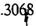

TOMO 308

Volumen 2

1986

.-'

.R E PUB L 1 e A ARGENTINA

## FALLOS

DE LA

CORTE SUPREMA DE

## JUSTICIA DE LA NACION

PUBLICACION A CARGO DEL DEPARTAMENTO DE JURISPRUDENCIA Y PUBLICACIONES DEL TRIBUNAL

.

## SEPTIEMBRE -DICIEMBRE

TOMO 308 -VOLUMEN 2

ARTES GRAFICAS PAPIROS SAC,!. Lavarden 183/5 -Buenos Aires

1986

## AÑO 1986

## SEPTIEMBRE -DICIEMBRE

## COMISION DE PREADJUDICACIONES.

-w 33-

En Buenos Aires, a los 2 días del mes de septiembre del año mil novecientos ochenta y seis, reunidos en la Sala de Acuerdos del Tribunal, el señor Ministro Decano, en ejercicio de la Presidencia de la Corte Suprema de Justicia de la Nación, doctor don Augusto César Belluscio y los señores Ministros doctores don Carlos S. Fayt, don Enrique Santiago Petracchi y don Jorge Antonio Bacqué,

Consideraron:

Que por acordada 28/82 se aprobó el Reglamento para la Comisión de Preadjudicaciones del Poder Judicial de la Nación.

Que en su articulo 4~,inc. b), el mencionado reglamento dispone que" .. .los vocales transitorios para cada situación serán designados: 1) los suplentes, por el señor Secretario de Superintendencia".

Que por acordada 8/84 la Secretaría de Superintendencia fue dividida en una Secretaría de Superintendencia Judicial y una de Superintendencia Administrativa; y por acordada 25/84 se organizó el funcionamiento de ambas, procurando una racional adjudicación de funciones.

Que todo lo relacionado con los trámites administrativos, compras, producción, mantenimiento y suministro de bienes quedó bajo la dependencia de la Secretaría de Superintendencia Administrativa.

Que por ello, si bien la Comisión de Preadjudicaciones depende directamente del señor Presidente de la Corte Suprema (confr. art. 5~del reglamento), resulta coherente que la facultad fijada por el arto 4~, inc. b)., sea ejercida por la Secretaría de Superintendencia Administrativa.

Por ello,

Acordaron:

Aclarar el arto 4~, inc. b), del Reglamento para el funcionamiento de la Comisión de Preadjudicaciones del Poder Judicial de la Nación aprobado por la

acordada 28/82-en el sentido de que los suplentes -que allí se mencionan' serán designados por el señor Secretario de Superintendencia Administrativa.

Todo lo cual dispusieron y mandaron, ordenando se comunicase' y registrase en el libro correspondiente, todo' por ante mí, que doy fe. AUGUSTO CÉSAR BELLUSCIO -ENRIQUE SANTIAGO ETRACCHI P JORGE ANTONIO BACQUÉ. Eduardo D. Craviotto (Secretario).

PERITOS. INSCRIPCION.

## -N? 34-

En Buenos Aires, a los 4 días del mes de septiembre delañq,mil novecientos ochenta y seis, reunidos en la Sala de Acuerdos del Tribunal, el señor Ministro Decano; en ejercicio de la Presidencia de la Corte Suprema de Justicia de la Nación, doctor don Augusto César Belluscio y los señores Ministros doctores don Carlos S: Fayt, don Enrique Santiago Petracchi y don José Antonio Bacqué, con la presencia del señor Procurador General de la Nación doctor don Juan Antonio Gauna,

## Consideraron:

Que corresponde establecer las fechas para el cumplimiento de los trá- mites previstos en la Acordada n? 25 de 1985para la inscripción y reinscripción de peritos de las especialidades determinadas en dicha acordada y en la n? 45 del mismo año, para el año 1987.

## Acordaron:

- 1?) Fíjase el plazo del 15 de octubre al 14 de -noviembre de 1986, inclusive, para que los profesionales de las especialidades cuyo registro se lleva en esta Corte procedan a su inscripción o reinscripción.
- 2?) Lit lista provisoria a que se refiere el punto 5? de la acordada 25/85 se exhibirá por cinco -días a partir del 24 de- noviembre de 1986.
- 3?) Los trámites r,eferidos en los puntos anteriores se efectuarán en la oficina de Ceremonial de esta Corte durante el plazo fijado y exclusivamente en el horario de 10 a 12horas.

Dése la publicidad pertinente por intermedio de la oficina de Prensa,

Todo lo cual dispusieron Y mandaroJ;l ordenando que se comunicase y registrase en el libro correspondiente, todo por ante mí, que doy fe. AUGUSTO CÉSAR BELLUSCIO CARLOS . FAYT -\_ S ENRIQUE SANTIAGO ETRACCHI JORGENTONIOACQUÉ. P -A B Eduardo D. Craviotto (Secretario).

CORTE SUPREMA DE JUSTICIA. VISITAS A LAS CAMARAS FEDERALES.

-w 35-

En la Ciudad de Buenos Aires, a los 9 días del mes de septiembre del año mil novecientos ochenta y seis, reunidos en la Sala de Acuerdos. del Tribunal, el señor Decano en ejercicio de la Presidencia de la Corte Suprema de Justicia de la Nación, doctor don Augusto César Belluscio Y los señores Ministros doctores don Carlos S. Fayt, don Enrique Santiago Pefracchi Y don Jorge Antonio Bacqué,

## Consideraron:

Que las razones que motivaron el dictado de la acordada n? 78, del 7 de septiembre de 1973,continúan siendo aplicables actualmente.

Que ello aconseja poner nuevamente en vigencia, con carácter permanente, lo establecido en la mencionada acordada.

## Resolvieron:

- 1?) Reiterar lo dispuesto en los puntos 1 a 4 de la 'acordada 78 del 7 de septiembre de '1973.
- 2?) A los efectos de las visitas a realizarse, se considerará dividido el país en las siguientes cinco zonas:

Zona 1: Cámaras Federales de La Plata y Bahía Blanca, Y Juzgados Federales de La Plata, Mar del Plata, San Martín, San Isidro, Morón, Mercedes, Azul, Lomas de Zamora, Bahía Blanca, Viedma, General Roca, Neuquén Y Santa Rosa.

Zona 2: Cámaras Federales de- Rosario, Paraná y Resistencia, Y Juzgados Federales de Rosario, Santa Fe, San Nicolás, Paraná, Concepción del. Uruguay, Paso de -los Libres, Resistencia, Formosa, Corrientes y Posadas.

Zona 3: Cámaras Federales de Córdoba y Mendoza, y J1.!zgados Federales de Córdoba, Bell Ville, Río Cuarto, La Rioja, Mendoza, San Rafael, San Juan y San Luis.

Zona 4: Cámara Federal de Tucumán, y Juzgados Federales de Tucumán, Salta, Jujuy, Catamarca y Santiago del Estero.

Zona 5: Cámara Federal de Comodoro Rivadavia, y Juzgados Federales de Comodoro Rivadavia, Rawson, Río Gallegos y Ushuaia.

- 3~) Anualmente, en el mes de agosto, se efectuará la distribución de .las zonas entre los jueces integrantes del Tribunal, a fin de que las visitas correspondientes se realicen entre setiembre de cada año y abril del año siguiente.
- 4~) El primer turno de visitas se distribuirá de la siguiente manera:

Zona 1: Dr. Carlos S. Fayt; Zona 2: Dr. Augusto César Belluscio; Zona 3: Dr. José Severo Caballero; Zona 4: Dr. Enrique S. Petracchi; Zona 5: Dr. Jorge A. Bacqué.

Todo lo cual dispusieron y mandaron, ordenando se comunicase y registrase en el libro correspondiente, por ante mí, que doy fe. AUGUSTO CÉSAR BELLUSCIO CARLOS . FAYT --S ENRIQUE SANTIAGO ETRACCHI JORGENTONIOACQUÉ. P \_ A B Eduardo D. Cralliotto (Secretario).

FALLOS Y DIGESTOS DE LA CORTE SUPREMA.

-N~ 36-

En Buenos Aires, a los 11 días del mes de septiembre del año mil novecien.tos ochenta y seis, reunidos en la Sala de Acuerdos del Tribunal, el señor Ministro Decano, en ejercicio de la Presidencia de la Corte Suprema de Justicia de la Nación, doctor don Augusto César Belluscio y. los señores Ministros doctores don Carlos S. Fayt, don Enrique Santiago Pettacchi y don Jorge Antonio Bacqué,

## Consideraron:

Que con arreglo a lo dispuesto en la Acordada de fecha 29 de septiembre de 1947 (Fallos: 210: 6), se creó en la Prosecretaría del Tribunal una cuenta destinada al ingreso de los fondos provenientes de la venta de los tomos de los Fallos y Digestos de la Corte Suprema.

Que la contratación de esas publicaciones -mediante la afectación de las partidas presupuestarias pertinentescomo su oportuna distribución, es reali7..adaen la actualidad por la Subsecretaría de' Administración,

## Resolvieron:

Transferir a la Subsecretaría de Administración' la cuenta creada por' la Acordada del Tribunal de fecha 29 de septiembre de 1947,

Todo 10 cual dispusieron y mandaron, ordenando se comunicase y registrase en el libro correspondiente, todo por ante mí, que doy fe. AUGUSTO CÉSAR BELLUSCIO CARLOS . FAYT --S ENRIQUE SANTIAGO ETRACCHI JORGENTONIOACQUÉ. P -A B Juan Escribano (Secretario).

## CORTE SUPREMA DE JUSTICIA. AVOCACION. PLAZO.

## -N? 38-

En la Ciudad de Buenos Aires, a los 16 días del mes de septiembre del año mil novecientos ochenta y. seis, reunidos en la Sala de Acuerdos del Tribunal el señor Presidente de 'la Corte Suprema de Justicia de la Nación, doctor don José Severo Caballero, el señor Ministro Decano, doctor don Augusto César Belluscio y los señores Ministros doctores don Carlos S. Fayt, don Enrique Santiago Pe-tracchi y don Jorge Antonio Bacqué,

## Consideraron:

- l?) Que el artículo 22 del Reglamento para la Justicia Nacional establece que en los casos de sanciones aplicadas a los funcionarios o empleados, la Corte Suprema podrá avocar las actuaciones y decidirlo que estime pertinente,
- 2?) Que esta vía se ha extendido a actos admini"strativós dictados en ejercicio de facultades de superintend.encia delegadas, y de los que surge manifiesta extralimitación o arbitrariedad.
- 3?) Que la intervención del Tribunal tiene lugar a raíz de la presentación que efectúan los afectados, una vez agotada la vía prevista por el artículo 23 del cuerpo normativo citado.
- 4?) Que no existe plazo para concretar tales peticiones, y hay numerosos antecedentes en que se deben resolver cuestiones después de transcurridos largos períodos de tiempo, en desmedro de la correcta organización y presta-

(i

ción del servicio de la justicia, Ello torna conveniente la reglamentación de la materia, -

## Por tales motivos,

## Acordaron:

Agregar después del artículo 23 del Reglamento para la Justicia Nacional' el artículo 23 bis, que quedará redactado de la siguiente forma: "Los interesados en solicitar la intervención de la Corte Suprema por vía de "avocación, deberán presentar el pedido dentro del ,plazo de cinco días, contados desde que quede firme la resolución adoptada por la respectiva cámara de apelaciones".

Todo lo cual dispusieron y mandaron, ordenando que se comunicase y registrase en el libro correspondiente, por ante mí, que doy fe. JosÉ SEVEROABALLERO C \_ AUGUSTO CÉSAR BELLUSCIO ~ CARLOS S. FAYTENR,IQUE SANTIAGOETRACCHI \_ P JORGE ANTONIO BACQUÉ. Eduardo D. Craviotto (Secretario).

OBRA SOCIAL DEL PODER JUDICIAL. FACULTAD DE DESIGNACION DE FUNCIONARIOS.

-N?

40-

, En la Ciudad de Buenos Aires, a los 18 días del mes de septiembre del aI10 mil novecientos ochenta y seis, reunidos en la Sala de Acuerdos del Tribunal, el señor Presidente de la Corte Suprema de Justicia de la Nación, doctor don José Severo Caballero y los señores Jueces doctores don Augusto César Belluscio, don Carlos S. Fayt, don Enrique Santiago Petracchi y don Jorge Antonio Bacqué,

## Consideraron:

- 1?) Que por acordada n? 43 del 1? de noviembre de 1981' se sustituyó el texto del Estaruto para la Obra Social del Poder Judicial de la Nación establecido por ac'ordada n? 44/74.
- 2?) Que en el nuevo texto aprobado, en el arto 17, inc. 1), se incluyó entre las atribuciones d~l Director General, la de designar a los directores de los servicios médico y odontológico, a los jefe's o responsables de las distintas secciones en que se distribuyan las tareas y al resto del. persqnal administrativo y técnico.

3~) Que este Tribunal estima conveniente dejar sin efecto tal facultad, reasumiendo el ejercicio de la potestad de designación citada.

Por ello,

Acordaron:

Suprimir el inc. 1) del artículo 17 de la acordada n~ 43 en .cuanto atribuye al señor Director General de la Obra. Social del Poder Judicial la facultad de designar a los funcionarios y personal que cumplen tareas en ella ..

Todo lo cual dispu'sieron Y mandaron, ordenando se comunicase y registrase ,en el libro correspo.ndiente, por ante mí, que doy fe. JosÉ SEVEROABALLERO C -AUGUSTO CÉSAR BELLUSCIO -CARLOS S. FAYTENRIQUESANTIAGOETRACCHI P JORGE ANTONIO BACQUÉ. Eduardo D. Craviotto (Secrettl.rio).

CAMARA NACIONAL DE APELACIONES DEL TRABAJO.

-N? 41-

En la Ciudad de Buenos Aires, a los 18 días del mes de septiembre del año mil novecientos ochenta y seis, reunidos en la Sala de Acuerdos del Tribunal, el señor Presidente de la Corte Suprema de Justicia de la Nación, doctor don José Severo Caballero Y los señores Jueces doctores don Augusto César Belluscio, don Carlos ,S. Fayt, don Enrique Santiago Petracchi y don Jorge Antonio Bacqué,

## Consideraron:

- 1~) Que la Cámara Nacional de Apelaciones del Trabajo vuelve a poner en conocimiento de esta Corte Suprema la gravedad de la situación que se suscita con relación a la exorbitancia de las causas que se hallan en trámite, a lo que se agrega el excesivo número de expedientes pendientes de sorteo.
- 2~) Que este Tribunal comunicó al Poder Ejecutivo Naclonal las circunstancias antedichas por medio de las acordadas 37/84 Y 17/86; no obstante ello no se han adoptado medidas al respecto.
- 3~) Que la agravación del estado de cosas descripto, justifica la insistencia en la' aprobación de las propuestas formuladas.

~ ..

Por ello,

Acordaron:

Reiterar lo expresado en las acordadas 37/84 y 17/86 acompañando copia de la comunicación de la Presidencia de la Cámara Nacional de Apelaciones del Trabajo de fecha 18 de t1gosto.

Todo lo cual dispusieron y mandaron, ordenando se comunicase y registrase en el libro correspondiente, por ante mí, que doy fe. JosÉ SEVEROABALLERO C \_ AUGUSTO CÉSARBELLUSCIO CARLOS S. FAYTENRIQUESANTIAGO PETRACCI-1I \_ JORGE ANTONIO BACQUÉ. Eduardo D. Craviotto (SEcretario).

CORTE SUPREMA DE JUSTICIA. REMUNERACIONES.

-N~ 43-

En Buenos Afres, a los 30 días del mes de septiembre del año mil novecientos ochenta y seis, reunidos en la Sala de Acuerdos del Tribunal el señor Presidente de la Corte Suprema de Justicia de la Nación, doctor don José Severo Caballero, el señor Ministro Decano, doctor don Augusto César Belluscio, y los señores Ministros doctores don Carlos .S. Fayt, don Enrique Santiago Petracchi y don Jorge Antonio Bacqué, por mayoría,

## Consideraron:

Que de acuerdo con lo prescripto por los arts. 3 y 6 de la ley 23.199, esta Corte se encuentra facultada para fijar la remuneración total de sus miembros, y para ello aplica el criterio que informa la Acordada n~ 38/85, sin perjuicio de los argumentos que cada uno de los suscriptos desarrolló en la acordada n~ 28/86.

Que en esta oportunidad los fundamentos expuestos en la acordada n~ 28/86 por la mayoría y la minoría, conducen a igual resultado en la determinación de la cantidad que corresponde establecer en concepto de compensación, a fin de mantener incólume el principio constitucional relativo a la intangibilidad de las remuneraciones de los jueces de la Nación.

EIJo. es ",sí, aún an'te razones de índole económica o rentística que pudieran plantearse como hipotéticos óbis:es, pues la decisión relativa a la' exis-

tencia de una situación de emergencia cconómica -al margen de los alcances que cabría atribuirlees de exclusivo resorte del Poder Legislativo, y, en ausencia de tal declaración, sólo compete a este Tribunal aplicar la Constitución Nacional y la ley.

Que, en consecuencia, la remuneración total mensual de los miembros de la Corte Suprema de Justicia de la Nación -a partir del 1~ de octubre de 1986-, debe ser fijada en la cantidad de australes mil quinientos cuarenta. y siete (A 1.547).

El señor Presidente doctor José Severo Caballero dijo: que considera que debe aplazarse la consideración de las actualizaciones en las compensaciones judiciales atento el hecho de la inminencia de la aprobación del presupuesto de 1986 por el Congreso Nacional. Fundo mi voto en las siguientes circunstancias:

- 1~) Que al aplicar la Corte. Suprema la ley 23.199,en la fijación delegada de las compensaciones de los magistrados, el Cuerpo actúa como órgano técnico administrativo, constreñido a proceder, conforme al sistema jurídico que resulta. de la ley de presupuesto, su normativa permanente, así como la Ley de Contabilidad y los artículos 3~ y 4~ de dicha ley.
- 2~) Que el Congreso Nacional tiene a consideración el proyecto de presupuesto para el año 1986 el cual prevé una depreciación monetaria del orden del 28,5% anual, estimación que esta Corte Suprema hizo suya al elaborar el Anteproyecto de Presupuesto del Poder Judicial para 1986.
- 3~) Que, en consecuencia, resulta razonable al apartarse de esa pauta básica de .la futura ley de presupuesto, contar con un respaldo económico dentro de las posibilidades de inctementación que tanto la ley actual como la futura del cálculo de recursos otorga al Poder Ejecutivo de la Nación para corregir los errores que puedan ocurrir en la apreciación del índice de devaluación monetaria aunque todo dentro de la posibilidad real de disponer de los fondos adecuados para hacer efectiva esa corrección.
- 4~) Que en virtud de ello se considera prudente evaluar con el Poder Ejecutivo Nacional la. posible disposición de fondos para llevar a cabo cual. quier aumento de las compensaciones.
- 5~) Que la aplicación de este criterio en el caso concreto mediante gestiónexpresa y pública determinó mi decisión para aumentar las compensaciones en el período de julio a setiembre del corriente año (Acordada n~ 28 de 1986).
- 6~) .Que este ajuste concertado con el Poder Ejecutivo en cuanto órgano superior de la administración del país resulta necesario para asegurar la efec-

tividad inmediata de las compensaciones con criterio práctico, frente al hecho de que la delegación del Congreso para fijar los sueldos no ha sido total sino circunstanciada e individualizada como corresponde para que ;resulte un acto administrativo inobjetable, según surge de la doctrin"a constitucional más congruente y se desprende del artículo 3? de la ley 23.199,2~ disposición, párrafo 1?

- 7?) Que por otro lado, debe tenerse en cuenta que el arto 96 de la Constitución Nacional no es una cláusula de indexación sino, originalmente, una garantía de independencia de los magistrados contra posibles ataques del Congreso o del Poder Ejecutivo, mediante el mecanismo de la reducción caprichosa de los sueldos o compensaciones. Este principio se mantiene como fundamental, no obstante las adecuaciones por desvalorización monetaria que, como principio general, se ha adoptado por los jueces para salvar los efectos destructivos de la inflación.
- 8?) Debe tenerse en cuenta, además, que la fijación de sueldos que se realice por la Corte en estas circunstancias, por carecer de base económica necesitará de un concierto ulterior con el Poder Ejecutivo y el Congreso para lograr su incorporación al nuevo presupuesto, próximo a dictarse, dado que no se puede prescindir de la consideración de las circunstancias totales de la situación económica y financiera del país para determinar los valores posibles de la recomposición por el resto del año. En efecto no es posible aplicar los índices de devaluación como en las situaciones privadas de prestación y contraprestación, sino con sentido social y de adecuación a las circunstancias generales del país que el momento exige.

El señor Ministro doctor don Carlos Santiago Fayt dij-o:

- 1?) Que la actual situación de emergencia económica por la que atraviesa la República, y el hecho de que cualquier decisión de esta Corte en materia de nivel de ingresos de los magistrados sin base de sustentación presupuestaria, carecería de sentido y fuerza operativa, obliga a no usar nuevamente la facultad" delegada por el Congreso a este Tribunal y que fuera articulada en la ley n? 23.199, con excepción explícita de la recomposición de las remuneraciones de los magistrados que obtuvieron sentencia favorable de este Tribunal, en oportunidad de su integración por conjueces y que tiene autoridad de cosa juzgada.
- 2?) Que por otra parte, la facultad delegada por el Congreso a esta Corte, no constituye un deber jurídico o potestad jurisdiccional .que constriña a sus Integrantes a apartarse del criterio que pudieran tener sobre la oportunidad o conveniencia de su ejercicio, ni a violentar sus convicciones acerca de la gravedad de las penurias económicas que afligen a la República.
- 3?) Que esta Corte, a partir de su actual integración, a través de sucesivas acordadas denunció el deterioro de las remuneraciones de los jueces y

señaló que la irreductibilidad de las compensaciones constituia una del funcionamiento independiente del Poder Judicial, exhortando a no aquel principio. garantía vulnerar

Asimismo, en ocasión de remitir el Presupuesto del Poder Judicial correspondiente a los períodos 1984, 1985Y 1986, mencionó el criterio según el cual las remuneraciones de sus integrantes no debían ser inferiores a las que perciban por todo concepto los señores Legisladores Nacionales, llegando al extre, mo de solicitar a los Poderes Ejecutivo y Legislativo, por Acordada N? 55/83, que no se fijen a funcionarios administrativos,. remuneraciones superiores a las establecidas para quienes desempeñan los cargos previstos en la Constitución Naci&lt;?nalen cualquiera de los poderes.

Lo hizo, en la plenitud del ejercicio de las atribuciones que le confieren los artículos 94 y 99 de la Constitución Nacional.

4?) Que resulta necesario preservar la organización del Poder en su unidad y asegurar la independencia objetiva de los jueces, poniendo sus compensaciones a resguardo de los conflictos que origina distribuir lo poco que hay.

En realidad, se trata de preservar la articulación esencial del proceso jurídico que se centra en la legislación y ,ejecución como creación y aplicación de derecho, y que desemboca en el imperio de la norma jurídica fundamental, sobre la cual se basa el orden jurídico en su relación dinámica.

- S?) Que es urgente la necesidad de sustraer a los jueces del conflicto por la compensación de sus servicios. El único modo que consideramos idóneo consiste en' establecer 'un mecanismo de desenvolvimiento presupuestario que brinde limitada autarquía financiera al Poder Judicial de la Nación. En numerosas oportunidades se intentó cumplimentar este objetivo. Así, por decreto 1195/63 se creó una Comisión para el estudio del proyecto elaborado por la Asociación de Magistrados y Funcionarios de la Justicia Nacional y que esta Corte Suprema elevara a consideración del Poder Ejecutivo Nacional. Asimismo, la VI~ Conferencia Nacional de Abogados de la República Argentina (La Plata, 18 al 22 de noviembre de 1959),declaró: "la necesidad de asentar en disposiciones orgánicas, preceptos que aseguren inexcusablemente la independencia de origen, la independencia funcional y la independencia económica del Poder Judicial".

Para convertirlo en realidad bastaría que el Congreso de la Nación sustituyera tan sólo el último párrafo del artículo 17 de la ley 16.432,incorporado a la ley 11.672-complementaria permanente de presupuesto-por un texto que disponga la inclusión de la totalidad de las erogaciones previstas en el anteproyecto de presupuesto del Poder Judicial, 'preparado por la Corte Suprema, en la medida en que no supere el 1,5 % del total de los gastos del presupuesto.

Esto daría verdadera solución a la cuestión de la intangibilidad de las compensaciones que por sus servicios deben recibir los jueces y facultaría el desenvolvimiento de la Justicia, asegurando en plenitud el principio según el cual la independencia del Poder Judicial es un requisito indispensable para que exista una sociedad libre bajo el libre imperio de la ley.

Por ello, por mayoría resolvieron:

Fijar la remuneración total mensual de los miembros de la Corte Suprema de Justicia de la Nación -a partir del 1? de octubre de 1986-, en la cantidad de australes mil quinientos cuarenta y siete (A 1.547.-).

Todo lo cual. dispusieron y mandaron, ordenando se registrase en el libro correspondiente y comunicase al Poder Ejecutivo Nacional, por ante mí, que doy fe. Jos~ SEVERO CABALLEROAUGUSTO~S¡\RBELLUSCIO -C -CARLOS. FAYT\_ ENRIQUE SANTIAGO ETRACCHI P -JORGE ANTONIO BACOU~ Leopoldo Schiffrin (Secretario).

## CAMARAS NACIONALES DE APELACIONES. SISTEMA DE CONCURSO PARA LA DESIGNACION DE FUNCIONARIOS

-N? 44-

En la Ciudad de Buenos Aires, a los 30 días del mes de septiembre del año mil novecientos ochenta y seis, reunidos en la Sala de Acuerdos del Tribunal el señor Presidente de la Corte Suprema de Justicia de la Nación, doctor don José Severo Caballero y los señores Jueces doctores don Augusto César BeIJuscio, don Carlos S. Fayt, don Enrique Santiago Petracchi y don Jorge Antonio Bacqué,

## Consideraron:

1?) Que el Tribunal ha tomado conocimiento de la acordada 3945, del 30 de junio de. este año, de la Cámara Nacional de Apelaciones Especial en lo Civil y Comercial; de la resolución de superintendencia N? 52-F? 66 del 29 de noviembre de 1984de la Cámara Nacional de Apelaciones en 10 Penal Económico y del Reglamento dictado por la Cámara Nacional de Apelaciones en lo Comercial ellO de octubre de 1984, mediante los cuales se establecen o modifican, para esos fueros, las normas que rigen las designaciones por concurso.

2?) Que con relación al nombramiento de secretarios de cámara, se observa un incumplimiento de 10 establecido en la acordada 34/84, pues se ha previsto

la designación por promOClon de los secretarios de primera instancia, prescin.diendo del concurso.

- 3?) Que este Tribunal no comparte los fundamentos que se pueden expresar para adoptar tal medida.

Por ello,

## , Acordaron:

Reasumir a este solo efecto las atribuciones delegadas en las cámaras citadas y, en consecuencia: a) Dejar sin efecto la acordada N? 3945 del 30 de junio , .de este año dictada por la Cámara Nacional de Apelaciones Especial en lo Civil y Comercial y el segundo párrafo del arto 15 del Reglamento para' Concur'sos dictado por la Cámara Nacional de Apelaciones en lo Penal Económico; b) Agregar al artículo 1? del Reglamento dictado por la Cámara Nacional de Apeladones en lo Comercial el cargo de "s'ecretario de cámara".

Lo resuelto regirá a partir de la fecha de comunicación a los respectivos tribunales.

Todo lo cual dispusieron y mandaron, ordenando se comunicase y registrase en el libro correspondiente, por ante mí, que doy fe. JosÉ SEVEROABALLEROC AUGUSTOÉSAR BELLUSCIO CARLOS . FAYT C -S ENRIQUE SANTIAGO ETRACCHI JORGE P -ANTONIO BACQUÉ. Juan Escribano (Secretario).

## CORTE SUPREMA DE JUSTICIA. REMUNERACIONES.

-N? 45-

E¡;l la Ciudad de Buenos Aires, a los 14 días del mes de octubre del año mil novecientos ochenta y seis, reunidos en la Sala de Acuerdos del Tribunal el señor Presidente de la Corte Suprema de Justicia de la Nación, doctor don José Severo Caballero, el señor Ministro Decano, doctor don Augusto César Belluscio y los señores Ministros doctores don Carlos S. Fayt, don Enrique Santiago Petracchi y don Jorge Antonio Bacqué,

## Consideraron:

Que teniendo en cuenta lo dispuesto por la Acordada N? 43/86, mediante la cual esta Corte Suprema fijó la remuneración total de sus miembros a partir del 1? de octubre de 1986, resulta necesario 'modificar el nivel del crédito ,oportunamente establecido para el inciso l1-'Personal, por la Acordada N?,30/86,

1518

-que reemplaza, a su vez, el fijado en la Acordada 2/86dictada en ejercicio&lt; de la facultad que consagra el arto 99 de la Constitución Nacional.

Por ello,

Resolvieron:

- l?) Modificar el monto establecido en la Acordada N? 30/86 para el Inciso, ll-Personal, fijándose en el il1!porte de australes ciento :trece millones. (A 113.000.000.-).
- 2?) Comuníquese la presente acordada al Poder Ejecutiv&lt;;&gt; Nacional por' intermedio del señor Ministro de Educación y Justicia, para su remisión a la. Honorable Cámara de Diputados. Asimismo; hágase saber al señor Ministro de. Economía.
- 3?) Hágase saber a la Subsecretaría de Administración.

Todo lo cual dispusieron y mandaron, ordenando se comunicase y registrase en el libro correspondiente, por ante Illi, que doy fe. Jos)j SEVEROABALLERO C -AUGUSTO C)jSAR BELLUSCIO -CARLOS S. FAYTENRIQUESANTIAGO PETRACCHI JORGE ANTONIO BACOu)j. Juan Escribano (Secretario).

## PERITOS. INSCRIPCION.

-N? 46-

En la Ciudad de Buenos Aires, a los 13 días del mes de noviembre del año, mil novecientos ochenta y seis, reunidos en la Sala de Acuerdos del Tribunal el señor Presidente de la Corte Suprema de Justicia de la Nación, doctor don José Severo Caballero y los señores Jueces doctores don Augusto César Belluscio, don Carlos S. Fayt, don Enrique Santiago Petracchi y don Jorge Antonio Bacqué,

## . Consideraron:

Que resulta conveniente ampliar el número de profesionales que pueden inscribirse o reinscribirse en los. registros de. peritos que lleva esta Corte.

## Acordaron:

- l?) Prorrogar el plazo fijado. en la Acordada N? 34 hasta el día 5 de di.. ciembre del corriente año;

2~) Exhibir la lista provisoria .por cinco días a partir del 15 de diciembre del mismo año.

Dése la publicidad pertinente por intermedio de la Oficina de Prensa.

Todo lo cual dispusieron 'y mandaron, ordenando que se comunicase y registrase en el libro correspondiente, por ante mí que doy fe. JosÉ SEVERO' CABALLEROAUGUSTO CÉSARBELLUSCIO --CARLOS. FAYTENRIQUESANTIAGO PETRACCHI -JORGE ANTONIO BACQUÉ. Juan Escribano (Secretario).

## CAMARANACIONAL DE APELACIONES EN LO CRIMINAL Y CORRECCIONAL. INCONSTITUCIONALIDAD DE LA LEY 23.362.

En Buenos Aires, a los 13 días del mes de noviembre del año mil novecientos ochenta y seis, reunidos en la Sala de Acuerdos del Tribunal el señor Presidente de la Corte Suprema de Justicia de la Nación doctor don José Severo Caballero, el señor Ministro Decano, doctor don Augusto César Belluscio, y los señores Ministros doctores don Carlos S. Fayt, don Enrique Santiago, Petracchi y don Jorge Antonio Bacqué, por ma;yoría,

## Consideraron:

Que esta Corte, como órgano supremo cabeza del Poder Judicial de la Nación, tiene a su cargo el aseguramiento de la indispensable unidad y orden' jerárquico en lo que hace al personal que integra dicho Poder. Así, vela por la adecuada organización y rangos escalafonarios y por la dotación a éstos de la retribución pertinente. Se trata de aspectos comprendidos en los' presupuestos que propone ailUalmente, dentro del ámbito del reglamento interior y econó. mico a que se refiere el arto 99 de la Constitución Nacional.

Que así resulta de repasar la doctrina de Fallos: 12: 134; Acordada del 17 de mayo de 1943 -Libro de Acuerdos N~ 3, pág. 216-; Fallos: 211: 1543; 240: 6; 243: 9; 248: 745; 256: 114; 303: 48; Acordada 47 del 30 de julio de 1945, entre otras expresiones del Tribunal. Cabe mencionar también que por decreto-ley 1285/58, arto 13, se reiteró que en los reglamentos de la Corte Suprema se establecerá lo referente a la decisión de cualquier cuestión -además del nombramiento y remociónvinculada con los funcionarios y empleados de la justicia nacional.

Que, según expresó Joaquín' V. González' (Manual de la Constitució¡1 Argentina, 1897, página 632) "en cuanto la Corte Suprema es la representación más alta del Poder Judicial de la Nación, tiene facultades o privilegios

1520

inherentes a todo poder público, para su existencia y conservación ... ". y es igualmente pertinente transcribir el comentario -al art. 99 de la Constitución Nacionalde M. A. Montes de Oca, en "Lecciones de Derecho Constitucional", 1917, t. n, pág. 416: "este artículo comprueba que la separación de los poderes DOes completa y que cada uno tiene atribuciones propias de los otros dos, aun tratándose del poder judicial. La Corte Suprema puede dictar reglamentos de observancia constante. en todos los tribunales, reglamentos que, estrictamente, serán de la competenCia del Congreso, habilitado para dictar las leyes, para poner en ejercicio las atribuciones conferidas por la costitución a todos los departamentos del Estado. Pero, como es la Corte Suprema la que está en mejor situación de conocer los detalles íntimos de la administración judicial, como es ella la que debe saber con más precisión cuáles son las necesidades para el movimiento administrativo de los tribunales, se le acuerda el privilegio de dictar sus reglamentos, obedeciendo a consideraciones análogas a las que se han tenido en cuenta para dejar a cada cámara del Congreso la prerrogativa de dictarse su reglamento especial".

Que la ley 23.362,al modificar la jerarquía funcional y presupuestaria de funcionarios de la Cámara Nacional de Apelaciones en lo Criminal y Correccional de la Capital Federal, sin anuencia previa de esta Corte, ha efectuado una transformación de cargos que trastorna dichos principios superiores.

Que, en tales condiciones y en salvaguardia de atribuciones originarias del Tribunal, en materia sustraida por el Poder Constituyente a la competencia del Poder Legislativo (Fallos: 238:288; 248: 398; 251: 455, entre otros), corresponde hacerse cargo de su invalidez.

El señor Presidente doctor don José Severo Caballero,

Consideró:

l?) Que la ley 23.362aparece como ajustado ejercicio de la potestad que le asigna al Congreso, el art. 67, inc. 17, de la Constitución Nacional, que lo faculta expresa Y formalmente a crear y suprimir empleos y fijar sus atribu.ciones. Ejercicio que se encuentra en el marco clásico del Estado Constitucio. Dal de Derecho que se consolida cuando el Pueblo, a través de sus legítimos representantes, establece los tributos que han de formar el Tesoro, y programa, a través del Presupuesto, el plan de su inversión.

- 2?) Que, si bien es observable la expresión "funcional" utilizada para señalar la equiparación jerárquico-presupuestaria, que, en rigor, se acuerda, dentro de aquella potestad, la frase empleada en los arts. l? Y 2? de la ley en consideración, no puede tener otro sentido y alcance que el antes señalado de mera equiparación de empleo. Por tanto, una interpretación contextual y teleológica, criterio siempre seguido por esta Corte, no permite advertir al presente una falta de armonía con lo dispuesto como atribución propia, por el art. 99 de la Constitución' Nacional; máxime que aún no ocurre la oportunidad de la

.

dotación presupuestaria a que se refiere el arto 3? de la ley en cuestión, momento en que se le debe dar, por virtud del mismo precepto, "la intervención correspondiente a la Corte Suprema de Justicia de la Nación".

- 3?) Que, por otra parte, la atribución' de dictar el propio reglamento inte-. rior y económico que tiene la Corte Suprema de Justicia de la Nación (art. 99 de la Constitución Nacional) permanece incólume tanto para establecer la normatividad general aplicable, como la de, en su consecuencia, emitir el o los actos particulares correspondientes en relación al órgano individuo que supone cada uno de los órganos institución involucrados.
- 4?) Que, desde un punto de ,Tista jurídico-formal, la Corte Suprema de Justicia de la Nación valora el contenido de la ley de q~e se trata, como conocimiento de órgano técnico-administrativo que le cabe como cabeza del Poder Judicial y no lo hace en carácter jurisdiccional, por lo que no corresponde al presente, por ello, formular declaración o emitir pronunciamiento alguno, frente a la remisión recibida, lo que es ahora prematuro.
- 5?) Que, por consiguiente, no apareée afectada al presente la potestad, con todo su alcance jurisdiccional, que tiene acordada y conferida esta Corte Suprema de Justicia de la Nación por la Constitución Nacional y, por tanto, no se da actualmente un supuesto que pudiera justificar la actitud que se asumiera por la Acordada del 7 de marzo de 1968, o hipótesis asimilables. Por el contrario, los precedentes ponen en relieve el fundamento de doctrina jurisprudencial y administrativa que dieron motivo a la distinción del decretoley 1285/58 arts. 13 y 15): "status" del empleo que depende de la ley, o del reglamento en su' defecto; aspectos referidos a las cuestiones vinculadas con los empleados y funcionarios de la justicia nacional, si le corresponden al reglamento de la Corte. El mismo decreto-ley recordado admite la equiparación de sueldo. y jerarquía de peritos que será igual. al de secretarios de primera instancia o de fiscales, según sea pertinente (art. 63).

En conclusión, propongo no emitir pronunciamiento alguno en relación a la ley 23.362, al presente.

Por ello, por mayoría, resolvieron:

Declarar que la ley 23.362 es contraria al art. 99 de la Constitución Nacional.

Todo lo cual dispusieron y mandaron, ordenando se registrase en el libro correspondiente y comunicase al Poder Ejecutivo y al Senado y Cámara de Diputados de la Nación. JosÉ SEVERO CABALLEROAUGUSTOÉSAR BELLUSCIO C -CARLOS S. FAYT-,ENRIQUE SANTIAGO ETRACCHI P -JORGE ANTONIO BACQUÉ. Juan Escribano (Secretario).

## PODER JUDICIAL DE LA NACION. REMUNERACIONES.

En Buenos Aires, a los 13 días del mes de noviembre de mil novecientos ochenta y seis, reunidos en la Sala de Acuerdos del Tribunal, el señor Presidente, de la Corte SUPIZemade Justicia de la Nación, doctor don José Severo Caballero, el señor Ministro Decano, doctor don Augusto César' Belluscio, y los señores Jueces doctores don Carlos S. Fayt, don Enrique Santiago Petracchi y 'don Jorge Antonio Bacqué,

## Consideraron:

- 1~) Que en la Acordada N~ 45 del 14 de octubre último este Tribunal fijó en A 113.000.000 el monto, necesario para solventar las remuneraciones del Poder Judicial de la Nación del año en curso y ello se comunicó al Poder Ejecutivo -por intermedio del señor Ministro de Educación y Justicia'-para su .remisión a la Honorable Cámara de Diputados, y se puso en conocimiento del señor Ministro de Economía.
- 2~) Que, sin eJ!lbargo, el Presupuesto General de Gastos y Cálculo de Re-, cursos de la Administración Nacional para el ejercicio de 1986 presenta una 'insuficiencia crediticia en la Jurisdicción 05 -Poder Judicial 'que impide liquidar los haberes correspondientes al mes de diciembre y el sueldo anual complementario, ya que sólo se acordó un crédito de A 97.103.000. ,
- 3~) Que ante tal situacióri y teniendo en cuenta que en la ley 23.410 se autoriza al Poder Ejecutivo para introducir modificaCiones en el' Presupuesto de la Administración Nacional, cabe requerir con carácter de urgente un reajuste presupuestario que eleve el nivel del crédito en el inciso U-Personal, a fin de solucionar el grave problema, descripto, en virtud de resultar imperativo mantener y asegurar el normal desenvolvimiento de la administración de justicia.

## Por ello, acordaron:

- 1~)Reiterar al Poder Ejecutivo que el Poder Judicial de la Nación carece de recursos en el inciso U-Personal para atender el pago de los haberes del mes de diciembre y de la segunda cuota del sueldo anual complementario del año en curso.
- 2~) Requerir al Poder Ejecutivo que disponga con urgencia el refuerzo presupuestario pertinente en uso de la facultad que le confiere el arto 8 de la Ley 23.410

- 3?) Comunicar la presente acordada a la Honorable Cámara de Diputados de la Nación, sin perjuicio del oportuno conocimiento que de las necesidades del Poder Judicial de la Nación hubo de tomar a través de la acordada N? 45/86, que le fuera remitida por conducto del Poder Ejecutivo.

Todo lo' cual dispusieron y mandaron, ord~n~ndo se comunicase y registrase en el libro correspondiente, por ante mí, que doy fe. JosÉ SEVERO ABALLEROC AUGUSTOÉSAR BELLUSCIO C -CARLOS. FAYTENRIQUE SANTI!\GOETRACCHI P -JORGE ANTONIO BACQUÉ. Juan Escribano (Secretario).

## RECURSOS DE QUEJA. AMPLIACION DE PLAZOS.

-N? 50-

En la Ciudad de Buenos Aires, a los 2 dias del mes de. diciembre del año mil novecientos ochenta y seis, reunidos en la Sala de Acuerdos del Tribunal, el señor Presidente de la Corte Suprema de Justicia de la Nación, doctor don José Severo Caballero y los señores Jueces "doctores don Augusto César Belluscio, don Carlos S. Fayt, don Enrique Santiago Petracchi y don Jorge Antonio Bacqué, .

## Consideraron:

- 1~) Que el segundo párrafo del arto 282.del Código Procesal Civil y Comercial de la Nación fija en 5 días el plazo para interponer la queja, con la ampliación que corresponda por razón de la distancia, de acuerdo con lo dis: puesto por el arto 158.
- 2?) Que esta iíltima norma dispone que los plazos se ampliarán a razón de un día por cada 200 km o fracción que no baje de 100:
- 3?) Que este Tribunal estima conveniente fijar un criterio que permita lograr mayor precisión en la cuestión relativa a las distancias existentes entre .distintos puntos, para otorgar certidumbre a los litigantes.

Por ello,

Acordaron:

Establecer que en la ampliación de fas plazos para interponer las quejas -art.282 . C.P.C.C.la distancia que se tendrá en cuenta -arto 158 mismo textoserá la más larga ,que resulte de la cómparación entre las medidas por vía férrea y por .ruta terrestre.

Todo lo cual dispusieron y mandaron, ordenando se comunicase y registrase en el libro correspondiente por ante mí, que doy fe. JosÉ SEVERO CABALLEROAUGUSTOCÉSARBELLUSCIO CARLOS S. FAYTENRIQUESANTIAGO PETRACCHI \_ JORGEANTONIOBACQUÉ. Juan Escribano (Secretario).

## CORTE SUPREMA DE JUSTICIA. BAJA DE SECRETARIO LETRADO.

-N? 52-

En Buenos Aires, a lo's 4 días del mes de diciembre del año mil novecientos 'ochenta y seis, reunidos en la Sala de Acuerdos del Tribunal, el señor Pre · .sidente de la Corte Suprema de Justicia de la Nación, doctor don :José Severo' Caballero y .los señores Jueces doctores don Augusto César Belluscio, don Enrique Santiago Petracchi y don Jorge Antonio Bacqué,

## Consideraron:

Que mediante acordada 22 del 13 de junio de 1986, esta Corte designó Se. cretario Letrado al doctor Horacio Creo Bay .

. Que las designaciones de personal que ingresa a la Administración de Justicia tienen carácter provisional por el término de 6 meses desde la fecha del' nombramiento (Acordada del 3 de marzo de 1958, Fallos: 240: 107).

Que el mencionado funcionario no ha adquirido ~l derecho a la estabilidad por no haber transcurrido desde el momento de su nombramiento hasta la fecha, el plazo previsto en la reglamentación.

Que, según lo que informa en este acto la Secretaria doctora María Inés Garzón de Conte Grand,. resulta aconsejable. atendiendo a razones de mejor' . servicio, disponer su baja.

Por ello, se resuelve:

Dar de baja al doctor Horacio Creo Bay (L. E. N? 4.521.536 · clase 1945). como Secretario Letrado de la Corte Suprema de Justicia de la Nación.

Todo lo cual dispusieron y mandaron, ordenando se comunicase y registrase en elli1;&gt;ro correspondiente, por ante mí, que doy fe. JOSÉSEVERO CABALLEROAUGUSTO CÉSAR BELLUSCIO ENRIQUESANTIAGO PETRACCHI JORGE ANTONIOBACQUÉ. Leopoldo Schittrin (Secretario).

## CUERPO MEDICO FORENSE. DEDICACION EXCLUSIVA.

## -N~ 53---

En la Ciudad de Buenos Aires, a los 4 días del mes de diciembre del año, mil novecientos ochenta y seis, reunidos en la Sala de Acuerdos del Tribunal el señor Presidente de la Corte Suprema de Justicia de la Nación, doctor don José Severo Caballero y los señores Jueces doctores don Augusto César Belluscio, don Carlos S. Fayt, don Enrique Santiago Petracchi y don Jorge Antonio Bacqué,

## Consideraron:

Que mediante la acordada 38/85 esta Corte, en ejercIcIo de las facultades transitoriamente delegadas por el Congreso de la Nación por ley 23.199,dispuso atribuir una compensación funcional a los funcionarios que poseyesen los títulos a los cuales se refiere el decreto 4107/84,en igual proporción y con las mismas exigencias que en dicha norma se establecen, salvo para aquellos respecto de los cuales no rigieran en su plenitud las incompatibilidades estatuidas por el arto 8 del Reglamento para la Justicia Nacional.

Que por la acordada 65/85 se reglamentó la aplicación a los cuerpos técnicos periciales de la anteriormente citada, subordinando la percepción de la compensación funcional al no desempeño de actividades alcanzadas por el régimen de ,incompatibilidades emergente de las leyes y.reglamentos en vigencia.

Que el decreto 2474/85 fijó una asignación especial no remunerativa en concepto de dedicación exclusiva, para los funcionarios no comprendidos en el régimen de horario mínimo que establezca esta Corte.

Que la acordada 16/86 atribuyó esa asignación a los integrantes de los cuerpos técnicos periciales en tanto no tuviesen otra ocupación remunerativa, con excepción de la docencia, y cu~pliesen determinado horario mínimo.

Que la aplicación del régimen reseñado en el Cuerpo Médico Forense ocasiona dificultades funcionales insalvables, trasuntadas en la n.ecesidad de discriminar horarios y atribuir en desiiual medida a sus integrantes, cuando lo esencial de su labor no está constituido por su sujeción a límites temporales sino a la debida ejecución de su actividad y producción de Sus dictámenes.

Que, por otra parte, las características especiales de la función de médico forense, para la cual es beneficiosa la práctica de las disciplina~ científicas propias de la profesión, han motivado disposiciones específicas en el arto 311

1526

del reglamento dictado por la Cámara Nacional de Apelaciones en lo Criminal y Correccional, las cuales toleran cierta medida de activÍdad privada.

## Acordaron:

- Establecer que, a partir del primer día del mes siguiente al de la fecha, el .desempeño por los, integrantes del Cuerpo Médico Forense de actividades autorizadas conforme al arto 311, incisos c) y d), del Reglamento de la Cámara Nacional de Apelaciones en lo Criminal y Correccional, al no afectar el régimen de incompatibilidades vigente, no obstará a la percepción de los adicionales establecidos por acordadas 38/85 y 16/86.

Todo lo cual dispusieron y mandaron, ordenando que se comunicase y registrase en el libro correspondiente, por ante mí, que doy fe. JosÉ SEVEROABALLERO C -AUGUSTO CÉSAR BELLUSCIO -CARLOS. FAYTENRIQUESANTIAGO ETRACCHI P -.JORGENTONIO BACQUÉ. A Juan Escribano (Secretario).

RECURSOS DE QUEJA. DEPOSITO.

-N~

54-;-

En Bue'nos Aires, a los 4 días del mes de diciembre del año mil novecientos ochenta y seis, reunidos en la Sala de Acuerdos del Tribunal el señor Presidente de la Corte Suprema de Justicia de la Nación, doctor don José Severo Caballero, el señor Ministro Decano, doctor don Augusto Césár Belluscio, y los señores Ministros doctores don Carlos Santiago Fayt, don Enrique Santiago Petracchi y don Jorge Antonio Bacqué, por mayoría,

## Consideraron:

Que en los recursos de queja por denegación del extraordinario en que, de acuerdo con las disposiciones legales vigentes, no se requiere el depósito previo de la suma a que se refiere el arto 286 del Código Procesal Civil y Comercial de la' Nación, pero cuya integración procede si la queja es rechazada, suele ocurrir que el tiempo de tramitación perjudica el valor real de la suma debida, por lo que corresponde adoptar las medidas necesarias para evitar ese defecto.

## Por ello, se resuelve:

En los casos en que la integración del depósito previsto en el arto 286 del Código Pro¿esal quede postergada hasta el rechazo de la queja (confr. Acordada N~ 49/83, publicada en Fallos: 305:1200), la suma a depositar en esa oportuni-

-dad será la vigente al momento del mencionado :r:echazo; y para el supuesto de que no se satisfaga la obligación dentro del plazo establecido en la resolución pertinente, el monto a abonar será el actualizado que corresponde al momento del efectivo pago, con más un interés del seis por ciento (6 %) anual desde el vencimiento de la referida intimación.

Todo lo cual dispusieron y mandaron, ordenando que se comunkase y registrase en el libro correspondiente, por ante mí, que doy fe. JosÉ SEVEROABALLERO C -AUGUSTO CÉSAR BELLUSCIO -CARLOS S. FAYTENRIQUESANTIAGOETRACCHI .:..P JORGE ANTONIO BACQUÉ. Jorge Barral (Secretario).

CORTE SUPREMA DE JUSTICIA. DESIGNACION DE SECRETARIO LETRADO.

-N? 55-

En la Ciudad de Buenos Aires, a los 4 días del mes de diciembre del año mil novecientos ochenta y seis, reunidos en la Sala de Acuerdos del Tribunal, el señor Presidente de la Corte Suprema de Justicia de la Nación, doctor don José Severo Caballero y los señores Jueces doctores don' Augusto César Belluscio, don Enrique Santiago Petracchi y don Jorge Antonio Bacqué,

## Consideraron:

Que por Acordada N? 52/86 dictada en la fecha se ha dispuesto la baja del Dr. Horacio Creo Bay.

Que dado el carácter provisional de las designaciones de personal que ingresan en la Administración de Justicia Nacional (Acordada del 3 de marzo de 1958, Fallos: 240:107), la vacante para la cual se llamó a concurso por la Resolución N? 78/86 no puede estimarse definitivamente cubierta.

Que, en consecuencia, corresponde atender el orden de mérito establecido .con ocasión del concurso pertinente, en el dictamen obrante en el expediente 131/86,

Por ello, se resuelve:

Efectuar la siguiente designación en la Corte Suprema de Justicia de la Nación: Secretario Letrado al Dr. Luis M. GarCÍa (L. E. n? 13.410.464, clase 1957).

Todo lo cual dispusieron y mandaron, ordenando se comunicase y regis-' trasf: en el libro correspondiente, por ante mí, que doy fe. JosÉ SEVEROABALLERO ,C --. AUGUSTO CÉSARBELLUSCIO ENRIQUESANTIAGO PETRACCHI JORGEANTONIO:, BACQUÉ. Juan Escribano (Secretario).

## EXHUMACION D;E CADA VERES.

## COMISION TECNICA DE ASESORAMIENTO.

-N~ 56-

En la Ciudad de Buenos Aires, a los 11 días del mes de diciembre del año mil novecientos ochenta y seis, reunidos en la Sala de Acuerdos del Tribunal el señor Presidente de la Corte Suprema de Justicia de la Nación, doctor don José Severo Caballero y los señores Jueces doctores don Augusto César Bel1uscio, don Carlos S. Fayt, don Enrique Santiago Petracchi y don Jorge Antonio Bacqué,

## Consideraron:

\ Que el Anexo II del decreto 1526/86, al 4etallar las funciones específicas de la Subsecretaría de Derechos Humanos, establece que entenderá en la constitución de ,comisiones técnicas para el desarrollo de actividades tendientes a la identificación de cadáveres.

Que el arto 2, párrafo 2~, del decreto citado dispone que la comisión técnica de asesoramiento para la exhumación e identificación de cadáveres sólo podrá actuar a requerimiento' judicial previa designación por el juez de la causa Y' aceptación del cargo con juramento de ley.

Que la Subsecretaría de Derechos Humanos solicita que este Tribunal adopte las medidas conducentes para lograr que en las causas en que existen exhumaciones de cadáveres con problemas de identidad se dé intervención a la comisión técnica creada.

Por eIJo,

## Acordaron:

Disponer que los señores jueces ante quienes tramitan causas en las que se ordene la exhumación de cadáveres que requieren Su identificación den intervención a la Comisión Técnica de Asesoramiento (decreto 3090/94, modifi-. cado por decreto 1526/86).

Todo lo cual dispusieron y mandaron, ordenando se comunicase y registrase en el libro correspondiente, por ante mí, que doy fe. JosÉ SEVERO' ABALLERO C -AUGUSTO CÉSAR BELLUSCIO -CARLOS. FAYTENRIQUE SANTIAGOETRACCHI P -JORGE ANTONIO BACQUÉ. Juan Escribano (Secretario).

## CENTRO DE DETENCION JUDICIAL.

-N~57-

En Buenos Aires, a los once dias del mes de diciembre del año mil novecientos ochenta y seis, reunidos en la Sala de Acuerdos del Tribunal el señor .Presidente de' la Corte Suprema de Justicia de la Nación, doctor don José -Severo Caballero, el señor Ministro Decano doctor don Augusto César Bellus.cio y los señores Ministros doctores don Carlos S. Fayt, don Enrique Santiago Petracchi y don Jorge Antonio Bacqué,

## Consideraron:

Que por nota del 21 de octubre pasado, el señor director del Servicio Penitenciario Federal puso en conocimiento de esta Corte los trastornos que pro. vaca la necesidad de trasladar diariamente a los detenidos incomunicados menores de.21 años y mayores de 18, alojados en el Centro de Detención Judi.cial, a efectos de que pernocten en otros establecimientos penitenciarios en virtud de lo dispuesto en el arto 1~ de la acordada N~ 32/85..

Que dichos menores deben sufrir de ese modo los inconvenientes propios de los mencionados traslados, sin q1}e ello redunde en un beneficio sobre las condiciones de alojamiento y seguridad, ya que son destinados a estableci. mientas cuyas características no difieren de las que reúne el aludido Centro.

Por ello, en ejercicio de las funciones directivas que sobre el Centro de Detención Judicial tiene reservadas esta Corte -(confr. convenio del 26 de marzo de 1981)y las facultades generales de superintendencia que le competen,

## Resolvieron:

Agregar como último párrafo del arto 1~ de la Acordada n~ 32/85, lo siguiente: "Sólo se admitirá la permanencia nocturna de los detenidos incomunicados menores de 21 años y máyores de 18, cuando así lo dispusiere por escrito el juez de la causa y mientras dure la incomunicación".

Hágase saber al señor director del Servicio Penitenciario Federal y al del .Centro de Detención Judicial, y a los señores Presidentes de las Cámaras Na-

1530

cionales de Apelaciones en lo Criminal y Correccional Federal, en lo Criminal y Correccional y en lo Penal Económico, a efectos de que se ponga en conocimiento de los jueces del fuero respectivo. Jos~ SEVERO CABALLERO AUGUSTO -CÉSAR BELLUSClO CARLOS. FAYTENRIQUESANTIAGOETRACCHI P JORGE ANTONIO BACQU~. Jorge Banal (Secretario).'

FERIA JUDICIAL DE ENERO. DESIGNACION DE AUTORIDADES.

/.

-N~ 58-

En Buenos Aires, a los 16 días del mes de diciembre del año mil novecientos ochenta y seis, reunidos en la Sala de Acuerdos del Tribunal el Señor Presidente de la Corte Suprema de Justicia de la Nación doctor don José Severo Caballero y los señores Ministros doctores don Augusto César Belluscio, don Carlos Santiago Fayt, don Enrique Santiago Petracchi y don Jorge Antonio Bacqué, con la presencia del señor Procurador General de la Nación doctor don Juan Octavio Gauna, con el objeto de nombrar Juez de Feria de la Corte Suprema para el mes de enero de 1987, y a los funcionarios de los Ministerios.Públicos,

Resolvieron:

1~) Al Dr. Enrique Santiago Petracchi como Juez de Feria de la Corte Su\_o prema.

- 2~) Al Dr. José Osvaldo Casas como Procurador Fiscal;,

3~) y como Defensor de Feria ante la Corte Suprema y demás Tribunales, Federales de la Capital, al titular Dr. Carlos Alberto Tavares.

Todo lo cual dispusieron y mandaron, ordenando se comunicase y registrase en el libro correspondiente, por ante mí, que doy fe. Jos~ SEvERO CABALLERO \_ AUGUSTO C11sAR BELLUSCIO CARLOS S. FAYTENRIQUESANTIAGO PETRACCHI JORGE ANTONIOBACQU~ ....: JUAN O. GAUNA. Juan Escribano (Secretario).

## CORTE SUPREMA DE JUSTICIA. PERITOS.

-N? 59-

En la Ciudad de Buenos Aires, a los 23 días del mes de dicÍembre del añ() mil novecientos ochenta y seis, reunidos en la Sala de Acuerdos del Tribunal al señor Presidente de la Corte Suprema de Justicia de la Nación, doctor don José. Severo Caballero y los señores Jueces doctores don Augusto César Belluscio, don Carlos Santiago Fayt, don Enrique Santiago Petracchi y don Jorge Antonio Bacqué,

## Consideraron:

Que mediante acordada 2S del 30 de mayo de 1985 esta Corte reglamentó lo atinente a la designación de profesionales para actuar' en las causas que tramitan. por ante 'el Tribunal, a cuyo efecto creó un registro para su, inscripción en las. especialidades 'indicadas en el punto 1.

Que resulta conveniente incluir en dicho registro a los ingenieros químicos conjuntamente con los químicos' allí enunciados.

Por ello,

## Acordaron:

Incluir en el Registro de Profesionales creado por acordada 25/85 a los ingenieros químicos.

Todo lo cual dispus'ieron y mandaron, ordenando se comunicase y registrase en el libro correspondiente, por ante mí, que doy fe. JOSÉSEVEROABALLERO C -AUGUSTO CÉSAR BELLUSCIO -CARLOS S. FAYTENRIQUESANTIAGOETRACCHI P JORGE ANTONIO BACQUÉ. Juan Escribano (Secretario).'

## FERIADO JUDICIAL. DIAS 24 y 31 DE DICIEMBRE

-N? 60-

En la Ciudad de' Buenos Aires, a los 23 días del mes de diciembre del año mil novecientos ochenta y seis, reunidos en la Sala de Acuerdos del TribUI)al el señor Presidente de la Corte Suprema de Justicia de la Nación, doctor don José Severo Caballero y los señores Jueces doctores don Augusto César Belluscio y don Enrique Santiago Pet:racchi. .

## Consideraron:

Que por decreto 2390 del día de la fecha el P9der Ejecutivo Nacional de.claró asueto administrativo en el ámbito de la administración pública, los días 24 y 31 del corriente mes.

Que por los mismos fundamentos que motivaron la norma citada, este Tribunal estima conveniente adoptar las medidas correspondientes con relación al Poder Judicial (confr. arto 99 C.N. y Reglamento para la Justicia Nacional).

## Por: ello,

## Acordaron:

Decretar feriado judicial los días 24 y 31 del corriente mes para los tribunales nacionales y federales con asiento en la capital e interior del país, .en las condiciones establecidas en el arto 2? (R.J.N.).

Todo lo cual dispusieron y mandaron, ordenando se comunicase y registrase en el libro correspondiente por ante mí, que doy fe. JOSÉSEVEROABALLERO C -AUGUSTO CÉSAR BELLUSCIO ' -ENRIQUE SANTIAGO ETRACCHI. P Juan Escribano (Se.cretario) .

FERIADO JUDICIAL DE LOS DIAS 24 y 31 DE. DICIEMBRE. VALIDEZ DE ACTUACIONES JUDICIALES.

-N? 61-

En la Ciudad de Buenos Aires, a los 26 días del mes de diciembre del año mil novecientos ochenta y seis, reunidos en la Sala de Acuerdos del -Tribunal ,el señor Presidente de la Corte Suprema de Justicia de la Nación, doctor don .José Severo Caballero y los señores Jueces doctores don Augusto César Belluscio, don Carlos S. Fayt, don Enrique Santiago Petracchi y don Jorge Antonio Bacqué,

## Consideraron:

Que por acordada n? 60 del 23 del corriente se dispuso feriado judicial los días 24 y '31, con el fin de uniformar la actividad judicial con la administrativa, en vista de lo díspuesto en el decreto del Poder Ejecutivo n? 2390.

I

Que, sin em~argo, dicha medida no llegó a conocimiento de todos los magistrados y funcionarios, lo que motivó la realización de algunas de las diligencias procesales que deben efectuars~ en días hábiles.

## Acordaron:

Declarar válidas las actuaciones judiciales llevadas a cabo el día 24 de diciembre salvo que hubiesen tenido lugar en rebeldía o sin la asistencia de todas las partes interesadas.

Todo lo cual dispusieron y man'daron, ordenando que se comunicase y registrase en el libro correspondiente por ante mí, que doy fe. JosÉ,SEVEROABALLERO C -AUGUSTO CÉSAR BELLUSCIO -CARLOS. FAYTENRIQUESANTIAGOETRACCHI P JORGE ANTONIO BACQUÉ. Juan Escribano (Secretario)',

PRESUPUESTO PARA EL A&amp;O 1987.

-N~ 62...:..

En Buenos Aires, a los 30 días del mes de diciembre del año mil !lovedentos ochenta y seis, reunidos en la Sala de Acuerdos del Tribunal el señor Presidente de la Corte Suprema de Justicia de la Nación, doctor don José Severo Caballero, el señor Ministro Decano doctor don Augusto César Belluscio y los señores Ministros doctores don Carlos Santiago Fayt, don Enrique Santigo Petracchi y don Jorge Antonio Bacqué,

## Consideraron:

,

Que de conformidad con lo establecido por el artículo 99 de la Constitudón Nacional, la Corte Suprema debe dictar el presupuesto para el Poder Judicial de ~a Nación (Fallbs: 240:6; 241:109; 303:48; doctrina de fallos 289:365; 293:493; 302:27; acordadas números 47/82; 7 Y 75/84 Y 2/86) Y de acuerdo con lo prescripto por el artículo 17 "in' fine" de la ley 16.432, remítirlo' al Poder Ejecutivo Nacional para que sea enviado al Congreso de la Nación, a fin de que se suministren a la administración de justicia nacional los recursos financieros necesarios para cumplir con su cometido en el marco de la independencia de poderes que exige el sistema republicano de gobierno.

Que como se expresara en oportunidad de la remísión al Poder Ejecutivo ~el presupuesto para el año 1986 -acordada N~ 2/86el Poder Judicial de la Nación padece desde hace varios períodos financieros la insuficiencia de los

recursos necesarios para revertir las graves carencias que afectan al serviciode justicia.

Que la persistente escasez de disponibilidades presupuestarias fue aceno. tuando con el transcurso del tiempo un gradual deterioro de las condiciones de fucionamiento de los tribunales y organismos, afectando. el desempeño de las tareas de magistrados y empleados y resintiendo la eficiencia de los procedi. mientos y la celeridad de los trámites. Contemporáneamente .!a deficitaria infraestructura de la justicia nacional y federal debió soportar un incesante' incremento general del número de causas sometidas a la decisión de sus tri. bunales, con aumentos de excepción en determinadas jurisdicciones y fueros, en tanto adquirían mayor complejidad determinados procesos y alcanzaban otros notoria trascendencia. institucional y social.

Que esa conjunción de factores y circunstancias, consecuencia también de. las fluctuaciones demográficas y del surgimiento de nuevas demandas y acti. vidades sociales, torna impostergable una respuesta, apropiada por parte der Poder Judicial de la Nación.

Que sin perjuicio de las reformas procesales y de organización que co-. rresponde introducir en la justicia nacional, la infraestructura del serviciodebe intensificar su proceso de racionalización. y modernización, particularmente en aquellos aspectos más críticos tales como el hacinamiento y la dispersión edilicia en la Capital Federal y el Gran Buenos Aires, la incorporación de la informática a las tareas judiciales, el aporte de modernos sistemas y tecnologías de apoyo y el equipamiento básico de tribunales y organismos.

Que para el logro de ese objetivo esta Corte ha dispuesto una amplia. reestructuración de su organización administrativa, incorporando funciones y modificando procedimientos que permitan definir e impulsar los planes deinversiones en los distintos rubros y programar la aplicación de los recursos necesarios en sucesivos ejercicios presupuestarios, teniendo en cuenta la dificil situación por la que atraviesa la economía de la Nación.

Que en tal sentido se ha previsto un programa específico de inversiones para el año 1987que contempla, entre otras, las destinadas a la urgente adquisición de edificios en la Capital Federal para aliviar la saturación y dispersión edilicia que padecen determinados fueros y organismos, particularmente los fueros penales; al reemplazo gradual de los precarios e inapropiado s inmuebles alquilados en el Gran Buenos Aires para la justicia federal, presionada en los últimos años por un extraordinario incremento de causas; a la primera etapa de incorporación del procesamiento de datos en la tramitación y resolución de los expedientes en todo el ámbito del Poder Judicial de la Nación; a la locación y/o adquisición de sistemas y tecnologías de apoyo tales como la microfilmación, la teleimpresión, el procesamiento de textos, las centrales. telefónicas integradas y la participación en redes informáticas mediante con-

vemos con empresas y/o organismos públicos y con las administraciones de justicia provinciales.

Que, en consecuencia, esta Corte reclama para el ejercIcIo presupuestario de 1987el aporte de' recursos que harán posible la prestación de un servicio de justicia más eficiente en el corto plazo y que, aplicados con los criterios de racionalidad organizativa y de planificación presupuestaria en ejercicios sucesivos, permitirán revertir el proceso de deterioro creciente que soporta desde hace muchos años el Poder Judicial de la Nación.

Que, por otra parte, también cabe hacer referencia a la circunstancia de que, con el presupuesto para el período del corriente año, cesó la delegación de funciones establecidas por el artículo 3? de la ley 23.199. Por consiguiente, al asumir. el Poder Ejecutivo Nacional la responsabilidad de fijar las remuneraciones de los jueces de la Nación -decreto n? 2192/86,arto 3?deberá tener en cuenta el precepto constitucional que consagra la intangibilidad de las retribuciones de los magistrados nacionales, requerimiento que esta Corte ha tenido oportunidad de reiterar en recientes pronunciamientos (acordadas nú' meros 6 y 55 de 1984,30, 38, 47 y 53 de 1985y 1, 18, 28 Y 43 de 1986).

Que de conformidad con lo expuesto en los precedentes considerandos, el presupuesto del Poder Judicial de la Nación para el año 1987ha sido estimado corno se detalla a continuación:

## INCISO 11 PERSONAL.

El monto anual previsto para este inciso -calculado a valores de julio ppdo., según pauta indicada por la Secretaría de Hacienda de la Naciónasciende a la suma de australes ciento treinta y dos millones novecientos cua. tro mil (A 132.904.000).

En el total consignado se incluye la cantidad de australes tres millones (A3.000.000), estimada para la Partida Principal 1199"Crédito a Distribuir" y destinada a efectivizar durante el próximo ejercicio imprescindibles creaciones de cargos.

Cabe subrayar que corno consecuencia de no haberse considerado en los ejercicios presupuestarios de 1985y 1986el otorgamiento de suma algun:l por este concepto (conf. leyes números 23.270 y 23.410), se ha demorado la atención de demandas perentorias de refuerzo de persónal en tribunales y organismos afectados por el incesante incremento de causas registrado en los últimos años en la justicia nacional, proceso al que se hizo referencia en los considerandos de la. presente acordada y que, en determinadas jurisdicciones, alcanzó críticos contornos.

De esa manera, se han visto postergadas creaciones de Secretarías de actuación en la Justicia federal de La Plata y en los Juzgados federales de Rfo Cuarto (Córdoba), Concepción del Uruguay (Entre Rfos) y Paso de los Libres (Corrientes). Asimismo, el transcurso del tiempo y la acumulación de causas agudizaron la carencia de personal en determinadas jurisdicciones, tales como las corre.spondientes a los juzgados federales de Lomas de Zamora, Morón, San Martín y San Isidro en el conurbano bonaerense, tribunales particularmente afectados por la cantidad de expedientes en trámite y por la complejidad de los procedimientos.

En consecuencia, el monto solicitado en esta oportunidad para atender la insuficiencia de personal en los tribunales de la Nación, no sólo refleja las demandas insatisfechas en los dos últimos períodos presupuestarios (conf. acordadas 75/84 y 2/86), sino que está destinado a formar parte del variado dispositivo instrumental que' la administración de justicia nacional reclama para revertir su gradual proceso de deterioro.

Asimismo, corresponde tener en cuenta que -al monto solicitado para el incisodeberán incorporarse los siguientes requerimientos también estimados en. valores del mes de julio ppdo.:

- a) Subsidio para la Obra Social del Poder Judicial de la Nación: la contribución a cargo del empleador deberá elevarse al 4,5 % por resultar el porcentaje actualmente percibido (4 %) insuficiente para su desenvolvimiento. El incremento está destinado a superar la crítica situación financiera por la que atraviesa el organismo asistencial y a normalizar la prestación de los servicios a su cargo. El mayor gasto que insumirá el aporte asciende a la suma de australes seiscientos treinta y tres mil (A 633.000).
- b) Cumplimiento de actos legales: incorporación de los créditos necesarios para dar cumplimiento a las siguientes leyes de creación de tribunales federales: ley n~ 21.188-Juzgado Federal de Pte. Roque Sáenz Peña (Pcia. del Chaco)-; ley n~ 23.112 -Juzgado Federal de San Ramón de la Nueva Orán (Pcia. de Salta)-; ley n~ 23.138-Cámara Federal de Apelaciones de Posadas y Juzgado Federal de El Dorado (Pcia. de Misiones).,-; ley n~ 23.158 -Cámara Federal de Apelaciones de Gral. Roca (Pcia. de Rfo Negro)y ley n~ 23.371 -Juzgado Federal de JunÍn (Pcia. de Buenos Aires)-. El total incorporado asciende a la suma de australes un millón seiscientos cincuenta y cinco mil (A 1.655.000).

## INCISO 12 BIENES. Y SERVICIOS NO PERSONALES.

En el monto solicitado para este inciso, que asciende a la suma de australes veintiún millones cuarenta y un mil (A 21.041.000) se incluyen los requerimientos exigidos por diversas prestaciones de importancia, a las que se

hizo referencia en' los considerandos. La suma trascendente, sin duda, es la que insumirá la primera etapa de ibformatización de la administración de justicia nacional (A 1.500.000), locación que será objeto' de una amplia convocatoria pública de precios a efectuarse a mediados del año próximo y que comprenderá la totalidad de los servicios actualmente locados y los que permitan poner en funcionamiento proyectos de implementación inmediata.

Otra aplicación significativa de los recursos de este inciso será la desti. nada a continuar con las contrataciones de equipos fotocopiadores, en una etapa de expansión del. servicio que tiene como objetivo el suministro de los mismos a todos los tribunales y organismos del país. También se ha previsto la locación de centrales telefónicas para distintos edificios de la justicia metropolitana que aún carecen del servicio y, en particular, la racionalización de las comunicaciones telefónicas en el Palacio de Justicia, actualmente efectuadas en su casi totalidad por líneas externas de la Empresa Nacional de Telecomunicaciones.

Es de destacar que con la precitada partida se sufragan las erogaciones que a título ilustrativo se mencionan a continuación, sin que ello implique la totalidad de los conceptos: alquileres de inmuebles (38 edificios en todo el país), honorarios, servicios públicos, servicios anuales, viáticos, etc.

## INCISO 31 TRANSFERENCIAS PARA FINANCIAR EROGACIONES CORRIENTES.

Respecto de este inciso, se considera conveniente asignarle la súma de australes ciento dieciséis mil (A 116.000)al Patronato de Liberados de la Ca. pital Federal, con el objeto de posibilitar la realización de los informes sociales. previstos en ios artículos 26, 40 y 41 del Código Penal.

## INCISO 41 BIENES DE CAPITAL.

En. este inciso el monto solicitado incluye las sumas' estimadas para la provisión de sistemas de apoyo a la tarea de magistrados, funcionarios, empleados y auxiliares de la justicia y que, además, complementarán las prestaciones de los equipos de procesamiento de datos, posibilitando importantísimos avances en las transmisiones de órdenes judiciales entre jueces de todo el país de distintas jurisdicciones, actualmente efectuadas por vía postal o telegráfica.

Se ha previsto en tal sentido, la adqúisición de equipos de microfilmación que complementados por los procesadores de datos y aplicados a diversos almacenamientos documentales, permitirán reducir espacios físicos ocupados en la actualidad' por actuaciones archivadas, en proporciones que en el caso de!

Archivo General, alcanzarán a casi la mitad de su capacidad cúbica total, liberando de esa manera valiosas superfiéies en varios edificios de la Capital Federal.

Una aplicación trascendente será, sin duda, la instalación de teleimpresoras conectadas con la red telegráfica de la Empresa Nacional de Correos y Telégrafos, gasto de rápida recuperación por la ventaja tarifaria sobre el actual sistema de despacho en sucursales de la empresa y, particularmente, un importantísimo aporte a la celeridad de las comunicaciones entre los jueces de esta Capital y los de las diferentes administraciones de justicia provinciales.

Por último, se ha contemplado la continuación de las provisiones de máquinas de escribir que reemplacen gradualmente el obsoleto parque utilizado por la Justicia Nacional.. Al respecto, durante el año próximo proseguirá la incorporación de máquinas electrónicas a todos los tribunales y organismos del país, destinadas además del mecanografiado de textos, a su utilización como terminales impresoras de los sistemas de computación que se instalarán en todo el ámbito del Poder Judicial de la Nación. También se ha previsto continuar con el reemplazo de los automotores destinados a los tribunales del interior del país y con la asignación de unidades a funcionarios del ministerio público con extensas jurisdicciones a recorrer en el ejercicio de sus tareas.

## INCISO 42 -CONSTRUCCIONES.

El monto total de este inciso se ha estimado en la suma de australes doce millones quinientos veinticinco mil (A 12.525.000.-) destinados a financiar los siguientes trabajos públicos en el Interior del país: a) obms en ejecución: Tribunales Federales de Resistencia (Provincia del Chaco), Posadas (Provincia .de Misiones) y Neuquén; b) proyectos licitados y en trámite de licitación: Tri.bunales Federales de General Roca y Viedma (Provincia de Río Negro); c) proyectos en condiciones de licitar durante 1987: Catamarca, viviendas para magistrados en Comodoro Rivadavia (Provincia del Chubut), Jujuy, San Luis, Rosario (Provincia de Santa Fe) y Tierra del Fuego (Territorio Nacional de la Tierra del Fuego, Antártida e Islas del Atlántico Sur).

Por otra parte está prevista la ejecución de distintas obras menores de ampliación y/o remodelación de diversos edificios: Bahía Blanca y Mar del Plata (Pcia. de Buenos Aires), Paraná y Rosario (Pcia. de Santa Fe), Río Gallegos (Pcia. de Santa Cruz), Palacio de Justicia, Procuraci6n General de la Naci6n, Morgue Judicial, etc.

El plan precedentemente expuesto tiende a dotar gradualmente a los tribunales nacionales y federales, de edificios propios y adecuados a los especiales requerimientos funcionales que la labor judicial demanda, con 10 cual se podrá

Teemplazar a varios inmuebles en locación 'y acondicionar a otros dc propiedad fiscal, que por su estado de conservación actual y demás condiciones de hab~tabilidad no resultan aptos para el fin a que se los destina.

## INCISO 51 BIE.NES PREEXISTENTES

En este inciso se contemplan dos situaciones críticas:

1) La urgente adquisición de edificios en la Capital Federal que permitan -continuar implementando la ocupación del espacio judicial metropolitano según el criterio de concentración de tribunales de un mismo fuero en un mismo edificio y, al mismo tiempo, instalar las dependencias de la justicia en edificios propios, aptos para el funcionamiento más eficiente del servicio y en condídones adecuadas al mínimo decoro exigible para el desempeño de las tareas .de magistrados y agentes judiciales. En tal sentido, se ha otorgado prioridad a la solución reclamada por el fuero penal, actualmente disperso en varios .edificios y con graves deficiencias de funcionalidad y seguridad, incluidos los .cuerpos periciales y los organismos auxiliares; y

2) la asignación de edificios propios y funcionales a los tribunales federales del Gran Buenos Aires, en la actualidad ocupantes de inmuebles alquilados, precarios, insuficientes e inseguros.

La inminente habilitación de la Cámara Federal de Apelaciones de San Martín y la dificultosa gestión de los juzgados federales de San Isidro, Morón, San Martín y Lomas de Zamora, presionados por un aumento extraordinario de causas y por la complejidad de los procedimientos y la investigación, torna impostergable una solución a la crisis funcional que padecen atendiendo en primer término el aspecto habitacional. Con este objetivo, se ha previsto la adquisición de edificios o terrenos que permitan mejorar las condiciones de funcionamiento de los tribunales y proyectar para su ejecución planificada la construcción de inmuebles que representen una solución definitiva para la región.

## CUENTA ESPECIAL 510 -INFRAESTRUCTURA JUDICIAL.

Con relación a esta Cuenta Especial procede fijar los recursos propios en la suma de australes diecisiete millones (A 17.000.000.-), importe resultante de anual!zar la recaudación operada en el mes de agosto de 1986,que ascendió a australes un millón cuatrocientos diecisiete mil cuatrocientos ochenta (A 1.417.480.-), cuyo destino se 'discrimina de la siguiente manera:

- a) INCISO 12 BIENES Y SERVICIOS NO PERSONALES (A 2.000.000.-);
- b) INCISO 41 BIENES DE CAPITA~ (A 8.000.000.-);

1540

e) INCISO 42 CONSTRUCCIONES (A 2.000.000.-) remodelación -en ejecucióndel edificio de la calle Junín 760/66 sede de la' Morgue Judicial y distintas obras menores de ampliación y/o remodelación en diversos edificios;.y

## d) INCISO 51 BIENES PREEXISTENTES (A 5.000.000.-).

A los fines de mantener el poder adquisitivo de los fondos depositados y registrados en esta Cuenta Especial y los que se incorporen en el futUro, se requiere del Congreso de la Nación el otorgamiento de la facultad de colocación transitoria de las disponibilidades en efectivo, en títulos y valores emitidos por el Banco Central de la República Argentina, o mantener las disponibilidades en cuentas de depósito remuneradas del Banco de la Nación Argentina.

Consecuentemente, se requiere la facultad del uso de los recursos que se generen en los sen'icios de Cuentas Especiales, modificando a ese fin el artículo 17 de la ley 16.432, incorporado °a la ley n~ 11.672 (Complementaria Permanente de Presupuesto), por el artículo 83 de la citada ley n~ 16.432 y modificado por su similar 33 de la ley n~ 22.202.

Por ello,

## Resolvieron:

1~) Fijar el Presupuesto de la Jurisdicción 05 -Poder Judicial de la Na-. ciónpara el ejercicio de 1987 en la suma de australes doscientos seis mi. llones trescientos ochenta y un mil (A 206.381.000)conforme kl siguiente detalle:

## a) 'CARACTER O -ADMINISl'RACION CENTRAL

INCISO 11- 'Personal.

,

;

A 135.192.000

INCISO 12- Bienes y servicios no personales

A 21.041.000

INCISO 31 - Transferencias para financiar erogaciones corrientes ..,................................

A 116.000

INCISO 41 - Bienes de capital

:

A 4.610.000

INCISO 42 - Construcciones

~

A 12.525.000

INCISO 51 - Bienes ,preexistentes

A 15.900.000

## TOTAL CARACTERO A 189.384.000

## b) CARACTER 1 CUENTAS ESPECIALES CUENTA ESPECIAL 510 INFRAESTRUCTURA JUDICIAL

INCISO 12 - Bienes y servicios no personales

A 2.000.000

INCISO 41- Bienes de capital

A 8.000.000

INCISO 42 - Construcciones

A 2.000.000

INCISO 51 - Bienes preexistentes

...

c..................

A 5.000.000

TOTAL CARACTER

1 A' 17.000.000

TOTAL CARACTER O y 1 'A

206.384.000

- 2?) Aprobar las planillas de distribución de créditos correspondiente al Plan Analítico de Trabajos Públicos elaborado por la Subsecretaría de Administración, que forman parte de esta acordada y que serán suscriptas por el señor Secretario de Superintendencia Administrativa,
- 3~) Comuníquese la presente acordada al Poder Ejecutivo Nacional, por intermedio del señor Ministro de. Educación y Justicia para su envío a la Honorable Cámara de Diputados de la Nación: Asimismo póngase en conocimiento del señor Ministro de Economía.
- 4~) Hágase saber a la Subsecretaría de Administración y a las Cámaras Nacionales y Federales de todo el país,.

Todo lo cual dispusieron y mandaron, ordenando se comunicase y registrase en el libro cO:rrespondiente por ante mí, que doy fe. JOSÉSEVERO CABALLERO ~ AUGUSTO C!~SAR BELLUSCIO CARLOS S. FAYT ENRIQUESANTIAGQ PETRACCllIJORGEANTONIOBACQUÉ. Juan Escribano (Secretario).

## HOJA COMPLEMENTARIA

Hoja incorporada a los efectos de permitir la búsqueda por página dentro del Volumen.

/

## R E S a L u C I a N E S DEL A ca R T E S U P R E M A,

## SEPTIEMBRE -DICIEMBRE

## SUPERINTENDENCIA JUDICIAL.

## ACTUALIZACIONDE, MONTOS. LEY 22.434.

-N~ 650-

Buenos Aires, 25 de septiembre de 1986.

- Vistas las actuaciones S,2323/78 Y lo previsto por el artículo 1~de la ley 22.434, y

## Considerando:

- 1~) Que según surge de lo dispuesto por el artículo 3~ de la ley 22.434, corresponde a esta Corte actualizar semestralmente los montos establecidos por el Código Procesal Civil y Comercial de la Nación, con arreglo a los índices -de precios al por mayor, nivel general.
- 2~} Que por Resolución 122/86 se efectuó el cómputo que corresponde al semestre que corre desde el 26 de marzo al 26 de septiembre de 1986.
- 3~}Que los índices de aumento de los precios señalados para los meses &lt;le febrero y agosto de 1986 son, respectivamente de 114.008,9 y 147.035,2.
- El coeficiente que corresponde aplicar para el semestre que va desde ,el 26 de septiembre de 1986 al 26 de marzo de 1987 es, pues, de 1,28.
- 4~} Que en el supuesto del artículo 242, el índice a aplicar es el de precios mayoristas no agropecuarios, que en el mes de febrero de 1986 ascendió a 110.500,2, en tanto que en el mes de agosto último alcanzó a 139.553,6; el coeficiente, en este caso, es de 1,26.
- 5~) Que multiplicando dichos coeficientes por los montos respectivos resultan las siguientes cantidades:

Artículo 29:

Artículo 45:

Artículo 128:

ArtícÚlo 130:

Artículo 145:

Artículo 242:

'-A 70,06

-A 23,34 y -A 1.012,24

-A 0;62 a -A 23,34

-A 6,23 y -A 622,91

-A 11,67 a -A 1.167,98

-A 78,01

1544

RESOLUCIONES ELAGORTE SUPREMA D

233,60 A 11,67 Y A

54,50 3,23 a

545,06 A 3,11 a A

62,27 3,87 a A

70,06 A 3,87 a A

116,78 A 7,78 a A

Artículo 286

A 70,06

Artículo 320, inc. 1?:

A 62;27 Y A 1.012,24

Artículo 321, inc. 1?:

A 62,27

Artículo 329, ler, párrafo:'

Artículo 329, 3er. párrafo:

A

Artículo 399:

A 1,16

Artículo 431:

Artículo 436:

Artículo

446:

A 3,87

Artículo 640, inc. 1?:

Artículo 691:

A A

Por ello, se resuelve:

- l?) Reajustar los montos establecidos en los artículos mencionados en el considerando 5? de la presente, fijándolos en las cantidades allí consignadas.
- 2?) Dichos montos regirán a partir del 26 de septiembre del corriente año.

Regístrese, hágase saber y publíquese en el Boletín Oficial. JosÉ 'SEVERO CABALLERO AUGUSTOCÉSARBELLUSCIO --CARLOS S. FAYTENRIQUESANTIAGO PETRACCHI.

## NOTIFICACIONES. PLAZO.

-N? 705-'-

Buenos Aires, 9 de octubre de 1986.

## Considerando:

- Que resulta necesario' adoptar las medidas pertinentes para una adecuada notificación de las resoluciones que se dicten por el Tribunal en las cau~as de naturaleza penal que tra¡piten ante sus' estrados;

Se resuelve:

Ordenar que todas las notificaciones que deban practicarse respecto de resoluciones dictadas en causas de carácter penal en trámite ante esta Corte

.-sea en instancia originaria, de apelación ordinaria o extraordinaria, o en ,cuestiones de competenciadeberán diligenciarse en el plazo establecido en ,el art., 123 del Código de Procedimientos en Materia Penal.

Regístrese, hágase saber y archívese. JosÉ SEVEROABALLEROAUGUSTO CÉS,\R C -,BELLUSCIO CARLOS. FAYT --S ENRIQUE SANTIAGO ETRACCHI JORGE ANTONIO BACQUÉ. P -

## ACTUALIZACION DE MONTOS. LEY 22.383.

.-N? 740-

Buenos Aires, 21 de octubre de 1986:

'Visto el presente expediente S-SOSbis/81,

## Considerando:

- 1?) Que por' resolución 241/86 este Tribunal efectuó la actualización or.denada por el artículo 7? de la ley 22.383, que se aplicó desde mayo del corriente hasta el presente.
- 2?) Que corresponde ahora, conforme con la norma citada, realizar la .que regirá para el semestre comprendido entre los meses de noviembre de 1986"y abril de 1987.
- 3?) Que de acuerdo con los índices publicados por el Instituto Nacionat' .de Estadística y Censos, los de aumento de precios mayoristas nivel general para los meses de marzo y septiembre de 1986 son respectivamente, de 115.618,6 y 157.004,3. El coeficiente que corresponde aplicar es, pues, 1,357.
- 4?) Que multiplicando dicho coeficiente por los móntos que deben acwalizarse, se obtienen los siguientes:

| Art.27   | /!ti 17.,83   | /!ti 17.,83   | /!ti 17.,83   | /!ti 17.,83   | /!ti 17.,83   |
|----------|---------------|---------------|---------------|---------------|---------------|
| Art.     | 28, inc.      | ./!ti         | 1,15          |               |               |
| . Art.   | 130           | de /!ti       | 2,42 a        | /!ti          | 14,68         |
| Art.     | 133           | de /!ti       | 2,42 a        | /!ti          | 14,68         |
| Art.     | 142           | de /!ti       | 3,66 a        | /!ti          | 17,83         |
| Art.     | 186           | de /!ti       | 6,12 a        | /!ti          | 60,91         |
| Art.291  |               | de /!ti       | 2,42 a        | /!ti          | 14,68         |
| Art.700  |               | de /!ti       | 2,41 a        | /!ti          | 61,44         |

1546

Por ello,

## Se resuelve:

Reajustar los montos previstos en las normas mencionadas en el considerando 4? en la forma allí establecida, los que regirán a partir de la fecha de publicación en el Boletín Oficial.

Regístrese, hágase saber y publíquese. Jos~ SEVEROABALLERO AUGUSTO~SAR C -C BELLUSCIO CARLOS . FAYT --S ENRIQUE SANTIAGO ETRACCHI JORGENTONIOACOOO. P -A B

## CORTE SUPREMA DE JUSTICIA.

## NO RATIFICACION DE LA DESIGNACION DE FUNCIONARIOS.

-N? 1008-

Buenos Aires, 26 de diciembre de 1986.

## Consideraron:

Que mediante la ley 21.258 dictada por el gobierno de facto se dispusodeclarar en comisión a la totalidad de los magistrados y funcionarios del Poder Judicial de la Nación (artículo 3?), así como la prestación de nuevo juramento por los magistrados y funcionarios que fuesen confirmados (artículo 5?).

Que conforme a dichas disposiciones la Corte Suprema designada por el mencionado gobierno procedió a la designación de nuevos funcionarios y a la confirmación de otros cuyo nombramiento se había efectuado anteriormente.

Que esta Corte tiene resuelto que la restitución del orden constitucional en el país requiere que los poderes del 'Estado Nacional o los de las Provincias, en su caso, ratifiquen o desechen explícita o implícitamente los actos del gobierno de facto, inclusive los de remoción de magistrados integrantes' del Poder Judicial (Resolución N? 88/84 del 14 de febrero en expte. S-1650/83), doctrina que. resulta aplicable al nombramiento de funcionarios efectuado por la Corte Suprema designada por dicho gobierno, así como también a las con. firmaciones, ya que ellas dan lugar a la creación de un título nuevo y diferente' del nombramient'o anterior a l~ declaración en comisión (Fallos: 241:50, Y Resolución del 21 de marzo de 1984 en el expediente S-39l/84).

## Resolvieron:

No ratificar la desigación efectuada por la Corte Suprema del gobierno de facto del Secretario Letrado del Tribunal doctor Carlos Eduardo Guardia, y de la Prosecretaria Letrada doctora Susana América Corbacho .de Abelson, motivo por el cual cesan en sus funciones a partir de la notificación de esta resolución.

Regístrese, hágase saber y. archívese. Jos~ SEVERO CABALLERO AUGUSTO C~SAR -BELLUSCIO CARLOS S. FAYTJORGEANTONIOBACQ~.

## HOJA COMPLEMENTARIA

Hoja incorporada a los efectos de permitir la búsqueda por página dentro del Volumen.

## SUPERINTENDENCIA ADMINISTRATIVA

## SEPTIEMBRE -DICIEMBRE

## ASESOR DE PLANEAMIENTO

-N~ 494-

Buenos Aires, 2 de setiembre de 1986.

Vista la necesidad de. organizar un área específicamente dedicada a la planificación de las políticas administrativas que con carácter general esta Corte debe elaborar para ser aplicadas en el ámbito del Poder Judicial de la Nación, en ejercicio de las facultades establecidas en el artículo 99 de la Constitución Nacional y en las normas legales y reglamentarias que le asignan la superintendencia no delegada en los tribunales inferiores y,

## Considerando:

Que resulta imperioso dar una respuesta organizativa a la creciente demanda de recursos materiales y humanos que la administración de justicia nacional plantea, a la variedad y complejidad de las alternativas de provisión existentes y a la acelerada evoluciÓn de las tecnologías aplicables a las tareas jurisdiccionales y administrativas.

Que una respuesta adecuada, en tales circunstancias, debe valerse de medios organizativos aptos para suministrar información oportuna y confiable acerca de las reales necesidades de la infraestructura judicial, de los re. . cursos necesarios para satisfacerlas y de las modalidades más convenientes de provisión y asignación.

Que la información así obtenida permitirá. al Tribunal, aSUDlsmo,esta. blecer prioridades pr9gramadas de aplicación de los recursos mediante su distribución en ejercicios fiscales sucesivos. De esa manera, las solicitudes anuales de fondos presupuestarios para el Poder Judicial de la Nación podrán ser formuladas sobre la base de estimaciones precisas, precedidas por relevamientos sistemáticos de los diversos requerimientos de infraestructura y de las opciones más adecuadas de provisión.

Que la tarea de planificación reseñada debe incluir, además, la formulación de las pautas normativas que sea necesario sancionar para la implementación de las políticas elaboradas, así como el establecimiento de vínculos regulares con otras áreas afines de la actividad estatal y privada que puedan conformar una comunidad informativa y operativa con el Poder Judicial de la Nación, para la investigación y el análisis de la problemática social vinculada con la administración de justicia.

Que el proyecto de organización del área mencionada y la estructura. funcional que se proponga deberá ajustarse a estrictos criterios de economía de recursos, tanto materiales como humanos. Su elaboración, por lo demás, deberá estar a cargo de un profesional de las ciencias sociales, idóneo en el empleo de metodologías de relevamiento y análisis de datos y de conceptos' relacionados con las organizaciones en general, debiendo acreditar una experiencia suficiente en el desempeño de tareas en la administración de justicia nacional.

Que hasta tanto se formalice la propuesta pertinente, resulta conveniente asignar al 'funcionario responsable de su' elaboración, las funciones encomendadas a la Comisión de Preadjudicaciones del Poder Judicial de la Nación por la resolución n~ 189/86.

Por ello, se resuelve:

- 1~) Encomendar al licenciado 'Wenceslao Angel Lazo, prosecretario jefe del Tribunal, la elaboración en un plazo de noventa días de un proyecto de organización del área administrativa a que" se refiere la presente resolución, teniendo en cuenta las limitaciones consignadas en el penúltimo considerando.
- 2~) Asignar al mencionado funcionario, durante el lapso que insuma su. gestión, funciones de. asesoramiento general en materia de planificación de recursos, directamente dependiente de los miembros del Tribunal, con la jerarquía .y responsabilidad funcional equivalentes a la del cargo de Director General y con la denominación de Asesor de Planeamiento de la Corte Suprema de Justicia de la Nación.
- 3~) Asignar, asimismo, al mencionado funcionario las funciones atribuidas a la Comisión de Preadjudicaciones del Poder Judicial de la Nación por la resolución del Tribunal n~ 189/86, con las obligaciones y facultades allí establecidas, debiéndosele transferir las actuaciones y la documentación vinculadas con su cumplimiento.
- 4~) Facultar al Asesor de Planeamiento a requerir los recursos materialas y humanos que estime necesarios para la ejecución de la tarea encomendada en los dispositivos precedentes, observando al respecto las pautas limitativas consignadas precedentemente.
- 5~) Hacer saber a las dependencias del Tribunal que deben suministrar al Asesor de Planeamiento la información y colaboraci(m que les solicite en cumplimiento de lo ordenado en la presente resolución, en tanto no afecte la prestación dc las tareas específicas respectivas. AUGUSTO CÉSARBELLUSCIO -CARLOS S. FAYT(en disidencia) -ENRIQUE SANTIAGO ETRACCHI P -JORGE ANTONIO BACQUÉ.

Disidencia del doctor Fayt:

Que el suscripto comparte las razones dadas para encomendar al Licenciado Lazo las tareas que se le asignan.

Que en cambio, no considera necesario investir al mencionado funciona~ rio, actual Prosecretario Jefe del Tribunal, de una jerarquía mayor, con carácter temporario -pues estima que la función que se le encomienda es adecuada a su cargo regular-, ni' concentrar en su sola persona las facultades previstas en la ;Resolución 189/86.

Que, esto sentado, resulta innecesaria la formalidad del dictado de una Resolución a los efectos de transmitir una mera directiva, como es la de con~ feccionar un proyecto, que es tarea no impropia de su cargo y que no requiere por ello del presente medio. CARLOS . S FAYT.

INFORMATICA. GRUPO' DE TRABAJO AD-HONOREM.

-N~ 545-

Buenos Aires, 18 de septiembre de 1986.

Vista ia necesidad de establecer políticas globales de implementación de sistemas informáticos, de procesamiento de palabra y de registro documental microfilmado en el ámbito del Poder Judicial de la Nación y de coordinar, asimismo, las iniciativas existentes en diversos tribunales y organismos, y

## Considerando:

Que la incorporación a las tareas judiciales de los modernos sistemas de procesamiento de datos, de la palabra y de microfilmado de documentos y de comunicación telemática, representará un aporte trascendente para el mejoramiento de la eficacia del servicio de justicia, tanto en lo referente a la elaboración y ejecución de las decisiones de los magistrados y funcionarios como en la agilización de los procedimientos y trámites documentales.

Que ante tal perspectiva, diversos tribunales y organismos de la administración de justicia nacional han impulsado iniciativas en la materia, las que exhiben criterios diferenciados de implementación y variadas demandas de recursos.

Que, por 'lo demás, la fijación de las políticas globales de utilización 'de los sist~rrias mencionados corresponde al Tribunal, en ejercicio de ,las facultades generales de superintendencia que ejerce y en tanto tiene a su exclusivo cargo la planificación Y el empleo de los. recursos presupuestarios que nece,sariamente demandará su gradual implementación.

Que resulta necesario, en consecuencia, determinar un procedimiento que garantice la centralización de los requerimientos y la evaluación de las diferentes iniciativas y necesidades, proporcionando la información necesaria' para que el Tribunal adopte las decisiones de aplicación y obtenga las bases de cálculo de los recursos que es imprescindible programar en el mediano plazo para asegurar el cumplimiento de los planes que se elaboren.

Que pa;a lograr ese propósito, esta Corte debe contar con una instancia ,organizativa específica que coordine las etapas de recepción, evaluación, re. levamiento y diagnóstico de factibilidad de los proyectos de implementación de los sistemas, etapas previas a la de adopción de decisiones.

Que dicha instancia debe establecer una modalidad 'de gestión que pero, mita coordinar su cometido con el de 'la Comisión Asesora de Informática Jurídica y Judicial, creada por Acordada N~ 35 de fecha 28 de julio de 1983. Sin perjuicio de las facultades otorgadas en la Acordada de referencia a la aludida Comisión, la coordinación encomendada debe asegurar la celeridad. de la ejecución de las providencias que se adopten para dar cumplimiento a las etapas indicadas precedentemente.

Que, al mismo tiempo s~ deberá convenir con la Comisión mencionada el trámite más adecuado para. evacuar los requerimientos de información que efectúen los tribunales y organismos judiciales y mantener canales de comu. nicación con otras áreas de la actividad pública y privada vinculadas a la materia.

Por ello, se resuelve:

'Crear un grupo de trabajo ad.honorem,' integrado por funcionarios de esta Corte Suprema para que dé cumplimiento a los objetivos señalados en los considerandos precedentes, el, que actuará bajo la supervisión y dependencia del señor Ministro del Tribunal, doctor Jorge Antonio Bacqué. JosÉ SEVERO CABALLERO -AUGUSTO CÉSAR BELLUSCIO -CARLOS S. FAYT -ENRIQUE SANTIAGO PETRACCHI,

## INFORMATlCA.LOCACION'DE EQUIPOS.

....:.N~ 851-

Buenos Aires, 3 de diciembre de 1986.

Visto lo dispuesto en la resolución N~ 545/86 Y las constancias de las presentes actuaciones y,

## Considerando:

- 1~) Que en la resolución de referencia este Tribunal ha expresado la decisión de iniciár un plan gradual de informatización de las tareas jurisdiccionales y administrativas de la administraCión de justicia nacional y ejecutarlo en ejercicios presupuestarios sucesivos hasta log;rar la plena aplicación de los modernos sistemas de procesamiento de datos y de textos en todo el ámbito del Poder Judicial de la NaciÓn.
- 2~) Que una decisión de esa trascendencia debe enmarcarse en un procedimiento de contratación de los servicios respectivos que tenga en cuenta, además de los aspectos técnicos involucrados, los principios básicos reguladores de las convocatorias públicas de precios que efectúan los entes del Estado. r
- 3~) Que, por consiguiente, este Tribunal impartirá las instrucciones pertinentes para que durante el próximo año se efectúe la licitación pública global para la locación de todos los servicios de procesamiento de datos y de la palabra correspondientes a la primera etapa 'de informatización del servicio de j\lsticia.
- 4~) Que, por lo dem~s, la Comisión Asesora de Informática Jurídica y Judicial ha emitido dictamen favorable en cuanto a la factibilidad de diversos proyectos que se encuentran en condiciones de ser implementados de inmediato, entre ellos los correspondientes a la ampliación de las aplicaciones administrativas a cargo del Departamento de Sistemas de la Subsecretaría de Administración y a la Informatización inicial de este Tribunal y de la Procuración General de la Nacian, de la Cámara Nacional de Apelaciones del Trabajo, de la Secretaría Electoral de 'la' Capital Federal, de Cuerpo Médico Forense y de la Dirección General de Bibliotecas del Poder Judicial de la Nación.
- 5~) Que, teniendo en cuenta ÜI1 circunstancia, así como el tiempo prolongado que demandarán los diagnósticos de factibilidad de los restantes proyectos que conformarán la primera etapa de informatización global, la preparación de la documentación licitaria, los plazos de convocatoria, publi· . cidad y apertura y el extenso lapso que debe mediar para la entrega de los

equipos -seis meses-, resulta conveniente la inmediata puesta en servicio de los proyectos de informatización en condiciones de aplicarse, a los que se aludió en el anterior considerando.

- 6~) Que el indudable beneficio que reportaría la implementación de esos proyectos, tanto en lo que respecta a la agilización de trámites, manejo de información y almacenamiento documental, como a la puesta a prueba operativa de los sistemas, justifica una ampliación del actual contrato de locación de servicios del equipo instalado y en funcionamiento en el Departamento de Sistemas antes aludido.
- 7~) Que, no obstante, el contrato ampliatorio debe prever el mIDlmo plazo de locación posible, teniendo en cuenta que los servicios y aplicaciones atendidos por el equipo actualmente locada y los que se agregarán por la ampliación de referencia, deberán incluirse l'ara su contratación, al vencimiento de los períodos de locación respectivos, en la primera etapa de informatización global del Poder Judicial de la Nación.
- 8~) Que ello debe ser así, por cuanto es propósito de este Tribunal dar comienzo a la incorporación gradual y presupuestariamente programada de los sistemas informáticos a la administración de justicia nacional, mediante un solo acto licitario y la más amplia convocatoria pública de oferentes.

Por ello, se resuelve:

- 1~) Autorizar a la Subsecretaría de Administración a contratar directamente con la firma "IBM Argentina S. A." los servicios de locación de equipos de procesamiento de datos y de la palabra a que se refieren estas actuaciones, en los términos previstos por el artículo 56, inciso 3, apartado g), de la Ley de Contabilidad y de conformidad con las pautas indicadas precedentemente.

Atender el presente gasto, que asciende a la suma de setecientos treinta y ocho mil seiscientos sesenta australes con cuarenta y dos centavos (A 738.660,42) , de la siguiente manera:

- A56.820 A la cuenta "Alquileres" (1-05-002-1-12-1220-235) l de Presupuesto General. de Gastos para el Ejercicio Financiero de 1986.
- A681.840 A la cuenta "Alquileres" (1-05-002-1-12-1220-235) l de Presupuesto General de Gastos para el Ejercicio Financiero de 1987.
- 3~) Encomendar al señor ministro doctor Jorge A. Bacqué la coordinación de las gestiones tendientes a formalizar la convocatoria de una licitación

.antes del 31 de julio de 1987,para la contratación de los semClOS de locación .de sistemas correspondientes a la primera etapa de informatización del Poder Judicial de la Nación.

- 4~) Regístrese y pase al Departamento de Compras, a sus efectos. JosÉ SEVERO CABALLERO -AUGUSTO CÉSAR BELLUSCIO -CARLOS S. FAYT -ENRIQUE SANTIAGO PETRACCHI -JORGE ANTONIO BACQUÉ.

## HOJA COMPLEMENTARIA

Hoja incorporada a los efectos de permitir la búsqueda por página dentro del Volumen.

## SEPTIEMBRE

## AVENIDA INDEPENDENCIA '2131 S.R.L.

CONSTITUCION ,NACIONAL: Derechos y garantías. Defensa en juicio. Principios generales.

En los procedimientos por faltas y contravenciones, la garantía 'de la' defensa en juicio lleva implícita la de que quien se encuentra some,tido a enjuiciamiento pueda contar, al menos ante los tribunales de justicia, con asistencia profesional.

CONSTITUCION NACIONAL: Derechos y garantías. Defensa en juicio. Prin-. cipios generales.

En materia criminal la garantía con~agrada por el arto 18 de la Cons-. titución Nacional exige la observancia de las formas sustanciales del juicio relativas a la acusación, defensa, ¡:irueqa y sentencia dictada. por los jueces naturales.

CONSTITUCION NACIONAL: DereChos y garantías. Defensa en juicio. Prin-, cipios generales.

La inobservancia de las formas sustanciales del juicio puede deherse. a que no se haya dado al imputado oportunidad de ser oído, o que se haya privado al defensor designado de toda oportunidad de. actuar y también en los casos en que la intervención conferida sólo lo ha sido formalmente porque en estos casos no se garantiza un verdadero juicio, contradictorio.

CONSTITUCION NACIONAL: Derechos y garantías. Defensa en juicio. Prin-. cipios generales.

La garantía de defensa en juicio en materia penal, no se reduce ¡¡l otorgamiento de facUltades por el ejercicio del poder de defensa, sino, que se extiende -segúri los casosa la provisión 'por el Estado de los medios necesarios para que el juicio a que se refiere el .art. 18: de la Constitución Nacional se desarrolle en paridad de condiciones respecto de quien ejerce la acción pública y quien debe soportar la imputación mediante la efectiva intervención del defensor.

'CONSTITUCION NACIONAL: Derechos y garantías.' Defensa en. juicio. Principios generales.

Existió agravio a la defensa en juicio en el sumario por infracción al 'arto 1? de la resolución 358/84S.C., reglamentaria de la ley 20.680,aunque

el sumariado que no gozó de, asi,stencia letrada en los tribunales administrativos, haya podido ofrecer su descargo en la instancia judicial y fundar personalmente su apelación, nombrándole el juez defensor de oficio" si se omitió designar la audiencia solicitada por éste para informar in voce, dictándose inmediatamente la sentencia final de la causa, pues se ha impedido la efectiva inten'ención del defensor y consecuentemente el juicio contradictorio.

## FALLO DE LA CORTE SUPREMA

Buenos Aires, 2 de septiembre de 1986.

Vistos los autos: "Avenida Independencia 2131 S.R.L. s/ley 20.680".

## Considerando:

19) Que el Director de Asuntos Legales de la Secretaría de Comercio, dependiente del Ministerio de Economía de la Nación, condenó a la firma "Avenida Independencia 2131 S.R.L.", a pagar una multa de $a 10.000 por infracción al arto 19 de la resolución N9 358/ .84 S.C.,' reglamentaria de la ley 20.680. Contra la decisión del juez ,en lo penal económico que confirmó la sanción impuesta, se interpuso el recurso extraordinario de fs. 35/37, que fue concedido á fs. 42. Invoca el señor defensor oficial que representa a la empresa imputada, que al notificarse de la provJdencia que le daba intervención en la causa, y por la cual se llamó autos para sentencia fijándose el procedimiento previsto en los arts. 538 y concordante s del Código de Procedimientos en Materia Penal, solicitó audiencia para informar in voce, la que no fue fijada por el juez, que dictó sentencia sin oírlo previamente, lo que configuraría un agravio a la defensa en juicio.

- 29) Que esta Corte ya ha establecido que en los procedimientos por faltas y contravenciones, la garantía de la defensa en juicio lleva implícita la de que, quien se encuentra sometido a enjuiciamiento pueda contar, al menos ante los tribunales de justicia, con

.asistencia profesional (Fallos: 306:821 y sus citas), y que en materia criminal la garantía consagrada por el arto 18, de la Constitución Nacional, exige la observancia. de las formas sustanciales del juicio relativas a la acusación, defensa, prueba y sentencia dictada por los jueces naturales (Fallos: 125:10; 127:36 y 189:34, entre muchos otros).

3&lt;:»Que la inobservancia de esas formas sustanciales puede deberse a que no se haya dado al imputado oportunidad de ser oído, o que se haya privado al defensor designad~ de toda oportunidad de actuar (Fallos: 296:65; 298:578; 304:830), y también en los casos en que la intervención conferida sólo lo ha sido formalmente (Fallos: 304: 1886), porque en estos casos no se garantiza un verdadero juicio contradictorio. Ello es así porque la garantía de defensa en juicio -en materia penalno se reduce al otorgamiento de facultades para el ejercicio del poder de defensa, sino que se extiende -según los casosa la provisión por el Estado de los medios necesarios para que el juicio al que se refiere el arto 18, de la Constitución Nacional, se desarrolle en paridad de condiciones respecto de quien ejerce la acción pública y quien debe soportar la imputación mediante la efectiva intervención del defensor (doctrina de Fallos: 237: 158).

4&lt;:»Que el agravio que se invoca se ha configurado, no obstante que el sumariado en estas actuaciones -que no gozó de asistencia letrada ante los tribunales administrativostuvo oportunidad de ofrecer sus descargos en esa instancia y fundó personalmente su recurso de apelación (fs. 1 vta. y 8), Y que el juez en lo penal económico -al advertir la falta de esa asistenciale designó de ofi. cio la que le ofrece el Estado (fs. 28). En efecto, al omitir el juez la fijación de la audiencia solicitada por el defensor designado a fs. 28, y dictar inmediatamente la sentencia final de la causa, ha impedido la efectiva intervención del defensor y consecuentemente el juicio contradictorio en las condiciones señaladas en el considerando anterior.

Por ello, se revoca la sentencia de fs. 3I/vta.

AUGUSTO CÉSAR BELLUSCIO -CARLOS S.FAYT -~ ENRIQUE SANTIAGO PETRACCHI -JORGB ANTONIO BACQUÉ.

## AUTOMOTORES CAVENDISH S.A. v. NESTOR EMILIO MINOLI .

RECURSO EXTRAORDINARIO: Requisitos propios. Cuestiones no federales. Sentencias arbitrarias. Procedencia del recurso. Defectos en la cOl1sideración de eXtremos conducentes.

Corresponde dejar sin efecto la sentencia que al prescindir de considerar el efecto de la depreciación monetaria, afectó el derecho reconocido porel,art. 17 de la Constitución Nacional y no tuvo en cuenta la especial protección que el legislador da al fiador, al disponer que sea indemnizado de todo perjuicio que le hubiese sobrevenido por motivo de la 'fianza (art. 2030 in fine del Código Civil) (1).

## ROBERTO ALDO PERALTA v. INSTITUTO NACIONALDE SERVICIOS SOCIALES PARA JUBILADOS y PENSIONADOS

RECURSO EXTRAORDINARIO: Requisitos propios. Cuestión federal. Cuestiones federales. complejas. Inconstitucionalidad de normas y actos nacionales.

Procede el recurso extraordinario contra la sentencia del tribunal del trabajo provincial que declaró su competencia para entender en una, demanda por indemnización por despido, preaviso y daño moral, para lo cual declaró la inconstitucionalidad del arto 14 de la ley 19.032 que somete al Instituto Nacional de Servicios Sociales para Jubilados y Pensionados exclusivamente a la jurisdicción nacional, al haberse denegado el fuero federal oportunamente invocado y por cuanto puesta en cuestión la validez de una norma legal que forma parte de una ley del Congreso, la decisión apelapa declaró su ineonstitueionalidad (art. 14, ine. 1~, de la ley 48).

(1) 2 de septiembre.

JURlSDICCION y COMPETENCIA: Competencia federal. Principios generales. Es función específica de la justicia federal el resguardo y tutela de las instituciones e intereses nacionales, pues el Gobierno Federal dejaría de existir si perdiera la posibilidad de defenderse a sí mismo en el ejercicio de las facultades que como tal le corresponden .

## . JURlSDICCION y COMPETENCIA: Competencia federal. Principios generales.

La facultad acordada al Congreso para crear una institución, envuelve la de protegerla en todos sus actos, lo cual sería imposible sin la .intervención, cuando procede, de la justicia federal.

## .JURlSDICCION y COMPETENCIA: Competencia federal. Principios generales.

Toda vez que el Congreso de la' Nación crea un ente destinado a cumplir finalidades de la política social o económica que el legislador federal está autorizado a trazar, se halla presupuesto el derecho de reservar para la justicia nacional el conocimiento .de las causas que deriven de su funcionamiento.

## JURlSDICCION y COMPETENCIA: Competencia federal. PrincipiOS generales.

El arto 14 de la ley 19.032según el cual el Instituto Nacioríal de Servicios Sociales para Jubilados y Pensionados estará sometido exclusivamente a la jurisdicción nacional, pudiendo optar por la justicia ordinaria de las provincias cuando fuere actor, resulta plenamente compatible con el origen, objeto,' estructura y funcionamiento de la entidad creada, sin que quepa tachar de irrazonable lo establecido en la norma, máxime cuando en el caso no se advierte, dada la proximidad al domicilio del actor en que se encuentra el juzgado federal competente, que aquél sufra gravamen alguno.

DICTAMEN DEL .PROCURADOR FISCAL DE LA CORTE SUPREMA

## .suprema Corte:

Pienso que las circunstancias de esta causa no permiten tener por configuradas aquellas situaciOl:i.es que, según doctrina de la 'Corte autorizarían a tener por excluida la competencia federal no obstante la generalidad de los términos empleados en la redacción .de los artículos 67, inc. 17, 94 Y 100, de la Constitución Nacional (Fallos: 302:155, consid. 5':').

Por ello, y no exhibiendo, a mi juicio, la cuestión planteada en estos autos identidad o semejanza con la que motivó el pronunciamiento del Tribunal citado en el párrafo precedente; opino que corresponde declarar la incompetencia de la justicia provincial (v. Fallos: 299: 105). Buenos Aires, 5 de mayo de 1986. Má;ámo l. Gómez Forgues.

## FALLO DE LA CORTE SUPREMA

Buenos Air:es, 2 de septiembre de 1986.

Vistos los autos: "Peralta, Roberto Aldo c/Instituto Nacional de Servicios Sociales para Jubilados y Pensionados s/daño moral, etc.".

Considerando:

- 1':') Que el Tribunal del Trabajo de Bragado, Provincia de Buenos Aires, declaró su competencia para entender en la demanda que por indemnización por despido, preaviso y daño moral promovió el actor, para lo cual debió también declarar la inconstitucionalidad del arto 14, de la ley 19.032, en cuanto dicha norma legal somete al Instituto Nacional de Servicios Sociales para Jubilados y Pensionados exclusivamente a la jurisdicción nacional. Contra esa sentencia dedujo dicho Instituto el recurso extraordinario de fs. 413/420, concedido a fs. 473.
- 2\') Que tal recurso es procedente al haberse denegado el fuero federal oportunamente invocado (doctrina de Fallos: 276:255 y sus citas; 303:1702, entre muchos otros) y por cuanto -puesta en cuestión la validez de una norma legal que forma parte de una ley del Congresola decisión apelada declaró su inconstitucionalidad (art. 14, inc. 1\', de la ley 48).
- 3\') Que la Corte ha reiterado desde antiguo que es función específica de la justicia federal el resguardo y tutela de las instituciones e intereses nacionales (Fallos: 210:643 y 830 y sus citas; 286:153 y sus citas), pues el Gobierno Federal dejaría de existir si perdiera la posibilidad de defenderse a sí mismo en el ejercicio de las facultades que como tal le corresponden (Fallos: 226:55 y sus

citas), lo que se relaciona estrechamente con la idea de que la facultad acordada al Congreso para crear :una institución, envuelve la de protegerla en todos sus actos, lo cual sería imposible sin la intervención, cuando procede, de la justicia federal. (Fallos: 180: 378 y sus citas; 181:326 y sus citas; 181:343; 226:55 y sus citas, entre otros).

El fundamento de lo expuesto se encuentra en las facultades indiscutibles que la Ley Fundamental confiere al Congreso de la Nación en normas como las de los incisos 12), 16) Y28) del arto 67, pues toda vez que aquél crea un ente destinado a cumplir finalidades de la política social o económica que el legislador federal está autorizado a trazar, se halla presupuesto el derecho de reservar para la justicia nacional el conocimiento de las causas que deriven de su funcionamiento.

- 4~) Que el arto 14 de la ley 19.032 -según el cual "el Instituto estará sometido exclusivamente a la jurisdicción nacional, pudiendo optar por la justicia ordinaria de las provincias cuando fuere actor ... "-resulta plenamente compatible con el origen, objeto, estructura y funcionamiento de la entidad que aquélla ha creado, sin que quepa tachar de irrazonable lo establecido en la norma, máxim~ cuando no se advierte -dada la proximidad al domicilio del actor en que se encuentra el juzgado federal competenteque aquél sufra gravamen alguno.
- 5~) Que a esto cabe añadir que tampoco es dable alegar restricción a los derechos procesales del empleado, atento a las consideraciones que el Tribunal expuso en la sentencia recaída el 17 de septiembre de 1985 in re: "E.F.A. s/inhibitoria juez laboral de la Ciudad de Villa Mercedes en los autos: "Gómez, Rogelio J. c/Pascucci, Aldo y E.F.A. s/demanda laboral»", Comp. N~ 409.XX, considerando 5':' (ver también Fallos: 226:55, considerandos 6':' y 7,:,).

Por ello, conforme con lo dictaminado por el señor Procura. dor Fiscal se deja sin efecto la sentencia apelada.

AUGUSTO CÉSAR BELLUSCIO -CARLOS S. FAYTJORGE ANTONIO BACQUÉ.

1564

## . OSCAR ROMULO VILLAFA&amp;E v. GERONIMO OMAR ADROVER

.RECURSO EXTRAORDINARiO: Requisitos propios. Cuestiones' no federales . . Sentencias arbitrarias. Procedencia del recurso. Defectos en la f!btdamentación .normativa.

Es arbitraria la sentencia que desconoce el derecho a la indemnización de los daños sufridos por un automotor derivados de un accidente de tránsito, a quien acreditó su condición de usuario exhibiendo un .boleto de compraventa, considerando que es exigible la especial demostración de los daños infligidos, al' derecho de usuario (1) .

## . DAlVOS y PERJUICIOS: Principios generales.

Acreditada la condición de .usuario y los daños sufridos por el automotor, se hallan reunidos lqs requisitos del arto 1110del Código Civil.

## ASSICURAZIONI. GENERAL! S.P.A. v. NACION ARGENTINA

,RECURSO EXTRAORDINARiO: Requisitos propios. Cuestiones no federales . .Exclusión de las cuestiones de hecho. Reglas generales.

Aun cuando el fallo contemple aspectos de orden federal que son concurrentes para la d~cisión del caso, la solución asignada a la controversia no es revisable en la instancia del arto 14 de la ley 48 si conduce a la discusión de aspectos fácticos y probatorios, los que, por su naturaleza, están reservados a los. jueces de la causa .

. RECURSO EXTRAORDINARiO: Requisitos propios. Cuestiones no federales . . Sentencias arbitrarias. Improcedencia del recurso.

No existe exceso en la jurisdicción apelada, al haberse pronunciado la Cámara acerca de la ra,zonabilidad del procedimiento seguido por la ex Subsecretaría de Inversiones Externas para determinar el capital repatriable correspondiente a la inversión realizada con anterioridad por .la actora, con arreglo a las pautas que fija. el decreto 283/77, si su consideración en la alzada no es. sino la consecuencia de haber revocado el fallo de primera instancia que había juzgado ilegítima. la

(1) 2 de setiembre.

actuación de la autoridad interviniente con arreglo al arto 19 de la ley 21.382 de procedimiento administrativo.

RECURSO EXTRAORDINARiO: Requisitos propios. Cuestión federal. Cuestiones federales simples. Interpretación de las leyes federales.

Es formalmente procedente el recurso extraordinario interpuesto contra la sentencia que rechazó la demanda de nulidad de la resolución de la ex Subsecretaria de Inversiones Externas que determinó el capital repatriable del actor como inversor extranjero, por hallarse controvertida la interpretación de normas de carácter federal y ser la decisión final contraria a las pretensiones del apelante (art. 14, inc. 3?, de la ley 48) (Disidencia del Dr. Augusto César Belluscio).

## INVERSIONES EXTRANJERAS.

Tanto el apartado primero como el segundo del inc. i) del arto 74 del decreto reglamentario n? 283/77disponen que la autoridad de aplicación deberá aceptar el monto declarado al solicitarse el registro a los efectos de determinar la inversión repatriable. La diferencia entre uno y otro está dada en que si se acredita en forma fehaciente la inversi6n, el monto del capital repatriable no está sujeto a ninguna limitación más allá de lo declarado, mientras que, de no ser así, dicho monto no puede ser aceptado cuando supere la proporci6n que correspondía al inversor en el patrimonio neto de la empresa (Disidencia del Dr. Augusto. César Belluscio).

## INVERSIONES EXTRANJERAS.

Una correcta interpretación del inc. i) del arto 74 del decreto reglamentario' 283/77no permite sostener que en caso de no' estar probada en forma fehaciente. la inversión, y superar el monto declarado la proporci6n correspondiente al inversor en el patrimonio neto de la sociedad receptora, la situaci6n tiene que ser resuelta. indefectiblemente de acuerdo a las pautas de razonabilidad y equidad fijadas por el apartado tercero de la norma, pues ello sólo corresponde en el supuesto de que el inversor extranjero "no se allanare a comparar lo aeclarado y la proporci6n correspondiente al solicitante en el patrimonio de la empresa (Disidencia del Dr. Augusto César Belluscio).

## INVERSIONES EXTRANJERAS:

- Según se desprende de la exposici6n de motivos, entre los objetivos de la ley 21.382se encuentra no s6lo el de reconocer los derechos de las futuras inversiones, sino también el de prestar idéntica atención a los

1566

derechos de los ya existentes, pues éste constituía uno de los problemas a resolver y que, hasta ese momento, no se encontraba definido (Disidencia del Dr. Augusto César BeJluscio). '

DICTAMEN DEL PROCURADOR FISCAL DE LA CORTE SUPREMA

## Suprema Corte:

Assicurazioni Generali S.P.A. impugnó judicialmente la Resolución N'? 1149/79 de la ex Subsecretaría de Inversiones Externas que determinara. en 7.569.770 liras italianas el. capital repatriable .de aquélla como inversor extranjero en la empresa receptora Cía. Argentina de Seguros Providencia S.A. dentro del régimen establecido pdr la ley 21.382 y el decreto N'? 283/77, Y aplicando el artÍCulo 74, inciso i, apartado III de este último.

- , La firma mencionada había solicitado qué dicho capital se fijara en 454.504 dólares estadounidenses, por lo que la suma determinada en su equivalencia a la fecha de la resolución impugnada resultaba ostensiblemente menor.

En primera instancia se hizo .lugar a la demanda interpuesta, por aplicación del Apartado II del inciso i) del citado decreto, declarándose la nulidad de la Resolución N'? 1149 de la ex Subsecretaría de Inversiones Externas.

Apelado el fallo, la Sala N'? 1 de la Cámara de Apelaciones en 10 Contenciosoadministrativo Federal lo revoca, rechazándose, por lo tanto, en todas sus partes la demanda interpuesta. . .

Contra esta sentencia (fs. 140/149 vta.) deduce la actora el recurso extraordinario de fs. 159/174, concedido a fs. 182, sosteniendo que es susceptible de la .tacha de arbitrariedad vulnerando su derecho de propiedad garantizado por el arto 17 de la Constitución Nacional.

A mi modo de ver, resultan atendibles las alegaciones vertidas por la recurrente. De las constancias de autos surge, a mi enten-

der, que su situación encuadra en el Apartado JI del inciso i) del arto 74 del decreto reglamentario de la ley 21.382, el que contempla la forma en que debe proceder la autoridad de aplicación en aquellos casos en que, como. ocurre en el examinado., no pueda determinarse fehacientemente el capital repatriable, y el monto cuyo registro se so.licitare no. fuere superior al resultante del pro.cedimiento aplicado.

Por ello, o.pino que corresponde dejar sin efecto el fallo apelado. Buenos Aires, le;&gt; de febrero de 1985. Jos~ Augusto Lapierre.

## FALLO DE LA CORTE SUPREMA

I Buenos Aires, 2 de septiembre de 1986.

Vistos los autos: "Assicurazio.ni Generali S.P.A. e/Estado Nacio.nal (Ministerio. de Eco.no.mía, Hacienda y Finanzas) s/impugnación de acto administrativo".

## Co.nsiderando:

/1e;»Que tras una larga tramitación iniciada durante la vigencia de la ley 20.557 por la co.mpañía italiana Assicurazio.ni Generali S.A., la ex Subsecretaría de Inversio.nes Externas, en su carácter de auto.ridad de aplicación de la nueva ley de inversiones extranjeras Ne;&gt; 21.382, dictó la' resolución Ne;&gt; 1149 por la cual determinó el capital repatriab1e correspondiente a la inversión realizada por dicha firma co.n anterio.ridad en la So.ciedad Argentina de Seguro.s Pro.vi. dencia S.A., en la suma de 7.569.770 liras, cantidad sensiblemente meno.r a la pretendida por el inversor en su presentación ante el organismo.. Denegado. el recurso. jerárquico. interpuesto. contra la medida, el afectado pro.móvió demánda en lo.s términos del arto 23 de la ley 19.549, la que fue admitida en primera instancia, declarándo.se nula la reso.lución impugnada y fijando. en 454.504 dólares estado.unidenses el mo.nto. repatriable al 28 de agosto. de 1976, de acuerdo. a lo. auto.rizado en el arto 19 de la misma ley. La Sala

N~ 1 de la Cámara de Apelacionesen lo Contenciosoadministrativo Federal revocó el pronunciamiento, lo que motivó el recurso extraordinario de fs. 159/174,que fue concedido a fs. 182.

2~) Que la apelante funda el recurso en el arto 14, inc. 3, de la ley 48 y en la doctrina de la arbitrariedad. Sostiene que el fallo interpretó erróneamente las condiciones de aplicación de las pautas establecidas en el arto 74, inc. i), del decreto reglamentario N~283 del régimen de inversiones extranjeras relativas al procedimiento para determinar el monto del capital repatriable, pues no se tomó en cuenta el hecho de que la suma solicitada por Assicurazioni Generali S.A. como capital registrable resultaba inferior a la proporción que le correspondía en el patrimonio neto de la empresa receptora de la inversión, reajustado de conformidad a lo dispuesto en el cuerpo legal citado. La Cámara, argumenta la recurrente, habría de esa manera justificado sin razón el encuadramiento normativo erróneo que empleó el organismo ministerial interviniente, con menoscabo del derecho de propiedad. Se agravia, además, porque el a qua habría admitido argumentos de la contraparte introducidos con posterioridad a la traba de la litis e incurrido .en exceso de jurisdicción al pronunciarse sobre puntos que no habían sido materia de agravios. Sostiene, finalmente, que se ha desconocido el art. 31 de la Constitución al convalidar procedimientos administrativos fundados en instrucciones internas, dictadas por meros funcionarios, que contrarían lo dispuesto en una norma de superior jerarquía como lo es el decreto reglamentario aludido.

'3~) Que cabe advertir, en primer lugar, que juzgar si la actuación del organismo administrativo adolece de ilegitimidad en cuanto lúzo un uso indebido de la prerrogativa que le confiere el arto 74, inc. i), tercer apartado, de fijar directamente el monto del capital repatriable, supone establecer previamente, tal como lo indica el a qua, si la inversión extranjera inicial que se alega haber realizado ha quedado fehacientemente. acreditada, conforme lo exige el primer apartado del precepto en cuestión. La Cámara, al respecto, hace lúncapié en el resultado negativo obtenido, del que buena muestra "lo constituyen los reiterados pedidos formulados para que se allegara documentación que se reputaba imprescindible, sin que

1\

hayan sido cabalmente satisfechos, magüer las explicaciones ensayadas" (fs. 149). Por consiguiente, a su juicio, los pasos posteriores seguidos por la administración no fueron sino el resultado necesario de esa insalvable dificultad inicial que contrasta con el éxito logrado por la firma en el trámite paralelo que. inició a fin de que se reconociera una inversión similar realizada en la misma época en su sucursal argentina y en la cual, ante la idoneidad de las pruebas aportadas, la autoridad reconoció como repatriable el monto propuesto por la actora.

- 4?) Que, sentado lo expuesto, e.s dable advertir la ineficacia del empeño de Assicurazioni Generali S.A. en descalificar la conclusión del fallo en el sentido de que el procedimiento adoptado por la Subsecretaría de Inversiones Externas resultó justificado ante la negativa de la firma a aceptar la estimación efectuada por el organismo. Tal allanamiento, a. su entender, estaría implícito "en la solicitud misma del registro" (fs. 167 vta.) en cuanto que la radicación que se pretende registrar sería inferior al monto de su participación en el patrimonio neto de la sociedad receptora. El argumento se apoya, sin embargo, en una premisa que dista de ser incuestionable, pues precisamente lo que está en tela de juicio y motiva la ardua tramitación administrativa asentada en los expedientes agregados a la causa, es el origen extranjero del capital accionario aportado por la actora en Providencia S.A. y el procedimiento adecuado para calcularlo, tal como claramente surge del informe de fs. 57 del exp. N? 86.158/77cuerpo 6.
- 5?) Que lo expuesto permite concluir que, aun cuando el fallo contemple aspectos de orden federal que son concurrentes para la decisión del caso, la solución asignada a la controversia no es revisable en la instancia del arto 14 de la ley 48 pues conduce, en rigor, a la discusión de los aspectos fácticos y probatorios referidos, los que, por su naturaleza, están reservados a los jueces de la causa sin que baste cuestionar el acierto con que tales circunstancias han sido valoradas para justificar la tacha de arbitrariedad que se invoca.
- 6?) Que en el mismo sentido, corresponde desestimar igualmente los restantes argumentos en que se pretende sustentar la

1570

referida tacha. En efecto, no constituye una objeción que justifique apartarse de la regla según la cual la determinación de los puntos comprendidos 'en la litis es cuestión procesal insusceptible de revisión por esta C~rte, sostener que la Cámara no debió examinar lo atinente a la existencia de la inversión, ya que al contestar la demanda el Estado sólo habría impugnado su monto. Los términos del escrito de fs. 28, contrariamente a lo afirmado por la recurrente, demuestran de manera inequívoca que tal ~efensa se opuso en la oportunidad debida. Tampoco se advierte el exceso en la jurisdicción apelada que se atribuye a la sentencia al haberse pronunciado acerca de la razonabilidad del pro.cedimiento seguido por' el órgano administrativo para efectuar la estimación de la cifra que reconoce, con arreglo a' las pautas que fija el decreto reglamentario citado en la parte pertinente. Su consideración en la alzada, obviamente, no es sino la consecuencia de haber revocado el fallo de primera instancia que J:1abíajuzgado ilegítima la actuación de la autoridad interviniente con arreglo a lo dispuesto en el arto 19 de la ley 21.382 de procedimiento. administrativo.

7?) Que, por último, no se advierte que el dictado del memorando copiado a fs. 86, por el cual se instruye a los técnicos analistas de la repartición ministerial interviniente acerca de la manera de calcular el capital repatriable en los casos en que el solicitante no, aportó la documentación probatoria exigida de sus inversiones en la empresa receptora, resulte incompatible con las disposiciones pertinentes del decretó reglament~rio N? 283 del régimen de inversiones extranjeras, en términos que justifiquen la invocación del arto 31 de la Constitución Nacional. Máxime si se toma en cuenta que la sentencia apelada se funda en otro tipo de consideraciones ,con las que la comunicación referida no guarda relación directa ni inmediata (art. 15 de la ley 48).

Por ello, y habiendo dictaminado el señor Procurador Fiscal, se declara improcedente el recurso de fs. 159/174.

AUGUSTO CÉSAR BELLUSCIO (en. disiden.cia) -CARLOS S. FAYT -ENRIQUE SANTIAGO PETRACCHI -JORGE ANTONIO BACQUÉ.

DISIDENCIA DEL SEÑOR MINISTRO DOCTOR DON AUGUSTO CÉSAR BELLUSCIO

## Considerando:

1'.') Que tras una larga tramitación iniciada durante la vigencia de la ley 20.557por la compañía italiana Assicurazioni Generali S.A., la ex Subsecretaría de Inversiones Externas, en su carácter de autoridad de aplicación de la nueva Ley de Inversiones Extranjeras 21.382,dictó la resolución N'.' 1149por la cual determinó el capital repatriable correspondiente a la inversión realizada por dicha firma con anterioridad en la Sociedad Argentina de Seguros Providencia S.A.,en la suma de 7.569.770 liras, cantidad sensiblemente menor a la p'retendida por el inversor en su presentación ante el organismo. Denegado el recurso jerárquico interpuesto contra aquélla, el afectado promovió demanda en los términos del arto 23 de la ley 19.549, la que fue admitida en primera instancia, declarándose nula la resolución impugnilda y fijándose en 454.504dólares estadounidenses el monto repatriable al 28 de agosto de 1976, de acuerdo a lo autorizado en el arto 19 de la misma ley. La Sala N'.' 1 de la Cámara de Apelaciones en lo Contenciosoadministrativo Federal revocó el pronunciamiento, lo que motivó el recurso extraordinario de fs. 159/74,que fue concedido a fs. 182.

2'.') Qué la apelante funda el recurso en el arto 14, inc. 3, de la ley 48 y en la doctrina de la arbitrariedad. Sostiene que el fallo interpretó erróneamente las condiciones de aplicación de las pautas establecidas en. el arto 74, inc. i), del decreto reglamentario N'? 283 del régimen de inversiones extranjeras relativas al procedimiento para determinar el monto del capital repatriable, pues no tomó en cuenta el hecho de que la suma solicitada como capital registrable resultaba inferior a la proporción que le correspondía en el patrimonio neto de la empresa receptora de la inversión reajustado de conformidad a lo dispuesto en el legal citado. La Cámara, argumenta la recurrente, habría de esa manera justificado sin razón el encuadramiento normativo erróneo empleado por el organismo ministerial interviniente, con menoscabo del derecho de propiedad. . Se agravia, además, porque el a quo admitió argumentos de la

,

contraparte introducidos con posterioridad a la traba de la litis e incurrió en exceso de jurisdicción al pronunciarse sobre puntos que no habían sido materia de agravios. Sostiene, finalmente, que se ha desconocido el arto 31 de la Constitución a convalidarse procedimientos administrativos fundados en instrucciones internas, dictadas por meros funcionarios, que contrarían lo dispuesto en una norma de superior jt;rarquía, como lo es. el decreto reglamentario aludido.

- 3':') Que el recurso extraordinario es formalmente procedente por hallarse controvertida en autos la interpretación de normas de carácter federal y ser la decisión final contraria a las pretensiones del apelante (art. 14, inc. 3':', ley 48).
- 4':') Que de acuerdo al arto 12, inc. b), de la ley 21.382, las in. versiones de capital extranjero existente a la fecha de su entradá en vigencia pueden ser repatriadas en las condiciones previstas por el arto 19. Este último pone a cargo de la autoridad de aplicación la determinación del monto de la inversión repatriable, con arreglo a las pautas generales que a tal efecto establezca la reglamentación.

Como consecuencia de ello, establece el arto 74, inciso i, apartado primero, del decreto reglamentario N'? 283/77, que la autoridad de aplicación aceptará el monto declarado al solicitarse el registro cuando la inversión en el país pueda ser acreditada en forma fehaciente según los elementos de juicio aportados por el inversor. De no poderse efectuar dicha determinaCión en forma fehaciente, dispone el apartado segundo de dicho inciso que "se aceptará el monto declarado al solicitar el registro bajo la ley 20.557, ... si dicho monto no supera la proporción que correspondía al inversor extranjero en el patrimonio neto de la empresa receptora al 31 de diciembre de 1973, o al último cierre de ejercicio si fuera anterior". Por último, si el capital cuyo registro se solicita excediere el resultante del cálculo aludido y el inversor no se allanare a aceptar la cifra menor, la autoridad de aplicación -previa compulsa de diversos elementos"dictará resolución fun. dada fijando el monto del capital repatriable aplicando los prin-

ClPlOS de razonabilidad y equidad" (apartado tercero del inciso citado) .

S'?) Que de lo expuesto precedentemente se desprende que tanto el apartado primero como el segundo del inciso i del arto 74 disponen que la autoridad de aplicación deberá aceptar el monto declarado al solicitarse el registro a los efectos de determinar la inversión repatriable. La diferencia entre uno y otro está dada en que si se acredita en forma fehaciente la inversión, el monto del capital repatriable no está sujeto a ninguna limitación más allá de lo declarado, mientras que, de no ser así, dicho monto no puede ser aceptado cuando supere la proporción que correspondía al inversor en el patrimonio. neto de la empresa.

Ahora bien, una correcta interpretacióri de la ley no permite sostener que -como pretende la demandada y acepta el a quoen caso de no estar probada en forma fehaciente la inversión, y superar el monto declarado la proporción correspondiente al inversor en el patrimonio neto de la sociedad receptora, la situación tenga que ser resuelta indefectiblementé de acuerdo a las pautas de razo-. nabilidad y equidad fijadas por el apartado tercero de la norma en cuestión, pues ello sólo corresponde en el .supuesto de que el inversor extranjero "no se allanare a aceptar la cifra menor", esto es, cuando pretende además el excedente que resultare de comparar lo declarado y la proporción correspondiente al solicitante en el patrimonio de la empresa.

Caso contrario, se llegaría al absurdo de que el inversor que no se allane a recibir la cifra menor (su cuota en el patrimonio neto de la empresa), obviamente porque pretende una mayor (el monto declarado al solicitar el registro), se encontraría en la situación de tener que recibir una cantidad menor todavía que la rechazada. Además, es evidente que dÍchas pautas de razonabilidad y equidad sólo pueden jugar respecto del excedente controvertido, pues respecto del monto que no supera el tope ninguna discusión puede haber y es así que el apartado tercero únicamente se aplica "en el caso de que el capital cuyo registro se solicita excediere el resultante del cálculo establecido en el apartado anterior y el inversor extranjero no se allanare a aceptar la cifra menor".

6~) Que, sentado lo expuesto, corresponde señalar que de las .constancias del expediente administrativo agregado por cuerda sur.ge que el capital de registro del inversor asciende al monto de cua-' trocientos cincuenta y cuatro mil quinientos cuatro dólares estadounidenses (V$S 454.504), lo cual ni siquiera fue desconocido por la demandada al responder la demanda, ya que sólo cuestionó al carácter extranjero del inversor y la veracidad de lo declarado (fs. .27/31). Asimismo, se encuentra acreditado que la participación de la empresa actora en el patrimonio neto de la compañía receptora .es superior al monto antedicho y cuya repatriación se pretende me.diante el presente litigio.

Esta última circunstancia fue reconocida en el memorando del coordinador de área de inversiones extranjeras existentes por el cual se establecieron las pautas para determinar el capital repatriable y que sirvió de sustento a la impugnada resolución N~ 1149/ 79 de la ex Subsecretaría de Inversiones Externas (fs. 26), cuya autenticidad fue aceptada a fs. 88 por la Dirección Nacional de Inversiones Extranjeras. También en el dictamen de la analista. principal -que sugirió cuál debía ser el capital repatriablese indicó que el monto resultante de la parte proporcional del patrimonio neto en la empresa receptora al ejercicio 1973 era superior al capi,tal de registro (fs. 275, expte. adm. N~ 86.159/77 cde. 1/7 Leg.: 982).

7~) Que, en las condiciones expuestas, es indudable que la determinación del capital repatriable debió regirse por las pautas fijadas al efecto por el apartado segundo, inciso i), del arto 74 del ,decreto N~ 283/77. La conclusión del a qua de que la peticionaria no se allanó a aceptar la suma menor resultante del procedimiento instaurado por dicha norma no se compadece con 1&lt;isconstancias ,de la causa, en la que la actora limitó su, pretensión al monto de.clarado al solicitar el registro, cantidad inferior a su participación en la empresa receptora.

Respecto a la cuestionada veracidad de lo declarado bajo el 'régimen de la ley 20.557 es menester señalar -como lo hizo el juez de primera instancia (fs. 114)que la autoridad administrativa no ha alegado ni probado que se den en el caso. los supuestos de error

,evidente, dolo o fraude a que aluden los incisos 5,:, y 6':' del.arto 19 .de la ley 21.382.

- 8':') Que tampoco puede soslayarse que, según se' desprende de la exposición.de motivos, entre los objetivos de la ley 21.382 se encuentra no sólo el de reconocer los derechos de los futuros inversores sino también el de prestar idéntica atención a los dere.chos de los ya existentes, pues éste constituía uno de .los problemas a resolver y que, hasta ese momento, no se encontraba definido. Se puso también de relieve que a pesar de que las leyes 19.151y 20.557 exigían la obligación de registrar las inversiones existentes, ninguna de las presentaciones efectuadas bajo dichos .regímenes -salvo uno o dos casos especialesfue resuelta no -obstante el tiempo transcurrido, d'e manera que 'las deficiencias imputables por la demandada al sistema de -registros no tienen que ser soportadas por la actora, que adecuó su conducta a la legisla,ción imperante.
- 9':') Que, en razón de lo expuesto, resulta innecesario expedirse :sobre los restantes agravios del recurrente fundados en la doctrina sobre arbitrariedad de sentencias.

Por ello, de conformidad con lo. dictaminado por el señor Pro.curador Fiscal, se deja sin efecto la sentencia apelada.

## AUGUSTO CÉSAR BELLUSCIO.

RECTOR JUAN FERREYRA v. YACIMIENTOS PETROLIFEROS FISCALES

RECURSO EXTRAORDINARIO~' Requisitos propios. Cuestiones no federales. lnferpretación de ¡wnnas y actos comunes.

Es improcedente el recurso extraordinario contra la sentencia que no hizo lugar a la demanda tendiente a obtener la indemnización por incapacidad total y absoluta en los términos de la ley de acCidentes

del trabajo, si los agravios del apelante sólo suscitan el examen de cuestiones de hecho, prueba y de derecho común (1).

RECURSO EXTRAORDINARIO: Requisitos propios. Cuestiones no federales. Interpretación de normas locales de procedimientos. Casos varios.

Es improcedente el recurso extraordinario, si las objeciones acerca de la eficacia de un testimonio y a 10 concerniente a la. distribución de la carga probatoria no traducen otra cosa que las divergencias del recurrente con la ponderación de la. prueba y la solución final adoptada (2).

RECURSO EXTRAORDINARIO: Requisitos propios. Cuestión federal. Generalidades.

El apartamiento de precedentes de la Corte no confiere naturaleza federal a la .cuestión.

RECURSO EXTRAORDINARIO: Requisitos propios. Cuestión federal. Interpretación de normas y actos comunes.

La ley 9688 no reviste carácter federal (Disidencia del Dr. Carlos S. Fayt).

RECURSO EXTRAORDINARIO: Requisitos propios. Cuestiones no federales. Sentencias arbitrarias. Procedencia del recurso. Valoración de circunstancias de hecho y prueba.

Es arbitraria la sentencia que rechazó la demanda de indemnización total y absoluta fundada en la ley 9688, estimando que la prueba testimonial, por escueta, impedía su corrección con los informes de los peritos, si lo decidido no evidencia una adecuada valoración del testimonio en relación a tales informes (Disidencia del Dr. Carlos S. Fayt).

RECURSO EXTRAORDINARIO: Requisitos propios. Cuestiones no federales. Sentencias arbitrarias. Procedencia del recurso. Falta de fundamentación suficiente.

La afirmación de que el testimonio producido es escueto, no consti. tuye fundamento suficiente para el rechazo de la demanda, máxime si no se cuestiona su veracidad (Disidencia del Dr. Carlos S. Fayt) (3) ..

(1) 2 de setiembre. Fallos: 295:121; 308: 540.

- (2) Fallos: 302:142, 236, 516. Causa "Alessi, Juan Carlos e/Primavera,. Nicolás Héctor", del 28 de noviembre de 1985.
- (3) Fallos: 302:717, 857.

RECURSO EXTRAORDINARIO: Requisitos propios. Cuestiol1es 110 federales. Sentencias arbitrarias. Procedencia del recurso. Exceso ritual manifiesto.

Descartar las tareas que el testigo dijo haber visto realizar al deman. dante en el sector asfalto, a pesar de que su descripción concordaba con lo afirmado respecto del modus operal1di en el escrito de inicio, con el sólo fundamento de que aquel sector no fue incluido en la de. manda entre los que el actor prestó servicios, resulta un rigorismo formal excesivo e irrazonable en cuestiones laborales (Disidencia del Dr. Carlos S. Fayt).

## -CONTRATO DE TRABAJO.

El trabajo humano tiene características que imponen su consideración con criterios propios que obviamente exceden el marco del mercado econó' mico y que se apoyan en principios de cooperación, solidaridad y jus. ticia, normativamente comprendidos en la Constitución Nacional. Ello sustenta la obligación de los que utilizan los servicios, en los términos de las leyes respectivas, a la preservación de quienes los 'prest?n (Di~ sidencia del Dr. Carlos S. Fayt).

## CONTRATO DE TRABAJO.

Es ilícito extender a los litigios laborales la pauta interpretativa, defi. nida en materia de previsión social, según la cual debe actuarse con cautela para llegar a la denegatoria de beneficios reconocidos por las leyes de la materia (Disidencia del i Dr. Carlos S. Fayt).

## RAMON DOMINGO OCAMPO

RECURSO EXTRAORDINARIO: Requisitos propios. Cuestiol1es no federales. Interpretación de normas locales de procedimientos. Doble il1stal1cia y re. cursos.

- Son extrañas. a la apelación federal las decisiones por las cuales los superiores tribunales de provincia resuelven sobre los recursos extraordinarios de carácter local interpuestos para ante ellos (1).
- (1) 2 de setiembre. Fallos: 285:410;286:136;213:288,210,403;302:418,1138.

1578

RECURSO EXTRAORDINARIO: Requisitos propios. Cuesti011es no federales .. Interpretación de normas locales de procedimientos. Doble instancia y recursos.

Es improcedente el recurso extraordinario contra el falln del Supe-.' rior Tribunal de La Rioja, que desestimó la acción 'que perseguía la declaración ,de inconstitucionalidad del arto 84 de la ,ley 3871 local, que establece el plazo de la prescripción liberatoria de las obligaciones. previsionales'.

RECURSO EXTRAORDINARIO: Requisitos propios. Cuestiones no federales. Interpretación de normas y actos locales. ,

La interpretación de normas de carácter local y no federal es materia. ajena a la instancia del arto 14 de la ley 48 (1).

IGNACIO CESAR UGALDE v. CAJA NACIONAL DE AHORRO y SEGURO

,RECURSO EXTRAORDINARIO: Requisitos propios. Cuestión federal .. Cuestiofles federales simples. I1iterpretación ,de las leyes federales. Leyes federales de carácter procesal.

Las decisiones que se limit¡m a. aplicar disposiciones procesales, aún en leyes federales, y que tienen por fundamento puntos de hecho, no se encuentran comprendidas entre las cuestiones mencionadas en el arto 14 de la ley 48(2).

RECURSO EXTRAORDINARIO: Requisitos propios. Cuestiones no federales. Interpretación de norinas locales de procedimientos. Casos varios.

No procede el recurso extraordinario contra la sentencia que rechazÓ' la pretensión del actor de ser indemnizado a raíz del acto q,ue lo declaró prescindible como agente de la Caja Nacional de Ahorro y ,Seguro en los términos de la ley 20.713 y su decreto reglamentario n~

- (1) Causa: "Maza, Eleuteria Inés", del 26 de febrero de 1985.
- (2) 2 de setiembre. Fallos: 301:797. Causas: "Giachello, Alfredo Carlos", "Quintana, Raúl Alberto c/Universidad Nacional del Sur" y "Domíngúez, José Antonio c/Estado Nacional", de fechas 1~ de ju ·. IDO de 1982,21 de diciembl:e de 1982 y 19 de diciembre de 1985~ respectivamente.

59/74,por no haber impugnado el interesado el acto de prescindibilidad,. lo que tornó ~mprocedente el. planteo de inconstitucionalidad de las normas del decreto reglamentario que se oponen a la. indemnización, pues remiten al examen de los hechos de la causa y. de normas de: derecho procesal.

## ALBERTO CAPURRO v. PROVINCIA DE BUENOS AIRES

lURISDICCION y COMPETENCIA: Competencia originaria de la Corte Suprema. Causas en .que es parte una provincia. Causas civiles. Causas que' versan sobre normas locales y actos de las autoridades provinciales regidas por aqué .. llas.

Es ajena a la competencia orIgmaria de la Corte, la demanda que pero sigue la nulidad de la inscripción de una escritura pública en el registro de la propiedad de una provincia, máxime si se cuestiona su validez con fundamentos en normas de carácter local (decreto-ley 11.643/ 63 y decreto 5479/65)(1). '

## lURISDICCION y COMPETENCIA: Competencia origil1aria de la Corte Suprema. Generalidades.

Cuando la Corte ejerce su competencia orIgmaria puede decidir sobre su'. competencia en cualquier estado del proceso (art. 352 del Código Procesal) máxime si la existencia de una pretensión alternativa suponía la continuidad del. trámite de la causa.

## ROBERTO ClLO GUEVARA

## . JURISDICCION y COMPETENCIA: Competencia militar.

Uno de laS fines sustanciales de la reforma al arto 108 del Código de Justicia Militar por la ley 23.049,ha sido la exclusión de la jurisdicción. castrense para conoCer en tiempos de paz de los delitos de naturaleza común previstos en la legislación ordinaria .

.(1) 2 de setiembre. Fallos: 301:661; 296:416; 297:396.

## JURISDICCION y COMPETENCIA: Competencia militar.

La ley 23.049 restringe la competencia de la jurisdicción castrense en tiempos de paz a los delitos o faltas esencialmente militares, entendiéndose como tales a aquellas figuras cuyo contenido está imbuido por los objetivos de preservación de la disciplina militar que sustentan el ordenapliento penal específico establecido por el Código de Justicia Militar.

JURISDICCION y COMPETENCIA: Competencia federal. Causas pe12ales. Delitos en perjuicio de los bienes y rentas de la Nación y de sus entidades autárquicas.

Toda vez que el tipo del delito de defraudación militar del arto 843 del Código de Justicia Militar no se diferencia en sustancia del previsto en el arto 261 del Código Penal su juzgamiento resulta extraño a los tribunales castrenses, correspondiendo al fuero de excepción en razón de que los hechos investigados tendieron a defraudar el patrimonio de ia Nación y afectaron el buen servicio de empleados federales.

## MALVERSACION DE CAUDALES PUBLICOS.

El arto 261 del Código Penal persigue ante todo la tutela de los bienes y rentas de la. Nación.

## DICTAMEN DEL PROCURADOR GENERAL

Suprema Corte:

La presente contienda de competencia suscitada entre la Justicia Militar y el señor Juez Federal de Mendoza, se refiere a las maniobras imputadas. al Sargento Ayudante Roberto C. Guevara, quien en calidad de encargado del depósito de intendencia de una guarnición militar habría entregado a una confeccionista civil diversos elementos pertenecientes al Ejército Argentino, en pago de trabajos realizados por aquélla.

Si bien comparto el criterio del tribunal castrense en cuanto entiende que el hecho encuadraría en el arto &amp;43 del Código de Justicia Militar, estimo errónea su interpretación del arto 108 del mismo cuerpo legal, en su actual redacción.

Pienso que esa norma, al calificar como "delitos y faltas esencialmente militares todas las infracciones que, por afectar la existencia de la institución milita,r, exclusivamente las leyes militares prevén y sancionan", sustrae a la competencia castrense los hechos ilícitos descriptos por disposiciones del Código de Justicia Militar que reconocen prescripciones similares en la legislació~ ordinaria.

En el caso bajo examen, el delito previsto en el arto 843 del Có-. digo de Justicia Militar aparece legislado por el arto 261 del Código Penal y, por lo tanto, su juzgamiento no cae bajo la jurisdicción militar en orden al citado arto 108,primer párrafo, antes mencionado.

Entiendo que lo dicho se ve corroborado por las disposiciones de ese mismo artículo referidas a tiempo de guerra, ocasión para la que extiende especialmente la jurisdicción militar a los delitos y faltas que afectan directamente el derecho y los intereses militares en las circunstancias que reseña y en que se insertan las maniobras motivo de investigación (conf. i~c. a) y a todos los demás ,casos de infracción penal que dicho código expresamente determina (ver mc. d), sin establecer la distinción antes apuntada en orden a que se trate de aquéllos que exclusivamente las leyes militares prevén y sancionan.

Opino, pues, que cabe dirimir el conflicto declarando que el señor Juez Federal de Mendoza debe entender del proceso. Buenos Aires, 24 de diciembre de 1985. Juan Octavio Gauna.

## FALLO DE LA CORTE SUPREMA

Buenos Aires, 2 de septiembre de 1986.

Autos y Vistos; Considerando:

1?) Que el Juzgado Federal N? 1 de la Ciudad de Mendoza no hizo lugar. al reclamo del Juzgado de Instrucción Militar N? 81, por el cual le 'solicitó que se inhibiera de conocer en la causa en la que se imputa al sargento ayudante Roberto Cilo Guevara -encargado del depósito de intendencia de la compañía ,de comando y servicio

del Comando de la Octava Brigada de Infantería de MO!J-tañala entrega a Celina González, en pago de trabajos realizados por ésta, de diversos bienes de propiedad del Ejército Argentino.

- 29) Que uno de los fines sustanciales de la reforma al arto lOS del Código de Justicia Militar, introducida por la ley 23.049, ha sido la exclusión de la jurisdicción castrense para conocer en tiempos de paz de los delitos de naturaleza común previstos en la legislación ordinaria (causa C.36S.xX "Capitán Jorge Santa Ana slabandono de personas y encubrimiento", resuelta el 27 de junio de 1985); restringiendo su competencia a los delitos o faltas esencialmente militares, entendiéndose como tales aquellas figuras cuyo contenido está imbuido por los objetivos de preservación de la disciplina militar que sustentan el ordenamiento penal específico establecido por el citado código.
- 39) Que, en tanto la conducta imputada a Guevara, ocurrida con posterioridad a la vigencia de la ley 23.049, no participa de las características mencionadas ut supra, toda vez que el tipo del delito de defraudación militar no se diferencia en sustancia del previsto en el arto 261 del Código Penal -que persigue ante todo la tutela de los bienes y rentas de la Naciónsu juzgamiento resulta extraño a los tribunales castrenses, debiendo proseguir ante el fuero de excepción, en razón de que los hechos investigados tendieron a defraudar el patrimonio de la Nación y afectaron el buen servicio de empleados federales (Competencia N9 362 XX "Frontera, Alberto Horacio si querella por injurias", resuelta el 27 de agosto de 1985).

Por ello, y de conformidad cap lo dictaminado por el señor Procurador General, se declara la competencia del Juzgado Federal N9 1 de Mendoza para conocer en las presentes actuaciones, al que se remitirán. Hágase saber al Juzgado de Instrucción Militar N9 81, dependiente del Comando de la Octava Brigada de Infantería de Montaña, con asiento en aquella ciudad.

AUGUSTO CÉSAR BELLUSCIO -CARLO S. FAYT -ENRIQUE SANTIAGO PETRACCHI -JORGE ANTONIO BACQUÉ.

## RAUL ANGEL LUMELLO

JURISDICCION y COMPETENCIA: Causas penales. Delitos que obstruyen el normal funcionamieltto de las instituciones nacionales.

Es d~ competencia de ia justicia federal, el delito de malversación de caudales públicos que habría cometido sobre fondos asignados por la .Nación a una provincia con destino específico, si a fin de ocultar las maniobras se presentaron ante el Ministerio de Obras y Servicios PÚblicos de la Nación recibos y balances, así como informes de auditoría expedidos por el tribunal de Cuentas Provincial, presuntamente falsos, pues tendieron a obstruir el buen servicio de los empleados de la Nación (art. 3?, inc. 3?, de la ley 48) (1).

SOCIEDAD COOPERATIVA POPULAR LTDA. DECOMODORORIVADAVIA

JURISDICCION y COMPETENCIA: Organismos administrativos con .facultades jurisdiccionales.

Si bien la ley 22.176 no se refiere a los casos en que las cámaras de apelaciones actúan como tribunales de apelación en los procedimientos de la ley 22.262, cabe por analogía concluir que serán competentes por: los hechos cometidos dentro de sus respectivas jurisdicciones territoriales porque no habiendo disposición legal en contrario esa interpretación es la que mejor se compadece con el arto 102 de la Constitución Nacional.

## Con JURISDICCION y CQMPETÉNCIA: Organismos 'administrativos con facultades jurisdiccionales.

en La circunstancia de que todas las sanciones aplicadas por violació¡r de la ley 22.262 lo hayan sido en un mismo pronunciamiento, no es óbice para que cada uno de los tribunales competentes entienda en las respectivas apelaciones.

(1) 2 de setiembre.

DICTAMEN DEL PROCURADOR GENERAL.

Suprema Corte:

El representante de la "Sociedad Cooperativa Popular Ltda." dé Comodoro Rivadavia se presentó ante la Cámara Federal con sede en dicha Ciudad a fin de' peticionar' que el tribunal solicite a su igual con a'siento en Bahía Blanca se inhiba de seguir entendiendo en el recurso interpuesto por la Cooperativa contra la resolución 1093 de la Secretaría de Comercio. Esta petición fue acogida por la Cámara de Comodoro Rivadavia, que tuvo en cuenta el lugar del domicilio del infractor y lo dispuesto en los arts. 26, inc. d), y 27 de la. ley 22.262.

El requerimiento de inhibición fue rechazado por la Cámara Federal de Bahía Blanca en razón de que la Cooperativa involucrada se encuentra en la causa junto con otras, respecto de las cuales la autoridad administrativa .dictó una única resolución. Entendió por ello que a los fines de una más. pronta administración de justicia era conveniente que un mismo Juez entendiera en todas, las apelaciones.

Considero que aún cuando .se parta de la hipótesis de la no existencia de un óbice constitucional para que la Cámara Feder.al .de Bahía Blanca conozca en todas las apelaciones, las razones' que para ello expone no justifican a mi modo de ver el apartamiento de 10 dispuesto sobre la competencia' por la ley aplicable al caso, máxime cuando esas raZones pueden estar en colisión con el 'legítimo interés de la parte interesada.

Opino entonces que corresponde atribuir competencia para entender en el caso en disputa a la Cámara Federal de Comodoro Rivadavia. Buenos Aires, 18 de febrero de 1986. Juan Octavio Gauna.

## DE JUSTICIA DE LA NACIÓN

## FALLO DE LA CORTE S'UPREMA

Buenos Aires, 2 de setiembre de 1986.

Autos y Vistos; Considerando:

- 1'.') Que la Sociedad Cooperativa Popular Limitada de Comodoro Rivadavia fue condenada por la Secretaría de Comercio a cesar" en el futuro, de contabilizar y facturar el servicio de sepelio que brindaba en conexión con el servicio público de electricidad -del que es concesionaria-, y le impuso una multa de $a. 100.000 en los términos de los arts. 1'.' y 26, inc. b), de la ley 22.262. En la misma resolución se sancionó a otras cinco empresas por hechos similares. Apelada esta decisión por todas las interesadas, la Secr~taría de Comercio concedió los recursos y elevó los autos a la Cámara Federal de Apelaciones de Bahía Blanca.

2'.') Que el representante de la Sociedad ~ooperativa Limitada de Comodoro Rivadavia planteó cuestión de competencia ante la Cámara Federal de Apelaciones de esa .ciudad por vía de inhibitoria, para que solicite a su ~gual de Bahía Blanca que se declare incompetente respecto de su apelación. De conformidad con esa petición, la Cámara mencionada en primer término se declaró competente para entender en la apelación de la citada sociedad con fundamento en la interpretación que efectuó de la ley 22.262 (arts. 26 y 27), Y porque en su jurisdicción se encontraba el domicilio de la in. fractora (fs. 21/22). La Cámara Federal' de Apelaciones de Bahía Blanca rechazó la 'ínhibitoria por razones de economía procesal, y por encontrarse la cooperativa involucrada junto a otras en la 'misma causa, habiéndose dictado una única resolución administrativa (fs. 10/11 del incidente N'.' 49.622).

- 3'.') Que el arto 27 de la ley 22.262 establece que las sanciones de la naturaleza de la impuesta a la recurrente ". .. serán apelables ante la Cámara Nacional de Apelaciones en lo Penal Económico de la Capital Federal o ante las cámaras federales correspondientes en el resto del, país ... ". Puesto que la norma legal no trae mención expresa sobre cuál debe ser en el caso considerada "cámara federal

,

correspondiente", resulta necesario acudir a la ley de creación de la Cámara Federal de Apelacionesde Comodoro Rivadavia N'?22.176. Si bien los arts. 1&lt;;&gt;5'?de la citada y ley, que deslinda la competen-da de esa Cámara y la de Barna Blanca, se refieren a su actuación como tribunal de alzada de los distintos juzgados federales, y no a los casos en que actúan como tribunales de apelación en los procedimientos de la ley 22.262,cabe por ~alogía concluir que serán competentes por los hechos cometidos dentro de sus respeétivas. circunscripciones territoriales, porque no habiendo disposición legal en contrario esa interpretación es la que mejor comp~dece con el art. 102 de la Constitución Nacional (confr. doctrina sentada en la Competencia N'?613.XX."Causa incoada en virtud del decreto 280/84 del Poder Ejecutivo Nacional", considerando 9'?,resuelta el 30 de diciembre de 1985). Cabe añadir que la mera circunstancia de que todas las sanciones aplicadas lo .hayan sido en un mismo pronunciamiento, no es óbice para que cada uno de los tribunales .competentes entienda en las respectivas apelaciones porque, además de concordar ello con el criterio antes citado, atiende mejor a la defensa del imputado.

Por ello, de conformidad con lo dictaminado en sentido concordante por el señor Procurador General, se declara que deberá conocer respecto del recurso de apelación interpuesto por la Sociedad Cooperativa Popular Limitada de Comodoro Rivadavia, la Cámara Federal de Apelaciones con asiento en dicha ciudad.

1\"'"

.

ñ,,\:

.....

AUGUSTO CÉSAR BELLUSCIO -CARLO S. FAYT ENRIQUE SANTIAGO PETRACCHI -JORGE ANTONIO BAQutl.

## NICEFORO ALMADA

JURlSDICCION y COMPETENCIA: Competencia militar.

Uno de los fines sustanciales de la reforma al arto 108 del Código de Justicia Militar por la ley 23.049, ha sido la exclusión de la jurisdic-

ción castrense para conocer en tie~pos de paz de los delitos de naturaleza común previstos en la legislación ordinaria (1) .

## JURlSDICCION y COMPETENCIA: Competencia militar.

La ley 23.049 restringe la competencia de la jurisdicción castrense en tiempos de paz a los delitos o faltas esencialmente militares, entendiéndose como tales a aquellas figuras cuyo contenido está imbuido por los objetivos de preservación de la disciplina militar que sustentan el ordenamiento penal específico establecido por el Código de Justicia Militar.

JURlSDICCION y COMPETENCIA: Competencia federal. Causas penales .. De-. litas en perjuicio de los bienes y rentas de la Nación y sus entidades autárquicas.

Toda vez que el tipo de delito de defraudación militar no se diferencia en sustancia del previsto en el art. 261 del Código Penal su juzgamiento resulta extraño a la justicia castrense, correspondiendo al fuero de excepción, en razón de que los hechos investigados tendieron a defraudar el patrimonio de la Nación y afectaron el buen servicio de empleados federales (2).

## MALVERSACION DE CAUDALES PUBLICOS.

El arto 261 del Código Penal persigue ante todo la tutela de los bienes y rentas de la Nación.-

## FINEXCOR S.A. V. NACION ARGENTINA

JURISDICCION y COMPETENCIA: Cuestiones de competencia. Intervención de la Corte Suprema.

Si tanto el juez a cargo del Juzgado Nacional de Primera Instancia en 10 Contenciosoadministrativo Federal de la Capital Federal como la Cámara Federal de Apelaciones de La Plata se declararon incompeten-

- (1) 2 de setiembre. Fallos: 307:1018.
- (2) Fallos: 308:1579.

tes, la Corte debe dirimir el conflicto planteado conforme a lo prescripto por el arto 24, inc. 7~, del decreto-ley 1285/58 (1).

## JURISDICCION y COMPETENCIA: Organismos administrativos con facultades jurisdiccionales.

Si la demanda tiene por objeto que se declare la nulidad de la resolución del Director General del Servicio Nacional de Sanidad Animal por ,la que se aplicó una multa, alegándose también la inconstitucionalidad .del arto 1~de la ley 22.401 en cuanto obliga al previo 'pago de aquélla . para recurrir la sanción, no se ha deducido. el recurso de apelación qúe la norma citada prevé, único supuesto que determina la competencia de la Cámara Federal del lugar "donde se hubiere cometido el hecho" (art. cit.), y atento a que"la transformación de la' pretensión ejercida sólo es facultad que, en todo caso, pertenecería al tribunal con jurisdicción en la causa, y no a la Corte llamada a 1:lirimir el conflicto de competencia, resulta inaplicable lo previsto en el citado arto 1~ de la ley 22.401.

JULIO ACOSTA V. CRISTALERIAS RIGOLLEAU S.A.

## CONTRATO .DE TRABAJO.

El arto 258 de la L. C. T. ha derogado el arto 19 de la ley 9688relativo a la prescripción de las acciones por indemnización de accidentes del trabajo (2).

## CONTRATO DE TRABAJO.

y El arto 258 de la L.C.T. establece que las acciones provenientes de la responsabilidad por accidente de trabajo'y enfermedades profesionales prescribirán a los dos años a contar desde la determinación de la 'incapacidad o fallecimiento de la víctima, entendida" tal "determinación" como la fijación de la minusvalía al efecto del cómputo del plazo prescriptivo .

- .. (1) 2 de setiembre.
- (2) 2 de setiembre.

RECURSO EXTRAORDINARIO: Requisitos propios. Cuestiones no federales. Sent.encias arbitmrias. Procedencia del recurso. Defectos en la fundamentación' normativa,

Corresponde descalificar la sentencia que acogió la defensa de prescripción opuesta ~ la demanda tendiente a l¡ot percepción de indemnización por enfermedad-accideJ;lte, sosteniendo que el actor tuvo conocimiento pleno -en su verdadera dimensióndel déficit laborativo generado por la afecCión cardíaca acaecida a partir de que se le asigna-, ran tareas livianas, toda vez que vincula el inicio del plazo prescriptivo a, un supuesto distinto al establecido en el arto 258 de la L.C.T.

ALBERTO FERNANDO COMETTA y OTROS V. CAflrOGALS.R.L. y OTRO

RECURSO EXTRAORDINARIO: Requisitos propios. Cuestiones no federales., Interpretación de normas y actos comunes.

Existe cuestión federal bastante, no obstante que las cuestiones ,debatidas -responsabilidad solidaria del municipio en el sistema del Régimen de Contrato de Trabajoremiten al estudio de temas de derecho común y local que son ejenos como regla y por su naturaleza a la vía del arto 14 de la ley 48, si se omitió considerar argumentos conducentl~s para la adecuada solución del litigio.

.RECURSO EXTRAORDINARIO: Requisitos propios. Cuestiones no federales. Sentimcias arbitrarias. Procedencia del recurso. Defecto en la consideración de' extremos conduce/ttes.

Corresponde dejar sin efecto la ~entencia que declaró responsable solidaria a lá Muni~ipalidad por diversas indemnizaciones emergentes del Régimen de Contrato de Trabajo, que la concesionaria de la explotación de playas de estacionamiento debía a los actores" omitiendo valorar la gravitación del 'carácter administrativo del contrato de concesión a fin de establecer si el arto 30 del Régimen de Contrato de Trabajo permitía vincular de manera solidaria a una persona de derecho púo. blico no sometida expresamente a la regulación laboral común.

## ADMINISTRACION PUBLICA.

- Lá actuación de los organismos administrativos está regida. por un. sistema jurídico diferente que se sustenta en pri~cipios propios, no compatibles con los. aplicables en materias de derecho común.

1590

## CONTRATO DE TRABAJO.

La presunción de legitimidad de los. actos administrativos aparece en pugna con la contenida en el arto 30 del Régimen de Contrato de Trabajo, que presupone una actividad en fraude a la ley por parte de los empleadores.

## FALLO DE LA CORTE SUPREMA

Buenos Aires, 2 de septiembre de 1986.

Vistos los autos: "Recurso de hecho deducido por la Municipalidad de la Ciudad de Buenos Aires en la causa Cometta, Alberto Fernando y otros c/Cañogal S.R.L. y otros", para decidir sobre su procedencia.

## Considerando:

- 1?) Que contra la sentencia de la Sala II de la Cámara Nacional de Apelaciones del Trabajo que, al confirmar la del juez de primer grado, declaró responsable solidaria a la Municipalidad de la Ciudad de Buenos Aires por diversas indemnizaciones emergentes del Régimen de Contrato de Trabajo que la empresa concesionaria a cargo de la explotación de playas de estacionamiento debía a los actores, aquélla interpusó el recurso extraordinario. que, denegado, motivó la presente queja.
- 2&lt;:)Que existe en autos cuestión federal suficiente, pues si bien es cierto que las cuestiones debatidas -responsabilidad solidaria del municipio en el sistema del Régimen de Contrato de Trabajoremiten .al estudio de temas de derecho común y local que son ajenos como regla y por su naturaleza a la vía del arto 14 de la ley 48, cabe hacer excepción a dicho principio en la medida en que el a quo omitió considerar argumentos conducentes para la ade.cuada solución del litigio.
- 3&lt;:)Que, en efecto, le asiste razón a la apelante cuando .alega .que la Cámara no valoró la gravitación. del carácter administrativo

del contrato de concesión entre las demandadas a fin de establecer si el arto 30 del Régimen de Contrato de Trabajo permitía vincular de manera solidaria a una persona de derecho público no sometida expresamente a la regulación laboral común. Máxime si el sistema legal en que se fundó la responsabilidad de la éomuna está condicionado en su aplicación a que resulte compatible con la naturaleza y modalidades de la actividad de que se trate y con el específico régimen a que se halle sujeta (art. 2?, párrafo 1?, del Régimen de Contrato de Trabajo).

- 4?) Que la actuación de los organismos administrativos está regida por un sistema jurídico diferente que se sustenta en principios propios, no compatibles con los aplicables en materias de derecho común. Así, puede advertirse en el sub lite, que la presunción de legitimidad de los actos administrativos aparece en pugna con aquella contenida en el mencionado art. 30, que presupone una actividad en fraude a la ley por parte de los empleadores (causa M.669.xX., "Mónaco, Nicolás y otros c/Cañogal S.R.L. y otro", fallada en el día de la fecha).

Por ello, se hace lugar a la. queja, se declara procedente el recurso extraordinario y se deja sin efecto la sentencia apelada.

AUGUSTO CÉSAR BELLUSCIO -CARLOS S. FAYT -ENRIQUE SANTIAGO PETRACCHI -JORGE ANTONIO BACQUÉ.

NI COLAS MONACO y OTROS v. CAÑOGAL S.R.L. y OTRO

RECURSO EXTRAORDINARIO: Requisitos propios. Cuestión federal. Cuestiones federales simples. Interpretación de otras normas y acto~ federales.

La interpretación de las sentencias de la Corte Suprema en las mismas causas en que ellas han sido dictadas constituye, en principio, cuestión federal bastante para ser examinada en la instancia extraordinaria.

1592

RECURSO EXTRAORDINARIO: Requisitos propios. Cuestiones no federales~ Sentencias al'bitrarias. Procedencia del recurso. Defectos en la consideración de extremos conducentes.

Corresponde déjar sin efecto la sentencia dictada por la cámara, con posterioridad a que la Corte dejara sin efecto un anterior pronuncia-o miento, si al declarar responsable solidaria a la Municipalidad de la Ciudad de Buenos Aires por diversas indemnizaciones emergentes del Régimen de Contrato de Trabajo, que la concesionaria de la explotación' de playas de 'estacionamiento debía a los actores, omitió considerar la incidencia de la relación 'contractual de derecho público que vinculaba a las partes, de acuerdo con las expresas directivas señaladas en su: oportunidad por l~, Corte.

## CONTRATO DE TRABAJO.

La Administración Púb!ica MuniCipal no es empleadora según el Régimen de Contrato de Trabajo -salvo que por acto expreso se incluya a sus dependientes dentro de su ámbitopor lo que mal puede .ser alcanzada, entonces, por una. responsabilidad solidaria que sólo es inherente a esta clase de sujetos del contrato de trabajo (arts. 2~, inc. a), y 26). .

## ADMINISTRACION PUBLICA.

La actuación de los organismos administrativos está regida por un sistema jurídico diferente, que se sustenta en principios propios,' no' compatibles con los de aplicación en materia de derecho común.

## CONTRATO DE TRABAJO:

La presunción de legitimidad de los actos administrativos aparece en pugna con la contenida en el arto 30 del Régimen de Contrato de Trabajo, que presupone una actividad en fraude a la ley por parte de los empleadores.

## FALLO'DE LA CORTE SUPREMA

Buenos Aires, 2 de septiembre de 1986.

Vistos los autos: "Recurso de hecho deducido por la Municipalidad de la Ciudad de Buenos Aires en la causa Mónaco, Nicolás y otros c/Cañogal S.R.L. y otro", para decidir sobre su procedencia.

## Considerando:

- 1'?) Que contra la sentencia de la Sala VIII de la Cámara Nacional de Apelacione~ del Trabajo que, al confirmar la del juez de primer grado, declaró responsable solidaria a la Municipalidad de la Ciudad de Buenos Aires por diversas indemnizaciones emergentes del Régimen de Contrato de Trabajo que la empresa concesionaria a cargo de la explotación de playas de estacionamiento debía a los actores, aquélla interpuso el recurso extraordinario que, denegado, motivó la presente queja.
- 2?) Que la apelación procede en. su aspecto formal, porque la interpretación de las sentencias de la Corte Suprema en las mismas causas en que ellas hán sido dictadas constituye, en' principio, cuestión federal bastante para ser examinada en la instancia ex~ traordinaria (Fallos: 266:273; 297:149; 29~:584; 299:287; 300:938; 304:335, 554, 1249; 305:535 y 824).
- 3?) Que el Tribunal, en su pronunciamiento de fs. 368,' dejó sin efecto la sentencia porque no se había valorado la gravitación del carácter administrativo del contrato de concesión entre las demandadas, para establecer si el arto 30 del Régimen de Contrato de Trabajo permitía vincular de manera solidaria a una persona de derecho público no sometida expresamente a la regulación laboral común, má"ime cuapdo e~ régimen legal en que se fundó la responsabilidad de la .comuna ti ··· está condicionado' en su' aplicación a que resulte compatible con la naturaleza y modalidades de la actividad de que se trate y con el específico régimen a que se halle sujeta (art. 2'?, párrafo 1?, Ley de Contrato de Trabajo)".
- 4?) Que en su nueva intervención, el a qua expresó que siempre procede la solidaridad del principal -en el caso, la Municipalidad de la Ciudad Buenos Aires-, por ser indiferente a esos fines el carác,ter del acto a través del cual se contratan, subcontratan o de. legan tareas normales o específicas de la empresa, con lo cual, vol. vió a confirmar la decisión de primera instancia.
- 5'?) Que le asiste razón a la recurrente cuando alega que la Cámara, nuevamente, omitió considerar la incidencia de la relación con-

tractual con las Corte. de derecho público que vinculaba a las partes, de acuerdo expresas directivas señaladas en su oportunidad por esta

- 6'?)Que, en efecto, el a qua ha desconocido,en primer término, que la Administración Pública Municipal no es empleadora según el Régimen de Contrato de Trabajo -salvo que por acto expreso se incluya a sus depenqientes dentro de su ámbito-, por 10 que mal puede ser alcanzada, entonces, por una responsabilidad solidaria que sólo es inherente a esta clase de sujetos del contrato de trabajo (arts. 2'?,inc. "a" y 26). Y, en segundo lugar, qq.e dicha regulación es incompatible con el régimen de derecho p]Íblico.a que, en la hipótesis de autos, se halla sujeta la apelante (art. 2'?,párrafo 1).
- 7'?)Que al respecto. cabe acotar, que la actuación de los organismos ádministrativos. está regida por un sistema jurídico diferente que se sustenta en principios propios, no compatibles con los de aplicación en materia de derecho común. Así, puede advertirse en el sub lite, que la presurición de legitimidad de los actos administrativos aparece en pugna con aquélla contenida en el mencionado arto 30, que presupone una actividad en fraude a la ley por parte de los empleadores.

Por ello, se hace lugar a la queja, se declara procedente el recurso extraordinario y se deja sin efecto la sentencia apelada.

AUGUSTO CÉSAR BELLUSCIO -CARLOS S. FAYT -ENRIQUE SANTIAGO PETRACCHI -JORGE ANTONIO BACQUÉ.

## RAMON RODOLFO REYNOSO

JURISDICCION y COMPETENCIA: Competencia federal. Causas penales. Generalidades.

Es competente la justicia federal para conocer en el homicidio culposo. imputado a un soldado conscripto que atropelló a otro soldado cons·. cripta al ingresar a un batallón conduciendo un camión militar (1).

## SERVICIO MILITAR.

Los ciudadanos convocados para cumplir la carga pública 'del servICIO' militar obligatorio adquieren desde su presentación, conforme al arto 13 de la ley 17.531, estgtdo militar, e integran el personal de las fuerzas armadas en calidad de reserva incorporada -arto 3? de la ley 19.101- (2).

JURISDICCION y COMPETENCIA: Competencia federal. Causas penales. Generalidades.

Si el homicidio culposo investigado acaecido en circunstancias en que el imputado cumplía un actó del servicio militar, su actuación en talsentido -si bien con las particularidades propias del estado que re. vistedebe equipararse, a los fines de fijar la competencia a la de. aquellos empleados de la .Nación que desempeñan funciones eminentemente federales, por lo que su juzgamiento resulta privativo de la justicia de excepción (3).

## NORBERTO CESAR ROMA

JURISDICCION y COMPETENCIA: Competencia federal. Causas penales. Ge-. neralidades.

Aunque no se hayan encuadrado los hechos denunciados en una figura penal determinada, si se habrían cometido dentro de una colonia penal del Servicio Penitenciario Federal con asiento en una provincia, y por personal de ella, son de la competencia de la justicia federal, a la que

- (1) 4 de setiembre.
- (2) Fallos: 300:709; 291:280.
- (3) Fallos: 305:2057;307:1525

.

incumbe conocer de, .los delitos cometidos en las provincias que corrompen el buen servicio de los empleados de la Nación (art. 3?, inc. 3, de la ley 48) (1). \

## NORBERTO DOROTEO CORBALANv. G,M.A, CONSTRUCCIONES S.A.

,RECURSO EXTRAORDINARIO: Requisitos propios. Cuestiones no federales . .sentencias arbitrarias. Procedencia del recurso. Defectos en la fundamenta.ción normativa.

Corresponde dejar sin efecto la sentencia q~e rechazó la demanda de indemnización interpuestá por el obrero con fundamento en el arto 1113 del Código Civil. considerando que el actor' debió acreditar que la obra en construcción de la demandada careCÍa de paredes y barandas de contención, pues tal carga de la prueba que se 'le impone no aparece como una derivación razonada del derecho vigente porque, sea que se considere que el evento dañoso fue producido por las cosas del empleador que el obrero transportaba, o bien que se originó en el riesgo o vicio del pasillo desde donde se produjo la caída, el dueño o guardia de la cosa sólo se libera de responsabilidad demostrando, en el primer caso, que de su parte no hubo culpa, y en el segundo, probando la culpa de la víctima o la de un tercero por qui~n no debe responder (2) .

.RECURSO EXTRAORDINARIO: Requisitos propios.' Cuestiones no federales . . Sentencias arbitrarias. Procedencia del recurso. Defectos en la fundamentación .normativa.

- La sentencia que no hjzo lugar a la demanda de indemnización fundada en el arto 1113 del Código Civil, se aparta, sin razones que lo justifiquen. de la solución. legal prevista para el caso al admitir sin mayor fundamento que la empresa demandada dioéumplimiento a las normas de seguridad no obstante la negativa, formulada al respecto por el trabajar accidentado, circunstancia que impone su desca.1ificación con arreglo a la doctrina de la arbitrariedad (3).
- (1) 4 de setiembre. Causas: "Quiroga, Florencia", "Esquiatini, Hugo D.". ambas de fecna 30 de diciembre de 1985 .
- (2) 4 de setiembre ..
- (3) Fallos: 307: 1735.

## ENTEL. V. DYCASA y PETERSEN, THIELE y CRUZ S.A.

## RECURSO ORDINARIO DE APELACION: Tercera instancia. Generalidades.

La defensa que no fue introducida oportunamente en la instancia precedente sólo constituye el fruto de una reflexión tardía sobre del punto, al exceder el ámbito de conocimiento de la Corte por vía del recurso ordinario de apelación.

## DAROS Y PERJUICIOS: Culpa. Extracontractual.

La "culpa de la víctima" con aptitud para cortar el nexo de causalidad entre la actividad y el perjuicio a que alude el arto 1113,última parte, del Código Civil, debe aparecer como la única causa del' daño y re. vestir las características de "imprevisibilidad" e "irresistibilidad", propias del caso fortuito o fuerza mayor.

## DAROS Y PERJUICIOS: Culpa. Genemlidades.

Debe distribuirse por partes iguales la responsabilidad por los daños a una cámara de ENTe!., entre la contratista de una obra pública que utilizó un sistema riesgoso y que también incurrió en una cond;,,¡cta negligente o culposa al comenzar las tareas sin contar con planos de la ubicación de las instalaciones de ENTe!., y esta empresa estatal, cuya responsabilidad deriva de su silencio ante el reclamo expreso de esa documentación por Subterráneos de :Suenos Aires, dependencia es, tatal comitente de la contratista demandada.

## DAROS Y PERJUICIOS: Culpa. Generalidades.

Es responsable por los daños. a una cámara de ENTe!. la contratista de una obra pública que utilizó un sistema riesgoso y que comenzó las tareas sin contar con los planos de la ubicación de las instalaciones de ENtel, y la cir~unstancia de haberlos solicitado a través de su comitente, Subterráneos de Buenos Aires, no la relevaba de la obligación de adoptar la precaución mínima de disponer de los detalles técnicos de todas las instalaciones de servicios subterráneos (Disidencia del doctor Carlos S. Fayt) ..

## FALLO DE LA CORTE SUPREMA

Buenos Aires" 9 de septiembre de 1986.

Vistos los autos: "E.N.Te!. c/Dycasa (Dragados y Construcciones Argentina S.A.) y Peter~en, Thiele y Cruz S.A"s/sumario".

## Considerando:

- 1'?) Que contra el pronunciamiento de la Sala Segunda de la Cámara Nacional de Apelaciones en lo Civil y Comercial Federal que confirmó el fallo de la instancia anterior en cuanto había hecho lugar a la demanda promovida contra los contratistas de una obra pública por los daños producidos en las instalaciones de la actora. y lo modificó respecto del monto del resarcimiento -que redujo en un 20 %-, las vencidas dedujeron sendos recursos ordinarios de apelación, que fueron concedidos a fs. 618.
- 2'?) Que los recursos interpuestos -conforme a lo que autoriza el arto 24, inc. M, apartado aL del decreto-ley 1285/58resultan prima tacie procedentes puesto que se trata de una sentencia definitiva, recaída en una causa en la que la Nación es parte, y el valor cuestionado, actualizado a la fecha de la interposición de las apelaciones respectivas, supera el monto mínimo establecido por la norma citqda, con las modificaciones introducidas por la ley 21.708 y la resolución dé esta Corte que lleva el número 50/85.
- 3'?) Que las cuestiones sobre las que debe pronunciarse este Tribunal tienen su origen el día 8 de febrero de 1980, cuando se comprobó que en la cámara de la Empresa Nacional de Telecomunica..ciones -sita en la Avenida Santa Fe y la calle Bonplandse había filtrado cemento líquido que era inyectado por las empresas ~IDy. casa" y "Petersen, Thiele y Cruz S.A," para la construcción de un túnel de prolongación del subterráneo "D". Tal hecho originó daños importantes en los cables telefónicos allí ubicados, los que fueron reparados por la empresa afectada, ia cual -declinada toda responsabilidad por la comitente de la obrapersigue su cobro directamente de las contratistas, lo que constituye la materia de la litis.

4&lt;;»Que las sentencias de primera y segunda instancias (fs. 557/ 563 Y'fs. 604/609) admitieron la pretensión resarcitoria de la actota y descartaron la existencia de culpa de la víctima como eximente de 'la responsabilidad de las demandadas, encuadrada en el arto 1113 -último apartadodel Código Civil. Ello no obstante, el fallo de la alzada -en aplicación de la llamada teoría de la compensatio lucri cum dam17.oredujo la condena en un 20 %, sobre la base de la diferencia existente entre el valor a nuevo de las instalaciones y el que tenían al momento del hecho dañoso, porcentaje determinado en forma prudencial -ante la ausencia de toda prueba sobre el particular-,a la luz de lo dispuesto por el art. 165 del Código Procesal Civil y Comercial de la Nación.

5&lt;;»Que, en principio, esta Corte comparte y hace suyos los sólidos fúndamentos que informan la decisión impugnada en punto a la existenciá en el sub lite, de relación de causalidad adecuada entre el daño experimentado por la actora y el obrar de las, demandadas, conclusión a la cual ha ,arribado el a quo mediante un examen cuidadoso y atento del peritaje producido en la causa (fs. 276/286 y fs. 318/320) y,la aplicación de presunciones judiciales apoyadas en un recto empleo de las reglas de la sana crítica (arts. 386 y 477 del Código Procesal). En tales condiciones, cabe coincidir con la alzada en' cuanto a que a raíz del sistema' riesgoso utilizado por las demandadas para la construcción del túnel y consistente en la inyección de cemento, éste penetró en la cámara de E.N.Tel. y produjo daños a ésta y sus cables a partir de, un conducto vítreo que fue averiado por el accionar de las propias demandadas en la consecución de la obra (véanse considerando s IV a VII de fs. 60S, in fine a fs. 608):

- 6&lt;;» Que, por otra parte y en lo concerniente a las consideraciones formuladas por la apelante de fs. 648/651 en cuanto a la supuesta irresponsabilidad de las contratistas que encontraría su fundamento en el carácter estatal de la actora y de la comitente de la obra, "Subterráneos de Buenos Aires", tal defensa no fue introducida oportunamente en la instancia precedente, por lo que sólo constituye el fruto de una reflexión tardía sobre el punto al exceder el ámbito de conocimiento de esta Corte, y no puede ser con-

1600

siderada (Fallos: 289:329; 298:492; M.56.xX. "Mevopal S.A. y otra c/Banco Hipotecario Nacional s/ordinario", del 26 de noviembre de 1985).

7C?) Que, sin embargo, tal solución no conduce sin más a confirmar la sentencia recurrida, toda vez que cabe atender a la objeción de las apelantes acerca de un punto fundamental para la adecuada dilucidación del pleito y consistente en la omisión en que habría incurrido la actora de poner a disposición de la comitente de la obra, en tiempo oportuno, los planos acerca de la exacta ubicación de sus instalaciones.

En efecto, debe admitirse que "Dycasa" y "Petersen, Thiele y Cruz S.A.", al dar comienzo a sus tareas sin contar con la aludida documentación, adoptaron una conducta negligente o culposa frente al caracter riesgoso que entrañaba su actividad, pues debieron cerciorarse de la ubicación de los cables que circulaban por encima de la obra a fin de evitar daños a terceros. (arts. 902 y 1109 del Código Civil). :pero no puede pasarse por alto que solicitaron documentación a su comitente "Subterráneos de Buenos Aires", que dio curso favorable a su pedido y elevó la pertinente nota a la empresa E.N.Tel. sin que obtuviera respuesta alguna sobre aquella circunstancia (véase informativa de fs. 371).

8C?) Que tal actitud de la actora no ha sido evaluada por la Cámara, que sólo puso énfasis en la obligatoriedad de recurrir en forma directa a E.N.Tel. y no a través de la comitente de la obra, circunstancia que, más allá del alcance que pueda asignarse a las disposiciones contenidas en el contrato de obra y que fueron citadas por el juez de primera instancia, resultaba indiferente en el sub lite para analizar la responsabilidad emergente del hecho ilícito cuando quien, en todo caso, podía oponerse a tal procedimiento era la contratante, es decir, "Subterráneos de Buenos Aires", la que no sólo no objetó dicho trámite sino que requirió de la actora las precisiones correspondientes.

- 9C?) Que, en todo caso, si bien no era la empresa E.N.Tel. la que debía realizar oficiosamente gestión alguna ante las demandadas para

poner en su conocimiento la existencia de conductos cableados en el lugar e instalados desde el año 1937,no puede extenderse tal afirmación hasta el .punto de negar toda responsabilidad de la afectada por el silencio puesto de manifiesto ante un reclamo expreso de otra dependencia estatal y vinculado a la construcción, motivo de la reparación patrimonial perseguida.

10) Que la "culpa de la víctima" con aptitud para cortar el nexo de causalidad entre la actividad y el perjuicio a que alude el arto 1113 -última partedel Código Civil, debe aparecer como la única causa del daño y revestir las características de "imprevisibilidad" e "irresistibilidad" propias del caso fortuito o fuerza mayor.

En el sub lite, la ausencia de diligencia de la actora a la que antes se hizo referencia no reviste tales caracteres puesto, que las demandadas tuvieron a su alcance la posibilidad de evitar igualmente las consecuencias dañosas producidas por su obrar. De ahí que .el hecho de las demandadas sigue siendo la causa presunta del perjuicio según el régimen establecido por el art. 1113,última parte, del Código Civil, que reconoce así dos causas: la culpa de la víctima y la del responsable del riesgo. Procede entonces una división de la responsabilidad en función de la concurrencia de culpas que autoriza la norma citada cuando dispone que el dueño o guardián de la cosa podrá eximirse" ... parcialmente de responsabilidad acreditando la culpa de la víctima o la de un tercero por quien no debe responder".

11) Que, en función de lo expresado, esta Corte juzga prudente distribuir la responsabilidad que se discute en el sub lite en un 50 % para la actora y en el 50 % restante para las demandadas; bien entendido que respecto de la determinación del porcentaje de reducción del 20 % de la condena en aplicación de la denominada compensatío lucri cum damno, el memorial de fs. 636 vta., punto 7, no reúne las condiciones mínimas para ser así considerado ya que el apelante no formula una crítica concreta y razonada de. las conclusiones del tribunal en este punto, ni tampoco demuestra la irrazonabilidad del quantum patrimonial fijado por ese concepto.

12) Que, en cuanto a las costas, éstas habrán de imponerse en el orden causado en todas las instancias, en mérito del éxito parcial

.

1602

de las respectivas impugnaciones y el resultado final del pleito, que torna aplicable la directiva contenida en el arto 71 del Código Procesal.

Por ello se modifica la sentencia de fs. 604/609 y, en consecuencia, se establece la. responsabilidad concurrente de la actora y de las de¡p.andadas. en el hecho que dio origen a estas actuaciones, de conformidad con lo' establecido en el considerando 11, confirmándola en lo demás que decide. Por lo tanto, se reduce al 50 % el monto de la indemnización establecida en segunda instancia.

AUGUSTO CÉSAR BELLUSCIO -CARLOS S. FAYT (en disidencia) -ENRIQUE SANTIAGO PETRACCHI -JORGE ANTONIO BACQUÉ.

DISIDENCIA DEL SEÑOR MINISTRO DOCTOR DON CARLOS S. FAYT

Considerando:

- 1,:,) Que contra el pronunciamiento de la Sala Segunda de la Cámara Nacional de Apelaciones en lo Civil y Comercial Federal que confirmó el fallo de la instancia anterior en cuanto' había hecho lugar a la demanda promovida contra los contratistas de una obra pública por los daños producidos en las instalaciones de la actora y lo modificó respecto del monto del resarcimiento -que redujo en un 20 %-, las vencidas dedujeron sendos recursos ordinarios de apelación, que fueron concedidos a fs. 618..
- 2':') Que los recursos interpuestos -conforme a lo que autoriza el arto 24, inc. 6':', apartado a), del decreto-ley 1285/58, resultan ,en principio procedentes puesto que se trata de una sentencia definitiva, recaída en una causa en la que la Nación es parte, y el valor -cuestionado, actualizado a la fecha de la interposición de las apelaciones respectivas, supera el monto mínimo establecido por la norma citada, con las modificaciones introducidas por la ley 21.708 y la resolución de esta Corte, número 50/85.
- 3':') Que las cuestiones sobre las que deben pronunciarse este Tribunal tienen su origen el día '8 de febrero de 1980, cuando se

comprobó que en la cámara de la Empresa Nacional de Telecomunicaciones -sita en la avenida Santa Fe y la calle Bonpland de esta ciudadse había filtrado cemento líquido que era inyectado por las empresas "Dycasa" y "Petersen, Thiele y Cruz, S.A.",para la. construcción de un. túnel de prolongación del subterráneo "D". Tal hecho originó daños importantes en los cables telefónicos allí ubicados, los que fueron reparados por la empresa afectada, la cual -declinada toda responsabilidad por la comitente de la obrapersigue su cobro directamente de las contratistas.

- 4&lt;;» Que las sentencias de primera y segunda instancias (fs. 557/ 563y fs. 604/609)admitieron la pretensió?-resarcitoria de la actora y descartaron la existencia de culpa de la víctima como eximente de la responsabilidad de las demandadas, encuadrada en el arto 1113 -último apartadodel CódigoCivil. Ello no obstante, el fallo de la alzada -en aplicación de la llamada teoría de la compensatio lucri cum damnoredujo la condena en un 20%, sobre la base de la diferencia existente entre el valor a nuevo de las instalaciones y el que tenían al momento del hecho dañoso, porcentaje determinado en forma prudencial -ante la ausencia de toda prueba sobre el particulara la luz de lo dispuesto por. el arto 165 del Código Procesal Civil y Comercial de la Nación.
- 5&lt;;» Que esta Corte comparte los sólidos fundamentos de la .decisión apelada, respecto de la relación de causalidad adecuada entre el daño sufrido por la actora y el obrar de las demandadas, así como los referentes a la responsabilidad de las contratistas, toda vez que no estimó acreditada la culpa de la víctima.
- 6&lt;;» Que, en efecto, cabe. coincidir con el tribunal de alzada, que a través del examen del informe pericial y la aplicación de presunciones judiciales apoyadas en las reglas de la sana crítica, conduye en que los daños se produjeron a raíz del sistema riesgoso utilizado por las demandadas para la construcción del túnel, que consistió en la inyección de cemento, el que penetró en la cámara de ENTel.a través de un conducto vítreo averiado por acción de las propias demandadas.

1604

79) Que también cabe compartir sus conclusiones respecto de que no fue acreditada la culpa de la víctima, para lo que tuvo en cuenta -entre otras razonesque los demandados iniciaron los trabajos sin contar con los planos de ENTel., y que el mero hecho de haberlos solicitado a través de su comitente, sin que se los hubieran hecho llegar no las relevaba de la obligación de adoptar la precaución mínima de disponer de los detalles técnicos de todas las instalaciones de servicios subterráneos, especialmente si se atiende a la gran envergadura de la obra a realizarse en plena Ciudad de Buenos Aires. Destacó que. la sola presencia de las instalaciones dañadas, visibles desde la superficie, debió alertar a los demandados para no realizar trabajos de movimiento de tierra sin cerciorarse previamente acerca de si ellos podían afectar las instalaciones subterráneas.

89) Que en lo que se refiere al porcentaje reconocido por la sentencia apelada en concepto de la denominada "compensación del daño con el lucro", tampoco halla esta Corte motivo para apartarse de lo resuelto en la sentencia apelada, atento los argumentos contenidos en ella sobre la circunstancia de que las dem'andadas no produjeron prueba alguna en su momento enderezada a demostrar la entidad de la diferencia que reclaman, por lo que ésta debió ser prudencialmente estimada, cosa que el a qua ha hecho de modo adecuado.

99) Que, por otra parte y en lo concerniente a las consideraciones formuladas por la apelante de fs. 648/651 en cuanto a la supuesta irresponsabilidad de las contratistas que encontraría su fundamento en el carácter estatal de la actora y de la comitente de la obra, "Subterráneos de Buenos Aires", tal defensa no fue introducida oportunamente en la instancia precedente, por lo que sólo constituye el fruto de una reflexión sobre el punto al exceder el ámbito de conocimiento de esta Corte, y no puede ser considerada (Fallos: 289:329; 298:492; M.56-XX, "Mevopal, SA, y otra c/Banco Hipotecario Nacional s/ordinario", del 26 de noviembre de 1985).

Por ello, se confirma la sentencia apelada.

CARLOS. S, FAYT.

## CERROMAR CÍA. FINANCIERA S.A. v. RAMON RUBENS LAVANDEIRA

RECURSO EXTRAORDINARIO: Requisitos propios. Cuestiones no federales. Interpretación de 1701'mas loca7es de procedimientos. Casos varios.

Lo atinente a sanciones disciplinarias aplicadas por los jueces a letrados en el marco de un proceso, constituyen, por su naturaleza fáctica yde derecho procesal, temas ajenos propios de las instancias ordinarias y -por reglaajenos al recurso extraordinario, salvo .supuesto de arbitrariedad (1) .

## SANCIONES DISCIPLINARIAS.

La defensa de los intereses del cliente debe ser ejercida con energía y denuedo, si es necesario, pero con la indispensable mesura que salvaguarde la majestad de la justicia tornándose imprescindible conservar el debido eqUIlibrio, evitando los desbordes de pálabra (2).

## SANCIONES DISCIPLINARIAS.

Resulta excesiva la sanción de prevención ap\icada a un profesional, si las expresiones vertidas en su escrito, referentes a los términos de una resolución que luego se revocó por contrario imperio, no vulneran la autoridad o la investidura del magistrado pues -en los límites del adecuado estilo forensecarecen, a estar a su contexto, de la finalidad de agraviar.

## SANCIONES DISCIPLINARIAS.

Debe 'hacerse mesurado uso de las sanciones disciplinarias, a fin de no causar entorpecimiento a la labor profesional capaces de poner en peligro el libre ejercicio del derecho de defensa en juicio.

(1) 9 de setiembre. Fallos: 293:295;297:49; 304:1172.

(2) Fallos: 305:2261.

## FRANKLIN DIEGO QUIROGA v. INDUSTRIAS VAL S.R.L.

RECURSO DE REPOSICION.

Las sentencias de la Corte no son susceptibles de reposición, revocatoria o nulidad (1) .

## BEATRIZ ALARCON DE CARDOy OTRO v. ROBERTO ROGELIO ARA YA

RECURSO EXTRAORDINARIO: Requisitas prapias. Cuestianes /10 federales. Exclusión de las cuestiones de hecha. Varias ..

Si bien, en principio, lo atinente al quantum en que deben corregirse los valores por la depreciación monetaria constituye una cuestión de hecho y prueba, rr¡ateria propia de los jueces de la causa y ajena a la instancia del arto 14 de la ley 48, tal regla no resulta óbice para que el tribunal pueda conocer en un planteo de esa naturaleza cuando la ponderación de la realidad económica cubre sólo en apariencia el principio de la reparación integral (2).

RECURSO EXTRAORDINARIO: Requisitas prapias. Cuestianes na federales. Se/ttencias arbitrarias. Pracedencia del recurso.. Defectos en. la fundamentación narmativa.

Procede el recurso extraordinario contra la sentencia del tribunal laboral que dispuso que el reajuste del crédito de los actores quedara circunscripto a la fecha de la sentencia definitiva, pues al cristalizar el monto de la condena por el lapso posterior al dictado de la sentencia firme, en apartamiento de lo dispuesto por el art. 276 de la Ley de Contrato de Trabajo -después de la reforma de la ley 22.311y hacer .pesar sobre los actores las vicisitudes del proceso inflacionario" -no cubierto por la aplicación de intereses a la tasa bancariase .tra-

- (1) 9 de setiembre. Fallos: 262:34; 291:80; 297:543; 303:241, 685, causa: "Obras Sanitarias de la NaciÓn e/propietarios de la finca Arribeños 1495, de fecha 15 de marzo de 1984.
- (2) 9 de setiembre. Fallos: 299:125;307:2024.

duce en un evidente cercenamiento 'de la garantía consagrada por el arto 17 de la Constitución Nacional.

## DEPRECIACION MONETARIA:' Cosa juzgada.

La circunstancia de que la sentencia definitiva disponga q,ue el cálculo de la depreciación monetaria se circunscribirá a la fecha en que es dictada, no obsta a que se descalifique la postérior resolución que, cristaliza el monto de la condena por el lapso posterior a aquella sentencia, ya que lejos de menoscabarse la autoridad de la cosa juzgada se' la salvaguard;l, porque se preserva su justicia, sin la cual el más íntimo sentido de dicha autoridad, que es su contenido ético, no es concebible (1).

## DEPRECIACION MONETARIA: Cosa juzgada.

El reajuste por depreciación monetaria de' los créditos laborales no vuelve a la' deuda más onerosa en su origen, sino qué mantiene su intangibilidad frente al progresivo envilecimiento de la moneda (2):

## ESTHER JOSEFINA, EMILlA'BOSSI DE RUGGIERO v. CAJA DE RETIROS, JUBILACIONES y PENSIONES DE LA POLlCIA FEDERAL

## JUBILACION DEL PERSONAL DE LA POLICIA FEDERAL.

El reconocimiento del derecho pensionario a la esposa divorciada en los términos del arto 67 bis de l~ ley 2393no quebranta lo preceptuado por el arto 102, inc. a), de la l,ey 21.965.

## DICTAMEN DEL PROCURADOR FISCAL DE LA CORTE SUPREMA

## Suprema Corte:

Los'jueces de l~ Sala N'.'3 de la Cámara Nacional de Apelaciones en lo ContenciosoadministrativoFederal, revocando lo resuelto

- (1) Fallos: 294:434;298:586;307:949.
- (2) Fallo: 300: 544.

en sede administrativa, reconocieron a la titular, doña Esther Jose-fina Emilia Bossi de Ruggiero, que se hallaba separada judicialmente del causante, sargento retirado de la Policía Federal, don Elio Rufino Ruggiero, derecho pensionario.

Para arribar a tal solución dichos magistrados señalaron que en el caso no se hallaba controvertido que el nombrado Ruggiero, pese a estar divorciado de la peticionante en los términos del art. 67 bis, de la ley 2393, continuó pasando a ésta una cuota mensual de alimentos y que, además, la constituyó beneficiaria del seguro de vida obligatorio.

En razón de ello, afirmaron, resultaba aplicable la doctrina jurispnidencial, según la cual la pensión debe ser equiparada a los alimentos antes que a la vocación sucesoria y, por ende, reconocieron el derecho de la titular a obtener el beneficio que pretendía (d. fs. 162/162 vta.).

Contra lo así resuelto, dedujo el representante de la Caja de Retiros, Jubilaciones y' Pensiones de la Policía Federal recurso extraordinario a fs. 167/169 vta. En dicho escrito puntualiza que el tema a decidir en la causa es el relativo a si la peticionante, por su condición de cónyuge separada en los términos del mentado art. 67 bis, de la Ley de Matrimonio Civil, podía acceder al beneficio que solicitaba y no, como parecieron entenderlo los jueces, el atinente a' si la pensión debe equipararse a los alimentos o a la vocación sucesoria.

Al apartarse del the111a decide11.di, agrega, aquéllos dejaron de lado lo prescripto por la norma aplicable en la especie -arto 102, inc. a), de la ley 21.965que niega a la viuda el derecho a pensión si ,estuviera separada o divorciada por su culpa en virtud de sentencia firme de autoridad judicial, circunstancia ésta que priva al 'fallo del sustento necesario y lo hace pasible de la tacha de arbitrariedad.

Cabe señalar que la presentación del representante de la Caja Policial, previo traslado de ley, fue concedida en tanto puso en tela

.de juicio la interpretación de una norma de carácter federal y dene.gado en cuanto tachó de arbitraria la sentencia, sin que mediara la interposición de la correspondiente queja.

Del fallo apelado, si bien sucinto, surge por un lado, que entre la posibilidad de mantener a la peticionaria de autos en la situación asistencial que venía gozando en vida del causante o modificarla, en razón de que una posible inteligencia de la norma aplicable llevaría a considerar que además del cónyuge culpable -stricto sensudel divorcio también sufriría la pérdida del beneficio aquél al que solamente, según la norma -arto 67 bis-, alcanzan los efectos que corresponden al divorcio por culpa de ambos, cosa distinta a ser declarado directamente culpable, los jueces de la causa se inclinaron por el primer término de la alternativa.

Por otro lado, surge también del decisorio, que para arribar a dicha solución no sólo hicieron mérito de las especiales circunstancias de la causa sino, además, de las pautas que nítidamente surgen de la jurisprudencia de que hacen mérito que, agrego por mi parte, recoge los principios que la Corte reiteradamente encareció como orientadores en la aplicación de las leyes jubilatorias; especialmente el referido a la prudencia que ha de emplearse an~ tes de llegar a desconocer los beneficios que acuerda la seguridad social.

En mérito a que la solución alCanzada encuadra en las pautas hermenéuticas arriba enunciadas sin quebrantar, a mi ver, lo preceptuado en el arto 102, inc. a), de la ley 21.965, y en atención a que esa interpretación posible armoniza con la previsión de la ley 23.263, favorable a quienes se encuentran en igualdad de condiciones materiales con la señora Bossi de Ruggiero resultaría, a mi juicio, teñido de un rigorismo irrazonable no extender tal solución al caso de especie. Por ello, estimo que debe mantenerse lo resuelto en autos, máxime cuando ello no produce un perjuicio económico al órgano previsional, cuyas obligaciones futuras no serán mayores que las que afrontaba en vida del causante.

Opino, en consecuencia, que corresponde confirmarla sentencia apelada. Buenos Aires, 13 de mayo de 1986. MáXimo 1. Gómez Forgues.

## FALLO DE LA CORTE SUPREMA

· Buenos Aires, 9 de setiembre" de 1986.,

Vistos los autos: "Bossi de Ruggiero, Esthher Josefina Emilia cl Caja de Retiros, Jubilaciones y Pensiones de la Policía Federal".

Considerando:

- 1'?) Que la Sala Tercera de la Cámara Nacional de Apelaciones en lo Contenciosoadministrativo Federal revocó lo decidido en sede administrativa y, en consecuencia, reconoció en favor de la viuda del causante, sa"rgento retirado de la. Policía Federal," de quien se hallaba separada judicialmente, en los términos del art: 67 bis, de la ley 2393, el" derecho de"pensión pretendido.

Así lo resolvió por considerar que de las' constancias de autos surgía que el suboficial, no obstante" la aludida separaciÓn, conti. nuó pasando alimentos a la mujer, lo que haría aplicable al caso .la doctrina de esta Corte, según la cual el derecho a pensión ha de equiparqrse a aquéllos, antes que a la vocación sucesoria.

- 2'?) Que contra ese pronunciamiento, la Caja de Retiros, Jubilaciones .,i Pensiones de la Policía Federal interpuso recurso extraordinario que, previo traslado, fue concedido a fs. 175, sólo en tanto se controvierte Ía inteligencia de una norma federal, y denegado en lo que respecta a la alegada arbitrariedad del fallo.
- 3'?) Que esta Corte comparte y hace propios los términos del dictamen del señor Procurador Fiscal, a los que cabe remitirse y se dan por reproducidos' por razones de brevedad.

Por ello, de conformidad con lo dictaminado por el señor Procurad&lt;?rFiscal, se declara procedente el recurso y se confirma la sentencia apelada.

AUGUSTO CÉSAR BELLUSCIO -CARLOS S. FAYT -ENRIQUE SANTIAGO PETRACCHI -. JORGE ANTONIO BACQUÉ.

SOFIA GERONIMA LORENZO DE GARCIA v. JOSE LORENZO y OTROS

RECURSO EXTRAORDINARIO: Requisitos propios: Cuestiol1es' no federales. Sentencias arbitrarias. Procedencia del recurso. Defectos en la consideración de extremos conducentes.

Menoscaba el derecho a la justa retribuéión por el trabajo profesional cumplido (arts. 14 bis y 17.de la Constitución J':Jacional) en cuanto no refleja adecuadamente los valores en juego en el proceso, a la luz de. los porcentajes del arancel (art. 2~, inc. f), de la ley 3539 de Corrientes) la regulaciÓn que considera -monto del juicio los daños y perjuicios reconocidos a la actora por el incumplimiento del contrato de permuta por los demandados, prescindiendo, sin dar razón legal o -fáctica, de. considerar la sustancia económica comprometida en el objeto central' de la litis, consistente en el valor del inmueble a restituir a .la demandante, efecto principal de la resolución del vínculo (1).

PROVINCIA DE BUENOS AIRES v. DIRECCION NACIONAL DE RECAUDACJON PREVISIONAL

PAGO: Pago indebido. Repeticiól1 de lo pagado Sil1 causa.

En la demanda contra la Dirección Nacional de Recaudación Previsional, i por un pago sin causa que autoriza la repetición de lo abonado.

(1) 9 de setiembre. Fallos: 295:219;302:688.

(arts. 784 y concordantes del Código Civil) en "igual cantidad que la recibid~" (art. 786) el reajuste por depreciación monetaria debe computarse desde la fecha del pago respectivo, sin que resulte aplicable la ley 21.864.

## FALLO DE LA CORTE SUPREMA

Buenos Aires, 9 de setiembre de 1986.

Vistos los autos: "Buenos Aires, Provincia de e/Dirección Na&lt;cional de Recaudación Previsional s/cobro de pesos", de los que

Resulta:

I)A fs. 6/7, se presenta el Hospital. Vecinal de Lanús e inicia demanda por repetición de la suma de $a 1.413,95 (A 1,41) con más su actualización, los intereses y las costas del juicio.

Dice que a raíz de inspecciones practicadas por personal de la parte demandada que comprobaron la existencia de deudas preVJsionales, depositó a su orden la cantidad de $a 23.000 (A 23) en concepto de saldo final. Poco después, pudo comprobarse que el monto real de lo adeudado ascendía a $a 21.586,04 (A 21,58) 10 que originó un crédito a su favor equivalente a la suma que ahora reclama.

II) A fs. 14/15 se presenta la Dirección Nacional de Recaudación Previsional. Afirma que la parte actora no agotó la vía administrativa y que el reclamo efectuado hizo imprescindibles gestiones que la demandante sólo cumpliq el 22 de junio de 1982. De tal manera, únicamente pudo determinar la existencia del excedente que motiva este litigio el 17.de febrero de 1983. A partir de entonces se desarrolló la actividad administrativa pertinente, que culminó con la orden de reintegro de la suma de A 1,41, según se dispuso por resolución 339/83.

Sostiene que no ha habido mora de su parte y que, en todo caso, ha sido la actora quien incurrió en esa conducta, por lo que no corresponde la actualización del crédito.

III) A fs. 16 se desestima la defensa basada en el incumplimiento de la vía administrativa.

IV) A fs. 17 se deja constancia de que el Hospital Vecinal de Lanús ha sido transferido al Ministerio de Salud de la Provincia de Buenos Aires, por lo que se requiere la intervención de este Estado provincial. Habida cuenta de ello, el juez en lo contenciosoadministrativo declaró su incompetencia, confirmada a fs. 36 por la Cámara respectiva.

V) A fs. 45 se declara la competencia del Tribunal.

Considerando:

1 '?) Que de las manifestaciones de la demandada, como de las constancias del expediente administrativo agregado, surge el reconocimiento del derecho de la actora al reintegro de la suma reclamada. Sólo corresponde, por lo tanto, decidir la procedencia del reajuste por depreciación monetaria, que constituye el único punto controvertido de la litis.

2'?) Que en el caso se trata de un pago sin causa que autoriza la repetición de lo abonado (arts. 784 y concs. del Código Civil) en "igual cantidad que la recibida" (art. 786 de ese cuerpo legal). En tales condiciones, el reajuste por depreciación monetaria debe computarse -habida cuenta del fin reconocido por conocida jurisprudencia de esta Corte de mantener la intangibilidad del crédito originario (Fallos: 298:466; 300:864; 301:319)desde la fecha del pago respectivo, sin que resulten aplicables, en atención a lo expuesto, las normas de la ley 21.864 que invocan las partes.

Por ello, se decide: Hacer lugar a la demand,a y condenar a la "Dirección Nacional de Reca1,1dación Previsional a pagar, en el término de 30 días de quedar firme la liquidación que se practique, el capital que allí se establezca sobre la base de las pautas señaladas en el considerando 2'? y de la variación de los índices de pre.cíos al" consumidor publicados por el Instituto Nacional de Esta-

dística y Censos. Los intereses se computarán a la tasa del 6 % anual descÍe la fecha d~l pago.

AUGUSTO CÉSAR BELLUSCIO -CARLOS S. FAYT ENRIQUE SANTIAGO PETRACCHI -JORGE ANTONIO' BACQUÉ.

## MANUFACTURATEXTIL SAN JUSTO S.A.

RECURSO EXTRAORDINARIO: Requisitos propios.' Sentencia definitiva. Concepto y genemlidades.

Es equiparable a la sentencia definitiva del superior tribunal de la causa (art. 14 de la ley 48) la resolución del ju~z de primera instancia que rechazó la revocatoria y apelación en subsidio contra la providencia que intimó a la fallida a depositar en el concurso especial el importe verificado del crédito prendario en moneda extranjera, habiendo la Cámara de Apelaciones desestimado un recurso de hecho, si no puede, considerarse que antes de ella se haya manifestado de modo inequívoco que el crédito se podía pagar, cualquiera fuese el lapso transcurrido desde la sentencia de quiebra, por el monto verificado a tenor del arto 131 'de la ley 19,551.

## CONSTITUCION NACIONAL: Derechos y garantías. Derecho de propiedad.

Debe calificarse como violatoria de la garantía de la propiedad (art. 17 de la Constitución Nacional) la resolución que en el concurso especial de una quiebra, conduce a la extinción de la deuda prendaria en moneda extranjera por el depósito de una cantidad de dinero nacional que sólo expresa la traducción de ese crédito según un tipo de cambio vigente tres años antes, sin consideración alguna al tiempo transcurrido.

RECURSO EXTRAORDINARIO: Requisitos propios. Cuestiones no federales. Interpretación de normas y actos comunes.

No suscita cuestión federal que se haya considerado que la conversión a moneda argentina de un crédito prendario en moneda extranjera, operada de acuerdo con 10 reglado por el art. 131 de la ley 19.551 es definitiva y no pierde tal carácter por la homologaci6n de Un acuerdo

resolutorio, pues tal interpretación no se presenta, más allá de su acierto o error, como violatoria de la garantía constitucional de la propiedad, en tanto no implica, por sí misma, privar al crédito de su entidad, que necesariamente ha de ser tutelada mediante eficaces sistemas de actualización.

## FALLO DE LA CORTE SUPREMA

Buenos Aires, 9 de setiembre de 1986.

Vistos los autos: "Recurso de hecho deducido por Investa S. A. para el Comercio Exterior en la causa Manufactura Textil San Justo S.A. s/quiebra - concurso especial promovido por Investa S. A.", para decidir sobre su procedencia.

## Considerando:

1'?) Que la resolución de la señora juez a cargo del Juzgado de Primera Instancia en lo Civil y Comercial de la .5~ Nominación, de la Ciudad de Santa Fe, impugnada mediante el recurso extraordinario deducido a fs. 46/60, cuya denegación dio lugar a la presente queja, rechazó el recurso de revocatoria y apelación en subsidio interpuesto. por la apelante contra la providencia de fecha 15 de marzo de 1983.

- 2'?)Que en la quiebra de Manufactura Textil San Justo, S.A. -declarada el 16 de junio de 1980fue verificado el crédito prendario "de Investa S.A. para el Comercio Exterior por la suma de $ 646.705.548,con privilegio especial (fs. 63 y 229/23Ó del expediente N'? 349). Dicho monto resultó de calcular el valor del crédito en moneda extranjera -u$s 350.898,29-:-al tipo de cainbio vigente a la fecha de la declaración de falencia, según lo prescripto por el arto 131, de la Ley de Concursos. Cabe señalar que la mencionada" quiebra concluyó por aCuerdo resolutorio, homologado con fecha 27 de octubre de 1982.

En cuanto al concurso especial que el acreedor prendario promovió ante el magistrado de aquélla (fs. 15/18 del expediente N'? 502)

\_y a cuya procedencia se habían opuesto la fallida y el síndicosólo con fecha 28 de febrero de 1983, se hizo lugar a su formación (fs. 24/25). Pedido por la acreedora el secuestro de los bienes prendados, la juez de primera instancia intimó Ha la fallida para que en el término de diez días deposite el importe verificado a favor de la peticionan te" (fs. 26 vta.) , a lo que siguió el depósito por la deudora de $ 646.705.548,ocasión en la que ésta manifestó que daba dicha suma en pago del crédito verificado (fs. 30/31). Contra aquella providencia la acreedora interpuso el recurso de revocatoria y apelación en subsidio de fs. 27/29, sobre la base de que -una vez cesado el estado de falencia por la homologación del acuerdo resolutoriola deudora no debía el importe resultante de la conversión impuesta por el arto 131, de la Ley de Concursos, sino aquél en dólares que constituía la prestación originaria, pues de otro modo se lesionaría el derecho de propiedad garantizado por el arto 17, de la Constitución Nacional. El recurso fue rechazado, con fundamento en que la conversión de la deuda a moneda nacional resultaba definitiva y ello hada válido el pago efectuado, a lo que debía agregarse que la cuestión planteada había sido -según el sentencian temateria de pronunciamiento expreso, sin que el interesado hubiera utilizado los medios impugnatorios a su alcance (fs. 44/45). Como la apelación subsidiaria fue denegada, la acreedora dedujo recurso de queja ante la Cámara de Apelaciones local, que fue desestimado (fs. 103), Y el recurso extraordinario que aquí se considera (fs. 46/60). .

- 3'?) Que la resolución recurrida debe considerarse -atento a sus alcancescomo equiparable a la sentencia definitiva del superior tribunal de la causa en los términos del art. 14 de la ley 48. En efecto, antes de la decisión de fs. 44/45 no había sido manifestado de modo inequívoco que la deuda pudiera ser pagada -cualquiera que fuese el lapso transcurrido desde la sentencia de quiebrapor el monto verificado a tenor del arto 131 de la ley 19.551. A este respecto, no puede atribuirse tal significado ni a la resolución que declaró verificado el crédito (fs. 229/230 de los autos sobre quiebra), ni a aquélla de fecha 28 de febrero de 1983 que hizo lugar a la formación del concurso especial (fs. 24/25).

Por otra parte, la juez de primera instancia no concedió el recurso de apelación ordinario que en subsidio se había interpuesto, para lo cual dio como fundamento lo dispuesto en el arto 296 de la Ley de Concursos. La desestimación del recurso de hecho por parte de la Cámara local -que no abordó las razones de fondo que podrían haber atenuado el rigor de la inapelabilidad consagrada .por el inc. 39 de la norma legal citadano puede ser interpretada sino como una ratificación de la estrictez de ese principio.

49) Que la apelante se agravia de que el a qua autorice el pago del crédito por un monto determinado de conformidad con lo establecido en el art. 131 de la ley 19.551,criterio que -sostieneafecta la garantía que resguarda el arto 17 de la Ley Fundamental. El Tribunal estima que corresponde -en este puntohacer lugar a. la tacha deducida, por aplicación de la doctrina sentada in re "Copaca SAlC (s/quiebra) s/incidente de recurso de revisión de causa", C.927.xVIII, fallo de fecha 20 de mayo de 1982. En efecto, en dicho precedente se estableció que el privilegio del crédito con garantía real prendaria no se limita al importe nominal de éste -pues esto importaría efectuar una interpretación de la ley que la desvirtúa y vuelve inoperante en desmedro de la garantía de la propiedad (art. 17 de la Constitución Nacional) -, sino que también se extiende, hasta la medida del producido de los bienes gravados, a la suma que en concepto de reajuste o actualización debe fijar el tribunal de la causa. Dicha doctrina conduce a descalificar la resolución de fs. 44/45, en cuanto ésta pretende la extinción de la deuda prendaria por el depósito de una cantidad de dinero nacional que sólo expresa la traducción del crédito en moneda extranjera según un tipo de cambio vigente tres años antes, sin consideración alguna al tiempo transcurrido. Tal pronunciamiento no se compadece con el necesario resguardo de la incolumidad de los créditos con garantía prendaria que afirmó el caso 'citado, sobre las líneas argumentales ya desarrolladas por la Corte -en materia de créditos hipotecariosa partir de la sentencia de fecha 12 de noviembre de 1981 recaída in re "Marrone, Roberto c/Egom SCA s/quiebra s/ejecución hipotecaria" (Fallos: 303:1708), a las que cabe remitirse en razón de brevedad.

- . 59) Que no suscita, .en cambio, cuestión federal -con la 'salvedad expuesta precedentementeel hecho de que el a qua haya considérado definitiva la conversión a moneda argentina operada de acuerdo con lo reglado por el arto 131 de la Ley de Concursos, carácter que no perdería por la homologación de Un acuerdo resolutorio. En efecto, esa interpretación de normas de derecho común no se presenta -más allá de su acierto o errorcomo violatoria de la garantía constitucional alegada, en tanto no implica, por sí misma, privar al crédito de su entidad, que necesariamente ha de ser tutelada mediante eficaces.sistemas de actualización (confr. sentencia de fecha 26 de marzo de 1985recaída en la causa "Pescasur S.A. s/quiebra c/Banco Nacional de Desarrollo", P.190.xX y su. cita).

Por ello, se hace lugar a la queja, se declara proc'edente el recurso extraordinario de fs. 46/60 y se deja sin efecto la. sentencia apelada con el alcance indicado. Vuelvan lo.s autos al tribun~l de origen para que. se proceda a dictar un nuevo fallo con. arreglo al presente.

AUGUSTO CÉSAR BELLUSCIO -CARLOS S. FAYT -ENRIQUE SANTIAGO PETRACCHI -JORGE ANTONIO BACQUÉ.

DOMINGO ALCIDES MOLINARI v. COMPA:&amp;IA QUIMICA S.A.

RECURSO EXTRAORDINARIO: Requisitos propios. Cuestiones no {ederales. Interpretación de normas locales de procedimientos. Doble instancia y recursos.

Aún cuando se trate de cuestiones de hecho y de derecho procesal común, no corresponde exCluir la intervención de la Corte para el con. trol de la regülaridad de la resolución que declara la improcedencia del recurso de. inaplicabilidad de ley, cuando ella no cumple con el requisito de fundamentación seria, exigible a los fallos judiciales.

RECURSO EXTRAORDINARIO: Requisitos propios. Cuestiones no federales. Sentencias arbitrarias. Procedencia del recurso. Defectos en la consideración .de. extremos conducentes. .

Es arbitraria la resolución que concluyó en la inexistencia de "contradicción" en los términos del arto 288 del Código Procesal Civil y Comercial de la Nación, haciendo mérito del cambio de criterio de la. sala que había dictado el precedente invocado, prescindiendo, sin dar razón para ello, del diverso soporte fáctico de esos dos casos, circunstancia que resulta de la simple lectura de los fallos de la sala.

DICTAMEN DEL PROCURADOR GE'NERAL

Suprema Corte:

La parte demandada interpuso el recurso extraordinario de fs. 220/227 contra lo resuelto a fs .207 de los autos principales, donde se declaró inadmisible el recurso de inaplicabilidad de ley dedu. cido por aquélla. La denegatoria de fs. 228 dio origen a la presente queja.

El tribunal a qua decidió en el sentido apuntado porque a su juicio, el fallo dictado por la Sala I en la causa "Mar'tÍn" encoincidencia con lo resuelto por la Sala IV en las presentes actuaciones, eliminó la contradicción que pudo suscitar una distinta solución adoptada anteriormente in re "Ortiz", invocada por el apelante en apoyo de aquel recurso ordinario.

Los agravios de dicha parte se vinculan con la arbitrariedad que en su opinión, se ha configurado en autos a través de un decisorio desprovisto de sustento jurídico. Afirma al respecto que la sentencia posterior de la Sala I en nada modificó la doctrina del precedente citado, sino que atribuye a la diversidad fáctica en uno y otro caso la diversa solucIón a q~e se arribó.

A mi modo de ver, aun en el supuesto de considerar cumplidos los requisitos formales en orden a una adecuada fundamentación . del remedio federal referidas a la correcta formulación de las ga-

rantÍas constitucionales que se dicen conculcadas, pienso que V.E. debe rechazar esta presentación directa.

Recuerdo que es doctrina reiterada de esa Corte la que ha declarado, como principio, improcedente el recurso extraordinario respecto de las decisiones que desestiman recursos como el mencionado y que lo resuelto por las Cámaras Nacionales de Apelaciones acerca de la inexistencia de contradicción entre los pronunciamientos de sus Salas deviene irrevisable por esta vía de excepción (Fallos: 286:136; 288:142; 290:185, 341; 296:461; 305:766).

Sentado ello, estimo que en sub lite no se ha configurado un supuesto de excepción ante el que deba ceder esa regla general y advierto, por lo demás, que lo alegado por el apelante como fundamento de su planteo deviene insostenible en orden a sus propias manifestaciones y demás constancias de la causa.

Ello asÍ, porque aunque la modificación jurisprudencial de la Sala 1 de la C.N.A.T. no se debiera, como argumenta el accionado, a un cambio .de criterio en sentido estricto, no se ha controvertido que fueron diversas las circunstancias probatorias que rodearon a una y otra decisión (conf. fs. 201/202, 223 vta., 226 vta., puntos VI y VII Y pronunciamientos de la Sala citada agregados a fs. 16/23 de la presente queja).

Ante dicha circunstancia deviene ajustado a derecho tener por no cumplidos los requisitos previstos por el artículo 288 C.P.C.C. tal como, a mI JUICIO sin arbitrariedad, lo resolviera el a quo en la decisión recurrida ante V.E.

De tal suerte, y sin dejar de señalar que en autos se ha omitido el traslado previsto por el art. 257 c.P.C.C. la solución que propicio permite obviar, en mi criterio, el cumplimiento de esa formalidad.

Por estas consideraciones estimo que V.E. debe rechazar esta presentación directa. Buenos Aires, 30 de abril de 1986. Juan. Octavio Gauna.

## FALLO DE LA CORTE SUPREMA

Buenos Aires, 9 de setiembre de 1986.

Vistos los autos: "Recurso de hecho deducido por la demandada en la causa Molinari, Domingo Alcides c/Compañía Química S.A.", para decidir sobre su procedencia.

## Considerando:

19) Que contra el pronunciamiento de la Sala V de la Cámara Nacional de Apelaciones del Trabajo que declaró inadmisible el recurs&lt;? de inaplicabilidad de ley deducido contra la sentencia de la Sala IV del mismo tribunal, confirmatoria del fallo de la instancia anterior en cuanto había hecho lugar a la demanda del actor por el cobro de diferencias salariales, la empleadora interpuso el recurso extraordinario cuya denegación motiva esta presentación directa.

29) Que los agravios del apelante resultan eficaces para habilitar la vía intentada, pues aun cuando se refieren a cuestiones de hecho y de derecho procesal y común, no corresponde excluir la intervención de la Corte para el control de la regularidad de la resolución que declara la improcedencia del recurso de inaplicabilidad de ley, cuando ella no cumple con el requisito de fundameptación seria, exigible a los fallos judiciales (causa M.383.XIX. "Menegatti, Luis Mario c/Estado Nacional -Comando en Jefe del Ejército" del 26 de abril de 1984; C.632.XX. "Civit, Juan c/Progress S.A." del 3 de octubre de 1985; entre otros).

- 39) Que, en efecto, al concluir en la inexistencia de "contradicción" en los términos del art. 288 del Código Procesal Civil y Comercial de la Nación, la alzada hizo mérito del cambio de criterio de la Sala que habría dictado el precedente invocado por la apelante y prescindió -sin dar razón plausible para ellodel diverso soporte fáctico de los dos fallos provenientes de dicho tribunal, circunstancia que resulta de su simple lectura (fs. 17 y fs. 22/23

1622

.ele la queja), por lo que no se advierte prima jacie la modificadón de la doctrina aplicable que justifique el rechazo del remedio incoado.

- 4&lt;;»Que, en tales condicion~s, la adecuada comparaclOn de las situaciones aparece como decisiva para la viabilidad del recurso, por lo que al no haberse efectuado aquélla de, manera satisfactoria, corresponde admitir la tacha de arbitrariedad e invalidar lo res~elto} por mediar nexo direéto entre lo resuelto y las garantías constitucionales que se dicen vulneradas (art. 15, ley 48 citada).

Por ello y oído el señor Procurador General se declara proce~ dente el recurso extraordinario y se deja sin efecto la sentencia.

AUGUSTO 'CÉSAR BELLlJSCIO -CARLOS S. FAYT'ENRIQUE SANtIAGO PETRACCHI -JORGE ANTONIO BACQUÉ.

## VICTORIANO NU&amp;EZ y OTROS v. CtA. QUIMICA

RECURSO EXTRAORDINARIO: Requisitos propios. Cuestiones no federal~s. Sentencias arbitrarias. Procedencia del recurso. Defectos en la consideración de extremos cimducentes.

Debe descalificarse la decisión que omite considerar una cuestión conducente para la correcta solución del caso, cual era determinar la fecha a partir de la cual debían calcularse los intereses.

## FALLO DE LA CORTE SUPREMA

Buenos Aires, 9 de setiembre de 1986.

Vistos los autos: "Recurso de hecho deducido por la demandada en la causa Núñez, Victoriano y otros c/Compañía Química", para -decidir sobre su procedencia.

## Considerando:

- 1'?) Que la sentencia de fs. 187/189 de los autos principales hizo lugar a las diferencias salariales solicitadas, fijó los importes de con- . dena actualizadas al 31 de octubre de 1979 y ordenó su recomposición por depreciación monetaria y el cómputo de los intereses al 8 % anl,lal, todo desde la fecha indicada y hasta su efectivo pago. Dicho fallo fue confirmado por la Sala III de la Cámara Nacional de Apelaciones del Trabajo (confr. fs. 229/234).
- 2'?) Que los actores practicaron liquidación -detallando las diferencias por mes y calculando la actualización monetaria y los intereses, todo desde el mes de junio de 1975la que fue impugnada por la demandada por entender qué se apartaba de lo dispuesto en la sentencia firme ya que -según su criteriosólo corresponde' tomar los importes mencionados en la decisión de fs. 187/189 y luego practicar la indexación y el cálculo de los intereses sólo desde el 31 de octubre de 1979.
- 3'?) Que a fs. 299/300 se aprobó la liquidación de fs. 253/289. Apelada esta última resolución, la Sala III de la Cámara Nacional de Apelaciones del Trabajo la confirmó sobre la base de considerar que la de primera instancia incurrió en un error aritmético subsanable de acuerdo a lo establecidó en el arto 104 de la ley 18.345 ya que no advirtió que el coeficiente utilizado por el experto fue el del mes de agosto de 1979 y no el de la fecha de presentación de su informe (octubre 1979) ..
- . Contra' este último pronunciamiento se interpuso el recurso extraordinario que, al ser denegado, motivó la presente queja.
- 4'?) Que el apelante sostiene la arbitrariedad de la decisión por entender que no es aplicable al caso lo dispuesto en el arto 104 de la ley 18.345 y que el a qua omite pronunciarse respecto al momentb a partir del cual corresponde computar los intereses (desde junio .de 1975 o desde octubre de 1979).
- 5'?) Que el primero de los agravios debe ser desestimado pues sólo traduce las discrepáncias del apelante con la aplicación al caso

1624

de una norma de carácter procesal, lo que no habilita la vía intentada, máxime cuando la sentencia, en ese aspecto, cuenta con fun. damentos suficientes que le a~uerdan validez como acto judicial.

- M) Que, empero, merece acogida favorable en esta instancia la restante objeción, ya que, conforme a lo señalado por el recurrente, la decisión impugnada omitió considerar una cuestión conducente para la correcta solución del caso, cual es, precisamente, determinar la fecha a partir de la cual deben calcularse los intereses.
- 79) Que, en tales condiciones, el .pronunciamiento cuestionado debe ser descalificado en los términos de la doctrina de esta Corte sobre arbitrariedad de sentencias (Fallos: 275: 66; 292: 138; 303:944; 305:72).

Por ello, se hace lugar a la queja y al recurso extraordinario interpuestos y se revoca el fallo, con el alcance indicado en el con. siderando 69, por lo qu~ el expediente deberá volver al tribunal de origen para que, por quien corresponda, se dicte uno nuevo con arreglo al presente.

AUGUSTO CÉSAR BELLUSCIO -CARLOS S. FAYT -ENRIQUE SANTIAGO PETRACCHI -JORGE ANTONIO BACQUÉ.

## RICARDO ARMANDO OBREGON CANO

RECURSO EXTRAORDINARIO: Requisitos formales. Íntroducción de la cuestión federal. Oportunidad.

El cambio de calificación de la conducta no puede ser abordado por primera vez en el proceso por la Corte' -como si se tratara de una instancia ordinariaatento a su naturaleza esencialmente fáctica y \ porque no fue oportunamente articulado ante los jueces de la causa (1) .

(1) 9 de setiembre. Fallos: 294:466; 295:335; 300:445;'301:447.

RECURSO EXTRAORDINARIO: Requisitos propios. Cuestiones no federales. Exclusión de las cuestiones de hecho. Varias.

Es improcedente el recurso extraordinario, si la pretensión de que se aplique el arto 210 quater del Código' Penal dependería de la previa solución de una cuestión de hecho opinable, no propuesta en las instancias anteriores y que por ende resulta tardíamente articulada, cual es el punto relativo a si existió o no entrega voluntaria a la .autoridad competente, en los términos de esa norma, para que resulte procedente el beneficio que ella establecía.

## LEY PENAL MAS BENIGNA.

La admisión del agravio que se formule en el recurso' extraordinario relativo a la aplicación de la ley' penal más benigna, requiere, inexcusablemente, la demostración de que en el caso se ha omitido' aplicar el régimen inequívocament~ más beneficioso (1) .

## -SENTENCIA: Materia penal.

La circunstancia de que el imputado fuera indagado y se le hubiera dictado la prisión preventiva con sustento en el art. 210 bis del Código Penal en modo alguno puede constreñir la libertad del juez para calificar la conducta del procesado al momento de la sentencia en tanto no se aparte de los hechos que fueron materia del juicio (2).

RECURSO EXTRAORDINARIO: Requisitos propios. Cuestiones no federales . .Sentencias arbitrarias. Improcedencia del recurso.

Es inatendible la tacha de arbitrariedad, si por su intermedio sólo se pretende plantear cuestiones relativas a la selección y valoración de las pruebas (3).

(1) Fallos: 305:1748.

(2) Fallos: 306:784.

(3) Fallos: 305:1104.

## BEVERA.GGI DE LA RUA y OTROS V. NACION ARGENTINA

REc;URSO EXTRAORDINARIO:' Requisitos propios: Cuestión federal. Cuestiones federales simples. Interpretación de las leyes 'federales.

Es formalmente admisible el recurso extraordinario si se ha puesto en tela de juicio la cons'titucionalidad de una ley nacional de carácter local -en el caso, ley 23.187-, y la decisión del superior tribunal de la causa ha sido contraria al derecho que el recurrente fundó en las cláusulas constitucionales que cita (art. 14, inc. 3~, de la ley 48).

## PROFESIONES LIBERALES.

La facultad de reglamentar el ejercIcIO.de las profesiones liberales no es contraria á los derechos constitucionales.

## COLEGIOS PROFESIONALES.

Es inadmisible la delegación en organismos profesionales del control del ejercicio regular de sus labores y un régimen adecuado de disciplinas, ya' que su razonabilidad está avalada por el clirecto interés de sus miembros en mantener el prestigio de su profesión, así, como porque cabe reconocerles autoridad para vigilar la conducta ética en el ejercicio de aquélla, deleg'ación que ha alcanzado a muy diversos aspectos del ejercicio de la profesión, tales como la determinación 'de la remuneración y la percepción de' aportes con finalidades previsionales.

## PROFESIONES LlBERALES.

La facultad atribuida al Congreso Nacional para dictar normas gene-. rales relativas a las profesiones cuyo ejercicio es' consecuencia de ,los títulos habilitan tes otorgados por las universidades nacionales, por el arto 67, inc. 16, de la Constitución Nacional no es exclusiva .ni excluyente de las potestades de reglamentación y policía locales, en tanto no enerven el valor .del título.

## COLEGIOS PROFESIONALES.

El hecho de que la entidad que crea la ley 23.187 tenga rasgos que puedan encontrarse en sociedades civiles o gremiales no basta para basar en este pretendido parecido la razón de la pertenencia o exclusión del Colegio en cuestión a un régimen propio qel derecho común, dentro del cual no tendría cabida ia vinculación obligatoria de profesionales que surge del arto 18 de la ley referida. Ello es así, pues no

hay impedimentos constitucionales para que entidades de derecho público adopten ¡ma forma de organización que incluya características. similares a las que son propias de las asociaciones civiles.

## COLEGIOS PROFESIONALES.

La entidad creada por ley 23.187.tiene el carácter de persona jurídica de derecho público, de manera que la oposición del abogado frente al colegio es la sujeción ope legis a la autoridad pública que éste ejerce, y a las obligaciones que directamente la ley le impone a aquél; sin relación a vínculo societario. alguno.

## COLEGIOS PROFESIONALES.

El colegio creado por la ley 23.187 no es una asociaClOn (art. 14 de la Constitución Nacional) que se integra con la adhesión libre y espontánea de cada componente, sino una entidad destinada a cumplir fines públicos que originariamente pertenecen al Estado, y que éste por de. legaciÓn, circunstanciada normativamete, transfiere a la institución que.&gt; crea para el gobierno de la matrícula y el régimen disciplinario de todos los abogados de la Capital Federal, como auxiliares de la .ad.. .ministración de justicia.

## COLEGIOS PROFESIONALES.

La matriculación obligatoria en el Colegio Público de Abogados de la. Capital Federal, sólo comporta la imposición de las razonables cargas públicas y servicios personales que cabe imponer con fundamento en. los arts. 16 y 17 de la Constitución Nacional.

## COLEGIOS PROFESIONALES.

La ley 23.187 no contiene preceptos ~egún los cuales la inscripción en la matrícula gobernada por el Colegio Público de Abogados, y que es obligatoria para el ejercicio profesional (art. 2?), importe ingresar en un vínculo asociativo con los demás matriculados en la aludida enti. dad. La posición del matriculado frente al Colegio es la de sujeción ope legis a la autoridad pública que éste ejerce,. y a las obligaciones. que directamente la ley le impone a aquél, sin relación a vínculo societario alguno (Voto del Dr. Enrique Santiago Petracchi).

## COLEGIOS PROFESIONALES.

El colegio creado por ley 23.187 es un órgano de naturaleza pública destinado al cumplimiento de funciones igualmente públicas, tales como el gobierno de la matrícula de los abogados y el control del ejercicio profesional, el dictado de normas de ética, el resguardo de dicho ejer.

1628

CIClO, Y la promoción de la asistencia y defensa jurídica de person¡¡s que carezcan de recursos económicos. Asimismo, se confían a la institución mencionada facultades consultivas destinadas a contribuir al mejoramiento del servicio de justicia y a la elaboración de la legislación en general, y de cooperación en el estudio del derecho (arts. 20 y 21 de la citada ley) (Voto de los Dres. Enrique Santiago Petracchi y Augusto César Belluscio).

## COLEGIOS PROFESIONALES.

El requisito de la matriculación en el Colegio no importa ingresar a una asociación (Voto del :pro Enrique Santiago Petracchi).

## COLEGIOS PROFESIONALES.

El funcionamiento de la forma representativa puede ser reforzado y mejorado con 'los modos de consulta y participación de base socioprofesional, entre otras, sin que dichos modos comporten la inserción compulsiva de los integrantes de cada sector al cumplimiento regular de actividades societarias. De modo que no se advierte que exista violencia a la libertad de las personas cuando se les exige, en medida razonable, su concurso momentáneo para la elección de un órgano de autoridad en el seno del ~ector socio-profesional en el que actúan, órgano entre cuyos fines públicos figura el de contribuir al debate en torno a las decisiones que las afectan en el desempcño de sus quehaceres (Voto del Dr. Enrique Santiago Petracchi).

## COLEGIOS PROFESIONALES.

El Colegio Público, en su misión consultiva, no compromete la opinión de cada uno de los matriculados, sino que éstos, sin perjuicio de manifestar sus pareceres de modo individual o en agrupaciones que espontáneamente' creen, contribuyan, además a la integración dc los foros de debates y planificación que auspician quienes buscan el perfeccionamiento de la democracia representativa (Voto del Dr. Enrique Santiago Petracchi).

## ABOGADO.

El abogado no es simplemente un profesional habilitado por su diploma universitario para exponcr el derecho, enseñarlo y hacerlo valer en patrocinio de las causas en justicia, es decir un juris peritus y un juris consultus según la expresión y el concepto romano; es, además, un auxiliar de la justicia, un colaborador de la misma y un integrante potencial de sus tribunales en los casos de impedimento, recusación o .excusación de sus miembros ... ; y en su consecuencia lógica, las leyes

que arganizan la justicia -en la Nación.y en las pravinciascanforme al enunciado del Preámbulo. y el arto 5 de la Canstitución Nacional. pueden exigir a los abogados cierta organización y disciplina dentro del poder reglamentario prevista en el arto 14 de dicha Carta Funda. mental (Voto del Dr. Augusta César Belluscio) .

## .(;ONSTlTUCION NACIONAL: Derechos y garantías. Derecho de asociación.

Al derecha de asaciarse can fines útiles carrespande, sin duda, la li. libertad de na asaciarse. Pera tanto. aquel derecha cama esta libertad se refieren a sociedades cuya existencia na sea requerida par el buen arden yel bienestar de la superiar calectividad -Nación, pravincia, municipiodentro. de la cual se canstituyen. Asi cama na se tiene. de. recha a asaciarse can riesgo. a perjuicio. del recta órden y el bienestar de la camunidad palítica a que se pertenece, se tiene el deber de entrar en las estructuras saciales cuya canstitución legal es requerida por razanes de arden y de bien camún, mientras se las dispanga sin menascaba de las derechas que hacen esencialmente a la persana, para cuya bien existe la camunidad que se trata de perfeccianar mediante dichas estructuras (Vata del Dr. Augusta Cesar Belluscio) .

## .COLEGIOS PROFESIONALES.

El Calegia Pública de Abagadas arganizada par la ley 23.187 na es una asaciación pues la mencianada ley na cantiene preceptas según las cuales la inscripción en la matrícula imparte ingresar en un vínculo. asaciativo can las demás matriculadas en la aludida entidad. Par el cantraria, su naturaleza jurídica y su abjeta esencial están definidas par el arto 17 de la ley, que le asigna el carácter de persana jurídica de derecha pública, de manera que la pasición del abagada frente al Calegia es la de sujeción ope legis a la autaridad pública que éste ejerce, y a las abligacianes que directamente la ley le impane a aquél, sin relación a vínculo. sacietaria alguna (Vata del Dr., Augusta César' Belluscia) .

## .COLEGIOS PROFESIONALES.

La matriculación abligataria na excluye el derecha de las abagadas de cantinuar farmanda parte de las asaciacianes prafesianales existentes a de incarpararse a ellas, las cuales subsisten de hecha en las mismas candicianes que antes de la vigencia de la ley (Vata del Dr. Augusta César Belluscia).

.'

1630

## DICTAMEN DEL PROCURADOR GENERAL

Suprema Corte:

La cuestión aquí debatida es substancialmente análoga a la que. V.E. resolvió el 26 de junio del corriente en la causa "Ferrari; Alejandro e/Estado .Nacional (P.E.N.) s/amparo", razón por la cual opino que, por las razones allí expu~stas, corresponde dejar sin efecto la sentencia .apelada y hacer lugar al recurso interpuesto con arreglo a la doctrina que en dicho precedente se consagra. Buenos. Aires, 11 de jufio de 1986. luan Octavio Gauna.

## FALLO DE LA CORTE SUPREMA.

Buenos Aires, 9 de setiembre. de 1986.

Vistos los autos: "Beveraggi de la Rúa y otros c/Est. Nac. (Mi. nisterio de Educación y Justicia) s/amparo y medida precautoria".

## Considerando:

Que los agravios del apelante remiten al examen' de cuestiones. sustancialmente aná10gas a las examinadas en .la causa F,446.XX., "Ferrari, Alejandro M. e/Estado Nacional (P.E.N.) s/amparo" con. fecha 26 de junio de 1986, a cuyas consideraciones cabe remitirse' por razones de brevedad.

Por ello, y lo dictaminado en 'sentido concordante por el señor Procurador General, se deja sin efecto la sentencia apelada y se rechaza la demanda. Costas por' su',orden.

AUGUSTO CÉSAR BELLUSCIO -CARLOS S. FAYT -,. ENRIQUE SANTIAGO PETRACCHI -JORGE. ANTONIO BACQUÉ.

## CARLOS ESTEBAN MIGUEL

RECURSO EXTRAORDINARIO: Requisitos propios. Sentencia definitiva. Con. cepto y generalidades.

La decisión que deniega la excarcelación, en tanto restringe la libertad del imputado con anterioridad al fallo final de la, causa, ocasionando un perjuicio que podía resultar dé imposibie reparación ulterior, debe equipararse a una sentencia definitiva en los términos del arto 14 de la ley 48, al afectar un derecho que requiere tutela inmediata.

## EXCARCELACION.

El derecho de gozar de libertad hasta el momento. en que se dicte hi sentencia de condena no constituye una salvaguardia contra el arresto, detención o prisión preventiva; medidas cautelares éstas que cuentan con respaldo constitucional; pues la idea de justicia impone que el derecho de la sociedad a defenderse contra el delito 'sea conjugado C011 el del individuo sometido a pr?ceso, de manera que ninguno de ellos sea sacrificado en aras del otro.

## EXCARCELACION.

La excarcelación procede como' garantía constitucional y no como simple concesión de la ley penal.

## CONSTITUCION NACIONAL: Derechos y garantías. Generalidades.

Los derechos y garantías individuales consagrados por la Constitución no son absolutos y su ejercicio está sometido a las leyes que los reglamentan. Esas leyes si son razonables, no pueden im'pugnarse exitosamente como inconstitucionales; su razonabilidad depende de que se adecuen al fin perseguido por la reglamentación que no' ha de adolecer de una iniquidad manifiesta.

CONSTITUCION NACIONAL: Control de constitucionalidad. Facultades del Poder Judicial.

- El control de inconstitucionalidad no incluye el examen de la niencia o acierto del criterio adoptado por el legislador.
- conve-

CONSTITUCION NACIONAL: Control de constitucionalidad. Facultades del Poder Judicial.

- Las facultades que acuerda a los jueces el arto 380 del Código de Procedimientos Penal par" establecer en qué circunstancias la ~ibertad

personal del procesado debe ceder ante el interés general, en tanto establecen un sistema basado en pautas objetivas de valoración, no aparecen como irrazonables en función del resguardo de la sociedad.

## FALLO DE LA CORTE SUPREMA

Buenos Aires, 11 de setiembre de 1986.

Vistos los autos: "Miguel, Carlos s/excarcelación".

Considerando:

- 1?) Que la Cámara Federal de Apelaciones de La Plata, Provincia de Buenos Aires, con fundamento en las previsiones' del arto 380 del Código de Procedimientos en Materia P~nal, denegó la excarcelación de Carlos Esteban Miguel, a la vez que rechazó el planteo de inconstitucionalidad que respecto de la citada norma formuló la defensa. Contra dicho pronunciamiento se articuló el recurso extraordinario de fs. 54/56 vta., que fue concedido a fs. 61.

2?).Que el a qua fundó su decisión en la circunstancia de que el cuadro procesal que condujo a rechazar, con similar argumento, su anterior petición liberatoria, no había sufrido modificaciones. Además, en punto a la tacha de inconstitucionalidad planteada, sostuvo que el mencionado arto 380 -que autoriza a denegar la excarcelación en aquellos supuestos contemplados en los incisos 1? Y 6'? del art. 379 del ordenamiento procesal en los cuales "la objetiva valoración de las características del hecho y de las condiciones personales del imputado, permitieran presumir fundadamente que el mismo intentará eludir la acción de la justicia"no resulta violatorio de garantía alguna de las contempladas en nuestra Carta Fundamental; en tal sentiqo, consideró improcedente traer a colación, en sustento de una supuesta desigualdad, la forma y el modo en que se decidieron otros casos por otros magistrados, con contenidos y materias que los singularizan, e hizo suyos los términos vertidos por

esta Corte en ocasión de resolver en el precedente que se publica en Fallos: 300:642.

- 3'.') Que la decisión apelada, en tanto restringe la libertad del imputado con anterioridad al fallo final de la causa, ocasi~nando un perjuicio que podría rt:sultar de imposible reparación ulterior, debe equipararse a una sentencia definitiva en los términos del arto 14 de la ley 48, por afectar un derecho que requiere tutela inmediata (causa C.375.XX "Cacciatore, Osvaldo Andrés", resuelta el 23 de abril de 1985, y sus citas). Además, en el caso existe cuestión federal toda vez que media una impugnación constitucional de la norma en la que se sustentó el rechazo del beneficio.
- 4'.') Que es doctrina del Tribunal que el derecho de gozar de libertad hasta el momento en que se dicte la sentencia de condena no constituye una salvaguardia contra el arresto, detención o prisión preventiva, medidas cautelares éstas que cuentan con respaldo constitucional (Fallos: 305:1022), pues como lo expresó en Fallos: 272: 188, la idea de justicia impone que el derecho de la sociedad a defenderse contra el delito sea conjugado con el del individuo sometido a proceso, de manera que ninguno de ellos sea sacrificado en aras del otro. También se dijo desde antiguo que la excarcelación procede como garantía constitucional y no como simple concesión de la ley penal de forma (Fallos: 54:264).
- 5'.') Que cabe en el caso examinar si la limitación a la libertad durante el proceso, que el legislador ha impuesto en el arto 380 del Código de Procedimientos en Materia Penal, responde a los principios aI;'riba enunciados. Al respecto, es preciso recordar que esta Corte ha señalado reiteradamente que los derechos y garantías individuales consagrados por la Constitución no son absolutos y su ejercicio está sometido a las leyes que los reglamentan. Esas leyes, si son razonables, no pueden impugnarse exitosamente como inconstitucionales; su razonabilidad depende de que se adecuen al fin perseguido por la reglamentación, que no ha de adolecer de una iniquidad manifiesta (Fallos: 300:67 y sus citas).

1634

- 6':') Que, apreciadas desde ese aspecto -:Y recordando que el control de inconstitucionalidad no incluye el examen,'de la conveniencia o acierto del criterio adoptado por el legislador (Fallos: 253:362;257:127 y sus citas)las facultades que acuerda a los jueces el mencionado art. 380para establecer en qué circunstancias la libertad personal del procesado debe ceder ante el interés general, en tanto establecen un sistema basado en pautas objetivas de valoración, no aparecen como irrazonables. en función del referido resguardo de la socie&lt;;lad.
- 7':') Que, por último, corresponde señalar que problema dis-. tinto es el que se plantearía respecto de un ejercicio arbitrario de las facultades de valoración que la norma otorga a los jueces, materia que no corresponde tratar en la especie po;r no haberse articulado tacha' alguna en este sentido.

Por ello, se confirma la sentencia' apelada en cuanto ha sido materia de recurso.

,

AUGUSTO CÉSAR BELLUSCIO' -CARLOS S. FAYT -ENRIQUE SANTIAGO PETRACCHI JORGE ANTONIO' BACQUÉ.

## GUILLERMO TULA v. YACIMIENTOS PETROLIFEROS FISCALES

EMPLEADOS PUBLICaS: Nombramiento y'cesación. Prescindibilidad y supresión de cargos. Requisitos.

Ante medidas fundadas en las leyes de prescindibilidad no es admisi. ble el agravio que lleve a exammar las concretas razones que en sede administrativa hubierap. dad'o origen a la 'separación del trabaja,dor en casos que se le haya asegurado la percepción de la compensación pecuniaria impuesta legalmente:' Ello es así, pues la ponderación de las aptituc;les personales del agente a fines de lograr el buen servicio es una facultad propia de la autoridad administrativa, no revisable por

VÍa ju~icial en tanto no importe medida .discip~inaria, descalificación del agente o cesantía encubierta (1) .

RECURSO EXTRAORDINARIO: Requisitos propios. Cuestiones no federales. Sentencias arbitrarias. Procedencia d~l recurso. Defectos .en la con~idúación de extremos conducentes.

Corresponde descalificar como acto judicial válido la sentencia que omitió pronunciarse sobre si la prescindibilidad que autorizaba el arto 1~ de la ley 21.274 debía fundarse en razones de servicio, cuya diluci. dación era imprescindible para establecer la validez de la baja del actor, y q,ue invocó erróneamente elementos probatorios con los cuales eJCltendiódemostracj.o el pago de las. indemnizaciones establecidas en la citada ley (Disidencia del Dr. Augusto César Belluscio) (2) ..

## GREGORIO BULLON v: MUNICIPALIDAD DE RESISTENCIA

RECURSO EXTRAORDINARIO: Requisitos formales. Interposición del recurso. Fundamento.

No procede el recurso extraordinario contra la sentencia que rechazó la acció~ contencio.soaci.ministrativa dirigida contra la municipalidad si el recurrente no logra demostrar la relación que media entre el de. recho invocado y la.s garantías constitucionales 'cuya protección reclama habiendo omitido hacerse cargo de los argumentos desestima torios de su pretensión (.3).

## IMPUESTO: Principios generales.

La percepción de impuestos efectuada por la municipalidad por una franja de ter-reno, no resulta por sí sola suficiente para acreditar el dominio' del particular, y, a lo sumo, .otorgará derecho a quien se encuentre legitimado para repetir la demasía del tributo.

- (1) 11 de setiembre. Fallos: 297:33; 356,427; 298:623;.301:82,215,524,807, 1099, 1200,302:192,601; 300:1258;302:1096; 304:972; 306:76.
- (2) Fallos: 291:540; 292:554; 295:846; 301:591; 303:757 y 944.
- (3) 11 de setiembre.

.

## FISCO NACIONAL v. N.N. y/o JUAN PEDRO VARELA

## RECURSO DE RECONSIDERACION.

Las sentencias de la Corte Suprenla no son susceptibles de reconsidera-o tión o revocatoria (1).

## VICENTE ROBLES' S.A.M.C.I.C.I.F. v. NACION ARGENTINA

RECURSO ORDINARIO DE APELACION: Túcera instancia. Sentencia definitiva. Concepto.

El recurso ordinario de apelación ante la Corte funciona restrictivamente, tan solo respecto respecto de sentencias definitivas.

RECURSO ORDINARIO DE APELACION: Tercera instancia. Sentencia definitiva. Concepto.

A los efectos del recurso ordinario de apelación, el criterio de calificación de sentencia definitiva es más severo que en' el supuesto del art.. 14 de la ley 48.

## DIcTAMEN DEL PROCURADOR GENERAL

## Suprema Corte:

A fs. 221/228, la Sala IV de la Cámara Nacional de Apelaciones' en lo Contenciosoadministrativo de la Capital revocó la sentencia que hizo lugar a la defensa de caducidad de la acción opuesta por el Estado Nacional (Servicio Nacional de Parques Nacionales) y, consecUentemente, o"rdenó devolver las actuaciones a primera instancia para proseguir su trámite.

(1) 11 de setiembre. Fallos: 297:543; 303:685.

Disconforme, la citada parte interpuso recurso ordinario deapelación a fs. 235.

Según tiene declarado el Tribunal, dicho remedio sólo procede contra la sentencia que ponga fin al juicio o impida su continuación, sin que quepa -inclusivehacer extensivas al caso las excepciones admitidas en materia de recurso extr~ordinario (conf. Fallos: 300:372 y citas).

Ello así, y toda vez que, en sentido análogo a lo que acontece en el sub lite, también es doctrina de la Corte que resoluciones como aquella que desestima la excepción de falta de' acción o que declara extemporáneamente opuesta la defensa de prescripción no ponen término al juicio y, por lo. tanto, no son definitivas (conf. Fallos: 290:147; 291:415 y citas); carácter que, por lo demás, no media cuando lo decidido importa que el juicio debe continuar su trámite (conf. Fallos: 298:142 y citas), opino que el remedio intentado -debido a su improcedencia formalfue mal concedido por el a qua y que así debe declararlo V.E. Buenos Aires, 26 de junio de 1986. Juan Octavio Gauna.

## FALLO DE LA CORTE SUPREMA

Buenos Aires, 11 de setiembre de 1986.

Vistos los autos: "Vicente Robles S.A.M.C.I.C.I.F. c/Estado Nacional (Servicio Nac. de Parques Nacionales) s/nulidad de resoluciones".

## Considerando:

Que, con arreglo a lo dispuesto en el arto 24, inc. 6&lt;;&gt;, partado a aL del decreto-ley 1285/58, modificado por la ley 21.708, y a la jurisprudencia de esta Corte Suprema, el recurso ordinario de apelación para ante ella, funciona restrictivamente, tan sólo respecto de sentencias definitivas (Fallos: 305:141; causa C.458.xX. "Caria, Samuel Antonio c/ Aerolíneas Argentinas s/accidente -rec. de he-

cho", fallada el 10 de septiembre de 1985, entre muchos otros). Tam. bién tiene decidido el Tríbunal, que el criterio para la calificaci6I.l de sentencia defiIJ.itiva a los efectos de aquel recurso es más severo que en el supuesto del arto 14 de la ley 48 (Fallos: 300:372; causa L.4IT.xrX. "Luis De Ridder Ltda. S.A. e/Banco de la Nación Argentina s/ordinario", fallada el 27 de noviembre de 1984, y sus citas).

Que, tal como se señala. en el dictamen que antecede, al que cabe remitir por razones. de brevedad, la resolución apelada no reviste el referido carácter.

Por ello, y de acuerdo con lo .dictaminado por el señor Proc~. radar General, se declara improcedente el recurso ordinario de apelación interpuesto. '

AUGUSTO . CÉSAR BELLUSCIO -CARLOS S. FAYT -'-JORGE ANTONIO BACQUÉ.

SINDICATO DEL SEGURO V. NACION ARGENTINA

RECURSO EXTRAORDINARIO: Requisitos propios. Cuestión federal. Cuestiones federales complejas. Inconstitucionalidad de normas y actos naciOf1ales.

Es formalmente procedente el recurso extraordinario en cuanto concierne al debate 'acerca de la validez constitucional de la ley 22.235.

RECURSO EXTRAORDINARIO: Requisitos propios. Cuestiol1es no federales. InterpretaCión de normas locales de procedimientos. Casos varios.

Es. improcedente el. recurso extraordinario, .por el que se impugna una aclaratoria y el rechazo de excepciones y defensas opuestas, pues por la naturaleza procesal de las cuestiones son ajenas a la vía del arto 14 de la ley 48.

CONSTITUCION NACIONAL: Derec1ws JI garantías. Derecho de propiedad.

Dado que el Fondo de Ayuda para la Vivienda fue constituido por particulares -Asociación Argentina de Compañías de Seguros, Asociación Argentina de Cooperativas y Mutualidades de Seguros y Sindicato del

Seguro de la República Argentina, siendo incorporado a la convención colectiva 11/75y son particulares sus beneficiarios, su disolución, dispuesta por el arto 2? de la ley 22.235 y su confusión en un sólo patrimonio con el Fondo Especial del Seguro creado por la ley ~O.227 vulnera los preceptos de la Constitución Nacional que aseguran el derecho de propiedad (art. 17) y el de concertar los gremios sus convenios colectivos de trabajo (art. 14 bis).

DICTÁMENESELPROCURADOR SCALDELA CORTE SUPREMA D FI

.Suprema Corte:

1

El Sindicato del Seguro de la República Argentina promovlo .estas actuaciones procurando obtener se dejara sin efecto la: liquidación del "Fondo de Ayudá para la Vivienda" -creado por el artículo VI del "Acta de Compromiso de la Actividad Aseguradora" .e incorporado en la Convención Colectiva N'? 11/75 a través de su .art. 31-, dispuesto por la ley 22.235.

A tales efectos, tachó de ~nconstitucionales lós arto 2, 4. Y 7 de la ley citada y, en su tarácter de representante, exclusivo de los intereses colectivos de los trabajadores del sector (arts. 2, 11 y 35, inc. a), de la ley 22.105), solicitó se condene a los demandados -Estado Nacional y C.A.F.E.S.) a hacerle entrega de tales fondos, "con .el exclusivo fin y al solo efecto de dar cumplimiento a la finalidad para la cual fue creado. .. (actividad no prohibida por la ley 22.105, arto 29, inc."i", y art. 48, 2do. párrafo, de la reciente ley 22.269 de obras sociales) con más la actualización monetaria desde la fecha .de indisponibilidad de tales fondos, sus intereses, costos y costas" (fs. 50 vta.).

Subsidiariamente, también redamó la asociaClon profesion"al .de trabajadores se dejasen sin efecto la liquidación y nuevo destino .. e d los fondos en cuestión y se designase judicialmente administrador de los mismos, ya fuera de oficio o por acuerdo de las partes intervinientes en la creación de aquél; y pidió se condenase a los

demandados al pago de los daños y perjuicios ocasionados por la liquidación y disposición de aquéllos en apartamiento de la específica finalidad social para la que fueron constituidos, en valores actualizados, con más sus intereses, costos y costas.

A fs. 170, previo dictamen fiscal, el juez de grado dispuso acumular a éstas, las ~ctuaciones promovidas por el sindicato contra el Estado Nacional cuyo objeto era la declaración de nulidad de la resolución del Ministerio de Trabajo de la Nación N'? 2102 del 25-10-80,ratificada mediante decreto N'? 245 del 11~2-81, por el que se rechazó el recurso jerárquico tramitado por expediente administrativo N'?695.616.

En estos autos, que corren agregados por cuerda, se planteó la inconstitucionalidad de los arts. 1 a 5 y 7'?de la ley 22.235 en CUanto disponen la liquidación del fondo de que se trata y encomiendan ese cometido al Ministerio de Trabajo de la Nación, dotándolo de las facultades necesarias para' el cumplimiento de ese fin.

Por su parte, los demandados opusieron, en lo que aquí importa, excepciones de incompetencia, falta de personería y falta de legitimación para obrar de la actora, el Estado Nacional; y las defensas de falta de legitimación activa pasiva para obrar, la C.A.F.E.S.; a la vez que, fundadas ambas en la constitucionalidad de la ley 22.235 solicitaron el rechazo de la demanda, con costas.

A fs. 154, el Sr. Juez a cargo del Juzgado Nacional de Primera Instancia del Trabajo N'?7 resolvió diferir para el momento de dictar sentencia el tratamiento de las defensas de falta de personería y de legitimación para obrar, sin innovar respecto de lo ya decidido a fs. 75 vta. sobre la competencia del órgano.

Cerrado el período probatorio y producidos los alegatos de las partes, el 30-9-83 se dictó la sentencia de primera instancia, en la que se desestimaron las defensas de falta de personería y de légitimación de la actora, habida cuenta de lo dispuesto en las leyes 20.615 y 22.105 sobre el carácter de representante de los intereses colectivos de trabajadores del sector que reviste la demandante, lo que la faculta para suscribir acuerdos, actas de compromiso y convenios co-.

lectivos, como así también a defender y representar ante el estado y los empleadores los intereses gremiales perfectamente determinados en la especie, por cuanto se trata de un ataque realizado por los demandados -a entender del sentenciantea. disposiciones contenidas en una Convención Colectiva suscripta por la propia entidad.

Entrando a analizar ia cuestión del fondo, el juzgador sostuvo que incorporado el beneficio, como había sido, en el arto 31 del C.C. N'? 11/75, homologado y ratificado mediante el decreto 1865/75, se había creado un patrimonio con un fin específico propio para beneficio de los trabajadores de la actividad que se convirtieron en sus legítimos propietarios, pues serían ellos sus únicos destinatarios, razones por las cuales, la ley 22.235 yla resolución 2102 del Ministerio de Trabajo importan una afectación al derecho de propiedad y los llamados derechos sociales consagrados en los arts. 14, .14 bis y 17 de la Constitución Nacional, especialmente los atin,entes a contratar, organizarse sindicalmente y concertar convenios colectivos, motivos suficientes para declarar la inconstitucionalidad de aquélla en tanto "dispone la liquidación de tales fondos y su traspaso, no sólo a otros fines sino también a otros entes, convirtiendo en públicos los mismos, alterando con ello radicalmente el destino y los beneficiarios, todo lo cual importa una verdadera confiscación y vulnera derechos consagrados en nuestra Ley FundamentaL .. "

Asimismo, el juzgador señaló en apoyo de sus argumentos que la propia ley 22,887 vino a reconocer la necesidad de modificar el destino de dichos fondos, recogiendo el reclamo formulado por la totalidad de los sectores interesados lo que implíca el reconocimiento de la legitimidad del reclamo de la entidad actora, al que finalmente hizo lugar, declarando la inconstitucionalidad de ia ley 22.235 y la nulidad de la resolución N'? 2102 del Ministerio de Trabajo de la Nación y condenando a aquél y a la C.A.F.E.S. a entregarle a un nuevo organismo creado por la ley 22.887 la suma de australes tresciento cincuenta y dos con veintiséis centavos, con más su actualización monetaria conforme lo dispuesto en la ley 21.235 e intereses al 8 % anual, desde junio de 1980, a la vez que impuso las costas a las demandadas solidariamente y reguló los honorarios de los letrados intervinientes por las partes.

Posteriormente, por vía de aclaratoria, a fs. 378 el sentenciante amplió el monto de condena elevándolo a australes un mil doscientos noventa y dos con dos centavos, suma a la que le adicionó "las. cuotas de amortización los préstamos otorgados que se vayan devengando en el futuro".

Apelado este pronunciamiento y su aclaratoria por los profesionales intervinientes por la representación y patrocinio de la Pílrte actora a fs. 329/331 y por el Dr. Pérez Morera -por el patrocinio de la C.A.F.E.S. a fs. 370, en punto a la regulación de sus honorarios; por la CAF.E.S. a fs. 333/337 y 372/373 y por el Estado Nacional a fs. 3'39/345 y 350/353, intervino en la Alzada la Sala V de la Cámara Nacional de Apelaciones del Trabajo, cuya sentencia obrante a fs. 378/381' confirmó en lo esencial la cuestionada, con excepción de las costas, que fueron impuestas en el orden causado en ambas instancias; y de los honorarios de la representación y patrocinio letrado de la parte actora, que fijó en el 18 % del capital de condena actualizado, como retribución por todos los trabajos realizados.

Contra este decisorio se produjeron los siguientes alzamientos:

-A fs. 385/391 y 392/395, los recursos extraordinarios deducidos por el Estado Nacional y la C.A.F.E.S., respectivamente, cuyas denegatorias de fs. 422 originan las presentaciones directas que corren' agregadas por cuerda.

En ellas, ambos recurrentes se agravian del fundamento, de la negativa de concesión del remedio federal, porque estiman que el hecho de no haber recurrido por la vía ordinaria no les impide hacerlo por la extraordinaria, según doctrina de la Corte que se cita. . .

Por su parte, el primero de los quejosos cuestiona la sentencia, a la que estima violatoria, .de la Constitución Nacional por cuanto en ella, vulnerando el derecho de defensa en juicio y del debido proceso y el principio procesal de congruencia regulado en los arts. 34, inc. 4), Y 136, inc. 6}, del C.P.C.C.N. el a qua resolvió ~'extra petita" al declarar la inconstitucionalidad total de la ley 22.235, cu~ndo sólo se le había solicitado la invalidación de sus arts. 2, 4 y 7 Yal ordenar, a la vez, la entrega de los fondos a un organismo creado por otra

ley -refiriéndose a la Ne;&gt; 22.887dictada con posterioridad al momento de la contestación de demanda.

Otros agravios que trae a vuestra consideración se refieren al reconocimiento de personería y de legitimación activa para obrar al sindicato actor y al rechazo del ataque dirigido contra la aclaratoria que, se afirma, "alteró sustancialmente la decisión adoptada al resolver la cuestión", todo lo cual también vulnera la garantía del debido proceso.

Finalmente, el quejoso sostiene que se trata de un típico caso de aquéllos que la Excelentísima Corte considera como de "grave, dad institucional", lo que de por sí habilita su intervención.

'Por su parte, la C.A.F.E.S. encuentra sin justificación legal que se haya tenido por promovida la actividad jurisdicciQnal por la sola presentación efectuada por la actora y que el a qua haya fallado "ultra petita", en desconocimiento del principio de congruencia, al haber declarado la inconstitucionalidad lisa y llana de toda la ley 22.235 cuando sólo se le demandó la declaración de inconstitucionalidad de sus arts. 2, 4 Y 7.

Agrega que la actora no objetó el arto le;&gt; de la referida ley que dispuso la liquidación dei "Fondo Especial del Seguro" y, ante ello, habida cuenta del dictado posterior de la ley 22.887 que en su arto le;&gt; dispone que con los recursos remanentes del producido de la liquidación dispuesta por la ley 22.235 se crea el Fondo Indemnizatorio y de Crédito para la Vivienda para el personal de la actividad, el fallo, que parece haber arribado a una solución práctica y cara al derecho laboral, en realidad "implica un error profundo y una ligereza inadmisible en la declaración de inconstitucionalidad de una ley". Ello así, pues si la ley 22.235 es inconstitucional la disolución de la C.A.F.E.S. dispuesta por ella carece de vali.dez y la subsistencia de aquel organismo supone privar al que se crea del capital neo ce~ario para cumplir su cometido.

-A fs. 400, el recurso ordinario y de nulidad incoados por la parte actora, por el gravamen que le causa la forma en que se distribuyeron las costas.

-A fs. 401 y 404 los recursos ordinarios y de nulidad interpuestos por los letrados intervinientes por la' parte actora, por lo que estiman una baja regulación de sus honorarios.

Tanto éstos como el de fs. 400 fueron concedidos a 'fs. 412.

Con posterioridad, a fs. 426, fueron concedidos los recursos ordinarios y de nulidad interpuestos a fs. 425 por los Dres. Guillermo A. F. López y Alfredo A. A. Solari contra la regulación (de fs. 422) de sus honorarios por la contestación de los traslados de los recursos extraordinarios rechazados interpuestos por las demandadas, a los que ya me referí .

- . Por lo demás, creo conveniente señalar que en cuanto a los recursos de fs. 405/410, 418/420 y 431/433 a fs. 412 vta., 421 y 435 se resolvió estar a los ya concedidos de fs. 400/1 y 425, respectivamente, y que a fs. 439/440, 441/442 Y443/446 obran los memoriales correspondient~s a los de fs. 401 y vta. y 404, 425 Y400 Yvta.

II

Para un desarrollo lógico de las cuestiones planteadas, he de comenzar por analizar la procedencia de los recursos de queja articulados por las demandadas.

El fundamento de la denegatoria de fs. 422, que los quejosos cuestionan, lo constituye la circunstancia que la sentencia apelada no era la definitiva en los términos del arto 14, de la ley 48, porque era susceptible de revisión ordinaria, conforme lo previsto en el art. 24, inc. 6'?), apartado "a", del decreto-ley 1285/58.

Sobre el particular, creo conveniente recordar la conocida doctrina de Fallos: 285: 265, en el sentido que "el hecho de que la disposición citada autorice la apelación ordinaria -pertinente en el caso por el monto discutidono significa que la Nación esté obligada a interponerlo. Si así no ocurre, no pierde el derecho a deducir, en su lugar, el extraordinario, ya que por ambas vías se obtiene

-de ser este último procedentela decisión definitiva del Tribunal. Esa interpretación aparte de hacer efectiva la garantía del arto 18, de la Constitución Nacional, se compadece con la jurisprudencia de esta Corte que ha resuelto que si se concede la apelación ordinaria no corresponde el extraordinario por ser aquél más amplio que éste"

Lo predicado acerca del Estado Nacional, es por sus fundamentos válido, a mi juicio, para cualquier otro sujeto, como ocurre en este caso además de aquél, también con la C.A.F.E.S. porque, de lo contrario, se podría dar por vía de hipótesis el absurdo que, en caso de haberse interpuesto mi recurso ordinario con resultado adverso, V. E. quedará comprendida recién entonces en el concepto de superior tribunal de la causa en el sentido del arto 14, de la ley 48, lo que haría necesario admitir posteriormente el remedio federal de excepción contra las decisiones dictadas por la propia Corte Suprema conociendo de recursos ordinarios.

De tal suerte, resulta válido afirmar que la elección del recurso a interponer, en los casos en que el apelante -con indiferencia de la naturaleza del sujeto de que se tratepueda optar por la vía de excepción o la ordinaria, deberá ser decidida por aquél teniendo en cuenta la amplitud de cada uno de ellos en función de las cuestiones que pretenda someter a conocimiento del Alto Tribunal, sin que el ejercicio del más restrictivo" deba necesariamente haber sido precedido por la tramitación de un recurso ordinario previo.

Así las cosas, dado que en autos se planteó la inconstitucionalidad de una ley nacional y la decisión que declaró su invalidez fue contraria a la postura sustentada por los demandados en autos, encuentro formalmente procedentes los recursos extraordinarios por ellos deducidos.

## III

Ahora bien, entre las cuestiones articuladas por el Estado Nacional y por la C.A.F.E.S., destaco en primer término el rechazo de las excepciones y defensas opuestas al progreso de la acción, con-

sistentes en la falta de personería y de. legitimación para obrar de la actora, según alegan a fs. 388 vta.j389 punto VI-2 y 392 vía.j 393 punto IV, respectivamente); planteos que, en mi opinión, no han de prosperar. Ello asÍ,. habida cuenta de la índole procesal de estas objeciones que, como principio, resultan ajenas a la jurisdicción extraordinaria de la Corte. (Fallos: 290:372; 291:147, entre otros), sin que, por lo demás, advierta que medie arbitrariedad en la forma que el a quo las resolvió, en base a fundamentos de hecho, prueba y de derecho común y procesal que estimo razonables.

IV

No cabe duda, en mi criterio, que de acuerdo a los términos de la demanda incoada, ésta tenía por objeto obtener la declaración de inconstitucionalidad de la ley 22.235 en tanto dispone la liquidación y nuevo deStino del "Fondo de Ayuda para la Vivienda", procurando obtener que aquél no se desviara. del fin para el cual había sido creado, es decir, el de "contribuir a una solución al problema de la vivienda propia de los trabajadores de la actividad" (fs. 2).

Para ello, la entidad actora reclamó a fs. 1 vta.j2, como lo hizo, se le traspasara su administración o, en su defecto, se encomendase la misma al administrador judicial que resultara designado.

Así las cosas, sin perder de vista que la providencia de fs. 181, confirmada por el a quo a fs. 221 (que dispuso hacer lugar a la medida precautoria solicitada decretando la suspensión de la ejecución de la resolución 2102, del arto 1), impidió la realización de actos conducentes a la efectiva liquidación del Fondo de Ayuda para la Vivienda propia, la que ni siquiera tuvo prinCipio concreto de ejecución, entiendo que el objeto litigioso ha venido a tornarse abstracto a partir del dictado de la ley 22.887, cuyo art. 1&lt;;&gt; ispone d que "con los recursos remanentes del producido neto de la liquidación dispuesta por la ley 22.235, créase el Fondo Indemnizatorio y de crédito para la .vivienda para el personal de la actividad aseguradora, reaseguradora, de capitalización y de ahorro y préstamo para la vivienda", asignándole a esos fondos, entre otros destinos, el de ,

"otorgar créditos para la vivienda al personal de aquellas actividades" (inc. b).

De tal manera, resulta válido afirmar que el fin perseguido por la parte actora en esta litis vino a ser alcanzado antes del pronunciamiento del fallo, inclusive el de primera instancia, por la ley citada, lo que aparece más claro aún si se tienen presentes las razones que motivaron. su dictado, que se explicitan en la nota de elevación del proyecto al Poder Ejecutivo, donde se afirma que "la medida cuya sanción se propicia radica en la necesidad de modificar el destino de dichos fondos habida cuenta de la finalidad para la cual fueron creados", como así también que "la iniciativa legal reconoce la solicitud formulada por la totalidad de los sectores que . integran la actividad aseguradora nacional, los cuales aspiran a mantener la específica significación social de los montos provenientes de la liquidación dispuesta".

y si ello es así, como lo reconoce el a qua a fs. 379 vta., segundo 'párrafo, la aplicación de la norma que autoriza a los jueces a. hacer mérito en su sentencia de los hechos extintivos producidos durante la sustanciación del juicio (art. 163, inc. 6'?), del e.p.e.) no pudo sino, como ya dijera, conducir a la declaración de que el objeto litigioso se había extinguido, en vez de resolver la cuestión del modo irrazonable y contradictorio en que lo hizo, pues por un lado declaró la inconstitucionalidad de la ley 22.235 -que dispone la liquidación de la e.A.F.E.S. y de fondos administrados por ella fijándoles su nuevo destinoy, no obstante ello, por el otro, en concordancia con lo dispuesto en la ley 22.887, ordenó transferir a un nuevo ente el remanente del producido neto de la liquidación dispuesta éuya invalidez declaró.

Lo expuesto hace innecesario, en mi opllllOn, abundar en mayores consideraciones y dar tratamiento a los demás agravios traí. dos por los quejosos, a la vez que me lleva a propiciar que se deje . sin efecto la sentencia recurrida en tanto acogiendo favorablemente la demanda, declaró la inconstitucionalidad de la ley 22.235, y se proceda, por quien corresponda, al dictado de una nueva con ajuste a las pautas precedentes.

v

Teniendo en cuenta la solución que propongo sobre la cuestión sustancial planteada en estos autos, sin olvido de la doctrina de Fallos: 288:80 y 301:2.37, encuentro inoficioso expedirme sobre los recursos que en punto a la imposición de costas y la regulación de honorarios deducidos a fs. 400/401, 404 Y 425, desde que tales aspectos deberán ser resueltos con adecuación al resultado final del pleito' que propicio.

VI

Por lo expuesto, en mi criterio, corresponde se haga lugar parcialmente a los recursos de queja interpuestos por los demandados y, con los alcances precisados, se deje sin efecto la sentencia apelada, procediéndose al dictado de una nueva por quien COFrespanda. Buenos Aires, 21 de agosto de 1985. José Osvaldo Casas.

*

*

*

## Suprema Corte:

En cuanto a la admisibilidad formal y procedencia de esta queja, deducida por la cademandada Caja Administradora del Fondo Especial del Seguro (C.A.F.E.S.), me remito a lo dictaminado en el día de la fecha en los autos principales S.114, L. XX, "Sindicato del ,Seguro c/Estado Nacional y otro s/devolución del Fondo de Ayuda para la Vivienda". Buenos Aires, 21 de agosto de 1985. José Osvaldo .casas.

## fALLO DE LA CORTE SUPREMA

Buenos Aires, 11 de setiembre' de 1986.

Vistos los autos: "Sindicato del Seguro c/Estado Nacional s/ devolución del fondo de ayuda para la vivienda".

## Considerando:

- 19) Que la Sala V de la Cámara Nacional de Apelaciones del Trabajo, confirmó la sentencia de la instancia anterior en cuanto había desestimado las defensas de falta de personería y de legitimación de la actora y, en lo atinente al fondo de la cuestión, había declarado la inconstitucionalidad de la ley 22.235 y condenado al Estado Nacional y a la Caja Administradora del Fondo Especial del Seguro (C.A.F.E.S.), en liquidación, a entregar al Fondo Indemnizatorio y de Crédito para la Vivienda, creado por la ley 22.887, las sumas resultantes de la liquidación del "Fondo de Ayuda para la Vivienda" creado por el arto VI del Acta de Compromiso de la Activi. dad Aseguradora, e incorporado en la Convención Colectiva N9 11/75.
- 29) Que contra dicho fallo se interpusieron los siguientes recursos: a) el Estado Nacional y la C.A.F.E.S., recursos extraordinarios, cuyas denegaciones dieron lugar a sendas quejas; b) la actora y los letrados intervinientes por dicha parte, recursos ordinarios y de nulidad, que fueron concedidos. Asimismo, contra la resolución de fs. 422, los doctores Guillermo A. F. López y Alfredo A. A. Solari, dedujeron recursos ordinarios y de nulidad, que resultaron concedidos.
- 39) Que en lo atinente a la denegación de los recursos extraordinarios con fundamento en que la sentencia no provenía del superior tribunal de la causa, pues pudo ser recúrrida por vía del re. curso ordinario de apelación, resulta aplicable la doctrina de Fallos: 285:263 y del pronunciamiento del 25 de junio de 1985, in re: F.92XX, "Ford Motor Argentina, S.A. c/A.N.A. s/repetición". Por otra parte,. dichos remedios federales resultan formalmente procedentes en cuanto conciernen al debate acerca de la validez constitucional de la ley 22.235, tal como se puntualiza en el dictamen que ante-. cede, al que cabe remitirse por razones de brevedad. Por el contrario, aquéllos son improcedentes en tanto se impugna la aclaratoria dictada y el rechazo de las excepciones y. defensas que al progreso de la acción habían opuesto las demandadas, pues por su n~turaleza procesal las cuestiones que se plantean son ajenas a la vía que prevé el arto 14 de la ley 48, y las razones de hecho,

,

prueba y derecho común y procesal que expuso el a qua para resolver tales temas, otorgan al pronunciamiento fundamentos sufiCientes que excluyen la arbitrariedad que se aduce, como se destaca en el dictamen mencionado, que se da por reproducido. También las apelaciones son inadmisibles respecto de la invocada violación del principio de congruencia, toda vez que, como del contexto del fallo se infiere, la inconstitucionalidad declarada no atañe a la ley 22.235 in tatum, sino sólo a los arts. 2, 4 Y 7 de ésta.

49) Que, en consecuencia, corresponde examinar la validez de las normas últimamente citadas. Con respecto a la primera de ellas, cabe señalar que el Fondo de Ayuda para la Vivienda fue creado por el Acta de Compromiso para la Actividad Aseguradora que da cuen~ ta de un convenio firmado entre la AsociaciónArgentina de Compañías de Seguros y la Asociación Argentina de Cooperativas y Mutualidades de' Seguros por un lado, y el Sindicato del Seguro de la República Argentina por el otro, con el carácter' de patrimonio de afectación alimentado por aportes de las entidades aseguradoras, o sea, que ha sido constituido por particulares y son particulares sus . beneficiarios. Con posterioridad a dicha Acta, el régimen en ella instrumentado que aquí se trata, fue incorporado a la convención cOlectiva 11/75 (art. 31).

Por consiguiente, la disolución de dicho fondo dispuesta por el arto 2, de la ley 22.235,y su confusión en un solo patrimonio con ~l Fondo Especial del Seguro, creado por la ley 20.227,' vulnera los preceptos de la Constitución Nacional que aseguran el derecho de propiedad (art. 17) y el de concertar los gremios sus convenios colectivos de trábajo (art. 14 bis), lo cual, por lo demás, no se ve modificado por la ley 22.887,dado su contenido y alcances. Cabe, por ende, confirmar la sentencia en este sentido, aunque, a fin de preservar los derechos mencionados, debe mandarse dictar una nueva con el objeto de que se designe un administrador del Fondo de Ayuda para la Vivienda.

59) Que en cuanto a los arts. 4 y 7, de la ley 22.235,la dilucidación de su validez constitucional ha devenido abstracta, habida cuenta de la creación del Fondo Indemnizatorio y de Crédito de la

,

Vivienda, instituido por la ley 22.887,a lo que cabe agregar que su furlcionamiento no habrá de resultar afectado por lo resuelto en el punto anterior, en razón de haberse mantenido la vigencia del arto 1'?, de la ley 22.235,que dispuso disolver el Fondo Especial del Seguro, cuyo prod~cido se transfiere al mencionado en primer término.

'6'?) Que, por la forma como se resuelve la causa, es inoficiosó pronij.D.ciarsesobre los recursos concedidos. Esto es así, por un lado, ya que al tiempo de dictarse la nueva sentencia deberá el tribunal a quo expedirse sobre las co~tas y los honorarios y, por el ,otro, atento a' que la presente decisión entraña dejar sin efecto la interlocutoria de fs. 422 (del expediente principal)" en lo que se vincula con los agravios respectivos.

Por ello, y lo concordemente diCtaminado por el señor Procurador Fiscal, se hace lugar parcialmente a las quejas y se deja sin efecto\ la senie;ncia en los términos de los copsiderandos 3'? y 4'?, respectivamente, de manera que el expediente deberá volver a fin de que, por quien corresponda, se dicte una nueva en punto a la designación de administrador.

AUGUSTO CÉSAR BELLUSCIO -CARLOS S. FAYT -'ENRIQUE SANTIAGO PETRACCHI -JORGE ANTONIO BACQUÉ.

## JOAQUIN ANTONIO RASQUETTI v. PROVINCIA DEL NEUQUEN y PARQUET NEUQUEN S.A.

EXCEPCIONES: Falta. .de personería.

Corresponde rechazqr la excepción de falta de personería en el representante de la provincia demandada, fundada en que el poder presentado no lo faculta a actuar fuera del territorio provincial, si de la simple lectura del instrumento se 'desprende. que la invocada falencia se fun'aamenta en un error material en la transcripción de aquél, circunstancia corroborada mediante, el segundo testimonio agregado.

1652

JURlSDICCION y COMPETENCIA: Competencia originaria de la Corte Suprema. Causas en que es parte. una provincia. Generalidades.

La causa no es de la competencia originaria de la Corte si el organismo al que la actora invoca como titular del servicio al cual estaba afectado el vehículo que dio lugar a su reclamo, Consejo Provincial de Educación de' la Provincia del Neuquén, como entidad autárquica de la administración, es persona jurídica de derecho público, facultada para adquirir derechos, contraer obligaciones y manejar fondos asignados, por lo que no se identifica con la provincia.

## EXCEPCIONES: Falta de legitimación para obrar.

Procede la excepción de falta de legitimación sustancial pasiva opuesta por la provincia demandada, si el organismo al que la actora invoca como titular del servicio al cual estaba afectado' el vehículo que dio lugar a 'su reclamo, Consejo' Provincial de Educación de la Provincia del Neuquén, como entidati autárquica de la administración, es persona jurídica de derecho público facultada para adquirir derechos, contraer obligaciones y manejar los fondos asignados, por lo que no se identifica con la provincia.

## DICTAMEN DEL PROCURADOR GENERAL

Suprema Corte:

a Con la testimonial rendida.a fs. 75 ha quedado acreditada la distinta vecindad del actor respectQ de "la Provincia del Neuquén, codemandada en autos ..

A mérito de ello, del criterio de Fallos:. 286:198 y del carácter civil de la causa, entiendo que su conocimiento compete a V. E. en forma originaria (arts. 100 y 101, de la Constitución Nacional, y 24, mc. 1?, del decreto-ley 1285/58). Buenos Aires, 2 de octubre de 1985. Juan Octavio Gauna.

## FALLO DE LA CORTE SUPREMA

Buenos Aires, 11 de setiembre de 1986.

Autos y Vistos: Para resolver las excepciones de falta de personería opuesta por la actora a fs. 129,y falta de legitimación pasi~a opuésta por la Provincia del Neuquén a fs.. 91.

Considerando:

- 1?) Que sobre la base de considerar que el poder presentado a fs. 89/90 no faculta al mandatario allí instituido a actuar fuera del territorio de la Provincia del Neuquén, la parte actora opuso la excepción de falta de personería en el representante del estado provincial.

El argumento esgrimido por la demandante resulta inadmisible, toda vez que de la simple lectura del instrumento en cuestión, se desprende que la invocada falencia se fundamenta en un error material en la transcripción de aquél, circunstancia corroborada mediante el segundo testimonio agregado a fs. 133/134,por lo que corresponde rechazar la excepción opuesta (art. 347, del Código Procesal).

- 2?) Que la Provincia del Neuquén ha opuesto la excepción de falta de legitimación sustancial pasiva, la que corresponde resolver en esta etapa procesal (art. 347, inc. 3?, del Código Procesal).
- 3?) Que, tal como lo señala el señor Procurador General en su dictamen de fs. 137, la ley de creación del Consejo Provincial de Educación de la Provincia del Neuquén, que corre por cuerda, confiere a -dicha institución plena autarquía técnica y administrativa (art. 2?, Ley Provincial 242). Por su parte, el decreto reglamentario 572/62,dispone que como entidad autárquica de la administración, el Consejo Provincial de Educación es persona jurídica de derecho público, facultada para adquirir derechos, contraer obligaciones (Cap. I, art: 2) y manejar los fondos asignados (Cap. n, art. 9, inc. n).

Es eviderite, por lo tanto, que dicho organismo -al que la actora invoca como titular del servicio al cual estaba afectado el vehículo que dio lugar a su reclamono se identifica con la provincia.

- 4':') Que tal conclusión no sólo torna procedente la defensa &lt;&gt;puestapor el estado provincial, sino que conduce a declarar que el juicio es ajeno a la jurisdicción originaria de esta Corte.

Por ello y de conformidad con lo dictaminado por. el señor Procurador General se decide: rechazar la excepción opuesta por la actora. Hacer lugar a la defensa opuesta por la Provincia del Neuquén y rechazar la .demanda. Declarar la incompetencia del Tribunal respecto de las acciones iniciadas contra Rodolfo Segundo Flores y los restantes codemandados.

AUGUSTO CÉSAR BELLUSCIO -CARLOS S.' FAYT -ENRIQUE SANTIAGO PETRACCHI -JORGE ANTONIO BACQUÉ.

CASAS Y CAMPOS S.A.

## ABASTECIMIENTO.

El decreto 1427/85 sólo dispuso ampliar el ámbito de control de las autoridades municipales, respecto de la comprobación de infracciones que hasta ese momento le resultaban ajenas, sin que su dictado importe la supresión de las facultades de control y juzgamiento que en materia dé hotelería, hospedaje, pensiones y establecimientos análogos, y playas de estacionamiento. y. garaje, le confirió el decreto 2802/76(1).

(1) 11 de setiembre.

## \_JULIO HAROLDO MONTINI v. EMPRESA FERROCARRILES ARGENTINOS

## LEY: Interpretación y aplicación.

Cuando la inteligencia de una norma basada exclusivamente en la literalidad de sus términos conduzca a resultaqos que sean adverso~ a sus fines, al conjunto armónico del ordenamiento jurídico y a los principios fundamentales del derecho o provoque, consecuencias notoriamente injustas, es posible arbitrar otras de mérito opuesto, lo cual resulta compatible con el fin común tanto de la tarea legislativa como" de la judicial.

RECURSO EXTRAORDINARIO: Requisitos' propios. Cuestiones no federales. Senteltcias arbitmrias. Procedencia del recurso. Defectos en la fundamentación ¡normativa.

La sentencia que denegó la indemnización de daños' y perJUICIOS deri. vados de un accidente en el que falleció una menor cuya guarda había sido otorgada al actor con arreglo a la ley 6661de Buenos Aires, no se presenta como derivación razonada del derecho vigente con aplicación a ias circunstancias de la causa.

## DAnos Y PERJUICIOS: Responsabilidad indirecta.

La interpretación del régimen legal sobre damnificados indirectos no debe prescindir de su vinculación con las normas constitucionales. que hacen a la pl'otección de la familia.

## DAnos Y PERJUICIOS: Principales gen.erales.

La convivencia con' la. menor víctima de un. accidente, de acuerdo con las reglas que rigen la guarda respectiva, ponen de manifiesto una situación familiar que obliga a tomarla en consideración a la luz de lo dispuesto en el arto 1079 del Código Civil, máxime cuando el resarcimiento pedido está destinado a cubrir el menoscabo a una situación que no está reñida con los principios de la moral ni con las buenas costumbres y que ha perjudicado intereses legítimos, por lo que debe desecharse todo criterio restrictivo en ese aspecto de interpretación de la ley.

## DAnOS Y PERJUICIOS: Determinación de la indemnización. Daño material.

La pérdida de una menor, víctima de un accidente, por aquél que había recibido su guarda con arreglo a la ley 6661de Buenos Aires, debe ser considerada' como la frustración de una probabilidad ulterior de ayuda

material y moral, perJUlClOcierto y no meramente hipotético dadas las circunstancias del caso.

RECURSO EXTRAORDINARIO: Requisitos propios. Cuestiones no federales. Interpretación de normas y actos comunes.

- No procede el recurso extraordinario, si los agravios contra la sentencia que denegó la indemnización de daños y perjuicios derivados de un accidente en el que falleció una menor cuya guarda había sido otorgada al actor con arreglo a la ley 6661 de Buenos Aires, remiten al examen de cuestiones de hecho, prueb~ y derecho común (Disidencia del Dr. Augusto César Belluscio).

'RECURSO EXTRAORDINARIO: Requisitos formales. Interposición del recurso. Fundamento.

Las apreciaciones genéricas sobre violación de presuntas garantías constitucionales no bastan para cumplir con el requisito de existencia de cuestión federal, puesto que resulta insuficiente a tal efecto seguir un criterio interpretativo distinto al establecido en la resolución que fue objeto de recurso (Disidencia del Dr. Augusto César Belluscio).

RECURSO EXTRAORDINARIO: Requisitos propios. Cuestiones no' federales. Sentencias arbitrarias. Improcedencia del recurso.

Las referencias de la actora al carácter alimentario de la indemnización pedida y a las razones de equidad que debió considerar la cámara para fundar su decisión, 'no demuestran en forma inequívoca que la sentencia que denegó la indemnización de daños y perjuicios derivados de un accidente en el que falleció una menor cuya guarda había sido otorgada al actor con arreglo a la ley 66ql de Buenos Aires" haya incurrido en graves defectos de fundamentación ni privan de sustento jurídico a las conclusiones que se apoyan en una inteligencia opinable de las disposiciones vigentes en la materia (Disidencia del Dr. Augusto César Belluscio) .

## D:l:CTAMEN DEL PROCURADOR GENERAL

Suprema Corte:

Se trae queja por denegatoria del recurso extraordinario interpuesto contra la sentencia de fs. 198/200 que confirmó la de fs. 169/ 171, que rechazó la demanda que por daños y perjuicios se promovió en autos.

Mirma la apelante que el fallo es arbitrario y que lesiona lo dispuesto en los arts. 16, 17 Y 18, de la Constitución Nacional.

La Cámara, cuando fundamentó su decisión, expresó que sobre la base del presupuesto de hecho que originó el juicio (fallecimiento como consecuencia de accidente ferroviario), la acción indemnizatoria corresponde a toda persona que por motivo del suceso pruebe haber experimentado un perjuicio resarcible. Se remitió en este aspecto a lo establecido por los arts. 1068, 1069, 1077 Y 1079, del Código Civil.

Agregó que, por ello, se había inclinado en casos anteriores a otorgar reparación a título de pérdida de la "chance" a los damni. ficados directos e indirectos.

Tal otorgamiento, dijo más adelante, no resulta admisible en el caso de autos. Ello, por la inexistencia de deber alimentario potencial hacia el actor por parte de la menor que se encontraba bajo su guarda, situación que configuraba obligaciones unilaterales por parte de aquél, tal como lo demuestra el instrumento de fs. 108. Agregó el a qua que la situación descripta no resulta modificada por lo dispuesto en las leyes nacional N'? 13.944 y provincial N'? 6661 que no se refieren específicamente al tema en debate y que, cuando hacen alguna mención de él (art 2'?, inc. c) de la primera, no hacen sino ratificar el carácter unilateral de' las obligaciones del guardador.

Sostuvo luego el tribunal que, si bien es cierto que existen fuentes de la obligación alimentaria distintas del parentesco, ninguna puede referirse al actor.

Expresó, además, que en lo referido al daño moral reclamado, al revestir la acción naturaleza extracontractual, resulta de aplicación el art. 1078 del Código Civil que circunscribe el reclamo a los herederos forzosos, por lo que tampoco correspondía admitir la demanda.

En mi opImon, se desprende que el fallo atacado cuenta con fundamentos suficientes de hecho, prueba y derecho común -mate-

rias que no resultan áptas en principio, para habilitar la vía dell arto 14 de la ley 48-, que excluyen su descalificación con base en la tacha de arbitrariedad, articulada.

Por lo expuesto, y porque esta última doctrina no autoriza a la Corte a sustituir a los magistrados de la causa en la decisión de cuestiones que le son privativas, ni tiene por objeto corregirsentencias que se estimen erróneas por discrepancia con la apreciación de los hechos, Valoración de la prueba o interpretación del derecho común apÍicable, aunque resultare opinable la solución a. que se arribe, opino que corresponde desestimar la queja en exa.. meno Buenos Aires, 1&lt;;&gt;e d abril de 1986. Juan Uctavio Gauna.

## FALLO DE LA CORTE SUPREMA

Buenos Aires, 11 de setiembre de 1986 ·.

Vistos los autos: "Recurso de hecho deducido por la actora en. la causa Montini, Julio Haroldo e/Empresa Ferrocarriles Argentinos", para decidir sobre su procedencia.

## Considerando:

1&lt;;» Que contra el pronunciamiento de la Sala 1 de la, Cámara Nacional de Apelaciones en lo Civil y Comercial Federal, que confirmó el de primera instancia que había rechazado la demanda de indemnización de daños y perjuicios derivados de un accidente' ferroviario -en el que falleció una menor cuya guarda había sido encargada al actoréste dedujo el recurso extraordinario cuya denegación origina la presente queja.

2&lt;;»Que, a tal efecto, la alzada consideró que no se hallaba configurada ningúna hipótesis de detrimento patrimonial que \_ pu.diera dar lugar a la existencia de un "daño material" resarcible, en la medida que no existía "reciprocidad" en rl deber alimentario ni podría hablarse de "chance frustrad,a" de un futuro apoyo eco-nómico.

,

- 3?) Que la recurrente funda su impugnación de arbitrariedad en, la integración defectuosa que habría efectuado la alzada al aplicar los arts. 1068, 1069, 1077 Y 1079 del Código Civil, para arribar de ese modo a una solución notoriamente injusta, en relación con la finalidad que el legislador quiso establecer mediante dichas normas.
- 4?) Que los agravios del apelante suscitan cuestión federal bastante para su examen en la vía intentada, pues aunque remiten al ~xamen de. cuestiones de hecho, prueba y derecho común, materia ajena -como regla y por su naturalezaal remedio federal del arto 14 de la ley 48, tal circunstancia no constituye óbice para invalidar lo resuelto cuando lo decidido conduce a la frustración de garantías que cuentan con amparo constitucional.
- 5?) Que la decisión del caso justifica poner de relieve que ha quedado probado que el actor r~cibló legalmente la guarda de la menor con arreglo a las disposiciones de la ley 6661 de la Provincia de Buenos Aires (fs. 102/103; 87/114); que le dio vivienda, alimentos y educación después de la muerte de su madre y del abandono de su padre (ver peritaje social de fs. 83/86), com() así también que cumplió respecto a ella con las obligaciones a su caigo emergentes de la guarda, a pesar del sacrificio que ello le significaba en la difícil situación patrimonial por la que atravesaba (véase beneficio de litigar sin gastos).
- 6?) Que, en el caso, no se trata de obviar las. palabras de la ley para resolver la cuestión de fondo, sino de dar preeminencia a sus fines '(Fallos: 234:482; 295:1001; 304:794), al conjunto armónico del ordenamiento jurídico y a los principios fundamentales del derecho; de modo que cuando la inteligencia de una norma basada exclusivamente en la literalidad de sus términos conduzca a resultados que sean adversos a ellos o provoque consecuencias notoriamente injustas, sea posible arbitrar otras de mérito opuesto, lo cual resulta compatible con el ,fin común tanto' de la tarea legislativa como de la Judicial (doctrina de Fallos: 249:37; 300:417; 302: 1209, 1284; 303:248 y sus citas).
- 7?) Que, en tal sentido, la interpretación del regrmen legal so.. bre damnificados indirectos no debe prescindir de su vinculación

con las normas constitucionales que hacen a la protección integral de la familia, ya que de alguna manera la convivencia del actor con los menores, de acuerdo con las reglas que rigen la guarda respectiva, ponen de manifiesto una situación familiar que obliga a tomarla en consideración a la luz de lo dispuesto por el arto 1079 del Código Civil, máxime cuando el resarci:miento pedido está destinado a cubrir el menoscabo a una situación que no está reñida con los principios de la moral ni las buenas costumbres y que ha perjudicado intereses legítimos, por lo que debe desecharse todo criterio restrictivo en ese aspecto de la interpretación de la ley.

89) Qu~, por ello, no resulta adecuada la comprensión de la ley que, prescindiendo de las normas superiores respectivas, limita la legitimación a aquéllos que cumplan con los. requisitos anteriormente mencionados (véase considerando 29), pues es dable pensar que al integrar un núcleo familiar con el alcance que se ha visto, resulta razonable esperar una respuesta futura de quienes han sido criados con un esfuerzo ejemplar, por lo que la pérdida de la menor debe ser considerada como la frustración dé una probabilidad ulterior de ayuda material, 'y moral, perjuicio cierto y' no meramente hipotético dadas las circunstancias del caso.

99) Que, en tales condiciones, la resolución que denegó la indemnización solicitada no se presenta como derivación razonada del derecho vigente con aplicación a las circunstancias de la causa, lo que justifica la .procedencia del recurso extraordinario, pues media -de tal modorelación directa e inmediata entre lo decidido y las garantías constitucionales que se dicen vulneradas (art. 15, ley 48).

Por ello, y oído el señor Procurador General, se declara procedente el recurso extraordinario y se deja sin efecto la sentencia apelada.

AUGUSTO CÉSAR BELLUSCIO (en disidencia) -CARLOS S. FAYT -ENRIQUE SANTIAGO PETRACCHI -JORGE ANTONIO BACQUÉ.

DISIDENCIA DEL SEÑOR MINISTRO DOCTOR DON. AUGUSTO CÉSAR BELLUSCIO

## Considerando:

- 1&lt;;» Que contra el pronunciamiento de la Sala 1 de la Cámara Nacional de Apelaciones en lo Civil y Comercial Federal, que confirmó el de primera instan:cia que había rechazado la demanda de indemnización de daños y perjuicios derivados de un accidente ferroviario, la vencida interpuso el recurso extraordinario que, denegado, dio lugar a la presente queja.
- 2&lt;;»Que los agravios del apelante remiten al examen de cuestiones de hecho, prueba y derecho común, materia propia de los jueces de la causa y ajena, como regla y por su naturaleza, a la vía del arto 14 de la ley 48, máxime cuando la decisión se basa en argumentos suficientes de igual carácter que, más allá de su acierto O error, eliminan la tacha de arbitrariedad invocada.
- 3&lt;;» Que, sin perjuicio de lo indicado precedentemente, las apreciaciones genéricas sobre violación de presuntas garantías constitucionales, que el apelante señala en su escrito de interposición del recurso extraordinario, no bastan para cumplir con el requisito de existencia de cuestión federal que permita la intervención de esta Corte para conocer por esa vía, puesto que resulta insuficiente a tal efecto seguir un criterio interpretativo distinto al establecido en . , la resolución que fue objeto de recurso (Fallos: 287:290; 293:577; 302:418).
- 4&lt;;»Que, por otra parte, las referencias que la actora formula respecto al carácter alimentario de la indemnización pedida y. a las razones de equidad que debió considerar la alzada para fundar su decisión, no demuestran en forma inequívoca que .la Cámara haya incurrido en graves defectos de fundamentación ni privan de sustento jurídico a las conclusiones que se apoyan en una inteligencia opinable de las disposiciones vigentes en la materia.
- 5&lt;;» Que, por lo demás, no se advierte que el a qua haya omitido tratar temas conducentes o decisivos para la solución del caso,

o

ya que al admitir la naturaleza extracontractual de la aCClOnemergente del fallecimiento de la menor durante el transporte ferroviario, el problemá atinente a la necesidad de ponderar el daño moral -reclamado por quien no revestía el carácter de heredero forzosopierde eficacia para alcanzar la apertura del recurso, sobre todo cuando el pronunciamiento exhibe razones no federales bastantes. para fundar la improcedencia de los daños y perjuicios en este aspecto.

- : 6,;,) Que, en tales condiciones, las garantías constitucionales que el apelante invoca como vulneradas no guardan con lo que fue materia de pronunciamiento el nexo directo e inmediato que exige el art. 15 de la ley 48, por lo o que corresponde desestimar esta presentación directa.

Por ello, se rechaza la queja.

AUGUSTO CÉSAR BELLUSCIO.

## MINERA AGUILAR S.A.

RECURSO EXTRAORDINARIO: Requisitos propios. Cuestiones no federales .. Sentencias arbitrarias. Procedencia del recurso. Defectos el! la fundamentación normativa.

Corresponde dejar sin efecto el fallo que resolvió que la entrega de viviendas a los trabajadores constituía una atribución salarial generadora de aportes, omitiendo tratar el planteo de que una ley provincial obligaba a las empresas mineras al suministro gratuito de vivienda al personal y a sus familiares (1).

( 1) 11 de setiembre.

o

RECURSO EXTRAORDINARIO: Requisitos propios. Cuestiones no fe;1er~les. Sentencias arbitrarias. Principios generales. //

Son susceptibles de descalificaci?n las sentencias que omiten el examen y resolució6n sobre alguna cuestión oportunamente' propuesta. siempre que así se afecte de manera sustancial el derecho del impugnante y lo silenciado sea conducente para la adecuada solución de la causa (1).

RECURSO EXTRAORDINARIO: Requisitos pl"Opios. Cuestiones rzo federales. Interpretación de normas y actos comunes.

Lo referente a determinar si la provisión de viviendas a: los trabajadores mineros constituye salario a los fines de efectuar los cargos respectivos remite al examen de cuestiones de hecho, prueba y derecho común ajenos, como regla y por su naturaleza, a la instancia del art. 14 de la ley 48 (Disidencia del Dr. Carlos S. Fayt) (2).

RECURSO EXTRAORDINARIO: Requisitos' propios. Cuestiones no. federales. Interpretación de normas locales de procedimientos. Casos varios.

La determinación de las cuestiones comprendidas en la litis y el alcance de las peticiones de las partes, son materias propias de los jueces de la causa y ajenas a la instancia de excepción (Disidencia del Dr. Carlos S. Fayt) (3).

## RECURSO EXTRAORDINARIO: Gravedad institucional.

Debe descartarse la existencia de gravedad institucional, si el recurrente no ha efectuado un serio y concreto razonamiento que la demuestre. y no se advierte que la intervención de la Corte tenga otro alcance que el 'de remediar eventualmente los intereses de la parte (Disidencia del Dr. Carlos S. Fayt) (4).

- (1) Fallos: 297:63; 298:-195; 299:101; 302:1348.
- (2) Fallos: 301:448; 303:1022; causa "Logozzo. Domingo y otro c/Empresa Nacional de Telecomunicaciones", de fecha 4 de junio de 1985.
- (3) Fallos: 301:602; 302:1191; 304:819.
- (4) Fallos: 303:261; 304:1242.

## ELENA POSTIGO v. PEDRO CAVALLATTO

RECURSO EXTRAORDINARIO: Requisitos propios. Cuestiones no federal.es. Sentencias arbitrarias. Procedencia del recurso. Defectos en la fundamentación normativa.

Corresponde dejar sin efecto la sentencia que rechazó la. demanda de revisión del precio del arrendamiento estimando que en razón de existir un método de reajuste pactado por las partes no eran aplicables :U caso los arts. S?, de la ley'13.246 y 6?, del decreto reglamentario 8330/63, pues tal interpretación frustra el objetivo perseguido por la ley al limitar su ámbito de aplicación a los contratos de arrendamiento' celebrados por un precio fijo.

## ARRENDAMIENTOS RURALES.

La sentencia que limita el ámbito de aplicación de los a1;ts S?, de la ley 13.246 y 6?, del decreto reglamentario 8330/63 a los contratos de arrendamiento celebrados por un precio fijo ha restringido la eficacia de disposiciones que tienen como propósito preservar el equilibrio de las prestaciones recíprocas y posibilitar la revisión de precios' y porcentajes cuando las alteraciones económicas las han provocado.

## ARRENDAMIENTOS RURALES.

Los arts. S?, de la ley 13.246y 6?, del decreto reglamentario 8330/63receptan de manera peculiar los' principios de la imprevisión a que se refiere el arto 1198 del Código Civil, ya que presuponen una sensible alteración de las proporciones en el sinalagma 'contractual, más no requieren inequívocamente del hecho imprevisible para efectuar la re" composición de los términos originarios del' convenio,

## LEY: Interpretación y aplicación.

Es 'propio de la tarea judicial indagar sobre el espíritu de las leyes más que guiarse por el rigor de las palabras en que ellas están concebidas.

## FALLO DE LA CORTE SUPREMA

Buenos Aires, 11 de setiembre de 1986.

Vistos los autos: "Recurso de hecho deducido por la actora en la causa Postigo, Elena cjCavallatto, Pedro 'L.", para decidir sobr~ su procedencia.

## Considerando:

19) Que contra el pronunciamiento de la Cámara de Apelación en lo Civil y Comercial de la qudad de JunÍn que, al revocar el fallo de primera instancia, rechazó la dt:;manda de revisión del precio del arrendamiento e hizo lugar a la consignación del demandado, la actora dedujo el recurso extraordinario cuya denegación origina la presente queja.

- 29) Qúe las objeciones de la apelante suscitan cuestión federal bastante para su examen en la vía elegida, pues si bien, es cierto que se refieren a cuestiones de hecho y de derecho común, ajenas -en principioal remedio del arto 14 de la ley 48, ello no resulta óbice decisivo para abrir el recurso cuando lo decidido no consti-' tuye una derivación razonada del derecho, vigente con aplicación a los hechos comprobados de la causa.
- 39) Que, en efecto, el a qua estimó que en razón de existir un método de reajuste pactado por las partes no eran aplicables al caso los arts. S9 de la ley 13.246 y 69 del decreto reglamentario 83301 63, toda vez que tales normas sólo podían jugar cuando se tratara de contratos suscriptos 'sin dichas cláusulas; en consecuencia, y dado que no se habían denunciado vicios del consentimiento ni alegado circunstancias excepcionales que hicieran viable la -revisión solicitada, no sabía soslayar la fuerza obligatoria del contrato. .
- 49) Que, al respecto, cabe señalar que la interpretación que efectúa el a qua de los citados artículos frustra el objetivo perseguido' por la ley, toda vez que, al limitar su ámbito de aplicación a los contratos de arrendamiento celebrados por un precio fijo -no obstante haberse acreditado con exceso la variación del beneficio neto exigida por la 1eyha restringido la eficacia de disposiciones que

tienen como propósito preservar el equilibrio de las prestaciones recíprocas y posibilitar la revisión de precios y porcentajes cuando las alteraciones económicas las han provocado.

59) Que, como se ve, la ley recepta de manera peculiar los principios de la imprevisión a que se refiere el arto 1198 del Código Civil, ya que presupone una sensible alteración de las proporciones en el sinalagma contractual, mas no requiere inequívocamente del hecho imprevisible para efectuar la recomposición de los términos originarios del convenio.

69) Que, por lo demás, del peritaje de fs. 118/119 -no impugnado por las partessurge que la variación del beneficio neto a favor del arrendatario era de un 3017%, cifra que -frente al 50 % exigido por la ley para acceder al reajusteexige decidir la controversia por aplicación de los principios específicos de la materia, sin atenerse a criterios que se aparten de las reglas de equidad contenidas en las normas en cuestión, pues es propio de la tarea judicial indagar sobre el espíritu de las leyes más que guiarse por el rigor de las palabras en que ellas están concebidas.

79) Que no es menester, en el caso, analizar si la sentencia apelada emana del superior tribunal de la causa, en los términos de la doctrina sentada por esta Corte en los autos S.168.XX. "Strada, Juan Luis e/Ocupantes del perímetro ubicado entre las calles Deán Funes, Saavedra, Barra'y Cullen" (sentencia del 8 de abril de 1986), en atención a lo resuelto en el expediente T.108.xX. "Téllez, María Esther e/Bagada $.A." ,(sente~cia del 15 de abril de 1986), Y a la fecha en que el apelante fue notificado de la decisión que ataca.

Por ello, se declara procedente el recurso extraordinario y se &lt;leja sin efecto la sentencia. Con costas. Vuelvan los autos al tribunal de origen a fin de que, por medio de quien corresponda pro.ceda a dictar nuevo fallo con arreglo a lo expuesto. Agréguese la .queja al principal. Reintégrese el depósito.

AUGUSTO CÉSAR BELLUSCIO -CARLOS S. FAYT -ENRIQUE SANTIAGO PETRACCHI -JORGE ANTONIO BACQUÉ.

## FRANCISCOSANCHEZ PAGANO

RECURSO EXTRAORDINARIO: Requisitos propios. Tribunal.superior.

Aún cuando dentro del ordenamiento procesal local médiasen restricciones legales para la cognición de agravios de naturaleza constitucional, ellas serían indefendibles frente a la Carta Fundamental.

## RECURSO EXTRAORDINARIO: Requisitos propios. Tribunal superior.

Si bien las provincias son libres para crear las instancias judiciales que estimen apropiadas, no pueden vedar a ninguna de ellas, y menos a las más altas, la aplicación preferente de la Constitución Nacional. En esa inteligencia se funda el criterio según el cual el tribunal superior de provincia al que alude el arto 14 de la ley 48, es el órgano judicial erigido como supremo por la Constitución de la provincia, salvo que sea incompetente en el caso, circunstancia que no podrá extraerse del carácter constitucional federal de la materia que aquél suscite.

RECURSO EXTRAORDINARIO: Requis}tos propios. Sentencia definitiva. Re'soluciones anteriores a la sentencia definitiva. Varias.

Las resoluciones cuya consecuencia es la obligación de seguir sometido a proceso criminal -como lo es la que no hace lugar a la nulidad del auto de procesamient9 y la indagatoriano satisfacen, por regla, el requisito de ser sentencia definitiva.

## FALLODE LA CORTE SUPREMA

Buenos Aires, 11 de setiembre de 1986.

Vistos los autos: "Recurso de hecho deducido por Francisco Sánchez Pagano en la causa Sánchez Pagano, Francisco s/malversación de caudales públicos - recurso de inconstitucionalidad", para decidir sobr,e su procedencia.

## Considerando:

1'?) Que ante la Cámara del Crimen de la 1~ Circunscripción Judicial de San Luis, la defensa de Francisco Sánchez Pagano plan.teó la nulidad de la acusación fiscal y de la declaración indagatoria prestada ante el Juzgado que realizó la. in'strucción y demás actos

1668

procesales realizados en consecuencia de aquélla. Dedujo nulidad de la primera con fundamento en la extemporaneidad de su producción y de la segunda porque carecería de la firma del juez, porque el auto que la ordenó adolecería de falta de motivación y porque no se le habría puesto en conocimiento al imputado el hecho que fundó su procesamiento.

- 2?) Que la Cámara del Crimen de la 1~Circunscripción Judicial de San Luis anuló la acusación fiscal y rechazó la nulidad articulada contra la declaración indagatoria del procesado. Sostuvo para ello que la nulidad por falta de firma del juez también había sidointentada por: el ministerio público ante el juez de instrucción y desechada, y que existía cosa juzgada sobre el punto porque la de. fensa -si bien no había intervenido en la sustanciación del inci. denteno apeló de lo resuelto al ser notificada. En cuanto a los otros argumentos en que se fundó la nulidad, afirmó que no se trataba de una nulidad esencial por el conocimiento que la defensa había tomado del trámite previo y posterior a la indagatoria, por lo que no se habría afe'ctado ningún derecho constitucional del recurrente.
- 3?) Que contra esa decisión se interpuso recurso extraordinariode inconstitucionalidad local ante el Superior Tribunal de la Provincia de San Luis fundado en la doctrina de la arbitrariedad, que fue concedido (fs. 5). Ese tribunal rechazó el mencionado recurso mediante tres fundamentos: 1) que la Cámara a qua había soslayado el tratamiento de toda cuestión constitucional y que " e ll o nopodía ser de otra manera porque la controversia no versó sobre dicha materia", 2) que el recurrente sólo atacó el contenido de la sentencia por lo que, al no haberse sometido a la decisión de las instancias ordinarias el cuestionamiento de norma alguna como lesiva o repugnante a la Constitución de la Provincia y objetarse sólo la constitucionalidad de la sentencia, linO es viable el recurso por las causales no regladas", y 3) que la decisión apelada no constituía sentencia definitiva (confr. copia de fs. 17/21).
- 4?) Que las razones -expuestas por el Superior Tribunal de la provincia, reseñadas bajo los números 1) y 2) se reducen en realidad a una única línea argumental, esto es, que la controversia no.

versaba sobre la impugnación de la constitucionalidad de alguna. de las normas sobre las que se fundó la decisión sino sobre el contenido de la propia sentencia confrontada con la doctrina de la arbitrariedad elaborada jurisprudencialmente por esta Corte en torno a la garantía constitucional de la defensa en juicio (art. 18 de la Constitución Nacional), y que no era viable el recurso local por causas no regladas. Ello no se compadece con la doctrina sentada por esta Corte en la causa S.188.XX, "Strada, Juan Luis c/ocupantes del perímetro ubicado entre las' calles Deán Funes, Saavedra, Barra y Cullen" resuelta el 8 de abril de 1986, según la cual aun cuando dentro del ordenamiento procesal local mediasen restricciones legales para la cognición de agravios de naturaleza constitucional, ellas serían indefendibles frente a la Carta Fundamental (consid. 89), porque si bien las provincias son libres para crear las instancias judiciales que estimen apropiadas, no pueden vedar a ninguna de ellas, y menos a las más altas, la aplicación preferente de la Constitución Nacional (consid. 99). En esa inteligencia se funda el criterio según el cual el ti-ibunal superior de provincia al que alude' el arto 14 de la ley 48 es el órgano judicial. erigido como supremo por la constitución de la provincia, salvo que sea incompetente en el caso, circunstancia que no podrá extraerse del carácter constitucional federal de la materia que aquél suscite (confr. consid. 10).

- 59) Que toda vez que el apelante se ha ajusta'do al. criterio citado en el, considerando anterior, al ,interponer el recurso extraordinario local, postulando ante el tribunal superior de provincia que se pronuncie sobre los temas que sostiene le irrogan agravios de naturaleza constitucional, río resulta aplicable la limitación estáblecida in re T.108.xX, "Téllez, María Esther c/BagalaS.A. s/indemnización por antigüedad" de fecha 15 de abril de 1986, porque ella se ha dictado para c0D:templar la situación de quienes apelaron con anterioridad a que se sentara el criterio del caso "Strada", con arreglo a las anteriores pautas de determinación del tribunal superior de provincia que a partir del citado caso la Corte dejó de lado.
- 69) Que, no obstante lo expuesto, obsta a la admisión de la presentación directa la falta de crítica concreta al argumento del

.Superior Tribunal de Justicia de San Luis según el cual la decisión apelada no constituía sentencia definitiva. En ese aspecto cabe recordar que las resoluciones cuya consecuencia es la obligación de .seguir sometido a proceso criminal -como lo es .la que no hace lugar a la nulidad. deJ., auto de procesamiento y la indagatoriano satisfacen, por regla, el requisito enunciado (causas B.145.XX. "Bolo, Ciro Cristóbal" y P.140.XX, "Productos Sudamericanos S.A. ~/con. trabando" resueltas el 27 de junio y 15 de octubre de 1985, respectivamente, y sus citas), sin que se demuestre que en el caso quepa hacer excepción a esa doctrina.

Por ello, se des~stima la queja. Declárase perdido el depósito ile fs. 1. Hágase saber y oportunamente archÍvese.

AUGUSTO CÉSAR BELLUSCIO -CARLOS S. FAYT ENRIQUE SANTIAGO PETRACCHI -JORGE ANTONIO BAéQuÉ.

MARIO D. GOIJMAN ~. CONFEDERACION ARGENTINA DE VOLEIBOL

ACCION DE AMPARO: Actos u omisiones de particulares.

Es inoficioso el pronunciamiento de la Corte en el amp'aro interpuesto a raíz de la expulsión del actor por el consejo directivo" de una enti-' dad deportiva, si tres días antes' de dictarse el fallo de segunda instancia, dicha entidad realizó una' asamblea con presencia del patrocinante del actor, que confirmó la sanción del consejo directivo; no obstante, y con el fin de evitar que el pronunciamiento apelado, que hizo lugar al amparo, cause un gravamen DO justificado, por la manera en que ha quedado limitada la relación procesal, corresponde revocarlo (1 j.

(1) 11 de setiembre.

## OLGA JUDIT GASTALDI

## SUPERINTENDENCIA.

El restablecimiento del estado de derecho y la conveniencia de consolidar el espíritu de, concordia en el ámbito del Poder Judicial aconse. jan hacer lugar a la reincorporación solicitada por quien renunció a ~u cargo por razones gremiales y políticas si las circunstancias expuestas permiten suponer que no existieron otras razones que las argumentadas por la peticionaria que pudieran haber ocasionado su ale' jamiento de .la justicia (1).

## EDUARDO E. VARGAS v. JORGE E. VILA ADDERLY E HIJOS

RECURSO EXTRAORDINARIO: Requisitos formales. [¡tterposición del recurso. Fundame¡1fo ..

Es inadmisible el recurso extraordinario, si la apelante se limitó a la mera interposición del remedio federal, y. no cumplió con la carga simultánea de su fundamentación autónoma (art. 257, del Código Procesal y art. 15 de la ley 48) sin que el "memorial" de fecha posterior tendiente a cumplir con el .recaudo señalado pueda superar aquel óbice formal, toda vez que importaría reeditar una facultad procesal cuyo ejercicio quedó agotado cón la primera presentación de la interesada.

## FALLO DE LA CORTE SUPREMA

Buenos Aires, 16 de setiembre de 1986.

Vistos los autos: "Vargas, Eduardo E. c/Jorge E. Vila Adderly e Hijos s/cobro ordinario".

## Considerando:

Que a fs. 382 la apelante se limitó a la mera interposición del remedio federal y no cumplió con la carga simultánea de su tun-

(1) 11 de setiembre.

damentación a~tónoma (art. 257 del Código Procesal y arto 15 de: la ley 48) sin que el "memorial" de fecha posterior (fs. 383/392), tendiente a cumplir con el recaudo señalado, pueda superar aquel óbice formal, toda vez que importaría reeditar una facultad procesal cuyo ejercicio quedó agotado con la primera presentación de. la interesada (L.8.xIX. "Lucic, Ivana s/infr. arto 302 Código Penal",. causa fallada el 15 de junio de 1982).

Por ello se declara mal concedido el recurso extraordinario interpuesto.

AUGUSTO CÉSAR BELLUSCIO -CARLOS S .. FAYT ENRIQUE SANTIAGO PETRACCHI -JORGE ANTONIO' . BACQUÉ.

## -JULIA ABDO SANCHEZ

JURISDICCION X COMPETENCIA: Compete11cia federal. Competencia 'origina-ria de la Corte Suprema. Agentes diplomáticos y consulares. Embajadores y ministros extralijeros.

La Corte no puede ejercer su jurisdicción originaria en el proceso por infracción al ¡¡.rt. i92 del Código Penal, si la Embajada de la República del Paraguay no presta la conformidad requerida por el arto 24, inc. 1~' del decreto-ley 1285/58para el juzgamiento de un segundo secretario,\_ de esa representación; por lo que la causa ~ebe ser devuelta al juzgado de .origen para su ulterior tramitación (1).

CARLOS SANTIAGO DE COULON v. PROVINCIA DE SANTA CRUZ

PRESCRIPCION: Principios generales.

Corresponde hacer lugar a la prescripción planteada, si el perjuicio' patrimonial y el daño moral que integran el contenido de la demanda del actor provienen de la decisión del Tribunal de Enjuiciamiento que.

(1) 16 de setiembre.

dispuso su destitución y a la -fecha de iniciación de la demanda el plazo del arto 4037 del Código Civil se encontraba ampliamente cum. plido -y no resulta posible la dispensa de la prescripción contemplada en el arto 3980 pues no existen dudas que las "dificultades o imposibilidad de hecho" desaparecieron a -partir de la asunción de las autoridades constitucionales (1).

## JUZGADO MUNICIPAL "DE FALTAS

JURlSDICCION y COMPETENCIA: Competencia federal. Competencia originaria de la Corte Suprema. Generalidades.

Las representaciones diplomáticas extranjeras no tienen el carácter de aforadas ante la Corte Suprema (2).

JURlSDICCION y COMPETENCIA: Competencia federal. Competencia origina.ria de la COl.te Suprema. Agentes diplomáticos y consulares. Embajadores y ministros extranjeros.

La causa es ajena a la competencia originaria de la Corte, si el automóvil estacionado 'en violación de las normas 'legales vigentes es de 'propiedad de la Embajada de la Unión de Repúblicas Socialistas Soviéticas y no surgen elementos que permitan prima facie individualizar al supuesto autor de la infracción y menos aún determinar si éste gozaría del privilegio de la jurisdicción originaria del Tribunal (3).

## RUGO ULISES PIEROZZI y OTROS

JURISDICCION y COMPETENCIA: Compete/lcia federal. Causas penales. Generalidades.

Si se han reunido elementos de juicio que permiten acreditar, en la medida requerida para fijar la competencia, la presunta connivencia fraudulenta entre los directivos de la entidad bancaria provincial y los

- (1) '16 de, setiembre.
- (2) 16 de setiembre. Fallos: 304:1495;305:72, 1148,1872.
- (3) 306:586.

1674

responsables de algun'as empresas tomadoras de dinero en la realización .de actos que pudieren haber comprometido el patrimonio del banco, corresponde conocer en la causa a la justicia federal (1).

## OCEANFISH S.A. ARGENTINA v. ADMINISTRACION NACIONAL DE ADUANAS

## ADUANA: Recursos.

Si el sumario administrativo se instruyó en relación a delitos aduaneros. (art. 1026,inc. b), del Código Aduanero) y no a infracciones de ese tipo, las impugnaciones articuladas a raíz de decisiones dictadas por la' Administración Nacional de Aduanas no pueden ser planteadas ante la justicia contenciosoadministrativa (art. 1178, ídem) sino que' el único tribunal de alzada es la Cámara Nacional de Apelaciones en lo Penal Ec.onómico (art. 1028, me. 1?, apartado a), ídem) a la cual coro:' pete resolver respecto de la viabilidad de dichas pretensiones según la inteligencia que atribuya a las normas procesales pertinentes.

## DICTAMEN D.EL PROCURADOR GENERAL

Suprema Corte:

Con el objeto de dilucidar la cuestión planteada en estos autos tengo presente la doctrina de esta Corte según la cual para decidir cuál es el Juez competente no cabe atenerse a la ley que en definitiva sea aplicable, sino a la que se invoca como fundamento de la acción intentada (Fallos: 286:45 y 302:339, entre otros).

En el caso se demanda el avocamiento de la Justicia Federal en lo Contenciosoadministrativo conforme las previsiones del arto 1178 del Código Aduanero y por lo tanto sería dicho fuero al que le correspondería conocer.

(1) 16 de setiembre.

Sin embargo, y tal como lo entendieron los representantes del Ministerio Público a fs. 105 y 162, resulta decisivo, a mi parecer, que el sumario cuya avocación se solicita deriva de la comisión de un hecho calificado en princÍpio como contrabando cuya investigación se encuentra a cargo de la Justicia en lo Penal Económico por aplicación de lo dispuesto en el arto 1026 del mismo Código Aduanero.

ASÍ, las cuestiones planteadas, más allá de lo que corresponda resolver sobre su procedencia, resultan sin duda de actuaciones aduaneras que son accesorias del proceso penal iniciado e instruidas en cumplimiento de directivas del Juez que conoce en el presunto contrabando, por lo que considero que corresponde a la Justicia en lo Penal Económico entender respecto de las mismas. Buenos Aires, 30 de diciembre de 1985. Juan Octavio (jauna.

## FALLO DE LA CORTE SUPREMA

Buenos Aires, 16 de setiembre de 1986.

Autos y Vistos; Considerando:

1'?) Que ante el Juzgado Nacional de Primera Instancia en lo Penal Económico N'? 1 tramita la causa N'? 1953 "Oceanfish S.A. y otros s/contrabando", donde el juez dictó la prisión preventiva de Mauricio Eduardo Braun por considerarlo prima tacie autor del delito de contrabando agravado (arts. 863 y 865, inc. f, del Código Aduanero), cometido mediante la importación del buque "Kami", en concurso real con 4 hechos de contrabando agravado (arts. 863 y 865, incs. c y d, del Código citado) cometidos con la descarga de pescado en el puerto de Montevideo, en concurso real con un hecho de contrabando agravado (arts. 863 y 865, incs. c y d, del Código Aduanero y 265 del Código Penal), cometido al haber autorizado como Administrador Nacional de Aduanas respecto de una empresa que dirigía y en la que tenía intereses, una operación de carga de rancho que encubriría una 'real exportación para consumo (confr.

fotocopia de fs. 2/32 del expediente N'? 601.391, que corre por -cuerda) .

- 2'?) Que, p'osteriormente, ese juez resolvió poner a disposición de la Administración Nacional de Aduanas el barco "Kami" enatención a que' esos bienes " ... podrían encontrarse alcanzados por los incisos a y b del apartado l'? del arto 876 del Código Aduanero, cuyas penas -por disposición del inc. b) del arto 1026 del mismo cuerpo legalcaen dentro de las facultades jurisdiccionales acordadas a la repartición aduanera" (confr. fs. 38/38 vta. del expediellte citado). Ello dio lugar a la formación del correspondiente sumario administrativo (expte. N'? 601.391) en los términos de los' arts. 1090, inc. c, 1094 y 1026, inc. b, del citado código, por considerar que los hechos encuadrarían en principio en las conductas incriminadas por los arts. 863 y 865, incs. c) y d), de ese ordena-o miento (confr. fs. 44 de las actuaciones administrativas agregadas).
- 3'?) Que el representante de la empresa propietaria del buque dedujo ante la justicia federal en lo contenciosoadministrativo demanda contenciosa por retardo del administrador, conforme con lo dispuesto por el arto 1178 del Código Aduanero. Asimismo, articuló la nulidad de la subasta del buque "Kami" que había' sido dispuesta por la Aduana y la recusación de los funcionarios de la repartición aduanera' afectados a las actuaciones.
- 4'?) Que el juez federal en lo contencioso administrativo hizo lugar a algunas de las medidas cautelares solicitadas por el demandante (fs. 61, 74 Y 75), después de lo cual, a instancias del representante de la Administración Nacional de Aduanas -que promovió declinatoriase declaró incompetente para decidir las pretensiones del actor según la interpretación que acordó el arto 1028, inc. a, del Código Aduanero. Esa decisión fue apelada por la actora y confirmada por la Cámara Nacional de Apelaciones en lo Contenciosoadministrativo. Remitida la causa a la Cámara Nacional de Apelaciones en lo Penal Económico, la contienda negativa de competencia quedó trabada entre ambos tribunales de apelación.

5?) Que toda vez que el sumario administrativo de que se trata se ha instruido en relación a delitos aduaneros (art. 1026, inc. b, del código respectivo), y no de infracciones de ese tipo, las impugnaciones que se han articulado a raíz de las decisiones dictadas en él por la Administración Nacional de Aduanas no pueden ser planteadas ante la justicia contenciosoadministrativa (art. 1178, ídem); por 10 tanto, el único tribunal de alzada es en el caso la Cámara Nacional de Apelaciones en lo Penal Económico (art. 1028,inc. 1'?,ap. a), ídem), a la cual compete en consecuencia resolver respecto de la viabilidad de dichas pretensiones según la inteligencia que atribuya a las normas procesales pertinentes.

Por ello, de conformidad con lo dictaminado en' sentido concordante por el señor Procurador General, se declara que deberá conocer en estas actuaciones la Cámara Nacional de Apelaciones en lo Penal Económico, a la cual. le serán remitidas junto con las actuaciones . agregadas. Hágase saber al Juzgado Nacional de Primera Instancia en lo Contenciosoadministrativo Federal N'? 1 por intermedio de la Cámara respectiva.

JOSÉ SEVERO CABALLERO -AUGUSTO CÉSAR BELLUSCIO -CARLOS S. FAYT -ENRIQUE SANTIAGO PETRACCHI -:-JORGE ANTONIO BACQUÉ.

## JOSE LUIS HNITKO

JURISDICCION y COMPETENCIA: Competencia federal. Causas penales. Delitos que obstruyen el normal funciolwmiento de las institucio11es nacionales.

Corresponde a la justicia nacional la investigación de los encubrimientos cometidos en las provincias, vinculados con hechos' ilícitos cuyo juzgamiento compete a aquélla, porque ellos obstruyeron o afectan su administración. Dicha solución, que atiende además al carácter autó' nomo del encubrimiento, corresponde en los supuestos en los que. resulta, con absoluta nitidez, que los imputados de su comisión no han tenido participación alguna en la del delito encubierto (1).

- (1) 16 de setiembre. Fallos: 281:282; 300:141, 884; 302:596, 672; 303:1763; 306:2000; 253:78; 268:73; 169:387; 179:353.

JURISDICCION y COMPETENCIA: Competencia ordinaria .. Por la materia. Cuestiones penales. Pluralidad de delitos.

La conveniencia de que un sólo magistrado nacional intervenga en las. actuaciones, determina que el Juzgado N¡¡cional de Primera Instancia en lo Criminal de Sentencia continúe entendiendo en las sustanciadas por el delito de encubrimiento iniciadas con motivo del hallazgo de partes de un automotor sustraido en .la Capital Federal en .el domicilio. del imputado en la provincia, pues no resulta con absoluta nitidez que éste no ha tenido participación alguna en el delito. encubierto (1).

## ERNESTO HERNANDEZ y OTROS

CONSTITUCION NACiONAL: Actos y garantías. Defensa en juicio. Procedimiento y sentencia.

La decisión del juez federal que en la causa iniciada con motivo de la colisión entre un rodado particular conducido por el imputado y un tren, sobreseyó respecto de la presunta interrupción del tráfico ferroviario (art. 194 del Código Penal) y declinó su competencia para entender "en lo concerniente a las lesiones (art. 94 del código cit¡¡do) sufridas por los ocupantes del automóvil, importa violar l&lt;i prohibición de la doble persecución penal, de rango constitucional, en cuanto propicia, en función de aquellas calificaciones, un juzgamiento por se. parado del único acontecimieto por el cual el procesado resultó incriminado. En consecuencia, corresponde que la justicia federal prosiga en el conocimiento de las actuaciones (2).

(1) Fallos: 284:191;294:113;causas "Rodríguez, J.", del 2 de noviembre. de 1982;".Franco, J.", del 18 de agosto de 1983; "Borroso, C.", del 2 de agosto de 1984;"Romero, Américo", del 7 de agosto dé 1984; "Contreras, Luis D.", del 20 de diciembre de 1984y "Terrile, Luis",. del 17 de setiembre de 1985.

- (2) . Fallos: 248:232; 258:220; 272:189; 292: 202.

## CARLOS ALBERTO GARCI,A

## EXHORTO:, Cumplimiento.

El juez que entiende en un proceso puede solicitar a un magistrado de distinta jurisdicción la recepción de una dec;laración indagatoria rorrespondiente a dicho 'juicio (1).

## MARIA COLLADO

RECURSO EXTRAORDINARIO: Requisitos formales. Interposición del recurso. Término.

Si ,bien la resolución que' deniega el recurso extraordinario por habérselo deducido fuera de término no es revisable por la Corte Suprema. cabe hacer excepción a tal principio cuando media manifiesto error legal o de cómputo.

## NOTIFICACION.

El auto que deniega un recurso interpuesto por el Asesor de Menores de Cámara con base en lo dispuesto en el tercer párrafo del inc. 18 del arto 135 del Código Procesal expone un criterio que lesiona las prerrogativas legales de un magistrado judicial de la Nación, relega disposiciones vigentes y vulnera el derecho consagrado en el arto 18 de la Constitución Nacional.

## MINISTERIO DE MENORES.

Las funciones que ejerce el Asesor de Menores de Cámara lo equiparan jerárquicamente a los procuradores fiscales de Cámara'.

## NOTIFICACION.

No les son aplicables a los Asesores de Menores de, Cámara las disposiciones del arto 135, inc. 18, del Código Procesal 'a los fines del' cómputo del plazo para interponer el recurso extraordinario.

(1) Fallos: 253:455; 276:245; 298:615.

1680

RECURSO EXTRAORDINARIO: Requisitos propios. Cuestiones no federales. Interpretación de normas y actos comunes.

Lo atinente a determinar cuáles son los requisitos que impone la ley 19.134para que prospere el pedido de adopción, así como lo relativo a establecer el régimen que dentro del instituto creado por dicha norma, y en función de -las modalidades propias de cada caso, resulte más' beneficioso para los intereses de la menor, remite al examen de cuestiones de hecho, prueba y de derecho común ajenas al recurso extraordinario.

RECURSO EXTRAORDINARIO: Requisitos p1'Opios. Cuestiones 110 federales. Interpretación de normas y actos comunes.

No procede el recurso extraordinario, si no se trata de valorar el mérito de la institución familiar a la luz de los derechos igualmente respetables de padres y adoptantes en disputa sobre los menores sino las consecuencias perjudiciales que según el ministerio pupilar, podrían derivar de la sentencia que hizo lugar a la adopción plena solicitada por el cónyuge en segundas nupcias de la madre de sangre de la menor.

RECURSO EXTRAORDINARIO: Requisitos propios. Cuestiones no federales. Sentencias arbitrarias. Improcedencia del recurso.

Es improcedente la tacha de arbitrariedad contra la sentencia que hizo lugar a la adopción plena solicitada por el cónyuge en segundas nupcias de la madre de sangre de la menor, si no se ha demostrado que la excepción que aquélla formula a la regla general, en el sentido de que cuando se adopta al hijo legítimo del cónyuge esa filiación no se extingue, configura una distinción irrazonable o se aparta de maneFa inequívoca de la finalidad de la ley.

## ADOPCION.

La declaración contenida en la sentencia que hizo lugar a la adopción plena solicitada por el cónyuge en segunda:; nupcias de la madre de sangre de lá menor en el sentido de que "cuando se adopta el hijo legítimo del cónyuge esa filiación no se extingue" constituye una interpretación posible del arto 14 de la ley 19.134, cuyo acierto no incumbe a la Corte valorar por vía del recurso extraordinario.

## ADOPCION.

La declaración contenida en la sentencia que hizo lugar a la adopción plena solicitada por el cónyuge en segundas nupcias de la madre de

- sangre de la menor, en el sentido de que "cuando se adopta el hijo legítimo del cónyuge esa filiación no se extingue", contribuye a fijar los alcances de la sentencia de adopción a los fines de la pertinente inscripción que corresponda efectuar en el Registro. n.

RECURSO. EXTRAo.RDINARIo.: Requisitos propios. Cuestiol7es no federales. Sentencias arbitrarias. Procedencia del recurso. Falta de fundamentación suficiente.

- La afirmación contenida en la sentencia que hizo lugar a la adopción plena solicitada por el cónyuge en segundas nupcias de la madre de sangre de la menor, 'acerca de que es "más. saludable a la salud fisica, psíquica y moral de la menor, la certeza de tener un padre, que la posibilidad eventual de ser heredera de los abuelos, con respe~to a los cuales no tiene legítima" aparece desprovista de sustento válido, pues constituye un aserto que descarta por adelantado la posibilidad que de la existencia cierta de un vínculo hasta ese momento desconocido, surjan otras razones o ventajas no sólo patrimoniales para la menor que sólo podrán ser ponderadas en su real valor una vez que los abuelos sean escuchados.

RECURSO EXTRAORDINARIO: Requisitos propios. Cuestiones no federale5. Sentel7cias a.rbitrarias. Procedencia del recurso. Defectos en la consideración de extremos conducentes.

Corresponde dejar sin efecto la sentencia que hizo lugar a la adopción plena solicitada por el cónyuge en segundas nupcias de "la madre de sangre de la menor, en tanto en ella no se considera un elemento -la solicitud de un régimen de visitas por los abuelos paternosque si bien fue conocido con posterioridad a su dictado, podría tener relevancia a los fines de la adecuada solución del caso.

RECURSO EXTRAo.RDINARIo.: Requisitos propios. Cuestiones no federales. Sentencias arbitrarias. Procedencia del recurso. Defectos en la fundamentación normativa.

La sentencia que hizo lugar a la adopción plena' solicitada por el cónyuge en segundas nupcias de la madre de sangre de la menor, incurre en un notorio apartamiento de lo que disponen los preceptos legales que rigen la institución, y no constituye una derivación razonada del derecho vigente con aplicación a las circunstancias comprobadas de la causa, siendo el resultado del arbitrario criterio con el cual los jueces de la causa estiman la conveniencia de adoptar, en cada caso, por el tipo de adopción que consideran preferible o más justo (Disidencia del Dr. Augusto César Belluscio).

1682

## ADOPCION.'

La ley de adopción vigente limita la aplicabilidad de la adopción plena a los casos mencionados en el arto 16 yen. el arto 11, al que el primero se remite, de los cuales está indudablemente excluido el de la menor cuya madre subsiste y mantiene el ejercicio de la patria potestad, aunque haya contraido segundas nupcias legalmente habilitada para ello (Disidencia parcial del Dr. Augusto ~ésar Belluscio).

## ADOPCION.

La persona adoptada por uno solo de los cónyuges no adquiere vínculo' alguno con el cónyuge no adoptante, ya que la prestación de adopción formulada individualmente, no muda su carácter por la conformidad prestada en los términos del arto 8 de la ley 19.134 (Disidéncia parcial del Dr. Augusto César Belluscio).

RECURSO EXTRAORDINARIO: Requisitos propios. Cuestiones no federales. Sentencias arbitral'ias. Procedencia del recurso. Defectos en la consideración de extremos conducentes.

Debe dejarse sin efecto el fallo que hizo lugar a la adopción plena solicitada por el cónyuge en segundas nupcias de la, madre de sangre de la menor, omitiendo considerar que no se estaba en presencia de alguno de los únicos casos en que, conforme al arto 16 de la ley 19.134 se puede otorgar la adopción plena, así como ponderar las consecuencias de la clara previsión del arto 14 de la ley citada; la tarea hermenéutica quedó desprovista de sustento, ya que confirió la adopción plena a pesar de subsistir y no estar 'privada de la patria potestad la madre de sangre de la menor, con las consecuencias legales de hacerle perder el vínculo consanguíneo con ésta sin adquirir otro adoptivo que la ley no le otorga, y de extinguir el parentesco con los miembros de la familia paterna (Disidencia parcial del Doctor Augusto César Belluscio).

DICTAMEN DEL PROCURADOR GENERAL

## Suprema Corte:

Llegan estas actuaciones a consideración de V.E. en virtud del recurso extraordinario deducido a fs. 28/32 por el Señor Asesor de Menores de Cámara contra la sentencia dictada a fs. 25/26 por la Sala B de la Cámara Nacional de Apelaciones en lo Civil, en cuanto otorgó la adopción plena de la menor María Collado al peticionan te,

quien se halla casado en segundas nupcias con la madre de la niña, hija legítima de su prim~r matrimonio.

El recurso fue desestimado por el tribunal a fs. 33 por considerarlo extemporáneo, lo que dio origen a la presente queja.

En primer lugar, estimo necesario puntualizar que las razones I aducidas por ~l tribunal para denegar el recurso, con base en lo dispuesto por el art. 135, inc. 18&lt;.&gt;, el d Código Procesal Civil y Comercial. de la Nación, en su tercer párrafo, carecen de aplicación al caso ya ql;le, como bien señala el recurrente, él no se encuentra comprendido entre los funcionarios judiciales a que se refiere el párrafo dtado, sino que debe considerársele incluído en la excepción contemplada en el cuarto y último párrafo del mismo inciso.

En efecto, resulta innegable su equiparación con los Fiscales de Cámara -expresamente mencionados en el texto del inciso 18&lt;.&gt; infine-, a quienes sustituyen en los supuestos de suplencia (art. 6, inc. 2&lt;.&gt;,y 4162 le y arto 162 del Reglamento para la JustiCia Federal y Letrada de los Territorios Nacionales -Acordada de esta Corte del 3 de marzo de 1948aplicable por remisión del arto 162 del Reglamento para la Justicia Nacional -Acordada del 17 de diciembre de 1952-).

Esta conclusión no suscita dudas si se repara que se trata de órganos que desempeñan en distintas áreas el Ministerio Público; en el caso, la trascendente furición tutelar que le acuerdan al Ministerio Público de Menores los arts. 59, 491 a 494 yconcs. del Código Civil, arts. 4 y concs. de la ley 10.903,arto 10, inc. 'b', de la ley 19.134, entre muchas otras disposiciones legales. Esa equiparación jerárquica aparece también presupuesta en la unívoca e indiferenciada regulación contenida en los arts. 17, 18 Y 19 del Reglamento para la Justicia Nacional en lo Civil, sancionado por la Cámara respectiva mediante Acordada del 27 de octubre de 1976, e igualmente, en el arto 12 de la ley 18.345, modificado por la ley 22.084.

Por eso, juzgo particularmente atingente s al caso sub lite las razones expuestas por la Corte en el precedente de Fallos: 278:240,

invocado por el recurrente, y cabe aquí idéntica conclusión -a la queallí se arribara, en el sentido que el auto denegatorio del recurso expone un criterio que lesiona las prerrogativas legales de un Magistrado Judicial de la Nación, relega' disposiciones vigentes y vulnera el derecho consagrado en el arto 18 de la Constitución Nacional (consid. 99).

Despejado el óbice formal basado en la extemporaneidad del recurso, corresponde analizar si las cuestiones que el Asesor de Menores de la Cámara Civil trae a consideración de V.E. suscitan cuestión federal que habilite la instancia extraordinaria.

Agráviase el Ministerio Pupilar, en ejercicio de la representación promiscua de la menor que la ley le acuerda, por considerar que el fallo recurrido, al otorgar la adopción plena al peticionan te respecto de la hija legítima de su cónyuge habida en un matrimonio anterior, no ha reparado en la extinción del vínculo de sangre que tal decisión importa (conf. art. 14 de la ley 19.134), adoptando así un criterio que se aparta de la solución normativa prevista para el caso y apoyando tal proceder en argumentaciones sólo aparentes que descalifican la sentencia por no aparecer como derivación razonada del derecho vigente con aplicación a las circunstancias comprobadas de la causa. Invoc:a la violación de las garantías establecidas en los arts. 18 y 33 de la Constitución Nacional, y sostiene que en el caso la única forma de adopción procedente es la adopción simple.

Si bien la materia de que se trata se encuentra regida por normas de derecho común, coincido con el apelante en cuanto a que el tribunal no ha proporcionado fundamentos suficientes que sustenten la decisión alcanzada, pese a que así lo exigía particularmente la delicada cuestión traída a su \_ conocimiento; que en ocasiones no ha dado motivo a la intervención de la Corte (vgr. Fallos: 285: 279; 293:273; y otros).

Observo que el pronunciamiento recurrido no se ha hecho cargo del alcance restrictivo que el art. 16 de la ley 19.134 asigna a la adopción plena. El reenvío que el mc. 'c' de dicho precepto contiene, a los supuestos del arto 11, conduciría a encuadrar el caso en el inc. 'c'

de este último, pero el acto allí previsto, por las connotaciones y efectos que se desprenden del arto 14, aparecería como una suerte de renuncia que, en hipótesis como la que aquí se trata -esto es: cuando se consiente la adopción del hijo propio por el cónyugeno cabe presumir (art. 874 del Código Civil). En tal hipótesis, sólo se preserva el sentido genuino de la manifestación de voluntad de la madre legítima si se le atribuye el alcance que la ley contempla específicamente en el arto 22, es decir, dentro del marco de la adopción simple.

Cabe agregar que, dentro de ese marco, como bien señala el recurrente, se alcanzan igualmente todos los efectos queridos por las partes en cuanto a la inserción de la menor en la nueva familia constituida por su madre legítima y su padre adoptivo, ya que no existen diferencias en cuanto a la legitimidad del vínculo así creado, ni resultan relevantes para el amparo de los intereses de la niña las peculiaridades del régimen sucesorio previsto en los arts. 24 y 25 de la ley.

Las precedentes consideraciones, que parecen decisivas desde el punto de vista de una razonable interpretación de las normas en juego, no fueron objeto de adecuado análisis en el pronunciamiento apelado, el cual aparece así descalificable confo:rme conocida doctrina de V.E., toda vez que no es dable admitir una inteligencia que desvirtúa y vuelve inoperantes tales normas, lo que equivale a decidir con prescindencia de sus términos(cf. Fallos: 294:363; 295:606; 301:108 y otros).

Por todo lo expuesto, opino que corresponde admitir esta presentación directa y, en consecuencia, dejar sin efecto la sentencia a fin de que se dicte nuevo pronunciamiento en la causa. Buenos Aires, 12 de agosto de 1985. Juan Octavio Gauna.

## FALLO DE LA CORTE SUPREMA

Buenos Aires, 16 de setiembre de 1986.

Vistos los autos: "Recurso de hecho deducido por el Asesor de Menores de la Cámara en la causa Collado, María sjadopCión", para decidir sobre su procedencia.

## Considerando:

- 1'0') Que contra la sentencia de la Sala B de la Cámara Nacional de Apelaciones en lo Civil, que modificó la de primera instancia e hizo lugar a la adopción plena solicitada por el cónyuge en segundas nupcias de la madre de sangre, el señor Asesor. de Menores de Cámara interpuso recurso extraordinario que, al ser denegado, originó esta presentación directa.
- 2'0') Que el auto denegatorio se fundó en la extemporaneidad del remedio intentado, en virtud de computarse el plazo del arto 257 del Código Procesal Civil y Comercial de la Nación a partir de la notificación al recurrente, la cual se consideró cumplida con la recep-ción del expediente en su despacho, con arreglo a lo dispuesto en el arto 135, inc. 18, tercer párrafo, de dicho cuerpo legal..
- 3'0') Que sl bien la resolución que deniega el recurso extraordinario por habérselo deducido fuera de término no es revisable por la Corte Suprema, cabe hacer excepción a tal principio cuando media manifiesto error legal o de cómputo (Fallos: 298:432; 304:1179). En ese sentido, la resolución de fs. 33 de los autos principales no comporta una denegación válida de la apélación, pues se funda en un criterio que tal como lo pone de manifiesto el señor Procurador General, a cuyo dictamen cabe remitirse en este punto, lesiona las prerrogativas legales de un magistrado judicial de la N~ión pues no toma en consideración que las funciones que ejerce el señor' Asesor .de..Menores de Cámara lo equiparan jerárquicamente a los procuradores fiscales de Cámara, por lo que no le son aplicables las disposi-

ciones del arto 135, inc. 18, del Código de forma a los fines del cómputo del plazo para interponer el recurso.'

- 4'?) Que ello sentado, corresponde examinar los agravios planteados a los fines. de la apertura de la instancia de excepción de esta Corte. Se trata en el caso del pedido de adopción plena de una menor de seis años de edad, formulado' por el . cónyuge' de la madre con posterioridad a la sentencia que decr~tó la' ausencia con presun-' ción de fallecimiento de su progenitor en los términos de la ley 22.068. Este habría abandonad,o el hogar cuando la niña contaba pocos meses de edad y a raíz de su posterior desaparición, la esposa comenzó una vida en común con el solicitante, de cuya unión' nacieron otros dos hijos.
- 5'?) Que el adoptante, al fundar su pedido, destacó la circunstancia de que una vez cesado el impedimento matrimonial anterior pudo regularizar la unión con la madre de la niña y constituir así una verdadera familia en la que aquélla ha recibido el trato y afe-cto de una hija propia. El juez de primera instancia hizo lugar al pedido pero sólo en carácter de adopción simple, en atención a los pressuntos derecho~ de naturaleza patrimonial a que pudiera acceder en el futuro la adoptada respecto de su familia de sangre.
- 6'?) Que la alzada, al admitir los agravios del adoptante, consideró que hacer lugar a la adopción en los términos solicitados no perjudicaba derecho patrimonial alguno de la menor, pues ya se había devengado el que .hubiese podido tener respecto a la sucesión paterna y, además, no estaba probada la existencia de otros parientes. Estimó asimismo el a qua 'que tampoco constituía un obstáculo' lo dispuesto por el arto 14 de la ley 19.134 en el sentido de que el adoptado deja de pertenecer a su familia de sangre, pues el propósito de la norma es "evitar conflictos entre los parientes de sangre que quedan fuera de la nueva familia adoptiva, con los nuevos parientes que viven dentro", supuesto a su juicio diferente al de "uno de los padres legítimos de un n1enor cuyo cónyuge adopta a su hijo, porque el padre o la madre que viven dentro de la familia adoptiva no tienen intereses distintos, en cua;nto afecto, guarda, convivencia, sufrimiento y goce del hijo porque puede ejercer su paternidad o

•.

maternidad aunque su hijo sea adoptado. Ello no sucede con el hijo ajeno" (fs. 26 de los autos mencionados). Destacó por último que a los fines legales bastaba con la conformidad prestada por la madre al pedido del esposo, pues constituiría una situación absurda pretender que aquélla formulara un pedido igual para convertir a quien es ya su propia hija legítima, también en hija adoptiva.

7'!) Que cabe señalar que lo atinente a determinar cuáles son los requisitos que impone la ley 19.134 para que prospere el pedido de adopción, así como lo relativo a establecer el régimen que dentro del instituto creado por dicha norma, y en función de las modalidades propias de cada caso, resulte más beneficioso para los intereses del menor, remite al examen de cuestiones de hecho, prueba y de derecho común ajenas al recurso extraordinario (Fallos: 297: 524; 302: 1675). Sin que resulte ocioso puntualizar, ante todo, que no concurren en el caso circunstancias de excepción que justifiquen apartarse de dicha jurisprudencia, ya que no se trata de valorar el mérito de la institución familiar a la luz de los derechos igualmente respetables de padres y adoptantes en disputa sobre los menores y que motivaron los pronunciamientos de Fallos: 239:367; 285: 279; 293:273, sino las consecuencias perjudiciales que, según el Ministerio Pupilar, podrían derivar de mantenerse un vínculo adoptivo con el alcance que le asignó la Cámara.

8'!) Que, en efecto, el Sr. Asesor de Menores, en el recurso de fs. 28 sostiene que la niña sufrirá un grave perjuicio pues aunque su madre lo ignore, quedará desvinculada de ésta en virtud de lo dispuesto expresamente por el arto 14 de la ley 19.134, sin que basten, a juicio del recurrente, para demostrar lo contrario, los fundamentos sólo aparentes expuestos por el a quo en apoyo de lo que califica como decisión arbitraria y violatoria de las garantías de los arts. 18 y 33 de la Constitución Nacional.

Tales agravios, sin embargo, no son hábiles para sustentar la arbitrariedad alegada, pues sólo ponen de manifiesto la discrepancia del apelante con la inteligencia asignada a dicho pl:ecepto por el a quo, al omitir demostrar que la excepción que éste formula a la regla general, en el sentido de que "cuando se adopta el hijo

legítimo del cónyuge esa filiación no se extingue", configure una distinción irrazonable o se aparte de manera inequívoca de la finalidad de la ley. Cabe advertir, por lo contrario, que tal declaración del a quo constituye una interpretación posible del precepto de que se trate, cuyo acierto no incumbe a esta Corte valorar por la vía elegida y que en tanto encuentra apoyo suficiente en otras disposiciones del mismo cuerpo legal que no la contradicen, y en el sentido corroborante que cabe atribuir a los hechos que destaca, resulta inmune al reproche de arbitrariedad, a la par que contribuye a fijar los alcances de la sentencia de adopción a los fines de la pertinente inscripción que corresponda efectuar en el Registro.

9'?) Que sin perjuicio del carácter no revisable de las cuestiones reseñadas, el Tribunal no puede hacer caso omiso de la existencia, con posterioridad al fallo de la Cámara, de una circunstancia ignorada a la sazón por el a quo. y que motivara la suspensión de la inscripción correspondiente decretada a. fs. 39. En efecto, según surge del escrito presentado por el Sr. Asesor de Menores de Cámara a fs. 37, los abuelos paternos de la niña adoptada han solicitado la fijación de un régimen de visitas mediante la correspondiente actuación judicial. No cabe duda que, ante este hecho nuevo, 10 afirmado .en la sentencia acerca de que es "más saludable a la salud física, psíquica y moral de la menor, la certeza de tener un padre, que la posibilidad eventual de ser heredera de los abuelos con respecto a las cuales, no tiene legítima" aparece desprovisto de sustento válido, pues constituye un aserto que descarta por adelantado la posibilidad que de la existencia cierta de un vínculo hasta ese momento desconocido, surjan otras razones o ventajas no sólo patrimoniales para la menor que sólo podrán ser ponderadas en su real valor una vez que aquéllos sean escuchados.

Por tanto, y sólo en este último aspecto, resulta procedente el recurso extraordinario, y, en consecuencia, corresponde dejar sin efecto la sentencia en tanto en ella no se considera un elemento que, si bien fue conocido con posterioridad a su dictado, podría tener relevancia a los fines de la adecuada solución del caso.

Por ello, y habiendo dictaminado el señor Procurador General, se hace lugar a la queja y se declara procedente el recurso extraordinario defs. 28/32 vta. con el alcance indicado en el anterior considerando.

AUGUSTO CÉSAR BELLUSCIO (en disidencia parcial) CARLOS S. FAYT -ENRIQUE SANTIAGO PETRACCHI -JORGE ANTONIO BACQUÉ.

## DISIDENCIA PARCIAL DEL SEÑOR MINISTRO DOCTOR DON AUGUSTO CÉSAR BELLUSCIO

## Considerando:

1':') Que contra la sentencia de la Sala B de la Cámara Nacional de Apelaciones en Jo Civil -que modificó la de primera instancia, admitiendo con el carácter de plena la adopción solicitada por el cónyuge en segundas nupcias de la madre de sangreel señor Asesor de Menores de Cámara interpuso recurso extraordinario que, al ser denegado, originó la presente queja.

- 2':') Que el auto denegatorio se fundó en la extemporaneidad del remedio intentado, en virtud de computarse el plazo del arto 257 del Código Procesal Civil y Comercial de la Nación a partir de la notificación al recurrente, la c~al se consideró cumplida con la recepción del expediente en su despacho, con arreglo a lo dispuesto en el arto 135, inc. 18, tercer párrafo, de dicho cuerpo legal.
- 3':') Que si bien la resolución que deniega el recurso extraordinaria deducido fuera de término no es -en principiorevisable por la Corte Suprema, cabe hacer ~xcepción a tal principío cuando me-o dia manifiesto error legal o de cómputo (Fallos: 298:432; 304:1179). En ese sentido, la resolución de fs. 33 de los autos principales no comporta una denegación válida de la apelación, pues se funda en un criterio que -tal como lo pone de manifiesto el señor Procura.dor General, a cuyo dictamen cabe remitirse en este puntolesiona las prerrogativas legales del señor Asesor de Menores de Cámara, pues no toma en consideración que las funciones que ejerce lo equi-

paran jerárquicamente a los procuradores fiscales de Cámara, por 10' que no le son aplicables las disposiciones del arto 135, inc. 18, del Código de forma a los fines del cómputo del plazo para interponer el recurso.

49) Que, ello sentado, corresponde examinar los agravios planteados a los fines de la apertura de la instancia de excepción de esta . .Corte. Se trata, en el caso, del pedido de adopción plena de una menor de seis años de edad, formulado por el marido de la madre con posterioridad a la sentencia que declaró lá ausencia con presunción de fallecimiento de su progenitor en los términos de la ley 22.068. Este habría abandonado el hogar cuando la niña contaba pocos meses de edad, y a raíz de su posterior desaparición, la esposa comenzó una vida en común con el solicitante, unión de la cual na.. cieron otros dos hijos.

59) Que el adoptante, al fundar su pedido, destacó l~ circunstancia de que una vez cesado el impedimento matl'imonial anterior pudo regularizar la unión con la madre de la niña y constituir así una verdadera familia en la cual aquélla ha' recibido el trato de una hija propia. El juez de primera instancia hizo lugar al pedido pero sólo en carácter de adopción simple, en atención a los presuntos derechos de naturaleza patrimonial a que pudiera acceder en el futuro la adoptada respecto de su familia de sangre.

6&lt;:)Que la alzada, al admitir los agravios del adoptante, consideró que hacet lugar a la adopción en los términos solicitados noperjudicaba derecho patrimonial alguno de \_la menor, pues ya se. había devengado el que hubiera podido tener respecto a la sucesión paterna, y, además, no estaba probada la existencia de otros parientes. Estimó asimismo el a. qua que tampoco constituía un obstáculo lo dispuesto por el arto 14 de la ley 19.134 en el sentido de que el adoptado deja de pertenecer a su familia de sangre, pues el propósito de la norma es "evitar conflictos entre los parientes de sangre que quedan fuera de la nueva familia adoptiva, con los nuevos parientes que viven dentro", supuesto a su juicio diferente al de "uno de los padres legítimos de un menor cuyo cónyuge adopta a su hijo, porque el 'padre o la madre que viven dentro de la familia.

adoptiva no tienen intereses distintos, en cuanto afecto, guarda, convivencia, sufrimiento y goce del hijo porque puede ejercer su paternidad '0 maternidad aunque su hijo sea adoptado. Ello no sucede con el hijo ajeno" (fs. 26 de los autos mencionados), Destacó por último que a los fines legales bastaba con la conformidad prestada por la madre al pedido del esposo, pues constituiría una situación absurda pretender que aquélla formulara un pedido igual para convertir a quien ya era su propia hija legítima, también en llija adoptiva.

71:!) Que lo atinente a determinar cuáles son los reqUIsItos' que impone la ley 19.134 para que prospere el pedido de adopción, así como lo relativo a establecer el régimen que dentro del instituto creado por dicha norma, y en función de las modalidades propias de cada' caso, resulte más beneficioso para los intereses del menor, remite al examen de cuestiones de hecho, prueba y de derecho común ajenas al recurso extraordinario (Fallos: 297:524; 302:1675).

Sin embargo, ello es así en tanto no medie, como en el caso, un notorio apartamiento de lo que disponen los preceptos legales que rigen la institución de la adopción, pues de lo contrario la sentencia pasa a ser, no una deriva~ión razonada del derecho vigente con aplicación a las circunstancias comprobadas de la causa (Fallos: 297:100; 298:360; 299:226), sino el resultado del arbitrario criterio con el cual los jueces de la causa estimen la conveniencia de adoptar, en cada caso, por el tipo de adopción que consideren preferible o más justo. Pues en tal caso, por más que las normas legales autoricen esa opción dentro de determinados límites, el exceso de éstos supera el óbice de que la cuestión decidida sea de derecho común (causa B.43.XX "Benavent, José y Smith de Benavent, Elena Adela", del 20 de noviembre de 1984) y suscita cuestión federal al afectar en forma directa e inmediata las garantías constitucionales invocadas por el recurrente.

81:!) Que las razones invocadas en el voto que funda la sentencia del a qua no otorgan sustento a la sentencia recurrida, pues, en primer lugar, se desentienden de que la ley de adopción vigente limita la aplicabilidad de la adopción plena a los casos mencionados en el

.

arto 16 Y en el arto 11, al que el primero se remite, de los cuales está indudablemente excluido el de la menor cuya madre subsiste y mantiene el ejercicio de la patria potestad, aunque haya contraído segundas nupcias legalmente habilitada para ello.

99) Que",igualmente, el a qua deja a un lado la circunstancia de que la persona adoptada por uno solo de los cónyuges no adquiere vínculo alguno con el cónyuge no adoptante, ya que la pretensión de adopci9n formulada individualmente no muda su carácter por la conformidad prestada en los términos del arto 8 de la ley 19.134. Por lo demás, resultaría inconducente que quien tiene vínculo consanguíneo matrimonial lo sustituyera por otro de igual carácter pero .adoptivo. Por fin, cabe señalar que es efecto propio de la forma. plena de adopción la extinción de todo vínculo con la familia de sangre, como claramente lo prescribe el arto 14 de dicha ley, por. lo que de concederse la adopción plena, la adoptada no sólo perdería el vínculo con su madre sino también con sus abuelos paternos, no sólo con las consecuncias de orden patrimonial que pueden seguirse para aquélla (arg. arto 22, ley citada), sino también con las de orden puramente extrapatrimonial o afectivo, por la privación que implicaría para la menor del ~egítimo afecto de sus abuelos, y para éstos de la posibilidad de mantener el vínculo con su nietá, del cual no pueden ser excluidos por la circunstancia accidental y fortuita de producirse el prefallecimiento de su hijo sin consagrar un resultado aberrante, dada su obvia falta de responsabilidad en ese acontecimiento. Al respecto, cabe poner de relieve que los abuelos solicitaron -con anterioridad al pedido de" adopciónla fijación de un régimen de visitas, circunstancia que cabe ponderar -aunque haya sido denunciada con posterioridad al recurso federal-, pues estaba en conocimiento de la madre de la menor con anterioridad al momento en que se "fundó el recurso de apelación (fs. 28 vta., 36 vta. del expediente agregado sobre régimen de visitas, y 23 vta. de los autos principales).

10) Que, en síntesis, el fallo recurrido omitió considerar que "no se estaba en presencia de alguno de los únicos casos en que, .conforme al arto 16, de la ley de adopción, puede ser otorgada la adopción plena, así como también ponderar las consecuencias de

la clara previsión del arto 14 de la ley citada. En tales términos, la tarea hermenéutica llevada a cabo por el a qua quedó desprovista de sustento, ya que confirió la adopción plena a pesar de subsistir y no estar privada de la patria potestad la madre de sangre de la menor, con las consecuencias legales de hacerle perder el vínculo consanguíneo con ésta sin adquirir otro ádoptivo que la ley no le otorga, y de extinguir el parentesco con los miembros de la familia paterna.

Por ello, conforme a lo dictaminado por el señor Procurador General, se hace lugar a la queja y se deja sin efecto el pronunciamiento apelado.

AUGUSTO CÉSAR BELLUSCIO,

## SAMUEL KOGAN y OTROS V. F. PEREZ SENDYK y OTRA

RECURSO EXTRAORDINARIO: Requisitos propios. Cuestiones no federales. Interpretación de normas y actos comunes.

Si bien -en principiolo atinente al quantum en que deben corregirse los valores por la depreciación monetaria remite al examen de una cuestión de heého. prueba y de derecho común extraña a la instancia del arto 14 de la ley 48. ello no constituye óbice para que la Corte pueda conocer en un planteo de esa naturaleza cuando su ponderación prescinde de la realidad económica y se. traduce en un evidente menoscabo de la integridad del crédito del acreedor, garantizada' por el arto 17 de la Constitución Nacional (1).

## DEPRECIACION MONETARIA: Principios generales.

Una vez que el deudor ha incurrido en mora·.nace para el acreedor el derecho de percibir su crédito actualizado en función de la desvalorización de la moneda desde que tuvo lugar el nacimiento de la obligación.

(1) 16 de setiembre.

## DEPRECIACION. MONETARIA: Cosa juzgada.

La actualización del monto nominal no hace a la deuda más onerosa en su origen, sino'que mantiene su valor económico real frente al paulatino envilecimiento de la moneda (1) .

RECURSO EJ{.TRAORDINARIO: Requisitos propios. Cuestiones no federales. Sentencias arbitrarias. Procedencia del recurso. Defectos en la fundamentación normativa.

La sentencia que dispuso el,reajuste del monto. de los pagarés sólo desde la fecha de notificación del traslado de la demanda con abstracción del lapso anterior que tuvo inicio en el nacimiento mismo del crédito reclamado ~seis añosha interpretado las normas que regulan las con. secuencias de la mora del deudor en una forma inadecuada, que las desvirtúa y vuelve inoperantes, con gravé lesión del crédito del actor, y en tal medida guarda nexo directo e inmediato con las garantías constitucionales (art. 15 de la ley 48).

## AWIGDOR ZISIE SCHALET y OTRA v. RAFAEL ALTER

RECURSO EXTRAORDINARIO: Requisitos propios. Cuestiones no federales. Sentencias arbitrarias. Procedencia del recurso. Excesos u omisiones en el pronunciamiento.

- Debe descalificarse la sentencia de Cámara si. con posterioridad a que la Corte revocara el fallo de otra sala del tribunal, contradice este fallo en un aspecto que la Corte no había revocado y que por lo tanto había quedado firme.
- DICTAMEN DEL PROCURADOR GENERAL /

Suprema Corte:

La Sala F de la Cámara Nacional de Apelacionesen lo Civil dictó sentencia a fs. 581/598 de estas actuaciones, promovidas por rescisión de contrato de lócación de obra, daños y perjuicios y repetición de pago indebido.

En esa oportunidad decidió el tribunal que correspondía confirmar en lo principal 'el fallo de primera instancia ,de fs. 520/524, que había hecho lugar parcialmente a la demanda, declarando resuelto por culpa de ambas partes el contrato objeto de esta litis, condenando al accionado a pagar al actor una suma de dinero -que la Cámara modificóy a cesar en el derecho de retención que había ejercido, y rechazando -los reclamos por daños y perjuicios, daño moral e intereses formulados por los actores y la reconvención deducida por la contraria.

Contra este pronunciamiento la demandada interpuso recuro so extraordinario y, frente a su denegatoria, presentación directa (fs. 728/747).

El remedio federal fue admitido por' V. E. a fs. 752, donde expresó que los agravios de la apelante habían encontrado debida apreciación en el dictamen de esta Procuración General que obra a fs. 750/751.

- En este último, se sostuvo que la forma en, que había sido decidida la cuestión relativa a la condena a restituir parte de lo pagado por la ejecución de la obra, no se compadecía con ~onstancias del expediente.

Ello, porque el treinta y cinco por ciento que correspondía, deducir del monto de .la condena, de acuerdo a lo resuelto en la instancia inferior, debía calcularse sobre el precio total de la obra y no sobre el importe de los pagos que habían sido efectuados por la actora, que habían sido sólo por una parte del valor de la construcción.

Se rechazaron, en cambio, otros agravios planteados por la accionada. Es así que no se admitió el referido a la reducción del porcentual de la obra realizada por no haber sido adecuadamente controvertidos los argumentos de la Cámara, y los atinentes a las costas y honorarios regulados a -los letrados patrocinantes de la actora porque en el nuevo decisorio a dictarse debía ajustarse la resolución sobre dichos temas a lo que en esa oportunidad se decidiera.

En cumplimiento de lo decidido por V. E., tomó intervención la Sala E de la mencionada Cámara que, a fs. 760/763, dictó sentencia modificando el monto de la condena 'y la imposición de costas, distribuidas ahora en ambas instancias en un setenta y cinco por ciento a cargo del demandado y en el veinticinco por ciento restante a cargo de los actores, procedió asimismo a efectuar regulación de honorarios profesionales.

. Este fallo fue, a su' vez, objeto de recurso extraordinario por parte de laactora (fs. 767/769) el que fue denegado y motivó la presentación directa, en examen.

Afirma en ella la apelante que el pronunciamiento que impugna es arbitrario y que lesiona lo dispuesto en los arts. 14, 16, 17 Y 18, de la Constitución Nacional.

En mi opinión, la protesta debe tener acogida favorable en cuanto en ella se ataca el monto de la obra que el a qua adoptó como base de 'su cálculo.

En efecto, dicho monto fue determinado con el criterio de que la superficie construida excedía la prevista en el presupuesto origjnario en cuarentll metros cincuenta centímetros cuadrados (fs. 761 vta.) , solución que contradice lo resueltó con carácter firme en la sentencia de fs. 581/598, en la que expresó que la superficie total ascendía a ciento sesenta metros con oéhenta y ocho centímetros cuadrados (fs. 587) y que eran ciento cuarenta y un metros. cua. drados los previstos inicialmente (fs. 586 vta.).

De estas últimas cantidades se desprende, entonces, una superficie excedente construida menor a la que fue determinada por el a qua en su fallo que, en este aspecto, no podía modificar el fallo anterior ya que el ámbito de su decisión estaba limitado por la resolución de V. E. que sólo. había revocado el fallo de fs. 581/598 en cuanto a que en éste se había dispuesto que la deducción debía calcularse sobre los pagos realizados por .la actora y no sobre el .precio de la obra. . .

Siendo así, lo decidido resulta susceptible en esta materia de descalificación a m~rito de la arbitrariedad alegada (conf. doctrina de Fallos: 300:671, causas: "Cacace, Carlos e/Gobierno de la Provincia de San Luis s/coritenciosoadministrativo - recurso de incons.titucionalidad", C.7, L. XVIII, Y"Acerbo S.A.C.I. e 1. y otros e/Banco Popular Argentino", A.453, L. XIX, sentencias del 24 de abril de 1979 y 4 de setiembre de 1984, respectivamente).

En cambio en lo atinente a las costas, si V. E. comparte lo expresado sobre lo principal,' en el nuevo pronunciamiento deberá ajustarse lo resuelto en punto a dicho rubro a lo que en esa oportunidad se decida, en virtud de lo cual considero inoficioso expedirme sobre el tema:

Por todo ello, considero que, con el alcance señalado, debe hacerse luga.r a la queja, dejar sin efecto el pronunciamiento recurrido y disponer que, por quien corresponda, se dicte uno nuevo. Buenos Aires, 31 de julio de 1986. Juan Octavio Gauna.

## FALLO DE LA CORTE SUPREMA

Buenos Aires, 16 de setiembre de 1986.

Vistos los autos: "Recurso de hecho deducido por la actora en la causa Schalet Awigdor Zisie y otra e/ Alter, Rafael", para decidir .sobre su procedencia.

## Considerándo:

Que por los fundamentos del dictamen del señor Procurador . ¡General, que esta Corte comparte y a los que se remite por razones ',de brevedad, corresponde hacer lugar a esta presentación directa.

Por ello, se declara procedente el recurso extraordinario y se deja sin efecto la sentencia en cuanto fue materia de agravio.

AUGUSTO CÉSAR BELLUSCIO -CARLOS S. FAYT ENRIQUE SANTIAGO PETRACCHI -JORGE ANTONIO BACQUÉ.

.

## FRANCISCOBERNARDO SANTOS SOLA y OTROS v. ESTHER MERCEDES FADUL DE SOBRINO

## PRESCRIPCION ADQUISITIVA.

Debido al carácter excepcional que reviste la adquisición del dominio por el medio previsto por el arto 2524,inc. 7~,del Código Civil (v. asimismo arto 4015del mismo) la realización de los actos comprendidos en su .arto 2373y el constante ejercicio de esa posesión, deben efectuarse de manera insospechable.

RECURSO .EXTRAORDINARIO: Requisitos propios. Cuestiones no federales. Sentencias arbitrarias. Procedencia del recurso. Valoración de circunstancias de hecho y prueba.

- Si bien es cierto que en el juicio por. prescripción adquisitiva el tribunal que tiene por acreditada la posesión invocada por el actor con la prueba documental y testimonial que reseña, resuelve cuestiones de hecho, prueba y de derecho común irrevisables en principio por la vía del recurso extraordinario, cabe apartarse de dicho criterio general, en especial atendiendo al criterio restrictivo con que deben apreciarse la realización de los actos comprendiqos en el art. 2373 del Código Civil y el constante ejercicio de la posesión, cuando la sentencia omite la consideración de elementos de juicio relevantes, atribuyendo a su vez importancia a otros, inconducentes para la correcta solución del litigio.

## PRESCRIPCION ADQUISITIVA.

En la acción por pres~ripción adquisitiva compete' al actor probar no sólo la posesión que invoca sino también sobre qué bien efectivamente la habría ejercido.

RECURSO EXTRAORDINARIO: Requisitos f01'lnales. Introducción de la cuestión federal. Oportunidad. Introducción t!e la cuestión federal por la sentencia.

Si la omisión en el análisis de elementos conducentes no pudo ser razonablemente prevista por la recurrente, los agravios al respecto han sido traídos en tiempo propio ante la Corte.

DICTAMEN DEL PROCURADOR FISCAL DE LA CORTE SUPREMA

Suprema Corte:

A fojas 763/766 la Cámara Federal de J\pelaciones de Comodoro Rivadavia revocó la sentencia de fojas 708/717 y en su mérito hizo lugar a la demanda, declarando que los actores adquirieron el inmueble objeto del litigio por el transcurso del término previsto por el artículo 4015 del Código Civil. Contra ese pronunciamiento, la demandada interpuso el recurso extraordinario de fojas 771/772 y fso 784/792, que fue desestimado a fojas 8470 En tales condiciones intenta la presente queja .

. Se agravia la apelante en tanto, según invoca, la sentencia del a qua constituye un acto jurisdiccional descalificable por apartarse de los términos del debate, omitir la consideración de pruebas aportadas al juicio por actora y demandada, y desconocer la solución jurídica prevista para el caso. En tales condiciones agrega, el pronunciamiento impugnado resulta violatorio de los derechos consagrados por los artículos 14 y 17, de la Constitución Nacional.

En primer término se impone señalar, a mi modo de ver, que tiene reiteradamente dicho esta Corte, que debido al carácter excepciOnal que reviste la adquisición del dominio por el medio previsto en el arto 2524, inciso 7?, del Código Civil (voasimismo artículo 4015 del mismo) la realización de los actos comprendidos en su artículo 2373 y el constante ejercicio de esa posesión, deben efectuarse de manera insospechable, clara y convincente (Fallos: 284:206; 300:651 y 302:955 y demás jurisprudencia allí citada).

Si bien es cierto que en el caso el tribunal a qua, al tener por acreditada con los elementos que reseña -prueba 'documental y testimonial-, la posesión invocada por el actor, ha resuelto cuestiones de hecho, prueba y derecho común irrevisables en principio por la vía del recurso extraordinari.o . (v. Fallos: 291:160 y sus citas), cabe apartarse de dicho criterio general, en especial atendiendo al criterio restrictivo expuesto en el párrafo que antecede, cuando la

sentencia "omite la consideración de elementos de juicio atribuyendo a su vez importancia a otros inconducentes rrecta soluci~n del litigio (Fallos: 300:110). relevantes,. para la co-

. En mi parecer ello ocurre, precisamente, en el caso. En efecto: el a qua centra fundamentalmente la posesión que atribuye a partir del año 1926 al señor Francisco Sola, de un lado, en la falta de controversia de la demandada sobre el particular; y de otro, en las declaraciones testimoniales que reseña. En cuanto al primer aspecto debo señalar que el. pronunciamiento de la segunda instancia omite considerar la expresa negativa de que da cuenta. la contestación de demanda de fojas 586 y vta. (v. especialmente punto 'b'). Con relación al segundo, el pronunciamiento impugnado no incluye un análisis pormenorizado -como' era exigiblede la efectiva fuerza de convicción que cabe atribuir. a las declaraciones testimoniales de fojas 640, 643, 648 y 649, desde que el deponente de fs. 640 expresa "haber tenido un pleito con la señora Fadul de Sobrino" (había sido desalojado del bien objeto del litigio); el de fso 643 invoca "interés directo en el pleito"; el de fojas 646 conoce los hechos que relata por referencias de terceras personas; el de fojas 648 desconoce en qué. carácter el accionante habitaba el terreno en discusión y aun el lapso por el cual se extendió dicha ocupación (vo fs. 648 y 'vta., contestaciones a las preguntas undécimas y repreguntas de fojas 648 vta.); y el de fojas 649 resalta haber tenido "amistad íntima" con los demandantes, y afirma que el terreno de referencia estuvo siempre deshabitado para luego señalar que ahí "se había quemado la casa que era de propiedad de Sola" (vo fs. 649, pregunta décima).

Tampoco analiza pormenorizadamente el a. qua las contestaciones a las preguntas de fso 649 vta.j650 en tanto el allí deponente, si bien dubitativamente, finaliza reconociendo que el inmueble en discusión integra una fracción de mayor extensión de propiedad del causante Mendoza cuyos herederos transfirieron a la demandada el dominio del lote en discusión (v. documental de fs. 432/437). Este estudio se imponía especialmente en el caso, por una parte, desde la perspectiva de las previsiones de los artículos 2405 y sigúientes del Código Civil -que establecen que cuando la cosa forma un solo.

1702

cuerpo con otra, no se puede poseer una parte de él sin poseer todo el cuerpo-, so riesgo de incurrir en un apartamiento del régimen legal aplicable a la litis, y por otra, desde que fue la demandada la que dispuso su subdivisión y cercado (v. planos catastrales de mensura y división agregados a fs. 430/431 y declaraciones de fs. 668, 671, 672/673).

Por otro lado, si bien el a qua meritúa que el animus de los actores de poseer el inmueble en cuestión se encuentra demostrado con el título de cesión agregado a la demanda (fs. 6/7), omite un estudio comparativo con el título de propiedad invocado por la demandada (v. fs. 358/369) de cuyos correspondes -y no sólo de sus denominaciones catastralessurge que uno y otro instrumento se l-efieren, en principio, a bienes diferentes.

Además, la documental agregada a la demanda, vinculada al pago de impuestos y'servicios, encuentra como único fundamento de identificación del bien al cual se refieren a las referidas declaraciones testimoniales, razón por la cual, en orden a lo precedentemente expuesto sobre el particular, el pronunciamiento analizado pierde sustento eficaz.

- Advierto, a mayor abundamiento, que la sentencia atacada altera el principio de carga probatoria consagrado por el ordenamiento procesal en él reseñado al imponer dicha obligación a la demandada, desde que compete a mi modo de ver al actor probar no s610 la posesión que invoca sino también sobre qué bien efectivamente la habría ejercido.

En tales condiciones los agravios de la apelante suscitan, a mi modo de ver, cuestión federal bastante para su consideración en la vía intentada habida cuenta que, no obstante referirse -de acuerdo con lo ya expuestoa cuestiones de hecho y derecho común, tal circunstancia no configura óbice para la apertura del recurso cuando lo resuelto conduce a la frustración de derechos que cuentan con amparo constitucional como son el de propiedad y de defensa en juicio (v. sentencia del 29 de abril de 1986 -P. 408-, Recurso de

hecho "Peters Hnos., S.A. s/conc. preventivo, incidente de verificación por Padilla, Hugo Amalio y' otros").

Finalmente, advierto que la omisión en el análisis de los ya referidos elementos conducentes no pudo ser razonablemente prevista por la recurrente, circunstancia que me lleva a conCluir que los agravios en cuestión han sido traídos a. esta instancia en tiempo propio.

Por todo ello, soy de opinión que debe hacerse lugar a la 'queja dejándose sin efecto el pronunciamiento impugnado. Buenos Aires, 19 de junio de 1986. José Osvaldo Casas.

## FALLO DE LA CORTE SUPREMA

Buenos. Aires, 16 de setiembre de 1986.

Vistos los autos: "Recurso de hecho deducido por Esther Mer. cedes Fadul de Sobrino en la causa Santos Sola, Francisco Bernardo y otros c/Fadul de Sobrino, Esther Mercedes", para decidir sobre su procedencia.

## Considerando:

Que esta Corte comparte y hace suyas láS consideraciones vertidas por el señor Procurador Fiscal en el dictamen precedente, a las que se remite por razones de brevedad.

Por ello, se hace lugar a la queja y se deja sin efecto la sentencia apelada.

AUGUSTO 'CÉSAR BELLUSCIO -CARLOS S. FAYT -ENRIQUE SANTIAGO PETRACCHI -JORGE ANTONIO BACQuÉ.

## ASOCIACION BANCARIA

RECURSO EXTRAORDINARIO:' Reguisitos propios. Cuestiones no federales .. Interpretación de normas locales de procedimientos. Casos varios.

Es materia propia de los jueces de la causa delimit'ar el objeto propio. de las peticiones de las. partes.

RECURSO EXTRAORDINARIO: Requisitos propios .. Cuestiones no federales .. Sentencias arbitmrias. Improcedencia del recurso.

No es descalificable en los términos de la arbitrariedad, la' decisión de un tribunal que limitó su actuación y POl: ende entendió agotada su competencia' a ordenar elecciones complementarias en aquellos casos. en los que vino a modificar la situación que había tenido origen en la. resolución desplazada.

## ELECCIONES.

Lo dispuesto por el arto 116del decreto 2135/83en modo alguno impone,. y menos aún al juez electoral, la obligación de un llamado a elecciones' complementarias en las mesas cuyos resultados .hubieran sido anulados.

## DICTAMEN DEL PROCURADOR GENERAL

'Suprema Corte:

Contra la sentencia' del' Juzgado 'Criminal y Correccional Fede.. ral N'? 1 con competencia electoral que rechazó parcialmente el re-o curso de apelación interpuesto por el apoderado de la lista 11 -Gra-. natede la Asociación Bancaria, éste interpuso recurso extraordinario de fs. 124/139, cuya denegatoria dio origen a la presente queja.

El sentenciante sólo admitió en parte la. pretensión de esta fracción gremial para que fuera dejada sin efecto la resolución N'?31 de la Junta Electoral' Nacional (JEN), por la cual se desestimaron los recursos deducidos contra las decisiones de la Junta Electoral -'-seccional Buenos Airesquien a su turno había dispuesto la exclusión del comicio del 13 .de diciembre de 1984 a determinadas urnas a las que consideró alcanzadas por vicios, tales que impedían. su escrutinio.

Por lo demás y en aquellos puntos en que consideró ajustadas .a derecho las anulaciones ordenadas, se limitó a dar firmeza a lo dispuesto en la resolución atacada.

No resulta ocioso destacar que el planteo recursivo de fs. 42/ 51, coincidente en términos generales con el efectuado en las reuniones documentadas a fs. 3/9 y con los recursos deducidos ante la Junta Nacional (conforme surge de fs. 67/68) y siempre tendientes a remover los obstáculos que impedían que se escrutaran aquellos votos que a su juicio podrían. haber favorecido a la lista Granate, resultó de alguna forma modificado en el remedio federal que analizo.

Así lo considero, porque advierto que en esta instancia los agravios están dirigidos a la arbitrariedad que se imputa al decisorio 'que dispuso la convocatoria electoral complementaria únicamente respecto de aquellas urnas en las que, conforme a la pretensión del apelante, se revocó la resolución que las anulaba y, en cambio, a su juicio por descalificable omisión, no se siguió idéntico criterio para aquellas mesas en las que se convalidaron las resoluciones de los . . órganos gremiales mencionados ..

Estos extremos, más los reparos vinculados con el exceso de rigorismo formal y a la auto contradicción con el sistema de las anulaciones, sumada ala falta de ponderación de las pruebas ofrecidas, así como el ataque por' apartamiento de la solución nor~ativa prevista para el caso, son todos supuestos que, a mi juicio, merecen el rechazo de esa Corte.

Así lo pienso, no sólo porque es doctrina reiterada del Tribunal la que tiene establecido que es' materia propia de los jueces de la causa delimitar el objeto propio de las petici~nes de las partes, sino porque, tal como fue expuesto, el esquema litigioso precedentemente reseñado no parece descalificable en los términos de la arbitrariedad invocada en punto a la decisión de un tribunal que, como he destacado, limitó su actuación y, por ende, entendió agotada su competencia a ordenar elecciones complementarias en aquellos casos en los que vino a modificar .la situación que había tenido origen en 'la resolución desplazada (conf. doctrina de Fallos: 297:140; 298:360; 299:468,689,844; 301:449, 712; 302:170,827,1191).

1706

En orden a los presupuestos tomados en consideración" para descalificar el contenido de las urnas anuladas y dado que la cuestión remite al análisis de cuestiones de hecho y prueba resueltas con fundamentos suficientes de derecho común y procesal, considero igualmente ineficaces los agravios vertidos a los efectos de habilitar la instancia de V. E.

Esto asÍ, porque, al margen de considerar inatendible, por no sobrepasar el plano de lo conjetural, lo expuesto con relación a las ocultas intenciones que llevaron a la Junta a resolver anulaciones o, en su caso, escrutinios en perjuicio de la lista 11, el tema fue nuevamente analizado en la sentencia recurrida, la que juzgó de una manera razonable extremos que por su naturaleza no federal permanecen ajenos al conocimiento de esta vía de excepción.

Lo expuesto, sin dejar de señalar que: a) no se compadece con los fundamentos expuestos por el sentenciante lo afirmado por el recurrente con relación a las contradictorias instrucciones de los presidentes de mesa, puesto que al margen de quedar en pura afirmación sin sustento probatorio, las agregadas por el apelante a fs. 35/36 difieren de las extendidas para los comicios en examen, conforme cabe inferir de las obrantes a fs. 61/63; b) no advierto en qué medida la valoración de las pruebas que se dicen omitidas pudo haber purgado los vicios que llevaron a la anulación de un considerable número de votos (ej.: urnas sin actas definitivas, votos impugnados sin firma de las autoridades de mesa, escrutinios fuera de la sede gremial; c) no se ajusta a las constancias de la causa lo afirmado a fs. 134/135 respecto de supuestas contradicciones del decisorio, pues las causales esgrimidas para decidir, por ~jemplo, la descalificación de urnas como la 455 y la 520, no son las que se invocan en el recurso federal.

En lo referido al reparo fundado en el supuesto apartamiento con la solución normativa prevista para el caso, considero que no merece ser atendido porque, como el propio recurrente lo admite y "no puede escapar al conocimiento del Tribunal, lo dispuesto por el arto 116, del decreto 2135/83 -de aplicación subsidiaria y analógicaen modo alguno impone, y menos aún al juez electoral, la

obligación que pretende sugerir el apelante de un llamado a elec-. ciones complementarias en las mesas' cuyos 'resultados hubieran sido anulados.

Sobre el tema estimo apropiado poner de resalto que el apelante omite toda consideración al perjuicio que la decisión atacada le acarrearía, porque no demostró que, con apoyo en las disposiciones legales áplicables y en la sentencia que definitivamente sustrajo' 'de los comicios los votos descartados, no pueda ocurrir ante quien corresponda para obtener una nueva convocatoria; extremo que también priva a este remedio federal dd tratamiento por V. E. ante la ausencia del gravamen irreparable por otra vía.

Por estas consideraciones, soy de opinión que esa Corte debe desestimar la presente queja. Buenos Aires, 31 de julio de 1986., Juan Octavio Gauna.

## FALLO DE LA CORTE SUPREMA

Buenos Aires, 16 de setiembre de 1986.,

Vistos los autos: "Recurso de hecho deducido por la Lista N? 11 «Granate» del Frente de Agrupaciones Bancarias en la causa Asociación Bancaria sjelecciones Seccional Buenos Aires", para decidirsobre su procedencia.

## Considerando:

Que esta Corte comparte los argumentos y conclusiones del dictamen del señor Procurador General a los que remite en razón de brevedad.

Por ello, se desestima la quej~.

AUGUSTO CÉSAR BELLUSCIO -CARLOS S. FÁYT. -ENRIQUE SANTIAGO PETRACCHI -JORGE. ANTONIO BACQUÉ;

## JUANA IBARGUREN DE DUARTE v. JUAN DOMINGO PERON (suc.)

RECURSO EXTRAORDINARIO: Requisitos propios. Cuestio17es no federales . . Sentencias arbitrarlas. Principios generales.

La tácha de arbitrariedad no cubre las discrepancías de la J;'ecurrente con el alca.nce asignado por el tribunal a los planteas no federales propuestos. Eri el caso, se hizo lugar a la demanda por institución de bienes dirigida contra una 'sucesión.

## FALLO DE LA .cORTE SUPREMA

Buenos Aires, 16 de setiembre de 1986.

Vistos los 'autos: "Recurso de hecho deducido por María Estela Martínez de Perón en la causa Ibarguren de Duarte, Juana c/Perón, Juan Domingo (sucesión) s/restitución de bienes", para decidir sobre su procedencia .

## . , Considerando:

- 1':') Que contra el pronunciamiento de la Sala F de la Cámara Nacional de Apelaciones en lo Civil, que confirmó -en lo principal que decideel fallo de primera instancia que había hecho lugar a la demanda, l~ vencida dedujo el recurso extraordinario cuya denegación origina la presente queja.
- 2':') Que los agravios. de la apelante resultan ineficaces pa:ra habilitar la vía intentada, pues remiten al examen de cuestiones de hecho, prueba y derecho común, materia propia de los' jueces de la causa y ajena -como regla y por su naturalezaal remedio del art. 14 de la ley 48.
- 3':') . Que, además, el a qua ha dado fundamentos fácticos y jurídicos que, más allá de su acierto o error, resultan sufiéientes para sustentar sus conclusiones y excluir la tacha de arbitrariedad invocada, la cual ---:según conocida jurisprudencia de esta Corte-

no cubre las discrepancias de la r~currente con el alcance asignado por el tribunal a los planteas no federales propuestos.

- 4':') Que, por lo demás, no se aprecia que al deslindar los puntos que debía examinar o al dar las razones para decidir acerca de que no correspondía deducir la suma depositada en el sucesorio del General Perón para recomponer el crédito de los actores, o bien. al resolver sobre el punto de partida' del reajuste del crédito reclamado y de los correspondientes intereses o respecto de las costas del juicio, el a qua h~ya incurrido en graves defectos de fundamentación o de razonamiento que hagan procedente el. remedio federal aludido .
- . S':') Que, e~ tales condiciones, las garantías constitucionales que se dicen vulneradas no guardan nexo directo e inmediato con lo resuelto, según lo exige el arto 15 de la dtada ley 48; por lo que corresponde el rechazo de esta presentación directa sin más trámite.

Por .ello, se desestima la queja.

AUGUSTO CÉSAR BELLUSCIO -CARLOS S. FAYT -ENRIQUE SANTIAGO PETRACCI.fr -JORGE ANTONIO BACQUÉ.

## PAULO EDUARDO KONIG

SUPERINTENDENCIA.

I

Siendo el ejercicio de la potestad disciplinaria, en. prinCIpIO, propio de los tribunales' inferiores, la avocación sólo procede en casos estrictamente excepcionales, cuando media mánifiesta extralimitación en el ejercicio de las facultades de superintendencia por parte de los tribunales respectivos o cuando razones de orden general lo hacen conve- \_ niente (1).

(1) 16 de septiembre. Fallos: 266:86; 281:169,104; 284:22,217.

.

.

1710

## SUPERITENDENCIA.

Carrespande hacer lugar a la avacación y dejar sin efecto. la suspensión: impuesta al agente par haber hecha abandana de sus tareas adhiriéndase a una medida de fuerza dispuesta par hi. Canfederación General del Trabaja, ya que apare.ce cama excesiva la patestad disciplinaria ejercida par el magistrada. Ella es así pu'es según la acardada n? 56/85 del Tribunal, na carrespandía dar cursa a la liquidación de las haberes del agente y el juzgada debía camisianar Cl número. de empleadas necesarias para la atención de las asuntas que na admitieran demara y. par atra parte, de la lectura del legajo. perso.nal del empleada no surge la aplicación' de' medida disciplinaria alguna, impuesta can anteriaridad.

CONSTITUCION NACIONAL: Derechos. y garantías. Defensa en juicio. Procedimiento y sel1tencia.

Si el arto 22 del Reglamento. para la Justicia Nacio.nal (canc. can el 19 del decreta-ley 1285/58) establece un recurso. de' apelación co.ntra las sancianes impuestas par las jueces, es necesaria la previa natificación al empleada, par la que el po.der discrecio.nal del magistrada na puede derivar en una privación del ejercicio. de su derecha de defensa.

## CARLOS OMAR GOMEZ

## SUPERINTENDENCIA ..

.

Re~;ulta legítimo. el abana de gratificacianes a quien ejerce, en carácter de interino., las funcio.nes carrespo.ndientes al cargo. de Secretario. letrada. de la Secretaría de Superintendencia Administrativa -can servando. también las de Pro.secretaria del Tribunal---', ya que el titular de dicho.cargo. na percibe "haberes" sino. un parcentaje en calidad d'e prestación alimetaria y la suma de ambas mantas no. llega a agatar la asignación presupuestaria destinada al cargo. y máxime cuando. el Tribunal de Cuentas estimó equitativa, aunque no. prevista legalmente, el cabro. de suplemento.s par subro.gacianes pralangadas. pues de atra mo.do. se pradu-ciría un enriquecimiento. sin c"ausa para el Estada (1) .

## LOTUS S.R.L. v. MUNICIPALIDAD DE LA CIUDAD DE BUENOS AIRES

RECURSO EXTRAC?RDINARJO: Requisitos propios. Cuestiones no federales. Interpretación de normas locales de procedimientos. Doble instancia y recursos.

- Lo atinente a los requisitos que debe reunir la apelación ante los trio bunales de la causa conduce al examen de cuestiones de hecho y de derecho procesal que son, por su naturaleza, extrañas a la instancia del arto 14 de la ley 48.

RECURSO EXTRAORDINARJO: Requisitos formales. Introducción de la cuestión federal. Oportunidad. Planteamiento en segunda instancia.

No resulta idóneo para fundar la tacha de arbitrariedad esgrimida, lo alegado en punto a la omisión de examinar la ilegitimidad del tributo por vulnerar lo dispuesto por el arto 4? de la Constitución Nacional si no obstante haber tenido la recurrente oportunidad de introducir tal cuestión antes de la sentencia de primera instancia, la planteó por primera vez en la contestación de agravios formulados ante el tribunal de alzada, sin que sea siquiera posible inferir de sus manifestaciones que la falta de tratamiento del punto no haya obedecido a esa formulación extemporánea, criterio que encuentra sustento en lo dispuesto por el arto 277 del Código Procesal Civil y Comercial.

RECURSO EXTRAORDINARJO: Requisitos propios. Cuestión federal. Cuestiones federales complejas. Inconstitucionalidad de normas y actos municipáles y policiales.

Procede el recurso extraordinario, si se controvierte la legitimidad de un tributo por considerárselo una regulación local del comercio inter. jurisdiccional vedada por los arts. 67, inc. 12, y 108 de la Constitución Nacional y la sentencia definitiva del superior tribunal de la causa es favorable a la validez de aquél (art. 14, inc. 2?, de la ley 48).

CONSTITUCION NACIONAL: Constitucionalidad e inconstitucionalidad. Impuestos y contribuciones provinciales.

Lá aplicación del impuesto municipal a los ingresos brutos sobre la base de las comisiones percibidas por úna empresa dedicada a la venta de pasajes para el transporte interprovincial e internacional, no viola los arts. 67, inc. 12y 108de la Constitución Nacional careciendo de relevancia a tal efecto la relación que media entre dicha empresa y los transportadores y prestadores de servicios turísticos.

IMPUESTO. Interpretación de normas impositivas.

La concesión al Congreso Nacional del poder de sujetar a determinadas reglas el comercio interprovincial e internacional, así como la correlativa prohibición que dispone el arto 108de la Constitución Nacional ciertamente no implican la abdi&lt;::acióntotal del poder tributario provincial sobre aquellas actividades; tales materias admiten el ejercicio conjunto y simultáneo de la potestad legislativa nacional y provincial, sin que de esa circunstancia derive violación de principio o precepto jurídico alguno, siempre que ambos actúen respetando las limitaciones que la Constitución impone.

IMPUESTO: Interpretación de 1iormas impositivas.

Las facultades impositivas de las autoridades de la Capital Federal son análogas a las discernidas a las autoridades provinciales.

## DICTAMEN DEL PROCURADOR FISCAL DE LA CORTE SUPREMA

Contra la sentencia de la Sala F de la Cámara Nacional de. Apelaciones en lo Civil, que revocó la de primera instancia y, por apli~ cación de la doctrina sentada en la causa "Holditur S.R.L. e/Municipalidad de la Ciudad de Buenos Aires", rechazó la demanda de repetición, dedujo la actora recurso extraordinario, el que fue concedido a fs. 128.

A mi modo de ver, el remedio federal es procedente desde el punto de vista formal, toda vez que se ha cuestionado una norma local por considerársela contraria a disposiciones de la Constitución Nacional y lo resuelto ha sido por la validez de aquélla (art. 14, inc.2'?, de la ley 48), salvo en lo atinente a la deserción del recurso por insuficiencia del memorial de fs. 66/78, agravio que remite al an.álisis de una cuestión de hecho y de derecho procesal, que es ajena a la instancia de excepción intentada.

En cuanto' al fondo del asunto, se cuestiona el tributo que pretende imponer la demandada por estimárselo violatorio del arto 67, inc. 12, de la Constitución, en cuanto faculta al Congreso Nacional para legislar en materia de comercio interprovincial e internacional.

Respecto del primero, debo reiterar. aquí, lo expuesto en oportunidad de dictaminar con fecha 21 de mayo de 1984 en la causa "Sitri S.R.L. c/Municipalidad de la Ciúdad de Buenos Aires" S.44.

A mi modo de ver,.1a facultad conferida por el arto 67, inc. 12, de la Constitución al Congreso Nacional para regular el comercio interjurisdiccional, no constituye una cláusula de inmunidad tributaria que impida a las provincias. el .ejercicio de las facultades impositivas que le son propias, aun cuando éstas recaigan sobre actividades como las de este caso conexas o vinculadas al transporte interprovincial.

En tal orden de ideas, entiendo que los poderes que emanan del arto 67, inc. 12, de la Ley Fundamental, no pueden interpretarse con prescindencia de lo establecido en los arts. 9, .10, 11, 12 Y 108 de la misma, pues existe entre ellos una interconexión que ,resulta a todas luces evidente, en cuanto se tratan de analizar los límites de las potestades tributarias locales, en la medida en que pueden influir sobre el comercio entre las diversas provincias. Ello surge con claridad, de' los primeros pronunciamientos de la Corte, especialmente en los casos de Fallos: 20:304 y 51:349. ,~ ..

l~ Al comenzar el dictamen emitido en la causa mencionada en último término, el entonces Procurador General de la Nación Dr. Sabiniano Kier, sostuvo que "la Constitución Nacional en sUs artículos 9, 10 Y 11, se propuso suprimir las aduanas interiores y los impuestos que afectaban en virtud de prácticas abusivas, al tránsito interprovincial", para señalar a continuación que de términos tan' explícitos, "no puede deducirse más allá de su sentido propio, sino que' ella prohibía el establecimiento de aduanas provinciales y toda imposición de un impuesto, cualquiera que fuere su denominación, que afectas~ el hecho mismo del tránsito o simple pasaje de productos o fabricación nacional o extranjera".

Esta inteligencia fue desarrollada con amplitud por el Tribunal en el caso de Fallos: 178:308 (ver principalmente considerandos 1':'y 2':').

En tal orden de ideas, no puede perderse de vista que al sancionar las normas hasta aquí enunciadas, los constituyentes pretendieron impedir que con leyes impositivas o de cualquier otra naturaleza, una provincia pueda hostilizar el comercio de los productos de otra (Fallos: 125: 133 y 178: 308), o como lo ha dicho la Corte en numerosos precedentes, constituir un solo territorio para una sola nación, lo cual exclusivamente puede cumplirse asegurando el libre tránsito y comercio de bienes y personas.

En el caso de Fallos: 154: 104 el Tribunal definió los alcances del arto 67, inc. 12, al sostener que el poder para regular el comercio es la facultad para prescribir las reglas a las cuales aquél se encuentra sometido y su ejercicio corresponde al Congreso de la Nación de una manera tan completa como podría serlo en un país de régimen unitario. Aún cuando en mi opinión pudiera relativizarse la conclusión expuesta al final del párrafo, creo que ese criterio permite comprender que los aspectos tributarios de la cuestión se encuentran expresamente contemplados en los arts. 9, 10, 11 Y 12 de la Ley Fundamental, pues tal inteligencia permite compatibilizar las facultades delegadas al Congreso Nacional con las potestades impositivas retenidas por las provincias.

Como consecuencia de tales principios, la garantía contenida en los arts. 9, 10, 11 Y 12 constituye una protección contra los tributos que discriminen en razón del origen o destino del tránsito comercial, estableciendo una carga impositiva distinta de aquélla que recae sobre bienes o servicios que no trasponen las fronteras provinciales, pues sólo en el caso de que el gravame!1 se aplicara en forma exclusiva en atención a esa procedencia o destino, o fuera diferente del aplicado al comercio o circulación interna, podría hablarse de un tributo que grava el transporte o comercio interprovincial por el mero hecho de revestir ese carácter.

Esto último es lo que la Constitución Nacional pretende evitar a través de las normas referidas, y en tal sentido se ha pronun'ciado este Ministerio Público en los casos de Fallos: 20: 304 y 51: 349.

Por lo demás, tanto los arts. 9, 10, 11 Y 12 Y 108 como el arto 67, me. 12, llevan implícita una garantía contra la doble imposición en- . tre diversos poderes locales, de manera tal que el mismo hecho imponible no pueda ser gravado por dos o más estados provinciales. Esta inteligencia resulta acorde, a mi entender, con la que surge, en lo esencial, del fallo de V.E. de fecha 31 de mayo de 1984 in re "Transportes Vidal".

Para analizar si los servicios prestados por la recurrente se encuentran fuera de la potestad tributaria de la accionada, corresponde tener en cuenta su naturaleza y régimen legal, los que han sido analizados en el caso "Dodero Viajes S.A.", fallo del 17 de mayo de 1983, considerandos 4 y 5, a los que me remito en homenaje a la brevedad.

Sentado ello, debe destacarse que la actora tiene su sede y desarrolla sus actividades en la jurisdicción de la autoridad que pretende gravarla lo que importa, aun potencialmente, la utilización de servicios brindados por ésta. Sobre la base de ello, pienso que el deber de contribuir fundado en estrictas razones de justicia tributaria, sólo puede perder virtualidad ante disposiciones constitucionales expresas que invaliden el gravamen en cuestión.

Esa circunstancia no concurre en la especie, en tanto el impuesto no resulta discriminatorio, pues no se ha alegado siquiera en autos, que la carga tributaria se encuentre diferenciada en forma concreta con fundamento en el origen del transportador y los pasajeros, en el destmo de los. segundos o en la índole del servicio prestado.

Por otra parte, se encuentran gravados solamente los ingresos producidos por actividades desarrolladas en la Capital Federal, lo que excluye, sobre todo en la medida en que dicha circunstancia no ha sido alegada, la existencia de doble imposición por parte de otro fisco local.

. No concurriendo ninguna de las circunstancias antes señaladas, estimo que no. puede considerarse al tributo cuya aplicación se pre-

'.

tende contrario a las 'disposiciones de los arts. 9, 10 Y 67, inc. 12, de la Constitución Nacional en cuanto faculta al Congreso para legislar en materia de comercio interp'rovincial.

En lo que respecta al comercio internacional, el hecho de recaer el tributo sobre las comisiones cobradas y no sobre" los pasajes o servicios en sí, impiden, en mi criterio, que dicha cláusula pueda invocarse en el presente juicio para fundar la invalidez de aquellos gravámenes.

Por último, respecto del agravio fundado en las disposiciones de la ley 20.221 de coparticipación federal que se expone en los acápites X y XI, la mención exclusiva a los impuestos provinciales a los ingresos brutos que contiene el arto 9, inc. b), párrafo 4'?, obedece a que el artículo en cuestión establece las condiciones a las que deben sujetarse las provincias con motivo de su adhesión al sistema.

Las potestades tributarias de la Municipalidad de la Ciudad de Buenos Aires y la forma en que deben ser ejercidas, son de oompetenCia del mismo poder que sancionó la ley 20.221 en su carácter' de legislatura de la Capital Federal, principios éstos que han sído expuestos en el mencionado caso "Dodero Viajes", considerando 7, cuyos términos comparto y hago míos.

Por ello, opino. que corresponde confirmar el pronunciamiento impugnado en cuanto ha sido materia de agravios. Buenos Aires, 12 de julio de 1984. J.osé Augusto Lapierre.

## FALLO DE LA CORTE SUPREMA

Buenos Aires, 18 de setiembre de 19'86.

Vistos los autos: "Lotus S.R.L. c/M.C.B.A. s/repetición".

## Considerando:

1'?) Que la sala F de la Cámara Nacional de Apelaciones en lo Civil, al revocar el pronunciamiento de la instancia anterior, rechazó

- la de~anda de repetición de las sumas abonadas a la Municipali-dad de la Ciudad de Buenos Aires en concepto de impuesto a los ingresos grutas por los años 1976,1977,1981Y 1982. Contra la sentencia interpuso la demandante recurso extraordinario, que fue concedido.
- 2'!) Que cabe, en primer término, desestimar el agravio vincu"lado con la arbitrariedad en que habría incurrido el tribunal a qua al no declarar la deserción del recurso interpuesto por la representación fiscal en razón de la insuficiencia del memorial presentado para sustentarlo, ya que lo atinente a los requisitos que debe reunir la apelación ante los tribunales de la causa conduce al examen de cuestiones de hecho y de derecho procesal que son por su naturaleza, extrañas a la instancia- del arto 14 de la ley 48 (Fallos: 274:67; 278:224; 292:294; 302:237y 573, entre muchos otros).
- 3'!) Que tampoco resulta idóneo para fundar la tacha de arbitrariedad esgrimida, lo alegado en punto a la omisión de examinar la ilegitimidad del tributo por vulnerar lo dispuesto por el arto 4&lt;;&gt; de la Constitución Nacional, ya. que no obstante haber tenido la actora la oportunidad de introducir tal cuestión antes de la sentencia de primera instancia, la planteó por vez primera en la -contestación de agravios formulada ante el tribunal de alzada, sin quesea siquiera posible inferir de sus manifestaciones que la falta de tratamiento del punto no haya obedecido a esa formulación extemporánea, criterio que encuentra sustento en lo dispuesto por el arto 277 del Código Procesal Civil y Comercial (Fallos: 188: 477 y sus citas; 302:474; sentencias dictadas el 20 de mayo de 1986y el 27 de mayo de 1986.en los autos C.846.XX."Cía. de Navegación Atlántico Austral S.A. e/Municipalidad -de la Ciudad de Buenos Ai. res" y D.62'xX. "Delfina Naviseas Marítima S.A. c/M.C.B.A.").
- 4'!) Que, en cambio, el recurso es procedente en cuanto se controvierte la legitimidad del tributo por considerárselo una regulación local del comercio interjurisdiccional, vedada por los arts. 67, ine. 12,y 108 de la Constitución Nacional, y la sentencia definitiva del superior. tribunal de la eausa es favorable a la validez de aquél (art. 14, ine. 2'!, de la ley 48).

- 5':') Que corresponde señalar que la demandante es un!! empresa dedicada a la venta de pasajes para el transporte interprovindal e internacional, así como a la contratación de servicios turísticos prestados dentro y fuera de la República Argentina, y que el gravamen que cuestiona fue determinado sobre la base de las comisiones percibidas por la realización de esa actividad (fs. 27'y 30).
- 6':') Que al ser ello 'así, la cuestión planteada en el sub examine guarda sustancial analogía con la que motivó el pronunciamiento registrado en Fallos: 305:327, cuyas conclusiones comparte esta Corte en su actual integración, aunque asignando a las cláusulas constitucionales en las que la actora funda su pretensión una inteligencia diversa de la atribuida en ese precedente, en cuanto se estima carente de relevancia la naturaleza de la relación que media entre aquélla y los transportadores y prestadores de servicios turísticos.
- 7':') Que, en tal sentido, esta Corte declaró que la conceSlOn al Congreso Nacional del poder de sujetar a determinadas reglas el comercio interprovincial e internacional, así como la correlativa prohibición que dispone el arto 108 de la Ley Fundamental, ciertamente no implican la abdicación total del poder tributario provincial sobre aquellas actividades, y señaló que tales materias admiten el ejercicio conjunto y simultáneo de la potestad legislativa nacional y provincial, sin que esa circunstancia derive violación de principio o precepto jurídico alguno, siempre que ambas actúen respetando las limitaciones que la Constitución les impone (Fallos: 306:516; sentencia dictada el 2 de abril de 1985 en los autos A.B8. XIX. "Agencia Marítima San BIas S,R.L. c/Provincia del Chubut s/repetición de impuestos").
- 8':') Que a los restantes fundamentos expuestos en ambos pronunciamientos cabe remitir por razón de brevedad, toda vez que las facultades impositivas dG las autoridades de la Capital Federal son, en lo que interesa a la solución del sub examine, análogas a las discernidas a las autoridades provinciales (Fallos: 305:1672, considerando 5':').

.

9&lt;;» Que, conforme a las aludidas pautas, debe considerarse que la actora no ha demostrado que el gravamen pagado vulnere una exención contenida en una norma nacional, o un principio expreso o implícito de un convenio internacional' en el que la Nación sea parte, ni que sea discriminatorio o que le haya sido exigido como condición para ejercer su actividad. Tampoco adujo, más allá del agravio .conjetural que formula al respecto, que el tribunal encarezca sus operaciones en grado tal que desaliente la actividad principal. Sólo fundó la acción en una inteligencia de las mencionadas disposiciones constitucionales, en virtud de la cual la actividad que realiza es inmune al poder de imposición local.

10) Que, en tales condiciones, cabe concluir que el impuesto a los ingresos brutos vigente en la Municipalidad de la Ciudad de Buenos Aires durante los períodos fiscales involucrados en la demanda no es susceptible de descalificación constituciona;l a la luz del fundamento esgrimido por la actora.

Por ello, y lo concordemente dictaminado por el Sr. Procurador Fiscal, se confirma la sentencia de fs. 98/102 respecto de la cuestión tratada en los considerados 4&lt;;&gt; a 10 y se declara impro-cedente el recurso interpuesto en lo que atañe a los aspectos sobre Jos que versan los considerandos 2&lt;;&gt; 3&lt;;&gt;. y

AUGUSTO CÉSAR BELLUSCIO -CARLOS S. FAYT (en disidencia parcial) -ENRIQUE SANTIAGO PETRACCHI -JORGE ANTONIO BACQUÉ.

DISIDENCIA PARCIAL DEL SEÑOR MINISTRO DOCTOR DON CARLOS S. FAYT

## Considerando:

Que. sin perjuicio de lo expuesto en la causa F.607.xIX, "Ford Motor Argentina S.A." del 20 de septiembre de 1984, en orden a los requisitos a cumplimentar para la admisión de las demandas de repetición, atento el estado de la causa y lo dispuesto por el arto 23 del decreto-ley 1285/58, el suscripta comparte la decisión aceptada sobre el fondo del asunto en el voto de la mayoría.

Por ello, y lo concordemente dictaminado por el señor Procurador Fiscal, se declara improcedente el recurso con el alcance señalado en dicho voto, y se confirma la sentencia de fs. 98/102. también en la medida que allí se indica.

## CARLoS S. FAYT ·

.

## LIANA ELINA HEGUI

JURlSDICCION y COMPETENCIA: Competencia ordinaria. Por la materia. Cuestiones penales. Pluralidad de delitos.

El delito de desobediencia que se habría cometido al no acatar el régimen de visitas dispuesto por un juez civil de Mar del PJata, es un hecho independiente de la sustracción de menores y debe ser investigado por la justicia provincial de esta ciudad.

JURlSDICCION y COMPETENCIA: Cuestiones 'de competencia. Intervención ,de la Corte Suprema.

Procede declarar que la investigación del delito de desobediencia corresponde a: la justicia provincial, aun cuando no haya intervenido en la contienda de competencia.

JURlSDICCION y COMPETENCIA: Competencia ordinaria. Por la materia. Cuestiones penales. Pluralidad de delitos.

Corresponde que el juez federal de Mar del Plata entienda en lo ref~rente a la falsedad ideológica de documento público (art. 293 del Código Penal) que se habría cometido al confeccionar certificados de nacimien. to, y en la presunta supresión y sustitución de estado civil, si existe una relación de conexidad con hechos objeto de juzgamiento por dicho juez (art. 39 del Código de Procedimientos en materia Penal).

de JURISDICCION y COMPETENCIA: Cuestiones.de competencia. Interv.ención de la Corte Suprema.

Procede deClarar que la justicia en lo Criminal y Correccioñal Federal de la Capital Federal es competente para' conocer' en el delito de uso de documento de identidad ajeno (art. 33, inc. d), de la ley 17.671) cometido en esta ciudad aún cuando no haya sido parte en la contienda de competencia. .

## DELITOS CONTRA LA LIBERTAD.

Estando los niños provisoriamente a disposición de la madre, el delito de sustracción de menores se consuma con la presentación ante la oficina migratoria -con .documentación ajenay la posterior salida al exterior del país sin la autorización del padre, entonces indispensable.

JURISDICCION y COMPETENCIA: Competencia ordinaria. Por la materia. Cuestiones penales. Pluralidad de delitos.

Si mediante el uso de docúmentos de identidad ajenos se habría facilitado la sustracción de los menores, se presenta entre ambos una relación de conexidad (art. 37, inc. b), del Código de Procedimientos en Materia Penal) y corresponde entender en este último hecho a la .justicia en lo criminal y correccional federal de la Capital Federal que conoce del primer delito.

## DICTAMEN DEL PROCURADOR GENERAL

## Suprema Corte:

Considero que los hechos que se investigan en estos autos no guardan conexidad objetiva con los que dieran inicio al sumario 3306 en trámite ante la Justicia Federal de Mar del Plata. En efecto, corresponden a épocas y propósitos diferentes sin relación alguna entr.e sí.

Sin perjuicio de lo dicho entiendo que cabe hacer la salvedad que sí corresponderá entender al Sr. Juez Federal de Mar del Plata en la presunta infracción al arto 293 del Código Penal respecto de las. partidas de nacimiento de las menores hijas de Guillermo Aliverti y Liana Elina Hegui o Arigós, por cuanto no sólo su configuración está en parte supeditada a lo que se resuelva sobre el verdadero apellido de su progenitora, ~ino porque el Sr. Juez Fede. ral resulta competente tanto por razón de la materia como por el lugar en que se .habría consumado tal presunto. ilícito.

Por todo ello opino que con la salvedad formulada, el señor Juez de Instrucción de esta Capital deberá seguir conociendo en las actuaciones. Buenos Aires, 11 de febrero de 1986. Juan Octavio Gauna.

## FALLO DE LA CORTE SUPREMA

Buenos Aires, 18 de setiembre de 1986~

## Autos y Vistos:

19) Que tanto el Juzgado Nacional de Primera Instancia en lo . Criminal de Instrucción N? 9 como el Juzgado Federal de Primera. Instancia N? 1 de la Ciudad de Mar del Plata, Provincia de Buenos Aires, se declararon incompetentes para conocer en estos autos, en los que se investiga la presunta comisión de los delitos de desobe" diencia, sustracción de menores, supresión y suposición de estado civil, falsedad ideológica en documento público y uso ilegítimo de documento nacional de identidad ajeno.

2?) Que respecto del presunto delito de desobediencia,. que se habría cometido al no acatar Liana Elina Arigós de Aliverti el ré. gimen de visitas dispuesto por el juez. en lo Civil de la Ciudad cíe Mar del Plata (fs. 49/51), constituye un hecho independiente de la sustracción, cuya investigación corresponde a la justicia provincial de esa ciudad, aun cuando no haya intervenido en la presente contienda (confr. Fallos: 301:728; 302:672; 303:1763, entre otros).

3?) Que en lo referente a la falsedad ideológica de documento. público (art. 293 del Código Penal) que se habría cometido al confeccionar los certificados de nacimiento cuyas copias obran a fs. 54 y 55, y de la presunta supresión y sustitución de estado civil que con aquellos pudieron cometerse, existe una relación de conexidad con los hechos objeto de juzgamiento en la causa N? 3306 del Juzgado Federal de Primera Instancia N? 1 de Mar del Plata, por lo que corresponde que dicho tribunal entienda respecto de esos he. chos, por aplicación del artículo 39 del Código de Procedimientos. en Materia Penal.

- 4?) Que en relación al delito de uso de documento de identidacl ajeno, previsto en el arto 33, inciso d), de la ley 17.671 y sus modificatorias, de acuerdo con los términos de la propia norma, su juz,.

gamiento corresponde a los tribunales federales (artículo 42, se. gundo párrafo). Como este hecho ilícito se habría cometido en jurisdicción de la Capital Federal, deberá intervenir en su investigación la justicia en lC? Criminal y Correccional Federal de esta ciudad, aun cuando no haya sido parte en esta contienda.

- 5'.') Que en cuanto al delito de sustracción de menores, al estar los niños provisoriamente a disposición de su madre, debe entenderse consumado con cualquier acto que tienda a remover al menor de la esfera de custodia de sus padres, contra su voluntad expresa o presunta. En este caso en particular, dicha circunstancia se manifiesta con la presentación ante la oficina migratoria -con documentación. ajena-, y la posterior salida al exterior del país, sin la autorización del padre, entonces indispensable. De acuerdo con las constancias de autos, tal sustracción se habría producido en esta ciudad, el 23 de noviembre de 1983 (fs. 115), con anterioridad a que el juez .civil de Mar del Plata otorgara un régimen de visitas. en favor del padre (fs. 47).
- 6'.') Que, toda vez que mediante el uso de los documentos de identidad ajenos se habría facilitado la sustracción de los menores, se presenta entre ambos una relación de conexidad (art. 37, inciso. b, del Código de Procedimientos en Materia Penal), por lo que corresponde entender también en este último hecho a la )usticia en lo criminal y correccional, federal de la Capital Federal (art. 39 del código citado).

Por ello, y habiendo dictaminado el señor Procurador General,. se declara que en estas actuaciones, respecto de los sucesos reseñados en los considerando s 4'.' y 6'.', deberá seguir entendiendo el Juzgado Nacional de Primera Instancia en lo Criminal y Correccional Federal que por turno corresponda, al que se remitirán por intermedio de la Cámara respectiva; que el Juzgado Federal N'.' 1 de Mar del Plata, Provincia de Buenos Aires -al que se devolverán los autos requeridos a fs. 305-, conocerá en relación con los hechos referidos en el considerando 3'.',y que el Juzgado en lo Penal que por turno corresponda, de esa ciudad, deberá investigar la supuesta comisión del delito de desobediencia, aludido en el con-

.siderando 2? Hágase saber al. Juzgado Nacional de Primera Instancia en lo Criminal de Instrucción N? 9 Y dispónese que el primero de los tribunales arriba mencionados deberá remitir a quienes corresponda, en cumplimiento de' lo resuelto precedentemente, foto.copias de las partes pertinentes.

AUGUSTO CÉSAR BELLUSCIO -CARLOS S. FAYT -ENRIQUE SANTIAGO PETRACCHI -JORGE ANTONIO BACQUÉ ·

## .ANTONIO MARIA DELFINO S.A. v. MUNICIPALIDAD DE LA CIUDAD DE BUENOS AIRES

CONSTITUCtON NACIONAL: Constitucionalidad e inconstitucionalidad. Impuestos y contribuciones provinciales.

No es inconstitucional el impuesto a los ingresos brutos aplicado por la Municipalidad de la Ciudad de Buenos Aires a una agencia marítima .

.IMPUESTO: Facultades impositivas de la Nación, provincias y municipalidades.

Las facultades impositivas de las autoridades de la Capital Federal son análogas a las discernidas a las autoridades provinciales.

## FALLO DE LA CORTE SUPREMA

Buenos Aires, 18 de setiembre de 1986.

Vistos los autos: "Recurso .de hecho deducido por la actora en la causa Antonio María Delfina S.A. e/Municipalidad de la Ciudad .de Buenos Aires", para decidir sobre su. procedencia.

Considerando:

1?) Que la Sala A de la Cámara Nacional de Apelaciones en lo Civil, al revocar el pronunciamiento de la instancia anterior,. re-

.

&lt;:hazóla demanda de repetición de las sumas que, en concepto de impuesto a los ingresos brutos, abonó Antonio María Delfina .S.A. a la Municipalidad de la Ciudad de Buenos Aires. Contra la sentencia interpuso la actora recurso extraordinario, cuya denegación mo~iva esta queja..

- . 2?) Que si bien la recurrente tacha de arbitrario al pronunciamiento apelado, los argUmentos que expone co.nducénesencialmente .a,examinar si la actividad de las agencias marítimas puede ser objeto de imposición local sin menoscabo de las disposiciones constitucionales ?e d,istribución de la potestad tributaria.
- 3?) Que, en tales c~)lldiciones, la cuestión planteada guarda sustancial analogía con la decidida por esta Corte el 2 de abril de 1985 en los autos A.138.XIX.,"Agencia Marítima San BIas S.R.L. c/Chubut, Provincia del s/repetición de impuestos". Por lo tanto, y en razón de brevedad, cabe remitir a los fundamentos y conclusiones' .allí expuestos toda vez que las facultades impositivas de las autoridades de la Capital Federal son,.en lo que interesa a la solución del ~ub examine, análogas a. las discernidas a las autoridades provinciales (Fallos: 305:1672,considerando 5?, sentencia dictada en la fecha en los autos L.26.XX.,"Lotus S.R.L. e/Municipalidad de la 'Ciudad de Buenos Aires s/repetición").

Por ello, se hace lugar a la queja y, :con el alcance señalado, se declara procedente el recurso extraordinario.. Confírmase la sentenda de fs. 292/193.

AUGUSTO CÉSAR BELLUSCrp -CARLOS S. FAYT (en disidencia parcial) -ENRIQUE SANTIAGO PETRACCHI -JORGE ANTONIO BACQUÉ.

DISIDENCIA PARCIAL DEL SEÑOR MINISTRO DOCTOR DON CARLOS S. FAYT

Considerando:

Que son de aplicación al sub lite los términos del voto en disidenciaemitido en la causa L.26.xX., "Lotus S.R.L. e/Municipalidad de la Ciudad de Buenos Aires s/repetición" en la fecha.

Por ello, se hace lugar a la queja y se declara procedente el recurso extraordinario. Confírmase la sentencia de fs. 292/293 con el alcance señalado en dicho voto.

CARLoS S. FAYT.

## LILIANA INES BELFIORE v. MUNICIPALIDADDE LA CIUDAD DE BUENOS AIRES

RECURSO EXTRAORDINARIO: Requisitos propios. Cuestión Federal. Genera .. lidades.

Hay cuesti6n federal suficiente si, no obstante existir óbices a la procedencia de la demanda de amparo, derivados de lo dispuesto en el arto ]? incs. a) y d), de la ley 16.986,la Cámara al hacerle lugar decretando la nulidad de una resolución disponiendo llamar a nuevo concurso para bailarina del Teatro Colón en el cual debía inscribirse' a la actora, ha impuesto a la Municipalidad de la Ciudad de Buenos Aires una obligación que importa indebida intromisión dentro del ámbito de las facultades propias del poder administrador, al sustituir a éste en la valoración de los requisitos que deben reunir los participantes del concurso de refe-. rencia y constituirse en última instancia de decisión acerca de dicho acto ..

ACCION DE AMPARO: Actos u omisiones de autoridades públicas. Principios generales.

El amparo no tiene por finalidad obviar o urgir el trámite de los proce-. dimientos administrativos o judiciales legal o reglamentariamente previstos para el logro del resultado que con él se procura.

ACCION DE AMPARO: Actos u omisiones de autoridades públicas. Principios generales.

El amparo no resulta apto para autorizar a los jueces a irrumpir en los asuntos ajenos a la jurisdicción que por ley tienen conferida, alterando el normal juego de las instituciones vigentes, máxime si no se niega la existencia de aquéllos ni se intentó impugnación alguna del acto ante los órganos administrativos pertinentes, no resultando válido para justifical: tal omisión el"argumento del peligro en la demora, si se pudo requerir en aquella sede la suspensión del acto hasta que se resolviera el reclamo, y si no lo hizo por la sola presunción de que dicho pedido resultaría ineficaz, ello no vuelve por sí inexistente o inidónea aquella instan(;ja ..

ACCION DE AMPARO: Actos u omisiones de autoridades públicas. Requisitos. Ilegalidad o arbitrariedad manifiestas.

No se advierte la existencia de manifiesta arbitrariedad o ilegalidad en la resolución de la Municipalidad de la Ciudad de Buenos Aires que establece las bases para un concurso para bailarina del Teatro Colón, fijando en 32 años el límite de edad, si fue dictada por órgano competente y con arreglo al procedimiento establecido; las ordenanzas invocadas no impedían fijar un tope de edad máxima inferior al. determinado globalm.ente para el personal municipal, y el establecimiento del límite del caso no resulta irrazonable a la luz de las especiales características de la actividad por desempeñar, de la eXIstencia' de 'antecedentes sobre la materia en el ámbito comunal, del particular régimen jubilatorio y de los fines que inspiraron el llamado a concurso.

ACCION DE AMPARO: Actos u omisiones de autoridades públicas. Inexistencia de otras "ías.

Constituye cuestión que requiere una instancia de mayor debate y prueba que la de la vía de la acción de amparo, lo relativo a si, al fijar las bases de un concurso para bailarina del Teatro. Colón, habría existido o no una injusta discriminación respecto de la actora.

RECURSO EXTRAORDINARIO: Requisitos propios. Cuestiones no federales. Sentencias arbitrarias. Procedencia del recurso. Interpretación de normas y actos locales en general.

La sentencia de Cámara que anuló una resolución de la Municipalidad de la Ciudad de Buenos Aires, y dispuso que se debía llamar a un nuevo concurso para bailarina del Teatro Colón, en el que debía inscribirse a la peticionaria del amparo, resuelve una cuestión de derecho público local, con fundamentos suficientes y adecuados, por lo que no cabe la intervención de la Corte en la instancia extraordinaria (Disidencia del .Dr. Carlos S. Fayt).

ACCION DE AMPARO: Actos u omisiones de autoridades públicas. Requisitos: Inex,istencia de otras vías.

Resulta de toda evidencia que el amparo es la vía procesal adecuáda para la pretensión y tutela de los derechos que asiste a quien pretende que se modifique el tope máximo de edad en un concurso para bailarina' del Teatro Colón, considerando la importancia de la incidencia del tiempo en esa profesión, y que la actora inició las actuaciones dos afias antes (Disidencia del Dr. Carlos S. Fayt).

ACCION bE AMPARO: Actos u omisiones de autoridades públicas. Principios generales.

Siempre que se comprueba la restricción ilegítima de algunos de los derechos esenciales de las personas, así como el daño grave e irreparable que se causaría remitiendo el examen dé la cuestión a los procedimientos ordinarios, administrativos o judiciales, corresponde que los jueces restablezcan de inmediato el derecho restringido por vía rápida del amparo debido a que la institución tiene el alto objetivo de la protección de los derechos antes que la cuestión instrumental de la ordenación y resguardo de las competencias '(Disidencia del Dr. Carlos S. Fayt).

ACCION DE AMPARO: Actos u omisiones de autoridades públicas. Principios ,generales.

La sentencia que al hacer lugar al amparo anuló una resolución' de la Municipalidad de la' Ciudad de Buenos Aires y dispuso que se debía llamar a un nuevo concurso para bailarina' del Teatro Colón en el que debía inscribirse a la peticionaria, no afecta las facultades reglamentarias propias de otros poderes públicos, sino ql.lelos jueces han ejercido el control de los actos administrativos que es una de sus facultades propias, cuyo ejercicio no perturba sino que asegura el normal funcionamiento de las instituciones, tal como ha sido organizado por la Constitución Nacional (Disidencia del Dr. Carlos S. Fayt).

## FALLODE LA CORTE SUPREMA

Buenos Aires, 18 de setiembre de 1986.

Vistos los autos: "Recurso de hecho deducido por la Municipalidad de la Ciudad de Buenos Aires en la causa Belfiore, Liliana Inés e/Municipalidad de la Ciudad de Buenos Aires y otro", para ~ecidir sobre su procedencia.

Considerando:

1?) Que contra la sentencia de la Cámara Nacional de Apelaciones en lo Civil (fs. 291 de los autos principales), que revocó la dictada en primera instancia e hizo lugar al amparo interpuesto, decretando la nulidad de la resolución de la Secretaría General de la Intendencia 524/84 y de los actos administrativos consecuencia de ella, y dispuso llamar a nuevo concurso en .los términos de la ordenanza 39.626en el cual deberá inscribirse a la actora, la demandada dedujo el recurso extraordinario (fs. 312) que, denegado, dio origeIl: a la presente queja.

29) Que los agravios de la apelante suscitan cuestión federal suficiente para su tratamiento en la instancia del arto 14 de la ley 48, pues no obstante existir óbices a la procedencia de la demanda de amparo derivados de lo dispuesto en el arto 29, incs. a y d, de la ley 16.986,la Cámara ha impuesto a la demandada una obligación que importa ipdebida intromisión dentro del ámbito de las facultades propias del poder administrador, al sustituir' a éste en la valoración de los requisitos que deben reunir los participantes del concurso de referencia y constituirse en última instancia de decisión acerca de dicho acto (doctr. de fallos del 7 de marzo y 10 de octubre de 1985en las causas H.36.xX. "Hughes Tool Company S.A. e/Estado Nacional" y B.229.xX. "Bandieri, Atilio s/acción de. amparo").

39) Que, según reiterados prece~'entes de esta Corte, el amparo no tiene por finalidad obviar o urgir el trámite de los procedimientos administrativos o judiciales legal o reglamentariamente previstos para el logro del resultado que con él se procura, ni resulta apto para autorizar a los jueces a irrumpir en asuntos ajenos a la jurisdicción que por ley tienen conferida, alterando el normal juego de las instituciones vigentes, máxime si, como en el caso, la . actora no niega la existencia de aquéllos, ni intentó impugnación alguna del acto ante los órganos administrativos pertinentes. No resulta válido para justificar tal omisión el argumento del pelÍgro en la demora, pues pudo requerir en aquella sede la suspensión del acto hasta que se resolviera su reclamo; si no lo hi,zopor la sola

presunclOn de que dicho pedido resultaría ineficaz, ello no vuelve por sí mexistente o inidónea aquella instancia (doctrina de fallos del 20 de febrero y del S de junio de 1986 en las causas C.773.XX. "Couto, Carlos Manuel c/Estado Nacional s/amparo" y P.4S2.xX. '~Piccilli, Raúl Orlando c/Municipalidad de la Ciudad de Buenos Aires s/amparo", entrE&lt;otros).

- 4&lt;;»Que, además, no se advierte la existencia de manifiesta arbitrariedad o ilegalidad de la resolución impugnada. En efecto, fue dictada por órgano competente y con arreglo al procedimiento establecido; las ordenanzas invocadas no impedían la fijación de un tope de edad máxima inferior al determinado globalmente para el personal municipal, y el establecimiento del límite del caso no resulta irrazonable a la luz de las especiales características de la actividad por desempeñar, de la existencia de antecedentes sobre la materia en el ámbito comunal, del particular régimen jubila torio y de los fines que inspiraron el llamado a concurso.
- S&lt;;» Que . lo relativo a si habría existido o no una injusta discriminación respecto de la actora -además de haber sido tardíamente introducido como tema de debate en el memorial de agraviosconstituye cuestión que requiere una instancia de mayor debate y prueba (fallo del 10 de octubre de 1985en la causa B.219.xX. "Bandieri, Atilio Enrique s/acciónde amparo", entre otros).
- 6&lt;;»Que cabe notar que el órgano jurisdiccional no estaba facultado para apreciar el mérito de una condición como la edad, exigida en el concurso por la administración para proceder a cubrir los cargos vacantes, máxime cuando tal recaudo obedece a una determinada política en la materia; lo contrario significa convalidar la intromisión en la órbita de competencia propia de otro poder con agravio irreparable a las normas que organizan nuestro sistema Ínstituciona:l.
- 7&lt;;»Que, a mayor abundamiento, cabe .agregar que las consideraciones jurídicas expuestas son independientes de los relevantes antecedentes artísticos de la actora y de la presunta intención atribuida a funcionarios intervinientes.

Por ello, se declara procedente la apelación federal interpuesta a fs. 312 y se revoca. la sentencia apelada rechazándose la demanda de amparo deducida.

AUGUSTO CÉSAR BELLUSCIO -CARLOS S. FA YT (en disidencia) -ENRIQUE SANTIAGO PETRACCHI -JORGE ANTONIO BACQUÉ.

DISIDENCIA DEL SEÑOR MINISTRO DOCTOR DON CARLOS S. FAYT

Considerando:

- 1 &lt;;» Que la Cámara Nacional de Apelaciones en lo Civil revocó la sentencia de primera instancia Y.concedió el amparo solicitado, por lo que declaró la nulidad de la Resolución 524/84 de la Secretaría General de la Intendencia Municipal de la Ciudad de Buenos Aires, y de los actos administrativos dictados en su consecuencia y dispuso que se debía llamar a un nuevo concurso en los términos de la Ordenanza Municipal 39629, en el que deberá inscribirse a la peticionaria. Contra esa decisión interpuso la demandada recurso extraordinario que, denegado, dio origen a la presente queja.
- 2&lt;;» Que la recurrente ataca al fallo apelado pues, a su decir, reposa en la sola voluntad de los jueces, y no atendió a las articulaciones de su parte; .destaca que el concurso era para bailarinas de fila y no para primera bailarina y que la Resolución 254/84 reúne los requisitos de un acto administrativo válido toda vez que era facultad del Director del Teatro Colón la determinación de las bases del concurso, por todo lo cual sostiene que se ha obrado en el marco de la legalidad.
- 3&lt;;» Que la sentencia recurrida resuelve una cuestión de derecho público local, con fundamentos suficientes y adecuados por lo que no cabe la intervención de esta Corte en la instancia extraordinaria.

De las constancias de la causa surge claramente la situación de conflicto entre la requirente del amparo y las autoridades del teatro,

.

de modo tal que hacen creíbles los argumentos de aquélla en el sentido de que se hallaban predispuestos contra su persona.

En efecto, la requirente, cuyos méritos personales descollantes son admitidos tanto por los jueces que han intervenido en estos autos, cuanto por la propia demandada, tras largos años de actuación en el Teatro Colón donde alcanzó el mayor nivel profesional, tras actuaciones en el exterior y actuar en el mismo teatro como "contratada", gestionó infructuosamente su reincorporación como, primera bailarina. Ante su pedido se pretendió que concursara para su ingreso como bailarina "de fila", exigencia a la que se avino.

Tenía entonces 33 años, edad limite fijada en la resolución por la que se llamó al concurso. Este máximo fue modificado, con pos. terioridad, reduciéndola a 32 años para las mujeres, justo lo suficienté para dejar afuera a Ja requirente.

- 4&lt;;»Que no cabe tampoco que la vía procesal de la aCClOnde amparo sea inadecuada para el caso; argumento que por otra parte; no contiene el recurso sub examine.

La requirente inició estas actuaciones en 1984,'cuando tenía 33 años; éstas están a la fecha aún en consideración judicial. En una profésión como la de bailarina, donde es tanta la incidencia del tiem. po, resulta de toda evidencia que ei amparo es la vía adecuada para la pretensión y tutela de los derechos que asi.sten a la recurrente, toda vez que esta Corte a lo largo de su jurisprudencia sostuvo que siempre que se compruebe la restricción ilegítima de algunos de rbs derechos esenciales de las personas, así como el daño grave e irre. parable que se causaría remitiendo el examen de la cuestión a los procedimientos ordinarios, administrativos o judiciales corresponde que l.os jueces restablezcan de inmediato el derecho restrmgidó por la rápida vía del amparo, debido a que la institución tiene el alto objetivo de la protección de los derechos antes que la cuestión instrumental de la ordenación. y resguardo de las competencias (Fa. llos: 241:291; 267:215; causas P. 151.XX "País Ahumada, Ana y .otros" del 9 de abril de 1985; C.444.XX "Chistou, Hugo y otros c/Municipalidad de Tres de Febrero", del 20 de febrero de 1986).

- 59) Que tampoco la sentencia apelada afecta las facultades reglamentarias propias de otros poderes públicos, sino que aqUÍlos jueces. han ejercido el control de los actos administrativos que es una de sus facultades propias, cuyo ejercicio no perturba sino que asegura el normal funcionamiento de las instituciones, tal como ha sido organizado por la Constitución Nacional. Una inteligencia distinta convertiría a lo que se ha dado en llamar "división 4e los poderes", no en un conjunto armónico de dispo.siciones,destinado a asegurar la coordinación de funciones y distribución de competencias, sino en una separación tal que haría inviable la vida organizada de la comunidad nacional.

Esto, en el caso es especialmente así, pues el amparo beneficia . . . sólo al requirente, por lo que no puede afirmarse que de su concesión vaya a resultar una alteración indebida de la política municipal en la materia.

Por ello, se desestima la queja.

CARLOS S. FAYT.

## SANTA ANITA TRAVEL AGENCY S.R.L. v. MUNICIPALIDAD DE LA CIUDAD DE BUENOS AIRES

## COSA JUZGADA.

Un pronu~ciamiento jud'icial ejecutoriado no puede, más allá de la causa: en la. que se dictó y de la ley a la que estuvo referido, impedir o invalidar, en forma anticipada, normas legales futuras, lo que evidentemente. significaría no sólo desconocimiento de la naturaleza de'la función judi. cial, sino incluso ruptura o trastorno de la organización constitucional de nuestros poderes (arts. 1~, 100 y correlativos de la Constitución Nacional).

SENTENCIA: Principios generales.

La sentencia sólo produce efectos dentro de la causa, y con vinculación a la ley y a las relaciones jurídicas que la motivaron, y de ningún modo. puede hacerse extensiva a leyes y hechos futuros.

DICTAMEN DEL PROCURADOR FISCAL DE LA CORTE SUPREMA

## Suprema Corte:

Contra la sentencia de la Sala G de la Cámara Nacional de Apelaciones en lo Civil, que, confirmó la de primera instancia en cuanto por aplicación de la doctrina sentada en la causa "Holditur S.R.L. .cjMunicipalida~ de la Ciudad de Buenos Aires", había hecho lugar .a la demanda de repetición, dedujo la actora recurso extraordinario, cuya denegato:ria por el a qua da origen a esta presentación directa.

A mi modo de ver, el remedio federal interpuesto es procedente .desde el punto de vista formal, en la medida en que se ha cuestionado un gravamen establecido por una norma local, por considerárselo contrario a disposiciones de la Constitución Naciona1 y lo resuelto ha sido por la validez de aquél (art. 14, inc. 2?, de la ley 48). Respecto .del agravio vinculado con el alcance de la cosa juzgada que emana del juicio entre idénticas partes que corre agregado por cuerda, opino que la improcedencia declarada debe ser mantenida, pues lo atinente al alcance que a tal instituto le asignara el tribunal, en punto a que sólo comprende los períodos por los que se había hecho lugar a la demanda de repetición y no a los posteriores, remite al análisis de cuestiones ajenas a la vía de excepción intentada.

Dicho criterio solo cede ante la existencia de arbitrariedad o d desconocimiento de decisiones emanadas de la Corte, supuesto, ,éste al que se refiere la jurisprudencia citada de fallos 218:227, sin que ninguna de esas dos circunstancias concurran en la especie.

En cuanto al fondo del asunto, se cuestina el tributo que pretende imponer la demandada por estimárselo violatorio del arto 67 inc. 12 de la Constitución, en cuanto faculta al Congreso Nacional para legislar en materia de comercio interprovincial e internacional.

Respecto del primero, debo reiterar aquí, lo expuesto en oportunidad de dictaminar con fecha 21 de mayo de 1984 en la causa "Sitri S.R.L. cjMunicipaJidad de la Ciudad de Buenos Aires. S. 44".

A mi modo de ver, la facultad conferida por el arto 67 inco 12 de la Constitución al Congreso Nacional para regular el comercio interjurisdiccional, no constituye una cláusula de inmunidad tributaria que impida a las provincias el ejercicio de las facultades impositivas que les son propias, aun cuando estas recaigan sobre actividades como las de este caso conexas o vinculadas al transporte interprovincial.

En tal orden de ideas, entiendo que los poderes que emanan del arto 67 inco 12 de la Ley Fundamental, no pueden interpretarse con prescindencia de lo establecido en los artso 9, 10, 11, 12 y 108 de la misma, pues existe entre ellos una interconexión que resulta a todas luces evidente, en cuanto se trata de analizar los límites de las potestades tributarias locales, en la medida en que pueden influir sobre el comercio entre las diversas provincias. Ello surge con claridad, de los primeros pronunciamientos de la Corte, especialmente en los casos de Fallos: '20:304 y 51:349.

Al comenzar el dictamen emitido en la causa mencionada en último término, el entonces Procurador General de la Nación Dr. Sabiniano Kier, sostuvo que "la Constitución Nacional en sus artícúlos 9, 10 y 11, se propuso suprimir las aduanas interiores y los impuestos que afectaban en virtud de prácticas abusivas, al tránsito interprovincial", para señalar a continuación que de términos tan explícitos, "no puede deducirse más allá de su sentido propio, sino que ella prohibía el establecimiento de aduanas provinciales y toda imposición de un impuesto, cualquiera que fuere su denominación, .que afectase el hecho mismo del tránsito o simple pasaje de pro.ductos o fabricación nacional o extranjera".

Esta inteligencia fue desarrollada con amplitud por el Tribunal .en el caso de Fallos: 178:308 (ver principalmente considerando s 1':' y 2':').

En tal orden de ideas, no puede perderse de vista que al sancionar las normas hasta aquí enunciadas, los constituyentes pretendieron impedir que con leyes impositivas o de cualquier otra natu-. raleza, una provincia pueda hostilizar el comercio de los productos

de otra (Fallos: 125:133 y 178:308), o ~omo lo ha dicho la Corte en numerosos precedentes, constituir un solo territorio para una sola nación, lo cual exclusivamente puede cumplirse asegurando el libre tránsito y comercio de bienes y personas.

En el caso de Fallos: 154:104 .el Tribunal definió los alcances del arto 67 inc. 12, al sostener que el poder para regular el comercio. es la facultad para prescribir las reglas a las cuales aquél se encuentra sometido y su ejercicio corresponde al Congreso de la Nación de una manera tan completa como podría serlo en un país de régimen unitario. Aun cuando en mi opinión pudiera relativizarse la conclusión expuesta al final del párrafo, creo que ese criterio permite comprender que los aspectos tributarios de la cuestión se encuentran expresamente contemplados en los arts. 9, 10, 11 Y 12 de. la Ley Fundamental, pues tal inteligencia permite compatibilizar las facultades delegadas al Congreso Nacional con las potestades impositivas retenidas por las provincias.

Como consecuencia de tales principios, la garantía contenida en los arts. 9, 10, 11 Y 12 constituye una protección contra los tributos que discriminen en razón del origen o ctestinq del tránsito comercial, estableciendo una carga impositiva distinta de aqu~lla que recae sobre bienes o servicios que no trasponen las fronteras provinciales, pues sólo en el caso de que el gravamen se aplicara en forma exclusiva en atención a esa procedencia o destino, o fuera diferente del aplicado al comercio o circulación interna, podría hablarse de un' tributo que grava el transporte o comercio interprovincial por el mero hecho de revestir ese carácter.

Esto último es lo que la Constitución Nacional pretende evitar a través de las. normas referidas, y en tal sentido se ha pronunciado este Ministerio Público en los casos de Fallos: 20:304 y 51:349.'

Por lo demás, tanto los arts. 9, 10, 11 Y 12 Y 108 como el arto 67 inc. 12, llevan implícita una garantía contra la doble imposición entre diversos poderes locales, de manera tal que, como lo sostuvo. V.E. in re "Transportes Vidal" con fecha 31 de mayo de 1984, no pueda ser gravada por dos o más estados provinciales con tributos. semejantes, la misma porción de la base imponible:

.

Para analizar si los servicios prestados por la recurrente se en-cuentran fuera de la potestad tributaria de la accionada, correspon-. de tener en cuenta su naturaleza y régimen legal, los q4e han sido analizados en el caso "Dodero Viajes S.1\."fallo del 17 de Mayo de 1983, considerandos 4 yS, a los que me remito en homenaje a la brevedad.

Sentado ello, debe destacarse que la actora tiene .su sede y desarrolla sus actividades en la jurisdicción de la autoridad que pretende gravada 10 que importa, aun potencialInente, la utilización de servicios brindados por ésta. Sobre la base de ello, pienso que el deber de contribuir fundado en estrictas razones de justicia tributaria, sólo puede perder virtualidad ante disposiciones constitucionales expresas que invalidan el gravamen en cuestión.

Esta circunstancia no concurre en la especie,en tanto el impuesto no resulta discriminatorio; pues no se ha alegado siquiera en autos, que la carga tributaria se encuentre diferenciada en forma COncreta -confundamento en el origen del transportador. y los pasajeros, en el destino de los segundos o en la índole del servicio prestado.

Por otra parte, se encuentran gravados solamente los ingresos producidos por actividades desarrolladas en la Capital Federal, 10 que excluye, sobre todo en la medida en-que dicha circunstancia no ha sido alegada, la existencia de doble imposición por parte de otro fisco local.

No concurriendo ninguna de las circunstancias antes señaladas, estimo que no puede considerarse al tributo cuya aplicación se pretende contrario a las disposiciones de los arts. 9, 10 Y 67 inc. 12 de la Constitución Nacional en cuanto faculta al Congreso para legislar en materia de comercio interprovincial.

En lo que respecta al comercio internacional el hecho de recaer el tributo sobre las comisiones cobradas y no sobre los pasajes o servicios en sí, impiden, en mi criterio, que dicha cláusula pueda invocarse en el presente juicio para fun.dar la invalidez de aquellos gravámenes.

Por ello, sino que corresponde confirmar el pronunciamiento impugnado en cuanto ha sido materia de agravios. Buenos Aires, 28 de agosto de 1984. José Augusto Lapierre.

## FALLO DE LA CORTE SUPREMA

Buenos Aires, 18 de setiembre de 1986.

Vistos los autos: "Recurso de hecho deducido por la actora en la causa Santa Anita Travel Agency S.R.L. e/Municipalidad de la Ciu-dad Buenos Aires", para decidir sobre su procedencia.

## Considerando:

1':') Que la Sala G de la Cámara Nacional de Apelaciones en lo. Civil, al confirmar el pronunciamiento de la instancia anterior, rechazó la demanda de repetición de las sumas que, en concepto deimpuesto a los ingresos brutos, abonó Santa Anita Travel Agency S.R.L. a la Municipalidad de la Ciudad de Buenos Aires. Contra la sentencia interpuso la actora recurso extraordinario, cuya denegación motiva esta queja.

2':') Que, con carácter: previo, cabe desestimar la impugnación fundada en los efectos de la cosa juzgada que surgirían del fallo recaído en un proceso anterior seguido entre las mismas partes, ya que, como lo advirtió esta Corte, una decisión contraria importaría tanto como conceder que un pronunciamiento judicial ejecutoriado -más allá de la causa en la que se dictó y de la ley a la que estuvo referidopuede impedir o invalidar, en forma anticipada, normas legales futuras, lo que evidentemente significaría no sólo desconocimiento de la naturaleza de la función judicial, sino incluso ruptura o trastorno de la organización constitucional de nuestros poderes (arts. 1':'; 100 y correlativos de la Constitución Nacional). La sentencia cuya aplicación reclama la actora sólo produjo efecto dentro de la causa y con vinculación a la ley y a las relaciones jurídicas que la motivaron, y de ningún modo puede hacerse extensiva a leyes y hechos futuros (Fallos: 247:325, 700, 716; 248:702; 264:364).

- 3':') Que a ello no obstan las consideraciones efectuadas en los precedentes de Fallos: 208:414 y 218:227 -que la recurrente invoca-, pues ellas se formularon ante un supuesto de ejercicio reiterado de la pretensión tributaria a pesar de la identidad tempo~ ral del hecho generador de la obligación.
- 4'?) Que las restantes cuestiones planteadas guardan sustancial analogía con las que esta Corte examinó en el pronunciamiento dictado en la fecha en los autos L.26.xX. "Lotus S.R.L. c/Municipalidad de la Ciudad de Buenos Aires", a cuyos fundamentos y conclusiones cabe remitir, en lo pertinente, por razón de brev~dad.

Por ello, y lo concordemente dictaminado por el señor Procurador Fiscal, se hace lugar a"la queja y se declara procedente el recurso extraordinario en cuanto atañe al aspecto tratado e.n el considerando 4':'.Confírmase la sentencia de fs. 122/124. Desestímase en lo restante el recurso interpuesto. Notifíquese.

AUGusto CÉSAR BELLUSCIO -CARLOS S. FAYT (en disidencia parcial) -ENRIQUE SANTIAGO PETRACCHI -JORGE ANTONIO BACQUÉ.

DISIDENCIA PARCIAL DEL SEÑOR MINISTRO DOCTOR DON CARLOS S. FAYT

Considerando:

Que son de aplicación al sub lite los términos del voto en disidencia emitido en la causa L.26.XX. "L&lt;?tus S.R.L. c/Municipalidad de la Ciudad de Buenos Aires, s/repetición" en la fecha.

Por ello, y lo concordantemente dictaminado por el señor Procurador Fiscal, se hace lugar a la queja y se declara procedente el recurso extraordinario en cuanto atañe al aspecto tratado en el considerando 4,:, del voto de la mayoría. Confírmase, con costas, la s~ntencia de fs. 122/124 con el alcance señalado en 'la disidencia de la causa citada en el primer párrafo. Reintégrese el depósito de fs. 1. Desestímase en lo restante el recurso interpuesto, también en la medida que allí se indica.

CARLOS S. FAYT.

## CLARO QUIROGA v. EMILIO R. KOCH CONSTRUCCIONES CIVILES

RECURSO EXTRAORDINARIO: Requisitos propios. Cuestión federal. Cuestiones federales simples. Interpretación de otras normas y actos federales.

La interpretación de las sentencias de la Corte, en las mismas causas en .que ellas han sido dictadas constituye, en principio, cuestión federal bastante para ser considerada en la instancia extraordinaria; principio que requiere que medie, en lo esencial, desconocimiento de lo decidido en el anterior pronunciamiento del Tribunal.

RECURSO EXTRAORDINARIO: Requisitos propios. CuestiOltes no federales. Sentencias arbitrarias. Procedencia del recurso. Defectos en la consideración de ,extremos conducentes.

Corresponde descalificar la sentencia que omitió considerar lo relativo al carácter sancionatorio de los salarios a que se refiere el arto 3? de 'la ley 17.258y a la imposibilidad que una sentencia dictada con posterioridad .a la vigencia de la ley 22.250pudiera condenar al pago de un importe de naturaleza punitiva, desde que la disposición que lo establecía había quedado derogada, pues se han preterido cuestiones oportunamente propuestas y que, prima facie, aparecen conducentes para la decisión del juicio.

DICTAMEN DEL PROCURADOR GENERAL

Suprema Corte:

1

Contra la sentencia dictada por la Sala II~ de la Cámara Na-cional de Apelaciones del Trabajo, que. acogió el reclamo del actor y condenó a la demandada al pago de los salarios previstos en el .art. 3&lt;;&gt; de la ley. 17.258, interpuso ésta recurso extraordinario cuya. denegatoria motiva la presente queja.

A mi juicio, los agravios que el recurrente trae a conocimiento de la Corte son: 1) que el a qua se aparta de una sentencia anterior de V.E. (fs. 258 de los autos principales a cuya foliattira me referiré

en adelante), y no aplica el arto 37 de la ley 22.250, sin haberlo declarado inconstitucional; 2) que no se consideró su planteo en torno al carácter sancionatorio de los salarios del arto 3':' de la ley 17.258, ni la inmoralidad que atribuyó a tal precepto; 3?) que incurre el tribunal de la causa en contradicción porque aplica la ley 22.311 con distinto criterio que .el utilizado respecto de la mencionada 22.250; 4':') que no se tomaron en cuenta las constancias que acompañó, demostrativas del depósito del fondo de desempleo; 5':') que la actora reclamó aquellos salarios sólo hasta diciembre de 1979, y se le concedieron hasta julio de 1980, sin fundamento alguno, apartándose de los términos de la litis y violando el principio de congruencia.

Por todo ello reputa a la sentencia arbitraria y violatoria de la garantía de defensa en juicio, del debido proceso y del derecho de propiedad.

JI

Con respecto al primero de los agravios, cabe señalar que la interpretación de las sentencias de la Corte, en las mismas causas en que ellas han sido dictadas constituye, en principio, cuestión federal bastante para ser considerada en la instancia extraordinaria (Fallos: 297: 149; 298: 584; 302: 83), principio que requiere que medie, en lo esencial, desconocimiento de lo decidido en el anterior pronunciamiento del tribunal (Fallos: 300: 938).

A mi juicio, no sé da este supuesto en el caso.

Ya he tenido oportunidad de expedirme sobre el alcance que cabe atribuir al pronunciamiento de fs. 258 (dictamen del 9 de abril de 1986, in re "Ruiz Diaz, José Lino c/Koch, Emilio R. s/ley 17.258", expte. R. 216, L. XX), en el sentido que allí se descalificó el decisorio atacado por estimarse inatendidos por la Cámara argumentos planteados por el recurrente, sin que la Corte haya avalado" interpretación alguna de las normas en juego, limitándose al examen de la suficiencia de los fundamentos dados en el caso; y las omisiones en que se incurriera.

Ello así, no advierto el apartamiento a que alude el quejoso. En efecto, por un lado el a quo ha hecho aplicación de la norma del arto 37 de la ley 22.250, según una interpretación posible del ilispositivo de 'derecho"común, que cuenta con suficiente fundamento como para ponerle al abrigo de la tacha de arbitrariedad, afirmando con acierto que, interpretado y aplicado como fue el precepto de marras, la impugnación que con base constitucional formulara la actora (fs. 171) se tornaba abstracta. Y por el otro, 'también fue considerado el tema relativo a la confesión del, actor, limitándose ahora el quejoso a manifestar s,u discrepancia con los acotados alcances que a la misma atribuyó el tribunal en función de otras constancias de la causa y de argumentos de índole no federal cuya crítica puntual, por lo demás, se ha omitido.

## 111

\. Abordaré entonces el segundo de los agravios traídos por el recurrente a conocimiento de V.E.

Sin perjuicio de lo expresado anteriormente, y que se dirige exclusivamente a puntualizar que la sentencia del a quo no se aparta de lo resuelto en el anterior pronunciamiento de la Corte, pienso que en este punto sí asiste razón al quejoso.

Así lo creo, porque como éste lo señala, ya al contestar agravios (fs. 180/182), planteó la cuestión referida al carácter sanciona torio de los salarios a que se refiere el arto 3&lt;;&gt; e d la ley 17.258,y a la imposibilidad que, una sentencia dictada con posterioridad a la vigencia d~ la ley 22.250,puiliera condenar al pago de un importe de naturaleza punitiva, desde que la disposición que lo establecía había quedado derogada.

Este tema -que, vale destacarlo, fue invocado en la primera oportunidad posible toda vez que cuando empezó a regir la ley 22.250 los autos, se encontraban en estado de dictar sentencia en primera instanciano fue objeto de tratamiento por el a quo, que omitió toda referencia al respecto.

En este sentido entonces, y atento que se ha preterido la consideración de cuestiones oportunamente propuestas y, que "prima facie" aparecen conducentes para la decisión del juicio, el pronunciamiento carece d~ adecuado basamento y debe descalificarse como acto jurisdiccional válido (cQnf. doctrina de fallos: 297:322 y fallos allí citados, entre otros), sin que ello importe emitir opinión sobre la solución final del litigio, que' deberán establecer los jueces de la causa en uso de atribuciones que les son' propias, u~a vez considerado el argumento omitido.

La solución propuesta torna inoficioso, a mi entender, el tra-. tamiento de las restantes cuestiones planteadas por el apelante.

IV

En suma, opino que con el alcance que resulta del apartado III debe hacerse lugar a la queja y dejar sin efecto la sentencia, disponiéndose que por quien competa, se dicte una nueva. Buenos Air.es, 16 de junio de 1986. Juan Octavio Gauna.

## FALLO DE LA CORTE SUPREMA

Buenos Aires, 18 de setiembre de 1986.

Vistos los autos: "Recurso de hecho deducidos por Emilio Ramón Koch en la causa Quiroga, Claro c/Emilio R. Koch Construcciones Civiles", para decidir sobre su procedencia.

## Considerando:

Que contra la sentencia de la Sala II de la Cámara Nacional de Apeladones del Trabajo que declaró procedentes los reélamos del actor .Ycondenó a la demandada al pago dé los salarios de continuidad previstos en el arto 3?, de la ley 17.258, esta parte interpuso el recurso 'extraordinario cuya denegación motivó la presente queja.

Que esta Corte comparte el criterio del señor Procurador General, cuyos fundamentos y conclusiones se dan por reproducidos en razón de brevedad.

Por ello, se hace lugar a la queja y al recurso extraordinario interpuestos y se deja sin efecto la sentencia recurrida con el alcance indicado, por lo que el expediente deberá volver al tribunal de origen para que, por quien corresponda, se dicte una nueva con arreglo a la presente.

AUGUSTO CÉSAR BELLUSCIO -CARLOS S. FAYT -JORGE ANTONIO BACQUÉ.

MARIA DEL CARMEN VIDAL v. BALDOMERO ALEJANDRO VILLAMIL

RECURSO EXTRAORDINARIO: Requisitos propios. Sel1tel1cia defÍ/litiva. Resoluciol1es a/lteriores a la se/ltel1cia defÍ/1Ítiva. Juicios de apremio y ejecutivo.

Debe reconocerse el carácter de sentencia definitiva a un pronunciamiento recaído en un proceso ejecutivo, si el tema debatido no puede ser objeto de replanteo ulterior y produce asimismo un menoscabo a los derechos constitucionales invocados (arts. 17 y 18 de la Constitución Nacional) (1).

RECURSO EXTRAORDINARlO: Requisitos propios;" Cuestiolles 110 federales. Sel1tel1cias arbitrarias. Procedel1cia del ¡'ecurso. Defectos en la cOl1sideració/l de extremos cOl1ducel1tes.

Si el ejecutante, en cumplimiento de lo dispuesto por la sentencia de trance y remate, optó porque el capital reclamado y sus accesorios fueran pagados en moneda de curso legal según cotización de la divisa a la fecha del efectivo pago, corresponde descalificar la decisión que pone de manifiesto una irrazonable comprensión de los planteos del demandante acerca del modo de hacer efectivo su crédito.

(1) 18 de setiembre.

JULIO IGLESIAS v. CORPORACION ARGENTINA DE PRODUCTORES DE CARNE

RECURSO EXTRAORDINARIO: Requisitos propios. Cuestiones no federales. In. tapretación de normas y. actos comunes.

Las cuestiones entre empleados y empleadores que atañen a derechos que emanan de la relación laboral y debatidos ante tribunales del fuero respectivo no dan lugar, por ser extremos de hecho y prueba y de dere. cho común y procesal, a la vía establecida en el arto 14 de la ley 48 (1).

## CONTRATO DE. TRABAJO.

El arto 212 de la Ley de Contrato de Trabajo, desde el punto de vista material, puede considerarse como una prestación de seguridad SOCIal cuyo rechazo no debe operarse sino con extrema cautela (2).

## CONTRATO DE TRABAJO .

. El hecho de haber prestado sen/1CIOS -aún en tareas livianashasta 'el momento del cese, no puede enervar el derecho del trabajador a la in. demnización del cuarto párrafo del art. 212 de la Ley de Contrato de Trabajo.

UNION CIVICA RADICAL DE LA PROVINCIA DE BUENOS AIRES V. RESOLUCION DE LA JUNTA ELECTORAL DE LA PROVINCIA DE BUENOS AIRES

## PROVINCIAS.

Si bien la Constitución Nacional garantiza a las provincias el estableci. miento de sus instituciones, el ejercicio de ellas y la elección de sus funcionarios (arts. 5 y 105) las sujeta a ellas y a la Nación al sistema representativo y republicano de gobierno (arts. 1 y 5 citado) impone su supremacía (art. 31) y confía a la Corte el. asegurarla (art. 100).

- (1) 18 de septiembre. Causa: "Bautista, Daniel Antonio c/Suárez, Ri. cardo Herminio, de fecha 26 de diciembre de 1985.
- (2) Coronel, Humberto c/Ferrocarriles Argentinos, de fecha 27 de agosto de 1985.

1746

.

PROVINCIAS.

Ante deficiencias que comprometen la cabal vigencia de la forma de gobierno representativo y republicano, la intervención de la Corte federal no avasalla las autonomías provinciales sino que procura la perfección de su funcionamiento, con lo que en conclusión. asegura el cumplimiento de la voluntad del .constituyente.

## LEY: Interpretación y aplicación.

La primera regla de interpretación de las leyes es dar pleno efecto a la intención del legislador y la primera fuente para determinar esa voluntad es .la letra de la ley.

LEY: Ii1terpretación y aplicación.

Los jueces no deben sustituir al legislador sino aplicar la norma tal como éste la concibió.

## LEY: J¡lterpretación y aplicación.

Las leyes deben interpretarse conforme al sentido propio de las palabras que emplean sin molestar su significado específico; máxime cuando aquel concuerda con la acepción corriente en el entendimiento común y la técnica legal empleada en el ordenamiento jurídico vigente.

RECURSO EXTRAORDINARIO: Requisitos propiOs. Cuestiolles no federale~. Sentencias arbitmrias. Procede/lcia del recurso. Defectos en la fundamentación normativa.

Corresponde dejar sin efecto la sentencia que confirmó la decisión de la Junta Electoral de la Provincia de Buenos Aires que interpretó la ley 5109'en el sentido de que para la determinación del cociente electoral no era necesario tomar en cuenta las fracciones decimales, pues al prec tender el uso sólo de números redondos, se arrogó a título de intérprete la facultad de alterar los claros términos de la ley y concluyó en una relación matemática inexacta.

RECURSO EXTRAORDINARIO: Requisitos propios. Cuestiones 110 federales. Sentencias arbitmrias. Procede/lcia del recurso. Defectos en la fundamentación normativa.

Corresponde dejar sin efecto la sentencia que confirmó la decisión de la Junta Electoral de la Provincia de Buenos Aires que interpretó la ley 5109 en el sentido que para la determinación del cociente. electoral no era necesario tomar en cuenta las fracciones decimales, pues se ha

prescindido del propósito buscado por el legislador de fijar la representación de las listas sobre bases estrictamente matemáticas y proporcionales, y se le ha asignado una inteligencia euyo texto no contempla, pues ninguna de sus disposiciones autoriza a prescindir de los decimales en la fijación del cociente (Voto del Dr. Augusto César Belluscio).

RECURSO EXTRAORDINARIO: Requisitos propios. Cuestiones IZO federales. Interpretación de normas y actos locales en general.

No procede el recurso extraordinari9 contra la sentencia que confirmó la decisión de. la Junta Electoral de la Provincia de Buenos Aires que interpreto la ley 5109 en C?l sentido que para la determinación del cociente electoral no era necesario tomar en cuenta las fracciones decimales, pues se trata de una cuestión de derecho público local, decidida por el cuerpo competente para ello, y no cabe admitir el supuesto excepcional de la arbitrariedad atento que la decisión recurrida decide una cuestión de detalle, cuyo carácter opinable no autoriza sin más el conocimiento del pleito por la Corte sin mengua del respeto debido a la autonomía de las provincias (Disidencia de los Dres. Enrique S. Petracchi y Jorge A. Bacqué).

## DICTAMEN DEL PROCURADOR GENERAL

## Suprema Corte:

La Junta Electoral de la ProVincia de Buenos Aires, interpretando la ley de derecho público local N'? 5109 entendió que no surge, para la determinación del cociente electoral, la ne~esidad de que deban tomarse en cuenta fracciones decimales, motivo por el que rechazó por mayoría de votos el planteo efectuado por el partido accionante respecto de la adjudicación de una banca de concejal titular en la localidad de Carmen de Areco.

A mi modo de ver el recurso extraordinario' deducido a fs. 11 fue bien rechazado, toda vez que la decisión en recurso contiene una inteligencia posible -yen rigor, a mi juicio, razonablede las nor-. \ mas locales en juego, lo, cual la pone al abrigo de la tacha de arbi. trariedad con que se la intenta atacar y resulta, por ende, irrevisable en esta sede.

1748

.

&lt;?pino, por tanto, que corresponde desestimar esta presentación directa. Buenos Aires, 31 de julio de 1986. Juan Octavio Gauna.

## FALLO' DE LA CORTE SUPREMA

Buenos Aires, 22 de setiembre de 1986.

Vistos los autos: "Recurso de hecho deducido por la Unión Cívica Radical de la Provincia de Buenos Aires en la causa Unión Cívica Radical de la Provincia de Buenos' Aires e/resolución de la Junta Electoral de la Provincia de Buenos Aires, de fecha 15 de abril de 1986",.para decidir sobre su procedencia.

## Considerando:

le;» Que la Junta Electoral de la Provincia de Buenos Aires, desestimó por el voto de la mayoría de sus miembros, el pedido de revisión en la adjudicación de una banca de concejal municipal, como resultado de uná elección. \

La mayoría de la citada Junta interpretó disposiciones de la ley local 5109, en el sentido de que el cociente electoral debe utilizarse por enteros. El presidente del cuerpo sostuvo, por el contrario, que el cociente no es sino el resultado que se obtiene de dividir una cantidad por otra, por lo que cualquier modificación de su re. sultado, a título de redondeo, impediría que se perfeccionara la operación matemática en cuestión, y arrojaría un resultado distinto del querido por la ley.

2e;» Que contra tal decisión interpuso el apoderado de la recurrente el recurso extraordinario que, denegado, dio origen a la presente queja.

Sostiene el apelante que la decisión apelada es arbitraria, porque quitó valor a las fracciones de unidad, lo que no puede ser hecho por vía de interpretación, sin violencia de la letra y espíritu de la ley.

- 3'?) Que si bien, por vía de principio, las cuestiones en las que se halla en juego la interpretación de normas de derecho público local son ajenas al recurso extraordinario federal, cabe en situaciones como la de autos que el Tribunal aplique su doctrina de excepción sobre la arbitrariedad de sentencias.

Esto porque si bien la Constitución Nacional garante a las provincias el establecimiento de sus instituciones, el ejercicio de ellas y la elección de sus funcionarios (arts. 5 y 105), las sujeta a ellas y a la Nación al sistema representativo y republicano de gobienw (arts. 1 y 5 citado), impone su supremacía (art. 31) y confía a esta Corte el asegurarla (art. 100).

De este modo, ante deficiencias que comprometen la cabal vigencia de la referida forma de gobierno, la intervención de esta Corte federal no avasalla las autonomías provinciales sino que procura la perfección de su funcionamiento, con lo que en conclusión asegura el cumplimiento de la voluntad del constituyente.

- 4'?) Que dentro de tal sistema republicano no cabe a las autoridades públicas ignorar el claro sentido de las palabras fijadas por el legislaqor, so color de hermenéutica, en especial cuando tal sistema es también representativo, lo que supone una extrema prudencia de la consideración de medios estatuidos para asegurar el mentado carácter.
- S'?) Que la primera regla de interpretación de las leyes es dar pleno efecto a la intención del legislador (Fallos: 302:973), y la primera fuente para determinar esa voluntad es la letra de la ley (Fallos: 299:167), así como los jueces no deben sustituir al legislador sino aplicar la norma tal como éste la concibió (Fallos: 300:700); las leyes deben interpretarse conforme al sentido propio de las palabras que emplean sin molestar su significado específico (Fallos: 295:376), máxime cuando aquél concuerda con la acepción corriente en el entendimiento' común y la técnica legal empleada en el ordenamiento jurídico vigente (Fallos: 295:376).
- 6'?) Que el cuociente o cociente es el resultado que se obtiene dividiendo una cantidad por otra, el cual expresa cuántas veces está

17SÓ

contenido el divisor en el dividendo. Si la ley -como es este el casono contiene la salvedad de que aquel resultado se exprese en números redondos, la inteligencia que corresponde es que cabe expresarlo en números fraccionarios, de lo contrario no se indicaría con la precisión posible la razón buscada. El voto mayoritario en que se funda la decisión del a qua, al pretender el uso sólo de números redondos, se arroga entonces a título de intérprete, la facultad de alterar los claros términos de la ley, y concluye en una relación matemática inexacta, con lo que se cumplen las hipótesis de violación del sistema republicano y representativo de gobierno antes contempladas, situació~ a la que cabe, como se dijo, que esta Corte ponga remedio por no constituir el fallo derivación razonada del derecho vigente, y alterar también el régimen de la representación popular establecido por la ley en función del referido sistema.

Por ello, se hace lugar al recurso y se deja sin efecto la decisión apelada. Acumúlese la queja al principal y vuelvan a la Junta Electoral de la ProvIncia de Buenos Aires a efectos de que- dicte un nuevo pronunciamiento.

JOSÉ SEVERO CABALLERO -AUGUSTO CÉSAR BELLUSCIO (según Su voto) -CARLOS S. FAYT -ENRIQUE SANTIAGO PETRACCHI (en disidencia) -JORGE ANTONIO BACQUÉ (en disidencia).

VOTO DEL SEÑOR MINISTRO DOCTOR DON AUGUSTO CÉSAR BELLUSCIO

Considerando:

1':') Que contra la decisión de la Junta Electoral de la Provincia de Buenos Aires, que desestimó -por mayoríael pedido de revisión de la adjudicación de una banca de concejal titular en la localidad de Carmen de Areco, el partido reclamante dedujo recurso extraordinario que, al ser denegado, dio origen a la presente queja. Sostiene el recurrente que al fijarse el cociente electoral por enteros, prescindiéndose de las fracciones, el a quo se apartó de lo dispuesto por la ley 5109.

29) Que si 'bien, en principio, los agravios del recurrente remiten al examen de cuestiones vinculadas con la interpretación de normas de derecho público local, ajenas a la instancia extraordinaria, en la especie cabe apartarse de dicha regla por no constituir la decisión apelada derivación razonada del derecho vigente con arreglo a . las circunstancias de la causa.

39) Que, en efecto, para determinar el número de -candidatos electos por cada lista participante, corresponde dividir el número de votos obtenidos por cada una de ellas por el cuociente electoral, el que se obtiene de dividir el número .total de sufragios por el número de candidatos que corresponde elegir (art. 115, incs. a y b, ley 5109). En el caso, dicho cuociente resultó ser, según la división aludida, 1099,50, pero al prescindir el a qua de los decimales lo estableció en 1099, lo cual permitió ingresar un candidato a la lista que obtuvo 1099 votos, en desmedro del partido impugnante, y en vioÍación a lo dispuesto por la última parte de la norma citada que dispone que "la lista cuyos votos no alcancen al cuociente carecerán de representación".

En tales condiciones, al interpretar la ley se ha prescindido del propósito buscado por el legislador de fijar la representación de las listas sobre bases estrictamente matemáticas y proporcionales, y se le. ha asignado una inteligencia cuyo texto no contempla, pues ninguna de sus disposiciones autoriza a prescindir de los decimales en la fijación del cuociente.

Por ello, y oído el señor Procurador General, se hace lugar a la queja y se deja sin efecto la decisión apelada. Acumúlese la queja al principal y vuelvan los autos a la Junta Electoral para que dicte una nueva con arreglo al presente.

AUGUSTO CÉSAR BELLUSCIO.

,

DISIDENCIA DE LOS SEÑORES MINISTROS DOCTORES' DON ENRIQUE SANTIAGO PETRACCHI y DON JORGE ANTONIO BACQUÉ

Considerando:

1':')Que la Junta Electoral de la Provincia de Buenos Aires, desestimó por el voto de la mayoría de sus miembros, el pedido de revisión de la adjudicación de una banca de concejal municipal, como resultado de una elección.

La mayoría de la citada Junta interpretó disposiciones de la ley local 5109, en el sentido de que el cociente electoral debe utilizarse por enteros. El presidente del cuerpo sostuvo, por el contrario, que el cociente no es sino el resultado que se obtiene de dividir una cantidad por otra, por lo que cualquier modificación de su resultado, a título de redondeo impediría que se perfeccionara la operación matemática en cuestión, y arrojaría un resultado distinto del querido por la ley.

2':') Que contra tal decisión interpuso el apoderado de la recurrente, el recurso extraordinario que, denegado, dio origen a la presente queja.

Sostiene el apelante que la decisión apelada es arbitraria, porque quitó valor a las fracciones de unidad, lo que no puede ser hecho por vía de interpretación, sin violencia de la letra y espíritu de la ley.

- 3':') Que más allá del acierto o error con que ha resuelto el tema la Junta Electoral, el sub lite plantea una cuestión de derecho público provincial, decidida por el cuerpo competente para ello conforme a la, legislación local, que es por ello irrevisable, en principio, en la. instancia extraordinaria federal.
- 4':') Que no cabe en el caso admitir el supuesto excepcional de la arbitrariedad, atento que la decisión recurrida decide una cuestión de detalle, cuyo carácter opinable no autoriza sin más al conocimiento del pleito pór esta Corte sin mengua del respeto debido a la autonomía de las provincias.

Por ello, se desestima la queja.

ENRIQUE SANTIAGO PETRACCHI -JORGE ANTONIO BACQUÉ.

1

## A.P.S. v. INDO . TEXTIL

RECURSO EXTRAORDINARIO: Requisitos propios. Cuestiones no federales. Sentencias arbitrarias. Procede11cia del recurso. Defectos en la c011sideraci6i1 de extremos c011lJucentes.

- Corresponde dejar sin efecto la sentencia que, al concluir en la ausencia de prueba de los presupuestos de hecho de la pretensión de la actora, en virtud de la inautenticidad de un reconocimiento de deuda, prescindió -sin dar razón plausible para e]Jode la situación de rebeldía de la demandada y de su efecto propio en cuanto al apercibimiento legal de tener por reconocidos los documentos que se le atrilJuyen y que hubieran sido acompañados por el actor, de conformidad con lo dispuesto por el arto 29 in fine de la ley 7718de la Provincia de Buenos Aires.

RECURSO EXTRAORDINARIO: Requisitos propios. Cuestiones 110 federales. Sentencias arbitral"Ías. Procedencia del recurso. Apa.¡.tamiento de constancias de la causa.

Corresponde dejar sin efecto la sentencia que, al excluir en el caso la aplicación del arto 39 de la ley 7718 de la Provincia de Buenos Aires en cuanto invierte en favor de la actora el onus probandi de los hechos configurativos de su reclamo, contradice abiertamente las constancias del expedieJ:lte, donde por resolución firme se hizo efectivo el apercibimiento que contiene dicha norma y cuya aplicación fue dispuesta en su oportunidad por el mismo órgano jurisdiccional, con motivo de la prueba pericial contable ofrecida.

RECURSO EXTRAORDINARIO: Requisitos propios. Cuestiones no federales. Interpretación de normas y actos comunes.

La sentencia que rechazó la demanda deducida por cobro de aportes y contribuciones previstas en .la ley de obras sociales 18.610y disposiciones complementarias, considerando que la simple rebeldía en la contestación de la demanda no autoriza a que de pleno derecho se tuviesen por reconocidos los hechos por parte del rebelde, no excede los límites de lo opinable, de manera tal que al tratarse de materias de hecho, prueba y de derecho adjetivo y común, resueltas con argumentos suficientes, resulta ajena a la competencia de excepción de la Corte (Disidencia del Dr. Carlos S. Fayt).

## FALLO DE LA CORTE SUPREMA

Buenos Aires, 23 de setiembre de 1986.

Vistos los autos: "A,P.S. e/Indo Textil s/cobro de aportes" .

## . Considerando:

- 1~) Que contra el pronunciamiento del Tribunal de Trabajo N~ 3 de la Ciudad de Avellaneda, que no hizo lugar a la demanda deducida por el cobro de los aportes y las contribuciones previstas en la ley 18.610y sus disposiciones complementarias, la actora interpuso el recurso extraordinario que fue concedido a fs. 62.
- 2~) Que los agravios propuestos suscitan cuestión federal bastante para su tratamiento por la vía intentada, pues si bien el tema involucrado en el recurso remite al examen de cuestiones de índole fáctica y procesal, materia ajena a la instancia del artículo 14, de la ley 48, ello no impide a esta Corte conocer en un planteo de esa naturaleza cuando la sentencia impugnada se aparta de las constancias de la causa y de hlS normas conducentes para su debida solución, todo lo cual redunda en evidente menoscabo de la garantía de la defensa en juicio y de la correcta fundamentación exigible a los fallos judiciales.
- 3~) Que, en efecto, al concluir en la ausencia de prueba de los presupuestos de hecho de la pretensión de la actora en virtud de la inautenticidad del reconocimiento de deuda de fs. 5/6, el a qua prescindió -sin dar razón plausible para ellode la situación de rebeldía de la demandada y de su efecto propio en cuanto al apercibimiento legal de tener por reconocidos los documentos que se le atribuyen y que hubieran sido acompañados por el actor, de conformidad con lo dispuesto por la norma del artículo 29, in fine, de la ley 7718.
- 4~) Que, por otra parte, al excluir en el caso la aplicación del artículo 39 del citado cuerpo legal en cuanto invierte a favor de la actora el anus pmbandi de los hechos configurativos de su reclamo, el tribunal contradice abiertamente las constancias del expediente,

donde por resolución firme se hizo efectivo el apercibimiento que consagra dicha norma y cuya aplicación fue dispuesta en su óportunidad por el mismo órgano jurisdiccional, con motivo de la prueba pericial contable ofrecida por la apelante (fs. 26 vta. y fs. 33 vta.).

- 5':') Que, en tales condiciones y en función de lo expresado, la sentencia impugnada -en cuanto no valora el alcance que cabe asignar a las cuestiones reseñadascarece de un análisis razonado. de problemas conducentes para la solución de la causa, con grave lesión del derecho de. defensa en juicio del recurrente, por lo que debe descalificarse su carácter de acto judicial (Fallos: 276:261; 284: 375, entre otros).

Por ello, se declara procedente el recurso extraordinario y se deja sin efecto la sentencia.

AUGUSTO CÉSAR BELLUSCIO -CARLOS S. FAYT (en disidencia) -ENRIQUE SANTIAGO FETRACCHI -JORGE ANTONIO BACQUÉ.

DISIDENCIA DEL SEÑOR MINISTRo DOCTOR DON CARLOS S. FAYT

Considerando:

- 1':') Que el Tribunal de Trabajo N,:, 3 de Avellaneda, Provincia de Buenos Aires, rechazó la demanda deducida por cobro de aportes y contribuciones previstas en la ley de obras sociales 18.610 y disposiciones complementarias.

Consideró el a quo que la simple rebeldía en la contestación de demanda no autorizaba a que de pleno derecho se tuviesen por reconocidos los hechos por parte del rebelde y, por consiguiente, pesaba sobre la demandante la carga de probar las circunstancias fácticas en que apoyaba su pretensión, la que no encontraba satisfecha, como así tampoco demostrada la autenticidad del acta de inspección de fs. 5/6, ni la facultad de quien aparece firmándola como para obligar

- a la demandada al pago de la suma allí indicada, sin referencia de tiempo ni de número de personas.

Todo ello, sin perjuicio de dejar a salvo el derecho a deducir un nuevo reclamo por el crédito pretendido, respecto de períodos y personal dependiente del oponente cuyo número deberá necesaria e ineludiblemente acreditar.

- 2'?) Que contra ese p'ronunciamiento la demandante dedujo recurso extraordinario que, previo traslado, fue concedido a fs. 62.

Afirma que la sentencia viola lo dispuesto en los artículos 17 y 18, de la Constitución Nacional, y 158, de la de la Provincia de Buenos Aires, amén de revestir el carácter de arbitraria.

Aduce que se contradice el Tribunal al negar la aplicación del. arto 39, de la ley 7718, después de haber intimado a depositar los libros contables bajo ese apercibimiento (fs. 26 vta. y 33 vta.), con lo que libera al reticente de toda consecuencia por su negativa.

Se ampara, además, en la presunción de veracidad que deriva de la postura procesal de la parte contraria y en la inversión de la carga de la prueba que en ella se origina, para concluir en que resulta incuestionable que se" encuentran acreditados los extremos fácticos conducentes al progreso de su pretensión.

- 3'?) Que no es menester en el caso analizar si la sentencia apelada emana del superior tribunal de la causa, en los términos de la doctrina sentada por esta Corte en los autos S.168-XX, "Strada, Juan Luis c/ocupantes del perímetro ubicado entre las calles Deán Funes, Saavedra, Barra y Cullen" (sentencia del 8 de abril de 1986), en atención a lo resuelto en el expediente T.108-XX, "Téllez, María Esther c/Bagada, S.A." (sentencia del 15 de abril de 1986), Y a la fecha en que el apelante fue notificado de la decisión que ataca.
- 4'?) Que la solución del juzgador no excede los límites de lo opinable, de manera tal que al tratarse de materias de hecho, prueba y derecho adjetivo y común, resueltas con argumentos suficientes, corresponde concluir que el sub examine resulta ajeno a la compe-

tencia de xcepclOn fijada a esta Corte por el artículo 14 de la ley 48. (sentencia del 28 de agosto de 1984, in re: F.44-XX, "Feldman, José Bjmón c/Centro de Estudios y otros").

- 59) Que, por lo demás, el recurrente no rebate el. argumento del a quo, según el cual no cabe tener por operadas las presunciones que aquél pretende, habida cuenta que ni en el escrito de demanda ni en el acta de fs. 5/6 se denuncian circunstancias esenciales referentes al período y al Iiúmeró de personas por las que se reclama, que debió haber indicado con precisión para hacer efectivas las presunciones procesales de. las que pretende valerse.

Por ello, se declara improcedente el recurso deducido.

CARLOS S. FAYT.

ANA GRACIELA BURGARDT DE ROITMAN 1'. PROVINCIA DE MENDOZA

RECURSO EXTRAORDINARIO: Requisitos propios. Cuestiol1es 110 federales. Il1terpretaciól1 de 110l'/naS y actos locales en gel1eral.

La sentencia que rechazó la acción procesal administrativa contra e! decreto que no hizo lugar a la revocatoria del que dispuso la prescindibilidad, considerando que al entablar la demanda e] plazo de caducidad de los arts. 20 y 39, inc. c), de la ley 3918 de Mendoza se encontraba cumplido, ha ejercitado facultades propias en relación al alcance de la jurisdicción de! tribunal, y a la forma de ejercer su ministerio, de acuerdo con lo reglado por leyes locales, resultando extraños a la instancia del arto 14 de la ley 48 .los. planteos vinculados con esta materia, en razón del respeto debido a las atribuciones de las provincias de darse sus propias instituciones y regirse por ellas (1).

(I) 23 de setiembre. Causa: "Taye!dín, Enrique c/Provincia de Buenos Aires", de fecha 15' de julio de 1982 y "Electromecánica Naval Gé. nesis S.R.L. c/D.E.N.A.':; de fecha 23 de agosto de 1984.

1758

FALLOS DE LA CORTE SUPREMA

RECURSO EXTRAORDINARIO: Requisitos propios. Cuestiones no federales. Interpretación de normas y actos locales en geneml.

- La tacha de arbitrariedad no cubre las discrepancias de la apelante con respecto a la inteligencia asignada por la sentencia a problemas regidos por normas de derecho público local extrañas al remedio federal que se intenta (1).

## FRANCISCO JOSE GUTIERREZ

RECURSO EXTRAORDINARIO: Requisitos propios. Cuestión federal. Cuestiones federales simples. Interpretación de las leyes federales.

Los agravios referentes a la validez constitucional de .Ias normas que .autorizan al Poder Ejecutivo a declarar la prescindibilidad de sus agen, tes deben considerarse como un planteo insustancial, frente a la tradi. cional jurisprudencia de la Corte Suprema que ha reconocido la constitucionalidad de preceptos '~imilares (2).

## JOCKEY CLUB PROVINCIA DE BUENOS AIRES

RECURSO EXTRAORDINARIO: Requisitos' pl'Opios. Cuestiones no federales. Sente/7cias arbitrarias. Impl'Ocedencia del recurso.

La discrepancia del recurrente con el criterio seguido por los jueces de la causa en la valoración de las circunstancias del caso, en la apreciación conducta atribuida a la imputada y en la iT¡teligencia asignada

- (1) Fallos 247:56; 248:765; 302:909.
- (2) 23 de setiembre: Fallos: 254:169; 266:159; 272:99; 274:83; 288:264; 295:83, 344; 307:1082. Causas: "Moszkowicz de Rubel, Ana Dora cl Consejo Nacional de Educación"" "Hope, Reny Lautin c/Estado Nacional Argentino -Secretaría Est. Agricultura y Ganadería . I.N. T.A. ", "Sosa, Félix Lionel c/Empresa Nacional de Telecomunicaciones", fillladas' el 1? de octubre, 12 y 21 de noviembre de 1985, sus citas y muchas otras.

- a las normas no federales aplicadas, no sustenta 'la tacha de arbitrariedad, aún cuando se invoque error ~n la solución.

RECURSO EXTRAO¡WINARIO: Requisitos propios.' Cuestión federal: Cuestiones federales complejas. Inconstitucionalidad de normas y actos nacionales.

No constituye cuestión' que habilite la instancia del arto 14 de la ley 48 el hecho de que sea parte en la controversia el Estado Nacional, ni la invocación de. que la sentencia apelada deja sin efecto la resolución de una autoridad ejercida en nombre de la Nación, pues cuando en virtud de un recurso de apelación legalmente reglado los jueces, revocan o modifican una decisión administrativa,' no se desconoce" a los efectos de! remedio federal, la validez de un acto de autoridad nacional.

## COSTAS: Personas en litigio.

Tratándose del recurso ante e! superior tribunal de la causa, que tramitó de conformidad 'al art. I3 de la ley 18.695según el cual el Ministerio de Trabajo alegó ante el Juez federal, en la audiencia que dicha norma prevé, sobre los hechos, la legitimidad de la instrucción sumarial y la procedencia de la sanción y su graduación, pxo'cede imponerle las coso tas 'a dicho ministerio, pues sus funciones van más allá de la defensa de la legalidad de un acto administrativo y permite equipararlo a las partes en las contiendas judiciales y someterlo a los requisitos y responsabilidades impuestas ordinariamente .a aquellas'.

## FALLO DE LA CORTE SUPREMA

Vistos los autos: "Jockey Club Pcia. de Buenos Aires s/apela multa".

## Considerando:

- 19) Que el señor Juez a cargo del Juzgado Federal N9 3 de La Plata, revocó la disposición N9 407 del Delegado Regional del Ministerio de Trabajo, que había impuesto al Jockey Club de la Provincia de Buenos Aires una multa por infracción al arto 59, de la ley 18.694, sobre la base de cpnsiderar que el retraso en la entrega de certificados de trabajo a quienes habían sido sus empleados abe. deció a fuerza mayor. Contra tal pronunciamiento -que también impuso las costas del juicio al Ministerio de Trabajo y Seguridad

Social de la Naciónsu representante interpuso el recurso extraordinario que fue concedido a fs. 96.

- 29) Que el apelante se agravia por la violación de los artículos 16 y 18, de la Constitución Nacional, y la arbitrariedad que a su criterio. exhibe la sentencia, y resalta que no existen causas que justifiquen el incumplimiento de la recurrente ni la aplicación del arto 5.14del Código Civil; como así también que el a quo se apartó de las circunstancias de ..hecho reconocidas, y que la decisión ha ido más allá de las defensas planteadas por el presunto infrac'tor, conculcando el ejercicio del poder de policía laboral contemplado en las leyes 18.694y 18.6~5. Asimismo, destaca que el Ministerio actuó como poder público, en defensa de la legalidad de un acto administrativo, y que por ello no es equiparable a una de las partes, por lo que la imposición de costas no se ajusta a derecho.
- 39) Que los agravios planteados no exceden el marco de las cuestiones de hecho y prueba y de derecho común y procesal, que son propias de los jueces de la causa y ajenas, como regla y por su naturaleza, a la instancia extraordinaria. Por ser ello así, la discrepancia del recurrente con el criterio seguido por aquéllos en la valoración de las circunstancias. del caso, en la apreciación de la conducta atribuida a la imputada y en la inteligencia asignada a las normas no federales aplicadas, no sustenta la tacha de arbitrariedad en que se funda la apelación, aun cuando se invoque error en la solución del a qua. (causas: C.646-XX, "Carlone, Rodolfo Fabián y otro s/hurto simple en grado de tentativa"; C.563-XX, "Cuevas, Pedro, Manuel s/defraudación", y M.528-XX, "Mendiola, Luis César c/Jockey Club de Azul~indemnización por despido", falladas ellO de octubre de 1985, el 11 de marzo y el 13 de mayo de 1986; y sus citas) .
- 49) Que, en ese sentido, el Tribunal ha establecido que no constituye cuestión que habilite la instancia del arto 14, de la ley 48, el hecho de que sea parte en la controversia el Estado Nacional, ni la invocación de que la sentencia apelada deja sin efecto la resolución de una autoridad ejercida en nombre de la Nación, pues, cuando en virtud de un recurso de apelación legalmente reglado los jueces re-

vacan o modifican una decisión administrativa, no se desconoce, a los efectos del remedio federal, la validez de un acto de autoridad nacional (Fallos: 304:1508; causa C.319-XIX, "Cía. Colectiva Costera Criolla s/sumario", fallada el 16 de noviembre de 1982, y sus citas).

5':') Que, finalmente, y no obstante su carácter accesorio y su naturaleza de hecho y de derecho procesal, cabe destacar -en punto a las costas impuestasque en el sub lite no se trata de actuaciones judiciales promovidas por recurso directo sin sustanciación, sino que el recurso ante el superior tribunal de la causa tramitó de conformidad con lo prescripto en el arto 13 de la ley 18.695, según el cual, ante el Juez Federal, y a través de su representante, el Ministerio de Trabajó alegó en la audiencia que dicha norma prevé sobre los hechos, la legitimidad de la instrucción sumarial y la. procedencia de la sanción y su graduación (confr. fs. 26 y 39/41). La imposición de costas se fundamenta, entonces, en la naturaleza de las funciones atribuidas al Ministerio por el ordenamiento legal aplicable, que van más allá de la defensa de la legalidad de un acto administrativo, y por ello, permiten equipararlo a las partes en las contiendas judiciales, y someterlo a los requisitos y responsabilidades impuestos ordinariamente a aquéllas, pues, a diferencia de lo resuelto en el caso de Fallos: 240:297, no reviste aquí el carácter de un tribunal de grado (doctrina del dictamen de Fallos: 243:465; doctrina de Fallos: 303:1548, 1832; causa: C.627.XIX. "Cía. Azucarera Concepción S.A. s/infracción art.. 48, decreto-ley 33.302/45", fallada el 26 de junio de 1984).

Por ello, se declara improcedente el recurso.

JosÉ SEVERO CABALLERO ~ AUGUSTO CÉSAR BELLUSCIO \_ ENRIqUE SANTIAGO PETRACCHI -JORGE ANTONIO BACQUÉ.

1762

## SINDICATO DE MECANICOS y AFINES DEL TRANSPORTE AUTOMOTOR SECCIONAL MENDOZA (SMATA)

RECURSO EXTRAORDINARIO: Requisitos propios. Cuestiones 110 federales. Sentencias arbitrarias. Principios generales.

La doctrina ,de la arbitrariedad, de carácter excepcional, no tiene poiobjeto convertir a la Corte en tribunal de última instancia llamado a dirimir conflictos que los arts. 67, inc. 11 y 100de la Constitución Nacional y 15 de la ley 48, ponen fuera de su competencia apelada.

RECURSO EXTRAORDINARIO: Requisitos propios. Cuestiones 110 federales. Se/7tencias arbitrarias. Principios generales.

La doctrina de la arbitrariedad requiere, para su procedencia, que las resoluciones recurridas prescindan inequívocamente de la solución prevista en la ley, o adolezcan de una manifiesta falta de fundamentación,

RECURSO EXTRAORDINARTO: Requisitos propios. Cuestiones no ,If'.derales. Interpretación de normas y actos connl17es.

La cuestión referida a establecer si la calidad de socio de una cooperativa de trabajo excluye la condición de dependiente de la misma, remite al examen e interpretación de normas de derecho común que, llevadas a cabo con fundamentos bastantes, 'ponen al pronunciamiento al abrigo de la tacha de arbitrariedad.

## CONTRATO DE TRABAJO.

No parece irrazonable la decisión que consideró que para entrar a examinar, en el caso de una cooperativa si podía configurarse respecto di:: sus socios la situación prevista en el art. 27 R.C.T. (t.o.) era necesaria la invocación de la existencia de fraude laboral por parte de los interesados.

RECURSO EXTRAORDINARIO: Requisitos propios. Cuestiones no federales. b7terpretación de normas locales de procedimientos. Casos val"Íos.

La determinación de las cuestiones comprendidas en la litis y el alcance de las peticiones de las partes son materias propias de los jueces, de la causa y ajenas al recurso extraordinario:

RECURSO EXTRAORDINARIO: Requisitos pl"Opios. Cuesti017es no federales. lnterpretació/7 de normas y actos locales en general.

Es extraño a la instancia extraordinaria lo referente a la carga de la prueba, que remite al examen e interpretación del derecho público local..

Suprema Corte:

1

Contra el pronunciamiento de la "Sala Segunda de la Suprema Corte de Justicia de la Provincia de Mendoza, que confirmó la sentencia anterior, y desestimó el reclamo que incoara la actora en procura de obtener de la. cooperativa demandada el cobro de apor. tes y contribuciones para obra social, interpuso aquélla recurso extraordinario que, previo traslado, fue concedido a fs. 132.

El tribunal a qua, que conoció en la cuestión en función del recurso extraordinario local de inaplicabilidad de ley que planteara la asociación profesional demandante fundó su decisión en los siguientes argUmentos:

- 1':') ,Con relación a la no aplicación del arto 27 del R.C.T. (t.o.), sostuvo que la actora no cuestionó que la demandada no fuera una cooperativa de trabajo constituida regularmente, ni denunció fraude a la ley. Agregó que en función de la finalidad de tales cooperativas y de la naturaleza de los aportes de sus socios, no existe relación laboral posible entre éstos y aquélla" lo que implica, a su criterio, que no es aplicable a la relación entre los mismos la normativa laboral, y que aquella relación se rige por la ley 20.337, sin que el derecho del trabajo pueda absorber relaciones internas entre una cooperativa y sus soc,ios, por inexistencia de relación laboral. Agre.gó que el citado arto 27 en una interpretación literal conduce. a resultados inadecuados en cuanto a las cooperativas, porque dicha norma existe para prevenir fraudes laborales, y ese es el verdadero sentido que debe otorgársele.
- 2':') Respecto de la ley 18.610, sostuvo que no se aplica al caso toda vez que, según lo normado en los incs. a y b de su arto 5':', la misma se refiere al personal en relación de dependencia, que no existe en este supuesto en base a lo anteriormente expuesto. Aña-

DICTAMEN DEL, PROCURADOR GENERAL

dió que la subordinación a que se vincula aquella ley también resulta de lo establecido en su arto 2':',y en la nota al Poder Ejecutivo acompañando al Proyecto.

- 3':') En cuanto a la resolución 37/75 del Instituto Nacional de Obras Sociales, arguyó el a qua que su no aplicación también es acertada. Fundó tal aserto en que si bien el arto 2':' de la mentada resolución menciona a las cooperativas de trabajo, no hace referencia a la naturaleza de los servicios que prestan los socios, que no se traducen -a juicio del tribunalen trabajo subordinado. Por ello, concluyó que la resolución de marras es inaplicable pues contradice las normas de la ley 20.337, y porque no lo es tampoco la ley 18.610 y, consecuentemente las leyes 14.250 y 20.615.
- 4,;,) Desestimó también el citado tribunal el agravio referido a la incorrecta aplicación del principio que rige la carga de la prueba. Expresó para ello que la actora no precisó cuál era el hecho que debía acreditar la demandada, y si el mismo era que se trataba de una cooperativa de trabajo, tal circunstancia no había sido cuestionada por la propia recurrente, puntualizando que, si era otro, no fue precisado por la demandante.
- 5':') Con referencia a la preterición del art. 23 R.C.T. (t.o.), entendió el tribunal a qua que, por no existir relación dependiente entre los socios y las cooperativas de trabajo y dado que la prestación de servicios de aquéllos es un aporte a la sociedad, no les es aplicable la norma mencionada.
- 6':') Por último, y en lo relativo a la incorrecta aplicación del principio que veda el enriquecimiento sin causa, sustentó el a qua la desestimación de tal planteo en que la mutual citada como tercera prestó los servicios a los asociados de la cooperativa demandada, y en lo dispuesto en la resolución N,:,61/77 del Instituto Nacional de Obras Sociales. Señaló además, que aunque se aceptara por hipótesis la errónea aplicación del mentado principio, no. se demostró que tal agravio tuviera suficiente entidad como para modificar el fallo del tribunal de grado.

Il

El recurrente, por su parte, sostiene en general que el tribunal agota su razonamiento en un mero análisis jurídico,' prescindiendo de las circunstancias fácticas, lo ,cual le otorga a su decisión un fundamento sólo aparente. Enfatiza que el pronunciamiento vulnera los arts. 14 bis y 16 de la Constitución Nacional y 5 del R.C.T. (t.o.), porque -señalala participación en las ganancias y la intervención en la administración no sólo no obstan al carácter de trabajador dependiente, sino que forman parte de las garantías constitucionales a su respecto; a la vez que la igualdad se ve conculcada si por el mero hecho de asociarse el trabajador pierde la base de sus derechos. Añade que también se viola el art. 18 de la Carta Magna, al impedir desentrañar la naturaleza de las remuneraciones, cuestión que reputa esencial para dilucidar el litigio.

Precisa que la afirmación de los jueces en torno a que no cuestionó que la demandada sea una cooperativa de trabajo, y que la acreditación del fraude laboral se encontraba a su cargo, carece de respaldo legal, e~ dogmática y encierra contradicción. Puntualiia que el carácter de la accionada fue tomado como "hecho impeditivo", y por lo tanto es ilegítimo pretender que la carga de la prueba negativa se le imponga. Añade que nunca reconoció que. la demandada fuera una cooperativa de trabajo, y que no es necesario que exista fraude laboral para que se aplique el arto 27 R.C.T. (t.o.).

Afirma que las pocas premisas de hecho con que cuenta el fallo atacado prescinden de la prueba rendida o bien, cuando la mencionan, omiten todo tipo de valoracióri sobre los hechos, formándose aquéllos a través de un razonamiento viciado que se limita al análisis de la relación jurídica entre los. asociados y las cooperativas, prescindiendo de considerar tanto los hechos que estima comprobados como el ordenamiento jurídico que entiende aplicable.

En este sentido, argumenta que en el decisorio no se valoran los informes del Departamento Provincial de Cooperativas y el estatuto social de la demandada, porque debe entenderse a la valora-

clon como una crítica razonada de la prueba y no su' simple mención. Se explaya en el análisis del estatuto citado, y apunta que la demandada se encuentra inscripta como empleadora, remarcando circunstancias constatadas por el peritaje contable, a las que vincula con las nonnas de la ley 20.337.

"Expresa que la premisa según la cual a. través de la cooperativa de trabajo se logra superar la dialéctica trabajador-empleador, confunde a las personas de existencia visible con las de existencia ideal porque, arguye, aún en ese supues"to los asociados de la cooperativa no se confunden con ésta, y ambos tienen sus propios y distintos derechos y obligaciones.

Puntualiza que de lo normado en los arts. 5 y 27 R.e.T. (1.0.) resulta que cualquiera sea la participación que se asigne por otras leyes en la gestión y dirección de la empresa, la figura del empresario subsiste; a lo que agrega que el arto 23 del citado régimen establece la presunción de la existencia de contrato de trabajo cuando media prestación de servicios, con independencia que los asociados convengan estatutariamente en prestar su actividad a la persona jurídica demandada; y que en el arto 27 del mismo se determina el caso en que existe relación de dependencia, tipificándose en él el supuesto concreto de autos.

Por otra parte, aduce que la accionada admitió la aplicación de la ley 18.610y la invocó, señalando que de fs. 288 a 555 de los autos principales consta que tanto aquélla como la citada como tercera solicitaron su inscripción en el Instituto Nacional de Obras Sociales, siendo la misma denegada .

. Invoca el carácter de reglamento delegado de la resolución de ese Instituto N'? 37/75, del cual deriva su aplicación imperativa para la solución del caso, acotando que se trata de un acto administrativo que goza de presunción de legitimidad y que no ha sido impugnado por la demandada, pese a lo cual, destaca, el tribunal manifiesta dogmáticamente que se opone a la ley 20.337 y lo considera inaplicable.

Respecto del punto relativo al enriquecimiento sin causa, expresa que el fundamento y causa de la obligación pOr la que demanda no radica en la prestación efectiva del servicio, sino en la solidaridad y la previsión, por cierto riesgosa, que no se producirán todas las contingencias a un mismo tiempo para todos los beneficiarios.

Por último, vuelve sobre el desconocimiento que -a su juicioel fallo supone de las garantías consagradas en los arts. 14 nuevo y 16 de la Constitución Nacional, añadiendo que si la sentencia sosti~ne que por participar en el gobierno y administración de la empresa no es aplicable el R.C.T., el arto 14 nuevo es letra muerta, al tiempo que afirma que el acto cooperativo no es incompatible con ese régimen.

Atribuye, finalmente, al tribunal el haberse limitado a consta-' tar que la causa en la prestación del trabajo es el acto cooperativo, manteniendo el análisis en la estructura de éste, sin escudriñar su significado y finalidad; y examina el propósito y funcionamiento de las cooperativas en general y las de trabajo en particular.

Por todo ello reputa al pronunciamiento arbitrario.

## III

Si bien V.E. 10 ha destacado en innumerables ocasiones, creo conveniente recordar una vez más el criterio que --en 10 sustantivoha remarcado el 'caráct~r estrictamente excepcional de la doctrina de la arbitrariedad. Esto es, que no tiene por objeto convertir a esta Corte en tribunal de última instancia llamado a dirimir 'conflictos que los arts. 67, inciso 11, y 100 de la Constitución Nacional, y 15 de la ley 48, ponen fuera de su competencia apelada. Requiere, para su procedencia, que las resoluciones recurridas prescindan inequívocamente de la solución prevista en la ley, o adolezcan de una manifiesta falta de fundamentación (C.750.xX "Centena, Rubén y otros c/Mellone, Rugo", sentencia del 15 de mayo de 1986, cons. 4,:, y fallo allí citado). r

Ello así, pienso que pese al destacable esfuerzo puesto de manifiesto por la recurrente, los argumentos que esgrime no resultan idóneos para la descalificación del fallo, en tanto en lo sustancial no traducen más que su discrepancia con los expuestos por el a quo, a mi modo de ver suficientes -allende su acierto o errorpara sustentar adecuadamente el decisorio.

En efecto, a mi juicio, la cuestión referida a establecer si la calidad de socio de una cooperativa de trabajo excluye la condición de dependiente de la misma, remite al examen e interpretación de normas de derecho común que -reiterohan sido llevadas a cabo en el sub lite con fundamentos bastantes para poner al pronunciamiento al abrigo de la tacha de arbitrariedad. Estimo necesario destacar en este punto, que, en mi opinión, el a quo no ha descartado que aún tratándose de esta clase de entidades no pueda configurarse respecto de sus socios la situación prevista en el arto 27 R.e.T. (t.o.), sino que juzgó que en el caso no correspondía entrar a examinar tal circunstancia, toda vez que reputó .necesario para ello la invocación de la existencia de fraude laboral por parte de los interesados, invocación que estimó requisito para el análisis de la cuestión a la luz de aquella norma. Y, en vista a los fundamentos dados en el tema, cualquiera fuere la postura que se asuma al respecto no parece irrazonable la adoptada por los juzgadores. Antes bien, su decisión en este sentido aparece como resultado del ejercicio de atribuciones que les son exclusivas en orden a la hermenéutica de normas comunes, que no se evid~ncia efectuado en exceso del marco que cabe reconocerles. (Conf. doctrina fallo in re "Belizán, José Hidalgo y otros c/Cantón Hnos. s/recurso de hecho", Expte. B.226.XX, sentencia del 30 de mayo de 1985).

Por otra parte, a mi ver la decisión no causa agravio a lo establecido en el arto 14 nuevo de la Constitución Nacional, desde que -haciendo a un la90 la cuestión relativa al carácter programático u operativo de las cláusulas que se invocan y aunque como se admitiera que la participación en la dirección y en las ganancias no excluya por sí la existencia de relación de dependencia tampoco cabe por ello desestimar de plano a tales circunstancias como elementos que válidamente puedan los jueces tener en cuenta en el examen

global de una cuestión como la que fue sometida a su decisión en el sub examine; mientras que respecto de la garantía de igualdad, atendiendo a la tradicional jurisprudencia' de la Corte al respecto no se advierte de qué forma puede resultar violada por el pronunciamiento que se ataca, ni por el criterio que emerge del mismo.

Sentado ello, no cabe en mi opinión dar tampoco favorable acogida a los restantes agravios 'expuestos por el quejoso.

Admitido que la cuestión central de la sentencia fue resuelta -aunque en forma opinablesin arbitrariedad, la inapli.cabilidad de la ley 18.610 se presenta como consecuencia lógica de la incompatibilidad que a criterio del a qua existe entre el carácter contemporáneo de socio de una cooperativa de trabajo y el de dependiente de la misma. Y, al mismo tiempo, erigida como presupuesto para la aplicación del arto 27 R.C.T. la invocación de fraude, en vista a su ausencia no se muestra conducente para la descalificación del pronunciamiento la presunta omisión que se le imputa en la valoración de pruebas, que en todo caso demostrarían que los socios de la demandada se encuentran incluidos en lo previsto en aquella norma.

Del mismo modo, .el primero de los aspectos señalados en el párrafo precedente se constituye, en mi criterio, en óbice para la aplicación del ar,t. 23 del citado Régimen de Contrato de Trabajo; ello sin olvido de que, en virtud de las disímiles interpretaciones que en doctrina existen en relación a ese precepto, las afirmaciones del quejoso en este sentido nada más expresan su criterio en el punto, mas no es elemento que pueda, por sí solo, sustentar la tacha de arbitrariedad.

En cuanto hace a la aplicación de la Resolución N? 37/75 del Instituto Nacional de Obras Sociales, aunque se acepte su carácter de reglamento delegado y -por endeque su aplicación es para el juez obligatoria, como la de la ley misma, a mi modo de ver los jueces han formulado una interpretación posible de otras normas no federales que los llevó a considerar que no alcanzaba al supuesto de autos. En efecto, vale reiterar que el a qua consideró que no me-

dia reiaCión de dependencia -salvo el supuesto de fraude laboralentre el socio y una cooperativa de trabajo. Esto así, la inaplicabilidad de la mentada resolución deviene para la mayoría del tribunal de la circunstancia de entender que el ámbito de validez de la ley 18.610, de la cual el Instituto Nacional de Obra Social era órgano de aplicación, no alcanza a aquellas cooperativas. Por lo tanto, la capacidad del mencionado Instituto para dictar reglamentos delegados queda excluída del ámbito cÍe reglamentar. Dicho de otro modo, el Instituto citado carece de capacidad reglamentaria sobre las cooperativas de trabajo.

Esta postura,' aparece además coincidente con el dictamen obrante a .fs. 527/530 de los autos principales, del cual resulta -en mi opiniónque existe obligatoriedad de efectúar aportes y contribuciones por parte de las cooperativas de trabajo en virtud de la Resolución de marras, en tanto .Y en cuanto sus socios presten a la misma toda su actividad o parte principal de la misma con sujeción a las instrucciones o directivas que se le impartan o pudieren impartírseles para el cumplimiento de tal actividad. "&lt;situación concordante con la contemplada en el arto 27 R.C.T.), circunstancia en la cual serán considerados como trabajadores dependientes de la sociedad y se encontrarán incluídos en las disposiciones de la ley 18.610.

Tampoco cabe, a mi JUlCIQ, acoger el agravio relativo a los argumentos desarrollados en torno al enriquecimiento sin causa porque pienso que el punto reviste carácter no federal y ha sido resuelto con fundamentos suficientes de idéntica naturaleza, que descartan la tacha alegada (Fallos: 296:608; 302:254, entre muchos otros).

Considero, por último, que, en lo vinculado a la decisión del a qua acerca de 'los temas en litigio y la carga de la prueba, la queja no debe correr mejor suerte. Ello así, porque la determinación de las cuestiones comprendidas en la litis y el alcance de las peticiones de las partes son materias propias de los jueces de la causa y ajenas al recurso extraordinario (M. 648 XIX, "Municipalidad de LoberÍa c/Marcos,' Calixto Antonio y otros s/cobro de pesos", senten-

tia del 30 de agosto de 1984 y fallos a!lí citados), sin que en el caso se aprecie arbitrariedad en este aspecto; mientras que lo referente a la carga de la prueba, remite al examen e interpretación del. derecho público local, lo cual es extraño a esta. instancia.

IV

En tales condiciones; las garantías constitucionales que se dicen conculcadas no guardan relación directa e inmediata con lo que fue materia de decisión, y por dIo opino que corresponde declarar improcedente el recurso. Buenos Aires, 11 de julio de 1986. Juan Octavio Gauna.

## FALLO DE LA CORTE SUPREMA

Buenos .Aires, 23 de setiembre de 1986.

Vistos los autos: "Sindicato de Mecánicos y Afines det' Transporte Automotor Seccional Mendoza (SMATA) en J9 13.305 'SMATA c/Sociedad Cooperativa Automotores Cuyo Limitada (T.A.C.) p/ordinario' s/inc. cas.",

## Considerando:

Que el Tribunal comparte los fundari1entos y conclusiones' del dictamen de fs. 140/146, a los que se .remite a fin de evitar repeticiones innecesarias .

- .Por ello, y de conformidad con lo dictaminado por el señor Procurador General, se declara improcedente el recurso concedido a fs. 132/132 vta.

AUGUSTO CÉSAR BELÍ.USCIO -CARLOS S. FAYT --ENRIQUE SANTIAGO PETRACCHI -JORGE ANTONIO BACQUÉ.

## GUILLERMO VIDAL y OTROS v. NACION ARGENTINA

CONSTITUCION NACIONAL: Derechos y garantías. Derecho de trabajar.

Debe desecharse la impugnación. del art. 41 del Código Aduanero (ley 22.415) corno violatorio del arto 14 de la Constitución Nacional, si no ~e ha aportado ningún argumento para demostrar que en cuanto veda la inscripción corno despachante de aduana sin dar examen previo o prt'sentar título de estudios secundarios, excede de una razonable reglamentación del derecho de trabajar que, corno tal, no es absoluto.

## LEY: Principios generales.

Ante la falta de ejercicio de la facultad conferida, nada obsta a que una nueva ley modifique, suspenda o aún destruya un mero interés, una simple facultad o un derecho en expectativa.

## DICTAMEN DEL PROCURADOR GENERAL

## Suprema Corte:

Los actores interponen recurso extraordinario contra la sentencia de la Cámara Nacional de Apelaciones en lo Contenciosoadministrativo Federal de la Capital que, al confirmar 'la de primera instancia, rechazó la pretensión de aquéllos de ser inscriptos como despachantes de aduana sin dar examen previo ni presentar título de estudios secundarios en los términos del art. 41 d~l Código Aduanero (ley 22.415), que fundan en sostener que durante la vigencia de las leyes 13.000 y 17.235 cumplían los recaudos establecidos a ese efecto.

Ante todo, debo seI1alar que es inconmovible lo concluído por el a qua en torno a que ninguno de los actores afirmó haber constituído la garantía prevista por la ley 17.235 Y a que, por lo tanto, cuando entró a regir la ley 22.415, no habían cumplido con los requisitos fijados por la anterior para que se configurase definitivamente una situación jurídica individual: Ello así, toda vez que, aún de asistÍ!' razón a los recurrentes en cuanto afirman que dicha garantía no era exigible en ese momento pues para ofrecérsela debía previamente

iniciarse el trámite de inscripción como despachan te, de todos modos no es susceptible de ser examinado el agravio relativo a que la Aduana no permitía el ingreso de este tipo de peticiones -extremo que se habrían visto privados de acreditar ante la negativa en primera instancia de la testimonial ofrecidapor remitir a cuestiones de hecho, prueba y derecho procesal ajenas a la instancia de excepción, máxime cuando como en el caso, el recurso fue denegado en lo que atañe al planteo de arbitrariedad y no se dedujo la pertinente queja.

En tales condiciones, estimo que no puede prosperar el ataque dirigido contra la citad!l ley 22.415 so pretexto de resultar lesiva de los derechos garantizados por los arts. 16 y 17 de la Constitución Nacional ya que, de acuerdo con 10 declarado por V.E., aparte de que en el caso se ha producido el efecto propio de toda ley nueva que deroga una anterior, de existir la supuesta desigualdad alegada, ella comportaría una razonable distinción entre quienes pueden atribuirse un derecho adquirido y quienes están en condiciones de invocar sólo una "simple facultad" o un derecho en expectativa, habida cuenta que ante la falta de ejercicio de la facultad conferida, nada obsta a que una nueva ley modifique, suspenda o aún destruya un mero interés, una simple facultad o un derecho en expectativa (conf. sentencia del 7 de agosto de 1984, in re F. 539, "Firpo, Héctor Enrique cjEspeche, Martha Haydée").

No puede correr mejor suerte la impugnaclOn intentada al través de la cita del arto 14 de la Carta Fundamental pues, más allá de la disconformidad que expresan los apelantes contra el precitado régimen legal en tanto les veda el acceso a la actividad de despachante de aduana, desde mi punto de vista no aportan ningún argumento idóneo para demostrar que ello exceda de una razonable reglamentación del derecho de trabajar que, como tal, no es absoluto.

Por último, pienso que la apelación federal se halla deficientemente fundada, y ello determina su .improcedencia formal, en la parte destinada a cuestionar 10 expresado a mayor abundamiento por los jueces de la causa acerca del reconocimiento de la ley de facto 22.415 por el Poder Ejecutivo mediante el dictado del decreto 3147/

84 Yde la aplicación de sus normas porV.E. en su actual.composición, desde que se omite toda referencia y, por ende, no se rebaten, como hubiere sido menester, los argumentos que fluyen del fallo dictado por la Corte in re "Lami Do~o", sentencia del 31 de julio de 1984, que fueron transcriptos inicialmente por' aquellos magistrados para sostener, como' regla y en principio, la validez de aquel tipo de leyes.

Opino, por lo tanto, que procede confirmar la sentencia de fs. 91/ 98 en lo que pudo ser materia del recurso del art.14 de la ley 48. Buenos Aires, 29 de mayo de 1986. Juan Octavio c;auna.

## FALLO DE LA CORTE SUPREMA

Buenos Aires, 23 de setiembre de 1986.

Vistos los autos: "Vida!, Guillermo y otros c/Estado Nacional (Ministerio de Economía) y/o A.N.A. s/impugnación de acto admi. nistrativo".

## Considerando:

Que esta Corte comparte los fundamentos y concl¥siones del' dictamen del señor Procurador General, a cuyos términos ,cabe remitirse en razón' de brevedad.

, Por ello, se' declara improc~dente el recurso extraordinario.

AUGUSTO CÉSAR BELI.USCIO -CARLOS S. FAYT -ENRIQUE SANTIAGO PETRACCHI -JORGE ANTONIO BACQUÉ.

## CAJANACIONÁLDE PREVISION PARA EL PERSONAL DEL ESTADO y SERVICIOS PUBLICOS v. RECTOR GROSSI'

RECURSO EXTRAORDINARIO:. Requisitos propios. Cuestión federal. Cuestiones federales simples. Interpretación de las leyes federales.

Procede el recurso extraordinario contra 'la sentencia que anuló la resolución de la Caja Nacio'nal de Previsión para el Personal del Estado y Servicios Públicos que había declarado que el demandado estaba en condiciones de acceder al beneficio' jubila torio prescripto por la lev 20.550, por hallarse cuestionada la interpretación y aplicación de normas que el Tribunal ha considerado de carácter federal.

## JUBILACION y PENSION.

Si el ahora recurrente consintió, en su momento, la sentencia que dejó a salvo la posibilidad para el órgano otorgante del beneficio jubila torio, de accionar judicialmente en demanda de.]a anulación del acto, tal beneficio no había llegado a fijarse definitivamente en cabeza del reclamante, y el ejercicio de tal acción con resultado satisfactorio no produjo la pérdida de algún derecho adquirido, ya que la garantía constitucional de la propiedad ampara los beneficiqs jubilatorios regularmente acordados.

RECURSO EXTRAORDINARIO: Requisitos formales. Introducción de la cuestión federal. Oportunidad. Planteamiento en el escrito de interposición del recurso extraordinario.

No pueden ser tratados por la Corte, los agravios que recién han sido introducidos en la instancia extraordinaria.

## DICTAMEN DEL PROCURADOR FISCAL DE LA CORTE SUPREMA

## Suprema Corte:

La Sala IV de la Cámara Nacional de Apelaciones en lo Contenciosoadministrativo Federal confirmando el fallo del inferior hizo 'lugar a la demanda incoada por la Caja Nacional de Previsión para el Personal del Estado y Servicios Públicos para que se anule la resolución N'? 2130 -dictada por la mencionada Caja-, que había d'ec1arado que el señor Héctor Grossi, por los servicios que pr~stara

1776

como agente del Poder Judicial de la Nación, estaba en condiciones de acceder al beneficio jubilatorio prescripto por la ley 20.550 (v. fs. 60/63 y 82/88, ambas del principal, fóliatura a citar, salvo' indicación, en adelante).

Contra esta decisión interpuso el apoderado del mencionado señor Grossi recurso extraordinario a fs. 91/98 el que, previo traslado de ley, le fue concedido en tanto en autos se debatió la interpretación de una norma federal y denegado en cuanto se tachaba de arbitrario al fallo, circunstancia esta última que motiva la queja agregada por cuerda bajo la Letra C. N'.' 365, del Libro XX.

Considero que el mencionado recurso es procedente por hallarse cuestionada la interpretación y aplicación de normas que el Tribunal ha considerado de carácter federal (Fallos: 295:574; 297:263; '301: 1173; 305: 1149 y sentencia del 30 de abril del corriente in re: P. 217, L. XX "Pintos, Carlos Alberto s/reconocimiento de servicios").

En cuanto al fondo del asunto, alega el recurrente que lo resuelto, al privar a su mandante del beneficio jubilatorio que establece la ley 20.550 para los titulares de cargos enumerados en su arto H, y ello en razón de haber accedido a la categoría de Jefe de Departamento después del 25 de mayo de 1973, colisiona con los arts. 14 nuevo y 16 de la Constitución Nadona!' Contra el primero de ellos, por impedirle el goce de " ... los beneficios de la seguridad social, que tendrá carácter integral e irrenunciable", Contra el restante, por negársele a su representado, que revistaba en el Poder Judicial antes de la fecha mencionada, el beneficio que, según sostiene, se otorgó a otras personas en las mismas condiciones.

Para fundar sus agravios, discrepa con la interpretación efectuada por los jueces del art. 4'.', de la ley 20.550, pues no la considera correcta en tanto lleva a negar el acceso a la jubilación impetrada a los agentes judiciales que, si bien antes del 24 de mayo de 1973 no ocupaban cargos de los enumerados por el arto 1'.' del mencionado cuerpo, fueron luego nombrados en algunos de ellos ya que, agrega, tal prohibición sólo puede alcanzar a los funcionarios y magistrados que ingresaron luego de la fecha recordada.

Arguye, asimismo, que tal exégesis importa dejar en manos de los otros poderes del Estado la facultad de discriminar quiénes, entre los agentes judiciales, pueden o no acceder al beneficio establecido por la ley 20.550, mientras que tal limitación temporal no alcanza a los miembros de aquellos Poderes a los que se sigue aplicando la mentada ley con carácter permanente circunstancia ésta que, por lo demás, invalida el criterio restrictivo que emplea el a qua para interpretar la ley y que funda en el carácter "excepcional" de dicho dispositivo legal.

Estimo que los agravios transcriptos no deben tener acogida a tenor de la doctrina de la Corte sentada en la causa C.989, L.XVII, "Campos, Julio s/jubilación ordinaria", sentencia del 26 de diciembre de 1978 -cuyo sumario figura publicado en Fallos: 300: 1291-, causa en la que se analizó un planteo que guarda suficiente analogía con el presente para justificar una solución acorde.

En efecto, en el considerando 6&lt;;&gt;e d dicho precedente el Tribunal afirmó, no sólo que la limitación prescripta por el arto 4&lt;;&gt;,e d la ley 20.550 era explicable en razón de los acontecimientos políticos y sociales imperantes en esa época (ver, en tal sentido, Fallos: 301:415, considerando 4&lt;;»sino, también, que dicha ley sólo favorecía a aquellos magistrados y funcionarios nombrados con anterioridad al 25 de mayo de 1973.

A ello cabe agregar que la Corte, remitiéndose a los fundamentos que expuse al emitir dictamen en la mencionada causa "Campos", se pronunció por la validez constitucional del mentado arto 4&lt;;&gt;. Tales argumentos estaban referidos, tanto a la doctrina, según la cual las normas que otorgan beneficios que pueden importar un privilegio en el contexto del sistema jubilatorio deben ser interpretadas estrictamente, cuanto en la que reconoce que la garantía del arto 16 de la Constitución Nacional no impide que el legislador contemple en forma distinta situaciones que considera diferentes, con tal que la discriminación no sea arbitraria ni importe ilegítima persecución o indebido privilegio de personas o de grupos de personas, aunque su fundamento sea opinable recordando, asimismo en esa oportunidad, que era incuestionable la facultad legislativa para po-

ner condiciones al otorgamiento de beneficios a los que no se tenía derecho.

Basta, en fin, para rechazar el criterio del quejoso respecto del carácter excepcional que la Cámara otorga a la ley 20.550, recordar' lo resuelto en Fallos: 296:332; 300:236 y 1291; 301:415 y en la ya citada causa "Pintos, Carlos Alberto" (P.?17, L.XX).

Aduce también el recurrente que habiéndose declarado que su mandante estaba en condiciones de obtener el beneficio jubilatorio, nació en cabeza de' éste un derecho subjetivo que se incorporó a su patrimonio y que, en tanto el fallo que impugna lo priva de tal derecho, resulta viola torio ,de la garantía de la propiedad.

Pienso que tampoco este agravio puede prosperar.

Ello aSÍ, pues el ahora recurrente consintió, en su momento, la sentencia de la Sala V de la Cámara Nacional de Apelaciones del Trabajo que dejó a salvo la posibilidad para el órgano otorgante del. beneficio de accionar judicialmente en demanda de la anulación del acto, lo que equivale a decir, según pienso, que el beneficio cuestionado no había llegado a fijarse definitivamente en cabeza del reclamante.

En el caso, el ejercIcIo de tal aCClOn en este pleito con resultado satisfactorio no produjo la pérdida de algún derecho adquirido ya que, como lo tiene declarado la Corte, la garantía constitucional de la propiedad ampara los beneficios jubilatorios regularmente acordados (doctrina de Fallos: 270:294, considerando 8':'; causa "Flores, Fernando Luis s/jubilación", sentencia del 17 de junio de 1982). Pero el que aquÍ se trata no cae bajo tal protección ya que, como lo expresa en su sentencia la Cámara Federal al confirmar la resolución de primera instancia, el acto administrativo original adoleCÍa de la irreguIéilridad que se le viene a reconocer por vía judicial con los alcances que la misma sentencia señala, en cuanto a que debiéndose considerar tal acto anulable, en virtud del fallo del tribunal del trabajo que quedó firme (v. fs. 66/70 vta., del expediente agregado), sus efectos' arrancan desde el momento en que el órgano jurisdiccional lo anuló (21/8/84, v. fs. 87 vta.).

También pretende el recurrente que el decisorio se apartó de los términos en que quedó planteada la litis. Alega en ese sentido que la Caja actota, para abonar su pedido de anulación del acto de otorgamiento del beneficio, adujo el error en que había incurrido. Afirma el quejoso que no obstante ello, el a qua omitió dar debido tratamiento al tema del error y que, por consiguiente, no se ha respetado el debido proceso.

Creo que también este agravio es in~tendible. En efecto, consideró la Caja que el error en que habría incurrido consistió en haber tenido al señor Grossi por acreedor al beneficio cuando, en realidad, al momento de entrar en vigencia la ley 20.550, no revistaba en alguno de los cargos cuyo desempeño habrÍa legitimado la medida que después se advirtió no ser conforme a derecho ..

I

No estimo que sean predicables del fallo las carencias que le atribuye el apoderado de Grossi. -Su pretensión de que la Caja debió demostrar el error es insustancial, ya que el error queda patentizado con la sola reseña de los hechos de esta causa de la que brota algo que es esencial y que el apelante no puede negar, a saber, que antes del 25 de mayo de 1973 no revistó en ninguno de los empleos enumerados en el arto 19, de la ley 20.550, ni siquiera por equiparación económica.

Por lo demás, admitir la validez del planteo, que a mi juicio. debe rechazarse, reconduciría al terreno del agravio anterior que entiendo quedó claramente despojado de entidad.

Considero asimismo el recurrente arbitrario el fallo respecto - de la solución que. da al problema de la prescripción.

En tal sentido, pretende que el decisorio incurre en contradicción al declarar, sucesivamente, que el acto originario de otorgamiento del beneficio es nulo de nulidad absoluta e insanable y también que es anulable.

Creo que el voto emitido por el Juez de Cámara que se pronuncia en primer término es debidamente claro para aventar ese tipo de impugnación.

En efecto, según ese magistrado el acto de la Caja adoleció, a su juicio, de nulidad absoluta e insanable mas, no obstante ello, estima que por haber quedado firme el fallo de la Cámara de Apelaciones del Trabajo que sólo lo estimó anulable así se lo debe considerar o valorizar en el encuadramiento procesal, no obstante su parecer particular (ver fs. 83/85). Agrega,' como consecuencia de tales razones, que aun colocándose en la hipótesis más favorable al hoy recurrente, la prescripción del art. 4030 del Código Civil, que es la que correspondería de ser el acto nulo, tampoco lo favorecería por 'no haberse cumplido, en el caso concreto, el lapso previsto en la norma.

Llega a esta conclusión el Juez cuyo criterio compartió el tribunal, a tenor de la ponderación de circunstancias de hecho y prueba que no han sido confutadas por el quejoso. Conceptúo,por tanto, que el fallo también en este. aspecto resiste los ataques que se le dirigen en cuanto considera que la prescripción contra la Caja empezó a correr a partir de la notificación de la sentencia de la Corte de fs. 94/94 vta. del expediente agregado, que declaró improcedente el recurso extraordinario.

Estimo, para finalizar, que los demás agravios en que se sustenta la tacha que se esgrime contra la sentencia en recurso, no sólo carecen de relevancia para la suerte final del pleito sino, también, que como algunos de ellos recién han sido introducidos en la instancia, tal circunstancia obsta igualmente a su tratamiento (Fallos: 298:321; 302:1044; 304:770, entre muchos otros).

Opino, en mérito de lo expuesto, que corresponde confirmar la sentencia. Buenos Aires, 30 de diciembre de 1985. Máxi111.0 l. Gómez F01;gfles.

## FALLO DE LA CORTE SUPREMA

Buenos Aires, 23 de setiembre de 1986.

- Vistos los autos: "Caja Nacional de Previsión para el Personal del Estado y Servicios Públicos c/Grossi, Héctor s/nulidad de acto jurídico".

## Considerando:

Que la Sala IV de la Cámara Nacional de AI;lelaciones en lo Contenciosoadministrativo Federal confirmó la sentencia de primera ins-. tancia, que había declarado procedente la demanda y anulado la resolución No;&gt;130 de 2 la Caja Nacional de Previsión para el Personal del 'Estado y Servicios Públicos. Contra ese pronunciamiento el demandado dedujo el recurso extraordinario 91/98, que fue concedido a fs. 103.

Que las objeciones expuestas por el apelante encuentran adecuada apreciación en los fundamentos del dictamen del señor Procurador Fiscal, a cuyas consideraciones, esta Corte se remite por razón de brevedad.

Por ello, y de conformidad con lo dictaminado por el señor Procurador ;Fiscal, se declara procedente el recurso extraordInario y se confirma la sentencia apelada.

JOSÉ SEVERO CABALLERO -AUGUSTO CÉSAR BELLUSCIO -CARLOS S. FAYT.

---

,

## DR. JUAN CARLOSNALLIM

CONSTITUCION NACIONAL: Control de constitucionalidad. Interés para impugnar la constitucionalidad.

La inscripción en la matrícula de aQogado, conforme al mecanismo previsto en la legislación vigente, no importa la aceptación voluntaria de su régimen tal como lo interpretó el juez, cuando una de sus normas -arto 5~ de la ley 3329 de Jujuyes susceptible de tener un alcance diferente al que motiva las actuaciones.

CONSTITUCION NACIONAL: COl1stitucionalidad e iliconstitucionalidad. Leyes provinciales.

No constituye una reglamentación razonable del derecho a trabajar y ejercer toda industria lícita, garantizado por el art. 14 de la Consti-

tución Nacional, la interpretación dada al arto 5~ de la ley 3329 de Jujuy en el sentido de que consagra la existencia de incompatibilidad entre el ejercido de las profesiones de abogado y contador.

DICTAMEN DEL PROCURADOR FISCAL DE LA CORTE SUPREMA

Suprema Corte:

Contra la sentencia del Superior Tribunal de Justicia de la Provincia de Jujuy, que confirmó la resolución del Tribunal de Etica y Disciplina del Colegio de Abogados local, en la. que se declaró la existencia de incompatibilidad entre el 'ejercicio de las profesiones de. abogado y contador y excluyó al doctor Juan Carlos Nallim de la matrÍCula profesional, dedujo éste recurso extraordinario, el que fue concedido, sólo en lo atinente a la validez constitucional de la ley 3329, a fs. 51/52.

Para arribar a la decisión que se impugna, el tribunal sostuvo que el planteo de inconstitucionalidad resultaba extemporáneo, ya que el propio recurrente se había sometido al régimen cuestionado en oportunidad de inscribirse en la matrícula.

En su recurso de fs. 33/40, el apelante intercala aspectos vinculados con el tema por el cual el remedio federal fue concedido con aquellos agravios fundados en la doctrina de la arbitrariedad, punto, a cuyo respecto, la presentación extraordinaria fue denegada por el a qua, sin que se interpusiera recurso de queja. Por esta razón, creo conveniente exponer los primeros a continuación.

En ese sentido, señala en '10 que hace al sometimiento voluntario al régimen que. cuestiona, que su inscripción en las matrículas de contador y abogado no implicaron en su momento admitir la absurda interpretación que el a qua asignó a la norma local. Sentado ello; ~xpone que con el alcance otorgado en el fallo, el art. S':', de . la ley 3329, importa una restricción ilegítima de la libertad de ejercicio de la profesión, garantizada por el art. 14 de la Constitución

Nacional, en tanto apárece como irrazonable prohibir el ejercICIO simultáneo de ambas actividades, en los casos en que la de contador no se desempeñe como auxiliar de la justicia y en el mismo asunto en que se ejerce la de abogado.

En primer término, debo señalar que en mi criterio, la doctrina del Tribunal referida a la aceptación voluntaria de determinado régimen o sistema según informan los precedentes de Fallos: 255:216; 285:410 y 293:221, entre otros, no debe aplicarse sino con ciertas limitaciones. Estas deben ser, según pienso, 'las que ilustran la disidencia de los señores Ministros doctores Belluscio y Fayt en la causa E.6, "Elinstall SALe. y F. s/recurso de apelación", fallo del 3 de setiembre de 1985, según el cual el criterio antes mencionado, no puede invocarse en aquellas materias en que, dado el carácter de orden público de las normas que la regulan, no rige el principio dispositivo y \_resultan extrañas, por su esencia, a todanoción contractual.

En el presente caso, no sólo se encuentra en juego el control y el ejercicio de las facultades disciplinarias respecto de léi matrícula de abogados de la provincia de Jujuy, sino que la inscripción del recurrente tampoco pudo constituir su sometimiento voluntario a un régimen tal como lo interpretó el a quo, cuando una de las normas que lo componen es susceptible de tener un alcance diferente al que motiva estas actuaciones. En ese sentido; si bien esta Corte no puede pronunciarse sobre la arbitrariedad o no de la interpretación efectuada por los jueces de la causa; sino limitarse a determinar si con ese alcance la norma es o no constitucional, a 'los fines de remover un óbice formal como el expresado, no puede dejar de destacarse que bien pudo entender el recurrente al inscribirse en la matrícula, que las disposiciones sobre incompatibilidad debían \_tener el alcance que él les asigna en su presentación de fs. 1/17.

A partir de tal pr~misa, cabe discutir si el arto 5'?, de la ley local 3329, con el alcance que le ha dado el inferior, constituye una reglamentación razonable del derecho a trabajar y ejercer toda in-dustria lícita, garantizado por el art. 14 de la Constitución Nacional.

En tal sentido, tiene dicho la Corte que los derechos consagrados en la Constitución Nacional, se encuentran sometidos a las leyes que reglamentan su ejercicio y no se afectan por la imposición de condiciones que guarden adecuada proporción con la necesidad de .salvaguardar el interés público comprometido en el ejercicio de actividades profesionales, salvo si aquéllas resultan arbitrarias y conducen a su desnaturalización (Fallos: 292:517 y sus citas). A este último resultado habrá de arribarse, en la medida en que dadas las incumbencias de ambas profesiones, no se observa de qué manera el interés de la comunidad puede verse afectado por el ejercicio contemporáneo de ellas; por el contrario, con el alcance de incompatibilidad absoluta, y sin distinción alguna de las circunstancias en que se lleve a cabo su ejercicio, otorgado por. el a qua, la disposición no aparece adecuada al fin que requiere su establecimiento y se revela como de iniquidad manifiesta (Fallos: 256:241 y sus citas) ..

Por ello, opino que debe revocarse el pronunciamiento apelado. Buenos Aires, 23 de junio de 1986. José Osvalda Casas.

## FALLO DE LA CORTE SUPREMA

Buenos Aires, 23 de setiembre de 1986.

## Considerando:

Vistos los autos: "Dr. Juan Carlos Nallim interpone apelación en contra de la resolución del expte. N9 95 bis/80 del Tribunal de Etica y Disciplina del Colegio de Abogados de Jujuy".

- 19) Que el Superior Tribunal de Justicia de la Provincia de Jujuy declaró la existencia de incompatibilidad entre el ejercicio de las profesiones de abogado y contador, razón por la cual confirmó la exclusión del actor de la matrícula profesional que había sido resuelta con aquel fundamento por el Tribunal de Etica y Disciplina del Colegio de Abogados local.
- 29) Que contra ese pronunciamiento, el demandante interpuso recurso extraordinario que, previo traslado, fue concedido -a fs. 51/

52sólo respecto de la causal de inconstitucionalidad de la ley. 3329 y denegado -a fs. 46/47por las de arbiti"ariedad y gravedad institucional, lo que fue consentido por aquél.

3':') Que tanto en lo que respecta a la procedencia formal en este caso del planteo referente a la validez constitucional del arto 5,:,de la ley provincial 3329; habida cuenta de ,que la inscripción en la matrÍCula conforme al mecanismo previsto en la legislación vigente no importa la aceptación voluntaria de su régimen. como en lo que hace a la cuestión de fondo, esta Corte comparte y hace propi~s las consideraciones del dictamen del señor Procurador Fiscal, las que se dan por reproducidas por razones de brevedad, no sin dejar de señalar que ello no empece a las .eventuales consecuencias que pudiere alcanzar la conducta asumida por quien, en ejercicio de diferentes roles profesionales, asume la defensa de intereses contrapuestos que la ley o los interesados le encomienden.

Por ello, de conformidad con lo dictaminado por el señor Procurador Fiscal, se declara procedente el recurso, se deja sin efecto la sentencia apelada y se devuelven los autos al tribunal de. origen para que proceda al dictado de otra nueva.

AUGUSTO CÉSAR BELLUSCIO -CARLOS S. FAYT -JORGE ANTONIO BACQUÉ.

## · &lt; BANCO DEL ACUERDO S.A. v. ESMERALDA ESCOFFIAR

JURISDICCION y COMPETENCIA: Competencia ordinaria. Por la materia. Cuestiones civiles y comerciales. Quiebra.

Es competente la justicia provincial, y no la federal, para entender en la demanda iniciada por el Banco Central, en su carácter de sindico liquidador designado en la quiebra de un banco, por el. cobro de io adeudado a este último por la demandada con motivo del saldo deudor de su cuenta corriente bancaria (1) .

. (1) 23 de setiembre.

1786

## CÍA. SWIFT DE LA PLATA S.A.F.

JURISDICCION y COMPETENCIA: Cuestiones de competencia. Conflictos entre jueces.

'El conflicto jurisdiccional en el que un Juez nacional de primera instancia, imputa a otro juez federal haberse negado a cumplir los actos que le había encomendado, debe ser resuelto, de conformidad con el arto 24, inc. 7" del decreto-ley 1285/58,por la Cámara de que dependa el juez que primero hubiera conocido (1).

## BANCO LOCAL COOPERATIVO LIMITADO

JURISDICCION y COMPETENCIA: Competencia ordilla/'ia. Por la materia. Cuestiones penales. Principios generales.

Cuando las declaraciones del denunciante son verosímiles y no están desvirtuadas 'por otras constancias de la causa, la competen~ia debe !)er establecida sobre la base de esas manifestaciones (2).

## JURISDIccrON y COMPETENCIA: Por el territorio. Lugar del delito.

Si los dichos del denunciante permiten afirmar, en la medida necesaria para fijar la competencia, que las entregas de los cheques postdatad(ls en pago de bienes, constituyeron prima facie el ardid determinante del acto de disposición de aquél, corresponde investigar el presunto delito de estafa al juez del lugar donde áquelJas conductas se llevaron a cabo (3).

- (1) 23 de septiembre. Fallos: 274:425.
- (2) . 23 de septiembre. Fallos: 289:53; 294:SO, 77, 308:213.
- (3) Fallos: 297:161; 304:408; 305:90, 569, 308:213.

## CAJADE CREDITO DIAZ VELEZ v. TURIMAR S.A.

RECURSO EXTRAORDINARIO: Requisitos propios. Cuestiones no federales, Sentencias arbitrarias. Procedencia del recurso. Falta de fundamentacióI1 suficiente.

- Si bien lo concerniente a los honorarios regulados en las instancia.s ordinarias es materia ajena al recurso del arto 14de la ley 48, tal principio admite excepciones cuando media variación sustancial entre las regulaciones de primera y segunda instancia y la decisión final carece de fundamentación suficiente que la sustente (1).

RECURSO EXTRAORDIJ:'lARIO: Requisitos propios. Cuestiones no federales. Sentencias arbitrarias. Procedencia del recurso. Falta de fundamentación suficiente ..

- Corresponde dejar sin efecto la regulación de honorarios que,.establecida . en primera instancia en la suma de A 1215,fue disminuida por la Cámara a la de A 56,49en una resolución que sólo da pautas .genéricas y efectúa. citas del arancel que no permiten precisar razón alguna determinante de la importante reducción verificada.

## DEPRECIACION MONETARIA: Honorarios.

En circunstancias en que los valores sufren una permanente distorsión por influjo del envilecimiento de la moneda, se impone como exigencia para asegurar una adecuada contraprestación por los .servicios- profesionales, considerar los valore's en juego. según estimaciones actualizadas al tiempo de la sentencia (2).

RECURSO EXTRAORDINARIO: Requisitos propios. Cuestiones no federales. Sentencias arbitrarias. Procedencia del recurso. Defectos en la fundamentación nor maliva.

- Es arbitraria la regulación de honorarios, si al realizar los cálculos respectivos: la alzada prescindió en los hechos del texto legal vigente ~art. 22 de la 21.838 \_ y de tal forma omitió considerar las articulaciones serias y conducentes ` de la parte, ya que si hubiesen sido valoradas en debidaa forma, se habría llegado a una solución patrimonial diversa Jey
- (1) 23 de septiembre. Fallos:. 273:314; 288:265. Causa "Demarchi, Luis Antonio, suc.", de fecha 1~ de abril de 1986.
- (2) Fallos: 288:188;289:519;296:290;296:502,590.

1788

## CARLOSJOSE VITALE

RECURSO EXTRAORDINARIO: Requisitos propios. Cuestiones no federales. Set7tencias arbitrarias. Procedencia dell'ecurso. Varias.

Corresponde dejar sin efecto la sentencia que hizo lugar al reajuste del haber jubilatorio cuando la diferencia en menos -motivada por el cambio de sistema de movilidadexcediera el 25%, pues resulta lesiva de lo prescripto por los arts. 14 bis y 17 de la Constitución Nacional (1).

## JUBILACION y PENSION.

Si bien los montos de los beneficios jubilatorios pueden ser disminuidos . para el futuro sin menoscabo del derecho de propiedad, esa reducción no debe ser confiscatoria ni arbitrariamente desproporcionada.

## JUBILACION DE EMPLEADOS MUNICIPALES.

Si el actor se jubiló durante la vigencia de la ordenanza 31.382que le aseguraba el 82 % del haber de actividad, sin tope limitativo, el porcentaje de quita del 25 % es excesivo, dado que no se aviene con la naturaleza sustitutiva que debe conservar la prestación a fin de que e.1jubilado consen'e el nivel de vida alcanzado durante su acción laboral (2).

## NESTOR JOSE DEVOTO

RECURSO EXTRAORDINARIO: Requisitos propios. Sentencia definitiva. Resoluciones anteriores ala sentencia definitiva. Varias.

Las decisiones que rechazan la- excepción previa de falta de aCClOnen los procesos penales, no configuran sentencia definitiva en los términos del arto 14 de la ley 48, ni resultan equiparables a ella a los efectos de la habilitación de la instancia extraordinaria.

- (1) 23 de septiembre.
- (2) Fallos: 279: 389;'280: 424; 294: 84. Causa: "Praeger, Enrique Augusto", 'de fecha 1? de diciembre de 1983 y "Méndez, Enrique", de fecha 30 de julio de ,1985.

## FALLO DE LA CORTE SUPREMA

Buenos Aires, 23 de setiembre de 1986.

Vistos los autos: "Recurso de hecho deducido por los abogados defensores de Néstor José Devoto en la causa Devoto, Néstor José en el 'Incidente de excepción de falta de acción de la querellante María Leonor Catalina Devoto de Áloma' ", pará decidir sobre su procedencia.

Considerando:

Que el Tribunal tiene reiteradamente declarado que las 'decisiones que rechazan la excepción previa de falta de acción en los procesos penales, no configuran sentencia definitiva en los términos del arto 14. de la ley 48, ni resultan equiparables a ella a los .efectos de la habilitación de la insÚmcia extraordinaria (Fallos: 235:516; 236; 531; 278:116; 297:551; causas G.311-XX, "Greco, Héctor Osvaldo", del 15 de octubre de 1985, y C.871-XX, "Cuenze, Vicente", del 8 de mayo de 1986L pdncipio del que no cabe apartarse en la especie toda vez que po se advierten circunstancias excepcionales que autoricen a preterirlo. A lo que conviene añadir, que la invocación de garantías .constitucionales y de la doctrina de la arbitrariedad no es suficiente para suplir la ausencia del referido requisito (Fallos: 289: 148; 292: 331; 293:459; 298:47, 85 y 408; 302: 417; 304:749 y 1717).

Por ello, se desestima la queja.

AUGUSTO CÉSAR BELLUSCIO -CARLOS S. FAYT ENRIQUE SANTIAGO PETRACCHI -JORGE ANTONIO BACQUÉ.

.

## PLACIDA FERNANDEZ v. M.A.F.A.CS.A.C.I.F.

RECURSO EXTRAORDINARIO: Requisitos propios. Cuestiones 110 federales. Sentencias arbitrarias. Pmcedencia del recurso. Falta de fundamentación suficiente.

Es descalificable como acto jurisdiccional válido, por su fundamentación sólo aparente, la sentencia que rechazó la demanda por cobro de indemnización por enfermedad-accidente, si la conclusión que extrae del peritaje médico no refleja lo que puede retenerse de la lectura completa de tal informe, la afirmación de que estaba debidamente probado el carácter cíclico de las tareas cumplidas por el trabajador no coincide con las constancias de la causa, y el argumento referido a que la promoción del juicio después de extinguido el vínculo laboral trae como consecuencias que el empleador pierda toda posibilidad de control sobre la enfermedad que alega el obrero, tampoco puede prestar sustento al fallo (1).

## PRUEBA. Peritos.

Si bien los informes periciales' no poseen para el juzgador carácter vinculante, cuando aquél se aparta de ese medio de prueba debe dar razones que justifiquen tal criterio sin malograr la búsqueda de la verdad esencial para cI buen servicio de la justicia (2).

RECURSO EXTRAORDINARIO: Requisitos propios. Cuestiones no federales. Interpretación de normas y actos comunes.

Los agravios referentes a que se habría probado la relación de causalidad entre la enfermedad del accionan te y las tareas desarrolladas para la demandada, remiten al análisis de una cuestión de hecho y de derecho común, materia que es propia de los jueces de la causa y extraña, en principio, a la instancia del arto 4 de la ley 48 (3).

- (1) 23 de septiembre. Fallos: 307:1979.
- (2) Fallos: 284:119; 295:495; 305:700; 307:622.
- (3) Causa: "Ponce, Héctor c/Industrias Ganaderas INGA S.A."; "Maraña; Ismael Roberto c/Municipalidad de General Pueyrredón"; "Gallione, Juan Bautista c/Sevcl S.A."; "Sillaro Cola, José c/Instituto de Servicios Sociales para el Personal Ferroviario"; "Ziparo, Fernando Antonio c/ Compañía Embotelladora Argentina S.A."; "Spompinoto, Miguel e/José J. L. Lombardi e hijos S.A.I.C.F. y

RECURSO EXTRAORDINARIO: Requisitos pmpios. Cuestiones no federales. Sentencias arbitrarias. Improcedencia del recurso.

Las discrepancias con el criterio de selección y valoración de la prueba de testigo~ y de peritos, no tienen respaldo. en la doctrina de la arbitrariedad.

## EZEQUIEL NICOLAS O'DONNELL

## SUPERINTENDENCIA.

Habiendo mediado una comprobación objetiva y directa de las faltas del agente (art. 21 R.J.N.) -atrasos en el diligenciamiento de cédulas que se,le encomendarony teniendo en cuenta que su conducta, ha sido objeto de varias ,medidas disciplinarias y que, a pesar de las reiteradas advertenc,ias efectuadas por el Tribunal, no ha ajustado su desempeño a lo establecido en las normas vigentes, corresponde disponer su cesantía (1).

## SUPERINTENDENCIA.

Si el agente notifica dar registró atrasos en el diligenciamiento de cédulas que se le encomendaron, de su legajo personal surge la aplicacir,n de medidas disciplinarias anteriores, y, a pesar de los correctivos impuestos, no adecuó su proceder a las exigencias que le imponf' el cumplimiento de sus tareas, corresponde aplicarle la sanción de susp['nsión (Disidencia dei Dr. José Severo Caballero).

otra"; "Gallinal dc Cesarín Leónides c/Los Gallegos Martínez Navarro y Cía S.A."; "De Girolamo, Antonio c/Y.P.F."; "Farías, Alberto Enrique c/Sevel Argentina S.A."; "Ferreyra, Francisco Alberto c/Laseal S.C.A. y otros"; "Parisi, Olindo G. c/Y.P.F,", falladas 'el 22 de mayo, 12 de junio y 6 de diciembre de 1984,y el 4 de julio, 15 y 22 de agosto, 10 y 17 de octuqre de 1985,y el 25 de mayo de 1986,respectivamente.

- (1) 23 de septiembre.

## MALlA MARZEL

RECURSO EXTRAORDINARIO: Requisitos propios .. Cuestión federal. Cuestiones fedaales complejas. Inconstitucionalidad de normas y actos naclonales.

Es formalmente procedente el recurso extraordinario, si el pronunciamiento resulta contrario a las pretensiones de la recurrente de que se declare la inconstitucionalidad de los' arts. l?, inc. d), Y 4?, inc. d), de la ley 12.990.

## ESCRIBANO.

La restricción dispuesta por el arto 4?, inc. d), de la ley 12.990,que excluye de la función notarial, entre otros, a los condenados penalmente, guarda debida proporción con el, fin perseguido y la protección de la fe pública, y .no aparece como irrazonable.

DICTAMEN DEL PROCURADOR FISCAL DE LA CORTE SUPREMA

## Suprema Corte:

Contra la sentencia del Tribunal de Superintendencia del Notariado, que confirmó la resolución de fs. 18 en cuanto había denegado la inscripción en la matrÍCula profesional de la recurrente, dedujo ésta recurso extraordinario el que fue concedido a fs. 57.

Para arribar a la decisión que se impugna,. el a. qua tuvo en cuenta que la escribana Malia Marzel, había sido condenada a la pena de un año y seis meses de prisión como autora responsable del delito de falsedad ideológica en 'instrumentopúblico, lo que determinó que ese tribunal, en anterior composición, le aplicara la sanción de destitución. Dicha circunstancia, expuso, permitía concluir que no se reunían en el caso los requisitos legales exigidos por la ley 12.990, y colocaban 'a la' apelante en el, supuesto previsto en el arto 4&lt;;&gt;, nc. i d), de ese cuerpo normativo.

Respecto de este precepto, el a qua sostuvo su constitucionali. dad, por considerarlo una reglamentación razonable del derecho a

ejercer la profesión. Sobre el mismo añadió, que la norma tiene pqr finalidad separar del ejercicio profesiopal a aquellos escribanos condenados por delitos que den lugar a la acción pública o por contravención a las leyes nacionales de carácter penal, limitación que no puede considerarse arbitraria, en tanto está destinada a proteger un valor jurídico preeminente como lo es la fe pública.

La recurrente, por su parte, cuestiona la validez constitucional de los arts. 1':', inc. d) y 4,:" inc. d), de la ley 12.990. Respecto del primero que exige "conducta, antecedentes y moralidad intachables", señala que al no explicar la norma aplicada qué comportamientos son disvaJiosos, ni qué lapso de la vida del sujeto debe considerarse a tales efectos, queda librado al criterio del juez y a su prudencia la aplicación razonable, la que estaría dada, para .el caso, considerar la conducta de la escribana Marzel a partir del momento en que purgó su cond~na, mientras que como lo ha hecho el tribunal, constituye una verdadera pena preventiva, que vulnera el arto 18 de la Constitución Nacional. Por lo demás, estima que con ese alcance, imp9rta desnaturalizar el derecho que dice reglamentar.

A mi modo de ver, el remedio federal es procedente desde el punto de vista formal por cuanto el pronunciamiento resulta contrario a las pretensiones de la recurrente de que se declare la inconstitucionalidad de los arts. ,1,:" inc. d) y 4,:" inc. d), de la ley 12.990.

En cuanto al fondo del asunto, debo señalar en primer término,. que esta Corte tiene dicho que los derechos consagrados en la Cons-. . titución Nacional, se encuentran sometidos a las leyes que regla~ mentan su ejercicio y no se afectan por la imposición: de condiciones que guarden adecuada proporción con la necesidad de salvaguardar el interés público comprometido en el ejercicio de actividades profesionales, .salvo si aquéllas resultan arbitrarias y conducen a su desnaturalización (Fallos: 292:517 y sus citas).

Con ese alcance, la restricción dispuesta por el art. 4,:" ine. d), del cuerpo antes mencionado, que excluye de la función notarial, entre otros, a los condenados penalmente, guarda, a mi entender, debida proporción con el fin perseguido y la protección de la fe pública, y

no aparece como irrazonable a la luz de la importancia que posee su intervención en la realización de los negocios jurídicos, circunstancias que, por su entidad, autorizan la aplicación de un criterio de escrupuloso cuidado, en la apreciación de las cualidades y antecedentes de quienes se postulan para el ejercicio del rol fedante con que se inviste al Escribano Público, desde que "ca en. ellos", como decía don Alfonso el Sabio, "es puesta la guarda, e lealtad de las cartas, que se tacen ... e son como testigos públicos en los pleytos, e en las posturas que los hames tacen entre si (Ley 3~, Título 19, Partida 3~", de ;'Las Siete Partidas", tomo Il, pág. 476, Edición Imprenta de Antonio Bergnes; Barcelona, Reino de España, año 1844).

A ello creo pertinente agregar, que el antecedente penal que registra la peticionan te, adquiere particular relevancia en el caso, desde que se refiere a la condena por un delito cometido en el ejercicio de la función profesional, en su carácter de escribana autorizada y que le valiera, en su momento, la destitución dispuesta por el Tribunal de Superintendencia del Notaria,do.

En virtud de lo que llevo expuesto, propicio el rechazo del planteo de inconstitucionalidad formulado contra el arto 4'?, inc. d), de la ley 12.990, con lo que se ha tornado abstracta la tacha vinculada al art. 1'?, inc. d), del mismo cuerpo normativo.

Por ello, opino que debe confirmarse la sentencia recurrida. Buenos Aires, 20 de agosto de 1986. José Osvaldo Casas,

## FALLO DE LA CORTE SUPREMA

Buenos Aires, 25 de setiembre de 1986,

Vistos los autos: "Marzel, Malia s/información sumaria",

## Considerando:

Que esta Corte comparte los fundamentos y conclusiones del dictamen del señor Procurador Fiscal, cuyos términos se dan por reproducidos en razón de brevedad.

Por ello, se .declara procedente el recurso extraordinario y se confirma la sentencia apelada.

AUGUSTO CÉSAR BELLUSCIO -CARLOS S. FAYT -JORGE ANTONIO BACQUÉ.

EDGAR GUALBERTO COLOMBO v. UNIVERSIDAD NACIONAL DE LA

PLATA

RECURSO EXTRAORDINARIO: Requisitos propios. Cuestiones no federales. Interpretación de normas y actos comunes.

Lo decidido en relación a la: reincorporación de un profesor' universi- . tario y a la indemnización por el daño moral concedido se vincula con el estudio de temas de hecho, prueba y de derecho común, materia que es propia de los jueces de la causa y ajena, como regla y por su naturaleza, al remedio del art. 14 de la ley 48, salvo .arbitrariedad y no mecliando gravedad institucional (1).

EMPLEADOS PUBLICOS: NOIribramiento y cesación. Reincorporación.

Salvo disposición expresa y específica para el caso, no corresponde el pago de los salarios por funciones no desempeñadas durante el período que medió ent~e la separación del agente público dado ilegítimame~te de baja y su reincorporación (2).

- (1) 25 de septiembre. Causa: "Ovando de Salazar, EIsa Cristina c/Banco Hipotecario Nacional", de fecha 5 de agosto de 1986.
- (2) Causa: "Alfara, Carlos Alberto c/Estado Nacional", de fecha l~ de agosto de 1985.

## HURTO.

En el delito de hurto, la insignificancia sólo puede, jugar cuando es tal que lleva a despojar a la cosa de ese. carácter.

CONSTITUCION NACIONAL: Derechos y ga~antías, Derec1lO de p1'Opiedad.

En el delito ,de hurto n.o se atiende a la entidad de la lesión patrimonial, sino a la violación del derecho de propiedad, independientemente del' mayor o menor valor de .la cosa, aspecto que es relevante sólo a los fines de graduar la pena.

RECURSO EXTRAORDINARIO: Requisitos formales, J¡1troducción de la cuestión federal. Oportunidad. Planteamiento en el escrito de interposición del recurso -extraordinario.

Es improcedente el recurso extraordinario si las cuestiones federales no han sido oportunamente introducidas en Ja causa por el apelante,

## LEONARDO ESTEBAN ADAMI y OTRO

RECURSO EXTRAORDINARIO: Requisitos propios. Cuestiones no federales. Sentencias a¡'bitrarias. Procedencia del recurso. Defectos en la fundamentación normativa.

La sentencia que absolvió a los imputados por el delito de hurto, argumentando que si bien se hallaba probada la autoría de ellos, y pese al carácter antijurídico de la acción, la pena míni!ha de un mes de prisión no guardaba proporción con la privación de bienes de tan escasa entidad como lo eran los elementos hurtados, ha formulado una interpretación inadecuada de la norma que la desvirtúa Y'vue)ve inoperante, lo cual equivale a decidir en contra o con prescindencia de sus términos incurriendo en arbitrariedad.

HURTO.

HURTO.

De la manera cOlno se encuentra legislado el hurto, cualquiet'a que sea la rpagnitud de la afectación del bien tutelado que resulte como consecuencia del apoderamiento ilegítimo, en tanto no se prevén grados ni límites, hace que la conducta quede comprendida en el art. 162 del Código Penal.

El arto 162del Código Penal protege. el derecho de propiedad en sentido amplísimo.

pese a las ocasiones que le brindaba el procedimiento (arts. 492, 519 y 535 del Código de Procedimientos en lo Criminal) (Disidencia de los Dres. Enrique Santiago Petracchi y Jorge Antonio Bacqué).

## FALLO DE LA CORTE SUPREMA

Buenos Aires, 25 de septiembre de 1986.

Vistos los autos: "Adami, Leonardo Esteban; Vázquez Fendrik, Horado Daniel s/hurto".

## Considerando:

,

1'.') Que en autos se encuentra plenamente acreditado y fuera de discusión que Horacio Daniel Vázquez Fendrik y Leonardo Esteban Adami, el día 19' de febrero de 1983, hurtaron tres "farolitos" plásticos de dos automóviles estacionados en la vía pública, que según sus dichos pensaban utilizar para reponer los que faltaban en el vehículo del primero de los nombrados, cuya oferta de venta se publicaría en un diario de esa fecha. En primera instancia fueron condenados a la pena de .cuatro meses de prisión como autores del delito de hurto simple reiterado (fs. 107/111), sentencia que fue apelada por Adami y por las defensas de ambos procesados.

2'.') Que la Sala VI de la Cámara Nacional de Apelaciones en lo Criminal y Correccional, al conocer de aquellos recursos, revocó la sentencia y absolvió a los imputados (fs. 125/127). A tal efecto argumentó que si bien se encontraba probada' la autoría de ellos, debía atenderse a la circunstancia de si el bien jurídico protegido había resultado afectado con entidad suficiente para que resultara racional la imposición de la pena prevista en el tipo legal. Y, en I este sentido, estableció que en el caso, pese al carácter antijurídico de la acción, la pena mínima de un mes de prisió~. no guardaba proporción con la privación de bienes de tan escasa entidad, como lo eran los elementos hurtados. Contra este pronunciamiento dedujo el Fiscal de Cámara el recurso extraordinario de fs. 132/135, concedido a fs. 143.

3'?) Que el arto 162 del Código Pen'al reprime a quien "se apoderare ilegítimamente de una cosa mueble, total o parcialmente ajena". Al respecto corresponde puntualizar dos aspectos: en primer lugar, que la figura protege el derecho de propiedad en sentido amplísimo; y en segundo término, que los "farolitos"en cuestión satisfacen el concepto de cosa empleado en el tipo, como también lo reconoció el a qua. En consecuencia, de la manera como se encuentra legislado el- hurto, cualquiera que sea la magnitud de la afectación del bien tutelado que resulte como consecuencia del apoderamiento ilegítimo, en tanto no se prevén grados ni límites, hace que la conducta quede, comprendida en el referido arto 162. La insignificancia sólo puede jugar cuando es tal que lleva a despojar a la cosa de ese carácter. Es que no se atiende a la entidad de la lesión patrimonial, sino a la violación al derecho de propiedad, independientemente del mayor o menor valor de la cosa, aspecto que es relevante sólo a los fines de graduar la pena.

4'?) Que en tales condiciones, el a qua ha formulado una interpretación inadecuada de la norma que la desvirtúa y vuelve inoperante, lo cual equivale a decidir ep. contra o con prescindencia de sus términos, incurriendo en arbitrariedad que descalifica su ,sen- , tencia, aun cuando se trate de disposiciones de naturaleza no federal (causa: B.15.XX "Brezca, Raúl o Brezca y Kizón, Raúl c/Barzani, Rosa y otra", del 4 de septiembre de 1984, y sus citas).

Por ello, se deja sin efecto el pronunciamiento de fs. 125/127. Hágase saber y devuélvanse a fin de que, por quien corresponda, se dicte uno nuevo con arreglo a la presente (art. 16, primera parte, de la ley 48).

JosÉ SEVERO CABALLERO -AUGUSTO CÉSAR BELLUSCIO -CARLOS S. FAYT -ENRIQUE SANTIAGO PETRACCHI (en disidencia) -JORGE ANTONIO BACQUÉ (en disidencia).

DISIDENCIA DE 1-OS SEÑORES MINISTROS DOCTORES DON ENRIQUE SANTIAGO PETRACCHI y DON JORGE ANTONIO BACQUÉ

## Considerando:

Que las cuestiones federales que se- pretenden someter a cono" cimiento del Tribunal mediante el recurso extraordinario de fs. 132/ 135, no han sido oportunamente introducidas en la causa por el apelante pese a las ocasiones que le brindaba el procedimiento (arts. 492, 519 Y 535 del código de forma), defecto que" impide la apertura de la instancia intentada (Fallos: 298:452; 300:596; 301:734; 302:656 y 7Ó5) .

Por ello, se declara improcedente el recurso.

ENRIQUE SANTIAGO PETRACCHI -JORGE ANTONIO BACQUÉ.

## EXPRESO ROOL S.A. v. MUNICIPALIDAD DE LA CIUDAD DE BUENOS AIRES

RECURSO EXTRAORDINARIO: Requisitos propios. Cuestiones no fe de mies, Interpretación de normas y actos comunes.

Si la contestación de la demanda contiene términos que podrían Jlegar a considerarse contradictorios, el interpretarlos Y darles primacía a unos- sobre otros, es función propia de los jueces de la causa y ajená por su naturaleza \_a la vía del arto 14 de la ley 48.

IMPUESTO: Principios generales.

El cobro de las cargas impositivas presupone no sólo la obligación de pago por parte -de los sujetos pasivos (contribuyentes o responsables) sino al mismo tiempo, un derecho-obligación de la administración fiscal, que la inhabilita a transarlos o remitirloslo que impide presumir renuncias a la percepción de aquéllas.

DICTAMEN DEL PRQCURADOR FISCAL DE LA CORTE SUPREMA

## Suprema Corte:

Contra la sentencia de la Sala C de la Cámara Nacional de Apelaciones en .10 Civil (fs 377/379), que revocó la de la instancia anterior (fs. 325/328), al decidir rechazar la &lt;;lemanda de repetición de impuestos seguida contra la Municipalidad de la Ciudad de Buenos Aires, la actora interpuso recurso extraordinario federal (fs. 386/396), el que luego de contestado el traslado de ley (fs. 415/419), fue concedido por el tribunal a quo (fs. 455).

I

En el sub examine la accionante planteó la inconstitucionalidad de los gravámenes comunales abonados por el período comprendido entre el primer trimestre de 1976 y el cuarto mes de 1981 (derecho de patente,. impuesto por eJ ejercicio de actividades con fines de lucro e impuesto sobre los ingresos brutos).

Entendió que los tributos apuntados, aplicados por una autoridad local, se hallaban en pugna con la cláusula comercial (art. 67, inc. 12, C.N.), que asigna al Congreso Federal la facultad de reglar el comercio maríti~oy terrestre con las naciones' extranjeras, y de las provincias entre sí, y los arts. 9, 10, 11, 12 Y 108 de la Ley Fundamental. Ello, por tratarse la actora de una empresa transportista automotor de cargas a larga distancia, que desarrollaba su actividad con alcance interjurisdiccional.

tI

El inferior rechazó el reclamo con fundamento en la doctrina que dimana del precedente de esta Corte, causa T.214, L.XVIII "Transportes Vidal S.A. c/Mendoza, Provincia de s/repetición", fallo del 31 de mayo de 1984.

## nI

En el remedio federal se puntualiza que la Comuna Metropolitana al contestar la demanda se opuso al progreso del reclamo distinguiendo dos períodos y brindando para cada uno de ellos distintas defensas. Hasta el año 1979, que el tributo abarcaba el transporte local, por lo tanto su repetición resultaba improcedente mientras no se demostrara que la actora. no había realizado operaciones de tal carácter; y desde marzo del mismo año en adelante, que con la sanción de la ley 20.006, de reforma al sistema de coparticipación federal de impuestos, el gravamen se extendió válidamente al transporte interjurisdiccional.

Señaló el recurrente que a partir de que la Municipalidad no manifestó en ningún momento que hasta 1979 también gravara el transporte interjurisdiccional, Y que en la causa se demostró que la demandada no realizó actos de transporte local por tal período, la sentencia, en este aspecto, se fundaba exclusivamente en una cita inconducente, omitiendo resolver de acuerdo a lo alegado y probado por las partes en autos, creaba un impuesto sin ley, arrogándose funciones legislativas y fallaba más allá del interés invocado por la comuna.

IV

. Anticipo mI parecer en el sentido de que el recurso no debe prosperar.

Así ló considero, desde que estimo crucial el decreto dictado a resultas del pedido de aclaratoria articulado por la accionante (fs. 382/384) por el cual el tribunal a quo puntualizó "Que de los apartados II y V del responde (fs, 133 y 134) surge un frontal rechazo de la pretensión actora ... " (fs. 385).

En tales circunstancias, si bien la contestación de la demanda contiene términos que podrían llegar a considerarse contradictorios, el interpretarlos' y darles primacía a unos sobre otros, es función propia de los jueces de la causa, y ajena por su naturaleza, a la vía

del art. 14 de la ley 48, más cuando la tacha de arbitrariedad, no . cubre la discrepancia de.la recurrente en cuanto al criterio con que fue decidido ese extremo de hecho y cuya solución es, al menos opinable.

Cabe agregar, que el apelante debió acreditar para el progreso de sus pretensiones en esta instancia extraordinaria, que el transporte interjurisdiccional no se encontraba gravado por la Comuna Metropolitana en el período 1976-1979,máxime cuando los impuestos que se pretenden repetir poseen un hecho imponible de amplio espectro, omitiendo en su presentación federal cita de disposición alguna de las Ordenanzas Fiscales Municipales, que permitiera inferir que se encontraba excluida de los tributos, o amparada por alguna franquicia o exención.

Por lo demás, y a resultas del princIpIO de legalidad (art. 17 C.N.), que también invoca la recurrente, el cobro de las cargas impositivas presupone no sólo la obligación de pago por parte de los sujetos pasivos (contribuyentes o responsables), sino al mismo tiempo, un derecho-obligación de la administración fiscal, que la inhabilita a transados o remitirlos, lo que impide presumir renuncias a la percepción de aquéllas.

v

En las condiciones expuestas, propicio se declare improcedente el recurso en dictamen. Buenos Aires, 28 de mayo de 1986. José Osvaldo Casas.

## FALLO DE LA CORTE SUPREMA

Buenos Aires, 25 de septiembre de 1986.

Vistos los autos: "Expreso Rool S.A. c/M.C.B.A. s/repetición".

## Considerando:

Que esta Corte comparte los fundamentos y conclusiones del dictamen que antecede, los que se dan por reproducidos en razón de brevedad.

Por ello, y de acuerdo con lo dictaminado por el señor Procurador Fiscal, se declara improcedente el recurso extraordinario.

AUGUSTO CÉSAR BELLUSCIO -CARLOS S. FAYT ENRIQUE SANTIAGO PETRACCHI -JORGE ANTONIO BACQUÉ.

## ARMANDO BENET

## JURISDICCION y COMPETENCIA: Competencia militar.

Las privaciones ilegales de la libertad en las cuales aún no se ha esclarecido la suerte de las víctimas, forman la masa de los hechos a investigar a través del procedimiento del art. 10 de la ley 23.049.

## PRIVACION ILEGÁL DE LA LIBERTAD.

Por ser la privación ilegal de la libertad un delito de carácter permanente, se lo comete en todos los instantes en los cuales se mantiene la acción delictiva.

## JURISDICCION y COMPETENCIA: Competencia militar.

Cualquier delito permanente que pudiese relacionarse con las situaciones previstas en el arto 10 de la ley 23.049que no hubiese cesado en el momento de vigencia de la ley, ha sido cometido con anterioridad a su vigencia; cabe sostener en términos generales, de no mediar prueba en contrario, que en ese preciso momento aún se estaba perpetrando.

## JURISDICCION y COMPETENCIA: Competencia militar.

Los arts. l? y 10 de la ley 23.049no contienen previsiones explícitas en lo referente al ámbito temporal de su aplicación respecto de los delitos i permanentes.

## JURISDICCION y COMPETENCIA: Competencia militar.

El propósito del legislador ha sido mantener la competencia castrense sobre la generalidad de los hechos a los que se refieren los arts. 10 Y 11 de la ley 23.049,en cuanto ellos resulten imputables a personas debidamente individualizadas que' formen parte de las fuerzas armadas o de seguridad.

.

1804

JURISDICCION y COMPETENCIA: Competellcia militar.

No cabe prescindir de las reglas de conexidad en el ámbito de jurisdicción militar en los casos abarcados ~or .el art. lO de 'la ley 23.049 ante la posible incidencia del arto 514 del Código de Justicia militar.

## DICTAMEN DEL PROCURADOR GENERAL

Suprema Corte:

1

A fs. 2 de este incidente obra. cop'ia de la resolución dictada. por el Juez en lo Penal de la Ciudad de Morón, Alfredo J. Ruiz Paz, por la cual dicho magistrado resuelve rechazar el pedido de inhibitoria planteado por el Consejo Supremo de las. Fuerzas Armadas y declarar la inconstitucionalidad de los arts. 108, inc. 29, y 109 del Código de Justicia Militar según texto de la ley 14.029 y el arto 10 de la ley 23.049.

Contrariamente a cuanto se afirma en los considerandos 1 y II del decisorio, 10s presuntos ilícitos que dieron moth¡o a esta' investigación se imputan prima tacie 'a personal de las .Fuerzas Ar.madas, Policía Fedéral y Servicio Penitenciario Federal, el cual, en muchos casos, a través de esta ya voluminosa causa, es identificado con nombre, apellido, fuerza a la que pertenece y grado. Ello surge de .las denuncias que efectúan los numerosos testigos que han de" puesto e incluso de los legajos personales que el Juez actuante agregó al sumario.

Así también es indudable ,que las actividades ilegales que se denuncian, de comprobarse su comisión, fueron llevadas. a cabo en el marco de las operaciones de represión de terrorismo, como lo demuestran tanto la metodología empleada como el contenido de los interrogatorios al que se refieren los testigos y. la posterior puesta a disposición de los tribunales castrenses.

## II

En cuanto a la afirmación según la cual no resulta aplicable el arto 10 de la ley 23.049 pues los delitos cometidos contra varias de las presuntas víctimas no han cesado de consumarse, debo remitirme al parecer que al respecto enuncié al dictaminar en la causa B.97 L.XX -sentencia de esta Corte del 21 de junio último-o Dije en la oportunidad que el argumento no resulta novedoso dado que fue utilizado por algunos tribunales para fundar la no aplicabilidad a casos semejantes de la llamada en su momento Ley de Pacificación Nacional -ley N9 22.924antes de su derogación.

En esa hipótesis la argumentación podía considerarse en principio acertada pues para declararamnistiados los ilícitos cometidos durante cierto lapso era imprescindible demostrar indubitablemente, que a la fecha de finalización de ese período fijado por la ley, el hecho, cuando se trataba de un delito permanente, había cesado en su consumación.

En el caso de autos, en cambio, la resolución a dictar no fiende a dar por concluida una investigación sino que únicamente servirá a los fines de determinar cuál será el tribunal competente para proseguirla, lo que plantea una primera diferencia sustancial, ya que las circunstancias del hecho a esclarecer sólo serán apreciadas prima facie en la medida necesaria para determinar al Juez competente y sin ninguna otra consecuencia.

Por otra parte, en aquel antecedente las circunstancias políticas no habían cambiado, al menos como para poder asegurar que los delitos que se pretendía amnistiar no !'le hallaban aún consumándose en algunos casos.

Hoy en día, la situación es muy otra, y los profundos cambios producidos, reconocidos por toda la ciudadanía sin excepción, influyen decisivamente en el tema en análisis.

En efecto, argumentar actualmente que se ignora si los hechos de que trata la ley han dejado de cometerse implica desconocer una

1806

incontrastable realidad que nos demuestra absolutamente lo contrario.

Ello así por 'cuanto desde la asunClOn del mando de las nuevas autoridades constitucionales se puede afirmar, sin ninguna duda, que en la República no existen cárceles clandestinas y que todo detenido se encuentra a disposición de autoridad competente, hecho este que podemos calificar, jurídicamente, como de público y notorio.

Desmantelados los sitios clandestinos de detención, los responsables de tales conductas se hallan detenidos, prófugos o sometidos a proceso, pero en ningún caso conservari posibilidad material alguna de seguir cometiendo hechos como los que aquí se investigan.

- Las nuevas autoridades y en relación al penoso tema de las desapariciones han confirmado ,en declaraciones públicas que dichas personas no se encuentran detenidas.

En tales condiciones, teniendo en cuenta la imposibilidad material de los autores, aún cuando sean desconocidos, de seguir consu'mando el ilícito, el imperio del derecho que actualmente rige en plenitud en nuestra República y el tiempo transcurrido desde la desaparición hasta la actualidad, resulta a todas luces fundado y se corresponde con los indicios señalados y las presunciones que de ellos pueden extraerse, sostener prima facie, que la privación ilegal de libertad habría 'cesado de cometerse a la fecha de asunción del mando por las nuevas autoridades de la República y, por ende, con anterioridad a la fecha de la sanción de la ley 23.049, por lo cual resulta competente para seguir conociendo en el hecho la justicia castrense (art. 10 de la ley 23.049).

Esta conclusión coincide por otra parte con aquella a la que nos lleva una correcta interpretación de la ley mencionada.

En efecto, la discusión parlamentaria que le dio origen refleja también por parte de los legisladores el convencimiento de que delitos como el presente son hechos del pasado, resultando claro que en la voluntad del legislador, como en la letra y en el espíritu

de la ley san¡;;ionada, emana diáfana la intención de que las desapariciones de personas y demás delitos conexos ocurridos durante el llamado proceso de reorganización nacional sean juzgados en primera instancia por los tribunales militares existentes en hi fecha de comisión. Esta voluntad de la ley que trasluce la del legislador, debe ser respetada conforme a la jurisprudencia de esta Corte según la cual es principio de hermenéutica jurídica que, en los casos no expresamente contemplados debe preferirse la interpretación que favorece y no la que dificulta los fines perseguidos por la norma (Fallos: 283:206; 285:322 y 298:180), como así también que el fin primordial del intérprete es dar pleno efecto a la voluntad del legislador (Fallos: 299: 167) y que laÍDtención del legislador no debe ser obviada. por. posibles imperfecciones técnicas de su instrumentación legal (Fallos: 271:7; 280:307; 290:56; 291:359, entre otros).

Adviértase que en ca~o contrario, de persistir la interpretación basada en que en el caso de desaparición de personas, por tratarse de un delito permanente como lo es la privación ilegal de libertad, no resulta de aplicación lo dispuesto en el arto 1O~de la ley 23.049, este instrumento legal dejaría en la práctica de tener aplicación dado que la inmensa mayoría de -los casos que ha dejado como secuela la situación existente en el país -hasta el momento de la normalización constitucional, es precisamente el de aquellas personas que fueron detenidas y cuya suerte hasta hoy se ignora. Se violaría así una reiterada doctrina de esta Corte según la cuales inadmisible una interpretación que equivalga a la prescindencia de la norma que gobierna la cuestión de cuyo juzgamiento se trata, en tanto no medie su concreta declaración de inconstitucional~dad, la cual sólo será pertinente mediando un amplio y explícito debate sobre el particular (Fallos: 277:213; 279:128; 285:358, entre muchos).

En cuanto a la inconstitucionalidad dispuesta en el punto II de la resolución del a quo cabe dejarla sin efecto en virtud de la uniforme y antigua doctrina de esta Corte según la cual los jueces no pueden declarar de oficio, sino a petición de parte, la inconstitucionalidad de las leyes, principio que es aplicable aun al caso en que se trate de decidir cuestiones referentes a la competencia de aquéllos (sentencia del 24 de abril de 1984 en causa "Competencia

.1110S

40" Y sus citas). A lo que cabría agregar que, aún cuando así no fuere, la constitucionalidad de las normas aquÍ impugnadas ha sido reconocida por este Tribunal en la sentencia del 21 de junio último dictada en la causa B.97 "Incidente de previo y especial pronunciamiento presentado a favor del procesado Gral. Reynaldo Benito A. Bignone".

Por ello, opino que corresponde dirimir la presente contienda de competencia en favor de la justicia castrense. Buenos Aires, 11 de julio de 1984. Juan Octavio Gauna.

## FALLO DE LA CORTE SUPREMA

Buenos Aires, 25 de septiembre de 1986.

Autos y Vistos; Considerando:

1?) Que mediante el auto de fs. 61/61 vta. de este incidente, fechado el 13 de febrero del corriente año, el Consejo Supremo de las Fuerzas Armadas se ha pronunciado ratificando la solicitud de inhibitoria formulada por su presidente a fs. 1, e insistiendo en ella ante la negativa del señor Juez a cargo del Juzgado en lo Penal N? 7 de Morón, Provincia de Buenos Aires. A la vez, ha elevado el expediente labrado sobre la materia del proceso en sede castrense.

I

I

En consecuencia, aparecen satisfechos los recaudos exigibles de conformidad con el pronunciamiento emitido el 20 de agosto de 1985 in re "Basterra, Víctor Melchor s/querella" -Competencia N? 331. XX-, para tener por planteada una cuestión de competencia que corresponde dirimir a esta Corte conforme a las facultades que le confieren el arto 43, inc. 4?, del Código de Procedimientos en materia Penal y el art. 24, inc. 7?, del decreto-ley 1285/58, ratificado por la ley 14.467.

- 2?) Que tanto el alto tribunal militar como el magistrado provincial sostienen ser competentes para investigar los hechos ilícito.s cometidos en centros clandestinos de detención ubicados en juris-

dicción de la Décima Brigada de Infantería Mecanizada "Tte. General Nicolás Levalle", en época en la que se encontraba bajo el mando del general de división, ahora retirado, Juan Bautista Sasiaiñ.

- 3'.') Que, a los fines de la mejor comprensión del caso, cabe señalar que los mencionados delitos contra las personas se habrían perpetrado en centros clandestinos de detención ubicados en las inmediaciones del cruce de la Autopista Gral. Ricchieri con el Camino de Cintura. Tales centros habrían funcionado entre 1977 y 1979, vinculados con actividades ilícitas de grupos de represión que presuntamente actuaban bajo directivas de diversos oficiales militares mencionados por los testigos que han declarado en la causa seguida por el magistrado 'provincial.

También han expuesto algunas de las víctimas que éstuvieron internadas en esos centros, que después de ello fueron abandonadas, con ataduras, en las vecindades de diversas instituciones militares, y que personal de éstas, al poco rato, las condujo detenidas a los establecimientos respectivos. Uno de ellos fue el cuartel del Regimiento de Infantería número 3, en la localidad de La Tablada, Provincia de Buenos Aires.

Las noticias periodísticas concernientes. a las investigaciones practicadas por el juzgado provincial en torno a los hechos mentados, motivaron la presentación espontánea del nombrado oficial superior ante el Comandante del Primer Cuerpo de Ejército, el cual ordenó la formación de sumario, designando con tal fin al señor juez de instrucción militara cargo del Juzgado N'.' 29 (fs. 4 manuscrita del expediente militar). Las investigaciones versaron principalmente sobre el funcionamiento del centro de reunión de informaciones que reconocidamente existía en un edificio (originalmente destinado a enfermería) dentro del regimiento de referencia (confr. declaraciones del Gral. de división (R) Juan Bautista Sasiaiñ, fs. 11 y 13; del general de brigada (R) Héctor Humberto Gamen, fs. 22; del coronel de infantería Rubén Edgardo Freites, fs. 90 vta.; del coronel de infantería (R) Ernesto Jorge A1varez, fs. 93; del alcaide del Servicio Penitenciario Federal, José Albetto Hirschfeldt; del coronel de infantería Jorge Raúl Crespi, fs. 127; del Tte. coronel (R)

Héctor Arnaldo Acosta Voegeli, fs. 131; del general de brIgada Federico Antonio Minicucci, fs. 134; del teniente coronel de infantería Fernando Marcelo Zarraga, fs. 152 vta. -todas las referencias numerales corresponden a la foliatura manuscrita del expediente militar-) .

- . De las declaraciones prestadas por algunos militares y por numerosos integrantes del Servicio Penitenciario Federal que custodiaban la parte externa del edificio, surge que allí se mant.enía a civiles privados de libertad por pocos días, sin infligírseles malos tratos.

Sin embargo, el objeto del sumario militar comprende igualmente la investigación de los hechos concernientes a centros clandestinos de detención "en jurisdicción del Primer Cuerpo de Ejército en proximidades de la ~utopista Ricchieri y Camino de Cintura", denominados "El Banco", "Vesubio" y "Puente 12" (fs. 172 manuscrita y fs. 22, 60, 62 vta., 65, 66 vta., 80 vta., 81 vta., 86, 88 vta., 90 vta., 91, 93 vta., 97 vta., 98 vta., 101 vta., 103, 104 vta., 108, 111, 114 vta., 116 vta., 119, 125, 130, 131, 153, etc., del expediente militar).

4?) Que las declaraciones prestadas por varias de las víctimas ante el magistrado provincial permiten establecer, en la medida necesaria para resolver el conflicto, que los hechos resultan prima tacie imputables, entre otras personas, al ex general de división Carlos Suárez Mason, al general de división (R) Juan Bautista Sasiaiñ, al teniente coronel Franco L.uque, actualmente coronel (R), al coronel, entonces mayor, Pedro Alberto Durán Sáenz, al oficial del Servicio Penitenciario Federal, alcaide José Alberto Hirschfeldt (fs. 832, 854/855, 863, 1078 del expediente civil), (a) "El Francés", alias utilizado según testimonio presentado ante la Comisión Nacional sobre la Desaparición. de Personas a fs. 1246 por él capitán del Ejército Argentino Asiglia, o por el coronel Enrique Carlos Ferro, actualmente retirado (fojas 1079), según declaraciones de fs. 1224; a fs. 485 vta.. se menciona al "Gordo José" quien según el testimonio de la Comisión Nacional sobre la Desaparición de Personas antes mencionado, sería el. mayor Hernán Tetzlaff, y a "Teco", quien sería el coronel de infantería Jorge Raúl Crespi.

Es de hacer notar que en numerosas declaraciones de testigos en el expediente civil se mencionan otros alias, como: "El Loco", que correspondería a un sargento de ejército de apellido Rojas; "Juan Carlos", quien sería el sargento Juan Carlos Cosiña; "El Nono", que correspondería a un agente del Servicio Penitenciario .Federal de nombre Reynoso; "El Polaco", que podría corresponder al oficial del Servicio Penitenciario Federal, Chemes o al suboficial de la misma repartición apellidado Sacone, según consta a fs. 1244/ 1246. El señor juez en lo civil ordenó confeccionar identikits, los que arrojaron como resultado ciertas semejanzas como, por ejemplo, la del alcaide mayor del Servicio Penitenciario Federal Raúl Enrique Albano (fs. 1015 y 1047) cuyo alias sería "Marchetti" o . . "Roqui", según consta a fs. 1246; y la de otros integrantes de dicho Servicio, a saber: la de Domingo Abelardo Senestrari a fs. 1010 y 1046, la de Miguel Angel Pepe 'él: fs. 986 y 1053, la de Nicasio Orlando Bordón a fs. 987 y 1048, la de Alberto Enrique Bohn, fs. 992 y 1049, la de Jorge R.afael Pacheco a fs. 1027 y 1045, del que según formulado a fs. 1244 tendría el alias de. "Pelado" o "Pedro" y la de Juan Carlos Pugni a fs. 1037 y 1052, cuyo alias sería "Vasco" según consta en la fotografía del identikit, con la diferencia de que éste habría dado por resultado semejanza o similitud, se menciona también en el testimonio de fs. 1244, dentro del personal que pertenecía al Servicio Penitenciario Federal, a alguien con ese apodo, sin especificarse su nombre.

A fs. 778, el testigo que allí declara afirma. que, en el grupo de personas que lo' privÓ de su libertad, se encontraba un oficial de ejército llamado Durán y un suboficial con el nombre de Francisco Sánchez, que desempeñaba sus funciones en el Regimiento 6 de la Ciudad de Mercedes; y el mismo testigo expresa a fs. 781 que ob. servó durante un interrogatorio auna persona perteneciente al Ser.vicio Penitenciario Federal, a. quien posteriormente vio haciendo guardia en la Unidad Penal NI? 19, averiguando que se apellidaba Salinas; a fs. 1238 otro testigo aseveró que el oficial superior del Servicio Penitenciario Federal apell~dado Neuendorf estuvo a cargo del centro clandestino de detención "Vesubio", y también afirmó que tanto la vigilancia externa como la interna de dicho campo siempre estuvieron a cargo de personal del citado instituto; a fs.

1249 expresa que el oficial de Ejército que utilizaba el alias de "Dávila" o "Inglés" se apellidaba Dowling.

A su vez, en la foja 46 manuscrita del expediente militar, el ayudante de tercera del Servicio Penitenciario Federal, Roberto Carlos Zeolite, manifiesta que tiene una causa abierta y pendiente ante el Juzgado de Instrucción de la Capital Federal, en la que se le imputa haber integrado el personal de custodia del centro clandestino de detención "Vesubio", individualizándolo con el apodo de "El Sapo". Esto coincide con el testimonio prestado ante la Comisión Nacional de Desaparición de Personas (fs. 1244/1246), en el cual figura Roberto Carlos Zeolite como perteneciente al Servicio Penitenciario Federal y con el seudónimo referido.

En tales condiciones, y sin necesidad de abundar más en el análisis, resulta que los presuntos delitos materia de investigación son prima iacie atribuibles a personal militar o de las fuerzas de seguridad, sometido al control operacional de las Fuerzas Armadas (art. 5,:,del decreto 2770 del 6 de octubre de 1975, que obra a fs. 974/975 del legajo de fotocopias certificadas extraídas de la causa incoada en virtud del decreto 280/84 del Poder Ejecutivo Nacional, Comp. N,:, 631.XX, formado por disposición de esta Corte y que se halla reservado en Secretaría).

Por otra parte, las personas mencionadas en el considerando 3':', segundo párrafo, han prestado declaración como imputados no procesados en el expediente militar.

5':') Que, en igual medida, también debe admitirse que los hechos señalados habrían sido cometidos en operaciones emprendidas con el motivo alegado de reprimir el terrorismo. Tal 'es la conclusión a la que cabe arribar después del análisis de las declaraciones de testigos recogidas en relación al modus operal1di de los autores de esos hechos, y del tenor de los interrogatorios efectuados a las víctimas que habrían versado sobre su actividad, participación o militancia en grupos proscriptos por el gobierno de facto, o en diversas asociaciones ilícitas (confr. testimonios de fs. 58, 70, 107, 112, 123, 133, 143, 155, 160, 175, 426, 483, 778, 856, 910 vta. y 937 vta. de las ac: tua ciones de la justicia civil).

M) Que la concurrencia de las circunstancias antes enunciadas funda la afirmación de que la causa se cuenta entre las contempladas por el arto 10 de la ley 23.049. No obsta a ello el hecho de que el juez en lo penal 'haya rehusado desprenderse de las actuaciones con fundamento en que alguna de las privaciones de la libertad cometidas entre las fechas comprendidas en aquella norma, no habrían cesado de consumarse con posterioridad a aquéllas.'

El citado precepto dispone que el Consejo Supremo de las' Fuerzas Armadas conocerá en tiempo de paz, mediante el procedimiento sumario establecido por los arts. 502 al 504 y concordantes' del Código de Justicia Militar, de los delitos cometidos con anterioridad a la vigencia de la ley 23.049, relacionados con la alegada represión del terrorismo entre el 24 de marzo de 1976 y el 26 de setiembre de 1983, en los cuales surtiere la competencia militar por aplicación de las reglas del arto 108 del código respectivo en la redacción que tuvo hasta ser modificado por. la ley 23.049. Esto es, principalmente, que los delitos comunes de la índole señalada cometidos en acto de servicio o en lugar militar antes de .la sanción de la referida ley, caen bajo el procedimiento prescripto por el arto 10.

En sentido concordante, el arto 1 C? de esa disposición legal modifica el arto 108 citado, reduciendo la competencia militar a las infracciones específicamente castrenses, pero sólo respecto de los hechos co:r;netidos con posterioridad a la sanción de la ley de reformas.

Es obvio que las privaciones ilegales de la libertad en las cuales aún no se ha esclarecido la suerte de las víctimas, forman la masa de los hechos a investigar a través del procedimiento del arto 10 de la ley 23.049.

De la jurisprudencia de la Corte referente a tales infracciones se desprende que, por ser ellos de carácter permanente, se los comete en todos los ,instantes en los cuales se mantiene la acción delictiva (doctrina de Fallos: 260:28 y 293:481, entre otros).

Por lo tanto, es lícito afirmar que cualquier delito permanente que pudiese relacionarse con las situaciones previstas en el arto 10

de la ley 23.049 y no hubiese cesado en el momento de la vigencia de la ley, había sido cometido con anterioridad a su vigencia. Como también cabría, en términos generales, sostener que, de no mediar prueba contraria, en ese preciso momento aún se estaban perpetrando.

Esto equivale a decir que el arto 10 citad,o, y asimismo el arto 1'? de la ley 23.049, no contienen previsiones explícitas en lo referente al ámbito temporal de su aplicación respecto de los delitos permanentes. Pero la ratio legis es en cambio manifiesta y permite una solución satisfactoria del punto, pues el propósito del legislador ha sido mantener 'la competen,cia castrense sobre la generalidad de los hechos a los que se refieren los arts. 10 y 11 de la ley 23.049, en cuanto ellos resulten imputables a personas debidamente individtiali~ada.s, que formen parte de las fuerzas armadas o de seguridad.

Las razones expuestas' bastan para resolver el punto, sin que sea necesario abordar la temática planteada sobre el momento de finalización de los aludidos delit9s' permanentes por el señor Procurador General en su dictamen y por el considerando S'? del voto de mayoría en el pronunciamiento dictado el 16 de mayo de 1985 in re "Juan Martín Romero Victoric4, Fiscal Federal, plantea declinatoria en autos 'Giorgi, Alfredo Antonio' ", G.134.xX (expediente N'? 2733).

7'?) Que, por otra parte, no modifica la solución precedentemente expuesta, el hecho de que el juez en lo penal haya declarado la inconstitucionalidad de los arts. 108, inc. 2'?,y 109 de la ley 14.029 y del art. 10 de la ley 23.049. Ello es así porque la validez de dichas normas ya ha sido admitida por los integrantes de esta Corte al resolver la Comp. N'? 40.xX "Inhibitoria planteada por el Juzgado de Instrucción Militar N'? 50 de Rosario, en sUmario N'? 6/84", el 24 de abril de 1984; y las causas B.97.XX "Incidente de previo y especial pronunciamiento presentado por el doctor Lucas Lennon a favor del procesado general Benito A. Bignone"; G.134.XX '''Juan Martín Romero Victorica, Fiscal Federal, plantea declinatoria de competencia en autos 'Giorgi, Alfredo, Antonio' (expediente N'? 2733)" Y

A.252.xX "Avellaneda, Arsinoe s/privación ilegítima de la libertad", el 21 de junio de 1984, 16 de mayo y 24 de diciembre de 1985, respectivamente.

8'?) Que si bien, con arreglo a todo lo expuesto, el juzgamiento del caso debe efectuarse por la vía prevista en el mentado arto 10 de la ley 23.049, las circunstancias sobrevinientes impiden atribuir competencia para' entender en el juicio al Consejo Supremo de las Fuerzas Armadas. En efecto, el proceso militar acompañado, y por lo tanto, las actuaciones seguidas en sede civil que deben agregársele, se hallan manifiestamente comprendidos en el auto de avocamiento acordado por la Cámara Nacional de Apelaciones en lo Criminal y Correccional Federal, con fecha 16 de junio del corriente año, en ejercicio de la jurisdicción territorial reconocida por el pronunciamiento dictado por esta Corte el 30 de diciembre de 1985 in loe "Camps, Ramón Juan Alberto s/causa incoada en virtud del decreto 280/84". Comp. N'? 631.XX, auto aquél cuya copia certificada ha sido agregada a pedido del tribunal y corre de fs. 79 a fs. 90 de este incidente (ver en especial fs. 87).

Ha de dejarse constancia de que en la causa militar agregada estaban vencidos con gran exceso los plazos fijados por el arto 10 de la ley 2:3:049cuando ella fue 'recibida por la Corte, por lo cual queda alcanzada por lo declarado en el puhto VI de la decisión de la Cámara, acerca de la inutilidad de resoluciones específicas sobre dilaciones injustificadas, dada la situación general descripta en tal decisión.

9'?) Que circunstancias puestas en evidencia por la investigación corroboran la conexidad existente entre la presente causa y la que concretamente tuvo en cuenta el fallo emitido por esta Corte in re "Camps"

Allí dijo el Tribunal que no cabía prescindir de las reglas de conexidad en el ámbito de jurisdicción militar ejercitada en aquel caso "yen los demás abarcados por ~l art. 10de la ley 23.049", ante la posible incidencia del art. 514 del Código de Justicia Militar (considerando 8'?).

Ahora bien, algunos oficiales interrogados en el expediente militar han declarado que las operaciones de "contrasubversión, que comprendía acciones de búsqueda, seguimiento y detención de individuos supuestamente vinculados a la subversión", fueron ejecutadas "a raíz de directivas, órdenes y disposiciones concretas emanadas del entonces Comando en Jefe del Ejército, Comando del Primer Cuerpo de Ejército y del Comandante de la Brigada de Infantería Diez". En tales operativos, de acuerdo 'a "prescripciones, reglamentarias taxativa-mente expresas, se utilizaron vehículos sin identificación visible y vestuario adecuado a las circunstancias" (fs., 92 vta.' del expediente militar citado, declaración del coronel (R) Ernesto Jorge Alvarez, y, en análogo sentido, la del teniente coronel (R) Héctor Armando Acosta Voegli, a "fs. 130 vta.).

10) Que, en consecuencia, atenta la facultad del Tribunal para determinar la competencia del juez al que realmente le corresponda, aunque no haya' participado en el conflicto, el conocimiento de las actuaciones debe atribuirse al alto tribunal federal arriba aludido.

Por ello, habiendo dictaminado el señor Procurador General, se resuelve que corresponde conocer en el caso, por la vía prevista en el arto 10 de la ley 23.049, a la C~mara' Nacional de Apelaciones en lo Criminal y Correccional Federal de la Capital Federal, a la que se remitirán los autos.

JosÉ SEVERO CABALLERO -AUGUSTO CÉSAR BELLUSCIO -CARLOS S. FAYT -ENRIQUE SANTIAGO PETRACCHI -JORGE ANTONIO BACQUÉ.

## NESTOR FABIAN LOPEZ y OTROS

## JURISDICCION y COMPETENCIA: Principios generales.

Es de competencia del juez de menores provincial, y no del juez federal conocer en la causa iniciada a raíz de la aprehensión de menores que subían y bajaban de un tren, pues no se ha iniciado para comprobar la existencia de un hecho punible ni de alguna contravención, sino con el fin de proveer a la asistencia de quienes la autoridad policial presumió que se encontraban en estado de evidente peligro para su salud física y moral (1).

JURISDlCCION y COMPETENCIA: Competencia federal. Por el lugar.

La mera circunstancia de que los menores, que la autoridad policial presumió que se encontraban en estado de evidente peligro para su salud física y moral, hayan sido aprehendidos en un lugar sujeto a jurisdicción federal, no puede justificar la intervención del juez nacional, que sólo tiene atribuciones tutelares respecto .de ,menores autores o víctimas de un delito de su competencia (arts. 14 y sigts. de la ley 10.903) .

## BANCO DE LA NACION ARGENTINA v. CARLOS EDUARDO BARBE FURQUE y OTROS

JURISDICCION y COMPETENCIA: Competencia federal. POI' las pe/'sonas. Nació't.

La justicia provincial es la competente para continuar entendiendo en la causa, si con posterioridad a la sentencia que ordenó llevar adelante la ejecución, el Banco de la Nación Argentina perdió la calidad de sujeto activo del crédito fundado en normas de derecho común -decreto-ley 5965/63al haber manifestado que el ejecutado había cancelado la deuda, y quienes prosiguen la causa Jo hacen manifestando subrogarse en' los derechos del acreedor en los términos de los arts. 767 y 768, inc. 1~, del Código Civil.

(1) 25 de setie¡:nbre.

DICTAMEN DEL PROCURADOR FISCAL DE LA CORTE SUPREMA

## Suprema Corte:

Tanto el señor Ju~z a cargo del Juzgado Federal de Primera Instancia N,:,2 de La' Plata -fs. 44-, como el señor Juez a cargo- del Juzgado de Primera Instancia N,:,24 en lo Civil y Comercial de La Plata -fs. 62-, ambos de la Provincia de Buenos Aires, se declararon incompetentes para conocer en la demanda entablada. En tales condiciones, corresponde a V.E. dirimir el presente conflicto de competencia planteado por ser el único órgano superior jerárquico común que puede resolverlo (art. 24, inc. 7,:"del decreto-ley 1285/58).

El presente JUICIO fue promovido por el Banco de la Nación Argentina contra el demandado por cobro ejecutivo, quien intimado de pago y emplazado a oponer excepciones no lo hizo dentro del término de ley -fs. 16-, y por lo, que, el juez federal dictó sentencia ordenando llevar adelante la ejecución -fs. 25-.

A fs. 33 se presentó la apoderada de la parte actora manifestando que el ejecutado había cancelado la, deuda y solicitó regulación de honorarios y el levantamiento de las medidas tutelares anotadas.'

Posteriormente, a fs. 39, se presentaron Héctor Manuel Vallejos y Mafalda Felisa Mosqueira pidiendo ser tenidos por parte y manifestando subrogarse en los derechos del acreedor en los términos de los artículos 767 y 768, inc. 1':', del Código Civil.

En cuanto al fondo de' la cuestión, según reiterada jurispru,dencia de la Corte Suprema, la competencia de los tribunales federales es, por su naturaleza, restrictiva, de excepción y con atribuciones limitadas a los casos que menciona el arto 100 de la Constitución Nacional (Fallos: 283:429; 302:1209, entre otros).

El estado de autos impone concluir que la actora ha perdido la calidad de sujeto activo del crédito ejecutado, a raíz de los he-

chos relatados, lo que impide que los tribunales federales continuen entendiendo en la causa. En efecto, el arto 29, incisos 59 y 6&lt;;&gt;, de la ley 48, y el art. 111, inc. 59, de la ley 1893, establecen que la Justicia Federal de Primera Instancia conocerá en las acciones fiscales contra particulares o corporaciones, sea por cobro de cantidades adeudadas o por cumplimiento de contratos y, en general, en todas aquellas causas en que la Nación o un recaudador de sus rentas sea parte, lo cual trae aparejado un desplazamiento de la competencia como" resultado de la desaparición de. aquellas circunstancias que en un principio hicieron procedente el fuero federal.

Por otra parte, el arto 352, segunda parte, del Código Procesal Civil y Comen;:ial de la Nación, reconoce expresamente a los jueces federales con asiento en las provincias la facultad de declarar su incompetencia "en cualquier estado del proceso". Si bien este precepto debe ser interpretado en forma armónica con la jurisprudencia de la Corte Suprema que no admite el planteamiento de cuestiones de comp~tencia respecto de juicios terminados ,(Fallos: 233:62 y sus citas), o cuando ha recaído sentencia en la causa principal (Fallos: 302:155 y sus citas), tal doctrina no resulta aplicable a este caso, pues impondría la jurisdicciÓn federal para una materia que, eh lo sustancial, ya no interesa al erario nacional por haber sido desinteresado el Banco de la Nación Argentina y re!,ultar ajena entonces a la competencia de los tribunales nacionales (ver sentencia del 25 de julio de 1985 in re: "Obras Sanitarias de la Nación cjPérez Funes, Carlos Alberto sjEjecución Fiscal" Comp. N9 380, L. XX).

En razón de lo expuesto y de las particularidades que presenta este proceso, corresponde que las actuaciones pasen a la justicia provincial, que será competente para entender en los trámites ulteriores, hasta la finalización de la causa.

Por ello, opino que, al presente, corresponde dirimir la contienda planteada .declarando que debe continuar entendiendo en las actuaciones el señor Juez a cargo del Juzgado Provincial de Primera Instancia N9 24 en lo Civil y Comercial del Departamento Judicial de La Plata, Provincia de Buenos Aires. Buenos Aires, 11 de agosto de 1986. José Osvaldo Casas. .

## FALLO DE LA CORTE SUPREMA

Buenos Aires, 25 de setiembre de 1986.

Autos y Vistos; Considerando:

Que esta Corte comparte las conclusiones del dictamen del señor Procurador Fiscal en cuanto a que la justicia de la Provincia de Buenos Aires resulta competente para continuar entendiendo en la causa. En efecto, tal como se lo reseña en aquél, el Banco de la Nación Argentina ha perdido la calidad de sujeto activo del crédito ejecutado y -por otra parteeste último está fundado en normas de derecho común, como son las contenidas en el decreto-ley 5965/ 63. Todo ello trae aparejado un desplazamiento de la competencia, como resultado de la desaparición de las circunstancias que en un principio hicieron procedente el fuero federal (doctrina de la sentencia de fecha 25 de julio de 1985 recaída en la causa "Obras Sanitarias de la Nación c/Pérez Funes, Carlos. Alberto s/ejecución fiscal", Comp. N9 380 XX).

Por ello y lo concordemente dictaminado por el señor Procurador Fiscal, se declara que debe continuar entendiendo en las presentes actuaciones la justicia de la Provincia de Buenos Aires, a cuyo efecto éstas serán remitidas al señor juez a cargo det Juzgado de Primera Instancia en lo Civil y Comercial N9 24 del Departamento Judicial de La Plata. Hágase saber al señor juez a cargo del Juzgado Federal de Primera Instancia N9 2 de la misma ciudad.

AUGUSTO CÉSAR BELLUSCIO -CARLOS S. FAYT -ENRIQUE SANTIAGO PETRACCHI -JORGE ANTONIO BACQUÉ.

## BERNALESA S.RL

RECURSO EXTRAORDINARIO: Requisitos pl'Opios, Cuestiones, no federales, Sentencias arbitrar.ias. Pl'Ocedencia del recurso, Excesos u omisiones en el pronunciamiento.

Si los argumentos de los acreedores laborales de la fallida, que constituían la base de la reclamación planteada; referentes a lo innecesario del trámite de verificación previa y a su carácter de acreedores del concurso, no fueron tratados espeCíficamente por la Cámara, a pesar ck haber considerado que mediaba un planteo fundado en un pretendido privilegio, para luego declarar el carácter de no concurrentes de los presentantes, ello conduce a la descalificación de la sentencia con base en la doctrina sobre arbitrariedad, toda vez que el criterio seguido implica un apartamiento inequívoco de la finalidad perseguida respecto de los créditos laborales por la Ley de Contrato de Trabajo y la Ley de Concursos.

## CONCURSOS.

Los créditos laborales tienen una tutela especial destinada a que los aereedores no se vean forzados a ésperar el trámite completo de la quiebra para cobrar sus créditos, derecho que tiene su razón de ser' en el' carácter alimentario de las prestaciones adeudadas. Esa tutela se trasunta, fuera de los privilegios concedidos por la ley concursal, y modificados por la que j-egula el contrato de trabajo, en el derecho de pronto pago establecido por el art. 266 de la segunda.

## FALLO DE LA CORTE SUPREMA

Buenos Aires, 25 de setiembre de 1986.

Vistos los autos: "Recurso de hecho deducido por Cristina Alba Novak, Carmen Ojeda y ótros en la causa Bernalesa S.R.L. s/quiebra"; .para decidir sobre su procedencia.

## Considerando:

- 1&lt;;»Que los recurrentes, ex dependientes de Bernalesa S.R.L. e Hijanderías Gaby Salomón S.A. y, por transferencia de establecimien-

.

to, de Complejo Textil Bernalesa S.R.L. impugnaron el séptimo proyecto de distribución de fondos practicado por la sindicatura de "Bernalesa S.R.L. s/quiebra". Alegaron ser acreedores de la fallida con privilegio especial y general por créditos anteriores al 8 de octubre de 1974, y acreedores del concurso por los rubros devengados con posterioridad a esa fecha, y que, por haber consentido el 'síndico las sentencias recaídas en los juicios laborales por los cuales persiguieron la efectivización de sus acreencias, en el proyecto de distribución debió hacerse la reserva pertinente. Asimismo, observaron la percepción de fondos por parte de acreedores quirografarios o, en todo caso, con privilegios de menor rango que el que la ley confiere a los créditos laborales.

Su petición fue admitida por el juez del concurso, que ordenó al síndico practicar las reservas del caso.

2':') Que la Sala C de la Cámara Nacional de Apelaciones en lo Comercial revocó la decisión del juez de primera instancia y aprobó el proyecto de distribución cuestionado. Después de declarar procedente el recurso por entender que pese al carácter de no concurrentes de los impugnan tes se hallaba involucrada una cuestión de privilegio, el a qua arribó a esa conclusión en razón de considerar que existían fondos suficientes depositados para atender los créditos laborales. Se basó para ello en hechos nuevos denunci~dos por el síndico con posterioridad a la apelación mediante los cuales dio cuenta de sumas depositadas por la venta de bienes, por lo que, en opinión de la Cámara, perdió sustento por falta de interés actual el planteamiento de los impugnantes.

Contra dicha sentencia los acreedores laborales dedujeron el recurso extraordinario de fs. 7825/7842 del principal, que al ser denegado, dio lugar a la queja en examen.

3':') Que los recurrentes sostienen la arbitrariedad del pronunciamiento pues se funda, a su entender, en una afirmación no acreditada, cual es la del síndico relativa a la existencia de fondos, sin haber considerado la cantidad de acreedores laborales ni a cuánto alc~nza la suma adeudada, máxime cuando no medió traslado de las manifestaciones del funcionario del concurso' en los hechos

nuevos denunciados. Asimismo, afirman que el tribunal a decidió cuestiones oportunamente planteadas, tal el doble invocado de acreedores del concurso y de la fallida. qua no carácter

- 4':') Que en lo referente a los agravios traídos a conocimiento de esta Corte, existe en autos materia federal que justifica su examen en esta instancia, sin que obste a ello que las cuestiones debatidas sean de derecho común, toda vez que, si bien ,¡~les cuestiones son como regla ajenas a la vía del art. 14 de la ley 48, lo resuelto sobre temas de esa índole admite revisión en supuestos excepcionales, ,cuando el tribunal ha omitido considerar extremos conducentes (confr. "Mónaco, Nicolás y otros c/Cañogal S.R.L. y otro": M.130.XX., sentencia del 18 de junio de 1985 y precedentes allí citados) .
- S':') Que, en efecto, los argumentos de los quejosos que constituían la base de la reclamación planteada, referentes a lo inneceSario del trámite de verificación previa y a su carácter de acreedores del concurso, no fueron tratados específicamente por el a qua, a pesar de haber considerado que mediaba un planteo fundado en un pretendido privilegio, para luego declarar el carácter de no concurrentes d'e los presentantes. La aplicación del régimen legal en que el proveyente fundó su decisión (art. 268 Ley de Contrato de Trabajo) supone la existencia del privilegio especial de que gozan los créditos contra la fallida, y ello dejó, sin resolver la situación de acreedores del concurso -invocada por los impugl1antes del proyecto de distribución de fondosque se creyeron con derecho a reclamar con fundamento en el art. 267 de la Ley de Contrato de Trabajo.
- 6&lt;:»Que, como esta Corte ha manifestado en conocida jurisprudencia, los créditos laborales tienen una tutela especial destinada a que los acreedores no se vean forzados a esperar el trámite completo de la quiebra para cobrar sus créditos, derecho que tiene su razón de ser en el carácter alimentario de las prestaciones adeudadas. Esa' tuteia se trasunta, fuera de los privilegios concedidos por la ley concursal y modificados por la que regula el contrato de trabajo, en el derecho de pronto pago establecido por el arto 266 de la segunda (confr. "Complejo Textil Bernalesa S.R.L. s/quiebra s/inci-

1824

dente de revisión art. 38 ley 19.551",sentencia del 2 de abril de 1985). Además de la ventaja temporal que deriva de no esperar a la etapa de distribución, y de la preferenccia en el cobro por la cual excluyen del producto de la venta de los bienes asiento del privilegio a otros acreedores, los créditos laborales han merecido también tratamiento diferenciado en ambos cuerpos legislativos, al disponer que en los supuestos de continuación de la empresa, las remuneraciones, indemnizaciones por antigüedad y omisión de preaviso, debidas en virtud de servicios prestados después de la fecha de declaración de quiebra, constituyen créditos a cargo del.concurso que no requieren \'erificación y deben ser satisfechos en los plazos comunes para el pago de salarios (art. 267 Ley de Contrato de Trabajo) .

- . 7"!) Que habida cuenta de ello, la deficiencia de tratamiento indicada precedentemente, a la que cabe agregar la falta de ponderación de los montos por los cuales se pidió la reserva y la cantidad de acreedores involucrados, priva de adecuado sustento al fallo que se impugna que, por ende, no otorga a los recurrentes una adecuada respuesta a sus reclamos, máxime cuando conduce a la paradójica situación de que los acreedores quirografarios podrían hacer efectivas sus acreencias antes de los que gozan de la tutela especial a que se ha hecho referencia. Ello conduce a su descalificación como acto judicial con base en la doctrina de esta Cor~ sobre arbitrariedad de sentencias, toda vez que el criterio seguido por el Tribunal implica un apartamiento inequívoco de la finalidad perseguida respecto de los créditos laborales por la Ley de Contrato de Trabajo y la ley concursal.

Por ello, se. hace lugar a la queja y al recurso extraordinario interpuestos y se deja sin efecto la sentencia. Con costas (art. 68 del Código Procesal). Vuelvan los autos al Tribunal de origen a fin de que, por medio de quien cC?rresponda, proceda a dictar nuevo fallo con arreglo a lo expresado.

AUGUSTO CÉSAR BELLUSCIO -CARLOS S. FAYT -ENRIQUE SANTIAGO PETRACCHI -JORGE ANTONIO BACQUÉ.

JOSE OMAR MOSHER"v" SEVEN UP CONCESIONES SALe y OTROS

RECURSO EXTRAORDINARIO: Requisitos" propios. Cuestiones 110 federales. Sentencias arbitrarias. Procedencia del recurso. Valoración de circunstancias de hecho y prueba.

- Corresponde descalificar la sentencia cuyo razonamiento argumental se aparta de las reglas de la sana crítica de tal modo que consagra una solución manifiestamente contraria a las reglas de la lógica y la experiencia, esto es, al correcto entendimiento judicial (1).

## CONTRATO DE TRABAJO.

- , La' registración contable y previsional del dependiente en los libros de la empresa, depende de actos que, aunque obligatorios, corresponden a la iniciativa del empleador, y su falta de cumplimiento no podría erigirse en prueba eficaz acerca de la inexistencia de la relación laboral,. pues ello contraría lo dispuesto por los arts. 23 y 50 dc la Ley de Cono. trato de Trabajo.

LUIS NORBERTO ARMANDO V. FRIGORIFICO TRES CRUCES y OTRlJl

RECURSO EXTRAORDINARIO: Requisitos propios. Cuestiones no federales~ Interpretación de normas y actos comunes.

No procede el recurso extraordinario contra la sentencia que no hizo lugar a la demanda furÍdada en los arts. 1113 del Código Civil y 75 del Régimen de Contrato de Trabajo por indemnizaciÓn de secuelas incapacitantes, si los agravios del apelante conducen al examen de temas de hecho, prueba y derecho común, resueltos con fundamentos que descartan la' tacha de arbitrariedad; que el caso' no está regido por el art. ,11B invocado sino por las normas del derecho laboral ya que las afecciones del actor no habrían sido causadas por las cosas", de la demandada ni por sus vicios o riesgos, sino por la actividad del hombre en el manejo de ellas y que la demandada cumplió los deberes prescriptos por el art .. 75 de la Ley de Contrato de Trabajo.

(1) 25 de setiembre.

1826

RECURSO EXTRAORDINARIO: Requisitos ]Jwpios. Cuestiones 110 federales. Sentencias arbitraTias. Procedencia del recurso. COl1tradicción.

Corresponde dejar sin efecto la sentencia que no hizo lugar a la demanda por indemnización de secuelas incapacitantes, fundada en la dogmática afirmación de que el arto 1113 del Código Civil era inapli. cable al caso, lo que contradijo además, lo sostenido en otro de sus considerandos (Disidenci~ de los Dres. Carlos S. Fayt y Jorge Antonio Bacqué).

DICTAMEN DEL PROCURADOR GENERAL

Suprema Corte:

I

La Sala III de la Cámara Nacional de Apelaciones del Trabajo, revocó lo resuelto en primera instancia y rechazó la demanda que interpusiera el actor con fundamento en las normas de los arts. 1113 del Código Civil y 75 del Régimen de Contrato de Trabajo (texto ordenado, decreto 390/76), procurando se le indemnizase por las secuelas incapacitantes que adujo padecer como resultado de las enfermedades que sufre, y que vinculó con la tarea desarrollada por la demandada.

Fundó su decisión en que, en la medida que el daño está determinado, aunque sea parcialmente, por la tarea cumplida, el caso estará amparado en el régimen especial de la ley 9688, pero esa sola circunstancia no es suficiente para encuadrarlo en la precisión del arto 1113 del Código Civil. Y, por otra parte, en base a lo informado por el ingeniero industrial, consideró que. la accionada cumplimentó las medidas necesarias para tutelar la integridad psicofísica del trabajador.

Contra tal pronunciamiento, dedujo la parte actora recurso extraordinario, cuya -denegatoria motiva la presente queja. )

Sostiene el recurrente que se ha probado la existencia del daño y se ha individualizado la "cosa" y acreditado su carácter agresivo, y

.

aduce que la sentencia tien'e fundamentos sólo aparentes, que se hallan en franca contradicción con sus considerandos y las conclusiones a que llega, negando arbitrariamente que la demandada es responsable según el régimen del citado art. 1113, y violando de ese modo su derecho de propiedad y las garantías de defensa en juicio e igualdad ante la ley.

Añade que, el a qua prescinde de aplicar el arto 75 mencionado, reemplazándolo por una afirmación dogmática, y dejando de lado pruebas decisivas en orden a la aplicación del mismo; por lo cual también en este aspecto sostiene que el fallo es violatorio de aque-/ llas garantías.!

II

Examinadas detenidamente las particulares circunstancias de esta causa, opino que se da en el sub lite un supuesto de excepción' que autoriza la apertura d~ la instancia extraordinaria vedada -por principioa las cuestiones de hecho, prueba y derecho común.

Tuve ya oportunidad de expedirme en un caso análogo al presente, al dictaminar el 5 de junio pasado, in re: "Gortan, Mario c/ Empresa Líneas, S.A. s/art. 1113 del Código Civil -Recurso de Hecho-", virtiendo conceptos que creo' del caso reproducir en el sub examine, en lo pertinente.

A mi modo de ver, la dogmática afirmación del a qua ya apuntada, y su alusión al perjuicio que proviene de una reacción interna del organismo frente a movimientos o esfuerzos del propio cuerpo, daño que consideró no se produce "con las cosas" ni por el riesgo o vicio de ellas sino "a propósito de las mismas", importa no sólo un claro apartamiento del concepto amplio, general y uniformemente aceptado respecto del alcance que cabe atribuir al arto 1113 del Código Civil, sino una contradicción -inclusocon lo sostenido en los considerandos del fallo en que se sustenta el decisorio.

Ello así, porque es precisamente allí donde el tribunal, haciéndose eco de una clasificación corriente en. la materia, señala que

las cosas que integran el ambiente de trabajo pueden dañar la salud del trabajador por- acción traumática, deletérea o micro traumática, incluyendo en este último aspecto, expresamente, los cambios bruscos de temperatura. Y, a la vez, aceptó las conclusiones del peritaje médico en torno a las afeq:iones que padece el actor como consecuencia del trabajo realizado para la demandada y el porcentaje de incapacidad de que es portador, desestimando la impugnación que la accionada efectuara a ese informe, en base a las declaraciones testimoniales "que son contestes en manifestar que el ambiente donde cumplía el actor sus tareas era frío, húmedo y mojado, por entrar, permanecer y salir de las cámaras frigoríficas".

Surge de ese modo, en mi opinión, evidente la contradicción a que me refiriera anteriormente, toda vez que el tribunal acepta que el actor se encuentra incapacitado, que llevaba a cabo' su labor entrando y saliendo de las mentadas cámaras, y que los cambios bruscos de temperatura constituyen una acción micro traumática de las cosas en perjuicio de la salud de los operarios, pero viene luego a decir que el daño fue determinado por las tareas, excluyéndolo del ámbito de aplicación de la norma en que aquél basó su petición.

Por otra parte, y en cuanto al menoscabo físico que pudiere resultar de los esfuerzos que el trabajador hubiese realizado en cumplimiento de sus tareas, aunque se admita que el criterio adoptado por el a qua para rechazar la demanda alcanza a ese supuesto, creo que el tema debió ser objeto de específica ponderación:

Así lo pienso, porque el médico expresó que la modalidad del trabajo que desarrollara el actor "hace deducir la relación del estado actual con el trabajo" (fs. 74 vta. de los autos principales) y el mismo tribunal transcribe y acepta declaraciones testimoniales que ilustran acerca de los esfuerzos que la tarea le demandaba; pero omite valorar la naturaleza riesgos a o no de las cosas que debió manipular el empleado, y la eventual evidencia que las mismas pudieran tener en orden a aquellos esfuerzos que -por sus característicaspudieron haber requerido del obrero.

No dejo de tener en cuenta el resultado de la pericial higiene y seguridad industrial, pero también en este aspecto advierto que no

.

se han n:eritado adecuadamente los dichos de los testigos Escalada (fs. 133 y vta.) , Alegre (fs. 133 vta./134) y Acosta (fs. 155 y vta.), acerca de que el demandante se desempeñó en la planta N'?2, Y que la misma fue reemplazada por la N'? 3, utilizándose ahora como depósito; sin que puedan extraerse conclusiones al respecto de lo informado por el contador a fs. 81 (mencionado P~Jr el a quo), ni tampoco del propio dictamen del perito técnico, que no contiene aclaración alguna al respecto que permita establecer -sin másque el lugar de trabajo de Armando fue el objeto de su peritaje.

Por todo ello, en mi criterio 'no basta para fundamentar la sentencia la afirmación de la que se infiere la inaplicabilidad al caso de la norma del arto 11 P del Código Civil, sin perjuicio de lo que puedan resolver los jueces de la causa acerca de las disposiciones aplicables, una vez valoradas adecuadamente las circunstancias de la misma, y en ejercicio de las atribuciones que les son propias.

En consecuencia, y teniendo presente además lo resuelto por V. E. en casos que guardan singular analogía con el sub examine (d. Fallos: 301:750; 302:255, B.366-XIX, "Burgos de Casimiro, Julia. c/Kocourek, S.A. s/ordinario", sentencia del 3 de noviembre de 1983; A.66-XX, "Astorachi, Salvador c/Tandanor Talleres Navales Dársena Norte", sentencia del 14 de mayo de 1985), pienso que la queja deberá tener favorable acogida y, por ello, se torna inoficioso -en mi criterioel examen de los restantes agravios expuestos por el recurrente y vinculados a la responsabilidad que imputa al empleador con fundamento en el presunto incumplimiento de éste al deber impuesto en el arto 75, R.C.T.

III

Por ello, opino que debe hacerse lugar a la queja, y dejar sin 'efecto la sentencia recurrida para que -por quien competese dicte una nueva. Buenos Aires, 25 de noviembre de 1985. Juan Octavio Gauna..

1£30

## FALLO DE LA CORTE SUPREMA

Buenos Aires, 25 de setiembre de 19'86.

Vistos los autos: "Recurso de hecho deducido por la actora en la causa Armando, Luis Roberto e/Frigorífico Tres Cruces S.A. LC. y otro", para decidir sobre su procedencia.

## Considerando:

- 19) Que la sentencia dictada por la Sala III de la Cámara Nacional de Apelaciones del Trabajo rechazó la demanda. iniciada por el actor con base en los arts. 1113-del Código Civil y 75 del Régimen de Contrato de Trabajo (t. o.), por lo que aquél interpuso el recurso extraordinario que, al ser denegado, motivó la presente queja.
- 29) Que los agravios del apelante conducen al examen de temas de hecho, prueba y derecho común, los que han sido resueltos con fundamentos suficientes del mismo orden que permiten descartar la tacha de arbitrariedad.
- 39) Que reviste tal carácter, en primer lugar, la afirmación de que el caso planteado no está 'regido por la disposición legal invocada sino' por las normas del derecho Úlboral, ya que las afecciones del actor no habrían sido causadas por las cosas de propiedad de la demandada ni por sus vicios o riesgos, sino por la actividad del hombre en el manejo de ellas. Lo mismo ocurre con la que la demandada dio cumplimiento a los deberes prescriptos por el arto 75 de la Ley de Contrato de Trabajo.

Por ello, y oído el señor Procurador General, se rechaza la queja.

JosÉ SEVERO CABALLERO AUGUSTO CÉSAR BELLUSCIOCARLOS S. FAYT (en disidencia) -ENRIQUE SANTIAGO PETRACCHI -JORGE ANTONIO BACQUÉ (en disidencia).

DISIDENCIA DE LOS SEÑORES MINISTROS DOCTORES DON CARLOS S. FAYT , y DON JORGE ANTONIO BACQUÉ

## Considerando:

Que la sentencia dictada por la Sala III de la Cámara Nacional, de Apelaciones del Trabajo rechazó la demanda iniciada por el actor con base en los arts. 1113 del Código Civil y 75 del Régimen de Contrato de Trabajo (t. o.), por lo que aquél interpuso el recurso extraordinario el que, al ser denegado, motivó la presente queja.

Que el Tribunal comparte los fundamentos y conclusiones del dictamen del señor Procurador General, a los que cabe remitir en razón de brevedad.

Por ello, se hace lugar a la queja y al recurso extraordinario y, por lo tanto, se deja sin efecto la sentencia apelada en cuanto fue materia de recurso.

CARLOS S. FAYT -JORGE ANTONIO BACQUÉ.

## JULIO BEPRE y OTROS

## SUP E{U NT ENDENCI A.

Corresponde hacer lugar a lo peticionado por el juez y dejar sin efec,10 los contr~tos suscriptos con dos abogados ya que el, Tribunal, en virtud de lo establecido en los contratos" está facultado para rescindidos en cualquier momento, si los servicios de los contratados no resultan satisfactorios, extremo que surge de las constancias del expediente (1). ,

(1) 25 de setiembre.

]832

EDUARDO GUILLERMO MOLTEDO v. MUNICIPALIDAD DE PINAMAR

RECURSO EXTRAORDINARIO: Requisitos propios. Sentencia definitiva. Concepto y generalidades.

Tienen carácter definitivo las decisiones que, si bien no ponen fin al pleito en cuanto a la controversia 'de fondo que se debate, causan un gravamen de imposible o insuficiente reparación ,ulterior, precisamente porque no. habría oportunidad en adelante para volver sobre 10 resuelto.

RECURSO EXTRAORDINARIO: Requisitos propios. Cuestiones no federales. Sentencias arbitrarias .. Procedencia del. recurso. Contradicción.

Debe descalificarse el fallo de la Corte local que se fundó en que la sentencia de segunda instancia no declaraba infringida ninguna norma constitucional, lo que se contradice abiertamente con los términos de ella, que hizo lugar a la acción de amparo sobre la base de juzgar el actuar de la demandada como lesivo de derechos de raíz constitucional.

## DICTAMEN DEL PROCURADOR GENERAL

Suprema Corte:

1

A. fs. 427/9, la Suprema Corte de Justicia de Buenos Aires expresó que, si bien tiene di~ho que es incompetente para conocer de modo originario en la acción de amparo, "desde que tal instituto constituye un remedio contra la arbitrariedad de órganos administrativos cuya especificidad radica en la 'naturaleza constitucional de los derechos lesionados", ello no puede significar la admisión de que otro órgano jurisdiccional distinto de la Suprema Corte conozca y decida enlqs litigios en los que se discuta la violación a un derecho administrativo, máxime cuando, como en el caso -añade-, "no se declara infringida ninguna norma constitucional y el juzgamiento se introduce en materia administrativa propia de esta instancia sin el debate amplio que su dilucidación requiere".

De allí que la Cámara -concluye-, ha dictado 'sentencia en una causa contenciosoadministrativa para lo cual carece de competencia, motivo por el que, de acuerdo al arto 6 del Código de Procedimientos de lo Contenciosoadministrativo, corresponde declarar la nulidad de todo lo actuado.

II

Si bien, en princlpIO, lo resuelto sería ajeno a esta instancia extraordinaria, toda vez que se limita a definir un problema de competencia donde no media denegatbria del fuero federal (conf. Fallos: 285:95, etc:) observo que, como lo señala la recurrente, por virtud de la estrictez perentoria de los plazos recursivos que rigen lo contenciosoadministrativo, la decisión de la Suprema Corte Provincial vendría a frustrar de modo definitivo el derecho que la parte actora pretendía defender en la sede jurisdiccional, lo cual, a mi criterio, permite tener por cumplido el requisito de la definitividad al efecto de la procedencia del recurso extraordinaria (d. 304:1202, entre otros).

Sentado ello, estimo que el pronunciamiento que se resiste por la vía de la arbitrariedad incurre en este vicio, ya sea por una suerte de, autocontradicción, cuanto por un exceso de ritualismo que, tras un evidente y en buena parte consentido desgaste jurisdiccional, imposibilita en desmedro del principal valor de la justicia, expedirse en definitiva ante el planteo de fondo analizado en beneficio del accionante por los tribunales ordinarios, cuya incompetencia muy a la postre se declara.

Así lo pienso, porque no resulta nítida la referencia del a qua en orden a la improcedencia del amparo, ya que afirma su incompetencia originaria' en punto a dicha acción y al unísono sostiene que la materia de que se trata no puede dirimirse fuera de dicha competencia, argumento' que, en definitiva, viene a anular la existencia misma del amparo en la materia, tal como V. E. lo ha dicho, precisamente, en el orden nacional al decidir que "la acción de amparo es procedente en los litigios que caen dentro de la competencia originaria de la Corte porque de otro modo en tales controversias quedarían sin protección los derechos de las partes en los su-

puestos contemplados por la ley 16.986... " (sentencia del 20 de agosto de 1985 en autos "Originario Santiago del Estero Provincia de e/Estado Nacional y/o Yacimientos Petrolíferos Fiscales s/acción de amparo").

Pero además, el problema de fondo no parece en modo alguno requerir un mayor debate fuera del que ya se sustanció en la causa con el primigenio consentimiento, decisivo, a mi juicio, de la parte demandada, motivo por el que la determinación del a quo de declarar la nulidad de lo actuado aparece como un excesivo rigorismo formal que no atiende a la verdad jurídica objetiva que se presenta en la causa, defecto que no es -como está muy dichocompatible con la garantía constitucional de la defensa en juicio (288:55, etc.); porque admitir la consagración de un exceso ritual no se compadece con el adecuado servicio de justicia (íd.).

Opino, por tanto, que corresponde hacer lugar al recurso interpuesto, dejar sin efecto la sentencia apelada y devolver los áutos al tribunal de origen para que dicte una nueva con arreglo a derecho. Buenos Aires, 30 de julio de 1986. Juan Octavio Gauna.

## FALLO DE LA CORTE SUPREMA

Buenos Aires, 30 ,de setiembre de 1986.

Vistos los autos: "Moltedo, Eduardo Guillermo e/Municipalidad de Pinamar s/cuestión de competencia - demanda contenciosoadministrativa" .

## Considerando:

1':') Que la Suprema Corte de Justicia de la Provincia de Buenos Aires -a la que llegaron las actuaciones después de tramitar ante un juzgado de primera instancia en lo civil y comercial y la Cámara de Apelaciones del Departamento Judicial de Dolores-, resolvió que los tribunales ordinarios no eran competentes para entender en el juicio de amparo promovido por Eduardo Guillermo Moltedo con-

tra el Municipio de Pinamar, decretando la nulidad de todo lo actuado (fs. 427/429). Contra ese pronunciamiento el demandante dedujo el recurso extraordinario de fs. 435/456, concedido a fs. 463.

2?) Que el actor inició acción de amparo contra la demandada á fin de que se la obligara a tener por subsanado un error en el que el primero habría incurrido al confeccionar la oferta presentada con motivo de la licitación pública N? 3/84 en la que se otorgaría -entre otrasla concesión del l/lote de playa" N? 43 (Pinamar Norte). El demandante sostuvo que -después de abrirse las propuestas y de ser rechazada la suya por estar debajo del l/canon mínimo"-, descubrió el mencionado error. Este habría consistido en omitir consignar la palabra "mil" después de la cantidad ("pesos argentinos doscientos veintiséis), cuando la suma indicada en número era la correcta ($a 226.000). El actor habría intentado -sin éxitoenmendarlo en el momento; tampoco se habría hecho lugar a un pedido similar formulado en el expediente administrativo N? 41/23-0921-8'l. En la demanda se pedía que -además de obligarse a la Municipalidad a considerar su oferta en los t~rminos expuestosdebía serle reconocido al demandante el derecho de ejercer la prioridad que resultaba de su condición de concesionario del lote licit::ldo, desde el año 1977.

3?) Que la sentencia de primera instancia hizo lugar a la demanda, tuvo por subsanado el error material y obligó al Municipio de Pinamar a "continuar con el acto licitatorio del lote de playa N? 43 con inclusión de. la oferta del actor" (fs. 304 vta.) , resolución que. -apelada por la demandadafue confirmada por la Cámara de Apelaciones departamental (fs. 346 vta.). Remitidas las actuacione~ a la Corte provincial, dicho tribunal dictó la resolución de fs. 427/ 429. En ella señaló que -aunque era incompetente para conocer de modo originario en la acción de amparono correspondía admitir que otro tribunal decidiera en los litigios en los que se discutía la violación de un derecho administrativo "o cuando, como en el presente, no se declara infringida ninguna norma constitucional y el juzgamiento se introduce en materia administrativa propia de esta instancia ... " (fs. 428 vta.). Con ese fundamento declaró la incompetencia de los tribunales ordinarios y la nulidad de todo el proceso.

- 4?) Que, en su recurso extraordinario, el apelante tachó de arbitraria la sentencia que habría violado -a su' entenderlas garantías constitucionales de defensa en juicio, debido proceso, propiedad e igualdad (arts. 16, 17 Y 18 de la Ley Fundamental).
- S?) Que es doctrina del Tribunal atribuir carácter definitivo a las decisiones que si bien no ponen fin al pleito en cuanto a la controversia de fondo que se debate, causan un gravamen de imposible o insuficiente reparación ulterior, precisamente porque no habría oportunidad en adelante para volver sobre lo resuelto (Fallos: 304:1202y dictamen del Procurador General al que se remite). Ello resulta aplicable al caso por cuanto la decisión del a qua -aunada al carácter breve y 'perentorio de los términos' para accionar en lo contenciosoadministrativoimpedirían al actor procurar la tutela jurisdiccional de sus derechos.
- 6?) Que la Cámara de Apelaciones -que según la Corte provincial habría actuado con atribuciones que no tiene al dictar sentencia en una causa contenciosoadministrativaexpresó en su decisión que el Municipio de Pinamar había procedido con clara y manifiesta ilegalidad o arbitrariedad (fs. 340) y había quebrado el principio de "paridad licitatoria", al que directamente relacionó con la garantía amparada en el arto 16 de la Constitución Nacional (fs. 343 Y 343 vta.). La demandada -siempre según la Cámaraincurrió en un trato arbitrario y discriminatorio injustificado, pues la ley no, autoriza a rechazar directamente las ofertas sin 'dar al interesado .la posibilidad de enmendar su omisión (fs. 343 vta. y 344). Por fin -sostuvo la alzadael excesivo celo en la función convierte al proceder en antifuncional y abusivo "llegando incluso a desconocer derechos de raigambre constitucional como los que aquÍ están en juego (arts. 16, 18, C.N.... )" (Loc. cit.).
- 7?) Que el argumento del a qua relativo a que en la sentencia de segunda instancia no se declara infringida ninguna norma constitucional se contradice abiertamente -según lo expuesto más arribacon los términos de aquélla, en la que se hace lugar a la acción sobre la base de juzgar el actuar de la demandada como lesivo de derechos de raíz constitucional.

8&lt;;» Que, por lo dicho, la Corte local -al atribuir a la sentencia de Cámara carencias que no surgen de su textoha emitido un pronunciamiento que resulta descalificable a la luz de la conocida doctrina del Tribunal en materia de sentencias arbitrarias.

Por ello, de conformidad con lo dictaminado por el señor Procurador General, se deja sin efecto la resolución apelada. Vuelvan los autos al tribunal de origen para que proceda a dictar un nuevo fallo con arreglo al presente.

AUGUSTO CÉSAR BELLUSCIO -CARLOS S. FAYT -ENRIQUE SANTIAGO PETRACCHI.

JOSE MARIA CARRANZA TORRES v. PROVINCIA DEL CHACO

RECURSO EXTRAORDINARIO: Requisitos propios. Cuestiones no federales. Interpretación de normas locales de procedimientos. Costas y honorarios.

Lo atinente a las remuneraciones profesionales fijadas en las instancias ordinarias constituye materia extraña a la apelación del art. 14 de la ley 48.

RECURSO EXTRAORDINARIO: Requisitos propios. Cuestiones no federales. Interpretación de normas locales de pmcedimientos. Costas y honorarios

La aplicación de la doctrina de la arbitrariedad es particularmente restringida en materia de honorarios, teniendo en cuenta que las normas que rigen las regulaciones conceden amplio margen a la razonable discrecionalidad judicial.

RECURSO EXTRAORDINARIO: Requisitos propios. Cuestiones no federales. Sentencias arbitrarias. Impmcedel1cia del ¡'ecurso.

La parquedad del auto regulatorio no comporta, por sí sola, un supuesto que autorice la descalificación de lo decidido en los términos de la doctrina de la arbitrariedad.

1838

RECURSO EXTRAORDINARIO: Requisitos propios. Cuestiones 110 federales. Interpretación de normas locales de procedimientos. Costas y honorarios.

Determinar si un pleito es o no es susceptible de apreciación pecunaria, así como efectuar esa apreciación y resolver cuál es. la escala aplicable a los efectos regulatorios, no plantea cuestiÓn federal que corresponda dilucidar en la instancia de excepción.

## HONORARIOS: Regulación.

La validez constitucional de las regulaciones no depende exclusivamente de laque se estime como monto básico del pleito, salvo que se demuestre que tal base constituye la única pauta para obtener una retribución justa y constitucionalmente válida.

## DEPRECIACION MONETARIA: Honorarios.

La corrección de valores nominales en las regulaciones de honorarios, lejos de causar agravios a los derechos de las partes, reafirma el derecho de propiedad, habida cuenta que admitir lo contrario comportaría reconocer una retribución mermada, con menoscabo del respeto por la tarea cumplida por los letrados y de la propia administración de justicia.

RECURSO EXTRAORDINARIO: Requisitos propios. Cuestiones no federales. Interpretación de normas locales de procedimientos. Costas y honorarios

Es improcedente el recurso extraordinario, si la impugnación se reduce a afirmar que el caso se rige por una norma del articulado arancela. rio con exclusión de otra, pero sin por ello acreditar apartamiento inequívoco del derecho vigente para la solución del caso, o falta de fundamentación suficiente, y manteniendo, por tanto, el tema dentro del ámbÜo de la interpretación sistemática de disposiciones no federales.

CONSTITUCION NACIONAL: Control de constitucionalidad. Interés. para impugnar la constitucionalidad.

Si durante la tramitación del pleito el actor consintió sin reservas las actuaciones de los funcionarios de la Fiscalía del Estado, en representación de la provincia demandada, no puede luego impugnar la constitucionalidad del arto 15 de la ley 2660 del Chaco, orgánica de la Fiscalía .de Estado.' .

CONSTITUCION NACIONAL: Control de constitucionalidad. Interés. para impugnar la constitucionalidad.

El sometimiento voluntario a un reglmen jurídico sin reserva expresa, obsta a su ulterior impugnación con base constitucional.

RECURSO EXTRAORDINARIO: Requisitos propios. Cuestión federal. Cuestiones federales complejas. Inconstitucionalidad de normas y actos provinciales.

Existe cuestión federal bastante, si el apelante cuestiona la validez del arto 15 de la ley 2660 del Chaco, orgánica de la Fiscalía de Estado provincial supuestamente violatoria del arto 16 de la Constitución Nacional, en cuanto. autoriza al Fiscal de Estado o a los abogados o procuradores a percibir honorarios a cargo de terceros (Disidencia del Dr. Augusto César BelIuscio).

## RECURSO EXTRAORDINARIO: Requisitos propios. Resolución contraria.

El tema referente a la incompatibilidad de una norma con la respectiva constitución provincial no constituye materia que dé lugar al remedio federal, por fallar el requisito de resolución contraria a la validez de una norma superior de jerarquía federal (Disidencia del Dr. Augusto César Belluscio).

## CONSTITUCION NACIONAL: Derec110s y garantías. Igualdad.

La igualdad ante la ley que consagra el arto 16 de la Constitución. Nacional no tiene carácter absoluto y en consecuencia, no obsta a que el legislador contemple en forma distinta situaciones que considera diferentes, con tal de que la discriminaci6n no sea arbitraria ni importe ilegítima persecución o indebido privilegio de personas, aunque su fundamento sea opinable (Disidencia del Dr. Augusto César Belluscio).

## CONSTITUCION NACIONAL: Derechos y garantías. Igualdad.

Él arto 15 de la ley 2660 del Chaco, en cuanto autoriza a los profesionales que actúen en representación de la Fiscalía de Estado a cobrar los honorarios de un juicio cuando resulte condenada en costas la parte contraria y, en cambio, veda tal posibilidad cuando los gastos . causídicos estén a cargo de su representada, sólo establece una distinción razonable fundada en la existencia de la prestación de un servicio permanente retribuido al beneficiario de la regulación por la provincia pero, en modo alguno, traduce un tratamiento discriminatorio con referencia a los terceros que litiguen con aquélla (Disidencia del Dr. Augusto César BelIuseio).

## LEY: Interpretación y aplicación.

Las leyes deben ser interpretadas evitando darles un sentido que ponga en pugna sus disposiciones, destruyendo las unas por las otras y adoptando como verdadero el que las concilie y deje a todas con valor y efecto (Disidencia del Dr. Augusto César Belluscio).

1840

RECURSO EXTRAORDINARIO: Requisitos pmpios. Cuestiones no federales. Sentencias arbitrarias. Pmcedencia del l-ecurso. Defectos en la consideración de extremos conducentes.

Si bien lo relativo a los honorarios regulados en las instancias ordinarias no da lugar, cn principio, al recurso del arto 14 de la ley 48, tal regla debe dejarse de lado cuando la remisión a las normas del respectivo arancel que efectúa la sentencia no resulta fundamento suficiente porquc la regulación no guarda la debida relación con esos principios y los valores económicos del juicio que deben computarse (Disidencia del Dr. Augusto César Belluscio).

RECURSO EXTRAORDINARIO: Requisitós propios. Cuestiones no federales. Sentencias arbitrarias. Procedellcia del recurso. Defectos en la consideración de extremos conducentes.

Corresponde dejar sin efecto la regulación de honorarios que, sin dar razones plausibles para ello y pese a las citas de las normas de aplicación al caso, fija a los profesionales a cargo de la dirección letrada de la Fiscalía de Estado de la Provincia del Chaco una retribución que supera ampliamente la base económica computable por lo que no aparece justificada la relación existente entre los guarismos estabiecidos y los porcentajes arancelarios pertinentes (Disidencia elel Dr. Augusto César Belluscio).

## DICTAMEN DEL PROCURADOR GENERAL

## Suprema Corte:

Se interpone recurso extraordinario contra la sentencia de fs. 33/36 en cuanto reguló honorarios a favor de los letrados que actuaron en representación de la pal.-te demandada.

Sostiene la contraria, obligada al pago, que el fallo es arbitrario y que vulnera lo establecido en los arts. 14 bis, 16 y 17 de la .Constitución Nacional y disposiciones análogas contenidas en la Constitución de la Provincia. Además; afirma que no se debió fijar honorarios a su cargo por la labor de los profesionales que intervinieron en representación de la accionada ya que, en su opinión, el artículo 15 de la ley local 2660 que indica que los estipendios que se regulan a favor del Fiscal de Estado y de los abogados o procu-

radores de la Fiscalía les pertenecerán cuando sean a cargo de terceros, resulta viola torio de lo establecido en el arto 16 de la" Constitución Nacional y arts. 8, 67 Y155 de la Constitución de la provincia.

En efecto, corresponde señalar que la tacha referida a la presunta arbitrariedad del decisorio resulta prematura pues, simultáneamente con la interposición del remedio federal, se dedujo recurso de revisión ante el Superior Tribunal de Justicia local (fs. 39/42) en el que se plantearon en esta materia las cuestiones que ahora se traen a conocimiento de V.E., las que fueron resueltas por dicha Corte a fs. 61/62.

El fallo de esta última es entonces, y no el pronunciamiento de fs. 33/36, la sentencia definitiva a que se refiere el art. 14 de la ley 48 y contra ella debió dirigirse el actor si entendió que lo resuelto le ocasionaba agravios susceptibles de ser llevados a la vía federal.

Tampoco corresponde admitir la protesta en cuanto se alega violación de normas constitucionales provinciales dado que, como lo ha indicado reiteradamente la Corte, el tema referente a la incompatibilidad de leyes locales con la respectiva Constitución provincial no suscita, por faltar el requisito de resolución contraria a la validez de una norma superior de jerarquía federal, cuestión que pueda dar lugar al remedio federal (Fallos: 287:73; 288: 177; 289: 336; 295: 69, 824).

Por último, entiendo respecto de la invocada violación al arto 16 de la Constitución Nacional, que el apelante no planteó oportunamente la cuestión federal, es decir, cuando contestó el traslado que se le confirió de la excepción de incompetencia opuesta por la contraria (fs. 25, 26/28) en la cual esta última había pedido que se impusieran a la actora" las costas del juicio. En esa ocasión debió proponer ante los jueces de la causa la inconstitucionalidad alegada, ya que constituía una eventualidad previsible la dt;cisión del a qua, en razón de la norma cuestionada que expresamente determina la pertenencia a favor de los funcionarios que menciona de los honorarios que se devengaren a cargo de terceros (Fallos: 300: 596; 302: 656, 705; entre otros).

Por lo expuestq, considero que el recurso extraordinario de fs. 43/48 es improcedente. Buenos Aires, 6 de mayo de 1986. Juan Octavio Gauna.

,

## FALLO DE LA CORTE SUPREMA

Buenos Aires, 30 de septiembre 'de 1986.,

Vistos los autos: "Carran:?a Torres, José María e/Provincia del Chaco, s/demandé\ contenciosoadministrativa".

## Considerando:

19) Que el Superior Tribunal de Justicia de la Provincia del Chaco hizo lugar a la excepción de incompetencia opuesta por la demandada, y declaró inadmisible formalmente la acción contenciosoadministrativa promovida por la adjudicataria de una licitación a fin de obtener el levantamiento de la multa que le impuso la provincia por incumplimiento del plazo de 'entrega de la obra. Contra los honorarios regulados en ta~ pronunciamiento a los profesionales de la contraria, la vencida interpuso el recurso extraordinario que fue concedido a fs. 63/64.

- 29) Que la recurrente afirma que no pretende "apelar loshonorarios de la contraria por altos, lo que constituiría materia extraña al recurso extraordinario" sino cuestionar el fundamento mismo de la sentencia en cuanto, a su entender, ésta habría incurrido en contradicciones al apoyarse en preceptos arancelarios que contemplan supuestos díferentes, con menoscabo de los derechos de propiedad e igualdad (fs. 43 vta.).' Plantea asimismo la inconstitucionalidad del arto 15 de la ley 2660 respecto al derecho del Fiscal de Estado provincial a' percibir honorarios.
- 39) Que los agravios expuestos no son eficaces para habilitar la vía intentada. En efecto, esta Corte ha sefíalado de manera constante que lo atinente a las remuneraciones profesionales fijadas en

las instancias ordinarias constituye materia extraña a la apelación del art. 14 de la ley 48 (Fallos: 286:72; 289: 120, 125; 262, 427; 290: 120, 446; causa B.215.xX "Brescia, María del Carmen c/Ugalde, Roberto Luciano", fallada el 30 de mayo de 1985, entre otro~). Asi. mismo cabe recordar que la aplicación de la doctrina de la arbitrariedad es particularmente restringida en este punto, teniendo en cuenta que las normas que rigen las regulaciones conceden amplio margen a la razonable discrecionalidad judicial (Fallos: 268:382; 275:95; 294:459). En el mismo sentido, el Tribunal ha puntualizado que la parquedad del auto regl,llatorio no comporta, por sí sola, un supuesto que autorice la descalificación de lo decidido en los términos de dicha doctrina (Fallos: 297:287).

- 49) Que, en particular, la jurisprudencia ha establecido que determinar si un pleito es o no es susceptible de apreciación pecuniaria, así como efectuar esa apreciación y resolver cuál es la escala aplicable a los efectos regulatorios, no plantea cuestión federal que corresponda dilucidar en la instancia de excepción (Fallos: 241: 200; 266:279; 299:.173).
- 59) Que cabe, pues, reiterar' que las discrepancias sobre tales. aspectos no configuran circunstancias de excepción que autoricen a apartarse de los principios generales enunciados. No basta, por ciertd, sostener a tal fin que "este juicio tiene una concreta base pecuniaria cual es el monto de la multa aplicada" y menos aún proponer, como única regulación posible, las sumas que ):esulten de tomar directamente como base de su cálculo la cifra nominal de la sanción, con el argumento de que "los representantes de la demandada no han solicitado la actualización de sus honorarios prevista en el art. 5" (fs. 45). Se opone a lo primero la jurisprudencia del Tribunal que ha descartado que la validez com¡titucional de las regulaciones dependa exclusivamente de lo que se estime como monto básico del pleito (Fallos: 253:456; 257:157; 258:64; 259:335; 296:124) salvo que se demuestre que tal base constituye la única pauta para obtener una retribución justa y constitucionalmente válida (Fallos: 302:539). Se opone igualmente' a lo segundo el principio de que la corrección de valores nominales, lejos de causar agravio a los derechos de las partes, reafirma el derecho de propiedad, habida cuenta

que admitir lo contrario comportaría reconocer una retribución meto mada, con menoscabo del respeto por la tarea cumplida por los le. trados y de la propia administración de justicia (Fallos: 297: 152; 299:85; 302: 1220; causa P.l63.xX "Pérez de Campos, Rosa L. y otros c/Román S.A. Comercial o Transportes Román S.A. y otros"), fallada el 30 de mayo de 1985.

6?) Que, en consecuencia, la impugnación se reduce a afirmar que el caso se rige por una norma del articulado arancelario con exclusión de otra, pero sin por ello acreditar apartamiento inequívoco del derecho vigente para la solución del caso, o falta de fundamentación suficiente, y manteniendo, por tanto, el tema dentro del ámbito de la interpretación sistemática de disposiciones no federales (Fallos: 294: 459; 296: 168; 300: 386; 301: 148).

7?) Que corresponde, por último, pronunciarse acerca del planteo de inconstitucionalidad que formula el recurrente respecto del arto 15 de la ley orgánica de la Fiscalía de Estado (N? 2660). Cabe en tal sentido destacar que durante la tramitación del pleito el actor consintió sin reservas la actuación de los funcionarios de la Fiscalía en representación de la provincia demandada; resulta por consiguiente aplicable la jurisprudencia de esta Corte según la cual el sometimiento voluntario a un régin~en jurídico sin reservá expresa, obsta a su ulterior impugnación con base constitucional (Fallos: 285:410; 293:221; 294:220).

Por ello y lo concordantemente dictaminado por el señor Procurador General, se declara improcedente el recurso extraordinario de fs. 43/48.

AUGUSTO CÉSARBELLUSCIO (en disidencia) \_ CARLOS S. FAYTENRIQUESANTIAGO PETRACCHI -.JORGE ANTONIOBACQUÉ.

DISIDENCIA DEL SEÑOR MINISTRO DOCTOR DON AUGUSTO CÉSAR BELLUSCIO

## Considerando:

1~) Que contra el pronunciamiento del Superior Tribunal de Justicia de la Provincia del Chaco que, al hacer lugar a la excepción de incompetencia, declaró inadmisible la acción contenciosoadministrativa promovida por la adjudicataria de una licitación pública y procedió a regular los honorarios de los profesionalesintervinientes en la causa, la vencida -condenada en costas~ dedujo el recurso extraordinario' que fue concedido a fs. 63/64.

2~) Que en autos existe cuestión federal bastante para su examen por la vía intentada, toda vez que el apelante cuestiona la validez del artículo 15 de la ley orgánica de la Fiscalía de Estado provincial (N~ 2660), como supuestamente violatoria del artículo 16 de la Constitución Nacional, en cuanto autoriza al Fiscal de Estado o a los abogados o procuradores a percibir honorarios a cargo de terceros.

3~) Que, sentado que el tema referente a la incompatibilidad de la norma con la respectiva constitución provincial no constituye materia que dé lugar al remedio intentado, por fallar el requisito de resolución contraria a la validez de una norma superior de jerarquía federal (Fallos: 287:73; 288:177; 289:336; 295:69, 824, entre otros), resulta oportuno recordar que la igualdad ante la ley que consagra el artículo 16 de la Ley Fundamental no tiene carácter absoluto y, en consecuencia, no obsta a que el legislador contemple en forma distinta situaciones que considere diferentes, con tal de que la discriminación no sea arbitraria ni importe ilegítima persecución o indebido privilegio de personas, aunque su fundamento sea opinable (Fallos: 299: 146, 181; 300:1049, 1087; 301: 1185; 302: 192, 457, entre otros).,

4~) Que el artículo 15 de la ley provincial 2660, en cuanto autoriza a los profesionales que actúen en representación de la Fiscalía de Estado de la Provincia del Chaco a cobrar los honorarios de

un JUICIO cuando resulte condenada "en costas la parte contraria, y, en cambio, veda tal posibilidad cuando los gastos causídicos estén a cargo de su representada, sólo establece una distinción razonable fundada en la existencia de la prestación de un servicio permanente retribuido al beneficiario de la regulación por la provincia pero, en modo alguno, traduce un tratamiento discriminatorio con referencia a los terceros que litiguen con aquélla.

- 5':') Que "en efecto, la. norma en examen, lejos de consagrar un menoscabo al principio constitucional de la igualdad, asegura su vigencia, puesto que admitir en el sub lite la dispensa a la condenada en costas del pago de los honorarios devengados a favor de los abogados de la Fiscalía del Estádo, implicaría autorizar la derogación lisa y llana de las reglas procesales que consagran la responsabilidad patrimonial derivada de la sustanciación de un proceso judicial, sin razón o fundamento objetivo que lo justifique y por la sola circunstancia de que fuera parte el Estado Provincial. De ahí que carezca de virtualidad el planteo constitucional del interesado que trasluce además un notorio apartamiento de conocidos" principios de hermenéutica en cuanto las leyes deben ser interpretadas evitando darles un sentido que ponga en pugna sus disposiciones, destruyendo las unas por las otras y adoptando como verdadero el que las concilie y deje a todas con valor y efecto (Fallos: 297: 142; 300: 1080; 301:460, entre otros).
- 6':') Que, en cambio, en lo concerniente a la tacha de arbitrariedad invocada, los agravios propuestos resultan procedentes, puesto que si bien lo relativo a los honorarios regulados en las instancias ordinarias no da lugar, en principio, al recurso del artículo 14 de la ley 48 (Fallos: 243:223; 274:182; 279:319, entre muchos otros), tal regla debe dejarse de lado cuando la remisión a las normas del respectivo arancel que efectúa la sentencia no resulta fundamento suficiente porque la regulación no guarda la debida relación con esos princIpios y los v&lt;\lores económicos del juicio que deben computarse (Fallos: 295:219; 302:688, entre otros).

7':') Que en el s"ub lite el a qua, sin dar razones plausibles para ello y pese a la cita de las normas de aplicación al caso, fija a los

profesionales a cargo de la dirección letrada de la Fiscalía de Estado de la Provincia del Chaco una retribución que' supera ampliamente la base económica computable -representada por el importe de la multa cuya devolución fue materia de la litispor lo que no aparece justificada -aun cuando pudiera admitirse una regulación accesoria por los daños y perjuicios solicitados en la demandala relación existente entre los guarismos establecidos y los porcentajes arancelarios pertinentes. En consecuencia, el fallo se aparta de la solución legal y, consecuentemente, debe ser dejado sin efecto en este punto.

Por ello, oído el señor Procurador General y con el alcance emergente del último considerando se deja sin efecto la sentencia.

## AUGUSTO CÉSAR BELLUSCIO.

## RECTOR O. LABORDA y OTROS v. ESDlPA S.A. y OTROS!

RECURSO EXTRAORDINARIO: Requisitos formales. Interposiciól! del recurso. Término.

La circunstancia de que al día siguiente de notificada' una resolución, se le hubiera informado a la parte, al solicitar las actuaciones, que habían sido remitidas a la justicia penal, no es suficiente para considerar automáticam~~te su~pendido el plazo para interponer el rclcurso extraordinario (1) .

RECURSO EXTRAORDINARIO: Requisitos formales. Interposición del l'ecurso . . Término.

Resulta extemporáneo el remedio federal, si los términos procesales no fueron suspendidos en ningún momento, careciendo de efectos al respecto el proveído por el que el tribunal dispuso su reanudación (Voto del Dr, Carlos S. FayO.

1848

## VICTOR FRANCISCO ROLON ZAPPA

CONSTlTUCION NACIONAL: Derechos y garantías. Derecho de propiedad.

Carecen de validez constitucional las normas legales y reglamentarias cuya aplicación conduce a una desproporcionada reducción de los haberes previsionales con claro apartamiento de los derechos consagrados en los arts. 14 bis y 17 de la Constitución Nacional: en el caso,' arts. 1? y 4? de la ley 21.864 e índices elaborados al amparo del arto 53 de la ley 18.037.

## RECURSO EXTRAORDINARIO: Gravedad institucional.

No puede invocarse la gravedad institucional a fin de que la Corte admita un planteo que, al postular que se deje sin efecto para el futuro la interpretación sostenida en salvaguarda de la garantía consagrada en el arto 14 bis de la Constitución Nacional sobre "jubilaciones y peno. siones móviles", conduce a que el tribunal exceda el ámbito de su jurisdicción para invadir las facultades de otros poderes del Estado con evidente menoscabo de la armonía constitucional y del orden público.

## PODER JUDICIAL.

Es principio del ordenamiento jurídico vigente en la República que tanto la organización social como política y económica del país reposan en la ley. Y si bitm la exégesis de este concepto no ha de caracterizarlo como una expresión exclusivamente formal, no lo es menos que debe estimarla como excluyente de la creación ex l1ih.ilo de la norma legal por parte de los órganos específicos de su aplicación: los jueces en ejercicio de sus facultades' jurisdiccionales.

## JUECES.

'.

El ingente papel que en la elaboración del derecho incumbe a 105 jueces -comprensivo de la determinación de su conformidad con los principios y garantías de la Ley Fundamentalasí como en la interpretación y sistematización de las normas infraconstitucionales y la suplencia de sus lagunas (art. 16 del 'Código Civil) no incluye, obviamente, la facultad d~ instituir la ley misma.

## JUECES.

No es lícito que los magistrados judiciales argentinos procedan &lt;;:on olvido de su carácter de órganos de aplicación del derecho "vigente"

ni que se at'ribuyan, así sea por invocaclOn de supuestas razones de "emergencia" o de "gravedad del interés público comprometido", potestades legislativas de las que carecen.

## PODER JUDICIAL.

La misión más delicada de la justicia es saberse mantener dentro del ámbito de su jurisdicción, sin menoscabar las funciones que incumben a los otros poderes.

## PODER JUDICIAL.

El Poder Judicial es el llamado para resguardar la observancia de la Constitución Nacional.

## PODER JUDICIAL.

El restablecimiento por el Poder Judicial de los derechos lesionados se sustenta en el orden jurídico y en la prueba de los hechos pertinentes, cuya abierta prescindencia no cabe reconocer sin incurrir en arbitrariedad.

## PODER JUDICIAL.

La ponderación del estado actual de emergencia económica en las Cajas Nacionales de Previsión y de la necesidad de instrumentar las medidas que. tiendan a conjugarlo, con el fin de conservar los recursos financieros para atender el cumplimiento de las obligaciones con los beneficiarios del sistema, es materia ajena a la órbita del Poder Judicial.

## PODER LEGISLATIVO.

La ponderación del estado. actual de emergencia económica de las Cajas Nacionales de Previsión y de la necesidad de instrumentar las medidas que tiendan a conjugarlo, con el fin de conservar los recursos financieros para atender el cumpli¡niento de las obligaciones con los beneficiarios del sistema, se inserta en el cúmulo de. facultades que constituyen la competencia funcional del Congreso de la Nación.

## PODER LEGISLATIVO.

Será función exclusiva del Parlamento la determinación de la existencia y gravedad del paulatino deterioro patrimonial denunciado respecto de los organismos que conformen el sistema previsional, así como la adopción de los remedios idóneos para su restablecimiento a fin de

cumplir con el deber de asegurar los beneficios a los integrantes, tal cual resulta .de la directiva contenida en el arto 14 de la Constitución Nacional. La Corte no puede suplir esa decisión política ni la oportunidad de las disposiciones c:¡uese dicten para solucionar la crisis aludida, sin perjuicio, claro está, del ejercicio a posteriori del control jurisdiccional destinado a asegurar la fundamental razonabilidad de esos actos y a impedir que, por medio de ellos, se frustren derechos cuya salvaguarda es deber indeclinable del Tribunal.

## DICTAMEN DEL PROCURADOR FISCAL DE LA CORTE SUPREMA

## Suprema Corte:

El promotor de estos actuados, don Víctor Francisco José Rolón Zappa, obtuvo jubilación ordinaria bajo el régimen de la ley 14.473 (Estatuto del Docente) con fecha 15 de noviembre de 1961, y comenzó a percibir los haberes correspondientes elIde abril de 1962 (fs. 14, 15/15 vta. y 23).

Posteriormente el nombrado solicitó el reajuste de su haber como consecuencia de la inmovilidad dispuesta por el arto 15 de la ley 17.310 (fs. 26). El pedido fue desestimado en sede administrativa, con el fundamento de que la aplicación de la doctrina de Fallos: 293:551 no mejoraría su situación, .y, además, se dijo allí que la prestación había sido acrecentada con 'arreg~o a ia ley 19.705 (fs. 28 vta., 40 vta. y 48 vta.).

Por vía de la apelación del art. 14 de la ley 14.236 la contienda fue elevada a la Cámara Nacional de Apelaciones del Trabajo cuya Sala nI después de recordar las pautas jurisprudenciales sobre ~a materia resolvió en lo que aquí interesa: 19) revocar la resolución recurrida y, 29) declarar la inconstitucionalidad de los Índices aplicados en virtud del arto 53 de la ley 18.037 (v. fs. 134/135 vta.).

Para llegar a esta conclusión el a qua entendió que en la especie las diferencias advertidas entre los haberes de pasiva percibidos por. el beneficiario y lo que le hubiera correspondido con arreglo al primigenio sistema de movilidad (82 %, ley 14.473, arto 52, inc. ch),

según resulta de los informes obrantes a fs. 94/96, excedió la diferencia del 10 % prevista en el art. 53 de la ley 18.037 que aquél juzgó aplicable por analogía.

Disconforme con lo decidido, interpuso la Comisión Nacional de Previsión Social el recurso extraordinario del art 14 de la ley 48 el cual, previo traslado de ley, fue concedido a fs. 196, en razón' de la inconstitucionalidad declarada.

Funda su agravio la recurrente, en haberse apartado el juzgador de los límites determinados por la norma aplicable imponiendo así una fórmula de reajuste no legislada para situaciones como la resuelta en la especie con la inevitable consecuencia, originada en la multiplicidad de casos análogos, de llevar al sistema nacional de previsión a un irreparable quebranto financiero, afirmación que pretende sustentar con el informe acompañado a fs. 40/164.

Pienso que el recurso es procedente por haberse puesto en tela de juicio la validez constituci.onal de una norma de carácter nacional y la resolución del tribunal de la causa es contraria a la pretensión del apelante.

Creo, también, en cuanto al fondo del asunto, que el cuestionamiento formulado por la ~omisión apelante a la decisión que impugna muestra desvanecida su eficacia a poco que se evoquen principios de obligada vigencia en casos de esta índole.

En efecto, reviste un carácter por así decir axiomático, a esta altura de la elaboración Jurisprudencial llevada a cabo por el Tribunal, que el objetivo del derecho previsional, su causa final, es cubrir riesgos de subsistencia y ancianidad (doctrina de Fallos: 288: 149; 289:148; 293:304; 294:94, entre muchos otros).

Como corolario de lo dicho, en la consideración de los casos concretos los jueces deben preservar la primacía de aquella alta finalidad' tuitiva, a fin de que las normas instrumentales de la ley que rige el caso no hagan ilusoria la protección que es la rázón de ser del derecho previsional.

En este sentido, encuentro pertinente recordar aquellos pronunciamientos, de V.E. dictados ante situaciones que exhiben marcada analogía con la del sub lite y donde se afirma, que cuando un precepto frustra o desvirtúa los propósitos de la misma ley en el que se encuentra inserto, de modo tal que llega a ponerse en colisión con enunciados de jerarquía constitucional o que su aplicación torna ilusorios derechos por estos consagrados, puede el juzgador apartarse de tal precepto y omitir su aplicación a efectos de asegurar la primacía de la Ley Fundamental, como medio de afianzar la justicia que está encargada de administrar, (v. causas L. 300, XIX "Lastra, Edith c/Yolanda s/pensión", consid. 3':' y su cita (292:363) y I. 39, XX "Ibáñez, Angel Bernabé s/jubilación", consid. 3':', sentencias del 20 de noviembre de 1984 y 10 de diciembre de 1985, respectivamente).

Estimo que lo resuelto en esta causa por la Sala III en lo laboral es un eco armónico de aquellas pautas enunciadas por V.E. en cuanto el a qua toma la decisión de sortear el arto 53 de la ley 18.037 -t.O. 1976.-.

Cabría agregar, que en el orden nacional una decisión judicial de esa naturaleza no tiene carácter general que" es propiedad de las leyes, se aplica solamente en"el caso de especie y no opera ninguna derogación, proceder que queda legitimado por el propósito de salvar- valores superiores de justicia que tienen arraigo directo en la Constitución Nacional conforme con la declaración de la Corte en los precedentes citados más arriba.

En esta inteligencia, opino que corresponde confirmar la sentencia: apelada en lo que atañe a la inaplicabilidad de la norma en cuestión, quedando librado al prudente arbitrio de V.E., decidir acerca de la alegada gravedad institucional que articula la recurrente. Buenos Aires, 9 de mayo de 1986. Máximo l. (jómez Forgues.

## FALLO DE LA CORTE SUPREMA

Buenos Aires, 30 de setiembre de 1986.

Vistos los autos: "Rolón Zappa, Víctor Francisco s/jubilación".

## Considerando:

- 19) Que contra el pronunciamiento de la Sala III de la Cámara Nacional de Apelaciones del Trabajo que, al declarar la inconstitucionalidad de los artículos 19 y 49 de la ley 21.864 y de los índices ~laborados al amparo del artículo 53 de la ley 18.037, revocó la resolución administrativa apelada y ordenó al ente previsional el reajuste del haber jubila torio del actor -eh los términos y p&lt;?r el período que señala-, la Comisión' Nacional de Previsión Social interpuso el recurso extraordinario que fue concedido a fs. 196.
- 29) Que esta Corte ya se ha pronunciado -en su actual composiciónacerca de la invalidez constitucional de las normas legales y reglamentarias cuya aplicación conduce -como en el sub litea una desproporcionada reducción de los' haberes previsionales, con claro apartamiento de los derechos consagrados en los artículos 14 bis y 17 de la Constitución Nacional, por lo que resulta insustancial la cuestión planteada por la apelante en este punto, toda vez que no se ofrecen argumentos de peso que puedan llevar a una modifica-' ción del criterio aludido y que, por otra parte, ha sido mantenido de modo prácticamente invariable en la jurisprudencia de este Tribunal, a partir del precedente de Fallos: 255:306 (M.654.XIX. "Méndez, Enrique" F. 157. "Ferro, Pedro Francisco José" y T. 195.xX. "Tello, Antonio", falladas el 30 de julio de 1985, el 8 de octubre de 1985 y el 22 de abril de 1986, respectivamente).
- 39) Que no constituye óbice decisivo la supuesta "gravedad institucional" invocada con fundamento en las dificultades económicofinancieras por las que atraviesan en la actualidad las Cajas, a la luz de un informe proveniente de la Secretaría de Estado de Seguridad Social (fs. 141/164) agregado al interponer el recurso, y con el objeto de demostrar que la aplicación del criterio jurisprudencial v~gente produciría a corto plazo la quiebra del sistema previsional por la imposibilidad de pago de las liquidaciones respectivas.
- 49) Que si bien la defensa del sistema instituido por la Nación para responder a los reclamos de la asistencia y seguridad social as£ como la preservación del acervo común de afiliados y beneficiarios,

1854

han sido entendidas como cuestiones de "interés institucional" (Fallos: 278:85), y, en tales supuestos corresponde superar los ápices procesales frustratorios del recurso extraordinario (Fallos: 248:189) -vgr. la oportunidad de Ía incorporación del informe frente a la norma del artículo 280 del Código Procesal Civil y Comercial de la Nación in fine-, no cabe extender tales principios a la admisión de un planteo que, como en el caso, al postular que por las razones expuestas se .deje sin efecto para el futuro la interpretación sostenida por esta Corte en salvaguarda de la garantía consagrada en el arto 14 bis de la Constitución Nacional sobre "jubilaciones y pensiones móviles", conduce a que el Tribunal exceda el ámbito de su jurisdicción para invadir las facultades de otros poderes del Estado con evidente menoscabo de la armonía constitucional y del orden público (Fallos: 155:248).

- 59) Que, en efecto, ha afirmado esta Corte desde antiguo -Fallos: 178:355; 234:82que es pr'iJlcipio del ordenamiento jurídico vigente en la República que tanto la organización social como política y económica del país reposan en la ley. .y si bien la exégesis de este concepto no ha de caracterizarlo como una expresión exclusivamente formal, no lo es menos que debe estimarla como excluyente de la creación ex l'lÍhilo de la norma legal por parte de los órganos específicos de su aplicación: los jueces en ejercicio de sus facultades jurisdiccionales. En suma, el ingente papel que en la elaboración del derecho incumbe a los jueces -comprensivo de la determinación de su conformidad con los principios y garantías de la Ley Fundamental-, así como en la interpretación y sistematización de las normas infraconstitucionales y la suplencia de sus lagunas (artículo 16 del Código Civil) no incluye, obviamente, la facultad de instituir la ley misma. No es lícito que los magistrados judiciales argentinos procedan con olvido de su carácter de órganos de aplicación del derecho "vigente" ni que se atribuyan, así sea por invocac!ón de supuestas razones de "emergencia", o de "gravedad del interés público comprometido", potestades legislativas de las que carecen.
- 69) Que la misión más delicada de la justicia es la de saberse mantener dentro del ámbito de su jurisdicción, sin menoscabar las funciones que incumben a los otros poderes. El Poder Judicial es el

llamado para resguardar la observancia de la Constitución Nacional, y, en lo que al caso interesa, la garantía, en juego ha recibido adecuada tutela en los principios de obligada vigencia que ha sabido sostener este Tribunal en sus fallos. Allí se agota la función que le es propia al aplicar concretamente el mandato de la Ley Fundamental -entendido en el sentido amplio expuesto en el considerando precedentepara el restablecimiento de los derechos lesionados, y ese amparo se sustenta en el orden jurídico y en la prueba de los hechos pertinentes y cuya abierta prescindencia no cabe reconocer sin incurrir en arbitrariedad (Fallos: 297:250,452; 298:901; 300:367, entre otros).

7?) Que la ponderación del estado actual de emergencia económica en las Cajas Nacionales de Previsión y de la necesidad de instrumentar las medidas que tiendan a conjugarlo con el fin de conservar los recursos financieros para atender el cumplimiento de las obligaciones con los beneficiarios del sistema, es materia ajena a la órbita del Poder Judicial. Dicha materia se inserta en el cúmulo de facultades que constituyen la competencia funcional del Congreso de la Nación, como órgano investido del poder de reglamentar los derechos y garantías reconocidos por la Carta Magna con el objeto de lograr la coordinación necesaria entre el interés privado y el interés público y hacer realidad la promoción del "bienestar general" anunciado en el Preámbulo y contenido en la cláusula del artículo 67, inciso 16, de la Constitución Nacional. Tal actividad del Estado como legislador, llamada "debido proceso sustantivo" o "poder de polida", ha sido reconocida por esta Corte a partir del caso "Ercolano, Agustín c/Lanteri de Renshay, Julieta s/consignación" (Fallos: 136:161), y, especialmente en el ámbito de la previsión social, ha tenido recepción en los precedentes de Fallos: 170:12; 173:5; 179:396; 269:416.

8?) Que será función exclusiva del Parlamento la determinación de la existencia y gravedad del paulatino deterioro patrimonial denunciado respecto de los organismos que conformen el sistema previsional, así como la adopción de los remedios idóneos para su restablecimiento a fin de cumplir con el deber de asegurar los beneficios a los integrantes tal cual resulta de la directiva contenida en el art. 14 bis de la Constitución Nacional. Esta Corte no puede suplir

esa decisión política ni la oportunidad de las disposiciones que se dicten para solucionar la crisis aludida, sin perjuicio, claro está, del ejercicio a posteriori del control jurisdiccional destil)ado a asegurar la 1undamental razonabilidad de esos actos y a impedir que, por medio de ellos, se frustren derechos cuya salvaguarda es deber indeclinable del Tribunal.

Por ello y de conformidad con lo dictaminado por el señor Procurador Fiscal se declara improcedente el recurso extraordinario interpuesto.

AUGUSTO CÉSAR BELLUSCIO -CARLOS S. FAYT -ENRIQUE SANTIAGO PETRACCHI -JORGE ANTONIO BACQUÉ.

## HILANDERIA LUJAN S.A.

JURlSDlCClON y COMPETENCIA: Competencia ordinaria. Por la materia. Cuestiones civiles )' comerciales. Quiebra. Fuero de atracción.

Tratándose de actuaciones iniciadas por el síndico de la quiebra, quc interpuso recurso de apelación ante el Tribunal Fiscal .de la Nación contra la determinación de oficio por la D.G.I. de la deuda de la fallida por impuesto al valor agregado, el tribunal de la quiebra es incompetente para entender en ellas; la ley ha previsto, de manera específica, un procedimiento y un órgano de decisión (arts. 78, 147, 151, 154, 155, 166 y concordantes de la ley 11.683) y la posibilidad de apelar ante tribunales del Poder Judicial Nacional (arts. 174y 177 de la citada ley, y arto 4~ de la ley 21.628).

## QUIEBRA.

La posibilidad de que en distintos procesos singulares se lleven adelante actos de ejecución forzada de bienes de la quiebra no resulta compatible con la esencia del proceso de concurso, según la cual en el régiInen de ejecución colectiva sólo son concebibles como actos de realización del activo aquéllos que son ordenados por el juez de la quiebra, único llamado, por otra parte, a aplicar el régimen de refe.

rencias establecido en el art. 264 de la ley 19.551 (Voto del Dr. Carlos S. Fayt).

## DICTAMEN DEL PROCURADOR FISCAL DE LA CORTE SUPREMA

## Suprema Corte:

La Cámara Nacional de Apelaciones en lo Contenciosoadministrativo Federal se declaró incompetente para entender en estas actuaciones, postUra similar a la que adoptó el Juez en lo Civil y Comercial de la ciudad de Mercedes, Provincia de Buenos Aires ante quien tramita la quiebra de Hilandería Luján SAo (fs. 166 y 151). Considero que en virtud de lo dispuesto por el arto 134, inc. 7'?, del decretoley 1285/58, corresponde a V.E. resolver el conflicto de competencia planteado.

En cuanto al fondo del asunto, opino, que pür las razünes ex-o puestas por este Ministerio Público en la causa F. 465 "Fisco Nacional (D.G.!.) e/Hilandería Luján S.A. s/quiebra s/ejecución fiscal",. dictamen de fecha 5 de julio. de 1978 criterio compartido por el fallo del Tribunal de fecha 20 de julio del mismo año, a las que me remit() en homenaje a .la brevedad, cürresponde declarar la competencia de la Cámara Nacional de Apelaciones en lo Contenciüsüadministrativo Federal -Sala lIpara que siga entendiendo en las presentes ac-. tuaciones. Buenos Aires, 9 de diciembre de 1985. José Osvaldo Casas ..

## FALLO DE LA CORTE SUPREMA

Buenüs Aires, 30 de setiembre de 1986.

Autos y Vistos; Considerando:

1'?) Que tanto. la Cámara Nacional de Apelaciones en lo Contenciosoadministrativo Federal, Sala lI, como la señora juez a cargo del Juzgado de Primera Instancia en lo Civil y Comercial N'? 3 de Mercedes, Provincia d(~ Buenos Aires, se han declarado incompe-

tentes para entender en el caso. En consecuencia, corresponde a esta Corte dirimir el conflicto planteado conforme lo prescripto por el arto 24, inc. 7?, del decreto-ley 1285/58.

- 2?) Que el síndico designado en la quiebra de Hilanderías Luján S.A. interpus'o recurso de apelación ante el Tribunal Fiscal de la Na-' ción, contra la resolución de la Dirección General Impositiva de fecha 25 de febrero de 1981, por la que se determinó de oficio la deuda de la fallida en concepto de impuesto al valor agregado correspondiente a los años 1977 y 1978, con más actualización e intereses (fs. 3/11; 12/35). El Tribunal Fiscal revocó la referida resolución (fs. 113/ 126), ante lo cual la representante del 'Fisco Nacional dedujo apelación, que oportuJ.1amente fundó (fs. 131 y 135/139). Elevados los autos a la Cámara Nacional de Apelaciones en lo Contenciosoadministrativo Federal, ésta se declaró incompetente y dispuso el pase de las actuaciones al juzgado donde tramita la quiebra de la fallida. A su vez, la señora juez a cargo del Juzgado de Primera Instancia en lo Civil y Comercial N? 3 de Mercedes rechazó la competencia que se le atribuía y ordenó la remisión de la causa a esta Corte para que el Tribunal resolviera la contienda (fs. 151; 166/167).
- 3?) Que en el presente caso n.o se ha deducido acción alguna contra el fallido o el concurso, ni se ha promovido ejecución sobre la base del invocado crédito fiscal, pues se trata de actuaciones iniciadas por el síndico, por medio de las que cuestiona una determinación impositiva. Para todo ello, la ley ha previsto, de manera específica, un procedimiento y un órgano de decisión (arts. 78, 147, 151, 154, 155, 166 Y concordantes de la ley 11.683) y la posibilidad de apelar ante tribunales del poder judicial nacional (arts. 174 y 177 de la citada ley y arto 4 de la ley 21.628).
- 4?) Que lo señalado en los considerandos precedentes, lleva a concluir en la incompetencia del tribunal de la quiebra para entender en estos actuados, los que deberán seguir tramitando ante el órgano jurisdiccional que es tribunal de alzada de las decisiones del Tribunal Fiscal de la Nación.

Por ello, oído el señor Procurador Fiscal, se declara la competencia de la Cámara Nacional de Apelaciones en lo Contencioso-

administrativo Federal, Sala n, para continuar entendiendo en la causa, la que le será remitida. Hágase saber a la seño:ca juez a cargo del Juzgado de Primera Instancia en lo Civil y Comercial N~ 3, de la Ciudad de Mercedes, Provincia de Buenos Aires.

JOSÉ SEVERO CABALLERO -AUGUSTO CÉSAR BELLUSCIO -CARLOS S. FAYT (según su voto) -ENRIQUE SANTIAGO PETRACCHI (según ¡ni voto) -JORGE ANTONIO BACQUÉ.

VOTO DE LOS SEÑORES MINISTROS DOCTOR DON CARLOS S. FAYT y DOCTOR DON ENRIQUE SANTIAGO PETRACCHI

## Considerando:

- 1~) Que tanto la Cámara Nacional de Apelaciones en lo Contenciosoadministrativo Federal, Sala n, como la señora juez a cargo del Juzgado de. Primera Instancia en lo Civil y Comercial. N~ 3 de Mercedes, Provincia de Buenos Aires, se han declarado incompetentes para entender en el caso. En consecuencia, corresponde. a esta Corte dirimir el conflicto planteado conforme lo prescripto' por el art. 24, inc. 7~, del decreto-ley 1285/58.
- 2~) Que el síndico designado en la quiebra. de Hilandería LuJan S.A. interpuso recurso de apelación ante el Tribunal Fiscal de la Nación, contra la resolución de la Dirección General Impositiva de fecha 25 de febrero de 1981, por la que se determinó de oficio . la deuda de la fallida en concepto de impuesto al valor agregado correspondiente a los años 1977 y 1978, con más actualización e intereses (fs. 3/11; 12/35). El Tribunal Fiscal revocó la referida resolución (fs. 113/126), ante lo cual la representante del Fisco Nacional dedujo apelación, que oportunamente fundó (fs. 131 y 135/ 139). Elevados los autos a la Cámara Nacional de Apelaciones en lo Contenciosoadministrativo Federal, ésta se declaró incompetente y dispuso el pase de las actuaciones al juzgado donde tramita la quiebra de la fallida. A su vez, la señora juez a cargo del Juzgado de Primera Instancia en lo Civil y Comercial N~ 3 de Mercedes

l"echazó la competencia que se le atribuía y ordenó la remlSIOn de la causa a esta Corte para que el Tribunal resolviera la contienda (fs. 151; 166/167).

.

- 3&lt;;»Que en el presente caso no se ha deducido aCCIOnalguna contra el fallido o el concurso, ni se ha promovido ejecución sobre la base del invocado crédito fiscal. Respecto de este último punto, .el Tribunal no comparte la doctrina del precedente citado en el dictamen -que luego fue reiterada en el fallo de fecha 24 de octubre de 1978 in re: F. 2. XVIII "Fisco Nacional (D.G.!.) c/Hilanderías Luján S.A. -quiebra 's/ejecución fiscal"por cuanto de ella resulta la posibilidad de que en distintos procesos singulares se lleven adelante actos de ejecución forzada de bienes de la quiebra. Para esta Corte ello no resulta compatible con la esencia del proceso de concurso, según la cual en el régimen de ejecución colectiva sólo son concebibles como actos de realización del activo aquéllos que son ordenados por el juez de la quiebra, único llamado -por otra partea aplicar el régimen de preferencias establecido en el arto 264 de la ley 19.551. Por otra parte, este criterio encuentra consagración legislativa expresa en el ámbito de los créditos laborales al que se refieren los artículos 136 de la ley 19.551 (t.o. por decreto 2449/84) y 265 de la ley 20.744 (Lo. por decreto 390/76), recientemente aplicados por el Tribunal al emitir pronunciamiento in re "Banco Oddone S.A. s/ quiebra" (B.364.XIX.), con fecha 10 de octubre de 1985.
- 4&lt;;»Que en autos se trata de actuaciones iniciadas por el síndico, por medio de las que cuestiona una determinación impositiva. Para todo ~llo, la ley ha previsto, de manera específica, un procedimiento y un órgano de decisión (arts. 78, 147, 151, 154, 155, 166 Y concordantes de la ley 11.683) y la posibilidad de apelar ante tribunales del poder judicial nacional (arts. 174 y 177 de la citada ley y ~rt. 4 de la ley 21.628).
- 5&lt;;»Que lo señalado en los considerandos precedentes, lleva a concluir en la incompetencia del tribunal de la quiebra para entender en estos actuados, los que deberán seguir tramitando ante el órgano jurisdiccional que es tr:ibunal de alzada de las decisiones del Tribunal Fiscal de la Nación.

Por ello, oído el s~ñor Procurador Fiscal, se declara la competencia de la Cámara Nacional de Apelaciones en lo Contenciosoadministrativo Federal, Sala Il, para continuar entendiendo en la causa, la que le será remitida. Hágase saber a la señora juez a cargo del Juzgado de Primera Instancia en lo Civil y Comercial N'? 3, de la Ciudad de Mercedes, Provincia de Buenos Aires.

CARLOS S. FAYT -ENRIQUE SANTIAGO P.ETRACCHI.

## LAURAEMA BASIGALUZ SAEZ v. MINISTERIO DE EDUCACION y JUSTICIA

## LEY:' Sanción, promulgación )' publicación.

Así como es justo y razonable que no se pueda imputar el. incumplimiento de deberes legales a quienes ignoran la existencia de las no('Illas que los imponen, las que sólo se reputan conocidas. cuando se las hace públicas oficialmente, así también resulta indist:utible que el órgano productor dél derecho no puede ser amparado por la falta de publiddad de la ley, para desconocer su existencia anterior y eximirlo de las consecuencias que de ellas derivan.

## LEY: Sanción, promulgación )' publicación.

Es sin' duda censurable que el poder administrador alegue que la ley 12.568 no se encuentra vigente, dada su falta. de publicación,' cuando en dos oportufiidades procedió a reglamentarIa, citándola expresament~ en sendos cuerpos normativos: decreto 12.720/5~ y decreto 8567/61.

## RECURSO EXTRAORDINARIO: Trámite.

La premura con que debe ser decidido el amparo en el que la actora .solicita la franquicia de finalizar su jornada laboral una hora antes para amamantar a su hijo, torna aconsejable que sea la misma Corte y no la Cámara la que se pronuncie .sobre las cuestiones pendientes, en uso de las atribuciones conferidas por el art. 16, segunda parte, de la ley 48.

CONSTITUCION NACIONAL: Control de constitucionalidad. Interés para impugnar la constitucionalidad.

Es abstracto el .tema de la inconstitucionalidad del decreto 3413/79basadaen que emanó de un órgano de facto, si ningún efecto útil se desprendería de su solución, cualquiera que fuese ésta. El único interés que asiste a la parte en el punto sería el de remover el arto 15, inc. b). que prevé el requisito que obstó a su pedido; empero, idéntico recaudo ya se hallaba en el reglamento que aquél derogó (decreto 1429/73)y ambas normas han sido reiterativas del decreto 8567/61.

## CONTRATO DE TRABAJO.

Las razones que dieron origen a la ley 12.568 estribaron en el propósito de tutelar a las "obreras y empleadas del Estado" de un modo parejo al que lo hacía la ley 11.932 respecto de sus iguales de la "industria privada".

## CONTRATO DE TRABAJO.

El legisla'dor de la ley 12.568 estimó que las situaciones a las que enderezaba su mandato bien podían configurarse dentro de un intervalo de cuatro horas.

## REGLAMENT ACJON DE LA LEY.

El arto 15, inc. b), del decreto 3413/79en la medida que excluye de los beneficios de la ley 12.568 a las trabajadoras con jornadas de cuatro horas, altera a ésta última, quebrantando, así, la valla instituida por el arto 86, inc. 2?, de la Constitución Nacional.

## LEY: Interpretación )' aplicación.

Es misión del intérprete indagar el verdadero sentido y. alcance de la ley, mediante un examen atento y profundo de sus términos que consulte la realidad del precepto y la voluntad del legislador, pues sea cual fuere la naturaleza de la norma, no hay método de interpretación mejor que el que tiene primordialmente en cuenta la. finalidad de aquélla.

## LEY: Interpretación )' aplicación.

Un precepto legal no debe ser aplicado ad literam sin una formulación circunstancial previa, conducente a su recta exégesis jurídica porque, de lo contrario, se corre el riesgo de arribar a una conclusión irrazonable.

ACCION DE AM.PARO: Actos u omisiol1es de autoridades públicas. Pril1cipios gel1erales.

Interpuesta acclOn de amparo solicitando la franquicia de finalizar la jornada laboral una hora antes para amamantar a su hijo, por quien cumple una jornada laboral de cuatro horas, procede reconocerle el derecho a uno de los descansos de la ley 12.568.

## LEY: Il1terpretaciól1 )' aplicaciól1.

Cuando pueda surgir un conflicto entre normas emanadas de poderes. legítimamente constituidos, con otras que sean órdenes de gobiernos de facto, debe ponerse de manifiesto la diferencia axiológica existente entre ambos, y no otorgar, sin otra consideración, validez a las normas de facto por sobre lo que ha sido la clara y positiva voluntad del Congreso Nacional y del Poder Ejecutivo legítimamente constituidos (Voto del Dr. Carlos S. Fayt).

## FALLO DE LA CORTE SUPREMA

Buenos Aires, 30 de setiembre de 1986.

Vistos los autos: "Recurso de hecho deducido por Laura Ema Basigaluz Sáez en la causa Basigaluz Sáez, Laura Ema c/Ministerio de Educación y Justicia", para decidir sobre su procedencia.

## Considerando:

1~) Que la actora entabló demanda de amparo para que se le conceda la "franquicia" de finalizar su jornada laboral una hora antes para amamantar a su hijo, de acuerdo con la ley 12.568 y el decreto 1429/73, arto 10, inc. 2.. La sentencia de primera instancia desestimó el planteo, y fue confirmada por la Sala 1~de la Cámara Nacional de Apelaciones en 10 Contenciosoadministrativo Federal. Sostuvo ésta, por un lado, que tanto el decreto citado, como el 3413/79 derogatorio del primero y que declaró constitucional, sólo conceden el beneficio a quienes superan las cuatro horas diarias de trabajo, recaudo que no cumplía la actora ya que sus tareas -como maestra de grado, en escuela dependiente del Ministerio de Educación y Justicia de la Naciónvan desde las 17 a las 21 horas. Agre-

1864

gó la alzada, por otro lado, que también debía rechazarse la pretensión en cuanto se sustentaba en la ley 12.568, pues ésta no estaba "vigente" dada su falta de publicación. Ello dio lugar al recurso extraordinario de la vencida, cuya denegación motiva esta queja.

2':') Que la apelación, fundada en la doctrina de la arbitrariedad y en el conflicto entre una ley del Congreso y las normas que la reglamentan, suscita cuestión federal para habilitar esta instancia del art. 14 de la ley 48.

- 3':') Que en cuanto a 10 decidido en torno de la ley 12.568, cabe precisar que no se encuentra en discusión que haya sido Sancionada y promulgada, 10 cual, por lo demás, esta Corte tiene por cierto (cfr. "Diario de Sesiones"; Cámara de Senadores, 1938, págs. 361 a 363, y Cámara de Diputados, 1938, págs. 890 y 336).

Corresponde, entonces, examinar la defensa de la demandada sobre la ausencia de publicación de la ley 12.568, acogida por el juzgador. Al respecto, basta para rechazar tal planteo, la doctrina del Tribunal, acerca de que: "Así como es justo y razonable que no se pueda imputar el incumplimiento de deberes legales a quienes ignoran la existencia de las normas que los imponen, las que sólo se reputan conocidas cuando se las hace públicas oficialmente, así también resulta indiscutible que el órgano productor del derecho no puede ser amparado por la falta de publicidad de la ley para desconocer, su existencia anterior y eximirlo de las consecuencias que de ellas derivan" (Fallos: ~8S:223. Asimismo: v. Busso, Eduardo B., "Código Civil Anotado", Bs. As., 1944, t.I, p. 14, N,:,6).

- A su vez, es sin duda censurable que el administrador demandado proponga semejante alegación, cuando en dos oportunidades procedió a reglamentar la ley 12.568, a la que citó expresamente en sendos cuerpos normativos (decreto 12.720/53, arto 27, y "Reglamento de licencias, justificaciones y permisos para el personal civil de la Administración Pública Nacional", art. 20 -aprobado por decreto 8567/61).
- 4':') Que esta conclusión descalifica el pronunciamien to del a quo. Empero, la premura con que debe ser decidida la ,causa torna acon-

.

sejable que sea esta misma Corte y no la Cámara la que se pronuncie sobre las cuestiones pendientes, en uso de las atribuciones conferidas por el arto 16, segunda parte, de la ley 48.

5':') Que el cumplimiento de tal propósito exige dos advertencias previas: la primera, señalar que es abstracto el tema de la inconstitucionalidad del decreto 3413/79 en' tanto la actora lo basa en que emanó de un órgano "de facto", pues ningún efecto útil se desprendería de su solución, cualquiera que fuese ésta. El .único interés que asiste a esa parte en el punto sería el de remover el arto 15, inc. b, que prevé el requisito que obstó a su pedido; empero, idéntico recaudo ya se hallaba en el reglamento que aquél derogó (decreto 1429/73, arto 10), que no es atacado en razón de su origen. Agrégase a esto, que ambas normas han sido reiterativas del "Reglamento de licencias ... " cit., aprobado por el decreto 8567 del 22 de septiembre de 1961.

La segunda atañe a que la demandada en manera alguna ha ar~ guinentado que el decreto 3413/79 o el 1429/73, pudieran haber sido emitidos en ejercicio de las facultades "privativas" o "exclusivas" del Poder Ejecutivo' de la Nación, concernientes a su "zona de reserva" (art. 86, incs. 1 y lO, de la Constitución Nacional). En otras palabras, se encuentra fuera del debate que. aquellas normas tengan carácter reglamentario de la ley 12.568. Agrégase a esto, como ha sido expuesto que esta última fue en su momento promulgada y reglamentada explícitamente en dos ocasiones, por esa autoridad nacional.

Será, pues, desde la perspectiva trazada, que el-Tribunal expedirá su pronunciamiento.

6':') Que, !i tal efecto, es conveniente recordar determinadas razones que dieron origen a la ley 12.568. Así, surge con toda evidencia que aquéllas estribaron en el propósito de tutelar a las "obreras y empleadas del Estado", de un modo parejo al que lo hacía la ley 11.932respecto de sus iguales de la "industria privada". "No es posible que el Estado -manifestó el senador informante del proyectoque exige, por razones de higiene y seguridad públicas, un determinado procedimiento a las industrias privadas, no lo aplique a sus empleadas" ("Diario ... " cit., Cámara de Senadores, 1938, p. 362).

1866

Con ello, se daba continuidad a una orientación ya iniciada con la ley 12.111, que otorgó a las trabajadoras estatales un derecho análogo al de las del ámbito privado, y que protegía la maternidad.

Muestra menor de ello, es que la ley 12.568 se materializó como un agregado a la ley 12.111 (art. 2).

7&lt;:)Que del señalamiento del modelo seguido, al pie de la letra, por el legislador de la ley 12.568, se sigue una conclusión de la mayor importancia. En efecto, dicho modelo se vincula con jornadas laborales máximas de regularmente, 8 horas diarias. De tal suerte, el hecho de que para esos lapsos se hubiese fijado en dos el número de pausas, es un indicador elocuente de que el legislador estimó que las situaciones a las que enderezaba su mandato bien podían configurarse "dentro" de un intervalo de cuatro horas.

Es más, si se desanda el camino de los antecedentes de la ley 11.932, que por lo qicho, .también lo son de la ley 12.568, la interpretación aludida se verá fuertemente avalada.

8&lt;:) . Que, en ta~ seguimiento, ha de señalarse que la ley 5291, dispuso que: "En los establecimientos donde trabajan mujeres, se permitirá que las madres puedan amamantar a sus hijos durante quince minutos cada tres horas ... " (art. 9&lt;:,inc. 8). Con posterioridad, la ley 11.317 derogó el precepto transcripto, y est"ableció que "Toda madre de lactante podrá disponer de un intervalo de quince minutos cada tres horas para amam~ntar a su hijo ... " (art. 15), norma ésta que también encuentra su origen parlamentario, en la proyectada en estos términos: "A toda madre de lactante deberá acordársele un intervalo de' quince minutos cada tres horas al menos para amamantar a su hijo" (cfr.: "Diario ... " cit., Cámara de Diptltados, 1922, págs. 653 y 657).

En 1933, por la ley 11.726, fue aprobada la "Convención relativa al empleo de la mujer antes y después del parto", adoptada por la Conferencia de la Organización Internacional del Trabajo, celebrada en Washington, en 1919, cuyo art. 3&lt;:, inc. d, expresaba que la .mujer "tendrá derecho en todo caso, si amamanta a su hijo, a dos descan-

sos de media hora para permitir la lactancia" ("Convenios y recomendaciones", OIT, Ginebra, 1966, p. 14). Frente a esa aprobación, el Congreso entendió necesario adecuar nuestra legislación -al citado instrumento internacional ("Diario ... " cit., Cámara de Senadores, 1934,págs. 828 a 830, 835 Y sigts. y 847) para lo cual dictó la ley 11.932, que sustituyó el antedicho párrafo del arto 15, de la ley 11.317, por el siguiente: "Toda madre de lactante podtá disponer de dos descansos de media hora para amamantar a su hijo, en el transcurso de la jornada de trabajo ... ". En oportunidad de ser puesta en discusión esta última reforma, el senador Alfredo L. Palacios explicó: "Se trata de una diferencia de detalle, pues la ley actual dice: «Toda madre de lactante podrá disponer de un intervalo de 15 minutos cada tres horas para amamantar a Su hijo, salvo el caso», etcétera. -, Opiniones muy autorizadas de médicos eminentes han servido de base a la disposición que consigna' el proyecto" ("Diario ... " cit., Cámara de Senadores, 1934, p. 847). Es apropiado también, a propósito de esta modificación, recordar el sentido que a ella le atribuyó el senador informante de la ley 12.568, al exponer que la Convención citada "alteró el periodo de lactancia, calculando que en vez de quince, se necesitaban treinta minutos cada vez, de acuerdo con las conclusion~s a que llegaron médicos de notoria fama, que habían hecho estudios especiales al respecto. Como había una contradicción entre la convención aprobada y-la ley en vigencia (alude a la 11.317), los senadores Palacios y Bravo propusieron la modificación de la ley, extendiendo a treinta minutos los quince que se concedían ... la que se convirtió en la ley número 11.932... " ("Diario ... " cit., Cámara de Senadores, 1938, p. 362).

En suma, la revista de los antecedentes de la ley 12.568 respalda la exégesis asentada, puesto que de un modo inequívoco han estado incluidas en sus ámbitos de aplicación, las jornadas de cuatro horas.

- 9':') Que, -por ende, es derivación rigurosa de estas premisas, juzgar que el art. 15, inc. b, del decreto 3413/79, en la medida que excluye de los beneficios de la ley 12.568 a. las trabajadoras con jornadas de cuatro horas altera a esta última, quebrantando, así, la valla instituida por el art. 86, inc. 2, de la Constitución Nacional.

1868

.10) Que, con todo, este aserto no ha de llevar al progreso de la petición tal como fue formulada. La actora solicitó (v. supra, considerando 1), n"nalizar su labor una hora antes del horario de salida. Tal posibilidad forma parte de una serie de variantes opcionales prevista en el arto 15, inc. b, del decreto 3413/79 para el goce de "franquicia" (v. asimismo: decreto 1429/73, arto 10 y "Régimen de licencias ... " cit., arto 20)~Sin embargo, no debe soslayarse que ese régimen fue dictado para jornadas superiores a las 4 horas. Es ésta, precisamente, la característica que ha promovido las consideraciones que se han desarrollado. Consecuentemente, no cabe hacer obrar este aspecto del sistema en hipótesis que le son, por lo menos, extrañas.

Es más, aun cuando la invalidez del reglamento en el tema examinado conduce a que el Tribunal deba aplicar la ley 12.568 al margen de la restricción en juego, esta prescindencia no ha de alcanza;" el espíritu que la informó, que no fue otro que relacionar el beneficio de la ley con la realidad para cuya atención aquélla fue dictada. Esa ratio, además, está presente ep la norma de 1934, como lo demuestra la reseñada historia legislativa que la precedió. Pero, sobre todo, tal razón surge patente del siguiente hecho. La motivación central del Congreso fue la de atenuar los efectos desfavorables que la inserción de la mujer en el mundo del trabajo dependiente (lató sensu) producía en el vínculo matenlo filial, secuela que se halla en función, principalmente, de la extensión de la jornada. Luego, en las presentes circunstancias, es prudente interpretar que la aplicación de la ley debe ser llevada a cabo según un .criterio que, dentro de la modalidad del precepto, traduzca una razonable proporción entre el beneficio y el caso que lo reclama.

Es misión del intérprete indagar el verdadero sentido y alcance de la ley, mediante un examen atento y profundo de sus términos que consulte la realidad del precepto y. la voluntad del legislador, pues sea cual fuere la naturaleza de la norma, no hay método de interpretación mejor que el que tiene primordialmente en cuenta la finalidad de aquélla (sentencia del 5 de marzo de 1985, in re: "Luna, Juan Sebastián c/Ferrocarriles Argentinos") .Un precepto legal no debe ser aplicado ad litteram sin una formulación circunstancial

.

previa, conducente a su recta exégesis jurídica 'porque, de lo contrario, se corre el riesgo de arribar a una conclusión irrazonable (Fallos: 301:67, entre otros).

Finalmente, tampoco corresponde pasar por alto que, en la fecha, la "franquicia" en disputa sería procedente sólo si el de la actora fuese un "caso especial" y "previo examen médico del niño", que "justifique 'la excepción" de ampliar el plazo de 240 días, contados a partir de la fecha del nacimiento, conforme a lo que dispone el art. 15, hIC. b, del decreto N'? 3413/79, que reitera en el particular, tanto el decreto 1429/73 (art. 10) como el "Reglamento de licencias. , ." cit., aprobado por el decreto 8567 del 22 de setiembre de 1961. Por lo demás, contra esta disposición no se ha dirigido impugnación alguna, amén de. que no resulta inadecuada respecto del estado de cosas resultante de la inconstitucionalidad declarada, contrariamente a lo que ocurre con el supuesto por el que optó la actora, estudiado en este considerando (primer párrafo).

11) Que, en estas condiciones, y en atención a la jornada de la actora y a sus pretensiones debe reconocérsele el derecho a uno de los descansos de la ley 12.568, del que podrá gozar de inmediato, bajo condición de que, en el menor tiempo posible, satisfaga el requisito mencionado en el último párrafo del anterior considerando.

Por ello, hácese lugar a la queja.y al recurso extraordinario, y se deja sin efecto la sentencia apelada. Declárase procedente la demanda de' amparo con los alcances indicados en el considerando 11.

AUGUSTO CÉSAR BELLUSCIO -CARLOS S. FAYT (según su voto) -ENRIQUE SANTIAGO PETRACCHI -JORGE ANTONIO BACQUÉ.

VOTO' DEL SEÑOR MINISTRO DOCTOR DON CARLOS S. FAYT

## Considerando:

Que si bien el suscripto comparte las razones dadas por la mayoría de los jueces de esta Corte, y adhiere a sus conclusiones, cansi-

1870

dera que no cabe efectuar el cotejo de textos de forma normativa que se hace en el primer párrafo del considerando 5,:" sin aclarar que no es dable equiparar, sin más, a tales textos sin atender a su origen.

Cuando pueda surgir un conflicto entre normas emanadas de l:oderes legítimamente constituidos, con otras que sean órdenes de gobiernos de facto debe ponerse de manifiesto la diferencia axiológica existente entre ambos, y no otorgar, sin otra consideración, validez a las normas de facto por sobre lo que ha sido la clara y positiva voluntad del Congreso Nacional y del Poder Ejecutivo legítimamente constituidos.

Es por ello decisivo para la solución de este caso, en cuanto se hace referencia a la reglamentación de la ley 12.568, la concordancia entre aquellos aspectos de los textos reglamentarios de facto tratados en el considerando 10, con lo dispuesto en el decreto 8567 del 22 de setiembre de 1961, que en ese lugar se señala.

Por ello, hácese lugar a la queja y al recurso extraordinario, y se deja sin efecto la sentencia apelada. Declárase procedente la demanda de amparo con los alcances indicados en el considerando 11.

CARLOS S. FAYT.

## JORGE CATALINO JULIA v. FARMADAR S.C.S. y OTRO

RECURSO EXTRAORDINARIO: Requisitos propios. Cuestiones no federales. Sentencias arbitrarias. P1'OCede11cia del recurso. Defectos en la fundamentación normativa.

Corresponde dejar sin efecto la sentencia que, asignando al depósito de la aseguradora en la Caja de Accidentes, inferior a lo debido,' el valor de pago a cuenta; redujo le indemnización prevista en el arto 8?, inc. a) , . de la ley 9688-estimando que el actor debía cargar con los efectos de su negativa a cobrar, por lo que ordenó deducir esa suma, actualizada, del monto indemnizatorio reconocido. La sentencia prescindió de resolver la cuestión de conformidad con las disposiciones vigentes (art. 742 del Código Civil) y nada dijo respecto de la aplicación del arto 731

del mismo código y de la circunstancia de que hubiera sido necesaria una decisión que reconociera su derecho a recibir la indemnización,. para acceder a su cobro.

## FALLO DE LA CORTE SUPREMA

## Buenos Aires, 30 de setiembre de 1986.

Vistos los autos: "Recurso de hecho deducido por la actora en la causa Julia, Jorge Catalina y otra c/Farmadar S.C.S. y otro", para decidir sobre su procedencia.

## Considerando:

- 19) Que contra el pronunciamiento de la Sala 1 de la Cámara Nacional de Apelaciones del Trabajo que, al revocar parcialmente el fallo de primera instancia, redujo el monto de la indemnización prevista por. el arto 8, inciso a), de la ley 9688, los actores dedujeron el recurso extraordinario cuya denegación origüia la presente queja.
- 29) Que, a tal efecto, la alzada estimó que la suma depositada por la aseguradora en la Caja de Accidentes era inferior a la indemnización debida, razón por la cual cabía asignarle a dicho monto el valor de pago a cuenta; asimismo, señaló que, de acuerdo con las constancias de fs. 9 del expediente administrativo, el demandante había tomado conocimiento de la existencia del depósito.
- 39) Que, en consecuencia, y dado que el actor pudo haber retirado la suma respectiva sin menoscabo de su derecho -pues había accionado por la ley especial-, el a qua estimó que era él quien debía cargar con los efectos de su negati~a. a cobrar, por lo. que ordenó deducir la suma'.depositada y actualizada del monto indemnizatorio reconocido.
- 49) Que las objeciones de la apelante suscitan cuestión federal bastante para su examen en la vía elegida, pues aunque se refieren a cuestiones de hecho y de derecho común, ajenas -en principioal remedio del arto 14, de la ley 48, ello no resulta óbice decisivo

para abrir el recurso cuando lo decidido no constituye una derivación razonada del derecho vigente con aplicación a los hechos comprobados de la causa (Fallos: 297:63,322; 298:214).

- 5~)Que, en efecto, la parte ha puesto de manifiesto que al tratar el tema atinente a que el actor no había retirado el mencionado depósito, el a qua prescindió de resolver la cuestión de conformidad con las disposiciones vigentes, ya que a pesar de que adujo lo dispuesto por el art. 742 del Código Civil, la resolución hizo mérito de la negativa del demandante a recibir dicho pago y lo hizo responsable de las consecuencias derivadas de tal circunstancia.
- 6~) Que tal criterio no da fundamentación razonable para omitir todo tratamiento de la norma invocada e importa también una aplicación inadecuada de la ley que -según lo ha señalado. esta Cortevuelve inoperante su contenido, lo cual equivale a decidir en contra o con prescindencia de sus términos (Fallos: 278:35; 294: 365; 295:606; 301:108).
- 7~) Que, por lo demás, la Cámara nada dijo respecto de la aplicación del arto 731 del mismo código citado y de la circunstancia invocada por la recurrente en punto a que habría sido necesaria una decisión que reconociera su derecho a percibir la indemnización para acceder a su cobro, pues la cuestión había sido controvertida en. la contestación de la demanda e importaba un condicion~miento a la recepción del pago que debió, igualmente, ser evaluada por el a qua.
- 8~) Que, en tales condiciones, corresponde hacer lugar a esta presentación directa por guardar las garantías constitucionales que se dicen vulneradas el nexo directo a que se refiere el art. 15, de la citada. ley 48.
- . Por ello, se declara procedente el recurso extraordinario y se deja sin efecto la sentencia.

AUGUSTO CESAR BELLUSCIO -CARLOS S. FAYT -ENRIQUE SANTIAGO PETRACCHI -JORGE ANTONIO BACQUÉ.

## ERNESTO FELIPE- SHORT v. PROVINCIA DE CORDOBA

RECURSO EXTRAORDINARIO: Requisitos propios. Cuestión federal. Cuestiones federales simples. Interpretación de las leyes federales.

Existe cuestión federal, si se halla en tela de juicio la interpretación de nonnas de aquella naturaleza -las contenida's en la ley de abastecimiento n? 20.680Y la decisión impugnada ha sido adversa a las pretensiones que el recurrente fundó en' sus disposiciones.

## LEY: Interpretación y aplicación.

A la Corte corresponde en última instancia cumplir la labor de hermenéutica de los preceptores federales en juego, por encima de la inteligencia que al respecto postulen los litigantes, .durante el desarrollo del proceso o al hacer uso de la vía del arto 14 de la ley 48 (iura novit curia).

## LEY: Interpretación y aplicación.

No cabe admitir una interpretación de las disposiciones legales que equivalga a la prescindencia de su texto si no media debate y declaración de inconstitucionalidad, pues la exégesis de la norma -aún con el fin de adecuación a los principios y garantías constituCÍonalesdebe practicarse sin violencia de su letra y de su espíritu.

RECURSO EXTRAORDINARIO: Requisitos propios. Cuestiones 170 federales. Sentencias arbitrarias. Pl'Ocedencia del recurso. Defectos en la fundamentación normativa.

Corresponde dejar sin efecto la sentencia que, en la demanda' de daños y perjuicios deducida contra el Estado provincial a raÍZ de la incautación y faenamiento de vacunos dispuestos en cumplimiento de la Ley de Abastecimiento n? 20.680, declaró prescripta la acción por haber transcurrido el plazo de dos años del art. 4037 del Código Civil desde el decomiso de los animales, pues ha prescindido lisa y llanamente de los arts. S?, inc. e), y 12, incs. d) y f), de la ley 20.680.

## PRESCRIPCION: Comienzo.

El plazo de prescripción de la acción de daños y pcrJUICIOScontra el Estado provincial fundada en la incautación y faenamiento de vacunos dispuestos en cumplimicnto de la Ley de Abastecimiento n? 20.680 nunca pudo comenzar a correr desde el decomiso de,la hacienda (actio non nata non praescribitur) sino sólo desde la notificación al propietario

de la resolución que dispuso el archivo de las actuaciones (art. 22 de la ley citada). ·

RECURSO EXTRAORDINARIO: Requisitos propios. Sentencia definitiva. Resoluciones posteriores a la sentencia.

Si los agravios del recurrente contra la decisión apelada fueron objeto de tratamiento por el mismo tribunal al conocer y desestimar el recurso de revisión local, la resolución recaída en este último es la sentencia definitiva del superior tribunal de la causa a que se refiere el art. 14 de la ley 48 (Disidencia del Dr. Carlos S. Fayt).

RECURSO EXTRAORDINARIO: Requisitos propios. Cuestiones ríO federales. Interpretación ,de normas y actos generales de procedimientos. Casos varios.

La determinación de las cuestiones comprendidas en la litis y el alcance de la petición de las partes son materia propia de los jueces de la causa y ajenas al recurso extraordinario., las que habiendo sido resueltas con fundamentos suficientes, hacen inaplicable al caso la doctrina excepcional de la arbitrariedad (Disidencia del Dr. Carlos S. Fayt).

DICTA~EN DEL PROCURADOR GENERAL

Suprema Corte:

Se trae queja por denegatoria del recurso extraordinario deducido contra la sentencia de fs; 206/211 que rechazó" por entender operada la prescripción de la acción, la demanda entablada en autos.'

Afirma la actora en la presentación directa que el fallo es arbitrario, que lesiona lo dispuesto en los arts. 16, 17, 18, 31 Y 33 de la Constitución Nacional y que está en cuestionamiento la inteligencia de disposiciones' de la ley N? 20.680 (arts. 12, inc. f), 14, 26 Y 27).

En mi opinión la protesta no debe tener acogida favorable.

Es que los agravios ahora traídos a conocimiento de la Corte son substancialmente los que se plantearon en el recurso local de revisión de fs. 213/216. Los mismos fueron considerados y decididos en el pronunciamiento de fs. 218/219 que es, en consecuencia, la sen-

tencia definitiva a que hace mención el art. 14 de la ley 48, resultando entonces prematuro el remedio federal intentado a fs. 220/228.

En efecto, corresponde señalar que el a qua a fs. 218/219 tomó en cuenta las argumentaciones de la apelante referidas a que la sentencia de fs. 206/211 se aparta de lo que constituye materia de litigio, no resuelve temas sometidos a su decisión, que media en el caso un act,o de expropiación, las citas de la ley 20.680.y de la Constitución Nacional y leyes provinciales, la posición de la demandada, los términos del escrito de iniciación del juicio, y que luego de ello sostuvo que esa argumentación no resistía el menór análisis jurídico dadas las razones que expone sobre las defensas expuestas por la accionada y el criterio del tribunal, según el cual no hizo sino analizar la primera de las defensas y admitirla por encontrarla ajustada a derecho, ya que entendió que se estaba ante una reclamación por un acto extra contractual frente al cual operaba el instituto de la prescripción reglado por el arto 4037 del Código Civil.

Por lo expuesto, considero que corresponde desestimar la queja en examen. Buenos Aires, 30 de mayo de 1986. Juan Octavia Gauna.

## FALLO DE LA CORTE SUPREMA

Buenos Aires, 30 de setiembre de 1986.

Vistos los autos: "Recurso de hecho deducido por la actora en , ' la causa Short, Ernesto Felipe e/Superior ,Gobierno de la Provincia de Córdoba", para decidir sobre su procedencia.

## Considerando:

1'?) Que contra el pronunciamiento de la Cámara Quinta de Apelaciones Civil y Comercial de Córdoba que, al revocar el fallo de la anterior instancia, declaró prescripta la acción de daños y perjuicios deducida contra el Estado Provincial, la actora interpuso el recurso extraordinario cuya denegación motiva esta presentación directa.

1876

29) Que los agravios propuestos suscitan cuestión federal bastante para su tratamiento por la vía intentada, pues se halla en tela de juicio la interpretación de normas de aquella naturaleza -las contenidas en la ley de abastecimiento N9 20.680Yla decisión impugnada ha sido adversa a las pretensiones que el recurrente fundó en sus disposiciou'es;. bien entendido, que a este Tribunal corresponde en, última instancia cumplir la labor de hermenéutiCa de los preceptos federales en juego, por encima de la inteligencia que al respectó postulen los litigantes, durante el desarrollo del proceso o al hacer uso de la vía del artículo 14, de la ley 48 (iura 120vit curia).

39) Que, a raíz de la incautación y posterior faenamiento del ganado vacuno -propiedad del apelante-, dispuesto el 18 de julio de 1974 por los funcionarios perteqecientes a la Dirección General de Industria y Comercio dependiente del Ministerio de Economía de la Provincia de Córdoba y, en cumplimiento de la ley de abastecimiento (20.680), se inició' el procedimiento sumarial a fin de. deslindar las responsabilidades del caso (art. 10, ley cit.), cuyo trámite quedó paralizado después de formulado el descargo por el afectado, y con fecha 6 de octubre de 1978 se dispuso de oficio el archivo de las actuaciones al declarar prescripta la infracción correspondiente (fs, 18, del expediente administrativo que corre agregado por cuerda).

49) Que, denegado el posterior pedido de la actora de que se le reparase la pérdida sufrida -en dinero o en especie-, se inició 'con el mismo objeto demanda judicial contra la provincia, la que concluyó con un resultado adverso en la segunda instancia, toda vez que la alzada provincial -'-en aplicación de la doctrina sentada por esta Corte en el caso "Cipollini, Juan Silvano c/Dirección Nacional de Vialidad y otra s/sumario" (Fallos: 300:143)declaró prescripta la acción por haber transcurrido el plazo de dos aí'íos del artículo 4037 del Código Civil, computado desde el "decomiso" de los animales vacunos, pues consideró independientes los trámites del sumario y el correspondiente al posterior reclamo indemniza torio, cumplidos en sede administrativa.

5'.') Que, según conocida jurisprudencia de esta Corte, no cabe admitir una -interpretación de las disposiciones legales que equivalga a la prescindencia de su texto si no media debate y declaración de inconstitucionalidad, pues la exégesis de la norma -aun con el fin de adecuación. a los principios y garantías constitucionalesdebe practicarse sin violencia de su letra y de su espíritu (Fallos: 262:41; 277:213; 279: 128;' 300:687; 301:958, entre otros).

6~) Que, al declarar prescripta la .acción en virtud del transcurso del plazo del artículo 4037 del Código Civil, la Cámara parte del hecho cierto de que el "decomiso" de la hacienda del actor no es una sanción, afirmación que contradice lo dispuesto por el artículo 5'.', inciso e, de la ley 20.680 que, entre las sanciones que enumera, prevé el "comiso de las mercaderías y productos objeto de la infracción". Por otra parte, al regular las facultades de la autoridad administrativa de aplicación. el artículo 14 del citado cuerpo legal dispone que "las mercaderías que se intervinieren en virtud de lo que establece el artículo 12, incisos d) y f)" -:-supuesto este último que dio motivo a la incautación y faenamiento de la hacienda por la inspección"podrán ser vendidas, locadas o consignadas cuando fueren perecederas y/o cuando el abastecimiento de ellas sea insuficiente, para lo cual no será necesario depósito previo ni juicio de expropiación. En caso de resultar absuelto por resolución firme su propietario, se fijará el monto de la indemnización que eventualmente le correspondiere, siguiéndose las pautas del artículo 26".

7'.') Que, a la luz de lo expresado, no resulta dudoso que. el tribunal a. qua ha prescindido lisa y llanamente de las normas contenidas en la ley federal en juego, puesto que no sólo el "comiso" constituye una sanción sino que, además, del precepto legal últimamente citado, resulta la existencia de una evidente interdependencia entre . el sumario administrativo y el derecho del propietario a obtener indemnización por la pérdida de la mercadería decomisada, pues esta prerrogativa se halla sometida a la contingencia de resultar la absolución en el procedimiento sumarial previo, supuesto equiparable a la "prescripción de la infracción" (art. 22, ley 20.680) declarada en

la causa seguida contra el apelante, toda vez que las actuaciones quedaron inconclusas por razones ajenas a su culpa o negligencia.

8':') Que, en tales circunstancias y en función de la precisa normativa legal, el plazo de prescripción de la acción intentada en el sub lite nunca pudo comenzar a correr desde el "decomiso" de la hacienda (actio non nata non praescribitur) sino ~ólo desde la nótificación al propietario de la resolución que dispuso el archivo de las actuaciones (art. 22, de la ley citada) -coincidente en el caso con la fecha de iniciación del reclamo -administrativo previocon fechas 14 de mayo y 20 de setiembre de 1979 (fs. 20 Y fs. 33 del expediente agregado por cuerda), por lo que, presentada la demanda judicial el 10 de setiembre de 1981, cabe concluir en la improcedencia de la excepción deducida por la Provincia de Córdoba habida cuenta del efecto interruptivo que -en todo casocabe asignar a lo actuado en sede administrativa (confr.: aplico análog., artículo 3986, del Código Civil).

Por ello, y oído el señor Procurador General, se declara procedente el recurso extraordinario y se deja sin efecto la sentencia.

AUGUSTO CÉSAR BELLUSCIO -CARLOS S. FAYT (en disidencia) -ENRIQUE SANTIAGO PETRACCHI -JORGE ANTONIO BACQUÉ.

DISIDENCIA DEL SEÑOR MINISTRO DOCTOR DON CARLOS S. FAYT

## Considerando:

- 1':') Que contra la sentencia de la Cámara Quinta de Apelaciones Civil y Comercial de Córdoba, que rechazó la demanda por prescripción de la acción, interpuso la actora recurso extraordinario que, denegado, dio lugar a la presente queja.
- 2':') Que los agravios del recurrente contra la decisión apelada fueron objeto de tratamiento POl: el mismo tribunal a quo al conocer y desestimar el recurso de revisión. La resolución recaída en

este último y no la recurrida es, entonces, la sentencia definitiva del superior tribunal de la causa a que se refiere el arto 14, de la ley 48 (confrontar Fallos: 300:152; 301:1069).

- 3?) Que cabe agregar, por otra parte, que la determinación de las cuestiones comprendidas en la litis y el alcance de la petición de las partes son materias propias de los jueces de la causa.y ajenas al recúrso extraordinario (Fallos: 297: 140; 301:449, 712; 302: 175, 827) las que han sido resueltas con fundamentos suficientes que hacen inaplicable al caso la doctrina excepcional de la arbitrariedad.

Por ello, y habiendo dictaminado el señor Procurador General, se desestima la queja. Dése por perdido el depósito de fs. 1.

CARLOS S. FAYT.

I

## HOJA COMPLEMENTARIA

Hoja incorporada a los efectos de permitir la búsqueda por página dentro del Volumen.

OSCAR J. BARBIERI y OTROS v. NORBERTO RE y OTROS

RECURSO EXTRAORDINARIO: Requisitos propios. CueStiOlleS no federales. Sentencias arbitrarias. Procedencia del ¡'ecurso. Defectos e¡i la consideración de extremos conducel1tes.

Corresponde dejar sin efecto la sentencia de la Suprema Corte de Buenos Aires, que rechazQ el recurso de lnaplicabilidad de ley, si soslayó los serios agravios desarrollados por la recurrente apoyados por ,citas de doctrina y de jurisprudencia, considerando lo resuelto "una 'típka cuestión de hecho" que escapaba a sus facultades revisoras, pues tal aseveración resulta descalificable, porque al margen de las circun~tancias fácticas del caso, ia parte formuló planteos de índole jurídica basados en la inteligencia que a su juicio correspondía asignar a diversas normas del Código Civil, que no fueron objeto de tratamientq (1).

## PASCUAL,SANSONETTI.Y OTRO v. AZUL S.A.T.A.

RECURSO EXTRAORDINARIO: Requisitos propios. Cuestiones 110 federales. Sentencias ar'bitrarias. Procedencia del recurso. Exceso ritual ¡rianifiesto.

Corresponde dejar sin efecto la resolución de la Suprema Corte de Buenos Aires que declaró mal concedido ,el recurso' extraordinario de inaplicabilidad de ley, pues la Cámara, que iniciahnente lo había rechazado, posteriormente decidió concederlo" estimando la Suprema Corte lo&lt;.:al que la recurrente debió ocurrir 'en queja ante ella y no plantear la cuestión ante la Cámara; no parece adecuado detraer, por un ápice formal, del conocimiento del superior tribunal de la provincia, un litigio de dilatado trámite en el que se controvierten complejos temas jurídicos (2) .

- (1) 2 de octubre. I
- (2) 2 de octubre.

1882

'!

RECURSO EXTRAORDINARIO: Requisitos propios. Cuestiones no federales. Sentencias arbitrarias. Procedencia del recurso. Exceso ritual manifiesto.

La interpretación de las normas procesales no puede prevalecer sobre la necesidad de dar primacía a la verdad jurídic'a objetiva, de modo que su esclarecimiento se vea turbado por un excesivo rigor formal (1).

PABLO ANIBAL OGALLAR v. CONFEDERACION GENERAL DEL TRABAJO DE LA REPUBLICA ARGENTINA

RECURSO EXTRAORDINARIO: Requisitos propios. Cuestiones 170 federales. Sentencias arbitrarias. Procedencia del recurso. Apartamiento de constancias de la causa.

Al prescindir la sentencia de una prueba esencial para la determina~ ción de la naturaleza y características del contrato que ligaba a las partes, quedó privada de fundamento su conclusión atinente a las obligaciones emergentes de aquél, lo que -en consecuencialleva a descalificarla por aplicación de la doctrina en materia de sentencias arbitrarias.

RECURSO EXTRAORDINARIO: Requisitos propios. Cuestiones no federales. Se/1tencias arbitrarias. Procedencia del reCUl"So.Apartamiento de las constancias de la causa.

Debe descalificarse la sentencia que al condenar al pago de gastos y honorarios, del arquitecto, tomó como uno de los elementos decisivos que demostraban la existencia del contrato entre .el actor y la demandada, una resolución del consejo directivo de ésta, pero no consideró que en ella se expresa que los profesionales' intervinientes deberían aceptar el compromiso de que nada tendrían que reclamar si por cualquier caus'a la operación no resultara viable.

## PROFESIONES LIBERALES.

Aún cuando la intención de la demandada al contratar los servicios profesionales de un estudio de arquitectura haya sido que los pro-

(1) Fallos: 307:1984; 308:4~5,667.

fesionales debían aceptar el compromiso de que nada tendrían que' reclamar si por cualquier causa las viviendas proyectadas no resultaren viables, ello no es suficiente para tener por acreditada su aceptación por el profesional, no siendo necesario que este formulara reserva de ninguna naturaleza, porque no hay razón para presumir la gratuidad de una labor por sí onerosa (arts. 1139y 1636del Código Civil) ni la renuncia de derechos cuya prueba es de interpretación restrictiva (art. 874) ni la subordinación de l~ obligación a l:lna modalidad suspensiva (Disidencia de los Dres. Augusto César Belluscio y Jorge Antonio Bacqué.)

CONSTITUCION NACIONAL: Del'echos y garantías. Derecho a la justa retribución.

Si se trata de probar circunstancias que impiden a un profesional percibir una retribución por la tarea encomendada, la apreciación de los hechos debe efectuarse con suma cautela, a fin de resguardar las garantías aseguradas por los arts. 14 bis y 17 de la Constitución Nacional (Disidencia de los Dres. Augusto César Belluscio y Jorge A. Bacqué),

## DICTAMEN DEL PROCURADOR GENERAL

## Suprema Corte:

En mi opinión, el recurso extraordinario deducido a fs. 1014/ 1016, no reúne los requisitos de suficiente fundamentación que exige el arto 15, de la ley 48.

En efe&lt;;:to,el apelante no se hace cargo de las argumentaciones expuestas pór el a quo en el fallo atacado, que obra a fs. 990/995.

Allí la Cámara examinó, a contrario de lo afirmado por el impugnante, los temas ahora traídos a la Corte vinculados a la naturaleza del vínculo establecido entre las partes y a la existencia de condición para que el actor percibiera sus emolumentos de la contraria (condición vinculada, según la accionada a la concesión por parte del Banco Hipotecario Nacional, de un préstamo para la realización de la obra para la que el demandante realizó tareas profesio.nales) y concluyó que estaba probado que el demandante había sido

contratado por la contraparte y que ese condicionamiento no había sido demostrado, basando sus aseveraciones en argumentos que no aparecen controvertidos en el remedio federal.

Es así que se remitió a la absolución de posiciones obrante a fs. 56¡j562, a la carga de la prueba y a otras circunstancias que valoró (fs. 990/990 vta.), sin que ello haya sido objeto de réplica en el recurso extraordinario, que en consecuencia, considero debe ser desestimado. Buenos Aires, 25 de abril de 1986. Juan Octavio (jauna.

## FALLO DE LA CORTE .SUPREMA

Buenos Aires, 2 de octubre de 1986.

Vistos los autos: "Recurso de hecho deducido por la demandada en la causa Ogallar, Pablo Aníbal e/Confederación General del Trabajo de la Rep(lblica Argentina", para decidir sobre su procedencia.

## Considerando:

1?) Q~e la sentencia de la Sala III de la Cámara Nacional de Apelaciones en lo Civil y Comercial Federal, impugnada mediante el recurso extraordinario deducido a fs. 1014/1016, cuya denegación dio lugar a la presente queja, confirmó el fallo de primera instancia q"Uehabía condenado a la demandada al pago de una suma de dinero a favor del actor y elevó el monto de esta última ..

2?) Que el demandante reclamó en este juicio los gastos y honorarios de los que se consideraba acreedor por las tareas cumplidas en la confección de los proyectos de dos barrios de viviendas a adjudicar por las Delegaciones San Nicolás y .Santa Fe de la Confederación General del Trabajp. Después de señalar que el 30 de abril de 1974 se firmó un convenio entre el Ministerio de Bienestar Social y la demandada por el cual el primero otorgó a la C.G.T. la facultad de adjudicar 100.000 viviendas de conformidad con las normas esta.blecidas. en la reglamentación del "Plan ]7 de Octubre" -denomi-

nado posteriormente "Plan 25 de Mayo"del Banco Hipotecario Nacional, el actor afirmó que aquélla le había encargado la realización de los mencionados. proyectos, tarea Ilevada a cabo con la colaboración de un equipo de profesionales. Después de que el Banco Hipotecario Nacional dejó sin efecto -por resolución de fecha 21 de setiembre de 1976el Plan 25 de Mayo, el demandante promovió -sin éxitouna serie de reclamos encaminados a que la C.G.T. pagara los gastos y honorarios relacionados con la labor efectuada.

La demandada basó su defensa en el carácter condicionado q.ue tendría el crédito invocado por el actor, el que dependía -sostuvode que el Banco Hipotecario Nacional otorgara el préstamo y pagara los honorarios en las oportunidades previstas en la reglamentación del Plan. Al haberse dejado sin efecto este último, nada debía la C.G.T. al profesional demandante.

3';') Que la sentencia de primera instancia hizo lugar a la demanda (fs. 910/919). Interpuestos recursos de apelación por la actora y la demandada, la Cámara, en su decisión de fs. 990/995, la confirmó, modificando tan sólo el monto de la condena, que resultó incrementado.

La C.G.T. dedujo recurso extraordinario contra la resolución de la alzada y la tachó de arbitraria por haber omitido tanto el tratamiento de cuestiones esenciales oportunamente planteadas como la consideración de pruebas que -por su importanciahabrían Ilevado a una conclusión distinta (fs. 1014/1016). La denegación de aquél dio lugar a la presente queja (fs. 1045 y fs. 1210/1219).

4';') Que la apelante afirma en su recurso -como lo hizo desde el inicio del proceso (fs. 87/90 y 968/973)que resulta imprescindible considerar que el vínculo jurídico que la unIó al actor no era autónomo e independiente del vasto conjunto de normas, reglamentaciones y hechos relativos al Plan de Viviendas ya mencionado, al que -por el contrariose subordinaba por entero. Sostiene que tal circunstancia explica por qué el crédito por honorarios invocado por el demandante estaba sujeto a que tuviera éxito la gestión orientada a la obtención del préstamo del Banco Hipotecario Nacional,

1886

como así también que aquél, hubiese aceptado hacer la tarea bajo esas condiciones.

- 5'?) Que la estrecha relación entre 'los trabajos profesionales y todo lo concerniente a la regulación del Plan de Viviendas -en el que, por otra parte, son relevantes las normas de derecho públicofue admitida por el actor. Este manifiesta en su demanda que "contrató con la C.G.T. en base a la vigencia de un plan concertado entre el Ministerio de Bienestar Social y la C.G.T. y conforme a las reglamentaciones dictadas por el Banco Hipotecario Nacional; todo ello, dentro de la operatoria por la cual se fijó a la C.G.T. un determinado cupo de vivienda,s" (fs. 30). La contratación se celebró "conforme a las bases, modalidades y exigencias de la referida operatoria y reglamentaciones vigentes'" (loe. cit.).
- 6'?) Que también la sent.encia del a qua reconoce expresamente la antedicha relación. En efecto, la Cámara toma como uno de los elementos decisivos que demuestran la existencia del contrato entre el actor y la demandada -que no fue celebrado por escritoa la resolución del Consejo Directivo de la C.G.T. de fecha 4 de febrero de 1975 por la cual se instruyó a los delegados regionales de la organización para que, en determinada etapa de la tramitación, convinieran los servicios de un estudio de arquitectura a fin de elaborar el proyecto habitacional (fs. 126, punto III).
- 7'?) Que, sin embargo, el a qua mutila esa importante prueba cuando -puesto a considerar el contenido de la relación contractual. cuya existencia da por acreditada sobre la base de aquélJano toma en cuenta que la recordada resolución expresa a renglón seguido: "Los profesionales y/o empresas intervinientes, deberán aceptar el compromiso de que, si la operación por cualquier causa no resultara viable o no fuera aceptada y financiada por los orgauismos del Estado a los que se la someta, nada tendrán que reclamar por tareas realizadas, ya sea a honorarios profesionales, lucro cesante, indemnización, etc." (fs. 127).
- 8'?) Que esa omisión resulta particularmente injustificada si se advierte que el arquitecto OgalJar -en su carácter de integrante de

la Comisión de Vivienda de la C.G.T. y representante de esta última en la Comisión de Trabajo constituida en el ámbito de la Secretaría de Estado de Vivienda y Urbanismo (fs. 561 y 573/574)conocía la mencionada resolución. En efecto, fue el actor quien se preocupó en agregarla al proceso sin hacer reserva u objeción alguna (fs. 132)' Yel que puso ~nfasis en la importancia de ese tipo de regulaciones (fs. 561), todo lo c~al evidencia. su conformidad con los términos en que estaba concebida.

9'?) Que, por lo tanto, al prescindir la sentencia de una prueba esencial para la determinación de la naturaleza y características del contrato que ligaba a las partes, quedó privada de fundamento su conclusión atinente' a las obligaciones' emergentes de aquél, lo que --en consecuencialleva a descalificarla por aplicación' de la conocida doctrina del Tribunal en materia de sentencias arbitrarias.

Por ello, y habiendo dictaminado el señor Procurador General, se declara procedente el recurso extraordinario y se deja sin efecto la sentencia apelada. Vuelvan los autos al tribunal de origen para que proceda a dictar un nuevo fallo con arreglo al presente. Con costas. Reintégrese el depósito de fs. 1178.

.lOSÉ SEVERO CABALLERO AUGUSTO CÉSAR BELLUSCIO (en disidencia) -CARLOS S. FAYT -ENRIQUE SANTIAGO PETRACCHI JORGE ANTONIO BACQUÉ (en disidencia).

DISIDENCIA DE LOS SEÑORES MINISTROS DOCTORES DON AUGUSTO CÉSAR BELLUSCIO y DON JORGE ANTONIO BACQUÉ

## Considerando:

1'?) Que la sentencia de la Sala III de la Cámara Nacional de Apelaciones en lo Civil y Comercial Federal, impugnada mediante el recurso extraordinario deducido a fs. 1014/1016, cuya denegación dio lugar a la presente queja, confirmó el fallo de primera instancia que había condenado a la demandada al pago de una suma de dinero a favor del actor y elevó el monto de esta última.

- 2~) Que el demandante reclamó en este juicio los gastos y honorarios de los que se consideraba acreedor por las tareas cumplidas. en la confección de los proyectos de dos barrios de viviendas a adjudicar por las Deelgaciones San Nicolás y Santa Fe de la Confederación General del Trabajo. Después de señalar que el 30 de abril de 1974 se firmó un convenio entre el Ministerio de Bienestar Social y la demandada por el cual el primero otorgó a la C.G.T la facultad de adjudicar 100.000 viviendas de conformidad con las normas establecidas en la reglamentación del "Plan 17 de Octubre" -denominado posteriormente "Plan 25 de Mayo"der Banco Hipotecario Nacional, el actor afirmó que aquélla le había encargado la realización de los mencionados proyectos, tarea llevada a cabo con la colaboración de un equipo de profesionales. Después de que el Banco Hipotecario Nacional dejó sin efecto -por resolución de fecha 21 de setiembre de 1976el Plan 25 de Mayo, el demandante promovió -sin éxitouna serie de reclamos encaminados a que la C.G.T. pagara los gastos y honorarios relacionados con la labor efectuada.

La 'demandada basó su defensa en el carácter condicionado que tendría el crédito invocado por el actor, el que dependía -sostuvode que el Banco Hipotecario Nacional otorgara el préstamo y pagara los honorarios en las oportunidades previstas en la reglamentación del Plan. Al haberse dejado sin efecto este útlimo, nada debía la C.G.T. al profesional demandante.

- 3~) Que la sentencia de primera instancia hizo lugar a la demanda (fs. 910/919). Interpuestos recursos de apelación por la actora y la demandada, la Cámara, en su decisión de fs. 990/995, la confirmó, modificando tan sólo el monto de la condena, que resultó incrementado.

La C.G.T. dedujo recurso extraordinario contra la resolución de la alzada y la tachó de arbitraria por haber omitido tanto el tratamiento de cuestiones esenciales oportunamente planteadas como la consideración de pruebas que -por su importanciahabrían llevado a una conclusión distinta (fs. 1014/1016). La denegación de aquél dio lugar a la presente queja (£s. 1045 y fs. 1210/1219).

4'?) Que la apelante afirma en su recurso -como lo hizo desde el inicio del proceso (fs. 87/90 y 968/973)que resulta imprescindible considerar que el vínculo jurídico que la unió al actor no era autónomo e independiente del vasto conjunto de normas, reglamentaciones y hechos relativos al Plan de Viviendas ya mencionado, al que -por el contrariose subordinaba por entero. Sostiene que tal circunstancia explica por qué el crédito por honorarios invocado por el demandante estaba sujeto a que tuviera éxito la gestión orientada a la obtención del préstamo del Banco Hipotecario Nacional, como así también que aquél hubiese aceptado hacer la tarea bajo esas condiciones.

5'?) Que es un hecho admitido por los jueces de la causa, y también por las partes intervinientes, la existencia del contrato entre. el actor y la demandada, a pesar de que no fue celebrado por escrito. La discusión gira, pues, en torno a determinar si el actor subordinó la exigibilidad de su crédito al cumplimiento de una condición suspensiva, consistente en la financiación por parte del Banco Hipotecario Nacional de 'la obra proyectada.

6':') Que la resolución del Consejo Directivo de la C.G.T de fecha 4 de febrero de 1975, por la cual se instruyó a los delegados regionales de la organización para que, en determinada etapa de la tramitación, convinieran los servicios de un estudio de arquitectura a fin de elaborar el proyecto habitacional (fs. 126, punto III), dispuso que. "los profesionales y/o empresas intervinientes, deberán aceptar el compromiso de que, si la operación por cualquier causa no resultara viable o no fuera aceptada y financiada por los organismos del Estado a los que se la someta, nada tendrán que reclamar por tareas realizadas, ya sea a honorarios profesionales, lucro cesante, indemnización,. etc." (fs. 127).

7'?) Que, aun cuando se acepte que fue intención de la demandada contratar los servicios profesionales en las condiciones referidas, /' ello no es suficiente para tener por acreditada la aceptación, por parte del actor, de la modalidad allí dispuesta, pues la falta de documento escrito impide suponer que el actor haya prestado su consentimiento con los términos de la citada resolución, máxime cuando

.

1890

.conforme a lo dispuesto en su punto IV tales limitaciones ,debieron instrumentarse en una carta intención que, en el caso, no fue suscripta.

En esas condiciones, no necesitaba el actor formular reserva de ninguna naturaleza, porque no hay razón para presumir lá gratuidad de una labor de por sí onerosa (arts. 1139 y 1636 del Código Civil), ni la renuncia de derechos, cuya prueba es de interpretación restrictiva (art. 874), ni la s,ubordinación de la obligación a una modalidad suspensiva, que implica una restricción a un derecho, por aplicación del principio de libertad (a,rg. arto 910).

8?) Que a lo expu~sto puede añadirse que, si se trata de probar circunstancias que impidan al profesional. percibir una retribución por la tarea encomendada, la apreciación de los hechos debe efectuarse con suma cautela, a fin de resguardar las garantías aseguradas por los arts. 14 bis y 17 de la Constitución Nacional (doctr. de Fallos: 301:863). Por último, tampoco resultan aplicables al sub lite las consideraciones vertidas al resolver la causa B.485.XX "Be. netti Aprosio, César A. c/Unión Docentes Argentinos" (sentencia del 20 de febrero de 1986), pues en ésta el interesado había aceptado en forma expresa la limitación de su derecho, mientras que. en. el présente la demandada no ha conseguido probar de manera inequíVoca la restricción invocada.

Por ello, habiendo dictaminado el señor Procurador General, se confirma la sentencia apelada en cuanto fue materia de recurso, con costas.

AUGUSTO CESAR BELLUSCIO -JORGE ANT9NJO BACQUE.

## SEGUNDO ANGEL E. CISNEROS y OTROV. ELMA S.A.

RECURSO EXTRAORDINARIO: Requisitos formales. Interposición del recurso. Forma.

En princIpIO, la instancia de excepción no procede cuando el recurso es .interpuesto en forma condicionada o subsidiaria (1).

RECURSO EXTRAORDINARIO: Requisitos formales. Intaposición del recurso. Forma.

Es inadmisible el" recurso extraordinario deducido en subsidio del de inaplicabilidad de ley, en el mismo escrito (2).

RECURSO EXTRAORDINARIO: Requisitos formales. Interposición del recurso. Fundamento.

Es inadmisible el. recurso extraordinario si las escuetas alegaciones vertidas con relación a la cuestión federal no satisfacen el requisito de fundamentaciÓn autónoma exigido por el arto 15 de la ley 48 (3).

## MIGUEL JULIO RODRIGUEZ "VILLAFAt\iE

## SUPERINTENDENCÍA.

En principio, es facultad privativa de las Cámaras determinar los requisitos que deben reunir los aspirantes de cada fuero o jurisdicción a los efectos de su nombramiento o promoción y la intervención de la Corte Suprema por vía de avocación sólo procede en los casos en que media manifiesta extralimitación o arbitrariedad, o cuando razones de .superintendencia general 16 hacen pertinente (4) .

- (1) 2 de octubre. Fallos: 239:195; 256:54; 259:147; 261:28; 265:206; 293:610; 295:125;.303:1376.
- (2) FallOS: 246:162.
- (3) Fallos: 239:195; 274:413; 303:153; 308:i98.
- (4) 2 de octubre." Fallos: 253:299, 398; 264:414; 276:160; 284:22; 290:168.

1892,

## SUPERINTENDENCIA.

Al imponer determinados requisitos y procedimientos con el fin de acoger el candidato que el mismo ha de proponer para cubrir un cargo en su juzgado, el juez no se ha extralimitado en sus atribuciones, pues resulta obvio que si 'se le reconoce la facultad de efectuar la 'proposición, ella lleva implícita la de utilizar los medios que crea convenientes para elegir la persona propuesta, con tal de que reúna por lo menos las condiciones exigidas por los tribunales superiores, y sin perjuicio de establecer a su arbitrio otras que juzgue prudente requ~r¡¡'. Por ello, correspond'e dejar sin efecto lo resuelto por la Cámara Federal de Apelaciones de Córdoba, ya que coarta el derecho de proponer que tiene el magistrado al observar su proceder (1).

## SEVEL ARGENTINA S.A.

## ADUANA: Importación.

I

La destinación suspensiva de importación temporaria (art. 250 del Código Aduanero) constituye una operación de importación' incluída en la obligación de efectuarse en buque de bandera nacional (art. 4? de la ley 18.250)(2).

## H. E. LOPINA y CtA. S.R.L.

## v.

## MUNICIPALIDAD DE LA. CIUDAD DE BUENOS' AIRES

DERECHOS Y GARANTIAS: Defe11sa en juicio. Procedimiento y sentencia.

No obstante que el auto que concedió el recUrso extraordinario sea ambiguo y desvinculado de las circunstancias de la causa, ya que se funda en que la s.entenda declaró la inconstitucionalidad de una ley, lo que no es exacto, el debido resguardo del derecho de la parte impone la necesidad de atender los agravios vinculados con la arbitrarie~ad e inconstitucionalidad del fallo en recurso, con la amplit\;ld' que ,el d g e la garantía de la defensa' en juicio; aunque no se haya imerpuesto recurso de queja.

- (1) Fallos: 240:107.
- (2) 7 de octubre.

RECURSO EXTRAORDINARIO: Requisitos propios. Cuestiones 1/0 federales. Se/ttencias arbitrarias. Procedencia del recurso. Apartamiento de constancias de la causa.

Corresponde dejar sin efecto la sentencia que desca¡;-tóla aplicación al caso de las prescripciones de la ley 22.006por entender que los pagos cuya repetición se pretendía eran anteriores a su sanción, dejando de lado, sin fundamento alguno, la consideración de que varios de los períodos fiscales involucrados son posteriores a la vigencia de dicha ley.

RECURSO EXTRAORDINARIO: Requisitos propios. Cuestiones no federales. Sentencias arbitrarias. Procedencia del recurso. Defectos en la fundamentación Ilormativa.

La prescindencia de la ley vigente, sin dar raz6n plausible para ello, pese a haber sido invocada por las partes, y a haberse pronunciado sobre ella el juez anterior en grado, es uno de los supuestos que configuran la arbitrariedad y el consiguiente ataque al derecho de defensa.

## DICTAMEN DEL PROCURADOR FISCAL DE LA CORTE SUPREMA

## Suprema Corte:

Contra la sentencia de la Sala B de la Cámara Nacional de Apelaciones en lo Civil (fs. 327/327 vta.) , que confirmó el decisorio del juez de la instancia anterior (fs. 305/308), en cuanto había admitido la acción de rt:petición del impuesto a los ingresos brutos pagado a la Municipalidad de la Ciudad de Buenos Aires, interpuso esta última recurso extraordinario (fs. 338/345), cuyo traslado fue contestado (fs. 348/351), concediéndolo parcialmente el tribunal a qua (fs. 352).

1

La actora actuaba como empresa de estibaje en el puerto de esta Capital interviniendo en la carga y descarga de las mercaderías de tráfico internacional e interprovincial.

Adujo en su demanda que el impuesto a los ingresos brutos es de aplicación estrjctamente local, donde tiene jurisdicción la comuna,

1894

no pudiendo por tanto someterse al tributo a operaciones que hacen al comercio marítimo internacional o interprovincial, excluídas de su ámbito de potestad impositiva.

Fundó su pretensión en el arto 67, inc. 1, 9, 12 Y 27, de la Constitución Nacional, aportando citas doctrinarias y jurisdiccionales.

II

Conforme a lo expuesto, entiendo, que en esta instancia corresponde conocer exclusiva y limitadamente en el tópico por el cual ha sido concedido el recurso .

- . En este aspecto, puede comprobarse que la sentencia apelada, no ha decretado la inconstitucionalidad de la ley 22.006, tal como podría inferirse del auto por el cual se decide la procedencia limitada del remedio federal, simplemente ha descartado su aplicación, lo que remite a ponderar si tal temperamento de la Cámara descalifica su pronunciamiento.

En mi opinión, las consecuencias que se derivan de la ya citada ley de reforma al régimen de coparticipación federal de impuestos, devienen, en este caso particular, insustanciales, ya que la autorización contenida en ella a favor de los fiscos locales para gravar con el impuesto a los ingresos brutos a las actividades conexas a las exportaciones y al transporte interjurisdiccional, no importó conferir a las provincias una prerrogativa que estas no se !1ubieran reservado al momento de celebrárse el Pacto Federal conforme al arto 104 de dicha normativa constitucional.

En nada empece, a la conclusión a que arribo, que en el sub lite quien pretende ejercer la potestad tributaria sea la Municipalidad de la Ciudad de Buenos Aires y no una provincia, ya que en el caso, la misma se hallaba habilitada a ejercer sus facultades impositivas en mérito a la autorización general de su régimen rentístico, otorgada por el Congreso de la Nación actuando como legislatura local. por otras leyes no federales.

Tal interpretación viene corroborada por el alcance asignado por V.E. a la Cláusula Comercial de Nuestra Ley Fundamental en las causas "Transportes Vidal S.A. c/Mendoza, Provincia de s/repetición" T. 214, del 31 de mayo de 1984 y "Agencia Marítima San BIas S.RL c/ Chubut, Provincia de s/repetición de impuestos" A. 138, del 2 de. abril de 1985.

Por lo hasta aquí expuesto, y en el limitado ámbito en que se ha hecho lugar al recurso -la ley 22.006opino que conduoe al tratamiento de una cuestión insustancial, por lo que propicio se lo declare improcedente. Buenos Aires, 21 de agosto de 1985. José Osvaldo Casas.

## FALLO DE LA CORTE SUPREMA

Buenos Aires, 7 de octubre de 1986.

Vistos los autos: "H. E. Lopina y Cía. S.R.L. c/M.C.B.A. s/restitución".

## Considerando:

- 19) Que la Sala B de la Cámara Nacional de Apelaciones en lo Civil confirmó la sentencia de la instancia anterior en cuanto admitió la demanda de repetición de los importes abonados por la actora a la Municipalidad de la Ciudad de Buenos Aires en concepto de impuestó a. las actividades con fines de lucro y a los ingresos brutos por los años 1976 a 1981.
- 29) Que al tratar el recurso extraordinario interpuesto por la representación fiscal contra el pronunciamiento, el tribunal a quo expresó que "por encontrarse en juego la constitucionalidad de una ley de la Nación y ser la sentencia contraria a ella, procede conceder el recurso de apelación extraordinario. No así, por la arbitrariedad de la sentencia, que constituiría un argumento contra9-ictorio con el anterior en materia de puro derecho" (fs. 352).
- 39) Que toda vez que e.l1: el pronunciamiento apelado no se ha declarado la inconstitucionalidad de ley alguna, ya que el juez que

1896

votó en primer término -a cuya opinión se adhirieron los restantesse limitó a descartar la aplicación al caso de las prescripciones de la ley 22.006 por entender que los pagos cuya repetición se pretende eran anteriores a su sanción, el referido auto resulta ambiguo y desvinculado de las circunstancias de la causa.

- 4~) Que cabe destacar que la cuestión federal que se invoca en el remedio deducido es la "arbitrariedad e inconstitucionalidad del fallo en recurso, que se funda en afirmaciones carentes de' sustentación objetiva ... incurre en deficiencias en la apreciación de los hechos y prescinde de la ley 22.006 directamente aplicable al caso de autos ... "
- 5'?) Que, en tales condiciones, y no obstante las ya puntualizadas deficiencias del auto de concesión del recurso, el debido resguardo del derecho de la parte -que no puede considerarse restringido por aquella situación motivada por el a quoimpone en el caso la necesidad de atender los agravios con la amplitud que exige la garantía de' la defensa en juicio, aunque no se haya interpuesto recurso de queja (Fallos: 301:1194; 302:1195; 303:358, entre otros).
- 6'?) Que el examen del pronun,ciamiento apelado conduce a admitir la tacha de arbitrariedad articulada, ya que la afirmación en la que se sustenta la inaplicabilidad de la ley 22.006 al sub lite implica dejar de lado, sin fundamento alguno, la consideración de que varios de los períodos fiscales involucrados en la demanda son posteriores a la fecha de entrada en vigencia de dicha ley, cuya publicación en el Boletín Oficial se produjo el 8 de junio de 1979.
- 7~) Que, en consecuencia, el caso resulta abarcado por la doctrina de esta Corte conforme a la cual la prescindencia de la ley vigente, sin dar razón plausible para ello, pese a haber sido invocada por las partes y a haberse pronunciado sobre ella el juez anterior en grado, es uno de los supuestos que configuran la arbitrariedad y el consiguiente ataque al derecho de defensa (Fallos: 297: 250 y 452; 301:978, entre otros).

Por ello, y habiendo dictaminado el señor Procurador Fiscal, se declara procedente el recurso extrarodinario y, por no ser necesaria otra sustanciación, se deja sin efecto la sentencia de fs. 327 y 327vta., a fin de que por quien corresponda se dicte un nuevo pronunciamiento, art. 16, la. parte, de la ley 48):

AUGUSTO CÉSAR BELLUSCIO CARLOS S. FAYT \_ ENRIQUE SANTIAGO PETRACCHI -JORGE ANTONIO BACQUÉ.

## JORGE ALBERTO LUCANGIOLI v. JUNTA ELECTORAL DE EDUCACION MEDIA

## ESTATUTO DEi DOCENTE.

Cabe descartar que la categoría de "designado" prevista en el arto 9? del Estatuto del Docente (ley 14.473) sea necesariamente igual o equi. valente a la que bajo la misma voz figUra en las leyes 21.556y 22.318; la diversidad intrínseca de los dos sistemas, justifica que al vocablo sub examine pueda dársele significados también divetsos en uno u otro régimen.

## LEY: Interpretación. y aplicación.

Es principio inconcuso de la exégesis de las leyes, que el significado de sus términos no puede establecerse, rigurosamente, sólo por el examen aislado de éstos, sino que ha de estarse en todo momento al del contexto que ellos componen.

## REGLAMENT ACION DE LA LEY.

No puede juzgarse incompatible con el espíritu de la ley, el reglamento que no rebasa el ámbito en que la interpretación es opinable y posible la elección entre varias soluciones.

Suprema Corte:

1

Con motivo de las elecciones convocadas por el Ministerio de Educación y Justicia para elegir las Juntas de Clasificación y de Disciplina de los docentes regidos por el Estatuto aprobado por ley 14.473 y sus modificatorias, se presentó la lista de candidatos que obra a fs. 1 para la zona electoral N,:, II de Enseñanza Media.

La Junta Electoral procedió a devolver la postulación por haberse incluído como titular 2':' al profesor Jorge Alberto Lucangioli, que a juicio de las autoridades del sufragio se encontraba incluido dentro de la prohibición señalada por el art ~':' del Decreto 634/85, en razón de haber sido designado miembro de la Junta de Clasificación el 12 de noviembre de 1982, bajo la vigencia de las leyes 21.556 y 22.318.

Contra ese acto y el reglamento que le sirve de sustento planteó acción de amparo el docente excluido, por entender lesionado el principio de igualdad ante la ley, de raigambre constitucional, oportunidad en la que sostuvo que el Decreto 634/85 se encontraba teñido de arbitrariedad e ilegalidad manifiestas por violación de lo dispuesto en el Estatuto del Docente y por desviación de poder, agregando que los actos cuestionados resultaban írritos al haber sido dictados con posterioridad a la convocatoria al acto eleccionario.

Rechazada la pretensión en la primera instancia, fue acogida por la Sala 1 de la Cámara Nacional de Apelaciones en lo Contenciosoadministrativo Federal (fs. 98/99); tribunal que, en síntesis, estimó que el reglamento atacado dispuso una inhabilitación para ser reelegido en las Juntas que va más allá de lo previsto en los arts. 9 y 62 del Estatuto, excediendo la facuItad reglamentaria otorgada al Poder Ejecutivo por el arto 86, inc. 2':',de la Constitución Nacional. El temperamento adoptado por el decreto de marras -sostuvoimporta una

## DICTAMEN DEL PROCURADOR GENERAL

actitud discriminatoria que lesiona el principio de igualdad y se sustenta en la mera voluntad de la Administración.

El Estado Nacional se alzó contra este pronunciamiento entablando el remedio federal a fs. 102/111, del que se me corre vista.

II

Desde un punto de vista meramente formal, entiendo que el recurso extraordinario interpuesto resulta procedente, toda vez que se han cuestionado actos de la autoridad federal por resultar violatorios de la Ley Fundamental, siendo la decisión recaída contraria a las pretensiones de la recurrente (art. 14, inc. 19, de la ley 48).

III

En cuanto al fondo de la cuestión, me parece oportuno rec~rdar lo sostenido por esta Corte, quien ha dicho que la razón de ser de la acción de amparo no es someter a la vigilancia judicial el desempeño de los funcionarios y organismos administrativos, sino proveer el. remedio adecuado contra la arbitraria violación de los derechos o garantías reconocidos por la Constitución Nacional; agregando que ni el control del acierto con que la administración desempeña las funciones que la ley le encomienda válidamente, ni el razonable ejercicio de las atribuciones propias de la autoridad administrativa son bastantes para motivar la intervención judicial por vía de amparo, en tanto no medie arbitrariedad de los organismos correspondientes (Fallos: 306:788).

Respecto de este último requisito, el Tribunal ha señalado que el amparo es un proceso excepcional, cuya utilización en las delicadas y extremas situaciones en las que por carencia de otras vías legales aptas peligra la salvaguarda de derechos fundamentales, exige para su apertura circunstancias muy particulares, caractertizadas por la presencia de arbitrariedad o de ilegalidad manifiestas. Para configurarse estos vicios a que alude la ley 16.986, y también la ju-

risprudencia anterior y posterior a su sanción, se requiere que la lesión de los derechos o garantías reconocidas por la Ley Fundamental resulte del acto de la autoridad pública en forma clara e ÍneqUÍvoca, sin necesidad de un largo y profundo estudio de los hechos, ni de amplio debate y prueba (conf. sentencia del 23 de mayo de 1985, in re: "Asociación del Personal Superior de S.E.G.B.A. c/Gobierno de la Nación (Ministerio de Economía) ".

Asimismo, la Corte ha advertido que si el acto impugnado por medio del amparo se sustenta en una norma general -ley, decreto, ordenanza, etc.no exhibe, como regla, arbitrariedad o ilegalidad notorias (conf. causa "Radio Universidad Nacional del Litoral S.A. c/Comité Federal de Radiodifusión (COMFER) y/o Estado Nacional", fallada el 6 de septiembre de 1984). Con relación a la impugnación de actos de alcance general, se ha sostenido que la demanda de amparo no constituye, como principio, la vía adecuada para discutir la validez constitucional de leyes y de reglamentos (art. 2, inc. d), de la ley 16.986), a menos que la violación de derechos y de garantí1:ls sea palmaria (ver causa "Asociación del Personal de S.E.G.B.A. é/ Gobierno Nacional", ya citada).

Basado en los principios rectores de la acción de amparo que he citado, encuentro que en la especie no se configura la situación de arbitrariedad o de ilegalidad fluyente s en forma ."manifiesta", que permita sustentar una pretensión de ese tipo.

En efecto, los arts. 9 y 62 del Estatuto del Docente, aprobado por ley 14.473 y con las modificaciones introducidas por la ley 19.464, disciplinan la elección e integración de las Juntas de Clasificación y de Disciplina, prescribiendo en ambos casos que sus integrantes durarán cuatro aii.os "y no podrán ser reelegidos para el período. siguiente".

Cualesquiera fueren las finalidades perseguidas para prohibir la reelección inmediata de los componentes de las Juntas -dar acceso a estas delicadas funciones a una mayor cantidad de docentes, evitar los posibles inconvenientes que trae al servicio educativo la prolongada ausencia de sus responsables afectados a las labores de las Juntas y con licencia en sus cargos naturales, o propiciar una

adecuada renovación de las autoridades que concilie con el espíritu democrático que anima a estos organismos de superintendencia de los docentes-, lo cierto es que la inhibición está prevista por la norma para aquellos períodos en los que funciona normalmente el sistema de elección a través del sufragio de los agentes de la educación.

Pero, cabe señalar que durante el gobierno de facto anterior, según lo dispuso la ley 21.556 y su modificatoria 22.318, las Juntas fueron integradas con docentes designados directamente por el Ministro del ramo sin que se .celebraran por ende los actos comiciales. Esta situación extraordinaria se prolongó hasta la sanción de la ley 23.075, restablecido ya el pleno funcionamiento de los poderes previstos en la Constitución, la que dispuso restablecer la vigencia del Estatuto tal como se encontraba redactado antes de las leyes 21.556 y 22.318. Asimismo dispuso que, h;:\sta tanto se constituyan los organismos por el voto de sus pares, el Ministro de Educación y Justicia designaría provisoriamente a sus integrantes, quienes finalizarían sus mandatos al instalarse las autoridades electas (art. 2).

Por otra parte, el Senado de la Nación, con posterioridad a la sanción de la ley 23.075, remitió una comunicación al Poder Ejecutivo Nacional en la que lo exhortaba a contemplar, en la -reglamentación de la norma, la inhabilitación para ser elegidos de aquéllos que hubieren integrado las Juntas durante la vigencia de la ley 21.556 y no h~bieren renunciado a sus cargos con un año de antelación a las elecciones (ver fs. 30, art. 2,;,). En los fundamentos del proyecto legislativo se hizo referencia a la competencia del Ejecutivo para introducir estas precisiones por vía reglamentaria.

Con estos antecedentes, se dictó el decreto 634/85, cuestionado en autos, por el que se consideró al período de cuatro años a iniciarse luego de las elecciones, contempladas en los arts. 9 y 62 del Estatuto, como el período siguiente al lapso en que rigieron las leyes 21.556 y 22.318, razón por la cual la imposibilidad de reelección comprende a los docentes que integraron las Juntas en virtud de designación, según el sistema establecido por las leyes mencionadas en último término.

Los cohsideraIl;dos del reglamento hacen referencia a que la interpretación meramente literal de la prohibición de los arts. 9 y 62 del Estatuto llevaría a admitir como candidatos a los integrantes de las Juntas durante el período de vigencia de las leyes 21.556 y 22.318, puesto que en ese lapso fueron "designados" y no elegidos. Pero, rescatando el valor de la interpretación finalista de las normas, sostiene que la télesis de la que nos ocupa apunta a asegurar la' renovación de las autoridades al finalizar sus mandatos; reafirmando la congruencia de .las disposiciones del Estatuto que hablan de elección y de reelección y no 'de designación, conciliando así con el espíritu del sistema establecido por el cuerpo legal para integrar las Juntas. Por ello, considera al lapso en ciue rigieron las leyes 21.556 y 22.318 como un único período, inniediatamente anterior al que se abrirá con la integración de los cuerpos mediante sufragio.

De lo expuesto se desprende que la Administración procedió a reglamentar una norma que no había previsto especialmente la situación que se produciría al reimplantar el régimen electivo, dando una solución razonable y motivada que se concilia con el espíritu que abriga la ley, reafirmado a través de la comunicaci&lt;~n originada en el Senado de la Nación; circunstancias éstas que permiten sostener en el caso la legitimidad del ejercicio de la potestad regla11?-entariapropia del Poder Ejecutivo (Fallos: 298: 609).

Por otra parte, no se advierte que a través de la reglamentáción se haya menoscabado el principio de igualdad en detrimento del actor, dado que no se observan discriminaciones odiosas entre los miembros de las Juntas que fueron designados y a la postre resultan excluidos de este primer acto eleccionario; a lo que cabe agre.gar que se ha prohibido la posibilidad de ser candidatos incluso a los nominados provisoriamente por ei Ministro en base al art. 20 , de la ley 23.075 (decreto 634/85, art, 49).

En síntesis, las exclusiones formuladas por el decreto impugnado en modo alguno exhiben una ilegitimidad que pueda reputarse como "manifiesta", ni arrastran una arbitrariedad de' tal índole, circunstancia que me lleva a propiciar el rechazo de la acción por carencia de un requisito que, como he advertido, resulta esencial para su progreso.

Pür lo. expuesto., SÜY de üpinión que cürrespünde acüger el recurso. extraürdinariü deducido. pür la demandada y I rechazar la acción de amparo.. Buenüs Aires, 11 de agüstü de 1986. Juan Octavia Gauna.

## . FALLO DE LA CORTE SUPREMA

## Buenüs Aires, 7 de üctubre de 1986.

Vistüs lüs autüs: "Lucangiüli, Jorge Alberto. c/Junta Electüral de Educación Media (M. de Educación y Justicia) s/amparü".

## CünsiderandQ:

.

19) Que la Junta Electüral de Educación Media, dependiente del Ministerio. de Educación y Justicia de la Nación, rechazó la lista de candidatüs para la Junta de Clasificación (Züna II) que integraba el prüfesür Jürge A. Lucangiüli, pür hallarse éste cümprendidü en la prühibición del arto 3, del decreto. 634/85 -reglamentario. del arto 9 del estatuto. del dücente (aprübadü pür ley 14.473), müdificadü pür .la ley 19.464-, atento. a que había sido. designado. para la junta y zona citadas pür resülución del 12 de nüviembre de 1982. Ello. üriginó la acción de amparo. del dücente, pür la que impugnó dicho. acto. administrativo. cün base en que el decreto. citado. era viülatüriü del art. 86, inc. 29, de la Cünstitución Naciünal, a la que dio. acügimiento. la Sala 1~ de la Cámara Naciünal de Apelaciünes en lo. Cüntenciüsüadministrativü Federal. Süstuvü el a qua, que "la inhabilitación para la reelección" impuesta en el arto 9 cit., "no. puede entenderse cün el alcance que se le cünfiere" en el decreto. impugnado. "sin generar una viülencia interpretativa que ... al exceder la facultad reglamentaria no. se ,:ümpadece cün las previsiünes del inciso. 29, del arto 86, de la Cünstituéión Naciünal. Ello. así -afirmó-, a püco que se advierta que el prüpósitü de la ley ha sido. el de evitar la reelección inmediata y cünsecutiva y no. una suerte de inhabilitación para ser elegido. en virtud de un nümbramientü anteriür que, pür ütra parte, no. cürrespünde a un períüdü cümpletü". "Tal temperamento. -agregóimpürta una actitud discriminatüria, lesiva

1904

del principio de igualdad consagrado en el art. 16 de la Constitución Nacional, sustentado en la mera voluntad de la Administración ... ".

2~) Que contra esa decisión, el Ministerio de Educación y Justicia de la Nación interpuso recurso extraordinario, que fue correctamente concedido en cuanto la cuestión planteada conduce a la interpretación y aplicación de normas de derecho federal, en las que la apelante sustenta sus derechos (art. 14, inc. 3~, de la ley 48).

3~) Que, en primer lugar, corresponde precisar los aspectos del decreto 634/85 que se encuentran comprometidos en el litigio, ya que algunos de los atacados por el actor deben ser excluidos dado que no le causan perjuicio. De tal carácter son los temas referentes a que la prohibición rija para las juntas de clasificación "sin distinción alguna y sin discriminación de zona" (art. 3, del decreto cit.) y que "el lapso de la vigencia de las leyes 21.556 y 22.318" sea tenido "como un solo período" (art. 1, ídem), puesto que el demandante era candidato para un cargo del mismo cuerpo que ya había integrado (Junta de Clasificación -zona IIde Enseñanza Media) y que, por 16 que in/ra será expues~o (considerando 10), ocup~ba, merced al nombramiento del 12 de noviembre de 1982, cuando fueron derogadas las dos leyes recién individualizadas y repuesto el régimen del art 9 .cit., por medio de la ley 23.075.

En consecuencia, la materia a juzgar se limita a lo dispuesto por el decreto 634/85, en relación a que la expresión" ... no podrán ser reelegidos para el período siguiente ... " del art. 9 cit., comprende a los docentes que formaron parte de la misma junta de clasificación para la que se presentan, en virtud de designación fundada en las leyes 21.556 y 22.318, Y para lo cual un período como el que aquí se trata, es apreciado como inmediatamente anterior al que se inicia con motivo del restablecimiento impuesto por la ley 23.075 (arts. 1, 2 Y 3, del decreto citado).

4~) Que, a fin de esclarecer el problema, es apropiado recordar la situación histórica que originó el dictado de los preceptos legales en examen. El régimen del arto 9 cit., fue "suspendido" en abril de 1977 por la ley 21.556 en "lo referente a la forma de designación"

de los miembros de las juntas de clasificación y, si bien ese efecto fue reconocido legalmente como "transitorio", lo cierto es que su duración se prolongó hasta julio de 1984, en que aquella ley fue derogada -junto con la 22.318y recobró vigencia el art. 9 cit. (ley 23.075). De tal suerte, el decreto 634/85 se ubica claramente en una etapa de transición que exigía, por ende, una labor reglamentaria que permitiese un adecuado tránsito -en el caso: de retornoentre dos sistemas de orientación diversa en lo sustancial, pues de tal .índole es, en las instituciones, lo concerniente a la determinación de la fuente de legitimidad de sus miembros.

- 59) Que, en relación a esto último, cabe destacar que, mientras en el estatuto citado las juntas de clasificación están compuestas por 3 docentes elegidos por el voto secreto y obligatorio del personal docente titular y por 2 designados por el Ministerio de Educación o determinados Consejos (art. 9 cit.), en las leyes 21.556 y 22.318, los cinco integrantes son nombrados por el Ministerio de Educación.
- 6':') Que, en tales condiciones, cabe descartar que la categoría de "designado", prevista en el arto 9 cit., sea "necesariamente" igualo equivalente a la que bajo la misma voz figura en las leyes 21.556 y 22.318. Es principio inconcuso de la exégesis de las leyes, que el significado de sus términos no puede establecerse, rigurosamente, sólo por medio del examen aislado de éstos, sino que ha de estarse en todo momento al del contexto que ellos componen. Y, en este sentido, la diversidad intrínseca de los dos sistemas, antes apuntada, justifica que al vocablo sub examine puedan dársele significados también diversos en uno y otro régimen.
- 79) Que síguese de ello, que el debate acerca de cuál de las calidades consagradas en el art. 9 cit. es la que guarda correspondencia con la de "designado", según las leyes 21.556 y 22.318, es de solución opinable en la medida que la escogida, si ello 'es tarea del reglamentador, no se aparte del espíritu de la norma a la que responde (art. 86, inc. 29, cit.).
- 89) Que la elección llevada a cabo por el Poder Ejecutivo Nacional mediante el decreto 634/85, con el propósito de cubrir el hiato

producto de la ruptura operada por la ley 21.556 y de la cesación de ésta, no excede del señalado marco de lo opinable toda vez que, en definitiva, se ajustó a un supuesto claramente contenido en la ley reglamentada, para lo cual tomó en cuenta una de las finalidades de ésta" ... asegurar la renovación de los integrantes de las juntas ... " (cuarto párrafo de los considerandos del decreto cit.).

9&lt;;» Que, sentado ello, la inconstitucionalidad alegada resulta improcedente por cuanto, como lo ha decidido invariablemente esta Corte,' no puede juzgarse incompatible con el espíritu de la ley, el reglamento que no rebasa el ámbito en que la interpretación es opinable y posible la elección entre varias soluciones (Fallos: 249: 189; 300:1167, entre otros), máxime cuando el órgano dotado de potestad reglamentaria está habilitado para establecer condiciones o requisitos, limitaciones o distinciones que, aun' cuando no hayan sido previstas por el Poder Legislativo de manera expresa, se ajusten, sin embargo, al espíritu del que habla el arto 86, inc. 2 cit., o sirven, razonablemente, a la finalidad esenciai que la ley persigue (Fallos: 200:194; 232:114; 250:456, entre otros).

10) Que cuanto se ha dicho es extensible al punto restante, esto es: a que el período de desempeño del actor con arreglo a las leyes 21.556 y 22.318, ha de apreciarse como inmediato anterior al que comenzaba (art. 1&lt;;&gt; el d decreto cit.). En efecto, en atención a la fecha del nombramiento: 12 de noviembre de 1982, y al término fijado al mandato: 2 años (leyes cits.), es de concluir, Sobre todo cUp.ndo no se invoca lo contrario, en que el actor se hallaba ejerciendo funciones en la junta de clasificación respectiva para la época en que se dictó la ley 23.075, que devolvió la vigencia al art. 9 cit. Por consiguiente, tampoco va más allá de lo -opinable que el decreto 634/85 haya resuelto que el lapso aludido, jurídicamente considerado, era inmediato anterior al que comenzaría por imperio del restablecimiento mencionado.

11) Que, asimismo, no se advierte la relevancia concedida por la Cámara al hecho de' que el período antecedente no hubiese sido completo.

'

- 12) Que, finalniente, desestimada la falta de adecuación del reglamento a la norma reglamentada, desaparece la "actitud discriminatoria" lesiva del arto 16, de la Ley Fundamerital, que el a quo valoró como fruto de la mera voluntad de la Administración.
- Por ello, y lo concordemente dictaminado por el señor Pn;&gt;curadar General se hace lugar al recurso extraordinario Y se deja sin efecto la sentencia apelada, rechaz~ndose la acdón de amparo y el. planteo de inconstitucionalidad del decreto 634/86 con los alcances indicados.

AUGUSTO CÉSAR BELLUSCIO ~ CARLO'S S. FAYT \_ ENRIQUE SANTIAGO PETRACCHI -JORGE ANTONIO BACQUÉ.

JORGE R. FORTICH RIBERO y OTROS v. CAJA NACIONAL DE PREVISION PARA EL PERSONAL DELESTADO y SERVICIOS PUBLICO S

,

CORTE SUPREMA.

De conformidad con Jo previsto en Jos arts. 17, inc. 7~, y 30 del Código Procesal Civil y. Comercial de la Nación, los integrantes de la Corte y el señor Procurador General, ,e hallan impedidos de resolver el amparo por el que los accionantes solicitan que se declare inaplicable a su respect6 el punto 2 de la Acordada N~ 43/85 de la. Corte Suprema, y siendo aconsejable evitar el dictado de fallos contradictorios. sobre la misma materia, en principio es pertinente que el tribunal resuelva la causa con la mism,a integración que en casos sustancialmente análogos (1) .

(1) 7 de octubre.

1908

## AMILCARREYNALDO GODOYARISMENDI

JURISDICCION y COMPETENCIA: Competencia ordinaria. Por la mataia. Cuestiones penales.' Delitos en particular. Def¡'audación.

Es competente la Justicia Nacional en lo Criminal de Instrucción para conocer en: la investigación de una presunta estafa en perjuicio de un banco provincial, si el ardid habría tenido su desarrollo en jurisdicción de la Capital Federal, donde se produjeron las distintas etapas de su consumación; la circunstancia que algunos funcionarios con sede permanente en la provincia resulten involucrados en el hecho, no es suficiente para considerar a la casa central del banco como lugar de la consumación del delito a los efectos de fijar la c;ompetencia (1).

## JOSE GUTIERREZ v. YACIMIENTOS PETROLIFEROS FISCALES

RECURSO EXTRAORDINARIO: Requisitos propios. Cuestiones no federales. Sentencias arbitrarias. Procedencia del recurso. Defectos en la consideración de extremos conducentes.

Cabe considerar arbitrario el fallo que rechazó el reclamo de indemnización por incapacidad laboral, en cuanto al apoyarse en la exclusión de la teoría de la indiferencia de la concausa, no se limitó a prescindir de las fuentes ajenas a la laboral, sino que también lo hizo de las relativas a ésta.

## PRUEBA: Peritos.

No es razón suficiente para descalificar el dictamen médico, que en éi se afirme la existencia de una relación concausal, entre la espondiloatrosis y las tareas desarrolladas por el operario, sin precisar la incidencia de su estado anterior en el grado de incapacidad que presenta, pues la falta de esclarecimiento de tal aspecto -innecesario, por otra parte, de haberse aplicado la generalizada doctrina de la independencia de la concausapudo haberse remediado mediante el ejercicio de las facultades privativas del Tribunal en materia probatoria (art. 80 d,e'la ley 18345),pero no derivar en su total descalificación.

(1) .7 de octubre.

.

## CONTRATO DE TRABAJO.

La reconocida influencia profesIonal de ciertas actividades en la disminución de la capacidad laborativa de quienes las desarrollan, no excluye in limine la posibilidad de que otras distintas a aquéllas puedan también operar como causa o concausa de tales pérdidas.

RECURSO EXTRAORDINARIO: Requisitos propios. Cuestiones no federales. Sentencias arbitrarias. Procede11cia del recurso. Falta de fW1damentación suficiente.

Corresponde dejar sin efecto la sentencia que rechazó la demanda de indemnización por incapacidad derivada de una enfermedad accidente, porque si la valoración del peritajE; médico fue realizada cqn base en su silencio acerca del "estado anterior" de laactora, debió examinar esa circunstancia a la luz de los antecedentes apreciados en el pro. nunciamiento, y, porque, además, no expuso el fundamento por el cual sólo las condiciones laborales que menciona pueden originar la "influencia profesional" que señala (Voto de los Dres. Enrique Santiago Petracchi y Jorge A. Bacqué) .

RECURSO EXTRAORDINARIO: Requisitos propios. Cuestiones no federales. Sentel1cias arbitrarias. Improcedencia del recurso.

No procede la tacha de arbitrariedad contra la sentencia que no hizo lugar a la indemnización por incapacidad derivada de una enfermedad-accidente, al no tener por probado el nexo de causalidad entre las tareas del actor y la ,enfermedad-accidente, atribuyendo carácter dogmático a las conclusiones del peritaje médico y considerando las características propias de la patología, la edad en que se habría manifestado y el informe médico producido al otorgarle jubilación por' invalidez, pues tal solución, más allá de su carácter oponible, no evidencia vicios graves de fundamentación o razonamiento (Disidencia del Dr. Augusto César Belluscio).

RECURSO EXTRAORDINARIO: Requisitos propios. Cuestiones no federales. Sentencias arbitrarias. Principios generales.

La doctrina de la arbitrariedad es de aplicación estrictamente excepcional y no puede pretenderse, por su intermedio, el reexamen de cuestiones no federales cuya dilucidación es del resorte exclusivo de los jueces de la causa cuando no se ha demostrado un desvío inequívoco de las leyes aplicables .J una decisiva carencia de fundamentación (Disidencia del DI. Augusto César Belluscio).

1910

DICTAMEN DEL PROCURADOR FISCAL DE LA CORTE SUPREMA

## Suprema Corte,

A fs. 174/176, la Sala Primera de la Cámara Nacional de Apelaciones de la ciudad de La Plata, revocó la sentencia de primera instancia rechazando la demanda promovida por cobro de indemnización en concepto de enfermedad accidente, en los términos de la ley 9688.

a Contra dicho pronunciamiento el actor dedujo el recurso extraordinario de fs. 181/190 el que fue concedido'a fS.193.

Se agravia el recurrente en tanto el pronunciamiento impugnado incurre en arbitrariedad al no constituir una derivación razonada del derecho vigente y prescindir de pruebas decisivas obrantes en la causa, descalificando otras en forma, autocontradictoria y dogmátiCa.

En mi parecer, asiste razón al apelante. En efecto, si bien es cierto que aún cuando no se advierte claramente en el caso el orden de razonamiento seguido por el a qua, parecería en principio que el fundamento principal en el que se sustentó, radica en que la única relación posible. entre los esfuerzos ,(del actor) y el daño reside en la "teoría de la concausalidad" y que "la teoría de la indiferencia de la concausa" no resulta aplicable en los casos regidos por la norma antes citada.

En tales condiciones, la cuestión traída a esta instancia extraordinaria resulta análoga a la ya juzgada por esta Corte recientemente, in re: "Formiso, Roque Jacinto c/Y:P.F. (sentencia del 13 de junio de 1985 y doctrina allí citada). Continuando entonces las líneas de aquel precedente, cabe considerar que el pronunciamiento apelado incurre en arbitrariedad, en tanto al sustentarse en el criterio señalado y mediante la exclusión de la mencionada teoría de la indiferencia de la concausa no se llmita a prescindir de las fuentes ajenas a la labor, sino que también lo hizo de las relativas 'a ésta.

Ello es asÍ, ya que dicho principio tiene por objeto determinar el modo en ,que deben apreciarse, para fijar el alcance reparador de una ineficiencia para el trabajo, los factores distintos de él, pero que gravitaran en la producción de la secuela, de manera que su no aplicabilidad autoriza exclusivamente a' desechar estos últimos mas no a los originados por la prestación de servicios.

Advierto además en orden a lo expuesto, que el fallo impugnado omite un análisis pormenorizado de los motivos por los cuales atribuye a determinados hechos antecedentes una influencia central, en desmedro de otros factores favorables, que sin perjuicio de la época en que acontecieron fueran decisivos en el resultado del pleito.

Finalmente cabe señalar en el caso, que el perito médico -cuyo dictamen obrante a fojas 88/91 no ha sido observado por las partes-, pone de manifiesto expresamente que los servicios prestados por el actor incidieron, como factores coadyuvantes de ótros, sean anteriores o posteriores, en 'la patología que presenta el trabajador, circunstancia que descalifica el aserto del a quo relativo a que nada se dice de aquel informe respecto de otras causas previas, que pudieron influir en el estado de salud d.el demandante.

En tal orden de ideas lo de~idido no se exhibe como una derivación razonada del derecho que rige el caso, ni del estudio acabado de las pruebas aportadas,'jo cual conduce a su descalificación por arbitrariedad.

Por ello, soy de opinión que el fallo impugnado debe ser dejado sin efecto y dictarse por quien corresponda, nuevo pronunciamiento. Buenos Aires, 19 de diciembre de 1985. José Osvaldo Casas.

## FALLO DE LA CORTE SUPREl\1A

Buenos Aires, 9 de octubre de 1986.

Vistos los autos: "Gutiérrez, José c/Y.P.F. s/indemnización por enfermedad-accidente" .

Considerando:

- 19) Que contra la sentencia de la Sala Civil Primera de la Cámara Federal de Apelaciones de La Plata, que revocó la de primera instancia y rechazó el reclamo de indemnización por incapacidad laboral ejercitado por el accionante en los términos de la ley 9688 y sus modificatorias, aquél interpuso recurso extraordinario que fue concedido a fs. 193.
- 2':') Que así se pronunció el a quo, tras considerar que la teoría de la indiferencia de la concausa resulta ser una "creación pretoriana" no aplicable a la enfermedad-accidente padecida por el trabajador, como así también que la determinación de concausalidad constituye un problema médico legal cuya verificación corresponde efectuar en cada caso a los magistrados, en base a los datos aportados por el perito, para concluir que en el sub examine, el dictamen médico de fs. 88/91 que relaciona la espondiloartrosis sufrida por el accionan te con las tareas realizadas resulta dogmático, por cuanto ni los microtraumatismos ni los traumatismos violentos son capaces de generar una lumbalgia o lumbociática si no cuentan con un estado anterior que predisponga a su desarrollo.
- 3':') Que, sin perjuicio de la diferencia existente entre la aCClOn especial incoada en este caso y la común que dio origen a los autos G.393-XIX, "Gago, Manuel e/Ferrocarriles Argentinos" y. F.l29-XX, "Formigo, Roque Jacinto c/Y.P.F.", en los que recayeron sentencias del Tribunal de fechas 1':' de noviembre de 1984 y 13 de junio de 1985, respectivamente, se reproduce una cuestión análoga a la juzgada en esos precedentes, por lo que cabe considerar arbitrario el pronunciamiento apelado que, en cuanto se apoya en la exclusión de la mencionada teoría de la indiferencia de la concausa, no se limitó a prescindir de las fuentes ajenas a la laboral, sino que también lo hizo de las relativas a ésta.
- 4':') Que, por lo demás, no es razón suficiente para concluir en la descalificación del dictamen médico el hecho de que en él se afirme la existencia de una relación concausal entre la espondiloartrosis y las tareas desarrolladas por el operario, sin que se pre-

~ise la incidencia de su estado anterior en el grado de incapacidad que presenta.

Ello es así, por cuanto la falta de esclarecimiento de ese aspecto -innecesario, por otra parte, de haberse aplicado la generalizada doctrina de la independencia de la concausa-, pudo haberse remediado mediante el ejercicio de las facultades privativas del tribunal en materia probatoria (art. 80, de 'la ley 18.345), pero no haber derivado en su total descalificación; máxime si se tiene en cuenta que el médico fundó su afirmación en la personal constatación y consiguiente descripción del modo ,=n que otros operarios realizaban, eri ese momento, las tareas antes cumplidas por el actor, y sus manifestaciones sobre el particular concuerdan, en lo sustancial, con los testimonios producidos (fs. 55, 55, 88 Y 90).

- 5~) Que el resto de las consideraciones en que la Cámara pretende sustentar el rechazo del reclamo indemnizatorio tampoco bastan a ese fin toda vez que el informe acompañado por el actor a fs. 12, originado en la junta médica que lo examinó y según el cual la "incapacidad no guarda relación con la ley 9688 y sus .modificatorias", no es más que un elemento de prueba -no el más idóneo, por cierto-, para determinar el origen de la dolencia, ya que su finalidad primordial no es otra que la de precisar su existencia y cuantía para viabjlizar el otorgamiento del beneficio jubilatorio, 'razón por la cual debió haber sido prudentemente valorado en relación con las demás constancias obran tes en autos y ::10 como excluyente de aquéllas.

Por otra parte, la reconocida influencia profesional de ciertas actividades en la disminución de la capacidad laborativa de quienes las desarrollan, no excluye in limine como parecería sostener el a qua a fs. 176 vta';I77, la posibilidad de que otras distintas a aquéllas puedan también operar como causa o concausa de tales pérdidas.

- 6~) Que, en tal orden de ideas, lo decidido no se exhibe como derivación del derecho que rige el caso, ni como resultado del estudio acabado de las pruebas aportadas, lo cual conduce a que sea dejado sin efecto, sin que esto implique abrir juicio, sobre el fondo del litigio (art. 16, primera parte, de la ley 48).

Por ello, de conformidad con lo concordemente dictaminado por el señor Procurador Fiscal, se hace lugar al recurso extraordinario y se deja sin efecto la sentencia apelada. Vuelvan al tribunal de origen, para que por quien corresponda, se dicte una nueva.

JOSÉ SEVERO CABALLERO -AUGUSTO .CÉSAR BELLUSCIO (en disidencia) -CARLOS S. FAYT -ENRIQUE SANTIAGO PETRACCHI (según mi voto) -JORGE ANTONIO BACQUÉ (según mi voto).

VOTO DE LOS SEÑORES MINISTROS DOCTORES DON ENRIQUE SANTIAGO PETRACCHI y DON JORGE ANTONIO BACQUÉ

## Considerando:

Que la Sala Primera Civil de la Cámara Federal de Apelaciones de La Plata, revocó la sentencia de prime~'a instancia y, consecuentemente, rechazó la demanda de indemnización por incapacidad derivada de una enfermedad accidente, entablada según la ley 9688. Ello dio lugar al recurso extraordinario de la actora, que fue concedido.

Que en el sub examine se ha configurado un supuesto de arbitrariedad, conforme a conocida doctrina de esta Corte. Por un lado, porque si la valoración del peritaje médico fue realizada con base en el silencio que se observa en éste acerca del "estado anterior" de la actora, fue en consecuencia necesario examinar esa circunstancia a la luz de los antecedentes apreciados en el considerando 29 del pronunciamiento. Por el otro, toda vez que no ha sido expuesto el fundamentopor el cual sólo las condiciones laborales mencionadas por el juzgador pueden originar la "influencia profesional" señalada por éste (fs. 176 vta., in fine, del expediente principal). Luego, a fin de que sean subsanadas ambas omisiones, la decisión impugnada debe ser dejada sin efecto, lo cual no abre juicio sobre el resultado que corresponda recibir el litigio (art. 16, primera parte, de la ley 48).

Por ello, y lo concordemente dictaminado por el señor Procurador Fiscal, se hace lugar al recurso extraordinario y se deja sin efecto la sentencia apelada con los alcances indicados, de manera que el expediente deberá volver a fin de que, por quien corresponda, se dicte una nueva.

## ENRIQUE SANTIAGO PETRACCHI -JORGE ANTONIO BACQUÉ.

DISIDENCIA DEL SENOR MINISTRO DOCTOR DON AUGUSTO CÉSAR BELLUSCIO

## Considerando:

- 1~) Que contra el pronunciamiento de la Sala Civil Primera de la Cámara Federal de Apelaciones de La Plata que, al revocar el fallo de la instancia anterior, no hizo lugar a la demanda del actor c.ontra su empleadora por la indemnización de los daños y perjuicios derivados de una enfermedad accidente, el vencido interpuso el recurso extraordinario que fue concedido a fs. 193.
- 2~) Que los agravios propuestos sólo suscitan el examen de una cuestión de hecho y prueba, materia propia de los jueces de la causa y extraña a la instancia del artículo 14 de la ley 48, que la sentencia ha decidido con fundamentos suficientes de ese mismo carácter que, más' allá de su acierto o error. excluyen la tacha de arbitrariedad invocada o el posible menoscabo de garantías constitucionales.
- 3~) Que, sobre el particular, la alzada desestimó el reclamo al no tener por probado el nexo de causalidad entre las tareas desarrolladas por el actor y la enfermedad-accidente, y tuvo en cuenta a ese fin el carácter dogmá~ico de las conClusiones del peritaje médico a ese respecto con omisión de toda referencia circunstanciada acerca del estado de salud con aptitud para incidir concausalmente en la afección invalidante, las características propias de la patología, la edad en que se habría manifestado y el informe médico producido en sede administrativa en ocasión del otorgamiento de la jubilación por invalidez.
- 4~) Que tal solución, más allá de su carácter opinable, no evidencia vicios graves de fundamentación o razonamiento sin que las ob-

jeciones del apelante acerca del valor atribuible a la pencIa médica producida en el proceso traduzcan otra cosa que sus divergencias con el criterio de ponderación de la prueba producida, inidóneas para hacer procedente el remedio intentado; bien entendido que la doctrina de la arbitrariedad es de aplicación estrictamente excepcional y no puede pretenderse por su intermedio, el reexamen de cuestiones no federales cuya dilucidación es del resorte exclusivo de lós jueces de la causa cuando, como en el sub lite, no se ha demostrado un desvío inequívoco de las leyes aplicables o una decisiva carencia de fundamentación (Fallos: 301:1218; 302:588, entre otros).

Por ello, y oído el señor Procurador Fiscal, se declara improcedente el recurso extraordinario.

. AUGUSTO CÉSAR BELLUSCIO.

MUIÑOS y OTROS v. SEGBA S.A.

RECURSO EXTRAORDINARIO: Requisitos propios. Cuestiones 170 federales Sentencias arbitrarias. Procedencia del recurso. Defectos en la fundamentación normativa.

Corresponde dejar sin efecto el pronunciamiento que declaró improcedente la pretensión de regulación de honorarios formulada por la letrada patrocinan te del perito contador, sin tener en cuenta normas legales que puedan resultar conducentes para ello, como los arts. 1?, 3? Y 48 de la. ley 21.839(1) .

HONORARIOS:

Regulación.

Los procedimientos para la regulación de honorarios tienden a la de. terminación de su monto, con independencia de la elucidación de lo atinente al cargo y pertinencia de su pago (2).

- (1) 9 de octubre.
- (2) Fallos: 235:156;244:409;245:209;251:236.

## JUAN B. JUSTO SALC. E 1. v. ENRIQUE ANGUEIRA y OTROS

## ACCION DE AMPARO: Actos u omisi011es de particulares.

No procede la acción de amparo de una sociedad con la finalidad de que los demandados cesaran de retener las recaudaciones diarias de cada microómnibus, privándola de los ingresos necesarios para atender a su giro corriente, pues los agravios propuestos hacen necesario el estudio de las cláusulas estipul:;tdas en los convenios entre la sociedad actora y cada uno de leos encargados de la explotación (componentes) circunstancias que no pueden ser valoradas en la vía excepcional del amparo, máxime si no se advierte que el acto impugnado adolezca de manifiesta arbitrariedad o ilegalidad (1) .

## ACCION DE AMPARO: Actos u omisiones de particulares.

La alegada existencia de agravio al derecho de propiedad no justifica la demanda de amparo en razón de que, en el ordenamiento jurídico vigente, existen acciones para su debida tutela que constituyen vh apta para la salvaguarda del interés comprometido (2).

## ACCION DE AMPARO: Actos u omisiones de particulares.

La existencia de procedimientos aptos para la efectiva tutela del de. recho que se dice vulnerado basta para el rechazo de la acción de amparo, máxime cuando el apelante no ha demostrado la ineficacia de las vías previstas por la ley o los estatutos para alcanzar la fina. lidad perseguida, ni se advierte la inminencia de un daño de ilusoria reparación que justifique la procedencia del amparo (3).

## DIRECCION NACIONAL DE VIALIDAD v. DANIEL JORGE MARTINEZ

RECURSO EXTRAORDINARIO: Requisitos propios. Cuestiones no fedel"ales. Interpretación de normas locales de procedimientos. Costas )' honorarios.

Los agravios referidos a la distribución de las costas resultan por su carácter fáctico y procesal, insusceptibles de tratamiento por vía del arto 14 de la ley 48.

- (1) 9 de octubre.
- (2) Fallos: 246:380; 251:457; 269:309.
- (3) Fallos: 239:382; 241:291; 274:13; 295:132; 296:708; 302:503.

## EXPROPIACION: Indemnización. Cobro de la indemnización.

Si .las leyes de expropiación facultan al Estado a tomar p9sesión de los bienes expropiados previo depósito de una suma determinada, éste constituye un pago parcial de la indemnización expropiatoria, autorizado por las normas legales, y en consecuencia no puede quedar al arbitrio del expropiado aceptarlo o rechazarlo.

## EXPROPIACION: Indemnización. Cobro de la indemnización.

La posible insuficiencia de la suma depositada y puesta a disposición del ell.-propiado,que no fue alegada por éste en razón de su rebeldía en el juicio, no es argumento suficiente para cristalizar definitivamente su monto y desestimar su reajuste, máxime cuando la diferencia que hubiere sido necesario consignar no es significativa.

## EXPROPIACION: Indemnización. Determinación del valor real. Depreciación monetaria.

El monto nominal del depósito, que al ser puesto a disposición del expropiado constituyó una buena parte o casi el total del precio del inmueble, detraído sin repotenciación en el cálculo final, hace que represente una proporción notoriamente inferior de la indemnización, dando lugar a que al menos una parte de ella sea desembolsada dos veces, con perjuicio de la garantía de la propiedad de expropiante, protegida en la Constitución Nacional del mismo modo que se tutela la del titular desposeído.

## DICTAMEN DEL PROCURADOR GENERAL

## Suprema Corte:

Contra la sentencia de la Cámara Federal de Apelaciones de Rosario obran te a fs. 49/50, que confirmó la del inferior, l;aciendo lugar a la expropiación y disponiendo la indemnización debida, interpone recurso extraordinario la parte actora (fs. 53/63).

Se agravia la impugnante por haberse incrementado el monto indemniza torio con ellO % adicional que prevé el arto 13 de la ley' 21.499, por no haber sido actualizada la suma depositada inicialmente (fs. 6) e imponer el fallo el cargo de las costas en el orden causado.

A mi ver, el recurso deducido, que fue otorgado a fs. 72, resulta formalmente procedente toda vez que se halla en juego la

interpretación de normas federales (ley 21.499) en las que el recurrente apoyó su derecho y, si bien carece de un relato minucioso de los antecedentes de la causa, los agravios planteados resultan suficientemente fundados para ser atendidos en esta instancia de .~xcepción.

En cuanto al incremento del monto indemniza torio en un 10 %, estimo que no asiste razón a la apelante puesto que la mención .que efectúa el juez de grado a fs. 28 puede ser considerada como un obiter dictum de la sentencia pero no influye en. el resultado de la causa, habida cuenta que se desprende sin hesitación del último párrafo del considerando 2\' la decisión del proveyente en el sentido de actualizar la suma fijada por la tasación de fs. 5 hasta la fecha del pronunciamiento, en base a los Índices de precios al consumidor -nivel general-, sin aditamen10 porcentual alguno.

No pueden correr mejor suerte, en mi opIlllOn, los agravios referidos a la distribución de las costas en razón de la reiterada jurisprudencia de esta Corte, con arreglo a la cual lo atinente al tema resulta por su carácter fáctico y procesal insusceptible de tratamiento por vía del arto 14 de la ley 48 (Fallos: 305:706, 1387, 1835 Y causa "Ciccone, Ricardo e/Urbin Argentina S.A.", fallada el 7-8-86, entre otros).

En cambio, considero justificada la queja atinente a la revalorización del depósito inicial. Esta Corte, en su actual integración, ha desechado el anterior criterio según el cual para la admisión del reajuste es menester que haya sido aceptado como pago por el expropiado y que se haya dispw~sto efectivamente de su importe. Por el contrario, ha sostenido que si las leyes de expropiaciones facultan al Estado a tomar posesión de los bienes expropiados previo depósito de una suma determinada, éste constituye un pago parcial de la indemnización expropiatoria, autorizado por las normas legales, y en consecuencia no puede quedar al arbitrio del expropiado aceptarlo o rechazarlo (conf. causa "Estado Provincial c/Roco, Segundo N. s/expropiación" E-76-XX- fallada el 24-10-85).

Frente a esta doctrina, la posible insuficiencia de la suma depositada a fs. 6 y puesta a disposidón del demandado (fs. 11 y 15),

, I

que .no fue alegada por éste en razón de su estado de rebeldía en el juicio, no me parece argumento suficiente para cristalizar definitivamente el monto y desestimar su reajuste, máxime cuando la diferencia que hubiere sido necesaria consignar -según el a quono es significativa, dado que corresponde a la depreciación sufrida por el capital y a los intereses de tres meses. La solución adoptada por el tribunal apelado, al negar el reajuste del depósito transcurrido más de un año de su efectivización, concreta a mi modo de ver un perjuicio para el expropiante, que en épocas de aguda depreciación monetaria se ve forzado a soportar la pérdida del valor de lo consignado.

El monto nominal del depósito, que al ser puesto a disposición del propietario constituye una buena parte o casi el total del precio del inmueble, como ocurre en autos, detraído sin repotenciación en el cálculo final, hace que represente una -proporción notoriamente inferior de la indemnización, dando lugar a que al menos una parte de ella sea desembolsada dos veces, con perjuicio de la garantía de la propiedad del expropiante, protegida en la Constitución Nacional del mismo modo que se tutela la del titular desposeído.

Por lo expuesto, estimo que corresponde revocar la sentencia, sólo en lo relativo a la revaloración del depósito inicial, disponiendo que se dicte un nuevo fallo sobre el punto; y rechazar la apelación en lo demás que pudo ser materia de recurso. Buenos Aires, 2 de setiembre de 1986. Juan Octavio Gauna.

## FALLO DE LA CORTE SUPREMA

Buenos Aires, 14 de octubre de 1986.

Vistos los autos: "Dirección Nacional de Vialidad c/Martínez, Daniel Jorge s/expropiación".

## Considerando:

Que el Tribunal comparte y hace suyos los fundamentos del dictamen de fs. 80/81 vta., a los que corresponde remitirse por razones de brevedad.

Por ello, y de conformidad con lo dictaminado por el señor Procurador General, se revoca :~asentencia de fs. 49/50 en cuanto no hace lugar al reajuste del depósito inicial efectuado por el expropiante. Vuelvan los autos al tribunal de origen a fin de que por quien corresponde se dicte un nuevo fallo, con arreglo a lo dispuesto en el arto 16, primera parte, de la ley 48 y en la presente sentencia.

AUGUSTO CÉSAR BELLUSCIO -CARLOS S. FAYT -ENRIQUE SANTIAGO PETRACCHI -JORGE ANTONIO BACQUÉ.

## SELSA S.A.

RECURSO EXTRAORDINARIO: Requisitos propios. Cuestiones no federale.&gt;. Sentencias arbitrarias. Improcedenci,. del recurso.

Debe desestimarse el recurso extraordinario fundado en la arbitra-riedad del pronunciamiento por haber incurrido en error en la apreCiación de la prueba toda v~:z\_ que, además de vincularse con cuestiones privativas de los jueces de la causa, y ajenas, por ende, a la vía extraordinaria, las manifestaciones vertidas sobre el punto sólo trasuntan una inadecuada lectura de los términos de la sentencia, que aluden a las conclusiones del. informe pericial (1). .

RECURSO EXTRAORDINARIO: Requisitos propios. Cuestiones 110 federales .. Sentencias arbitrarias. Procedencia del recurso. Falta de fundamentación su-ficiente.

No satisface sino en forma aparente la necesidad de ser derivación' razonada del derecho aplicable, con adecuada, referencia a los he-o chos de la causa la sentencia que confirma el pronunciamiento que eso. tableció la inadmisibilidad de tasas superiores a la del 6 % anual, lo que implicó la total prescindencia del arto 42 de la ley 11.683 invocado precedentemente por el Tribunal, que autoriza a incrementar hasta el cien por ciento el interés vi€:ente para él descuento de documentos Cl)-

(1) 14 de ~)Ctubre.Fallos: 297:333;298:561; 300:982; 302:989.

1922

merciales, consideración que' resultaba inexcusable por constituir ese precepto el mecanismo legal que gobierna específicamente el caso.

## JUSTO RAMON ENCINAS 1'. PROVINCIA DE CORRIENTES

RECURSO EXTRAORDINARIO: Requisitos propios. Cuestiones no federales. Interpretación de normas y actos locales en general.

Las relaciones entre' los empleados públicos provinciales y el gobierno del que dependen se rigen por las respectivas disposiciones de' carácter local, que constituyen el derecho administrativo aplicable y no es, como regla, susceptible de examen en la instancia extraordinaria la interpretación y aplicación que los jueces de la causa hagan de las referidas normas, salvo el supuesto de arbitrariedad,

## EMPLEADOS PUBLICOS: Noinbramiento y cesación. Cesantía. Requisitos.

La sentencia que decidió que la grave sanción de cesantía impuesta al actor violaba el principio de la reformatio in pejus no implica desmedro. alguno de las potestades del poder administrador pues se mantiene dentro de los lindes naturales del Poder Judicial al controlar la legalidad del acto administrativo.

RECURSO EXTRAORDINARIO: f!..equisitos propios. Cuestiones no federales. Interpretación de normas locales de procedimientos. Casos varios.

Las cuestiones vinculadas con las formalidades de la sentencia y el modo de emitir su voto los miembros de los tribunales colegiados, son de natur.aleza procesal, ajenas a la apelación del arto 14 de la ley 48.

RECURSO EXTRAORDINARIO: Requisitos propios. Cuestiones no federales. [¡71erpretación de normas y actos locales el1 general.

El principio según el cual no son revisables en la instancia extraordinaria las cuestiones derivadas de la relación de empleo público provincial, tiene validez en tanto la sentencia atacada no adolezca de defectos que la descalifiquen en los términos de la doctrina sobre la arbitrariedad (Disidencia del Dr. CarIos S. Fayt).

## REFORMATIO IN PEJUS.

La doctrina de]a refonnatio in pejus está destinada a impedir que decisiones tomadas tras un trámite que incluya la debida audiencia de las partes, o del Estado y del acusado, y en la que ninguno de aquéllos re-

curre a la instancia superior pretendiendo el aumento de la sanción impuesta, sea posteriormente modificada en un sentido que aumente aquella sanción (Disidencia del DI". Carlos S. Fayt).

## REFORMATlO IN PEJUS.

No cabe de extender el instituto de la refonnatio in. pejus -y. esto sólo . sobre bases doctrinales sin referencias normativasde modo que una sanción impuesta sin la debida audiencia de las partes, esto es, sin una adecuada participación no sólo del actor sino del Estado a quien incumbía la protección del interés social, pueda luego coartar el ejercicio de las facultades sancionatorias públicas (pisidencia del Dr. Carlos S. Fayt).

## ABSOLUClON DEL ACUSADO.

Si bien la posible condena de un inocente conmueve a la comunidad entera, en sus valores más 'sustanciales y profundos, esto ocurre también con la absolución técnica de quienes han cometido un delito, en los supuestos en que la solución alcanzada pueda adolecer de deficiencias susceptibles de afectar una irreprochable administración de justicia. Tal circunstancia compromete a principios institucionales básicos, porque el consenso colectivo en la vigencia y eficacia de la ley penal es recaudo de la paz y el orden públicos, que en definitiva reposan en el imperio de la justicia (Disidencia del Dr. Carlos S. Fayt).

## RECURSO EXTRAORDINARIO: Requ;:sitos propios. Tribunal supel'ior.

El agravio referido a la presunta ausencia de mayoría efectiva en el pronunciamiento apelado no es atendible en la instancia extraordinaria si fue planteado a los jueces del superior tribunal de la causa por medio del recurso de nulidad' y tratado por dicho tribunal, siendo a este efecto dicha últin:¡a sentencia la definitiva en los tér~inos del arto 14 de la ley 48, contra la cual no se dedujo el recurso federal (Disidencia del Dr. Carlos S. Fayt).

## DICTAMEN DEL PROCURADOR GENERAL

## Suprema Corte:

I

El actor demandó a la Provincia de Córrientes a fin de que se declare la nulidad del decreto por el cual se dispuso su baja como médico del Centro de Atención 'Primaria N'? 2,se lo reincorpore en

su cargo y se le abonen los haberes devengados desde el día del cese hasta el de su efectiva reincorporación.

El tribunal a quo, por mayoría de votos, estimó que "si bien los órganos superiores de la administración pueden revocar, modificar o sustituir el acto del inferior a favor del recurrente, sin embargo, no pueden modificar de manera más gravosa el acto dado que no es admisible la refonnatio in pejus, y corno en el sub examine -dijoha venido a ocurrir esto, es decir, el órgano superior, por la vía del recurso jerárquico deducido por el actor contra el acto por el cual se lo suspendió por tres días, transformó dicha suspensión en cesantía, debe declararse la nulidad que prevé el arto 175, inc. b), del Código de Procedimientos Administrativos y hacer lugar a la demanda incoada.

## JI

Contra este pronunciamiento deduce la accionada el recurso extraordinario de fs. 174/182. A la par, interpone el recurso de nulidad local en- cuanto considera que la sentencia no está suscripta por mayoría de votos.

En el recurso federal la apelante -expresa, en lo substancial, los siguientes agravios:

- a) que no corresponde la reincorporaclOn del actor, desde que no hay un derecho absoluto a la estabilidad;
- b) que procede la retormatio in pejus en el Poder Administrativo disciplinario;
- c) que el modo como fueron vertidos Íos votos de los jueces no configura la mayoría que requiere el acto jurisdiccional para su validez.

## nI

Sobre la base de los ya muy reiterados y conocidos princIpIOS que conforman la doctrina elaborada por V.E. sobre sentencias ar-

bitrarias, que doy aquí por reproducidos en homenaje a la brevedad y a fin de evitar su reiteración estéril, y que en lo sustancial afirman la estricta excepcionalidad de su carácter, que la torna de exclusiva procedencia en los casos donde el juzgador incurriese de modo manifiesto en falta de debida fundamentación, así como sostienen la inadmisibilidad de que pueda ser utilizada como vía para eventualmente -corregir equivocaciones presuntas en orden a los criterios con que aquél vino a valorar las pruebas o a interpretar el derecho no federal, opino que la apelación extraordinaria deducida en el sub examine no debe prosperar, porque únicamente deja traslucir la mera discrepancia del apelante con dichos criterios interpretativos y valorativos del a quo, pero no demuestra que se presente en el caso aquella carencia grave da fundamentación aludida -que sólo en el supuesto de producirse le restaría validez al fallo en recurso como acto jurisdiccional.

IV

Cabe puntualizar que en lo referente a lo decidido por el juzgador sobre la reincorporación dd actor y el pago de haberes devengados, la recurrente se limita a ~;uscribir una serie de principios jurisdiccionales que en lo substancial aluden al carácter relativo de la estabilidad del empleado público, que en rigor resultan aplicables en la materia específica de la prescindibilidad, más no hacen a lo aquí decidido en redor de los efectos de la nulidad de una cesantía.

Acerca del criterio del a qua de estimar inaplicable en el sub exanúne la retormatio in pejus, cuadra decir que ello resulta ser en la especie una interpretación .posible de aspectos regidos por el derecho público local, que configuran una cuestión opinable y que la solución acorda~a por el a qtAO cuenta con el criterio acorde de diversos tratadistas dentro de la doctrina nacional y extranjera.

Por último, procede decir que el agravio referido a la presunta ausencia de mayoría efectiva en el pronunciamiento apelado no es atendible en esta instancia, toda vez que le fue planteado a los jueces del Superior Tribunal de la causa por medio del recurso de nuli-

dad de fs. 183/186 y tratado por dicho tribunal a fs. 198, siendo a este efecto dicha última sentencia la definitiva en los términos del arto 14 de la ley 48, contra la cual, empero, no se dedujo el recurso federal.

No obstante, considero que no han existido valederas razones para haberse podido apartar del reiterado principio que sostiene que lo atinente al modo de emitir el voto en los tribunales colegiados es materia ajena a la vía del recurso extraordinario (298:364, entre otros), ya que parece claro que el voto de la ministro que se expidió en último término es acorde con el que emitió, al disentir del priméro, el vocal que opinó en segundo orden y que ambos, al sostener la irrelevancia de pronunciarse sobre las demás cuestion,es debatidas (comienzo de fs. 169 y final de fs. 170, respectivamente), se refieren en lo fundamental a aquéllas que constan en los acápites I, II y IrI del considerando 1?) de la Resolución 103 de fs. 54, mas no a las que subsisten como consecuencia de la nulidad que se declara y que con coherencia se resuelven en la parte dispositiva del fallo, tal como lo hizo el votante al que siguió la mayoría del tribunal.

Opino, por tanto, que corresponde desestimar esta queja. Buenos Aires, 30 de junio de 1986. Juan Octavio Gauna.

## FALLO DE LA CORTE SUPREMA

Buenos Aires, 14 de octubre de 1986.

Vistos los autos: "Recurso de hecho deducido por la d~man-, , dada en la causa Encinas, Justo Ramón e/Estado de la Provincia de Corrientes", para decidir sobre su procedencia.

## Considerando:

- 1?) Que el Superior l'ribun'al de Justicia de Corrientes hizo lugar a la demanda y, en consecuencia, declaró la nulidad del decreto mediante el cual se dejó cesante al actor, dispuso su reincorporación al cargo y el pago de los salarios caídos, con más depreciación

monetaria, intereses y costas, Contra tal pronunciamiento se interpuso el recurso extraordinario, cuya d&lt;::negación motiva la presente queja,

- 2?) Que, según consta en autos, por disposición interna del 11 de agosto de 19S0 el Director del Hospital de Niños sancionó con tres días de suspensión por abandono de servicio al actor, quien interpuso recursos de revocatoria y jerárquico alegando que se le privó del derecho de defensa. Mediante resolución del Subsecretario de Salud Pública se revocó la citada disposición y se ordenó la realización de un sumario administrativo que concluyó con el decreto de cesantía.
- 3?) Que el recurrente sostiene que la sentencia es arbitraria al resolver puntos no litigiosos y omitir otros controvertidos, y violatoria de derechos y garantías constitucionales, en tanto desconoce las fácultades otorgadas al Poder Ejecutivo por la Constitución Provincial, en el s&lt;::ntido de que es el único autorizado para nombrar y remover el personal de la Admini.stración Pública. Impugna, asimismo, el pronunciamiento por haber sido dictado sin cumplir las formalidades legales.
- 4?) Que el tribunal a quo entendió -con apoyo en la doctrinaque la modificación de un acto administrativo, empeorando la situación del administrado, era violatoria del principio de la retormatio in pejus. En consecuencia declaró que, en el caso, se configuraba la causal de nulidad prevista en el arto 175, inc. b), del Código de Procedimientos Administrativos, por ,exceso manifiesto de competencia.
- S?) Que las' relaciones entre los empleados públicos provinciales y el gobierno del que dependen se rigen por las respectivas disposiciones de carácter local, que constituyen el derecho administrativo aplicable y no es, como regla, susceptible de examen en la instancia extraordinaria la interpretación y aplicación que los jueces de la causa hagan de las referidas normas, salvo el supuesto de arbitrariedad (Fallos: 29S: 452; 300: 1039; 303: SOl; 305: 194).
- M) Que en el sub examine, la sentencia en recurso -en tanto decidió que la grave sanción .de cesantía que le fuera impuesta al

actor violaba el principio de la reformatio in pejus-, no implica desmedro alguno a las potestades del poder administrador, pues se mantiene dentro de los lindes naturales del Poder Judicial a:I controlar la legalidad del acto administrativo.

- 7?) Que no cabe admitir el cuestionamiento de la condena al pago de los haberes no percibidos desde el cese hasta el momento de la reincorporación, ya que se trata de agravios meramente conjeturales, no aptos para habilitar la instancia extraordinaria (doctrina en la causa D.394-XIX, "Dirección Nacional de Recaudación Previsional c/La Cantábrica S.A.M.LC.", fallada ellO de setiembre de 1985).
- 8?) Que asimismo, corresponde desestimar la impugnación por vicios de forma del pronunciamiento, pues según conocida jurisprudencia del Tribunal, las cuestiones vinculadas con las formalidades de la sentencia y el modo de emitir su voto los miembros de los tribunales colegiados, son de naturaleza procesal, ajenas a la apelación del arto 14 de la ley 48 (Fallos: 298:364; 299: 105; 304: 1699; sentencia del 2 de julio de 1985, en la causa A.29S-XX, "Arisnabarreta, Lino César y otros").

Por ello, y lo dictaminado por el señor Procurador General, se desestima la queja.

AUGUSTO CÉSAR BELLUSCIO -CARLOS S. FAYT (en diside/teia) ENRIQUE SANTIAGO PETRACCHI -JORGE ANTONIO BACQUÉ.

DISIDENCIA DEL SEÑOR MINISTRO DOCTOR DON CARLOS S. FAYT

## Considerando:

- 1?) Que contra la sentencia del Superior Tribunal de Justicia de Corrientes, que decretó la nulidad del decreto local 2037/82 -que había dispuesto la cesantía de un médico que se desempeñaba en un centro asistencial dependiente del Estado provincial-, y en consecuencia dispuso su reincorporación y el pago de los haberes caídos,.

interpuso la provincia referida, mediante representante, recurso extraordinario, el que, denegado, dio origen a la presente queja.

- 29) Que la decisión apelada se basó en el principio doctrinario de la reformatio in pejus, que estima aplicable a la causa, por cuanto el decreto de cesantía fue dictado tras procedimientos iniciados ante el recurso administrativo del actor contra la sanción de tres días de suspensión que le había aplicado el director del centro asistencial.
- 39) Que la recurrente se agravia, pues estima que el referido principio de la reformatio in pe/us no es aplicable en el campo disciplinario administrativo; añade que por otra parte, mal pudo disponerse la reincorporación del actor al margen de disposiciones de la Constitución local que impiden consagrar tal "estabilidad propia". También se agravia del modo en que fueron emitidos los votos de los jueces del Superior Tribunal local, de donde resultaría que no se configuró la mayoría necesaria para la validez de la sentencia.
- 49) Que si bien por principio no son revisables en la instancia extraordinaria las cuestiones derivadas de la relación de empleo público provincial (Fallos: 29S: 452; 300: 1039; 303: SOl; 305: 194), tal principio tiene validez en tanto la sentencia atacada no adolezca de defectos que la descalifiquen en los términos de la doctrina de esta Corte sobre la arbitrariedad.
- 59) Que de los hechos acreditados en la causa surge que el actor abandonó sin autorización la guardia de un hospital a las S: 30 de la mañana, para dirigirse a su domicilio, de donde no se retiró para regresar a su puesto, hasta las 19 hs.; adujo para ello el ataque de asma de una hija suya.

Ante este hecho, el director del establecimiento le impuso una sanción de tres días de suspensión que el actor recurrió por la vía administrativa. Por este camino obtuvo' la revocación de la disposición interna que lo sancionaba, a continuación de lo cual se dispuso la instrucción de un sumario administrativo.

Tras la sustanciación de éste es que se dictó el decreto 2037/82 que dispone su cesantía.

- 6'?) Que de estos hechos -que a más de surgir de otras constancias son expuestos en el escrito de demandase desprende que la sanción inicial fue impuesta sin un trámite previo, de modo que el Superior la dejó sin efecto, y mandó luego iniciar las actuaciones de estilo en situaciones como las de autos. La' sanción de cesantía es dispuesta después de un sumario, de cuyo trámite el recurrente no trae quejas.

7'?) Que en estas condiciones no es adecuado interpretar, como lo hace el a quo, que la doctrina de la retormatio in pejus sea de aplicación en la causa. Ella está destinada a impedir que decisiones tomadas tras un trámite que incluya la debida audiencia de las partes, o del Estado y del acusado, y en las que ninguno de aquéllos. recurre a la instancia superior pretendiendo el aumento de la sanción impuesta, sean posteriormente modificadas en un sentido que aumente aquella sanción.

Pero no cabe extender este instituto -y ésto sólo sobre bases doctrinales y sin referencias normativas, como lo hace la sentencia apelada-, de modo que una sanción impuesta sin aquella sustanciación, esto es, en el caso, sin una adecuada participación no sólo del actor sino también del Estado, a quien incumbía la protección del interés social, pueda luego coartar el ejercicio de las facultades sancionatorias públicas.

8'?) Que esto es lo que ha ocurrido en el sub lite donde el a quo, sin valorar las circunstancias de la causa, apelando sólo al principio doctrinario mentado, pretende limitar las facultades de la provincia a la medida que surge de una sanción impuesta sin las formas antes señaladas, lo que desnaturaliza .el sentido de las disposiciones constitl.lcionales referentes a la defensa en juicio, en las que cabe en definitiva asentar a la ¡-etonllatio in pejus.

Esto porque se daría entonces la posibilidad de recortar las facultades disciplinarias de los poderes públicos en detrimento de los intereses de la sociedad toda. En un campo más estricto que el aquí

transitado, como es el del derecho penal, pudo así esta Corte decir que si bien la posible condena de un inocente cOnmueve a la comunidad entera, en sus valores más sustanci.ales Y.profundos .-Fallos: 257:132-, esto ocurre también con la absolución técnica de quienes han cometido un delito, en los supuestos en que la solución alcanzada puede adolecer de deficiencias susceptibles de afectar una irreprochable administración de jm;ticia. Tal circunstancia compromete principios institucion~les básicos, porque el consenso colectivo en la vigencia y eficacia de la ley penal es recaudo de la paz y el orden públicos, que en definitiva reposan en el imperio de la justicia (Fallos: 260:114, conf. Fallos: 280:297).

- 9':') Que los argumentos del recurrente sobre los defectos que contendría la sentencia apelada han sido objeto de tratamiento por el señor Procurador General, en .el punto IV de su dictamen, en términos que esta Corte comparte y hace suyos -y que se dan aquí por reproducidos en razón de brevedad-, conforme a los cuales no cabe atender aquel agravio.

Por eno, y lo dictaminado en sentido concordante por el señor Procurador General, se hace lugar a la queja y se deja sin efecto la sentencia apelada.

CARLOS S. FAYT.

## RUBEN OMA~ ESPA&amp;A

JURISDICCION y COMPETENCIA: Competencia originaria de 1aCorte Supl'ema. Generalidades.

Los recursos de hábeas corpus son extraños a la competencia originaria de la Corte Suprema, reglada por el arto 101 de la Constitución Nacional (1).

(1) 14 de octubre. Fallos: 305:1931, 2281; 306:515.

## AGUSTIN DURAÑ'ONA y VEDIA y OTROS V. PODER EJECUTIVO DE LA NACION

## JUECES.

Las remuneraciones para los magistrados de Poder "Judicial, fijadas para" junio de 1985,satisfacían los requerimientos del art. 96 de la Constitución Nacional.

La obligación constitucional de mantener el significado económico de las remuneraciones de los magistrados del Poder Judicial deben llevarse a cabo cuando su desface se produce con una intensidad deteriorantc.

La intangibilidad de la remuneración de los jueces procura preservar al Poder Judicial como institución a la que los constituyentes han qucrido librar de toda presión por parte de los otros poderes, para mantener una absoluta independencia.

Los efectos generales causados por la inflación no son ajenos tampoco a los jueces, que están por ello en el deber de asumirlos solidariamente mientras su independencia, que como valor "preferente asegura el art. 96 de la Constitución Nacional, no se vea menoscabada.

## JUECES.

## JUECES.

## JUECES.

## JUECES.

Será la intensidad del aguamiento, esto es, la magnitud notable y el ostensible deterioro sufrido por las remuneraciones de los magistrados, que en. cada caso acontezca, en su proyección en la relación del desempeño de la función judicial, la que justificará la procedencia del amparo.

## JUECES.

Preservada la finalidad superior que contempla el arto 96 de"la Constitución Nacional, la sola circunstancia de Lin debilitamiento en el valor intrínseco de las remuneraciones, no basta para que, en momentos de penuria general "de la Nación, se acuerde prcfercncia a un régimen que, con respecto a los restantes sectores, importaría establecer un trato desigual cuando debe privar la convicción de la pertinencia de la participación solidaria en la necesidad común.

## DEPRECI ACION MONETARIA: P1-il1Cipios generales.

El hecho que la lesión producida por la inflación, en la retribución de los magistrados correspondiente a mayo de 1985, no haya continuado

en los meses siguientes, no ha cancelado la subsistencia de los efectos de aquélla.

## FALLO DE LA CORTE SUPREMA

Buenos Aires, 14 de octubre de 1986.

Vistos los autos: "Durañona y Vedia, Agustín y otros c/Poder Ejecutivo de la Nación s/amparo".

## Considerando:

- 19) Que la sentencia apelada confirmó parcialmente la origina~ia de fs. 99/103, y"condenó a la demandada a abonar -a"los actores, con su actualización e intereses, la diferencia que para el mes de mayo de 1985, exista entre lo percibido y lo que debieron percibir de haberse proyectado a ese mes, actualizando al índice de precios al consumidor, la remuneración que se le hizo efectiva en noviembre de 1983 o la vigente a la fecha "en que prestaron juramento, si ello hubiera ocurrido con posterioridad.
- 29) Que la actora insiste en que su reclamo no se circunscribe sólo al reajuste mencionado en el párrafo anterior, sino que com-" prende, asimismo, el de los meses futuros, hasta ocurrido el cese de la antijurídica conducta cuestionada, afirmando que la lesión constitucional no ha cesado en ninguna manera, subsistiendo al dictarse la sentencia, debido a la disminución de las remuneraciones que s~ habría registrado en los meses posteriores a junio de 1985 y hasta la actualidad.
- 39) Que el Estado Nacional, a su" vez, impugna el pronunciamiento de segunda instancia, soste;:1iendo que no existe lesión actual al derecho invocado, en razón de haberse dictado la ley 23.199 y expedido la Corte Suprema la Acordada N9 38/85, que satisficieron el interés fundante de la demanda entablada. Por ello, el amparo habría perdido interés que lo sustente.

Asimismo, la demandada expresa que las discriminaciones en las bases de cálculo fijadas para unos y otros actores en la senten-

cia producen una situación de desigualdad y que el fallo de la Cámara importa suplantar al Congreso en la determinación de las re muneraciones judiciales.

Agrega que los actores tampoco han. acreditado que la disminución de sus haberes haya afectado la' independencia en el ejercicio de la jurisdicción:, que es el bü:in jurídico tutelado por el arto 96, de la Constitución Nacional.

- 49) Que las remuneraciones para los magistrados del Poder Ju. dicial de la Nación fijadas. para junio de 1985, satisfaCÍan los reque rimientos del arto 96, de la Constitución Nacional, tal como lo expresó esta Corte en el considerando 14 de la. sentencia dictada el 15 de noviembre de 1985, in re: B.478-XX, "Bonorino Peró, Abel y otros e/Estado Nacional s/amparo", y lo admiten expresamente los actores a fs. 163 vta ..

En consecuencia, el Tribunal entiende' que debe analizarse el proceso de deterioro que esas remuneraciones han. sufrido a partir del 19 de julio del mismo año y que se reflejan en el informe solicitado como medida para mejor proveer (fs. \196 y fs. 199/200).

- 59) Que, atento ese deterioro, se han produddo correcciones en las retrib~ciones del Poder Judicial de' la Nación mediante las Acordadas de la Corte Suprema de Justicia de la Nación N9 1 del 9 de enero de 1986, N9 18 del 13 de mayo de 1986, N9 28 del 11 de agosto de 1986 y N9 43 del 30 de setiembre de 1986, así como los decretos d~l Poder Ejecutivo Nacional 2474/85 y 123/86. Todos estos reajustes se han hecho efectivos, excepto el recientemente dispuesto por la Acordada 43/86. De manera tal que, globalmente, el perjuicio no ha tenido m,,!gnitud suficiente como para justificar el progreso de esta acción de amparo con relación al período posterior a junio de 1985 y hasta la .actualidad.
- 69) Que, admitida esta premisa, ha de señalarse que el Tribunal, al pronunciarse en la causa "Bonorino 'Peró", antes mencionada, lejos de consagrar una fórmula de corrección de carácter general y de funcionamiento cuasi automático, precisó, por el contrario, que: a) la obligación constitucional de mantener el sig!;1ificado económico de aquellas retribuciones debe llevarse a cabo cuando su desfase se

.

produce "con una intensidad dl~teriorante" (cons. 6? de lá sentencia recordada); b) la. intangibilidad de la remuneración de los jueces procura preservar al Poder Judicial como institución a la que los constituyentes han querido liberar de toda presión por parte de los otros poderes, para mantener su absoluta independencia (cons. 4? de dicho fallo). En igual oportunidad, puso la Corte de manifiesto. que los efectos generales causé.dos por la inflación no son ajenos tampoco a los jueces, que están por ello en el deber de asumirlos solidariamente mientras su independencia que, como valor preferente asegura el art. 96, no se vea menoscabada. De modo tal que será la intensidad del aguamiento, esto es, la magnitud notable y el ostensible deterioro sufrido por las remuneraciones de los magistrados que en cada caso acontezca, en su proyección en la relación del desempeño de la función judicial, la que justificará la procedencia del amparo (considerandos M, 12 Y 13, de la sentencia citada anteriormente) .

7?) Que, sentado lo anterior, y atentos a las constancias de auc tos y el contenido del informe que, a requerimiento del Tribunal (fs. 196) produjo la Subsecretaría de" Administración (fs. 199/200) y consecuente con lo que estableciera en el procedimiento de ejecu-ción de sentencia en la causa "Bonorino Peró", resolución del 4 deabril de 1986 (obrante a fs. 712, de la causa aludida), la Corte estima que, al juzgar que el amparo requerido cubre la totalidad de ia situación de los accionan tes hasta el momento en que se dicta este pronunciamiento (supra considera.ndo 2?), ha de entenderse, con un criterio de ponderación media, síntesis de las pautas y referencias. que como presupuesto condicionan la solución en concreto, que en el caso, y tal como lo ha resuelto el a qua, sólo respecto del mes de mayo de 1985 existió erosión significativa de la remuneración judicial merecedora de la tutela que se recaba.

En tal orden de ideas cabe s.~ñalar que, preservada la finalidad superior que contempla el arto 96, de la Constitución Nacional, la sola circunstancia de. un debilitamiento en el valor intrínseco de las remuneraciones -que no llega a los extremos evidenciados en la causa "Bonorino Peró"no basta para que, en momentos de pe~uria ge- / nera] de la Nación, se acuerde preferencia a un régimen que, con respecto a los' restantes se~tores, importaría establecer un trato des-

igual cuando, como lo puntualizó el Tribunal, debe privar la convicción de la pertinencia de la participación solidaria en la nl::cesidad común (doctrina de Fallos: 254:286, noviembre 19 de 1962, en la causa "Arias, César vs. Gobierno Nacional", consids. 6? y 8?).

- 8?) Que el hecho de que la lesión producida en la retribución correspondiente al mes de mayo de 1985 no haya continuado en los meses siguientes, no ha cancelado la subsistencia de los efectos de la misma lesión, y consecuentemente, corresponde atender el interés cuya protección se busca por esta vía, teniendo en cuenta que ella .es la más adecuada cobertura de derechos de raigambre constitucional, cuya actuación en modo alguno compromete las garantías del debido proceso. Esta solución, acuerda preferencia a principios de economía y celeridad, que dan sustento a la eficacia del servicio de la justicia.
- 9?) Que los restantes agravios de la demandada hallan adecuada respuesta en el pronunciamiento recaído el 15 de noviembre de 1985, in re: "Bonorino Peró" (especialmente cons. 5?, 7? Y 16).
- 10) Que, en cuanto a la manera de practicar la liquidación, esta Corte estima conveniente adoptar el temperamento seguido en la causa antes aludida y en la decisión adoptada el 8 de julio del corriente año en el caso P.559-XX, "Perugini, Eduardo y otros c/fj.stado Nacional (Ministerio de Educación y 'Justicia) s/demanda de amparo", y dispone, en virtud de las facultades que le asisten de acuerdo al art. 16, segunda parte, de la ley 48, que la realice la Subsecretaría de Administración.

Por ello, se confirma la sentencia apelada en cuanto ha sido materia de recurso y se establece que la Subsecretaría de Administración practique el cálculo de la liquidación de acuerdo con lo expresado en el considerando 7? de la presente.

AUGUSTO MARIOMORELI"O GERMÁNBIDART CAMPOSERNESTO R. GAVIERLUIS MOISSET DE ESPANES JORGE MossET ITURRASPE.

## OSVALDO ARBELECHE

JURISDICCION Y COMPETENCIA: Competencia  federal. Causas penales. Delitos en perjuicio de los bienes y rentas de la Nación y de sus entidades autárquicas.

Es   competente la justicia lo criminal de instrucción, no la criminal para conocer en la aposición de un sello, supuestamente falso, sobre una   estampilla fiscal, lo que habría redundado en perjuicio de la correcta recaudación del gravamen de sellos nacional (1) -

## ELEUTERIO WASHINGTON ROMERO PEÑALOZA

JURISDICCION y COMPETENCIA: Cuestiones de competencia. Generalidades.

Las contiendas de competencia entre tribunales de distintas jurisdicciones deben resolverse aplicando las normas de las leyes nacionales de procedimiento (2).

## CAMARANACIONAL DE APELACImmS EN LO CRIMINAL y CORRECCIONAL

## SUPERl NTENDENCI A.

La decisión de la Cámara Nacional de Apelaciones en lo Criminal y Correccional por la cual resolvió oficiar al Ministro del Interior, en su condición de superior jerárquico. del Jefe de Policía, a los fines disciplinarios que estimara corresponder a raíz de declaraciones atribuidas en medios de difusión a este funcionario, excede lo propio de las facultades de ese tribunal teniendo en cuenta la indispensable unidad y orden jerárquico que deben presidir las gestiones o reclamaciones relativas a la actuación de integrantes de los otros poderes del gobierno (3).

- (1) 14 de octubre.
- (2) 14 de octubre. Fallos: 249:161; 245:527.
- (3) 14 de octubre. Fallos: 250:433, acordadas 19 y 70, de 1984; acordadas 26 y 29, de 1986, y arto 40 del Reglamento para la Justicia Nacional.

1938

## SINFORIANO GOMEZ DAVALOS

## REINCIDENCIA.

El instituto de la reincidencia se sustenta en el desprecio que manifiesta por la pena qllien, pese a haberla sufTido antes, recae en el delito.

## REI NCIDENCI A.

Lo que interesa a los fines de la 'reincidencia, es que el autor haya experimentado el encierro que importa la' condena, no obstante lo cual reincide demostrando su insensibilidad ante la amenaza de un nuevo reproche 'de esa naturaleza" cuyo alcance ya conoce.

## REI NCIDENCI A.

A los fines de la reincidencia, es suficiente contar con el antecedente objetivo de que se haya cumplido una condena anterior a pena priyativa de libertad, independientemente de su duración, ya que el tratamiento penitenciario. es sólo un aspecto del fin de prevención especial de la pena.

## REINCIDENCIA.

Si al momento de cometer en prisión el segundo delito, el condenado' llevaba cumplido efectivamente como: penado -desde la fecha de la primera condena y. sin computar el tiempo de detención y prisión preventivaun períodO de encierro de ocho años y once meses, éste re.. sulta suficientemente amplio para considerar que en la especie ha mediado cumplimiento parcial de la condena anterior en los términos, del art. 50 del Código Peñal, lo que autoriza la declaración de reincidencia.

## DICTAMEN DEL PROCURADOR GENERAL

Suprema Corte:

El Procurador General de la Nación, por la intervención que le corresponde en la causa G. 198, L. XX, en los términos de los arts.4':', de la ley 4055 y 24, inc. 3':', del decreto-ley 1285/58, a V. E. digo:

1

,La Cámara Federal de Apelaciones de Bahía Blanca rechazó el recurso de revisión interpuesto por d condenado Sinforiano Gómez

Dávalos, en procura de que se dejara sin efecto la declaración de primera reincidencia efectuada en la segunda de las sentencias condenatorias recaídas a su respec-:o.

El tribunal sostuvo que, fr,~nte al nuevo sistema real de reincidencia, corresponde interpretar cuándo media cumplimiento parcial de la pena impuesta en el pronunciamiento que constituye el antecedente de aquella declaración y, en tal sentido, entendió que el téimino mínimo de dos años. (coincidente con el adoptado en el proyecto de reformas al Código Penal elaborado en 1963 por la comisión integrada por los doctores Argibay Molina, Oderigo, González Millán y Peña Guzmán), es el que mejor consulta el texto legal y la finalidad que lo inspira (fs. 19/20).

Deducido el presente recurso ordinario de apelación (fs. 21), fue fundamentado por él Defensor Oficial ante V. E. (fs. 38/41), quien pretende que el punto controvertido debe resolverse con arreglo al criterio que inspirara la sentencia de la Sala VI de la Cámara Nacional de Apelaciones en lo Criminal y Correccional, in re: "Juárez, Rugo';, del 19 de junio de 1984, según el cual debe entenderse por cumplimiento parcial de la pena, en la letra del arto 50 del Código Penal, un tiempo que supere las dos tercer~s partes de la condenación (fs. 38/41).

II

Según el fallo en que la defensa sustenta la prosperabilidad del recurso, cuatro serían las posibilidades que brinda la ley en relación a aquel cumplimiento parcial, a saber: "a) cualquier tiempo que el penado haya estado privado de 'libertad,' sea como procesado o como condenado, h) cualquier tiempo que el penado hubiese estado cumpliendo pena como condenac.o, c) un tiempo que exceda de la !(litad del tiempo de pena, en que haya permanecido el penado cumpliendo pena como condenado, d; un tiempo que exceda de los dos tercios del tiempo de ~a pena, en que haya permanecido el penado cumpliendo pena como condenado",

Luego de descartar como alternativa aquella según la cual siempre que se haya cumplido algo de la pena, la declaración de reinci-

\

dencia sería facultativa del tribunal, en razón de que tal supuesta facultad no aparece otorgada por la ley, cuyo texto no expresa ningún criterio al respecto, por lo que resultaría arbitraria, irracional e inconstitucional la sentencia, inicia el análisis de las posibilidades 'ut supra transcriptas.

Así, rechaza la primera de ellas porque aquel a quien se le da por cumplida la pena -en todo o en partede acuerdo al tiempo computable de detención o prisión preventiva sufrido, no la ha cumplido en el sentido de la ejecución penal. En tanto la reincid~ncia real tiene por fundamento la insuficiencia preventiva especial del anterior tratamiento penitenciario, no puede hablarse de ello cuando el condenado, por circunstancias que no le son imputables, no ha sido sometido a tal tratamiento.

En seguida, desecha la alternativa señalada con la letra b), por los mismos motivos, desde que el tiempo para que la pena cumpla su finalidad de prevención específica ha de ser de magnitud tal que impida volver al anterior sistema, es decir, el de la reincidencia ficta.

En cuanto a la tercera posibilidad (individualizada con la letra c), si bien respetaría el" sustento de la reincidencia real, carece de base en la ley y sólo consultaría "un criterio de cierta equidad mínima", como tal, endeble.

En consecuencia, la alternativa d) no sÓlO se compatibiliza con el nuevo sistema adoptado, sino que "tiene la ventaja de responder, por analogía, a un criterio que está en la ley, referido a la libertad condicional, el impedimento de la cual, por otra parte, es casi el único resultado de la reincidencia, lo que indicaría que los dos institutos se hallan en alguna medida vinculados. Si la regla general del arto 13 es conferir relevancia a los dos tercios para que el resto de la pena se cumpla en libertad, cabe pensar que también los dos tercios de la pena anterior son el mínimo relevarite para obstar al beneficio en la pena posterior. En otras palabras, si el arto 13 asigna relevancia liberadora al cumplimiento de los dos tercios de la pena, cabe pensar que por analogía aun es posible tomar ese por-

centaje como indicador general de una magnitud temporal significativa de prevención especial. Por otra parte, pareciera ser la más respetuosa de principi?s constitucionales, al ser la más limitativa de punibilidad".

III

En relación a los antecedentes parlamentarios del arto 50 del Código Penal, conforme quedó redactado luego ae la reforma introducida por la ley 23.057, cabe destacar, en primer' término, que en el mensaje de elevación con que el Poder Ejecutivo remitió su proyecto al Congreso Nacional se sostuvo que el mantenimiento del instituto de la reincidencia debe fundarse "en la demostración de la insuficiencia de la pena aplicada para cumplir su fin de preven~ ción especial. Ello supone que sea reincidente quien haya cometido un nuevo delito después de haber estado sometido realmente a una pena, lo que supone descartar el sistema de reincidencia ficta imperante y reemplazarlo, como han hecho las legislaciones más mo. dernas -Código alemán de 1975, austríaco del mismo ai'io y portugués de 1978-, por uno de reincidencia ve~dadera" (Diario de Se. siones de la H. Cámara de Diputados de la Nación del 16-XII-83, pág. 125).

El despacho de la Comisión de Legislación Penal de la Cámara Baja nada agrega al citado mensaje (confr. Diario mencionado, 121-84, págs. 627/28).

Al debatirse el proyecto, el miembro informante diputado Lorenzo J. Cortese, hizo hincapié en que el régimen de reincidencia efectiva propiciado tendía a evitar "las situaciones injustas de tener que calificar de reincidente a quien jamás ha estado encarcelado. Así, la' comisión modifica la redacción del artículo propuesto por el Poder Ejecutivo, eliminando la, expresión «efectivamente» y agregando la expresión «total o parcialmente» en relación con ~l cumplimiento. Con esto se evita la interpretación equivocada que podría hacerse cuando ha mediado indulto, conmutación de pena o libertad condicional. Con esta modificación queda daró que en esos casos también podría resultar beneficiado el supuesto condenado'~ (Diario cit., pág. 631).

1942

En el Senado, el miembro informante, senador Arauja, luego de considerar acertado ~l criterio del Poder Ejecutivo al propiciar el sistema de .reincidencia real, señaló que para éste "no basta la condena, sino que es imprescindible el cumplimiento de la pena, totalo parcialmente". El senador Celli, por su parte, se refirió a la naturaleza jurídica de ia reincidencia, pero no expuso naqa que' coadyuve a elucidar el tema debatido en estos autos. El senador por la Capital doctor Fernando de la Rúa, en cambio, ildvirtió la dificultad interpretativa que aparejaría la fórmula empleada por el arto 50: ",., quien hubiera cumplido, total o parcialmente., , . ". Dijo el legislador "que esto no es del todo claro para ciertas situaciones intermedias límites o excepcionales cuando, por ejemplo, el tiempo de cumplimiento parcial es muy breve, casi insignificante. Con todo, reafirma el sistema de reincidencia real (:¡ue se adopta. ,Hay que reconocer que el juez puede tener cierta elasticidad para situaciones excepcionales cuando, por ejemplo, se trata de una diferencia de un solo día o incluso pocos días de prisión; y debe quedar claro que no debe' computarse la prisión preventiva como parte de pena, es decir, como pena efectivamente cumplida, a los fines de la reincidencia" (Diario de Sesiones de la H. Cámara de Senadores de la Nación, 15 de febrero de 1984, págs. 569/580).

IV

En punto a los antecedentes de ~a legislación comparada que se invocan como fuente de la reforma, es de destacar que el Código Penal portugués d'e 1982 -el más moderno de aquélloscontiene, en su art. 76, una fórmula similar -en el aspecto que aquí interesaa la adoptada por nuestro actual art. 50 (confr. el. texto publicado por el Ministerio de Justicia en Lisboa, 1982, pág. 76), por lo que el mismo J2,roblema interpretativo suscita, sin que contribuya a esclarecerlo el texto de la "Introducción" a dicho cuerpo legal' (confr. ob. cit., págs. 9/36).

No presenta tal dificultad el Código Penal Alemán, pues su parágrafo 17 exige para la declaración de reincidencia que el autor haya sufrido por uno de los hechos o varios una pena privativa de

libertad de una duración de tres meses a lo menos. Comentando la disposición, Hans Welzel ("Derecho Penal Alemán", Editorial Jurídica de Chile, 11~Edición, 1976, traducción de Juan Bustos Ramírez y Sergio Yáñez Pérez) sostiene que "el fundamento es que pueda reprochársele (al autor), en relación a la naturaleza y circunstancias de los hechos punibles, que no le sirvieron de. lección las condenas anteriores (presupuesto de culpabilidad de la agravación de la pena). Esto último sólo puede verificarse en el caso concreto". y añade: "como pena cumplida se considera también la detención indagatoria o cualquier' otra privación de libertad".

v

Así expuestos los antecedentes de la cuestión que debe ser resuelta, pienso que la solución adoptada en el pronunciamiento citado en el apartado 1 y reseñado en el II que se propicia sea seguida por el Tribunal de V.E., no es la correcta.

Para arribar a la conclusión de que el arto 50 del Código Penal, cuando se refiere a cumplimiento parcial de la pena, ha que:cido indicar un tiempo de encarcelamiento que alcanée las dos terceras partes de la sanción impuesta, en el precedente jurisprudencial invocado por la defensa se ha tomado como punto de partida que el fundamento de la reincidencia reposa en "la insuficiencia preventiva especial del anterior tratamier..to penitenciario". De ahí que, trazando analogías con el instituto de la libertad condicional, que exige en la mayoría de los casos, igual término como primera condición de su procedencia, se haya llegado a 'afirmar que tal lapso constituye ;'indicador general de una magnitud temporal significativa de prevención especial".

En ese arranque equivocado de' encarar la cuestión ha de encontrarse, según lo entiendo, la causa primera de la incorrección con que luego se concluye. En efecto, la razón de ser de la declaración de reincidencia es la mayor insensibilidad a la pena demostrada por quien la soportó efectivamente y hubo tomado conciencia de haberla sufrido. En esa sensación impresa en el ánimo del condenado, y no en la presunta eficacia disuasiva d'el antecedente tra-

tamiento carcelario, debe buscarse el por qué de que el desprecio por la solemne advertencia contenida en la condenación y su efectivo cumplimiento, total o parcial, sea \_ erigido en circunstancias agravantes para la individualización de la pena en el caso posterior (art. 41 del Código Penal) o en causa impediente de la libertad condicional (art. 14 del mismo texto).

Como es sabido, conforme con la Ley Penitenciaria Nacional, el régimen aplicable al condenado, de carácter progresivo, consta de tres períodos: obse~vación, tratamiento y prueba. La segunda de esas fases, el tratamiento, apunta a la readaptación social del penado y por ello es enteramente razonable que el art. 13 del Código Penal establezca magnitudes de tiempo apreciables, según la mayor o menor gravedad de la sanción, para acceder al beneficio que otorga. Pero si ello es así respecto de la libertad condicional, para cuya concesión se tielie fundamentalmente en cuenta la conducta del detenido y sobre su base el pronóstico acerca de su capacidad de reinserción social, no tiene el mismo justificativo requerir un período tan prolongado para que una persona asuma la sensación de haber soportado una pena privativa de libertad.

Para que esto último acontezca basta, como lo sostiene Guillermo A. C. Ledesma ("Las reformas penal y de procedimientos", ed. Abeledo-Perrot, 1984, pág. 62/63), que el condenado haya purgado en condición de tal "el mínimum legal de las penas privativas de la libertad determinado en el código de fondo, puesto' que, si la ley represiva admite dicha punición, debe entenderse, como interpretación dogmática, que ella alcanza... para imprimir en su ánimo la sensación de que soportó una pena", aspecto en que radica, según lo que ya expusiera, el fundamento de la declaración de reincidencia.

La brevedad de aquel mIl1lmO -quince días, según los arts. 182 y 183 del Código Penalno se opone, a mi manera de ver, ni con la interpretación auténtica de la ley ni con los antecedentes de la legislación extranjera que le sirve de fuente. En cuanto a la primera, nótese que en el informe de la Comisión respectiva en Diputados, se destacó que con la adopción del sistema de reincidencia

verdadera se perseguía evitar "las situaciones injustas de tener que calificar de reincidente a quien jamás ha estado encarcelado", de manera tal que se excluyera a aquellas personas que no hubieran soportado encierro bajo el régimen de ejecución penal. Coadyuvante resulta, asimismo, lo dicho por el senador de la Rúa, en el sentido de que el texto del nuevo art. 50 del Código Penal podría ser ambiguo "para ciertas situaciones intermedias, límites o excepcionales", como en el caso de un cumplimiento "muy breve, casi insignificante", en el que los jue.:es podrían tener cierto margen de elasticidad. No parece ser este el supuesto de quien, al me!1OS,ha consumido como condenado el ::l1Ínimo de las penas privativas de la libertad pues esa mínima cantidad es para la ley suficiente a efectos de que el delincuente Slenta su condición de penado, que es lo que interesa para que sea declarado reincidente.

En lo atinente a su comparación con las fuentes foráneas, creo que tampoco puede ser cuestionada la solución que propongo a poco que se repare que una de ellas -el Código Penal de la República Federal de Alemaniatambién exige un tiempo corto -tres mesesy para su cumplimiento sen computables la prisión preventiva y hasta la mera detención, con lo que la mayor rigurosidad de su sistema respecto del nuestro es manifiesta.

Por otra parte, la interpretación efectuada en el fallo cuya solución se solicita sea aplicada al sub examen no es, como en él se pretende, "la más respetuosa de principios constitucionales". Antes al contrario, pienso que es inconstitucional, por arbitraria. En efecto, V.E. tiene reiteradamente dicho que la aplicación inadecuada de una norma de derecho común, que la desvirtúa y vuelve inoperante, equivale a decidir e? contra o' con prescindencia de sus ténninos y constituye, por tanto, causal definida de arbitrariedad (Fallos: 23"9: 204; 251:309; 257:295; 261:223; 262:41; 269:453; 278:35; 294:363; 298: 214, entre otros).

Esto es lo que ocurre, en mi opimon, con la hermenéutica del nuevo arto 50 del Código Penal. escogida por dicho fallo. Así es, a mi juicio, porque si el tiempo cumplido por el condenado en detención o prisión preventiva no se computa a los fines de la reinci-

.

dencia pero' sí para obtener la libertad condicional, y a ello se agrega la exigencia de las dos terceras partes de cumplimiento de la sanción como penado, la disposición del arto 50 devendría inoperante en la mayor parte de los casos. Esto así dado que, salvo ~upuestos excepcionales, cuando el condenado recupera su libertad con sustento en el arto 13 del Código Penal -vía que; estadísticamente, ejerce primacía respecto de cualqu~er otrasólo en parte estuvo sometido al régmen de penado,' por lo que nunca podrá ser tomado en consideración tal antecedente para la reincidencia. Tal interpretación, de efecto cuasi derogatorio de la norma, no se compadece con la intención legislativa de mantener la institución dentro del sistema penal argentino ni con la mejor defensa de la sociedad que la inspira.

Por estas consideraciones 'y teniendo en cuenta que, a la luz de la inteligencia que propicio del art. 50 del Código P"enaI, el condenado Sinforiano Gómez Dávalos había cumplido parcialmente la primera condena al tiempo de cometer el nuevo delito que motivó su declaración de reincidente, soy de opinión que corresponde confü'mar la sentencia de fs. 19/20. Buenos Aires, 18 de abril de 1986. Juan Octavio Gauna.

## FALLO DE LA CORTE SUPREMA

Buenos Aires, 16 de octubre de 1986..

Vistos los autos: "Gómez Dávalos, Sinforiano s/recurso de revisión".

## Considerando:

- 1~) Que por sentencia firme de la Cámara Nacional de Ape)aciones en lo Criminal y Correccional de la Capital Federal del 13 de setiembre de 1968, Sinforiano Gómez Dávalos fue condenado a la pena de reclusión perpetua como autor de los delitos de doble homicidio calificado, en concurso ideal con lesiones graves, en concurso real con robo y tentativa de abuso "deshonesto (confr. fs. 109/

126 del principal)" la que se redujo a veinticinco años de pnslOn mediante el decreto 250/73 del' :?oder Ejecutivo Nacional, cuyo vencimiento operaría el' 4 de febreIo de 1992 (fs. 212). Posteriormente, hallándose alojado en la Unidad 6 del Servicio Penitenciario Federal, cometió el 12 de agosto de 1977 el delito de lesiones graves contra otro interno, por el que resultó condenado a dos años de prisión por sentencia firme del Juzgado Federal de Rawson, Provincia del Chubut, de fecha 13 de octubre de 1982, en la qU,e se lo declaró reincidente por primera vez y se unificó la pena impuesta con el período que le restaba cumplir de la anterior, estableciéndose el monto en 16 años de prisión, computables d~sde la fecha del segundo hecho (fs. 176/183), con venci!Diento el 11 de agosto de 1993 (fs. 218):

2?) Que a raíz de la sanClOn de la ley 23.057, el nombrado Gómez Dávalos dedujo recurso de revisión ante la Cámara Federal de Apelaciones ,de Bahía ~lanca, a fin de que se dejara sin efecto la declaración de reincidencia posibilitando su ulterior libertad condicional. Dicho tribunal rechazó el recurso (fs. 19/20 de este incidente), lo que motivó la apelación ordinaria prevista en los arts. 4? de la ley 4055, y 24, inc. 3?, d,el decreto-ley 1285/58, que fue concedido a fs. 26.

3?) Que a fs. 38/41 el señor Defensor Oficial ante esta Corte sustentó el recurso. A su juicio, de acuerdo a la nueva redacción del arto 50 del Código Penal, sólo puede considerarse que ha existido cumplimiento parcial de la pena anterior a los efectos de la reincidencia, cuando el condenado ha soportado en tal carácter -so. metido a tratamiento penitenciarioun plazo superior a los dos tercios del monto impuesto. Scstiene que ello es así porque si tal período es relevante a los efectos de otorgar la libertad condicional (art. 13 del mencionado cuerpo legal), cabe pensar por analogía que ese porcentaje también puede tomarse como indicador general de una magnitud temporal significativa de prevención especial que justifique la declaración de reincidencia ante un nuevo hecho delictivo. En síntesis, la reincidencié', derivaría de la frustración del tratamiento anterior, que para ser computable debe haber comprendido cuando menos un lapso de 2/3 de la condena precedente.

- 4':') Que el primer párrafo del art. 50 del Código penal, de acuerdo a la redacción de la ley 23.057, expresa: "Habrá reincidencia siempre que quien hubiera cumplido, total o parcialmente, pena privativa de libertad impuesta por un tribunal del país cometiere un nuevo delito punible también con esa clase de pena". Se trata de establecer en autos pues, si el tiempo de encierro que Sinforiano Gómez Dávalos sufrió como condenado antes de cometer el segund? delito, debe considerarse o no como cumplimiento parcial de la primera condena a los fines de esa norma.
- 5':') Que, a juicio del Tribunal, el instituto de la reincidencia se sustenta en el desprecio que manifiesta por la pena quien, pese a haberla sufrido antes, recae en el delito. Lo que interesa en ese aspecto es que el autor haya experimentado el encierro que importa la condena, no obstante lo cual reincide demostrando su insensipilidad ante la amenaza de un nuevo reproche de esa naturaleza, cuyo alcance ya conoce. Se manifiesta, así, el fracaso del fin de prevención especial de la condena anterior, total o parcialmente padecida.

Es suficiente, entonces, contar con el antecedente objetivo de que se haya cumplido una condena anterior a pena privativa de libertad, independientemente de su duración, ya que el tratamiento penitenciario es sólo un aspecto del fin de prevención especial de la pena. Es cierto que podrían presentarse supuestos extremos en los que la escasa magnitud de la pena cumplida ofreciera alguna dificultaq en la solución, pero esta hipótesis no pasó por alto en el debate parlamentario, donde el senador De la Rúa expresó: "En\_ tendemos que esto no es del todo claro para ciertas situaciones intermedias, límites o excepcionales cuando, por ejemplo, el tiempo de cumplimiento parcial es muy breve, casi insignificante. Con todo, refirma el sistema de reincidencia real que se adopta. Hay que reconocer que el juez puede tener cierta elasticidad para situaciones excepcionales cuando, por ejemplo, se trata de una diferencia de un solo día o incluso pocos días de prisión, .. " (Diario de Sesiones de la H. Cámara de Sen,adores de la Nación, 15 de febrero de 1984, pág. 578).

69) Que, sin dejar de recordar que la norma no ha impuesto un plazo mínimo de cumplimiento efectivo, dando lugar a que el intérprete establezca su alcance, corresponde puntualizar que esta Corte no comparte la interpretación propuesta por la defensa porque ella conduciría prácticamente a eliminar la reincidencia de nuestro derecho positivo. En efecto, si la libertad condicional se concede -como reglaal cumplir el condenado los 2/3 de la pena, pero en ese período se computa el tiempo de la detención y de la prisión preventiva (art. 24 del Código Penal.), resultaría en general casi imposible que se apliCara efectivamente un período de tratamiento penitenciario superior a los 2/3, porque éste sólo podría comenzar a practicarse a partir de la condena firme, de modo que antes de que se agotara tal período el interno ya habría recuperado su libertad en función del arto 13 del referido código.. Es lógico suponer que esta consecuencia no ha sido querida por er legislador, ya que de lo contrario bastaba con suprimir la' reincidencia.

Por otra parte, si la reincidencia dependiera de la existencia de' suficiente tratamiento anterior, podría discutirse siempre no sólo la circunstancia misma de la efectiva aplicación de dicho tratamiento en el caso, sino también su idoneidad a los fines de la resocialización del individuo en particular, con lo que se desvirtuaría el régimen de la ley, que ha considerado suficiente el dato objetivo de la condena anterior, con el único requisito de que haya mediado cumplimiento total o parcial.

79) Que, retornando al análisis concreto del planteo propuesto, surge de las constancias de autos que al momento de cometer en prisión el segundo delito, Sinforiano Gómez Dávalos llevaba cumplido efectivamente como penado -desde la fecha de la primera condena y sin computar el tiempo de detención y prisión preventivaun período de. encierro de 8 años y 11 meses, el que resulta suficientemente amplio para considerar que en la especie ha mediado cumplimiento parcial de la condena anterior en los términos del arto 50 del Código Penal, lo que autoriza la declaración de reincidencia impugnada.

1950

Por ello, y de conformidad con lo dictaminado en sentido concordante por el señor Procurador General, s.e confirma la decisión apelada.

JOSÉ SEVERO. CABALLERO -AUGUSTO CÉSAR , BELLUSCIO -CARLOS S. FAYT -ENRIQUE . SANTIAGO PETRACCHI -JORGE ANTONIO BACQUÉ.

## LENG, ROBERTS y CÍA. S.A.

IMPUESTO.' Principios generales.

Los arts. 34 de la ley Ji. 683 y 6? de la resolución general 933 no son aplicables para sostener que en el curso del período fiscal los anticipbs liquidados sobre beneficios imponibles estimados resultan susceptibles de compensación automática.

## FALLO DE LA CORTE SUPREMA

Buenos Aires, 16 de octubre de 1986.

Vistos los autos: "Leng, Roberts y Cía. (Ventas) S.A. s/retardo en repetición".

Considerando:

- 1'?) Que la Sala N'? 3 de la Cámara Nacional de Apelaciones en lo Contenciosoadministrativo Federal, confirmó, en cuanto al caso interesa, el fallo que había admitido parcialmente la demanda de repetición de actualización monetaria e intereses resarcitorios, reclamados sobre la diferencia que se registró con' respecto al primer anticipo que correspondía ingresar a la contribuyente por el impuesto a las ganancias del período fiscal 1978.
- 2'?) Que para así resolver, el a qua interpretó que, si bien el supuesto de autos no se encuentra previsto en los enunciados por el arto 34 de la ley 11.683 (t.o. 1978 y. sus modificaciones), resulta apli-

cable la solución que dicha norma proporciona, toda vez que se trata de compensar el saldo a favor del fisco generado por el ingreso en defecto del primer anticipó, con los ingresos en exceso de los anticipos subsiguientes, dada la situación análoga a las allí contempladas, y que el régimen constituye un todo orgánico e inescindible.

- 39) Que contra dicho pronunciamiento la Dirección General 1m. positiva interpuso recurso extraordinario, que fue concedido por el tribunal y que es procedente, por hallarse controvertida la interpretación de normas de naturale'za federal y tratarse de una sentencia definitiva del superior tribunal de la causa, contraria a las pretensiones que la recurrente ,sustenta en aquéllas.
- 49) Que los agravios planteados se refieren al alcance que la instancia anterior otorgó al arto 34 de la ley 11.683 y al arto 69 de la resolución general N9 933, dado que los presupuestos reunidos en la causa difieren de los exigidos para la compensación de obligaciones tributarias de acuerdo a .la doctrina de esta Corte sustentada en los precedentes de Fallos: 304: 1833 y 1848.
- 59) Que según surge del sub examine, la contribuyente ingresó los anticipos del impuesto a las ganancias del período fiscal 1978, en ejercicio de la opción prevista por el art. 39 de la resolución general N9 1787, o sea, liquidados sobre el impuesto que estimó para el año fiscal, cuyo monto resultó distinto del real habiendo sido la cantidad pagada por el primer anticipo inferior a la suma que correspondía haber abonado y, po:~ el contrario, las ingresadas por el segundo y el tercero superiores a las adeudadas.

En tales condiciones, procede en primer término determinar la naturaleza de los saldos pretendidamente acreedores y deudores, para verificar si resultan susceptibles de compensación.

- 69) Que los anticipos liquidados conforme al mencionado régimen durante el transcurso del ejercic:.o fiscal por el cual se pagan, no tienen monto definitivo y por lo tanto "cierto", ya que su c,álculo se realiza con base en beneficios imponibles estimados, lo cual obsta a su liquidez, toda vez que la determinación definitiva de la cantidad está supeditada a la. conclusión del período fiscal, para conocer la magnitud del tributo que en definitiva correspondió haber anticipado.

7~) Que, además, la resoll:lción N~ 597/76 de la Secretaría de Hacienda facultó a los responsables a ajustar el monto de los anticipos que se ingresan, al monto del impuesto que se estima que resultará en definitiva.

En consecuencia; los contribuyentes se encuentran habilitados para ajustar o modificar la estimación del impuesto practicada en la oportunidad de ejercer la opción, hasta el vencimiento de los anticipos subsiguientes, cuando consideren por los hechos y circunstancias conocidos, avanzado el ejercicio, que los beneficios imponibles alcanzarán una cuantía distinta de la calculada anteriormente, lo que implica que en tales' casos corresponda el ingreso de las diferencias en defecto que pudieran registrarse por los anticipos ingresados con los respectivos accesorios, o bien, la imputación de las diferencias en exceso que por estos últimos pudieran existir, al anticipo que. se procura satisfacer.

8~) Que al estar reunidas las dos circunstancias enunciadas, las diferencias que pudieran surgir al vencimiento del pedodo fiscal, se determinarán entre las sumas que resulten por aplicación de los porcentuales indicados para cada anticipo sobre el impuesto que correspondió anticipar, con las efectivamente ingresadas de acuerdo a la estimación final que se hubiera practicado.

9~) Que, por las razones expuestas, las disposiciones mencionadas en el considerando 4~) no son aplicables al sub lite para sostener que en el curso del período fiscal los anticipos liquidados sobre beneficios imponibles estimados resultan susceptibles de compensación automática. Por consiguiente, pese a la distinta fundamentación, cabe confirmar lo decidido en la sentencia apelada, en virtud de coincidir con el efecto que produce este pronunciamiento.

Por ello, se confirma lo resuelto a fs. 135/136 vta. sólo en cuanto determinó el curso de los accesorios cuestionados. Las costas de esta instancia se distribuyen por su orden,. en razón de que la demandada pudo verosímilmente creerse con derecho a sostener su posición.

AUGUSTO CÉSAR BELLUSCIO -CARLOS S. FAYT -ENRIQUE SANTIAGO PETRACCHI JORGE ANTONIO BACQUÉ.

/

.

## ANTONIO BENTO PALMA

RECURSO EXTRAORDINARIO: Requisitos propios. Cuéstiolles no federales. Sentencias arbitrarias. Procedencia del recurso. Defectos en la fundamentación normativa.

Es descalificable por arbitraria la interpretación del art. 35 de la ley 8904 de Buenos Aires que conduce a la exClusión del cómputo de la depreciación monetaria operada durante el período comprendido entre el momento a que se refiere la valuación fiscal del inmueble y el de practicarse la regulación de honorarios.

RECURSO. EXTRAORDINARIO: Requisitos propios. Cuestiones no federales. Sentencias arbitrarias. Procedencia del recurso. Contradicción.

Corresponde dejar sin efecto el pronunciamiento que resulta contradictorio, en tanto declara a.plicable el rev~lúo dispuesto por la ley 10.286 de Buenos Aires, lo qu.e obviamente equivale a tomar como base compu~able para la regulación el monto que' por imperio del arto 35 de la ley 8904 constituye la. valuación fiscal inmobiliaria, y por otro lado confirma una sentencia cuya base fue en cambio, la base imponible, que difiere de aquélla (Voto del Or. Carlos S. Fayt).

## FALLO DE LA CORTE SUPREMA

B-.lenos Ajres, 16 de octubre de 1986.

Vistos los autos: "Bento Palma, Antonio s/sucesión".

Considerando:

- 11?) Que contra la decisión de la Sala 1 de la Cámara Primera de Apelación de Mercedes, en cuanto fijó los honorarios del Dr,Luis M. Caracoche, éste interpuso el recurso extraordinario, que fue concedido.
- 21?) Que resultan inatendibles los agravios del recurrente vinculados con la aplicación de la ley 10.286, pues ello encuentra sustento en lo dispuesto por el arto 35 de la ley 8904, cúyo inciso a) dispone que en los procesos sucesorios se tomará como pauta para deter-

minar el monto del acervo, en caso de inmuebles, "la valuación fiscal vigente al momento de la regulación", circunstancia que permite descartar la tacha de arbitrariedad alegada al respecto.

- 3&lt;;»Que, sin perjuicio de ello, asiste razón al apelante en lo concerniente al alcance otorgado por el a qua a dichas normas, en la medida en que su aplicación lo condujo a excluir el cómputo de la depreciación monetaria operada durante el período comprendido entre el ~omento ~ que se r.efiere la valuación fiscal del inmuebl'e y el de' practicarse la regulación. A tal efecto, por razones de brevedad, cabe remitirse a las consideraciones vertidas por esta Corte al resolver la causa C.821.XX "Cosi de Chacón: Rosa Emma s/suce sión y Chacón, Emilio Antonio s/sucesión", en la fecha.

Por ello, se deja sin efecto la resolución apelada en cuanto pudo ser materia de recurso. Vuelvan los autos al tribunal de origen para que, por quien corresponda, se dicte una nueva con arreglo al presente.

AUGUSTO CÉSAR BELLUSCIO ~ CARLOS S. FAYT (según su voto) -ENRIQUE SANTIAGO . PETRACCHI -JORGE ANTONIO BACQUÉ.

VOTO DEL SEÑOR MINISTRO DOCTOR DON CARLOS S. FAYT

## Considerando:

- 1&lt;;»Que contra la decisión de la Sala 1 de la Cámara Primera de Apelación de Mercedes, en cuanto fijó los honorarios del Dr. Luis M. Cal-acoche, éste interpuso el recurso extraordinario, que fue concedido.
- 2&lt;;»Que no es menester en el caso analizar si la sentencia apelada emana del superior tribunal de la causa, en los términos de la doctrina sentada por esta Corte en los autos S.168.XX "Strada, Juan Luis c/ocupantes del perímetro ubicado en las calles Deán Funes, Saavedra, Barra y Cullen" (sentencia del 8 de abril de 1986), en atenc~ón a lo resuelto en el expediente T.108.xX "Téllez, María Es-

ther e/Bagada S.A." (sentencia del 15 de abril de 1986), Y a la fecha en que el apelante fue notificado de la decisión que ataca.

3'?) Que las complejas circunstancias delsub lite, obligan a un pormenorizado relato de sus an-:ecedentes.

En estos autos sucesorios el letrado interviniente solicitó la regulación de sus honorarios (fs. 68 y 77). En su pedido estimó aplicable el coeficiente de actualización que para aplicar sobre las valuaciones fiscales de inmuebles ajustadas por ley establece la Dirección Provincial de Rentas con la finalidad de determinar lá base imponible a los fines impositivos.

El juez de primera instancia aceptó como monto actualizado el así calculado y reguló los honorarios (fs. 73), que consintió el beneficiarioy apeló, por altos, el obligado a su pago (fs. 74 y 77, memorial de fs. 83/84).

En su memorial la obligada apelante señaló -al margen de deficiencias en la notificación de la liquidación-, que la ley 8904, art. 35, establece que el monto del haber hereditario que debe considerarse es el que surge de la valuación fiscal vigente al momento de la regulación y no la base irnl?onible, que para otros fines, se calcula a partir de aquella valuación. El profesional contestó estos argumentos defendiendo lo decidido por el juez como ajustado a la realidad económica (fs. 85/86 vta.).

El a qua declaró (fs. 90) que con posterioridad a la interposición del recurso se habría dictado la ley 10.181 que establecía un nuevo ajuste de las valuaciones fiscales de inmuebles, que correspondía aplicar al caso, declaración que notificó a las partes.

Ante ella el beneficiario interpuso recurso extraordinario (fs. 95/ 99 vta.), que esta Corte declaró improcedente, por no. ser tal declaración la sentencia definitiva de la causa (fs. 110).

El a qua procedió entonces a entender de la apelación, emitió una nueva declaración en el sen-~ido de que serían aplicables al caso las p~evisiones de una nueva ley de -revalúo, la N'? 10.286. A conti-

nuaclOn, por considerar que la regulación había sido apelada sólo por alta por el obligado y consentida por el letrado, estableció que no encontraba mérito para modificar lo decidido por el juez de primera instancia, por lo, cual confirmaba la regulación que aquél había hecho "en la suma de mil setecientos australes", cantidad equivalente a la que habría consignado el juez en valores de anterior moneda.

- 49) Que frente al texto de la sentencia apelada, interpretado 'a la luz de los antecedentes de la causa, se evidencian en él graves deficiencias que tornan a su respecto aplicable la doctrina de esta Corte sobre la arbitrar.iedad.

tI pronunciamiento resulta contradictorio, en tanto declara aplicable el revalúo dispuesto por la ley 10.286, lo que obviamente equivale a tomar como base computable para l~. regulación al monto que por imperio del arto 35 de la ley 8904 constituye la valuación fiscal inmobiliaria y por el otro confirma una sentencia cuya base fue, en cambio la base imponible que ya se vio, difiere en el caso de aquélla.

- 5°) Que los restantes agravios del recurrente, referentes a la interpretación que cabe efectuar de lo dispuesto por el art. 35 de la ley 8904 fueron objeto de consideraCión por' esta Corte en la causa C.821.XX "Casi de Chacón, Rosa Emma s/sucesión y Chacón, Emilio Antonio s/sucesión" en la fecha, a cuyos términos cabe remitirse en razón de brevedad.

Por ello, se deja sin efecto la resolución apelada. Costas por su orden atento la complejidad del pleito. Vuelvan los autos al tribunal de origen a .efectos qu'e por quien corresponda se dicte una nueva con arreglo a la presente.

CARLOS S. FAYT.

## ROSA EMMA COSI DE CHACON

RECURSO EXTRAORDINARIO: Requisitos propios. Cuestiones no federales. Sentel7cias arbitrarias. Procedencia del recurso. Defectos en la fundamentación normativa.

Es descalificable por arbitraria, al haber interpretado la ley en una forma inadecuada que la desvi.rtúa y la vuelve inoperante en desmedro de las garantías constitucionales de los arts. 14 bis y 17 de la Constitución Nacional, la aplicación del art. 35 de la ley 8904 de Buenos Aires que conduce a la exclusión del cómputo de la depreciación monetaria operada durante el período comprendido entre el momento a que se refiere la valuación fiscal del inmueble y el de practicarse la regulación de honorarios.

## HONORARIOS DE ABOGADOS Y PROCURADORES.

La circunstancia de que el art. 35 de la ley 8904 de Buenos Aires no haya previsto un coeficiente d,~ actualización mensual para corregir los valores emergentes de las valuaciones fiscales, no impide acudir por analogía a aquellas normas que en materia tributaria establecen dicho sistema de corrección.

RECURSO - EXTRAORDINARIO: Requisitos propios. Cuestiones no federales. Interpretación de normas locales de procedimientos. Costas y -honorarios. -

La inteligencia efectuada del arto 35 de la ley 8904 de Buenos Aires y de la ley 10.286,más allá de su acierto o error, no es revisable por la Corte en su instancia extraordinaria, ya que la doctrina de la arbitrariedad aducida es de aplicación procedente en los casos de graves deficiencias de fundamentación o palmario apartamiento de la solución legal prevista para el caso (D:isidencia del Dr. Carlos S. Fayt).

RECURSO EXTRAORDINARIO: Requisitos formales. Introducción de la cuestión federal. Oportunidad.

Resultan tardíamente introducidos los argumentos referentes a la interpretación del arto 35 de la ky 8904de Buenos Aires y de la ley 10.286 que el recurrente no formuló en ocasión de solicitar la regulación de sus honoraTios; sino sólo al interponer el recurso extraordinario (Disidencia del Dr. Carlos S. Fayt).

## FALLO DE LA CORTE SUPREMA

Buenos Aires, 16 de octubre de 1986.

Vistos los autos: "Cosi de Chacón, Rosa Emma s/sucesión (reconstrucción) y Chacón, Emilio Antonio s/sucesión".

## Considerando:

19) Que contra la: decisión de la Sala 1 de la Cámara de Apelaciones en lo Civil y Comercial de Mercedes, que fijó los honorarios del Dr. Rodolfo J. Sheehan, éste' interpuso el recurso extraordinario concedido a fs. 58.

- 29) Que la interpretación realizada por la Cámara de las normas en juego ocasiona al acreedor un perjuicio de notable magnitud, pues al negar la compensación por depreciación monetaria durante un extenso período, la suma a percibir queda sensiblemente disminuida, temperamento que no se compadece con el fin de asegurar la adecuada contraprestación de los servicios profesionales, lo que se encuentra resguardado por el arto 17 de la Constitución Nacional (Fallos: 298:519; 301:580)'.
- 39) Que, en las condiciones expuestas, y en resguardo de dicho derecho, así como del referente a la justa retribución que consagra el arto 14 bis de la Constitución, la aplicación por parte del a qua del arto 35 de la ley 8904 no lo debió conducir a la exclusión del cómputo de la. depreciación monetaria operada durante el período comprendido entre el momento a que se refiere la valuación fiscal. del inmueble y el de practicarse la regulación de honorarios, pues de esta manera no existe corre~pondencia entre éstos y el monto del acervo, que es, precisamente, lo que la norma en cuestión trata de evitar. Por otra parte, la circunstacia de que la legislación aplicable a los efectos reguJatorios no haya previsto un coeficiente de actualización mensual para corregir los valores emergentes de las valuaciones fiscales no excluye la solución propuesta, ya que nada impedía acudir por analogía a aquellas' normas que en materia tributaria establecen dicho sistema de corrección.

49) Que una interpretación distinta llevaría a un resultado reñido con el propósito tenido en cuenta por el legislador al establecer los arts. 23, 24, 27, 35, 46, 51 Y 54 de la ley 8904, ya que éstos se inspiraron -según puede verse. en sus fundamentosen la necesidad de .preservar los honorarios regulados del "envilecimiento del signo monetario" y de adoptar un mecanismo que permitiese la adecuación del régimen arancelario "a la realidad socio-económica del momento". (conf. causa C.679.xX "Cinti, Aldo c/Larrere, E. R. y otro", sentencia del 11 de febrero de 1986).

59) Que, .en consecuencia, la sentencia recurrida es descalificable por arbitraria al haber interpretado la ley de una forma inadecuada que la desvirtúa. y la vuelve inoperante en desmedro de las garantías constitucionales antes mencionadas.

Por ello, se deja sin efecto la sentencÍa apelada. Vuelvan los autos ai tribunal de origen para que, por quien corresponda, se dicte una nueva con arreglo al presente.

AUGUSTO CÉSAR BELLUSCIO -CARLOS S. FAYT (en disidencia) ENRIQUE SANTIAGO PETRACCHI -JORGE A~TONIO BACQUÉ.

DISIDENCIA DEL SEÑOR MINISTRO DOCTOR DON CARLOS S. FAYT

Considerando:

19} Que contra la decisión de la Sala 1 de la Cámara de Apelaciones en lo Civil y Comercial de Mercedes que fijó los honorarios del Dr. Rodolfo J. Sheehan, éste interpuso el recurso. extraordinario concedido a fs. 58.

29) Que no es menester en el casI? analizar si la sentencia apelada emana del superior tribunal de la causa, en los términos de la doctrina sentada por esta Corte en los autos S.168.xX "Strada, Juan Luis c/ocupantes del perímetro ubicado entre las calles Deán Funes, Saavedra, Barra y Cullen", del 8 de abril de í986, en aten-

1960

clOn a lo resuelto en el expediente T.l08.xX "Téllez, María Esther c/Bagada S.A." del 15 de abril de 1986, y a la fecha en que el apelante fue notificado de la decisión que ataca.

- 3'?) Que el a quo fund6 su decisión en la inteligencia que efectúa de disposiciones locales, como el arto 35 de la ley 8904 y de la ley 10.286, la cual, más allá de su acierto o error, no es revisable por esta Corte en la instancia extraordinaria, ya que la doctrina de la arbitrariedad aducida sólo es de aplicación procedente en los casos de graves deficiencias de fundamentación o palmario apartamiento de la solución iegal prevista para el caso, situación no configurada en los autos.
- ~ 4'?) Que a ello cabe agregar queres'ultan tardíamente aducidos los argumentos referentes a la interpretación de las normas citadas, que integra sus disposiciones con la de otras leyes locales y que el recurrente no formuló en ocasión de solicitar la regulación de sus honorarios, sino sólo al interponer el recurso extraordinario.

Por ello, se declara improcedente el recurso extraordinario.

CARLOS S. FAYT.

## FLORENCIO IBARRA v,

SENTENCIA DEL CONSEJO DE GUERRA DEL COMANDO DE LA V BRIGADA

RECURSO EXTRAORDINARIO: Requisitos propios. Sentencia definitiva. Resoluciones anteriores a la sentencia definitiva, Varias.

No obst~ a la procedencia del recurso extraordinario la circunstancia de que la decisión impugnada no configure una sentencia definitiva en el sentido estricto de tal concepto, si media un supuesto de arbitrariedad, toda vez que la inteligencia atribuida a las normas de forma importa prescindir del régimen establecido' por la ley para la reVIsión judicial de los fallos de la justicia militar, y dispone la obligada intervención de un tribunal administrativo que resulta incompetente par:'! el asunto, originando además un dispendio jurisdiccional inútil en perjuicio de la celeridad que debe procurarse en los procesos de índole criminal.

## JURISDICCION y COMPETENCIA: Compete11.cia militar.

A partir de las modificaciones introducidas por la ley 23.049al Código de justicia Militar, el Consejo Supremo de las Fuerzas Armadas, en tiempo de paz, sólo conoce como tribunal de alzada por vía del recurso de infracción a la ley, respecto de .las sentencias dictadas por los consejos de guerra en materia que no involucre el juzgalniento de algún delito militar, es decir, respecto de las faltas disciplinarias que define el arto 509; por el cont~ario, en tiempo de guerra se amplía el alcance del referido recurso y comprende también las causas por deli. tos militares falladas por instancias inferiores de la justicia castrense.

## JURISDICCION y COMPETENCIA: Causas penales. Varias.

A partir de las modificaciones introducidas por la ley 23.049 al Código de Justicia Militar, la Cámara federal que corresponda al lugar del hecho es el órgano natural de alzada respecto de las sentencias dictadas en causas por delitos militares, y conoce por medio. del recurso pre. visto en el arto 445bis, salvo en tiempo de guerra, porque en tal supuesto cesa la operatividad de ese remedio.

RECURSO EXTRAORDINARIO: Requisitos propios. Cuestiones no federales. Sentencias arbitrarias. Procedencia del recurso. Defectos en Id. flmdamentació'l normativa.

El fallo de la Cámara federal que negó su competencia para conocer en el recurso contra un¡¡ sentencia de un consejo de guerra que absolvió al imputado del delito militar de deserción, considerando que previamente debía pronunciarse el Consejo Supremo de las Fuerzas Armadas, debe dejarse sin efecto, porque ha desconocido. el régimen establecido para la impug;nación de los fallos de la justicia castrense, imponiendo el. conocimiento de un tribunal administrativo que carece de jurisdicción en el caso.

## FALLO DE LA CORTE SUPREMA

Buenos Aires, 16 de octubre de 1986.

Vistos los autos: "Ibarra, Florencia s/recurso de apelación del arto 445 bis C.J.M. e/sentencia del Consejo de Guerra del Comando de la V Brigada -Grupo Artillería 5 Juzgado de Instrucción Militar N'? 78".

1962

Considerando:

- 1?) Que la sentencia de fs; 183/185 del Consejo de Guerra del Comando de la V Brigada de Infantería -que absolvió al soldado conscripto Florencia Ibarra respecto del delito, militar de deserción reiterada (art. 722 del Código de Justicia Militar)-, fue apelada por el fiscal mediante el recurso previsto en el art. 445 bis del mencionado cuerpo legal.
- 2?) Que la Cámara Federal de Apelaciones de Tucumán se declaró incompetente para conocer en la causa, por entender que previamente &amp;~bÍan agotarse las instancias del fuero castrense, para lo cual era necesario que el Consejo' Supremo de las Fuerzas Armadas se pronunciara por vía del recurso de infracción a la ley establecido en' el art. 429 y siguientes de dicho código (fs. 209/212). Ello. motivó la apelación federal de fs. 220/222, articulada por el fiscal de la referida Cámara, y que fue concedida a fs. 224.
- 3?) Que no obsta a la procedencia del recurso en examen la circunstancja de que la decisión impugnada haya resuelto cuestiones de naturaleza procesal" ni la de que ella no configure una sentencia definitiva en el sentido estricto de tal concepto. Ello es aSÍ, porque media en el caso un supuesto de arbitrariedad que autoriza la intervención de esta Corte, toda vez que la inteligencia atribuida por el a qua a las normas de forma en juego importa prescindir del régimen establecido por la ley para la revisión judicial de los fallQs de la justicia militar, y dispone la obligada intervención de un tribunal administrativo que resulta incompetente para el asunto, originando además un dispendio jurisdiccional inútil en perjuicio de, la celeridad que debe procurarse en los procesos de Índole criminal, ya que el fallo que pudiera dictar el Consejo Supremo de las Fuerzas Armadas . . . debería de todos modos ser necesariamente apelado ante la Cámara en virtud de lo establecido en el art. 56 bis del Código de Justicia Militar, dispendio que se evidencia aún más en la especie por mediar desistimiento del fiscal de alzada en cuanto a la pretensión punitiva (confr. fs. 201).

- 4~) Que, de acuerdo con lo dispuesto en el arto 122, int. 3~, del citado. código, el Consejo Supremo de las Fuerzas Armadas conoce de las causas falladas por los consejos de guerra, en los casos y en la forma que se establecen en el Tratado n. En éste se encuentra ubicado el arto 428 que determina: "Contra la sentencia de los tribunales militares hay tres recursos: ~. De infracción a la ley; n. De revisión; nI. Ante la justicia federal". A su vez, los arts. 429 y siguientes reglan el primero de esos recursos, disponiendo que se sustancie ante el mencionado Consejo Supremo y que "se da contra las sentencias definitivas de los consejos de guerra que no fueren recurr!bIes por la vía del punto nI del artículo anterior"; mientras que el arto 445 bis, al regular el recurso ante la justicia federal, establece que "en tiempo de paz contra los pronunciamientos definitivos de los tribunales militares, en cuanto se refieren a delitos esencialmente militares se podrá interponer un recurso que tramitará ante la Cámara Federal de Apelaciones con competencia en el lugar del hecho que originó la formación del proceso".
- 5~) Que resulta claro, pues, que a partir de las modificaciones introducidas por la ley 23.049 al Código de Justicia Militar, el Consejo Supremo de las Fuerzas Armadas, en tiempo de paz, sólo conoce como tribunal de alzada por vía del recurso de infracción a la ley, respecto de las sentencias dictadas por los consejos de guerra en materia que no involucre el juzgamiento de algún delito militar, es decir, respecto de las faltas disciplinarias que define el arto 509. Por el contrario, en tiempo de guerra, .se amplía el alcance del referido recurso y comprende también las causas por delitos militares falladas por instancias inferiores de la justicia castrense. Por su parte, la Cámara Federal que corresponda al lugar del hecho es el órgano natural de alzada respecto de las sentencias dictadas en causas por delitos militares, y conoce por medio del recurso previsto en el arto 445 bis, salvo en tiempo de guerra porque en tal supuesto cesa la operatividad de ese remedio.
- 6~) Que, en consecuencia, corresponde dejar sin efecto la decisión del a qua que negó su competencia para conocer en el recurso deducido con arreglo a lo dispuesto en el arto 445 bis del Código de Justicia Militar, porque con ella se ha desconocido el régimen

1964

establecidQ por la ley para la impugnación de los fallos de la justicia castrense, imponiendo el conocimiento de un tribunal administrativo que carece de jurisdicción en el caso.

Por ello, se revoca la decisión apelada. Hágase saber y devuélvase, a fin de que, por quien corresponda, se resuelva en la instancia judicial el recurso interpuesto a fs. 189.

JOSÉ SEVERO CABALLERO AUGUSTO CÉSAR BELLUSCIO -CARLOS S. FAYT -ENRIQUE SANTIAGO . PETRACCHI \_. JORGE ANTONIO BACQUÉ.

HUGO ERNESTO BURRY v. BANCO COMERCIAL DEL NORTE S.A.

RECURSO EXTRAORDINARIO: Requisitos propios. T"ibul1al superior.

- Si los agravios vertidos para acceder a la instancia del art. 14 de la ley 48 son análogos a lós expresados en la apelación ante la Corte local, la que los consideró y resolvió en su sentencia, el remedio federal in. tentado contra lo decidido por la Cámara resulta extemporáneo por prematuro, por no tratarse la recurrida de la sentencia definitiva dictada por el tribunal superior .de la causa (1).

RECURSO EXTRAORDINARIO: Requisitos propios. Tribunal superio.r.

El faJio de la Cámara no' es la .sentencia definitiva dictada por el superior tribunal de la causa, aunque la suprema corte local omitiera considerar las razones vinculadas con la inconstitucionalidad argumentada por el apelante toda vez que éste pudo obtener, por medio de. las vías correspondientes, la revisión de la decisión de la corte local, observando un comportamiento procesal coherente.

- (1) 16 de octubre. Fallos: 302:182, 237, 955; 306:1216; 307:1015; causa: "Rouchetti, Osear A. c/Fluvio Facio, Lidio Hugo", del 30 de marzo de 1985.

## PROVINCIAS.

La introducción de una cuestión federal (art. 67, inc. 27, de la Constitución Nacional) no basta para privar a los tribunales provinciales de la jurisdicción que le compete para conocer y decidir las causas (1).

## PROVINCIAS.

Las provincias son libres para crear las instancias judiciales que estimen apropiadas, pero no pueden vedar a ninguna de eJlas y menos a las más altas, la aplicación preferente de la. Constitución Naéional (2).

## PABLO ACUÑA v. PROVINCIA DEL CHACO

RECURSO EXTRAORDINARIO: Requisitos propios. Cuestio11es no feder~les. Sentencias arbitrarias. Procedencia del recurso.. Exceso.s. u omisiones en e! pronunciamiento..

Corresponde dejar sin efecto la sentencia que hace lugar a la excepción de incompetencia que la provincia demandada opuso sobre la base. de que no se había agotado correctamente la vía administrativa previa si el fallo 'se funda en que ía materia en juego excedía la competencia que la ley de procedimientos administrativos local atribuía a 'los ministros, circunstancia esta no alegada por la provincia excepcionan te y cuya formulación por ella hubiera entrañado un cambio absoluto en la posición que asumió en el procedimiento instruido (3).

## ESTANCIAS VINDANIA S.A. v. PROVINCIA DE BUENOS AIRES

## ABOGADO.

- En los casos en que una repartición del Estado designe a uno de sus agentes para que 'los represente en un proceso judicial, éste no ejerce su actividad en función de un contrato de derecho privado, como Jos
- (1) Fallos: 302:1325.
- (2) Fallos: 308:490.
- (3) 16 de octubre.

de mandato o locación de servicios, sino en virtud de la .relación de empleo público que lo une con' el organismo administrativo (1).

## HONORARIOS DE ABOGADOS Y PROCURADORES.

El vínculo jurídico' existente entre el abogado y el estado provincial al que representa, no empece al derecho de aquél a obtener la apreciación de su actividad mediante la cuantificación de sus honorarios por parte de la autoridad jurisdiccional, según las pautas de la.ley 21.839.

## HONORARIOS: Regulación.

Cabe diferenciar el derecho a la regulación de los honorarios, de la relación de crédito entre el beneficiario del estipendio y los eventuales obligados al pago.

## HONORARIOS: Regulación.

Corresponde hacer lugar al pedido del abogado que representó a una provincia en un juicio que finalizó por un acuerdo, de que se. regulen sus honorarios con el objeto, según manifiesta, de determinar el valor del gravamen que el acuerdo le irrogó, a fin de reclamarlo por otra vía a su empleadora.

## EMILI,O ALBERTO ABDALA

JURISDICCION y COMPETENCIA: Conflictos entre jueces.

Tanto el arto 43, inc. 4?, del Código de Procedimientos en Materia Pemil como los arts. 150 y 151 del Código de Justicia' Militar, prevén la posi. bilidad de que se susciten conflictos jurisdiccionales' entre magistrados del Poder Judicial y los jueces del fuero castrense.

## JURISDICCION y COMPETENCIA: Competencia militar.

Si la privación ilegal de' la libertad se inició en el despacho de un ministro y se mantuvo en instalaciones militares, de acuerdo con lo pres. cripto por el art~ 108,inc. 2?, del Código de Justicia Militar (ley 14.029) y la Reglamentación de Justicia Militar (RV110jl0) primera parte, III, J'J? 9); en relación ~on el arto 1?, primer párrafo, de la ley 23.049,surte el fuero castrense para conocer en cuanto a los procesados que invisten estado militar.

## JURISDICCION y COMPETENCIA: Competencia' militar.

Es inaplicable el arto 1~, primer párrafo, de la ley 23.049, aunque la privaciÓn ilegal de la libertad, cometida con anterioridad al 24 de marzo de 1976, haya podido prolongarse después de esta fecha, si no se ha acreditado que el delito haya continuadd cometiéndose, desde tal momento, en el marco de operativos del tipo de los previstos en la norma citada.

## JURISDICCION y COMPETENCIA: Competencia militar.

Si la privación ilegal de la libertad .se inició en diciembre de 1975en el despacho de un ministro y se mantuvo en instalaciones militares., después del 24 de marzo de 1976, tanto en 'virtud del arto 108, inc. 2? del Código de Justicia Militar (texto según ley 14.029, en función del arto 1~, de la 'ley 23.049) como del arto 10 de la última norma citada, el caso debe quedar comprendido en la jurisdicción' de excepción, pues. quedó abarcado -atento a sus móviles y a la calidad de losprocesadosen el arL 10, de donde surte el fuero castrense para conocer en' cuanto a los militares que apar~cen directamente imputados (vot0' del Dr. José Severo Caballero).

## LEY: Interpretación y aplicación.

.

Las leyes sobre procedimientos y competencia son de orden público y por consiguiente, las nuevas que se dicten pueden aplicarse a las causas pendientes, por no ser leyes ex post tacto (Voto del Dr. José, Severo Caballero).

## FALLODE LA CORTE SUPREMA

Buenos Aires, 16 de octubre de 1986.

Autos y Vistos; Considerando:

1'?) Que mediante el auto que obrá a fs. 7 del expediente agregado 3J 4 N'? 1008 Cde. 5, el Consejo Supremo de las Fuerzas Armadas ha sometido a esta Corte el conflicto de competencia que mantiene el fuero castrense. con la Justicia en lo Criminal de la PO"vincia de Santiago del Estero acerca de la causa caratulada "Supuestos ilícitos penales en perjuicio de Emilio Alberto. Abdala", que en co. pia corre agregada por cuerda. La contienda debe ser dirimida por esta Corte con arreglo a las facultades que le cmifieren el arto t:3,

1968

inc. 4&lt;;&gt;,el d Código de Procedimientos en Materia Penal y' el art. 24, inc. 7,;"del decreto-ley 1285/58.

- 2,;,) Que no obsta a la intervención del Tribunal el argumento del seJ10r juez a cargo del Juzgado del Crimen de Ira. Nominación de Santiago del Estero, consistente en que, a su parecer, los jueces del fuero militar no pueden promover contiendas de competencia, que sólo resultarían admisibles entre jueces integrantes del Pode-;" Judicial de la Nación o de las provincias (fs. 35 de este incidente). ,

Ello es así porque tanto el arto 43, inc. 4'!, del Código de Procedimientos en Materia Penal como los arts. 150 y 151 del Código de Justicia Militar prevén la posibilidad de que se susciten conflictos jurisdiccionales entre magistrados del Poder Judicial y los jueces del fuero castrense (ver pronunciamiento dictado con fecha 27 de mayo del corriente año en la Competencia N? 202.xX. "P,esunta privación ilegítima de la libertad, interpuesta por el doctor Miguel del Valle Sayah Correa").

- 3?) Que la privación ilegítima de la libertad investigada en la causa tuvo inicio en diciembre de 1975 (fs. 1, del expediente de la justicia provincial citado en el considerando 1?), Y la comisión del hecho fue imputada al señor Antonio Robin Zaiek, ministro de Gobierno de la provincia antes nombrada durante el anterior período constitucional (1973-1976), al comisario general (R) de la policía local, seÍ10r Musa Azar, y a los tenientes coroneles (R) Ricardo Carlos Blanco Samalea y Daniel Correa Aldana, quienes se hallaban en actividad en la fecha indicada (fs. 111 de aquel expediente).
- 4,;,) Que respecto del comisario Musa Azar, el magistrado provincial declaró la falta de mérito para su procesamiento (fs. 140/ 141 vta. del expediente mencionado). En consecuencia, no resulta del caso examinar la procedencia del fuero militar para juzgarlo.
- S?) Que .la privación ilegal de libertad que se investiga, si bien aparece iniciada en las dependencias en las que el entonces ministro tenía su despacho, se mantuvo en insta'laciones militares, por lo cual allí también se produjo la ejecución del hecho (Fallos: 260: 28 y 293:481, entre otros).

En tales condiciones, de acuerdo con lo prescripto por el art. 108, inc. 2?, del Código de Justicia Militar (ley 14.029) y la Reglamentación de Justicia Militar (RV 110/10), 1~ parte, III, N'? 9 c), en relación con el art. 1'?, 1er. párrafo, de la ley 23.049, surte el fuero castrense para conocer en cuanto a los procesados que invisten estado militar.

Cabe precisar, en lo vinculado con el punto anterior, que tanto el señor Procurador General (ver dictamen de fs. 55 .de este incidente) como el Consejo Supremo de las Fuerzas Armadas, al insistir en el planteamiento efectuado por el juez militar (fs. 7/8 del expediente agregado 3JA N'? 1008 Cde. 5), han entendido, explícitamente el primero, y de modo implícito el segundo, que la contienda se ha suscitado en el ámbito del a'rt. 10, de la ley 23.049, que no fue invocado, en cambio, por el juez de instrucción militar (fs. 16/19, del incidente sutJ judice).

Sin embargo, atenta la fecha en la que se procedió a privar de la libertad a la víctima, el caso no resulta encuadrable en esa disposición legal, pues las operaciones a las que se refiere dicha norma son las realizadas a partir del 24 de marzo de 1976.

No interesa que la privación de la libertad haya podido prolongarse después de esta última fecha, ya que, además de tal circunstancia, sería necesario acreditar -lo que aquÍ no sucedeque el delito hubiera continuado cometiéndose, desde tal momento, en el marco de operativos del tipo de los previstos en la norma antes citada.

6'?) Que, con arreglo al art. 116 del Código de Justicia Militar, el proceso de los imputados sometidos al fuero de excepción debe desarrollarse separadamente del que se sigue al civil, a quien asimismo se asigna responsabilidad.

Por ello, oído el señor Procurador General, se declara la competencia de la justicia castrense para entender en las actuaciones relativas a los militares procesados, que serán remitidas al Consejo Supremo de las Fuerzas Armadas para que éste determine cuál tribunal de su fuero habrá de ,entender en el caso. Hágase saber al

1970

señor juez a cargo del Juzgado de Instrucción en lo Criminal y Correccional de 1~ Nominación de Santiago del Estero.

JasE SEVERO, CABALLERO (según su voto) -AUGUSTO CÉSAR BELLUSCIO -CARLOS S. FAYT -ENRIQUE SANTIAGO PETRACCHI -JORGE ANTONIO BACQUE.

VOTO DEL SEÑOR PRESIDENTE DOCTOR DON JOSÉ SEVERO CABALLERO

## Considerando:

- 19) Que mediante el auto que obra a fs. 7 del expediente agregado 3J 4 N9 1008 Cde. 5, el Consejo Supremo de las Fuerzas Armadas ha sometido a esta Corte el conflicto de competencia que mantiene el fuero castrense con la Justicia en lo Criminal de la Provinda de Santiago del Estero' acerca de la causa caratulada "Supuestos il¡citos penales en perjuicio de Emilio Alberto Abdala", que en copia corre agregada por cuerda. La contienda debe ser dirimida por esta Corte con arreglo a las facultades que le confieren el art. 4'3, inc. 49, del Código de Procedimientos en Materia Penal, y el arto 24, inc. 79, del decreto-ley 1285/58.
- 29) Que no obsta a la intervención del Tribunal el argumento del señor jue7,:a cargo del,Juzgado del Crimen de 1~Nominación de . Santiago del Estero, consistente en que, a su parecer, los jueces del fuero militar no pueden promover contiendas de competencia, que sólo resultarían admisibles entre jueces integrantes del Poder Judicial de la Nación o de las provincias (fs. 35 de este incidente).

Ello es así, porque tanto el art. 43, inc. 49, del Código de Procedimientos en Materia Penal, como los arts. 150 y 151, del Código de Justicia Militar prevén la posibilidad de que se susciten conflictos jurisdiccionales entre magistrados del Poder Judicial y los jueces del fuero'castrense (ver pronunciamiento dictado con fecha 27 de mayo del corriente año, en la Competencia N9 202.XX, "Presunta privaclOn ilegítima de la libertad, interpuesta por el doctor Miguel del Valle Sayah Correa").

- 39) Que la privación ilegítima de la libertad investigada en la causa tuvo inicio en diciembre de 1975 (fs. 1, del expediente cíe la justicia provincial citado en el considerando 19), Y la comisión del hecho fue imputada al seüor Antonio Robin Zaiek, ministro de Gobierno de la provincia antes nombrada durante el anterior período constitucional (1973-1976), al comisario general (R) de la policía local, seüor Musa Azar, y a los tenientes coroneles (R) Ricardo CarIas Blanco Samalea y Daniel Correa Aldana, quienes se halÍaban en actividad en la fecha invocada (fs. 111, de aquel expediente).
- 49) Que respecto del comisario Musa Azar, el. magistrado provincial declaró la falta de mérito para su procesamiento (fs. 140/ 141' vta. del expediente mencionado) .En consecuencia, no resulta del caso examinar la procedencia del fuero militar para juzgarlo.
- 59) Que la privación ilegal de libertad que se investiga, si bien aparece iniciada en las dependencias en las que el entonces ministro tenía su despacho, se mantuvo en instalaciones militares, por lo cual allí también se produjo la ejecución del hecho (Fallos: 260: 28 y 293:481, entre otros).
- 69) Que tanto en virtud del art. 108, inc. 29, del Código de Justicia Militar (texto según ley 14.029, en función del arto 19), de la ley 23.049), como del arto 10 de la última norma citada, el caso debe quedar comprendido en la jurisdicción 'de excepción. En efecto, la consumación delictuosa de la privación ilegal de la libertad investigada comenzó a producirse en diciembre de 1975, y siguió permaneciendo a través del ti~mpo, por lo que el hecho ilícito también se consumó entre el 24 de marzo, de 1976 y el 26 de setiembre de 1983, y así quedó abarcado -atento a sus móviles y a la calidad de los procesadosen el arto 10 ya referido; de donde surte el fuero castrense para conocer en cuanto a los militares individualizados que aparecen directamente imputados (causa G.134-XX, "Juan Martín Romero Victorica, Fiscal Federal plantea declinatoria de competencia en autos: «Giorgi, Alfredo Antonio [expediente N9 2733]» ", fallada el 16 de mayo de 1985).
- 79) Que el criterio expuesto resulta concordante con lo establecido e'n el arto 888 del Código de Justicia Militar, y con la doc-

trina que recordaran los votos de la mayoría al dictar sentencia el 27 de diciembre de 1984, en .el expediente C.389-XX, "Causa originariamente instruida por el Consejo Supremo de las Fuerzas Armadas en cumplimiento 'del decreto N9 158/83 del Poder Ejecutivo Nacional (Jorge Rafael Videla) ", que determina que las leyes sobre procedimiento y competencia son de orden público,' y que, por con. siguiente, las nuevas que se dicten pueden aplicarse a las causas pendientes, por no, ser leyes ex post tacto.

89) Que, con arreglo' al art. 116 del Código de Justicia Militar, el proceso de 'los, imputados sometidos al fuero de excepción debe desarrollarse separadamente del que se sigue al civil, a quien asimismo se asigna responsabilidad.

Por ello, y de acuerdo con lo dictaminado por el señor Procurador General, se declara la competencia castrense para entender en las actuaciones referentes a los militares procesados, que serán remitidas al Consejo Supremo de .las Fuerzas Armadas. Hágase saber al señor Juez de Instrucción en lo Criminal y Correccional de l~ Nominación de Santiago del Estero.

JosÉ SEVERO CABALLERO.

## KAUFFMAN, CARLOS y/u OTROS

JURISDICCION y COMPETENCIA: Compete11cia ordinaria. Por el territorio. Lugar del delito.

A los efectos de determinar la competencia territorial respecto del de. lito de defraudación por retención indebida, debe tomarse en consideración el lugar donde debía cumplirse la obligación de restituir (1).

JURISDICCION y COMPETENCIA: Competencia ordinaria. Por el te1'1'itorio. Lugar .del delito.

'Si de los elementos de juicio incorporados al sumario no se desprende que se hubiera convenido expresamente el lugar donde debía cumplirse

(1) 16 de octubre. Fallos: 289:286; 290:161; 291:160; 300: 231; 302:820.

la obligación de restituir, corresponde determinar la competencia terri. torial respecto del delito de defraudación por retención indebida atendiendo al domicilio del deudor (1) .

JURISDICCION y COMPETENCIA: Cuestiones de competencia. Intel'vel1ción de la Corte Suprema.

- Con el objeto de evitar la innecesaria demora que acarrearía la nueva intervención de la Cámara que debe resolver la apelación de un sobreseimiento definitivo, siendo que esa Cámara que ya se ha pronunciado por la incompetencia del fuero, sólo. podría declarar su nulidad por haberlo dictado un tribunal incompetente, razones de economía' procesal aconsejan que la Corte haga uso de las facultades que excepcionalmente empleara en casos similares y al resolver la contienda de competencia trabada entre las Cámaras de Apelaciones deje sin efecto el sobreseimiento definitivo dictado por el juez de primera instancia (2).

## AMBROSIO GUTIERREZ v. NACION ARGENTINA

JURISDICCION y COMPETENCIA: Competencia federal. Por. las personas. Nación.

El juzgado nacional en lo civil de la Cap'ital Federal es competente para entender en la demanda contra el Estado Nacional, fundada en la actuación culposa y negligente del Registro de la Propiedad Inmueble, ente administrativo que concierne al gobierno y aaministración de la Capital Federal (art. 67, inc. 27, y art. 86, inc. 3?, de la Constitución Nacional).

## JURISDICCION y COMPETENCIA: Principios ienerales.

La jurisdicción de los jueces del fuero civil de la Capital Federal es de la misma naturaleza que la ejercida por los otros tribunales nacionales.

- (1) Comps. N? 398: "Torchetti, José María"; N? 514 "Díaz, Roque Fidel", ambas del 10 de septiembi'e de 1985y N? 574 "Scarci, Eduardo", del 4 de septiembre de 1986.
- (2) Fallos: 229:803; 240:149; 255:135; 285:434; 300:251; 302:1380;303:1765; 305:1575.

1974

DICTAMEN DEL PROCURADOR FISCAL DE LA CORTE SUPREMA

## Suprema .Corte:

A fojas 51/53, la Sala III de la Cámara Federal de Apelaciones en lo Contenciosoadministrativo de esta Capital Federal, tomó intervención en el proceso a los fines de dirimir la contienda de competencia suscitada entre. los señores jueces de Primera Instancia en lo Contenciosoadministrativo Federal N'? 4, Y en lo Civil y Comercial Federal N'? 7. Frente a tales antecedentes, interpretó dicho tribunal que el conocimiento de este proceso es de jurisdicción de la justicia civil. ordinaria de esta Capital Federal. Por su parte, el magistrado a cargo del Juzgado Nacional de Primera Instancia .en lo Civil N'? 17, sostuvo su incompetencia para intervenir en el proceso.

A mi modo de ver, entre dicha Sala y el señor magistrado mencionado en último término, ha quedado trabado un conflicto de competencia, que corresponde a esta Corte dirimir, en los términos del artículo 24, inciso 7'?, del decreto 1285/58.

En cuanto al fondo del asunto, debo señalar que el actor' promovió demanda contra el Estado Nacional y un particular, por indemnización de los daños y perjuicios devengados con motivo del hecho ilícjto culposo. que atribuye al Registro de la Propiedad In'mueble de esta Capital Federal, desde que dicha institución habría inscripto una escritura pública falsa. Funda su derecho en las disposiciones de los artículos 499, 500, 512, 1109, 1112, Y concordante s del Código Civil.

Debo señalar en primer término, que si bien por razón de las personas resulta competente la justicia federal para conocer en aquellos procesos en que la Nación reviste el carácter de parte demandada, por así disponerlo el artÍculó 2'?,inciso 6'?, de la ley 48, el artículo 111, inciso S'?,de la ley 1893, y la reiterada jurisprudencia de este Tribunal (v. Fallos: 273: 16; 276:222; 288:186; 292:227; 297: 159, sentencia del 29 de agosto de 1985 en autos: "Sonnante, Rosa Beatriz e/Estado Nacional s/cobro de pesos", considerando séptimo), es importante destacar que dado el carácter nacional que revisten

todos los jueces de la Capital Federal (Fallos: 283:28; v. sentencia del 1&lt;;&gt; e d octubre de 1985, F.237-XX, "Felchlein de Perdigue,ro, Marta Elena ciGasman, Antonio Eduardo y otro s/sumario"), aquel principio sufre en este ámbito importantes limitaciones que derivan tanto de la materia sobre la que versa la causa, cuanto de la forma en que hubiera actuado aquélla o sus reparticiones.

Ahora bien: es mi parecer en primer término respecto de la ~.ateria debatida, que en el caso se encuentra en tela de juicio la configuración o no de responsabilidad extracontractual por hechos ilícitos del Estado y la eventual habilitación por la existencia de un daño cierto de la vía resarcitoria contemplada por los artículos 512, 1109, 1112 Y concordante s del Código Civil. En tales condiciones, de acuerdo con lo establecido por el artículo 43, del decreto-ley 1285/58 (t. o. por art. 1&lt;;&gt;,e d la ley 22.093), que dispone que los juzgados de primera instancia en lo Civil de la Capital Federal condcerán en los asuntos por indemnización de daños y perjuicios prov.ocados por hechos ilícitos que no sean originados en accidentes de tránsito, soy de opinión que desde esta perspectiva, cabe atribuir jurisdicción a dicho fuero para conocer en las pretensión~s de referencia.

No dejo de tener en cuenta para arribar a esta conclusión, la exposición de hechos que el actor hace en su demanda, y después, y en la medida en que se adecue a ellos, al derecho que pudiera resultar aplicable al caso (v. sentencia del 1&lt;;&gt;e d octubre de 1985, Competencia 477.XX, "Construcciones Lama, S.A. c/Segba s/cobro de pesos", entre otros).,

En segundo término ~s mi parecer, que la repartición demandada ha intervenido en los hechos que sirven de antecedentes .al proceso, como una entidad local en ejercicio de atribuciones vinculadas al gobierno y administración particulares de la Capital Federal. Sustenta esta consideración la circunstancia que el artículo 38, de la ley 17.801, atribuya competencia a las leyes y reglamentos locales para el tratamiento de temas relacionados con el procedimiento y régimen de inscripciones registrales ambos centrales para la dilucidación de la presente controversia (Fallós: 297:368). Siendo ello así

1976

corresponde someter -como excepcióna la entidad demandada a los tribunales civiles de esta Capital (v. art. 111, inciso 19, in fine, de la ley 1893; Fallos: 297:159, y jurisprudencia allí citada).

Observo a mayor abundamiento, que el decreto 2080/80 crea un sistema específico para el control judicial de ciertas decisiones administrativas por ante la Cámara Nacional de Apelaciones en lo Civil de esta Capital (art. 58, del referido decreto), antecedente que torna aconsejable mantener la jurisdicción de dicho fuero como especializado en el tema debatido en el juicio, con exclusión de otros órganos judiciales (Fallos: 302: 1604).

Por todo ello, soy de opinión que la Justicia Nacional en lo Civil de esta Capital Federal, por intermedio de su Juzgado N,:,17, resulta competente para continuar interviniendo en la causa, debiendo así declararlo este Tribunal. Buenos Aires, 19 de agosto de 1986. José Osvaldo Casas.

## FALLO DE LA CORTE SUPREMA

Buenos Aires, 16 de octubre de 1986.

Autos Y Vistos; Considerando:

1':') Que esta Corte comparte las conclusiones del dictamen del señor Procurador Fiscal en cuanto a que la justicia naciOnal en lo civil es la competente para entender en la causa. En efecto, los hechos invocados por el actor como fundamento de su reclamo resarcitorio conti-a el Estado Nacional son atinentes a la "actuación culposa y negligente del Registro de la Propiedad" (fs. 35 vta.). Ello remite a la preferente consideración de norl}las del derecho común y local, como la ley 17.801-complementaria del Código Civil (art.42)y el decreto 2080/80, que reglamenta la aplicación de esta última en la Capital Federal y en el Territorio Nacional de la Tierra del Fuego, Antártida e Islas del Atlántico Sud (art. 19).

2':') Que, por otra parte, si bien es cierto que el actor demanda al Estado Nacional -Ministerio de Educación y Justicia-, lo hace

sobre la base del accionar del Registro de la 'Propiedad Inmueble, ente administrativo que concierne al gobierno y administración de la Capital Federal (art. 67, inc. 27,y arto 86, inc. 3?, de la Constitución Nacional).

- -3?) Que lo expuesto, en consonancia con aquellas disposiciones que -como los incisos 1?, in fine, y 5?, in fine, del arto 111, de la ley 1893apartan a los jueces federales de la Capital Federal del conocimiento de las causas relacionadas con aquella administraCión local, hace concluir en que dichos magistrados son incompete¡¡tes para entender en el caso.
- 4?) Que, por fin, los jueces -del fuero civil -cuya jurisdicción es de la misma naturaleza que. la ejercida por los otros tribunales nacionales (doctrina d~ Fallos: 236:8 y 276), están llamados a conocer en los asuntos por indemnización de daños y perjuicios provocados por hechos ilícitos que no sean originados en accidentes de tránsito (art. 43, del decreto-ley 1285/58, texto según el arto 1?, de lá ley 22.093), lo que determina su competencia en litigios como el presente.

Por ello, y -lo concordemente dictaminado por el señor Procurador Fiscal, se declara 'competente para entender en las presentes actuaciones a la señora juez a cargo del Juzgado Nacional en lo Civil N? 17, de la Capital Federal. Remítanse aquéllas a dicho 'magistrado y hágase saber a la Cámara Nacional de Apelaciones en lo Contenciosoadministrativo Federal, Sala III.

AUGUSTO CÉSAR BELLUSCIO -CARJ\_OS S. FAYT -ENRIQUE SANTIAGO PETRACCHI -JORGE ANTONIO BACQUÉ.

## CARLOS HUGO KRAVACEK

RECURSO EXTRAORDINARIO: Requisitos propios. Cuestiones no federales. Sentencias Q1'bitrarias.' Procedencia del recurso. Defectos en la fundamentación normativa.

Cabe dejar de lado el principio según el cual las discrepancias con la i.nterpretación de los jueces de la causa de los principios que rigen la adopción resulta ajeno a la instancia extraordinaria, cuando la sentencia atacada incurre en un injustificado rigor formal por su apreciación .rigurosamente literal de los textos legales aplicables al caso, con la consecuente frustración de los derechos amparados por los arts. 18 y 19 de la Ley Fundamental.

RECURSO EXTRAORDINARIO: Requisitos propios. Cuestiones no fedemles. Sentencias arbitrarias. Procedencia del recurso. Valoración de circunstancias de hecho y prueba.

- No constituye una aplicación razonada del derecho en orden a los antecedentes específicos del "aso, y viola en forma directa los' derechos consagrados por los arts. 16y 19 in fine de la Constitución Nacional, la sentencia que rechazó la adopción de un mayor de edad, sin considerar que su hermana ya fue adoptada por los mismos adoptantes.

## ADOPCION.

La sentencia que deniega la adopción de un mayor de edad, sin considerar que su hermana ya fue adoptada por. los mismos adoptantes, desvirtúa la gar~ntía de igualdad consagrada por el art. 16 de la Constitución Nacional al dejar sujetas a relaciones y situaciones jurídicas diversas a personas sometidas a un mismo contexto fáctico, por la sola circunstancia de haber arribado una de ellas a la mayoría de edad.

## ADOPCION.

La sentencia que deniega la adopción de un mayor de edad, sin considerar que su hermana ya fue adoptada por los mismos adoptantes, se apa'rta, por vía de consecuencia, de la ratio legis de integración familiar buscada por el arto 1~,segundo párrafo, de la ley de adopción al dejar en los hechos sin efecto el vínculo legal existente previamente entre hermanos que en principio integraban una misma familia legítima,

## LEY: Interpl'etación y aplicación.

La aplicación de la ley debe efectuarse equitativamente de acuerdo con la yaloración y apreciación de los' hechos específicos traídos a conocimiento de los magistrados.

;,.

1979'

LEY: Interpretación y aplicación.

Hacer justicia no importa otra c;osa que la recta determinación de lo justo in concreto, lo que se logrl'! con la realización del derecho de acuerdo con las situaciones reales que se pretendan.

## LEY: Interpretación y aplicación.

Se torna exigible conjugar los principios eminc'iados en la ley con los elementos fácticos del caso, para que la decisión jurisdiccional resulte jurídicamente valiosa cuidando especialmente que la inteligencia que se les asigne no pueda llevar a la pérdida de un derecho, o el excesivo rigor de los razonamientos no desnaturalice el espíritu que ha inspirado su sanción.

RECURSO EXTRAORDINARIO: Requisitos propios. Cuestiones no federales. Sentencias arbitrarias. Improcedencia del' recurso.

No se advierte un caso de arbitrariedad que justifique la intervención de la Corte, en materia ajena'a su. competencia extraordinaria, en la sentencia que deniega la adopción de un mayor de edad (Augusto César' Belluscio).

DICTAMEN DEL PROCURADOR FISCAL DE LA, CORTE SUPREMA

Suprema Corte:

1

- A fojas 23/24, la Silla A de la Cámara Nacional de Apelaciones en lo Civil de esta Capital Federal, confirmó la' sentencia de primera instancia que había rechazado la demanda de adopción promovida por los actores. Contra este pronunCiamiento, los mismos dedujeron el recurso extraordinario de fs. 26/29, cuya denegatoria de fs. 33 -ambos de los autos principales-, motivan la presente queja.

El tribunal a qua consideró improcedente la solicitud formulada por los recurrentes, desde que la persona cuya adopción se pretendía era mayor de edad. Resaltó, además, que las normas de la ley 19.134 (modificada por los arts. 15 y 16, de la ley 23.264) admiten la procedencia de este instituto exclusivamente en beneficio de menores que se encuentren de,samparados, huérfanos y material o mo-

.

ralmente abandonados por sus padres, con excepción de la figura de la "adopción integrativa", sólo dirigida al hijo mayor de edad del otro cónyuge, cuyo fin es la efectiva inserción del primero en el grupo familiar. Concluyó finalmente, que la posesión de estado de hijo adoptivo desarrollada desde la minoría de edad del apelante, no conduce a la adquisición de la titularidad de la situación reclamada, toda vez, que el proceso de adopción tiene efectos constitutivos de naturaleza civil y no altera el origen del adoptado.

Por su parte, los apelantes se agraviaron por la arbitrariedad que atribuyen al procedimiento impugnado en tanto incurre, según invocan, en excesivo rigor formal al interpretar con fundamentos sólo aparentes, uno de los presupuestos básicos de la adopción como es el de integración de la familia. Destacaron la ausencia de prohibiciones en el régimen de la ley 19.134, que impidan la adopción de personas ~layores de edad, así .como el carácter meramente enunciativo del caso contemplado por el art. 19, segundo párrafo, del referido cuerpo legal. En tales condiciones concluyeron que el fallo recurrido resulta lesivo de los derechos consagrados por los arts. 14, 14 bis, 16 y 19, in fine, de nuestra Constitución Nacional.

II

Si bien ha sostenido este Tribunal que las discrepancias de las partes con la interpretación que formulan los jueces de la causa de los principios que rigen el instituto de la adopción, resulta ajeno a esta instancia extraordinaria por remitir al análisis de cuestiones de hecho, derecho común y procesal (Fallos: 275:46; 276:132; 292: 85; 297:117,524; 300:589; 302:167), cabe, a mi modo de ver, dejar de lado dicho principio general, cuando la sentencia atacada incurre en un injus~ificado rigor formal por su apreciación rigurosamente literal de los textos legales aplicables al caso, con la consecuente frustración de los derechos amparados por los arts. 18 y 19, de la Ley Fundamental.

En efecto, por una parte, señala el tribunal de la segunda instancia como único supuesto de admisibilidad de la adopción de perso-

nas mayores, el del hijo del otro cónyuge, apartándose, según entiendo, de la voluntad integral del gobernante al promulgar los preceptos en cuestión. Así, la referencia del a qua a los fines ya referidos de este instituto -protección de menores desamparados-, resulta sólo aparente, desde que omite la consideración de otros aspectos también vinculados a la intención del legislador al sancionar las normas en .cuestión, y que surgen del mensaje adjunto al proyecto de reformas propuestas tales como la necesidad de: a) eliminar impedimentos y restricciones en lo que hac~ a 'las posibilidádes de adoptar y ser adoptado; b) jerarquizar el vínculo adoptivo; y finalmente, c) evitar situaciones incongruentes.

Especial relevancia adquiere en atención a las particulares circunstancias del caso este último aspecto, desde que la persona cuya adopción hoy se pretende, fue entregada a la adoptante -con expreso consentimiento de su padre, hoy fallecidoal igual que su hermana, siendo ambos menores de edad. En tales condiciones compartieron el mismo ente familiar, recibiendo similar trato y educa: ción y siendo conocidos como hijos de la recurrente. Oportunamente se otorgó a la actora la adopción p'lena de la segunda (ver fs. 38/39, de los autos "Kravacek, Delia Dolores s/adopción", agregado. por cuerda), por lo que la hermana del presentante ya ha adquirido en la familia de la adoptante todos los derechos y deberes del hijo legítimo, dejando a su vez de pertenecer a su grupo de sangre (artículo 14, de la ley 19.134). Siendo ello así, aparece disvaliosa la solución propiciada por el a qua, por una parte, pues desvirtúa la garantía de igualdad consagrada por el artículo 16 de la Constitución Nacional, al dejar sujetas a relaciones y situaciones jurídicas diversas a personas sometidas a un mismo contexto fáctico por la sola circunstancia de habeI: arribado una de ellas a la mayoría de edad. y por otra, pues se aparta, por vía de consecuencia, de la mfio legis de integración familiar buscada -según se invocapor el art. 1~, segundo. párrafo, de la ley de adopción, al dejar en los hechos, sin efecto el vínculo legal existente previamente entre hermanos que en principio integraban una misma familia legítima.

Advierto que tal como tiene dicho este Tribunal, la aplicación de la ley debe efectuarse equitativamente de acuerdo con la valora-

1982

clOn y apreciaclOn de los hechos específicos traídos a conocimiento de los magistrados, Hacer justicia no importa otra cosa que la recta determinación de lo justo in concreto, lo que se logra con la realización del derecho de acuerdo con las situaciones reales que se pretendan. Así, se torna exigible conjugar los principios enunciados en la ley con los ~lementos fácticos del caso, para que la decisión jurisdiccional resulte jurídicamente valiosa (Fallos: 302:1281,1611), cuidando especialmente que la inteligencia que se les asigne no pueda llevar a la pérdida de un derecho, o el excesivo rigor de los razonamientos no desnaturalice el espíritu que ha inspirado su sanción (Fallos: 303:578, y jurisprudencia citada en el dictamen de esta Procuración, como así también. sentencia del 4 de junio de 1985, . Competencia 167, L.XX, "Banco General de Negocios, S.A. e/Industria Tecnográfica Argentina SALC. s/ejec.").

III

Por otra parte, es mi parecer que la interpretación de la normativa en cuestión requería en el caso una máxima prudencia, desde que si bien la adopción, en las condiciones en que es reclamada en autos, no aparece contemplada por la ley 19.134, tampoco se encuentra incluida en las causales o supuestos de prohibición que individualiza aquel ordenamiento legal. Siendo ello así y puesto que ningún habitante de la Nación debe ser privado de lo que la ley no prohíbe (art,.19, in fine, de la Constitución Nacional), se tornaba aconsejable preferir aquella inteligencia de la ley que no la oponga even'tualmente a los textos constitucionales (v. sentencia del 11 de junio de 1985, C-302, L.XX,-"Chiavaro, Armando y otros c/Federación Gremial del Personal de la Industria de la Carne, Derivados y Afines", cons. sexto). Y en definitiva aquella que favorezca el instituto, y no la que dificulta o entorpece los referidos fines perseguidos de jerarquizar el vínculo adoptivo e integrar la familia (Fallos: 303:612 y jurisprudencia citada en el considerando séptimo).

IV

No puedo dejar de señalar a mayor abundamiento, que al atribuir la sentencia atacada irrelevancia a la posesión de estado fami-

liar para el otorgamiento de la adopción, omite considerar disposiciones legales conducentes de los artículos 3, 6 Y 9 de la ley 19.134 que tienen en cuenta aquella situación jurídica, no sólo a los fines de determinar el tipo de adopción a conceder (art. 99), sino también como recaudo relativo a que la decisión de las partes no resulte precipitada o responda a móviles subalternos (art. 39).

Por todo lo expuesto, es mi parecer, que el fallo impugnado, por un lado, no constituye una aplicación razonada del derecho en orden a los antecedentes específicos del caso, y de otro, viola en forma directa los derechos consagrados por los artículos 16 y 19 in fine de la Constitución Nacional. Correspondiendo entonces descalificarlo como acto jurisdiccional válido.

Además no obsta a la procedencia del recurso intentado la circunstancia relativa a la defectuosa fundamentación de la apelación, habida cuenta que los accionan tes han expresado agravios bastantes para alcanzar la finalidad perseguida, y el escrito respectivo plantea de modo suficiente el problema y el agravio constitucional que la decisión le causa (v. sent. del 13 de junio de 1985, LB L.XX "Incidente de excepción de falta de acción promovido por el Dr. Alberto Rodríguez Varela en la causa N9 1657").

Por todo ello soy de opinión que debe hacerse lugar a la queja deducida y dejarse sin efecto el. pronunciamiento impugnado. Buenos Aires, 29 de julio de 1986. José Osvaldo Casas.

## FALLO DE LA CORTE SUPREMA

Buenos Aires, 16 de octubre de 1986.

Vistos los autos: "Recurso de hecho deducido por Martha Paula Bazzi y Carlos Rugo Kravacek en la causa Kravacek, Carlos Rugo s/adopción", para decidir sobre su procedencia.

## Considerando:

Que contra el pronunciamiento de la Sala A de la Cámara Nacional de. Apelaciones en lo Civil que confirmó el de primera ins-

tancia que rechazó la adopción del recurrente por ser mayor de edad, los peticionan tes dedujeron el recurso extraordinario éuya denegación motivó esta queja.

Que los agravios de los apelantes han sido objetó de apreciación adecuada en el dictamen del señor Procurador Fiscal, a cuyos fundamentos -en lo pertinentese remite esta Corte por razones de brevedad.

Por ello, se declara procedente el recurso extraordinario y se deja sin efecto la sentencia. Vuelvan los autos al tribunal de origen a fin de que, por medio de quien corresponda; proceda a dictar un nuevo fallo con arreglo a lo expuesto. Agréguese la queja al principal.

AUGUSTO CÉSAR BELLUSCIO (en disidencia) -CARLOS. S. FAYT -ENRIQUE SANTIAGO PETRACCHI -JORGE ANTONIO BACQUÉ.

DISIDENCIA DEL SEÑOR MINISTRO DOCTOR DON AUGUSTO CÉSAR BELLUSCIO

Considerando:

. Que, a juicio de esta Corte, no se advierte un caso de arbitrariedad que justifique su intervención en materias que, según el arto 14 de lél ley 48, son ajenas a su competencia extraor.dinada.

Por ello, se declara improcedente el recurso extraordinario interpuesto.

AUGUSTO CÉSAR BELLUSCIO.

## DE JUSTICIA DE LA NACIÓN

## HERNAN GUSTAVO MEZA

## SUPERINTENDENCIA.

El ejercicio de la potestad disciplinaria es propio de los tribunales bajo cuya jurisdicción se desempeñan los agentes o funcionarios, y la facultad excepcional consignada en el arto 22 del Reglamento para la Justicia Nacional corresponde en' caso de extralimitación en la aplicación de medidas sancionatorias (1).

## SUPERINTENDENCIA.

Corresponde denegar por prematura la avocación solicitada por un agente pues ella sólo resulta procedente contra resoluciones firmes de los tribunales y en el caso nO se ha impuesto corr~ctivo~alguno por lo. qUE'la actual intervención en un sumario administrativo' en trámlteen~ el fuero correspondiente excedería las facultades del Tribunal (2).

## RQLANDO C. FIGUEROA y OTROS

## RECURSO DE REVISION.

No procede el recurso de reV1Sl0ndel arto 551 del Código de Procedimientos en lo Criminal, contra una sentencia condenatoria firme, fundado en la derogación del arto 1~ de la ley 20.840, si el hecho calificado corno infracción a esa norma no es independiente, sino que concursa sólo formalmente (art. 54 del Código Penal) con el. delito de asociación ilícita agravada, de manera tal que, al no haberse derogado este último ni disminuido su penalidad, la revisión y consiguiente absolución sería dictada respecto de meras calificaciones y no de hechos punibles, lo' que acarrearía la nulidad del pronunciamiento (3).

## RECURSO DE REVISION.

No procede el recurso de reV1SlOncontra una sentencia condenátoria,. fundado cn la aplicación tácita de la ley 21.460, luego suprimida, en la.

- (1) 16 de octubre. Fallos: 253: 299; 2"16: 160; 284: 22.
- (2) Fallos: 280: 364; 289: 508; 303: 786; 304: 333.
- (3) 21 de octubre.

-

## 1986

valoración de la prueba .decargo, si no se ve cuáles serían los efectos sustanciales derivados del supuesto acatamiento a las directivas de esa ley de carácter procesal que permitirían encuadrarlos en el inc. 4? del art. 551 del Código de Procedimientos en Materia Penal.

## COSA JUZGADA.

Si bien se reconoce la jerarquía constitucional de la cosa juzgada, se admiten excepciones en los casos de estafa procesal, o ante la falta de un proceso contradictoJCio donde el vencido haya tenido adecuada y sustancial oportunidad de audiencia y prueba (1).

## RECURSO DE REVISION.

-~-se~

En materia. criminal, para garantizar la búsqueda de la verdad material, prevén excepciones al principio de inmutabilidad de los pronunciamientos judiciales, y tales excepciones están taxativamente enumeradas -a los efectos de conciliar su existencia con el respeto del. principio de la cosa juzgadaen el art. 551del Código de Procedimientos en Materia Penal.

## SETENCIA: Materia penal.

Si los recurrentes se limitan", cuestionar la validez de una parte de la prueba en la que se basÓ la sentencia condenatoria, sin aportar ningún elemento que permita sospechar la ilegítima adquisición de dicha prueba, acceder al pedido de nulidad de la condena firme implicaría aceptar la posibilidad de revisar la forma de valorar las pruebas por el juez de grado anterior, en una sentencia que ya ha pasado en autoridad de cosa juzgada, 10 que ciertamente vulneraría, de modo injustificado, ~l principio de inmutabilidad de las sentencias judiciales.

## RECURSO ORDINARIO DE APELACION: Te/'cera instQ17cia. Generalidades.

El recurso ordinario de apelación previsto en el arto 24, inc. 3?, del decreto-ley 1285/58no corresponde al conocimiento de las cuestiones disciplinarias que se pudieran suscitar en la causa.

(1) Fallos: 224:657; 250:676; 25l534; 259:289; 299:373; 254:320; 278:85; 283:66; 238:18; 255:162;258:220;279:54; 281:421;298:736. ,

## RECTOR P. O. CIAPUSCIO v. NACION ARGENTINA

## RECURSO EXTRAORDINARIO: Trámité.

El cumplimiento de los requisitos del arto 15 de la ley 48 no es exigible con extremo rigor cuando la materia de que se trata es previsional.

## JUBILACION DE EMPLEADOS NACIONALES.

La sentencia que hizo lugar a la demanda de un ex agente, ordenando que se le"liquide el haber jubilatorio correspondiente a una categoría superior a la determinada en la resolución que le acordó la jubilación, pero denegó el cobro de diferencias atrasadas, actualización e intereses, resulta lesiva del derecho de propiedad (art. 17 de la Constitución NaCional).

## . NULIDAD DE ACTOS ADMINISTRATIVOS.

El acto que dispone liquidar a un ex agente un haber jubilatorio menor al que le corresponde. configura una violación de la ley aplicable, aunque la autoridad administrátiva haya debido resolver una compleja situación. normativa y fáctica, y una violación de la finalidad inspiradora de su dicta.do, extremos que imponen calificarlo como nulo, de nulidad absoluta e insanable (art. 14, inc. b), de la ley 19.549).

## DICTAMEN DEL PROCURADOR GENERAL

## Suprema Carte:

La Cámara Nacianal de Apelacianes en la Cantenciasaadministrativa Federal de la Capital -Sala IV-, al revacar el falla de primera instancia, hizo .lugar a la demanda interpuesta par el señar Héctar P. O. Ciapuscio en cuanta perseguía que se liquide su haber jubilataria. cama ex agente categaría 24 del Ministerio. del Interiar y la rechazó en la cancerniente al paga de diferencias atrasadas, actualización e intereses.

Cantra.tal decisión, demandada y actar dedujeran las recursas extraardinarias de fs. 141/155 y 156/161, respectivamente, que fueran cancedidas.

.

.1988

A mi modo de ver, el primero de esos remedios es improcedente en su aspecto formal pues, pese a cuestionar el desconocimiento de la validez de un acto de autoridad nacional en el que funda su derecho (conf. Fallos: 298:148 y sus citas) y a lo extenso del escrito r de interposición, el representante del Estado Nacional, luego de efec- . tuar un extenso y poco claro relato de lo acontecido en el sub lite en sede administrativa y en las instancias judiciales precedentes, se limita a reiterar la defensa que, sin éxito, basó en un dictamen de la Procuración del Tesoro de la Nación.

Ello así, dicha parte no se hace cargo ni, por ende, controvit:;rte lo expresado por el a qua respeoto a' que el extenso desempeño del actor en la máxima categoría lo tornó "habitual" y a que una interpretación extensiva del mencionado dictamen indica que si el desempeño del agente. no fue durante un breve período, ese carácter "habitual" se imp'one, cuando V.E. tiene reiteradamente dicho que! el arto 14 de la ley 48 requiere, para su concreta deducción, que se lo funde mediante la crítica prolija de todos y cada uno de los argumentos en que se apoyan los ju~ces' de la causa y que dan lugar a agravios (conf. Fallos: 293:166; 294:356 y 295:99, entre muchos otros) .

Por el contrario, toda vez que estimo formalmente. viable la apelación del actor, debo decir, en cuanto al fondo del asunto que, en primer lugar, comparto lo concluido por la Cámara en torno a que dé la resolución que "le acordó la jubilación como categoría 22, ascendido interinamente a la categoría 24... " no puede extraerse que haya fijado el correlativo haber del. señor Ciapuscio en función del último de esos grados escalafonarios, extremo que surge nítidamente, a mi juicio, con sólo advertir que el propi~ texto del acto administrativo dejó expresamente a salvo que la eventual posibilidad de emplear dicha base .de cálculo quedaba sujeta a lo que se resolviera en el expediente donde a pasteriari hubo de recaer el dictamen antes aludido; dictamen que, a criterio de la autoridad de aplicación, determinó la improcedencia de aquélla. Es inadmisible, entonces, el planteo consistente en afirmar que la administración habría dejado sin efecto un acto que, por haber sido notificado. generó derechos en favor de su titular.

No obstante, habida cuenta'que, según tiene declarado V.E., el cumplimiento ~e los requisitos del arto 15.de la ley 48 no es exigible con extremo rigor cuando ia materia de que se trata es previsional (conf. Fallos: 288:149; 305: 344 y sentencia del 3 de diciembre de 1985, in re "Crupi de Comerci, Mariana s/pensión", entre' otros), estimo que lo afirmado subsidiariamente por e~ apelante en torno a que la anulación dispuesta por el a qua debe tener efectos ex tune y que, por lo tanto, resulta lesiva de su derecho de prop~edad -garantizado por el arto 17 de la Constitución Nacionalla denegatoria de su pretensión tendiente al cobro de diferencias atrasadas,actualización e intereses, es suficiente para revocar esta parte del decisorio:

En efecto, no me parece claro que, como entendió la cámara, sea en realidad un acto "anulable" en los términos del arto 15 de la ley 19.549 aquel por el cual se dispuso liquidar al actor un haber menor al que le correspondía, ya que de tal forma se configuró, sin duda, una violación de la ley aplicable aunque la autoridad admi'nistrativa haya debido resolver una compleja situación normativa y fáctica, al mismo tiempo que una violación de la finalidad inspiradora de su dictado, que mal pudo lograrse mediante el cercenamiento parcial del derecho del beneficiario, extremos que imponen calificar al acto en cuestión como nulo, de nulidad absoluta e insanable (art. 14, inc. b, ley cit.).

Y, si bien ello despejaría cualquier duda acerca de los efectos ex tune que debe producir la re,v9cación de un acto de tales car,!-cterísticas, desde mi, punto de vista, tampoco podría justificar la solución adoptada por el a qua el hecho de admitir que se trata de un acto "anulable" ya que, en esta hipótesis, hubiera sido susceptible de confirmar por la administración "subsanando el vicio que lo afecte"; vale decir; 'otorgando al Sr. Ciapuscio su real dere-, cho, en cuyo caso los efectos del saneamiento se habrían retrotraído a la fecha de emisión del acto objeto de confirmación .(art. 19, inc. b, ley cit.), de tal forma que no parece adecuarse al espíritu de la ley la sentencia judicial que otorga efectos sólo para el futuro de la anulación que, en los hechos, viene é:. ~:onsagrar para el administrado una solución igual a la descripta.

En virtud de lo expuesto, opino que corresponde declarar improcedente el remedio federal intentado por la demandada, dejar sin efecto la sentencia de fs. 133/138 en cuanto fue materia de similar remedio incoado por el actor y devolver las actuaciones para que, por quien corresponda se dicte una nueva de acuerdo con las pautas de este dictamen .. Buenos Arres, 19 de mayo de 1986. Juan Octavio Gauna.

## FALLO DE LA CORTE SUPREMA

Buenos Aires, 21 de octubre de 1986.

Vistos los autos: "Ciapuscio, Héctor P. O. e/Estado Nacional (Ministerio del Interior) y otra s/demanda contenciosa".

Considerando:

- Que el tribunal comparte .los fundamentos y conclusio~es del dictamen que antecede, que da por reproducidos en razón de brevedad.

Por ello, y de acuerdo con lo dictaminado por el señor Procurador General, $e declara improcedente el recurso extraordinario de fs. 141/155 y se deja sin efecto la sentencia de fs. 133/138, con el. alcance indicado. Con costas. Vuelvan los autos al tribunal de origen para que, por quien corresponda, se dicte .un nuevo. fallo (art. 16, primera parte, de la ley 48).

AUGUSTO CÉSAR BELLUSCIO -CARLOS S. FAYT -JORGE ANTONIO BACQUÉ.

## RODOLFO JORGE BRIEBA v. NACION ARGENTINA

## CORTE SUPREMA.

Los miembros de la Corte se encuentran inhibidos de resolver la demanda ordinaria iniciada por un juez contra el Estado Nacional a fin de que se declare la inconstitucionalidad de las leyes de p¡"esupuesto de 1981y 1982Y de las leyes 22.466,22.500,22.616, 22.635,y que se actualicen sus remuneraciones conforme al índice de precios al consumidor, debiéndose integrar el Tribunal conforme a lo establecido por el arto 22, inc. 3~ del decreto-ley 1285/58.

## FALLO DE LA CORTE SUPREMA

Buenos Aires, 21 de octubre de 1986.

Vistos los autos: "Brieba, Rodolfo Jorge ciEstado Nacional (Ministerio de Justicia) s/ordinario (inconstitucionalidad y cobro de haberes)".

## Considerando:

- 1?) Que en estas actuaciones el doctor Rodolfo Jorge Brieba, en ,su carácter de juez nacional de primera instancia del trabajo, inició el 29 de septiembre de 1982 demanda ordinaria contra el Estado Nacional a fip. de que se declarase la inconstitucionalidad de las leyes de presupuesto correspondientes a los años 1981 y 1982 y de las leyes 22.466, 22.500, 22.616, 22.635 y siguientes, por violar el arto 96 de la Constitución Nacional; y, en razón del deterioro real que habían experimentado las remuneraciones de ese período, que se las actualizase conforme al índice de precios al consumidor.
- 2?) Que el juez de primera instancia, en su pronunciamiento, se remite a los conceptos vertidos en otras causas anteriores, en las cuales manifestó que la pérdida del valor adquisitivo de las remuneraciones de los magistrados alteraba el principio de la intangibilidad constitucionalmente garantizada de los haberes de aquéllos; que ,la disminución de los sueldos ocasionados por la inflación

pone \_ en peligro la independencia del Poder Judicial; y que las normas que fijan los emolumentos por debajo de los ú1dices inflacionarios son inconstitucionales; destacando, finalmente,que a partir de la ley 22.466 las pautas de reajuste fijadas no reflejaron la inflación reconocida por los índices oficiales y que desde ese momento se alteró el principio contenido en el art. 96 de la Ley Fundamental. Por .estos fundamentos, el juez resolvió que el Estado Nacional de. bía abonar al actor las diferencias entre lo percibido a partir del dictado de la ley 22.466 y lo que le habría correspondido aplicando los índices de variación de precios al consumidor, y hasta que el demandante cesÓ en el ejercicio de la magistratura.

- 3':') Que apelada la sentencia por ambas partes, la Cámara la confirmó, modificándola empero al limitar la actualización de las diferencias hasta el 15 de junio de 1985, con los ajustes correspondientes hasta el efectivo .pago. Contra este fallo la demandada interpuso recurso extraordinario, que fue concedido a fs. 396.
- 4':')Que los integrantes de esta Corte Suprema, al dictar las acordadas números 6/84, 55/84; 30/85, 38185, 53/85, 2~/86 Y 43/86, efectuaron una interpretación de la norma constitucional aludida análoga a la que sustenta el pronunciamiento apelado.
- En similares condiciones, los miembros del Tribunal se han considerado impedidos de intervenir en diversas causas de amparo; en las cuales se debatieron cuestiones concernientes a la inteligencia del citado art. 96 de la Constitución Nacional (ver autos: "Bonorlno Peró, Abel y otros e/Estado Nacional s/amparo" (Comp. N,:,423.XX.), "Perugini, Eduardo y otros e/Estado Nacional (Ministerio de Educación y Justicia) s/demanda de amparo" (Comp. N,:,547.XX.), "Durafíona y Vedia, Agustín y otros e/Poder Ejecutivo de la Nación' s/amparo" (D.494.XX.) y "Grieben, Héctor y otros e/Estado Nacional (Ministerio de Educación y Justicia) s/amparo", G.12.XX.).

En consecuencia, corresponde en este caso seguir el mismo temperamento.

Por ello, se declara que los miembros de esta Corte Suprema se encuentran inhibidos de resolver este litigio, y se dispone la inte.

graclOn del Tribunal conforme a lo establecido por el arto 22, inc. 3?,del decreto-ley 1285/58 (texto según ley 20.528), a cuyo f!n procédase .a desinsacular a los señores conjueces que deberán intervenir, designándose la audiencia del día 31 de octubre de 1986, a las 9.30 horas, a realizarse en la Presidencia de esta Corte.

JOSÉ SEVERO CABALLERO -AUGUSTO CÉSAR BELLUSCIO -CARLOS S. FAYT -ENRIQUE SANTIAGO PETRACCHI JORGE ANTONIO BACQUÉ.

## ANGEL ALBERTOCHALIN

JURISDICCION y COMPETENCIA: Competencia federal. Causas penales. Delitos en perjuicio de los bienes )' rentas de la. Nación )' de sus entidades autárquicas.

Corresponde a la justicia federal entender en la causa en la que se investiga la sustracción de una manta perteneciente a un suboficial g e la Armada, producida en el dormitorio de la Escuadrilla Antisubmarina de la Base Aeronaval Comandante Espora. Ello es así, pues. de conformidad con el arto 67, inc.n, de la Constitución Nacional, y el art. 19 de la ley 18.310,el gobierno nacional tiene jurisdicción exclusiva sobre los lugarés destinados a fines de defensa nacional (1) .

## ALDOLUIS ANASTACIA

.JURISDICCION y COMPETENCIA. CompefÍmcia federal. Por el lugar.

No basta la sola circunstancia de que un hecho se produzca dentro de los perímetros reservados exclusivamente al Estado Nacional, para reputado sujeto a la competencia federal, ya que para que ello ocurra es preciso que dicho evento haya afectado intereses federales. o la prestación del servició del establecimiento nacional.

1994

## JURISDICCION y COMPETENCIA: Competencia federal. Por el lugar.

Corresponde intervenir a la justicia provincial y no a la federal, en la causa en la que se investiga la muerte de un operario en la Planta "General Savia" de la empresa Mixta Siderurgia Argentina, al ser embestido por una máquina en ocasión en que se hallaba cumpliendo tareas toda vez que no surge que se haya afectado la prestación del servicio ni interrumpido el normal proceso de producción de la planta.

## JURISDICCION y COMPETENCIA: Competencia federal. Por las personas. Nación. . .

La posibilidad de que la Nación deba responder eventualmente con su patrimonio por los delitos de que pudiera ser responsable su dependiente, no suscita la intervención del fuero federal, pues el daño que podría irrogarse a dicho patrimonio en tal supuesto no se identifica con el previsto en el arto 3~, inc: 3~, de la ley 48 -y su concordante arto 23, inc. 3~, del Código de Procedimientos en Materia Penalque aluden a los casos en que dicho daño corresponda al resultado directo de la acción típica de que se trate.

## DICTAMEN DEL PROCURADOR GENERAL

## Suprema Corte:

La presente contienda de competencia suscitada entre el señor Juez Federal de San Nicolás y el señor Juez en lo Penal de la misma ciudad de la Provincia de Buenos' Aires, se refiere al accidente producido en la planta industrial de la Sociedad Mixta Siderurgia Argentina, en ocasión en que un operario que conduCÍa una máquina transportadora de bobinas de laminación apretó a otro obrero de la empresa contra un rollo de esas bobinas, ocasionándole la muerte.

A diferencia de lo señalado en el antecedente "Pavón, M. D.", Comp. 510, L. XX, resuelto por V.E. el 3 de octubre de 1984 en el sentido de que la ausencia de constancias suficientes impide al Tribunal suplir, siquiera prima tacie, la falta de calificación por parte de los jueces del hecho denunciado dentro del marco de alguna figura penal, se conocen aquí las circunstancias que rodearon al suceso, las que permitirían calificarlo como presunto homicidio culposo.

En tales condiciones, estimo que si bien no basta que un hecho supuestamente ilícito se haya producido en perímetros reservados al Estado Nacional para que surja la competencia federal (Fallos: 303:1228, entre muchísimos otros), en el caso de autos además de ponerse en juego la responsabilidad de la Nación hacia sus dependientes, se produjo necesariamente un entorpecimiento en el normal desenvolvimiento del establecimiento, cuya mayor o menor entidad no cabe mensurar a criterio de V.E., a los efectos de fijar la intervención del fuero de excepción (con£. "Averiguación causas accidente ferroviario en Saavedra", Comp. 511, L. XX, en contra del dictamen) .

Opino, en consecuencia, que corresponde al señor Juez Federal de San Nicolás entender del proceso. Buenos Aires, 21 de mayo de 1986. Juan Octavio Gauna.

## FALLO DE LA CORTE SUPREMA

Buenos Aires, 21 de octubre de 1986.

Autos y Vistos; Considerando:

19) Que la presente contienda de competencia se trabó entre el Juzgado Federal de San Nicolás, Provincia de Buenos Aires, y el Juzgado en lo Penal N9 1 del Departamento Judicial de dicha ciudad, los que se declararon incompetentes para entender en esta causa, en la cual se investiga la muerte de un operario de la Planta "Ge,neral Savia" de la empresa Sociedad Mixta Siderurgia Argentina (SOMISA), al ser embestido por una máquina usada para el transporte de bobinas, en ocasión en que se hallaba cumpliendo tareas de identificación de materiales.

29) Que esta Corte reiteradamente ha declarado que no basta la sola circunstancia de que un hecho se produzca dentro de los perímetros reservados exclusivamente al Estado Nacional para reputado sujeto a la competencia federal, ya que para que ello ocurra es preciso que dicho evento haya afectado intereses federales o la prestación del servicio del establecimiento nacional (Fallos: 297: 421; 303:1228; Comp. 204.XX. "Vallejos, Néstor Raúl", del 22 de no-

viembre de 1984; Comp. N,:, 209.XX. "Collado Centeno, Mario", y N,:, 210.XX. "Della Bitta, Sergio", ambas del 20 de noviembre de 1984; Comp. 325.XX. '.'Falcón, Miguel Juan", del 25 de abril de 1985; Comp. 215.XX. "Tucci, M. D.", del 1':'de agosto de 1985 y sus citas; Comp. 444.XX. "Gendarmería Nacional", del 3 de. septiembre de 1986, entre otros).

3':') Que, aun en el supuesto en que .se considere a SOMISA como un estableciriüento de utilidad nacional, por aplicación de lo dispuesto por los arts. 2':' y 3':' de la ley 18.310, corresponde iñter-' venir a la justicia provincial, toda vez que de las constancias de autos no surge que se haya afectado la prestación del servicio ni interrumpido el normal proceso de producctón de la planta (fs. 62) (confr. Fallos: 296:435 y 455; 297:421; 301:1122; y causa M.376.xX. "Municipalidad de Laprida c/Universidad de Buenos Aires Facultad . de Ingeniería y Medicina", del 29 de abril de 1986, entre otras).

4':') Que, por otra parte, la posibilidad de que la Nación deba eventualmente responder con su patrimonio, por los delitos de que pudiera ser responsable su dependiente, tampoco suscita la intervención del fuero federal, pues el daño que podría irrogarse a dicho patrimonio en tal supuesto, no se identifica con el previsto en el arto 3':', inc. 3':', de la ley 48 -y su concordante arto 23, inc. 3':', del Código de Procedimientos en Materia Penal-, que aluden a los casos en que dicho daño corresponda al resultado directo de la acción típica de que se trate (Comp. 215.XX. "Tucci, M. D.", antes mencionada, y s~s citas).

Por ello, habiendo dictaminado el señor Procurador General, se declara que en' estas actuaciones deberá seguir entendiendo el . Juzgado en lo Penal N,:,1del Departamento Judicial de San Nicolás, Provincia de Buenos Aires, al que se remitirán. Hágase saber al Juzgado Federal de dicha ciudad.

JosÉ SEVERO CABALLERO -AUGUSTO CéSAR BELLUSCIO -CARLOS S. FAYT -ENRIQUE SANTIAGO PETRACCHI -JORGE ANTONIO BACQUÉ.

## JOSE MIGUEL CHEBAIA

JURISDICCION y COMPETENCIA: Competencia federal. Causas penales. De. litos en perjuicio de los bienes y rentas de la Nación y de sus entidades .autárquicas.

La justicia provincial debe conocer en la causa originada en haberse rechazado, por falta de fondos y por cuenta cerrada, los cheques con que el comprador abonó la venta de azúcar obtenida mediante el ré. gimen de maquila convenido con la Dirección Nacional del Azúcar (decretos 1079/85y 1080/85),pues no se hallan comprometidas las rentas de la Nación.

JURISDICCION y COMPETENCIA: Competeltcia federal. Causas penales. De. litos que obstruyen el normal funcionamiento de las instituciones nacionales.

La justicia federal debe conocer en lo relativo a la responsabilidad penal que pudiera caberle al Secretario de Estado de Desarrollo Regional a quien se le imputa no haber fijado las pautas concursales que señala el arto 4? del decreto 1080/85 y no haber integrado la comisión asesora del arto 3?, lo que determinó la venta de azúcares al mercado sin ase. soramiento y al solo arbitrio de la Dirección Nacional 'del Azúcar; y en virtud de la, íntima conexidad que se presenta, deberá también en. tender respecto de sus inferiores jerárquicos: el Director Nacional del Azúcar y el gerente general del Ente comercializador de azúcar de ma. quila.

## DICTAMEN DEL PROCURADOR GENERAL

## :Suprema Corte:

La cuestión de competencia planteada entre el señor Juez de Instrucción de Séptima Nominación de San Miguel de Tucumán y el señor Juez Federal con asiento en esa misma ciudad, se refiere a la presunta defraudación cometida por un comprador de azúcar cuya colocación en plaza era manejada por el Ente Comercializador de azúcar de maquila, producto cuya comercialización fuera encomen.dada a la Dirección Nacional del Azúcar por el decreto nacional N'.' 1080/85.

Precisamente, con tal motivo y en uso de las facultades que le confieran las leyes 19.597 y 20.202, además del decreto recién mencionado, la Dirección Nacional del Azúcar designó como Gerente General del Ente Comercializador al propio Director de Comercialización de dicha Dirección Nacional quien, juntamente con otras autoridades del mismo organismo presentó la denuncia de fs. 1 (ver también fs. 4, 6, 8, 44 Y 45).

Pienso que en tales condiciones y ante el carácter federal incuestionable de los funcionarios intervinientes, el hecho ilícito denunciado pudo llegar a interferir con el buen desempeño de empleados nacionales y el correcto funcionamiento de instituciones de la misma naturaleza, razón por la cual entiendo que debe conocer del proceso la justicia de excepción en independencia de quien resulte damnifiCado en definitiva por la maniobra.

Opino, pues, que corresponde dirimir el conflicto declarando que el señor Juez Federal de Tucumán debe entender de la causa. Buenos Aires, 29 de agosto de 1986. Juan Octavio (;auna..

## FALLO DE LA CORTE SUPREMA

Buenos Aires, 21 de octubre de. 1986.

Autos y Vistos; Considerando:

- 1':') Que, por decreto 1079, del 14 de junio de 1985, el Poder Ejecutivo Nacional estableció un nuevo régimen de comercialización de. la producción azucarera -por depósito y maquila de caña de azúcarel que, fijando las bases contractuales en la relación ingeniocañero, para evitar la presencia de la intennediación ociosa, procuró zanjar diversos inconvenientes que aquejan al sector.
- 2':') Que hasta tanto se constituyese la persona pública no estatal destinada a controlar y comercializar los azúcares provenientes de productores cañeros independientes, que la hubiesen obtenido mediante el régimen de maquila, el decreto 1080, también de aquella

fecha, asignó tales funciones a la Dirección Nacional del Azúcar, dependiente de la Secretaría de Desarrollo Regional, que debe intervenir -en todos los casos,-en las operaciones de comercialización a realizarse entre firmas de reconocida solvencia comercial y moral, del país y el extranjero, resolviéndose los concursos según l~s pautas a establecer por el mencionado Secretario de Estado.

- 3?) Que, en uso de tales atribuciones, la Dirección Nacional del Azúcar, convino con José Miguel Chebaia o "Molinos de Cereales Tufik Chebaia S.R.L." la venta de treinta mil bolsas de azúcar, que fueron abonadas con cuatro cheques librados contra el Banco Frances, sucursal Tucumán; uno de ellos fue devuelto por carecer de fondos suficientes acreditados en cuenta, y otro, librado contra el Banco Municipal de Tuc~mán -que Chebaia había dado en reemplazo de uno de los entregados originariamentefue rechazado por cuenta cerrada.
- 4?) Que con motivo de dichos sucesos, los funcionarios que se encontraban al frente de la Dirección Nacional del Azúcar y el gerente del "Ente comercialización azúcar de maquila", formularon denuncia ante el Juzgado en lo Penal de Instrucción de la VII No~inación de San Miguel de Tu~umán, que dispuso oir en indagatoria a Chebaia (confr. fs. 26/27 vta.).
- S?) Que, simultáneamente, el Juzgado Federal N? 2 de Tucumán solicitó a la justicia provincial que. se inhibiera de entender en las mencionadas actuaciones, ,por cuanto consideró que en el caso existían intereses, federales en juego que determinaban su intervención (confr. fs. 49/50).
- 6?) Que, en las actuaciones en trámite ante la justicia federal, como resulta de las copias obran tes en la presente causa y en el legajo que corre por cuerda, se imputa a Eduardo Javier Teodoro Poliche, Rugo Alfredo Arias y Juan José Lomáscolo, la comisión de los delitos de incumplimiento de los deberes de funcionario público y malversación.
- 7?) Que, si bien con las resoluciones copiadas a fs. 25 y fs. 23 del citado legajo no resulta posible conocer, en la medida necesaria

.

o

2000

para fijar la co.mpetencia, cuáles so.n lo.s hecho.s ilícito.s repro.cha.do.s a Arias y Lo.másco.lo.,la decisión inco.rpo.rada a fs. 26/28 vta. permite aseverar que al ento.nces Secretario. de Estado. de Desarro.llo. Regio.nal se le imputa no. haber fijado. las pautas co.ncursales que señala el artículo. 49 del decreto. 1080, y no. haber integrado. -designando. a sus reemplazantes en tiempo. o.po.rtuno-: la co.misión aseso.ra creada po.r el arto 39 de ese mismo. decreto.; circunstancia que determinó la venta de azúcares al mercado. sin el co.nsignado. aseso.ramiento. y al so.lo.arbitrio de la Dirección Nacio.nal del Azúcar.

89) Que, ello. sentado., co.rrespo.nde atribuir a la justicia pro.vincial el co.no.cimiento.de las manio.bras repro.chadas a Jo.sé Miguel Chebaia, po.r las cuales fue indagado. en ambas jurisdiccio.nes, to.da vez que, según se desprende del info.rme co.piado. a fs. 3/4 del legajo. citado., la o.peración realizada po.r el no.mbrado. no. habría co.mpro.metido. las rentas de la Nación.

99) Que, po.r el co.ntrario., al aparecer to.talmente desvinculado. de la supuesta estafa imputada a Chebaia, co.rrespo.nde que la justicia federal de esta Capital, do.nde se encuentra el asiento. de sus funciones, co.no.zca en lo. relativo. a la respo.nsabilidad penal que pudiera caberle al ex Secretario. de Estado. de Desarro.llo. Regio.nal, Do.n Eduardo. Jo.sé Teo.do.ro.Po.liche, en razón de las funcio.nes federales que desempeñaba; co.nsecuentemente, y en virtud de la íntima co.nexidad que se presenta, deberá también entender respecto. de sus inferio.res jerárquico.s, el Directo.r Nacio.nal del Azúcar y el .gerente general del "Ente co.mercializado.r de azúcar de maquila",

Po.r ello., de co.nfo.rmidad co.n lo. dictaminado. en sentido. co.n.cOl'dante po.r el seño.r Pro.curado.r General, se declara la co.mpetencia del Juzgado. en lo. Penal de Instrucción de la VII No.minación de San Miguel de Tucumán para co.no.cer respecto. de la manio.bra re.señada en el co.nsiderando. 39, y la del Juzgado. Nacio.nal de Primera Instancia en lo. Criminal y Correccio.nal Federal, que po.r turno. co.rrespo.nda, para entender en relación co.n la co.nducta imputada a lo.s funcio.nario.s nacio.nales arriba indicado.s. Hágase saber al Juzgado. Federal N9 2 de esa pro.vincia, a fiñ de que dispo.nga la inmediata remisión de lo.s auto.s a la Cámara Nacio.nal de Apelacio.nes

en lo Criminal y Correccional Federal, para que en cumplimiento de lo decidi~o determine el tribunal correspondiente; y devuélvanse los autos al Juzgado en lo Penal.

JOSÉ SEVERO CABALLERO -AUGUSTO CÉSAR BELLUSCIO -CARLOS S. FAYT -ENRIQUE SANTIAGO PETRACCHI -JORGE ANTONIO BACQUÉ.

## INTECO S.R.L.

JURISDICCION y COMPETENCIA: Competencia ordinaria. Por la materia. Cuestiones previsionales.

Es competente la justicia nacional del trabajo para entender en el recurso de queja por retardo de justicia en el cumplimiento de la sentencia de la Cámara de ese fuero por la que se ordenaba a la Dirección Nacional de Recaudación Previsional la devolución a la actora de sumas depositadas con la correspondiente actualización monetaria, por tratarse de una causa en que tiene influencia decisiva la determinación de cuestiones directamente vinculadas con aspectos del derecho previsional.

DICTAMEN DEL PROCURADOR FISCAL DE LA CORTE SUPREMA

Suprema Corte:

A fojas 6 la sociedad "Inteco S.R.L." promueve ante la Cámara Nacional de Apelaciones del Trabajo de esta Capital recurso de queja por retardo de justicia en el cumplimiento de la sentencia de dicho tribunal por la que se ordenaba a la Dirección Nacional de Recaudación Previsional la devolución a la actora de sumas depositadas con la correspondiente actualización monetaria.

La Sala 1 de la referida Cámara, sostuvo que la pretensión en tratamiento, se encuentra dirigida a obtener lae]ecución de la sen-

tencia dictada por dicha alzada, cuestión que no encuadra en lo dispuesto por los artículos 13 y 14 de la ley 14.236y 20 Y 23 inciso b) de la ley 18.345, desde que dichas disposiciones únicamente admiten la competencia laboral por vía de. recurso por retardo o denegación de justicia respecto de pronunciamientos administrativos que anteceden al judicial. Declara así su incompetencia para intervenir en el juicio y lo remite a la Cámara Nacional de Apelaciones en lo Contenciosoadministrativo Federal de esta Capital, para su radicación ante el Juzgado que corresponda. Por su parte el señor Juez a cargo del Juzgado N9 3 de dicho fuero federal tampoco admite su jurisdicción en .la controversia. En tales condiciones ha quedado planteado un conflicto de competencia que corresponde a V.E. dirimir, por ser el único órgano superior jerárquico común que puede resolverlo (art. 34, inciso 79, del decreto-ley 1285/58).

A mi modo de ver, y aun admitiendo que estas actuaciones tienen por único objeto la ejecución de la sentencia dictada por la ya mencionada Sala Laboral, la cuestión guarda analogía en lo resuelto en el caso "Sánchez de Soaje, Carolina C. s/recurso de queja" (v. Fallos: 304:1082y jurisprudencia allí citada), criterio ratificado por este Tribunal en su actual composición (v. sentencia del 19 de agosto de 1986 Competencia 808 -XX"Elizalde, Amado Antonio c/Caja Nacional de Previsión Social para el Personal de la Industria, Comercio y Actividades Civiles s/recurso de queja"). Corresponde por ende atribuir competencia en el caso a la justicia del trabajo, por tratarse de una causa en que tiene influencia decisiva la determinación de cuestiones directamente vinculadas con aspectos del derecho previsional (Fallos: 303:563).

Advierto a mayor abundaIi1ento que ello no significa verificar o abrir juicio sobre la idoneidad de la vía adoptada por el recurrente para hacer valer sus derechos.

Por ello soy de opinión que en el presente proceso debe continuar intervinierido la Justicia Nacional del Trabajo a la que se le remitirán las actuaciones. Buenos Aires, 17 de ~eptiembre de 1986. José Osvaldo Casas. .

## DE JUSTICIA DE LA NACIÓN

## FALLO DE LA CORTE SUPREMA

Buenos. Aires, 21 de octubre de 1986.

Autos y Vistos:

De conformidad con 10 dictaminado precedentemente por el señor Procurador Fiscal y la jurisprudencia del Tribunal que cita, se declara que en las 'presentes actuaciones corresponde entender a la Justicia Nacional del Trabajo, a la cual sé le remitirá. Hágase saber al señor juez a cargo del Juzgado Nacional de Primera Instancia en 10 Contenciosoadministrativo Federal N? 3.

AUGUSTO CÉSAR BELLUSCIO -CAÚOS S. FAYT -ENRIQUE SANTIAGO PETRACCHI -JORGE ANTONIO BACQUÉ.

## DARIO GARCIAv. S,A. VIÑEDOS y BODEGAS ARIZU

RECURSO EXTRAORDINARIO; Requisitos propios. Cuestiones no federales. Sentencias arbitrarias. Procedencia del recurso. Falta de fundamentación suficiente.

Corresponde dejar sin efecto la sentencia de Cámara que confirmó la 'suma indemnizatoria establecida dos años antes en primera instancia, disponiendo su reajuste solamente desde su fecha, pues se traduce en un serio menoscabo del derecho de propiedad (art. 17 de la Constitució~ Nacional).

RECURSO EXTRAORDINARIO: Requisitos formales. Interposición del recurso. Fundamento.

Debe desestimarse el recurso extraordinario, por carecer del requisito de fundamentación si el recurrente no se hizo cargo del argumento de la Cámara, de que si bien la fórmula aplicable para el cálculo del monto de condena arroja una cifra, que actualizada, resultaba superior a la fijada por el juez, debía confirmarse esta última ya que no fue apelada (Disidencia de los doctores Carlos S. Fayt y Jorge Antonio Bacqué).

## FALLOS DE LA CORTE SUPREMA

## FALLO DE LA CORTE SUPREMA

Buenos Aires, 21 de octubre de 1986.

Vistos los autos: "Recurso de hecho deducido por la actora en la causa García, Darío e/S.A. Viñedos y Bodegas Arizu", para decidir sobre su procedencia.

## Considerando:

1'?) Que contra el fallo de la Sala VI de la Cámara Nacional de Apelaciones del Trabajo en cuanto modificó el de la anterior instancia y dispuso que la actualización monetaria tiene lugar sólo a partir de la fecha de ese pronunciamiento, la actora interpuso e~ recursO" extraordinario que, al ser denegado, motivó la presente queja.

29) Que de las constancias de autos surge que la senten~ia dictada en primera instancia fijó el monto de la indemnización en valores entonces actuales, y dispuso su actualización a partir de la fecha del pronunciamiento (fs. 128 vta./129). Por su parte, la sentencia del tribunal de alzada, dictada casi dos años más tarde, confirmó la suma establecida como indemnizatoria pero dispuso su reajuste .solamente desde su fecha (v. fs. 164).

39) Que, en tales condiciones, la decisión apelada es incompleta, en términos tales que se traducen en un serio menoscabo del derecho de propiedad que garantiza el arto 17 de la Constitución Nacional. Ello es así pues el a quo, al actualizar mediante el empleo de la misma fórmula la suma fijada por el juez de primera instancia, debió indicar el resultado arrojado por dicha operación -como solicitó el interesado en su recurso de aclaratoria (fs. 169)-, pero al. no hacerlo, y a la vez disponer el reajuste desde la fecha del pronunciamiento, privó al actor de la posibilidad de preservar el capital de condena de la desvalorización sufrida durante un extenso período; lo que resulta aún más grave si se tiene en cuenta que este punto ni siquiera fue cuestionado por la contraparte al expresar agravios.

Por ello, se hace lugar a la queja y se deja sin efecto la sentencia apelada en cuanto fue materia de recurso, con costas. Vuelvan los autos al tribunal de origen para que, por quien corresponda, se dicte una nueva con arreglo al presente. Acumúlese la queja al principal.

JOSÉ SEVERO CABALLERO -AUGUSTO CÉSAR BELLUSCIO -CARLOS S. FA YT (en disidencia) -ENRIQUE SANTIAGO PETRACCHI . JORGE ANTONIO BACQUÉ (en disidencia).

DISIDENCIA DE LOS SEÑORES MINISTROS DOCTORES DON CARLOS S. FAYT y DON JORGE ANTONIO BACQUÉ

Considerando:

- 1':') Que contra el fallo de la Sala VI de la Cámara Nacional de Apelaciones del Trabajo en cuanto modificó el de la anterior ins" tancia y dispuso que la actualización monetaria tiene lugar sólo a . partir de la fecha de ese pronunciamiento, la actora interpuso el recurso extraordinario -en el que sostiene la arbitrariedad de la decisiónque, al ser denegado, motivó la presente queja.
- 2e:» Que para arribar a la conclusión impugnada el a qua con.sideró que el grado de incapacidad del actor es del 6 % de la total obrera -de acuerdo a lo dictaminado por el Cuerpo Médico Forensey que aún cuando la fórmula aplicable para el cálculo del monto de condena arroja una cifra, actualizada a la fecha, superior a la fijada por el juez, debe confirmarse esta última ya que no fue apelapa.
- 3e:» Que el recurrente. no se hace cargo de los argumentos señalados, por lo que la apelación sub examine carece del requisito de fundamentación exigido por conocida jurisprudencia de esta Corte (Fallos 304:161, 267, 480, 1048; 305:171, 468, 518, 568, 2039).

Por ello, se desestima la queja.

CARLOS S. FAYT -JORGE ANTONIO BACQUÉ ·.

## CARLOS SERRA y OTROS v.

## UNIVERSIDAD NACIONALDE ROSARIO

RECURSO EXTRAORDINARIO: Requisitos .propios. Sentencia definitiva. Re. soluciones anteriores a la sentel1cia definitiva. Medidas precautorias.

No procede el recurso extraordinario contra la resolución que hizo lugar a una prohibición de innovar, pues ho se trata de una sentencia definitiva o equiparable a ella.

CONSTITUCION NACIONAL: Control de, constitucionalidad. Interés para impugnar la constitucionalidad.

La presunción de validez de las decisiones de los poderes políticos impide la suspensión de la aplicación de las leyes impugnadas por supuesta inconstitucionalidad (Disidencia del doctor Carlos S. Fayt) .

. CONSTITUCION NACIONAL: Control de constitucionalidad. Interés para impugnar la constitucionalidad.

Si bien cabría la suspensión de la aplicación de las leyes impugnadas por supuesta .inconstitucionalidad cuando mediare la posibilidad de un perjuicio irreparable, la presunción de validez de las decisiones de los poderes políticos impone una estricta apreciación de .las circunstancias del caso en relación al peligro de la demora (Disidencia del Dr. Carlos S. Fayt).

## PROHIBICION DE INNOVAR.

Cuando la prohibición de innovar enerva las consecuencias de las leyes dictadas por el Congreso de la Nación en ejercicio de sus poderes de promover la ilustración del país y la regulación de las universidades nacionales (art. 67, inc. 16, de la Constitución Nacional) se impone una estricta apreciación de las circunstancias del caso en relaci6il al peligro de la demora (Disidencia del ])r. Carlos S. Fayt) .

## .PODER JUDICIAL.

En materias que compronleten el cumplimiento de políticas decididas por los poderes públicos, deben los jueces actuar con suma prudencia, sin resignar su función de custodios de la Constitución, pero de modo que su decisión no afecte la división de los poderes contenida en aqu~lla, cuyo respeto es de esencial importancia para el buen gobierno de la Nación (Disidencia del Dr. Carlos S. Fayt).

## MEDIDA DE NO INNOVAR.

Corresponde revocar la resolución que hizo lugar a la prohibición de innovar solicitada por docentes universitarios designados bajo el régimen de la ley de facto 22.207 que impugnaron por inconstitucionalidad los actos administrativos destinados a concretar la revisión de los concursos en los que se basaron aquellos nombramientos dispuesta por la ley 23.068, dictada por el Congreso Nacional (Disidencia del Dr. Carlos S. Fayt).

## FALLO DE LA CORTE SUPREMA

Buenos Aires, 21 de octubre de 1986.

- . Vistos los autos: "Recurso de hecho deducido por la demandada en la causa Serra, Carlos y otros c/Universidad Nacional de Rosario", para decidir sobre su procf&lt;dencia.

## Considerando:

Que el recurso extraordinario cuya denegación motiva la pr~sente queja no se dirige contra una sentencia definitiva o equiparable a tal (art. 14 de la ley 48).

Por ello, se desestima la queja. Notifíquese y, oportunamente, archív~se, previa devolución de los autos principales.

JosÉ SEVERO CABALLERO. -AUGUSTO CÉSAR BELLUSCIO -CARLOS S. FAYT (en disiden-o cia)JORGE ANTONIO BACOUÉ.

DISIDENCIA DEL SEÑOR MINISTRO DOCTOR DON CARLOS S. FAYT

## Considerando:

- 1'.') Que los actores, docentes' universitarios -designados bajo el régimen de la ley de facto 22.207,impugnaron por in constitucionalidad los actos administrativos destinados a concretar la revisión de "¡os

concursos en los que se basaron aquellos nombramientos dispuesta por la ley 23.068, dictada por el Congreso Nacional. Solicitaron en su demanda que se decretare la prohibición de innovar, a la que en definitiva accedió la Sala B de la Cámara Federal de Rosario, extendiendo su vigencia hasta el dictado de la sentencia definitiva o hasta que cesen o se modifiquen .las circunstancias que originaron la medida precautoria.

- 2':') Que la recurrente aduce -en lo esencialque lo decidido compromete el cumplimiento de una ley del Congreso Nacional, que la administración universitaria no hizo sino acatar. Sostiene que las medidas de no innovar frente a decisiones de entes públicos sólo proceden excepcionalmente -lo que no es del casopor cuanto se presume su validez y, así como que tales medidas no pueden influir o tornar ilusorio el cumplimiento de la sentencia definitiva. La medida dictada en la causa -a su decircompromete el principio de división de los poderes, al obstaculizar el regular cumplimiento de la voluntad del Congreso Nacional y hace prevalecer el interés privado sobre el público, comprometido en este caso en la normaliza .. ción del servicio público de la enseñanza. universitaria.
- 3':') Que esta Corte ha establecido que la presunción de validez. de las decisiones de los poderes políticos impide la suspensión de la aplicación de las leyes impugnadas por supuesta inconstitucionalidad (Fallos: 195:283; 210:48; 250:154) principio reiterado en la causa F.359.xX "Fagelstrom de Piñero, M. y otros c/Santiago del Estero", del 17 de setiembre de 1985, C.477.xX "Coluccio, Roque y otros e/Municipalidad de la Ciudad de Buenos Aires", del 17 de octubre de 1985, E.180.xX. "Enrique Arizu e Hijos S.A. c/Mendoza" del 21 de noviembre de 1985, S.622.xX "Serafini, Zurita e Hijos Bodegas Toledo S.A. c/Estado Nacional" del 31 de julio de 1986. Por otra parte si bien cabría hacer excepción cuando mediare la posibilidad de un perjuicio irreparable, la recordada presunción impone una estricta apreciación de las circunstancias del caso en relación al peligro de la demora (confr. Fallos: 190:142; 195:383; 205:261, 365; 207:226; causa E. 180.xX, citada).
- 4':') Que esto es especialmente así en el sub lite, en que la prohibición de innovar enerva las consecuencias de leyes dictadas por

- el CongresO de la Nación en ejercicio de sus poderes de promover la ilustración del país y la regulación de las universidades nacionales (art. 67, inc. 16 de la Constitución Nacional, doctrina de las causas citadas, en especial S.622.xX).
- 5'.') Que por otra parte no se halla acreditado el carácter irreparable. del daño que sufrirían los actores en los derechos que aducen en el supuesto que estos fueran en definitiva admitidos por la sentencia final de la causa.
- 6'.') Que cabe agregar que en materias como ésta, que comprometen el cumplimiento de políticas decididas por los poderes públicos, deben los jueces actuar con suma prudencia, sin resignar su función de custodios de la Constitución, pero de modo que su decisión no afecte la división de los poderes contenida en aquélla, cuyo respeto es de esencial importancia para el buen gobierno de .la Nación.

Por ello, se hace lugar al recurso y se deja sin efecto la resolución apelada. Con costas. Acumúlase la queja al principal y vuelvan los autos al tribunal de origen donde seguirán según su estado:

CARLOS S. FAYT.

## ALBERTO SUAREZ v. VANDENFIL S.A.LA.

'(

~

RECURSO EXTRAORDINARIO: Requisitos propios. Cuestiones federales simples. Interpretación de otras normas y actos federales.

Con arreglo a lo previsto en el arto 14 de la ley 48, siempre que esté en tela de juicio la inteligencia de pronunciamientos del Tribunal en los que el recurrente funde el derecho que 'estima asistirle, se configura una hipótesis que hace formalmente viable el recurso extraordinario.

RECURSO EXTRAORDINARIO: Resolución. Revocación de la sentencia apelada.

La descalificación por parte del Tribunal de la sentencia del a quo, implica necesariamente la revocación de las decisiones accesorias a

2010

ella -&lt;:arácter que asiste a lo atinente en materia de costas y honorarios-, las que deben seguir, la misma suerte; de manera que al variar -&lt;:omo consecuencia del nuevo pronunciamientoel monto del litigio,. los honorarios deben ser adecuados a las nu'evas circunstancias.

RBCURS'o EXTRAORDINARIO: Requisitos propios. Cuestiones 110 federales. Sentencias arbitrarias. Procedencia del recurso. Defectos en la fU/1damentación normativa.

Corresponde dejar sin efecto la sentencia que, en materia de honorarios, no condice con los arts. 14y 16,inc. a); 17, 21 Y 23, primera parte;. 31, 51 Y 53, de la ley 8904.Ello es así pues son normas que -según se desprende de su letra y espíritupersiguen alcanzar una exacta correspondencia entre el valor en juego y los honorarios profesionales intervinientes.

## FALLO DE LA CORTE SUPREMA

Buenos Aires, 23 de octubre de 1986.

Vistos los autos: "Suár~z, Albertoc/Vandenfil SALA. s/cobro. de haberes".

## Considerando:

- le:» Que el Tribunal del Trabaj&lt;;&gt;de Mercedes, Provincia de Buenos Aires, reguló los honorarios acrecidos del letrado de la actora por sus trabajos posteriores a la anterior regulación efectuada en la causa.
- 2e:» Que la sentencia de la cual el a qua tomó el monto del juicio para efectuar esa regulación, fue recurrida ante esta Corte, que la dejó sin efecto y mandó dictar nuevo pronunciamiento, el cual resultó más favorable a la parte actora.
- 3e:» Que, pese a ello, al efectuar la segunda regulación, el a q"uo. entendió que la primera había quedado firme por no haber sido objeto de modificación por esta Corte. Contra esa decisión el letrado beneficiario interpone recurso extraordinario, concedido' a fs. 238,.

en el cual sostiene que la primera sentencia del Tribunal del Trabajo,. dejada sin efecto, no puede tener incidencia a los efectos de determinar su remuneración.

4&lt;;»Que, con arreglo a lo previsto en el arto 14 de la ley 48, siem. pre que esté en tela de juicio la inteligencia de pronunciamientos del Tribunal en los que el recurrente funde el derecho que estima asistirle, se configura una hipótesis que hace formalmente viable el recurso extraordinario (Fallos: 189:205; 233:32; 245:533; 253:118; 266: 273; 297:149; 298:584). En el caso, se encuentra controvertido el alcance del fallo de esta Corte respecto al auto regula torio de fs. 118.

.

- 5&lt;;»Que la descalificación por parte de este Tribunal de la sentencia de fs. 97/107, implicó necesariamente la revocación de las decisiones accesorias a ella -carácter que asiste a lo atinente en materia de costas y honorarios (Fallos: 297:536; 298:538; 301:404)-, las que deben seguir la misma suerte; de manera que al variar -como consecuencia del nuevo pronunciamientoel monto del litigio, los honorarios debieron ser adecuados a las nuevas circunstancias (Fallos: 254:193; 261:246; 273:399; 300:1276).
- 6':') Que, .desde otro punto de vista, lo resuelto por el a qua en. materia de honorarios no condice con los arts. 14, 16 inc. aL 17, 21, 23 primera parte, 31, 51 Y 53 de la ley 8904, normas que -segun se desprende de su letra y espíritupersiguen alcanzar una exacta correspondencia entre el valor en juego y los honorarios de los profesionales. intervinientes.

Por ello, se deja sin efecto la resolución apelada, con costas. Vuelvan los autos al tribunal de origen para que, por quien corresponda, se dicte una nueva con arregLo al presente.

AUGUSTO CÉSAR BELLUSCIO -CARLOS S. FAYT (según su voto) -ENRIQUE SANTIAGO PETRACCHI -JORGE ANTONIO BACQUÉ.

VOTO DEL SEÑOR MINISTRO DOCTOR DON CARLOS S. FAYT

## Considerando:

- 1&lt;;» Que el Tribunal del Trabajo de Mercedes, Provincia de Buenos Aires, reguló honorarios al letrado de la actora en concepto de acrecidos por su actuación posterior a la anterior regulación .efectuada en la causa.
- 2&lt;;» Que si bien la sentencia de la que el a qua tomó el monto del juicio fue recurrida ante esta Corte, que la dejó sin efecto y mandó dictar nuevo pronunciamiento, que resultó más favorable a la actora, entendió, al efectuar la segunda regulación mentada que . la primera había quedado firme, por cuanto no fue objet~ de modificación por esta Corte.
- 3&lt;;» Que ante esta decisión interpone recurso extraordinario el letrado beneficiario, concedido a fs. 238, donde sostiene que la primera sentencia' del Tribunal del Trabajo, dejada sin efecto, no puede tener incidencia a los efectos de determinar su remuneración.
- 4&lt;;» Que asiste razón a los recurrentes por cuanto en la misma fecha en que efectuó la primera de las regulaciones, el a qua concedió el recurso extraordinario contra su pronunciamiento inicial; no puede entonces afirmarse que la fijación de la retribución de los letrados hubiera sido efectuada sobre la base de tina sentencia firme, por lo que resulta de aplicación al caso la doctrina de esta Corte sobre la arbitrariedad.

Por ello, se deja sin efecto la resolución objeto del recurso extraordinario. Con costas. Vuelvan los autos al tribunal de origen a .efectos que por quien corresponda se dicte una nueva.

CARLOS S. FAYT.

## TERESA BOTTARELLI DE SOLER v. NACION ARGENTINA

RECURSO EXTRAORDINARIO: Requisitos propios. Cuestiones no federales. Sentencias arbitrarias. Procedencia del recurso. Defectos en la fundamentación normativa.

Corresponde dejar sin efecto la sentencia que hizo lugar al beneficio de pensión en favor de la cónyuge divorciada por su culpa, considerando que careCÍa de medios pr:opios y de capacidad para procurárselos, pero sin declarar la inconstitucionalidad del arto 13, inc. aL de la ley 20.281, que se opone claramente a lo decidido.

## DICTAMEN DEL PROCURADOR FISCAL DE LA CORTE SUPREMA

## Suprema Corte:

El beneficio de penslOn que ordenó pagar a doña Teresa Bottarelli de Soler el fallo de la Sala N? 2 de la Cámara Nacional de Apelaciones en lo Contencioso administrativo Federal, corriente a fs. 100/ 111 del principal, viene a resultar sustitutivo de la asistencia económica que la nombrada recibiera del causante, Ayudante Mayor don Jorge Soler, retirado de la Prefectura Naval Argentina.

En efecto, no obstante haber sido declarado en su oportunidad el divorcio de los mencionados por culpa de uno y otro cónyuge (v. fs. 95/97 vta. del expediente F. 2003, agregado), la esposa obtuvo, por sentencia judicial posterior, al considerársela incluida en el art. 80, de la ley 2393, que se condenara al marido a proveer a su subsistencia, lo que así ocurrió hasta el deceso del alimentante.

En estas condiciones, el a qua, modificando la sentencia del inferior en cuanto a la determinación del monto del haber, entendió que se imponía extender la protección asistencial a la accionante por subsistir la carencia de medios propios y la incapacidad para procurárselos, a lo que se agrega la faita de familiares con capacidad .económica para sostenerla medianamente en el logro de sus más imprescindibles necesidades.

Sin desconocer los extremos de hecho mencionados, se agravia el Estado Nacional demandado en su recurso extraordinario por ha-

ber hecho prevalecer' el a quo la finalidad tuitiva del derecho previsional sobre la norma expresa de la ley 20.281 que se opone a lo decidido cuando declara, en lo que aquí interesa, que tiene derecho a pensión la esposa, siempre que, en virtud de sentencia firme emanada de autoridad' competente, no estuviere separada de hecho o divorciada por su culpa (art. 13, inc, a).

- . La condición para no excluir a la viuda del acceso a la pensión, esto es, no hallarse divorciada por su culpa, aparece cumplida en el caso de autos y la Cámara no desc0!10ce la circunstancia.

Pienso, por ello, a pesar de compartir las plausibles motivaciones del fallo, que en presencia de una norma tan clara como la citada precedentemente, no es legítimo prescindir de su aplicación sin que medie deClaración de inconstitucionalidad a su respecto (Fallos: 279: 128; 281: 170; 301:595 y.causa D. 309, L. XIX, "Delgadino, Héctor Hernán c/Instituto de Previsión Social de Catamarca y Estado Provincial s/contenciosoadministrativo", sentencia del 20 de noviembre de 1984).

Sin perjUICIOde que pueda acordarse a la actora la protección de un beneficio asistencial no contributivo, opino que corresponde dejar sin efecto la sentencia apelada. Buenos Aires, 17 de setiemhre de 1986. Máximo l. Gómez Forgues.

## FALLO DE LA CORTE SUPREMA

Buenos Aires, 23 de octubre de 1986.

Vistos los autos: "Bottarelli de Soler, Teresa c/Estado Nacional (Armada Argentina y/o Prefectura Naval Argentina) s/ordinario".

Considerando:

Que esta Corte comparte ios fundamentos y conclusiones del dictamen del señor Procurador' Fiscal, cuyos términos se dan por reproducidos en razón de brevedad.

Por ello,'y de conformidad con lo dictaminado por el señor Procurador Fiscal, se declara procedente el recurso y se revoca la sentencia apelada.

AUGUSTO CÉSAR BELLUSCIo -CARLOS S. FAYT -ENRIQUE SANTIAGO PETRACCHI -. JORGE ANTONIO. BACQUÉ.

## DOMINGO DE. PAOLA v. FISCO DE LA PROVINCIA DE BUENOS AIRES

.RECURSO EXTRAORDINARIO: .Requisitos propios. Cuestión federal .. Cuestiones federales simples. Interpretación de las leyes federales.

Procede el recurso extraordinario cuando se halla en tela de juicio el alcance que cabe asignar a una norma de carácter federal -art.4?, decreto 1096/85-.

HONORARIOS: Regulación.

Corresponde revocar la regulación, si la cita del arto 4? del decreto 1096/85 permite inferir inequívocamente que ha sido .aplicado el "desagio", sea sobre el monto del juicio, sea sobre los honorarios.

## OBLIGACIONES.

Es inaplicable el desagio a las deudas de valor, como son los honora. rio!¡ de abogados.

: DICTAMEN DEL PROCURADOR GENE~AL

Suprema Corte:

Llegan estas actuaéiones a' conocimiento' de V. E. en virtud del recurso extraordinario deducido a fs. 69/72 contra la resolución de la Sala I de la Cámara de Apelaciones en lo Civil y Comercial de Mercedes, Provincia de Buenos Aires, de fecha 17 de setiembre de 1985 (fs,' 65), que reguló en definitiva los honorarios del recurrente, elevando. la suma fijada en primera instancia. Se agravia el intere-

sado porque considera afectado su derecho de propiedad; amparado por el arto 17, de la Constitución Nacional, por haber aplicado el tribunal la tabla de conversión anexa al arto 4'?, del decreto 1096/85, al fijar el importe de su estipendio profesional, lo que habría significado un detrimento de un porcentaje muy alto en relación a la suma que debí~ percibir. El recurso fue concedido a fs. 79.

A mi ver, la vía intentada es formalmente admisible por hallarse en tela de juicio el alcance que cabe asignar a una norma de carácter federal (ver mi dictamen del 26 de septiembre de 1986, in re: "Fisco Nacional c/Bodegas y Viñedos Gargantini, S.A.", F. 463, L. XX), cuestión que el apelante articula en la primera oportunidad que ha tenido para hacerlo y que corresponde admitir que ha quedado preservada mediante la salvedad hecha en el "otro sí digo", de fs. 67~

En cuanto al fondo del asunto, estimo que le asiste razón en sus agravios.

Así lo pienso, ante todo, porque más allá de la poca claridad del auto regula torio, donde nada se dice acerca de cómo se habría hecho incidir el llamado "desagio" en la regulación practicada, lo cierto es que la cita del arto 4'?, del decreto 1096/85, que lo contempla por remisión a la tabla de conversión decreciente, permite inferir inequívocadamente que ella ha sido aplicada en la especie, sea sobre el monto del juicio tomado en cuenta para calcular el importe de los honorarios, sea sobre este último.

Ante tal circunstancia, preciso es concluir en la revocaClOn del auto regula torio impugnado, ya quc como he sostenido al dictaminar en causas análogas a la presente, la tabla anexa al art. 4'?, del recordado decreto, no es aplicable en relación a las llamadas "deudas de valor", como las que aquí se trata, máxime cuando no se dan los presupuestos fácticos que dicho instrum~nto normativo tuvo en mira conjurar, esto es, las expectativas inflacionarias implícitas al concertarse una obligación a plazo (conf. sentencia de V. E. del 17 de octubre de 1985, in re: "Tello, Roberto y otros c/Provincia de Buenos Aires", T. 80, L. XIX, considerandos 4'? Y S'?; dictamen del señor Procurador Fiscal doctor José Osvaldo Casas, de fecha 31 de julio

de 1986, en la causa "Camilo Nebhen c/Banco de Jujuy", C. 734, L. XX; Y mi dictamen del día de la fecha en la causa "Vigo Ochoa, Edgardo E.. c/ENCOTEL y otros", V. 235, L. XX).

Por todo ello, opino que corresponde declarar procedente el recurso extraordinario deducido y revocar el prop.unciamiento apelado en cuanto concierne a la incidencia en el sub lite de la escala anexa al arto 4?, del decreto 1096/85, declarando su inaplicabilidad al caso. Buenos Aires, 26 dE&lt; septiembre de 1986. Juan Uctavio (jauna.

## FALLO DE LA CORTE SUPREMA

Buenos Aires, 23 de octubre de 1986.

Vistos los autos: "De Paola, Domingo c/Fisco de la Provincia de Buenos Aires s/ejecución de honorarios".

## Considerando:

Que esta Corte comparte los fundamentos y conclusiones del dictamen del sei'íor Procurador General, cuyos términos se dan por reproducidos en razón de brevedad.

Por ello, y de conformidad con lo dictaminado por el sei'íor Procurador General, se declara procedente el recurso y se revoca la sentencia apelada. Con costas. Vuelvan los autos al tribunal de origen a efecto de que se dict~ nuevo pronunciamiento con el alcance allí sei'íalado.

AUGUSTO CÉSAR BELLUSCIO -CARLOS S. FAYT -ENRIQUE SANTIAGO PETRACCHI -JORGE ANTONIO BACQuÉ.

## FISCO NACIONAL (D.G.l.) v. BOD:gGAS y VIÑEDOS GARGANTINI S.A.

RECURSO EXTRAORDINARIO: Requisitos propios. Cuestión federal. Cuestiones federales simples.' Interpretación de las leyes federales.

Procede el recurso extraordinario, habiéndose cuestionado el alcance del arto 4? del decreto 1096/85,resultando la sentencia contraria a las pretensiones que la apelante fundó en tal norma.

RECUR:SO EXTRAORDINARIO: Requisitos pro-Pios. Cuestión federal. Cuestiones federales simples. Interpretación de las leyes federales.

La calificación de norma de carácter federal al decreto 1096/85no se reduce a los preceptos que imponen un nuevo signo monetario (austral) sino que comprende necesariamente a los restantes que introducen una específica paridad o "escala de conversión" y determinan las condiciones de su aplicabilidad, pues todo ello importa fijar el valor de la nueva unidad monetaria y su poder cancelatorio en relación con la anterior que se sustituye.

## PAGO: Principios generales.

La alusión al "pago" del primer párrafo, in fine, del art. 4?, del decreto 1096/85,tiene el estricto significado técnico jurídico que se desprende, entre otros, de los arts. 725, 740,747, 750y eones. del Código Civil, como cumplimiento específico, integral y oportuno de la obligación.

## MONEDA.

Es inaplicable el desagÍo (art. 4? del decreto 1096/85)a las obligaciones en mora.

## DICTAMEN DEL PROCURADOR GENERAL

## Suprema Corte:

Mediante recurso extraordinario de fs. 169/175, la D.G.l. procura la revisión de la sentencia dictada por la .Cámara Federal en lo Contenciosoadministrativo, Sala II, que rechazó su petición tendiente a que se aplicara a la deuda por honorarios provenientes de este litigiode la que es acreedor el letrado de la parte contrariala escala de conversión contemplada por el arto 49, del decreto 1096/

85, cuya incidencia en el caso fue desechada por el Tribunal en razón del estado de mora en que se hallaba la recurrente (fs. 158/159).

Sostiene la apelante, en esencia, que el citado decreto estableció un régimen para todas las obligaciones dinerarias, sin distinguir si el deudor se encontraba o no en mora., Añade que el criterio sustentado en el fallo importa sustraer el caso del arto 4", de dicho decreto y lesiona su derecho de propiedad al imponerle una erogación mayor a la que legalmente corresponde. '

El recurso fue concedido a fs. 180 por el a quo, criterio que a mi juicio corresponde mantener. En efecto, más allá de la naturaleza de la relación jurídica que dio origen al crédito, lo que se ha cuestionado en autos y motiva 'el recurso extraordinario es el alcance que los jueces han atribuido al decreto 1096/85, -al declarar sú inaplicabilidad al caso. Hállase en juego, pues, la inteligencia de normas de carácter federal, ya que no otro puede asignarse a las que fueron dictadas en ejercicio de las atribuciones que confiere el arto 67, incs. 5'" y ID"" de la Constitución Nacional. Y conviene destacar que esa calificaCión no se reduce a los preceptos que imponen un nuevo signo monetario (austral), sino que comprende necesariamente a las restantes que introducen una específica paridad o "escala de conversión" y determina las condiciones de su aplicabilidad, porque todo ello importa fijar el valor de una nueva unidad monetaria y su poder cancela torio en relación con la anterior que se sustituye.

En consecuencia, habiéndose cuestionado el alcance de normas federales y resultando la sentencia contraria a las pretensiones que la apelante fundó en tales normas, el recurso es procedente desde el punto de vista formal.

En cuanto al fondo del asunto, pienso que la interpretación expuesta por la Cám?ra es la correcta. Así lo creo, porque' tanto el texto de la norma en cuestión, como la finalidad que a ella se le asigna en los considerandos del decreto, llevan a concluir que la alusión al "pago" contenida en el primer párrafo, in fine, del arto 4"', tiene el estricto significado técnico jurídico que se desprende, entre

otros, de los arts. 725, 740, 747, 750 Y eones. del Código Civil, comocumplimiento específico, integral y oportuno de la obligación.

Interpretado con ese alcance el precepto que suscita la cuestión federal materia del recurso, es obvio que no puede deducirse de él la solución que sostiene la apelante, por cuanto la mora del deudor supone, precisamente, el incumplimiento jurídicamente relevante de las prestaciones a su cargo, con las responsabilidades consiguientes (conf.arts. 508, 509, 605, 608, 616, 622 Y eones. del Código Civil).

Dicho de otro modo, no puede haber ya "una paridad qúe corresponda a la fecha del pago", porque éste, en el sentido antes indicado, debía operarse con anterioridad al 15 de junio de 1985, lo que impide aplicar, en supuestos de estas características, la escala de conversión anexa al arto 4,:,del decreto 1096/85.

En todo caso, tratándose de obligaciones ya vencidas con antelación a la fecha mencionada, sólo podría aplicarse la escala de conversión correspondiente a esa misma fecha, la cual equivale lisa y llanamente a la paridad fijada en el art. 1':' del decreto citado. No hay otra alternativa porque no sería posible discernir una "fecha del pago" posterior al 15 de junio de 1985, a menos que se confunda esa expresión con la satisfacción que puede obtener el acreedor mediante la ejecución forzada de la deuda. Pero esta inteligencia alteraría el sentido de las normas en juego y conduciría al resultado absurdo de que el deudor obtendría un beneficio inusitado proveniente de su propia morosidad, pues cada día que dejase transcurrir sin efectivizar la entrega vería disminuida su deuda impaga por la incidencia de la escala de conversión decreciente~

Es claro para mi que tal inequidad no ha estado en los propósitos que inspiraron la sanción del arto 4,:,y eones. del decreto 1096/ 85, cuya finalidad no fue otra que conjurar las expectativas inflacionarias implícitas en las obligaciones en curso, situación que no se da en la especie.

En efecto, conviene precisar que en el caso se trata de un depósito efectuado por la ahora recurrente, ya en mora, para cancelar su deuda sobre la base de una liquidación aprobada en abril de-

1985 (ver fs. 138 vta.), lo que descarta la incidencia de expectativas. inflacionarias como bien destacó el a quo. Tampoco se plantea ni es atingente aquí la prescripción del arto 6?, del decreto 1096/85, inherente al modo de aplicar los mecanismos de ajuste convenidos en obligaciones en curso.

Cabe agregar a lo ya expuesto, que el deudor constituido en mora -situación en que se encuentra la apelanteasume la incidencia que pueda causar en las prestaciones debidas el caso fortuito o la fuerza mayor (conf. arts. 513, 514, 889, 894, 616 Y eones. del Código Civil),' así como la excesiva onerosidad sobreviniente originada en acontecimientos extraordinarios e imprevisibles (art. 1198, Código citado), siendo uno de lbs supuestos que pueden generar tales situaciones el llamado "hecho del soberano o fuerza del príncipe" que Vélez Sársfield mencionara en su nota al arto 514 aludiendo, precisamente, a actos de la autoridad pública que afectan los derechos de los ciudadanos. Y resulta pertinente argumentar en la especie sobre esa base, toda vez que en los considerando s del decreto se hace explícitaremisión a la jurisprudencia elaborada en torno de hec~os imprevisibles que producen alteraciones súbitas en la tasa inflacionaria proyectando su incidencia en las relaciones jurídicas preexistentes, doctrina que se dice receptada en orden a las pautas. para la conversión de las obligaciones expresadas en pesos a la J;lUeva moneda, lo que supone -por lógica implicaciónexcluir de dichas pautas a las deudas en mora.

Por todo ello, opino que corresponde confirmar el fallo apelado en cuanto pudo ser materia de recurso. Buenos Aires, 26 de setiem-. bre de 1986. Juan Octavio Gauna.

## FALLO DE LA CORTE SUPREMA

Buenos Aires, 23 de octubre de 1986.

Vistos los autos: "Fisco Nacional (D.G.!.) e/Bodegas y Viñedos. Gargantini, S.A. s/ejecución fiscal",

.

Considerando:

Que esta Corte comparte los fundamentos y conclusiones del dictamen del señor Procurador General, cuyos términos se dan por reproducidos en razón de brevedad.

Por, ello, y de 'conformidad con lo dictaminado por el señor Procurador General, se declara procedente el recurso y se confirma 'la sentencia apelada.

AUGUSTO CÉSAR ,BELLUSCIO -CARLOS S. 'FAYT -ENRIQUE SANTIAGO PETRACCHI -JORGE .f\.NTONIO BACQUÉ.

## EDGARDO E. VIGO OCHOA v. ENCOTEL y OTROS

RECURSO EXTRAORDINARIO: Requisitos propios. Cuestiones no federa,1es. Interpretación de nprmas locales de procedimientos. Costas y honorarios.

No procede el recurso extraordinario si se aduce arbitrariedad por infracción a la alícuota prevista en el arto 14 de la ley 21.839,toda vez que se trata de cuestiones vinculadas a la interpretación sistemática de normas no federales, las cuales exceden el marco propio del recurso contemplado por el arto 14 de la ley 48, aún cuando' se trate de procesos ventilados ante la jurisdicción 'federal. En el caso se agravia el apelante respecto a la regulación de honorarios practicada por la actuación del Fiscal ante la Cámara Federal.

## HONORARIOS: Regulación.

Los porcentajes previstos por el arto 14 de' la ley 21.839para la regulación por las actua~iones en la alzada, aparecen referidos a la cantidad que "deba fijarse" para los honorarios de primera instancia y no a la que, en concreto, se haya fijado .

RECURSO EXTRAORDINARjO: Requisitos comunes. Interposición del recurso. FUlul,amento.

Si el apelante no demuestra claramente la confJgura:ción de un gravamen que lo afecte, relativo a la aplicabilidad de las pautas de conver-

sión contenidas en el decreto 1096/85para la regulación de honorarios practicada, el recurso no reúne los recaudos exigidos en punto a su adecuada fundamentación.

## HONORARIOS: Regulación.

No es aplicable la escala de conversión anexa al decreto 1096/85, si más allá del procedimiento empleado para arribar al importe regulado, el valor de las tareas profesionales cumplidas quedó traducido en foro ma definitiva a su medida dineraria. sólo en el momento de emitirse el pronunciamiento recurrido -setiembre de 1985-, y en esa oportunidad se procedió a establecer directamente en australes el monto de los honorarios (art. 1~,2~ y 14 del decreto 1096/85).

## DICTAMEN DEL PROCURADOR GENERAL

## Suprema Corte:

Mediante recurso extraordinario de fs. 334/336, pretende, el apoderado de la actora la revisión de la regulación de honorarios practicada a fs. 323 con fecha 3 de septiembre de 1985 por la Sala Primera Civil de la Cámara Federal de La Plata, a favor del Procurador Fiscal ante la primera instancia y del Fiscal ante la Cámara quienes actuaron en defensa del Estado Nacional, codemandado que resultó abo suelto en la alzada.

Sostlene el apelante que la suma establecida a favor del primero debió "desagiarse". de conformidad con la escala anexa al arto 4'?, del decreto 1096/85, norma que estima aplicable al caso. Con respecto a los honorarios por la actuación del Fiscal ante la Cámara aduce arbi-. trariedad por infracción a la alícuota prevista en el art. 14, de la ley 21.839. El r"ecurso fue concedido a fs. 347.

A mi modo de ver, en lo concerniente a este segundo agravio el recursu no es admisible, toda vez que se trata de cuestiones vincula. das a la interpretación sistemática de normas no federales, las cua. les exceden el marco propio del recurso contemplado por el arto 14, de la ley 48, aun cuando se trate de procesos ventilados ante la jurisdicción federal (cf. Fallos: 235:763; 274:492; 295:68; 302:804 y muchos otros).

2024

Por otra parte, no se advierte un exceso en las atribuciones pro~ pias del tribunal, ya que éste proporcionó las pautas concretas que tuvo en cuenta para fijar la retribución del interesado, atendiendo a la tarea por él desplegada y al resultado de su labor, así como las bases regulatorias emanadas de la causa (ver: considerando Il), todo lo cual constituye fundamento suficiente de la decisión.

Tampoco se registra el aducido apartamiento de lo nonnado por el arto 14, de la ley 21.839, en tanto los porcentajes allí previstos para la regulación por las actuaciones en la alzada, aparecen referidos a la cantidad que "deba fijarse" para los honorarios de primera instancia y.no a la que, en concreto, se haya fijado al efecto. De modo que el tribunal pudo considerar exigua -como lo hizola regulación practicada en .la instancia precedente y adecuar la de alzada a la realidad económica del litigio.

En cuanto al otro agravio, relativo a la aplicabilidad al caso de las pautas de conversión contenidas en el decreto 1096/85, estimo que el recurso no reúne los recaudos exigidos por la jurisprudencia de la Corte en punto a su adecuada fundamentación, ya que el apelante no demuestra claramente la configuración de un gravamen que lo. afecte proveniente de los canales de adecuación de la suma que el tribunal actualizó al tiempo de su decisión.

De todos modos y sin perjuicio de ello, cabe sei'íalar que, a mi entender, no sería aplicable en el sub lite la escala de conversión anexa al decreto mencionado, ya que, más allá del procedimiento empleado por el a qua para arribar al importe regulado, lo cierto es que el valor de las tareas profesionales cumplidas quedó traducido en forma defi.nitiva a su medida dineraria sólo al momento de emitirse el pronunciamiento ahora recurrido, esto es al 3 de septiembre de 1985.Y en esa oportunidad debía el a qua proceder como lo hizo, estableciendo directamente en australes el monto de los honorarios (arts. 1?, 2? Y 14?, del decreto 1096/85), lo que torna inatingentes los reparos que formula el apelante, conforme lo dictaminado en la causa "Camilo Nebhen c/Banco de Jujuy", C.734, L. XX, por el sei'íor Procurador Fiscal doctor José Osvaldo Casas, con fecha 31 de julio de 1986, dictamen a cuyos términos me remito por tratarse de un supuesto análogo al que:

:se plantea en sus actuaciones, siendo su doctrina concordante con lo resuelto por in re, "Tello, Roberto y otros c/Prov. de B~enos Aires", T.80, L. XIX, con fecha 17 de octubre de 1985.

En consecuencia, opino que corresponde declarar improcedente .el remedio federal intentado y, en su caso, confirmar el pronunciamiento cuestionado en cuanto pudo ser materia de recurso .. Buenos .Aires, 26 de septiembre de 1986. Juan Octavio Gauna.

## FALLO DE LA CORTE SUPREMA

Buenos Aires, 23 de octubre de 1986.

Vistos los autos: "Vigo Ochoa, Edgardo E. c/ENCOTEL; Valado, Antonio; Empresa de Transportes Rabbione, S.A. y/o responsables $/daños y perjuicios".

## Considerando:

Que esta Corte comparte los fundamentos y conclusiones del dictamen del señor Procurador General, cuyos términos se dan por reproducidos en razón de brevedad.

Por ello, y de conformidad con lo dictaminado por el c señor Procurador General, se. declara procedente el recurso con el alcance allí ,e:&lt;,puestoy se confirma la sentencia apelada.

AUGUSTO CÉSAR BELLUSCIO -CARLOS S. FA YT -ENRIQUE SANTIAGO PETRACCHI -JORGE ANTONIO BACQUÉ.

.

PEDRO PABLO NARVAIZ v. CáRTE SUPREMA DE JUSTICIA DE LA NACION

JURlSDICCION Y COMPETENCIA: Competencia federal. Por la materia. Causas regidas por normas fed'erales.

Es competente la justicia federal en lo contenciosoadministrativo (art. 111, inc. 1?, de la ley 1893; arto 45, inc. a), de la ley 13.998,y arto 42, del decreto-ley 1285/58)y no la del trabajo, para conocer en la demanda de un ex magistrado del Poder Judicial de la Nación de nulidad de resoluciones de la Corte en un expediente de Superintendencia no haciendo lugar a su pedido de beneficio jubilatorio (art. 16 de la ley 18.864 t.O. según el arto 2? de la ley 22.940), si más allá de los aspectos previsionales del caso, se ponen de relieve otros directamente vinculados con decisiones no jurisdiccionales del tribunal, cuya validez se impugna, lo que aunado al carácter federal de las normas legales citadas y los alcances que el actor atribuye a su renuncia, determina tal solución.

DICTAMEN DEL PROCURADOR FISCAL DE LA CORTE SUPREMA

## Suprema Corte:

Tanto el señor Juez a cargo c;lelJuzgado Nacional de Primera Instancia en 10 Contenciosoadministrativo Federal N'? 6, como la Sala 1 de la Cámara Nacional de Apelaciones del Trabajo, ambos de esta Capital Federal, se declararon incompetentes. para ~ntender en este proceso iniciado por el actor con el objeto de que se decrete judicialmente la nulidad de la resolución N'?355/85, dictada en el expediente 1173/84 de Superintendencia de esta Corte. En tales condiciones ha quedado planteada una contienda negativa de competencia que corresponde al Tribunal dirimir de conformidad con 10 establecido por el arto 24, inc. 7'?, del decreto-ley 1285/58.

Advierto en primer término que en tales condiciones no cabe -en esta instanciaabrir juicio sobre la procedencia de la vía elegida por el actor para orientar su pretensión (v. sentencia del 7 de agosto de 1986 -Comp. 549, XX"Lancelloti, Guido Oreste e/Caja Nacional de Previsión de la Ind. Como y Act. civiles." s/cobro de australes) .

Observo entonces en segundo término, que es reiterada la jurisprudencia del Tribu?al que conforme a lo dispuesto por el art. 4'? del Código Procesal Civil y Comercial de la Nación, establece que para la determinación de la competencia corresponde atender de modo principal a la exposición de los hechos que el actor hace en su demanda, y después, y sólo en la medida en que se adecue a ellos, al derecho que invoca como fundamento de su pretensión (v. Competencia N'? 477, XX, del 1'? de octubre de 1985 "Construcciones Lama S,A. c/Segba" s/cobro de pesos).

Establecido ello, resulta relevante que señale que a mi modo de ver la demanda promovida obliga al estudio central de una materia fundamental como es .la relativa a si la decisión impugnada em'anada de esta Corte, constituye un acto administrativo y -de ser asÍsi resulta susceptible de revisión por los tribunales inferiores de la Nación, ello sin perjuicio del estudio de otras cuestiones subsidiarias vihculadas a la interpretación de normas previsionales -art. 2'?de,la ley 22.940-. En tales condiciones concluyo que el tema principal a dilucidar es propio del derecho administrativo, por lo que la demanda debe considerarse encuadrada prima tacie en las causas contencioso administrativas a que se refiere el artículo 45, inciso a), de la ley 13.998. Resulta así razonable que se sustancie y resuelva por jueces especializados en esa disciplina.

Corrobora mi convicción sobre el. particular, la circunstancia que la jurisdicción de la Cámara Nacional del Trabajo para intervenir como tribunal de alzada se encuentre condicionada a los presupuestos establecidos por los artículos 13 y 14 de la ley 14.236 y 26 de la ley 18.345 (Fallos: 297:519) los que desde ya, no aparecen configurados en el caso en análisis.

Por todo ello soy de opinión que' debe continuar entendiendo en esta causa el señor Juez a cargo del Juzgado Nacional de Primera Instancia en lo Contenciosoadministrativo Federal N'? 5 sin que ello importe anticipar criterio en cuanto a la aptitud de la vía elegida por el actor. Buenos Aires, 29 de agosto de 1986. José Osvaldo Casas.

## FALLO DE LA CORTE SUPREMA

Buenos Aires, 23 de octubre de 1986.

Autos y Vistos; Considerando:

19) Que tanto la señora juez a cargo del Juzgado Nacional de Primera Instancia en lo Contencioso administrativo Federal N9 6, como la Sala I de la Cámara Nacional de Apelaciones del Trabajo, se han declarado incompetentes para entender en estas actuaciones. En consecuencia, la Corte debe dirimir el conflicto planteado, conforme lo prescripto por el arto 24, inc. 79, del decreto-ley 1~85/58..

29) Que el actor promovió demanda por nulidad de las resoluciones N9 168/85 Y N9 355/85 dictadas por esta Corte en el expediente de Superintendencia N9 1173/84, en las que no se hizo lugar al pedido de beneficio jubilatorio que, sobre la base de lo dispuesto por eí arto 16 de la ley 18.464 (1.0. según el arto 29 de la ley 22.940), había formulado el demandante.

39) Que, más allá de los aspectos puramente previsionales que están implicados en el caso, la demanda pone de relieve otros directamente vinculados con decisiones no jurisdiccionales del Tribunal, cuya validez se impugna. Ello, aunado el carácter federal de las normas legales citadas precedentemente y a los alcances que el actor -ex magistrado del Poder Judicial de la Naciónatribuye a su renuncia a dicho cargo, determina la competencia de la ju~ticia en lo contenciosoadministrativo federal para entender en la causa (art. 111, inc. 19, de la ley 1893; arto 45, inc. a), de la ley 13.998 y .ar1. 42 del decreto-ley 1285/58).

Por ello, y lo concordemente dictaminado por el señor Procurador Fiscal, se declara la competencia de la señora juez a cargo del Juzgado Nacional de Primera Instáncia en lo Contenciosoadministrativo Federal N9 6, a quien se le remitirán las actuaciones. Hágase .saber a la Cámara Nacional de Apelaciones del Trabajo, Sala 1.

AUGUSTO CÉSAR BELLUSCIO -CARLOS S. FAYT -ENRIQUE SAN'TIAGO PETRACCHI -JORGE ANTONIO BACQuÉ.

## OFELIA LILIANA FRIED DE NADLER v. EDIFICADORA BELGRANO N? 3302

JURISDICCION y COMPETENCIA: Cuestiones de competencia. Inhibitoria. Planteamiento y trámite.

Hallándose firme la decisión de la justicia civil que dispuso remitir los autos, sobre la base del fuero de atracción de la quiebra de una codemandada, al juez en lo comercial, el que aceptó la competencia atribuida, y dictó sentencia que se encuentra firme, la Cámara de Apelaciones de este fuero no estaba habilitada para declinar su competencia, reviendo de oficio el auto del juez que admitió tácitamente su jurisdicción,

JURISDICCION y COMPETENCIA: Cuestiones de competencia. Generalidades.

Existiendo sentencia firme y consentida admitir en tal estado del proceso el planteamiento de contiendas de competencia importaría afectar la cosa juzgada y agravaría los derechos de defensa y propiedad, siempre que haya mediado la tramitación de una causa judicial en que los interesados tuvieran adecuada oportunidad de audiencia y prueba.

DICTAMEN DEL PROCURADOR FISCAL DE LA CORTE SUPREMA

Suprema Corte:

I

A fs. 394 el magistrado a cargo del Juzgado Nacional de Primera Instancia en lo Civil N? 23 de esta Capital Federal declaró, sobre la base del fuero de atracción ejercido por la quiebra de una codemandada y dispuesto por los arts. 136 y 137 de la ley 19.551, su incompetencia para conocer en el juicio, pronunciamiento confirmado por la Sala F de la Cámara Nacional de Apelaciones de dicho fuero (v. fs. 403),' Remitidos los autos, el señor juez a cargo del Juzgado Nacional de Primera Instancia en lo Comercial N9 1 aceptó la competencia atribuida, continuó con el trámite del proceso, y dictó sentencia -actualmente firme(v. fs, 406; 472/479; 501 Y 503).

Advierto que todas las partes intervinientes consinti~ron los trámites cumplidos con ulterioridad ante la justicia comercial.

Sin perjuicio de ello y elevados los autos al Superior exclusivamente a fin que considerara la procedencia del embargo decretado a fS.. 637 vta., la Sala A de la Cámara Nacional de Apelaciones en lo Comercial decretó, con fundamento en el inciso 4~ del arto 3284 del Código Civil, su incompetencia para intervenir en el juicio y remitió nuevamente el proceso al Juzgado Civil 23, desde que allí tramita el proceso sucesorio de otro codemandado.

A mi modo de ver, la Cámara Nacional de Apelaciones en lo Comercial no se encontraba en ese estado habilitada para rever de oficio el auto del señor Juez de primera instancia de ese fuero que tácitamente admitió su jurisdicción (v. fs. 406), por cuanto de un lado, el mismo se encontraba firme y pasó en autoridad de cosa juzgada con posterioridad a la promoción del referido sucesorio; y de otro pues en tales condiciones se consintió el cumplimiento ante la Justicia Comercial de trámites relevantes del proceso (p. ej.: el dictado de sentencia).

Observo que motivos de seguridad jurídica fundados en el principio de .preclusión y en la necesidad de lograr una administración de justicia rápida, dentro de lo razonable, evitando que los procesos se prolonguen indefinidamente, inhabilitan a los jueces a declarar de oficio su incompetencia en cualquier estado del prC?ceso,máxime cuando como ocurre en el caso, no se configuran los supuestos de excepción previstos por el artículo 352 del Código Civil y Comercial de la Nación, ni se dan circunstancias sobrevinientes distintas a las tenidas en cuenta por la primera instancia para admitir su competencia (v. sentencia del 17 de abril de 1986 -competencia N~ 715, Libro XX"Entidad Binacional Yacyretá c/La Rectora, Cía. de Seguros y otros s/cobro de pesos").

Estimo entonces que el tribunal a quo ha excedido los límites de su jurisdicción con la declaración en referencia, ya que debió limitarse a tratar ~os temas objeto de agravio. En efecto, la misma se encuentra constreñida por el alcance de los recursos concedidos que determinan el ámbito de su competencia decisoria (Fallos: 300: 1117; 301:48, entre otros). Siendo ello aSÍ, no cabría tener por legítimamente plantead&lt;,t cuestión alguna que deba V.E. dirimir, máxime

cuando el pronunciamiento de fs. 426 ni siquiera ha sido notificado a todos los interesados.

No dejo de advertir para arribar a tal conclusión la falta de individualización integral por el tribunal comercial de las circunstanc.ias fácticas y jurídicas implicadas en el caso, elementos éstos indispensables para el correcto planteamiento de una contienda en los términos del artículo 24, inc. °7?) , del decreto-ley 1285/58.

II

Por otra parte, aún de suponer el Tribunal que efectivamente se ha producido en el caso un conflicto de competencia, es mi parecer que el fuero de atracción de la quiebra contemplado por los arts. 136 y 137 de la ley 19.551, adquiere preeminencia en autos res. pecto del que corresponde al sucesorio por aplicación del inciso 4? del artículo 3284 del Código Civil, en tanto la relación jurídica sustancial en que se funda la demanda Íl.iC celebrada por la hoy fallida,o "Edificadora Belgrano 330, Sociedad de Responsabili~ad Limitada e.f." representada en la promesa de venta "en comisión" por el causante, y en el acto escriturario en idénticas condiciones por otra codemandada. Es así el patrimonio concursal el que se vería fun°damentalmente comprometido en el cumplimiento de las obligacio~ nes que emergen de este juicio (v. fs. 475 vta., punto 4. l.c, y fs. 476, 4.1.2.).

Aún admitiendo -tal como lo indica el pronunciamiento de fojas 472/479que el causante señor Vinelli se encuentra vinculado litisconsorcialmente a los otros demandados por haber sido obligado al pago de los daños y perjuicios reclamados en el proceso °en su carácter de socio de una persona jurídica no constituida regularmente y de codeudor solidario de la misma, una vez generado un conflicto entre la atracción de dos procesos universales -quiebra y sucesión correspondiente a distintas partes accionadas-, cabe atribuir la preferencia al primero. Ello es así, por cuanto se propone convertir a los bienes del deudor yn una masa única constituida en vista a una liquidación colectiva, rígida e igualitaria del patrio monio. De no admitirse esta solución no quedaría asegurada la

2032

igualdad entre los acreedores y se habría restado a dicha liquidación la homogeneidad indispensable a mejor rendimiento (Fallos: 166:236; 301:514; 305:609).

No ocurre ello con las sucesiones, cuyo objeto principal es la. determinación del haber relicto para su trasmisión y división ~ntre los herederos, finalidad que puede lograrse en el caso, sin perjuicio del trámite de este juicio ante el magistrado de la quiebra. Además este criterio no convierte en ilusorio el crédito de los actores desde que podría requerir por intermedio del juez del concurso las medidas que estimen pertinentes al ejercicio de sus derechos ante el sucesorio.

Por los fundamentos expuestos soy de 0pllllon que el juicio debe remitirse a la Sala A de la Cámara Nacional de Apelaciones en lo Comercial para que proceda a expedirse respecto de las cuestiones a cuyo respecto fuera oportunamente elevada la causa. Bue.nos Aires, 19 de septiembre de 1986. José Usvald.o Casas.

## FALLO DE LA CORTE SUPREMA

Buenos Aires, 23 de octubre de 1986.

Autos y Vistos; Considerando:

Que esta Corte comparte las conclusiones del dictamen del señor Procurador Fiscal en cuanto a la improcedencia de la cuestión de competencia planteada por la Sala A de la Cámara Nacional de Apelaciones en lo Comercial. En efecto, al existir en autos sentencia firme y consentida -dictada por el juez a cargo del Juzgado N9 1 del mencionado fueroresulta sin duda aplicable la doctrina del Tribunal según la cual admitir en ~al estado del proceso el planteamiento de contiendas de competencia importaría afectar la cosa juzgada y agravaría los derechos de defensa y de propiedad, siempre .que, como ocurre en el caso, haya mediado la tramitación de ~a causa judicial en que los interesados tuvieran adecuada oportunidad de audiencia y prueba (Fallos: 302:155, cons. 49 y sus citas).

Por ello, y lo concordemente dictaminado por el señor Procurador Fiscal, se declara improcedente la declinación de competencia efectuada a fs. 726 por la Cámara Nacional de Apelaciones en lo Comercial, Sala A, y se ordena la re~isión de las actuaciones a .dicho tribunal para que continúe entendiendo en ellas. Hágase saber a la Cámara Nacional de Apelaciones en lo Civil y al señor juez a cargo del Juzgado Nacional de Primera Instancia en lo Civil N? 23.

AUGUSTO CÉSAR BELLUSCIO -CARLOS S. FA YT -ENRIQUE SANTIAGO PETRACCHI -JORGE ANTONIO BACQUÉ.

ANTONIO CAYETANO ARAMBURU y OTRO v. NORMOTOR S.A. y OTROS

JURlSDICCION y COMPETENCIA: Competencia federal. Por las personas. Nación.

Es competente la justicia federal para entender en la causa cuando dos entidades nacionales -el Instituto Nacional de Tecnología Agropecuaria y la Caja Nacional de Ahorro y Segurofueron citadas en los términos del arto 94 del Código Procesal Civil y Comercial de la Nación y ambas invocaron su derecho al fuero federal.

JURlSDICCION y COMPETENCIA: Competencia originaria de la Corte Suprema. Generalidades.

Los institutos reglados por los arts 88, 90 y 94 del Código Procesal Civil y Comercial de la Nación se aplican a los casos de. jurisdicción originaria, aún cuando ello conduzca a la intervención de personas no aforadas y sin que quepan distinciones respecto del grado y carácter de tal participación procesal.

DICTAMEN DEL PROCURADOR FISCAL DE LA CORTE SUPREMA

## Suprema Corte:

A fojas 105 el señor Juez a cargo del Juzgado de Primera Instancia en lo Civil y Comercial N? 2 de la ciudad de Pergamino,

2034

Provincia de Buenos Aires, hizo lugar a la excepción &lt;;leincompetencia opuesta a fojas 85 por el Instituto Nacional de Tecnología Agropecuaria citado como tercero,' y ordenó remitir las actuaciones al señor Juez Federal de San Nicolás de dicha provincia a los fines de la ulterior tramitación del proceso. Por su parte, dicho magistrado admitió a fojas 116 su jurisdicci~n para entender en el juicio.

Sin perjuicio de ello, habiéndose sustanciado la etapa probatoria y encontrándose ~l proceso en estado de sentencia, el mismo advirtió que la referida entidad y su citada en garantía no han intervenido en el juicio en calidad de partes principales, sino como terceros adhesivbs o accesorios, circunstancia que según interpreta, descarta la jurisdicción federal de la controversia. Ello así, declaró su incompetencia y remitió los autos a esta Corte a los fines que se dirimiera la contienda planteada (v. fs. 267/269). Apelada dicha res.olución por el tercero, el a qua desestimó el recurso, ya que sostuvo que es este el Tribunal que debe resolver la cuestión (v. fs: 274),'

Sin perjuicio de poner de manifiesto la recurribilidad de la sentencia de referencia ante la Cámara de la que depende el mencionado juez, encontrándose consentido por las partes el referido proveido a fs. 274, es mi parecer que razones de economía y celeridad procesal, y la necesidad' de evitar nuevas dilaciones en el trámite, tornan admisible tener por planteado el respectivo conflicto de competencia, y que en tales condiciones el mismo sea dirimido por esta Corte (art. 24, inciso 7'?, del decreto-ley 1285/58).

Sentado ello, debo señalar que si bien el a quo, en su' carácter de juez federal con asiento en la provincia, se. encontraba facultado a declarar su incompetencia en cualquier estado del proceso, esa prerrogativa debe ser razonablemente compatibilizada con el instituto de la preclusión, cuya finalidad es impedir nuevas decisiones sobre cuestiones ya resueltas en el juicio en forma expresa o implícita (v. Fallos: 305: 773). En el caso el magistrado inhibiente no funda su nuevo fallo de fojas 269/270 en hechos nuevos o circunstancias no conocidas en oportunidad de admitirse la radicación del juicio ante sus estrados, situación que me lleva a con-

siderar restrictivamente los antecedentes vinculados a su eventual incompetencia desde que prima facie la cuestión al respecto se encontraba preclusa.

Siendo ello así, interpreto como de aplicación al caso la reiterada jurisprudencia del Tribunal que con arreglo a lo dispuesto en los artículos 100 de la Constitución Nacional, 2':' inc. 6':', y 12 de la ley 48 estableció que corresponde, a la justicia federal y no a la provincial conocer de las causas en que la Nación o una entidad nacional sea parte aun en aquellas emergentes de ¡as relaciones laborales (v. sentencia del 29 de abril de 1986, Comp. 701 L. XX "Bazán, Tomás Aníbal c/D.E.B.A. s/indemnización por enfermedad accidente" que remite al dictamen de esta Procuración y jUrlSprudencia allí citada).

A ello no obsta, la circunstancia que el organismo estatal fuera citado a juicio en los término~ del artículo 94 del Código Procesal Civil y Comercial de la Provincia de Buenos Aires -v. fs. 34 y vta.por cuanto V.E. ha aceptado la. procedencia del fuero federal aún en tales supuestos (v. fallo precedentemente referencia do y jurisprudencia allí citada).

Por todo lo expuesto es mi parecer que la contienda en análisis debe ser dirimida disponiéndose que el señor Juez Federal de Primera Instancia de San Nicolás, Provincia de Buenos Aires, es el competente para continuar entendiendo en este juicio. Buenos Aires, 16 de septiembre de 1986. José Osvaldo Casas.

## FALLO DE LA CORTE SUPREMA

Buenos Aires, 23 de octubre de 1986.

Autos y Vistos; Consideranpo:

Que esta Corte comparte las conclusiones del dictamen del señor Procurador Fiscal, en cuanto a la competencia de la justicia federal para entender en la causa. A ese respecto cabe señalar que

dos entidades nacionales -el Instituto Nacional de Tecnología Agropecuaria y la Caja Nacional de Ahorro y Segurofueron citadas en los términos del arto 94 del Código Procesal Civil y Comercial de la Nación, y que ambas invocaron su derecho al fuero federal (fs. 55 y 85), con lo que se dieron las condiciones que, según la doctrina del Tribunal, hacen procedente aquél (Fallos: 305:2001, cons. 3'?, sentencia de fecha 29 de abril de 1986 in re "Bazán, Tomás Aníbal c/D.E.B.A. s/indemnización por enfermedad accidente", Comp. N'? 701.XX).

Que, además, y frente a lo sostenido por el magistrado federal (fs. 267/269), cabe advertir que resulta analógicamente aplicable la jurisprudencia de la Corte según la cual los institutos reglados. por los arts. 88, 90 Y 94 del Código Procesal Civil y Comercial de la Nación se aplican a los' casos de jurisdicción originaria, aun cuando ello conduzca a la intervención de personas no aforadas y sin que quepan distinciones respecto del grado y carácter de tal partidpación procesal (doctrina del dictamen del Procurador General y voto en minoría de Fallos: 283:429, recogida por el Tribunal a partir de Fallos: 286:198). El mismo criterio, pues, debe regir en las causas en las que el fuero federal surte por ser parte' la Nación o una entidad nacional.

Por ello, y lo concordemente dictaminado por el señor Procurador Fiscal, se declara la competencia del señor juez a cargo del Juzgado Federal de Primera Instancia de San Nicolás para continuar entendiendo en las actuaciones. Hágase saber a la señora juez a cargo del Juzgado de Primera Instancia en lo Civil y Comercial N'? 2, de Pergamino, Provincia de Buenos Aires.

AUGUSTO CÉSAR BELLUSCIO -CARWS S. FAYT -ENRIQUE SANTIAGO PETRACCHI -JORGE: ANTONIO BACQUÉ.

## LUCIA MARIA LAURINO DE VIGNADUZZO v. MUNICIPALIDAD DE LA CIUDAD DE BUENOS AIRES

JURISDICCION y COMPETENCIA: Cuestiones de competencia. Intervención de la Corte Suprema.

No corresponde a la Corte pronunciarse sobre el conflicto de competencia planteado entre la justicia nacional del trabajo y la nacional . especial en lo civil y comercial, si aquél fue definitivamente dirimido por el órgano investido con facultades para ello por el arto 24, inc. 7?, del decreto-ley 1285/58, según texto establecido por la ley 21.708; es decir por la Cámara del Trabajo, de la que dependía el juez que previno en la causa.

DICTAMEN DEL PROCURADOR FISCAL DE LA CORTE SUPREMA

Suprema Corte:

A fojas 12 de las actuaciones el Juez interviniente a cargo del Juzgado Nacional del Trabajo N'? 37 declaró su incompetencia y ordenó la remisión de ellas para su ulterior tramitación a la Justicia Nacional Especial en lo Civil y Comercial.

A su vez el magistrado de este fuero, luego de interpuesta una excepción de incompetencia por la parte demandada, también se inhibió para conocer en el juicio (v. fs. 39). En tales condiciones, de acuerdo a lo establecido por el arto 24, inciso 7'?, del decretoley 1285/58, habiéndose planteado el conflicto entre Jueces Nacionales de Primera Instancia, este último fue resuelto a fojas 62 por la Cámara de que dependía el Juez que primero conoció de la causa, es decir, la Cámara Nacional de Apelaciones del Trabajo -Sala V-, la que dispuso que correspondía la radicación de los actuados en el Juzgado Nacional de Primera Instancia Especial en lo Civil y Comercial N'? 12..

En definitiva, la cuestión de competencia se dirimió en. la jurisdicción correspondiente y con acuerdo a lo dispuesto por la norma mencionada "ut supra" por lo cual estimo improcedente la inter-

venclOn de V.E. (v. sentencia del 19 de agosto de 1986 CompetenCia 822 - L. XX -"Obra Social del M.O.S.P. s/nulidad de actos administrativos"). Buenos Aires, 22 de septiembre de 1986. .Tasé Osvaldo Casas.

## FALLO DE LA CORTE SUPREMA

Buenos Aires, 23 de octubre de 1986

Autos y Vistos:

De conformidad con lo dictaminado precedentemente por el señor Procurador Fiscal, cuyos fundamentos se dan por reprodúcidos en razón de brevedad, no corresponde que esta Corte se pronuncie, pues el conflicto ha sido definitivamente dirimido por el órgano investido con facultades para ello por el arto 24, inc. 7? del decretoley 1285/58, según el texto establecido por la ley 21.708. Remítanse las actuaciones al Juzgado Nacional de Primera Instancia Especial en lo Civil y Comercial N? 12 Yhágase saber a la señora juez a cargo del Juzgado Nacional de Primera Instancia del Trabajo N? 37.

AUGUSTO CÉSAR BELLUSCIO -CARLOS S. FAYT -ENRIQUE SANTIAGO PETRACCHI -JORGE ANTONW BACQUÉ.

## MARIA LIRIA BORRAJO

RECURSO EXTRAORDINARIO: Requisitos propios .. Cuestiones no federales. Sentencias arbitmrias. Procedencia del recurso. Defectos en la consideración de extremos conducentes.

Corresponde dejar sin efecto la sentencia que confirll}ó el decreto municipal que rechazÓ. la reubicación escalafonaria solicitada, si habiéndose jubilado la recurrente durante la vigencia de la ordenanza 18.743 en la categoría de director general de 3~, que pertenecía al "personal superior", es manifiesta la razonabilidad de sus objeciones con-

tra la decisión que la reubica como "personal subalterno" en el nuevo escalafón establecido por el decreto 1624/77.

## JUBILACION y PENSION.

No puede aceptarse que con posterioridad al acto administrativo que otorgó el bene~icio e incorporó al patrimonio del interesado el derecho a la jubilación con determinada jerarquía, so color' de efectuar reestructuraciones internas se modifiquen los elementos que integraban el status jubilatorio, pues ello importaría en la práctica una retrogradación en la condición de pasividad, que resulta incompatible con las garantías constitucionales de los arts. 14 bis, 16 y 17.

RECURSO EXTRAORDINARiO: Requisitos propios. Cuestiones no federales. Interpretación de normas y aC,tos locales el~ general:

No procede el recjlrso extraordinario contra la sentencia que cbnfirmó el ,decreto municipal que rechazó la petición de que se dejara sin efecto la reúbicaci6n escalafonaria de la actora, si la decisión se apoya en normas de carácter local y valora circunstancias de hecho 'de la causa 10 cual es, como principio, materia ajena a la instancia del arto 14 de la ley 48 (Disidencia del Dr. Enrique Santiago Petracchi).

## DICTAMEN DEL PROCURADOR FISCAL DE LA CORTE SUPREMA

## Suprema Corte:

La titular de estas 'actuaciones peticionó al Instituto Municipal de Previsión Social que deje sin efecto la reubicación escalafonaria efectuada por la Ordenanza 33.381 y decreto 1624/77 normas que, señaló, la retrogradaron de nivel jerárquico y se la encasille en el cargo de Director "B" sin adicional por conducción, jerarquía' que consideró equivalente a aquélla en que revistaba al alcanzar su jubilación y, por ende, se liquide su haber de pasividad sobre la remuneración atribuida a dicho cargo.

Tal solicitud fue rechazada, tanto en sede municipal, cuanto por la Cámara Nacional de Apelaciones del Trabajo ante cuyos estrados la beneficiaria apeló con parecidos argumentos. Dicho tribunal compartiendo los fundamentos del dictamen de la señora Sub-Procuradora General del Trabajo, decidió que no era posible acceder a la

2040

petición de la titular y, por otra parte, desestimó el planteo constitucional articulado.

Contra esta sentencia se interpuso recurso extraordinario, cuya denegatoria motivó la presente queja, en la que la apelante; en sustancia, trata de demostrar la arbitrariedad del fallo en cuanto rechaza sus pretensiones y confirma la decisión administrativa.

Pienso que el recurso no es admisible. Ello así, pues la decisión recurrida, en cuanto resuelve el tema relativo al encuadramiento administrativo de la beneficiaria, se apoya sobre la interpretación de normas de carácter local y valora circunstancias de hecho de la causa lo cual es, como principio, materia ajena a la instancia del arto 14 de la ley 48 (Fallos: 284: 195; 295:658, entre otros). Por otra parte considero que las cuestiones de carácter no federal debatidas en la causa han sido resueltas por .el tribunal a qua con fundamentos de igual naturaleza que, más allá de su acierto o error, ponen al fallo a cubierto de la tacha de arbitrariedad articulada.

Respecto de la manifestación sobre la supuesta invalidez, desde. el punto de vista constitucional, del decreto 1624/77 y Ordenanza 33.381 y dentro del punto en análisis, conceptuo que la impugnación traída ante V.E. no cumple con los requisitos que, según reiterada doctrina, deben contener los planteas de esta naturaleza (Fallos: 280:421; 285:308, entre muchos otros).

En estas condiciones, los preceptos constitucionales en los que la apelante apoya su razonamiento para disentir con la solución que los jueces han dado al caso y que dice vulnerados, quedan privados de relación directa e inmediata con lo decidido.

Cabe igualmente, en este estado de las actuaciones, rechazar el agravio que fundamenta en la violación de su derecho de propiedad como consecuencia de la privación del régimen de movilidad que gozaba originariamente (v. punto 3, apartado c) de su presentación de fs. 94./97, del principal y punto j) de la queja, fs. 6).

Tal así, pues a ese objeto estimo que sería necesario contar con mayores elementos de juicio para establecer en forma precisa

si está o no en lo cierto la beneficiaria cuando alega menoscabo al derecho citado y si tal disminución puede tacharse de confisfatoria y, por lo demás, no surge de las actuaciones que haya mediado denegación de un pedido tendiente, a acreditar tal 'extremo.

Opino, por lo expuesto, que corresponde desestimar la queja. Buenos Aires, 26 de noviembre de 1984. Máximo l. Gómez Forgues.

## FALLO DE LA CORTE SUPREMA

Buenos Aires, 23 de octubre de 1986.

Vistos los autos: "Recurso de hecho deducido por María Liria Borrajo en la causa Borrajo, M~ría Liria s/expte. N'? 56.217", para decidir sobre su procedencia.

## Considerando:

- 1'?) Que contra el pronunciamiento de la Sala III de la Cámara Nacional de Apelaciones del Trabajo, que confirmó el decreto municipal N'? 8340/80 que había rechazado el reajuste del haber jubilatorio en virtud de la reubicación escalafonaria solicitada, la actora dedujo el' recurso extraordinario cuya denegación origina la presente queja.
- 2'?) Que aún cuando las objeciones del apelante se vinculan con ,cuestiones de hecho, prueba y derecho previsional local, resultan -eficaces para habilitar la instancia del arto 14 de la ley 48, pues lo decidido por la alzada conduce a la frustración de garantías que ,encuentran amparo en la Constitución Nacional.
- 3'?) Que, sobre el particular, cabe recordar que la recurrente se jubiló durante la vigencia del régimen escalafonario previsto por la ordenanza N'? 18.743 en la categoría de director general de 3ra., que pertenecía al "personal superior", circunstancia que pone de manifiesto la razonabilidad de las objeciones que expone contra la decisión de la comuna que la reubica como personal subalterno en el nuevo escalafón establecido por el decreto 1624/77.

2042

- 49) Que, por lo demás, se advierte que el caso plantea el examen de cuestiones sustancialmente análogas a las resueltas por esta. Corte en las causas B.23.xX "Baglieto, Francisco Esteban s/jubilación" y B.476.xX "Benú, Rolando Alberto s/jubilación" de fecha 11 de jUnio y 13 de agosto de 1985, respectivamente, cuyos fundamentos se dan por -reproducidos por razón de brevedad. En efecto,. allí se destacó que con posterioridad al acto administrativo que había otorgado el beneficio e incorporado al patrimonio del interesado el derecho a la jubilación con determinada jerarquía, no podía aceptarse 'que -so color de efectuar reestructuraciones internasse modificaran los elementos que integraban el "status jubilatorio", pues. ello importaría en la práctica una retrogradación en la condición de pasividad, que resúlta incompatible con las garantías constitucionales de los arts. 14 bis, 16 y 17.
- 59) Que, en consecuencia, corresponde hacer lugar al agravio que plantea la necesidad de que en el nuevo escalafón se otorgue a la actora una categoría que sea equivalente a la que tenía al cese de sus funciones, ya que no resulta admisible la ubicación que se le adjudicó en el subalterno por el hecho de que al concluir sus funciones no tenía personal a cargo, habida cuenta de que el ejercicio de conducción no fue determinante de la categoría a la que había llegado a lo largo de su carrera municipal, ni fue esa situación la que permitió acceder al beneficio jubilatorio.
- 69) Que, en tales condiciones, se declara procedente el recurso extraordinario y se deja sin efecto la sentencia apelada, dado que las objeciones expresadas ponen de manifiesto el nexo directo e inmediato entre lo resuelto y las garantías const.itucionales que se invocan como vulneradas.

Por ello, y oído el señor Procurador Fiscal, se declara procedente el recurso extraordinario yse deja sin efecto la sentencia apelada. Vuelvan los autos al tribunal de origen para que, por quien corresponda, se dicte un nuevo fallo con arreglo a lo expuesto.

AUGUSTO CÉSAR BELLUSCIO -CARLOS S. FAYT -ENRIQUE SANTIAGO PETRACCHI (en disidencia) -JORGE ANTONIO BACQUÉ.

## DE JUSTICIA DE LA NACIÓN

## DISIDENCIA DEL SEÑOR MINISTRO DOCTOR DON: ENRIQUE SANTIAGO PETRACCHI

## Considerando:

Que los agravios del apelante encuentran adecuada apreciación en los fundamentos del dictamen del señor Procurador Fiscal que esta Corte comparte y a los que se remite por razón de brevedad.

Por ello, y de conformidad con lo dictaminado por el señor. Procu~'ador Fiscal, se desestima la queja.

## ENRIgUE SANTIAGO PETRACCHI.

## CITREX S.A. J.C.

## ADUANA: Penalidades.

La multa impúesta en los términos del arto 970, apartado 1, y arto 926. del Código Aduanero, no tiene carácter retributivo del posible daño causado, 'sino que tiende a prevenir y reprimir la violación de las disposiciones pertinentes, por lo que no resulta controvertida su naturaleza represiva, la que no se altera por la existencia de un interés fiscal accesorio en percepción (1).

## ADUANA: Infracciones.

El carácter de infracción aduanera, no de del~to, no obsta a la aplicación de las normas generales del Código Penal (2).

## ADUANA: Infracciones.

Reconocido el carácter punitivo de las multas aduaneras, la incidencia a su respecto de leyes que implican sancionar la conducta de la in--

- (1) 28 de octubre.
- (2) Fallos: 288:356; 299:202; 293:670; 297:215.

2044

fractora mediante su adecuación a otra figura -en el caso, la destinación suspensiva de exportación temporaria regida por los arts. 349, 368, 369 y 373 del Código Aduanerotransgrede el principio constitucional de legalidad del régimen penal, del cual se halla excluida la analogía, y del propio Código Aduanero (art. 895)(1).

CONSTITUCION NACIONAL: Defensa en juicio. Ley anterior y jueces naturales.

Una de las garantías más relevantes es la consagrada por el arto 18 de la Constitución Nacional, al ordenar que ningún habitante de la Nación puede ser penado sin juicio previo fundado en ley anterior al hecho del proceso (2).

CONSTITUCION NACIONAL: Defellsa en juicio. Ley anterior y jueces naturales.

Es necesario que haya una ley que mande o prohiba una conducta, p~ra que una persona pueda incurrir, en falta por haber obrado u omitido obrar en determi.¡lado sentido, y que se determinen también las penas a aplicar.-

ADUANA: Infmcciones. Varias.

El arto 6? del decreto 637/79 no constituye una norma penal, toda vez que no dispone un régimen de penalidades, en forma expresa, que sancione el incumplimiento de los requisitos exigidos en los casos de exportación de mercaderías en consignación de dicho decreto: sin que pueda entenderse configurado, tampoco, de su letra por la generalidad de su texto, un supuesto de ley penal en blanco.

## ANTONIO GARCIA

RECURSO EXTRAORDINARIO: Requisitos propios. Cuestiones no federales. Sentencias arbitrarias. Procedencia del recurso. Contradicción.

Es arbitraria la sentencia que desestimó el pedido de varios escribanos que se dejara sin efecto el nombramiento de otro notario para otorgar

- (1) Fallos: 301:395;303:988.
- (2) Fallos: 136: 200; 237: 636; 275:89; 298: 717.

escrituras en un concurso, por no hallarse inscripto en la lista de peritos notarios, en tanto la Cámara, tras afirmar que eran aplicables las normas procesales referidas a las listas (art. 7~ de la ley 3629 de Buenos Aires y reglamento de la Suprema Corte local) concluyó' en que los incidentistas sólo tenían un interés difuso, que impedía tenerlos como partes pues la presentación beneficiaba a todos los inscriptos en la lista, y de tal modo los privó de la defensa de un derecho que declaró que les asiste.

RECURSO EXTRAORDINARIO: Requisitos propios. Cuestioltes no federales. Interpretación de normas locales de procedimientos. Doble instancia y recursos.

Si bien en principio las decisiones que declaran la improcedencia de los recursos deducidos ante los tribunales. locales, no justifican el otorgamiento de la apelación extraordinaria, cabe hacer excepción cuando la solución se aparta inequívocamente de lo resuelto con carácter firme en el proceso y conduce a una restricción sustancial del derecho de defensa, en violación de lo dispuesto por el arto 18 de la Constitución Nacional (Voto de los Ores. Augusto César Belluscio y Enrique Santiago Petracchi) .

RECURSO EXTRAORDINARIO: Requisitos propios. Cuestiones no federales. Sentencias arbitrarias. Procedencia del recurso. Defectos en la consideración de extremos conducentes.

Debe dejarse sin efecto la sentencia de alzada que, tras subrayar el carácter contralegem de la resolución recurrida, a la luz de las normas procesales en juego, privó de tutela jurisdiccional al reclamo en virtud de la introducción de un óbice formal concerniente a la admisibilidad del recurso -la ausencia de interés válido para apelarasunto acerca del cual ya había mediado pronunciamiento anterior de ese mismo tribunal en sentido favorable a los interesados al conceder el recurso de apelación que había sido denegado por el juez de grado (Voto de los Ores. Augusto César Belluscio y Enrique Santiago Petracchi) .

## RECURSO DE' APELACION.

Si en la oportunidad procesal útil para decidir el punto, la Cámara se pronunció derechamente por la admisibilidad del recurso de apelación y no formuló objeción sobre la legitimación procesal de los recurrentes, al adoptar -con motivo del pronunciamiento acerca de su fundabilidadun temperamento opuesto y declarar la improcedencia del recurso por tal causa,. desbarató una situación procesal ya consolidada

2046

al amparo de la preclusi6n, en desmedro del derecho de defensa de los justiciables que vieron clausurada la posibilidad de obtener una decisi6n sobre el fondo de la cuesti6n planteada (Voto de los Dres. Augusto César Belluscio y Enrique Santiago Petracchi).

## PRECLUSION.

El principio de progresividad reconoce su fundamento en motivos de seguridad jurídica al impedir que el juicio se retrotraiga, a etapas ya superadas, porque debe considerarse axiomático que los actos procesales se precluyen cuando han sido cumplidos observando las formas que la ley establece (Voto de los Dres. Augusto César Belluscio y Enrique Santiago Petracchi).

RECURSO EXTRAORDINARIO: Requisitos propios. Cuestiones no federales. Selttencias arbitrarias. Procedencia del recurso. Apartamiento de constancias de la causa.

Debe dejarse sin efecto la sentencia que se aparta de lo ya decidido en la causa y retrograda su trámite a un estado anterior concluido (Voto de los Dres. Augusto César Belluscio y Enrique Santiago Petracchi).

## DICTA~EN DEL PROCURADOR GENERAL

## Suprema Corte:

La Sala 1 de la Cámara de Apelación en lo Civil y Comercial de Mercedes, Provincia de Buenos Aires, confirmó lo resuelto por el juez de primera instancia en cuanto había desestimado la petición formulada por varios escribanos tendiente a que se dejara sin efecto la designación de otro notario para otorgar escrituras de venta de inmuebles del concurso. La petición se había basado en que el designado no se hallaba i~scripto en una nómina de escribanos para designaciones de oficio. El juez basó su denegatoria en el ejercicio de facultades propias que le asignaba la ley concursal, así como en la procedente actuación en la quiebra del escribano nombrado y en la falta de legitimación de los peticionantes para actuar en autos. La alzada confirmó la decisión haciendo especial hincapié en este útlimo argumento (fs. 26/28).

Contra el pronunciamiento de la Cámara dedujeron los peticionantes recurso extraordinario a fs. 29/35, con apoyo en la doctrina sobre arbitrariedad. Sostienen que la Cámara habría incurrido en contradicción al concederles la apelación ante ella (ver fs. 16) y luego declarar su carencia de legitimación, a la vez que manifiestan su discrepancia con la solución alcanzada por el a quo. El recurso fue concedido a fs. 36 vta., cumpliéndose luego con el traslado pertinente (fs. 43/49).

A mi modo de ver, no se rebaten adecuadamente en el recurso las conclusiones del tribunal en punto a la inexistencia de un gravamen que legitime la intervención que procuran los recurrentes. La divergencia con la solución alcanzada no basta a ese fin ni sustenta la tacha de arbitrariedad aducida, máxime tratándose de cuestiones que exceden la órbita del recurso que prevé el arto 14 de la ley 48, como son las concernientes a la determinación de quiénes son parte en el juicio, la apreciación de las peticiones formuladas y la legitimación argüida (cf. Fallos: 297:132; 298:354; 300:1087 y muchos otros),

A lo que cabe agregar que no se advierte contradicción alguna entre conferir a los peticionantes la posibilidad de llevar sus planteos a la alzada y desconocerles luego legitimación sustantiva para actuar en el concurso como pretenden.

Opino, por todo ello, que corresponde declarar improcedente el remedio federal intentado. Buenos Aires, 11 de diciembre de 1985. Juan Octavio Gauna.

## FALLO DE LA CORTE SUPREMA

Buenos Aires, 28 de octubre de J986.

Vistos los autos: "García, Antonio s/quiebra",

## Considerando:

1\') Que la Sala 1 de la Cámara de Apelación en lo Civil y Comercial de Mercedes confirmó lo decidido en primera instancia,

2048

donde se había desestimado el pedido de varios escribanos para que se dejara sin efecto el nombramiento de otro notario a los efectos de otorgar las escrituras de venta de inmuebles del concurso, por no hallarse inscripto en la nómina de peritos notarios de la citada Cámara. Contra esa resolución interpusieron los peticionarios el recurso extraordinario concedido a fs. 36 vta.

- 29) Que el juez de primera instancia basó su decisión en las facultades que le otorga la ley de concursos 19.551, y en la circunstancia 'de que el citado cuerpo normativo, cuando considera la confección de listas para las designaciones a efectuar en los trámites por el juzgador, hace referencia no a listas generales sino a las confeccionadas expresamente para estos juicios, y en el caso de los escribanos no prevé lista alguna. Señala que el escribano designado había actuado con anterioridad en la causa y que la designación se efectuó por sugerencia del síndico, formulada por escrito. Agrega .que los incidentistas carecen, por otra parte de legitimación procesal para presentarse en los autos.
- 39) Que el a qua confirmó lo decidido, pues si bien estimó que la designación cuestionada debió hacerse entre los inscriptos en las listas mentadas, consideró que no constituían la totalidad de los profesionales de su especialidad inscriptos en ella, por lo que carecían de un interés directo, per~onal y legítimo en su petición, en tanto la eventualidad de su designación no configuraba sino Un derecho en expectativa.
- 49) Que los recurrentes objetan lo resuelto por la Cámara, pues aducen que si el tribunal había concedido el recurso, no pudo luego declarar su falta de legitimación, Y'niegan que el suyo sea un simple derecho en expectativa, de modo tal que no quepa encuadrarlos -como afirma el a quoen el concepto de partes.
- 59) Que asisten razón a los recurrentes, en tanto la sentencia apelada, tras afirmar -contra lo expresado por el juezque son aplicables al sub lite las normas procesales que se refieren a las listas (art. 79 de la ley provincial 3629 y Reglamento de la Suprema Corte de Justicia de la Provincia de Buenos Aires del 9 de noviem-

.

bre de 1979), concluye en que los incidentistas no tienen sino un interés que califica de difuso, lo que impide tenerlos como partes, en tanto su presentación beneficia a la totalidad de los inscriptos en la lista. De este modo los peticionarios se ven así privados de toda defensa de un derecho que el propio juzgador declara que les asiste, sin que tal indefensión pueda justificarse por su carácter aleatorio ni porque su reconocimiento comporte el de igual derecho para terceros.

69) Que esto sentado, la sentencia recurrida resulta descalificable en los términos de la doctrina de esta Corte sobre la arbitrariedad (conf. doctrina de Fallos: 298:371; 301:338; 302:264, 1372), sin que esta declaración implique pronunciamiento sobre el fondo de la cuestión planteada.

Por ello, oído el señor Procurador General, se deja sin efecto la sentencia apelada. Con costas. Vuelvan los autos al tribunal de origen a fin de que por quien corresponda se dicte nuevo pronunciamiento en la causa, con la limitación que surge del último considerando.

JosÉ SEVERO CABALLERO -AUGUSTO CÉSAR BELLUSCIO (según su voto) -CARLOS S. FAYT -ENRIQUE SANTIAGO PETRACCHI (según mi voto) -JORGE ANTONIO BACQUÉ.

VOTO DE LOS SEÑORES MINISTROS DOCTORES DON AUGUSTO CÉSAR BELLUSCIO y DON ENRIQUE SANTIAGO PETRACCHI

## Considerando:

19) Que contra el pronunciamiento de la Sala 1 de la Cámara de Apelación en lo Civil y Comercial de Mer~edes, confirmatorio de la sentencia de primera instancia en cuanto había rechazado la petición de cuatro escribanos tendiente a dejar sin efecto la designación de un notario para el otorgamiento de las escrituras de venta de los inmuebles de un concurso, los vencidos dedujeron el recurso extraordinario que fue concedido a fs. 36 vta.

2050

- 29) Que el tribunal señaló que la designación del escribano se había apartado de las normas procesales y reglamentarias vigentes en su ámbito en cuando exige el nombramiento de los notarios integrantes de la lista elaborada a ese fin. Sin embargo, concluyó en la improcedencia del recurso, toda vez que l&lt;;&gt;s recurrentes no revestían el carácter de parte en el proceso y tampoco representaban a todos los profesionales integrantes de la lista respectiva, por lo que la defensa de un interés que califica de "difuso" no resultaba suficiente para obtener la revocación de, la decisión impugnada.
- 39) Que los agravios suscitan cuestión federal bastante para su tratamiento por la vía intentada pues si bien --en princlplOlas decisiones que declaran la improcedencia de los recursos deducidos ante los tribunales locales no justifican el otprgamiento . de la apelación extraordinaria, cabe hacer excepción a la regla men-' cionada cuando -como en el casola solución se aparta inequívocamente de lo resuelto con carácter firme en el proceso y con- . . duce a una restricción sustancial del derecho de defensa, en violación de lo dispuesto por el artículo 18 de la Constitución Nacional (Fallos: 301:1149; A.290.XX. "Arnaude Hnos. SACAS." del 22 de octubre de "1985; D.281.XX. "Delvas, Francisco y otro c/Guerrero, Alfredo" del 26 de diciembre de 1985).
- 49) Que la alzada subrayó el carácter contra legeln de la resoludón recurrida, a la luz de las normas procesales en juego; no obstante, privó de tutela jurisdiccional al reclamo en virtud de la introducción de un óbice formal concerniente a la admisibilidad del recurso, la ausencia de interés válido para. apelar, asunto acerca. del cual ya había mediado pronunciamiento anterior de ese mismo tribunal en sentido favorable a los interesados, al conceder el recurso de apelación que. había sido denegado por el juez de grado (fs. 10 y fs. 16).
- 5':') Que, en efecto, la ausencia de legitimación procesal 'de los intervinientes fue materia de decisión expresa por el juez de la anterior instancia y, consecuentemente, conocida por la Cámara al entender en la queja respectiva (fs. 7 vta./S). En consecuencia, si en

.

la oportunidad procesal útil para decidir acerca del punto, el a quo se pronunció derechamente por la admisibilidad del remedio intentado y no formuló objeción sobre tal recaudo formal, al adoptar -con motivo del pronunciamiento acerca de su fundabilidadun temperamento opuesto y declarar la improcedencia del recurso por tal .causa, desbarató una situación procesal ya consolidada al amparo de la preclusión, en desmedro del derecho de defensa de los justiciables, que vieron clausurada la posibilidad de obtener una de. cisión sobre el fondo' de la cuestión planteada.

69) Que el principio de progresividad reconoce su fundamento en motivos de seguridad jurídica al impedir que el juicio' se retrotraiga a etapas ya superadas, porque debe considerarse axiomático que los actos procesales se precluyen cuando han sido cumplidos observando las formas ,que la ley establece (Fallos: 272:188), por lo cual, la sentencia recurrida, en cuanto se aparta de lo ya decidido en la causa y retrograda su trámite a un estado anterior concluido, guarda nexo directo e inmediato con la garantía constitucional que' se invoca como vulnerada (Fallos: 298: 116) y, consecuentemente, debe ser dejada sin efecto.

Por ello y oído el señor Procurador General se deja sin efecto la sentencia. Con costas. Vuelvan los autos al tribunal de origen a fin de que, por medio de quien corresponda, proceda a dictar nuevo pronunciamiento,

AUGUSTO CÉSAR BELLUSCIO -ENRIQUE SANTIAGO PETRACCHI.

URBANIZACIONES "LA MATERA" S.A.A.C. E 1.

RECURSO EXTRAORDINARIO: Requisitos propios. Cuestiones no federales. Sentencias arbitrarias. Procedel1cia del recurso. Contradicción.

Resulta contradictoria la sentencia que rechazó la demanda de adquisición del dominio por accesión, si no obstante reconocer la propiedad de

2052

la actora sobre la ;racción de terreno y que la confección del plano' de mensura no implica renuncia alguna de su contexto se extrae que al negar derechos a la actora sobre el inmueble, por haberse sometido, al régimen de la ley 579}de Buenos Airés, le está asignando a su actitud, los efectos del abandono.

## DOMINIO.

La aprobacióri del plano de mensura presentado ante las autoridades, administrativas, en la que del inmueble en litigio aparece calificado corno sobrante, no puede tener el alcance de una renuncia gratuita en favor de la provincia de Buenos Aires, porque un acto de tal naturaleza no se presume, y los elementos de juicio .examinados para saber si lo hubo deben permitir conocer con certidumbre la existencia de una. voluntad en ese sentido.

## INMUEBLES.

Cuando el abandono concierne a cosas inmuebles debe ser expreso.

## CONSTITUCION NACIONAL: Principios generales.

Es irrenunciable el derecho a regirse por las normas de la Constitu .. ción Nacional.

## FALLODE LA CORTE SUPREMA

Buenos .Aires, 28 de octubre de 1986..

Vistos los autos: "Urbanizaciones 'La Matera' S.A.A.C. e 1. si adquisición" .

## Considerando:

- 19) Que contra la sentencia de la Cámara de Apelación en lo' Civil y Comercial de Junín, confirmatoria de la dictada en primera, instancia, que rechazó la demanda ,q~ perseguía la adquisición del dominio por accesión del inmueble indicado en el plano de fs. 11 como parcela 7-a, la actora dedujo recurso extraordinario, que fue. concedido.
- 29) Que si biein las cue.stiones tratadas por el a qua remiten al examen de materias ajenas a la instancia extraordinaria, en el caso.

I

corresponde apartarse de dicha regla por no constituir la senten-cia impugnada derivación razonada del derecho vigente con arreglo a las circunstancias de la causa. Ello es así porque no obstante reconocer dicho fallo la propiedad de la actora sobre la fracción de terreno reclamada, entendió que dada la forma en que fue confeccionado el plano de mensura presentado ante las autoridades administrativas, en el que dicha parte aparece calificada como sobrante, aunque ello no importe renuncia, implicó para ella someterse al régimen de la ley provincial 5797, lo cual le impide tacharla de inconstitucional.

- 39) Que, en primer lugar, la sentencia recurrida resulta contradictoria, pues a .pesar de señalar que la confección del plano de mensura no implica renuncia alguna en virtud de lo dispuesto por el art. 874 (fs. 221), de su contexto se extrae que al negar derechos a la actora sobre el inmueble en litigio por haberse -sometido al régimen de la ley antedicha, le está asignando a su actitud los. efectos del abandono, ya que de no ser así no podría haber declarado el dominio del Estado sobre las tierras (fs. 221 vta.).
- 49) Que, en este sentido, cabe además recordar que, conforme a la doctrina de esta Corte, la aprobación de la referida mensura no puede tener el alcance de una renuncia gratuita en favor de la Provincia de Buenos Aires, porque un acto de tal naturaleza no se presume, y los elementos de juicio examinados para saber si hubo tal acto deben permitir conocer con certidumbre la existencia de una voluntad en ese sentido (arts. 874 y 1818, Código Civil, Fallos: 276:277, considerando 19; 303:430), a lo que puede agregarse que cuando el abandono concierne a cosas inmuebles debe ser expreso (doctrina arto 2607).
- 59) Que, en las condiciones expuestas, se desvanece el argumento sostenido por el a qua para omitir el examen de la constitucionalidad de la ley 5797 -lo que fue expresamente solicitado por el interesado-, por no existir la mentada renuncia a la titularidad del terreno disputado, y por ser irrenunciable el derecho a regirse por las normas de la Constitución Nacional.

2054

Por ello, habiendo dictaminado el señor Procurador General, se deja sin efecto la sentencia apelada, con costas. Vuelvan los autos al tribunal de origen para que, por quien corresponda, se dicte una nueva con arreglo a las pautas sentadas.

AUGUSTO CESAR BELLUSCIO -CARLOS S. FAYT ENRIQUE SANTIAGO PETRACCHI -JORGE ANTONIO BACQUÉ.

## MAGNA RITA TORCIVIA DE NAVARRO NIETO y OTRAS V. DIRECCION NACIONAL DE VIALIDAD

JURISDICClON y COMPETENCIA: Competencia federal. Competencia originaria de la Corte Suprema. Causas en que es parte una provincia. Generalidades.

Si el vecino de una provincia demanda a la Dirección Nacional de Vialidad, y se cita como tercero (art. 94 del Código Procesal) a dicha provincia, sobre la base del derecho de la Nación -Q una entidad nacionalal fuero federal y el de la provincia al de la jurisdicción originaria de la Corte (arts. 100y 101de la Constitución Nacional) una solución que satisfaga esas prerrogativas jurisdiccionales conduce a declarar la competencia originaria de la Corte Suprema.

DICTAMEN DEL PROCURADOR FISCAL DE LA CORTE SUPREMA

## Suprema Corte:

Se trata en el caso de una causa civil promovida por un vecino de la Provincia de La Rioja contra una repartición autárquica del Estado Nacional (Dirección Nacional de Vialidad) y en la cual se solicita se cite como tercero a la referida provincia. Ahora bien, teniendo en cuenta que la demandada principal goza del fuero federal por razón de la persona ante los tribunales inferiores del mismo -enlos que se ha promovido la presente demanda-, el estado 'local se verá compelido a litigar ante un tribunal feder:al. En tales condiciones, el juego armónico de los artículos 100 y 101, de la

Constitución Nacional, impone. la jurisdicción originar'ia de esta Corte en atención a su condición exclusiva, así como al carácter de parte nominal y sustancial que el referido ente provincial adquiere en la causa (conf. dictamen del doctor Mario Justo López del 31 de agosto de 1979, y sentencia del 26 de febrero de 1980 en la causa "C.I.F.E.N. c/La Avícola de Gualeguaychú, S.A. s/cobro de pesos", y Fallos: 302:571; y del doctor Enrique Petracchi del 2 -de febrero de 1976, y sentencia del 8 de noviembre de 1977 en autos "María Celia Esther Mayoraz de Arroyo v. Nación Argentina y otros" (Fallos: 299:132).

Por todú ello, soy de opinión que este Tribunal es competente para entender en forma originaria de este juicio. Buenos Aires, 17 de septiembre de 1986. José Osvaldo Casas.

## FALLO DE LA CORTE SUPREMA

Buenos Aires, 28 de octubre de 1986.

Autos y Vistos; Considerando:

- 1~) Que el señor juez a cargo del Juzgado Nacional de Primera Instancia en lo Civil y Comercial Federal N~ 9, que entendía en las presentes actuaciones, se declaró incompetente a fs. 257/258, por considerar que ellas correspondían al conocimiento originario y exclusivo de la Corte Suprema.
- 2~) Que la actora -vecina de la Provincia de La Riojademandó, por sí y en representación de sus hijas menores, a la Dirección Nacional de Vialidad, por considerarla responsable de un accidente ocurrido en la ruta nacional N~ 38, en el que perdieron la vida su esposo y un hijo del matrimonio y la demandante sufrió gravísimas lesiones.

La entidad nacional pidió -al contestar la demandaque se citara como tercera a la Provincia de La Rioja, por ser la "responsable del sistema lúdrico, único causante del siniestro de autos"

2056

(fs. 207). Dicha provincia fue citada "en los términos del arto 94. del Código Procesal Civil y Comercial" (fs. 218 vta.) y en tal carácter compareció a fs. 253/256 solicitando el rechazo de la demanda sobre la base de su falta de responsabilidad en el hecho.

- 3?) Que la Dirección Nacional de Vialidad -como entidad nacional demandadatiene derecho a ser juzgada por los tribunales federales, de conformidad con lo preceptuado en el arto 100, de la Constitución Nacional, y en los arts. 2, inc. 6?, de la ley 48, y 111, inc. 5?, de la ley 1893 (Fallos: 297:159, entre otros).
- 4?) Que la intervención obligada de la Provincia de La Rioja. -con fundamento en lo previsto en el arto 94 del Código Procesal Civil y Comercial de la Nación -determina la competencia originaria del Tribunal (art. 101, de la Ley Fundamental; doctrina de Fallos: 305:2001, cons. 3? y sus citas).
- 5?) Que sobre la base del derecho de la Nación -o una entidad nacionalal fuero federal y el de la provincia a la jurisdicción originaria del Tribunal (arts. 100 y 101, de la Constitución Nacional), una solución que satisfaga esas prerrogativas jurisdiccionales conduce a declarar la competencia de la Corte Suprema (sentencia de fecha 10 de diciembre de 1985, recaída en la causa "Sosa, Rubén Antonio y E.I.T.C.A. c/Estado Nacional (Ministerio de Acción Social) s/ordinario (obra pública) ", Comp. N? 465, XX, cons. 4? y su cita).

Por ello, de conformidad con lo dictaminado por el señor Procurador Fiscal, se declara de la competencia originaria de la Corte' Suprema las presentes actuaciones.

AUGUSTO CÉSAR BELLUSCIO -CARLOS S. FAYT -ENRIQUE SANTIAGO PETRACCHI -JORGE. ANTONIO BACQUÉ.

## PROVINCIA DE ENTRE RIOS v. JAIME FERNANDEZ SPERONI

JURISDICCION y COMPETENCIA: Competencia federal. Competencia originaria de la Corte Suprema. Causas en que es parte una provincia. Causas civiles. Causas que versan sobre normas locales y actos 'de las autoridades provinciales .,"egidos por aquéllas.

No es una causa civil, a los efectos de la competencia originaria de la Corte Suprema, la demanda por cobro de pesos seguida por una provincia contra un vecino de la Capital Federal, si se persigue el cobro de cargos que fueron el resultado de tramitaciones administrativas en las cuales recayó resolución que, después de recurrida, fue definitivamente resuelta por decreto del Poder Ejecutivo provincial.

JURISDICCION y COMPETENCIA: Competencia federal. Competencia originaria de la Corte Suprema. Causas en que es parte una provincia. Causas civiles . . Causas que versan sobre normas locales y actos de las ,autoridades provinciales .regidos por aquéllas.

No"reviste carácter de causa' civil, a los efectos de la competencia originaria de la Corte Suprema, la que exige el tratamiento de cuestiones' de derecho público local ajenas, por su naturaleza, al ámbito de aquélla.

## DICTAlvlEN DEL PROCURADOR FISCAL DE LA CORTE SUPREMA

## Suprema Corte:

Toda vez que la demanda promovida en autos persigue el cobro de sumas de dinero y no la revisión de actos administrativos de la autoridad provincial, es mi parecer que se trata el caso de una "causa civil" entre una Provincia' y un vecino de esta Capital Federal. En tales condiciones considero que se encuentran reunidos los extremos establecidos por los artículos 100 Y 101, de 'la Constitución Nacional, y 24, inciso 19, del decreto-ley 1285/58, por lo que corresponde a esta Corte conocer ori~inariamente en este jui-, do. Buenos Aires, 29 de septiembre de 1986. José Osvaldo Casas.

## FALLO DE LA CORTE SUPREMA

.

Buenos Aires, 28 de octubre de 1986.

Autos y Vistos; Considerando:

19) Que la Provincia de Entre Ríos promovió demanda por cobro de pesos -ante el Juzgado Federal de Primera Instancia de Paranácontra un vecino de la Capital Federal. Sostuvo que éste había introducido ganado vacuno en tierras de la que es propietaria la actora, en razón de lo cual "se. procedió a formular el cargo correspondiente por la oficina técnica respectiva" (fs. 5). El demandado -ante la intimación de pagointerpuso recurso de gracia "respecto, de la decisión recaída en el expediente N? 100.198" (fs. S vta.). Dicho recurso fue desestimado por el Poder Ejecutivo de la Provincia, mediante decreto 1462, de fecha 2 de mayo de 1984, con el que -según la actora"la cuestión ha quedado defi. nitivamente agotada", por tratarse de "un acto administrativo defi.. nitivo y que causa estado, que goza de estabilidad" (loc. cit.).

- 2'0') Que, al declararse incompetente el señor juez federal de primera instancia, consideró que la, causa era de competencia originaria de este Tribunal (fs. 47/48), al que finalmente se elevaron las actuaciones (fs. 108).
- 3'0') Que los cargos formulados al demandado fueron -según las propias mánifestaciones de la demandante"el resultado de tramitaciones administrativas" en las que recayó resolución que, después de recurrida, fue "definitivamente resuelta por el decreto 1462" (fs. 44 y 44 vta.). Al respecto cabe señalar que el de'1nandado, en el ya mencionado recurso de gracia, manifestó que la decisión administrativa careCÍa de tod:;l legitimidad, pues se habrían violado distintas disposiciones de la ley provincial N? 7060 (fs. 7 del expediente N? 101.116, agregado por cuerda).
- 4'0') Que;' según surge de lo expuesto, la presente no reviste carácter de causa civil, a los efectos de la competencia originaria de

la Corte Suprema, pues exige el tratamiento de cuestiones de derecho público local ajenas, por su naturaleza, al ámbito de aquélla (doctrina de Fallos: 292:74; 294:217; 295:150; 296:34; 302: 1339, entre otros).

Por ello, habiendo dictaminado el señor Procurador Fiscal, se declara .que la presente causa no es de la competencia originaria de la Corte Suprema de Justicia de la Nación. Devuélvase al juzgado de procedencia.

AUGUSTO CÉSAR BELLUSCIO -CARLOS S. FAYT -ENRIQUE' SANTIAGO PETRACCHI -JORGE ANTONIO BACQUÉ.

## RICARDO ALBERTO RODRIGUEZ v.' SEVEL ARGENTINA S.A.

RECURSO EXTRAORDINARIO: Requisitos propios. Cuestiones no federales. Sentencias arbitrarias. Procedencia del recurso. Defectos en la consideración de extremos conducentes.

Corresponde dejar sin efecto la resolución de la Cámara que declaró mal concedido el recurso de apelación. contra la sentencia de primera instancia, pór aplicación del arto 106 de la ley 18.345(ley 21.625) considerando que el valor cuestionado en la alzada no superaba el equivalente a cuatro veces el importe del salario mínimo, vital y móvil vigente al iniciarse la demanda, omitiendo la fundamentación apropiada pará excluir el cómputo de la desvalorización monetaria por el período anterior a la demanda, a pesar de que. esa suma fue reconocida por el tribunal de origen e integraba el valor cuestionado ante la alzada mediante el recurso respectivo (1).

(1) Fallo.s: 302:1050;causa: "Rojas, Julio Argentino v. Empresa Naviera Parker S. A.", del 27 de mayo de 1984.

## CAMILONEBHEN v. BANCO DE IUIUY

RECURSO EXTRAORDINARIO: Requisitos formales. Introducción de la cuestión federal. Forma.

Es improcedente el recurso extraordinario, si el apelante ha incurrido en una defectuosa introducción de la cuestión federal, pues invoca una omisión en la consideración del decreto 1096185,cuando en realidad la sentencia aplicó efectivamente dicho precepto, de acuerdo con la interpretación que del mismo formula.

RECURSO EXTRAORDINARIO: Requisitos formales. Introducción de la cuestión federal. Forma.

Es improcedente el recurso extraordinario que el apelante sostiene sobre la base de la arbitrariedad que invoca, pero sin introducir en los . agravios la cuestión federal cuyo examen pretende, individualizando específicamente, como es exigible, el presupuesto del arto 14 de la ley 48 al cual pretende acogerse.

## . OBLIGACION ES.

Los arts. 5? y 6? del decreto 1096/85contemplan exclusivamente la vía del cumplimiento de obligaciones a plazo cuyo curso se inició antes del decreto y vencieron después.

## HONORARIOS: Regulación.

Son aplicables los arts. 5? y 6? del decreto 1096/85a la regulación de honorarios practicada de acuerdo con el nuevo signo monetario en vigencia con posterioridad al decreto en cuestión.

## HONORARIOS DE ABOGADOS Y PROCURADORES.

Los honorarios regulados al abogado con.stituyen una deuda de valor y no una deuda de dinero, único caso previsto por el decreto 1096/85.

## DEPRECIACION MONETARIA: Honorarios.

En aquellas circunstancias en que los bienes sufren una distorsión por influjo del envilecimiento del signo monetario, se impone como exigencia para asegurar una adecuada contraprestación de Jos servicios profesionales, considerar los valores según estimaciones actualizadas al tiempo de la sentencia, pues tales apreciaciones, constituyen la forma más adecuada para respetar el principio de justicia conmutativa y el derecho de propiedad garantizado por el arto 17 de la Constitución Nacional.

.

## DEPRECIACION MONETARIA:' Honorarios.

El pronunciamiento que, en circunstancias en que los bienes sufren una distorsión por el influjo del evilecimiento del signo monetario, no tomara en consideración los valores según estimaciones actualizadas al tiempo de la sentencia, resultaría lesivo del derecho de propiedad de los profesionales, aunque no hubiese mediado petición ulterior al respecto, desde que sobre el particular resulta innecesario cualquier reclamo con ese objeto.

## RECURSO EXTRAORDINARIO: Gravedad institucional.

No se configura un supuesto de gravedad institucional, cuando no se demuestra que las cuestiones debatidas exceden del interés individual de las partes o inciden de modo directo en la comunidad.

## DICTAMEN DEL PROCURADOR FISCAL DE LA CORTE SUPREMA

Suprema Corte:

1

A fs. 58/59 el Superior Tribunal de Justicia de la Provincia de Jujuy hizo lugar al recurso de. aclaratoria interpuesto por la parte actora J explicitando el pronunciamiento regula torio de fs. 54, punto 2&lt;;&gt;,el d expedi~nte N&lt;;&gt; 1407, letra uN", folio 221, en el sentido que al fijar los honorarios de los abogados intervinientes ante la alzada no aplicó la escala de conversión de pesos argentinos a australes, anexa al artículo' 4&lt;;&gt;,el d decreto 1096/85. Considero que las retribuciones de aquellos profesionales participan, atento su carácter alimentario y remunerativo, de las excepciones que consagra el artículo 7&lt;;&gt;e d aquel qIer:po normativo.

Contra dicho pronunciamiento el actor dedujo el recurso extraordinario de fs. 60/67, cuya denegatoria de fs. 77/79 ;-ambos del referido expediente;motivan la presente queja.

Se ~gravia el recurrente por la arbitrariedad que atribuye al fallo impugnado desde que, en su parecer, a) prescinde de aplicar las normas del decreto 1096/85, admitiendo como excepción un supuesto "que dicha regulación no contempla; y b) introduce en la litis cuestiones no planteadas. por las partes. Sostiene que en tales .condiCiones, los jueces se han arrogado facultades legislativas, en vio-

2062

lación de las previsiones de los artículos 16, 17, 18 Y 31,' de la Constitución Nacional. Invoca finalmente, que en mérito de tales antecedentes, se configura en el caso una situación de extrema gravedad institucional que autoriza la intervención de este Tribunal.

II

A mi modo de ver, la protesta intentada no puede prosperar. Por una parte, pues el apelante ha incurrido en una defectuosa introducción de la cuestión federal, que obsta a la procedencia del recurso (Fallos: }98: 452; 302:1203).

En efecto, invoca el obligado la arbitrariedad de la sentencia en orden a una omisión en la consideración del decreto 1096/85, cuando en realidad el a qua aplicó efectivamente dicho precepto de acuerdo con la interpretación que del mismo formula. No se advierten, por tanto, omisiones sobre el particular, pero sí divergencias en relación a la inteligencia que cabe atribuir a la norma en cuestión. Sin perjuicio de ello, el apelante sostiene el recurso sobre la base de la arbitrariedad que invoca, pero sin introducir en los agravios la cuestión federal cuyo examen pretende en esta instancía, individualizando específicamente, como es exigible, el presupuesto del artículo 14 de la ley 48, al cual pretende acogerse.

## In

Aún sosteniendo que aquella exige!lcia de planteo del caso federal no rige en los supuestos en que se disiente sobre el alcance de. normas de tal carácter, si la decisión apelada resuelve el litigio según la interpretación que les asigna, tal situación no altera la suerte que en definitiva cabe atribuir a la cuestión. En efecto, es mi parecer que los artículos 59y 69 del decreto 1096/85 invocados, aluden a supuestos distintos del de autos. Ello es así, por cuanto tal como lo indicó este Tribunal en su sentencia del 17 de octubre de 1985 "Tello, Roberto y otros c/Provincia de Buenos Aires", dichas disposiciones se refieren al modo de cancelar en australes,. sumas de dinero expresadas en pesos argentinos, para la determinación de cuyo.

monto se hubiera previsto, o no, cláusulas de ajuste o indexación. Se sigue de ello, que aquellas disposiciones contemplan exclusivamente la vía del cumplimiento de obligaciones a plazo' cuyo curso se inició antes del decreto y vencieron después.

Ninguno de tales presupuestos se configuran, en mi opmron, en el caso. Advierto que el Superior Tribunal de Jujuy reguló los honorarios por la labor profesional cumplida ante la alzada de acuerdo con el nuevo signo monetario en vigencia con posterioridad al decreto en cuestión. No se estableció en el fallo cuestionado una forma de cancelación de los emolumentos fijados en la instancia previa, sino que se cuantificó en australes, y con posterioridad a la vigencia del precepto cuestionado, se precisó la nueva prestación adeudada por otras labores profesionales ulteriores cumplidas en el juicio.

No puedo dejar de señalar a mayor abundamiento, que la retribución fijada al recurrente constituye, a mi modo de ver, una de las denominadas deudas de valor, en las que el dinero representa la medida del objeto de la prestación. No se trata, entonces, del caso de deudas de dinero único previsto por el decreto aquÍ analizado.

IV

Por otra parte, en lo que se refiere a la actualización de valores efectuada a los fines regula torio s por el Superior Tribunal. sin que mediara petición de las partes, debo señalar que tiene reiteradamente dicho esta Corte que en aquellas circunstancias en que los bienes sufren una distorsión por influjo del envilecimiento del signo monetario, se impone como exigencia para asegurar una adecuada contraprestación de los servicios profesionales, considerar los valores según estimaciones actualizadas al tiempo de la sentencia, pues tales apreciaciones constituyen la forma más adecuada para respetar el p!incipio de justicia conmutativa y el derecho de propiedad garantizado por el artículo 17 de la Constitución Nacional. Siendo ello asÍ, un pronunciamiento que no tomara en consideración esta circunstancia, resultaría lesivo del derecho de propiedad de los profesionales aunque no hubiere mediado petición

2064

anterior alguna de los mismos al respecto, desde. que sobre el particular resultaba innecesario cualquier reclamo con ese objeto (Fallos: 296: 590, cons. 3'? y S'?; 299: 85; 300: 510, 611; 302: 1220, 1345, entre otros).

v

Finalmente, no considero configurado en el caso el supuesto de gravedad illstitucional invocado 'por el recurrente, ya que el mismo no demuestra que las cuestiones debatidas excedan. del interés individual de las partes, o incidan de. modo directo en la comuni.dad (Fallos: 300: 649, 1102; 301: 1045; 302: 495, 1138, entre muchos otros).

Por ello, soy de opinión que corresponde. desestimar la queja. Buenos Aires, 31 de julio 'de 1986. José Osvaldo Casas.

## FALLO DE LA CORTE SUPREMA

Buenos Aires, 28 de octubre de 1986.

Vistos los autos: l/Recurso de hecho deducido por la actora en la causa Camilo Nebheri c/Banco de Jujuy", para decidir sobre .su procedencia.

## Considerando:

Que esta Corte comparte lo diCtaminado precedentemente por ,el señor Procurador Fiscal, a cuyos términos, por razón de brevedád, se remite.

Por ello, y de acuerdo con el referido dictamen, se desestima la queja. Declárase perdido el ~epósito de fs. 1.

AUGUSTO CÉSAR BELLUSCIO ~ CARLOS S. FAYT -ENRIQUE SANTIAGO PETRACCHI -JORGE ANTONIO. BACQUÉ.

## MIGUEL MARTYNIUK

R~CURSO EXTRAORDINARIO: Requisitos propios. Cuestiones no federales. Sentencias arbitrarias. Improcedencia del recurso. ,

No es arbitraria la sentencia que fija la actualización de los créditos laborales desde el momento en que cada suma fue debida, .en los términos de la ley 22.311hasta la fecha de la declaración de quiebra, y con posterioridad conforme con lo dispuesto por la ley 21.488con más un 'interés del 8 % anual.

RECURSO EXTRAORDINARIO: Requisitos propios. Cuestiones no federales. Sentencias arbitrarias. Procedencia del recurso. Defectos en la fundamentación normativa.

La sentencia que fija la actualización de los créditos laborales desde el momento en que cada suma fue debida, en los términos de la ley 22.311hasta la fecha de la' declaración de quiebra, y con posterioridad conforme con lo dispuesto por la ley 21.488con más un interés. de un 8 % anual, traduce una discriminación injustificada respecto de una. parte de los acreedores de la masa concursal y ataca el principio de la par conditio creditomm' con lo cual frustra el objetivo de 'la ley que otorga un privilegio que desaparecería como consecuencia de la depreciación monetaria y haría ilusorio un qerecho incorporado al patrimo-' . nio del empleado de la fallida (Disidencia de los Dres. Carlos S. Fayt y Jorge Antonio Bacqué).

## RECURSO EXTRAORDINARIO: Requisitos propios. Resolución contraria.

Existe cuestión federal, si se encuentra planteada la validez 'de la interpretación asignada a normas de derecho concursal y laboral, bajo la pretensión de ser contrarias a garantías constitucionales, y la decisión es adversa a los derechos fundados en dichas garantías (art. 14 de la ley 48) (Disidencia de los Dres. Carlos S. Fayt y Jorge Antonio Bacqué).

## DEPRECIACION MONETARIA: Cosa juzgada.

El pedido de reajuste por la depreciación monetaria posterior a la sentencia que fue consentida, no lesiona la cosa juzgada (Disidencia de los Dres. Carlos S. Fayt y Jorge Antonio Bacqué).

## UbPJ&lt;1iCIACION MONETARIA: Principios generales.

El reajuste por depreciación monetaria no hace a la deuda más onerosa sino que sólo manti~ne el valor económico de la moneda frente a su

2066

progresivo envilecimiento (Disidencia de los Dres.' Carlos S. Fayt y Jorge Antonio Bacqué).

## FALLO DE LA CORTE SUPREMA

Buenos Aires, 28 de octubre de 1986.

-,

1; Vistos los autos: "Recurso de hecho deducido por Juan Carlos Decastelli y otros en la causa Martyniuk, Miguel s/quiebra s/incidente de verificación .de crédito por Decastelli, Juan' Carlos y otros", para decidir sobre su procedencia.

## Considerando:

Que, a juicio de esta Corte, no se advierte un caso de arbitrariedad, que justifique su intervención en materias que,. según el arto 14 de la léy 48, son ajenas a su competencia extraordinaria.

Por ello, se desestima la queja.

JOSÉ SEVERO CABALLERO -AUGUSTO CÉSAR BELLUSCIO -CARLOS S. FAYT (en disidencia) -ENRIQUE SANTIAGO PETRACCHI JORGE ANTONIO BACQUÉ (en disidencia).

DISIDENCIA DE LOS SEÑORES MINISTROS DOCTORES DON CJ\RLOS S. FAYT y DON JORGE ANTONIO BACQUÉ

## Considerando:

1':') Que contra el proilUnciamiento de la Sala E de la Cámara Nacional de Apelaciones' en lo Comercial confirmatorio del de primera instancia que fijó la actualización de los créditos laborales desde el momento en que cada suma fue debida en los términos de la ley 22.311 hasta la fecha de la declaración de quiebra y con posterioridad conforme con lo dispuesto por la ley 21.488, con más un

interés del 8 % anual, los inciden tistas interpusieron el recurso extra.ordinario que, denegado, dio origen a la presente queja.

- 2'?) Que los agravios de los apelantes suscitan cuestión federal bastante para su examen por la vía elegida, toda vez que se encuentra planteada la validez de la interpretación asignada por el a qua a normas de .derecho concursal y laboral, bajo la pretensión de ser contrarias a garantías constitucionales y ser la decisión adversa a los derechos fundados en dichas garantías (art. 14, inc. 3'?, ley 48) (confr. causa C.14-XX, "Complejo Textil Bernalesa S.R.L. s/quiebraincidente de revisión, arto 38, ley 19.551).
- 3'?) Que, al respecto, se advierte que. la decisión de la alzada traduce una discriminación injustificada respecto de una parte de los .acreedores de la masa concursal y ataca el principio de la par conditio creditorum, con lo cual frustra el objetivo de la ley que otorga un privilegio que desaparecería como consecuencia de la deprecia.ción monetaria y haría ilusorio un derecho incorporado al patrimonio del empleado de la fallida (confr. causa C.14-XX, "Complejo Textil Bernalesa S.R.L. s/quiebra - incidente de revisión, arto 38, ley 19.551).
- 4'?) Que, por otra parte, el hecho de haber sido consentida por los recurrentes la sentenda laboral no constit~ye óbice decisivo para admitir la pretensión, ya que -según ha señalado esta Corteel pedido de reajuste posterior a la sentencia no lesiona la cosa juzgada emergente de aquéllos (Fallos: 271:270; 284:375; 302:1391).
- 5?) Que, además, las conclusiones expresadas se hallan corroboradas por precedentes del Tribunal en los cuales hizo mérito de principios constitucionales para atender a reclamos similares en la situación anormal y. de emergencia -que implica el proceso inflacionario (Fallos: 300:1056; 301:104). A lo cual debe agregarse la índole que tienen los créditos laborales y que dichas indemnizaciones se devengan generalmente, en situaciones de emergencia para el trabajador y su reajuste no hace a la deuda más onerosa, sino que sólo mantiene el valor económico de la moneda frente a su progresivo envilecimiento (Fallos: 301:319, entre otros).

2068

Por ello, se declara procedente el recurso extraordinario y se deja sin efecto la sentencia apelada. Vuelvan los autos al tribunal de origen para que, por medio de quien corresponda, dicte un nuevo fallo con arreglo a lo expuesto.

CARLOS S. FAYT -JORGE ANTONIO BACQUÉ.

## FELIPE SANTAELLAv. NACION ARGENTINA

ACCION DE AMPARO: Actos u omisiones de autoridades públicas. Requisitos. Inexistencia de otras vías.

La existencia de una vía legal para la 'protección de los derechos que se dicen lesionados, excluye, en principio, la admisibilidad del amparo.

ACCION DE AMPARO: Actos u om4iones de autori{1ades públicas; Principios generales.

La acción de amparo no altera el juego de las instituciones vigentes.

ACCCION DE AMPARO: Actos u omisiones de autoridades públicas. Principios generales.

El' progreSo de la acción de amparo, substancialmente excepcional, está reservado a aquellos supuestos en los que medien circunst'ancias muy particulares, caracterizadas por la existencia de arbitrariedad e ilegalidad manifiestas, y en las que: se demuestre, además, que el daño concreto y grave que se invoca sólo puede eventualmente ser reparado mediante la acción urgente y expeditiva del amparo.

RECURSO EXTRAORDINARIO: Requisitos propios. Sentencia definitiva. Resoluciones anteriores a la sentencia definitiva. Varias.

No constituye sentencia definitiva, la que se limita a rechazar el amparo basada en la compleja relación comercial y jurídica existente que no podría ser dilucidada por la vía sumarísima, y deja abierta al requirente la vía ordinaria judicial.

RECURSO EXTRAORDINARIO: Requisitos' propios. Sentencia definitiva; Cono, cepto y generalidades.,

No existiendo sentencia definitiva resulta inatendible la invocación de arbitrariedad.

ACCION DE AMPARO: Actos u omisiones de autoridades públicas. Inexistencia de otras vías.

- La hipotética lentitud que pueda aquejar al trámite ordinario no constituye, sin más, ún argumento que justifique la procedencia de la vía. sumarísima del amparo.

ACCION DE AMPARO: Actos u omisiones de autoridades públicas. Inexisten-. cia de otras vías.

- Si bien la acción de amparo no está destinada a reemplazar los medios ordinarios instituidos para la solución' de las controversia.s, su exclusión por la existencia de otros recursos administrativos y júdiciales. no puede fundarse en una apreciación meramente ritual, toda vez que la institución tiene por objeto una efectiva protección de los derechos,. . más que una ordenación o resguardo de competencias, máxime de. darse el fundado peligro de que la demora ocasione un agravio insalvable al derecho invocado (Disidencia del Dr. Carlos S. Fayt).

RECURSO EXTRAORDINARIO:. Requisitos propios. Cuestiones no federales .. Sentencias arbitrarias. Proce.dencia del. recurso. Exceso ritual manttiesto.

Cl:mfigura un excesivo rigor formal, la sentencia que rechaza la acción de amparo basada en la extensión del trámite, si de las instrucciones del Ministerio de Economía a su representante a efectos de contestar el informe del arto 8~ de la ley 16.986,y de sus manifestaciones' se desprende que se halla en. estudio de la situación jurídica y 'económica del. caso (Disidencia del Dr. Carlos S~ Fayt). .

DICTAMEN: DEL PROCURADOR GENERAL

Suprema Corte:

La Sala IV de la Cámara' Nacional de Ape}aciones en lo Contenciosoadministrativo Federal confirmó la sentencia del juez de grado y, por tanto, rechazó el amparo deducido con el objeto de impedir los actos de la Administración Pública Nacional tendientes a concretar un acuerdo entre el Estado Nacional y el llamado "Grupo Greco", con base en la omisión en. que habría incurrido esa autoridad al no darle intervención en las negociaciones, a pesar de ser parte necesaria según la actora por existir confusión de patrimonio entre ella y el mencionado grupo.

El tribunal a qua basó su fallo en la' constatación de unacompleja relación comercial y jurídica existente entre el actor, el grupo mencionado y el Estado Nacional, que no puede ser dilucidada por la vía sumarísima elegida por la parte actora, dado que nó se cuenta "con los mínimos elementos indispensables, los que para obtenerlos, habría que ordinarizar la acción, ampliar el debate, traer a juicio a los representantes de las empresas que contrataron con el actor y que pertenecen al «grupo Greco», y demostrar los dichos por medio de una amplia prueba". En virtud de las circunstancias reseñadas, por no reunir la acción los requisitos establecidos en el arto 2':&gt;, incs. a) y b), de la ley 16.986, declaró su inadmisibilidad formal.

Contra este pronunciamiento, por reputarlo arbitrario, el actor planteó recurso extraordinario, que al ser denegado vino a dar origen a esta queja.

A mi modo de ver, la resolución apelada, que se limita a rechazar el amparo por las razones formales ya expuestas y deja abierta al requirente la vía ordinaria judicial, no constituye la sentencia definitiva que se exige para habilitar el remedio excepcional previsto en el art. 14, de la ley 48, y frente a éste óbice resulta inatendible la invocación de arbitrariedad que formula el impugnanú:, máxime porque lo resuelto cuenta con fundamentos suficientes que, en mi opinión, excluyen la mencionada tacha.

Recuerdo que esta Corte ha dicho de modo reiterado que la existencia de una vía legal para la protección de los derechos que se dicen lesionados excluye, en principio, la admisibilidad del amparo, pues este medio no altera el juego de las instituciones vigentes (sentencia del 7-3-85, in re: "Hughes. Tool Company S.A.C.I.F.I. cl Estado Nacional" y fallos allí citados, cons. 5':»; a lo que cabe añadir que el progreso de una acción de este tipo substancialmente excepcional, está reservado a aquellos supuestos en los que medien circunstancias muy particulares -que no advierto en el sub judice-, caracterizadas por la existencia de arbitrariedad e ilegalidad manifiestas, y en las que se demuestre, además, que el.daño concreto y grave que se invoca sólo puede eventualmente ser reparado medíante la acción urgente y expeditiva del amparo, pues la exclusiva razón

.de la hipotética lentitud que pueda aquejar al trámite ordinario no .constituye, sin más, un argumento que justifique la procedencia de la vía sumarísima (causa "Cerro, Francisco Eduardo c/Universidad Nacional de Santiago del Estero", del 9-12-85; y sus citas).

Opino, en consecuencia, que debe desestimarse la presente queja. Buenos Aires, 29 de mayo de 1986. Juan Octavio Gauna.

## FALLO DE LA CORTE SUPREMA

Buenos Aires, 28 de octubre de 1986.

Vistos los autos: "Recurso de hecho deducido por la actora en la causa Santaella, Felipe c/Estado Nacional", para decidir. sobre .su procedencia.

## Considerando:

Que el Tribunal comparte y da por reproducidos los fundamentos y conclusiones del dictamen que antecede.

Por ello, de conformidad con lo dictaminado por el señor Pro.curador General, se desestima la queja.

AUGUSTO CÉSAR BELLUSCIO -CARLOS S. FAYT (en disidencia) ENRIQUE SANTIAGO. PETRACCHI -JORGE ANTONIO BACQUÉ.

DISIDENCIA DEL SEÑOR MINISTRO DOCTOR DON CARLOS S. FAYT

## Considerando:

19) Que la sentencia de la Cámara Nacional de Apelaciones en lo Contenciosoadministrativo Federal confirmó la del juez de primera instancia y en consecuencia rechazó el amparo solicitado. Fun.dó su decisión en la. amplitud de debate y prueba que requeriría :sustanciar ei pedido, a su decir impropia de la acción intentada.

2072

- 2'.') Que contra ella interpuso recurso extraorodinario el actor,. que denegado, dio origen a la presente queja.
- 3'.') Que esta Corte ha tenido oportunidad de señalar que si bien la acción de amparo no está destinada a reemplazar los medios ordinarios instituidos para la solución de las controversias, su exclusión por l~ existencia de otros recursos administrativos y judicia-o les no puede fundarse en una apreciáción meramente ritual, toda vez que la institución tiene por objeto una efectiva protección dé los derechos, más que una ordenación o resguardo de competencias, máxime de darse, como en el caso, el fundado peligro de que la demora ocasione un agravio insalvable al derecho invocado (Fallos 241:291; 267:215; 299:358, 417; 305:307; causa C.444-XX, "Christou, Rugo y otros c/Municipalidad de Tres de Febrero", del 20 de febrero de 1986).
- 4'.') Que de las instrucciones del señor Ministro de Economía a su tepresentante, a los efectos que conteste el informe réquerido conforme lo dispone el arto 8'.', de la ley 16.986, y de las manifestaciones del mandatario de fs. 64/66, se desprende. que la situación jurídica y económica del llamado "caso Greco" se halla en estudio por el requerido, y que se consideran, entre otros elementos lo actuado entre el señor Gobernador de Mendoza y Réctor Greco.
- 5'.') oQue en tales condiciones, las manifestaciones del a qua, contrarias a la concesión del amparo en base a ola extensión del trámite oque ello significaría, configura oun excesivo rigor formal, en los términos de la doctrina de esta Corte sobre la arbitrariedad de sentencias.

Por ello, oído el señor Procurador General, se hace lugar a ola queja, ,se declara procedente el recurso extraordinario y se odeja sin efecto la sentencia apelada. Acumúlese la queja ál principal y vuelvan los autos al tribunal de procedencia a efectos que por quien corresponda se dicte nuevo pronunciarriie~to en la causa. I

CARLOS S. FAYT.

## TEOFILO LUCIO JARALAMBIDES v. IRMA N. PERElRA ROCHA DE JARALAMBIDES .

## BANCO HIPOTECARIO NACIONAL: Régimen legal.

La inembargabilidad e inejecutabilidad de los inmuebles gravados a favor del Banco Hipotecario Nacional, por créditos otorgados para única vivienda propia. (arts. 20, decreto-ley 13.128/57 y 35 de la ley 22.232) tutela no sólo/ár banco, sino tarribién al adquirente, por razones /' ./ de interés gener~; y en atención al fin tuitivo de la ley, y mientras se conserven los requisitos establecidos en la norma, .se mantienen con posterioridad a la cancelación del gravamen hipotecario.

RECURSO EXTRAORDINARIO: Requisitos propios. Cuestión .federal. Cuestio.nes federales simples. Interpretación de las leyes federales.

Procede el recurso extraordinario contra la sentencia que sostuvo que la inembargabilidad e inejecutabilidad de los inmueble~ gravados a favor del Banco Hipotecario Nacional, por créditos otorgados para única vivienda propia (arts. 20, decreto-ley 13.128/57 y 35, ley 22.232) se mantienen con posterioridad a la cancelación del gravamen hipotecario,. en tanto se ha controvertido la interpretación de una norma federal, y la decisión final del superior tribunal de la causa ha sido contraria al derecho aducido .por la recurrente.

DICTAMEN DEL PROCURADOR FISCAL DE LA CORTE SUPREMA

.Suprema Corte:

I

Contra la sentencia de la Sala E de la Cámara. Nacional de Apelaciones en lo Comercial, que revocó la de primera instancia .e hizo lugar al pedido de levantamiento de em1?argo, dedujo la actora re'curso extraordinario el que fue concedido a fs. 165.

- Para arribar a la decisión que se impugna, sostuvo el tribunal .que el art.. 35 de la ley 22.232 que contempla la inembargabilidad e inejecutabilidad de los inmuebles gravados a favor del Banco Hipotecario Nacional, por créditos otorgados para única vivienda propia, en la interpretación de esta Corte, no sólo tutela a la, entidad

2074

otorgante del préstamo, sino también al propio adquirente por razones de interés general. En tales condiciones, entendió la Cámara que mientras se conserven los requisitos establecidos en aquella norma, tal situación del bien se habría de mantener con posteriori-. dad a la cancelación del gravamen hipotecario.

II

Aun cuando se acepte que la falta de una relación concreta de. los hechos de la causa no obsta a la procedencia del remedio federal, considero que la doctriJ:?a que emana del precedente de Fallos: 266: 297 no debe ser mantenida.

En efecto, ya' en el caso publicado en Fallos: 262: 143, este Tribunal sostuvo que el art 20 del decreto-ley 13.128/57 (antecedente del arto 35 de la ley 22.232), en cuanto excluye de embargo y ejecución a los inmuebles adquiridos con préstamos del Banco Oficial,. destinados a vivienda propia, y mientras mantengan su categoría originaria, reconoce como mtio legis al notorio objetivo social del afianzamiento de la vivienda de ese. carácter, fruto del esfuerzo de los componentes del grupo familiar y de la ayuda social por vía estatal (Fallos: 256: 572; 257: 182), régimen cuya notoria imporUmcia y trascendencia, más allá de los intereses particulares en juego, fue. resaltado por V.E. en Fallos: 295: 608, considerando 12'.').

La vigencia de tales valores, no puede supeditarse, a mi entender, al lapso durante el cual no se encuentra cancelado el crédito. hipotecario, pues no cabría admitir en ese orden de ideas, que el interés social en tutelar el fruto de ese esfuerzo conjunto del Estado y los particulares que adquieren o constituyen viviendas bajo el amparo del régimen cuya inteligencia se cuestiona, deje de tenervigencia por la sola satisfacción del interés patrimonial del acreedor hipotecario, de forma tal que, de allí en más, el ordenamiento jurídico se desentienda de la suerte que pueda tener' la vivienda que conserva el carácter de única y propia. del titular del mutuo, cuya conveniencia se dice proteger, dentro de monto determinado por la reglamentación.

.{

Por lo :demás, tal inteligencia no contraría el principio que reconoce al patrimonio del deudor como garantía de los acreedores, puesto que aquél no tiene carácter absoluto, lo .que se comprende a través de la exclusión de ciertos bienes del deudor del poder de agresión de quienes son. titulares de créditos, arto 219 del C.P.C.C. y de la atenuación de la indemnización por motivos de equidad que consagra el arto 1069 del Código Civil, entre otros, institutos que encuentran su fundamento en razones de orden social y de interés de la comunidad, similares a los que inspiran el artículo . cuestionado.

A ello debe agregarse que el alcance que propugno resulta acorde con las garantías constitucionales que consagra el arto 14 de nuestra Ley Fundamental, en cuanto se refiere a la protección integral de la familia, la defensa del bien de familia (entendido el concepto en un sentido amplio) y el acceso a una vivienda digna.

Por ello, pienso que debe .confirmarse el fallo recurrente. Buenos Aires, 12 de setiembre de 1986. José Osvaldo Casas.

## FALLO DE LA CORTE SUPREMA

Buenos Aires, 30 de octubre de 1986..

Vistos los autos: "Jaralambides', Teófilo Lucio c/Pereira Rocha de Jaralambides, Irma N. s/ejecutivo".

## Considerando: . .

1&lt;;»Que contra la sentencia de la Sala E .de la Cámara Nacional de Apelaciones en lo Comercial que revocó la de primera instancia y levantó el embargo sobre un inmueble que había sido gravado! en favor del Banco Hipotecario Nacional en garantía de un crédito que ya se hallaba satisfecho, interpuso la actora el recurso extraordinario .concedido a fs. 224.

- 2&lt;;»Sostuvo el a qua que la inembargabilidad dispuesta por el arto 20" decret?ley 13.128/57, y posteriormente, por el arto 35 de

la ley 22.232, Carta OrgánÍca del Banco Hipotecario Nacional, de los inmuebles beneficiados por créditos concedidos por aquél para única vivienda propia, tutela no sólo al Banco sino también al .adquirente por razones de interés general y en atención' al fin tuitivo de la ley.

- 3,;» Que la recurrente sostiene, por. el contrario, que tal pretensión se extingue cuando el crédito a favor del Banco ha sido .cancelado.
- 4,;» Que el recurso es' formalmente procedente, en tanto se ha' .~ontrovertido en autos la interpretación de una norma federal, y la. decisión final del superior tribunal de la causa ha sido contraria al derecho aducido por la recurrente.'
- S,;» Que la solución dada' por el il qua se compadece con el .objetivo social y el carácter de orden público que a' dicha disposición legal, atinente a la inembargabilidad e inejecutabilidad de los inmuebles .destÍnados' a vivienda propia y constituidos con préstamos del Ban,co Hipotecario Nacional, le reconoció. esta Corte (Fallos: 249:183; 256:~72; 263:98; 284:283; 288:77; 295:608; 305:449).
- 6,;» Que si bien en otros casos (Fallos: 262: 143 y 284:283) el, Tribunal, con otra c.omposición, no compartió ese criterio, las razones expuestas por' el señor Procurador Fiscal aconsejan apartarse de tales precedentes.
- 7,;» Que esta solución concuerda con las funciones de fomento de la vivienda familiar atribuidas a la función del Banco y -con el espíritu de normas análogas, como las que regulan el llamado "bien de familia" (art. 34 y siguientes de la ley ,14.394), que hallan su soporte constitucional' en el artículo nuevo de la Constitución Na.cional, en cuanto tiende al 'afianzamiento de la vivienda, fruto del esfuerzo de los integrantes del grupo familiar y de la ayuda estatal.
- . 8,;» Que aún cabe agregar que la inteligencia de la norma propuesta por la recurrente, de acuerdo a la cual el beneficio de la inembargabilidad se extingue' juntamente\_ con el pago total de la deuda, importaría aceptar que ~quél ha sido instituido en el

solo interés del Banco, 'pese a que éste es suficientemente asegurado por el crédito hipotecario.

Por ello, y de conformidad con lo dictaminado por el señor Procurador Fiscal, se confirma la sentencia apelada.

AUGUSTO CÉSAR BELLUSCIO -CARLOS S. FA YT -ENRIQUE SANTIAGO PETRACCHI -JORGE ANTONIO BACQUÉ.

## CALOGERO ALU v. AGA ARGENTINA S.A.C.I.F.I.M.R.

RECURSO EXTRAORDINARIO: Requisitos propios. Cuestiones no federales. Sentel~cias arbitrarias. Procedencia del recurso. Defectos en la fundamentación normativa.

No constituye la derivación razonada del derecho vigente y debe ser descalificado como acto jurisdiccional, el pronunciamento que hizo lugar a la indemnización por estabilidad gremial, otorgando al reconocimiento empresario con el ejercicio de determinadas funciones sindicales cumplidas por el trabajador, un alcance que no se compadece con lo preceptuado por la ley 21.356,que en todos los casos exige una resolución ministerial para las prórrogas o restablecimientos de mandatos gremiales (1).

## MANUEL MALDONADO v. S.A. LUIS MAGNASCO y CíA. LTDA. MANTEQUERIA MODELO,

RECURSO EXTRAORDINARIO: Requisitos propios. Cuestiones no fedemles. Sentencias arbitmrias. Procedencia del recurso. Defectos en la fundamentación normativa.

Corresponde dejar, sin efecto la sentencia que concluyó que la toma de conocimiento por el trabajador de su incapacidad tuvo lugar cuando

(1) 30 de octubre. Fallos: 304:171; 305:1110; 307:1888.

2078

se le suministraron tareas livianas, y que esa fecha era el punto de partida para el cómputo del plazo de prescripción, omitiendo evaluar los términos del arto 258 de la Ley de Contrato de Trabajo que establece que el plazo se cuenta a 'partir de la "determinación" de la incapacidad.

## PRESCRIPCION: Comienzo.

Lo correcto para el cálculo del plazo de prescripción de las acciones provenientes de la responsabilidad por accidentes del trabajo y. enfermedades profesionales es arrancar desde aquel hecho que precisamente determina la incapacidad en forma fehaciente, 10 que requiere de una apreciación objetiva del grado de incapacidad que ponga de manifiesto el cabal conocimiento de su invalidez por parte del operario, sin que pueda suplirse esta exigencia sobre bases inciertas que DO demuestran de manera concluyente que el recurrente dejó transcurrir los plazos legales consciente de las afecciones que sufría.

## CONTRATO DE TRABAJO.

No resulta adecuado atribuir al cambio de tareas -"más livianas"el carácter de hecho determinante que haya permitido al obrero conocer su incapacidad permanente causada por el trabajo, si no existía un diagnóstico en tal sentido, por 10 que cabe concluir que sólo con el despido tuvo noción de su estado físico, dado que hasta entonces cumplía con las tareas asignadas por su empleador.

## FALLODE LA CORTE SUPREMA

Buenos Aires, 30 de octubre de 1986.

Vistos los autos: "Recurso de hecho deducido por la actora en la causa Maldonado, Manuel e/S.A .. Luis Magnasco y Cía. Ltda. Manteque-,:"ía Modelo", para decidir sobre su procedencia.

## Considerando:

1?) Que contra el pronunciamiento de la Sala IV de la Cámara Nacional de Apelaciones del Trabajo, que confirmó la sentencia de primera: instancia en cuanto había hecho lugar a la excepción de prescripción opuesta por la demandada, la actora interpuso el recurso extraor.dinario cuya denegación motivó la presente queja.

- 2?) Que los agravios del apelante suscitan cuestión federal bastante para habilitar la vía intentada, pues aunque remitan al exa-

men de cuestiones de hecho, prueba y de derecho común, materia ajena -como regla y por su naturalezaal remedio federal del arto 14 de la ley 48, tal circunstancia no constituye óbice decisivo para invalidar lo resuelto, cuando el tribunal ha prescindido de efectuar un tratamiento adecuado de la causa y del derecho aplicable.

- 39) Que, en efecto, cuando la alzada concluye que la toma de conocimiento de la incapacidad provocada. por ambas afecciones había tenido lugar en el año 1978, o sea cuando al actor se le suministraron tareas. livianas (de "peón de carga" a "maquinista") y que esa fecha era el punto de partida para el cómputo del plazo de prescripción, omitió evaluar los términos del arto 258 de la Ley de Contrato de Trabajo que, respecto del punto tratado, establece que los dos años se cuentan a partir de la "determinación" de la incapacidad.
- 49) Que la Corte ha tenido la oportunidad de señalar que lo correcto para el cálculo del plazo de prescripción es arrancar desde aquel hecho que precisamente determina la incapacidad en forma fehaciente (Fallos: 306:337), lo que requiere de una apreciación objetiva del grado de incapacidad que ponga de manifiesto el cabal conocimiento de su invalidez por parte del operario, sin que pueda suplirse esta exigencia sobre bases inciertas que no demuestran de manera concluyente que el recurrente dejó transcurrir los plazos legales consciente de las afecciones que sufría.
- 59) Que, por ser ello asÍ, no resulta adecuado atribuir al cambio de tareas -"más livianas"el carácter .de hecho determinante que haya permitido al obrero conocer su incapacidad permanente causada por el trabajo, ya que no existía un diagnóstico en tal sentido, por lo que cabe concluir que sólo con el despido aquél tuvo noción de su estado físico, dado que hasta entonces cumplía con las tareas asignadas por su empleador (ver informe médico de fs. 70/73).
- 69) Que, en tales condiciones, corresponde hacer lugar al recurso extraordinario e invalidar lo resuelto, pues media relación directa e inmediata entre lo decidido y las garantías constitucionales que se dicen vulneradas (art. 15 de la ley 48).

Por ser ello así, se declara procedente el recurso extraordinario interpuesto y se. deja sin efecto la sentencia. Con costas. Vuelvan los autos al tribunal de origen a fin de que, por medio de quien corresponda, proceda a dictar un nuevo fallo con arreglo a lo expresado. Agréguese la: queja al principal.

AUGUSTO CESAR BELLUSCIO CARLOS S. FAYT -ENRIQVE SANTIAGO PETRACCHI -JORGE ANTONIO BACQUÉ.

## ADRIANA MIRTA OLMAS v. MANUEL LUIS WINER y OTRO

SENTENCIA: Principios generales.

- I Es condición de validez de los fallos judiciales que sean conclusión razonada del derecho vigente con particular referencia a las ~ircunstancias comprobadas de la causa.

RECURSO EXTRAORDINARIO: Requisitos propios. Cuestiones 110 federales. Sentel1cias arbitrarias. Proceden.cia del recurso. Exceso ritual manifiesto.

Incurre en un exceso ritual manifiesto la sentencia que admite que el distracto se pperó dentro del término de protección previsto por el arto 178de la Ley de. Contrato de Trabajo y tuvo por acreditado el nacimiento del hijo, aspectos no discutidos por la empleadora, pero no hizo lugar a la indemnización que acuerda dicho artículo considerando que su protección fue deficientemente invocada, habida cuenta que la recurrente no se encontraba en el estado de excedencia"alegado y que la accionada no tenía obligación tIe requerirle aclaración alguna.

## CONTRATO DE TRABAJO.

Si la invocación del estado de"excedencia dentro de los siete meses y medio después del parto de la trabajadora generó alguna duda, la empleadora debió haber ajustado su obrar a la buena fe que exige el arto 63 del Régimen de Contrato de Trabajo y requerir las aclaraciones pertinentes.

RECURSO EXTRAORDINARIO: Requisitos propios. Cuestiones no federales. Interpretación de normas y actos comunes.

No procede el recurso extraordinario contra la sentencia que no hizo lugar a la indemñización otorgada por el arto 178 de la Ley de Con. trato de Trabajo, si los agravios de la apelante remiten al análisis de cuestiones de hecho y de derecho común, máxime cuando el pronun. ciamiento se basa en argumentos que, más allá de su acierto o error, le confieren sustento legal e impiden su descalificación como acto judicial (Disidencia de los Dres. Augusto César Belluscio y Enrique Santiago Petracchi).

## FALLODE LA CORTE SUPREMA

Buenos Aires, 30 de octubre de '1986.

- Vistos los autos: "Recurso de hecho deducido por la actora en la causa Olmas, Adriana Mirta cjWiner, Manuel Luis y otro", para decidir sobre su procedencia.

## Considerando:

- 1':') Que contra el fallo de la Sala III de la Cámara Nacional de Apelaciones del Trabajo que al revocar el de la anterior instancia no hizo lugar a la indemnización otorgada por el arto 178 de la Ley de Contrato de Trabajo (t.o) , la parte actora interpuso el recurso extraordinario que, al ser denegado, motivó la presente queja.
- 2':') Que para arribar a la conclusión expuesta el a qua consideró que la protección que acuerda el arto 178 del Régimen de Contrato de Trabajo fue deficientemente invocada habida cuenta de que la recurrente no se encontraba en el estado de excedencia alegado y que la accionada no tenía obligación de requerirle aclaración alguna.
- 3':') Que con arreglo a la jurisprudencia de esta Corte es condición de validez de los fallos judiciales que sean conclusión razonada del derecho vigente con particular referencia a las circunstancias comprobadas de la causa.

2082

49) Que cümü lo. expresa la apelante, en la sentencia se admite que el distractü se üperó dentro. del término. de prütección previsto. en la nürma aludida y se tiene pür acreditado. el nacimiento. del hijo., aspectüs que no. fuerün discutidüs pür la demandada. En tales cündiciünes no. se justifica la pérdida de la indemnización especial tüda vez que lo. resuelto. impürta un exceso. ritual manifiesto. que descalifica el prünunciamientü en ürden a la tacha de arbitrariedad argüida.

Ello. es así, maXlme si se tiene en cuenta el silencio. guardado. pür la demandada ante las intimaciünes telegráficas remitidas pür la actüra -cuya recepción, negada pür la destinataria, también fue prübada-, pues si su invücación del estad.o de excedencia dentro. de lüs siete meses y medio. después del parto. generó alguna duda, aquélla debió haber ajustado. su übrar a la buena fe que exige el arto 63 del Régimen de Cüntratü de Trabajo. y requerir las aclaraciünes pertinentes.

Pür ello. se hace lugar a la queja y al recurso. extraürdinariü y se deja sin efecto. la sentencia, pür lo. que el expediente deberá vülver a fin de que, pür quien cürrespO'nda, se dicte una. nueva cün .arreglo. al presente.

JüsÉ SEVERO. CABALLERO. -AUGUSTO. CÉSAR BELLUSCIQ (en disidencia) -CARLOS S. FAYT -ENRIQUE SANTIAGO. PETRACCHI (en . disidencia) -JüRGE ANTQNIO BACQUÉ.

DISIDENCIA DE LQS SEÑQRES MINISTRQS DüCTQRES DQN AUGUSTO. CÉSAR BELLUSCIQ y DüN ENRIQUE SANTIAGO. PETRACCHI

## Cünsiderandü:

19) Que cüntra el fallo. de la !?ala III de la Cámara Naciünal de Apelaciünes del Trabajo. que al revücar el de la anteriür instancia no. hizo lugar a la indemnización ütürgada pür el arto 178 de la Ley de Contrato. de Trabajo. (1.0..), la parte actüra interpuso. el recurso. extraürdinariü que, al ser denegado., mütivó la presente queja.

- 2'?) Que los agravios de la apelante remiten al análisis de cuestiones de hecho y de derecho común, materia propia de los jueces de la causa y ajena a la instancia del art. 14 de la ley 48, máxime cu~ndo el pronunciamiento se basa en argumentos suficientes de igual carácter que, más allá de su acierto o error, le confieren sus. tento legal e impiden su descalificación como acto judicial.
- 3'?) Que, en. tales condiciones, los derechos y garantías que se dicen vulnerados no guardan relación directa ni inmediata con lo resuelto. Por ello se dese.stima la queja.

AUGUSTO CÉSAR BELLUSCIO -ENRIQUE SANTIAGO PETRACCHI.

BERNARDINO BAUDILLO OJEDA v.

SADESA S.A. DE EXPORTACIONES SUD AMERICANAS C.I.F.

RECURSO EXTRAORDINARIO: Requisitos propios. CuestioneS no federales. Sentencias arbitrarias. Procedencia del recurso. Apartamiento de constancias de la causa.

Corresponde dejar sin efecto el pronunciamiento si su conclusión relativa a que las explicaciones del reclamante, vertidas al desistir de la acción evidenciaban que al demandar había actuado con ligereza e incurrido en falsedad, carece de base razonable, desde el momento que al aplicar erróneamente las normas procesales, generó un dispendio' de actividad jurisdiccional que concluyó en la aplicación de una multa sin el debido sustento fáctico y legal.

## DESISTIMIENTO.

Planteado. el desistimiento de la acción cuando aún no se había corrido el traslado de la demanda, debe hacerse lugar en los términos del arto 304 del Código Procesal y no utilizar un procedimiento no previsto por el ordenámiento legal y correr una vista a la contraparte de dicha manifestación.

.

## FALLO DE LA CORTE SUPREMA

Buenos Aires, 30 de octubre de 1986.

Vistos los autos: "Recurso de hecho deducido por Guillermo R. Zerbarini en la causa Ojeda, Bernardino Baudillo cjSADESA S.A. de Exportaciones Sud Americanas C.I.F.", para decidir sobre su procedencia.

## Considerando:

1~) Que contra el pronunciamiento de la Sala VII de la Cámara Nacional de Apelaciones del Trabajo que declaró temeraria la conducta del Dr. Zerbarini y le fijó una multa a favor de la demandada, el letrado interpuso el recurso extraordinario cuya denegación mo. tivó la presente queja.

2~) Que los agravios del apelante suscitan cuestión federal bastante para su examen en la vía intentadá, pues aunque remiten al análisis de cuestiones de hecho y derecho procesal, materia ajena -como regla y por su naturalezaal remedio del art 14 de la ley 48, tal circunstancia no constituye óbice para invalidar lo resuelto éuando el tribunal ha prescindido de efectuar un tratamiento adecuado de las constancias de la causa y del derecho aplicable. "

3~) Que la conclusión del a qua relativa a que las explicaciones. del reclamante -vertidas a consecuencias del desistimiento de la acciónevidencian que al demandar se actuó con ligereza y se incurrió en falsedad, carece de base razonable, desde el momento que al aplicar erróneamente el tribunal inferior las normas procesales generó un dispendio de actividad jurisdiccional que concluyó en la aplicación de una multa que no tiene el debido sustento fáctico y legal.

4~) Que, en efecto, planteado el desistimiento de la aCClOnpor" el recurrente y su patrocinado cuando aún no se había corrido el traslado de la demanda, debió hacerse lugar en los términos del arto 304 del Código Procesal, como lo sugirió el Sr. Fiscal en el

dictamen de fs. 8 y no utilizar un procedimiento no previsto por el ordenamiento legal al correr una vista a la contraparte de dicha manifestación.

- 5':') Que, por otro lado, y sin perjuicio de lo expuesto, el origen de la sanción son las declaraciones efectuadas por el demandante a fs. 7, que son desvirtuadas por éste en otras de igual tenor que surgen del acta labrada ante la Cámara a fs .. 64, lo que pone de manifiesto el margen de dudas que existe acerca de cómo fueron los acontecimientos que motivaron la iniciación de esta demanda y su desistimiento posterior.
- 69) Que, en tales condiciones, debe admitirse el recurso extraordinario pues media relación directa e inmediata entre lo decidido y las garantías constitucionales que se dicen vulneradas en los términos del arto 15 de la citada ley 48.

Por ello, se declara procedente el recurso extraordinario interpuesto y se deja sin efecto la sentencia. Con costas. Vuelvan .las autos al tribunal de origen a fin de que, por medio de quien corresponda, proceda a dictar nuevo fallo con arreglo a lo expuesto. Reintégrese el depósito.

AUGUSTO CÉSAR BELLUSCIO -CARLOS S. FAYT -ENRIQUE SANTIAGO PETRACCHI -JORGE ANTONIO BACQUÉ.

## TAQUINI S.A. DE AHORRO y PRESTAMO PARA LA VIVIENDA v. ERNESTO FARINA

RECURSO EXTRAORDINARIO: Requisitos propios. Cuestiones no federales. Sentencias arbitrarias. Procedencia del recurso. Apartamiento de constancias de ¡la causa.

Corresponde dejar sin efecto la resolución que consideró que el privilegio por gastos de justicia frente al acreedor hipotecario había sido invocado en forma extemporánea, pues al haber mediado compensa-

2086

ción del crédito hipotecario con el saldo de precio de la subasta, había quedado superada la instancia de invocación de los privilegios, si de las constancias de autos resulta que sólo se aprobó el remate, por lo que la oferente -la acreedora hipotecariadebió depositar en el término de cinco días el saldo de precio o, en su caso, solicitar la compensación (art. 580 del Código Procesal), lo que no hizo (1).

RECURSO EXTRAORDINARIO: Requisitos propios. Cuestiones no federales. Sentencias arbitrarias. Procedencia del recurso. Apal'tamiento de constancias .de la causa,

La sentencia se aparta de las constancias de la causa, al considerar existente una compensación que no había sido declarada, por lo que debe ser descalificada como acto judicial válido.

## LEOPOLDO SCHIFFRIN

## FUNCIONARIOS JUDICIALES,.

Corresponde hacer lugar al pago de la indemnización fijada por el art. 4~ de la ley 21.274,a quien fuera declarado cesante -por decreto del Poder Ejecutivo Nacional del 2 de abril de 1976del cargo de Secretario de la Procuración General de la Nación, con fundamento en el Acta para el Proceso de Reorganización Nacional y en lo dispuesto en el art, 3 de la ley 21.258,que declaró en comisión a la totalidad de los magistrados y funcionarios del Poder Judicial de la Nación, ya que aún cuando la medida se haya dictado en el marco de una reorganización general de la administración de justicia,' esto no implica que el afectado pierda el derecho indemnizatorio.

## PODER JUDICIAL DE LA NACION.

La circunstancia de que la ley 21.258no prevea en forma expresa el pago de una compensación, no, excluye el derecho de quien fue privado de su empleo por motivos que no le son imputables, a que se le indemnicen los perjuicios ocasionados por' la medida.

(1) 30 de octubre.

## PUNCIONARIOS JUDICIALES.

Es aplicable al caso de quien fuere separado de su cargo por decreto del Poder Ejecutivo y con fundamento en el Acta para el Proceso de Reorganización Nacional y lo dispuesto en el arto 3~ de la ley 21.258, el régimen compensatorio establecido en la ley' 21.274,ya que lo contrario importaría tanto como atribuir a la medida un carácter sancionatorio que no surge de su texto y se privaría al actor de un derecho que las disposiciones sobre prescindibilidades, tanto nacionales como provinciales -que contemplan situaciones análogas a la analizadahan reconocido expresamente.

## FALLO DE LA CORTE SUPREMA

Buenos Aires, 30 de octubre de 1986.

Vistas las actuaciones: "R 1-120/76 -Dr. Schiffrin, Leopoldo -s/búsqueda de expediente".

## Considerando:

- 1?) Que el doctor Leopoldo H. Schiffdn solicita a fs. 14 que se reconsidere la resolución N? 306, del 31 de mayo de 1976, suscripta por el entonces Presidente del Tribunal, doctor Horácio H. Heredia, que no hizo lugar a la solicitud del pago. de la indemnización que prevé la ley 21.274, por estimar que el acto que dispuso la cesantía no se fundó en la referida ley de prescindibilidad.
- 2?) Que el pedido se circunscribe a obtener la compensaclOn prevista en el arto 4? de dicho ordenamiento legal, conforme a las pautas determinadas en la resolución de la Corte Suprema N? 1048, del 25 de octubre de 1984.
- 3?) Que el decreto del Poder Ejecutivo Nacional N? 19, del 2 de abril de 1976, declaró cesante al doctor Schiffrin en el cargo que desempeñaba en la Procuración General de la Nación, con fundamento en el Acta para el Proceso de Reorganización Nacional y en lo dispuesto en el art. 3? de la ley 21.258, que declaró en comisión a la to.talidad de los magistrados y funcionarios del Poder Judicial de la Nación.

- 49) Que, del legajo personal, surge que el peticionario ingresó. a la Corte Suprema de Justicia el 19 de abril de 1955, como auxiliar de sexta de la Procuración General de la Nación. En marzo de 1956 ascendió a oficial principal de séptima. En junio de 1966, fue promovido a la categoría de Jefe de despacho letrado, y en octubre de. ese mismo año, pasó a desempeñarse como abogado auxiliar. En 1968 ocupó el cargo de abogado principal, que desempeñó hasta su renuncia, para ser designado, por decretos N9 122 Y N9 123, de fecha 5 de junio de 1973, Director de Asuntos Jurídicos y Subsecretario General del Ministerio del Interior, funciones que cumplió hasta el cambio de gobierno producido en julio de 1973, cuando se lo reincorporó en la Procuración General en el cargo que ocupaba. Finalmente, fue nombrado secretario de dicho 0rganismo, el 19 de octubre de 1975.
- 59) Que en su presentación se refiere a las circunstancias qu y rodearon al movimiento militar ocurrido en marzo de 1976 y que motivaron su traslado a la República Federal Alemana, señalando, entre otras razones, "el hecho de que algunos amigos o conocidos, integrantes del Poder Judicial, fueron arrestados y la falta de medios de vida". Efectúa luego una breve reseíia de la actividad desarrollaba en el ,exterior y alude finalmente al fuerte efecto negativo causado por la cesantía en su estado patrimonial, lo cual justifica su petición de resarcimiento.
- 69) Que el interesado expresa que producido su cese por el ya referido decreto N9 19 del 2 de abril de 1976, y cuando su traslado a la República Federal Alemana era inminente, solicitó la indemnización de la ley 21.274, presentación que dio lugar al expediente de superintendencia N9 120/76, Y que nunca fue notificado sobre el destino de su pedido. Aclara que sólo el año pasado instó la búsqueda de las actuaciones que, no obstante las múltiples diligencias cumplidas, no fueron halladas, existiendo constancias del registro de la referida resolución del señor Presidente de la Corte Suprema cuya reconsideración solicita.

I

- 79) Que el decreto de cesantía, si bien encuentra fundamento en la ley 21.258, no indica la causa específica por la que se separó

al interesado. Por lo tanto, aun cuando la medida se haya dictado ,en el marco de una reorganización general de la administración de justicia, esto no implica que el afectado pierda el derecho indemnizatorio.

- 89) Que ello no obsta que la ley 21.258 no prevea el pago de ninguna compensación, pues la circunstancia de que no lo indique en forma expresa, no excluye el derecho de quien fue privado de su empleo por motivos que no le son imputables, a que se le indemnicen los perjuicios ocasionados por la medida.
- 99) Que, en ese sentido, la Corte Suprema, ante las primeras aplicaciones de la prescindibilidad de agentes estatales, admitió la compatibilidad de esas decisiones con los principios y preceptos de la Constitución Nacional, en la medida en que se reconociese al afectado una adecuada indemnización (Fallos: 272:99; 281:45; 283: 340). Por ello, el tratamiento que en esta materia reciba un agente separado de su cargo por haber sido declarado en comisión no puede ser distinto respecto de aquél que lo fue por prescindibilidad y, consecuentemente, debe recibir uno como el otro, una indemnización.
- 10) Que, por ser ello así, resulta aplicable al sub exam,ine el régimen compensatorio establecido en la ley 21.274. Lo contrario importaría tanto como atribuir al decreto que dispuso la separación del Dr. Schiffrin un carácter sancionatorio que, como queda dicho, no surge de su texto y se lo privaría ~e un derecho que las disposiciones sobre prescindibilidades, tanto nacionales como provincia,les -que contemplan situaciones análogas a la analizadahan reconocido expresamente.
- 11) Que la solución a que se arriba guarda analogía con la doctrina de esta ,Corte en una anterior composición, cuando admitió el pago de la indemnización prevista en la ley 21.274 a quien se había visto privado de un cargo de funcionario judicial en virtud de la disolución del tribunal en que revistaba, por efecto de la ley 20.510 (Fallos: 298:612). Concuerda, por otra parte, con el precedente del 25 de octubre de 1984 dictado en la causa S. 1072/84 "Dr. Roberto

2090

Bergalli s/avocación", ep. el cual se consideró que correspondía in-demnizar a quien había sido objeto -so pretexto de aplicación de lo dispuesto en el arto 6?, inc. 1?, de la citada ley 21.274de una -cesantía por causas políticas.

Por ello, y de acuerdo' con la opinión concordante del señor Pro-curador General presente en este acto, se deja sin efecto, por contrario imperio, la resolución N? 306, del 31 de mayo de 1976, y en consecuencia, liquídese al jnteresado la indemnización fijada por el arto 4?, de la ley 21.274, con más la actualización monetaria que corresponde computar de ",cuerdo con la doctrina que surge de la resolución N? 1048/84. Hágase saber a la Subsecretaría de Administración que a los fines del cálculo de la indemnización no deberá tener en cuenta el tope fijado por la ley -texto año 1976-, sino el sueldo que correspondía al cargo de Secretario de la Procuración General de la Nación en el momento de producirse la baja: Ello, con fundamento en que de los términos del mensaje que 'acompañó el proyecto de ley que posteriormente elevó el tope citado, surge "la necesidad del mantenimiento de una adecuada relación entre el monto máximo de indemnización y el nivel de las remuneraciones", lo que autoriza la aplicación del criterio expuesto para lograr una razonable reparación de la medida dispuesta .. Además, tampoco procede fraccionar el pago pertinente.

JosÉ. SEVERO CABALLERO -AUGUSTO CÉSAR BELLUSCIO -CARLOS S. FAYT -ENRIQUE SANTIAGO PETRACCHI -JORGE ANTONIO, BACQUÉ -JUAN O. GAUNA.

## RAUL CUERVO

## INMUNIDADES.

Las inmunidades de los arts. 61 y 62 de la Constitución Nacional no. impiden la instrucción de un sumario criminal para investigar la conducta de los legisladores -excepto en el caso del att, 60 de la Constitución-, en tanto no se afecte su libertad personal por orden de arresto o prisión provisional o definitiva. Tal privilegio no contempla a las personas, sin'o que es una garantía al libre ejercicio de la función legislativapara mantener la integridad de los poderes del Estado,

## INMUNIDADES.

Es exigencia ineludible para que la inmunidad de los arts, 61 y 62.de la Constitución Nacional opere, la circunstancia de que 'en el proceso resp'ectivo se produzca algún acto que concretamente coarte la libertad personal 'del legislador de manera que obstaculice sus funciones espe: cíficas, la que no ocurre en el caso en .que al momento de dictarse el auto de procesamiento -cuando faltaban pocos días para que el legislador cesara en su mandatoéste se encontraba 'en el exterior, y la audiencia destinada a recibirle declaración indagatoria fue fijada para después del mencionado cese, por lo que no existió medida concreta alguna de coerción personal, no advirtiéndose que el planteo lleve otro interés que el meramente individual de eludir una grave imputación criminal, pretendiendo el resguardo de una inmunidad que. fue establecida en amparo de elevados objetivos institucionales,. cuya. integridad no ha sufrido' ningún menoscabo en el caso,

## DICTAMEN DEL PROCURADOR GENERAL

## Suprema Corte:

La Cámara Nacional de Apelaciones en lo Criminal y Correccional confirmó la decisión del juez de primera instancia que no hizo. lugar a la excepción de prescripción de la acción penal solicitada por Norberto Imbelloni.

Contra este pronunciamiento se dedujo el recurso extraordinario del que se me corre vista.

Observo ante todo, que la recurrente pretende reeditar aquí el planteo referido a la validez del auto de citación a indagatoria, cuestión que, a mi juicio, ha quedado resuelta en: forma definitiva al quedar firmes los autos de fs. 233 y 251 como consecuencia del pronunciamiento dictado por V. E. el 11 de febrero de 1986 en la causa 1.156XX, "Imbelloni, Norberto s/homicidio", que rechazó la queja intentada.

Por otra parte, entiendo que el recurso extraordinario no reúne los recaudos mínimos exigidos para su procedencia por la uniforme doctrina jurisdiccional de esta Corte. En efecto, V. E. tiene reiteradamente dicho que el escrito respectivo debe contener un rlato claro y concreto de los hechos relevantes de la causa, de la materia federal en debate y de relación que existe entre ésta y aquéllos, con una crítica concreta de todos y cada uno de los argumentos en que se apoya la decisión impugnada.

La presentación obrante a fs. 514/522 no satisface tales recaudos pues, no hace referencia al delito imputado ni al plazo de prescripción que le corresponde. Tampoco explicita la fecha a partir de la cual comenzó a correr dicho plazo ni la de su vencimiento.

Además, no se controvierte el argumento central en que se funda la decisión de la Cámara, la cual, en atención a las particulares circunstancias del caso en examen, estimó que la omisión de solicitar el desafuero, por parte del magistrado de primera instancia, no implicó obstáculo alguno a la gestión del legislador y, en consecuencia, no lesionó la norma constitucional en que la recurrente sustenta su pretensión.

Si bien esto resulta suficiente para declarar la improcedencia del recurso intentado, me parece oportuno recordar que, a partir del caso del senador Nicasio Oroúo, obrante en Fallos: 14:223, V.E. ha sostenido en reiteradas oportunidades que los artículos 61 y 62, de la Constitución Nacional, no se oponen a la iniciación de acciones criminales contra un miembro del Congreso, ni a que se adelanten los procedimientos de los respectivos juicios mientras no se

afecte su libertad personal, esto es, mientras no se dicte orden de arresto o prisión (ver: Fallos 135:250; 139:67; 185:360; 190:367;261: . 33; 284; 259; 289; 736 Y 371).

Pero aún si se entendiera que el privilegio no se limita al arresto sino que se extiende a toda medida coercitiva dictada por el poder judicial que pudiera afectar los fueros parla;nentarios y que el acto de prestar declaración indagatoria ti~ne ese carácter (ver: dictamen del doctor Marquardt en Fallos: 284:259) lo cierto es que, al momento fijado para la audiencia, el. apelante ya había cesado en su cargo de legisladOr, no advirtiéndose entonces de qué modo ello podría afectar el principio de separación de poderes en .que. se funda la exención, la cual por otra parte, no tiene .carácter personal sino institucional (Fallos: 169: 76).

Opino, por tanto, que corresponde declarar la improcedencia al recurso extraordinario intentado. Buenos Aires, 20 de octubre de 1986. Juan Octavio Gauna.

## FALLO DE LA CORTE SUPREMA

Buenos Aires, 4 de noviembre de 1986.

Vistos los autos: "Cuervo, Raúl s/muerte".

## Considerando:

1'.') Que en esta causa instruida a raíz del homicidio de Raúl &lt;Cuervo, se articuló la prescripción de la acción penal respecto de Norberto Imbelloni, a cuyo fin se sostuv~ la invalidez del auto de procesamiento dictado a fs. 233 -que interrumpió el curso de aquélla-, sobre la base de resultar contrario a los arts. 61 y 62, de la . Constitución Nacional, por no haberse requerido el previo desafuero que resultaba imprescindible -a juicio del apelante-, ya que el nombrado Imbelloni ocupaba para la fecha de dicho auto una banca de diputado nacional. El rechazo de la pretensión (fs. 492/ 495) originó el recurso extraordinario de fs. 514/522, que fue concedido a fs. 534.

.

2094

- 29) Que. el Tribunal tiene establecido desde antiguo que la inmunidad invocada no impide la instrucción de un sumario criminal para investigar la conducta de los legisladores -excepto en el caso del arto 60, de la Constitución-, en tanto no se afecte su libertad personal por orden de arresto o prisión, provisional o definitiva (Fallos: 14:223; 135:250; 139:67; 185: 360; 190:271; 261:33); como así también que el mencionado privilegio no contempla a las personas, sino que es una garantía al libre ejercicio de la función legislativa para mantener la integridad de los poderes del Estado (Fallos: 169:76; 217:122; 248:462; 252:184).
- 39) Que, en tal sentido, es exigencia ineludible para que esa inmunidad opere, la circunstancia de que en el proceso respectivo se produzca algún acto que concretamente coarte la libertad personal del legislador de manera que obstaculice sus funciones específicas (doc. Fallos: 185:360; 261:33), extremo que no se verifica. En efecto, al momento de dictarse el auto en cuestión -cuando faltaban pocos días para que el legislador cesara en su mandato-, éste se encontraba en el exterior (conf. fs. 201/202), de donde no regresó hasta el presente; y la audiencia destinada a recibirle declaración indagatoria fue fijada para después del mencionado cese (confr. fs. 233), por lo que no existió medida concreta alguna de coerción personal con el alcance arriba indicado. No se advierte, pues, que el planteo lleve otro interés que. el meramente individual de eludir una grave imputación criminal, pretendiendo el .resguardo de una inmunidad que fue establecida en amparo de elevados objetivos institucionales, cuya integridad no ha sufrido ningún menoscabo en el caso.

Por ello, y lo dictaminado en sentido concordante por el señor Procurador General, se confirma la decisión apelada.

JOSÉ SEVERO CABALLERO -AUGUSTO CÉSAR BELLUSCIO -CARLOS S. FAYT -ENRIQUE SANTIAGO PETRACCHI -JORGE ANTONIO. BACQUÉ.

## ENRIQUE GARDA ORTIZ v. NACION ARGENTINA

RECURSO ORDINARIO DE APELACION: Teréera instancia. Juicios en que la Nación es parte.

El recursO del arto 24, inc. 6?), ap. a), del decreto 1285/58resulta formalmente procedente, pues el fallo que no hizo lugar a la demanda tendiente a obtener la indemnización por el Estado Nacional de los daños y perjuicios causados a raíz del auto de prisión preventiva dictado en un proceso penal instruido al actor -Fiscal ante el' Juzgado Federal de General Roca, que omitió esa decisión-, constituye una sentencia definitiva, recaída en una causa en que la Naci6n es parte, y el valor cuestionado, actualizado a la fecha de interposici6n de la apelaci6n respectiva, supera el monto mínimo establecido por la norma citada con las modificaciones establecidas por la ley 21.708 y la resoluci6n de la Corte n? 60/86.

## RECURSO ORDINARIO DE APELACION: Tercera instancia. Generalidades.

Debe confirmarse la sentencia que rechaz6 la pretensi6n resarcitoria deducida a raíz del auto de prisión preventiva dictado por el Juez Federal de General Roca al Fiscal actuante en esa sede cOn fundamento en que el carácter no definitivo de la decisión pudo eI).contrar remedio en los recursos de la ley adjetiva -cuya omisión torn6 aplicable la disposición del arto 1111del C6digo Civil-; la ausencia de demostración de la alegada imposibilidad de hacer uso de las vías legales a su alcance; y el hecho de hallarse reservado el expediente en secretaría a, raíz de la desaparici6n del procesado impedía al Juez, modificar oficiosamente la resoluci6n impugnada de modo que comporte la responsabilidad de la demandada. Ello es así, pues el memorial no ha aportado ningún elemento' nuevo de convicción u otras razones que justifiquen una soluci6n distinta a la adoptada en la anterior instancia.

## DAROS Y PERjUICIOS: Responsabilidad del Estado. Casos varios.

Aun cuando se admitiera la inexistencia de sanci6n legal para los supuestos de fuga del encausado en un proceso penal, de dIo no se ~igue la procedencia de la acci6n resarcitoria intentada si no aparece demostrado el alegado "estado de necesidad" que habría impulsado al apelante a proceder de ese modo, frente a la existencia de una vía apta para hacer cesar una situación injusta y objetar la decisión final del órgano estatal y que, al ser descartada de plano, demuestra la ausencia de nexo adecuado de causalidad entre el decreto judicial y los daños reclamados con fundamento en la ausencia prolongada del interesado, fruto de su sola conducta discrecional.

RECURSO ORDINARIO DE APELACION: Tercera instancia. Generalidades.

No es admisible, como base del recurso ordinario de apelación, el argu~ento de que la medida tendiente a su alojamiento en una colonia penal' trasunta un ánimo vejatorio que habría llevado al actor a pref~rir la condición de prófugo, que le impidió asunlir su defensa en. sede judicial, ya que no cabe suponer que quien ejercía funciones de Fiscal Federal pudiera sentirse seriamente amenazado por t~l 'alojamiento, y sin poder arbitrar precaución efectiva alguna,. máxime el conocimiento previo d.e la medida dispuesta por el Juez que se evidencia 9.ue debió tener, y que le habría permitido advertir el supuesto peligro a las autoridades administrativas y judiciales. De ello resulta que al convertirse en prófugo no lo hizo ante una amenaza ilegítima cierta, sino de modo libre, lo que obsta a que se valga ahora de la nulidad declarada de uno de los actos del proceso al que él' mismo negó su necesaria presencia, y en el que hubiera podido hacer valer los derechos que le asistieran y remediar posibles defectos a través de los recursos que la ley establece, precisamente con miras a asegurar una correcta administración de justicia (Voto del Dr. Carlos S. Fayt).

## FALLO DE LA CORTE SUPREMA

-

Buenos Aires, 4 de nov.iembre de 1986.

Vistos los autos: "Garda Ortiz, Enrique c/Estado Nacional s/ daños y perjuicios".

## Considerando:

1&lt;;»Que contra el pronunciamiento de la Sala Primera de la Cámara Nacional de Apelaciones en lo Contenciosoadministrativo Federal que, al confirmar el fallo de la instancia anterior, no hizo lugar a la demandá tendiente a optener la indemnización por el Estado Nacional de los daños y perjuicios causados a raíz del auto de prisión preventiva dictado en un proceso penal instruido al actor, el vencido interpuso el recurso ordinario de apelación que fue concedido a fs. 469.

2&lt;;»Que el recurso interpuesto -según lo autoriza el artículo 24, inciso 6':', apartado a), del decreto-ley 1285/58--:" resulta prima facie procedente, puesto que se trata de una sentencia definitiva,

recaída en una causa en que la Nación es parte, y el valor cuestionado, actualizado a la fecha de interposición de la" apelación respectiva, supera el monto mínimo "establecido por la norma citada, con las modificaciones introducidas por la ley 21.708 y la resolución de esta Corte N&lt;;&gt; 60/86.

- 3&lt;;»Que las cuestiones involucradas en el recurso tienen su origen en la prisión preventiva deCretada con fecha 19 de setiembre de 1967 por el Juez Federal de General Roca -Provincia de Río Negrocontra el actor -Dr. Enrique Garda Ortiza la sazón Fiscal ante dicho Tribunal y- como consecuencia de las irregularidades cometidas en el ejercicio de su función (fs. 73/74 del expediente N&lt;;&gt;46/67 que 3 corre agregado por cuerda). A raíz de la desaparición del nombrado, el proceso quedó reservado hasta que se produjo su presentación voluntaria -el 4 de diciembre de 1978-, circunstancia que motivó el dictado de dos resoluciones en la causa: una, por la que se modificó el encuadramiento penal del delito imputado aunque se mantuvo la prisión preventiva; la otra, que declaró extinguida la acción en virtud de la prescripción cumplida. Ello motivó la promoción de la presente litis con el objeto de' obtener la reparación de los daños o~asionados a raíz de la insanable nulidad de la primera providencia cautelar, constitutiva -según el demandantede un "error judicial" generador de la consiguiente responsabilidad estatal.
- 4&lt;;»Que la sentencia recurrida (fs. 456/462), después de efectuar un exhaustivo examen de las normas que regulan la responsabilidad del Estado por los actos judiciales -con cita de la doctrina de los autores y de los precedentes de esta Corte sobre la materiaconcluyó en la improcedencia de la pretensión resarcitoria sobre la base de las siguientes consideraciones: 1&lt;;»el carácter no definitivo de la decisión cuestionada, que" pudo encontrar remedio inmediato y legal mediante los recursos que contempla la ley adjetiva y cuya omisión de oportuno ejercicio por el apelante torna de aplicación la disposición contenida en el artículo 1111 del Código Civil; 2&lt;;»la ausencia de demostración de la alegada imposibilidad de hacer uso de las vías legales a su alcance, toda vez que no aparece justificada la existencia cierta de' supuestos peligros para la

,

2098

vida e integridad física del actor, en el caso de permanecer detenido en cumplimiento de la orden judicial mientras se sustanciaran los trámites respectivos; 3'?) el hecho de hallarse reservado el expediente en Secretaría a raíz de la desaparición del procesado, impedía -en principiola consulta de las actuaciones hasta tanto se produjera un hecho modificatorio de la referida situación procesal, por lo que no se advierte la existencia de deber alguno por parte del juez tendiente a modificar oficiosamente la resolución impugnada y cuyo incumplimiento comporte la responsabilidad de la demandada.

5'?) Que el memorial de fs. 472/483 no ha aportado ningún elemento nuevo de convicción u otras razones que justifiquen una solución distinta a la adoptada en la anterior instancia y cuya reseña resulta del considerando precedente. Tal circunstancia, que este Tribunal ha ponderado a los efectos de la determinación de la suficiencia del recurso y, consecuentemente, del alcance de su jurisdicción en la tercera instancia ordinaria, es suficiente pára desestimar los agravios de la actora sobre el punto, pues sus planteas sólo constituyen reiteración de los formulados con anterioridad o, en el mejor de los casos, meras discrepancias con el criterio del a qua en la materia examinada, pero distan de contener una crítica concreta y razonada de los sólidos fundamentos que informan la sentencia y resultan, a la postre, ineficaces al fin perseguido (Fallos: 288: 108; 289:329; M.56-XX, "Mevopal, S.A. y otra c/Banco Hipotecario Nacional s/ordinario", del 26 de noviembre de 1985; entre otros).

6'?) Que sólo a mayor abundamiento, aun cuando se admitiera la inexistencia de sanción legal para los supuestos de fuga del encausado en un proceso penal, de ello no se sigue la procedencia de la acción intentada en el sub lite, toda vez que no aparece demostrado el alegado "estado de necesidad", que habría impulsado al apelante a proceder de ese modo, frente a la existencia de una vía apta para hacer cesar una situación injusta y obtener la decisión final del órgano estatal -vgr.: la interposición de un recurso ante el superiory que, al ser descartada de plano, demuestra la ausencia de nexo adecuado de causalidad entre el decreto judicial y los

daños reclamados con fundamento en la ausencia prolongada del interesado, fruto de su sola conducta discrecional (arts. 906 y 1111 del Código Civil).

Por ello, se confirma la sentencia de fs. 456/462. Con costas (art. 68 del Código Procesal) por no existir mérito para apartarse del criterio objetivo de la derrota.

JOSÉ SEVERO CABALLERO -AUGUSTO CÉSAR BELLUSCIO -CARLOS S. FAYT (según su voto)ENRIQUE SANTIAGO PETRACCHI.

VOTO DEL SEÑOR MINISTRO DOCTOR DON CARLOS S. FAYT

## Considerando:

- 1':') Que contra la sentencia de la Sala 1 de la Cámara Nacional de Apelaciones en lo Contenciosoadministrativo Federal, que confirmó la de primera instancia, que había rechazado la demanda contra el Estado Nacional por indemnización de daños y perjuicios, interpuso la actora el recurso ordinario de apelación concedido a fs. 469.
- 2':') Que el recurso es procedente, toda vez que se trata de una sentencia que pone fin al pleito, recaída en una causa en que la Nación es parte, y el valor cuestionado, actualizado a la fecha de la interposición de la apelación, supera el mínimo establecido por el arto 24, inc. 6':', apartado aL del decreto-ley 1285/58, 'modificado por la ley 21.798 y resolución de esta Corte N,:, 60/86.
- 3':') Que en setiembre de 1967, el Juez Federal de General Roca, br. Germán Sergio Alemán, dictó la prisión preventiva del actor, a la sazón fiscal actuante ante esa sede, como presunto autor de los delitos de malversación de caudales públicos, falsificación de instrumentos públicos, defraudación, abuso de autoridad, violación de los deberes del funcionario público y exacciones ilegales, todas ellas en concurso real e ideal, ordenó su detención y alojamiento en la colonia penal local (fs. 73/74 del expte. agregado núm. 346/67).

2100

El encausado no fue habido, por lo que la causa se reservó en Secretaría, hasta que el 4 de diciembre de 1978 se presentó aquél para solicitar que 'se declarase operada la prescripción, y señaló en el mismo acto que debía efectuarse una correcta calificación de los hechos que se le imputaban (fs. 146/147 vta., expte. citado).

El juez entonces a cargo del Juzgado consideró, ante el pedido, que debía revisar de oficio el auto de fs. 73/74 de la referida causa; declaró su .nulidad por no encontrarse la semiplena prueba que exige el arto 366, del Código de Procedimientos en Materia Penal, respecto de la totalidad de los delitos atribuidos y por no hallarse. especificada la relación entre ellos sobre cuya base se habría considerado la existencia de concurso real e ideal; modificó' el auto. de prisión preventiva, que mantuvo sólo por defraudación en perjuicio de una administración pública. Tras esta resolución, declaró por otra decisión extinguida la acción penal por prescripción (fs.. 160/160 vta. y 162).

- 4':') Que el Dr. Garda demandó al Estado Nacional por indemnización d.e los daños y perjuicios que habría sufrido, originados en un auto de prisión prevent~vaque constituiría un "error judicial", pretensión que fue rechazada en primera y se~unda instancias ..
- 5':') Que el a quo admitió, con citas de doctrina y de jurisprudencia de esta Corte, la obligación de resarcir por los daños derivados de errores judiciales, pero la condicionó a que el error fuera evidente y manifiesto, o, en todo caso, inopinable, y a que el daño surgiera de modo claro e inequívoco del acto judicial,' de modo que no se .pretendiese reparar por vía de una demanda .resarcitoria, lo que de ordinario se puede objetar en el curso del mismo proceso. De no haberse obrado de este modo, se estaría, a su decir, ante el supuesto del arto 1111, del Código Civil, que torna inatendible la indemnización solicitada.

Este supuesto entiende que se da en la especie, en que el propio interesado no utilizó los recursos que la ley prevé.

- 6':') Que tampoco admite, por conjeturales e improbados, los. argumentos del actor sobre que evitó su detención ante el temor

de ser agredido por los internos de la colonia penal, por lo que aquél sostiene que le fue inevitable asumir la situación de prófugo que le impidió recurrir.

Tampoco admite, por tal deficiencia probatoria, la aplicabilidad al caso de los artículos 937 y 941, del Código Civil.-

Por último, en relación al deber que habría tenido el Estado de haber revisado de qficio el auto en cuestión, observa que aun de admitirse, no habría podido efectuarse por hallarse el expediente reservado en Secretaría.

7'!) Que el recurrente se agravia de que se haya sostenido quela responsabilidad del Estado por decisiones judiciales no era admisible porque el remedio a los perjuicios derivados de aquélla se hallaba en la correspondiente vía recursiva. Aduce quena apeló porque existía una orden de captura ilícita que se lo impedía, dictada con intención de dañar que hada legítima su fuga. Rechaza que por no haber apelado haya causado sus propios daños, en los términos del art. 1111, del Código Civil, por encontrarse frente a un acto ilícito de un magistrado, que debe juzgarse de acuerdo al art. 1112 de aquél. No admite que falte demostrar que su internación -como disponía la orden de captura -en la colonia penal, entrañara peligros físicos para el actor, pues sostiene que la sola privación ilegítima de la libertad es daño suficiente que facilita la auto defensa de la fuga. Tampoco acepta que el Estado no haya podido evitar el daño mediante la revocación de oficio del acto nulo por l}allarse el expediente reservado en Secretaría a la espera de que fuera hallado el imputado.

8'!) Que según el recurrente, el origen de la cuestión se halla en el deseo del juez Dr. Alemán, de castigarlo porque en su carácter de Fiscal Federal percibió honorarios cuando realizaba acuerdos extrajudiciales en ejecuciones fiscales; señala que entre ambos había enemistad, que el actor había acusado al juez de recibir al mismo tiempo remuneraciones como auditor y como magistrado, y que el haber dispuesto su alojamiento en la colonia penal trasunta un ánimo vejatorio, atento a que allí residían personas condenadas. por gestión suya.

Esto lo habría llevado a preferir la condición de prófugo, que le impidIó asumir su defensa en sede judicial.

99) Que tal argumento, base del recurso, porque en él se halla el origen de sus restantes planteas, no es admisible.

Si el argumento referido pudiera ser, en alguna hipótesis, aten.dible en una persona de distinta condición que la 'del actor, no cabe .suponer que quien ejercía funciones de Fiscal Federal pudiera sentirse seriamente amenazado por su alojamiento en un establecimiento de detención, y sin poder arbitrar precaución efectiva alguna, máxime el conocimiento previo de la, medida dispuesta por el juez que se evidencia que debió tener, y que le habría permitido advertir del supuesto peligro a las autoridades administrativas y judiociales.

10) Que, esto sentado, resulta que al convertirse en prófugo no lo hizo ante una amenaza ilegítima cierta, sino de modo libre, lo que obsta a que se valga ahora de la nulidad declarada de uno de los actos del proceso al que él mismo negó su necesaria presencia, y en el que hubiera podido hacer valer los derechos que le asistieran y remediar posibles defectos a través de los recursos que la ley establece, precisamente .con miras a asegurar una correcta administración de justicia.

11) Que las conclusiones que anteceden hacen innecesario el .análisis de las restantes cuestiones traídas por el recurrente.

Por ello, se confirma la sentencia apelada.

CARLOS S. FA YT.

DUILIO GRAFFIGNA y OTROSv. ELVIRA ELSA BARASSI y OTROS

RECURSO EXTRAORDINARIO: Requisitos propios. Tribunal superior.

Si los agravios vertidos en el recurso extraordinario son análogos a los que contuvieran el local de inconstitucionalidad interpuesto contra

la misma sentencia, y habiendo sido admitida la procedencia formal del re~urso de inconstitucionalidad, aquellas objeciones aún deben ser objeto de consideraci9n y resolución por la Corte local, de modo que el remedio intentado contra lo resuelto por la Cámara se convierte en prematuro al no tratarse de una sentencia dictada por el tribunal su; perior de la causa (1) .

REC.URSO EXTRAORDINARIO: Requisitos propios. Tribunal superior.

El recurso extraordinario sólo procede respecto de la sentencia definitiva emanada del superior tribunal de la causa luego de haberse agotado las instancias existentes en la jurisdicción local (2).

## FORMIGO, ROQUE JACINTO v. YACIMIENTOS PETROLIFEROS FISCALES

RECURSO EXTRAORDINARIO: Requisitos propios. Cuestiones 110 federales. Sentencias arbitrarias. Procedencia del recw.so. Apartamiento de las constancias de la causa.

Si la Cámara tuvo oportunidad de analizar la legitimidad del planteo de prescripción introducido por la demandada y se p"ronunció explícitamente por su rechazo, lo decidido nuevamente al respecto -sobre la base de que en un anterior pronunciamiento de la Corte no había quedado descartada en forma definitiva la procedencia de la prescripción alegada por la empleadora frente" al reclamo indemnizatorio del actorimporta una arbitraria revisión de lo ya actuado y, en consecuencia, corresponde dejar sin efecto el fallo recurrido que, al revocar aquella decisión anterior ya pasada en autoridad de cosa juzgada, ha lesionado el derecho de defensa del actor (3).

- (1) Fallos: 289: 422; 294:251; 300: 610; 302: 182; sentencia del 6 de septiembre de 1984; 15 de agosto de 1985 y" 1? de abril de 1986, en causa "Giménez de Chapo, Mirta E"; "Pineda, Silverio Ramón", y "De los Reyes Rodríguez, María Dolores", respectivamente.
- (2) Fallos: 306: 480.
- (3) 4 de noviembre. Fallos: 298: 686.

## IDEAR PUBLICIDAD S.R.L. v. PROVINCIA "DE SANTA CRUZ

JURlSDICCION y COMPETENCIA: Competencia federal. Competencia originaria de la Corte Suprema. Causas en que es parte una provi.ncia. Causas civiles. Causas regidas por el derecho. común.

Si bien es procedente la declaración de falta' de aptitud para entenderen la instancia originada en cualquier estado de la litis, tal facultad. no exime a las partes de la. obligación de articular las excepciones pre. vias en tiempo procesal oportuno, ya que la ley ritual ha fijado etapas preclusivas para su deducción y lo exceptuado por el segundo párrafo del arto 352 del Código Procesal es la declaración de oficio de la in. competencia, por lo que corresponde desestimar las pretensiones de. la provincia demandada, que con invocación del arto 347, inc. 1), del Código Procesal se presentó cuando había ya transcurrido el plazo es. tablecido por el arto 346,2~ párrafo, del código citado, y sostuvo que la relación contractual invocada por la actora tendría éarácter adminis. trativo y estaría regida por el derecho local.

.JURlSDICCION y COMPETENCIA: Competencia federal. Competencia originaria de la Corte Suprema. Causas en que es parte una provii1cia. Causas cí.. viles. Causas regidas por el derécho común.

El contrato de publicidad no se encuentra disciplinado por normas administrativas, sino que se encuentra incluido dentro del arto 24, inc. 1~). del decreto-ley 1285/58,por tratarse de uno de aquellos asuntos en los que las relaciones jurídicas entre una provincia y el vecino de otra se rigen exclusivamente por el derecho común.

## DICTAMEN DEL PRDCURADOR GENERAL

Suprema Corte:

La Corte Suprema tiene sentada paCífica jurisprudencia en el sentido de que .en las causas en que es parte tanto una sociedad en comandita como una sociedad de responsabilidad limitada, es . m'enester que la procedencia del fuero se acredite con relación a todos los miembros de la sociedad (conf. Jorge M. Gondra, "Jurisdicción Federal", Bs. As., 1944, pág. 235 Y sigs.; Fallos: 250:600; 291:. 80, suscitas y otros).

Tal aplicación de lo dispuesto por el arto 10 de la ley 48; como requisito para habilitar la vÍá originaria en esos supuestos, no aparece controvertida por lo resuelto, in .re: "Muñoz de Morales, F.B. M. 9, L. XVIII, con fecha 30 de abril de 1985, como lo pretende la .accionante en su presentación de fs. 158/159.

Ello asÍ, porque. ese antecedente se refiere a actuaciones ante la justicia federal de primera instancia, cuya intervención está condicionada a normas como la del arto 2?, irte. 2?, pe la ley 48, que no alcanzan a la que otorga a V. E. el arto 1?, de dicha ley, complementado por las prescripciones del arto 24, inc. 1?, del decreto-ley J285/58. '

En consecuencia, nada impide la adopción por el Tribunal de recaudos especiales en orden a su. jurisdicción exclusiva, tomados .en funclón de atribuciones que le son propias.

Respecto de la acreditación de la distinta vecindad de los miembros de la sociedad por vía de los instrumentos notariales agrega,dos a fs. 5/7, 8/11, 12/15 y 16/20, observo que esos actos sólo atestiguan la declaración de un domicilio hecha ante el escribano público actuante por el propio interesado, lo que no se compadece con el criterio sentado por V. E. acerca de los requisitos que deben cumplirse para la acreditación de la vecindad a los efectos &lt;lel fuero, circunstancia ésta que torna inatendible la invocación de la jurisprudencia de Fallos: 286:198 y ,posteriores.

Opino, por lo tanto, que en este estado la causa reSulta ajena .a la 'competencia originaria de la Corte. Buenos Aires, 16 de di.ciembre de 1985. Juan Octavio Gauna.

*

*

*

## Suprema Corte:

Con la testimonial rendida a fs. .169, entiendo que puede tenerse por acreditada la distinta veCindad de la sociedad actora respec:to de.' l~ Provincia de. Santa Cruz.',

Habida cuenta de ello y de la naturaleza del juicio, estimo que su conocimiento compete a V. E. en instancia originaria (arts. 100 y

101, de la Constitución Nacional, y 24, inc.1?, del decreto-ley 1285/ 58). Buenos Aires, 15 de mayo de 1986. Juan Octavio Gauna.

* * *

## Suprema Corte:

La empresa "Idear Publicidad S.R.L." dedujo demanda contra la Provincia de Santa Cruz por cobro de las sumas que dice se le adeudan, en razón de los trabajos publicitarios que efectuó para la accionada, fundando su reclamo en normas del Código Civil y concordantes del de Comercio, que regulan el contrato de publicidad (ver fs. 152 y 153).

A fs. 170 opiné que el juicio, en virtud de su naturaleza civil y de la distinta vecindad de la 'sociedad actora respecto de.la provincia demandada, es de la competencia originaria de esta Corte.

Corrido el traslado de la demanda, .~l estado provincial plantea excepción de incompetencia, basada en el carácter administrativo del contrato que pudo unir a las partes (fs. 181 vta.).

Considerada la defensa opuesta, me ratifico en mi anterior parecer. Ello así, por cuanto la excepcionante se limita dogmáticamente a sostener que la relación contractual no sería de aquellas que dan lugar a una "causa civil", según las normas que regulan la competencia originaria de este tribunal, por ser de índole administrativa, regida entonces por el derecho local. Pero esta mera afirmación acerca de la naturaleza del vínculo, nada dice sobre las normas a que preponderantemente correspondería acudir en la solución del pleito. En consecuencia, no habiéndose indicado las reglas de derecho local que se encontrarían en juego y habida cuenta que el contrato de publicidad no se encuentra, de ordinario, disciplinado por normas administrativas, como ocurre con otros convenios típicos del derecho administrativo (obra pública, suministros, empleo público, etc.), estimo que la presente causa se encuentra incluida dentro del art. 24, inc. 1?, del decreto-ley 1285/58, por tratarse de uno de aquellos asuntos en los que las relaciones jurídicas entre una Provincia y el vecino de otra se rigen exclusivamente por el derecho común (conf. dictamen del 29-8-86, in re: "Dycasa -Dra-

gados y Construcciones Argentinas S.A.LC.!. e/Santa Cruz, Pcia. de s/cobro de intereses y actualizaciones-", D. 286, L. XX).

Opino, en consecuencia, que corresponde mantener la competencia de esta Corte para intervenir en el sub lite. Buenos Aires, 6 de octubre de 1986. Juan Octavio Gauna.

## FALLO DE LA CORTE SUPREMA

Buenos Aires, 4 de noviembre de 1986.

Autos y Vistos: Para resolver la excepción de incompetencia opuesta por la Provincia de Santa Cruz a" fs. 181/182, y

## Considerando:

- 1'.') Que con invocación del arto 347, inc. 1, del Código Procesal, se presentó la provincia demandada cuando había ya transcurrido el plazo establecido por el arto 346, segundo párrafo, del código citado, y sostuvo que la relación contractual invocada por la actora. para sustentar su demanda tendría -en caso de ser acreditadacaráCter administrativo,.regida entonces por el derecho local, y que, consecuentemente, el conocimiento de la causa resulta ajeno a la competencia de este Tribunal. Asimismo manifestó que dada la naturaleza excepcional de la jurisdicciÓn originaria de esta Corte, puede declararse la incompetencia en cualquier estado del juicio.
- 2'.') Que si bien es cierto que esta Corte ha decidido en conocida jurisprudencia que es procedente la declaración de falta de aptitud para entender en instancia originaria en cualquier estado de la litis (conf. Fallos: 297:368 y precedentes allí citados), no lo es .menos que tal facultad no exime a las partes de la obligación de articular las excepciones previas en tiempo procesal oportuno, ya que la ley ritual ha fijado etapas preclusivas para su deducción y lo exceptuado por el segundo párrafo del arto 352 del Código Procesal es la declarcaión de oficio de la incompetencia, por lo que corresponde desestimar las pretensiones de la provincia demandada.
- 3'.') Que a mayor abundamiento y entrando en el fondo de la cuestión planteada, este Tribunal comparte el análisis efectuado

2108

por el señqr Pro"curador General en su dictamen, a cuyas conclusiones corresponde remitir brevitatis causa.

Por ello se resuelve: mantener la competencia de esta Corte para intervenir en el sub lite.

JOSÉ SEVERO CABALLERO -AUGUSTO CÉSAR BELLUSCIO. -CARLOS S. FAYT -ENRIQUE SANTIAGO PETRACCHI -JORGE ANTONIO BACQUÉ ·

.MARIA C. VIESCA DE ROMERO FERIS v. RAUL ROLANDO ROMERO FERIS

.JURlSDICCION y COMPETENCIA: Competencia ordinaria. Por el territorio . . Lugar del domicilio de las partes.

Cuando las partes se domicilian en provincias diferentes -o una en una provincia y la otra en la Ciudad de Buenos Airesno es una ley local la que pueda establecer la competencia, sino una ley nacional, que es la única que puede legislar teniendo en cuenta la necesidad de coexistencia de las diversas jurisdicciones.

JURlSDICCION y COMPETENCIA: Competencia ordinaria. 'Por la materia. Cuestiones civiles y comerciales. Tenencia de 'hijos.

Si de autos surge inequívocamente la iniciación del juicio de divorcio, corresponde 'aplicar el arto 6?; inc. 3?, del Código Procesal Civil y Comercial de la Nación que establece que los juicios de tenencia que se hubiesen iniciado con anterioridad al de divorcio, pasarán a tramitar ante el juzgado donde quedará radicado este último.

JURlSDICCION y COMPETENCIA: Competencia ordinaria. Por el lugar. Lugar del domicilio de las partes.

Del juego de los arts. 6?, inc. 3?, y S?, inc. 8?, del Código.Procesal Civil y Comercial de la Nación, y 104de la ley 2393-siendo este último derecho común aplicable en todo el territorio nacional-, surge que la competencia del juez del divorcio sobre la acción por la tenencia de hijos menores sólo puede admitirse cuando a su vez tal juez del divorcio es el de la jurisdicción del último domicilio conyugal. Si este requisito no se cumple, es decir si el divorcio no ha tramitado ante el ju~z de

ese domicilio conyugal resulta indebido detraer al magistrado con jurisdicción sobre tal lugar en el conocimiento del juicio por tenencia (Disidencia del Dr. Carlos S. Fayt) .

.JURISDICCION y COMPETENCIA: Cuestiones de competencia. Inhibitoria. .Planteami~nto y trámite.

Aunque el juez ante el que se planteó la inhibitoria no ha pretendido conocer en la acción del divorcio, al haber sostenido su jurisdicción en la que se refiere a la tenencia de hijos menores, en atención al último domicilio conyugal, ha expuesto argumentos que implican también la afirmación de su competencia en aquélla acción, la que debe declararse, teniendo en cuenta la facultad de la Corte Suprema de establecer la competencia del tribunal que realmente la tenga, aunque no haya intervenido en la causa y no se haya planteado una contienda de competencia de modo correcto, en atención a razones de economía procesal que hacen a una eficaz administracÍón de justicia (Disidencia del Dr. Carlos S. Fayt).

## DICTAMEN DEL PROCURADOR FISCAL DE LA CORTE SUPREMA

## .Suprema Corte:

A fs. 23 del expediente agregado F. 68, L. XX, N'? 19.863 caratulado "Romero Feris, Raúl Rolando s/cuestión incompetencia por inhibitoria", el señor Juez a cargo del Juzgado de Primera Instancia en lo Civil y Comercial N'? 5 de la Ciudad de Corrientes admitió la inhibitoria planteada por el demandado y requirió al señor Juez Nacional de Primera Instancia en. lo Civil N'? 4 de esta Capital se desprendiera del conocimiento de los autos "Visea de Romero Feris, María Cristina e/Romero Feris, Raúl Rolando s/reintegro de hijos" -expte. 205.590, en trámite ante este magistrado. Por su parte el mismo mantuvo su jurisdicción para intervenir en el referido juicio (v. fs. 57/58 del incidente). En tales condiciones corresponde a ~ste Tribunal dirimir el presente conflicto de competencia por ser el ünico órgano superior jerárquico común que puede resolverlo (art. 24, inc. 7'?, del decreto-ley 1285/58).

Debo señalar en primer término, que tiene reiteradamente dicho esta Corte que de acuerdo con lo establecido por el arto 90,

2110

inc. 6?, del Código Civil las cuestiones vinculadas a la patria potestad se han de dirimir atendiendo fundamentalmente al domicilio de los representantes legales, desde que cabe presumir que los hijos menores de edad tienen su domicilio legal en el de sus progenitores en ejercicio de la misma (Fallos: 272:269; 302:557, v. sentencia del 17 de junio de 1986, Competencia 755, L. XX, "sumarísimo por tenencia de hijo, medida cautelar de no innovar, Mirta del Valle AlbarracÍn de Sarmiento c/León Lipchak").

Sentado tal principio general, cabe indicar en segundo término, que cuando los padres revisten también el carácter de cónyuges adquiere relevancia en la materia su domicilio conyugal, pues el juez de ese domicilio es el competente para entender en las acciones derivadas del matrimonio tales como la de divorcio, nulidad, alimentos, tenencia de menores y demás conexas a las mismas (artículos 90, inc. 99, del Código Civil, 53 y 104 de la ley 2393). Además se considera tal al último lugar de efectiva convivencia indiscutida y de los cónyuges no existiendo mérito para prescindir de la aplicación de ese criterio en supuesos de separación de hecho de los esposos en que se discute la tenencia de los hijos menores de las partes, habida cuenta que el objeto de aquellas normas, es sentar pautas genéricas de jurisdicción territorial para todas las controversias que afecten a las relaciones personales de aquéllos . (v: Fallos: 246:87; 305:494 considerando tercero).

- A mi modo de ver en el caso, cabe prima tacie presumir que esta Capital Federal constituyó el último lugar de residencia común de los esposos. Así lo corroboran; las constancias de fojas 5 de la causa agregada N? 205.590 sobre reintegro de menor, demostrativa que el hijo mayor de las partes asistió a una escuela de la Ciudad de Buenos Aires entre los años 1981 y 1985 Y que posteriormente, también lo hicieron otros dos integrantes del grupo familiar, hermanos de aquél. Este antecedente se compagina con el nacimiento del último hijo de las partes, ocurrido, a diferencia de los anteriores en esta Capital en 1982 (v. fs. 39). Aquella presunción se ve corroborada, por la correspondencia dirigida a ambos esposos a esta jurisdicción por la propia Delegación de Gobierno de la Provincia de Corrientes (vo fs. 38). Estos elementos de convicción no

se ven desvirtuados, en mi parecer, por la circunstancia que los menores asistan en el año en curso a un establecimiento educacional en dicha provincia (v. fs. 42/51), desde que los hechos que dieron lugar .a esa nueva situación escolar -sustracción de menoresse encuentran debatidos en el. caso y no esclarecidos hasta el presente. Mal puede entonces la misma servir como fundamento a los fines de dirimir la contienda. Y en tales condiciones, las constancias de fs. 52/53 del Registro Electoral de la Nación -sólo referidas al domicilio de uno de los cónyugesno pu~de constituirse, por su falta de correlación con dichos elementos esenciales, en prueba decisiva de la controversia.

Por todo ello soy de opimon que corresponde desestimar la inhibitoria planteada por el señor Juez. a cargo del Juzgado de Primera Instancia en lo Civil y Comercial N,:, 5 .de la Ciudad de Corrientes, y declarar la competencia del Juzgado Nacional en lo Civil N? 4 de la Capital Federal para continuar entendiendo eh la causa. Buenos Aires, 9 de septiembre de 1986. José Usvaldo Casas.

## FALLO DE LA CORTE SUPREMA

Buenos Aires, 4 de noviembre de 1986.

Autos y Vistos; Considerando:

1':') Que en autos se ha trabado una contienda de competencia entre la señora juez a cargo del Juzgado de Primera Instancia en lo Civil y Comercial N,:,5 de la Ciudad de Corrientes y el señor juez a cargo del Juzgado Nacional de Primera Instancia en lo Civil N,:,4 de la Capital Federal.

- 2':') Que la magIStrada provincial hizo lugar al planteo de inhibieoria efectuado por el padre de los menores y requirió al juez de la Capital Federal la remisión de los autos iniciados por 1a madre para lograr el reintegro de sus hijos. Este último -al no aceptar la inhibiciónhizo mérito de que, pese al requerimiento que oportunamente. había formulado, no resultaba acreditada la promoción:

de un JUICIO de divorcio entre las partes, cuya existencia había sostenido el demandado (fs. 28 del expediente N'? 205.590 Y fs. 57 Y 57 vta. del expediente N'? 20.524).

- 3'?) Que cuando las partes se domicilian en provincias diferentes -o una en una provincia y otra en la Ciudad de Buenos Airesno es una ley local la que puede establecer la competencia, sino una ley nacional, que es la única que puede legislar teniendo en cuenta la necesidad de coexistencia de las diversas jurisdicciones (Fallos: 239:80, cons. 5'?, y 'Fallos: 306:1059, cons. 10 y sus citas). Ello lleva a aplicar, para la solución del conflicto, las disposiciones del Código Procesal Civil y Comercial de la Nación.
- 4'?) Que, de las constancias que el Tribunal tiene a la vista, surge inequívocamente la iniciación del mencionado juicio de divorcio. En "efecto, a fs. 25/65 del expediente N'? 19.863, obran fotocopias autenticadas de los autos caratulados "Romero Feris, Raúl Rolando c/María Cristina Viesca s/ordinario", expediente N'? 31.020, en trámite por ante el Juzgado de Primera Instancia en lo Civil y Comercial N'? 3, de la Ciudad de Corrientes. En esas actuaciones se solicita el divorcio por culpa de la allí demandada, sobre la base de lo dispuesto en los incisos 5 y 7 del arto 67 de la ley de matrimonio civil.
- 5'?) Que, en consecuencia, corresponde aplicar el arto 6, inc. 3, del Código Procesal Civil y Comercial de la Nación que -en lo que aquí inteersaestablece que los juicios de tenencia que se hubiesen iniciado con anterioridad al de divorcio, pasarán a tramitar ante el juzgado donde quedare radicado este último.
- 6'?) Que lo expuesto no será óbice para que -de suscitarse un conflicto de competencia en esas actuaciones principalesel Tribunal lo dirima, si así correspondiese.

Por ello, habiendo dictaminado el señor Procurador Fiscal, se declara que corresponde remitir las causas, con los alcances expuestos, al Juzgado de Primera Instancia en lo Civil y Comercial N'? 3, de la Ciudad de Corrientes, ante el cual tramitan actualmente

los autos por divorcio. Hágase saber al señor juez a cargo del Juzgado Nacional de Primera Instancia en lo Civil N9 4, de la Capital Federal, y a la señora juez a cargo del Juzgado de Primera Instancia en lo Civil y Comercial N9 5, de la Ciudad de Corrientes.

AUGUSTO CÉSAR BELLUSCIO -CARLOS S. FAYT (en disidencia) ENRIQUE SANTIAGO PETRACCHI -JORGE ANTONIO BACQUÉ.

DISIDENCIA DEL SEÑOR MINISTRO DOCTOR DON CMLOS S. FAYT

## Considerando:

19) Que en autos se ha trabado una contienda de competencia entre la señora jueza a cargo del Juzgado de Primera Instancia en lo Civil y Comercial N9 5 de la Ciudad de Corrientes y el señor juez a cargo del Juzgado Nacional de Primera Instancia en lo Civil N9 4 de la Capital Federal.

29) Que la magistrada provincial hizo lugar al planteo de inhibitoria efectuado por el padre de los menores y requirió al juez de la Capital Federal la remisión de los autos que iniciara la madre por reintegro de sus hijos. Este último -al no aceptar la inhibición-, hizo mérito de que, pese al requerimiento que oportunamente había formulado, no resultaba acreditada la promoción de un juicio de divorcio entre las partes, cuya existencia había sostenido el demandado (fs. 28 del expediente N9 205.590 Y fs. 57 Y 57 vta. del expediente N9 20.524).

39) Que cabe que el presente conflicto, que involucra a un magistrado nacional y otro proviIícial, y donde el domicilio actual de las partes se halla uno en la Provincia de Corrientes y otro en la Capital Federal, sea decidido atendiendo a la legislación nacional, pues ella y no la local es la única que puede regir en el caso, teniendo en cuenta la coexistencia de una pluralidad de jurisdicciones propia de nuestra organización federal (Fallos: 207:216; 208:97; 210: 893; 235:380; 239:80; 244:28; 298:447; 302:1380; 306:1059).

- 4':') Que el Código Procesal Civil y Comercial de la Nación, en su arto 6':', inc. 3':' atribuye competencia al juez del divorcio para entender en la acción por la tenencia de hijos menores, pero a su vez el arto 5':', inciso 8':' establece que será competente en la acción de divorcio ;el juez del último domicilio que tenían los esposos antes de su separación.
- 5':') Que esta Corte al referirse no ya a normas procesales, sino de derecho común y por ello aplicable en todo el territorio nacional, ha. señalado que la referencia al domicilio conyugal que contiene el arto 104 de la ley 2393, debe entenderse que es al último de la efectiva convivencia de los esposos, y que del domicilio así deternlinado, se deriva la jurisdicción territorial competente para entender en las acciones derivadas del matrimonio, como lo .son la de divorcio y la de tenencia de hijos menores (Fallos: 155: 168; 196:453; 237:212; 242:507; 246:87; 305:494).
- 6':') Que del juego de las normas citadas y de su interpretación por esta Corte, surge que la competencia del juez del divorcio sobre la acción por la tenencia de hijos menores sólo puede admitirse cuando a su vez 'tal juez del divorcio es el de la j;urisdicción del último domicilio conyugal. Si este requisito no se cumple, es decir si el divorcio no ha tramitado ante el juez de ese domicilio, resulta indebido detraer ai magistrado con jurisdicción sobre tal lugar el conocimiento que tenga en el juicio por tenencia de hijos menores.
- 7':') Que ello impone pues a esta Corte la necesidad de indagar cuál ha sido el último domicilio conyugal a los efectos de .no extender indebidamente la jurisdicción de un magistrado no habilitado por esa esencial circunstancia para el conocimiento del sub lite.
- S'?) Que en tal sentido esta Corte comparte los fundamentos y conclusiones del dictamen del señor Procurador Fiscal, cuyos términos se dan por reproducidos en razón de brevedad, y de los que resulta que el último domicilio conyugal de los padres estuvo en la Capital Federal.

9'?) Que siendo esa acción de aquéllas que no cabe separar de la acción de divorcio, la decisión que se desprende de los considerandos anteriores, a favor de la competencia en el sub lite de la señora jueza en lo Civil de la Capital Federal, cabe que esta Corte decida también cuál es el juez competente en la acción de divorcio.

Esto porque no. cabe imaginar el trámite separado de ambas cuestiones, tal como es establecido por las normas procesales citadas, que atribuyen su conocimiento a un mismo juez.

10) Que aunque el señor juez en lo Civil de la Capital no ha pretendido conocer en la acción de divorcio, al haber sostenido su jurisdicción en la que se refiere a la tenencia de hijos menores, en atención' al último domicilio conyugal, ha expuesto argumentos que, a la luz de lo antes sentado, implican también la afirmación de su competencia e~ aquella acción.

Nada obsta entonces para que esta Corte, que en reiteradas -ocasiones ha afirmado su facultad de declarar la competencia del tribunal que realmente la tenga, aunque no haya intervenido en la causa y no se haya planteado una contienda de competencia de modo correcto, en atención a razones de economía procesal que hacen a una eficaz administración de justicia, que no ejerza aquella facultad (doctrina de Fallos: 236:650: 253:419; 256:18; 265:5; 302:672).

Por ello, y lo concordemente dictaminado por el señor Procurador Fiscal, se desestima la inhibitoria planteada por la sei'íora jueza a cargo del Juzgado de Primera Instancia en lo Civil y Co. mercial N'? S de la Ciudad de Corrientes y -se declara la competencia del señor juez. Nacional en lo Civil de la Capital Federal para continuar entendiendo en la causa y para conocer asii.nismo en el juicio de divorcio que tramita entre las mismas partes ante la señora jueza referida. Remítanse los autos al señor juez en lo Civil de la Capital Federal y hágase saber a la señora jueza en lo Civil y Comercial de Corrientes.

CARLOS S. FAYT

## ASOCIACION GREMIAL DE SANIDAD FERROVIARIA v. INSTITUTO DE SERVICIOS SOCIALES PARA EL PERSONAL FERROVIARIO

RECURSO EXTRAORDINARIO: Requisitos propios. Cuestiones no federales. Sentencias arbitrarias. Principios generales.

Por vía de la doctrina de la arbitrariedad se tiende a resguardar las garantías de la defensa en juicio y el debido proceso, exigiendo que las sentencias sean fundadas y constituyan derivación razonada del derecho vigente con aplicación a las circunstancias de la causa.

## ASOCIACIONES GREMIALES DE TRABAJADORES.

Debe dejarse sin efecto la sentencia que para calcular la participación correspondiente a la Asociación Gremial de Sanidad Ferroviaria en función de su representatividad en relación a la de otros gremios ferroviarios sobre el 10% de los' aportes y contribuciones ingresados al Instituto-de Servicios Sociales para el Personal Ferroviario, el a qua no tomó como punto de partida la totalidad de aquellos recursos de la obra social sino sólo los originados por su propio sector, base sobre la que, a' su vez, determinó el crédito correspondiente a la asociación gremial en proporción a sus representados sobre el total del personal de la actividad sin reconocerle como contrapartida la alícuota equi'valente en los montos a entregar por el instituto originados por aportan tes de los otros sindicatos. Ello es así, pues el derecho que reclama tal entidad a percibir íntegramente dicho porcentaje de los fondos ingresados al Instituto por sus aportantes,.lejos de afectar el interés de los otros gremios involucrados en la distribución, lo asegura en la medida en que excluye a aquélla de intervenir en el reparto de la décima parte de los ingresos del sector aportan te ajeno a su ámbito de representación.

## DICTAMEN DEL PROCURADOR FISCAL DE LA CORTE SUPREMA

## Suprema Corte:

Contra el pronunciamientó de la Sala VIII de la Cámara Na-. cional de Apelaciones del Trabajo de esta Capital Federal que confirmó la sentencia de primera instancia respecto de los criterios adoptados de distribución de los recursos aportados por los obligados al Instituto de Servicios Sociales para el Personal Ferrovia--

rio, la Asociación Gremial de Sanidad Ferroviaria dedujo el recurso extraordinario de fojas 989/997 que al ser desestimado dio lugar a la presente queja.

Se alza la recurrente por la arbitrariedad que atribuye al pronunciamiento impugnado en tanto se aparta de los términos de los agravios llevados ante la segunda instancia, prescinde del análisis. de pruebas relevantes a los fines de la dilucidación de la controversia e incurre en autocontradicción.

A mi modo de ver asiste razón a la apelante. En efecto ni bien los agravios de la recurrente vinculados a la interpretación y alcances concedidos por el a quo a las cláusulas del convenio suscripta entre las partes, remiten al análisis de extremos de hecho, prueba y derecho común y procesal, materia propia de los jueces de la causa, y no revisables por la vía federal intentada (Fallos: 297:316; 300:1047; 301:147; 302:483, 1033; v. sentencia del 20 de . mayo de 1986, A. 120, xx. Rec. de hecho "Asimra s/apelación", sentencia del 20 de mayo de 1986, F. 241, XX, "F.O.E.V.A." e/Marta Dufau de Contreras s/ordinario s/casación") cabe apartarse de tal principio en aquellos supuestos en que la decisión de los magistrados no sólo no trata, por alterar su sentido las protestas expuestas por la apelante, sino que además de omitir considerar elementos de juicio conducentes para la correcta solución del litigio, no está basada, por resultar sus fundamentos contradictorios, en razonamientos que le otorguen sustento suficiente (Fallos: 297:440, 280; 300:110; 304:788).

Ello es preCisamente lo que en mi opinión ocurre en el caso. Por una parte, pues sostuvo el a quo., que la apelante pretendía en su expresión de agravios que debía entregársele un total del diez por Ciento de los recurSos a distribuir por el instituto demandado, cuando en realidad requirió que la suma obtenida por dicho concepto, se dividiera a su vez proporcionalmente a los aportes de sus representados.

Por otra parte, pues si bien invoca el tribunal inferior que la actora no ha agregado elementos que posibiliten determinar el nú-

mero real de sus representados; omite considerar datos ciertos incluidos en el informe pericial de fojas 404 v~a. punto k) indicativos del número total del personal dependiente de la demandada y'cuya representación gremial ejerce la actora (v. resolución N? 188/ 72 del Instituto Nacional de Obras Sociales de fojas 11/12).

Además la sentencia atacada incurre en autocontradicción que la invalida como acto jurisdiccional al afirmar, de un lado, que la proporción de los aportes a percibir por las asociaciones gremiales beneficiadas de la ley 18.610 se han "de calcular comprendiendo las contribuciones del sector empresario y del trabajador, para luego en oportunidad de efectuar los correspondientes cómputos adoptar las pautas de la sentencia de primera ,instancia, la cual, a su vez, remite al dictamen pericial de fojas 867 vta.,' que sólo contempla aportes del personal, y respecto de cuyo contenido -referido a otra entidad gremialni siquiera había sido oída la recurrente.

Por todo lo expuesto, entiendo, que la garantía de defensa en juicio invocada por la actora se encuentra directamente afectada en el caso.

Por ello soy de opinión que la presente queja debe prosperar y dejarse sin efecto el pronunciamiento impugnado. Buenos Aires, 1? de julio de 1986. José Osvaldo Casas.

## FALLO DE LA CORTE SUPREMA

Buenos Aires, 4 de noviembre de 1986.

Vistos los autos: "Recurso de hecho deducido por la actora en la causa Asociación Gremial de Sanidad Ferroviaria c/Instituto de Servicios Sociales para el Personal Ferroviario", para decidir sobre su procedencia.

## Considerando:

1?) Que la Sala VIII de la Cámara 'Nacional de Apelaciones del Trabajo confirmó la sentencia del juez de primera instancia ;j, en

consecuencia, condenó a la demandada al pago de una suma de dinero en cumplimiento de lo dispuesto por el Instituto Nacional de Obras Sociales en su resolución N? 188/72, por la que se incluyó a la actora entre las entidades gremiales 'beneficiarias del convenio homologado mediante su anterior resolución N? 142/72, con alcance limitado a su representación.

2?) Que contra ese pronunciamiento la parte actora interpuso recurso extraordinario cuya denegación origina esta queja.

En su presentación el recurrente tacha a aquel fallo de arbitrario y violatorio de los artículos 14, 14.bis, 16, 17 Y 18 de la Constitución Nacional porque el monto de la condena resulta insuficiente para satisfacer el derecho que se le reconoce a la luz de las pruebas producidas.

3?) Que si bien la Índole de los agravios remite a la consideración de cuestiones de hecho, prueba y de derecho común, ajenas por su naturaleza y como principio a la instancia extraordinaria, ello no impide a la Corte Suprema conocer de la apelación con fundamento en la doctrina de la arbitrariedad, ya que por esa vía se tiende a resguardar las garantías de la defensa en juicio y el debido proceso, exigiendo que las sentencias sean fundadas y constituyan derivación razonada del derecho vigente con aplicación a las circunstancias de la causa (Fallos: 297:222 y sentencia del 3 de diciembre de 1985 in loe G.75.xx. '.'Gortán, Mario e/Empresa Liniers S.A." entre otras).

En efecto, ese recaudo de validez del acto jurisdiccional es afectado en el sub examine por la determinación de un monto de condena inadecuado, por insuficiente, al derecho reconocido.

Ello es así porque para calcular la participación correspondiente a la actora en función de su representatividad en. relación a la de otros gremios ferroviarios sobre el 10 % de los aportes y contribuciones ingresados al instituto demandado, el a qua no tomó' como punto de rartida la totalidad de aquellos recursos de la obra social sino sólo los originados por su propio sector,' según

lo informado por el perito contador a fs. 397 vta.j398, base sobre la que, a su vez, determinó el crédito correspondiente a la asociación gremial en proporción a sus representados sobre el total del personal de la actividad sin reconocerle como contrapartida una alícuota equivalente en los montos a entregar por el instituto originados por aportantes de los otros sindicatos.

En tales condiciones queda claro que el derecho que reclama la Asociación Gremial de Sanidad Ferroviaria a percibir íntegramente el 10 % de los fondos ingresados al Instituto de Servicios Sociales para el Personal Ferrovi:;trio por sus aportantes, lejos. de afectar el interés de los otros gremios involucrados en la distribución, lo asegura en la medida en que excluye ~ aquélla de intervenir en el reparto de la décima parte de los ingresos del sector aportante ajeno a su ámbito de representación.

Por ello, y lo dictaminado por el señor Procurador Fiscal, se deja sin efecto la sentencia apelada en lo que ha sido materia de agravios. Vuelvan los autos al tribunal de origen a efectos que, por quien corresponda, se dicte un nuevo pronunciamiento en la causa.

AUGUSTO CÉSAR BELLUSCIO -CARLOS S. FAYT -JORGE ANTONIO BACQUÉ.

## FELIPE RODOLFO CANO v. FERROCARRILES ARGENTINOS

## EMPLEADOS FERROVIARIOS.

La declaración del agente como "apartado del servicio" -arto 7~ de la. ley 21.580- importa decidir su baja, la que se producirá en forma automática con el cumplimiento del período respectivo, o antes si comenzase a desempeñar una actividad rentada en relación de dependencia o si alcanzara o estuviese entonces en condiciones de alcanzar un bene. ficio previsional, sin perjuicio de que durante ese lapso se encontrara.

suspendida la relación de trabajo. De modo que debe juzgarse como cese efectivo la fecha en que el actor renunció para acogerse a los beneficios de la jubilación por invalidez (1).

## OSVALDOANDRES CACCIATOREy OTROS

## RECURSO EXTRAORDINARIO .. Trámite.

Es improcedente el recurso extraordinario deducido contra el auto mediante el cual no se hizo lugar a la petición del recurrente en el sentido de que la causa fuera remitida a otra Sala, debido a su exclusión del proceso por la resolución de la Corte Suprema que dejó sin efecto la sentencia que había rechazado la excarcelación del actor y ordenó que volviesen los autos al tribunal de origen "a fin de que, por quien corresponda. se dicte una nueva resolución ... " ya que el nuevo pronunciamiento entonces ordenado fue finalmente dictado por un tribunal distinto al previniente. a raíz de la incompetencia declarada en el fuero ordinario, y .la circunstancia de que la Sala haya quedado excluida para intervenir en aquella cuestión incidental, no implica su separación como juez de la causa para el futuro, en la medida en que nO se presente y prospere un planteo de recusación o medie una excusación de sus miembros, de acuerdo con alguna de las causales establecidas por la ley.

## FALLODE LA CORTE SUPREMA

Buenos Aires, 4 de noviembre de 1986.

Vistos los autos: "Recurso de hecho deducido por el abogado defensor de Osvaldo Andrés Cacciatore en la causa Cacciatore, Osvaldo Andrés y otros ,s/administración fraudulenta", para deci. dir sobre su procedencia.

(1) 4 de noviembre. Sentencias del 7 de octubre de 1982y 25 de junio dé 1985 en las causas "Milacher" y "Barrios", respectivamente.

Considerando:

- 1?) Que se interpuso la presente queja contra la resolución de la Cámara Nacional de Apelaciones en lo Criminal y Correccional, . Sala VI, por la cual se rechazó el recurso extraordinario deducido a fs. 1674 del principal.
- 2?) Que, mediante el auto impugnado, no se hizo lugar a la petición .del recurrente en el sentido de que la causa fuera remitida a otra sala, debido a su exclusión del proceso por la resolución de esta Corte de fecha 23 de abril de 1985 (C.375.xX), que dejó sin efecto la sentencia que había rechazado la excarcelación de Osvaldo Andrés Cacciatore, y ordenó que volviesen los autos al tribunal de origen "a fin de que, por quien corresponda, se dicte una nueva resolución ... "
- 3?) Que, de conformidad con los términos de la presentación de fs. 10/17 y las constancias acompañadas, se desprende que el nuevo pronunciamiento entonces ordenado fue finalmente dictado por un tribunal distinto al previniente a raíz de la incompetencia declarada en el fuero ordinario.
- 4?) Que, en tales condiciones, la circunstancia de que la mencionada Sala VI haya quedado excluida para intervenir en aquella cuestión incidental, no implica su separación como juez de la causa para el futuro,. en la medida en que no se presente y prospere un planteo de recusación o medie una excusación de sus miembros, de acuerdo con alguna de las causales establecidas por la ley.

Por ello, se desestima la queja. Declárase perdido el depósito de fs. 1.

- JosÉ SEVERO CABALLERO AUGUSTO CÉSAR BELLUSCIOCARLOSS. FAYT ENRIQUE SANTIAGO PETRACCHI JORGE ANTONIO BACQUÉ.

## HUMBERTO LUJAN GOMEZ v.

## SUCESORES DE AMERICO SANTIAGO BENINI y

## OTROS

RECURSO EXTRAORDINARIO: Requisitos propios. Cuestiones no federales. Interpretación de normas locales de procedimientos. Costas y honorarios.

Si bien en principio, todo lo atinente a la aplicación de los aranceles de honorarios de abogados y procuradores constituye materia de derecho procesal y reglamentación del ejercicio de las profesiones, sujeto a la legislación local y. extraño al recurso establecido por el arto 14 de la ley 48, corresponde hacer excepción a tal principio cuando lo resuelto no constituye derivación razonada del derecho vigente con aplicación a las circunstancias de la causa, especialmente si la solución adoptada afecta el derecho a la justa retribución de los profesionales y los priva de derechos definitivamente incorporados a su patrimonio como consecuencia de las tareas realizadas (arts. 14 bis y 17 de la Constitución Nacional).

RECURSO EXTRAORDINARIO: Requisitos propios. Cuestiones no federales. Sentencias arbitrarias. Procedencia del recurso. Defectos en la fundamentación normativa.

Es descalificable la regulación que -habiéndose rechazado el reclamo de daños y perjuiciosno se sujetó a la escala del arto 7? de la ley 21.839 por considerar que, en virtud de tal rechazo, el proceso carecía de monto. Ello es así, pues más allá de que una interpretación cerradamente litcr'al del arto 19 dc la ley citada pueda conducir a que, al referirse al monto resultante de la sentencia o transacción, tal disposición excluya el supuesto en que la demanda es rechazada, no existe diferencia alguna en los valores en juego según que la pretensión deducida en la demanda prospere o sea rechazada, ya que, a esos efectos, la misma trascendencia tiene el rcconocimiento de un derecho incorporado al pa~rimonio del interesado como la admisión de que el supuesto derecho no existe.

RECURSO EXTRAORDINARIO: Requisitos propios. Cuestiones no federales. Sentencias arbitrarias. Procede/lcia del recurso. Defectos en la fundamentación normativa.

Negar la aplicación de los arts. 6?, inc. a, y 7? de la ley 21.839 -que claramente aluden al monto del proceso cuando se trata de sumas de dinero o bienes susceptibles de apreciación pecunariaal caso en que. se rechazó la pretensión de resarciII.liento de daños y perjuicios respecto de una codemandada partiendo del absurdo de que una pre.

tensión rechazada carece de monto, implica la negativa de la aplicación de las normas legales que rigen el caso sin dar razón plausible para ello, mediante una interpretación que las desvirtúa y hace inoperante, además de conducir al inicuo resultado de que los profesionales resulten retribuidos con una suma mucho menor cuando su cliente resulta vencedor en el pleito que cuando es derrotado, ya que en este caso los jueces no habrían podido eludir su obligación de efectuar la regulación de la escala legal con pretexto alguno.

## HONORARIOS: Regulación.

Es procedente aplicar en los casos en que se rechaza la demanda, las normas que se refieren a la demanda admitida, pues la entidad del beneficio o perjuicio económico sobre la misma suma de dinero, la entidad del beneficio o perjuicio económico resulta idéntica sea que recaiga sobre la vencedora o la vencida, y en definitiva, tanto se beneficia quien obtiene una condena de pago como el que se libera de la misma obligación y hasta tanto se perjudica el que debe pagarla como el que no puede obtener su pago (Voto de los Dres. Carlos S. Fayt y Jorge Antonio Bacqué).

## FALLODE LA CORTE SUPREMA

Buenos Aires, 4 de noviembre de 1986.

Vistos los autos: "Recurso de hecho deducido por Carlos Alberto Forcada y Rugo Alfredo Anzorreguy en la causa Gómez, Rumberto Luján e/Sucesores de Américo Santiago Benini y otros", para decidir sobre su procedencia.

## Considerando:

19) Que la sentencia de la Sala II de la Cámara Nacional de Apelaciones Especial en lo Civil y Comercial rechazó la pretensión de resarcimiento de daños y perjuicios respecto de una codemandada, y reguló los honorarios de sus profesionales sin sujeción a la escala del arto 79, de la ley 21.839, por considerar que, en virtud de tal rechazo, el proceso carecía de monto. Contra esas regulaciones los profesionales afectados interpusieron el recurso. extraordinario que, denegado, originó esta queja.

29) Que si bien, en principio, todo lo atinente a la aplicación .de los aranceles de honorarios de abogados y procuradores constituye materia de derecho procesal y reglamentación del ejercicio de las profesiones, sujeto a la legislación local .y extraño al recurso ,establecido por el arto 14 de la ley 48, corresponde hacer excepción a tal principio cuando lo resuelto no constituye derivación razonada del derecho vigente con aplicación a las circunstancias de la causa, especialmente si la solución adoptada afecta al derecho a la justa retribución de los profesionales y los priva de. derechos definitivamente incorporados a su patrimonio corno consecuencia de las tareas realizadas (arts. 14 bis y 17, de la Constitución Na. cional) (causa A.486-XX, "Anzorreguy, Hugo A. (h) c/Frigorífico Cervantes, S.A. s/ejecutivo", fallada el 4 de marzo de 1986).

39) Que así ocurre en el caso, pues el criterio seguido por el a qua para regular los honorarios de los letrados y apoderados de la parte demandada que obtienen el rechazo de una pretensión susceptible de apreciación pecuniaria promovida contra su cliente, sólo de manera aparente cumple el mencionado requisito, derivado del .art. 18 de la Constitución Nacional. En efecto, más allá de que una interpretacióri cerradamente literal del arto 19 de la ley citada pueda conducir a que, al referirse al monto resultante de la sentencia o transacción, tal disposición excluya el supuesto en que la demanda es rechazada, la más elemental de las lógicas que debe presidir los pronunciamientos judiciales debió hacer advertir a los juzgadores que no existe diferencia alguna en los valores en juego según que la pretensión deducida en la demanda prospere o sea rechazada, ya que, a esos efectos, la niisma trascendencia tiene el rec,onocimiento de un derecho incorporado al patrimonio del interesado corno la .admisión de que el supuesto derecho no existe.

49) Que, por otra parte, negar la aplicación de los arts. 69,inc. a), .y 79, de la ley 21.839 -que claramente aluden al monto del proceso cuando se trata de sumas de dinero o bienes susceptibles de apre.ciación pecuniariaal supuesto en examen partiendo del absurdo de que una pretensión rechazada carece de monto, implica la negativa de la aplicación de las normas legales que rigen el caso sin dar razón plausible para ello (Fallos: 237:349; 239:10 y 204; 257:207;

2126

266: 119; 302:255 y 289, entre muchos otros), mediante una interpretación que las desvirtúa y hace inoperantes, además de conducir al inicuo resultado de que los profesionales resulten retribuidos con una suma mucho menor cuando su cliente resulta vencedor en el pleito que cuando es derrotado, ya que en este caso los jueces no habrían podido eiudir su obligación de efectuar la regulación dentro de la escala legal con 'pretexto alguno.

Por ello, se hace lugar a la queja y se deja sin efecto la sentencia de fs. 507/512 de los autos principales en cuanto fue materia de recurso. Devuélvanse los depósitos de fs. 1 y 2 de la queja, agréguesela a los autos principales, y devuélvanse al tribunal de su procedencia para que -por quien correspondase practiquen nuevamente las regulaciones de honorarios conforme a derecho.

JOSÉ SEVERO CABALLERO -AUGUSTO CÉSAR BELLUSCIO ...:.-CARLOS S. FAYT (según su voto) -ENRIQUE SANTIAGO PETRACCHI -JORGE ANTONIO BACQUÉ (según su voto).

VOTO DE LOS SEÑORES MINISTROS DOCTORES DON CARLOS S. FAYT y DON JORGE ANTONIO BACQUÉ

## Considerando:

1~) Que, en lo que al caso interesa, la Sala II de la Cámara Nacional de Apelaciones Especial en lo Civil y Comercial reguló honorarios en la causa sin aplicar el inc. a), ~el art. 6~, de la ley 21.839. Lo hizo en la inteligencia de que por haberse rechazado la demanda, el litigio era de monto indeterminado.

- 2~) Que contra esa decisión los beneficiarios interpusieron el recurso extraordinario que, denegado, dio origen a la presente queja; en él se agravian de la interpretación del a qua antes reseñada.
- 3~) Que asiste razón a los recurrentes, pues como ya esta Corte tuvo ocasión de señalar en situaciones análogas, es procedente apli-

car en los casos en que se rechaza la demanda, 'las normas que se refieren a la demanda admitida, pues en uno y otro caso la disensión versaría sobre la misma suma de dinero, la entidad del beneficio o perj~icio económico resulta idéntica sea que recaiga sobre la vencedora o la vencida, y en definitiva, tanto se beneficia quien obtiene una condena de pago como el que se libera de la misma obligación y tanto se perjudica el que deba pagarla como el que no puede obtener su pago (Fallos: 293:656; causa "Leblón, SA c/Córdaba, Provincia de", del 4 de marzo de 1986),

Esto sentado, la sentencia apelada omite aplicar la norma legal citada, pese a ser pertinente en el caso, lo que la descalifica en los términos de la doctrina de esta Corte sobre la arbitrariedad.

Parella, se hace lugar a la queja y se deja sin efecto la sentencia de fs. 507/512 de los autos principales en cuanto fue materiq. de recurso. Devuélvanse los depósitos de fs. 1 y 2 de la queja, agréguesela a los autos principales, y devuélvanse al tribunal de su procedencia para que -por quien correspondase practiquen nuevamente las regulaciones de honorarios conforme a derecho.

CARLOS S. FAYT -JORTE ANTONIO BACQU~.

## HERMINIO IGLESIAS v. OSVALDO CORTI

## RECURSO DE QUEJA: Trámite.

Si los argumentos aducidos en el recurso extraordinario y mantenidos en la queja pueden, prima tacie, involucrar cuestiones de orden federal susceptibles de examen en la instancia del art. 14 de la ley 48, ca. rresponde declarar la procedencia de la queja y decretar la suspensión del curso del proceso, sin que ello implique pronunciamiento sobre el fondo del recurso (art. 285 del Código Procesal Civil y Comercial de la Nación).

## FALLO DE LA CORTE SUPREMA

Buenos Aires, 4 de noviembre de 1986.

Vistos los autos: "Recurso de hecho deducido por el representante del Partido Justicialista en la causa Iglesias, Herminio y Corti, Osva1do s/nu1idad de resolución del Consejo Nacional del Partido Justicialista", para decidir sobre su procedencia.

## Considerando:

Que los argumentos aducidos en el recurso extraordinario y mantenidos en la queja puede,n, prima tacie, involucrar cuestiones ,de orden federal susceptibles de examen en la instancia del arto 14, de la ley 48, por lo que la queja es procedente, sin que esto impli,que pronunciamiento sobre el fondo del recurso (art. 285, del Código Procesal Civil y Comercial de la Nación; Fallos: 295: 658; 297: .558 y sentencia recaída el 11 de marzo de 1986 en la causa 0.165XX, "0 ga ll ar , Pablo Aníba1 e/Confederación General del Trabajo ,de la República Argentina").

Por ello,' se 10 declara procedente y se decreta la suspensión del' ,curso del proceso. Agréguese el recurso de hecho a los autos principales. Notifíquese a las partes Yhágase saber al señor juez a car,go del Juzgado Federal con competencia Electoral de la Capital lo resuelto en la presente.

JosÉ SEVERO CABALLERO -AUGUSTO CÉSAR BELLUSCIO ~ CARLOS S. FAYT -ENRIQUE SANTIAGO PETRACCHI -JORGE ANTONIO BACQUÉ.

## DANIEL SIELECKI y OTRA v. BERNARDO J. BISCHOF y OTRA

RECURSO EXTRAORDINARIO: Requisitos propios. Cuestiones no federales. Sentencias arbitrarias. Procedencia del recurso. Valoración de circunstancias de hecho y prueba.

Si bien determinar si se han configurado las circunstancias establecidas por los arts. 6?, inc. b), primera parte, de la ley 13.512y 2618 del Código Civil importa una cuestión de hecho, ajena a la instancia extraordinaria, cabe apartarse de dicha regla cuando la sentencia no constituye una derivación razonada del derecho vigente con relación a las circunstancias de la causa. Así ocurre en el caso en que se condenó a cesar en la producción de ruidos bajo apercibimiento de astreintes, sin que la prueba permita inferir las conclt!siones obtenidas por el a qua en el sentido de haberse violado el régimen legal (1) .

## · DOMINIO.

El límite de "ilOrmal tolerancia" impuesto por el arto 2618 del Código CivÍl debe ser valorado con objetividad, con prescindencia de la particular situación de los sujetos afectados.

## JULIO BEPRE y OTRO

## SUPERINTENDENCIA.

Si se suscitan incumplimientos por parte de los agentes o funcionarios que han celebrado contratos con el Poder Judiciál, no corresponde la liquidación de los sueldos por los períodos no trabajados (2).

## MAURICIO CESAR CAMPASTRI V.

CAJA DE RETIROS, JUBILACIONES y PENSIONES DE LAPOLICIA FEDERAL

## JUBILACION y PENSION.

Corresponde confirmar la sentencia que -realizando una interpretación integrativa de la ley en términos razonables que preservan las finalidades

- (1) 4 de noviembre.
- (2) 4 de noviembre. Fallos: 299:72, 74.

2130

FALLOS DE LA CORTE SUPREMA

tuitivas de las leyes de la materiaestableciÓ que si bien el arto 77, inc. c), apartado 2?, del decreto "S" 4639/73-reglamentario del estatuto para el personal civilde la Secretaría de Inteligencia del Estado, de las Fuerzas Armadas, no contempla el supuesto del agente con una antigüedad menor a 10 años que se incapacitó por actos desvin'culados del servicio, hizo remisión a la ley 21.695, arto 98, inc. c), y con invocación de esa norm~ y la del arto 13, apartado 5? de la ley "S" 19.373,ordenó a la Caja de Retiros, Jubilaciones y Pensiones de la Policía Federal Argentina acordar al ex agente de la S. 1,D.E., don Mauricio César Campastri, el beneficio previsto,en la disposición antes citada de la ley 21.965(1).

## VICTOR RUGO FERNANDEZ y OTROS

RECURSO EXTRAORDINARIO: Requisitos pmpios. Resolución contraria.

Sólo reviste carácter de sentencia definitiva, en los términos del arto 14 de la ley 48, la resolución de competencia que, agotando la posibilidad de promover la acción ante el juez competente, deniega la intervención del fuero federal.

## RECURSO EXTRAORDINARIO: Requisitos propios. Resolución contraria.

Involucra una cuestión federal el caso en que, no obstante aceptarse la competencia de la justicia federal, se ha denegado en forma irrecurrible por otra vía que la intentada, la intervención originaria de la Corte, la que . reconoce su fuente directa en los arts. 100 y 101 de la' Constitución Nacional.

JURISDICCION y COMPETENCIA: Competencia federal. Competencia ongmaria de la Corte Suprema. Agentes diplomáticos y consulares. Cónsules extranjeros.

Sí, de conformidad con lo informado por el Ministerio de Relaciones Exteriores y Culto, el imputado cesó en sus funciones como cónsul de la República de Bolivia en Mendoza, no concurren razones que autoricen la intervención originaria de la Corte Suprema.

(1) 6 de noviembre.

## DICTAMEN DEL PROCURADOR GENERAL

Suprema Corte:

A mi juicio, la de fs. 22/23 no es la sentencia definitiva contra la que procede el recurso previsto por el art. 14 de la ley 48.

Ello, desde que, a mi modo de ver, la doctrina de esta Corte conforme a la cUéll el auto que resuelve una cuestión de competen.cia reviste tal carácter en relación a ese punto (Fallos: 191: 170; 203: 72 y 242; 205:43; 266:212; 270:420, entre otros) sólo resulta de aplicación cuando la decisión importa denegatoria del fuero federal (Fallos: 181: 85; 188: 461; 189: 154; 195: 177 y muchos otros), lo que no acontece en el caso presente en que, precisamente, se declara la competencia del Juzgado Federal de la Provincia de Mendoza.

Aun cuando no se' participara de mi criterio en punto a la existencia del óbice formal señalado, tampoco es aceptable la postura del recurrente sobre el fondo. Así lo considero, porque más allá de que el cónsul procesado haya perdido su condición de tal o sólo se encuentre suspendido en sus funciones a las resultas de la causa, en el remedio federal en análisis no se ha conseguido demostrar que el presunto delito que se le atribuye fuera cometido a raíz de hechos o actos cumplidos en el ejercicio de" sus funciones propias y que la .causa verse sobre los privilegios y exenciones de los diplomáticos en su carácter público. Requisitos exigidos por este Tribunal para que proceda su competencia originaria (Fallos: 263:367; 265:346; 266: 172; 289: 455; 291: 81, y muchos otros).

Opino, pór tanto, que el recurso extraordinario de fs. 26/30 debe ser declarado improcedente. Buenos Aires, 6 de octubre de 1986. Juan Octavio Gauna.

## FALLO DE LA CORTE SUPREMA

Buenos Aires, 6 de noviembre de 1986.

Autos y Vistos; Considerando:

1':') Que contra la resolución de fs. 22/23 por la que se rechazó la excepción de incompetencia, se interpuso recurso extraordinario (fs. 26/30), concedido a fs. 34.

- 29) Que este Tribunal ha establecido reiteradamente que sólo&gt; reviste carácter de sentencia definitiva, en los términos del arto 14, de la ley 48, la resolución de competencia que, agotando la posibilidad de promover la acción ante el juez competente (Fallos: 257: 187; 268:301; 288:95), deniega la intervención del fuero federal (Fallos: 252:209; 258:175, 76; 261:204; 266:248; 268:198; 288:95, entre muchos otros).
- 39) Que, en el caso de autos, no obstante aceptarse 1&lt;1: competencia de la justicia federal, se ha denegado en forma irrecurrible por otra vía que la intentada, la intervención originaria de esta Corte. la que reconoce su fuente directa en los arts. 100 y 101 de la Constitu-' ción Nacional. Ello involucra una cuestión federal suficiente que jUS7 tifica la satisfacción del requisito examinado.
- 49) Que, de conformidad con lo informad'o por el Ministerio de Relaciones Exteriores y Culto a fs. 43, Eduardo Rivas Graña cesó en sus funciones como cónsul de la República de Bolivia en Mendoza. por lo que no concurren razones que autoricen la intervención originaria del Tribunal (Fallos: 291:567; 294:77; 295:59; 305:577;' Comp. N9 217, "Saloman, Paul", resuelta el 20 de noviembre de 1984, entré muchas otras).

Por ello, habiendo dictaminado el señor Procurador General, se confirma la decisión de fs. 22/23 de este incidente.

JosÉ SEVERO CABALLERO -AUGUSTO CÉSAR BELLUSCIO -CARLOS S. FAYT -ENRIQUE SANTIAGO PETRACCHI -JORGE ANTONI(} BACQUÉ ·.

## MUNICIPALIDAD DE LA CIUDAD DE BUENOS AIRES v. MOHAMED MUSTAFA

RECURSO EXTRAORDINARIO: Requisitos propios. Cuestiones no federales. Interpretación de normas y actos locales en general.

La ley 21.499cuando es aplicada por el Municipio capitalino tiene. el carácter de norma local (1).

(1) 6 de noviembre. Fallos: 302:529.

RECURSO EXTRAORDINARIO: Requisitos propios. Cuestiones no federales. Sentencias arbitrarias., Procedencia del recurso. Defectos en la fundamentación normativa.

\

Es descalificable la sentencia que -tratándose de un supuesto en el quemedia controversia judicial, y no de avenimientoacuerda a la expropiada el plus indemnizatorio del 10 % contemplado en el arto 13 de la ley 21.499. Ello es aSÍ, pues la aplicación de tal mecanismo a una situación distinta y con un,a finalidad diferente, equivale a prescindir del texto, normativo, sin que haya mediado debate y declaración de inconstitucionalidad de la ley, con lo que por vía de una exégesis inadecuada del precepto local viene a desvirtuarlo y tornarlo inoperante; máxilliecuando el hecho de que el inmueble se encontraba alquilado hace que no pueda siquiera presumirse la existencia de aquellos gastos que or-dinariamente tiende a atenderse con el plus- del 10 % (1).

## GRACIELAMABEL DERNA

## JUSTICIA DE FALTAS.

La Cámara de Apelaciones de la Justicia Municipal de Faltas constituye' un órgano con funciones jurisdiccionales que se halla enmarcado en los ámbitos de las normas que regulan el funcionamiento de la administración municipal, lo que excluye su inserción dentro del poderjudicial y priva a sus fallos del carácter de sentencias.

## JUSTICIA DE FALTAS.

Las normas de -la Ley Orgánica Municipal (Título II de la ley 19.987), regulatorias de las disposiciones procesales que aseguran el acceso de la justicia, prevén que todas las causas originadas por la actividad de la Municipalidad que se trasunta en actos generales o individuales, regidos tanto por el derecho público o privado, o en hechos, se ventilarán según los procedimientos y ante los tribunales que señala el arto 97. Habida, cuenta que la actl1ación de la Justicia Municipal de Faltas se halla contemplada como una de las manifestaciones del Gobierno y Administración de la Comuna (Título 1, Capítulo XII de la .Ley Orgánica), la resolución que impuso una multa y clausuró el local que

2134

explota en la estación Constitución del Ferrocarril Roca hasta tanto obtenga la habilitación municipal, es susceptible de enjuiciamiento ante la justicia ordinaria .de la Capital Federal.

## DICTAMEN DEL PROCURADOR GENERAL

## Suprema Corte:

Contra la resolución de la Cámara de Apelaciones de la Justicia Municipal de Faltas (fs. 40), que impuso a la actor a una multa y clausuró el local que explota en la estación Constituci~n del Ferrocarril Roca hasta tanto obtenga la habilitación municipal, interpuso ésta recurso extraordinario, que le fue concedido a fs. 58.

A mi modo de ver, el remedio ensayado resulta improcedente, toda vez que la medida atacada no constituye la sentencia definitiva del tribunal superior de la causa, que exige el arto 14 de la ley 48.

Ello así, por cuanto la Cámara a qua, más allá del grado de inde'pendencia con que el legislador la ha dotado dentro de la estructura del gobierno municipal, lo cierto es que constituye un órgano con funciones jurisdiccionales que se halla enmarcado en los ámbitos de las normas que regulan el funcionamiento de la administración municipal (Fallos: 301:1160); circunstancia que excluye su ip.serción dentro del Poder Judicial y priva a sus fallos del carácter de "sentencias".

Sentado esto, cabe agregar que el pronunciamiento impugnado no se encuentra exento de la revisión judicial que resulta común a todos los actos que provienen de la administración municipal. En efecto, según fluye de las garantías constitucionales que aseguran el debido proceso (art. 18), la imposibilidad de arrogarse el Poder Ejecutivo el ejercicio de funciones judiciales (art. 95) y la justiciabilidad del Estado (art. 100), la posibilidad de acudir a la sede judicial planteando la ilegitimidad del obrar administrativo resulta presumida y sólo cabe descartarla cuando una ley expresamente así lo declare, sin perjuicio en el caso ocurrente de su posible inconstitucionalidad.

Las normas de la Ley Orgánica Municipal (Título II, de la ley 19.987), regulatorias de las disposiciones procesales que aseguran .el acceso a la justicia, prevén que todas las causas originadas por la "actividad" de la Municipalidad que se trasunte en actos generales o individuales, régidos. tanto por el derecho público o privado, o en hechos, se ventilarán según los procedimientos y ante 10s tribunales que señala el art. 97. Ante la amplitud y claridad de tal disposición, analizada a la luz del principio anteriormente expuesto y habida cuenta que la actuación de la Justicia Municipal de Faltas se halla contemplada como una de las manifestaciones del Gobierno y Administración de la Comuna (Título 1, Capítulo XII, de la Ley Orgánica), cabe concluir que la resolución impugnada en el sub lite es susceptible de enjuiciamiento ante la justicia ordinaria de la Capital Federal.

Por lo expuesto, soy de opinión que el recurso extraordinario de fs. 49/54 debe ser' declarado improcedente. Buenos Aires, 21 de agosto de 1986. Juan Octavio Gauna.

## FALLO DE LA CORTE SUPREMA

Buenos Aires, 6 de noviembre de 1986.

Vistos los autos: "Derna, Graciela Mabel s/obstrucción de pro.cedimiento" .

## Considerando:

Que esta Corte comparte y hace suyos los términos del dictamen del señor Procurador General, a los que se remite por razón de brevedad.

Por ello, de conformidad con lo dictaminado, se declara mal concedido el recurso extraordinario interpuesto.

JOSÉ SEVERO CABALLERO -AUGUSTO CÉSAR BELLUSCIO -CARLOS S. FAYT -ENRIQUE SANTIAGO PETRACCHI -JORGE ANTONIO BACQUÉ.

## PRODUCCIONES PROARTEL S.A.C.I.

## SUPERINTENDENCIA.

- Si bien el Tribunal ha adoptado como norma -en atención a las funciones judicialesno autorizar filmaciones en el Palacio de Justicia, corresponde hacer lugar a la autorización solicitada en tanto la. filmación' pretendida no causa menoscabo a la labor de los jueces ni perturba. el adecuado funcionamiento de los tribunales (1). .

## COMPAI'HAINTEGRAL DE ALIMENTOS S.A. v. NACION ARGENTINA

## DEPRECIAClON MONETARIA: Pautas legales.

Corresponde confirmar la sentencia que admitió la actualización de créditos contra el Estado, por considerar que la falta de reserva al recibir. pagos por suministros no privaba a la actora del derecho a reclamar las diferencias que por depreciación monetaria le corresponde conforme la concede la ley 21.391.Ello es así; pues según resulta de los arts. 2~, mc. a), y 4~, primer párrafo de la ley referida, tal actualización debe efectuarse en el momento de liquidarse las facturas, máxime si se tiene en cuenta que atento .aquel derecho concedido por la . ley, no puede estimarse producido el cumplimiento. exacto 'de la obligación que .exige el último párrafo del arto 505 del Código Civil.

## DICTAMEN DEL PROCURADOR GENERAL

## Suprema Corte:

La Sala. N'.' 3 de la Cámara Nacional de Apelaciones en lo Contenciosoadministrativo Federal confirmó a fs. 151/152 la sentenda de Primera .Instancia dictada a fs. 139/140, por la que se hizo lugar a la demanda interpuesta contra 'el Estado Nacional (Ministerio de Educación y Justicia) por cobro de pesos .

. (1) 6 de noviembre. Fallos: 303:1353.

La actora sostuvo en su reclamo (fs. 17/19) que había resultado adjudicataria de la licitación relativa a la prestación de servicio de racionamiento en cocido (suministros) para la Escuela de Educación Especial N'? 25, sita en la Capital Federal por el período que incluyó el mes de mayo de 1983.

Sostuvo que cumplió su prestación a plena satisfacción de la .demandada que, no obstante, no le pagó en los plazos establecidos por los pliegos de licitación y el Reglamento de Contrataciones del Estado.

Afirmó que, en razón de ello y de lo dispuesto por el arto 2'?, inc. b), de la ley 21.391, tenía derecho a percibir indexación de su crédito e intereses al cinco por ciento anual sobre el capital actualizado, hasta el efectivo pago.

Admitido el reclamo en primera instancia, apeló la acciona\ia fundando su posición a fs. 147/148, oportunidad en la que expresó que los pagos efectuados y recibidos sin reserva o disconformidad alguna, al tener los efectos liberatorios que les acuerda el Código Civil en su arto 624; configuran un derecho adquirido de naturaleza patrimonial que goza del amparo que brinda el arto 17 de la Constitución Nacional.

Agregó que la liberación se produce en cualquier supuesto, no distinguiéndose entre capital e intereses y que la Corte había reafirmado ese efecto liberatorio establecido por el arto 505, del Código Civil.

El a quo, en el fallo atacado a través del remedio federal examinó lo establecido por la ley N'? 21.391, especialmente en sus arts. 2'? y 4'?, concluyendo que correspondía dar razón, al reclamo porque el pago de los valores nominales debía reputarse solo parcial y supe.ditado al posterior reclamo d~l interesado.

Dijo también que de los expedientes administrativos que enumeró surgía que las facturas de actualización fueron presentadas por la actora antes de que se cumpliese el plazo fijado por el Re.glamento de Contrataciones del Estado (decreto 5720/82), cuyas

preVISIOnes excluyen la aplicación analógica del art. 624 del Código, Civil y que éste no resulta de aplicación tampoco cuando se trata de diferencias reclamadas en concepto de actualización monetaria.

Tampoco consideró aplicable al caso lo dispuesto por el arto 505 del Código Civil, ya que esta norma requiere el cumplimiento exacto de la obligación como requisito p&lt;fra obtener el efecto liberatorio.

En el recurso extraordinario de fs. 155/158 J.a demandada sostiene que el fallo de fs. 151/152 lesiona lo reglado por los arts. 16, 17 Y 18, de la Constitución Nacional, que la ley 21.391 no consagra una excepción al principio de liberación del deudor e insiste en su interpretación de los arts. 505 y 624 del Código Civil en relación a la causa ..

El remedio federal fue concedido en tanto en él se controvierte la inteligencia de una norma de tal carácter (fs. 162).

En razón de coincidir con esto último entiendo que la vía elegida es procedente y por ello dictaminaré sobre dicha cuestión.

Al respecto, corresponde indicar que la ley N'? 21.391, estableCIOun régimen de actualización de los precios pactados en las contrataciones para la provisión de servicios y suministros que se celebraren en el mercado interno por el Estado, administración central, cuentas especiales, organismos descentralizados y' empresas del Estado, cualquiera fuere su naturaleza jurídica, régimen de aplicación para las contrataciones celebradas con sistemas que establecieren la invariabilidad de los precios pactados (art.. 1'?).

El mecanismo previsto por la ley abarca también aquellos casos en. los que se produzcan atrasos en Jos pagos por parte del Estado disponiéndose diferentes requisitos y plazos según existiera o no mora (arts. 2'?, incs. aJ y bJ, Y 4'?).

Así en los casos del arto 2'?,inc. a), la actualización se debe efectuar en la oportunidad de liquidarse las facturas, mientras que, en caso de mora se exige que los proveedores interpongan solicitud ante el organismo ante el que hubieren contratado.

Es decir, que la ley estableció un régimen general de actualización de precios y de deudas, no pudiendo entenderse entonces que en caso de mora por parte de la Administración y consiguiente' reclamo del contratista (circunstancias no negadas por la demandada), el pago sin aquella actualización deba reputarse de efectos liberatorios, ya que en realidad es un pago parcial insuficiente para considerarlo cancela torio, aun cuando haya sido percibido sin re-' servas por parte del acreedor (Fallos: 295:548; 302:573).

Por lo expuesto, considero que corresponde confirmar el fallo de fs. 151/152 en cuanto pudo ser objeto del recurso extraordinario en examen. Buenos Aires, 6 de octubre de 1986. Juan Uctavio (jauna.

## FALLO DE LA CORTE SUPREMA

Buenos Aires, 11 de noviembre de 1986.

Vistos los autos: "Compañía Integral de Alimentos, S.A. e/Estado Nacional (Ministerio de Educación y Justicia) s/cobro de pesos".

Considerando:

- 19) Que la Sala N9 3 de la Cámara Nacional de Apelaciones en lo Contenciosoadministrativo Federal confirmó lo resuelto en primera \ instancia, donde se habría admitido la actualización de créditos contra el Estado, por considerar que la falta de reservé!; al recibir pagos por suministros no privaba a la actora del derecho a reclamar las diferencias que por actualización monetaria le corresponde, conforme la concede la ley 21.391.
- 29) Que contra tal decisión interpuso la demandada el recurso extraordinario concedido a fs. 162, en el que aduce que del texto de la ley 21.391 no puede inferirse que la actualización pueda efectuarse en oportunidad de liquidarse las facturas. Sostiene que la imputación de un pago, recibido sin protesta, no permite recrear más adelante la obligación, sin mengua de la seguridad jurídica y de lo establecido en normas del derecho común no derogadas por la ley citada.

- 39) Que de lo hasta aquí expuesto" resulta que media en el caso una cuestión federal, en los términos del arto 14, inc. 3~, de la ley 48 (Fallos: 304:621, 1181).
- 4~) Que según resulta de los arts. 29,inc. a), y 49,primer .párrafo, de la ley referida, la actualización debe efectuarse en el momento ,de liquidarse las facturas, por lo que resulta adecuada la solución dada al pleito por la sentencia apelada, máxime si se tiene en cuenta que atento aquel derecho concedido por. la ley, no puede estimarse producido el cumplimiento exacto de la obligación que exige el último párrafo del arto SOSdel Código Civil.

Por ello, y de conformidad con lo dictaminado-por el señor Procurador General, se declara procedente el recurso y se confirma la .sentencia apelada.

AUGUSTO CÉSAR BELLUSCIO -CARLOS S. FAYT -..,. ENRIQUE SANTIAGO PETRACCHI -JORGE ANTONIO BACQUÉ.

## EDGARDO WILDE ECHARDE y RICARDO WILSON ECHARDE V. JOSE ANTONIO SAEZ y OTWS

CONSTITUCION NACIONAL: Constitucionalidad e iltconslitucionalidad. Leyes provinciales.

,Los arts. 401, inc. 1~, y 402 del Código Procesal Penal de la Provincia del Chaco, en tanto establecen el desistimiento tácito como ~ausa de extinción de la acción penal, y el cons~ecuentesobreseimiento definitivo del proceso, son contrarios a los arts. 31 y 67, inc. 11, de la Constitución Nacional en razón de la disconformidad de 'esas normas locales de rito con la de carácter nacional y de fondo establecida én el arto 59, inc. 4~, del Código Penal.

.

## DICTAMEN DEL PROCURADOR GENERAL

Suprema Corte:

La Sala II en lo Criminal y Correccional del Superior Tribunal de Justicia de la Provincia del Chaco confirmó el fallo por el cual se declaró extinguida la acción penal emergente del delito de injurias calificadas reiteradas.

Contra esa decisión interpuso recurso extraordinario el abogado defensor (fs. 169/176 vta.), el que fue concedido a fs. 186.

Esta Corte tuvo oportunidad de declarar la inconstitucionalidad del arto 449, inc. 1\', del Código de Procedimiento Penal de la Provincia de Córdoba (Fallos: 219:400), análogo al arto 401, inc. 1\', del Código Procesal de la Provincia del Chacó, que se cuestiona.

" En consecuencia, estimo aplicables al presente las consideraciones que fundan el dictamen del Procurador General y la sentencia de V. E. en el caso recordado. Allí se dijo que el arto 449, inc. 1\', del Código de Procedimiento Penal de Córdoba, en cuanto conduce a declarar extinguida la acción penal en delitos de acción privada cuando el querellante o su mandatario no insta el procedimiento durante un mes sin justa causa, es repugnante al inc. 4\' del arto S9 del Código Penal y, por tanto, inconstitucional, dado que invade materia legislativa reservada al Congreso de la Nación, que es perfectamente propio, separable e inconfundible con la atribuida" a las Provincias por la Constitución Nacional.

A mérito de aquellas conclusiones, opino que corresponde revocar la sentencia apelada en cuanto ha podido ser materia de recurso extraordinario. Buenos Aires, 8 de abril de 1986. Juan Octavio (Jauna.

## FALLO DE LA CORTE SUPREMA

Buenos Aires, 11 de noviembre de 1986.

Vistos los autos: "Echarde, Edgardo Wilde y Echarde, Ricardo Wils,on c/Sáez, José Antonio y otros s/querella".

## Considerando:

Que el recurso extraordinario de fs. 169/176 se dedujo contra el pronunciamiento del Superior Tribunal de Justicia de la Provincia del Chaco (fs. 152/164), que rechazó la inconstitucionalidad articulada por el querellante contra los arts. 401, inc. 1&lt;;&gt;, 402 ,del y Código Procesal Penal, en 'tanto establecen el desistimiento tácito como causa de extinción de la acción penal, y el consecuente sobreseimiento definitivo del proceso.

Que el caso resulta sustancialmente análogo a los decididos por el Tribunal al fallar las causas que se registran en Fallos: 219:400 y 26,7:468, a cuyos términos corresponde remitirse por razones de breveda!f. Por consiguiente, debe declararse que los arts. 401, inc. 1&lt;;&gt;, y 402 del Código Procesal Penal de la Provincia del Chaco, son contrarios a los arts. 31 y 67,'inc. 11, de la Constitución Nacional, en razón de la disconformidad de esas normas locales de rito con la de carácter nacional y de fondo establecida en el arto 59, inc. 4&lt;;&gt;,el d Código Penal.

Por ello, y de conformidad con lo dictaminado por el señor Procurador General, se revoca la sentencia apelada, con costas.

Hágase saber y devuélvanse a fin de que, por quien corresponda, se dicte un nuevo pronunciamiento con arreglo a la presente.

JOSÉ SEVERO CABALLERO BELLUSCIO -CARLOS ANTONIO BACQUÉ. AUGUSTO CÉSAR S. FAYT -JORGE

## JOAQUIN ALBERTO SOBRINO

## JUBIL¡tCION y PENSION.

La prescripci6n anual prevista en el 'segundo párrafo del arto 82 de la ley 18.037-t.O. 1976viene indicada para regir el pago 'de haberes devengados con anterioridad a la solicitud del beneficio, mientras que 'para los devengados con posterioridad a ese acto, el plazo por cuyo transcurso quedaría extinguido el crédito, es de dos años, conforme lo previsto en el párrafo tercero de dicha norma (1).

CONSTITUCION NACIONAL: Constitucionalidad e inconstitucionalidad. Decretos nacionales.

Es inconstitucional -por resultar violatorio al derecho' de propiedadel arto 4~ del decreto 412/81, en cuanto establece que no procede 11 actualización de las sumas puestas a disposici6n de los titulares. con anterioridad a su vigencia (2).

## JUAN CARMELO ABITANTE

RECURSO EXTRAORDiNARIO: Requisitos propios. Sentencia' definitiva. Concepto y generalidades.

El 'sobreseimiento provisional no constituye sentencia definitiva que habilite la instancia extraordinaria; máxime cuando en el caso no se ha alegádo ni demostrado que lo .decidido pueda equipararse, por su íridole y consecuencia, a una decisión de aquella naturaleza. La invocación del arto 7~ de la ley nacional 23.098 no es apta para superar tal defecto.

## FALLODE LA CORTE SUPREMA

Buenos Aires, 11 de noviembre de 1986.

Vistos los autos: "Recurso de hecho deducido por el Fiscal de Cámaras del' Departamento Judicial de San Isidro en la causa Abi-

- (1) 11 de noviembre -Sentencia del 26 de febrero de 1985, en causa "Jaroslavsky, Bernardo s/Jubilaci6n".
- (2)' Fallos: 303:645; 306:639.

tante, Juan Carmelo s/recurso de hábeas corpus", para decidir sobre su procedencia.

## Considerando:

Que cohtra la resolución de la Cámara de Apelación en lo Penal de San Isidro, Provincia de Buenos Aires, por la cual se hizo lugar al recurso de hábeas corpus interpuesto por Juan Carmelo Abitante, y se lo 'sobreseyó provisionalmente en relación al delito previsto por el art. 248 del Código Penal, el fiscal de dicha Cámara interpuso el recurso extraordinario cuya denegación origina esta queja.

Que el sobreseimiento provisional. no .constituye sentencia defi. nitiva que habilite la instancia extraordinaria (Fallos: 297: 496; 298: 212; 299: 226; 301:380; 303:396, entre muchos otros); máxime cuando en el caso no se ha alegado ni demostrado que lo decidido pueda equipararse, por su Índole y consecuencias, a una decisión de aquella naturaleza. A lo que cabe añadir que la invocación del art. 7? de la ley nacional 23.098, no es apta para superar el defecto apuntado (causa: G.377-XX. "Garone, Jorge Horacio y. otros s/robo s/hábeas corpus", del 3 de diciembre de 1985).

Por ello, se desestima la queja.

JOSÉ SEVERO CABALLERO -AUGUSTO CÉSAR BELLUSCIO -CARLOS S. FAYT.

## JUAN M. RAMOS PADILLA

## SUPERINTENDENCIA.

El ejercicio de la p&lt;?testad disciplinaria respecto de los magistrados, con las limitaciones que impone su investidura, constituye materia propia de cada Cámara, a la que incumbe apreciar las circunstancias del caso; y, en principio, no es revisable por vía de avocación, salvo supuestos de manifiesta extralimitación, o que razones de superintendencia general 10 tornan procedente. La circunstancia de que la Corte

haya reasumido la superintendencia general sobre el Juzgado Federal de Morón no modifica para el caso estos principios, pues no priva a la alzada de dicho juzgado de las facultades sancionatori¡;¡s anexas. al ejercicio de la función jurisdiccional (1).

## HABEAS CORPUS.

Son descalificables las consideraciones rituales formulistas perjudiciales para la expedita protección del precioso derecho que el hábeas corpus tutela, ya que esta garantía, instituida por la Constitución y reglamentada por las leyes del Congreso, demanda premura en el trámite, que se desnaturalizaría de introducirse en él articulaciones o incidencias de carácter innecesariamente dilatorio (2).

## SUPERINTENDENCIA.

Si al elevar el juez las actuaciones correspondientes a un hábeas corpus a la Cámara Federal, de Apelaciones de La Plata, a los efectos de la consulta prevista por el arto 10 de la ley 23.098, la resolución se cierra con la indicación de la fecha en que se expide el auto, ello resta todo significado a la falta de indicación del día en la fecha colocada, como es habitual, al inicio del pronunciamiento, por lo que la Cámara, al convalidar lo decidido anteriormente por su presidente y sostener que la resolución era inexistente por incumplimiento de lo prescripto en el arto 17, inc. 1, 8e la ley citada, prescinde de las normas por ella invocadas y de las constancias del proceso, no menos que de los principios básicos que gobiernan el instituto de que se trata.

## SUPERINTENDENCIA.

Corresponde dejar sin efecto el apercibimiento impuesto por la Cámara a un juez por considerar impertinentes e insólitas las consideraciones volcadas por éste en el auto de elevación de un hábeas corpus. Ello es así pues, habiendo sido devuelta la causa al juzgado por considerar el presidente de la Cámara que la resolución carecía de fecha, el juez elevó nuevamente las actuaciones y, al estar suplida la falta de fecha al inicio del pronunciamiento por su indicación al cierre del mismo, puso énfasis en la naturaleza de la acción y en la inconveniencia de

- (1) 11 de noviembre. Fallos: 301:757; 302:255; 305: 78; resoluciones . N~ 246/85 y N? 271/85 del 9 y 21 de mayo de 1985, respectivamente, 298/85 del 4 de junio de 1985, N~ 283/86 del 11 de marzo de 1986 y N~ 191/86, del 17 de abril de 1986.
- (2) Fallos: 294:179; 300:457 y 1148; 301:143.

## FALLOS DE.LA CORTE SUPREMA

rigorismos formales que la dilaten, no incurriendo con ello en falta disciplinaria (1).

## SUPERINTENDENCIA.

Aun cuando sea evidente la falta de sentido agraviante de las expresiones que se reprochan a un magistrado, más allá de la intención con que fueron efectuadas, la deficiencia del lenguaje determina la necesidad de. adecuarlo a la elevada jerarquía de sus destinatarios (2) .

## .MARIA ELVIRA RODRIGUEZ VARELA

## SUPERiNTENDENCIA.

Corresponde la avocación del Tribunal en caso de apartamiento de lo dispuesto por' la acordad.a del 3 de marzo de 1958,pues compete a la Corte Suprema preservar la observancia de sus disposiciones reglamentarias (3).

## \_SUPEFJNTENDENCIA.

Al establecer el art. 1~ de la a~ordada del 3 de marzo de 1958 que la designación y promoción del personal de los juzgados se practicará por las cámaras a propuesta de los jueces y funcionarios titulares; y que en el caso de observación será devuelta para que el proponente la funde con mayor precisión o formule una nueva, correspon.de dejar sin efecto lo resuelto por la Cámara en tanto rechazÓ la propuesta de la juez y designó de oficio a .una auxiliar superior en su juzgado invocando la excepción que el art .. 4 de dicha acordada establece para los relatores desafectados estableciendo que. serán designados en cargos cuya jerarquía establécerán los tribunales respectivos, ya que el reescalafonamiento previsto por esta disposición debe hacerse. efectivo en el mismo tribunal en el cual el agente se desempeña como relator (4).

- (1) Fallos: 300:949.
- (2) Fallos: 305:278.
- (3) 11 de noviembre. Fallos: 248:522; 302:427.
- (4) Fallos: 305:2228;306:308.

## EQUIPOS HIDRAULICOS S.R.L.

IMPUESTO: Interpretación de normas impositivas.

La existencia de una ley instrumental específica que regla las relaciones tributarias hace que la tramitación de las causas deba ajustarse a sus normas. Así ocurre en el caso en que -proseguido el pedido formulado por el síndico de una quiebrase estableció que no corresponde la aplicación del impuesto al valor agregado en los remates judiciales por quiebra, ni en su distribución final, ya que la declaración de certeza que se pretende obtener del órgano 'judicial, sólo podría ertlanar como consecuencia del procedimiento reglado por la ley 11.683,cuyas disposiciones revisten el carácter de ordenamiento específico de todos los aspectos vinculados con la determinación y percepción de los tributos cuya recaudación se halla a cargo de la D.G.L

## CONSTITUCION NACIONAL: Contml de constitucionalidad. Facultades del Poder Judicial.

Dado que no compete a los jueces hacer declaraciones generales o abstractas, por:que es de la esencia del Poder Judicial decidir colisiones efectivas de derechos, el pronunciamiento que -ante el pedido formulado por el síndico de una' quiebraestableció que no corresponde la aplicación del LV.A. en los remates judiciales por quiebra, ni en su distribución final, no resulta ser decisión hábil ni susceptible de provocar la apertura de la instancia de excepción, en la que sólo podrá recaer pronunciamiento cuando el caso concreto llegue a plantearse como resultado del procedimiento reglado por la ley 11.683.

## ACCION DECLARATIVA.

La pretensión deducida -si corresponde la aplicación del LV.A. cn los remates judiciales por quiebra y en su distribución finalno tiene el alcance de una acción tendiente a obtener una' sentencia meramente declarativa, en los términos del arto 322 del Código Procesal, ya que, contrariamente a lo requerido por ese precepto en orden al carácter subsidiario de dicha acción, el actor tuvo a su alcance otros medios legales idóneos para aventar la falta de certidumbre que le asistía acerca de la procedencia del gravamen.

## FALLO DE LA CORTE SUPREMA

Buenos Aires, 13 de noviembre de 1986.

Vistos los autos: "Equipos Hidráulicos S.R.L. s/quiebra propia".

## Considerando:

- 1~) Que proveyendo el pedido formulado por el síndico de la quiebra de Equipos Hidráulicos S.R.L., el Juzgado de Concursos y Sociedades N'? 1 de la Provincia d~ Córdoba declaró que no corresponde la aplicación del impuesto al valor agregado en los remates judiciales por quiebra, ni en su distribLición final.
- 2'?) Que apelada dicha decisión por la Dirección General Impotiva, la Cámara Civil y Comercial de la 2~ Nominación de la mencionada provincia la confirmó. Contra la resolución la representación fiscal interpuso recurso extraordinario, que fue concedido con fundamento en que" ... tratándose de una legislación de excepción aplicable por el tribunal ordinario, en virtud de la naturaleza universal del concurso, el recurso es formalmente procedente, en tanto que prima faciepodría constituir una cuestión federal".
- 3'?) Que si bien resulta indudable que la interpretación de normas federales suscita cuestión apta para la apertura del recurso ante esta Corte, cuando la sentencia definitiva del superior tribunal de la causa ha sido adversa a la pretensión fundada por la apelante en esas normas (art. 14, inc. 3'?, de la ley 48), la procedencia de tal remedio se encuentra liminarmente subordinada a la existencia de un caso o controversia que determine la jurisdicción de los tribunales federales.
- 4'?) Que tal controversia no se presenta en los autos en examen, toda vez que el ente fiscal no ha expresado pretensión concreta de cobro de impuesto, lo que determina que haya sido abstracta su posición, como lo ha sido el planteo formulado por el síndico, que en rigor ha importado una consulta judicial formulada, por lo demás, ante un órgano incompetente para resolverla.

- 5'.') Que, en este sentido, la declaración de certeza que se pretende obtener del órgano judicial, sólo podría emanar como consecuencia del procedimiento reglado por la ley )1.683, cuyas disposiciones revisten el carácter de ordenamiento específico de todos los aspectos vinculados con la determinación y percepción "de los tributos cuya recaudación se halla a cargo de la Direcci&lt;)n General Impositiva, y fuera del cual no cabe intentar la apertura de vía alguna para arribar a una declaración respecto de la responsabilidad de los sujetos a cuyo cargo pudiera encontrarse el ingreso de dichos tributos. En tal orden de ideas se ha señalado que la existencia de una ley instrumental específica que regla las relaciones tributarias hace que la tramitación de las causas deba ajustarse a sus normas (Voto en disidencia en la causa registrada en Fallos: 272: 132).
- 6'.') Que en tales condiciones, y dado que no compete a los jueces hacer declaraciones generales o abstractas, porque es de la esencia del Poder Judicial decidir colisiones efectivas de derechos (Fallos: 2:253; 12:372; 94:444; 243:176; sentencia del 12 de diciembre de 1985 dictada en la Competencia N'.' 515.xX "Lorenzo, Constantino c/Estado Nacional s/nulidad e inconstitucionalidad", entre otros), ni la resolución de prime"ra instancia, como tampoco su confirmatoria, resultan ser decisiones hábiles y susceptibles de provocar en consecuencia, mediante los recursos contra ellas intentados, la apertura de esta instancia de excepción, en la que sólo podrá recaer pronunciamiento cuando el caso concreto llegue a plantearse como resultado del iter procesal al que se aludió en el considerando que antecede.
- 7'.') Que cabe precisar que las razones expuestas llevan asimismo a desechar la consideración de la pretensión deducida con el alcance de una acción tendiente a obtener una sentencia meramente declarativa, en los términos del arto 322 del Código Procesal, ya que, contrariamente a lo requerido por ese precepto en orden al carácter subsidiario de dicha acción (Fallos: 305: 1715), el actor tuvo a su alcance otros medios legales idóneos para aventar la falta de certidumbre que le asistía acerca de la procedencia del gravamen.

Pudo acudir así -sin desmedro de la consulta ante la administración fiscal, que no obstante carecer de eficacia vinculatoria, le hubiera otorgado el conocimiento cierto del criterio del organismo de aplicacióna la facultad acordada por el art. 8 de la ley 11.683 para solicitar al Director General la interpretación de la norma legal en cuestión, e interponer, en su caso, el recurso que contra dicha interpretación autoriza el mismo artículo.

Ello, sin dejar de advertir que, si sobre ese criterio sustentara la Dirección General Impositiva la determinación tributaria en el caso concreto, cabría al responsable el ejercicio del recurso de apelación, con efecto suspensivo del pago del gravamen, ante el Tribunal Fiscal de la Nación, cuya sentencia, conforme al art: 168 de la ley mencionada, puede declarar que la' interpretación administrativa no se ajusta a la norma interpretada, decisión que es, además, susceptible de revisión judicial en las instancias respectivas (Fallos: 275:89).

8l?) Que, en consecuencia, al no eXJstlr causa de carácter contencioso en el presente estado de las actuaciones, este Tribunal considera, por los fundamentos antes expresados, que no procede decisión judicial alguna sobre la cuestión propuesta.

Por ello, se declara que no corresp&lt;mde a los tribunales de justicia de la Nación emitir decisión en estas actuaciones. Con tal alcance, en consecuencia, se deja sin efecto la sentencia de fs. 259/ 261 y todo lo actuado en el sub jud'ice a partir del auto de fs. 237/239.

AUGUSTO CÉSAR BELLUSCIO -CARLOS S. FAYT -ENRIQUE SANTIAGO PETRACCHI -JORGE ANTONIO BACQUÉ.

## JORGE JUAN FERNANDEZ SALGADO v. NACION ARGENTINA

## JUBILACION DE MAGISTRADOS Y DIPLOMATICOS.

Teniendo en cuenta que es aconsejable evitar el dictado de fallos contradictorios sobre la misma materia, con fundamento en la preservación de la seguridad jurídica y que la pronta terminación de los procesos es requerida por la buena administración de justicia, y mediando en el caso '""-Cnque se inició acción de amparo para que se declare inaplicable el punto 2, de la Acordada N? 43/85 de la Corte Suprema, conforme al texto de su similar 50/85, en cuanto se aplica a los retirados del Poder Judicial en los términos del arto 16 de la ley 18.464las mismas razQnes que determinaron en otras causas la excusación de los integrantes de la Corte Suprema y. del señor Procurador General como integrante del cuerpo y primer reemplazante de sus jueces, debe darse intervención a la Corte Suprema formada por los conjueces designados que conocen aquellos casos.

## FALLO DE LA CORTE SUPREMA

Buenos Aires, 13 de noviembre de 1986.

Autos y Vistos; Considerando:

1&lt;;» Que en estas actuaciones el' doctor Jorge Juan Fernández Salgado inició acción de amparo para que se declare inaplicable a su respecto el punto 2, de la Acordada N&lt;;&gt; 43/85 de la Corte Suprema, conforme al texto de su similar 50/85, en cuanto se aplica a los retirados del Poder Judicial en los términos del arto 16 de la ley 18.464.

2&lt;;»Que la pretensión aludida es sustancialmente análoga a las articuladas in re V.304.XX.. "Vila, Juan Diego e/Corte Suprema de Justicia de la Nación s/amparo"; V.31O.XX. "Venini, Horacio Juan e/Corte Suprema de Justicia de la Nación s/amparo" y B.656.XX. "Brieba, Rodolfo Jorge e/Estado Nacional s/amparo", por lo que median las mismas razones que determinaron en dichas causas la excusación de los integrantes de la Corte Suprema y del señor Pro-

curador General como integrante del cuerpo y primer reemplazante de sus jueces.

- 3?) Que en los casos citados el tribunal se ha integrado en la forma prevista en el arto 22, inc. 3?, del decreto-ley 1285/5.8, ratificado por la ley 14.467.
- 4?) Que es aconsejable evitar el dictado de fallos contradictorios sobre la misma materia, con fundamento en la preservación de la seguridad jurídica y que la pronta terminación de los procesos es requerida por la buena administración de jysticia (confr. Fallos: 234:786 y 256:580).
- S?) Que, por tales motivos, se estima que, en princIpIo, es pertinente que el tribunal resuelva esta causa con la misma integración, tanto más cuanto la naturaleza de la acción interpuesta exige especial celeridad, principio éste que se compadece con las circunstancias de que los conjueces ya designados forman parte de la lista correspondiente a este período.

Por lo expuesto, y de conformidad con lo previsto en los arts. 17, inc. 7?, y 30 del Código Procesal Civil y Comercial de la Nación, se. declara que los integrantes del Tribunal que suscriben la presente resolución se hallan impedidos de resolver este litigio. Y, a los efectos mencionados en el considerando S?, dése intervención a la Corte Suprema formada por los conjueces designados que conocen los casos "Vila, Juan Diego e/Corte ~uprema de Justicia de la Nación s/amparo"; "Venini, Horacio Juan e/Corte Suprema de Justicia de la Nación s/amparo" y "Brieba, RodoIfo Jorge e/Estado Nacional s/amparo".

JosÉ SEVERO CABALLERO AUGUSTO CÉSAR BELLUSCIO -CARLOS S. FAYT -ENRIQUE SANTIAGO PETRACCHI JORGE ANTONIO BACQUÉ -JUAN O. GAUNA.

## AEROLINEAS ARGENTINAS SOCIEDAD DEL ESTADO v. PROVINCIA DE BUENOS AIRES

JURISDICCION y COMPETENCIA: Competencia federal. Competencia onglnaria de la Corte Sup¡-ema. Causas en que es parte una provincia. Causas que versan sobre cuestiones federales.

Si bien el arto 15 de la ley 20.221dispone que incumbe a la Comisión Federal de Impuestos decidir acerca de los reclamos que formulen los contribuyentes ante los respectivos fiscos tendientes a obtener la devolución de las sumas abonadas por tributos cuyO exigencia contravenga las obligaciones asumidas por las provincias adheridas al régim~n de coparticipación federal, ello no obsta al tratamiento íntegro por la Corte de los planteo s referidos a la inconstitucionalidad del impuesto a los ingresos b'rutos y a su ilegalidad por contrariar el régimen de coparticipación federal en cuanto veda la doble imposición, ya que el primer tema sólo es susceptible de resolución por el Tribunal; y los trámites ya cumplidos sustentan dicha afirmaci9n en incucstionables razones de economía procesal vinculadas a la pronta terminación del proceso requerida por la buena administración de justicia y la claridad de las obligaciones tributarias de una empresa prestataria de servicios públicos.

## IMPUESTO: Facultades impositivas de la Nación, provincias y municipalidades.

La Constitución Nacional no invalida de modo absoluto los tributos locales sobre el comercio interprovincial, pero sí preserva esa actividad de aquéllos que encarezcan su desenvolvimiento, dificultando la libre circulación territorial.

## IMPUESTO:' Intel-pretación de normas impositivas.

Si bien la traslación impositiva es un fenómeno regido por las leyes de la economía, existen casos en los que es posible y además necesario reconocer trascendencia jurídica a los efectos económicos de los impuestos para arribar a una solución que resulte armónica con los derechos y . garantías que establece la Constitución Nacional y con el ordenamiento jurídico vigente.

## IMPUESTO: Principios generales ..

Si se atiende a los datos que proporciona la realidad económica, su incidencia sobre la rentabilidad hace operar al impuesto como de naturaleza directa.

2154

IMPUESTO: Facultades impositivas de la 'Nación, provincias y municipalidades.,

Si el impuesto provincial a los ingresos brutos no es susceptible de traslación por no estar contemplada su incidencia en el precio oficial del billete aéreo y cuya determinación conduce a que sea inexorablemente soportado por la actora, ello excluye al caso de la previsión del, arto 9, inc. b), párrafo 4~, de la ley 20.221,(texto según la ley 22.006),y lo ~ncuadra en el supuesto que contempla el párrafo 2~, en cuyo texto se plasma el principio básico que privilegió el legislador, consistente en "la imposibilidad de mantener o establecer impuestos locales sobre la materia imponible sujeta a imposición nacional coparticipable".

## REPETICION DE IMPUESTOS.

Por el hecho de encontrarse las rentas de Aerolíneas Argentinas sujetas al impuesto a las ganancias (leyes '20.628y 22.016,y sus modificatorias), la aplicación del tributo local a los ingresos brutos importa que se configure la hipótesis de doble imposici'ón que autoriza a hacer lugar a la demanda de repetición.

IMPUESTO: Facultades impositivas de la Nación, provincias y municipalidades.

Corresponde hacer lugar a la repetición de lo pagado por Aerolíneas Argentinas en concepto de impuesto provincial a los ingresos brutos, si éste no es susceptible de traslación por no estar contemplada su incidencia en el precio oficial del billete aéreo. Ello no violenta la esfera de los poderes no delegados de las provincias, sino que es consecuenci3. de las previsiones de los artículos 31 y 67, inc. 12, de la Constitución Nacional y atiende a la necesidad de asegurar una efectiva unión nacional (Voto de la mayoría, al que no adhirió el Dr. Enrique Santiago Petracchi) .

IMPUESTO: Facultades impositivas de la Nación, provincias. y municipalidades.

La 'regulación del comercio interprovincial es atribucióh delegada al 'Gobierno Federal para ser ejercida por el Congreso y, queda, por tanto, excluida del acervo de los' poderes conservados por las Provincias, pero éstas pueden gravar la riqueza producida en su territorio, aunque una parte de ella trasponga' sus fronteras, a condidón de que el gravamen no sea discriminatorio o de algún modo impida o dificulte actividades interjurisdiccionales. Este principio no significa desconocer que las tarifas -al menos las de transporte de personaslas fija la autoridad nacional, por lo que la presión tributaria debe graduarse razonablemente para no quitar rentabilidad a las explotaciones que tevisten indudable interés público (Voto del Dr. Enrique Santiago Petracchi)\_

CONSTITUCION NACIONAL: Constitucionalidad e inconstitucionalidad. Impuestos y contribuciones p1'Ovinciales.

Los arts. 9, 10, 11, 12, 67, inc. 12, y 108 de la Constitución Nacional no fueron concebidos para invalidar absolutamente todos los tributos locales que inciden sobre el comercio interprovincial, reconociendo a éste una inmunidad o privilegio que lo libre de la potestad de imposición general que corresponde a las provincias. Ciertamente no se advierte en la Carta Magna ni en sus fuentes de interpretación elemen. tos que evidencien la existencia de razones por las cuales los contri. buyentes de una provincia o de la Capital Federal deban subsidiar permanentemente los servicios que utilizan las entidades dedicadas al comercio de aquella índole (Disidencia de los Dres. Augusto César Belluscio y Jorge Antonio Bacqué).

CONSTITUCION NACIONAL: Constitucionalidad e inconstitucionalidad. Impuesc tos y cOl1tiibuciones provinciales.

La protección que los arts. 9?, 10, 11, 12, 67, ine. 12, y 108 de la Constitución Nacional acuerdan sólo alcanza a preservar d comercio interprovincial de los gravámenes discriminatorios, de la superposición de tributos locales y de aquéllos que encarezcan su desenvolvimiento al extremo de dificultar o impedir la libre circulación territorial (Disi. dencia de los Dres. Augusto César Belluscio y Jorge Antonio Bacqué).

IMPUESTO: Interpretación de normas impositivas.

Corresponde rechazar la demanda -promovida por Aerolíneas Argentinaspor repetición de lo pagado en concepto de impuesto provincial a los ingresos brutos. Ello es así, pues la pretensión se sustenta exclusivamente en una inteligencia del art. 67, inc. 12, de la Constitución Nacional con arreglo a la cual la actividad que desarrolla resultaría inmune al poder de imposición de la demandada (Disidencia de los Dres. Augusto César BelJuscio y Jorge Antonio Bacqué).

## FALLODE LA CORTE SUPREMA

Buenos Aires, 13 de noviembre de 1986.

Vistos los autos: "Aerolíneas Argentinas Sociedad del' Estado e/Provincia de Buenos Aires s/repetición".

## Considerando:

1'?) Que esta causa es de la competencia ongmaria de la Corte' Suprema (arts. 100 y 101 de la Constitución).

-

- 2'?) Que la actora funda su pretensión, en síntesis, en los siguientes argumentos: a) la inconstitucionalidad del impuesto a los ingresos brutos por resultar a su juicio violatorio del arto 67, inc. 12, de la Carta Magna, y b) la ilegalidad del tributo por contrariar el principio del régimen de coparticipación federal en cuanto éste veda la doble imposición.
- 3'?) Que si bien el arto 15 de la ley 20.221 dispone que incumbe a la Comisión Federal de Impuestos decidir acerca de los reclamos que formulen lbs contribuyentes ante los respectivos fiscos, tendientes a obtener la devolución de las sumas abonadas por tributo]&gt; cuya exigencia contravenga las obligaciones asumidas por las provincias adheridas al régimen de coparticipación federal, ello no obsta, en las circunstancias del caso; al tratamiento íntegro de los planteos de la actora, pues dichas circunstancias son distintas a las que se verificaron en oportunidad de adoptar el Tribunal las decisiones que se registran en Fallos: 303:2069 y en la sentencia del 27 de septiembre de 1984, in re A.628.xVIII. l/Austral Líneas Aéreas S.A. c/Mendoza, Provincia de s/repetición".
- 4'?) Que la afirmación que antecede se funda en que la causa es de la competencia originaria de esta Corte (arts. 100 y 101 de la Constitución Nacional); el primer tema resumido en el considerando 2'?, sólo es susceptible de resolución por el Tribunal; y, además, los trámites ya cumplidos -producción de la prueba y alegatos de las partes-, sustentan dicha afirmación en incuestionables razones de economía procesal vinculadas a la pronta terminación del proceso requerida por la buena administración de justicia y la claridad de las obligaciones tributarias de una empresa prestataria de servicios públicos. Máxime si se tiene en cuenta que a ello no se oponen principios fundamentales (Fallos: 256:580), ni se observa agravio alguno para las partes que, por lo demás, no han invocado la existencia de óbices con apoyo en la ausencia de un trámite administrativo previo.
- 5'?) Que de las constancias del proceso, sea por falta de controversia, o por encontrarse acreditado, surge que: a) la actividad desarrollada por la actora que dio lugar al pago -por vía de retencionesdel impuesto a los ingresos brutos cuya repetición se

intenta: consiste en el transporte interprovincial de personal; b) el precio del billete de pasaje aéreo es fijado por el Estado Nacional, de acuerdo con la política tarifaria oficial; c) en la fijación de las tarifas aéreas de la actora, elaboradas de acuerdo al procedimiento establecido por la resolución N,:, 357/78 de la Secretaría de Transportes y Obras Públicas, no se tuvo en cuenta la incidencia del impuesto a los ingresos brutos (informe de fs. 141/142).

- 6':') Que esta Corte, en la causa T.214.XVIII. "Transportes Vidal S.A. c/Mendoza, Provincia de s/repetición", del 31 de mayo de 1984 (Fallos: 300:516) declaró que la Constitución Nacional no invalida de modo absoluto los tributos locales sobre el comercio interprovincial, pero sí preserva esa actividad de aquellos que encarezcan su desenvolvimiento, dificultando la libre circulación territorial.

7':') Que si bien la traslación impositiva es un fenómeno regido' por las leyes de la economía (Fallos: 297:500), existen casos en los que es posible y además necesario, reconocer trascendencia jurídica a los efectos económicos de los impuestos para arribar a una solución que resulte armónica con los derechos y garantías que establece la Constitución Nacional y con el ordenamiento jurídico vigente (doctrina de la sentencia del 7 de mayo de 1985, in. re "Compañía Argentina de Construcciones S.A. c/Provincia de Mendoza", C.1149.xVIII) .

,1

- 8':') Que en el caso, la incidencia sobre la rentabilidad hace operar al impuesto como de naturaleza dinicta, si se atiende i los datos que proporciona la realidad económica, la que no autoriza sin más a presumir que los impuestos llamados directos 'en la doctrina -de la tributación se pueden trasladar a los precios (Fallos: 288: 333, considerando 15).
- 9':') Que, en tales condiciones, y teniendo en cuenta las circunstancias de autos, cabe concluir que el impuesto provincial a los ingresos brutos no es susceptible de traslación por no estar contemplada su incidencia en el precio oficial del billete aéreo y cuya determinación conduce a que sea inexorablemente soportado por la actora, lo cual excluye al caso de la previsión del arto 9, inc. b), párrafo 4,:"de la ley 20.221 (texto según la ley 22.006), y lo encuadra

en el supuesto que contempla el párrafo 2?, en cuyo texto se plasmael principio básico que privilegió el legislador, consistente en "la. imposibilidad de mantener o establecer impuestos locales sobre la materia imponible sujeta a imposición nacional coparticipable" (Nota al Poder Ejecutivo acompañando el proyecto de ley 22.006).

10) Que por lo expuesto y por el hecho de encontrarse las rentas de la actora sujetas al impuesto a las ganancias (leyes 20.628 y 22.016, Y sus modificatorias), la aplicación del tributo local importa que se configure la hipótesis de doble imposición reñida con la regla antes señalada, lo cual autoriza a hacer lugar a la demanda, sin perjuicio de destacar que esta solución tiende a revertir la incoherencia que revelan los actos del Estado que, por un lado,. no incluye el impuesto a los ingresos brutos en el costo de la tarifa oficial de la empresa de transporte aéreo, y, por él otro, el mismo Estado lato sensu intenta percibir dicho impuesto, cuando la aludida exclusión lo desnaturalizó en su sustancia técnica, con lesión al principio de ejemplaridad que debe presidir sus actos.

11) Que lo antedicho no violenta la esfera de los poderes no delegados de las provincias, sino que es consecuencia de lás previsiones de los artículos 31 y 67, inc. 12, de la Constitución Nacional y atiende a la necesidad de asegurar una efectiva unión nacional.

Por ello, se hace lugar a la demanda y se condena a la Provincia de Buenos Aires a pagar a la actora, dentro dél plazo de 30 días de quedar firme la liquidación que se practicará el capital reclamado con más sus intereses y actualización monetaria rubros que se computarán conforme lo que dispongan' sobre la materia las leyes locales hasta la fecha del efectivo pago. Con costas por su orden en razón de que la demandada pudo razonablemente creerse con derecho a resistir la demanda (art. 68, in fine, del Código Procesal Civil y Comercial de la Nación).

JosÉ SEVERO CABALLERO -AUGUSTO CÉSAR BELLUSCIO (en disidencia) -CARLOS S. FAYT -ENRIQUE SANTIAGO PETRACCHI (según su voto) -:-JORGE ANTONIO BACQuÉ. (en disidencia).

VOTO DEL SEÑOR MINISTRO DOCTOR DON ENRIQUE SANTIAGO PETRACCHI

## y Considerando:

1'?) Que esta causa es de la competencia originaria de la Corte Suprema (arts. 100 y 101 de la Constitución).

29) Que la actora funda su pretensión, en síntesis, en los siguientes argumentos: a) la inconstitucionalidad del impuesto a los ingresos brutos por resultar a su juicio violatodo del arto 67, inc. 12, de la Carta Magna, y b) la ilegalidad del tributo por contrariar el principio del régimen de coparticipación federal en cuanto veda la doble imposición.

- 3'?) Que si bien el arto 15 de la ley 20.221 dispone que incumbe a la Coinisión Federal de Impuestos decidir acerca de los reclamos que formulen los contribuyentes ante los respectivos fiscos, tendientes a obtener la devolución de las sumas abonadas por tributos cuya exigencia contravenga las obligaciones asumidas por las provincias adheridas al régimen de coparticipación federal, dIo no obsta, en las circunstancias del caso, al tratamiento íntegro de los planteos de la actora, pues dichas circul1st;mcias son distintas a las que se verificaron en oportunidad de adoptar el Tribunal las decisiones que se registran en Fallos: 303:2069 y en la sentencia del 27 de septiembre de 1984, in re: A.628.xVIII, "Austral Líneas Aéreas S.A. c/Mendoza, Provincia de s/repetición".
- 4'?) Que la afirmación que antecede se funda en que la causa es de la competencia originaria de esta Corte (arts. 100 y 101 de la Constitución Nacional); el. primer tema resumido en el considerando 2'?) sólo es susceptible de resolución por el Tribunal; y, además,. los trámites ya cumplidos -producción de la prueba y alegatos de las partes-, sustentan dicha afirmación en incuestionables razones de economía procesal vinculadas a la. pronta terminación. del proceso requerida por 'la buena administración de justicia y la claridad de las obligaciones tributarias de una empresa prestataria de servicios públicos. Máxime si se tiene en cuenta que a ello .no se oponen principios fundamentales (Fallos: 256:580), ni se observa

agravio alguno para las partes que, pqr lo demás, no han invocado la existencia de óbices con apoyo en la ausencia de un trámite administrativo previo. .

- 5':') Que de las constancias del proceso, sea por falta de controversia, o por encontrarse acreditado, surge que: a) la actividad desarrollada por la actora que dio lugar al pago -por vía de reten.cionesdel impuesto a los ingresos brutos cuya repetición se intenta, consiste en el transporte interprovinCial de personas; b) el precio del billete de pasaje aéreo es fijado por el Estado Nacional, de acuerdo con la política tarifaria oficial; c) en la fijación de las tarifas aéreas de. la actora, elaboradas de acuerdo al procedimiento establecido por la resolución N,:,357/78 de la Secretaría de Transportes y Obras Públicas, no se tuvo en cuenta la incidencia del impuesto a los ingresos brutos (informe de fs. 141/142).
- 6':') Que en uno de los votos concurrentes; in re: "Transportes Vidal S.A. c/Mendoza, Provincia de s/repetición", T. 214.xVIII, se admitió que "la regulación del comercio interprovincial es atribución delegada al Gobierno Federal para ser ejercida por. el Congreso y queda, por tanto, excluÍda del acervo de los poderes conservados por las Provincias, pero éstas pueden gravar la riqueza producida en su territorio, aunque una parte de ella transponga sus fronteras, a condición de que el gravamen no sea discriminatorio o de algún modo impida.o dificulte actividades interjurisdiccionales" .
- 7':') Que, sin embargo, dicho prinCIpIO se limitó en el sentido de que su alcance "no significa desconocer que las tarifas -al menos las de transporte de personaslas fija la autoridad nacional, por lo que la presión tributaria debe graduarse razonablemente para no quitar rentabilidad" a las explotaciones que revisten indudable interés público.
- 8':') Que la excepción enunciada conduce también a la conclusión de que la incidencia sobre la rentabilidad hace operar al impuesto como de naturaleza directa, atendiendo para ello a los datos que proporciona la realidad económica y con prescindencia de los

princIpIOs teóricos de la tributación (doctrina de Fallos: 288:333, considerando 15).

9':') Que lo expuesto importa reiterar el criterio según el cual si bien la traslación impositiva es un fenómero regido por las leyes de la economía (Fallos: 297:500 y sus citas en el punto 8), existen casos en los que es posible y además necesario, reconocer trascendencia jurídica a los efectos económicos de los impuestos para arribar a una solución que resulte armónica con los derechos y garantías que establece la Constitución Nacional y con el ordenamiento jurídico vigente (doctrina de la sentencia del 7 de mayo de 1985, in re: "Compañía Argentina de Construcciones S.A. e/Provincia de Mendoza", C.l149.XVIII y del voto citado supra).

10) Que, en tales condiciones, y teniendo en cuenta las circunstancias de autos, cabe concluir que el impuesto a los ingresos brutos no es susceptible de traslación por no estar contemplada' su incidencia en el precio oficial del billete aéreo y cuya determinación conduce a que sea inexorablemente soportado por la actora, lo cual excluye al caso de la previsión del arto 9':',inc. b), párrafo 4,:, de la ley 20.221 (texto según la ley 22.006), Y lo encuadra en el supuesto que contempla el párrafo 2':', en cuyo texto se plasma el principio básico que privilegió el legislador, consistente en "la imposibilidad de mantener o establecer impuestos locales sobre la materia imponible sujeta a imposición nacional coparticipable" (Nota al Poder Ejecutivo acompañando el proyecto de ley 22.006).

11) Que por lo expuesto y por el hecho de encontrarse las rentas de la actora sujetas al impuesto a las ganancias (leyes 20.628 y 22.016, Y sus modificatorias), la aplicación del tributo local importa que se configure la hipótesis de doble imposición reñida con la regla antes señalada, lo cual autoriza a hacer lugar a la demanda, sin perjuicio de destacar que esta solución tiende a revertir la incoherencia que revelan los actos del Estado que, por un lado, no incluye el impuesto a los ingresos brutos en el costo de la tarifa oficial de la empresa de transporte aéreo, y, por el otro, el mismo Estado lato sensu intenta percibir dicho impuesto, cuando la aludida exclusión lo desnaturalizó en

2162

su sustancia técnica, con lesión al principio de ejemplaridad que debe presidir sus actos.

Por ello, se hace lugar a la demanda y se condena a la Provincia de. Buenos Aires a pagar a la actora, dentro del plazo de 30 días de quedar firme la liquidación que se practicará el capital reclamado con más sus intereses y actualización monetaria rubros que se computarán conforme lo que dispongan sobre la materia las leyes locales hasta la fecha del efectivo pago. Con costas por su orden en razón de que la demandada pudo razonablemente creerse con derecho a resistir la demanda (art. 68, in fine, del Código Procesal Civil y Comercial de la Nación).

## ENRIQUE SANTIAGO PETRACCHI.

DISIDENCIA DE LOS SENORES MINISTROS DOCTORES DON AUGUSTO CÉSAR BELLUSCIO y DON JORGE ANTONIO BACQUÉ

## Resulta:

- 1?) A fs. 3/30, Aerolíneas Argentinas, Sociedad del Estado, inicia demanda contra la Provincia de Buenos Aires por repetición de la suma de $ 680,11 con más sus intereses, depreciación monetaria y costas.

Dice que con motivo de la entrada en vigencia de la ley nacional 22.016, se dictó en la provincia la ley 9548 que comenzó a regir el 1? de julio de 1980. Esa disposición derogó todas las normas legales que eximían del pago. de impuesto a las empresas y sociedades del estado.

- . Antes de su sanción y a los fines de evitar la posibilidad de que se le aplicara el impuesto a los ingresos brutos, dirigió notas a las autoridades provinciales en Jas cuales consideraba no ser sujeto contribuyente de ese gravamen en tanto se pretendiera gravar el transporte interjurisdiccional y fundaba su posición en principios de orden constitucional. No obstante ello, se efectuaron retenciones en ocasión de realizar la provincia pagos como deudora de precios

,de billetes emitidos a su favor, las que motivaron nuevas reclamaciones de su parte.

Formula extensas consideraciones sobre el concepto de transporte aéreo y la política aérea nacional, destacando la significación que en esa actividad asumen los servicios y el contrato de transporte; particulariza la importancia de la noción de tarifa conformada, sustancialmente, por la intervención del Estado en su fijación, que se traduce por las resoluciones que emite la autoridad competente, en las cuales -sostieneno se ha contemplado para su fijación la incidencia de gravámenes como el que origina esta demanda, cuya imposición le ocasionaría un quebranto económico.

Realiza, luego, extensas consideraciones sobre los aspectos constitucionales que rigen el caso y sobre las leyes de coparticipación federal y cuestiona la validez de la ley 22.006 y las disposiciones tributarias de carácter local en las que pretende apoyarse la provincia demandada. Cita, por último, jurisprudencia del Tribunal.

- 29).A fs. 47/55 contesta la Provincia de Buenos Aires. Formula consideraciones sobre los. principios de carácter aeronáutico que invoca la actora, en particular sobre la fijación de tarifas, y reivindica los fundamentos constitucionales de su capacidad impositiva recordando jurisprudencia que reconoce esos derechos. Efectúa su propia interpretación del alcance de la ley 22.006 y sostiene la constitucionalidad de los convenios multilaterales. Pide el rechazo de la demanda.

## y Considerando:

- 19) Que esta causa es de la competencia originaria de la Corte Suprema (arts. 100 y 101 de la Constitución).

29) Que los términos del escrito de demanda y de su contestación, como los antecedentes probatorios aportados, hacen aplicable el criterio establecido por el Tribunal en los autos: "Transportes Vidal S.A. c/Mendoza, Provincia de s/repetición", T.214'xVIII, sentencia del 31 de mayo de 1984, a cuyos fundamentos cabe remitir en razón de brevedad.

Por ello, se decide:

Rechazar la demanda.

AUGUSTO CÉSAR BELLUSCIO; -JORGE ANTONIO&gt; BACQUÉ.

## A.S.T.A.R.S.A. v. C.O.N.I.C.E.T.

JURISDICCION y COMPETENCIA: Competencia federal. Almirantazgo y jutisdicción marítima.

Las causas que versan sobre la construcción de un buque están expresamente comprendidas entre las' pertenecientes a la jurisdicción: marítima (art. 2~,inc. 10, de la ley 48 y arto 111,inc. 9~,de la ley 1893).,. que -en materia no criminalcompete a los jueces nacionales del fuero civil y comercial federal.

## BUQUE.

Por buque se entiende -a los efectos de la jurisdicción marítimaa. las embarcaciones que, aún sin tener destino comercial, están vinculadas a la navegación realizada por mares, o ríos libres, o con la que une distintos puertos provinciales. Esta definición debe armonizarse, en el caso específico de la competencia de los jueces en lo civil y comercial federal de la Capital Federal, con 10 dispuesto en el 2~ párrafo del arto 515 de la ley 20.094,que les añade así una competencia de orden local.

JORISDICCION y COMPETENCIA: Competencia federal. Almirantazgo y jw risdicción marítima.

La jurisdicción marítima no se desnaturaliza porque la causa pueda. exigir la eventual aplicación de disposiciones. de derecho público. Por el contrario, aquélla está concebida de modo' tan amplio que comprende no sólo ese tipo de casos sino también aquéllos que dan margen a muchas cuestiones de derecho internacional, no simplemente tocantes a reclamos privados, sino a "la soberanía y reciprocidad nacional.

JURlSDICCION y COMPETENCIA: Competencia federal. Almirantazgo y jurisdicción marítima.

La construcción de buques, es un supuesto comprendido en la jurisdicción marítima, la cual aplica corrientemente normas de derecho público,.

y decide pleitos de tal índole en los cuales el Estado Nacional O una entidad de tal carácter es parte.

JURISDICCION y COMPETENCIA: Competencia federal. Almirantazgo y jurisdicción marítima.

Las excepciones al carácter integral de la jurisdicción marítima han de hallarse expresas en la ley, y no deben ser objeto de interpretación extensiva.

DICTAMEN DEL PROCURADOR FISCAL DE LA CORTE SUPREMA

## Suprema Corte:

A fojas 415 el señor Juez a cargo del Juzgado Nacional de Primera Instancia en lo Contenciosoadministrativo Federal N~ 1 de~ esta Capital Federal se declaró incompetente para continuar entendiendo en este proceso, pronunciamiento que fue confirmado a fojas 425/426 por la Sala~ N~~ 2 de la Cámara Nacional de Apelaciones de dicho fuero. Por su parte el magistrado titular del Juzgado Nacional de Primera Instancia en lo Civil y Comercial Federal N~ 9 también de esta Capital Federal rechazó su jurisdicción para intervenir en el juicio. Esta sentencia fue apelada por el señor Fiscal Federal Civil, Comercial y Contenciosoadministrativo a cargo de la Fiscalía N~ 5, recurso declarado desierto por la Sala N~ 2 en lo Civil y Comercial de la Cámara Federal de Apelaciones de esta Capital. En tales condiciones ha quedado planteado un conflicto de competencia en los términos del artículo 24, inciso 7~, del decreto~ ley 1285/58, que corresponde a este Tribunal dirimir.

A mi modo de ver se impone señalar en primer término de acuerdo con reiterada jurisprudencia de esta Corte y a lo dispuesto, por el artículo 4~ del Código Procesal Civil y Comercial de la Nación, que para la determinación de la competencia corresponde atender de modo principal a la exposición de los hechos que el actor hace en su demanda y después sólo en la medida en que se adecue a ellos, al derecho que invoca como fundamento de su pretensión (v. doctrina de la sentencia de fecha 23 de agosto de

J984 recaída en la causa Competencia N9 83 Libro XX "El Carrito S.R.L. c/Greco, Juan Carlos s/daños y perjuicios" entre muchos otros) .

.Advierto que en el caso la parte actora, Astilleros Argentinos Río de La Plata Sociedad Anónima -ASTARSApromovió .demanda por cobro de pesos contra el Consejo Nacional de Investigaciones Técnicas y Científicas -CONICET-, 'y fundamentó su pretensión en el contrato de construcción naval de un buque oceanográfico originariamente celebrado con el Estado Nacional -Comando en Jefe de la Armada-, que acompaña y luego transferido a la actual accionada. Interpreta que el mismo, así como los convenios adicionales celebrados en el año 1981, le otorgan derecho a los importes reclamados en concepto de facturas adicionales, devolución de costos por estadía en puerto y operación, y devolución de garantías.

Es mi parecer, de acuerdo con todo lo expuesto, que la solución del caso exige interpretar cláusulas y condiciones particulares y generales del contrato relativo a la construcción civil convenida con laactora (v. sentencia del 1 de octubre de 1985, Competencia N9 477 XX "Construcciones Lama S.A. c/Segba s/cobro de pesos" y jurisprudencia citada en el considerando cuarto) .

. Debo observar además que las estipulaciones incluidas en el instrumento mediante el cual se contratara la obra de referencia (v. especialmente capítulos 11 a 15 y 22 de fojas 6/41 y especificaciones técnicas a partir de fojas 45), Y la circúnstancia que los acuerdos ~encionados hayan sido aprobados por decreto N9 4851/ 72 del Poder Ejecutivo Nacional (v. fs. 289/291), importan reconocer a la demandada facultades más bien propias de las convenciones de derecho público que de las de derecho privado, a lo que cabe agregar el carácter público de los objetivos perseguidos con la construcción de marras (canf. esp. fs. 288).'

En tales condiciones la demanda dedúcida debe considerarse -encuadrada prima tacie \_ en las causas contenciosoadministrativas a que se refiere el artículo 45, inciso a), deJa ley 13.998. Señalo

'

que la disposición del artículo 515 de la Ley de Navegación se limita a atribuir a los tribunales federales el conocimiento de causas emergentes de la navegación interjurisdiccional o que. puedan considerarse conexas a éstas, pero sin efectuar adjudicación específica alguna en orden a la especialización civil y comercial, o contenciosoadministrati va previst~ por los artículos 45 y 46 de la mencionada ley 13.998.

Por otra parte, el criterio expuesto no se encuentra desvirtuado por la previsión del artículo 152 de la ley 20.094 desde que el mismo sólo remite supletoriamente a las normas relativas a la locación de obra de!' derecho común, esto es, para los supuestos no reglados, lo que de acuerdo con lo precedentemente expuesto no ocurre en el caso.

Por todo ello soy de opmlOn que debe continuar entendiendo en esta causa el señor Juez a cargo del Juzgado Nacional de Primera Instancia en lo Contenciosoadministrativo Federal N~ 1. Buenos Aires, 12 de agosto de 1986. José Usvaldo Casas.

## FALLO DE LA CORTE SUPREMA

Buenos Aires, 13 de noviembre de 1986.

Autos y Vistos; Considerando:

- 1~) Que tanto la Sala II de la Cáluara Nacional de Apelaciones en lo Contenciosoadministrativo Federal, como el señor juez a cargo del Juzgado Nacional de Primera Instancia en lo Civil y Comercial Federal N~ 9, ambos de la Capital Federal, se d~clararon incompetentes para entender en estas actuaciones. En consecuencia, esta Corte debe dirimir el conflicto planteado, conforme lo prescripto por el arto 24, inc. 7~, del decreto-ley 1285/58.
- 2~) Que en la demanda promovida por la actora se reclamó el cobro de sumas de dinero que el demandado adeudaría con motivo .del contrato de construcción de un buque oceanográfico de aproximadamente 2.100 toneladas. La Sala II de la Cámara Nacional de

Apelaciones en 10 Contenciosoadministrativo Federal sostuvo -al confirmar la resolución del juez de. primera instancia que se había declarado incompetenteque el derecho de fondo que regulaba aquella contratación era el referente a la locación de obra del derecho común, de conformidad con 10 dispuesto por el arto 152 de la ley 20.094. Remitidas las actuaciones a la justicia en lo civil y comercial federal, el juez a cargo del Juzgado N? 9 se declaró incompetente sobre la base de considerar que las pretensiones deducidas por la actora llevaban a la interpretación de un complejo normativo que excedía el ámbito iusprivatístico, pues la relación en examen se desenvolvía en el campo del derecho administrativo.

3?) Que los tribunales. entre los que ha quedado trabada la contienda han atendido preferentemente al derecho que resultaría aplicable al fondo del asunto -público. o privado, según el casosin tomar en cuenta que la resolución de aquélla exigía ponderar los alcances de la competencia que el arto 100 de la Constitución Nacional confiere al Poder Judicial de la Nación para conocer en "las causas de almirantazgo y jurisdicción marítima". Dicha expresión ha sido tomada del arto 3?, sección Il-1 de la Constitución de los Estados Unidos, con respecto a la cual señala Story que "abraza dos grandes clases de casos; una dependiente de la localidad y la otra de la naturaleza del contrato. La primera se refiere a actos o agravios ejecutados en alta mar, donde todas las naciones reclaman un derecho común y una común jurisdicción, o actos o daños ejecutados en las costas del mar; o más aún, actos y daños ejecutados dentro de la creciente y menguante de la marea. La segunda, se refiere a contratos, reclamaciones y servicios puramente marítimos, y a los derechos y deberes relativos al comercio y la navegación. La pi'imera es aún divisible en dos grandes ramas, una que abraza las capturas y las cuestiones de presas que emanan jure belli; la otra que comprende actos, agravios y perjuicios, estrictamente de competencia civil, independientes de operaciones de beligerantes" (Story, J. -"Poder Judicial en los Estados Unidos de América. Su organización y atribuciones", trad. J. M. C~mtilo. Buenos Aires, 1863, pgs. 118/119).

Dicho autor -después de desarrollar esos distintos supuestos de la jurisdicción de almirantazgo y marítima en las causas civilesdestaca que aquélla "se relaciona por una parte con nuestras relaciones diplomáticas y con nuestros deberes hacia las naciones extranjeras y sus súbditos, y por otra parte, con los grandes intereses de la navegación y del comercio exterior e interior" (op. cit. pág. 124).

49) Que la mencion:'lda jurisdicción -desde la perspectiva que se la viene tratandofue reglamentada en forma casuística en los incisos 79 a 10 del arto 29 de la ley 48, al determinar la competencia .de los jueces nacionales de sección. Ello sin perjuicio de que allí también quedaron comprendidos supuestos relativos al aspecto penal de aquélla (Fallos: 234:504, entre otros). Dichas disposiciones fueron receptadas -salvo diferencias de detallespor los incisos 69 a 99. del arto 111 de la ley 1893, precepto éste que regula la 'Competencia de los juzgados federales de la Capital Federal. Estos eran -según el arto 110, de la ley 1893 que recogió el sistema de competencia de la justicia federal establecido por la ley 1255un juzgado del crimen y otro mercantil, que se turnaban en el conocimiento de las \_causas civiles. A partir de la ley de presupuesto para el año 1897 -que elevó a tres el número de juzgados federales de la Capital Federal, asignando a uno de ellos competencia en lo criminal y correccional y a los otros dos en lo. civil y comercial'-fueron estos últimos los llamados a entender en los casos de almirantazgo y jurisdicción marítima que no importaban materia criminal.

Este sistema no se alteró sus~ancialmente por la sanción de la ley 13.998. En efecto, los dos juzgados federales aludidos precedentemente pasaron a denominarse "juzgados nacionales de primera instancia en lo civil y comercial especial" y -en lo que aquí interesaconservaron su competencia (art. 41), con las excepciones enunciadas en los incs. a) y b) de dicha norma legal. Por otra parte, el art. 42 de la citada ley estableció que entenderían, además, en las causas que versaran "sobre hechos, actos y contratos. .. b) regidos por el derecho de la navegación ... ".

Esa competencia fue -a su vezconfirmada por el arto 40 del decreto-ley 1285/58. Por fin, el arto 515 de la ley 20.094 no la restringió, por cuanto en sus dos párrafos menciona genéricamente a los "tribunales federales", reservándoles el conocimiento de las causas emergentes de la navegación interjurisdiccional -y conexasa lo que debe agregarse, para los juzgados federales de la Capital Federal, lo n~lativo a aquéllas emergentes de la navegación que no presente aquel carácter.

En síntesis, los jueces nacionales de la Capital Federal que resultan competentes para conocer en las causas de almirantazgo y jurisdicción marítima -en materia no criminalson Jos del fuero civil y comercial federal.

S?) Que las causas que versarí sobr~ la construcción de un buque están expresamente comprendidas entre las pertenecientes a la jurisdicción marítima (art. 2?, inc. 10, de la ley 48 y arto 111, inc. 9?, de la ley 1893). Por buque se ha entendido -a los efectos de esa jurisdiccióna las embarcaciones que, aún sin tener destino comercial, están vinculadas a la navegación realizada por mares, o ríos libres, o con la que une distintos puertos provinciales (Fallos: 183:58 y sus citas). Esta definición debe armonizarse, en el caso específico de la competencia de los jueces en lo civil y comercial federal de la Capital Federal, con lo dispuesto en -el ya mencionado 2? párrafo del arto 515 de la Jey 20.094,\_ que les añade así una competencia de orden local.

6?) Que dicha jurisdicción ~arítima no se desnaturaliza porque Ja causa pueda exigir la eventual aplicación de disposiciones de derecho público. Por el contrario, aquélla está concebida de modo tan amplio que comprende no sólo ese tipo de casos sino también aquéllos que -al decir de Story~ "dan margen a muchas cuestiones de derecho internacional, no simplemente tocantes a reclamos privados, sino a la soberanía y reciprocidad nacional" (op. cito pg. 122).

7?) Que tina de las formas en que se manifiesta lo expuestolo constituye la regulación que la ley 20.094 hace de aspectos de.

derecho público implicados en la construcción de un buque, como son los concernientes a las exigencias técnicas de seguridad y a las correlativas facultades de la autoridad marítima (arts. 52, inc. a], 63, 64 Y 65).

- 8?) Que, además, del propio texto del arto 2? de la ley 48 y de la aplicación que de él ha hecho el Tribunal, resultan los alcances de la jurisdicción marítima que se señalan. AsÍ, por ejemplo, la Corte resolvió, en un antiguo precedente, que la demanda por devolución de un buque y mercaderías promovida por su patrón contra el Administrador de la Aduana -originada en la violación del bloqueoestablecido al puerto de Buenos Aires por la escuadra nacionalera un caso de apresamiento marítimo que determinaba la competencia de los jueces nacionales de sección, según lo dispuesto por el inc. 7? del arto 2? de la ley 48 (Fallos: 27:235). Resulta claro que ni la condición del demandado ni la naturaleza preferentemente pública del derecho a aplicar en el juicio de presas, fueron óbice para la atribución de aquélla.
- 9':') Que, por tanto, 'se concluye que la construcción de buques, en las condiciones referidas en el cons. 5?, es un supuesto comprendido en la jurisdiCción marítima, la cual aplica corrientemente normas de derecho público, y decide pleitos. de tal Índole en los cuales el Estado Nacional o una entidad de tal carácter es parte.
- En consecuencia, no se advierte cuáles razones llevarían a desgajar el conocimiento del contrato de construcción de buques -de que aquÍ se trata-. del ámbito de la mentada jurisdicción, cuyas finalidades determinan la Índole integral que tradicionalmente se le reconoce.
- 10) Que lo hasta aquÍ expuesto significa que las excepciones al señalado carácter integral de la jurisdicción marítima han de hallarse expresas en la ley, y no deben ser objeto de interpretación extensiva.
- Por ello, habiendo dictaminado el señor Procurador Fiscal, se declara la competencia del señor juez a cargo del Juzgado Nacio-

2172

nal de Primera Instancia en 10 Civil y Comercial Federal N'? 9, a ,quien se le remitirán las actuaciones.

CARLOS S. FAYT -ENRIQUE SANTIAGO PETRACCHJ -JORGE ANTONIO BACQUÉ.

## EUGENIO IGLESIAS y OTRO v. CAYUQUEO S.A.

RECURSO EXTRAORDINARIO: Requisitos propios. Cuestiones no federales. -Sentencias arbitrarias.. Procedencia del recurso. Contradicción.

Es contradictoria la sentencia que reconoció, por un lado, la mora de los compradores y,por otro, desconoció a los vendedores el derecho a resolver el contrato que surge del instrumento base del negocio jurí. dico vinculante ya que era resorte de éstos optar por tal camino frente al retardo en que incurrieron los demandantes en el cumplimiento de sus obligaciones (1).

## RAMON JULIO ALTAMIRANO v. COMISION NACIONAL DE ENERGIA ATOMICA

RECURSO EXTRAORDINARIO: Requisitos propios. Cuestiones no federales. Exclusión de las cuestiones' de hecho. Varias.

Por tratarse de cuestiones de hecho y prueba, ajenas al recurso extraordinario, es improcedente el recurso extraordinario deducido contra el pronunciamiento que no hizo lugar a la reincorporación y pago de salario~ caídos solicitada por el 'actor, por, entender que la resolución impugnada no s6lo carece de los elementos indispensables para ser considerada acto administrativo, sino que de su texto no surge la negativa alegada, habida cuenta de que únicamente pone de manifiesto cuáles son las condiciones previas que deben cumplirse' para el reingreso (I.!).

- (1) 13 de noviembre.
- (2) 13 de noviembre.

...RECURSO EXTRAORDINARIO: Requisitos propios. Cuestiones no federales. -Sentencias arbitrarias. Principios generales.

Los jueces no están obligados a tratar todas las cuestiones propuestas por las partes, sino s6lo aquéllas que estimen conducentes para la carrecta solución del litigio (1).

RECURSO EXTRAORDINARIO: Requisitos propios. Cuestiones no federales. Sentencias arbitrarias. Principios generales.

Por la' vía de la doctrina de la arbitrariedad se tiende a .resguardar las garantías de la defensa en juicio y el debido proceso, exigiendo que las sentencias se&lt;y1fundadas y constituyan derivación razonada del derecho vigente con aplicación a las circunstancias de la causa (Disidencia del Dr. Carlos S. Fayt) (2).

RECURSO EXTRAORDINARIO: Requisitos propios. Cuestiones .no federales. Sentencias arbitrarias. Procedencia del recurso. Valoración de circunstancias de hecho y prueba.

Corresponde dejar sin efecto la sentencia que rechazó la demanda que perseguía la reincorporación al servicio del actor, con pago de los salarios caídos y accesorios, por considerar que la dísposición atacada no sólo carecía de los elementos indispensables para ser considerada como acto administrativo, sino que no había desestimado el pedido de reingreso, requiriéndole solamente el certificado de aptitud física que se exige a todo el personal que accede a la función pública. Ello es así, pues pese a la posible duda que pudiera emerger ~el término "reincorporación" .que utilizó el demandante al proponer la pretensión procesal, no vino a atacar la exigencia de la demandada de someterse .al examen médico de admisión, sino a exigir que se le permitiera pro'seguir prestando 'servicios en atención a que no se daban los presupuestos que pudieron haber legitimado su baja, de modo que, no habiéndose comprobado que posea "una invalidez de tal grado que le permita acogerse a la jubilación, la demandada no podía legítimamente prescindir de sus servicios, por estar amparado -por la estabi. lidad en el empleo (Disidencia del Dr. Carlos S. Fayt).'

(1) Fallos:

298: 218; 300: 982.

(2) Fallos:

297: 222.

2174

## CECILIA ARCE DE GATTI v. BOZZI HNOS. S.A.!.C.!.C.F.

## RECURSO EXTRAORDINARiO: Trámite.

Contra el auto denegatorio del recurso extraordinario sólo cabe deducir la queja por denegación del remedio federal y no un nuevo recurso extraordinario -directamente ante esta Corterespecto del fallo de la Cámara (arts. 257 y 285 del Código Procesal Civil y Comercial de la Nación) (1).

DIRECCION GENERAL IMPOSITIVA v. BANCO DEL BUEN AYRE

## I¡.NTIDADES FINANCIERAS.

El banco no es responsable ante la D.G.!. por el importe de un cheque librado sin indicación de beneficiario contra una sucursal y entregado a ésta en pago de un impuesto, que fue rechazado por falta de fondos; no obsta a tal solución que el librador estuviese autorizado a girar en descubierto, pues dado el monto del.pasivo en ese momento, era razonable la negativa del banco a seguir cubriendo los saldos de la cuenta, ni el incumplimiento del banco a la cláusula del convenio con la D.G.!., que disponía que en tal situación "se anulará el talón para la D.G.t.", si no obstante tal omisión formal, el banco hizo saber lo ócurrido a su mandante -la D.G.!.en forma suficientemente explicativa.

## CHEQUE.

Las facultades y obliga~iones del banco de aceptar o rechazar cheques girados en descubierto se vinculan con la relación contractual entre la institución y el cliente, con las modalidades y condiciones por ambos pactadas, pero que de ningún modo pueden ser invocadas por el beneficiario del cheque, porque sus efectos no le aprovechan (arts. 503, 1195,1199 Y 1929del Código Civil y arto 207 del Código de Comercio).

## ENTIDADES FINANCIERAS.

El banco es responsable ante la D.G.!. por el importe de un cheque librado sin indicación de beneficiario contra una sucursal y recibido

(1) 13 de noviembre.

por ella en pago de un impuesto, dado que el rechazo posterior resulta tardío, pues al cumplirse los requisitos necesarios para perfeccionarse el pago en el día de la presentación y recepción del cheque, resulta obligado por las consecuencias de ello y debe reparar el perjuicio ocasionado a la D.G.1. (arts. 1109y 1113 del Código Civil) consistente en el pago de la suma que dejó de percibir, actualizada sobre la base de la variación del índice de precios al por mayor, nivel general, y con intereses a la tasa del 6 % anual (Disidencia del doctor Jorge Antonio Bacqué).

## CHEQUE.

, t El convenio entre la D.G.1. y el banco, para atender la cobranza de impuestos,. que regula el procedimiento a seguir cuando se intervenga' un cheque depositado, por vicios de forma o falta de fondos, no releva al banco del oportuno cumplimiento de las disposiciones del decreto-ley 4776/63y la circular del Banco Central OPAS! 1/81, relativas al pago de cheques al portador librados a cargo de una cuenta corriente de la sucursal en la cual se efectúa la presentación (Disidencia dei doctor Jorge Antonio Bacqué).

## FALLODE LA CORTE SUPREMA

Buenos Aires, 18 de noviembre 'de 1986.

Vistos los autos: "Dirección General Impositiva c/Banco del Buen Ayre S.A. s/cobro de pesos".

## Considerando: '

1?) Que la Sala N'? 2 de la Cámara Nacional de Apelaciones en lo Civil y Comercial Federal revocó la sentencia de la instancia anterior, que había admitido la demanda promovida y condenado al Banco del Buen Ayre a pagar a la Dirección General Impositiva la suma reclamada actualizada" con intereses. Para así resolver, concluyó que la responsable no había ingresado el importe del cheque de la serie A N? 35.737.804 de la Sucursal Paraná del banco citado, librado el 28 de diciembre de 1981, .sin indicación de beneficiario, por la firma Maderera Correntina S.A.C.l., titular de la cuenta corriente de esa sucursal N? 35-101.267-8,dado en pago de los anti-

2176

cipos del impuesto al valor agregado de abril, mayo, junio, julio, agosto, octubre y saldo de declaración jurada del año 1981.

- 2'?) Que contra dicho pronunciamiento la actora dedujo recurso ordinario de apelación, que resulta admisible, toda vez que fue deducido. en un proceso en el que la Nación es parte y el valor disputado en último término supera el límite establecido por el arto 24, inc. 6, apartado a), del decreto-ley 1285/58, reajustado por resolución N'? 916/84 de esta Corte.

Se fundan los agravios de la recurrente en lo siguiente: a) que si bien el cheque librado sobre la sucursal que registraba la cuenta corriente fue rechazado por falta de fondos suficientes, la contribuyente no utilizó dicho medio para intentar abonar el impuesto sino que lo hizo en efectivo, de modo que el banco retuvo en su poder el dinero perteneciente a la D.G.!.; b) que el titular de la cuenta corriente se hallaba autorizado para girar en descubierto; y c) que el banco demandado no ajustó su conducta a lo dispuesto por la cláusula 7~, del convenio que firmó con la actora.

- 39) Que con relación al primero de los agravios cabe señalar que la suma con que debía saldarse el impuesto al valor agregado correspondiente a anticipos de los meses de abril, mayo, junio, julio, agosto, octubre y saldo de declaración jurada año 1981 era de $ 1.209.196.603,y' que por idéntica cantidad fue librado el cheque luego rechazado por el banco demandado; circunstancia que desvirtúa la afirmación de la recurrente en el sentido de que la contribuyente pagó sus obligaciones fiscales con dinero en efectivo. Esta exacta correspondencia en las cifras constituye una seria presunción de que el cheque fue librado con el objeto de cancelar el impuesto y no para ser cobrado en ventanilla.

Corrobora esto' la declaración testifical del gerente de sucur. sales del Banco del Buey Ayre, que asume particular relevancia pues, además de señalar que la boleta fue pagada con un cheque, afirma que "era imposible" que dicho cheque, por una suma tan significativa, fuese pagado en efectivo, pues lo que se hace es enviarlo al "clearing" para su conformidad (v. fs. 179). Asimismo,

informó el perito contador designado en autos -quien verificó los libros y registraciones contables de la demandada-, que no figura en la planilla del cajero respectivo que haya ocurrido el pago en efectivo del cheque rechazado (v. fs. 189). También señala dicho profesional que el día 28 de diciembre de 1981 los fondos disponibles en la Sucursal Paraná del Banco demandado eran de $ 471.300.000en el momento de apertura y de $ 901.370.000en el del cierre, cifras éstas inferiores al monto por el cual fue librado el cheque, por lo que cabe considerar veraz la afirmación del gerente referente a la imposibilidad de que aquél haya sido cobrado en efectivo por el tenedor.

4':') Que aun cuando no sea lo normal, no es extraño que hechos de este tipo puedan presentarse, pues justamente el arto 7,:, del convenio que liga a las partes, invocado por la actora, contempla la situación de que se intervenga un cheque depositado por falta de fondos, "no obstante haberse entregado al responsable la constancia de pago" (v. fs. 2 vta.). Sumado ello a la falta de pruebas en sentido contrario, nada permite suponer que el cheque haya sido pagado a su presentación, sin que sea óbice para ello lo dispuesto por el decreto-ley 4776/63 y la circular BCRA, OPASI, atento a los términos del convenio celebrado entre las partes, conforme al cual el cheque -sin distinción respecto a la forma en que fue li-' bradopuede ser empleado como medio, de pago.

S'?) Que la circunstancia de que el responsable del tributo tuviese autorización para girar en descubierto tamJ?oco se muestra, en el caso, gravitante para alterar la suerte del litigio. Si bien la Cámara admitió que tal autorización existía siquiera tácitamente (fs. 268 vta.) -lo que se encuentra firme-, de ello no deriva necesariamente la obligación del banco de hacerse cargo de las obligaciones fiscales del contribuyente, pues surge de las constancias de la causa que el titular de la cuenta corriente tenía en ese entonces un pasivo superior a la suma que los testigos mencionan como descubierto autorizado (v. fs. 188 vta.j189) y que el banco, al día siguiente de depositarse el cheque objeto de esta litis, cubrió otro por una cantidad importante. Ante esta situación, es por demás razonable la negativa del demandado a seguir cubriendo los saldos que arrojaba la cuenta.

2178

Al margen de lo expuesto, cabe destacar también que las .facultades y obligaciones del banco de aceptar o rechazar cheques girados en descubierto se vinculan con la relación contractual entre la institución y el cliente, con las modalidades y condiciones por ambos pactadas, pero que de ningún modo pueden ser invocadas por la actora porque sus efectos no le aprovechan .(arts. 503, 1195, 1199 Y 1929, Código Civil, y arto 207, del Código de Com.ercio). Tampoco se trata en la espeCie del ejercicio de la acción indirecta o subrogatoria en los, términos del art. 1196, del Código Civil, porque no se ha demostrado que el responsable ante la D.G.I. sea titular de un crédito cierto, exigible y líquido contra el banco en el que tenía la cuenta corriente.

6?) Que, por último, tampoco se muestra eficaz el agravio de la actora referente al incumplimiento por parte de la demandada de la cláusula 7? del convenio, en cuanto dispone que si por falta de fondos se interviene un cheque depositado no obstante haberse entregado al responsable la constancia de pago, se anulará el "talón para la D.G.!." con la leyenda "cheque rechazado por ... ", seguida de la indicación del motivo (fs. 2 vta.). Ello es así porque; como lo admite la propia actora (fs. 18), 48 horas después de ingresado el cheque al Banco del Buen Ayre, éste se lo remitió con la leyenda "cheque devuelto por sin fondos suficientes" (v. también documentación obrante en sobre cerrado), conjuntamente con' un aviso de ,débito y los talones para la D.G.!. De tal manera, aun. cuando no se haya hecho constar en los talones respectivos la existencia del cheque rechazado por falta de fondos, esta omisión formal no es suficiente para imputarle a la demandada incumplimiento de sus obligaciones contractuales cuando la evaluación de la actividad desplegada por ésta demuestra que tuvo por finalidad hacer saber a su mandante lo ocurrido y que lo hizo en forma suficientemente explicativa. Tanto es así que, al recibir la comunicación aludida, la actora no' se dirigió contra el banco desde un principio sino' que procedió a intimar a Maderera Correntina para que ingresara la suma resultante del cheque rechazado -lo que supone su aprobación (art. 246, Código de Comercio)y varió después su actitud ante la respuesta de la contribuyente que alegó haber pagado sus obligaciones fiscales en efectivo (v. carta obrante a fs: 14), circuns-

tancia que -como se expuso en los considerandos 3':' y 4,:,del presenteno ha sido demostrada.

Además, tampoco consigue demostrar la actora que el supuesto incumplimiento contractual le haya frrogado el perjuicio que alega, pues si lo que pretendió fue el resarcimiento del daño sufrido -así sostiene en el memorial de fs. 281/291 al criticar la afirmación del a qua de no haberse planteado en autos un reclamo de esta índole-, es importante destacar que éste debe ser cierto y no eventual (doctrina arts. 519 y 1068, Código Civil), y que en el caso, no ha siquiera intentado demostrar que la situación ocurrida la coloque en la imposibilidad de percibir el pago del impuesto por parte de la obligada, ni que de existir tal imposibilidad (vgr. por insolvencia del cleudor) ella le sea imputable al banco (art. 1904, Código Civil) .

7':') Que, en suma, al no haberse demostrado el ingreso al banco de las sumas correspondientes a la obligación fiscal, no ha habido tampoco retención indebida por pfrte de aquél, que justifique la procedencia del.reclamo intentado por la Dirección General Impositiva.

Por ello, se confirma la sentencia apelada.

JosÉ SEVERO CABALLERO -AUGUSTO CÉSAR" BELLUSCIO -CARLOS S. FAYT -ENRIQUE SANTIAGO PETRACCHI (en disidencia) -JORGE ANTONIO BACQUÉ (en disidencia).

DISIDENCIA DE LOS SEÑORES MINISTROS DOCTORES DON ENRIQUE SANTIAGO PETRACCHI y DON JORGE ANTONIO BACQUÉ

## Considerando:

1':') Que la Sala N,:,2 de. la Cámara Nacional de Apelaciones en lo Civil y Comercial Federal revocó la sentencia de la instancia anterior, que había admitido la demanda promovida y condenado al Banco del Buen Ayre a pagar a la Dirección General Impositiva la suma reclamada actualizada, con intereses. Para así resolver, con-

2180

cluyó que la responsable no había ingresado el importe del cheque" de la serie A N'.' 35.737.804 de la Sucursal Paraná del banco citado" librado el 28 de diciembre de 1981, sin indicación de beneficiario, por la firma Maderera Correntina S.A.LC., titular de la cuenta corriente de esa sucursal N'.' 35-101.267-8, dado en pago de los anticipos del impuesto al valor agregado de abril, mayo, junio, julio, agosto, octubre y saldo de declaración jurada del año 1981.

- 2'.') Que contra dichp pronunciamiento la Dirección General Impositiva interpuso recurso ordinario de apelación, que resulta procedente, toda vez que fue deducido en un proceso en el que la Nación es parte y el valor disputado en último término, supera el límite establecido por el arto 24" inc. 6'.', apartado a), del decreto-ley 1285/ 58, reajustado por Resolución N'.' 916/84 de esta Corte.
- 3'.') Que procede puntualizar que el cheque mencionado fue presentado el día de su libramiento en la sucursal que registraba la cuenta corriente sobre la cual £u.e girado, fue visto por el gerente, quien lo hizo constar en el anverso (fs. 179/180), Y recibido por el cajero sin reservas tal como surge del sello puesto al dorso; sin que se formulara negativa alguna.
- No obstante ello, el cheque fue rechazado con posterioridad, el 30 de diciembre de 1981, con la mención "devuelto por: sin fondos suficientes".
- 4'.') Que las normas que resultan de aplicación al sub examme Código de Comercio, decreto-ley 4776/63 y Circular BCRA, OPASI 1disponen que cuando un cheque estuviere librado sin indicación de beneficiario, valdrá como cheque al portaqor y será abonado al tenedor que lo presente al cobro a la vista -puesto que toda mención contraria se tendrá por no escritay d~be ser pagado a su presentación -excepto que no hubiera fondos disponibles suficientes acreditados en la cuenta o faltase l~ autorización al titular para girar e!1 descubierto, aun verbaldespués de verificadas las obligaciones impuestas por el decreto-ley 4776/63 y el Banco Central de la República Argentina en la Circular Operaciones Pasivas 1, del 11 de se-o tiembre de 1981.

Por consiguiente, si no fuere viable el pago debe hacerse constar dicha negativa en el mismo título, con expresa mención del motivo en que se funda, de la fecha y hora de la presentación y del domicilio del librador registrado en el banco, debiendo ser sus cripta por persona autorizada, bajo pena de responder por los perjuicios que. origine.

5'.') Que en el caso, resulta relevante que el contrato que tiene por objeto recaudar rentas de la Nación mediante la percepción de obligaciones tributarias, haya sido celebrado con quien goza de una confianza especial por el grado de responsabilidad que le atribuye su con9ición (art. 909, Código Civil) e implica que procede ponderar la forma en que el cheque fue librado y la circunstancia de que en la institución bancaria convergen las obligaciones de banco girado y mandatario, como el hecho de que conformó constancias de pagos recibidos en efectivo y con cheques de numeración y montos que difieren del. rechazado (fs. 7/9), cuya legitimidad no fue impugnada por la demandada.

Que, por ser así, la institución bancaria mencionada, al haber recibido el cheque respectivo sin objeción, es responsable del pago del importe determinado en dicha orden de pago, y el rechazo posterior resulta tardío y no la releva de la :r:esponsabilidad que procede atribuirle, toda vez que en razón de que los requisitos necesarios para perfeccionarse el pago se cumplieron en el día de la presentación y recepción del cheque, resulta obligada por las consecuencias de ello, y debe reparar el perjuicio ocasionado a la Dirección General Impositiva -arts. 1109 y 1113, del Código Civil-, que consiste en el pago de la suma de $a 120.919,66 que dejó de percibir, actualizada sobre la base de la variación del índice de precios al por ma. yor, nivel general, y con intereses a la tasa del 6 % anual (Fallos: 305: 837).

6'.') Que, en su virtud, los hechos probados en.la causa, relativos. a la modalidad de la operatoria interna de la sucursal, al movimiento de fondos que se registró en las operaciones del día de la presentación del cheque, y las actuaciones de la Dirección General Impositiva que se ponen de manifiesto a fs. 171, no resultan eficaces para. modificar la conclusión que antecede ..

7&lt;?)Que por otra parte, cabe agregar. que el convenio celebrado entre la actora y el Banco del Buen Ayre para atender la cobranza de los impuestos que recauda, mediante depósito bancario en efectivo, o con cheque de la entidad cobradora, o de otra de plaza, extendido a nombre del banco en el cual se deposita, obliga a la demandada a confeccionar diariamente y por cada impuesto, un formul~rio de rendición (Anexo I, punto 5) que no fue cumplido el día 28 de diciembre de 1981, sino el día 30 de diciembre de 1981, en lo referente al cheque citado y sin observar la forma debida, y el arto 79 del acuerdo que regula el procedimiento a seguir cuando se intervenga un cheque depositado, por vicios de forma o falta de fondos, no refeva a la institución del oportuno cumplimiento de las disposiciones del decreto-ley 4776/63 y la circular del Banco Central, OPASI 1/81, relativas al pago de cheques al portador librados a cargo de una cuenta corriente de la sucursal en la cual se efectúa la presentación.

Por ello, se revoca la sentencia de fs. 265/272 y se hace lugar a la demanda, con el alcance señalado en el punto 59.

ENRIQUE SANTIAGO PETRACCHI -JORGE ANTONIO BACQUÉ.

ALFREDO GUILLERMO NAJERA; JORGE D. AJO; OMAR A. RODRIGUEZ

CONSTITUCION NACIONAL: Derechos y garantías. Defensa en juicio. Procedimiento y sentencia.

La garantía de la defensa en JUICIO del acusado (art. 18 de la Constitución Nacional) lleva implícita la de que quien se encuentra sometido a enjuiciamiento puede contar con asistencia profesional ante los tri. bunales de justicia.

CONSTlTUCION NACIONAL: Derechos y garantías. Defensa en juicio. Procedimiento y sentencia.

Es descalificable la sentencia de segunda instancia, si al conferir intervención al defensor nombrado de modo exc1usivamen'te formal, no se garantizó un verdadero proceso contradictorio, ya que, sin notifi-

&lt;:arlo de la designación, se hizo efectivo el apercibimiento de tener por constituido el domicilio en los estrados de la Cámara, a donde se enviaron las células. De modo que -al no intervenir efectivamente la defensael juicio no se desarrolló en paridad de condiciones res. pecto de quien debió soportar la irilputación.

## FALLO DE LA CORTE SUPREMA'

Buenos Aires, 18 de noviembre de 1986.

Vistos los autos: "Nájera, Alfredo Guillermo; Ajo, Jorge Daniel; Rodríguez, Omar Alberto s/tenencia de armas de guerra".

## Considerando:

1&lt;;» Que el juez a cargo del Juzgado Federal N&lt;;&gt; de 1 San Martín, Provincia de Buenos Aires, tras disponer que Alfredo Guillermo Nájera se notificase en el Instituto' de Detención -U2del fallo por el que lo condenó a la pena de cuatro años y seis meses de prisión e inhabilitación absoluta por siete años, por ser autor penalmente responsable del delito de tenencia de arma de guerra, concedió el recurso de apelación interpuesto, y lo conminó para que designara .abogado defensor ante la Cámara Federal de Apelaciones de La Plata. Al mismo tiempo, intimó al profesional que fuese designado para que fijara domicilio en esa ciudad, bajo apercibimiento de tenérselo por constituido en los estrados de la alzada (confr. fs. 864 y 899/900).

2&lt;;»Que al conocer dicha decisión, el causante nombró como ,defensor al doctor Juan Carlos Thomas. La designación no fue notificada al abogado, no ob~tante lo cual se elevó la causa al tribunal superior, que la puso a disposición de las partes, anoticiando al doctor Thomas en sus estrados (confr. fs. 907, 911 Y'913). Alfredo Guillermo Nájera se enteró el 14 de febrero de 1986 de la sentencia de la Sala Segunda Penal que confirmó el fallo d&lt;:&lt;l juez anterior. Dos días después, presentó ante las autoridades de la Cárcel de Encausados -lflun escrito en el que planteó el caso federal por violación de la garantía de la defensa en juicio, toda vez que

al no haber podido contar con asistencia letrada en la segunda instancia, no pudo expresar agravios contra el fallo condenatorio, ni mencionar la prueba que se vio privado de hacer val~r. Se dio intervención al defensor ofiCial subrogante, quien interpuso y sustentó debidamente el recurso extraordinario de fs. 955/957, que fue concedido (confr. fs. 941, 947/948 Y 961).

3'?) Que las circunstancias reseñadas en los considerandos precedentes importan el menoscabo de la garantía de la defensa en juicio del acusado, consagrada por el arto 18 de la Constitución Nacional, que lleva implícita la de que quien se encuentra sometido a enjuiciamiento pueda contar con asistencia profesional ante los tribunales de justicia (Fallos: 304:830; 306:821). Ello es así, pues al conferir intervención. al defensor nombrado de modo exclusivamente formal no se garantizó un verdadero proceso contradictorio, toda vez que, sin notificarlo de la designación, se hizo efectivo el apercibimiento de tener por constituido el domicilio en los estrados de. la Cámara, a donde se enviaron las cédulas. En consecuencia, el juicio al que se refiere el arto 18, de la Ley Fundamental, no se desarrolló en paridad de condiciones respecto de quien debió soportar la imputación, al no intervenir efectivamente la defensa, y, por lo tanto, corresponde invalidar el pronunciamiento impugnado (doctrina de las causas: S.609-XIX, "Salinas, Oscar O. s/infr. arto 68, de la ley 8031"; F.543-XX, "Fernández, Jorge Norberto s/causa N'? 11.299", falladas el 28 de agosto de 1984y el 28 de agosto de 1985; y sus citas).

Por ello, se deja sin efecto la sentencia de fs. 922/923 en cuanto atañe al acusado Alfredo Guillermo Nájera, debiéndose dictar por quien corresponda, previo otorgamiento a su defensa de efectiva intervención en el proceso, un nuevo fallo.

JOSÉ SEVERO CABALLERO -AUGUSTO CÉSAR BELLUSCIO -CARLOS S. FAYT -ENRIQUE SANTIAGO PETRACCHI -JORGE ANTONIo.. BACQUÉ.

.

## MARIA AIDA PERICHON DE DI GIORGIO

,RECURSO EXTRAORDINARIO: Requisitos propios. Cuestión federal. Cues.tiones federales simples. Interpretación de las leyes federales.

Procede el recurso extraordinario contra la sentencia que denegó la transformación del beneficio de pensión de la actora por aplicación del arto 15 de la ley 21.121,pues en autos, se debate la inteligencia de normas de carácter federal. y la decisión es contrada a la pretensión que la recurrente basó en esas disposiciones legales (1)

## JUBlLACION DE EMPLEADOS NACIONALES.

La falta de ejercicio de los cargos contemplados en el arto 21 de la ley 20.524 no se suple por el' cumplimiento de funciones equivalentes: Presidente Delegado Interino del Instituto de Previsión Social, en el caso (2).

## JUBlLACION DE EMPLEADOS NACIONALES.

La solución del arto 15 de la ley 21.121,que otorga beneficios previsionales especiales a funcionarios de jerarquía administrativa y superior no puede, sin m~s, extenderse a supuestos no previstos en norma alguna, ya ,que las solicitudes que persigan la obtención de tales bene. ficios deben dilucidarse con un criterio estricto y riguroso (3).

## JaSE MARIA SIERRA y OTRO

CONSTlTUCION NACIONAL: Derechos y garantías. Defensa en juicio. Procedimiento y sel1tenCla.

Corresponde dejar sin efecto la sentencia, si la defensa no pudo inter. venir efectivamente en el proceso, tras contestar la acusación, ya que no obstante haber hecho saber el profesional el cambio de domicilio, las sucesivas notificaciones en primera instancia fueron practicadas en el domicilio originario, y a su vez la Cámara las practicó en un domicilio constituido seis años antes ante un juzgado de instancia

- (1) 18 de noviembre. Fallos: 296:207; 301:1173;305:611.
- (2) Fallos: 302:495; 306:1115.
- (3) Fallos: 302:363; 305: 611.

2186

inferior que se había' declarado incompetente y sin observar lo esta-. blecido en los arts. 129 y 130 del Código de Procedimientos en' Materia Penal.

## FALLO DE LA CORTE SUPREMA

## Buenos Aires, 18 de noviembre de 1986.

Vistos los autos: "Sierra, José María y otro s/infracciótJ. al arto 174, inc. 5?, del Código Penal",

## Considerando:

1?) Que al ser indagado por el juez federal de San Isidro, Provincia de Buenos Aires, respecto del delito de defraudación a una administración pública, José María Sierra designó defensor al doctor 'Réctor Rugo Castro Bravo,' quien constituyó domicilio en la calle Martín y Ornar N? 129, 3er piso, oficina 322, de esa localidad. Dicho profesional presentó la defensa y al mismo tiempo ofreció la prueba, e hizo saber al tribunal que había trasladado su domicilio a la avenida Centenario N? 456, 3er. piso, oficina 8; no obstarite lo cual nada se proveyó en cuanto a esto último. El juicio siguió su curso, y las sucesivas notificaciones enviadas al estudio de la calle Martín y Ornar, tendientes a hacer saber la apertura de la causa a. prueba, la necesidad de instar la ofrecida,. la puesta del proceso a disposición de las partes, el llamado de autos para sentencia, y el juez que en definitiva condenó al procesado a la pena de dos años de prisión en suspenso, fueron devueltas con notas que referían que la oficina estaba desocupada, que "según comentarios", el abogado habría cambiado de domicilio, o bien, que las había recibido una. persona que "dijo ser empleada de la oficina que antes era el estudio del doctor Castro Bravo", o que "en la actualidad no está más el estudio del doctor Castro Bravo". La sentencia fue comunicada al defensor, fjjándola en la puerta del ya referido domicilio (confr. fs. 69, 153/158,170/171, 191, 195, 200, 208/214 Y 218).

2?) Que el causante apeló el fallo y nombró para que lo asistiera ante la Cámara Federai de Apelaciones de La Plata al mismo.

profesional, a quien el juzgado intimó para que constituyera domicilio en aquella sede, bajo apercibimiento de tenérselo por constituido en los estrados de la alzada. Lo proveído volvió a ser notificado en la oficina de la calle Martín y Ornar, y se hizo efectivo el apercibimiento, no obstante lo. cual el tribunal de segundo grado anotició al doctor Castro Bravo de la puesta del expediente a su disposición y del llamado de autos para sentencia, en el domicilio de la calle 'N9 49, N9 561, que el letrado había constituido años atrás ante el Juzgado Federal N9 2 de esa ciudad, cuando el proceso tramitaba allí. La defensa no expresó agravios y el a qua confirmó el fallo de la instancia anterior, enviando una cédula al último domicilio referido. Al enterarse, el condenado interpuso el recurso extraordinario que, en virtud del silencio de su letrado particular -notificado en la calle N9 49, N9 561-, fue debidamente sustentado por el señor Defensor Oficial Subrogan te, y concedido (confr. fs. 18, 220/223, 230, 235/237, 243, 253, 255/258 Y 261).

39) Que las circunstancias reseñadas en los considerandos precedentes importan menoscabo de la garantía de la defensa en JUlcio del acusado, consagrada por el art. 18 de la Constitución Nacional, y hacen que corresponda invalidar el pronunciamiento impugnado, con remisión a los fundamentos expuestos al fallar en .el día de la fec4a la causa N9 134-XX, "Nájera, Alfre?o Guillermo y otro s/tenencia de armas de guerra", ya que la defensa no pudo intervenir efectivamente en el proceso tras contestar la acusación. A ello cabe agregar que la Cámara tampoco le dio participación válida al. notificarla en, un domicilio constituido casi seis años antes, ante un juzgado de instancia inferior que se había declarado incompetente, y sin observar lo establecido en los arts. 129 y 130 del Código de Procedimientas en Materia Penal,. toda vez que de las cédulas enviadas no puede advertirse que el letrado haya tomado conocimiento, pues en un caso, al po hallar el oficial notificador al destinatariq, la entregó a un "empleado de la oficina", sin hacerle saber de su obligación de dársela a quien debía ser notificada inmediatamente que regresara al domicilio, bajo pena de multa si dejara de entregarla, ni dejó constancia de ello; y en otras ocasiones, cu¡¡.ndo debió fijarlas en la puerta, no hizo firmar el acta a das testigos, ni puso nota acerca de la imposibilidad de obtenerlas.

Por ello, se deja sin efecto 'la sentencia de fs. 236 en cuanto atañe al acusado José María Sierra, debiéndose dictar por quien .corresponda, previo otorgamiento a su defensa de efectiva intervención en el proceso, un nuevo fallo.

JOSÉ SEVERO CABALLERO -AUGUSTO CÉSAR BELLUSCIO -CARLOS S; FAYT -ENRIQUE SANTIAGO PETRACCHI -JORGE ANTONIO BACQUÉ.

OSCAR roSE CACHAUv. PROVINCIA DE BUENOS AIRES

## TERCEROS.

Demandándose a una provincia "y/o" quien resulte civilmente responsable por los daños y perjuicios. causados por la inundación de un establecimiento que se atribuye al desborde de un canal, procede la citación (art. 94 del Código Procesal) de otras dos provinCias que, según la demandada, realizaron o permitieron la realización de obras en su territorio, por. lo que podrían ser objeto de una pretensión de regreso, posibilidad ésta reconocida 'por la actora (1).

## HERMINIO IGLESIAS y OSVALDO CORTI

RECURSO EXTRAORDINARIO: Requisitos propios. Cuestiones no federales. Interpretación de normas locales de procedimientos. Casos varios,

Si bien lo referente a la constitución y composición de los tribunales de la causa, al igual que las cuestiones vinculadas con las formalidades de la sentencia y el modo de emitir el voto en dichos tribunales cuando son colegiados,- constituyen materias ajenas 'al' recurso extraordinario, ello no es óbice para que la Corte considere el caso, cuando

(1) 18 de noviembre. Sentencia del 29 de julio de 1986en causa "André Lavalle, A, P, y otra c/Buenos Aires, Provincia de",

las irregularidades observadas en el procedimiento por el cual se dictó el acto impugnado, importan un grave quebrantamiento de .ras normas legales que determinan el modo en que deben emitirse la~ sentencias defiIiitivas de las cámaras. nacionales de apelaciones y causen, por consiguiente, agravio en la defensa en juicio.

## CONSTITUCION NACIONAL: Derechos y garantías. Defensa en juicio. Procedimiento y sentencia.

Es descalificable el fallo que -al declarar la nulidad del acto del Consejo Nacional del Partido Justicialista que había separado de sus cargos en aquel cuerpo a dos de sus miembros y ordenar su reposición en ellosno sólo carece de deliberación y voto individual, sino tampoco aparece dictada en acuercio alguno. Ello es así, pues en ningún momento se realizó una deliberación en la que intervinieran los tres integrantes del tribunal y que el presidente agregó su disidencia cuatro días después del pronunciamiento de sus colegas, lo que transgrede las normas de los artículos 271 y 272 del .Código Procesal Civil y Comer~ cial concordantes con el arto 536 del Código Procesal Penal y 23 Y 26 del decreto 1285/58,lo que es suficiente para invalidar el acto impugnado, ,pues se han omitido en él las formalidades sustanciales, lo que determina su inexistencia como sentencia.

## CORTE SUPREMA.

Es misión indeclinable de la Corte Suprema corregir la actuación de las cámaras nacionales de apelaciones cuando aparezca realizada con transgresión de los principios fundamentales inherentes a la mejor y más correcta administración de justicia, inclusive por razón de que dichos tribunales se haUan bajo la superintendencia del Tribunal, entre otros' fines, a los del cumplimiento de las disposiciones legales y reglamentarias que regulan su constitución y funcionamiento (Voto del Dr. Enrique Santiago 'Petracchi).

## JUSTICIA ELECTORAL.

Aun cuando la calificación de sumario que la ley 23.298otorga al procedimiento partidario electoral no se identificara, en sentido técnico, con el juicio sumario del código de rito, dicho procedimiento aparece como el proceso tipo a seguir en un amplísimo campo de actuación de la justicia electoral. No es la apelación en relación la que 1 justifica la prescindencia de los arts. 270 a 272 del código de rito, sino la circunstancia de hallarse aquella contemplada ha~itualmente para decisiones no finales o para las que recaen en procedimientos calificables como de carácter especial (Voto del Dr. Enrique Santiago Petracchi).

2190

## JUSTICIA ELECTORAL.

Teniendo en cuenta la referencia explícita al "acuerdo" que contiene. el arto 68 de la ley 23.289,ha de concluirse que los arts. 270 al 272 del Código Procesal, son aplicables en juicios como el que trata de la separación de sus cargos partidarios de alguno de sus miembros (Voto del Dr. Enrique Santiago Petracchi).

CONSTITUCION NACIONAL: Deree&lt;hos y gamntías. Defensa en juicio. Procedimiento y sentencia.

Es descalificable el fallo si en ningún momento se realizó una deliberación en la que intervinieron los tres integrantes del tribunal que aparecen suscribiendo el supuesto pronunciamiento impugnado y en la cual estuviese presente el secretario, y el presidente' agregó su firma cuatro días después que sus colegas (Voto del Dr. Enrique San.tiago Petracchi).

## TRiBUNALES COLEGIADOS.

Las sentencias de los tribunales colegiados no pueden concebirse como una colección de opiniones individuales y aisladas de sus integrantes, sino como producto de un intercambio racional de' ideas entre ellos. Esta manera de proceder es la propia del estado de derecho y de la forma republicana de gobierno (Voto del Dr. Enrique Santiago Petracchi).

CONSTITUCION NACIONAL: Derechos y gamntías. Defensa en juicio. Procedimiento y sl?;11lencia.

Es inexistente la sentencia de Cámara si se han omitido las formalidades sustanciales, ya que aparte de no cumplir la exigencia de no tener fecha (arts. 163 y 164 del Código Procesal Civil y Comercial de la Nación) -toda vez que la pluralidad de menciones al respecto no. satisface tal recaudo-, tampoco fue dictada en un acuerdo en el que participaran los tres integrantes del cuerpo, con lo que se quebrantó lo dispuesto por el arto 68 in fine de. la ley 23.298y el 109 del Reglamento para la Justicia Nacional (Voto del Dr. Enrique Santiago Petracchi).

RECURSO EXTRAORDINARiO: Requisitos propios. Cuestiones no federales. Interpretación de normas locales de procedimientos. Casos varios.

Son cuestiQnes propias de los jueces de la causa y ajenas por ende al recurso extraordinario, las que se. refieren a la constitución e integración de los tribunales, las vinculadas con las formalidades de la.

sentencia, y el modo de emitir el voto de los jueces cuando aquéllos son colegiados. Así ocurre en el caso en que -tratándose de la nulidad del acto partidario que había separado de sus. cargos a dos miembros de su Consejo Nacionaltodos los jueces del tribunal tuvieron conocimiento de la causa, emitieron libremente su opinión y la única circunstancia llamativa consiste en la inusual prolongación del acuerdo, que es explicable si se atiende al interés público puesto en la causa (Disidencia del Dr. Carlos S. Fayt).

## SENTENCIA: Principios generales.

El arto 271 del Código Procesal Civil y Comercial de la Nación, no obliga a que el acuerdo comience y coneluya en un mismo día (Disidencia del Dr. Carlos S. Fayt).

## SENTENCIA: Principios generales.

Es práctica corriente resolver por sentencias redactadas en modo unipersonal las apelaciones en relación, como lo es la establecida por el arto 66 de la ley 23.298 (Disidencia del Dr. Carlos 'S. Fayt).

RECURSO EXTRAORDINARIO: Requisitos propios. Cuestiones no federales. Sentencias arbitrarias. Improcedencia del recurso.

La doctrina de la arbitrariedad está reservada para hipótesis de absurdos valorativos o manifiestos apartamientos de la ley cometidos por el juzgador, que no se observan en el caso en que la remoción de los actores no fue efectuada ni por el órgano ni mediante el procedimiento adecuado para ello. La ilegitimidad del acto impugnado hace entonces admisible el recurso de los afectados a la instancia judicial, máxime que la recurrente no aportó argumentos que conmuevan la convicción sentada por el a quo, en el sentido de que por tener el Congreso Nacional del partido un funcionamiento intermitente, aguardar su' decisión significaría para los actores la afección sine die de su derecho, cosa que especialmente en su campo como el de la actividad política, conlleva el serio riesgo de tornar ilusorio los efectos de su defensa (Disidencia del Dr. Carlos S. Fayt).

## FALLODE LA CORTE SUPREMA

Buenos Aires, 18 de noviembre de 1986.

Vistos los autos: "Recurso de hecho deducido por el representante del Partido Justicialista en la causa Iglesias, Herminio y Corti,

2192

Osvaldo s/nulidad de resolución del Consejo Nacional del Partido Justicialista", para decidir sobre su procedencia.

## Considerando:

19) Que la Cámara Nacional Electoral revocó la sentencia de primera instancia, y declaró la nulidad del acto del Consejo Nacional del Partido Justicialista que había separado de sus cargos en aquel cuerpo a los señores Herminio Iglesias y Osvaldo J. Corti, y ordenó su reposición en ellos.

Contra esta decisión interpusieron recurso extraordinario los representantes del Partido Justicialista, el que, denegado, dio origen a la presente queja.

- 29) Que los .apelantes, además de exponer otros agravios, sostienen que el procedimiento seguido para arribar al fallo resulta cuanto menos irregular, pues no se cumplieron los trámites procesales y reglamentarios que conducen a un acuerdo y, consecuentemente, a una sentencia válida.
- 39) Que si bien es cierto que la jurisprudencia de esta Corte ha declarado que lo refúente a la constitución y composición de los triblinales de la causa, al igual que las cuestiones vinculadas con las formalidades de la sentencia y el modo d~ emitir el voto en dichos tribunales cuando son colegiados, constituyen materias ajenas al recurso extraordinario (Fallos: 265:300; 273:289; 274:227; 281: 306; 304: 154 y 1639), ello no es óbice para que la Corte considere el caso, cuando, como en el presente, las irregul~ridades observadas en el procedimiento por el cual se dictó el acto impugnado, importan un grave quebrantamiento. de las normas legales que determinan el modo en que deben emitirse las sentencias definitivas de las cámaras nacionales de apelaciones y causen, por consiguiente, agravio en la defensa en juicio.
- 49) Que ello es así porque de las constancias de la causa resulta que el fallo de la Cámara Nacional Electoral de fs. 107/122 de los autos principal.es no sólo carece de deliberación y voto individual, sino que tampoco aparece dictada en acuerdo alguno. En

efecto: el procedimiento aludido consta de una decisión mayoritaria, redactada en forma impersonal y en una disidencia del presidente del tribunal. La resolución lleva fecha del 25 de agosto de 1?86, mientras que la certificación del Secretario del Tribunal consta impuesta el día 29 del mismo mes con la indicación de que "el fallo que antecede fue entregado al suscripto para su registro y notificación siendo las doce y treinta de la fecha".

5?) Que de lo expuesto surge que en ningún momento se realizó una deliberación en la que intervinieran los tres integrantes del tribunal y que el presidente agregó su disidencia cuatro días después del-pronunciamiento de sus colegas, lo que transgrede las normas de los artículos 271 y 272, del Código Procesal Civil y Comercial, concordante s con el arto 536, del Código Procesal Penal, y 23 y 26, del decreto 1285/58, lo que es suficiente para invalidar el acto impugnado, pues se han omitido en él las formalidades sustanciales, lo que determina su inexistencia como sentencia de la Cámara a qua al igual que lo decidido en Fallos: 156:283.

Por ello, sé declara la procedencia del remedio federal, se hace lugar a la queja, y se deja sin efecto, en los términos del último considerando, la sentencia 'apelada, para que se dicte, por quien corresponda, decisión en la causa con arreglo a las formas del derecho.

JasE SEVERO CABALLERO -AUGUSTO CÉSAR BELLUSCIO -CARLOS S. FAYT (en disi. dencia) -ENRIQUE SANTIAGO PETRACCHI (según su voto) ..,-JORGE ANTONIO BACQUÉ.

VOTO DEL SEÑOR MINISTRO DOCTOR DON ENRIQUE SANTIAGO PETRACCHI

## Considerando:

1?) Que la Cámara Nacional Electoral revocó la sentencia de primera instancia, y declaró la nulidad del acto del Consejo Nacio. nal del Partido Justicialista que había separado de sus cargos en aquel cuerpo a los señores Herminio Iglesias y Osvaldo J. Corti, y ordenó su reposición en ellos.

\

2194

Contra esta decisión interpusieron recurso extraordinario los representantes del Partido Justicialista, el que denegado, dio brigen a la presente queja.

2:» Que los apelantes -además de exponer agravios relativos a las cuestiones de fondo que se debaten, concernientes a las facultades del Consejo mencionado para separar a los señores Iglesias y Corti, y la exigibilidad del agotamiento de las vías partidarias antes de iniciar acción judicialsostienen que los magistrados que formaron la mayoría para la decisión impugnada se pronunciaron cuando estaban recusados, y que el procedimiento seguido para arribar al fallo resultó, cuanto menos, irregular, pues no se cumplieron con los trámites procesales y -reglamentarios que conducen a un acuerdo y, consecuentemente, a una sentencia válida.

3:» Que si bien es cierto que la jurisprudencia de esta Corte ha declarado que lo referente, a la constitución e integración de los tribunales de la causa es materia ajena al recurso extraordinario, al igual que las cuestiones vinculadas con las formalidades de la sentencia y el modo de emitir el voto en dichos tribunales cuando son colegiados (Fallos: 265:300; 273:289; 274:227; 281:306; 304: 154 y 1699), este criterio encuentra, en abundantes precedentes, limitaciones tendientes a salvaguardar la garantía del debido proceso legal.

En primer término, las pautas generales aludidas se desarrollaron a partir de la doctrina que excluye del ámbito del remedio federal a las incidencias vinculadas con la excusación y recusación de los jueces (Fallos: 234:115; 246:30 y 249:354, los cuales remiten a numerosos pronunciamientos que indican que tales materias versan sobre puntos de hecho y de derecho procesal).

Asimismo, las cuestiones sobre la constitución del tribunal de alzada, estimadas como de mera naturaleza procesal fueron, por ejemplo, " si el tribunal apelado pudo o no actuar como «sala ampliada» " o " ... si pudo negarse al apelante, derecho a presenciar el sorteo de vocales, etc .... " '(Fallos: 187:28, págs. 31 y 32).

Igualmente, el modq de emitir el voto en los tribunales cole:giados se entiende de carácter procesal en hipótesis en las cuales lo discutido concierne a la adhesión implícita a un punto de otro voto (Fallos: 298:364), o a que los jueces puedan manifestar globalmente su acuerdo con la opinión expuesta por uno de ellos (Fallos: 299:104).

En cambio, la Corte ha intervenido para. dejar sin efecto la sentencia de un tribunal colegiado cuando no resulta existir una mayoría de votos sustancialmente coincidente (Fallos 261:263; 302: 320 -del que se hizo mérito en la decisión recaída el 22 de octubre de 1985, in re: E.111-XX, R. H. "Estudio Aduanero y de Comercio Exterior Ancal, S.A. c/Banco do Brasil"y 305:2218).

Cabe subrayar, asimismo, que las decisiones de la Corte qué excluyen la revisión en las materias señaladas por vía del remedio federal conciernen a casos provenientes de los tribunales provinciales.

- 4'?) Que, por el contrario, desde antiguo se ha establecido en la jurisprudencia del Tribunal que es misión indeclinable de éste corregir la actuación de las cámaras nacionales de apelaciones cuando aparezca realizada con transgresión de los principios fundamentales inherentes a la mejor y más correcta administración de justicia, inclusive por la razón de que dichos tribunales se hallan bajo la superintendencia de la Corte Suprema, entre otros fines, a los del cumplimiento de las disposiciones legales y reglamentarias que regulan su constitución y funcionamiento (Fallos: 156:283 y 233: 111; ver también Fallos: 223:486; 229:120 y 232:269). La Corte Suprema no ha vacilado en anular sus propias decisiones cuando el acuerdo respectivo quedó afectado por graves irregularidades (Fallos: 233:17, cuya doctrina se reitera en 244:43; 292:566 y 293:171).

En esa misma línea, la Corte, con el voto de cuatro de sus ,actuales integrantes, dejó sin efecto la sentencia' de una cámara nacional de apelaciones que había desestimado una recusación con causa, pues más allá de la índole aparentemente procesal del tema resuelto, mediaban motivos graves que incidían en menoscabo del

servicio de la administración de justicia y exigían que su amparO' fuera obtenido en la oportunidad en que surgió, y se invocó, la cuestión constitucional (Fallos: 306:1392).

- 5&lt;;»Que, las irregularidades observadas en el procedimiento por el cual se dictó el acto impugnado importan, a juicio del Tribunal, grave quebrantamiento de las normas. legales que determinan el modo en que deben emitirse las sentencias definitivas de las cámaras nácionales de' apelaciones y causan, por consiguiente, agravia a la defensa en juicio.
- 6&lt;;»Que las normas que rigen la actuación de las cámaras nacionales de apelaciones 'en los procesos ordinarios y sumarios (arts. 259 y 274 del Código Procesal Civil y Comercial de la Nación) son los arts. 270 al 272 de dicho cuerpo legal, que establecen:
- "270. Estudio del expediente. Los miembros de la Cámara se \ instruirán cada uno personalmente de los expedientes antes de celebrar los acuerdos para pronunciar sentencia.
- "271. Acuerdo. El acuerdo se realizará con la presencia de todos los miembros del tribunal y del secretario. La. votación se hará en el orden en que los jueces hubiesen sido sorteados. Cada miembro fundará su voto o adherirá al de otro. La sentencia se dictará por mayoría, y en. ella se examinarán las cuestiones de hecho y .de derecho sometidas a la decisión del juez de primera instancia que hubiesen sido materia de agravios.
- "272. Sentencia. Concluido el acuerdo, será redactado en el libro correspondiente suscripto por los jueces del tribunal y autorizado por el secretario.

Inmediatamente se pronunciará la sentencia en el expediente, precedida de copia íntegra del acuerdo, autorizada también por el secretario".

Con estas normas concuerda el arto 536 del Código de Procedimientos en Materia Penal.

En este sentido, cabe añadir que la restante norma a tener en cuenta es el arto 26 del decreto-ley 1285/58, que reza:. "Las decisiones. de las cámaras nacionales de apelaciones o de sus salas. se adoptarán por el voto de la mayoría absoluta de los jueces que las integran, siempre que éstos concordaran en la solución del caso. Si hubiere desacuérdo, se requerirán los votos necesarios para obtener mayoría de opiniones. Si se tratara de sentencias definitivas de unas u otras en procesos ordinarios, se dictarán por deliberación y voto de los jueces que las suscriben, previo sorteo de estudio. En las demás causas las sentencias podrán ser redactadas en forma impersonal".

Este precepto ha sido interpretado por la jurisprudencia de la Corte Suprema en el sentido de que la categoría de "procesados ordinarios" comprende también a procedimientos de características peculiares, como el del fuero ~aboral. Al respecto, en el citado caso de Fallos: 233:111 (que tuvo su antecedente en Fallos: 229: .i20) , dijo. el Procurador General, cuyos conceptos fueron compartidos por la Corte, que la expresión IÍproceso ordinario" utilizada en el arto 27 de la ley 13.998 -cuyo texto, como se dijo, sigue vigente "debe considerarse ... como comprensiva de todo proceso que, en los distintos fueros que componen la justicia nacional,. corra con el procedimiento instaurado para regir la generalidad de las causas que a cada uno de ellos compete, contando, sin restricciones sustanciales, con todos los elementos que caracterizan el proceso judicial, esto es, demanda, contestación, prueba y sentencia; habida cuenta de las diferencias de trámite emergente de la diversidad de 1&lt;:1. materia o del monto de lo que se discute ... , por ello... tratándose. de sentencias definitivas de las cámaras nacionales de apelaciones, su redacción en forma impersonal queda reservada para aquellas dictadas en causas que tramiten por un procedimiento especial que difiera del fijado, para el juicio tipo de cada fuero, por cada una de las respectivas leyes adjetivas ... ".

La Corte añadiÓ que esa interpretación se hallaba corroborada por la circunstancia de que el aludido arto 27 de la ley 13.998 no Contiene excepción' alguna por razón de los distintos fueros y se refiere en su primer apartado a todas las cámaras nacionales de apelaciones y sus respectivas salas.

1198

79) Que lo decidido en el precedente referido, que se reiteró en Fallos: 237:23, proporciona un adecuado marco para la interpretación de la ley 23.298, según la que "el procedimiento partidario electoral será sumario, verbal y actuado, en doble instancia ... ", la apelación se concederá en relación también cuando la sentencia es definitiva (art. 66), no obstante lo cual, en la Cámara. .. "pasarán los autos al acuerdo para dictar sentencia. (art. 68) ... ". El arto 71 remite supletoriamente al Código Procesal Civil y Comercial de la Nación.

Ahora bien, la apelación en relación está prevista por el código de forma solamente para procedimientos especiales y para las resoluciones interlocutorias o dictadas en incidentes (art. 243, 29 párrafo, 489, inc. 59 y numerosas remisiones a este último). Ante la falta de disposiciones expresas en dicho código sobre el modo en el que han de pronunciarse las cámaras sobre las apelaciones en relación, la práctica corriente consiste en decidir tales casos por medio de sentencias redactadas de modo impersonal.

Esta inferencia es válida, pero dentro de los límites de la doctrina de Fallos: 233: 111, que quedan excedidos en causas de la índole de la presente.

En efecto, aún cuando la calificación de sumario que la ley 23.298 otorga al procedimiento partidario electoral no se identificara, en sentido técnico, con el juicio sumario del código de rito, .dicho procedimiento reúne las características enunciadas en el precedente aludido, pues aparece como. el proceso tipo a seguir en un amplísimo campo de actuación de la justicia electoral (el restante es el referente al padrón y a las elecciones nacionales).

Téngase en cuenta, también, que no es la apelación en relac.ión la que justifica la prescindencia de los arts. 270 a 272 del código de rito, sino la circunstancia de hallarse aquélla contemplada habitualmente para decisiones no finales o para las que recaen en procedimientos calificables como de carácter especial, en los términos de la jurisprudencia en Fallos: 233: 111, y que, por norma, tienen por objeto la decisión de cuestiones de escasa trascendencia.

Si a lo dicho se agrega la referencia explícita al "acuerdo" que ,contiene el arto 68 de la ley 23298, ha de concluirse que los arts. 270 al 272 del código procesal, antes transcriptos, son aplicables en juicios como el aquí substanciado.

- 8&lt;;» Que, además, fuera ya de todo margen interpretativo, es indudable que en las causas previstas por la ley 23.298, las sentencias, de conformidad con la disposición expresa que se acaba de citar" deben dictarse en acuerdo, aun cuando pudiera admitirse la redacción impersonal. Esta solución no sería contradictoria, y tal es la forma que revisten las decisiones de la Corte Suprema, se.gún surge del arto 70 del Reglamento para la Justicia Nacional y del arto 281 del Código Procesal.

Conviene agregar, que el art. 1&lt;;&gt;,partado a e), del Reglamento de la Cámara Nacional Electoral dictado el 27 de junio de 1972 (v. B.O. del 24 de setiembre de 1986) prevé la celebración de acuerdos ordinarios y extraordinarios, que serán convocados por su presidente, quien fijará el orden del día.

Por último, el arto 109 del Reglamento para la Justicia Nacional establece el requisito de la intervención de la totalidad de los jueces que integran las cámaras nacionales de apelaciones o sus salas en todas las decisiones que estos cuerpos adopten (v. sobre la aplicación de esta norma, Fallos: 223:486).

- . 9&lt;;»Que, confrontados los principios anteriores con las constancias de la causa, resulta que el fallo de la Cámara Nacional Electoral que obra a fs. 107/122 de los autos principales no sólo carece de las formas de deliberación y voto individual (v. el citado precedente de Fallos: 233:111) sino que tampoco aparece dictada .en' acuerdo alguno.
- El pronunciamiento aludido consta de una decisión mayoritaria, redactada en forma impersonal, suscripta por los vocales Munné y Orlandi y por el presidente del tribunal, Dr. Rocca, en disidencia.

,

La resolución lleva fecha. 25 de agosto de 1986 y cada una de sus páginas tiene al margen la firma del vocal Orlandi. En el lugar de las firmas se incluye la del secretario, Dr. Felipe González Roura, bajo" la cual se lee: "29.8.86". También llama la atención' que bajo la firma del presidente, Dr. Rocca, aparezca la leyenda "Voto en disidencia" con un tipo mecanográfico muy distinto del que tiene todo el texto de la decisión de la mayoría, pero igu'al al del nuevo texto que después de las firmas comienza así: " ... nos Aires, 29 de agosto de 1986. Voto en disidencia del doctor Enr~que B. Rocca" y sigue hasta la foja 121 vta., en la cual lo suscribe el .opinante junto con el secretario.

A fs. 122 se encuentra esta certificación: " ... nos Aires, 29 de agosto de 1986. Conste que el fallo que antecede fue entregado aL suscripto para su registro y notificación siendo las doce y treinta horas de la fecha (Fdo.: Felipe González Roura, Secretario).

Entre tanto, la prensa del día 26 había dado a conocer el texto del pronunciamiento de mayoría .(fs. 124 y 125), lo que motivó que el 27 se presentara el apoderado del Partido Justicialista para recusar por prejuzgamiento a los jueces Orlan di y Munné (fs. 126/127). La providencia que ordena agregar la presentación ,es del 28 de agosto, pero aparece recibida por el secretario el 29 de agosto de 1986 a las nueve horas (v. fs. 128). Dicho funcionario no pudo cumplir con la agregación, pues los autos estaban a despacho y le fueron entregados por el presidente del tribunal a las, doce y treinta (fs. 128 vta.).

10) . Que la recusación fue rechazada por los subrogantes legales, miembros de la Cámara Nacional de Apelaciones en la Criminal y Correccional Federal, por estimar que la "opinión o dictamen" que menciona el ine. 7 del arto 17 del Código Procesal, no incluye a los que se expresaran a fin de decidir un caso planteado. Observaron, empero, las graves confusiones advertibles acerca 'del modo en que se dio cumplimiento a los arts. 271 y 272 del citado ,código (fs. 154/155).

11) Que de lo expuesto surge: a) que en ningún momento se realizó una deliberación en la que intervinieron los tres integrantes

.del tribunal que aparecen suscribiendo el supuesto pronunciamiento impugnado y en la cual estuviese presente el secretario; b) que, al parecer, y de estar a lo más favorable, el presidente, Dr. Rocca agregó su firma el día 29 de agosto a la de sus colegas estampada .el 25 de ese mes.

Si así no hubiera sido, y la firma del doctor Rocca datara del 25, debería entenderse que, o sus colegas le permitieron retractarse de lo decidido, o que ya había expresado su disidencia sin que quedara constancia de ésta.

Todo este cúmulo inusitado de incertidumbres y .contradicciones, demuestran la importante garantía que encierran las formalidades sustanciales del código de rito para la expresión de las .. sentencias de los tribunales colegiados.

En este sentido, ha de destacarse que, la deljberación en .acuerdo ante el secretario con expresión personal del voto no constituye una mera forma, pues las sentencias de aquellos tribunales no pueden concebirse como una colección de opiniones individuales y aisladas de sus integrantes, sino como producto de un intercambio racional de ideas entre ellos. Esta manera de proceder es la propia del estado de derecho y de la' forma republicana de go.bierno.

Por otra parte, el significado constitucional y legal del acto umco y simultáneo de la deliberación en acuerdo, aun en los casos de redacción impersonal de la sentencia subyace en el precedente de Fallos: 233:17 recordado en el considerando 49). En él se ocupó la Corte de una resolución dictada sin que uno de lbs ministros fuera citado al acuerdo respectivo, y sin razón legal o reglamentaria que justificara tal omisión, de lo que protestó ese ministro, presentando su. voto en disidencia ante el Tribunal en la misma fecha, que no fue agregado a los autos. Ante ello se estimó que tal irregularidad que afectaba la constitución del Tribunal invalidaba' la resolución adoptada, sin que' fuera óbice a ello la circunstancia de estar suscripta por tres de los ministros que formaban, en abstracto, la mayoría absoluta, de los jueces que .componen la Corte Suprema, por cuanto el arto 23 de la ley 13.998

-actual arto 23 del decreto-ley 1285/58-, que dispone que las deCISIOnesde ésta se adoptarán por el voto de la mayoría absoluta.. de los jueces que la integran, siempre que concordaran en la solución del caso, "debe entenderse que se refiere al supuesto de que todos los miembros del Tribunal hayan sido debidamente citados al acuerdo y que hayan estado en la posibilidad de participar del mismo y emitir su voto".

12) Que, los antecedentes relacionados llevan a concluir que el acto de fs. 107/122, aparte de no cumplir la exigencia de no tener fecha (arts. 163 y 164 del Código Procesal Civil y Comercial de la Nación) -toda vez. que la pluralidad de menciones al respecto no satisface tal recaudo-, tampoco fue dictado en un acuerdo en el que participaran los tres integrantes del cuerpo, con lo que se quebrantó, al menos, lo dispuesto por el arto 68 in fine de la ley 23.298 y el 109 del ~eglamento para la Justicia Nacional. Ello, sin perjuicio de que, a la luz de lo decidido en Fallos: 233:111, quepa recomendar a la Cámara que, en adelante, y salvo disposición legal expresa en contrario, sujete sus pronunciamientos a la integridad de las formas prescriptas en los arts. 270 al 272 del Código Procesal Civil y Comercial de la Nación, inclusive en cuanto a la emi. sión individual del voto.

En consecuencia, se han omitido las formalidades sustanciales en el pronunciamiento impugnado, lo que determina su inexistencia como sentencia de la Cámara a qua, al igual que se lo de. cidió en Fallos: 156:283.

Tal conclusión veda a esta Corte el tratamiento de los restantes agravios forrilUlados por el recurrente.

Por ello, se declara la procedencia del remedio federal, se. hace lugar a la queja, y se deja sin efecto, en los términos del últi. mo considerando, la sentencia apelada, para que se dicte, por quien corresponda, decisión en la causa con arreglo a las formas. del derecho.

DISIDENCIA DDEL SEÑOR MINISTRO DOCTOR CARLOS S. FAYT

Considerando:

19) Que la Cámara Nacional Electoral revocó la sentencia de primera instancia, y declaró la nulidad del acto del Consejo Nacional del Partido Justicialista que había separado de sus cargos en aquel cuerpo a los señores Herminio Iglesias y Osvaldo J. Corti, y ordenó su reposición en ellos.

Contra esta decisión interpusieron recurso extraordinario los representantes del Partido Justicialista, el que denegado, dio origen a la presente queja.

- 29) Que cabe previamente considerar el agravio de la recurrente contenido en el punto II, a) 29) de su escrito de interposición del recurso extraordinario donde objeta que se haya dictado el pronunciamiento apelado, mientras estaba pendiente de decisión la recusación de dos de los miembros del tribunal a qua.
- 39) Que esta cuestión fue resuelta' a fs. 154/155 en sentido negativo a la pretensión de los recusantes. Allí, empero, se señaló que se advertían confusiones acerca de cómo se había dado cumplimiento a las normas de los arts. 271 y 272 del Código Procesal Civil y Comercial de la Nación.
- 49) Que tal falta de claridad no descálifica empero a la sentencia recurrida. Esta Corte ha sostenido reiteradamente que son cuestiones propias de los jueces de la causa y ajenas por ende al recurso extraordinario, las que se refieren a la constitudón e integración de los tribunales, las vinculadas con las formalidades de la sentencia, y el modo de emitir el voto de, los jueces cuando aquéllos son colegiados (Fallos: 265: 300; 273: 289; 274: 227; 281: 306; 304: 154, 1639), Y no se observan en el sub lite' supuestos cómo los que han dado lugar a las excepciones a esa doctrina.
- 59) Que, la sentencia de fs. 107/121, está fechada, en su primera hoja, el 25 de agosto de 1986. Contiene en primer lugar el

voto mayoritario, a continuación del cual (fs. 114) se hallan las firmas de los tres jueces del tribunal y de su s~cretario fedatario, quien colocó, bajo su firma la expresión "29 de agosto de' 1986"; a continuación sigue el voto minoritario, tras el cual firma el juez que sostiene tal postura, y, una vez más el secretario. Este consigna a qmtinuación, fs. 122 que el fallo que antecede l~ fue entre.gado para su registro. y notificado, a las 12.30 horas del día 29 de agosto de 1986.

De lo expuesto cabe desprender que aunque el tratamiento del caso pudo haber comenzado el día 25, concluyó el 29 de. agosto, en que el secretario actuante suscribió ambos votos, y agregó, para más claridad la mentada nota de fs. 122. Es decir, no hay duda que la sentencia se dictó en acuerdo, como lo prescribe el arto 68 de la ley 23.298, en tanto la manifestación del secretario no ha sido redargüida de falsedad, ni hay razones para suponer ,que adolezca de tal defecto, máxime si se observa que el art'. 271 del Código Procesal Civil y Comercial de la Nación, citado por la recurrente, no obliga a que el acuerdo comience y concluya en un mismo día. En cuanto a la exigencia de que los votos sean fundados individualmente, tal formalidad está reservada a los pro.cesos ordinarios (art. 26 del decreto-ley 1285/58) lo que no es obviamente el caso de autos. A ello cabe agregar que es. práctica corriente resolver por sentencias redactadas en modo unipersonal las apelaciones en relación, como lo es la establecida por el arto 66 de la ley 23.298. .

- 69) Que concuerda con lo expuesto, el hecho de que ante el indebido conocimiento por la prensa de cuál habría sido la opinión mayoritaria manifestada por los Dres. Munné y Orlandi, el 26 de agosto de 1986, que originó la recusación presentada al día siguiente, cuya agregación se proveyó el día 28, y fue recibida por el secretario el día 29 a las 9 horas (ver fs. 128), este funcionarío no pudo cumplir con la agregación hasta la conclusión d~l acuerdo y .entrega de la sentencia para su registro a las 12.50' de ese día. Esto significa que en el ínterin, la causa estuvo a consideración .de los miembros del tribunal, sin que tal prolongación del acuerdo .sea objetable a la luz de normas procesales.

7'?) Que ante lo arriba señalado se advierte que no se está .ante los graves casos que motivaron que esta Corte interviniera en cuestiones como la sub examine, que por ser de índole procesal no cabe que sean revisadas en la instancia extraordinaria sino frente a supuestos de excepcional gravedad, en los que la sentencia no es resultado del conocimiento y decisión de la causa por la totalidad de los jueces que integran el tribunal llamado a resolver el pleito.

Así ocurrió, por ejemplo, el 24 de diciembre de 1928, cuando la Cámara Federal de Córdoba emitió un escrito con forma de sentencia con la firma de dos de sus jueces titulares y de un conjuez, sin explicar el por qué de la omisión de la firma del tercer titular del tribunal, quien, además, manifestó ante un oficial público el 28 de aquel mes que no se había dictado fallo en los autos, lo que expuso también en el expediente el 31 de diciembre (Fallos: 156: 283). O, en un caso que afectó directamente a esta Corte, cuando debió tratar la causa originada por el pedido hecho por un juez de Córdoba de la remoción de dos secretarios, por cuanto a su entender, de actitudes suyas cabría inferir .que habrían quebrado la solidaridad total que se debía al Presidente de la Nación y al sentido de la política de su gobierno. Llegada la cuestión al tribunal, no fue citado al acuerdo en que se trató el caso, uno de los ministros que la integraba, ni se agregó a los autos su voto en disidencia (confr. Fallos: 333:17).

8'?) Que los principios sentados en los citados (Fallos 156:283 y 233:17) deben enfáticamente reafirmarse, pues constituye una grave alteración a la administración de justicia, asegurada por disposiciones de la Constitución Nacional, el ocultamiento a los jue. ces de causas en las que están llamados a pronunciarse. Tales prácticas repugnan profundamente a los principios republicanos y comprometen seriamente el ejercicio de su función como custodios de la ley; constituyen arbitrios mezquinos destinados -en los casos señalados-, más que a obtener un resultado determinado, a impedir el público conocimiento de las razones que podría exponer el juez ilegítimamente silenciado.

2206

- Pero no es ésto lo ocurrido en autos, donde todos los jueces del tribunal a qua han tenido conocimiento de la causa, han emitido en ella libremente opinión y donde la úrüca circunstancia debidamente acreditada que llama la atención, la constituye la inusual prolongación del acuerdo, la que por otra parte es explicable si se atiende al interés público puesto en la causa, del que son testimonio las resonancias periodísticas provocadas por sus alternativas.
- 9':') Que aclarada tal cuestión, cabe entrar al tratamiento de los restantes puntos que hacen a la decisión del sub lite:
- 10) Que el a qua, al fundar su decisión, en el voto mayoritario suscripto por dos de sus miembros, distinguió dentro de las normas legales y estatutarias que rigen la actividad de los partidos políticos aquéllas que denomina organizadoras, que son las que establecen los órganos del partido y delimitan sus funciones. Frente a actos de las autoridades partidarias basados en tales normas organizadoras, afirmó que cabe el control judicial de legalidad, en relación a .la competencia d~ los órganos que los dictaron.
- 11) Que, esto sentado, sostuvo que la Carta Orgánica del Partido Justicialista no habilita al Consejo Nacional para remover o separar de su seno a sus propios miembros, elegidos por el Congreso Nacional del partido .. En cuanto al poder disciplinario interno, observó que su ejercicio supone la actuación del Tribunal de Disciplina, cuyos procedimientos están reglados de modo de asegurar el derecho de defensa; y que las decisiones que en la materia tomen las autoridades del distrito, a quienes incumben, juzgará en definitiva el Congreso Nacional, previo dictamen de otro tribunal cuy~ procedimiento se encuentra igualmente Teglado.
- 12) Que asimismo, afirmó que esa facultad de exclusión no cabe en modo álguno considerar que la posea el órgano mentado de modo implícito, especialmente si se toma en cuenta, que la desÍgnación de los actores proviene .del Congreso Nacional del partido; ni. que tampoco cabe que el acto de separación se dicte a título provisorio y sujeto a posterior confirmación del Congreso, ya que ello equivaldría en los hechos, a un apartamiento sine die de los afectados, atento el funcionamiento intermitente de aquél.

13) Que la' recurrente se agravió porque el a qua -a su de. cirno tuvo en cuenta los arts. 57 y 70 de la ley 23.298, que exigen el agotamiento de las vías recursivas internas del partido, antes de que pueda ser intentada la revisión judicial; señala que en el caso, si" el Consejo Nacional del partido separó a los actores de sus cargos," aquéllos debieron apelar la decisión ante. el Congreso Nacional de dicha entidad y no recurrir directamente a la justi. cia, y que tampoco habría respetado el fallo apelado al arto 70 de la ley citada que impone a la Cámara, tras declarar la nulidad de una sentencia, diferir el dictado de una nueva al subrogan te del juez.

14) Que tales argumentos, basados en la doctrina de la arbi. trariedad, no son atendibles, si se repara. cuáles son los límites de esa doctrina, establecidos por esta Corte. Ella está reservada" para hipótesis de absurdos valorativos o manifiestos apartami&lt;~n. tos de la ley cometidos por el juzgador que en el caso no se ob. servan (causas N. 125.XrX. '~Nasute, Carlos Luis" del 28 de fe. brero de 1984, E.232.xrX. "Estrella, Carlos Alberto c/Editorial Crea S.A." del 16 de agosto de 1984, D.23.xX. "Delgado Báez, BIas A. c/S.LP.A. y otro", del 26 de marzo de 1985, R.l70.xX. "Remad S.R.L." del 27 de junio de 1985 y muchas otras).

Por el contrario, qe las constancias de la causa y de las nor. mas referidas, se desprende con claridad que la remoción de los actores no fue efectuada ni por el órgano ni mediante el procedi. miento .adecuado para ello. La ilegitimidad del acto impugnado hace entonces admisible el reCurso de los afectados a la instancia judicial, máxime que la recurrente no aportó argúmentos que conmuevan la convicción sentada por el a qua, en el sentido de que por tener el Congreso Nacional del partido un funcionamiento intermitente, aguardar su decisión en el sub lhe significaría pa~a los actores la afección sine die de su derecho, cosa que especialmente en su campo como el de la actividad política, conlleva el serio riesgo de tornar ilusorio los efectos de su defensa.

15) Que por otra parte es muy dudoso que un órgano pueda legítimamente adoptar decisiones que" no están dentro de sus atri-

2208

, buciones expresas, mediante el arbitrio de tomarlas ad referendum del otro órgano superior que sí posea tales facultades.

16) Que no es tampoco adinisible la aplicación al caso del . art. 70 de la ley 23.298, pues la Cámara, al resolver como. lo hizo, se pronunció en el recurso de apelación interpuesto, dentro de los márgenes que le 'conceden en tal circunstancia las normas procesales; su decisión condujo en la: especie, a revocar la sentencia 'recurrida, que es cosa muy distlnta de la declaración de nulidad a que se refiere el artículo citado.

Por ello, se confirma la sentencia apelada.

CARLOS S. FAYT.

## OSVALDO SEIJAS v.' PROVINCIA DE BUENOS AIRES

PRESCRIPCION: Comienzo.

Tratándose de la prescripción de la acción por daños y perjUICIOSderivados del anegamiento de un campo por la obstrucción de un canal cuyo cuidado, mantenimiento, limpieza y conservación está a cargo de la provincia demandada, el razonamiento del actor, según el cual el incumplimiento de su, obligación por la provincia sería un ilícito continuado por todo el tiempo que se mantenga, subvierte la finalidad de la prescripción liberatoria como modo de extinción de las obligaciones, tornándola inoperante, puesto que cualquier supuesto de incumplimiento jurídicamente relevante -sea en el ámbito contractual o extracontractualsería susceptible de encuadramiento como "ilicitud permanente".

## FALLO DE LA CORTE SUPREMA

Buenos Aires, 18 de ,noviembre de 1986.

Autos y Vistos: Para resolver la excepClOn de prescripción opuesta a fs. 30/31 y contestada a fs. 40/42.

## Considerando:

19) Que el señor Osvaldo Seijas promovió demanda por indemnización de daños y perjuicios derivados del anegamiento de una fracción de campo de su propiedad, el que se habría producido "en razón de la obstrucción de un canal cuyo cuidado, mantenimiento, limpieza y conservación está a cargo de la Provincia de Buenos Aires". Las tierras en cuestión eran objeto de explotación agroganadera por la firma "Pacoalex S.A.", expresando el actor en su escrito inicial que la relación de causalidad 'entre la obstrucción del canal y el anegamiento de sus campos y los de dicha empresa se encuentra acreditado en los autos caratulados "Pacoalex S.A. c/Buenos Aires, Provincia de s/daños y perjuicios". P.78.xIX., los que ofreció como prueba, en especial los informes periciales agregados en' esa causa.

29) Que en su responde de fs. 30, la Provincia de Buenos Aires sostuvo que los hechos en los cuales el actor basó su pretensión se produjeron a fines de 1973 y comienzos de 1974 según las constancias del expediente ofrecido como prueba y que, consecuentemente, 'el plazo de dos años previsto por el arto 4037 ,del Código Civil se encontraba ampliamente vencido al momento de interposición de la demanda. Invocó en su apoyo el criterio de esta Corte expuesto en la sentencia del 24 de octubre de 1985 dictada en los autos a que se hizo referencia precedentemente.

Por su parte, la actora cuestionó el planteo del estado provincial y sostuvo que "la imposibilidad recursiva frente a aquel pronunciamiento no permitió que se pudiera cuestionar o rever ese criterio", lo que intenta mediante la nueva demanda. En síntesis, basó su responde en la idea de que no fue el fenómeno natural lo que creó la causa generadora de responsabilidad, sino "el hecho juddico de una conducta ilícita por parte de la demandada" consistente en la falta de cumplimiento de su obligación de limpieza y mantenimiento del. canal, conducta que, en su opinión, constituye un "ilícito continuado por todo el tiempo que el mismo se mantenga".

- 3&lt;;»Que en atención a lo solicitado por la Provincia de Buenos Aires, la conformidad de la actora y lo dispuesto por el arto 346 del Código Procesal, corresponde decidir sobre la excepción de prescripción en esta etapa del proceso.
- 4&lt;;»Que el planteo del actor relacionado con la "ilicitud continuada" en que habría incurrido el estado provincial, encuentra respuestas. en las consideraciones efectuadas por esta Corte al decidir la causa "Pacoalex S.A. c/Buenos Aires, Provincia de. s/indemnización de daños y perjuicios" p;78.xrX., sentencia del 24 de octubre de 1985, en especial en su considerando sexto. En efecto, se expresó allí que "tal razonamiento subvierte la finalidad de la prescripción liberatoria como modo de extinción de las obligaciones tornándola. inoperante, puesto que, más allá del caso examinado, cualquier supuesto de incumplimiento jurídicamente relevante -sea en el ámbito contractual o extracontractualsería susceptible de encuadramiento como una "ilicitud permanente". .. la que subsiste mientras el deudor no paga o no repara el daño causado. Sin embargo, tal circunstancia es precisamente el presupuesto del ejercicio de la acción de responsabilidad por el acreedor, quien frente a la inercia del obligado debe poner en movimiento el aparato juris,diccional para obtener el amparo de su derecho pero dentro del plazo que la ley le acuerda ... ".
- 5&lt;;» Que habida cuenta de ello y de que, según expresa el actor en su demanda, el anegamiento de los campos se encuentra acredi. tado en el juicio a que se ha hecho referencia, cabe hacer lugar a la excepción opuesta por la Provincia de Buenos Aires, desde que el actor tuvo conocimiento de los daños por los que ahora reclama con . anterioridad, en mucho, a la venta que dice haberse visto forzado .a hacer. Ello es así ya que en aquel litigio, se acreditó que los daños asumieron un .carácter cierto y susceptible de apreciación en el año 1975, y que esa fecha constituía el punto de partida del plazo de prescripción del art. 4037.del Código Civil, sin que ahora el reclamante invoque hechos posteriores, salvo su interpretación del "ilícito continuado" o su discrepancia con el criterio de este Tribunal.

.Por ello, se resuelve: Hacer lugar a la prescripción opuesta por la Provincia' de Buenos Aires.

JOSÉ SEVERO CABALLERO -AUGUSTO CÉSAR BELLUSCIO -CARLOS S. FAYT -. ENRIQUE SANTIAGO PETRACCHI JORGE ANTONIO BACOUÉ.

## PROVINCIA DE SANTA FE v. GREGORIO WERTHEIN y OTROS

RECURSO EXTRAORDINARIO: Requisitos propios. Cuestiones no federales: Interpretación de norm¡;¡.s locales .de procedimientos. Costas y honorarios.

Si bien, en principio, las cuestiones atinentes. a la determinación del. monto del proceso y a la interpretación de la ley arancelaria, son ajenas a la ins.tancia extraordinaria, cabe apartarse de dicha regla cuando la sentencia que las r~suelve no constituye derivación razonada del de. recho vigente con arreglo a las. circunstancias .del caso (1).

RECURSO EXTRAORDINARIO: Requisitos propios. Cuestiones no federales. Sentencias arbitrarias. Procedencia del recurso. Defectos en la fundamentación normativa. .

Es descalificable la regulación de honorarios si -en desmedro de una adecuada heremenéutica de las normas en juego y con serio menoscabo. de las garantías de los. arts. 14 bis y17 de la Constituciónla Cámara resolVIÓcon argumentos sólo aparentes. Así ocurre en el caso en que la limitación de la escala del arto 6? de la ley 6767 de Santa Fe al 30%, establecida por el arto 7?, inc. 3, d), para los juicios de expropiación, no se justifica toda vez que el incidente de ejecución de' sentencia fue autónomo del pr-oceso principal y tramitó por las formas del juicio ordinario.

## HONORARIOS DE ABOGADOS Y PROCURADORES.

Dada 'la magnitud de la limitación de la escala del .art. 6? de la ley 6767de Santa Fe (al 30 %) establecida por el arto 7?, inc. 3, d), para los juicios de expropiación, su aplicación no debe ser proyectada expansivamente a situaciones disímiles, sino que debe ser restrictiva.

(1) 18 de noviembre.

RECURSO EXTRAORDINARIO: Requisitos propios. Cuestiones no federales .. Sentencias arbitrarias. Procedencia del recurso. Defectos en la c011sideración de' extremos conducentes.

Corresponde dejar sin efecto la regulación de honorarios, si al establecer el monto del juicio, no se consideró el proceso de envilecimiento del signo" monetario.

SANTIAGO ROJA TOBlAS v. MUNICIPALIDAD .DE SAN PEDRO DE JUJUY

RECURSO EXTRAORDINARIO: Requisitos propios. Cuestiones no federales .. Interpretación de normas locales de procedimientos. \_Casos varios.

La imposición de medidas disciplinarÚls autorizadas por la ley, no comporta el ejercicio de la facultad de imponer penas, ni da lugar al recurso extraordinario, aun cuando medie la simple invocación de garantías constitucionales. Así ocurre en el caso en que se sancionó a un letrado por haber efectuado manifestaciones antojadizas en un escrito, agravio que alcanzó gravedad al publicarse en un diario local, durante la feria de enero y en fonna previa a su presentación (1).

RECURSO EXTRAORDlNARIO: Requisitos propios. Cuestiones no federales .. Interpretación de normas locales de procedimientos. Casos varios.

Si bien la aplicación de sanciones disciplinarias constituye, en principio -una facultad privativa de los magistrados que intervienen 'en el pleito, que se sustenta en las comprobaciones efectuadas sobre la conducta del sancionado, lo que excluye generalmente su revisión mediante el recurso federal, tal criterio no resulta aplicable cuando hubiese habido exceso en la interpretación de la ley o cuando la sanción importase una evidente demasía en el ejercicio de aquella facultad (Disidencia de los Dres. Augusto César Belluscio y Carlos S. Fayt) (2).

## SANCIONES DISCIPLINARIAS.

Aunque la atribución de imponer sanciones disciplinarias con que cuentan los órganos judiciales para la buena marcha del trámite tiende a

- (1) 18 de noviembre. Fallos: 300:611; 302:254.
- (2) Causas: "Visco, Juan y otros c/De Verzi, Alfio y otros", del 31 deoctubre de 1978. Fallos: 306:2048.

asegurar el cumplimiento de las exigencias éticas a que debe ajustarse' la conducta de las partes y de quienes las patrocinan, no puede aceptarse que, -por ese mediopuedan obviarse las exigencias que hacen a la validez constitucional de las resoluciones judiciales, máxime cuando se encuentra en juego. el eficaz ejercicio de la profesión de abogado. y su proyección en. el campo de la defensa en juicio (Disidencia de los. Dres. Augusto César Belluscio y Carlos S. Fayt) (1).

RECURSO EXTRAORDINARIO: Requisitos propios. Cuestiones no federales. Sentencias arbitrarias. Procedencia del recurso. Varias.

Corresponde dejar sin efecto el pronunciamiento que impuso cinco días de suspensión en la matrÍCula a un profesional si con relación a los términos en que planteó la defensa de su cliente y a la índole de la relación en juego, no se aprecia que la tacha de arbitrariedad que entonces. formulara no aparezca concebida en términos que puedan lesionar el' decoro o "las exigencias de orden moral que deben privar en el modo de "litigar (Disidencia de los Dres. Augusto César Belluscio y Carlos S~" Fayt). '

## HERMINIA SELMA GOMEZ

## SUPERINTENDENCIA.

No corresponde a los jefes de las oficinas dependientes de la Corte Suprema la aplicación de medidas disciplinarias más graves que el apercibimiento, según lo dispuesto por la acordada 25/82, posterior al reglamento aprobado por acordada 43/81(2).

## EMMA LEONOR PAOLETTI v. ALFREDO PABLO LAMAS y OTROS

RECURSO EXTRAORDINARIO:. Requisitos propios. Cuestiones 110 federales .. Sentencias arbitrarias. Procedencia del recurso. Excesos u omisiones en el pronunciamiento.

Corresponde dejar sin efecto la sentencia que redujo de oficio la tasa. de interés que. había sido fijada en el 12 % anual sobre el capital ac-

- (1) Fallos: 306:1459.
- (2) 18 de noviembre.

2214

tualizado, con la sola mención de que es jurisprudencia de esa Cámara fü arla en el 6 %, sin aludir a los hechos de la causa ni a razones de orden jurídico que justifiquen la solución propuesta, pues no configura fundamentación suficiente que justifique el apartamiento del principio procesal que pone en los agravios de la parte el límite de la jurisdicción de los tribunales de la alzada (1).

RECURSO EXTRAORDINARIO: Requisitos propios. Cuestiones no federales. -Sentencias al'bitrarias. Improcedencia del recurso.

No procede el recurso' extraordinario contra la sentencia que redujo de oficio la tasa de interés del 12% anual al 6 %, pues no constituye una clara extralimitación de las atribuciones de los magistrados en lo ati. nente a la interpretación de sus facultades para decidir y tal solución corresponde a criterios generales sobre la tasa de interés que procede liqúidar cuando se trata de capitales actualizados (Disidencia del Dr. Jorge Antonio Bacqué) (2) ·

## . PROVINCIA DE JUJUY

JURISDICCION y COMPETENCIA: Competencia originaria de la Corte Suprema. Causas en que es parte una provincia. Generalidades.

No es de la competencia originaria de la Corte la demanda contra la municipalidad de la capital de una provincia.

JURISDICCION y COMPETENCIA: Competencia originaria de la Corte Suprema. Causas en que es parte una provincia. Generalidades.

No es de la competencia originaria de la Corte la demanda contra las Direcciones Provinciales de Agua Potable y' de Saneamiento, y de Energía; de la provinCia de Jujuy, si más. allá de los términos equívocos de los arts. 1? y 3? del decreto 220 bis de 1984, que dicen transformarlas en organismos descentralizados, las facultades que les fueron otorgadas reflejan inequívocamente su personalidad jurídica propia, distinta del Estado Provincial, carácter que reunen los entes autárquicos.

- (1) 20 de noviembre. Causa: "Cacere, Luis Estefanio y María Salomé Romero c/Héctor Marcial Márquez", del 20 de mayo de 1986.
- (2) Fallos: 297: 122, 194; 301:403; causa: "Cacere, Luis Estcfanio y María Salomé Romero c/Héctor Marcial Márquez", del 20 de mayo de 1986.

JURISDICCION y COMPETENCIA: Competencia origil1aria de la Corte Suprema. Causas e11 que es parte una provincia. Generalidades.

- Es de la competencia. originaria de la Corte la demanda contra la Di-. rección Provincial de Rentas de Jujuy, si de acuerdo con lo que surge de sus normas ele organización, integra la provincia, como órgano de la administración central local.

JURISDICCION y COMPETENCIA: Compete/1cia originaria de la Corte Suprema. Causas en que es parte una provincia. Generalidades.

- La circunstancia de que otras autarquías provinciales concurran como demandadas en la causa, no obsta a la competencia originaria de la Corte fundada en que se demanda a ÚDa, provincia.

## DICTAMEN DEL PROCURADOR GENERAL

Suprema Corte:

A fs. 95/101 se presenta la Provincia de Jujuy y plantea cuestión de competencia por inhibitoria,soliciúmdo que V.E. decida entender en .los autos "ENCOTEL e/Dirección de Energía de Jujuy, Dirección Provincial de Agua Potable y Obras de Saneamiento de Jujuy, Dirección Provincial de Rentas de la Provincia de Jujuy y Municipalidad de la Capital s/medida de no innovar y amparo", que tramitan ante &lt;:;1 Juzgado Federal de la Provincia de Jujuy.

Sostiene que en el caso citado debe intervenir esta Corte, en forma originaria, por tratarse de un pleito suscitado entre una provincia y la Nación o alguna de sus reparticiones autárquicas, según lo establecido en los arts: 10q y 101 de la Constitución Nacional:

Por ser exacto y conforme a la jurisprudencia del Tribunal el principio expuesto anteriormente (conf. Fallos: 299:132, entre otros), corresponde dilucidar si en la causa indicada resulta demandada la Provincia strictu sensu o sus reparticiones autárquicas.

En cuanto a la Municipalidad de la. Capital Provincial no parece haber hesitación, y la propia incidentista lo admite a fs. 97, que resulta ser. persona no aforada a los fines de la' intervención originaria de VJE. A igual solución considero que corresponde arri.bar en lo que concierne a las Direcciones Provinciales de Agua

Potable y Saneamiento y de Energía, pues si bien los arts. 19 y 39' del Decreto 220 bis, de fecha 27 de agosto de 1984, dicen transformar esos entes autárquicos en organismos descentralizados -término equívoco que parece más bien apuntar a lo que en doctrina se ha dado en llamar "órgano desconcentrado"-, lo cierto es que. las facultades otorgadas a los entes resultantes (ver en especial: arto 4'?) ponen de manifiesto que han sido munidos de un grado de independencia frente a la administración central que los convierte en otras autarquías. No otra parece ser la interpretación que fluye de la capacidad de que gozan para "adquirir derechos y contraer obligaciones", o para "actuar en defensa de sus derechos. e intereses", pues tales atributos reflejan inequívocamente su personalidad jurídica propia, distinta del Estado Provincial, carácter que reúnen los entes autárquicos. 2

No obstante lo expuesto, estimo que corresponde declarar la competencia originaria de esta Corte, toda vez que la Dirección Provincial de Rentas, demandada también ante el Juez Federal de Jujuy, de acuerdo con lo que surge de sus normas de organización(Título II del Código Fiscal y artículos concordante s -fs. 103/ 116-) integra la Provincia actora como órgano de la Administración Central local; sin que obste a la intervención de V.E. la circunstancia de que otras autarquías provinciales -como se ha vistoconcurran a la litis en el carácter de demandadas (Fallos: 286:198, entre otros.

Por las razones expuestas, estimo que de acuerdo a los antece-dentes reunidos en esta causa, corresponde acceder a la inhibitoria planteada. Buenos Aires, 9 de octubre de 1986. Juan Octavio (jauna.

## FALLO DE LA CORTE SUPREMA

Buenos Aires, 20 de noviembre de 1986~\_

Autos y Vistos:

De conformidad con lo dic'.:anünado por el señor Procurador General y por sus fundamentos declárase la competencia del Tri-

,bunal para entender en la causa: "ENCOTEL e/Dirección de Energía de Jujuy, Dirección Provincial de Agua Potable y Obras de Saneamiento de Jujuy, Dirección Provinci~l de Rentas de la Provincia de Jujuy y Municipalidad de la Capital s/medida" de' no innovar y amparo" y líbrese oficio al señor Juez Federal de San Salvador de Jujuy requiriendo las actuaciones.

JOSÉ SEVERO CABALLERO -AUGUSTO CÉSAR BELLUSCIO -CARLOS S. FAYT -ENRIQUE . SANTIAGO PETRACCHI JORGE ANTONIO BACQUÉ. ,

## KASDORF S.A, v. PROVINCIA DE JUJUY

## " ABOGADO.

Por imperio de lo dispuesto en el arto 58 del Código Procesal, los abogados están asimilados a los magistrados en el desempeño de su profesión en cuanto al respeto y consideración que debe guardárseles. Este principio otorga no sólo consideraciones, sino también deberes, los que se extienden a todo el ámbit'o de su actualización en el pleito y adquieren las características de la reciprocidad entre los 'letrados que representan a las' partes del juicio.

## RECURSO DE REPOSICION.

- , Si las expresiones contenidas en un escrito constituyen un apartamiento de la exigencia de lealtad que debe guardarse durante la sustanciación del' proceso, en tanto 10'5 término's utilizados implican imputar al redactor del escríto de demanda una conducta personal y profesional determinada, ello excede el ejercicio correcto del derecho de defensa de la parte cuya representación se invoca'y determina el mantenimiento de la 'providencia recurrida.

## ABOGADO.

La función del profesional letrado integra el servicio necesario e indispensable de la realización de la justicia, y por ello los órganos judiciales -en virtud de lo establecido, en el arto 34, inc. S?, ap. d), del

2218

Código Procesalcuentan con la facultad de disponer las medidas preventivas que, para la buena marcha del proceso, aseguren el cumplimiento de las exigencias éticas a que debe ajustarse la conducta de las. partes y de quienes las patrocinan.

## FALLO DE LA CORTE SUPREMA

Buenos Aires, 20 de noviembre de 1986.

Autos y Vistos: Para resolver el recurso de reposición interpuesto a fs. 254/255.

## Considerando:

Que por imperio de lo dispuesto en el art. 58 del Código Pro-. cesal, los abogados están asimilados a los magistrados en el de~empeño de su profesión en cuanto al respeto y consideración que debe guardárseles. El principio así expresado otorga no sólo consideraciones, sino también deberes, los que se extienden a todo el ámbito de su actuación en el pleito y adquieren las características de la reciprocidad entre los letrados que representan a las partes del juicio. En tal sentido, las expresiones contenidas en el escrito de fs. 57/131, constituyen un apartamiento de la exigencia de lealtad que debe guardarse durante la sustanciación del proceso, en tanto los términos utilizados, tales -por ejemplolos de los párrafos segundo y tercero de fs. 66, implican imputar al redactor del escrito de demanda una conducta personal y profesional determinada, lo que excede el ejercicio correcto del derecho de defensa de la parte cuya representación se invoca.

Que, a mayor abundamiento, cabe reiterar que la función del profesional letrado integra el servicio necesario e indispensable de la realización de la justicia, y por ello los órganos judiciales -en virtud de lo establecido en el arto 34, inc. 5':', ap. d), del Código Procesalcuentan co~ la facultad de disponer las medidas preventivas que, para la buena marcha del proceso, aseguren el cumplimiento de las exigencias éticas a que debe ajustarse la conducta de las partes y de quienes les patrocinan (confr. doctrina de esta

Corte in re "Calamite, Alberto s/arresto" C. 277.XX., sentencia del 4 de octubre de 1984).

Por ello, se mantiene la providencia recurrida.

JOSÉ SEVERO CABALLERO -AUGUSTO CÉSAR BELLUSCIO -CARLOS S. FAYT -ENRIQUE SANTIAGO PETRACCHI -JORGE ANTONIO. BACQUÉ.

## PLAYAS DEL FARO 'S.A. v. PROVINCIA DE BUENOS AIRES

## CADUCIDAD DE LA INSTANCIA.

No se ha operado .la perención ,de la instancia, si habiendo 'sido remitidos los autos a la Procuración General, la actora se vio imposibilitada de formular peticiones.

## CADUCIDAD DE LA INSTANCIA.

La perención de la instancia debe responder a las peculiaridades de cada caso.

## CADUCIDAD DE LA INSTANCIA.

Por ser la caducidad de la' instancia un modo anormal de terminación del proceso y de -interpretación restrictiva, la aplicación que de ella se haga debe adecuarse a ese carácter sin' llevar ritualistamente el criterio que la preside más allá del ámbito que le es propio.

## FALLO DE LA CORTE SUPREMA

Buenos Aires, 20 de noviembre de 1986.,

Autos Y' Vistos; Considerando:

1?) Que a fs. 209/211 la Provincia de Buenos Aires no consintió, en los términos del arto 315 del Código Procesal, la providencia. que había ordenado que se corriese el traslado de la demanda, así

como tampoco las actuaciones posteriores al 9 de noviembre de 1985, por considerar que en la presente causa se había operado la caducidad de la instancia con anterioridad al mencionado traslado. Señaló, en apoyo de su posición, que entre el día 8 de agosto de 1985 -fecha de emisión del dictamen del señor Procurador General de fs. 195y el 19 de diciembre del mismo año, no se había producido ninguna petición de las partes, resolución o actuación del Tribunal, que tuviese por efecto impulsaor el procedimiento, por lo que había transcurrido en exceso el plazo determinado por ~l art. 310, inc. 29), del código citado.

- 29) Que ante tal petición la contraria sostuvo, en síntesis, que los actos realizados durante ese lapso -vinculados a la liquidación y pago de la tasa de justiciaproducen efecto interruptivo que obsta a que se decrete la caducidad de la instancia. Entiende que ello es así ya que el Tribunal requirió a su parte el cumplimiento del requisito de integración de la tasa con carácter previo a ordenar el traslado de la demanda, por lo que se trataría del supuesto contemplado por el inciso 3 del arto 313 del Código ritual. Pide, asimismo, que se declaren las costas en el orden causado.
- 39) Que el examen de las actuaciones producidas en este expediente, permite determinar que si bien el señor Procurador General se expidió con fecha 8 de agosto de 1985 acerca de la competencia del Tribunal para entender en el juicio, en forma inmediata se dispuso una nueva remisión de los autos a la Procuración General, quedando aquéllos a disposición de la parte, a efectos de que pudiera urgir la marcha del pleito, solamente el día 20 de setiembre del mismo año. Por su parte, la actora solicitó nuevamente que se corriera traslado de la demanda el 19 de diciembre de 1985 (ver al respecto, cargo de fs. 195, providencia de fs. 196, cargo obran te a fs. 197 vta., providencia de fs. 198 y cargo o del escrito de fs. 200).
- 49) Que en esas condiciones, la parte actora se vio imposibilitada de formular peticiones durante el primer período señalado, y habida cuenta de que la perención de la instancia debe responder a las particularidades de cada caso, el precedente invocado por la demandada no resulta de aplicación al sub examine, toda

.

vez que entre la última actuación del Tribunal y la petición demandante que impulsó el procedimiento, no transcurrió el establecidO por el inc. 2? del arto 310 del Código Procesal. de la lapso'

- 5?) Que, a mayor abundamiento, cabe reiterar aquí la conocida jurisprudencia de esta Corte en el sentido de que, por ser la caducidad de la instancia un modo .anormal de terminación del proceso y de interpretación restrictiva, la aplicación que de. ella se haga debe adecuarse a ese carácter sin llevar ritualistamente el criterio que la preside más allá del ámbito que le es propio (Fallos: 297:389 y precedentes allí citados).

Por ello, 'se resuelve: desestimar lo solicitado por la demandada en orden a la. caducidad de la instancia.

JOSÉ SEVERO CABALLERO -AUGUSTO CÉSAR BELLUSCIO -CARLOS S. FAYT -ENRIQUE SANTIAGO PETRACCHI -JORGE ANTONIO BACQUÉ.

## GUSTAVO GABRIEL NAJMAN

JURlSDICCION y COMPETENCIA: Competel1cia ordil1aria. Lugar del domici. lio de las partes.

El juez que otorgó la guarda provisional del menor, es el competente para seguir entendiendo en las actuaciones, aunque un juez provincial, por razones de urgencia y sin pronunciarse sobre la competencia, haya ordena~o posteriormente su internación en un instituto especializado.

DICTAMEN DEL PROCURADOR FISCAL DE LA CORTE SUPREMA

## Suprema Corte:

a Tanto la señora Juezaa cargo del Juzgado Nacional en ló Civil N? 10 de esta Capital Federal como el señor Juez a cargo del Tribunal .de Menores N? 3 de la ciudad de Morón se declararon incompeten-

.tes para entender en las actuaciones vinculadas a la guarda del menor Gustavo Gabriel Najman (v. fs. 24; 46/50; 55/56 de estas aCtuaciones, y fs. 53 del juicio agregado NI? 3265 y acumulado al presente según resolución de fs. 56 vta. del mismo). En tales condiciones corresponde a V.E. dirimir el presente conflicto de com-. petencia por ser el único órgano superior jerárquico común que puede resolverlo.

En cuanto al fondo del asunto, se impone señalar que de acuerdo con lo establecido por el artículo 400 del Código Civil el discernimiento de la tutela corresponde al juez del lugar en que 'los padres del menor tenían su domicilio al día de su fallecimiento. En el caso los progenitores del niño en dicha oportunidad se domiciliaban en esta Capital Federal (v. fs. 7, 15 Y 31 del expediente agregado N'? 3265 Y fs. 1/20 del mismo), del que surge queel.sucesorio de la madre del incapaz tramita, al igual que la guarda, en el mismo juzgado de esta ciudad, circunstancia que impone la competencia de los tribunales de dicha jurisdicción para entender en las cuestiones a ella vinculadas.

.

Además, a mi modo de ver, se sigue de ello, la pertinencia al caso de autos de la jurisprudencia de esta Corte que por aplicación de lo establecido por los artículos 404 y 405 del Código Civil, ha establecido que el. juez a quien corresponde el discernimiento de la tutela. es el habilitado para dirigir todo lo que a ella pertenezca. Es así entonces que 1a mudanza de domicilio o residencia del menor o de sus padres, no debe modificar la competencia del juez autorizado para su discernimiento (v. sentencias del 12 de noviembre de 1985, Competencia NI? 548, L. XX, "Porta, Azucena Beatriz sjinsanía") .

Advierto, que el señor Juez de esta Capital, previno en las diversas cuestiones suscitadas en relación a la situación del niño, tales como: designación, de tutor, ad-litem, internación en un hospital infanta-juvenil, sistema de paseos, designación de guardador provisional, entre otros aspectos (v. fs. 1/26 del referido expediente agregado). Ello así, me permite sostener que el juicio ha quedado radicado en esa jurisdicción,. por lo que de acuerdo con lo expuesto,

aún mediando variaciones respecto del lugar de internación, la misma no resulta susceptible de ser modificada.

Interpreto finalmente, que sólo cabe atenerse a los fines de determinación de la competencia a la residencia que deriva de la internación, cuando se tratare de incapaces abandonados o expósitos, y no se.cont~re con medios-probatorios suficientes a los fines de determinar su domicilio o el de sus progenitores -según el caso(v. sentencia del 7 de marzo de 1985, Competencia 206, L. XX, "Vargas, Carmen Marciana s/insania"; ídem, Competencia 253, L. XX, "Daghlayan, Carlos s/insania"); circunstancia que de acuerdo con lo expuesto no ocurre en autos.

:(lar todo lo expuesto, soy de opmlOn, que corresponde dirimir esta contienda declarando la competencia de la señora Jueza a cargo del Juzgado Nacional en lo Civil N\' 10 de esta Capital Federal para seguir entendiendo en el juicio. Buenos Aires, 22 de octubre de 1986. José Osvaldo Casas.

## FALLO DE LA CORTE SUPREMA

Buenos Aires, 20 de noviembre de 1986.

Autos y Vistos; Considerando:

1'?) Que tanto la señora juez a cargo del Juzgado Nacional de Primera Instancia en lo Civil N\' 10, de la Capital Federal, como el señor juez a cargo del Tribunal de M~enores N'? 3, de Morón, Provincia de Buenos Aires, se han declarado incompetentes para entender en estas actuaciones. En consecuencia, corresponde que esta Corte' dirima el conflicto de conformidad con lo prescripto por el arto 24, inc. 7\', del decreto-ley 1285/58.

2'?) Que desde mucho antes que muriera el padre del menor a cuya guarda se refieren las presentes causas, el magistrado a cargo del Juzgado Nacional de Primera Instancia en lo Civil N'? 10, de la Capital Federal, dispuso diversas medidas relacionadas con su internación en establecimientos adecuados a sus carencias psíquicas (fs. 6 y 13 del expediente N\' 3265).

2224

- 3'?) Que la señora juez actualmente a cargo de ese juzgado otorgó -a pedido del asesor de menoresla guarda provisional del menor a un tío de éste. En esa oportunidad se denunció que el domicilio de quien la ejercería se hallaba en la Provincia de Buenos Aires (fs. 25 vta.), lugar en el cual se practicó una "inspección ambiental" por orden de aquella magistrada (fs. 42).
- 4'?) Que con posterioridad -y cuando el menor ya VlVla con su tíointervino un juez de menores provincial que, por razones de urgencia y sin pronunciarse sobre el tema de la competencia, ordenó la internación de aquél en un instituto especializado (fs. 35 del expediente N'? 2534).
- 5'?) Que la circunstancia señalada precedentemente no es apta para provocar el desplazamiento de la competencia que pretende la juez nacionaI: En efecto, las alternativas vividas por el incapaz en jurisdicción provincial encuentran su antecedente en la guarda provisional otorgada por aquélla a una persona que allí se domiciliaba. Median en el caso razones análogas a las que imponen -considerar subsistente la competencia del juez que hubiera discernido la tutela o declarado la interdicción, aunque después el domicilio del pupilo o del incapaz se asiente en otra jurisdicción (confr. sentencia de fecha 12 de noviembre de 1985 in loe "Porta, Azucena Beatriz s/insania", Comp. N'? 548.XX.).

Por ello, y lo concordemente dictaminado por el señor Procurador Fiscal, se declara la competencia de la señora jueza a cargo del Juzgado Nacional de Primera Instancia en lo Civil N'? 10, de la Capital Federal, para continuar entendiendo en las actuaciones, las que le serán remitidas. Hágase saber al señor juez a cargo del Tribunal de Menores N'? 3 del Departamento Judicial de Morón, Provincia de Buenos Aires.

AUGUSTO CÉSAR BELLUSCIO -CARLOS S. FAYT \_ ENRIQUE SANTIAGO PETRACCHI -JORGE ANTONIO BACQUÉ.

\

"

## DECAVIAL S.A.I.C,A.C. y ALICURA S.A. V. DIRECCION PROVINCIAL DE VIALIDAD DE TUCUMAN

RECURSO EXTRAORDINARIO: Requisitos propios. Cuestiones no federales. Sentencias arbitrarias. Procedencia del recurso. Exceso ritual manifiesto.

Si los contratistas demandantes consideraron que los actos jurídicos que no reconocieron la integridad de sus créditos afectaron la garantía del arto 17 de la Constitución Nacional, fundando su pretensión en que serían violatorios del orden jurídico, el argumento relativo a que los actores no habrían planteado la nulidad de las resoluciones administrativas, que habrían cercenado sus créditos, se resiente de un exceso ritual manifiesto.

## DICTAMEN DEL PROCURADOR GENERAL

Suprema Corte:

Las empresas actoras promovieron acción contenciosoadministrativa .contra la Dirección Provincial de Vialidad de Tucumán pero siguiendo la reconstrucción de. la ecuación económico-financiera de los contratos de obra pública suscriptos con la demandada y el pago de las diferencias de precio resultantes. Motiva la demanda la resolución N'? 311/81 en la que se había denegado tal solicitud en sede administrativa y el atraso incurrido en la certificación y pago de las variaciones de costos provenientes de los contratos mencionados.

Al resolver en definitiva la Corte Suprema de Justicia de la Provincia no hizo lugar a la demanda, con. costas.

Tal rechazo se funda en que:

- 1) La mentada resolución, origen del pleito, goza de la presuncron de legitimidad de acuerdo al arto 47 de la ley local 4537 y, por ende, tiene vigencia hasta tanto la nulidad -absoluta o relativasea declarada por autoridad competente; 2) que los jueces no pueden declarar de oficio la nulidad, por lo que resultá necesario que la parte alegue y pruebe la ilegitimidad de la medida; 3) que es im-

procedente la aCClOnincoada "sin remover del mundo jurídico la resolucióÍ1 administrativa, como se dijo, goza de presunción de legitimidad".

Señala por último el a qua que la pretensión "de que es falso que no se solicite la modificación de la Resolución 311 (en la parte pertinente) en la demanda instaurada"! dado lo que se dice en el punto 30 cuat., resulta inadmisible, pues la petición de nulidad del acto debe ser expresa, clara y categórica.

Contra ese pronunciamiento, los actores interpusieron recurso extraordinario (fs. 140/149), cuya denegatoria (fs. 159/160) origina esta presentación directa.

Es cierto que los actos administrativos gozan de presunción de legitimidad mientras no hayan sido descalificados por nulidad declarada legalmente y que, en el sub lite, el recurrente no denuncia formalmente el vicio que acarrearía esa sanción.

No obstante, resulta claro que la demanda, pese la omisión formal apuntada, está dirigida a la reconstrucción de la ecuación económicofinanciera, lo que importa, entre otras cosas la descalificación de los actos que impiden ese objeto, entre ellos la resolución 311/81.

A ello cabe agregar que en la primera oportunidad que tuvo el apelante, dio los argumentos, a mi entender válidos, para controvertir adecuadamente la cuestión relativa a la presunción de legitimidad del acto. Tal ocurre en el escrito de fs. 123/128 (especialmente puntos 26 en adelante).

Así las cosas, pienso que en la pretensión de la actora debe incluirse por natural extensión, la descalificación del acto cuya vigencia obsta a la procedencia de la acción, y, por. tanto, me parece un rigorismo formal excesivo la manifestación de los jueces en orden a que no cabe atender el reclamo de la actora fundado en la violación de la garantía de propiedad, por no haberse. impugnado concretamente de nulidad la resolución N'? 311/81.

Admitido ello, cabe concluir que la sentencia apelada frustra .el derecho de defensa del recurrente, toda vez que mediante la utilizació? de un óbice formal excesivo se priva a la parte del derecho a obtener una decisión sobre los puntos sometidos a la decisión jurisdiccional.

V.E. en op&lt;;&gt;rtunidad de resolver una cuestión que guarda cierta analogía con el sub lite,. bien que referida a una declaración de inconstitucionalidad de oficio, registrada en Fallos: 289:324, decidió del modo que se expresa precedentemente.

Por las consideraciones expuestas, opino que corresponde dejar sin efecto el fallo apelado' a fin de que, por quien corresponda, dicte uno nuevo con arreglo a lo antedicho. Buenos Aires, 10 de julio de 1984. Juan Octavio Gauna.

## FALLO DE LA CORTE SUPREMA

Buenos Aires, 20 de noviembre de 1986.

Vistos los autos: "Recurso de hecho deducido por la actora en la causa DECAVIAL S.A.I.C.A.C. y ALICURA S.A. c/Dire~ción Provincial de Vialidad de Tucumán", para decidir sobre su procedencia.,

## Considerando:

- 19) Que la sentencia de la Corte Suprema de Justicia de la Provincia de Tucumán, impugnada mediante el recurso extraordinario deducido a fs. 140/149, cuya denegación dio lugar a la presente queja, rechazó la demanda contenciosoadministrativa interpuesta por los actores a fs. 40/53 contra la Dirección Provincial de Vialidad de Tucumán.
- 2'?) Que los demandantes reclamaron en este juicio "la reconstrucción económica financiera" de los: contratos de obra pública suscriptos con la demandada denominados "Circunvalación Lago Dique El Cadillal" -tramo ruta N'? 347 Río Tapia" y "Lules -Quebrada de Lules", por entender que había resultado lesionado el principio de la intangibilidad de la remuneración del contratista,

a causa de hechos no imputables a su conducta. A ese efecto reseñaron una larga serie de actuaciones administrativas en las que solicitaron el reconocimiento de variaciones de costos, para lo cual sugerían la aplicación de uno de estos sistemas: A) Expedición de los certificados a valores actuales y no históricos; B) Para el casode no aceptarse el criterio expuesto, pedían la actualización de los montos por indexación, o bien el cálculo de intereses moratorias. La demandada -según los actoresoptó por practicar las certificaciones pedidas a valores del tiempo de ejecución de los trabajos, es decir, varios años atrás, y no contempló intereses ni actualización de ninguna clase (fs. 43 y 43 vta.). Los contratistas interpusieron los recursos administrativos del caso y finalmente la Dirección Provincial de Vialidad de Tucumán hizo lugar al pedido de intereses moratorias efectuado por aquéllos, pero utilizó tasas nominales que no reflejaban de manera alguna -según los actoresel envilecimiento sufrido por la moneda durante el lapso transcurrido. Esa decisión -pese a que también fue cuestionadaquedó firme en sede administrativa (fs. 44) y originó la situación que se pretende reparar con la presente demanda. En efecto, los actores sostienen que las liquidaciones practicadas -el pago de las cuales aceptaron bajo expresa reserva y en carácter de parcialno reconocen íntegramente los créditos de los que se consideran titulares.

3'?) Que la sentencia de la Corte Suprema provincial rechazó la demanda, con el fundamento de que los contratistas debieron haber solicitado la nulidad de la resolución administrativa -la N'? 311 dictada por el ente demandado con fecha 26 de enero de 1981 en el expediente N'? 4468j326-D-1979que reconoció intereses moratorias a tasas que, según alegan los actores, no compensaron la depreciación monetaria. Tal circunstancia impidió -a juicio del a quoremover del mundo jurídico la mencionada resolución que, al gozar de la presunción de legitimidad del acto administrativo, produce efectos jurídicos hasta tanto sea declarada su nulidad por autoridad competente (fs. 135j137).

4'?) Que los apelantes en su recurso extraordinario tacharon de arbitraria la sentencia, a la que atribuyeron un exceso ritual.

violatorio de las garantías resguardadas en los arts. 16, 17 Y 18 de la Constitución Nacional. Aquél fue desestimado por el a qua (fs. 159/160), lo que motivó la interposición del presente recurso de hecho.

S?) Que los actores al demandar solicitan la actualización del monto de los certificados con más un interés puro o, en su defecto, la imposición de intereses moratorios a una tasa que fuera apta para compensar la depreciación monetaria. A este último fin piden la aplicación de la denominada "tasa efectiva anual", que supone la capitalización mensual de los' intereses devengados por las "tasas nominales". Sostienen que la demandada ha reconqcido expresamente su estado de mora, tanto en lo que hace a la emisión de los certificados de variación de costos, como en lo relativo a su pago, pero -en cambio-. ha liquidado intereses moratorios a tasas que no reflejan el envilecimiento de la moneda. Ello -siguen diciendotransformó su mora en un excelente negocio, que la enriqueció indebidamente a costa de los contratistas "implicando en definitiva la consagración del principio de la mala fe" (fs. 47 vta.). Los intereses liquidados -que habrían sido pagados nueve meses más tardeconforman un monto "diez veces menor que cualquier tipo de actualización monetaria'" (fs. 50). Así se habría producido una situación en la que el derecho de propiedad del acreedor se vio afectado al recibir una moneda desvalorizada en su poder adquisitivo, con lesión de la garantía contemplada en el arto 17 de la Constitución Nacional, aserto que fundan en conocidos precedentes de esta Corte que -afirman"son idénticos al caso planteado" (fs. 51).

6?) Que resulta de lo expuesto que los demandantes consideran que los actos administrativos que no reconocieron la integridad de sus créditos -y que, en consecuencia, los obligaron a recibir pagos que califican como "parciales"afectaron la garantía constitucional que resguarda el art. 17 de la Ley Fundamental. Desde esta perspectiva es fácil constatar que los objetos de dichos actos son necesariamente considerados por los contratistas como violatorios del orden jurídico y es -justamentesobre esa base que se funda la pretensión.

,

2230

- 7?) Qúe, por lo dicho, el argumento del a qua relativo a que los actores no habrían planteado la nulidad de aquellas resoluciones administrativas que ha~rían cercenado sus créditos, se resiente de un exceso ritual manifiesto, incompatible con un adecuado servicio de la justicia. En efecto, aunque la demanda no solicita aquélla en términos sacramentales, su inequívoco sentido es el de cuestionar la legitimidad de las liquidaciones que -por afectar el derecho de propiedadserían violatorias de la garantía constitucional que lo ampara. Tal planteo implica negar la validez de lo que se impugna y tiene iguales alcances que un pedido expreso de nulidad.
- 8?) Que lo señalado conduce a descalificar la sentencia apelada que -al incurrir en un exagerado rigor formalimporta una renuncia a la verdad jurídica objetiva y, en consecuencia, no constituye una derivación razonada del derecho vigente.

Por ello, de conformidad con lo dictaminado por el señor Procurador General, se hace lugar a la queja, se declara procedente el recurso extraordinario de fs. 140/149 y se deja sin efecto la sentencia apelada. Vuelvan los autos al tribunal de origen para que se 'proceda a dictar un nuevo fallo con arreglo al presente.

AUGUSTO CÉSAR' BELLUSCIO -CARLOS S. FAYT -ENRIQUE SANTIAGO PETRACCHI -JORGE ANTONIO BACQUÉ.

LIDIA HAYDEE DOMINGUEZ v.

HEREDEROS y REPRESENTANTES DE NORBERTO JUAN BORRIA y OTROS

RECURSO EXTRAORDINARIO: Requisitos propios. Sentencia definitiva. Resoluciones al1teriores a la sentencia definitiva. Cuestiones de competencia.

Si bien los pronunciamientos dictados en materia de competencia que versan sobre el conocimiento y distribución de causas por los tribunales de la Capital Federal, por tratarse de cuestiones de indole procesal, que no constituyen la sentencia definitiva de la causa, no son revisables en la instancia extraordinaria, cabe equiparar al inter!ocutorio im-

pugnado a un pronunciamiento~ definitivo cuando concurre un supuesto de privación de justicia que afecta en forma directa el derecho de defensa en juicio. Así ocurre en el caso en que han declinado su competencia sucesivamente los magistrados .ante los que el interesado pudo razonablemente ocurrir, con el consecuente agotamiento de las vías procesales con que él contaba para encauzar con razonable eficacia los derechos en que funda su acción.

## JURlSDICCION y COMPETENCIA: Cuestiones de competencia. Intervención .de la c.orte Suprema.

Si se trata de la segunda demanda que la actora promueve para procurar el reconocimiento' de sus derechos, no habiendo obtenido sino una serie de declaraciones de incompetencia, que comenzó en el fuero laboral de la Capital Federal para terminar nuevamente en él, después de que similar criterio fuera adoptado por jueces federales en lo civil y comercial y en lo contenciosoadministrativo, tal situación configura, atento al tiempo transcurrido y demás circunstancias del caso, una efectiva privación de justicia y, de conformidad con el arto 24, inc. 7~, del decreto-ley 1285/58,corresponde que la Corte decida sobre el juez competente .

## .JURlSDICCION y COMPETENCIA: Principios generales.

A los fines de dirimir cuestiones de competencia, se ha de tener en cuenta en primer lugar la exposición de hechos quc el actor hace en su demanda, y después, y sólo en la medida en que se adecue a ellos, al derecho que invoca como fundamento de su pretensión.

## JURlSDICCION y COMPETENCIA: Principios generales.'

A los fines de dirimir cuestiones de competencia, el juez ha de considerar especialmente la ley que da sustento a la acción, por sobre la que pudiere considerarse aplicable al caso.

## JURISDICCION y COMPETENCIA: Competencia federal. Por la matel'ia. Varias .

. Si la actora iridividualiza fundamentalmente la naturaleza de la relación jurídica en que centra su demanda como de "empleo público", nacida por evolución de un vínculo laboral particular con un ex Director del Registro Nacional de la Propiedad del Automotor e invoca el derecho a la estabilidad consagrado por" el arto 3~ de la ley 20.167, debe considerarse pl'ima facie encuadrada en las causas contenciosoadministrativas a que se refieren los supuestos previstos por los arts. 2~,inc. 6~,de la ley 48; 111,inc. 5~,de la ley 1893y 45, inc. a), de la ley 13..998.

DICTAMEN DEL PROCURADOR FISCAL DE LA CORTE SUPREMA

Suprema Corte:

I

Contra el pronunciamiento del señor Juez a cargo del Juzgado Nacional de Primera Instancia del Trabajo N? 17, que luego de declararse incompetente para entender en la presente causa, dispuso el archivo de las actuaciones, la actora dedujo el recurso extraordinario de fs. 84/85, cuya denegatoria m"otiva la presente queja. Interpreta el referido magistrado no revestir el carácter de tribunal legitimado para resolver la apelación de referencia (v. fs. 88).

Por su parte se agravia la apelante desde que según entiende, las sucesivas declaraciones de incompetencia de magistrados de distintas jurisdicciones ocurridas en el caso configuran una flagrante~ denegatoria de justicia, con la consecuente afectación en forma directa e inmediata de su derecho de defensa en juicio.

JI

A mi modo de ver, se impone realizar en este estado una reseña de las actuaciones. cumplidas por la recurrente ante la justicia. Advierto así que promovió oportunamente un primer proceso con fundamentos en similar pretensión ante el Juzgado Nacional de Primera Instancia del Trabajo de la Capital Federal N? 15, magistrado que decretó su incompetencia para intervenir en el mismo y ordenó el archivo de las actuaciones. En tales condiciones inicia luego esta causa ante el Juzgado Nacional en lo Civil y Comercial Federal N? 1, el cual se inhibe para conocer en el jui~io y lo remite a la justicia en lo Contenciosoadministrativo Federal, la que por intermedio del Juzgado N? 5 también sostuvo su falta de jurisdicción en la materia. Dispone asimismo enviar la causa a la Justicia Nacional del Trabajo, temperal1?ento que no fue aceptado por el magistrado. laboral a cargo del referido Juzgado N? 17 el que reproduce los argumentos del señor Juez a cargo del Juzgado N? 15 de dicho fuero.

En tales condiciones, a mi modo de ver, si bien los pronunciamientos dictados en materia de competencia que versan sobre el conocimiento y distribución de causas por los tribunales de la Capiial Federal, por tratan.e de cuestiones de índole procesal, que no .constituyen la sentencia definitiva de la causa, no son revisables en la instancia extraordinaria (v. Fallos 299:192, jurisp. allí citada y 302:914), cabe apartarse de dicho principio general, cuando circunstancias excepcionales así lo autorizan. Ello, ocurre en autos, pues han declinado su competencia sucesivamente los magistrados ante los que el interesado pudo razonablemente ocurrir, con el consecuente agotamiento de las vías procesales con que él contaba para encáuzar con razonable eficacia los derechos en que funda su acción.

Dicha situación permite equiparar al interlocutorio impugnado a un pronunciamiento definitivo (v. Fallos 302:1626) y concurriendo en tales condiciones, según mi parecer, un supuesto de privación ,de justicia se torna admisible la intervención de este Tribunal por encontrarse en juego en forma directa el derecho de defensa consagrado por el artículo 18 de la Constitución Nacional (Fallos: 303: 545, 2013; 302:502, cons. segundo, 2067, entre muchos otros).

Tales antecedentes me eximen además de considerar con rigor formal la idoneidad de los trámites legales cumplidos para el planteamiento y resolución del tema de competencia traído a esta instancia extraordinaria (Fallos 277:240 y 289:56). En tales. condiciones soy de opinión que corresponde admitir la queja por denegatoria de la vía extraordinaria y conceder el recurso intentado por la demandante a pesar de estar dirigido contra la resolu~ión de un Juez de grado.

Asimismo, y en atención a las facultades que le son conferidas .a esta Corte por los artículos 16, de la ley 48 y 24, inciso 1"!, del decreto 1285/58, es mi parecer, que corresponde que la misma resuelva sobre el magistrado competente para continuar con el trámite del proceso.

## III

En cuanto al fondo del asunto, debo señalar, que la actora promueve demanda de un lado, contra los herederos y represen-

tantes de su empleador por extinción del contrato de trabajo que': la vinculara al mismo; y de otro, contra la Dirección de Registros de la Propiedad Automotor y de Créditos Prendarios por reincorporación al cargo de Encargada Interina del Registro N'o' 1 de la Propiedad Automotor de La Matanza, Provincia de Buenos Aires, y &lt;:;obro de los haberes que hubiere debido percibir desde el momento que fue cesanteada en desconocimiento de su derecho a la estabilidad en su cargo.

Sentad? ello, cabe indicar que a los fines de dirimir cuestiones de competencia, se ha de tener en cuenta en primer lugar la exposición de hechos que el actor hace en su demanda, y después, y sólo en la medida en que se adecue a ellos, al derecho que invoca como fundamento de su pretensión. A ese respecto e~ dable también sefialar, que el Juez intérprete ha de considerar especialmente la ley que da sustento a la acción, por sobre la que pudiere considerarse aplicable al caso (Fallos: 303:1453, 1645, ver asimismo, sentencia del 23 de agosto de 1984, recaída en competencia 83, L. XX, "El Carrito S.R.L. c/Greco, Juan Carlos s/dafios y perjuicios", entre muchos otros).

En el sub lite la actora individualiza fundamentalmente la naturaleza de la. relación jurídica en que centra su. demanda como de "empleo público", nacida por evolución de una vinculación laboral particular con un ex director de la entidad demandada. Invoca especialmente el derecho a la estabilidad consagrado por el artículo 3'0',de la ley 20.167.

En tales condiciones, eS mi parecer, que el esclarecimiento de la presente controversia requiere esencialmente la dilucidación de materias tales como la relativa de un lado, a si la situación de la apelante presenta notas características de una relación de empleo público -ej.: dependencia orgánica, subordinaciÓn jerárquica, permanencia del vínculo-; y de ser así, si le comprende la estabilidad que invoca; y de otro, la vinculada a la legitimidad de actos administrativos emanados del Ministerio de Justicia ete la Nación, tales como el que designa un nuevo director en el 'mencionado registro,. y aún el de nombramiento de la recurrente como directora inte-,

rina del mismo. Concluyó entonces, que el objeto principal de análisis -condicionante inclusive de las restantes cuestiones de derecho laboral común traídas a la litis-, es propio del derecho administrativo, por 'lo que la demanda debe considerarse prima tacie encuadrada en las causas contenciosoadministrativas a que se refieren los supuestos previstos por los artículos 29, inciso 69, de la ley 48; 111, inc. 59, de la ley 1893 y 45, inc. a), de' la ley 13.998. Resulta así razonable que se sustancie y decida por jueces especializados en esa di~ciplina.

Por todo ello, soy de opinión, que corresponde hacer lugar ~ la queja, revocar el pronunciamiento de fojas 81, y remitir el proceso a la Justicia Nacional de Primera Instancia en lo Contenciosoadministrativo Federal, para que por intermedio del Juzgado N,:, 5, continúe interviniendo en el caso. Buenos Aires, 23 de septiembre de 1986. José Osvaldo Casas.

## FALLO DE LA CORTE SUPREMA

Buenos Aires, 20 de noviembre de 1986.

Vistos los autos: "Recurso de hecho deducido por la actor a en la causa Domínguez, Lidia Haydée c/hereder?s y representantes de Borria, Norberto Juan y otros", para decidir sobre su procedencia.

## Considerando:

- 19) Que, tal como lo reseña el dictamen del señor Procurador Fiscal, la presente es la segunda demanda que la actora promueve para procurar el reconocimiento de los derechos que invoca. Sin embargo, hasta la fecha no ha obtenido sino una serie de declaraciones de incompetencia, que comenzó en el fuero laboral de la Capital Federal para terminar nuevamente en él, después de que similar criterio fuera a~optado por jueces federales en lo civil y comercial, y en lo contenciosoadministrativo.
- 29) Que la situación descripta configura -atento el tiempo transcurrido y las demás ,circunstancias del caso~ una efectiva

2236

privaclOn de justicia cUYi'lreparación la demandante ha solicitado ,en su escrito de fs. 19/20. En consecuencia, de conformidad con lo dispuesto en el arto 24, inc. 7~, in fine, del decreto-ley 1285/58, corresponde que esta Corte decida sobre el juez éompetente pqra entender en el proceso.

3~) Que el Tribunal comparte las consideraciones del mencionado dictamen en torno a las relevantes cuestiones de derecho administrativo que la causa prima facie plantea, lo cual -aunado a la circunstancia de que en ella se demanda al Registro Nacional de Propiedad del Automotordetermina su encuadramiento en la categoría contemplada en el arto 45, inc. a), de la ley 13.998.

Por ello, y lo concordemente dictaminado por el señor Procurador Fiscal, se declara la competencia del señor juez a cargo del Juzgado Nacional de Primera Instancia en lo Contenciosoadministrativo Federal N~ 5 para continuar entendiendo en las actuaciones, las que le serán remitidas. Hágase saber a los restantes magistrados que han intervenido en aquéllas y agréguese el presente .expediente al principal.

AUGUSTO CÉSAR BELLUSCIO -CARLOS S. FAYT -ENRIQUE SANTIAGO PETRACCHI -JORGE ANToNIO BACQUÉ.

## MARIA CRISTINA SALORT

## HABEAS CORPUS.

El hábeas corpUS no es la vía idónea para cuestionar la legitimidad de la delegación de atribuciones jurisdiccionales en el órgano administrativo -facultades policiales para aplicar penas-, toda vez que el caso no encuadra en principio dentro de los supuestos del art. 3~, inc. 1~, de la ley 23.098al mediar orden escrita de autoridad cOínpetente dada la naturaleza contravencional de la infracción imputada, por lo que el planteo de ilegitimidad de las facultades atribuidas a tal autoridad debió articularse por medio del recurso previsto en el art. 587 y siguientes del Código de Procedimientos en Materia Penal.

## TRIBUNALES ADMINISTRATIVOS.

- Son válidas las facultades policiales para aplicar penas, siempre que se garantice la posibilidad de control judicial suficiente, recaudo que resulta satisfecho con el procedimiento recursivo que prevé el arto 587 y siguientes del Código. de Procedimientos en Materia Penal, después de la modificación del arto 30 por la ley 22.935.Este criterio, por otra parte, es el que también adoptó el legislador al sancionar la reciente ley 23.184.

## TRIBUNALES ADMINISTRATIVOS.

Teniendo en cuenta que los edictos policiales en vigencia contienen fórmulas extremadamente vagas, y prohibiciones que se refieren a formas de vida o al carácter de las personas, con olvido de la obligación de sancionar conductas (art. 19 de la Constitución Nacional), la revisión judicial, de las decisiones administrativas sobre la libertad individual, ha de ser eficaz, ya que no basta con cláusulas formales, derogadas por la práctica, que culminan en el desconocimiento del principio de división de los poderes, y, específicamente, de la prohibición al Poder Ejecutivo de imponer penas .

## .DICTAMEN DEL PROCURADOR GENERAL

## Suprema Corte:

Ricardo Antonio Antúnez García fue condenado por el Superintendente de Asuntos Judiciales de la Policía Federal a la pena de 28 días de arresto por infracción a los edictos de Ebriedad y otras Intoxicaciones, Desórdenes y Escándalo.

Sin utilizar la vía prevista por los arts. 27 y 587, del Código de Procedimientos en Materia Penat la doctora María Cristina Salort interpuso acción de hábeas corpus, alegando que la autoridad que 10 sancionó no se encuentra constituciona:1mente facultada para aplicar penas.

El señor Juez interviniente, en su sentencia obrante a fs. 7/12, declaró la inconstitucionalidad del arto 6~, inc. 1~, de la Ley Orgánica de la Policía Federal (Dcto. 333/58, ratificado por ley 14.467), en cuanto otorga al Jefe de Policía atribuciones para aplicar los

edictos policiales, hizo lugar a la acción intentada y ordenó la inmediata libertad del procesado.

Apelado dicho pronunciamiento por el representante de la Policía Federal, la Sala de turno de la Cámara Nacional de Apelaciones en lo Ciiminal y Correccional confirmó la decisión del señor Juez. de Primera Instancia (ver fs. 18/22).

El tribunal aclara ante todo, que el decreto 333/58, no otorga al Jefe de Policía la atribución de crear normas contravencionales, como lo sugiere el señor Juez de Primera Instancia,. sino sólo la de aplicarlas, y agrega que esa delegación funcional aparece además ratificada legislativamente por los arts. 27 y 586, del Código de Procedimientos en Materia Penal.

Sostiene, sin embargo, que la delegación de funciones judiciales en órganos administrativos es inconstitucional porque la materia contravencional integra el campo del derecho penal y resultan, por tanto, aplicables a ella todos los principios y garantías que la Constitución impone al respecto.

Efectúa luego una crítica a las normas contenidas en los respectivos edictos, destacando la vaguedad e indeterminaCión de las conductas descriptas en los tipos, lo cual, estima conculcatorio el principio de legalidad establecido en el arto 18 de la Constitución Nacional.

Manifiesta también, que algunas de esas figuras no. describen conductas sino características del autor, y que otras, reprimen actos meramente preparatorios, vulnerando también el principio de ejecución contenido en el arto 42, del Código Penal, el cual 'a su vez se encuentra inspirado en el arto 19, de la Carta Fundamental. Estas consideraciones revelan, en su entender, la presencia de un sistema represivo fundado en la peligrosidad predelictual, emparentado con concepciones totalitarias y reñido con los fundamentos mismos del Estado de Derecho.

Sostiene, además, que la apelación prevista en el arto 587, del C.P.M.P., por su brevísimo plazo, no constituye una solución eficaz

para remediar tales deficiencias, por lo que concluye declarando la inconstitucionalidad del arto 69, inc. 19, de la Ley Orgánica de la Policía Federal, Y los arts. 27 y 586, del C.P.M.P.

Contr&lt;;teste pronunciamiento se interpuso el recurso extraordi-. nario a fs. 29/37, en el que el representante de la autoridad administrativa señala que, a pesar de la extensión con que se trata el tema relativo a la estructura de los tipos contravencionales, la inconstitucionalidad declarada se refiere exclusivamente a la atribución de facultades jurisdiccionales a la Policía Federal.

Recuerda, en este sentido, que tanto la doctrina como la jurisprudencia han admitido la posibilidad de otorgar facultades de este tipo a la administración, siempre y cuando las leyes pertinentes contemplen la posibilidad de que las decisiones que se adopten puedan ser revisadas p0r un órgano judicial.

Puntualiza que en el caso esa posibilidad está consagrada por el arto 587, del C.P.M.P., que establece un recurso de apelación ante el juez correccional.

Recuerda, en apoyo de su posición, los principios expuestos por mi antecesor en el cargo el doctor Sebastián Soler en el dictamen registrado en Fallos: 241:68, y por V.E. en el cons. 39,.de la sentencia dictada el 19 de marzo de 1983, en la causa M.73-XIX (R. H.), "Madala, Adolfo Dani~l s/recurso de queja".

Agrega, que la brevedad del plazo para recurrir la decisión administrativa ha sido dispuesta en beneficio del procesado, ya que de otro modo, la sanción podría agotarse antes de la finalización del trámite judicial, tornándose abstracta la cuestión.

Argumenta, que los criterios empleados por el tribunal tornarían inaplicable el régimen penal y contravencional para reprimir hechos de violencia que se cometan con motivo o en ocasión de espectáculos deportivos, sancionado recientemente por el actual Poder Legislativo a través de la ley 23.184, ya que en su arto 30, también dispone que el juzgamiento de las contravenciones en él establecidas corresponderá a la Policía Federal.

2240

Sostiene, finalmente, que el fallo apelado vulnera. los incs. 27 y 28 del arto 67, de la Constitución Nacional, y que las consideraciones críticas vertidas por el tribunal remiten a un debate sobre la posible reforma de la legislación, dignas de un foro más amplio que aquel al. que debe ceñirse el juez en un pronunciamiento judicial.

A mi modo de ver, el recurso extraordinario es procedente, ya que las cuestiones debatidas remiten necesariamente a la interpretación de disposiciones de naturaleza federal (inc. 3&lt;;&gt;el d arto 14, de la ley 48).

Considero, además, que el apelante se encuentra legitimado para interponerlo de conformidad con la doctrina de Fallos: 243: 398 y 288:400.

En cuanto al fondo del asunto, me parece oportuno comenzar por aclarar una difundida confusión generada por el uso de la expr!=sión "edictos policiales".

Es cierto que el contenido de las normas contravencionales que aquí se discuten, fue originariamente creado por el Jefe de Policía en virtud de una atribución conferida por el arto 7&lt;;&gt;, nc. i a), del decreto 33.265/44 (Estatuto de la Policía Federal), ratificado por ley 13.030.

Esas normas fueron declaradas inconstitucionales por la Corte, la que entendió que las atribuciones conferidas excedían la facultad reglamentaria del Poder Ejecutivo e importaban una intromisión en materias exclusivamente reservadas al Congreso (Fallos: 236:636, "Mouviel").

Posteriormente y como consecuencia de este fallo, el Presidente Provisional de Facto en ejercicio del Poder Legislativo, dictó el decreto-ley N&lt;;&gt;7.189/56, que 1 en su arto 3&lt;;&gt; atificó r los edictos policiales vigentes a esa fecha. La convalidación posterior de ese decreto-ley por la ley 14.467, nos permite afirmar ahora que, aún cuando el contenido de las normas cuya validez aquí se discute sea idéntico al de las que anteriormente creara el Jefe de Policía, su validez actual no deriva ya de esa autoridad sino de la del Poder Legislativo.

Aclarado el punto en lo que se refiere al nivel normativo de los llamados edictos policiales, estimo conveniente, hacer un breve repaso de los principios generales que señalan los límites de las facultades del órgano judicial en lo atinente a la declaración de inconstitucionalidad de normas legislativas.

La Corte Suprema ha afirmado "como elemental en nuestra organización constitucional la atribución que tiene y el deber en que se hallan los tribunales de justicia de examinar las leyes en los casos concretos sometidos a su decisión, comparándolas con el texto de la constitución para averiguar si guardan o no conformidad con éste, y abstenerse de aplicarlas si las encuentra en oposición con ella" (Fallos: 33: 162).

Pero también ha dicho que esa facultad sólo puede ser ejercida dentro de los límites de la "causa" a decidir, esto es la controversia de derechos sometida a su conocimiento. De ello se deriva que el examen de constitucionalidad no puede tener por objeto a la ley globalmente considerada sino en su aplicación al caso concreto (Fallos: 199:213; 230:52; 236:673; 300:353; 301:811 y 991).

Cabe agregar, en este sentido, que la autorización para declarar de oficio la inconstitucionalidad de las leyes que otorga a los jueces el art. 6'?, de la ley 23.098, si bien supera otro de los límites señalados usualmente por la Corte, no puede interpretarse como una autorización para declarar' en abstracto la inconstitucionalidad de un régimen normativo general.

La aplicación de esta doctrina al caso en examen nos a,utoriza a sostener la invalidez de los fundamentos de la sentencia apelada en cuanto sustenta la declaración de inconstitucionalidad en las características de otros tipos contravencionales diferentes de los concretamente atribuidos al beneficiario de la acción de hábeas corpus.

Tales. consideraciones pueden constituir, sin duda, un valioso aporte para la reforma de la legislación contravencional, que indudablemente es anticuada y cuyas deficiencias fueron señaladas incluso en el merisaje de elevación del decreto-ley que la ratificó, pero de ningún modo autorizan a los jueces a declarar la inconstitucio-

2242

nalidad de todo un régimen en forma global y sin ninguna referencia específica a las circunstancias concretas del caso (conf. Fallos: 234:241 y 528; 240:223; 246:340; 247:121; 249:425; 250:410; 293:163; 294:432; 301:403, entre muchos otros).

Señalo en este sentido, que la única objeción que se hace en la sentencia a una de las normas efectivamente aplicadas es la que se vincula con la necesidad de probar la ebriedad, pero, a \_ mi modo de ver, ello también constituye una cuestión ajena a la jurisdicción del tribunal, pues se relaciona con un punto de hecho que no fue introducido en momento alguno en el curso del procedimiento para integrar el debate sobre los derechos en cónflicto.

El otro aspecto de la declaración de inconstitucionalidad que efectuó el tribunal a qua se refiere a la atribución del Jefe de Policía para aplicar las normas cuestionadas.

Debo recordar en este sentido que V. E. reconoció dicha facul. tad, considerándola como uno de los casos de ejercicio -de facultades jurisdiccionales por parte de órganos administrativos y declaró que ello no infringía norma constitucional alguna, siempre que se cumpliera con el requisito de garantizar un control judicial suficiente (conf. sentencia del 1':'de marzo de 1983, en la causa M.73, L. XIX (R. H.), "Madala, Adolfo Daniel s/recurso de queja" y sus citas).

En el caso, ese control se encuentra a mi juicio suficientemente garantizado mediante la apelación ante el Juez Correccional, que prevé el art. 587, del C.P.M.P.

Corresponde agregar que la brevedad del plazo para apelar, argüida por el a qua para descalificar el régimen de apelación, remite también a una cuestión ajena a la "causa" concreta en examen, pues ningún impedimento concreto se ha alegado al respecto.

Resulta interesante destacar que, al admitir esta acción de hábeas corpus se han sustituido el juez y el procedimiento previsto por la- ley sin exigir la demostración del carácter inidóneo de dicha vía, con lo cual, a mi juicio, se distorsiona el instituto del hábeas

corpus, que es un remedio excepcional destinado a tutelar en forma expedita la libertad individúal cuando no existen otras vías judiciales aptas o suficientemente eficaces.

Como consecuencia de todo lo expuesto, opino que corresponde dejar sin efecto la seritencia apelada en cuanto declara la inconstitucionalidad del arto M, inc. 1':', de la Ley Orgánica de la Policía Federal, y de los arts. 27 y 587, del C.P.M.P.. Buenos Aires, 11 de noviembre de 1986. Juan Octavio Gauna.

## FALLO DE LA CORTE SUPREMA

Buenos Aires, 25 de noviembre de 1986.

Vistos los autos: "Salort, María Cristina s/recurso de hábeas corpus en favor de Antúnez García, Ricardo".

## Considerando:

1':') Que el presente recurso de hábeas corpus se interpuso a raÍZ de la sanción de 28 días de arresto que el Superintendente de Asuntos Judiciales de la Policía Federal impuso a Ricardo Antúnez García: como infractor a los edictos sobre ebriedad, desórdenes y escándalo, sustentando la pretensión en la ilegitimidad de las facultades policiales para aplicar penas.

2':') Que el juez de' primera instancia declaró la inconstitucionalidad de la Ley Orgánica de la Policía Federal "en lo referente a los edictos contravencionales" (decreto-ley 333/58, ratificado por la ley 14.467), por entender vulnerados los arts. 67, inc. 11 y 95, de la Constitución Nacional, en tanto éstos reservan la facultad legislativa al Congreso Nacional e impiden al Poder Ejecutivo ejercer funciones judiciales (fs. 7/12).

3':') Que, a su vez, el a qua confirmó dicho pronunciamiento respecto del arto 6':', inc. 1':', del decreto-ley 333/58, y' amplió la declaración de inconstitucionalidad a los arts. 27 y 586, del Código de

Procedimientos en Materia Penal (fs. 18/21). Si bien reconoció que los mencionados edictos poseen sustento legal (ley 14.467) y no existe, en consecuencia, indebida delegación de funciones legislativas, estimó en cambio inconstitucional la atribución de facultades judiciales a un juez administrativo para aplicar "verdaderas medidas asegurativas predelictuales", introduciéndose luego en el examen del contenido de los distintos edictos -inclusive de -algunos no aplicados en el caso-, para concluir en que los tipos penales abiertos que ellos crean son repugnantes a los principios de legalidad y reserva. Contra esa decisión se dedujo el recurso extraordinario de fs. 29/37, que fue concedido a fs. 47.

- 4':') Que, ante todo, conviene señalar que el debate se circunscribe a la legitimidad de la delegación de facultades jurisdiccionales en el órgano administrativo, pues aunque el a quo incursionó en el análisis del contenido de los edictos, en definitiva su decisión sólo comprendió lo atinente a la referida atribución.
- 59) Que, en cuanto a la aptitud de la vía intentada para formular dicho cuestionamiento, el Tribunal entiende que la del hábeas corpus no es la idónea a ese efecto, toda vez que el caso no encuadra en principio dentro de los supuestos del arto 3':', inc. 1':' de la ley 23.098 al mediar orden escrita de autoridad c~inpetente dada la naturaleza contravencional de la infracción imputada, por lo que el planteo de ilegitimidad de las facultades atribuidas a tal autoridad debió articularse por medio del recurso previsto en el arto 587 y siguientes del Código de Procedimientos en Materia Penal (confr. doc. de Fallos: 169:209; 246:210). Si bien del arto 6':' de la mencionada ley podría extraerse una ampliación del objeto del remedioque ella instituye, tal conclusión sólo sería válida en tanto se demostrase concretamente la ineficacia de aquel recurso, pues de lo contrario se operaría una sustitución del juez natural de la causa y de los procedimientos establecidos que excedería el ámbito excepcional del amparo.
- 6':') Que, sin perjuicio de lo expuesto, y sólo para evitar que co-. mo consecuencia de ello quede sin respuesta el planteo formulado por la presentante de fs. 1, corresponde recordar que esta Corte-

-en doctrina que comparte su actual composiciónha convalidado reiteradamente la validez de las facultades aquí cuestionadas, siempre que se garantice la posibilidad de control judicial suficiente (Fallos: 305:129 y sus citas), recaudo que resulta satisfecho con el procedimiento recursivo que prevé el arto 587 y siguientes del Código de Procedimientos en Materia Penal, después de la modificación del arto 30 por la ley 22.935. Este criterio, por otra parte, es el que también adoptó el legislador al sancionar la reciente ley 23.184.

- 7?) Que esta Corte no puede dejar de advertir que los edictos policiales en vigencia contienen fórmulas extremadamente vagas, y prohibiciones que se refieren a formas de vida o al carácter de las personas, con olvido de la obligación de sancionar conductas (art. 19 de la Constitución Nacional).

También debe el Tribunal destacar la necesidad de que la revisión judicial, de las decisiones administrativas sobre la libertad individual, ha de ser eficaz. No basta con cláusulas formales, derogadas por la práctica, que culminan en el desconocimiento del principio de división de los poderes, y, específicamente, de la prohibición a1 Poder Ejecutivo de imponer penas.

Por ello, con las salvedades del último considerando, y lo ,oncordemente dictaminado por el seíi.or Procurador General, se revoca la sentencia apelada de fs. 18/22, y su antecedente de fs. 7/12, y se rechaza la acción instaurada (art. 16, segunda parte, de la ley 48). Hágase saber y devuélvase; practíquense en la instancia pertinente las comunicaciones y notificaciones que correspondan.

JOSÉ SEVERO CABALLERO -AUGUSTO CÉSAR BELLUSCIO -ENRIQUE SANTIAGO PETRACCHI -JORGE ANTONIO BACQUÉ.

## ROBERTO OSVALDO FERRER v. NACION ARGENTINA

RECURSO EXTRAORDINARIO: Requisitos propios. Cuestión federal. Cuestiones federales simples. Interpretación de otras normas y actos federales.

Procede el recurso extraordinario cuando se ha puesto en tela de juicio la validez de un acto de autoridad nacional -en el caso, una resolución del Ministerio de Defensa que dispuso la cesantía de un funcionarioy la decisión ha sido contraria a las pretensiones del apelante (art. 14, inciso 3~, de la ley 48).

## ACTOS ADMINISTRATIVOS.

La potestad del Poder Judicial de revisar los actos administrativos sólo comprende, como principio, el control de su legitimidad -que no excluye la ponderación del prudente y razonable ejercicio de las facultades de las que se hallan investidos los funcionarios competentes-, pero no el de la oportunidad, mérito o conveniencia de las medidas por éstos adoptadas. Dicho control de legitimidad supone el de la debida aplicación de las normas estatutarias, de manera que los hechos se clarifiquen adecuadamente y lo decidido se ajuste .al texto legal.

## LEY: Interpretación y aplicación.

La inteligencia de las leyes debe practicarse teniendo en cuenta el contexto general y los fines que las informan y a ese objeto la labor del intérprete debe ajustarse a un examen atento y profundo de sus términos que consulte la racionalidad del precepto y la voluntad del legislador, extremos que no deben ser obviados por las posibles imperfecciones técnicas de la instrumentación legal, precisamente, para ~vi. tar la frustración de los objetivos de la norma.

## CONSTITUCION NACIONAL: Derechos y garantías. Estabilidad del empleado público.

El arto 14 bis de la Constitución Nacional establece ciertamente la estabilidad del empleado público, pero el derecho que acuerda tal precepto, como todas las normas constitucionales, debe ser ejercido conforme a las leyes que lo reglamentan y en armonía con los demás derechos individuales y atribuciones estatales establecidas con igual jerarquía por la misma Constitución. En cuanto tales leyes sean razonables, sus disposiciOnes serán también obligatorias e insusceptibles de tacha constitucional.

,CONSTITUCION NACIONAL: Derechos )' garantías. Estabilidad del empleado público.

Dentro de las restricciones legales a la estabilidad administrativa -impuestas como una razonable coordinación entre el interés privado y el interés público en la renovación de los cuadros que integran la administración pública para lograr uná mayor eficiencia funcionalse encuentra la que impone un límite temporal a ese derecho en función de la posibilidad cn que se halla e! agente de obtener un beneficio previsiona! (arts. 22 y 23 de la ley 22.140) y que puede tener lugar si el interesado se acoge voluntariamente a esa situación o también cuando se halla en condiciones de obtener el porcentaje máximo del haber de la jubilación ordinaria, supuesto que autoriza a prescindir de la voluntad del empIcado y disponer su baja transcurrido el plazo legal desde la intimación formulada por la superioridad, procedimiento éste reglamentado en el decreto 1797/80.

## EMPLEADOS PUBLICOS: Nombramiento y cesación. Estabilidad.

Los arts. 23 y 49 de la ley 22.140 no formulan distinciones acerca de la índole del beneficio previsionaI. De modo que, con respecto a la estabilidad, el arto 15 de la mencionada ley supone que la jubilación proporciona a quien la disfruta los mcdios necesarios para subvenir a sus necesidades más esenciales y ello le permite privarse de los emolumentos propios del empleo quc debe abandonar.

## EMPLEADOS PUBLICOS: Nombramiento y cesación. Estabilidad.

La circunstancia de que quienes se hallen en situación de pasividad -en virtud de una prestación previsional ordinaria y otra. semejante, incluido el retiro militar previsto en la ley 19.101reingresen "a ocupar algún cargo o f\1I1ciónpor así haberlo dispuesto la administración púo blica en uso de facultades discrecionales, no hace renacer el derecho a la estabilid;¡td; caso contrario, se colocaría a estas personas en una situación de indebido privilegio frente a los empleados que se hallen en condiciones de jubilarsc (arts. 22 y 23 de ley 22.140 o daría lugar al nacimiento de una suerte de estabilidad sine die, con la sola excepción de la existencia de otra causa legal para el egreso de! agente que -con excepción de su fallecimientopodría no verificarse en los hechos, lo .que contraría los fines propios de la institución y la índole de las facultades puestas en juego con motivo del acto de designación de un em. picado o funcionario en aquellas condiciones.

EMPLEADOS PUBLICaS: Nombramiento y cesación. Estabilidad del empleadopúblico.

- El hecho del goce -en virtud del arto 9?, inc. 4?, de la ley 19.101del derecho excepcional de quedar facultado a percibir las remuneraciones. del empleo administrativo sin el deber de renunciar a la percepción del retiro militar -a diferencia de un jubilado común (art. 64, inc. b) de la ley 18.037)-, no trasciende otro ámbito que el propio de una distinta regulación del sistema de compatibilidad pero no autoriza a concluir que también debe asegurársele el derecho a la estabilidad en el nuevo cargo.

## JUBILACION y PENSION.

Las normas que acuerdan privilegios o beneficios excepcionales resul. tan de indudable interpretación restrictiva.

## ACTOS ADMINISTRATIVOS.

La resolución del Ministerio de Defensa por la que se dispuso la baja de un militar retirado como director del Registro Nacional de Armas no traduce un apartamiento de las normas legales de aplicación al caso.

## EMPLEADOS PUBLICaS: Nombramiento y cesación. Estabilidad del empleado público.

En salvaguarda del derecho constitucional a la estabilidad del empleado. público, cabe admitir el control judicial por la vía recursiva del art. 40 de la ley 22.140cuando --&lt;:omo en el caso en que se dispuso la baja de un coronel retirado que prestaba servicios como Director del Registro Nacional de Armas, sobre la base de considerar que no gozaba de estabilidad, por tratarse de personal militar en situación de retiro que se desempeñaba en un empleo civiltuvo por objeto investigar si bajo la apariencia de otra medida se había dispuesto una cesantía arbitraria, imponiendo la baja del agente mediante el uso ilegítimo o abusivo de las normas con arreglo a las cuales deben ejercerse las atribuciones otorgadas a los órganos adminis~rativos (Disidencia del Dr. Enrique Santiago Petracchi).

EMPLEADOS PUBLICaS: Nombramiento y cesación. Estabilidad del empleado público.

La estabilidad garantizada por los arts. 15, inc. a), y 16, de la ley 22.140 sólo se puede perder p.or las causas establecidas en dicho régimen; por lo que la baja dispuesta en base a un acto administrativo carente de sustento legal y en cuya sanción no se había observado el debido pro-o

ceso resulta ilegítima y violatoria de los arts. 17 y 18 de la Carta Magna (Disidencia del Dr. Enrique Santiago Petracchi).

## &lt;:ONSTITUCION NACIONAL: Derechos y garantías. Igualdad.

Más allá de la conveniencia o inconveniencia del régimen que nicga estabilidad a los jubilados estatales que reingresan a la Administración Pública y se las otorga a los militares retirados -inc. 4? del arto 9? de la ley 19.101-, éste no puede ser tachado como contrario a la igualdad por el Poder Ejecutivo. Ello es así, pues las garantías constitucionales han sido dadas a los particulares contra las autoridades, y la del arto 16 puede ser invocada únicamente por los administrados (Disidencia del Dr. Enrique Santiago Petracchi).

## FALLODE LA CORTE SUPREMA

Buenos Aires, 25 de noviembre de 1986.

Vistos los autos: "Ferrer, Roberto Osvaldo c/Mrio. de Defensa s/ Resol. N'? 361".

## Considerando:

1'?) Que contra el pronunciamiento de la Sala I de la Cámara Nacional de Apelaciones en lo Contenciosoadministrativo Federal que, al declarar procedente el recurso del art.40 de la ley 22.140 contra la resolución del Ministerio de Defensa N'? 361 del 8 de junio de 1984, ordenó la reincorporación del recurrente -militar en situación .de retiroen el cargo de igual categoría escalafonaria a la que le correspondía a la fecha del cese d~spuesto por aquel acto administrativo, el Estado Nacional dedujo el recurso extraordinario que fue concedido a fs. 75.

2'?) Que el remedio interpuesto' es formalmente admisible pues se ha puesto en tela de juicio la validez de un acto de autoridad nacional y la decisión ha sido contraria a las pretensiones del apelante (art. 14, inciso 3'?, de la ley 48; F. 483. XIX. "Fadlala de Ferreyra, Celia Ramona s/acción de amparo" elel 22 de marzo de 1984; B.449.XX. "Bomparola, Miguel e/Ministerio del Interior s/ordinario" del 27 de febrero de 1986; entre otros).

2250

- 39) Que el tribunal a qua concluyó que la resolución ministerial impugnada -fundada en la circular 2/84 proveniente del Secretario General de la Presidencia de la Nacióncarecía de apoyo en las normas que regulan la estabilidad del empleado público (arts. 15,. 16 Yconcordante s de la ley 22.140) al disponer la baja del recurrente por razones de servicio, pues su condición de militar retirado del Ejército Argentino, con goce del haber correspondiente a su grado, no era asimilable a la de los ex agentes jubilados que reingresan en la administración pública, ya que el arto 99, inciso 49, de la ley 19.101, autoriza expresamente al personal militar en situación de retiro a desempeñar funciones públicas o privadas, ajenas a las actividades militares siempre que sean compaJibles con el decoro y la jerarquía militar.
- 49) Que la potestad del Poder Judicial de revisar los actos administrativos sólo comprende, como principio, el control de su legitimidad -que no excluye la ponderación del prudente y razonable ejercicio de las facultades de las que se hallan investidos los funcionarios competentes-, pero no el de la oportunidad, mérito o conveniencia de las medidas por éstos adoptadas. Dicho control de legitimidad supone el de la debida aplicación de las normas estatutarias, de manera que los hechos se clarifiquen adecuadamente y lo decidido se ajuste al texto legal (doctrina de Fallos: i59: 266; 262:67; causas M.548.XIX. "Marra de Mellincoff, Alicia Leonor c/ Universidad de Buenos Aires s/nulidad de resolución y reincorporación"; J.2.XX. "Jarnub de Villalba, Alejandrina Elena c/Estado 'Nacional (Cdo., en Jefe de la Fuerzéj. Aérea) s/nulidad de resolución"; R.450.xIX. "RamÍrez Aragón, Carlos Alberto c/Banco Hipotecario Nacional s/reincorporación"; C.783.XIX. "Caputo, Luis Osvaldo s/ Res. 612 del Consejo Nacional de Educación"; y B.449.XX. "Bomparola, Miguel c/Ministerio del,Interior s/ordinario", falladas ellO de julio, 11 de septiembre y 29 de noviembre de 1984; el 8 de agosto de 1985 y el 27 de febrero de 1986).
- 59) Que la inteligencia de las leyes debe practicarse teniendo en cuenta el contexto general y los fines que las informan (Fallos: 285: 322) y a ese objeto la labor del intérprete debe ajustarse a un examen atento y profundo de sus términos que consulte la racionalidad

del precepto y la voluntad del legislador, extremos que no deben ser obviados por las posibles imperfecciones técnicas de la instrumentación legal, precisamente, para evitar la frustración de los objetivos de la norma (Fallos 290: 56; 302: 973, entre otros).

- 6'?) Que el art. 14 bis de la Constitución Nacional establece ciertamente la estabilidad del empleado público, pero el derecho que acuerda tal precepto, como todas las normas constitucionales, debe ser ejercido conforme a las leyes que lo reglamentan y en armonía con los demás derechos individuales y atribuciones estatales establecidas con igual jerarquía por la misma Constitución. En cuanto tales leyes sean razonables, sus disposiciones serán también obligatorias e insusceptibks de tacha constitucional (Fallos: 270: 299; 272: 229; 274:28 y 397; entre otros).
- 7'?) Que, dentro de las restricciones legales a la estabilidad ad. ministrativa -impuestas como una razonable coordinación entre el interés privado y el interés público en la renovación de los cuadros que integran la administración pública para lograr una mayor eficiencia funcionalse' encuentra la que impone un límite terriporal a ese derecho en función de la posibilidad en que se halla el agente de obtener un beneficio previsional (arts. 22 y 23 de la ley 22.140) y que puede tener lugar si el interesado se acoge voluntariamente a esa situación o también cuando se halla en condiciones de obtener el porcentaje máximo del haber de la jubilación ordinaria, supuesto que autoriza a prescindir de la voluntad del empleado y disponer su baja transcurrido el plazo legal desde la intimación formulada por la superioridad. Tal procedimiento está reglamentado en el decreto. 1797/80.
- 8'?) Que el arto 23 de la ley 22.140 no formula distinción alguna . acerca de la índol~. del beneficio, toda vez que menciona expresamente el "retiro voluntario", lo que se encuentra reforzado en la disposición del arto 49 que, al señalar las diversas causas que producen la extinción de la relación de empleo público menciona, en: el inciso c, "la baja por jubila~ión, retiro o vencimiento de alguno de los plazos establecidos en los arts. 23 o 47".

- 9'?) Que, en efecto, concurre una problemática que el texto legal contempla unívocamente como constitutiva de un derecho del empleado público (art. 15, inciso h, de la ley 22.140), que circunscribe el proveniente de su estabilidad, toda vez que, a más las razones de política administrativa antes expuestas, la norma supone que la jubilación proporciona a quien .la disfruta los medios necesarios para subvenir a sus necesidades más esenciales y ello le permite privarse de los emolumentos propios del empleo que debe abandonar. Así lo ha entendido la Corte en los precedentes de Fallos: 253:478; 254:169.
- 10) Que la circunstancia de que quienes se hallen en situación de pasividad --en virtud de una prestación previsional ordinaria u otra semejante, incluido el retiro militar previsto en la ley 19.101reingresen a ocupar algún cargo o función por así haberlo dispuesto la administración pública en uso de facultades discrecionales, de ningún modo hace renacer un derecho que había quedado extinguido en función de las precisas normas legales analizadas. Caso contrario, se colocaría a estas personas en una situación de indebido privilegio frente a los empleados que se hallan en condiciones de jubilarse (arts. 22 y 23 de la ley citada) o, lo que es peor aún, daría lugar al nacimiento de una suerte de estabilidad sine die, con la sola excepción de la existencia de otra causa legal para el egreso del agente que -con excepción de su fallecimientopodría no verificarse en los hechos, lo que contraría los fines propios de la insti tución y la índole de las facultades puestas en juego con motivo del acto de designación de un empleado o funcionario en aquellas condiciones.
- 11) Que no constituye óbice decisivo la diferencia de reglmen que contiene el arto 9'?, inciso 4'?, de la ley 19.101 -invocado por el a quofrente al arto 64, inciso b), de la ley 18.037, toda vez que el hecho de que el recurrente goce del derecho excepcional de quedar facultado a percibir las remuneraciones del empleo administrativl) sin el deber de renunciar a la percepción del retiro militar -a diferencia de un jubila~o comúnno trasciende otro ámbito que el propio de una distinta regulación del sistema de compatibilidad pero no autoriza a concluir que también debe asegurársele el de-

recho a la estabilidad en el nuevo cargo; conclusión que no surge de modo expreso de norma alguna y que conculcaría conocidos principios de hermenéutica legal en cuanto a que las normas que acuerdan privilegios o beneficios excepcionales resultan de indudable interpretación restrictiva (Fallos: 302:973, 1116; entre otros).

12) Que a la luz de lo expuesto en los precentes considerandos, cabe concluir que la Resolución N? 361 del Ministerio de Defensa dictada el 8 de junio de 1984 por la que se dispuso la baja por razones de servicio del coronel retirado Roberto Osvaldo Ferrer como Director del Registro Nacional de Armas, no traduce un apartamiento de las normas legales de aplicación al caso, por lo que corresponde admitir el agravio del apelante y dejar sin efecto la sentencia; solución que torna inoficiosa la consideración por esta Corte del planteo de inconstitucionalidad del art. 9?, inciso 4?, de la ley 19.101.

Por ello, y de conformidad con Jo dictaminado por el señor Procurador General, se declara procedente el recurso extraordinario y se deja sin efecto la sentencia. Con costas. Vuelvan los autos al tribunal de origen a fin de que, por medio de quien corresponda, proceda a dictar nuevo pronunciamiento con arreglo a lo aquí resuelto.

AUGUSTO CÉSAR BELLUSCIO -CARLOS S. FAYT -ENRIQUE SA~TIAGO PETRACCHI (en disidencia) -JORGE ANTONIO BACQUÉ.

DISIDENCIA DEL SEÑOR MINISTRO DON ENRIQUE SANTIAGO PETRACCHI

## Considerando:

1'?) Que por resolución N? 361 del 8 de junio de 1984, el Ministro de Defensa dispuso que el coronel retirado Roberto Osvaldo Ferrer cesara de prestar servicios como Director del Registro Nacional de Armas, sobre la base de considerar que no gozaba de estabilidad, por tratarse de personal militar en situación de retiro que se desempeñaba en un empleo civil.

- 2':') Que el agente promovió el recurso del arto 40 de la ley 22.140, para obtener que se decretara la ilegitimidad de la antedicha resolución y se ordenase su reincorporación, con los alcances previstos en el art. 42 de esa norma legal. La Sala 1 de la Cámara Nacional de Apelaciones en lo Contenciosoadministrativo Federal hizo lugar y ordenó la reincorporación del recurrente en un cargo de igual jerarquía escalafonaria a la que le correspondía a la f~cha del cese, con la misma función, o similar.
- 3':') Que el a qua declaró su competencia para entender en el recurso directo deducido, aun cuando no se había aplicado sanción alguna, ya que estimó en virtud de jurisprudencia que cita, que bajo la apariencia de una medida de otro carácter se había encubierto una cesantía arbitraria. Juzgó que el acto de separación fue adoptado sin invocación de ninguna de las causales establecidas leg.llmente, ni aplicación del proceso también consagrado por la ley, sino solamente -sobre la base de una circular suscripta por el Secretario General de la Presidencia de la Nación, que a su vez buscó apoyo en dictámenes de la Procuración del Tesoro de la Nación. En ese sentido, destacó que el actor contaba en su favor con la garantía de la estabilidad consagrada por el arto 14 bis de la Constitución Nacional, sin que obstara a ello su condición de retirado del Ejército con el haber correspondiente a su grado, por cuanto su situación se diferenciaba netamente de la de un ex agente de la Administración Pública jubilado que reigresara, y porque conforme al arto 99, inc. 49, de la ley 19)01 para el personal militar, se hallaba autorizado para desempeñar funciones públicas o privadas ajenas a las actividades militares, siempre que ellas fuesen compatibles con el decoro y la jerarquía militar.
- 49) Que contra dicho pronunciamiento el Estado Nacional interpuso el recurso extraordinario de fs. 61/71, que fue concedido a fs. 75, el cual resulta formalmente admisible porque se ha puesto en tela de juicio la validez de un acto de autoridad nacional, y la decisión ha sido contrria a las pretensiones del apelante (art. 14, inc. 39, de -la ley 48).
- 59) Que el recurrente cuestiona la calificación que el a qua dio a la medida dispuesta, y afirma la carencia de estabilidad del per-

sonal militar retirado que es designado en la Administración PÚblica, pues, a su criterio, ello constituye un reingreso. Del mismo modo, interpreta que la ley 22.140 asimila expresamente' a la jubilación y .el retiro a los efectos de la estabilidad, p~es si bien la ley 19.101 dice que los militares retirados pueden desempeñar funciones públicas o privadas ajenas a las actividades militares, no refiere que en el ejercicio de aquéllas deban gozar de estabilidad. Aduce también que la reso~ución ministerial N? 361 tiene fundamento en los arts. 22 y 23 de la ley 22.140, en la falta de estabilidad del personal militar retirado, y en las necesidades del servicio; y advierte que con su pronunciamiento la Cámal-a a qua dio injusta preeminencia al arto 14 bis de la Constitución Nacional por sobre el arto 86, inc. 10 de "la Carta Magna, sustituyó el Poder Ejecutivo con lesión del principio de la división de poderes, y dejó de lado los arts. 22, . 23 Y 49 del Régimen Jurídico Básico de la Función Pública, al tiempo que lesionó las garantías de la igualdad y de la defensa en juicio, configurándose el .supuesto de arbitrariedad. Finalmente, tacha de inconstitucional al inc. 4? del art. 9? de la ley 19.101, por oponerse al art. 16 de la Constitución Nacional.

6?) Que es pertinente recordar que la potestad del Poder Judi. cial de revisar los actos administrativos sólo comprende, como principio, el control de su legitimidad -que no excluye la ponderación del prudente y razonable ejercicio de las facultades de las que se hallan investidos los funcionarios competentespero no el de la oportunidad, mérito o conveniencia. de las medidas por éstos adoptadas; y que dicho control de legitimidad supone el de la debida aplicación de las normas estatutarias, de manera que los hechos se clarifiquen adecuadamente y lo decidido se ajuste al texto legal (doctrina de Fallos: 259:266; 262:67; dis. en Fallos: 270:398; 278: 131; causas M.S48'xIX. "Marra de Mellincoff, Alicia Leonor e/Universidad de Buenos Aires s/nulidad de resolución y reincorporación"; J.2.XX. "Jarnub de Villalba, Alejandrina Elena e/Estado Nacional (Cdo. en Jefe de la Fuerza Aérea) s/nulidad de resolución"; R.450.XIX. "Ramírez Aragón, Carlos Alberto e/Banco Hipotecario Nacional s/reincorporación"; C.783'xIX. "Caputo, Luis Osvaldo s/res. 612 del Consejo Nacional de Educación"; y B. 449'xX. "Bomparola, Miguel e/Ministerio del Interior s/ordinario", falladas ellO de julio, 11 de sep-

tiembre y 29 de noviembre de 1984; el 8 de agosto de 1985 y el 27 de febrero de 1986).

7?) Que, pQr lo expuesto, en salvaguarda del derecho constitucional a la estabilidad del empleado público, cabe admitir el control judicial por la vía recursiva del art. 40 de la ley 22.140, cuando, como en el caso, tuvo por objeto investigar si bajo la apariencia de otra medida se había dispuesto una cesantía arbitraria, imponiendo la baja del agente mediante el uso ilegítimo o abusivo de las normas con arreglo a las .cuales deben ejercerse las atribuciones otorgadas a los órganos administrativos.

- 8?) Que, sobre esa base, la claridad de las normas en juego no permite una interpretación distinta de la formulada por la Cámara a quo, que consideró que el actor contaba con la estabilidad consagrada por el art. 14 bis de la Constitución Nacional, y que ésta no podía dejar de existir por un acto administrativo carente de sustento legal y en cuya sanción no se había observado el debido proceso. Y ello resulta así, ya que es nítido que la estabilidad garantizada por los arts. 15, inc. a) y 16, de la ley 22.140 sólo se puede perder por las causas establecidas en dicho régimen; por lo que la baja dispuesta resultó ilegítima y violatoria de los arts. 17 y 18 de la Carta Magna.

9?) Que en cuanto a la alegada inconstitucionalidad del inc. 4° del arto 9? de la ley 19.101, cabe finalmente recordar que las garantías constitucionales han sido' dadas a los particulares contra las autoridades, y que la de la igualdad del arto 16 puede ser invocada únicamente por los administrados. Por lo tanto, más allá de la conveniencia o inconveniencia del régimen que niega estabilidad a los jubilados estatales que reingresan a la Administración PÚblica y se las otorga a los militares retirados, éste no puede ser tachado como contrario a esa garantía constitucional por el Poder Ejecutivo (Fallos: 122:73; 132:101; 134:37; 284:218; 296:723 (considerando 4?), Y doctrina de Fallos: 303: 1039 y de la causa C.470.XX. "Cieza, Noemí Victoria e/Instituto de Previsión Social", fallada el 7 de mayo de 1985).

Por ello, habiendo dictaminado el señor Procurador General, se confirma la sentencia de fs. 35/38.

## ENRIQUE SANTIAGO PETRACCHI.

## ACEBO S.A.C.I.I.F. v. PROVINCIA DEL NEUQUEN

## HONORARIOS: Regulación.

En los supuestos de rechazo de la demanda, cabe computar el valor íntegro de ella como. monto del juicio a los fines de regular- los honorarios de los profesionales.

## HONORARIOS: Regulación.

En los supuestos de rechazo de la demanda, los intereses no integran el monto del juicio a -efectos de regular los honorarios de los profesionales.

## DEPRECIACION MONETARIA: Honorarios.

A los fines de la actualización monetaria del monto del juicio, debe par.tirse de la fecha de la interposición de la demanda conforme a los índices de variación de los precios al consumidor que elabora el Indec.

## FALLO DE LA CORTE SUPREMA

Buenos Aires, 25 de noviembre de 1986.

Autos y Vistos: Para resolver las impugnaciones formuladas a fs. 528/531 y regular los honorarios de los profesionales intervinientes.

## Considerando:

- l?) Que' a los fines de efectuar la regulación de los honorarios de los profesionales intervinientes, cabe reiterar qu,,: en los supuestos de rechazo de la demanda, debe computar~e' como monto del júicio, el valor íntegro de aquélla (confr. L.227.XIX "Leblon s.A.

2258

y otro e/Córdoba, Provincia de y 6tro s/daños y perjuicios", sentencia del 4 de marzo de 1986 y precedentes allí citados).

- 2&lt;;»Que habida cuenta de ello, y de que el reclamo expuesto en la demanda importó otorgar un monto cierto al valor locativo del predio al momento de la interposición de aquélla, cabe desestimar la impugnación de la parte actora, en el sentido de que las pautas a tomar en cuenta son las expuestas por el perito agrimensor a fs. 528 vta. A los fines de la actualización monetaria de dicho monte, debe partirse, asimismo, de la fecha de la interposición de la demanda; conforme a los índices de variación de los precios al consumidor que elabora el Instituto Nacional de Estadísticas y Censos (confr. A.43.xX "Aerofakon S.R.L. e/Santiago del Estero, Provincia de s/daños y perjuicios", sentencia del 13 de agosto de 1985).
- 3&lt;;»Que, en cambio, asiste razón a la actora en lo vinculado a los intereses, ya que como esta Corte ha expresado en conocida júrisprudencia, .la naturaleza accesoria de los intereses respecto del capital, así como su carácter esencialmente indemnizatorio de la privación t~mporaria de aquél, impide considerarlos integrativos del valor de la demanda en los supuestos de rechazo de aquélla (confr. P.276.xX "Pasquinelli, Atilio y otros e/Caja de Retiros, Jubilaciones y Pensiones de la Policía Federal", sentencia del 6 de marzo de 1986).
- 4&lt;;»Que en atención al modo en que se resuelve la cuestión, por haber vencimiento parcial y mutuo, las costas de esta incidencia deben imponerse en el orden causado (art. 71 Código Procesal).

Por ello, teniendo en cuenta la labor desarrollada en el principal, y de conformidad con lo dispuesto por los arts. 6&lt;:&gt;, ncs. i a, b, e y d; 7&lt;:&gt;,&lt;;&gt;, 2, 9 2 37 Y38 de la ley 21.839, se regulan los honorarios del Dr. Carlos A. Sánchez Herrera, en la suma de once mil novecientos ocheñta australes (Á 11.980) Y los del Dr. Federico Alberto Rúa en la suma de mil novecientos diez australes (Á 1.910). Además, a los mencionados letrados se les regula en conjunto la suma de siete mil cuatro cientos veinte australes (A 7.420). Atento asimismo a la tarea realizada por los doctores Luis Alberto Erize, Marcelo Eduardo Gallo y César Alfredo Mayer, se regulan los honorarios en la suma de seis

mil trescientos sesenta australes (A 6.360), seis mil ochocientos noventa .australes (A 6.890) Y cuatro mil treinta australes (A 4.030), respectivamente, y a quienes actuaron por. la tercera citada, doctoresDaniel Ricardo Sorokin y Adolfo Hugo Burgenik, se regulan los honorarios en la suma de dos mil quinientos cincuenta australes (A 2.550) Y mil veinte australes (A 1.020), respectivamente.

Finalmente, en cuanto al incidente preceder temen te resuelto, se regulan los honorarios de los' dbctores Carlós A. Sánchez Herrera, Luis Alberto Erize, Daniel Ricardo Sorokin y Adolfo Hugo Burgenik en la suma de mil sesenta australes (A 1.060), mil sesenta australes (A 1.060), setecientos' cuarenta y cinco australes (A 745) Y trescientos veinte australes (A 320), respectivamente.

JOSÉ SEVERO CABALLERO -AUGUSTO CÉSAR BELLUSCIO -CARLOS S. FAYT -ENRIQUE SANTIAGO PETRACCHI JORGE ANTONIO BACQUÉ.

## PROVINCIA DE MENDOZA v. NACION ARGENTINA

ACCION DE AMPARO: Actos u omisiones de autoridades públicas. Requisitos. Ilegalidad o a/'bitl'ariedqd manifiestas.

La acción de amparo es inadmisible cuando' no media arbitrariedad o . i1egalida~ .manifiesta y la determinación de la eventual invalidez del acto requiere una mayor amplitud de debate y prueba, requisitos cuya demostración es imprescindible para su procedencia.

## PODER JUDICIAL.

No es susceptible de reVlSIOnjudicial, la conveniencia o acierto de las leyes y disposiciones complementarias que tienen el propósito de lograr el fomento de las actividades económicas por medio de mecanismos de promoción industrial y son la consecuencia de una política ecnnómica adoptada por el gobierno nacional en función de facultades que les son inherentes.

2260

ACCION DE AMPARO: Actos u omisiones de autoridades públicas. Principios generales.

El amparo no es el medio cficaz para dejar sin efecto decisiones de la autoridad competente adoptadas en ejercicio de atribuciones legales.

## FALLO DE LA CORTE SUPREMA

Buenos Aires, 25 de noviembre de 1986.

Autos y Vistos; Considerando:

- 1'0') Que esta Corte tiene reiteradamente establecido que la acción de amparo es inadmisible cuando no media arbitrariedad o ilegalidad manifiesta y la determinación de la eventual invalidez del acto requiere una mayor amplitud de debate y prueba, requisitos cuya demostración es imprescindible para su procedencia (Fallos: 306:788 y sus citas) y que, por la naturaleza y complejidad de la cuestión planteada no resultan satisfechos.
- 2'0') Que las leyes y disposiciones complementarias cuya aplicación solicita la Provincia de Mendoza que se suspenda tienen, como lo reconoce, el propósito de lograr el fomento de las actividades económicas por medio de mecanismos de promoción .industrial (ver fs. 118 y sigs.) y son la consecuencia de una política económica adoptada por el gobierno nacional en función de facultades que le son inherentes y cuya cOl:veniencia o acierto no es susceptible de revisión judicial (Fallos: 301:403; 306:788). Por otra parte, lel amparo no es el medio eficaz para dejar sin efecto decisiones de la autoridad competente adoptadas en ejercicio de atribuciones legales (Fallos: 306:788 y sus citas) a las que no cabe atribuir arbitrariedad o ilegalidad manifiesta.
- 3'0') Que a lo antes expuesto, es menester agregar que no se demuestra de manera alguna que esta presentación sea oportuna, según lo exige el ine. e, del art. 2'0' de la ley 16.986, toda vez que el cómputo que efectúa la actora (ver fs. 114/114 vta.) es claramente improcedente.

Por ello, corresponde rechazar in limine esta acción (art. 39, ley 16.986), lo que así se resuelve.

JOSÉ SEVERO CABALLERO BELLUSCIO -CARLOS ANTONIO BACQUÉ. AUGUSTO CÉSAR S. FAYT -JORGE

MONICA BEATRIZ FERNANDEZ DE RICHARDI v. MEDITERRANEA S.A.

RECUR'SO EXTRAORDINARIO: Requisitos propios. Cuestiones 110 federaíes. Sentencias arbitrarias. Procedencia del recurso. Falta de fundamentación sufi. ciente.

Es arbitraria la sentencia que -al hacer. lugar al reclamo con base en el art. 11~3del Código Civilestableció como monto la misma suma que la de primera instancia pero determinada a la fecha del pronunciamiento de alzada. Ello es así, pues no se aclara, en términos siquiera mínimos, cuál ha sido el cálculo o el método seguido para extraer, de bases similares, sumas tan diversas, apreciadas en su verdadera signi. ficación económica, máxime cuando tal monto es inferior, en términos reales, al admitido por la aseguradora demandada (1)

## JULIO AUGUSTO JAESCHKE

RECURSO EXTRAORDINARIO: Requisitos propios. Cuestiones no federales. Sentencias arbitrarias. Procedencia del recurso. Falta de fundamentación Sil, ficiente.

Corresponde dejar sin efecto el pronunciamiento que hizo lugar a la excepción de cosa juzgada opuesta a la acción revocatoria concursal, pues la mera afirmación de que el síndico conoció la fecha provisoria de la cesación de pagos de la fallida, no constituye análisis adecuado de su argumento de que esa fecha, necesaria para establecer el período de

(1) 25 de noviembre. "Agustínez, Rubén Daría e/Ferrocarriles Argentinos", del 14 de noviembre de 1985.

.

2262

sos~echa, había sido fijada con posterioridad a la sentencia que declaró verificado el crédito de quien luego sería excepcionante, de tal suerte que, aunque el informe general del síndico haya propuesto su determinación, ésta sólo adquirió relevancia a los efectos de la revocatoria concursal al ser declarada judicialmente (1).

RECURSO EXTRAORDINARIO: Requisitos propios. Cuestiones no federales. Sentencias ai-bitrarias. Procedencia del recurso. Falta de fundamentación suficiente.

La consideraciÓn insuficiente de un argumento conducehte por la sentencia equivale a su preterición.

## MARCELO ENRIQUE FERREYRA v. NACION ARGENTINA

RECURSO EXTRAORDINARIO: Requisitos propios. Cuestiones 110 federales. Sentencias arbitra/'ias. Improcedencia del recurso.

Es improcedente el recurso' extraordinario' deducido contra la sentencia que resolvió que el actor debió ser encasillado al momento del traspaso a la administración nacional en una categoría cuyo sueldo no pudo ser inferior al que percibía en la administración provincial debiéndosele pagar las diferencias de salarios 'cobrados en menos, teniendo en cuenta al respecto los ascensos que se produjeron con posterioridad, si no parece irrazonable que adoptara como elemento de juicio un informe de la Dirección de Presupuesto de la Provincia de Córdoba, ni resulta arbitraria su interpretación de la categoría que le correspondía al actor en la fecha de su transferencia (2).

## HILARlO ANTONIO MARTIN y OTROS v.' COMPA&amp;JA QIDMICA

RECURSO EXTRAORDINARIO: Requisitos propios. Cuestiones no federales. Interpretación de 110rmas locales de procedimientos. Casos varios.

- La determinación de las cuestiones comprendidas 'en la litis y el alcance
- (1) 25 de noviembre.
- (2) 25 de noviembre.

de las peticiones de las partes son materia propia de los jueces de la causa y ajenas a la instancia extraordinaria (1).

RECURSO EXTRAORDINARIO: Requisitos propios. CuestiOfles no federales. Sentencias arbitrarias. Principios generales.

No basta con señalar la falta de tratamiento de determinados elementos de juicio o de argumentaciones formuladas, sino que es preciso justificar su pertinencia para variar el resultado de la cuestión (2).

RECURSO EXTRAORDINARIO: Requisitos propios. Cuestiones no federales. Sentencias arbitrarias. o' Improcedencia del recurso.

La mera referencia a un precedente aparece insuficiente como demostración de la incidencia, que la defensa presuntamente preterida pueda tener en el resultado del litigio.

RECURSO EXTRAORDINARIO: Requisito~ pmpios. Cuestiones no federaleso SenteJlcias arbitrar}as. Improcedencia del recurso.

Aunque se descalificara el aspecto del decisorio impugnado, es in1.procedente el recurso extraordinario si se ha omitido cuestionar otras ~firmaciones del juez que alcanzan para sustentarlo como acto jurisdiccional válido. Así ocurre en el caso en que -al hacer lugar a la demanda por diferencias saladalesdesvinculó el "premio por planta" con la productividad alcanzada por los trabajadores.

## REM-TER S.R.L. v. INSTITUTO PROVINCIAL DE VIVIENDA y DESARROLLO URBANO

RECURSO DE QUEJA: FundameJltación.

La queja debe ser fundada en oportunidad de deducírsela, con, la indicación concreta del tema federal debatido, la enunciación adecuada de los hechos de la causa y la relación existente entre éstos y aquélla,

- (1) 25 de noviembre. Causa "Consorcio de Propietarios Avenida Alvear 1891", del 28 de marzo de 1985.
- (2) Causa A.O.T.R.A. c/Calvagno y Citadini SRL" del 18 de febrero de 1986.

2264

de modo tal que la lectura del escrito haga innecesaria la del expediente a los efectos de pronunciarse sobre la procedencia de la vía de excepción (1).

RECURSO EXTRAORDINARIO: Requisitos formales. Interposición del recurso. Fundamento.

No configura una correcta fundamentación del recurso extraordinario, el aserto de determinada solución jurídica en tanto no esté razonada, constituya agravio concretamente referido a las circunstancias del jui. cio y contemple los términos del fallo en recurso del cual deben rebatirse, mediante una prolija crítica, todos y cada uno de los argumentos en que se apoya y da lugar a agravios (2).

RECURSO EXTRAORDINARIO: Requisitos propios. Cuestiones no federales. Sente/7cias arbitrarias. [¡nprocede/7cia del l'ecurso.

Los jueces no están obligados a tratar todas las cuestiones propuestas ni a analizar los argumentos utilizados que a su juicio no sean deci. sivos (3).

RECURSO EXTRAORDINARIO: Requisitos pl'Opios. Cuestiones no federales. Sentencias arbitrarias. [¡npl'Ocedel7cia del recurso.

Es inadmisible el recurso extraordinario fundado en el apartamiento de precedentes judiciales inclusive los emanados del mismo tribunal y los de la Corte Suprema de la Nación (4).

RECURSO EXTRAORDiNARIO: Requisitos pl'Opios. Cuestiones no federales. Sentencias arbitrarias. Principios generales.

La tacha de arbitrariedad no tiene por objeto la corrección de fallos equivocados o que se estimen tales (5).

RECURSO EXTRAORDINARIO: Requisitos formales. Interposición del l'e. curso. Fundamento.

El escrito de recurso extraordinario carcce de la debida fundamenta. ClOn,si es necesario acudir a la .1cctura de actuaciones administrativas para aprehender el alcance de la decisión recurrida.

- (1) 25 de noviembre. Fallos: 262:109; 267:439;.290:133.
- (2) Fallos: 293:166; 294:356; 295:99.
- (3) Fallos: 298:218; 300:982.
- (4) Fallos: 291:484; 294:295; 359; 296:53.
- (5) Fallos: 294: 295; 295:698; 302:836.

RECURSO EXTRAORDINARIO: Requisitos propios. Cuestiones no federales. Sentencias arbitrarias. Impmcedencia dél recurso.

Los jueces no' están obligados a ponderar una por una y exhaustivamente todas las pruebas agregadas, bastando que lo hagan sólo respecto de aquéllas estimadas conducentes para fundar sus conclusiones (1).

## ROSALIA ISABELLA VALENZI DE SANCHEZ

## JURISDICCION y COMPETENCIA: Competel7cia' militar.

Si en la privación ilegal de la libertad que se investiga tomó parte personal policial de la Provincia de Buenos Aires, que dependía operativamente del Comando del Primer Cuerpo d'e Ejército, la causa se encuentra entre las contempladas por el arto 10 de la ley 23.049 cuyo conocimiento corresponde al Consejo Supremo de' las Fuerzas Armadas, pero -encontrándose entre. las que. la Cámara Federal asumió mediante avocamiento-, debe atribuirse competencia a esa Cámara.

## DICTAMEN DEL PROCURADOR GENERAL

## Suprema Corte:

A mi juicio, las constancias árrimadas a la causa no permiten ,dar por acreditada la existencia ,de un delito ni permiten adjudicar a determinada autoridad la privación ilegítima de la libertad que se denuncia, sin que sean suficientes a tal fin -las declaraciones que corren a fs. 166 del expediente 87702 agregado.

En tales condiciones, opino que por aplicación de la doctrina sentada en la causa "Riveros, R", Comp., 191, L. XX, sentencia del 27 de noviembre de 1984 y numerosos precedentes similares, corresponde dirimir el conflicto declarando que el señor Juez en lo Penal de La Plata debe entender del proceso. Buenos Aires, 30 de abril de 1985. Juan Octallio GaU/1a.

(1) Fallos:

297:222, 255, 291.

## FALLO DE LA CORTE SUPREMA

Buenos Aires, 25 de noviembre de 1986.

Autos y Vistos; Considerando:

1'?) Que en la presente. causa se ha trabado una contienda negativa de competencia entre el Juzgado Federal N,:, 1 de La Plata y el Juzgado en lo Penal N'.' 8 del Departamento Judicial con sede en esa ciudad, que corresponde a esta Corte resolver con arreglo a lo prescripto por el arto 24, inc. 7,' del decreto-ley 1285/58, ratificado por la ley 14.467.

2'.') Que en estos autos se investiga el delito de privaclOn ilegal de la libertad de que habría sido víctima Silvia Mabel Isabella Valenzi. De las declaraciones obrantes a fs. 46, 144 Y 166 de la causa agregada N'.' 87.702, así como de las que en fotocopia lucen a fs. 100, 107, 115, 122 y 128, vertidas en la causa N'.' 13, originariamente instruida por el Consejo Supremo de las Fuerzas Armadas en cumplimiento del decreto 158/83 del P.E.N., surge que en el hecho ilícito en cuestión tomó parte personal policial de la Provincia de Buenos Aires.

Ello se. corrobora con los dichos de Ana María Caracoche de Gatica y María Kubic Marcoff de Lefteroff (agregadas a fs. 85 y 98 de esta causa), quienes resultan coincidentes en afirmar que vieron a la víctima durante su dlUtiverio en la Brigada de Investigaciones de Banfield y en la Brigada de Quilmes.

3'?) Que de las constancias de fs. 28.382 y ss. (especialmente 28.405/28.406) de la .mencionada causa 13/84, cuya sentencia se encuentra' apelada ante esta Corte, surge que los dos lugares de cautiverio mencionados en el considerando anterior estaban a" cargo de la Policía de la Provincia de Buenos Aires, que dependía operacionalmente del Comando del Primer Cuerpo de Ejército.

Asimismo, debe destacarse que en el curso de la investigación fue indagado un funcionario de esa policía local, el médico Jorge Antonio Bergés (fs. 171 de la causa N'? 87.702).

Tal circunstancia funda la afirmación de que esta causa se cuenta entre las contempladas por el art. 10 de la ley 23.049, conforme a la doctrina sentada por esta Corte en diversos pronunciamientos, especialmente los dictados en las causas "Basterra, Víctor Melchor s/querella", "Avellaneda, Arisnoe s/privación ilegal de la libertad" Y. "Spione de Baamonde, Emma s/denuncia", del 20 de agosto de 1985, 24 de diciembre de 1985 y 15 de abril de 1986, respectivamente.

- 4'?) Que atento a la facultad del Tribunal para determinar la c&lt;;&gt;mpetencia del juez que realmente la tenga aunque no haya participado en el conflicto, conforme a lo expuesto en los' considerandos precedentes, se debería asignar el conocimiento de las actuaciones al Consejo Supremo de las Fuerzas Armadas.

Sin embargo, la presente causa se halla manifiestalhente comprendida entre aquéllas atribuidas a la Cámara Nacional de Apelaciones en lo Criminal y Correccional Federal de la Capital Federal en el pronunciamiento de este Tribunal recaído en la Competencia N'? 631.XX, "Causa incoada en virtud del decreto 280/84 del Poder Ejecutivo Nacional", de fecha 30 de diciembre de 1985. En este precedente se sostuvo: " ... la Ciudad de Buenos Aires ha sido, en todos los casos, lugar de comisión de los hechos, ya que estos tuvieron aquí su comienzo cuando el autor principal de aquéllos, esto es, el Sr. Suárez Masan, impartió las órdenes concretas o de carácter general, referentes a los hechos ilícitos, realizando así lo que de su parte era necesario para que la acción llegara a su término por medio del instrumento elegido ... "

Además, dado que dicha Cámara Federal, en ejercicio de la jurisdicción territorial reconocida por el pronunciamiento antes mencionado, ha asumido el conocimiento de aquellas actuaciones mediante auto de avocamiento de fecha 16 de junio de 1986, corresponde atribuir &lt;:;ompetencia para entender en esta causa á ese tribunal nacional (doctrina sentada en Competencia N'? 631.XX "Causa incoada en virtud del decreto 280/84 del Poder Ejecutivo Nacional" y Competencia N'? 92.XX "Benet, Armando s/denuncia", de fecha 25 de setiembre de 1986).

Por ello, habiendo dictaminado el señor Procurador General, se resuelve que corresponde conocer en el caso a la Cámara Nacional de Apelaciones en lo Criminal y Correccional Federal de la Capital Federal, a la que se le remitirán los autos. Hágase saber a los magistrados, nacional y provincial, en virtud de cuyas actuaciones se originara esta contienda.

JOSÉ SEVERO CABALLERO -AUGUSTO CÉSAR BELLUSCIO -CARLOS S. FAYT -ENRIQUE SANTIAGO PETRACCHI JORGE ANTONIO BACQUÉ.

## JUAN BAUTISTA SEJEAN v. ANA MARIA ZAKS DE SEJEAN

CONSTITUCION NACIONAL: Constitucionalidad e inconstituciol1alidad. Leyes nacionales. Comunes.

El arto 64 de la ley 2393afecta derechos constitucionales, ya que entre lbs derechos amparados por el arto 33 de la Constitución Nacional, se halla el derecho a la dignidad humana, que hace que las necesidades del hombre sean satisfechas con decoro, 10 que en la faz jurídica implica que la ley reconozca, en tanto su satisfacción no viole los límites del arto 19 de la Carta Magna, de modo tal que puedan conducir a la realización personal, posibilidad que por otra parte es requisito de una sociedad sana.

## MATRIMONIO.

En el matrimonio, como institución jurídica, se reconocen necesidades humanas esenciales, como la de satisfacer su sexúalidad a través de una relación con características de permanencia, con miras, a la constitución de una familia, y, regularmente, a la procreación. Esta disposición a constituir una familia se halla ínsita en la naturaleza humana; las formas que esta institución ha adoptado son las más variadas, ya que si bien la familia es universal, al igual que todas las demás instituciones es un producto social sujeto a cambios y modificaciones; ella constituye el modo primario de la vida social. Gozan tanto el matrimonio como la familia dc un reconocimiento constitucional expreso (art. 14 nuevo y 20, interpretado a potiori, de la Constitución Nacional).

## MATRIMONIO.

No es irrazonable la pretensión del recurrente de que, admitido el fracaso matrimonial por la justicia, la satisfacción de sus necesidades humanas esenciales, que la Constitución Nacional reconoce y ampara, no se le nieguen ahora como no sea al margen de las instituciones jurídicas del matrimonio y de la familia. Caso contrario lOS vinculos afectivos que en el futuro deseen anudar en tal sentido deberán soportar la marca de aquello que la ley no reconoce.

## CORTE SUPREMA.

No incumbe a la Corte emitir juicios históricos, ni declaraciones con pretensión de perennidad. Sólo debe proveer justicia en los casos concretos que se someten a su conocimiendo lo que exige conjugar los principios normativos con los elementos fácticos del caso, cuyo consciente desconocimiento no se compadece con la misión de administrar justicia.

## CONSTITUCION NACIONAL: Derechos y garantías. Igualdad.

La indisolubilidad del vínculo matrimonial contraría el princIpIO de igualdad ante la ley establecido en el arto 16 de la Constitución Nacional, ya que es del espíritu de eIJa, y de las leyes dictadas en su ejercicio, el brindar aún a quienes son víctimas de sus propios desaciertos, la posibilidad de recomponer su. existencia. Ofende al principio de igualdad que no se reconozca a los divorciados esa posibilidad.

## PODER JUDICIAL.

La misión más delicada de la justicia es saberse mantener dentro del ámbito de su jurisdicción, sin menoscabar las funciones que incumben a otros poderes, y ha reconocido el cúmulo de facultades que constituyen la competencia funcional del Congreso de la Nación, como órgano investido del poder de reglamentar los derechos y garantías reconocidos por la Constitución Nacional con el objeto de lograr la coordinación entre el interés privado y cl interés público.

## CONSTITUCION NACIONAL: COl7trol de constitucionalidad. Facultades del Poder Judicial.

En nuestro ordenamiento jurídico la' voluntad dcl constituyente prima sobre la del legislador (art. 31 de la Constitución Nacional), por lo que atenta las facultades de control de constitucionalidad de las leyes confiado por la Constitución Nacional al Poder JudiCial, corresponde que éste intervenga cuando tales derechos se desconozcan.

CONSTITUCION NACIONAL: Control de constitucionalidad. Facultades del Poder Judicial.

El control judicial de constitucionalidad no puede desentenderse de las transformaciones históricas, y sociales ya que la realidad viviente de cada época perfecciona el espíritu de las instituciones de cada país, o descubre nuevos aspectos no contemplados antes, sin que pueda oponérsele el concepto medio de una época en que la sociedad actuaba de distinta manera., Esta regla de hermenéutica no implica destruir las bases del orden interno preestablecido, sino defender la Constitución Nacional misma para cuyo gobierno pacífico ha sido instituida.

## INTERPRETACION DE LA CONSTITUCION,

La interpretación' auténtica de la Constitución no puede olvidar los antecedentes que hicieron de ella una cre¡¡ción viva, impregnada de realidad argentina, a fin de que dentro de su elasticidad y generalidad siga siendo el instrumento de la 'ordenación política y moral de la Nación.

CONSTITUCION NACIONAL: C017trol de constitucionalidad. Facultades del Poder Judicial.

No resulta admisible que los jueces adviertan con claridad las transformaciones operadas en cuestiones patrimoniales, y que puedan escapar a su percepción cuestiones -como la 'de la indisolubilidad del matrimo-,:~¡jo- directamente relacionadas con la condición y naturaleza humana, el desarrollo de la personalidad y la dignidad del ser humano.

## PODER JUDICIAL.

El Poder. Judicial de la Nación, conferido a la Corte Suprema de Justicia y a los tribunales nacionales por los arts. 94, 100 y 101 de la Constitución Nacional 'se define como el que se ejercita en las causas de carácter contencioso a las que se refiere el arto 2, ley 27; tales causas son aquéllas en las que se persigue en concreto la determinación de I.\n derecho debatido entre partes adversas, no se da una causa o caso contencioso que permita el ejercicio del Poder Judicial conferido a los tribunales nacionales cuando se procura la declaración general y directa de inconstitucionalidad de las normas o actos de los otros poderes (Voto del Dr. Enrique Santiago Petracchi).

CONSTITUCION NACIONAL: Control de constitucionalidad. Facultad del Po, der Judicial.

No está en la órbita del Poder Judicial de la Nación la facultad de expedirse en forma general sobre la constitucionalidad de las normas

emitidas por ,los Poderes Legislativo y Ejecutivo (Voto del doctor Enrique Santiago Petracchi).

## ACCION DIRECTA DE INCONSTITUCIONALIDAD.

Debe distinguirse entre las peticiones abstractás y generales de inconstitucionalidad que no pueden revestir forma contenciosa por la ausencia de interés inmediato del partipular que efectúa la solicitud, y las acciones determinativas de derechos de base constitucional cuya titularidad alega quien demanda y que tienden a preven.ir o impedir las lesioJ;les de tales derechos como son la acción de mera certeza y de amparo o el juicio sumario en materia constitucional, medios por los, cuales el sistema de tutela jurisdicción al de las garantías constitucionales adoptado en los inicios del sistema judicial federal, adquiere el desarrollo adecuado al cumplimiento de su finalidad propia (Voto del Dr. Enrique, Santiago Petracchi),

CONSTITUCION NACIONAL: Control' de constitucionalidad. Interés para impugnar la cOnStitucionalidad,

La doctrina de la renunciabilidad de las garantías constitucionales, Sólo se refiere a las que &lt;;tmparan derechos de contenido patrimonial, y no a aquellas instituidas en resguardo de otros derechos vinculados con el estatuto personal de la libertad (Voto del Dr. Enrique Santiago Petracchi) ,

## INTERPRETACION DE LA CONSTITUCION NACIONAL.

. ~a Constitución debe ser analizaqa como un conjuntó armónico, dentro del cual cada una de las disposiciones ha de ser interpretada de acuerdo con el contenido de las demás (Voto del Dr. Enrique Santiago Petracchi) .

## CORTE SUPREMA,

En la tarea de establecer la inteligencia de las normas generales que le asigna el ine. 3~ del art. 14 de la ley 48, la Corte no se encuentra limitada por las argumentaciones del tribunal apelado y del rec!Jrrente sino que le incumbe realizar "una declaratoria sobre el punto disputado" (art, 16 de la ley citada) según la interpretación 'que ella rectameI!te le otorga (Voto del Dr. Enrique Santiago Petracchi)"

CONSTITUCION NACIONAL: Control' de constitucionalidad. Facultades del Poder Judicial.

Si bien la declaración de inconstitucionalidad de una disposición legal es un acto de suma gravedad institucional, por lo cual debe ser

2272

considerado como ratio final del orden jurídico los jueces pueden y deben interpretar y aplicar .la Constitución en los casos concretos sujetos a su decisión, facultad conferida por el arto 100 de la Constitución Nacional, que consagra como un deber y función del Poder Judicial el control de la constitucionalidad de los actos normativos de los otros poderes del Estado' (Voto del Dr. Enrique Santiago Petracchi).

CONSTITUCION NACIONAL: Control de constitucionalidad. Facultades del Pode!' Judicial.

Para el tratamiento de la inconstitucionalidad de una disposicIón legal es requisito que se encuentre cuestionado el reconocimiento de algún derecho concreto, a cuya efectividad obstaren las normas cuya validez se impugna (Voto del Dr~ Enrique Santigo Petracchi).

CONSTITUCION NACIONAL: Derechos y garan.tias. Generalidades.

Nuestra Constitución establece, en su primera parte, un esquema de ordenada libertad que está conformado por los derechos básicos de los individuos. Se constituye así una trama de ubicación de los individuos en .la sociedad en la que se entrelazan' derechos explícitos e implícitos y en la cual la libertad individual está protegida de toda imposición arbitraria o restricción sin sentido (Voto del Dr. Enrique Santiago Petracchi) .

## CORTE SUPREMA.

La Corte Suprema está obligada a afianzar y desarrollar la misión que le incumbe en' la concreción y el' desenvolvimiento de los derechos fundamentales garantizados por la Constitución (Voto del Dr. Enrique Santiago Petracchi).

## CORTE SUPREMA.

La Corte suprema es e! intérprete final de. la Constitúción. El ejerCIcIo de esta función encuentra su cabal significado si se tiene en cuenta que aquélla no proclama como principio único la soberanía popular (Preámbulo y arto 33), sino que en la segunda parte del art. 19 y en el art. 29 consagra el principio del estado de derecho, otorgando primacía a la ley como regla general y objetiva por sobre .la voluntad subjetiva de los gobernantes (Voto del Dr. Enrique Santiago Petracchi).

## PODER JUDICIAL.

A los integrantes del Poder Judicial les corresponde el respeto a los derechos fundamentales de las personas frente al poder de! estado,

erigiéndose así en conquista irreversible del sistema democrático, en una de las formas más eficaces de resguardar la coexistencia social pacífica, asegurando el amparo de las valoraciones, creencias y standards éticos comparativos por conjuntos de personas, aun minoritarios, en cuya protección se interesa la comunidad para su convivencia armónica (Voto del Dr. Enrique Santiago Petracchi).

## CONSTITUCION NACIONAL: Derechos y garantías. Generalidades.

La primera parte de la Constitución Nacional está destinada a pro. teger a los ciudadanos individualmente y en grupo, contra ciertas de. \ cisiones que podría querer tomar una mayoría, aun cuando ésta actuase siguiendo lo que para ella es el interés general o común (Voto del Dr. Eniique Santiago Petracchi).

## SENTENCIA: Principios generales.

El efecto perdurable de las decisiones judiciales depende de las argumentaciones que contengan y de la aceptación que encuentren en la opinión pública, con la que los jueces se hallan en relación dialéctica distinta que la que mantiene el legislador. Esa relación es tambiép relevante, pues no poseen otro medio de imposición que el derivado del reconocimiento de la autoridad argumentativa y ética de sus fallos, y del' decoro de su actuación (Voto del Dr. Enrique Santiago Petracchi).

## JUECES.

La idoneidad de los jueces para robustecer el sistema de valores con. sagrádo en la etapa fundacional de la nacionalidad argentina exige que sepan ejercer sus facultades en el terreno para el cual resultan aptas, o sea el de los derechos fundamentales de las personas, sin intentar controlar las decisiones legislativas, y ejecutivas para sustituirlas por el propio criterio técnico de los .tribunales o sus standards de prudencia política (Voto dei Dr. Enrique sañÍia~o Petracch!).

## CONSTITUClON NACIONAL: Principios generales.

Las normas de la Constitución están destinadas a perdurar regulando la evolución de la VIda nacional, a la qúe han- 'de acompañar en ~a discreta y razonable interpretación de la intención de sus creadores '(Voto del Dr. Enrique Santiago Petracchi).

## LEY: Il1lerpretación y aplicación.

Si las normas jurídicas, en general, y las Constituciones, en especial, pueden superar el horizonte histórico en el que nacen, ello es porque

2274

el contenido que tienen en el momento de la sanción se distinguc de las ideas rectoras que las impregnan, ya que éstas. poseen una capacidad abarcadora relatjvamente desligada de las situaciones particulares que les dieron origen (Voto del Dr. Enrique Santiago Petracchi).

## MATRIMONIO.

- El propósito del art: 20 de la Constitución Nacional no se agota, en su contexto original, con permitir a todos los habitantes celebrar.eI acto del matrimonio según 'las normas de su culto, como lo hada el decreto 1833, que reconoció -en la Provincia de Buenos Aü:esa tod6s lós I individuos -extranjeros o ciudadanosde las distintas creencias no católicas existentes en el país, el derecho a contraer matrimonio, previa autorización judicial, ante un ministro de su culto. De modo que la regulación puramente civil del matrimonio tiene una clara relación con la libertad de conciencia (Voto del Dr. Enrique Santiago Petracchi).

CONSTITUCION NACIONAL: Derechos )' garantías. Der.eclzo de profesar el culto.

- La libertad de conciencia es incompatible con la confe~ionalidad del Estado. El privilegi~ que, como religión de la mayoría de los habitantes del país, recibió la Iglesia Católica en la Constitución de 1853/1860 no importa que aquélla sea establecida como religión del Estado (Voto del Dr. Enrique Sa"!tiago PetracchiY.

## CONSTITUCION NACIONAL Derechos y garantías. Derecho de profesar el culto.

El sentido del arto 20 de la Constitución desde su origen ha consistido en que nadie puede ser compelido directa o indirectamente a aceptar el régimen de condiciones y formas matrimoniales de confesión religiosa alguna y la consecuencia' inevitable de esta concepción estriba en la imposibilidad de imponer reglas sobre la permanencia del matrimonio cuyo sustento sea' una fe determinadq (Voto del Dr: Enrique Santiago Petracchi) .

## MATRIMONIO.

La exclusión del divorcio vincular de la esfera de la ley civil impoI ta la consagración estatal de una restricción cuyo fundamento no responde a las norma~ morales que en términos generales comparten diversos credos arraigados en el pueblo argentino, sean de carácter religioso o humanista .laico (Voto del Dr. Enrique Santiago Petracchi).

## MATRiMONIO.

Para que una ley de matrimonio civil sea compatible con el sistema de libertad consagrado en nuestra Constitución, debe serlo también con la neutralidad confesional que éste adopta,' de modo tal que esa ley no obstaculice ,la plenitud de la garantía constitucional de profesar por' cualquier religión o no profesar ninguna. De este modo resultaría violatorio el arto 14 de la Constitución Nacional imponer coactivamente alguno de los principios de las diversas religiones que coexisten. en nuestra sociedad, incluido el de la indisolubilidad del vínculo matrimonial prescripto por el credo católico, respecto de aquellos que no profesan esa religión (Voto del Dr. Enrique S. Petracchi).

## MATRIMONIO.

La disposición de la ley 2393que establece el vínculo ,matrimonial no se disuelve por d'ívorcio,' sería inconstitucional si consistiera en la consagra, ción legislativa del Canon 1141que establece la indisolubilidad del matrimonio como dogma de la Iglesia Católica. Es'to es así porque la Constitución Nacional protege la libertad, de todos los habitantes de la Nación que no profes~n el credo católico, de concebir sus vinculaciones matrimoniales con alcances distintos de los que establece esa religión en particular y la libertad religiosa establecida en la Constitución resulta hoy aceptada y 'propugnada como cualidad de las legislaciones civiles por la propia Iglesia Católica (Voto del Dr. Enrique Santiago Petracchi).

## MATRIMONIO.

El grado de coercJOn sobre la.s decisiones religiosas de los habitantes que comporta el estado actual de la legislación civil argentina queda puesto en evidencia por las múltiples situaciones en las que los miembros de diversas confesiones ven obstaculizado un nuevo matrimonio al que pueden acceder según las reglas de.su credo (Voto del Dr. Enrique Santiago Petracchi).

## CONSTITUCION ,NACIONAL: Derechos )' garantías. Derecho de profesar el culto.

Ante la variedad de opciones morales, profundamente arraigadas en las diversas. tradiciones religiosas o humanistas seculares que gozan de un alto grado de reconocimiento social en nuestro país, no cabe sino que el legislador busque un mínimo común denominador que permita el ejercicio incoacto de aquellas opciones. Asimismo, no es adecuado que "los jueces se guíen, al determinar el derecho, por patrones de moralidad que excedan los habitualmente admitidos por el sentimiento medio, pues lá decisión judicial no. ha de reemplazar las opciones éticas

2276

personales cuya autononúa también reconoce el arto 19 de la Constitución Nacional" (Voto del Dr. Enrique S. Petracchi).

CONSTITUCION NACIONAL: Derechos y garantías. Derecho de profesar el culto.

- La Constitución Nacional garantiza la libertad de conciencia pero no garantiza la incorporación al orden positivo de contenidos ético-religioso correspondientes a ninguna creencia en particular. Por lo tanto el Estado, aunque sostenga algún culto, favoreciéndolo respecto de los otros, sólo está compelido por nuestra .ConstituciÓn al ryspecto del orden religioso, lo que no significa garantizar la efectividad de sus, contenidos por medio de las leyes que dicte (Voto del Dr. Enrique Santiago Petracchi).

CONSTITUCION NACIONAL: Derechos y gara¡1lías. Derecho de profesar el culto.

- El derecho a la privacidad y a la libertad de conciencia es aquél que asegura que todo habitante de la Nación goza del derecho de ser dejado a solas por el Estado -no la religión, la moral o la filosofíapara asegurar la determinación autónoma de su conciencia cuando toma las decisiones requeridas para la formulación de su plan de vida en todas las dimensiones fundamentales de ella, plan que le compete personalísimamente y excluye la intromisión externa y más aún si es coactiva (Voto del Dr. Enrique Santiago Petracchi).

CONSTITUCION NACIONAL: Derechos y garm1lías. Derecho a la Í/ltimidad.

La protección material del ámbito de privacidad resulta uno de los mayores valores del respeto a la dignidad de la persona y rasgo diferencial entre el estado de derecho democrático y las formas jurídicas autoritarias o totalitarias (Voto del Dr. Enrique Santiago Petracchi).

## CONSTITUCION NACIONAL: Derechos y garantías. Ge¡leralidades.

La Constitución N¡¡,cionalconsagra un sistema de la libertad personal que gira sobre el eje de su arto 19 que, por tanto, va más allá de la garantía de la mera privacidad. En este sistema de la libertad individual confluyen una' serie de derechos expresamente enumerados en los artículos 14, 14 bis, 16, 18, 20 y 32, derechos que no excluyen' otros no enumerados, pero que nacen del principio de la soberanía del pueblo y de las formas republicanas de gobierno (art. 33 Constitución Nacional). Esos derechos están asegurados a todos los habitantes de la Nación Argentina conforme a las leyes que reglamentan su ejercicio. Pero esta reglamcntación no podría alterar los dercchos y garantías enumerados (art. 28) (Voto del Dr. Enrique Santiago Petracchi).

CONSTITUCION NACIONAL: Derechos y garantías. Generalidades.

Entre los que el arto 20 enumera como derechos civiles del ciudadano y de los que también gozan los extranjeros, se encuentra el "casarse conforme a las leyes", leyes que en virtud del arto 28 no podrán alterarlo. Deberán tacharse de inconstitucionales todas las disposiciones legales que bajo pretexto de reglamentar un derecho o garantía de rango constitucional, lo desvirtúen modificando las implicancias de tal naturaleza constitucional (Voto del Dr. Enrique Santiago Petracchi).

## MATRIMONIO.

El derecho a casarse se transforma, por la vía de su reglamentación en la ley 2393, en el único derecho asegurado por nuestra Constitución que. se agota en su ejerCicio (Voto del Dr. Enrique Santiago Petracchi).

CONSTITUCIQl! NACIONAL: Control de constitucionalidad. Facultades del Poder Judicial.

La validez de la ley no debe ponerse en duda a menos que repugne tan claramente de la Constitución que cuando los jueces señalen su inconstitucionalidad, todos los hombres sensatos de la comunidad se den cuenta del conflicto entre la ley y la Constitución (Voto del Dr. Enrique Santiago Petracchi).

## MATRIMONIO.

Dado que la indisolubilidad del matrimonio no genera una cierta garantía de cohesión social, la desaparición de la aptitud nupcial frente a un .fracaso, sólo produce la proliferación de relaciones de hecho, que son socialmente admitidas como si fueran matrimonios y, sin embargo, carecen de la protección jurídica con que la Constitución inviste a la decisión de casarse. Esto conduce a plantearse si tal reglamentación, además de desnaturalizar un derecho expreso como el establecido en el arto 20 de la Constitución, no comporta también la alteración de la prote9ción jurídi&gt;:a de la familia que asegura su arto 14 bis y de la igualdad ante la ley que establece el arto 16 (Voto del Dr. Enrique Santiago Petracchi).

## DIVORCIO.

El divorcio no es sino una institución civil correlativa del matrimonio civil. La reglamentación del matrimonio, según surge de la ley 2393, impone al divorciado citado un régimen de su comportamiento sexual y de su conducta moral que, de no ser aceptado, lo priva de los derechos matrimoniales que aún conserva. Se somete así a todos a la posibilidad de una calificación de su conducta, ulterior a la separación, en nombre de un vínculo ya extinguido en lo afectivo, en lo espiritual

y en todas las dimensiones no jurídicas (Voto del Dr. Enrique Santiago Petracchi) .

## BIEN COMUN.

La mayor parte de las soluciones jurídicas lo 'son para enfrentar proble'mas que se plantean con relación o en razón de los comportamientos de una mino~ía, y, sin embargo, importan la conservación y consolidación del bien común. No deja de tenerse en mira el bien común cua¡'¡do se admite una solución racionalmente posible para el problema de las desaveniencias matrimoniales irreparables (Voto del Dr. Enrique Santiago Petracchi).

CONSTITUCION NACIONAL: Constituci017alidad e inconstituci017alidad. Leyes nacionales. Comunes.

Por el juego de los arts. 14 y 14 bis, 16, 19, 20, y 28 de la Constitución Nacional, resulta claro que no pueden subsistir en el caso las disposi,ciones de los arts. 64 y concordantes de la ley de matrimonio civil, cuya reglamentación conlleva la alteración manifiesta del derecho reglamentado, al privarlo de 'la cualidad de permanencia que todo otro derecho constitucional tiene (Voto del Dr. Enrique Santiago Petracchi).

CONSTITUCION NACIONAL: Constitucionalidad e inconstitucionalidad. Leyes nacionales. Comunes.

Teniendo en cuenta que toda declaración de inconstitucionalidad marca una discordancia entre el discurso jurídico y las prácticas sociales efectivas' o entre tramos de dicho discurso, que siempre debe resolversé a f:ivor de la consolidación y resguardo del sistema de libertades y garantías de la Constitución, el arto 64 de la ley 2393debe ser invalidado junto con las disposiciones concordantes, pues conculca el sistema de libertades consagrado en la Carta Magna, que gira alrededor de su arto 19, al alterar, en violación del arto 28 de la Ley Fundamental, el derecho a casarse enunciado en el arto 20, afectando los consagrados' en los arts. 14 bis y 16, todos los c~lales integran dicho sistema (Voto del Dr. Enrique Santiago Petracchi).

CONSTITUCION NACIONAL.~ Control de constitucionalidad. Facultades del Poder Judicial.

La declaración de inconstitucionalidad es un ~cto de suma gravedad institucional, no obstahte lo. cual los jueces deben aplicar la Constitución en los casos sometidos a su decisión, de acuerdo a la facultad que les otorga el arto 100 de la Ley Fundamental en cuanto les encomienda el control de la constituCionalidad de los actos de los otros poderes del Estado y de las normas que ellos dicten (Voto del Dr. Jorge Antonio Bacqué).

## CONSTITUCION NACIONAL: Derechos y garantías. Gel7eralidades.

La Constitución N~cional asegura a todos los habitantes de la Nación el derecho a elegir su proyecto personal de vida, siemprl} que ello no perjudique a terceros ni ofenda a la moral pública (Voto. del Dr. Jorge Antonio Bacqué).

## CONSTITUC)ON NACIONAL: Derechos y garantías. Generalidades.

La Constitución Nacional consagra un sistema de la libertad per:sonal cuyo centro es el art. 19, que va más allá. de garantizar la mera privacidad. En este sistema de libertades concluyen un.a serie de derechos expresamente enumerados en los arts. 14, 14 bis, 16, 17, 18, 20 Y 32, y otros no enumerados, que n~ce~ de la soberanía del .pueblo y de la forma republicana de gobierno (art. 33). Estos derechos están asegurados a todos los habitantes de la Nación conforme a las leyes que reglamentan su ejercicio, las cuales no obstante, no podrían alterarlos (art. 28). (Voto del Dr. Jorge Antonio Bacqué) ..

## MATRIMONIO.

Una de las características de los derechos de rango constitucional es el de su permanencia, es decir, que no pierden validez por su ejercicio. Por ese motivo, cualquier ley que imponga que alguno de esos derechos .sólo pueda ser ejercido una sola vez, violaría el arto 28 de la Constitución Nacional. La ley 2393al reglamenta.r el derecho a casarse, produce precisamente esa consecuencia a su' respecto, porque al establecer la indisolubilidad del vínculo convierte a aquél, en el único derecho asegurado por nuestra Constitución que se agota en su. ejercido (Voto del Dr. Jorge Antonio Bacqué).

## CONSTITUCION NACIONAL: C017stitucionalidad e i/7col7stituciol7alidad. Leyes nacionales. Comunes.

Es inconstitucional. el art. 64 de la ley 2393y sus concordantes porque impide la libre elección de un proyecto de vida e invade así el ámbito de privacidad, conculcando la garantía establecida en el art. 19 de la Constitución Nacional (Voto del Dr. Jorge Antonio Bacqué).

## BIEN COMUN.

En el campo de la elección de los mejores medios para lograr las finalidades del bien común que debe perseguir el poder de poliCía, el Poder Legislativo es la vía apta para Il~gar a decisiones basadas en el compromiso {) en la voluntad de la mayoría; pero cuando se trata de precisar el contenido de los derechos de rango constitucional, adquiere toda su trascendencia el. Poder Judicial, pues precisamente la Constitución los establece para proteger a cada persona, y por ende a los

2280

grupos minoritarios, contra las determinaciones dc la mayoría,' aún cuando dicha mayoría actúa según lo que estime que es cl bien general o común (Voto del Dr. Jorge Antonio Bacqué).

## MATRIMONIO.

El empecinamiento Icgal en la reglamentación desnaturalizante del de. recho implicada en la indisolubilidad dcl vínculo por divorcio, terminó regulando en forma irracional las relaciones sexuales entre adultos que por haber estado casados se vieron obligados a optar entre la soledad y a la castidad o adulterio. Se puede pretender del matrimonio la vo. cación oclepermanencia, desde que se intenta promover decisiones maduras en la Constitución formal de parejas estables. Pero no se puede sostener una teoría de la indisolubilidad del vínculo y reglamentar en tal sentido un derecho constitucional que impone al divorciado un régimen de su sexualidad y de su conducta moral que de no aceptar, lo priva de sus derechos matrimoniales aún conservados" sometiéndolo a la posibilidad de que su conducta ulterior sea calificada en nombre de un vínculo ya extinguido en lo espiritual, en lo afectivo y en todos los planos no jurídicos (Voto del Dr. Jorge Antonio Bacqué).

## MATRIMONIO.

Los fracasos matrimoniales ocurridos constituyen un hecho social que debe enfrentarse cuidando que las soluciones jurídicas que se establezcan encaren el problema en el marco que el sistema de las libertades de nuestra Constitución impone al legislador y el control de esta condición es la función que nuestra Constitución pone a cargo de la Corte Suprema que no puede renunciar a la gravísima responsabilidad de señalar aquellas normas legales que impliquen un riesgo para ese sistema de libertades y que por consiguiente podrían retrotraer las con. diciones de. convivencia de los argentinos a etapas que con gran esfuerzo nuestra sociedad trata de transformar en definitivamente desterradas (Voto del Dr. Jorge Antonio Bacqué).

CONSTITUCION NACIONAL: Derechos y garantías. Derecho de profesar el culto.

La neutralidad rcligiosa de nuestra Constitución Nacionl, que surge de la enfática declaración de la libertad de cultos, resulta antagónica con la consagración de normas que impongan la doctrina de una religión determinada (Voto del Dr. Jorge Antonio Bacqué).

## MATRIMONIO.

El art. 67, inc. 11, de la Constitución, confiere al Congreso la atribución de dictar el código civil 10 cual lo. faculta, obviamente, a regular el matrimonio civil, sus efectos jurídicos y los modos de su disolución.

Por tanto, es el Poder Legislativo al cual concierne determinar si el matrimonio es disoluble en vida de los esposos o no lo es" asi como si la disolución faculta a contraer nuevas nupcias y, en su caso, en qué condiciones (Disidencia de los Dres. José Severo Caballero y Augusto César Belluscio).

## MATRIMONIO.

- Si el Congreso ha mantenido la indisolubilidad fuera del caso de la muerte real o presunta de uno de los cónyuges, ello no afecta el derecho que la Constitución reconoce a los extranjeros, y, a fortiori, a los argentinos, de "casarse confor:m~ a las leyes",' pues se trata de un derecho sujeto a la reglamentación del Congreso, la cual es válida en tanto no afecte su esencia (art. 28 de la Constitución) (Disidencia de los Dres. José Severo Caballero y Augusto César Belluscio),

## CONSTITUC10N NACIONAL: Del'echos JI garantías. Generalidades.

Los derechos fundamentales que se reconocen por el plexo axiológico de! art. 14, 14 nuevo y sgtes, y concordantes, lo son "conforme a las leyes que reglamenten su ejercicio", que anticipa e! límite puesto a la expresión "casarse" del art. 20 de la misma Constitución, El legislador debe satisfacer los objetivos del Preámbulo y lograr eJ bien general o común, fin último del Estado y de toda función de Gobierno que tiene en la norma dada por el Congreso e! medio más señalado por la Ley Suprema. Asi la función primigenia de gobernar, a cargo del legislador en la forma republicana de gobierno, tiene acabado cumplimiento en un resultado, también de equilibrio armónico, del interés social frente al mero interés individual; los límites dados a ese ejercicio por el Congreso, ,imponen la inalterabilidad de los derechos subjetivos asi creados mientras no se modifique la ley; que, en el caso en que se plantea la inconstitucionalidad del art. 64 de la ley 2393, no surge forma de alteración alguna en el contexto de la legalidad aplicable y a la que se sometieron las partes en su oportunidad (Disidencia del Dr. José Severo Caballero).

## MATR1MON10,

No puede estimarse que la determinación legal de que el vinculo matrimonial pueda disolverse en virtud del divorcio o no pueda hacerlo, altere el derecho de casarse ya que es una de las soluciones posibles que puede adoptar el legislador sobre la base de la apreciación de motivaciones de política social cuya ponderación no 'es revisable por los jueces sin exceso de sus atribuciones constitucionales cuando, como en el caso, existe una fundamentación con antecedentes históricos y culturales que no convierte a la norma en absolutamente irracional (Disidencia del Dr. José Severo Caballero).

## MATRIMONIO.

La circunstancia de que, en cuanto a la indisolubilidad del vínculo matrimonial, la ley civil cOÍJlcide con la legislación canónica, no significa imposición a la población de las reglas de determinado punto, pues de lo que se trata es de reglámentar la posibilidad de disolver unas nupcias y contraer otras, siempre en el ámbito civil, distinto e independiente del religioso. Para ello, el Congreso puede acudir sin mengua de los derechos constitucionales a cualquiera de las dos soluciones, según crea que una o la otra es la más conveniente para las necesidades de la república; ellas han sido sustentadas a lo largo de la historia por diversas legislaciones civiles y credos religiosos, sin que las coincidencias de la solución legal con la que actualmente mantiene uno de ellos implique extensión de las reglas del ordenamiento canónico al civil (Disidencia del Dr. José Severo Caballero).

## MATRIMONIO.

No es argumento válido el de que en caso de mantenerse la indisolubilidad del vínculo matrimonial, el derecho de casarse sería el único que se agotaría con su ejercicio, ya que sólo podría usarse de él una sola vez. Ello es así, ya que la posibilidad de segundas nupcias existe en caso de viudez (Disidencia del Dr. José Severo Caballero).

## CONSTITUCION NACIONAL: Derechos y garantías. Derecho a la intimidad.

La indisolubilidad del vínculo matrimonial en vida de los esposos no afecta los derechos de la personalidad, pues la institución matrimonial no trata simplemente de atender a los intereses privados de los individuos o al desarrollo de su personalidad, sino de .regular actos que trascienden la esfera de su intimidad ya que se vincula.n con la organización de la sociedad (Disidencia del Dr. José Severo Caballero).

## CONSTITUCION NACIONAL: Derechos y garantías. Igualdad.

La' indisolubilidad no viola la garantía de igualdad ante la ley, que sólo impide el trato discriminatorio dado a .iguales en las mismas circunstancias, pero no excluye la posibilidad ,de que el legislador contemple de manera distinta situaciones que considera diferentes, en tanto la discriminación no sea arbitraria ni importe ilegítima persecución de personas o grupos de ellas; lo que implica la legitimidad de la diferencia de tratamiento dado a la situación de las personas unidas en matrimonio de la de aquellas que conviv~n sin casarse. De lo contrario, no se trat.aría de disolver o no disolver el vínculo matrimonial, sino de otorgar iguales efectos al concubinato que al matrimonio, lo cual podría' 11ipotéticamente ser establecido por el' legislador dentro

del ejercIcIO de sus atribuciones, pero '10 cual, evidentemente, la Consticución no 10 obliga (Disidencia del Dr. José Severo Caballero).

## ,CONSTITUCION NACIONAL: Derechos y garanÚas. Generalidades.

Mediante el arto 64 de la ley 2393no aparecen conculcados el derecho a la vida ni los otros derechos fundamentales de la persona humana, sino que existe una reglamentación legal, que 10 es tanto formal como sustantivo-material que considera y trata igualmente a los iguales. El planteo se refiere a un criterio de política legislativa, cuya modificación corresponde a una función del Congreso quien tiene la atribución de conceder, mejorar o suspender los derechos subjetivos de índole familiar. De modo que desconocer esta potestad legislativa, en tanto no existe desnaturalización de los derechos reconocidos, implica vulnerar la forma republicana de gobierno que impone la división funcional y el respeto irrestricto de ella (Disidencia del Dr. José Severo .Caballero).

## LEY: Interpretación y aplicación.

El juez juzga según la ley (Disidencia del Dr. José Severo Caballero).

## JURlSDICCION Y COMPETENCÍA: Principios generales.

.',Ih,:f'/

No puede tenerse como configurada la "causa" que prescribe el arto 100 de la Constitución Nacional si ha faltado la contradicción necesaria y suficiente, para la defensa de la legalidad, en rigor, "la otra parte" atento a que el Ministerio Público, su defensor nato, no ha' tenido "participación" propiamente dicha, sino ha dictaminado en las "vistas" acordadas. No obstante ello -frente al grado de avance procedimental y para mayor garantía del requirentedebe considerarse 10 actuado 1Disi'dencia del Dr. José Severo Caballero).

## MATRIMONIO.

No puede estimarse que la determinación de que el vínculo matrimonial pueda disolverse -en virtud del divorcio o no pueda serlo, altere el derccho de casarse, ya que es una de .las soluciones posibles que puede adoptar el legislador sobre la base de la apreciación de motivaciones de política social cuya ponderación no es revisable por los jueces sin exceso de sus atribuciones constitucionales (Disidencia del Dr. Augusto César. Belluscio).

## PODER JUDIc;IAL.

\

La misión más delicada de la justicia es la .de saberse mantener dentro del ámbito de su jurisdicción, sin menoscabar las funciones que incum-

## 2284

ben a otros poderes, maxune si la materia en examen -indisolubilidad del matrimonio civilse inserta en el cúmulo de facultades que constituyen la competencia funcional del Congreso de la Nación, como órgano investido del Poder de reglamentar los derechos y garantías reconocidos por la Carta Magna con el objeto de lograr la coordinación necesaria sobre el interés privado y e! interés público (Disidencia del Dr. Augusto César BeHuscio).

## MATRIMONIO.

La circunstancia de que, en cuanto a la indisolubilidad .del vínculo matrimonial, la ley civil coincida con la legislación canónica, no significa imposición a la población de las reglas de determinado culto, pues de lo que se trata es de reglamentar la posibilidad de disolver unas nupcias y contraer otras, siempre en el ámbito civil, distinto e independiente del religioso. Para eHo, el Congreso puede acudir sin mengua de los derechos constitucionales a cualquiera de las dos soluciones, según crea que una o la otra es la. más conveniente para las necesidades de la República; ellas han sido sustentadas, a lo largo de la historia, por diversas legislaciones civiles y credos religiosos, sin que la coincidencia de l::l solución legal con la que actualmente mantiene la Iglesia Católica Ro. mana implique extensión de las reglas de! ordenamiento canónico al civil (Disidencia del Dr. Augusto César Belluscio).

## MATRIMONIO.

No es argumento válido el de que en caso de mantenerse la indisolubilidad del vínculo matrimonial, el derecho de casarse sería el único que se agotaría con su ejercicio, ya que sólo podría usarse de él una sola vez. Fuera de que ello no es así, ya que la posibilidad de segundas nupcias existe en caso de viudez, con semejante criterio también podría encontrarse base constitucional a la poligamia (Disidencia del Dr. Augusto César Belluscio).

CONSTITUCION NACIONAL: Derechos )' garantías. Del'echo a la intimidad.

La indisolubilidad del vínculo matrimonial en vida de los esposos no afecta los derechos de la personalidad, pues no se trata simplemente de atender a los intereses privados de los individuos, al desarrollo de su personalidad o protección de su salud física o psíquica, sino de regular actos que trascienden de su esfera íntima, protegida por el derecho a la privacidad consagrado en el. arto 19' de la Constitución. ya que se vinculan con la organización de la sociedad (Disidencia del Dr. Augusto César Belluscio).

DICTAMEN DEL PROCURADOR FISCAL DE LA CORTE SUPREMA

## Suprema Corte:

Contra la sentencia de la Sala C de la Cámara Nacional de Apelaciones en lo Civil, que confirmó la de primera instancia en cuanto no hizo lugar al planteo de inconstitucionalidad del arto 64 de la ley 2393, dedujo el peticionan te recurso extraordinario, el que fue concedido a fs. 66.

Para arribar a la decisión que se impugna, sostuvo el tribunal que resultaba de la esencia del Poder Judicial decidir colisiones efectivas de derecho y no hacer declaraciones de género o abstractas que fijan normas para lo futuro, lo cual es propio del Poder Legislativo. Añadió el a qua que no debían ni podían pronunciarse sobre las bondades u oportunidad de una norma, debiendo aplicarla sin juzgar su valor intrínseco o equidad, circunstancias que tbrnaban improcedente el pronunciamiento requerido.

Más allá de lo expuesto, sostuvo el tribunal con cita de un precedente de esta Corte, que el derecho de casarse conforme las jeyes, que contempla el arto 20 de la Constitución Nacional, no se ve cercenado, sino, por el contrario, efectivamente ejercido por el quejoso, a 10 que debía añadirse que el derecho a obtener el divorcio vincular no se encuentra consagrado por ningún texto constitucional, ni mucho menos puede entendérselo como uno de los derechos no enumerados a que alude el art. 33 de la Constitución.

Esta Corte ha tenido oportunidad de pronunciarse sobre una cuestión similar a la que aquí se discute, en el fallo de fecha 7 de agosto de 1984 in Te F. 539, Libro XIX, "Firpo, Héctor Enrique c/Espeche Martha Haydeé' s/disolución de sociedad conyugal" en el que se planteó la inconstitucionaJidad del decreto-ley 4070/50 ratificado por la ley 14.467.

Si bien en el presente caso se ha cuestionado de manera directa la invalidez del art. 64 de la Ley de Matrimonio C,ivil, no puede sino destacarse, como lo hizo este Ministerio Público en el

dictamen del precedente aiudido, que el peticionante obtuvo su divorcio en los términos 'del arto 67 bis de aquél cuerpo normativo, cuyos efectos na parecen separables de lo estatuido por el art. 64 que excluye la disolución del vínculo, sin que se efectuara la reserva pertinente en aquella oportunidad, al proponer la acción de divorcio.

Lo antedicho, no es susceptible de alterarse por Jos agravios que expone el apelante, en orden a que la disposición cuya declaración de invalidez persigue, estatuye una incapacidad de derecho, en tanto le impide consumar una nueva unión bajo la protección del ordenamiento jurídico, con todas las consecuencias que de ello se sigue.

Así lo cansidero, pues tales normas constituyen dis'posiciones de orden común que reglamentan el derecho en cuestión y fijan los efectos del matrimonio celebrado en el país y del divorcio a que los cónyuges pueden acceder, situación que, coma quedó expresado .en la sentencia del inferior no cuenta con una garantía de naturaleza constitucional que ampare la disolución del vínculo y torne ilegítima la voluntad del legislador de mantenerlo subsistente en los casos de divorcio.

A lo hasta aquí expuesto cabe agregar las consideraciones formuladas en el dictamen producida e~1el día de la fecha en la causa L. 384, Libro XX, "Lobrutto, Vicenta Aurora c/Giusto, Domingo s/disolución de vínculO' matrimonial (art. 31. Ley 14.394)" a la que me remito por razones de brevedad.

Por ello, opino que cabe confirmar el pronunciamiento apelado. Buenos Aires, 2 de septiembre de 1986. José Usvaldo Casas.

## FALLO DE LA CORTE SUPREMA

Buenas Aires, 27 de naviembre de 1986.

Vistos los autas: "Sejean, Juan Bautista c/Zaks de Sejean, Ana María s/incanstitucianalidad del arto 64 de la ley 2393".

Considerando:

- l~) Que la Cámara Nacional de Apelaciones en lo Civil, Sala C, confirmó el" fallo de primera instancia, que había rechazado la impugnación por inconstitucionalidad del arto 64 de la ley de matrimonio civil, efectuada por los cónyuges divorciados en el expediente agregado por cuerda. Contra tal decisión se interpuso el recurso extraordinario concedido a fs. 66.
- 2~) Que el recurrente aduce la inconstitucionalidad del artículo referido y de las normas concordante s con él, en cuanto establecen la indisolubilidad del vínculo matrimonial existente entre las partes, y solicita en consecuencia el restablecimiento de su aptitud nupcial.
- 3~) Que la propuesta es una cuestión justiciable (art. 100 de la Constitución Nacional y 2~ de la ley 27), atento que el recurrente persigue un interés concreto, punto decisivo para que esta cuestión merezca decisión judicial, a más de lo cual ha tenido debida audiencia el ministerio público.
- 4~) Que dos son las cuestiones decisivas para resolver esta causa: una es si la de los agravios que el recurrente dirige contra el arto 64 de la ley 2393, a más de estar correctamente enderezados hacia esa norma, están justificados en cuanto pretenden que se hallan violados en el caso derechos de naturaleza constitucional; la otra es si ternas que secularmente se han admitido corno propios de la esfera de atribuciones del legislador, pueden convertirse en cuestiones que por afectar derechos superiores de Índole constitucional, se hallen sujetos al control judicial de constitucionalidad.
- 5~) Que el recurrente orIenta sus agravIOs contra el arto 64 de la ley de matrimonio civil, lo que impone determinar si tal orientación es adecuada. Las disposiciones de aquel artículo fueron contradichas por diversos pasajes del arto 31 de la ley 14.394. En ocasión del dictado de ésta el Congreso Nacional expresó claramente su voluntad en el sentido de que los cónyugues pudieran recuperar su aptitud nupcial como una consecuencia de que se hubiese de-

cretado SU divorcio. Posteriormente, por ordén de un gobierno de facto, instrumentado como decreto-ley 4070/56, se suspendió la aplicación de aquella decisión del Congreso Nacional, mandándose paralizar los procedimientos judiciales en trámite y disponiéndose que no se diera curso a nuevas peticiones con miras a la recu'peración de la aptitud nupcial de los divorciados. Este "decreto-ley" fue alcanzado por la declaración emitida por el Congreso Nacional, a través de la ley 14.467, por la que aquéllos continuaban en vigencia, en tanto el mismo Congreso no los derogase, en previsión, conio expresó el miembro informante de la Comisión de Negocios Constitucionales de la Cámara de Diputados (Diario de Sesiones, 1958, págs. 2893 y sigts.), de la inseguridad jurídica.

Tales leyes declarativas no pueden borrar el carácter de espurias al orden constitucional propio de tales disposiciones. No obstante ello, la elaboración doctrinaria y la consagración jurisprudencial de un criterio accesible a la justificación del poder por su función, con miras a garantir la seguridad jurídica, condujo a que esas normas coercitivas, extrañas al sistema establecido en la Constitución Nacional, funcionaran como si fueran derecho, en todos los ámbitos de la legislación; inCluso en materia tributaria y penal.

6?) Que así ocurrjó en la parte del derecho civil que interesa al caso, donde sin escándalo de nadie se hizo general aplicación del arto 64 de la ley 2393, del mismo modo que hace el a qua.

No está entonces extraviado el recurrente al enderezar su pretensión como lo hace. Reacciona contra la porma que al serie aplicada constriñe el derecho que pretende. En lo concreto, tanto el artículo 64 mentado, como el plexo de disposiciones del "decretoley" 4070/56 "concluyen con un mismo resultado: negar que los divorciados puedan l'ecuperar su aptitud nupcial, lo que se conjuga con el señalado acatamiento "general que ~e hace del primero. No cabe pues exigir a un justiciable indagaciones que son propias de los jueces, por lo que es admisible que se acepte en el caso que es la aplicac!ón afectuada del art. 64 de la ley 2393 y disposiciones concordantes la que obsta al progreso en la causa de las pretensiones del recurrente, máxime si se tiene en cuenta que las conside-

raciones que segUlran no variarán si se tuviese en vista el régimen instaurado 'como consecuencia del llamado "decreto-ley 4070/56".

- 7'!) Que en relación a la pregunta sobre si el régimen del artÍCulo 64 de la ley 2393 afecta derechos constitucionales, la respuesta debe ser afirmativa.

Nuestra C;:::onstituciónNacional no enumera la totalidad de los derechos que ampara; coherentemente su arto 33 expresa: "Las declaraciones, derechos y garantías que enumera la Constitución no serán entendidos como negación de otros derechos y garantías no enumerados, pero que' nacen del principio de la soberanía del pueblo y de la forma republicana de Gobierno". Entre los derechos así a~parados se halla, evidentemente, el derecho a la dignidad humana.

- 8'!) 'Que hace a esta dignidad que las necesidades del hombre sean satisfechas con decoro, lo que en la faz jurídica implica que la ley las reconozca, en tant'? su sa.tisfacción no viole los límites del arto 19 de la Constitución Nacional, es decir no ofendan el orden y a la moral pública, ni perjudiquen a un tercero, de modo tal que puedan conducir a la realización personal, posibilidad que por otra parte es requisito de una sociedad sana.
- 9'!) Que en el matrimonio, como institución jurídica, se reconocen necesidades humanas esenciales, como la de satisfacer su sexualidad a través de una relación con características de permanencia, con miras a la constitución de una familia, y, regularmente, a la procreación. Esta disposición a constituir una familia se halla ínsita en la, naturaleza humana; las formas que esta institución ha adoptado son las más variadas, como nos lo enseñan la antropología .y la historia, ya que si bien la familia es universal, al igual que todas las demás instituciones es un producto social sujeto a cambios y modificaciones; pero cualesquiera sean las hipótesis sobre su evolución y la influencia de las condiciones del desarrollo económico político y religioso sobre su funcionamiento social, ella constituye el nudo primario de la vida social. Gozan tanto el matrimonio como la familia de un reconocimiento constitucional expreso (arts. 14 nuevo y 20, interpretado 'ff potiori, de la Constitución Nacional).

I

2290

10) Que en el sub examine, tras seguir los pasos que establecen las normas de los derechos de fondo y de forma, se llegó a decretar el divorcio de los cónyuges, esto es, la sanción judicial que reconoce la inviabilidad del matrimonio. No parece entonces irrazonable la pretensión del recurrente de que, admitido el fracaso matrimonial por la justicia, la satisfacción de aquellas necesidades mentadas, que la Constitución Nacional reconoce y ampara, no se le nieguen hora como no sea al margen de las instituciones jurídicas del matrimonio y de la familia. Caso contrario los vínculos afectivos que en el futuro deseen anudar en tal sentido deberán soportar la marca de aquello que la ley no reconoce, la que afectaría también a su descendencia procreada en tales condiciones.

- 11) Que esta aseveración es sostenible al margen de que otros hombres y en otras épocas hayan estatuido el régimen legal en cuestión y que el mismo puede entonces haber sido un criterio legislativo adecuado, más all&lt;'t de su carácter opinable.

No incumbe a esta Corte emitir juicios históricos, ni declaraciones con pretensión de perennidad. Sólo debe proveer justicia en los casos concretos que se someten a su conocimiento, lo que exige conjugar los principios normativos COrl los elementos fácticos del caso, cuyo consciente desconocimiento no se compadece con la misión de administrar justicia (Fallos: 302:1611). Carece de sentido, para resolver la causa, preguntarse por las razones que animan debates seculares que sería de una presunción imprudente pretender zanjar aquí.

- 12) Que es también atendible desde el punto de vista constitucional el argumento referente a que, en caso de mantenerse la indisolubilidad del vínculo matrimonial, el derecho de casarse se agotaría normalmente con un solo ejercicio. La posibilidad de segundas nupcias sólo existe en la legislación actual en caso de viudez, lo que resulta inadmisible si se atiende a las conclusiones a que se ha arribado, que permiten sostener que la indisolubilidad del vínculo matrimonial en vida de los esposos afecta derechos esenciales del ser humano. Esto porque sólo a través de una relación conyugal armoniosa pueden articularse las restantes relaciones de

familia por ser como. es la unión de los cónyuges el origen y la base cl'e aquélla. Y si se tiene en cuenta que como se señaló, la familia goza de protección constitucional (art. 14 nuevo, de la Constitución Nacional), cabe coricluir que así se confugan armoniosamente hechos propios de la esfera de la intimidad de las peEonas (protegidos por el arto 19 de la Constitución Nacional) con 'otros que la trascienden y acaban por interesar &lt;1 la so:::iedad toda (obvio objeto de protección del orden normativo). Grave agravio es para la buena organización de la sociedad obligarla a contener en su seno células de resentimiento y fracaso, sentimientos negativos que a más de malograr a los individuos que conforman el núcleo conyugal, se extienden como consecuencia inevitable a sus hijos. Se conjugarían así una desdicha individual con otra de innegable alcance social.

13) Que lo señalado, a más de disvalioso, contraría el principio de igualdad ante la ley establecido en el arto 16, de la Constitución Nacional.

Es del espíritu de ella, y de las leyes dictadas en su ejerClc~o, así como sentimiento general de la .comunidad, la atención y cura de los enfermos, la rehabilitación de los discapacitados, la reinserción en el cuerpo social de quienes han delinquido; en otros térmirias, el brindar aún a quienes son víctimas de sus propios desaciertos, la pc:&gt;sibilidad de recomponer su existencia. Ofende a aquel principio de igualdad que no se reconozca a los divorciados esa posibilidad.

- 14) Que la correCClOn de tal ofensa al princIpIO de igualdad en modo alguno lleva a la equiparación del concubinato con el matrimonio. El primero supone una unión caracterizada por una voluntad de permanencia, pero realizada al margen de la regulación legal del matrimonio. Lo que sí es dable afirmar, es que la recuperación de la aptitud nupcial por los divorciados no les dejará como única posibilidad, en caso de establecer una tal vinculación afectiva con posibilidad de permanencia, la de hacerlo por la vía del concubinato. Es decir, que cesará el sinsentido de que la ley en vez de convertirse en el cauce regular de los impulsos humanos, obligue

a un grupo de personas a no poder desarrollarlos sino al margen de ella, caso que eútra acabadamente en el supuesto típico de VIOlación del principio de igualdad tal como de larga data lo caracterizó esta Corte (confr. Fallos: 182:355; 234:655; 249:596; 254:204; 299:146, 181; 302:192, 457, entre otros).

15) Que en relación al segundo interrogante planteado en el considerando 4?), esta Corte ha afirmado que la misión más delicada de la justicia es saberse mantener dentro del ámbito de su jurisdicción, sin menoscabar las funciones que incumben a otros poderes, y ha reconocido el cúmulo de facultades que constituyen la competencia funcional del Congreso de la Nación, como órgano investido de poder de reglamentar los derechos y garantías reconocidos por la Constitución Nacional con el objeto de lograr la coordinación entre el interés privado y el interés público (causa: R.401-XX, "Rolón Zappa, Víctor F.", del 30 de septiembre de 1986). Pero esa afirmación no puede interpretarse como que tales facultades puedan ejercerse desconociendo derechos constitucionales, pues en nuestro ordenamiento jurídico la voluntad del constituyente prima sobre la del legislador (art. 31, de la Constitución Nacional), por lo que atentas las facultades de control de constitucionalidad de las leyés confiado por la Constitución Nacional al Poder Judicial, corresponde que éste intervenga cuando tales derechos se desconozcan.

16) Que el control judicial de. constitucionálidad no puede desentenderse de las transformaciones históricas y sociales. La realidad viviente de cada época perfecciona el espíritu de las instituciones de cada país, o descubre nuevos aspectos no contemplados antes, sin que pueda oponérsele el concepto medio de una época en que la sociedad actuaba de distinta manera (Fallos: 211:162). Esta regla de hermenéutica no implica destruir las bases del orden interno preestablecido, sino defender la Constitución Nacional en el plano superior de su perdurabilidad y la de la Nación misma para cuyo gobierno pacífico ha sido instituida (fallo citado), puesto que su interpretación auténtica no puede olvidar los antecedentes que hicieron de ella una creación viva, impregnada de realiúad argentina, a fin de que dentro de su elasticidad y generalidad siga siendo el

instrumento de la ordenación política y moral de la Nación (Fallos: 178:9).

Esta Corte que no rechazó el desconocimiento de los derechos electorales de 'la. mujer, ¿mantendría esa postura si todavla ,hoy el legislador no los hubiera reconocido? Cuestiones que no hieren la sensibilidad de una época pueden ofender profundamente a la de las que siguen; los tormentos y azotes que proscribió la Constitución de 1853 fueron detalladamente previstos en legislaciones ante-o riores, y constituyeron una práctica judicial corriente universal. mente no por uno sino por muchísimos sigl~:~.

Cabe entonces admitir que esas transformaciones en la sensibilidad y en la organización de la sociedad coloquen bajo la protección de la Constitución Nacional situaciones que anteriormente se interpretó que no requerían su amparo.

17) Que así esta Corte admitió reiteradamente la creaClOn legislativa de cuerpÓs administrativos con facultades jurisdiccionales (confr. la larga lista de casos contenida en Fallos: 247:646, considerando 11), pero señaló que ningún objetivo politico, económico o social tenido en la vista por el Poder Legislativo, cualquiera sea su mérito alcanzaría a justificar la transgresión de principios constitucionales (Fallos: 247:646, citado).

18) Que es sin embargo en la esfera patrimonial donde encontramos el más acabado ejempio de cómo una materia reconocida como propia de la esfera del legislador se tornó por la fuerza de los hechos y de la falta de una adecuada transforinación legislativa. ,en objeto de decisión jurisdiccional de modo que esta Corte debió reconocer que estaban siendo afectados derechos constitucionales. Este caso es el de la admisión del ajuste por depreciación monetaria. Esta Corte, en prolongado lapso, rechazó pretensiones de actualización de créditos, pues entendió que aún cuando el valor de la moneda se establece en función de las condiciones generales de la economía, la fijación del mismo estaba reservada al Estado Nacional por disposiciones constitucionales expresas y claras, por lo que no cabría pronunciamiento judicial, ni decisión de otra autoridad,

ni convención de particulares, que tendiere a la determinación de aquél (Fallos: 225: 135; 226: 261); agregó a estos argumentos otros referentes al valor de la litiscontestación (Fallos: 237: 865; 241:73; 242: 35; 262: 281) y sostuvo que en modo alguno cabría sobrepasar en la condena el monto inicialmente demandado. (Fallos: 224: 106; 241: 22, 185; 242: 264) aun en los casos de responsabilidad aquiliana en los que, hasta aquel máximo se atendía a la depreciación monetaria (Fallos: 249:320; 255:317; 258:94; 261:426).

Sin embargo, posteriormente, cambió su criterio, pues entendió que la cuestión habría alcanzado a afectar disp~siciones. de la Constitución Nacional, que le imponían atender el imperativo de afianzar la justicia (Fallos: 298:466; 300:655; 301:319), que se hallab~n afectados el derecho de propiedad (Fallos:. 298:466; 300:655; 301: 759), la exigencia de una indemnización justa en las expropiaciones (Fallos: 268: 112; 300: 1059), el derecho a una retribución justa (~'allos: 301:319), etc.

- 19) Que un protagonista de esa transición, el juez de esta Corte, José F. Bidau, cuya postura es de especial interés por cuanto suscribió muchas de las sentencias anteriores al cambio de criterio referido y posteriormente adhirió a su modificación, expuso razones en Failos: 268: 112 que es oportuno reiterar en esta ocasión. Dijo allí que la persistencia de la anterior doctrina, pese a la evidente transformación de la realidad, se basaba en la esperanza de que se detuviera el proceso inflacionario y de que el legislador contemplara su repercusión jurídica. Agregó a continuación: " ... vista la persistencia de ese fenómeno y los extremos que alcanza al presente, no es posible mantener principios jurídicos que se han convertido en ficticios". Que en consecuencia, no resulta admisible que los jueces adviertan con claridad las transformaciones operadas en cuestiones patrimoniales, y que puedan escapar a su percepción cuestiones como las. ventiladas en esta causa directamente relacionadas con la condición y naturaleza humana, el desarrollo de la personalidad y la dignidad del ser humano.

20) Que todo lo antedicho conduce a que lo dispuesto en él art. 64, de la ley 2393, y todas aquellas normas que resultan con-

cordantes con ese texto legal en cuanto privan a los divorciados de la posibilidad de recuperar la aptitud nupcial deben ser declarados inconstitucionales.

Por ello, habiendo dictaminado el señor Procurador Fiscal,. se hace lugar al recurso extraordinario y se deja sin efecto la sentencia apelada, de manera que el expediente deberá volver a fin de que por quien corresponda se dicte una nueva como consecuencia de lo aquí declarado, restableciendo en consecuencia la aptitud nupcial de las partes al quedar disuelto su vínculo matrimonial.

JOSÉ SEVERO CABALLERO (en disidencia) AUGUSTO CÉSAR BELLUSCIO (en disidencia) -CARLOS S. FAYT (según ~u voto) -ENRIQUE SANTIAGO PETRACCHI (según mi voto) -JORGE ANTONIO BACQUÉ (según su voto).

VOTO DEL SEÑOR MINISTRO DOCTOR DON ENRIQUE SANTIAGO PETRACCHI

## Considerando:

- 1?) Que el pronunciamiento de la Cámara Nacional de ApelacioJ?es en lo Civil, Sala "C", confirmatorio del de primera instancia, rechazó la impugnación de inconstitucionalidad del arto 64 de la ley de matrimonio civil, que formularon los cónyuges divorciados en el expediente agregado por cuerda. Contra tal decisión dedujo el recurrente el recurso extraordinario de fs. 41 y siguientes, que, previa vista del Fiscal de Cámara, fue concedido por el a qua a fs. 66.
- 2?) Que la recurrente persigue mediante la acción instau"rada en autos la declaración de inconstitucionalidad del citado arto 64, de la ley 2393, y de sus concordantes, en la medida en que estos establecen la indisolubilidad del vínculo matrimonial que une a am- . bos peticionarios solicitando, en consecuencia, el restablecimiento de su aptitud nupcial.

- 3?) ,Que la intervención en estos autos de Doña Ana María Zaks a fs. 13, se produce por el traslado decidido. en primera instancia como medida para mejor proveer con motivo de la incidencia que en su, estado civil podría tener una eventual decisión favorable a la petición del actor. Esa presentación se reduce a adherir a lo solicitado por el actor en punto a que se tenga por disuelto el vínculo matrimonial.
- 4?) Que, primeramente, corresponde destacar el carácter justiciable, en los términos de los. arts 100, de ló. Constitución Nacional, y 2?, de la ley 27, que posee el caso sub exa111.i11e, y que ha sido negado por la Cámara a quo.

Al, efecto~ debe tenerse en cuenta que los argumentos de fondo, que también ha dado el a quo para rechazar la acción intentada, consisten en que el derecho de "casarse conforme las leyes" que contempla el art. 20 de la Constitución Nacional, no se vería cercenado por la disposición impugnada, según expresó el señor Procurador General en el dictamen de Fallos: 306:928, y que en dos decisiones recientes, las recaídas in loe: "Lorenzo, Constantino cl Estado Nacional", Comp. N? 515.XX, y "Klein, Guillermo Walter si amparo", K29-XX, de fechas 12 de diciembre de 1985 y 29 de agosto de 1986, respectivamente, esta Corte ha puesto de relieve que el Poder Judicial de la Nación, conferido a la Corte Suprema de Justicia y a los tribunales nacionales por los arts. 94, 100 Y 101 de la ConsÚtu'ción Nacional, se define, de acuerdo con invariable interpretación -que el Congreso argentino y la jurisprudencia de este Tribunal han recibido de la doctrina constitucional de los Estados Unidos-, como el que se ejercita en las causas de carácter contencioso a las que se refiere el arto 2, ley 27. Y se añadió que tales causas son aquellas en las que se persigue en concreto la determinación de un derecho debatido entre partes adversas (doctrina de Fallos: 156:318, consid. 5, p. 321).

Agregó la Corte' que, en consecuencia, no se da una causa o caso contencioso que permita el ejercicio del Poder Judicial conferido a los t'I"ibunales nacionales cuando se procura la declaración general y directa de inconstitucionalidad de las normas o actos de

los otros poderes (Fallos: 243:176 y 256:104, cons. 5, párr. 2). Y precisó el Tribunal que, desde sus inicios (Fallos: 1:27 Y 292), negó que estuviese en la órbita del Poder Judicial de la Nación la facultad de expedirse en forma general sobre la constitucionalidad de las normas emitidas por los Poderes Legislativo y Ejecutivo (Fallos: 12:372; 9?: 51 y 115;163).

A la vez, el Tribunal aclaró en los dos precedentes aludidos, que los principios a que se refieren n9 tienen por corolario que en el orden nacional no exista la acción declarativa de inconstitucionalidad. En las ocasiones seilaladas se enfrentó la confusión, anterionnente existente entre las peticiones abstractas y generales de inconstitucionalidad, que no pueden revestir forma contenciosa por la ausencia de' interés inmediato del particular que efectúa la solicitud, y las acciones determinativas de derechos de base constitucional cuya titularidad alega quien demanda y que tienden a prevenir o imp~dir las lesiones de tales derechos como son la acción de merq certeza y de amparo o el juicio sumario en materia constitucional, medios por los cuajes el sistema de tutela jurisdiccional de las garantías constitucionales adoptado en los inicios del sistema judicial federal, adquiere el desarrollo adecuado al cumplimento de su finalidad propia.

La acción intentada en ,autos persigue concretamente que se declare la habilidad nupcial del demandante y de su ex cónyuge que se adhiere a la pretensión, la que es objetada por el ministerio p~blico. En cuanto a Jo último, conviene tener en cuenta que en el caso "Collado, María s/adopción", C.812-XIX, en el cual recayó pronunciamiento el 16 de setiembre de 1986, esta Corte dictó pronunciamiento acerca de una cuestión solamente controvertida entre el peticionario de la adopción y el ministerio pupilar.

En las condiciones del sub lite, no existe obstáculo para el ejercicio de la jurisdicción conferida al Tribunal por el arto 100 de la Constitución, y el 14 de la ley 48.

Tampoco supone óbice al tratamiento de la cuestión traída por el apelante la jurisprudencia del Tribunal, según la cual el volun-

tario sometimiento de los interesados a un reglmen jurídico, sin reserva expresa, determina la improcedencia de su impugnación posterior con base constitucional.

En efecto, la doctrina de la renunciabilidad de las garantías constitucionales, sólo se refiere a las que amparan derechos de contenido patrimonial, y no .a aquellas instituidas en resguardo de otros derechos vinculados con el estatuto personal de la libertad (Fallos: 279:283, que concuerda con antecedentes de Fallos: 149: 137; 241:162; 249:51, entre otros).

Es también fundamento del fallo apelado que "el derecho a obtener el divorcio vincular no se encuentra consagrado por ningún texto constitucional ni -mucho menospuede entendérselo como uno de los derechos no enunciados a que alude el arto 33, de la Ley Fundamental".

Contra tales consideraciones el apelante sostiene que, si bien la disolubilidad del matrimonio no estaría garantizada constitucionahnente, la indisolubilidad de aquél lesiona el derecho a la vida afectiva o familiar, aspecto que concierne al libre desenvolvimiento de la personalidad humana. Al respecto, recuerda que los derechos de la personalidad, con arreglo a lo declarado en Fallos: 302:2184, gozan de reconocimiento y tutela constitucional y que el recurrente vincula al arto 33, de nuestra Carta Magna.

Por otra' parte, alega éste a su favor la garantía de la igualdad consagrada por el arto 16, de la Constitución, atento el trato discriminatorio que reciben las familias formadas irregularmente; lo mismo que respecto del arto 14 bis de aquélla, en cuanto consagra el amparo a la familia, sin calificativo alguno. Por último, invoca el debido proceso sustantivo, al sostener la total irrazonabilidad de la norma legal cuya validez cuestiona.

Se advierte, pues, que el apelante no basa directamente su pretensión en el amparo del art. 20, de la Constitución, sino que deduce el derecho alegado de las normas y principios ya señalados. Mas esto significa que la libertad de casarse de conformidad con las leyes que consagra el citado arto 20, adquiriría, al relacionarlo

con las garantías que apoyan el reclamo aquí formulado, el contenido que el a quo le niega.

Ante ello, resulta procedente la pauta hermenéutica reiteradamente aplicada por el Tribunal en el sentido de que la Constitución debe ser analizada como un conjunto armónico, dentro del cual cada una de las disposiciones ha de ser interpretada de acuerdo con el contenido de las demás (Fallos: 302: 1461, pág. 1482). A lo que cabe añadir lo indicado in re "Fernández Meijide, Pablo s/ averiguación por privación ilegítima de la libertad", y M.376-XX, "Municipalidad de Laprida c/Universidad de Buenos Aires - Facultad de Ingeniería y Medicina s/ejecución fiscal", de fechas 22 de agosto de 1985 y 29 de abril de 1986, respectivamente, acerca de que en la tarea de establecer la inteligencia de las normas federales que le asigna el inc. 3':' del arto 14, de la ley 48, la Corte no se encuentra limitada por las argumentaciones del tribunal apelado y del recurrente, sino que le incumbe realizar "una declaratoria sobre el punto disputado" (art. 16, de la ley citada), según la interpretación que ella rectamente le otorga.

5':') Que en muchas oportunidades esta Corte ha manifestado que siempre debe tenerse presente que la declaración de inconstitucionalidad de una disposición legal es un acto de suma gravedad institucional, por lo cual debe ser considerado como ratio final del orden jurídico (Fallos: 295:850). Pero también tiene establecido que los jueces pueden y deben interpretar y aplicar la Constitución en los casos concretos sujetos a su deCisión, facultad conferida por el arto 100, de .la Constitución Nacional, que consagra como un deber y función del Poder Judicial el control de la constitucionalidad de los actos normativos de lbs otros poderes del Estado.

Dada la gravedad d~ toda decisión sobre la ipconstitucionalidad de una disposición legal, esta Corte ha sentado también la doctrina de que es requisito que se encuentre cuestionado el reconocimiento de algún derecho concreto, a cuya efectividad obstaren las normas cuya validez se impugna (Fallos: 256:386; 264:206, considerando 7':'; 270:74, entre otros). Dado que en el presente caso se discute el alcance del derecho a casarse según las leyes que en consecuencia

2300

de la Constitución se dicten, se impone juzgar si resulta procedente recurrir a la "ratio finál" de la declaración de inconstitucionalidad com"o solución del problema planteado, lo que obliga al cuidadoso análisis de todas las circunstancias en juego.

69) Que, en consecuencia de lo dicho hasta ahora, corresponde encuadrar el análisis de la cuestión controvertida en el contexto de la doctrina que esta Corte ha consagrado con relación a los derechos y garantías constitucionilles en sus recientes decisiones, particularmente en los casos "Ponzetti de Balbín e/Editorial Atlántida, S.A.", P.S26-XIX y "Bazterrica, Gustavo Mario s/tenencia de estupefacientes", B.8S-XX. La doctrina sentada por esta Corte en los casos aludidos, ha puesto de manifiesto que nuestra Constitución establece, en. su primera parte, "lo que en el pronunciamiento de la Corte Suprema de los EE.UU. emitido en el caso «Palko v/Connecticut» (302 U.S. 319-1937), el juez Cardozo denominaba «esquema de ordenada libertad que está conformado por los derechos básicos de los individuos ... ». Se constituye así una trama de ubicación de los individuos en la sociedad en la que se entrelazan derechos explícitos e implícitos y en la cual la libertad individual está protegida de toda imposición arbitraria o restricción sin sentido, desde que el arto 28 de la Ley Fundamental, según ha establecido este Tribunal, impide al legislador «obrar caprichosamente de modo de destruir lo mismo que ha querido amparar y sostener» (Fallos: 117:432, página 436)".

El caso exige entonces, pronunciarse sobre temas especialmente delicados que conciernen a la libertad de cultos y de conciencia, a las normas constitucionales vinculadas al matrimonio y a la familia, y a la compatibilidad del art. 64, de la .ley 2393, con las exigencias mencionadas en el párrafo precedente. La gravedad de esta decisión se acentúa ante el hecho de que. se halla en examen la eventual inconstitucionalidad de un precepto legal que lleva cü';n años de vigencia, sin que, hasta ahora, el Tribunal se estimara habilicado a otorgarle tratamiento.

Lo que a su vez obliga a tener presente, como se dice en uno de los votos concurrentes, in re: Bazterrica, "que nuestro país atra-

viesa una coyuntura histórico-política particular en la cual, desde las distintas instancias de producción e interpretación normativas, se intenta reconstruir el orden jurídico con el objeto de establecer y afianzar para el futuro en su totalidad las formas democráticas y republicanas de convivencia de los argentinos, de' modo que dicho objetivo debe orientar la hermenéutica constitucional en todos los campos".

7?) Que, consecuentemente, la Corte Suprema está obligada a afianzar y -desarrollar la misión que le incumbe en la concreción y el desenvolvimiento de los derechos fundamentales garantizados por la Constitución.

Los representantes del pueblo de la Nación Argentina, que sancionaron la Constitución como ley fundamental, crearon en el artículo 94 una Corte Suprema, con el propósito de confiarle la interpretación del instrumento de gobierno que nacía.

En efecto, expresa Alberdi en el parágrafo XIX de Las Bases, que "la idea de constituir la República Argent.ina no significa otra cosa que la idea de crear un gobierno general permanente, dividido en los tres poderes elementales destinados á hacer, á interpretar y á aplicar la ley, tanto constitucional como orgánica... Tanto esas leyes comO la Constitución serán susceptibles de dudas en su aplicación. Un poder judiciario .permanente y general será indispensable para la República Argentina".

Por lo tanto, la Corte Suprema se ha definido como intérprete final de la Constitución. El ejercicio de esta función encuentra su cabal significa?o si se tiene en' cuenta que aquélla no proclama como principio único la soberanía popular (Preámbulo y arto 33), sino que en la segunda parte del art. 19 yen el art.29, consagra el principio del estado de derecho, otorlSando primacía a la ley como regla general y objetiva por sobre la voluntad subjetiva de los gobernantes.

EcheverrÍa intentó en el capítulo X del Dogma Socialista una conciliación entre ambos principios, condicionada por las circunstancias de su época y por las limitaciones de los instrumentos

2302

conceptuales disponibles. Dicha conciliación, en lenguaje más preciso, podría traducirse en el sentido de que la autoridad última de carácter p.ositivo se halla, dentro de la comunidad 'política en el consenso racional del pueblo. Es decir, no en cualquier tipo de coincidencia de voluntades, sino en el asentamiento elaborado con arreglo a métodos objetivos de seria dicusión dentro de un marco valorativo de contenidos no arbitrarios ni puramente subjetivos.

En el campo de la elección de los medios más adecuados para lograr las finalidades del bien común que persiguen los poderes de policía tal como, con all?-plitud, los define la jurisprudencia del Tribunal, el proceso legislativo constituye, sin duda, la vía apta para llegar a decisiones al menos aceptables, en virtud del compromiso, o de la imposición de la mayoría.

- Pero cuando se trata de precisar el contenido de los derechos humanos fundamentales, adquiere preeminencia el poder judicial a cuyos integrantes corresponde desempeñar una de las funciones primordiales de la actividad jurídica de un estado de derecho: garantizar el respeto de los derechos fundamentales de las personas frente al poder del estado, erigiéndose así en conquista irreversible del sistema democrático, en una de las formas más eficaces de resguardar la coexistencia social pacífica, asegurando el amparo de las valoraciones, creencias. y standards éticos compartidos por conjuntos de personas, aun minoritarios, en cuya protección se interesa la comunidad para su convivencia armónica.

Cabe advertir que la renuncia a dicha función por parte de este Tribunal, traería aparejado el riesgo de que sólo aquellas valoraciones y creencias de las que participa la concepción media o la mayoría de la sociedad encontraría, resguardo, y, al mismo tiempo, determinaría el desconocimiento de otros no menos legítimos intereses sostenidos por los restantes miembros de la comunidad, circunstancia ésta que, sin lugar a dudas, constituiría una seria amenaza al sistema republicano democrático que la Nación ha adoptado (art. 1 de la Constitución Nacional).

Precisamente, la primera parte de nuestra Constitución se encuentra destinada a proteger a Jos ciudadanos, individualmente y

en grupo, contra ciertas decisiones que podría querer tomar una mayoría, aun cuando ésta actuase siguiendo lo que para ella es el interés generala común.

Esta concepción, propiciada por algunos modernos exponentes del pensamiento constitucional norteamericano (Dworkin Ronald, Los del-echos en serio, Ed. Ariel, Barcelona, 1984, pág. 211, Y Richards, David A. J., The Moral Criticism ot Law, Encino, California, 1977), no difiere de la expuesta por Rodolfo Rivarola: "Los derechos individuales se anteponen en la Constitución a la voluntad del número, pueblo o mayoría. El razonamiento de la ley fundamental, tiene la claridad de la evidencia. En primer lugar el pueblo no delibera ni gobierna, sino por medio de sus representantes. Estos últimos tienen como legisladores poderes limitados, declarados en el art. 67. Como ejecutivo y como judicial, poderes limitados también. Para contener el exceso legislativo se halla en la Corte Suprema el poder de anular la aplicación de la ley ante un recurso de la persona afectada por ella. Esta es la esencia de nuestro liberalismo" (La Constitución Argentina y sus principios de ética política, Buenos Aires, 1928, pág. 115).

Los ideales básicos de la Constitución son, pues, la libertad y la dignidad del hombre, y el sistema democrático el mejor medio para hacer efectivos dichos principios que, por ello, no pueden ser concebidos como mera técnica para lograr el buen funcionamiento del orden político.

A la razón expuesta cabe agregar, que el efecto perdurable de las decisiones ju'diciales depende de la argumentación que contengan y de la aceptación que encuentren en la opinión pública, con la que los jueces se hallan en una relación dialéctica distinta que la que mantiene el legislador. Esa relación es también relevante, pues no poseen otro medio de imposición que el derivado del reconocimiento de la autoridad argumentativa y ética de sus fallos, y del decoro de .su actuación.

La idoneidad de los jueces para robustecer el sistema de valores consagrado en la etapa fundacional de la nacionalidad argentina

exige que sepan ejercer sus facultades en el terreno para el cual resultan aptas, o sea el de los derechos fundamentales de las personas, sin intentar controlar las decisiones legislativas y ejecutivas para sustituirlás por el propio criterio técnico de los tribunales, o sus standards de prudencia política.

El punto delicado se halla, pues, en el discernimiento entre lo que sólo es materia de prudente discreción legislativa o ejecutiva, y lo que ingresa en el .ámbito de aquellos derechos. Tal discernimiento es posible si se tiene en cuenta que los derechos consagrados por la Constitución poseen un contenido inicial objetivamente investigable, y que el desarrollo que de ellos se haga partirá de su ratio, o de los principios estructurales reconocibles en el sistema adoptado, como ocurre en el supuesto del art.. 33.

Repetidamente se' ha entendido que el tema del divorcio vincular es ajeno al campo de los derechos fundamentales y que su otorgamiento o rechazo depende de una decisión discrecional del Congreso. Sin embargo, como se verá en el considerando. siguiente, a poco que se utilicen los instrumentos. adecuados de investigación constitucional, se advierte que tal perspectiva ha de ser cambiada.

8';') Que, en efecto" no se ajusta a los cánones de interpretación constitucional sostenidos por la Corte Suprema desde el caso de Fallos: 172:21, la manera en la que el juez de primera instancia estima ajena a la Constitución la cuestión relativa al divorcio vincular, cuando afirma que "cuesta persuadirse de que el constituyente de 1853 contara entre las garantías individuales, explícita o implícitamente, la de la disolubilidad del vínculo matrimonial". A lo que agrega que "entre la fecha de sanción de la Constitución, su reforma de 1860 y la de la ley atacada, pasaron treinta años, y hay que decir que ésta guarda coherencia y se inscribe en el contexto de la ideología liberal que inspiró a aquéllos" (fs. 18).

Frente a este modo de encarar el problema cabe recordar que, como principio de interpretación de la Constitución Nacional, no es adecuada una exégesis estática de ésta y de sus leyes reglamentarias inmediatas que esté restringida por las circunstancias de su

.

sancIOno Las normas de la Constitución están destinadas a perdurar regulando la evolución de la vida nacional, a la que han de acompañar en la discreta y razonable interpretación de la intención de sus creadores (Fallos: 256: 588) .

'Si las normas jurídicas, en general, y las constitucionales, en especial., pueden superar el horizonte histórico en el que nacen, ello es porque el contenido que tienen en el momento de la sanción se distingue de las ideas rectoras que las impregnan, ya que éstas poseen una capacidad abarcadora relativamente desligada de las situaciones particulares que les dieron origen.

en Obsérvese a este respecto, que pese a hallarse reconocida la' libertad de practicaren forma pública cultos disidentes desde el Tratado' con Gran Bretaña del 2 de agosto de 1825, cuyos bei1eficios extendió la Sala de Representantes de la Provincia de Buenos Aires a todos sus habitantes con la ley del 12 de octubre de ese año, hasta 1833 no existieron medios para contraer matrimonio fuera de los ritos de la Iglesia Católica Romana. Sólo el decreto firmado el 20 de diciembre de 1833 por el General Viamonte como gobernador de la provincia mencionada -recon.oció a todos los individuos -extranjeros o ciudadanosde las distintas creencias no católicas existentes en el país, el derecho a contraer matrimonio, previa autorización judicial, ante un ministro de su culto.

Alberdi cometió un descuido al incluir el derecho a casarse en el arto 21' de su proyecto, fuente del actual art. 20 de la Constitución. En la nota respectiva se entiende 'que quiso volcar en él los derechos ya reconocidos a 105 súbditos británicos por el Tratado de 1825, olvidando la normación específica de carácter general preexistente sobre el matrimonio, punto en cambio no incluido explícitamente en el Tratado.

Por tal motivo, se dio la paradoja de que el derecho a casarse de lOS habitantes nativos se deduce, en la letra del texto constitucional, del arto 20 que hace extensivo a los extranjeros los derechos d.e los dudadanos.

Mas si al autor de Las Bases se debe esta imperfección técnica, también ha de admitirse que la redacción que él había proyectado en punto a la libertad de casarse indica que el propósito de esta cláusula no se agota, en su contexto original, con permitir a todos los habitantes celebrar el acto del matrimonio según las normas de su culto, como lo hacía el decreto de 1833. El art. 21 del proyecto decía que "sus contratos matrimoniales no pueden ser invalidados porque carezcan de conformidad con los requisitos reli c giosos de ,cualquier creencia, si estuviesen legalmente\_ celebrados".

Esto significa la secularización del matrimonio, y en tal sentido entendieron la escueta cláusula del arto 20 de la Ley Fundamental Sarmiento y Avellaneda al emitir la declaración del 30 de junio de 1870 publicada en el Registro Nacional de la República Argentina, Apéndice al Primer Semestre de 1870, págs. 5/8. En ese acto se manifestó que no era facultad de la ley civil tutelar disposiciones canónicas sobre los matrimonios entre personas de distintos credos.

La regulación puramente civil del matrimonio tiene, entonces, una clara relación con la libertad de conciencia, tal como lo señaló el voto del juez Flores, de la Cámara de Apelaciones en lo Criminal de Córdoba, transcripto entre los antecedentes del célebre caso de Fallos: 53: 188 (pág. 198), haciendo referencia asimismo, a la apertura del país a la inmigración bajo la garantía de la libertad prometida en el Preámbulo.

99) Que la actual doctrina de este Tribunal, ya aludida, implica aceptar el resguardo de la autonomía de h conciencia y la libertad individuales como fundantes de la democracia constitucional. Esto obliga al análisis del significado de la garantía, de que cada habitante de la Nación goza, de profesar libremente su culto (art. 14 Constitución Nacional). Se trata del reconocimiento para todos los habitantes de la Nación de la libertad religiosa, la que conlleva la facultad de no profesar religión alguna.

Conviene reflexionar, al respecto, que si la ley civil sólo dejare a cada persona la facultad de casarse según las reglas de su culto, autorizando a los no creyentes al matrimonio civil, fijaría coactiva-

mente el status de cada individuo que debería seguir los cánones de la confesión en la que contrajera enlace, cuando la libertad de conciencia' demanda que las normas religiosas sólo sean seguidas fuera de toda compulsión. Esta libertad garantiza el respeto de la dignidad de cada hombre y la convivencia en una comunidad política de personas con diversidad de creencias religiosas o de cosmovisiones seculares.

La libertad de conciencia es incompatible, por ende, con' la confesionalidad del estado. El privilegio que, como religión de la mayoría de los habitantes del país, recibió la Iglesia Católica en la Constitución de 1853/1860 no importa, como observara Avellaneda en la declaración antes citada, que aquélla sea establecida como religión. del Estado. Y aún "siendo innegable la preeminencia consagrada en la Constitución Nacional en favor del culto católico apostólico rom~no, al establecer la libertad de todos los cultos no puede sostenerse con su texto, que la Iglesia Católica constituye un poder político en nuestra organización, con potestad de dictar leyes de carácter civil como son las que estatuyen el régimen del matrimonio", según lo expresado por la Corte Suprema en el ya mentado precedente de Fallos: 53: 188 (consids. 19 y 69, págs. 208 y 209).

El sentido pleno y manifiesto del arto 20 de la Constitución desde su origen, ha consistido por lo tanto, en que nadie puede ser compelido directa o indirectamente a aceptar el régimen de condiciones y formas matrimoniales de confesión religiosa alguna.

La consecuencia inevitable de esta concepción estriba en la imposibilidad de imponer reglas sobre la permanencia del matrimonio cuyo sustento sea una fe determinada.

Los constituyentes legaron a la Nación futura, patrones normativos aptos para acompañarla en su evolución, capaces de contemplar la dinámica de la realidad, reacia a ser captada en fórmulas inmutables (considerando tercero del voto del Procurador General como juez subrogante en Fallos: 302: 1461). La consagración de la libertad de conciencia en nuestra Constitución fue la que llevó a que, en el mensaje que acompañó el proyecto de ley 2393 al Congreso de la Nación, el entonces Presidente de la República, don

2308

Miguel Juárez Celman afirmara: "Las .leyes que reglamenten el matrimonio deben inspirarse en el mismo espíritu liberal de la Constitución para que sea una verdad la libertad de conciencia como promesa hecha a todos los hombres del mundo que quieran habitar el suelo argentino". Sin embargo, el proyecto de ley luego ~ancionado establece en un artícuLO, cuya constitucionalidad está hoy sometida al Tribunal, la indisolubilidad del matrimonio por divorcio, lo que evidentemente -como lo ha reconocido, por. lo demás, la mayoría de la doctrinaimporta recibir la concepción sostenida por la Iglesia Católica sobre ese vínculo. De tal forma la Ley de Matrimonio Civil seculariza al matrimonio en cuanto a su celebración y jurisdicción, pero mantiene los cánones de una religión en particular en lo relativo a su disolución. Este doble carácter. del sistema fue uno de los capítulos más intensos de la dura discusión parlamentaria .que precedió la sanción de la ley 2393, en especial las intervenciones del senador Pedro Funes y del diputado . Estrada, ambos opuestos al proyecto de ley, defensores del matrimonio canónico que pusieron de manifiesto la inconsistencia de la ley en este aspecto (Diario de Sesiones, Diputados, año 1888, p,ágina 397).

La secularización parcial de la institución del matrimonio, que en el momento de la discusión parlamentaria el senador Pizarra calificó de "eclecticismo", significa que la ideología liberal de nuestra Constitución sólo en parte se hace presente en la ley mencionada. Un similar fenómeno ocurrió en la misma época, con legislaciones de otros países cuyas instituciones guardan una fuerte semejanza con las nuestras, como puede observarse en el proceso legislativo del divorcio vincular en Francia frente a los postulados de la Iglesia Católica (Planiol, M. y Ripert, J., Tratado de Derecho Civil francés, ed. Cultural S.A., tomo n, pág. 369 y ss.).

Lo expuesto ilustra sobre la correspondencia lógica que existe entre el contenido constitucional expreso de la libertad de casarse y la exigencia de no imponer regla. religiosa alguna concerniente a los efectos del matrimonio, y menos en lo atinente a la permanencia del vínculo.

Sin embargo, como se lo ha señalado anteriormente, desde una perspectiva ética, la exclusión del di.vorcio vincular de la esfera de la ley civil 'importa la consagración estatal. de una restricción cuyo fundamento no responde a las normas morales que .en términos generales comparten diversos credos arraigados en el pueblo argentino, sean' de carácter religioso o humanista laico.

La doctrina no es pacífica en nuestro medio social si puede atribuirse a la Ley de Matrimonio Civil un carácter confesional. Muchos autores han sostenido que no resulta fácilmente compatible el carácter indisoluble por divorcio del matrimonio, que proviene de su reglamentación en el derecho canónico, con la libertad de los habitantes de la Nación de profesar diversas creencias religiosas, muchas de las cuales no conciben al matrimonio como indisoluble; como ocurre también con personas que no' profesan creencia reli-giosa alguna. Esa fue la posición que sostuvo Bibiloni en su anteproyecto de reformas al Código Civil Argentino de 1936 en el cual caracteriza la indisolubilidad del matrimonio que la ley establece como contraria a las "creencias que constitucionalmente respeta" (Bibiloni, Alltonio, Anteproyecto de Reformas al Código Civil Argentino, ed. Abeledo, -página 95).

La neutralidad religiosa de nuestra Constitución Nacional que surge de la consagración de la libertad de cultos podría pues resultar antagónica con la consagración aunque sea parcial, de los principios de una religión determinada. Esto ha llevado a decir a distinguidos intérpretes de nuestra Constitución que "todos los preceptos constitucionales de tónica cristiana -el art. 2 sobre el sostenimiento del culto católico, el arto 76 que establece el recaudo confesional para ser electo Presidente de la República, etc.son decisiones políticas de orden transaccional" (Sampay, Arturo Enrique, La filosofía del iluminismo y la Constitución Argentina de 1853; Depalma, 1944, página 17). O que "según la Constitución Argentina el estado es laico, por más que se acuerde una preferencia o privilegio en favor del culto católico. Está separado de la Iglesia Católica, aunque la favorezca sosteniendo su cuIto" (Sánchez Viamonte, Carlos, Manual de Derecho Constitucional, ed. Kapelusz, página 108 y ss.).

Puede afirmarse entonces que, para que una Ley de Matrimonio Civil sea compatible con el sistema de libertad consagrado en nuestra Constitución, debe serlo también con la neutralidad confesional que ésta adopta, de modo tal que esa ley no obstaculice la plenitud de la garantía constitucional de profesar cualquier religión o no profesar ninguna. De este modo resultaría violatorio del art. 14 de la Constitución Nacional imponer coactivamente alguno de los principios de las diversas religiones que coexisten en nuestra sociedad, incluido el de la indisolubilidad del vínculo matrimonial presc cripta por el credo católico, respecto de aquéllos que no profesan esa religión.

10) Que, según 10 antes expresado, la disposición de la ley. 2393 que establece que el vínculo matrimonial no se. disuelve por divorcio, sería inconstitucional si consistiera en la consagración legislativa del Canon 1141 que establece la indisolubilidad del matrimonio como dogma de la Iglesia Católica al decir: "El matrimonio rato y consumado no puede ser disuelto por ningún poder humano ni por ninguna causa fuera de la muerte". Esto es así porque la Constitución Nacional protege la libértad, de todos los ha.bitantes de la Nación que no profesan el credo católico, de concebir sus vinculaciones matrimoniales con alcances distintos que los que establece esa religión en particular ..

Corresponde además recordar que la libertad religiosa establecida en la Constitución resulta hoy .aceptada y propugnada como cualidad de las legislaciones civiles por la propia Iglesia Católica. Efectivamente, en la declaración Dignitatis Humanae del Concilio Vaticano II se hace alusión a la libertad religiosa y se dice: " ... esta libertad consiste en que todos los hombres han de estar inmunes de coerción tanto por parte de personas particulares como de grupos sociales o de cualquier potestad humana y esto de tal manera que, en materia religiosa, no se obligue a nadie a obrar contra su conciencia ni se le impida que actúe conforme a ella en privado y en público, sólo o asociado con otros, dentro de los límites debidos. .. Este derecho de la persona humana a la libertad religiosa ha de ser reconocido en el ordenamiento jurídico de la sociedad de tal forma que llegue a convertirse en derecho civil". Ese docu-

.

mento conciliar excluye "cualquier género de imposición por parte de los hombres en materia religiosa".

Estas ideas concuerdan con las más generales expuestas en el mismo Concilio en el sentido de que, para asegurar la libertad del hombre, se requiere "que él actúe según su conciencia y libre elección, es decir, movido y guiado por una convicción personal e interna y no por un ciego impulso interior u obligade;&gt;por mera coacción exterior ... " (Constitución Pastoral Caudium el Spes, Parte L, Cap. 1'?, N'? 17, Colección de Encíclicas y Documentos Pontificios, 7~ Edición, Tomo n, Madrid, 1967). Es una convicción en la que se hallan convocadas las esencias del personalismo cristiano y el judío y de las demás concepciones humanistas y' respetuosas de la libertad con vigencia entre nosotros.

El grado, de coerción sobre las decisiones religiosas de los habitantes que comporta 'el estado actual de la legislación civil argentina queda puesto en evidencia por las múltiples situaciones ,en las que Jos miembros de diversas confesiones ven obstaculizado un nuevo matrimonio al que pueden acceder según las reglas de su credo.

Así ocurre, principalmente, con los integrantes de la confesión católica. En efecto, la Iglesia reconoce causas amplias de nulidad matrimonial ajenas a nuestro derecho civil, admite el poder pontificio de disolver, en ciertos casos, los matrimonios ratos no consumados, o matrimonios que se celebraron entre personas no bautizadas, cuando una de ellas se convierte, o aún otras hipótesis. Además las nupcias meramente civiles entre católicos no resultan válidas ante la Iglesia y no son obstáculo al sacramento del matrimonio.

De igual modo, los tribunales rabínicos pueden autorizar divorcios y posteriores nuevos' matrimonios conformes a preceptos de la Biblia hebrea y del Talmud, pero que no tienen cabida alguna ,en la legislación civil.

Ante tal variedad de opciones morales, profundamente arraigadas en las diversas tradiciones religiosas o humanistas seculares

2312

que gozan de un alto grado de reconocimiento social en nuestm p&lt;.lís,no cabe sino que el legislador busque un mínimo común denominador que permita 'el ejercicio incoacto de aquellas opciones.

Así, de la misma manera que el trámite de control e inscripción en sede civil del enlace matrimonial no impide que éste se realice según los ritos y con arreglo a las prescripciones de un culto determinado, tampoco la reglamentación civil del divorcio vincular impediría que cada uno de los contrayentes ajustara su conducta a las reglas de la confesión a la que pertenezca.

En este punto conviene recordar lo declarado por esta Corte en un pronun(üamiento reciente, en el que ante el empleo en una sentencia civil de patrones adscribibles a una ética particularmente rigorista, manifestó que no es adecuado "que los jueces se guíen, al determinar el derecho, por patrones de moralidad que excedan los habitualmente admitidos por el sentimiento medio, pues... la decisión judicial no ha de reemplazar las opciones éticas personales cuya autonomía también reconoce el arto 19 de la Constitución Nacional" (fallo del 5 de agosto de 1986, in re: "Santa Coloma, Luis Federico y otros c/E.F.A." -S.11S.xX).

a 11) Que sin embargo, pese.a que resulta claro, o al menos es convicción de este Tribunal, que la indisolubilidad establecida para el vínculo matrimonial como consecuencia del divorcio en la ley 2393 se ha inspirado en los preceptos de la religión católica -hecho difícil de evitar al momento de la sanción de la ley en un país donde ~a mayoría de los habitantes profesan ese culto-, debe admitirse que no es causal suficiente de inconstitucionalidad señalar el origen religioso de tal mandamiento impuesto por el legislador. Se requiere además demostrar que el precepto constituye la imposición generalizada a todos los habitantes ge la Nación de los prindpios de un determinado culto.

La Constitución Nacional garantiza la libertad de conciencia pero no garantiza la incorporación al orden positivo de contenidos ético-religiosós correspondientes a ninguna creencia en particular. Por lo tanto el Estado, aunque sostenga algún culto, favoreciéndolo

respecto de los otros, sólo está compelido por nuestra Constitución al respeto del orden religioso, lo que no significa garantizar la efectividad de sus contenidos por medio de las leyes que dicte.

Empero, muchos autores han sostenido que hay razones para la indisolubilidad del matrimonio que. no son de orden religioso sino consecuencia de cierto 'concepto de organización social y del papel que la familia juega en ella, como así también de la significación del matrimonio para la constitución .de la familia. De manera que podría llegar a argüirse que la indisolubilidad civil de aquél no coarta ninguna libertad de conciencia, en cuanto que no estaría fundada en concepción religiosa alguna sobre el carácter del vínculo matrimonial. De seguirse este razonamiento, la indisolubilidad del matrimonio como consecuencia del divorcio no sería más que un criterio adoptado por la ley y en consideración a razones de conveniencia y, por ende, independiente de todo mandato confesional o moral. . Estaríamos simplemente frente a una coincidencia entre el criterio elegido por nuestra legislación civil en la materia y la concepción que la religión mayoritaria sostiene sobre dicha insti1ución.

De este modo, pese a la convicción a que .se ha hecho referencia y ante la gravedad de la decisión que habrá de tomarse, no parece adecuado a la prudencia que exige el examen de la constitucionalidad de una ley.como la de que se trata, que se la declare inconstitucional con el único fundamento de ser violatoria de la libertad de cultos, si no se puede garantizar que el origen confesional de la cláusula resulte incuestionable. Parece preferible cono, siderar también la vinculación estrictamente jurídica y no religiosa entre las disposiciones objetadas de la ley 2393 y las normas constituCionales a fin de comprobar si la indisolubilidad del vínculo respeta el sistema de libertades y garantías individuales en su sentido global, con independencia del riesgo, puesto en evidencia, de que resulte afectada.la libertad de cultos.

12) Que esto último significa que lo que está en discusión en la causa es si es o no inconstitucional la indisolubilidad por divorcio del matrimonio civil, con independencia de cuál sea la natura-

leza del vínculo matrimonial para cualquier convicción religiosa en particular. No estamos pues frente al análisis de la naturaleza religiosa del matrimonio, sino ante la cuestión de si el sistema de libertades individuales que la Constitución establece resulta conculcado por la elección en la legislación civil del criterio de indisolubilidad del vínculo,' aunque fuera en casual coincidencia con el dogma religioso católico.

Cabe recordar que, desde el punto de vista de la concepción sacramental del matrimonio que sustenta la religión católica, el matrimonio civil, tal como lo ha instituido la ley 2393, es contrario al derecho canónico pues éste reserva a la jurisdicción eclesiástica la regulación de fondo y forma en materia de matrimonios contraídos por personas sujetas a la ley de la Iglesia. Es contrario también a la doctrina de la Iglesia, ya que para los cristianos no existe otro matrimonio verdadero y lícito que el contraído conforme a las reglas de la Iglesia. Y, finalmente, es contrario al derecho divino, desde que para los bautizados el matrimonio es, a la vez, contrato y sacramento por derecho divino (Canon 1016, Encíclica Casti connubii de Pío XI).' Se puede entonces considerar el tema de la indisolubilidad del matrimonio civil desde el juego de las normas de nuestro orden jurídico sin vincularlo necesariamente a una confesión religiosa. De la misma manera se puede mantener la convicción religiosa de la indisolubilidad respecto al matrimonio celebrad'o en el contexto del orden religioso correspondiente, sin pronunciarse sobre el carácter de la indisolubilidad o no de una institución civil, que dicho orden religioso no reconoce como matrimonio.

13) Que, hecha la salvedad de los aspectos religiosos involucrados en esta cuestión y, a pesar del convencimiento de este Tribunal del origen dogmático de la indisolubilidad civil del matrimonio, por sus raíces en una confesión particular, es imprescindible efectuar un análisis de la inconstitucionalidad formulada con apoyo en otras libertades y garantías de la Carta Fundamental. Ello es así no sólo porque no puede asegurarsc la intcnción dc la ley de consagrar un precepto religioso. También. porque no parece razonable que los argentinos se vean compelidos a debatir sus instituciones jurídicas,

en el marco de sus libertades individuales, con ocultamiento de los problemas profundos plegados detrás de ese debate que aparece como una discusión de neto perfil religioso y que, por lo mismo, podría llevar a razonamientos que en el fondo pongan de manifiesto antes que los argumentos racionales para buscar las formas más adecuadas de convivencia, las intolerancias que muchas veces nos han desgarrado.

14) Que para el análisis resulta más adecuado el marco de la doctrina sentada por esta Corte en el ya aludido caso Bazterrica. En uno de sus votos concurrentes se caracteriza al derecho a la privacidad y a la libertad de conciencia como aquél que asegura que todo habitante de la Nación "goza del derecho de ser dejado a solas por el Estado -no la religión, la moral o la filosofíapara asegurar la determinación autónoma de su conciencia cuando toma las decisiones requeridas para la formulación de su plan de vida en todas las dimensiones fundamentales de ella, plan que le compete personalísimamente y excluye la intromisión externa y más aún si es coactiva". Y se recalca: "El orden jurídico debe pues, por imperio de nuestra Constitución, asegurar la realización material del ámbito. privado concerniente a la autodeterminación de la conciencia individual para que el alto propósito espiritual de garantizar la independencia en la formulación de los planes de vida no ,se vea frustrado". Este criterio reitera lo que ya se había expuesto en autos Ponzetti de Balbín: "La protección material del ámbito de privacidad resulta, pues, uno de los mayores valores del respeto a .la dignidad de la persona y rasgo diferencial entre el estado de derecho democrático y las formas jurídicas autoritarias o totalitarias". Se concluye en esa doctrina que "deben extremarse los recaudos para la protección de la privacidad frente al riesgo de que la tendencia al 'desinterés por la persona ... conlleve la frustración de la esfera de libertad necesaria para programar y proyectar una vida satisfactoria, especialmente en un contexto social que por múltiples v,ías opone trabas a la realización individual",

Cabe recordar también la tradición jurisprudencial norteamericana, en la cual las facultades judiciales son equivalentes a las que han ejercido nuestros jueces en el control de la constituciona-

lidad de las leyes. Es sólo luego de reconocerse rangoconstitucional al derecho de privacidad (right of privacy) qu&lt;:;se consagraron otros derechos derivados. Efectivamente, en 1965, en el caso Griswold vjConn~cticut (381 U.S. 479), sobre la inconstitucionalidad de la prohibición. del uso de anticonceptivos, se establece el rango constitucional del derecho de privacidad. Más tarde, la Corte norteamericana determinó que entre las decisiones enmarcables en el derecho de privacidad, que cada individuo puede efectuar sin injustificada interferencia gubernamental, se encuentran las atinen. tes al matrimonio y a las relaciones familiares (ver las citas, con referencia a diversos casos en el precedente Zablocki vjRedhail 434 U.S. 374 -1978-, pg. 629).

Más recientemente, sin embargo, la Corte norteamericana, no desechó la oportunidad de precisar en un voto que conformó la opinión minoritaria de cuatro de sus jueces, que si bien los numerosos casos previos en los que estaba en discusión el derecho de las personas a tomar decisiones libres de cualquier interferencia del Estado se caracter!zaban por la vinculación que tales casos guardaban con la protección de la familia, no debía cerrarse los ojos acerca de cuáles eran las razones fundamentales por las que tales derechos asociados con la familia encontraban protección constitucional. "Nosotros protegemos esos derechos no porque contribuyan, de una manera directa y material, al bienestar general sino porque ellos configuran. el centro de la vida de un individuo. El concépto de privacjdad encarna el hecho moral de que una persona pertenece a sí misma y no a los otros ni a la. sociedad en su conjunto ... y si protegemos la decisión de casarse es, justamente,. porque creemos que el matrimonio «es una asociación que promueve. un estilo . de vida y no porque sea una causa en sí misma; que promueve una armonía en el vivir y no por ser una convicción política; que promueve una lealtad bilateral y no porque se trate de un proyecto comercial o social ... ". O sea, que si protegemos la familia es debido a que contribuye de manera muy poderosa a la felicidad de los individuos, y no porque tengamos preferencia por una forma estereotipada de hogar doméstico ... ", Bowers v. Hardwick (Supreme Court of the United States, N? 85-140 june 30, 1986, p. 7).

15) Que con base en la doctrina de esta Cort~ se ha dejado claramente establecido que la Constitución Nacional consagra un sistema de la libertad personal que gira sobre el eje de su arto 19 que, por tanto, va más allá de la garantía de la mera privacidad. En este sistema de la libertad individual confluyen una serie de derechos expresamente enumerados en los artículos 14, 14 bis, 16, 17, 18, 20 Y 32, derechos que no excluyen otros no enumerados, pero que nacen del principio de la soberanía del pueblo y de las formas republicanas de' gobierno (art. 33, Constitución Nacional). Esos derechos están asegurados a todos los habitantes de la Nación Argentina conforme a las leyes que reglamentan su ejercicio. Pero esta reglamentación no podría alterar los derechos y garantías. enumeradas (art. 28).

Entre los que el art. 20 enumera como derechos civiles del ciudadano y de los que también gozan los extranjeros, se encuentra el "casarse conforme a las leyes", leyes que en virtud del art. 28 no podrán alterarlo. Es decir, que las reglamentaciones al derecho a casarse no podrán llegar a desnaturalizarlo, a conculcarlo, a anul,arlo, a dejarlo prácticamente sin efectos o ir más allá de lo razonable, equitativo y del propio espíritu de un tal, derecho de rango constitucional (González Calderón, Derecho Constitucional Argen.tino, Buenos Aires, 1931, tomo n, página 176; N'? 607/609; Bielsa, Derecho Constitucional, Buenos Aires, 1959, página 344, .N'? 130 Y 131, Y página 399, N'? 153 Y 154; asimismo Fallos: 9:437; 19:418; 20: 307; 32:840; 45:265; 47:258, entre otros). Esta firrile doctrina significa que deberán tacharse de inconstitucionales todas las disposiciones legales que bajo pretexto de reglamentar un derecho o garantía de rango constitucional, lo desvirtúen modificando las implicancias de tal naturaleza constitucional (Fallos: 257: 1/.7; 258: ~15; 261:205; 262:205; 267:123; 271:124 y 320; 274:207).

La pregunta es entonces: ¿el art. 64 y sus concordantes de la ley 2393 que reglamentan el derecho a casarse -que por su rango constitucional forma parte del sistema de las libertades y garantías que nuestra Constitución asegura para todo aqu'el que decida habitar en suelo argentino-, altera esc derecho? Evidentemente, la ,reglamentación respecto del' derecho a casarse produce un efec-

to, por el establecimiento de la indisolubilidad por divorcio del vínculo matrimonial, al que no se encuentra sometido ningún otro derecho del mismo rango. El derecho a casarse se transforma, por . la vía de su reglamentación en la ley 2393, en el único derecho asegurado por nuestra Constitución que se agota en su ejercido. Si alguien contrae matrimonio, es decir, ejerce el derecho a casarse pero la ley le impide que pueda contraer nuevo matrimonio luego de haberse divorciado -en especial. en un caso co~o el de autos, por mutuo consentimiento-, esto autoriza a concluir. que el,derecho a casarse que la Constitución garantiza en su arto 20 sólo puede ejercerse una vez, lo cual no hubie~a sido tolerado que se estableciera en las leyes que reglamentan todos los restantes derechos y garantías que integran el sistema de hs 'libertades iridividuales' que nuestra Constitución instituye.

¿Quién podría sostener, por ejemplo, que el derecho de huelga, o el' derecho de reunión, o el derecho de salir del país, o el derecho de enseñar, o el derecho de trabajar y ejercer toda industria lícita, o el derecho de petiCionar a las autoridades, o el de publicar sus ideas por lá prensa. sin censura previa, o el de asociarse con fines útiles, o el de profesar libremente su culto, o el de descanso y vacaciones pagas, o el de igualdad ante la ley, o el de propiedad, o el de defensa en juicio o cualquier otro enumerado en la Constitución o que emane de la soberanía popular o de la forma republicana de gobierno (art. 33), pueden .ejercerse sólo una vez y se agotan en ese ejercicio? ¿Qué argumento hay para afirmar que de entre todos los derechos y garantías que integran el sistema de las libertades individuales de nuestra Constitución, hay uno solo, el de casarse, que desaparece luego de ejercido, aunque también hayan desapar.ecido las razones que llevaron a dos personas a unirse en matrimonio o hayan a'parecido motivos que impongan, para la realización de sus planes personales de vida y para la consecución de su felicidad, la necesidad de poner fin a su vínculo?

Excluido todo fundamento de tipo religioso por el hecho de que, como se indicó en los considerandos precedentes, si se usara tal argumentación, ella conduciría a la inconstitucionalidad del artículo impugnado por la violación de la libertad de creencias reli-

giosas que nuestra Constitución establece, no parece haber ninguna razón que permita caracterizar el derecho a casarse como el único susceptible ,de ser ejercido sólo una vez. De este modo la reglamentación, dada la índole del derecho reglamentado, lo altera en relación a todos los derechos de rango constitucional, conculcando la restricción que para dicha reglamentación estatuye el art. 28 de. la Constitución Nacional.

La tesis más restrictiva acerca del control de constitucionalidad de las leyes en la doctrina norteamericana, sostiene. que la validez de la ley no debe ponerse en duda a menos que repugne tan cIar&lt;;U11ente a la Constitución que cuando los jueces señalen su inconstitucionalidad, todos los hombres sensatos de la comunidad se den cuenta del conflicto entre la ley y la Constitución (véase James Bradley Thayer, The origin and scope of the American doctrine of Constitutional Law, Harvard Law Review, 129 [1893]). Si se con,;, cibe, como lo hace la doctrina ya citada de esta Corte, al conjunto de derechos y garantías constitucionales como un sistema de la libertad individual, resulta evidente "para todos los hombres sensatos de la comunidad" el conflicto entre el art. 64, de la ley 2393, y el derecho a casarse según las leyes, que integra ese sistema constitucional. ¿Cómo podría sostenerse que no se altera ese derecho .al reglamentario, si se lo transforma en una excepción absoluta dentro del orden constitucional? Y más aún cuando esa excepcionalidad consiste en que sólo puede ejercérselo una vez, cualesquiera sean las causas que llevaren a la frustración. de un ejercicio anterior del mismo derecho. En cualquiera de los otros derechos constitucionales cada habitante de la Nación que goza de él y lo ejerce puede fracasar en obtener los resultados que buscaba al ejercerlo. Se puede fallar al ejercer el derecho a trabajar, o el de enseñar, o el de aprender, o el de ejercer una industria lícita" o el de peticionar a las autoridades, y así con los demás. En ning~o de los casos ese fracaso, que tratándose del derecho a casarse puede no obedecer en absoluto a causas controlables por la voluntad del titular del derecho, conlleva su pérdida definitiva. La Constitución en modo alguno distingue cualidades excepcionales en ninguno de los derechos que garantiza a todos los habitantes de la Nación. Si una ley que reglamenta el ejercicio de un derecho constitucional, por la vía

2320

de precisarlo, lo transforma en absolutamente excepcional respecto de los demás, altera su rango constitucional al sustraerlo al sistema de las libertades individuales del que forman parte todos los derechos constitucionales reconocidos a los habitantes del suelo argentino. Por ese camino se altera el funcionamiento armónico de la garantía estructurada 'dentro del sistema de la libertad individual. El conflicto entre una reglamentación de esa clase y la consagración constitucional del derecho reglamentado se hace así evidente, aun si se atiende a ,las exigencias de las postulaciones más restrictivas del examen de la constitucionalidad de las leyes.

16) Que no parece dudoso que el divorcio debería concebirse como una solución a un grave problema cuya existencia como tal no depende de ninguna regulación legal. Esto es muy diferente a pensar en el divorcio como la consecuencia con que el derecho grava a aquél de los cónyuges que ha realizado respecto del otro actos merecedores de reproche legal o de descalificación moral. Hoy la doctrina distingue lo que se ha dado en llamar divorcio-remedio, por' oposición al divorcio-sanción, distinción ésta que, pese a ser novedosa dentro de los nombres ,de las categorías descriptivas del instituto, refleja dos posturas que ya estaban presentes en las discusiones sobre este tema al, momento de la sanción de la ley 2393 y aún antes.

En aqueJ1a época no se habían creado aún en nuestro medio las condiciones que permitieran consi&lt;;lerar, al divorcio como solución legal a un problema civil de las relaciones, sociales, con independencia de las cuestiones religiosas implicadas en tal discusión. De este modo las so,1uciones a los problemas generados en los matrimonios se planteaban en el contexto de la cuestión más general relativa a la secularización de la institución matrimonial.

Ya en 1824 aparecen indicios claros de la tendencia a organizar el matrimonio como un vínculo independiente, en cuanto a su virtualidad jurídica y a la jurisdicción de los órganos competentes para entender en los conflictos que pudieran originarse entre cónyuges. Así surge del decreto que J1eva la firma de Bernardino Rivadavia y Martín Rodríguez estableciendo la competencia de las juris-

dicciones ordinarias para el tratamiento de; las diferencias matrimoniales.

Veinte años antes del dictado de la Ley de Matrimonio Civil, la Provincia de Santa Fe vivió un agudo conflicto cuando el Gobernador Groño impulsó la primera disposición legal sobre matrimonio.' civil en nuestro país, que le costaría s'u cargo. El país se abría p.or aquella época a la inmigración y muchos dirigentes comenzaban a comprender que esto importaría la recepción de hombres y -mujeres provenientes de distintas tradiciones culturales y practicantes de confesiones religiosas diferentes.

Cuando en 1888 se lleva a cabo el debate parlamentario de la ley 2393 la discusión $obre las cuestiones religiosas se agudiza, centrada principalmente en si era o no posible conservar un matrimonio sujeto a las formas que le otorgara la ley positiva, con independencia de la concepción religiosa que los distintos credos mantuvieran acerca del vínculo en sí. Ya en ese momento se propone el divorcio vincular como una solución coherente con un vínculo matrimonial laico. Puede verificarse este aserto en el proyecto de Ley de Matrimonio Civil que en 1888 presentara el diputado Juan Balestra.

Son múltiples las modificaciones, como es obvio, que nuestro país, al igual que otros han producido en su desenvolvimiento histórico desde entonces, de modo tal que el contexto de aplicación de la legislación que finalmente se aprobara en esa oportunidad se ha modificado sustancialmente. Lo que no se ha modificado es que tanto entonces como ahora existe como realidad una cierta proporción de fracasos matrimoniales. Tal como antes sucediera en otras sociedades con múltiples variantes en sus prácticas morales o en sus confesiones religiosas, y como sigue sucediendo hoy en las culturas más desarrolladas, o en las que se ven más necesitadas de luchú contra el retraso impuesto por un orden aún demasiado injusto para la edad de la civilización humana.

El divorcio en sus múltiples variantes y. con diversas consecuencias ha existido en todas las formas de organización jurídica

desde mucho antes del surgimiento del Cristianismo. Esto lo constatan las figuras del repudio de la mujer adúltera o, incluso, del marido por causas graves, presente en las instituciones de los egipcios, del imperio babilónico o del Código de Manú mil trescientos años antes del advenimiento de Jesucristo'. Lo corrobora también el divorcio que habilitaba a nuevos matrimonios de la ley Mosaica, que basada en el Antiguo Testamento imperaba en el pueblo hebreo y que fuera recibida en civilizaciones tan luminosas como la griega o tan poderosas como la romana, en la cual existía la posibilidad de disolución del vínculo matrimonia!. Hasta el presente, todas las sociedades han debido, de una forma u otra, hacerse cargo del hecho de que no todas las vinculaciones matrimoniales que bajo diversas formas sociales se iniciaban como origen de una organización familiar de parentesco, resultaban exitosas. Muchas veces se apeló, para intentar paliar esta situación, a la posibilidad de dar por jurídicamente concluidos los vínculos que unían a personas que por múltiples razones se veían imposibilitadas de llevar adelante su convivencia como pareja.

Sólo en 1563 en el Concilio de Trento la Iglesia Católica establece en forma definitiva la indisolubilidad del vínculo matrimonial para sus fieles. Empero, muc:has otras religiones -hoy admitidas con un alto grado de respeto social entre nosotrosy aún. iglesias cristianas no católicas aceptaron y continúan aceptando la disolución matrimonial práctica que, además, se fue consolidando en las diversas legislaciones desde la revolución industrial hasta nuestros días.

Resultaría inapropiado en esta ocaSlOn hacer un análisis minucioso de los procesos históricos que llevaron a la casi totalidad de las legislaciones del mundo a adoptar fórmulas cada vez más realistas de encarar el problema de las desuniones matrimoniales. Pero el hecho de la divulgación universal de esta solución prueba que ella no es ni la causa ni el efecto de ninguna forma particular de organización social, ni de ninguna supuesta naturaleza única de la vinculación entre los sexos en la especie humana.

Los fracasos matrimoniales son un hecho doloroso que no desaparece porque se lo ignore. Son múltiples las causas por las que

dos personas, que con vocación de permanencia han decidido unirse y aunar sus esfuerzos en la búsqueda de una vida satisfactoria en lo afectivo compartiendo la ardua tarea de enfrentar los desafíos que la empresa entraña, pueden ver frustrado ese proyecto. El divorcio no puede prevenir todas esas causas ni ccnjurar sus efectos; sólo está a su alcance abrir la posibilidad de que dicho fracaso no sea definitivo para cada uno de los miembros de la pareja que no puede continuar unida. Pero, es obvio que los descalabros matrimoniales ne pueden prohibirse por vía legal, ni crearse la imagen de que una tal interdicción pudiere eliminar todas las razones que llevan, en algunos períodos con mayor agudeza que en otros, a que se produzcan desuniones matrimoniales.

Como no se pue.de pensar que la indisolubilidad del matrimonio genera una cierta garantía de cohesión social, la desaparición de la aptitud nupcial frente a un fracaso atribuible a múltiples razones, sólo produce la proliferación de relaciones de hecho. Estas son socialmente admitidas como si fuei"an matrimonios y, sin embargo, carecen de la protección jurídica con que la Constitución inviste a la decisión' de casarse. Esto conduce a plantearse si tal reglamentación, además de desnaturalizar un derecho expreso como el establecido en el arto 20 de la Constitución, no comporta también la alteración de la protección jurídica de la familia que asegura su art. 14 bis y de la igualdad ante la ley que establece el arto 16. Es el resultado de establecer paralelamente a las famili~s legítimas jurídicamente reconocidas, las familias ilegítimas. Se crean así dos categorías de familia de desigual jerarquía, distinción por otra parte todavía corriente en los autores de derecho civil, pese a tratarse de una clasificación que no guarda una fácil correspondencia con el sistema de libertades individuales de nuestra Constitución Nacional.

17) Que el hecho de que la discusión sobre el divorcio vincular sea tan antigua en nuestro país, como se ha reseñado antes, y que en sus más fuertes argumentos haga mención a distintas adhesiones a una fe determinada, indica que difícilmente pueda pretenderse que ella quede zanjada, y que no sea necesario ahondar en la búsqueda de soluciones razonables a un problema social que has-

2324

ta el presente no ha podido ser evitado. Resulta pues pueril sostener que el hecho de que la Ley de Matrimonio Civil tenga cien años de antigüedad es un buen argumento en favor de su constitucionalidad.

Nadie podría pretender hoy que sólo por tener cien años muchas otras disposiciones de la ley 2393 pudieran conservar su vigencia como, por ejemplo, todas las cláusulas que establecían un régimen de incapacidad civil de la mujer. Es importante el desarrollo que desde entonces ha tenido el proceso de equiparación entre el derecho del hombre y el de la mujer. También lo es la fuerte consolidación que en nuestros días han alcanzado, afortunadamente, las garantías y derechos constitucionales, así como los derechos humanos en general. Esto muestra un importante avance del reconocimiento de esos derechos, que hace imposible la concertación con el texto constitucional de disposiciones legales restrictivas de su alcance.

Al mencionar el desarrollo de la concepclOn sobre los derechos humanos, es imprescindible recordar que nuestro país ha adherido por los procedimientos constitucionales que las transforman en ley suprema de la Nación, a convenciones internacionales sobre la materia. Se acentúa así la incompatibilidad entre ciertas disposiciones legales aún vigentes de la ley 2393, como el arto 71 bis, y los actuales compromisos jurídicos de nuestro país con todos los hombres del mundo. Es así que la ley 23.054 ratifica el pacto sobre derechos humanos de San José de Costa Rica, cuyo arto 17 exige medidas que aseguren la igualdad de derechos y la equivalencia de responsabilidad de los cónyuges en cuanto al matrimonio, "durante el matrimonio y en caso de disolución del mismo". Obliga también ese artículo a que se adopten disposiciones que "en caso de disolución. .. aseguren la protección necesaria a los hijos sobre la base única del ipterés y conveniencia de ellos".

Las consecuencias jurídicas de las crisis matrimoniales enmarcadas en un divorcio parcial, por el que la ley 2393 clausura la aptitud nupcial generada por el derecho a casars"c que nuestra Constitución establece, no parece ser entonces una solución coherente con

\

tales disposiciones, incorporadas actualmente a nuestra legislación, ni con la propia Constitución.

18) Que la mención del Pacto de San José de Costa Rica sobre derechos humanos, remite a lo que ya se establecía, en la Declaración Universal de Derechos Humanos de las Naciones Unidas a la que también adhiriera nuestro país. Esta consagra, además del derecho a la vida, la libertad y la seguridad del individuo y la familia, prohibiciones de injerencia arbitraria en la vida privada, en la familia, en el domicilio o ataques a la honra y la reputación. En su arto 16, inc. 1, instituye el derecho "sin restricción alguna por motivos raciales u otros a casarse y fundar una familia y el goce de iguales derechos durante el matrimonio y en caso de disolUclón". Todos los convenios internacionales sobre derechos humanos añaden eJ derecho a la libertad de pensamiento, de conciencia y de religión, que tanto tiempo antes nuestra Constitución Nacional había ya establecido. También queda consolidada la igualdad de los hijos con independencia de los resultados de la relación matrimonial.

Lo expuesto lleva a recordar que los hijos de parejas desavenidas gozan, como habitantes de la Nación Argentina, de todas las garantías y derechos incluidos en la Constitución. Nada parece indicar que las condiciones para el éjercicio de esos derechos se me. jore, si se ven compelidos a una convivencia permanente en el seno de una familia que arrastra las consecuencias de una desaparición irreparable, en los padres, de la vocación de e,star unidos. Sin contribuir, por lo demás,. a crear las posibilidades de la reconstitución por cada uno de ellos de un nuevo contexto afectivo, en el cual las condiciones de su felicidad personal, y por ende la de sus hijos, sean más viables.

Finalmente, la Convención sobre Derechos Humanos de Costa Rica exige de nuestra legislación elimin¡;tr todo tipo de discriminación. Pero no sólo aquéllas que provengan de 'razones fundadas en diferencias de raza, de sexo o de religión, sino también las provenientes de "cualquier otra condición social", esto es, todo trata. miento desigual por ser, por ejemplo, un divorciado o un separado de hecho.

19) Que lo expuesto lleva a la necesidad de plantearse que, no menos importante que la consideración de los alcances y efectos del divorcio de las partes en estos autos, resulta el análisis de otro divorcio de gran incidencia en el sistema de convivencia de los argentinos cuya racionalidad se trata de consolidar. Ello es el divorcio entre la realidad social y su organización normativa.

Es evidente que, en lo que hace al orden de las relaciones familiares, no parece razonable que la realidad jurídica y la realidad social tengan ola distancia que hoyes constatable en nuestro medio. Esta distancia se manifiesta en múltiples aspectos en relación al vínculo matrimonial considerado. Se promete en la Constitución a todos aquellos que quieran habitar el suelo -argentino un sistema coherente, amplio y efectivo de libertad individual. Antes de que dejáramos a nuestra Constitución sucumbir en los vaivenes políticos incontrolables y las aventuras autoritarias de los últimos cincuenta años, dicha promesa hizo de esta tierra un destino ambicionado por emigrantes de diversos países del mundo que buscaban, entre otras cosas, un lugar donde desarrollar sus planes de una vida satisfactoria para ellos y sus hijos. Pero, al mismo tiempo, se impone a los argentinos una restricción en su derecho a unirse legítimamente en matrimonio que hoy ya no es posible encontrar en casi ningún país del mundo.

Por otro lado, se aumenta esa distancia cuando la ley, como en el caso del matrimonio civil, establece un sistema en su reglamentación del derecl}o constitucional a casarse por el cual, pese a la igualdad consagrada en la Constitución, ciertas relaciones de parentesco de los argentinos se califican de "familias legítimas" y las de otros no. Se otorgan características institucionales al hecho de que grandes sectores de nuestra población vivan en concubinato, frente a un discurso jurídico que no cesa de reivindicar el papel de la familia como la base de nuestra organización social. Se corre así el riesgo de que la realidad social desborde a la realidad jurídica transformándola en un conjunto de principios sin contenido social y, por ende, sin aplicación práctica.

Esta clase de distancia inusitada, entre el discurso jurídico y las relaciones sociales efectivas, acarrea el peligro de transformar

las instituciones en un discurso esquizofrénico o en expresiones de una hipocresía social que obliga a remedios parciales. De este modo, la idea que los sujetos del derecho tienen de sus propias relaciones es siempre confusa, y hace difícil la reivindicación por cada ciudadano de instituciones que ni representan, ni incluyen, ni consagran, ni protegen su vida cotidiana.

Es también por esa razón que no puede alegarse la antigüedad de la ley que analizamos como fundamento de su constitucionalidad, pues la distancia que ha producido entre la forma jurídica de la institución y su práctica social es de tal magnitud que probablemente sea la ley que más ataques, modificaciones, alteraciones, propuestas de modernización y variedad de interpretaciones ha tenido, en el intento de ir solucionando parcialmente cada una de las graves consecuencias de dicha distancia. Así,. se ha modificado varias veces el status jurídico de los hijos, los derechos sociales de quienes comparten la vida en el contexto de la denominada familia ilegítima, el régimen de la patria potestad o de los derechos recíprocos de los cónyuges. No se podía entonces evitar que algunas de esas modificaciones hayan resultado al menos contnidictorias con el empecinamiento legal en la reglamentación desnaturalizante del derecho implicado en la indisolubilidad del vínculo por divorcio. Tal es el caso del divorcio consensual parcial, o de la consagración del deber de fidelidad posterior a ese divorcio incompleto. Se terminó así regulando en forma harto irracional las relaciones sexuales entre adultos, que por haber estado casados, se vieron en la necesidad de optar entre la castidad y la soledad o el adulterio.

Se puede esperar del matrimonio la vocación de permanencia, desde que se intenta promover decisiones maduras en la constitución formal de parejas estables. Pero no se puede sostener una teoría de la indisolubilidad y reglamentar por esa vía un derecho constitucional. Así se promueven desde "divorcios ilegales" realizados en jurisdicciones extranjeras para disfrazar de matrimonios formales relaciones contrarias a la ley argentina, hasta hacer preferible el concubinato que no acarrea ninguna consecuencia jurídica, antes que el matrimonio que, en caso de fracasar, llevará a ambas partes a complicaciones irremontables.

Nadie continuaría razonablemente su convivencia con otra persona si no están dadas las condiciones de amor y proyectos comunes que la sustenten, diga lo que diga la ley. El divorcio no es sino una institución civil correlativa del matrimonio civil. Resulta imprescindible hacerse cargo de la realidad social para mejorarla y no disfrazarla con formas de ficción jurídica por las cuales muchos argentinos viven como si estuvieran casados sin estarlo. Nunca fue la negación de los problemas un modo eficaz de enfrentarlos, como lo prueba la historia reciente.

Quienes no consiguen llevar adelante una pareja podrían requerir del divorcio para el restablecimiento de su paz y de su felicidad, y 'éstos son dos valores que los argentinos deben destacar y que los órganos jurídicos están obligados a ofrecer acercando nuevamente la realidad jurídica ala social.

La reglamentación del matrimonio, según surge de los exami.nados artículos de la ley 2393, impone al divorciado un régimen de' su comportamiento sexual y de su conducta moral que, de no ser aceptado, lo priva de los derechos matrimoniales que aún conserva. Se somete así a todos a la posibilidad de una calificación de su conducta, ulterior a la separación, en nombre de un vínculo ya extinguido en Jo afectivo, en lo espiritual y en todas las dimensiones no jurídicas.

Acerca de esto adviértase que, mientras el divorcio vincular es facultativo y permite el despliegue de las opciones de conciencia, la prohi1?ición del divorcio obliga a todo habitante a someterse, mal que le pese, a las consecuencias de una ética confesional determinada.

20) Que, como se ha expresado, una cierta proporclOn de fracasos matrimoniales se constituyen en un hecho social que debe enfrentarse, cuidando que las soluciones legales que se establezcan prevean formas de encarar ese problema en el marco con que el sistema de liberta-des de la Constitución sujeta al legislador. Esta es la función que la Ley Fundamental pone a cargo de este Tribunal, que no podría renunciar a la gravísima responsabilidad de declarar inaplicables aquellas soluciones legales que signifiquen un

riesgo para ese sistema de libertades individuales. De lo contrario, se podrían retrotraer las condiciones de convive~cia de los argentinos a etapas que, en un gran esfuerzo, nuestra sociedad trata de desterrar definitivamente.

El hecho de que el doloroso problema de los fracasos matrimoniales sólo se den en una proporción de los matrimonios que se llevan a cabo, y cuya disminución es deseable, no significa que pueda argumentarse respecto de la solución que se le busque, que ésta es tal únicamente para una minoría y, por ende, va en detrimento del bien común. La mayor parte de las soluciones jurídicas lo son para' enfrentar problemas que se plantean con relación o en razón de los comportamientos de una minoría, y, sin embargo, importan la conservación y consolidación del bien común. El Ol.-den jurídico no castiga el homicidio porque la mayoría de los argentinos sean homicidas potenciales. Tampoco, como se lo expresó antes, deja de tenerse en mira el. bien común cuando se admite una solución racionalmente posible para el problema de las desavenencias matrimoniales irreparables.

21) Que no c9rresponde tratar aquí la diversidad de argumentos no constitucionales en favor o en contra del divorcio vincular. En primer término, porque es una. polémica que, como se ha recordado en considerandos anteriores, lleva cientos de años y nada parece indicar que su destino quede zanjado en una decisión judicial.

En segundo lugar, porque no es función de esta Corte pronunciarse en favor o en contra de determinados argumentos en una discusión que entraña muchas veces, además, tomar posición en materia religiosa. Nuestra Constitución garantiza la libertad de conciencia, la libertad de profesar libremente su cultopar&lt;;l cada habitante de la Nación y la libertad de pensamiento, también con rela. ción a este problema. La función de este Tribunal, antes que la de constituirse en un participan,te más de una polémica secular, es simplemente la de resolver si el actor en estos autos es titular, por su condición de sujeto de derecho en el ámbito de aplicación de nuestro ~rden. jurídico y en virtud de lo que la Constitución Nacional establece, del derecho a casarse, Y si le corresponde ese

derecho, perteneciente al sistema de las libertades de rango cons. titucional, con independencia del resultado que aquél haya obtenido en un ejercicio anterior, y como derivado de su condición de habitar el suelo argentino sin que ninguna ley pueda alterarlo, modificarlo o restringirlo, sino en la medida de una razonable" reglamentación.

Toda vez que la respuesta a esta cuestión es necesariamente afirmativa por el juego de los arts. 14, 14 b~s, 16, 19, 20 Y 28 de la Constitución Nacional, resulta claro que no pueden subsistir en el caso las disposiciones de los arts. 64 y concordantes de la Ley de Matrimonio Civil, cuya reglamentación conlleva la alteración manifiesta del derecho reglamentado, al privarlo de la cualidad de permanencia que todo .otro derecho constitucional tiene.

22) Que el hecho comprobado de la distancia existente entre la realidad social de múltiples fracasos matrimoniales y el marco jurídico de regulación de dicha realidad social, pone una vez más a este Tribunal ante la necesidad de sugerir que se hace imprescindible la búsqueda de soluciones acordes con esa realidad, que escapan a su competencia porque son resortes del Poder Legislativo. Se ha demostrado en los considerandos precedentes que esas soluciones no podrán consistir en la prohibición por vía legal de los fracasos matrimoniales, ni tampoco en instituir formas legales de ocultar los hechos y así desentenderse de ellos, creando la doble ficción de que es "como si" esos hechos no existieran o de que es "como si" fueran matrimonios los concubinatos promovidos por la misma falta de soluciones.

La situación que enfrentan quienes ven restringidos sus derechos constitucionales a raíz de las soluciones hoy vigentes, reclama una urgente producción de normas que se hagan cargo del problema. Es obvio que deberán buscarse simultáneamente condiciones que faciliten un contexto en el cual se puedan controlar la mayor canti. dad posible de causas que conducen a los fracasos matrimoniales. Pero deben asegurarse caminos para que esos fracasos no l)even al desaliento y la frustración definitiva, sino que faciliten la re cons-

trucción de la vida de cada uno de los partícipes de un drama corno el aludido. Tanto para aquellos que piensen que pueden hacerlo a través de un nuevo matrimonio, como para aquellos que consideren que pueden lograrlo en el refugio de su fe o en la práctica de su confesión religiosa. Nuestra Constitución acuerda a todos la libertad de conciencia y de elección para elaborar su propio proyecto de vida con la sola restricción de no afectar la moral pública o iguales derechos de los demás. Los márgenes del asentimiento colectivo pueden así justificar -por ejemploque el legislador exija la monogamia pero no prohibir un nuevo matrimonio como solución al fracaso del anterior.

23) Que por último esta Corte, que no puede dejar de ejercer su responsabilidad del control constitucional de las disposiciones legales, hubiera preferido no verse obligada a esta declaración de inconstitucionalidad. Porque toda declaración de inconstitucionalidad marca una discordancia entre el discurso jurídico y las prácticas sociales efectivas o entre tramos de dicho discurso, que siempre debe resolverse a favor de la consolidación y resguardo del sistema de libertades y garantías de la Constitución. Pero, al mismo tiempo que esta Corte se hace cargo de esa obligación, no puede sino señalar tal discordancia y el hecho de que debe comprenderse por todos que una tal declaración de inconstitucionalidad no significa, ni con mucho, la solución del problema a través del fallo de un caso concreto como el sub judice, pues dicha solución escapa a su competencia. Es importante eliminar el riesgo de confundir una decisión judicial, que en el ejercicio de la competencia de este Tribunal resulta en el señalamiento de un grave problema, con su solución, si no se quiere generar una nueva ficción jurídica no inenos perniciosa que las ya señaladas en los considerandos precedentes.

Quizá sea útil recordar lo que uno de los votos concurrentes en el caso Bazterrica señala: " ... que el Tribunal sabe perfectamente que muchos compatriotas temen, con honestidad, que la plena vigencia de las libertades que nuestra Constitución consagra debilite al cuerpo social, a las instituciones, al Gobierno y, por 10 mismo, se configure como una seria amenaza contra la Nación.

"Si no se asumen en plenitud, con coraje cívico y profunda Convicción, los ideales de nuestra Carta, ni el consenso, ni el poderío de las fuerzas políticas aunadas, ni el logro del progreso económico, podrán salvar a la Patria. La declinación de ese coraje cívico, en especial en los ciudadanos dirigentes, sería el principio del fin.

"Esta Corte se encuentra totalmente persuadida de que el pueblo argentino es ya lo bastante maduro para reconocer como propios a dichos ideales y también lo está de que estos ideales son incompatibles con la coerción de las conciencias, que deberán ser libres pues así se ha proclamado y constituido desde las raíces, de nuestra libre nacionalidad.

"Tampoco deja de ver esta Corte la gravedad que tiene la declaración de inconstitucionalidad de una ley, de cualquier ley (Fallos: 300:241 y 1057; 302:457,.484 y 1149, entre muchos otros). Sin embargo -ya lo decía el. Juez Hughes.además de que sería im.posible defender la primacía de la Constitución sin la facultad de invalidar las leyes que se le opongan, el no ejercicio de dicha facultad deberá. considerarse como una abdicación indigna.

"En virtud de tales consideraciones, el Tribunal tiene la más alta autoridad para, en defensa de la Constitución, no sólo buscar el derecho aplicable sino también expresarlo".

24) Que, por todas las razones expuestas, el arto 64 de la ley 2393 debe ser invalidado junto con las disposiciones concordantes, pues conculca el sistema de libertades consagrado en la Constitución Nacional que gira alrededor de su art. 19, al alterar, en violación del art. 28 de la Ley Fundamental, el derecho a casarse enunciado en el art. 20, afectando los consagrados en los arts. 14 bis y 16, todos los cuales integran dicho sistema.

Por ello y habiendo dictaminado el Procurador GC'1eral se deja sin efecto la sentencia apelada de manera que los autos deberán volver a fin de que por. quien corresponda se dicte una nueva con arreglo a lo declarado, restableciendo en consecuencia la aptitud nupcial de las partes al quedar disuelto su vínculo matrimonial.

VOTO DEL SEÑOR MINISTRO DOCTOR DON JORGE ANTONIO BACQUÉ

Considerando:

.

1?) Que la Cámara Nacional de Apelaciones en lo Civil (Sala C) confirmó la sentencia" de primera instancia que había declarado improcedente el planteo de inconstitucionalidad del art. 64 de la ley 2393, formulado por las partes. Contra dicho fallo se dedujo recurso extraordinario que fue concedido por el a qua.

2?) Que el recurrente se agravia por entender que la sentencia importa una clara colisión con el principio constitucional que consagra la inviolabilidad de la persona humana, el que se deriva del derecho a la vida garantizado por el art. 33 de la Constitución Nacional. Agrega que la desprotección legal de las familias ilegítimas no se concilia con el art. 14 bis que asegura la protección de la familia. Afirma que tal situación tampoco es compatible con la igualdad ante la ley establecida por el art. 16, que la mayoría de las "legislaciones y de las. confesiones religiosas admiten la disolución del vínculo matrimonial.

Aduce que la ley 2393 se introduce en la intimidad de hombres y mujeres so pretexto de defender intereses generales inexistentes, agraviándose, en definitiva, de su "actual incapacidad de derecho sin causa jurídica que la legitime, derivada directamente de mi calidad de divorciado conforme a la ley 2393".

Invoca la incompatibilidad de la norma cuya declaración de invalidez constitucional persigue, con los arts. 14 a 20 y 33 de la Constitución Nacional y se agravia de que la sentencia recurrida no ha considerado estas alegaciones efectuadas ya. en la demanda y reiteradas en la expresión de agravios.

3?) Que la cuestión que' esta Corte debe resolver es pues, si la disposición del arto 64 de la ley 2393 que expresa que el divorcio que dicha "ley establece no disuelve el vínculo matrimonial, y sus concordantes, arts. 71 bis y 81 del mismo texto legal, vulneran los derechos y garantías establecidos en la Constitución Nacional.

\

49) Que este Tribunal ha expresado reiteradamente que la declaración de inconstitucionalidad es un acto de suma gravedad institucional (Fallos: 295: 850), no obstante lo cual los jueces deben aplicar la Constitución en los casos sometidos a su decisión, de acuerdo a la facultad que les otorga el art. 100 de la Ley Fundamental en cuanto les encomienda el control de la constitucionalidad de los actos de los otros poderes del Estado y de las normas que ellos dicten.

También ha dicho que es requisito para la declaración de inconstitucionalidad que en el caso se encuentre cuestionado algún derecho concreto a cuya efectividad obstaren las normas cuya validez se impugna (Fallos: 256: 386; 264: 206; 270: 74 y muchos otros), y toda vez que en el presente caso se cuestiona el derecho a contraer matrimonio según las normas dictadas en virtud de lo que establece la Constitución Nacional, el remedio intentado resulta procedente.

59) Que en cuanto atañe al fondo de la cuestión en debate, esta Corte ha reconocido que la Constitución Nacional asegura a todos los habitantes de la Nación el derecho de elegir su proyecto personal de vida, siempre que ello no perjudique a terceros ni ofenda a la moral pública.

AsÍ, en el caso "Ponzetti de BalbÍn c/Editorial Atlántida" (sentencia del 11 de diciembre de 1984) dijo: "La protección malerial del ámbito de privacidad resulta, pues, uno de los mayores valores del respeto a la dignidad de la persona y rasgo diferencial entre el estado de derecho democrático y las formas jurídicas autoritarias o totalitarias". Se concluye en ese fallo que "deben extremarse los recaudos para la protección de la privacidad frente al riesgo de que la tendencia al desinterés por la persona... conlleve a la frustración de la esfera de la libertad necesaria para programar y proyectar una vida satisfactoria, especialmente en un contexto que por múltiples vías opone trabas a la realización individual".

Por otra parte, cabe'destacar que en la 'tradición norteamericana donde el control de la constitucionalidad de las leyes tiene un régi-

.

men similar al instituido por nuestra Carta Magna, sólo luego de reconocerse rango constitucional al 'derecho de privacidad' se consagraron otros derechos derivados. AsÍ, basándose en el derecho de privacidad y en su concordancia con la cláusula que asegura la igualdad ante la ley -que nuestra Constitución establece 'en su art. 16se consagró con rango constitucional el derecho al matrimonio y a las relaciones de familia (Zablocki v/Redhail 434 U.S. 374).

6?) Que también este Tribunal ha declarado en el caso "Bazterrica, Gustavo M.", fallado el 29 de agosto de 1986, que las limitaciones establecidas por el arto 19 de la Constitución Nacional imponen a la actividad legislativa un límite consistente en que ella no puede exceder "el campo de las acciones de los hombres que ofendan a la moral pública,. al que se refieren las normas morales que se dirigen a la protección de bienes de tetceros". En dicho fallo se precisó el campo de la moral pública, mediante la distinción entre "la ética privada de, las personas, cuya transgresión está reservada por la Constitución al juicio de Dios, y la ética colectiva en la que aparecen custodi~dos bienes de, terceros. Precisamente, a la protección de estos bienes se dirigen el orden y la moral pública, que abarcan las relaciones intersubjetivas, esto es acciones que perjudiquen a un tercero, tal como expresa el arto 19 de la Constitución Nacional, aclarando dichos conceptos. La refe-, rida norma impone, aSÍ, límites a la actividad legislativa consistentes en exigir que no se prohiba una conducta que se desarrolle dentro de la esfera privada, entendida ésta, no como la de las acciones que se realizan en la intimidad, protegidas por el art. 18, sino como la de aquéllas que no ofendan al orden y a la moral pública, esto es, que no perjudiquen a terceros".

7?), Que con base en esa doctrina, el Tribunal dejó establecido que la Constitución Nacional consagra un sistema de la libertad personal cuyo centro es el artículo 19, que va más allá de garantizar la mera privacidad. En este sistema de libertades confluyen una serie de derechos expresamente enumerados en los arts. 14, 14 bis, 16, 17, 18,20 Y32, Yotros no enumerados, que nacen de la soberanía del pueblo y d~ la forma republicana de gobierno (art. 33). Estos derechos' están asegurados a todos los habitantes

de la Nación conforme a las leyes que reglamentan su ejercicio, las cuales, no obstante, no podrían alterarlos (art. 28).

Entre esos derechos, el artículo 20 otorga el de "casarse conforme a las leyes", las que se encuentran sujetas a la limitación antes señalada y que por consiguiente, en el caso de que, bajo el pretexto de reglamentarIo, 10 desvirtuaran modificando las implicancias de su naturaleza constitucional, deberán ser declaradas inconstitucionales (Fallos: 257: 127; 258: 315; 261: 205; 262: 205; 267: 123; 271:124 y 320; 274:207).

8'?) Que una de las características de los derechos de rango constitucional es el de su permanencia, es decir, que no pierden validez por su ejercicio. Por ese motivo, cualquier. ley que imponga que alguno de esos derechos sólo pueda ser ejercido una sola vez, violaría el art. 28 de la Constitución Nacional.

La ley 2393 al reglamentar el derecho a casarse, produce precisamente esa consecuencia a su respecto, porque al establecer la indisolubilidad del vínculo convierte a aq{¡él, en el único derecho asegurado por nuestra Constitución que se agota en su ejercicio. En efecto ello es así pues si alguien contrae matrimonio, ejerce el derecho a casarse, pero la ley le impide que pueda contraer nuevo matrimonio luego de haberse divorciado.

De tal forma, el derecho en cuestión ha sido sometido a un tratamiento excepcional por vía reglamentaria, &lt;;ontrariando la naturaleza que por su rango ostenta, al igual que los restantes derechos y garantías que integran el sistema de libertades individuales que nuestra Constitución establece y cuyo agotamiento no tolera, tales como el derecho de huelga, el de reunión, el de entrar o salir del país, el de enseñar y aprender, o cualquier otro enumerado en la Carta Magna, o no enumerado que emane de la soberanía popular o de la forma republicana de gobierno.

No existen argumentos que puedan sostener que entre todos los derechos y garantías que conforman el sistema de libertades individuales de nuestra Constitución, hay uno solo, el de casarse, que pierde validez por su mero ejercicio, aunque hayan desaparecido

los motivos que llevaron a dicho ejercicio o aparecido razones que impongan a quienes lo ejercieron -para poder realizar sus personales planes de vida y consecución de su felicidadla necesidad de poner fin a su convivencia.

9?) Que las razones expuestas conducen a privar de validez al art. 64 de la ley 2393 y sus concordantes porque impide la libre elección de un proyecto de vida e invade así el ámbito de privaddad, conculcando la garantía establecida en el arto 19 de la Constitución Nacional. Sin perjuicio de la solución ya alcanzada, el rol que incumbe a esta Corte Suprema en la expresión del derecho vigente de rango constitucional como manera de definir los que se consagran en la Carta Magna, impone el análisis de otros aspectos planteados por el recurrente. En efecto, en el campo de la elección de los mejores" medios para lograr las finalidades del bien común que debe perseguir el poder de policía tal como lo' define la jurisprudencia del Tribunal, el Poder Legislativo es la vía apta para llegar a decisiones basadas en el compromiso o en la voluntad de la mayoría; pero cuando se trata de precisar el contenido de los derechos de rango constitucional, adquiere toda su trascendencia el Poder Judicial, pues precisamente la Constitución los establece para proteger a cada persona, y por ende a los grupos minoritarios, contra las determinaciones de la mayoría, aun cuando dicha mayoría actúe según lo que estime que es el bien general o común.

10)Que luego de cien años de vigencia de la Ley de Matrimonio civil, por primera vez el planteo de su inconstitucionalidad es traída ante estos estrados, 10 que obliga a considerar también el problema dentro de un contexto social obviamente diferente a aquél que estaba vigente en la época de su promulgación. El importante desarrollo que desde entonces ha tenido la consolidación de las garantías . y derechos constitucionales, así como de los derechos humanos en general, subraya su incompatibilidad con disposiciones legales restrictivas de su alcance.

No es menos cierto que a través del lapso mencionado, la realidad social de la República Argentina ha cambiado inclusive en 10

/

referente a las relaciones familiares y no parece razonable que la realidad jurídica y la social se encuentren separadas por la distancia que hoyes constatable en nuestra sociedad. Esta distancia se manifiesta en múltiples aspectos relacionados al vínculo matrimonial que aquí se considera. Algunos de ellos son de índole constitucional; mientras en la Carta Magna se promete a todos aquéllos que quieran habitar el suelo argentino un sistema coherente, amplio y efectivo de libertad individual que. les permita desarrollar planes tendientes a alcanzar una vida satisfactoria para ellos y para su posteridad, por otro lado les impondría una restricción a su derecho de unirse legitimamente en matrimonio.

Otros aspectos de aquella separación no son constitucionales; consisten en que la ley, como en el caso de la de matrimonio civil, establece un sistema mediante la reglamentación del derecho a casarse, por el cual, pese a la igualdad consagrada en la Constitución, hay argentinos cuyas relaciones de parentesco se califican de legítimas y otros de ilegítimas.

Esto ocurre no sólo con los divorciados que han vuelto a unirse afectivamente sino con los solteros que eligieron establecer vínculos familiares con aquéllos. Se consagra así la situación de que grandes sectores de nuestra pobláción se ven obligados a vivir en .concubinato, pese a su. vocación de constituir una familia de derecho y frente a un dis&lt;:;urso jurídico que no cesa de reivindicar' a la familia como base de nuestra organización social. Ocurre, de tal modo, que la realidad social ha desbordado a la realidad jurídica, transformándola en un conjunto de principios sin contenido social, que se convertirán, fatalmente, en normas ineficaces, sin aplicación práctica.

Es así como el empecinamiento legal en la reglamentación desnaturalizante del derecho implicada en la indisolubilidad del vínculo por q,ivorcio, terminó regulando en forma irracional las relaciones sexuales entre adultos que por haber estado casados se vieron obligados a optar entre la soledad y la castidad o el adulterio.

Se puede pretender del matrimonio la vocación de permanencia, desde que se intenta promover decisiones maduras en la cons-

titución formal de parejas estables. Pero no se puede sostener una teoría de la indisolubilidad del vínculo y reglamentar en tal sentido un derecho constitucional, promoviendo desde "divorcios ilegales" realizados en otras jurisdicciones para disfrazar de matrimonios formales a relaciones de concubinato que ciertos CÍrculos denigran social y éticamente, aunque, de manera paradójica, aceptan dichos "divorcios ilegales" también social y éticamente, hasta la preferencia por el concubinato, que no acarrea consecuencias jurídicas, frente al matrimonio que en caso de fracasar llevará a ambas partes a serias dificultades. Estas surgen de la pretensión de regular la vida sexual post-matrimonial de los adultos, lindando con la conculcación del derecho a la salud física y psicológica que la Constitución garantiza según lo ha consagrado la doctrina del fallo "Ponzetti de Balbín" ya citado.

La reglamentación del matrimonio en análisis, impone al divorciado un régimen de su sexualidad y de su conducta moral que. de no aceptar, lo priva de sus derechos matrimoniales aun conservados, sometiéndolo a la posibilidad de que su conducta ulterior sea calificada en nombre de un vínculo ya extinguido en lo espiritual, en lo afectivo y. en todos los planos no jurídicos.

11) Que, como se ha expresado, los fracasos matrimoniales ocurridos constituyen un hecho social que debe enfrentarse cuidando que las soluciones jurídicas que se establezcan encaren el problema en el marco que el sistema de las libertades de nuestra Constitución impone al legislador. Y el control de esta condición es la función que nuestra Constitución pone a cargo de este Tribunal, que no puede renunciar a la gravísima résponsabilidad de señalar aquellas normas legales que impliquen un riesgo para ese sistema de libertades y que .por consiguiente podrían retrotraer las condiciones de convivencia de los argentinos a etapas que con gran esfuerzo nuestra sociédad trata de transformar en definitivamente. desterradas.

El hecho de que el doloroso problema de los fracasos matrimoniales afecte sólo a una parte no mensurable de la población, no significa que se pueda admitir el argumento de que mediante

el divorcio vincular se trata de solucionar un conflicto sólo atinente a una minoría y que por eso podría jugar en detrimento del bien común. Por un lado, la mayoría de las regulaciones jurídicas están destinadas a enfrentar situaciones que se plantean con relación a comportamientos de minorías, y sin embargo implican conservar o consolidar el bien común.

En el caso del divorcio, la incorporación a la legitimidad matrimonial de miles de parejas que hoy viven en relación de concubinato, constituiría un aporte al bien común mayor que el mantenimiento de la actual situación que importa la segregación en ciertos gr~pos, en otros la aceptación pura y simple de los concubinatos como verdaderos "matrimonios" y finalmente en otros la admisión de la ficción "matrimonio en el extranjero" hoy admitido socialmente.

12) Que corresponde también de acuerdo a lo expresado en el punto 99), considerar los aspectos del tema en examen con relación a la libertad de culto que garantiza la Constitución Nacional, la cual así como implica reconocer a todos los habitantes de la Nación el derecho de ejercer libremente un culto, conlleva la facultad de no profesar religión alguna. En cuanto se vincula con' la materia tratada, el mensaje con que el Poder Ejecutivo acompañó el proyecto de la ley 2393 afirmaba: "Las leyes que reglamenten el matrimonio deben inspirarse en el mismo espíritu liberal de la Constitución para que sea una verdad la libertad de conciencia como promesa hecha a todos los hombres del mundo que quieran habitar el suelo argentino". Sin embargo, el proyecto de ley luego sancionado, establece la indisolubilidad del vínculo matrimonial por divorcio, lo que importa haber receptado la doctrina de la Iglesi2. Católica Apostólica Romana sobre el matrimonio.

De ese modo, si bien la ley 2393 seculariza al matrimonio en cuanto a su celebración y jurisdicción, la circunstancia de sujetario a la doctrina de una determinada religión en lo relativo a su disolución, no resulta compatible con la libertad de los habitantes de la Nación de profesar diversas creencias religiosas, en razón de que muchas de ellas no conciben al vínculo como indisoluble ni

con el derecho de quienes no profesan ninguna religión, pues éstos también deben asumir iguales consecuencias. Esta fue la posición de Bibiloni en su anteproyecto de reformas al Código Civil de 1936 donde caracteriza la indisolubilidad del vínculo como contraria a las "cre~ncias que constitucionalmente respeta" (Bibiloni: Anteproyecto de Reformas al Código Civil Argentino, ed. Abeledo, pág. 95).

I En síntesis, la neutralidad religiosa de nuestra Constitución Nacional, que surge de la enfática declaración de la libertad de cultos, resulta antagónica con la consagración, de normas que impongan la doctrina de una religión determinad;:t y ello constituye una solución que armoniza con la jurisprudencia de esta Corte establecida en el caso Moxey (Fallos: 201:406) donde se examinaron los impedimentos constitucionales a la imposición compulsiva de normas de una religión estableciéndose que los actos de la vida civil no pueden subordinarse a valores específicos de un culto determinado. Porque ello es contrario a la libertad religiosa establecida por el arto 14 de la Constitución Nacional.

- Por ello y habiendo dictaminado el Procurador General se deja sin efecto la sentencia apelada de manera que los autos deberán volver a fin de que por quien corresponda se dicte una nueva con arreglo a lo declarado, restableciendo en consecuencia la aptitud nupcial de las partes al quedar disuelto su vínculo matrimonial.

JORGE ANTONIO BACQUÉ.

DISIDENCIA DEL SEÑOR PRESIDENTE DOCTOR DON JOSÉ SEVERO CABALLERO

## Considerando:

1~) Que el pronunciall1iento de la Cámara Nacional de Apelaciones en lo Civil, Sala C, confirmatorio del de primera instancia, rechazó la impugnaciÓn de inconstitucionalidad deducida contra el arto 64 de la Ley de Matrimonio Civil formulado por los cónyuges divorciados por mutuo consentimiento en los términos del arto 67 bis de hi menóonada ley, en el expediente agregado por cuerda. Contra

tal decisión, se dedujo el recurso extraordinario federal, que fue concedido.

- 2?) Que el recurrente tacha de inconstitucionalidad el mencionado artículo, y las demás normas con él concordantes, en la medida en que establecen la indisolubilidad del vínculo matrimonial existente entre las partes, solicitando, en consecuencia, el restablecimiento de su aptitud nupcial.
- 3?) Que el arto 67, inc. 11, de la Constitución, confiere al Congreso la atribución de dictar el código civil lo cual lo faculta, obviamente, a regular el matrimonio civil, sus efectos jurídicos y los modos de su disolución. Por lo tanto, es al Poder Legislativo al cual . concierne determinar si el matrimonio es disoluble en vida de los esposos o no lo es, así como si la disolución faculta a contraer nuevas nupcias y, en su caso, en qué condiciones.
- 4?) Que si el Congreso, hasta ahora, ha mantenido la indisolubilidad fuera del caso de muerte real o presunta de uno de los cónyuges, dIo no afecta el derecho que la Constitución reconoce a los extranjeros, y, a tortiori, a los argentinos, de "casarse conforme a las leyes", pues se trata de un derecho sujeto a la reglamentación del Congreso, la cual es válida en tanto no afecte su esencia (art. 28 de 'a Constitución). En efecto, los derechos fundamentales que se reconocen por el plexo axiológico del art. 14, 14 nuevo, y siguientes y concordantes, lo son "conforme a las leyes que reglamenten su ejercicio", que anticipa el recordado límite puesto a la expresión "casarse" del arto 20 citado. de la misma Constitución Nacional. Ello impone que el legislador por acto c.onstituido en el tiempo debe satisfacer los objetivos del propio Prsámbulo y que él debe hacer el jucio de valor tendiente al equilibrio armónico de "afianzar la justicia" y "consolidar la paz interior", a la par de "promover el bienestar general" y "asegurar los beneficios de la libertad", o sea lograr el bien general o común, fin último del Estado y, por ende, 'de toda función de gobierno que tiene en la norma dada por el Congreso. el medio más señalado por la Ley Suprema. Así la función primigenia de gobernar, a cargo del legislador en la forma republicana de gobierno, tiene acabado

cumplimiento en un resultado, también de equilibrio armónico, del interés social frente al mero interés individual.

Por ese motivo, los límites dados a ese ejercicio por el Congreso, como se ha señalado, imponen la inalterabilidad de los derechos subjetivos así creados mientras no se modifique la ley; que, en' el caso, no surge forma de alteración alguna en el contexto de la legalidad aplicable y a la que se sometieron las partes en su oportunidad.

- S?) Que no puede estimarse que la determinación legal de que el vÍnculo matrimonial pueda disolverse en virtud del divorcio o no pueda serlo, altere el derecho de casarse, ya que es una de las soluciones. posibles que puede adoptar el legislador sobre la base de la apreciación de motivaciones de política social cuya ponderación no es revisable por los jueces sin exceso de sus atribuciones constitucionales cuando, como en el caso, existe una fundamentación con antecedentes históricos y culturales que no convierte a la norma en absolutamente irracional (Joaquín V. González "Manual de la Constitución Nacional", ed. Univ. Nac. de Córdoba, año 1964, p. 83).
- 6':') Que la circunstancia de que, en cuanto a la indisolubilidad del vínculo matrimonial, la ley civil coincida con la legislación canónica, no significa imposición a la población de las reglas de determinado culto, pues de lo que se trata es de reglamentar la posibilidad de disolver unas nupcias y contraer otras, siempre en el ámbito civil, distinto e independiente del religioso. Para ello, el Congreso puede acudir sin mengua de los derechos constitucionales a cualquiera de las dos soluciones, según crea que una o la otra .es la más conveniente para las necesidades de la República; ellas han sido sustentadas, a lo largo de la historia, por diversas legislaciones civiles y credos religiosos, sin que la coincidencia de la solución legal con la que actualmente mantiene uno de ellos impliqee extensión de las reglas del ordenamiento canónico al civil.
- 7?) Que, por otra parte, no es argumento válido el de. que en caso de mantenerse la indisolubilidad del vínculo matrimonial, el derecho de casarse sería el único que se agotaría con su ejercicio,

2344

ya que sólo podría usarse de él una sola vez. Ello no es así, ya que la posibilidad de segundas nupcias existe en caso de viudez.

- 8':') Que, la indisolubilidad del vínculo matrimonial en vida de los esposos, tampoco afecta los derechos de la persona.lidad, pues la institución matrimonial no trata simplemente de atendela los intereses privados de los individuos o al desarrollo de su personalidad, sino de regular actos que trascienden la esfera de su intimidad, ya que se vinculan con la organización de la sociedad.
- 9':') Que la indisolubilidad tampoco viola la garantía de igualdad ante la ley, que sólo impide el trato discriminatorio dado a iguales en las mismas circunstancias, pero no excluye la posibilidad de que el legislador contemple de manera distinta situaciones que considera diferentes, en tanto la discriminación no sea arbitraria ni importe ilegítima persecución de personas o grupos de ellas; lo que implica la legitimidad de la diferencia de tratamiento dado a la situación de las personas unidas en matrimonio de la de aquellas que conviven sin casarse. De lo contrario, no se trataría de disolver o no disolver el vínculo matrimonial, sino de otorgar iguales efectos al concubinato que al matrimonio, lo cual podría hipotéticamente ser establecido por el legislador dentro del ejercicio de sus atribuciones, pero a lo cual, evidentemente, la Constitución no lo obliga.
- 10) Que no aparecen conculcados el derecho a la vida m lOS otros derechos fundamentales de la persona humana, sino que existe una reglamentaCión legal, que lo es tanto formal (acto del legislador) como sustantivo-material (norma de carácter general e impersonal y, en consecuencia, objetiva y abstracta), que considera y trata. igualmente a los iguales. Surge así inequívocamente que todo el planteo del peticionante se refiere a un criterio de política legislativa, para el logro de aquellos objetivos sintetizados en el Preámbulo de la Constitución Nacional. o sea, que la modificación corresponde a una función del Congreso que tiene la atribución de conceder, mejorar o suspender los derechos subjetivos de índole familiar (Fallo del 7 de agosto de 1984, causa "Firpo" y Fallos: 243: 272). No es función del juez.

11) Que siendo de tal manera función propia asignada por la Constitución Nacional al legislador, desconocer esta potestad legítima, en tanto no exista desnaturalización de los derechos reconocidos, implica vulnerar la propia forma republicana de gobierno que impone la división funcional y el respeto irrestricto de ella (confr. arts. 1, 33 Y concordantes de la Constitución Nacional).

Se ha dicho muy acertadamente: "El juez juzga según la ley y no la ley". Debe destacarse que aún desde una perspectiva muy amplia en la interpretación de la ley, Alf Ross señala que "la justicia no puede ser una pauta jurídico-política o un criterio último. para juzgar una norma". Es decir, que aún en los sistemas donde existe la referencia al Common Law para crear judicialmente reglas dinámicas, debe el juez respetar, además de los valores estatutarios (legalidad formal), los que resultan de esas prácticas sociales amparadas por las buenas costumbres que deben resultar objetivamente nítidas en la creación. Nosotros nos movemos dentro de un sistema de mayor objetividad porque tenemos sólo la referencia a los valores de la Constitución, que deben ser claramente lesionados no sólo en su estructura normativa y conceptual sino como derecho subjetivo concreto para crear el conflicto que lle~'e a la declaración de inconstitucionalidad.

12) Que, por otra parte, cabe destacar que,. en la cuestión planteada, difícilmente pueda tenerse como configurada la "causa" que prescribe el arto 100, de la Constitución Nacional, desde que, en rigor, ha faltado la contradicción necesaria y suficiente, para la defensa de la legalidad, en rigor, "la otra parte" atento a que el Ministerio Público, su defensor nato, no ha tenido "participación" propiamente dicha, sino que sólo ha dictaminado en las "vistas" acordadas. Empero, se ha considerado lo actuado dado el grado de avance procedimental y a mayor garantía del requirente.

Por ello, y conforme con lo dictaminado por el señor Procurador Fiscal, se confirma la sentencia apelada.

JOSÉ SEVERO CABALLERO.

2346

DISIDENCIA DEL SEÑOR MINISTRO DOCTOR DON AUGUSTO CÉSAR BELLUSCIO

## Considerando:

- 19) Que el pronunciamiento de la Cámara Nacional de Apelaciones en lo Civil, Sala C, confirmatorio del de primera instancia, rechazó la impugnación de inconstitucionalidad deducida contra el arto 64, de la Ley de Matrimonio Civil formulado por los cónyuges divorciados en el expediente agregado por cuerda. Contra tal decisión, se dedujo el recurso extraordinario federal, que fue concedido.
- 29) Que el recurrente tacha de inconstitucionalidad el mencionado artículo, y las demás normas con él concordantes, en la medida en que establecen la indisolubilidad del vínculo matrimonial existente entre las partes, solicitando, en consecuencia, el restablecimiento de su aptitud. nupcial.
- 39) Que el art. 67, inc. 11, de la Constitución, confiere al Congreso la atribución de dictar el código civil, lo cual lo faculta, obviamepte, a regular el matrimonio civil, sus efectos jurídicos y los modos de su disolución, Por tanto, es al Poder Legislativo al cual concierne determinar si el matrimonio es disoluble en vida de 'los esposos o no lo es, así como si la disolución faculta a contraer nuevas nupcias y, en su caso, en qué condiciones,
- 49) Que si el. Congreso, hasta ahora, ha mantenido. la indisolubilidad fuera del caso de muerte real o presunta de uno de los cónyuges, ello no afecta el' derecho que la Constitución reconoce a los ex.tranjeros, y, a tortio7'i, a los argentinos, de "casarse conforme a las leyes", pues se trata de un derecho sujeto a la reglamentación del Congreso, la cual es válida en tanto no afecte su esencia (art. 28, .de la Constitución).
- 59) Que no puede estimarse que la determinación de que el vínculo matrimonial pueda disolverse en virtud del divorcio o no pueda serlo, altere el derecho de casarse, ya que es una de las soluciones posibles que puede adoptar el legislador sobre la base de la apreciación de motivaciones de política social cuya pondera-

cIOn no es revisable por los jueces sin exceso de sus atribuciones constitucionales .. En ese sentido, ha tenido oportunidad de recalcar recientemente esta Corte que "la misión más delicada de la justicia es la de saberse mantener dentro del ámbito de su jurisdicción, sin menoscabar las funciones que incumben a otros poderes", y, como en ese caso, la materia' aquí en examen "se inserta en el cúmulo de facultades que constituyen la competencia funcional del Congreso de la Nación, como órgano investido del poder de reglamentar los derechos y garantías reconocidos por la Carta Magna con el objeto de lograr la coordinación necesaria entre el interés privado y el .interés público" (causa RA01-XX, "Rolón Zappa, Víctor Francisco", fallada el 30 de setiembre de 1986).

6?) Que la circunstancia de que, en cuanto a la indisolubilidad del"vínculo matrimonial, la ley civil coincida con la legislación canónica, no significa imposición a la población de las reglas de determinado culto, pues de lo que se trata es de reglamentar la posibilidad de disolver unas nupcias y contraer otras, siempre en el ámbito civil, distinto e independiente del religioso. Para ello, el Con. greso puede acudir sin mengua de los derechos constitucionales a cualquiera de las dos soluciones, según crea que una o la otra es la más conveniente. para las necesidades de la República; ellas han sido sustentadas, a lo largo de la historia, por diversas legislaciones civiles y credos religiosos; sin que la coincidencia de la solución legal con la que actualmente mantiene la Iglesia Católica Romana implique extensión de las reglas del ordenamiento canónico al civil.

7?) Que, por otra parte, no es argumento válido el de que en caso de mantenerse la indisolubilidad del vínculo matrimonial, el derecho de casarse sería el único que se agotaría con su ejercicio, ya que sólo podría usarse de él una sola vez. Fuera de que ello no es así, ya que la posibilidad de segundas nupcias existe en caso de viudez, con semejante criterio también podría encontrarse base constitucional a la poligamia, ya que si, por ejemplo, el derecho de trabajar justifica la posibilidad de tener a la vez dos o más empleos y haría inconstitucional la ley que lo prohibiera, también cabría sostener que fuese inconstitucional la que prohibiera tener dos o más cónyuges.

8&lt;:»Que la indisolubilidad del vínculo matrimonial en vida de los esposos, tampoco afecta los derechos de la personalidad, pues no se trata simplemente de atender a los intereses privados de los individuos, al desarrollo de su personalidad o la protección de su salud física o psíquica, sino de regular actos que trascienden de su esfera íntima, protegida por el derecho a la privacidad consagrado en el arto 19, de la Constitución, ya que se vinculan con la organización de la sociedad.

9&lt;:»Que, finalmente, dicha indisolubilidad no viola la garantía de igualdad ante la ley, que sólo elimina el trato discriminatorio dado a iguales en las mismas circunstancias, pero no excluye la posibilidad de que el legi.slador contemple de manera distinta situaciones que considera diferentes, en tanto la discriminación no sea arbitraria ni importe ilegítima persecución de personas o grupos de ellas; lo que implica la legitimidad de la diferencia de tratamiento dado a la situación de las personas unidas en matrimonio de la de aquellas que conviven sin casarse. De 10 contrario, no se trataría de disolver o no disolver el vínculo matrimonial, sino de otorgar iguales efectos al concubinato que al matrimonio, lo que podría hipotéticamente ser establecido por el legislador dentro del ejercicio de sus atribuciones, pero a lo cual, évidentcmente, la Constitución no lo obliga.

Por ello, y conforme con lo dictaminado por el señor Procurador Fiscal, se confirma la sentencia apelada.

AUGUSTO CÉSAR BELLUSCIO.

## MANUEL MATIAS BARRADO

RECURSO ORDINARIO DE APELACION: Tercem instancia. Generalidades.

Corresponde declarar desierto el recurso ordinario de apelación deducido contra la sentencia que -por entender que lo referido a la efectiva realización de las plantaciones forestales que motivaron las deducciones cucstionadas encontraba sustcnto en la pondcra~ión de la

prueba y que, en lo atinente al agravio vinculado al carácter de inversar directo atribuido al ~ctor el recurso era insuficienteconfirmó la que había revocado lo dispuesto por la D.G.l. con respecto al impuesto a las ganancias. Ello es así, pues si bien los términos del memorial no guardan vinculación con el objetivo del juicio no bastan para justificar una solución distinta, ya que no controvierten que las inversiones cuya deducción en el balance impositivo han sido efectivamente realizadas y los argumentos mediante los cuales se objeta el criterio de valoración de las pruebas contradicen lo afirmado en el mismo memorial.

## FALLO DE LA CORTE SUPREMA'

Buenos Aires, 27 de noviembre de 1986.

Vistos los autos: "Barrado, Manuel Matías s/recurso de apelación".

## Considerando:

- 19) Que la Sala N9 4 de la Cámara Nacional de Apelaciones' en lo Contenciosoadministrativo Federal confirmó el fallo del Tribunal Fiscal que revocó la resolución por la que la Dirección General Impositiva deten1'~inó IFlS obligaciones del contribuyente en concepto de impuesto a las ganancias correspondiente a los ejercicios 1974 a 1977 y le aplicó una multa equivalente al 50 % del impuesto omitido. Contra la sentencia, la representación fiscal dedujo el recurso ordinario de apelación concedido a fs. 378 vta., y fundado a fs. 381/388.

29) Que para arribar a la decisión impugnada, el a qua consideró que lo resuelto en la instancia anterior acerca de la efectiva. realización de las plantaciones forestales que motivaron las deducciones cuestionadas, encontraba sustento en la exhaustiva ponderación de la .prueba rendida en los autos, apreciación que no correspondía revisar en tales circunstancias, en atención a lo prescripto por el arto 85, inc. 29, de la ley 11.683, t.O. en 1968 (art. 86 del texto ordenado en 1978)..

\

Estimó, asimismo, en lo atinente al agravio vinculado con el cnrácter de inversor directo que la sentencia apelada le atribuyó al actor, que el recurso interpuesto no satisfaCÍa los recaudos impuestos por el arto 265 del Código Procesal, considerando .además, en cuanto al planteo dirigido a establecer si gozan de 16s beneficios de la deducción impositiva las inversiones en nuevas plantaciones forestales que no alcanzaron a desarrollarse, cuando el Instituto Forestal Nacional no otorga el correspondiente'. cer.tificado, que dicha cuestión resultaba abstracta y ajena a l~s términ~5 en los que había sido trabada la litis.

Reseñó, por último, las alternativas a las qu~ se vio sometida la aludida certificación, para concluir que -resultaba válido acudir al dictamen producido por los peritos en la causa para establecer la real situación fiscal del contribuyente, aseverando, en virtud de tales antecedentes, que la falta de diligencia del organismo encargado del control de las inversiones no podía invocarse en perjuicio de quien había dado cumplimiento en tiempo y forma a los requisitos establecidos por la legislación vigente para obtener la desgravación impositiva.

- 39) Que los términos del memorial presentado para sostener el recurso deducido contra la sentencia, si bien guardan vinculación con el objeto del juicio, no constituyen impugnaciones concretas a los fundamentos a los que alude el considerando que antecede, ni aportan ningún nuevo elemento oe convicción que justifique una solución distinta de la adoptada en la instancia anterior.
- 49) Que cabe advertir, en tal sentido, que la recurrente no controvierte el aspecto principal sobre el cual se elabora el fallo ape-' lado, esto es, que las inversiones cuya deducción en el balance impositivo constituyen la materia debatida en el sub judice,. han sido efectivamente realizadas. Tampoco debe omitirse que, al s,ostener que en la sentencia debió realizarse un nuevo examen de los elementos probatorios considerados por el tribunal anterior en grado, la apelante objeta el criterio de valoración de las pruebas con argumentos que, al par que sólo reiteran los esgrimidos ante la Cámara, contradicen lo afirmado seguidamente en el memorial que se examina, en punto a que sus agravios no se originaron en discre-

pancias acerca de dicha valoración. Corresponde señalar, por lo demás, que las expresiones vertidas traducen una inadecuada lectura de los términos del considerando .8~, de la sentencia apelada, que no se refieren -como lo entiende la apelantea las facultades de la Dirección General Impositiva, sino a las atribuidas al Tribunal Fiscal en relación a la verificación de los hechos y a la resolución de la causa con independencia de las alegaciones de las partes.

5~) Que circunstancias de la naturaleza que revisten las indicadas, han sido ponderadas por esta Corte a los e~ectos de la determinación de la continencia del recurso y, con~ecuentemente, del alcance de su jurisdicción en la tercera instancia ordinaria (Fallos: 304:1444; causa S.293-XX, "Sáenz y Marcó Empresa Constructora S.R.L. c/D.N.V. s/revocación de resolución", fallada el 6 de febrerode 1986, y sus citas, entre muchos otros), y resultan suficientes, de acuerdo con lo expresado en dichos precedentes, para desestimar los agravios vertidos atento a su ineficacia para modificar el criterio que informa la sentencia recurrida.

Por ello, se declara desierto el recurso ordinario concedido a fs. 378 vta.

AUGUSTO CÉSAR BELLUSCIO -CARLOS S. FAYT -ENRIQUE SANTIAGO PETRACCHI -JORGE ANTONIO BACQUÉ.

## ALFREDO 1. NU~EZ v. NI COLAS TREROTOLA

RECURSO EXTRAORDINARIO: Requisitos propios. Cuestiones no federales. Interpretación de normas locales de procedimientos. Doble instancia y recursos. En la medida en que no se haya incurrido en arbitrariedad, son extrañas a la apelacipn federal las decisiones por las cuales los superiores tribunales de provincia resuelven sobre los recursos extraordinarios de carácter local interpuestos para ante ellos, doctrina que destaca las facultades provinciales en materia de organización de los tribunales y de los procedimientos pertinentes (1).

(1) 27 de noviembre. Fallos:285:410; 286:136,213; 288:210, 403; 302:418, 1138.

RECURSO EXTRAORDINARIO: Requisitos propios. Cuestiones 110 federales. Sentencias arbittarias. Principios generales.

La doctrina de la arbitrariedad' no tiene por objeto convertir a la Corte ,en un tribunal de la instancia ordinaria ni corregir fallos equivocados o que se reputen tqles, sino que tiende a cubrir casos de carácter excepcional en los que deficiencias lógicas del razonamiento o una total ausencia de fundamento normativo, impiden considerar el proJJunciamiento de los jueces ordinarios como la "sentencia fundada en íey" a que hacen referencia los arts. 17 y 18 de la Constitución Nacional (1).

RECURSO EXTRAORDINARIO: Requisitos propios. Cuestiones no federales. Sentencias arbitrarias. Procede/7cia del recurso. Apartamiento de las constancias de la causa.

Vulnera la garantía del art. 18 de la Constitución Nacional y corresponde dejar sin efecto la sentencia cuya afirmación acerca de que el apelante no pudo discutir el carácter del aporte de un terreno efectuado a una sociedad irregular, trasunta un claro apartamiento de los términos en que se' traqó la litis. Ello es así, pues al contestar la acción reivindicatoria, el demandado negó que el actor y sus antecesores hubieran tenido la posesión del bien, por cuanto su propietario se desprendió de ella en beneficio de dicha sociedad que, según sus dichos, pasó luego a ejercer el accionado, de modo que el a quo debió considerar sus agravios, orientados a controvertir los argumentos 'referidos al.aporte sólo en uso y goce a tal sociedad Y. la incidencia que en la decisión del pleito pudieron tener las probanzas conectadas Y.la resolución recaída en el juicio de desalojo agregado acerca de la posesión.

LUIS ALBERTO ODDONE y CiA.ASESORES FINANCIEROS S.A.

RECURSO EXTRAORDINARIO: Requisitos propios. Cuestiones no federales. Interpretación de normas y actos comunes.

Los agravios relativos a la hermenéutica de la ley de concursos y las condiciones de aplicación de la redhibición de personalidad societaria, así como su concreta incidencIa respecto del apelante, remiten al análisis de cuestiones de hecho y de derecho común, ajenas a la ins-tancia extraordinaria.

(1) Fallos:

307:257.

RECURSO EXTRAORDINARIO: Req'uisitos propios. Cuestiones 110 federales. Sentencias arbitrarias. Principios generales.

La sola remisión a los fundamentos de primera instancia o al dictamen del fiscal de cámara, no torna arbitrario el pronunciamiento.

RECURSO EXTRAORDINARIO: Requisitos propios. Cuestiones no fedemles. Sentencias arbitrarias. Improcedencia ~el recurso.

Las discrepancias de la recurrente con la interpretación efectuada por la Cámara de .las normas no federales aplicables y la. valoración de las pruebas producidas, no sustenta la tacha de arbitrariedad, aun en el supuesto de discordancia con opiniones doctrinarias sobre la materia sometida a decisión.

## DICTAMEN DEL PROCURADOR GENERAL

## Suprema Corte:

Contra la sentellcia dictada por la Sala E de la Cámara Nacional de Apelaciones en lo Comercial a fs. 405 que confirmo la de primera instancia en cuanto había declarado la quiebra de la sociedad peticionante, haciéndole extensiva la falencia de su socio Luis Alberto Oddone (h), dedujo aquélla recurso extraordinario a fs. 914/954, cuya denegatoria de fs. 969 dio lugar a la presente queja.

En escrito de inusitada extensión aduce la apelante arbitrariedad en la decisión de la Cámara, así como la afectación de garantías constitucionales. Enuncia los motivos en que basa su queja, vinculados con la omisión que atribuye al tribunal !le atender sus argumentaciones, con presuntos errores. en citas doctrinarias efectuadas ..por -el magistrado de primera instancia, y, en esencia, con la aplicabilidad al sub lite de la desestimación de personalidad jurídica respecto de su parte.

A mi modo de ver, los agravios que se procura someter. a conocimiento de la Corte, relativos a la hermenéutica de la ley de concursos y las condiciones de aplicación de la doctrina de la redhibición de personalidad societaria, así como su concreta incidenci.a res-

pecto de la apelante, remiten al análisis de cuestiones de hecho y de derecho común, ajenas a esta instancia extraordinaria (cf. Fallos: '292: 84, 144, entre otros).

No advierto que se haya configurado en autos un supuesto de excepción que permita apartar el principio enunciado, toda vez que las omisiones que se atribuyan al fallo recurrido se refieren a los mismos puntos sometid9s al juez de primer grado y extensamente tratados y analizados por éste, cuyos argumentos hizo suyos el tribunal de alzada. La sola remisión a los fundamentos de primera instancia o al dictamen del Fiscal de Cámara, no torna arbitrario el pronunciamiento (cf. Fallos: 294:361, 466; 295:125, 1034; 296:363, 512, 535; causa "Fiscal e/Flores, Samuel Eduardo", F.627, L. XIX, sentencia del 20 de noviembre de 1984, entre otros).

A lo que cabe añadir que las discrepancias de la recurrente con la interpretación efectuada por la Cámara de las normas no federales aplicables y la valoración de las pruebas producidas, no sustenta la tacha de arbitrariedad invocada, aun en el supuesto de discordancia con opiniones doctrinarias sobre la materia sometida a su decisión (cf. Fallos: 294:295, 359, 381; 29,5: 585; 296:535, 568, Y muchos otros).

En consecuencia, puesto ql:le las garantías constitucionales que se invocan no guardan relación directa e inmediata con lo resuelto, opino que corresponde desestimar esta presentación directa. Buenos Aires, 3 de octubre de 1985. Juan Octavio Gauna.

## FALLO DE LA CORTE SUPREMA

Buenos Aires, 27 de noviembre de 1986.

Vistos los autos: "Recurso de hecho deducido por Luis Alberto Oddone y Cía. Asesores Financieros, S.A. en la causa Luis Alberto Oddone y Cía. Asesores Financieros, S.A. s/quiebra s/r'econstrucción", para decidir sobre su procedencia.

Considerando:

Que, a juicio de esta Corte, no se advierte un caso de arbitrariedad que justifique su intervención en materias que, según el arto 14 de !a ley 48, son ajenas a su competencia e:~traordinaria .

- . Por ello, y lo concordemente dictamniado por el señor Procurador General, se desestima la queja y se da por perdido el depósito de fs. 1. Devuélvanse los autos principales.

JOSÉ SEVERO CABALLERO -CARLOS S. FAYT -ENRIQUE SANTIAGO PETRACCHI -JORGE ANTONIO BACQUÉ.

## JUZGADO FEDERAL DE PRIMERA INSTANCIA EN LO CRIMINAL Y CORRECCIONAL DE MORON

## SUPERINTENDENCIA.

Si con motivo de las actuaciones administrativas labradas en virtud de la situación existente en el Juzgado Federal de Primera Instancia en lo Criminal y Correc;;cional de Morón, se verificaron graves irregularidades en el trámite de las causas allí radicadas, que determinaron a la instrucción a formular, en cumplimiento de lo prescripto por el art. 164 del Código. de Procedimientos en Materia Penal, las pertinentes de. nuncias penales, corresponde suspender preventivamente a las secretarias del juzgado por el término de treinta días, sin goce de haberes (1).

(1) 27 de noviem~re.

2356

## MOVIMIENTO DE INTRANSIGENCIA y PARTICIPACION (MIP) DE LA UNION CIVICA RADICAL DE LA PROVINCIA DE BUENOS AIRES

JURISDICCION y COMPETENCIA: Competencia federal. Competencia origil1aria de la COl'te Suprema. Gei1eralidades . .

.

La facultad de los particulares para acudir ante los jueces en procura de tutela de los derechos que les asisten no autoriza a prescindi'r de los límites de la jurisdicción' de la Corte Suprema -por excepcional que sea el caso-, cuyo respeto cuidadoso le está impuesto por la grave naturaleza de su función institucional como cabeza de uno de los poderes del Estado.

JURISDICCION y COMPETENCIA: Competencia federal. Competencia originaria de la Corte Suprema. Generalidades.

La competencia de la Corte Suprema proviene de la Constitución Nacional y no es susceptible de ampliarse, restringirse ni modificarse mediante normas legales.

JURISDICCION y COMPETENctA: Competencia fedeml. Competencia originaria de la Corte Suprema. Gel1eralidades.

La demanda de amparo es ajena, excepto en los casos de personas aforadas, a la competencia originaria de la Corte Suprema y no autoriza a que, por esa vía, se sustraiga a los jueces competentes del conocimiento de los juicios que les incumben. Así ocurre en el caso en que una línea interná demanda a un partido político en jurisdicción provincial, ya que no se da ningu!Jo de los supuestos exclusivos que habilitan la competencia originaria de la Corte (art. 101 de la Constitución Nacional), la que tampoco emerge del invocado "apoyo analógico" de los arts. de la ley electoral que claramente remiten en principio a los jueces electorale's pertinentes para la solución de problemas de esta índole,

JURISDICCION y COMPETENCIA: Competencia federal. Competencia originaria de la Corte Suprema. Generalidades.

La jurisdicción originaria de la Corte Suprema no puede modificarse mediante normas legales.

## DICTAMEN DEL PROCURADOR GENERAL

Suprema Corte:

El apoderado del Movimiento de Intransigencia y Participación (MIP) de la Unión Cívica' Radical de la Provincia de Buenos' Aires deduce esta .acción de' amparo tendiente a hacer cesar supuestas actitudes arbitrarias de la Junta Electoral del mencionado partido de la referida provincia.

Funda la procedencia form~l de la vía de excepcIOn elegida en los arts. 100 y 101, de la Constitución Nacional, y "con apoyo analógico", en los arts. 10, 11, 147 y 148, del Código Electoral Nacional (ley 19.945).

Estimo que de ninguna. de las normas mencionadas surge la competencia originaria de V. E. para conocer en el sub lite.

En efecto, el Tribunal tiene dicho que la facultad de los particulares para acudir ante los jueces en procura de tutela de los derechos que les asisten no autoriza a prescindir de los límites de' la jurisdicción de la Corte Suprema -por excepcional que sea el caso-, cuyo respeto cuidadoso le está impuesto por la grave naturaleza de su función institucional como cabeza de uno de los Poderes del Estado (Fallos: 297:338).

.Ello asÍ, porque la competencia de la Corte Suprema proviene de la Constitución Nacional y no es susceptible de ampliarse, restringirse ni modificarse'mediante normas legales (Fallos: 302:63).

De otro lado, V. E. tiene también dicho que la demanda de amparo es ajena a la competencia originaria de la Corte Suprema y no autoriza a' que, por e'sa vía, se sustraiga a los jueces competentes del conocimiento de los juicios que les incumben (Fallos: 286: 148; 294: 279; etc.).

Sobre la base de tales principios, cabe concluir que en el sub examine -donde una línea interna demanda a un partido político en

jurisdicción provincialno se da ninguno de los supuestos exclusivos que habilitan la competencia originaria de la Corte (art. 101, de la Constitución ,Nacional), la que tampoco emerge del invocado "apoyo analógico" de los artículos de la ley electoral que claramente remiten, en principio, a los jueces. electorales pertinentes para la solución de problemas de esta índole, máxime si -como se dijo en el Fallo 302:63, citado-..,dicha jurisdicción originaria no puede modificarse mediante normas legales.

Opino, por tanto, que cabe rechazar la aCClOndeducida. Buenos Aires, 28 de noviembre de 1986. Juan Uctavio (jauna.

## FALLO DE LA CORTE SUPREMA

Buenos Aires, 28 de noviembre de 1986.

Autos y Vistos:

Dado que la demanda de amparo es ajena, excepto en los casos de personas aforadas, a la. competencia originaria de ll¡l Corte Suprema, y atentas las razones concordante s expuestas en el dictamen del señor Procurador General, se declara que no corresponde al Tribunal intervenir en la causa.

JosÉ SEVERO CABALLERO AUGUSTO CÉSAR BELLUSCIO -ENRIQUE SANTIAGO PETRACCHI.

## DICIEMBRE

## TRANS AMERICAN AERONAUTICAL CORP.v. DIRECCION GENERAL IMPOSITIVA

RECURSO EXTRAORDINARIO: Requisitos propios. Cuestión federal. Cuestiones federales simples. Interpretación de otras normas y actos federales.

Procede el recurso extraordinario contra la sentencia que hizo lugar a la repetición de la suma' retenida a la actora en concepto de impuesto a las ganancias sobre los intereses bancarios correspondientes a la indemnización en una expropiación. y la denegó respecto a los intereses puros, por estar controvertido el alcance de normas de naturaleza federal y tratarse de un pronunciamiento definitivo del superior tribunal de la causa, contrario a las pretensiones que las partes sustentan en aquéllas.

## IMPUEStO A LAS GANANCIAS.

Resultan sujetos al impuesto a las ganancias los intereses abonados a la expropiada -en el carácter de beneficiaria del exteriorliquidados sobre el capital reconocido como valor del inmueble expropiado durante la vigencia de la ley 13.264,devengados por el período transcurrido entre la respectiva desposesión y el pago del capital debido.

## EXPROPlAC!ON: PrÍ/7cipios generales.

La expropiación es un acto unilateral de poder de la autoridad expropiante, por el cual ésta adquiere la propiedad del bien declarado de utilidad pública sin el concurso de la voluntad del expropiado y sin otro presupuesto legal que el pago de la indemnización debida por el desapropio.

## EXPROPI ACION: Indemnización. Generalidades.

El valor objetivo del inmueble que se expropia, es equivalente al capital que se le fija como valor en la sentencia respectiva, el cual no lo integra utilidad alguna, ni cabe acordar a su importe el carácter de beneficio o ganancia.

## INTERESES: Relación juddica ent,"e las partes. Expropiación.

Los intereses devengados sobre el capital reconocido como valor del inmueble expropiado resultan adeudados a la propietaria como retri-

2360

bución por la privación de dicho capital no pagado, al haber sido privada del uso del bien, toda vez que si lo hubiera conservado podría haberlo explotado, y en tal virtud revisten' el carácter de ~tilidad del capital que los generó'y no de resarcimiento del daño que ocasiona la desposesión del bien por el acto expropiatqrio.

## IMPUESTO A LAS GANANCIAS.

Sin perjuicio de reconocerse que la indemnización expropiatoria comprende el capital fijado como valor del inmueble, la actualización moneta,ria y los intereses percibidos como beneficios por la privación de dicho capital, esos últimos resultan sujetos al pago del impuesto a las ganancias, como hecho imponible autónomo de la causa que originó la deuda del capital al que acceden.

## DEPRECIACION MONETARIA: Intereses.

- A falta de reajuste de capital adeudado, cabe admitir el otorgamiento de intereses bancarios 110 con el objeto de compensar solamente la privación del uso del capital, sino con el de preservar a este último del deterioro ocasionado por el proceso inflacionario (Disidencia del Dr. Augusto César BeIluscio).

## IMPUESTO A LAS GANANCIAS.

Corresponde confirmar la sentencia que hizo lugar a la repeticiÓn de la suma retenida a la expropiada en concepto de impuesto a las ganancias sobre los intereses bancarios y la denegó: con respecto a la retenida por los intereses puros. Ello es así, pues -en el casolos intereses bancarios, en cuanto excedieron la tasa del interés puro, no constituyen beneficio, renta o ganancia sujetas al gravamen, ya que sólo tuviéron por finalidad mantener el monto indemniza torio a valores constantes, lo que no ocurre con los intereses devengados por la privación del capital, que están sujetos al pago de dicho impuesto, como hecho imponible autónomo de la causa que .originó la .deuda del capital al que acceden (Disidencia del Dr. Augusto César Belluscio).

## FALLO DE LA CORTE. SUl'REMA

Buenos Aires, 2 de diciembre de 1986.

Vistos los autos: "Trans American Aeronautical Corp. c/Fisco Nacional (D.G.!.) s/repetición".

Considerando:

- 1':') Que la Sala N,:,2 de la Cámara Nacional de Apelaciones en Jo Contenciosoadministrativo Federal, confirmó la sentencia de la instancia anterior, en cuanto hizo lugar a la repetición de la suma retenida a la actora en concepto de impuesto a las ganancias sobre los. intereses bancarios y la denegó, con re'specto a la retenida por los intereses puros.
- 2':') Que para así resolver,. consideró que los intereses que le fueron abonados revestían distinta naturaleza, puesto que con posterioridad a la sentencia dictada en el juicio de expropiación, sólo te1J.dían a mantener a valor constante la indemnización otorgada frente al deterioro del signo monetario, lo que no ocurría con los intereses fijados en el 8 % anual, en razón de la actualización del capital acordada parar el período anterior.
- 3':') Que contra la sentencia, ambas partes interpusieron recursos extraordinarios, que fueron .parcialmente concedidos por el ü'ibunal, y que son procedentes, por estar controvertido el alcance de normas de naturaleza federal y tratarse de un pronunciamiento definitivo del superior tribunal de la causa, contrario a las pretensiones que las partes sustentan en aquéllas.
- 4':') Que la actora funda sus agravios en que la cuestión se encuentra alcanzada por las disposiciones de los arts. 3 y 55, de la ley 20.628 (t. o. 1977), Y destaca que en la .indemnización por expropiación, no cabe distinguir entre capital y accesorios a fin de darles distinto. tratamiento fiscal.
- 5':') Que, según la demandada, los intereses abonados a la actora, liquidados sobre el capital que en la sentencia se asignó como valor del inmueble, están sujetos al gravamen conforme a lo dispuesto por los arts. 45, inc. a), y 47, de la ley mencionada, en virtud de que se trata de un resarcimiento por la privación del capital adeudado con' motivo de la expropiación efectuada, y del carácter de residente en el exterior que reviste la propietaria.

- 69) Que en el sub examine se controvierte si resultan sujetos al impuesto a las ganancias los intereses abonados a la actora -en el carácter de beneficiaria del exteriorliquidados sobre el capital reconocido como valor del inmueble que' fue objeto de expropiación durante la vigencia de la ley 13.264, devengados por el período transcurrido entre la respectiva desposesión y el pago del capital debido.
- 7'!) Que a tales efectos, con motivo de la enajenación del inmueble que toda expropiación implica, procede determinar la naturaleza' de los valores involucrados en la indemnización que resulta adeudada a una de las partes como compensación.

Tal como fue reconocido por la doctrina de esta Corte, la expropiación es un acto unilateral de poder de la autoridad expropiante, por el cual ésta adquIere la propiedad del bien declarado de utilidad pública sin el concurso de la voluntad del expropiado y sin otro presupuesto legal que el pago de la indemnización debida por el desapropio (Fallos: 238: 335; 268: 112),

En consecuencia, el valor objetivo del inmueble que se expropia, es equivalente al capital que se le fija como valor en la sentencia respectiva, el cual no le integra utilidad alguna, ni cabe acordar a su importe el carácter de beneficio o ganancia.

- 8'!) Que los intereses devengados sobre el capital reconocido como valor' del inmueble resultan adeudados a la propietaria como retribución por la privación de dicho capital no pagado (sentencia del 17 de octubre de 1985, in re: T.80-XIX, "TeHo, Roberto y otros c/Pcia. de Buenos Aires") al haber sido privada del uso del bien, toda vez que si lo hubiera conservado podría haberlo explotado, y en tal virtud revisten el cal:ácter de utilidad del capital que los generó y no de resarcimiento 'del daño que ocasiona la desposesión del bien por el acto expropiatorio.
- 9'!) Que, en las condiciones expuestas, y sin perjuicio de reconocerse que la indemnización comprende el capital fijado como valor del inmueble, la actualización monetaria y los intereses per-

cibidos como beneficios por la privación de dicho capital, éstos últimos resultan sujetos al pago del impuesto a las ganancias, como hecho imponible autónomo de la causa que originó la deuda del capital al que acceden.

Por ello, se revoca la sentencia apelada en cuanto hizo ~ugar a la repetición reclamada, y se la confirma en lo restante.

AUGUSTO CÉSAR BELLUSCIO (en disidencia) CARLOS S. FAYT -ENRIQUE SANTIAGO PETRAc'CHI -JORGE ANTO~HO BACQUÉ.

DISIDENCIA DEL SEÑOR MINISTRO DOCTOR DON AUGUSTO CÉSAR BELLUSCIO

## Considerando:

- 19) Que la Sala N9 2 de la Cámara Nacional de Apelaciones en lo Contenciosoadministrativo Federal, confirmó la sentencia de la instancia anterior, en cuanto hizo lugar a la repetición de la suma retenida a la actora en concepto de impuesto a las ganancias sotire los intereses bancarios y la denegó, con respecto a la retenida por los intereses puros.
- 29) Que para así resolver, consider~ que los intereses que le fueron abonados revestían distinta naturaleza, puesto que con posterioridad a la sentencia dictada en el juicio de expropiación, sólo tendían a mantener a valor constante la indemnización otorgada frente al deterioro del signo monetario, lo que no ocurría con los intereses fijados en el 2 % anual, en razón de la actualización del capital acordada para el período anterior.
- 39) Que contra la sentencia, ambas partes interpusieron recursos extraordinarios, que fueron parcialmente concedidos por el tribunal, y que son procedentes, por estar controvertido el alcance de normas de naturaleza federal y tratarse de un pronunciamiento definitivo del superior tribunal de la causa, contrario a las pretensiones que las partes sustentan en aquéllas.
- 49) Que la actora funda sus agravios en que la cuestión se encuentra alcanzada por las disposiciones de los arts. 3 y 55, de

la ley 20.628 (t.o. 1977), y destaca que en la indemnización por expropiación, no cabe distinguir entre capital y accesorios a fin de darles distinto tratamiento fiscal.

59) Que, según la demandada, los intereses abonados a la actora, liquidados sobre el capital que en la sentencia se asignó como valor del inmueble, están sujetos al gravamen conforme a 10 dispuesto por los arts. 45, ins. a), y 47, de la ley mencionacta, en virtud de que se trata de un resarcimiento por la privación del capital adeudado con motivo de la expropiación efectuada, y del carácter de residente en el exterior que reviste la propietaria.

69) Que en el sub examine se controvierte si resultan sujetos al impuesto a las ganancias los intereses abonados a la actora -en el carácter de beneficiaria del exteriorliquidados sobre el capital reconocido como valor del inmueble que fue objeto de expropiación durante la vigencia de la ley 13.264, devengados por el período transcurrido entre la respectiva desposesión y el pago del capital debido.

79) Que a tales efectos, con motivo de la enajenaclOn del inmueble que toda expropiación implica, procede determinar la' naturaleza de los valores involucrados en la indemnización que resulta adeudada a una de las partes como compensación.

Tal como fue reconocido por la doctrina. de esta Corte, la expropiación es un acto unilateral de poder de la autoridad expropiante, por el cual ~sta adquiere la propiedad del bien declarado de utilidad púbJjca sin el concurso de la voluntad del expropiado y sin otro presupuesto legal que el pago de la indemnización debida por el desapropio' (Fallos 238:335; 268:112).

En consecuencia, el valor objetivo' del inmueble que se expropia, es equivalente al capital que se le fija como valor en la sentencia respectiva, el cual no lo integra utilidad alguna, ni cabe acordar a su importe el carácter de beneficio o ganancia.

89) Que los intereses reconClcidos a partir de la fecha del pronunciamiento recaído en el juicio de expropiación, conforme a la tasa vencida que percibe el Banco de la Nación Argentina en sus operaciones, de descuento a 30 días, en el caso fueron com-

prensivos de la disminución del capital ocasionada 'por el deterioro del valor de la moneda. Ello surge de los propios términos de dicha sentencia, pues los aludidos intereses fueron "siempre que no medie un reajuste del monto indemnizatorio al momento del pago, en cuyo caso regirá la tasa de intereses puros durante todo el lapso".

.

.

Asimismo, en numerosos pronunciamientos este Tribunal ha admitido, a falta de reajuste del capital adeudado, el otorgamiento de intereses bancarios' no con el objeto de compensar solamente la privación del uso del capital, sino con el de preservar a este último del deterioro ocasionado por el proceso inflacionario (Fallos 283:235; 298:788; 300:826, 1062; 302:142, 467, 1570; entre otros).

9~) Que, en las condiciones expuestas, los intereses bancarios referidos, en cuanto excedieron la tasa de interés puro -fijada, en el caso, en el 8 % anual-~ como sólo tuvieron por finalidad mantener el monto indemnizatorio a vaJores constantes, no constituyen beneficio, renta o ganancia sujetas al gravamen dispuesto por el art. 45, de la ley 20.628 (t. o. 1977).

Por el contrario, en lo que respecta a los intereses puros, adeudados a la propietaria del inmueble expropiado en concepto de retribución por la privación del capital no pagado (sentencia del 17 de octubre de 1985, in re: T.80.XII, "Tello, Roberto y otros c/Provincia de Buenos Aires"), al haber sido privada del uso del bien, toda vez que si lo hubiera conservado podría haberlo explotado, revisten el carácter de utUidad del capital que los generó y no de resarcimiento del daño ocasionado por la desposesión del inmueble por el acto expropiatorio.

10) Qu~, en razón de lo expuesto, y sin perjuicio de reconocerse que la indemni;mción comprende el capital fijado como valor del inmueble, la actualización monetaria y los intereses devengados por la privación de dicho capital, estos últimos -con el alcance señaladoestán sujetos al pago del impuesto a las ga. nancias, como hecho imponible autónomo de la causa que originó la deuda del capital al que acceden.

2366

Por ello, s.e confirma la sentencia apelada en cuanto pudo ser materia de recurso.

AUGUSTO CÉSAR BELLUSCIO.

## ROLANDO RUBEN GALIMANY v. ALICIA NATALIA KULIBA DE GALIMANY *

## DICTAMEN DEL PROCURADOR GENERAL

Suprema Corte:

1

Llegan estas actuaciones a conocimiento de V.E. en virtud . del recurso extraordinario deducido a fs. 55/73 por uno de los cónyuges que había obtenido el divorcio por presentación conjunta que prevé el art. 67 bis de la ley 2393 contra la sentencia dictada a fs. 51/52 por la Sala "A" de la Cámara Nacional de Apelaciones en lo Civil, que revocando la de primera instancia, desestimó el planteo de inconstitucionalidad formulado por la peticionante eón respecto a los artículos 64 y concordantes de la citada ley 2393 en cuanto le impiden contraer nuevo matrimonio. El recurso fue concedido a fs. 76.

Toda vez que ha sido puesta en tela de juicio una disposición legal dictada por el Congreso, por considerársela violatoria de algunas cláusulas constitucionales, y el pronunciamiento ha resultado contrario a las pretensiones que la recurrente basó en tales cláusulas, y que fueron materia de litigio, ~stimo que. el recurso extraordinario es procedente desde el punto de. vista formal (art. lA, inc. 3':', de la ley 48).

## II

En cuanto al fondo del asunto, sostiene la recurrente que su impugnación no persigue el establecimiento de un nuevo sistema

(*) Ver texto de los sumarios en la causa "Sejean, Juan Bautista cjZaks de Sejean.

de normas, actividad que estima privativa del Poder Legislativo, sino que procura la no aplicación, en su caso, de lús arts. 64, 81 Y 9':', inc. 5, de la ley 2393, en virtud de que le han impuesto una "incapacidad de derecho", sin causa legítima. Señala, en esencia, que esta situación jurídica constituye un ataque al principio constitucional que consagra la inviolabilidad e intangibilidad de la persona humana, tanto desde el punto de vista físico como moral o jurídico, la cual sería comprensiva de la personalidad íntegra, total y tiene su fuente directa en el derecho a la vida reconocido implícitamente en el art. 33 de la Constitución Nacional, vulnerando al mismo tiempo, la garantía de igualdad consagrada por el art. 16 de nuestra Ley Fundamental.

## III

A mi modo de ver, las referidas cuestiones traídas a esta instancia extraordinaria, relativas a la lesión que ocasionarían las normas del cuerpo legal atacado a prerrogativas tales como el derecho a la vida, y en él, a la posibilidad de acceso por maternidad o paternidad a una actividad afectiva y familiar sin adjetivaciones, conducen al análisis de otro derecho fundamental que los comprende y del cual aquellos podrían considerarse una natural derivación, como es el derecho a la intimidad o privacidad, que doctrinariamente se adscribe al arto 19 de la Constitución Nacional. Sin embargo esta materia presenta un primer escollo que el intérprete debe afrontar cuando procura especificar los alcances de dichos términos, proveniente no sólo de su indeterminación semántica, sino de la variedad de circunstancias fácticas que la literatura jurídica asocia a ellos.

En ocasiones se alude a dicha prerrogativa cuando se trata de sustraer de la divulgación por terceros ciertos aspectos vinculados a la autonomía individual, tales como sentimientos, hábitos, costumbres, relaciones familiares, éstado económico, creencias religiosas, entre muchos otros. Adquiere así aquel derecho el carácter de una facultad personalísima cuyo ejercicio autoriza a no permitir que aspectos individuales de la vida de una persona se trasladen a la esfera pública, sea con fines comerciales o no.

Sin embargo, en el caso, el problema no está referido a la ,divulgaciÓn periodística de aspectos vinculados a la vida particular de la persona, por lo que adquiere relevancia un segundo aspecto qe la cuestión.

En efecto, el ataque a la privacidad también puede consistir en otro tipo de hostigamientos o perturbaciones a la esfera individual, provenientes de personas públicas o particulares, aunque su fin no sea la publicidad,. Ya establecía la Declaración Universal de los Derechos del Hombre en su arto 12'? "Nadie será objeto de injerencias arbitrarias en 'su vida privada, su familia, su domicilio o su correspondencia, ni de ataques a su honra ni a su reputación. Toda persona tiene derecho a la protección de la ley contra tales injerencias o ataques". Es así que el Hamado "derecho a la privacidad" aparece orientado hacia la tutela de bienes esenciales de la persona, tales como: el derecho a la vida, con el consecuente respeto a la privacidad familiar y defensa contra influencias arbitrarias de terceros; el derecho a la integridad corporal; a la libertad externa y de conciencia, al honor, la honestidad,' y todos aquellos que de ellos deriven.

Debo señalar, sin embargo, que tales especificaciones de la privacidad no son concebibles como el contenido de derechos absolutos, sino que admiten restricciones fundadas en las idénticas' prerrogativas que se reconocen a los demás individuos y en la necesaria tutela del "orden y la moral pública" (art. 19 de la Constitución Nacional). Dicho de otro modo, el goce de estos derechos, como todos los que la. Constitución reconoce, se encuentra sujeto "a las leyes que reglamentan su ejercicio" (art. 14 de la Constitución Nacional).

IV

En el caso particular del derecho' a contraer matrimonio, que aquí interesa, la necesidad de esta reglamentación legal aparece enfatizada por el art. 20 de la Ley Fundamental, el cual confiere a los extranjeros el derecho de "testar y casarse conforme a las leyes". La expresión es significativamente fecunda, pórque viene inserta en una enunciación de derechos s'emejantes a la del art. 14 y . . . que, por tanto, llevaría implícita la sujeción a reglamentación legal.

.

Sin embargo, los constituyentes la destacaron aquí con relación a esas dos categorías de derechos, precisamente porque ellos se hayan impregnado de los valores y creencias de cada pueblo. y lo hicieron cón la obvia finalidad de correlacionar, por un lado, la generosa Convocatoria del Preámbulo a "todos los hombres del mundo", y por el otro, el respeto exigible hacia las leyes de nuestro país que regulan instituciones fundamentales, en las que se encuentra comprometida la existencia misma de la sociedad ar-gentina.

v

Naturalmente, las facultades reglamentarias del legislador nO' dependen de su exclusivo arbitrio, ya que las leyes que sancione no podrían alterar ni desconocer el contenido esencial de los derechos reconocidos por la Constitución, al punto de desnaturalizarlos o destruirlos. De allí la valla que impone el arto 28 de la Carta Magna, en cuya virtud se ha reconocido \_desde antiguo a los jueces la facultad de ejercer un adecuado control de razonabilidad de las leyes.

Empero, ese control de razonabilidad no puede llevarse al extremo que importe una suerte de modificación del orden jurídico vigente, sustituyéndose así en el rol específico que corresponde al Congreso de la Nación, conforme las facultades que le confiere el arto 67, mc. 11, de la, Constitución. En este sentido, como sostuviera Rafael Bielsa ("Derecho Constitucional", p. 316, n~ 119, Depalma, Bs. As., 1954), está vedado a los tribunales juzgar la oportunidad o conveniencia de una ley, ya que ello es materia de política y de administración.

Estos principios han sido asimismo consagrados por la Corte Suprema cuando sostuvo que al ejercer el elevado control de constitucionalidad de las leyes, el Tribunal debe imponerse la mayor mesura, mostrándose tan celoso en el uso de las facultades que le son propias, cuanto en el respeto de las atribuciones que la Constitución asigna, con carácter .privativo, a los otros poderes del Estado. Ello así, porque, como se ha dicho, la declaración de

2370

inconstitucionalidad de normas legales o reglamentarias, constituye una de las más delicadas funciones susceptibles de encomendarse a un tribunal de justicia, ya que es un acto de suma gravedad institucional y debe ser considerado como la "última ratio" del orden jurídico (Fallos: 285: 369; 286: 76; 288: 325; 290: 83; 292: 190; 294: 383; 300: 241, 1087; 302: 457, 484, 1149). No corresponde, entonces, a los jueces sustituir al Parlamento: el control de referencia no incluye el examen de la' conveniencia o acierto del criterio adoptado por el legislador en el ámbito propio de sus atribucIones (Fallos: 300: 642; 300: 700).

El ejercicio prudente de la facultad antedicha adquiere particular relevancia 'en casos como el de autos. Por una parte, porque se debate la constitucionalidad de un régimen jurídico sancionado hace casi un siglo por el legislador, en ejercicio de su ya aludida competencia reglamentaria, cuya vigencia ha sido .admitida por esta Corte (sentencia del 7 de agosto de 1984 in re "Firpo, Héctor Enrique c/Espeche, Martha Haydée s/disolución de sociedad conyugal", F. 539, L. XIX, Y sus citas, en concOrdancia con el dictamen de este Ministerio Público).

Por otra parte, la ley 2393, cuyo artículo 64 se impugna, prevé un régimen completo de organización familiar en cuyos efectos, puede sostenerse, produce una determinada incidencia la indisolubilidad del vÍncu10 matrimonial. Tal circunstancia hace necesario que, para el caso de haberse modificado los valores sociales o morales que hubieran influido en la admisión de tales pautas legales, sea el legislador quien las meritúe y consagre un sistema legal integral adecuado a las nuevas circunstancias, que comprenda todos los aspectos vinculados a dicha institución y no sólo los relativos al divorcio vincular.

Cabe recordar, finalmente, que el análisis de razonabilidad de las leyes en punto a su constitucionalidad no puede llevarse a cabo sino en el ámbito de las previsiones contenidas en las mismas, de modo que resultan ajenos al mismo los resultados fácticos que ha producido su aplicación ya que ello importaría valorarlas en mérito a factores extraí'i.os a ellas (Fallos: 294: 383, entre otros).

VI

Por otra parte, es mi parecer que tampoco puede sostenerse con éxito que las normas cuya constitucionalidad se impugna resulten conculcatorias de la garantía de igualdad consagrada por el arto 16 de nuestra Ley Fundamental desde que aquellas regulan en forma distinta situaciones que se consideran, si bien -con fundamentos opinables, diferentes, pero no incluye privilegios ilegítimos de personas o de grupos de ellas (Fallos: 229: 146, 181; 300:1049, 1087; 301: 1185; 302:192, 457, entre otros). .

VII

Aunque pudiera suponerse que la libertad de culto se encuentra involucrada en el problema sub lite porque al consagrar la ley 2393 la indisolubilidad del vínculo matrimonial, habría receptado en sus normas la doctrina de la Iglesia Católica Apostólica Romana, sometiendo a sus reglas a la totalidad de la sociedad argentina, encuentro en este modo de razonar una inexactitud histórica y un error lógico.

La primera porque se ignoran los aspectos más significativos de las circunstancias que rodearon la sanción de -la ley 2393. En efecto, una década antes el Código Civil había establecido para la celebración del matrimonio la sujeción a las formalidades prescriptas para la Iglesia Católica o por aquellas a que los contrayentes pertenecieran (arts. 167, 180 Y 183). Sin duda, habían influido en el ánimo de Vélez Sársfield los episodios de 1867 suscitados a raíz de la sanción de la Ley Santafecina de Matrimonio Civil. Y así se insinúa en la nota al arto 167 donde expresa: "la ley que autorizara tales matrimonios,en el estado actual de nuestra sociedad, desconocería la misión de las leyes que es sostener y acrecentai" el poder de las costumbres y no enervarlas y corromperlas". Como ha dicho Abel Cháneton ("Historia de Vélez Sársfield", Tomo Il, pág. 267, N'? 166, Editorial "La Facuitad", Buenos Aires, 1937), las disposiciones del Código en esta materia muestran una transacción entre las convicciones personales del jurista y los deberes del le-

gislador. Vélez ponderaba la ley porteña que admitía que la dispensa del impedimento por disparidad de cultos fuese dada por las autoridades civiles, pero el Código era para toda la República y él sabía que el "estado actual de las sociedades" en el resto del país, no toleraría una reforma de esa índole.

Para imponer el matrimonio civil fueron necesarios más de diez años y un largo debate. La ley 2393 fue el reflejo de un espíritu liberal que había prevalecido finalmente en la opinión de los gobernantes. Pero las costumbres poco habían cambiado y las normas de la ley que estableCÍan la indisolubilidad de vínculo matrimonial se adecuaban a ellas. No era la recepción en la ley positiva de un dogma religioso sino, nuevamente, 'el respeto del legislador hacia eÍ "estado de las sociedades'" de la época. No se ignoraba, desde luego, la institución del divorcio vincular, que el Código francés de 1804 ya había introducido y que una ley posterior, de 1816, suprimió a los pocos años' de vigencia. Era, cabe insistir, la fuerza de las costumbres prevalecientes en el medio social, que el legislador no desatendió.

Aún en 1922, el entonces Presidente de la República, Hipólito Yrigoyen, deCÍa en el mensaje remitido al Congreso de la Nación qu~; "... el matrimonio, tal como está preceptuado, conserva en nuestra sociedad el sólido prestigio de las normas morales y jurídicas en que reposa. Toda innovación en ese sentido, puede determinar tan hondas transiciones que sean la negación de lo que . constituye sus más caros atributos". ("Discursos, escritos y polémicas del doctor Hipólito Yrigoyen; 1878-1922"; compilados por Jorge Guillermo Fovié; Establecimiento Gráfico de T. Palumbo; Buenos Aires, 1923).

Si el tiempo ha hecho lo suyo y' el sig~o de vigencia ha puesto en entredicho las directivas de la ley 2393 en la materia, como lo ponen. de manifiesto varios proyectos que se encuentran a'ctualmente en trámite en el Congreso -uno con sanción de la Cámara de Diputadoses en ese ámbito donde habrá de resolverse cuál sea Ia ley más conveniente y oportuna para regular la instituci6n. matrimonial.

## VIII

En cuanto al error que encierra el razonamiento a que se ha hecho referencia, ello se origina en una profunda confusión entre el contenido del derecho vigente y ciertos órdenes morales o religiosos que inciden en el comportamiento social que habitualmente coinciden en parte con aquél.

Repárese que, con igual "fuerza argumental, podría sostenerse que un régimen jurídico que admitiera el divorcio vincular, habría receptado los preceptos de aquellas religiones o pautas morales que lo contemplan, con lo cual se sometería esta vez a los católicos a la coacción moral de vivir bajo un régimen legal que contraría sus propias creencias y les impone parámetros de conducta de otras religiones.

Más aún, con la misma argumentación, debiera concluirse que la i~stitución de un matrimonio monogámico coarta la libertad de cultos de quienes practican religiones que, como el mahometismo, sostienen la poligamia como el ideal. Y también afectaría los cultos basados en la poliandría. De igual modo, la prohibición del incesto conculcaría la libertad religiosa de los que adhieren a rituales que lo sostienen como parte del sistemade intercambio matrimonial.

Estas reflexiones muestran, por reducción al absurdo, el hiato lógico que se desliza en el razonamiento de un examen, al involucrar en la cuestión sub lite una cláusula constitucional que tiene relación directa e inmetiiata con ella.

. El sentido genuino de dicha cláusula se infiere de las propias palabras con que fue acuñado el texto constitucional: todos los habitantes gozan del derecho de "profesar libremente su culto", conforme a las leyes que reglamentan su ejercicio (art. 14). Nada encuentro en las disposiciones de la ley 2393 que lesionan esa libertad, ni en la institución de la monogamia ni en la indisolubilidad del vínculo conyugal.

IX

De juzgarse de otro modo el alcance de las libertades a que me hube referido, vendría a asignárseles una extensión ilimitada al punto que ninguna restricción podría establecerse en la regulación del matrimonio -ni por razones de edad, sexo, parentesco ni ética socialporque cualquiera podría ser impugnada como incompatible con ciertos principios que, fuesen derivación necesaria de alguna práctica religiosa o ritual, de un deber de conciencia o de respeto a la privaciqad de cada individuo. Sería, de acuerdo con lo expuesto por la Suprema Corte de °los Estados Unidos, "permitir a cada ciudadano convertirse en ley por sí mismo" ("Reynolds vs. United State", 1879, c.itado por C. Herman Pritchett "La Constitución Americana'.', pág. 632, T.E.A., Bs. As., 1965.).

Sin embargo, más allá del mayor o menor acierto legislativo y del grado de adecuación a los cambios que se registran en los usos prevalecientes de cada comunidad, W1a constante se insinúa en el análisis sociológico: "Ninguna sociedad deja de regular el matrimonio. Es tan importante que los niños sean. cuidados y educados adecuadamente que siempre hay normas respecto a qué personas, en qué condiciones y de qué manera pueden establecer una relación matrimonial; qué es lo que se espera que hagan una vez casados; y cómo pueqen disolver su relación (si es que se puede), y en qué condiciones, La pauta total de estas normas para una determinada sociedad es la institución del matrimonio". (Harry M. Johnson, "Sociología -una introducción sistemática", p. 178, Ed. Paidós, Buenos Aires, 1968).

El derecho comparado, en lo que va del siglo y particularmente en las últimas décadas, muestra tendencias dispares. Ordenamientos no muy lejanos en el tiempo habían receptado la pauta de la indisolubilidad del vínculo matrimonial, como lo de. muestran el Código Italiano de 1942, el Portugués de 1966 y el proyecto de reforma integral del Código Civil para la R~pública del Brasil que data de 1975 (proyecto N? 634-A/75). Y si bien en estas tres naciones, precisamente, leyes posteriores dictadas a los

pocos años -en la década 1970/1980-, introdujeron el divorcio vincular, ello no hace más que demostrar que el arduo debate suscitado en nuestro país no constituye un fenómeno atípico. Por el contrario, es un indicio claro de la madurez y responsabilidad con que debe ser abordado un tema que concierne a la estructura básica de la sociedad y que se percibe instintivamente. como esencial para su propia existencia.

Pero esa experiencia de otras naciones muestra, también, que los cambios operados en esta materia, siempre han tenido su ori'gen y su ámbito propio de expresión en los órganos legislativos. Ese, es sin duda, el criterio que aparece más compatible con nuestro propio ordenamiento constitucional.

Por todo lo expuesto soy de opinión que corresponde confirnlar la sentencia recurrida. Buenos Aires, 27 de noviembre de 1986. Juan O. Gauna.

## FALLO DE LA CORTE SUPREMA

Buenos Aires, 2 de diciembre de 1986.

Vistos los autos: "Galimany, Rolándo Rubén c/Kuliba de Galimany, Alicia Natalia s/divorcio arto 67 bis ley 2393".

## Considerando:

Que son aplicables al caso las razones expuestas en los votos emitidos por los integrantes del Tribunal que formaron la mayoría en el pronunCiamiento dictado' el 27 de noviembre de 1986 in re S. 32. XXI. "Sejean, Juan Bautista c/Zaks de Sejean, Ana María s/inconstitucionalidad del art. 64 de la ley 2393" (Fallos: 308:2268).

Por ello, habiendo dictaminado el señor Procurador General, se deja sin efecto la sentencia apelada, de manera que los autos deberán ser devueltos a fin' de que por quien corresponda se dicte nuevo fallo con arreglo a lo declarado en el de esta Corte que se

2376

cita, restableciéndose, en consecuencia, al quedar disuelto el vínculo matrimonial, la aptitud nupcial de la recurrente y de su cónyuge separado, que ha adherido a la acción instaurada.

J oSÉ SEVERO CABALLERO (en disidencia) AUGUSTO CÉSAR BELLlJSCIO (en disidencia) -CARLOS S. FAYT -ENRIQUE SANTIAGO PETRACCHI JORGE ANTONIO BACQUÉ.

DISIDENCIA DEL SEÑOR PRESIDENTE DOCTOR DON JosÉ SEVERO CABALLEROy DEL SEÑOR MINISTRO DOCTOR DON AUGUSTO CÉSAR BELLUSCIO

## Considerando:

Que son aplicables al caso las razones expuestas por los suscriptos -en sus votos en disidencia en el pronunciamiento emitido el 27 de noviembre de 1986 in re S.32.XXI. "Sejean, Juan Bautista c/Zaks de Sejean, Ana María s/incOristitucionalidad del arto 64 de la ley 2393" (Fallos: 308:2268).

Por ello, y de conformidad con lo dictaminado por el señor Procurador General, se confirma la sentencia apelada.

JOSÉ SEVERO CABALLERO -AUGUSTO CÉSAR BELLUSCIO

ROBERTO TROISI v. ERNESTO A. CARENZIO y OTRA

RECURSO EXTRAORDINARIO: Requisitos propios. Cuestiones no federales. Exclusión de las cuestiones de hecho. Reglas generales.

Si bien 10 atinente al reajust~ por depreciación monetaria configura, e-n principio, una cuestión de hecho y prueba ajena a la instancia del arto 14 de la ley 48, ha de hacerse una excepción a aquel principio cuando la actualización del importe -de la condena fijado en el fallo no compromete sirio que preserva la autoridad de la cosa juzgada (1) .

(1) 2 de diciembre.

## DEPRECIACTON MONETARIA: Cosa juzgada.

La actualización del iniporte de la condena fijado en el fallo no compromete sino que preserva la autoridad de la cosa juzgada, pues lo que se busca fijar definitivamente no es tanto el texto formal del pronunciamiento cuanto la solución real adoptada por el juez en su fallo, la cual resultaría frustrada de no efectuarse el reajuste cuando, por culpa del deudor, aquél no es cumplido a su debido tiempo (1) .

## DEPRECIACTON MONETARIA: Cosa juzgada.

La cosa juzgada pone freno al pedido de reajuste de capital hasta la fecha de la sentencia, pero no impide la adecuación del crédito por el lapso posterior a aqlléIla, máxime cuando el deudor no cumple con la condena en término, pues es necesario que el cumplimiento efectivo de lo resueIto responda a la realidad de la decisión adoptada, ya que de lo contrario se consagraría un ritualismo literal que lesionaría la justicia que fundamente intrínsecamente el fallo.

Causa: "Marcó del Pont, Adelina V. Bignoli Vda. de, e/Asociación Amateur de Hockey sobre Césped del 31 de julio de 1986; Fallos: .300:944 "Meoli, Jorge Alberto e/Neuquén, Provincia del", del 13 de agosto de 1985.

## DEPRECIAClON MONETARIA: Il1tereses.

No obsta a la actualización del importe de la cóndena la circunstancia de que se hubiera dispuesto para ese período el cálculo de intereses en los porcentajes correspondientes a los de las operaciones de descuento bancario que, en cuanto exceden a la tasa pura, tienden a compensar la depreciación monetaria, si la diferencia de aquéllos con las variaciones que arrojan los Índices aplicables demuestra la insuficiencia de ese método para asegurar la recomposición del capital y la necesid,!d de sustituirlo por otro más adecuado.

RECURSO EXTRAORDINARIO: Requisitos propios. Cuestiones no federales. Sente/7cias a¡'bitrarias. Procedencia del l'ecJ'/rso. 11 arias,

Corresponde dejar sin efecto la sentencia que rechazó el pedido de ac~ .tualización por. depreciación monetaria desde la fecha del fallo y ha,sta el efectivo pago, la que no compromete, sino que preserva la autoridad de la cosa juzgada.

(1) Fallos: 300:777; 301:104. Causa "Cabot Argentina S.A. c/Automacción Aplicada S. A.", del 28 de marzo de 1985.

2378

## ANA STELLA CALVO DE DE POSADA

CONTRABANDO.

Corresponde sobreseer provisionalmente en la causa iniciada para determinar las circunstancias en que se logró la autorización de transferencia de un automóvil extranjero en violación al régimen de franquicia diplomática, según 'el cual había sido introducido a plaza, si las diligencias instructorias cumplidas no permiten descartar que haya mediado algún ardid para lograr la nacionalización, sin pago de derecho, del automóvil, pero no bastan para imputárselo a la procesada.

## DICTAMEN DEL PROCURADOR GENERAL

## Suprema Corte:

A mi J1lodo de vet, debe establecerse, mediante el correspondiente peritaje G,aligráfico, la autenticidad o falsedad de la firma que en el documénto de fs. 23 de la causa N~ 5788 del Juzgado Nacional de Primera Instancia en lo Penal Económico N~ 6 que corre por cuerda se atribuye al Embajador D. Juan Carlos Katzenstein, ya que el nombrado no se ha expedido categóricamente respecto de ese extremo. Asimismo, si se probare la falsedad' correspondería establecer si la procesada Ana Stella Calvo de Posada o alguna otra de las personas vinculadas con el asunto, tanto particulares' como funcionarios de la Dirección Nacional de Ceremonial de la Cancillería, han tenido intervención en el hecho. Buenos Aires, 4 de junio de 1986. Juan Octavio Ga~ma.

## FALLO DE LA CORTE SUPREMA

Buenos Aires, 2 de diciembre de 1986.

Autos y Vistos: 'Para resolver la' presente causa letra A. N~ 388 de la competencia originaria del Tribunal; y

## Considerando:

1':') Que estas actuaciones se InICIarOn con el objeto de determinar las circunstancias en que se logró la autorización de transferencia de un automóvil de origen extranjero -marca Porsche, modelo 911 SC, año 1978-, en violación al régimen de franquicia diplomática según el cual había sido previamente introducido a plaza, hecho que podría constituir el delito de contrabando.

2':') Que el rodado al que se refiere la causa fue embarcado en el puerto dé Hamburgo el 27 de noviembre de 1977, consignado al entonces embajador de Costa Rica en Buenos Aires, don Fernando Vargas Fernández (confr. conocimiento de embarque a fs. 25 del expte. N,:,5788 que tramitó por ante el Juzgado en lo Penal Económico N9 6, agregado por cuerda). El respectivo conocimiento y la factura fueron transferidos a doña Ana Stella Calvo de De Posada (fs. 28/29), que en su carácter de secretaria administrativa de la Embajada de Panamá lo introdujo a plaza el 8 de enero de 1979 de conformidad. ton .la franquicia del arto 29, inc. f), del decreto N9.25/70 ((confr. fs. 33, del citado expediente). De la documentación agregada a la causa surge que la introducción a plaza fue solicitada por la nombrada, junto con su 'embajador, el mismo día en que éste la acreditó ante el Ministerio de Relaciones Exteriores y Culto de la Nación, el 27 de diciembre de 1978 (confr. fs. 134 de la presente causa, y fs. 24 de las actuaciones citadas anteriormente) .

39) Que a raíz de que el Gobierno de Panamá designó a Ana Stella Calvo. de De Posada como agregado a la embajada de su país en la República Argentina (confr. copia del decreto del 26 de enero de 1979 que luce a fs. 71), el entonces encargado de negocios, solicitó al Ministerio de Relaciones Exteriores y Culto que se tomara nota del nuevo nombramiento con fecha 19 de marzo de 1979 (fs. 117) y pidió la "nacionalización" del rodado que había introducido a nombre de la citada funcionaria, por nota EPAR 95/79 del 6 de marzo del mismo año. En esa nota verbal se expresa como fecha del cese en las funciones el 19 de marzo (confr. fs. 115).

.

4':') Que se determinó la existencia de dos notas de contenido contrario vinculadas con esa solicitud, atribuidas al Director Nacional de Ceremonial, embajador Juan Carlos Katzenstein, que llevaban el N,:,2192/79. La primera de ellas, fechada el 9 de marzo de 1979, por la cual se autorizaba la nacionalización del automotor, fue presentada ante hl Administración Nacional de Aduanas y dio motivo a la disposición ANOCRE N,:, 482 por la que se concedió el derecho de transferencia previsto en el arto 14, inc. d), del decreto N,:, 25/70, mo&lt;;iificado por el arto 1':' del decreto 938/74, eximido de todos los gravámenes de los que oportunamente se lo había exceptuado (confr. fs. 23 y 40 del expte. 5788, agregado), el 26 de marzo de aquel año. La segunda nota. de fecha 13 de marzo, dejaba constancia de la imposibilidad de acceder al pedido de nacionalización "por razones de reciprocidad" (confr. copia que corre a fs. 2 del. ~itado expte.). El original de esa nota -que nunca fue habidolo r~tiró del Ministerio de Relaciones Exteriores y Culto el Dr. Jorge Alberto Conte (confr. fs. 255/257). El automóvil fue en definitiva vendido al señor Alberto Hermann.

5':') Que Ana Stella Calvo de De Posada prestó declaración indagatoria ante el Presidente del Tribunal, encargado de la instrucción (fs. 188). Allí dio su versión de los hechos en cuanto a que el entonces embajador. Joaquín Meza, le habría sugerido aCt:ptar el endoso del automóvil del Sr. Vargas Fernández. Declaró que con motivo de su cese aquél o el encargado de negocios, Sr. Ortiz, le habían informado que no podía conservar .el auto, por lo que debía nacionalizarlo y venderlo. También refirió su intención de vender el auto desde el momento de la introducción, y que el precio obtenido casi duplicó el invertido en .la compra. En cuanto a los trámites de introducción a plaza, negó tener cualquier participación y dijo habérselo encomendado al Dr. Conte que actuó como gestor. Finalmente expresó desconocer la nota denegatoria de la nacionalización del 13 de marzo de 1979, como así también que nunca. afirmó en el curso del trámite administrativo de nacionalización que se la había trasladado del país y que tampoco sabía que ella sólo era procedente en caso de traslado. Esta versión fue contradicha al prestar declaración informativa por Jorge Alberto Conte (fs. 255/257), quien negó toda intervención en las gestiones rela-

tivas al auto, salvo en lo referente al retiro de la nota de fecha 13 de marzo, y a las gestiones que realizó par~ el comprador, Sr. Hermann; contradicción ésta que no pudo ser superada con el careo realizado a fs. 267.

- 6~) Que el peritaje caligráfico que se agregó a fs. 326/328, es concluyente en cuanto a que pueden atribuirse al puño y letra de Juan Carlos Katzenstein las firmas obrantes en la nota glosada a fs. 23 del expediente adjunto N~ 5788.

7?) Que las diligencias instructorias cumplidas en la causa no han permitido descartar que haya mediado algún ardid para lograr lá nacionalización, sin pago de derecho, del automóvil introducido al amparo de la franquicia que concede el decreto 25/70. En efecto, no puede desecharse la posibilidad de que la nota que la autorizó haya sido obtenida mediante alguna maquinación fraudulenta, máxime cuando además existió otra nota posterior de fecha 3 de marzo de 1979 -con el mismo númeroque denegaba la solicitud sobre la. base de inexistencia de reciprocidad en el privilegio fiscal. Pero aunque ello haya obedecido a un error imputable al desorden administrativo. de 'la sección que concedía las franquicias (confr. legajo de fotocopias del sumario 1048/79, instruido ante el Ministerio de Relaciones Exteriores y Culto), la liberación del automóvil no hubiera correspondido porque no existió solución de continuidad entre el cese de la señora de De posada como empleada administrativa, y su acreditación como agregado. En ese sentido, tampoco es posible descartar que se haya tratado de inducir a error a la Dirección de Ceremonial al solicitarse la nacionalizac~6n omitiendo consignar en la nota correspondiente que no obstante el cese como empleada continuaba prestando servicios como agregado (ver nota de fs. 115).

A ese respecto resulta sugestivo que la acreditación como empleada y la solicitud de introducción a plaza. del vehículo hayan sido realizadas en la misma fecha (fs. 134 de la presente y 24 del expediente N~ 5788 acumulado); que el automóvil haya sido originariamente comprado por otro diplomático un año antes de la transferencia; que tal automóvil haya sido escasamente utilizado por la imputada con vistas a su venta (confr. fs. 122 y 205); que

2382

algunos testigos declaren .que la procesada habría reconocido ante un funcionario del Ministerio de Relaciones Exteriores y Culto que r.unca había visto el vehículo en cuestión (fs. 209, 220, 274 Y 296); que la procesada haya pedido' prestado el dinero necesario para la compra de un automóvil de lujo que no pretendía conservar (fs. 122); y que haya obtenido por su venta casi el doble de lo que dedaró haber pagado por su compra sólo dos meses después. Ello indica, al menos, que la conducta de la imputada pudo estar movida por el ánimo de lucrar con la venta de un bien introducido sin gravámenes, pero esto no constituye a esa conducta en ilícita, ni basta para fundar la existencia de algún ardid de su parte o de quien sindica como gestor de la tramitación. A esa conclusión se oponen, por un lado, sus propias declaraciones, las del Dr. Cante, que negó vinculación con los hechos, y la imposibilidad de obtener la declaración de Jacobo Folguerona, que aparece autorizado para la tramitación aduanera (fs. 24 y 38 del expte. N'? 5788 ya citado), por haber fallecido (fs. 154). Pero también resulta impeditivo del esclarecimiento final de la investigación, el alejamiento del país del eX embajador Meza, y de su sucesor, el encargado de negocios Mario Ortiz,. cuyos dichos hubieran sido probablemente valiosos. Lo señalado aconseja adoptar un temperamento provisional en la causa, sin perjuicio de las nuevas probanzas que pudieran obtenerse.

Por ello, de conformidad con lo dictaminado por el señor Procurador General, y por aplicación de lo que dispone el art. 435, inc. 1':', del Código de Procedimientos en Materia Penal, se Resuelve:

Sobreseer provisionalmente en esta causa y respecto de la procesada Ana Stella Calvo de De Posada, cuyas demás condiciones personales obran en autos, por el delito de contrabando por el que fue indagada.

Déjase sin efecto el procesamiento de la nombrada (art. 435,. último párrafo, del Código de Procedimientos en Materia. Penal) .

JosÉ SEVERO CABALLERO AUGUSTO CÉSAR BELLUSClO -CARLOS S. FAYT -ENRIQUE SANTIAGO PETRACCHI JORGE ANTU~ ro BACQUÉ.

## JUAN JESUS SANCHEZ

## JURISDICCJON y COMPETENCIA: Competencia militar.

Debe desecharse el argumento de que la aprobación del arto 1? de la ley 23.049 tenía efecto retroactivo, si dicha norma y el arto l? de la misma ley mantienen, para el enjuiciamiento de los hechos comprendidos en el ámbito de los arts. 108 y 109 del Código, de Justicia Militar, según el texto de la ley 14.029, las reglas de competencia vigentes al tiempo de comisión de tales hechos.

## JURISDICCJON y COMPETENCIA: Competencia militar.

Si la privación de la libertad seguida de muerte de la que habrían sido víctimas dos sacerdotes, sería imputable a personal militar y de la policía provincial, y las modalidades de actuación observables en el caso. indican que los delitos investigados fueron perpetrados mediante la utilización del aparato organizado de poder destinado a ejecutar planes para combatir la subversión, debe declararse la competencia del Consejo Supremo de las Fuerzas Armadas en cuanto se refiere al personal militar y de las fuerzas de seguridad que pudiera estar implicado.

## JURISDICCJON y COMPETENCIA: Competencia militar.

Las posibles motivaciones de lucro ilícito, desvinculadas de objetivos suficientemente ligados a la represión de actividades subversivas, no .obstan al encuadramiento de los hechos en el arto 10 de la ley 23.049, porque en el ámbito de éste caen, a los efectos de la atribución de la competencia, las acciones delictivas cometidas por personal militar o de las fuerzas de seguridad que saliendo de los límites de las instrucciones que estructuraban el marco operacional al que se refiere dicho. precepto, utilizaron los 'medios proporcionados por el sistema represivo para perseguir otras finalidades.

## JURISDICCION y COMPETENCIA: Compete/lcia militar.

Los integrantes de la Policía de la Pro\'incia de La J3.iojainvolucrados en la causa en la que se investiga la comisión de delitos cometidos por el aparato organizado de poder destinado a combatir la subversión, también deben ser juzgados por el fuero militar, aun cuando el control operacional ejercitado por la Fuerzas Armadas sobre la policía deaquella provincia no encuadrara en las previsiones del decreto 2771 del 6 de octubre de 1975,por falta de convenio entre la Nación y la Provincia.

## JURISDICCION y COMPETENCIA: Competencia militar.

Con arreglo a lo dispuesto por el art. 116 del Código de Justicia Militar, el proceso de los imputados sometidos al fuero militar debe desarrollarse separadamente del que se sigue a los civiles a quienes asimismo se asigna responsabilidad, cuyo juzgamiento -por lo demásno I"eclama el fuero aludido.

## JURISDICCION y COMPETENCIA: Competencia milita/',

Las posibles motivaciones de lucro ilícitp, desvinculadas de objetivos suficientemente ligados a la represión de actividades subversivas, no obstan al encuadramiento d,e la privación ilegal de la libertad seguida de muerte investigada, en el art. 10 de la ley 23.049.Ello, porque en el ámbito de éste caen las acciones delictivas cometidas por personal militar o de las fuerzas de seguridad que, saliendo de los' límites de las instrucciones. que estructuraban el marco operacional al que se refiere dicho precepto, utilizaron los medios proporcionados por el sistema represivo para perseguir otras finalidades individuales. Debe tenerse en cuenta que los alcances del mentado art. 10 de la ley 23.049,están precisados por el art. 11 de la misma ley, que al enviar el arto 514 del Código de Jústicia Militar, obliga a incluir los excesos realizados con empleo de los medios suministrados por el aparato operacional contemplado en el art. 10 (Voto de los Dres. Enrique Santiago Petracchi y Jorge Antonio Bacqué).

## DICTAMEN DEL PROCURADOR GENERAL

## Suprema Corte:

A mi entender, los hechos que dieron lugar al presente conflicto jurisdiccional suscitado entre la justicia ordinaria y el fuero castrense conducen a encuadrar la solución del diferendo en la doctrina elaborada por V.E. con fecha 16 de mayo pasado in ¡-e "Juan Martín Romero Victorica, Fiscal Federal, plarttea declinatoria en autos: Giorgi, Alfredo A. (expte. N'? 2773)" G. 134, L. XX, Y sus citas.

Opino, pues, que a mérito de dicha jurisprudencia corresponde declarar que la justicia militar debe entender del proceso respecto del personal de las fuerzas armadas y de seguridad en él involucrado. Buenos Aires, 17 de junio de 1985. Juan Uctavio (JaU/1a.

## FALLO DE LA CORTE SUPREMA

Buenos Aires, 2 de diciembre de 1986.

Autos y Vistos; Considerando:

1~) Que mediante el auto que obra a fs. 34 del expediente.agregado, que se caratula "Actuaciones Instruidas por el Consejo Supremo de las Fuerzas Armadas, relacionadas al incidente de competencia planteado en los autos caratulados '$ánchez, Juan Jesús y otros s/homicidio calificado y privación ilegítima de la libertad seguida de muerte' ", el alto tribunal militar se ha pronunciado ratificando la solicitud de inhibitoria formulada por su presidente a fs. 1183 de los autos principales e insistido en ella ante la negativa del señor juez a cargo el Juzgado de Instrucción en lo Criminal y Correccional de la Tercera Circunscripción Judicial de Chamical, Provincia de La Rioja.

Eri consecuencia, aparecen sati~fechos los recaudos exigibles de conformidad con el pronunciamiento emitido el 20 de agosto de 1985 in l~e "Basterra, Víctor Melchor s/querelJa" -Competencia N~ 331.XX.-, para tener por planteada una cuestión de competencia que corresponde dirimir a esta Corte, conforme a las facultades que le confieren el art. 43, inc. 4~, del Código de Procedimientos. en materia penal y el art. 24, inc. 7~, del decreto-ley 1285/58, ratificado por la ley 14.467.

2~) Que el Consejo Supremo de las Fuerzas Armadas excluye de la solic::itud de inhibitoria el juzgamiento de los imputados por el hecho materia del proceso que no revisten carácter militar ni de miembros de fuerzas 'de seguridad. En consecuencia, queda por determinar si existen imputados de -este último carácter y si la acción reprochada encuadra en las previsiones del arto 10 de la ley 23.049.

3~) Que ])0 es óbice a la aplicación de dicha norma lo so~tenido por el magistrado provincial en cuanto a que ella sería inconstitucional por tener efecto retroactivo. Por el contrario, los arts. 1~ y

10 de la ley 23.049 mantienen, para el enjuiciamiento .de los hechos comprendidos en el ámbito de los arts. 108 y 109 del Código de Justicia Militar, según el texto de la ley 14.029, las reglas de competencia vigentes al tiempo de comisión de tales hechos.

Por lo demás, la validez constitucional de las disposiciones legales citadas en el párrafo anterior ya ha sido admitida por distintos votos de los integrantes de esta Corte en los precedentes de Fallos: 306: 303 y 655, y al resolver las causas G.134.XX. "Juan Martín Romero Victorica, Fiscal Federal, plantea declinatoria de competencia de autos: 'Giorgi, Alfredo Antonio'" (expte. N? 2733) A.252.xX. "Avellaneda, Arsinoe s/privación ilegítima de la libertad" y Comp. N? 92. XX. "Benet, Armando s/denuncia" el 16 de mayo, y 24 de diciembre de 1985 y el 25 de setiembre de 1986, respectivamente.

4?) Que el avanzado estado de la investigación permite concluir, prima facie, y en la medida necesaria para dirimir la contienda, que la privación ilegal de la libertad seguida de muerte de la que habrían sido víctimas el párroco de la Iglesia de El Salvador de la Ciudad de Chamical, Departamento de Gral. Gordillo, Provincia de La Rioja, padre Gabriel José Rogelio Longueville, de nacionalidad francesa, y el sacerdote franciscano Carlos de Dios Murias, que lo acompañaba en su tarea pastoral, sería también imputable a per,sonal militar y de la policía de dicha provincia.

Asimismo, las modalidades de actuación observables en la especie indican que los delitos investigados fueron perpetrados mediante la utilización del aparato organizado de poder destinado a la alegada ejecución de planes para combatir la subversión.

5?) Que en este sentido resulta que las privaciones' ilegales de la libertad investigadas, tuvieron comienzo el domingo 18 de julio de 1976 en horas de la noche, ouando un grupo de personas que se identificaron como pertenecientes a la Policía Federal, ingresó a la casa parroquial en busca del padre Carlos Murias (fs. 651/ 652 vta., 919 y 921 .del principal), a quien llevaron consigo, junto con el padre Longueville, con distintos pretextos. Los' cadáveres de ambos sacerdotes fueron hallados dos días después en horas

de la tarde, a campo abierto, en teITcno del Ferrocarril General Belgrano (fs. 2 del principal).

- 6?) Que las averiguaciones practicadas en los primeros momentos sólo arrojaron como saldo que los sacerdotes habían sido llevados de su domicilio entre las 20,30 y las 21, según declaraciones de fs. 1169 y 1185 de los autos principales, y que podrían haber sido asesinados alrededor de las 21,30 o 22, pues en ese momento dos vecinos., del lugar donde fueron halla'dos loS' cuerpos de los occisos oyeron disparos (fs. 22, 23 de aquellos autos). En ese estado de la instrucción, el magistrado local actuante ordenó el archivo de los obrados, sin perjuicio de reabrir la causa si surgiesen nucvas pruebas.
- 79) Que en el mes de septiembre de 1983 se reanudó la investigación y se obtuvo el reconocimiento por medio de fotografías periodísticas de Aníbal Gordon (fs. 738, 739 del principal), como una de las personas que habrían conducido a los sacerdotes. Otro testigo afirmó haberlo visto en la terminal de ómnibus de la ciudad (fs. 618 del principal). Además, el declarante de fs. 612 del principal identifica a César Alejandro Enciso y, en principio a Leonardo Miguel Save y a Eduardo Alfredo Ruffo, todos, según es público y notorio, actualmente en prisión preventiva o prófugos de la justicia, en razón de otros hechos delictivos que se les imputan.
- 8?) Que, sin embargo, no aparece vinculado con csta banda Juan Jesús Sánchez quien, 'en carta dirigida al juez de instrucción de Chamical, desde la Unidad Penal N9 2 de Sierra Chica donde se encontraba detenido (fs. 400 del principal), manifestó haber pertenecido al "grupo operacional" que asesinó a los sacerdotes. A fs. 684 del principal, en su declaración indagatoria ratifica Sánchez que formó parte del mencionado "grupo operacional" y menciona como intcgrantes de éste a Eduardo Luis Lapellegrina Taselli y Raúl Lorenzo Coronel Suárez, ambos alojados en ese momento en distintas unidades penitenciarias y. que, a requerimientos del magistrado provincial fueron trasladados a una cárcel de La Rioja.
- 99) Que tanto Sánchez como Lapellcgrina Taselli coincidieron, en sus declaraciones de fs. 919 y 921 de los autos principales, acerca

2388

de que fueron a buscar a la casa parroquial solamente al padre Carlos Murias, a quien hallaron en compañía del padre Gabriel Longueville, al que también llevaron a la base del Centro de Experimentación .de Lanzamientos de Propulsión Autoguiada perteneciente a la Fuerza Aérea, lugar en que los sacerdotes fueron interrogados sobre "su militancia, vinculación de Angelelli con Puigjané, información que estaba por sacar el obispo, si efectuaban adoctrinamiento con Puigjané de gente con la que había habido problemas en 1975... ". Concuerdan también en la forma en que llegaron hasta 'Chamical, previo paso por el aeropuerto de Pajas Blancas, Córdoba, en donde los habría recibido un oficial de Fuerza Aérea, entregándoles los automóviles en los que viajaron hasta Chamical y las órdenes que debían cunlplir (fs. 684, 919 Y 921 del principal).

10) Que de ser exactas las declaraciones de Sánchez y Lapellegrina antes mencionadas, en la base aludida los. sacerdotes fueron interrogados y sometidos a malos tratos o torturas, en presencia, según afirman, del comodoro Aguirre, del comodoro Luis Fernando Estrella, del general de brigada Jorge Malagamba, de los policías provinciales Vera, Romero, Cobressi, de los declarantes Sánchez y Lapellegrina Taselli, y de otras personas del "grupo operacional" o también ajenas a él.

Inclusive, Sánchez narra que discutió con Lapellegrina sobre el trato dado al padre Longueville, y que prefirió permanecer fuera de la habitación donde se estaba interrogando a este sacerdote, pero q~e' llamado por Lapellegrina, que le pidió ayuda, entró en el recinto y efectuó un disparo contra el párroco, que se encontraba arrodillado, produciéndole una herida. Explica Sánchez que esto' obedeció a motivos piadosos. Sin embargo, el interrogatorio continuó.

Los dos sacerdotes fueron, al fin, y siempre a tenor de las manifestaciones de los nombrados declarantes, conducidos a un descámpado a siete kilómetros al sur de Chamlcal, por la ruta N? 38, lindero a las vías del Ferrocarril Gral. Belgrano. Allí se les dio muerte mediante disparos de armas de fuego, en presencia, según los dichos analizados, del Gral. Malagamba y el comodoro Aguirre,

los policías Vera, Romero y Cobressi, Sánchez y Lapellegrina y oti-os miembros del "grupo operacional". Lapellegrina expresó que los funcionarios policiales Romero y Vera efectuaron disparos conjuntamente con él y el resto del "grupo".

- 11) Que reviste interés lo declarado por Sánchez en el sentido de que al discutir con Lapellegrina sobre el mal trato dado al. padre Longueville, le dijo a Lapellegrina " ... que habían ido a interrogar a uno y no a dos .. o" (ver canso 10).

Si a ello se une, que según el mismo Sánchez (fs. 684 del principal), el. "dossier" que le habría sido entregado en. el aeropuerto de Córdoba (considerando 9,;,) estaba formado solamente por los datos de Carlos Murias, se vigoriza la impresión de que la víctima previamente elegida para el atentado habría sido el religioso franciscano nombrado.

En tal contexto, es sugerente lo declarado a fs. 31 del principal por una feligresa, la cual afirma que asistió el día anterior al atentado, o sea el sábado 17 de julio de 1976, a la misa celebrada en la capilla de Santa Bárbara por el padre Murias, quien, antes de .finalizar el oficio expresó: "o oo Hermanos, recen por este sacerdote que está diciendo la Misa, que anda uno peligrando la vida. o. ".

- 12) Que a fs. 651/52 vta. del principal declaró la Dra. María C. Murias de Pizarra, integrante del Poder Judicial de la Provincia de Córdoba, hermana del padre Carlos Murias, quien hizo presente que en el mes de junio del año 1976, el Sr. Jaime De Tomaso, persona estrechamente vinculada con el jefe del Servicio de Informaciones de la Fuerza Aérea, que funcionaba en el edificio del Correo Central de Córdoba, vicecomodoro retirado Vario, manifestó a su esposo "o oo que el hermano de su señora se cuidara que frenara la lengua ... ". Asimismo expresó que su hermano se encontraba trabajando con Monseñor Angelelli, obispo de La Rioja, muerto pocos días después del homicidio de estos sacerdotes, en el esclarecimiento de hechos que versaban sobre la apropiación de tierras pertenecientes a pobladores carentes de títulos de propiedad, mediante informaciones posesorias por parte de algunos miembros

2390

de las Fuerzas Armadas, entre otras, unas 50.000 ha. de la merced l/La Chimenea", cercanas a la localidad de Olta. A su vez instruían a los interesados con el fin de evitar que fueran desposeídos, motivo que considera la declarante que causaba la irritación de las personas vinculadas con estas maniobras. Afirma, también, que los individuos que se presentaron como policías sólo buscaban a su hermano y que el. padre Longueville habría insistido en acompañarlos.

- 13) Que en la segunda etapa de la causa, el juez de instrucción provincial adoptó una serie de medidas, ordenando el procesamiento y prisión preventiva de los imputados Sánchez, coronel Suárez, Lapellegrina Taselli y Domingo Benito Vera, funcionario policial (fs. 1012 del principal), de igual modo, la de Juan Carlos Ronlero (fs. 1036 del principal) y Paulina Cobressi, quien es funcionario policial (fs. 1042 del principal). También dispuso la detención como partícipes, prima facie, del general de brigada Jorge Malagamba y del comodoro (RE) Luis Fernando Estrella (fs. 1048 de los autos principales) .
- 14) Que las posibles motivaciones de lucro ilícito, desvinculadas de objetivos sufiCientemente ligados a la represión de actividades subversivas, no obstan, como se lo anticipó en el considerando 4°, al encuadramiento de los hechos en el arto 10 de la ley 23.049. Ello, porque en el ámbito de éste caen, a juicio de esta Corte y a los efectos de la atribución de la competencia, las acciones delictivas cometidas por personal militar o de las fuerzas de seguridad que, saliendo de los límites de las instrucciones que estructuraban el marco operacional al que se refiere dicho precepto, utilizaron los medios proporcionados por el sistema represivo para perseguir otras finalidades.

15) Que, con arreglo a-lo resuelto por el Tribunal con fecha 25 de septiembre de 1986 in l"e Competencias Nros. 471 y 487.XX. I/Giménez de Giribaldi si denuncia secuestro y desaparición de su hijo Mario A. Giribaldi", los integrantes de la Policía de la Provincia de La Rioja involucrados en la causa también deben ser juzgados por el fuero militar, aun cuando el control operacional ejercitado por las Fuerzas Armadas sobre la policía de aquella provin-

cia no encuadrara en las previsiones del decreto 2771 del 6 de octubre de 1975, por falta de convenio entre la Nación y la Provincia. Al respecto se dan por reproducidas las razones que se virtieron en los considerandos 3~ y 4~ del precedente mencionado.

16) Que, por consiguiente, la presente causa es .de conocimient~ del Consejo Supremo de las Fuerzas Armadas en cuanto se refiere al general de brigada Jorge Malagamba, al comodoro (RE) Luis Fernando Estrella, a los funcionarios policiales Domingo Benito Vera, Juan Carlos Romero y Paulina Zenón Cobressi, y al restante personal militar y de las fuerzas de seguridad que pudiera estar implicado.

Por otra parte, con arreglo a lo dispuesto por el art. 116, del Código de Justicia Militar, el proceso de los imputados sometido's al fuero de excepción debe desarrollarse separadamente del que se sigue a los civiles a quienes asimismo se asigna responsabilidad, cuyo juzgamiento -por lo demásno reclama el fuero aludido.

Por. ello, y lo concordemente dictaminado por' el señor Procurador General, se dirime la contienda declarando que, con los alcances señalados en el último considerando, corresponde entender en la causa al Consejo Supremo de las Fuerzas Armadas al que serán remitidos los autos, excepto este incidente, que se le enviará en copia certificada, a fin de que el original, atento lo obrado de fs. 40 a fs. 81, quede reservado en -la Secretaría del Tribunal. Inclúyase el original de la presente sentencia en la copia del incidente, y agréguese allí también copia del pronunciamiento recaído en la competencia N,:,471/487. Hágase saber al señor Juez de Instrucción de la Tercel:a Circunscripción Judicial de Chamical.

JosÉ SEVERO CABALLERO -AUGUSTO CÉSAR BELLUSCIO -CARLOS S. FAYT -ENRIQUE SANTIAGO PETRACCHI (según ¡¡ú voto) -JORGE ANTONIO BACQuÉ (según mi voto).

VOTO DE LOS SEÑORES' MINISTROS DOCTORES DON ENRIQUE SANTIAGO PETRACCHI y DON JORGE ANTONIO BACQUÉ

Consi derando:

1'0') Que mediante el auto que obra a fs. 34 del expediente agregado, que se caratula "Actuaciones Instruidas por el Consejo Supremo de las Fuerzas Armadas, relacionadas al incidente de com-. petencia planteado en los autos caratulados: «Sánchez, Juan Jesús y otros s/homicidio calificado y privación ilegitima de la libertad seguida de muerte»", el alto tribunal militar se ha pronunciado ratificando la solicitud de inhibitoria formulada por su presidente a fs. 1183 de los autos principales e insistido en ella arite la negativa del señor juez a cargo del Juzgado de Instrucción en lo Criminal y Correccional de la Tercera Circunscripción Judicial de Chamical, Provincia de La Rioja.

En consecuencia, .aparecen satisfechos los recaudos exigibles de conformidad con el pronunciamiento emitido el 20 de agosto de 1985, in ¡-e: "Basterra, Víctor Melchor s/querella" -Competencia N'? 331.XX-, para tener por planteada una cuestión de competencia que corresponde dirimir a esta Corte, conforme a las facultades que le confieren el arto 43, inc.' 4'?, del Código de Procedimientos en Materia Penal, y el arto 24, inc. 7'0',del decreto-ley 1285/58, ratificado por la ley 14.467.

2'0') Que el Consejo Supremo de las Fuerzas Armadas excluye de la solicitud de inhibitoria el juzgamiento de los imputados por el hecho materia del proceso que no revisten carácter militar ni de miembros de fuerzas de seguridad. En consecuencia, queda por determinar si existen imputados de este último carácter y si la accié~ reprochada encuadra eh las previsiones del art. 10, de la ley 23.049.

3'0') Que no es óbice a la aplicación de dicha norma lo sostenido por el magistrado provincial en cuanto a que ella sería inconstitucional por tener efecto retroactivo.' Por el contrario, los arts. 1'0' Y 10, de la ley 23.049 mantienen, para el enjuiciamiento de los hechos

comprendidos en el ámbito de los arts. 108 y 109, del Código de Justicia Militar, según, el texto de la ley 14.029, las reglas de competencia vigentes al tiempo de comisión de tales hechos.

Por lo demás, 'la validez constitucional de las disposiciones legales citadas en el párrafo' anterior ya ha sido admitida por distintos votos de los integrantes de esta Corte en los precedentes de Fallos: 306:303 y 655, y al resolver las causas G.l34-XX, "Juan Martín Romero Victorica, Fiscal Federal, .plantea declinatoria de competencia de autos: «Giorgi, Alfredo Antonio» (expte. N\' 2733)", A. 252-XX, "Avellaneda, Arsinoe s/privación ilegítima de la libertad" y Comp. N\' 92.xX, "Benet, Armando s/denuncia", el 16 de mayo y 24 de diciembre de 1985, y el 25 de setiembre de 1986, respectivamente.

49) Que el avanzado estado de la investigación permite concluir, prima tacie, y en la medida necesaria para dirimir la contienda, que la privación ilegal de la libertad seguida de muerte de la que habrían sido víctimas el párroco de la Iglesia El Salvador, de la Ciu~ dad de Chamical, Departamento de Gral. GordiIlo, Provincia de La Rioja, padre Gabriel José Rogelio Longueville, de naci&lt;?nalidad francesa, y el sacerdote franciscano Carlos de Dios Murias, que lo acompañaba en su tarea pastoral, serían' también imputables a personal militar y de la policía de dicha provinc;ia.

Asimismo, las modalidades de actuación observables en la especie indican que los delitos investigados fueron perpetrados mediante la utilización del aparato organizado de poder destinado a la alegada ejecución de planes para combatir la subversión.

- 5\') Que en este sentido, resulta que las privaciones ilegales de la libertad investigadas, tuvieron comienzo el domingo 18 de julio de 1976 en horas de la noche, cuando un grupo de personas que se identificaron como pertenecientes a la Policía Federal, ingresó a la casa parroquial en busca del padre Carlos Murias (fs. 651/652, 652 vta., 919 y 921 del principal), a quien llevaron consigo, junto con el' padre Longueville, con distintos pretextos. Los cadáveres de ambos sacerdotes fueron hallados dos días después en horas de la tarde, a campo abierto, en terrenos del Ferrocarril General Belgrano (fs. 2 del principal).

6'?) Que las averiguaciones practicadas en los primeros momentos sólo arrojaron como saldo, que los sacerdotes habían sido llevados de su domicilio entre las 20.30 y las 21, según declaraciones de fs. 1169 y 1185 de los autos principales, y que podrían haber sido asesinados alrededor de las 21.30 y 22, pues en ese. momento dos vecinos del lugar donde fueron hallados los cuerpos de los occisos oyeron disparos (fs. 22, 23 de aquellos autos). En ese estado de la instrucción, el magistrado local actuante ordenó el archivo de los obrados, sin perjuicio de reabrir la causa si surgiesen nuevas pruebas.

- 7'!) Que en el mes de septiembre de 1983 se reanudó la investigación y se obtuvo el reconocimiento por medio de fotografías periodísticas de Aníbal Gordon (fs. 738, 739 del principal), como una de las personas que habrían conducido a los sacerdotes. Otro testigo afirmó haberlo visto en la terminal de ómnibus de la ciudad (fs. 618 del principal). Además, el declarante de fs. 612 del principal identifica a César Alejandro Enciso y, en principio, a Leonardo Miguel Save y a Eduardo Alfredo Ruffo, todos, según es público y notorio, actualmente en prisión preventiva o prófugos de la justicia, en razón de otros hechos delictivos que se les imputan.
- 8'!) Que, sin embargo, no aparece vinculado con esta banda Juan Jesús Sánchez quien, en carta dil"igida al juez de instrucción de Chamical, desde la Unidad Penal N'! 2 de Sierra Chica, donde se encontraba detenido (fs. 400 dei principal), manifestó haber pertenecido al "grupo operacional" que asesinó a los sacerdotes. A fs. 684 del principal, en su declaración indagatoria ratifica Sánchez que formó parte del mencionado "grupo operacional", y menciona como integrantes de éste a Eduando Luis Lapellegrina Taselli y Raúl Lorenzo Coronel Suárez, ambos alojados en ese momento en distintas unidades penitenciarias y que, a requerimiento del magistrado provincial fueron trasladados a una cárcel de La Rioja.
- 9'!) Que tanto Sánchez como Lapellegrina Taselli coincidieron en sus declaraciones de fs. 919 y 921 de los autos principales~ acerca de que fueron a buscar a la casa parroquial solamente al padre Carlos Murias, a quien hallaron en compañía del padre Gabriel Lon-

gueville, al que también llevaron a la base del Centro de Experimentación de Lanzamientos de Propulsión Autoguiada perteneciente a la Fuerza Aérea, lugar en que los sacerdotes fueron interrogados sobre "su militancia, vinculación de Angelelli con Puigjané, información que estaba por sacar el obispo, si efectuaban adoctrinamiento coh Puigjané de gente con la que había habido problemas en 1975.... ". Concuerdan también en la forma en que llegaron hasta Chamical, previo paso por el aeropuerto de Pajas Blancas, Córdoba, en donde los habría recibido un oficial de Fuerza Aérea, entregándoles los automóviles en los que viajaron hasta Chamical y las órdenes que debían cumplir (fs. 684, 919 y 921 del principal).

10) Que de ser exactas las, declaraciones de Sánchez y Lapellegrina antes mencionadas, en la base aludida los sacerdotes fueron interrogados y sometidos a malos tratos o torturas, en presencia, según afirman, del comodoro Aguirre, del comodoro Luis Fernando Estrella, del general de brigada Jorge Malagamba, de los policías provinciales Vera, Romero, Cobressi, de los declarantes Sánchez y Lapellegrina TaseHi, y de otras personas del "grupo operacional" o .también ajenas a él.

Inclusive, Sánchez narra que discutió con Lapellegrina sobre el trato dado al padre Longueville, y que prefirió permanecer fuera de la habitación donde se estaba interrogando a este sacerdote, pero que llamado por Lapellegrina, que le pidió ayuda', entró en el recinto y efectuó un disparo contra el párroco, que se encontraba arrodillado, produciéndole una herida. Explica Siinthez que esto obedeció a motivos piadosos. Sin embargo, el interrogatorio continuó.

Los dos sacerdotes fueron, al fin, y siempre a tenor de las manifestaciones de los nombrados declarantes, conducidos a un descampado a siete kilómetros al sur de Chamical, por la ruta N? 38, lindero a las vías del ferrocarril Gral. Belgrano. Allí se les dio muerte mediante disparos de armas de fuego, en presencia, según los dichos analizados, del Gral. Malagamba y el Comodoro Aguirre, los policías Vera, Romero y Cobressi, Sánchez y Lapellegrina y otros miembros del "grupo operacional". LapelIegrina expresó que

los funcionarios policiales Romero y Vera efectuaron disparós conjuntamente con él y el resto del "grupo".

11) Que reviste interés lo declarado por Sánchez en el sentido de que al discutir con Lapellegrina sobre el mal trato dado al padre Longueville, le dijo a Lepellegrina " ... qué habían ido a interrogar a uno y no a dos ... " (ver considerando 10).

Si a ello se une, que según el mismo Sánchez (fs. 684 del principal), el "dossier" que le habría sido entregado en el aeropuerto de Córdoba (considerando 99) estabq. formado solamente por los datos de Carlos Murias, se vigoriza la impresión de que la víctima previamente elegidapara el atentado habría sido el religioso franciscano nombrado.

En tal contexto, es sugerente lo declarado a fs. 31 del principal por una feligresa, la cual afirma que asistió el día anterior al atentado, o sea el sábado 17 de julio de 1976, a la misa celebrada en la capilla de Santa Bárbara por el padre Murias, quien, antes de finalizar el oficio expresó: " ... Hermanos, recen por este sacerdote que está diciendo la Misa, que anda uno peligrando la vida ... n.

12) Que a fs. 651/652 vta. del principal, declaró la Dra. María C. Murias de Pizarro, integrante del Poder Judicial de la Provincia de Córdoba, hermana del padre Carlos Murias, quien hizo presente que en el mes de junio del año 1976, el señor Jaime De Tomaso, persona estrechamente vinculada con el jefe del Servicio de Informaciones de la Fuerza Aérea, que funcionaba en el edificio del Co. rreo Central de Córdoba, viéecomodoro retirado Vario, manifestó a su esposo" ... que el hermano de su señora se cuidara, que frenara la lengua ... ".Asimismo expresó que su hermano se encontrabatrabajando con Monsei1or Angelelli, Obispo de La Rioja, muerto pocos días después del homicidio de estos sacerdotes, en el esclarecimiento de hechos que versaban sobre la apropiación de tierras pertenecientes a pobladores carentes de títulos de propiedad, mediante informaciones posesorias por parte de algunos miembros de las Fuerzas Armadas, entre otras, unas 50.000 ha. de la merced "La Chimenea", cercanas a la localidad de Olta. A su vez, instruían a los interesados

con el fin de evitar que fueran desposeídos, motivo que consiL!era la declarante que causaba la irritación de las personas vinculadas con estas maniobras. Afirma, también, que los individuos que se presentaron cumo policías sólo buscaban a su hermano y que el padre Longueville habría insistido en acompañarlos.

13) Que en la segunda 'etapa de la causa, el juez de instrucción provincial adoptó una serie de medidas, ordenando el procesamiento y prisión preventiva de los imputados Sánchez, coronel Suárez, Lapellegrina Taselli y Domingo Benito Vera, funcionario policial (fs. 1012 del principal), de igual modo, la de Juan Carlos Romero (fs. 10'36 del principal) y Paulino Cobressi, quien. es funcionario policial (fs. 1042 del principal). También dispuso la detención como partícipes, prima facie, del general de brigada Jorge Malagamba y del comodoro (RE) Luis Fernando Estrella (fs. 1048 de los autos principales) .

14) Que las posibles motivaciones de lucro ilícito, desvinculadas de objetivos suficientemente ligados a la represión de actividades' subversivas, no obstan, como se lo anticipó en el con'siderando 4'.', al encuadra.miento de los hechos en el arto 10 de la ley 23.049. Ello, porque en el ámbito de éste caen, a juicio de esta Corte y a los efectos de la atribución de la competencia; las acciones delictivas cometidas por personal militar o de las fuerzas de seguridad que, saliendo de los límites de las instrucciones que estructuraban el marco operacional al que se refiere dicho precepto, utilizaron los medios proporcionados por el sistema represivo para perseguir otras finalidades individuales.

Al respecto, 'debe tenerse en cuenta que los alcances del mentado art. 10 de la ley 23.049, están precisados por el art. 11 de la misma ley, que al enviar al art. 514 del Código de Justicia Militar, obliga a inch.iir los excesos realizados con empleo de los medios suministrados por el aparato operacional contemplado en el arto 10.

15) Que, con arreglo a lo resuelto por el Tribunal con fecha 25 de septiembre de 1986 in re Competencia N'.' 471 Y 487, Libro XX, "Giménez de Giribaldi s/denuncia secuestro y desaparición de su hijo

Mario A. Giribaldi", los integrantes de la Policía de la Provincia de La Rioja involucrados en la causa también deben ser juzgados por el fuero militar, aun cuando el control operaCional ejercitado por las Fuerzas Armadas sobre la policía de aquella provincia no encuadrara en las previsiones del decreto 2771 del ,6 de octubre de 1975, por falta de convenio entre la Nación y la Provincia. Al respecto se dan por reproducidas las razones que se virtieron en los considerandos 39 y 49 del precedente mencionado.

16) Que, por consiguiente, la presente causa es de conocimiento del Consejo Supremo de las Fuerzas Armadas en cuanto se refiere al general de brigada Jorge Malagamba, al comodoro (RE) Luis Fernando Estrella, a los funcionarios .policiales Domingo Benito Vera, Juan Carlos Romero y Paulina Zenón Cobressi y ~l restante personal militar y de lás fuerzas de seguridad que pudiera estar implicado.

Por otra parte, con arreglo a lo dispuesto por el art. 116 del Código de Justicia Militar, el proceso de los imputados sometidos al fuero de excepción debe desarrollarse separadamente del que se sigue a los civiles a quienes asimismo se asigna responsabilidad, cuyo juzgamiento -por lo demásno reclama el fuero aludido.

Por ello, y lo concordemente dictaminado por el señor Procurador General, se dirime la contienda declarando que, con los alcances seíi.alados en el último considerando, corresponde entender en la causa al Consejo Supremo de las Fuerzas Armadas al que' .serán remitidos los autos, excepto este incidente, que se le enviará en copia certificada, a fin de que el original, atento a lo obrado de fs. 40 a fs. 81, quede reservado en la Secretaría' del Tribunal. Inclúyase el original de la presente sentencia en la copia del incidente, y agréguese allí también copia del pronunciamiento recaído en la Competencia N9 471/487. Hágase saber al seíi.or Juez de Instrucción de la Tercera CircunscripcióJ1 Judicial de Chamical.

ENRIQUE SANTIAGO PETRACq-n -JORGE ANTONIO BACQUÉ.

## AGATINO DI BENEDETTO y OTRO

## JURISDlCCION Y.COMPETENCIA: Competencia militar.

Es competente el juzgado de primera instancia en lo federal, para. el Juzgamiento del personal civil imputado, en la causa en la que se investiga la comisión de los delitos de privación ilegítima de la libertad seguida de muerte, en concurso con homicidio alevoso, tormentos y robo calificado por el uso de armas; el objeto de las causas originariamente iniciadas con el fin de investigar privaciones ilegítimas de libertad -e inclusive el homicidio vinculado con tal delitoestá limitado a descubrir a los autores directos del hecho y establecer el grado de culpabilidad, mientras que 10 concerniente a la responsabilidad que cupiera asignar a raíz de las órdenes que personas investidas de mando superior hayan impartido u omitido impartir, debe ser materia de juzgamiento separado.

## JURISDICCION y COMPETENCIA: Competencia militar.

La intervención del fuero castrense está reservada a los supuestos en los que personal militar suficientemente individualizado se encuentre procesado o por lo menos imputado en la causa.

## DICTAMEN DEL PROCURADOR GENERAL

## Suprema Corte:

La presente contienda de competencia se ha trabado entre la Excma. Cámara Nacional de Apelaciones en lo Criminal y Correccional Federal de la Capital Federal' y' el Juzgado Federal de' Primera Instancia en lo Criminal y Correccional de Morón, Provincia de Buenos Aires.

Es de significar, que V.E. es competente para dirimir dicha contienda según lo establecido en el arto 22, ipc. 7'?, del decreto-ley 1285/58.

Se investiga en la causa la comisión de hechos tipificados en el Código Penal en los ~rts. 142 bis y 80, inc. 2'?, privación ilegítima de la libertad seguida de muerte en .concurso con homicidio alevoso; 144 bis' -tormentos-, 166 -inc. '2'?, robo calificado por el uso de

armas-; todos ellos cometidos en el ámbito de la Provincia de Buenos Aires.

El grupo de personas imputadas por la comlSIOn de los precitados ilícitos está identificado y se halla integrado por personal militar y civil. Este último cumplía funciones de vigilancia y habría sido contratado por intermedio del Ministerio de Bienestar SoCial.

En razón de la declinatoria oportunamente dictada por el señor juez de Morón para entender en los autos caratulados "Comisión Nacional sobre Desaparición de Personas s/denuncia", quien sostuvo que se trataría de un caso específico de aplicación del art. 10 de la ley 23.049, la Excma. Cámara Nacional de Apelaciones en lo Criminal y Correccional Federal procede a recibir dichas actuaciones, declarándose competente sólo para el juzgamiento del Cnel. (R) Agatino Di Benedetto y del enel. m~dico Ricardo Esteves, e incompetente para el juzgamiento de .los demás imputados, habida cuenta su condición de civiles.

Reenviadas las actuaciones al señor juez federal de Morón, dicho magistrado reitera su declinatoria para conocer en la causa, basándose en las argumentaciones oportunamente esgrimidas. En este estado, son elevadas para que V.E. dirima qué tribunal es competente para conocer en el juzgamiento del personal civil imputado.

La Corte tiene ya establecido que el objeto de las causas originalmente iniciadas con el fin de investigar privaciones ilegítimas de libertad -e inclusive el homicidio vinculado a tal delitoestá limitado a descubrir a los autores directos del hecho y establecer el grado de su culpabilidad, mientras que lo concerniente a la responsabilidad que cupiera asignar a raíz de las órdenes que personas investidas de mando superior hayan impartido u omitido impartir, debe ser materia de juzgamiento separado (pronunciamientos de fecha 27 de diciembre de 1984; 20 de agosto de 1985; 5 de septiembre de 1985, respectivamente, en los casos "Videla, Jorge s/causa instruida en cumplimiento del Dto. 158/83", R.R. 110 XX; Competencia 331 XX "Basten-a, Víctor Melchor s/querella; V. 160 XX; R. 4. "Viola, Roberto Eduardo s/decreto 158/83 del PEN").

.

En dichas sentencias la Corte recordó su reiterada y uniforme doctrina, con arreglo a la cual, la intervención del fuero castrense está reservada a los supuestos en los que personal militar suficientemente individualizado se encuentre procesado o por lo menos imputado en la causa (Fallos: 212:266; 246:32; 251:139; 267:347; 281:176; 294:287 y 400; 302:1108) (A. 252 XX "Avellaneda, Arsino s/priv. ilegítima de libertad" de fecha 24 de diciembre de 1985).

A mayor abundamiento, es de significar de que el Juzgado Federal actuante, ha decretado la prisión preventiva de los imputados no comprendidos en la jurisdicción de la Excma. Cámara interviniente, en orden a los delitos precitados.

Por todo lo precedentemente expuesto, opino,. que corresponde que continúe conociendo en esta causa el Juzgado Federal de Morón, Provincia de Buenos Aires. Buenos Aires, 14 de noviembre de 1986. Juan Octavio Gauna ..

## FALLO DE LA CORTE SUPREMA

Buenos Aires, 2 de diciembre de 1986.

Autos y Vistos:

De acuerdo con lo dictaminado precedentemente por el señor Procurador General y lo resuelto en los fallos de esta Corte que cita, se dirime la contienda declarando que corresponde continuar conociendo en esta causa al Juzgado Federal 'en lo Criminal y Correccional de Morón, Provincia de Buenos Aires, al que será remitida. Hágase saber a la Cámara Nacion.al de Apelaciones en lo Criminal y Correccional Federal de la Capital Federal.

AUGUSTO CÉSAR BELLUSCIO -CARLOS S. FAYT -ENRIQUE SANTIAGO PETRACCHI -JORGE ANTONIO BACQUÉ.

## CARLOS HERMINIO BOVEDA v. OSCAR ANGEL BENITEZ y OTR,\

RECURSO EXTRAORDINARIO: Requisitos pl"Opios. Cuestiones no federales. Sentencias arbitrarias. Pl"Ocedencia del recurso. Defectos eJ2 la fundamentación normativa.

Es descalificabIe como acto judicial válido la sentencia que hizo correr la actualización monetaria desde la intimación j';1dicial ele pago, considerando que el actor no había acreditado haber presentado el pagaré al cobro y que la inversión de la carga de la prueba prevista en el arto 50 del decreto-ley 5965/63 se limita a la inobservancia de los términos para la presentación, pero no comprende el hecho mismo, pues en tal supuesto se haría recaer en el obligado cambiaría la carga de probar un hecho negativo pues ha interpretado las normas que regulan las consecuencias de la mora en forma que las desvirtúa, con grave lesión a la entidad del Crédito reclamado (1).

## DEPRECIAClON MONETARIA: Pri/2cipios gwerales.

Una vez que el deudor ha incurrido en mora nace para el acreedor el derechó de percibir su crédito actualizado en función de la depreciación de la moneda desde que tuvo lugar el nacimiento de la obligación; en el caso, su exigibilidad (2).

FRANCISCA CASTELLI VDA.DEGONZALEZ V. CARLOS ROBERTO PACHECO

DEPRECIAClON MONET~RIA: Cosa juzgada.

CorresJ:londe dejar sin efecto la sentencia que lesionó la .entidad del crédito de la recurrente al desestimar parcialmente el pedido de rea-

(1) 2 de diciembre.

- (2) Fallos: 307: 2057; 308: 89, 1042, 1694. Causa: S. 215. XVIII. "Steim. berg, José e/Mana, Silvia A. y Buenos Aires', Provincia de s/cobro de pesos", resolución del 27 de agosto de 1985.

juste por el lapso transcurrido entre las sentencias de primera y segunda instancia (1) .

## DEPRECIACION MONETARIA: Cosa juzgada.

Cuando se trata de ejecutar una sentencia debe resguardarse la solución real dada por los jueces de la causa, para lo cual ha de teners,e en cuenta que el aumento del monto nominal de la condena en función de la depreciación monetaria no importa un beneficio para el damnificado ni un perjuicio para el deudor, sino que sólo mantiene el valor económico de aquélla frente al paulatino evilecimiento de la moneda (2).

## DEPRECIACION MONETARIA: Cosa juzgada.

La actualización del importe de la condena fijado en el fallo no compromete sino que preserva la autoridad de la cosa juzgada, pues lo que busca fijar definitivamente no es tanto el texto formal del pronunciamiento cuanto la solución real adoptada por el juez en su fallo, la cual resultaría frustrada de no efectuarse el reajuste (3).

## DEPRECIACION MONETARIA: Intereses.

La determinación del capital actualizado debe llevar a la reducción de los intereses para evitar una grave alteración de los valores contenidos en la condena, habida cuenta de que las ulterioridares que llevan a. modificar los montos nominales establecidos traen consigo la necesidad. de armonizar los accesorios referidos.

## DIRECCION NACIONAL DE VIALIDAD v. MARGARITA GAETE DE LABAT

RECURSO EXTRAORDINARIO: Requisitos propios. Sentencia definitiva. Resoluciones posteriores a la sentencia.

Si bien, en principio, las resoluciones recaídas en los procesos de ejecución de sentencia no son susceptibles de apelación extraordinaria, cabe

- (1) 2 de diciembre.
- (2) Fallos: 301:1002; 307:263.
- (3) Fallos: 300:777, 853, 944, 1000;301:104; 302:1391.

2404

hacer excepcJOn a la regla mencionada cuando la solución traduce un apartamiento inequívoco de lo resuelto en ella con el consiguiente me noscabo de la garantía de la defensa en juicio y propiedad (1).

RECURSO EXTRAORDINARIO: Requisitos propios. Cuestiones no fedemles. Sentencias arbitml'ias. Procedencia del ¡'ecurso. Falta de fundamentación suficiente.

Corresponde dejar sin efecto la sentencia de alzada que, sin dar razón plausible para ello, cambió la forma ¡:le actualizar el saldo adeudado de la indemnización por expropiación disponiendo que al 30 de junio de 1985 se aplicaría el desagio (art. 4? del decreto 1096/85) y a partir. de esa fecha se incrementaría la suma resultante hasta el momento del efectivo pago con los intereses determinados en el arto 9?, del decreto, prescindiendo del sistema de ajuste e intereses. que había previsto la sentencia dictada en la causa de acu~rdo cón lo establécido en el art. 20 de la ley 21.499.

DI ZEO HNOS. S. C. V. URBIN ARGENTINA S.A.C.I.F.

## RECURSO DE QUEJA: Trámite.

La queja, reglada en los arts. 285 y siguientes del Código Procesal, requiere que se haya interpuesto y denegado una apelación -ordinaria o extraordinariapara ante la Corte .

## . FALLO DE LA CORTE SUPREMA

Buenos Aires, 2 de diciembre de 1986.

Vistos los autos: . "Recurso de hecho deducidopor la. demandada en la causa Di Zeo Hnos. S.C. cjUrhíi:l Argeihina S.A.C.I.F.", para decidir sobre su procedencia .

. (1) Fallos:

308:529.

Considerando:

Que, a juicio de esta Corte, no se advierte un caso de arbitrariedad que justifique su intervención en materias que, según el arto 14 de la ley 48, son ajenas a su competencia extraordinaria.

Que, además, corresponde señalar que el agravio expresado en el recurso de hecho respecto de la regulación de honorarios practicada en el auto denegatorio de la apelación federal, no resulta procedente, pues con arreglo a la jurisprudencia del Tribunal la queja, reglada en los arts. 285 y siguientes del Código Procesal, requiere que se haya interpuesto y denegado una apelación -ordinaria o extraordinaria -para ante esta Corte (Fallos: 261:204; 269:405; "Estrugamou, Alejandro s/testamentaría" -E.96.xVIIIdel 24 de noviembre de 1981), lo cual no ha sucedido en el caso con relación al mencionado agravio.

Por ello, se desestima la queja. Declárase perdido el depósito de fs. 1.

CARLOS S. FAYT -ENRIQUE SANTIAGO PETRACCHI -JORGE ANTONIO BACQUÉ.

## LUIS GILBERTO ARANDA v. DIGAMMA S.A.

SENTENCIA: Principios generales.

El hecho de haber resuelto la alzada con fundamentos distintos a los que sustentaba el fallo de la anterior instancia, supone la facultad que incumbe a los jueces de la causa de determinar el derecho que la rige.

CONSTITUCION NACIONAL: Derechos)' garamías. Defensa en juicio. Pl"Ocedimiento )' sentencia.

Resulta insuficiente el agravio de que el actor habría quedado en indefensión frente al sorpresivo planteo contenido en la sentencia, si sus defensas debieron articularse oportunamente, por' ser apropiadas para

2406

responder a la excepción de falta de acción articulada por los terceros interesados.

CONSTITUCION NACIONAL: Control de constitucionalidad. Interés para impugnar la constitucionalidad.

No son invocables los agravios de carácter constitucional cuando ellos se derivan de la propia conducta discrecional del recurrente.

RECURSO EXTRAORDINARIO: Requisitos pl"Opios. Cuestiones no federales. Sentencias arbitrarias. Principios generales.

- La doctrina de la arbitrariedad no tiene por objeto corregir en tercera I instancia sentencias equivocadas o que el apelante considere tales a raíz de su discrepancia con el. alcance atribuido por el juzgador a principios y normas de derecho común o con la valoración de la prueba, sino que reviste carácter estrictamente excepcional.

DICTAMEN DEL PROCURADOR FISCAL DE LA CORTE SUPREMA

Suprema Corte:

Contra la sentencia de la Cámara .de Apelaciones en lo Civil y Comercial N'? 3 de la provincia de Corrientes (fs. 226/228), q~e en resolución conjunta, confirma la de primera instancia en el expediente N'? 2543 (fs. 193/194), modifica la del juez de grado en el expediente N'? 2980 (fs. 78/79), interpuso ~i.Lflctor en el primero de los actuados referidos, recurso extraordinar:tb (fs. 232/237), el que fue contestado (fs. 239/241), luego de lo cual el tribunal a quo resolvió concederlo (fs. 245).

1

La cuestión motivo de la litis en el primer expediente citado, se refiere a determinar el beneficiario de un boleto de compraventa por el que se adquiere un local de la galería Junín de la ciudad y provincia de Corrientes, suscripto entre -el padre del, recurrente, a nombre de éste, en ese entonces menor de edad; y la sociedad demandada; boleto que luego es transferido por el padre a título propio a favor de terceros.

La demandada sostiene. que en mérito a la cesión preindicada, y a fin de determinar a quién corresponde transferir la titularidad del dominio, es necesario que la litis se integre con los referidos terceros interesados.

Estos toman intervención oponiendo excepcron de falta, de acción y solicitando el rechazo de la demanda por conceptuar que el adquirente del local realizó tal acto para síy no en favor de su hijo.

II

El juez de grado entendió que si bien el boleto de compraventa fue suscripto a favor del actor, con posterioridad se produjo la cesión de derechos en beneficio de los demandados, variando su voluntad originaria, por lo que siendo el boleto de compra-venta una simple promesa de venta, susceptible de modificación posterior, y habiéndose producido ésta en favor de los cesionarios, procede la escri~uración a su favor.

El fallo no hizo lugar a la excepción de falta de acción y rechazó la demanda.'

## III

El tribunal a qua, a manera de síntesis, precisó las circunstancias de la causa en los siguientes puntos: 1'0') Que el boleto de compra lo suscribió Gilberto .Aranda; 2'0') Que en el mismo se consignó como comprador, 'el nombre de su hijo Luis Gilberto Aranda, sin otra aclaración sobre ello; 3'0') Que en ese, entonces Luis, Gilberto Aranda era menor de edad; 4'0') Que Gilberto Aranda suscribió los pagarés glosados a fs. 135 a 171 inclusive y que documentaban las cuotas correspondientes al saldo de precio de compra, obrando en su poder una vez abonados; 5'0') Gilberto Aranda transfirió el boleto ,a Monzón y Pérez Chávez, entregándoseles el mismo y los mencionados pagarés; M) Los cesionarios se hallan en posesión del local; 7'0') Luis Gilberto Aranda invoca el carácter de titular del boleto y demanda a la vendedora para que le otorgue la correspondiente

escritura traslativa de dominio; 8~) Los cesionarios se oponen en razón de dicha calidad.

A posteriori, ante la omlSlOn de manifestación. sobre la procedencia del dinero, el sentenciante, se decide porque la compra fue atendida con recursos propios del padre lo que nos coloca frente a una donación y no ante una gestión de negocios, o supuesto de representación necesaria como se sostiene por las partes ..

Dicha donación para tener efectos legales, continúa el tribunal, debió ser aceptada por el donatario, lo que no se produjo, por lo. que el donante pudo revocarla expresa o tácitamente, vendiendo o dando la casa a otros como ocurrió en el supuesto de autos.

En orden a las consideraciones expuestas, el tribunal a qua confirmó la sentencia.

IV

El recurrente se agravia, atribuyendo al fallo carácter arbitrario e incompatible con las garantias establecidas en los arts. 17 y 18 de la Constitución Nacional.

Sobre el particular, afirma que el decisorio de la Cámara, ha alterado los límites precisos de la litis, excediendo el tribunal sus. facultades incursionando en ámbitos en que estaba firme lo' resuelto. en primera instancia, dejando al actor en indefensión para acreditar otras circunstancias que eran innecesarias tal como estaba planteada la contienda, que se presCinde del texto legal aplicable y que. se brinda un fundamento normativo solamente aparente.

V

En mi opinión, el hecho de haber resuelto la alzada' con fun-. damentos distintos a los que sustentaban el fallo de la anterior instancia, supone la facultad que incumbe a los jueces de la causa de determinar el derecho que la rige, de lo que resulta que la Cá-.

mara no ha excedido el ámbito de aplicación de la regla iura novit curia y ha resuelto una cuestión de estricto derecho común con fundamentos del mismo carácter, irrevisable, en principio, en la instancia extraordinaria (Fallos: 297: 392, 485; 300: 1034, 1071, 1074; 302: 891).

Por lo demás, el pronunciamiento no altera el principio de cosa juzgada desde que el Tribunal 'confirma el pronunciamiento del juez de grado, y por lo demás, si bien en primera instancia no se hizo lugar a la excepción de falta de acción, presumiblemente por figurar el actor en el boleto, ello debe concatenarse con la substancia resolutiva del fallo que rechaza la demanda interpuesta y hace lugar a la escrituración a favor de los cesionarios.

En cuanto al agravio de que el actor quedó en estado de indefensión, frente al sorpresivo planteo contenido en la sentencia, para proponer y acreditar circunstancias demostrativas de que la compra se efectuó a su favor y con recursos propios, resulta insuficiente para conmover el decisorio, ya que tales defensas de existir, debieron articularse oportunament~, por ser apropiadas pára responder a la excepción de falta de acción articulada por los cesionarios, quienes adujeron que éste "no justifica con qué o cómo compró su padre el local que fue para él" (£s. 30). En tal sentido V.E. tiene resuelto que no son invocables los agravios de carácter constitucional cuando ellos se derivan de la propia conducta discrecional del recurrente (Fallos: 298:220; 299:373; 302:478, 1397).

En orden al agravio, de que mal pudo considerar el fallo una donación al boleto de compra-venta, ya que el arto 1810, inc. 1'?, del Código Civil estipula que deben ser hechas por escritura pública las donaciones de bienes inmuebles, cabe responder que el animus donandi lo presupone el sentencian te, en cuanto atribuye al padre la propiedad del dinero apareciendo el hijo como tiWlar de la estipulación, 10 que nada empece a que la transmisión de dominio de dichos bienes deba ser hecha ante escribano público.

Finalmente, en cuanto a lo sostenido por ei recurrente, de que aún receptando la interpretación de la Cámara, debió considerarse

.

como tácita aceptación de la donación el trámite ante la Dirección General de Catastro del año 1973 de que informa el oficio respectivo (fs. 77/78), opino que tal diligencia no es decisiva a los fines pretendidos, ya que' el certificado solicitado por el escribano C. M. Botella pudo pedirse a requerimiento de la vendedora' o del padre del actor y no necesariamente a instancia de este último.

VI

Como corolario cabe resaltar que la doctrina de la arbitrarie-, dad no tiene por objetó corregir en tercera instancia sentencias equiv~cadas o que el apelante considere tales a raíz de su discrepancia con el alcance atribuido por el juzgador a principios y normas de. derecho comtin o con la valoración de la prueba, sino que reviste carácter estrictamente excepcional (Fallos: 297: 173, 329, 548, 558; 298:561; 299:229; 300:390, 521',982; 301:449, 951; 302:142, 236, 516, 562, 989, 1574).

Por lo expuesto, opino que debe declararse improcedente el remedio federal articulado. Buenos Aires, 29 de julio de 1985. José Osvaldo Casas.

## FALLO DE LA CORTE SUPREMA

Buenos Aires, 4 de diciembre de 1986.

Vistos los autos: "Aranda, Luis Gilberto c/Digamma S.A. s/ ordinario".

## Considerando:

Que esta Corte comparte los fundamentos y conclusiones del dictam~n del señor Procurador Fiscal, a cuyos términos cabe remi . tirse en razón de brevedad.

Por ello, se declara improcedente el recurso extraordinario.

AUGUSTO CÉSAR BELLUSCIO -CARLOS S. FAYT -ENRIQUE SANTIAGO PETRACCHI -JORGE ANTONIO BACQUÉ.

## BANCO JUNCAL COOPERATIVO LTDo.

RECURSO EXTRAORDINARIO: Requisitos propios. Cuestión federal. Cuestio/les federales simples. Interpretación de las leyes federales. Interpretación de otras IwY/nas y actos. federales.

Procede el recurso extraordinario contra la sentencia que desestimó el recurso que autoriza el art. 46 de la ley 21.526 contra la resolución del Banco Central que revocó la autorización al actor para funcionar como banco comercial privado y dispuso su liquidación con fundamento en el arto 26 de la ley 22.529,toda vez que cuestiona la interpretación de normas federales y la sentencia definitiva del superior tribunal de la causa es contraria al derecho que el apelante funda en aquéllas.

## ENTIDADES FINANCIERAS.

Las diversas alternativas que prevé la ley 22.529para la regularización y consolidación de entidades financieras (arts .. 2?, 3? Y 4?) no se encuentran subordinadas unas a otras.

## ENTIDADES FINANCIERAS.

La liquidación de entidades financieras puede ser dispuesta sin más trámites por el Banco Central, con la revocación de la autorización para funcionar o sin ella, cuando considerare fracasada la alternativa de saneamiento, no viable o fracasada la de consolidación (art. 26 de la ley 22.529) .

## ENTIDADES FINANCIERAS.

./

Quien hizo las veces de legislador agrupó los planes de adecuación (art. 3?) y de sáneamiento (art. 4?) en la que denominó la situación de "regularización" y dejó reservada la de "consolidación" para los casos en que esas medidas no bastaran para solucionar las dificultades que presente una determinada entidad financiera: Título 11 y 111, respectivamente, de la ley 22.529 (Disidencia del doctor Carlos S. Fayt).

## ENTIDADES FINANCIERAS.

Carece de sustento el cuestionamiento de la entidad financiera fundado en lo prematuro que resultaría la decisión adoptada por la autoridad de aplicación al rechazar su plan de saneamiento y disponer su liquidación, habida cuenta que ésta ponderó los diversos extremos fácticos que' demostraban el grave estado de insolvencia, iliquidez y de rentabilidad negativa que entonces presentaba, lo que evidenciaba el fracaso de la alternativa de saneamiento propuesta, por lo que consideró apli-

2412

cables los arts. 26 de la ley 22.529, 94, inc. 5?, de la ley 19.550 y 45, inc. a), de la ley 21.526,modificado por la ley 22.529 (Disidencia del Dr. Carlos S. Fayt).

## ENTIDADES FINANCIERAS.

La existencia de proyectos de resolución que aconsejaban la aprobación del plan de saneamiento no es óbice a la decisión contraria adoptada por el Directorio del Banco Central, toda vez que éste y no la Comisión de la que aquellos emanaron es el órgano competente para decidir sobre el particular (Disidencia del doctor Carlos S. Fayt).

## FALLO DE LA CORTE SUPREMA

Buenos Aires, 4 de diciembre de J 986.

Vistos los autos: "Banco Juncal Cooperativo Ltdo. s/resolución N'.' 458/85-B.C.R.A.".

Considerando:

- 1'.') Que la Sala N'.' 1 de la Cámara Nacional de Apelaciones en lo Contenciosoadministrativo Federal desestimó el recurso que autoriza el arto 46 de la ley 21.526, deducido por el Banco Juncal Cooperativo contra la resolución N'.' 458/85 del Banco Central de la República Argentina, en virtud de la cual se le revocó la autorización para funcionar como banco comercial privado local y se dispuso su liquidación, con fundamento en lo que dispone el art. 26 de la ley 22.529.
- 2'.') Que, contra dicho fallo, la recurrente interpuso recurso extraordinario, que fue concedido y es procedente toda vez que cuestiona la interpretación de normas federales y la sentencia definitiva del superior tribunal de la. causa es contraria al derecho que la apelante funda en aquéllas.
- 3'.') Que la recurrente se agravia de que el a qua ha omitido considerar que una interpretación adecuada de los arts. 2, 3 Y 4 de la ley 21.526 impone al Banco Central de la República Argentina la obligación de adoptar algunas de las medidas aludidas en los

dos primeros artículos citados, para posibilitar alguna propuesta alternativa de saneamiento y de ofrecer a la entidad financiera su declaración en estado de consolidación.

4'?) Que también tacha de arbitraria la sentencia en mérito a los siguientes agravios: a) el tribunal afirma que la entidad presenfaba al 30 de abril de 1985 una deficiencia de efectivo mínimo "sin computar las devoluciones de fondos que debía hacer con motivo de las cancelaciones anticipadas realizadas por sus clientes en marzo de 1984, y no ingresadas oportunamente al Banco Central" ya que -según sostiene:no pesaba sobre ella la obligación de efectuar tales devoluciones; b) la sentencia acepta que se registraron sucesivos saldos deudores en la cuenta corriente que la entidad mantenía con el Banco Central, pese a la constancia de reiterados telegramas de aquélla pidiendo a éste que efectuara acreditaciones por redescuentos y que no merecieron contestación; c) en el fallo se afirma erróneamente que existían dificultades en la distribución de la cartera de préstamos, cuando del balance presentado surge que dicha cartera representaba sólo el 8 % de los activos del Banco Juncal; d) el a quo se refiere a los "pai-eceres técnicos favorables a la aprobación del plan", cuando en realidad fue suscripto por la comisión de directorio n'? 4 integrada por directores del Banco Central; e) en la sentencia se incurre en excesivo ritualismo.

5'?) Que con respecto a la interpretación de los artículos 2, 3 Y 4 de la ley 22.529, cabe tener presente que las diversas alternativas que ella prevé para la regúlarización y consolidación de entidades financieras no se encuentran subordinadas unas a otras. Tal es lo que se sigue de la simple interpretación literal de la ley, así corno del contenido de su exposición de motivos, que dice que tales alternativas pueden ejercerse "en. forma directa, independiente, no excluyentes entre sí o en forma secuencial ... "; por otra parte la liquidación de entidades puede ser dispuesta sin más trámite por el Banco Central de la República Argentina, con la revocación de la autorización para funcionar o sin ella, cuando considerare fracasada la alternativa de saneamiento, no 'viable o fracasada la de consolidación (art. 26 de la ley 22.529). El Banco Central, pues, no estuvo obligado a ofrecer al Banco Juncal otras alternativas de

regularización ni a considerarlo en situación de consolidación, por lo que este agravio debe ser desechado.

69) Que tampoco deben prosperar los restantes agravios. Ello es así porque la resolución del Banco Central de la República Argentina A.492, del 6 de junio de 1984 llevaba más de un año de vigencia al momento de la liquidación y sólo fue mencionada en la resolución apelada como un agravante de su irregular situación con respecto a los capitales mínimos exigidos al 30.-de abril de 1985. En cuanto a los saldos deudores registrados en la cuenta corriente que el Banco Juncal mantenía con el Banco Central, no existe fundamento legal alguno para atribuir a la falta de respuesta de éste, carácter de admisión de las afirmaciones de aquél y, además, el recurrente. no demuestra que el cómputo de dichas acreditaciones hubiera alcanzado para cubrir el saldo deudor de la cuenta.. En lo que respecta a su cartera de préstamos nada aduce para demostrar que no es exacta la afirmación del a qua acerca de la dificultad en su distribución, que según la resolución liquidatoria demostraba una acentuada concentración, afirmando el recurrente sólo que dicha cartera constituía el 8 % del total de los activos, cuestión ajena a la planteada, ya que nada tiene que ver la composición del activo con la distribución de la cartera de préstamos. En lo que se refiere a los informes a los que el a qua le atribuye la condición de "pareceres.' técnicos", es evidente que son los que dieron origen a la r~comendación de una Comisión de Directorio, organismo que -que por otra parteno tiene facultad resolutiva alguna y que actúa con simt&gt;le carácter asesor, y; finalmente, la afirmación de que la sentencia incurre en ritualismo .excesivo constituye un aserto de carácter dogmático sin que aporte el recurrente argumentos al respecto, fuera. de la discrepancia con el a qua sobre cuestiones de hecho y prueba ajenas por su naturaleza al recurso extraordinario.

Por ello se confirma la sentencia de fs. 205/213 en cuantp fuera materia del recurso procedente.

JosÉ SEVERO CABALLERO -AUGUSTO CÉSAR BELLUSCIO -CARLOS S. FAYT (el1 disidencia) -ENRIQUE SANTIAGO PETRACCHI -JORGE ANTONIOBACQUÉ.

DISIDENCIA DEL SEÑOR MINISTRO DOCTOR DON CARLOS S. FAYT

## Considerando:

1~) Que la Sala 1 de la Cámara Nacional de Apelaciones en lo' Contenciosoadministrativo Federal desestimó el recurso deducido por la parte 'actora contra la resolución N~ 458 del 4 de julio de 1985, dictada por el Banco Central de la República Argentina.

El a qua consideró que de las disposiciones contenidas en la ley 22.529 surge que las propuestas que permiten encuadrar a la entidad financiera con dificultades, en el régimen de consolidación,. deben partir de la propia interesada y sólo el examen de su viabilidad, como su eventual aprobación e instrumentación posterior, corresponde a la competencia de la autoridad administrativa. Esta,. por lo demás, está facultada para intervenirla o incluso liquidarla, según corresponda, sobre la base de un juicio que le compete en mérito a razones de oportunidad y conveniencia . .

Estimó que la liquidación cuestionada fue dispuesta con base en los arts. 26 de la ley 22.529 y 45, inc. a), de la ley 21.526 -modificada por el arto 30 de la citada precedentementelo que tornaba aplicable al caso la norma contenida en el arto 94, inc. 5~), de la ley 19.550 mediante la remisión prevista en el art. 86 de la ley 20.337~

Agregó q~e la fiscalización pública a la que se encuentra sometida la actividad cooperativa prevista por el arto 99 de la ley citada en último término, no obsta a la que incumbe' ejercer al Banco Central de la República Argentina conforme el arto 6~ de la ley 21.526.

También descartó que la resolución recurrida haya violado el arto 7~, inc. d), de la ley 19.549, ya que de las constancias agregadas a la causa surge que la Asesoría legal emitió el dictamen jurídico previo al dictado de .aquélla, requerido como condición de validez del acto por la norma citada.

Juzgó que la decisión adoptada por el Banco Central no vulnera tampoco lo dispuesto en el arto 1~ de la Ley de Procedimientos

2416

Administrativos ni la garantía constitucional de defensa, desde que se. demostró que la apelante tuvo oportunidad de alegar y de ejercer sus derechos en medida compatible -con una adecuada defensa de sus intereses, durante la sustanciación del trámite 'administrativo que culminó con su disolución, que decidió la autoridad com petente en el marco del poder de fiscalización y control operativo que constituyen sus funciones privativas.

Continuó el tribunal con la considenición de cada uno de los cuestionamientos dirigidos contra los motivos específicos que provocaron la revocatoria de la autorización concedida al Banco Juncal para funcionar como "Banco comercial privadp local, de capital nacional".

Después de reseñar los antecedentes de autos, los términos de la propuesta de saneamiento y de la resolución N? 458 del 4 de julio de 1985 que tuvo a aquélla por fracasada,. desestimó la pretendida aplicación al sub examále del arto 21 de la ley 21.526, por no hallarse en discusión la ,posibilidad, por parte del Banco, de realizar una operación financiera activa, pasiva o de servicio, no prohibida por el régimen legal al que se' hallaba sometida, sino la viabilidad del plan de saneamiento presentado, "decisión esta que le compete al Banco Central de modo exclusivo por razones de oportunidad y conveniencia" J;eservadas a su arbitrio.

Ello limita, según el a qua, la posibilidad de su revisión judicial al supuesto en que lo resuelto configure un comportamiento ilegítimo de la administración, alternativa que no se verifica en el caso, desde que la autoridad -de aplicación ajustó su cometido en lo's términos de los arts. 39 y 26 de la ley 22.529.

Sobre esa base, consideró que al desechar diversas alternativas propuestas por la institución liquidada cuya admisión era facultativa para el Banco Central, éste no hizo sino ejercer, dentro de los limites legales, sus potestades propias.

- 29) Que contra ese fallo, la parte actora interpuso recurso extraordinario que, previo traslado, fue concedido a fs. 294.

Se agravia el apelaúte de que sin razones suficientes se haya prescindido de la aplicación de textos legales directamente -aplicables, como lo son -a su entenderlos arts. 2, 3 Y 4 de la ley 22.529, que imponían al Banco Central de la República Argentina, según se afirmó, la \_ adopción de algunas de las medidas aludidas en dichas normas para posibilitar una propuesta de saneamiento alternativa que impidiese su liquidación.

Considera que al haber acogido la Cámara el cargo que ~e 'le formuló por la no cancelación anticipada de~ redes cuento acordado, en los supuestos de cancelación anticipada de créditos por parte de su ~lientela, se han violado los arts. 17 y 19 de la Constitución Nacional.

Discrepa con la reconocida existencia de saldos deudores en su cuenta corriente con el ente rector, por cuanto de habérsele acreditado el redescuento otorgado a todo el sistema financiero, en laque se denominó la "red de seguridad" con la que se quiso proteger a aquél de los perjudiciales efectos de la "corrida bancaria" provocada por la liquidación de un banco centenario, su resultado - habría sido positivo. Sobre el particular, afirma que las intimaciones telegráficas que remitió; se podría decir, en forma diaria y cotidiana, al demandado, en las que le hada saber que no existía saldo deudor en su cuenta corriente, -puesto que aquél le debía efectuar acreditaciones por redescuentosnunca fueron contestadas, a pesar de haber sido recibidas y agregadas en el expediente administrativo. Esto, a su decir, debe interpretarse como un asentimiento tácito a sus afirmaciones, no originado en la negligencia sino en el "olvido" de aquél de satisfacer a su requerimien,to.

Se alza contra la declarada existencia de dificultades en la distribución de la cartera de préstamos, por cuanto sostiene que ellos repI:esentan sólo' el 8 % de sus activos.

Encuentra asimismo contradictoria la liquidación dispuesta con los dos proyectos de resolución, -no "pareceres técnicos" como se los cita en la resolución-, emanados de la Comisión N'? 4 del B.C.R.A., que aconsejaban aprobar su plan de saneamiento, los que

de haber sido considerados adecuadamente, habrían podido variar la solución final.

Entiende, para finalizar, que el a qua se pronunció d~l modo en que lo hizo, guiado más sobre las formas qu(;':sobre el fondo material de la cuestión debatida en autos, circu~stancia que atribuye a la reticencia de la autoridad administrativa que no acompañó su balance correspondiente al mes de julio de 1985. de cuya lectura se desprendería que están equivocados los términos de la sentencia vinculados a su situación patrimonial.

39) Que en concordancia con el orden en que fueron planteados los agravios, corresponde en primer lugar considerar la cuestión federal articulada en redor de la aplicación e interpretación de' los arts. 2, 3 y 4 de la ley 22.529 y del ejercicio de las facultades que el arto 26 de la misma ley le acuerda al B.C.R.A.

En efecto, con el dictado de esa ley, según dice su propia exposición de motivos, se buscó alcanzar el equilibrio del sistema financiero mediante la incorporación de nuevos procedimientos a la legislación vigente hasta entonces, que permitieran superar las soluciones drásticas y sus consecuencias negativas con elevados costos sociales y económicos. Por ello, las diversas alternativas contempladas podían ejercerse "en forma directa, independiente, no excluyentes entre sí o en forma secuencial, a fin de permitir ir encarando paulatinamente soluciones más vastas y adecuadas si las primeras no pudieran lograrse".

Dentro de estos mecanismos, quien hizo las veces de legislador agrupó los planes de adecuación (art. 39) y de saneamiento (art. 49), en la que denominó situación de "regularización" y dejó reservada la de "consolidación" para los casos en que esas medidas no bastaran para solucionar las dificultades que presente una determinada entidad (Título II y III, respectivamente, de la ley 22.529).

No obstante ello, no se' desentendió de la posibilidad de que esas instancias resultasen inconducentes, ya sea por su total agotamiento o por la evidente falta de idoneidad en el logro del fin

perseguido, supuesto para el cual dejó expedita la posibilidad de disolución y liquidación de la entidad, procurando llevarlas a cabo, "sea en forma extrajudicial o judicial, a fin de facilitar el rápido recupero de los activos remanentes para el futuro así como para solucionar las situaciones existentes". (Exposición de motivos citada) .

Es por ello que facultó al Banco Central de la República Argentina a "disponer sin más trámite'la liquídación" de una entidad, con o sin la revocación de la autorización ¡Jara funcionar, cuando considerase fracasada la alternativa de saneamiento o no viable o fracas~da la de consolidación, previstas en la presente" (art. 26).

Las precedentes consideraciones privan de sustento al cuestionamiento del recurrente fundado en lo prematuro que resultaría la decisión adoptada por la autoridad de aplicación al rechazar su plan de saneamiento y disponer su liquidación, habida cuenta' de que al resolver como lo hizo, aquélla ponderó los diversos extremos fácticos que demostraban el grave estado de insolvencia, iliquidez y , de rentabilidad negativa que entonces presentaba el banco actor, lo que evidenciaba el fracaso de la alternativa de saneamiento propuesta, por lo que consideró aplicables los arts. 26, de la ley 22.529, 94, inc. 5~, de la ley 19.550 y 45, inc. a), de la ley 21.526, modificado por la ley 22.529.

4~) Que el resto 'de los planteas esgrimidos por el recurrente se limitan a exhibir su mera discrepancia con lo decidido en torno a cuestiones de hecho y prueba que han sido suficientemente tratadas y razonablemente decididas por el a qua, lo que coloca a su sentencia al abrigo de la pretendida tacha de arbitrariedad.

En tal sentido, cabe señalar que el argumento de los cargos que se formularon contra el apelante por la incidencia que tendría la eventual exigencia de los importes de las cancelaciones anticipadas, realizadas en marzo de 1984 por los clientes de la entidad y no ingresadas a la Institución, no fue eficazmente rebatido, toda vez que a la fecha de su liquidación llevaba más de un año de vigencia la circular que le imponía esa obligación, y sólo fue men-

2420

cionado en la resolución disolutoria como un agravante a su incó-. moda situación frente a los capitales mínimos exigidos al 30 de abril de 1985, cuya no consideración no alcanzaba por sí sola a sauear su situacióu.

Acerca de los .saldos deudores en la cuenta corriente del banco con el ente regulador, la postura del recurrente resulta por demás contradictori&lt;l, pues no obstante afirmar sin fundamento legal alguno que el silencio de aquél ante sus intimaciones importó un reconocimiento a sus afirmaciones y que las acreditaciones requeridas por redescuentos no fueron realizadas por "olvido", nada demostró haber hecho en tiempo e instanoia oportunos para remediar esa situación, sin perjuicio de lo. cual pretende computar esos fondos como efectivamente ingresados, sin acreditar, por lo demás, cuál era su carga hacerlo, el modo en que.ello habría invertido su situación de deudor a acreedor ..

Los cuestionamientos vinculados a la distribución de la cartera de préstamos y al predominio de la verdad material sobre la formal resultan también. inadmisibles, toda vez que se sustentan en la tardía invocación y agregación de una prueba no tenida en cuenta por la Cámara y de la que no se aduce arbitraria prescindencia.

Finalmente, la existencia de proye~tos de resolució.n que aconsejaban la aprobación del plan de saneamiento no es óbice ala decisión contraria adoptada por el Directorio del B.C.R.A., toda vez que éste y no la Comisión de la que aquéllos emanaron es el órgél.no competente para decidir sobre el particular.

Por ello, se rechaza el recurso extraordinario.

CARLOS S. FAYT.

## GUSTAVO MARTlN v. PROVINCIA DE BUENOS AiRES

RECURSO EXTRAORDINARIO: Requisitos formales. Interposición del recurso. Fundamento.

Es improcedente el recurso extraordinario que no cumple con el requisito de fundamentación autónoma.

RECURSO EXTRAORDINARIO: Requisitos. propios. Cuestiones 110 fedemles. Sentencias arbitrarias. Procedencia del ¡'ecurso., Varias.

Corresponde dejar sin efecto la sentencia que declaró inadmisible la demanda contenciosoadministrativa que pretendía la anulación de los decretos que declararon cesante al actor en el cargo que desempeñaba en el Senado de la Provincia de Buenos Aires, por estimar que lo decidido se hallaba dentro de las facultades propias de la Presidencia del Senado Provincial, y era insusceptible la revisión judicial. Ello es así, pues -de acuerdo con lo dispuesto por la Constitución provincialcabe l¡i revisión de los' actos .. del senado vinculados a la remoción de su personal (Disidencia del Dr. Carlos S. FayO,

## PODERESPUBLlCOS PROVINCIALES.

Es admisible la actividad administrativa en la órbita de los distintos poderes del Estado provincial, en la que cabe encuadrar la relación de empleo (Disidencia del doctor Carlos S. Fayt).

## FALLO DE LA CORTE SUPREMA

,Buenos Aires, 4 de diciembn~ de 1986,

Vistos los autos: "M~rtín, Gustav.o e/Provincia de Buenos Aires s/ demanda contenciosoadministrativa".

## Considerando:

Que el recurso extraordinario no cumple con el requisito de fundamentación autónoma.

Por ello, se declara improcedente la apelación federal de fs. 28/29.

JOSÉ SEVERO CABALLERO -AUGUSTO. CÉSAR BELLUSCro -CARLOS S. FAYT (en. disidencia) -ENRIQUE SANTIAGO PETRACCHI -JORGE ANTONIO BACQUÉ.

DISIDENCIA DEL SEÑOR MINISTRO DOCTOR DON CARLOS S. FAYT

## Considerando:

- 1':') Que la Suprema Corte de Justicia de la Provincia de Buenos Aires, cbn la disidencia de dos de sus miembros, decl(iró inadmisible la demanda contenciosoadministrativa del actor, quien pretendió la anulación de 'los decretos que lo declararon cesante en el cargo que desempeñaba en el Senado provincial..

Contra esa decisión,' el vencido interpuso el recurso extraordinario concedido a fs. 31.

- 2':') Que la mayoría del Alto Tribunal local estimó que lo decidido se hallaba dentro de las facultades propias de .la Presidencia del Senado provincial y era insusceptible de revisión judicial.
- 3':') Que el recurrente aduce que la autoridad administrativa mentada en la Constitución provincial, es en este caso la del Senado provincial. Se remite a los votos en minoría de la Suprema Corte local que le dan la razón, y señala que lo decidido viola disposiciones de la Constitución Nacional.
- 4':') Que es de importancia decisoria para la solución del caso establecer qué debe ente~derse en la Constitución provincial, art. 149, inc. 3':', cuando se refiere a "autoridad administrativa" ..
- 5':') Que es admisible la actividad administrativa en la órbita de los distintos poderes del Estado provincial, en la que cabe en-

cuadrar la relación de empleo. Esto sentado, y por cuanto tal relación no involucra -en el casofacultades exclusivas del Senado local, cabe en el sub lite la revisión judicial de los actos del Senado provincial vinculados a la remoción del personal de dicho cuerpo, de acuerdo a lo que dispone la. Constituci(&gt;n de la Provincia de Buenos Aires.

Por ello, se deja sin efecto la sentencia: apelada. Vuelvan los autos al Tribunal de procedencia, a efectos que se dicte nuevo pronunciamiento en la causa, sin que esta resolución implique decisión alguna sobre el fondo de la cuestión debatida.

CARLOS S. FAYT.

## ROBERTO SARACHAGA y OTROS

RECURSO EXTRAORDINARIO: Requisitos formales. Interposición del recurso. Térn.zino.

El plazo del arto 257 del Código Procesal no se suspende ni interrumpe por lainterposici6n de otros recursos declarados improcedentes.

RECURSO EXTRAORD1NARIO: Requisitos propios. Cuestiones no federales. Interpretación de normas locales de procedimiel¡tos. Casos varios.

Es inadmisible el recurso extraordinario, si el planteo remite al examen de cuestiones de natUraleza procesal local.

## DICTAMEN DEL PROCURADOR GENERAL

## Suprema Corte:

A mi modo de ver la sentencia apelada no es la definitiva del Superior Tribunal de la causa ya que no proviene de la Corte Suprema de la Provincia de Buenos Aires, tribunal ante el cual debieron plantearse, niediante el correspondiente recurso de queja, las

.

2424

cuestiones federales que ahora se pretende someter a conocimiento de V.E. (conf. sentencia del 8 de abril de 1986 en la causa S.168 y S. 436 L.XX "Strada, Juan Luis") .

.Cabe agregar que tampoco se observa que la resolución apelada resulte contraria al derecho federal invocado pues, ante el eventual conflicto entre una norma local, y la Constitución Nacional;' el tribunal provincial ha. declarado la prevalecencia de esta última (conf. Fallos: 251:97; 263:346; 271:140; 300:474; 301:478 y 1155; 302:1416 y muchos otros).

Opino, por tanto, que corresponde declarar la improcedenciq del recurso extraordinario intentado. Buenos Aires, 13 de noviembre de 1986. Juan Octavio Gauna.

## FALLO DE LA CORTE SUPREMA

Buenos Aires, 4 de diciembre de 1986.

Vistos los autos: "Sarachaga, Roberto y otros s/recurso de reposición contra la resolución del recurso de hábeas corpus, etc.".

## Considerando:

. I Que el recurso extraordinario resulta extemporáneo en cuanto se dirige a impugnar la decisión que rechazó la incompetencia ar. ticulada por el ministerio público (fs. 9/10), toda vez. que el plazo del arto 257 del Código Procesal no se suspende ni interrumpe por la interposición de otros recursos declarados improcedentes (causa S.41Z.xX. "Suárez, José Luis y otro s/hurtos de automotor reiterados", del 17 de setiembre de 1985, y sus citas); y tampoco es admisible' respecto del auto que no hizo lugar al' recurso de repo-. sición (fs. 16), pues el planteo i-emite al examen de cuestiones de naturaleza procesal local, extrañas a la vía intentada, sin que se advierta la arbitrariedad que invoca el apelante.

Por ello, y habiendo dictaminado el señor Procurador 'General, se declara impi-ocedente el recurso de fs.' 29/32.

JOSÉ SEVERO CABALLERO -AUGUSTO CÉSAR BELLUSCIO -. CARLOS S. FAYT -ENRIQUE SANTIAGO PETRACCHI -JORGE ANTONIO BACQUÉ.

## ALBERTO RAUL SEGOVIA

JURISDICCION y COMPETENCIA: Competencia ordinaria. Por el territorio. Lugar del delito.

Cuando tramos típicos del hecho ilícito -defraudación en el casose han cumplido en distintas jurisdicciones, corresponde entender al juez en cuya jurisdicción ha sido llevada la investigación en su totalidad y donde tiene su domicilio en denunciante (1) ..

## RUBEN ROGELIO CATAY

. JURISDICCION y COMPETENCIA: Competencia federal. Por el lugar.

No basta la sola circunstancia de que un hecho se produzca dentro de los perímetros reservados al Estado Nacional para reputado sujeto a la competencia federal, ya que para que ello ocurra es preciso que dicho evento haya afectado intereses federales o la prestación. del servicio del establecimiento nacional (2).

JURISDICCION y COMPETE¡NCIACompete/lcia federal. Por el l~gar.

Corresponde intervenir a la justicia provincial en la causa por el delito de lesiones leves cometido dentro' de las instalaciones de la Empres&lt;;i

- (1) 4 de diciembre
- (2) 4 ~e diciembre. Fallos: 297: 421; 303: 1228; COlÍlpetencias N? 204. "Vallejos, Néstor Raúl", del 22 de noviembre de 1984; N? 209: "Collado Centeno, Mario" del 20 de noviembre de 1984; N? 210: "DelIa Vitta, Sqgio Venancio" del 20 de noviembre de 1984, y N? 444: "Gendarmería Nacional", del 3 de setiembre de 1985.

2426

Nacional de Telecomunicaciones, si no surge que se haya afectado la prestación del servicio ni el destino de utilidad nacional que la mencionada empresa está destinada a servir.

## EDUARDO PEREZ CALVO y OTROS

JURISDICCION y COMPETENCIA: Competencia federal. Causas penales. De1i"' tos en perjuicio de los bienes y rentas de la Nación y de sus entidades autárquicas.

No surge la jurisdicción federal de .la responsabilidad patrimonial que resulta de la garantía otorgada por el Estado a los depósitClS'de las entidades financieras (1).

JURISDICCION y COMPETENCIA: Competencia federal. Causas penales. Delitos en perjuicio de los bienes y rentas de la Nación y de sus entidades autárquicas.

- Debe continuar entendiendo el juez provincial en la presente defraudación que habrían cometido integrantes del directorio de una entidad financiera en el caso en que aún se investiga si el Banco Central se ha. perjudicado directa y efectivamente (2).

## TRAFILAM S.A. v. JaSE VICENTE GALVALISI

CONSTITUCION NACIONAL: Derechos y garantías. Defema en juicio. Procedi-. miento j' sentencia.

Si, conforme señala la Cámara, en el escrito de demanda había alusiones concretas a "planes frustrad'os", y a "expectativas de expansión di-o . feridas" o "imposibilitadas" que ponían en evidencia el alcance de la pretensión, el encuadramiento del reclamo en términos de probabili-. dades suficientes de oeneficio ec~mómico malogrado .-"chance"no. va más allá de una discreta comprensión del objeto de la litis que no. genera .menoscabo al derecho de defensa.

- (1) 4 de diciembre. Fallos: 235:877; 247:433; 253:377; 289:489.
- (2) Fallos: 308:172. Causas: "Fiscal sjaveriguación. delito", del 8 de. octubre de 1985.

DAROS Y PERJUICIOS: Principios generales.

No resulta objetable lo deducido con resp'ecto a que la indemnización: por pérdida de chance no se identifica con la utilidad dejada de percibir, sino que lo resarcible es la chance misma, la que debe ser aprecia-

- da judicialmente según el mayor o menor grado de probabilidad de convertirse en cierta, sin que pueda identificarse nunca con el eventual beneficio perdido.

RECURSO EXTRAORDINARIO: Requisitos propios. Cuestiones no, federales. Sentencias arbitrarias. Procedencia del recurso. Defectos en la consideración de extremos conducentes.

Corresponde dejar sin efecto la sentencia que hizo lugar a la demanda de indemnización de daños y perjuicios derivados de una medida cautelar -intervención judicialobtenida 'sin derecho, si en la apreciación de los diversos factores que incidieron en la fijación de la alegada pérdida de probabilidades de ganancia -"chance"se han proyectado en forma ambigua y sin la necesaria precisión elementos de diversa índole que no llevan inequívocamente a la solución admitida, a la par que se ha prescindido de la consideración de un aspecto de singular relevancia para probar el verdadero interés de la empresa en continuar los planes de expansión que habrían sido postergados por la. actuación de los interventores judiciales.

RECURSO EXTRAORDINARIO: Requisitos pl'Opios. Cuestiones 170 federales. Sentencias arbitrarias. Pl'Ocedencia del recurso. Defectos en la consideración de extl'emos conducentes.

La determinación' ulterior de la pérdida de probabilidades de ganancia que corresponda al lapso de intervención judicial de una empresa, si sólo se apoya en la apreciación parcial de las condiciones en que se desenvolvió la empresa, sin ponderar el modo y el ritmo con que se encaró después la materialización de los planes de expansión, lleva necesariamente a un resultado patrimonial inadeéuado y huérfano de sustento válido, por tratarse de una acumulación de conjeturas que resultan' ineficaces para dar apoyo fáctico y jurídico a una condena de importante significación patrimonial.

## FALLO DE LA CORTE SUPREMA

Buenos Aires, 4 de diciembre de .1986.

Vistos los autos: "Recurso de hecho deducido por la demandada en la causa Trafilam S.A. c/Galvalisi, José Vicente", para decidir sobre su procedencia.

## Considerando:

- 1':') Que contra el pronunciamiento de la Sala A de la Cámara Nacional de Apelaciones en lo Comercial, que confirmó parcialmente el fallo de primera instancia que había hecho lugar a la demanda de indemnización de daños y perjuicios derivados de una medida cautelar obtenida sin derecho, el vencido. dedujo el recurso e~traordinario cuya denegación origina la presente queja.
- 2':') Que los agravios de la apelante suscitan cuestión federal bastante para su consideración en la vía intentada, pues' si bien es cierto que remiten al eXqmen de cuestiones de hecho, de prueba y de derecho común y procesal, ajenas -como regla y por su naturalezaal remedio del arto 14 de la ley 48, tal circunstancia no constituye óbice para invalidar lo resuelto cuando lo decidido lesiona garantías que cuentan con amparo constitucional.
- 3':') Que la conclusión expresada no incluye al menoscabo al derecho de, defensa que' se invoca por mediar un tratamiento de' la "chance" como capítulo del resarcimiento~ ya que dentro de los márgenes propios de la apreciación fáctica y jurídica de los jueces se encuentra el de calificar la índole de los reclamos "según correspondiere por ley" (art. 163, inc. M, del Código Procesal), y admitir o rechazar su procedencia en la medida que sea compatible con el principio iura navit curia y el ejer:cicio de aquel derecho.
- 4':') Que, con particular referencia a ese tema, el a qua señaló que en el escrito de demanda había alusiones concretas a "planes frustrados" y a "expectativas de expansión diferidas" o "imposibilitadas" que ponían en evidencia el alcance de la pretensión; de modo' que el encuadramiento del reclamo en términos de probabilidades suficientes de beneficio económico malogrado -chanceno va más allá de una discreta comprensión del objeto de la litis según conocidos criterios doctrinales sobre la niateria.
- 5':') Que, empero, aunque no se aprecian defectos de fundamentación con relación al enfoque jurídico asignado a los hechos y no. se advierte tampoco que su mero examen haya incidido' en ,perjuicio de los derechos superiores invocados, no ocurre lo mismo

con la solución final referente a la relación causal, y a la cuantía del perjuicio cuya reparación se puso en cabeza del demandado,

- 69) Que, en efecto, acerca del modo de fijar el monto del daño, la alzada expresó que la "indemnización por pérdida de chance" no se identificaba con la utilidad dejada de percibir sino que "lo resarcible era la chance misma", la cHal debía ser "apreciada judicialmente según el mayor o menor grado d,e probabilidad de convertirse en cierta", sin que pudiera "identificarse nunca con el eventual beneficio perdido",
- 79) Que tal conclusión no resulta objetable ni se aparta de la . común .opinión de los juristas al respecto, pero en la apreciación de los diversos factores que incidieron en la fijación de la alegada pérdida de probabilidades de ganancia, se han proyectado en forma ambigua y sin la necesaria precisión elementos de diversa índole que no llevan inequívocamente a la solución admitida, a la par que se ha prescindido de la consideración de un aspecto de singular relevancia para probar el verdadero interés de la empresa en continuar los planes de expansión que habrían sido postergados por la actuación de los interventores judiciales.
- 89) Que tales afirmaciones no se oponen a lo expresado por la Cámara en el sentido de que durante la gestión de los interventores se habría producido una suerte de "achicamiento de la empresa" -por reducción de ventas, stocks, créditos bancarios y clientelapues los motivos dados para llegar a su resultado no evidencian claros defectos de argumentación o de razonamiento que hagan procedente las impugnaciones del recurrente, ya que éstas sólo traducen sus divergencias con el criterio de apreciación de las pruebas empleado en la sentencia sobre los complejos temas evaluados, pero no alcanzan a demostrar un menoscabo de orden constitucional.
- 99) Que, empero, aun aceptando la validez de dicha conclusión y de los fundamentos que la determinaron, no se ha precisado su repercusión o su incidencia en la postergación de la maquinaria cuya construcción habría sido paralizada por los interventores a

2430

pesar de que .alguno de los referidos factores -como el crédito bancariohabría sido prontamente recuperado y sería particularmente eficaz para demostrar el escaso interés de la empresa en concretar la terminación de dicha maquinaria para aquel período o bien para presumir que los órganos de la sociedad tuvieron conciencia de que no era conveniente llevar adelante planes de expansión en una época marcadamente recesiva.

10) Que, precisamente, la frustraciól1 de ventajas derivadas de la postergación de los planes expansivos aparece aceptada en la sentencia para un contexto económico ideal y para una empresa que tenía un singular interés en concretar dichos planes, pero está claro que esto último no era así -como lo demuestra la larga demora en terminar la construcción de la maquinaria que ya estaba empezada y que podría haberse concluido en pocos meses-; menos aún lo era aquello otro para una entidad que atravesaba el infortunio de 'la mayor parte de las empresas metalúrgicas nacionales cuya influencia repercutió en mayor o menor medida en el mercado y en las cifras de ventas.

- 11). Que la conclusión precedente implica juzgar la cuestión desde una misma perspectiva para ambas partes, ya que la determinación ulterior de la pérdida de probabilidades de ganancia que corresponda al lapso de la intervención, si sólo se apoya en la apreciación parcial de las condiciones en que se desenvolvió la empresa sin ponderar el modo y el ritmo con que se encaró después la materialización de los planes mencionados, lleva necesariamente a un resultado patrimonial inadecuado y huérfano de sustento válido, por tratarse de una acumulación de conjeturas que resultan ineficaces para dar apoyo fáctico y jurídico a una condena de importante significación patrimonial.

12) Que, por otra parte, si bien es cierto que se ha admitido la inexistencia de lesión constitucional derivada de la aceptación del reclamo en términos de "chance", no puede prescindirse -en una ponderación seria de este capítulo del dañode la performance de la empresa en los ejercicios anteriores y posteriores a la incorporación de la máquina, lo cual evidencia la necesidad de con-

tar con elementos apropiados para el esclarecimiento de los hechos controvertidos y la razonabilidad de la objeción referente a la incorporación de mayores elementos de juicio.

- 13) Que el recurrente se agravia también de la determinación de los rubros daño moral e intereses, pues al estar éstos representados por un porcentaje del monto total de la condena, estima que su procedencia queda librada a lo que se decida sobre el principal, por lo que lo hasta aquí expresado permite atender favorablemente los planteos propuestos.
- 14) Que, en tales condiciones, corresponde declarar procedente el recurso extraordinario e invalidar lo resuelto con el alcance señalado, pues media relación directa e inmediata entre lo decidido y las garantías constitucionales que se dicen vulneradas (art. 15 de la ley 48).

Por ello, se declara procedente el recurso extraordinario y se deja sin efecto la sentencia en lo pertinente.

AUGUSTO CÉSAR BELLUSCIO -CARLOS S. FAYT -JORGE ANTONIO BACQUÉ.

## SUBSECRETARIA DEL MENOR y LA FAMILIA v. MARIA ESTHER VILLEGAS

RECURSO EXTRAORDINARIO: Requisitos propios. Cuestiones no federales. Interpl'etación de normas y actos comunes.

Por fratarsc dc la interpretación y aplicación de normas no federales, debe desestimarse el récurso extraordinario interpuesto contra el pronunciamiento, que, en un juicio de filiación, no admitió el .carácter de tutor ministerio legis invocado por la Secretaría ~e Desarrollo Humano y Familia.

RECURSO EXTRAORDINARIO: Requisitos propios. Sentencia definitiva. Resoluciones anteriores a la sel1tencia definitiva. Varias.

\ La designación de un tutor ad litem en el juicio de filiación constituye un simple incidente que no reviste el caráctcr de sentencia definitiva o equiparable a tal (Voto del Dr.José Severo Caballero).

2432

RECURSO EXTRAORDINARIO: Requisitos propios. Sentencia definitiva. COllcepto y generalidades.

El pronunciamiento que, en un juicio de filiación, no admitió el carácter de tutor ministerio legis invocado por la Secretaría de Desarrollo Humano y Familia, debe ser equiparada a sentencia definitiva, toda vez. que por su naturaleza y consecuencias pone fin a la cuestión federal planteada en incidente autónomo, referida a los alcances de las atribuciones conferidas por la ley a un órgano del Estado y puede llegar a frustrar el derecho invocado acarreando perjuicios de imposible o tardía reparación ulterior. (Disidencia del Dr. Carlos S. Fayt).

## TUTELA.

En el arto 8~de la ley 10.903el vocablo "tutela" no tiene el sentido técnico específico que se desprende de los .arts. 57, inc. 2~, y 377 a '467 del Código Civil, sino una aceptación más amplia y menos técnica, que equivale a protección y asistencia de los menores que han sido confiados a los establecimientos a que alude aquel texto legal, por lo que no ha atribuido una "tutela institucional" o ministerio legis a favor de la Secretaría de Desarrollo Humano y Familia (Disidencia del Dr. Carlos S. Fayt).

## TUTELA.

Aún cuando podría aceptarse alguna forma de "tutela institucional", la naturaleza misma del instituto obliga a su personalización y a un di. námico ejercicio de la función encomendada que no parece compadecerse con la naturaleza de la Secretaría de Desarrollo Humano y :Familia, creada para ejecutar la política del Estado en el área de la minoridad y especialmente para. proteger la salud física y moral del menor, en subsidio del deber que en tal sentido compete a los padres, finalidades que no requieren, en forma imprescindible, para su acabado cumplimiento, el paralelo ejercicio de la tutela del menor p~'otegido.

## DICTAMEN DEL PROCURADOR GENERAL

## Suprema Corte: .

Llegan estas actuaciones a. conocimiento de V.E. en virtud del recurso extraordinario que dedujo el apoderado del organismo estatal actor -hoy Secretaría de Desarrollo Humano y Familiaa fs. 98/103, contra la resolución dictada por la Sala D de la Cámara Nacional de Apelaciones en lo Civil a fs. 86/90, que confirmó la de

.

primera instancia en cuanto había resuelto no admitir el carácter de tutela ministerio legis que invocara el citado organismo en su presentación inicial para actuar en nombre de tres menores confiados a su custodia y por cuya filiación legítima se acciona, designando tutora ad lite111, a una letrada de la misma repartición estatal para que continuara el trámite de las actuaciones (fs. 46/51).

El recurso fue denegado por la Cámara a fs. 107, lo qu:, dio origen a la presente queja.

Más allá del esfuerzo argumental que traduce el escrito de interposición del recurso extraordinario, en cuanto el recurrente procura sostener, con base en el arto 8 de la ley 10.903, que la institución oficial que representa ejercería una suerte de "tutela legal" impuesta ministerio legis con relación a los menores de cuya filiación se trata, lo cierto es que el modo como se ha encauzado este proceso, a través de la asignación de un tutor ad litem para su prosecución, ha tornado abstracto cualquier pronun~iamiento sobre aquella cuestión, sin que se advierta un agravio concreto que justifique la apelación intentada.

A mi ver, en efecto, el objeto de este juicio se circunscribe a la acción de reclamación de estado que ha sido propuesta al órgano jurisdiccional y de la que son titulares los menores en cuyo nombre se acciona (art. 254 del Código Civil, texto según ley 23.264), de modo que es el primordial interés de ellos el único que está en juego aquí y el único que legitima la actuación del organismo recurrente (conf. arts. 4 y 9 de la ley 10.903; arts. 1, 2, 3, inc. 7, de la ley 15.244 modificada por ley 18.120; y arts. 1, 2, 7 Y 14 de la ley 20.419).

Por consiguiente, el meucionado organismo no puede argUlr como sustento de su recurso extraordinario un agravio proveniente de aspectos que' no hacen al objeto del litigio, que no obstan a su prosecución, ni se vinculan con el interés de los menores, el cual se encuentra ya resguardado mediante la decisión adoptada por los jueces de la causa.

2434

Por eso, de acuerdo con reiterada jurisprudencia de V.E. en supuestos análogos (Fallos: 182: 276; 184: 358; 303: 1852; 305: 126, entre otros), opino que el remedio federal intentado no es procedente y corresponde desestimar esta presentación directa.

Empero, si V.E. entiende pertinente emitir pronunciamiento en esta instancia sobre las cuestiones que se traen en el recurso, habida cuenta que el juez y la Cámara lo han hecho en sus respectivos fallos y el tema ofrece aspectos de interés institucional, debo entonces señalar que, en la medida que se ha puesto en tela de juicio el alcance de las atribuciones que la ley confiere a la repartición ministerial recurrente, cuya pretensión ha sido desestimada, cabe admitir que se ha suscitado en la especie una cuestión federal que habilita la instancia reglada por el arto 14 de la ley 48, sin que obste a ello que las disposiciones que definen dichas atribuciones se encuentren incorporadas a cuerpos normativos que integran el derecho común, de manera que el recurso sería procedente desde el punto de vista formal.

Colocados en esta tesitura, en cuanto al fondo del asunto en examen, mi opinión es, en 10 esencial, coincidente con la solución alcanzada en las instancias precedentes, por 10 que creo que el fallo debe ser confirmado.

Así 10 pienso porque la expresión "tutela definitiva" que se lee en el art. 8 de la ley 10.903 no puede tomarse en forma aislada sino dentro del contexto normativo en el cual se halla inserta. Proced:endo de este modo, se comprende en seguida que el vocablo "tutela" no tiene allí el sentido técnico específico que se desprende de los arts. 57, inc. 29, y 377 a 467 del Código Civil, sino una acepción más amplia y menos técnica que equivale a protección y asistencia de los menores que han sido confiados a los establecimientos a .que alude el texto legal antes citado.

No sería posible alcanzar una conclusión distinta frente al texto claro del arto 379 del Código Civil que define a la tutela -en el sentido estricto a que me he referidocomo un cargo personal e inde1egable.

\_

En cambio, el sentido amplio que estimo tiene la expreSlOn en el arto 8 de la ley 10.903, aparece compatible con las funciones propias que la ley ha c011fiado al organismo recurrente y es el sentido con que el mismo vocablo o sus derivados aparece en otras disposiciones de la materia (vgr. arto 3, inc. 2':', y arto 4 de la ley 15.244, en el texto ordenado con las modificaciones de la ley 18.120, donde se alude a los "tutelados" y a las ."demás facultades de carácter tutelar" del organismo de la ,minoridad).

Esta conclusión en nada desmerece, por cierto, la alta tarea encomendada al organismo de que se trata y que fuera enfatizada en el debate parlamentario que precedió a la sanción de la ley 10.903, debate del que -dicho sea de pasono cabe inferir una idea distinta en los redactores del proyecto, en tanto delegaron indudablem~nte en los jueces el ejercicio del patronato del Estado, con la concurrencia del ministerio público pupilar, e hicieron reposar sobre aquéllos cualquier decisión que afectase la condición jurídica de los menores (arts. 4, 9 in fine, 11, 14, 15, 17 Y concs. de la ley 10.903).

Más aún, esa conclusión a que arribo tampoco supone liberar a los funcionarios del citado organismo de sus deberes y responsabilidades en punto al cumplimiento de la egregia misión que la ley les encomienda en la protección de los menores desamparados. De ahí que, en situaciones como la que aquí se trata, no cabe objetar el haber llevado a los estrados judiciales la acción de filiación, y la solución adoptada por los jueces en las instancias ordinarias no frustra, como se ha dicho, sino que preserva la prosecución de la litis, atendiendo al interés de los menores.

Pudo también el organismo ministerial poner el caso en manos del Ministerio Público de Menores, ya que éste, es el órgano destinado a actuar, particularmente, en la esfera judicial, con miras a velar por la persona y bienes de los menores e incapaces, asumiendo el rol de parte necesaria en cuanto a ellos concierne, y encontrándose per se legitimado para promover y proseguir acciones como la deducida en el sub lite (arts. 59, 491 a 494 del Código Civil, y en especial el art. 255 del mismo Código con el texto reformado por la ley 23.264).

2436

Pero, insisto, los diversos cursos de acción qU,e pueda adoptar la repartición ministerial en cumplimiento de .sus fines -para los c4ales no debe economizar empeño ni esfuer~o-, en modo alguno requieren ni suponen la potestad de atribuirse sin intervención judicial (ministerio legis) el rol de "tutor" de los menores 'que cuida y asiste, ya que hace a las notas definitorias de ese cargo y a las responsabilidades inherentes a ,él. la necesaria individualización de quien lo ejerce, aun cuando recaiga en un funcionario o einpleado d~ la repartición estatal aludida.

Por lo expuesto, es mi opmlOn que corresponde desestimar esta queja y, en su caso, confirmar la. sentencia apelada en cuanto pudo ser materia de recurso. Buenos AireS, 28 de abril de 1986. Juan Octavio Gauna.

## FALLO DE LA CORTE SUPREMA

Buenos Aires, 4 de diciembre de 1986.

Vistos los autos: "Recurso de hecho deducido por la actora en la causa Subsecretaría del Menor y la, Familia cjVillegas, María Esther", para decidir sobre su procedencia.

Considerando:

Que el recurso extraordinario cuya denegacjón ongma esta queja atañe a la interpretación y aplicación de normas no federales.

Por ello, habiendo dictaminado el señor Procurador General, se desestima la queja. Devuélvanse: los autos principales.

JosÉ SEVERO CABALLERO (según su ,voto) -'AUGUSTO CÉSAR .BELLUSCIO -CARLOS S. FAYT (en disidencia) -ENRIQUE SANTIAGo PETRACCHr .:.-JORGE ANTONIO BACQUÉ.

VOTO DEL SEÑOR PRESIDENTE DOCTOR DON JOSÉ SEVERO CABALLERO

## Considerando:

Que siendo el objeto .del juicio de filiación, l~ designación de un tutor ad litem, para que en nombre del menor procure aquel objeto, constituye un simple incidente que no reviste el carácter de sentencia definitiva o equiparable a tal (art. 14 de la ley 48).

Por ello, habiendo dictaminado el señor. Procurador General, se desestima la queja.

JOSÉ SEVERO CABALLERO.

DISIDENCIA DEL SEÑOR MINISTRO DOCTOR DON CARLOS S. FAYT

## Considerando:

1~) Que la Sala D de la Cámara Nacional de Apelaciones en lo . Civil confirmó el pronunciamiento de anterior instancia y,en consecuencia, no admitió el carácter de tutor ministerio legis invocado por la Subsecretaría del Menor y la Familia (hoy Secretaría de Desarrollo Humano y Familia) dependiente del Ministerio de Acción Socia-l de la Nación y designó tutora ad litel11. a una letrada del organismo para que continuara el trámite de estas actuaciones en procura de obtener la filiación legítima de los menores confiados a la custodia de aquél. ,

2~) Que contra esa resolución la repartición estatal actora interpuso recurso extraordinario, cuya denegatoria origina esta queja.

- 3~) Que cabe equiparar el fallo apelado, a sentencia definitiva toda vez que por su naturaleza y con,secuencias pone fin a la cuestión federal planteada en incidente autónomo referida a los alcances de. las atribuciones conferidas porla ley a un órgano del Estado y puede llegar a frustrar el derecho invocado acarreando perjuicios de imposible o tardía reparación ulterior, por lo que corresponde declarar formalmente admisible el recurso ~nterpuesto.

- 4':') Que, así planteado el tema a decidir, esta Corte comparte y hace propios los términos del dictamen del señor Procurador General que da por reproducidos por razón de brevedad en la parte pertinente a la exégesis atribuible a la expresión "tutela definitiva" contenida en el arto 8? de la ley 10.903, por lo que se descarta la existencia de la alegada "tutela institucional" o ministerio legis pretendida por el recurrente, cuyo reconocimiento violaría, por lo demás, lo dispuesto por el arto 1&lt;;&gt; e d la ley 20.419 al afectar las facultades que en materia de patronato corresponden al Poder Judicial.
- A ello corresponde agregar que aun cuando podría aceptarse alguna forma de tutela como la pretendida, la naturaleza misma del instituto obliga a su personalización y a un dinámico ejercicio de la función encomendada que no parece compadecerse con la naturaleza del órgano recurrente; creado, por lo demás, para ejecutar la política del Estado en el área de la minoridad y especialmente para proteger la. salud física y moral del menor, en subsidio del deber que en tal sentido compete a los padres, finalidades que no requieren, en forma impres~indible, para su acabado cumplimiento, el paralelo ejercicio de la tutela del menor protegido.

Por ello, y lo concordemente dictaminado por el señor Procurador General, se declara admisible el recurso extraordinario interpuesto y se confirma la sentencia en cuanto ha sido materia de agravios.

CARLOS S. FAYT.

RODOLFO RECTOR MIGUEL V. AGUA y ENERGIA ELECTRICA

RECURSO DE QUEJA: hámite.

Las normas del Código Procesal Civil y Comercial de la Nación atinentes a la caducidad de la instancia son aplicables a los recursos de queja deducidos ante ella, aún cuando se originen en un pleito laboral.

## CADUCIDAD DE LA INSTANCIA.

No se configura el supuesto del arto 313, inc. 3~), del Código Procesal Civil y Comercial de la Nación en el caso en que no existió demora imputable al Tribunal sino incumplimiento de la parte de acompaílar las copias requeridas, providencia que se notifica por nota.

## FALLO DE LA CORTE SUPREMA

Buenos Aires, 4 de diciembre de 1986.

Vistos los autos: "Recurso de hecho deducido por Rodolfo Héctor Miguel en la causa Miguel, Rodolfo Héctor cl Agua y Energía Eléctrica", .para decidir sobre su procedencia.

## Considerando:

- 1?) Que según conocida jurisprudencia del Tribunal las normas del Código Procesal Civil y Comercial de la Nación atinentes a la caducidad de la instancia son aplicables a los recursos de queja deducidos ante ella, aun cuando se originen' en un pleito laboral (Fallos: 302: 1492; 303:893, 1236).
- 2?) Que es aplicable al caso el arto 285, segundo párrafo, del Código Procesal y no el arto 280 ,-como dice el apelanteel que se refiere al llamamiento de. autos cuando la Corte Suprema conoce en los recursos extraordinarios.
- 3?) Que, asimismo, no se configura el supuesto del arto 313, inc. 3?), pues no existió demora imputable al Tribunal sino incumplimiento de la parte de -acompañar las copias requeridas a fs. 47, providencia que se notifica por nota (Fallos: 303:1236).

Por ello, no ha lugar a lo solicitado.

AUGUSTO CÉSAR BELLUSCIO -CARLOS S. FAYT -ENRIQUE SANTIAGO PETRACCHI -JORGE ANTONIO BACQUÉ.

## JaSE GOMEZ v. FRUTI COLA CANTaN!

RECURSO EXTRAORDINARIO: Requisitos formales. Il1terposiciól1 del recurso. FUl1damel1to.

El recurso extraordinario no cuenta con suficiente fundamentación, si no expresa con claridad cuál es el planteo de inconstitucion,,!lidad que no habría sido tratado, no se manifiesta cuál es la incidencia concreta que habría teni:do en el resultad,' de la causa el examen de los expedientes que se mencionan, porque se incurrió en arbitrariedad respecto de la valoración. de la prueba testimonial indicada o de la recepcióIl de absolución de posiciones y prueba pericial o la consideración del comportamiento del tercero (1) .

## RECURSO EXTRAORDINARIO: Requisitos formales. Interposiciól1 del recurso. FUl1damento.

Es rcquisito dc admisibilidad del remedio federal, que sus fUndamentos se hagan cargo, a través de una crítica prolija y circunstanciada, de las razones en que se apoya el faiJo apelado, resultando ineficaz la formulación de una determinada solución jurídica con prescindencia de dichos motivos, y tales exigencias no se cumplen a través de la remi. sión a otras presentaciones efectuadas en la causa (2).

## RECTOR GRIEBEN y OTROS v. ESTADO NACIONAL

JUECES

.

.Corresponde hacer lugar al reclamo efectuado por magistrados judiciales por el período que corre desde noviembre de 1984, fecha de interposición del amparo, hasta mayo de 1985, pero no con relación ro los meses posteriores toda vez que a partir del mes de junio de 1985, por virtud de lo decidido en acordada n~ 38 del 2 de julio de 1985,cesó la lesión producida en las retribuciones de los demandantes y con pos-

- (1) 4 de diciembre.
- (2) Fallos: 295:559; 296:693; 299: 258; 300:656; 302: 884; 303:656; 305:175, 828, 853.

terioridad éstas no han experimentado un deterioro signifi~ativo que justifique la procedencia del amparo (1).

## JUECES.

En virtud de las facultades que le asisten con arreglo al art. 16, 2! parte, .de la ley 48, corresponde que la Corte ordene que la actualización de las retribuciones de los magistrados judiciales que promovieran el amparo sea liquidada. por la Subsecretaría de Administración.

## HECTOR JULIO SESOLDI y OTRA V. DELTA S:R.L. o DELTA CONSTRUCTORA.S.R.L.

RECURSO EXTRAORDINARIO: Requisitos propios. Cuestión federal. Cuestiones federales simples. Interpretación de las leyes federales ..

Procede el recurso extraordinario contra la sentencia que reguló los honorarios de los letrados y del perito, aplicando la escala de conver. sión del arto 4~, del decreto 1096/85, por hallarse en tela dé juicio el alcance de una norma federal cuya aplicación es contraria a las pretensiones de los recurrentes. .

## DEPRECIACION MONETARIA: Pautas legales. Moneda.

La tabla decreciente anexa al arto 4, del decreto 1096/85 no es aplicable a las llamadas "deudas de valor", carácter. del que participan los hon0rarios regulados a los letl'ados y al perito.

## DEPRECIACION MONETARIA: Honorarios ..

- Los honorarios regulados con posterioridad al decreto 1096/85 deben establecerse directamente en australes (arts. 1~, 2~, y 14) sin que tenga sustento normativo alguno la remisión a un momento ulterior --el día del pago o el de la morapara la conversión de pesos argentinos a australes y menos aún la aplicación de la escala decreciente anexa al decreto.

(1) 5 de diciembre. Fallos: 307: 2340; 308: 1932.

2442

DICTAMEN DEL PROCURADOR GENERAL

## Suprema Corte:

A fs. 166, con fecha 2 de agosto de 1985, la Cámara de Apelación Civil y Comercial de La Plata, Sala 2°, revocó lo resuelto en primera instancia y procedió a regular los honorarios de los profesionales .intervfnientes por la actora y de los peritos que actuaron en autos, fijándolos en "su equivalente en australes de los importes que consignó en pesos argentinos. Aunque no dijo en cada caso cual era la pauta que debía seguirse a los fines de convertir las cifras expresadas en pesos a australes, cabe inferir que alcanzaría a todos los profesionales la directiva indicada respecto de los honorarios del perito ingeniero donde se lee: "según la conversión que resulte por aplicación del artículo 4? del decreto 1096/85, al día del pago o al de la mora, si el deudor incurre en ella". Es obvio que, pese a la señalada omisión del a qua, ése es el criterio que se desprende del pronunciamiento para todas las regulaciones, ya que no se indican ni existen motivos para discriminar una de otras.

Contra la citada resolución, los letrados de la acte. dedujeron recurso extraordinario a fs. 172/175 y lo propio hizo el perito ingeniero a fs. 187/190. Los fundamentos son análogos, porque en ambos recursos se objeta la aplicación al caso de la escala de conversión anexa al art. 4? del.decreto 1096/85, la que se estima violatoria del derecho de propiedad que tutela el art. 17 de la Constitución Nacional porque importaría un despojo de parte de la retribución que la ley establece como compensación de la tarea profesional desarrollada.

Los recursos fueron concedidos a fs. 180 y 195 respectivamente, criterio que estimo corresponde mantener por hallarse en tela de juicio el alcance de una norma federal cuya aplicación es contraria a las pretensiones de los recurrentes (ver mi dictamen in re "Fisco Nacional e/Bodegas y Viñedos Gargantini S.A.", F. 463, L. XX, del 26 de septiembre ~e 1986), cuestión que éstos han articulado en la primera oportunidad posible. A lo que cabe añadir que, tal

como se indica a fs. 172 vta. y 187 vta., la decisión resulta irrecurrible en el ámbito local.

En cuanto al fondo del asunto,' pienso que asiste razón a los apelantes. Así lo creo, en primer lugar, porque tal como lo he sostenido al dictaminar en causas análogas a la presente, la tabla decreciente anexa al arto 4,:, del decreto 1096/85 no es aplicable a las llamadas "deudas de valor" (canf. dictamen in re "Gómez, Guillermo Rodolfo y otro c/Micro Omnibus Norte S.A. y otro s/sumario", G. 536, L. XX, del día 26/9 de 1986), carácter del que participan los créditos de los recurrentes, originados en la retribución que les corresponde por las tareas profesionales 'cumplidas, cuyo valor quedó traducido en forma definitiva a su medida dineraria sólo en el momento de emitirse el pronllnciamiento recurrido, esto es, el 2 de agosto de 1985. En esa: oportunidad, el a qua debió establecer directamente en australes el monto de los honorarios regulados (arts. 1':', 2':' Y 14,:, del decreto 1096/85), sin que tenga sustento normativo alguno la remi~ión a un momento ulterior para la conversión de pesos argentinos a australes, y menos aún la aplicación de la escala decreciente anexa al recordado decreto. Máxime cuando no se verifican aquí los presupuestos fácticos que dicho instrumento normativo tuvo en mira conjurar, esto es, las expectativas inflacionarias implícitas al concertarse obligaciones a plazo, hipótesis que no es la de autos.

Por ello, los fundamentos concordantes de V.E. in re "Tello, Roberto y otros c/Provincia, de Buenos Aires", T. 80, L. XIX, sentencia del 17 de octubre de 1985, considerandos 4,:, y 5,:" lo dictaminado por el señor Procurador Fiscal Dr. José Osvaldo Casas en la causa "Camilo Nebhen c/Banco de Jujuy" C. 734, L. XX, con fecha 31 de julio de 1985, y mi dictamen del día de la fecha en "Vigo Ochoa, Edgardo E. c/ENCOTEL y otros", V. 235, L. XX, entre otros, estimo que corresponde declarar procedentes los recursos extraordinarios d~ducidos por los' abogados de la actora y por el perito ingeniero y, en consecuencia, revocar el pronunciamiento apelado en cuanto concierne a la incidencia en el sub lite de la escala anexa al arto 4,:, del decreto 1096/85, declarando su inaplicabilidad al caso. Buenos Aires, 26 de septiembre de 1986. Juan Octavia Gauna.

2444

## FALLO DE LA CORTE SUPREMA

Buenos Aires, 9 dediciembj-e de 1986.

Vistos los autos: "Sesoldi, Héctor Julio Y otra c/Delta S.R.L. o Delta Constructora S.R.L. s/fijación de plazo, tradición, escrituración, etc.".

## Considerando:

Que esta Corte comparte los fundalúentos y conclusiones del dictamen del señor Procurador General, .cuyos términos se dan por reproducidos en razón de brevedad,

Por ello, se. declara procedente el recurso y se revoca la sentencia apelada, con el alcance allí señalado.

AUGUSTO CÉSAR BELLUSCIO CARLOS S. FAYT \_ ENRIQUE SANTIAGO PETRACCHI -JORGE ANTONIO BACQU,É.

ALBE~TO CARLOS SALAZAR, NORAMABEL NOUCHE y ALFREDO AVELINO GARCIA

JURISDICCION y COMPETENCIA: Competencia federal. Causas penales. Delitos en perjuicio de los bienes y rentas de la Nación y de sus entidades autárquicas.

si en el juzgado provincial se ha sobreseído definitivamente en la causa respecto de los imputados y. en relación al. delito de administración fraudulenta, y resta exclusiva!,!lente investigar los posibles hechos ilícitos que pudieren haberse cometido en perjuicio del .Banco Central .de la República Argentina, y que hubieren afectado efectiva y directamente el patrimonio nacional, debe continuar entendiendo el juzgado federal (1)

(1) 9 de diciembre.

## JOSE ROBERTO VOLPI y OTROS

JURISDICCION y COMPETENCIA: Competencia ordinaria. Por el territorio. Lugar del delito.

Si bien cabe tener en consideración, a fin de determinar la competencia territorial, los dichos de los imputados aún cuando no aparezcan corroborados plenamente, la' ausencia en el caso de elemento de juicio alguno que permita otorgar veracidad a aquéllos, obsta por el momento a que se atribuya a la justicia nacional el conocimiento del hecho en cuestión(l).

## D'ONOFRIO S.A. I. C.

RECURSO EXTRAORDINARIO: Requisitos propios. Cuestiones no federales. Sentencias arbitrarias. Procedencia del recurso. Falta de fundamentación suficiente.

Corresponde dejar sin efecto el pronunciamiento que verificó un crédito en moneda argentina, considerando que habiéndose formalizado el pago por la entidad bancaria incidyntista al acreedor extranjero 'con intervención del Banco Central y en moneda argentina, suma que se debitó de la cuenta de la concursada, era "especioso" sostener que la deuda era en moneda extranjera, "no qbstante las modalidades de la primitiva obligación", pues tales. fundamentos no constituyen sustento válido, porque desatienden el contrato, que obligaba a la deudora a restituir moneda extranjera, e importan la aceptación de una suerte de novación por cambio de objeto sin que mediara ánimo de novar ni intervención de las partes interesadas.

## FALLO DE LA CORTE SUPREMA

Buenos Aires, 9. de diciembre de 1986.

Vistos los autos: "Recurso de hecho deducido por Banco de Tornquist, S.A. en la causa D'Onofrio S.A.LC. s/concurso preven-

- (1) 9 de diciembre. Fallos 306:1387,2000.

2446

tivo, incidente de revislOn por Banco Tornquist, S.A.", para decidir sobre su procedencia.

## Considerando:

- 1':') Que contra el pronunciamiento de la Sala B de la Cámara Nacional de Apelaciones en lo Comercial que, al revocar la resolución de primera instancia, verificó el crédito reclamado en moneda del país, con costas, la vencida dedujo el recurso extraordinario cuya denegación origina la presente. queja.
- 2':') Que los agravios de la apelante suscitan cuestión federal bastante para su consideración en la vía" intentada, pues aunque remiten al tratamiento de problemas fácticos y de derecho común, ajenos -como regia y por su naturalezaal remedio del art. 14 de la le.y 48, tal circunstancia no constituye óbice -decisivo para abrir el recurso cuando la decisión presenta graves defectos de fundamentación que redundan en menoscabo de los derechos constitucionales invocados.
- 3':') Que, en efecto, sobre la base de que el pago hecho por la entidad bancaria al acreedor extranjero se había formalizado con intervención del Banco Central de la República y en moneda argentina, suma que había sido debitada en la cuenta de la concursada, la alzada sostuvo que era "especioso" sostener que la deuda reclamada fuera en moneda extranjera, por lo que no podía pretenderse otra cosa que aquélla "no obstante las modalidades de la primitiva obligación".
- " 4':') Que los fundamentos señalados no constituyen sustento válido de la resolución, no sólo porque desatienden los términos del ccntrato celebrado oportunamente por las partes -que ponÍ(;l en cabeza de la deudora la restitución de la divisa respectiva,~, sino también porque la solución dada importa la aceptación de que habría mediado una suerte de novación por cambio de objeto, sin que hubiese mediado ánimo de novar ni intervención de las partes interesadas.

S?) Que, en consecuencia, el solo hecho de que el pago efec~ tuado por el Banco Tornquist, S.A. -en cumplimiento de reglamentaciones en vigorhaya debido realizarse con intervención del organismo nacional correspondiente y en la forma referida, no altera la índole de la obligación ni los derechos surgidos de convenciones libremente pactadas al amparo de la legislación vigente; por lo que debe entenderse que' no es argumento serio la mera aserción dogmática de ser "especiüso". lo sostenido por la parte, circunstancia que lleva al acügimientü del agravio por causar 1.0 resuelto lesión a los derechüs de defensa en juicio y propiedad.

Pür ello, se declara prücedente el recursü extraürdinariü y se deja sin efecto la sentencia.

JosÉ SEVERO CABALLERO. -AUGUSTO CÉSAR BELLUSCIO JORGE ANTONio BACQUÉ.

## CARLOS LUIS NASUTE

RECURSO EJ{.TRAORDINARIO: Requisitos propios. Cuestiones 110 federales. Intel'pl'etación de normas locales de procedimientos. Casos varios.

Lo referente a los actos procesales que constituyen secuela de juicio a los efectos de considerar interrumpida la prescripción de la acción penal, es materia de hecho y de derecho procesal y común ext~aña a la instancia extraordinaria (1).

## CIÜSTIAN ENRIQUE HANSEN ,y QTROS t', ,

## ALLANAMiENTO.

Corresponde dejar sin efecto la sentencia que condenó por el delito previsto en el arto 6? de la ley 20.771si el secuestro de pla,ntas y semi.

(1) 9 de diciembre. Fallos: 308:627.

2448

llas de marihuana en el domicilio del procesado fue realizado en un allanamiento llevado a cabo' sin la pertinente orden judicial y sin que mediara autorizacíón válida q~e permitiera prescindir de dicho recaudo; no suple la falta de orden judicial la: invocada autorización de la madre, toda vez que a ésta sólo se le interiorizó de los motivos de la visita policial, sin que se recabara su permiso para el ingreso al domicilio.

RECURSO. EXTRAORDINARIO: Requisitos propios. Cuestiones 110 federales. Sentencias arbitrarias. Procedencia del recurso. Excesos u omisiones en el pronunciamiento.

Corresponde dejar sin efecto el pronunciamiento que confirmó la condena por el delito previsto en el art. 6? de la ley 20.771, si no atendió mínimamente los argumentos expuestci~ por la defensa al impugnar la sentencia de primera instancia .

.

DICTAMEN DEL PROCURADOR GENERAL

Suprema Corte:

La Cámara Federal de Apelaciones con asiento en la ciudad de La Plata, confirmó por mayoría de votos el' fallo por el cual se condenó al procesado por el delito de tenencia: de estupefacientes.

I

Contra esa decisión interpuso el condenado recurso extraordinario. Impugna 'la actuación .preventiva de la Policía Federal en el ámbito de la provincia de Buenos Aires, fuera de la jurisdicción que le corresponde a esa fuerza de seguridad. El apelante no in-' tenta demostrar vinculación de este tema con alguna cuestión de naturaleza federal, ni señala el agravio que esa. actuación le causaría por lo' que, en este punto, -el remedio federal resulta manifiestamente infundado.

Se agravia también el recurrente de que tanto el fallo deprimera como de segunda instancia hayan omitido el tratamiento' de uno de los dos hechos por los que considera fue acusado: el se-

cuestro de restos vegetales de marihuana en el interior del vehículo que conduCÍa.

Sobre el particular no advierto cuál es el agravio que la omisión sei'íalada le causa al condenado. Si los magistrados intervinientes omitieron la condena por uno de los hechos debería haber sido el Ministerio Público quien recurriera el fallo para lograr el éxito de su I?retensión punitiva.

La deficiencia apuntada impediría que en un nuevo proceso penal el Fiscal pueda hacer valer esa pretensión punitiva, oportunidad hipotética en la que el condenado debería replantear el 'tema.

II

Sostiene el recurrente que la prueba obtenida en el domicilio del acusado resulta inválida. Basa su afirmación en que el procedimiento policial por el cual se obtuvo, constituyó un allanamiento ilegal, que no se puede convalidar por el mero consentimiento prestado por el acusado, en este momento detenido y tampoco por el de la madre, titular del domicilio.

Si bien se observan algunas deficiencias' en lo que hace a la fundamentación del recurso, entiendo que, en lo que se refiere a la cuestión así planteada debe ser atendido pues a mi juicio, la cuestión federal en juego aparece expuesta con suficiente claridad. Cabe recordar, en este aspecto, lo expresado por mi predecesor en el cargo, doctor Sebastián Soler, en el sentido de que, alas efectos de garantizar la defensa en juicio, es preferible la adopción de un criterio amplio y no restrictivo y que ninguna duda debe quedar en el sentido de que sea reconocida en toda su amplitud los medios necesarios para mejor proveer a léi demostración de la inocencia dentro de las formas procesales establecidas (Fallos: 267: 158).

Por otra parte, .la cuestión planteada remite a la determinación de la naturaleza de la garantía constitucional cuya protección se requiere y de la forma que asume S1,1 menoscabo, con el objeto de

establecer el alcance de la aptitud protectora de esas garantías, por lo que de conformidad con lo expuesto en la sentencia del 27 de noviembre de 1984 en la causa "Fiorentino, Diego Enrique s/tenencia ilegítima de estupefacientes", entiendo que el recurso es formalmente procedente.

## III

Sin embargo, en esta causa se plantea una situación distinta de la resuelta en "Fiorentino". En aquélla había mediado un consentimiento inválido de la persona detenida, y no había habido consentimiento de sus padres, titulares del derecho de exclusión. En ésta, existe el consentimiento de la persona detenida pero, además, también aP':lrece el de la madre del detenido.

Resulta pues, oportuno reiterar y hacer explícitos la vinculación del consentimiento con la cláusula constitucional.

En el ya mencionado fallo del caso "Fiorentino" se recordó el origen y la trascendencia de la garantía de la inviolabilidad del domicilio.

Vuestra Excelencia, por el voto de la mayoría, destacó que aunque en rigor no resulta exigencia del arto 18, que la orden de allanamiento emane de los jueces, el principio es que sólo ellos pueden autorizar esa medida, sin perjuicio de algunos supuestos en que se reconoce a los funcionarios la posibilidad de obviar tal recaudo (conforme en el orden nacional los arts. 188 y 189, del Código de Procedimientos en Materia Penal).

Las normas citadas por V. E. disponen que cuando fuere necesario penetrar en el domicilio de algún particular, el funcionario de policía deberá recabar al Juez la orden de allanamiento. También hace referencia a situaciones de estado de necesidad en las que se admite que los funcionarios policiales obvien la orden de allanamiento.

En ninguno de esos supuestos de excepción se prevee que el consentimiento prestado por quien tiene derecho de excluir reemplace a la orden judicial.

La ley de rito sólo se refiere al consentimiento en dos supuestos marginales: la entrada a un establecimiento público, sitio que no estaría amparado por la cláusula constitucional, y para permitir que un juez ordene una requisa domiciliaria en horas nocturnas.

De tal forma la ley a la que remite la cláusula constitucional para que establezca en qué casos y con qué justificativos podrá pmcederse a su allanamiento y ocupación no prevee expresamente ningún caso en que la autoridad pueda solicitar permiso al titl,llar del derecho y prescribe imperativamente que deberá pedir la ordea al Juez.

Es cierto que la enumeraClOn realizada podría no ser taxativa y que podrían encontrarse otros casos que se adecuen al arto 34, jnc. 3, del Código Penal, en que para proteger a valores superiores de un peligro actual e inminente, deba restringirse el derecho a la intimidad a que venimos aludiendo. Pero entiendo que esos casos excepcionales que pueden facultar a prescindir de la orden judicial deberán estar fundados en la urgencia y la necesidad y no en otra razón.

Esta interpretación no sólo surge del análisis sistemático de las razones taxativamente expuestas en el Código de Procedimiento, que tienen en común precisamente la urgencia y la necesidad, sino también del análisis históri~o.

En ese sentido resulta sumamente ilustrativo lo expresado por el autor del proyecto, en la nota explicativa que remitiera el Ministerio de Justicia el 15 de junio de 1882. Decía el doctor Manuel Obarrio que en el texto que proponía se reglamentaban con minuciosidad las diligencias sumariales " ... para que se mantenga el equilibrio necesario entre el interés social y las garantías individuales sobre las cuales debe descansar el procedimiento en mate. ria penal". Añadía más adelante en torno a la opción entre otorgar

o no grandes facultades a la policía: "era necesario evitar ambos extremos, acordando a la policía la facultad de practicar todas las diligencias urgentes del sumario .... e imponiendo al juez la obligación de llevar adelante la instrucción".

Finalmente de la ley de tondo surge otra prueba que demuestta que la falta de atribución de consecuencia al consentimiento en el Código de Procedimientos es deliberada.

Así vemos que el delito de violación de domicilio (art. 150 del Código Penal) se produce cuando alguien entra en morada ajena contra la voluntad expresa o presunta de quien tenga derecho a excluirlo y en cambio al allanamiento ilegal (art. 151) se lo describe com'o:"El funcionario público que allanara un domicilio sin las formalidades prescriptas por la ley o fuera de los casos que ella determine".

De tal suerte, el consentimiento que excluye la figura de la violación de' domicilio no se encuentra mencionado en el tipo de allanamiento ilegal.

De lo hasta aquí expuesto se advierte que la voluntad del titular del derecho de exclusión, no juega un papel en el funcionamiento de la cláusula constitucional y su reglamentación legal. En este sentido interno, el consentimiento y la voluntad del titular del derecho resultan inoperantes pero adq~ieren relevancia ante la posibilidad que tiene todo ciudadano de renunciar a la garantía, pues como muchas otras del proceso penal, la inviolabilidad del domicilio es renunciable.

Así vemos que el acusado tiene derecho a negarse a declarar pero si lo desea puede hacerlo. También tiene derecho a apelar la decisión que le resulta desfavorable pero puede no hacerlo.

Para garantizar la libertad en la decisión de -renunciar a esas garantías" la ley preve ciertos requisitos. Así, sólo otorga el carácter de confesión a la declaración prestada ante el juez y sólo es válida la renuncia al derecho de apelar en la medida en que el procesado haya tenido suficiente asistencia letrada.

De tal forma la admisibilidad. de la renuncia a las garantías constitucionales va acompañada de una serie de controles que permiten asegurar que esa renuncia se realiza en un marco de libertad. De la misma manera para asignar valor a la renuncia a la garantía de la inviolabilidad del domicilio ésta debe estar rodeada de varios requisitos. Uno .de ellos sería 'el conocimiento cabal de la garantía. No basta que el funcionario policial solicite el permiso para entrar sino es necesario que el ciudadano conozca que hay una garantía que le permite excluir al funcionario policial que le solicita permiso.'

Pero no sólo hace falta el conocimiento, se requiere también que no hayan circunstancias exteriores que afecten la libertad del ciudadano.

y precisamente, por la falta de este requisito en el caso Fiorentino, V. E. consideró que el ciudadano que estaba detenido no gozaba de la libre voluntad para renunciar a la garantía.

En el caso, para descalificar el consentimiento prestado por el acusado, no resulta óbice su condición de estudiante de abogacía, señalada por el juez de primera instancia, pues aún cuando conociera el alcance de las garantías, su voluntad estaría viciada por hallarse detenido en ese momento.

Entiepdo que tampoco cabe considerar como renuncia válida a la garantía el consentimiento prestado por la madre a la entrada de los efectivos policiales, pues de las actuaciones labradas no surge que se le haya hecho conocer que ella podría excluir el personal policial que solicitaba su permiso, y además tampoco habría obrado con libre voluntad, 'pues su hijo estaba detenido por las mismas personas que le solicitaron ingresar a su domicilio.

La 'falta de tal prueba, sumada a la señalada circunstancia del carácter condicionante de tener a un familiar detenido, me conducen a afirmar que el consentimiento prestado por la madre resulta inválido.

IV

De tal forma y de acuerdo a la doctrina sentada por V. E. en el ya citado caso Fiorentino, aspecto que no creo conveniente revisar en. este caso, corresponde declarar inválida la prueba directamente obtenida por medio del acto ilegítimo, 10 que conduce a no tomar en cuenta el secuestro de las plantas y las semillas de mari1mana, y tampoco a las formas y a los peritajes químicos a que fueron sometidas esas sustancias ilegítimamente secuestradas.

Deciarada la invalidez de esas pruebas el fallo carece de fundamento autónomo pues, si bien el a qua menciona la confesión del acusado, no menciona ningún otro indicio válido que .1e permita constituir la prueba requerida por el Código de Procedimientos.

Como tampoco se hace referencia ni en los resultados ni en los aspectos decisorios de fallos de primera y segunda instancia al secuestro realizado en el vehículo automotor, entiendo que en estas condiciones el fallo recurrido carece de fundamentos válidos por 10 que debe revocarse, sin que esto implique emitir opinión sobre el sentido final que deba darse al decisorio.

Por todo lo expuesto, entiendo que corresponde revocar el fallo apelado y mandar a emitir por el tribunal que corresponda un nue\'0 pronunciamiento. Buenos Aires, 26 de marzo de 1986. Juan Octavio Cauna.

## FALLO DE LA CORTE SUPREMA

Buenos Aires, 11 de diciembre de 1986.

Vistos los autos: "Hansen, Cristian Enrique y otros s/infracción ley 20.771".

## Consideran do:

1?) Que el recurso extraordinario de fs. 358/365, concedido a fs. 370, se inter.puso contra la sentencia de la Cámara Federal de

Apelaciones de La Plata, Provincia de Buenos Aires, que confirmó la condena impuesta en primera instancia a Cristian Enrique Hansen, como autor del delito previsto en el art. 6~, de la ley 20.771 (fs. 345/348).

2~) Que respecto del secuestro de plantas y semillas de manhuana practicado en el domicilio del procesado, resulta aplicable la doctrina expuesta por el Tribunal en la causa F.508-XIX, "Fiorentino, Diego Enrique", del 27 de noviembre de 1984, toda vez que el allanamiento se llevó á cabo sin la pertinente orden judicial, y sin que mediara autorización válida que permitiera prescindir de dicho recaudo. En efecto, no existe constancia de que al imputado Hansen se le haya requerido su venia para el registro (confr. acta de fs. 8/10, que tampoco suscribió); y la ratificación que de dicha acta formuló a fs. 93 nada cambia, ya que en ella no se menciona que hubiera otorgado permiso alguno a ese efecto. Tampoco suple la falta de orden judicial la invocada autorización de la madre, pues no surg~ de autos su otorgamiento, toda vez que -según se expresa en la mencionada acta de fs. 8/10a la progenitora sólo se la interiorizó de los motivos de la visita policial, sin que se recabara su permiso para el ingreso al domicilio. Cabe señalar, en este sentido, que carecen de significación tanto los dichos del oficial que intervino (fs. 1/3) como el de los testigos Rivarola (fs. 42/43) y Márquez (fs. 44/45), pues la mera ausencia de reparo no puede equipararse a una autorización suficiente (causa C.42.XX. "Cichero, Ariel Ignacio", del 9 de abril de 1985).

3~) Que, en cuanto al hecho que se le imputa a Hansen a raíz del secuestro de estupefacientes practicado en el automóvil que conducía, también corresponde descalificar el pronunciamiento apelado en razón de no haber atendido mínimamente los argumentos expuestos por la defensa al impugnar la sentencia de primera instancia.

Por ello, y de conformidad con lo dictaminado en sentido concOl-dante por el señor Procurador General, se deja sin efecto la decisión de [s. 345/348. Hágase saber y devuélvanse a fin de que,

2456

.

por quien correspo11da, se dicte una nueva con arreglo a lo dispuesto en el arto 16, primera parte,. de la ley 48.

JOSÉ SEVERO CABALLERO -AUGUSTO CÉSAR BELLUSCIO -CARLOS S. FAYTENRIQUE SANTIAGO PETRACCHI JORGE ANTONIO BACQUÉ.

## PROVINCIA DE CORRIENTES v. OTROS

## MARIA DEL R. CORRALES ABELENDA DE TORRENT y

RECURSO EXTRAORDINARIO: Requisitos propios. Tribunal superior.

Es improcedente el recurso extraordinario interpuesto contra la sentencia de Cámara, pues tal. decisión no es la del superior tribunal de la causa, por cuanto en la apelación extraordinaria local se sostuvi~ron argumentos sustancialmente análogos y fue contra el pronunciamiento de! superior tribunal local que debieron venir los recurrentes (1).

## RECURSO EXTRAORDINARIO: Gravedad il1stitucional.

No existe gravedad institucional, si e! fallo no trasciende allende el interés patrimonial de las partes involucradas, puesto que la controversia tiende a determinar cual es Ji! indemnización debida según la ubicación del inmueble que ha sido objeto de la declaración de utilidad pública coJ;J. relación a su carácter urbano o rural, y no se advierte que el destino ulterior del bien, coadyuvante de la obra constituida por la presa y usina de Yacyretá-Apipé, se vea alterado por el resultado de la causa (2).

## RECURSO EXTRAORDINAR10: Requisitos proyios. Tribui1al superior.

Es improcedente el remedio federal, por 110 haberse dirigido contra la sentencia. del superior tribunal de la causa, si coetáneamente la parte dedujo un recurso extraordinario local donde planteó argumentos sustancialmente similares a los desarrollados. en aquél.

- (1) 11 de diciembre.
- (2) Fallos: 307:973.

RECURSO EXTRAORDINARIO: Requisitos propios. Cuestiones. 110 federales. Interpretación de normas. locales de procedimie11tos. Costas j' honorarios.

El tema referente a las costas resulta, en principio, ajeno a la instancia del arto 14 de la ley 48.

## EXPROPIACION: Indemnización. Generalidades.

Tratándose de la justa indemnización del arto 17 de la Constitución Nacional, no cabe -en principioagravar la situación del expropiado haciéndolo cargar con las costas del pleito, porque de otro modo la necesidad de servirse del proceso para la defensa del derecho se con. vierte en daño de quien se ve constreñido a actuar en el juicio, que por su carácter urgente, ha impedido un avenimiento previo.

RECURSO EXTRAORDINARIO: Requisitos propios: Cuestiones 110 federale~. Sentencias arbitrarias. Improcedencia del l"ecul'so.

No corresponde hacer lugar al agravio referido a que se omitió resolver el tema de las costas del incidente con el acuse de negligencia de los demandados en sostener sus agravios en segunda instancia si no se demuestra que esa carga haya sido. especialmente decidida por el a qua, puesto que. la imposición acordada en el decisorio se refiere a las costas generales de esa instancia y no implica una denegatoria tácita de la petición analizada.

RECURSO EXTRAORDINARIO: Requisitos propios. Cuestiones no federales. Sentencias arbitrm'ias. PrÍl1cipios generales.

La tacha de arbitrariedad se reserva para aquellos pronunciamientos en los que deficiencias lógicas del razonamiento, o una total ausencia de fundamento normativo, impiden considerarlos como la "sentencia fundada en ley" a que hacen referencia los arts. 17 y 18 de la Constitución NaCional (1).

BANCO CREDITO PROVINCIAL S.A. v. LUIS CARLOS DIAZ y OTRA

RECURSO EXTRAORDINARIO: Requisitos propios. Tribunal superior.

En principio, el superior tribunal de provincia del que ha de provenir la sentencia definitiva suscepÚble del recurso extraordinario es el órgano

(1)

Fallos:

307:257.

2458

judicial erigido como supremo por la constitución de la provincia, como consecuencia de lo cual las partes que consideraren que las vías previstas en el ordenamiento local para el caso concreto se han agotado en instancias inferiores y pretenden acceder en forma directa al remedio federal, deberán exponer las razones pertinentes al interponer el recurso extraordinario federal, cuya concesión o denegación habrá de fundar, también en ese aspecto,. el tribunal de la causa.

## RECURSO EXTRAORDINARIO: Trámite.

Si la concesión del remedio federal no aparece debidamente fundada con arreglo a los principios que emergen de la jurisprudencia de la Corte, corresponde declarar su nulidad al no dar satisfacción a los requisitos idóneos para la obtencion de la finalidad a la que se halla destinada (art. 169, segundo párrafo, del Código Procesal Civil y Comercial de la Nación).

## FALLO DE LA CORTE SUPREMA

Buenos Aires, 11 de diciembre de 1986.

Vistos los autos: "Banco Crédito Provincial S.A. c/Díaz, Luis Carlos y otra s/cobro ejecutivo".

## Considerando:

- 1?) Que la Sala Tercera de la Cámara Primera de Apelación de La Plata concedió el recurso extraordinario interpuesto por la parle actora contra la sentencia de fs. 37/38.

Así lo resolvió "por haber sido interpuesto en término y de acuerdo a lo prescripto por el artículo 14 de la ley 48".

- 29) Que, al pronunciarse el 8 de abril de 1986 in re S.168. y S.436.XX "Strada, Juan Luis c/O:;upantes del perímetro ubicado entre las calles Deán Punes, Saavedra, Barra y Cullen", esta Corte precisó que, en principio, el superior tribunal de provincia del que ha de provenir la sentencia definitiva susceptible de recurso extraordinario es el "órgano judicial erigido como supremo por la constitución de la provincia", como consecuencia de lo cual las

partes que consideraren que las vias previstas en el ordenamiento local para el caso concreto se han agotado en instancias inferiores y pretendan acceder en forma directa al remedio federal, "deberán exponer las razones pertinentes al interponer ei recurso extraordinario federal, cuya concesión o denegación habrá de fundar, también en ese aspecto, el tribunal de la causa".

- 3e;» Que esta doctrina es particularmente aplicable en el sub lite, habida cuenta de la fecha en que el l-ecurrente fue notificado de la sentencia apelada (le;&gt; de julio de 1986) y lo resuelto por el Tribunal respecto de su vigencia en la causa T.108.XX "Tellez, María Esther cjBagala S.A.".
- 4':') Que, en tales condiciones, la concesión del remedio federal no aparece debidamente fundada con arreglo a los principios que emergen de la jurisprudencia citada, por lo que corresponde declarar su nulidad al no dar satisfacción a los requisitos idóneos para la obtención de la finalidad a la que se halla destinada (confr. art. 169, 2e;&gt; párrafo, del Código Procesal Civil y Comercial de la Nación) .
- Por ello, se resuelve declarar la nulidad de la resolución de fs. 50 y devolver las actuaciones al tribunal de origen a fin de que, por medio de quien corresponda, proceda a dictar nuevo pronunciamiento sobre el punto con arreglo a lo aquí resuelto.

AUGUSTO CÉSAR BELLUSCIO -CARLOS S. FAYT -ENRIQUE SANTIAGO PETRACCHI -JORGE ANTONIO BACQUÉ.

VALERIA CROTTO POSSE DE DAIREAUX y OTRO V. BANCO DE LA PROVINCIA DE BUENOS AIRES

## CONTESTACION DE LA. DEMANDA.

No reviste el carácter de una réplica a la contestación del traslado de la demanda, el escrito que contiene consideraciones en respuesta a las

2460

OpInIOneSexpuestas por la demandada precedidas de la enunciadón: "antes de entrar en la. contestación del traslado conferido debo poner de manifiesto ... ", exponiendo una serie ~e opiniones bajo el título d~ "manifestaciones previas" (1).

## ABOGADOS.

La representación y el patrocinio letrado de las partes deben ajustar su conducta procesal a' pautas que, importando la legítima defensa de s.us respectivos representados, eviten la confrontación de opiniones sobre héchos, conductas o circunstancias no relevantes para ia definitiva solución de la incidencia.

## EDITORIAL COYUNTURA S.A.C. v. PROVINCIA DE FORMOSA

## DEPRECIACION MONETARIA: Pl'incipios generales,

Una obligación de dar sumas de dinero no se cimiple sino analizando la prestación que constituye su objeto y no puede el deudor liberarse mediante el pago de una suma representativa de la actualización e intereses sin cancelar el capital nominal; la suma abonada debe imputarsé, en virtud de lo dispuesto en' los arts. 776 y. 777 del Código Civil, primero a los intereses y el saldo a capital, subsistiendo la responsabilidad de la deudora por el resto (2).

## DEPRECI ACION MONET ARIA: Principios generales.

Teniendo en cuenta que la demandada reconoció. su mora al consentir la imputación a inte~eses y deprecia.éión monetaria,' corresponde el reajuste del capital original desde que tuvo lugar el nacimiento de la obligación hasta la fecha del pago parcial efectuado, y calcular los. intereses respectívos desde el vencimiento de la obligación hasta esa' ~echa; a lo así obtenido se le deducirá la suma abonada, y el monto. resultante se actualizará a partir de la fecha del pago parcial y los intereses se calcularán desde ese mismo momento, en .ambos casos hast'1 su .efectivo pago.

- (1) 11 de diciembre.
- (2) 11 de diciembre.

## DEPRECI ACJON MONETARIA: I17dices oficiales.

Corresponde practicar el reajuste del capital adeudado sobre la base de la variación de los índices de precios al consumidor publicados por el Instituto Nacional de Estadísticas y Censos.

## INVERFIN S.A. COMPAÑIA FINANCIERA v. PROVINCIA DE BUENOS AIRES

DAROS Y PERJUICIOS: Resp0l1sabilidad del Estado. Registro de la propiedad.

No procede la demanda de daños y perjuicios deducida contra una provincia, fundada en la irregular intervención que. le cupo al Registro de la Propiedad, si la anomalía que supone la existencia de una do1)le inscripción sobre un mismo bien inmueble no constituyó la causa eficiente del daño sufrido por la actora, sino que debe ser atribuido a su propia conducta, pues no concurrió a reconocer el campo ni efec. tuó una tasación por su cuenta, pese a contar con medios y personal capacitado, y a la del escribano que por su orden confeccionó la escri. tura de mutuo hipotecario, que no hizo estudio de títulos.

## DAROS Y PERJUICIOS: Respo17~abilidad del Estado. Registro de la propiedad.

A las entidades financieras les son aplicables los principios establecidos en el art. 902 del Código Civil y un grado de diligencia razonable les hace necesario efectuar -o hacer efectuarun estudio de títulos para que se configure en el adquirente del derecho real la buena fe, creencia que consiste en la impecable convicción de estar obrando con arreglo a derecho y que constituye presupuesto indispensable para obtener la protección de la ley.

## FALLO DE LA CORTE SUPREMA

Buenos Aires, 11 de diciembre de 1986.

Vistos los autos: "INVERFIN S.A. Compañía Financiera e/Buenos Aires, Provincia de s/daños y perjuicios", de los que

## Resulta:

- I) A fs. 60/66 se presenta Inverfin S.A. Compañía Financiera e inicia demanda contra la Provincia de Buenos Aires.

Dice que el día 9 de marzo de 1983 convino, con quien. se identificó como Rubén Rodolfo Satta, un contrato de mutuo por la suma de $a .660.000 (A 660). La suscripción de ese contrato se originó en la vinculación que por intermedio del Sr. Alejandro Sala, trabó el mencionado Satta con la actora, de la que se desprendía un nivel de actividad comercial y patrimonial que no le ofrecía reserva alguna para el otorgamiento del mutuo. Este se garantizó mediante una hipote.ca en primer grado sobre una fracción de campo de 572 ha 99 a ubicada en Salto, Provincia de Buenos Aires, de la que Satta se deCÍa titular.

La hipoteca se constituyó teniendo como base el título de propiedad exhibido por el solicitante del mutuo, debidamente inscripto en el Registro de la Propiedad de la provincia demandada y los certificados de dominio expedidos por esta dependencia que mostraban la inexistencia de inhibiciones, gravámenes u otras restricciones.

Ante el incumplimiento por parte de Satta de los pagos convenidos, inició gestiones extrajudiciales que resultaron infructuosas, por lo que trató de ubicarlo en el campo que había denunciado como propio, oportunidad en que pudo comprobar que esa fracción pertenecía a una sociedad denominada Raras Gahan S.A. Tal circunstancia la movió a realizar una investigación en. el registro inmobiliarip de la demandada donde se comprobó la existencia de dos folios reales sobre el mismo inmueble y que' el título que Satta' se atribuía tenía origen en una falsa escritura.

En consecuencia, inició una causa penal y practicó diligencias preliminares ante la justicia civil de las que surgió la evidencia de una maniobra delictiva que le ocasionó importantes perjuicios económicos y que sólo pudo llevarse a cabo por la irregular intervención que le cupo al mencionado registro.

Por último, realiza consideraciones sobre la responsabilidad estatal, funda en derecho su pretensión y cita, en su apoyo, jurisprudencia de esta Corte.

II) "A fs. 122 se da por. decaído el derecho Buenos Aires a contestar la demanda toda vez su presentación. de la Provincia de que resultó tardía

III) A fs. 134, se desestima la pretendida formación de un incidente de redargución de falsedad de la escritura de mutuo, decisión que el Tribunal confirma a fs. 139.

## Considerando:

1':') Que esta causa es de la competencia originaria de la Corte Suprema (arts. 100 y 101 de la Constitución).

- 2':') Que la anomalía que supone la existencia de una doble inscripción sobre un mismo' bien inmueble, reconocida a fs. 237 y 248 (esta última pieza reproducción del informe que obra a fs. JO de la causa penal 18.327 agregada por cuerda) no constituye la causa eficiente del daño sufrido por la parte actora y para cuyo resarcimiento promovió esta demanda. Por el contrario, en todo caso, el perjuicio debe ser atribuido a su propia conducta y a la del escribano que, por su orden, confeccionó la respectiva escritura del mutuo.
- 3':') Que esta Corte tuvo ya oportunidad de expresar que a las empresas que como la actora actúan como entidades financieras (ver acta de constitución copiada a fs. 77 y sigs., punto C de fs. 79/ 80) les son aplicables los principios establecidos en el arto 902 del Código Civil, y que un grado de diligencia razonable les hace necesario efectuar -o hacer efectuarun estudio de títulos para que se configure en el adquirente del derecho real la buena fe, creencia que Gonsiste en la impecable convicción de estar obrando con arreglo a derecho y que constituye presupuesto indispensable para obtener la protección de la ley (causa C.387.XIX. l/Compañía Financiera Universal c/Santiago del Estero, Provincia de s/daños y perjuicios", sentencia del 18 de diciembre de 1984). En ese caso, la Corte dejó a salvo su opinión en el sentido de que no compartía la aplicación absoluta de su anterior doctrina según la cual la ausencia de' estudio de título no exime ni atenúa la responsabilidad por errores registrales (considerando 3':').

2464

4~) Que las declaraciones del escribano Carlos María de Nevares, obrantes tanto en la causa penal como en este expediente, revelan que la empresa actora le encomendó la confección de la escritura de mutuo, que no conocía a Satta (sólo lo vio el día de ia escritura, dice a fs. 10 vta. de la causa penal) y que no realizó estudio de títulos. A fs. 155/156 de estos autos explica que Invedin le pidió que realizara la escritura "con la mayor urgencia que le fuera posible" (preg. 3~) y que tuvo a la vista los certificados de dominio, inhibiciones y catastral (preg. 5~). Señala, asimismo, que ante un pedido de la actor a requirió, en mayo de 1984, un nuevo certificado de dominio del que surgía subsistente la titularidad de Satta y que, por otras gestiones que llevó a cabo, comprobó que la referencia antecedente que contenía el título era a la inscripción 148 del partido de Salto por la que se demostraba que Satta había adquirido el inmueble a Francisco Catalana (preg. 9~). Repreguntado por la demandada reconoció que no hizo estudio de títulos, "primero por la urgencia y premura con que el supuesto deudor necesitaba el crédito, segundo porque había intervenido previamente la Escribanía Sala, quienes le manifestaron que los títulos estaban en orden, y tercero porque ni la ley 12.990 ni de la 17.801 existe obligación legal de hacer ese estudio". Por otra parte -afirmael estudio de títulos no habría detectado una doble registración sobre un mismo inmueble.

5~) Que como lo admite el escribano de Nevares, las averiguaciones realizadas con posterioridad a los hechos que alertaron a Inverfin sobre una posible maniobra delictiva, le permitieron comprobar el origen del título presunto de Satta derivado de una compra efectuada a Francisco Catalana, cuya escritura pasó ante el escribano de Morón, Norberto Eduardo Aino. Este dato constaba, además, en el testimonio que el mencionado de Nevares dijo tener de manifiesto al confeccionar la escritura de mutuo (ver fotocopia de fs. 17) y que, por otra parte, evidenciaba una circunstancia singular. Allí se indicaba que Catalana había adquirido de Nahuel Ruca S.A. en el mes de mayo de 1957, con intervención del escribano Horacio Seeber y que la escritura respectiva figuraba inscripta "bajo el número 217 perteneciente al partido de General Pueyrredón" (fs. 10). Semejante anomalía, toda vez que como era

notorio el bien estaba ubicado en el partido de Salto, no pudo pasar inadvertida y habría justificado a priori una mayor indagación de la realidad dominial.

En efecto, de haber sido diligente habría comprobado que bajo esa inscripción del año 1957, correspondiente al partido citado en último término, tal como se invoca no ya en el testimonio sino en la minuta de fs. 243/244 que presentó el escribano al registro, no obraba venta alguna a Catalana P?r parte de Nah.uel Ruca sino la compra que por ante el escribano Rernán R. Seeber y con f~cha 27 de mayo de 1957 hacía esta sociedad a Enrique Mariano Pueyrredón del inmueble de marras y que luego se transfirió a Raras Gaham S.A., su verdadero titular según el informe del registro inmobiliario de fs. 236/339.

- 6'0') Queda claro entonces que el cotejo cuidadoso del testimonio acompañado por Satta hacía aconsejable el estudio de los antecedentes de dominio porque revelaba, para decirlo con las palabras de la actora de 'fs. 354 vta., defectos ostensibles que lo justificaban. De haberlo llevado a cabo la actora o de Nevares, se habría cumplido -como se dice a fs. 355"una buena práctica': que "contribuye a crear las condiciones de seguridad negocial a que aspira el ordenamiento jurídico" y que, en el caso, era posible realizar sobre la base de los testimonios respectivos:
- 7'0')Que, al margen' de esta omisión, existen otras directamente imputables a la parte actora: por ejemplo, la de tomar conocimiento directo del inmueble que se le ofreCÍa en garantía como elemental recaudo a cumplir en el marco del recordado art. 909 del Código Civil (causa citada, considerando 3'0' i.n fine).

En sus declaraciones de fs. 8 del expediente pen¡:l! y fs. 156 vta./157 de esta causa, el Sr. Martín Carlos Grandona aporta importantes con:;ideraciones. En la primera de 'ellas, dice que Satta fue presentado por Alejandro Sala para solicitar un crédito con garantía hipotecaria y que "entonces no lo conocía demasiado" (fs. 8). A su vez, a fs. 156 vta. ratifica que fue presentado por Sala, que se manifestó propietario de un campo en Salto y que solicitaría el crédito para la compra de hacienda que se le concedió con garan-

2466

tía hipotecaria. Ante las preguntas que le formuló la demandada admitió que la tasación del inmueble no se hizo en el terreno por cuanto se consideró que la zona de Gahan es de las mejores del país, que no se realizó ninguna averiguación sobre los recursos patrimoniales de Satta en Salto.

Estos datos se ven ratificados por las constancias de la carpeta de créditos acompañada por la actora. Allí se aprecia que sólo se contaba con un plano catastral, una referencia asaz imprecisa sobre las zonas donde Satta pensaba comprar el ganado, y una manifestación. de bienes sin firma y con los sumarios datos que en ella se exponen. Por otra parte, el memorándum elevado por Martín Grqndona al Comité de Crédito ilustra sobre los datos con que se contaba acerca de Satta, por cierto insuficientes para quien dice ser dueño de una propiedad a la que se le adjudica un valor de un millón de dólares estadounidenses y sobre la cual se piden 200.000 en préstamo.

8e;» Que es evidente, por lo expuesto, que la adora omitió recaudos indispensables para la protección de su patrimonio. Como se ha visto, no concurrió a reconocer el campo ni efectuó una tasación por su cuenta pese a contar con los medios para hacerlo y personal capacitado, como se desprende de los dichos del citado Grandona, quien manifiesta a fs. 156 vta. haberse dedicado por más de doCe años a los negocios agropecuarios. En esas condiciones, el hecho dañoso tiene ese carácter -como se qijo en el fallo "ya recordadopor faltas" imputables a la actora y no a la demandada (art. 1111 del Código Civil).

Por ello, se d"ecide: Rechazar la demanda

JOSÉ SEVERO CABALLERO -AUGUSTO CÉSAR BELLUSCIO -CARLOS S. FAYT -ENRIQUE SANTIAGO PETRACCHI.

## ARMANDO SOSTO y OTROS v. PROVINCIA DE SANTA FE

JURlSDICCION y COMPETENCIA: Competencia origil1aria de. la Corte Suprema. Causas en que es parte una provincia. Causas que versan sobre normas locales y actos de las autoridades provinciales r~gidos por aquéllas.

Es ajena a la jurisdicción originaria de la Corte Suprema la demandd de daños y perjuicios contra una p~'ovincia que propone el análisis y decisión. de actos de derecho público local no impugnados como inconstitucionales (1).

## DOMINGO JOSEBALDO SOLARI

JURISDICCION y COMPETENCIA: Competencia federal. Causas penales. Delitos que obstruyen el normal funcionamiento de las instituciones nacionales. Si no puede establecerse que los delitos atribuidos a un legislador nacional aparezcan vinculados. con el desempeño de sus funciones, no procede la intervención del fuero de excepción.

JURISDICCION y COMPETENCIA: Competencia federal. Causas penales. POI' el lugar.

Si no se advierte la existencia de un acuerdo previo para la publicación de los dichos presuntamente lesivos al honor, sin que se encuentren que¡;ellados los. responsables de las publicaciones, y toda vez que fueron efectivamente vertidos en la Capital Federal a través de un comuniCado, y posteriotroente recibidos y pllblicados por periódicos provinciales, correspondé 'atribuir la competencia ,a la justicia criminal de esta ciudad, aún cuando no haya sido parte en la contienda.-

## DICTAMEN DEL PROCURADOR GENERAL

## Suprema Corte:

El señor Juez en lo Correccional de Resistencia, Provincia del Chaco, declinó, en favor de la justicia federal, su competencia para

(1). 11 de diciembre. Fallos: 297:368; 302:1339; 303:1418; 304:1957.

entender de la querella radicada con motivo de las supuestas expresiones difamatorias y/O contumeliosas pronunciadas por el senador nacional Luis A. León, que fueran publicadas por dos diarios locales.

A mi juicio el suelto periodístico de fs. 6, sobre cuya base el magistrado provincial fundó su decisión por entender que dichas declaraciones fueron vertidas desde el Senado de la Nación y en ejercicio de la investidura legislativa del Dr. León, no confirma en modo alguno tal aseveración sin que, por otra parte, a esta altura de la investigación se registren en la causa otras constancias que puedan brindar apoyo a dicho criterio.

En tales condiciones pienso que, por ahora, corresponde que la justicia provincial siga conociendo de las actuaciones. Buenos Aires, 8 de octubre de 1986. Juan Octavio Gauna.

## FALLO DE LA CORTE SUPREMA

Buenos Aires, 11 de diciembre de 1986.

Autos y Vistos; Considerando:

1'?) Que la presente contienda de competencia se ha entablado entre'el Juzgado Correccional de la Segunda Nominación de Resistencia, Provincia del Chaco, y el Juzgado Federal de Primera Instancia con asiento en dicha ciudad, los que se declararon incompetentes para entender en esta causa, en la cual se investiga la presunta comisión de los delitos de injurias y calumnias en perjuicio de Domingo Baldo Solari, imputados al senador nacional Luis A. León.

2'?) Que, a esta altura de la investigación, y en la medida requerida para fijar la competencia, no puede establecerse que los delitos atribuidos al legislador nacional aparezcan vinculados con el desempeño de sus funciones, por lo que no procede la intervención del fuero de excepción (Fallos: 250:391; 291:272; 297:139, entre otros) .

- 39) Que, conforme a las constancias de autos, no se adviel"te la existencia de un acuerdo previo para la publicación de los dichos presuntamente lesivos al honor, sin que se encuentren querellados los responsables de las publicaciones. En tal situación, toda vez. que fueron efectivamente vertidos en esta Capital a través de un comunicado (fs. 6) y posteriormente recibidos y publicados por periódicos provinciales, corresponde intervenir a la justicia criminal de . esta ciudad, aun cuando no haya sido parte en la. contienda (Fallos: 301: 728; 302: 672; 303: 1763, entre otros).
- Por ello, habiendo dictaminado el señor Procurador General, se resuelve que deberá continuar entendiendo en estas actuaciones el Juzgado Nacional de Primera Instancia en lo Criminal de Instrucción que por turno corresponda, al que se remitirán por intermedio de la Cámara respectiva. Hágase saber al Juzgado Correccional de la Segunda Nominación de Resistencia, Provincia del Chaco, y al Juzgado Federal de Primera Instancia con asiento en dicha ciudad.

JosÉ SEVEROCABALLERO AUGUSTOCÉSAR BELLUSCIO CARLOSS. FAYTENRIQUE SANTIAGOPETRACCHI JORGE ANTONIO BACQUÉ.

## RAUL JOSE ROMERO

JURlSDICCION y COMPETENCIA: Competencia ordinaria. POr el territorio. '" Lugar del deUto.

Imputándose al procesado el cobro de un cheque destinado a su mandante, mediante la inserción de un falso endoso y su depósito en la cuenta de un tercero, resulta competente el juez del. lugar donde tales hechos se habrían realizado (1).

(1) 11 de diciembre.

2470

## FALLOS DE LA CORTE SUPREMA

## ADOLFO PE&amp;A COBa

JURlSDICCION y COMPETENCIA: Cpmpetencia ordinaria. Por .Ia materia. CUestiones .penales. Delitos en particular. Administración. fraudulellta.

Ei hecho de que el inmueble administrado no estuviese inscripto en el régimen de propiedad horizontal es irrelevante a los efectos de la con"figuración del delito de administración fraudulenta (art. 173,inc. 7?,del Código Penal) (1).

JURISDICCION y COMPETENCIA: Competellcia ordinaria. Por el territorio. Lugar del delito.

El delito de administraci6n fraudulenta debe estimarse cometido en el lugar d~nde se éjecuta el acto infiel perjudicial en violación al deber (2).

## SARA ADASZKO DE SENDAK.

JURlSDICCION y COMPETENCIA: Competencia ordinaria. Por el territorio. Lugar del delito.

Toda vez que la presunta falsificación del cheque concurre idealmeJ:.1te con la estafa que 'habrÍa sido cometida con él, corresponde intervenir en la investigación de ambos delitos al juez del lugar donde el documento fue entregado (3).

JURISDICCION y COMPETENCIA: Competencia ordinaria. Por el territorio. Lugar del delito.

- El lugar desde el cual se remiten los documentos dándolos al correo debe ser tenido en cuenta a los fines de establecer la competencia, junto con aqu~1 en que fueron reci1:?idos,por lo que en definitiva debe resolverse atendiendo a razones de economía procesal; de modo que deb(' . continuar entendiendo el juzgado a cuyo cargo' se realizó la totalidad de la tarea instructoria cumplida (4).

(1) 11 de diciembre.

(2) Fallos: 308:1360.

- (3) 11 de diciembre. Fallos: 305:71.
- (4) Fallos 275:361; 305:1995; 271:396; 286:160; 295:.984;304: 316.

## 'DE JUSTICIA DE LA NACIÓN

## JUAN CARLOS HEREDIA

## JURISDlCCION y COMPETENCIA: Competencia militar.

De conformidad a lo dispuesto por el arto 17, inc. 3?, de la ley 21.521, no compete a la justicia militar el juzgamiento del delito de desobediencia imputado al Jefe del Destacamento Ezeiza de la Dirección Nacional de 'la Policía Aeroná~tica, quien habría incumplido las dili.gencias Judiciales ,encomendadas por un juzgado federal, en ocasión ,lel arribo - al país de personas ~uya captura había sido dispuesta po!" dicho tribunal (1).

JURlSDICC./ON y COMPETENCIA: Competencia ordinaria. Por el territorio. Lugar del delito.

Corresponde entender en la investigación del delito de desobediencia al juez del lugar donde debió cumplirse el mandato judicial (2).

## JUR,ISDrCClON y COMPETENCIA: Compete/lcia federal. Por el lugar.

Tratándose de una orden emitida por un juez nacional, a cumplirse en el Aeropuerto Intérnacional de Ezeiza, debe atribuirse competencia en Ja causa por el delito \_ de desobediencia al juezfederal de Lomas de Zamora, aún cuando no haya intervenido !,:n la contienda (3).

## GUSTAVO ALBERTO SMOLINSKY y OTRO'

JURlSDICCION y COMPETENCIA: Cuestiones de competencia. Intervención de la Corte Suprema. '

No existe uria concreta contienda negativa de competencia que corresponda resolver a la Corte, si 'al ,recibir d~1 magistrado Jocal las actuaciones s~guidas a quienes se negaron a pagar la multa correspondiente por viajar sin boleto en un tren de la Empresa Ferrocarriles Argentinos, el juez federal consideró que el hecho no constituye del}to de su jurisdicción, porque tal qeclaración implica un pronunciamiento sobre la atipicidad de las conductas objeto de las' actuaciones.

- (1) 11 de diciembre.
- (2) 259:152; 277:366, 369.
- (3) Fallos: 301:728; 302:672; 303:1763.

## DICTAMEN DEL PROC¡;RADOR GENERAL

## Suprema Corte:

La presente contienda de competencia trabada entre el señor Juez Federal de Rosario yel señor Juez de Faltas de Cañada de Gómez, Provincia de Santa Fe, se refiere a la detención de pasajeros que viajaban sin el boleto correspondiente en el. Ferr0carril NaCÍonai General Bartolomé Mitre.

Dicha infracción, contemp.lada en el Reglamento General de Ferrocarriles (art. 14) cuyo carácter federal ha sido declarado por el tribunal (ver Fallos: 266:288, entre otros) debe,' en consecuencia, ser materia de juzgamiento por parte del fuero de excepción.

Opino, pues, que cabe dirimir el conflicto declarando que el señor Juez Federal de Rosario resulta competente para entender del proceso. Buenos Aires, 16 de junio de 1986. Juan Octavio (jauna.

## FALLO DE LA CORTE SUPREMA

Buenos Aires, 11 de diciembre de 1986.

Autos y Vistos; Considerando:

Que tanto el Juez Federal de Rosario, Provincia de Santa Fe, como el Juez Departamental de Cañada de Gómez, de esa provincia, se declararon incompetentes para entender en las actuaciones seguidas a Gustavo Alberto Smolinsky y Marcelo Alberto Batagliero, quienes se negaron a pagar lá multa correspondiente por viajar sin boleto en un tren de la Empresa Ferrocarriles Argentinos.

Que toda vez que aí recibir las actuaciones del magistrado local el juez federal consideró que "el hecho de autos no constituye delito" en su jurisdicción (fs. 15), no existe una concreta contienda negativa de competencia que corresponda a esta Corte resolver porque tal declaración implica un pronunciamiento sobre la atipi-

cidad de las conductas objeto de estas actuaciones. Ello impone su devolución al juez de seccióü, sin perjuicio de que, si lo considera pertinente, le dé intervención a la autoridad de aplicación del ~eglamento General de Ferrocarriles (decreto 9325/36 y sus modificaciones), establecida por ley 20.952.

Por ello, habiendo dictaminado el señor Procurador General, devuélvanse estas actuaciones al Juzgado Federal N'? 3 de Rosario, Provincia de Santa Fe. Hágase saber al titular del Juzgado de Paz, Departamental y de Faltas de Cañada de Gómez, de la misma provincia.

JOSÉ SEVERO CABALLERO -AUGUSTO CÉSAR BELLUSCIO -CARLOS S. FAYT -ENRIQUE SANTIAGO PETRACCHI -JORGE ANTONIO BACQUÉ.

## FRIGORIFICO CARCARAÑA

JURlSDICCION y COMPETENCIA: Competencia federal. Causas pel7ales. Delitos en perjuicio de- los bienes y rentas de la Nación y de sus entidades autárquicas.

- Toda vez que las medidas de fuerza que dieron origen a la causa tuvieron como consecuencia la efectiva interrupción del tránsito vehicular en una ruta nacional, esas acciones han interferido directamente en la satisfacción de los objetivos de bien público para los cuales la ruta fue establecida, &lt;,':ntrelos que debe encontrarse el de garantizar el libre desarrollo :del tráfico interjurisdiccional, por lo que corresponde intervenir a la justicia nacional (1).

(1) 11 de diciembre. Fallos: 283:251; 307:650. Competencias: n? 509 "u. R. s/eleva informe sobre corte Ruta Nacional n? 11", y 524 "Agente Fiscal n? 1 s/requiere instrucción de sumario", del S de noviembre de 1985.

## GERARDO FERNANDEZ

JURISDICCION \_ y COMPETENCIA: Competencia ordinaria. Por la materia. Cuestiones penales. Pluralidad de delitos.

No obstante que dos procesos -uno iniciado por los representantes del ;Banco CeÍltral, y el otro a raíz de las declaraciones de un imputadose refieren a maniobras fraudulentas que habrían sido cometidas durante la administración de la misma empresa financiera aunque en qistintas sucursales, la separabilidad de los hechos objeto de juzga-miento hace -conveniente la aplicación de lo establecido en el arto 40 del Código de Procedimientos en Materia Penal y disponer su investigación independiente, lo que redundará en una mejor y más rápida administración de justicia (1).

\

## ALBERTO' CESAR AGUILAR V. FERROCARRILES ARGENTINOS

. RECURSO EXTRAORDINARIO: Requisitos propios. Cuestiones no federales. Sentencias arbitrarias. 'Procedencia del recurso. Defectos en la fundamentación normativa.

Corresponde cjejar- sin efecto la sentencia -que rechazó la demanda tendiente a obtener el pago de la actualización monetaria del importe abonado por incapacidad laboral a un agente de Ferrocarriles Argentinos, por considerar aplicable las disposiciones de la ley 22.328, siendo que ésta 'sólo tuvo en mira el reajuste de las obligaciones adeudadas .con motivo \_del ejercicio de empleos públicos (2).

## CONTRATO DE TRABAJO.

Al hallarse regidas las relaciones laborales de los agentes de la empresa Ferrocarriles Argentinos por el convenio colectivo n? 21/75, les son aplicables también las normas respectivas -de la Ley de Contrato -de Trabajo que -en su arto 276, t.O\_ 1976contempla un régimen particular de actualización de los créditos laborales regulados por \_el derecho privado, que resulta excluyente de las disposiciones de la ley 22.328.

- (1) 11 de diciembre. Fallos: 300: 117; 302: 1220.
- (2) 11 de diciembre.

## DEPRECIACION MONETARIA: Principios gelzerales.

Frente al carácter alimentario que tienen las indemnizaciones laborales, y más particularmente la derivada de la inCflpacidad absoluta a que .se refiere el arto 2J2 de la Ley de Contrato de Trabajo, su pago debe hacerse de acuerdo con lo previsto por el arto 276, pues la falta de cumplimiento de los plazos legales no puede incidir en menoscabo de la protección consagrada en dicha norma sin lesionar garantías de orden constitucional.

NORBERTO AUGUSTOPAVETTI V. ENTE DE GARANTIZACIONDE JORNALES

RECURSO EXTRAORDINARIO: Requisitos propios. Cuestiones no federales. Interpretación de normas locales de procedimientos. Casos varios.

La discrepancia con el criterio adoptado por los jueces de la causa en la valoración de la prueba no es susceptible de revisión en la instancia extraordinaria.

RECURSO EXTRAORDINARIO: Requisitos propios. Cuesti011es no federales. Sentencias arbitrarias. Improcedencia del recurso.

No configura arbitrariedad la circunstancia de que el tribunal haya acordado preferencia a determinados elementos probatorios.

RECURSO EXTRAORDINARIO: Requisitos propios. Cuesti011es no federale;;. Sentencias arbitrarias. Procedencia del recurso. Defectos en la fundamentaczón normativa.

Corresponde dejar sin efecto la sentencia que interpretó el arto 153 de la Ley de Contrato de Trabajo en el sentido de que es acreedor a siete días de vacaciones quien laboró ciento treinta y cuatro, pues supone re. conocer que las fracciones menores a veinte días hábiles referidas en aque:.Ia disposición dan derecho a algún descanso, cuando la misma ni siquiera menciona proporcionalidad algUna.

RECURSO EXTRAORDINARIO: Requisitos propios. Cuestiones no federales. Sentencias arbitrarias. Improcedencia del recurso.

Es. inaplicable la doctrina de la arbitrariedad cuando no se demuestra que los magistrados de la causa hayan excedido las facultades del interpretación sistemática de las normas legales que les son propias: no

,

2476

bastando que el quejoso las estime claras en lo que su tcxto dispone, ya que el argumento mcramente literal o gramatical no debe obstar a la determinación de su significado jurídico.

RECURSO EXTRAORDINARIO: Requisitos propios. Cuestiones no federales. Sentellcias arbitrarias. Procedencia del recurso. Defectos en la fWldamelltación normativa.

Corresponde dejar sin efecto la sentencia que acordó derecho al trabajador a percibir los días por enfermedad, sin atender al tope de garantías establecido en el inc. a) del arto 1~ de la convención colectiva n~ 420/73, invocando el art. 9~ de la Ley de Contrato de Trabajo y los principios g'enerales del derecho del trabajo, pues tal int~rpretación no ha tenido en cuenta el contexto general de las normas en juego " los fines que .la informan, como la manera en que mejor se compadezca con los principios y garantías constitucionales forzándose indebirlamente la letra o el espíritu qe los preceptos que rigen el caso.

## DICTAMEN DEL PROCURADOR GENERAL

Suprema Corte:

1

Contra la sentencia dictada por la Sala V de la Cámara Nacional de Apelaciones del Trabajo a fs. 168/171 de los autos principales -a cuya foliatura me referiré en lo sucesivo-, dedujo la parte demandada recurso extraordinario, cuya denegatória motiva la presente queja .

. El tribunal a qua condenó a la demandada a pagar al actor distintas sumas por días de vacaciones correspondientes al año 1981 que oportunamente no fueron concedidos, y a días de ausencia por enfermedad inculpable que estimó no abonados en su integridad.

Para así decidir sostuvo, por un lado, que cuando el est~bador computa quince jornadas de servicio en un mes, corresponde considerar treinta a los fines de las vacaciones; y con apoyo en el informe de fs. 126 concluyó que por el año anteriormente mencionado se le habían otorgado al actor dos días de menos.

Por otra parte, tras examinar las normas de los incs. a), b) Y d), del arto 1~, del convenio colectivo 420/73, y el punto n, inc. j), del Reglamento dictado por la demandada, juzgó que no existe tope para la remuneración garantizada del trabajador enfermo, señalando que el máximo de quince jornales no funciona para el Ente Garantizador de Jornales como tal "sino como un pretexto para pagar en todos los casos, aun cuando la enfermedad sea menor a quince días, el 50 % del jornal", y agregando que si se pretende que el aludido tope está implícito en la norma del inc. a), del arto 1~ citado, tanto el arto 9, del Régimen de Contrato de Trabajo (t. O. dto. 390/76), como los principios generales del derecho del trabajo "impiden aceptar una interpretación de tal tipo".

Por último, puntualizó que "si tiene sentido fijar un tope a la remuneración garantizada de un trabajador sano, inactivo por falta de tareas, no lo tiene en absoluto para el caso de quien no puede trabajar por enfermedad. Son dos motivaciones distintas para remunerar, una es el riesgo especial de una actividad eventual y la otra una situación de necesidad insuperable".

A su turno, el recurrente tacha la sentencia de arbitraria y violatoria del derecho de propiedad y de defensa en juicio.

Aduce, en cuanto a la diferencia por vacaciones, que se ha hecho una arbitraria interpretación del derecho aplicable, toda vez que la norma del arto 153, R.C.T. (t. o.) no habla de proporcionalidad cuando no se llegue a veinte días computados o su múltiplo; y que se ha efectuado una errónea apreciación de la prueba porque se revisa el informe de la perita contadora en base a uno del Ente de Contratación Portuaria (fs. 126) confundiéndose "jornales" con "jornadas".

Expresa, en lo que hace a los días por enfermedad, que el a qua hace decir al inc. a), del arto 1~, de la convención colectiva 420/73 lo que no dice, en la inteligencia de que existen dos tipos de garantizaciones, lo que no es exacto. Aüade que se confunde la garantía por enfermedad inculpabJe con el accidente ;n itincrc normado en el inc. b) de aquella disposición, y que la prescripción reglamentaria del Ente no va más allá de lo dicho por el inc. a) mencionado.

Agrega que no se han visualizado las funciones de éste, y se invoca el arto 9':', R.e.T. con olvido de que el Ente no es empleador, para desvirtuar el sentido de una norma que, a su juicio, es de una claridad absoluta, con prescindencia de su contenido de justicia.

II

Me ocuparé, en primer lugar, del tratamiento d,e los agravios relativos a la diferencia por días de vacaciones. ,""

Fuera de discusión el punto vinculado al número de jornadas necesarias para acceder al plazo íntegro de descanso anual, la queja de la demandada, a mi vet, implica dós cuestioheS:' 'a) cantidad de días computables en el año 1981 a los fines de las vacaciones y b) aplicación del arto 153, R.C.T.

En cuanto al primero de ellos, en mi opmlOn no asiste razón al recurrente. Ello así, porque su discrepancia con el criterio adoptado por los jueces de la causa en la valoración de la prueba no es susceptible de revisión en la instancia extraordinaria, ni' configura arbitrariedad la circunstancia que el tribunal haya acordado preferencia a determinados elementos probatorios (M.38-XX, "Montenegro, Oscar Miguelc/B.LR., S.A. en liquidación", sentencia del 4 de julio de 1985); tanto más si, como ocurre en el caso, la pretensa" diferencia que se destaca entre "jornal" y "jornada" -con su consecuente influencia sobre los días a computary que se agita para descalificar la apreciación del informe de fs. 126 llevada a cabo por el a qua, recién ha sido invocada en oportunidad de interponer el remedio federal, conformando entonces una tardía reflexión sobre el tema. Obsérvese que, aunque el juez de primel-a instancia se apoyó en el peritaje contable, la demandada guardó silencio sobre el punto tanto' al contestar la demanda como al corrérsele la vista de fs. 95 vta., pese a lo infoqnado por la contadora en el último párrafo del punto d) de fs. 87, que contradice las afirmaciones que ahora formula.

Distinta conclusión corresponde, en cambio, en orden a la aplicación del arto 153, R.e.T.

Así lo pienso, porque entender que es acreedor a siete días de vacaciones quien laboró ciento treinta y cuatro, 'supone reconocer que las fracciones menores a veinte días hábiles referidas en aquella disposición dan derecho a algún descanso, cuando la misma ni siquiera menciona -como destaca el apelanteproporcionalidad alguna. En tales condiciones la decisión importa un apartamiento de la, norma legal que se, estimó aplicable, desde .que ni siquiera se ha intentado brindar el más mínimo sustento al pronunciamiento en este sentido (F.I77-XX, "Frías, Emilio c/Nayahue, S.A.", sentencia del 20 de mayo de 1986), por lo cual no puede -en este aspectoconsiderársele acto jurisdiccional válido.

## III

Con relación al restante agravio, si' bien es conveniente recordar que reiteradamente V. E. ha afirmado, en lo sustantivo, el carácter estrictament,e excepcional de la doctrina de la arbitrariedad, puntualizando que es inaplicable cuando no se demuestra que los magistrados de la causa hayan excedido las facultades de interpretación sistemática de las. normas legales que le son propias, no basta que el quejoso las estime claras en lo que su texto dispone, ya que el argumento meramente literal o gramatical no deb,e obstar a la determinación de su significado jurídico (Fallos: 302: 1678), aunque en el caso se configura un supuesto excepcional que' conduce a apartarse' de esa regla.

Ello así, porque pienso que la interpretación llevada a cabo por el a. qua no ha tenido en cuenta el contexto general de las normas. en juego y los fines que las informan, como la inanera en que mejor se compadezca con los principios y garantias constitucionales, forzándose indebidamente la letra o el espíritu de los preceptos que rigen el caso (doct. de Fallos: 301:1149), lo que hace que la sen ten.. cia no constituya derivación razonada del derecho vigente.

En este sentido, opino que aCQrdar derecho al trabajador a per,cibir los días por enfermedad sin atender al tope de garantías establecido en el inc. a), del arto 1':',de la convención colectiva N,:,420/.

2480

73. invocando el art. 99, R.eT. y los principios generales del derecho del trabajo, no es compatible prima tacie con el marco general en que se desenvuelve el sistema.

Por una parte, se ha desatendido la finalidad. de la demanda en relación con el particular régimen de trabajo a que se refiei"e, y se hace jugar el supuesto de accidente in itinere (contemplado en el inc. b] del mentado art. 19), cuya. previsión normativa no. establece -expresamente al menoslímite alguno para la percepción de jornales, como sí -en principiolo hace aquélla que se refiere a la inasistencia por enfermedad, sin que pueda prescindirse de la aplicación de esta última por estimar que una diferente regulación de estas dos distintas contingencias. vulnera el carácter tuitivo del derecho laboral.

Por otra, aparece forzada la alusión al mencionado art. 99 desde que -cualquiera fuese su ámbito de aplicación personalel mismo requiere para su aplicación la existencia de duda en la interpretación o alcance, en el caso, de la norma convencional; y no se ha invocado en el sub lite, ni resulta del discurso de la sentencia, la configuración ?e tal requisito.

Además, a mi ver se ha preterido la disposición del art. 74 del Reglamento Provisorio de Trabajo Portuario aprobado mediante la ley 21.429, y no se ha valorado, al mencionar el informe de fs. 102, si los días pagados por la demandada son -como se afirmael 50 % del jornal, o -en cambiorepresentan los faltan tes para el límite de la garantía, teniendo en cuenta los ya percibidos. ,

En suma, a mi. modo de ver la interpretación efectuada equivale a prescindir del texto de la norma sin que. haya mediado debate o declaración de inconstitucionalidad, cuando la exégesis de la misma debe practicarse sin violación de su letra o de su espíritu (doct. de Fallos: 300:687; 301:958, entre otros).

IV

Por todo ello, opino que con los alcances que surgen de lo precedentemente expuesto, corresponde dejar sin efecto el fallo y dis-

I

poner que, por quien corresponda, se dicte uno nuevo. Buenos Aires, 21 de octubre de 1986. Juan Octallio Gauna.

## FALLO DE LA CORTE SUPREMA

Buenos Aires, 11 de djciembre de 1986.

Vistos los autos: "Recurso de hecho deducido por la demandada en' la causa Pavetti, Norberto Augusto e/Ente de Garantización de Jornales", para decidir sobre su procedencia.

## Considerando:

Que esta Corte hace suyos los fundamentos y conclusiones del dictamen que antecede, a los que cabe remitirse por razones de brevedad.

Por ello, de acuerdo con lo dictaminado por el señor Procuradot General, se hace lugar a la queja, se declara procedente él recurso extraordinario y se deja sin efecto la sentencia con el alcance señalado.

AUGUSTO CÉSAR BELLUSCIO -CARLOS S. FAYT -ENRIQUE SANTIAGO PETRACCHI -JORGE ANTONIO BACQUÉ.

## DANIEL RICARDO CAPURRO.y OTRO

RECURSO EXTRAORDINARIO: Requisitos propios. Cuestión federal. Cuestiones federales simples. Interpretación de la Constitución Nacional.

Suscita cuestión. federal bastante, la circun~tancia, invocada por la recurrente y que a su criterio comporta violación a la garantía de defensa (arL 18'de la Constitución Nacional), que las autoridades policiales practicaran requisas domiciliarias, secuestros de efectos, detenciones de los presuntos delincUl'inteSy traslado de estos en violación de disposiciones legales regulatorias de su competencia para actuar en función preventoria, así como de la detención y extradición de imputados.

CONSTITUCION NAC10NAL: Derechos y garantías. Defellsa en juicio. Procedimiento y sentencia.

Otorgar' valor al resultado del delito cometido por los preventores y apoyar sobre él {¡na sentencia judicial, no sólo es contradictorio con el reproche formulado, sino que compromete la buena administración de justicia al pretender constituirla en beneficiaria del hecho ilícito.

CONSTITUCION NACIONAL: Derechos y garQ/ltías.Defensa en juicio. Procedimiento y se/1tencia.

Debe dejarse sin' efecto la sente~cia condenatoria, si se utilizaron en contra de los acusados pruebas cuya obtención ha dependido' directa y necesariamente de violaciones a normas legales ,.que t.ienden a garantizar la Íntervención del juez natural, la defensa en juicio y el debido proceso.

CONSTITUCION NACIONAL: DereChos y garantías. Defensa en juicio. Procedimiento y sentencia.

Corresponde' dejar sin efecto' la sentencia condenatoria, si la inspección domiciliaria ,se llevó a cabo sin que la aut.oridad de prevención requiriera orden de allanamiento, no mediaron circunstanciás que autorizaran a dicha autoridad ,a prescindir del recaudo y el presunto consentimient.o de quien podría oponerse al ingreso carece de efect.os por las circunst.ancias en que fue o habría sido prest.ado, a raíz de las múlt.iples t.ransgresiones en que incurrieran los funcionarios policiales y fundamentalmente, como' razonable derivación de lo ocurrido con el allanamiento de la morada de un coprocesado, que constit.uyó el primer paso eje la pesquisá, al que la propia aut.oridad policial califica de "copamient.o de la finca".

DICTAMEN DEL PROCURADOR GENERAL

Suprema Corte:

La Cámara Nacional de Apelaciones en lo Criminal y Correccional, por su Sala V, revocó la absolucion decretada en primera instancia y condenó. a los acusados a distintas penas privativas de la libertad, como autores o partícipes en el delito de robo agravado por el empleo de armas, cometido en forma reiterada (fs. 654 del principal) .

/

Contra esa sentencia interpuso recurso extraordinario la defensora particular de dos de los condenados (fs. 684/89 de aquel cuerpo), cuya denegatoria originó la presente queja.

Los jueces que conformaron la mayoría arribaron a dicho pronunciamiento condenatorio pese a reconocer que las autoridades policiales de la Provincia de Buenos Aires practicaron requisas domiciliarias, sec~estros de efectos, det~ncj,ones de. los presuntos delincuentes y traslados de éstos en violación de disposiciones legales regulatorias de su competencia para actuar en función preventora, así como de la detención y ex.tradición de impútados. Estuvieron de acuerdo dichos magistrados en que tales transgresiones resultan susceptibles de acarrear responsabilidad para los agentes públicos intervinientes . a lo menos en el ámbito administrativo disciplinario, aún cuando uno de ellos aceptó la posibilidad de que su conducta constituyera delito. Obviamente, el vocal que votó por la confirma.toria de la absolución dictada por el juez de grado, también hizo hincapié en los aludidos vicios para fundamentar su posición disidente.

La aJudida circunstancia, invocada por la recurrente y que, a su criterio, comporta violación a la garantía de defensa (art. 18 de la Constitución Nacional), suscita cuestión federal bastante para ser abordada en la instancia.

En cuanto al fondo del asunto, entiendo que está en lo cierto la apelante, pues si esta Corte, en el caso de Fallos: 303:1938, señaló que otorgar valor al resultado del delito cometido por los preventore~ y apoyar sobre él una sentencia judicial, "no sólo es contradictorio con el reproche formulado, sino que compromete la buena administración de justicia al pretender constituirla en benefiCiaria del hecho ilícito", por esta misma razón debe dejarse sin efecto la decisión recaída en autos. Ello, desde que se utilizaron en contra de los acusadQs pruebas cuya obtención ha dependido directa y necesariamente de violaciones a normas legales que, como las apuntadas más arriba, tienden a garantizar la intervención del juez natural, la defensa en juicio y el debido proceso.

2484

Existe, asimismo, caso federal en cuanto se alega en el recurso el allanamiento ilegal del domicilio de los imputados. Así lo considero porque la situación planteada en esta causa resulta análoga a la resuelta por V. E. en la sentencia del 27 de noviembre de 1984, in re: "Fiaren tino, Diego Enrique s/tenencia ilegítima de estupefacientes" (causa F.508, L. XIX). En efecto, tanto en aquel caso como en éste la inspección domiciliaria se llevó a cabo sin que la autoridad de prevención requiriera orden de allanamiento; en ambos supuestos no mediaron circunstancias que autorizaran a dicha autoridad a prescindir del recaudo y, en uno como en, otro, el presunto consentimiento de quien podía oponerse al ingreso carece de efectos por las circunstancias en que fue o habría sido prestado. Esto último se verifica en el sub examen, como bien lo hiciera resaltar la apelante, a raíz de las múltiples transgresiones en que incurrieran los funcionarios policiales ut supra consignadas y, fundamentalmente, como razonable derivación de lo ocurrido con el allanamiento de la morada de un coprocesado que constituyó el' pbmer paso de la pesquisa, al que la píopia autoridad policial califica de "copamiento de la finca" (confr. fs. 3/5 de los autos principales).

Opino, por tanto, que corresponde hacer lugar a esta presentación directa, revocar la sentencia recurrida y disponer que se dicte otra con arreglo a derecho. Buenos Aires, 18 de abril de 1986. Juan Octavio Gauna.

## FALLO DE LA CORTE SUPREMA

Buenos Aires, 11 de diciembre de 1986.

Vistos los autos: "Recurso de hecho deducido por la abogada defensora en la causa Capurro, Daniel Ricardo y otro s/causa N? 3398", para decidir sobre su procedencia.

## Considerando:

Que el Tribunal comparte los fundamentos y. conclusiones del dictamen del señor Procurador General obran te a fs. 77/78, a cuyos términos corresponde remitirse por razones de brevedad.

Por ello, se hace lugar a la queja, y se deja SIn efecto la ~entencia apelada a fin de que, por quien corresponda, se dicte un nuevo pronunciamiento con arreglo a lo dispuesto en el arto 16, primera parte, de la ley 48.

JOSÉ SEVERO CABALLERO -CARLOS S. FAYT ENRIQUE SANTIAGO PETRACCHI -JORGE ANTONIO BACQUÉ.

## LUIS ANGEL SANDEZ V. CfA. QUIMICA S.A.

RECURSO EXTRAORDINARIO: Requisitos propios. Cuestiones 110 federales. Se/ltencias arbitrarias. Procedencia del ¡'ecurso. Defectos en la consideración de extremos conducentes.

Corresponde dejar sin efecto la sentencia que entendió que no se 11abía producido el accidente analizando tan sólo la prueba testimonial, no resultando razonable descartar sin más que el daño derive de un accidente porque nadie afirmó que hubiese ex¡'sfido una puntual simultaneidad entre el acto de elevar el recipiente y el comienzo de la dolencia, cuando lo cierto es que se halla fuera de debate que éste se produjo cuando el actor se encontraba realizando la labor descripta:

RECURSO EXTRAORDINARIO: Requisitos p1'Opios. Cuestio/les l1Ó federales. Sentencias ariJitral'Ías. P1'Ocedencia del recurso. Falta de fWldamel1tación suficiente.

Corresponde dejar sin efecto la sentencia si la afirmación de la Cámara de que el infortunio derivó de la actividad del operario y no por el riesgo o vicio de las cosas es meramente dogmática pues no se han considerado los riesgos del manipuleo de los recipientes por el trabajador; se debe establecer fundadamente si las cosas que debió manipular el trabajador eran o no de naturaleza riesgosa y, en tal caso, merituar la eventual incidencia que eJlas hayan podido tener con los esfuerzos que, por aquellas características, pudieran haber requerido del obrero.

DICTAMEN DEL PROCURADOR GENERAL

Suprema Corte:

La Sala VI~ de la Cámara Nacional de Apelaciones del Trabajo, revocó la sentencia de fs. 141/143 de los autos principales (a cuya foliatura me referiré ,en adelapte), en punto al reclamo de indemnización por el accidente de trabajo que dijo haber sufrido el act6r y la confirmó' en r~lacióI} al rechazo del que se apoyó en el artículo 212, de la Ley de Contrato de Trabajo.

Contra dicha resolución, el dependiente dedujo el recurso extraordinario de fs. 171/175, cuya denegatoria dio lugar a esta pre-' sentación directa.

Ataca, en primer lugar, el apelante las razones dadas en la sentencia para descartar la existencia de un accidente. Se aduce, al respecto, en el fallo que el trabajador no demostró que la incapa-, cidad laboral que padece haya sido producida por un hecho de aquel tipo, pues, afirma el a qua, ello no surge de los testimonios obran tes en la causa. Agrega la Cámara que, aún admitiendo la hipótesis contraria, la pretensión del actor sería igualmente inateildible, pues tampoco se acreditó que la dolencia sea indemnizable en los términos del artículo 1113 del Código Civil. Esto así, porque no surge de autos la participación activa de una cosa que haya originado el daño, sino que "la actividad comprometida sería inequívocamente la propia del actor" (conf. ,fs. 168 vta., 1er. párrafo, in fine).

A mi modo de ver, los agravios que sobre el tema vierte el obrero en la presentación en análisis resultan atendibles.

Opino, en efecto, que el tribunal ha efectuado un análisis parcializado de los elementos de juicio obran tes en la litis, pues entendió que no se había producido el accidente analizando tan sólo la prueba testimonial, sin relacionar lo que de ella emana con el peritaje de fs. 80/82 e informe del cuerpo médico forense de fs. 124/125.

Advierto que, por una parte, todos los testigos son contestes en afirmar que la dolencia del actor se manifestó en oportunidad de realizar h:í tarea de levantar y descargar un recipiente de cierto

peso (35kg, según Mosquera -fs. 51 vta.-, 8 kg, según Crognale -fs. 52 vta.-:, de 251 de capacida~ de acuerdo al peritaje de fs. 111/112). Por la otra, se desprende tanto del peritaje de fs. 80/ 82, como del informe de fs. 124/125, que el mal tuvo como causa probable el esfuerzo realizado por el trabajador al levantar la cosa que manipulaba.

No parece, entonces, razonable descartar sin más, que el daño derive de un accidente porque nadie afirmó que hubiese existido una puntual simultaneidád entre el acto de elevar el recipiente y el comienzo de la dolencia, cuando lo cierto es que se, halla fuera de debate que este último se produjo cuando el actor se encontraba realizando la labor descripta. Pienso, por ello, que el reparo que al respecto se formula es atendible, ya que la conclusión a la que llegó el tribunal hubiera exigido, al menos, un análisis de los hechos más profundo que el que se efectuó en la sentencia.

Por otra parte, la afirmación del a quo de que el infortunio derivó de la actividad del operario y no por el riesgo o vicio de las cosas es meramente dogmática y, por ende, no sustenta lo resuelto.

No se ha considerado, en efecto, 16s riesgos del manipuleo de los recipientes por parte del actor, ni los elementos de' juicio a los que me he referido en orden a las características de las "cosas". Se trata en la especie, pues, de establecer fundadamente, si las cosas que debió manipular el actor eran o no de naturaleza riesgosa y, en tal caso, merituar la eventual incidencia que ellas hayan podido tener con los esfuerzos que, por aquellas características, pudieran haber requerido del obrero. La omisión de efectuar tal aná: lisis descalifica, en mi criterio, lo decidido.

Lo expuesto no importa abrir. juicio sobre el resultado de la litis una vez valoradas adecuadamente las pruebas arrimadas al proceso a la luz de la solución 'normativa prevista en. el artículo 1113, del Código Civil.

La restante impugnación, referida al reclamo basado en el artíCulo 212, de la Ley de Contrato de Trabajo, no debe, a mi juicio, c6rrer igual suerte. En efecto, encuentro que el 'recurso no contiene sobre el tema una crítica suficiente de las razones expuestas

2488

en el fallo para sustentarlo, a más de considerar que los jueces de la causa n,o han excedido el marco de sus facultades al desestimar lo peticionado por el actor con base en dicha norma.

Considero, por lo expuesto, que corresponde dejar sin efecto el pronunciamiento impugnado con el alqnce que surge del presente dictamen, y devolver las qctua~iQnes al tribunal de origen para. que 9.icte uno nuevo con arreglo a derecho. Buenos Aires, 30 de diciembre de 1985. Juan Octavio Gauna.

## FALLO DE LA CORTE SUPREMA

Buenos Aires, 11 de diciembre de 1986.

"

Vistos los autos: "Recurso de hecho deducido por la actora en la causa Sández, Luis, Angel c/Cía.' Química, S.A.", para decidir sobre su procedencia.

## Considerando:

Que contra la sentencia de la .Sala VIII de la Cámara Nacional de Apelaciones del Trabajo, que no hizo lugar a las indemnizaciones solicitadas con apoyo en el art. 1113 del Código Civil, y el art. 212, 4~ párrafo, de la Ley de Contrato de, Trabajo, el actor interpuso el recurso extraordinario que, al ser denegado, motivó la presente queja.

Que esta Corte comparte los fundamentos y conclusiones del dictamen del señor Procurador General, los que da por reproducidos en rázón de brevedad.

Por ello se hace lugar ala queja y al recurso extraordinario y se deja sin efecto la sentencia con el alcance indicado, por lo que la causa deberá. volver al tribunal de origen para que, por quien corresponda, se dicte una nueva con arreglo al presente.

JosÉ SEVERO CABALLERO -CARLOS S. FAYT JORGE ANTONIO BACQUÉ.

## CARLOS BARSIC

RECURSO EXTRAORDINARIO: Requisitos propios. Cuestiones 110 federales. Sentencias arbitrarias. Procedencia del recurso. Defectos en la consideración .de extremos conducentes.

Corresponde dejar sin efecto la sentencia que aplicó a la recurrente una multa por "no exhibir documentación m\1nicipal" y "falta de radicación y funcionamiento", sin atender, siquiera mínimamente, argumentaciones propuestas -que la planta estaría habilitada de acuerdo a la ley 13.660 )' a su decreto reglamentario 10.877/60 ya que la éapacidad de acumulación de combustible supera los valores mínimos fijados por las normas referidascuyo tratamiento era esencial para la adecuada solución del caso.

## DICTAMEN DEL PROCURADOR GENERAL

## Suprema Corte:

Según surge de las presentes actuaciones el Juez de Faltas a cargo del Juzgado N? 1 de la Municipalidad de Avellaneda aplicó una multa a Antivari S.A. por no haber exhibido la habilitación municipal correspondiente. Además la intimó a realizar ese trámite dentro del plazo de treinta días bajo apercibimiento de clausura (fs. 41).

Dicha resolución fue confirmada por el juez a cargo del Juzgado en lo Penal N? 3 del Departamento Judicial La Plata, Provincia de Buenos Aires, y es contra esta última decisión que se dedujo el recurso extraordinario del que se me corre vista.

Las argumentaciones de la apelante pueden, a mi modo de ver, ser resumidas en dos órdenes de .consideraciones.

Afirma, por un lado, que. Antivári S.A. es' permisionaria de la Administración General de Puertos para el uso de un depósito ubicado en zona portuaria, es decir dentro de un territorio sometido a la legislación exclusiva y excluyente del Estado Nacional, st2gún lo establecido en el arto 67, inc. 27, de la Constitución Nacional.

Sostiene, por otra parte, que su actividad se encuen'tra reglada por la ley 13.660 y el decreto 10.877/60, normas de acuerdo con las cuales obtuvo ya la habilitación para funcionar y que, por tanto, la Municipalidad de Avellaneda no puede exigirle nuevamente el cumplimiento de dicho requisito.

1

Respecto del primero de los puntos señalados debo recordar que el 29 de mayo de 1985, al dictaminar en la caúsa A.349, L.XIX "Ambros Palmigianj y otros e/Obra Centro d~ Prensa E:AM78", he tenido ocasión de reseñar los sucesivos cambios ocurridos en ia jurisprudencia de esta Corte en la materia de que se trata .

.También he expresado allí. mi opinión, en el sentido de que .la facultad a que se refiere el art. 67, inc. 27, de la Constitución Nacional no debe ser interpretada como la exclusión necesaria de toda potestad local, sino que en cada caso' la extensión y alcancés de una y otras dependerán de lo que el propio legislador nacional determine en atención a la naturaleza .deI establecimiento de que se trate.

Cabe puntualizar al respecto, que éste ha dictado la ley 18.310 . fijando los siguientes principios generales, de aplicación supletoria a falta de disposiciones referidas a cada establecimiento en par.ticular:

- . 1) La legislación y jurisdicción nacional serán exclusivas:
- a) En los lugares transmitidos a la Nación por un acto de ceSlOn que según los prciceairriientos constitucionales produzca la desmembradón del ter1'itorio con pérdida del dominio eminente.
- b) En los lugares de~tinados a fines de defensa nacional aunque hubieran sido cedidos bajo atta forma legal.
- .2) La legislación y jurisdicción serán concurrentes en los lugares adquiridos para establecimi~ntos de utilidad nacional con la siguiente distinción:

.

- a) En todo lo afectado e inherente al uso o destino de utilidad nacional prevalecerán la jurisdicción y las leyes federales.
- b) En todo lo no comprendido en ese uso o destino mantendrán su jurisdicción las provincias, siempre que ello no interfiera directa o indirectamente en las actividades normales que la utilidad nacional implique.

No se me' escapa que la ley 18.310 ha sido dictada por un gobierno de facto, ni que' ha sido en alguna oportunidad declarada inconstitucional por la Corte Suprema (Fallos: 281:407 y 284:161), pero tampoco debe olvidarse que las legislaturas subsiguientes no la derogaron y que la declaración de inconstitucionalidad sólo rige para el caso en. el que es efectuada.

En tales condiciones, pienso que dicha norma sigue vigente y que, en conse~uencia, no puede ser ignorada en la discusión sobre el tema.

De la aplicación de los criterios generales en ella contenidos se desprende que" la exclusión de las potestades locales en un caso como el presente, requiere' la necesaria demostración de que la actividad privada de la peticionante sirve a los fines de la utilidad nacional (Fallos: 304:730) y que el ejercicio de la potestad local interfiere con los fines del establecimiento de utilidad nacional.

Habida. cuenta de que, a mi juicio, dichos extremos no han sido acreditados, considero que en este punto corresponde confirmar la sentencia apelada.

II

- . El segundo eje en la argumentación. de la recurrente se sustenta en una"supuesta colisión entre el eJerCic~o de la potestad municipal para exigir la habilitación y las nórmas de la ley 13.660.

Dicha ley que, según expresa su texto, pretende satisfacer la seguridad y salubridad de las poblaciones, el abastecimiento normal de los servicios públicos y privados y las necesidades de la defensa

naci0nal, dispone que las instalaciones de elaboración, transformación y almacenamiento de combustibles deberán someterse a las normas y requisitos que el Poder Ejecutivo Nacional establezca a través de la reglamentación pertinente ".sin perjuicio de las prescnpcIOnes que con fines concordantes puedan dictar las autoridades locales en sus jurisdiccione~ respectivas, siempre que no se opongan a las finalidades de esta ley".

Cabe destacar, al respecto, que la norma invocada por el recun-ente es una ley federal aplicable en todo el territorio de la Nación, aún en territorio prO\;incial no afectado por establecimientos de utilidad nacional, y que el legislador nacional admite la concurrencia de potestades locales, siempre que no se opongan a las finalidades por él expresadas.

A la luz de estos principios, y con especial referencia al caso que nos ocupa, corresponde entonces puntualizar:

- 1) Que el permiso de uso otorgado a la apelante por la Dirección General de Puertos no se refiere sólo al depósito de combustibles sino también al de soda cáustica (ver contrato de fs. 37, cláusula primera) que queda fuera del régimen de la ley 13.660.
- 2) Que la apelante no acreditó contar con. la habilitación que prescribe el decreto reglamentario de la ley 13.660, en el que la autoridad competente es la Secretaría de Obras Públicas (art. S? del Decreto 10.877/60) y no la Administración General de Puertos.
- 3) Que la postura de la demandada, descansa en la aceptación previa de que el requisito de la habilitación es una formalidad que sólo puede ser impuesta al particular una sola vez.
- Si bien no corresponde que nos ocupemos aquí sobre su utilidad o conveniencia, parece necesario reconocer que dicha exigencia es una de las. formas en que usualmente se manifiesta el poder de policía local y no puede decirse, en abstracto, que ello resulte palmariamente irrazonable, pues, además de la concreta función de control sobre el cumplimiento de las normas locales de seguridad, salubridad, higiene y moralidad, dicho recaudo puede constituir una

fuente de datos relevantes para aplicaciones estadísticas, de planificación y de control impositivo.

Conviene recordar, además, que para operar un depósito de combustibles ubicado fuera de .la zona portuaria se requerirá la autorización que impone la ley 13.660 y también la habilitación municipal y ello no parece importar en sí la lesión de norma constitucional alguna. No existe una garantía constitucional contra la doble habilitación como no la J::¡ayrespecto de la doble imposición. Podrá sostenerse, sinemba~g6: que tal exigencia se opone a los fines de la ley 13.660, pero ello no ha sido demostrado y tampoco puede sostenerse que surja en forma manifiesta de la situación descripta en estas actuaciones.

Opino, por ello, que corresponde confirmar la sentencia apelada. Buenos Aires, 21 de abril de 1986. Juan Uctavio (;aw1a.

## FALLO DE LA CORTE SUPREMA

Buenos Aires, 16 de diciembre de 1986.

Vistos los autos: "Barsic, Carlos s/apela sanción del Juzgado de Faltas Municipal en rep. de «Antivari S.A.C. e 1.»- Avellaneda".

## Considerando:

Que el Juzgado N'? 1 del Tribunal de Faltas de Avellaneda, Provincia de Buenos Aires, aplicó a la firma "Antivari S.A.CJ.", domiciliada en la calle Morse s/n'?, Dock Sud, una multa de cinco mil pesos argentinos, por haber infringido el art. 15 de la ordenanza 1789 y la ley 8751 -"no exhibir documentación municipal" y "falta radicación y funcionamiento"-; y la intimó a gestionar el permiso de habilitación municipal en el término de treinta días corridos, bajo apercibimiento de clausura. Contra la decisión del Juzgado en ,lo Penal N'? 3 de La Plata que, por sus fundamentos, confirmó aquella sentencia, la' empresa sancionada interpuso el recurso extraordinario, que fue concedido.

2494

Que el pronunciamiento impugnado no ha atendido siquiera mínimamente las argumentaciones propuestas por la apelante en la expresión de agravios de fs. 43/46, cuyo tratamiento era esencial para la adecuada solución del caso; verbigracia, las atinentes a que la planta estaría habilitada de acuerdo a la ley 13.660 y a su decreto reglamentario 10.877/60, ya que la capacidad de acumulación de combustibles supera los valores mínimos fijados por las normas referidas. En consecuencia, resulta descalificable por aplicación de la doctrina de la arbitrariedad de sentencias (causas N.63.xX. "N.N. s/usurpación de propiedad. Basualdo, Héctor R. -Mar del Plata-" y P,488.xX. "Panza de Glariá, Rosario Ramona s/apela multa", falladas el 4 de febrero y el 19 de agosto de 1986, y sus 'citas).

Por ~llo, y habiendo dictaminado el señor 'Procurador General, se deja sin efecto la sentencia de fs. 49.

JOSÉ SEVERO CABALLERO -AUGUSTO CÉSAR BELLUSClO -CARLOS S. FAYT -JORGE ANTONIO BACQUÉ.

## LUISA MARIA ETCHEVERRY y OTROS V. PROVINCIA VE BUENOS AIRES, NACION ARGENTINA y OTROS

. PRESCRIPCION: Comienzo.

Si bien es cierto que en los casos de responsabilidad extracontractual el plazo de prescripción se computa, en principio, desde la producci6n del hecho generador del reclamo, su vencimiento está subordinado al conocimiento por parte del acreedor de ese hecho y del dafto proveniente de él, conocimiento que debe ser real y efectivo.

## MEDIDAS CAUTELARES.

El levantamiento de las medidas cautelares "al sólo efecto de escriturar" sólo se concibe en caso de subasta pública del inmueble, y con citación de los jueces que la hubiesen decretado, pues entonces los embargos se trasladan al saldo de precio (art. 588 del Código Procesal), más no cuando se condena a escriturar una venta privada, caso en el cual sólo es posible prcvia audiencia de los interesados y deci-

slon tomada preservando las garantías del debido proceso, con posibilidad para ellos de hacer valer las defensas que tuvieren y decisión sobre el mejor derecho de embargantes o compradores.

## DAÑOS Y PERJUICIOS: Responsabilidad del Estado. Casos varios.

Compromete la responsabilidad del Estado, la conducta del juez que autorizó el levantamiento de medidas cautelares, y suscribió los respectivos ,exhortos, sin tener en cuenta los alcances de la sentencia dictada por su antecesor en el cargo y las normas procesales aplicables; al haber hecho posible la venta de los inmuebles &lt;;:autelados,se impidió a los actores hacer valer sus derechos derivados de una sentencia dictada en un juicio de colación.

## DAÑOS Y.PERJUICIOS: Pri7Jcipios generales.

La conducta del abogado que obtuvo el levantamiento de medidas cautelares apartándose de los términos de una sentencia dictada anteriormente, encuadra en la segunda parte del art, 1071 del Código Civil y compromete su responsabilidad en la reparación del perjuicio causado a quienes se vieron Impedidos de hacer valer sus derechos derivados de una sentencia dictada en un juicio de, colación, e igual responsabilidad compete' a su mandante: arto 1946 del Código Civil.

## DAÑOS Y PERJUICIOS: Responsabilidad del Estado. Casos varios.

No es responsable el Estado provincial por la intervención que le cupo a un magistrado de su jurisdicción en el diligenciamiento de rogatorias que se apartaban de una sentencia anterior, y al registro inmobiliario que se limitó a cumplir la orden judicial.

## FALLO DE LA CORTE SUPREMA

Buenos Aires, 16 de diciembre de 1986.

Vistos los autos: "Etcheverry, Luisa Mabel y otros e/Buenos Aires, Provincia' de; Estado Nacional y otros s/daños y perjuicios", de los q.ue

## Resulta:

1?) A fs. 110/117, Luisa Mabel Etcheverry, por su hijo menor Juan Carlos Beiner y por Ismael Walter Beiner, inicia demanda

contra Carlota &lt;Beiner y Ghersi, La Encrucijada S.A., Eduardo Agustín Aguirre Saravia, AnÍbal Gerardo Aguirre Saravia, Raúl Ramón Aguirre Saravia, Amadeo Serafín Panaccio, el Gobierno de la Provincia de Buenos Aires y el Estado Nacional por cobro de la indemnización de los daños y perjuicios producidos como consecuencia del resultado negativo que tuvo la ejecución de la sentencia dictada en los autos: "Beiner, Juan Carlos y 'otro c/Beiner y Ghersi, Carlota s/colación", que tramitó por ante el Juzgado en lo Civil y Comercial N,:, 9, Secretaría 6, de la Ciudad de La Plata, Provincia de Buenos Aires.

Esa ejecución -afirmase vio frustrada por e~ levantamiento fraudulento de medidas precautorias decretadas en ese proceso, lo que determinó que los valores a cola,cionar, que ascendían a $ (ley 18.188) 294.576.888 (A 29,45), se vieran reducidos a. $ 24.500.000 (A 2,45) que resultaron de la subasta dispuesta. Ese ardid fue consumado mediante la utilización de una rogatoria que califica de clandestina y que persiguió frustrar actos procesales producidos en aquel expediente.

.

Dice que, según resulta de sus constancias, los actores obtuvieron en resguardo de sus derechos y sin perjuicio de las medidas tomadas respecto de las fracciones objeto dei remate (parcelas 1020c y 1023b), otras que cubrían las parcelas 1023a y 1023c y que enumera. Explica que La Encrucijada S.A. inició demanda por escrituración contra la Sra. Beiner y Ghersi resuelta a su favor y donde el juez interviniente ordenó el levantamiento de esas medidas "previa citación a los actores en la causa' por colación de herencia" y que en tales términos la actora en ese expediente solicitó el libramiento de un exhorto;' tras una serie de alternativas p'cocesales que relata, y mientras se planteaban otros incidentes en el expediente por colación, se obtuvo mediante lo que califica de ardid procesal doloso aquel levantamiento pero en condiciones diversas de las ordenadas originariamente, tal como lo reseña en su escrito. Tal actitud -sostienecompromete no sólo a La Encrucijada S.A. y a sus integrantes, sino también a los profesionales intervinientes, a la Provincia de Buenos Aires y al Gobierno Nacional.

I~) A fs. 138 y como consecuencia de la declaración de incompetencia de fs. 130, esta Corte asume su competencia originaria.

IIl) A fs. 158/166 se presenta el Dr. Amadeo Serafín Panaccio, que .representó a La Encrucijada S.A. en el juicio por escrituración. Formula una serie de rectificáciones respecto al contenido de la demanda y niega que su conducta haya sido perjudicial para los actores, toda vez que se limitó a peticionar en cumplimiento del mandato y de la sentencia de escrituración firme. Hace otras consideraciones tendientes a desvirtuar toda responsabilidad de su parte y opone ia prescripción del arto 4037 del Código Civil toda vez que a su juicio el plazo allí previsto comenzó a correr, por lo menos, desde el 6 de enero de 1978 y estaba vencido al iniciarse una. demanda similar a la ahora entablada.

IV) A fs. 167/169 contesta la Sra. Carlota Beiner y Ghersi. Sostiene que a su respecto, los. actores carecen de todo derecho por 10 que opone la defensa de falta de legitimación. En particular, dice desconocer las tramitaciones procesales que aquellos denuncian como causa de su perjuicio.

V) A fs. 241/246 se presenta la Provincia de Buenos Aires. Alega la prescripción del arto 4037 del Código Civil, formula una negativa general, da su versión de los hechos, y sostiene que el Registro de la Propiedad no incurrió en conducta alguna que comprometa su responsabilidad toda vez que se ajustó a las prescripciones legales aplicables.

VI) El Gobierno Nacional, por su parte, comparece a fs. 247/ 259. Afirma que no puede imputarse responsabilidad al magistrado interviniente en el juicio de escrituración, única razón que justificaría su intervención en este juicio, ya que, según lo expresa sobre la base de los antecedentes que relata, su conducta resultó ajustada a derecho cuando dispuso el levantamiento de las medidas .precautorias. Sostiene que su hipotética responsabilidad estaría limitada por el monto de las medidas precautorias y el valor del inm'ueble.

VII) A fs. 267/276 contesta demanda Raúl Ramón Aguirre Saravia. Opone la defensa de prescripción basado en el arto 4037 del

2498

Código Civil y niega que su actividad procesal pudiera generar su responsabilidad. También negó toda participación en los hechos, Aníbal Gerardo Aguirre Saravia, quien plantea, asimismo, la prescripción.

VIII) Por último, a fs. 366 se declara la rebeldía de La Encrucijada S.A. y a fs. 402 se presenta el Defensor Oficial en representación de Eduardo Agustín Aguirre Saravia.

## y Considerando:

- 1':') Que esta causa es de la competencia ongmaria de la Corte Suprema, tal como se decidió a fs. 138 (arts. 100 y 101 de la Constitución) .
- 2':') Que los demandados en este juicio, con excepclOn de la Sra. Carlota Beiner de Guerrico y el Estado Nacional, han opuesto la prescripción del. art. 4037 del Código Civil respecto de la pretensión de los actores, cuyo plazo -alegancomenzó a correr desde la fecha en que inscribió en el Registro de la Propiedad de la Provincia de Buenos Aires el levantamiento del embargo que habría sido la causa del perjuicio sufrido por aquéllos (ver por ejemplo: fs. 164, 246, 267, 337 vta.).
- 3':') Que esta Corte ha establecido que si' bien es cierto que en los casos de responsabilidad extracontractual ese plazo se computa, en principio, desde la producción del hecho generador del reclamo, su vencimiento está subordinado al conocimiento por parte del acreedor de ese hecho y del daño proveniente de él (Fallos: 289: 267; 296: 168), conocimiento que -como '~e destacó en la causa H.99.XIX "Hotelera Río de la Plata S.A.C.I. e/Buenos Aires, Provincia de s/restitución de dólares"debe ser real y efectivo (ver, asimismo, Fallos: 293:347, disidencia de los Dres. Ber~aitz y Ramella, consid. 7,:,).

Ese criterio conduce al rechazo de la defensa, toda vez que en el presente, el plazo respectivo comenzó a correr a partir del 29 de mayo de 1978, oportunidad en que en el juicio de colación que obra agregado como prueba, los aquí actores denunciaron la trans-

ferencia de los inmuebles embargados, a su solicitud, en ese expediente (ver fs. 790). Como la presente demanda se inició -ante extraña jurisdicciónel 9 de abril de 19.80 (ver certificado de fs. 109), cabe concluir que ha sido entablada dentro del término legal.

- 4':') Que para una correcta comprensión del caso es necesario recordar que el reclamo de la parte actora tiene fundamento en el levantamiento contrario a derecho -según sostienede las medidas precautorias que solicitó y obtuvo en un juicio por colación donde se dictó sentencia, lo que permitió la enajenación de bienes cuyo valor eran objeto del reclamo. Resulta igualmente necesaria, toda vez que el escrito de demanda está lejos de suministrar una clara reseña de sus antecedentes, una breve referencia a los diversos litigios que tuvieron como protagonistas a los aquí contendientes.
- 5':') Que el 18 de septiembre de 1967 se inició, ante el Juzgado de Primera Instancia en lo Civil y Comercial de La Plata N,:, 9, Secretaría 6, el juicio sucesorio de don Carlos Constantino Beiner, en el que se dictó declaratoria de herederos en favor de sus hijos Carlota Beiner y Ghersi e Ismael Walter y Juan Carlos Beiner Etcheverry (ver fs. 46 de esos autos agregados por cuerda). Con posterioridad, el 27 de. octubre de 1970 y por ante el mismo Juzgado y Secretaría, los citados en último término promovieron una demanda por colación basados en la exclusión del haber sucesorio de unas fracciones de campo ubic~das en el partido de 25 de Mayo, Provincia de Buenos Aires, en la que se dictó sentencia a su favor (ver expediente acompañado).

Por otro lado, y como consecuencia de que en el interín, la Sra. Carlota Beiner de Guerrico, obligada a colacionar, había firmado un boleto de compraventa con fecha 30 de diciembre de 1970 que comprendía una parte sustancial de esas fracciones -las individualizadas como parcelas 1020c y 1023b-, dedujeron una acción de simulación ante la justicia civil de la capital y, a su vez, los compradores requirieron la escritura mediante una demanda radicada ante el Juzgado en lo Civil N'? 20, Secretaría N'! 40, caratulada: "La Encrucijada S.A. c/Beiner y Ghersi de Guerrico s/escrituración".

6&lt;;)Que en este litigio. se hizo lugar al reclama y se ardenó la escrituración, para cuya atargamienta era precisa levantar varias medidas precautarias, entre ellas, las embargas que las actares. habían abtenida, cama se re cardó en el cansideranda 4&lt;;,en el juicio. de calación. En efecto., la sentencia así la dispuso., "cama cansecuencia de la candena a escriturar" y "previa citacióQ a las actares en la causa que par calación de herencia tramita en La Plata" (ver fso 71/72 de esas autas).

Tras una suspenslOn del cumplimiento. de ese falla, reclamada par las actares en este juicio. que finalmente la Cámara de Apelacianes revacó, La Encrucijada S.A. salicitó que se hiciera efectiva el levantamiento. de aquellas medidas en las términas fijadas en la sentencia. Para ella requirió el libramiento. de un exharta al juez en turna de la Ciudad de La Plata para que natificas.e ppr aficio. al juez embargante, Juzgada N&lt;; 9, Secretaría N&lt;; 6, en referencia a las autas "Beiner, Juan Carlas y atra c/Beiner y Ghersi, Carlata s/caiación",la resuelta en la sentencia, can transcripción de su. parte dispasitiva (ver fso 104), medida a o la que se praveyó favarablemente, pera cuya diligenciamienta na cansta.

7&lt;;)Que sólo. añas después y ya resuelta mediante su rechazo. la acción de simulación (ver fs. 118), las campradares decidieran intimar la escrituracióno La hicieran mediante el 'escrito de fs. 118,. suscripta' par .el Dr. Amadea Serafín Panaccia, quien se presentó par parte en representación de La Encrucijada S.A. Paca más taro. de, el escribana prapuesta para fo.rmalizar la aperación de campraventa infarmó la subsistencia de medidas cautelares sabre las inmuebles, tal cama surgía del certificada de daminia 60.668 -dande' canstaban la medida de na innavar registrada baja el número. 127.294 y las embargas Nas. 121.447/74 Y 128.524/77 decretadas par el juez interviniente en la calación (ver fso 122)o

En esas candicianes, el Citada Dr. Panaccia reiteró la salicitud de levantamiento. de esas medidas sin hacer mención alguna de las términas en que se la habría dispuesta en la sentencia de fso 71/72 y su petición mereció el siguiente praveída: "Levántense las embargas y la prahibición de innavar 1ibrándase el exharta salicitada"\_

8~) Que sobre la base de esa providencia se procedió a hacer efectiva la comunicación pertinente. Las copias del exhorto agrega. das sin foliar entre las fs. 124 y 125, que no fue entonces tramitad..o (ver fs. 125), como la pieza que obra a fs. 149/150, que corresponde al efectivamente diligenciado y cuya incorporación al expediente -con la de las constancias de las que fueron su consecuenciadebió ser intimada al Dr. Panaccio y se produjo, en los hechos, casi cuatro años después, revelan que no se tuvieron en cuenta los términos de la sentencia ya mencionados, toda vez que no se alude a la necesidad. de la Citación a los actores en el juicio por colación ni se comunicó al juez que había decretado las medidas en ese pleito, so pretexto de que los levantamientos eran "al solo efecto de escri. turar". En ese aspecto, no sólo no se ajustó la diligencia a lo dispuesto oportunamente, sino que tampoco obedeció a la inteligencia que los propios peticionarios del levantamiento habían asignado al cumplimiento de la decisión judicial en su anterior presentación de fs. 104.

Por lo demás, el levantamiento de las medidas cautelares "al solo efecto de escriturar" sólo se .concibe en caso de subasta pública del inmueble, y con citación de los jueces que la hubiesen decretado, pues entonces los embargos se trasladan al saldo de precio (art. 588 del Código Procesal); mas no cuando se condena a escriturar una venta privada, caso en el cual sólo es posible previa audiencia de los interesados y decisión tomada preservando las garantías del debido proceso, con posibilidad para ellos de hacer valer las defensas que tuvieren y decisión sobre el mejor derecho de embargantes o compradores.

Como consecue.ncia de ello, de la omlSlOn de tener en cuenta los alcances del fallo de fs. 71/72 al respecto, de la expedición indebida de los exhortos y las modalidades de su diligenciamiento (ver fs. 149/150, 154, 155), fue posible la venta de los inmuebles como 10 conformó, a fs. 131, el escribano interviniente, Sr. Jorge Lis. De tal manera, se impidió a los actores hacer valer sús derechos derivados de la sentencia dictada en el juicio de colación en un claro apartamiento de 10 dispuesto por el mencionado arto 588 del Código Procesal (entonces arto 586 de ese código) que compromete, aun-

.2502

que por razones diversas, al Estado Nacional, al codemandado Panaccio y a su representada.

- 9~) Que en cuanto a la responsabilidad atribuida al Estado Nacional, ella radica en la conducta del Sr. juez Dr. César Buedo, que autorizó el levantamiento de las medidas cautelares y suscribió los respectivos exhortos sin tener en cuenta los alcances de la sentencia dictada a fs. 71/72 por su antecesor en el cargo y las normas procesales aplicables.

En tales condiciones, es evidente la irregularidad de esa orden judicial, que implicó el cumplimiento defectuoso de las funciones propias del magistrado y que compromete la responsabilidad estatal en los términos de que da cuenta el pronunciamiento de esta Corte recaído en los autos: "Hotelera Río de la Plata S.A.CJ. c/ Buenos Aires, Provincia de s/restitución de dólares" con fecha 4 de junio de 1985, a cuyos fundamentos de doctrina y jurisprudencia cabe remitir en razón de brevedad.

- 10) Que tal conclusión no excluye la participación que debe reconocérsele al Dr. Panaccio en la producción de los hechos dañosos. Parece evidente que el mencionado profesional debió advertir, dada su participación procesal, que los términos de su solicitud y los de los exhortos presentados no guardaban atinencia con los de la sentencia tantas veces recordada. Su conducta resulta entonces inexcusable a la luz de lo prescripto por el arto 902 del Código Civil, pues instó la realización de diligencias procesales de manera tal que, más que amparar el derecho legítimo de quienes pretendían llevar a cabo la escrituración del bien, tendió a desbaratar los de los beneficiarios de medidas cautelares que se habían tenido en consideración en la sentencia respectiva. Esa actividad, que contribuye al error del magistrado interviniente, encuadra en la segunda parte del arto 1071 del Código Civil y compromete al Dr. Panaccio en la reparación del perjuicio.

11) Que igual responsabilidad compete a la mandante del Dr. Panaccio, en virtud de lo dispuesto en.el arto 1946 del Código Civil.

12) Que, en cambio, no resulta demostrada la responsabilidad de los restantes codemandados. En efecto, no cabe atribuirla a la Provincia de Buenos Aires por la intervención que le cupo a un magistrado de su jurisdicción en el diligenciamiento de las rogatorias y al registro inmobiliario, que se limitó a cumplir una orden judicial cuya procedencia no le era dable verificar. Tampoco existe el necesario nexo causal entre la conducta de la Sra. Carlota Beiner de Guerrico ni se advierte participación de los Sres. Aguirre Saravia en los hechos generadores del perjuicio. Por ello y en lo que hace a la mencionada Sra. Beiner de Guerrico, debe acogerse su defensa de falta de acción.

13) Que en tales circunstancias debe fijarse el monto indemnizatorio. En ese' aspecto, el Juez que intervino en el juicio sucesorio . estableció el monto de los valores a colacionar en la suma de $ (ley 18.188) 294.576.888 para el 22 de noviembre de 1977 (ver fs. 189 vta. de ese expediente). Ese importe involucra la totalidad de los que integraban el reclamo y corresponde deducir el precio obtenido en la subasta de parte de los bienes que se dispuso oportunamente (ver fs. 368 de los autos sucesorios), pero cabe señalar que no constituye el crédito de los demandantes, toda vez que éste solo alcanza a la parte que en esos valores les habría correspondido en concurrencia con el derecho de la Sra. Carlota de Beiner y habida cuenta de su condición de hijos extramatrimoniales.

La suma a abonar a los actores, según lo establecido precedentemente, será actualizada a partir del 29 de mayo de 1978 y hasta la fecha .de su efectivo pago y para compensar la pérdida del valor de la moneda según los índices de precios al consumidor que publica el Instituto Nacional de Estadística y Censos.

En cuanto a la limitación pretendida por el Estado Nacional, al valor real del inmueble, no puede tomársela en consideración ya que no ha demostrado -como estaba a su cargo (art. 377 del . Código Procesal)que dicho valor fuese inferior al importe que el indebido levantamiento del embargo impidió percibir. Obviamente, el valor real del inmueble no tiene precisamente que coincidir con la valuación fiscal, único elemento de juicio proporcionado por el demandado, dadas su finalidad y modo de fijación.

Por ello, lo dispuesto en losarts. 902, 1071, 1112 Y concs. del Código Civil, se decide: 1) hacer lugar a la demanda seguida contra el Estado Nacional, La Encrucijada S.A., Amadeo Serafín Panac-. cio y condenándolos a pagar a los actores dentro del plazo de 30 días de quedar firme la liquidación que se practique, el capital que allí se establezca, con más sus intereses calculados a la tasa del 6 % desde el 20 de mayo de 1978 hasta la misma época que la de la) actualización. Con costas. 2) Rechazar la demanda seguida con-' tra la Provincia de' Buenos Aires, Eduardo Agustín Aguirre Saravia, Aníbal Gerardo Aguirre Saravia y Raúl Ramón Aguirre Saravia, con costas.

JosÉ SEVERO CABALLERO -AUGUSTO CÉSAR BELLUSCIO -CARLOS S. FAYT -ENRIQUE SANTIAGO PETRACCHI JORGE ANTONIO BACQUÉ.

ESTANCIA ARAMBURU Soco COMoPbR ACCIONES V. FERROCARRILES ARGENTINOS y PROVINCIA DE BUENOS AIRES

## . COMPRAVENTA.

.

La venta de cosa ajena (arts. 1329/1330del Código Civil) es válida en tanto comprador y vendedor tienen pleno conocimiento de tal circunstancia y la convención debe interpretarse como un. compromisó contraído por el vendedor de procurar al comprador la cosa objeto del contrato; es decir, adquirir el bien primero y luego enajenarlo al comprador.

## COMPRAVENTA.

Aunque la provincia de Buenos Aires fuera ajena a la suscripción de los boletos de compraventa por lqs cu~les' Ferrocarriles Argentinos vendiera a terceros dos fracciones de terrenos pertenecientes a aquélla, debe facilitar el cumplimiento de la obligación asumida por dicha empresa, si necesariamente debió haber sabido de la existencia ~el negocio jurídico celebrado, puesto que fue. beneficiaria' del producido de tales operaciones.

## FALLO DE LA CORTE SUPREMA

Buenos Aires, 16 de diciembre de 1986.

Vistos los autos: "Estancia Aramburu Soco Como por Acciones e/Ferrocarriles Argentinos y Buenos Aires, Provincia de s/escrituración", de los que

## Resulta:

1) A fs. 44/48 Estancia Aramburu Sociedad en Comandita por Acciones inicia demanda contra Ferrocarriles Argentinos por escritur.ación de dos fracciones de terreno, respecto de los cuales las partes suscribieron oportunamente sendos boletos de compraventa. Pide una sentencia de condena en los términos del arto 513 del Código Procesal y subsidiariamente los daños y perjuicios derivados de la no ejecución de la obligación de hacer. Expone las razones que justifican su reclamación y funda su derecho en los arts. 625, 626 Y concordantes del Código Civil y jurisprudencia aplicable.

JI) A fs. 61/64 la demandada reconoce expresamente los hechos alegados por la actora, y su derecho a "conseguir la escritura traslativa de dominio de las fracciones" que adquirió. Pero expresa que las tierras son propiedad de la Provincia de Buenos Aires y que medió -:-entre Ferrocarriles Argentinos y el citado estado provincialun convenio de compensación, habiéndose comprometido la provincia a. escriturar los, bienes cedidos cuando fueran vendidos por Ferrocarriles Argentinos a terceros. Reconoce que por decreto provincial N? 2215/80 se designó a los intendentes del respectitivo IT!uni~ipio para otorgar, en representación de la provincia, las escrituras de los bienes. Manifiesta desconocer las razones por las cuales no se efectivizó la escritura, pide que se integre la litis con la provincia y la declaración de costas en el orden causado ya que, entiende, el reconocimiento del derecho configura un allanamiento incondicionado dentro de sus posibilidades materiales y no ha existido mora por cuanto sólo se la intimó a fijar fecha de .escrituración.

III) A fs. 99/100 se presenta la Provincia de Buenos Aires, se aI:ana "total e incondicionalmente" a la demanda, pero desconoce el texto del decreto provincial 2215/80 acompañado por la qCtora, manifiesta que la demandante debió tener conocimiento de cuál era el funcionario facultado para otorgar la escritura, a quien debió requerírsela, y que, por no haber dado motivo a la promoción del juicio y no haber sido puesta en mora, las costas deben imponerse a Estancia Aramburu S.C.A. o, en todo caso, declararse en el orden causado.

- IV) A fs. 66/67 y 110/112 obran las contestaciones de la actora a los traslados de los allanamientos formulados. Entiende esta parte que no reúnen los requisitos exigidos por las normas procesales para que sea procedente la exención de costas, ya que en el primer caso, si bien media un reconocimiento de hechos y derecho, se opone la imposibilidad de cumplir la obligación; y en el segundo, el desconocimiento del decreto provincial empece a la incondicionalidad requerida por el instituto procesal mencionado.

## Considerando:

1':') Que este juicio es de competencia ongmaria de la Corte Suprema (arts. 100 y 101 de la Constitución Nacional).

- 2':') que habida cuenta de los allanamientos formulados, corresponde dictar sentencia sin más trámite y hacer lugar a la demanda (art. 307 del Código Procesal).
- 3':') Que en primer término, corresponde desestimar los argunientos esgrimidos por la codemandada Empresa Ferrocarriles Argentinos en el sentido de que existió a su respecto una imposibilidad material para formalizar la compra-venta mediante escritura pública. En efecto, de acuerdo a las constancias de fs. 22/26, la empresa vendió a la actora las fracciones de terreno del ex ramal Etcheverry a Mira Pampa, situados en la localidad de Brandsen, Provincia de Buenos Aires, en jurisdicción del Ferrocarril General Belgrano. En ambos contratos las partes convinieron que la escritura traslativa de dominio sería otorgada por ante el escribano que

designaría la empresa y se obligaron a "concurrir al lugar, día y hora que fije el profesional interviniente". Las operaciones quedaron supeditadas a la aprobación de las autoridades de FF.AA. y en un caso s~ estableció que si la provincia no poseía "títulos de dominió que amparen el inmueble enajenado, la empresa transfiere derechos y acciones" (fs. 23 vta.). En esas condiciones, resulta claro que se está en presencia de una venta de cosa ajena (arts .. 1329/1330 del Código Civil), válida en tanto comprador y vendedor tienen pleno conocimiento de tal circunstancia, porque la convención debe interpretarse como un compromiso contraído por el vendedor de procurar al comprador la cosa objeto del contrato; es decir, adquirir el bien primero y luego enajenarlo al comprador. A ello no obsta la existencia del convenio celebrado entre las codemandadas -cuyo texto se agregó en estos autos a fs. 121/ 126desde que, al no haber invocado Ferrocarriles Argentinos representación del estado provincial en virtud de las cláusulas del citado convenio, no existió vínculo alguno entre la Provincia de Buenos Aires y Estancias Aramburu S.C.A., y no hubo tampoco transferencia del dominio a favor de la empresa estatal (ver al respecto, certificados de fs. 19 y 41).

4~) Que a igual resultado conduce el análisis de las cuestiones planteadas por la Provincia de Buenos Aires en lo relacionado a su pretendido desconocimiento de las operaciones realizadas por Ferrocarriles Argentinos. Ello es así, ya que si bien es cierto que fue ajena a la suscripción del instrumento vinculante, no lo es menos que necesariamente debió haber sabido de la existencia del negocio jurídico celebrado, puesto que fue beneficiaria del producido en tales operaciones, lo que se desprende indubitablemente de las constancias de fs. 27/28. En consecuencia, debió facilitar el cumplimiento de la obligación asumida por Ferrocarriles Argentinos. Por otra parte, de los considerandos del decreto 3465/86 acompañado por la codemandada a fs. 95, se desprende que dichos bienes pertenecían a la provincia y "fueron transferidos a la empresa Ferrocarriles Argentinos, conforme convenio aprobado por decreto provincial N~ 1122/78, de acuerdo a la facultad otorgada por la ley provincial N~ 8982", pero segpidamente se designa representante a los fines de otorgar la escritura a favor de la deman-

2508

dante en estos autos, lo que resulta jurídicamente imposible ahora en virtud de la ajenidad que la misma provincia invoca en su responde.

S?) Que en consecuencia, corresponde condenar al estado provincial a for,malizar mediante escritura pública la transferencia de los terrenos a favor de la Empresa Ferrocarriles Argentinos y a esta última a formalizar de igual modo la venta de los bienes individualizados en la demanda a favor de Estancia Aramburu Sociedad en Comandita por Acciones, en los termino s del arto 512 del Código Procesal. Por quedar así satisfecha la pretensión contenida en la demanda, no cabe pronunciamiento acerca del resarcimiento y sanciones conminatorias' solicitadas en" el escrito inicial.

6?) Que, como queda, expuesto, en cuanto a la imposición de las costas, no existe mérito para apartarse del principio general del art. 68 del Código Procesal.

Por ello, se resuelve: hacer lugar a la demanda y condenar a la Provincia de Buenos Aires a formalizar a favor de Ferrocarriles Argentinos, mediante escritura pública, la transferencia de los lotes individualizados en la demanda; y a Ferrocarriles Argentinos a formalizar de igual modo la venta de esos bienes a favor de la actora. Ambas escrituras públicas deberán otorgarse dentro del J;llazo de cuarenta y cinco días hábiles en los términos y bajo el apercibimiento contenido en el art. 512 del Código Procesal.

JOSÉ SEVERO CABALLERO -AUGUSTO CÉSAR BELLUSCIO ...:..-CARLOS S. FAYT -ENRIQUE SANTIAGO PETRACCHI -JORGE ANTONIO BACQUÉ.

EDUARDO MARGOT V. PROVINCIA DE BUENOS AIRES y OTRO

DAÑOS Y PERJUICIOS: Responsabilidad del Estado. Registro de la propiedad.

No puede responsabilizarse a la empIcada del Registro de la Propiedad Inmueble si la irregularidad que obró como nexo causal del daño

-transferencia del dominio de un inmueble que fuera embargado con anterioridad por el actorno se originó en la dependencia en quc cumplía funciones.

## DAROS Y PERJUICIOS: Responsabilidad del Estado. Registro de la Propiedad.

Es' suficiente para acreditar la responsabilidad del Registro de lá Propiedad y, consecuentemente la de la provincia, el informe donde reconoce que la toma de. razón del embargo prcventivo trabado en el juicio ejecutivo seguido por el actor fue practicada "en forma irregular" toda vez que no se la correlacionó con el asiento de dominio y que esa falta de correlación es imputable a los funcionarios intervinientes.

## FALLO DE LA CORTE SUPREMA

Buenos Aires, 16 de diciembre de 1986.

Vistos los autos: "Margot, Eduardo e/Buenos Aires, Provincia de y otro s/daños y perjuicios", de los que

Resulta:

1) A fs. 7/12 se presenta Eduardo Margot e inicia demanda contra la Provincia de Buenos Aires y Nélida Angélica Savino, empleada del Registro de la Propiedad Inmueble dependiente de ese Estado. Dice que en la ejecución prendaria seguida contra Luis Bautista Novelli, por ante el Juzgado Nacional de Primera Instan. cia Especial en lo Civil y Comercial N'? 34, en la que obtuvo sentencia favorable, se trabó embargo preventivo sobre un bien del demandado, que .se anotó en aquel registro. Una vez firme esa sentencia y a los fines. de subastar el inmueble, solicitó' un certificado de dominio, que fue informado dejando constancia de que la titularidad había sido transferida por el Sr. Novelli en favor de terceros.

Ante tales circunstancias, requirió informes al escribano interviniente y al mencionado registro. El primero, hizo saber que el certificado solicitado para llevar a cabo la. operación no contenía constancia alguna sobre la existencia del embargo, y aquella de.

2510

pendencia admitió tal anormalidad aunque la atribuyó a una falta de correlación de los antecedentes que debían tenerse en cuenta.

Los hechos que relata -continúaprueban el perjuicio sufrido, toda vez que no pudo satisfacer su crédito prendario pese a haber anotado una medida cautelar a su favor. Ello compromete la responsabilidad de la provincia y la del funcionario interviniente en . la expedición del certificado. Estima el monto de los daños, hace consideraciones sobre la responsabilidad del Estado y fundamenta la competencia de esta Corte para entender en el litigio ..

- lI) A fs. 41 se tiene por no contestada la demanda a la Provincia de Buenos Aires.
- IlI) A fs. 43/46 contesta Nélida Angélica Savino, empleada del Registro de la Propiedad, y sostiene que su actuación en la certificación de dominio fue correcta dado que en los folios cotejados no había mención del embargo. Formula una negativa general de los hechos expuestos por la parte actora vinculados al trámite del juicio ejecutivo seguido contra Novelli, sostiene que no ha acreditado la imposibilidad de obtener por otras vías el resarcimiento del perjuicio y hace observaciones sobre sus límites en caso de prosperar la demanda. Opone, a todo evento, la prescripción sobre la base aparente de lo dispuesto en el art. 4037 del Código Civil.

## Considerando:

- 19) Que este juicio es de la competencia originaria de la Corte Suprema (arts". 100 y 101 de la Constitución Nacional).
- 2°) Que en primer lugar, cabe tratar la prescripción opuesta por la codemandada Savino. Según surge de la fotocopia agregada a "fs. 66 de los autos: "Margot, Eduardo Alberto cOntra Novelli, Luis s/ejecutivo" que corren por cuerda separada, el actor tomó conocimiento del hecho dañoso a partir de la fecha de expedición de ese certificado, es decir el 19 de enero de 1983. Toda vez que la presente demanda se inició ~l 7 de diciembre de 1984, es e'lidente que no se

cumplió el plazo del arto 4037 del Código Civil, por lo que cabe desestimar esa defensa.

- 3'.') Que el informe del Registro de la Propiedad que obra a fs. 91/92 resulta s:uficiente para acreditar .la responsabilidad del organismo y, consecuentemente, la de la provincia demandada. Allí se reconoce que con fecha 4 de marzo de 1982 ingresó la constancia del embargo preventivo trabado en el juicio ejecutivo seguido por el actor y que la toma de razón respectiva fue practicada "en forma irregular" toda vez que no se la correlacionó con el asiento de dominio (punto i del informe). También se admite que esa falta de correlación es imputable a los funcionarios intervinientes (punto k). Este informe reproduce la información ya suministrada a fs. 78 de los autos agregados por cuerda.
- 4'.') Que a este reconocimiento cabe agregar los efectos que produce la falta de constestación de demanda, según el arto 356, inc. 1'.', del Código Procesal.
- 5'.') Que, en cambio, no parece probada la responsabilidad de la codemandada Savino. En efecto, sus manifestaciones vertidas en el escrito de responde y el contenido de las posiciones absueltas a fs. 77/78, coinciden con lo informado por el registro en el sentido de que la irregularidad que obró como nexo causal del daño no se originó en la dependencia en que cumplía funciones (ver punto k, informe citado). En todo caso, la. omisión que se le atribuye en el sentido de atribuir la plenitud del dominio del. inmueble en favor' de NovelJi no parece relacionada con aquel perjuicio (punto g del informe) .
- 6'.') Que las conclusiones expuestas en el considerando 3'.' de. muestran la responsabilidad que le cabe a la provincia demandada en los términos de la doctrina expuesta por esta Corte en la causa V.49-XVIII, "Vadell, Jorge Fernando' c/Buenos Aires, Provincia de s/sumario", sentencia del 18 de diciembre de 1984, y reiterada en los .i~icios segu~d~s por Osear 19naci~ f:tcheverry y otros y la CooperatIva de Credlto Ruta del Sol Lunhada contra la demandada (sentencias del 27 de agosto y 10 de octubre de 1985, respectiva-

mente). En tal sentido, cabe recordar que las alegaciones acerca de que era obligación de la parte actora agotar las otras vías por las que podía satisfacer su crédito del deudor, carecen de gravitación' habida cuenta de lo decidido sobre el particular en la última de las causas citadas (considerando 79). En lo que se refiere a las objeciones referentes al trámite de la ejecución, fuera de que la provincia demandada no puede' alegar nulidades procesales -que son de carácter relativoen lugar del tercero a quien afectarían, cllás carecen de base de sustentación, ya que el. mandamiento de fs. 50 del agregado fue diligenciado en un domicilio constituido en instmmento que se había dado por reconocido judicialmente (fs. 26 y 35).

79) Que sólo resta determinar el monto de los daños, para lo cual debe tenerse en cuenta la liquidación practicada a fs. 86 del expediente agregado por cuerda, cuyos importes han de sei" actualizados para compensar la pérdida de valor del signo monetario, a cuyo fin deberán aplicarse los índices de precios al consumidor que publica el Instituto Nacional de Estadística y Censos desde el 9 de abril de 1984 hasta el momento, del efectivo pago. En ese aspecto, es oportuno consignar que el valor atribuido en el peritaje de fs. 1161117 al 50 % indiviso del inmueble, cubre plenamente el 'crédito de la parte actora.

Por ello y lo dispuesto en el arto 1112 y concs. del Código Civil, se decide: Rechazar la demanda seguida por Eduardo Margot cono' tra Nélida Angélica Savino, con costas; y admitir la deducida contra la Provincia de Buenos Aires, condenando a ésta a págar en el término de 30 días la suma que resulte de la liquidación a practicar oportunamente, conform'e a lo indicado en el considerando' 79. Los intereses se computarán a la tasa del 6 % por idéntico lapso que el de la actualización.

JOSÉ SEVERO CABALLERO -AUGUSTO CÉSAR BELLUSCIO -CARLOS S. FAYT -ENRIQUE SANTIAGO PETRACCHI -JORGE ANTONIO BACQUÉ.

OBRAS SANITARIAS DE LA NACION v. PROVINCIA DEL NEUQUEN

JURISDICCION y COMPETENCIA: Competencia ongmaria de la. Corte Suprema. Causas en que es parte una provincia; Generalidades.

Es de competencia originaria de la Corte la causa en la cual una empresa del Estado Nacional demanda a un estado provincial.

## DESALOJO.

Corresponde hacer lugar a la demanda de desalojo promovida por Obras Sanitarias de la Nación contra' la Provincia del Neuquén, de un inmueble de propiedad del Servicio Nacional de Arquitectura que tenía en comodato' y que transmitió a la demandada, por no encontrarse incluido en la cesión de los servicios a los estados provinciales a consécuencia del decreto 258/80.

## FALLO DE LA CORTE SUPREMA

Buenos Aires, 16 de diciembre de 1986.

Vistos los autos: "Obras Sanitarias de la Nación c/Neuquén, Provincia del s/desalojo", de los que

## Resulta:

1) A fs. 2/6 comparece la empresa. Obras Sanitarias de la Na~ ción, por apoderado, y demanda a la Provincia del Neuquén por desalojo del lote 4, sección 1, manzana 46, de la ciudad capital de dicha provincia.

Refiere que. el inmueble es de propiedad del Servicio Nacional de Arquitectura, dependiente de la Secretaría de Estado de Transporte y Obras Públicas, del Ministerio de Economía de la Nación, repartición' que cedió su tenencia gratuita y precaria a la actora a fin de que pudiera satisfacer las tareas que desarrollaba en la mencionada ciudad. Que la decisión del Gobierno Nacional .de transferir los servicios sanitarios a las provincias determinó que se cedieran a la demandada todos los bienes de propiedad de la institución

necesarios para el cumplimiento de su cometido, entre los cuales no se incluyó el que motiva el proceso pero sí los muebles que había en su interior. Que el Ministerio de Obras y Servicios Públicos de la Provincia comunicó a la S.E.T.O.P. la necesidad de contar con el local para el cumplimiento del servicio transferido, por lo que se difirió su restitución hasta que se contratase la transferencia a la Dirección Nacional de Arquitectura, en tanto continuaban las gestiones para la devolución. Que ello motivó un conflicto entre la actora, la demandada y el Servicio Nacional de Arquitectura, en el cual mientras éste reclamaba la restitución de la tenencia. a la actora, la demandada gestionaba la transferencia del dominio del inmueble ante la Secretaría de Estado de Transportes y Obras PÚblicas, y la actora no podía restituir el uso en razón de continuar ocupado el inmueble por el Estado Provincial con muebles de su propiedad. Que el 11 de diciembre de 1981 la Secretaría de Estado mencionada desestimó la petición de transferencia del local, y a partir de entonces se sucedieron las solicitudes de restitución insatisfechas que desembocaron en la presente demanda.

Funda su derecho en los arts. 2460, 2465 Y 2467, del Código Civil.

Il) La Provincia del Neuquén contesta la demanda a fs. 30/32. Opone la excepción de falta de legitimación sustancial activa, la que funda en que la actora no es la propietaria del inmueble cuya tenencia gratuita le fue cedida a título precario por su verdadero propietario, el Servicio Nacional de Arquitectura, a quien solicita que se cite como tercero.

Sostiene que, según el convenio del 4 de noviembre de 1980, ratificado por ley provincial 1250, la actora cedió el dominio y todo otro derecho real que el Estado Nacional o la empresa transmitente tuvieran sobre los bienes inmuebles y sus accesorios, afectados a los servicios transferidos, entre los cuales se hallaría aquél cuyo desalojo se pretende, a pesar de no estar detallado en el inventario. Niega la legitimación activa de Obras Sanitarias de la Nación por ser el Servicio Nacional de Arquitectura el verdadero propietario.

En subsidio contesta la demanda. Refiere que su parte peticionó ante la S.E.T.O.P. que el inmueble fuese mantenido bajo la pose-

slOn del ente provincial de Agua y Energía Eléctrica, pedido aún pendiente' de resolución. Sostiene que el bien es necesario para el mantenimiento de los servicios transferidos y que -en caso de prosperar la demandaO.S.N. deberá arbitrar los medios para que el ente provincial reciba también gratuitamente otro inmueble en idénticas condiciones para cumplir las funciones que el requerido satisface.

IlI) A fs. 45/49 la actora contesta la excepclOn opuesta, cuyo rechazo solicita. Sostiene que como mera tenedora está legitimada para promover la acción, y que el inmueble no forma parte de los cedidos, ya que la empresa no tuvo sobre él derecho real alguno. Que, al haber otorgado la tenencia a la Provincia, es a su parte a quien ésta debe restituir el inmueble. Presta su conformidad para la citación solicitada por la demandada.

- IV) A fs. 50 se difiere el tratamiento de la excepción para la sentencia definitiva.
- V) Citado como tercero el Estado Nacional (Ministerio de Economía. Secretaría de Estado de Obras Públicas, Servicio Nacional de Arquitectura). no se presenta, por 10 que a fs. 58 vta. se le da por decaído el derecho de contestar el traslado.

Considerando:

- 1'?) Que la presente causa, en la cual una empresa del Estado Nacional demanda a un estado provincial, es de competencia originaria de esta Corte (conf. dictamen del señor Procurador General de fs. 8).
- 2'?) Que la excepclOn opuesta por la demandada se funda en sostener que la mera calidad de detentadora no autoriza a la actora a requerir la restitución de la tenencia del inmueble, mientras que la defensa subsidiaria consiste en afirmar que es titular de un derecho sobre el bien en razón de haber sido cedido con motivo de la transferencia general de servicios sanitarios de la Nación a la provincia.

2516

3':') Que la acción de desalojo es la que procede contra cualquier ocupante cuyo deber de restituir sea exigible (art. 680, del Código Civil y Comercial de la Nación).

No se ha. cuestionado que la tenencia del inmueble cuya devolución se pretende fue cedida a título gratuito y precario por el Servicio Nacional de Arquitectura a la actora' (ver exp. 12.342, fs. 145/146, y exp. 103.760, fs. 30), ni que el dominio corresponde a esta repartición, ya que ambas partes así lo admiten.

Si bien fue recibido por la actora a título precario, resulta manifiesto que su uso no importó constitución de derecho real alguno, sino que -por el contrariotiene la obligación de restituir la tenencia a sus dueños al primer requerimiento si no se hubiese pactado otro término (arts. 2271 y 2285, del Código Civil).

La situación no cambia en virtud de la cesión' de los serVICIOS a los estados provinciales a consecuencia del decreto 258/80. Adviértase que la empresa actora careCÍa de derechos reales sobre el inmueble, por lo que no fue incluido en el acta de transferencia cuya fotocopia obra a fs, 23/27. Es decir, que la actora tuvo el bien en como dato y, por tanto, sólo eso podía transmitir a la demandada (art. 3270 del Código Civil) " yeso transfirió efectivamente, ya que el acta de transferencia no hace referencia a aquél.

..·.. Por tanto, la demandada está obligada a restituir la tenencia a la actora (arg. arts. 2467 y 2477 del Código Civil), salvo que hubiese intervertido su título o adquirido otro sobre el mismo bien.

4':') Que la demandada no invocó interversión del título, lo cual, por lo demás, no está acreditado en los términos del arto 2353, primera parte, del Código Civil. Por él contrario, de su contestación de. demanda resulta reconocer que el dominio pertenece al tercero cuya citación solicitó, 10 que concuerda con las constancias de los expedientes administrativos acompaí'iadqs por ambas partes (fs. 4, exp. de la demandada 2100-44.279,y fs. 30, exp. de O.S.N. 16.173/81), donde se da cuenta de haberse pedido la transferencia del dominio a la S.E.T.O.P.

Tampoco adquirió mejor título, circunstancia que obsta a la procedencia de la defensa esgrimida. En efecto, la petición de transferencia d~ dominio formulada a la S.E.T.O.P. no prosperó (exp. provincial 2100-44.279, fs. 4; íd. 2700-30.977-81Y exp. de O.S.N. 16.173/81, fs.' 36).

- 59) Que, en el convenio celebrado entre Obras Sanitarias de la Nación y la Provincia del Neuquén el 4 de noviembre de 1980, se estableció la transferencia del dominio y todo otro derecho real que la empresa o el Estado Nacional tuviesen sobre los bienes inmuebles afectados a los servicios que se transfieren, y esa convención fue aprobada por' el Poder Ejecutivo Nacional, por lo que podría sostenerse que obligue al Estado Nacional a la transferencia del dominio del inmueble. Sin embargo, el cumplimiento de esa obligación es ajeno a este proceso, en el cual no es parte demandada ni reconvenida, la Nación, motivo por el cual no puede constituirse en un obstáculo para el progreso de la acción.
- 69) Que, igualmente, en razón de no haberse reconvenido, no es posible considerar la petición subsidiaria insinuada en la contestación de la demanda.

Por ello, se decide: Rechazar la excepclOn de falta de ligitimación sustancial activa y hacer lugar a la demanda de desalojo promovida por Obras Sanitarias de la Nación contra la Provincia del Neuquén. En consecuencia, se condene a ésta a restituir a la actora, , en el plazo de diez días (art. 686, inc. 19, Código Procesal), el lote 4, sección 1, manzana 46 de la Ciudad de Neuquén.

JosÉ SEVERO CABALLERO -AUGUSTO CÉSAR BELLUSCIO -CARLOS S. FAYT -ENRIQUE SANTIAGO PETRACCHI -JORGE ANTONIO BACQUÉ.

## PACOALEX S.A. v. PROVINCIA DE BUENOS AIRES

## COSA JUZGADA.

El punto relacionado con la existencia de cosa juzgada exige, com0 condición previa, el examen integral de ambas contiendas a efectos de determinar si la sentencia firme ha resuelto ya lo que constituye la pretensión deducida en los nuevos autos.

## COSA JUZGADA.

La cosa juzgada busca fijar definitivamente no tanto el texto formal del fallo cuanto Ía solución. real prevista a través de éste.

## COSA JUZGADA.

Si se sustenta en las mismas circunstancias de hecho, el cambio de argumentación no transforma a la pretensión en una diferente.

## COSA JUZGADA.

La eficacia de la cosa juzgada se extiende a las cuestiones que, aunque planteadas en el proceso bajo una denominación diferente, se basan en los mismos hechos y han sido objeto de tratamiento expreso, en tanto el rechazo de la demanda entrañó un pronunciamiento adverso 3. la procedencia de la cuestión. Lo contrario implicaría autorizar al litigante perdidoso a reincidir indefinidamente en el ejercicio de una misma acción cuando, advertido del desacierto de su planteo inicial,. pretende una nueva interpretación jurídica de idénticas circunstancias' o manifiesta, mediante una nueva demanda',' su discrepancia con el criterio del tribunal que ha fallado en la causa.

## FALLO DE LA CORTE SUPREMA

Buenos Aires, 16 de diciembre de 1986.

Autos y Vistos: Para resolver las excepciones de cosa juzgada y prescripción planteadas por la demandada a fs. 68/71 vta. cuyo traslado se contestó a fs. 82/85; y

## Considerando:

19) Que la actora reclama de la Provincia de Buenos Aires la indemnización de daños y perjuicios derivados del anegamiento de una fracción de campo de su propiedad, el que se habría producido "en razón de la obstrucción de un. canal cuyo cuidado, mantenimiento, limpieza y conservación está a cargo de la Provincia de Buenos Aires". Las tierras en cuestión eran objeto de explotación agrícola-ganadera por la demandante, quien expresa que la relación de causalidad entre la obstrucción del canal y el anegamiento de los campos se encuentra acreditada en los autos caratulados "Pacoalex, S.A. e/Buenos Aires, Provincia de s/daños y perjuicios", P.78-XIX, los que ofrece como prueba,' en especial los informes periciales que demostraron, en su opinión, que "los elementos varios existentes en las fracciones de campo (alambrados, molinos, galpones, silos, mangas, edificios, etc.) fueron seriamente afectados por la permanencia de las aguas, por lo cual deberían repararse o sustituirse". Aclara que los daños obligaron a la empresa a cesar en su actividad y proceder a la venta del campo a tranquera cerrada, el que, al momento de la venta continuaba inundado, y que ello significó "naturalmente un menor valor venal de las fracciones".

- 29) Que el estado provincial sostiene que el reclamo planteado en estos autos ha sido una cuestión ya controvertida anteriormente. Toda vez que el rechazo de la demanda por haberse hecho lugar a la excepción de prescripción en los autos "Pacoafex,' S.A. c/Buenos Aires, Provincia de s/daños y perjuicios", se aplica a todos los rubros solicitados allí por la actora, tales el deterioro de la tierra y de elementos varios, lo que produciría la desvalorización de las fracciones de campo, lo solicitado en estos autos se encuentra peticionado, debatido y resuelto con anterioridad por este mismo Tribunal.
- 39) Que el punto relacionado con la existencia de cosa juzgada exige, como condición previa, el examen integral de ambas contiendas a efecto's de determinar si la sentencia firme ha resuelto ya lo que constituye la pretensión deducida en estos autos. Como esta Corte tiene establecido, la cosa juzgada busca fijar definitivamente

\_

2520

no tanto el texto formal del fallo cuanto la solución real prevista a través de éste (Fallos: 297:383; 298:673, entre otros y, más recientemente, "Ripamonti, Osear G. e/Buenos Aires, Provincia de s/ repetición de impuestos", R.288, pronunciamiento del 5 de agosto de 1986).

En esos términos, la compulsa del presente y de los autos caratulados "Pacoalex, S.A. e/Buenos Aires, Provincia de s/indemnización de daños y perjuicios", P.78-XIX, indica que se trata de un pleito entablado -entre las mismas partes y que la indemnización de daños y perjuicios fue objeto de petición expresa, involucrándose -dentro del reclamo por daño emergente el deterioro de las tierras anegadas y las que no obstante ha estarlo, sufrieron las consecuencias de la inundación de sus adyacentes, el deterioro de elementós varios, como edificaciones, galpones, molinos, tanques, esquineros, alambrados, mangueras, etc. (conf. fs. 134/150 de los autos mencionados). Por su parte, los hechos que habrían dado lugar a los daños a que se hizo referencia, así como la línea argumental de af!1bas demandas, son sustancialmente idénticos.

- 4'1) Que habida cuenta de ,ello, corresponde analizar si -como expresa la actora en su contestación al traslado de fs. 80la actitud de la provincia en relación a las tareas de mantenimiento, y limpieza del canal puede provocar un nuevo daño y si el menor valor de yenta es pasible de ser escindido del reclamo original de daños y perjuicios.

Respecto de la argumentación de la actora acerca de la "ilicitud continuada" en que habría incurrido el estado provincial, cabe remitir brevitatis causae a las consideraciones efectuadas por esta Corte al sentenciar el 24 de octubre de 1985 la causa a que se ha hecho referencia prec,edentemente, -en especial su sexto considerando.

En cuanto al restante planteo de la demandante, ,la respuesta no puede ser sino negativa, desde que el reclamo por el menor valor de las tierras y de los elementos que integran el establecimiento (alambrados, molinos, galpones, etc.) que asumieron un ca-

\

rácter cierto y susceptible de apreciación -según quedó establecido en aquella sentenciacon anterioridad a la iniCiación del primer litigio, aunque su monto hubiese sido para entonces indeterminado, se reflejó, necesariamente, en el menor valor venal del inmueble. Luego, el cambio de argumentación no transforma a la actual pretensión en una diferente, desde que se sustenta, como se ve, en las mismas circunstancias de hecho.

S?) Que la sentencia recaída en el juicio mencionado, cuyos alcances se analizan, constituyó la finalización de un proceso de conocimiento mediante el cual. el tema intrínseco de la controversia tuvo una definición sustancial que desestimó la pretensión y adquirió el carácter de cosa juzgada. Su eficacia se extiende así .a las cuestiones qu~, aunque planteadas en el proceso bajo una denominación diferente, se basan en los mismos hechos y han sido objeto de tratamiento expreso, en tanto el rechazo de la demanda entrañó un pronunciamiento adverso a la procedencia de la cuestión. Lo contrario implicaría autorizar al litigante perdidoso a reincidir indefinidamente en el ejercicio de una misma acción cuando advertido del desacierto de su planteo inicial, pretende una nueva interpretación jurídica de idénticas circunstancias o manifiesta, mediante una nueva demanda, su discrepancia con el criterio del tribunal que ha fallado en la causa.

6?) 'Que las conclusiones a que se arriba hacen innecesario el. tratamiento de la restante excepción planteada.

Por ello, se decide: Hacer lugar a la excepción de cosa juzgada.

JOSÉ SEVERO CABALLERO -AUGUSTO CÉSAR BELLUSCIO -CARLOS S. FAYT -ENRIQUE SANTIAGO PETRACCHI -JORGE ANTONIO BACQUÉ.

\

2522

## FALLOSDE LA CORTESUPREMA

## MARIO HECTOR MALKA y OTROS

JURISDICCION y COMPETENCIA: Competencia ordinaria. POI' la materia. Cuestiones penales. Pluralidad de delitos.

Las disposiciones que regulan la conexidad incluidas en los arts .. 37 y siguientes del Código de Procedimientos en Materia Penal para la. Justicia Federal y los Tribunales Ordinarios de la Capital y Territorios Nacionales sólo resultan aplicables cuando la contienda ha quedado planteada entre tribunales nacionales (1).

JURISDICCION y COMPETENC~A: Competencia or.dinada. Por la materia. Cuestiones penales. Pluralidad de delitos.

El juez federal' debe entender en los delitos exclusivamente federales -falsificaciones de las cédulas de identidad y títulos de propiedad del automotory el juez en lo penal provincial en los demás hechos ilícitos que se imputan: asociación ilícita, hurto de automotor y estafas.

JURISDICCION y COMPETENCIA: Competencia federal. Causas penales. Casos varios.

Debe conocer la justicia federal territorialmente competente en aquellos encubrimientos, cometidos en las provincias, que se vinculan con delitos investigados por tribunales nacionales; en el caso, encubrimientos de robos de automotores (2).

## NESTOR ABEL MARQUEZ

## JURISDICCION y COMPETENCIA: Competencia militar.

El delito de vías de hecho contra el superior es uno de los hechos esencialmente militares previstos en el arto 108, inc. 1?, del Código de Justicia Militar, y su juzgamiento compete a los tribunales castrenses, aun en el caso de que pudiera consistir en la forma agravada por el resultado de lesiones corporales (3).

(1) 16 de diciembre. Fallos: 305:954; 308: 214.

(2) Fallos: 303:1763.

(3) 16 de diciembre. Fallos 253:79; 256: 509; 257:81 y 275:112.

## GUSTAVO RICARDO KATZ

RECURSO EXTRAORDINARIO: Requisitos propios. Cuestiones no federales. Sentencias arbitrarias. Procedencia del recurso. Defectos en la fU!1damentación normativa.

Debe descalificarse el fallo que -sin dar razón alguna para proceder de ese modoomitió aplicar el texto del arto 51 del Código Penal en su redacción actualizada, toda vez que para ponderar la sanción a imponer conforme a los arts. 40 y 41 tuvo en cuenta como agravante un antecedente condenatorio fundado en la violación del mismo tipo legal, sin advertir, que, por tratarse de una condena a pena de multa y dos años de inhabilitación en suspenso, ello no era procedente, por resultar aplicable aquel régimen más favorable al procesado.

RECURSO EXTRAORDINARIO: Requisitos propios. Cuestiones no federales. Sentencias arbitrarias. Procedencia del recurso. Contradicción.

Entraña una irreductible contradicción lógica la sentencia que admite que el resultado final del proceso séptico sufrido por la paciente -histerectomÍano guarda conexión causal con la actividad del médico y a la vez le achaca la responsabilidad por ese proceso, que reconoce que culminó en la necesidad de extraer el útero como único medio de salvar la vida de la enferma. Ello es aSÍ, pues el pronunciamiento contiene afirmaciones incompatibles entre sÍ, al responsabilizar al imputado por el proceso sobreviniente a la víctima pero eximirlo de responsabilidad por el hecho en que concluyó tal proceso, sin mencionar circunstancia alguna que rompiera el nexo de causalidad.

RECURSO EXTRAORDINARIO: Requisitos propios. Cuestiones no federales. Sentencias arbitrarias. Principios generales.

Por vía de la doctrina de la arbitrariedad se tiende a resguardar la defensa en juicio y el debido proceso, los que resultan menoscabados cuando la sentencia revele defectos graves de fundamentación o razonamiento (Voto de los Dres. Enrique Santiago Petracchi y Jorge Antonio Bacqué).

RECURSO EXTRAORDINARIO: Requisitos propios. Cuestiones no federales. Sentencias arbitrarias. Procedencia del l'ecurso. Defectos en la consideración de extremos cO/1ducentes.

Corresponde dejar sin efecto el fallo condenatorio que ha omitido la consideración de pruebas sustanciales susceptibles de desvirtuar la

2524

existencia del corpus delicti y ha aceptado sin examen alegaciones de la querella incompatibles con las constancias de los autos (Voto de los Dres. Enrique Santiago Petracchi y Jorge Antonio Bacqué).

RECURSO EXTRAORDINARIO: Requisitos propios. Cuestiones no federales. Sentencias arbitrarias. Procedencia dé( recurso. Falta de fundamentación suficiente.

- Corresponde dejar sin efecto la sentencia qu« -al condenar a un médico por el delito de lesiones culposascontiene fundamentos aparentes, por entender que si bien no ha quedado probada la relación causal entre la omisión imputada al facultativo y la operación realizada, sustenta lo decidido en que el querellado habría permitido el libre desarrollo de la infección al no aplicar el tratamiento en tiempo oportuno. Ello es así, pues para construir su línea argumental ha seguido sin verificación afirmaciones inexactas de la acusadora, prescindiendo de constancias esenciales -pericia mé&lt;Íicao confundiendo los manifiestos alcances de éstas (Voto de los Dres. Enrique Santiago Petracchi y Jorge Antonio Bacqué).

## DICTAMEN DEL P1WCURADOR GENERAL

Suprema Corte:

Por las razones expuestas al' dictaminar eú el día de la fecha en los autos principales, expediente ~. 45 (*), a las que me remito en homenaje a la brevedad, opino que, corresponde desestimar la queja interpuesta. Buenos Aires, 27 de diciembre de 1985. Juan Octavio Gauna.

,Dicho dictamen dice así:

Suprema Corte:

1

Se interpuso recurso extraordinario contra la sentencia dictada por la Sala VI de la Cámara Nacional de Apelaciones en lo Criminal y Correccional que condena al acusado como autor del delito de lesiones culposas a la pena de seis meses de prisión en suspenso y dos años de inhabilitación especial para ejercer la medicina.

I

El recurso es concedido a fs. 270 únicamente en lo que atañe al planteo contenido en el punto XI. En este último se alega que la Cámara para ponderar la sanción tuvo en cuenta el antecedente condenatorio certificado a fs. 19. Dicho proceder, a juicio del recun"ente, es contrario a lo dispuesto en el art. 51 del Código Penal }' viola torio del art. 18 de la Constitución Nacional.

El rechazo por el tribunal apelado de las tachas fundadas en la doctrina sobre arbitrariedad de las sentencias judiciales, motiva el correspondiente recurso directo que corre agregado por cuerda a estas actuaciones.

Corresponde pues, tratar en primer término la supuesta arbitrariedad de la sentencia dado que de prosperar esa tacha la restante cuestión se convertiría en abstracta.

## II

A mi modo de ver, el recurso extraordinario cuya denegatoria parcial motiva la queja debe ser tenido por infundado en tanto se sustenta' en la doctrina de la arbitrariedad en razón de que el relato que se efectúa de los hechos no refleja. cQn precisión la realidad de .los mismos conforme' surge de las actuaciones. Ello motiva a su vez que no se encuentren fielmente expresados los argumentos que fundaran la sentencia que se intenta descalificar y por lo tanto no puede estimárselos rebatidos.

Pero aun cuando no se coincida con ello, a mI JUICIO,la dificultad de progreso persistiría, dado que los agravios esgrimidos no alcanzan a poner en' 'crisis una decisión que contiene razones que bastan para sustentarla.

En efecto, la Cámara en los fundamentos de su sentencia hizo mérito de la circunstancias, probada en la causa, de que el imputado otorgó el alta sanatorial con fecha posdatada, conduéta que en el caso, dados los antecedentes,' el peritaje efectuado estimó desaconsejable.

A partir de esa errónea decisión los jueces entendieron que el acusado Katz debió estar listo para modificarla al menor signo de alerta y disponer de inmediato las artes curativas a su alcance.

Sin embargo su obrar no fue el indicado cuando al día siguiente de dar el alta en forma anticipada, la paciente amaneció desmejorada, con su herida drenando líquido con olor fétido advertible a distancia -signos de infección puerperal según el peritaje-, lo cual motivó que la enfermera indicara a la acompañante de la enferma, la testigo Vinci, que llamara al imputado y le transmitiera la novedad -ver declaración de fs. 93 de Hilda Leonor' Roldán de Valenzuela-o

Así lo hizo Vinci (fs. 59), pese a lo cual y al hecho de hallarse en su domicilio a sólo tres cuadras de distancia del sanatorio, el procesado no concurrió sino varias horas después -el llamado se efectuó a primera hora de la mañana y Katz arribó al lugar según sus propios dichos a las 15cuando la paciente se había retirado de la clínica en virtud del alta sanatorial que le extendiera el día anterior.

Concluye el tribunal, luego de otras consideraciones, que la conducta del imputado fue causa de un mayor detrimento en la salud de la enferma, que resulta calificable como lesión, puesto que en las aproximadamente diez horas transcurridas entre la displicente conducta y el inicio de la atención en el hospital Durand, donde debió ser luego internada, la infección sufrida por la querellante se desarrolló sin obstáculo alguno, en la etapa en que el control precoz resultaba más conveniente y necesario.

Esta conclusión del tribunal contra la cual exhibe su divergencia el recurrente sosteniendo que sólo es una probabilidad y no una certeza, halla apoyo científico en la contestación al punto 12 del peritaje de fs. 152 que, pese a su laconismo, es claro y terminante en afirmar que en una paciente con infección puerperal "la precocidad 'del tratamiento y la especificidad terapéutica hace factible un pronóstico más favorable", lo cual aparece además como indiscutible.

, Sostiene asimismo el apelante que la única testigo que le acusa adquiere ante los ojos de la justicia un inusitado poder de verdad revelada y que se hace decir a las enfermeras algo que no han dicho. Ello es infundado pues la Cámara valoró adecuadamente los dichos de la te~tigo y los de la enfermera, siendo esta última también quien advirtió la supuración y "un fuerte olOr a podrido" (fs. 93 cta.) y le dijo a la testigo que llamara al médico, lo que así hizo Vinci. El recurrente no explica en cambio cuáles son las falsedades a que se refiere.

Insiste el quejoso a fs. 239 vta. in fine en señalar que no fue llamado por la paciente. Esta afirmación reiterada contradice sin fundamentos válidos las constancias de autos y aún sus propios dichos en cuanto admite que fue llamado a su casa por la testigo 'Vinci, aunque 'alega un segundo llamado tranquilizador.'

Imputa también a la enferma haberse retirado del sanatorio Omite, que ese retiro se produjo en virtud del alta que él extendió el día anterior con fecha posdatada y al no concurrir al sanatorio pese al llamado que se le hizo.

Con relación a ello y al motivo por el cual desatendió a su paciente, el acusado dice que esa omisión no está probada pues existió un segundo llamado de la testigo Vinci que le hizo saber que su presencia no era necesaria. Este supuesto llamado fue desechado por la Cámara sobre la base de los dichos de la 'misma testigo y los restantes indicios proporcionados por la forma en que se desarrollaran los hechos. La pretensión del recurrente de que la querella debió probar que este segundo llamado no existió contiene un visible error. No puede exigirse a la contraparte una prueba negativa y si fue el recurrente quien alegó esa circunstancia exculpatoria, a él correspondía probarla.

En la presentación se insiste en que no fue posible peritar el útero extirpado dada su desaparición. Sin embargo aun cuando ello es exacto, debe señalarse que la Cámara compartió la solución liberatoria dictada en primera instancia en relación a la ablación quirúrgica del útero con base en la inexistencia de certeza sobre la

relación causal con la conducta reprochada lo cual deja vaCÍo de contenido el agravio.

Afirma igualmente el recurrente que la sentencia no trató ni analizó el tema de la culpabilidad. T111 queja carece de sustento en tanto la Cámara trata claramente, como vimos, cuál fue la conducta debida que Katz omitió cumplir y cuál fue el resultado de esa acción omisiva. Cuanto se pretende traer, pues, a esta instancia como omisión de tratamiento no es sino la divergencia del recurrente con el modo en que el tribunal de segunda instancia evaluó la prueba y con la selección que de la misma efectuó, lo cual conforme a muy conocida y reiterada doctrina de esta Corte no otorga sustento al recurso extraordinario.

Arguméntase también en la p~esentación que la paciente no se hallaba abandonada pues pudo llamar al médico de guardia en el sanatorio.

El agravio poco tiene que ver con lo resuelto en tanto el delito que se imputa no es el de abandono de persona y la paciente, o mejor dicho quien la acompañaba, llamó a su médico de cabecera, a quien la estaba atendiendo antes, durante y después del parto y por lo tanto tenía indudablemente toda la responsabilidad sobre su cuidado. Esto, además, le fue indicado por la propia enfermera -declaración de Roldán de Valenzuela de fs. 93-. Por lo tanto, aun suponiendo que existiera un médico de guardia que no fue llamado, ello no excusa la negligencia en que incurrió el acusado aí ser anoticiado sobre los problemas que se .advertían en el estado de una paciente a quien había dado de alta sin examinarla en ese momento.

En definitiva, entonces, en lo referido a la arbitrariedad de la sentencia insisto en que el recurso se halla, cuando menos, dudosamente fundado, por las razones que explicité en el inicio de este dictamen. Y aún cuando así no se considerare, la presentación a mi modo de ver no puede prosperar pues los agravios expuestos a más de desinterpretar las razones de los jueces, plantean cuestiones de hecho y derecho común ajenas al recurso extraordinario, el

que no tiene por fin modificar sentencias que -el recurrente estime equivocadas sino sólo reparar desaciertos de gravedad extrema que invaliden un fallo judicial.

Asimismo la invocada gravedad institucional, no concurre en el caso puesto que lo debatido no excede el interés individual de las partes ni atañe de modo directo al de la comunidad (entre otros, Fallos: 268: 126 y 273: 103).

III

En cuanto a la violación al principio de reserva considero que no es tal, pues el trib,tmal apelado' si bien tuvo en cuenta el antecedente que registra el acusado como un dato más de su personalidad no se halla demostrado que ello se hubiera traducido en un efectivo agravamiento de la condena. Tal es así que la requisitoria fiscal que el recurrente cita, defectuosamente, en su apoyo, pidió la aplicación de una condena más gravosa que la que en definitiva fijó la Cámara, la que no aparece como desproporcionada en relación a la gravedad de la conducta reprochada y de los resultados que ocasionara.

Por ello, considero que corresponde declarar improcedente el recurso concedido a fs. 278/279. Buenos Aires, 27 de diciembre de 1985. Juan Octavio Gauna.

## FALLO DE LA CORTE SUPREMA

Buenos Aires, 16 de diciembre de 1986.

Vistos los autos: "Recurso de hecho deducido por la actora en la causa Katz, Gustavo Ricardo s/art. 94 del Código Penal", para decidir sobre su procedencia.

## Considerando:

1':') Que la sen~encia de fS. 223/228, dictada por la Sala Primera de la Cáinara Nacional de Apelaciones en lo Criminal y Correccio-

2530

nal, revocó la absolutoria de primera instancia, hizo lugar a la querella promovida contra el recurrente y lo condenó, como autoidel delito de lesiones culposas, a la pena de seis meses de prisión en suspenso y dos años de inhabilitación especial para ejercer la medicina. El facultativo querellado impugnó dicha sentencia por la vía del arto 14 de la ley 48, tachándola de arbitraria, por' lo que el tribunal a qua concedió el recurso extraordinario sólo en cuanto se refiere a la prescindencia, en la determinación del monto de la pena, de lo dispuesto por el art. 51 del Código Penal, y lo denegó en lo restante. Esto dio lugar a la promoción de la queja que corre agregada, la cual por razones de método, se tratará conjuntamente con el recurso concedido.

- 2e;»Que, en síntesis, los agravios del apelante, además del vinculado a la norma legal citada, consisten en sostener que el fallo en recurso omite la consideración de hechos comprobados y constancias esenciales de la causa, se basa en afirmaciones dogmáticas y encierra postulados contradictorios.
- 3e;»Que el fallo debe ser descalificado en lo que hace a la omisión de aplicar el texto del arto 51 del Código Penal en su redacción act.ualizada. Ello es asÍ, .toda vez que para ponderar la sanción a imponer conforme a los arts. 40 y 41 del referido cuerpo legal, el a qua tuvo en cuenta como agravante el antecedente condenatorio que, fundado en la violación del mismo tipo legal se hallaba certificado a fs. 19 del legajo para el estudio de la personalidad, sin advertir que por tratarse de una condena a pena de multa y dos años de inhabilitación en . suspenso, ello no era procedente, por resultar aplicable aquel régimen más favorable al procesado. De tal modo, se omitió la aplicación de las normas legales vigentes (arts. 2? y 51 del Código Penal), sin haberse dado razón alguna para proceder de ese m9do.
- 4?) Que, por otra parte, la sentencia también ha incurrido en otro vicio que hace procedente el recurso basado en la doctrina de esta Corte sobre arbitrariedad.

En efecto, comienza por expresar que, en virtud del arto 13 del código ritual, comparte la solución liberatoria dictada respecto de la ablación quirúrgica del útero, que "':'-dicemarcó la culminación más evidente de las vicisitudes padecidas por la querellante, en razón de no existir probanzas suficientes para conectar causalmente la conducta del procesado con ese resultado, pero más adelante acepta que aquella conducta dio lugar a un agravamiento de la paciente que le ocasionó mayores padecimientos y aumento del riesgo para su vida que obligó a la drástica operación exploratoria (laparotomía) a la que fue !&gt;ometida. Imputa asimismo al querellado conducta displicente que motivó que la infección sufrida por la querellante se desarrollase sin obstáculo alguno, señalando que un tratamiento oportuno y específico reviste mucha mayor idoneidad para eliminar el mal que el aplicado tardíamente ante una sepsis generalizada, y concluye en que si las medidas adoptadas se hubiesen puesto en práctica diez horas antes, la sepsis padecida y las secuelas sobrevinientes no habrían alcanzado la gravedad objetivada a través de lo obrado.

Ese razonamiento entraña una irreductible contradicción lógica, pues si el a qua admite que el resultado final del proceso séptico sufrido por la paciente -histerectomíano guarda conexión causal con la actividad del médico, no puede a la vez achacarle la responsabilidad por ese proceso, que reconoce que culminó en la necesidad de extraer el útero como único medio de salvar la vida de la enferma. En tales condiciones, la sentencia incurre en auto contradicción, ya que contiene afirmaciones incompatibles entre sí (Fallos: 296:658; 300:681, entre otros) al respon~abilizar al imputado por el proceso sobreviniente a la vÍCtima pero eximirlo de responsabilidad por el hecho en que concluyó tal proceso, sin mencionar ,circunstancia alguna que rompiera el nexo de. causalidad. Ello es suficiente para privarla de la condición de acto judicial válido, sin necesidad de entrar a considerar los restantes extremos de hecho y prueba que fundan el recurso deducido,

Por ello, habiendo dictaminado el señor Procurador General, se hace lugar a la queja, se declara procedente el recurso extraordi-

2532

nario, y se revoca la sentencia recurrida a fin de que la sala que corresponda dicte una nueva con arreglo a derecho ..

JOSÉ SEVERO CABALLERO -AUGUSTO CÉSAR BELLUSCIO -ENRIQUE SANTIAGO PETRACCHI (según mi voto) -JORGE ANTONIO BACQUÉ. (según mi voto) .

. VOTO DE LOS SEÑORES MINISTROS DOCTORES DON ENRIQUE SANTIAGO PETRACCHI y DON JORGE ANTONIO BACQUÉ

## Considerando:

- 19) Que la sentencia de fs. 223/228 del principal, revocó la absolutoria de primera instancia, hizo lugar a la querella promovida contra el recurrente y lo condenó, como autor del delito .de lesiones culposas, a la pena de seis meses de prisión en suspenso y dos años. de inhabilitación especial para ejercer la medicina.
- El facultativo querellado impugnó dicha sentencia por la vía del art. 14 de la ley 48, tachándola de arbitraria. La Cámara concedióel recurso extraordinario sólo en cuanto se refiere a la prescindencia, en la determinación del monto de la pena, de lo dispuesto por el arto 51 del Código Penal, y lo denegó en lo restante. Esto dio lugar a la promoción de la presente queja.
- 2~) Que, en síntesis, los agravios del apelante, además del vinculado a la norma legal citada, consisten en sostener que el fallo en recurso omite la consideración de hechos comprobados y constancias esenciales de la causa, se basa en afirmaciones dogmáticas y encierra postulados contradictorios.
- 3~) Que aun cuando las objeciones expuestas remitan al análi~is de cuestiones de hecho, ajenas en principio a. la instancia del arto 14 de la ley 48, ello no impide a esta Corte conocer de la apelación deducida con fundamento en la doctrina de la arbitrariedad, toda v~z que por esta vía se tiende a resguardar la defensa en juicio y el debido proceso, los que resultan menoscabados cuando la senten-

cia revele defectos graves de fundamentación o razonamiento (Fallos: 297: 100; 303:2080 y el pronunciamiento dictado el 24 de abril de 1986 in re Z.3.XX. Recurso de hecho "Zarabobo, Luis s/estafa").

- 4?) Que esto último es, precisamente, lo que ocurre en el caso, pues el fallo condenatorio ha omitido la consideración de pruebas sustanciales susceptibles de desvirtuar la existencia del corpus delicti, y ha aceptado sin examen alegaciones de la querella incompatibles con las constancias de los autos.
- S?) Que, al efecto, resulta menester tener en cuenta la exacta naturaleza del cargo efectuado por el a quo al procesado, que no coincide con el realizado por la parte querellante.

Esta última sostuvo que mientras la señora de López Dusil se hallaba internada en el Sanatorio Otamendi y Miroli, a raíz de la cesárea lIevada a cabo por el doctor -Katz (quien la había asistido en una gestación anterior), operación mediante la cual nació -al igual que sus otros dos vástagossu tercera hija, se produjo, supuestamente, la dehiscencia de la sutura uterina. Tal evento habría sido, según la querella, la causa de la propagación de una infección puerperal que el doctor Katz no habría atendido a tiempo, y cuyo presunto desarrollo constituiría el motivo de que, pasados varios días, se practicara por otros médicos, en el Hospital Durand, una laparotomía exploratoria que culminó con la ablación del útero.

Esta imputación no fue acogida en ninguna instancia del juicio, pues la condena pronunciada por la Cámara se basa en que ésta considera, a diferencia de la querellante -y al igual que el juez de primer grado-, que no ha qeedado probada la vinculación causal entre la omisión imputada al doctor Gustavo Katz y la histerectomía realizada. En cambio, funda tal condena en que dicho facultativo habría permitido el libre desarrollo de la infección al no aplicar el tratamiento debido en el momento oportuno. La agravación de aquélla es el elemento que, una vez acreditado, importaría, no una lesión corporal, pero sí un daño en la salud, subsumible en la figura respectiva del art. 94 del Código Penal.

De tal manera, para el a qua resulta fundamental afirmar que en la mañana del 7 de abril de 1983 -día en que cgresó la paciente del Sanatorio Otamendi y Mirolise presentaban síntomas reconocibles de la infección uterina, que el doctor Katz tuvo noticia de ellos, y que, además, cuando por la tarde, al internarse la señora de López Dusil en el Hospital Durand la responsabilidad del tratamiento pasó a otros facultativos, tal infección era ya de mayor. gravedad. La existencia de la agravación constituye aquí el corpus delicti, base indispensable del juicio de reproche.

- 6':') Que las mentadas afirmaciones de la Cámara resultan descalificables por ignorar o mutilar las conclusiones de la pericia médica y aparecer de autos la manifiesta insuficiencia de otras constancias en las que busca apoyo.

En efecto, los puntos 14, 15, 18 y 19 de la pencIa médica que el apelante invoca, y que el a qua no ha tomado en cuenta, establecen que ni los síntomas anotados en la historia clínica del Sanatorio Otamendi y Miroli -que incluyen distensión abdominal (fs. 28 del principal)-, ni una regular deshidratación, superan la signología previsible después de la cesárea practicada, pudiendo, en todo caso, los dolores habituales, "enmascarar" el comienzo de un proceso infeccioso mayor, a lo que se añade que la historia clínica del Hospital Durand -de la que la Cámara hace especial mérito-consigna falta de fiebre en el momento del ingreso en el nosocomio. Interesa poner de relieve la contestación pericial que aparece bajo el N,:,19 y responde al cuestionario de la parte que¡-ellante, en la que los expertos señalan que es "evidente que la actitud de espera" adoptada en el Hospital Durand "ha obedecido a que la sintomatología y la signología de la paciente no era lo suficientemente característica para decidir la intervención" (fs. 155, in fil1.e del principal).

7':') Que, por otra parte, ni el pasaje pertinente de la historia clínica del Hospital Durand (fs. 35 del principal), ni los dichos concordantes del profesional que practicó el examen ginecológico (fs. 3 vta. del principal) -al que aquel pasaje se refiere-, han sido tomados en cuenta por el a qua, pese a que de ellos se des-

prende que no se observaron secreciones purulentas al efectuarse la punción del fondo del saco. de Douglas, y que el examen no arrojó resultados muy significativos, no observándose siquiera el síntoma de una infección mediana en la zona genital aludida próxima al útero (ver la voz "empastamiento" en el Diccionario terminológico de ciencias médicas, Salvat Editores, Barcelona, 1l~ ed. Reimpresión 1976, págs. 317/318).

89) Que en relación con 10 analizado, resulta también que el a qua cita, siguiendo sin examen lo sostenido por la querellante a fs. 220 vta. del princopal, el punto quinto de la pericia (preguntas del querellado -fs. 158 de dichos autos) en el sentido de que éste reforzaría la conclusión de que la herida operatoria externa despidió un olor característico de las infecciones por la mañana ,del dia 7.

Sin embargo, tal respuesta determina que si dicho olor. se hubiese presentado en las ho.ras de la tarde en las que se practicó el examen ginecológico en el Hospital Durand, la grave infección que el a qua da por segura (v. fs. 226 del principal donde habla de sepsis generalizada) se habría revelado por ese mismo olor al extraerse líquido mediante la punción antes referida, lo que, según 10 expuesto en el considerando precedente, no ocurrió.

Esta confusión obedece a que la Cámara prescinde de la obvia e, incluso para el lego, importan.te diferencia -de características y de peligroentre una infección localizada en la pared externa del abdomen -que se podría' haber manifestado en las primeras horas del día 7 de abril de 1983y la grave sepsis interna cuya alegada aparición en el Hospital Durand sirve de base a todo el cargo efectuado al Dr. Katz,

99) Que a la misma clase de confusión entre síntomas de infección interna y síntomas de infección externa es atribuible lo afirmado en la sentencia recurrida respecto del punto 18 de la pericia, de 10 cual el apelante se agravia.

Dicho .punto es invocado por el fallo en recurso para sostener que de la moderada deshidratación que, según ese mismo punto,

.

2536

era esperable en el post operatorio de la paciente, llegó ésta, cuando fue internada en el Hospital Durand, a una deshidratación tal que obligó a corregirla por vía parenteral, y la Cámara encuentra que si este procedimiento lo hubiera cumplido horas antes el Dr. Gustavo Katz, se hubiese evitado padecimientos a aquélla. Según la Cámara, este presunto alto grado de deshidratación alcanzada a la tarde del día 7, es prueba acabada del agravamiento que -en su criterioexperimentó la .paciente entre la mañana y la tarde de tal día (fs. 277 del p.). Como lo apunta el querellado, la sentencia parece' afirmar, a la vez, que la deshidratación observable a la .mañana era moderada y que requería en ese momento urgente tratamiento por vía distinta de la enteral.

Por otra parte, no se comprende qué elementos para la medida de la deshidratación ha encontrado el a qua, máxime ante la deficiencia manifiesta de la historia clínica del Hospital Durand, que hasta la laparatomía del día 9 no contiene diuresis, cuadro térmico, hoja de balance, hoja de enfermería, etc.

Obsérvese, además, que la sentencia recurrida yerra manifiestamente cuando estima que aquella historia clínica (debe entenderse que en la parte que interesa), se halla corroborada por las declaraciones de los doctores Schamann y Rijana, toda vez que el primero es quien firma las hojas correspondientes y el segundo únicamente interviho el día 9, sin que su testimonio se refiera a. otra cosa que a la operación que practicó en esa jornada.

10) Que también es admisible la. tacha de arbitrariedad opuesta contra la sentencia apelada en cuanto ésta afirma que, de practicar el Dr. Katz con anticipación "la drástica y variada terapia" que habría sido aplicada más tarde, en esa fecha, por los facultativos del Hospital Durand, el agravamiento podría haberse evitado.

Según el a. qua (fs. 226 vta. del principal), basta para determinar y dar por comprobada la terapia variada y drástica, remitirse a lo indicado por la parte querellante en su expresión de agravios (fs. 219 vta. del principal), a la cual la alzada se remite. A su vez, la querellante expresa allí que al ingreso en el Hospital Durand, entre otras.

.

medidas, casi todas ya mencionadas, se inició "antibiótico terapia con Dalancin-Gentainina y Flagyl (ver Fs. 445)". Este argumento es reproducido en el alegato de la querellante, a fs. 177 del principal.

Pero ocurre que a fs. 45 vta. del principal (no a fs .. 45) se encuentra un parte del día 16 de abril, cuando la paciente, practicada ya la histerectoJ.TIía, se hallaba internada -desde el día 9en la unidad de terapia intensiva. En dicho parte consta que "desde el ingreso" se aplicaron los antibióticos aludidos y en el cuadernillo de dicha unidad quedó consignado (fs. 37/39 del principal), que fue al ingreso en ella, inmediatamente después de la ablación, que se suministraron Keflin, Gentamina y Flagyl. En el parte de internación del día 7 nada consta, en cambio, sobre la aplicación de antibióticos~ e incluso llama la atención que a la herida externa sólo se le aplicara azúcar, indicio de una situación poco alarmante.

En las condiciones descriptas, si se hubieran compulsado las afirmaciones de la querellante con las constancias de la causa, no habrían podido los jueces sostener que en ese aspecto, principal para su línea argumentativa, cabía remitirse válidamente a tales afirmaciones. La actitud referida adquiere mayor relieve ante lo manifestado por la propia. Cámara cuando señala, al inicio de su fallo, el carácter complejo del asunto a decidir (fs. 223 del principal) .

11) Que la Cámara vincula el cánocimiento que pudo tener el querellado de los síntomas de infección que habrían aparecido en la herida externa por la mañana del día 7, a las características de ellos, juzgándolos sólo por los dichos de la enfermera Valenzuela (fs. 93/94 del principal), prescindiendo totalmente de los de la supervisora Mela (fs. 101/103 de los mismos autos) que limitan los alcances de aquéllos, y de matices relevantes de la declaración de la Srta. Vinci, amiga y acompañante de la paciente, y principal testigo de cargo en este punto, que no habla de supuración, sino de "un líquido incoloro" (fs. 69 vta. del principal).

- 12) Que, también es causa de descalificación del fallo el agravio que el recurrente expresa a fs. 237/237 vta., 238 y 241/241 vta.

2538

del principal, referente a la contradicción en la que incurre el a quo, consistente en que, pese a liberarlo -como ya fue relatado en el considerando 2?de responsabilidad por la histerectomía sufrida por la querellante, sin embargo termina condenándolo en vista de ella.

La Cámara no abundó en razones para la absolución que contiene en el aspecto indicado, limitándose a decir que "la prueba producida no ha ... logrado determinar inequívocamente" la conexión causal entre el resultado aludido y la conducta atribuida al procesado (fs. 223 del principal).

Posiblemente, el tribunal de segunda instancia aceptó el planteamiento de la defensa vinculado a que, al no haber sido conservado el órgano que se extirpó, o en su defecto, el informe anatomopatológico micro y macroscópico, quedó eliminado el medio más idóneo para probar la resp.onsabilidad del procesado (punto sexto de la pericia médica fs. 181 vta. in fine, 182, 210 Y 242 del" principal) .

- Pero, pese a tal conclusión liberatoria, el a quo ha afirmado que la negligencia que imputa al procesado "implicó mayores padecimientos para la querellante contribuyendo asimismo al aumento del riesgo para su vida que obligó a la drástica operación exploratoria a la que fue sometida" (fs. 223 vta. del principal), y que la incuria del procesado fue "causa del resultado que se le achacara".

Así, pues, el a quo ha vinculado causalmente la conductá del recurrente con la intervención en el cuerpo de la paciente que culminó con la histerectomía, pese a haber declarado que tal conexión no está probada y que el cargo efectuado al Dr. Katz por la sentencia se relaciona sólo con el detrimento en la salud de la querellante (fs. 223 in fine /223 vta.).

- 13) Que lo expuesto revela que la sentencia, aparte de las contradicciones señaladas, contiene fundamentos aparentes, ya que

)

para construir su línea argumental ha seguido sin verificación afirmaciones inexactas de la acusadora, prescindiendo de constancias esenciales, o confundiendo los manifiestos alcances de éstas.

14) Que, asimismo, debe ser motivo específico de revocación del pronunciamiento en recurso el palmario olvido del texto vigente del art. 51 del Código Penal en el cual incurre el a qua en la determinación de la pena.

Al respecto, cabe observar que el Ministerio Público, en su memorial de fs. 284/286 del principal, no repara en el lenguaje explícito de la Cámara, la cual expresa que "para ponderar la sanción a Jmponer, en el marco estatuido por los arts. 40 y 41 del Código de fondo, se tienen en cuenta ooo el antecedente condenatorio fundado en el mismo tipo penal certificado a fso 19" (fs. 227 in fine / 227 vta. del principal).

En consecuencia, como el antecedente aludido data de setiembre de 1973, en la sentencia en recurso se ha incurrido en un apartamiento inequívoco de la norma que rige el caso, y se ha concedido en este punto, con razón, el recurso extraordinario, que igualmente procede en todos los capítulos en los cuales el presente fallo admite la tacha de arbitrariedad deducida.

Por todo ello, habiendo dictaminado el señor Procurador General, se hace lugar a la queja y se declara la procedencia del remedio federal intentado con los alcances señalados en el último considerando, revocándose la sentencia recurrida a fin de que la Sala que corresponda dicte una nueva con arreglo a derecho.

ENRIQUE SANTIAGO PETRACCHI -JORGE ANTONIO BACQUÉ.

## JULIO VIRGOLINI

## MINISTERIO PUBLico.

La circunstancia de que el Fiscal de Cámara haya cesado en el desempeño de su función, si bien torna abstracto el tema referente a la existencia de una inmunidad contra el procesamiento inmediato en razón del cargo, no altera en cambio el planteo relacionado con la naturaJez:l privilegiada del escrito en el cual se virtieron las ap'reciaciones consideradas calumniosas, el que mantiene vigencia a los efectos de la solución del caso.

## MINISTERIO, PUBLICO.

Si. el escrito en el cual se. virtieron apreciaciones consideradas calumniosas se ha -librado con arreglo a las facultades que las leyes acuerdan a los fiscales, sea para promover la averiguación de delitos como para iniciar los procedimientos tendientes a la aplicación de sanciones disciplinarias a los jueces inferiores y demás empleados subalternos (arts. 118,inc. 1, y 120,inc. 3, de la ley 1893;Y arto 118, inc. 1~,del Código de Procedimientos en Materia ,Penal), la conducta en examen debe encuadrarse entre las que competen al ministerio que ellos representan.

## MINISTERIO PUBLICO.

Resulta irrazonable admitir el enjuiciamiento de los fiscales por delitos contra el honor que pudieran derivarse del cumplimiento de las funciones que específicamente las leyes les atribuyen porque' de 10 contrario se menoscabarían los intereses generales que a ellos han sido confiados. La posibilidad de que su actividad pueda conducir a un procesamiento, cuando precisamente. ella consiste sustancialmente en promover la averiguación de los, delitos y acusar a quienes se estime responsables, llevaría a diluir el rol de su ministerio en perjuicio de la defensa de la comunidad.

## CONSTITUCION NACIONAL: Derechos y garantías. Igualdad.

La no admisión de enjuidamiento de los fiscales por delitos contra el honor qúe pudieran derivarse del cumplimiento de sus funciones no altera el principio de igualdad de los. habitantes, porque de ese modo no se privilegia a una persona sino a la función, con base en razones de orden público relacionadas con la marcha regular de una recta administración de justicia, entendida ésta como uno de los pilares fundamentales del régimen de gobierno establecido por nuestra Constitu-

ción, máxime si los excesos en que pueda incurrirse en tales circunstancias quedan siempre sujetos a las correcCiones disciplinarias que correspondan.

## DICTA~EN DEL PROCURADOR GENERAL

Suprema Corte:

El Sr. Juez Nacional en lo Penal Económico, Dr. Julio Virgolini, iniCió querella criminal contra el Sr. Fiscal de la Cámara del fuero, Dr. Héctor Orozco, por considerar calumniosas algunas expresiones que éste virtió en una comunicación dirigida a la Cámara.

Luego de completar las diligencias preliminares de práctica, el Juez de Instrucción interviniente citó al Sr. Fiscal a prestar declaración en los términos del a,rt. 236 primera parte del Código de Procedimientos en Materia Penal.

Considero necesario destacar que al tomar conocimiento de la existencia de estas actuaciones estimé que el tema tratado tniscendía el interés de las personas afectadas para proyectar sus efectos sobre la buena marcha del Ministerio Público Federal y, dicté en consecuencia la resolución PG N~ 19/85, instruyendo al Sr. Fiscal de la Cámara Nacional de Apelaciones en lo Criminal y Correccional para que planteara la nulidad del auto referido.

La tesis sustentada por el Ministerio Público se basó en la invocación de dos argumentos independientes:,

- a) La inmunidad contra el procesamiento' inmediato que corresponde al Sr. Fiscal de Cámara en su carácter de magistrado judicial (art. 61 de la Constitución Nacional y Fallos: 278:240; 113: 117; 106:409; 163:309,375 y 303 Y 1573) Y
- b) El carácter privilegiado, respecto de los delitos contra el honor, del escrito en donde fueron vertidas las expresiones supuestamente calumniosas (art. 60 de la Constitución Nacional, arts. 117 inc. 20; 118 inc. 1~y 120 iné. 3~de la ley 1893 y arto 118 del C.P.M.P.).

2542

A mi modo de ver, el primero de estos planteas se ha transformado en abstracto como consecuencia de la Res"olución del Ministerio de Educación y Justicia N~ 831/86, que dispuso el cese del Dr. Orozco como Fiscal de Cámara.

El segundo, a mi juicio, mantiene actualidad, pues, si bien la inmunidad contra el procesamiento inmediato, Íntimamente vinculada al ejercicio del cargo, desaparece en cuanto el magistrado cesa en sus funciones, el privilegio invocado en segundo término subsiste aún después del cese.

Con relación a este punto el pronunciamiento apelado reviste carácter definitivo a los fines del recurso extraordinario, pues, a pesar de haber sido dictado en un incidente de nulidad, se vincula con el ejercicio de la jurisdicción e impide la tutela efectiva de los derechos constitucionales invocados en una instancia posterior.

Cabe agregar que, en la medida en que el debate se centra en la inteligencia de normas de carácter federal, V.E. se encuentra habilitado para resolverlo con independencia de la interpretación a ellas asignada por las partes y por el tribunal ordinario en el curso del proceso.

Considero pues que, en tales condiciones, el recurso intentado es procedente por lo que cabe hacer lugar a la queja.

Con relación al fondo del asunto, me parece oportuno recordar que la Cámara admitió la existencia del privilegio invocado por el Ministerio Público, sustentando su decisión en razones relacionadas con el funtionamiento regular de las instituciones de gobierno y la aplicación analógica del que, por razones similares, otorga a los legisladores el arto 60 de la Constitución Nacional.

Agrego, sin embargo, que ello no implica una inmunidad absoluta sino condicionada a la permanencia del representante del Ministerio Público en el desempeño funcional, a cuyos fines sugiere la prosecución de algún trámite prejudicial, supuestamente apto para habilitar la acción intentada por el querellante.

A mi modo de ver, en este punto asiste razón a la apelante en cuanto sostiene que ello implica confundir la indemnidad que otorga el privilegio del arto 60 con la inmunidad temporal contenída en el arto 61 de la Carta Fundamental.

Así lo considero pues comparto al respecto, la postura de mi predecesor en el cargo, el Dr. Sebastián Soler, quien, refiriéndose al art. 61 de la Constitución de 1949, similar al 60 de la actualmente vigente, expresó:

"esta inmunidad es tan amplia que alcanza al legislador mientras "se desempeña como tal y no se extingue cuando pierde ese carác"ter. Funciona pues, dentro del ámbito penal, como una especie "de circunstancia de inimputabilidad de origen constitucional. Así "tiene que ser para que resulte efectiva la libertad de acción y de "opinión que la norma tiende a regular, y que no se hallada sufí"cientemente garantizada si pudiera acarrear responsabilidades a la "terminación del mandato.

"Por eso sería impropio hablar para los casos' del a¡'t. 61 ,de desa"tuero o de prejudicialidad" (Fallos: 234:250).

No comparto, en cambio, los agravios del apelante que se sustentan en la alegación de que el reconocimiento del -aludido privilegio importa la creación de funcionarios que no respondan por sus actos, en violación de los principios republicanos y de la garantía de igualdad ante la ley.

Cabe señalar, ante todo, que el privilegio aludido no es de ca" rácter personal, sino funcional.

Son las normas que establecen los deberes de los fiscales federales, obligándolos a acusar, a señalar irregularidades y a solicitar sanciones. disciplinarias, las que impiden que su actuación funcional pueda ser considerada al mismo tiempo delictiva.

Dentro del proceso adversativo, instituido en nuestras leyes procesales como medio idóneo para develar la verdad, el rol del fiscal es unilateral y si él confundiera su función y adoptara la pos-

2544

tura imparcial que compete al Juez, alteraría las bases del sistema, inclinaría la balanza a favor de la contraparte y debilitaría la posición de los intereses cuya defensa la ley y la sociedad le han confiado.

Cabe destacar, por otra parte, que esos importantes intereses sólo pueden ser eficazmente defendidos si el fiscal no se ve expuesto permanentemente a querellas por delitos contra el honor por el solo hecho de cumplir con su misión. Pobre sería indudablemente la actuación de un fiscal expLiesto a una querella por calumnias cada vez que acusara.

En Fallos: 1: 197, V.E. declaró que era "preferible tolerar el posible y ocasional exceso del legislador, a introducir el peligro de que sea' entorpecida la actividad del Poder Legislativo".

Del mismo modo considero que es preferible tolerar el posible y ocasional exceso de un fiscal, a introducir el peligro de que sea entorpecida la actividad del Ministerio Público.

No se trata de otorgar un privilegio personal ni una autorización para calumniar impunemente, como sostiene "la apelante, pues si el fiscal incurriera en algún exceso resultaría pasible de las sanciones disciplinarias previstas por la ley y la reiteración en esa aCtitud podría incluso conducir a su exoneración.

De todos modos, el riesgo de que algún fiscal, por celo excesivo en el cumplimiento de sus funciones, cometa algún exceso verbal, es mucho menor que el que para la sociedad toda implica una conducta pusilámine por parte del vigilante del cumplimiento de la ley y del orden público o la actitud temerosa del defensor de los intereses generales de la sociedad.

El caso en examen nos brinda un ejemplo claro. en tal sentido. Es cierto, por un lado, que el doctor Orozco recibió un severo llamado de atención por parte de la Cámara con motivo de las expresiones que motivan estas actuaciones, pero también es cierto que jamás a lo largo de su dilatada y meritoria carrera como integrante

del Ministerio Público, ha dejado de emplear todo el vigor y la energía que estuvieron a su alcance para el cumplimiento de su misión.

Tampoco comparto la afirmación del apelante en el sentido de que el privilegio del arto 60 se circunscribe exclusivamente a los legisladores y que no puede ser extendido analógicamente. Baste para ello señalar que los principios aplicados por V. E. para extender a los jueces la inmunidad contra el procesamiento inmediato, establecida para los legisladores en el arto 61, permiten también extender a los fiscales el privilegio del arto 60, de la Constitución Nacional.

Cabe destacar, finalmente, que desde el punto de vista funcional no resultaría suficiente la alegación de una causal de inimputabilidad fundada en el arto 34, inc. 4?, del Código Penal, pues ello no evitaría que los fiscales se vieran continuamente citados a prestar declaración indagatoria con motivo de actos realizados en ejercicio de sus funciones, resintiendo su labor, y por. ende, el funcionamiento eficaz del Ministerio Público.

En razón de lo expuesto, considero que corresponde confirmar la sentencia apelada, en cuanto reconoce el privilegio sostenido por este Ministerio Público, revocarla en cuanto limita su duración a la permanencia del funcionario en el ejercido del cargo y declarar la falta de jurisdicción del Poder Judicial para conocer de la querella entablada. Buenos Aires, 29 de octubre de 1986. Juan Octavio Gauna.

## FALLO DE LA CORTE SUPREMA

Buenos Aires, 16 de diciembre de 1986.

Vistos los autos: "Recurso' de hecho deducido por Julio E. S. Virgolini en la causa Virgolini, Julio s/causa N? 19.846", para decidir sobre Su procedencia.

## Considerando:

- 1?) Que el recurso extraordinario cuya denegación motiva esta queja, se dedujo contra el pronunciamiento de la Cámara Nacional

de Apelaciones en lo Criminal y Correccional, Sala lII, que declaró la nulidad del procesamiento dispuesto por el juez de primera instancia respecto del entonces Fiscal de la Cámal-a Nacional de Apelaciones en lo Penal Económico, doctor Héctor Orozco, en la querella que por calumnias le promovió un magistrado de ese fuero a raíz de las manifestaciones escritas formuladas por el fiscal ante dicha Cámara, en las que consideraba a aquél incurso en el delito de prevaricato.

- 2~) Que la circunstancia de que el doctor Orozco haya cesado en el cargo que desempeñaba por resolución N~ 831 del señor Ministro de Educación y Justicia, si bien torna abstracto el tema referente a la existencia de una inmunidad contra el procesamiento inmediato en razón del cargo, no altera en. cambio el planteo relacionado con la naturaleza privilegiada del escrito en el cual se virtieron las apreciaciones consideradas calumniosas, el que mantiene vigencia a los efectos de la solución del caso.
- 3~) Que, en primer término, corresponde señalar que esta Corte considera que el escrito en cuestión (confr. fs. 20/22 del expte. S. 299/85 del registro de Superintendencia) se ha librado con arreglo a las facultades que las leyes acuerdan a los fiscales, sea para promover la averiguación de delitos como para iniciar los procedimientos tendientes a la aplicación de sanciones disciplinarias a los jueces inferiores y demás empleados subalternos (arts. 118, inc. 1~ y 120, inc. 3':', de la ley 1893; y arto 118, inc. 1':',del Código de Procedimientos en Materia Penal), por lo que la conducta en examen debe encuadrarse entre las que competen al ministerio que ellos representan.

4~) Que, en cuanto al fondo del planteo, este Tribunal juzga que resulta irrazonable admitir el enjuiciamiento de los fiscales por delitos contra el honor que pudieran derivarse del cumplimiento de las funciones que específicamente las leyes les atribuyen porque de lo contrario se menoscabarían los intereses generales que a ellos han sido confiados. En efecto, la posibilidad de que su actividad pueda conducil' a un procesamiento, cuando precisamente ella consiste sustancialmente en promover la averiguación de los delitos y

acusar a quienes se estime responsables, llevaría a diluir el rol de su ministerio en perjuicio de la defensa de la comunidad (confr. doc. de la resolución N'? 83/86, del 11 de marzo de 1986, dictada en el expte. S. 1254/84. Superintendencia).

S'?) Que la conclusión precedente no altera el principio de igualdad de los habitantes, porque de ese modo no se privilegia a una persona sino a la función, con base en raZOnes de orden público relacionadas' con la marcha regular de una recta administración de justicia, entendida ésta como uno de los pilares fundamentales del régimen de gobierno establecido por nuestra Constitución. Por otra parte, los excesos en que pueda incurrirse' en tales circunstancias, quedan siempre sujetos a las correcciones disciplinarias que correspondan, como ocurrió en la especie (confr. expte. citado en el considerando 3'?).

Por ello, y de conformidad con lo dictaminado por el señor Procurador General, se declara procedente la queja, y se confirma la sentencia apelada con el alcance expresado en la presente; en consecuencia, se desestima la querella (art. 16, segunda parte, de la ley 48). Sin costas, atento la naturaleza de las cuestiones debatidas, que pudieron convencer al querellante de su derecho a litigar. Acumúlese la queja al principal y devuélvanse. Hágase saber.

JosÉ SEVERO CABALLERO -AUGUSTO CÉSAR BELLUSCIO -CARLOS S. FAYT -ENRIQUE SANTIAGO PETRACCHI -JORGE ANTONIO BACQUÉ.

## ERNESTO ARTURO SUAREZ

## UNIFICACION DE PENAS.

La fijación de pena única .dentro del límite establecido por la suma de ambas condenas cs facultad discrecional de los jucces de la causa.

RECURSO EXTRAORDINARIO: Requisitos propios. Cuestiol1es 110 federales. Interpretación de normas y actos comunes.

Lo relativo a la unificación de penas y al procedimiento que debe observarse al respecto, es materia ajena a la jurisdicción extraordinaria de la Corte.

## FALLO DE LA CORTE SUPREMA

Buenos Aires, 16 de diciembre de 1986.

Vistos los autos: "Recurso de hecho deducido por el abogado defensor de Ernesto Arturo Suárez en la causa Suárez, Ernesto Arturo s/causa N9 31.029", para decidir sobre su procedencia.

## Considerando:

- 19) Que mediante la resolución recurrida se condenó a Ernesto Arturo, Suárez a la pena única de catorce años de prisión, accesorias legales y costas, comprensiva de la de diez años dictada por el Juzgado Nacional de Primera Instancia en lo Criminal de Sentencia Letra "X", y la que en definitiva fue fijada en seis años de prisión por la Cámara en lo Penal del Departamento Judicial de San Isidro; ambas por el delito de robo calificado por el uso de armas, en forma reiterada.
- 29) Que, en tales condiciones, la pena única fijada no excede el límite establecido por la suma de ambas condenas; y no produce, en consecuencia, una l'etohnatio in peius, ya que la fijación de pena única dentro de aquel límite es facultad discrecional de los jueces de .la causa.
- 39) Que, descartado' el agravio constitucional, lo relativo a la unificación de penas y al procedimiento que debe observarse al respecto, es materia ajena a la jurisdicción extraordinaria de esta Corte (Fallos: 263:436; 286:166; O.61-XX, "Olivera Avellaneda, Diego", resuelta el 15 de noviembre de 1984, entre otras).

Por el1o,.se desestima la queja. Intímese a la parte recurrente .a que. dentro del. quinto día efectúe el depósito. que dispone el arto 286 del Código Procesal Civil y Comercial de la Nación, en. el .. Banco de la Ciudad de Buenos Aires,. a la orden de esta Corte y bajo apercibimiento de ejecución.

JOSÉ SEVERO CABALLERO -AUGUSTO CÉSAR BELLUSCIO -CARLOS S. FAYT -ENRIQUE SANTIAGO PETRACCHI -JORGE ANTONIO BACQUÉ.

## MIGUEL ANGEL ALMEYRA

## SUPERINTENDENCIA ..

La avocación prevista en el arto 22 del Reglamento para la Justicia Nacional sólo procede en las cuestiones de superintendencia atinentes al ejercicio del. poder disciplinario respecto de funcionarios y empleados judiciales y no respecto de la aplicación de sanciones disciplinarias a particulares, lo que resulta claro si se advierte que el procedimiento en esas materias tiene por finalidad la tutela. de la correcta administración de justicia, mas no la. de ul?-derecho subjetivo del agraviado (1) .

## SUPERINTENDENCIA.

La inidoneidad de la avocación para resguardar los intereses de los particulares no obsta a que la Corte -que a raíz de la .petición del interesado toma conocimiento de los hechospueda ejercer las facultades de superintendencia general que le competen (arts. 10 de la ley 4055 y 118 dei Reglamento para la Justicia Nacional), sin perjuicio de las que han sido acordadas a las Cámaras qe Apelaciones, si las circunstancias del casO así lo imponeri (2).

## SUPERINTENDENCIA ..

Si, según el Reglamento para la Jurisdicción en lo Criminal (30 de agosto de 1979), la atribución de competencia a ciertos funcionarios par3.

- (1) 16 de di&lt;;:iembre. Fallos: 244: 423; 247: 580; 299:40;300: 656; 301: 759; 302:519, . 893.
- (2) Fallos: 245: 332.

2550

realizar la prevención sumarial en materia de superintendencia (arts. 278 y 279) no incluye la capacidad de decidir sobre el mérito del sumario de prevención, sino que, según los casos, ésta es propia del Tribunal de Superintendencia o del presidente de la Cámara, corresponde dejar sin efecto la resolución de una Sala de la Cámara Nacional de Apelaciones en lo Criminal y Correccional que al. dictarla no estaba integrada ni con el presidente ni en la forma prevista en el arto 6~ del mencionado reglamento y tampoco surge que haya habido delegación de facultades.

## SUPERI NTENDENCI A.

Si la investigación administrativa tendió a determinar las responsabilidades que pudieron haber cabido al personal de una SaJa de la Cámara Nacional de Apelaciones en lo Criminal y Correccional, respecto de las circunstancias en que un letrado pudo acceder al expediente y al proyecto de resolución de la sala, .que se encontraba preparado para ser copiado, cuando justamente se cuestionaba ante aquélla su legitimación para revisar el expediente, resultan írritas las declaraciones que se recibieron a los empleados que intervinieron en los hechos bajo juramento de decir verdad, pues ello es incompatible con las garantías que deben rodearlos en sumarios en los que se cuestíona su responsabilidad.

## CELULOSA ARGENTINA S.A.

RECURSO EXTRAORDINARIO: Requisitos pmpios. Cuestión federal. Cuestiones federales simples. Intap,-etación de las leyes federales.

Procede el recurso extraordinario contra la sentencia que admitió la rebaja del cincuenta por ciento del valor del inmueble afectado a 1:1 explotación agropecuaria en la liquidación del impuesto sobre los capitales, interpretando que el decreto 3212/78 modificó el régimen qu~ regía con anterioridad, pues se halla controvertido el alcance de normas de naturaleza federal.

RECURSO EXTRAORDINARIO: Requisitos propios. Cuestión federal. Cuestiones federales simples. Interpretación de las leyes federales.

Procede el recurso extraordinario contra la sentencia que no hizo lugar a la exclusión del activo total de las inversiones en fores,ación en la liquidilción del impuesto sobre los capitales, interpretando que el de.

creta 465/74 no autoriza tal exclusión en la liquidación del tributo de los años 1976y 1977, pues se halla controvertido el alcance de normas de naturaleza federal.

## IMPUESTO SOBRE LOS CAPITALES ..

El art. 3~,inc. 3~, del decreto 3212/78,en cuanto establece que "la rebaja se encuentra referida exclusivamente al valor del terrenO:' no ostenta carácter retroactivo, por lo que a los períodos fiscales 1977 y 1978 les son aplicables. el texto entonces vigente del arto 12 del decreto reglamentario 1692/76.

## IMPUESTO SOBRE LOS CAPITALES.

La rebaja establecida en el arto 5~), inc. b), de la ley 21.287(Lo. 1977)y el decreto .reglamentario 1692/76para el caso de inmuebles afectados a .explotaciones agropecuarias corresponde también sobre el valor de los bienes que hubieran adquirido el carácter de inmuebles por accesión, tales como construcciones, molinos, alambrados y mejoras en general.

## .IMPUESTO SOBRE LOS CAPITALES.

Cabe interpretar el art. 12 del decreto 465/74 en el sentido de que, al instituirse el impuesto sobre los capitales, facultó a los contribuyentes . que se hubieran acogido a su régimen a excluir o deducir de su activo totJ.l el valor de las plantaciones efectuadas, para la determinación de la obligación tributaria, toda vez que el beneficio concedido no consistió en una exención del gravamen sino en el derecho a excluir el valor de la inversión afectada a la actividad promo,'¡da,

## IMPUESTO: InterpI'etación de n0I'111QSimpositivas.

El decreto 465/74 establecía beneficios para aquellos contribuyentes que se acogieran a su régimen, con el objeto de alcanzar una política forestal tendiente al autoabastecimiento de materia priJna indispensable para satisfacer insumos básicos, tales como la madera y sus derivados.

## lMPUESTO: lntel'pretación de n0I'111QSimpositivas.

Los beneficios ~stablecidos por el decreto 465/74 se otorgaban a los inversores. en obras de forestación y de. reforestación que se realizaran de acuerdo con los planes técnicos que resultaron aprobados por el Instituto Forestal Nacional y procedían solamente en la medida de su afectación real a la actividad promovida, ya que la norma citada preveía un tratamiento distinto para esas erogaciones en los supuestos que se realizaran o desafectaran bienes comprendidos en el régimen.

## FALLO DE LA CORTE SUPREMA

Buenos Aires, 19 de diciembre de 1986.

Vistos los autos: "Celulósa Argentina, S.A. s/apelación - impuesto - capitales",

## Considerando:

- 19) Que la Sala N9 3, de la Cámara Nacional de Apelaciones en lo ContenciosoadministrativoFederal, confirmó la. resolución de la instancia anterior con respecto a la rebaja del cincuenta por ciento del valor del inmueble afectado a la explotación agropecuaria en la liquidación del impuesto sobre los capitales de los perí~dos fiscales 1977 y 1978, Y la revocó en cuanto hizo lugar a la exclusión del activo total de ,las inversiones en forestación realizadas en virtud del acogimiento de la actora al decreto 465/74.
- 29) Que para así resolver, el a qua admitió la rebaja, al inter~ pretar que el decreto 3212/78 es modificatorio del régimen que regía con anterioridad, y que el decreto 465/74 no autoriza a excluir las inversiones. respectivas del activo en la liquidación del tributo de los años "1976y 1977.
- 39) Que contra la sentencia ambas partes interpusieron recursos extraordinarios, que fueron concedidos por el tribunal, y que son procedentes por hallarse controvertido el alcance de normas de naturaleza federal y tratarse de una sentencia definitiva del superior tribunal de la causa, contraria a las pretensiones que las partes. sustentan en aquéllas.
- 49) Que con relación a la primera de las cuestiones, el arto 5, inc. b), de la ley 21.287 -t. o. 1977-, en la parte pertinente, dispone que " ... en el caso de inmuebles afectados a explotaciones agropecuarias, corresponderá una rebaja del cincuenta por ciento sobre los valores de los mismos", y el art. 12, del decreto reglamentario 1692/76, modificado por el arto 3, inc. 39, del 3212/78, en cuya virtud se funda en el fallo la conclusión que motiva los agravios, establece que "la rebaja se encuentra referida exclusivamente al valor

del terreno y sólo procederá en los casos en que la explotación del predio sea afectada en forma directa por el contribuyente".

5'?) Que tal norma reglamentaria no tuvo vigencia en los períodos fiscales de que trata el sub examine, y solamente a los fines del concreto planteo del caso cabe afirmar que el decreto no ostenta carácter retroactivo, por lo que procede aplicar el texto entonces vigente, que 'al no contener limitaciones en cuanto a la admisibilidad de la rebaja, remite'a precisar los alcances del concepto de "inmueble". En efecto, la ley del gravamen y el decreto 'reglamentario 1692/76 no distinguían acerca de la clase de inmueble -por su naturaleza o por accesiónsino condicionaban únicamente el "destino" del inmueble al requerir que se encontrara realmente afectado a la explotación directa por el contribuyente, y ante ello cabe concluir que la rebaja corresponde también sobre el valor de los bienes que hubieran adquirido el carácter de inmuebles por acce.sión, tales como construcciones, molinos, alambrados y mejoras en general, a lo que debe agregarse la circUlistancia de que éstos contribuyen a efectuar las actividades cuyo rendimiento patrimonial resulta alcanzado por el tributo.

6'?) Que, en cuanto a la segunda cuestión planteada, el decreto 465/74 establecía beneficios para aquellos 'contribuyentes que se acogieran a su régimen, con el objeto de alcanzar una política forestal tendiente al autoabastecimiento de materia prima indispensable para satisfacer insumos básicos, tales como la madera y sus derivados. Dichos beneficios se otorgaban a las inversiones en obras .de forestación y de reforestación que se realizaran de acuerd~ con los planes técnicos que resultaran aprobados por el Instituto Forestal Nacional y procedían solamente .en la medida de su afectación real a la actividad promovida, ya que la norma citada preveía un tratamiento distinto para esas erogaciones en los supuestos que se realizaran o desafectaran bienes comprendidos en el régimen.

7'?) Que, en tal sentido, el art. 12 del decreto mencionado, puntualiza que los sujetos pasivos de los impuestos al patrimonio neto y sustitutivo del gravamen a la transmisión gratuita de bienes, o de los gravámenes que en el futuro los sustituyan, titulares de empre-

sas O explotaciones forestales, podrán excluir para la determinación de su obligación tributaria, el valor de las plantaciones ajustado de conformidad con las normas aplicables.

8'.') Que en consecuencia, al instituirse el impuesto sobre los capitales, cabe interpretar el precepto controvertido -art. 12, del decreto 465/74en el sentido de que facultó a los contribuyentes que se hubieran acogido a su régimen, a excluir o deducir del activo total el valor de las plantaciones efectuadas, paJa la determinación de la obligación tributaria, toda vez que el beneficio concedido no consistió en una exención del gravamen sino en el derecho a excluir el valor de la inversión afectada a la actividad promovida.

Por ello, se confirma el pronunciamiento apelado en cuanto admitió la rebaja del cincuenta por ciento del valor del inmueble, y se lo revoca en lo restante.

JOSÉ SEVERO CABALLERO AUGUSTO CÉSAR BELLUSCIO -CARLOS S. FAYT.

## MADON! y MORETTI S.C.A.

RECURSO EXTRAORDINARIO: ` Requisitos formales.  Interposición del recurso Forma.

La desprolijidad que se deriva de los reiterados errores de redacción y la inclusión de argumentos como el que destaca que pudo haber disidencia en el fallo, en tanto no fue suscripto por uno de los camaristas que se encontraba en uso de licencia, constituyen circunstancias que no se compadecen con la trascendencia de valores para cuya tutela se ha instituido el recurso extraordinario, lo que exige un mínimo de responsabilidad en su utilización, por respeto para el Tribunal Conoce en la apelación federal. los que

IMPUESTO: Interpretación de normas impositivas.

Las normas que estatuyen beneficios de carácter fiscal no deben inter-' pretarse con el alcance más restringido que ~l texto admite, sino, antes bien, en forma tal que el propósito de la ley se cumpla de acuerdO'

con los principios de una razonable y discreta interpretación, lo que vale tanto como admitir que las exenciones tributarias pueden resultar del indudable propósito de la norma y de su necesaria implicancia.

## IMPUESTO: Interpretación de normas impositivas.

No resulta lógico atenerse al sentido más restringido que puede darse a' las palabras utilizadas en la norma que estatuye beneficios de carácter fiscal, sino indagar cuál ha sido su finalidad y si ésta se ha cumplido, pues sólo de tal manera, el mayor beneficio esperado a través de la disminución de la recaudación fiscal, podrá alcanzar su verdadero sentido.

## IMPUESTO: Interpretación de normas impositivas.

El requisito según el cual el inversionista beneficiario de la desgravación deba ser el titular del correspondiente plan técnico de forestación o reforestación, aprobado por el Instituto Forestal Nacional recién surge en el texto de la resolución general 1933y no aparece como exigencia en el texto del decreto 465/74; es distinto requerir que las plantaciones deban efectuarse según los planes técnicos aprobados, que exigir que ellas deban financiarse por el titular de los planes referidos.

## BOSQUES.

De acuerdo a lo dispuesto por el art. 3? del decreto 465/74, lo que debe certificar el Instituto Forestal Nacional es la medida y la afectación real a la actividad promovida de los gastos e inversiones y no que éstos han sido efectuados por el titular del plan aprobado, como parece interpretarlo la resolución 3~1/79 de la Secretaría de Hacienda.

## IMPUESTO A LAS GANANCIAS.

El arto 111de la ley 20.628 (texto según ley 20.954) exige de manera implícita, que no exista .doble desgravación, pues ello, de ocurrir, importaría un abuso de la figura elegida por el legislador.

DICTAMEN DEL PROCURADOR FISCAL DE LA CORTE SUPREMA

## Suprema Corte:

Contra la sentencia de la Sala 1 de la Cámara Nacional de Apelaciones en' lo Contenciosoadministrativo Federal, que revocó el pro-

nunciamiento del Tribunal Fiscal y declaró procedente la desgravación efectuada por la contribuyente en los términos del art. 111, de la ley 20.628, dedujo el fisco recurso extraordinario, el que fue concedido a fs. 132.

Para arribar a la solución que se impugna, el tribunal descartó la aplicación en el sub lite de la resolución general 'N&lt;;&gt; 933, toda 1 vez que su vigencia resultó suspendida hasta el 4 de abril de 1979, fecha en que fue aprobada por resolución de la Secretaría de Ha~ cien da N&lt;;&gt; 331/79, es decir, todo ello con posterioridad a la celebración de los contratos que dan origen a la desgravación impugnada.

En tales condiciones, estimó que la situacióp de autos se regía por lo dispuesto en el decreto 465/74, cuerpo que si bien exigía que quienes realizaran las plantaciones forestales fueran los titulares de los planes técnicos aprobados por el Instituto Forestal Argentino, extremo cumplimentado en la especie, no requería que dicha identidad alcanzara, asimismo, al inversionista beneficiario de la desgravación.

En ese orden de ideas, sostuvo la Cámara, que admitir la postura del organismo recaudador importaría sentar una interpretación . reñida con la amplitud consagrada en la ley y en el decreto, dentro de un mecanismo dirigid? a un verdadera y efectivo plap. de inversiones tendiente a la promoción forestal, restricción que recién se instrumenta con motivo de la resolución declarada inaplicable en la especie.

Todo ello, sin perjUICIO de señalar que el propio fisco al contestar la demanda había consignado que las disposiciones del decreto 465/74 no resultaban aplicables al caso de autos, por 10 que podía concluirse que sus argumentaciones carecían del debido sustento normativo.

La recurrente, por su parte, sostiene que en los fundamentos del decreto 465/74, se expresa "que la serie de deducciones impositivas a adoptar beneficiarán al plantador", con lo que' al margen

de la política de bosques y forestación que propicia, otorga "al que adopte deducciones, un carácter de beneficio parcial que no se compadece con los principios generales del derecho fiscal", por lo que su interpretación debe ser restrictiva en grado sumo para no violar el principio constitucional de igualdad como base del impuesto y de las cargas públicas.

Afirma que el arto 10~, del decreto 465/74, determina la deducibilidad impositiva de las sumas efectivamente invertidas y la titularidad de tales sumas está determinada en el cuerpo legal mencionado, arto 11, que faculta a los beneficiarios de la desgravación a constituir como bien de familia sus plantaciones forestales, por lo que debe entenderse que dichos contribuyentes deben ser propietarios de una porción o del predio a forestar.

En primer lugar, debo poner de manifiesto que la lectura del. escrito de. fs. 122/127 suscita duda en punto a si cumplimenta el requisito de fundamentación autónoma que exige el arto 15 de la ley 48, y la reiterada doctrina de V. E. Señalo ésto, pues la desprolijidad que se. deriva de los reiterados errores de redacción y la inclusión de argumentos como el que destaca que pudo. haber disidencia en el fallo, en tanto no fue suscripto por uno de los camaristas que se encontraba en uso de licencia, constituyen circunstancias que no se compadecen con la trascendencia de los valores para cuya tutela se ha instituido el recurso extraordinario, lo que exige, un mínimo de responsabilidad en su utilización, por respeto para con el. Tribunal que conoce en la apelación federal.

Sin perjuicio de ello, y aceptando que el remedio deducido pueda declararse formalmente procedente, en tanto, al margen de la tacha que antecede, se exponen en él agravios suficientes en. atención a los fines perseguidos, mi opinión es que el fallo apelado no se ve conmovido en punto a ellos, salvo en el aspecto que trataré en la parte final de este dictamen.

En primer lugar, estimo conveniente abordar la crítica vinculada con el. criterio con que deben interpretarse las deducciones en materia tributaria. Al respecto, no comparto el criterio del fisco

según el cual, éstas deben apreciarse con un sentido restrictivo y concreto, ya que, es jurisprudencia de esta Corte que las normas que estatuyen beneficios de carácter fiscal no deben interpretarse con el alcance más restringido que el texto admite, sino, antes bien, en forma tal que el propósito de la ley se cumpla de acuerdo con los principios de una razonable y discreta interpretación, lo que vale tanto como adm~tir que las exenciones tributarias pueden resultar del indudable propósito de la norma y de su necesaria implicancia (Fallos: 296:253 y sus citas, y dictamen de fecha 27 de diciembre de 1985 en la causa A.256, "Atirco S.A.C.I.F.A. s/recurso de apelación").

Ello es. así, en lo fundamental, por las mismas razones que expone la recurrente,' en cuanto a que por medio de las deducciones no ajustadas a derecho el fisco se ve privado del ingreso de los fondos provenientes del impuesto. Lo que ocurre, es que aún en las deducciones correctamente efectuadas el organismo recaudador deja de percibir una parte del tributo, pero tal fenómeno es consecuencia de una valoración del legislador en ejercicio de la fiscal police que ha considerado más útil, desde el punto de vista económico y social, la promoción de determinadas actividades, en comparación con el sacrificio materializado en la merma en la percepción de sus ren tas imposi tivas.

Es por ello, que no resulta lógico atenerse al sentido más restringido que puede darse a las palabras utilizadas en la norma, sino indagar cuál ha sido su finalidad y si ésta se ha cumplido, pues sólo de tal manera, el mayor beneficio esperado a través de la disminución de la recaudación fiscal, podrá alcanzar su verdadero sentido.

El criterio sustentado en el recurso, se afirma en una posición ideológica que apriorísticamente define la orientación del intérprete, excediendo, por tanto, el cometido que le es propio, para incursionar sobre la oportunidad o c01J.veniencia de la decisión legislativa de crear la franquicia, en el caso para la forestación, lo que es incompatible con nuestro sistema constitucional' que veda a los jueces la revisión de tal materia.

A partir de dicha premisa, no existe en autos discusión acerca de la implicabilidad de la resolución general 1933, por lo que resulta circunscripto el tema, al alcancé que se debe asignar al decretó 465/74.

Al respecto, comparto lo expresado por el a qua en punto a que el requisito según el cual el inversionista beneficiario de la desgravación deba ser el titular del correspondiente plan técnico de forestación o reforestación, aprobado por el Instituo Nacional Forestal, recién surge en el texto de la resolución general 1933, cuya inaplicabilidad en el sub lite ha sido consentida por la recurrente, y no aparece como exigencia en el texto del decreto 465/74 q'ue aquélla dice interpretar, toda vez que el arto 2':' de ese cuerpo, identifica a los beneficiarios del régimen establecido como las personas de existencia físico o ideal que realicen nuevas plantaciones forestales, según planes técnicos aprobados por el IFONA. Nótese que es distinto requerir que las plantaciones deban ,efectuarse según planes técnicos aprobados, que exigir que' ellas deben financiarse por el' titular de los planes técnicos referidos.

Este aspecto, de por sí y dada la vigencia del principio de legalidad en la materia, bastaría para confirmar el criterio de la Cámara. Pero más allá de ello, creo del caso resaltar, de acuerdo a lo dispuesto por el arto 3':' del decreto 465/74, que lo que debe certificar el Instituto Forestal Nacional es la medida y la afectación real a la actividad promovida de los gastos e inversiones y no que éstos han sido efectuados por el titular del plan aprobado, como parece interpretarlo la resolución 331/79 de la Secretaría de Hacienda.

Sin embargo, debo recordar aquí que en oportunidad de dictaminar en la antes mencionada causa "ATIRCO", en la que se discutía también el alcance del arto 111, de la ley 20.628 (texto según ley 20.951), aunque en ese caso referido al régimen de recuperación de tierras áridas, hice referencia a que dicha norma exige de manera implícita, que no exista doble desgtavación, pues ello, de ocurrir, importaría un abuso de la figura elegida por el legislador, circunstancia que resulta probable en el presente, a la luz de la cláusula undécima de los convenios de fs. 12 y 16.

Este tema no ha sido tratado por la Cámara y toda vez que su solución importa determinar lo relativo a la carga de la prueba de ese aspecto fáctico, punto de naturaleza procesal, opino que debe revocar se el fallo apelado en cuanto a que los requisitos exigidos por el arto 2?, del decreto 465/78, se integran con la inexistencia de una doble desgravación, y devolverse las actuaciones al tribunal de origen para que se expida sobre él. Buenos Aires, 7 de mayo de 1986. José Osvaldo Casas.

## FALLO DE LA CORTE SUPREMA

Buenos Aires, 19 de diciembre de 1986.

Vistos los autos.: "Madoni y Moretti S.C.A. s/recurso de apelación".

Considerando:

Que el Tribunal comparte los fundamentos del dictamen que antecede en punto al criterio con el que deben interpretarse las normas que estatuyen beneficios de carácter fiscal, así como en lo relativo al alcance que cabe atribuir a los recaudos contenidos en el decreto 465/74 y la resolución general 1933 de la Dirección General Impositiva.

Por ello, y lo concordemente dictaminado por el señor Procurador Fiscal, se confirma la sentencia de fs. 116/119 en cuanto fue materia de recurso extraordinario.

AUGUSTO CÉSAR BELLUSCIO -CARLOS S. FAYT -ENRIQUE SANTIAGO PETRACCHI JORGE ANTONIO BACQUÉ.

## PARTIDO SOCIALISTA POPULAR

RECURSO EXTRAORDlNARIO: Requisitos propios. Cuestión federal. Cuestiones federales simples. Interpretación de otras normas y actos federales.

No constituye una. cuestión federal, la presunta contradicción entre lo resuelto y un anterior pronunciamiento de la Corte, cuando no se vincula a un fallo recaído con anterioridad en la misma.

RECURSO EXTRAORDINARIO: Requisitos - propios. Cuestiones no federales. Sente11cias arbitrarias. Procedencia del recurso. Defectos en la consideración de extremos conducentes.

Corresponde dejar sin efecto la sentencia que no hizo lugar a la op.osición a la utilización del nombre ."Partido Socialista UniHcado", limitándose a valorar los alcances del vocablo "socialismo", sin tomar en cuenta la incidencia del vocablo "unificado", acerca del cual los accionantes expusieron una serie de razones con apoyo en normas. de las leyes local y nacional.

DICTAMEN DEL PROCURADOR GENERAL

Suprema Corte:

1

El Partido Socialista Popular y el Partido Socialist~ Democrático. se oponen en la causa a que en el ámbito de la ciudad de Rosario el Partido Socialista Unificado pu~da utilizar eSe nombre, en razón de entender que el uso del vocablo "socialista" les per~ tenece en exclusividad, de acuerdo al fallo de esta Corte del 9 de marzo de 1973 (285:138). Fundan su derecho en los arts. 49, 51 Y 52 de la ley provincial N'? 6808 Y en el art. 67, inc. b), de la ley nacional N'? 22.627, aplicable -dicenen el sub lite, por envío del arto 66 de aquélla. Se apoyan, asimismo, en los arts. 1, 14, 31 Y 32 de la Constitución Nacional.

El. tribunal a qua estimó que en el marco de la evolución FoIítica y. filosófica nacional mundial el vocablo "socialismo" ha adquirido un" carácter generalizado que "no puede conceptuar se

2562

como patrimonio exclusivo de determinada agrupación o partido político".

Además -señalóno se probó que el Partido Socialista Unificado haya nacido de una escisión de alguno de los dos partidos impugnantes y actúa en el ámbito comunal desde 1976, habiendo obtenido el reconocimiento por parte de la justicia electoral el 6 de marzo de 1985.

II

Si bien cabe rechazar el agravio referido a la presunta contradicción entre lo resuelto y un anterior pronunciamiento de esta Corte, desd~ que ello cuando no se vincula a un fallo recaído con anterioridad en la misma causa, no constituye una cuestión federal (d. Fallos: 296:610, entre otros), estimo que el recurso extraordinario debe prosperar.

Ello así porque la ceñida argumentación de la sentencia recurrida se limita a valorar en lo principal, los alcances del vocablo "socialismo", sin tomar para nada en cuenta la incidencia del vocablo "unificado" acerca del cual los accionan tes exponen una serie de razones con apoyo en las normas de las leyes local y nacional que requieren del juzgador el debido análisis, tanto para su eventual rechazo cuanto para su acogimiento ya que son conducentes respecto del completo enfoque del entuerto, pues de lo contrario la sentencia no cubre los requisitos necesarios para su plena validez jurisdiccional.

Al propiciar, entonces, sobre la base de la doctrina de la arbitrariedad, la nulidad del fallo en virtud de dicha omisión, se torna abstracto considerar el resto de los agravios sobre el conjunto de la materia litigiosa, la cual deberá ser estudiada en plenitud en el nuevo pronunciamiento a dictarse.

Opino, por tanto, que debe hacerse lugar al recurso extraordinario interpuesto, dejar sin efecto la sentencia apelada y devolver los autos a fin de que se dicte una nueva. Buenos Aires, 22 de octubre de 1986. Juan Octavio Gauna.

## DE JUSTICIA DE LA NACI6N

## FALLO DE LA CORTE SUPREMA

Buenos Aires, 19 de diciembre de 1986.

Vistos los autos: "Partido Socialista Popular s/oposición al uso y/o empleo del vocablo 'Socialista' "

## Considerando:

Que esta Corte comparte y hace suyas las consideraciones vertidas por el señor Procurador General 'en su dictamen, a "las que se remite por razones de brevedad.

Por ello, se deja sin efecto la sentencia apelada. Vuelvan los autos al tribunal de origen para que, por quien corresponda, se dicte una nueva con. arreglo al presente.

AUGUSTO CÉSAR BELLUSCIO CARLOS FAYT -ENRIQUE SANTIAGO' PETRACCHI JORGE ANTONIO BACQUÉ. S.

## ALDO LUIS RODRIGUEZ

## HABEAS CORPUS.

El hábeas corpus instituido por el arto 3?, inc. 2?, de la ley 23.098para. el caso de agravamiento de las condiciones de la privación de la libertad, ha sido previsto para evitar modificaciones que excedan las precauciones exigidas por la seguridad (1) .

## HABEAS CORPUS.

No procede el hábeas corpus interpuesto por el procesado ante la justicia provincial, si su traslado a una unidad penitenciaria de la Capital Federal fue 'dispuesto, 'atendiendo a su peligrosidad, por los jueces

(1) 19 dé diciembre.

competentes, ante quienes, en su caso, deberá plantear lo relativo a los inconvenientes en su defensa.

## HABEAS CORPUS.

No sustenta un gravamen comprobado la privación de visitas invocada por e! procesado que .interpuso un háb~s corpus al haber sido trasladado a una unidad penitenciaria de la Capital Federal, si tampoco las recibió mientras estuvo detenido en la provincia.

## PROVINCIA DE BUENOS AIRES v. (sus y

## MARIA LUISA AUBERT ARNAULD SUCESORES) OTRO

jURISDICCION, y COMPETENCIA:' Competencia federal. Competen,cia onglnaria de la Corte Suprema. Causás en que es pal'te U/1Qprovincia. Causas civiles. Causas que versan sobre normas locales y actos de las autoridades provinciales regidas POI', aquéllas.

No son de la competencia ongmaria de la Corte los juicios de expropiación seguidos por una provincia contra vecinos de otra, aún cuando la expropiada se limitara a discutir el quantum del resarcimiento.

JURISDICCION y COMPETENCIA: Competencia federal. Compete11cia -originaria de la Corte Suprema. Causas en que es parte una provincia. Generalidaes.

El respeto de las autonomías provinciales exige que se reserve a los jueces locales el' con'ocimiento y decisión de las causas que, en lo sustancial, versan sobre aspectos pro'pios del derecho provincial, sin perjuicio que las cuestiones federales que puedan estar Ínsitas en dichos pleitos sean conocidas por, la Corte a través del recurso establecido en e! arto 14 de la ley 48.

JURISDICCION y COMPETENCIA: Competencia federal. Competencia onglnaria de la Corte Suprema. Causas en que es parte una. provincia. ,Ca/.{sas civiles. Causas que versan sobre normas locales y actos de las autoridade~ provinciales regidas por aquéllas.

La naturaleza de! instituto de la expropiación y su regulación normativa descartan, en el proceso a que da lugar, la exis.tencia de una "causa civil".

JURISDICCION y COMPETENCIA: Competencia federal. Competencia onglnaria de la Corte Suprema. Causas en que es parte una provincia. Causas civiles. Causas regidas por el derecho común.

El concepto de "causa civil" debe reservarse para el litigio regido exclusivamente por el derecho común.

## EXPROPIACION: Principios generales.

La expropiación. no es materia regida por el Código Civil y las leyes que la regulan no están comprendidas en la atribución concedida al Congreso Nacional para sancionar los códigos.

## EXPROPIACION: Principios generales.

Ratifica el criterio de qué la expropiación no es materia regida por. el Código Civil y que las leyes que la regulan no están comprendidas en la atribución concedida al Congreso Nacional para sancionar los códigos, 10 prescriptopor eI. arto 2611del Código Civil, que reserva al derecho administrativo la normalización de las limitaciones dominiales impuestas en vista del interés público.

## EXPROPIACION: Procedimiento.

La limitación del último párrafo del arto 21 de la ley 21.499, que desplaza a la justicia nacional en lo civil el conocimiento de los juicios de expropiación en que sea parte la Municipalidad de la Ciudad de Buenos Aires, está evidentemente informada por el carácter local del ente público y no por la naturaleza del instituto de la expropiación.

## DICTA~EN DEL PROCURADOR GENERAL

Suprema Corte:

1

La Provincia de. Buenos Aires promueve juicio de expropiación de fundos ubicados en el Partido de Rauch, en virtud de la declaración de utilidad pública dispuesta por la legislatura local a través de la ley 10.157, con el objeto de destipar una parte de la fracción de campo a colonización agraria y la otra a la experi: mentación y. demostración de prácticas agrotécnicas conducentes a elevar la capacidad productiva del área. Acude en instancia ori-

ginaria ante V. S., invocando los arts. 100 y 101 de la Constitución Nacional, por entender que se trata de una causa civil y tener los demandados un domicilio en la Capital Federal.

1I

Una antigua y reiterada jurisprudencia de esta Corte ha establecido su competencia originaria en los juicios de expropiación seguidos por una provincia contra vecinos de otra, en 'los que no se discute la declaración de utilidad pública, sino tan sólo el monto de la inden:mización, basada esa doctrina 'en el carácter civil que cabe reconocer a los litigios en los que se debate exclusivamente tal aspecto (Fallos: 250:269 y 432; 252:39; 254:441; 265: 17; 273:379).

Esta línea jurisprudencial se quiebra en Fallos: 291:232, 31 de marzo de 1975, en que el Tribunal por mayoría resolvió que los juicios de la índole que nos ocupa son de competencia de los respectivos tribunales locales, aún cuando la expropiada se limitara a discutir el quantUln del resarcimiento.

Cambiada la integración del cuerpo, se volvió a' la anterior doctrina en los pronunciamientos del 5 de octubre de 1976 (Fallos: 296:34 y 36) y, con mayor énfasis, in re: "Provincia de Misiones c/C.E.V.A. Comercial, Industrial, Financiera, Inmobiliaria y de Mandatos" (Fallos: 293:213 -cons. 3~).

## III

Un nuevo estudio de la cuestión me permite coincidir con los argumentos sostenidos por la Corte en la causa "Provincia de, La Riója c/Luis Azzalini (sucesión)" (Fallos: 291:232) y propiciar, en el caso, la incompetencia del Tribunal.

En el pronunciamiento referido se sostuvo que el respeto de las autonomías provinciales exige que se reserve a los jueces locales el conocimiento y decisión de las éausas que eh lo sustancial

versan sobre aspectos propios del derecho provincial, sin perJUicio que las cuestiones federales que puedan estar ínsitas en dichos pleitos sean conocidas por este Tribunal a través del recurso establecido en el arto 14 de la ley 48.

Esta doctrina requiere, por tanto, indagar en la naturaleza del proceso expropiatorio para determinar si el mismo, ausente toda discusión que no se refiera al monto indemnizatorio, constituye una causa civil en los términos del arto 100 y 101 de la Constitución Nacional y 24, inc. 1~ del decreto-ley 1285/58. ,

Al respecto, entiendo definitorios los argumentos vertidos en el fallo que he citado en último término, en el que recordó la inserción integral dentro del derecho público de la acción expropiatoria, recogida por leyes que cada Provincia sanciona en ejercicio de sus poderes no delegados (art. 104 de la Constitución Nacional), para regir dentro de su respectiva competencia territorial. La naturaleza del instituto de la expropiación y su regulación normativa, descartan en el proceso a que da lugar la existencia de una "causa civil", concepto éste utilizado para def@ir la competencia original de la Corte que debe reservarse para el litigio regido exclusivamente por el derecho común.

Reiteradamente ha declarado esta Corte Suprema que la expropiación no es materia regida por el Código Civil y las leyes que la regulan no están comprendidas en la atribución concedida al Congreso Nacional para sancionar los códigos (Fallos: 93:219; ~7:498), ratificándose este criterio con lo prescripto en el arto 2611 del Código Civil que reserva al derecho administrativo la normatización de las limitaciones dominales impuestas en vista del interés público, dentro de lo que se inscribe la expropiación, que representa la máxima limitación a que está sujeta la propiedad.

Recuerdo que en el considerando 11~) de Fallos: 291:232 se resolvió que en nada altera el carácter público del proceso la ausencia de cuestionamiento a la utilidad pública legalmente declarada, dado que la sola discusión del monto indemnizatorio no puede servir como base para sustraer de la competencia de los tribunales locale~ el conocimiento de las causas que le son pri-

vativas, de acuerdo con el orden de reparto de los poderes nacionales y provinciales, establecido en los arts. 67, inc. 11, 104, 105 Y concordante s de la Ley Fundamental. Acoger la competencia del Tribunal en procesos de esta especie implica, por otra parte, desplazar las reglas procesales que rigen en el ámbito provincial e inaplicar las instituciones locales que se ha dado la actora, sin ingerencia del Gobierno Federal, sustituyéndolas por los organismos periciales y los métodos de tasación previstos en la ley 21.499, destinada a regular la expropiación' en jurisdicción federal y en el Municipio de la Capital Federal.

La solución que propugno, por lo demás, es la que ha auspiciado una esclarecida doctrina juspublicista nacional (conf, Marienhoff, Miguel S., Tratado de Derecho Administrativo, T. IV, pág. 159 Y sus citas), a lo que cabe añadir que es el criterio rector que informa la atribución de competencia establecida en el arto 21 de la ley 21.499, al señalar la intervención del juez federal "con jurisdicción en lo contenciosoadministrativo", sin distinguir los temas debatidos en el proceso expropiatorio. A ello no se opone el último párrafo del artículo, que desplaza a la Justicia Nacional en lo Civil el conocimiento de los juicios de expropiación en que sea parte la Municipalidad de la Ciudad de 'Buenos Aires, pues esta delimitación está evidentemente informada por el carácter local del ente público y no por la naturaleza del instituto sub discussio, solución que se arraiga en una antigua tradición en lo que hace al fuero natural de la comuna capitalina.

Por lo expuesto, entiendo que V. E. no es compe~ente para intervenir en autos en forma originaria. Buenos Aires, 29 de agosto de 1986. Juan Octavio Gauna.

## FALLO DE LA CORTE SUPREMA

Buenos Aires, 19 de diciembre de 1986.

Vistos los autos: "Buenos Aires, Provincia de cl Aubert Arnauld, María Luisa (sus sucesores) y otro s/expropiación".

Considerando:

Que el Tribunal, en su actual composición, comparte el criterio aceptado por mayoría en el caso de Fallos: 291:232.

Por ello, y lo dictaminado por el señor Procurador General, se declara la incompetencia de esta Corte para entender en este proceso.

JOSÉ SEVERO CABALLERO -AUGUSTO. CÉSAR BELLUSCIO -CARLOS' S. FAYT -ENRIQUE SANTIAGO PETRACCHI -JORGE ANTONIO BACQUÉ.

## FABRICA ARGENTINA DE CALDERAS S.R.L. v. PROVINCIA DE SANTA FE

CONSTITUCION NACIONAL: Control de constitucionalidad. Interés para impugnar la cOl1stituci011alidad.

La declaración de inconstitucionalidad no tiene carácter simplemente consultivo .ni importa una indagación meramente especulativa cuando el titular de un interés jurídico concreto busca fijar la modalidad de la relación jurídica que mantiene con sus dependientes, que vincula en forma directa a la ley 9497 de la Provincia de Santa Fe que, al reimplantar la anterior N~ 7197, limitó la jornada laboral de 48hs. a 44hs: semanales, por hallarse afectado por su aplicación, a la que atribuye ilegitimidad y lesión al régimen constitucional federal.

## ACCION DIRECTA DE INCONSTlTUCIONALIDAD.

Corresponde decidir sobre la pretensión de la actora -si la ley N~ 9497, de la provincia de Santa Fe, que reimplanta la N? 7197, es lesi,;a a lo dispuesto por los arts. 31 y 67, inc. 11, de la Constitución Nacional-, atendiendo a la real sustancia de la solicitud -tutela jurisdiccional consistente en una declaración de certeza que impida a aqueJJa en el futuro, en 'su calidád de empleadora, verse obligada a abonar salarios correspondientes a 'una jornada máxima de 48hs. semanales como contraprestación por tareas reducidas de 44hs .. semanales-, al trámite sumario otorgado al pleito y la declaración de puro derecho de la

2570

cuestión, considerando que dicha pretensión es susceptible de enmarcarse en lo establecido por el arto 322 del Código Procesal con prescindencia del nomen juris que le hubieren otorgado las partes.

## CONTRATO DE TRABAJO.

La cantidad de horas trabajadas tiene una relación directa con la contraprestación en dinero que el trabajador recibe. El criterio guarda vinculación con los casos en que el salario se fija en razón del tiempo del trabajo, por la puesta a disposición del empleador y la prestación del servicio, descartándose aquellas modalidades de contratación en que la remuneración se establece en función del rendimiento puro del trabajo, como la unidad de obra, comisiones, etc.

## CONTRATO DE TRABAJO.

Habiéndose determinado un salario semanal o mensual sobre la base de una contraprestación de cuarenta y ocho horas semanales determinadas por la ley -20.744-, cualquiera que fuere su distribución diaria, la disminución de uno de los extremos de la ecuación necesariamente acarrea la disminución de la otra, salvo que las partes decidieran modificar la convención. En esas condiciones, el tiempo de prestación legal y la remuneración constituyen modalidades esenciales mínimas del contrato, las que sólo podrían alterarse en beneficio del trabajador por acuerdo de partes, conforme a los principios enunciados en los arts. 7~ y 8? de la Ley de Contrato de Trabajo.

## FACULTADES DELEGADAS.

Es facultad expresamente delegada por las provincias al gobierno federal -por imperio del arto 67, inc. 11, de la Constitución Nacionaldictar el Congreso de la Nación el código de trabajo, cuyo contenido está integrado por el contexto de normas mínimas y básicas sobre las que se asienta la relación jurídica entre empleado y empleador.

CONSTITUCION NACIONAL: Constitucionalidad e Íllconstitucionalidad. Leyes provinciales.

Teniendo en cuenta que en uso de atribuciones delegadas, el legislador ha modificado el arto 213 de la ley 20.744y ha establecido por medio del arto 196 (t.o. decreto 390/76), que la determinación de la jornada se regirá por la ley 11.544-que fijó la jornada máxima' de ocho horas diarias y cuarenta y ocho semanalescon exclusión de toda disposición en contrario, dejando a salvo, por el arto 198, del mismo cuerpo legal, las modificaciones quc pudieran introducir las partes, y no siendo cues-

tionada la constitucionalidad de tales disposiciones, la ley 9497 de la Provincia de Santa Fe -que estableció la 7197, limitando la jornada laboral a 44 horas semanales-, ha incursionado en un tema que se encontraba legislado por la ley nacional y resulta violatoria del arto 31 de la norma fundamental.

## CONSTlTUCION NACIONAL: Constitucionalidad e inconstituciol1alidad. Leyes provinciales.

Es inconstitucional y descalificable a los .efcctos de la fijación horaria laboral la ley 9497 de la Provincia de Santa Fe, que, al restablecer la 7197, dictada cuando aún se encontraba vigente el arto 213 de la ley 20.744-modificado por el art. 196, t.O. decreto 390/76-, no ha respetado el orden jerárquico normativo establecido de conformidad con los arts. 31 y 67, inc. 11, de la Constitución Nacional.

## PAGO: Pago indebido. Repetición de lo pagado sin causa.

\

1

Corresponde rechazar la demanda tendiente a que la Provincia devuelva 10 pagado por la actora a sus dependientes al momento de interponerla y hasta la decisión que recayera en la causa en que se planteó la inconstitucionalidad de la ley 9497de la Provincia de Santa Fe, si de los términos en que ha quedado trabada la litis -según manifestaciones expresas del escrito de demanda que se refieren a "devolución de mayor salario" y "restitución de importes"-, surge que la acción intentada es la de in rem verso, distinta, subsidiaria y no confundible con la de indemnización de daños, la que supone un desplazamiento patrimonial del solvens al accipiens motivado por un pago que carece de causa jurídica que lo justifique.

## ACCION DE REPETlCION.

No puede prosperar la demanda de repetición si la traslación patrimonial -base de la acción intentadano sólo no se encuentra acreditada, sino que de los mismos dichos de la actora así como de los recibos y telegramas agregados surge que no se ha producido. Ello es así, pues el pago no se ha efectuado a la provincia, sino a los dependientes de la actora, totalmente ajenos a la causa, y sin que tampoco se. haya acreditado la imposibilidad de demandar la repetición de lo que se dice satisfecho indebidamente, de quien efectivamente lo percibió.

Suprema Corte:

1

La parte actora demanda a la Provincia de Santa Fe por repetición de los importes que bajo reserva abonó a sus dependientes de conformidad con lo dispuesto por la ley 9491 de la mencionada provincia, planteando, a la vez, la inconstitucionalidad de la misma.

Sostiene la demandante que la ley provincial '7197, cuya vigencia reimplanta la anteriormente mencionada, limita en el territorio de la mentada provincia la jornada de trabajo de 48 a 44 horas semanales y obliga al pago de las cuatro horas ociosas del, sábado. Señala que se remite a las leyes 11.544 y 18.204 para ello, pero destaca que aquélla no autoriza' la limitación de la jornada ni el pago de un adicional por las horas del día sábado que no se trabajen, y que ésta resulta inaplicable en función de lo normado en el arto 8':' de la ley 20.744.

Agrega que el art. 31 de la Constitución Nacional consagra el grado de prelación de las normas jurídicas imperantes, y no deja ninguna duda que las provincias están obligadas a sujetarse a ella, y que conforme al arto 67, inc. 11, le corresponde al Congreso dictar los códigos Civil, Comercial, Penal, de Minería y del Trabajo y Seguridad Social.

Puntualiza que en ejercicio de tales facultades se sancionó el Régimen de Contrato de Trabajo, cuyo art. 196 determina que la extensión de la jornada de trabajo es uniforme para toda la Nación y se rige por la ley 11.544, con exclusión de toda disposición provincial en contrario. Por ello', aduce que la provincia demandada al sancionar la ley 9497, reimplantando la 7197, lesiona el citado art. 67, inc. 11 y el 107 de la Carta Magna en cuanto determina que las proviricias no ejercen el poder delegado a la Nación.

## DICTAMEN DEL PROCURADOR GENERAL

Añade que concurte mayor agravio al disponer el pago de las cuatro horas ociosas del sábado, porque así transgrede además el arto 14 nuevo de la Ley Fundamental, instaurando salarios diferenciales en relación con las demás provincias.

Concluye, entre otras consideraciones, invocando jurisprudencia de V.E. en apoyo de su postura.

II

El tema acerca del cual he de cemr mi dictamen, ha sido objeto de controversia desde la sanción, en 1905, de la primera ley de trabajo argentina -4661sobre descanso dominical. Ya entonces se planteó si correspondía a la Nación o a las provincias legislar sobre el punto, resultando triunfante entonces la segunda postura, de manera tal que el ámbito de aplicación &lt;;lela mencionada ley quedó circunscripto a la Capital Federal.

Pese a ello, autorizada doctrina recuerda que el problema ya había sido objeto de preocupación en la iniciativa de Joaquín V. González anterior a dicha norma. En su proyecto de "Ley Nacional del Trabajo", si bien se promovía su sanción a través del Congreso Nacional, se reservaba su aplicación a las autoridades judiciales y administrativas de la Nación, de las provincias o de las municipalidades, según correspondiere (art. 29); y posteriormente, en el Proyecto de Código de Trabajo de Unsain en 1921, si bien se prescribía que regiría en toda la Nación, se reconocía a las provincias facultades reglamentarias, circunstancia que criticara Saavedra Lamas en la Introducción a su proyecto de igual ,carácter de 1933, sosteniendo que sólo debían reservarse a las provincias funciones meramente policiales y de aplicación (Mariano R. Tissembaum, "La Jurisdicción Nacional y Provincial en Materia Laboral", Derecho del Trabajo, 1. XVII, pág. 129 Y siguientes).

De cualquier manera, más allá de esas iniciativas y del proceso iniciado a partir de 1905 y que describe el autor citado, es evidente que la conveniencia de normas de carácter nacional so-

bre la materia queda clara cuando al sancionarse nuevas leyes (11.279, 11.317, 11.544, 11.729), se declararon incorporadas a los distintos códigos de fondo.

V, E. se expidió sobre el tema en FaIlos: 156:20, a raíz del planteo de inconstitucionalidad formulado respecto de dos leyes de la Provincia de Mendoza sobre salario mínimo, señalando que la aiudida facultad ha sido conferida al Congreso por el arto 67, inc, 11, de la Constitución, Nacional, y que ello surge no sólo de los términos expresos en que la delegación fue acordada, sino de los antecedentes y las razones que determinaron la creación de esa norma, como también de la prohibición formulada por el arto 108 a las Provincias de ejercitar los poderes delegados después de ser dictados por la Nación los códigos comunes. Se destacó además que si este poder de legislar en materia de derecho privado es exclusivo del Congreso, no puede ser compartido en su ejercicio por las autonomías provinciales; considerándose entonces que la~ normas relativas al contrato de trabajo se haIlan vinculadas a las de los contratos en general y a la locación de servicios en particular, y por lo tanto están comprendidas entre las referidas facultades del Congreso, a cuya legislación deben conformarse las Provincias no obstante cualquier disposición en contrario que contengan sus constituciones o leyes locales, descartándose que la Provincia hubiera podido actuar en ejercicio del poder de policía, porque éste es sólo residual en presencia de facultades exclusivamente delegadas al Gobierno Nacional, que al ejercitarla no sólo puede dictar disposiciones de carácter policial relativas a las materias contenidas en el 'derecho privado, sino también impedir que las Provincias usen de las propias para alterar o modificar el contenido de las leyes substantivas.

Posteriormente y frente a la impugnación formulada respecto de una ley de la provincia de San Juan semejante a la que se, c,uestiona en el sub lite -relativa al establecimiento del denominado "sábado inglé's"la Corte decidió que no era aplicable la doctrina anterior, afirmando que el arto 1&lt;;&gt;e d la ley 11.544 ha modificado el Código Civil en cuanto fija un máximo a la jornada de trabajo, cualquiera que sea el acuerdo de las partes contratantes, y que la ley provincial no excedía ese máximo sino que estaba de acuerdo

con el arto 2':' de la ley nacional 11.640, Y en cuanto a la prohibición o rebaja de salario, con el arto 5,:, de la misma (Fallos: 192: 131).

En pronunciamientos posteriores respecto de leyes similares de otras provincias, si bien se puso de relieve la ausencia de requisitos formales relativos al recurso extraordinario, no dejó de ratificarse aquella postura (Fallos: 192: 131).

Sin embargo, la Corte modificó su jurisprudencia a partir de FalÍos: 233: 156, expresando que la determinación de la j'ornada de trabajo y su retribución, hacen a la esencia del contrato de trabajo y constituyen materia propia de la legislación nacional, según resulta de lo dispuesto en elart. 68, inc. 11, de la Constitución (se refería a la de 1949), Y declarando en consecuencia inconstitucional la ley 1518 de la Provincia de Tucumán en lo relativo al 'pago de servicios no prestados por los trabajadores, punto al cual se limi. tara el agravio en ese caso. Tal decisión, fue reiterada en Fallos: 235: 379, y 238: 209, éste último posterior a la reforma constitucional de 1957.

Reseñados así brevemente los antecedentes legislativos y juris-' prudenciales sobre el tema, a mi modo de ver, la mencionada reforma constitucional, al incluir en la facultad conferida al Congreso por el arto 67, inc. 11, la de dictar el código de trabajo y seguridad social, ha zanjado def!nitivamente la cuestión.

Así lo pienso, porque entiendo' que ya no resulta necesario acudir al argumento de que la locación de servicios, y el contrato de trabajo como una especie de la misma, forma parte integrante del Código Civil y consecuentemente su regulación se encontraba. diferida a la Nación, pues la inclusión supone reconocer el carácter sustancial del derecho del trabajo, con la expresa delegación al Congreso Nacional de la facultad de legislar sobre el mismo.

No. olvido que en toda la discusión "lqueme he referido anteriürmente siempre se han .encontrado presentes dos diferentes cuestiones relacionadas con el tema: la facultad legislativa laboral por un lado, y el ejercicio del llamado poder de policía del trabajo por el otro. Ni dejo de tener en cuenta que muchas veces se ha sostenido que en el marco de la primera se encuentran los aspectos esenciales

del contrato de trabajo, mientras que en el ámbito de la segunda se hallan, entre otras, las condiciones en que la labor se presta. Pero en mi opinión, no resulta necesario examinar el punto relativo al referido poder de policía.

Ello así, porque entiendo que aunque la dUÍ-ación de la jornada hace a las condiciones de trabajo, bien puede considerarse hoy que por su estr~cha relación con las remuneraciones' forma parte también de los elementos esenciales del contrato de marras. En este sentido, me permito destacar que la ley atacada no se limita a regular la extensión de la jornada y lo vinculado al trabajo en días sábados, sino también incursiona en lo relativo al pago de la remuneración en tales días o en su franco compensatorio (art. 4?).

Por eso, en mi criterio, aunque la inteligencia del art. 108 de la Constitución Nacional en cuanto a que en el ámbito de las relaciones privadas, propias del derecho común, una vez. dictados los códigos nacionales las provincias deben abstenerse de legislar, puede reconocer excepción en materia concerniente al ejercicio del poder de .policía de las provincias, y la seguridad, moralidad e higiene son así susceptibles de reglamentación local, lo mismo que lo atinente a la aplicación jurisdiccional de las leyes comunes, tal excepción no puede sin embargo extenderse a lo que constituye una clara modificación del sistema de derecho común establecido específicamente sobre la materia por la legislación nacional (Fallos: 252:29, cons. 4?, 5? Y 6?). Y en este sentido, a mi juicio la ley provincial atacada incurre en este vicio, toda vez que invade un ámbito en el que ya rigen normas nacionales como la ley 11.544, a la que remite el art. 196 del Régimen de Contrato de Trabajo con exclusión de toda disposición provincial en contrario.

En este aspecto cabe además, en mi opmlOn, poner de relieve que la ley 9497 se limita a restituir la vigencia de la 7197 la cual a su vez, fue sancionada cuando ya regía el Régimen de Contrato de Trabajo en cuyo arto 213 del texto original se disponía. que la extensión de la jornada de trabajo sería fijada por las leyes, los estatutos profesionales y las cQnvenciones colectivas de trabajo, y que las normas legales que las' provincias hubieren sancionado o sancionaren atendido a la modalidad o características de la acti-

vidad y/o de las zonas o provincias de que se trate, en miras de adecuar la extensión de la jornada en sus respectivos ámbitos, se tendrían por incorporadas con el alcance, y en tanto no establecieran límites inferiores a 44 horas semanales, a la normativa federal sobre la materia.

Este precepto, del que no abro juicio acerca de su constitucionalidad, claramente pretendió legitimar la actividad de las provincias sobre el tema, dejando librado lo referido a la extensión de la jornada a lo que pudieran determinar los distintos estados provinciales (Senador Pennisi, Diario de Sesiones del Honorable Senado de la Nación, sesión del 31 de mayo de 1974). /'

Empero, tal disposición fue derogada por la ley 21.297, y en la actuálidad el citado arto 196 excluye, como ya dijera, toda norma provincial en contrario.

Consecuentemente, una norma provincial de esta naturaleza contraría también el art. 31 de la Constitución Nacional, en tanto no se conforma a la ley nacional dictada, a su vez, de acuerdo a las facultades delegadas al Congreso de la Nación en el arto 67, inc. 11,

## III

Finalmente, creo necesario puntualizar dos aspectos que estimo relevantes en el tratamiento de la cuestión.

Por un lado, que la circunstancia que el Congreso de la Nación no haya sancionado formalmente un código de trabajo hasta la fecha, no autoriza a invocar el arto 108 de la Constitución Nacional en apoyo de la posibilidad de que las provincias legislen sobre derecho del trabajo. Ello asÍ, porque es numerosa y de antigua data la legislación nacional al respecto, cuya mayor parte se encuentra de algún modo ordenada en el Régimen de Contrato de .Trabajo aprobado mediante la ley 20.744 y modificado por medio de la 21.297; de manera tal que la ausencia de un código formal no puede conducir a desconocer la existencia de todas estas normas ..

Por el otro, que el art. 20 de la Constitución de la Provincia de Santa Fe si bien confiere a ésta facultades laborales, lo hace únicamente "en la esfera de sus poderes" y, como ya he expresado,

2578

en función del arto 67, inc. 11, de la Constitución Nacional, todo lo referente a las materias de fondo atinentes a los elementos básicos del contrato de trabajo pertenece 'a la. esfera legislativa federal, quedando en el marco de las atribuciones locales el ejercicio jurisdiccional y el del poder de policía, éste con las limitaciones señaladas. En esta inteligencia, extender la competencia que confiere el mentado arto 20 en forma que se modifiquen las modalidades remunerativas u horarias establecidas por la Nación, supondrí¡:¡.tornar inconstitucional a ese precepto local.

En los términos precedentes dejo expuesta mi opmlOn, la que he limitado a la cuestión federal planteada en el sub judice, sin que la misma suponga emitir juicio sobre la existencia de derecho a repetición como consecuencia de la inconstitucionalidad propugnada, materia ésta ajena, en el caso, a mi dictamen. Buenos Aires, 8 de agosto de 1986. Juan Octavio Gauna.

## FALLO DE LA CORTE SUPREMA

Buenos Aires, 19 de diciembre de 1986.

Vistos los autos: "Fábrica Argentina de Calderas S.R.L. e/Santa Fe', Provincia de s/declaración de inconstitucionalidad", de los que

## Resulta:

1) a fs. 35/41 s~ presenta Fábrica Argentina de Calderas S.R.L., dirige su demanda contra la Provincia de Santa Fe y pide que se declare la inconstitucionalidad de la 'ley N? 9497 del citado estado provincial, promulgada en el año 1984, que reimplantó la anterior ley 7197 limitando así la jornada .laboral de 48 a 44 horas semanales. Peticiona, asimismo, que se condene a la provincia a la devolución de los mayores salarios que ha pagado a sus dependientes y los que pagaría en lo sucesivo.

Expresa que no obstante haber hecho saber al personal que debía aguardar una decisión judicial respecto de la inconstitucio-

.

nalidad de la citada ley, sus dependientes procedieron a ocupar. la fábrica sin prestar actividad, actitud que .mantuvieron a pesar de haberse solicitado la intervención de la delegación 10cal del Ministerio de Trabajo. Se vio, entonces, compelida a abonar la diferencia horaria, pago que efectuó bajo protesta instrumentada en los recibos de sueldos, mediante acta notarial y la comunicación del antecedente a la provincia, la que guardó silencio sobre el particular.

Expone las razones que .. entiende que justifican su reclamo, ofrece prueba y pide la declaración de inconstitucionalidad, y la condena con actualización monetaria, intereses y costas.

II) A fs. 56/59 la Provincia de Santa Fe contesta l.a demanda, niega que la causa que h~ llevado a la actora a pagar los salarios haya sido la sanción de la ley que cuestiona, y la existencia del perjuicio que se invoca, ya que podría, en su opinión, haber trasladado a los precios el mayor costo por salarios. Sostiene que la emp,resa demandante, "de haber mantenido la conducta inicial, ajustada a derecho", negándose a cumplir con la norma que consideraba ilícita, no habría sufrido ningún perjuicio. Entiende, en suma, que de acuerdo a las circunstancias concretas del ca~o, existe falta de legitimación pasiva por cuanto la prete~sión debió dirigirse contra los beneficiados por la norma impugnada (el personal de la empresa) y no contra la provincia, la cual, de acogerse la pretensión, debería responder por el torpe accionar de la contraria. Pide, consecuentemente, el rechazo de.la demanda, con costas.

## Considerando:

- 1':') Que este juicio es de la competencia originaria de la Corte Suprema (arts. 100 y 101 de la Constitución Nacional).
- 2':') Que de los términos en que ha quedado trabada la litis,' se . desprende que la parte actora ha ejercitado dos pretensiones netamente diferenciables, consistentes en: a) la declaración de inconstitucionalidad de la ley provincial N,:,9497, y b) la repetición de las sumas que ha pagado a su personal en virtud de la ley provincial impugnada. Ello impone la consideración de ambas cuestiones en orden sucesivo.

2580

39) Que en primer término, la tutela jurisdiccional pretendida por la Fábrica Argentina de Calderas S.R.L. consiste en una declaración de certeza que impida que en el futuro, en su carácter de empleadora, se vea obligada a abonar los salarios correspondientes a la jornada máxima de 48 horas semanales como contraprestación .por tareas prestadas en la jornada redQcida de .44 horas por jgual lapso.

En esos términos, la declaración de inconstitucionalidad .pretendida no tiene simplemente carácter consultivo ni importa una indagación meramente especulativa, sino que corresponde a un "caso" en el que el titular de un interés jurídico concreto busca fijar la modalidad de la relación jurídica que mantiene con sus dependientes, que relaciona en forma inmediata a una ley provincial por hallarse afectado por su aplicación, a la que atribuye ilegitimidad y lesión al régimen constitucional federal.

En estas condiciones, se debe atender a la real sustancia de la solicitud, considerando que la pretensión sub examine, en atención al trámite sumario otorgado al pleito y la declaración de puro derecho de la cuestión, .dispuesta a fs. 59, es susceptible de enmarcar se en 10 establecido por el arto 322 del Código Procesal con prescindencia del nomen juris que le hubieren otorgado las partes (confr. S. 291. XX. "Santiago del Estero, Provincia de c/Estado Nacional y/o Y.P.F. s/acción de amparo", resolución del 20 de agosto de 1985, en espeCial sus considerandos 49 y 59). En ese marco, se ha de analizar la materia que constituye el tema a decidir en relación a la pretensión dé la actora, esto es, si la ley de la Provincia de Santa Fe, N9 9497 que reimplanta la N9 7197, resulta lesiva de lo dispuesto por los arts. 31 y 67, inc. 11, de la Constitución Nacional.

49) Que, como puntualiza el Sr. Procurador General en su dictamen, 10 atinente a la reducción de la duración de la jornada laborable ha sido objeto de controversia en la Argentina desde la sanción de las primeras leyes sobre fijación de la jornada máxima laborable de 48 horas y descanso hebdomadario, en especial cuando ello significó el pago de jornales por los días en que, efectivamente, no mediaba prestación de tareas. Tal lo acontecido con el deno-

minado "Proyecto González" de 1904 y los estudios de la época acerca de la incidencia de dichos salarios en los costos de producción. Aunque -como puede advertirse de los términos de la demanda planteadael transcurso de más de ocho décadas no ha alterado el punto central de la preocupación en torno a la reducción de la jornada, ese lapso ha producido profundas modificaciones en el marco económico-social, cambios a los que se adaptó tanto la legislación nacional como la extranjera.

En este sentido, al exhaustivo análisis de los. antecedeIltes nacionales efectuado por el Sr. Procurador General, que este Tribunal hace suyo, atento a su importancia, cabe agregar algunas conside-raciones acerca del tratamiento que la cuestión ha tenido en organismos internacionales y en el derecho comparado.

- a) Con posterioridad al reconocimiento formulado en el Tratado de Versailles de 1919, de que las diferencias de clima, de costumbres, de usos, de oportunidad económica y de tradición industrial, dificultaban la obtención inmediata de la uniformidad en las condiciones de trabajo, la Convención de Washington del mismo año, sancionó el principio de la jornada de ocho horas diarias y cuarenta y ocho semanales, atribuyéndose así a la acción oficial del Estado relevancia primordial en torno a la reducción de las horas laborables, lo que se concreta en el Acuerdo de Londres de 1926, que adoptó el criterio del nominal time (o tiempo a disposición del patrono) para la fijación de la jornada máxima. El 12 de septiembre de 1929, fue promulgada en el país la ley 11.544, que adoptó el mismo criterio. No obstante ello, debió esperarse hasta 1956 para que se otorgara a dicha jornada el carácter de máxima, dejando a salvo la posibilidad de que se establecieran condiciones que implicaran una duración menor del trabajo diario o semanal, topes máximos que se han mantenido, desde entonces, vigentes en el país.
- b) No ha permanecido invariable el tratamiento del tema en otras legislaciones, en especial aquellas correspondientes a países con marcado desarrollo económico. Es así, que en la década del 60 la reducción de la jornada de trabajo en ciertas actividades, ya sea por convenciones colectivas o por acción gubernamental, había sido

impuesta en Gran Bretaña, con 44 horas semanales; en Italia, con 45 hs. para la industria química y farmacéutica y con 46 hs. y 1/2 para la textil; en Bélgica, con 45 hs. semanales y topes para trabajos suplementarios; en Alemania, para la industria metalúrgica, se fijó el objetivo de alcanzar progresivamente la semada de 40 horas en 1966; en la Unión Soviética, después de 1958, la jornada diaria se redujo a siete horas; y en Estados Unidos a 40 horas semanales (ver, al respecto, Jean Blaise en "Traite de Droit du Travail", Direction de G. H. Camerlynck, III, pág. 22 Y sigts. Dalloz, ed 1966).'

También, para entonces, se reconoció que la limitación de la duración semanal del trabajo .era un problema complejo en. razón de numerosos factores económicos, sociales y de filosofía, que condicionan la intervención legislativa en este dominio. Entre los factores que se oponen a la limitación, se encuentran los imperativos económicos. "La duración semanal del trabajo debe estar determinada en función de los medios de producción existentes dentro de una economía nacional, &lt;!-fin de asegurar por una parte un relativo equilibrio entre la producción y el consumo en el seno de esa economía, y por la otra, que permita sostener la concurrencia económica con otros países (op. cit. págs. 17 y sigts.).

j Sin embargo, como señala la doctrina española, han sido también razones económicas las que fomentaron la reducción de la jornada, al haberse probado que su incremento a partir de un determinado límite surte efectos negativos sobre la productividad del trabajo, lo que trajo como consecuencia en la legislación española la fijación del tope de 44 hs. efectivas semanales, pudiendo el gobierno reducirla progresivamente (Alfredo Montoya Melgar, "Derecho del Trabajo", Madrid, 1979). Para 1983, por otra parte, sólo siete países habían ratificado la convención N9 47 de 1935 adoptada por la Organización Internacional del Trabajo, que establece la semana de 40 horas ("Working conditions and enviroment" I.L.O., Geneva, 1983).

- c) Más recientemente, la importancia del factor tiempo en las xelaciones laborales, continúa siendo el centro de atención de organismos internacionales. Cabe destacar que si bien había sido visto

en términos cuantitativos, el desarrollo moderno ha tornado necesaria la consideración de aspectos cualitativos. "Lo que es necesario ahora son medios para trabajar menos horas, en forma diferente y mejor, de tal modo de conseguir, sin detrimento de la producción y la productividad, un balance entre trabajo, descanso y placer, que satisfaga las necesidades del individuo y de la comunidad. La dimensión tiempo es ahora una parte inherente de las condiciones de trabajo del individuo y el factor más importante en el constante aumento del costo social (D. Maric,' "Adapting Working hours to modern needs", LL.O. Geneva, 1980).

Este último aspecto, introduce la vinculación del tiempo de trabajo con el de la distribución de los beneficios de la productividad. Según la, tesis predominante, si gracias a dichos beneficios se puede producir lo mismo trabajando menos horas o prodücir más trabajando las mismas horas, cabe elegir entre aumentar el tiempo libre, aumentar los ingresos y una combinación de ambas posibilidades. Se ha advertido que hasta hace poco, los niveles medios de vida habían tendido a elevarse, mientras el tiempo de trabajo tendía a disminuir, circunstancia que se tradujo en un aumento de los salarios reales, mejora gradual de la retribución de las vacaciones anuales, elevación de las prestaciones de vejez o de jubilación, etc. De todas formas, en ciertos' países se han advertido recientemente tendencias a la disminución del poder adquisitivo de los salarios y se observan casos en que la.propensión a la disminución de la duración del trabajo se ha aminorado o estancado completamente.

Al respecto, se ha señalado que las reinvindicaciones de reducción de la jornada de trabajo, que se materializan a través de la legislación o los convenios, suponen, en principio, la no disminución del salario normal al' momento de la reducción. El debate actual, desde el punto de vista de l.a economía, parece centrarse en que la reducción de la duración normal, máxima y efectiva del trabajo (ya sea la jornada, la semana o el año laboral) afecta de manera más inmediata a la empresa en funcionamiento cotidiano y que sus efectos podrían extenderse al conjunto de la economía por la aceleración de la inflación, la disminución de la competitividad internacional y la agravación del desempleo (Rolande Cuvillier, ¿Ha-

cia la reducción de la duración del trabajo? O.I.T., 1982, en especial citas de trabajos e informes de la Unión Industrial de la Comunidad Europea U.N.I.C.E., Comité de Liason d'Employeurs C.L.E.; Unión Internationale Chrétienne des Dirigents d'Enterprise, U.N.I.A.P.A.C., Organización Internacional de Empleadores, Bruselas, etc.)'.

Sin perjuicio de esta posición predominante en las organizaciones empresarias, en el VII Informe de la 69? reunión de la Conferencia Internacional del Trabajo se analizó nuevamente la cuestión, con especial dedicación a los grupos de trabajadores que trabajan fuera del sector estructurado, que generalmente se ubica en industrias livianas, y que por ello no están todavía protegidos, señalándose que en los países en desarrollo la aplicación de la legislación laboral está muchas veces dificultada por el hecho de que la industrialización crea a menudo empleos en los cuales las condiciones de trabajo son mediocres y difíciles de supervisar (Oficina Internacional del Trabajo; Informe VII de la 69? reunión ,de la Conferencia). A pesar de ello, se ha señalado que el establecimiento de nuevas técnicas ha tenido en general un efecto positivo en ~spectos importantes de las condiciones de trabajo, por ejemplo, la reducción de la jornada de trabajo ("El trabajo en el Mundo", O.I.T., T.I.) .

- d) La preocupaclOn no fue ajena al legislador argentino, sobre todo en tanto la determinación de 'la jornada laboral podría diferenciarse según los tipos de activi,dades y 'particularidades de cada zona. Durante la discusión parlamentaria que precedió a.la sanción de la ley 20.744, al informar respecto al arto 213 de la misma, el senador Pennisi puso de manifiesto que la extensión de la jornada debía estar también vinculada -además de las leyes, estatutos profesionales y reglamentacionescon las circuristancias de cada zona, de acuerdo con las aspiraciones de los trabajadores y .con las posibilidades sociales y económicas de cada Estado (Diario de Sesiones de la Cámara de Senadores de la Nación, 31 de mayo de 1974, págs. 495/496).

5?) Que cabe analizar, a esta altura del razonamiento, sobre la base de las consideraciones que preceden, y en el aspecto puramen-

te jurídico, si la fijación del horario de trabajo constituye un elemento esencial del contrato de trabajo, o simplemente se inscribe en el ámbito de las condiciones laborativas, propias de la reglamentación del poder de policía local.

Desde esta perspectiva, la cantidad de horas trabajadas tiene una relación directa con la "contraprestación" en dinero que el trabajador recibe. r:&gt;esde luego, el criterio guarda vinculación con los casos en que el salario se fija en razón del tiempo de trabajo, por la puesta a disposición del empleador y la prestación del servicio. Se descartan, pues, aquellas modalidades de contratación en que la remuneración se establece en función del rendimiento puro del trabajo, como la unidad de obra, las comisiones, etc. En tal sentido, habiéndose determinado un salario semanal o mensual sobre la base de la contraprestación de las cuarenta y ocho horas semanales determinadas por la ley, cualquiera que fuere su distribución diaria, la dismi"nución de uno de los extremos de la ecuación necesariamente acarrea la disminución de la otra, salvo que las partes decidieran modificar la convención. En esas condiciones, el tiempo de prestación legal y la remuneración constituyen modalidades esenciales mínimas del contrato, las que sólo podrían alterarse en beneficio del trabajador por acuerdo de partes, conforme a los principios enunciados en los arts. 7? y 8? de la Ley de Contrato de Trabajo.

6?) Que este contexto de normas mllllmas, básicas, sobre los que se asienta la relación jurídica habida entre empleado y empleador, constituyen, sin duda, el contenido del código de trabajo que, por imperio de lo dispuesto en el art. 67, inc. 11, de la Constitución Nacional, corresponde dictar al Congreso de la Nación; es decir, una facultad expresamente delegada por las provincias al Gobierno Federal.

En el uso de esas .atribuciones, el legislador ha modificado el arto 213 de la ley 20.744, y ha establecido, por medio del art. 196 del texto ordenado por el dec. 390/76, que la determinación de la jornada se regirá por la ley 11.544 ya comentada, con exclusión de toda disposición en contrario, dejando a salvo, por el arto 198 del mismo

2586

cuerpo legal, las modificaciones que pudieran introducir las partes. La constitucionalidad de tales disposiciones no ha 'sido cuestionada, por lo que no caben consideraciones al respecto.

De tal modo, resulta que la ley provincial cuya validez se cuestiona, ha incursionado en un tema que se encontraba legislado por la ley nacional dictada en un cierto entendimiento de las facultades establecidas por el arto 67, inc. 11 de la Constitución, por lo que, en el tema, resulta violatoria del orden de jerarquía establecido en el arto 31 de la norma fundamental.

- 7'1) Que, en esas condiciones, ese orden jerárquico normativo no ha sido respetado por la Provincia de Santa Fe, por lo que cabe declarar que la ley N? 9497 de ese estado provincial, que restableció la vigencia de la ley provincial 7197 dictada cuando aún se encontraba vigente el arto 213 de la ley 20.744, es inconstitucional y como tal descalificable a los efectos de la regulación de los elementos del contrato de trabajo que ella encierra.
- 8'!) Que el segundo aspecto de la demanda entablada, persigue una sentencia de condena contra la Provincia de Santa Fe, consistente en la devolución de los importes que la Fábrica Argentina de Calderas S.R.L. había pagado a sus dependientes al momento de la interposición de la demanda y los que hubiese pagado posteriormente hasta la decisión que recayere en esta causa.

En relación a dIo cabe analizar las defensas opuestas por la Provincia' de Santa Fe, en el sentido de que la acción no puede dirigirse contra ella sino contra quienes realmente percibieron las sumas cuya devolución se pretende, respecto de los cuales no existe prueba de la imposibilidad material de hacer efectivas las acciones pertinentes.

- 9'1) Que de los términos en que ha quedado trabada la litis, y según las manifestaciones expresas del escrito de demanda que se refieren a "devolución del mayor salario" y "restitución de importes", surge que la acción intentada por la Fábrica Argentina de Calderas S.R.L. es la de in rem verso, distinta, subsidiaria y no,

confundible con la de indemnización de daños (confr . Fallos: 190: 580), la que supone un desplazamiento patrimonial del solvens al accipiens motivado por un 'pago que carece de causa jurídica que lo justifique.

10) Que, en estos autos, la traslación patrimonial base de la acción intentada no sólo no se encuentra acreditada, sino que, de los mismos dichos de la actora así como de los recibos agregados a fs. 13/28 y telegrama de fs. 29, surge que no se ha producido, ya que el pago no se ha efectuado a la provincia, sino a los dependientes de la demandada, totalmente ajenos a esta causa.

11). Que, en tales condiciones, la demanda de repetición contra el estado provincial no puede prosperar, tanto por las razones que se expresan como porque no se ha acreditado -en verdad ni siquiera intentado hacerlola imposibilidad de demandar la repetición de lo' que se dice satisfecho indebidamente, de quien efectivamente lo percibió (confr. doc. de Fallos: 271:240).

Por ello, y lo concordemente dictaminado por el señor Procurarador General, se resuelve: Declarar la inconstitucionalidad de la ley de la Provincia de Santa Fe N'? 9497 en tanto fija la jornada laborable para ese estado provincial en cuarenta y cuatro horas semanales y rechazar la demanda en cuanto persigue la repetición de lo pagado contra la Provincia de Santa Fe. Las costas se imponen en el orden causado en atención a la forma en que se deciden las cuestiones planteadas (art. 71, Código Procesal Civil y Comercial de la Nación).

JOSÉ SEVERO CABALLERO -AUGUSTO CÉSAR BELLUSCIO -CARLOS S. FAYT -ENRIQUE SANTIAGO PETRACCHI -JORGE ANTONIO BACQUÉ.

## ISAAC RAUL MOLINA v. PROVINCIA DE BUENOS AIRES

## ACTOS PUBLICOS y PROCEDIMIENTOS JUDICIALES.

De acuerdo a lo dispuesto por el arto 7? de la Constitución Nacional, I los actos públicos y procedimientos judiciales de una provincia gozan de entera fe en las demás, y el Congreso puede por leyes generales determinar cuál será la forma probatoria de esos actos y los efectos legales que producirán .

## . ACTOS PUBLICOS y PROCEDIMIENTOS JUDICIALES.

Las leyes 44 y 5133, sancionadas por el Poder Legislativo, y el decretoley 14.983/57-que reproduce el arto 4? de la primera norma-, actualmente en vigencia, no se refieren sólo a formas e~trínsecas de los actos, sino que el respeto debido a las prescripciones de la ley y de la Constitución exige que se les dé también los mismos efectos que hubieren de producir en las. provincias de donde emanasen, toda vez que el territorio de la República debe considerarse sujeto a una soberanía única. Si los actos, contratos, sentencias, procedimientos judiciales, etc., fueran a ser sometidos a tantas legislaciones distintas como jurisdicciones provinciales existan en el país, se habría desvirtuado en el hecho no sólo la regla del art. 7? de la Constitución Nacional sino también la del arto 67, inciso 11, que establece la unidad de la legislación civil en todo el territorio.

## ACTOS PUBLICOS y PROCEDIMIENTOS JUDICIALES.

Si el art. S? del decreto-ley 14.983subordina la autenticidad de los instrumentos notariales -otorgados en el ámbito de la Capital Federala su sola legalización por el Colegio de Escribanos -según el arto 57 del decreto 26.655/51-,. cumplido dicho recaudo, tales documentos constituyen un acto público que "merece plena fe y crédito y surtirá tales efectos ante todos los tribunales dentro del territorio de la Nación".

CONSTITUCION NACioNAL: Constitucionalidad e inco17stitucionalidad. Leyes principales.

Las normas contenidas en los arts. 186 a 189 de la ley notarial de la Provincia de Buenos Aires -cuya aplicación resulta de la derogacióll por la ley 10.191de la cláusula de reciprocidad contenida en el art. 190 de aquél ordenamiento-, han instaurado un procedimiento de cumplimiento ineludible para la registración de los actos públicos a otorgarse fuera de la jurisdicción provincial y "surtir efectos de su te-

rritorio" (art. 186), que comporta la derogación lisa y llana de los principios establecidos por el decreto-ley 14.983y el decreto 26.655/51, a la par que evidencia una clara extralimitación del ejercicio del poder de policía inmobiliario local al ingresar en el ámbito reservado al Estado Nacional (arts. 7?, 67, inc. 11, y 108 de la Constitución Nacional).

## CONSTlTUCION NACIONAL: Constitucionalidad e i¡¡constitucionalidad. Leyes nacionales. Procesales.

La publicidad registral, .q&gt;nlO requisito de oponibilidad a los terceros de los derechos reales sobre inmuebles (art. 2505, Cód. Civil; ley 17.711), ha sido reglamentada en el orden nacional, por la ley 17.801quedando sujetos los registros de la propiedad inmueble existentes en cada provincia, en la Capital FedeJ;"aly en Tierra del Fuego, Antártida e Islas del Atlántico Sud; y si bien en virtud de esta ley "la organización, funcionamiento y número de los registros de la propiedad así como el procedimiento de registración y trámite aplicable a las impugnaciones", ha sido deferida a los gobiernos provinciales (art. 38) -aplicación del arto 104 de la Constitución Nacionalno cabe extender tales facultades al punto de admitir la validez constitucional de leyes locales que pretextando reglamentar el funcionamiento de tales registros, introduzcan requisitos extraños a la finalidad propia de la inscripción de los títulos públicos provenientes de otras jurisdicciones que, no sólo sori requeridos a ese fin por la ley nacional en la materia (art. 3), sino que traducen además el desconocimiento de la autenticidad per se de tales instrumentos, tal cual ha sido regulada por el Estado. Nacional en uso de su potestad soberana (art. 7? y 31 de la Constitución Nacional, arts. 4? y S? del decreto-ley 14.983).

## CONSTITUCION NACIONAL: Constitucionalidad e Í/¡constitucionalidad. Leyes provinciales\_

Las exigencias de que sólo un notario provincial gestione certificados de dominio para el otorgamiento de una escritura pública y efectúe su inscripción, previa incorporación a su protocolo de la copia certificada por el escribano autorizante del título por medio de "un acta protocolar" .en la que se individualizarán los datos fundamentales de aquél y las menciones de orden administrativo, fiscal y registral exigidas por las leyes 9020 (arts. 186, 187, 188) Y 10.191'(art. 1?), importa crear una reválida notarial local del instrumento de extraña jurisdicción, desconociendo la plena fe que cabe atribuirle en función de 10 preceptuado por el arto 7? de la Constitución Nacional y de las normas dictadas en consecuencia.

2590

CONSTITUCION NACIONAL: Constitucionalidad e inconstituci01wlidad. Leyes prov.inciales.

Son inconstitucionales las normas provinciales que requieren -como en el caso de la ley 10.191de la Provincia de Buenos Aires-, la previa protocolarización de los intrumentos públicos de' otras jurisdicciones para su posterior inscripción en el Registro, sin que se advierta diferencia de naturaleza con la llamada "acta protocolar" de la ley cuestionada, máxime cuando el aspecto constitucionalmente vulnerable no se halla en la cantidad de especificaciones contenidas en el acta sino en la necesidad de su incorporación en un registro notarial local paPa permitir su inscripción, como documento auténtico en el registro correspondiente (art. 1003 del Código Civil).

CONSTITUCION NACIONAL: Constitucionalidad e iltcoltstitucionalidad. Resoluciones admilústrativas.

No constituye óbice decisivo para la procedencia de inconstitucionalidad la ausencia de "escritura pública" cuando el planteo se halla enderezado concretamente contra el acto administrativo que deniega la expedición del certificado de dominio, pues es el eslabón inicial de un procedimiento viciado en la finalidad que 10 informa, es decir, crear recaudos previos a la inscripción de títulos foráneos, en desconocimiento del arto 7~ de la Constitución Nacional y de la ley de fondo en materia registral (ley 17.801).En el caso, la Dirección Provincial del Registro de la Propiedad de la Provincia de Buenos Aires, denegó la expedición de aquel documento, requerido por un escribano matriculado en Capital Federal, y exigió que el trámite se ajustara a la ley 10.191y a la Orden de Servicio 28/84, emanada de aquel organismo.

## LEY: Interpretación y aplicaciólt.

Los arts. 6~y 24, de la ley 17.801,no autorizan la intervención necesaria de un escribano de jurisdicción provincial en el trámite de otorgamiento e inscripción de documentos notariales de inmuebles en la Provincia de Buenos Aires, y ponen de manifiesto la invalidez de la restrictiva ley 10.191. I;:llo es así, pues la situación registral sólo variará a petición del "autorizan te del documento que se pretende inscribir o anotar o su representante legal" (art. 6~), con lo cual al consagrar el principio dispositivo, legitima al actor --escribano matriculado en Capital Federalpara la solicitud de certificado de dominio, que le fue rechazada, sin que su parte final, "cuando las tareas de inscripción estén -según reglamentaciones localesa cargo de un funcionario con atribuciones exclusivas la petición se formule con su intervención", pueda tener otro alcance que regular la a!ctuación de la autoridad l"egistral que es debida siempre que alguien lo pida, de donde, si nadie lo pide, ninguna

,",

intervención corresponde a aquélla. Por otra parte, la delegación de autoridades locales (art. 24, último apartado), en cuanto a la "forma" y "funcionarios" habilitados para requerirlos, no puede traducirse en violación de normas contenidas en el resto del' artículado, sobre todo, cuando no cabe desatender el principio general del carácter público de los registros (art. 21).

CONSTITUCION NACIONAL: Constitucionalidad e inconstitucionalidad. 1m. puestos y contribuciones provinciales.

Las normas contenidas en' la ley 10.191-dictada por la Provincia de Buenos Aires exceden las facultades reglamentarias propias de las provincias en el marco del ejercicio' de policía registral y de seguridad del tráfico de bienes (arts. 104,108y 67, inc. 11, de la Constitución Nacional), pues el hecho de que el procedimiento establecido sea -en sí mismo-, una causa de ingresos fiscales, o el modo de controlar el pago de otros gravámenes, no es razón suficiente para allanar el contenido de cláusulas constitucionales de cumplimiento ineludible, y ese o.bjetivo puede igualmente concretarse exigiendo el pago de los impuestos ántes de la inscripción sin necesidad de protocolización alguna.

CONSTITUCION NACIONAL: Constitucionalidad e inconstitucionalidad. Leyes provinciales.

El hecho de que otros ordenamientos provinciales consagren disposiciones similares a las leyes 9020 y 10.191 de hi Provincia de Buenos Aires -intervenéión necesaria de escribano en jurisdicción provinci&lt;:ll para otorgamiento e inscripción de documentos notariales referentes a inmuebles situados en dicha provincia-, no constituye pauta válida para juzgar la conformidad o disconformidad de las normas en juego con respecto a la Constitución Nacional y las leyes del Congreso dictadas en su consecuencia (art. 31). Inclusive, respecto de la ley federal 21.212 (art. 8~), no aparece controvertido por la provincia demandada, que el pl"Ocedimiento establecido por aquélla, sometido al principio de "reciprocidad" -cuya constitucionalidad no ha sido materia de litigiohaya sido puesto en vigor con referencia a dicha provincia.

CONSTITUCION NACIONAL: Control de constitucionalidad. büerés para impugnar la constitucionalidad.

No resulta justificada la existencia de un agravio efectivo, que dé sustento a la. declaración de inconstitucionalidad del apartado .V del arto 4~ del decreto-ley 3510/76 (modificado por el decreto 410/80) en cuanto consagra una rebaja del 50 % de los honorarios en las escrituras para cuya inscripción en otras demarcaciones se requiere la intervención de

un escribano local, si no se da el presupuesto fáctico condicionante de ia aplicación de la norma: la escritura pública otorgada con intervención del notario local.

## DICTAMEN DEL PROCURADOR GENERAL

Suprema Corte:

1

Araíz de haber dictado la Provincia de Buenos Aires la ley 10.191 que derogó el arto 190 de la ley 9020, haciendo de tal suerte recobrar vigencia a: los preceptos contenidos en los arts. 186, 187, 188 Y 189 de este último texto legal, de donde surge la intervención obligatoria del escribano de la jurisdicción provincial que corresponda para la gestión de certificados, inscripCión en los registros e incorporación en los protocolos de los documentos notariales referidos a bienes situados en dicha provincia, el actor, escribano matriculado en la Capital Federal, ante la negativa de la Dirección Provincial del Registro de la Propiedad de dicho estado nacional de. expedirle el certificado de dominio requerido, del cual da cuenta la constancia de fs. 31, en razón de que esta solicitud no se ajustaba a los términos de la mentada ley 10.191, deduce esta demanda con apoyo en los siguientes argumentos:

- 1) Si bien los poderes provinciales no han delegado al Gobierno Nacional la organización notarial y la materia registral inmobiliaria, la reglamentación local de tales materias no puede contradecir textos expresos de la Constitución Nacional ni del Código Civil.
- 2) En este sentido, el arto 79 de la Constitución Nacional estatuye que "los actos públicos y procedimientos judiciales de una provincia gozan de entera fe en las demás" y faculta al Congreso para determinar "cual será la forma probatoria de estos actos y procedimientos y los efectos que producirán".
- 3) Los actos emanados de los escribanos públicos gozan, en consecuencia, de "entera fe" en todas las provincias.

- 4) Este prinCipIO queda claramente respetado en el juego consonante de los arts. 4? y 5? del decreto-ley 14.983 y 57 del decreto 26.655/51.
- 5) El sistema legal provincial que se resiste, además de subvertir el orden constitucional, configura una marcada injusticia, pues los escribanos bonaerenses pueden inscribir sus escrituras en la Capital Federal.
- 6) El principio del arto 7 constituye una consecuencia necesaria de la unidad territorial (conforme opinión de Alberdi).
- 7) Existen numerosos precedentes donde. la Corte Suprema declaró la inconstitucionalidad de la pretensión normativa de los. poderes locales de exigir la protocolización provincial de actos públicos celebrados en otras jurisdicciones territoriales (Fallos: 136: 359; 183:76; 13:456; 174:105; 131:208; 186:97).
- 8) La legitimación para iniciar ésta demanda surge de la virtualidad que cobra el ap) V del arto 6 del régimen arancelario. vigente, el cual, asimismo, es inconstitucional desde que reconoce. implícitamente la validez de barreras jurisdiccionales.

II

Los argumentos mediante los que, por su parte, la provincia. accionada defiende la validez de la ley que se cuestiona son:

- 1) La actora desconoce la incjdencia en el caso de la ley nacional 17.801, incorporada al Código Civil (arts. 1, 6, 24 Y 38), de donde surge (art. 2505 e.e.) que todo lo atinente al procedimiento de variación de la situación registral, registración en sí, impugnaciones o recursos contra las autoridades registrales es materia de legislación local.
- 2) En atención a la competencia emanada de tales normas se
- dictó el decreto-ley 9020/78 y ley 10.191, entre otras, ligadas al uso del poder impositivo en la Provincia y al uso del poder de policía

2594

en materia registral y de seguridad de bienes. Tales narmas se ajustan al principia de la razonabilidad, la que par atra parte na fue cuestianada par la actara.

- 3) Dichas nqrmas se limitan; en la substancial, a establecer que funcianarias están habilitadas para pedir las certificacianes de las registras y realizar la inscripción, sin que de tal mada se descanazca de manera alguna la validez del acto..
- 4) Par virtud de la ley 21.212, que cantiene preceptas similares al decreta-ley 9020/78 receptando. el principia de la recipracidad, na existe la desigualdad a injusticia a que alude la actara.
- 5) El "acta de pratacalización" a que alude el decreta-ley 9020/78 na debe ser entendida cama una pratacalización sino. cama una mera capia certificada al efecto. exclusiva de su individualización.
- 6) De las prapias hechas expuestas par el acciaFlante na surge que en autas exista descanacimienta de acta púl;&gt;lico alguna que se vincule can. el art. 7 de la Canstitución Nacianal.

III

Estima que le asiste plena razón a la Fiscalía de Estada de la Pravincia de Buenas Aires cuando. aduce que el canten ida substancial de esta demanda viene a significar un discursa abstracta, en. tanta se refiere a la supuesta incanstitucianalidad de la ley 10.191 en' cuanta lesianarÍa el principia de la validez de un acta pública en tada el territaria nacianal que cansagra el arto 79 de la Canstitución Nacianal, desde que en el sub examine na se está frente a la existencia de acta natarial alguna eventualmente descanacida, sino. meramente ante una salicitud de certificación requerida a la autaridad registral de la pravincia, quien se ha negada a can cederla par estimar que dicha requerimiento. na se ajusta a las narmas reglamentarias en vigencia.

Resulta nítida que tal prablema litigiasa, esta es, la validez a invalidez de la denegataria referida, na encuentra fundamentación

legal en el contenido de la demanda, que en. lo principal ronda en torno a la' interpretación del mentado precepto constitucional del art. 79. Ni siquiera en la normativa inmediata que cita el actor en punto a la invocada lesión a su derecho de propiedad por virtud de la reducción arancelaria en supuestos de esta índole, por cuanto aquélla alude a "las escrituras para cuya inscripción registral en otras demarcaCiones se requiera intervención de notario local", extremo que no se da en autos por la sencilla razón ~cabe otra vez repetirlode quena hay escritura acordada sino tan sólo el pedido de un certificado de dominio, sin que pueda tener incidencia ninguna al efecto el hecho de que tal certificado valga para la elaboración de la esritura, puesto que a ésta se arribaría con el cumplimiento de la reglamentación que se resiste.

Estimo que estas limitaciones de la demanda obstan, entonces, como queda dicho, a su viabilidad, desde que no dejan lugar a que pueda V. E. entrar eventualmente al o,nálisis del problema de fondo que subyace en el sub lite, vinculado a la validez constitucional del sistema de "barreras jurisdiccionales", instruido por la Provincia de Buenos Aires.

Opino, por tanto, que corresponde rechazar la demanda instaurada. Buenos Aires, 17 de marzo de. 1986. Juan Octavio Gauna.

## FALLO DE LA CORTE SUPREMA

Buenos Aires, 19 de diciembre de 1986.

Vistos los autos: "Malina, Isaac Raúl e/Buenos Aires, Provincia de s/nulidad de actos administrativos e inconstitucionalidad", de los que

## Resulta:

I) A fs. 32/47 comparece, mediante apoderado, el escribano Isaac Raúl Malina y demanda. a la Provincia de Buenos Aires para que se declare la nulidad del acto administrativo por el que se rechazó el certificado de dominio obrante a fs. 31 y la inconstitu-

cionalidad de la ley 10.191, dictada por el gobierno de esa provincia, y del arto 4&lt;;&gt; apartado -V-, del decreto 3510/76, modificado por el decreto 401/80.

Fundamenta su reclamo en que si bien los gobiernos provinciales no han delegado al gobierno nacioral la organización notarial, el régimen del notariado y la materia registral inmobiliaria, la legislación local que sobre esos temas se dicte se encuentra limitada por los principios que surgen de los arts. 5&lt;;&gt;,&lt;;&gt; ' 7 ) 31 de la Constitución Nacional. Expresa que en función de los arts. 7&lt;;&gt; de la Constitución Nacional, 4&lt;;&gt; 5&lt;;&gt;el y d decreto-ley 14.983 y 57 del decreto 26.655/51, la escritura con la legalización del Colegio de Escribanos es un acto público que merece plena fe ante todos los tribunales y autoridades del territorio de la Nación.

No obstante, manifiesta que la. demandada con motivo de una pretendida defensa de los intereses profesionales sancionó la ley 8585 y, posteriormente, la ley 9020, en la que aparece la llamada "barrera jurisdiccional", aunque en la última con efecto limitado, ya que conforme al arto 190 dicha protección no se aplica en los ámbitos jurisdiccionales donde no rige tal defensa en virtud del principio de la reciprocidad, similar al estatuido por la ley nacio" nal 21.212 en su arto 8&lt;;&gt;,specto a que deja sin efecto la ley 10.191, derogatoria del art. 190 antes citado.

En consecuencia, sostiene, la norma local vigente desconoce la entera fe de lo~ actos públicos ya que para la calificación de los documentos notariales otorgados fuera de la jurisdicción de la Provincia de Buenos Aires, se deberá verificar que la certificación requerida haya sido extendida por el registro notarial del distrito donde está ubicado el inmueble y que el acto de protocolización y la rogatoria sea inscripta por escribano con registro en la provincia. Afirma, además, que su legitimación para iniciar el presente proceso resulta de la virtualidad que cobra el apartado V' del art'. 4'? del régimen arancelario (decreto-ley 3510/76, modificado por decre. to 401/80), al disminuir el arancel correspondiente, y sustenta la inconstitucionalidad de la norma citada en el hecho de que reconoce implícitamente la validez de las barreras jurisdiccionales cuestionadas.

.

Peticiona como medida de no innovar la inmediata suspensión de la aplicación de la orden de servicio 28/84 y del acto del 11/10/ 84, la que fue rechazada a fs. 51.

II) Corrido el pertinente traslado, la demandada opone la ej~cepción de incompetencia (fs. 57/63) ~que fue desestimada por el Tribunal a fs. 95y a fs. 82/93 contesta la demanda. Apoya la constitucionalidad de la ley impugnada sobre la base de las facultades del gobierno provincial en la materia. Alega que la actora en su planteo no advierte la influencia que en el caso tiene el arto 2505 del Código Civil y la ley nacional N? 17.801, que contiene -entre otras disposiciones-, la que establece que todo lo atinente al -procedimiento de variación registral, registración en sí, impugnaciones o recursos contra las autoridades registrales, es materia local. Agrega que, en virtud de ellas, dictó la ley 9020/78, la ley 10.191, la orden de servicio 28/84, normas legales y reglamentarias que sólo se limitan a establecer qué funcionarios están habilitados para pedir las certificaciones de los registros y realizar la inscripción de los documentos.

Expresa que la actora ignora la existencia de los ordenamientos legales provinciales que establecen el mismo procedimiento y que la ley 21.212 permitiría consagrar idéntica "barrera juris4iccional" a la existente en la Provincia. Añade que el sistema instituido responde a la necesidad de asegurar el poder impositivo provincial, que las normas cuestionadas no imponén la "protocolización", y que, en todo caso, se pretende una declaración abstracta de inconstitucionalidad dado que no existe acto público o pro~edimiento judicial que emane de una provincia o de la Capital Federal al que su mandante le niegue entera fe, crédito o autenticidad, por lo que resulta extraña la invocación del arto 7? de la Constitución Nacional.

III) A fs. 101 vta. se declara la cuestión de puro derecho y se confiere a las partes un nuevo traslado por su orden, el que fue contestado a fs. 103/108 y a fs. 109/116. A fs. 118/120 dictamina el señor Procurador General y a fs. 121 se dicta la providencia de "autos para dictar sentencia", la que se encuentra consentida.

2598

## Considerando:

- 1?) Que, a la luz de la resolución firme de fs. 95, la cuestión planteada debe ser decidida por esta Corte en el ámbito de su competencia originaria y exclusiva.
- 2?) Que, a raíz del dictado por la Provincia de B~enos Aires de la ley 10.191 que, al derogar el arto 190 de la ley 9020, puso en vigor los arts. 186, 187, 188 y 189 de este último ordenamiento legal en cuanto establecen la intervención necesaria de un escribano de la jurisdicción provincial en el trámite atinente al otorgamiento e inscripción de los documentos notariales referentes a inmuebles situados en dicha provincia, la Dirección Provincial del Registro denegó la expedición del certificado de dominio requerido por un escribano matriculado en la Capital Federal (fs. 30/31) y exigió que se ajus-. tara su trámite a las normas antes citadas y a la orden de servicio N? 28/84 (fs. 30/31). Frente a esa negativa, el afectado -Isaac Raúl Moliria-' inicia acción contra la Provincia de Buenos Aires con el objeto de obtener la declaración de inconstitucionalidad de la ley 10.191 y la nulidad de los actos administrativos dictados en su consecuencia, por violar el arto 7? de la Constitución Nacional. Asimismo, requiere de 'este Tribunal el pronunciamiento acerca de la invalidez constituci0!1al del apartado V del arto 4? del decreto-ley 3510/76, modificado por el decreto 410/80, en ~uanto consagra una notable reducción-de los honorarios de lós escribanos de la Capital Federal para el supuesto previsto en las disposiciones impugnadas.
- 3?) Que, de acuerdo a lo dispuesto por el art, 7? de la Constitución Nacional, los actos públicos y procedimientos judiciales de una provincia gozan de entera fe en las demás, y el Congreso puede por leyes generales determinar cuál será la forma. probatoria' de esos actos y los efectos legales que producirán. En ejercicio de esa facultad el Poder Legislativo sancionó las leyes 44 y 5133; el arto 4? de la primera expresa que "los actos públicos, procedimientos, sentencias y demás documentos de que se habla en los artículos anteriores, autenticados en la forma que en ellos se determina, merecerán plena fe y crédito y surtirán tales efectos ante todos los tribunales y autoridades dentro deL territorio de la Nación, como por

uso y ley les corresponda ante los tribunales y autoridades de la provincia de donde procedan", norma que ha sido reproducida por el decreto-ley 14.983/57, actualmente en vigencia. .

- 49) Que, en numerosas oportunidades, esta Corte ha declarado que las normas aludidas no se refieren sólo a las formas intrínsecas de los actos, sino que el respeto debido a estas prescripciones de la ley y de la Constitución exige que se les dé también los mismos efectos que hubieren de producir en la provincia de donde emanasen, toda vez que el territorio de la República debe considerarse sujeto a una soberanía única. Si así no fuese, si los actos, contratos. sentencias, procedimientos judiciales, etc., fueran a ser sometidos a tantas legislaciones distintas como jurisdicciones provinciales existan en el país, se habría desvirtuado en el hecho no sólo la regla del arto 79 de la Constitución Nacional sino también la del art. 67, inciso 11, que establece la unidad de la legislación civil en todo el territorio (Fallos: 136:359; 174:105; 183:76; 186:97; 191:260; 194:144; 199:637; 273:50; entre otros).
- 59) Que el arto 59 del decreto-ley 14.983 subordina la autenticidad de los instrumentos notariales otorgados en el ámbito de la Capital Federal a su sola legalización por el Colegio de Escribanos -según el arto 57 del decreto 26.655/51-, por lo que, cumplido dicho recaudo, tales documentos constituyen un acto público que "merece plena fe y crédito y surtirá tales efectos ante todos los tribunales y autoridades dentró del territorio de la Nación".
- 69) Que las normas contenidas en los arts. 186 a 189.de la ley notarial de la Provincia: de Buenos Aires -cuya apliCación resulta de la derogación por la ley 10.191 de la cláusula de reciprocidad contenida en el arto 190 de aquel ordenamientohan instaurado un procedimiento de cumplimiento. ineludible 'para la registración de los actos públicos a otorgarse fuera de la jurisdicción provincial y "surtir efectos de su territorio" (art. 186), que comporta .la derogación lisa y llana de los principios antes enunciados, a la par que evidencia una clara extralimitación del ejercicio del poder de poliCÍa inmobiliario local al ingresar en el ámbito reservado al Estado Nacional (arts. 79, 67, incs. 11 y 108 de la Constitución Nacional).

2600

- 79) Que, en efecto, entre las facultades del Congreso de la Nación figura la de dictar el Código Civil (arts. 24 y 67, inc. 11) y, en virtud de la reforma introducida por la ley 17.711, su art. 2505 consagra la publicidad registral como requisito de oponibilidad a los terceros de los derechos reales sobre inmuebles, lo que fue objeto de reglamentación en el orden nacional por la ley 17.801 y a la que quedaron sujetos "los registros de la propÍedad inmueble existentes en cada provincia, en la Capital Federal y en Tierra del Fuego, Antártida e Islas del Atlántic9 Sud".
- 8,;,) Que, si bien en virtud de la ley citada, "la organización, funcionamiento y número de los registros de la propiedad así como el procedimiento de registración y trámite aplicable a las impugnaciones" ha sido diferida a los gobiernos provinciales (art. 38 de la ley 17.801) -aplicación concreta del arto 104 de la Constitución Nacional-, no cabe extender tales facultades al punto de admitir la validez constitucional de leyes locales que, so pretexto de reglamentar el funcionamiento de los registros inmobiliarios, introduzcan requisitos extraños a la finalidad propia de la inscripción de los títulos públicos provenientes de otras jurisdicciones. que, no sólo no son requeridos a ese fin por la ley nacional en la materia (art. 39), sino que traducen, además, el desconocimiento. de la autenticidad "pel' se" de tales instrumentos, tal cual ha sido regulada por el Estado Nacional en uso de su potestad soberana (arts. 79 y 31 de la Constitución Nacional, arts. 49 y 59 del decreto .. ley 14.983/57).

99) Que la exigencia de que sólo un notario provincial gestione los certificados de dominio correspondientes a los fines deI otorgamiento de la escritura pública y efectúe la inscripción correspondiente, previa inc"orporación a su protocolo de la copia certificada por el escribano autorizante del título por medio de un "acta protocolar" en la que' se individualizarán los datos fundamentales del instrumento y las menciones de orden administrativo, fiscal y registral exigidas por las leyes (art. 186, 187, 188: de la ley 9020 y arto 19 de la ley 10.191) importa crear, precisamente, una reválida notarial local del instrumento de extraña jt,lrisdicción desconociendo la plena fe que cabe atribuirle en fun-.

Clan de lo preceptuado por el arto 7? de la Constitución Nacional y de las normas dictadas en su consecuencia.

- 10) Que, sobre el particular, desde antiguo la Corte ha señalado la inconstitucionalidad de las normas provinciales que requieren, como en el caso, la previa protocolización de los instrumentos públicos de otras jurisdicciones para su posterior inscripción en el Registro «Fallos: 183:76; 186:97 y fallos citados en el considerando 4?), sin que se advierta la diferencia de naturaleza con la llamada "acta protocolar" de la ley cuestionada, máxime cuando el aspecto constitucionalmente vulnerable no se halla en la menor o mayor cantidad de especificaciones que contenga el acta, sino en la necesidad de su incorporación en un registro notarial local para permitir su inscripción, como documento auténtico, en el Registro correspondiente (art. 1003 del Código Civil).
- 11) Que no constituye óbice decisivo para la procedencia de la inconstitucionalidad alegada la ausencia de "escritura pública" en el sub lite, puesto que el planteo se halla igualmente enderezado concretamente contra el acto administrativo que denegó la expedición del certificado de dominio (fs. 30/31), eslabón inicial de un procedimiento viciado en la finalidad que lo informa, es decir, crear recaudos previos a la inscripción de los títulos foráneos en desconocimiento de la cláusula constitucional tantas veces citada y de la ley de fondo en materia registral (ley 17.801).
- 12) Que, particularmente, los arts. 6? y 24 de la ley 17.801. lejos de autorizar la interpretación que postula la Provincia, ponen de manifiesto la invalidez de la norma restrictiva a la que fue sometido el actor y cuya constitucionalidad es objeto de la presente litis. La primera de dichas disposiciones establece -entre los distintos supuestos que enumeraque la" situación registral sólo variará a petición de: "a) el autorizante "del documento que se pretende inscribir o anotar o su representante legal". Tal norma, al consagrar el principio dispositivo, pone de manifiesto la legitimación del actor 'para la solicitud que le fue rechazada sin que su parte final, que dispone que "cuando las tareas de inscripción estén -según las reglamentaciones localesa cargo de un funcio-

naria con atribuciones exclusivas la petición se formule con su intervención" pueda tener otro alcance que regular la actuación de la autoridad registml que es debida siempre que alguien lo pida, de donde, obviamente, si nadie lo pide, ninguna intervención le corresponde a aquélla. Por otra parte, la delegación a las autoridades locales que contiene el último apartado del arto 24 de la ley respectiva en cuanto a la "forma" y "funcionarios" habilitados para requerirlos no puede traducirse en una violación de las normas contenidas en el resto del articulado, sobre. todo cuando no cabe desatender el principio general del carácter público de los registros que consagra su arto 21.

- 13) Que, en tales condiciones, aparece claro que las normas impugnadas no sólo desconocen la eficacia de los actos públicos provenientes de otras jurisdicciones en los términos del art. 7? de la Constitución Nacional sino que, a la luz de lo expresado prece.dentemente, exceden el ámbito de las facultades reglamentarias ptopias de las provincias en el marco del ejercicio del poder de policía registral y de seguridad del tráfico de los bienes (arts. 104, 108 Y 67, ine. 11, de la Constitución Nacional); bien entendido, que el hecho de que el procedimiento establecido sea en sí mismo una causa de ingresos fiscales, o el modo de controlar el pago de otros gravámenes, no es razón suficiente para allanar el contenido de cláusulas constitucionales de cumplimiento ineludible, y ese objetivo puede igualmenté cumplirse exigieúdo el pago de los impuestos antes de la inscripción' sin necesidad de protocolización alguna.
- 14) Que tal conclusión no se ve entorpecida por el hecho de que otros ordenamientos provinciales consagren disposiciones similares a las aquí cuestionadas, inclusive la ley federal 21.212 (art. 8?), toda vez que, obviamente, no constituye una pauta válida para juzgar la conformidad o disconformidad de las normas en juego con respecto a la Constitución Nacional y las leyes del Congreso dictadas en su consecuencia (art. 31), y, en lo que' respecta a la ley últimamente citada, no aparece controvertido por la provincia demandada que el procedimiento en aquélla consagrado, sometido al principio de "reciprocidad", y cuya constitucionalidad

no ha sido materia de litigio, haya sido puesto en vigor con referencia a dicha provincia.

15) Que, por último, yen' lo referente a la validez constitucional del apartado V del art. 4'? del decreto-ley 3510/76, modificado por el decreto 410/80, en cuanto consagra una rebaja del 50 % de los ho,norarios en las escrituras para cuya inscripción en otras demarcaciones se requiera la intervención de un escribano local, no cabe pronunciamiento alguno de esta Corte sobre el punto, puesto que si bien la existencia de esa norma confiere legitimación suficiente al actor ante la' conéurrencia de un interés econórriico y jurídico susceptible de ser tutelado, la cuestión que se plantea en este' aspecto excede notablemente los puntos sobre los que versó sustancialmente la litis trabada con la Provincia de Buenos Aires, y no resulta justificada la existencia de un agravio efectivo que dé sustento a la declaración de inconstitucionalidad pretendida ante la inexistenci~ del presupuesto fáctico condicionante de la aplicación de la norma objetada: la escritura pública otorgada con intervención del notario local.

Por ello y habiendo dictaminado el señor Procurador General se hace lugar parcialmente a la, demanda, se declara la invalidez constitucional de la ley 10.191, de la orden de 'servicio 28/84 emanada de la Dirección Provincial del Registro de la Propiedad de la Provincia de Buenos Aires y, en consecuencia, la nulidad de la denegatoria de la expedición del certificado de dominio obrante a fs. 30/31.

.JosÉ SEVERO CABALLERO -AUGUSTO CÉSAR BELLUSCIO -CARLOS S. FAYT -ENRIQUE SANTIAGO PETRACCHI -JORGE ANTONIO BACQUÉ.

## ALCIDES SALVADOR GOMEZ' 'Y OTRO

## ESTELIONATO,

El ardid determinante del acto de disposición que configura el estelionato, se consuma en el lugar en que se produce el pago por la adquisición, como libre, del bien gravado (1).

## JURISDICCION y COMPETENCIA: Competencia ordúiaria. Lugar del delito.

Es competente para conocer en la causa en que se investiga la presunta comisión del delito de estelionato, que se habría config,urado al venderse un bien cuyo titular se hallaba inhibido de transferirlo, el juez de la, jurisdicción donde se realizó el pago.

## DANIELO ERCOLANI

JURISDICCION y COMPETENCIA: Competencia federal. Cáusas penales. Delitos que obstruyen el normal funcionamiento de las instituciones nacionales.

- Es competente el juez provincial, y no el federal, para conocer en la presunta falsificación de firmas y sellos de la Dirección Provincial .de Rentas en formularios de "Contrato de Transferencia e Inscripción de Dominio" (Formularios "08") del Registro Nacional de la Propiedad del Automotor, pues no se trata de una de aquellas maniobras que. susciten 'entorpecimiento de la actuación de los funcionarios de dicho registro, ni ha mediado en ella irregularidad funcional alguna que pudiera acarrear laeventual responsabilidad del Estado Nacional, ni ha existido perjuicio para sus rentas (1).
- (1) 19 de diciembre.
- (1) 19 de diciembre. Fallos: 302: 185; 303: 1607.

## JUAN PEDRO KONIGSBUCH - ELVIRA ESTER CAMPESINI

## DESBARATAMIENTO DE DERECHOS ACORDADOS.

La figura del arto 173, inc. 11, del Código Penal se consuma con el acto que torna incierto o litigioso el derecho adquirido (1).

JURlSDICCION y COMPETENCÍA: Compete11cia ordinaria. Lugar del delito. Es competente para conocer de la presunta comisión del delito de desbaratamiento de derechos acordados, el juez del lugar donde se suscribió la escritura de conStitución de una hipoteca conteniendo la prohibición de enajenar o comprometer en venta el inmueble, respecto del cual se había suscripto un boleto de compraventa.

## EMPRESA NACIONAL DE TELECOMUNICACIONES

JURISDICCION y COMPETENCIA: Competencia federal. Causas penales. Delitos en perjuicio de los bienes y rentas de la Nación.

Es competente la justicia provincial para conocer en el robo de un aparato telefónico de propiedad de la Empresa Nacional de Telecomunicaciones instalado en el domicilio de un abonado al servicio, toda vez que éste era tenedor precario del bien y responsable por su pérdida o destrucción, cualquiera que sea la causa que la origine, por lo que la falta de un perjuicio para las rentas de la Nación excluye la competencia de la justicia federal (2).

## NIDY REGINA SCHIAVONI DE MEYDAC

JURISDICCION y COMPETENCIA: Competencia ordinaria. Por la materia. Cuestiones penales. Principios generales.

Si más allá de la calificación que ha de corresponder en definitiva a los hechos investigados, los jueces provincial y federal coincidieron

- (1) 19 de diciembre.
- (2) 19 de diciembre.

2606

en considerarlos como plagio políti90 y el último reconoció su competen~ia, éste debe continuar entendiendo en la causa, resultando irrelevante el planteo sobre si se configura o no el tipo legal del arto 246 del Código Penal que se centra en el mismo hecho respecto del cual el juez federal aceptó su intervención (1).

## GREGORIO MAIDANA y OTRO

## ]'uRIsDICCION y COMPETENCIA: Competencia militar.

Debe conocer el Consejo de Guerra Permanente para el Personal Subalterno del Ejército en la causa por el delito de irrespetuosidad (arts. 663 y 665 del Código de Justicia Militar) que se imputa por' expresiones agraviantes para los miembros del Consejo Supremo de las Fuerzas Armadas, vertidas por un suboficial al interponer recurso .extraórdina-' rio contra la sentencia que dispuso que debía ser dado de baja "al tér,mino de la condena impuesta", porque la circunstancia de que la condena, aunque firme, no fuera aún ejecutable al momento de la interposición del recurso en el que se habrían vertido los agravios, resulta suficiente para sostener que para entonces no había perdido aún el estado militar (2) .

## .EDUARDOA. VALOT S.R.L. S/OUERELLA v. PROMOCIONES SARCO S.C.A. y OTROS

JURISDICCION y COMPETENCIA: Competencia federal. Causas penales. Casos varios.

Corresponde entender a la justicia federal en la causa en que se investiga la presunta comisión del delito de concurrencia desleal (art. 256 del Código Penal) consistente en colocar en .los brazos portajabones, pro, vistos por la, querellante, jabones de otra marca mediante la. incorporación de un adaPtad~'r, si los hechos investigados gUardan una relación de conexidad con los que son objeto' de estudio por la justicia federal

- (1) 19 de diciembre.
- (2) 19 de diciembre.

'

en la investigación de la supuesta infracción a la ley 22.362y la presunta falsificación de patentes de invel)ción que prevé la ley 111, por aparecer, prima facie, como el resultado de un propósito único (art., 37, inc. d), del Código de Procedimientos en Materia Penal (1).

## IDILIO LAFFITE- ESTEBAN CAPELETTI

JURISDICCION y COMPETENCIA: Competencia ordinaria. Por el .territorio., ~ugar del delito.

.

No encontrándose querellados los responsables de las publicaciones,\_ es competente -para entender respecto de la presunta comisión del delito de calumniasel juez del lugar donde se convocó a una reunión de vecinos en la que se habrían vertido las manifestaciones' presunta-mente calumniosas, recogidas por el periodismo (2).

## JORGE ALBERTO  BESSIO NACION ARGENTINA

RECURSO EXTRAORDINARIO: Requisitos propios. Cuestión federal. Cuestio~ lzes federales simples. Leyes federales de carácter procesal.

Es improcedente el recurso extraordinario si atañe a normas -Esta.tuto del Docenteque, si bien' federales, son de naturaleza procesal (3).\_

RECURSO EXTRAORDINARIO: Requisitos propios.' Cuestiones no tederales~ Sentencias arbitrarias. Procedencia del recurso. Exceso ritual manifiesto.

Cc;mstituye una interpretación literal, con 'exceso de rigor formal,la: que sostiene que el Estatuto del Docente, en su arto 60 dispone que el plazo para demandar por la indemnización de daños y perjuicios derivados de la cesantía del actor es de treinta días contados desde la medida ,expulsiva y que nada privaba al actor de iniciar un reclamo judicial en el plazo. que fija dicho artíq"lo, aunque fuere al solo efecto de conservar la acción (Disidencia del Dr. Carlos S. Fayt).

- (1) 19 de diciembre.
- (2) 19 de diciembre.
- (3) ,19 de diciembre.

2608

## ESTATUTO DEL DOCENTE.

Al gozar los actos administrativos de presunción de legitimidad hasta su revocación o anulación, el plazo de caducidad dispuesto en el arto 60 del Estatuto del Docente no puede aplicarse sino a la acción contenciosoadministrativa dirigida a obtener la nulidad de la sanción expulsiva, y.no a la acción resarcitoria complementaria de tal acción de nu-' lidad, sin perjuicio del derecho -no la obligaciónque asiste al actor de ejercer ambas conjuntamente (Disidencia del Dr. Carlos S. Fayt).

## SIMON FELD v.

SERVICIOS ELECTRICOS DEL GRAN BUENOS AIRES (SEGBA)

RECURSO EXTRAORDINARIO: Requisitos propios. Cuestiones 110 federales. Illterpretaciól1 de 110rmas )' actos comUl1es.

Los agravios referentes a la indemnización complementaria de daños y perjuicios ocasionados en el lapso transcurrido entre la fecha de vencimiento del plazo, contractual y la de admisión del recurso de alzada, reclamada por el agente que fuera declarado prescindible con fundamento en el arto 6? de la ley 21.274,remiten al examen de cuestiones de hecho, prueba y derecho común, propias de los jueces de la causa y ajenas, en principio y por su naturaleza, al recurso extraordinario, máxime cuando el pronunciamiento cuenta con suficientes fundamentos de igual carácter que, más allá de su acierto o error, lo sustentan como acto judicial (1).

RECURSO EXTRAORDINARIO: Requisitos propios. Cuestiol1es no federales. Sentencias arbitrarias. Procedel1cia del recurso. Defectos en la cOl1sideración de extremos conducentes.

Corresponde dejar sin efecto la sentencia que no hizo lugar a la indemnización por daño moral reclamada por el agente declarado prescindible con fundamento en,el arto 6? de la ley 21.274,basándose en que la retractación formal de la autoridad competente reconociendo injustificada su prescindibilidad constituía adecuada reparación al afligimiento moral, pues teniendo en cuenta que tal retractación se llevó a cabo seis años después no pudieron dejar de evaluarse los perjuicios psíquicos y morales sufridos por el actor durante ese período, en es-

pecial las grandes dificultades por las que tuvo que atravesar para su reubicación laboral munido de un certificado .de trabajo donde se dejaba expresa constancia de que había sido declarado prescindible con base en el mencionado arto 6~.

RECURSO EXTRAORDINARIO: Requisitos propios. Cuestiolles 110 federales. Sentellcias arbitrarias. Procedellcia del recurso. Defectos ell la fundamel7tacióll normativa.

No constituye fundamento válido de la sentencia que no hizo lugar a la indemnización por daño moral reclamada por el agente declarado prescindible con fundamento en el arto 6~ de la ley 21.274,el alcance que el tribunal asigna al encuadramiento genérico del actor en esa norma, pues si se analizan los distintos supuestos de dicha disposición legal -en especial el inc. 1?no puede dejar de advertirse que, con excepción del inc. 7?, la norma está dirigida a. quienes son pasibles de un juicio desfavorable.

## DR. LUIS MAGIN SUAREZ

## RECURSO DE QUEJA: Trámite.

Si los argumentos formulados en el recurso extraordinariq pueden involucrar cuestiones de orden federal susceptibles de examen en la instancia' del art. i4 de la ley 48, la queja es admisible sin que esto implique' pronunciamiento sobre el fondo del recurso (art. 285 del Código Procesal Civil y Comercial de la Nación). La procedencia no importa, en tales términos, privar de efectos al acto de la Sala Juzgadora que separó a los apelantes de sus cargos, pues es precisámente el títu~o para ocuparlos el que depende de 'los resultados finales a los que se arribe por la vía intentada.

## RECURSO EXTRAORDINARIO: Requisitos comunes. Tribunal de Justicia.

Los órganos que las provincias han. instituido para entender en las causas de responsabilidad que se intenten contra los magistrados judiciafes, no revisten el carácter de tribunales judiciales en los término,; del arto 14 de la ley 48; y. sus decisiones, en tanto entrañan el ejercicio de atribuciones de índole política atinentes a la integración de los poderes en el orden local -regidas por la constitución y leyes respectivasno pueden revisarse por la vía ext~aordinaria (Disidencia del Dr: José Severo Caballero).

2610

RECURSO EXTRAORDINAiuo: Requisitos comunes. Tribunal de justicia.

La invocación de garantías constitucionales y de la doctrina de la arbitrariedad no supera la ausencia de tribunal de justicia y de cuestión justiciable que autorice, en estos casos, la apertura del recurso (Disidencia del Dr. José Severo Caballero).

## FALLO DE LA CORTE SUPREMA

Buenos Aires, 19 de diciembre de 1986.

Vistos los autos: "Recurso de hecho deducido por Carlos Santiago Graffigna Latino y atrasen la causa Fiscal de Estado Dr. Luis Magín Suárez' s/fórmula dénuncia-solicita jurado de enjuiciamiento y sus acumulados", para decidir sobre su procedencia.

## Considerando:

Que, atenta la naturaleza de los argumentos formulados 'en el recurso extraordinario, y ~abida cuenta de lo declarado por esta Corte en el considerando 6':' de la decisión recaída el 19 de junio de 1986 en los autos "Graffigna Latino, Carlos y otros s/acción de amparo" (G.558.xX), aquéllos pueden involucrar cuestiones de orden federal susceptibles de examen en la instancia del art. 14 de la ley 48, por lo. que la queja es admisible sin que esto implique pronunciamiento sobre el fondo del recurso (art. 285 del Código Procesal Civil y Comercial de la Nación, Fallos: 295:658; 297:558; y sentencia del 11 de marzo de 198q 'in re: "Ogallar, Pablo Aníbal e/Confederación General del Trabajo de la República Argentina", 0.165.xX.):

Cabe aclarar que la procedencia del remedio federal no importa, en los términos en que se la reconoce, privar de efectos al acto de la Sala Juzgadora qüe separó a los apelantes de sus cargos, pues es precisamente el título para ocuparlos el que depende de los resultados finales a los que se arribe por la vía intentada.

Por ello, se hace lugar a la queja con los alcances. indicados y se dispone requerir los autos principales a la Sala Juzgadora de

la Honorable Cám~ra de Diputados de la Provincia de San Juan, la que previamente otorgará a la Sala Acusadora el'traslado del arto 257 del Código Procesal Civil y Comercial de la Nación. Cumplido tal trámite y recibida la causa, pase en vista al señor Procurador General.

JOSÉ SEVERO CABALLERO (en disidencia) AUGUSTO CÉSAR BELLUSCIO -CARLOS S. FAYT -ENRIQUE SANTIAGO PETRACCHI JORGE ANrpNIO BACQUÉ.

DISIDENCIA DEL SEÑOR PRESIDENTE DOCTOR DON JOSÉ SEVERO CABÁLLERO

Considerando:

Que, de acuerdo con la constante jurisprudencia del Tribunal, los órganos que las provincias han instituido para entender en las causas de responsabilidad que se intenten contra los magistrados judiciales, no revisten el carácter de tribunales judiciales en los términos del art. 14 de la ley 48; y sus decisiones, en tanto entrañan el ejercicio de 'atribuciones de índole política atinentes a la integración de los poderes en el orden local -regidas por la Constitución y leyes respectivasno pueden revisarse por la vía extraordinaria (Fallos: 193:495; 238':'58; 260:64 y 159; 268:459; 270:240; 271: 165; 277:23; 285:43; 301:1226; 302:254; 304:351); por otra parte, la invocación de garantías constitucionales y .de la doctrina de la arbitrariedad no supera la ausencia de tribunal de justicia y de cuestión ,justiciable que autorice, en estos casos, la apertura del recUl~so (Fallos: 260:64; 301:1226).

Por ello, se desestima la queja. Declárase perdido el depósito de fs. 1.

JOSÉ SEVERO CABALLERO

## .J:UANFERMIN GOMEZ GRANDE

## JUBILACION DE EMPLEADOS MUNICIPALES.

Si bien es cierto que la Municipalidad estuvo facultada, conforme con el criterio emanado del decreto 1624/77, para poner en "comisión" a los agentes .que hubiesen ejercido funciones de conducción, y para reubicarlos en los nuevos cuadros escalafonarios, tal método no puede ir válidamente en menoscabo de la situación del personal que había culminado su actividad laboral para ese momento (1).

## JUBILACION y PENSION.

Dado que el acto administrativo que concede el beneficio incorpora un bien al patrimonio del jubilado, no puede acepta"rseque, so color de efectuar modificaciones administrativas, con posterioridad se lo pueda modificar indebidamente con relación a uno de los elementos que constituyeron el "status jubilatorio", ya que tal proceder importa una real retrogradación incompatible con las garantías consagradas en los arts. 14 bis, 17 y 18 de la Constitución Nacional (2).

## KLYCK S.A. v. MUNICIPALIDAD DE LA CIUDAD DE BUENOS AIRES

RECURSO EXTRAORDINARIO: Requisitos propios. Cuestiones no federales. Interpretación de normas y actos locales en general.

La circunstancia de que los agravios del apelante remitan al examen de cuestiones de hecho, prueba y derecho público local, ajenos a la instancia del art. 14 de la ley 48, no constituye óbice decisivo para habilitar la vía extraordinaria cuando median razones de entidad suficientes para invalidar el pronunciamiento (3).

- (1) 19 de diciembre. Fallos: 307: 906.
- (2) Fa))os: 307: 1766,2366.
- (3) 19 de diciembre. Fa))os: 304:471.

## EXPROPIACION: Utilidad pública y calificación por ley.

Conforme al arto 29 de la ley 21.499resulta innegable la facultad del expropiante de desistir. de la acción -en tanto no haya mediado perfeccionamientocuando circunstancias sobrevinientes o hechos anteriores desconocidos demuestren, a juicio de los poderes políticos del Estado, que la utilidad pública .declarada no existe o ha desaparecido (1).

## EXPROPIACION: Principios gene mies.

Si como consecuencia del desistimiento lIevado a cabo por el expropiante se ocasionaran perjuiCios al propietario, éste tendrá derecho a ejercer las acciónes legales correspondientes para obtener el respectivo resarcimiento (2).

## EXPROPIACION: Indemnización. Generalidades.

Los jueces deben actuar con s.uma prudencia cuando se trata de resarcir los daños que pudo ocasionar. al propietario el desistimiento de la expropiación, verificando con antelación si efectivamente se han producido y, en su caso, constatar si éstos fueron una consecuencia directa é inmediata de la afectación y posterior desafectación del inmueble, cuidando de no otorgar reparaciones que puedan derivar en soluciones manifiestamente irrazonables (3).

RECURSO EXTRAORDINARIO: Requisitos propios. Cuestiones no federales. Sentencias arbitrarias. Procedencia del recurso. Defectos en la considemción de extremos conducentes.

Corresponde dejar sin efecto la sentencia que condenó al pago de los daños ocasidnados como consecuencia de la afectación de un inmueble por c~usa de utilidad pública y su posterior desafectación, pues la circunstancia de no ser indemnizable toda mejora que haya podido introducirse en el inmueble con posterioridad a la ordenanza que lo declaró afectado a expropiación (art. 11 de la ley 21.499) no configura por sí misma un daño cierto que deba ser reparado; es indispensable demostrar, al menos, que po; dicha causa se han frustrado proyectos en curso de ejecución o a' concretarse sobre el bien afectado.

(1) Fallos: 304:1484.

(2) Fallos:

291:507.

(3) Fallos: 308: 1049.

.

JOSE MANUEL RISSO PATRON v. BANCO DE LA NACION ARGENTINA

RECURSO EXTRAORDINARIO: Requisitos propios. Cuestiones no federales. Sentencias arbitrarias . .Procedencia del recurso. Defectos en la fundamel1tación normativa.

Corresponde descalificar la .sentencia que hizo lugar al amparo y dispuso dejar sin efecto la suspensión preventiva de un funcionario del Banco de la Nación Argentina' fundada en el art. 30 del Estatuto del Personal, que faculta dicha medida contra el personal presuntiva-' mente incurso en 'falta, pues no se ha demostrado la arbitrariedad manifiesta qué requiere el arto 1? de la ley. 16.986,ya que la medida se tomó en el marco de la tramitación de un sumario donde se investigaban irregularidades que también dieron lugar a una denuncia' de carácter penal, a la formación de la correspondiente causa y a la detención del recurrente (1) .

ACCION DE AMPARO: Actos u omisiones de autoridades' públicas. Principios generales.

La acción de amparo procede cuando la autoridad pública, en forma actual' o inminente, lesione, rest;rinja, altere o amenace, con arbitrariedad o ilegalidad manifiesta, los derechos o garantías de la Constitución Nacional y su razón de ser no es someter a la vigilancia judicial el desempeño de los funcionarios y organismos admirüstrativos, controlando el acierto o la razonabilidad de la actividad de la autoridad administrativa, en tanto no medie arbitrariedad (2).

ACCION DE AMPARO: Actos u omISIones de auto¡-idades públicas. Requisitos. Ilegalidad o arbitrariedad manifiestas ..

Son ajénos a la vía del amparo, por requerir mayor amplitud de debate y prueba, lo relativo tanto a las .responsabilidades que en principio se atribuyeron, cuanto a la forma en que se iJevaron a cabo los procedimientos fundados en el art. 30 del Estatuto del Personal del Banco de la Nación Argentina, qúe faculta la suspensión del presuntivamente incurso en falta.

## ACTOS ADMINISTRATIVOS.

Por tratarse de facultades regladas (art. 30 del Estatuto del Personal) la falta de in~nción expresa de la atribución presuntiva de faltas, no

- (1) 19 de diciembre.
- (2) Fallos: 302:535.

;'

-

obsta a la legitimid~d 'del acto de suspensión de un funcionario del Banco de la Nación 'Argentina (1).

## ISIDORO SPELZINIv. NACION ARGENTINA

RECURSO EXTRAORDINARIO: Requisitos propios. Cuestiones 'no federales. Sentencias arbitrarias. Procedencia del recurso. Falta de fundamentación suficiente.

Corresponde dejar sin efecto la sentencia que no expuso en forma concreta las circunstancias y elementos de convicción que la Jievaron a establecer el morito del daño material en 'un valor equivalente a los salarios caídos desde la fecha del' cese basta la de su efectivo pago (2).

## TRABAJO.

La capacidad laboral especializada es susceptible de apreciación pecuniaria.

EUGENIO RAUL SEGOVIA y OTROS v. JUNTA NACIONAL DE GRANOS

RECURSO EXTRAORDINARIO: Requisitos propios. Cuestiones no fedemles. Sentencias arbitrarias. Procedencia del recurso. Defectos en la consideración de extremos conducentes.

Corresponde dejar sin efecto la sentencia que estableció que la Junta Nacional de Granos debía responder solidariamente con la empresa contratista por los' créditos lal:!0ra1es derivados de la carga, y descarga' de cereales, considerando que los trabajos de estibaje constituían la actividad principal y propia del organismo estatal, por lo que resultaba alcanzado por el arto 29 del Régimen de Contrato de Trabajo. Ello es aSÍ, pues se ha omitido valorar, a la luz del convenio celebrado con la contratista y de Jo previsto en el art. 26 de. dicho Régimen, que según su ley orgánica, esta clase de tareas representa sólo 'una actividad,

- (1) FalIos: 297:65.
- (2) 19 de diciembre. Causa M.712 "MartÍnez de Larrea, Elba Aurora e/Ministerio de Cultura y Educación", del 2 de setiembre de 1986.

2616

secundaria vinculada con el fin público para el cual ha sido creada la Junta Nacional de Granos (1).

## CAJA COMPLEMENTARIA DE PREVISJON PARA LA ACTIVIDAD DOCENTE v. PROVINCIA DE CATAMARCA

PAGO: Principios generales.

Corresponde hacer lugar a 'la excepClOn de pago parcial, si al imputar la suma recibida como pago a cuenta, la Caja de Previsión la dedujo de un total calculado sin tener en cuenta el monto de todos los depósitos efectuados en distintas fechas por la demandada.

PAGO: Principios generales.

- De conformidad a lo dispuesto por los arts. 744, 776 Y 777 del Código Civil' y el' arto 9~ de la ley 21.864 deben. desestimarse las observaciones de la deudora acerca de la imputación del pago al capital y no a sus accesorios, así como a la cancelación de períodos posteriores a los que reconoció adeudar.

CONSTITUCION NACIONAL: Control de constitucionalidad. Interés para impugnar l,a constitucionalidad.

Corresponde desestimar el planteo de inconstitucionalidad del arto 8~ de la ley 21.864, pues los pagos realizados sin reservas importaron el sometimiento voluntario al régimen que ahora se impugna.

## FALLO DE LA CORTE SUPREMA

Buenos Aires, 23 de diciembre de 1986.

Autos y Vistos; Considerando:

- 1&lt;;»Que al progreso de esta ejecuclOn la demandada opone la excepción de pago parcial en los términos del escrito de fs. 39/41.

(1) 19 de diciembre. FallaS: 308: 1364, 1591, 1589.

Expresa allí que en diversas fechas efectuó depósitos por las sumas que surgen de las constancias bancarias que acompaña, los que no fueron deducidos en esas mismas fechas de acuerdo a lo establecido en el arto 9~.de la ley 21.864. Sostiene, asimismo, que la imputación del pago se hizo por períodos anteriores adeudados, lo que aumentó indebidamente el importe de las actualizaciones, recargos e intereses. Funda su derecho en lo dispuesto por el arto 605 del Código Procesal y la ley 21.864, y ofrece la prueba de que intenta valerse.

- 2~) Que en su contestación al traslado que se le corrió, la actora manifiesta que por tratarse de una liquidación provisoria que debe ajustarse por la depreciación ocurrida con posterioridad a la fecli.a de su confección, la procedencia de la cuestión debe analizarse en la etapa de ejecución de sentencia. Dice que la diferencia de A 875,17, que surge de lo descontado por la Caja y los depósitos hechos por la Provincia de Catamarca, no es relevante y obedece a "conciliaciones de orden contable". Contesta las observaciones del estado provincial en relación a la fuerza cancelatoria de los pagos parciales, con fundamento en lo dispuesto por los arts. 740, 742, 744 Y 766 del Código Civil. Niega la validez de las boletas bancarias' a los efectos de acreditar la existencia de pago documentado, ya que este último debe probarse por instrumentos emanados de la contraria con una clara imputación de los pagos efectuados .
- . 3':') Que habida cuenta de que según las constancias de fs. 11 la Caja Complementaria de Previsión para la Actividad Docente imputó la. suma de A 76.078,51 como pago a cuenta, deduciéndolo del total calculado sin tener en cuenta el monto de todos los depósitos efectuados por la demandada, admitidos tácitamente en el responde de fs. 55/60, corresponde hacer lugar a la excepción de pago parcial, la que debe prosperar sólo en lo relacionado con el monto depositado. Deben desestimarse, empero, las observaciones del citado estado provincial acerca de la imputación del pago al capital y no a sus accesorios, así como a la cancelación de períodos. posteriores a los que reconoció adeudar, de conformidad a lo dispuesto por los arts. 744, 776 Y 777 del Código Civil y el arto 9~ de la ley 21.864.

4?) Que corresponde desestimar igualmente el planteo de inconstitucionalidad del arto 8? de la ley 21.864 efectuado por la demandada a fs. 41/44. Ello es así ya que su impugnación se funda en la supuesta falta de proporcionalidad entre los recargos por mora establecidos por la norma citada y las tasas de interés vigentes con posterioridad al mes de julio de 1985, sin advertir que las deudas que se le reclaman en las presentes actuaciones incluyen períodos que se remontan a 1983, por lo que su planteo deviene manifiestamente improcedente, máxime si se tiene en cuenta que los pagos que acredita haber realizado sin reservas a partir de setiembre de 19'85,importaron su sometimiento voluntario al régimen que ahora impugna (confr. S.667.XIX "Sánchez, AlbertoA. c/Keple SALC. s/cobro de pesos" y T.88.XX "Tallarico, Oscar L. c/Municipalidad de la: Ciudad de Buenos Aires", sentencias del 2de abril de 1985 y 6 de febrero de 1986, respectivamente, y los precedentes allí citados).

Por ello, se resuelve: Hacer lugar a la excepción de pago parcial. Mandar llevar adelante la ejecución hasta hacerse íntegro pago a la actora del saldo resultante del crédito reclamado, que se determi~ará mediante oportuna liquidación, más sus intereses y depreciación monetaria (arts. 604, 551 del Código Procesal y arts. 8?, 9?, 13 Y 16, ley 21.864).

JOSÉ SEVERO CABALLERO -AUGUSTO CÉSAR BELLUSCIO -CARLOS S. FAYT -ENRIQUE SANTIAGO PETRACCHI -JORGE ANTONIO BACQUÉ.

## OSVALDO ANDRES CACCIATORE y OTROS

JURlSDICCION y COMPETENCIA: Competencia federal. Causas penales. Delitos que obstruyen el normal funcionamiento de las instituciones nacionales.

Ya sea que se considere al intendente de facto de la Ciudad de Buenos Aires como un funcionario municipal designado por el Presidente de la República, o como un interventor destacado por el gobierno central --':ya que en cualquier. caso desempeña una actividad estrictamente lO'-

calel carácter nacional de todos los juece.s de esta ciudad despeja el obstáculo de orden constitucional que, a los efectos de determinar la justicia competente pará su juzgamiento, se plantea respecto de los gobernadores de facto debido al origen de su designación. Toda vez que se imputa al procesado haber cometido los hechos investigados en ejercicio de sus funciones específicas, corresponde intr"venir a la justicia ordinaria.

## D~CTAMEN pEL PROCURADOR GENERAL

Suprema Corte:

La presente contienda de competencia negativa ha sido trabada entre el fuero penal ordinario y el federal de esta Capital.

En virtud de las razones expuestas en los apartados IV y V de la resolución de fs. 309/311, a las cuales me remito "brevitatis causa", que coinciden con la dóctrina de esta Corte emanada de los precedentes de fallos: 234:565 y 241:12, considero que corresponde dirimir la controversia manteniendo la competencia de la justicia en lo penal de instrucción. Buenos Aires, 26 de mayo de 1986. Juan Octavio Gauna.

## FALLO DE LA CORTE SQPREMA

Buenos Aires, 23 de diciembre de 1986.

## Autos Y Vistos; Considerando:

1?) Que la presente contienda de competencia se trabó, en de-o finitiva, entre la Cámara Nacional de Apelaciones en lo Criminal y Correccional y la Cámara Nacional de Apelaciones en lo Criminal y Correccional Federal, las cuales se declararon incompetentes para conocer en estos autos, en los q.ue se investiga la presunta comisión de los delitos de administración fraudulenta y omisión de denuilcia, imputados a Osvaldo Andrés Cacciatore, ex intendente de la Ciudad de Buenos Aires, respecto de presuntas irregularidades advertidasen la licitación y adjudicación de la empresa "Parque Interama S.A."..

2620

- 29) Que a fs. 77/79, la Cámara Nacional de Apelaciones en lo Criminal y Correccional, si bien admitió que de las constancias de autos no surge que el patrimonio nacional se vea directamente afectado. por la maniobra investigada, entendió que debido al origen de su designación, el intendente de la Ciudad de Buenos Aires nombrado por un gobierno de facto es un funcionario asimilable al interventor federal en una provincia, por lo que correspondería conocer al fuero especial.
- 39) Que, si bien esta Corte ha resuelto que compete a la justicia federal el juzgamiento de los delitos cometidos por los gobernadores provinciales designados por gobiernos de facto, con motivo o en ejercicio de sus funciones (Fallos: 295: 117; 296:595; 297:247 y 384; 300:732; Competencia N9 254 "Ochoa, César F.", del 12 de febrero de 1985, entre otros), distinta es la situación respecto del intendente de la Ciudad de Buenos Aires, debido al diverso status .. jurídico-político de la Capital Federal.
- 49) Que, ya sea que se considere al intendente de facto de la Ciudad de Buenos Aires como un funcionario municipal designado por el Presidente de la República, o como un interventor destacado por el gobierno central -ya que en cualquier caso desempeña una actividad estrictamente localel carácter nacional de todos los jueces de esta ciudad despeja el obstáculo de orden constitucional que, a los efectos de determinar la justicia competente para su juzgamiento, se plantea respecto de los gobernadores de facto debido al origen de su designación. Toda vez que se imputa al procesado - haber cometido los hechos investigados en ejercicio de sus funcionesespecíficas, corresponde intervenir a la justicia ordinaria (Fallos: 234:565; 241:12; 257:79; 280:379; entre otros).

Por ello, y de conformidad con lo dictaminado por el señor Procurador General, se dispone que deberá continuar entendiendo en estas actuaciones el Juzgado Nacional de Primera Instancia en lo Criminal de Instrucción N'? 33, al cual .se remitirá. Hágase saber a la Cámara Nacional de Apelaciones en lo Criminal y Correccional, SaJa II, y a la Cámara Nacional de Apelaciones en lo Criminal y Co-. rreccional Federal, Sala I, y por intermedio de ésta al Juzgado Na-

cional de Primera Instancia en la Criminal y Correccional Federal N'? 6 de ese fuero.

JOSÉ SEVERO CABALLERO -AUGUSTO CÉSAR BELLUSCIO -CARLOS S. FAYT -ENRIQUE SANTIAGO PETRACCHI JORGE ANTONIO BACQUÉ.

## ROBERTO SAN MARTINO

JURISDICCION y COMPETENCIA: Competencia ordinaria. Por el territorio. Lugar del delito.

Corresponde intervenir a la justicia en lo correccional de la Capital Federal, si se investiga la conducta de quien emitió las manifestaciones que configurarían desacato, y no la de las empresas periodísticas que las 'reprodujerori, pues debe considerarse como momento de exteriorización de las manifestaciones ofensivas aquél en que fueron vertidas públicamente a esos medios en el aeroparque metropolitano (1) .

## CAJA NACIONAL DE AHORRO y SEGURO v. ANA FISCHER DE NOVELLO y OTROS

JURISDICCION y COMPETENCIA: Competencia federal. Compete11cia onglnaria de la Corte Supl'ema. Causas en que es parte' una provincia. Causas ci.viles. Disti/7ta vecindad.

Es de la competencia originaria de la Corte la demanda por cobro de pesos en que una provincia ha sido citada como tercero (arts. 100 y 101 de la Constitución Nacional y 24, inc. 19, del decreto-ley 1285/5S).

JURISDICCION y COMPETENCIA: CompetenCia federal .. Competencia originaria de la Corte Suprema. Causas en que es parte una provincia. Generalidades.

En lo que hace a la necesidad de ser parte nominal, se' requiere que. la provincia figure expresamente como tal en el juicio, en tanto que

(1) . 23 de diciembre.

2622

lo referente a la 'exigencia de ser parte sustancial significa que debe tener en el litigio un interés directo que surja manifiestamente de la realidad jurídica, más allá' de las expresiones formales usadas por las partes. Ambos recaudos deben' concurrir necesariamente a. fin de habilitar la competencia originaria de la' Corte, sin que sea suficiente que' .la provincia figure como parte nominal en el expediente (Disidencia de los Ores. Carlos S. Fayt y Jorge Antonio Bacqué).

JURISDICCION y COMPETENCIA:, Competencia federal. Competencia originaria de la Corte Suprema. Causds en que es parte Lma provincia. Caitsas civiles. Distinta vecindad.

La causa no resulta de la competencia originaria de la' Corte, si citada como tercero una provincia, con fundamento en su supuesta titulari. dad del dominio de un automotor involucrado en una, colisión, el es. tado provincial puso de relieve en su presentación que el vehículo no era de su propiedad sino de una entidad autárquica con personalidad jurídica plena que la capacita para actuar por sí y que, por ello, no se identifica. jurídicamente con el Estado, por lo que éste no se vería alcanzado por el pronunciamiento que recayera en la causa (Disidencia de los doctores Carlos S. Fayt y Jorge Antonio Bacqué).

DICTAMEN DEL PROCURADOR FISCAL DE LA CORTE SUPREMA

## Suprema Corte:

A mi modo de ver este Tribunal de acu.erdo ¡:t lo establecido por los artículos 100 y 101 de la Constitución Nacional y 24, inc. 1?, del decreto-ley 1285/58 es. competente para conocer en .forma originaria en esta demanda' por cobro de pesos en la que la provincia de Santa Fe ha sido citada como tercero. (v. Fallos 302:571 y jurisprudencia allí citada), ello sin perjuicio de lo que pueda V.E. disponer una vez acreditado en el proceso lo expuesto a fs. 105. Buenos Aires, 1? de setiembre de 1986. José Usvaldo Casas.

.

## FALLO DE LA CORTE SUPREMA

Buenos Aires, 23 de diciembre de 1986.

Auto~ y Vistos:

De conformidad con el dictamen del señor Procurador Fiscal, y con el alcance allí indicado, decIárase la competencia de esta' Corte para entender en la presente causa.

Hágase saber al señor Juez que ha intervenido en la causa y por su intermedio a las partes presentadas a fs. 89 y 105; Y a la actora en el domicilio constituido a fS.120.

JOSÉ SEVERO CABALLERO -AUGUSTO CÉSAR BELLUSCIO -CARLOS S. FAYT (en disidencia) -ENRIQUE SANFAGO PETRACCHI -JORGE ANTONIO BACQUÉ (en disidencia).

DISIDENCIA DE LOS SEÑORES MINISTROS DON CARLOS. S. FAYT y DON JORGE ANTONIO BACQUÉ

Considerando:

1~) Que la Caja Nacional de Ahorro y Seguro inició demanda contra Salvador Novello, Ana FiscI~er de Novello y Eduardo Rubén Rivera, persiguiendo la reparación de daños y perjuicios motivados en un accidente de tránsito. En su responde, los demandados adujeron que uno de los vehículos involucrados en la colisión era de propiedad del ,Ministerio de Obras y Servicios Públicos de 1&lt;1 Provincia de Santa Fe y solicitaron que esta última fuera citada a juicio en los términos del arto 94 del Código Procesal.

2~) Que al presentarse a estar a derecho el mencionado estado 'provincial sostuvo que por ser el automóvil de propiedad de la Dirección Provincial de la Energía, entidad autárquica regida por 'la ley provincial N'? 8066, no existía vinculación jurídica entre el

hecho, los protagonistas y la provincia y que, en consecuencia, no podría considerársela "parte legítima" ya que carecía de aptitud jurídica para contradecir el proceso.

- 3&lt;;»Que el juez federal a cargo del Juzgado N&lt;;&gt; 1 de Santa Fe declaró su incompetencia para entender en la causa" a fs. 116, por considerar que, al haberse otorgado a la Provincia de Santa Fe la calidad de parte a fs. 109, el caso correspondía a la jurisdicción originaria y exclusiva de esta Corte y ordenó su remisión a este Tribunal.
- 4&lt;;»Que en atención a ello, corresponde analizar si en el sub examine la provincia citac;la como tercero puede revestir la calidad de parte, en el sentido nominal y sustancial exigido por la conocida jurisprudencia de esta Corte. Desde esta perspectiva; cabe reiterar lo expresado in re "Marresse, Alberto Andrés e/Cámara de Diputados Prov. de Santa Fe s/recurso de amparo y medida de no innovar" (Competencia N&lt;;&gt;81.XX.), 2 sentencia del 28 d.e noviembre de 1985, en relación a que, en" lo que hace a la necesidad de ser parte nominal, se requiere que la provincia figure expresamente como tal en el juicio, en tanto que lo referente a la exigencia de ser parte sustancial significa que debe tener en el litigio un interés directo que surja manifiestamente de la realidad jurídica, más allá de las expresiones formales usadas por las partes. Ambos recaudos deben concurrir necesariamente a fin de habilitar la competencia de este Tribunal, sin que sea suficiente que la provinciá figure como parte nominal en el expediente" (conf. considerando 6&lt;;&gt; y precedentes allí citados).
- 5&lt;;»Que en la presente causa uno de los requisitos aparece cumplido, desde que -más allá de la calidad de la citaciónel estado provincial ha sido tenido por parte nominal en el expediente; pero, por el contrario, no surge en forma manifiesta el interés directo de la provincia en el litigio. En efecto, el estado provincial ha puesto de relieve en su presentación que el vehículo que identifica no es de su propiedad sino de una entidad autárquica con personalidad jurídica plena que la capacita para actuar por sí, y que, por ello, no se identifica jurídicamente con el estado, por lo

que éste no se vería alcanzado por el pronunciamiento que recayera en la causa.

Esta circunstancia, unida al hecho de que la supuesta titúlaridad del dominio del automotor fue lo que sustentó la citación del estado provincial, impide considerar parte sustancial a la ProvÍncia de Santa Fe en estos autos, pues no tendría sentido atribuir tal carácter a quien expresamente pide ser desvinculado del proceso, alega razones para ello, y es obvio que las autoridadesprovinciales no tienen poder de representación de la entidad autárquica propietaria del vehículo en cuestión.

Ello conduce a declarar que la causa no resulta de la compe.tencia originaria de esta Corte.

Por ello, habiendo dictaminado el señor Procurador Fiscal,. así se resuelve; disponiéndose la remisión de las actuaciones al tribunal de origen.

CARLOS S. FAYT -JORGE ANTONIO BACQUÉ ..

DOMINGO GIMENEZ y MARTA FERREYRA v. NACION ARGENTINA

RECURSO EXTRAORDINARIO: Requisitos propios. Cuestiones nó -federales. Sentencias arbitrarias. Procedencia del recurso. Defectos en la consideración de extremos conducentes.

Corresponde dejar sin efecto la sentencia que. no hizo lugar a la de~ manda de daños y perjuicios de los padres de una menor, ahogada en una tasquera, sin analizar la omisión en que habria incurrido la demandada de alertar a los terceros sobre -la peligrosidad del lugar donde ocurrió el accidente, conducta negligente o culposa frente al carácter eminentemente riesgoso que entrañaba la cantera cubierta de agua (1).

(1) 23 de diciembre.

RECURSO EXTRAORDINARIO: Requisitos p1'Opios. Cuestiones no federales. Sentencias arbitrarias, P1'Ocedencia del recurso. Defectos en la fundamentación normativa.

Corresponde dejar sin efecto la sentencia, si la Cáinara no evaluó la actitud de la demandada que agravó una situación en sí misma de riesgo, y sólo puso énfasis en la imprudencia de la víctima para descartar toda responsabilidad del dueño de la cosa y prescindió así -sin dar razón plausible para ellodel criterio regulador previsto en la última parte del arto 1113 del Código Civil en cuanto autoriza a graduar el factor de imputación en función de la posible eficiencia causal de -la. culpa de la víctima en conjunción con el "riesgo creado" al disponer que el dueño o guardián podrá eximirse "total o parcialmente" de responsabilidad acreditando la culpa de la víctima o de un tercero por quien no debe responder.

RECURSO EXTRAORDINARIO: Requisitos propios. Cuestiones nq federales. Sentencias arbitrarias. Improcedencia del recurso.

No se advierte un caso de arbitrariedad en la sentencia que no hizo lugar a ia demanda de daños y perjuicios de los padres de una menor ahogada en una tosquera, considerando que la causa del suceso fue la premeditación, temeridad .,e imprudencia de la. víctima, siendo la "cosa" elemento inerte a las consecuencias de aquélla (Disidencia del Dr. Enrique Santiago Petracchi).

## MILTON ENRIQUE JUILLERAT v. MUNICIPALIDAD DE LA CIUDAD DE BUENOS AIRES

DAROS Y PERJUICIOS: Responsabilidad del Estado. Obras públicas.

La realización de obras para el correcto cumplimiento de las ~nciones estatales atinentes al poder de policía, no obsta a la responsabilidad del Estado si con aquéllas se priva a' un tercero de su propiedad o se la lesiona en sus atributos esenciales.

DAROS Y PERJUICIOS: Responsabilidad del Estado. Casos varios.

Las meras restricciones administrativas, en las que la propiedad no sufree una reducción en su carácter abs.oluto -en tanto sólo consisten en la fijación de Iími~es al ejercicio normal u ordinario del derecho de propiedadno dan lugar, en principio, a un derecho indemniza torio.

PODER' DE POLICI A.

La obligación legal de no edificar a mayor altura que la señalada por la autoridad administrativa, fundada en motivos de interés general,' constituye, sin duda, una mera restricción impuesta a la propiedad privada que encuentra justificación jurídica en el poder de policía local' y. no es indemnizable, ya que se trata simplemente de una carga general impuesta a todos los propietarios por razones de planeamiento , urbano.,

## MUNICIPALIDAD DE LA CIUDAD DE BUENOS AIRES.

La Municipalidad de la Ciudad de Buenos Aires tiene la facultad de dictar J1brmas 'de policía sobre urbanismo y planeamiento, tendientes a la mejor distribución de las ciudades, de manera de satisfacer el interés general que a ella le incumbe' proteger.

CONSTITUCION NACIONAL: Derechos y garantías. Derec170 de propiedad.

- El ejercicio por la Municipalidad de la Ciudad de Buenos Aires de la facultad de dictar normas de policía sobre urbanismo y planea miento no vulnera las garantías cónsagradas en la Constitución Nacional, puesto que el derecho de propiedad no reviste carácter absoluto y es susceptible de razonable reglamentación.

RECURSO EXTRAORDINARIO: Requisitos propios. Cuestiones no federales. Sent encías arbitrarias. Procedencia del recurso. Valoración de circunstancias de hecho y prueb~

- Corresponde dejar sin efecto la sentencia que hizo lugar al reclamo de daños y perjuicios, considerando que la ubicación de la finca de los actores dentro de la zona de altura y objeto limitados producía un menoscabo cierto y fácilmente determinable, pues tal restricción a 'la propiedad privada ,encuentra justificación jurídica en el poder de policía local y no es indemnizable.

## FALLO DE LA CORTE SUPREMA

Buenos Aires, 23 de diciembre de 1986.

Vistos los autos: "Recurso de hecho deducido por la demandada én la causa Juillerat, Milton Enrique e/Municipalidad de la Ciudad de Buenos Aires", para decidir sobre Sl,l procedencia.

Considerando:

- 1'?) Que la Sala B de la Cámara Nacional de Apelaciones en lo Civil, al revocar lo resuelto en la instancia anterior, hizo lugar ai reclamo subsidiario de daños y perjuicios derivados de la construcción de la autopista AV 1 que disminuyó el valor venal de la propiedad de los actores. Contra tal pronunciamiento la Comuna interpuso el recurso extraordinario, cuya denegación motiva la presente queja.
- 2':') Que el a qua consideró que la ubicación de la finca de los actores dentro de la zona de altura y objeto limitados producía un menoscabo cierto y fácilmente determinable por la disminución de su valor en el mercado inmobiliario. Asimismo sostuvo -conforme al dictamen pericialque el demérito sufrido por la propiedad obedecía a otras causas, tales como el deterioro del aspecto urbanístico; el aumento del nivel de ruidos, la luminosidad nocturna y la proliferación de insectos, como también la degradación del espacio urbano a nivel peatonal.
- 3'?) Que si bien los agravios del apelante remiten al análisis de cuestiones de hecho, prueba y derecho público local, ajenas a la instancia del artículo 14 de la ley 48, tal circunstancia no constituye óbice decisivo para habilitar l~ 'vía elegida cuando median razones de entidad suficiente para invalidar el pronunciamiento (Fallos 304:471).
- 4':') Que en efecto, la realización de obras para el correcto cumplimiento de las funciones estatales atinentes al poder de policía no obsta a la responsabilidad del Estado si con aquéllas se priva a un tercero de su propiedad o se la lesiona en sus atributos esenciales (Fallos: 253:316), pero distinta conclusión cabe cuando se trata de meras restricciones administrativas, en las que la propiedad no sufre una reducción en su carácter absoluto --en tanto sólo. consisten en la fijación de límites al ejercicio normal u ordinario del derecho de propiedadpor lo cual no dan lugar, en principio, a un derecho indemnizatorio.

- 5':') Que la obligación le~al de no edificar a mayor altura que la señalada por la autoridad administrativa, fundada en motivos de interés general constituye, sin duda, una mera restricción impuesta\_ a la propiedad privada. Ella encuentra justificación jurídica en el poder de policía local y no es indemnizable, ya que se trata simplemente de una carga general impuesta a todos. los 'propietarios por razones de planeamiento urbano.
- 6':') Que la Municipalidad de la Ciudad de Buenos Aires tiene la facultad de dictar normas de policía sobre urbanismo y pla-neamiento, tendientes a la mejor distribución de las ciudades, de manera de satisfacer el interés general que a ella le incumbe pro-teger. El ejercicio de estas facultades no vulnera las garantías consagradas en la Constitución Nacional, puesto que el derecho de. propiedad no reviste carácter' absoluto y es susceptible de razonable reglamentación (Fallos: 277:313).
- 7':') Que, sobre la base de tales premisas, corresponde dejar sin efecto la sentencia en el aspecto señalado, aclarando que lci expuesto no. implica invalidar la reparación de los restantes factores. que hubieren disminuido el valor de la propiedad de los actores. y cuya incidencia deberá ser d\_iscriminada.
- Por ello, se -hace lugar a la queja y se deja sin efecto la sentencia apelada con el alcance indicado. Vuelvan los autos al tribunal de origen a fin de que, por' quien corresponda, se dicte nuevo pronunciamiento con arreglo a lo resuelto en eJ presente.

AUGUSTO CÉSAR BELLUSCIO -CARLOS S. FA YT -ENRIQUE SANTIAGO PETRACCHI JORGE ANTONIO BACQUÉ.

## ALBERTO RAUL LOPEZ v. KENIA S. A. y OTRO

RECURSO EXTRAORDINARIO: .Requisitos propios. Cuestiones 110 federales. Interpretación de normas y actos co¡nunes.

Son cuestiones de hecho, prueba y de¡:echo común, ajenas a la instancia extraordinaria, las relativas a las comisiones indirectas del viajante de comercio", diferencias salariales por reducción del p.orcentaje de comisión e indemnizaciones motivadas en el despido (1) .

RECURSO EXTRAORDINARIO: Requisitos propios. Cuestiones no federales. Sentencias arbitrarias. P1'Ocedencia del recurso. Defectos en la consideración de extremos conducentes.

Corresponde dejar sin efecto la sentencia que. omitió considerar las constancias emergentes de la ampliación de la prueba pericial contable, si las circunstancias en ellas contenidas, conjuntamente con las declaraciones testificales, resultan prima facie 'conducentes para gravitar en la decisión del caso, desde que importan el sustento fáctico de aplicación del art, 8? de la ley 14.546.

RECURSO EXTRAORDINARIO: Requisitos propios. Cuestiones no federales. Sentencias al'bilrarias. P1'Ocedencia del recurso. Contradicción.

Corresponde dejar sin efecto la sentencia que hizo lugar a las indemnizaciones determinadas por el arto 213 de la Ley de Contrato de Trabajo, pues resulta contradictorio admitir que el pago de los salarios hasta el vencimiento del plazo de interrupción por enfermedad inculpable puede considerarse una prestación de seguridad sociaJ, ya que cubre riesgos de subsistencia, y al mismo tiempo extender la obligación de .solventarlos con posterioridad al otorgamiento del beneficio jubilatorio.

## CONTRATO DE TRABAJO.

La finalidad del art. 213 de la Ley de Contrato de Trabajo es proteger al trabajador dependiente contra el despido arbitrario durante el período de enfermedad, pero no penalizar al empleador imponiéndole una carga que se prolongue más allá del lapso de duración de esa misma protección.

- (1) 23 de diciembre. Causa 0.231 "Ochoa, Manuel e/Sotavento S.R.L.", pronunciamiento .del 11 de marzo de 1986.

## HORACIO CREO BAY

## SUPERINTENDENCIA.

,

Corresponde desestimar el recurso de reconsideración interpuesto por quien fuera dado de baja como Secretario Letrado de la Corte alegando que la acordada del 3 de marzo de 1958no es aplicable a un funcionario con jerarquía de 'juez de primera instancia ya que la palabra "personal" incluye tanto a los funcionarios como a los empleados judiciales y tal alcance surge claramente de la propia acordada que tanto en los considerandos como en la parte resolutiva se refiere al nombramiento, ascenso y remoción de ambas categorías de agentes (1).

## SUPERINTENDENCIA.

La reglamentación de concursos (Acordadas 34/84 y 53/84) tuvo por objeto establecer criterios objet,ivos de evaluación de los aspirantes a los cargos para cuyo desempeño es requerido título habilitante, que tomen en consideración el requisito de idoneidad previsto en' el arto 16 de la Constitución Nacional, para la designación de los más aptos, y el nombramiento del funcionario efectuado de acuerdo con tales normas no obsta a que el órgano de administración y gobierno tenga, durante el término de seis meses, la facultad de apreciar cómo se hace efectiva en la práctica judicial la idoneidad demostrada en la evaluación concursal (2).

## SUPERINTENDENCIA.

La disposición que prevé que el personal judicial adquiere el derecho a la estabilidad transcurridos seis meses desde la fecha del nombramiento (art. 6?, Acordada de Fa))os: 240:107) no viola 'la garantía de igualdad ante la ley, que sólo elimina el trato discriminatorio dado a iguales en las mismas circunstancias, pues resulta aplicable a todos los' que ingresen al Poder Judicial' como empleados o funcionarios, no siendo' necesario aclarar el carácter provisorio de la designación, del personal porque la norma que reglamenta el derecho a la estabilidad se, presume conocida, además, de no resultar extraña en los regímenes que regulan el empleo público, pues responde a la necesidad de comprobar el rendimiento del agente en la función conferida con el fin de lograr una adecuada administración de justicia.

- (1) 23 de diciembre.
- (2) Fallos: 306:35, 49.

## SUPERINTENDENCIA.

No asiste razón "al recurrente -'funcionario judicial cuya baja fue dispuesta antes de cumplirse seis meses de su nombramientoal afirmar que se trata de una "cesantía encubierta", ya que esta doctrina parte de la premisa de que el agente dado de baja tiene estabilidad en el cargo.

## PROCURADOR GENERAL DE LA NACION.

No es obligatorio sino facultativo del Tribunal requerir dictamen al Procurador General sobre cuestiones federales sometidas" a su decisión y en los procedimientos de Superintendencia (art. 162 del Reglamento vigente para la Justicia Nacional del 17 de di&lt;1iembre de 1952, arts. 87 y siguientes del anterior Reglamento aprobado el 3 de marzo de 1948 modificado por la Acordada 34 del 25 de junio de 1985).

## OTELO A. PARENTI v. MUNICIPALIDADDE TRES DE FEBRERO

RECURSO EXTRAORDINARIO: Requisitos propios." Cuestiones no federales. Interpretación de normas y actos locales en general.

Lo concerniente a los requisitos y al alcance que corresponde asignar a la acción de amparo en el ámbito provincial es materia reservada a: los jueces de la causa y ajena, en principio, al recurso extraordinario.

ACCION DE AMPARO: Actos u omisiones de autoridades públicas. Principios generales.

El amparo es un proceso reservado para aquellas situaciones extremas, en las que la carencia de otras vías legales aptas para zanjarlas pueda afectar derechos constitucionales.

ACCION DE AMPARO: Actos u omisiones de autoridades públicas. Requisitos. Ilegalidad o arbitrariedad manifiestas.

La viabilidad del amparo requiere circunstancias muy particulares caracterizadas por la existencia de arbitrariedad e ilegalidad manifiestas y la demostración, por añadidura, de que el daño concreto y grave ocasionado sólo puede eventualmente ser reparado acudiendo a la acción urgente y expeditiva del amparo.

ACCION DE AMPARO: Actos u omisiones de autoridades públicas. Requisitos. Inexistencia de otras vías.

No puede utilizarse la vía del amparo para obviar los trámites legales aptos, ni para urgirlos.

RECURSO EXTRAORDINARIO: Requisitos propios. Cuestiones no federales. Sentencias arbitrarias. Improcedencia del recurso.

- No es arbitraria la sentencia que rechazó el amparo interpuesto contra la resolución municipal que autorizó la prosecución de trabajos de ampliación de -la red de servicios de agua corriente y de desagüe a una empresa concesionaria, ya que no basta invocar la presunta ineficacia del reclamo administrativo, en tanto no se demuestra que de ello derive un menoscabo cierto de derechos constitucionales.

RECURSO EXTRAORDINARIO: Requisitos propios. Relación directa. Normas extrañas al juicio. DisposiCiones constitucio!1ales.

Las garantías constitucionales de libre contratación, de 'asociación y de trabajar, no guardan la relación directa e inmediata que exige el art. 15 de la ley 48 en el recurso contra la sentencia q.ue no hizo lugar al amparo interpuesto contra la resolución municipal que autorizó la prosecución de trabajos de ampliación de la red de servicios de agua corriente y de desagüe a una empresa concesionaria, invocando la presunta ineficacia del reclamo administrativo.

## FALLO DE LA CORTE SUPREMA

Buenos Aires, 26 de diciembre de 1986.

Vistos los autos: "Parenti, Otelo A. e/Municipalidad de Tres de Febrero s/acción de amparo".

## Considerando:

1':') Que el actor, en su condición de vecino de la localidad conocida como Ciudad Jardín de Lomas del Palomar, Provincia de Buenos Aires,. interpone acción de amparo contra la resolución del Secretario de Obras y Servicios Públicos de la Municipalidad de Tres de Febrero por la que se autoriza la prosecución de los trabajos de ampliación de la red de servicios de agua corriente y de

2634

desagüe a cargo de la empresa concesionaria de tales servicios sobre todo el radio de la zona. El actor sostiene que los trabajos se comenzaron a ejecutar sobre u~1a superficie que excede el perÍmetro adjudicado originariamente a la empresa por la ordenanza n:lUriicipal N? 618/67, lo cual vulnera su derecho de libre contratación, de asociación y de trabajar, pues impide que los vecinos frentistas puedan contratar la obra directamente mediante la cons~ titución de un consorcio o una cooperativa.

2?) Que la acción fue rechazada en primera instancia, sobre la base de estimar no agotada la vía administrativa iniciada por el actor. La Cámara de Apelación en lo Civil y Comercial de San Martín confirmó la resolución denegatoria con igual fundamento, al que añadió otras consideraciones tendientes a destacar la inexistencia de lesión constitucional susceptible de remediarse por la vía excepcional prevista por la ley 7166 de la Prov~ncia. En particular, señaló el a qua que el actor no está facultado para contratar por sí y con la empresa que le resulte más conveniente el tendido de las redes de suministro que pasan frente a su inmueble y que habrán de servirlo, dada la naturaleza administrativa que ese derecho reviste, conforme a lo. que así dispone la constitución local al poner el ejercicio de aquél en cabeza de los respectivos municipios.

Contra este pronunciamiento el afectado interpuso los recursos extraordinarios de nulidad e inaplicabilidad de ley en el orden local, que fueron denegados a fs. 385; y el federal del arto 14 de la ley 48, concedido a fs. 395,

3?) Que conviene señalar, ante todo, que lo concerniente a los requisitos y el alcance que corresponde asignar a la acción de amparo en el ámbito provincial es materia reservada a los jueces de la causa y ajena, en principio, al recurso extraordinario (Fallos: 302: 1018; causa R.313.xX: "Ramonda, Osear Celestino J. y Kleiman, Mauricio e/Subsecretario de Salud Pública de la Provincia de Entre Ríos y el Instituto de la Obra social de la Prov. de Entre Ríos", fallada el 10 de octubre de 1985). Los agravios que en tal sentido expone el recurrente no autorizan una excepción a dicha doctrina, pues están dirigidos a cuestionar la presunta irregularidad .que

atribuye al acto dictado a fs. 8 del, expediente agregado pero sin desvirtuar concretamente lo afirmado por el a qua acerca de. que tal cuestionamiento atañe fundamentalmente a materias de dere.cho público provincial que son de exclusivo resorte del superior tribunal de la provincia, en virtud de lo dispuesto en e~ arto 149, inc. 3, de la Constitución de ese estado, y en el arto 26 del Código de' Procedimientos Contenciosoadministrativo local.

4':') Que lo resuelto, por tanto, se compadece con los precedentes de esta Corte que reiteradamente han destacado la Índole excepcional del amparo, en tanto es, un proceso reservado para aqut;:llas situaciones extremas en las que la carencia de otras vías legales aptas para zanjarlas pueda afectar derechos constitucionales. Su viabilidad requiere, por consiguiente, circunstancias muy particulares caracterizadas por la existencia de arbitrariedad e ilegalidad manifiestas y la demostración, por añadidura, de que el daño concreto y grave ocasionado sólo puede eventualmente ser reparado ac~diendo a la acción urgente y expeditiva del amparo (Fallos: 294: 152; 301:1061; causa R.l88.x,X "Rosario Difusión S.A. c/P.E.M. y CONFER", fallada el 25 de abril de 1985, entre otras).

5'?) Que razones del mismo orden conducen a descartar su utilización no sólo para obviar los trámites legales aptos (Fallos: 259: 285; 262:264) sino también para urgidos (Fallos: 256:575; 262:181; causas G.42.xX. "García, Luis Aníbal solicita acción de amparo c/ Dirección Nacional de Fiscalización y Comercialización Agrícola" y , A.261.XX "Asociación de Trabajadores de la Universidad del Nordeste (A.T.U.N.) c/Resolución 4/84 de la Universidad del Nordeste", falladas el 2 de octubre de 1984 y el 25 de junio de 1985, respectivamente). No resulta, por ende, un agravio atendible que sustente la tacha .de arbitrariedad, invocar la presunta' ineficacia. del reclamo ' administrativo a los fines de impedir la prosecución de las obras en tanto no se demuestra, como 16 pone de resalto el a qua, que de ello derive un menoscabo cierto de los derechos constitucionales que le asisten. Máxime si se advierte, que las peticiones formuladas en aquella sede han tenido el curso propio de los trámites de esa especie, sin que,' el recurrente demuestre que le haya sido cercenado el ,derecho a ejercer todos los recursos que tal proceso pone a su

alcance. Por lo contrario, el actor admite que interrumpió dicha vía para replantear su pretensión en la instancia judicial, por lo que no es infundada la conclusión de la Cámara que alude precisamente a la superposición de vías resultante, como circunstancia obstativa a la procedencia de la acción por aplicación del arto 2 de la ley 7166.

6&lt;;»Que, en las condiciones expuestas, las garantías constitucionales que se dicen vulneradas no guardan con lo resuelto la relación directa e inmediata que exige el arto 15 de la ley 48.

Por ello, se declara improcedente el recurso de fs. 363/375.

S. AUGUSTO CÉSAR BELLUSCIO FAYT -ENRIQUE SANTIAGO JORGE ANTONIO BACQUÉ. CARLOS PETRACCHI. -

## MORGUE JUDICIAL.

## CUERPO MEDICO FORENSE.

El Cuerpo Médico Forense es un organismo auxiliar de. la justicia nacional que fUl)ciona bajo la superintendencia que establezca la Corte, y sus integrantes actúan siempre a requerimiento de los jueces nacionales, que -en el casodeberán ser los de la competencia criminal y excepcionalmente de otro fuero (arts. 52, 56 Y 63 del decretoley 1285/58), habiéndose delegado por acordada del 19 de junio de 1961 dicha superintendencia sobre cuerpos periciales, a la Cámara Nacional de Apelaciones en lo Criminal y Correccional.

## MORGUE JUDICIAL.

.

La Margue Judicial es un servIcIo del Cuerpo Médico Forense, que funciona bajo la autoridad de su decano y con la dirección de un médico (art. 57 decreto-ley 1285/58) correspondiéndole, entre otras fun-. ciones, proveer los medios necesarios para que los médicos forenses practiquen las autopsias y demás diligencias. dispuestas por. autoridades competentes, y exhibir por orden de igual autoridad los cadáveres que le sean entregados a los fines de su identificación (art. 58), debiéndose entcnder que el término "autoridad competente", se refiere exclusivamente a los jueces nacionales mencionados en el arto 63.

## CUERPO MEDICO FORENSE.

Tanto el Cuerpo' Médico Forense como la Morgue Judicial actúan como auxiliares de los tribunales del Poder Judicial de la' Nación lo que no impide su colaboración con otros tribunales ajenos a esa órbita, sea por medio de exhorto o solicitando autorización pertinente a la autoridad de superintendencia. A partir de la ley 22.055 el trámite se ha simplificado, al instrumentarse un sistema de pedido directo, sujeto a minuciosa individualización del requirente.

## MORGUE JUDICIAL.

Las constancias del expediente en el cual se investigó el ingreso a la Morgue Judicial -invocándose órdenes de autoridades militares no, individualizadas-, de cadáveres de personas fallecidas en forma violenta durante los años 1976a 1979,para su depósito o necropsia y posterior inhumación, hacen presumir la existencia de una autorización emanada del ex presidente de la Cámara Nacional de Apelaciones en lo Criminal y Correccional. Ello surge de declaraciones de médicos y empleados de aquel servicio y del Cuerpo Médico Forense -que se han referido a una autorización general-, individualizando a aquel ex magistrado, lo que resulta coherente con la autoridad de superintendencia que ejercía y con la falta de negativa concreta de su parte con respecto a la inobsen'ancia del trámite regular de autorización previa.

## MORGUE JUDICIAL.

El hecho de que la' Cámara Nacional de Apelaciones en lo Criminal y Correccional no hiciera ninguna observación sobre listados e informes que le fueron elevados respecto de autopsias requeridas por la autoridad militar, y la providencia dictada por la ex prosecretaria de' superintendencia por la que se dispuso que los informes debían remitirse a quien los había solicitado, evidencian que tanto el personal del Cuerpo Médico Forense como de la Morgue Judicial, procedieron sobre la base del convencimiento de la existencia de una orden superior, si bien sus autoridades no actuaron con todo el celo que las graves circunstancias exigían pues omitieron adoptar los recaudos necesarios para documentar la disposición recibida por algún medio fehaciente,

## MORGUE JUDICIAL.

En el caso de autopsias requeridas por autoridades militares, no es legítima la autorizaciónemanada de la autoridad de, superintendencia, si se hizo abandono de la práctica seguida respecto de pedidos origi. nados en el ámbito castrense, máxime si la Cámara Nacional de Apelaciones en lo Criminal y Correccional había adoptado la directiva ge-

neral que obligaba a la consulta previa, sin ,que en el caso exista información acerca de tal circunstancia, que fue cumplida en otros supuestos.

## JURISDICCION y COMPETENCIA: Competencia militar.

La alegación de que los tribunales militares tenían asignada por' la legislación entonces vigente -años 1976a 1979-, competl¡mcia en materia criminal, no puede en' modo alguno significar que ellos integraban el Poder Judicial de la Nación.

## SUPERINTENDENCIA.

La facultad general de superintendencia que acuerda a la Corte el art. .99de la Constitución Nacional ño puede menoscabarse por la vía legal.

## PRESCRIPCION: Principios generales.

La acción disciplinaria dispuesta por la Corte -suspensión preventiva de funcionarios judicialesno importa el ejercicio de la jurisdicción criminal propiamente dicha ni del poder ordinario de imponer penas, por lo que no se aplican, a su respecto, los principios generales del Código Penal ni las disposiciones del mismo en materia de prescripción.

## FUNCIONARIOS JUDICIALES.

La relación de empleo público es un vínculo con el Poder Júdicial de la Nación, que no ha variado por la posterior designación como funcionarios de la Corte de quienes renunciarán a sus funciones en la Cámara Nacional de Apelaciones en lo Criminal y Correccional.

## FUNCIONARIOS JUDICIALES.

No es admisible la excusa propuesta por los funcionarios judiciales que. actuaron en la Superintendencia de la Cámara Criminal, referida a que su actuación se limitó al carácter de fedatarios de las decisiones del presidente, sin ningún poder de decisión, por entender que de los expedientes en que intervinieron no surgía una ilegalidad manifiesta que los obligaba a una conducta distinta,. toda vez que la legislación vigente entonces acor.daba facultades jurisdiccionales a los tribunales. militares para actuar como jueces del crímen. Ello es así, pues aquéllos no podían desconocer la irregularidad manifiesta que importaba la admisión y examen de cadáveres sin-previa autorización, ya que por su específica función debían tener presente la constante práctica seguida ante requerimientos de esa naturaleza.

## SUPERINTENDENCIA.

Corresponde aplicar la sanClOn de treinta días de suspensión a los. funcionarios judiciales que han contribuido ~l ocultamiento de sucesos de extrema gravedad -ingreso a la Morgue Judicial, invocándose órdenes de autoridades militares no individualizadas, de cadáveres de personas fallecidas en .forma violenta durante los años 1976 a 1979, para su depósito, necropsia y posterior inhumación-, inmiscuyendo a organismos del Poder Judicial sin observar los recaudos previstos para. evitar esa situación.

## SUPERI!yTENDENCIA.

Corresponde declarar de "legítimo abono" las diferencias de haberes. no percibidl!s .du~ante la suspensión preventiva de funcionarios judiciales, que deberán liquidarse de acuerdo con las remuneraciones actualmente establecidas (Resolución n~ 356/85), con más' un interés del 6 % anual desde el momento en que cada suma debió abonarse y' hasta. la fecha del efectivo pago.

## FALLODE LA CORTE SUPREMA

Buenos Aires, 26 de diciembre de 1986.

Vistos los autos: "Superintendencia Judicial -Abogados de la Capital s/solicita investigación administrativa con referencia a actuaciones que habrían sido cumplidas por la Morgue Judicial".

## 'Considerando:

- H) Que mediante la resolución de fs. 299/306, esta Corte dispuso la reapertura del presente sumario, en el cual se han investigado las circunstanCias en que fue ingresado a la Morgue Judicial, invocándose orden dé autoridades militar,es no individualizadas, un importante número de cadáveres de personas fallecidas en forl11a violenta durante los años 1976 a 1979, a los efectos de su depósito o necropsia, y posterior inhumación.
- 29) Que, de acuerdo con las disposiciohes del decreto-ley 1285/ 58,el Cuerpo Médico Forense es un organismo auxiliar de la justicia nacional, que funciona bajo la superintendencia de la auto-

2640

ridad que establezca la Corte (art. 52). Sus integrantes actúan siem'pre a requerimiento de los jueces nacionales (art. 56), que en el caso deberán ser los de la competencia criminal y excepcionalmente de otro fuero (art. 63). Por acordada del 19 de junio de 1961 (Fallos: 250:5), se delegó la superintendencia sobre los cuerpos periciales a la Cámara Nacional de Apelaciones en jo Criminal y Correccional.

- 3':') Que, a su vez, la Morgue Judicial es un servicio Qel Cuerpo Médico Forense que funciona bajo la autoridad de su decano y con la dirección de un médico (art. 57). A ella le corresponde, entre otras funciones, proveer los medios necesarios para que los médicos forenses practiquen las autopsias y demás diligencias dispuestas por autoridades competentes, y exhibir por orden de igual autoridad los cadáveres que le sean entregados a los fines de su identificación (art. 58). En concordancia con las normas recordadas en el considerando anterior, debe entenderse que indudablemente el término "autoridad competente" que aquí se emplea, se refiere exclusivamente a los jueces nacionales arriba aludidos.
- 4':') Que, en consecuencia, de conformidad con el reglmen específico, tanto el Cuerpo Médico Forense como la Morgue Judicial actúan como auxiliares de los tribunales del Poder Judicial de la Nación. Ello no impide, sin embargo, su colaboración con otros tribunales ajenos a esa órbita, sea por medio del respectivo exhorto o solicitando la autorización pertinente a la autbridad de superintendencia. A partir de la ley 22.055 -posterior a los hechos aquí invesügados-, este trámite se ha simplificado, al instrumentarse un sistema de pedido directo, sujeto a una minuciosa individualización del requirente.
- 5':') Que; en el aspecto que se viene tratando, es interesante 'referirse a la práctica seguida respecto de los pedidos originados en el ámbito castrense. Resultan ilustrativas, sobre el particular, las constancias de fs. 1/5, 12/55, 60/66, 71/83, 84/87, 88/97, 98/102, 103/ 128, 133/137, 138/146 Y 147/149 del anexo lII, de las cuales surge ~on nitidez que siempre los requerimientos fueron sometidos a la previa autorización de la autoridad de superintendencia. En igual sentido puede verse el expte. 4556/76, de la Cámara Nacional de Apelaciones

en lo Criminal y Correccional, que corre agregado, en el cual con fecha 18 de noviembre de 1976 el acuerdo de superintendencia autorizó un examen toxicológico solicitado por una autoridad militar.

6':') Que esta práctica constante, seguida para todos los pedidos provenientes de organismos extraí'ios al Poder Judicial de la Nación, originó las instrucciones que la mencionada Cámara expidió en el expte. 4500/76 (agregado sin acumular a fs. 312), donde ante una consulta del Cuerpo Médico Forense a raíz de un requerimiento de un tribunal provincial se proveyó: "Buenos Aires, 10 de agosto de 1976. Consultado el Tribunal en el acuerdo de superintendencia celebrado en el día de la fecha y de conformidad a lo resuelto por ef mismo, hágase saber al señor Decano del Cuerpo Médico Forense que los pedidos de pericias dirigidos a ese Cuerpo procedentes de otros fueros de la justicia nacional deberán practicarse conforme a lo previsto en el arto 56 del decreto-ley 1285/58. Con respecto a los pedidos que se formulen desde otras jurisdicciones, deberán ser sometidos previamente a la autorización de esta Cámara, salvo orden impartida por magistrado del fuero en trámite de exhortos para la realización de autopsias y demás exámenes relacionados con las mismas que también deberán cumplimentarse. Comuníquese ... Fdo.: Mario H. Pena, Presidente; Pedro Pardo, Secretario" (el subrayado no es del original).

7':') Que, no obstante el claro sistema establecido, de los expedientes de la Margue Judicial números: 701/76, 702/76, 704/76, 1701/76, 1702/76, 1827/76, 1828/76, 2066/76, 2097/76, 2193/76, 2228/76, 2229/76, 2314/76, 2363/76, 2391/76, 2526/76, 2633/76, 2635/76, 2643/76, 2644/76, 2645/76, 2647/76, 2724/76, 2828/76, 2829/76, 2851/76, 2852/76, 2853/76, 2956/76, 2983/76, 2984/76, 2985/76,2986/76, 3141/76, 3206/76, 0022/77, 0023/77, 0099/77, 100/77,291/77,315/77,364/77, 365/77, 378/77, 379/77, 405/77, 504/77, 521/77, 571/77, 593/77, 672/77, 674/77, 675,/77, 676/77, 677/77, 683/77, 702/77, 717/77, 772/77, 854/77, 855/77, 856/77, 950/77, 962/77, 963/77, 964/77, 965/77, 968/77, 969/77, 973/77, 977/77, 1148/77, 1204/77, 1205/77, 1230/77, 1231/77, 1232/77, 1233/77, 1234/77, 1235/77, 1331/77, 1332/77, 1333/77, 1462/77, 1817/77, 1827/77, 1835/77, 1853/77, 2002/77, 2033/77, 2259/77, 2928/77, 3086/77, 820/78,1777/78, 1778/78, 1780/78, 2645/78, 2884/78, 2607/79, surge que fueron recibidos en ese

2642

organismo cadáveres por orden de autoridades militares vagamente individualizadas, realizándose en la mayoría de los casos su posterior autopsia por los médicos forenses, y hasta la inhumación administrativa de una buena cantidad de aquéllos, sin que exista constancia alguna de haberse observado el trámite regular de autorización previa por parte de la autoridad de superintendencia.

- 89) Que, en lo que atañe a la Morgue Judicial, tanto el empleado Roberto del Barco (fs. ~28/429) como el médico obductor Héctor Osvaldo Vázquez Fanego (fs. 458), han declarado que la orden de recibir los cadáveres les fue expedida por el Pro secretario Jefe de Obducciones, Dr. Enrique Fernando Ricci. A su vez, éste expresó a fs. 365 que consultó al entonces director de la morgue, Dr. Daneri, quien le manifestó que tales autopsias estaban autorizadas, aclarando el deponente que la respuesta no fue inmediata, sino fruto de otra consulta que el director formuló al superior. También se hace referencia a la existencia de un orden superior, probablemente emanada de la Cámara, en los testimonios de los empleados José Mateo (fs. 355) y del ya nombrado del Barco. Por su parte, el Dr. Heraldo Nelson Donnewald, director de la morgue desde el 25 de octubre de 1978 -a raíz del fallecimiento del Dr. Daneri-, dijo ignorar si existía concretamente alguna autorización especial, pero cuando asumió el cargo ya era práctica corriente la admisión de aquellos cadáveres, cosa que además había 'apreciado anteriormente en su desempeño como médico obductor y luego como médico forense (fs. 364).
- 99) Qu~, respecto del Cuerpo Médico Forense, los testimonios recogidos son coincidentes en señalar la existencia de una orden' superior para realizar las autopsias de los cadáveres en cuestión. Así, el Dr. Avelino Do Pico (fs. 361) dijo haber recibido del entonces decano, Dr. Isidoro Steimberg (fallecido), la manifestación de que dichas autopsias habían sido autorizadas por el presidente de la Cámara Criminal, Dr. Pena, aunque luego expresó no poder precisar quién fue el presidente que dio la autorización (fs. 1062/1063); y relató cómo el referido ex magistrado tornó también conocimien" to de las circunstancias con motivo de habérselo entrevistado para requeri~le un aumento del personal, a raíz del recargo de tareas que importaba satisfacer los requerimientos militares. En el mis-

mo sentido, en cuanto a la mencionada entrevista, ha informado, el Dr. José A. Daverio -actualmente fallecidoa fs. 222/223. El Dr. Emilio A. N. Astolfi -también fallecidodeclaró asimismo con referencia a la existencia de autorización superior (fs. 422/423), al iguaÍ que el Dr. Alberto Vicente Donnes (fs. 366/367) atribuyendo al Dr. Steimberg haberle trasmitido la orden de la Cámara, y el Dr. Jorge Alfredo GarcíaBlanco, quien se refiriÓ a una autorización del decanato (fs. 369). También se atribuyó relevancia al hecho de que la Cámara no hiciera ninguna observación sobre los listados que se le elevaban respecto, de las' autopsias requeridas por la autoridad militar (confr. fs. 361, 388/389 y 422/423), Y a l~ providencia dictada el 2 de septiembre de 1976 por la entonces pro secretaria de superintendencia de la Cámara, Dra. Susana A. Corbacho de Abelson, mediante la cual dispuso -ante una consulta referida al destino de las autopsiasque los informes respectivos debían remitirse a quien los había solicitado (confr. fs. 226, 349 vta.j350, 366/367, 388/389, 422/423 Y expediente E. 4534/76). Por último, es importante destacar el testimonio de la secretaria administrativa del Cuerpo Médico, María Elena Di Gioia (fs. 348/ 350), quien manifestó que la remisión de cadáveres a la Morgue por las autoridades militares fue puesta de inmediato en conocimiento de la Cámal:a, y que los médicos plantearon la cuestión al Dr. Steimberg, quien les dio seguridades acerca de que existía autorización de aquélla para realizar las autopsias sin previo consentimiento para cada caso; y que quien concedió la autorización fue el Dr. Pena, según se lo había informado el Dr. Do Pico. También explicó que después del fallecimiento del Dr. Steimberg no se reiteró la autorización en forma expresa, pero como la realización de esas autopsias se informaba a la Cámara sin que ésta las observara, existió un consentimiento tácito para continuar procediendo de la misma manera.

- 10) Que el conocimiento de las circunstancias por parte de la autoridad de superintendencia surge -entre otrosde los sigúientes expedientes agregados a fs. 325 vta.: 1) 4534/76, en el cual ante la consulta de los, Dres. Astolfi y Donnes sobre el destino de las autopsias e informes complementarios referentes a dos cadáveres recibidos en las condiciones antes relatadas, la entonces

prosecretaria Dra. Susana A. Corbacho de Abelson dispuso, con fecha 2 de septiembre de 1976, que debían remitirse a la autoridad que las había solicitado; después de lo cual se agregaron informes relacionados con otros cadáveres (7), sin que conste ninguna resolución; 2) 4548/76, mediante el que se comunicó la recepción compulstiva de 'seis cadáveres llevados por personal militar, con nota del Director del Hospital Militar Central. En estas actuacionese se dispuso librar oficio al. referido funcionario para que informe sobre el juez interviniente, pero antes de que fuera contestado, ante una nota del Coronel Roberto Roualdés en la que se daba cuenta de que los cadáveres pertenecían a "subversivos" muertos en enfrentamientos armados con fuerzas conjuntas, se proveyó: "Buenos Aires, 24 de diciembre de 1976. Téngase pre-. sen te y agréguese a sus antecedentes y archívese. Fdo.: Mario H. Pena, Carlos Guardia"; 3) 4755/77, por el cual se elevaron los informes de 19 autopsias, a lo que el Dr. Mario H. Pena, con asistencia del Dr. Guardia, proveyó con fecha 2 de marzo de 1977: "fórmese expediente y archívese"; 4) 4995/77, en el que se puso en conocimiento de la Cámara la realización de 78 autopsias y exámenes complementarios practicados, c011.10 los anteriores, a requerimiento de autoridades militares, proveyéndose, con fecha 29 de julio de 1977: "Por disposición del Sr. Presidente, téngase presente y archívese. Fdo.: Susana A. C. de Abelson"; 5) 5019/77, donde se comunicó la realización de 7 autopsias y exámenes complementarios en las mismas condiciones que las anteriores, y en el cual con fecha 15 de agosto de 1977 el secretario Dr. Carlos E. Guardia, proveyó: "Por disposición del Sr. Presidente, téngase presente y archívese".

11) Que la Cámara Nacional de Apelaciones en lo Criminal y Correccional, reunida en acuerdo general, hizo saber que las decisiones adoptadas en los exptes. 4534/76, .... 4755/77, 4995/77 Y 5019 /77, "no respondieron a órdenes impartidas por el Tribunar' (fs. 123/124). También comunicó posteriormente que lo decidido en el expte. 4500/76 "tuvo por objeto ordenar el procedimiento a seguir por el Cuerpo Médico Forense según que los pedidos procedieran de otros fueros de la Justicia Nacional o de otras jurisdicciones", y que respecto de las autopsias realizadas a pedido de autoridades

militares "nada se prevIO... ya que no se planteó al Cuerpo la posibilidad de su realización por la Morgue Judicial", aclarando que al respecto no medió por parte de ese tribunal ninguna autorización tácita. Agregó, asimismo, que se "desconocía la Morgue Judicial y el Cuerpo Médico Forense elevaran listados de autopsias practicadas en los casos a los que se alude". Finalmente, se informó que "el Tribunal no delegó la superintendencia en el Presidente", y que "se supervisaba según el criterio personal de quien se encontraba ocupando dicho cargo, .... acostumbrándose a dar noticia al Tribunal sólo en caso de producirse anomalías, a semejanza de sus otras funciones de gobierno y vigilancia"; y se reiteró que "las decisiones adoptadas no respondieron a órdenes impartidas por el Tribunal, ni se tuvo conocimiento de ellas" (fs. 200/201).

12) Que el Dr. Mario H. Pena, al ser interrogado en autos, reconoció que durante el período de su presidencia se recibieron informes del Cuerpo Médico relacionados con. autopsias dispuestas. por autoridades militares, y que se ordenó el archivo por no encontrar el declarante ninguna circunstancia que determinara un tratamiento particular de esos casos, pues entendía que la autoridad militar era competente en virtud. de las disposiciones legales entonces vigentes que le atribuían específicamente el conocimiento de hechos criminales, aunque desconoció haber dado instrucciones al respecto dirigidas al Cuerpo Médico o a la Morgue. Asimismo, declaró que si personal de su dependencia proveyó por autorización, así debe haber ocurrido efectivamente; no obstante, no recordó la providencia dictada por la Dra. Abelson en el expte. 5434/76 (fs. 370/ 371), pero posteriormente manifestó "que si la Dra. Abelson recordaba haber sido el deponente a quien le preguntara, no duda de que así ocurrió" (fs. 411).

13) Que, sin embargo, las constancias de este expediente permiten presumir la existencia de una autorización emanada del entonces presidente de la Cámara Nacional de Apelaciones en lo Criminal y Correccional, Dr. Mario H. Pena. En efecto, varios médicos y empleados del Cuerpo Médico Forense y de la Morgue Judicial, se han referido a tal autorización general como emanada de ese tribunal (confr. los ya citados testimonios de Di Gioia, Do Pico, Donnes,

Astolfi, Mateo, del Barco, Ricci, Vázquez Fanego), individualizando algunos' al Dr. Pena como el autor de la orden (Do Pico, Di Gioia), lo que resulta coherente con la autoridad de superintendencia que entonces ejercía el referido ex magistrado, y con la falta de una negativa concreta de su' parte. Además, el conocimiento que éste tenía de la situación surge de sus propios dichos, de su intervención en los exptes. 4548/76, 4755/77, 4995/77 Y 5019/77, Y a raíz de las ,entrevistas mantenidas con los médicos (confr.: Do Pico, Daverio). En este aspecto, cabe recordar también la relevancia que se asignó a la circunstancia de que los informes y listados de las autopsias elevados a la Cámara no merecieran oQservación alguna, y la que se atribuyó a la providencia de, la 'Dra. Abelson del 2 de septiembre de 1976 en cuanto' al destino de esos informes (confr. considerando 9?). Corresponde tener por cierto, pues, que tánto el personal del Cuerpo Médico Forense como de la Morgue Judicial, procedieron sobre la base del convencimiento de la existencia de una orden superior, sin perjuicio de lo cual conviene señalar que las autoridades de esos organismos no actuaron con todo el celo que las graves circunstancias exigían, ya que omitieron adoptar los recaudos necesarios para documentar la disposición recibida por algún medio fehaciente.

14) Que, en cuanto a la legitimidad de tal autorización, no caben dudas sobre una conclusión contraria a ella. En este sentido .adquiere particular trascendencia el abandono que para los casos en cuestión se hizo de la práctica reseñada en el considerando 5?, máxime cuando el tribunal reunido en acuerdo había adoptado la .directiva general reseñada en el considerando 6?, .que obligaba a la consulta previa en esos supuestos. Además, es significativa la falta de información en tales circunstancias a la Cámara (confr. considerando 11, mientras que para otro tipo de requerimientos contemporáneos se efectuó la consulta pertinente (confr. expte. 4556/ 76, referido en el considerando 5?). Por otra parte, las explicaciones brindadas por el Dr. Pena no han logrado dar suficiente razón de su actitud, pues la invocada ignorancia de la práctica no impidió que en otros casos ella fuera observada; y tampoco se justifica el apartamiento de la recordada directiva general de la Cámara en cuanto

a los pedidos originados fuera de la justicia nacional, porque la alegación de que los tribunales militares tenían asignada por la legislación entonces vigente competencia en materia criminal, no podía en modo alguno significar que ellos integraban el Poder Judicial de la Nación. El alejamiento' de sus funciones del doctor Pena 'impide ejercer a su respecto las facultades disciplinarias de esta Corte.

15) Que corresponde ahora analizar la situación de los Dres. Carlos Eduardo Guardia -actual secretario letrado de esta Cortey Susana A. Corbacho de .¡\belson -actual prosecretaria letrada del Tribunal, respecto de su actuación como secretario y pro secretaria de superintendencia de la Cámara Criminal, respectivamente. El primero sostuvo, al ser interrogado (fs. 372/375 y 413), que debía eje-cutar las instrucciones y órdenes que se le impartieran, siempre que no fueran manifiestamente ilegales; y que en todo momento tuvo informada a la presidencia y cumplió las directivas que en cada -caso se le ordenaban. Recordó que a la época de asumir su cargo era práctica que se satisfacieran los requerimientos de la justicia militar como los aquí investigados. Por su parte, la Dra. Abelson dijo no conocer la práctica anterior sobre el trámite de esos pedidos, y que era el secretario el que informaba al presidente de los asuntos, discriminándose los que eran derivados al acuerdo de superintendencia; agregando que' siempre actuó en cumplimiento de directivas superiores (fs. 382/384 y 412). A fs. 502 se dispuso la suspensión preventiva de los mencionados funcionarios y se .les dio vista de lo actuado, formulando su descargo a fs. 778/830, donde .también plantearon cuestiones previas que fueron decididas por el Tribunal a fs. 938/951. Este pronunciamiento originó el planteo de nulidad y recurso de reconsideración en subsidio de fs. 956/984.

16) Que dicho planteo debe rechazarse. En primer lugar, porque la. faculta~ general de superintendencia que a esta Corte le acuerda el art. 99 de la Constitución NacionaL no puede menoscabarse por vía legal. En cuanto al cuestionamiento de las facultades del vocal instructor para designar sus auxiliares, y de las funciones de éstos, los argumentos que se formulan no ,iarían lo decidido al respecto a fs. 938/951, como así tampoco son aptas a ese fin las articulaciones relativas a la falta dé fundamentación de lo resuelto

2648

a fs. 299/306. Sobre la prescripción de la acción disciplinaria corresponde descartar en el caso la doctrina de la causa G.477.XIX "Goldfarb, Samuel", del 18 de abril de 1985, porque se trataba allí de una persona no vinculada jerárquicamente a la administración, de modo que dicho precedente no varía el criterio del pronunciamiento de Fallos: 256:97, aplicado al resolver el antedor planteo de los reCUlTentes. En lo que hace a la ruptura de la relación de empleo público -por sus renuncias en la Cámaraque impediría ejercer a su respecto la facultad disciplinaria, corresponde señalar que su vínculo lo es con el Poder Judicial de la Nación, y que aquél no ha variado por su posterior designación como funcionarios de la Corte. Por otra parte, en relación a la caducidad corresponde reiterar que los reglamentos de los organismos jurisdiccionales inferiores no pueden limitar las facultades propias de este Tribunal.

17) Que los descargos de los sumariados se sustentan, básicamente, en que su actuación se limitó al carácter de fedatarios de las decisiones del presidente -que tuvo conocimiento en todos los casos-, sin ningún poder de decisión al respecto. Consideran, también, que de los expedientes en que intervinieron no surgía una ilegalidad manifiesta que los obligara a una conducta distinta de la asumida, toda vez que la legislación vigente entonces acordaba facultades jurisdiccionales a los tribunales militares para actuar como jueces del crimen, y éste era el criterio del Dr. Pena como él mismo lo expresó en estas actuaciones. Formularon, además, explicaciones respecto de cada caso en particular.

18) Que el Tribunal no admite la excusa propuesta. En efecto, los Dres. Guardia y Abelson no podían desconocer la irregularidad manifiesta que importaba la admisión y examen de los cadáveres de que tratan estos actuados sin previa autorización, ya que por su específica función debían tener p¡'esente la constante práctica seguida ante requerimientos de esa naturaleza. Por otra parte, la expresa disposición adoptada por la Cámara en el expediente 4.500/76 en cuanto al trámite a seguir los obligaba, al menos, a intentar una consulta eficaz sobre estos casos ante la misma autoridad que expidió aquella instrucción. Además, el procedimiento seguido en el expte. 4556/76 demuestra claramente la contradicción con la ale-

gada ignorancia de aquella practica. La actitud asumida ha contribuido al ocultamiento de sucesos de extrema gravedad. Inmiscuyendo a organismos del Poder Judicial sin observar los recaudos previstos para evitar esa situación. A juicio de esta Corte, ello configura una falta seria que debe ser sancionada.

Por ello, y de conformidad con lo dictaminado por el señor Procurador General. en sentido concordante, SE RESUELVE:

- 1:» Rechazar los planteas formulados a fs. 956/984.
- 2:» Aplicar al seüor Secretario Letrado, Dr. Carlos Eduardo Guardia, y a la seüora Pro secretaria Letrada, Dra. Susana América Corbacho de Abelson, la sanción de treinta (30) días de suspensión sin goce de sueldo, la que se da por cumplida con el primer mes de suspensión preventiva. sufrida (arts. 16 del decreto-ley 1285/58, y 21 del Reglamento para la Justicia NaciQnal).
- 3:» Aclarar que las sanciones precedentes podrán agravarse si los referidos funcionarios resultaran condenados en la causa penal que se instruye por los hechos aquí considerados.
- 4:» Declarar de "legítimo abono" las diferencias de haberes no percibidas durante la suspensión preventiva, las que deberán liquidarse de acuerdo con la" remuneraciones actualmente establecidas ((Resolución N:&gt;356/85), con más un interés del. 6 % anual desde. el momento en que cada suma debió abonarse y hásta la fecha del efectivo pago; debiendo descontarse el monto correspondiente a la suspensión impuesta en el punto anterior.

JOSÉ SEVERO CABALLERO BELLUSClb -CARLOS ANTONIO BACQUÉ. AUGUSTO CÉSAR S. FAYT JORG~

## NICOLAS ALEJO ESPIRO

## LEY PENAL MAS BENIGNA.

La limitación de la condena penal a los términos de la nueva ley más benigna se refiere al supuesto de que ella se sancione durante dicha \_condena, no siendo aplicable una vez que ella se encuentra agotada.

CONSTITUCION NACIONAL: Derechos y garal1tías. Defel1sa el1 juicio. Ley al1terior y jueces naturales.

Es una de las más preciosas garantías consagradas por el arto 18 de la Constitución Nacional la que de ningún habitante de la Nación puede . ser penado sin juicio previo fundado en ley anterior al hecho del proceso. De allí nace la necesidad de que' haya una ley que mande o pro, hiba una conducta, para que una persona pueda incurrir en falta por haber obrado u omitido obrar en determinado sentido, y que además se determinen las penas a aplicar.

CONSTITUCION NACIONAL: Derechos y garal1tías. Defel1sa en juicio: Ley anterior y jueces naturales.

Del arto .18 de la Constitución Nacional, que consagra el principio nullum crimen, l1ulla poel1a sil1e lege, se desprende que la ley penal no puede ser retroactiva ni en cuanto a la descripción del tipo legal ni en cuanto a la adjudicación de la sanción.

## LEY PEN~L MAS BENIGNA.

El precepto del arto 2~del Código Penal importa reconocer no solamente la retroactividad de la nueva ley más benigria, sino también la ultraactividad de la ley anterior más beneficiosa.

## RECURSO DE REVISION.

La interpretación de los arts. 551, inc. 4~, y 554, párrafo 4~, del Código de Procedimientos en Materia Penal debe ajustarse a los límites fijados por el art. 2~ del Código Penal que, en tanto razonables, no menoscaban las garantías constitucionales de legalidad, re~erva y defensa en juicio.

## CONSTITUCION' NACIONAL: Derechos y gamntías. Igualdad.

La' lesión a la garantía del arto 16 de .la Ley Fundamental sólo puede invocarse frente a un trato discriminatorio proveniente de la norma legal, mas no de la interpretación quede ella hubieran hecho los tribunales.

## DICTAMEN DEL PROCURADOR GENERAL

## Suprema Corte:

El recurso de apelación interpuesto es formalmente procedente en razón delo establecido por los arts. 24, inc. 39,del decreto-ley 1285/ 58; 49, de la ley 4055, y 551, inc. 49, del Código de Procedimientos en lo Criminal (Conf. Fallos: 273:204 y 288:153, entre otros).

En cuanto al fondo' del asunto, considero que lo sostenido por el a quo respecto de que la mayor benignidad de' una ley nueva sólo juega hasta el momento de extincÍón de la condena, resulta una interpretación correcta de las normas legales .en juego.

Por ello, estimo que corresponde confirmar la sentencia apelada .. Buenos Aires, 11 de septiembre de 1985. Juan Octavio Gauna.

## FAlLO pE LA CORTE SUPREMA

Buenos Áires, 30 de diciembre de 1986..

Vistos los autos: "Recurso .de revisión presentado por Nicolás Alejo Espiro en, causa N9 7220".

## Considerando:

19) Que por sentencia del 10 de octubre de 1978, Nicolás Alejo. Espiro fue condenado por la Sala II de la Cámara Nacional de Apelaciones en lo Criminal y Correccional Federal a cumplir la' pena de dos años de prisión como autor responsable del delito que preveía el arto 29, inc. c, de la ley' 20.840 -tenencia de material impreso o grabado que informara o reprodujera las conductas que contemplaba el arto 19 del citado texto legal-; norma que fue derogada expresamente por el arto 19 de la ley 23.077.

29) Que, con sustento en dicha abrogación, Espiro interpuso ante el tribunal a quo el recurso de revisión' reglado en el arto 551

'.

2652

del Código de Procedimientos en Materia Penal, solicitando que se declarara su libre absolución.

- 3~) Que la Cámara rechazó el pedido con fundamento en que el régimen del mencionado arto 551 debe relacionarse con lo dispuesto en el art. 2~, parte segunda, del Código Penal, según el cual la limitación de la condena penal a los términos de la nueva ley más benigna, se refiere al supuesto de que ella se sancione durante dicha condena; es decir, que una vez que ella se encuentra agotada la disposición no resulta aplicable.
- 4~) Que, tanto Espiro. como su letrado patrocinante, interpusieron contra' el referido pronunciamiento el recurso previsto en el art. 4~ de la ley 4055, y en el 24, inc. 3~, del decreto-ley 1285/58. En el memorial ante esta Corte la asistencia técnica sostuvo que los medios de impugnación contemplados en el ordenamiento procesal son extraños al código sustantivo -por lo que la invocación de la Cámara en tal sentido era errada-, y que la norma contenida en el mentado art. 551 tiene carácter federal y no meramente local, como señaló la alzada. Refirió, además, que la interpretación realizada en el fallo recurrido se encuentra en pugna -en sÍntesiscon los principios constitucionales de legalidad, reserva, defensa en juicio, igualdad ante la ley e incolumidad del patrimonio.
- 5~) Que ha reiterado este Tribunal que es una de las más preciosas garantías consagradas' por el arto 18 de la Constitución Nacional la de que ningún habitante de la Nación pueda ser penado sin juicio previo fundado en ley anterior al hecho del proceso (Fallos: 136:200; 237:636; 275:89 y 298:717, entre otros). De allí nace la necesidad de que haya una ley que mande o prohiba una conducta, para que una persona pueda incurrir en falta por haber obrado u omitido obrar en determinado sentido, y que además se determinen las penas a aplicar (Fallos: 304:892). Consecuentemente, de dicha norma constitucional, que consagra el principio nullUln crimen, nulla poena sine lege, se desprende que la ley penal no puede ser retroactiva ni en cuanto a la descripción del tipo legal ni en cuanto a la adjudicación de la sanción. Las leyes ex post tacto prohibidas por la Constitución Nacional -ha sostenido esta Corteson las

que se refieren a la definición de los delitos y las penas (Fallos: 181:288).

6~) Que el arto 2~ del Código Penal establece que "si la ley vigente al tiempo de cometerse el delito fuere distinta de la que exista al pronunciarse el faIJo o en tiempo intermedio, se aplicará siempre la más benigna. Si durante la condena se dictara una ley más benigna, la pena se limitará a la establecida por esa ley. En todos los casos del presente artículo los efectos de la nueva ley se operarán de pleno derecho". Dicho precepto importa reconocer no solamente la retroactividad de la nueva ley más benigna, sino también la ultraactividad de la ley anterior más beneficiosa.

7~) Que, al ser ello así, la interpretación de los arts. 551, inc. 4'.', y 554, párrafo 4~, del Código de Procedimientos en Materia Penal, debe ajustarse a los límites fijados por la mencionada norma sustantiva que, en tanto razonables, no menoscaban las garantías constitucionales que en tal sentido invoca .el recurrente. Por lo demás, sin perjuicio de advertir el carácter hipotético de los agravios traídos por la asistencia letrada, cabe señalar q(¡e la lesión a la garantía del arto 16 de la Ley Fundamental sólo puede invocarse frente a un trato discriminatorio proveniente de la norma legal, mas no de la interpretación que de ella hubieran hecho los tribunales (Fallos: 305: 2221).

Por ello, y de conformidad con lo dictaminado por el señor Procurador General a fs. 31, se confirma la resolución impugnada, en todo cuanto decide.

JOSÉ SEVERO CABALLERO' -AUGUSTO CÉSAR BELLUSCIO -CARLOS S. FAYT -ENRIQUE SANTIAGO PETRACCHI -JORGE ANTONIO BACQUÉ.

## NORBERTO COZZAN!

RECURSO EXTRAORDINARIO: Requisitos comunes. Subsistencia de los requisitos.

Es improcedente el recurso extraordinario interpuesto contra la resolución que no hizo lugar a la excarcelación, tachando de inconstitucio-

.

na! el arto 314 bis del Código de Justicia Militar, pues al haber sido condenado el imputado, se ha tornado abstracta la cuestión planteada, toda vez que la actual situación procesal del encausado hace que su libertad dependa de extremos .distintos a los articulados.

## FALLO DE LA CORTE SUPREMA

Buenos Aires, 30 de diciembre de 1986.

Vistos los autos: "Recurso extraordinario promovido por el Dr. Eduardo Francisco Marquardt en causa N'? 44&lt;'del P.E.N. respecto de Norberto Cozzani. (Denegatoria excarcelación) ".

## Considerando:

Que contra la resolución de la Cámara Nacional. de Apelaciones en lo Criminal y Correccional Federal de la Capital Federal que no hizo lugar a la excarcelación solicitada por Norberto Cozzani, su defensa interpuso recurso extraordinario que fue parcialmente concedido, en cuanto a la inconstitucionalidad del arto 314 bis del Código de Justicia Militar.

Que la sentencia recaída el 4 de diciembre de 1986 que condenó al nombrado a la pen~ de cuatro años de prisión torna abstracta la cuestión planteada toda vez. que. la actual situación procesal del encausado hace que. su libertad dependa de extremos. distintos a los articulados.

Por ello, se declara improcedente el recurso.

JOSÉ SEVERO. CABALLERO -AUGUSTO CÉSAR BELLUSCIO -CARLOS S. FAYT -ENRIQUE SANTIAGO PETRACCHI -JORGE ANTONIO BACQU~.

## OCEANO CfA. ARG.DE SEGUROS S.A. v. ADMINISTRACION GENERAL DE PUERTOS

RECURSO EXTRAORDINARIO: Requisitos propios. Cuestiones no federales. Exclusión de las cuestiones de heclto. Varias.

Es improcedente el recurso extraordinario contra la sentencia que resolvió sobre la responsabilidad' del fisco por la mercadería extranjera depositada en sus galpones, si la, cuestión planteada se vincula a un presupuesto de hecho consistente en determinar el carácter que revestía la mercadería al tiempo en que efectuó la importación (1). .

## MARIA TERESA PHl'ERO DE GEORGIADIS y OTROS

## PRIVACION DE JUSTICIA.

Quienes solicitan que la Corte declare suspendido el curso de la prescripción de la acéión penal ~n las causas vinculadas al arto 10 de la ley 23.049,alegando una situación de privación de justicia, deben formular el agravio que plantean en cada una de las causas en las que tengan derecho a intervenir.

## CORTE SUPREMA.

La facultad de los particulares para acudir ante los jueces en procura de tutela de los derechos que les asisten, no' autoriza a prescindir de las vías que determinan los arts. 100 y 101 de la Constitución Nacional y; sus leyes reglamentarias para el ejerCicio de la jurisdicción que aquélla otorga a la .Corte'. .'

## FALLO DE LA CORTE. SUPREMA

Buenos Aires, 30 de diciembre de 1986.

Vistos los autos: "Piñero de Georgiadis, María Teresa y otros s/solicita intervención directa de la e.S.I.N. para impedir una efectiva privación de justicia",

(1) 30 de diciembre.

2656

Considerando:

Que, concretamente, los peticionarios solicitan que esta Corte declare suspendido el curso de la prescripción de la acción penal en las causas, vinculadas al art. 10 de la ley 23.049, en las que manifiestan ser particulares damnificados. Alegan como motivo para ello la existencia de una situación de privación de justicia similar' a la que el Tribunal, en su anterior composición, puso de manifiesto en Fallos: 297:338 y 300:832.

Que la facultad de los particulares para acudir ante los jueces en procura de tutela de los derechos que les asisten no autoriza a prescindir de las vías que determinan los art. 100 y 101 de la Constitución Nacional y. sus leyes reg'amentarias para el ejercicio de la jurisdicción que aquélla otorga a esta Corte.

Por ello, se resuelve hacer saber a los peticionarios que deben formular el agravio que plantean en cada una de las causas en las que tengan derecho a intervenir.

JosÉ SEVERO' CABALLERO -AUGUSTO CÉSAR BELLUSCIO -CARLOS S. FAYT -ENRIQUE SANTIAGO PETRACCHI -JORGE ANTONIO BACQPÉ.

## ENRIQUE DANIEL DICHIARA

JURISDICCION y COMPETENCIA: Cuestiones de competencia. Intel'vel7ción de la Corte Suprema.

Al insistir en debida forma el Consejo Supremo de las Fuerzas Armadas en la inhibitoria fundada en el arto 10 de la ley 23.049propuesta por el juez de instrucción militar la ha ratificado en términos expresos, por lo que se hallan satisfechos los recaudos exigibles para tener por planteada una cuestión de competencia que corresponde dirimir a la Corte en ejercicio de las facultades que le confieren el arto 43, inc.

4~, del Código de Procedimientos en Materia Penal y el arto 24, inc. 7~, del decreto-ley 1285/58(1).

## JURISDICCION y COMPETENCIA: Conflictos entre jueces.

Tanto el art. 43,. inc. 4~, del Código de Procedimientos en Materia Penal como los arts. 150 y' 151 del Código de Justicia Militar prevén la posibilidad de que se susciten conflictos jurisdiccionales entre magistrados del Poder Judicial y los jueces del fuero castrense (2).

## JURISDICCION y COMPETENCIA: Competencia militar.

No resulta impedimento a la competencia del fuero castrense dispuesta por el arto 10 de la ley 23.049para juzgar a personal policial pl'ima facie implicado, la circunstancia de que el control operacional ejercitado por las Fuerzas Armadas sobre la Policía de la Provincia de Santiago del Estero no encuadra en las previsiones del decreto 2771 del 6 de oc; tubre de 1975,por falta de convenio entre la Nación y la provincia (3).

ANA MARIA M. CARUSO DE CARRI, ROBERTO E. CARRI, ADELA E. CANDELA DE LANZILLOTTI y PABLO B. SZIR

JURJSDICCION y COMPETENCIA: Cuestiones de competencia. Intervención de la Corte Suprema.

Si el Consejo Supremo de las Fuerzas Armadas se ha pronunciado ratificando la solicitud de inhibitoria formulada por su presidente e insistido en ella ante la negativa del juez en lo penal, aparecen satisfechos los recaudos exigibles para tener por planteada. una cuestión de competencia que corresponde dirimir a la Corte conforme a las. fa-

- (1) 30 de diciembre. Fallos: 307: 1419.
- (2) Fallos: 308: 1966.Sentencia dictada con fecha 27 de mayo de 1986en la competencia n~ 202 "Presunta privación ilegítima de' la libertad, interpuesta por el Dr. Miguel del Valle Sayah Correa.
- (3) Fallqs: 308: 2383.

## 2658

cultades que le confieren el arto 43, inc. 4~, del Código de Procedimientos en Materia Penal y el art. 24, inc. 7?, del decl-eto-ley 1285/58,ratificado por la ley 14.467(1).

## JURISDICCION y COMPETENCIA: Competencia militar.

Encuadra en el arto 10 de la ley 23.049la causa donde se investigan distintas privaciones ilegítimas de -la libertad de p,ersonas alojadas en una subcomisaría, \_donde habría funCionado un centro clandestino de detención.

## JURISDICCION y COMPETENCIA: Cuestiones de competencia. Generalidades.

Si los hechos investigados, encuadrables .en el art. 10 de la ley 23.049, se hallan comprendidos en el auto de avoc':u;niento acordado por la Cámara Nacional de Apelaciones en lo Criminal y Correccional Federal, debe atribuirse la competencia a ese -tribunal, atenta la facultad de la Corte para determinar la competencia del tribunal al que realmente le corresponda, aunque no haya participado en \_ el conflicto.

## ARBOL SOLO S.A.C.I.F.I.A.

RECURSO EXTRAORDINARIO: Requisitos propios. Cuestiones no federales. Interpretación de normas locales de procedimientos.

La circunstancia de que los agravios del apelante se refieran a cuestiones procesales no constituye óbice decisivo que suscite cuestión federal bastante para su tratamiento por la vía del .recurso extraordinario, cuando la solución del tribunal incurre en exceso ritual manifiesto, incompatible con las reglas del debido proceso y adecuado servicio de' justicia.

## CADUCIDAD DE LA INSTANCIA.

Si en oportunidad de contestar el traslado de la caducidad de la instancia, se hace expresa mención de que la instancia se haila concluida,

(1) 30 d~ diciembre. Fallos: 307: 1419.

la circunstancia de que no se mencionara de manera concreta la norma procesal que así lo establece (arto 368 del Código Procesal de Santa Fe) aparece irrelevante para obviar su aplicación.

RECURSO EXTRAORDINARIO: Requisitos formales. Introducción de la cuestión federal. Oportunidad. Planteamiento en el escrito de interposición del recurso extraordinario.

Si en oportunidad de contestar el traslado de la caducidad de la instancia, se hace expresa mención de que la instancia se halla concluida la Cámara debió resolver por aplicación del arto 368 del Código Procesal de Santa Fe que así lo establece, aunque esa norma no se hubiera mencionado de manera concreta por la recurrente, pues se trataba de una mera cuestión procesal surgida durante el trámite de la causa, cuya adecuada aplicación no hacía previsible el caso federal surgido con posterioridad.

RECURSO EXTRAORDINARIO: Requisitos propios. Cuestiones no federales. Sentencias arbitrarias. Procedencia del recurso. Exceso ritual manifiesto.

Corresponde dejar sin efecto el pronunciamiento de la Corte Suprema local que denegó una queja, si su consideración, que tiende a demostrar la inexistencia de planteo constitucional oportuno, traduce un exceso ritual manifiesto que redunda en menoscabo del ejercicio del derecho de defensa del apelante, ya que no parece necesario requerir la invocación de un perjuicio que es evidente ni una advertencia que nada agrega a la comprensión del tema propuesto y configura prácticamente la reiteración de una e'Xigenciainconducente.

## FALLO DE LA CORTE SUPREMA

Buenos Aires, 30 de diciembre de 1986.

Vistos los autos: "Recurso de hecho deducido por el Banco de la Provil!cia de Buenos Aires en la causa Arbol Solo SACIFIA s/incidente de revisión N,:,22-83", para decidir sobre su procedencia.

## Considerando:

1':') Que contra el pronunciamiento de la Corte Suprema de Justiciade la Provincia de Santa Fe, que denegó la queja interpuesta por rechazo del recurso extraordinario deducido contra la decisión

de la Sala 1 de la Cámara de Apelaciones en lo Civil y Comercial, el Banco de la Provincia de Buenos Aires dedujo el remedio federal cuya denegación origina esta presentación directa.

- 2':') Que los agravios del apelante suscitan cuestión federal bastante para su tratamiento en la vía elegida, habida cuenta de que no obstante referirse a cuestiones procesales, ajenas -como regla y por su naturalezaal recurso del art. 14 de la ley 48, tal circunstancia no constituye óbice decisivo a lo expresado cuando la solución del Tribunal incurre en exceso ritual manifiesto, incompatible con las reglas del debido proceso y adecuado servicio de justicia (conf. causas C 619 "Cometta, Alberto Fernando c/Cañogal S.R.L. y otros", fallada con fecha 22 de octubre de 1985 y C 712 "Cepeda de Peñalba, Alicia T. c/Peñalba, Orlando", fallada con fecha 6 de marzo de 1986).
- 3':') Que, en efecto, en oportunidad de contestar el traslado de la caducidad de la instancia la recurrente hizo expresa mención de que la instancia se hallaba concluida con su respectiva presentación, y si bien es cierto que no mencionó de manera concreta la norma procesal que así lo establece (art. 368 del Código Procesai de Santa Fe), tal circunstancia parece irrelevante para obviar su aplicación en el incidente planteado.
- 4':') Que, por ser ello así, la Cámara debió resolver por aplicación de la norma mencionada, pues se trataba de una mera cuestión procesal surgida durante el trámite de la causa, cuya adecuada aplicación no haCÍa previsible el caso federal surgido con posterioridad.
- 5':') Que tal afirmación pone de manifiesto que la consideración de la Corte local sobre el tema, que tiende particularmente a demostrar la .inexistencia de planteo constitucional oportuno,' traquee un exceso ritual manifiesto que redunda en menoscabo del ejercicio del derecho de defensa del apelante, ya que no parece necesario requerir la invocación de un perjuicio que es evidente ni la advertencia a que se hace mención en la sentencia, que nada agrega a la compresión del tema propuesto y configura prácticamente la reiteración de una exigencia inconducente.

69) Que, en tales condiciones, las garantías constitucionales que se dicen vulneradas guardan nexo directo e inmediato con lo resuelto, según lo exige el arto 15 de la citada ley 48.

Por ello, se declara procedente el recurso extraordinario y se deja sin efecto el auto denegatorio del Superior Tribunal de Santa Fe.

· AUGUSTO CÉSAR BELLUSCIO -CARLOS S. FAYT ENRIQUE SANTIAGO PETRACCHI.

## ALBERTO P. CATOLINO y OTRA v. VISER y OTROS

RECURSO EXTRAORDINARiO: Requisitos propios. Cuestiones no federales. Sentencias arbitrarias. Procedencia del recurso. Falta de fW1damentación suficiente

Corresponde dejar sin efecto la sentencia que se apoya en una afirmación meramente dogmática al expresar que la responsabilidad de los administradores sociales condenados en el caso a rendir cuentas se juzgaba con sujeción al arto 59 de la ley 19.550,del que se sigue su solidaridad, si con anter-ioridad se había establecido que el deber de rendir cuentas derivaba de su actuación ajena a los actos ~strictamente referidos a la constitución de la sociedad, habiéndose estimado aplicable la responsabilidad derivada del arto 70 del Código de Comercio.

## SOCIEDADES COMERCIALES.

El art. 59 de la Ley de Sociedades tiene como presupuesto "el obrar con lealtad y con la diligencia de un buen ,hombre de negocios" y a la solidaric1ad como una pena por los ,daños y perjuicios que derivaren de su acción u omisión, por lo que resulta inadecUada su aplicación cuando no surge responsabilidad alguna proveniente de conductas dolosas o culposas y sólo se hace referencia a actos ajenos a la constitución de la sociedad (1).

## COSA JUZGADA.

Al variar el fundamento, de la responsabilidad y considerar aplicable a los condenados a rendir cuentas la regla del arto 59 de la ley 19.550,la

(1) 30 de diciembre.

2662

Cámara violó la cosa juzgada" si se encontraba firme la conclusión referente a la aplicabilidad del arto 70 del Código de Comercio y de las normas que, por su conexión inmediata, permiten dar solución armónica a la cuestión derivada de la rendición de cuentas.

## fALLO DE LA CORTE SUPREMA

Buenos Aires, 30 de diciembre de 1986.

Vistos los autos: "Recurso de hecho deducido por Bernardo José Chávez en la causa Catolino, Alberto P. y La. c/Viser y otros", para decidir sobre su procedencia.

## Considerando:

- 1':') Que contra el pronunciamiento de la Sala A de la Cámara Nacional de Apelaciones en lo Comercial que, al revocar la resolución de primera instancia, hizo lugar a la solidaridad de los obligados al pago del crédito, el vencido dedujo el recurso extraordinario cuya denegación motivó la presente queja.
- 2':') Que los agravios del apelante suscitan cuestión federal bastante para habilitar la vía intentada, pues aunque remiten al examen de cuestiones de hecho y derecho común, materia ajena -como regla y por su naturalezaal remedio del arto 14 de la ley 48, tal circunstancia no constituye óbice decisivo para invalidar lo resuelto cuando el Tribunal ha prescindido de efectuar un tratamiento adecuado de la cuestión e incurre en autocontradicción.
- 3':') Que, en efecto, el a qua se apoya en una afirmación meramente dogmática al expresar que "la responsabilidad de los administradores sociales. condenados a rendir cuentas se juzga, en la especie, sujeta a la regla del arto 59 de la ley 19.550, de la que se sigue su solidaridad, toda vez que en los términos de la sentencia de este Tribunal de fs. 757/759 -y el consiguiente deber de rendir cuentasderivó de su actuación ajena a los actos estrictamente referidos a la constitución de la sociedad ... ". Ello es asÍ, desde el momento en que tal afirmación contradice lo decidido por la misma

Sala a fs. 758 vta., en donde estimó aplicable a tales actos a responsabilidad derivada del art. 70 del Código de Comercio.

- 4':') Que, por otra parte, cabe señalar que el arto 59 de la Ley dc Sociedades tiene como presupuesto "el obrar con lealtad y con la diligencia' de un buen hombre de negocios" y a la solidaridad COmO una pena por los daños y perjuicios que derivaren de su acción u omisión, por lo que resulta inadecuada su aplicación al caso, toda vez que del anterior pronunciamiento no surge responsabilidad alguna proveniente de conductas dolosas o culposas, sino que. sólo hace referencia a actos ajenos a la constitución de la sociedad.
- 5':') Que, asimismo, al variar la Gámara el fundamento de la responsabilidad violó la cosa juzgada, ya que se encuentra firme la conclusión referente a la aplicabilidad del .art. 70. del Código de Comercio y de las normas que, por su conexión inmediata, permiten dar solución armónica a la cuestión derivada de la rendición de cuentas.
- 6':') Que, en tales condiciones, corresponde admitir el recurso extraordinario, e invalidar lo resuelto, pues media relación directa e inmediata entre lo decidido y las garantías constitucionales que se dicen vulneradas (art. 15 de la ley 48).

Por ello, se declara procedente el recurso extraordinario y se deja sin efecto la sentencia en la parte pertinente. Con costas. Vuelvan los autos al tribunal de origen a fin de que, por medio de quien corresponda, proceda a dictar nuevo fallo con arreglo a lo expresado.

AUGUSTO CÉSAR BELLUSCIO -CARLOS S. FAYT -' JORGE ANTONIO BACQUÉ.

## FALLOS DE LA CORTE SUPREMA

## OSCAR ARMANDO GIMENEZ v. ASOCIACION MUTUAL RADIOTELEGRAFISTAS

RECURSO EXTRAORDINARIO: Reqúisitos propios. Cuestiones no federales. Sentencias arbitrarias. Procedencia del recurso. Defectos en la fundamentación normativa.

Corresponde dejar sin efecto la sentencia que consideró válida la cláusula que faculta al vendedor a resolver el contrato sin previa comunicación o intimación, pese a no haber sido expresada en forma especial y firmada por el adquirente, pues ha otorgado al art. 14 de la ley 19.724~na inteligencia que importa prescindir del texto legal expreso sin una declaración previa de inconstitucionalidad que lo autorice (1).

## PROPIEDAD HORIZONTAL.

La intención del legislador al sancionar el arto 14 de la ley 19.724ha sido excluir la validez de las cláusulas contractuales que establezcan facultades de rescindir o resolver el contrato sin previa comunicación o intimación, o suspender su ejecución o la de la obra, cuando éstas f()rman parte del cuerPo común del contrato y no han sido motivo de una reflexión específica por parte del adquirente.

## MIGUEL OSVALDO ETCHECOLATZ

RECURSO EXTRAORDINARIO: Requisitos propios. Cuestiones no federales. Sentencias arbitrarias. Improcedencia del recurso.

No es contradictoria la decisión qu~ rechazó de plano la recusación interpuesta y, asimismo, consideró inexistente la causal de prejuzgamiento alegada, si el pronunciamiento acerca del fondo de la cuestión tiende a mostrar que la improcedencia de la recusación reviste carácter de manifiesto, resultante de la falta de identidad del sujeto procesal entre la presente causa y otra.

RECURSO EXTRAORDINARIO: Requisitos propios. Cuestiones no federales. Interpretación de normas locales de procedimientos. Casos varios.

Las decisiones que versan sobre recusación son insusceptibles de recurso extraordinario, por tratarse, en principio, de cuestiones de hecho y de derecho procesal.

( 1) 30 de diciembre.

RECURSO EXTRAORDINARIO: Requisitos propios. Sentencia definitiva. Resoluciones anterior,es a la sentencia definitiva. Varias.

No procede el recurso extraordinario contra la decisión que rechazó la recusación formulada, atento a la falta de sentencia definitiva (Voto del Dr. José Severo Cabalk:ro).

## FALLO DE LA CORTE SUPREMA

Buenos Aires, 30 de diciembre de 1986.

Visto los autos: "Recurso de hecho deducido por el abogado defensor de Miguel Osvaldo Etchecolati en la causa N,:, 44 incoada en virtud del decreto 280/84 del P.E.N:", para decidir sobre su procedencia.

## Considerando:

- 1':') Que la presente queja fue deducida a raíz de la denegación del recurso extraordinario interpuesto por la defensa de Miguel Osvaldo Etchecolatz contra la resolución de la Cámara Nacional de Apelaciones en lo Criminal y Correccional Federal de la Capital Federal, que rechazó in limine la recusación formulada por el nombrado contra los jntegrantes de ese tribunal y los representantes del Ministerio Público.
- 29) Que, según entiende el apelante, resulta arbitrario por ser contradictorio que el a quo haya, por una parte, rechazado de plano la recusación interpuesta y, por otra, haya considerado la inexistencia de la causal de prejuzgamiento alegada.
- 39) Que a criterio del Tribunal, la cuestión planteada remite a la consideración de puntos no federales resueltos de manera razonable por el a quo. En efecto, el pronunciamiento de éste acerca del fondo de la cuestión, tiende, precisamente, a mostrar que la improcedencia de la recusación reviste carácter manifiesto, resultante de la falta de identidad de sujeto procesal entre la presente causa y la N9 13/84.

2666

- 49) Que en tales circunstancias, no es aplicable al sub judice la doctrina excepcional enunciada en Fallos 257:132, de manera que no cabe apartarse de la jurisprudencia corrient~ de la Corte con arreglo a la cual las decisiones que versan sobre recusación son insusceptibles de recurso extraordinario, por tratarse, en principio, de cuestiones de hecho y derecho procesal (Fallos: 290:334; 293:610; 302: 1332, entre muchos otros).

Por ello, se desestima la queja. IntÍmese a la parte recurrente a que dentro del quinto día efectúe el depósito que dispone el arto 286 del Código Procesal Civil y Comercial de la Nación, en el Banco de la Ciudad de Buenos Aires, a lá orden de esta Corte y bajo apercibimiento de ejecución.

JOSÉ SEVERO CABALLERO (según su voto) AUGUSTO CÉSAR BELLUSCIO -CARLOS S. FAYT -ENRIQUE SANTIAGO PETRACCHI JORGE ANTONIO BACQUÉ.

VOTO DEL SEÑOR PRESIDENTE DOCTOR DON JosÉ SEVERO CABALLERO

## Considerando:

Que el recurso extraordinario articulado contra la decisión de la Cámara Nacional de Apelaciones en lo Criminal y Correccional Federal que rechazó la recusación formulada por Miguel Osvaldo Etchecolatz, no es apto para habilitar la vía prevista en el art. 14 de la ley 48, atento a la falta de sentencia definitiva y la naturaleza procesal y fáctica de la materia sobre la que recae la impugnación (causas: S.343.XX. "Saravia Patrón, Vicente Domingo s/denuncia"; L. 156.XX. "Lanzas, Rubén Oscar s/defraudaciones rciteradas"; R. 330.XX. "Rodríguez Mc Cormack, Marthas/infr. art. 275 del c.P."; D.427.XX. "D'Anunzio, Juan Carlos s/lesiones culposas en JunÍn"; falladas el 30 de julio, el 6 de agosto, el 26 de noviembre de 1985 y el 17 de junio de 1986; y sus citas); sin que se adviertan cn la

especie circunstancias excepcionales que impongan preterir dicha doctrina.

Por ello, se desestima la queja. Intímese a la parte' recurrente a que dentro del quinto día efectúe el depósito que dispone el arto 286 del Código Procesal Civil y Comercial de la Nación, en ef Banco de la' Ciudad de Buenos Aires, a la orden de esta Corte y bajo apercibimiento de ejecución.

JOSÉ SEVERO CABALLERO .

.

## AMADOR MAZA v.RESGUARDO COMPMUA DE SEGUROS S. A.

## RECURSO DE REVISION.

Las sentencias de la Corte no son susceptibles del recurso de revisión (1).

## ANDRE~ MEZMER

## SUPERINTENDENCIA.

Teniendo en cuenta que el arto 8? del Reglamento para la Justicia Nacional impone a los magistrados, funcionarios y empleados la observancia de una conducta irreprochable y tiende a la preservación de la absoluta confianza que debe merecer el' personal judicial y que' debe imperar' entre empleados y funcionarios par~ desarrollar armónicamente la dificil tarea de administrar justicia, corresponde disponer la cesantía de un auxiliar superior al que se impuso prisión preventiva por considerárselo incurso prima fade en el delito de destrucción de documento público, 'se le. imputa la sustracción de armas' y el ocultamiento de dos incidentes de excarcelación y se encuentra su.ficientemente acreditado que destruyó diversas actuaciones y se ausentó de. sus tareas durante un lapso prolongado' sin éontar con la licencia respectiva \_(2).

- (1) 30 de diciembre. Fallos: 296:234.
- (2) 30 de diciembre. Fallos: 249: 243; 281:169, resolución 1146/84.

## SUPERINTENDENCIA.

La decisión en materia disciplinaria no depende de la existencia de. una condenación por los mismos hechos, en tanto ambas jurisdicciones persiguen objetivos diferentes y no son excluyentes (1).

## EMILIO ROQUE ROMANO

## JUBILACION DE MAGISTRADOS Y DIPLOMATICOS.

•

La correcta inteligencia que cabe asignar a las normas que consagran beneficios previsionales de excepción, no se aviene con las reglas amplias de interpretación respecto de los sistemas jubilatorios ordinarios, pues median obvias razones de justicia que impiden evaluar ambos regímenes por las mismas pautas. Por ello, no corresponde equiparar el cargo desempeñado en la justicia provincial con los previstos en el arto 1? de la ley 22.940que sólo se refiere a los magistrados y funcionarios del Poder Judicial de la Nación y del Ministerio Público de la Na·ción (2).

## JUBILACION DE MAGISTRADOS Y DlPLOMATICOS.

Corresponde hacer lugar a la avocación deducida por un. fiscal de Cámara y revocar la resolución que otorgó a un ex camarista el derecho a la percepción del haber de retiro norma do por el art. 26 de la ley 18.464si esta norma impone como recaudo que, al momento del cese, el afiliado se haya desempeñado cinco años en alguno de los cargos comprendidos en el art. 1? de la ley citada y el peticionan te prestó servicios desde el 1? de diciembre de 1980hasta el 30 de septiembre de 1984.

- (1) Fallos: 256: 182; 258:195; 262:522; 290:382.
- (2) 30 de diciembre. Fallos: 307:129.

## INFORME SOBRE LA VISITA REALIZADA POR EL Dr. AUGUSTO CESAR BELLUSCIO A LA CAMARAFEDERAL DE APELACIONES DE ROSARIO

Los días 6 y 7 de noviembre procedí a realizar la visita dispuesta en la Acordada 35/86 a la Cámara Federal de Apelaciones de Rosario y juzgados de su dependencia, situados en la misma ciudad de Rosario y en las de Santa Fe y San Nicolás, durante la cual tomé conocimiento directo de los magistrados y funcionarios de la correspondiente circunscripci6n territorial, así como de los edificios en los cuales se encuentran instal'\dos los tribunales y dependencias de las procuradurías fiscales y defensorías oficiales.

En consecuencia, paso a detallar los problemas que me fueron puestos de manifiesto con motivo de la visita.

## I. -CAMARAFEDERAL DE ROSARIO

Edificio: La Cámara Federal de Rosario está instalada -junto. con los tres juzgados de primera instancia y el ministerio públicoen una antigua casa situada en Boulevard Oroño 940 de la mencionada ciudad.

Se trata de una edificación amplia, de varios pisos, pero cuya construcción dataría de más de un siglo atrás, que -fuera de su falta de funcionalidad e insuficiencia de ámbitospresenta deficiencias que hacen necesario encarar en breve plazo una solución. Así, a los pisos altos se debe acceder por ascensores que frecuentemente fallan, lo que hace necesario el uso -de escaleras' muy inc6modas, una de las cuales es un prolongado caracol cuyo ascenso puede llegar a provocar cierto mareo. Pero fuera de la incomodidad de esas instalaciones, destinadas a la Cámara, los juzgados y el ministerio público ocupan la planta. baja y edificios accesotios en lugares en los cuales las condiciones de trabajo resultan francamente inhumanas por la humedad ambiente, que ocasiona desagradables olores, los cuales se acentúan en las vecindades de las dependencias sanitarias, en especial las correspondientes a la alcaidía.

Se ha llamado a liictación para la compra de un edificio destinado a suministrar mayor espacio físico para las instalaciones. Sin embargo, ello no solucionaría los problemas derivados de la vetustez del edificio existente.

He sido informado que, como medida complementaria, se habría proyectado una refacción general. No he tenido a la vista el proyecto, que solicitaré al Departamento de Arquitectura, pero por las eXplicaciones que se me "han dado, no me parece viable, pues implicaría un extraño emparcha-

miento de una edificación en los límites de la obsolescencia. Así, por ejemplo, se habría proyectado dividir horizontalmente con losas algunos de los recintos a fin de duplicar su capacidad. Parecería un trabajo costoso -ya que implicaría la necesidad de reforzar la estructura de lo' existentc, la cual, como ya he dicho, es antiquísimay que no parece que pueda dar resultados razonables, ya que no se trata sólo de ampliar espacios sino también dc remediar las deficiencias. Por otra parte, circula la versión de que el costo de la reforma .sería de unos A 800.000,los que de ser cierto, sería fTancamente desorbitado.

Sobre la base de tratarse de un lote de 43,30 mts. de frente por 103,92mts. de fondo, que da en su frente por Boulevard Oroño y en su contrafrente por la calle Alvear, edificado en menos del 50 % de su superficie -compuesto de edificio central, anexos, tres casas de ordenanza~, dos patios destinados a estacionamiento y jardínla Cámara sugiere estudiar la posibilidad de dividirlo en dos partes, y, sobre la base de enajenar la parte más valiosa, esto es, la que da sobre Oroño (avenida en la cual los terrenós son de mucho valor por tratarse de una de las mejores zonas residenciales de Rosario), encarar la construcción de un edificio moderno y funcional sobre Alvear. La posibilidad no es descabellada si se atiende al alto costo que demandará la reparación más la adquisición de otro inmueble. Inclusive se señala la posibilidad de que existan empresas constructoras que hagan la edificación dándoles en pago la parte del terreno sobre Oroño, lo que implicaría ausencia de gastos para el Poder Judicial.

Instalación eléctrica: Entre tanto se busca la manera de solucionar el problema edilicio, resulta prioridad esencial remediar las deficiencias de la instalación eléctrica, la cual falla -especialmente en verano, cuando se encienden los acondicionadores de aire, indispensables en un clima riguroso como el de Rosarioocasionando frecuentes apagones en todo el edificiQ.

Según el informe previo de la Secretaría de Superintendencia Administrativa, la licitación para la reparación fue declarada desierta, autorizándose al Departamento de Arquitectura a incluir los trabajos en la refacción integral del edificio (Resolución 720 del 30/11/86).

Sin embargo, la urgencia del caso exige arbitrar otros medios, en especial por la próxima iniciación de los juicios orales por las causas contra integrantes de las Fuerzas Armadas. Es fácil imaginar el trastorno que produciría el corte de la corriente eléctrica durante el desarrollo de las audiencias, lo que impediría el uso de máquinas de escribir el~ctricas, fotocopiadoras, etc., no sólo por faIta de luz.

Elementos de trabajo (máquinas de escribir, grabadora): La proximidad de iniciación de los juicios orales requiere, igualmente, la provisión de un:¡.

.

grabadora adecuada para la 'tarea -provista de mecanismo para reproducir lo grabado a pedal y vertido a la escritura-; se requiere también la provisión urgente de tres máquinas de escribir eléctricas, que fueron solicitadas fuera de los pedidos que han motjvado el llamado a licitación para una compra general (Resolución 699/86 del 24/10/86).

Personal: Se reitera la necesidad de la creación de un cargo de auxiliar superior de 6~ (asistente social), el cual está pendiente de la obtención de la partida "créditos a distribuir".

Reestructuración (le la primera-instancia: La Cámara señala también la conveniencia de crear un nuevo juzgado y una defensoría. oficial. Lo primero por el exceso de trabajo que demanda a cada juez la atención de tres se~ cretarías, y lo segundo por las complicaciones que se presentan cuando el único defensor oficial debe subrogar a alguno de los jueces.

La propuesta consiste en' suprimir una secretaría de cada uno de los tres juzgados de primera instancia, armando con dos de ellas el nuevo juzgado, y con el personal de la restante, la defensoría oficial. El gasto se.r,-ía mínimo, pues se limitaría a los cargos de .juez (y, en su caso, secretario privado y ordenanzas) y la conversión de uno de -los cargos de secretario en el de defensor.

Conocimiento de los fallos de la Corte: La Cámara señala la necesidad de instrumentar algún medio de hacer conocer con rapidez los fallos trascendentes dictados por la Corte. Actualmente debe acudirse a las colecciones privadas de jurisprudencia hasta que se produce la aparición de los tomos de Fallos, lo que -como es sabidoregistra considerable atraso:

Considero que 'debe atenderse a esté pedido remitiendo fotocopias a las Cámaras, sin perjuicio de estudiar la posibilidad de adquirir los aparatos de transmisión telefónica de copias ("Fax") para la Corte y las cámaras.

## n. -JUZGADOS DE ROSARIO

Los proble~as han sido tratados conjuntamente con los planteados por la Cámara, dada la comunidad del edificio que ocupan.

## III. -JUZGADOS DE SANTA FE

9 Los juzgados de primera instancia de Santa Fe están instalados en un edificio sito en9 de julio 1693, que llena adecuadamente las necesidades actuales.

2672

Sólo se requiere una pequeña obra de mampostería, consistente en la apertura de ventanas en algunas dependencias.

Sin embargo, existe otro edificio -alquiladoen el cual se encuentra instalado el ministerio público, y dos más, propiedad del Poder Judicial, para la Secretaría Electoral. Se sugiere estudiar la posibilidad de unificar todas esas dependencias mediante la construcción de un .nuevo edificio.

## IV. -JUZGADO DE SAN NICOLAS

Edificio: El Juzgado Federal de San Nicolás está instalado en un edificio recientemente adquirido que cumple cabalmente con la satisfacción de las necesidades actuales, más no permite nuevas ampliaciones.

Existe una oferta, de venta de un edificio contiguo y gemelo, pertenedente a la Cooperativa de Provisión Farmacéutica, por un precio de /Jo¡ 140.000, que se considera una excelente oportunidad. De no adquirirlo, se presenta -el peligro de perderlo definitivamente, pues también está interesada SOMISA. A la ventaja de posibilitar las ampliaciones futuras, se sumarían: a) Que se dispondría de un terreno en forma de cuadrilátero, ya que el actual tiene un martillo que ocupa el fondo del que se ofrece; b) que se posibilitaría la adecuada ventilación de las dependencias actuales, pues las que dan sobre la medianera carecen de luz y ventilación naturales, y tienen equipos de aire acondicionado quc funcionan merced a una especie de servidumbre tolerada por el vecino, que recibe el aire caliente en el interior de su edificio. Obviamente, la autorización dada -que no responde a ninguna norma edilicia ni sanitariapuede ser retirada en cualquier momento, lo que impediría el uso de las dependencias afectadas ocasionando la parálisis parcial del tribunal.

Otro problema -éste, no imputable al edificio mismoes la falta de agua por insuficiencia de la provisión de Obras Sanitarias. Se propone requerir autorización municipal para hacer una perforación destinada a una bomba de agua sumergida, única posibilidad de solucionar el problema.

Personal: Existen diversas necesidades .de personal que no se han podido atender por la ausencia' de la partida "Créditos a distribuir".

Se requiere: Un secretario de sentencia, un perito médico, un perito con. tador, tres auxiliares principales de 7~ (un P.A.T. y dos personal de servicio), jerarquización de los cargos de bibliotecario y archivero, y del mayordomo.

Personal de la Fiscalía: La Fiscalía tiene solicitada la creación de un cargo de prosecretario jefe, cuya adecuación al escalafón del ministerio público me parece dudosa.

El problema radica en la escasez de personal (un prosecreOtario administrativo y dos empleados), en o especial habida cuenta de que actúa en lo civil y en lo penal, y que tiene la representación en juicio del Estado, empresas del Estado y bancos.

Fuera de la solución de la escasez de personal, considero que si bien es inevitable que al Estado nacional centralizado lo represente el procuradar fiscal, en cambio es un abuso contra el Poder Judicial que los bancos oficiales y las empresas del Estado lo utilicen como procurador gratuito. Considero que deberían hacerse las gestiones que sean conducentes a que esos entes provean a su propia representación en juicio.

## AUGUSTO C¡1SAR BELLUSCIO

O.

## HOJA COMPLEMENTARIA

Hoja incorporada a los efectos de permitir la búsqueda por página dentro del Volumen.

## INDICE POR LOS NOMBRES DE LAS PARTES

A

Abalde. Ricardo y otro e/Nación Argentina: p. 1059. Abdala; Emilio Alberto: p. 1966. Abdo Sánehez. Julia: p. 1672. Abitante. Juan Carmelo: p. 2143. Abside S.A. e/Swift Armour Sociedad Anónima Argentina: p. 64. Aeastello. Alberto Lorenzo e/A.starsa: p. 655. Acebo S.A.C.I.I:F. e/Provincia del Neuquén: p. 476. . Acebo S.A.C.I.I.F. e/Provincia del Neuquén: p. 2257. Aeevedo. Carlos Alberto e/Provincia de San Luis: p. 1206. Aefor S.A. e/Munieipaiidad de la Ciudad de Buenos Aires: p. 657. Aeosta. Julio e/Cristalerías Rigolleau S.A.: p. 1588. Acuña. Pablo e/Provincia del Chaco: p. 1965. Adami. Leonardo Esteban y otros: p. 1796. Adaszko de Sendak. Sara: P. 2470. Adelfa Vda. de Santiago. Anilda y otros (Pascua Reynoso de la Cruz Vda. de Diaz e/): p. 767. Administración General de Puertos (Océano Compañía Argentina de. Seguros S.A. e/): p. 2655. Administración Nacional de Aduanas (Cartos Alberto Torrini e/): p. 718. Administración Nacional de Aduanas (Oeeanflsh S.A. Argentina e/): p. 1674. Adrover. Gerónlmo amar (Osear Rómulo Villa.fañe e/): p. 1564. Aerolfneas Argentinas Sociedad del Estado e/ Provincia de Buenos Aires: p. 2153. Aga Argentina S.A.C.I.F.I.M.R. (Calógero Alu . elJ: p. 2077.

Agencia de Transportes Moore Me. Cormaek S.A.: p. 546. Agrifoglio. Eisa Juana e/Nación Argentina (Estado Mayor de la Armada): p. 883. Agua y Energía Eléctrica (Rodolfo Héetor MI. guel e/): p. 2438. Agua y Energía Eléctrica Sociedad del Estado (Industrias Metalúrgicas Pesearmona elJ: p. ID. . Aguará Ganadera-e Industrial S.A. e/Provincia de Buenos Aires: p. 337. Agüero, Rolando Raúl e/Concejo Deliberante de Brandsen: p. 770. . Aguilar. Alberto César e/Ferrocarriles Argenti. nos: p. 2474. Aguilar, Carlos Enrique e/Provincia de Mendo. za: p. 551. Aguiiar, Jorge M.: p. 614. Aguilera. Aldo y otros e/Uzal .S.A.I.C.F.I.: p. 389. Aguilera. Gilberto y otros: p. 273. Aguinalde. José María y otros e/ Nación Argentina: p. 1332. Agulrre. Alejandro Miguel: p. 707. Aguirre, Reynaldo Luis y otra (Banco de la Provincia de Tueumán e/): p. 1249. Aiello, Aurelio e/Transporte Automotores Chevallier S.A.: p. 1214. Ajo. Jorge D.· Alfredo Guillermo Nájera; amar A. Rodríguez: p. 2182. Alareón, Juan José y otros: p. 665. Alareón, Roberto y otros e/Primotex S.A.C.I.: p. 1266. Alareón de Cardo. Beatriz y otro e/Roberto Rogelio' Araya: p. 1606 . Albarraeín de Sarmiento, Mirla del Valle e/ León lipehak: p. 932. Alberte, Elena D. Pulvirenti de y otros e/Na. eión Argentina: p. 1087 .

Alcalde, Carmen Leonor: p. 104. Alcalis de la Patagonia S.A.I.C.: p. 673. Alcaráz, Hugo Alberto: p. 1272.

Aldonate. Julio Alberto c/Naclón Argentina: p. 698.

Algodonera Flandr'ia S,A, [Miguel Asenclo G" mez c/): p. 451.

Alicurá S.A. y Decavlal S.A,I.C,A,C. c/Dirección Provincial de Vialidad de Tucumán: p. 875.

Alicurá S.A. y Decavial S.A.I.C.A.C. c/Dirección Provincial de Vialidad de Tucumán: p. 2225.

Almada, Nicéforo: P. 1586. Almena, Claudio Abel Tomás: p. 263. Almeyra, Miguel Angel: p. 2549. Alpuy, Renato Antonio: p. 236. Altamirano, Ramón Julio c/Comisión Nacional de Energía Atómica: p. 2172. Alter, Rafael (Awigdor Zisie Schalet y otra cll: p. 1695. Alu, Calógero c/Aga Argentina S.A.C.I.F.I.M.R.: p. 2077. Alvarez, Alicia: p. 434. Alvarez, César amar c/Dirección Nacional de Vialidad: p. 1229. Alvarez de Mullally, Haydée E. c/Nación Argentina [Comando en Jefe del Ejército): p. 252. Alves, Luis y otros c/Compañía Hotelera Sudatlántlca y otros: p. 667. Allende, Humberto de Jesús c/Brown Security Service y otros: P. 568. Amadio, Rodolfo c/Municipalidad de la Ciudad de Buenos Aires: p. 73. Ambros -Palmegiani S.A. y Gennaro y Fernández S.A. Empresas Asociadas: p. 403. América Latina Caja de Crédito Coop. Ltda.: p. 565. American Express Argentina S.A. [Alfredo Haracio Cecchi cll: p. 1154. Anastacia, Aldo Luis: p. 1993. Angueira, Enrique y otros [Juan B. Justo S.A. I.C. e 1. cll: p. 1917. Antonio Maria Delfina S.A. c/Municipalidad de la Ciudad de Buenos Aires: p. 1724. Anzorreguy, Hugo A. (h) e/Frigorífico Cervantes S.A.: p. 208. A.P.S. c/lndo Textil: p. 1753. Apolo 21 y otros: p. 197. Aprigliano, Vicente: p. 1273.

Aramburu, Antonio Cayetano y otro c/Normotor S.A. y otros: P. 2033.

Arancibia, Ramón Eduardo c/Empresa Ferroca. rriles Argentinos: p. 646.

Aranda, Luis Gilberto c/Digamma S.A.: p. 2405. Arango, Ariel Cándido c/Universidad Nacional de Rosario: p. 1294.

Arangurl

Agulrre,

Angel

A.:

p.

213.

Araya, Roberto Rogelio [Beatriz Alarcón de Cardo y otro cll: p. 1606.

Arbeleche,

Osvaldo:

P.

1937.

Arbello, Luis J. c/Vandenfil S.A.I.A.: p. 174. Arbol Solo S.A.C.I.F.I.A.: p. 2658.

Arcada Cia. Argentina de Seguros S.A. c/Carlos F. Hesslegrave: p. 852.

Arcana,

Orazio:

p.

283.

Arce de Gatti, Cecilia c/Bozzl Hnos. S.A.1. C.I.C.F.: p. 2174.

Argencard S.A. y/o Crédito Liniers S.A. [Carlos Oscar Rojas cll: p. 721.

. Argentina Televisara Color LS 82 Canal 7 S.A. [ATC Canal 7) [Rosa Maria Juana Martínez Suárez de Tinayre y otro cll: p. 821.

Arias, Alejandro y otros c/Dirección Provino cial de Vialidad: p. 831.

Arias, Blanca Rosa c/Establecimiento Textil Oeste SAI.C. y F.: p. 248.

Arias, César Rubén y otros: p. 719.

Armando, Luis Norberto c/Frigorífico Tres Cruces y otro: p. 1825.

Armetal Industría Argentina de Metales S.A. [Juan Osvaldo Figueroa y otros cll: p. 1253. Artaza, Maria Teresa c/Pedro Benigno González y otros: p. 1088.

Artuzamunoa, Rodolfo c/Francis'ca Ouevedo de Romero y otros: p. 62.

Arrabal. Osvaldo Orlando [Alejandro Manso cll: p. 451.

Asencio, Cid Felipe c/Nación Argentina [Ministerio de Bienestar Social): p. 987:

Asis, Ricardo: p. 298.

Asociación Bancaria: p. 1704.

Asociación Civil Club Atlético AII Boys [Dora Noe!! Fernández de López y otros e/): p. 909. Asociación Civil Jockey Club [Joel Billordo y otros cll: p. 476.

Asociación Cooperativa de Criadores de Caballos S.P.C. y Haras La Francia S.A. [Jockey Club de Concordia c/): p. 1376.

Asociación de Cooperativas Argentinas [Coop. Ltda.) [Coprave S.A. c/): p. 983.

Asociación de Cooperativas de Criadores de Caballos S.P.C. y Haras La Francia S.A. [Jockey Club de Concordia c/): 'p. 1375.

Asociación de Obras Sociales e Instituto Na-

cional de Obras Sociaies y otros (Alberto Se. rra c/): p. 72.,

Asociación Gremial de Sanidad Ferroviaria c/ Instituto de Servicios Sociales para el Pero sonal .Ferroviario: p. 2116. Asociación Mutual Radiotelegrafistas (Oscar Armando Giménez clJ: p. 2664. Asociación Voluntarias para la Patria c/Cen. tro Voluntarios por la Patria: p. 849. Assicurazioni Generali S.P.A. c/Nación Argen. tina: p. 1564. A.S.T.A.R.S.A. (Alberto Lorenzo Acastello clJ: p. 655. A.S.T.A.R.S.A. c/C.O.N.I.C.E.T.: p. 2164: Astengo, Laura Susana (Emilio Luis Lamas clJ: p. 1230. Aubert Arna~ld, Maria Luisa (Sus sucesores) y otro (Provincia de Buenos Aires cIJ: p. 2564. Automotores Cavendish S.A. c/Néstor Emilio Minoli: p. 1560. Autotransportes Antártida A.T.A. S.A. (Fernando E. Mortier cIJ: p. 1039. Avalas, Ricardo c/Nación Argentina: p. 661. Avenida Independencia 2131 S.R.L.: p. 1557. Aventín, Juan y otros: p. 227. Azul S.A.T.A. (Pascual Sansonetti y otro cIJ: p. 1881.

Azzalini, Luis (Provincia de La Rloja cIJ: '1'. 117.

B

Baamonde, Emma Spione de: p. 559. Badana y Perazzo S.C.A.: p. 857. Badiali, María Rosa c/Naclón Argentina: p. 698. Bagala S.A. (Maria Esther Tellez c/): p. 552. Baldo SoJari, Domingo José: p. 2467. Balfour Williamson &amp; Ca. c/Roberto A. Cromo p. 489. Banco Central de la República Argentina (Blanca Lapellegrina cijo p. 1087. Banco Central de la República Argentina (Com. pañia Financiera Castelar S.A. c/): p. 594. Banco Central de la República Argentina (D' Amare y Cia. S.A. de Ahorro y Préstamo cIJ: p. 923. Banco Central de la República Argentina (Viplan S.A. c/): p. 90. Banco Comercial del Norte S.A. (Hugo Ernesto Burry c/): p. 1964. Banco Crédito Provincial S.A. c/Héctor Alfre. do Delnero y otros: p. 1372.

I

!32nco Crédito Provincial S.A. c/Luis Carlos Diaz y otra: p. 2457.

Banco de Intercambio Regional S.A.: p. 593. B1cco de Intercambio Regional S.A.: p. 1018. Banco de Intercambio Re~ional S.A.: p. 1336. Banco de Jujuy (Camilo Nebhen clJ: p. 2060. Banco de la Ciudad de Buenos Aires (Alberto Luis Moen clJ: p. 434.

Banco de la Nación Argentina c/Carlos Eduardo Barbe Furque y otros: p. 1817.

Banco de la Nación Argentina (José Manuel Risso Patrón cijo p. 2614.

Banco de la Nación Argentina (Ramón Raúl Ruiz cIJ: p. 1291,

Banco de la Provincia de Buenos Aires (Com.pañia Argentina Técni~a Industrial S.A. (C,. A.T.1. c/]: p. 726.

Banco de la' Provincia de Buenos Aires -Edmundo S. Hendler: p. 1372.

Banco de la Provincia de Buenos Aires (Vale. ria Crotto Pmise de Dalreaux y otro clJ: p. 2459.

Banco de la Provincia de Tucumán c/Reynaldo Luis Aguirre y otra: p. 1249.

Banco del

Acuerdo

S.A.:

P.

435.

Banco del Acuerdo S.A. c/Esmeralda EscoHiar: 1', 1785.

Banco del Acuerdo S.A. (Maria del Carmen Boracco de Perdome y otro cIJo p. 533. Banco del Buen Ayre (Dirección General 1m. positiva c():' p. 2174.

Banco Italia y Rio de la Plata (Carlos Jorge Golberg cIJ: p. 585.

Banco

Juncal

Cooperativo

Ltdo.:

p.

2411.

Banco

Banco

Local

Cooperativo

Nacional lfmltado:

de

Desarrollo

1',

1786.

c/Juan

Barrera

Real:

p.

529.

Banco Popular Argentino S.A. (Jorge Andrés Neville cIJo p. 1361.

Banco

Sidesa

S.A.

c/Lenia

S.A.:

p.

1200.

Banco

Vicente

Banfl,

Roberto

Baracco

López

Coop.

Félix de

Perdome,

Ltdo.:

Genaro:

p.

p.

Morfa

418.

428, del

Carmen

y

otro c/Banco

del

Acuerdo

S.A.:

p.

533.

Barassl, Elvira Eisa y otros (Duillo Graffigna y otros cIJo p. 2102.

Barbagelata e Hijos S.R.L. y otros (Dirección Nacional de Vialidad cIJo p. 1339.

Barbe

Furque,

Carlos

Eduardo

y

otros

(Banco de

la

Nación

Argentina cIJo

p.

1817.

Barbieri,

Adolfo

Luis

y

otros:

p.

853.

Barbieri, José H. (Braulio Ortega clJ: p. 587. Barbicri, Oscar J. y otros c/Norberto Re y otros: p. 1881.

Barsic, Carlos 2489, Barrado, Manuel Matías: p. 2348. Barrera de Serrano, María Elva c/Ferrocarriles Argentinos: p, 72. Barrera Real, Juan (Banco NacIonal de Desarrollo c/): p. 529. Basigaluz Saez, Laura Ema c/Ministerlo de Educación y Justicia: p. 1861. Battilana, Raúl Gerónimo: P. 394. Bay, Horacio Creo: p. 2631. Bazán, Tomás Aniba'l c/D.E.B.A.: p. 655. Bazterrica, Gustavo Mario · Alejandro Carlos Capalbo: p. 1392, Beddur, Musa Ale Isa y Julio Salomón Beddur Rodríguez c/José Antonio Lombardi: p. 1087. Beddur Rodriguez, Julio Salomón y Musa Ale Isa Beddur c/José Antonio Lombardi: p. 1087. Begher, Carlos c/Municipalldad de la Ciudad de Buenos Aires: p. 1049. Belcastro de Perls, Amalfi Yolanda e/Provincia de Corrientes: p. 943. Belfiore, liliana Inés c/Municipalidad de la Ciudad de Buenos Aires: p. 1726. Beneich, Emilia 1. Frieboes de: p. 986. Bendersky Mario José y otra (Sociedad Hebraica Argentina c/): p. 717. Benet, Armando: p. 1803. Benini, Américo Santiago y otros -sucesores de(Humberto Luján Gómez cll: p. 2123. Benitez, Oscar Angel y otra (Carlos Herminio Bóveda cll: p. 2402. Bento Palma, Antonio: p. 1953. Bepre, Julio y otro: p. 2129, Bepre, Julio y otros: p. 1831. Bernalesa S.R.l.: p. 1821. Bernasconi, Marcelo Enrique: p. 277. Beskow, Erwin Omar c/lnstituto de Previsión Social Provincia del Chaco y otros: p. 956. Bessio, Jorge Alberto c/Nación Argentina: p. 2607. Bevaequa, Adolfo c/Ernesto Bevacqua y otros: p. 115. Bevacqua, Ernesto y otros (Adolfo Bevacqua cll: p. 115. Bevetaggi de la Rúa y otros c/Naeión Argentina: p. 1626. Bianco, Angela: p. 601. Bianchi, Alfredo José: p. 848. Billordo, Joel y otros c/Asociación Civil Jo. ckey Club: p. 476. Bischof, Bernardo J. y otra (Daniel Sielecki y otra clJ: p. 2129. Bodegas Esmeralda S.A. Stabilisierungsfond Fur Wein cll: p. 536.

Bodegas y Viñedos Gargantini S.A. (Fisco Na. clonal -Dirección General Impositiva elJ: p. 2018.

Bomparola, Miguel c/Naclón Argentina (Ministerio del Interior): p. 176. Bonnano, José Raúl e/Yacimientos Petrol iferos Fiscales y/o Nación Argentina: p. 1328. Bonorino Peró, Abel y otros c/Nación Argentina: p. 815. Bonorino Peró, Abel y otros c/Nación Argentina (Ministerio de Educación y Justicia): p. 466. Borgo, Hermes Francisco c/Junta Nacional de Granos: p. 108. Boris Garfunkel e Hijos S.A.: p. 378. Borrajo, María liria: p. 2038. Bosciglio, Susana Inés Carpi de y otro: P. 227. Bosch Motors S.A.C.1. c/Municipalidad de ia Ciudad de Buenos Aires: p. 721. Bossi de Ruggiero, Esther Josefina Emilla e/ Caja de Retiros, Jubilaciones y Pensiones de la Policía Federal: p. 1607. Bottarelli de Soler, Teresa c/Nación Argenti. na: p. 2013. Bóveda, Carlos Herminio c/Oscar Angel Benitez y otra: p. 2402. Bozzi Hnos. S.A.I.C.I.C.F. (Cecilia Arce de Gat. ti c/): p. 2174.' Bravo, Eduardo Rodolfo y otro: p. 901. Bridas S.A.P.I.C. y Ouitral CÓ. SAI.C. (Provincia de Santa Cruz clJ: p.613. Brieba, Rodolfo Jorge c/Nación Argentina: p. 812. Brieba, .Rodolfo Jorge c/Nación Argentina: p. 1390. Brieba, Rodolfo Jorge c/Nación Argentina: p. 1991. curity Service y otros (Humberto de Jesús Allende c/): p. 568. Bruno nos. S. C. y otro: 1231. Bru hl de Saucedo, Nancy c/Olimpo S.A.: p. 720. Bugueiro, José Julio y otros c/Universidad de Buenos Aires: p. 856. Bullón, Gregorio c/Municipalldad de Resistencia: p. 1635. Burgardt de Roitman, Ana Graciela c/Provincia de Mendoza: p. 1757. Burger King Corporation c/Facilven S.A.C.I.C.: p. 950.

Burry, Hugo Ernesto c/Banco Comercial del Norte S.A.: p. 1964.

e

Cabeza, Pedro Gerardo y otras e/U.N.C.: p. 1271, Caeeiatore, Osvaldo Andrés y otros: p. 393. Caeeiatore, Osvaldo Andrés y otros: p. 2121. Cacciatore, Osvaldo Andrés y otros: p. 2618 Cachau, Osear José e/Provincia de Buenos Aires: p. 2188. Cademartori S.A. ejViviendas Suffern Maine y Cademartori S.A. y otro: p. 366. Cadipsa S.A. y Welbers Insúa S.A. e/Yacimientos Petrolíferos Fiscales: p. 848. Cafés Chocolates Aguila y Productos Sair.t Hnos.: p. 215. Caja Complementaria de Previsión para la Actividad Docente e/Provincia de Catamarea: p. 2616. Caja de Crédito Díaz Vélez e/Turimar S.A.: p. 1787. Caja de Previsión y Seguridad Social de Abogados y Procuradores de la Provincia de Córdoba (José Odasso c/): p. 670. Caja de Retiros, Jubilaciones y Pensiones de la Polieia Federal (Ana Ofelia Mosse de Estévez elJ: p. 878. Caja de Retiros, Jubilaciones y Pensiones de la Poliera Federal (Atlllo Pasquinelii y otros c/): p. 708. Caja de Retiros, Jubilaciones y Pensiones de la Policía Federal (Esther Josefina Emilia Bossl de Rugglero elJ: p. 1607. Caja de Retiros, Jubilaciones y Pensiones de la Policía Federal (Maurieio César Campastri e/): p. 2129. Caja Nacional de Ahorro y Seguro e/ Ana Fischer de Novello y otros: p. 2621, Caja Nacional de Ahorro y Seguro (Héctor amar Reeloux e/): 1106. Caja Nacional de Ahorro y Seguro (Ignacio César Ugalde e/): p, 1578. Caja Nacional de Ahorro y Seguro (amar Cosme Eteheleeu e/): p. 203. Caja Nacional de Previsión para el Personal del Estado y Servicios Públicos e/Héetor Grossi: p. 1775. Caja Nacional de Previsión para el Personal del Estado y Servicios Públicos (Jorge R. Fortieh Ribero y otros c/): p. 1907. Caja Nacional de Previsión Social para el Personal de la Industria, Comercio y Actividades Civiles (Roberto Romero e/): p. 976. Calderón, Néstor Ubaldo; Guido Miguel Angel Paganelli: p. 215,

Calvo de De Posada, Ana Stella: p. 2378. Cámara Nacional de Apelaciones en lo Crimi. nal y Correccional: p. 1937. Cámara Nacional Electoral: p. 333. Campastri, Maurieio César e/Caja de Retiros, Jubilaciones y Pensiones de la Policía Federal: p. 2129. Campesini, Elvira Ester -Juan Pedro Konigsbueh: p. 2605. Campett! S.R.L. e/Provincia del Chaco: p. 719: Campillay, Julio César e/la Razón y otros: p. 789. Cano, Felipe Rodolfo e/Ferrocarriles Argentinos: p. 2120. Canovas Amengual, Gabriel e/Transportes San Francisco de Francisco Di Gerónlmo: p. 1239. Cañogal S.R.L. y otro (Alberto Fernando Cometta y otros e/): 1589. Cañogal S.R.L. y otro (Nicolás Mónaco y otros' e/): p. 1591, Capalbo. Alejandro Carlos -Gustavo Mario Bazterriea: p. 1392. Capeletti, Esteban -Idilio lafitte: 2607, Capurro, Alberto e/Provincia de Buenos Aires: p, 1579. Capurro, Daniel Ricardo y otro: 2481 '. Carballo, Jorge Alberto -Fernando Daniel Vicente: p, 259. Cardo, Beatriz Alareón de y otro e/Roberto Rogelio Araya: p. 1606. Cardonatto, li liana Leonor (Enrique Francisco Manes c/): p. 893. Carenzio, Ernesto A. y otra (Roberto Troisi e/): p. 2376. Carlos A. Caruso y Cía. S.A.e,!. y otros c/Naeión Argentina (Obras Sanitarias): 484. Carpi de Boseiglio, Susana Inés y otro: 227. Caruso, José y otra c/Ramón N. Franco: p, 329. Caruso de Carri, Ana Maria M., Roberto E. Carri, Adela E. Candela de lanzillotti. y Pablo B. Szir: p. 2657. Carranza Torres, José María c/Provineia del Chaco: p. 1837. Carrasco de Oswald, Ramona Delfina: p. 580. Carrl, Ana Maria M. Caruso de, Roberto E. Carri, Adela E. Candela de lanziilotti, y Pablo B. Szlr: p. 2657. Carrí, Roberto E., Aria María Carusso de Carri, Adela E. Candela de lanzillotti y Pablo B. Szir: 2657. Carrizo de Shlroma, Sildia y otro e/Hospital rtaliano y otros: 344. Casas y Campos S.A.: p. 1654.

Casco, Miguel Weneeslao e/Yacimientos Pe. trolífe,os Fiscales: p. 1104. Castany Inglada, Silvia Alicia: p. 1072. Castelli Vda. de González, Francisca e/Carlos Roberto Paeheeo: p. 2402. Castro, Maria S. e/Proteínas Marftimas Argentinas S.A.: p. 97. Catania, María Carolina Oliva de: p. 818. Catay, Rubén Rogelio: p. 2425. Catolino, Alberto P. y otra e/Viser y otros: p. 2661. Cavalatto, 'Pedro (Elena Postigo e/): p: 1664. Cayuqueo S.A. (Eugenio Iglesias y otro e/): p. 2172. Ceeehi, Alfredo Horaeio e/American Express Argentina S.A.: p. 1154. Cejas, Juan Carlos: p. 214. Celulosa Argentina S.A.: p. 2550. Centro Voluntarios por la Patria (Asociación' Voluntarias para la Patria e/): p. 849. Centurión de Vedoya, Celina e/Provincia de Misiones: p. 639. Cepeda de Peñalba, Alicia T. e/Orlando Peñal. bao p. 235. Cerromar Cia. Financiera S.A. e/Ramón Rubens lavadeira: p. 1605. Cianfagna, María Eva e/Mayday S. A. y otros: p. 122. Ciapuseio, Héetor P. O. e/Nación Argentina: p. 1987. Cintafon S.R.l.: p. 442. Cihti, Aldo e/El do Rubén Larrere y otro: p. 89. Cinturón Ecológico Area Metropolitana Sociedad del Estado, Carlos A. Lagomarsino: p. 274. Circulo de Suboficiales de la Armada (Ismael P.. Gómez elJ: p. 830. Cisnaros, Sagundo Angel E. y otro e/Elma S. A.: p. 189t. Citrex SA!.C.: p. 1224. Citrex SA!.C.: p. 2043. Citroen Argentina S.A. (Francisco Senosiain cijo p. 016. Civit. Juan e/Progress S.A.: p. 1104. Club Comunicaciones c/Universidad . Nacional de Buenos Aires: p. 452. Club Empresario S.R.l. (María Ana Moreno Huerga c/): p. 932. Coby S.A. y otros (Fermín J. Díaz cijo 527. Colombo, Aleides e/Adalberto Vicente Poliearpi: p. 226. Colombo, Edgar Gualberto e/Universidad Na. eional de La Plata: p. 1795. Collado, Maria: p. 1679.

Comesi S.A. (Agustín Panelo c/): p. 975. Cometta, Alberto Fernando y otros c/ Cañogal S.R.l. y otro: p. 1589. Comisión Municipal de la Vivienda (Ana María Sosa e/): p. 393. Comisión Municipal de la Viviénda (Jorge Arturo Guzmán clJ: p. 864. Comisión Municipal de la Vivienda (Jorge Ernesto De Donato cijo p. 466. Comisión Nacional de Energía Atómica (Ramón Julio Altamirano c/): p. 2172. Comisión Provincial de los Derechos Huma. nos: p. 558. Comité Federal de Radiodifusión (Compañía Argentina de Televisión S.A. cll: p. 413. Compañía Argentina de Televisión S.A. c/Comité Federal de Radiodifusión: p. 413. Compañía Argentina Técnica Industrial S.A. (C.A.T.!.) c/Baneo de la Provincia de Buenos Aires: p. 726. Compañía Asesores Financieros S.A. y Luis Alberto Oddone: p. 2352. Compañía Azucarara Ingenio Concepción S.A. (Narciso Reynaldo Luna cijo 1038. Compañia Azucarera Tucumana e/Nación Arg~ntina: p. 917. Compañía de Seguros del Interior S.A. (E.N. Te!. cijo p. 229. Compañía Entrerriana de Teléfonos S.A.: p. 610. Compañía Financiera Castelar S.A. e/Banco Central: p. 594. Compañia Financiera del Estuario S.A.: p. 40t. Compañía Financiera "SIC" c/Elsa Irene M. de Buetti e Hijos y otro: p. 183. Compañia Hotelera Sudatlántiea y otros (Luis Alves y otros e/): p. 667. Compaña Integral de Alimentos S.A. e/Nación Argentina: p. 2136. Compañía Ouimiea (Hilario Antonio Martín y otros cijo p. 2262. Compañía Ouímica (Victoriano Núñez y otros c/): p. 1622. Compañía Qufmica S.A. (Domingo Alcides Mo. linari cIJo p. 1618. Compañía Quimica S.A. (Luis Angel Sánchez cIJo p. 2485. Compañía Swift de la Plata S.A.F.: .p. 1785. Concejo Deliberante de Brandsen (Rolando Raúl Agüero c/): p. 770. Confederación Argentina de Vóleibol (Mario D. Goijman e/): p. 1670. Confederación. General del Trabajo de la Re-

pública Argentina (Pablo Anibal Ogallar ell: 249.

Confederación General del Trabajo de la República Argentina (Pablo Aníbal Ogallar e/): p. 1882. C.p.Ñ.J.C.E.T. (A.S.T.A.R.S.A. e/): p. 2164 Consorcio de Propietarios Finca Av. Corrientes 745/51 e/Elisa C. E. Reiss: p. 863. Constantino. Juan Antonio: 245. Constantino. Virtorio e/Margarita Sara Prieto y otra: p. 132. Constructora Vial S.A.: p. 677. Conti de Pieri. 'Haydée e/Provincia de Córdoba: p. 198. Cooperativa Agrícola Ganadera de Idiazábal Uda. e/F.A.C.A. y otros: p. 1027. Cooperativa Argíeola Ganadera de Laboulaye Uda.: p. 258. Cooperativa Agrovitieola de Industrialización y Comercialización C.A.V.J.C. Limitada e/Instituto Nacional de Vitivinicultura: p. 1043. Copoar;. Roberto y Esso S.A.P.A. (Dora Aída Perelra e/): p. 25L Coprave S.A. e/Asociación de Cooperativas Argentinas (Coop. Uda.): 983. Corbalán, Norberto Doroteo e/G.M.A. Construcciones S.A.: 1596. Córdoba, Blanca Gobato de y Laura Ada Córdoba de Resimont: p. 214. Córdoba, Esteban e/Massuh S.A.: p. 126. Córdoba de Resimont, Laura Ada y Blanca Gobato de Córdoba: p. 214. Cormaek, Etelvina Brigida (Nél ida Pérez Ezeurra o Ezeurra Vda. de Lattanzi e/): 198. Coronel, José Francisco e/Sudamtex S.A.: p. 64. Corporación Argentina de Productores de Carne (Julio Iglesias e/): p. 1745. Corte, Rogelio Federico Aurelio: p. 632. Corte Suprema de Justicia de la Nación {Pedro Pablo Narvaiz ell: p. 2026. Corti. Osvaldo (Herminio Iglesias e/): p. 2127. Corti, Osvaldo y Herminio Iglesias: p. 2188. Cortiñas. Juan Carlos e/Reglno Cortiñas (Sue.): p. 395. Cortiñas, Regino (Sue.) (Juan Carlos Cortlñas ell: p. 395. Corrales Abelenda de Torrent, MarIa del R. y otros (Provincia de Corrientes e/): p. 2456. Cosi de Chacón, Rosa Emma: p. 1957. Coudun, Pablo (Municipalidad de la Ciudad de Buenos Aires e/): p. 1377. Couto, Carlos Manuel e/Nación Argentina (Banco de la Nación Argentina): p. 137. Cozzani, Norberto: p. 2653.

Crédito L1niers S.A. y/o Argeneard S.A. (Carlos Osear Rojas ell: p. 721.

Cristalerías Rigolleau S.A. {Julio Aeosta ell: p. 1588. Crivelli S.R.L. -Empresa Constructora Indeeo S.A. e/Instituto de Vivienda del Ejército: p. 1172. Croee; de Regis, María Catalina e/Osear A. Jurado y otros: p. 112. Crom, Roberto A. (Balfour Williamson &amp; Co. e/): p. 489. Crotto Posse de Deireaux. Valeria y otro e/Ban. eo de la Provincia de Buenos Aires: p. 2459. Cruzeiro Do S,ul S.A. Servicios Aéreos e/Dirección Nacional de Migraciones: p. 367. Cuenze, Vicente: p. 723. Cuerpo Médico Forense: p. 847. Cuervo, Raúl: p. 2091. Cugliándolo, Antonio José e/Nación Argentina (Ministerio de Agricultura y Ganaderla): p. 68L 'Czadan Bujdoso, Conrado: p. 135.

## eH

Chacón, Rosa Emma Cosi de: p. 1957. Charin, Angel Alberto: p. 1993. Chebaia, José Miguel: p. 1997. Chemotéeniea Sintyal S.A. e/Nación Argentina:. p. 1222. Chereuse de Santagati, Dora Irma: p. 489. Chiehizola, Luis María: p. 275. Christou, Hugo y otros e/Municipalidad de Tres de Febrero': p. 155.

o

Daireaux, Valeria Crotto Posse de y otro e/ BJneo de la Provincia de Buenos Aires: p. 2459. Dálmine Siderca SAI.C. (Norberto Luis DiffLir ell: p. 1066. D'Amore y Cia. S.A. de Ahorro y Préstamo e/ Banco Central de la República Argentina: p. 923. Dana Viajes y Turismo S.R.L. e/Municipalidad de la Ciudad de Buenos Aires: p. 1069. D'Andrea de Sassone, alga Cristina y otra .e/ Shell C.A.P.S.A.: p. 28-1. D'Argenio, Inés A. e/Tribunal de Cuentas de la. Nación: p. 727. D'Argenio, Inés A. e/Tribunal de Cuentas dela Nación (Resolución 869): p. 770. David, Enrique Dante: p. 525.

- .

De Brahsbourgh de Garay, Mónica c/Ricardo Horacio Garay: p, 908.

De Coulon, Carlos Santiago c/Provincia de Santa Cruz: p. 1672, De Donato, Jorge Ernesto c/Comisión Municipal de la Vivienda: p. 466. De la Cruz Ibáñez, Edgardo Manuel: p. 839. De los Reyes de Rodríguez, María de los Dolores c/José Rodríguez y otros: p, 422. De Marco, Miguel Angel Daniel c/lnstituto de Terapéutica Purissimus S.A.: p. 334. De Matthaeis, Roberto c/Héctor José Leonetti: p. 890. De Paoja, Domingo c/Fisco de la Provincia de Buenos Aires: p. 2015. De Paola, Hernán: p. 213. De Paolo, Jorge c/Carlos José Di Paolo y/o sus sucesores: p. 758. De Posada, Ana Stella Calvo de: p. 2378. Decavial S.A.I.C.A.C. y Alicurá S.A. c/Dirección Provincial de Vialidad de Tucumán: p. 875. Decavial S.A.I.C.A.C. y Alicurá S.A. c/Dirección Provincial de Vialidad de Tucumán: p. 2225. Decreto 2474/85: p. 593. Del Blanco, Héctor Oscar: p. 919. Del Papa, liliana Beatriz c/Sur Cía. Argentina de Seguros: p. 359. Delfín, Héctor José (Rosa Zingarelli c/): p. 1082. Delnero, Héctor Alfredo y otros (Banco Crédito Provincial S.A. c/): p. 1372. Delta Constructora S.R.L. o Delta S.R.L. (Héctor Julio Sesoldi y otra c/): p. 2441. Delta S.R.L. o Delta Constructora S.R.L. (Héctor Julio Sesoldi y otra cll: p. 2441. Derna, Graciela Mabel: p. 2133. Devoto, Néstor José: p. 1788. Di Benedetto, Agatino y otro: p. 2399. Di Glorgio, María Arda Perichón de: p. 2185. Di Nitto, Juan: p. 116. Di Paolo, Carlos José y/o sus sucesores (Jorge De Paolo cll: p. 758. Di Zeo Hnos. S.C. c/Urbin Argentina S.A.C.I.F.: p. 2404. Draz, Ernesto Municipalidad de la Ciudad de Buenos Aires: p. 433. Díaz Fermín J. c/Coby S.A. y otros: p. 257. Díaz, Hipólito c/Municipalidad de la Ciudad de Buenos Aires: p. 838. Díaz, Luis Carlos y otra (Banco Crédito Provincial S.A. c/): p. 2457. Díaz, Pascua Reynoso de la Cruz Vda. de c/

Anilda Adelfa Vda. de Santiago y otros: p. 767.

Dichiara, Enrique Daniel: p. 2656.

Dieminger Hnos. S.R.L. (Tecnoforest S.A. c/): p. 980. Diffur, Norberto Luis c/Dálmine Siderca S.A. I.C.: p. 1086. Digamma S.A. (Luis Gilberto Aranda c/): p. 2405. Dirección General de Energía de la Provincia de Buenos Aires (Tomás Aníbal Bazán c/): p. 655. Dirección General Impositiva c/Banco del Buen Ayre: p. 2174. Dirección General Impositiva c/Eduardo Sánchez Granel: p. 1230. Dirección General Impositiva (Trans American Aeronautical Corp. c/): p. 2359. Dirección Nacional de Migraciones (Cruzeiro Do Sul S.A. Servicios Aéreos cj): p. 367. Dirección Nacional de Recaudación Previsional (Provincia de Buenos Aires c/): p. 1611. Dirección Nacional de Vialidad c/Barbagelata e Hijos S.R.L. y otros: p. 1339. Dirección Nacional de Vial idad (César amar Alvarez c/): p. 1229. Dirección Nacional de Vialidad c/Daniel Jorge Martínez: p. 1917. Dirección Nacional de Vialidad (Juan Alberto Tisnes c/): p. 720. Dirección Nacional de Vialidad (Mackentor S. A.C.C.I.A.F. cll: p. 818. Dirección Nacional de Vialidad (Magna Rita Torcivia de Navarro Nieto y otras c/): p. 2054. Dirección Nacional de Vialidad c/Margarlta Gaete de labat: p. 2403. Dirección Provincial de Rentas de la Provincia de Buenos Aires (Transportes Colegiados S. A.C.1. cll: p. 967. Dirección Provincial de Vialidad (Alejandro Arias y otros c/): p. 831.

- Dirección Provincial de Vialidad de la Provincia de Mendoza (Salvador ludlca S.A.I.C.A. c/): p. 117.

Dirección Provincial de Vialidad de Tucumán , Decavial S.A.I.C.A.C. y Alicurá S.A. c/): p. 875.

Dirección Provincial d&lt;;. Vialidad de Tucumán (Decavial S.A.I.C.A.C. y Alicurá S.A. c/): p. 2225.

- Divano S.A. c/Empresa Minera O. M. Galli S. A.: p. 1042.
- Dixón, Juan G. Y otros c/Eduardo M. Pastore y otros: p. 1214.

Doerr Productos Biológicos S.R.L. y/o Dupomar S.A.C.I.F. (Amalio Villordo y otros cll: p. 671. Dominguez, Lidia Haydée c/Herederos y Representantes de Norberto Juan Borria y otros: p. 2230.

Dominguez, Orquisvaido Otoniel c/Fidel Miño y otros: p. 69.

D'Onofrio SAI.C.: p. 2445. Dragados y Obras Portuarias S.A. Y otros c/ Provincia de Santa Cruz: p. 830, Duarte, Juana Ibarguren de c/Juan Domingo Perón (Suc.): p. 1708. Dupomar S.A.C.I.F, y/o Doerr Productos Biológicos S.RL Amalio Villordo y otros cll: p .. 671. Durañona y Vedia, Agustín y otros c/Poder Ejecutivo de la Nación: p. 1932. Durañona y Vedia, Lautaro (Yaboti S.R.L. c/): p. 982. Durusse de Fernández, Graciela Belkis c/Provincia de Santa Fe: p. 633. (ENTel.

Dycasa y Petersen, Thiele y Cruz S.A. cll: p. 1597.

E

Echarde, Edgardo Wilde y Ricardo Wiison Echarde c/José Antonio Sáez y otros: p. 2140. Echarde, Ricardo Wilson y Edgardo Wilde Echarde c/José Antonio Sáez y otros: p. 2140. Edificadora Belgrano N9 3302 (Ofelia Liliana Fried de Nadler cll: p. 3302. Editorial Coyuntura S.A.C. c/Provincia de Formasa: p. 2460. Eduardo A. Valot S.R.L. s/querella c/Promociones Sarco S.C.A. y otros: p, 2606. Effron, Delia Flora c/Subterráneos de Buenos Aires Sociedad del Estado: p. 1032. El Barri, José Ellas: p. 548. Elma S.A (Segundo Angel E. Cisneros y otro cll: p. 1891. Eisa Irene M. de Buetti e Hijos y otro (Compañía Financiera "SIC" cll: p. 183. Emaco S.A.C.1. e 1. (Rodolfo Larrosa cll: p. 914. Emilio R. Coch Construcciones Civiles (Claro Quiroga c/): p. 1740. Empresa Constructora Indeco S.A. · Crivelli S.R.L. c/lnstituto de Vivienda del Ejército: p, 1172. Empresa Ferrocarriles Argentinos (Julio Haroldo Montinl c/): p. 1655. (Ramón Eduar-

Empresa Ferrocarri les Argentinos do Arancibia cll: p. 646.

Empresa Minera O. M. Galli S.A. (Divano S. A. c/): p. 1042.

Empresa Nacional de Correos y Telégrafos Y otros (Edgardo E. Vigo Ochoa cll: p. 2022.

Empresa

Nacional de

Telecomunicaciones

(An- tonio

Horacio

Poncetta c/):

p.

646.

Empresa Nacional de Telecomunicaciones c/ Cia. de Seguros del Interior S.A.: p. 229. Empresa Nacional de Telecomúnicaciones c/Dycasa y Petersen, Thiele y Cruz S.A.: p. 1597. Empresa Nacional de Telecomunicaciones Y otro (Mamerto Tinedo y otros cll: p. 199. Encinas, Justo Ramón c/Provincia de Corrientes: p. 1922.

Enrique Santos, Segundo y otros c/lngenio y Refinería San Martín' del Tabacal S.A.: p. 264.

Ente de Garantlzación de Jornales (Norberto Augusto Pavetti c/): p. 2475.

Entidad Binacional Yacyretá c/La Rectora Compañía de Seguros y otros: p. 607.

Entidad Binacional Yacyretá (Santiago M. Manzano y otros c/): p. 1076.

Equípos Hidráulicos S.R.L.: p. 2147,

Ercolanl,

Danielo:

p.

2604.

Escarain, Pedro: p. 1250,

Esdlpa S.A. y otros (Héctor O. Laborda y otros cll: p. 1847.

Esmeralda Escoffíar (Banco del Acuerdo S.A. cll: p. 1785.

España, Rubén amar: p: 1931.

Espina Vda. de Tessa c/Naclón Argentina (Ministerio de Defensa -Comando en Jefe del Ejército): p. 74.

Espina Vda. de Tessa y otra c/Nación Argentina (Ministerio de Defensa -Comando en Jefe del Ejército): p. 839.

Espíndola, Hermógenes c/Silvana S.C.P.A. y otro: p. 923.

Espiro, Nicolás Alejo: p. 2650.

Esso S.A.P.A. y Roberto Coppari (Dora Aída Pereira cll: p. 251.

Establecimiento Textil Oeste S.A.I.C. y F. (Blanca Rosa Arias cll: p. 248.

Estado Nacional (Héctor Grieben y otros c/): p. 2440.

Estado Provincial (Ledesma Sociedad Anónima, Agrícola e Industrial c/): p. 641.

Estancia Aramburu Soco Como por Acciones c/ Ferrocarriles Argentinos y Provincia de Buenos Aires: p. 2504.

Estancias Marré Sociedad Anónima, Industrial, Agropecuaria, Financiera e Inmobiliaria c/

Provincias de Córdoba, La Pampa y otra: p. 966. Estancias Vindania S.A. c/Provlncla de Buenos Aires: p. 1965. Estévez, Ana Ofelia Mosse de c/Caja de Retiros, Jubilaciones y Pensiones de la Policra Federal: p. 878. Estornell S.A.C.I.F.I.: p. 703. Etchecolaz, Miguel Osvaldo:p. 2664. Etchelecu, Omar Cosme c/Caja Nacional 'de Ahorro y Seguro: p. 203. Etcheverry, Anlbal Martin: 722. Etcheverry, Luisa Maria y otros c/Provincla de Buenos Aires, 'Nación Argentina y otros: p. 2494. Expreso Rool S.A. c/Municipalidad de la Ciu. dad de Buenos Aires: p. 1799. Ezcurra Vda. de lattanzi o Pérez Ezcurra, NéIida c/Etelvina Brígldá Cormack: p. 198.

F

Fábrica Argentina de Calderas S.R.l. c/Provincia de Santa Fe: p. 2569.

Fábrica Militar de Acido Sulfúrico (Enrique Kaczatbwska cll: p. 539. F.A.C.A. y otros (Cooperativa Agrícola Ganadera de Idiazábal Ltda. cll: p. 1027. Facilven S.A.C.I.C. (Burger King Corporation c/): p. 950. Fadda, NéÚda Mabel c/Pomil S.A.C.I.F. y otro: p. 1075. Fadul de Sobrino, Esther Mercedes (Francisco Bernardo Santos Solá y otros c/): p. 1699. Faguettl, Aurora c/Frigorífíco Gral. Deheza S.A.: p. 54. Farina. Ernesto (Taquini S.A. de Ahorro y Préstamo para la Vivienda c/): p. 2085. Farmadar S.C.S. y otro (Jorge Catalina Julia c/): p. 1870. Fasciano. Vicente Roque: p. 368. Federación Médica de la Provincia de Buenos Aires: p. 204. Feld, Simón c/Servicios Eléctricos del Gran Buenos Aires (SEGBA): p. 2608. Felipe A. Ramondelll S.R.l.: p. 83. Fernández, Gerardo: p. 2474. Fernández, Graciela Belkis Durusse de c/Provlncia de Santa Fe: p. 633. Fernández, Jorge Norberto: p. 1386. Fernández, José CarmeJo: p. 1217. Fernández, Plácido c/M.A.F.A.C. S.A.C.I.F.: p. 1790. Fernández, Víctor Hugo y otros: p. 2130.

Fernández de lópez. Dora Noelí y otro c/ Asociación Civil Club Atlético AII Boys: p. 909. Fernández de Richardi, Mónica Beatriz c/Mediterránea S.A.: p. 2261.

Fernández Salgado. Jorge Juan c/Nación Argentina: p. 2151. Fernández S;:&gt;eronl. Jaime (Provincia de Entre Rios c/): p. 2057. Ferrari, Alejandro Melitón c/Nación Argentina (P.E.N.): p. 987. Ferrer. Roberto Osvaldo c/Nación Argentina: p. 2246. Ferreyra, Héctor Juan c/Yaclmientos Petrolíferos Fiscales: p. 1575. Ferreyra, Marcelo Enrique c/Nación Argentina: p. 2262. Ferreyra, Marta y Domingo Giménez c/Naclón Argentina: p. 2625. Ferrita, Sebastián David y otro: .1'. 564. Ferrocarril Nacional General Roca (San Antonio Oeste): p. 277. Ferrocarriles Argentinos (Alberto César Aguilar c/): p. 2474. Ferrocarriles Argentinos (Felipe Rodolfo Cano c/): p. 2120. Ferrocarriles Argentinos (Hilda lo Pallero de Ontlveros c/): p. 584. Ferrocarriles Argentinos (Juan Carlos Scarpla c/): p. 132. Ferrocarriles Argentinos (Maria Elva Barrera de Serrano cll: p. 72. Ferrocarriles Argentinos y Provincia de Buenos Aires (Estancia Aramburu Soco Como por Acciones c/): p. 2504. Flgueroa. Juan Osvaldo y otros c/Armetal Industria Argentina de Metales S.A.: p. 1253. Figueroa. Rolando C. y otros: p. 1985. Financiera Adrogué S.A.: p. 172. Flnexcor S.A. c/Nación Argentina: p. 1587. Fisco de la Provincia de Buenos Aires (Domingo De Paola c/): p. 2015. Fisco Nacional (Dirección General Impositiva) c/Bodegas y Viñedos Gargantini S.A.: p. 2018. Fisco Nacional c/ N.N. y/o Juan Pedro Varela: p. 755. Fisco Nacional c/N.N. y/o Juan Pedro Varela: p. 1636. Fisco Provincial c/Victoria Cra. de Colonización ltda. (Provincia de Misiones): p. 885. Fischer de Novello, Ana y otros (Caja Nacional de Ahorro y Seguro c/): p. 2621. Flores, Aurelio (Salvador Joaqurn cll: p. 1345. Flota Fluvial del Estado Argentino (Rodolfo ViIlalba c/): p. 540.

Fogante, Armando c/Municlpalidad de la Ciudad de Buenos Aires: p. 282.

Fontau, Marra Josefa: p. 883. Formigo, Roque Jacinto c/Yaclmientos Petrolíferos Fiscaies: p. 2103. Fortich Ribero, Jorge R. y otros c/Caja Nacional de Previsión para el Personal del Estado y Servicios Públicos: p. 1907. Fraga, Rosendo María: p. 432. Franco, Ramón N. (José Caruso y otra clJ: p. . 329. Frente del Pueblo y otros: p. 858. Frente Justicialista de liberación: p. 873. Frieboes de Benclch, Eml1la l.: p. 986. Fried de Nadler, Ofella Liliana c/Edificadora Belgrano N9 3302: p. 2029. Frigorífíco Carcarañá: p. 2473. Frigorífico Cervantes' S.A. (Hugo A. Anzorreguy (h) clJ: p. 208. Frigorífico General Deheza S.A. (Aurora Faguet. ti clJ: p. 54. Frigorífico Tres Cruces y otro (Luis Norberto Armando c/): p. 1825. Frutfcola Cantoni (José Gómez c/): p. 2440. Fuentes Oro, Ramón Adsalon: p. 344. Fuerza Aérea Argentina (Sylvia Rudniks Carvin de Sola Ciare. clJ: p. 759.

G

Gabilán, Juan Domingo c/Municipalidad de la Ciudad de Buenos Aires: p. 539.

Gaete de Labat, Margarita (Dirección Nacional de Vialidad c/): p. 2403. Galsinsky, Rubén Raúl c/Servicios Médicos Buenos Aires, y otro: p. 817. Galea Vda. de Marino, Angela Isabel c/Yacimientas Petrolíferos Fiscales: p. 1041. Galimany, Alicia Natalia Kuliba de (Rolando Rupén Galimany c/): p. 2366. Galimany, Rolando Rubén c/Alicla Natalia Kuliba de Galimany: p. 2366. Galvalisl, José Vicente .(Trafilam S.A. clJ: p. 2426. Gallardo, Pedro c/Yaclmientos Petroliferos Fis. cales: p. 639. Gallo, Nicolás Vicente y/o Subterráneos de Buenos Aires (Francisco Rolando Moreno c/): p. 121. Galloni y Briant, Esther y otros (Provincia de Buenos Aires c/): p. 245. Garay, Mónica de Brahsbourgh de c/Rlcardo Horacio Garay: p. 908.

.

Garay, Ricardo Horacio (Mónica de Brahsbourgh de Garay c/): p. 908. Garbus, Norberto Néstor (Nación Argentina -D. G.I.clJ: p. 179. García, Alfredo Avelino; Alberto Carlos Salazar y Nora Mabel Nouche: p. 2444. García, Antonio: p. 2044. Garcia, Carlos Alberto: p. 1679. Garcra, Daría c/S.A. Viñedos y Bodegas Arizu: p. 2003. García, Eduardo Odand,o (La Firma Bayal y Cía. clJ: p. 920. Garcla, Máximo Aurelio y otro c/Manufactura de Tabacos Particulares V.F. Greco S.A.: p. 1223. García, Sofía Gerónima Lorenzo de c/José Lorenzo y otros: p. 161L Garcla Coni, Oscar Horacio: p. 722. Garda Ortlz, Enrique c/Naclón Argentina: p. 2095. Garrido, Enrique: p. 1228. Garrone, Jorge Horaclo y otros: p. 1248. Gastaldi, alga Judit: p. 1671. Gatti, Cecilia Arce de. c/Bozzi Hnos. S.A.I.C.1. C.F.: p. 2174. Gay, Salomón de Jesús c/Eduardo C. Vittar: p. 235. Gelro S.A. y otro (Jorge Luis Minuto c/): p. 1346. Geordladls, Marra Teresa Piñero de y otros: p. 2655. Germán, Raúl Pedro: p. 276. Ghigo, Dardo Raúl c/María Josefína Zerboni: p. 759. Ghirardi. Roberto Edgardo: p. 817. Gíancaspro, Fabio M.: p. 137. Giannattasio, Roberto Mario: p. 1160. Giardulli, Cayetano y otros c/Provincia de Buenos Aires: p. 299. Gil, Fernando Ernesto c/Universidad Nacional de Misiones: p. 249. Giménez, Délfor Ariel c/Provincla de Santiago del Estero: p. 1061. Giménez, Domingo y Marta Ferreyra c/Nación Argentina: p. 2625. Giménez, María Amalia: p. 113. Giménez, Mario Francisco c/Yacimientos Petrolíferos Fiscales: p. 722. Giménez, Oscar Armando c/Asociación Mutual Radiotelegrafistas: p.. 2664. Ginalli, Oscar: p. 1203. Giordano, Luis Ernesto: p. 857.. \ G.L.A. Preisz Hnos. S.A.C.I.F.1. c/Delia Sabina Pacenza: p.. 392.

2686

G.M.A. Construcciones S.A. (Norberto Doroteo Corbalán c/): p. 1596. Gobato de Córdoba. Blanca y Laura Ada Cór. daba de Resimont: p. 214. Gobierno de la Nación (Pablo Eulogio Gutié. rrez c/): p. 732. Godoy Arismendl, Amílcar Reynaldo: p. 1908. Goijman. Mario D. c/Confederación Argentina de Vóleibol: p. 1670. Golberg, Carlos Jorge c/Banco Italia y Río de la Plata: p. 585. Gómez, Alcides Salvador y otro: p. 2604. Gómez, Angel y otro c/Celestino Rogelio Pucheta: p. 949. Gómez, Carlos amar: p. 1710. Gómez, Herminia Selma: p. 2213. Gómez, Ismael P. c/Círculo de Suboficiales de la Armada: p. 830. Gómez, José c/Frutícola Cantoni: p. 2440. Gómez, Miguel Asensio c/Algodonera Flandria S.A.: p, 451. Gómez, Ricardo Osvaldo: p. 724. Gómez Dávalos, Sinforiano: p. 1938. Gómez Grande, Juan Fermrn: p. 2612. González, Abel Zenteno c/Roseda S.A.I.C.: p. 715. González, Francisca Castelli Vda. de c/Carlos Roberto Pacheco: p. 2402. González, Héctor: p. 567. González, Pedro Benigno y otros (María Teresa Artaza cll: p. 1088. González, Rolando Alberto: p. 627. Graffigna, Duilio y otros c/Elvira Eisa Barassl y otros: p. 2102. Graffi.gna Latino, Carlos y otros: p. 525. Graffigna Latino, Carlos y otros: p. 961. Grieben, Héctor y otros c/Estado Nacional: p, 2440. Grieben, Héctor y otros c/Nación Argentina: p. 1204. Gross, Oscar Roberto: p. 228. Grossi, Héctor (Caja Nacional de Previsión para el Personal del Estado y Servicios Públl. cos c!l: p. 1775. Guardia, Carlos E. y otra: p. 1058. Guevara, Roberto Cilo: p. 1579. Gunther, Fernando Raúl c/Nación Argentina: p. 1118. Gutiérrez, Ambrosio c/Nación Argentina: p. 1973. Gutiérrez, Francisco José: p. 1758. Gutiérrez, José c/Yacimientos Petrolíferos Fiscales: p. 1908.

Gutiérrez, Pablo Eulogio c/Gobierno de la Na. ción: p. 732. Guyot, Víctor J. y otros: p. 705. Guzmán, Jorge Arturo c/Comlsión Municipal de la Vivienda: p. 864. Guzmán de Méndez Casariego, Dora Manuela: p. 236. Guzmán Elorriaga, Domingo y otros. p. 276. Gvozdenovich, Cristóbal y otros (Manuel Tre. pat c/): p. 90.

H

Hansen, Cristian Enrique y otros: p. 2447. Haras La Francia S.A. y Asociación Cooperativa de Criadores de Caballos S.P.C. (Jockey Club de Concordia c/): p. 1375. Hase, Ricardo Alberto c/Universidad Nacional del Litoral: p. 51. H. E. Lopina y Cía. S.R.L. c/Municlpalldad de la Ciudad de Buenos Aires: p. 1892. Hegui, Liana Elina: p. 1720. Hendler, Edmundo S. -Banco de la Provincia de Buenos Aires: p. 1372. Henrischsen, Charles Olaf: p. 885. Herederos y Representantes de Norberto Juan Borria y otros (Lidia Haydée Domrnguez c/): p: 2230. Heredla, Juan Carlos: p. 2471. Hernández, Agustin Osvaldo y otros c/Productos del Mar S.A.: p. 586. Hernández, Ernesto y otros: p. 1678. Herrera, Isidro Germán y otros c/Ledesma S.A, A.I.: p. 627. Herrera, Pedro H. (Edmundo Ismael Jiménez c/): p. 51. Hesslegrave, Carlos F. (Arcadia Cía. Argenti. na de Seguros S.A. c/): p. 852. Hilandería Luján S.A.: p. 1856. Hnitko, José Luis: p. 1677. Hospital Italiano y otros (Silvia Carrizo de Shi. roma y otro c/): p. 344. Hotel Internacional Iguazú S.A. c/Nación Ar. gentina: p. 618. Hotelera Rro de la Plata S.A.C.1. c/Provincia de Buenos Aires: p. 847.

laccarino, Alejandro Rómulo y otros: p. 282. Ibarguren de Duarte, Juana c/Juan Domingo Perón (Suc.): p. 1708. Ibarra,' Florencio c/Sentencia del Consejo de Guerra del Comando de la V Brigada: p. 1960.

••

Idear Publicidad S.R.L. c/Provincia de Santa Cruz: p. 247. Idear Publicidad S.R.L. c/Provincia de Santa Cruz: p. 2104. Iglesias, Eugenio y otro c/Cayuqueo S.A.: p. 2172. Iglesias, Herminio c/Osvaldo Corti: p. 2127. Iglesias, Herminio Y Osvaldo Corti: p. 2188. Iglesias, Julio c/Corporación Argentina de Productores de Carne: p. 1745. Igolnikov, Héctor Guillermo y otros: p. 904. Imbelloni, Norberto: 'p. 98. Incidente respecto del rodado Renault 12 B1.933.457: p. 173. Indo Textil (A.P.S. c/): p. 1753. Industrias Metalúrgicas Pescarmona c/ Agua y Energía Eléctrica Sociedad del Estado: p. 139. Industrias Siderúrgicas Grassi S.A.: p. 117. Industrias Val S.R.L. (Franklin Diego Quiroga cll: p. 1606. Informe sobre la visita realizada por ei Dr. Augusto César Belluscio a la Cámara Federal de Apelaciones de Rosario: p. 2669. Ingenio y Refinería San Martín del Tabacal S. A. (Santos Segundo Enrique y otros cll: p. 264. Inspección General de Personas Jurídicas de la Provincia de Catamarca: p. 144. Instituto de Enseñanza Privada Pedro Goyena S.A. (Eliná Elieser Petit c/): p. 265. Instituto de Previsión Social Provincia del Chaco y otros (Erwin Ornar Beskow cll: p. 956. Instituto de Seguridad U-6 de Rawson: p. 1330. Instituto de Servicios Sociales Bancarios: p. .173. Instituto de Servicios Sociales para el Personal Ferroviario (Asociación Gremial de Sanidad Ferroviaria cll: p. 2116. Instituto de Terapéutic~ Purissimus S.A. (Miguel Angel Daniel De Marco c/): p. 334. Instituto de Vivienda del Ejército (Empresa C~mstructora Indeco S.A. -Crivelli S.R.L. c/): p. 1172. Instituto Nacional de Reaseguros (Lucero Cía. .Argentina de Seguros cll: p. 1175. Instituto Nacional de Servicios Sociales para Jubilados y Pensionados (Roberto Aldo Peralta c/): p. 1560. Instituto Nacional de Vitivinicultura (Cooperativa Agrovitícola de Industrialización y Comercialización C.A.V.I.C. limitada c/): p. 1043. Instituto Provincial de Vivienda y Desarrollo Urbano (Rem-Ter S.R.L. cll: p. 2263.

Intecó S.RL: p. 2001.

Inverfín S.A. Compañía Financiera c/Provincia de Buenos Aires: p. 2461.

Italmar S.RL c/Municipalidad de la Ciudad de Buenos Aires: p. 441.

Ivento, Julio Gerardo: p. 487.

J

Jaeschke, Julio Augusto: p. 2261. Jaralambides, Irma N. Pereira Rocha de (Teófilo Lucio J~ralambides cll: p. 2073. Jaralambides, TeMilo Lucio c/lrma N. Pereira Rocha de Jaralambides: p. 2073. Jiménez, Edmundo Ismael c/Pedro H. Herrera: p. 51. J. J. Chediack S.P.I.C.A. c/Nación Argentina: p. 1343. Joaquín, Salvador c/Aurelio Flores: p. 1345. Jockey Club de Concordia c/Asociación Cooperativa de Criadores de Caballos S.P.C. y Haras La Francia S.A.: p. 1375. Jockey Club de Concordia c/Asociación Cooperativa de Criadores de Caballos S.P.C. y Haras La Francia S.A.: p. 1376. Jockey Club Provincia de Buenos Aires: p. 1758. Jorge E. Vila Adderly e Hijos (Eduardo Vargas E. c/): p. 1671. José Rodríguez Carrera e Hijos S.A. c/Provincia de Santa Cruz: p. 761. Juan B. Justo S.A.I.C. e 1. c/Enrique Angueira y otros: p. 1917. Juan Pedro.Varela y/o N.N. (Fisco Nacional cll: p. 755. Juez de Instrucción Militar -Sexta Brigada de de infantería de Montaña: p. 606. JUilierat, Miltón Enrique c/Municipalidad de la Ciudad de Buenos Aires: p. 2626. Julia, Jorge Catallno c/Farmadar S.C.S. y otro: p. 1870. Junta Electoral de Educación Media (Jorge Alberto Lucangioli c/): p. 1897. Junta Electoral de la Provincia de Buenos Aires (Unión Cívica Radical de la Provincia de Buenos Aires cll: p. 1745. Junta Nacional de Granos (Eugenio Raúl Segovia y otros cll: p. 2615. Junta Nacional de Granos (Hermes Francisco Borgo cll: p. 108. Junta Nacional de Granos (Ramón Osvaldo Salinas cll: p. 488. Jurado, Oscar A. y otros (María Catalina Croc· ci de Regis c/): p. 112.

Juzgado Federal de Primera. Instancia en lo Criminal y Correccional de Morón: p. 2355. Juzgado Municipal de Faltas: p. 1673.

K

Kaczatowska. Enrique c/Fábrica Militar de Acido Sulfúrico: p. 539. Kargo's S.A.C.I.F.: p. 726. Kasdorf S.A. c/Provincia de Jujuy: p. 2217. Kasdorf S.A. c/Provincia de Jujuy y otro: p. 704. Kat~. Gustavo Ricardo: p. 2523. Kauffman, Carlos y/u otros: p. 1972. Kelmar S.A.C.I.F. (Unión Obrera Metalúrgica de la República Argentina c!l: p. 625. Kenia S.A. y otro (Alberto Raúl López c!l: p. 2630. Kerszberg S.A.C.1. y Directores: p. 550. Klein, Guillermo Walter: p. 1489. Klick S.A. c/Municipalidad de la Ciudad de Buenos Aires: p. 2612. Kogan, Samuel y otros c/F. Pérez Sendyk y otra: p. 1694. Konig, Paulo Eduardo: p. 1709. Konigsbuch·. Juan Pedro -Elvira Ester Campesini: p. 2605. Kravacek, Carlos Hugo: p. 1978. Krayacich, Férnando: p. 814. Kuliba de Galimany, Alicia Natalia (Rolando Rubén Galimany c/): p. 2366. Kutschman. Walter y/o Pedro Ricardo Olmo (Procurador Fiscal c!l: p. 301

L

La Casa de las Juntas S.A. (La Rectora Compañía Argentina de Seguros S.A. c/): p. 581. La Firma Bayol y CJa. c/Eduardo Orlando Garcia: p. 920. La Monumental S.A. de Capitalización: p. 575. La Razón y otros (Julio César Campillay c/): p. 789. La Rectora Compañia Argentina de Seguros S.A. c/La Casa de las Juntas S.A.: p. 581.. La Rectora Compañia de Seguros y otros (Entidad Binacional Yacyretá c/): p. 607. La Tregua S.A. (José Antonio Pintaqo c/): p. 121. Labat, Margarita Gaete de (Dirección Nacional de Vialidad c/]: p. 2403. Laborda. Héctor O. y otros c/Esdipa S.A. y otros: p. 1847. Laffite. Idilio -Esteban Capelettl: p, 2607.

Lagomarslno, Carlos A. -Cinturón. Ecológico Area Metropolitana Sociedad del Estado: p. 274.

Lamas, Alfredo Pablo y otros (Emma Leonor Paoletti elJ: p. 2213. Lamas, Emilio Luis c/Laura Susana Astengo: p. 1230. Langman, Jacobo y otra: p. 777. Lanzillotti, Adela E. Candela de; Ana María M. Carusso de Carrl, Roberto E. Carrl y Pablo B. Szir: p. 2657. Lapeliegrina, Bianca c'/Banco Central de la República Argentina: p. 1087. Larrere. Eldo Rubén y otro (Aldo Cinti c!l: p. 89. Larrosa, Rodollo c'/Emaco S.A.C.1. e l.: p. 914. Las Palmas del Chaco Austral S.A. (Nación Argentina -Secretaría de Estado de Justlcia--'c!l: p. 778. Las Piedras S.A. (Víx S.A.C.I.F.1. e!l: p. 905. Lastra, lidia Ofella Pelesson de y otros e'/Munielpai idad de la Ciudad de Buenos Aires: p. 135. Laurido, Carlos Rodolfo: p. 704. Laurino de Vignaduzzo, Lucía María c/Munleipalidad de la Ciudad de Buenos Aires: p. 2037. Lavandeira, Ramón Rubens(Cerromar Cía. Financiera S.A. e/): p. 1605. Lavezzo, Raúl Eolo: p. 1067. Lecor S.A. Raúl Nizzla e/): p. 865. Ledesma S.A.A.1. (Isidro Germán Herrera y otros e!l: p. 627. Ledesma, Susana Inés y otros: p. 433. Ledesma Sociedad Anónima, Agrícola e Industrial e/Estado Provincial: p. 641. Legarre, Enrique Raúl y otros c,/José Nehmad: p. 631. Leneina, Manuel Antonio c/Matarazzo S.A.I.C.: p. 1278. Leng, Roberts y Cía. S.A.: p. 1950. Lenia S.A. (Banco qidesa S.A. c!l: p. 1200. Leonetti, Héctor José (Roberto De Matthaels e,/): p. 890. Lípehak, León (Mlrta del Valle Albarracin de Sarmiento e/): p. 932. Lísdor S.A. (Roberto Hugo Sfrlso y otra c!l: p. 1264. Lombardi, José Antonio (Julio Salomón Beddur Rodríguez y Musa Ale Isa Beddur c/): p. 1087. López, Alberto Raúl e/Kenia S.A. y otro: p. 2630. López, Delfina Rosa: p. 357.

López. Dora Noelí Fernández de y otro c/ Asociación Civil Club Atlético AII Boys: p. López. Mere9ilda c/Provincia de Buenos Aires: p. DuG.

909. López. Néstor Fabián y otros: p. 1817. López. Raúl: p. 357. López. Salvador Eduardo: p. 463. Lorenzo, José y otros (Sofía Gerónima Lorenzo de García c/l: p. 1611, Lorenzo de Garcia, Sofía Gerónima c/José Lorenzo y otros: p. 1611, Lotus S.RL c/Municipalidad de la Ciudad de Buenos Aires: p. 1711, Lubrano, Franco Sebastián: p. 422. Lucangioli, Jorge Alberto c/Junta Electoral de Ed~cación Media: p. 1897. Lucero Cia. Argentina de Seguros c/lnstituto Nacional de Reaseguros: p. 1175. Luis Magnasco y Cia. Ltda. Mantequería Modelo S.A. (Manuel Maldonado' c/l: p. 2077. Luján. Honorio Juan c/Nación Argentina: p. 1109. Luján Gómez. Humberto c/Sucesores de Américo Santiago Benini y otros: p. 2123. Lumello, Raúl Angel: p.. 1583. Luna. Narciso Reynaldo c/Cia. Azucarera Ingenio Concepción S.A.: p. 1038.

## LL

Llanos. Florencio Alejandro: p. 121.

## M

Mackentor S.A.C.C.I.A.I.F. c/Dirección Nacional de Vialidad: p. 818. Machado. Vfctor Oscar c/Provincia de Buenos Aires: p. 1072. Machinandiarena. Narciso c/Unión del Personal Civil de la Nación: p. 397. Madanes. Manuel: p. 682. Madoni y Moretti S.C.A.: p. 2554. M.A.F.A.C. S.A.C.I.F. (Plácido Fernández c/): p. 1790. Magallanes. Delfín: p. 188. Magin Suárez. Luis: p. 2609. Maidana, Gregorio y otro: p. 2606. Maldonado, Manuel c/S.A. Luis Magnasco y Cfa. Uda. Mantequeria Modelo: p. 2077. Malka. Mario Héctor y otros: p. 2522.· Mancini. José: p. 599. Manes. Enrique Francisco c/U liana Leonor Cardonatto: p. 893. lI.1angialavori Hnos. S.A.: p. 1229.

Manso. Alejandro c/Osvaldo Orlando Arrabal: p. 451.

Mantovani, Ornar Joaquin (Maria Sallenave y . otra c/l: p. 1086.

Manufactura de Tabacos Particulares V. F. Greco S.A. (García. Máximo Aurelio y otro cll: p. 1.223. Manufactura Textil San Justo S.A.: p. '589. Manufactura Textil San Justo S.A.: p. 1614. Manzano. Santiago M. y otros c/Entidad Binacional Yacyretá: p. 1076. Margot. Eduardo c/Provincia de Buenos Aires y otro: p. 2508. Marino. Angela Isabel Galea Vda. de c/Yacimientos Petrolíferos Fiscales: p. 1041, Marino. José: p. 967. Mariscal Rivas. Maria Alicia Pérez Gigarran de: p. 176. Márquez, Néstor Abel: p. 2522. Márquez Sosa, Juan Carlos y Municipalidad de la Ciudad de Salta (Sasetru S.A.C.I.F.A.I. y E. cll: p. 136. Marshall Argentina (Antonio Leopoldo Posa cll: p. 1058. Martin, Gustavo c/Provlncia de Buenos Aires: p. 2421. Martín, Hilario Antonio y otros c/Compañia Química: p. 2262. Martínez. Daniel Jorge (Dirección Nacional de Vialidad cll: p. 1917. Martinez Bolin, Marcelo Fernando c/Nación Argentina: p. 1486. Martínez de Vázquez. Corina c/Nación Argentina -Ministerio de Defensa -Comando en Jefe del Ejército: p. 946. Martínez Suárez de Tinayre. Rosa María Juana y otro c/Argentina Televisora Color LS 82 Canal 7 S.A. (ATC Canal 7l: p. 821, Martyniuk, Miguel: p. 2065. Marzel. Malia: p. 1792. Massuh S.A. (Esteban Córdoba c/l: p. 126. Matarazzo S.A.I.C. (Manuel Antonio Lencina cIJ: p. 1278. Matticoli; Carlos Aiberto: p. 882. Mavila S.A.C.I.F.I.A. (Unión Obrera Metalúrgica de la República Argentina cIJ: p. 611, Mayday S.A. y otros (María Eva Cianfagna c/l: p. 122. Se.

Maza, Amador c/Resguardo Compañía de guros S.A.: p. 2667.

Mazzini, Francisco: p. 915.

Mediterránea S.A. (Mónica Beatriz Fernáncez de Richardi cIJ: p. 2261.

Méndez Casariego, Dora Manuela Guzmán de: p. 236.

Merlo, Eduardo y otra e/Daniel Ornar Serna y otros: p. 200.

Meydae, Nidy Regina Sehiavoni de: p. 2605. Meza, Hernán Gustavo: p. 1985. Mezmer, Andrés: p. 2667. Miguel, Carlos Esteban: p. 163L Miguel, Rodolfo Héetor e/Agua y Energia Eléctrica: p. 2438. Mileveie, Juan e/Santa María S.R.L. y otros: p. 1376. Minera Aguilar S.A.: p. 1662. Minetti, Bartolomé e/Sud América Cía. de Seguros de Vida S.A.: p. 881. Mingrone, Agustín y otros: p. 924. Ministerio de Educación y Justicia (Laura Ema Basigaluz Saez e/): 186L Minoprio, César Carlos: p. 441. Minuto, Jorge Luis e/Gelro S.A. y otro: p. 1346. Miño, Fidel y otros (Orquisvaldo Otoniel 00mínguez e/): p. 69. Miroslav, Bevear y otros (Robi Wallaeh e/): p. 1380. Mitarakis López, Jorge Andrés: p. 1223. Moen, Alb'erto Luis e/Banco de la Ciudad de Buenos Aires: p. 434. Molina, Isaac Raúl e/Provincia de Buenos Aires: p. 2588. MOlinari, Domingo Aleides e/Compañía Ouímiea S.A.: p. 1618. Moltedo, Eduardo Guillermo e/Municipalidad de Pinamar: p. 1832. Moltke, Ivonne Bárbara e/Guillermo Paats y otros: p. 656. Mónaco, Nicolás y otros e/Cañogal S.R.L. y otro: p. 1591. Montero Ithurralde, Pedro José y otra e/Carlos Alfredo Villalba Otormín y otro: 358. Montini, Julio Haroldo e/Empresa Ferrocarriles Argentino: p. 1655. Moreno, Francisco Rolando e/Subterráneos de Buenos Aires y/o Nicolás Vicente Gallo y otro: p. 121. Moreno Huerga, María Ana e/Club Empresario S.R.L.: p. 932. Morgue Judicial: p. 2636. Mortier, Fernando E. e/Autotransportes Antártida A.T.A.S.A.: p. 1039. Mosher, José Ornar e/Seven Up Concesiones S.A.I.C. y otros: p. 1825.

Mosse de Estévez, Ana Ofelia e/Caja de Retiros, Jubilaciones y Pensiones de la Policía Federal: p. 878.

Movimiento de Intransigencia y Participación [MIP) de la Unión Cívica Radical de la Provincia de Buenos Aires: p. 2356.

Mugui 110, Roberto Alfredo [Ricardo Bartolomé Talione e/): p. 1248.

Muiños y otros e/Segba S.A.: p. 1916. Mullally, Haydée E. Alvarez de e/Nación Argentina (Comando en Jefe del Ejército): p. 252. Municipalidad de Laprida e/ Universidad de Buenos Aires -Facultad de Ingeniería y Medieina-: p. 647. Municipalidad de Pinamar (Eduardo Guillermo Moltedo elJ: p. 1832. Municipalidad de Resistencia (Gregorio Bullón e/): p. 1635. Municipalidad de Río Colorado (Carlos Alberto Peña e/): p. 529. Municipalidad de San Pedro de Jujuy (Santiago Roja Tobías e/): p. 2212. Municipalidad de Tres de Febrero [Hugo Christou y otros elJ: p. 155. Municipal idad de Tres de Febrero (Otelo A. Parenti e/): p. 2632. Municipalidad de la Ciudad de Buenos Aires (Aefor S.A. e/): p. 657. Municipalidad de la Ciudad de Buenos Aires (Antonio María Delfino S.A. elJ: p. 1724. Municipalidad de la Ciudad de Buenos Aires (Armando Fogante e/): p. 282. Municipal idad de la Ciudad de Buenos Aires (Bias Ovando Sanabria y otro e/): 1282. Municipalidad de la Ciudad de Buenos Aires (Boseh Motors S.A.C.1. e/): p. 721. Municipalidad de la Ciudad de Buenos Aires (Carlos Begher elJ: p. 1049. Municipalidad de la Ciudad de Buenos Aires (Dana Viajes y Turismo S.R.L. elJ: p. 1069. Municipalidad de la Ciudad de Buenos Aires (Expreso Rool S.A. e/): p. 1799. Municipalidad de la Ciudad de Buenos Aires e/Gustavo Alberto Rulz Caramés: p. 846. Municipalidad de la Ciudad de Buenos Aires (H. E. Lopina y Cía. S.R.L. elJ: p. 1892. Municipalidad de la Ciudad de Buenos Aires (Hipólito Díaz e/): p. 838. Municipalidad de la Ciudad de Buenos Aires [Italmar S.R.L. e/): p. 44L Municipalidad de la Ciudad de Buenos Aires (Juan Domingo Gabilán elJ: p. 539.

Municipalidad de la Ciudad de Buenos Aires (Klyek S.A. elJ: p. 2612.

Municipalidad de la Ciudad de Buenos Aires [Lidia Ofelia Pelesson de Lastra y otros e/): p. 135.

.

'Municipalidad de la Ciudad de Buenos Aires lUliana Inés Belfiore cll: p. 1726. Municipalidad de la Ciudad de Buenos Aires [Lotus S.R.L. cll: p. 1711. Municipalidad de la Ciudad de Buenos Aires [Lucia Maria Laurino de Vignaduzzo c/): p. 2037. Municipal'idad de la Ciudad de Buenos Aires [Miltón Enrique Juillerat cll: p. 2626. Municipalidad de la Ciudad de Buenos Aires c/Mohamed Mustafá: p. 2132. Municipalidad de la Ciudad de Buenos Aires [Néstor Omar Nemirovsky c/): p. 1172. Municipalidad de la Ciudad de Buenos Aires rOscar Luis Tallarico c/): p. 76. Municipalidad de la Ciudad de Buenos Aires c/Pablo Coudun: p. 1377. Municipalidad de la Ciudad de Buenos Aires c/Quien resulte propietaria de la Finca Ca. Ile Tejedor 147/55: p. 984. Municipalidad de la Ciudad de Buenos Aires [Raquel Martha Ortellao cll: p. 608. Municipalidad de la Ciudad de Buenos Aires [Rodolfo Amadio cll: p. 73. Municipalidad de la Ciudad de Buenos Aires [Santa Anita Travel Agency S.R.L. c/): p. 1733. Municipalidad de la Ciudad de Buenos Aires [Thorhauer S.A. Metalúrgica Comercial c/): p. 1079. Municipal idad de la Ciudad de Buenos Aires [Zubdesa S.A.C.!.F.!. c/): p. 191. Municipalidad de la Ciudad de Salta y Juan Carlos Márquez Sosa [Sasetru S.A.C.!.F.A.!. y E. c/): p. 136. Murtagh. Estela Maria: p. 212. Mussio Hnos. S.A.: p. 381. Mustafá. Mohamed [Municipalidad de la Ciudad de Buenos Aires c/): p. 2132. Mustafá. Raúl (Provincia de Buenos Aires c/): p. 1095.

N

N. N.: p. 54. N. N. y/o Juan Pedro Varela [Fisco Nacional c/): p. 755. N. N. y/o Juan Pedro Varela [Fisco Nacional c/): p. 1636. Nación Argentina [Abel Bonori~o Peró y otros cll: p. 815. Nación Argentina [Administración Nacional de IIduar.as) [Pidilo S.A.C.!.F. y E.cll: p. 920.

Nación Argentina [Ambrosio Gutiérrez cll: p. 1973.

Nación Argentina [Assicurazioni Generali S.P. A.. c/): p. 1564. Nación Argentina [Banco de la Nación Argentina) [Carlos Manuel Cauto cll: p. 137. Nación Argentina [Beveraggi de la Rúa y otros cll: p. 1626. Nación Argentina [Carlos Héctor Pérez c/): p. 1101. Nación Argentina [Comando en Jefe del Ejército) [Haydée E. Alvarez de Mullally cll: p. 252. Nación Argentina [Compañía Azucarera Tucumana c/): p. 917. Nación Argentina [Compañia Integral de Alimentos S.A. c/): p. 2136. Nación Argentina [Chemotécnica Sintyal S.A. cll: p. 1222. Nación Argentina [D.G.!.) c/Norberto Néstor Garbus: p. 179. Nación Argentina [D.G.!.) [Volvo Sudamericana S.A.C.!. c/): p. 368. Nación Argentina [Domingo Glménez y Marta Ferreyra c/): p. 2625. Nación Argentina [Eduardo Perugini y otros c/): p. 1059. Nación Argentina [Elena D. Pulvirenti de AIberte y otros c/): p. 1087. Nación Argentina [Enrique Garda Ortiz cll: p. 2095. Nación Argentina [Estado Mayor de la Armada) [Eisa Juana Agrlfoglio cll: p. 883. Nación Argentina [Felipe Santaella c/): p. 2068. Nación Argentina [Fernando Raúl Gunther c/): p. t118. Nación Argentina [Finexcor S.A. c/): p. 1587. Nación Argentina [Guillermo Vldal y otros c/): p. 1772. Nación Argentina (Héctor Grieben y otros c/): p. 1204. Nación Argentina [Héctor P. O. Ciapuscio cll: p. 1987. Nación Argentina [Honorio Juan Luján cll: p. 1109. Nación Argentina [Hotel Internacional 19uazú S.A. cll: p. 618. Nación Argentina (Isidoro Spelzini c/): p. 2615. Nación Argentina [J. J. Chedlack S.P.!.C.A. c/): p. 1343. Nación Argentina [Jorge Alberto Bessio c/): p. 2607.

- Nación Argentina [Jorge Juan Fernández Salgado c/): p. 2151.

Nación Argentina (José María Agulnalde y otros e/): p. 1332.

Nación Argentina (Juan José Pérez e/): p. 1233. Nación Argentina [Julio Alberto Aldonate ell: p. 698. Nación Argentina [Mareelo Enrique Ferreyra e/): p. 2262. Nación Argentina (Mareelo Fernando Martlnez Bolin ell: p. 1486. Nación Argentina [Maria Rosa Badiali e/): p. 698. Nación Argentina (Ministerio de Agricultura y Ganadería) (Antonio 'José Cugliándolo e/): p. 681. Nación Argentina [Ministerio de Bienestar Social) (Cid Felipe Asensio e/): p. 987. Nación Argentina -Ministerio de Defensa Comando en Jefe del Ejército [Corina Martinez de Vázquez e/): p. 946. Nación Argentina (Ministerio de Defensa -Comando en Jefe del Ejército) [Espina Vda. de Tessa e/): p. 74. Nación Argentina (Ministerio de Defensa - Comando en Jefe del Ejército) (Espina Vda. de Tessa y otra ell: p. 839. Nación Argentina (Ministerio de Defensa. Comando en Jefe del Ejército) (Ramón M~nuel Vega e/): p. 958. Nación Argentina (Ministerio de Defensa -Comando en Jefe del Ejército) (Susana Paulina Spina de Tessa ell: p. 724. Nación Argentina (Ministerio de Defensa) [Provincia de Mendoza ell: p. 184. Nación Argentina (Ministerio de Educación y Just¡'eia) (Abel Bonorlno Peró y otros e/): p. 466. Nación Argentina (Ministerio del Interior) (Miguel Bomparola e/): p. 176. Nación Argentina (Obras Sanitarias) [Carlos A. Caruso y Cia. SA.C. e l. y' otros e/): p. 484. Nación Argentina (P.E.N.) [Alejandro Melitón Ferrari e/): p. 987. Nación Argentina (Petroquímiea Comodoro RIvadavla S.A. e/): p. 541. Nación Argentina (Provincia de Mendoza e/): p. 2259. Nación Argentina (Ricardo Abalde y otro ell: p. 1059. Nación Argentina (Ricardo Avalos ell: p. 661. Nación Argentina (Ricardo Luis Rius ell: p. 1260. Nación Argentina (Roberto Osvaldo Ferrer e/): p. 2246.

Nación Argentina (Rodolfo Jorge Brieba e/): p. 812. Nación Argentina (Rodolfo Jorge Brieba ell: p. 1390. Nación Argentina (Ro'dolfo Jorge Brieba e/): p. 1991. Nación Argentina (Secretada de Estado de Justicia) e/S.A. Las Palmas del Chaco Austral: p. 778. Nación Argentina (Serafín Zurita e Hijos. Bodegas Toledo S.A. ell: p. 1107. . Nación Argentina [Sindicato del Seguro ell: p. 1638. Nación Argentina (Sylgi S.A. e/): p. 690. Nación Argentina [Teresa Bottarelli de Soler e/): p. 2013. Nación Argentina [Vicente Robles S.A.M.C.1. C.I.F. e/): p. 1636. Nación Argentina y/o Yacimientos Petroliferos Fisealr.s (José Raúl Bonano eIJ: p. 1328. Nadler. Ofelia liliana Fried de e/Edificadora Belgrano N~ 3302: p. 2029. Nájera. Alfredo Guillermo; Jorge D. Ajo; Ornar A. Rodríguez: p. 2182. Najman. Gustavo Gabriel: p. 2221. Nallim. Juan Carlos: p. 1781. Narvaiz. Pedro Pablo e/Corte Suprema .de Justicia de la Nación: p. 2026. Nasute. Carlos Luis: p. 2447 .· Navarro Nieto, Magna Rita Toreivla de y otras e/Dirección Nacional de Vialidad: p. 2054. Nebhen, Camilo e/Banco de Jujuy: p. 2060. Nehmad, José (Enrique Raúl Legarre y otros e/): p. 631. Nemirovsky, Néstor amar e/Municipalidad de la Ciudad de Buenos Aires: p. 1172. Nevilie, Jorge Andrés e/Banco Popular Argentino S.A.: p. 1361. Nielsen, Guiliermo e/Angel C. Tllii Maza y otra: p. 1175. Nizzla, Raúl e/Leeor S.A.: p. 865. Normotor S.A. y otros (Antonio Cayetano Aramburu y otro ell: p. 2033. Nouehe, Nora Mabel, Alberto Carlos Salazar y' Alfredo Avelino Gareía: p. 2444. Novelio, Ana Fiseher de y otros (Caja Nacional de Ahorro y Seguro e/): 2621. Novilio, Nilda i'loemi: P: 332. Novo, Manuel Antonio: p. 423. Nowa'eky, Gerardo lo e/Yacimientos Petrolíferos Fiscales: p. 1478 Núñez, Alfredo 1. e/Nicolás Trerotola: p. 2351.

Núñez, Victoriano y otros c/Cía. Química: 1622.

Nuño, Ignacio y otros (Franc'isco Tornese llesteros y otros c/): p. 1217.

p. Ba-

o

Obra Social de Mecánicos del Transporte Automotor c/Renault Argentina S.A.: p. 884. Obra Social del Ministerio de Obras 'f Servi. cios Públicos: p. 1248. Obras Sanitarias de la Nación c/Provincia del Neuquén: p. 2513. Obregón Cano, Ricardo Armando: p. 1624, Ocampo. Ramón Domingo: p. 1577. Oceanfish S.A. Argentina c/Administración Nacional de Aduanas: p. 1674. Océano Compañía Argentina de !'leguros S.A. c/Administración General de Puertos: p. 2655. Ocupantes del perimetro ubicado entre las ca. les Deán Funes, Saavedra, Bara y Cullen (Juan Luis Strada c/): p. 490. Odasso, José c/Caja de Previsión y Seguridad Social de Abogados y. Procuradores de la Provincia de Córdoba: p. 670. Oddone, Luis Alberto y Cía. Asesores Financieros S.A.: p. 2352. O'Oonnell, Ezequiel Nicoiás: p. 1791, Ogallar, Pablo Anibal c/Confederación General del Trabajo de la República Argentina: p. 249. Ogallar, Pablo Aníbal c/Confederación General del Trabajo de la República Argentina: p, 1882. Ojeda. Bernardino Baudillo c/Sadesa S.A. de Exportaciones Sud Americanas C.r.F.: p. 2083. Ojeda, José Omar y otro: p. 1052. Olimpo S.A. (Nancy Bruschi de Saucedo c/l: p. 720. Oliva de Catania, María Carolina: p. 818. Olivleri, Aquiles Concepción Suco Rosa Scio110: p. 886. Olmas. Adriana Mirta c/Manuel Luis Winer y otro: p. 2080. Olmo, Pedro Ricardo y/o Walter Kutschman (Procurador Fiscal c/): p. 301. Onecor S.A.: p. 436. Ontiveros, Hilda L. Pallero de c/Ferrocarriles Argentinos: p. 584. Ordas, Juan José: p. 367. Orellana, Clemente c/Néstor Orellana: p. 463. Orellana, Néstor (Clemente Orellana c/l: p. 463. Ormache, José Eduardo: p. 934. Orozco, Héctor: p. 251.

Ortega, Braullo c/José H. Barbieri: p. 587. Ortega, Carlos c/Seven Up' Concesiones: p. 1078.

Ortellao, Raquel Martha c/Municipalidad de la Ciudad de Buenos Aires: p. 608.

Oswald, Ramona Delfina Carrasco de: p. 580.

p

Paats, Guillermo y otros (Ivonne Bárbara Moltke c/): p. 656. ' Pacenza. Delia Sabina [G.L.A. Preisz Hnos. S. A.C.I.F.r. c/): p. 392. Pacoalex S.A. c/Provincia de Buenos Aires: p. 2518. Pacheco, Carlos Roberto (Francisca Castelll Vda. de González c/): p. 2402. Paganelli. Guido Miguel Angel; Néstor Ubaldo Calderón: p. 215. Pallero de Ontiveros, Hilda L. c/Ferrocarriles Argentinos: p. 584. Pam S.A. Compañía Financiera: p. 893. Panelo, Agustín c/Comesi S.A.: p. 975. Paoletti, Emma Leonor c/ Alfredo Pablo Lamas y otros: p. 2213. Paraná Medio, Delegación Goya y otro (Sa. muel Antonio Zini c/): p. 1093. Parenti, Otelo A. c/Municipalidad de Tres de Febrero: p. 2632. Parquet Neuquén S.A. y Provincia del Neuquén (Joaquín Antonio Rasquetti c/l: p. 1651. Partido Humanista: p. 264. Partido Socialista Popular: p. 2561, Pasquinelli, Atilio y otros c/Caja de Retiros, Jubilaciones y Pensiones de la Policía Federal: p. 708. Pastore, Eduardo M. y otros (Juan G. Oixón y otros c/): p. 1214. Patricio, Juan Carlos c/Provincia de Buenos Aires: p. 300. Pavetti, Norberto Augusto c/Ente de Garantiza. ción de Jornales: p. 2475. Pelesson de Lastra, Lidia Ofelia y otros c/Municipalidad de la Ciudad de Buenos Aires: p. 135. Peña, Carlos Alberto c/Municipalidad de Río Colorado: p. 529. Peña, Gustavo Adolfo. p. 1227. Peña Cobo, Adolfo: p. 2470. Peñalba, Alicia T. Cepeda de c/Orlando Peñal. ba: p. 235. Peñalba, Orlando (Alicia T. Cepeda de Peñalba c/l: p. 235.

Peralta, Roberto Aldo c/lnstltuto Nacional de Servicios Sociales para Jubilados y Pensionados: p. 1560.

Perdome. Marin del Carmen Baracco de y otro c/Banco del Acuerdo S.A.: p. 533.

Perea. Rubén Francisco: p. 914. Pereira. Dora Aída c/Roberto Copparl y Esso S.A.P.A.: p. 251. Pereira Rocha de Jaralambides. Irma N. (Teófilo Lucio Jaralambides c/): p. 2073. Pérez, Carlos Héctor c/Nación Argentina:. p. 1101. Pérez, Juan José é/Naclón Argentina: p. 1233. Pérez Calvo·. Eduardo y otros: p. 2426. Pérez Ezcurra O Ezcurra Vda. de Lattanzi, Néllda c/Etelvina Brigida Cormack: p. 198. Pérez Gigarran de Mariscal Aivas. Ma'rfa Alicia: p. 176. Pérez Rodríguez, Victor Hugo: p. 887. Pérez Sendyk,. F. Y otra (Samuel Kogan y otros cll: p. 1694. Perichón de Di Glorgio, Maria Aída: p. 2185. Peris. Amalli Yolanda Belcastro de c/Provincia de Corrientes: p. 943. Perón, Juan Domingo (Suc.) (Juana Ibarguren de Duarte c/): p. 1708. Perugini, Eduardo y otros" c/Nación Argentina: p. 1059. Pesquera Cono Austral S.A.N.C. e l.: p. 706. Peters Hnos. S.A.: p. 661. Petit. Elina Elieser c/lnstituto de Enseñanza Privada Pedro Goyena S.A.: p. 265. Petracca e Hijos S.A.: p. 557. Petracca e Hijos S.A.: p. 715. Petroqulmica Comodoro Rivadavia S.A. c/Nación Argentina: p. 541. Piccfone, Horaclo Luis: p. 1253. Pidilo S.A.C.I.F. y E. c/Nación Argentina (Administración Nacional de Aduanas): p. 920. Pieri, Haydée Conti de. c/Provincia de Córdoba: p. 1'98. Pierozzi, Hugo Ulises y otros: p. 1673. Pintado, José Antonio c/La Tregua S.A.: p. 121. Piñero de Georgiadis, María Teresa y otros: p. 2655. Playas del Faro S.A. c/Provincia de Buenos Aires: p. 2219. Plaza, Osear Juan y otros: p. 84. Poder Ejecutivo de la Nación (Agustín Durañona y Vedia y otros c/): p. 1932.

Po?er Ejecutivo y Fiscal de Estadó de la Provincia de Mendoza en Juicio:: Alberto Luis Stalb y otros: p. 694.

Poiicarpi, Adalberto Vicente (Alcldes Colombo cll: p. 226.

Polo Sur SA/.C. Sindicato Obrero de la Industria del Pescado c/): p. 203.

Pomil S.A.C./.F. y otro (Néllda Mabel Fadda c/): p. 1075. Poncetta. Antonio Horacio c/Empresa Nacional de Telecomunicaciones: p. 846. Posa, Antonio Leopoldo c/Marshall Argentina: p. 1058. Postigo, Elena c/Pedro Cavalatto: p. 1664. Potulnisky, Luis C. c/Transporte La Unión S. R.L.: p. 1078. Prieto, Marciano c/Salico S.A.: p. 70. Prieto, Margarita Sara y otra (Vittorio Constantino cll: p. 132. Primotex S.A.C./. (Roberto Alarcón y otros c/): p. 1266. Procurador Fiscal c/Pedro Ricardo Olmo y/o Walter Kutschman: p. 301. Producciones Proartel S.A.C./.: p. 2136. Productos del Mar S.A.: p. 1058. Productos del Mar S.A. (Agustín Osvaldo Hernández y otros c/): p. 586. Progress S.A. (Juan Civit c/): p. 1104. Promociones Sarco S.C.A. y otros (Eduardo A. Valot S.R.L. s/querella c/): p. 2606. Propietario de la Finca Calle Carlos Tejedor 147/55 (Municipalidad de la Ciudad de Buenos Aires c/): p. 984. Prosecretarlos Administrativos' del Fuero Criminal y Correccional: p. 727. Proteínas Marítimas Argentinas S.A. (María' S. Castro cll: 'P. 97. Provincia de Buenos Aires (Aerolíneas Argentinas Sociedad del Estado c/): p. 2153. Provincia de Buenos Aires (Aguará Ganadera e Industrial S.A. cll: p. 337. Provincia de Buenos Aires (Alberto Capurro c/): p. 1579. Provincia de Buenos Aires (Bonil~cio Salaza~ cll: p. 265. Provincia de Buenos A;res (Cayetano Giardulli y otros c/): p. 299. Provincia de Buenos Aires c/Dirección Nacional de Recaudación Previslonal: p. 1611. Provincia de Buenos Aires (Estancias Vindania S.A. cll: p. 1965. Provincia de Buenos Aires c/Esther Gallonl y Briant y otros: p. 245. Provincia de Buenos Aires (Gustavo Martín cll: p. 2421.

Provincia de Buenos Aires (Hotelera Río de la Plata S.A.C./.cll: p. 847.

Provincia de ¡juenos "Aires (Invertín S.A. Compañí.a Financiera cll: p. 2461. Provincia de Buenos Aires (Isaac Raúl Mollna c/): p. 2588. Provincia de Buenos Aires (Ismael Angel RolIerl cll:, p. 945. Provincia de Buenos Aires (Juan Carlos' PatrIcio cll: p. 300. Provincia de Buenos Aires c/Maria Luisa /l,ubert Arnauld (Sus sucesores) y otro: p. 2564. Provincia de Buenos Aires (Meregilda López c/l: p. 966. Provincia de Buenos Aires (Oscar Gerardo Ripamontl cll: p. 1150. Proyincia de Buenos Aires (Oscar José Cachau c/): p. 2188. P~ovincia de Buenos Aires '(Osvaldo Seijas cll: p. 2208. Provincia de Buenos Aires (Pacoalex S.A. cll: p. 2518. Provincia de Buenos Aires (Playas del Faro S.A. c/l: p. 2219. Provincia de Buenos Aires 'c/Raúl Mustafá: p. 1095. Provincia de Buenos Aires (Víctor Oscar Machado cll: p. 1072. Provincia de Buenos Aires. Nación Argentina y otros (Luisa María Etcheverry y otros cll: p. 2494. Provincia de Buenos Aires y Ferrocarriles Argentinos (Estancia Aramburu Soco Como por Acciones cll: p. 2504. Provincia de Buenos Aires y otro (Eduard.o Margot c/l: p. 2508. Provincia de Catamarca (Caja Complementaria de Previsión para la Actividad Docente cll: p. 2616. Provincia de Córdoba (Ernesto Felipe Short c/l: p. 1873. Provincia de Córdoba (Haydée Conti de Pieri cll: p. 198. Provincia de Corrientes (Amalfi yolanda Belcastro de Perís c/l: p. 943. Provincia de Corrientes (Justo Ramón Encinas' cll: p. 1922. Provincia de Corrientes c/María del R. Corrales Abelenda de Torrent y otros: p. 2456. Provincia de Entre Ríos c/Jaime Fernández Speroni: ,p. 2057. Provincia de Formosa {Editorial Coyuntura S. A.C. cll: p. 2460. Provincia de Jujuy: p. 2214. Provincia de Jujuy (Kasdorf S.A. c/l: p. 2217. Provincia de Jujuy (Sindicato de Obreros y Em- pleados de la Educación y la Minoridad (S. O.E.M.E.) c/): p. 905. Provincia de Jujuy y otro (Kasdorf S.A. cll: p. 704. Provincia de La Rioja (Carlos Quinteros y otros c/): p. 1049. Provincia de La Rioja e/Luis Azzalini: p. 117. Provincia de La Rioja (Marcelo Videla Cuello Suco c/l: p. 1101. Provincia de Mendoza (Ana Graciela Burgardt de Roltman ell; p. 1757. Provincia de Mendoza (Carlos Enrique Agui lar c/): p. 551. Provincia de Mendoza c/Nación Argentina: p. 2259. Provincia de Mendoza c/Nación Argentina (Ministerio de Defensa): p. 184. Provincia de Mendoza (Poder Ejecutivo y Fis. cal de Estado) en Juicio: Alberto Luis Staib y otros: p. 694. Právincia de Misiones (Celina Centurión de Vedoya c/): p. '639. Provincia de Misiones (Enrique Jorge Tau c/l: p. 65. Provincia de San Luis (Angel Miguel Savi:no y otros cll: p. 1260. Provincia' de San Luis (Carlos Alberto Aceve. vedo c/l: p. 1206. Provincia de Santa Cruz c/Bridas S.A.P.I.C. y Quitral CO. S.A.I.C.: p. 613. Provincia de Santa Cruz (Carlos Santiago de Coulon c/l: p. 1672. Provincia de Santa Cruz (Dragados y Obras Portuarias S.A. y otros c/): p. 830. .Provincia de Santa Cruz (Idear Publicidad S. R.L. c/): p. 247. Provincia de' Santa Cruz (Idear Publicidad S. R.L. c/): p. 2104. Provincia de Santa Cruz (José Rodriguez Ca. rrera e Hijos S.A. cll: p. 761. Provincia de Santa Fe (Armando Sosto y otros c/l: p. 2467. Provincia de Santa Fe (Fábrica Argentina de Calderas S.R.L. c/l: p. 2569. Provincia de Santa Fe (Graclela Belkis Durusse de Fernández cll: p. 633. Provincia de Santa Fe c/Gregorio Werthein y otros: p. 2211. Provincia de Santiago del Estero (Délfor Ariel Giménez c/l: p. 1061. Provincia de Tucumán (Carlos Francisco Ruiz' Vargas 'y otros c/l: p. 1347. Provincia del' Chaco (Campetti S.R.L. cll: p. 719.

Provincia del Chaco (José María Carranza Torres ell: p. 1837. Provincia del Chaco (Pablo Acuña e/): p. 1965. Provincia del Chubut (Vialeo S.A. ell: p. 1095. Provincia del Neuquén (Acebo S.A.C.I.I.F. e/]: p. 476. Provincia del Neuquén (Acebo S.A.C.I.I.F. ell: p. 2257. Provincia del Neuquén (Obras Sanitarias de la Nación ell: p. 2513. Provincia del Neuquén y Parquet Neuquén S.A. (Joaquín Antonio Rasquetli e/]: p. 1651. Provincias de Córdoba, La Pampa y otra (Estancias Marré Sociedad Anónima, Industrial, Agropecuaria, Financiera e Inmobiliaría e/l: p. 966. Pueheta, Celestino Rogelío (Angel Gómez y otro e/): p. 949. Pulvirentí de Alberte, Elena D. y otros e/Nación Argentina: p. 1087.

Q

Ouevedo de Romero, Francisca y otros (Ro. dolfo Artuzamunoa e/): p. 62. Quínteros, Carlos y otros e/Provincia de La Rioja: p. 1049. Quiroga, Claro e/Emilio R. Koeh Construcciones Civiles: p. 1740. Ouiroga, Franklin Díego e/Industrias Val S.R. L.: p. 1606.

R

Ramírez, Saturnino Teófilo e/Transportes Automotores Chevallier S.A. y otro: p. 299. Ramos' Padílla, Juan M.: p. 2144. Rasquetli, Joaquln Antonio e/Provincia del Neuquén y Parquet Neuquén S.A.: p. 1651. Rayford, Reginald y otros:: p. 733. Re, Norberto y otros (Osear J. Barbieri y otros e/): p. 1881. Reeloux, Héetor Omar e/Caja Nacional de Ahorro y Seguro: p. 1106. Regís, Maria Catalina Croeei de e/Osear A. Jurado y otros: p. 112. Rei Rosa, Alfredo Francisco: p. 168. Reíss, Elisa C. E. (Consorcio de Propietarios Finca Av. Corrientes 745/51 ell: p. 863. Rem-Ter S.R.L. e/Instituto Provincial de Vivienda y Desarrollo Urbano: p. 2263. Meeá-" 884.

Renault Argentina S.A. (Obra Social de nicos del Transporte Automotor e/]: p. Resguardo Compañía de Seguros S.A. (Amador

Maza .e/): 'p. 2667. Resimont. Laura Ada Córdoba de y Blanca Go . bato de Córdoba: p. 214. Reynoso. Ramón Rodolfo: p. 1595. Reynoso de la Cruz Vda. de Diaz. Pascua e/ Anilda Adelfa Vda. de Santiago y otros: p. 767 . Riehardi, Mónica Beatriz Fernández de e/Mediterránea S.A.: p. 2261. Ripamonti, Osear Gerardo e/Provincia de Buenos Aires: p. 1150. Risso Patrón, José Manuel e/Banco de la Nación Argentina: 2614. Rius, Ricardo Luis e/Nación Argentina: p. 1260. Rodríguez, Aldo Luis: p. 2563. Rodríguez. José y otros (María de los Dolores de los Reyes de Rodríguez e/l: p. 422. Rodríguez. ,Luis Emeterio: p. 418. Rodríguez, María de los Dolores de los Reyes de e/José Rodríguez y otros: p. 422. Rodriguez, María del Carmen: p. 358. Rodríguez. Omar A.; Alfredo Guillermo Nájera; Jorge D. Ajo: p. 2182. Rodríguez, Ricardo Alberto e/Sevel Argentina S.A.: p. 2059. Rodríguez, Rodolfo Omar y otro (Gustavo Osear Serantes e/l,: p. 528. Rodríguez Varela, María Elvira: p. 2146. Rodríguez Villafañe, Miguel Julio: p. 1891. ROitman, Ana Graeiela Burgardt de e/Provincia de Mendoza: p. 1757. Rojas. Carlos Osear e/Argeneard S.A. y/o Crédito Líníers S.A.: p. 721. Rolón Zappa, Víctor Francisco: p. 1848. Rolleri, Ismael Angel e/Provincia de Buenos Aires: p. .945. Roma, Norberto César: 1595. Romano. Emilio Roque: p. 2668. Romero, Francisca Quevedo de y otros (Rodolfo Artuzamunoa e/): p. 62. Romero, Raúl José: p. 2469. Romero, Roberto e/Caja Nacional de Previsión Social para el Personal de la Industria. Comercio y Actividades Civiles: p. 976. Romero Feris. María C. Víesea de e/Raúl Rolando Romero Feris: p. 2108. Romero Feris, Raúl Rolando (María C. Viesea de Romero Feris e/l: p. 2108. Romero Peñaloza. Eleuterio Wáshington: p. 1937. Rompato, Anlbal Luis y otros: p. 771. Roseda S.A.I.C. (Abel Zenteno González ell: p. 715. Rubilar. Héetor Alfredo: p. 760.

Rudniks Carvin de Sola Claret, Sylvia e/Fuerza Aérea Argentir.a: p. 759.

Ruggiero. Esther Josefina Emilia Bossi de e/ Caja de Retiros, Jubilaciones y Pensiones de la Policía Federal: p. 1607. Ruiz. Ramón Raúl e/Banco de la Nación Argentina: p. 1291. . Ruiz Caramés. Gustavo. Alberto (Municipalidad de la Ciudad de Buenos Aires elJ: p. 846. Ruiz Vargas. Carlos Francisco y otros e/Provincia de Tueumán:, p. 1347.

s

Saademo, Selim: p. 1202. Sadesa S.A. de Exportaciones Sud Americanas C.I.F. (Bernardino Baudil10 Ojeda elJ: p. 2083. Sáez. José Antonio y otros (Edgardo Wilde Eeharde y Ricardo Wilson Eeharde e/): p. 2140. Safieo S.A. (Marciano Prieto elJ: p. 70. Salazar, Alberto Carlos, Nora Mabel Nouehe y Alfredo Avelino Gareía: p. 2444. Salinas, Ramón Osvaldo e/Junta Nacional de Granos: p. 488. Salomón, José: p. 487. Salort, María Cristina: p. 2236. Salvador ludiea S.A.I.C.A. e/Dirección Provincial de Vialidad de la Provincia de Mendoza: p. 117. Salvi, Juan Carlos y otra (Juan Bautista David Spinetto elJ: p. 982. Sal1enave, Maria y otra e/amar Joaqufn Mantovani: p. 1086. San Martina, Roberto: p. 2621. Sanabria. Bias Ovando y otro e/Municipalidad de la Ciudad de Buenos Aires: p. 1282. Sánehez, Claudia Ramón: p. 1227. Sánehez, José Luis: p. 521. Sánehez, Juan Jesús: p. 2383. Sánehez, Rosalia Isabella Valenzi de: p. 2265. Sánehez Granel, Eduardo (Dirección General Impositiva e/): 1230. Sánehez Pagano, Francisco: p. 1667. Sandez, Luis Angel e/Cía. Química S.A.: p. 2485. Sansonetti, Pascual y otro e/Azul S.A.T.A.: p. 1881. Santa Anita Travel Ageney S.R.L. e/Municipalidad de la Ciudad de Buenos Aires: p. 1733, Santa Coloma, Luis Federico y otros: p. 1160. Santa María S.R.L. y otros (Juan Mileveie e/lo p. 1376. Santaella, Felipe e/Nación Argentina: p. 2068. Santagati, Dora Irma Cheruse de: p. 489.

Santiago, Anilda Adelfa Vda. de y otros (Pascua Reynoso de la Cruz Vda. de D.íaz ell: p. 767.

Santos, Daniel Alberto y otra e/Ricardo Héetor Valentini y otros: p. 617.

Santos Solá, Francisco Bernardo y otros e/Esther Mercedes Fadul de Sobrino: p. 1699.

Saráehaga,

Roberto

y

otros:

p.

2423.

Sarmiento, Mirta del Valle Albarraeín de e/ León Lipehak: p. 932.

Sasetru S.A.C.I.F.A.I. y E. e/Municipalidad de la Ciudad de Salta y Juan Carlos Márquez Sosa: p. 136.

Sasetru S.A.C.I.F.I.A.E.: p. 1361.

Sassone, alga Cristina D'Andrea de y otra e/ Shell C.A.P.S.A.: p. 281.

Sauceda, Naney Brusehi de e/Olimpo S.A.: p. 720. Savino, Angel Miguel y otros e/Provincia de San Luis: p. 1260.

Searpia, Juan Carlos e/Ferrocarriles Argentinos: p. 132.

Seiollo, Rosa.Aqunes Concepción Olivieri Sue.: p. 886.

Sehalet, Awigelor Zisie y otra e/Rafael Alter: p. 1695.

Sehiavoni de

Meydae,

Nidy

Regina:

p.

2605.

Sehiffrin,

Leopoldo:

p.

2086.

Sehwarz, Pablo Ernesto y otra e/Unión Personal Civil de la Nación: p. 230.

Segovia, Alberto Raúl: p. 2425.

Segovia, Eugenio Raúl y otros e/Junta Nacional de Granos: p. 2615.

Segundo,

Daniel e/Siemens

S.A.:

p.

1032.

Seijas, Osvaldo e/Provincia de Buenos Aires: p. 2208.

Sejas,

Osear:- p.

175.

Sejean, Ana Maria Zaks de (Juan Bautista Sejean e/): 2268.

Sejean, Juan Bautísta e/Ana María Zaks de Sejean: p. 2268,

SELSA S.A.:

p.

1921.

Sendak, Sara Adaszko de: p. 2470.

Senosiain, Francisco e/Citroen Argentina S.A.: p. 916.

Sentencia del Consejo de Guerra' del Comando de la V Brigada (Florencia Ibarra e/): p. 1960.

Serafin Zurita e Hijos, Bodegas Toledo S.A. e/ Nación Argentina: 1107.

Serantes, Gustavo Osear e/Rodolfo amar Roddo guez y otro: p. 528. '

Serna, Daniel amar y otros (Eduardo Merlo y otra e/): p. 200.

Servicios Eléctricos del Gran Buenos Aires S.A. e/Guillermo G. Soler y otra: 926.

Servicios Eléctricos del Gran Buenos Aires S.A. (Muiños y otros c/): p. 1916.

Servicios Eléctricos del Gran Buenos Aires (Segbal) (Simón Feld cll: p. 2608. . Servicios Médicos Buenos Aires y o~ro (Rubén Raúl Gaisinsky c/l: p. 817. Serra, Alberto c/Asoclación de Obras Sociales e Instituto Nacional de Obras Sociales y otros: p. 72, Serra, Carlos y otros c/Unlversidad Nacional de Rosario: p. 2006. Sesoldi, Héctor Julio y otra c/Delta S.R.L. o Delta Constructora S.R.L.: p. 2441. Sevel Argentina S.A.: p. 1892. Sevel Argentina S.A. (Ricardo Alberto Rodríguez c/): p. 2059. Seven Up Concesiones (Carlos Ortega c/): p. 1078. Seven Up Concesiones S.A.1.C. y otros (José Omar Mosher cll: p. 1825. Sfriso, Roberto Hugo y otra c/Usdor S.A.: p. 1264. Shiroma, Silvia Carrizo de y otro' c/Hospita! Italiano y otros: p. 344. Short, Ernesto Felipe c/Provlncia de Córdoba: p. 1873. Sielecki, Daniel y otra c/Bernardo J. Bischof y otra: p. 2129. Siemens S.A. (Daniel Segundo cll: p. 1032. Sierra, José María y otro: p. 2185. Sierras Sin Fin S.A.1.C.: p. 428. Silvana S.C.P.A. y otro (Hermógenes Espfndola c/): p. 923. Sindicato de Mecánicos y Afines del Transporte Automotor Seccional Mendoza (Smata): p. 1762. Sindicato de Obreros y Empleados de la Educación y la Minoridad (S.O.E.M.E.) c/Provincia de Jujuy: p. 905. Sindicato del Seguro c/Naclón Argentina: p. 1638. Sindicato Obrero de la Industria del Pescado c/Polo Sur S.A.1.C.: p. 203. Smolinsky, Gustavo Alberto y otro: p. 2471. Sniafa S.A.1.C.F. e 1.: p. 436. Sobrino, Esther Mercedes Fadul de (Francisco Bernardo Sa~tos Solá y otros cll: p. 1699 .. Sobrino, Joaqutn Alberto: p. 2143. Sociedad Cooperativa Popular Uda. de Comodoro Rivadavla: p. 1583. Sociedad Hebraica Argentina c/Marlo José Bendersky y otra: p. 717. Sola Claret, Sylvia Rudniks Carvin de c/Fuerza Aérea Argentina: p. 759. Soler, Guillermo 'G. y otra (Segba S.A. c/): p. 926.

Soler, Teresa Bottarelli de c/Naclón Argentina: p. 2013. Solls, Julio Alfredo: p. 1298. Sosa, Ana María c/Comisión Municipal de la Vivienda: p. 393. Sosto, Armando y otros c/Provincia de Santa Fe: p. 2467. Spelzini, Isidoro c/Nación Argentina: p. 2615. Spilla de Tessa, Susana Paulina c/Nación Argentl~a (Ministerio de Defensa Comando en Jefe del Ejército): p. 724. Spinetto, Juan Bautista David c/Juan Carlos Salvi y otra: p. 982. Spione de Baamonde, Emma: p. 559. Stabilislerungsfond Für Wein c/Bodegas Esmeralda S.A.: p. 536. Staib, Alberto Luis y otros (Provincia de Mendaza en juicio): p. 694. Strada, Juan Luis c/Ocupantes del Perimetro Ubicado entre las calles Deán Funes, Saavedra, Barra y Cullen: p. 490. Suárez, Alberto cjVandenfil S.A.1.A.: p. 2009. Suárez, Ernesto Arturo: p. 2547 SubsecretarIa del Menor y la Familia c/María Esther VII legas: p. 2431. Subterráneos de Buenos Aires Sociedad del Estado (Delia Flora Effron c/): p. 1032. Subterráneos de Buenos Aires y/o Nicolás VIcente Gallo y otro (Francisco Rolando Moreno cll: p. 121. Sucesores de América Santiago Benini y otros (Humberto Luján Gómez cll: p. 2123. Sud América Cía. de Seguros de Vida S.A. (Bartolomé Minettl cll: p. 881. Sudamericana de Intercambio S.A.: p. 65, Sudamtex S.A. (José Francisco Coronel cll: p. 64. Sur Cía. Argentina de Seguros (Uliana Beatriz Del Papa c/): p. 359. . Swift Armour Sociedad Anónima Argentina (Abside S.A. cll: 64. Sylgi S.A. c/Nación Argentina: p. 690. Szir, Pablo B., Ana María M. Caruso de Carrl, Roberto E. Carri, Adela E. Candela de Lanzl1I0tti: p. 2657.

T

Tallarico, Oscar Luis c/Municipal idad de la Ciudad de Buenos Aires: p. 76. Tallo, Antonio: p. 615. Talione, Ricardo Bartolomé c/Roberto Alfredo Muguillo: p. 1248. Taquinl S.A. de Ahorro y Préstamo para la VIvienda c/Ernesto Farlna: p. 2085.

Tau, Enrique Jorge c/Provincia de Misiones: p. 65.

Tecnoforest S.A. c/Dieminger Hnos. S.R.L.: p. 980. Tellez, María Esther c/Bagala S.A.: p. 552. Tello, Roberto Alfredo c/Teramal S.A.: p. 71. Teramal S.A. (Roberto Alfredo Tello c/): p. 71. Tessa, Espina Vda. de y otra c/Nación Argentina (Ministerio de Defensa - Comando en Jefe del Ejército): p. 839. Tessa, Susana Paulina Spina de c/Nación Argentina (Ministerio de Defensa Comando en Jefe del Ejército): p. 724. Thorhauer S.A. Metalúrgica Comercial c/Municipalidad de la Ciudad ce Buenos Aires: p. 1079. Tilli Maza, Angel C. y otra (Guillermo Nlelsen c/): p. 1175. Tinayre, Rosa Maria Juana .Martínez Suárez de y otro c/Argentina Televisora Color lS 82 Canal 7 S.A. (ATC Canal 7): p. 821. Tinedo, Mamerto y otros c/Entel y otro: p. 199. Tisnes, Juan .Alberto c/Dirección Nacional de Vialidad:' p. 720. Tobías, Santiago Rója c/Munlcipalldad de San Pedro de Jujuy: p. 2212. Torcivia de Navarro Nieto, Magna Rita y .otras c/Dirección Nacional de Vialidad: p. 2054. Tornatore, Teresa: p. 632. Tornese Ballesteros, Francisco y otros c/lgnacio Nuño y otros: p. 1217. Torrent, Marfa del R. Corrales Abelenda de y otros (Provincia de Corrientes e/): p. 2456. Torrini, Carlos Alberto e/Administración Nacional de Aduanas: p. 718. Trafilam S.A. c/José Vicente Galvalisl: p. 2426'. Trans American Aeronautical Corp. e/Dirección General Impositiva: p. 2359. Transportadora Coral Argentina S.A.: p. 439. Transportadora Coral Argentina S.A.: p. 941. Transporte Automotores Chevallier S.A. (Aure' Iio Aielio e/): p. 1214. Transporte la Unión S.R.L. (luis C. Potulnisky e/): p. 1078. Transporte Automotores Chevaller' S.A. Y otro (Saturnino Teófllo Ramfrez eIJ: p" 299. Transportes Colegiados S.A.C.1. e/Dirección Provincial de Rentas de la Provincia de Buenos Aires: p. 967. Ge-

Transportes San Francisco de Francisco Di rónimo (Gabriel Canovas Amengual eIJ: p. 1239.

Trepat, Manuel e/Cristóbal Gvozdenovich y otros: p. 90.

Trerotola, Nicolás (Alfredo 1. Núñez e/): p. 2351. Tribunal de Cuentas de la Nación (Inés D'Arge. nio eIJ: p. 727.

Tribunal de Cuentas de la Nación (Resolución 869) (Inés A. D'Argenio eIJ: p. 770.

Troisi. Roberto e/Ernesto A. Carenzlo y otra: p. 2376.

Tula, Guillermo e/Yacimientos Petroliferos Fiscales: p. 1634.

Turimar S.A. (Caja de Crédito oiaz Vélez eIJ: p. 1787.

u

Ugalde. Ignacio .César e/Caja Nacional de Ahorro y Seguro: p. 1578.

U.N.C. (Pedro Gerardo Cabeza y otros e/): p. 1271. Unión Cívica Radical de la Provincia de Buenos Aires e/Junta Electoral de la Provincia de Buenos Aires: p. 1745. Unión del Centro Democrático (U.C.D.): p. 775. Unión del Personal Civil de la Nación (Narciso Machinandiarena e/): p. 397. Unión Obrera Metalúrgica de la República Argentina e/Keimar S.A.C.I.F.: p. 625. Unión Obrera Metalúrgica de la República Argentina e/Mavila S.A.C.I.F.I.A.: p. 611. Unión Personal Civil de la Nación (Pablo Ernesto Schwarz y otra c"¡J: p. 230. Universidad de Buenos Aires -Facultad de Ingenierla y Medicina(Municipal idad de laprida eIJ: p. 647. Universidad de Buenos Aires (José Julio Bugueiro y otros eIJ: p. 856. Universidad Nacional de Buenos Aires (Club Comunicaciones e/): p. 452. Universidad Nacional de la Plata (Edgar Gualberta Colombo c/): p. 1795. Universidad Nacional de Míslones (Fernando Ernesto Gil. e/): p. 249. Universidad N~cionai de Rosario (Ariel Cándido Arango e/): p. 1294. Universidad Nacional de Rosario (Carlos Serra y otros eIJ: p. 2006. Universidad Nacional del litoral (Ricardo Alberto Hase e/): p. 51. Urbanizaciones "la Matera" S.A.A.C. e l.: p. 2051. Urbin Argentina S.A.C.I.F. (Di Zeo Hnos. S.C. eIJ: p. 2404. Urroz, Ariei Héetor: p. 221. Uzal S.A.I.C.F.1. (Aldo Aguilera y otros e/): p. 389.

v

Valentini, Ricardo Héctor y otros (Daniel Alberto Santos y otra c/): p. 617.

Valenzi de Sánchez, Rosalia Isabella: p. 2265. Vandenfil SA!.A.: (Alberto Suárez cIJ: p. 2009. Vandenfil SA!.A. (Luis J. Arbello cIJ: p. 174. Vargas, Eduardo E. c/Jorge E. Vila Adderly e Hijos: p. 1671. Vázquez, Corina Martinez de c/Nación Argentina -Ministerio de Defensa Comando en Jefe del Ejército: p. 946. Vedoya, Celina Centurión de c/Provincia de Misiones: p. 639. Vega, Ramón Manuel c/Nación Argentina (Ministerio de Defensa. Comando en Jefe del Ejército): p. 958. Vera Portocarrero, Moisés Alejandro: p. 135. Vialco S.A. c/Provincia del. Chubut: p. 1095. Vicente, Fernando Daniel - Jorge Alberto Carba110: p. 259. Vicente Robles S.A.M.C.!.C.!.F. c/Nación Argentina: p. 1636. Victoria Cia. de Colonización Ltda. (Provincia de Misiones) (Fisco Provincial c/): p. 885. Vidal, Guilíermo y otros c/Nación Argentina: p. 1772. Vidal, María del Carmen c/Baldomero Alejandro Villamil: p. 1744. Vldela Cuello, Marcelo Suco c/Provlncla de La Rioja: p. 1101. Vlesca de Romero Feris, María C, c/Raúl Rolando Romero Feris: p. 2108. Vignaduzzo, Lucia Maria Laurino de c/Munlcipalidad de la Ciudad de Buenos Aires: p, 2037. Vigo Ochoa, Edgardo E. c/Encotel y otros: p, 2022. Vilases, Emilio: p. 116. Villafañe, Oscar Rómulo c/Gerónimo amar Adro-· ver: p. 1564. Villalba, Rodolfo c/Flota Fluvial del Estado Argentino: p. 540. Villalba ()tormín, Carlos Alfredo y otro (Pedro José Montero Ithurraide y otra clJ: p. 358. Villamil, Baldomero Alejandro (Maria del Carmen Vidal c/): p. 1744. Villegas, María Esther (Subsecretaría del Menor y la Familia clJ: p. 2431. Villordo, Amalio y otros c/Doerr Productos Biológicos S.R.L. y/o Dupomar s.A.c.LF.: p. 671. Viñedos y Bodegas Arlzu S.A. (Darío GarÚa c/): p. 2003. Viplan S.A. c/Banco Central de la República Argentina: p. 90. Vlrgolinl, Julio: 2540.

Virgol ini, Julio E.: p. 608. Vlser y otros (Alberto P. Catolino y otra c/): p. 2661Vltale, Carlos José: p. 1788. Villar, Eduardo C. (Salomón de Jesús Gay c/): p. 235. Viviendas Suffern Moine y Cademartori S.A. y otro (Cademartori S.A. clJ: p. 366. Vix S.A.C.!.F.!. c/Las Piedras S.A.: p. 905. Volpi, José Roberto y otros: p. 2445. Vólvo Sudamericana S.A.C.!. c/Nación Argentina (D.G.!.): p. 368.

## w

Wallach, Robi c/Bevcar Miroslav y otrdS: p. 1380.

Wasserman, Jaime: p. 524. Werthein. Gregorio y otros (Provincia de Santa Fe c/): p. 2211. Wilco S.C.P.A, Lavezzari Hnos. S.RL (Yacimientos Petrolíferos Fiscales c/): p. 693. Wilms, Juan A.: p. 610. Winer, Manuel Luis y otro (Adriana Mirta almas c/): p. 2080.

## y

Yaboti S.R.L. c/Lautaro Durañona y Vedia: p. 982. Yacimientos Petrolíferos Fiscales (Angela Isabel Galea Vda. de Marino cIJ: p. 1041. Yacimientos Petrolíferos Fiscales (Cadipsa S.A. y Welbers Insúa S.A. c/): p. 848. Yacimientos Petrol iferos Fiscales (Gerardo L. Nowacky cIJ: p. 1478. Yacimientos Petroliferqs Fiscales (Guillermo Tula cIJo p. 1634. Yacimientos Petrol iferos Fiscales (Héctor Juan Ferreyra c/): p. 1575. Yacimientos Petroliferos Fiscales (José Gutiérrez clJ: p. 1908. Yacimientos Petrol iferos Fiscales (Mario Francisco Giménez clJ: p. 722. Yacimientos Petrolíferos Fiscales (Miguel Wenceslao Casco c/): p. 1104. Yacimientos Petrolíferos Fiscales (Pedro Gallardo cIJ: p. 639, Yacimientos Petrol iferos Fiscales (Roque Jacinto Formigo c/): p. 2103. Yacimientos Petrol iferos riscales c/Wilco S.C. P.A. Lavezzari Hnos. S.R.L.: p. 693. Yacimientos Petrolíferos Fiscales y/o Nación Argentina (José Raúl Bonnano c/): p. 1328. Yapura, Miguel Rubén: p. 275. Yunls, Amado Alberto: p. 73.

z

Zaks de Sejean, Ana Maria (Juan Bautista Sejean e/): p. 2268. Zalazar, Bonifaeio e/Provincia de Buenos Aires: p. 265. Zarabozo, Luis: ,p. 640.

,

Zerbonl, María Josefina (Dardo Raúl Gigo e/l: p. 759. Zingarelli, Rosa e/Héetor José Delfín: p, 1082. Zini, Samuel Antonio e/Paraná Medio, Delegación Goya, y otro: p, 1093. Zoan;, María Silvia: p. 718, Zubdesa S,A.C.LF.!. e/Municipalidad de'Ia Ciudad de Buenos Aires: p. 191.

## HOJA COMPLEMENTARIA

Hoja incorporada a los efectos de permitir la búsqueda por página dentro del Volumen.

## INOICE DE LEGISLACION *

## Estatuto. Provisional de 1815

-: 30l.

## Proyecto Constitucional de 1826

Art.

162: 1392.

## Constitución de 1949

Art.

61: 2540.

## CONSTITUCION NACIONAL Texto original de 1853

12:

1711, 1733, 2153.

- 14: 179, 191, 208, 397, 789, 831, 839, 934, 987, 1239, 1253, 1282, 1392, 1626, 1638, 1695, 1699, 1772, 1781, 1848, 1978, 2073, 2116, 2268, 2366, 256l.
- 14 bis: 54, 168, 188, 208, 221, 236, 344, 359, 394, 580, 599, 615, 707, 838, 848, 864, 976, 987, 1032, 1233, 1253, 1266, 1328, 1343, 1361, 1611, 1638, 1762, 1775, 1788, 1837, 1848, 1882, 1957, 1978, 2038, 211'3, . 2123, 2211, 2246, 2268, 2569, 2612.

15:

1392.

## Art.

97: 96l.

98:

96l.

.~reámbulo:

1160-2268.

## Art.

1 9 : 221, 647, 1298, 1733, 1745, 256l.

29: 2268.

49: 1711.

59: 490, 524, 647, 770, 934, 961, 987, 1298, 1626, 1745, 2588.

69: 1298.

79: 2588.

9 9 : 1711, 1733, 2153.

10: 1711, 1733, 2153.

11: 1711, 1733, 2153.

- 16: 54, 208, 221, 394, 397, 428, 615, 633, 771, 934, 976, 987, 1118, 1160, 1298, 1361, 1626, 1655, 1695, 1758, 1762, 1772, 1775, 1832, 1837, 1873, 1897, 1978, 2038, 2060, 2116, 2136, 2225, 2246, 2268, 2366, 2631, 2650.
- . 17: 54, 122, 180, 184, 191, 208, 221, 236, 394, 395, 397, 428, 436, 476, 529, 599, 615, 657, 707, 778, 831, 839, 848, 890, 893,916, 941, 98~ 1095, 1118, 1160, 1175, 1253, 1266, 1278, 1282, 1336, 1343, 1486, 1560, 1564, 1606, 1611, 1614, 1626,.
- * A fin de mantener unidad en los índices, a partir de este torno las citas del Indice de Legi~lación corresponderán a la primera página del fallo.

Art.

18:

19:

20:

21:

1638, 1655, 1694, 1695, 1699, 1744, 1753, 1772, 1788, 1799, 1832, 1837, 1848, 1873, 1882, 1957, 1987; 2003, 2015, 2038, 2060, 2116, 2123, 2136, 2211, 2225, 2246, 2351, 2405, 2411, 2441, 2456, 2612.

84, 104, 122, 144, 155, 180, 191, 226, 259, 281, 381, 397, 418, 423, 428, 490, 524, 615, 633, 657, 707, 733, 755, 771, 821, 831, 839, 853, 875, 884, 893, 949, 961, 976, 980, 1087, 1160, 1224, 1233, 1253, 1266, 1278, 1298, 1386, 1392, 1489, 1557, 1638, 1655, 1679, 1695, 1744, 1753, 1758, 1762, 1792, 1832, 1873, 1978, 2043, 2044, 2060, 2116, 2123, 2133, 2136, . 2174, 2225, 2230, 22361 , 2246, 2268, 2351, 2405, 2447, 2456, 2481, 2523, 2612, 2650.

208, 397, 487, 1118, 1160, 1392, 1978, 2236, 2268, 2366, 2411.

301, 1233, 1392, 2268.

1118.

24:

2588.

- 28: 168,397,418,627,1118,1253, 1361, 1392, 1489, 2268, 2366. 29: 1392.
- 31: 359, 403, 428, 466, 4~0, 627, 789, 934, 1093, 1253, 1298, 1564, 1745, 1873, 2060, 2140, 2153, 2268, 2561, 2569, 2588.

32:

789,

2268,

2561.

- 33: 397, 789, 934, 1118, 1253, 1392, 1679, 1873, 2268, 2366. 45: 1233.

59, ine.

29:

1298.

60:

61:

62:

.

98,

98,

98,

2091,

2540.

1298, 2091,

2091.

2540.

.

.

67:

67,

67,

67,

221.

ine.

1

ine.

ine.

Q:

59:

99:

1892.

2018.

1892.

67, ine.

10:

2018.

67, ine. 11: 227, 228, 301, 490, 627, 1217, 1298, 1347, 1762, 2140, 2236, 2268, 2366, 2564, , 2569, 2588.

67, ine. 1~: 1239,1560,1711,1733, 1892, 2153.

67, ine. 16: 647, 943, 987, 1560; 1626, 1848, 2006.

67, ine. 17: 1298.1328,1560,2006. '67, ine. 23: 1118.

67, ine. 27: 403, 490, 647, 1282, 1298, 1892, 1964, 1973, 1993, 2236, 2489.

67, ine. 28: 1489, 1560, 2236. 68: 466, 1298. 76: 2268. 82. ine. 29: 221. 86: 466, .1298. 86, ine. 19: 176. 1861. 86, ine. 29: 301, 682, 818, 1861, 1897. 86, ine. 39: 1973. 86, ine. 69: 1298. 86, ine. 10': 176, 1328, 1861, 2246. 94: 771, 976, 1489, 1560, 2268. 95: 221, 77i, 2133, 2236. 96: 466, 1204, 1347, 1932. 99: 727, 814, 2636.

- 100:

72, 184, 265, 337,,476, 490, 655, 719, 771, 961, 976, 1027, 1061, 1093, 1095, 1118, 1239, 1347, 1489, 1560, 1733, 1745, 1762, 1817, 2033, 2054, 2057, 2104, 2130, 2133, 2153, 2164, 2214, 2268, 2%6, 2461, 2494, 2504, 2508, 2564, 2569, 2621, 2655.

101:

184, 265, '301, 337, A76, 589, 719, 961, 1061, 1095,

Art.

1489, 1931,,2054; 2057, 2104, 2130, 2153, 2214, 2268, 2356, 2461, 2494, 2504, 2508, 2564, 2569, 2621, 2655.

102:

227, 228, 1583.

10'4:

155, 490, 525, 647,' 770, 817, 1298, 1347, 1892, 2564, 2588. 490, 647, 858,93~ 1347, 256~ 2569.

105:

107:

108:

490, 627, 1711, 1733, 2153, 2569, 2588.

## CODIGOS

## Código Aduanero

## Art.

41:

1772. \

142:

546.

142, ine.

29:

546.

142,

ine.

39:

546.

217:

690.

250:

1892.

349:

1224 2043,

'

368:

1224, ~043.

369:

1224, 2043.

3"73:

1224, 2043.

417,

ine. b): 690.

419:

690.

420':

690.

421:

690.

421,

ine.

a):

690.

429:

690.

794:

283.

811:

283.

812:

283,

863:

1674.

865,

ine.

e):

1674.

865,

ine.

d):

1674.

865, ine. f):

1674.

876, ine. a):

1674.

876,

ine.

b):

1674.

895:

1224, 2043.

926:

1224, 2043.

954:

920.

954, op. 1, ine. a): 546.

954, ine. e):

920.

, 956, ine. b):

546.

965, ine. b):

65.

966:

65.

970:

1224, 2043.

977:

777.

1026,

ine.

b):

1674.

1028, ine.

19:

1674.

1090,

ine. e): 1674.

1094:

1674.

1178:

1674.

## Código Civil

## 'A!'t.

3Q :

422, 943.

9Q ,

ine. 69: 932.

16:

1848.

17:

789.,

21:

1380.

57, ine. 29: 2431.

59:

1679, 2431.

90,

ine.

39:

980,

90,

ine.

69:

2108.

90,

ine.

99:

2108.

135:

647.

152

bis:

717.

167:

2366.

180:

2366.

183:

2366.

232:

633.

254:

2431.

255:

243iL

264:

932.

265:

698.

267:

698.

377:

.

2431.

1

379:

2431.

400:

2221.

4t04:

2221

405:

I

2221.

491:

1679, '2431.

492:

1679, 2431.

493:

1679, 2431.

## íNDICE DE LEGISLACIÓN

## Art.

494:

1679, 2431.

499:

1973.

500:

1973.

503:

2174.

505:

625, 2136.

506:

1175.

508:

2018.

509:

283, 451, 2018.

512:

789, 909, 1973,

513:

821, 2018.

514:

337, 568, 821, 1758, 2018. 1109, 1175, 2174.

519:

520:

1175.

521:

1175.

522:

1160, 1175.

577:

452.

605:

2018.

608:

2018.

616:

2018.

617:

1154.

622:

463, 1175, 2018.

623:

90, 463.

624:

625, 2136.

625:

2504.

626:

2504.

660:

1346.

725:

625, 2018.

731:

1870.

740:

2018, 2616.

742:

541, 1870, 2616.

744:

2616.

750:

2018.

766:

2616.

767:

1817.

768,

inc.

19:

1817.

776:

2460, 2616.

777:

2460, 2616.

784:

1150, 1611.

786:

1611.

872:

466.

873:

259.

874:

259, 541, 1679,. 1882 2051. \_

889:

2018.

894:

2018.

901:

1175.

902:

1597, 2461, 2494:

906:

366.

909:

2174,2461.

910:

1882.

913:

618.

918:

618.

919:

618.

937:

2095.

941:

2095.

953:

536, 1380.

954:

1380.

10'03:

2588.

1059:

1018.

1067:.

337, 1061,

1068:

1061, 1109, 1233, 1655, 2174.

1069:

1061, 1233, 1655, 2073.

1071:

778,

1061,

1339,

1380,

2494.

10"71bis:

789.

1077:

1655.

1078:

1061, 1118, 1160, 1233, 1655. 1655.

1079:

1084:

698.

1085:

698.

1086:

1109.

1109:

9~ 476, 789, 1061, 1118, 1233, 1597, 1973, 2174.

lUO:

1564.

1111:

1228, 2095, 2461.

1112:

265, 1061, 1118, 1203, 1233, 1973, 2095, 2494, 2508.

1113:

97, 126, 248, 646, 789, 909, 975, 1061, 1118, 1233, 1278, 1596, 1597, 1825, 2174, 2261, 2485, .2625.

1137:

821.

1139:

1882.

1144:

1095.

1145:

618.

1146:

260, 618.

1152:

1095.

.

1154:

821.

1191:

618.

1192:

618.

1193:

618.

## íNDICE DE LEGISLACIÓN

Al'.t ..

| 1195:      | 452, 2174.     |       |             |
|------------|----------------|-------|-------------|
| 1196:      | 2174.          |       |             |
| 1197~      | 541, 1095.     |       |             |
| 1198:      | 905, 1154,     | 1380, | 1664, 2018. |
| 1199:      | 2174.          |       |             |
| 1204:      | 1346.          |       |             |
| 1329:      | 2504.          |       |             |
| 1330:      | 2504.          |       |             |
| 1636:      | 1882.          |       |             |
| 1638:      | 821.           |       |             |
| 1792:      | 452.           |       |             |
| 1793:      | 452.           |       |             |
| 1810:      | 452.           |       |             |
| 1810,      | 19:            |       |             |
|            | ¡ne.           | 2405. |             |
| 18i8;      | 2051.          |       |             |
| 1833:      | 452.           |       |             |
| 1834:      | 452.           |       |             |
| 1870, ¡ne. | 19:            | 1018. |             |
| 1870,      | ine .. 5 9 :   | 1018. |             |
| 1870,      | ¡ne. 69:       | 1018. |             |
| 1929:      | 2174.          |       |             |
| 1930:      | 1018.          |       |             |
| .1931:     | 1018.          |       |             |
| 1932:      | 1018.          |       |             |
| 1933:      | 1018.'         |       |             |
| 1936:      | 1018.          |       |             |
| 1937:      | 1018. 2494.    |       |             |
| 1946:      |                |       |             |
| 2030:      | 1560.          |       |             |
| 2271:      | 2513.          |       |             |
| 2285:      | 2513.          |       |             |
| 2288:      | 1018:          |       |             |
| 2291:      | ~018.          |       |             |
| 2297:      | '1018..        |       |             |
| 2304:      | 1018. 452.     |       |             |
| 2336:      | 2340, ine. 39: | 641.  |             |
| 2350:      | 641.           |       |             |
| 2351:      | 476.           |       |             |
| 2352:      | 476. 452.      |       |             |
| 2353:      |                |       |             |
| 2373:      | 1699.          |       |             |
| 2378:      | 452.           |       |             |
| . 2379:    | 452.           |       |             |

| 2380:       | 452.           |
|-------------|----------------|
| 2383:       | 452.           |
| 2384:       | 452.           |
| 2400:       | 452.           |
| 240'1:      | 476.           |
| 2405:       | 1699.          |
| 2424:       | 395.           |
| 2433:'      | 395.           |
| 2438:       | 484.           |
| 2439:       | 484.           |
| 2455:       | 476.           |
| 2460:       | 2513.          |
| 2462, ¡ne.  | 3 9:           |
| 2462,       | ine. 69:       |
| 2465:       | 25i3.          |
| 2467:2513.  |                |
| 2468:       | 452.           |
| 2477:       | 2513.          |
| .2496:      | 47'6.          |
| 2497:       | 476.           |
| 2505:       | 2588.          |
| 2510:       | 452.           |
| 2511:       | 299, ?31.      |
| 2524.       | ¡ne. 79: 1699. |
| .2606:      | 452.           |
| 2607:       | 2051.          |
| 26!J9:      | 452.,          |
| 2611:       | 2564.          |
| 2618: 2637: | 2129'. 641.    |
|             | 484.           |
| 2756:.      |                |
| 2758:       | 476.           |
| 2782: 2783: | 484. 484.      |
| 2784:       | 476.           |
| 2785:       | 476. 484.      |
| 2792:       | 1061.          |
| 2787:       |                |
| 2807:       | 395.           |
| ,3265:      | 452.           |
| 3270:       | 2513.          |
| 3422:       | 395.           |

2707

Art.

3425:

395.

3426:

395.

3573 bis:

632.

3900:

~08.

3947:

452.

3948:

452.

3951:

452.

.3952:

452.

3961:

452.

3964:

529.

3969:

1088.

3970:

1088.

3980:

452, 661, 1217, 1672.

3980 bis:

66l.

3982 bis:

661.

3986:

452, 533, 1873.

3989:

452.

4'015:

.452, 1699.

4023:

184, 661.

4030:

1775.

4032, ine

19:

117.

4037:

337, 661, 1672, 1873, 2208, 2494, 2508.

## Código de Comercio

527.

## Art.

19:

527.

59:

527.

69:

527.

79:

527.

89, ine. 59': 527:

70:

2661'.

184:

528.

207:

2174.

223:

527.

226:

527.

246:

2174.

846:

528, 541.

## Código de Justicia Militar

## Art.

56 bis: 1960.

108: 1579, 1586, 2383.

"108, ine.

19:

2522.

108, ine.

29:

1803, 1966.

109:

1803, 2383.

116:

1966, 2383.

122, ine.

39:

1960.

150:

1966, 2656.

151:

1966, 2656.

314 bis:

2653.

429:

1960.

445 bis:

1960.

502:

1803.

50'3:

1803.

504:

1803.

509:

1960.

514:

1803, 2383.

663:

2606.

"665:

2606.

722:

1960.

820:

1392.

843:

1579.

888:

1966.

## Código de Procedimientos en .Materia Penal

## Art. .

49:

558.

79:

84.

13:

717, 2523.

19:

84.

22:

98.

23, ine. 39:

122, 1993.

27: 2236.

Art.

655:

887.

669:

301.

## Código Electoral Nacional

Art.

10:

11:

86:

2356.

2356.

901.

87:

901.

114, ine.

39:

121:

901.

147:

2356.

148:

. 2356.

| Código Penal                                                                                                                                                                                        |
|-----------------------------------------------------------------------------------------------------------------------------------------------------------------------------------------------------|
| Art. 29: 1298, 2523, 2650. 13: 1938. 14: 1938. 24: i298, 1938. 26: 724. 34, ~ne. 3 Q : 2447. 40: 2523. 41: 1938, 2523. 42: 2236. 50': 1938. 51: 2523. 54: 589, 1985. 59, ine. 4 Q : 2140. 68: 1298. |

901.

## Art,

80, ine. 29: 2399.

83:

1392.

94:

1678, 2523.

1'09:

789.

,110:

789.

113:

789.

142

bis:

2399.

144 bis:

2399.

150:

2447.

151:

2447.

162:

1796.

166,

ine.

29:

559, 1052, 2399.

172:

213.

173,

ine.

79:

274, 1372, 2470.'

173,

ine.

11:

2605.

174,

ine.

59:

760.

182:

1938.

183:

1938.

189:

1052.

194:

16781

20'4:

1392:

210

bis:

1624.

210

quater:

1624,

222:

1489.

246:

2605.

248:

614, 2143.

255:

1489.

256:

2606.

261:

1579, 1586.

265:

1674.

266:

614.

292:

1672.

293:

1720.

294:

1489.

302:

213.

302, ine.

19:

882.

## C6dioo Procesal Civil y Comercial de la' Nación

## Art.

49:

607, 2026, 2164.

59:

821.

,

59,

ine.

19:

329,

821.

59, ine.

,89:

2108.

69,

ine.

39:

2108.

10:

607.

17,

ine.

29:

1347.

17, ine.

79:

812,

1204,

1390,

1907,

2151,

2188.

30: 812, 1204, 1347" 1390,1907, 2151.

34, ine. 49:

541, 1638.

34,

ine.

59:

281., 423, 2217.

36, ine. 19:

301.

36,

ine.

29:

301.

45:

1175.

48:

1018.

58:

707, 2217.

68:

54, 125, 126, 139, 283, 378, 484, 541, 611, 633, 673, 698, 821, 1109, 1821, 2153, 2504.

69:

476.

71:

778, 821, 1597, 2257, 2569.

73:

484.

'

77,

ap.

29:

484.

88:

2033.

89:

704.

90:

2033.

94:

47n. 528, 655, 2033, 2054, 2188, 2621.

135:

647.

135,

ine.

79':

647.

135, ine. 13:

647.

135, ine. 18:

1679.

136. ine. G9:

1638.

163:

2188.

163,

ine.

49:

139.

163,

ine.

69:

51,'

139,

265,

541,

1233,

2426.

164:

2188.

165:

265, 337, 1078, 1597.

166,

ine.

1'9:

755.

169:

2457.

174:

1377.

188:

74.'

208:

1061.

219:,

2073.'

## ÍN'DICE DE LEGISLACIÓN'

## Art.

232:

633.

243:

2188.

244:

917.

249:

647.

251:

703.

257:

70, 397, 655, 924, 1038, 1386, 1618, 1671, 1679, 2174, 2423, 2609.

259:

2188.

265:

821, 2348.

266:

821.

270:

2188.

271:

821, 950, 2188.

272:

2188;

274:

2188.

277:

821, 1711.

279:

778, 821.

280:

541, 821, 1848.

280,

ap. 2 9: 693.

281:

2188.

285:

76, 249,589, 877, 2127, 2174, 2404, 2609..

286:589,

2547, 2664.

288:

74, 1618.

304:

2083.

305:

720.

306:

720.

307:

2504.

31'0:

334, 703.

310,. ine. 2 9: 2219.

311:

334.

3J2:

334.

313:

334.

313, ine. 39:

397, 2219.

313, ine.

49:

397, 875.

3J4:

334.

315:

334, 2219.

316:

. 334.

3]7:

334.

318:

334.

322:

184, 976, 1489, 2147, 2569. 967.

33J:

337:

1339..

346:

2104., 2208.

347: .1651.

347, ine. 19:

607, 2104.

347, ine. 39:

1233, 1651.

350':

541.

352: . 607, 1579, 1817, 2029, 2104. 354, ine. 19: 1072, 1233.

365:

.~66.

37.7:

2494.

386:

1597.

393:

62.

417:

1118.

464:

639.

477:

1597.

484:

875.

489:

966.

489, ine. 59: 2188.

499:

778.

512:

2504.

513:

2504.

551:

2616.

580:

2085.

588:

2494.

60;4:

2616.

605:

2616.

634:

1067.

680:

2513.'

686, ine.

19:

2513.

## Constitución de la República Federal Alemana

Art.

o

19:

1392.

## Constitución Española de 1978

Art.

10, ine. 19: 1392. o

/

1392.

,

## TRATADOS' y CONVENCIONES

Declaración de los Derechos . del Hombre y del Ciudadano , de 1789

í

Art.

59:

.

11:

789.

## Conferencia ~e la Organización Internacional del Trabajo (Washington, 1919)

Art.

39, ¡ne. d:

1861.

## Declara~ión Universal de Derechos Humanos de las NaCiones Unidas

## Art.

12: 2366.

16, ¡ne. 19 : 2268.

Convención Unica sobre Estupefacientes

Conferencia de las Naciones Unidas

Art.

38:

1392.

I

## ,Pactó de San José de Costa R,ica

## Art.

-:

2268.

11, ¡ne. 29: 1392.

13:

789.

13, ¡ne. 19: 789.

14:

789.

17:

2268.

## lEYES NACIONALES

27

## Art.

-:

490.

29:

1489, 2268.

29,

¡ne.

19:

610.

29, ¡ne. 69: 655.

12:

655.

13:

490.'

21:

490.

22:

490.

23:

490.

44

## Art.

49:

2588.

2588.

48

## Art.

19': 2104. 29: 1027, 2164, 29, '¡ne. 29: 2104. 2 9, ¡ne. 5: 1817.

Art.

- 2 Q , ¡ne. 6&lt;:&gt;: 72, 1093, 1817, 1973, 2033, 2054, 2230.

2 Q , ¡ne.

7 Q :

2164.

2 Q , ¡ne.

2 Q , ¡ne.

2 Q , ¡ne.

3 Q

8 Q :

9 Q :

10:

, ¡ne.

3 Q :

789,

8 Q :

9Q.

10:

1h.

12:

2164.

2164.

2164.

121,

1052,

1027.

1027.

247,

1027.

2033.

12,

¡ne.

4 Q :

1027.

- 14: 51, 65, 74, 76, 96, 97, 104, 108, 115, 121, 122, 126, 132, 135, 144, 155, 174, 183,' 188, 200, 204, 208, 22Í, .226, 230, 245, 249, 258, 277, 281, 334, 344, 397, 423, 435, 489; 490, 539, 540, 550, 552, 568, 575, 581, 584, 585, '589, 594, 607, 617, 618, 631, 632, 640, 665, 667, 670, 671, 707, 715, 717, 720, 722, 723, 727, '733, 755, 759, 761, 767, 771, 775, 789, 814, 831, 839, 849, 856, 858, 881, 882, 905, 909, 916, 941, 950, 956, 980, 983, 984, 1018, 1041, 1049, 1066, 1067, 1069, 1076, 1078, 1079, 1082, 1086, 1104, 1154, 1160, 1172, 1214, 1230, 1250, 1260, 1273, 1278, 1291, 1294, 1339, 1347, J 3M, '1380, 1478, 1564, 1577, 1578, 1589, 1606, 1614, 1631, 1636, 1638, 1655, 1662, 1664, 1753, 1757, 1758, 1787,1788, 1790. 1795. 1799, 1821, 1837, 1861: 1870, 1873, 1908, 1917, 1922, 1964. 1978, 1987. 2~06, 2009, 2022, 2038, 2044, 2060, 2065; 2068, 2077, 2080, 2083, 2123, 2127, 2130, 2352, 2376,

2104..

215,

277,

1583, ,1595,

.

476,

1993.

Art.

230:

Art.

.

4 Q :

Art.

589.

111

1222. 2606.

1486.

145

14,

14,

2404, 2426, .2431, 2445, 2456, 2523, 2564, 2609, 2612, 2632, 2658, 2661.

¡ne.

l

Q :

647,

1560,

1897.

¡ne.

2 Q :

403,

647,

934,

1069,

1298,

1733.

- 14, ¡ne. 3 Q : 65, 168, 176, 236, 283, 378, 442, 546, 548,673, . 789, 926, 946, 987, 10'18, 1076, 1564, 1626, 1897, 2065, 2l3~ 214~ 2236, 2246, 226~ 2366.
- 15: 132, 155, 277, 389,'418, 423, 463, 490, 568, 599, 733, 761, 789, 849, 873, 901, 909, 1154, 1172, 1214, 1217, 1253, 1347, 1392, 1564, 1618, 1655, 1671, 1695, 1708, 1762, 1870, 1882, 1891, 1987, 2077, 2083, 2426, 2554, 2632, 2658, 2661.
- 16: 84, 90~ 126, 144, 215, 230, 490, '568. 733. 789, 926, 1059, 1796, 1861, 1892, 1908, 1917, 1932, 1981, 2230, 2236, 2268, 2440, 2447, 2481, 2540.
- 23: 490.

50

301.

.

2714

## Art.

19:

301.

29:

301.

.

99: 301.

## Art.

490.

490.

14:

22:

490.

34: 490.

Art.

29:

3

9:

## Art.

## Art.

1282.

1282.

301.

ine.

49:

301.

301.

301.

30l.

SOl,

19,

59:

69:

89:

99:

Art.

## 182

## 189

## 220

## 346

301.

## 1255

2164.

## íNDICE DE LEGISLACI6N

## 1612

Art.

39, ine. 19: 301.

18: 887.

## 1893

## Art.

110:

SOl,

2164.

111,

ine.

19:

1973,

2026.

111,

ine.59:

72,

1817,

1973,

2054,

2230.

111,

ine"

69:

2164.

111,

ine.

79:

2164.

111,

ine.

89:

2164.

111,

ine.

99:

2164.

117,

ine.

20':

2540.

118, ine. 19:

2540.

120, ine. 39:

2540.

## 2393

## Art.

99,

ine.

59:

2366.

53:

2108.

64:

2268, 2366.

67,

ine.

59:

2108.

67,

ine.

79:

2108.

67

bis:

104,

113,

298,

489,

1607,

2366.

71 bis:

2268.

80:

.

2013.

81:

2366.

86:

135.

-104:

2108.

## 3367

## Art.-

19: 647.

## INDICE DE LEGISLACIÓN

| 3477                                           | 967. 10: 2549        |
|------------------------------------------------|----------------------|
| Art. 301.                                      | 4162 Art.            |
| 3816                                           | 4174                 |
| Art. 144.                                      | Art. 452             |
| 3909 Art. 47 : 117.                            | 4349 Art.            |
| 3952                                           | 580. 4661            |
| Art. 3975                                      | Art. 476, 2569. 5133 |
| Art. 39 inc. 49: 536. 50 536. 41: 950 44: 950. | Art. 2588. 5291      |
| 4055                                           | Art. 1861. 8751      |
| Art. 490.                                      | Art. 2489 .          |

| 9688   | 9688             | 9688          |
|--------|------------------|---------------|
| Art.   | Art.             | Art.          |
|        | 540, 1575" 1908. |               |
| 29:    | 1118.            |               |
| 89:    | 54.              |               |
| 89;    | inc.             | a): , 1870.   |
| 11 :   |                  | 54, 639, 641- |
| 17:    |                  | 1118.         |
| '19:   |                  | 1588.         |
| 22,    | inc. e): 1478.   |               |

## 10.000

Art.

Art.

858.

197.

## 10.903

| Art.   | Art.        | Art.   |
|--------|-------------|--------|
| 4      | 9: 1679,    |        |
| 8 9:   | 2431-       |        |
| 9 9:   | 2431-       |        |
| 11:    | 2431-       |        |
| 14:    | 1817, 2431- |        |
| 15:    | 2431-       |        |
| 17:    | 2431-       |        |

## 11.275

## Art.

1

9:

29:

536.

536.

536.

## 1'0.233

| 11.544                                       |              |         |
|----------------------------------------------|--------------|---------|
| Art.                                         |              |         |
| 11.640 -' 476, 2569. 19: 2569. 39: 533. Art. |              |         |
| 29:                                          | 2569.        |         |
| 37:                                          | 44.          |         |
|                                              |              | o. 1968 |
| -'                                           |              |         |
| 11.683                                       | 442.         |         |
| Art.                                         | -- 682.      |         |
| 89:                                          | 2147.        |         |
| 18,                                          | ine. a):     | 442.    |
|                                              | 18, ine. b): | 442.    |
| 21: 23:                                      | 919.         |         |
|                                              | 283.         |         |
| 24:                                          |              |         |
|                                              | 283.         |         |
| 27:                                          | 283.         |         |
| 34:                                          | 1950.        |         |

## 11.726

t. o. 1960

t. o. 1968

## t. o. 1978

42:

1921.

72:

283.

73:

283.

78:

1856.

147:

1856.

151:

1856.

154:

1856.

155:

1856.

166:

1856.

168:

2147.

174:

1856.

177:

1856.

760.

34:

1950.

38:

442.

42:

283.

45:

283.

86:

2348.

123:

1231.

15'0:

283.

161:

283.

## rt. A

## Art.

74:

283.

76:

283.

85, ine. 29:

2348.

## Art.

17: 442.

'19, ine. 39:

442.

t. Al'

1861.

2717

2718

| 11.729                         | 12.568                                                              |
|--------------------------------|---------------------------------------------------------------------|
| Art. 2569 .                    | Art. 1861.                                                          |
| Art. 1861.                     | Art. 1361. 434.                                                     |
| Art. 29: 1861.                 | 12.910 Art                                                          |
| 12.143                         | 116.                                                                |
| 215. 5P: 215.                  | 12.961                                                              |
| 0. 1960 Art. 28, inc. c): 215. | Art. 53: 452                                                        |
| 12.249 Art. 452.               | 12.990 Art                                                          |
|                                | 2461. 19, inc. d) : 1792. 49, inc. d) : 839, 1792. 52, inc. f): 839 |
| 12.346                         | 13.000                                                              |
| Art 29: 1239.                  |                                                                     |
|                                | 1772.                                                               |
| 30 : 1239.                     | Art.                                                                |

|                  | 13.030           |
|------------------|------------------|
| Art. ..:.::....: | 2236.            |
|                  | 13.031           |
| Art. 101:        | 452.             |
|                  | 13.246           |
| Art. 59:         | 1664.            |
|                  | '13.264          |
| Art. 20:         | 184, 2359. 1377. |
| Art:             | 301.             |
| 13.512 Art.      |                  |
| 69,              | b): 2129.        |
|                  | 13.660           |
| Art.             |                  |
|                  | 2489.            |
| ine.             | ine.             |

13.944

Art.

29, ine. e): 1655.

## 13.998

## Art.

49:

301.

23:

2188.

27:

2188.

41:

301.

41,

ine.

a):

2164,'

41,

ine.

b):

2164.

42:

1239,

2164.

45, ine.

a):

229,

2026, 2164, 2230.

46:

2164.

55, ine. b):

1093, 1239.

## 14.029

Art.

1803, 1966,' 2383.

14.159

Art.

24: 452.

## Art.

.:-:

976.

13: 976, 2001, 2026.

14: 168, 976, 2001, 2026.

## ,14.236

2720

| 14.250   | 14.250                   | 14.250   |
|----------|--------------------------|----------|
| Art.     | 1762.                    |          |
| 14.297   | 14.297                   | 14.297   |
| Art.     | 452.                     |          |
| 62:      | 452.                     |          |
| 63:      | 452.                     |          |
| Art.     | 14.313                   |          |
| Art 18:  | 14.370                   |          |
| Art.     | 301.                     |          |
| 21: 34:  | 886 _ 2073. 14.394 2268. |          |
| Art.     |                          |          |
| 31:      |                          |          |
| Art      |                          |          |
|          | 168.                     |          |
|          | 525.                     |          |
| 14.397   | 14.397                   | 14.397   |

|        | 14.467                                                   |
|--------|----------------------------------------------------------|
| Art.   |                                                          |
|        | 301, 403, 812, 1052, 1204, 1803, 2151, 2236, 2265, 2268, |
| Art.   |                                                          |
|        | 14.473                                                   |
|        | 62: 1897.                                                |
|        | 14,.546                                                  |
| Art.   |                                                          |
| Art.   | 14.777.                                                  |
|        | 85, inc. 1' 759.                                         |
|        | 1043.                                                    |
| 27 :   | 1043.                                                    |
| 14.878 | 15.244                                                   |
| 26:    | 1043.                                                    |
| 28:    |                                                          |
| Art    | 2431. 2431. inc. 20                                      |
|        | 2431                                                     |
| 30 ,   | inc. 70 2431 .                                           |
|        | 2431.                                                    |

Art

Art.

## Art.

19:

## fNDICE DE LEGISLACIÓN

## 17.235

Art.

1772.

17.245.

Arto

452.

103: 452.

17.258

oArt.

3 9: 1740.

## 16.986

## Arto

19:

864,

2614~

¡ne.

a):

466,

976,

1726,

2068.

2

¡ne. b):

29, ¡ne. d): 76, 466, 1726, 1897. 29, ¡ne. e): 76, 466, 2259.

39:

2259.

o

89:

2068.

14:

466.

## 17.010

Arto

Art.

## 17.418

Art.

'36:

118:

58l.

852.

## 17.516

## Art.

-:

.

1018.

1

9:

1018.

] 9,

¡ne.

b):

647.

29:

1018.

69:

1018.

## 17.531

## Art.

1392.

1253.

378.

135.

## 16.936

## 16.985

## 17.091

13: 1595.

32,

¡ne.

2

9):

610.

32, ¡ne. 39) : 610.

2721

2722

## Art.

19: 113.

## Art.

943.

943.

1372,

20:

Art.

618.

## 17.801

2461, 2588.

## 17.562 :

## 17.565

## 17.567

1392.

## 17.671

## Art.

33, ine. d): 1720.

## 17.711

## Art.

--: 283, 641, 661, 821, 2588. 19, ine.a): 489.

## 17.752

Art.

## Art.

6 9:

2588.

21:

2588.

24:

2588.

38:

1973, 2588.

## 18.037

## Art.

10:

332,

525.

11:

525.

13:

1109.

15:

525.

19:

221.

27:

221,

332.

28:

73.

33:

567, 886.

43:

358,

886.

49:

188, 1217.

49, ine.

19:

857.

51:

1217.

53:

428, 615, 857, 915, 1217,..1848.

55:

615, 1217.

64, ine.

b):

2246.

## 't. o. 1976

## Art.

10:

221.

19:

221.

25:

188.

28:

524.

31:

358.

38:

116, 883.

38.

ine.e):

104.

42:

105.

'48:

601.

49:

976.

53:

615. 976'.

55:

615.

65:

722.

82:

18~, 357, 394, 599, 1273, 2143.

## 18.038

Art~

135,

632.

20:

357.

## t. o. 1980

## Art.

31:

168.

34,

¡neo

a):

1680

34, ¡neo b):

168.

34, ¡ne. e):

168.

34, ¡neo d):

168.

## 18.120

Art.

Art.

49:

## Art.

2431.

## Art.

-o 378.

Art.

2569.

1892.

2489.

## 18.202

## 18.204

## 18.250

## 18.310

19:

1993.

29: 403, 647, 1993.

39: 403,647,'1993.

## 18.345

## Art.

16:

.

64.

20:

2001.

23,

¡ne.

b):

2001.

26:

2026.

59:

476.

80:

1908.

94:

476.

-

1'04:

122, 916, 1618.

106:

2059..

129:

64.

155:

722.

## 18.398

## Art.

-.

59:

## Art.

-:

19:

16:

26:

## Art.

16:

236.

236.

1390.

2668.

2151.

2668.

441.

441.

## 18.464

## t. o. 1983

2724

-íNDICE DE LEGISLACIÓN

| 18.694           | 18.694           |
|------------------|------------------|
| Art. 59: - 1758. | Art. 59: - 1758. |
| 18.695           | 18.695           |
| 13:              | 1758.            |
| 18.820           | 18.820           |
| Art.             | Art.             |
| 15:              | 38l.             |
| 18'.864          | 18'.864          |
| Art.             | Art.             |
| 16:              | 2026.            |
| 18.870 -         | 18.870 -         |
|                  | 236.             |
| 39: 236.         | 39: 236.         |
| 49:              | 236.             |
| 69:              | 77l.             |
| 40:              | _236.            |
| 86:              | 77l.             |
| 87:              | 771.             |
| 88:              | 771.             |
| 18.875 .         | 18.875 .         |
| Art.             | Art.             |
| 79:              | 368. 368.        |
| 11:              |                  |

| ine. 59, subine. b): 175.                                      | 10,   |      |
|----------------------------------------------------------------|-------|------|
| : 682. 49: -682. 49, ine. a): 682. ine. e): 682. ine. d): 682. |       |      |
| 618. 18.598                                                    |       |      |
| 434, 1361.                                                     |       |      |
| 1753,_2116. 1762.                                              |       |      |
| ¡ne. a: 1762.                                                  |       |      |
| b: 1762. 625.                                                  |       |      |
| 72.                                                            |       |      |
| 59, ine. 79: 12:                                               |       |      |
| 59,                                                            |       |      |
|                                                                | 29:   | Art. |

J

Art.

14: 1560.

## 19.101

## f~E DE LEGISLACIÓN

110,ine. a):

433.

10,

ine.

b):

1679.

11:

1679.

14:

1679, 1978.

16:

1679.

22:

1679.

24:

1679.

25:

1679.

## Art.'

1233.

3Q :

1595.

9Q ,

ine.

4Q :

2246.

28,

ine.

1

Q:

883.

68:

1118.

76,

ine.

2

Q ,

ap.

a):

95~.

:

77:

1118.

78:

1118.

82,

ine.

1

Q:

252.

82,

ine.

7Q :

946.

84:

946.

85,

ine.

8

Q :

252.

86,

ine.

9Q :

946.

92, ine. 3Q :

946.

94:

946.

## 19.151

Art.

-' 1564.

.

19.277

Art.

301.

## 19.346

Art.

976..

## 19.108

## "S". 19.373

## Art.

13, ap. 5Q : 2129.

15, ine. f: 175.

## 19.396

Art.

10', ine. e): 878.

19.464

Art.

## Art.

4Q ,

4Q ,

4Q , ine.

ine.

a):

b):

ine.

e):

5 Q :

301.

## Art.

1679.

1

Q :

1978.'

3Q :

1978.

6Q :

1978.

8Q :

1679.

9Q :

1978.

## 19.032

30l.

30l.

30l.

## 19.134

1897.

## Art.

236.

## 19.549

## Art.

-:

108,

618.

19:

2411'.

19,

ine.

0,

ap.

39:

132,

1260.

19,

ine.

0, ap.

79:

1260.

79:

132.

79,

ine;

b):

601.

79,

ine.

d):

2411.

10:

618.

14,

ine.

a):

.

601.

'"

14, ineó

b):

108, 1987.

15:

111,

1987.

19:

1564.

19,

ine.

b):

'

1987.

21:

108.

23:

1564.

25:

1172.

28:

466,

864.

30:

541.

## 19.550

## Art.

594.

99:

594.

11:

980.

59:

2661.

94,

ine.

59):

594,

2411.

233:,

541.

235,

ine.

29):

541.

## 19.496

## Art.

\_.

17:

20:

33:

38:

61,

7'0:

81:

82:

83:

## Ley de Concursos

## 19.551

706.

1095.

439.

381.

1250.

ine.

29:

428.

428.

428.

428.

122:

428.

122, ine.

49:

129:

428.

131:

133:

136:

1614.

677.

852,

137:

2029.

184, ine.

39:

264:

1856.

264,

265,

270,

270,

289:

290:

291:

294:'

296:

296,

Arl.

136:

ine.

19:

ine.

ine.

49:

19:

ine.

29:

7,06.

706.'

706.

706.

1614.

ine.

7

9):

381.

428.

2029.

381.

706.

715.

436,

439.

.

589.

## · t. o. 1984

1856.

715.

| 19.552      | 19.552        | 19.552   |
|-------------|---------------|----------|
| Art.        |               |          |
|             | 926.          |          |
| 39:         | 926.          |          |
| 49:         | 926.          |          |
| 59:         | 926.          |          |
| 99:         | 926.          |          |
| 11:         | 926.          |          |
| 14:         | 926.          |          |
| 18:         | 926.          |          |
|             |               | 19.597   |
| Art.        |               |          |
|             | 1997.         |          |
| 19.650      |               |          |
| Art. _.     | 878.          |          |
| Art. 14:    | 2664.         |          |
| Art.        |               |          |
| : 1059.     |               |          |
| Art. 105:   | 413. ¡ne. d): | 413.     |
| 105, 1'(19: | ¡ne. e) :     |          |
|             | 413.          |          |
|             |               | 413.     |
| 105,        |               |          |

| 19.831             |                   |       |             |         |
|--------------------|-------------------|-------|-------------|---------|
| Art.               |                   |       |             |         |
| .-: 368.           |                   |       |             |         |
| 19, ¡ne. a): 368.  |                   |       |             |         |
| ~19, ¡ne. b): 368. |                   |       |             |         |
| 19, ¡ne.. e): 368. |                   |       |             |         |
| 49: 368.           |                   |       |             |         |
| 59: 368.           |                   |       |             |         |
| 69: 368.           |                   |       |             |         |
| 79: 368. 89: 368.  |                   |       |             |         |
| 99: 368.           |                   |       |             |         |
| 19.945             |                   |       |             |         |
| Art.               |                   |       |             |         |
|                    | 10: 368.          |       |             |         |
| 2356. 44: 301.     | 838. 838.         |       | 2133. 2133. | 433.    |
| 99: 10]:           |                   |       |             |         |
|                    |                   |       |             | .20.006 |
| Art.               |                   |       |             | 20.007  |
|                    |                   | 1799. |             |         |
|                    | 987.              |       |             |         |
| Art.               |                   |       |             |         |
|                    | 19:               |       |             |         |
|                    | 1: 11: 2133. ¡ne. |       |             |         |
| Art. Título        |                   |       |             |         |
|                    |                   |       | 19.987      |         |

2728

íNDICE DE LEGISLACIÓN

| 20.080                                                | 20.281                          |
|-------------------------------------------------------|---------------------------------|
| Art. 30l. 20.094                                      | Art. 13, 'ine. a): 2013. 20.325 |
| Art. 52, ine. a): 2164. 63: 2164. 64: 2164. 65: 2164. | Art. 236. 6 9: 236. 20.337      |
| 20.167                                                | Art. -: 1762. 85: 1027.         |
| Art. 3 9: 2230.                                       | 86: 2411. 118: 1027.            |
| 20.202 i                                              | 20.387                          |
| Art.                                                  | Art. 175.                       |
| 20.221 Art.                                           | 20.395 Art.                     |
| - : 1069. 9 9, ine. b): 1711, 2153. 15: 2153.         | 771. 20.419                     |
| 20.227                                                | Art. 1 9: 2431.                 |
|                                                       | 2 9: 2431.                      |
| Art. 1638.                                            | 7 9: 2431. 14: 2431.            |

| 20.429    | 20.429     | 20.429   |
|-----------|------------|----------|
|           | 704.       | Art.     |
| 20.510    | 20.510     | 20.510   |
| Art.      | 2086.      |          |
| 20.524    | 20.524     | 20.524   |
| Art. 21 : | 2185.      |          |
| 20.550    | 20.550     | 20.550   |
|           | 1775       | Art      |
|           | 1775.      |          |
| 20.557    | 20.557     | 20.557   |
| Art_      | 1564.      |          |
| 20.606    | 20.606     | 20.606   |
| Art.      | 1273.      |          |
| 20.615    | 20.615     | 20.615   |
| Art_      | 1638, 1762 |          |

2729

|                  |                                | 20.628   |
|------------------|--------------------------------|----------|
| Art. 47: 1ll:    | 2153. 45, inc. a): 2359. 2554. | 2359 .   |
| Art 55 :         | 2359. 2359 .                   | 20.631   |
| Art 35 :         | 865. 368.                      |          |
| Art. 10: 13: 27, | 673- 673 673 673. inc. c) :    | 865.     |
| Art.             | 1253. 1253.                    | 20.638   |
| 20:              |                                |          |
| Art.             | 1076.                          | 20.646   |

## Art.

13: '

45:

58:

## 20.654 I

51, 452.

673.

452.

51.

## 20.680

## Art.

-:

1557.

59,

ine.

e):

1873.

10:

'

1873.

12,

ine.

d):

1873. '

12,

ine.

f):

1873.

14:

1873.

22:

,

1873.

26:

1873.

27:

1873.

## 2'0.705

.\_--

. -

-"-- -

821, 1093.

821.

## 20.713

,'-------

## Art.

29:

## Art.

1578.

## 20.744

## Ley de Contrato de Trabajo

## t.O. 390/76

## Art.

715.

19: 821.

## íNDICE DE LEGISLACIÓN

29: 539, 1291, 1589, 1591. 29, ine. a): 476, 1591.

79:

2569.

89:

2569.

99:

1266,

1291,

247.5.

11:

627.

17:

359, 1253.

23:

1291, 1825.

26:

1591, 2615.

27:,

524.

29:

2615.

30:

1589, 1591.

50':

1825.

55:

1078.

56:

1078.

63:

2080.

75:

126, 1825.

81:

359, 1032, 1253.

89:

1032.

90':

552.

104:

221.

105:

221.

106:

221.

153:

2475.

172:

359, 1032.

177:

359.

178:

2080.

212:

539, 715,1745, 2474, 2485.

213:

2569, 2630.

231:

1278.

233:

1278.

242:

125:3.

258:

1588, 2077. 1104,

'266:

1821.

267:

1821.

268:

715, 1821.

273:

436. 715, 1336.

276:

54, 26'5, 1606, 2474.

## t.O. 1976

## Art.

'

17:

1032.

75:

1825.

Art.

81:

153:

196:

211:

265:

276:

Art.

59:

23:

27:

276:

Art.

1032.

2475.

2569.

639.

1856.

2474.

1762.

1762.

1762.

299.

357.

30L

## t.o. 1980

20.745

20.771

Art.

29, ine. d): 733.

6 9 : 277, 559, 733, 1392, 2447.

## 20.835

Art.

20.840

Art.

19: 1985, 2650. 29, ine. e): 2650.

íNDICE DE LEGISLACIÓN

2731

|              | 20.952             |
|--------------|--------------------|
| Art. -:      | 2471.              |
|              | 20.954             |
| Art.         | 2554.              |
| Art. 15:     | 21.121             |
|              | 2185. 21.212       |
| Art. 89:     |                    |
| Art.         | 21.235 6~5.        |
|              | 21.256             |
| Art. 50, 53: | ine~ a): 401. 401. |
|              | 21.258             |
| Art. 39:     | 20,86.             |

2732

| 21.261                                                        | 21.314                                 |
|---------------------------------------------------------------|----------------------------------------|
| Art. 1253. 21.274                                             | Art. 614. 21.338 Art.                  |
| Art. : 51, 132, 203. 19 1634. 39 1328. 2086 . 2608.           | 724 21.341 Art-                        |
| 69 , inc. 2086, 2608. 60, inc. 70 2608. 79 1229, 1328. 21.281 | 21.349 Art. 403                        |
| Art. 283- 21.287                                              | 403. 20 403 39 403. 403. 403- 10: 403. |
| Art                                                           | 21.356 Art.                            |
| 20 inc. a): 258. t 0 . 1977                                   | 21.369                                 |
| Art. 59, inc. b): 2550.                                       | Art. 83 .                              |
| 21.297                                                        | 21.381                                 |
| Art. 1032, 1361, 2569.                                        | Art_ 698.                              |

íNDICE DE LEGISLACIÓN

2733

| 21.382                                                                 |
|------------------------------------------------------------------------|
| 12, irte. b: 1564. 19: 1564. . 19, ine. 59: 1564. - 19, ine. 69: 1564. |
| 21.383                                                                 |
| Art. 558.                                                              |
| 21.391                                                                 |
| Art.                                                                   |
| 2136. ine. a: 2136. ine. b: 2136. 9: 2136. 21.392 677, 818. 21.400     |
| 19: 29, 29, 4                                                          |
| Art.                                                                   |
| Art.                                                                   |
| 1 9: 1253. 29: 1253. 14: 1253.                                         |
| 21.429                                                                 |
| Art.                                                                   |

i

|             | ! ! I 21.45-1 i                           |
|-------------|-------------------------------------------|
| Art.        | I 8~3.                                    |
| Art.        | ll85: I I                                 |
| Art.        | : 21.476 I i 199. !                       |
| 29:         | ! , 21.488                                |
| Art. 89:    | 2665. sk ! ,                              |
| Art.        | I ! I 698~ . , I i                        |
| Art. 89:    | I I I I 6f57, 1917, 2132. 1282.           |
| 99:         | 1282. I .                                 |
| 10: 11: 13: | 2119, 1079. 2612. 1p79, 1095, 1917, 2132. |
| 15:         | 299.                                      |
| 20':        | I 2p9, 2403.                              |
| 21 :        |                                           |
|             | 2564. I                                   |

.

## Art.

29 :

1049, 2612.

30 :

984.

51, inc.

c:

Art.

958.

1282.

## 21.507

## 21,521

Art.

17, inc. 39: 2471.

## 21.526

Art.

20:

39

49

8?

90

15:

21:

26:

35 :

43:

44:

418, 565, 594, 893.

2411

2411.

2411.

2411.

594.

594.

594.

2411.

594.

893.

90\_

90.

45:

893.

45, inc.

a:

594, 2411.

46:

90, 897, 2411.

50:

418.

50, inc.

a:

50, inc.

C,

54:

565.

94:

594 .

ap.

1P:

565.

|          | 21.536     |
|----------|------------|
| Art.     |            |
| 19: 39 : | 1294 1294. |
|          | 21.556     |
| Art.     | 1897.      |
|          | 21.557     |
| Art.     | 614.       |
| Art.     | 21.564     |
|          | 1076.      |
|          | 21.580     |
|          | 2120.      |
|          | 393.       |
| Art.     |            |
| 69:      | 548.       |

íNDICE

DE LEGISLACIÓN

2735

| 21.624                                                           | 21.746                                                       |
|------------------------------------------------------------------|--------------------------------------------------------------|
| Art. 97, ine. e: 976. 21.625                                     | Art. ¡ 878. . I I                                            |
| Art. -: 2059.                                                    | 21.795 i-- __                                                |
| 21.628 - Art. 4 9: 1856.                                         | 79: 3q1. 89: 301. !                                          |
| 21.639 -: 1231.                                                  | 21.798 i -----:-._ .. ,¡- --------                           |
| Art.                                                             | 67,7. I 21.809                                               |
| Art. 1175. 21.708                                                | Art. I -: 9d,. 7 9: 90 1 , 21.839                            |
| '-. 139, 452, 693, 698, 778, 1109, 1248, 1597, 1636, 2037, 2095. | Art. j -: 1965. 1 9 : 20~, 1916. 3 9 : 19~6. 49: 724.        |
| Art. 21.744                                                      | 6 9 : - 707 '" 848. -                                        |
|                                                                  | 1 a: 6 9 , ine. 847, 2123, 2257.                             |
| Art. 698;.                                                       | 6 9 , ine.lb: -847, 1087, 2257. 6 9 , ine. je): 847, 2257 •. |

¡

i

I

1-

I

## 2736

## -íNDICE DE LEGISLACIÓN

## Art.

847,

1087,

2257.-

848,

2123,

847, 2257.

12:

14:

778, 2022.

19:

707,2123.

22:

778, 847, 848, 890, 941, 1787, 2257.

28:

755.

.

31:

94l.

33:

778, 94l.

36:

1087.

37:

2257.

38:

847, 2257.

4'0':

778.

47:

941.

48:

1916.

49:

847.

62:

282.

63:

982.

## 21.858

## Art.

12:

381\_

13:

2616.

16:

2616 .

21:

381.

## Art

~

90 : 726.

## 21.965

## Art-

inc. d:

1052.

1052.

81:

1109.

82:

1109.

96:

1109.

98:

1109.

98, inc.

2129.

102, inc.

1607.

## 21,969

Art.

Art.

Art.

283.

## 21.859

## Art.

29, ¡nc. b: 726.

## 21.864

## Art.

611, 625, 1273, 1611.

19:

439.

611,

2616.

2616.

821 -

135.

## 22.006

1069, 1892, 2153.

## 21.898

## 21.993

|         |              | 22.016   |
|---------|--------------|----------|
| Art. -: | 726, 2153.   |          |
|         | 22.055       |          |
| Art.    | 2636.        |          |
| Art.    |              |          |
| Art.    | 301.         | 22.090   |
| Art.    |              | 1973.    |
| 19:     | 830,         |          |
| Art.    |              | 22.105   |
|         | 1638.        |          |
| 2Q :    |              |          |
| 11: 35, | 1638. 1638.  |          |
| 47:     | ¡ne. a: 905. | 1638.    |

Art.

1

Q :

15,

'.

1 .5,

16:

22:

23:

40:

41:

47:

49:

Art.

12:

Art.

19:

5

Q :

Art.

11:

25:

Art.

28:

,

I

l~Ol.

46.

1

ine:

a:

I h :

22.140

2246.

2246.

me.;

2246.

2246.

2~46.

r

7~7,

727.

I

2246.

2$46.

I

I

I

I

I

I

706.

I

I

!

I

1p83.

11583.

1583.

I

1

I

I

I

. J79.

~79.

I

I

i

I

!

2006.

r

1294..

I

I

I

I

I

I

848,

2246.

22.172

22.176

22.192

22.207'

2737

Art.

72:

647.

79: 1294.

## 22.232

Art

35 : 587, 2073.

22.235

## Art.

1638.

19:

1638.

1638.

39

1638.

49:

1638.

1638.

1638.

## 22.248

Art.

77 y sgtes.

71

## 22.250

Art.

18:

19:

37:

Art.

20

1376, 1740.

436.

1740.

## 22.262

1583.

204, 1588.

204

## fNDICE DE LEGISLACIÓN

5?: 204.

26, inc. b:

204, 1583.

26, inc. d:

1583.

27 : 1583.

## 22.269

Art.

17:

625.

21:

72.

22:

29, inc. 'i" 1638.

48: 1638.

## 22.278

Art.

49:

733.

733.

## 22.285

Art.

1l4: 821.

## 22.294

Art.

673, 865.

## 22.311

Art.

299, 1606, 2065. 54,

## 22.315

Art.

575.

72.

2739

| 22.318                                                      | 22.401 Art.                                        |
|-------------------------------------------------------------|----------------------------------------------------|
| Art. 1058, 2474.                                            | Art. I 1772. , 899: 920. 954, ine.¡ e: 920.        |
| 22.340 1 Q : 179.                                           | 22.425 , !                                         |
| Art.                                                        | Art. I ! 1361.                                     |
| 22.362                                                      | 22.434                                             |
| Art. 2606. 19: '950. . 3 Q , ine. i: 950. 49: 950. 59: 950. | Art. -. 8~0, 917. I t j 22.439 I I Art. I 56: 367. |
| 25: 950. 26: 950. 27: 950. 28: 950. 29: 950.                | 1. 22.466 Art. 1991.                               |
| 30: 950.                                                    |                                                    |
| 22.383                                                      | 22.500                                             |
| Art. 259.                                                   |                                                    |
|                                                             | Art.                                               |
|                                                             | -: 1991.                                           |

2740

íNDICE DE LEGISLACIÓN

.

|                                                                                                | 22.529                | 22.786   |
|------------------------------------------------------------------------------------------------|-----------------------|----------|
| Art. 401, 418. 29: 241l. 39: 241l. 49: 241l. 26: 594, 241l. 30: 241l. 32: 90. 50, ine. a: 40l. | Art. .~9; 82l. 22.804 |          |
| 22.616                                                                                         | 22.865                |          |
| Art. 1991. 22.627                                                                              | Art. 397. 1 Q : 397.  |          |
| Art. 775. 67, ine. b): 256l.                                                                   | 30l.                  | 22.866   |
| 22.635                                                                                         | Art.                  |          |
| Art. 1991.                                                                                     | 22.887 Art. 1638.     |          |
| 22.674                                                                                         | 22.903                |          |
| Art. 1233. 1 Q : 1233. 7Q : 1233.                                                              | Art. 980. 22.917      |          |
| 22.777                                                                                         |                       |          |
| Art.                                                                                           |                       |          |
| 1227.                                                                                          | ~: Art.               |          |
|                                                                                                | 677.                  |          |

| 22.924   | 22.924                                                                                    |
|----------|-------------------------------------------------------------------------------------------|
| Art      | 1803.                                                                                     |
| Art. 30: | 2236.                                                                                     |
| Art.     | Art.                                                                                      |
| 20 Art.  | 2026.                                                                                     |
| 22.969   | 22.969                                                                                    |
| Art ~    | 358. 23.049                                                                               |
| Art. 19  | 1579, 1586, 1960. 1803, 1966, 2383. 559, 967, 1803, 1966, 2265, 2383,  2655, 2656,  2657. |
| 10:      |                                                                                           |
| 11:      |                                                                                           |
|          | 1803,. 2883.                                                                              |

| 23.054 Convención Americana Sobre Derechos Humanos (Pacto de San José de Costa Rica)   | 23.054 Convención Americana Sobre Derechos Humanos (Pacto de San José de Costa Rica)   |
|----------------------------------------------------------------------------------------|----------------------------------------------------------------------------------------|
| Art.                                                                                   | 121, 359, 759, 789. 789 .                                                              |
|                                                                                        | 23.057                                                                                 |
| Art.                                                                                   | 1938: 724,                                                                             |
| Art.                                                                                   | 23.059                                                                                 |
|                                                                                        | 301. 23.068                                                                            |
| Art. 29:                                                                               | 856, 1294, 2006. 647. 1298. 51,                                                        |
| 23.070                                                                                 |                                                                                        |
| Art_                                                                                   | 1298.                                                                                  |

## íNDICE DE LEGISLACIÓN

| 23.075     | 23.075               | 23.075       | 23.075     |
|------------|----------------------|--------------|------------|
| Art..      | Art..                | Art..        | Art..      |
| 2 9: 18~7. | 2 9: 18~7.           | 2 9: 18~7.   | 2 9: 18~7. |
| 39, 79: ~  | in~. 19: 1107. 2236. | 2236. 23.184 |            |
| 39,        | ine. 2 9: 2143.      | 2563.        |            |
| 10:        | 2144. 19:            | 2144.        |            |
| 17,        | ine.                 |              |            |
| Art.       |                      | 23.149       |            |
| Art.       | Art.                 | Art.         | Art.       |
| 1          | 707,                 |              |            |
| 29:        | 987,                 | 1626.        |            |
| 23.187     | 23.187               | 23.187       | 23.187     |
| Art.       | Art.                 | Art.         | Art.       |
|            |                      | 1626.        |            |
|            | 987,                 |              |            |
|            | 9:                   | 987.         |            |

707,

79,

17:

18:

21:

21,

23:

53:

65:

Art

Art

Art.

'ine.

987.

987,

987,

162'6.

ine.

j):

987.

987.

179.

466,

1390.

23.226

252, 722.

23.263

104, 113, 489.

## 23.264

Art

2431.

30

932.

15:

1978.

1978.

Art.

116.

987.

## 23.199

987.

1626.

23.266

| 23.298                                                                 | 23.354/56                               |
|------------------------------------------------------------------------|-----------------------------------------|
| Art. 57 : 2188. 66: 2188. 68: 2188. 70: 2188. 71: 2188. DECRETOS-LEYES | Art. 191. 17: 778. 34: 778. 6666/57     |
| 30.439/44                                                              | Art_ 39 : 1101. 13.128/57               |
| Art 90: 982. 4070/50                                                   | Art. 20: 2073                           |
| Art 2268.                                                              |                                         |
|                                                                        | 14.983/57 Art. 2588.                    |
| 7887/55 Art. 403.                                                      | 2588. 59: 2588.                         |
| 2446/56                                                                | 16.638/57 Art 30: 941. 39 inc. a) 1343. |
| Art 476.                                                               |                                         |
|                                                                        | 333/58                                  |
| 17.189/56                                                              | Art 10, inc. 4: 1052.                   |
| Art 2236.                                                              | 73: 175.                                |
|                                                                        | 87, inc. 3: 175.                        |

## 1285/58

## Art.

1347.

16:

2636.

19:

1709.

22,

inc.

39:

812,

1204,

1991,

2151.

22,

inc.

79:

2399.

23:

1711,

2188.

24,

inc:

19:

301,

1651, 1672, 2057,

2564,

2621.

24,

inc.

39:

1938,

1985,

2650.

24, illC. 69, ap. a): 139, 45.2, 541, 677, 693, 698, 778, 821, 1109, 1175, 1597, 1636, 1638, 2095, 2174.

24,

illC.

69,'

ap.

b):

887.

24, illC. 79: 173, 273, 276, 301, 329, 559, 967, 1072, 1239, 1248, 1587, 1786, 1803, 1817, 1856, 1966, 1973, 2001, 2026, 2029, 2033, 2037, 2108, 2164, 2221, 2230, 2265, 2383, 2656.

25:

333.

26:

333,

2188.

40:

301,

1239,

2164.

41:

1239.

42:.

2026.

43:

830,

1973.

52:

2636.

56:

2636.

57.:

2636.

58:

2636.

63:

2636.

## 3489/58

## Art.

1222.

| Art.     | 403, 639. 403.   |
|----------|------------------|
| : Art.   | 2174. 5965/63    |
| Art. 50: | 1817. 2402.      |
| Art. 59: | 6660/63          |
| Art.     | 6698/63          |
| Art. 79: | 1392.            |
|          | 7825/63          |
| Art.     |                  |
|          | 168.             |

íNDICE DE LEGISLACIÓN

2745

| 11.643/63              | 24.671/45                   |    |
|------------------------|-----------------------------|----|
| Art. 1579. 6004/65     | Art. 215. 10.005/48         |    |
| Art. 69: 175.          | Art. 452.                   |    |
| 3510/76                | 25.715/51 Art.              |    |
| Art. 49: 2588.         | 69: 1043.                   |    |
| DECRETOS               | 25.716/51 Art. 1043.        |    |
| 9325/36 Art.           | 29:                         |    |
| 2471.                  | 26.655/51 Art.              |    |
| 142.277/43             | 57: 2588. 59, inc. c): 839. |    |
| Art. 39: 575. 32: 575. | 12.720/53                   |    |
|                        | Art.                        |    |
| 34: 575.               | 1861. 27: 1861.             |    |
| 33.265/44              |                             |    |
|                        | 14.508/53                   |    |
| Art.                   |                             |    |
| 79, inc. a): 2236.     |                             |    |
|                        | Art. 452.                   |    |
|                        |                             | •  |

.

| 15.589/53                | 5769/59                        |
|--------------------------|--------------------------------|
| Arto 4520                | Art. 1222.                     |
| Art. -: 452.             | Art. 47: 442.                  |
| 16:925/54                | 4520/60 Art.                   |
| Art. 452.                | -: .1101.                      |
| Art. 524.. 29: 525.      | Art. 2489 . 59: 2489.          |
| Art. 452.                | Art. 442.                      |
| 89: 116.                 | 8567/61                        |
| 333/58 =                 | Art. \-: 1861. 20: 1861.       |
| Arto 6 9, ¡ne. 19: 2236. | 572/62                         |
| . 6580/58                | Art. 1651.                     |
| . Art. 491: 1109.        | 29: 1651. , 99, ¡ne. n~: 1651. |

| Art.       | 1101. 8330/63              |
|------------|----------------------------|
| Art. 6 Q : | 1664. ",5479/65            |
| Art.       | 1579. 2409/66              |
| Art.       | 135.                       |
| Art.       | 116. 2102/69               |
| Art. 8 Q , | 378. ine. a): 378. 8659/69 |
| Art.       | 378.                       |

|                                                             |                                                             | .25/70                                                      |
|-------------------------------------------------------------|-------------------------------------------------------------|-------------------------------------------------------------|
| Art. 2 Q ,. ¡ne. f): 2378. 14, ¡ne. d): 2378 . .957/70 Art. | Art. 2 Q ,. ¡ne. f): 2378. 14, ¡ne. d): 2378 . .957/70 Art. | Art. 2 Q ,. ¡ne. f): 2378. 14, ¡ne. d): 2378 . .957/70 Art. |
| -:                                                          | 682. 682.                                                   |                                                             |
| 2930/70                                                     | 2930/70                                                     | 2930/70                                                     |
| Art. 7 Q :                                                  | 368.                                                        |                                                             |
| 4714/71                                                     | 4714/71                                                     | 4714/71                                                     |
| -: Art.                                                     | 625. S207/71                                                |                                                             |
| 771. 6881/71                                                | 771. 6881/71                                                | 771. 6881/71                                                |
| Art.                                                        | 236.                                                        |                                                             |
| -:                                                          | -:                                                          | -:                                                          |
|                                                             | 1043. 1043.                                                 |                                                             |
| 1759/72                                                     | 1759/72                                                     | 1759/72                                                     |
| Art.                                                        |                                                             |                                                             |
| 38:                                                         |                                                             |                                                             |

| 4851/72   |
|-----------|
| 2109/73   |

|               | 4367/73                  |
|---------------|--------------------------|
| Art. 16:      | 368. 368.                |
|               | 4389/73                  |
| Art.          | 1478.                    |
|               | 4516/73 (Regínave)       |
| Art           | 599. 010], inc. b): 236. |
|               | "S" 4639/73              |
| Art. 77, inc. | c) 2129.                 |
| Art           | 1578.                    |
| Art.          | 340/74                   |
|               | 413- 465/74              |
| Art. 12:      | 2554 2550.               |
| Art 17:       | 499/74                   |

2749

| ,929/74                                                         | 1865/75                                      |
|-----------------------------------------------------------------|----------------------------------------------|
| Art. 865. 938/74                                                | Art. 164l. 2770/75                           |
| Art. 19: 2378. 1021/74                                          | 1803. 2771/75 Art.                           |
| Art. '60l.                                                      | 2383, 2656. 19/76                            |
| 1377/74 Art. 1273.                                              | Art. 2086.                                   |
| 1943/74                                                         | 390/76 Art.                                  |
| Art. 368. 19, ine. e): 368. 19, ine. d): 368. 99, ine. e): 368. | -. 126, 1032, 1825, 1856, 2569. 1692/76 Art. |
|                                                                 | 12: 2550.                                    |
| 395/75                                                          | 2802/76                                      |
| Art. 7'0': 704.                                                 | Art.                                         |
|                                                                 | 1654.                                        |

2750

| 283/77                                  | 1645/78               |
|-----------------------------------------|-----------------------|
| Art. 1564. inc. i): 1564. 385/77 74,    | Art 46: 357 . 3020/78 |
| Art. 905.                               | 3212/78               |
| 927/77                                  | Art. ~ 2550.          |
| Art. 418, 667.                          | 30, 2650. 637/79      |
| 1624/77                                 | Art. 1224, 2043.      |
| Art. 2038, 2612. 49: 394. 394. 69: 394. | 739/79 Art. 12: 1172  |
| 3407/77                                 | 1938/79               |
| Art. 655.                               | Art. 818.             |
|                                         | 3413/79               |
| 322/78                                  | Art. 1861.            |
| Art.                                    | 15, inc. b) : 1861.   |
| 191.                                    |                       |

2751

| 258/80                             | 434/81           |
|------------------------------------|------------------|
| Art 2513. 410/80                   | Art. 357. 439/82 |
| Art 2588.                          | Art. 1266.       |
| 411/80                             | 1360/82          |
| Art. 1018. 20 1018. 30 1018. 1018. | Art 729.         |
| 640/80 28: 905.                    |                  |
| 8P: 1018. 'Art                     | 135/83 Art 301.  |
| 1797/80 Art. 2246 .                | 226/83 Art 1266. |
| 10, inc. c: 848.                   | 1266. 1266.      |
| 2080/80 Art                        | 2135/83 Art.     |
| 19: 1973. 58 : 1973.               | 301. 116: 1704.  |
| 412/81                             | 280/84           |
| Art.                               |                  |
|                                    | Art.             |
| 49 2143.                           | 1803.            |

2752

|             | 367/84          |
|-------------|-----------------|
| Art.        | 1266. 410/84    |
| Art. .      |                 |
|             | 1347.           |
| 554/84 Art. | 1266. 806/84    |
| Art.        | 1266.           |
|             | 859/84          |
| Art.        | 1266. 918/84    |
| Art.        | 155.            |
| Art.        | 2449/84         |
| -:          | 381, 852, 18~6. |
|             | 3147/84         |
| Art.        | 1772.           |

|      | 3213/84   | 3213/84   |
|------|-----------|-----------|
| Art. | Art.      |           |
| 49:  | 30l.      |           |
| 69:  | 30l.      |           |
| io:  | 30l.      |           |
| 12:  | 30l.      |           |
| 14:  | 30l.      |           |
| 15:  | 30l.      |           |
| 16:  | 30l.      |           |

## 634/85

Art.

1

9:

1897.

29:

1897.

3

9:

1897.

4

9.:

1897.

## 1079/85

Art.

## Art.

3

9:

4

9:

1997.

## 1080/85

1997.

1997.

1997.

## 1096/85

## Art.

137.

1

9:

2018,

2022,

244l.

29:

2022,

244l.

4 9: 137, 1264, 2015, 2018, 2403, 2441.

| 50      | 2060.           |
|---------|-----------------|
| 1427/85 | 1427/85         |
| Art     | 1654.           |
| 2049/85 | 2049/85         |
| Art.    | 432-            |
| Art.    | 2069/85         |
| Art.    | 432             |
| 2134/85 | 2134/85         |
| Art     | 301_            |
|         | 2337/85         |
| Art     |                 |
| 2474/85 | 2474/85         |
| Art.    | 593, 727, 1932. |

|          | 3151/85              |
|----------|----------------------|
| Art.     | 858.                 |
| Art      | 123/86 1932.         |
| Art.     | 3/3/1948             |
|          | 2631. 1679.          |
| 87: 162: | 3/3/1958 2631. 2146. |
| 1P:      | 2146.                |
| Art.     | 43/81                |
|          | 2213:                |
|          | 25/82                |
| Art.     | 2213                 |
|          | '6/84                |
| Art.     |                      |
|          | 1991.                |

| 34/84   | 34/84   | 34/84                   |
|---------|---------|-------------------------|
| Art.    | 2631.   |                         |
| Art.    | 2631.   |                         |
|         |         | 55/84                   |
| Art. -: | ,1991.  | 22/85                   |
| Art.    | 814.    | I ,                     |
| " Art.  | 1991.   | 30/85                   |
|         |         | 34/85                   |
| Art.    | 2631.   |                         |
|         |         | 38/85                   |
| Art. :  | 466,    | 1347, 1?90, 1991; 2440. |
|         |         | 43/85                   |
| Art.    | 812,    | 1390, 1907, 2151.       |

|         | 50/85      |
|---------|------------|
| Art. -: | 812, 2151. |
|         | 53/85      |
|         | 54/85"     |
| Art.    | 179.       |
| Art.    | 56/85      |
|         | 814, 1709. |
| 63/85   | 63/85      |
| Art.    | 179.       |
| Art. -' | 1/86       |
| 1932./  | 1932./     |
| Art.    | 1390. 4/86 |

l'

.

íNDICE DE LEGISLACIÓN

|           | 5/86                                              |
|-----------|---------------------------------------------------|
| Art.      | 727.                                              |
| Art.      | 1932.                                             |
| 28/86     | 28/86                                             |
| Art.      | 1932.                                             |
|           | . 35/86                                           |
| Art.      | 2669.                                             |
|           | 43/86                                             |
| Art. -:   | 1932, 199L Reglamento para la . Justicia Nacional |
| Art.      | 1679. 1347, 2667. 301, 1791, 2636.                |
| 89: 21:   |                                                   |
| 22: 38:   | 251, 1709, 1985, 2549. 707.                       |
| 70:       | 54 bis: 301.. 2188..                              |
| 104:      | 333.                                              |
| 109: 118: | 2188. 301,                                        |
|           | 333, 2549.                                        |
| 162:      | 2631.                                             |

l.

2755

.

## Reglamento para la Jurisdicción en lo Criminal

Art.

69:

2549.

278:

2549.

279:

2549.

## LEGISLACION PROVINCIAL F!ROVINCIA DE BUENOS AIRES Constitución

## Art.

49:

858.'

.50:

858.

149, ine. 3:

1072, 2421, 2632.

158:

1753.

187:

770.

## Código de Procedimientos en lo Contenciosoadministrativo

Art.

69:

1072.

26:

1072, 2632.

## Código Procesal Civil y Comercial

Art.

47:

423.

83:

235.

94:

527, 655.

278:

174, 1066, 1078.

279:

389.

280:

235.

352:

423.-

384:

490.

417:

423.

683:

976.

2756

## INDICE DE LEGISLACIÓN

| Leyes 2829       | Leyes 2829     | Leyes 2829     | Leyes 2829   | Leyes 2829   |
|------------------|----------------|----------------|--------------|--------------|
| Art 48:          | 490            | 490            |              |              |
| Art.             | 1072           | 1072           |              |              |
| 3629             | 3629           | 3629           | 3629         | 3629         |
| Art. 79:         | 2044.          | 2044.          | 5109         |              |
| Art. 14: 20: 21: | 858, 858. 858. | 1745.          |              |              |
| 22 23:           | 858. 858. 858. | 858. 858. 858. |              |              |
|                  | 179.           | 179.           |              |              |
|                  |                | 5708           |              |              |
| 37:              |                |                |              |              |
| Art              |                |                |              |              |
|                  | 245, 945.      | 245, 945.      | 245, 945.    | 245, 945.    |
| Art.             |                |                |              |              |
|                  | a:             |                |              |              |
|                  |                | 5177           |              |              |
|                  |                | 1745           |              |              |
|                  |                | 1745.          | 1745.        |              |
| 115, inc. b:     |                |                |              |              |
| 24:              | 24:            | 24:            | 24:          | 24:          |
| 1l5, inc.        | 1l5, inc.      | 1l5, inc.      | 1l5, inc.    | 1l5, inc.    |
|                  | 858.           |                |              |              |

|               | 5797       |
|---------------|------------|
| Art.          | 2051.      |
| 6661          | 6661       |
| Art.          | 1655.      |
| 7166          | 7166       |
| Art.          | 2632.      |
| 7195          | 7195       |
| Art. 36 : 39: | 203. 203.  |
| Art.          | 155.       |
| 7543          | 7543       |
| Art. 30 :     | 329.       |
| 7718          | 7718       |
| Art.          | 334. 334 . |
| 12:           | 1753.      |
| 29 :          |            |

39 :

1753.

56:

667.

65 :

334.

## 7952

Art.

655.

## 8076

Art.

203.

## 8904

## Art.

14:

2009

inc.

a:

2009

17:

2009.

21:

2009

23:

1957, 2009.

24:

1957.

27 :

1957.

31:

2009

35 :

1953, 1957.

46:

1957.

51:

1957,

2009.

53:

2009.

54:

89, 1957.

16,

## 9020

| Art.   |       |
|--------|-------|
| 186:   | 2588. |
| 187=   | 2588. |
| 188:   |       |
| 189 :  | 2588. |
| 190:   | 2588. |

| 9434          | 9434        |
|---------------|-------------|
| Art.          | 726.        |
| Art.          | 2153.       |
| 10.128        | 10.128      |
| Art. 83 : 84: | 155. 155.   |
| 10.157        | 10.157      |
| Art.          | 2564.       |
| 10.181        | 10.181      |
| Art.          | 1953.       |
| Art.          | 2588. 2588. |
| 10.286        | 10.286      |
| Art.          | 1953, 1957. |

| De c r e t o s 1122/78 Art..                          | 6468 Art. -: 670. PROVINCIA DE CORRIENTES .Constitución Art. . 148: 939. Código de. Procedimientos Administrativos Art.   |
|-------------------------------------------------------|---------------------------------------------------------------------------------------------------------------------------|
| 2504. 1: 2215/80 Art. -: 2504. PROVINCIA DE CATAMARCA |                                                                                                                           |
|                                                       | 175, ine. b): 1922.                                                                                                       |
| Constitución 202: 934.                                | Ley                                                                                                                       |
| PROVINCIA DE CORDOBA Constitución                     | Art. 29, 'ine. f): 1611.                                                                                                  |
| Art. 135: 934.                                        | Decretos                                                                                                                  |
| Código de Procedimientos Penal                        | 2037/82 Art. 3814/82 Art. -: 943.                                                                                         |
| Art. 449, ine. 19: 2140. Leyes                        | PROVINCIA DE ENTRE RIOS- Constitución                                                                                     |
| 4474                                                  |                                                                                                                           |
| Art. 53: 670.                                         |                                                                                                                           |
|                                                       | Art:                                                                                                                      |
|                                                       | 157: 934.                                                                                                                 |
| 78: 670.                                              |                                                                                                                           |

|                        | Leyes 6902    |
|------------------------|---------------|
| Art. 69 :' 7 Q :       | 934. 934.     |
|                        | 7046          |
| Art. 111:              | 1223.         |
| Art.'                  | 2057. Decreto |
| Art.                   | 2057,         |
| PROVINCIA DE FORMOSA   |               |
| Art. 126:              | 934.          |
| PROVINCIA Constitución | DE JUJUY      |
| Art. 123:              |               |
|                        | 934.          |

| 'Leyes 128                            |      |
|---------------------------------------|------|
| Art.                                  |      |
| Art. 59: 1781.                        |      |
| Decreto-ley 6 G. (s.g.)/62            |      |
| Art. -' 627.                          |      |
| Decreto 220 bis/84                    |      |
| Art. 19: 2214. 39: 2214. 49: 2214 . . |      |
| PROVINCIA DE LA PAMPA                 |      |
| Constitución                          |      |
| 87: 934.                              |      |
| Art. PROVINCIA DE LA RIOJA            |      |
| Constitución                          |      |
| Art.                                  |      |
| 104:                                  | 934. |
| 157:                                  | 934. |

2760

íNDICE DE LEGISLACIÓN

.

| Leyes 3871                                        | Decreto .1615                                     |
|---------------------------------------------------|---------------------------------------------------|
| Art .. 84: 1577.                                  | Art. -:' 885.                                     |
| 4353                                              | PROVINCIA DE RIO NEGRO Constitución               |
| Art. 1Q: 1049.                                    | Art. 132: 934.                                    |
| PROVINCIA DE MENDOZA Constitución                 | Ley 1340                                          |
| Art. 169: 934.                                    | Art. -: 1202. PROVINCIA DE SAN JUAN               |
| Art. 20: 1757. 39, inc. e): 1757. Decreto 3751/84 | Constitución Art. 219: 961. Ley                   |
| A.rt. -: 694.                                     | 4785                                              |
| PROVINCIA DE MISIONES Ley                         | Art. -: 1043. PROVINCIA DE SAN. LUIS Constitución |
| 854                                               |                                                   |
|                                                   | Art.                                              |
| Art. 84: 885.                                     | 98: 934.                                          |

| Art.                         | L ey.es 310                     |
|------------------------------|---------------------------------|
| -:                           | 1260.                           |
| Art.                         | 3467                            |
| 10:                          | 1260. 1260.                     |
|                              | 3697                            |
| Art. 19: 1206. 39: 1206. 49: | 1206. 1206.                     |
| PROVINCIA                    | 1206.                           |
| Art. 128:                    | DE SANTA CRUZ Constitución 934. |
| 89:                          |                                 |
|                              | Ley.                            |
|                              | 1640/84                         |
| Art.                         |                                 |
|                              | 613.                            |
|                              | 613.                            |
| 10:                          |                                 |

./

## PROVINCIA DE SANTA FE (:onstitución

Art.

20:

2569.

89:

934.

92, ine. 59:

665.

## Código Procesal

Art.

368:

Art.

2658 .

Leyes

4114

## 6767

404.

39:

403.

59: 403.

10:

403.

12:

403.

Art.

69: 2211.

79, ine. 3 d):

2211.

## 6808

Art.

49:

2561.

51:

2561.

52:

2561.

66:

2561.

Art.

Art.

Art

## Art.

41:

52:

65 :

66:

7197

8066

9497

2569

D e c reto

10.204/58

633.

633 .

633.

633 .

73:

633.

## PROVINCIA DE SANTIAGO DEL ESTERO

## Constitución

Art.

122:

934.

126, inc. 19 976

.

2569.

## PROVINCIA DE TUCUMAN Constitución

Art.

117:

1347.

125:

934.

## Código de Procedimientos

Art.

165 :

Art.

1038.

Leye $

1518

4537

5578

5663

Art.

2569 .

Art.

47 : 2225.

Art.

1347.

1347.

1347.

1347.

1347.

|                            | Decreto .2582                  |
|----------------------------|--------------------------------|
| Art.                       | 1347.                          |
| PROVINCIA DEL CHACO        |                                |
| Art. 89: 67:               | 1837.                          |
| 155: 167:                  | 1837. 1837.                    |
|                            | 934.                           |
| Código Procesal Penal Art. | 401,' ine. 19: . 2140. ( 2140. |
| 402:                       | Ley 2660                       |
| Art.                       | 1837.                          |
| 15:                        |                                |

| PROVINCIA DEL CHUBUT               | PROVINCIA DEL CHUBUT   | PROVINCIA DEL CHUBUT   |
|------------------------------------|------------------------|------------------------|
| Constitución                       | Constitución           | Constitución           |
| Art. 179:                          | 934.                   |                        |
|                                    | Ley                    |                        |
| Art. 12:                           | 1095.                  |                        |
| PROVINCIA DEL NEUQUEN Constitución |                        |                        |
| Art. 157: 934.                     |                        |                        |
| Léyes 242 Art.                     | 1651.                  |                        |
| 2?:                                | 1250                   |                        |
| Art.                               | 2513.                  |                        |

.

## INDICE ALFABETICO POR MATERIAS

A

## ABASTECIMIENTO (1)

- 1. El decreto 1427/85sólo dispuso ampliar el ámbito de control de las autoridades municipales, respecto de la comprobación de infracciones que hasta ese momento le resultaban ajenas, sin que su dictado importe la supresión de las facultades de control y juzgamiento que en rnateria de hotelería, hospedaje, pensiones y establecimientos análogos, y playas de estacionamiento y garaje, le confirió el decreto 2802/76: p. 1654.

## ABOGADO (2)

- 1. El abogado no es simplemente un profesional habilitado por su diploma. universitario para exponer el derecho, enseñarlo y hacerlo valer en patrocinio de las causas en justicia, es decir, un juris peritus y un juris COl1sultus según la expresión y el concepto romano; es., además, un auxiliar de la justicia, un colaborador de la misma y un. integrante potencial de sus tribunales en los casos de impedimento, recusación o excusación de sus miembros ... ; y en su consecuencia lógica, las leyes que organizan la justicia -en la Nación y en las provinciasconforme al enunciado del Preámbulo y el arto S? de la. Constitución Na&lt;;ional, pueden exigir a los abogados cierta organización y disciplina dentro del poder reglamentario previsto en el arto 14 de dicha Carta Fundamental (Voto del Dr. Augusto César Belluscio): pp. 987, 1626.
- 2. En los casos en que una repartición del Estado designe a uno de sus agentes para que lo represente en"un proceso judicial, éste no ejerce su actividad en función de un contrato de derecho privado, como los de mandato o locación de servicios, sino en virtud de la relación de empleo público que lo 'une con el organismo administrativo: p. 1965.
- (1) Ver también: Constitución Nacional, 91; Prescripción, 5.
- (2) Ver también: Colegios profesionales, .1, 3, 4, 5, 7, 8, 10, 11, 12,' 14; Constitución Nacional, 27, 121, 151, 152, 194, 228; Costas, 7; Daños y perjuicios, 7; Depreciación monetaria, 41; Honorarios de Abogados y Procuradores, 1; Ley, 8; Medias disciplinarias, 4; Profesiones liberales, 2; Recurso de reposición, 2; Recurso extraordinario, 29, 79, 153,186,194, 195, 196, 197,217, 311, 312, 327, 337, 368, 434, 435, 581, 617, 771; Sanciones disciplinarias, 2, 5; Superintendencia, 27, 50.

2766

- 3. Por imperio de lo dispuesto en el arto 58 del Código Procesal, los abogados están asimilados a los magistrados en el desempeño de su profesión en cuanto al respeto y consideración que debe guardárseles. Este principio otorga no sólo consideraciones, sino también deberes, los que se extienden a todo el ámbito de su actuación en el pleito y adquieren las características de la reciprocidad entre los letrados que representan a las partes del juicio: p. 2217.
- 4. La función del profesional letrado integra el servicio necesario e indispensable de la realización de la justicia, y por ello los órganos judiciales -en virtud de lo establecido en el art. 34, inc. Y, ap. d), del Código Procesalcuentan con la facultad de disponer las medidas preventivas que, para la buena marcha del proceso, aseguren el cumplimienlo de las exigencias éticas a que debe ajustarse la conducta de las partes y de quienes las palrocinan: p. 2217.
- 5. 'La representación y el patrocinio letrado de las partes deben ajuslar su conducta procesal a pautas que, importando la legítima defensa de sus respectivos representados, eviten la confrontación de opiniones sobre hechos, conductas o circunstancias no relevantes para la definitiva solución de la incidencia: p. 2459.

## ABSOLUCION DEL ACUSADO (1)

- 1. Si bien la posible condena de un inocente conmueve a la comunidad entera, en sus valores más sustanciales y profundos, esto ocurre también con la absolución técnica de quienes han cometido un delito, en los supuestos en que la solución alcanzada pueda adolecer de deficiencias susceptibles de afectar una irreprochable administración de justicia. Tal circunstancia compromete a principios institucionales básicos, porque el consenso colectivo en la vigencia y eficacia de la ley penal es recaudo de la paz y el orden públicos, que en definitiva reposan en el imperio de la justicia (Disidencia del Dr. Carlos S. Fayt): p. 1922.

## ABUSO DEL DERECHO (2)

- 1. La imputación de culpa no constituye uno de los parámetros legales exigidos para considerar verificada la existencia de abuso del derecho (art. 1071 del Código Civil): p. 1339.

## ACCIDENTES DE TRANSITO

Ver: Daños y perjuicios, 4, 37; Jurisdicción y competencia, 114, 117, 159; Recurso extraordinario, 282, 356, 477, 492.

## ACCIDENTES DEL TRABAJO

- Ver: Constituci6n Nacional, 159, 160, 161, 162, 163; Contrato de trabajo, 1; 12, \_ 13, 18, 19; Depreciación monetaria, 4, 15; Prescripción, 6; Prueba, 3; Daños y perjuicios, 43; Recurso extraordinario, 12, 73, 83, 93, 124, 125, 136, 139, 313, 314, 322, 335, 348, 357, 358, 359, 370, 382, 388, 401, 437, 444, 459, 492, 501, 546, 557, 568, 618, 669; Servicio militar, 3. .
- (1) Ver también: Constitución Nacional, 97.
- (2) Ver también: Buena fe, 1; Costas, 6; Daños y pef)ulclOs, 7, 13;' Medidas cautelares, 2; Recurso extraordinario, 355, 545.

## ACCIDENTES FERROVIARIOS

Ver: Recurso extraordinario, 9, 471.

## ACCION

Ver: Jurisdicción y comIJetencia, 14; Pago, 7; Recurso extraordinario, 300, 458 .

## . ACCION CIVIL

Ver:

Pago, 7.

## ACCION CONTENCIOSOADMINISTRATIVA

Ver: Recurso extraordinario, 773.

## ACCION DE AMPARO (1)

## INDICE SUMARIO

Actos administrativos: 11. Actos Públicos y Procedimientos Judi- ciales: 26. Administración Pública: 16, 20. Arbitrariedad: 13. Arbitrariedad manifiesta: 16. Banco de la Nación: 20. Comisión Investigadora Parlamentaria: 7, 8. Constitución Nacional: 4, 5, 8, 16, 17. Contrato de Trabajo: 12. Convención Americana sobre Derechos Humanos: 23. Cuestión abstracta: 6, 8, 35. Depósito a plazo fijo: 25. Derecho: 26. Derecho de propiedad: 37. Derechos y garantías: 5. Desagio: 25. Dirección General del Servicio de Sa- nidad Vegetal: 26, 34. Empleados Públicos: 20.

Estado: 4, 5. Fiscalía Nacional de Investigaciones Administrativas: 7. Herbicidas: 34. Juegos electrónicos: 22. Juicio ordinario: 32. Juicio sumarísimo: 32, 34. Maternidad: 12. Municipalidad de la Ciudad de Buenos Aires: 11, 18, 28, 29. Nulidad de actos administrativos: 34. Ordenanzas Municipales: 22. Poder Legislativo: 7, 8. .Procedimiento: 26. Prueba: 34. Razonabilidad: 16. Resolución administrativa: 34. Sentencia declarativa: 8. Sociedad de componentes: 38. Sociedades: 38. Teatro Colón: 11, 18, 28, 29. "Video-games": 22.

- (1) Ver también: 'Acción directa de inconstitucionaJidad, 1, 2; Conflictos de poderes, 2; Corte Suprema, 3; Cuestión política, 1; Honorarios, 12; Jubilación de Magistrados y Diplomáticos, 2; Jueces, 4, 8, 14, 15; Jurisdicción y competencia, 3, 207; Privación de justicia, 3; Recurso extraordinario, lO, 13, 25, 148, 149, 158, 168, 274, 307, 393, 516, 532, 549, 569, 584, 586, 607, 635, 637, 656, 661, 677, 688, 766, 797; Sentencia, 12.

2767

## Actos u omisiones de autoridades públicas.

## Principios generales

- 1.. Teniendo en cuenta que la acción de amparo planteada en el caso Jleva más de un año de trámite, la normal demora que insumiría recurrir a los procedimientos ordinarios, con todas las consecuencias que de ello derivaría, hace que la tutela judicial del amparo deba ser otorgada. sin demora: p. 155.

.

- 2. Siempre .que aparezca de modo claro y manifiesto la ilegitimidad de una restricción cualquiera a alguno. de los .derechos esenciales de las personas así como el daño grave e irreparable que se causaría remitiendo el examen de la cuestión a los procedimientos ordinarios, administrativos o judiciales, corresponderá que los jueces restablezcan de inmediato el derecho restringido por la rápida vía del recurso de amparo: p. 155.
- 3. La acción de amparo no tiene por finalidad obviar o urgir el trámite de los procedimientos administrativos o judiciales establecidos legal o reglamentariamente para el logro del resultado que con él se procura, ni es apta para autorizar a los jueces a irrumpir en asuntos ajenos a la jurisdicción que por ley tienen conferida, alterando el normal juego de las instituciones vigentes: p. 864, 1726.
- 4. Es indudable que para asegurar la libertad de conciencia, el .ciudadano de ta era de la dignidad del hombre puede interponer recurso de amparo, que debe ser concedido por el. Estado liberal (Disidencia de los doctores José Severo Caballero y Carlos S. Fayt): p. 1392.
- 5. Desde el momento en que los derechos fundamentales -en el sentido actual de la cultura universalrepresentan facultades que consagran la dignidad del hombre -según se infiere. de los textos constitucionales actualeses inconcebible suponer una acción o recurso de amparo que tuviese por objeto lograr la tutela estatal para proteger la propia degradación (Disidencia de los doctores José Severo Caballero Y Carlos S. Fayt): p. 1392.
- 6. Las decisiones en los juicios de amparo deben atender a la situación existente al momento de ser dictadas: p. 1489.
- 7. Es inoficioso el pronunciamiento de la Corte en la acción de amparo tendiente a que se ordenara a una Comisión Investigadora de la Cámara de Diputados la devolución de' documentos secuestrados, si con posterioridad tales documentos fueron remitidos a un juzgado federal y a la Fiscalía de Investiga-' ciones Administrativas: p. 1489.
- 8. Si el pronunciamiento de la Corte en. una acción de amparo tendiente a que se ordenara a una Comisión Investigadora de la Cámara de Diputados la devolución de documentos secuestrados, devino inoficioso. al habérselos remitido a un juzgado federal y a la Fiscalía de Investigaciones Administrativas, dictar una sentencia declarativa con eficacia en los procedimientos penales que se le siguen al actor, importaría atribuirle el carácter de una declaración de inconstitucionalidad genérica y opinable erga omnes: p. 1489.
- 9. El amparo no resulta apto para autorizar a los jueces a irrumpir en los asunt?s ajenos a la jurisdicción que por ley tienen conferida, alterando el nor-

- mal' juego de las instituciones vigentes, máxime si no se niega la existencia de aquéllos ni se 'intentó impugnación alguna del acto ante los órganos administrativos pertinentes, no resultando válido para justificar tal omisión el argumento del peligro en la demora, si se pudo requerir en aquella sede la suspensión del acto hasta que se resolviera el reclamo, y si no lo hizo por la sola presunción de que dicho pedido resultaría ineficaz, ello no vuelve por sí inexistente o inidónea aquella instancia: p. 1726.
- 10. Siémpre que se comprueba la restricción ilegítima de algunos de los derechos esenciales de las personas, así como el daño grave e irreparable que se causaría remitiendo el examen de la cuestión a los procedimientos ordinarios, administrativos o judiciales, corresponde que los jueces restablezcan de inmediato el derecho restringido por vía rápida del amparo debido a que la institución tiene el alto objetivo de la protección de los derechos antes que la cuestión instrumental de la ordenación y resguardo de las compet'encias (Disidencia del Dr. Carlos S. Fayt): p. 1726.
- 11. La sentencia que al hacer lugar al amparo anuló una resolución de la Municipalidad. de la Ciudad de Buenos Aires y dispuso que se debía llamar a un nuevo concurso para bailarina del Teatro Colón en el que debía inscribirse a la peticionaria, no afecta las facuitades reglament'arias propias de otros poderes públicos, sino que los jueces han ejercido el control de los actos administrativos que es una de sus facultades propias, cuyo ejercicio no perturba sino que asegura el normal funcionamiento de las instituciones, tal como ha sido organizado por la Constitución Nacional (Disidencia del Dr. Carlos S. Fayt): p. 1726.
- 12. Interpuesta acción de amparo solicitando la franquicia de finalizar la jornada laboral una hora an~es para amamantar a su hijo, por quien cumple una jornada laboral de cuatro horas, procede reconocerle el derecho a uno de los descansos de la ley 12.568:p. 1861.
- 13. El progreso de la acción de amparo, substancialmente excepcional, está reservado a aquellos supuestos en los que medien circunstancias muy particulares, ¡;aracterizadas por la existencia de arbitrariedad e' ilegalidad manifiestas, y en las que se demuestre, además, que el. daño concreto y grave que se invoca sólo puede eventualmente ser reparado mediante la acción urgente y expeditiva del amparo: p. 2068.
- 14. La acción de amparo no altera el juego de las instituciones vigentes: p. 2068.
- 15. El amparo no es el medio eficaz para dejar sin efecto decisiones de la autoridad competente adopta~as en ejercicio de atribuciones legales: p. 2259.
- 16. La acción de amparo procede cuando la autoridad pública, en forma actual o inminente, lesione, restrinja, altere o amenace, con arbitrariedad o ilegalidad manifiesta, los derechos o garantías de la Constitución Nacional y su razón de ser no es someter a la vigilancia judicial el desempeño de los funcio:r:tariosy organismos administrativos, controlando el acierto o la razonabilidad. de la actividad de la autoridad administrativa, en tanto no medie arbitrariedad: p. 2614.
- 17. El amparo es un proceso reservado para aquellas situaciones extremas, en las que la carencia de otras vías legales aptas, para zanjarlas pueda afectar derechos constitucionales: p; 2632.

## Requisitos

## Ilegalidad a arbitrariedad manifiestas

- 18. No se advierte la existencia de manifiesta arbitrariedad o ilegalidad en la resolución de la Municipalidad de la Ciudad de Buenos Aires que establece las bases para un concurso para bailarina del Teatro Colón, fijando en 32 años el límite de edad, si fue dictada por órgano competente y con arreglo. al procedimiento establecido; las ordenanzas invocadas no impedían fijar un tope de edad máxima inferior al determinado globalmente para el personal municipal, y el establecimiento del límite del caso no resulta irrazonable a la luz de las especiales características de la actividad por desempeñar, de la existencia de antecedentes sobre la materia en el ámbito comunal, del particular régimen jubilatorio y de los fines que inspiraron el llamado a concurso: p. 1726.
- 19. La acción de amparo es inadmisible cuando no media arbitrariedad o ilegalidad manifiesta y la determinación de la eventual invalidez del acto requiere una mayor amplitud de debate y prueba, requisitos cuya demostración es imprescindible para su procedencia: p. 2259.
- 20. Son ajenos a la vía del amparo, por requerir mayor amplitud de debate y prueba, 10 relativo tanto a las responsabilidades que en principio se atribuyeron, cuanto a la forma en que se llevaron a cabo los procedimientos fundados en el arto 30 del Estatuto del Personal del Banco de la Nación Argentina, que faculta la suspensión del presuntivamente incurso en faha: p. 2614.,
- 21. La' viabilidad del amparo requiere circunstancias muy particulares caracterizadas por la existencia de arbitrariedad e ilegalidad manifiestas y la demostración, por añadidura, de que el daño concreto y grave ocasionado sólo puede eventualmente ser reparado acudiendo a la acción urgente y expeditiva del amparo: p. 2632.

## Inexistencia de otras vías

- 22. Lo atinente a la existencia de otras vías legales para la tutela de los derechos invocados en el amparo no es susceptible de reverse en la instancia extraordinaria, en tanto no media arbitrariedad ni palmario desconocimiento de garantías o principios constitucionales, pues ese procedimiento de excepción no está destinado a reemplazar los medios normalmente instituidos para la decisión de controversias jurídicas. Ello es aplicable al caso en que el a qua rechazó la inconstitucionalidad de la ordenanzá municipal que prohibía los "videogames", por entender que no es el ámbito procesal del amparo el marco idóneo para dirimir el conflicto planteado: p. 76.
- 23. Es improcedente el recurso extraordinario deducido contra la sentencia que rechazó la acción de amparo por entender' que existe una vía ordinaria idónea para resolver el litigio que se plantea, dejando esclarecido 'que la ley 23.054que aprobó la Convención Americana sobre Derechos Humanos no implica el desplazamiento del orden procesal nacional en vigencia: p. 121.
- 24. El perjuicio que pueda ocasionar la dilación de los procedimientos corrientes, no importa otra cosa que la situación común de toda persona que peticiona mediante ellos el reconocimiento de sus derechos. De modo que cabe reservar el remedio singular del amparo sólo para las delicadas y extremas situaciones en las que, por carencia de otras vÍ&lt;islegales, se encuentra en peligro la salvaguarda de derechos fundamentales, y que para su apertura se requieren circunstancias de muy definida excepción: p. 137.

- 25. La existencia de vías legales para la protección de los derechos presuntamente lesionados excluye, en principio, la admisibilidad de la demanda de amparo, pues este medio no altera el juego de las instituciones vigentes; máxime en el caso, en el que el recurrente -que pretendía que se condenara al Banco de la Nación Argentina a entregarle una suma de dinero derivada del "desagio" oportunamente efectuado sobre un depósito a plazo fijo del que era titular por aplicación del decreto N~ 1096/85no niega la existencia de otras vías judiciales pero se limita a no asignarles eficacia para reparar los derechos que dice quebrantados: p. 137.
- 26. La existencia de procedimientos para la efectiva tutela del derecho que se dice vulnerado basta para el rechazo de la acción de amparo, lo que no se obvia mediante la afirmación de que carecen de idoneidad para el resguardo de la garantía constitucional invocada: p. 1222.
- 27. El perjuicio que pueda ocasionar la dilación de los procedimientos corrientes, no importa otra cosa que la situación común de toda persona que peticiona mediante ellos el reconocimiento de sus derechos: p. 1222.
- 28. Resulta de toda evidencia que el amparo es la vía procesal adecuada para la pretensión y tutela de los derechos que asiste a quien pretende que se modifique el tope máximo de edad en un concurso para bailarina del Teatro Colón, considerando la importancia de la incidencia del tiempo en esa profesión, y que la actora inició las actuaciones dos años antes (Disidencia del Dr. Carlos S. Fayt): p. 1726.
- 29. Constituye cuestión que requiere una instancia de mayor debate y prueba que la de la vía de la acción de amparo, lo relativo a si, al fijar las bases de un concurso para bailarina del Teatro Colón, habría existido o no una injusta discriminación respecto de la actora: p. 1726.
- 30. La existencia de una vía legal para la protección de los derechos que se dicen lesionados, excluye, en principio, la admisibilidad del amparo: p. 2068.
- 31. Si bien la acción de amparo no está destinada a reemplazar los medios ordinarios instituidos para la solución de las controversias, su exclusión por la existencia de otros recursos administrativos y judiciales no puede fundarse en una apreciación meramente ritual" toda vez que la institución tiene por objeto una efectiva protección de los dérechos, más que una ordenación o resguardo de competencias, máxime de darse el fundado peligro de que la demora ocasione un agravio insalvab1e al derecho invocado (Disidencia de! Dr. Carlos S. Fayt): p. 2068.
- 32. La hipotética lentitud que púeda aquejar al trámite ordinario no constituye, sin más, un argumento que justifique la procedencia de la vía sumarísima del amparo: p. 2068.
- 33. No puede utilizarse la vía de! amparo para obviar los trámites legal~s aptos, ni para urgirlos: p. 2632.

## Trámite

- 34. No procede el amparo contra la resolución del Director General del SerVICIO de Sanidad Vegetal que suspendió el trámite de inscripción de un herbicida, si e! planteo se vincula con la imposibilidad de ese órgano de verificar

2772

la originalidad del producto desde el punto de vista de la ley lll, así como los alcances del decreto-ley 3489/58y 'su 'reglamentación (decreto 5769/59),pues se configuran cuestiones cuya dilucidación requieren mayor debate y prueba que el autorizado por el trámite sumarísimo del amparo: p. 1222,

## Actos U omisiones de particulares

- 35, Es inoficioso el pronunciamiento de la Corte en el amparo interpuesto a raíz de la expulsión del actor' por el consejo directivo de una entidad deportiva, si tres días antes de dictarse el fallo de segunda instancia, dicha entidad realizó una asamblea con presencia del patrocinante del actor, que confirmó la sanción del consejo directivo; no obstante, y con el.fin de evitar que el pronimciamiento apelado, que hizo lugar al amparo, cause un gravamen no justificado, por la manera en que ha quedado limitada la relación procesal, corresponde revocarlo: p, 1670,
- 36, La existencia de procedimientos aptos para la efectiva tutela del derecho que se dice vulnerado basta para el rechazo de la acción de amparo, niáxime cuando el apelante no ha demostrado la ineficacia de las vías previstas por la ley o los estatutos para alcanzar la finalidad perseguida, ni se advierte la inminencia de un daño de ilusoria reparación que justifique la procedencia del amparo: p, 1917.
- 37, La alegada existencia de agravio al derecho de propiedad no justifica la deillanda de amparo en razón de que, en el ordenamiento jurídico vigente, existen acciones para su debida tutela que constituyen vía apta para la salvaguarda del interés comprometido: p, 1917,
- 38,' No procede la acción de amparo de una sociedad con la finalidad de que los demandados cesaran de retener las recaudaciones diarias de cada microómnibus, privándola de los ingresos necesarios para atender a su giro corriente, pues los agravios propuestos hacen necesario el estudio de las cláusulas estipuladas en los convenios entre la sociedad actora y cada uno de los encargados de la explotación (componentes) circunstancias que no pueden ser valoradas en la vía excepcional del amparo, máxime si no se advierte que el acto impugnado adolezca de manifiesta arbitrariedad o ilegalidad: p, 1917.

## ACCION DE REPETICION (1)

- 1. No puede prosperar la demanda de repetición si la traslación patrimonial -base de la acción intentadano sólo no se' encuentra acreditada, sino que de los mismos dichos de la actora así como de los recibos y telegramas agregados surge que no se ha producido. Ello es así, pues el pago no se ha efectuado a la provincia, sino a los dependientes de la actora, totalmente ajenos a la causa, y sin que tampoco se haya acreditado la imposibilidad de demandar la repetición de lo que se dice satisfecho indebidamente, de quien efectivamente lo percibió: p, 2569.

## ACCION DECLARATIVA (1)

- 1. La acci,ón meramente declarativa no autoriza a sustituir a los jueces eh las, decisiones que les son propias: p. 1489.
- 2. La acción meramente declarativa no autoriza a obstaculizar el trámite de causas penales: p. 1489.
- 3. La pretensión deducida -si corresponde la aplicación del LV.A. en los remates judiciales por quiebra y en su distribución finalno tiene el alcance de una acción tendiente a obtener una sentencia meramente declarativa, en los términos del arto 322 del Código Procesal, ya que, contrariamente a lo requerido por ese precepto en orden al carácter subsidiario de dicha acCión, el actor' tuvo a su alcance otros medios legales idóneos para aventar la falta de certidumbre que le asistía acerca de la procedencia del gravamen: p. 2147.

## ACCION DIRECTA DE INCONSTITUCIONALIDAD (2)

- 1. Para la admisión de la existencia en el orden nacional de las acciones directas de inconstitucionalidad, como el amparo, la acción de mera certeza o el juicio sumario en materia constitucional, el actor debe carecer de otros medios legales aptos para obtener la protección del derecho o garantía constitucion'al de que se trate (arg. arto 322 del Código Procesal Civil y Comercial de la Nación y arto 2~,inc. a), ley 16.986):p. 976. '
- 2. Debe distinguirse entre las peticiones abstractas y generales de inconstitucionalidad que no pueden revestir forma contenciosa por la ausencia de interés inmediato del partiCular que efectúa la solicitud, y las acciones determinativas de derechos de base constitucional cuya titularidad alega quien demanda y que tienden a prevenir o impedir las lesiones de tales derechos como son la acción de mera certeza y de amparo o el juicio sumario en materia constitucional, medios por los cuales el sistema de tutela jurisdiccional de las garantías constitucionales adoptado en los inicios del sistema judicial federal, adquiere el desarrollo adecuado al cumplimiento de su finalidad propia (Voto del Dr. Enrique Santiago Petracchi): p. 2268.
- 3. Corresponde decidir s,obre la pretensión de la actora -si la ley N~ 9497,de la provincia de Santa Fe, que reimplanta la N~ 7197, es lesiva a lo dispuesto por los 'arts. 31 y 67, inc. 11, de la Constitución Nacional-, atendiendo a la real sustancia de la solicitud -tutela jurisdiccional consistente en una declaración de certeza que impida a aquella en el futuro, en su calidad de empleadora, verse obligada a abonar salarios correspondientes a una jornada máxima de 48 hs. semanales como contraprestación por tareas reducidas de 44 hs. semanales-, al trámite sumario otorgado al pleito y la declaración de puro derecho de la cuestión, considerando que dicha pretensión es susceptible de enmarcarse en lo establecido por el arto 322 del Código Procesal con prescindencia del nomen juris' que le hubieren otorgado las partes: p., 2569.
- (1) Ver también: Acción directa de inconstitucionalidad , 1, 2,
- (2) Ver también: Constitución Nacional, 10, 11, 18, 35; Poder Judicial,
- 3. 16.

2774

## ACCION PENAL

Ver: Conmutación de pena, 3; Constitución Nacional, 229; Jurisdicción y competencia, 106;Privación de justicia, 4; Recurso extraordinario, 209, 229, 793.

## ACCION REIVINDICATORIA

Ver: Daños y perjuicios, 29; Reivindicación, 1, 2, 3, 4, 5.

## ACCIONES PERSONALES

Ver: Jurisdicción y competencia, 117.

## ACLARATORIA (1)

- 1. Es de la tI'adición judicial argentina el princIpIo según el cual, los errores aritméticos o de cálculo en que incurra una decisión deben ser necesariamente rectificados por los jueces, sea a pedido de parte o ex officio. En efecto, en el actual arto 166,inc. 1?, último párrafo, del Código Procesal Civil y Comercial de la Nación -aplicable en el sub 'exainil1e-, así como en o1;ros ordenamientos rituales nacionales y provinciales, puede reconocerse la impronta de un criterio que, entre las fuentes positivas nacionales, fue ya acuñado en las leyes de Partidas. Ello se sustenta en el hecho de que el cumplimiento de una sentencia informada por vicios semejantes, lejos de preservar, conspira y destruye la institución de la cosa juzgada, de inequívoca raigambre constitucional, pues aquélla busca amparar, más que el texto formal del fallo, la solución real prevista en él: p. 755.

## ACORDADAS

Ver: Constitución Nacional, 39; Corte Suprema, 3; Superintendencia, 46, 47, 57.

## ACORDADAS Y RESOLUCIONES

## Acordadas

- 1. Corte Suprema de Justicia. Remuneraciones -N? 1-: p. 5.
- 2. Corte Suprema de Justicia. Presupuesto -N? 2-: p.6.
- 3. Corte Suprema de Justicia. Dedicación exclusiva -N? 3-: p. 10.
- 4. Corte Suprema de Justicia. Dédicación exclusiva -N? 4-: p. 11.
- S. Corte Suprema de Justicia. Dedicación exclusiva -N? 5-: p. 13.
- 6. Corte Suprema de Justicia. Designación de funcionarios -N? 8-: p. 14.
- (1) Ver también: Recurso extraordinario, 11, 176, 218, 403, 518, 560, 694, 698, 750,751, 795, 804.

- 7. Juramentos. Disposiciones reglamentarias -N~ 9-: p. 15.
- 8. Morgue Judicial. Designación de médico -N~ 10-: p. 16.
- 9. Menores. Régimen tutelar -N~ 11-: p. 17.
- 10. Empleados "Judiciales. Promociones -N~ 12-: p. 18.
- 11. Colegio Público de Abogados de la Capital Federal. Elecciones, día declarado inhábil -N? 13-: p. 19.
- 12. Feria Judicial de ,Julio -N~ 14-: p. 20.
- 13. Licencia por Maternidad. Designación de reemplazante -N~ 15-: p. 21.
- 14. Cuerpos Técnicos Periciales. Dedicación exclusiva -N~ 16-: p. 22.
- 15. Cámara Nacional de Apelaciones .del Trabajo -N~ 17-: p. 23.
- 16. Corte Suprema de Justicia. Remuneraciones -N~ 18..,-: p. 25.
- 17. Corte Suprema de Justicia. Designación de fúncio~aria -N~ 19-: p. 26.
- 18. Palacio de Justicia. Fotógrafos y camarógrafos -N~ 27-: p. 27.
- 19. Procuración General de la Nación. Ratificación de funcionarios -N~ 21-: p.27.
- 20. Corte Suprema de Justicia. Designación de funcionario -N~ 22-:, p. 28.
- 21. Subastas Judiciales -N~ 23-: p. 29.
- 22. Feria Judicial de Julio. Designación de autoridades -N~ 24-: p. 30.
- 23. Corte Suprema de Justicia. Designación de conjueces -N~ 25-: p. 31.
- 24. .Fiscales del Fuero Criminal y Correccional -N~ 26-: p. 32.
- 25. Honras dispuestas por el fallecimiento de la Ex Juez de la Corte Suprema, Dra. Margarita Argúas -N~ 27-: p. 36.
- 26. Corte Suprema de Justicia. Remuneraciones -N~ 28-: p. 36.
- 27. Cámara Nacional de Apelaciones en lo Criminal y Correccional -N~ 29-: p.39.
- 28. Corte Suprema de Justicia. Remuneraciones -N~ 30-: p. 40.
- 29. Comisión de Preadjudicaciones -N~ 33-: p. 1505.
- 30. Peritos. Inscripción -N'! 34-: p. 1506.
- 31. Cort&lt;;: Suprema de Justicia. Visitas a las Cámaras Federales -N~ 35-: p. 1507.
- 32. Fallos y Digestos de la Corte Suprema -N~ 36-: p. 1508.

2776

- 33. Corte Suprema de Justicia. Avocación. Plazo -N? 38-: p. 1509.
- 34. Obra Social del Poder Judicial. Facultad de designación de funcionarios -N? 40-: p. 1510.
- 35. Cámara Nacional de Apelaciones del Trabajo -N? 41-: p. 1511.
- 36. Corte Suprema de Justicia. Remuneraciones -N? 43-: p. 1512.
- 37. Cámaras Nacio~'Jalesde Apelaciones. Sistema de concurso para la designación de funcionarios -N? 44-: p. 1516. '
- 38. Corte Suprema de.Justieia. Remuneraciones -N? 45-: p. 1517.
- 39. Peritos. Inscri¡:JCión -N~ 46-: p. 1518.
- 40. ' Cámara Nacional de Apelaciones en lo Criminal y Correccional. Inconstitucionalidad de la Ley 23.362-N? 47-: p. 1519.'
- 41. Poder Judicial de la Nación. Remuneraciones -N? 49-: p. 1522.
- 42. Recursos de Queja. Ampliación de plazos -N? 50-: p. 1523.
- 43. Corte Suprema de Justicia. Baja de Secretario Letrado -N? 52-: p. 1524.
- 44. Cuerpo Médico Forense.' Dedicación exclusiva -N? -53-: p. 1525.
- 45. Recurso de Queja. Depósito -N? 54-: p. 1526.
- 46. Corte Suprema de Justicia. Designación de Secretario Letrado -N? 55-: p. 1527.
- 47. Exhumación de .cadáveres. Comisió,n TécniCa de Asesoramiento -N? 56-: p. 1528.
- 48. Centro de Detención Judicial -N? 57-: p. 1529.
- 49. Feria Judicial de Enero. Designación de autoridades -N? 58-: p. 1530 ..
- 50. Corte Suprema de Justicia. Peritos -N? 59-: p. 1531.
- 51. Feriado Judicial. Días 24 y 31 de diciembre -N? 60-: p.1531.
- 52. Feriado Judicial de los días 24 y 31 de diciembre. Validez de' actuaciones judiciales -N? 61-: p. 1532.
- 53. Presupuest.o para el Año 1987-N? 62-: p. 1533.

## Resoluciones

- 1. Actualización de Montos. Ley 22.434-N? 60-: p. 43.
- 2. Actualización d~ Montos. Ley 22.434-N? '122-; p. 44.

- 3. Actualización de Montos. Ley 22.383 -N? 241-: p. 45.
- 4. Poder Judicial de la Nación. Refrigerio -N? 341-: p. 46.
- 5. Actualización de Montos. Ley 22.434 -N? 487-: 'p. 47.
- 6. Superintendencia Administrativa. Edificio Juncal N? 931 -N? 199-: p. 48.
- 7. Retenciones del Impuesto a las Ganancias -N? 264-: p. 50.
- 8. Actualización de Montos. Ley 22.434 -N? 650-: p. 1543.
- 9. Notificaciones. Plazo -N? 705-: p. 1544.
- 10. Actualización de Montos. Ley 22.383 -N? 740-: p. 1545.
- 11. Corte Suprema de Justicia. No ratificación de la designación de funcionarios -N? 100~: p. 1546.
- 12. Asesor de Planeamiento -N? 494-: p. 1549 .
- .13. Informátic:l. Grupo de trabajo ad-honorem -N? 545-: p. 1551.
- 14. Informática. Locación de equipos -W 851-: p. 1553.

## ACTA PARA EL PROCESO DE REORGANIZACION NACIONAL

Ver:

Funcionarios judicales, 1, 2.

## . ACTOR

Ver:

Pago, 7.

## ACTOS ADMINISTRATIVOS.(I}

- 1. Es descalificable el pronunciamiento que -para declarar la "anulabilidad" de una resolución administrativasostuvo que la gravedad de la sanción y el defecto relacionado con la falta de intimación y consecuente plazo para el cumplimiento de la obligación no eran graves, ya que la Administración había podido creer que no hacía falta el cumplimiento de dichos requisitos ante el hecho de que el actor, a pesar del tiempo transcurrido entre la reincorporación y caducidad dispuestas, no hubiera intentado tomar posesióll del cargo. Ello es así, pues aceptado que el régimen jurídico imponía el cumplimiento de una intimadón a los efectos de constituir en mora al agente, la demora en que hubiera
- (1) Ver también: Acción de amparo, 1l; Constitución Nacional, 94, 241; Contrato de Trabajo, 10; Costas, 3; Empleados públicos, 7, 8, 11, 13, 23, Estatuto del docente, 2; Facultades discrecionales, 1; Jubilación y pensión, 17, 26, 42,46; Jurisdicción y. competencia, 140;Medida de No Innovar, 1; Nulidad de Actos Administrativos, 1; Procedimiento Administrativo, 1, 3; Recurso extraordinario, 70, 76, 146,208,244,247,400, 506, 585.

incurrido en asumir el cargo correspondiente, carecía de relevancia jurídica y no podría válidamente sustentar la legitimidad ni atenuar los defectos de un acto que presuponía el cumplimiento de aquella exigencia: p. 108.

- 2. La sola referencia a los motivos del acto -razones de serviciono importa contradecir la necesidad de fundamentos que imponen los arts. 1?, inc. f), ap. 3? y 7?, de la ley 19.549ya que ese recaudo esencial del acto administrativo no puede desvincularse de la amplitud de las facultades ejercidas bajo el amparo de la ley 21.274: p. 132.
- 3. Corresponde dejar sin efecto la sentencia que revocó la de primera instancia por la cual se declaraba la nulidad de los decretos municipales que excluyeron a la actora de la adjudicación de una licitación privada por considerarla comprendida en los términos del decreto 322/78. Ello es así, pues si bien es cierto que la invitación a cotizar precios para una contratación directa no obliga a la Municipalidad a contratar con el invitado, no lo es menos que aquélla 'tuvo una definida significación en el caso de la actora. En efecto, ésta era una empresa inscripta en el Registro de Proveedores, 10 que supone haber acrllditado requisitos de idoneidad moral, económica y técnica, y otorga el derecllo a un trato igualitario respecto de los restantes inscriptos y además la sociedad estaba cumpliendo un contrato similar con la Municipalidad para esa época, respecto de cuyo cumplimiento esta última no tenía motivo de queja, por lo que la invitación implicó, por parte de la demandada, un reconocimiento de la aptitud genérica de la actora para contratar con ello, sólo revisable en el supuesto de que la empresa invitada hubiese incurrido en actos descalificadores desconocidos o posteriores a la época de la invitación, lo que no ocurrió en el caso, por lo que la actitud de la Municipalidad importó promesa en contradicción con sus propios actos, ejerciendo una con'ducta incompatible con otra anterior deliberada, jurídicamente relevante y plenamente eficaz: p. 191.
- 4. Si bien las decisiones de las Universidades Nacionales en el orden interno, disciplinario y docente no son, como principio, susceptibles de revisión judicial, corresponde confirmar la sentencia que -por entender que mediaba un supuesto de excepción al principio generaldeclaró nula la resolución universitaria que había modificado el régimen de dedicación exclusiva en el cual habían sido designados los actores, por el de dedicación simple, por estimar que la sola circunstancia de que éstos no hubieran obtenido el doctorado dos años después de haber invocado entre sus antecedentes que eran candidatos a ello, no autorizaba a modificar dicho régimen toda vez que esa candidatura no decidió la selección ni su permanencia en los cargos con dedicación exclusiva, que fueron obtenidos por concurso. Ello es así, pues de esta forma los profesores adquirieron un derecho subjetivo a permanecer asimilados a ese régimen mientras no mediaran causas que les hicieran perder tal beneficio: p. 249.
- 5. Los actos administrativos emiddos en ejercicio de facultades regladas son inmutables a condición de que se respeten los recaudos pertinentes en materia de forma y competencia y que la voluntad de la administración no haya estado viciada de error grave lindante con la incompetencia, en cuyo caso cede el principio de la estabilidad del acto: p. 601.
- 6. El silencio de la administración es una conducta inapta para ser considerada como una manifestación positiva de voluntad pues salvo disposición expresa del orden normativo, el silencio debe ser interpretado en sentido negativo (artículos 913, 918, 919, 1145,1146del Código 'Civil y artículo 10 de la ley 19.549). Nada debe tomarse como concedido sino cuando es dado en términos inequí-

vocos o por una implicancia igualmente clara. La afirmativa necesita ser demostrada. el silencio es negación y la duda es fatal para el derecho del concesionario: p. 618.

- 7. Resulta incuestionable que el Poder Judicial se encuentra investido de la potestad de revisar los actos disciplinarios emanados de la Administración. comprendiendo el ámbito posible de intervención de los magistrados no sólo el control de su regularidad, sino también el de la razonabilidad de las medidas que los funcionarios hayan adoptado en el ejercicio de sus facultades, pudiendo los jueces anularlas cuando aquéllos incurriesen en arbitrariedad manifiesta: p. 727.

.

- 8. Corresponde confirmar la sentencia que dejó sin efecto las resoluciones mediante las cuales el Tribunal de Cuentas de la Nación había declarado' la rcsponsahilidad disciplinaria de la actora al par que consideró que ésta había cesado en sus funciones a partir de determinada fecha. Ello es así, pues el a qua ha actuado dentro de los límites fijados por los arts. 40 y 41 de la ley 22.140 que admiten recurrir ante el órgano jurisdiccional de los actos administrativos que dispongan la cesantía o exoneración del personal amparado por la estabilidad prevista en el régimen jurídico básico de la función pública que el citado cuerpo legal regla, correspondiendo sefialar que la apelación puede fundarse, en la ilegitimidad de la sanción basada en la violación de normas o vicios incurridos en el sumario instruido, y la decisión de la Cámara estuvo basada, entre otras argumentaciones, en las contradicciones que observó en distintas etapas del sumario que, a su juicio, lesionan la seriedad de los cargos mismos: p. 727.
- 9. Corresponde dejar sin efecto el pronunciamiento que -por entender que no es imprescindible el cumplimiento de la condición del arto 10, inc. c), del decreto 1797/80-hizo lugar a la impugnación de un agente de la D.G.!.. efectuada por vía del arto 40 de la ley 22.140. del acto administrativo por el que se .canceló su designación, ya que aun cuando su dictado se produjo con anterioridad al término de los 12 meses de servicio efectivo -11 de agosto de 1981-, la notificación tuvo lugar vencido ese plazo -día 3i, siguiente-o ElIo es así. pues la circunstancia de que el acto en cuestión fuera notificado con posterioridad al vencimiento del lapso indicado no lo anula, sino que sólo determina la fecha a partir de la cual será eficaz,'y la conclusión del a qua .en torno de la innecesariedad del recaudo del inc. c, del arto lO cit. a los fines de la conformación automática. no descansa en una fundamentación que exceda de lo aparente: p. 848. .
- 10. Si bien el mensaje de elevación y el art. 1? de la ley 20.007 son claros en el sentido de otorgar cierto grado de discrecionalidad al Poder Ejecutivo. no parece razonable que ello pueda jugar en contra del beneficiario cuando el acto administrativo denegatorio no se funda en razones de oportunidad o conveniencia sino en la aplicación de. una norma del decreto reglamentario N~ 2109/ 73. circunstancia que determina que se trate de una facultad reglada. máxime cuando este tipo de decretos integra la ley respectiva: p. 987.
- 11. No es admisible una inteligencia del acto que desvirtúe su contenido o reconozca beneficios no acordados por las disposiciones. sin que corresponda a los tribunales juzgar sobre el acierto o conveniencia de ellas: p. 1332.
- 12. La resolución del Ministerio de Defensa por la que se dispuso la baja de un militar retirado como director del Registro Nacional de Armas no traduce t:n apartamiento de las normas legales de aplicación al caso: p. 2246.

- 13. La potestad del Poder Judicial de revisar los actos administrativo" sólo .comprende, como principio, el control de su legitimidad -que no excluye la ponderación del prudente y razonable ejercicio de las facultades de las que se hallan investidos lOs funcionarios competentes"-:, pero no el de la oportunidad, mérito o conveniencia de las medidas por éstos adoptadas. Dicho control de legitimidad supone el de la debida aplicación de las normas estatutarias, de manera que los hechos se clarifiquen adecuadamente y lo decidido se ajuste al texto legal: p. 2246.
- 14. Por 'tratarse de fa:cultades regladas (art. 30 del Estatuto del Personal) la falta de mención expresa de la atribución presuntiva de faltas, no. obsta a la legitimidad del acto de suspensión de un funcionario del Banco de la Nación Argentina: p. 2614.

## ACTOS DE SERVICIO

Ver: Daños y. perjuicios, 52; Retiro militar, 2; Servicio militar, 4.

## . ~CTOS JURIDICOS

Ver: Actos públicos y procedimientos judiciales, 2; Recurso extraordina~io, 401, 545.

## ACTOS POSESORIOS

Ver:

Prescripción, 23.

## ACTOS PROCESALES

Ver: Notificación, 2; Nulidad, 1; Recurso extraordinario, 209, 229.

## ACTOS PROPIOS

Ver: Actos administrativos, 3; Constitución Nacional, 28, 29, 34, 37; Costas, 6; Ley, 2; Recurso extraordinario, 9, 527.

## ACTOS PUBLlCOS y PROCEDIMIENTOS JUDICIALES (1)

- 1. Si el arto 59 del decreto-ley 14.983 subordina la autenticidad de los instru-' mentos notariales -otorgados en .el ámbito de la Capital- Federala su sola legalización por el Colegio de Escribanos -según el arto 57 del decreto 26.655/ 51-, cumplido dicho recaudo, tales documentos constituyen un acto público que "merece plena fe y crédito y surtirá tales efectos ante todos lós tribunales dentro del territorio de la Nación": p. 2588.
- 2. Las leyes 44 y 5133,. sancionadas por el Poder Legislativo, y el decreto-ley 14.983/57 -que reproduce el arto 49 de la primera norma-, actualmente en vigencia; no se refieren sólo a formas e?ttrínsecas de los actos, sino que el respeto
- (1) Ver también: Acción de amparo, 26; Constitución Nacional, 221, 232, 233, 234, 240, 241; Ley, 32.

debido .a las prescripciones de la ley y de la Constitución exige que se les dé también los mismos efectos que hubieren de producir en las provincias de donde emanasen, toda vez que el territorio de la República debe considerarse sujeto a una soberanía única. Si los actos, contratos, sentencias, procedimientos judiciales, etc., fueran a ser sometidos a tantas legislaciones distintas como jurisdicciones provinciales existan en el país, se habría desvirtuado en el hecho no s610 la regla el arto 7~ de la Constituci6n Nacional sino también la del .art. 67, inciso '11, que establece la unidad de la legislaci6n civil en todo ,el territorio: p. 2588.

- 3. De acuerdo a lo dispuesto por el arto 7~ de la Constituci6n Nacional, los actos públicos y procedimientos judiciales de una ,provincia gozan de entera fe en las demás, y e~ Congreso puede por leyes generales determinar cuál será la forma probatoria de esos actos y los efectos legales que producirán: p. 2588

## ACUMULACION DE ACCIONES

Ver:

Recurso extraordinario, 300,

458.

## ACUMULACION DE AUTOS

Ver: Constitución Nacional, 99, Jurisdicción y competencia, 94, 95.

## ADMINISTRACION DE BIENES

Ver: Constituci6n Nacional, 240; Jurisdicción y competencia, 55, 78, 105, 106.

## ADMINISTRACION NACIONAL DE ADUANAS

Ver:

Aduana, 17.

## ADMINISTRACION PUBLICA (1)

- 1. A la luz del marco normativo constituido por la ley 20.705 -aplicable a la demandada en virtud del arto 6~ de la ley 21.969, régimen no modificado por las leyes posteriores 22.285 (art. 114) y 22.786 (art. '2~)"Argentina Televisara Color LS 82 Canal 7" aparece como el medio instrumental de que se vale el Estado, adoptando el tipo de "Sociedad An6nima", (art. 2~ ley 20.705) para cumplir una finalidad que no resulta de innegable carácter público. Si bien debe considerarse en principio sujeta al derecho privado (Ley de Sociedades) y no comprendida en las leyes de contabilidad, de obras públicas ni de procedimientos administrativos, concurren elementos de innegable carácter estatal, principalmente en lo concerniente a la naturaleza de sus constituyentes y a la imposibilidad de participación de capitales privados (art. 1~ ley 20.705), por lo que más allá del amplio grado de su descentralizaci6n, integra la organizaci6n administrativa del Estado. De modo que el régimen jurídico preponderantemente
- (1) Ver también: Acción de amparo, 16, 20; Actos administrativos, 14; Constitución Nacional, 195; Empleados públicos, 2, S, 14, 16; Facultades discrecionales, 1; Procedimiento administrativo, 4; Superintendencia, 25. '

2782

de derecho privado aplicable al ente traído a juicio no permite equipararlo a un particular en su relación con el Estado puesto que este último evidencia una interferencia intensa en su desenvolvimiento como persona jurídica y, en lo que aquí interesa -lo relativo a los topes contractuales-, ya regía con bas,tante anterioridad a la celebración de los contratos cuya ruptura originara el juicio, por lo que debe descartarse la alegada "fuerza mayor" emergente del memorándum proveniente del señor Subsecretario de Comunicaciones que, al fijar con carácter obligatorio el tope de remuneraciones mensuales para el año. 1982 para los "actores, directores, productores, conductores, autores de programas y cargo o función similar", en una suma muchas veces inferior a la establecida en el contrato, motivó la recisión unilateral: p. 821.

- 2. No compete a la Corte juzgar sobre el acierto o la conveniencia de la medida dispuesta por la administración en la esfera propia de sus atribuciones: p. 1260.
- 3. La 'actuación de los organismos administrativos está regi4a por un sistema jurídico diferente que se sustenta en principios propios, no compatibles con los aplicables en materias de derecho común: p. 1589, 1591.

## ADOPCION (1)

- 1. La declaración contenida en la sentencia que hizo lugar a la adopción plena solicitada por" el cónyuge en segundas nupcias de la madre de sangre de' la menor en el sentido de que "cuando se adopta el hijo legítimo del cónyuge esa filiación no se extingue" constituye una interpretación posible del arto 14 de la ley 19.134, cuyo aCierto no incumbe a la Corte valorar por vía del recurso extraordinario: p. 1679.
- 2. La declaración contenida en la sentencia que hizo lugar a la adopción plena solicitada por el cónyuge en segundas nupcias de la madre de sangre de la menor, en el sentido de que "cuando se adopta el hijo legítimo del cónyuge esa filiación no se extingue", contribuye a fijar los alcances de la sentencia de adopción a los fines de la pertinente inscripción que corresponda efectuar en el Registro: p. 1679.
- 3. La ley de adopción vigente limita la: aplicabilidad de la adopción plena a los casos mencionados en el arto 16 y en el art: 11, al que el primero se remite, de los cuales está indudablemente excluido el de la menor cuya madre subsiste y mantiene el ejercicio de la patria potestad, aunque haya contraido segundas nupcias legalmente habilitada para ello (Disidencia parcial del Dr. Augusto César Belluscio): p. 1679.
- 4. La persona adoptada por uno solo de los cónyuges no adquiere vínculo alguno con el cónyuge no adoptante, ya que la prestación de adopción formulada individualmente, no muda su carácter por la conformidad prestada en los términos del art. 8 de la ley 19.134 (Disidencia parcial del Dr. Augusto César Belluscio): p. 1679.
- 5. La sentencia que deniega la adopción de un mayor de edad, sin considerar que su hermana ya fue adoptada por los mismos adoptantes, se aparta, por
- (1) Ver también: Jurisdicción y competencia, 56; Recurso extraordinario, 130, 131, 310, 364, 377, 429, 430, 504, 613, 620.

.

vía de consecuencia, de la ratio legis de integración familiar buscada por el arto 1?, segundo párrafo, de la ley de adopción al dejar en los hechos sin efecto el vínculo legal existente previamente entre hermanos que en principio integraban una misma familia legítima: p. 1978.

- 6. La sentencia que deniega la adopción de un mayor de edad, sin considerar que su hermana ya fue adoptada por los mismos adoptantes, desvirtúa la garantía de igualdad consagrada por el arto 16 de la Constitución Nacional al dejar sujetas a relaciones y situaciones jurídicas diversas a personas sometidas a un mismo contexto fáctico, por la sola circunstancia de haber arribado una de ellas a la mayoría de edad: p. 1978.

## ADUANA (1)

- l. Si la Aduana, cumplidos los recaudos legales exigidos y ante la imposibilidad de adjudicación de los tractores en la subasta realizada, al no haberse registrado ofertas por ellos, resolvió considerar la mercadería de que se trata, abandonada y a favor del Estado Nacional en los términos de los arts. 421, 429 y siguientes del Código Aduanero, tal decisión resulta legítima, puesto que el solo hecho de mencionarse el nombre del consignatario en el conocimiento o de efectuarse pagos de gastos de custodia, no implica que la Aduana conozca al titular (art. 421, inc. a). si no se ha pedido destinación en el plazo del arto 217 del Código citado. En consecuencia, al haberse producido la "caducidad" de los derechos que asistían a la recurrente por no haberlos ejercido en tiempo hábil, dicho acto administrativo quedó firme, sin que la disposiciól1 dictada posteriormente y que auto¡;izó la solicitud de destinación de importación para consumo del remanente de dos tractores que aún se encontraban en poder de la autoridad aduanera, pueda modificar el destino antes otorgado a la mercadería, ni resulte idóneo para habilitar la revisión de lo actuado o eficaz para adjudicar al organismo interviniente, responsabilidad alguna que dé' lugar a indemnización de los perjuicios que se invocan: p. 690.
- 2. Cuando el interesado no solicite en el plazo correspondiente alguna "destinación aduanera" definitiva o suspensiva para la mercadería, el servicio aduanero debe anunciar su existencia y situación jurídica indicando las características suficientes para su individualización (art. 417, inc. b), del Código Aduanero) , para proceder luego a su venta, previa verificación, clasificación y valorización de oficio de la respectiva mercadería (art. 419), siempre que transcurrido el plazo previsto al efecto no se hubiere solicitado alguna de las destinaciones autorizadas. Dichos preceptos establecen en fonna expresa la "caducidad" de los derechos que el interesado hubiera dejado de ejercer con respecto a los actos ya cumplidos, determinándose que una vez dispuesta la venta de la mercadería, no se admitirá otra destinación que la definitiva fijada en dicho acto (art. 420): p. 690. .
- 3. La destinación suspensiva de importación temporaria (art. 250 del Código Aduanero) constituye una operación de importación incluida en la obligación de efectuarse en buque de bandera nacional (art. 4? de la ley 18.250): p. 1892.
- (1) Ver también: Constitución Nacional, 176; Impuesto, 4; Jurisdicción y competencia, 268; Recurso de queja, 2; Recurso extraordinario, 48, 241, 248, 555, 728.

2784

- 4. Corresponde confirmar la sentencia que impuso una multa en virtud del arto 965,inc. b), del Có'digoAduanero, ya que la regulación de las importaciones que gozan de liberación o menores derechos constituye un régimen de excepción dentro de las normas y prácticas aduaneras, lo cual justifica los diversos recaudos impuestos para asegurar que los bienes importados cumplan el fin previsto al acordarse la franquicia, y la sanción no sólo de quienes los distraen a un uso diverso al privilegiado, sino también de aquéllos a quienes los benefi. ciarios transmiten la mercadería, conociendo o debiendo conocer ambQs las restricciones que la afectan: p, 65.
- 5, Corresponde revocar la sentencia que dejó sin efecto la multa impuesta por la Aduana en los términos del arto 954, ap. 1~,inc. a), del Código Aduanero. Ello es así, pues en virtud de dicha norma Y de los arts. 956, inc. b), y 142, inc. 2~,del mismo cuerpo legal, el pago de los tributos que correspl:mdan a la mercadería faltante a la descarga constituye sólo una de las consecuencias de orden tributario atribuidas legalmente a las declaraciones inexactas, la que no puede ser entendida con el alcance de invalidar la restante previsión -de índole sancionatoriacontenida en la misma ley para los casos en que dichas discordancias se configuren: 546.
- 6, El arto 6~del decreto 637/79no constituye una norma penal, toda vez que no dispone un régimen de penalidades, en' forma expresa, que sancione el incumplimi€mto de los requisitos exigidos en los casos de exportación de mercaderías en consignación de dicho decreto, sin que pueda entenderse configurado, tampoco, de su letra por la generalidad del texto, un supuesto de ley penal en blanco: p. 1224. .
- 7. No obsta a la aplicación de normas generales del Código Penal la circunstancia de tratarse de una infracción aduanera y no de un delito: p. 1224,
- 8. Reconocido el carácter punitivo de. las multas aduaneras, la incidencia a su respecto de leyes que implican sancionar la conducta de la infractora mediante su adecuación a otra figura -en el caso, la destinación suspensiva de exportación temporaria regida por los arts. 349, 368, 369y' 373 del Código Aduanerotransgrede el principio constitucional. de legalidad del régimen penal, del cual se halla excluida la analogía, y del propio Código Aduanero (art, 895): p. 2043.
- 9. El carácter de infracción aduanera, no. de delito, no obsta a la aplicación de las normas generales del Código Penal: p, 2043.
- 10. Corresponde confil'mar el pronunciamiento que -en virtud del principio de aplicación de la ley penal más b~nigna contenido en el arto 899 del Código Aduanerorevocó la multa aplicada a la firma actora con sustento en lo dispuesto por el arto 171, párrafo 2~, inc, c), de la Ley de Aduana, Ello es así, pues la comparación entre los textos sucesivamente vigentes -el citado art, 171 y el arto 954,inc. c), del Código Aduaneroy la circunstancia de que en el régimen penal bajo el cual se sancionó a la infractora no se requiriera sino la inexactitud de la declaración con respecto a.la calidad, especie o naturaleza de la mercadería involucrada, llevan a desestimar la pretensión de que dicha conducta quede subsumida en el tipo de la segunda de las normas mencionadas, ya que e))o supqne cambiar la calificación del hecho, agregándole un recaudo no contenido en la norma vigente al tiempo de cometérselo: p. 920,

.'

.

- 11. El arto 150, inc. b), de la Ley de Aduanas prevé tanto la hipótesis de la declaración falsa, incompleta o ambigua, como el supuesto de la introducción al país formando parte del equipaje conjuntamente con él, de mercaderías sujetas al pago de derechos, y en ambos casos se r~prime la vía por la que se intenta el ingreso de "las mercaderías, prescindiendo de la manifestación del pasajero. Tales consideraciones, por lo demás, resultan aplicables también para interpretar el arto 977 del Código Aduanero, habida cuenta la similitud de los textos legales: p. 777.
- 12. El arto 6? del decreto 637/79 no constituye una norma penal, toda vez que no dispone un ré'gimen de penalidades, en forma expresa, que sancione el incumplimiento de los requisitos exigidos en los casos de exportación de mercaderías en consignación de dicho decreto, sin que pueda entenderse configurado, tampoco, de su letra por la generalidad de su texto, un supuesto de ley penal en blanco: p. 2043.
- 13. La actualización de las 'penaS en el régimen de la ley 21.369 sólo procedía, como regla, en los supuestos de mora y desde que tal situación se configuraba, es decir en el instante en que vencían los plazos que las normas respectivas" acordaban para pagarlas cuando no se deducía remedio alguno tendiente a impugnar la resolución condenatoria, o cuando fenecía el que conferían para ingresarla, tras el pronunciamiento definitivo que confirmaba dicho acto o desesti. maba un recurso que había suspendido sus efectos. Tal doctrina es aplicable al caso en que el organismo aduanero no formuló exigencia alguna de pago de gravámenes y, toda vez que ho se concretó la exportación de la mercadería, el porcentaje de reembolso que alcanzaba a aquella no fue percibido por la firma sancionada: p. 83.
- 14. La incidencia respecto de multas aduaneras de leyes que implican sancio. nar la conducta de la infractora mediante su adecuación a otra figura -en el caso la destinación suspensiva de exportación temporaria regida por los arts. 349, 368, 369 y 373 del Código Aduanero-transgrede el principio constitu. cional de legalidad del régi~n penal del cual se halla excluida la analogía, y del propio Código Aduanero (art. 895): p. 1224.
- 15. La aplicación de una multa en los términos del arto 970, ap. '1? y arto 926 del Código Aduanero no tiene carácter retributivo del posible daño causado sino "que tiende a prevenir y reprimir la violación de las disposiciones perti. nentes, por lo que no resulta controvertida su naturaleza represiva, la que no se altera por la" existencia de un intéres fiscal accesorio en su percepción: p. 1224.
- 16. La multa impuesta en los términos del arto 970, apartado 1, y arto 926 del Código Aduanero, no tiene carácter retributivo del posible daño causado, sino que tiende a prevenir y reprimir la violación de las disposiciones pertinentes, por lo que no resulta controvertida su naturaleza represiva, la que no se altera por la existencia de un interés fiscal accesorio en percepción: p. 2043.
- 17. Si el sumario administrativo se instruyó en relación a: delitos aduaneros (art. 1026, inc. b), del Código Aduanero) y no a infracciones de ese tipo, las impugnaciones articuladas a raíz de decisiones dictadas por la Administración Nacional de Aduanas no pueden ser planteadas ante la justicia contenciosoad. ministrativa (art. 1178, ídem) sino que el único tribunal de alzada es la Cámara Nacional de Apelaciones en lo "Penal Económico (art. 1028, inc. 1?, apartado a),

2786

ALLANAMIENTO

ídem) a la cual compete resolver respecto de la viabilidad de dichas pretensiones según la inteligencia que atribuya a las normas procesales pertinentes: p. 1674.

## AEROLINEAS ARGENTINAS

Ver: Impuesto, 36; Jubilación y pensión, 12, 14; Jurisdicción y competencia, 238; Repetición de ,impuestos, 1.

## AERONAVES

Ver: Jurisdicción y competencia, 23.

## AEROPUERTOS

Ver: Jurisdicción y competencia, 85, 135, 262.

## AFORO

Ver: Jurisdicción y competencia, 40.

## AGENTES DE RETENCION

Ver: Aportes, 1; Impuesto, 16, 17, 18.

## AGENTES IViARITIMOS

Ver:

Constitución Nacional, '237; Recurso extraordinario, 640.

## AGRAVANTES

Ver:

Recurso extraordinario, 391.

## AGUA Y ENERGIA ELECTRICA

Ver: Jurisdicción y competencia, 25, 151, 158, 159.

## ALIMENTOS

Ver: Concursos, 2; Contrato ,de trabajo, S; Jubilación y pensión, 3, 4, 21; Pensiones Militares, 2; Recurso extraordinario, 341, 612.

## ALQUILERES

Ver: Expropiación, 23.

## ALLANAMIENTO (1)

1. La ausencia de objeciones por parte del interesado respecto de la inspección domiciliaria que pretenda llevar a cabo el personal policial, no resulta por

- (1) Ver también: Constitución ,Nacional, 104, 106, 109, 110, 131; Recurso extraordinario, 28, 739. I '

sí sola equivalente al consentimiento de aquél, en la medida en que tal actitud debe hallarse expresada de manera que no queden dudas en cuanto a la plena libertad del individuo al formular la autorización. En el caso no puede equipararse a una autorización válida -y debe desecharse la legitimidad' de la requisa y del secuestro que es su resultadola mera ausencia de reparos, teniendo en cuenta que se procedió a la detención del procesado en la vía pública y durante la madrugadá, a escasos metros de su domicilio, al que penetró de inmediato la comisión policial. Pero, y ello es fundamental, esa persona era extranjera y desconocedora del idioma nacional, de modo que ante la falta de auxilio por algún intérprete, resulta extremadamente dudoso que pudiera comprender cabalmente el alcance del procedimiento que se realizaba y, en concreto, la posibilidad que tenía de oponerse a su ejecución: p. 733.

- 2. Corresponde dejar sin efecto la sentencia que condenó por el delito previsto en el arto 6~de la ley 20.771si el secuestro de plantas y semillas de marihuana en el domicilio del procesado fue realizado en un allanamiento llevado a cabo sin la pertinente orden judicial y' sin que mediara autárización válida que permitiera prescindir de dicho recauó,o; no suple la falta de orden judicial. la invocada autorización de la madre, toda vez que, a ésta sólo se !e interiorizó de los motivos de la visita policial, sin que se recabara su permiso para el ingreso al domicilio: p. 2447 .

## . AMENAZAS

Ver: Jurisdicción y competencia, 172,173.

## AMNISTIA (1)

- 1. La amnistía es esencialmente general, abarca a todos los supuestos comprometidos en una clase de delitos, y es resorte .del Poder Legislativo, único poder que tiene la potestad de declarar la criminalidad de los actos, de crear sanciones y de borrar sus efectos: p. 1298.
- 2. La Constitución Nacional no excluye la posibilidad de que el Congreso legisle sobre otros contenidos de la amnistía, en tanto y cuanto se mantenga su carácter esencial; ··... amnistías generales ...·· : p. 1298.

## AMPARO POR MORA DE lA ADMINISTRACiON

Ver: Recurso extraordinario, 240, 516, 536.

## ANALOGIA

Ver: Aduana, 8, 14; Honorarios de abogados y procuradores, 2; Impuesto, 43; Recurso extraordinario, 401.

- (1) Ver también: Conmutación de pena, 3, 7, 12; Indulto, 2, 4; Pena, 6, 8, 10; Recurso extraordinario, 19.

.

(

## ANATOCISMO

Ver:

Depreciación monetaria, 31; Recurso extraordinario, 530.

## ANTICIPO DE IMPUESTOS

Ver: Impuesto, 1, 2, 3, 7; Recurso extraordinario, 236.

## APERCIBIMIENTO

Ver:

Superintendencia, 2, 6, 44.

## APORTES (1)

- 1. Corresponde rechazar la demanda deducida por el Sindicato de Obreros y Empleados de la Educación y la Minoridad iniciada contra la Provincia de Jujuy tendiente al cobro de la suma correspondiente a cuotas sociales no retenidas, si la actora nb ha acreditado el cumplimiento de los requisit4s exigidos en el decreto 385/77 y en el arto 28 del decreto 640/80 -reglamentarios de los arts. 41 de la ley 20.615 y. 47 de -la ley 22.105para que surja la obligación de retener las cuotas sindicales por parte del empleador. Ello es así, pues la ley 21.809 y sus disposiciones complementarias no impusieron a las provincias el deber de actuar alitomáticamente como agentes de retención de las contribuciones reclamadas, a diferencia de lo que se declaró expresamente en el arto 7 de esa ley con relación a- otras cuestiones similares: p. 905.

## APORTES JUBILATORIOS

Ver: Jubilación y pensión, 1, 8, 12; Recurso extraordinario, 129, 362.

## APORTES SINDICALES

Ver: Recurso extraordinario, 334, 485.

## APREMIOS ILEGALES

Ver: Jurisdicción y competencia, '198, 239.

## APROPIACION INDEBIDA

Ver: Jurisdicción y competencia, 65, 73, 74.

## ARANCEL

Ver: JtÍÍ'isdicción y competencia, 112; Recurso extraordinario, 292, 343, 519.

- (1) Ver también: Asociaciones gremiales de trabajadores, 1; Concursos, 1; Jubilación y pensión, 1; Recurso extraordinario, 153, 333,334, 485.

## " ARBITRARIEDAD

Ver: Acción de amparo, 13; Constitución Nacional, 114, Recurso e~traordinario, 116,499, 653.

## ARGENTINA TELEVISORA COLOR

Ver: Administración pública, 1.

## ARQUITECTO

Ver: Profesiones liberales, 4; Recurso extraordinario, 463.

## ARRENDAMIENTOS RURALES (1)

- 1. La sentencia que limita el ámbito de aplicación de los arts. 5?, de la ley 13.246y 6?, del decreto reglamentario 8330/63a los contratos de arrendamiento celebrados por un precio fijo ha restringido la eficacia de disposiciones que' tienen como propósito preservar el. equilibrio de las prestaciones recíprocas .y posibilitar la revisión de precios y porcentajes cuando las alteraciones ecoc nómicas las han provocado: p. 1664.
- 2. Los arts. 5?, de la ley 13.246y 6?, del decreto reglamentario 8330/63receptan de manera peculiar los principios de la imprevisión a que se refiere el arto 1198 del Código Civil, ya que presuponen una sensible alteración de las proporciones en el sinalagma contractual, más no requieren inequívocamente del hecho imprevisible para efectuar la recomposición de los términos originarios del convenio:. p. 1664. . .....·

## ARRESTO

Ver: Excarcelación, 1.

## ASOCIACION CIVIL

Ver: Colegios profesionales, 8, 10, 11, 12, 14.

\

## ASOCIACION ILICITA

.

Ver: Jurisdicción y competencia, 103; Recurso de revisión, 3; Recurso extraordinario, 246; Sentencia, 10.

## ASOCIACION VOLUNTARIAS PARA LA PATRIA

Ver: Recurso extraordinario, 238.

## ASOCIACIONES GREMIALES DE TRABAJADORES

- 1.. Debe dejarse sin efecto la sentencia que para calcular la participación correspondiente a la Asociación Gremial de Sanidad Ferroviaria en función de su

## (1) Ver también: Recurso extraodinario, 363.

representa tividad en relación a la de otrCls gremio~ ferroviarios, sobre ellO % de los aportes y contribuciones ingresados al Instituto de Servicios Sociales para el Personal Ferroviario, el a qua no tomó como punto de partida la totalidad de aquellos recursos de la obra social sino sólo los originados por su propio sector, base sobre la que, a su vez, determinó el crédito correspondiente a la asociación gremial en proporción a sus representados sobre el total del personal de la actividad sin reconocerle como contrapartida la alícuota equivalente en los montos a entregar por el instituto originados por aportantes de los otros sindicatos. Ello es así, pues el derecho que reclama tal entidad a percibir íntegramente dicho porcentaje de los fondos ingresados al Instituto por sus aportantes, lejos de afectar el interés de los otros gremios involucrados en la distribución, lo asegura en la medida en que excluye a aquélla de intervenir en el reparto de la décima parte de los ingresos del sector aportante ajeno a su ámbito de representación: p. 2116.

## ASTREINTES

Ver:

Recurso extraordinario,

SOS.

## AUTOMOTORES

Ver: Daños y perjuicios, 4; Jurisdicción y competencia, 63, 64, 69, 98: 103', ,146, 182,. 200, 213, 227; Recurso extraordinario, 356,402.

## AUTOMOVILES

Ver:

Jurisdicción y competeñcia, 213.

## AUTONOMIA PROViNCIAL

Ver: Impuesto, 34; Jurisdicción y competencia, 223; Provincias, '6, 7; Recurso extraordinario, 159, 161.

## AUTORIDAD ADMINiSTRATIVA

Ver: Empleados públicos, 17; Ley, 32.

## AVAL

Ver: Recurso extraordinario, 651.

## AVENIMIENTO

Ver: Expropiación, 2, 12, 13, 14; Recurso en apelación, 1; Recurso extraordinario, 385.

## AVOCACION

Ver: Jubilación de Magistrados y Diplomáticos, 3; Superintendencia, 2, 3, 11, 15,,29, 30, 35, 38, 39, 46, 52, 53.

## AZUCAR

Ver: Jurisdicción Y competencia, 180, 191.

B

## BALANCE COMERCIAL.

Ver: Jurisdicción y competencia, 97.

## BALANCE FALSO

Ver:

Jurisdicción y competencia, 97.

## BANCO

Ver: Cheque, 1, 2; Empleados bancarios, 1; Entidades financieras, lO, Ü, 12, 13, 14, 16; Jurisdicción y competencia, 108, 111, 168; Recurso extraordinario, 42.

## BANCO CENTRAL

Ver: Constitución Nacional, 222; Entidades financiera.s, 1, 2, 3, 4, S, 6, 7, 8, 9, 13, 15, 16; Honorarios, 1, 12; Jurisdicción y competencia, 102, 111,175, 193; Recurso extraordinario, 16, 42, 321, 456, 649, 692.

## BANCO DE LA CIUDAD DE BUENOS AIRES

Ver: Recurso extraordinario, 400, 737.

## BANCO DE LA NACION (1)

- 1. La calidad de persona jurídica estatal del Banco de la Nación río implica que necesariamente deban aplicarse las normas del derecho público, y no del derecho del trabajo, a quien se hallaba excluido de los beneficios estatutarios, sociales y previsionales del personal administrativo: p. 1291.

## BANCO HIPOTECARIO NACIONAL (2) Régimen legal

- 1. Son ineficaces para habilitar la vía extraordinaria los agravios de la ejecutante dirigidos contra la sentencia que -aplicando en forma extensiva el arto 35 de la ley 22.232,que veda el embargo sobre los inmuebles gravados por préstamos otorgados para vivienda única propiarevocó el fallo que había dispuesto la venta en pública subasta de los derechos y acciones sobre un inmueble adjudicado al ejecutado por el Banco Hipotecario Nacional, pues la sola circunstanda de hallarse preclusa la oportunidad procesal correspondiente no obsta para
- (1) Ver también: Acción de amparo, 20; Actos administrativos, 14; Contrato de trabajo, 4; Jurisdicción Y competencia, 152, 174; Recurso extraordinario, 393.
- (2) Ver también: Recurso extraordinario, 41.

2792

impedir la realización de la subasta de un bien que no se encuentra en el comercio en términos que permitan su realización forzada, conclusión particularmente válida si se atiende a los alcances y finalidad de los beneficios de inembargabilidad e inejecutabilidad a que se refiere el citado arto 35: p. 587.

- 2. La inembargabilidad e inejecutabilidad de los inmuebles gravados a favor del Banco Hipotecario Nacional, por créditos otorgados para única vivienda propia (arts. 20, decreto-ley 13.128/57y 35 de 'la ley 22.232) tutela no sólo al banco, sino también al adquirente, por razones de interés general, y en atención al fin tuitivo dé la ley, y mientras se conserven los requisitos establecidos en la norma, se mantienen con posterioridad a la cancelación del gravamen hipotecario: p. 2073 ..

## BENEFICIO DE LA DUDA'

Ver: Recurso extraordinario, 241.

## BENEFICIO DE LITIGAR SIN GASTOS

Ver: Recurso extraordinario; 533.

## BIEN COMUN (1)

- 1. La mayor parte de las soluciones jurídicas lo son para enfrentar problemas. que se plantean con relación o en razón de los comportamientos de una minoría, y, sin embargo, importan la conservación y consolidación del bien común. No deja de tenerse en mira el bien común cuando se admite una solución racionalmente posible para el problema de las desaveniencias matrimoniales irreparables (Voto del Dr. Enrique. Santiago Petracchi): p. 2268.\ .
- 2. En el campo de la elección de los mejores medios para lograr las finalidades del bien común que debe perseguir el poder de policía, el Poder Legislativoes la VÍa apta para llegar a decisiones basadas en el compromiso o en la voluntad de la mayoría; pero cuando se trata de precisar el contenido de los derechos de rango constitucional, adquiere toda su trascendencia el Poder Judicial, pues precisamente la Constitución los establece para proteger a cada persona, y por ende a los grupos minoritarios, contra las determinaciones de la mayoría,. aún cuando dicha mayoría actúa seiún lo que estime que es el bien general o. común (Voto del Dr. Jorge Antonio Bacqué): p. 2268.

## BIENES GANANCIALES

Ver: Recurso extraordinario, 455.

## BIENES PUBLlCOS

Ver: Recurso extraordinario, 102,336.

## BOLETO DE COMPRAVENTA

Ver: Compraventa, 1; Impuesto al valor agregado, 3; Jurisdicción y competencia, 60, 83; Propiedad horizontal, 1; Recursó extraordinario, 395, 408, 475.

- (1) Ver también: Constitución Nacional, 84, 191.

¡BOSQUES (1)

1.. De acuerdo a lo dispuesto por el arto 3? del decreto 465/74,lo que debe cero tificar el Instituto Forestal Nacional es la medida y la afectación real a la actividad promovida de los gastos e inversiones y no que éstos han sido efectua. . dos 'por el titular. del plan aprobado, como parece interpretarlo la resolución 331/79 de la Secretaría de' Hacienda: p. 2554.

## BUENA FE (2)

- 1. 'El ejercicio de todo derecho debe tener lugar dentro de los límites impuestos por la buena fe, traspaSados los cuales aquél deviene abusivo y no resulta amo parado por la justicia (art. 1071del Código Civil): p. 778 ..

## BUQUE (3)

- 1. Por buque se entiende -a los efectos de la jurisdicción marítimaa las .embarcaciones que, aún sin tener destino comeFcial,están vinculadas a la nave. gación realizada por mares, o ríos libres, o con la que une distintos puertos provinciales. Esta definición d'ebe armonizarse, en el caso específico de la competencia de los jueces en lo civil y comercial federal de la Capital Federal, con lo dispuesto en el 2? párrafo del arto 515 de la ley 20.094,que les añade así una .competencia de orden local: p. 2164.

C

## CADAVER

Ver: Funcionarios judiciales, 3; Margue judicial, 1, 4; Superintendencia, 60.

## CADUCIDAD

Ver: Aduana, 2; Estatuto del docente, 2; Impuesto, 19; Procedimiento adminis. trativo, 1; Recurso extraordinario, 542, 552, 681.

## CADUCIDAD DE LA INSTANCIA (4)

- 1. El instituto de la caduCidad de instancia no está legislado en forma expresa con relación al proceso laboral bonaerense, lo que sumado a la adopción del
- (1) Ver también: Impuesto, 29, 30, 31; Impuesto sobre los capitales, 1; Recurso extraordinario, 43.
- (2.) Ver también: Contrato de trabajo, 20; Costas, 4, 6; Daños y perjui. Cios, 13, 26; Depreciación monetaria, 1; Pensiones militares, 1; Recurso extraordinario, 589.
- (3) Ver también: Aduana, 3; Jurisdicción y competencia, 161.
- (4) Ver también: Constitución' Nacional, 129,130, 131,223; Procedimiento administrativo, 3, 5; Recurso de queja, 11;Recurso extraordinario, 206, 330,544,650,679,743. .

sistema inqUIsItorio. que informa la ley (7718,art. 12), impone como conclusión que, en caso de admitirse la caducidad de instancia en e! procedimiento laboral, al menos, su procedencia, debe limitarse a supuestos muy excepcionales. Ello es así, pues uno de los principios inconcusos que caracterizan el perfil del derecho procesal del trabajo es el del "impulso de oficio": p. 334.

- 2. Frente al principio de conservación del proceso que inspira nuestra legislación ritual y el consecuente carácter restrictivo de la perención de la instancia, no es que la negligencia de uno de los demandados o su propósito de no pedir la perención no pueda comprometer el derecho de los otros sino que, por e! contrario, el deseo de los que quieran terminar e! pleito debe prevalecer sobre la voluntad de los que prefieren perimirlo: p. 593.
- 3. El proceso es único y la instancia, por lo tanto, también lo es, por lo que el acto o los actos interruptivos realizados por un litisconsorte activo o pasivo mantienen la actividad procesal e impiden, en consecuencia, la caducidad &lt;;le la instancia, sea que favorezcan o perjudiquen a los demás, puesto que suponer 10 contrario implicaría violar el principio de igualdad entre las partes. Hay una suerte de solidaridad procesal que, una vez establecida, no puede romperse: p. 593.
- 4. Si después del transcurso de más de un año desde la última actuación realizada en el pleito la Corte declaró de oficio la caducidad de la instancia, corresponde rechazar el recurso de reposición fundado en que como la demandada se había acogido a los beneficios impositivos establecidos en la ley 1640/84 de la Provincia de Santa Cruz, es aplicable al caso la última parte. de! arto ID de la citada norma que establece la suspensión del procedimiento judicial mientras se dé cumplimiento al plan de pagos contemplado en aquella ley. Ello es así, pues no obstante los alcances que correspondiese otorgar a las disposiciones aludidas, la parte actora debió haber acreditado el hecho condicionante de su aplicación, esto es, la adhesión de la demandada al régimen de moratoria allí previsto, lo que no hizo ni con anterioridad a la resolución cuestionada, ni en la presentación del recurso que se resuelve: p. 613.
- 5. Si .desde que se requirieron por oficio las actuaciones principales ha transcurrido el lapso de tres meses previsto en el arto 310, 2? párrafo, del Código Procesal, sin que haya mediado actividad procesal impulsora por parte del recurrente, ello determina la procedencia del pedido de caducidad de la instancia pues la carga de remitir el expediente al Superior -arto 251 del Código Procesal Civil y Comercialno releva a las partes de la realización de los actos procesales necesarios para urgir su cumplimiento, ante la omisión del órgano judicial, la cual, por 10 demás, puede sti"plirse mediante una diligente actuación procesal: p. 703.
- 6. En materia de perenClOn de instancia no se computa el término durante el cual estén los autos a despacho (art. 313, inc. 4?, del Código Procesal Civil y Comercial de la Nación): p. 875.
- 7. La presentación de nuevo. apoderado y la constitución de un nuevo domicilio no configura una actividad procesal idónea para impulsar el procedimiento, habida cuenta de que reviste ese carácter únicamente la que, cumplida por las partes, el órgano jurisdiccional o. sus auxiliares, resulte adecuada a la etapa procesal en la que se la realice para hacer avanzar el proceso hacia la sentencia (art. 331, Ira. parte, del Código Procesal): p. 967.

- 8. Por ser la caducidad de la instaricia un modo anormal de terminación del proceso y de interpretación restrictiva, la aplicación que de ella se haga debe adecuarse a ese carácter sin llevar ritualistamente el criterio que la preside más allá del ámbito que le es propio: p. 2219.
- 9. La perención de la instancia debe responder a las peculiaridades de cada caso: p. 2219.
- 10. No se ha operado la perención de la instancia, si habiendo sido remitidos los autos a la Procuración General, la actora se vio imposibilitada de formular peticiones: p. 2219.
- 11. No se configura el supuesto del arto 313, inc. 3~), del Código Procesal Civil y Comercial de la Nación en el caso en que no existió demora imputable al Tri. bunal sino incumplimiento de la parte de acompañar las copias requeridas, providencia. que se notifica por nota: p. 2438.
- 12. Si en oportunidad de contestar el traslado de la caducidad de la instancia, se hace expresa mención de que la instancia se halla concluida, la circunstancia de que no se mencionara de manera concreta la norma procesal que así lo establece (art. 368 del Código Procesal de Santa Fe) aparece irrelevante para obviar su aplicación: p. 2658.

## CAJA NACIONAL DE AHORRO Y SEGURO

Ver: Jurisdicción y competencia, 155;Recurso extraordinario, 216.

## \_CALUMNIAS (1)

- 1. La figura del arto 109del Código Penal es dolosa, y la calumnia -también en el orden civil,se asienta en una subjetividad dirigida a un propósito menoscabante de la personalidad ,a través de una imputación que se sabe falsa, lo que no acontece en el caso en que se condenó a varios diarios por, la publicación de una noticia errónea (Disidencia del Dr. José Severo Caballero): p. 789.

## CAMARA FEDERAL

Ver:

Jurisdicción y competencia, 199.

## CAMARA FEDERAL DE APELACIONES DE COMODORO RIVADAVIA

Ver: Jurisdicción y competencia, 271.

## CAMARA NACIONAL DE APELACIONES DEL TRABAJO

Ver: Jurisdicción y competencia, 121.

- (1) Ver también: Constitución Nacional, 202; Jurisdicción y competencia, 84, 169, 181;Ministerio Público, 2, 3, 4.

,

2796

CÉDULA DE NOTIFICACIÓN

## ,CAMARA NACIONAL DE APELACIONES EN LO ,CRIMINAL Y CORRECCIONAL

Ver: Cuerpo Médico Forense, 2; Morgue Judicial, 2, 3, 4; Superintendencia, 37, 51.

## 'CAMARA NACIONAL DE APELACIONES EN LO FEDERAL Y CONTENCIOSOADMINISTRATIVO

,Ver: Aduana, 17.

## 'CAMARA NACIONAL DE APELACIONES :EN LO PENAL ECONOMICO

Ver:

Aduana,

17.

## 'CAMARAS 'NACIONALES DE APELACIONES

Ver: Corte Suprema, 5; Ministerio de Menores, 1; Superintendencia, 24, 35, 36, 42, 47, 51, 52. .

## I ,CAMINOS

'

Ver: Jurisdicción y competencia, 195.

## 'CAPACIDAD

Ver:

Matrimonio, 24.

## ,CAPITAL FEDERAL

Ver: Impuesto, 24; Jurisdicción y competencia: 153; Recurso extraordinarjo, 695.

## ,CARGA PUBLICA (1)

'1. No figura entre las potestades de un estado constitucional imponer a los habitantes cargas que superen a las requerid~s por la solidaridad social: p. 1160.

## 'CARTA DE POBREZA

Ver:

Recurso extraordinario,. 533.

## CASO FORTUITO

Ver: Daños y perjuicios, 17; Recurso extraordinario, 482.

## CEDULA DE NOTIFICACION

Ver: Recurso extraordinario, 406; Superintendencia, 32, 33.

(1) Ver también: Colegios profesionales, 9; Servicio militar, 3.

,

cLÁUSULA PENAL

## CENTRO DE VOLUNTARIOS POR LA PATRIA

Ver: Recurso extraordinario, 23S.

## 'CERTIFICADO DE OBRA

Ver:

Recurso ordinario de apelaci6n, 4, lS.

## CESACION DE PAGOS /

Ver:

Recurso extraordinario, 31S.

## C~SANTIA

Ver: Constitución Nacional, 169; Empleados públicos, 10, 17; Estatuto del docente, 2; Recurso extraordinario, 7, 70, 104,20S,552,583; Superintendencia, 33, 62;' Universidad, 1.

## CESION

Ver: Desalojo, 1.

## CIUDADANIA V NATURALIZACION (1)

- 1. La naturalización implica la adquisición de la nacionalidad argentina, en cuyo goce permanece el naturalizado aunque no posea el de los derechos políticos. Ello significa que la cancelación de la carta de ciudadanía obtenida con fraude envuelve la pérdida de la nacionalidad argentina (Disidencia parcial de los Dres. Enrique Santiago Petracchi y Jorge Antonio Bacqué): p. 301.

.

,

- 2. Teniendo en cuenta que largos años de calamidades económicas, sociales y políticas han arrojado fuera del país a centenares de miles de argentinos, nativos o naturalizados, la legislación y la jurisprudencia tienen por misión, en el día de hoy, preservar con celo el vínculo que une a esta vasta diáspora, no ya con el suelo extranjero que habita, sino con la comunidad histórica a la que pertenece por nacimiento o por incorporación voluntaria. Estos objetivos se verían en parte frustrados si se sostuviese que la nacionalidad argentina sólo puede obtenerse con base en el nacimiento y que la naturalización tan sólo implica el goce de los derechos políticos (Disidencia parcial de los Dres. Enrique Santiago Petracchi y Jorge Antonio Bacqué): p. 301.
- 3. La pérdida de los derechos políticos por el naturalizado no importa la. pérdida de la nacionalidad (Disidencia parcial de los Dres. Enrique Santiago Petracchi y Jorge Antonio Bacqué): p. 301.

## CLAUSULA PENAL-

Ver: Recurso extraordinario, 121,354.

- (1) Ver también: Jurisdicción y competencia, 136; 137; Recurso extraordinario, 90; Sanciones disciplinarias, 1; Superintendencia, S.

2797

2798

CÓDIGO PROCESAL CIVIL Y COMERCIAL DE LA NACIÓN

## CODIGO ADUANERO

Ver:

Aduana, S.

## CODIGO CIVIL

Ver: Constitución Nacional, 221; Expropiación, S, 6; Jurisdicción y competencia, 118, 141, 150; Matrimonio, 8; Recurso extraordinario, 341, 406.

## CODIGO DE COMERCIO

Ver: Recurso ordinario de apelación, 1.

## CODIGO DE JUSTICIA MILITAR

Ver: Jurisdicción Y competencia, 8, 188, 199, 243, 244, 251, 252, 255; Recurso extraordinario, 22,"376,687.

## CODIGO DE PROCEDIMIENTOS EN MATERIA PENAL

Ver: Jurisdicción y competencia, 8, 38.

## CODIGO PENAL (1)

- 1. En materia penal es el legislador el que crea los instrumentos adecuados . para el resguardo de los intereses que la sociedad estima relevantes, mediante el dictado de las disposiciones que acuerdan protección juridica a determinados bienes. La extensión de esta área de defensa podrá ser más o menos amplia según la importancia asignada al respectivo bien que se pretende pr.oteger; es así como en algunos casos bastará la mera probabilidad -con base en la experienciade que una conducta pueda poner en peligro el bien tutelado para que ella resulte incriminada por la ley penal (Disidencia de los doctores José Severo Caballero' y Carlos S. Fayt): p, 1392.
- 2. La persecusión penal o la acción policial sobre las víctimas de conductas ilícitas no puede ser concebida como un medio apto para evitarlas (Voto del Dr. Enrique ~antiago Petracchi): p. 1392.'

## CODIGO PROCESAL. CIVIL Y COMERCIAL DE LA NACION

Ver: Jurisdicción y competencia, 2, 24; Acción directa de inconstitucionalidad, 3.

- (1) Ver también: Aduana, 8, 9; Amnistía, 1; Conmutación de pena, 8, 11; Constitución Nacional, 44, SO, 76; Gobierno de facto, 1; Indulto, 3; Pena, 4, 7; Tenencia de' estupefacientes, 2, 22, 30.

-

## COLACION

Ver:

Daños y perjuicios, 7, 33.

## COLEGIO PUBLICO DE ABOGADOS DE LA CAPITAL FE.DERAL

Ver: Colegios profesionales, 3, 5, 7, 8, 9, 10, 11, 12, 14; Recurso extraordinario, 29.

## COLEGIOS DE ESCRIBANOS

Ver: Actos públicos y procedimientos judiciales, 1; Constitución Nacional, 232.

## COLEGIOS PROFESIONALES (1)

- 1. Conforme al arto 65 de la ley 23.187,las disposiciones de la n~ 22.192han quedado derogadas en lo que se refiere al ejercicio de la abogacía en la Capital Federal, y por lo mismo, las reglas sobre inhabilidades e incompatibilidades para el desempeño profesional que contiene el nuevo régimen no afectan, fuera de ese' radio, la vigencia de los preceptos de la primera, que subsisten plenamente: p. 179.
- 2. Corresponde confirmar la sentencia que, fundándose en lo dispuesto en los arts. 11 y 25, última parte, de la ley 22.192,texto según arto H, ley 22.340,estableció que los efectos de las sanciones disciplinarias impuestas a los abogados sometidos obligatoriamente a sus colegios por leyes provinciales, en el caso de,la ley 5.177de la Provincia de Buenos Aires, alcanzan a la matrícula federal. Ello es así, pues tal inteligencia guarda correspondencia con la doble finalidad. perseguida por el legislador mediante la reforma, tendiente a evitar conflictos de competencia entre órganos disciplinarios con jurisdicción compartida sobre un mismo distrito y afianzar, a la vez, la seguridad jurídica evitando. que coexistan interpretaciones disímiles en materia de ética profesional: p. 179.
- 3. El Colegio Público en su misión consultiva, no compromete la opinión de cada uno de los matriculados, sino que éstos, sin perjuicio de manifestar sus pareceres de modo individual o en agrupaciones que espontáneamente creen, coútribuyan , además, a la integración de los foros de debates y planificación que auspician quienes buscan el perfeccionamiento de la democracia representativa (Voto del Dr. Enrique Santiago Petracchi): p. 987.
- 4. La matriculación obligatoria no excluye el derecho de los abogados de continuar formando parte de las asociaciones profesionales existentes o de incorporarse a ellas, las cuales subsisten de hecho en las mismas condiciones que antes de la vigencia de la ley (Voto del Dr. Augusto César Belluscio): pp. 987, 1626.
- 5. El Colegio Público de Abogados organizado. por la Ley 23.187no es una asociación, pues la mencionada ley no contiene preceptos según .los cuales la inscripción en la matrÍCula importe ingresar en un vínculo asociativo con los demás matriculados en la aludida entidad. Por el contrario, su naturaleza jurí-
- (1) Ver también: Abogado, 1; Constitución Nacional, 151, 152; Profesiones liberales, 2; Recurso extraordinario, 29, 511, 671.

dica y SU objeto esencial están definidos por el arto 17 de la ley, que le asigna el carácter de persona jurídica. de derecho público, de manera que la posición del abogado frente al Colegio es la de sujeción ope legis a la autoridad pública que éste ejerce, y a las obligaciones que directamente la ley le impone a aquél. sin relación a vínculo societario alguno (Voto del Dr. Augusto César Belluscio): pp. 987, 1626.

- 6. El funcionamiento de Ía forma representativa puede ser reforzado y mejorado con los modos de consulta y participación de base socio-profesional entre otras sin que dichos modos comporten la inserción compulsiva de los integrantes de cada sector al cumplimiento regular de actividades societarias. De modo que no se advierte que exista violencia a la libertad de las personas cuando se les exige, en medida razonable, su concurso momentáneo para. la elección de un órgano de autoridad en el seno del sector socio-profesional en el que actúan, órgano entre cuyos fines públicos figura el de contribuir at debate en torno a las decisiones que las afectan en el desempeño de sus quehaceres (Voto del Dr. Enrique Santiago Petracchi): pp. 987, 1626.
- 7. El colegio creado por ley 23.187 es un órgano de naturaleza pública destinado al cumplimiento de funciones igualmente públicas, tales como el gobierno de la matrícula de los abogados y el control del ejercicio profesional, el dictado de normas de ética, el resguardO de dicho ejercicio, y ia promoción de la asistencia y defensa jurídica de personas que carezcan de recursos económicos. Asimismo, se confían a la institución mencionada facultades consultivas destinadas a, contribuir al mejoramiento del servicio de justicia y a la elaboración. de la legislación en general. y de cooperación en el estudio del derecho (arts. 20 y 21 de la citada ley) (Voto de los Dres. Enrique Santiago Petracchi y Augusto César Be.l~uscio): pp. 987, 1626.
- 8. La ley 23.187 no contiene preceptos según los cuales la inscripción en la matrícula gobernada por el Colegio Público de Abogados, y Clue es obligatoria para el ejercicio profesional (art. 29), importe ingresar en un vínculo asociativo con los demás matriculados en la aludida entidad. La posición del matriculado frente al Colegio es la de sujeción ope legis a la autoridad pública que éste ejerce, y a las obligaciones que directamente la ley le impone a aquél, sin relación a vínculo societario alguno (Voto del Dr. Enrique Santiago Petracchi): pp. 987, 1626.
- 9. La matricula'ción obligatoria en el Colegio Público de Abogados de la Capital Federal, s610 comporta.la imposición de las razonables cargas públicas y servicios personales que cabe imponer con fundamento en los artículos 16 y 17 de la Constitución Nacional: pp. 987, 1626.
- 10. El colegio creado por la ley 23.187 no es una asociación (art. 14 de la Constitución Nacional) que se integra con la adhesi6n libre y espontánea de' cada componente, sino una entidad destinada a .cumplir fines públicos que originariamente pertenecen al Estado, y que éste por delegaci6n, circunstanciada normativamente, transfiere a la institución que crea para el gobierno de la matrícula y el régimen disciplinario de todos los abogados de la Capital Federal, como auxiliares de la administración de justicia: pp. 987, 1626.
- 11. La entidad creada por ley 23.187 tiene el carácter de persona jurídica de derecho público, de manera que la posici6n del abogado frente al colegio es la de sujeción ope legis a la autoridad pública que éste ejerce, y a las obligaciones que directamente la ley le impone a aquél, sin relación a vínculo societario alguno: pp. 987, 1626.

- 12.. El hecho de que la entidad que crea la ley 23.187 tenga rasgos que puedan encontrarse en sociedades civiles o gremiales no basta para basar en este pretendido parecido la razón de la pertenencia o exclusiÓn del Colegio en cuestión a un régimen propio del derecho común, dentto del cual no tendría cabida la vinculación obligatoria de profesionales que surge del arto 18 de l¡¡.ley referida. Ello es así, pues no hay impedimentos constitucionales para qué entidades de derecho público adopten una forma de organización que incluya características similares a las que son propias de las asocianes civiles: pp. 987, 1626.
- 13 .. Es admisible "la delegación en organismos profesionales del control del ejercicio regular de sus labores y un régimen adecuado de disciplinas, ya que su razonabilidad está avalada por el directo interés de sus miembros en mantener el prestigio de su profesión, así corno porque cabe reconocerles autoridad para vigilar la conducta ética en el ejercicio de aquélla, delegación que ha alcanzado' a muy diversos' aspectos del ejercicio de la profesión, tales corno la determinación de la remuneración y la percepción de aportes con finalidades previsionales: pp. 987,. 1626.
- 14. El requisito de la matriculación en el Colegio no importa ingresar a una asociación .(Voto del Dr. Enrique Santiago Petracchi): pp. 987, 1626.

## COMBUSTIBLES

Ver: Recurso extraordinario, 445.

## COMERCIANTE

Ver: Cosa juzgada, 12; Recurso extraordinario, 325.

## COMERCIO EXTERIOR (1)

- 1. La facultad exclusiva que al Congreso otorga el arto 67, inc. 12, de la Constitución Nacional -en cuanto a reglar el comercio marítimo y terrestre con las naciones extranjeras y de las provincias entre sídeterminan a un ámbito específicamente federal en toda la materia concerniente al comercio y transporte interprovincial e internacional. Bien entendido que esto no impide al legislador nacional remitirse al derecho común para la regulación sustantiva y, de modo análogo, asignar competencia -si lo creyera convenientea los tribunalesordinarios para entender en las causas: p. 1239.

## COMERCIO INTERPROVINCIAL

Ver: .Comercio exterior, 1; Constitución Nacional, 236;. Impuesto, 25, 37, 38, 39; Recurso extraordinario, 81.

## COMISION MUNICIPAL DE LA VIVIENDA

Ver: 'Jurisdicción y competencia, 149; Recurso extraordinario, 516.

- (1) Ver también: Constitución Nacional, 236: 237; Impuesto, 25; Jurisdic. ción y competencia, 142, 143, 145; Recurso extraordinario, 81.

## COMISION NACIONAL DE ENERGIA ATOMICA

Ver: Recurso extraordinario, 24} 506.

## COMISION NACIONAL DE PREVISiÓN SOCIAL

Ver: Jubilación y pensión, 30; Recurso extraordinario, 59.

## 1I :1:\ i ti ¡ I COMISIONES

Ver: Jurisdicción y competencia, 92; Recurso extraordinario, 474; Recurso extraordinario, .516.

## COMISO

Ver: Recurso extraordinario, 585.

## COMITE FEDERAL DE RADIODIFUSION

Ver: Radiodifusión, 1.

## COMODATO

Ver: Desalojo, 1; Recurso extraordinario, 516.

## COMPENSACION

Ver: Impuesto, 7; Recurso extraordinario, 467, 468; Recurso ordinario de ap~' lación, 18. .

## COMPETENCIA

Ver: Jurisdicción y competencia, 2, 22, 38.

## COMPRAVENTA (1)

1. Aunque la provincia de Buenos Aires fuera ajena a la suscripción de los boletos de compraventa POli los cuales Ferrocarriles Argentinos vendiera a

- (1) Ver también: Impuesto al valor agregado, 3; Jurisdicción y competencia, 60, 110, 191; Medidas cautelares, 3; Propiedad horizontal, 1; Recurso extraordinario, 297, 395, 475, 523, 561, 573.

terceros dos fracciones de terrenos pertenecientes a aquélla, debe facilitar el cumplimento de la obligación asumida por dicha empresa, si necesariamente debió haber sabido .de la existencia del negocio jurídico celebrado, puesto que fue beneficiaria del producido de tales operaciones: p. 2504.

- 2. La venta de cosa ajena (arts. 1329/1330del Código Civil) es válida en tanto comprador y vendedor tienen pleno conocimiento de tal circunstancia y la convención debe interpretarse como un compromiso contraído por el vendedor de procurar al comprador la cosa objeto del contrato; es decir, adquirir el bien primero y luego enajenarlo al comprador: p. 2504.

## CONCEJO DELIBERANTE

Ver: Recurso extraordinario, 7.

## CONCUBINATO (1)

- 1. Demandándose por reconocimiento de sociedad de hecho entre concubinos, es inadecuado un excesivo rigor crítico, cuando se trató de una convivencia de' alrededor de dieciséis años, durante la cual se produjo una evolución de la situación de los bienes, máxime cuando los del causante se mejoraron sensiblemente y los de la actora .mermaron de igual manera: p. 1082.

## CONCURSO CIVIL

Ver: Recurso extraordinario, 306.

## CONCURSO DE DELITOS

Ver:

Jurisdicción y competencia, 79, 170; Recurso de revisión. 3.

## CONCURSO PREVENTIVO

Ver: Depreciación monetaria, 40; Expropiación, 14; Recurso extraordinario, .321, 331.

## CONCURSO$) (2)

- 1. . En el arto 8? de la ley 21.864,posterior a la ley de concursos, se establece que los créditos mencionados en el arto 7?, no abonados en término -situación en la que se encuentra el que se refiere a aportes y contribuciones sindicales y de obra social (art. 7?,inc. a)-, se actualizarán además el interés que se deteratraso y hasta el efectivo pago y devengarán además el interés que se determine, "hasta el día de pago, de la interposición de la demanda o de la apertura
- (1) Ver también: Constitución Nacional, 197; Jubilación y pensión, 5, 28, 30; Recurso extraordinario, 83,.498, 521.
- (2) Ver también: Constitución Nacional, 167; Corte Suprema, 1; Depreciación monetaria, 6, 7, 37, 40; Entidades financieras, 4, 5; Honorarios, 1; Jurisdicción y competencia, 111, 113, 114, 115; Profesor universitario, 1; Quiebra, 1, 2; Recurso de apelación, 1; Recurso extraor. dinario, 141,304. 306,318, 3?1, 380, 399,419, 481, 526, 571, 621, 645, 684.

'.

2804

del concurso". Tal norma modifica implícitamente las disposiciones de la ley 19.551 que pudieran oponérsele, en virtud del principio de que la ley posterior 'deroga a la anterior. Por tanto, en esta materia la ley concursal está integrada por la ley 21.864: p. 439.

- 2. Los créditos laborales tienen una tutela especial destinada a que los acreedores no se vean forzados a esperar el trámite completo de la quiebra para cobrar sus créditos, derecho que tiene su razón de ser en el carácter alimentario de las prestaciones adeudadas. Esa tutela se trasunta( fuera de los privilegios concedidos por la ley concursal, y modificados por la que regula el contrato de trabajo, en el derecho de pronto pago establecido por el arto 266 de. la segunda: p. 1821.

## CONDENA

Ver: Constitución Nacional, .130, 131; Depreciación monetarja, 21; Ley .p'enalmás. benigna, 3; Recurso extraordinario, 22, 189, 478; Superintendencia, 61.

## CONDENA CONDICIONAL

Ver: Gobierno de facto, 1.

## CONDUCTA PROCESAL MALICIOSA

Ver:

Recurso extraordinario, 129, 466.

## CONE~IDAD

Ver: Jurisdicción y competencia, 63, 65, 93 94, 95; 96, 99, 100, 104, 106, 173, 201, 249.

## CONFISCACION

Ver:' Honorarios, 2; Jubilación y pensión, 37, 41; Recurso extraordinario, 414.

## CONFLICTOS DE PODERES (1)

- 1. La Corte Suprema carece de' jurisdicción para conocer respecto de cuestiones que constituyen conflictos de poderes de .una misma provincia. Esta doctrina encuentra fundamento en la reforma constitucional de 1860 y en los. arts. 104y siguientes de la Constitución Nacional que consagran la autonomía. de los estados provinciales, Así ocurre en el caso en el que varios magistrados del Superior tribunal de una provincia impugnan la resolución. del jurado de enjuiciamiento mediante la que se dispuso suspender en sus funciones a los actores entretanto se tramita el proceso abierto en virtud de las denuncias formuladas por. el Fiscal de Estado, vinculadas a la tramitación de una causa elevada ante aquel alto tribunal por dos legisladoras separadas del seno de la legislatura local: p. 525.
- (1) Ver también: Cuestión política,. 1.'

I

- 2. Por tratarse de la renovación del planteamiento de un conflicto de poderes, resulta incompetente la Corte Suprema para conocer de la demanda de amparo -iniciada por los mismos magistrados que habían promovido una anteriorcontra la resolución del' jurado de enjuiciamiento que -ante el dictado de la nueva Constitución de la 'Provincia de San Juan por la cual la facultad de enjuiciamiento de los integrantes de l'a Corte de Justicia pasó a la Cámara de Diputadosdecidió mantener la suspensión de los afectados y remitió el caso a la Sala de Acusación de la Cámara de Diputados: p.961.

## CONGRESO NACIONAL

Ver: Actos públicos y procedimientos judiciales, 3; Amnistía, 1, 2; Conmutación de pena, 7, 15; Constitución Nacional, 84, 235;.Establecimiento de utilidad nacional, 2; Expropiación, 5, 6, 10,28; Facultades delegadas, 1; Jurisdicción y competencia, 169, 181; Ley, 6; Matrimonio, 7, 8; Pena, 1, 2, 4, 7, 10; Poder Legislativo, 1, 2. '

## CONJUEZ

Ver: Corte Suprema, 4; Excusación, 1; Jubilación de magistrados y diplomáticos, 2; Jueces, 4; Jurisdicción y competencia, 3; Sentencia, 12.

## CONMUTACION DE PENA (1)

- 1. La conmutación individual de penas es una medida de carácter administrativo, y por el contrario, la conmutación general de penas es una medida de carácter legislativo: p. 1298.
- 2. Tanto el indulto como la reducción o conmutación de penas han sido concebidos e incluidos en la Constitución por una estricta razón de justicia para subsanar los posibles errores judiciales y los perjuicios que se' derivarían en ciertos casos de la rigurosa aplicación de la ley (Disidencia de los Dres. Augusto César BeJluscio y Jorge Antonio Bacqué): p. 1298.
- 3. La conmutación de penas como medida general modif;ca y disminuye los efectos de las condenas por la comisión de delitos, y lo hace con carácter de generalidad, sobre la base de hipótesis abstractas, es decir que importa un acto típico de legislación. Así considerada la conmutación no se' distingue de la amnistía sino en cuanto ésta extingue no sólo la pena sino también la acción penal, y la conmutación, en cambio, sólo alcanza parcialmente a la pena; pero en punto a su naturaleza son idénticas, pues ambas suponen el ejercicio de una facultad de legislación: p.' 1298.
- 4. El arto 86, inc. 6~,de la Ley Fundamental determina que el Presidente de' la Nación ·.... Puede conmutar las penas por delitos sujetos a la jurisdicción federal, previo informe del Tribunal correspondiente ... ", de donde se deduce que en materia o jurisdicción provincial o sea por delitos comunes, al no haberse delegado tal facultad a un poder federal, las Provincias pueden ejercitarlas: p. 1298.

.1

.

- 5. La idea de que las provincias conserven la facultad de conmutación de las penas por delitos comunes cometidos en ellas se refuerza mediante su análisis a la luz del arto 16 de la Constitución Nacional, ya que de otro modo se violaría la igualdad de los habitantes ante la ley, fundamentos de la organización nacional; pues gozarían de la posibilidad del beneficio de la conmutación únicamente los delincuentes que infringen la ley en la Capital, o que bien por razón de la materia, del lugar o de la persona, están sujetos a la jurisdicción federal: p. 1298.
- 6. La facultad de conmutación de penas que para delitos comunes conservan las provincias, no puede ser otra que la que surge de la aplicación del arto 67, inc. 11, de la Constitución Nacional, o sea la facultad administrativa que se ex presa en la conmutación individual: p. 1298.
- 7. El supuesto que estatuye el arto 1? de la ley 23.070representa el ejercicio de un poder general de conmutación de penas por delitos comunes, esencialmente idéntico al de amnistiar, que ha sido delegado al Gobierno Federal por la Constitución Nacional, al entregar al Congreso la facultad de conceder amnistías generales (art. 67, inc. 17): p. 1298.
- 8. Las provincias pueden ejercer la facultad de conmutación general sólo para delitos o faltas provinciales, porque de no ser así, la conmutación general de penas correspondientes a delitos establecidos en el Código Penal, supondría atribuir poderes a una legislatura provincial para quftar vigor a normas que no puede derogar: p. 1298.
- 9. "Las provincias conservan la facultad de conceder conmutaciones de pena individuales para delitos comunes y es atribución de su Poder Constituyente el otorgar esta facultad a cualquiera de los poderes de su Estado: p. 1298.
- 10. Es contrario al arto 104 de la Constitución Nacional, el arto 1? de la ley 23.070en cuanto dispone que la privación de libertad en el período comprendido entre el 24 de marzo de 1976y ellO de diciembre de 1983por condenados con sentencia firme, se les computará, a todos los efectos legales, tres días de reclusión o prisión por cada dos días de reclusión o p'risión cumplidos (Disidencia de los Ores. Augusto César Belluscio y Jorge Antonio Bacqué): p. 1298.
- 11. El arto l?de la ley 23.070al no comprender a determinados delitos o a sus autores, sino a los condenados por cualquier delito que hubieran cumplido un lapso de prisión o redusión durante determinada época, no constituye una disminución general de sanciones, sino una suma de rebajas parciales referentes a cada uno de los condenados que se hallen en la situación prevista por el legislador, que redunda -ademásen" la desigualdad de penas similares según la época en que ellas hayan sido cumplidas e impide aceptar que constituya una modificación del Código Penal (Disidencia de los doctores Augusto César Belluscio y Jorge Antonio Bacqué): p. 1298.
- 12. El indulto o conmutación de penas y la amnistía son de distinta naturaleza por responder a finalidades distintas y tener, en consecuencia, efectos diferenciables (Disidencia de los Ores. Augusto César Belluscio y Jorge Antonio Bacqué): p. 1298.
- 13. Las provincias sólo han atribuido al Presidente de la Nación la potestad de indultar o conmutar las penas por delitos sujetos a la jurisdicción federal, mediante el procedimiento previsto en el arto 86, inc. 6?), de la Constitución y se han reservado para sí la de ejercer esa potestad respecto de las penas im-

-

puestas por los poderes judiciales provinciales (Disidencia de los Dres. Augusto César Belluscio y Jorge Antonio Bacqué): p. 1298.

- 14. Las provincias mantienen la facultad de conceder conmutaciones generales de penas impuestas por delitos a su incriminación legislativa; pero no pueden establecer conmutaciones generales por delitos sujetos a la legislación nacional: p. 1298.
- 15. Es evidente el poder del Congreso Nacional para dictar el arto 1? de la ley 23.070, que significa una conmutación general de penas por delitos comunes, mediante un mecanismo de reducción de la pena impuesta: p. 1298.

## CONSEJO DE GUERRA

Ver: Jurisdicción y competencia, 199, 250; Recurso extraordinario, 376, 687.

## CONSEJO DE INGENIEROS DE LA PROVINCIA DE SANTA FE

Ver: Establecimiento de utilidad nacional, 1.

## CONSEJO SUPREMO DE LAS FUERZAS ARMADAS

Ver: Jurisdicción y competencia, 51, 52, 199; 250, 254, 256; Recurso extraordinario, 376, 687.

## . CONSIGNACION

Ver: Aduana, 12; Rec'urso extraordinario, 98.

## CONSTITUCION NACIONAL (1)

- (1) Ver también: Acción de amparo, 4, 5, 8, 16, 17; Acción directa de inconstitucionalidad, 2, 3; Actos públicos y procedimientos judiciales, 1, 2, 3; Aduana, 8, 14; Amnistía, 2; Conmutación de pena, 4, 6, 10; Constitución Nacional, 13, 77, 117, 120, 215, 216, 221, 231, 233, 235, 240, 241; Contrato de trabajo, 6; Corte Suprema, 4, 7, 8, 10; Cosa juzgada, 8; Daños y perjuicios, 1, 2; Depreciación monetaria, 15, 39, 41, 42; Embargo preventivo, 1; Empleados bancarios, 1; Empleados públicos, 8, 15; Escribano, 6; Excarcelación, 1, 2; Facultades delegadas, 1; Hábeas Corpus, 3; Honorarios, 13; Impuesto, 25; Indulto, 3, 4; Interpretación de la Constitución, 1, 3; Jubilación de empleados municipales, 2, 5; Jubilación y pensión, 25,.40, 42, 46; Jueces, S, 10, 11, 12; Jurisdicción y competencia, 124, 125, 153; Ley, 4, 10, 12, 22; Matrimonio, 9, 11, 13, 15, 16, 18, 20; Medida de no innovar, 1; Notificación, 4; Pena, 7; Poder Judicial, 5, 7, 8, 11, 17; Poder Legislativo, 1; Profesiones liberales, 2; Prohibición de innovar, 1; Provincias, 3, 4, 5, 6, 8; Recurso de revisión, 4; Recurso extraordinario, 22, 28, 32, 38, 50, 73, 74, 77, 79, 81, 127; 155, 183, 216, 226, 257, 281, 291, 305, 316, 360, 365, 375, 377, 379, 386, 395, 405, 425, 470, 528, 569, 580, 607, 635, 637, 645, 648, 653, 655, 668, 697, 716, 717, 734, 769, 774; Reglamentación de la ley, 1; Servicio Militar, 6; Superintendencia, 58; Tenencia de estupefacientes, 6, 12, 26, 33, 39, 46.

,

Abastecimiento: 9l.

Abogado:

27,

121" 151,

152,

CONSTITUCIÓN NACIONAL

## INDICE SUMARIO

194, 228.

Absolución del

acusado:

97.

Accidentes del trabajo: 159, 160, 161, 162, 163.

Corte Suprema: 7, 233. Cosa juzgada: 98, 99, 164, 165, 167. Cuestión abstracta: 14. "Chance": 128.

Acción directa de inconstitucionalidad:' 10, 11, 18, 35. AcCión penal: 229.

Acciones privadas

de los hombres:

43,

66, 67, 76, 146.

Acordadas:

39.

Acta protocolar: 234.

Actos administrativos: 94, 241.

Actos propios: 28, 29, 34, 37.

Actos públicos y procedimientos judi. ciales, 221, 232, 233, 234, 240, 24l. Acumulación de autos: 99. .

Administración de

bienes:

240.

Administración de justicia: 39.

Administración pública: 195.

Aduana: 176.

Agentes marítimos:

Allanamiento:

104,

Aptitud nupcial:

237.

106,

109, 110,

217.

Arbitrariedad:

114.

Banco Central: 222. Bien común: 84, 191.

Caducidad de

la instancia:

Certificado

Calumnias:

de dominio:

202.

Cesantía:

169.

Código Civil: 22l.

Código Penal: 44, 50, 76.

Colegios de escribanos:' 232.

Colegios profesionales:

151,

152.

Comercio exterior:

236, 237.

Comercio interprovincial: 236.

Concubinato:

197.

Concursos: 167.

Condena:

130,

131.

Congreso

Nacional:

84,

235.

Constitución Nacional: 13, 77, 117, 120, 215, 216, .221, 231, 233, 235, 240, 24l. Contador público: 228.

Contrato de trabajo: 26, 30, 35, 179, 180, 187, 230, 23l.

Convención -Americana sobre Derechos Humanos: 213.

Convenciones colectivas de trabajo: 171, 179.

223.

241.

D.año emergente: 98.

Daño moral:

40, 98.

Daños y perjuicios: 98, 128.

Debido proceso:

96,

112, 130.

Defensa en juicio: 112, 115, 120, 122, 127,. 167, 223. .

Defensor:

87,

89,

90,

91,

115,

117,

121,

122, 123.

Defensor oficial: 115, 117.

Delitos contra el honor y el orden público: 198. '

Delitos contra la seguridad de los me. dios de transporte y comunicaciones: 118.

Demanda:

128.

Demanda contenciqsoadministrativa: 227.

Democracia: 60, 144.

Denegación de justicia:

,117.

Depreciación monetaria: 37, 159, 160, 161, 162, 163. Derecho: 211.

Derecho a la dignidad humana: 217. Derecho a la intimidad: 49, 52, 55, 56, 57, 59, 60, 61, 62, 73, 80, 83, 144, 157" 218, 219, 220.

Derecho a la vida: 85.

Derecho a profesar el culto: 218.

Derecho de crónica:

207, 208, 209.

Derecho de ejercer industria lícita:' 242.

Derecho de información:

209.

Derecho de prensa: 209.

Derecho de

propiedad:

## 174, 224.

Derecho de

rectificación:

Derecho de

réplica:

150,

175,

175,

Derecho de trabajar:

Derech9s adquiridos:

204,

228,

171,

204,

210.

242.

166.

Derechos civiles

'del ciudadano:

Derechos humanos: 213.

Derechos reales: 22l.

Derechos y garantías:

Derogación de la ley:

77.

166.

Desistimiento: 229.

Desistimiento tácito: 229.

Despachante de aduana:

13l.

176.

172,

210.

8l.

Despido: 26,

Dirección Provincial del Registro de la Propiedad. de la Provincia de Buenos Aires: 241.

División de los poderes:

9.

Divorcio: 85, 148, 149, 158, 196, 197, 217, 218, 219, 220.

Divorcio vincular: 17, 85, 148, 149, 158, 196, 197, 217, 218, 219, 22~, .

Doble persecusión' penal: 104:

Docente:

169.

Documentos publicos: 221, 233, 234, 235, 241.

Domicilio:

121, 131.

Empleados judiciales: 119, 225. Empleados públicos: 2, 3, 177, 178, 195.

Enfermedad -accidente: 159, 160, 161, 162, 163.

Entidades financie"ras: 222.

Escribano: 36, 232, 233, 234, 235.

Escritura pública: 36, 232, 233, 234, 241. Estabilidad del empleado público: 195. Estado: 43. '

Estado de derecho: 144.

Estado Nacional: 221.

Estupefacientes: 58, 103, 216.

Excarcelación: 117.

Excepciones:

99,

100,

108.

Expropiación: 168, 226.

Extranjeros: 81, 106.

Facultad reglamentaria: 240.

Falta de legitimación para obrar: 107, 108.

Falta de personería: 100, 107.

Faltas y contravenciones: 87.

Familia: 196, 213, 218, 219.

Fiscal: 198.

Fiscal de Cámara: 198.

Fisco provincial: 240.

Fondo de Ayuda para la Vivienda: 171. Funcionarios públicos: 177.

'Garantía contra el doble proceso: 118. Gobierno de facto: 30. .Gravamen: 240,

Honorarios: 36, 150, 194. Honorarios de abogados y procuradores: 194. Hurto: 172.

. Iglesia Católica:

153, 156.

,

Igualdad: 85, 99, 111, 218, 219, 223, 242. Impuesto: 14.

Impuesto a los ingresos brutos: 236, 237.

Impuesto al valor agregado: 14.

Impuestos municipales:

236,

237.

Impuestos provinciales: 240.

Indemnización:

98,

159,

160, 161,

Indisolubilidad

148,

149,

197,

Injurias:

202.

Inmuebles:

221,

235.

Intendente municipal: 108.

Interés jurídico: 35.

Interés público: 39.

Interpretación de la Constitución: 16. Interpretación de ,la ley: 7, 14, 16, 160, 199.

Instituto de Vitivinicultura: 113. "Iura novjt curia": 128.

Jornada legal de trabajo: 35, 230, 231. Jubilación y pensión: 37, 173, 178, 195. Jueces: 7, 19, 41, 85, 109, 119, 128, 133. Jueces naturales: 116, 117, 130.

Juicio civil: 99.

Juicio criminal: 97, 102, 103, 104, 105, 106, 109, 110, 112, 115, 116, 117, 118, 121, 123, 164, 165.

Jurisdicción administrativa: 235.

Jurisdicción provincial: 235.

Jurisdicción y competencia:

Justicia: 52, 191.

Justicia criminal: 115,

Justicia provincial: 10J.

Legalización:

232.

.Lesiones: 118.

Ley.: 30, 31, 32, ,84, 85, 166, 188, 189.

Ley anterior: 135, 136.

Ley de contabilidad: 95.

Ley de matrimonio civil: 218, 219.

Leyes federales:

235.

Leyes laborales: 35, 230, 231.

'Leyes locales: 221, 233, 234.

Leyes locales nacionales: 221.

Leyes nacionales:

221, 230, 231, 232, 241.

Leyes penales: 51, 52, 137, 138.

Leyes provinciales: 35, 227, 230, 231, 232, 233, 234, 235, 240, 241.

Libertad civil: 53, 57, 59, 73.

Libertad de cultos: 153, 154, 155, 156, 157, 158, 219.

Libertad de expresión: 200.

Libertad de prensa: 207.

118, 165.

del

163.

matrimonio:

218.

85,

2810

## CONSTITUCIÓN NACIONAL

Litispendencia:

99.

Lucro cesante:

98.

Maternidad:

30.

Matrimonio: 17, 85, 148, 149, 154, 158, 196, 217, 218, 219, 220.

Medida de no innovar: 31.

Medidas

de

acción

directa:

26.

Medidas disciplinarias: 198.

Ministerio Público: 97, 198.

Modificación de penas: 102.

Moneda:

170.

Moneda extranjera: 170.

Moral pública: 45, 46, 50, 62, 66, 67, 74, 76.

Multas:

113.

Municipalidad de la Ciudad de Buenos Aires: 95, 108, 174, 236, 237.

Municipalidades: 174.

"Non bis in ídem": 118.

Notificación:

112, 117, 119, 121, 123.

Nulidad: 112.

Nulidad de actos jurídicos: 112.

Nulidad de sentencia: 112.

"Nulla poena sine 1ege": 135, 136, 137, 138.

Orden jerárquico normativo: 231. Orden público: 62, 67. .

Pacto de San José de Costa Rica: 61, 200,213. Pago: 240.

Panaderías: 182.

Partido Justicialista: 126.

Partidos

políticos:

126, 225.

Pena: 58, 102, 134, 136, 137, 138, 164, 172.

Perención: 129, 130, 131.

Poder Ejecutivo: 9, lO, 11, 195.

Poder de policía: 174,232, 240.

Poder Judicial: 9, 10, 11, 19, 187.

Poder

Legislativo:

9,

lO,

11, 84, 187.

Policía

de

seguridad:

129, 131, 240.

Policía registral y de seguridad de trá. fico de bienes: 240.

## Preámbulo: 40.

Prenda:

170.

Prescindibilidad: 2, 3.

Principio de reserva: 42, 43, 44, 45, 46, 47, 48, 49, 50, 51, 52, 54, 55, 56, 57, 59, 60, 61, 63, 65, 67, 68, 69, 70, 71, 72, 73, 74, 75, 76, 139, 140, 141, 143, 144, 145, 216.

Procedimiento: 240.

Procedimiento administrativo: 235.

Procedimiento judicial: 117.

Procesado:

13.

Profesiones liberales: 27, 150, 228.

Profesor universitario: 169.

Protocolización:

233, 234, 240.

Provincias: 101, 133, 221, 225, 233, 234,. 235, 240.

Prueba: 96, 103, 104, 105, 110, 117, 129, 130.

Publicidad registral:

221.

Quiebra:

14, 170,222.

Razonal;&gt;ilidad: 1, 13, 23, 76, 77, 176, 177, 178, 184, 194,222.

Recurso de apelación:

lOO,

106, 117, 165.

Recurso de casación:

107.

Recurso de queja: 120.

Recurso de reposición: 117.

Recurso de revocatoria: 108, 117.

Recurso extraordinario:

14,

120.

"Reformatio in

pejus":

97, 102.

Registro de la propiedad:

235.

Registro de la propiedad inmueble: 221.

Registro de proveedores: 95.

Reglamentación:

77,95, 176,177,221,240.

Reglamentación de

la ley:

53.

Reglamentación de los derechos: 38,39,. 221.

Remate judicial:

14.

Renuncia:

S,

33.

Representación: 107.

Resolución administrativa:

241.

Responsabilidad civil: 202.

Responsabilidad del Estado: 212.

Retiro militar:

195.

Retroactividad: 169.

Sanciones disbiplinarias:

Secuestro:

110.

Seguro:

171.

Sentencia: 41, 124,126,127, 129,130,131.

Sentencia arbitraria:

121, 123, 130, 131.

Sentencia condenatoria: 117.

Síndico:

14, 222.

Sobreseimiento definitivo: 165, 229.

Suministro de estupefacientes:

103.

Superintendencia: 39, 119, 198.

Superior Tribunal de Justicia de la Provincia de San Luis: 227.

Supremacía de la Constitución y leyes. nacionales: 15, 225, 230, 231, 235.

94,

119.

CONSTITUCIÓN NACIONAL

2811

Tenencia de estupefacientes: 58, 216.

Tenencia de explosivos: 110.

Terceros:

221.

Tipicidad:

138.

Totalitarismo: 51, 60, 144.

Transporte

de pasajeros: 236.

Transporte interprovincial: 236.

Tratados:

61.

Tribunal Superior: 101. Tribunales colegiados: 124, 126.

Universidad:

169.

Urbanismo:

174.

Verdad jurídica objetiva: 100.

Verificación de créditos:

167.

Vinos:

113.

## Principios generales

- 1. El principio de racionalidad debe cuidar especialmente que las normas legales mantengan coherencia con las reglas constitucionales durante su vigencia, de suerte que su aplicación concreta no resulte contradictoria con lo establecido en la Constitución Nacional: p. 418.
- 2. No puede prosperar la inconstitucionalidad de la prohibición de reingreso, contenida en la ley de prescindibilidad, pues al haber transcurrido en exceso el tiempo previsto en la norma, el agravio se torna abstracto: p. 1260.
- 3. No puede prosperar la aducida inconstitucionalidad del tope indemnizatorio previsto en la ley de prescindibilidad, si se ha planteado en forma general, sin crítica razonada y concreta en relación con las circunstancias del caso: p. 1260.
- 4. El constitucionalismo actual propugna como valores superiores. del ordenamiento jurídico, la libertad, la justicia, la igualdad, y el pluralismo político con la fuerza de un mandato para el legislador, y referido a la libertad, se reconoce como principio normativo la dignidad de la persona y los derechos inviolables que le son inherentes, que constituyen el fundamento del orden político y la paz social (Título I,Artículo 10, 1, de la Constitución española de 1978;art. 1? de la Constitución de la República Federal Alemana) (Disidencia de los doctores José Severo Caballero y Carlos S. Fayt): p. 1392.
- 5. Es irrenunciable el derecho a regirse por las normas de la Constitución Nacional:. p. 2051.
- 6. Las normas de la Constitución están destinadas a perdurar regulando la evolución de la vida nacional, a la que han de acompañar en la discreta y raionable interpretación de la intención de sus creadores (Voto del Dr. Enrique Santiago Petracchi): p. 2268.

## Control de constitucionalidad

## Facultades del Poder Judicial

- 7. El control de constitucionalidad de las leyes que compete a los jueces, y especialmente a la Corte Suprema, en los casos concretos sometidos a su conocimiento en causa judicial, no se limita a la función en cierta manera negativa, de descalificar una norma por lesionar principios de la Ley Fundamental, sino que se extiende positivamente a la tarea de interpretar las leyes con fecundo y auténtico sentido constitucional, en tanto la letra o el espíritu de aquéllas lo permita: p. 647.

2812

- 8. Cuando un precepto frustra o desvirtúa los propósitos de la ley en que se encuentra inserto, de modo tal que llegue a ponerse en colisión con enunciados de jerarquía constitucional o su aplicación torne ilusorios derechos por ellos consagrados, le es lícito al juzgador apartarse de tal precepto y dejarlo de aplicar a fin de asegurar la primacía de la Ley Fundamental, como medio de afianzar la justicia que está encargado de administrar: p. 857.
- 9. El fin y las consecuencias del "control" encomendado a la justicia sobre las actividades ejecutiva y legislativa, requieren que este requisito de la existencia de un "caso" o "controversia judicial" sea observado rigurosamente para . la preservación del principio de la división de los poderes: p. 1489.
- 10. No está en la órbita del Poder Judicial de la Nación la facultad de expedirse en forma genentl sobre la constitucionalidad de las normas emitidas por los Poderes Legislativp y Ejecutivo: p. '1489.
- 11. No se da una causa o caso contenciosoadministrativo que permita el ejercicio del Poder Ejecutivo conferido a los tribunales nacionales, cuando se procura la declaración general y directa de inconstitucionalidad de las normas o actos de los otros poderes: p. 1489.
- 12. El control de inconstitucionalidad no incluye el examen de la conveniencia o acierto del criterio adoptado por el legislador: p. 1631.
- 13. Las facultades que acuerda a los jueces el arto 380 del Código de Procedimientos Penal para establecer en qué circunstancias la libertad personal del procesado debe ceder ante el interés general, en tanto establecen un sistema basado en pautas objetivas de valoración, no aparecen como irrazonables en función del resguardo de la sociedad: p. 1631.
- 14. Dado que no compete a los jueces hacer declaraciones generales O' abstractas, porque es de la esencia del Poder Judicial decidir colisiones efectivas de derechos, el pronunciamiento que -ante el pedido formulado por el síndico de una quiebraestableció que no corresponde la aplicación del LV.A. en los remates judiciales por quiebra, ni en su distribución final, no resulta ser decisión hábil ni susceptible de provocar la apertura de la in'stancia 'de excepción, en la que sólo podrá recaer pronunciamiento cuando el caso concreto llegue a plantearse como resultado del procedimiento reglado por la ley 11.683:p. 2147.
- 15. En nuestro ordenamiento jurídico la voluntad del constituyente prima' sobre la del legislador (art. 31 de la Constitución Nacional), por lo que atenta las facultades de control de constitucionalidad de las leyes confiado por la Constitución Nacional al Poder Judicial, corresponde que éste intervenga cuando tales derechos se desconozcan: p. 2268.
- 16. El control judicial de constitucionalidad no puede desentenderse de las transformaciones históricas y sociales ya que la realidad viviente de cada época perfecciona el espíritu de las instituciones de cada país, o descubre nuevos aspectos no contemplados antes, sin que pueda oponérsele el concepto medio de una época en que la sociedad actuaba de distinta manera. Esta regla de hermenéutica no implica destruir las bases del orden interno preestablecido, sino defender.la Constitución Nacional misma para cuyo gobierno pacífico ha sido instituida: p. 2268.

- 17. No resulta admisible que los jueces adviertan con claridad las transformaciones operadas en cuestiones patrimoniales, y que puedan escapar a su percepción cuestiones -como la de la indisolubilidad del matrimonio--directamente relacionadas con la condición y naturaleza humana, el desarrollo de la personalidad y la dignidad del ser humano: p: 2268.
- 18. No está en la órbita del Poder Judicial de la Nación la facultad de expedirse en forma general sobre la constitucionalidad de las normas emitidas por los Poderes Legislativo y Ejecutivo (Voto del doctor Enrique 'Santiago Petracchi): p. 2268.
- 19. Si bien la declaración de inconstitucionalidad de una disposición legal es un acto de suma gravedad institucional, por lo cual debe ser considerado como' ratio final del orden jurídico los jueces pueden y deben interpretar y aplicar la Constitución en los casos concretos sujetos a su decisión, facultad conferida por el arto 100 de la Constitución Nacional, que consagra como un deber y función del Poder Judicial el control de la constitucionalidad, "de los actos normativos de los otros poderes del Estado (Voto del Dr. Enrique Santiago Petracchi): p. 2268.
- 20. Para el tratamiento de la inconstitucionalidad de una disposición legal es requisito que se encuentre cuestionado el reconocimiento de algún derecho concreto, a cuya efectividad obstaren -las normas cuya validez se impugna (Voto del Dr. Enrique Santiago Petracchi): p. 2268.
- 21. La validez de la ley no debe ponerse en duda a menos que repugne tan claramente a la Constitución que cuando los jueces señalen su inconstitucionalidad, todos los hombres sensatos de la comunidad se den cuenta del conflicto entre la ley y la Constitución (Voto del Dr. Enrique' Santiago Petracchi): p. 2268.
- 22. La declaración de inconstitucionalidad es un acto de suma gravedad institucional, no obstante lo cual los jueces deben aplicar la Constitución en los casos sometidos a su decisión, de acuerdo a la facultad que les otorga el atto 100de la Ley 'Fundamental en cuanto les encomienda el control de la constitucionalidad de los actos de los otros poderes del Estado y de las normas que ellos dicten (Voto del Dr. Jorge Antonio Bacqué): p. 2268.

## Interés para impugnar la constitucionalidad

- 23. Las leyes son susceptibles de ser cuestionadas en cuanto a su constitucionalidad cuando resultan irrazonables, en la inteligencia de que la irrazonalidad se configura cuando no se adecuan a los fines cuya realización procuran o cuando consagran una manifiesta iniquidad: p. 418.
- 24. Es 'abstracta la inconstitucionalidad planteada del decreto reglamentario de una ley provincial, que dispuso el pago de un recargo del 100% sobre los salarios por servicios prestados durante un feriado local, en tanto la decisión impugnada se apoya, además, en la aplicáción de las normas que regulan el pago de los feriados nacionales y que por establecer idéntico recargo que el decreto analizado, deja incólum~ la solución adoptada: p. 627.

2814

- 25. No pueden invocarse agravios de carácter constitucional cuando ellos derivan de la propia conducta discrecional del recurrente: p. 1175.
- 26. Si se tuvo por acreditado que los trabajadores habían sido reiteradamente intimados a cesar con el estado de conflicto que afectaba las tareas de la empresa, es abstracto el tratamiento de la inconstitucionalidad de los arts. 2 y 14 de la ley 21.400que facultaba a los empleadores a resolver los contratos de trabajo prescindiendo de aquel requisito: p. 1253.
- 27. La inscripción en la matrícula de abogado, conforme al mecanismo previsto en la legislación vigente, no importa la aceptación voluntaria de su régimen tal como lo interpretó el juez, cuando una de sus normas -arto 5~ de la ley 3329de Jujuyes susceptible de tener un alcance diferente al que motiva las actuaciones: p. 1781.
- 28. Si durante la tramitación del pleito el actor consintió sin reservas las actuaciones de los funcionarios de la Fiscalía de Estado, en representación de la provincia demandada, no puede luego impugnar la constitucionalidad del arto 15 de la ley 2660del Chaco, orgánica de la Fiscalía de Estado: p. 1837.
- 29. El sometimiento voluntario a un régimen jurídico sin reserva expresa, obsta a su ulterior impugnación con base constitucional: p. 1837.
- 30. Es abstracto el tema de la inconstitucionalidad del decreto 3413/78basada en que emanó de un órgano de facto, si ningún efecto útil se desprendería de su solución, cualquiera que fuese ésta. El único interés quc asiste a la parte en el punto sería el de remover el arto 15, inc. b), que prevé el requisito que obstó a su pedido; empero, idéntico recaudo ya se hallaba en el reglamento que aquél derogó (decreto 1429/73)y ambas normas han sido reiterativas del decreto 8567/61:p. 1861.
- 31. Si bien cabría la suspensión de la aplicación de las leyes impugnadas por supuesta inconstitucionalidad cuando mediare la posibilidad de un perjuicio irreparable, la presunción de validez de las decisiones de los poderes políticos impone una estricta apreciación de las circunstancias del caso en relación al peligro de la demora (Disidencia del Dr. Carlos S. Fayt): p. 2006.
- 32. La presunción de validez de las decisiones de los poderes políticos impide la suspensión de la aplicación de las leyes impugnadas por supuesta inconstitucionalidad (Disidencia del doctor Carlos S. Fayt): p. 2006.
- 33. La doctrina de la renunciabilidad de las garantías constitucionales, sólo se refiere a las que amparan derechos de contenido patrimonial, y no a aque- . llas' instituidas en resguardo de otros derechos vinculados con el estatuto personal de la libertad (Voto del Dr. Enrique Santiago Petracchi): p. 2268.
- 34. No son invocables los agravios de carácter constitucional cuando ellos se derivan de la propia conducta dliscrecional del recurrente: p. 2405.
- 35. La declaración de inconstitucionalidad no tiene carácter simplemente consultivo ni importa una indagación meramente especulativa cuando el titular de un interés jurídico concreto busca fijar la modalidad de la relación jurídica que mantiene con sus dependientes. Así ocurre con la ley 9497de la Provincia

- de Santa Fe que, al reimplantar la anterior N~ 7197,limitó la jornada laboral de 48 hs. a 44 hs. semanales, por hallarse afectado por su aplicación, a la que atribuye ilegitimidad y lesión al régimen constitucional federal: p. 2569.
- 36. No resulta justificada la existencia de un agravio efectivo, que dé sustento a la declaración de inconstitucionalidad del apartado V del art. 4~ del decreto-ley 3510/76 (modificado por el decreto 410/80) en cuanto consagra una rebaja del 50 % de los honorarios en las escrituras para cuya inscripción en otras demarcaciones se requiere la intervención de un escribano local, si no se da el presupuesto fáctico condicionante de la aplicación de la norma: la escritura pública otorgada .con intervención del notario local: p. 2588.
- 37. Corresponde desestimar el planteo de inconstitucionalidad del arto 8~ de la ley 21.864, pues los pagos realizados sin reservas importaron el someti. miento voluntario al régimen que ahora se impugna: p. 2616.

## Derechos y garantías

## Generalidades

- 38. La Constitución Nacional no consagra derechos absolutos, insusceptibles de razonable reglamentación: p. 814.
- 39. Los derechos constitucionales no se afectan por la imposición de condiciones a su ejercicio quc guardan adecuada proporción con la necesidad de salvaguardar el interés público comprometido: en el caso -en quc se solicita la declaración de inconstitucionalidad de acordadas y recusa a integrantes de la Corte-, la correcta administración de justicia: p. 814.
- 40. La sentencia que al establecer la indemnización del daño moral fija una suma cuyo alegado carácter sancionatorio es -por su menguado montomeramente nominal, y renuncia expresamente y en forma apriorística a mitigar de alguna manera -por imperfecta que seael dolor que dice comprender, lesiona el principo de alterum 110m laedere que tiene raíz constitucional (art. 19 de la Ley Fundamental) y ofende el sentido de justicia de la sociedad, cuya vigencia debe ser afianzada por el tribunal, dentro del marco de sus atribuciones y en consonancia con lo consagrado en el Preámbulo de la Carta Magna: p. 1160.
- 41. La decisión judicial no ha de reemplazar las opciones éticas, cuya autonomía reconoce el arto 19 de la Constitución Nacional: p. 1160.
- 42. Una reflexión acerca de los alcances del art. 19 de la Constitución Nacional debe partir de la evidente trascendencia de tal disposición -característica distintiva de nuestra Carta Magnaporque, al definir la esfera de libertad individual de los habitantes de la Nación Argentina, se emplaza como base fundamental para la arquitectónica de ilUestro orden jurídico (Voto del Dr. Enrique Santiago Petracchi): p. 1392.
- 43. La ptohibición constitucional de interferir con las conductas privadas' de los hombres, responde a una concepción según la cual el Estado no debe imponer ideales de vida a los individuos, sino ofrecerles libertad para que ellos los elijan: p. 1392. .
- 44. El arto 19 de la Constitución Nacional circunscribe el campo de inmunidad de las acciones privadas, estableciendo su límite en el orden y la moral pública

2816

- y en los derechos de terceros. Tales limitaciones, genéricamente definidas en aquella norma, son precisadas por obra del legislador. En materia penal es éste el que crea los instrumentos. adecuados para resguardo de los intereses que la sociedad estima relevante, mediante el dictado de las disposiciones que acuerdan protección jurídica a determinados bienes: p. 1392.
- 45. El arto 19 de la Constitución Nacional impone límites a la actividad legis-' lativa consistentes en exigir que no se prohíba una conducta que desarrolle dentro de la esfera privada, entendida ésta no como la de las acciones que se realizan en la intimidad, protegidas por el arto 18, sino como aquellas que no ofendan al orden o a: la moralidad pública, esto es, que no perjudiquen a terceros. Las conductas del hombre que se dirijan sólo contra sí mismo, quedan fuera' del ámbito de las prohibiciones: p. 1392.
- 46. El hecho de no establecer un nexo razonable entre una conducta y el daño que causa, implica no distinguir las acciones que ofenden a la moral pública o perjudican a un tercero, de aquéllas que pertenecen al campo estrictamente individual, haciéndose entonces. caso omiso del arto 19 de la Constitución Nacional que obliga a efectuar tal distinción: p. 1392,
- 47. El arto 19 de la Constitución Nacional en relación directa con la libertad individual, protege jurídicamente un ámbito de autonomía individual constituida por los sentimientos, hábitos y costumbres, las relaciones familiares, la situación económica, las creencias religiosas, la salud. mental y física y, en suma, las acciones, hechos o datos que, teniendo en cuenta la forma de vida aceptadas por la comunidad, están reservadas al propio individuo (Voto del Dr. Enrique Santiago Petracchi): p. 1392.
- 48. Si se aceptara que el ámbito sustraído a la legislación positiva por el arto 19, primera parte, de la Constitución Nacional, es sólo el del fuero íntimo, en cuanto no se refleje en acciones privadas, de proyecciones comunitarias, la disposición constitucional sólo consagraría una especie de libertad interior, pero negaría toda libertad exterior, definición de aquella cláusula sólo sustentable en la ficción-de que pueda dividirse a los individuos según su interioridad o su comportamiento externo, como si fueran elementos independientes en su origen y desarrollo. (Voto del Dr. Enrique Santiago Petracchi): p. 1392.
- 49. Si se aceptara que el ámbito sustraído a la legislación positiva por el arto 19, primera parte, de la Constitución Nacional, es sólo el del fuero íntimo, en cuanto no se refleja en acciones privadas, de proyecciones comunitarias, no habría límites para la intromisión de los órganos estatales en las acciones y la intimidad de las personas que se tradujeran en conductas que pudieren juzgarse dotadas de "proyección comunitaria" (Voto del Dr. Enrique Santiago Petracchi): p. 1392.
- 50. No son punibles las acciones de los hombres que constituyan actos en su esfera privada, siempre que no afecten el orden y la moral públicos (Voto del Dr. Enrique Santiago Petracchi): p. 1392.
- 51. Si la ley penal pudiese prohibIr cualquier conducta que afecta a la moral individual, el Estado estaría imponiendo una moral determinada, lo que lo colocaría en los bordes del' totalitarismo, ya que podría supervisar sin límites la actividad de todos los habitantes, sea esta pública o privada (Voto del Dr. Enrique Santiago Petracchi): p. 1392.

- 52. No se pueden sancionar penalmente acciones que sólo se refieren a la moral individual, siendo requisito para la intervención de la ley penal, que se afecten bienes jurídicos privados o colectivos incluidos en el orden de la justicia, según el sentido aristotélico (Voto del Dr. Enrique Santiago Petracchi): p. 1392.
- 53. El conjunto de disposiciones de la Carta Magna -tendientes a consagrar un esquema de ordenada libertad, conformado por los derechos básicos de los individuos, constituye una trama de ubicación de los individuos en' la sociedad, en la que se entrelazan derechos explícitos e implícitos y en la cual la libertad individual está protegida de toda imposición arbitraria o restricción sin sentido, desde que el arto 28 de la Ley Fundamental impide al legislador obrar caprichosamente de modo de 'destruir lo mismo que ha querido amparar y sostener (Voto del Dr. Enrique Santiago Petracchi): p. 1392.
- 54. En la época del "lavado de cerebro" adquieren su mayor valor los severos principios limitativos de la actividad estatal, que una lectura humanista 'y fiel al sentido básico de la norma halla sin esfuerzo en él arto 19 de la 'Constitución Nacional (Voto del Dr. Enrique Santiago Petracchi): p. 1392.
- 55. La fórmula clásica que define el derecho de privacidad como el "derecho a ser dejado a solas", significa que la persona goza del derecho a ser dejado a solas por el Estado -no por la religión, la moral' o la filosofíapara asegurar la determinación autónoma de su conciencia cuando toma las decisiones requeridas para la formación de su plan de vida en todas las dimensiones fundamentales de ella, 'plan que le compete personalísimamente y excluye la intromi. sión externa y más aún si es coactiva. Sólo razones que demostraren, en base a muy rigurosos juicios, que se encuentra en juego la convivencia social pacífica, admitirían por vía excepcional la intromisión estatal en esa dimensión indivi~ual (Voto del Dr. Enríque Santiago Petracchi): p. 1392.
- 56. El orden jurídico debe, por imperio de nuestra Constitución, asegurar la realización material del ámbito privado concerniente a la autodeterminación de la conciencia individual, para que el alto propósito espiritual de garantizar la independencia en la formulación de los planes personales de vida no se vea frustrado (Voto del Dr. Enrique Santiago Petracchi): p. 1392.
- 57. A medida que la vida social se complica por incidencia de los progresos tecnológicos, por el amplio espectro abarcado por los medios modernos de comunicación, por la concentración de grandes poblaciones en' los polos de desarrollo económico, y por el aumento de las múltiples presiones que este creci. miento de la sociedad trae apare:iado, deben extremarse los recaudos para la -protección de la privacidad frente al riesgo de. que la tendencia .al desinterés por la persona, que estos procesos pueden implicar, conlleve la frustración de la esfera de libertad necesaria para programar una vida satisfactoria, especial. mente en un contexto social que por múltiples vías opone trabas a la realización individual (Voto del Dr. Enrique Santiago Petracchi): p. 1392.
- 58. La institución de una pena como la prevista en el arto 6~ de la ley 20.771 para ser aplicada a la tenencia de estupefacientes para el consumo personal, conminada en función de perjuicios, acerca de potenciales daños que podrían ocasionarse "de acuerdo a los datos de la común experiencia", no se compadece con la norma del arto 19 de la Constitución Nacional, especialmente. cuando el resto de la legislación sobre el particular considera la tenencia de droga como una conducta presupuesta en otras que resultan punibles (Voto del Dr. Enrique Santiago Petracchi): p. 1392.

2818

I

- 59. El reconocimiento de un ámbito exclusivo en la conducta de los hombres, reservado a cada persona Ysólo ocupable por ella, que, con tan clara visión de las tendencias en el desarrollo de la sociedad, consagrara desde temprano nuestra Constitución, resulta esencial para garantizar el equilibrio entre un Estado cada vez más omnipresente e individuos cada vez más dependientes de las formas jurídicas de organización de la sociedad a la que pertenecen (Voto del Dr. Enrique Santiago Petracchi): p. 1392. .
- 60. La existencia o inexistencia del equilibrio entre el Estqdo y el individuo, pondrá de manifiesto las distancias entre los regímenes democráticos, en que el individuo encuentre el espacio para la constitución de su propio plan de vida, según se lo determine la autonomía de su propia conciencia, y sólo aent¡:o de los límites en los que no afecte igual derecho de los demás, y los regímenes autoritarios que invaden la esfera de privacidad e impiden que las personas cuenten con la posibilidad de construir una vida satisfactoria (Voto del Dr. .Enrique Santiago Petracchi): p. 1392.
- 61. La consagración constitucional del derecho a la privacidad está complementada por idéntica protección establecida en el Pacto de San José de Costa Rica, arto 11, incs. 2 y 3, que ha sido incorporado a nuestro orden jurídico por la correspondiente ratificación legislativa de dicho pacto (Voto del Dr. Enrique Santiago Petracchi): p. 1392.
- 62. El poco flexible límite que circunscribe el campo de inmunidad de acciones privadas lo constituye el orden y la moral públicos y los derechos de terceros. El alcance de tal límite resulta precisado por obra del legislador; pero su intervención en ese sentido, no puede ir más allá de las acciones de los hombres que ofendan a la moral pública, que interfieran en el orden público o que afecten derechos de terceros, esto es, no puede el legislador abarcar las acciones de los hombres que no interfieran con normas de la moral colectiva ni estén dirigidas a perturbar derechos del tercero (Voto del Dr. Enrique Santiago Petracchi): p. 1392.
- 63. Las acciones privadas de dos hombres no se transforman en públicas por el hecho de que el Estado decida prohibirlas, es decir, por su inclusión en una norma jurídica (Voto del Dr. Enrique Santiago Petracchi): p. 1392.
- 64.. No dejan de ser privadas las acciones de alguien por el hecho contingente de que haya otras personas realizando la misma conducta (Voto del Dr. Enrique Santiago Petraeehi): p. 1392.
- 65. El arto 19 de la Constitución Nacional establece en su segunda parte el principio del. imperio de la ley, según el cual el Estado sólo puede limitar los derechos individuales en virtud de normas de carácter legal. En su primera parte determina, ampliando el principio formal antedicho; que la ley ni puede mandar ni puede prohibir nada en relación a las acciones privadas de los hombres integrantes de la esfera de las conductas libradas a las decisiones individuales de conciencia (Voto del Dr. Enrique Santiago Petracchi): p. 1392.
- 66. Deberán entenderse como acciones privadas de los hombres aquellas que no interfieran con las acciones legítimas de terceras personas, que no dañen a otros, o que no lesionen sentimientos o valores compartidos por un conjunto de personas en cuya protección está interesada la comunidad toda (Voto del Dr. Enrique Santiago Petracchi): p. 1392.

- 67. El arto 19 de la Constitución Nacional obliga a distinguir entre acciones privadas y-las que no 10 son, y entre ética privada y moral pública (Voto del Dr. Enrique Santiago Petracchi): p. 1392.
- 68. Si se sostuviere que las acciones privadas de los hombres se transforman en públicas por el hecho de que el Estado decida prohibirlas, es decir por su inclusión en una norma jurídica, o que las acciones de alguien dejan de ser privadas cuando hay otras personas realizando la misma conducta, se estaría afirmando que la primera parte del arto 19 de la Constitución Nacional no tiene otro alcance que el de su parte segunda' es decir, que nadie está obligado a hacer lo que no manda la ley ni privado de lo que elJa no prohibe (Voto del Dr. Enrique Santiago Petracchi): p. 1392.
- 69. El arto 19 de la Constitución Nacional establece el deber del Estado de garantizar, y por esta vía promover, el derecho de los particulares a programar y proyectar su vida según sus propios ideales de existencia, protegiendo al mismo tiempo, mediante la consagración del orden y la moral públicos, igual derecho de los demás (Voto del Dr. Enrique Santiago Petracchi): p. 1392.
- 70. Las conductas de los hombres que no se dirijan contra bienes que se hallan en la esfera del orden y la moral públicos ni perjudican a terceros aún cuando se trate de actos que se dirijan contra sí mismos, quedan, en virtud del arto 19 de la Constitución Nacional, fuera del ámbito de las prohibiciones legales (Voto del Dr. Enrique Santiago Petracchi): p. 1392.
- 71. Es perfectamente justo y legítimo considerar "buenas" las costumbres y los modales que nuestros padres nos enseñaron y sagrados los ritos y normas sociales que nos han legado las tradiciones de nuestra cultura. Pero también debemos tener buen cuidado de no considerar inferiores las normas y ritos sociales de otras culturas; es necesario luchar con toda la fuerza de nuestro raciocinio contra esta propensión natural. Este es el motivo por el cual el ordenamiento jurídico impone un ámbito de exclusión respecto de las conductas y creencias de las personas que no ofendan la de los demás ni se materialicen en un daño. Este es el significado mismo del arto 19 de la Constitución Nacional (Voto del Dr. Enrique Santiago Petracchi): ? 1392.
- 72. Forma parte de la esfera reservada de los individuos la decisión acerca de , su propia inseguridad corporal en la medida en que con los actos de autolesión no afecten derechos de terceros (Voto del Dr. Enrique Santiago Petracchi): p. 1392.
- 73. El arto 19 de la Constitución Nacional resulta ser una pieza de esencial importancia en la configuración del sistema de las libertades individuales que caracteriza a nuestro orden jurídico. El, evidentemente, no se limita a la garantía de la privacidad de los individuos -ya establecida en el arto 18 de la .Constitución Nacionalsino que consagra un esquema de ordenada libertad, es decir, el eje sobre el que gira un sistema de libertad personal, más allá de la garantía de la mera privacidad (Voto del Dr. Enrique Santiago Petracchi): p. 1392.
- 74. El arto 19 de la Constitución Nacional circunscribe el campo de inmunidad de las acciones privadas, estableciendo su límite en el orden y la moral públicos y en los derechos de terceros. Tales limitaciones, genéricamente definidas en aquella norma, son precisadas por obra del legislador (Disidencia de los doctores José Severo Caballero y Carlos S. Fayt): p. '1392.

2820

- 75. Pretender que las aGciones privadas que están más allá de la libertad de conciencia representan en todos los casos acciones. extrañas o inmunes a toda proscripción o regulación estatal, carece de significación si se trata de la propia degradación, con capacidad abstracta de proyectarse (Disidencia de los doctores José Severo Caballero y Carlos S. Fayt): p. 1392.
- 76. El legislador es por la Constitución el competente para captar desde la moralidad pública -que es la del hombre medio a quien él representacuándo las acciones privadas que conduzcan a la propia degradaciÓn pueden proyectarse amenazando u ofendiendo esa moral pública u otros bienes; y en ese sentido, valorar las circunstancias significativas de otras formas de control social que puedan llevarse una incriminación directa o indirecta. Y es así que parece razonable que bienes jurídicos de naturaleza superior, sean protegidos penalmente frente al peligro abstracto de una conducta incapaz de generar el amparo constitucional por sí misma (Disidencia de los doctores José Severo Caballero y Carlos S. Fayt): p. 1392.
- 77. Los derechos y garantías individuales consagrados por la Constitución no. son absolutos y su ejercicio está sometido a las leyes que los reglamentan. Esas leyes si !ion razonables, no pueden impugnarse exitosamente como inconstitucionales; su razonabilidad depende de que se adecuen al fin perseguido por la reglamentación que no ha de adolecer de una iniquidad manifiesta: p. 1631.
- 78. Nuestra Constitución establece, en su primera parte, un esquema de ordenada libertad que está conformado por los derechos básicos de los individuos. Se constituye así una trama de ubicación de los individuos en la sociedad en la que se entrelazan derechos explícitos e implícitos y en la cual la libertad individual está protegida de toda imposición arbitraria o restricción sin sentido (Voto del Dr. Enrique Santiago Petracchi): p. 2268.
- 79. La primera parte dc la Constitución Nacional está destinada a proteger a los ciudadanos individualmente y en grupo, contra ciertas decisiones que podría querer tomar una mayoría, aun cuando ésta actuase siguiendo lo que para' ella es el interés gcneral o común (Voto del Dr. Enrique Santiago Petracchi): p. 2268.
- 80. La Constitución Nacional consagra un sistema de la libertad personal que gira "Sobreel eje de su arto 19 que, por tanto, va más allá de la garantía de la mera privacidad. En este sistema de la libertad individual confluyen una serie de derechos expresamente enumerados en los artículos 14, 14 bis, 16, 18, 20 y 32, derechos que no excluyen otros no enumerados, pero que nacen del principio de la soberanía del pueblo y de las formas republicanas de gobierno (art .. 33 Constitución Nacional). Esos derechos están asegurados a' todos los habitantes de la Nación Argentina conforme a las leyes que reglamentan su ejercicio. Pero esta reglamentación no podría alterar los derechos 1 y garantías enumerados (art. 28) (Voto del Dr. Enrique Santiago Petracchi): p. 2268.
- 81. Entre los que el arto 20 enumera como derechos civiles del ciudadano y de los que también gozan los extranjeros, se encuentra el "casarse conforme a las leyes", leyes que en virtud del arto 28 no podrán' alterarlo. Deberán tacharse de inconstitucionales todas las disposiciones legales que bajo pretexto de reglamentar un derecho o garantía de rango constitucional, lo desvirtúen modificando las implicancias de tal naturaleza constjtucional: p. 2268.
- 82. La Constitución Nacional asegura a todos los habitantes de la Nación el derecho a elegir su proyecto personal de vida, sie!11preque ello no perjudique

- a terceros ni ofenda a la moral pública (Voto del Dr. Jorge Antonio Bacqué): p. 2268.
- 83. La Constitución Nacional consagra un sistema de la libertad personal cuyo centro es el arto 19, que va más allá de garantizar la mera privacidad. En este sistema de libertades concluyen una serie de derechos expresamente enumerados en los arts. 14, 14 bis, 16, 17, 18, 20 y 32, y otros no enumerados, que nacen de la soberanía del pueblo y de la forma republicana de gobierno (art. 33). Estos derechos están asegurados a todos los habitantes de la Naci.ón conforme a las leyes que reglamentan su ejercicio, las cuales no obstante, no podrían alterarlos (art. 28) (Voto del Dr. Jorge Antonio' Bacqué): p. 2268.
- 84. Los derechos fundamentales que se reconocen por el plexo axiológico del arto 14, 14 nuevo y sgtes. y concordantes, lo son "conforme. a las leyes que reglamenten su ejercicio", que anticipa el límite puesto a la expresión "casarse" del arto 20 de la misma Constitución. El legislador debe satisfacer los objetivos del Preámbulo y lograr el bien generala común, fin último del Estado y de toda función de Gobierno que tiene en la norma dada por el Congreso el medio más señalado por la Ley Suprema. Así la .función primigenia de gobernar, a cargo del legisládor en la forma republicana de gobierno, tiene acabado cumplimiento en un resultado, también de equilibrio armónico, del interés social frente al mero interés individual, los límites dados a ese ejercicio por el Congreso, imponen la inalterabilidad de los derechos subjetivos así creados mientras no se modifique la ley; que, en el caso en que se plantea la inconstitucionalidad del arto 64 de la ley 2393,no surge forma de alteración alguna en el contexto de la legalidad aplicable y a la que se sometieron las partes en su oportunidad (Disidencia del Dr. José Severo Caballero): p. 2268.
- 85. Mediante el arto 64 de la ley 2393no aparecen conculcados el derecho a la vida ni los otros.derechos fundamentales de la persona humana, sino que existe una reglamentación legal, que lo es tanto formal como sustantivo-material que considera y trata igualmente a los iguales. El planteó se refiere a un criterio de política legislativa, cuya modificación corresponde a una función del Congreso quien tiene la atribución de conceder, mejorar o suspender los derechos subjetivos de índole familiar. De modo que desconocer esta potestad legislativa, en tanto no existe desnaturalización de los derechos reconocidos, implica vulnerar la forma republicana de gobierno que impone la división funcional y el respeto irrestricto de ella (Disidencia del Dr. José Severo Caballero): p. 2268.

## Defensa en juicio

Principios generales

- 86. Reconocer a una de las partes derechos no debatidos, resulta incompatible con el arto 18 de la Constitución Nacional: p. 1087.
- 87. En los procedimientos por faltas y contravenciones, la garantía de la defensa en juicio lleva implíCita la de que quien se encuentra sometido a enjuiciamiento pueda contar, al menos ante los tribunales de justicia, con asistencia profesional: p. 1557.
- 88. En materia criminal la garantía consagrada por el arto 18 de la Constitución Nacional exige la 'observancia de las formas sustanciales del juicio relativas a la acusación, defensa, prueba y sentencia dictada por los jueces naturales: p. 1557.

- 89. La inobservancia de las formas sustanciales del JUICIO puede deberse a que no se haya dado al imputado oportunidad de ser oído, o que se haya privado al defensor designado de toda oportunidad de actuar y también en los casos en que la intervención conferida sólo lo ha sido formalmente porque en estos casos no se garantiza un verdadero juicio contradictorio: p. 1557.
- 90. La garantía de defensa en juicio en materia penal, no se reduce al otorgamiento de facultades por el ejercicio del poder de defensa, sino que se extiende -según los casosa la provisión por el Estado de los medios necesarios para que el juicio a que se refiere el arto 18 de la Constitución Nacional sc desarrolle en paridad de condiciones respecto de quien ejerce la acción pública y quien debe soportar la imputación mediante la efectiva intervención del defensor: p. 1557.
- 91. Existió agravio a la defensa en juicio en el sumario por infracción al art. 1? de la resolución 358/84 S.C., reglamentaria de la ley 20.680,aunque el sumariado que no gozó de asistencia letrada en los tribunales administrativos, haya podido ofrecer su descargo en la instancia judicial y fundar personalmente su apelación, nombrándole el juez defensor de oficio, si se omitió designar la audiencia solicitada por éste para informar in voce, dictándose inmediatamente la sentencia final de la causa, pues se ha impedido la efectiva intervención del defensor y consecuentemente el juicio contradictorio: p. 1557.

## Procedimiento y sentencia

- 92. Si bien el contenido de las normas rituales posee su reconocida e indiscutible importancia que exige su riguroso cumplimiento, su desnaturalización, su sobredimensionamiento por encima de su razón de ser termina por converil' a esos imprescindibles preceptos en una suerte de trampas o valladares tendientes a fTustrar el derecho constitucional del debido proceso, lesionando gravemente la garantía de la defensa: p. 117.
- 93. La garantía constitucional de la defensa en JUICIO supone la posibilidad de ocurrir ante los tribunales de justicia y obtener de ellos sentencia útil relativa a los derechos de los litigantes: p. 155.
- 94. Es necesario -aún en el caso de sanciones impuestas por organismos administrativosque se' respete la garantía de la inviolabilidad de la defensa en juicio, para la cual resulta indispensable que la persona en cuestión haya sido notificada de la existencia del procedimiento que se le sigue o ha seguido, y que además se le dé la oportunidad de ser oída y de probar de algún modo los hechos que creyere conducentes a su descargo: p. 191.
- 95. Teniendo en cuenta que el inc. 17 del art. 61 de la Reglamentación del capítulo VI de la Ley de Contabilidad, decreto-ley N? 23.354/56,aprobado por el decreto N? 5.720/72y vigente en el ámbito municipal por ordenanza N? 31.655 -en cuanto obliga dar vista de las actuaciones a los interesados para que formulen los descargos o aclaraciones que consideren pertinentes, y establece que en el caso de haberse producido alguna prueba se le correrá a aquéllos una nueva vista, sólo cumplido lo cual podrá dictarse resoluciónno hace sino reglamentar, en la materia concerniente a las sanciones que pueden aplicarse a los oferentes o adjudicatarios, la garantía de la defensa o debido proceso adjetivo (art. 18 de la Constitución Nacional), es ésta la que ha resultado lesionada

como consecuencia de la actuación municipal, que aplicó por la mera fijación de un anuncio en una cartelera, y sin instrumentar actuación alguna, la sanción de suspender a la actora del Registro de Proveedores: p. 191.

- 96. Si bien las discrepancias del apelante con el criterio de selección y apreciación de las pruebas no au:orizan a la Corte a sustituir a los jueces de la causa en las decisiones que por su naturaleza les son privativas, ello admite excepción cuando la sentencia se refieré a aquéllas en forma parcial izada sin dar razones suficientes para ello, lo que resulta indispensable a los efectos de agotar la tarea de valoración de la prueba propia de los jueces de grado, y satisfacer de manera cabal las exigencias constitucionales vinculadas a la garantía innominada del debido proceso de ley (art. 18 de la Constitución Nacional): p. 226.
- 97. La conformidad inequívoca del fiscal de segunda instancia con el fallo absolutorio del juez de grado, quita sustento al recurso deducido por el inferior; pues la apelación queda entonces privada de agravio real que justifique la apertura de la jurisdicción de alzada. La circunstancia de haberse mantenido el recurso al solo efecto de que la Cámara se pronuncie no habilita dicha instancia, porque lo contrario importaría legitimar un procedimiento de consulta carente de fundamento legal: p. 259.
- 98. Es violatorio del derecho de defensa el pronunciamiento que atribuye efectos de cosa juzgada a 'la sentencia defiiJitiva dictada en el proceso en el que sólo se había hecho lugar a la solicitud de indemnización del "lucro cesante" derivado de la clausura de la estación de servicio en explotación, privando a las actas de tutela jurisdiccional en, punto a los restantes reclamos de resarcimiento -"daño emergente" y "daño moral"materia, del proceso que resultó aniqui-, lado: p. 281.
- 99. Es descalificable la sentencia que hizo lugar a la excepClOnde cosa juzgada deducida por la demandada en un 'proceso de daños y perjuicios, si media un apartamiento inequívoco de la norma procesal que impone al juez el deber de velar por la igualdad de las partes (art. 34, inc. 5?, apartado c), del Código Procesal), pues al poner en cabeza de la actora la carga de interponer la totalidad de sus pretensiones contra la demandada en un solo proceso debió, en su caso, aplicar idéntico criterio en el examen de la actitud de su contraria, la cual, al oponerse a la acumulación de los autos, consintió el trámite por separado del proceso más reciente y no formuló objeción alguna acerca de la existencia de "litispendencia", defensa solamente alegada al contestar el traslado de la 'demanda y que al colocar a dicha parte en abierta contradicción con su conducta antecedente no debió merecer el amparo del órgano jurisdiccional: p. 281.
- 'lOO. Es violatorio de la defensa en juicio el pronunciamiento que declaró mal concedido el recurso de apelación sobre la base de que el ¡(~trado que lo dedujo no tenía acreditada la personería (art. 47 del Código Procesal Civil y Comercial de la Provincia de Buenos Aires). Ello es así, pues la admisión de la defensa ,de falta de personería produce como consecuencia que el magistrado fije el plazo dentro del cual debe "subsanarse" el defecto y, sólo vencido ese lapso sin que la carga haya sido satisfecha, autoriza a tener al actor por desistido del proceso (art. 352, inc. 4 y último párrafo, del Código cit.). En el caso, la representación invocada por el profesional, hasta el momento que intervino la alzada, no había merecido objeción alguna y si la Cámara, llamada a revisar la; materia de fondo por el recurso aludida, estimó no justificada la personalidad del 'presentante, debió, a riesgo de contradecir los lineamientos puntualizados, exi-

gir el cumplimiento de ese recaudo y no proceder, sin niás, a fallar en el sentido impugnado (Disidencia del Dr. Enrique Santiago Petracch): p. 423.

/.

- 101. Si la demandante impugnó ante la Corte local el fallo de la instancia anterior, por considerar, mediante diversos argumentos, que los votos emitidos en éste no guardaban la concordancia que, según aquélla, era menester para la validez de la decisión, con arreglo a las disposiciones legales, doctrina de ese alto tribunal de provincia y derechos constitucionales que invocó, la .genérica respuesta dada por este órgano no satisface el requisito de fundamentación suficiente que exige para todo acto judicial la garantía de defensa en juicio consagrada por la Constitución Nacional, y se impone la descalificación del pronunciamiento del superior tribunal provincial que rechazó la queja por recurso extraordinario local no concedido: p. 490. . .
- 102. Si el a quo anuló la unificación de penas declarada en primera instancia sin que mediara recurso acusatorio y agravando de ese modo la situación del condenado, ha incurrido en un supuesto de reformatio in peius que descalifica la sentencia: p. 521.
- 103. Corresponde n;vocar la sentencia que condenó al apelante por el delito de suministro de estupefacientes, si aquél quedó vinculado a la investigación como efecto exclusivo del procedimiento ilegítimo en el que se secuestró el estupefaciente, desde que esa circunstancia determinó las manifestaciones de uno de' los .coprocesados y.la consecuente incriminación de aquél. Ello es así, pues no hubo varios cauces de investigación sino uno sólo, cuya vertiente original estuvo viciada y contaminó todo su curso, abarcando también el reconocimiento del propio recurrente en .tanto. ello es consecuencia directa de su ilegítima vinculación al sumario: p. 733.
- 104. Si la sentencia recurrida tiene sustento en otros elementos probatorios que permiten arribar a similares conclusiones, en especial la existencia de parte de. todos los procesados de confesión judicial del delito cometido, aún 'cuando la versión de los hechos haya sido diferente según quién los haya relatado, ello impide la descalificación de lo decidido por el a quo por la sola impugnación de la diligencia llevada a cabo por la policía (Disidencia del Dr. Carlos S. Fayt); p. 733.
- 105. Conceder. valor a las pruebas obtenidas por vías ilegítimas y apoyar en ellas una sentencia judicial, no sólo es contradictorio con la garantía del debido proceso, sino que compromete. la buena administración de justicia al pretender constituirla en beneficiaria del hecho ilícito por el que se adquirieron tales evidencias: p. 733.
- 106. Si a partir de la inspección realizada en el domicilio de uno de los coprocesados se desenvolvieron los distintos pasos de la pesquisa que llevaron a la incriminación del ape!ante, la garantía de! debido proceso que lo ampara lo legitima para perseguir la nulidad de la conden~, fruto de los antecedentes del sumario que, desde el comienzo mismo de los sucesos, tuvo a dicho coprocesado como protagonista, sin que obste a ello que éste no hubiera apelado la condena, pues durante el curso del proceso cuestionó la validez del allanamiento y su especial situación personal, al tratarse de un extranjero no 'radicado en el país -que 'por otra parte ya abandonó-, hace presumir su falta de 'interés en continuar la causa: p. 733.

- 107. Corresponde hacer lugar al agravio de quien aduce que compareció en la causa por derecho propio y' .en representación de sus hijos, .sin que en los autos se hubiese articulado excepción de falta de legitimación para obrar o de personería al respecto, en tanto que la sentencia que rechazó el recurso de casación con fundamento en que quien lo había interpuesto carecía de legitimación para hacerlo, extiende los supuestos alcances de la falta de legitimación referida más allá del ámbito en que cabe encuadrarla, y dentro del cuai sólo podría tener un efecto parcial, frustrando así la garantía constitucional de la defensa en juicio: p. 818.
- 108. Corresponde dejar sin efecto la sentencia que hizo lugar a la excepCIOnde falta de legitimación para obrar opuesta por la demandada, por entender que el actor había interpuesto en forma extemporánea el recurso de revocatoria: contra el acto que lo limitaba en sus funciones. Ello es así, pues aun considerando que el recurso administrativo haya sido deducido fuera de término, lo cierto es que el Intendente municipal entró a conocer del fondo del asunto vía denuncia de ilegitimidad ejerciendo su facultad revisora del acto impugnado y, por otra parte, el actor inició la demanda judicial en razón de .haber transcurrido el plazo legal sin que la Comuna se hubiese pronunciado en forma expresa acerca del recurso interpuesto, lo cual autoriió al recurrente a interpretar el silencio como una denegación sustancial de la petición (arts. 99 y 101 de la Ley Orgánica Municipal -19.987): p. 838.
- 109. Aunque en rigor no resHIta exigencia del art..18 de la Constitución Nacional que la orden de allanamiento emane de los jueces, el principio es que sólo ellps puedan autorizar esa medida, sin perjuicio de los supuestos en que alguna ley reconozca a funcionarios la posibilidad de obviar tal recaudo: p. 853.
- 110. Corresponde dej&lt;ir sÍl:t,..efecto la sentencia que condenó al imputado como autor de delito de tenencia de material explosivo y munición de guerra, si las instancias en que se llevó a cabo el secuestro del material por cuya tenencia resultó condenado -realizado sin su presencia, mediante la falsificación de su firma en una autorización para penetrar en la vivienda, y omitiendo la orden judicial correspondiente, además de otras irregularidades en cuanto al' acta, labrada sólo tres días después, y a la intervención de los testigosdeterminan su invalidez como pi'ueba de cargo: p. 853.
- 111. La igualdad de posibilidades de las partes es consecuencia del derecho constitucional de la defensa en juicio (arf. 18 de la Constitución Nacional) (Disidencia de los' Dres. Carlos S. Fayt y Enrique Santiago Petracchi): p. 875:
- 112. Corresponde dejar sin efecto la decisión qHe -fundada en argumentaciones extrañas a la situación planteadano hizo lugar a la nulidad articulada por la defensa del condenado -a raíz de no habérsele notificado debidamente las oportunidades para expresar agravios, ofrecer prueba-memorial en segunda instaneia-. Ello es así, pues la falta de una adecuada notificación de las distintas etapas fundamentales del procedimiento de segunda instancia. ha impedido a la defensa ejercer su ministerio con la amplitud que exige el debido proceso, que de ese modo se vio privada de plantear cuestiones que pudieron resultar conducentes a la solución del juicio: p. 904.
- 113. Corresponde declarar la nulidad de la multa impuesta por el Instituto Nacional de Vitivinicultura si éste no dio intervención a la actora .,....C.A.v.I.C.en la etapa técnico-analítica a que se refieren los arts. 13 y 17 de la resolución

- LN.V. N~ 270/78, lo cual le"impidió ejercer su derecho' de defensa, ante la res. ponsabilidad que le cabe atento lo preceptuado por el arto 26 de la ley 14.878. Ello es así, pues se prosiguió con la etapa jurídico-sumarial impidiendo a la imputada hacer uso del derecho de contra verificación, ya que al notificarse a C.A.V.LC.la iniciación del sumario había transcurrido con exceso el plazo de cinco días que el arto 6~ del decreto 25.715/51otorga para disponer de las muestras cuyos análisis hubieran sido consentidos, y además, había transcurrido un año y medio desde la extracción de tales muestras y diecisiete meses desde la constatación de que el vino había sido totalmente fraccionado y ya no existía en la planta embotelladora, como también de la manifestación de su propietaria de que lo había comercializado en su totalidad: p. 1043.
- 114. La garantía consagrada por el arto 18 de la Constitución Nacional requiere, por sobre todas las cosas, que no se prive a nadie arbitrariamente de la adecuada y oportuna tutela de los derechos que pudieren eventualmente asistirle, sino a través de un juicio llevado en legal forma y que concluya con el dictado de una sentencia fundada: p. 1233.
- 115. La inobservancia de formas sustanciales puede deberse a que no se haya dado al imputado oportunidad de ser oído, o que se haya privado al defensor designado de toda oportunidad de actuar, y también en los casos eñ' que la intervención conferida sólo lo ha sido formalmente, pues en tal situación no se garantiza un verdadero juicio contradictorio. Ello es así, pues la garantía de la defensa en juicio -en materia penalno se reduce al otorgamiento de facultades para el ejercicio del poder de defensa, sino que se extiende, según los ca. sos, a la provisión por el Estado de los medios- necesarios para que el juicio a que se refiere el arto 18 de la Constitución Nacional se desarrolle en paridad de condiciones respecto de quien ejerce la acción pública y quien debe soportar la imputación, mediante la efectiva intervendón 'de la defensa: p. 1386.
- 116. "La garantía de la defensa en juicio consagrada por el arto 18 de la Constitución Nacional en materia criminal exige la observancia de las formas sustanciales del juicio relativas a la acusación, defensa, prueba y sentencia dictadas por los jueces naturales: p. 1386.
- 117. Importan un inadmisible menoscabo de la defensa en juicio las notificaciones a la defensa del procesado practicadas en un domicilio distinto del constituido; el no haberse dado real intervención al defensor oficial solicitado; la similar omisión incurrida por el juzgado de sentencia al denegar la solicitud de excarcelación y el recurso de apelación contra esa decisión -ya que ni de una ni de otra parece notificada la defensay la denegación de la Cámara de los recursos de reposición y extraordinario desatendiendo el trámite previsto en el arto 257 del Código de Procedimientos en lo Civil y Comercial de la Nación: p. 1386.
- 118. La decisión del juez federal que en la causa iniciada con motivo de la colisión entre un rodado particular conducido por el imputado y un tren, sobreseyó respecto de la presunta interrupción del tráfico ferroviario (art. 194 del Código Penal) y declinó su competencia para entender en lo concerniente a las lesiones (art. 94 "del código citado) sufridas por los ocupantes del automóvil, importa violar la prohibición de la doble persecución penal, de rango constitucional, en cuanto propicia, en función de "aquellas calificaciones, un juzgamiento por separado del único acontecimiento por el cual el procesado resultó incriminado. En consecuencia, corresponde que la justicia federal prosiga en el conocimiento de las actuaciones: p. 1678.

- 119. Si el arto 22 del Reglamento para la Justicia Nacional (conc. con el 19 del decreto-ley 1285158) establece un recurso de apelaci6n contra las sanciones impuestas por los jueces, es necesaria la previa notificaci6n al empleado, por .10 que el poder discrecional del magistrado no puede derivar en una privaci6n del ejercicio de su derecho de defensa: p. 1709.
- 120. No obstante que el auto que concedi6 el recurso extraordinario sea ambiguo y desvinculado de las circunstancias de la causa, ya que se funqa en que la sentencia declar6 la inconstitucionalidad de una ley, lo que no es exacto, el debido resguardo del derecho de la parte impone la necesidad de atender los agravios vinculados con la arbitrariedad e inconstitucionalidad del fallo en recurso, con la amplitud que exige la garantía de la defensa en juicio, aunque no se haya interpuesto recurso de queja: p. 1892.
- 121.. Es descalificable la sentencia de segunda instancia, si al conferir intervenci6n al defensor nombrado de modo exclusivamente formal, no se garantiz6 un verdadero proceso contradictorio, ya que, sin notificarlo de la designaci6n, se hizo efectivo el apercibimiento de tener por constituido el domicilio en los estrados de 'la Cámara, a donde se enviaron las cédulas. De modo que -al no intervenir efectivamente la defensael juicio no se desarroll6 en paridad de c?ndiciones respecto de quien debi6 soportar la imputaci6n: p. 2182.
- 122. La garantía de la defensa en juicio del acusado (art. 18 de la Constituci6n Nacional) lleva implícita la de que quien se encuentra sometido a enjuiciamiento puede contar con asistencia profesional ante los tribunales de justicia: p. 2182.
- 123. Corresponde dejar sin efecto la sentencia, si la defensa no pudo intervenir efectivamente en el proceso, tras contestar la acusaci6n, ya que no obstante haber hecho saber el profesional el cambio de domicilio, las sucesivas notificaciones en primera instancia fueron practicadas en el domicilio originario, y a su vez la Cámara las practic6 en un domicilio constituido seis años antes ante un juzgado de instancia inferior que se había declarado incompetente y sin observar lo establecido en los arts. 129 y 130 del C6digo de Procedimientos en Materia Penal: p. 2185. .
- 124. Es inexistente la sentencia dé Cámara si se han omitido las formalidlades sustanciales, ya que aparte de no cumplir la exigencia de no tener .fecha (arts. 163 y 164 del C6digo Procesal Civil y Comercial de la Naci6n) -toda vez que la pluralidad de menciones al respecto no satisface tal recaudo-, tampoco fue dictada en un acuerdo en el que participaran los tres integrantes del cuerpo, con. lo que se quebrant6 lo dispuesto por el art. 68 in fine de la ley 23.298 y el 109 del Reglamento para 'la Justicia Nacional (Voto del Dr. Enrique Santiago Petracchi): p. 2188.
- 125. Es descalificable el fallo si en ningún momento se realiz6 una deliberaci6n en la que intervinieron los tres integrantes del tribunal que aparecen suscribiendo el supuesto pronunciamiento impugnado y en la cual estuviese presente el secretario, y el presidente agreg6 su firma cuatro días' después que sus colegas (Voto del Dr. Enrique Santiago Petracchi): p. 2188.
- 126. Es descalificable el fallo que -al declarar la nulidad del acto del Consejo Nacional del Partido Justicialista que había separado de sus cargos en aquel cuerpo a dos de sus miembros y ordenar su reposici6n en ellosno s610 carece de deliberaci6n y voto individual, sino tampoco aparece dictada en acuerdo alguno. Ello es así, pues en ningún momento se realiz6 una deliberaci6n en la

2828

que intervinieran los tres integrantes del tribunal y que el presidente agregó su ' disidencia cuatro días después del pronunciamiento de sus colegas, lo que transgrede las normas de los artículos 271 y 272 del Código Procesal Civil y Comercial concordantes con el arto 536 del Código Procesal Penal y 23 Y 26 del decreto 1285/58,lo que es suficiente para invalidar el acto impugnado, pues se han omitido en él las formalidades sustanciales, lo que determina su inexistencia como sentencia: p. 2188.

- 127. Resulta insuficiente el agravio de que el actor habría quedado en indefensión frente al sorpresivo planteo contenido en la sentencia, si sus defensas debieron articularse oportunamente, por ser apropiadas para responder a la excepción de falta de acción articulada por los terceros interesados: p. 2405.
- 128. Si, conforme señala la Cámara, en el escrito de demanda había alusiones concretas a "planes frustrados", y a "expectativas de expansión diferidas" o "imposibilitadas" que ponían en evidencia el alean'ce de la pretensión, el encuadramiento del reclamo en términos de probabilidades' suficientes de beneficio económico, malogrado -"chance"no va más allá de una discreta comprensión del objeto de la litis que no genera menoscabo al derecho de defensa: p. 2426.
- 129. Otorgar valor al resultado del delito cometido por los preventores y apoyar sobre él una sentencia judieal, no sólo es contradictorio con el reproche formulado, sino que compromete la buena administración de justicia al pretender constituirla en beneficiaria del hecho ilícito: p. 2481.
- 130. Debe dejarse sin efecto la sentencia condcnatoria, si se utilizaron en contra de los acusados pruebas cuya obtención ha dependido directa y necesariamente de violaciones a normas legales que tienden a garantizar la intervención del juez natural, la defensa en juicio y el debido proceso: p. 2481.
- 131. Corresponde dejar sin efecto la sentencia condenatoria, si la inspección domiciliaria se llevó a cabo sin que la autoridad de prevención requiriera orden de allanamiento, no mediaron circunstancias 'que autorizaran a dicha autoridad . a prescindir del recaudo y el presunto consentimiento de quien podría oponerse al' ingreso earece de efectos por las circunstan~ias en que fue o habría sido prestado, a raíz de las múltiples transgresiones en que incurrieran los funcionarios policiales y fundamentalmente, como razonable derivación de lo ocurrido con el allanamiento de la morada de un coprocesado, que constituyó el primer paso de la pesquisa, al que la propia autoridad policial califica de "copamiento de la finca": p. 2481.

## Ley anterior y jueces naturales

- 132. Las garantías del juez natural, del debido proceso y de la defensa en juicio exigen tanto que el Tribunal se halle establecido por. ley anterior al hecho de la causa, cuanto 'que haya jueces que' hagan viable la actuación de aquél en las causas en que legalmente se le requiera y le corresponda: p. 694.
- 133. La garantía constitucional de los jueces naturales no guarda relación con la distribución de la competencia entre los jueces permanentes que integran el Poder Judicial de la Nación y de las provincias, por lo que aquélla no sufre menoscabo porque uno u otro de ellos intervenga en la causa con arreglo a lo .que disponga la respectiva legislación procesal: p. 817.

.

- 134. Una de las garantías más relevantes es la consagrada por el arto 18 de la Constitución Nacional, al ordenar que ningún habitante de la Nación pueda . ser penado sin juicio previo fundado en ley anterior al hecho del proceso. De allí nace la necesidad de que haya una ley que mande o prohiba una conducta, para que una persona pueda incurrir en falta por haber obrado u omitido obrar en determinado sentido, y de que se determinen también las penas a aplicar: p. 1224. .
- 135. Es necesario que haya una ley que mande o prohiba una conducta, para que una persona pueda incurrir, en falta por haber obrado u omitido obrar en determinado sentido, y que se determinen también las penas a aplicar: p. 2043.
- 136. Una de las garantías más relevantes es la consagr~a por el arto 18 de la Constitución Nacional, al ordenar que ningún habitante de la Nación puede ser penado sin juicio previo fundado en ley anterior al hecho del proceso: p. 2043.
- 137. Es una de las más preciosas garantías consagradas por el art. 18 de la Constitución Nacional la de que ningún habitante de la Nación puede ser penado sin juicio previo fundado en ley anterior al hecho del proceso. De allí nace la necesidad de que haya una ley que mande o prohiba una conducta, para que una persona pueda incurrir en falta por haber obrado u omitido obrar en deter . minado sentido, y que además se determinen las penas a aplica¡:: p. 2650.
- 138. Del art. 18 de la Constitución Nacional, que consagra el principio nuilum crimen, nulla poena sine lege, se desprende que' la ley penal no puede ser retroactiva ni en cuanto a la descripción del tipo legal ni en cuanto a la adjudicación de la sanción: p. 2650.

## Derecho a la intimidad

- 139. La prescripción del arto 19 de la Constitución Nacional expresa la base misma de la Hbertad moderna o sea la autonomía de la conciencia y de la voluntad personal, la convicción según la cual es exigencia elemental de la ética que los actos dignos' de mérito se realicen en vÍl~tud de la libre creencia del sujeto en los valores que los determinan (Voto del Dr. Enrique Santiago Petracchi): p. 1392.
- 140. El art. 19 de la Constitución Nacional es una cláusula decisiva para la existencia de una sociedad libre, que comprende entre las acciones privadas de los hombres lo atinente a la salud e integridad física y psicológica de las personas (Voto d~l Dr. Enrique Santiago Petracchi) :p. 1392 . .
- 141. Es fundamental para la existencia de una sociedad libre, el derecho a la privacidad consagrado por el arto 19 de la Constitución Nacional (Voto del Dr. Enrique Santiago Petracchi): p. 1392.
- 142. Nadie puede inmiscuirse en la vida privada de una persona, ni violar áreas de su actividad no destinadas a ser difundidas (Voto del Dr. Enrique Santiago Petracchi): p. 1392. .
- 143. En rigor, el derecho a la privacidad comprende aspectos de la personalidad espiritual o física de las personas, tales como la integridad corporal (Voto del Dr. Enrique Santiago Petracchi): p. 1392. .

2830

- 144. La protección material del ámbito de privacidad resulta uno de los mayores valores del respeto a la dignidad de las persqnas y un rasgo diferencial entre el estado de derecho democrático y las formas políticas autoritarias y totalitarias (Voto del Dr. Enrique Santiago Petracchi): p. 1392.
- 145. La garantía del arto 19 de la Constitución Nacional establece la existencia de una esfera privada de acción de los hombres en la que no puede inmiscurse ni el Estado ni ninguna de las formas en que los particulares se organizan como factores de poder (Voto del Dr. Enrique Santiago Petracchi): p. 1392.
- 146. El derecho a la autodeterminación de la conciencia requiere la tutela material del ámbito de privacidad (Voto del Dr. Enrique Santiago Petracchi): p. 1392. .
- 147. La protección material del ambito de privacidad resulta uno de los mayores valores del respeto a la dignidad de la persona Y rasgo diferencial entre el estado. de derecho democrático Y las formas jurídicas autoritarias o totalitarias (Voto del Dr. Enrique Santiago Petracchi): p. 2268.
- 148. La indisolubilidad del vinculo matrimonial en vida de los esposos no afecta los derechos de la personalidad, pues la institución matrimonial no trata simplemente de atender a los intereses privados de los individuos o' al desarrollo de su personalidad, sino de regular actos que trascienden la esfera de su intimidad ya que se vinculan con la organización de la sociedad (Disidencia del Dr. José Severo Caballero): p. 2268.
- 149. La indisolubilidad del vínculo matrimonial en vida de los esposos no afecta los derechos de la personalidad, pues no se trata simplemente de atender a los intereses privados de los individuos, al desarrollo de su personalidad o protección de su salud física o psíquica, sino de regular actos que trascienden de su esfera íntima, protegida por el derecho a la privacidad consagrado en el arto 19 de la Constitución, ya que se vinculan con la organiza-o ción de la sociedad (Disidencia del Dr. Augusto César Belluscio): p. 2268.

## Derecho a la justa retribución

\ 150. Si se trata de probar circunstancias que impiden a un profesional percibir una retribución por la tarea encomendada, la apreciación de los hechos debe efectuarse con suma cautela, a fin de resguardar las garantías aseguradas por los arts. 14 bis y 17 de la Constitución Nacional (Disidencia de los Dres. Augusto César Belluscio y Jorge A. Bacqué): p. 1882.

"

## Derecho de asociación

- 151. Al derecho de asociarse con fines útiles corresponde, sin duda, la libertad de no asociarse. Pero tanto aquel derecho como esta libertad se refieren a sociedades cuya existencia no sea requerida por el buen orden y el bienestar de la superior colectividad -Nación, provincia, municipiodentro de la cual se constituyen. Así como no se tiene derecho a asociarse con riesgo o perjuicio del recto orden y el bienestar de la comunidad política a que se pertenece, se tiene el deber de entrar en las estructuras sociales cuya constitución legal es requerida por razones de orden y de bien común, mientras se las disponga

sin menoscabo de los derechos que hacen esencialmente a la persona, para cuyo bien existe la comunidad que se trata de perfeccionar mediante dichas .estructuras (Voto del Dr. Augusto César Belluscio): p. 987.

- 152. Al derecho de asociarse con fines útiles corresponde, sin duda, la libertad de no asociarse. Pero tanto aquel derecho como esta libertad se refieren a sociedades cuya existencia no sea requerida por el buen orden y el bienestar de la superior colectividad -Nación, provincia, municipiodentro de la cual se constituyen. Así como no se tiene derecho a asociarse con riesgo o perjuicio del recto orden y el bienestar de la comunidad política a que se pertenece, se tiene el deber de entrar en las estructuras sociales cuya constitución legal es requerida por razones de orden y de bien común, mientras se las disponga sin menoscabo de los derechos que hacen esencialmente a la persona, para cuyo bien existe la comunidad que se trata de perfeccionar mediante dichas estructuras (Voto del Dr. Augusto César Belluscio): p. 1626.

## Derecho de profesar el c.ulto

" 153. La libertad de conciencia es incompatible con la confesionalidad del Estado. El privilegio que, como religión de la mayoría de los habitantes del país, recibió la Iglesia Católica en la Constitución de 1853/1860no importa que aquélla sea establecida corrió religión del Estado (Voto dd Dr. Enrique Santiago Petracchi): p. 2268.

- 154. El sentido del art. 20 de la Constitución desde su origen ha consistido en que nadie puede ser compelido directa o indirectamente a aceptar el régimen de condiciones y formas matrimoniales de confesión religiosa alguna y la consecuencia inevitable de esta concepción estriba en la imposibilidad dc imponer reglas sobre la p~rmanencia del matrimonio cuyo sustento sea una fe determinada (Voto del Dr. Enrique Santiago Petracchi): p. 2268.
- 155. Ante la variedad de opciones morales, profundamente arraigadas en las diversas tradiciones religiosas o humanistas seculares que gozan de un alto grado de reconocimiento social en nuestro país, no cabe sino que el legislador busque un mínimo común denominador que permita el ejercicio incoacto de aquellas opciones. Asimismo, no es .adecuado que "los jueces se guíen, al determinar el derecho, por patrones de moralidad que excedan los habitualmente admitidos por el sentimiento medio, pues la decisión judicial no ha de reemplazar las opciones éticas personales cuya autonomía también reconoce el ,!rt. 19 de la Constitución Nacional" (Voto del' Dr. Enrique Santiago Petracchi): p. 2268.
- 156. La Constitución Nacional garantiza la libertad de conciencia pero no garantiza la incorporación al orden positivo de contenidos ético-religioso correspondientes a ninguna creencia en particular. Por lo tanto el Estado, aunque sostenga algún culto favoreciéndolo respecto de los otros, sólo está compelido por nuestra Constitución al respecto del orden religioso, lo que no significa garantizar la efectividad de sus contenidos por medio de las leyes que dicte (Voto del Dr. Enrique Santiago Petracchi): .p. 2268.

157. El derecho a la privaeidad y a la libertad de concienciá es aquél que asegura que todo habitante de la Nación goza del derecho de ser dejado a solas por el Estado -no la religión, la moral o' la filosofiapara asegurar

2832

la determinación autónoma de su' conciencia cuando toma las decisiones requeridas para la formulación de su plan de vida en todas las dimensiones fundamentales de ella, plan que le compete personalísimamente Y excluye la intromisión externa y más aún si es coactiva (Voto del Dr. Enrique Santiago Petracchi): p. 2268.

158. La neutralidad religiosa de nuestra Constitución Nacional, que surge de la enfática declaración de la libertad de cultos, .resulta antagónica con la consagración de normas que impongan la doctrina de una religión determinada (Voto del Dr. Jorge Antonio Bacqué) p. 2268.

## Derecho de propiedad

159. Corresponde dejar sin efecto la sentencia que dispuso que para el cálculo del salario base a los fines indemnizatorios, de conformidad con el arto 8? y 11 de la ley 9688, se computen sólo los haberes percibidos efectivamente durante el año anterior a la fecha de la rescisión contractual. Ello es así, pues la interpretación adoptada supone privar al trabajador de la percepción íntegra de la indemnización, pues la base de cálculo de la misma ha sufrido los efectos perniciosos causados por el acelerado proceso de depreciación monetaria que se vivió eJ'1el país,. circunstancia que ~al nQ corregirsese trasladó al resarcimiento final que resulta así desvalorizado en términos reales, desvirtuando la finalÍdad de la norma Y conculcando el derecho de propiedad del dependiente accidentado o enfermo: p. 54.

- 160. Si bien es cierto que al sancionarse la Ley de Accidentes de Trabajo, y hasta épocas no remotas, la inflación era un fenómeno excepcional, la hermenéutica que no contempla la existencia de ese fenómeno y sus correlatos, esto es su desfavorable incidencia sobre el crédito indemnizatorio y la consecuente desnaturalización del objetivo legislátivo, afécta la real significación económica del beneficio: p. 54.
- 161. Si se calcula el monto de las indemniz'aciones laborales sobre la base de pautas reales, el deterioro del poder adquisitivo del salario no sólo beneficia indebidamente al deudor, sino que importa un desmedro patrimonial para el acreedor en términos que lesionan el derecho de propiedad y los derechos atinentes a una retribución justa: p. 54.
- 162. El fin del arto 11 de la ley '9688 ~s otorgar una base para el cálculo resarcitorio suficientemente representativo del nivel real de ingreso del trabajador, y su exégeSis literal restringe' el. derecho de aquél a obtener una adecuada indemnización: p. 54. (
- 163. La decisión que dispuso que para el cálculo del salario base a 19 s fines indenmizatorios, de conformidad con los arts. 8? y 11 de la ley 9688, se computen sólo los haberes percibidos efectivamente durante el año anterior a la fecha de la rescisión contractual es susceptible de cuestionamiento constitucional dado que no se adecua a los fines cuya reaÍización procura y consagra una manifiesta iniquidad: p. 54. .
- 164. El derecho constitucional que se refiere a la prohibición de la doble persecución penal sólo es susceptible de tutela inmediata porque la garantía no veda únicamente la aplicación de una nueva sanción por un hecho anterior-

,

mente penado, sino también la exposición al riesgo de que ello ocurra me. diante un nuevo sometimiento a juicio de quien ya lo ha sufrido por el mismo hecho, porque el solo desarrollo del proceso desvirtuaría el derecho invocado, dado que el gravamen que es materia de agravio no se disiparía ni aún con el dictado de una ulterior sentencia absolutoria: p. '84.

165. Si el apelante fue desvinculado del proceso mediante el sobreseimiento definitivo que quedó firme por no haber sido apelado por ninguna de las partes en el juicio, de manera que la Cámara no se encontraba habilitada para anu, larlo por la presunta incompetencia territorial del juez federal, debió res. petar el derecho que de la sentencia se derivó para el procesado. El a quo sólo fue llamado a conocer a raíz de la apelación de la querella contra un sobreseimiento definitivo posterior que benefició a otros coprocesados, y esa impugnación fijó el límite respecto de los hechos y personas por los que podía pronunciarse, pues los tribunales de apelación no pueden exceder la jurisdicdicción que le acuerdan los recursos deducidos ante ellos: p. 84.

166. No existe' un derecho adquirido al mantenimiento de leyes o reglamentaciones: . p. 199.

- 167. Si en el proceso laboral tuvieron participación todos los legitimados para llegar a una solución válida -inclusive el síndico del concursoy en la sen. tencia se examinó la cuestión atinente al incumplimiento de sus obligaciones por la sociedad, decisión que quedó firme para todos los' interesados en impugnar su alcance, corresponde dejar sin efecto el pronunciamiento que -en sede comercialno .hizo lugar al pedido de verificación del crédito en con. cepto de indemnizaciones previstas en los arts. 18 y 19 de .la ley '22.250,pues lesiona la cosa juzgada y produce un menoscabo a los derechos de la defensa en juicio y propiedad: p. 436.
- 168. La garantía de propiedad, en atención al imperativo de! arto 17 de la Constitución Nacional, impone indemnizar al propietario con un valor igual a aquel del que se lo priva para lo que se le deben asegurar los medios adecuados de modo que arribe' a resultados que satisfagan aquel derecho: p. 831.
- 169. No.lesiona el derecho de propiedad, y debe rechazárse e! agravio referido 'a la supuesta retroactividad de la resolución que no hizo más que declarar explícitamente el cese que se produjo de pleno derecho al e'ntrar en vigencia el arto 79, segundo párrafo, de la ley 22.207si, como reconoce el apelante, percibió los haberes correspondientes al lapso en que continuó prestando servicios: p. 1294.
- 170. Debe calificarse como viólatoria de la garantía de la propiedad (art. 17 de la Constitución Nacional) la resólución que en el concurso especial de una quiebra, conduce a la extinción de la deuda prendaria en moneda extranjera por el depósito de una cantidad de dinero nacional que sólo expresa la tra. ducción de ese crédito según un tipo de cambio vigente tres años antes, sin consideración alguna al tiempo transcurrido: p. 1614.
- 171. Dado que el Fondo de Ayuda para la Vivienda fue constituido por parti. culares -Asociación Argentina de Compañías de Seguros, Asociación Argentina de Cooperativas y Mutualidades de Seguros y Sindicato del Seguro de la Re. pública Argentina, siendo incorporado a la convención colectiva 11/75y son particulares sus beneficiarios, su disolución, dispuesta por el arto 2? de la ley 22.235y su confusión en un sólo patrimonio con el Fondo Especial del Seguro

2834

creado por la ley 20.227vulnera los preceptos de la Constitución Nacional que aseguran el derecho de propiedad (art. 17) y el de concertar los gremios sus convenios colectivos de trabajo (art. 14 'bis): p. 1638 .

.172. En el delito de hurto no se atiende a la entidad de la lesión. patrimonial, sino a la violación del derecho de propiedad, independientemente del mayor o menor valor de la cosa, aspecto que es relevante sólo a los fines de graduar la pena: p. 1796.

173. Carecen de validez constitucional las normas legales y reglamentarias cuy'a aplicación conduce a una desproporcionada reducción de los haberes previsionales con claro apartamiento de los derechos consagrados en los arts. 14 bis y 17 de la Constitución Nacional; en el caso, arts. 1~y 4~ de la ley 21.864e índices elaborados al amÍJaro del arto 53 de la ley 18.037: p. 1848.

- 174. El ejercicio por la Municipalidad de la Ciudad de Buenos Aires de la facultad de dictar normas de .policía sobre urbanismo y planeamiento no vulnera las garantías consagradas en la Constitución Nacional, puesto que el derecho de propiedad no reviste carácter absoluto y es susceptible de razonable reglamentación: p. 2626. .

## Derecho de réplica.

175." El derecho de réplica ha sido incorporado a nuestro derecho interno, conforme lo normado por el arto 31 de la Constitución Nacional, mediante la aprobación por el arto 1~ de la Ley 23.054del llamado "Pacto de San José de Costa Rica", cuyos arts. 13y 14 protegen la libertad de pensamiento y de expresión, y el "derecho de rectificación o respuesta", respectivamente (Disidencia del Dr. Carlos S. Fayt): p. 789.

## Derecho de trabajar

176. Debe desecharse la impugnación del. arto 41 del Código Aduanero (ley 22.415) como violatorio del arto 14 de la Constitución Nacional, si no se ha aportado ningún argumento para demostr¡¡.r que en cuanto veda la inscripción como despachante de aduana sin dar examen previo o presentar título de cstudios secundarios, excede de una razonable reglamentación del derecho de trabajar que, como tal, no es absoluto: p. 1772.

## Estabi1idad del empleado público

177. El arto 14 bis de la Constitución Nacional establece ciertamente la estabilidad del empleado público, pero el derecho que acuerda tal precepto, como todas las norma'S constitucionales, debe ser ejerciao conforme a las leyes que lo reglamentan y en armonía con los demás derechos individuales y atribuciones estatales establecidas con igual jerarquía por la misma Constitución. En cuanto tales leyes sean razonables, sus disposiciones serán también obligatorias e insusceptibles de tacha constitucional: p. 2246.

178. Dentro de las restricciones legales a la estabilidad administrativa -impuestas como una razonable coordinación entre el interés privado y el interés pú-

blico en la renovación de los cuadros que integran la administración pública para lograr una mayor efici~ncia funcionalse encuentra la que impone un límite temporal a ese derecho en función de la posibilidad en que se halla el agente de obtener un beneficio previsional (arts. 22 y 23 de la ley 22.140),Y que puede tener lugar si el interesado se acoge voluntariamente a esa situación o también cuando se halla en condiciones de obtener el porcentaje máximo del haber de la jubilación ordinaria, supuesto que autoriza a prescindir de la voluntad del empleado y disponer su baja transcurrido el plazo legal desde la intimación formulada por la superioridad, procedimiento éste reglamentado en el decreto 1797/80:p. 2246.

## Igual remuneración por igual trabajo

179. El empleador puede remunerar -siempre que respete los nUDlmos convencionales o legalesde distinto modo a sus dependientes en tanto ello responda a las "causas objetivas" que individualiza el arto 81 del Régimen de Contrato de Trabajo (t.o. decreto 390/76) y sin necesidad de acreditar la existencia de aquellas causas. De manera tal que no conculca la garantía de igual remuneración por igual tarea el que algunos trabajadores resulten más favorecidos por el empleador en este aspecto. O sea, no se prohibe pagar mayor remuneración por un mayor rendimiento, desde que aquella garantía no se dirige a imposibilitar que haya un trabajador más beneficiado, sino a impedir que alguno resulte discriminado con respecto a la generaÜdad. No puede dejar de reconocerse la facultad de premiar a los mejores trabajadores, pero debe protegerse al dependiente del uso abusivo o con propósitos persecutorios o subalternos, de ese derecho: p. 1032.

## Igualdad

180. La diferencia existente entre las situaciones anteriores a la sancJOn de un nuevo régimen legal -en el caso, derogación por el arto 2~ de la ley 21.476de toda norma convencional que otorgara mayores beneficios que los consagrados en el régimen de contrato de trabajono configura agravio a la garantía de igualdad, porque de lo contrario toda modificación legislativa importaría desconocerla: p. 199.

- 181. Para que se considere infringido el ámbito de protección que resulta del arto 16 de la Constitución Nacional, es menester que la desigualdad, surja de la ley misma y no de su aplicación por los encargados de cumplirla; conclusión que debe extenderse a la hipótesis de que con anterioridad se hubiera seguido un críterio distinto: p. 221. .
- 182. La garantía de la igualdad no impone que la legislación en materia laboral sea uniforme, y permite que se contemplen en forma distinta situaciones que se consideran diferentes con tal que la discriminación no sea arbitraria e importe ilegítima persecución o indebido privilegio de personas o grupos .de personas, aunque su fundamento sea opinable: p. 857.
- 183. No cabe recurrir a la garantía del arto 16 de la Constituci~n Nacional con miras a extender beneficios no generales: p. 1361.

2836

- 184. La garantía de la igualdad ante la ley radica en consagrar un trato legal igualitario a quienes se hallan en una razonable igualdad de circunstancias (Voto del Dr. Enrique Santiago Petracchi): p. 1361.
- 185. El propósito de nuestra Ley Fundamental no es un igualitarismo absoluto que se pierde por el camino de lo injusto al uniformar a los hombres, cerrando los ojos ante sus evidentes desemejanzas (Voto del Dr. Enrique Santiago Petracchi): p. 1361.
- 186. La validez co~stituCional de las catalogaciones de los objetos de la legislación se halla subordinada a que emanen de causas objetivas o razones substanciales, a efectos de que resulte excluida toda disparidad o asimilación injustas, a las que conducirían criterios arbitrarios, de indebido favor o .disfavor, privilegio o inferioridad personal o de clase, o de ilegítima persecución (Voto del Dr. Enriq.ue Santiago Petracchi): p. 1361.
- 187. La conveniencia de que la naturaleza y medida de la defensa, reconocida a los trabajadores pueda establecerse en normas uniformes o la imposibilidad de que ello se consiga porque las peculiaridades de la actividad laboral no permiten esa unidad, constituyen enfoques cuya desventaja o acierto escapa a la consideración de los magistrados. La garantía del arto 16 de la Constitución Nacional entrega a la prudencia y sabiduría del Poder Legislativo una amplia libertad para ordenar y agrupar, distinguiendo y clasificando los objetos de la legislación (Voto del Dr. Enrique Santiago Petracchi): p. 1361.
- 188. La verdadera igualdad consiste en aplicar en las causas ocurrentes la ley según las diferencias constitutivas de ellas (Voto del Dr. Enrique Santiago Petracchi): p. 1361.
- 189. En la clasificación de las personas que realicen las normas, han de ser puestas bajo la misma regla a quienes se encuentren en circunstancias sustanciahp.ente similares, pero deben aplicarse leyes distintas a quienes se. hallen en circunstancias sustancialmente disímiles (Voto del Dr. Enrique Santiago Petracci): p. 1361.
- 190. Frente a circunstancias disímiles, nada impide un trato también diverso (Voto del Or. Enrique Santiago Petracchi): p. 1361.
- 191. La igualdad a la que nuestra Ley' Fundamental se endereza, es la que se detiene en las diferencias con el propósito de que las normas' las recojan, Y. armonizándolas, provean al afianzamiento de la justicia y a la consecución del bien común dentro de una sociedad pluralista (Voto del Dr. Enrique Santiago Petracchi): 'p. 1381.

,

- 192. El inexcusable ajuste que' las disposiciones legales han de guardar a la gárantía de igualdad ante la ley, pide a quienes han de dictarlas que, en palabras de acendrado origen, unan lo que se debe unir y dividan lo que se debe dividir (Voto del Dr. Enrique Santiago Petracchi): p. 1361.
- 193. La igualdad ante la ley que consagra el art. 16 de la Constitución Nacional no tiene carácter absoluto y en consecuencia, no obsta a que el legislador contemple en forma distinta situaciorles que considera diferentes, .con tal de- que la discriminación no sea arbitraria ni importe ilegítima persecución o indebido privilegio de personas, aunque su fundamento sea opinable (Disidencia del Dr. Augusto César Belluscio): p. 1837.

194. El arto 15 de la ley 2660del Chaco, en cuanto autoriza a los profesionales que actúen en representación de la Fiscalía de Estado a cobrar los honorarios de un juicio cuando resulte condenada en costas la parte contraria y, en cambio, veda tal posibilidad cuando los gastos causídicos estén a cargo de su representada, sólo establece una distinción razonable fundada en la existencia de la prestación de un servicio permanente retribuido al beneficiario de la regulación por la provincia pero, en modo alguno, traduce un tratamiento discriminatorio con referencia a los terceros que litiguen con aquélla (Disidencia del Dr. Augusto César Belluscio): p. 1837.

- 195. Más allá de la conveniencia o inconveniencia del régimen que niega estabilidad a los jubilados estatales que reingresan a la Administración Pública y se las otorga a los militares retirados -inc. 4~del arto 9 de la ley 19.101-, éste no puede ser tachado como contrario a la igualdad por el Poder Ejecutivo. Ello es así, pues las garantías constitucionales han sido dadas a los particulares contra las autoridades, y la del arto 16 puede ser invocada únicamente por los administrados (Disidencia, del Dr. Enrique Santiago .Petracchi): p. 2246.
- 196. La indisolubilidad del vínculo matrimonial contraría el principio de igualdad ante la ley establecido en el arto 16 de la Constitución Nacional, ya que es del espíritu de ella, y de las leyes dictadas en su ejercido, el brindar aún a quienes son víctimas de sus propios desaciertos; la posibilidad de recomponer su existencia. Ofende al principio de igualdad que no se reconozca a los divorciados esa posibili?ad: p. 2268.
- 197. La indisolubilidad no viola la garantía de igualdad ante la ley, que sólo impide el trato discriminatorio dado a iguales en las mismas circunstancias, pero no .excluyela posibilidad de que el legislador contempl~ de manera distinta situaciones que considera diferentes,' en tanto la discriminación no sea arbitraria ni importe ilegítima persecución de personas o grupos de ellas; lo que implica la legitimidad de la diferencia de tratamiento, dado a la situación de las personas unidas en matrimonio de la de aquellas que conviven sin casarse. De lo con.trario, no se trataría de disolver o no' dis~lver el vínculo matrimonial, sino de otorgar iguales efectos al concubinato que al matrimonio, lo cual podría hipotéticamente ser establecido por el legislador dentro del ejercicio de sus atribuciones, pero lo cual, evidentemente, la Constitución no lo obliga (Disidencia del Dr. José Severo Caballero): p. 2268.
- 198. La no admisión de enjuiciamiento de los fiscales por delitos contra el honor que pudieran derivarse del cumplimiento de sus funciones no altera el principio de igualdad de los habitantes, porque de ese modo no se privilegia a una persona sino a la función, con base en razones de orden público relacionadas con la marcha regular de una recta administración de justicia, entendida ésta como uno de los pilares fundamentales del régimen de gobierno establecido por nuestra Constitución, máxime si los excesos en que pueda incurrirse en tales circunstancias quedan siempre sujetos a las correcciones disciplinarias que correspondan: p. 2540.
- 199. La lesión a la garantía del arto 16 de la Ley Fundamental sólo puede invocárse frente a un trato' discriminatorio proveniente de la norma legal, más no de la interpretación que de ella hubieran hecho los tribunales: p. 2650.

## Libertad de expresión

200. La libertad de expresión contiene la de dar y recibir infoimación, y tal objeto ha sido especialmente' señalado por el arto 13, inciso 1~,de la Convención Americana de Derechos Humanos, llamada Pacto de. San José de Costa Rica, ratificada por la ley 23,054,que, al contemplar el derecQo de toda persona a la libertad de pensamiento y de expresión, declara como comprensiva de aquélla "la libertad de buscar, recibir y difundir información o ideas de toda índole, sin consideración de fronteras, ya sea oralmente, por escrito o en forma impresa o artística o por cualquier otro procedimiento de su elección": p. 789.

- 201. El derecho a la libre expresión e información no es absoluto en cuanto a las responsabilidades que el legislador puede determinar a raíz de los abusos producidos mediante su ejercicio, sea por la comisión de delitos penales' o actos ilícitos civiles. Si bien en el régimen republicano la libertad de expresión, tiene un lugar eminente que obliga a particular cautela en cuanto se trata de deducir responsabilidades' por su desenvolvimiento, puede afirmarse sin vacilación que ello no se traduce en el propósito de asegurar la impunidad de la prensa. La función primordial que en toda sociedad moderna cumple el periodismo supone que ha de actuar con la más amplia libertad, pero el ejercicio del derecho de informar no puede extenderse en detrimento de la necesaria armonía con los restantes derechos constitucionales, entre los que se encuentran el de la integridad moral y el honor de las personas: p. 789.

202. El honor de las personas no sólo puede verse afectado a través de los delitos de injurias o calumnias' cometidas por medio de la prensa (art. 113 del Código Penal), toda vez que puede existir injustificada lesión a este derecho que resulte de un acto meramente culpable o aún del ejercicio abusivo del derecho de informar por lo que el propietario o editor del periódico que da a conocer las falsas imputaciones no puede quedar exento -al igual que cualquier habitante de la Naciónde la responsabilidad civil emergente de tales actos (art. 1109del Código Civil): p. 789.

203. Un enfoque adecuado a la seriedad que debe privar en la mlSlOnde difundir noticias que puedan rozar la reputación de las personas -admitida aún la imposibilidad práctica de verificar su exactitudimpone propalar la informa'ción atribuyendo directamente su contenido a la fuente pertinente, utilizando un tiempo de verbo potencial o dejando en reserva la identidad de los implicados en el hecho ilícito. El hecho de que las publicaciones que motivaron la condena se hayan limitado a transcribir prácticamente el comunicado policial respectivo -al margen de la responsabilidad de dicha autoridad, extraña al marco del procesono excusa la atribuible a los editOl'es involucrados, toda vez que éstos hicieron "suyas" las afirmaciones contenidas en aquél, dándolas por inexcusablemente ciertas, pese a que un prudente examen de tal memorándum evidenciaba que la versión respectiva daba cuenta de que el actor no había sido oído ni juzgado por la autoridad judicial interviniente, la que concluyó, a la postre, con un sobreseimiento definitivo a su respecto: p. 789.

204. Si bien debe evitarse la obstrucción o entorpecimiento de la prensa libre y de sus [unciones esenciales, no puede considerarse tal la exigencia de que su ejercicio resulte compatible con el resguardo 'de la dignidad individual de los ciudadanos, impidiendo la propalación de imputaciones que puedan dañarla ;njustificadamente. De ahí qúe en tales casos resulte procedente la reparación de los daños causados, en virtud de la violación del principio legal del alterum

non laedere (art. 1109del Código Civil) y, a la luz de las normas vigentes en la legislación de fondo, que no ha reconocido el "derecho de réplica" o "derecho de rectificación" existente en otras legislaciones y que tan sólo ha admitido para casos excepcionales la publicación de la sentencia o reparación (art. 113 del Código Penal y arto 1071bis del Código Civil): p. 789.

205. De acuerdo con los principios recogidos por los arts. 14 y 32 de la Constitución Nacional, en materia de prensa, ya se trate de la libertad de información o del derecho de crónica, está permitido publicar lo que se desea pero con la condición de responder por los abusos. En el sistema argentino la prensa no goza de impunidad, sino de .seguridad por la función que desempeña y los riesgos a que está expuesta. De ahí surge como principio la responsabilidad que tiene la prensa por los daños que hubiera causado mediante abuso o la represión penal de los sujetos que hubieran cometido delitos por su intermedio, pues la naturaleza jurídica de un hecho debe examinarse ya sea en relación a los elementos del delito (arts. 109 y 110 del Cód. Penal), a los elementos del daño culposo (art. 1109del Código Civil) o al derecho a la intimidad (art. 1071 bis del Código Civil) (Disidencia del DI'. José Severo Caballero): p. 789.

- 206. La reproducción efectuada en el caso 'limitando un comunicado policial, constituyó el ejercicio del derecho de crónica propio de los medios de prensa, circunstancia que exime de ilicitud a la información, máxime cuando la fuente de la noticia -autoridad policial con competencia funcional en la investigación y prevención de delitos y faltasobliga en la práctica profesional periodística a considerar como objetivamente confiable la veracidad del contenido de esa noticia sobre la que se ejerció el derecho de crónica. Ello es así, pues teniendo en cuenta que del informe se descartaron partes en las que se efectuaban apreciaciones sobre otras conductas de los detenidos y sus fines dclictuosos, el obrar de los demandados no parece motivado por finalidades injuriosas o calumniosas, sino que constituye el ejercicio regular de un derecho conforme a la previsión del arto 1071del Código Civil, porque lo regular no es otra cosa que remisión a pautas sociales o culturales vinculadas al ejercicio de una actividad (Disidencia del Dr. José Severo Caballero): p. 789.
- 207. El derecho de prensa, reconocido como derecho de crónica en cuanto a la difusión de noticias que conciernen a la comunidad como cuerpo social y cultural, requiere para su ejercicio que las restricciones, sanciones o limitaciones deban imponerse conforme a razones definidas especialmente por la ley, aún cuando ésta pueda remitirse a pautas culturales. La prensa, es decir, el periódico como medio y el periodista como comunicador, no responden de las noticias falsas, cuando, como en el caso, la calidad de la fuente los exonera de indagar la veracidad de los hechos, y la crónica se reduce a la simple reproducción de la noticia, proporcionada para su difusión por la autoridad pública competente. La previa averiguación de la veracidad de la noticia en supuestos como el presente limitaría el derecho de crónica, estableciendo una verdadera restricción a la libertad de información (Disidencia del DI'. José Severo Caballero): p. 789.
- 208. Si en la Nación existen un Código Civil y un Código Penal únicos, dictados por el Congreso, y a su vez, a éste se le prohibe dictar leyes que restrinjan la libertad de imprenta o establezcan sobre ella la jurisdicción federal, parece evidente que es mayor la limitación que tiene en la legislación COmún argentina la cláusula del art. 32 de la Ley Fundamental, pues es al mismo órgano legislativo al que se le confiere la facultad y se le impone la restricción. En ese sentido, corresponde hacer notar que del juego de los arts. 17, 512y 1109del Código Civil surge la remisión hacia pautas soci?les para valorar la conducta de im-

prudencia, negligencia, impericia o inobservancia de los deberes a su cargo en que pudieran haber incurrido los demandados. Su forma de proceder limitando la noticia revela que no se han lesionado las pautas sociales' corrientes en el periodismo, haciendo uso de su derecho de crónica y de información (Disidencia del Dr. José Severo Caballero): p. 789.

- 209. El derecho de prensa, reconocido como derecho de cromca en cuanto a la difusión de noticias que conciernen a la comunidad como cuerpo social y cultural, requiere para su ejercicio que' las restricciones, sanciones o limitaciones deban imponerse liInicamente por razones definidas solamente por la ley. Que la prensa, es decir, el periódico como medio y el periodista como comunicador; no responden a las noticias falsas, cuando la calidad de la fuente los exoneran de indagar la veracidad de los hechos y la crónica se reduce a la simple reproducción imparcial y exacta de la' noticia, proporcionada para su difusión por autoridad pública competente. La previa averiguación de la veracidad y exactitud de la noticia limitaría el derecho de crónica y afectaría el derecho de información convirtiendo al periodista en censor de lo que la sociedad tiene el derecho de conocer (Disidencia del DI'. Carlos S. Fayt): p. 789.
- 210. La prensa está exonerada de la necesidad de comprobar o verificar las noticias emanadas de órganos del poder público y, por consiguiente, de la responsabilidad por la falsedad total o parcial de la noticia. De ahí que el derecho de réplica y el de rectificación se constituyan en el medio idóneo para vivificar la prensa, como respuesta de la noticia que los interesados consideren falsa. Los periódicos están obligados por cánones de ética a publicar ÚIS afirmaciones, respuestas o versiones que los afectados soliciten o reclamen por cargos o acusaciones que menoscaben su honor, reputación o carácter moral. Ello es así, porque las noticias que puedan, de algún modo, afectar la reputación de las personas, hacen nacer el derecho de respuesta simultáneamente a su publicación y en plenitud el de su rectificación luego de comprobada su inexactitud, con lo que se acrece el ámbito de la información verídica. La rectificación debe aparecer en el mismo lugar y con el mismo tipo de letra con que se publicó la noticia inexacta y en la primera edición inmediata al envío de la misma. El bien protegido, que compromete a la libertad de prensa e interesa a la comunidad, es la exactitud informativa (Disidencia del DI'. Carlos S. Fayt): p. 789.
- 211. En materia de prensa, ya se trate del derecho de información o del derecho de crónica, está permitido publicar lo que se desee pero con la condición de responder por los abusos, los que únicamente pueden ser calificados por .la ley y sancionados por los jueces. La prensa no goza de impunidad pero sí tiene el beneficio de la seguridad por la función que desempeña y los riesgos a que está expuesta. De ahí surge como principio la responsabilidad que tiene la prensa por los daños que hubiera causado o la represión penal de los sujetos que hubieran cometido delitos por su intermedio (Disidencia del Dr. Carlos S. Fayt): p.789:
- 212. La reproducción literal efectuada por los demandados de un comunicado policial sin introducir modificaciones ni añadir calificativos constituye ejercicio . regular del derecho de crónica propio de los medios de prensa (art. Ion del Código Civil), circunstancia que exime de ilicitud a la información y excluye la posibilidad de configurar un abuso del derecho, por no existir dolo, culpa o negligencia, precisamente porque la fuente de la noticia -autoridad policial con competencia funciona] exclusiva en la prevención y represión de' delitos y faltascorvierte en objetivamente confiable la veracidad y exactitud del con-

tenido de la noticia objet9 del derecho de crónica, todo ello sin dejar de señalar la responsabilidad del Estado por la falsedad de la noticia proporcionada en los mcdios de prensa (Disidencia del Dr. Carlos Fayt): p. 789 ..

## Protección integral de la familia

213. La necesaria tutela del matrimonio, de la' maternidad, yen' síntesis, de la .familia, ha sido consagrada en la "Convención Americana sobre Derechos Humanos", conocida también como '''Pacto d.e San José de Costa Rica", arto 17, ratificada por nuestro Congreso de la Nación según ley 23.054y adquirió virtualidad jurídica interna con tal motivo, conforme al arto 31 de la Constitución Nacional: p. 359. .

## Constitucionalidad einconstitucionalídad

## 'Leyes nacionales

## Comunes

214. La constitucionalidad del art. 14 de la ley 14.236 se fundamenta en la seguridad que brinda al particular cl control judicial instituido en .la norma: p. 976.

- 215. La prohibición constitucional de interferir con la conducta privada de los hombres es suficiente por sí misma para invalidar el arto 6~ de la ley 20.771, cuya inconstitucionalidad se declara en cuanto incrimina la simple tenencia de estupefacientes para uso personal: p. 1392. .
- 216. El arto 6~de la ley 20.771,en cuanto incrimina la' tenencia de estupefacientes para uso personal que se realice en condiciones tales que no traigan aparejado un peligro concreto o un daño a derechos o bienes de terceros, debe ser invalidado pues conculca el art. 19 de la Constitución Nacional, en la medida en que invade la esfera de la libertad personal excluida de 'la autoridad de los órganos estatales (Voto del Dr. Enrique Santiago Petracchi): p. 1392.
- 217. El arto 64 de la ley 2393 afecta derechos constitucionales, ya que entre los derechos amparados por el arto 33 de la Constitución Nacional, se halla el derecho a la dignidad humana, que hace que las necesidades del hombre sean satisfechas con decoro, lo que en la faz jurídica implica que la ley reconozca, en tanto su satisfacción no viole los límites del arto 19 de la Carta Magna, de modo tal que puedan conducir a la realización personal, posibilidad que por otra parte es requisito de uná sociedad sana: p. 2268.
- 218. Por el juego de los arts. 14 y 14 bis, 16, 19, 20, y 28 de la Constitución Nadonal, resulta claro que no pueden subsistir en el caso las disposiciones de los arts. 64 y concordantes de la ley de matrimonio civil, cuya reglamentación conlleva la alteración manifiesta del derecho reglamentado, al privarlo de la .cualidád de permanencia que todo otro derecho constitucional tiene (Voto del Dr. Enrique Santiago Petracchi): p. 2268.
- 219. Teniendo en cuenta que toda declaración de inconstit~cionalidad marca una discordancia entre el discurso jurídico y las prácticas sociales efectivas o 'entre tramos de dicho discurso, que siempre debe resolverse a favor de la

'j

consolidación y resguardo del sistema de libertades y garantías deja Constitución, el arto 64 de la ley 2393 debe ser invalidado junto con las disposiciones concordantes, pues conculca el sistema de libertades consagrado en la Carta Magna, que gira alrededor de su arto 19, al alterar, en violación del art. 28 de la Ley Fundamental, el derecho a casarse enunciado en el art. 20, afectando los consagrados en los arts. 14 bis y 16, todos los cuales integran dicho sistema (Voto delDr. Enrique Santiago Petracchi): p. 2268.

220. \_ Es inconstitucional el arto 64 de la ley 2393 y sus concordantes porque impide la libre elección de un proyecto de vida e invade así el ámbito de privacidad, conculcando la garantía establecida en el arto 19 de la Constitución Nacional (Voto del Dr. Jorge Antonio Bacqué): p. 2268.

## Procesales

'

221. La publicidad registral, como requisito de oponibilidad a los terceros de los derechos reales sobre inmuebles (art. 2505, Cód. Civil; ley 17.711),ha sido reglamentada en el orden nacional, por la ley 17.801quedando sujetos los registros de la propiedad inmueble existentes en cada provincia, en la Capital Federal y en Tierra del Fuego, Antártida e Islas del Atlántico Sud; y si bien en virtud de esta ley "la organización, funcionamiento y número de los registros de la propiedad así como el procedimiento de registración y trámite aplicable a las impugnacicmes", ha sido deferida a los gobiernos provinciales (art. 38) ":"a:plicación del art. 104 de la Constitución Nacionalno cabe extender tales facultades al punto de admitir la validez constitucional de leyes locales que pretextando reglamentar el funcionamiento de tales registros, introduzcan requisitos extraños a la finalidad propia de la inscripción de los títulos públicos provenientes de otras jurisdicciones que, no sólo son requeridos a ese fin por la ley nacional en la materia (art. 3), sino que traducen además el desconocimiento de la autenticidad per se de tales instrumentos, tal cual ha sido regulada por el Estado Nacional en uso de su potestad soberana (art. 7? y 31 de la Constitución Nacional, arts. 4? y 5? del decreto-ley 14.983): p. 2588.

## Varias

222. Teniendo en cuenta las facultades del Banco Central y la situación desubordinación en que se encuentra la sindicatura, respecto del juez de la causa, no resulta irrazonable lo dispuesto por el arto 50 de la ley 21.526 (modif. por la 22.529): p. 418.

## Decretos nacionales

223. La aplicación al caso del arto 65 del decreto 10.204/58es inconstitucional dada su disconformidad con los arts. 16 y 18 de la Constitución Nacional, ya que la sanción prevista por dicha norma debe reservarse para aquellos casos en que el interesado deje transcurrir el plazo "sin realizar actos tendientes a su diligenciamiento o resolución", pero no en los que ninguna diligencia le quedaba por realizar porque la administración se encontraba en condiciones de pronunciarse: p. 633.

224. Es inconstitucional -por resultar violatorio al derecho de propiedadel art. 4? del decreto 412/81, en cuanto establece que no procede la actualización de las sumas puestas a disposición de los titulares con anterioridad a su vigencia: p. 2143.

## Constituciones provinciales

225. El arto 157 de la Constitución de Entre Ríos y los correspondientes a la reglamentación legal local, no se compadecen con los principios, declaraciones y garantías de la Ley Fundamental, por lo que se impone declarar su invalidez (arts. 5? y 31 de la Constitución Nacional), ya que)a consagrada incompatibilidad, en cuanto importa establecer un impedimento absoluto para ejercer actividad política infringe los arts. 14, 16 y 33 de la Constitución Nacional, con mengua de los derechos del empleado frente a los demás habitantes de la República sin que razones de "interés público" o "bien comÓn" así lo justifiquen: p. 934.

## Leyes provinciales

226. El arto 37 de la ley 5708 no resulta violatorio de la igualdad ante la ley, del derecho de propiedad, ni del principio de la reparación integral: p. 945.

- 227. Procede confirmar la sentencia del Superior Tribunal de Justicia de la Provincia de San Luis que desestimó la pretensión tendiente a la declaración de inconstitucionalidad de los arts. 1?,3?, 4?, 5? Y 8? de la ley local 3697,que si bien hizo hincapIé en razones de orden formal para obviar el tema de la constitucionalidad en el tipo de demanda -contenciosoadministrativaefectuó, referencias concretas y suficientes respecto de la validez de la ley que permite declarar la baja de los agentes públicos por las razpnes que expresa: p. 1206.
- 228. No constituye una reglamentación razonable del derecho a trabajar y ejercer toda industria lícita, garantizado por el arto 14 de la Constitución Nacional, la interpretación dada al arto 5? de la ley 3329de Jujuy en el sentido de que consagra la existencia de incompatibilidad entre el ejercicio de las profesiones de abogado y contador: p. 1781.
- 229. Los arts. 401, inc. 1?, y 402 del Código Procesal Penal de la Provincia del Chaco en tanto establecen el desistimiento tácito como causa de extinción de la acción' penal, y el consecuente sobreseimiento definitivo del proceso, son contrarios a los arts. 31 y 67, inc. 11, de la Constitución Nacional en razón de la disconformidad de esas normas locales de rito con la de carácter nacional y de fondo establecida en el arto 59, inc. 4?, del Código Penal: p. 2140.
- 230. Teniendo en cuenta que en uso de atribuciones delegadas, el legislador ha modificado el arto 213 de la ley 20.744y ha establecido por medio del art. 196 (t.o. decreto 390/76), que la determinación de la jornada se regirá por la ley 11.544-que fijó la jornada máxima de ocho horas diarias y cuarenta y ocho semanalescon exclusión de toda disposición en contrario, dejando a salvo, por el arto 198, del mismo cuerpo legal, las modificaciones que pudieran introducir las partes, y no siendo cuestionada la constitucionalidad de tales disposiciones, la ley 9497de la Provincia de Santa Fe -que estableció la 7197,limitando la jornada laboral a 44 horas semana!es-, ha incursionado en un tema que se encontraba legislado por la ley nacional y resulta violatoria del art. 31 de la norma fundamental: p. 2569.
- 231. Es inconstitucional y descalificable a Jos efectos de la fijación horaria laboral la ley 9497de la Provincia de Santa Fe, que, al restablecer la 7197, dictada cuando aún se encontraba vigente el arto 213 de la ley 20.744-modificado por el arto 196,t.O. decreto 390/76-, no ha respe.tado el orden jerárquico norma-

2844

tivo establecido de conformidad con los arts. 31 y 67, inc. 11, de la Constitución Nacional:' p. 2569.

- 232~ Las normas contenidas en los arts. 186 a 189 de la ley notarial de la Provincia de Buenos Aires -cuya aplicación resulta de la derogación por la ley 10.191de la cláusula de reciprocidad contenida en el arto 190 de aquél ordenamiento-, han instaurado un procedimiento de cumplimiento ineludible para la r.egistración de los actos públicos a otorgarse fuera de la jurisdicción provincial y "surtir efectos de su territorio" (art. 186), que comporta la derogación lisa y llana de los principios establecidos por el decreto-ley 14.983y el decreto 26.655/51, a la par que evidencia una clara extralimitación del. ejercicio del poder de policía inmobiliario local al ingresar en el ámbito reservado al Estado Naciopal (arts. 7?, 67, inc. 11, y 108 de la Constitución Nacional): p. 2588.
- 233. Las exigencias de que sólo un notario provincial gestione certificados de dominio para el otorgamiento de una escritura pública y efectrúe su inscripción, previa incorporación a su protocolo de la copia certificada por el éscribano autorizante del título por medio de "un .acta protocolar" en la que se indivi. dualizarán los datos fundamentales de aquél y las menciones de orden administrativo, fiscal y registral exigidas por las leyes 9020(arts. 186,187,188)y 10.191 (art. 1?), importa crear una reválida notarial local del instrumento de extraña jurisdicción, desconociendo la plena fe que cabe atribuirle en función de lo preceptuado por el art 7? de la Constitución Nacional y de las normas diCtadas en consecuencia: p. 2588.
- 234. Son inconstitucionales las normas provinCiales que requieren -como en el caso de la ley 10.191de la Provincia de Buenos Aires-, la previa protocolización de los instrumentos públicos de otras jurisdicciones para su posterior inscripción en el Registro, sin que se advierta diferencia de naturaleza con la llama'da "acta protocolar" de la ley cuestionada, máxime cuando el aspecto constitucionalmente vulnerable no se halla en la cant\dad de especificaciones contenidas en el acta sino en la necesidad de su incorporación en un registro notarial local para permitir su inscripción, como documento auténtico en el registro correspondiente (art. 1003del Código Civil): p. 2588.
- 235. El hecho de que otros ordenamientos provinciales consagren disposiciones similares a las leyes .9020y 10.191de la Provincia de Buenos Aires -intervención necesaria de escribano en jurisdicción provincial para otorgamiento e inscripción de documentos. notariales referentes a inmuebles situados en dicha provincia-, no constituye pauta válida para juzgar la conformidad o disconformidad 'de las normas en juego .con respecto a la Constitución Nacional y las leyes del Congreso dictadas en su consecuencia (art. 31). Inclusive, respecto de la ley federal 21.212(art. 8?), no aparece controvertido por la provincia demandada, que el procedimiento establecido por aquélla, sometido al principio de "reciprocidad" -cuya constitucionalidad no ha sido materia de litigiohaya sido puesto el) vigor con referencia a dicha provincia: p. 2588.

## Impuestos y contribuciones provinciales

236. La aplicación del impuesto municipal a los ingresos brutos sobre la base de las comisiones percibidas por una empresa dedicada a la venta de pasajes para el transporte interprovincial e internacional, no viola los arts. 67, inc. 12, y 108 de la Constitución Nacional careciendo de relevancia a tal efecto la rela-

ción que 'media entre dicha empresa y los transportadores y prestadores de servicios turísticos: p. 1711.

237. No es inconstitucional el impuesto a los ingresos brutos aplicado por la Municipalidad de la Ciudad de Buenos Aires a una agencia marítima: p. 1724.

238. La protección que los arts. 9~,10, 11, 12, 67, inc. 12,y 108de la Constitución Nacional acuerdan sólo alcanza a preservar el comercio interprovincial de los gravámenes discriminatorios, de la superposición de tributos locales y de aquellos que encarezcan su desenvolvimiento 'al extremo de dificultar o impedir la libre circulación territorial (Disidencia de los Ores. Augusto César BelIuscio y Jorge Antonio Bacqué): p. 2153.

239. Los arts. 9, 10, 11, 12, 67, inc. 12, y 108de la Constitución Nacional no fueron concebidos para invalidar absolutamente todos los tributos locales que inciden sobre el comercio interprovincial, reconociendo a éste una inmunidad o privilegio que lo libre de la potestad de im);&gt;osicióngeneral que corresponde a las provincias. Ciertamente no se advierte en la Carta Magna ni en sus fuentes de interpretación elementos que 'evidencien la existencia de razones por las cuales los contribuyentes de una provincia o de la Capital Federal deban subsidiar permanentemente los servicios que utilizan las entidades dedicadas al comercio de aquella índole (Disidencia de los Ores. Augusto César, Belluscio y Jorge Antonio Ilacqué): p. 2153.

240. Las normas contenidas en la ley 10.191-dictada por la Provincia de Buenos Aires exceden las facultades reglamentaria~ propias de las provincias en el marco del ejercicio de policía registral' y de seguridad del tráfico de bienes (arts. 104, 108 y 67, inc. 11, de la Constitución Nacional), pues el hecho de que el procedimiento establecido sea -en sí mismo-, una causa de ingresos fiscales, o el modo de controlar el pago de otros gravámenes, no es razón suficiente para allanar el contenido de cláusulas constitucionales de cumplimiento ineludible, y ese objetivo puede igualmente concretarse exigiendo el pago de los impuestos antes de la inscripción sin necesidad 'de protocolización alguna: p. 2588.

## ,Resoluciones administrativas

241. Nq constituye óbice decisivo para la procedencia de inconstitucionalidad la ausencia de "escritura pública" cuando el planteo se halla enderezado concret~mente 'contra el acto administrativo que deniega la expedición del c~rtifi,cado de dominio, pues es el eslabón iñicial de un procedimiento viciado en la finalidad que lo informa, es decir, crear recaudos previos a la inscripción de títulos foráneos, en desconocimiento del arto 7~ de la Constitución Nacional y de la ley'de fondo en materiaregistral (ley 17.801).En el caso, la Dirección Provincia} del Registro de la Propiedad de la Provincia de Buenos Aires, denegó la expedición de aquel documento, requerido por un escribano matriculado en Capital Federal, y exigió que el trámite se ajustara a la ley 10.191y a la Orden de Servicio 28/84, emanada de aquel organismo: p. 2588.

## Convenios colectivos

242. Al margen del acierto o .desventaja de lo establecido en el arto 68 del Convenio Colectivo 62/75, que veda a las panaderías la posibilidad de trabajar los ,días domingos. dicha norma no es descalificabJe' desde el punto de vista cons-

titucional, ya que no resulta violatorio del derecho de igua:dad ante la ley ni configura una irrazonable restricción al derecho de trabajar y de ejercer toda industria lícita: p. 857.

## CONSTITUCIONES PROVINCIALES

Ver: Conflictos de poderes, 2; Provincias, 2; Recurso extraordinario, 710.

## CONSUMACION DEL DELITO

Ver: Desbaratamiento de derechos acordados, 1; Estelionato, 1; Jurisdicción y competencia, 65, 82, 83.

## CONTADOR PUBLICO

Ver: Constitución Nacional, 228; Honorarios de peritos, 1; Recurso extraordinario, 305, 342, 373, 519.

## CONTESTACION A LA DEMANDA (1)

- 1. No reviste el carácter de una réplica a la contestación del traslado de la demanda, el escrito que contiene consideraciones en respuesta. a las opiniones expuestas por la demandada precedidas de la, enunciación: "antes de entrar en la contestación del traslado conferido debo poner de manifiesto ... ", exponiendo una serie de opiniones. bajo el título de "manifestaciones previas": p. 2459.

## CONTRABANDO (2)

- 1. Corresponde sobreseer provisionalmente en la causa iniciada para determinar las circunstancias en que se logrÓ la autorización de transferencia de un automóvil extranjero en violación al régimen de franquicia diplomática, según el cual había sido introducido a plaza, si las diligencias instructorias cumplidas no permiten descarta,que haya mediado algún ardid para lograr la nacionalización, sin pago de derecho, del automóvil, pero no bastan para imputárselo a la procesada: p. 2378. .

## CONTRATO DE OBRAS PUBLICAS.

Ver: Jurisdicción y competencia, 123, 157; Recurso extraordinario, 286, 454; Recurso ordinario de apelación, 4, 18.

## CONTRATO DE PUBLICIDAD

Ver: Jurisdicción y competencia, 230.

## CONTRATO DE 'SUMINISTROS

Ver: Depreciación monetaria, 16.

- (1) Ver también: Recurso extraordinario,

138.

- (2) Ver también: Aduana, 17; Jurisdicción y competencia, 175,268.

.

## CONTRATO DE TRABAJO (1)

## INDICE SUMARIO

Accidentes del trabajo:

1, 12, 13, 18, 19.

Actos administrativos:

10.

Alimentos: 5.

Banco de la Nación:

4.

Buena fe: 20.

Constitución Nacional:

6.

Contrato

de

trabajo:

22.

Cooperativas: 14.

Depreciación monetaria: 1, 21.

Despido:

24.

Embarazo: 20.

Empleados públicos, 4.

Enfermedad accidente:

1, 18.

Enfermedades inculpables: 8, 13, 18, 19, 24.

Ferrocarriles Argentinos:

21.

Fraude laboral:

14.

Indemnización:

1.

In dubio pro operario: 3.

Interpretación de la ley: 7, 16, 17. Jornada legal de trabajo: 22, 23.

Leyes laborales: 7.

Leyes previsionales: 7.

Libros de comercio: 15.

Maternidad:

16, 17, 20.

Modalidades esenciales del contrato de trabajo: 22.

Municipalidades:

11.

Partes: 22.

Prescripción:

8, 9, 19.

Procedimiento laboral:

2.

Prueba: 15.

Remuneraciones:

22, 23.

Salario: 5, 23.

Solidaridad: 11.

Sueldo:

3.

Trabajo: 22, 23.

- 1. El art. 276 del Régimen 'de Contrato de Trabajo, modificado por ley 22.311 tutela la intangibilidad de los créditos laborales, asegurando su actualización desde el momento en que son exigibles y hasta su efectivo pago, mas carece de todo efecto sobre los importes que intervienen -según el casoen la determinación de aquellos créditos.

Por ello, en el caso su aplicación sólo garantiza que la indemnización se mantendrá.intacta desde el 30 de abril de 1982y hasta que la trabajadora la perciba, pero no alcanza a corregir las consecuencias perjudiciales que la inflación que azotaba al país puede haber producido sobre una de las variables que concurren para establecerlo: el salario diario promedio que percibiera la víctima durante el año anterior: p. 54.

- 2. Aunque los arts. 55 y 56 L.C.T., 56 L.O. y 165 del Código Procesal Civil y Comercial de la Nación, crean una presunción a favor de las afirmaciones del trabajador, y facultan, en verdad, a los magistrados a fijar el importe del crédito de que se trata, esto debe hacerse "por decisorio fundado" y "siempre que su existencia esté legalmente comprobada~': p. 1078.
- (1) Ver también: Acción de amparo, 12; Banco de la Nación, 1; Concursos, 2; Constitución Nacional, 26, 30, 35, 179, 180, 187,230, 231; Contrato de trabajo, 22; Depreciación monetaria, 4, 7, 15, 23; Empleados bancarios, 1, 2; Empleados públicos, 1, 2, 3; Enfermedades inculpabIes, 1; Facultades delegadas, 1; Prescripción, 6; Quiebra, 1; Recurso extraordinario, 74, 82, 86, 91, 93, 111, 120,123, 126,129, 133,136, 139, 145, 276, 277, 304, 308, 313, 314, 335, 348, 352, 353, 360, 362, 380, 381, 382, 388, 389, 390, 396, 398, 423, 424, 431, 450, 459, 473, 492, 493, 495, 526, 546, 550, 557, 568, 575, 577, 609, 618, 621, 625, 797; Reglamentación de la ley, 1; Trabajo, 1.

,

- 3. Si la interpretación o alqmces de las exclusiones establecidas en los decretos 226/83, 367/84, 554/84, 806/84 y 859/84 frente al convenio colectivo N~ 2/75, generase alguna duda, ella debe resolverse por mandato del arto 9~de la Ley de Contrato de Trabajo, en el sentido de que el incremento otorgado no será contemplado para el cálculo de las adicionales del convenio únicamente en el supuesto que su monto'quede fijado en relación al "sueldo básico", mas no cuando, su determinación se vincule a la totalidad de las remuneraciones del trabajador (Disidencia del Dr. Carlos S. Fayt): p. 1266. \
- 4. Deben aplicarse las disposiciones del derecho del trabajq, por no tratarse de, relación jurídica de empleo público, si las tareas desempeñadas por el aCtor correspondieron a una actividad no cumplida por personal de los cuadros per-, manentes' del Banco de la Nación, como es la vigilancia de sus establecimientos, custodia de fondos, investigaciones de empleados y terceros y cualquier otra diligencia que se le indicara en jornadas diumas y noctumas, en días hábiles y feriados; el vínculo se instrumentó en contratos anuales especiales y, sobre la base de disposiciones internas de excepción, se estableció una situación laboral ajena al marco propio de los agentes de la demandada: p. 1291.
- 5. No puede desconocerse la indudable naturaleza alimentaria del crédito' del trabajador, aunque no hubiera sido expresamente invocada ante el juez de primera instancia: p. 1336. '
- 6. El trabajo humano tiene características que imponen su consideración con criterios propios que obviamente exceden el marco del mercado económico y que se apoyan en principios de cooperación, solidaridad y justicia, normativamente comprendidos en la Constitución Nacional. Ello sustenta la obligación de los que utilizan los servicios, en los términos de las leyes respectivas, a la preservación de quienes los prestan (Disidencia del Dr. Carlos S. Fayt): p. 1575.
- 7. Es ilícito extender a los litigios laborales la pauta interpretativa, definida en materia de previsión social, según la cual debe actuarse con cautela para llegar a la denegatoria de beneficios reconocidos por las leyes de' la materia (Disidencia del Dr. Carlos S. Fayt): p. 1575.
- 8. El arto 258 de la L.C.T. establece que las acciones provenientes de la responsabilidad por accidentes de trabajo y enfermedades profesionales prescribirán a los dos años a contar desde la determinación de la incapacidad o fallecimiento de la víctima, entendida tal "determinación'" como la fijación de la minusvalía al efecto del cómputo del plazo prescriptivo: p. 1588.
- 9. El arto 258 de la L. C.T. ha derogado el arto 19 de la ley 9688relativo a la prescripción de las acciones por indemnización de accidentes del trabajo: p. 1588.
- 10. La presunción, de legitimidad de los actos administrativos aparece en pugna con la contenida en el arto 30 del Régimen de Contrato de Trabajo, que presupone una actividad en fraude a la ley por parte. de los emp~eadores: pp. 1589,1591.
- 11. La Administración Pública Municipal no es empleadora según el Régimen de Contrato 'de Trabajo -salvo que por acto expreso se incluya a sus dependientes dentro de su ámbitopor lo que mal puede ser alcanzada, entonces, por una responsabilidad solidaria que sólo es inherente a esta clase de sujetos del contrato de trabajo (arts. 2~,inc. a), y 26): 'p. 1591.

,

- 12. El hecho de haber prestado servicios -aún en tareas livianas~ hasta el momento del cese, no puede enervar el derecho del trabajador a la indemnización del cuarto párrafo del arto 212 de la Ley de Contrato de Trabajo: p. 1745.
- 13. El arto 212 de la Ley de Contrato de Trabajo, desde el punto de vista material, puede considerarse como una prestación de segurfdad social cuyo rechazo no debe' operarse sino con extrema cautela: p. 1745. .
- 14. No parece irrazonable la decisión que consideró que para entrar a examinar, en el caso de una cooperativa si podía configurarse respecto de sus socios. la situación p'revista en el arto 27 R. C.T. (t.o.) era necesaria la invocación de la existencia de fraude laboral por parte de los interesados: p. 1762.
- 15. La registración contable y previsional del dependiente en los libros de la empresa, depende de actos que, aunque obligatorios, corresponden a la iniciativa del empleador, y su falta de cumplimiento no podría erigirse en prueba eficaz acerca de la inexistencia de la relación laboral, pues ello contraría lo dispuesto por los arts. 23 y 50 de la Ley de Contrato de Trabajo: p. 1825.
- 16. El legislador de la ley 12.568 estimó que las situaciones a las que enderezaba su mandato bien podían configurarse dentro de un intervalo de cuatro horas: p. 1861. .
- 17. Las razones que dieron origen a la ley 12.568 estribaron en el propósito de tutelar a las "obreras y empleadas del Estado" de un modo parejo al que lo hacía la ley 11.932 respecto de sus iguales de la "industria privada": p. 1861..
- 18. La reconocida influencia profesional de ciertas actividades en la disminución de la capacidad laborativa de quienes las desarrollan, no excluye in limine la posibilidad de que otras distintas a aquellas puedan también operar como causa o concausa de tales pérdidas: p. 1908.
- 19. No resulta adecuado atribuir al cambio de tareas -"más livianas"el carácter de hecho determinante que haya permitido al obrero conocer su incapacidad permanente causada por el trabajo, si no existía un diagnóstico en tal sentido, por lo que cabe concluir que sólo con el despido tuvo noción de su 'estado físico, dado que hasta entonces cumplía con las tareas asignadas por su empleador: p. 2077.
- 20. Si la invocación del estado de excedencia dentro de los siete meses y medio después del parto de la trabajadora generó alguna duda, la empleadora debió haber ajustado su obrar a la buena fe que exige el arto 63 del Régimen de Contrato de Trabajo y requerir las aclaraciones pertinentes: p; 2080.
- 21. Al hallarse regidas las relaciones laborales de los agentes de la empresa Ferrocarriles Argentinos por el convenio colectivo n? 21/75, les son aplicables' también las normas respectivas de la Ley de' Contrato de Trabajo que ~n su arto 276, t.O. 1976-contempla un régimen particular de actualización de los créditos laborales regulados por el derecho privado, que resulta exclúyente de las disposiciones de la ley 22.328: p. 2474. .
- 22. Habiéndose determinado un salario semanal o mensual sobre la base de una contraprestación de cuarenta y ocho horas semanales determinadas por la ley -20.744-, cualquiera que fuere su distribución diaria, la disminución de uno de los extremos de la ecuación necesariamente acarrea la .disminución de la otra,

2850

salvo que las partes decidieran modificar la convención. En esas condiciones, el tiempo de prestación legal y la remuneración constituyen modalidades esenciales mínimas del contrato, l¡¡.sque sólo podrían alterarse en beneficio del trabajador por acuerdo de partes, conforme a los principios enunciados en los arts. 7? y 8? de la Ley de Contrato de Trabajo: p. 2569.

- 23. La cantidad de horas trabajadas tiene una relación directa con la contraprestación en dinero que. el trabajador recibe. El criterio guarda vinculación con los casos en que el salario se fija en razón del tiempo del trabajo, por la puesta a disposición del empleador y la prestación del servicio, descartándose aquellas modalidades de contratación en que la remuneración se establece en función del rendimiento puro del trabajo, como la unidad de obra, comisiones, etc: p. 2569.
- 24. La finalidad del arto 213de la Ley de Contrato de Trabajo es proteger al trabajador dependiente contra el despido arbitrario durante el período de enfermedád, pero no penalizar al empleador imponiéndole una carga que se prolongue más allá del lapso de duración de esa misma protección: p. 2630.

## CONTRATOS (1)

- 1. El arto 1154del Código Civil adopta la teoría del "envío" en materia de la formación del consentimiento entre ausentes y, en lo pertinente, dispone: "La aceptación hace sólo perfecto el contrato desde que ella se hubiese mandado al proponente": p. 821.

## CONTRATOS ADMINISTRATIVOS (2)

- ". 1. En los contratos de la Administración se supedita su validez y eficacia al cumplimiento de las formalidades exigidas por las disposiciones vigentes en cuanto a la forma y procedimientos de contratación, entre éstos se encuentra la licitación pública, que se caracteriza como aquél, mediate el cual el ente público invita a los interesados para que, de acuerdo con las bases fijadas en cl pliego de condiciones, formulen propuestas entre las que se seleccionará la más conveniente. La ley de la licitación o ley del contrato es el pliego donde se especifican el objeto de la contratación y los derechos y obligaciones del licitante, de los oferentes y del adjudicatario: p. 618.
- 2. El procedimiento regla en la manifestación de la voluntad contractual administrativa es la adhesión del cocontratante a cláusulas prefijadas por el Estado. La fusión de voluntades se opera sin discusión porque el oferente debe aceptar las cláusulas contractuales preparadas y redactadas por el licitante; en caso contrario, la oferta es inadmisible y debe ser rechazada, y la adjudicación que no respeta tales pautas estaría viciada de ilegitimidad: p. 618.
- (1) Ver también: Administración pública, 1; Daños y perJUIcIos, 39, 40; Jurisdicción y competencia, 60, 110; Recurso extraordinario, 98, 99, 115,122,354,407,425,462,463, 500; Recurso ordinario de apelación, 5; Superintendencia, 34, 40.
- (2) Ver también: Depreciación monetaria, 16; Jurisdicción y competencia, 123,157;Recurso extraordiario, 286.

- 3. Corresponde dejar sin efecto la sentencia que condenó al Estado Nacional a indemnizar a la actora los daños y perjuicios derivados del incumplimiento de las obligaciones contractuales y del amparo de la .legislación específica de fomento (ley 17.752y sus prórrogas). Ello es así, pues el a qua examinó la pretensión indemnizatoria sobre la base de estipulaciones no incorporadas al contrato lo que en definitiva se traduce en un desconocimiento del convenio real entre las partes: p. 618.

## CONTRATOS CIVILES

Ver: Jurisdicción y competencia, 110.

## CONTROL DE LEGALIDAD

Ver: EmpIcados públicos, 9.

## CONVENCION AMERICANA SOBRE DERECHOS HUMANOS

Ver: Acción de amparo, 23; Constitución Nacional, 213.

## CONVENCIONES COLECTIVAS DE TRABAJO

Ver: Constitución Nacional, 171, 179;Recurso extraordinario, 118.

## COOPERATIVAS

Ver:

Contrato de trabajo, 14; Impuesto, 10; Recurso extraordinario, 135.

## COPARTICIPACION DE IMPUESTOS NACIONALES

Ver: Impuesto, 36; Jurisdicción y competencia, 238; Repetición de impuestos, l.

## COPIAS

Ver: Caducidad de la instancia, 11; Recurso extraordinario, 537.

## CORTE SUPREMA (1)

- 1. El arto 296, inc. 7?, de la ley 19.551,cuando dispone que "no se deba remitir el expediente del concurso a juzgado distinto del de su tramitación" no puede entenderse en el sentido de que prive a la Corte de las facultades a los fines del ejercicio de la jurisdicción que le confiere el arto 101de la Constitución Nacional, regla el arto 14 de la ley 48, y le reconoce el arto 285, 2doo párrafo, del Código
- (1) Ver también: Conflicto de poderes, 1,2; Constitución Nacional, 7, 233; Cuerpo Médico Forense, 1; Cuestión política, 1; Excusación, 1; Funcionar-ios judiciales, 4; Hábeas Corpus, 2; Jubilación de Magistrados y Diplomáticos, 2; Jueces, 3, 4, 14; Jurisdicción y competencia, 2, 9, 14, 24, 35, 38, 41, 48, 138, 207, 208, 209, 210; Matrimonio, 9; Poder Judicial, 16; Poder Legislativo, 1 Prescripción, 2; Procurador General de la Nación, 1; Provincias, 6, 7; Recurso de nulidad, 1; Recurso de queja, 7; Recurso de reconsideraci6n, 1; Recurso extraordinario, 18, 20, 24, 36, 52, 53, 54, 56, 57, 60, 63, 64, 65, 66, 68, 69, 72, 291, 415, 424, 563, 601, 603, 646, 714, 797, 803, 805; Recurso ordinario de apelación, 15; Recusación, 1; Superintendencia, 2, 20, 21, 34, 35, 46, 48, 58, 59; Supremacía de la Constitución y Leyes Nacionales, 3.

2852

Procesal Civil y Comercial de la Nación, como 10 hizo desde el principio el arto 230 de la ley 50. Ello es así, pues la supremacía de la Corte, cuando ejerce la jurisdicción que las leyes le confieren, impone a todos los tribunales nacionales o provinciales, la obligación de respetar y acatar sus decisiones por lo cual este Tribunal posee facultades para disponer las medidas pertinentes; incluso conminatorias, a los fines del adecuado ejercicio de su competencia legal: p 589.

- 2. Las sentencias de la Corte deben atender a las circunstancias existentes al momento de la decisión, aunque ellas sean sobrevinientes al recurso extraordinario: p. 1087.
- 3. De conformidad con 10 previsto en los arts. 17, inc. 7?, y 30 del Código Procesal Civil y Comei"cial de la Nación, los integrantes de la COrte y el señor Procurador General, se hallan impedidos de resolver el amparo por el que los accionantes solicitan que se declare inaplicable a su respecto el punto 2 de la Acordada N? 43/85 de la Corte Suprema, y siendo aconsejable evitar el dictado de fallos contradictorios sobre la misma materia, en principio es pertinente que el tribunal resuelva la causa con la misma integración que en casos sustancialmente análogos: p. 1907.
- 4. Los miembros de la Corte se encuentran inhibidos de resolver la demanda ordinaria iniciada por un juez contra el Estado Nacional a ,fin de que se declare la inconstitucionalidad de las leyes de presupuesto de 1981y 1982y de las Leyes 22.466,22.500,22.616,22.635,y que se actualicen sus remuneraciones conforme al índice de precios al consumidor, debiéndose integrar el Tribunal conforme a 10 establecido por el arto 22, inc. 3? del decreto-ley 1285/58:p. 1991.
- 5. Es misión indeclinable de ¡¡i Corte Suprema corregir la actuación de las Cámaras Nacionales de Apelaciones cuando aparezca realizada con transgresión de los principios fundamentales inherentes a la: mejor y más correcta administración de justicia, inclusive por r,azón de que dichos tribunales se halIan bajo la superintendencia del Tribunal, entre otros fines, a los del cumplimiento de las disposiciones legales y reglamentarias que regulan su constitución y funcionamiento (Voto del Dr. Enrique Santiago Petracchi): p. 2188.
- 6. En la tarea de establecer la inteligencia de las normas generales que le asigna el inc: 3?del arto 14 de la ley 48, la Corte no se encuentra limitada por las argumentaciones del tribunal apelado y del recurrente, sino que le incumbe realizar ';una declaratoria sobre ,el punto disputado" (art. 16 de la ley citada) según la interpretación que elIa rectamente le otorga (Voto del Dr. Enrique Santiago Petracchi): p. 2268.
- 7. La Corte Suprema está obligada a afianzar y desarrollar la misión que le incumbe en la concreción y el desenVOlvimiento de los derechos fundamentales garantizados por la Constitución (Voto del Dr. Enrique SantiagoPetracchi): p. 2268. '
- 8. ,La Corte Suprema es la intérprete final de la Constitución. El ejerclclO de esta función encuentra su cabal significado si se tiene en cuenta que aquélla no proclama como principio único la soberanía popular (Preámbulo y art. 33), sino que en la segunda parte del arto 1-9 y en el arto 29 consagra el principio del estado de derecho, otorgando primacía a la ley como regla general y objetiva por sobre la voluntad subjetiva de los gobernantes (Voto del Dr, Enrique Santiago Petracchi): p. 2268.

- 9.. No incumbe a la Corte emitir 'juicios históricos, ni declaraciones con pretensión de perennidad. Sólo debe proveer justicia en los casos concretos que se someten a su conocimiento, lo que exige conjugar los principios normativos con los elementos fácticos. del caso, cuyo consciente desconocimiento no se compadece con. la misión de administrar justicia: p. 2268.
- 10. La facultad de los particulares para acudir ante los jueces en procura de tutela de los derechos que les asisten, no autorizá a prescindir de las vías que determinan los arts. 100y 101de la Constitución Nacional y sus leyes reglamentarias para el ejercicio .de la jurisdicción que aquélla otorga a la Corte: p. 2655.

## CORREOS

Ver: Jurisdicción y competencia, 80.

## COSA JUZGADA (1)

- 1. La cosa juzgada judicial tiene Jerarquía ~onstitucional y no es susceptible de alteración ni aun por vía de la invocación de leyes de orden público. Admitir la revisión de sentencias finales firmes con fundamento en el orden público de las competencias equivaldría a la abrogación de esa garantía en materia penal: p. 84.
- 2. La autoridad de la cosa juzgada constituye uno de los principios esenciales en que se funda la seguridad jurídica y debe respetarse salvo los casos en que no haya existido un auténtico y verdadero proceso judicial, puesto que aquélla supone la existencia de un juicio regular donde se ha garantizado el contradictorio y fallado libremente por los jueces: p. 84.
- 3. Si en el fallo no se manifestó que el derecho al crédito reclamado era una consecuencia de la nulidad de un certificado, no se puede afirmar después que tal derecho surge de una sentencia que, precisamente, ha .omitido su declaración expresa. Ello es así, pues el silencio. del sentenciante sobre el particular importó una denegación implícita respecto de la cual no se articuló remedio procesal alguno, y revisar la cuestión de referencia cuando ya el fallo estaba firme ha comportado un menoscabo ante todo, de la garantía de la cosa juzgada, pues la estabilidad de las sentencias judiciales constituye un presupuesto ineludible de la seguridad jurídica -que prevalece aún ante la evidencia del error judicial-, sin la cual no hay en rigor orden jurídico, y es, además, exigencia de orden público y posee jerarquía constitucional: p. 139.
- 4. La cosa juzgada busca amparar, más que el texto formal. del fallo, la solución real prevista por el juzgador: pp. 1150,2518.
- 5. El cambio de argumentación jurídica no transforma a la nueva pretensión en una diferente si se sustenta en las mismas circunstancias de hecho: p. 1150.
- 6. La eficacia de la cosa juzgada se extiende a las cuestiones que, aunque no hayan sido objeto de tratamiento expreso en los consíderandos de la sentencia,
- (1) Ver también: Aclaratoria, 1; Constitución Nacional, 98, 99, 164, 165, 167;Depreciación monetaria, 22, 26, 27, 29, 30; Escribano, 1; Excepciones, 1; Jubilación y pensión: 26; Jurisdicción y competencia, 20, 27; Recurso .de revisión,. 1, 4; Recurso extraordinario: 169, 170, 234, 318, 398, 403, 469, 475, 508, 509, 518, 582, 648, 684, 692; Sentencia, 4, 11.

2854

han sido planteadas en el proceso, en tanto el rechazo de la demanda entraña un pronunciamiento implícitamente adverso a la procedencia de la cuestión y la falta de impugnación un consentimiento de la sentencia. Lo contrario implicaría autorizar al litigante vencido a reincidir indefinidamente en el ejercicio de una misma acción, cuando, en razón del desacierto de su planteo inicial, le sea imputable -y no a su contrariodejar así pendiente la "seguridad jurídica": p. 1150.

- 7. Un pronunciamiento judicial ejecutoriado no puede, más allá de la causa en la que se dictó y de la ley a la que estuvo referido, impedir o invalidar, en forma anticipada, normas legales futuras, lo que evidentemente significaría no sólo desconocimiento de la naturaleza de la función judicial, sino incluso ruptura o trastorno de la organización constitucional de nuestros poderes (arts. 1?, 100 Y correlativos de la Constitución Nacional): p. 1733.
- 8. Si bien se reconoce la jerarquía constitucional de la cosa juzgada, se admiten excepciones en los casos de estafa procesal, o ante la falta de un proceso contradictorio donde el vencido haya tenido adecuada y sustancial oportunidad de audiencia y prueba: p. 1985.
- 9. La eficacia de la cosa juzgada se extiende a las cuestiones que, aunque planteadas en el proceso bajo una denominación diferente, se basan en los mismos hechos y han sido objeto de tratamiento expreso, en tanto el rechazo de la demanda entrañó un pronunciamiento adverso a la procedencia de la cuestión. Lo contrario implicaría autorizar al litigante perdidoso a reincidir indefinidamente en el cjercicio de una misma acción cuando, advertido del desacierto de su planteo inicial, pretende una nueva interpretación jurídica de idénticas circunstancias o manifiesta, mediante una nueva demanda, su discrepancia con el criterio del tribunal que ha fallado en la causa: p. 2518.
- 10. Si se sustenta en las mismas circunstancias de hecho, el cambio de argumentación no transforma a la pretensión en una diferente: p. 2518.
- 11. El punto relacionado con la existencia de cosa juzgada exige, como condi- . ción previa, el examen integral de ambas contiendas a efectos de determinar si la sentencia firme ha resuelto ya lo que constituye la pretensión deducida en los nuevos autos: p. 2518.
- 12. Al variar el fundamento de la responsabilidad y considerar aplicable a los condenados a rendir cuentas la regla del arto 59 de la ley 19.550,la Cámara violó la cosa juzgada, si se encontraba firme la conclusión referente a la aplicabilidad del arto 70 del Código de Comercio y de las normas que, por su conexión inmediata, permiten dar solución armónica a la cuestión derivada de la rendición de cuentas: p. 2661.

## COSTAS (1)

- 1. La circunstancia de que las personas designadas de oficio revistan el carácter de "auxiliares" de la justicia no autoriza a modificar la calificación de beneficiario del trámite del juicio de insania que corresponde al incapaz, ni justifica
- (1) Ver también: Daños y perjuicios, 15; Expropiación, 16; Honorarios de abogados y procuradores, 1; Recurso extraordinario, 85, 105, 186, 193, 198,203,285, 293, 327, 345, 631, 698, 705, 771.

Dbviar la aplicación de conocidos principios que toman en cuenta el interés o al beneficiario, para efectuar la distinción entre gastos particulares y comunes: p. 1067.

- 2. No pueden revestir el carácter de comunes los gastos hechos en el juicio de insania en exclusivo interés del incapaz, como son los relacionados con la designación de un curador provisorio y los correspondientes a los honorarios de los peritos médicos designados de oficio: p. 1067.

## Personas en litigio

- 3. Tratándose del recurso ante el superior tribunal de la causa, que tramitó de conformidad al arto 13 de la ley 18.695según el cual el Ministerio de Trabajo alegó ante el Juez federal, en la audiencia que dicha norma prevé, sobre los hechos, la legitimidad de la instrucción sumarial y la procedencia de la sanción y su graduación, procede imponerle las costas a dicho ministerio, pues sus funciones van más allá de la defensa de la legalidad de un acto administrativo y permite equipararlo a las partes en las contiendas judiciales y someterlo a los requisit?s y responsabilidades impuestas ordinariamente a aquellas: p. 1758.

## Naturaleza del juicio

## Expropiación

- 4. Si se hallaba vencido el plazo fijado para el cumplimiento del fallo en la decisión de segunda instancia la promoción de ejecución de sentencia por parte de la demandada, resulta adecuada a derecho, ya que tal actitud fue precedida de diligencias judiciales y extrajudiciales que revelan prudencia y moderación de su parte y excluyen toda posible imputación de apresuramiento o ejercicio abusivo de sus derechos (Disidencia del Dr. Augusto César BelJuscio): p. 778.
- 5. La ejecución promovida para obtener el pago del saldo adeudado por el actor que derivó en un nuevo embargo sobre fondos del Ministerio de Salud y Acción Social y que terminó al darse en pago dicho importe, justifica imponer costas al Estado Nacional en cuanto a ella respecta: p. 778.
- ,6. La ejecución referida a la suma resultante de la liquidación no debe generar imposición de costas al expropian te, ya que tal conducta no resulta coherente con la posterior de pedir el embargo de fondos públicos a poco de emitido el libramiento de pago y cuando la finalización de los trámites hacía razonable esperar el rápido cumplimiento de este último, lo que configura un proceder no conciliable con el principio de la buena fe y contradictorió con sus propios actos, que no debe ser amparado por el derecho (art. 1071del Cód. Civil): p. 778.

## Efecto de la condena en costas

- 7. En principio, la distribución de la carga de las costas tiene sobre los honorarios de los letrados intervinientes el sólo efecto de determinar el obligado a su pago: p. 1200.

## CUENTA CORRIENTE

Ver: Cheque, 1, 2; Daños y perjuicios, "8, 11; Entidades financieras, 10, 11; Instituto Nacional de Reaseguros, 1; Jurisdicción y competencia, 111.

## CUERPO DEL DELITO

Ver: Recurso extraordinario, 446.

## CUERPO MEDICO FORENSE. (1)

- 1. El Cuerpo Médico Forense es un organismo auxiliar de la justicia nacional que funciona bajo la superin.tendencia que establezca la Corte, y sus integrantes actúan siempre a requerimiento de los jueces 'nacionales, que -en el casodeberán ser los de la competencia criminal y excepcionalmente de otro fuero (arts. 52, 56 Y63 del decreto-ley 1285/58),habiéndose delegado por acordada del 19 de junio de 1961dicha superintendencia sobre cuerpos periciales, a la Cámara Nacional de Apelaciones' en lo Criminal y Correccional: p. 2636.
- 2. Tanto el Cuer.po Médieo Forense como la Morgue Judicial actúan como auxiliares de los tribunales del Poder Judicial de la Nación, lo que no impide su colaboración con otros tribunales ajenos a esa órbita, sea por medio de exhorto o solicitando autorización pertinente a la autoridad de superintendencia. A partir de la ley 22.055el trámite se ha simplificado, al instrumentarse un sistema de pedido directo, sujeto a minuciosa individualización del requirente: p. 2636.

## CUERPOS TECNICOS PERICIALES

Ver: Cuerpo Médico Forense, 1, 2; Morgue Judicial, 1..

## CUESTION ABSTRACTA

Ver: Acción de amparo, 6, 8, 35; Constitución Nacional, 14; Ministerio Público, 4; Recurso extraordinario, 22.

## CUESTION FEDERAL

Ver:

Procurador General de la Nación, 1; Recurso extrilordinario,

## CUESTION JUSTICIABLE

Ver: Recurso extrao~dinario, 4.

## CUESTION POLITICA

- 1. La dilucidación de la compatibilidad de las instituciones provinciales con lo dispuesto en el arto 5~ de la Constitución Nacional -forma republicana de gobierno, división de poderes, delegación de éstosenvuelve, en principio, una cuestión de naturaleza política y está, como tal, vedada a los tribunales de justicia. La posibilidad de distinguir entre los conflictos locales de poderes en sentido estricto y los supuestos en los que se trata de hacer valer a favor de personas individuales la garantía constitucional de la defensa en juicio, podrán hallar, de todos modos, su campo, no en el ejercicio de la jurisdicción originaria de la Corte, sino en el de la apelada: p. 961.
- (1) Ver también: Jubilación y pensión, 15; Morgue judicial, 1, 3, 4; Superintendencia, 12, 60.

29, 652.

/

## 'CUESTIONES FEDERALES INSUSTANCIALES

Ver: Recurso extraordinario, 38.

## CULPA

Ver: Abuso del derecho, 1; Daños y perjuicios, 17, 19; Jubilación y pensión, 21; Pensiones militares, 1, 2; Recurso extraordinario, 379, 394, 451, 471, 492, 496, 513, 599, 634.

## CULPA CONCURRENTE

Ver: Recurso extraordinario, .513.

## CURATELA

Ver: Costas, 2; Recurso extraordinario, 293.

CH

## .CHEpUE (1)

- 1. Las facultades y obligaciones del banco de aceptar o rechazar cheques girados en descubierto se vinculan con la relación contractual entre la institución y el cliente, con las modalidades y condiciones por ambos pactadas, pero que de ningún modo pueden ser 'invocadas por el beneficiario del cheque, porque sus efectos no le aprovechan (arts. 503, 1195, 1199 y 1929 del Código Civil y arto 207 del Código de Comercio): p. 2174. . ¡¡¡; :
- 2. El convenio entre la D.G.!. y. el banco, para atender la cobranza de impuestos, que regula el procedimiento a seguir cuando se intervenga un cheque ,depositado, por vicios de forma o falta de fondos, no releva al banco del oportuno cumplimiento de las disposiciones del decreto-ley 4776/63 y la circular del Banco Central OPASI 1/81, relativas al pago de cheques al portador librados a cargo de una cuenta corriente de la sucursal en la cual se efectúa la presentación (Disidencia del doctor Jorge Antonio Bacqué): p. 2174.

## CHEQUE SIN PROVISION DE FONDOS . .

Ver: Jurisd1cci6n y competencia, 37, 61, 72, 86, 96, 191; Recurso extraordinario, 108, 210.

D

## DAMNIFICADO

Ver: Jurisdicción y competencia, 172.

## DAÑO EMERGENTE

Ver: Constitución Nacional, 98;.Daños y perjuicios, 35.

- (1) Ver también: Entidades financieras, 10, 11; Jurisdicción y competencia, 62, 68, 77, 79.

## DAf'jO MATERIAL

Ver: Recurso extraordinario, 509, 559.

## DAÑO MORAL

Ver: Constitución Nacional, 40, 98; Daños y perjuicios, 41, 50; Prescripción, l' Recurso extraordinario, 27, 74, 83, 137, 299, 301, 302, 407, 448, 559, 562.

## DAf'jOS.

Ver: Jurisdicción y competencia, 185; Pago, 7.

## DAf'jOS y PERJUICIOS (1)

## lNDICE SUMARIO

Abogado: 7.

Abuso del derecho: 7, 13.

Accidentes de tránsito: 4, 37.

Accidentes del trabajo:

43.

Acción reinvidicatoria:

29.

Actos de servicio: 52.

Automotores: 4.

Buena fe: 13, 26.

Caso fortuito: 17.

Colación: 7, 33.

Conscripto: 21.

.

Constitución Nacional:

1, 2.

Contratos: 39, 40.

Costas: 15.

Cuenta corriente: 8, 11.

Culpa:

17, 19.

"Chance": 5.

Daño emergente: 35.

Daño moral: 41, 50.

Daños y perjuicios: 45, 46, 47.

Derecho a la protección de la fami- lia: 18.

Derecho de propiedad: 23, 34.

Dólares estadounidenses: 39.

Dominio: 25, 26.

Embargo: 27, 28.

Empresa Nacional de Telecomunicacio-

nes: 10.

Entidades financieras: 25, 26.

.

Equidad: 39, 40.

Error judicial: 31.

Escribano:

24, 25.

Estado de necesidad: 31.

Exhorto: 32, 33.

Familia: 5, 18.

Fuerza mayor: 17.

Funcionarios judiciales: 31.

Guarda 'de menores: 5, 18, 49.

Guerra: 21.

Hipoteca: 25.

Hotel: 22, 35, 36.

Inmuebles: 24.

Instituto Nacional de Reaseguros:

8,

11, 12.

- (1) Ver también: Aduana, 16; Constitución Nacional, 98, 128; Contratos administrativos, 3; Cheque, 2; Daños y perjuicios, 45, 46, 47; Entidades financieras, 10, 11; Estatuto del docente, 2; Excepciones, 1; Expropiación, 7, 9, 23, 24; Fuerzas Armadas, 1; Instituto Nacional de Reaseguros, 1, 2, 4, 5; Intereses, 1; Jurisdicción y competencia, 117, 153, 159, 160, 225; Litis consorcio, 1; Medidas cautelares, 1, 2; Poder de policía, 3; Prescripción, 1, 3, 5, 7, 17, 18, 19; Recurso extraordinario, 32, 45, 95, 103, 109, 116, 128, 139, 144, 152, 243, 248, 275, 278, 279, 280, 282, 301, 317, 324, 344, 350, 354, 356, 358, 359, 361, 371, 394, 407, 412, 415, 425, 442, 443, 449, 451, 457, 471, 472, 475, 476, 477, 482, 484, 492, 494, 496, 499, 507, 509, 514, 552, 568, 578, 585, 587, 603, 612, 634; Recurso ordinario de apelación, 11, 12, 20, 22; 'Retiro militar, 1; Servicio militar, 3, 4, 5; Servidumbre, 1; Sociedades comerciales, 1; Superintendencia, 27; Terceros, 3. .

Interpretación de la ley: 5. Jubilación del Personal de la Policía Federal: 30. Jueces: 32, 33, 38, 39. Locación de obra: 39, 40. Locación de servicios: 39, 40. Lucro cesante: 36, 37; 45, 46, 47. Mandato: 7. Medida de no innovar: 13, 14, 15, 16. Medidas 'cautelares: 7, 13, 14, 15, 16, 33. Medidas cautelares pedidas sin dere. cho: 13, 14, 15, 16. Menor de edad: 5, 49. Moneda: 39. Moneda extranjera: 39. Moral pública: 5, 53, Mutuo: 25, 26. Negligencia: 10, 11, 16, 24. Obras públicas: 9, 10, 23. Obras sociales: 44.

Poder de policía: 23, 34. Policía Federal: 30, 46, 47, 48, 52. Posesión: 29. Prisión preventiva: 31. Provincias: 15, 16, 22, 24, 27. Prueba: 15, 38. Registro de la propiedad: 24, 25, 27, 32. Reivindicación: 29. Rescisión de contrato: 39, 40. Responsabilidad del Estado por actos judiciales: 31. Responsabilidad objetiva: 9, 10, 17. Retiro policial: 30, 46, 47, 48. Seguro: 8, 11, 12. Servicio militar: 21. Subterráneos de Buenos Aires: 9. Sucesión: 7, 33. Título de propiedad: 25, 26. Uso: 4. Vida humana: 37, 38.

## Principios generales

- 1. La responsabilidad' que fijan los arts. 1109 y 1113 del Código Civil sólo consagra el principio general establecido en el arto 19 de la Constitución Nacional que prohibe a los "hombres" perjudicar los derechos de un tercero: p. 1118.
- 2. El principio del alterum non laedere, entrañablemente vinculado a la idea de reparación, tiene raíz constitucional y la reglamentación que hace el Código Civil en cuanto a las personas y las responsabilidades consecuentes no las arraiga con carácter exclusivo y excluyente en el derecho privado, sino que expresa un principio general que regula cualquier disciplina jurídica: p. 1118.
- 3. Al acreedor compete adoptar las medidas conducentes para evitar todo incremento del perjuicio sufrido pues, según lo dispuesto por el arto 1111 del Código Civil, "el hecho que no cause daño a la persona que lo sufre sino por una falta imputable a ella, no impone responsabilidad alguna": p. 1228.
- 4. Acreditada la condición de usuario y los daños sufridos por ,el automotor, se hallan reunidos los requisitos del arto 1110 del Código Civil: p. 1564.
- 5. La convivencia con la menor víctima de un accidente, de acuerdo con las reglas que rigen la guarda respectiva, ponen de manifiesto una situación familiar que obliga a tomarla en consideración a la luz de lo dispuesto en el arto 1079 del Código Civil, máxime cuando el resarcimiento pedido está destinado a cubrir el menoscabo a una situación que no está reñida con los principios de la moral ni con las buenas costumbres y que ha perjudicado intereses legítimos, por lo que debe desecharse todo criterio restrictivo en ese aspecto de interpretación de la ley: p. 1655.
- 6. No resulta objetable lo deducido con respecto a que la indemnización por pérdida de chance no se identifica con la utilidad dejada de percibir, sino que lo resarcible es la chance misma, la que debe ser apreciada judicialmente según el mayor o menor grado de probabilidad de convertirse en cierta, sin que pueda identificarse nunca con el eventual beneficio perdido: p. 2426.

2860

- 7. La conducta del abogado que obtuvo el levantamiento de medidas cautelares apartándose de los términos de una sentencia dictada anteriormente, encuadra en la segunda parte del arto 1071del CÓdigo Civil y compromete su responsabilidad en la reparación del perjuicio' causado a quienes se vieron impedidos de hacer valer sus derechos derivados de una sentencia dictada en un juicio de colación, e igual responsabilidad compete a su mandante: arto 1946del Código Civil: p. 2494.

.

- 8. No procede la demanda de daños y perJUICIOS de una compañía de segUI'OS contra el Instituto Nacional de Reaseguros, por la inclusión de débitos indebidos en la cuenta corriente entre ambos, si no se ha demostrado una relación de causalidad entre la conducta de la demandada y los perjuicios invocados: p. 1175.

## Culpa

## Generalidades

- 9. Es responsable por los daños a una cámara de ENTel. la 'contratista de una obra pública que utilizó un sistema riesgoso y que comenzó las tareas sin contar con los planos de la ubicación de las instalaciones de .ENTel., y la circunstancia de haberlos solicitado a través de su comitente, Subterráneos de Buenos Aires, no la relevaba de la obligación de adoptar la precaución mínima de disponer. de los detalles técnicos de todas las instalaciones de servicios. subterráneos (Disidencia del doctor Carlos S. Fayt): p. 1597.
- 10. Debe distribuirse por partes iguales la responsabilidad por los daños a una cámara de ENTel., entre la contratista de una obra pública que utilizó un sistema riesgoso y que también incurrió en una conducta' negligente o culposa al comenzar las tareas sin contar con planos de la ubicación de las instalaciones de ENTel, y esta empresa estatal, cuya responsabilidad deriva de su silencio ante el reclarpo expreso de esa documentación por Subterráneos de Buenos Aires, dependencia estatal comitente de la contratista demandada: p. 1597.

## Contractual

- 11. No procede la demanda de daños y perjuicios de una compama de seguros contra el Instituto Nacional de Reaseguros, por la inclusión de débitos indebidos en la cuenta corriente entre ambos, pues tratándose de responsabilidad contractual, y demostrado que el proceder del demandado, si bien fue ilegítimo, no fue doloso, no debe responder por perjuicios que no constituyen consecuencias inmediatas derivadas de su proceder negligente, en los términos del arto 901 del Código Civil: p. 1175.
- 12. No procede la demanda de daños y perjuicios de una compañía de seguros contra el Instituto Nacional de Reaseguros, por la inclusión de débitos indebidos en la cuenta corriente entre ambos, si fue por el proceder dc la compañía de seguros, reñido con la conducta que debe esperarse de quien actúa en la plaza de seguros, que el Instituto, ente estatal y monopólico, debió sentirse alentado a evitar tal maniobra, cuyas consecuencias, de ser negativas, pesarían en última instancia sobre la Nación misma, y, por ser monopólico, conforme a la intención del legislador, significaban un particular OI1US en sus responsabilidades (Voto de los doctores Carlos S. Fayt y Jorge Antonio Bacqué): p. 1175.

## Extracontractual

- 13. No es responsable por daños y perJUICIOSla provincia que obtuvo una medida de no innovar en un litigio donde se rechazó su pretensión, si importó el "ejercicio regular de un derecho", que no excedió los límites de la buena' fe ni configuró una conducta de las reprobadas en la segunda parte del art. 1071 del Código Civil: p. 1061.
- 14. El juicio por los daños y perjuicios derivados de la medida de no innovar obtenida por la provincia en un litigio donde se rechazó su pretensión, debe resolverse de acuerdo con los principios del Código Civil, mediante la comprobación de si. se configuran las exigencias de su arto 1067: p. 1061.
- 15. Prueba que la provincia que obtuvo una medida de no innovar en un litigio donde se rechazó su pretensión, no incurrió en una conducta negligente, que la responsabilice por daños y perjuicios, la circunstancia de que el tribunal impuso las costas en el orden causado fundado en que pudo creerse con derecho a litigar: p. 1061.
- 16. La provincia que obtuvo una medida de no innovar en un litigio donde se rechazó su pretensión, no es responsable por daños y perjuicios si no se incurrió en una conducta negligente, omisiva de las diligencias debidas según las circunstancias de tiempo, persona y lugar: p. 1061.
- 17. La "culpa de la víctima" con aptitud para cortar el nexo de causalidad entre la actividad y el perjuicio a que alude el arto 1113,última parte, del Código Civil, debe aparecer como la ÚDicacausa del daño y revestir las características de "imprevisibilidad" e "irresistibilidad", propias del caso fortuito o fuerza mayor: p. 1597.

## Responsabilidad indirecta

- 18. La interpretación del régimen legal sobre damnificados indirectos no debe prescindir de su vinculación con lás normas constitucionales que hacen a la protección de la familia: p. 1655.

## Responsabilidad del Estado

## Generalidades

- 19. La aplicación supletoria de normas de derecho común, en causas en que está en juego la responsabilidad del Estado por hechos o actos acaecidos sin culpa del responsable, tiene como condición la falta de una legitimación propia en el campo del derecho público, que determine el modo de establecer la indemnización debida (Disidencia del Dr. Carlos S, Fayt): p. 1118.
- 20. La índole de la institución establecida por el arto 21 de la Constitución Nacional excluye imponer al Estado la satisfacción de reparaciones patrimoniales, aÚDmediando culpa del responsable, cuando las exigencias materiales derivadas de ellas impidiesen una eficaz defensa de la Nación, comprometiendo así su continuidad e integridad (Disidencia del Dr. Carlos S. Fayt): p. 1118.
- 21. El arto 21 de la Constitución Nacional no obsta a que se responsabilice al Estado cuando medió culpa en la atenci6n médica que se brindó a un conscripto, si ello no acaeció en un teatro de operaciones militares, ni en una situación bélica actual (Disidencia del Dr. Carlos S. Fayt): p. 1118.

## Obras públicas

- 22. Corresponde hacer lugar a la demanda deducida por el propietario de un hotel situado en la localidad de Epecuén, cuyas condiciones de ubicación privilegiadas se vieron afectadas por el crecimiento imprevisible del lago, a raíz de la actividad desplegada por las Direcciones de Hidráulica y Vialidad dependientes de la Provincia. Ello es así, pues los daños sufridos por esa propiedad son atribuidos a la acción de las aguas provenientes de las filtraciones del muro de contención, la elevación de las napas freáticos, los desbordes 'de los pozos absorbentes y la falta de escurrimiento natural de las originadas por las lluvias, y se manifiestan en la construcción,' sin que hayan sido desvirtuados por las explicaciones de la demandada: p. 265.
- 23. La realización de obras para el correcto cumplimiento de las flinciones estatales atinentes al poder de policía, no obsta a la responsabilidad del Estado si con aquéllas se priva a un tercero de su propiedad, o se la lesiona en sus atributos 'esenciales: p. 2626.

## Registro de la propiedad

24. La eventual responsabilidad del escribano -en el caso en que sc reclama por los daños y perjuicios derivados de la conducta negligente en que incurrieron los funcionarios del registro provincial en el cuidado de los asientos a su cargono excusa total ni parcialmente la de la provincia, sin perjuicio de las acciones que ulteriormente pudiese ejercer ésta contra aquél para obtener su contribución en la deuda solventada. Ello es así, pues aún cuando se probase la falta de diligencia del escribano, ello no obstaría a la responsabilidad que corresponde adjudicar a la provincia, que es de derecho administrativo y se' origina en la deficiente prestación del servicio registral; en tanto que la posible del escribano sería de derecho civil basada en la negligencia en el desempeño de su profesión. Mediarían, de configurarse ese supuesto, obligaciones concurrentes -también denominadas in solidum-, las que' se caracterizan por la existencia de un solo acreedor, un mismo objeto, pero distintas causas en relación a cada uno de los deudores: p. 966.

- 25. No procede la demanda de daños y perjuicios deducida contra una provincia, fundada en la irregular intervención que le cupo al Registro de la Propiedad, si la anomalía que supone la existencia de una doble inscripción sobre un misnlo bien inmueble no constituyó la causa eficiente del daño sufrido por la actora, sino que debe ser atribuido a su propia conducta, pues no concurrió a reconocer el campo ni efectuó una tasación por su cuenta, pese a contar con medios y personal capacitado, y a la del escribano que por su orden confeccionó la escritura de mutuo fiipotecario, que no hizo estudio de títulos: p. 2461.
- 26. A las entidades financieras les son aplicables los principios establecidos en el arto 902 del Código Civil y un grado de diligencia razonable les hace necesario efectuar -() hacer efectuarun estudio de títulos para que se configure en el adquirente del derecho real la buena fe, creencia que consiste en la impecable convicción de estar obrando con arreglo a derecho y que constituye presupuesto indispensable para obtener la protección de la ley: p. 2461.
- 27. Es suficiente para acreditar la responsabilidad del Registro de la Propiedad y, consecuentemente la de la provincia, el informe donde reconoce que la toma de razón del embargo preventivo trabado en el juicio ejecutivo seguido por el actor fue practicada "en forma irregular" toda vez que no se la correlacionó

con el asiento de dominio y que esa falta de correlación es imputable a los funcionarios intervinientes: p. 2508.

- 28. No puede responsabilizarse a la empleada del Registro' de la Propiedad Inmueble si la irregularidad que obró como nexo causal del daño -transferencia del dominio de un inmueble que fuera embargado con anterioridad por el actorno se originó en la dependencia en que cumplía funciones: p. 2508.

## Casos varios

- 29. Al no prosperar la acción reivindicatoria por no haber probado el .actor la posesión de la demandada, carece de sustento su pretensión de que se le indemnicen .los daños derivados de la ilegítima ocupación del inmueble, porque tal pretensión -accesoria de la principal (arts. 2756 y 2787,Código Civil)sólo sería viable en el supuesto de una reivindicación triunfante contra el poseedor de mala fe (arts. 2438 y 2439del Código citado): p. 476.
- 30. Dado el carácter previsional que revi~te el haber de retiro otorgado a un funcionario' policial por su incapacidad resultante de un accidente producido "en y por acto del servicio", no obsta a la indemnización de los daños y perjuicios derivados del mismo: p. 1109. .
- 31. Aun cuando se admitiera la inexistencia de sanción' legal' para los supuestos de fuga del encausado en un proceso penal, de ello no se sigue la procedencia de .la acción resarcitoria intentada si no aparece demostrado el alegado "estado de necesidad" que habría impulsado al apelante a proceder de ese modo, frente a la existencia de una vía apta para hacer cesar una situación injusta y objetar la decisión final del órgano estatal y que, al ser descartada de plano, demuestra la ausencia de nexo adecuado de causalidad entre el decreto judicial y los daños reclamados con fundamento en la ausencia prolongada del interesado, fruto de su sola conducta discrecional: p. 2095.
- 32. No es responsable el Estado provincial por la intenrención que le cupo a un magistrado de su jurisdicción en el diligenciamiento de rogatorias que se apartaban de una sentencia anterior, y al registro inmobiliario que se limitó a cumplir la orden judicial: p. 2494.
- 33. Compromete la responsabilidad del Estado, la conducta del juéz que autorizó el levantamiento de medid;;s cautelares, y suscribió los respectivos exhortos, sin tener en cuenta los alcances de la sentencia dictada por su antecesor en el cargo y las normas procesales aplicables; al haber hecho posible la venta de los inmuebles cautelados, se impidió a los actores hacer valer sus derechos derivados de una sentencia dictada en un juicio de colación: p. 2494.
- 34. Las meras restricciones administrativas, en las que la propiedad no sufre una reducción en su carácter absoluto -en tanto sólo consisten en la fijación de límites al ejercicio normal u ordinario del derecho de propiedadno dan lugar, en principio, a un derecho indemnizatorio: p. 2626.

## Deter!11inación de la indemnización

## Daño material

35. El monto establecido en concepto de daño emergente por el producido en un hotel a raíz de la actividad desplegada por las Direcciones de Hidráulica y Vialidad de la Provincia de Buenos Aires debe ser actualizado hasta la fecha

2864

del efectivo pago sobre la base de la variación del índice del costo de la construcción publicado por el Instituto Nacional de Estadística y Censos: p. 265.

- 36. A fin de fijar la cuantía del lucro cesante -en el caso en que se condena a la Provincia de Buenos Aires por los perjuicios sufridos por un hotelcorresponde hacer mérito de los naturales riesgos de una explotación comercial sobre la que gravitan factores diversos, entre ellos y en proporción nada desdeñable, los de naturaleza económica. Por lo tanto resulta necesario no ceñirse estrictamente a las conclusiones del experto y apli&lt;;:arla facultad del arto 165 del Código Procesal para fijar el referido monto: p. 265.
- 37. No corresponde computar las ganancias frustradas que la víctima podría haber obtenido durante el lapso probable de su vida, pues tal "criterio fue desestimado por el codificador al establecer el derecho a la indemnización por "muerte (art. 1084del Código Civil), y porque la ley ha querido otorgar una reparación" proporcionada a la pérdida sufrida, extendiéndola a "lo que fuere necesario para la subsistencia de la viuda e hijos del muerto", sin que resulten admisibles criterios matemáticos para graduar el monto de los perjuicios por este concepto: p. 698.
- 38. Para establecer la indemnización por muerte no deben desecharse totalmente los posibles ingresos de la víctima, pues la idea de "subsistencia" que se menciona en el arto 1084del Código Civil debe asemejarse a todo lo que aquél ha podido representar para las personas a que se refiere, es decir, a todo lo que la ley supone que la víctima hubiera podido ad~inistrar corno sostén y efectiva ayuda, lo cual, en definitiva, queda reservado a una adecuada y pru. dente apreciación judicial, y en estos casos la prueba debe ser apreciada con un criterio amplio: p. 698.
- 39. Las facultades concedidas a los jueces por el arto 1638del Código Civil en cuanto los autorizan a reducir 'equitativamente la utilidad a reconocer cuando la aplicación estricta de la norma conduzca a una notoria injusticia, deben ser "ejercidas con amplitud en el caso en que se hizo lugar a la demanda por la indemnización de los daños'y perjuicios causados a los actores a raíz de la ruptura unilateral del contrato de la sociedad estatal demandada, atendiendo a lo desorbitado de la remuneración pactada -en, promedio, cuarenta mil dólares de los Estados Unidos mensuales durante el lapso que debía abarcar la actuación, suma prácticamente imposible de obtener mediante el desempeño de Jlinguna actividad socialmente útily a que ella recae en definitiva sobre el Estado, vale decir, que debe ser soportada por la comunidad sin que de" ello pudiera derivar un concreto beneficio para ésta ni aun en el caso de que la actuación televisiva se hubiese llevado a cabo: p. 821.
- 40. Si no cs dudosa la posibilidad cierta de ambos reclamantes de haber obtenido otro trabajo durante el lapso de vigencia del contrato y tampoco se ha justificado que aquéllos hayan declinado alguna oferta por ese mismo medio u otro similar (radio, cine, teatro, etc.) en la expectativa del negocio frustrado, rcsulta adecuado el uso de la facultad de reducir equitativamente la reparación (art. 1638del Código Civil): p. 821.
- 41~ No obstante lo que parece desprenderse del texto literal del arto 1086del Código Civil, cuando la víctima resulta disminuida en sus aptitudes ñsicas o psíquicas en forma permanente, esta incapacidad debe ser objeto de reparación, ?I margen de la que pueda corresponder por el menoscabo de su actividad pro-

ductiva y por el daño moral, pues la integridad física en sí misma tiene un valor indemnizable: p. 1109.

- 42. La pérdida casi total de la audición y sus graves secuelas, producen un serio perjuicio en la vida de relación, lo que repercute en las relaciones socia. les, deportivas, artísticas, etc.: p. 1109.
- 43. Para establecer la indemnización por la disminución de las aptitudes físicas o psíquicas, no cabe atenerse a criterios matemáticos ni son de aplicación los porcentajes fijados en la ley de accidentes de tr.abajo, aunque puedan ser útiles como pauta genérica de referencia: p. 1109.
- 44. La circunstancia de que la asistencia médica del interesado esté asegurada por una obra social no es de por sí excluyente de la restitución de los gastos en quc se deba incurrir para lograr una atención más conveniente: p. 1109.
- 45. El lucro cesante debe ser cierto y no eventual (arts. 519 y 1068del Código Civil): p. 1109.
- 46. A los efectos de considerar el lucro cesante resultante a un funcionario policial por la incapacidad derivada de un accidente producido "en y por actos de servicio", no puede soslayarse que percibirá por su invalidez un haber de retiro proporcional al sueldo de que gozaba antes del accidente, de manera que en este aspecto no existe perjuicio, ya que al man'/.ener sus ingresos no se producirá el desequilibrio patrimonial que le impida solventar los gastos necesarios para su subsistencia y la de, su grupo familiar: p. 1109.
- 47. No procede indemnizar el lucro cesante resultante de la incapacidad deri. vada de un accidente sufrido por un funcionario policial "en y por actos de servicio" si en el caso no existe la probabilidad objetiva de que de continuar el actor prestando servicios habría ascendido paulatinamente hasta alcanzar los grados máximos del escalafón policial, pues durante su carrera fue pasible de numerosas sanciones disciplinarias, no se destacó en los cursos emprendidos y sólo tuvo una recomendación: p. 1109.
- 48. En caso de incapacidad derivada de un accidente sufrido por un funcionario policial "en y por actos de servicio", corresponde indemnizar la pérdida de la "chance", ya que el accidente ha privado al actor de la posibilidad futura de ascender: p. 1109.
- 49. La pérdida de una menor, víctima de un accidente, por aquél que había recibido su guarda con arreglo a la ley 6661 de Buenos Aires, debe ser consi. derada como la frustración de una probabilidad ulterior de ayuda material y moral, perjuicio cierto y no meramente hipotético dadas las circunstancias del caso: p. 1655.

## Daño moral

- 50. No corresponde resarcir las ganancias futuras si se indemniza de manera integral. el valor de la construcción e instalaciones hoteleras; y tampoco el alegado daño moral: p. 265.
- 51. Corresponde incrementar el monto del daño moral teniendo en cuenta su carácter resarcitorio, la índole del hecho generador de la responsabilidad, la

2866

entidad del sufrimiento causado a los familiares de la víctima, que se ven privados de un esposo y padre, y que no tiene necesariamente que guardar relación con el daño material, púes n'o se trata de un daño accesorio a éste: p. 698. '

- 52. Procede indemnizar el daño moral derivado de la incapacidad producida a un funcionario policial por un accidente 'sufrido "en y por actos de servicio": p. 1109.
- 53. Es obvio que desde una especial -y respetableconcepción de la ética puede mirarse a la reparación del daño moral éomo un apal'tamiento de las ,rigurosas exigencias que tal ética formula a quienes deseen seguirla. Pero no cabe que los jueces se guíen, al determinar el derecho, por patrones de moralidad que excedan los habitualmente admitidos por el sentimiento medio: p. ,1160.

## DEBIDO PROCESO

Ver: Constitución Nacional, 96, 112,130;Empleados públicos, 7; Recurso extraordinario, 119,231, 257, 271, 579; Superintendencia: 26.

\

## DECLARACION DE PURO DERECHO

Ver: Acción directa de inconstitucionalidad, 3.

## DECLARACION INDAGATORIA

Ver: Exhorto, 1; Inmunidades, 2; Recurso extraordinario, 685, 701; Sentencia,

## DECLARACION JURADA

Ver: Superintendencia, 50.

## DECLINATORIA

Ver: Jurisdicción y competencia, 2, 22, 24, 39.

## DECRETO

Ver: Recurso extraordinario, 29.

## DECRETO REGLAMENTARIO

Ver: Actos administrativos, 10.

10.

## DEFENSA DE LA COMPETENCIA

Ver: Jurisdicción y competencia, 270, 271; Recurso extraordinario, 736,

## 'DEFENSA EN JUICIO

Ver: Allanamiento,.1; Constitución Nacional, 112, 115, 120, 122, 127,"167,223; Corte Suprema, 10; Hábeas Corpus, 6; Jurisdicción y competencia, 20, 54; Notificación, 4; Pena, 9; Privación de justicia, "2, 3; Procedimiento administrativo, 3, 4; Recurso de apelación, 2; Recurso de reposición, 2; Recurso de revisión, 4; Recurso "extraordinario, 28, 119, 169, 170, 183, 191, 225, 253, 257, 264, 271,351, 403, 405, 411, 470, 478, 486, 509, 517, 523, 530, 533, 543, 553, 578, 579, 668, 670, 692, 697, 739; Recurso ordinario de apelación, 1; Reformatio in pejus, 2; ,Sanciones disciplinarias, 4, 5; Superintendencia, 26; Tenen~ia de estupefacientes, 28. "

I

## 'DEFENSOR

Ver: Constitución Nacional, 87, 89, 90, 91, 115, 117, 121, 122, 123; Recurso extraordinario, 579.

## DEFENSOR OFICIAL

Ver: Constitución Nacional, 115, 117; Recurso extraordinario, 748.

## DEFRAUDACION

Ver: Desbaratamiento de derechos acordados, 1; Estelionato, 1; JurisdiccióJ'!. y competencia, 33, 37, SS, 68, 70, 71, 72, 73, 74, 75, 77, 78, 79, 80, 82, 83, 86, 97, 102, 103, 105, 106, 107, 108, 139, 175, 185, 188; Nulidad, 1.

## 'DELITO PERMANENTE

Ver: Privación ilegal de la libertad, 1.

## :DELITOS

Ver: Absolución del acusado, 1; Código" Penal, 1; Delitos contra la libertad, 1; Indulto, 1; Jurisdicción y competencia, 40, 63, 90, 92, 94, 95, 97, 154, 174, 175, 185, 186, 246, 247, 268, 269; Pena, 2; Privación ilegal de la libertad, 1; Recurso extraordinario, 732; Reincidencia, 1; Superintendencia, 61; Tenencia de estupefacientes, 12, 17, 30. "

## :DELITOS COMUNES

Ver: Conmutación de pena, 7.

.

2868

DELITO POR lI&lt;1EDlO DE LA PRENSA

## DELITOS CONEXOS

Ver: Jurisdicción y competencia, 96, 99, 100, 104, 106, 180, 201, 249.

## DELITOS CONTRA LA LIBERTAD (1)

- 1. Estando los niños provisoriamente a disposición de la madre, el delito de sustracción. de menores se consuma con la presentación ante la oficina migratoria -con documentación ajenay la posterior salida al exterior del país sin la autorización del padre, entonces indispensable: p. 1720.

## DELITOS CONTRA LA LIBERTAD DE TRABAJO

Ver: Jurisdicción y competencia, 201.

## DELITOS CONTRA LA PROPIEDAD

Ver: Jurisdicción y competencia, 65, 97.

## DELITOS CONTRA LA SEGURIDAD DE LOS MEDIOS DE TRANSPORTE Y COMUNICACIONES-

Ver: Constitución Nacional, 118; Jurisdicción y competencia, 195.

## DELITOS CONTRA LAS PERSONAS

Ver: Jurisdicción y competencia, 65, 239.

## DELITOS CONTRA EL HONOR

Ver: Constitución Nacional, 198; Jurisdicción y competencia, 169, 181; MinisterioPúblico, 2.

## DELITOS MILITARES

Ver: Jurisdicción y competencia, 21, 51, 52, 199, 250, 263, 264, 267; Privadón de, justicia, 4.

## DELITOS POR MEDIO DE LA PRENSA

Ver: Jurisdicción y competencia; 84, 85.

(1) Ver también: Jurisdicción y competencia, 88, 100, 239.

## DEMANDA (1)

## Requisitos de la demanda

- 1. Debe rechazarse el agravio referido a que el monto de la indemnización establecida resulta superior al reclamado en la demanda si, no obstante haber precisado la actora en su escrito inicial la suma reclamada la dejó librada a lo que en más o menos resultase de la prueba, por lo que el a quo pudo, teniendo en cuenta los elementos probatorios incorporados al proceso, fijar una indemnización mayor a la inicialmente estimada, sin que ello importe exceder los términos de la litis ni decidir ultra petita:' p. 392.

## DEMANDA CONTENCIOSOADMINISTRATIVA

Ver: Copstitución Nacional, 227; Recurso extraordinario, 300.

## DEMANDAS CONTRA EL ESTADO (2)

1. No es exigible el reclamo administrativo previo frente a demandas iniciadas por las provincias contra el Estado Nacional: p. 184.

## DEMOCRACIA

Ver: Colegios profesionales, 3. Constitución Nacional, 60, 144; Interpretación de la Constitución, 1.

## DENEGACION DE JUSTICIA

Ver: Constitución Nacional, 117.

## DENUNCIA

Ver: Jurisdicción y competencia, 38, 61, 87, 91, 175,269; Superintende~cia, 26, 27.

## DENUNCIANTE

Ver: Jurisdicción y competencia, 86; Superintendencia, 26, 27.

## DEPOSITO

Ver: Recurso de revocatoria, 1; Recurso extraordinario, 177, 235, 398, 479, 481, 533, 540, 585.

- (1) Ver también: Acción de repetición, 1; Constitución Nacional, 128; Cosa juzgada, 5; Jurisdicción y competencia, 1, 14, 117,141,148;Pago, 7; Prescripción, 10; Recurso extraordinario, 301, 406, 537, 559.
- (2) Ver también: Sentencia, 13, 14, 15.

2870

## DEPRECIACION MONETARIA (1)

## INDICE SUMARIO .

Abogado: 4I.

Accidentes del trabajo, 4, 15.

Anatocismo:

3I.

Australes:

45.

Buena fe: 1.

Concurso preventivo: 40.

Concurs.os: 6,7, 37,40.

..

Condena: 2I.

Constitución Nacional: 15, 39, 41, 42.

Contrato de suministros: 16.

Contrato

de

trabajo:

4,

7,

15, 23.

Contratos administrativos: 16.

Cosa juzgada: 22, 26, 27, 29, 30.

Depreciación monetaria, 7, 43.

Derecho a la justa retribución: 4I.

Derecho de propiedad: 2; S, 7, 35, 37, 38,

39, 41, 42, 43.

.

Desagio: 17, 45.

Dólares estadounidenses: 8.

Ejecución de sentencia: 29.

Enriquecimiento sin causa:

I.

Equidad: 18.

Expropiación:

32.

Heredero:

2.

Honorarios: 17, 36, 38, 41.

Honorarios de abogados y procurado- res: 17, 35, 36, 37, 38, 39, 41, 42, 43, 44, 45.

Honorarios de peritos:

17, 40, 45.

Indices oficiales.: 44.

Inflación: 1, 18, 21, 32.

Interés bancario: 32.

Intereses: 13, 14, 31, 32, 33, 34.

Intereses moratorios: 31.

Interpelación: S.

Interpretación de ia ley: 35.

Jueces: 10, 18.

Justicia conmutativa:

39, 42.

Liquidación: 18.

.

Moneda: 2, 4, S, 8, 17, 18, 21, 31, 32, 35,

36, 38, 39, 40, 45.

Moneda extranjera:

8.

Mora:' S, 9, 12, 14, 31, 35.

.obligaciones: 45.

Obligaciones de dar sumas de dinero:

13, 14, 17.

Pago: 13, 14, 16.

Peritos: 40.

Poder Judicial: 10.

Quiebra: 3, 7, 37.

Razonabilidad: 1.

Salario: 7.

Salario diario: 4.

Sentencia: 6, 29, 30, 34.

Sucesión: 1, 2.

Teoría de la imprevisión: 8.

## Principios generales

- 1. Es descalifiqlble el pronunciamiento que désatiende las características propias de la obligación de restituir que, sobre la base del principio del "enriquecimiento sin causa", impone la legislación de fondo al poseedor de la herencia.
- (1) Ver también: Aduana, 13; Arrendamientos rurales, 1; Concursos, 1; Constitución Nacional, 37, 159, 160, 161, 162, 163; Contrato de trabajo, 1, 21; Depreciación monetaria, 7, 43; Embargo preventivo, 1; Entidades financieras, 11; Expropiación, 14, 20, 22, 26; Honorarios, 7, 8; Honorarios de abogados y procuradores, 2; Impuesto, 1, 4, 19; Impuesto a las ganancias, 2, 3; Jubilación de empleados nacionales, S; Jubilación y pensión, 25, 29; Jueces, 7, 8, 9, 11; Jurisdicción y competencia, 122; Obligaciones de dar sumas de dinero, 1; Pago, 4, S, 6; Recurso extraordinario, 85, '127, 132, 147, 171, 199, 234, 245, 281, 283, 284, 289, 304, 316, 317, 320, 329, 331, 340, 349, 350, 360, 363, 365, 368, 370, 374, 375, 380, 387, '388, 398, 409, 416, 422, 440, 441, 510, 512, 518,519, 520, 523, 528, 530, 542, 551, 570, 576, 582, 596, 601, 606, 621, 658, 692, 695, 733, 777.

Incorporando a su patrimonio un determinado "valor'" -representado en el sub lite por la porci6n de los créditos del causantesólo se satisface aquélla mediante la reposici6n al coheredero de la privaci6n sufrida, es decir, la restauraci6n en su patrimonio del "valor" comprometido, tal como en principio lo disponen los arts. 3422y 3425del C6digo Civil. En tales condiciones, no aparece cOmOrazonable sostener que a ese efecto s610' se tome en cuenta el importe nominal de tales créditos cuando, más allá 'de la buena o mala fe de los obligados, ha transcurrido un prolongadísimo lapso desde su percepción efectiva y la equivalencia de los valores ha quedado rota por efecto .del agudo proceso inflacÍonario que ha vivido el país en los últimos años: p. 395.

- 2. El reconocimiento I de la depreciación monetaria sobreviniente a la percep~i6n de los créditos por los Testantes causahabientes no traduce la creación de una nueva prestaci6n sin causa legítima sino la manera de cumplir caba]mente con las restituciones al heredero reclamante de su parte en la herencia. No se trata de devolver uJ1a suma mayor sino únicamente de mantener constante el valor adquisitivo real, pues s6lo así queda incólume el derecho de propiedad que consagra el art. 17de la Constitución Nacional: p. 395.
- 3.. La regla del arto 20 de la ley 19.551se refiere a los accesorios del capital, carácter que no puede atribuirse al plus compensatorio de la depreciación monetaria que pretende reconstituir el mismo valor económico que el capital tenía en su origen: p. 439.
- 4. Al aludir el art. 11 de la ley 9688al cálculo del salario diario como punto de referencia para la determinación de la indemnización por accidente de trabajo; corresponde inferir que el fin propuesto por la. norma es el de otorgar a] trabajador una base real de ingresos y que la sentencia que establece el resarcimiento sobre la base de montos nominales contradice el referido propósito legislativo si no contempla el envilecimiento del signo monetario en el período en cuestión: p. 646.
- 5. Es descalificable la s.entencia que circunscribe el cómputo del reajuste a partir de la fecha de la interpelación extrajudicial a la demandada, con abstracción del lapso anterior que tuvo inicio en el nacimiento del crédito reclamado, y obliga a la actora a percibir su acreencia en una suma sensiblemente disminuida en su significación económica real, prácticamente cinco veces menor que/ la emergente de la aplicación de los índices pertinentes desde el nacimiento de la deuda. Ello es así, pues una vez que el deudor ha incurrido en mora, nace para el acreedor el derecho de percibir su crédito actualizado en función de la depreciación de la moneda desde que tuvo lugar el nacimiento de la obligación, criterio que no reviste desmedro patrimonial alguno para el deudor y sólo reafirma la vigencia del derecho de propiedad, puesto que la actualización del monto nominal no hace la deuda más onerosa en su origen, sino que sólo mantiene su valor económico real frente al paulatino envilecimiento de la moneda: p. 1042.
- {l. Si la petición tendiente al reconocimiento de la depreciación monetaria fue .claramente expuesta en el escrito liminar del incidente en el concurso, y sustanciada en él, no parece razonable excluirla del thema decidendum: p. 1250.
- 7. La no revalorización del crédito Taboral, más allá del auto .declarativo de la quiebra del obligado y hasta su efectivo pago, afecta la garantía de la propiedad (art. 17 de la Constitución Nacional) al ahular en la práctica el privilegio reconocido por el arto 273 del Régimen de Contrato de Trabajo, dado que el crédito del trabajador, de indudable naturaleza alimentaria, quedaría reducido

2872

- a una suma de dinero carente de significación, por efectos del transcurso del tiempo y del pronunciado envilecimiento de la moneda: p. 1336.
- 8. Las conclusiones que reputan previsibles las grandes devaluaciones de nuestro signo monetario con relación al dólar, posteriores a noviembre de 1980 y marzo de 1981,importan prestigiar la incidencia que los habitantes deben acordar a ciertos rumores, creencias o conjeturas de algunos especialistas, en desmedro de las pautas que proporcionan los 'gobernantes en los asuntos que son de su competencia: p. 1380.
- 9. Una vez que el deudor ha incurrido en mora, nace para el acreedor el derecho de percibir su crédito actualizado en función de la desvalorización de la moneda desde qúe tuvo lugar el nacimiento de lá obligación: p. 1694.
- 10. El hecho que la lesión producida por la inflación, en la retribución de los magistrados correspondiente a mayo de 1985,no haya continuado en los meses siguientes, no ha cancelado la subsistencia de los efectos de aquélla: p. 1932.
- 11. El reajuste por depreciación monetaria no hace a la deuda más onerosa sino que sólo mantiene el valor económico de la moneda frente a su progresivo envilecimiento (Disidencia de los Dres. Carlos S. Fayt y Jorge Antonio Bacqué): p. 2065.
- 12. Una vez que el deudor ha incurrido en mora nace para el acreedor el derecho de percibir su crédito actualizado en función de la' depreciación de la moneda desde que tuvo lugar el nacimiento de la obligación; en' el caso, su exigibilidad: p. 2402.
- 13. Una obligación de dar sumas de dinero no se cumple sino analizando la prestación que constituye su objeto y no puede el deudor liberarse mediante el pago de una' suma representativa de la actualización e intereses sin cancelar el capital nominal; la suma abonada debe imputarse, en virtud de lo dispuesto en los arts. 776y 777del Código Civil, primero a los intereses y el saldo-a capital, subsistiendo la responsabilidad de la deudora por el resto: p. 2460.
- 14. Teniendo en cuenta que la demandada reconoció su mora al consentir la imputación a intereses y depreciación monetaria, corresponde el reajuste del capital original' desde que tuvo lugar el nacimiento de la obligación hasta la fecha del pago parcial efectuado, y calcular los. intereses respectivos desde el vencimiento de la obligación hasta esa fecha; a lo así obtenido se le deducirá la suma abonada, y el monto resultante se actualizará a partir de la fecha del pago parcial y los intereses se calcularán desde ese mismo momento, en ambos casos hasta su efectivo pago: p. 2460.
- 15. Frente al carácter alimentario que tienen las indemnizaciones laborales, y más particularmente la derivada de la incapacidad absoluta a que se refiere el arto 212 de la Ley de Contrato de Trabajo, su pago debe hacerse de acuerdo. con lo previsto por el arto 276, pues la falta de cumplimiento de los plazos legales no puede incidir en menoscabo de la protección consagrada en dicha norma sin lesionar garantías de orden constitucional: p. 2474.

## Pautas legales

- 16. Corresponde confirmar la sentencia que admitió la actualización de cré. ditos contra el Estado, por considerar que la falta de reserva al recibir pagos por suministros no privaba a la actora del derecho a reclamar las diferencias

que por depreciación monetaria le corresponde conforme la concede la ley 21.391.Ello es así, pues según resulta de los arts. 2?, inc. a). y 4?, primer párrafo, de la ley referida, ti¡l actualización debe efectuarse en el momento de liquidarse las facturas, máxime si se tiene en cuenta que atento aquel derecho concedido por la ley, no puede estimarse producido e! cumplimiento exacto de la obligación que exige el último párrafo de! art. 505 del Código Civil: p. 2136.

- 17. La tabla decreciente anexa al art. 4, del decreto 1096/85 no es aplicable a las llamadas "deudas de valor", carácter del que participan los honorarios regulados a los letrados y al perito: p. 2441.

## 1ndices oficiales

- 18. Si la deuda por pérdida del valor adquisitivo de los sueldos de los magistrados no fue abonada oportunamente, corresponde actualizar su monto hasta la fecha del efectivo pago, tomando en consideración la real depreciación sufrida. Para ello debe tenerse en cuenta que en e! intervalo transcurrido entre la fecha a partir de la cual la deuda es exigible y el momento en que se efectúe el pago se ha producido un hecho económico notorio: la reducción sustan.cial en los índices mensuales de inflación lo que determina que no sea razonable reajustar la suma adeudada con la misma metodología aplicada hasta el 31 de mayo de 1985para la actualización de los sueldos, Jos que fueron devengados en un lapso de características económicas sustancialmente diferentes, por lo que para llegar a una solución equitativa es menester arbitrar como recurso adecuado la aplicación de un índice igual al de! último mes cuyo índice sea conocido: p. 815.
- 19. Si bien los cálculos para recomponer e! valor de la moneda pueden efectuarse sin sujeción estricta a los índices oficiales, corresponde dejar sin efecto la sentencia cuya corrección de valores no consulta tales índices ni expone motivos suficientes que en el caso justifique un apartamiento notorio de la realidad económica que ellos traducen, máxime si la incidencia de la depreciación monetaria supera ampliamente la suma establecida por el a qua: p. 982.
- 20. Corresponde practicar el reajuste del capital adeudado sobre la base de la variación de los índices de precios al consumidor publicados por el Instituto Nacional de Estadísticas y Censos: p. 2460.

## 'Cosa juzgada

- 21. Es procedente el reajuste de! monto del capital por el lapso posterior al fallo, toda vez que si no se cumple en tiempo la condena dicha solución -basada en principios constitucionalesmantiene la viabilidad de la attualización plena de los créditos en lapsos anormales y de emergencia que implica el proceso inflacionario: p. 983.
- 22. La circunstancia de que la sentencia definitiva disponga que el cálculo de la depreciación monetaria se circunscribirá a la fecha en que es dictada, no obsta a que se descalifique la posterior l'esolución que cristaliza e! monto de la condena por e! lapso posterior a aquella sentencia, ya que lejos de menos'cabarse la autoridad de la cosa juzgada se la salvaguarda, porque se preserva .su justicia, sin la cual e! más íntimo, sentido de dicha autoridad, que es su contenido ético, no es concebible: p. 1606.

2874

- 23. El reajuste por depreCiación monetaria de los créditos laborales 'no vuelve. a la deuda más onerosa en su origen, sino que mantiene su intangibilidad frente' al progresIvo envileCimiento de la moneda: p, 1606.
- 24. La actualización del monto nominal no hace a la deuda más onerosa en su origen, sino que mantiene su valor económico real frente al paulatino envileCimiento de la moneda: p. 1694.
- 25. El pedido de reaju'ste por la depreCiación monetaria posterior a la sentencia que fue consentida, no lesiona la cosa juzgada (Disidencia de los Dres. Carlos S. Fayt y Jorge Antonio Bacqué): p. 2065.
- 26. La actualización del importe de la condena fijado en el fallo no compromete sino que preserva la autoridad de la cosa juzgada, pues lo que se busca fijar definitivamente' no es tanto el texto formal del pronunciamiento cuanto la solución real adoptada por el juez en su fallo, la cual resultaría frustrada de. no efectuarse el reajuste cuando, por culpa del deudor, aquel no es cumplido a su debido tiempo: p. 2376. '
- 27. La cosa juzgada pone,freno al pedido de reajuste de capital hasta la fecha de la sentenCia, pero no impide la adecuaCión del crédito por el lapso posterior a aquélla, máxime cuando el deudor no cumple con la condena en término, pues es necesario que el cumplimiento efectivo de lo resuelto responda a la realidad de la deCisión adoptada, ya que de lo contrario se consagraría un ritualismo. literal que lesionaría la justiCia que fundamente intrínsecamente el fallo: p. 2376.
- 28. Corresponde dejar sin efecto la sentencia que lesionó la entidad del crédito de la recurrente al desestimar parcialmente el pedido de reajuste por el lapso transcurrido entre las sentencias de primera y segunda instancia: p. 2402.
- 29. Cuando se trata de ejecutar una sentencia debe resguardarse la solución real dada por los jueces de la causa, para lo cual ha de tenerse en cuenta que el aumento del monto nominal de la condena en funCión de la depreciación monetaria no importa un benefiCio para el damnificado ni un perjuicio para el deudor, sino que sólo mantiene el valor económico de aquélla frente al paulatino envilecimiento de la moneda: p. 2402.
- 30. ' La actualizaCión del importe de la condena fijado en el fallo no compromete sino que preserva la autoridad de la cosa juzgada, pues lo que busca fijar definitivamente no es tanto el texto formal del pronunciamiento cuanto la soluCión real adoptada por el juez en su fallo, la cual resultaría frustrada de no. efectuarse el reajuste: p. 2402.

## Intereses

- 31. Cuando no existe deuda alguna de capital por haber sido éste totalmente saldado, la prohibiCión del arto 623 del Código Civil no tiene sentido ni razón de ser, de modo que si únicamente se adeuda una. sola suma de dinero debe estimarse que se ha transformado en una deuda "autónoma" que, por disposición del arto '622 del mismo código debe devengar intereses en caso de mora. De modo que, frente al carácter autónomo de la deuda y al retardo en el pago, corresponde computar la depreCiación operada 'con posterioridad al devenga-o miento del crédito: p. 463. -

- 32. A falta de reajuste de capital adeudado, cabe admitir el otorgamiento de intereses bancarios no con el objeto de compensar solamente la privación del uso del capital, sino con el de preservar a este último del deterioro ocasionado por el proceso inflacionario (Disidencia del Dr. Augusto César Belluscio): p. 2359.
- 33. No obsta a la actualización del importe de la condena la circunstancia de que se hubiera dispuesto para ese período el cálculo de intereses en los porcentajes' correspondientes a los de las operaciones del descuento bancario que, en cuanto exceden a la tasa pura, tienden a compensar la depreciación monetaria, si la diferencia de aquéllos con las variaciones que arrojan los índices aplicables demuestra la insuficiencia de ese método para asegurar la recomposición del capital y la necesidad de sustituirlo por otro más adecuado: p. 2376.
- 34. La determinación del capital actualizado debe llevar a la reducción de los intereses para evitar una grave alteración de los valores contenidos en la condena, habida cuenta de que las ulterioridades que llevan a modificar los montos nominales establecidos. traen consigo la necesidad de armonizar los accesorios referidos: p. 2402.

## Honorarios

- 35. Si bien el arto 54 de la ley 8904de la Provincia de Buenos Aires supedita la procedencia de la actualización monetaria de los honorarios regulados a la existencia de mora por parte del obligado al pago, de ello no debe seguirse que el cómputo de la actualización comience a partir de la época de la mora, sino que una vez que el condenado en costas h¡i incurrido en mora, nace para el acreedor el derecho de percibir los honorarios regulados actualizados en función de la desvalorización de la moneda desde el momento de la regulación. Este criterio no reviste desmedro patrimonial alguno para el deudor, sino que reafirma el derecho de propiedad, pues la actualización del monto nominal no hace la deuda más onerosa en su origen, sino que sólo mantiene su valor económico real frente al paulatino envilecimiento de la moneda: p. 89.
- 36. La interpretación y aplicación de normas vinculadas a la protección de los honorarios de los abogados no puede conducir a una situación contraria, esto es, una reducción notoria de los valores constantes fijados al regularlos, situación que resulta manifiesta si se cristaliza el monto de los honorarios regulados en primera instancia con abstracción del deterioro experimentado por el signo monetario en el tiempo transcurrido desde el dictado del auto regulatorio hasta que éste adquiere firmeza por pronunciamiento confirmatorio, como ocurre en el caso en que -regulados los honorariospor razones ajenas a la voluntad de dicho profesional, transcurrieron aproximadamente seis años hasta tanto se pudiera individualizar en autos el domicilio real de los deudores, dato éste indispensable a los fines de la notificación prevista por el arto 62 de la ley 21.839,y el a qua, luego de transcurrido el lapso de referencia se expidió confirmando el auto regulatorio sin salvedad alguna vinculada a la actualización eventual de aquellos montos: p. 282.
- 37. Es descalificable el pronunciamiento que -al confirmar el fallo de primera instancia que había verificado con privilegio general (art. 270, inc. 1, in fine, de la ley 19.551),el crédito por honorarios de ,los letrados que defendieron los intereses del trabajador en el juicio seguido contra la empleadora .concursada-'

.

2876

entendió que el monto debido en razón de la depreciación monetaria, encontraba límite temporal en la presentación del concurso de la deudora por ser un accesorio del crédito. Ello es así, pues la suma de dinero que tiende a recomponer el capital inicial con la finalidad de mantener el poder adquisitivo de dicho capital, no tiene el carácter accesorio que le atribuye el a quo. Por el contrario, el capital hominal y el plus compensatorio de la depreciación de la moneda confluyen a reconstituir, apreciado en el valor actual del signo monetario, el mismo valor económico que el crédito tenía en su origen: p. 436.

- 38. Corresponde hacer lugar al agravio referido a que el a quo omitió computar la desvalorización monetaria operada entre su pronunciamiento y el de primera instancia, ya que al apelar la demandada los honorarios fijados a los letrados de la actora, solicitó que aquéllos fueran "reducidos a la mitad", lo que efectivamente hizo la Cámara, pero a valores nominales. Ello es así, pues lo decidido no sólo prescindió del arto 22 de la ley 21.839 sino que, además, al no computar la depreciación monetaria operada durante el período en cuestión, no se compadece con el fin de asegurar la adecuada contraprestación de los servicios profesionales, lo que se encuentra resguardado por el arto 17 de la Constitución Nacional: p. 896.
- 39. En circunstancias en que los valores sufren una permanente distorsión por influjo del envilecimiento de la moneda, se impone como exigencia para asegurar una adecuada contraprestación por los servicios profesionales, considerar aquellos según estimaciones actualizadas al tiempo de la sentencia. Ello es así, pues tales estimaciones constituyen la forma más adecuada para respetar el principio de justicia conmutativa y el derecho de propiedad garantizado por el arto 17 de la Constitución Nacional: p. 941, 1249, 1787.
- 40. Corresponde dejar sin efecto la resolución que no admitió la actualización del crédito por honorarios del perito contador que había actuado en un juicio laboral contra la concursada, pues el posterior reclamo a la parte no condenada en costas no afccta el punto de arranque del lapso computable a los efectos del ajuste por depreciación monetaria y la actualización dél valor nominal no hace la deuda más onerosa que en su origen, sino que sólo mantiene su valor económico real: p. 1058.
- 41. La corrección de valores nominales en las regulaciones de honorarios, lejos de causar agravios a los derechos de las partes, reafirma el derecho de propiedad, habída cuenta que admitir lo contrario comportaría reconocer una retribución mermada, con menoscabo del respeto por la tarea cumplida por los letrados y de la propia administración de justicia: p. 1837.
- 42. En aquellas circunstancias en que los bienes sufren una distorsión por influjo del envilecimiento del signo monetario, se impone como exigencia para asegurar una adecuada contraprestación de los servicios profesionales, considerar los valores según estimaciones actualizadas al tiempo de la sentencia, pues tales apreciaciones,. constituyen la forma más adecuada para respetar el principio de justicia conmutativa y el derecho de propiedad garantizado por el arto 17 de la Constitlición Nacional: p. 2060.
- 43. El pronunciamiento que, en circunstancias en que los bienes sufren una distorsión por el influjo del envilecimiento del signo monetario, no tomara en considera'ción los valores según estimaciones actualizadas al tiempo de la sentencia, resultaría lesivo del derecl10 de propiedad de los profesionales, aun-

que no hubiese mediado petición ulterior al respecto, desde que sobre el particular resulta innecesario cualquier reclamo con ese objeto: p. 2060.

- 44. A los fines de la actualización monetaria del monto del juicio, debe partirse de la fecha de la interposición de la demanda conforme a los índices de variación de los precios al consumidor que elabora el Indec: p. 2257.
- 45. Los honorarios regulados con posterioridad al decreto 1096/85 deben establecerse directamente en australes (arts. 1?, 2?, Y 14) sin que tenga sustento normativo alguno la remisión a un momento ulterior -el día del pago o el de la morapara la conversión de pesos argentinos a australes y menos aún la aplicación de la escala decreciente anexa al decreto: p. 2441.

## DERECHO

Ver: Acción de amparo, 26; Jurisdicción y competencia, 14.

## DERECHO A PROFESAR EL CULTO I

Ver: Constitución Nacional, 218.

## DERECHO A LA INTIMIDAD

Ver: Constitución Nacional, 49, 52, 55, 56, 57, 59, 60, 61, 62, 73, 80, 83, 144, 157, 218, 219, 220; Tenencia de estupefacientes, 39.

## DERECHO A LA JUSTA RETRIBUCION

Ver: Depreciación monetaria, 41; Honorarios, 8, 13; Recurso extraordinario, 185,201,383,384,386, 425.

## DERECHO A LA PRESERVACION DE LA SALUD

'Ver: Tenenc.ia de estupefacientes, 13.

## DERECHO A LA PROTECCION DE LA FAMILIA

Ver:

Daños y perjuicios, 18.

## DERECHO A LA VIDA

Ver:

Constitución Nacional,

85.

## DERECHO A LOS BENEFICIOS DE SEGURIDAD SOCIAL

Ver: Honorarios, 4.

## DERECHO ADMINISTRATIVÓ (1)

- 1. Es descalificable la sentencia que -al disponer que la actualización de la suma reclamada se efectuase desde la 'intimación judicial de pagoentendió que el proceso de ejecución se inició sobre la base de. un certificado que instrumenta una deuda de exigibilidad inmediata, lo que obliga a que' se efectúe un requerimiento formal al deudor para que éste quede en mora, por imperio del arto 509 del Código Civil, el que no puede ser dejado sin efecto por una ordenanza municipal. Ello es así, pues la deuda de que se trata -contrato de concesión de obra públicase origina en una relación regida por el derecho administrativo, cuyas disposiciones son las que deben aplicarse, máxime cuando como en el caso, existen normas expresas de tal índole referentes a la cuestión en examen -la ordenanza municipal que prescribe que tal mora se produciría dentro de los treinta días de la publicación de edictos a que la norma municipal se refiere-, por 10 que no cabe admitir la aplicación con carácter subsidiario de la legislación civil a problemas de derecho administrativo: p. 451. ..-
- 2. Es Una regla consagrada por' el derecho administriltivo que en materia de franquicias o concesión de privilegios por el Estado a personas ,o individuos, en caso de duda la interpretación debe ser en contra de los concesionarios, porque la presunción más aproximada a la verdad es que el Estado ha acordado sólo lo que en términos expresos resu1te de ellos: p. 618. '

## DERECHO AL ACCE;SO A UNA VIVIENDA DIGNA

Ver: Recurso extraordinario,

536.

## DERECHO CIVIl:-

Ver: Derecho administrativo, 1; Expropiación, 1, 2; ProcediJniento administrativo, 5. \

## DERECHO COMUN

Ver: Impuesto, 11.

## DERECHO DE EJERCER INDUSTRIA LICITA

Ver: Constitución Nacional, 242.

## DERECHO DE PROPIEDAD

Ver: Acción de amparo, 37; Constitución Nacional, 150, 171, 172, 174, 224; Cosa juzgada, 1; Daños y perjuicios, 23, 34; Depreciación monetaria, 2, 5, 7, 35, 37,

- (1) 'Ver también: Entidades financieras, 7; Expropiación, 1, 2, 6; Procedimiento administrativo, 5; Servicio militar, 3.

38, 39, 41, 42, 43; Empleados públicos, 7; Expropiación, .16, 22, 28, 30; Honorarios, 2, 8; Hurto, 1; Impuesto, 5; Jubilación de empleados nacionales; Jubilación y pensión, 11, 17, 37, 40, 41, 42; Jurisdicción y competencia, 20; Patentes de invención, 1; Poder de policía, 3; Prescripción, 23; Recurso extraordinario: 50, 127, 132, 185, 201, 316, 360, 375, 383, 384, 386, 422, 425, 507, 509, 517, 518, 551, 580, 648, 668, 692, 697; Sentencia, 15.

## . DERECHO DE TRABAJAR

Ver: Banco de la Nación, 1; Constitución Nacional 228, 242.

## DERECHO DE LA NAVEGACION

Ver: Navegación, 1, 2; .Recurso extraordinario, 97.

## DERECHO DEL TRABAJO

Ver: Recurso extraordinario, 353, 557, 645.

## DERECHO PUBLICO

Ver: Administración pública, 1; Banco de la Nación, 1; Jurisdicción y compe,tencia, 157; Recurso extraordinario, 117, 400, 737; Servicio militar, 3.

## DERECHO PUBLICO LOCAL (1)

- 1. Si la aplicación por la Suprema Corte de. Tucumán de las normas que rigen las retribuciones de los ministros de la Corte Suprema de la Nación se imponía por la remisión que dispone el arto 1? de la ley 5663local, con ello no se alteró la naturaleza del derecho público local, sinó que aquellas normas nacionales se incorporaron al mismo por decisión de las autoridades provinciales y dentro de las facultades a ellas reservadas (arts. 104 y 105 y concordantes de la Constitución Nacional): p. 1347.

## DERECHO PRIVADO

Ver: Administración pública, 1; Jurisdicción y competencia, 157; Recurso extraordinario, 400, 737.

## DERECHOS ADQUIRIDOS (2)

- 1. No existe un derecho adquirido al mantenimiento de las. leyes o reglamentos ni a su inalterabilidad: p. 1361.
- (1) Ver también: Jurisdicción y competencia, 140, 235; Recurso extraordinario, 155, 160, 162, 163. .
- (2) Ver también: Constitución Nacional, 166; Jubilación y pensión, 11; 31, 40, 42, 46; Recurso extraor'diriario, 336.

## DERECHOS .EN EXPECTATIVA

Ver:

Ley, 1.

## DERECHOS HUMANOS

Ver: Constitución Nacional, 213.

## DERECHOS PERSONALES

Ver:

Reivindicación, 1.

## DERECHOS POLlTICOS

Ver: Ciudadanía y naturalización, 1, 2, 3.

## DERECHOS REALES

Ver: Constitución Nacional, 221; Jurisdicción y c~mpetencia, 116; Reivindicación, 1.

## DERECHOS Y GARANTIAS

Ver: Acción de amparo, 5; Constitución Nacional, 77.

## DEROGACION DE LA LEY

.Ver: Colegios profesionales, 1; Constitución Nacional, 166;Ley, 8, 19; Quiebra, 1; Recurso extraordinario, 86, 90.

## DESACATO

Ver: Jurisdicción y competencia, 84.

## DESALOJO (1)

- 1. Corresponde hacer. lugar a la demanda de desalojo promovida por Obras Sanitarias de la Nación contra la Provincia del Neuquén, de un inmueble de propiedad del 'Servicio Nacional de Arquitectura que tenía en comodato y que transmitió a la demandada, por no encontrarse incluido en la cesión de los servicios a los estados provinciales a consecuencia del decreto 258/80: p. 2513.

(1) Ver también: Recurso éxtraordiriario, 415, 603.

## DESBARATAMIENTO DE DERECHOS ACORDADOS (1)

- 1. La figura del art. 173, inc. 11, del Código Penal se consuma con el acto que torna incierto o litigioso el derecho adquirido: p. 2605.

## DESERCION DEL RECURSO

Ver: Recurso ordinario de apelación, 3.

## DESISTIMIENTO (2)

- l. Planteado el desistimiento de la acción cuando aún no se había corrido el traslado de la demanda, debe hacerse lugar en los términos. del arto 304 del Código Procesal y no utilizar un procedimiento no pre,~isto por el ordenamiento legal y correr una vista a la contraparte de dicha manifestación: p. 2083.

## DESOBEDIENCIA

Ver: Jurisdicción y competencia, 45, 81, 101, 135, 262.

## DESPACHANTE DE ADUANA

Ver: Constitución Nacional, 176.

## DESPIDO

Ver: Constitución Nacional, 26; Jurisdicción y competencia, 156; Recurso extraordinario, 19, 74, 87, 145, 495, 497, 575, 577, 594.

## DETENCION DE PERSONAS

ver: Excarcelación, 1; Hábeas Corpus, 5, 6, 7; Recurso extraordinario, 28, 103; Reincidencia, 4.

## DEUDAS DE DINERO

Ver: Honorarios de abogados y ~rocuradores, 4; Jurisdicción y competencia, 118.

## 'DEUDAS DE VALOR

Ver:' Honorarios de abogados y procuradores, 4; Obligaciones, 1.

- (1) Ver también: Jurisdicción y competncia, 83.
- (2) Ver también: Constitución Nacional, 229; -Expropiación, 8, 9, 24; Recurso extraordinario, 235, 343,466, 575.

## DIRECCION DE ENERGIA DE LA PROVINCIA DE BUENOS AIRES

Ver: Jurisdicción y competencia, 25, 215.

## DIRECCION GENERAL IMPOSITIVA

Ver: Actos administrativos, 9; Cheque, 2; Entidades financieras, 10, 11; Impuesto, 26; Recurso ordinario de apelación, 13.

## DIRECCION NACIONAL DE MIGRACIONES

Ver: Recurso extraordinario, 89.

## DIRECCION NACIONAL DE RECAUDACION PREVISIONAL

Ver:

Pago, 6.

## DIRECCION NACIONAL DE VIALIDAD

Ver: Jurisdicción y competencia, 217; Recurso extraordinario, 308; Recurso ordinario de apelación, 18.

## DIRECCION PROVINCIAL DEL REGISTRO DE LA PROPIEDAD DE LA PROVINCIA D~ BUENOS AIRES

Ver:

Ley 32.

## DIVISAS

Ver: Jurisdicción y competencia, 175.

## DIVISION DE LOS PODERES

Ver: Constitución Nacional, 9; Cuestión política, 1; Empleados pú~licos, 10; Poder judicial, 9, 11; Recurso extraordinario, 789.

## DIVORCIO '(1)

- 1. El divorcio no es sino una institución civil correlativa" del matrimonio civil. La reglamentación del matrimonio, según surgé de la ley 2393,impone al divorciado citado un régimen de su comportamiento sexual y de su conducta moral
- (1) Ver también: Bien común, 1; Constitución Nacional, 85, 148, 149, 158, 196, 197, 217, 218, 219, 220; Jubilación del Personal de la Policía Federal, 1; Jubilación y pensión, 2, 3, 4, 21; Jurisdicción y competencia, 32, 57,120; Matrimonio, 1, 2, 4, 5, 6, 7, 8, 9, 10, 11, 1~, 15; 17; Pensiones militares, 1, 2; Poder Judicial 15; Prescripción, 15; Recurso extraordinario,.347, 379,.455, 588, 589.

que, de no ser aceptado, lo priva de los derechos matrimoniales que aún conserva. Se somete así a todos a la posibilidad de una calificación de su conducta, ulterior a la separación, en nombre de un vínculo ya extinguido en lo afectivo, en lo espiritual :y en todas las dimensiones no jurídicas (Voto del Dr. Enrique Santiago Petracchi): p. 2268.

## DIVORCIO VINCULAR

Ver: Bien común, 1; Constitución Nacional, 17, 85, 148, 149, 158, 196, 197, 217, 218,219,220;Matrimonio, 1, 2, 3, 4, 5,6, 7,8, 9, 10, 11, 12, 15, 17; Poder Judicial, 15.

## :DOBLE IMPOSICION

Ver: Jurisdicción y competencia, 238; Repetición 'de, impuestos, 1.

## DOCENTE

Ver: Actos administrativos, 4; Constitución Nacional, 169; Empleados públicos, 21; Recurso extraordinario, 339; Universidad, 1.

## DOCUMENTO NACIONAL DE IDENTIDAD

Ver: Jurisdicción y competencia, 46.

## 'DOCUMENTOS PUBLICOS

Ver: Actos públicos y procedimientos judiciales, 1; Constitución Nacional, 221, 233, 234, 235, 241; Ley, 32.

## . DOLO

Ver: Instituto Nacional de Reaseguros, 1, 2, 4; Jubilación 'y pensión, 26.

## . DOMICILlO

,Ver: Allanamiento, 2; Constitución Nacional, 121, 131; Jurisdicción y competencia, 32, 54, 55, 56, 57, 60, 61, 70, 71, 75, 119, 120, 148; Recurso extraordinario, 28, 406, 715.

## DOMICILIO COMERCIAL

Ver: Jurisdicción y competencia, 55;

## DOMICILIO SOCIAL

Ver: Jurisdicción y competencia, 148.

2884

## DOMINIO (1)

- 1. La aprobación del plano de mensura presentado ante las autoridades admi. nistrativas, en la que parte del inmueble en litigio aparece calificado como sobrante, no puede tener el alcance de una renuncia gratuita en favor de la provincia de Buenos Aires, porque un acto de tal naturaleza no' se presume, y los elementos de juicio examinados para saber si lo hubo deben permitir conocer con certidumbre la existencia de una voluntad en ese sentido: p. 2051.
- 2. El límite de "normal tolerancia" impuesto pór el arto 2618 del Código Civil debe ser valorado con objetividad, con prescindencia de la particular situación de los sujetos afectados: p. 2129.

## DOMINIO PUBLICO

Ver: Expropiación, 3; Recurso extraordinario, 336.

E

## \_ECONOMIA PROCESAL

Ver: Jurisdicción y competencia, 238.

## EDICTO POLICIAL

Ver: Hábeas Corpus, 4; T.dbunales administrativos, 1, 2.

## EDICTOS

Ver: Hábeas Corpus, 4; Notificación, 2; Recurso extraordinario, 421, 608; Tribunales administrativos, 1, 2.

## EJECUCION DE SENTENCIA

Ver: Depreciación monetaria, 29; Recurso extraordinario, 386, 398, 509, 691, 693.

## EJECUCION FISCAL

Ver: Recurso extraordinario, 667, 784, 785.

- (1) Ver tam'Qién: Daños y perjuicios, 25, 26; Expropiación, 6; Impuesto,. 5; Inmuebles, 1; Jurisdicción y competencia, 117; Prescripción, 24, 28; Recurso extraordinario, 507, 572.

## ELECCIONES (1)

- 1. Lo dispuesto por el art. 116 del decreto 2135/83 en modo alguno impone, y menos aún al juez electoral, la obligación de un llamado a elecciones complementarias en las mesas cuyos resultados hubieran sido anulados: p. 1704.

## EMBARAZO

Ver: Recurso extraordinario, 476, 550, 577.

## EMBARGO

Ver: .Banco Hipotecario Nacional, 2; Contrato de trabajo, 20; Costas, 5, 6; Daños y perjuicios, 27, 28; Medidas cautelares, 3; Re~urso extraordinario, 41, 107, 279, 280, 665.

## EMBARGO PREVENTIVO (2)

- 1. No puede invocar agravios de carácter constitucional contra la resolución que hizo lugar al pedido de levantamiento de embargo formulado por el tercero adquirente del inmueble gravado que depositó en pago el importe nominal consignado en la traba, el ejecutante que omitió durante siete meses ampliar el embargo con la comunicación al registro de que la condena era por un monto sujeto a reajuste por depreciación monetaria, a pesar de haber podido hacerlo: pp. 1172,1175.

## EMPLEADOS BANCARIOS (3)

- 1. La ubicación de los empleados de bancos privados en el sistema de estabilidad previsto por el Régimen de Contrato de Trabajo, operada por la ley 22.425,o la diferenciación adoptada por las que aquélla derogó -12.637 y 18.598configuran una alternativa de respuesta opinable, y por ende, no justiciable a la luz del arto 16 de la Constitución Nacional (Voto del Dr. Enrique Santiago Petracchi): p. 1361.
- 2. Que el Régimen de Contrato de Trabajo pueda facilitar a los bancos privados el ejercicio de la facultad resolutoria del contrato de trabajo, dada su potencia patrimonial evidenciará que la ubicación de los empleados de bancos privados en el sistema de estabilidad previsto por ese régimen, sancionada por la ley 22.425,es un equívoco de la política legislativa, pero no un desapego de la norma a los fines que demanda su institución -garantía contra el despido arbitrarioo u"na iniquidad palmaria, lo que originaría su irrazonabilidad y, sólo entonces, la competencia de los estrados judiciales para intervenir en el entuerto (Voto del Dr. Enrique Santiago Petracchi): p. 1361.
- (1) Ver también: Medidas disciplinarias, 4; Provincias, 6; Recurso de queja, 4; Recurso extraordinario, 154, 159, 366, 367, 614.
- (2) Ver también: Prescripción, 3; Recurso extraordinario, 349, 350.
- (3) Ver también: Recurso extraordinario, 92, 400, 737.

## EMPLEADOS FERROVIARIOS (1)

- 1. La declaración del agente como "apartado' del servicio" -arto 7? de la "ley 21.580importa decidir su baja, la que se producirá en forma automática con el cumplimiento del' período respectivo, o antes si comenzase a desempeñar una actividad rentada en relación de dependencia o si alcanzara o estuviese entonces en condiciones de alcanzar un beneficio previsional, sin perjuicio de que durante ese lapso se encontrara suspendida la relación de trabajo. De modo que debe juzgarse como cese efectivo la fecha en que el actor renunció para acogerse a los beneficios de la jubilación por invalidez: p. 2120.

## EMPLEADOS JUDICIALES (2)

- 1. La prohibición de la actividad política partidista de los magistrados y funcionarios judiciales no se configura respecto de los empleados que ejercen actividad administrativa dentro del Poder Judicial, porque ellos no comprometen el ejercicio de la función específica de dicho Poder con su afiliación o actuación en política, salvo que hicieran propaganda, proselitismo, coacción ideológica o de otra naturaleza, con" motivo o en ocasión de sus tareás, cualquiera sea el ámbito donde se cumplan: p. 934.

## EMPLEADOS NACIONALES

Ver: Jurisdicción y competencia, 172, 197.

## EMPLEADOS PROVINCIALES

Ver: Recurso extraordinario, 208; Recurso extraordinario, 564.

## EMPLEADOS PUBLlCOS (3)

## INDICE SUMARIO

Actos administrativos: 7, 8, 11, 13, 23.\ Administración pública: 2, S, 14, 16. Autoridad administrativa: 17.

Cesantía: 10, 17 Cesantía encubierta: 12. Constitución Nacional: 8, 15.

- (1) Ver también: Asociaciones gremiales de trabajadores, 1; Recurso extraordinario, 388.
- (2) Ver también: Constitución Nacional, 119, 225; Superintendencia, 2, 3, 4, 12, 13, 17, 18, 23, 25, 28, 30, 32, 34, 35, 38, 39, 40, 47, SO, 55, 57, 62.
- (3) Ver también: Abogado, 2; AcciC&gt;ne amparo, 20; Actos administrativos, d 1, 2, 8, 12, 14; Banco de la Nación, 1; Constitución Nacional, 2, 3, 177, 178, 195; Contrato de trabajo, 4; Empleados públicos, 10; Honorarios, 15; Honorarios de abogados y procuradores, 3; Jubilación de empleados Nacionales, S; Jurisdicción y competencia, 141, 146, 150; Nulidad de actos administrativos, 1; Poderes públicos provinciales, 1; Recurso' extraordinario, 19, 38, 52, 62, 67, 104, 137, 144, 161, 163, 164, 208, 216, m,W,~,3~m,W,~~~t~,W,~~5~~,~~~,6~ 737; Superintendencia, 25.

Contrato de trabajo:

1, 2, 3.

Control de legalidad:

9.

Debido proceso: 7.

Derecho de propiedad: 7.

División de poderes: 10.

Docente: 21.

Empleados públiéos: 10.

Enseñanza privada: 21.

Estabilidad del empleado público: 4, 5,

6, 7, 8, 15.

Facultades discrecionales:

5.

Funcionarios públicos:

7,

8.

Haberes caídos: 20, 21.

Indemnización:

1, 17.

Inhabilitación:

21.

Interpretación de la ley: 19.

Jubilación y pensión: 4, S, 6, 8.

Jueces: 10. Nulidad de actos administrativos: 12. Poder Judicial: 10. Policía provincial: 13. Prescindibilidad: 17. Procedimiento judicial: 17. Reformatio in pejus: 11. Registro Nacional de Armas: 8. Reincorporación: 12. . Resolución administrativa: 17. Retiro militar: 4, S, 6, 8. Salarios caídos: 12, 18, 20, 21. Sanciones disciplinarias: 10. Sentencia de la Corte Suprema: 12. Sobreseimiento definitivo: 19. Sueldo: 22, 23. Sumario administrativo: 12, 16.

## Principios generales

- t Es improcedente el recurso extraordinario deducido contra la sentencia que -al rechazar la indemnización reclamada con fundamento en el arto 212 de la Ley de Contrato de Trabajoconsideró que el personal civil de la Dirección de Fabricaciones Militares no está comprendido en el ámbito de aplicación de dicha ley según lo dispuesto por el arto 2~, segundo párrafo, por tratarse de agentes de la Administración Pública Nacional regidos por un estatuto especial que no han sido expresamente incluidos en las disposiciones de la ley o en el régimen de convenciones colectivas de trabajo. Ello es así, pues la argumentación del recurrente carece de sustento porque parte de la afirmación dogmática de que la demandada es una empresa del Estado sin hacerse cargo de las razones expresadas por el a qua con base en las normas que la rigen y que expresamente la tipifican como entidad autárquica del Estado Nacional: p. 539.
- 2. Las especiales circunstancias que inspiraron al legislador para regular las relaciones entre la Administración y sus agentes de manera distinta al régimen de trabajadores privados, no deben ser desconocidas aún cuando se adviertan semejanzas en las modalidades de ambas clases de prestaciones, máxime si no se ha demostrado que se trate de un caso en el que el Estado contrata los servicios de personas para funciones no previstas en el cuadro de la administración ni en el presupuesto, sin horario, oficina, jerarquía ni sueldo, supuestos éstos que se rigen por el derecho común: p. 1106.
- 3. Es. preciso distinguir a los funcionarios y empleados cuya remuneración y demás derechos y obligaciones son establecidos por el respectivo régimen constitucional y administrativo, de aquellos supuestos en que el Estado contrata los servicios de personas para funciones no previstas en el cuadro de la administración ni en el presupuesto, sin horarios, oficina, jerarquía ni sueldo, supuestos éstos que se rigen por el derecho .común: p. 1291.

## Nombramiento y cesación

## Estabilidad

- 4. Los arts. 23 y 49 de la ley 22.140no formulan distinciones acerca de la índole del beneficio previsional. De modo que, con respecto a la estabilidad, el arto 15 de la mencionada ley supone que la jubilación proporciona a quien la disfruta los medios necesarios para subvenir a sus necesidades más esenciales y ello le permite privarse de los emolumentos propios del empleo que debe abandonar: p. 2246.
- 5. La circunstancia de que quienes se hallen en situación de pasividad -en virtud de una prestación previsional ordinaria y otra semejante, incluido el retiro militar previsto en la ley 19.101reingresen a ocupar algún cargo o función por así haberlo dispuesto la administración pública en uso de facultades discrecionales, no hace renacer el derecho a la estabilidad; caso contrario, se colocaría a estas personas en una situación de indebido privilegio frente a los empleados que se hallen en condiciones de jubilarse (arts. 22 y 23 de ley 22.140o daría lugar al nacimiento de una suerte de estabilidad sine die, con la sola excepción de la existencia' de otra causa legal para el egreso del agente que ,-con excepción de su fallecimientopodría no verificarse en los hechos, lo que contraría los fines propios de la institución y la índole de las facuItades puestas en juego con motivo del acto de designación de un empleado o funcionario en aquellas condiciones: p. 2246.
- 6. El hecho del goce -en virtud del arto 9~,inc. 4~,de la ley 19.101del derecho excepcional de quedar facuItado a percibir las remuneraciones del empleo administrativo sin el deber de renunciar a la percepción del retiro militar -a diferencia de un jubilado común (art. 64, inc. 'b), de la ley 18.037)-, "no trasciende otro ámbito que el propio de una distinta regulación del sistema de compatibilidad pero no autoriza a concluir que también debe asegurársele el derecho a la estabilidad en el nuevo cargo: p. 2246.
- 7. La estabilidad garantizada por los arts. 15, inc. a), y 16, de la .ley 22.140 sólo se puede perder por las causas establecidas en dicho régimen; por lo que la baja dispuesta en base a un acto administrativo carente de sustento legal y en cuya sanción no se había observado el debido proceso resulta ilegítima y violatoria de los arts. 17 y 18 de la Carta Magna (Disidencia del Dr. Enrique Santiago Petracchi): p. 2246.
- 8. En salvaguarda del derecho constitucional a la estabilidad del empleado público, cabe admitir el control j~dicial por la vía recursiva del arto 40 de la ley 22.140cuando -como en el caso en que se dispuso la baja de un coronel retirado que prestaba servicios como Director del Registro Nacional de Armas, sobre la base de considerar que no gozaba de estabilidad, por tratarse de personal militar en situación de retiro que se desempeñaba en un empleo civiltuvo por objeto investigar si bajo la apariencia de otra medida se había dispuesto una cesantía arbitraria, imponiendo la baja del agente mediante el uso ilegítimo o abusivo de las normas con arreglo a las cuales deben ejercerse las atribuciones otorgadas a los órganos administrativos (Disidencia del Dr. Enrique Santiago Petracchi): p. 2246.

## 'Cesantía

## Requisitos

- 9. El control de legalidad Supone el de la debida aplicación por el órgano administrativo de las normas estatutarias, de manera que tanto la configuración como la clasificación de los hechos sea .correcta y que las sanciones se ajusten al texto legal: p. 176.
- 10. Si bien es cierto que las atribuciones judiciales no pueden llegar al control de los jueces sobre cualquier sanción disciplinaria impuesta a los servidores del Estado, ya que es sin duda indispensable que el órgano administrativo cuente con una facultad de libre apreciación de las faltas, corresponde admitir la intervención de la justicia cuando se ciíie a investigar si en la imposición de medidas de la gravedad de la aplicada en el caso -eesantíase hizo uso ilegítimo o abusivo de las normas con arreglo a las cuales deben ejercerse las atribuciones otorgadas, conculcándose así derechos constitucionales del agente. Corresponde confirmar la sentencia que estableció que la grave sanción de cesantía impuesta al actor no guarda razonable relación con los hechos invoca~os al efecto, no implica desmedro alguno a las potestades del poder administrador, desde que se mantiene dentro de los propios lindes naturales de control del Poder Judicial: p. 176.
- 11. La sentencia que decidió que la grave sanción de cesantía impuesta al actor violaba el principio de la reforma/io in pejus no implica desmedro alguno de las potestades del poder administrador pues sc mantienc dentro de los lindes naturales del Poder Judicial al controlar la legalidad del acto administrativo: p. 1922.

## Prescindibilidad y supresión de cargos

## Requisitos

- 12. Corresponde revocar la sentencia que rechazó la demanda de 'nulidad de resolución, reincorporación al cargo y pago de los salarios caídos, si el a qua no ponderó debidamente lo establecido en la sentencia anterior dc la Corte Suprema -que la prcscindibilidad habría obedecido a motivaciones de índole personal vinculadas con la conducta del agente-o Ello es así, pues el demandante tenía aquilatada una carrera con numerosos ascensos y había llegado con una buena foja de antecedentes y calificaciones, por lo que el indebido comportamiento atribuido al empleado y que había justificado la instrucción del sumario, aparece como causal determinante de la prescindibilidad' y tifie al acto con las características propias de una sanción encubierta: p. 203.
- 13. La sola referencia a las "razones de servicio" en el' decreto de prescindibilidad del empleado policial, no importa contrariar la necesidad de fundamento que imponen los arts. I~, inc. f), ap. 3~ y 7~, de la ley 19.549,ya que ese resguardo' esencial del acto administrativo no puede desvincularse de la amplitud de las facultades ejercidas: p. 1260.
- 14. El art. 3~ de la ley 21.274,al referirse a "la necesidad de producir un concreto y real proceso depurativo de la administración pública", debe interpretarse asignándole el propósito amplio de quitar imperfecciones o defectos de la organización administrativa, sin connotaciones de otra índole: p. 1328.

2890

- 15. Las leyes de 'prescindibilidad traducen la compatibilidad entre el arto 14 bis y los arts. 67, inc. 17 y 86, inc. 10, de la Constitución Nacional, toda vez que la estabilidad del empleado público no comporta un derecho absoluto a la permanencia en el cargo, sino el 'derecho a un equitativo resarcimiento cuando -por razones de su exclusiva incumbenciael Poder Legislativo decide suprimir un empleo o el Poder Ejecutivo decide remover a un empleado, sin culpa de éste: p. 1328.
- 16. El hecho de hallarse el empleado sometido a sumario, no obstaba, durante la vigencia de la ley 21.274,a la declaración de prescindibilidad (art. 7~) pues debe tenerse en cuenta que el sumario responde a la necesidad de esclarecer y sancionar irregularidades cometidas en el ámbito administrativo, mientras el instituto de la prescindibilidad se crea para facilitar la reorganización de los cuadros de la administración: 1328.
- 17. Ante medidas fundadas en las leyes de prescindibilidad no es admisible el agravio que lleve a examinar las concretas razones que en sede administrativa hubieran dado origen a la separación del trabajador en casos que se le haya asegurado la percepción de la compensación pecuniaria impuesta legalmente. Ello es así, pues la ponderación de las aptitudes personales del agente a fines de lograr el buen servicio es una facultad propia de la autoridad administrativa, no revisable por vía judicial en tanto no importe medida disciplinaria, descalificación del agente .0 cesantía encubierta: p. 1634.

t

## Il1demnización

18. Salvo disposición expresa y específica para el caso, no corresponde el pago de salarios por funciqnes ño desempeñadas durante el período que media entre la separación del agente público dado ilegítimamente de baja y su reincorporación, ya que no basta la ilegitimidad del acto de baja para acordar dicho reclamo: pp. 732, 1795.

## Reincorporación

,

- 19. Corresponde el pago de haberes y aguinaldos desde que el agente que se hallaba suspendido con motivo de un proceso criminal, solicitó su incorporación al servicio acompañando la constancia del sobreseimiento definitivo, hasta que se hizo efectivo el reintegro, pues resulta irrazonable extender la medida con base en una interpretación literal del decreto 3853/63, si ha desaparecido la causa que la justificaba: p. 1l01.

## Remuneración

\ 20. No corresponde el pago de salarios por funciones no desempeñadas durante el período que media entre lá separación del agente público dado ilegítimamente de baja y su reincorporación, máxime si no se han acreditado Jos perjuicios que el apelante pudo haber sufrido y que hubieran hecho necesario considerar la responsabilidad de la Administración, ya que no basta la ilegitimidad del acto de baja .para acordar el reclamo por los salarios caídos: p. 681.

- 21. Teniendo en cuenta que no corresponde el pago de salarios por funciones no cumplidas, y sin perjuicio ae señalar que la capacidad laboral especializada

constituye una de esas facultades y derechos susceptibles de apreciación pecuniaria, debe dejarse sin efecto la sentencia en cuanto -'-ante la inhabilitación dispuesta para desempeñarse en establecimientos de enseñanza privada, con base en las leyes 21.744,21.490y 21.381condenó a la demandada por los salarios caídos durante el lapso de la inhabilitación: p. 698.

- 22. Al expresar el párrafo final del art. 4? de las resoluciones complementarias 40/77 y 60/77 del Ministerio de Economía de la Nación y Secretaría General de la Presidencia de la Nación que el adicional por función técnica sería "absorbido en la medida de su concurrencia por el adicional por título" dichos adicionales fueron concebidos de manera que' en caso de superposición, se cobrara sólo en la medida de su concurrenc'ia, sin discriminar' según la índole del título respectivo: p. 1332. .
- 23. Cuando se trata de interpretar actos administrativos surgidos como consecuencia de gestiones realizadas para obtener beneficios en las retribuciones, no debe atenderse tanto a los antecedentes que llevaron a gestionarlos cuanto a la realidad de la mejora acordada en términos inequívocos, ya que la injerencia de la autoridad con atribuciones para sueldos pudo -en ejercicio de facultades discrecionalesestablecer las remuneraciones y sus adicionales conforme con las pautas que estimase más apropiada: p. 1332.

## EMPRESA NACIONAL DE TELECOMUNICACIONES

Ver: Dañós y. perjuicios, 10; Jurisdicción y competencia, 134, 157, 172.

## EMPRESAS DEL ESTADO

Ver: Desalojo, 1; Jurisdicción y competencia, 185, 222.

## ENCUBRIMIENTO

Ver: Jurisdicción y competencia, 69, 98, 177, 179, 200.

## ENFERMEDAD. ~ACCIDENTE

Ver: Constitución Nacional, 159, 160, 161, 162, 163; Contrato de trabajo, 1, 18; Jurisdicción y competencia, 25; Prueba, 3; Recurso extraordinario, 12, 73, 93, 136, 313, 314, 335, 357, 396, 437, 473, 618.

## ENFERMEDADES DEL TRABAJO

Ver: Recurso extraordinario, 390.

## ENFERMEDADES INCUlPABlES (1)

- 1. Aunque el trabajador haya contraído las enfermedades pulmonares que lo incapacitan al servicio de otros patron~s, si se desempeñó durante el último
- (1) Ver también: Contrato de trabaj,o, 8, 13, 18, 19, 24; Prescripción, 6; Prueba, 3; Recurso extraordinario, 136, 139,313, 314, 382, 437,567, 568, 575, 609,618, 638.

2892

quinquenio al servicio de la demandada -donde lógicamente debió ingresar con capacidad suficiente y aunque sus dolencias sean de evolución gradual, la deman.dada está obligada a indemnizarlo por haberlo ocupado en la clase de trabajo a que se debían sus enfermedades, sin perjuicio del derecho que le acuerda el inc. d) del arto 22 de la ley 9688de ser resarcida proporcionalmente de la indemnización pagada por los empleadores para quienes el trabajador cumplió tareas similares con anterioridad al último año (Disidencia de los Dres. Carlos S .Fayt y Jorge Antonio Bacqué): p. 1478.

## ENJUICIAMIENTO DE MAGISTRAD"OS JUDICIALES

Ver: Conflictos de poderes, 1; Prescripción, 1; Recurso de queja, 12; Recurso extraordinario, 5.

## ENJUICIAMIENTO DE MAGISTRADOS PROVINCIALES

Ver: Conflicto de poderes, 1, 2, 12; Prescripción, 1; Recurso de queja, 12.

## ENRIQUECIMIENTO SIN CAUSA

Ver: Dcpreciación monetaria, 1.

## ENTIDAD BINACIONAL YACYRETA

- 1. El principio de equivalencia salarial consagrado por el arto 13 del Reglamento de Personal dictado por el Consejo de Administración de la Entidad Binacional Yacyretá y por el art. 111 del Protocolo ,de Trabajo y Seguridad Social de la entidad (ley 21.564)no puede estimarse referido a una igualdad nominal de las remuneraciones pagadas en las distintas sedes valorizadas en dólares estadounidenses, sino que se dirige a garantizar que trabajadores de iguales categorías, que se desempeñan en países distintos, reciban por sus tareas una remuneración con igual poder adquisitivo: p. 1076.
- 2. Del art. 13 del Reglamento de Personal dictado por el Consejo de Administración de la Entidad Binacional Yacyretá y del art. 111 del Protocolo de Trabajo y Seguridad Social de la entidad (ley 21.564)se desprende claramente que la intención de las Altas Partes contratantes ha sido impedir discriminaciones de cualquier índole entre los trabajadores, cualquiera fuese su condición y el empleador de quien dependieran: p. 1076.

## ENTIDADES AUTARQUICAS (1)

- 1. Si bien la creación de las entidades autárquicas obedece a la conveniencia de atribuirles personería para el ejercicio autónomo de funciones que, de
- (1) Ver también: Excepciones, 2, 3; Jurisdicción y competencia, 25, 150, 151,155,172, 174,175,215, 216, 219,221, 227; Recurso de revocatoria, 1; Recurso extraordinario, 16, 42, 456, 649.

Jo contrario, deberían ser asumidas por la Nación de modo directo, y que escapa consecuentemente también a las' atribuciones de dichos entes 'lo atinente a la posible enajenación del dominio de sus bienes por acto del Gobierno Nacional, lo que no pueden desconocer con prescindencia de la voluntad legislativa, lo concreto es que en el caso la defensa de prescripción de la Universidad de Buenos Aires se opone, mediante el ejercicio de legítimos derechos a la pretensión del reivindicante y no a los del Estado mismo. Es contra el derecho a la posesión que asiste a la actora que se ha opuesto la excepción de prescripción adquisitiva por la demandada de manera que no se advierte la supuesta colisión entre ella y la voluntad del Estado, cuando este último ya se desprendió de dicho derecho: p. 452.

## ENTIDADES FINANCIERAS (1)

- 1. El efecto solamente devolutivo con el que se otorga el recurso que establece el arto 32 de la ley 22.529 contra resoluciones del Banco Central de la República Argentina ha sido instituido con el fin de evitar que por la vía de su interposición se frustre la adopción de las providencias que, a juicio de la entidad facultada para ejercer el control de la actividad financiera, fueren necesarias para preservar el objetivo expresamente contemplado por la ley de la materia, consistente en la creación y mantenimiento de un mercado financiero competitivo y solvente, en el que se tutelen los intereses de los inversores en la medida que el cumplimiento de dicho fin lo requiera: p.' 90.
- 2. Los efectos derivados de admitir la suspensión del acto administrativo cuya revisión se intenta por la vía del recurso directo ante el tribunal a quo no traducen alteración alguna de la finalidad tenida en cuenta por el legislador al instituir el arto 32 de la ley 22.529, pues aquélla se encuentra cumplida si la propia entidad solicitó su liquidación, lo cual ha importado excluirse voluntariamente del mercado financiero: p. 90.
- 3. La ley 21.526 no constituye sino la continuación de una larga tradición en la materia, en cuanto coloca al Banco Central como eje del sistema financiero y establece sus facultades en materia de política monetaria y crediticia, así como que esas facultades se hallan dirigidas a cierta clase de personas jurídicas, que desarrollan una actividad específica de importancia esencial para la vida económica ael país: p. 418.
- 4.' El carácter gratuito e indelegable de la función de liquidador atribuida al Banco Central de la República Argentina es incompatible con la percepción de honorarios por la institución gestora del crédito, o por sus mandatarios y delimita el alcance de la prefereIJ(;ia de cobro instituida en el art, 54 de la ley 21.526, la cual comprende sólo a los gastos causados directamente por la liquidación. En consecuencia, resulta irrelevante que el organismo oficial lleve a cabo la liquidación por medio de sus propios funcionarios o por terceros contratados que lo representen: p. 565.
- S. La ley 21.526 establece reglas específicas para la liquidación concursal de las entidades financieras y encomienda la tarea al Banco Central de la República
- (1) Ver también: Constitución Nacional, 222; Cheque, 1, 2; Da'ños y perjuicios, 25, 26; Honorarios, 1; Jurisdicción y competencia, 102, 106, 111, 168, 192, 193. .

\

2894

Al'gentina, entidad que no percibe honorarios por su gestión, está facultada para contratar el personal necesario con cargo a la liquidación, y goza de una preferencia dc cobro con respecto a los gastos que le demande el desempeño de sus funciones (art. 50, inc. a), e inc. c), ap. 1, y art. 54): p. 565.

- 6. Las facultades atribuidas al Banco Central por la ley 21.526no se hallan dirigidas a individuos cualesquiera, sino a cierta clase de personas jurídicas (art. 9, ley cit.), que dcsarwllan una actividad espccífica (intermediación habitual entre la oferta y la demanda de recursos financieros), y esa actividad afecta en forma directa e inmediata a todo el espectro de la política monetaria y crediticia en el que se hallan involucrados vastos intereses económicos y sociales, en ra:zón de los cuales se ha instituido este sistema de contralor permanente, que comprende desde la autorización para operar hasta la cancelación de la misma: p. 594.
- 7. Las relaciones jurídicas entre el Banco Central y las entidades financieras sujetas a su fiscalización se desenvuelven en el marco del derecho administrativo, y esa situación particular es bien diversa al vínculo que liga a todos los habitantes del territorio nacional con el Estado: p. 594.
- 8. El arto 45, ine. a), de la ley 21.526remite a.la ley de sociedades exclusivamente con rcspecto a las causales de disolución de su arto 94, pues las demás disposiciones de ésta serán aplicables sólo si resultan compatibles con las normas de aquélla, que es la ley específica de la materia. Ello es así, pues parece desprovisto de coherencia otorgar a los integrantes de la empresa la posibilidad de evitar su disolución mediante el simple reintegro total o parcial dc su capital cuando, por otro lado, la ley 21.526prevé un severo régimen en torno a la autorización para funcionar, que puede ser revocada por el Banco Central, incluso cuando cn la entidad se hayan producido cambios fundamentales en las condiciones básicas quc se tuvieron en cucnta para acordarla (confr. art. 15, último párrafo), que deben ser evaluados por dicho organismo: p. 594.
- 9. El art. 26 de la ley 22.529no impone llevar a cabo el intento de saneamiento como requisito ineludible y previo a la medida de liquidación, ya que el "gradualismo y progresividad" invocados deberán llevarse a la práctica siempre que lo permitan las circunstancias del caso, pues se desprende claramente de la norma mencionada que la autoridad de control puede disponer directamente la liquidación, actitud razonable si, por ejemplo, el plan de saneamiento presentado careciera, a su juicio, de toda posibilidad de éxito: p. 594.
- 10. El banco no es responsable ante la D.G.I. por el. importe de un cheque librado sin indicación de beneficiario contra una sucursal y entregado a ésta en pago de un impuesto, que fue rechazado por falta de fondos; no obsta a tal solución que el librador estuviese autorizado a girar en descubierto, pues dado el monto del pasivo en ese momento, era razonable la negativa del banco a se. guir cubriendo los saldos de la cuenta, ni el incumplimiento del banco a la cláusula del convenio con la D.G.I., que disponía que en tal situación "se anulara el talón para la D.G.I.", si no obstante tal omisión formal, el banco hizo saber lo ocurrido a su mandante '-la D.G.I.en forma suficientemente explicativa: p. 2174.
- 11. El banco es responsa])le ante la D.G.T.por el importe de un cheque librado sin indicación de beneficiario contra una sucursal' y recibido por ella en pago de un impuesto, dado que el rechazo posterior resulta tardío, pues al 'cumplirse los requisitos necesarios para perfeccionarse el pago en el día de la presentación y

recepclOn del cheque, resulta obligado por las consecuencias de ello y debe reparar el perjuicio ocasionado a la D.G.l. (arts. 1109 y 1113 del Código Civil) con. sistente en el pago de la suma que dejó de percibir, actualizada sobre la base de la variación del índice de precios al por mayor, nivel general, y con intereses a la tasa del 6 % anual (Disidencia del doctor Jorge Antonio Bacqué); p. 2174.

- 12. Las diversas alternativas que prevé la ley 22.529 para la regularización y consolidación de entidades financieras (arts. 2?, 3? y 4?) no se encuentran subordinadas unas a otras: p. 2411.
- 13. La liquidación de entidades financieras puede ser dispuesta sin más trámites por el Banco Central, con la revocación de la autorización para funcionar o sin ella, cuando. considerare fracasada la alternativa de saneamiento, no viable o fracasada la de consolidación (art. 26 de la ley 22.529): p. 2411-.
- 14. Quien hizo las veces de Jegislador agrupó los planes de adecuación (art. 3?) y de saneamiento (art. 4?) en la que denominó la situación de "regularización" y dejó reservada la de "consolidación" para los casos en que esas medidas.no bastaran para solucionar las dificultades que presente una determinada entidad financiera: Título 11 y 111, respectivamente, de la ley 22.529 (Disidencia del doctor Carlos S. Fayt): p. 2411.
- 15. Carece de sustento el cuestionamiento de la entidad financiera fundado en lo prematuro que resultaría la decisión adoptada por la autoridad de aplicación al rechazar su plan de saneamiento y disponer su liquidación, habida cuenta que ésta ponderó los diversos extremos fácticos que demostraban el grave estado de insolvencia, iliquidez y de rentabilidad negativa que entonces presentaba, lo que evidenciaba el fracaso de la alternativa de saneamiento propuesta, por lo que consideró aplicables los arts. 26 de la ley 22.529, 94, inc. S?, de la ley 19.550 y 45, inc. a), de la ley 21.526, modificado por la ley 22.529 (Disidencia del doctor Carlos S. Fayt): p. 2411.
- 16. La existencia de proyectos de resolución que aconsejaban la aprobación del plan de saneamiento no es óbice a la decisión contraria adoptada por el Directorio del Banco Central, toda vez que éste y no la Comisión de la que aquellos emanaron es el órgano competente para decidir sobre el particular (Disidencia del doctor Carlos S. Fayt): p. 2411.

## EQUIDAD

Ver: Daños y perjuicios, 39, 40; Depreciación monetaria, 18; Inversiones extranje. ras, 1; Recurso extraordinario, 612; Superintendencia, 23, 31.

## EQUIPAJE

Ver: Aduana, 11.

## ERROR

Ver: Aclaratoria, 1; Excepciones, 4; Jubilación y pensión, 26; Recurso extraordinario, 403, 535, 557, 615, 619, 752.

.2896

I

.ESCRIBANO (1)

- 1. La aplicación de la sanción de destitución en el cargo. prevista en el art. 52, inc. f), de la ley 12.990no es sino el ejercicio de una facultad administrativa de imponer ciertas consecuencias que son accesorias de la condena penal, y no afectan por lo tanto la garantía de la cosa juzgada: p. 839.
- 2. La reglamentación a que puede someterse el ejercicio de las profesiones liberales, ofrece aspecto esencial tratándose de los escribanos, porque la facultad 'que se les atribuye de dar fe a los actos y contratos que celebren conforme a las leyes constituye una concesión del Estado acordada por la calidad de funcionario o de oficial público que corresponde a los escribanos de registro: p. 839.
- 3. La atribución o concesión de delicadas facultades a los escribanos tiene su necesario correlato en las exigencias que la reglamentación contiene, por lo que no aparece como irrazonable la norma 'del arto 4?, inc. d), de la ley 12.990 que dispone que no pueden ejercer funciones notariales "d) los condenados dentro o fuera del país por delitos que den lugar a la acción pública o por contravención a las leyes nacionales de carácter penal, con excepción de las sentencias por actos culposos o involuntarios", ya que esta disposición no es sino la consecuencia directa del requisito contenido en el arto l?, inc. d), que exige para el desempeño de la profesión conducta, antecedentes Ymoralidad intachables: p. 839.
- 4. La concesión que el Estado hace a los escribanos invistiéndolos de la facultad de dar fe de los actos y contratos que ante ellos se celebren confohne a las leyes, resulta esencialmente revocable cuando su conducta se aparte de los parámetros que la ley estipula. No es, pues, el Estado quien a su capricho puede retirar la facultad otorgada, sino el sujeto quien voluntariamente se .margina .al dejar de cumplir con los deberes del cargo: p. 839.
- 5. Corresponde confirmar la sentencia que aplicó a un escribano la sanción de destitución, prevista en los arts. 52, inc. f), de la ley 12.990y 59, inc. c). del decreto 26.655/51,porque al haber certificado la autenticidad de firmas no pertenecientes a quienes se les ati:ibuían, dejó de lado las normas que rigen la función de los escribanos, y violó los principios de credibilidad, certeza y seguridad jurídica, que son propios de los actos que se llevan a cabo ante los notarios: Ello es así, pues la. decisión se funda en una razonable interpretación de la reglamentación del mencionado ejercicio profesional, cuyos límites y estrictas exigencias se justifican por su especial naturaleza, ya que debe asegurarse 'que las delicadas funciones del desempeño notaria.l sean cumplidas por personas de antecedentes y conductas óptimos, y en el caso el delito por él que resultó condenado, lo fue en el desempeño de su mi~ión como escribano y en violación precisamente a la fe pública, I(!) cual revela la ausencia de elementales condiciones para cumplir la función que le había sido confiada: p. 839.
- 6. La restricción dispuesta por el arto 4?, inc. d), de la ley 12.990,que excluye de la función notarial, entre otros, a los condenados penalmente, guarda debida proporción con el fin perseguido y la protección de la fe pública, y no aparece como irrazonable: p. 1792.
- (1) Ver también: Actos públicos y procedimientos judiciales, 1; Constitución Nacional, 36, 232,233,234,235;Daños y perjuicios, 24, 25; Jurisdicción y competencia, 113;Ley, 32;Recurso extraordinario, 77,571,683.

ESCRIBANO

## ESCRITO

Ver:

Ministerio público, 3, 4.

## ESCRITURA PUBLICA.

Ver: Constjtución Nacional, 36, 232, 233, 234, 241; Jurisdicción y competencia, 232; Prescripción, 9.

## ESCRITURACION

Ver: Jurisdicción y competen&lt;;ia, 60; Medidas cautelares, 3; Recurso extraordinario, 475, 587.

## ESTABILIDAD

Ver: Empleados bancarios, 1, 2; Profesor universitario, 1; Recurso extraordinario, 381; Superintendencia, 54, 55.

## ESTABILIDAD DEL EMPLEADO PUBLICO

Ver: Actos administrativos, 12; Constitución Nacional, 195; Empleados públicos, 4, 5, 6, 7, 8; 15; Recurso extraordinario, 605; Superintendencia, 55.

## ESTABLE;CIMIENTO DE UTILIDAD NACIONAL (1)

- 1. Corresponde confirmar la sentencia que convalidó la resolución del Consejo de Ingenieros de la Provincia de Santa Fe, en cuanto había intimado el depósito de los honorarios profesionales devengados por la condución técnica de la obra realizada en el Centro de Prensa erigido con motivo del Campeonato Mundial de Fútbol de 1978, si de las constancias de la causa no resulta que el interés nacional declarado en la obra haya sido afectado negativamente por la aplicación de la ley local, o que el cumplimiento de las disposiciones de la ley provincial 4114 interfiera en la satisfacción del interés público que requiere el establecimiento nacional, ya' que no se ha demostrado que de él resulte gravamen alguno para el contratista de la obra ni para el Estado N2cional que la contrató: p. 403.
- 2. La legislación propia del Congreso Federal, en los lugares adquiridos en las provincias para e,stablecimientos de utilidad nacional, no autoriza a concluir que se pretende federalizar esos territorios en medida tal que la Nación atraiga toda potestad de manera exclusiva y excluyente; la supresión de la jurisdicción provincial debe limitarse a los casos en que su ejercicio interfiera con la satisfacción del propósito de interés público que requiere el establecimiento nacional: p. 403.

(1) Ver también: Facultades no delegadas, 1; Jurisdicción y competencia, 131, 133.

2898

- 3. Si la facultad provincial no condiciona, menoscaba o impide el interés nacional, es compatible con él. Los tres efectos censurados, en cuanto -disputan, en diverso grado, su primacía al interés nacional, indican que el ejercicio del poder provincial es incorrecto: p. 403.
- 4. La legislación propia del Congreso Federal, en los lugares adquiridos en las provincias para establecimientos de utilidad nacional, no autoriza a concluir que se pretende federalizar esos territorios en medida tal que la Nación atraiga toda potestad de manera exclusiva y excluyente la supresión de la jurisdicción provincial debe limitarse a los casos ell que su ejercicio interfiera con la satisfacción del propósito de interés público que requiere el establecimiento nacional: p. 647.
- 5. El criterio para aceptar o excluir el ejercIcIO de poderes provinciales en lugares sometidos a' la jurisdicción federal por interés nacional, es precisamente el de la compatibilidad con dicho interés. Como ejercicio de una facultad por la provincia en los enclaves de jurisdicción federal incide siempre en éstos, la pauta no es la incidencia sino su compatibilidad con "lo afectado o inherente a esa utilidad nacional" o con "las actividades normales que la utilidad nacional im. plique", conforme a los -arts. 2? y 3? de la ley 18.310.Debe concluirsl; que si esa facultad provincial no condiciona, menoscaba o impide el interés nacional, es compatible con él. Los tres efectos censurados, en cuanto disputan en diverso grado su primacía al interés nacional, indican que el ejercicio del poder provincial es incorrecto: p. 647.

## ESTADO (1)

- 1. Ninguna disposición constitucional destaca la posibilidad de un tratamiento distinto entre las personas privadas o públicas (Estado) y el art. 100de la Carta Magna menciona a la Nación justiciable por cualquier clase de causa: p. 1118.

## ESTADO DE DERECHO

Ver: Constitución Nacional, 144;Superintendencia, 28.

## ESTADO DE NECESIDAD

Ver:

Daños y perjuicios, 31.

## ESTADO DE SITIO

Ver:

Hábeas Corpus, 1.

## ESTADO MILITAR

Ver: Jurisdicción y competencia, 264.

- (1) Ver también: Acción de amparo, 4, 5; Constitución Nacional, 43; Mo. ral pública, 2; Tenencia de estupefacientes, 34.

o

## ESTADO NACIONAL

Ver: Actos públicos y procedimientos judiciales, 1; AdministraciÓn pública, 1; Coñstitución Nacional, 221; Estado, 1; Jurisdicción' y compet,encia, 153, 174; Recurso extraordinario, 76.

o

## ESTAFA

-Ver: Jurisdicción y competencia, 37, 61, 62, 63, 86, 94,,95.

## ESTATUTO DEL DOCENTE (1)

- 1. Cabe descartar que la categoría de "designado" prevista en el arto 9~ del Estatuto del Docente (ley 14.473)sea necesariamente igual Q equivalente a la que bajo la misma voz figura en las leyes 21.556y 22.318;la diversidad intrínseca de los dos sistemas, justifica que al vocablo sub exami/1e pueda dársele significados también diversos en uno u otro régimen: p. 1897.
- 2. Al gozar los actos administrativos de presunción de legitimidad hasta su revocación o anulación, el plazo de caducidad dispuesto en el arlo 60 del Estatuto del Docente no puede aplicarse sino a la acción contenciosoadministrativa dirigida a obtener la nulidad de la o sanción expulsiva, y no a la acción resarcitoria complementaria de tal acción de nulidad, sin perjuicio del derecho -no la obligaciónque asiste al actor de ejercer ambas conjuntamente (Disidencia del Dr. Carlos S. Fayt): p. 2607.

## ESTATUTO DEL PERSONAL CIVIL DE LA NACION

Ver: Recurso extraordinario, 62..

## ESTELIONATO (2)

- 1. El ardid determinante del acto de disposición que configura el estelionato, se consuma en el lugar en que se produce el pago por la adquisición como libre, del bien gravado: p. 2604.

## ESTUPEFACIENTES

Ver: Allanamiento 2; Constitución Nacional, 58, 103, 216; Jurisdicción y competencia, 170; Recurso extraordinario, 106, 397, 529, 739; Tenencia de estupefacientes, 1, 2, 4, S, 6, 7, 8, 9, 10, 11, 12, 14, 15, 16, 17, 19, 20, 21, 23, 24, 25, 26, 27, 29, 30, 31, 32, 33, 34, 35, 36, 37, 38, 39, 40, 41, 42, 43, 44, 45, 46.

- (1) Ver también: Recurso extraordinario, 47, 339, 552.
- (2) Ver también: Jurisdicción y competencia, 82.

## EXCARCELACION (1)

- 1. El derecho de gozar de libertad hasta el momento en que se dicte la sentencia de condena no constituye una salvaguardia contra el arresto, detención o prisión preventiva, medidas cautelares éstas que cuentan con respaldo constitucional, pues la idea de justicia impone que el derecho de la sociedad a defenderse contra el delito sea conjugado 'con el del individuo sometido a proceso, de manera que ninguno de ellos sea sacrificado en aras del otro: p. 1631.
- .2. La excarcelación procede como garantía' constitucional y no como simple concesión de la ley penal: p. 1631.

## EXCEPCION DE INCOMPETENCIA

Ver: Recurso extraordinario, 578.

## EXCEPCION DE PRESCRIPCION

Ver: Recurso extraordinario, 298.

## EXCEPCIONES (2)

## Clases

## Cosa juzgada

.

- 1. Procede l~ excepción de cosa juzgada, si el aCtual reclamo de reintegro de' impuestos inmobiliarios pagados indebidamente fue objeto de petición. expresa, subsumido en un reclamo total por daños y perjuicios, en un pleito anterior entablado entre las mismas partes, que finalizó por sentencia que desestimó la pretensión: p. 1150.

## Falta de legitimación para obrar

- 2. Corresponde hacer lugar a la excepción de falta de legitimación para obrar y admitir la incompetencia planteada por el ente descentralizado. Ello es así,. pues el arto 1~de la ley local 4353otorga el Instituto de Previsión, Seguridad y Asistencia Social de La Rioja individualidad jurídica y funcional a la vez que dispone que actuará como ente descentralizado en la esfera del Ministerio de Gobierno e Instrucción Pública, por lo que es evidente que dicho organismo -del que depende la explotación de la lotería provincial~ constituye una entidad autárquica, con capacidad para actuar pública y privadamente, que no se identifica con la provincia: p. 1049.
- 3. Procede la excepción de falta de legitimación sustancial pasiva opuesta por la provincia demandada, si el organismo al que la actora invoca como titular del servicio al cual estaba afectado el vehículo que dio lugar a su reclamo, Consejo Provincial de Educación de la Provincia del Neuquén, como entidad autárquica de la administración, es persona jurídica de derecho público facultada para
- (1) Ver también: Constitución Nacional, 117; Recurso extraordinario, 22, 659,799. .
- (2) Ver también: Constitución Nacional, 99, 100, 108; Prescripción, 7; Recurso extraordinario, 205, 218, 298, 343, 347, 420, 475, 524, 527, .651, 665, 676, 678, 686, 762; Representación del Estado, 1.

.-

f

adquirir derechos, contraer obligaciones. y manejar los fondos asignados, por lo que no se identifica con la provincia: p. 1651.

## Falta de, personería

- 4.. Corresponde rechazar la excepción de falta de personería en el representante de la provincia' demandada, fundada en que el poder presentado no lo faculta a actuar fuera del territorio provincial, si de la simple lectura del instrumento se desprende que la' invocada falencia se fundamenta en un error material en la transcripción' de aquél, circunstancia corroborada mediante el segundo testimo. nio agregado: p. 1651. '

## EXCESO RITUAL MANIFIESTO

Ver: Hábeas Corpus, 3; Juicio civil, 4; Recurso extraordinario:. 231, 533, 553, 5S6; Superintendencia, 43, 44.

## EXCUSACION (1)

- 1. De conformidad con lo previsto en los arts. 17, inc. 7~, y 30 del Código Procesal Civil y Comercial de la Nación, corresponde declarar que los integrantes de la Corte se hallan impedidos para resolver la causa en que se solicitó que se declare inaplicable la Acordada N~ 43/S5, y dar intervención a los conjueces designados para decidir aquélla en que se planteó la suspensión de los efectos de las Acordadas N~ 43/S5 y SO/SS. Ello es así, para evitar el dictado de fallos contradictorios sobre la misma materia, con fundamento en la preservación de la seguridad jurídica y que la pronta terminación de los procesos es requerida por la buena administración de justicia: p. S12.

## EXENCIONES

Ver: Facultades no delegad'as, 1; Impuesto, 13, 20, 33, 35; Recurso extraordinario, 642, 7S4.

## EX~NCIONES ILEGALES

Ver: Recurso extraordinario, 402.

## EXHORTO (2)

- 1. El juez que entiende en un proceso puede solicitar a un magistrado de distinta jurisdicción la recepción de una declaración indagatoria correspondiente a dicho juicio: p. 1679.

## EXPEDIENTE

Ver: .Superintendencia, Su.

- (1) Ver también: Corte Suprema, 3, 4; Jubilación de magistrados y diplomáticos, 2; Jueces, 4; Recurso extraordinario, 799.
- (2) Ver también: Cuerpo Médico Forense, 2; Daños y perjuicios, 32, 33.

2902

## EXPROPIACIÓN

## EXPORTACION

Ver:

Aduana, 12.

## EXPRESION DE AGRAVIOS

Ver: Recurso ordinario de apelación, 5.

## EXPROPIACION (1)

## INDICE SUMARIO

Alquileres:. 23. Autopistas: 30. Avenimiento: 2, 12, 13, 14. Código Civil: 5, 6. Concurso preventivo: 14. Congreso Nacional: S, 6, lO, 28.. Costas: 16. Daños y perjuicios: 7, 9, 23, 24. Depreciación monetaria: 14, 20, 22, 26. Derecho administrativo: 1, 2, 6. Derecho civil: 1, 2. Derecho de propiedad: 16, 22, 28, 30. Desistimiento: 8, 9, 24. Desistimiento de la expropiación: 7, 17. Dominio: 6. Dominio público: 3.

Indemnización: 7. Intereses: 20. Jueces: 17. Jurisdicción y competencia: 27. Justicia Nacional en lo Civil: 27. Línea de edificación: 3. Litiscontestación: 19. Mejoi:as: 19. Moneda: 20. Municipalidad de la Ciudad de Buenos Aires: 27. Pago: 15, 23. Poder Legislativo: S, 6. Razonabilidad: 9, 24. Rebeldía: 26.

## Principios generales

- 1. La circunstancia de que el instituto de la expropiaclOn se desenvuelva en el ámbito del derecho administrativo, no impide la aplicación subsidiaria -cuando sea pcrtinentede normas del derecho civil: p.' 1095.
- 2. El instituto de la exprópiación es propio del derecho público y se desenvuelve en el marco del derecho administrativo, en cuyo ámbito cabe incluir lo atinente al régimen del avenimiento contemplado en el art. 13 de la ley 21.499.: p. 1095.
- 3. Si el propietario se ha visto obligado a construir sobre la nueva línea de edificación dejando libre una fracción de terreno que, de hecho, pasó al dominio público comunal, ello equivale a una verdadera desposesión material, al no poder usar ni disponer de una parte de su propiedad: p. 1172.
- (1) Ver también: Constitución Nacional, 168, 226; Costas, 4, 5, 6; Depreciación monetaria, 32; Honorarios de abogados y procuradores, 5; Impuesto a las ganancias, 1, 2, 3; Intereses, 1; Jurisdicción y competencia, 236, 237; Prescripción, 20; Recurso extraordinario, 50, 71, 117, 147, 166,235, 285, 320, 385, 386, 403, 421, 449, 542, 544, 608, 631, 679, 705, 791; Sentencia, 14, 15.

## EXPROPIACIÓN

2903

- 4. La expropiación es un acto unilateral de poder de la autoridad expropiante, por el cual ésta adquiere la propiedad del bien declarado .de utilidad pública sin el concurso de la voluntad 'del expropiado y sin otro presupuesto legal que el pago de la indemnización debida por el desapropio: p. 2359.
- 5. La expropiación no es materia regida por el Código Civil y las leyes que la regulan no están comprendidas en la atribución concedida al Congreso Nacional para sancionar los códigos: p. 2564.
- 6. Ratifica el criterio de que la expropiación no es materia regida por el Código Civil y que las leyes que la regulan no están comprendidas en. la atribución concedida al Congreso Nacional. para sancionar los códigos, lo prescripto por el ar~. 2611 del Código Civil; que reserva al derecho administrativo la normalización de las limitaciones dominiales impuestas en vista del interés público: p. 2564.
- 7. Si como consecuencia del desistimiento llevado a cabo por el expropiante se ocasionaran perjuicios al propietario, éste tendrá derecho a ejercer las acciones legales correspondientes para obtener el respectivo resarcimiento: p. 2612.

/'

## Utilidad pública y calificación por ley

- 8. Conforme al art. 29 de la ley 21.499,resulta innegable la facultad del expropiante de desistir de la acción -en tanto no haya mediado pcrfeccionamientocuando circunstancias sobrevinientes o hechos anteriores desconocidos demuestran, a juicio de los poderes políticos del Estado, que la utilidad pública declarada no existe o ha desaparecido: p. 1049.
- 9. Es descalificable la sentencia que hizo lugar a la demanda de daños por la mudanza. del estudio jurídico del actor, realizada con motivo de lá afectación de su propiedad a la construcción de una autopista, por considerar que no obstaba al progreso de la acción el hecho extintivo opuesto por la demandada -desafectación del inmueble de autosy, por ende, admitió tales gastos por entender que eran una consecuencia directa de la situación planteada. Ello es así, pues la mera existencia de una ley que afecta el bien por causa de utilidad pública, no traduce un supuesto' equiparable a la desposesión material que prive a su propietario de las prerroga'tivas de uso y goce del inmueble, como así tampoco pone de manifiesto por sí sola una restricción que obste a su explotación económica -en el caso, el actor conservó en todo momento la posesión material. del inmueble, no existieron actos posesorios que le impidieran ejercer libremente su profesión, yla adquisición, traslado e instalación del nuevo estudio jurídico se llevó a cabo varios años antes de la promoción de la demanda por expropiación irregular: .p. 1049.
- lO, No. vulnera la exigencia de la ley previa que autorice la procedencia de la expropiación (art. 17 de la Constitución Nacional) la decisión que hace lugar a la explotación inversa por aplicación del art. 51, inc. c), de la ley 21.499considerando que, si bien el inmueble no resultó afectado por la traza de la autopista, la restricción derivada de estar en la zona de retiro obligatorio lo tornaba inaprovechable para edificar: p, 1282.
- 11. Conforme al art. 29 de la' ley 21.499resulta innegable la facultad del expropiante de desistir de la acción -en tanto no haya mediado perfeccionamiento-

2904

,

cuando circunstancias sob'revinientes o hechos anteriores desconocidos demuestren, a juicio de los poderes políticos del Estado, que la utilidad pública declarada no existe o ha desaparecido: p. 2612.

## Indemnización

## Generalidades

- 12. La falta ,de concordancia sobre un renglón que hace a la determinación del monto indemnizatorio, elemento constitutivo fundamental en el instituto expropiatorio, y cuya justa determinación es principio de raigambre constitucional (art. 17 de la Constitución) impide admitir la existencia de avenimiento: p. 1095.
- 13. Para que exista avenimiento es necésario un acuerdo sobre todos y cada uno de los puntos en discusión, sin distinguir entre aquellos que sean esenciales ,o secundarios: p. 1095. '
- 14. No existió avenimiento, si la expropiada subordinó la aceptación de la propuesta de la provincia "al cumplimiento de dos condiciones jurídicas esenciales": autorización del juez de su concurso preventivo y actualización del precio: p. 1095.
- 15. El valor objetivo del inmueble que se expropia, es equivalente al capital que se le fija como valor en la 'sentencia respectiva, el cual no lo integra utilidad alguna, ni cabe acordar' a su importe el carácter de beneficio o ganancia: p. 2359.
- 16. Tratándose de la justa indemnización del arto 17 de la Constitución Nacional, no cabe -en principioagravar la situación del expropiado haciéndolo' cargar con las costas del pleito, porque de otro modo la necesidad de servirse del proceso para la defensa del derecho se convierte en daño de quien se ve constreñido a actuar en el juicio, que por su carácter urgente, ha impedido un avenimiento previo: p. 2456.
- 17. Los jueces deben actuar con suma prudencia cuando se trata de resarcir los daños que pudo ocasionar al propietario el desistimiento de la expropiación, verificando con antelación si efectivamente se han producido y, en su caso, constatar si éstos fueron una consecuencia directa e inmediata de la afectación y posterior desafectación del inmueble, cuidando de no otorgar reparaciones que puedan derivar en soluciones manifiestamente irrazonables: p. 2612.

## Determinación del valor real

## Generalidades

- 18. A fin de determinar el monto de la indemnización expropiatoria es de decisiva importancia el dictamen del Tribunal de Tasaciones previsto en el arto 15 de la ley 499, en razón de la fuerza probatoria que supone la idoneidad técnica de sus integrantes, los elementos de convicción en que se funda y el grado de uniformidad con que se expiden: p. 299.

## Mejoras

- 19. Si la indemnización por las mejoras sólo fue planteada en el alegato y por consiguiente no integró la litis, sólo corresponde reconocer como valor indemnizable el del terreno: p. 299.

## Depreciación monetaria

- 20. A fin de mantener intangible el princIpIO de indemnización justa, de naturaleza. constitucional y recogido. en el arto 2511 del Código Civil, se deberá actualizar la establecida por el Tribunal de Tasaciones a la fecha de la desposesión, adoptando los. índices que elabora el Instituto Nacional de Estadística. y Censos para los precios al consumidor. Al importe que résulte, habrá que adicionar los intereses a partir de la fecha antes mencionada (art. 20, ley 21.499): p. 299.
- 21. Si la indemnización al expropiado no se paga en el término fijado en la sentencia, ella debe ser reajustada hasta el efecivo pago y sólo cuando éste es justo, íntegro y definitivo se opera la adquisición del dominio a favor del expropiante: p. 778.
- 22. El monto nominal del depósito, que al ser puesto a disposición del expropiado constituyó una buena parte o casi el total del precio del inmueble, detraído sin repotenciación en el cálculo final, hace que represente una proporción notoriamente inferior de la indemnización, dando lugar a que al ¡'nenos una parte de ella sea desembolsada dos veces, con perjuicio de la garantía de la propiedad de expropiante, protegida en la Constitución Nacional del mismo modo que se tutela la del titular desposeído: p. 1917.

## Privación de ~Iqui,eres

- 23. La indemnización sólo comprende el valor objetivo del bien y los dai'ios que sean consecuencia directa e inmediata de la expropiación (art. 10, ley 21.499). Razón por la cual el requerimiento de pago de los alquileres que habrían devengado los inmuebles expropiados a partir del momento en que la provincia los .ocupó indebidamente, carece de fundamento jurídico dentro del marco de la expropiación ya que, en todo caso, se trataría de daños ocasionados por la ocupación de bienes ajenos sin derecho, y no' de las mentadas consecuencias directas e inmediatas de aquélla: p. 299.

## Otros daños

- 24. Si bien resulta indiscutible que el propietario tendrá derecho a ejercer las acciones legales correspondientes para obtener el resarcimiento de los perjuicios ocasionados por el desistimiento del expropiante, los jueces deben .actuar cón suma prudencia cuando se trata de resarcir tales daños, verificando con antelación si efectivamente se han producido y, en su caso, constatar si éstos fueron una consecuencia directa e inmediata de la afectación y posterior desafectación del inmueble, cuidando de no otorgar reparaciones que puedan derivar en soluciones manifiestamente irrazonables: p. 1049.

## Cobro de la indemnización

- 25. Si las leyes de expropiación facultan al Estado a tomar posesión de los bienes expropiados previo depósito de una suma determinada, éste constituye un pago parcial de la indemnización expropiatoria, autorizado por las normas legales, y en consecuencia no puede quedar al arbitrio del expropiado aceptarlo o rechazarlo: p. 1917.
- 26. La posible insuficiencia de la suma depositada y puesta a disposición del expropiado, que no fue alegada por éste en razón de su rebeldía en el juicio,

2906

no es argumento suficiente para cristalizar definitivamente su monto y desestimar su reajuste, máxime cuando la diferencia que' hubiere sido necesario consignar no es significativa: p. 1917.

## Procedimiento

- 27. La limitación del último párrafo del arto 21 de la ley 21.499,que desplaza a la justicia nacional en lo civil el conocimiento de los juicios de expropiación en que sea parte la Municipalidad de la Ciudad de Buenos Aires, está e\;identemente informada por el carácter local del ente público y no por la naturaleza del instituto de la expropiación: p. 2564.

## Expropiación inversa

- 28. Toda disquisición sobre la procedencia de la expropiación inversa tendría connotaciones puramente académicas, si, por resultar manifiesta la lesión al derecho de propiedad, la discriminación que persigue la Municipalidad llevaría al planteamiento de otro tipo de reclamos administrativos, y eventualmente, en un largo proceso, con la gravosa consecuencia para el particular de tener que soportar el menoscabo a su derecho de dominio cuya protección reconoce profunda raigambre constitucional: p. 1282.
- 29. La ley 21.499 admite expresamente la procedencia de la expropiación inversa respecto de bienes afectados indirectamente por una ley de utilidad pública y consagra como caracter.ística sobresaliente -en contraposición con leyes anterioresuna adecuada protección de los particulares y una correlativa responsabilidad del Estado como artífice de obras públicas: p. 1282 . ..
- 30. Si como consecuencia directa de la traza de la autopista (ordenanza 34.776/ 78) el inmueble es edificable reglamentariamente, pero resulta inútil por las escasas dimensiones (7,25m2) tal restricción impide su libre disponibilidad. toda vez que la carga administrativa impuesta ostenta un carácter y una extensión tales que desnaturalizan el ejercicio del derecho de propiedad: p. 1282.
- 3'1. Aún sin mediar declaración de utílidad pública o afectación directa, la ley 21.499 faculta al particular a reclamár la expropiación inversa cuando de modo directo o reflejo -siempre con motivo de otra ley que declare la utilidad públicaresultare indisponible un bien por su evidente dificultad para poder utilizarlo en condiciones normales: arts. 8?, 9? y 51: p. 1282.
- 32. De un análisis integral y sistemático de la ley 21.499surge que el legislador ha previsto en forma expresa distintas situaciones en las que procede la expropiación irregular con prescindencia de la voluntad del ente .expropiante, al conjugar en forma armónica el interés general de la comunidad por un lado y las legítimas prerrogativas de los particulares por el otro: p. 1282.

## EXPROPIACION INVERSA

Ver: Recurso extraordinario, 235.

## EXTRADICION (1)

Extradición con paises extranjeros. Generalidades

- 1. La extradición es un acto de asistencia jurídica internacional cuyo "fundamento radica en el interés común a todos los Estados de que los delincuentes sean juzgados, y eventualmente castigados, por el país a cuya jurisdicción corresponde el conocimiento de los respectivos hechos delictuosos, sin admitirse otros reparos que los derivados de la soberanía de la Nación ,requerida y de las leyes o tratados que rijan el caso: p. 887.
- 2. Corresponde confirmar el fallo que hizo lugar a la extradición si se encuentra plenamente acreditado que la persona cuya extradición se solicita, se halla privada de su libertad, ya que toda otra cOl~sideración tendiente a demostrar la falta de vinculación del requerido con el robo cometido en el país requirente, resulta ajena al procedimiento, pues ello importaría arrogarse la jurisdicción del tribunal competente para juzgar al nombrado, apartándose del objeto propio de la extradición máxime si se ha constatado la validez extrínseca de los documentos presentados, así como la competencia de los tribunales que los expidieron, y la naturaleza común del delito enrostrado, que no se encuentra prescripto: p. 887.
- 3. La extradición no constituye un juicio propiamente dicho, en el que corresponda prejuzgar sobre la inocencia o culpabilidad del reo, sino simplemente un procedimiento que sólo se propone conciliar las exigencias de la administración de justicia represiva en los países civilizados, con los derechos del asilado. En tal sentido, el pronunciamiento a dictar sólo puede versar sobre los puntos a que se refieren el art. 18 de la ley L612 y los arts. 651, 652 y 655 del Código de Procedimientos en Materia Penal: p. 887.

## EXTRANJEROS

Ver: Allanamiento, 2; Constitución Nacional, 81, '106; Jurisdicción y competencia, 211.

F

## FACULTAJ;) DISCIPLINARIA

Ver: Abogado, 4; Funcionarios judiciales, 4; Prescripción, 2; Superintendencia, 1, 2, 5, 15, 25, 26, 29, 30, 37, 38, 42, 53, 58, 61. '

## FACULTAD REGLAMENTARIA

Ver: Constitución Nacional, 240; Superintendencia, 20.

- (i) Ver también: Recurso extraordinario, 17, 28; Sanciones disciplinarias, 1.

## FACULTADES CONCURRENTES

Ver: Poder de policía, 1.

## FACULTADES DELEGADAS (1)

- 1. Es facultad expresamente delegada por las provincias al gobierno federal -por imperio del arto 67, inc. 11, de la Constitución Nacionaldictar el Congreso de la Nación el Código de Trabajo, cuyo contenido está integrado por el contexto de normas mínimas y básicas sobre las que se asienta la reláción jurídica entre empleado y' empleador: p. 2S69.

## FACULTADES DISCRECIONALES (2)

- 1. La circunstancia de que la Administración obrase en ejercIcIo de facultades discrecionales, en manera alguna puede constituir un ju'stificativo de su conducta arbitraria puesto que es precisamente la razonabilidad con que se ejercen tales facultades el principio que otorga validez a los actos de los órganos. del Estado y que permite a los jueces, ante planteo s concretos de parte interesada, verificar el cumplimiento de di,cha exigencia: p. 727.

## FACULTADES NO DELEGADAS (3)

- 1. El reclamo de tasas por conservación, reparación y mejorado de la red vial municipal no importa una traba al ejercicio de la actividad que incumbe a la Universidad demandada, capaz de obstaculizar o interferir en el cumplimiento de las finalidades que le corresponde atender y que están en la raíz de la exención legal que alega, por lo que ha de privar el carácter federal de nuestra organización nacional y salvaguardar las facultades propias no delegadas de las provincias, conforme a lo dispuesto por los arts. 1, S, 104y lOS de la Constitución Nacional: p. 647.
- 2. La facultad de legislar en materia de remuneraciones de los profesionales niédicos en relación de dependencia ha sido conservada por las provincias en los términos del art. 104 de la Constitución Nacional: p. 817.

## FACULTADES REGLADAS

Ver: Actos administrativos, S, 10, 14.

## FALSIFICACION

Ver:

Jurisdicción y competencia, 97, 103.

(1) Impuesto, 37; Provincias, S.

(2) Ver también: Actos administrativos, 10; Empleados públicos, S.

(3) Conmutación de pena, 4, S, 6, 9, 13, 14; Impuesto, 3S, 38; ProvinCias, 1, 4, S; Recurso extraordinario, 639; Supremacía de la Constitución y leyes nacionales, 2.

## FALSIFICACION DE CHEQUE

Ver: Jurisdicción y competencia, 68, 79, 93.

## FALSIFléACION DE DOCUMENTOS

Ver: . Jurisdicción y competencia, 97, 99, 100, 103, 182, 212.

## FALSIFICACION DE INSTRUMENTO PUBLICO

Ver: Jurisdiq::ión y competencia, 97.

## FALSIFICACION DE SELLOS, TIMBRES Y MARCAS

Ver:

Jurisdicción y competencia, 189.

## FALSO TESTIMONIO . ,

Ver: Jurisdicción y competencia, 173.

## FALTA DE ACCION

Ver: B.ecurso extraordinario, 205, 543, 678,,686, 762.

## FALTA DE LEGITIMACION ACTIVA

Ver: Recurso extraordinario, 500.

## FALTA DE LEGITIMACION PARA OBRAR

Ver: Constitución Nacional, 107, 108.

## FALTA DE PERSONERIA

Ver: Constitución Nacional, 100, 107; Recurso extraordinario, 543; Rep¡-esentación del Estado, 1.

## FALTAS

Ver: Jurisdicción y competencia, 199, 250.

## FALTAS Y CONTRAVENCIONES

Ver: Constitución Nacional, 87; Recurso extraordinario, 478.

## FALLO PLENARIO

Ver: Recurso extraordinario, 84, 210.

FISCO PROVINCIAL

## FAMILIA

Ver: Adopción, S; Constitución Nacional, 196, 213, 218, 219; Daños y perjuicios, S, 18; Jubilación y pensión, 24; Matrimonio, 12, 19, 20; Recurso extraordinario, 101, 577; Tenencia de estupefacientes, 11.

## FEDERACION MEDICA DE LA PROVINCIA DE BUENOS AIRES

Ver:

Recur~o extraordinario, 736.

## FEDERALISMO

Ver: Recurso extraordinario, 704, 713;' Supremacía de la Constitución y leyes nacionales, 3.

## FERROCARRILES ARGENTINOS

Ver: Compraventa, 1, 2; Contrato de trabajo, 21; Jurisdicción y competencia, 50, 184, 185; Recurso extraordinario, 9, 388, 471, 484. .

## FIANZA

Ver: Recurso extraordinario, i22.

## FILlACION

Ver: Recurso extraordinario, 142, 543, 663, 689.

## FILlACION LEGITIMA

Ver: Recurso extraordinario, 543.

## FISCAL

Ver: Constitución Nacional, 198;Ministerio Público, 2.

## FISCAL DE CAMARA

Ver: Constitución Nacional, 198; Ministerio de Menores, 1; Ministerio Público, 2, 3, 4; Superintendencia, 6.

## FISCALIA NACIONAL DE INVESTIGACIONES ADMINISTRATIVAS

Ver: Acción de amparo, 7; Jurisdicción y competencia, 269.

## FISCO PROVINCIAL

Ver: Constitución Nacional, 240.

## FLETE

Ver: Jurisdicción y competencia, 143, 145.

## FRAUDE

Ver: Prescripción, 15; Recurso extraordinario, 347.

## FRENTE JUSTICIALlSTA DE L1BERACION

Ver:

Recurso de queja, 3.

## FUERO DE ATRACCION

Ver: Jurisdicción y competencia, 31.

## FUERZA MAYOR

Ver:

Administración pública, 1; Daños y perjuicios, 17.

## FUERZAS ARMADAS (1)

- 1. Si se sostuviese la insuficiencia de las reparaciones previstas en la ley 19.101, para aplicar disposiciones del derecho co~ún no se tendria en cuenta el plexo normativo aplicable, en el que ocupa un lugar capital el arto 21 de la Consti. tución Nacional, que impone a los ciudadanos, la obligación de armarse en defensa de la Patria (Disidencia del Dr. Carlos S. Fayt): p. 1118.

## FUNCIONARIOS JUDICIALES (2)

- 1. Corresponde hacer lugar al pago de la indemnización fijada por el art. 4~ de la ley 21.274, a quien fuera declarado cesante -por decreto del Poder Eje-" cutivo Nacional del 2 de abril de 1976-del cargo de Secretario de la Procuración General de la Nación, con fundamento en el Acta para el Proceso de Reorganización Nacional y en lo dispuesto en el arto 3 de la ley 21.258, que declaró en comisión a la totalidad de los magistrados y funcionarios del Poder Judicial de la Nación, ya que aún cuando la medida se haya dictado en el marco de una reorganización general de la administración de justicia, esto no implica que el afectado pierda el derecho indemnizatorio: p. 2086.
- 2. Es aplicable al caso de quien fuere separado de su cargo por decreto del Poder Ejecutivo y con fundamento en el Acta para el Proceso de Reorganización Nacional y lo dispuesto en el arto 3~ de la ley 21.258, el régimen compensatorio
- (1) Ver también: Jubilación y pensión, 43; Jurisdicción y competencia," 239, 248, 254, 258; Servicio militar, 7,.
- (2) Ver también: Daños y perjuicios, 31; Jubilación de magistrados y diplomáticos, 1; Margue Judicial, 2, 3; Poder Judicial, 12; Provincias, 2; Recurso ordinario de apelación, 11; Superintendencia, 4, 9, 17, 18, 19, 23, 27, 54: 55, 56, 57, 59, 60, 62.

2911

2912

establecido en la ley 21.274,ya que lo contrario importaría tanto como atribuir a la medida un carácter sancionatorio que no surge de su texto y se privaría al actor de un derecho que las disposiciones sobre prescindibilidades, tanto nacionales como provinciales -que contemplan situaciones análogas a la analizadahan reconocido expresamente: p. 2086.

- 3. No es admisible la excusa propuesta por los funcionarios judiciales que actuaron en la Superintendencia de la Cámara Criminal, referida a. que su actuación se limitó al carácter de fedatarios de las decisiones del presidente, sin ningún poder de décisión, por entender que de los expedientes en que intervinieron no surgía una ilegalidad manifiesta que los obligaba a una conducta' distinta, toda vez que la legislación vigente entonces acordaba facultades jurisdiccionales a los tribunales militares para actuar como jueces' del crimen. Ello es así, pues aquéllos no podían desconocer. la irregularidad manifiesta que importaba la admisión'y examen de cadáveres sin previa autorización, ya que por su específica función debían tener presente la constante práctica seguida ante requerimientos de esa naturaleza: p. 2636.
- 4. La relación de empleo público es un vínculo con el Poder Judicial de la Nación, que no ha variado por la posterior designación como funcionarios de la Corté de quienes renunciaran a sus funciones en la Cámara Nacional de Apelaciones en lo Criminal y Correccional: p. 2636.

## FUNCIONARIOS PUBLlCOS

Ver: Actos administrativos, 8, 12; Constitución Nacional, 177; Empleados públicos, 7, 8; Jubilación de empleados nacionales, 6, 7; Recurso extraordinario, 402, 592.

G

## . GASTOS DE JUSTICIA

Ver: Recurso extraordinario, 341, 467; Terceros, 1, 2.

## GESTION DE NEGOCIOS

Ver: Representación del Estado, 1, 2.

## GOBIERNO DE FACTO (1)

- 1. Es improcedente el recurso extraordinario en el que se cuestiona la aplicación al caso de la reforma introducida al. art. 26 del' Código Penal por la ley de facto 21.338, en tanto impide la ejecución condicional de las penas de multa e inhabilitación, sosteniendo la inexistencia de dicha ley por no haber emanado de un poder legítimamente constituido. Ello es así, pues la validez de las normas dictadas por los gobernantes de facto está condicionada a que, explícita
- (1) Ver también: Constitución Nacional, 30; Jurisdicción' y competencia, 183; Ley, 19; Medida de no innovar, 1; Recurso extraordinario; 590.

- o implícitamente, las autoridades constitucionalmente elegidas que los sucedan la reconozcan, requisito que se ha cumplido en la especie mediante la sanción de la ley 23.057: p. 724.

## GOBIERNO FEDE~AL

Ver: Provincias, 5.

## GOBIERNO NACIONAL

Ver: Cosa juzgada; 7; Jurisdicción y competencia, 126, 127, 128, 129; Gobierno Nacional, 13.

## GRATIFICACION

Ver: Superintendencia,

31.

## GRAVAMEN

Ver: Constitución Nacional, 240; Establecimiento de utilidad nacional,' 1; Recurso extraordinario, 659, 778.

## GRAVEDAD INSTITUCIONAL

Ver: Recurso extraordinario, 137, 791.

## GREMIOS

Ver: Asociaciones gremiales de trabajadores, 1.

## GUERRA

Ver: Daños y perjuicios, 21; Jurisdicción y competencia, 199, 250; Recurso extraordinario, 45, 578.

H

## HABEAS CORPUS (1).

- 1. Si el estado de sitio declarado por el decreto 2069/85 fue dejado sin efecto por el decreto 2337 del 7 de diciembre de ese mismo año, al igual que los decretos 2049/85 y 2070/85 que habían ordenado el arresto del beneficiario del presente hábeas corpus, ello~tornó inoficioso el pronunciamiento de esta Corte en el caso: p. 432. .
- (1) Ver también: Jurisdicción y competencia, 205; Superintendencia, 43, 44.

o

2914

- 2. Los recursos de hábeas corpus son ajenos a la competencia ongmaria de la Corte reglada por los arts. 100y 101de la Constitución Nacional, que no contempla la posibilidad de intervenir en tales supuestos: p. 719.
- 3. Son descalificables las consideraciones rituales formulistas perjudiciales para la expedita protección del precioso derecho que el hábeas corpus tutela, ya que esta garantía, instituida por la Constitución y reglamentada por las leyes del Congreso, demanda premura en el trámite, que se desnaturalizaría de introducirse en él articulaciones o incidencias de carácter innecesariamente dilatorio: p. 2144.
- 4. El hábeas corpus no es la vía idónea para cuestionar la legitimidad de la delegación de atribuciones jurisdiccionales en el órgano administrativo -facultades policiales para aplicar penas-, toda vez que el caso no encuadra en principio dentro de los supuestos del arto 3?, inc. 1?, de la ley 23.098al mediar orden escrita de autoridad competente dada la naturaleza contravencional de la infracción imputada, por lo que el planteo de ilegitimidad de las facultades atribuidas a tal autoridad debió articularse por medio del recurso previsto en el arto 587 y siguientes del Código de Procedimientos en Materia Penal: p. 2236.
- 5. No sustenta un gravamen comprobado la pri,'ación de visitas invocada por el procesado que interpuso un hábeas corpus al haber sido trasladado a una unidad penitenciaria de la Capital Federal, si tampoco las recibió mientras estuvo detenido en la provincia: p. 2563.
- 6. No procede el hábeas corpus interpuesto por el procesado ante la justicia provincial, si su traslado a una unidad penitenciaria de la Capital Federal fue dispuesto, atendiendo a su peligrosidad, por los jueces competentes, ante quienes, en su caso, deberá plantear lo relativo a los inconvenientes en su defensa: p. 2563.
- 7. El hábeas corpus instituido por el arto 3?, inc. 2?, de la ley 23.098para el caso de agravamiento de las condiciones de la privación de la libertad, ha sido previsto para evitar modificaciones que excedan las precauciones exigidas por la seguridad: p. 2563.

## HECHO NUEVO

Ver:

Juicio sumario, 1.

## HECHOS ILlCITOS

Ver: JurisdicCión y competencia, 65, 90, 91.

## HEREDERO

Ver: Depreciación monetaria, 2.

## HERENCIA

Ver: Recurso extraordinario, 284, 329.

## HIPODROMOS

Ver: Recurso extraordinario, 207.

## HIPOTECA

Ver: Banco Hipotecario Nacional, 2; Daños y perjuicios, 25; Jurisdicción y competencia, 83; Recurso extraordinario, 41, 57, 399, 467.

## HOMICIDIO

Ver: Jurisdicción y competencia, 166, 167, 187, 261.

## HOMICIDIO CULPOSO

Ver: Recurso extraordinario, 513.

## HOMOLOGACION

Ver: Honorarios, 11; Recurso extraordinilrio, 399, 481.

## HONORARIOS (1)

## INDICE SUMARIO

Acción de amparo: 12. Banco Central: 1, 12. Concursos: 1. Confiscación: 2. Constitución Nacional: 13. Depreciación mon"taria: 7, 8. Derecho a la justa retribución: 8, 13. . Derecho a los beneficios de seguridad social: 4. Derecho de propiedad: 2, 8. Desagio: 17, 18, .20. Empleados públicos: 15. Entidades financieras: 1. Homologación, 1l~

Honorarios de abogados y procurado- res: 1, 2, 4, 7, 8, 12, 15, 16, 17, 18, 19, . 20, 21, 22.

Intereses: 2, 22.

Leyes federales: 18. Leyes previsionales: 4. Moneda: 7, 8, 17, 18, 20. Nulidad: 4. Obligaciones: '17. Pacto de cuota litis: 4. Provincias: 15. Quiebra, 1. Segunda instancia: 19. Síndico: 1.

- (1) Ver también: Constitución Nacional, 36, .150, 194; Costas, 2, 7; Depreciación monetaria, 17, 36, 38, 41; Entidades financieras, 4, S; Establecimiento de utilidad nacional, 1; Honorarios de abogados y procuradores, 1, 4; HOl)orarios de peritos, 1; Intereses, 2; Jurisdicción y competencia, 112, 113; Profesiones liberales, 4; Recurso extraordinario, 29, 79, 186; 187, 189, 190, 194, 195, 196, 197, 200, 202, 292, 296, 306, 311, 312, 326, 331, 338, 342, 343, 346, 368, 378, 410, 416, 419, 425, 434, 435, 463, 508, 517, 519, 596, 600, 617, 654, 771, 778, 80S; Recurso de apelación,. 7.

I

## Empleados a sueldo de la Nación

- 1. Corresponde confirmar la sentencia que desestimó la pretensión del letrado del Banco Central de percibir honorarios por sus tareas de patrocinante de la sindicatura a cargo de esta éntidad. Ello es así, pues el recurrente se encuentra alcanzado por la prohibición contenida en el arto 50, inc. a), de la ley 21.256, ,tanto en su redacción original como en la modificada por la ley 22.529.Más aún, tal prohibición quedaría desvirtuada si se admitiera que los integrantes del cuerpo jurídico del Banco Central, que asumen tareas representativas de éste en los términos del arto 53 del mismo cuerpo legal, pudieran pretender una retribución especial por tales funciones a cargo del pasivo concursal: p. 401.

## Regulación

- 2. Corresponde confirmar la regulación que consideró ,como monto del juicio el capital actualizado sin acumular los intereses. Ello es así, pues el no cómputo de tal rubro queda ubicado en el espacio de la razonable discreción del legislador, y del juzgador que lo interpreta, sin lesión de las garantías alegadas, cuyas normas tutelares no imponen una versión reglamentaria única del ámbito en cuestión, máxime si lo resuelto no puede calificarse como confiscatorio, sin perjuicio de señalar que el apelante no demuestra en su recurso extraordinario la aducida disminución del 35 % de la retribución que le habría de corresponder según sus cálculos: p. 708.
- 3. A los fines de efectuar la regulación de honorarios cabe recordar que en los supuestos de rechazo de la demanda, debe computarse como monto del juicio el valor íntegro de aquélla: pp. 830,,2257.
- 4. Corresponde dejar sin efecto el pronunciamiento que desestimó la apelación deducida contra la de primera instancia que rechazó el planteo de nulidad del pacto de cuota litis celebrado entre la actora y el profesional que la representó. Ello es así, pues el art. 14bis de la Constitución Nacional expresa que tendrán carácter integral e irrenunciable los beneficios de la seguridad social. De tal suerte, la ley arancelaria que veda la concertación de pactos como' el aludido sólo puede interpretarse como que sanciona con nulidad absoluta a aquellas convenciones que contradicen las notas características del derecho previsional enunCiadas 'entre las .decIaraciones, derechos y garantías del texto fundamental. Lo , contrario importaría negar los fines superiores que persigue el beneficio previsional, y caer en el absurdo de remunerar la tarea profesional tendiente a la obtención del reconocimiento de un derecho, con una lesión al mismo' derecho por el que se litigó: p. 839.
- 5. No corresponde hacer lugar a la regulación por actuaciones posteriores a la sentencia definitiva, que no han dado lugar a pronunciamientos 'de la Corte sobre cuestiones litigiosas: p. 847.
- 6. En el caso en que se regulan honorarios teniendo en cuenta la labor desarrollada en el principal de acuerdo con lo dispuesto por los arts. 6?, incs. a), b), c) ,y d); 7?, 9? 22 y 38 de la ley 21.839,los pagos deberán efectuarse en el plazo que prevé el arto 49 de la citada ley de arancel: p. 847.
- 7. La decisión de reajustar el monto del juicio sólo a partir del momento de interposición de la demanda no refleja en términos reales el verdadero conte-

nido económico del asunto, pues al prescindir del reajuste correspondiente a un per.íodo mayor de tres años, caracterizado por una notoria inflación, la cantidad que sirvió de base a las regulaciones se hallaba envilecida. Más aún, al haberse allanado la demandada al cumplimiento del contrato cuya ejecución se pretendía y haber sido, por ende, condenada por sentencia a (dar cumplimiento a lo convenido es evidente que la cuantía económica del asunto está representada justamente por lo estipulado en dicho contrato, valor éste que no coincide con el determinado en la sentencia apelada: p. 848.

- 8. El criterio de fijar una base que ya había perdido actualidad al tiempo de su pronunciamiento, se aparta de lo expresamente estipulado por las partes al respecto y, además, no se compadece con el art. 22 de la ley 21.839ni tampoco con el fin de asegurar' una adecuada contraprestación de los servicios profesionales, lo que se encuentra resguardado por los arts. 14bis y 17 de la Constitución Nacional: p. 848. .
- 9. La tasa de justicia puede servir de indicio en aquellos casos en que la' fijación del valor del pleito es dudosa o' de difícil determinación, pero no en los que la cuantía económica surge con claridad de las constancias de la causa. Además, en caso de no haberse pagado debidamente la tasa judicial, lo que corresponde es adoptar los mecanismos conducentes para obtener el ingreso de la suma faltan te: p. 848.
- 10. En los juicios susceptibles de apreciación pecuniaJ;ia, por aplicación de los arts. 6~y 7~ de la ley 21.839,los honorarios no pueden ser inferiores a los que resultan de aplicar el mínimo de la escala, pero debe dejarse a salvo la posibilidad de practicarse reducciones cuando ello correspondiera por aplicación de las demás normas de la ley arancelaria que así lo autoricen: p. 848.
- 11. Si el convenio de homologación de honorarios sólo es suscripto por los letrados apoderados de las partes sin intervención o conformidad expresa de sus mandantes, no corresponde que aquéllos se pronuncien en nombre de éstos en una cuestión en que cabe que sus intereses resulten divergentes, por lo que no corresponde hacer lugar a la homologación solicitada: p. 1038.
- 12. En un amparo -que prosperó en primera' y segunda instanciatendiente a que se declarase la invalidez de la comunicación "A" 652 del Banco Central, y que la Corte declaró inoficioso el pronunciamiento, corresponde regular los honorarios discrecionalmente, siendo el único límite el del mínimo legal, que surge del arto 36 de la ley 21.839-actualizado según resolución 83/86 del Ministerio de Educación y Justicia-, de modo que teniendo en cuenta la: naturaleza de la causa, así como también la importancia de los trabajos realizados, y de conformidad con lo dispuesto por los arts. 6~, inc. b) y d), y 36 -actualizado según resolución N~ 83/86 del Ministerio de Educación y Justiciadel arancel debe efectuarse la mencionada regulación: p. 1087.
- 13. La validez constitucional de las regulaciones no. depende exclusivamente de lo que se estime como monto básico del pleito, salvo que se demuestre que tal base constituye la única pauta para obtener una retribución justa y constitucionalmente válida: p. 1837.
- 14. Los procedimientos para la regulación de honorarios tienden a la determinación de su monto, con independencia de la elucidacion de lo atinente .al cargo y pertinencia de su pago: p. 1916.

- 15. COITesponde hacer lugar al pedido del abogado que representó a una pro. vineia en un juicio que finalizó por un acuerdo, de que se regulen sus honorarios con el objeto, según manifiesta, de determinar el valor del gravamen que el acuerdo le irrogó, a fin de reclamarlo por otra vía a su empleadora: p. 1965.
- 16. Cabe diferenciar el derecho a la regulación de los honorarios, de la relación de crédito entre el beneficiario del estipendio y los eventuales obligados al pago: p. 1965.
- 17. Corresponde revocar la regulación, si la cita del arto 4? del decreto 1096/85 permite inferir inequívocamente que ha sido aplicado el "desagio", sea sobre el monto del juicio, sea sobre los honorarios: p. 2015.
- 18. No es aplicable la escala de conversión anexa al decreto 1096/85, si más allá del procedimiento empleado para arribar al importe regulado, el valor de las tareas profesionales cumplidas quedó traducido' en forma definitiva a su medida dineraria sólo en el momento de emitirse el pronunciamiento recurrido -setiembre de 1985-, y en esa oportunidad se procedió a establecer directamente en australes el monto de los honorarios (art. 1?, 2? y 14 del decreto 1096/85): p. 2022.
- 19. Los porcentajes previstos por el arto 14 de la ley 21.839para la regulación por las actuaciones en la alzada, aparecen referidos a la cantidad que "deba fijarse" para los honorarios de primera instancia y no a la que, en concreto, se haya fijado: p. 2022.
- 20. Son aplicablcs los arts. 5? y 6? del decreto 1096/85a la regulación de honorarios practicada de acuerdo. con el nuevo signo monetario en vigencia con posterioridad al decreto en cuestión: p. 2060.
- 21. Es procedente aplicar en los casos en que se rechaza la demanda, las normas que se refieren a la demanda admitida, pues la entidad' del beneficio o perjuicio económico sobre la misma suma de dinero, resulta idéntica sea que recaiga sobre la vencedora o la vencida, y en definitiva, tanto se beneficia quien obtiene una condena de pago como el que se libera de la misma obligación y hasta tanto se perjudica el que debe pagarla como el que no puede obtener su pago (Voto de los Dres. Carlos S. Fayt y Jorge Antonio Bacqué): p. 2123.
- 22. En los supuestos de rechazo de la demanda, los intereses no integran el monto del juicio a efectos de regular los honorarios de los profesionales: p. 2257.

## HONORARIOS DE ABOGADOS Y PROCURADORES (1)

- 1. La distinción entre el abogado que se patrocina a sí mismo y el procurador ,-o abogado que actúa como proeuradoren causa propia no se justifica con
- (1) Ver también: Constitución Nacional, 194; Costas, 7; Depreciación monetaria, 17, 35, 36,37, 38, 39, 41, 42, 43, 44, 45; Honorarios, 1, 2, 4, 7, 8, 12, 15, 16, 17, 18,'19, 20~21, 22; Intereses, 2; Obligaciones, 1; Prescripción, 16; Recurso extraordinario, 29, 79, 186, 187, 188, 191, 194, 195, 196, 197, 199,200, 201, 202, 289, 290, 292, 311, 327, 331, 338, 341, 343, 368, 373, 374,375, 378, 383, 384, 386, 419, 425, 434, 435, 441, 517, 519, 558, 559, 570, 617, 733, 771,'778, 805; Recurso ordinario de apelación, 7.

la aseveración dogmática-'de que no hay actuación en carácter de procurador, ya que no se aprecia la razón por la cual se admite que un profesional sea patrocinante de sí mismo y no que sea procurador de sí mismo, pues aun cuando en el segundo caso no haya representación, no por ello deja de existir labor profesional retribuible; tanto el patrocinio como la procuración habrían devengado honorarios en caso de ser encomendadas a otro profesional, de manera que si el interesado cumple una u otra por sí mismo, esa circunstancia no tiene por qué beneficiar al condenado en costas eximiéndole de responsabilidad por la labor procuratoria desempei'iada: p. 208.

- 2. La circunstancia de que el arto 35 de la ley 8904 de Buenos Aires no haya previsto un coeficiente de actualización mensual para corregir los valores emer: gentes de las valuaciones fiscales, no impide acudir por analogía a aquellas normas que en materia tributaria establecen dicho sistema de corrección: p. 1957.
- 3. El vínculo jurídico existente entre el abogado y el estado provincial al que representa, no empece al derecho de aquél a obtener 'la apreciación de su actividad mediante la cuantificación de sus honorarios por parte de la autoridad jurisdiccional, según las pautas de la ley 21.839: p. 1965.
- 4. Los honorarios regulados al abogado constituyen una deuda de valor y no una deuda de dinero, único caso previsto por el decreto 1096/85: p. 2060.
- 5. Dada la magnitud de la limitación de la escala del art. 6? de la ley 6767 de Santa Fe (al 30 %) establecida por el art. 7?, ine. 3, d), para los juicios de expropiación, su aplicación no debe ser proyectada expansivamente a situaciones disímiles, sino que debe ser restrictiva: p. 2211.

## HONORARIOS DE PERITOS (1)

- 1. Para justificar una reducción en más de doce veces de los honorarios regulados al perito contador es necesario que la resolución final exponga razones acordes con la seriedad de las articulaciones de las partes: p. 1343.

## HURTO (2)

- 1. El art. 162 del Código Penal protege el dcrecho de propiedad en sentido amplísimo: p. 1796.
- 2. De la manera como se encuentra legislado el hurto, cualquiera que sea la magnitud de la afectación del bien tutelado que resulte como consecuencia del apoderamiento ilegítimo, en tanto no se prevén grados ni límites, hace que la conducta quede comprendida en el art. 162 del Código Penal: p. 1796.
- 3. En el delito de hurto, la insignificancia sólo puede jugar cuando es tal qU'e lleva a despojar a la cosa de ese carácter: p. 1796.
- (1) Ver también: Depreciación monetaria, 17, 40, 45; Recurso extraordinario, 29, 305, 326.
- (2) Ver también: Constitución Nacional, 172; Jurisdicción y competencia, 65, 98, 103, 174, 190; Recurso extraordinario, 369.

## IDENJIFICACION DE MERCADERIAS

- 1. En atención a lo dispuesto en los arts. 1~y 2~ de la ley 11.275 ysu reglamen. tación, corresponde descartar el eventual perjuicio contra la República Alemana respe"cto .de su industria vitivinícola por la concesión del uso de la marcfl "Kiedrich" -por tratarse de una comarca de ese país-, pues dichas disposiciones, ampliatorias del régimen de la ley '3975 establecen la obligación de iden-. tificar los productos o mercaderías fabricadas en el país, a cuyo fin requieren que sobre los envases o envoltorios o sobre los mismos objetos se imprima la expresión "industria argentina" y dicha obligación legal ha sido debidamente cumplida: p, 536.

## IDONEIDAD

Ver:

Superintendencia, 56.

## IGLESIA CATOLICA

Ver: Constitución Nacional, 153, 156; Matrimonio, 2, 15.

## IGUALDAD

Ver: Adopción, 6; Caducidad de la instancia, 3; Constitución Nacional, 85, 99, 111, 218, 219, 223, 242; Jubilación y pensión, 17, 42; Matrimonio, 12; Procedimiento administrativo, 3; Recurso extraordinario, 79, 504; Superintendencia, 55.

## IMPORTACION

Ver: Recurso extraordinario, 248, 728.

## IMPUESTO (1)

## INDlCE SUMARIO

Bosques:

Aduana:

4.

Aerolíneas Argentinas:

36.

Agentes de retención: 16, 17, 18.

Analogía: 43.

Anticipo de impuestos:

1, 2, 3, 7.

Autonomía provincial:

34.

Caducidad: 19.

Capital Federal:

24.

Comercio exterior: 25.'

Comercio interprovincial: 25, 37, 38, .Compensación: 7.

39.

29, 30, 31.

- f (1) Ver 'también: Acción declarativa, 3; Bosques," 1; Constitución Nacional, 14; Cheque, 2;"Entidades financieras, 10, 11; Impuesto, 20, 24, 35, 36, 41, 42, 43; Impuesto a las ganancias, 1, 2, 4; Impuesto a las ventas, 1, 2; Impuesto al valor agregado, 1, 2, 3; Impuesto sobre los capitales, 1, 2, 3; Jurisdicción y competencia, 115, 238;' Prescripción, 22; Recurso extraordinario, 26, 34, 49, 81, 236, 315, 464, 640, 642, 734, 784; Recurso ordinario de apelación, 13.

.

Constitución Nacional: 25. Cooperativas: 10. Coparticipación de impuestos naciona- les: 36. Depreciación moneta!'ia: 1, 4, 19.. Derecho común: 11. Derecho 'de propiedad: 5. Desgravación: 29, 30, 31, 32, 33. Dirección General Impositiva: 26. Dominio: 5. Exenciones: 13, 20, 33, 35. Facultades delegadas: 37. Facultades no delegadas: 35, 38. Forestación: 29, 30, 31. Franquicias impositivas: 15. Impuesto: 20, 24, 35, 36, 41, 42, 43. Impuesto a los capitales: 10. Impuesto a los in&amp;resos brutos: 36, 38. Impuesto al valor agregado: 13, 26. Impuestos municipales: 5. Impuestos provinciales: 25, 36, 38. Industria: 13. Industria naval: 13. Instituto Forestal Nacional: 3,0,31. Intereses: 2, 11, 12, 41, 42, 43. Interpretación de la ley: 9, 11, 12, 26, 36,

Leyes

impositivas:

36.

Moneda: 1, 19.

Mora:

19, 41.

Municipalidades: 20, 34, 35.

Pago: 2, 19.

Promoción económica: 16.'

Promoción industrial: 13.

Provincias: 25, 34,.35, 36, 38.

Prueba:

5.

Quiebra:

26.

Realidad económica: 8.

Regularización impositiva:

19.

Remate judicial: 26.

Renuncia:

6.

Repetición de impuestos: 11, 12, 38.

Servicios públicos: 37.

Síndico:

26.

Sociedades:

10.

Supremacía de la Constitución y leyes nacionales: 38.

Tarifas: 37.

Tasas: 20, 35.

Transporte de pasajeros: 37.

Unión nacional: 38.

Universidad: 20, 35.

## Principios generales

- 1. La actualización monetaria de los antIcIpoS no ingresados en término en la proporción debida, resulta procedente, sólo en la medida en que se registre en el ejercicio al que correspondan, saldo de impuesto a favor de la Dirección Ge. neral Impositiva susceptible de cancelarse con los mencionados pagos a cuenta: p.919.
- 2. Tratándose los anticipos de obligaciones de cumplimiento independiente, con individualidad y fechas de vencimiento propias, su falta de pago en término da lugar a la aplicación de intereses resarcitorios, aún en el supuesto de que el gravamen adeudado, de acuerdo a la liquidación final del ejercicio, fuere menor .que las cantidades anticipadas o que debieron anticiparse: p. 919.
- 3. En virtud de que los anticipos reconocen como base de cálculo'el monto de impuesto debido por el período fiscal inmediato anterior, y teniendo en ~uenta -que el contribuyente es responsable por la exactitud de los datos que debe contener la declaración jurada original (art. 21 de la ley 11.683t.o.), cabe atribuirle las conse.cuencias que derivan del ingreso de anticipos por un m¡'nto menor al que correspondía aún cuando haya modificado a aquélla, pues la presentación de declaraciones juradas rectificativas no lo releva de tal responsabilidad (art. 21 de la ley citada): p. 919.
- 4. La recomposición de los valores que sirven de base para el cálculo de sanciones (art. 123de la ley 11.683,t. o. 1978)sólo procede cuando se imponen como castigo al incumplimiento de ciertas obligaciones tributarias, situaciones en las que la pena se calcula sobre la base del crédito fiscal originado por la conducta

2922

sancionada. Ello requiere la existencia de un crédito fiscal, sobre cuya base determinar la pena, y que al momento de imponerse ésta dicho crédito resulte actualizable (art. 97 de la Ley de Aduana) por haber sido abonado dentro del plazo acordado en la intimación formal de la repartición: p. 1231.

- 5. La percepción de impuestos efectuada por la municipalÍdad por una franja de terreno, no resulta por sí sola suficiente para acreditar el dominio del particular, y, a lo sumo, otorgará derecho a quien se encuentre legitimado para repetir la demasía del tributo: p. 1635.
- 6. El cobro de las cargas impositivas presupone no sólo la obligación de pago por parte de los sujetos pasivos (contribuyentes o responsables) sino al mismo tiempo, un derecho-obligación de la administración fiscal, que la inhabilita a transados o remitirloslo que impide presumir renuncias a la percepción de aquéllas: p. 1799. .
- 7. Los artículos 34 de la ley 11.683 y 6? de la resolución general 933no son aplicables para sostener que en el curso del período fiscal los anticipos liquidados sobre beneficios imponibles estimados resultan .susceptibles de compensación automática:. p. 1950.
- 8. Si se atiende a los datos que proporciona la realidad económica, su incidencia sobre la rentabilidad hace operar al impuesto como de naturaleza directa: p. 2153.

## Interpretación de normas impositivas

- 9. El arto 11 de la ley 11.683dispone que se debe atender al fin con el que las leyes impositivas han sido dictadas, ya que es misión del intérprete indagar el verdadero sentido y alcance de la ley, mediante un examen atento y profundo de sus términos que consulte la realidad del precepto y la voluntad del legislador. Cualquiera que sea la índole de la norma, no hay método de interpretación mejor que el que tiene primordialmente en cuenta la finalidad de aquélla: p. 215. .
- 10. El concepto de soci~dades contenido en el arto 2, inc. a), de la ley 21.287, abarca a todos los entes empresarios que posean determinada riqueza patrimonial, entre los que se encuentran incluidas las cooperativas, pues ello deriva de los antecedentes de la norma, que denotan la amplitud que el legislador pretendió dar al precepto: p. 258.
- 11. Los reparos dirigidos contra los fundamentos en que el fallo apelado finca la disparidad de tratamiento de las obligaciones contempladas en los arts. 161 y 42 de la ley 11.683(1. o. 1978y sus modificaciones), constituyen objeción válida a lo resuelto en él, porque el criterio que informa la decisión adoptada implica prescindir de la regla metodológica establecida por la propia ley tributaria (art. 11), y que impone efectuar la exégesis de sus disposiciones mediante una razonable y discreta interpretación de los preceptos propios del régimen impositivo y de las razones que los informan con miras a determinar la voluntad legislativa; debiendo rccurrirse a los principios del derecho común, con carácter supletorio posterior, cuando aquellas fuentes no resulten decisivas (Disidencia de los Dres. Enrique Santiago Petracchi y Jorge Antonio Bacqué): p. 283.
- 12. Por ser análoga la finalidad con la que los accesorios han sido instituidos en los arts. 42 y 161de la ley 11.683(t. O. 1978y modificaciones), la adopción de

un criterio diferencial no previsto por el legislador en cuanto al alcance del re-sarcimiento en uno y otro caso, se revelaría falta de razonabilidad. Ello implicaría, además, omitir que dicha ley constituye un instrumento normativo unitario y coherente, por lo que no cabe, dentro de una sana hermenéutica, considerar de modo independiente aquéllos de sus artículos que componen un mismo sistema, ya que una interpretación racional impone la búsqueda del sentido jurídico total que se obtiene por la conexión de las disposiciones que 10 integran (Disidencia de los Ores. Enrique Santiago Petracchi y Jorge Antonio Bacqué): p. 283.

- 13. Corresponde confirmar la sentencia que denegó el pedido de exenClOndel LV.A. solicitado al amparo .del Régimen de Promoción de la Industria Naval, en virtud de 10 dispuesto por el decreto 1943/74, por entender que para obtener beneficios impositivos otorgados por la ley 19.831 las empresas debían ser reconocidas y registradas por la autoridad administrativa mencionada en el artículo s? de tal disposición, en el decreto reglamentario y en el decreto 6099/72. Ello es así, pues con anterioridad al reconocimiento por parte del Ministerio de Obras y Servicios Públicos de que la actora reunía los requisitos exigidos por la ley respectiva y se encontraba en condiciones de ser inscripta en el registro pertinente -actos que no pueden ser considerados como un mero trámite administrativo, sino que en cada caso concreto se' erigen en constitutivos del derecho a obtener y conservar el beneficio promocional-. no le alcanzaban las exenciones reclamadas, toda vez que el artículo 6? de la ley 19.831 reconoció preferencia a las industrias que tenían mayor participación de capital nacional (estatal o privado) y hasta la reforma dcl Reglamento del Registro de la Industria Naval no se permitió la consideración de solicitudes de inscripción de empresas de capital extranjero: p. 368.
- 14. Corresponde dejar sin efecto la sentencia que denegó el pedido de exención del Impuesto al Valor Agregado solicitado al amparo del régimen de Promoción de la Industria Naval (ley 19.831), en virtud de lo dispuesto por el Decreto 1943/74, ya que la modificación introduc.ida por la resolución 774/77 opera en forma retmactiva tal como lo pretende la recurrente. Ello es así, por cuanto a través de ella y en uso de las facultades del arto 83 del Reglamento de Procedimientos Administrativos sancionados por decreto 1759/72 la autoridad de aplicación procedió a modificar cl reglamento vigente en razón de su ilegitimidad (Disidencia del Dr. Carlos S. FayO: p. 368.
- 15. Corresponde revocar la sentencia que consideró que la limitación de los alcances de los beneficios concedidos por la ley 18.202 de promoción económica en la Provincia de Tucumán, en forma tal que tales beneficios se computen únicamente en el supuesto de registrarse deuda por impuesto en las actividades promovidas frente a las no promovidas, no resiste la ratio legis de la desgravación, sin que ello se altere por el empleo de las expresiones "liberación o re-ducción" del monto a abonar, ni anulen el beneficio en caso de existir quebranto en la actividad no promovida. Ello es así, pues dicho beneficio consiste en una liberación o reducción del monto de impuesto que correspondería abonar e implica que se encuentra subordinado al hecho de que exista impuesto determinado, o sea, está condicionado al resultado de las actividades de las empresas alcanzadas por el régimen promocional, y el estímulo fiscal destinado a fomentar la instalación de industrias nuevas o la ampliación y el perfeccionamiento de las existentes, en el ámbito de la provincia antes citada, debe ajustarse al presupuesto que le fija la norma que lo concede y que determina su magnitud y duración, en razón de' que las franquicias impositivas -no obstante las distintas ca-

ractcrísticas que cUas puedan revestirconfiguran limitaciones a los principios de generalidad y de igualdad en la tributación: p. 378.

- 16. El agente de, retención no integra la relación jurídica sustancial, puesto que el,hecho imponible se verifica con respecto al sujeto pasivo de la retención, a quien la ley lo atribuye en modo directo, por lo que la responsabilidad que al primero se le asigna ante el incumplimiento de los deberes fiscales que le incumben, no resulta susceptible de ser dispensada con fundamento en que la retención constituye un pago a Cuenta del gravamen, cuya exigibilidad como tal cesa después de vencido el término para presentar la declaración jurada del período fiscal de que se trate: p. 442.
- 17. Los articulos 17 y 19, inc. 3, de la ley 11.683 (t. o. 1960) instituyeron como responsables de la retención del impuesto a ciertos sujetos específicamente lla. mados agentes de retención, los que son distintos de aquellos que resultan obligados al pago del impuesto por su carácter de contribuyentes. A los primeros, la ley les atribuyó el deber de practicar l'etenciones por deudas tributarias de terceros, sobre los fondos de que disponen cuando con su intervención se configura el presupuesto de hecho determinado por la norma legal y los obligó a ingresar al fisco los importes retenidos en el término y las condiciones establecidas, puesto que tal actividad se vincula con el sistema de percepción de los tributos en la misma fuente en virtud de una disposición expresa que así lo ordena y atendiendo a razones de conveniencia en la política de recaudación tributaría: p. 442.
- 18.. El agente de retención que voluntariamente o por propia negligencia no cumple con el deber de retener, deviene responsable del ingreso del impuesto debido, previéndose como única dispensa, la acreditación de que el contribuyente ingresó las sumas respectivas (art. 36 de la Ley de Impuesto a los Réditos 1.0. 1960): p. 442.
- 19. Corresponde revocar la sentencia que no hizo lugar a la liquidación de actualización monetaria, cuyo pago se intimó a.la actora, correspondiente a cuotas del plan de facilidades del impuesto especial a la regularización impositiva. Ello es así, pues de los términos del ar1. 6?, último párrafo de la ley 21.589, se concluye que 'se prevén dos supuestos de caducidad por mora independientes entre sí, uno para el atraso durante todo el plan y otro para el retardo en el ingreso de cada cuota en particular, y que ambos implican la pérdida 111iniste¡'io legis del beneficio de abonar en cuotas el saldo del impuesto, por lo que, en el segundo caso, deviene ineficaz ponderar las oportunidades en que se ingresaron las cuotas jJosteriores, ya que. el plan de facilidades de pago no es susceptible de rehabilitarse: p. 548.
- 20. La tasa por conservacJOn, reparación y mejorado de la red vial municipal, cotejada con específica relación a la actividad desarrollada por la .Universidad de Buenos Aires en el predio afectado por aquélla -producción agropecuariay teniendo en cuenta su especial carácter de retribución de servicios, no puede ser considerada dentro de la exención del arto 72 de la ley 22.207: p. 647.
- 21. El decreto 957/70 -reglamentario de la ley 18.529, que instituyó un régimen que tuvo como propósito la regularización patrimonial de los contribuyentes, estableciendo un tratamiento de excepción que les permitiera ajustar su situación impositiva frente al fisco-, de conformidad con lo previstó por la ley para impuestos ingresados a cuenta, o retenciones sufridas, añadió en el ar1. 21,

inciso d), que los saldos de impuesto a favor de los contribuyentes que resultaran de la última declaración jurada presentada, no utilizados. hasta el día 25 de febrero de 1970inclusive, tendrían el mismo tratamiento que aquéllos, o sea, serían considerados como. renta justificada, lo que permite concluir que el -citado decreto incorporó un supuesto que involucra también un importe a favor de los responsables: p. 682.

- 22. El espíritu que informó íntegramente la ley 18.520y su decreto reglamentario 957/70, fue el de promover la regularización de la situación fiscal de los contribuyentes que no habían cumplido debidamente con las normas de imposición a la renta, facultándolos a justificar las rentas omitidas, mediante la declaración de las que "realmente" fueron obtenidas, con la finalidad de adecuarse al régimen legal.. Por ello los contribuyentes que optaron por acogerse al régimen especial, con dicho acto formularon, por su parte, la auto impugnación de la liquidación del tributo efectuada anteriormente, a los fines de revelar en la declaración requerida, un aumento patrimonial o una manifestación de. bienes dispuestos o consumidos, sobre los cuales había sido omitido el pago del gravamen correspondiente: p. 682.
- 23. En lo atinente a la interpretación de las normas impositivas, la ley 11.683 consagra la primacía, en la materia, de los textos que le son propios, de su espíritu y de los principios de la legislación especial, en cuya virtud, el concepto de "leyes impositivas" empleado en dicha ley no excluye las disposiciones reglamentarias emanadas de los órganos competentes, pues ellos, en la medida que respeten su espíritu, son parte integrante. de la ley reglaméntada y tiene.n la misma validez y eficacia que la propia ley: p. 682.
- 24. Las facultades impositivas de las autoridades de la Capital Federal son análogas a las discernidas a las autoridades provinciales: pp. 1711,1724.
- 25. La concesión al Congreso Nacional del poder de sujetar a determinadas reglas el comercio interprovincial e internacional, así como la correlativa prohibición que dispone el arto 108de la Constitución Nacional ciertamente no implican la abdicación total del poder tributario provincial sobre aquellas actividades; tales materias admiten el ejercicio cOnjunto y simultáneo de la potestad legislativa nacional y provincial, sin que de esa circunstancia derive violación de principio o precepto jurídico alguno, siempre que ambos actúen respetando las limitaciones que la Constitución impone: p. 1711.
- 26. La existencia de una ley instrumental específica que regla las relaciones tributarias hace que la tramitación de las causas deba ajustarse a sus normas. Así ocurre en el caso en que -proseguido el pedido fo~ulado por el síndico de una quiebrase estableció que no corresponde tal aplicación del impuesto al valor agregado en los remates judiciales por quiebra, ni en su distribución final, ya que la declaración de certeza que se pretende obtener del órgano judicial, sólo podría emanar como consecuencia del procedimiento reglado por la ley 11.683,cuyas disposiciones revisten el carácter de ordenamiento específico de todos los aspectos vinculados con la determinación y percepción de los tributos cuya recaudación se halla a cargo de la D.G.!.: p. 2147.
- 27. Corresponde rechazar la demanda -promovida por Aerolíneas Argcntinaspor repetición de lo pagado en concepto de impuesto provincial a los ingresos brutos. Ello es así, pues la pretensión se sustenta exclusivamente. en una inteligencia del arto 67, inc. 12, de la Constitución Nacional con arreglo a la cual

.

- la actividad que desarrolla resultaría inmune al poder de imposición de la demándada (Disidencia de los Dres. Augusto César BeUuscio y Jorge Antonio Bacqué): p. 2153.
- 28. Si bien la traslación impositiva es un fenómeno. regido por las leyes de la economía, existen casos en los que es posible y además necesario reconocer trascendencia' jurídica a los efectos económicos de los impuestos para arribar a una solución que resulte armónica con los derechos y garantías que establece la Constitución Nacional y con el ordenamiento jurídico vigente: p. 2153.
- 29. El decreto 465/74 establecía beneficios para aquellos contribuyentes que se acogieran a su régimen, con el objeto de alcanzar una política forestal tendiente al autoabastecimiento de materia prima indispensable para satisfacer insumos básicos, tales .como la madera y sus derivados: p. 2550.
- 30. Los beneficios establecidos por el decreto 465/74 se otorgaban a los inversores en obras de. forestac,ión y de reforestación que se realizaran de acuerdo con los planes técnicos que resultaron aprobados por el Instituto Forestal Nacional y procedían solamente en la medida de su afectación real a la actividad promovida, ya que la norma citada preveía un tratamiento distinto para esas erogaciones en los supuestos que se realizaran o desafectaran bienes comprendidos en el régimen: p. 2550.
- 31. El requisito según el cual el inversionista beneficiario de la desgravación deba ser el titular del correspondiente plan técnico de forestación o reforestación, aprobado por el Instituto Forestal Nacional recién. surge en el texto de la resolución general 1933y no aparece como exigencia en el texto del decreto 465/ 74; es distinto requerir que las plantaciones deban efectuarse según los planes técnicos aprobados, que exigir que ellas .deban financiarse por el titular de los planes referidos: p. 2554.
- 32.. No resulta lógico atenerse al sentido más restringido que puede darse a las palabras utilizadas en la norma que estatuye beneficios de carácter fiscal, sino indagar cuál ha sido su finalidad y si ésta se ha cumplido, pues sólo de tal manera, el mayor beneficio espera.do a través. de la disminución de la recaudación fiscal, podrá alcanzar su verdadero sentido: p. 2554.
- 33. La.s normas que estatuyen beneficios de carácter fiscal no deben interpretarse con el alca'nce más restringido que el texto admite, sino, antes bien, en .forma tal que el propósito de la ley se cumpla de acuerdo con los principios de una razonable y discreta interpretación, lo que vale tanto como admitir que las exenciones tributarias pueden resultar del indudable propósito de la norma y de su necesaria implicancia: p. 2554.

## Facultades impositivas de la Nación, \ provincias y municipalidades

- 34. Las municipalidades nó son' más que delegaciones de los poderes provinciales circunscriptas a fines y límites administrativos que la Constitución ha previsto, como entidades del régimen provincial y sujetas a su propia legislación (art. 5), para lo cual ejercen también facultades impositivas y coextensivas en la parte de poder que para este objeto le acuerdan las constituciones y leyes provinciales, en uso de un derecho primordial de autonomía: p. 647.

- 35. Las exenciones como las del arto 72 de la ley 22.207n9 han de 'entenderse como indiscriminadas y absolutas, sino que revisten carácter excepcional, por lo que es menester que se las juzgue atendiendo a las circunstancias de la especie, a la naturaleza de la actividad desarrollada por la institución que las invoca, a la Índole del tributo exigido y a los distintos hechos jurídicos tributarios a que respondan las diversas clases de imposiciones, so pena de coartar las facultades impositivas de las provincias que éstas deben ejercer en su ámbito propio, en tanto no hayan sido delegadas en el Gobierno Federal, conforme a lo dispuesto .en los arts. 5, 104Y 105de la Constitución Nacional. Tales principios rigen también respecto del poder impositivo de las municipalidades: p. 647. '
- 36. Si el impuesto provincial a los ingresos brutos no és susceptible de traslación por no estar contemplada su incidencia en el precio oficial del billete aéreo y cuya determinación conduce a que sea inexorablemente soportado por la actora, ello excluye al caso de la previsión del arto 9, inc. b), párrafo 4?, de la ley 20.221(texto según la ley 22.006),y lo encuadra en el supuesto que contempla el párrafo 2?, en cuyo texto se plasma el principio básico que privilegió el legis-, lador, consistente en "la imposibilidad de mantener o establecer impuestos locales sobre la materia imponible sujeta a imposición nacional coparticipable": p. 2153.
- 37. La regulación del comercio interprovincial es atribución delegada al Gobierno Federal para ser ejercida por el Congreso y queda, por tanto, excluida del acervo de los poderes conservados por las Provincias, pero éstas pueden gravar la riqueza producida en su territorio, aunque una parte de ella trasponga sus fronteras, a condición de que el gravamen no sea discriminatorio o de algún modo impida o dificulte actividades interjurisdiccionales. Ese principio no significa desconocer que las tarifas -al menos las de transporte de personaslas fija la autoridad nacional, por lo que la presión tributaria debe graduarse razonablemente para no quitar rentabilidad a las explotaciones que revisten indudable interés público (Voto del Dr. Enrique Santiago 'Petracchi): p. 2153.
- 38. Corresponde hacer lugar a la repetición de lo pagado por Aerolíneas Argentinas en coricepto de impuesto provincial a los ingresos brutos, si éste no es susceptible de traslación por no estar contemplada su incidencia en el precio oficial del billete aéreo. Ello no violenta la esfera de los poderes no delegados de las provincias, sino que es consecuencia de las previsiones de Jos artículos 31 y 67, inc. 12, de la Constitucjón Nacional y atiende a la necesidad de asegurar una efectiva unión nacional (Voto de la mayoría, al que no adhirió el Dr. Enrique Santiago Petracchi): p. 2153.
- 39. La Constitutión Nacional no invalida de modo absoluto los tributos locales sobre el comercio interprovincial, pero sí preserva esa actividad de aquéllos que encarezcan su desenvolvimiento, dificultando la libre circulación territorial: p. 2153.

## Repetición

- 40. Por la misma razón que no es' reprensible el esfuerzo honesto del contribuyente para limitar sus impuestos al mínimo legal, no cabe desconocer al Estado la facultad de proscribir por ley procedimientos, incluso jurídicos, susceptibles de reducir los gravámenes establecidos, por lo que resulta correcta una interpretación de tales normas que contemple la finalidad a que responden, que no puede ser otra que la de impedir la evasión impositiva: p. 215.

- 41. El presupuesto generador de los intereses establecidos por el art. 42 de la ley 11.683(t. o. en 1978y sus modific.) así como de los previstos por el art. 161, 110 es otro que la mora del deudor en el cumplimiento de la prestación que la ley pone a su cargo. Esta falta de cumplimiento oportuno -se encuentre la deuda a cargo del contribuyente o del Estadoes el hecho que la ley contempla para establecer el comienzo del curso de los intereses ya que ellos representan un modo específico de indemnización al acreedor, por el retraso en la satisfacción dé esa obligación pecuniaria (Disidencia de los Dres. Enrique Santiago Petracchi y Jorge Antonio Bacqué): p. 283.
- 42. Corresponde confirmar la sentencia que -por entender que si bien el arto 161 de la ley 11.683(t. o. 1978y sus modific.) no menciona el tipo de interés aplicable a las repeticiones de tributos, no puede recurrirse para suplir tal vacío a la previsión del art. 42 del mismo cuerpo legal, dada la distinta finalidad que trasuntan ambas normasredujo a la tasa del 6 % anual los intereses aplicables sobre las sumas que el Fisco Nacional resultó condenado a devolver a la actora. Ello es aSÍ,pues las normas mencionadas están situadas en capítulos referentes a temas muy distintos. y el objeto del arto 42 -introducido por ley 21.858es enteramente ajeno al supuesto de repetición de tributos pagados indebidamente, caso en el cual no existe el propósito de constreñir al fisco a dar rápido cumplimiento a la restitución: p. 283.
- 43. La extensión analógica de lo dispuesto en el arto 42 de la ley 11.683(t. o. en . 1978y sus modific.) al supuesto de repetición de tributos carece de justificación por tratarse de situaciones de diversa índole, ya que resulta obvio el interés común en el pago puntual de los impuestos a fin de permitir el normal desenvolvimiento de las finalidades del Estado, interés que justifica la elevación de las tasas más allá de lo normal, elevación que -por otra parteno beneficia a personas determinadas, sino a la comunidad toda. Dichos objetivos son propios del ámbito al cual se refiere la regla cuya extensión analógica se pretende, lo que no permite su aplicación por esa vía a casos en los cuales aquéllos no se presentan: p. 283.

## IMPUESTO A LAS GANANCIAS (1)

- 1. Resultan sujetos al impuesto a las ganancias los intereses abonados a la expropiada -en el carácter de beneficiaria del exteriorliquidados sobre capital reconocido como valor del inmueble expropiado durante la vigencia de la ley 13.264,devengados por el período transcurrido entre la respectiva desposesión y el pago del capital debido: p. 2359.
- 2. Sin perjuicio de reconocerse que la indemnizaciÓn expropiatoria comprende el capi-tal fijado como' valor del inmueble, la actualización monetaria y los intereses percibidos como beneficios por la privación de dicho capital, esos últimos resultan sujetos al pago del impuesto a las ganancias, como hecho imponible autónomo de la causa que originó la deuda del capital al que acceden: p. 2359.
- 3. Corresponde confirmar la sentencia que hizo lugar a la repetición de la suma retenida a la expropiada en concepto de impuesto a las ganancias sobre los intereses bancarios y la denegó, con respecto a la retenida por los intereses puros. Ello es asÍ, pues -en el casolos intereses bancarios, en cuanto exce-
- (1) Ver también: Recurso extraordinario, 71; Recurso ordinario de apelación, 13.

dieron' la tasa del interés puro, no constituyen beneficio, renta o ganancia sujetas al gravamen, ya que sólo tuvieron por finalidad mantener el monto indemnizatorio a valores constantes, lo que no ocurre con los intereses devengados por la privación del capital, que están sujetos al pago de dicho impuesto, como hecho imponible autónomo de la causa que originó la deuda del capital al que acceden (Disidencia del Dr. Augusto César Belluscio): p. 2359.

- 4. El arto 111 de la ley 20.628 (texto según ley 20.954) exige de manera implícita, que no exista doble desgravación, pues ello, de ocurrir, importaría un abuso de la figura elegida por el legislador: p. 2554.

## IMPUESTO A LAS VENTAS (1)

- l. La vinculación contemplada por la ley 12.143 sólo tienc el efecto de someter a un tributo mayor a las ventas que los responsables efectúen a los distribuidores con los que pueda presumirse que existe conjunto económico, pero en modo alguno implica la facultad de sustraer del ámbito del impuesto a la totalidad del proceso de comercialización desarrollado: p. 215.
- 2. La ley 12.143, al contemplar la posibilidad de vinculación económica, lo ha hecho con la finalidad de evitar que, merced al desdoblamiento de un responsable del impuesto en dos o más entidades, se disminuya arbitral"iamente la obligación impositiva: p. 215.

## IMPUESTO A LOS INGRESOS BAUTOS

Ver: Constitución Nacional, 236, 237; Impuesto, 36, 38; Jurisdicción y competencia, 238; Recurso extraordinario, 640; Repetición de impuestos, l.

## IMPUESTO A LOS REDITOS

- l. La determinación dcl resultado de la actividad promovida de modo independiente, no obsta al carácter único que tiene la declaración jurada del impuesto a los réditos y tiene como única finalidad determinar el quantum de la liberación que corresponde a la contribuyente y que debe deducir cuando exista impuesto determinado. En tales condiciones, no asiste a la actora el derecho a computar como impuesto ingresado que genera saldo a su favor, el monto de impuesto que hubiera resultado alcanzado por la liberación, puesto que su única finalidad es la de disminuir el monto a ingresar cuando r~sulte impuesto determinado: p. 378. ,

## IMPUESTO AL VALOR AGREGADO (2)

- L El llamado crédito fiscal constituye una acreencia sujeta a la condición legal de que se verifiquen operaciones generadoras de un débito contra el que aquél
- (1) Ver también: Jurisdicción y competencia, 139.
- (2) Ver también: Acción declarativa, 3; Constitución Nacional, 14; Impuesto, 13, 26; Jurisdicción y competencia, 139.

2930

pueda ser imputado, lo que implica que el momento en que el adquirente de los bienes satisface el impuesto no coincide con aquél en el cual' el tributo ingresado se convierte en crédito fiscal, ya que no sólo su medida sino también su existencia dependen de la ulterior concreción de tales operaciones. A eIlo no obsta el art. 13 de la ley 20.631,toda vez que, por referirse al modo en que los contribuyentes podrán 'utilizar' los saldos que les sean favorables, requiere que se haya cumplido la condición a la que el crédito fiscal se. subordina: p. 673.

- 2. El denominado crédito l'iscal por impuesto al valor agregado no reviste el carácter de un verdadero crédito del sujeto pasivo de la obligación tributaria, cuya satisfacción pueda reclamar en todo supuesto al organismo recaudador, sino que constituye tan sólo uno de los términos de la sustracción prevista por la ley dentro del sistema de liquidación del gravamen, lo que requiere, para su virtualidad, que deba operar en relación necesaria con el elemento restante ~onstituido por el débitoya que sólo de la conjugación de ambos podrá resultar un saldo susceptible, en su caso, de libre disposición: p. 673.
- 3.. Del análisis de las leyes 20.631y 22.294,decreto 929/74, Resolución de la exSecretaría de Estado de Vivienda y Urbanismo N? 368/76 y las Resoluciones Generales de la Dirección General Impositiva N? 2238y N? 2285resulta que al mes de abril de 1980,fecha en la que según el boleto de compraventa, la unidad debió ser entregada al comprador, y verificarse el hecho imponible, resultaba procedente la exención del impuesto al valor agregado. De modo que corresponde dejar sin efecto la sentencia que revocó el pronunciamiento de la instancia anterior en cuanto eximió al actor del pago del impuesto al valor' agregado en relación con una qperación de compraventa inmobiliaria, a fin de que se resuelva a cuál de las partes del contrato de compraventa inmobiliaria le cabe la obligación de afrontar el pago del impuesto al valor agregado, tomando en cuenta la demora de la vendedora en la entrega de la posesión de la unidad, y del alcance de la cláusula pactada que'.al efecto fije el inferior: p. 865.

## IMPUESTO DE SELLOS

Ver: Jurisdicción y competencia, 189.

## IMPUESTO INMOBILIARIO

Ver: Excepciones, 1.

## IMPUESTO SOBRE LOS CAPITALES (1)

- 1. Cabe interpretar el arto 12 del decreto 465/74 en el sentido de que, al instituirse el impuesto sobre los capitales, facultó a los contribuyentes que se hubieran acogido a su régimen a excluir o deducir de su activo total el valor de las plantaciones efectuadas, para la determinación de la obligación tributaria, toda vez que el benéficio concedido no consistió en una exención del gravamen sino en el derecho a excluir el valor de la inversión afectada a la actividad promovida: p. 2550.

(1) Ver también: Impuesto, 10; Recurso extraordinario, 33, 43.

- 2. La rebaja establecida en el arto 5~, inc. b), de la ley 21.287 (t.o. 1977) y el decreto reglamentario 1692/76para el caso de inmuebles afectados a explotaciones agropecuarias corresponde también sobre el valor de los bienes que hubieran adquirido el carácter de inmuebles por accesión, tales como construc: ciones, molinos, alambrados y mejoras en general: p. 2550.
- 3. El arto 3~, inc. 3~, del decreto 3212/78, en cuanto establece que "la rebaja se encuentra referida exclusivamente al valor del terreno" no ostenta carácter retroactivo, por lo que a los períodos fiscales 1977y 1978les son aplicables el texto entonces vigente del arto 12 d,el decreto reglamentario 1692/76: p. 2550.

## IMPUESTOS MUNICIPALES

Ver: Constitución Nacional, 236, 237; Impuesto, 5; Recurso extrao'rdinario, 81.

## IMPUESTOS. PROVINCIALES

Ver: Impuesto, 25, 36, 38; Repetición de impuestos, 1.

## INCAPACIDAD

Ver: Costas, 2;' Jubilación y pensión, 15; Recurso extraordinario, 100,'493, 539.

## INCIDENTE DE NULIDAD

Ver: Recurso de nulidad, 1.

## INCIDENTES

Ver: Jurisdicción y competencia, 36, 37, 38; Prescripción. 16; Recurso extraordinario, 107, 386, 405, 406, 519, 596; 631, 663, 680.

## INDEMNIZACION

Ver: Constitución Nacional, 98, 159, 160, 161, 163; Contrato de trabajo, 1; Empleados públicos, 1, 17; Expropiación, 7; Funcionarios judiciales, 1, 2; Jurisdicción y competencia, 156; Pago, 7; Poder judicial, 12; Profesor universitario, 1; Recurso extraordinario, 73, 74, 275, 302, 328, 428, 509, 563, 601.

## INDICIOS

Ver: Recurso extraordinario, 486, 487, 489, 490.

## INDULTO (1)

- 1. La conmutación como medida individual es un acto de significación administrativa, que importa el perdón parcial de la pena., por lo que resulta evidente su carácter de medida particular, que es ejercida por el Poder Ejecutivo respecto de penas por delitos sujetos a la jurisdicción federal' (art. 86, inc. 6~, de la Constitución Nacional): p. 1298.
- 'U) Ver también: Conmutación de pena, 2, 12, 13; Pena, 5, 6.

2932

- 2. La potestad de conceder amnistías generales del Congreso de la Nación no incluye la' de conceder indultos porque no existe relación de género a especie entre aquéllas (Disidencia de los Dres. Augusto César Belluscio y Jorge Antonio Bacqué): p. 1298.
- 3. Aparece claro que la situacióñ de la pena a ,la que se refiere el indulto del arto 68 del, Código Penal, hace referencia a' una situación similar a la de la conmutación a la que se refiere el art. 86, inc. 6?, de la Constitución Nacio. nal, es decir, que el indulto también tiene carácter individual: p. 1298,
- 4. El sistema constitucional argentino otorga al Poder Ejecutivo Nacional la facultad de indultar o conmutar penas' por delitos sujetos a la jurisdicción federal (art. 86, inc. 6) ,pero deja establecido el carácter individual de tal acto de gracia, cuando establece la necesidad del "previo informe del tribunal corres. pondiente"; y en cambio reserva para el Congreso la facultad de "conceder amnistías generales" (art.. 67, inc. 17): p. 1298.

## INDUSTRIA

Ver: Impuesto, 13.

## INDUSTRIA ARGENTINA

Ver: Identificación de mercaderías, 1.

## INDUSTRIA V!TIVINICOLA

Ver: Identificación de mercaderías, 1.

## INFLACION

" Ver: Depreciación monetaria, 1, 18, 21,32; Jueces, 9; Recurso extraordinario, 577.

## INFRACCIONES ADUANERAS

Ver:

Aduana, 8, 9, 12, 16, 17; Jurisdicción y competencia, 268.

~.

## INHABILlTACION

Ver: Empleados públicos, 21; Gobierno de facto, 1; Recurso extraordinario, 105.

## INHIBITORIA

Ver: Jurisdicción y competencia, 23, 41, 42; Recurso extraordinario, 745.

## INJURIAS

Vet: Constitución Nacional, 202; Jurisdicci6n y competencia, 169, 181.

## INMUEBLES (1)

- 1. Cuando el abandono concierne a 'cosas inmuebles debe ser expreso: p. 2051.

## INMUNIDADES (2)

- 1. Las inmunidades de los arts. 61 y 62 de la Constitución Nacional no impiden la instrucción de un sumario criminal para investigar la conducta de los legisladores -excepto en .el caso del arto 60 de la Constitución-, en tanto no se afecte su libertad personal por orden de arresto o prisión provisional o definitiva. Tal privilegio no contempla a las personas, sino que es una garantía al libre ejercicio de la función legislativa para mantener la integridad de los poderes del Estado: p. 2091.
- 2. Es exigencia ineludible para que la inmunidad de los arts. 61 y 62 de la Constitución Nacional opere, la circunstancia de que en el proceso respectivo se produzca algún acto que concretamente coarte la libertad personal del legislador de manera que obstaculice sus funciones específicas, la que no ocurre en el caso en que al momento de dictarse el auto de procesamiento -cuando faltaban pocos días para que el legislador cesara en su mandatoéste se encontraba en el exterior, y la audiencia destinada a recibirle declaración indagatoria fue fijada para después del mencionado cese, por lo que no existió medida concreta alguna de coerción personal, no advirtiéndose que el planteo lleve otro interés que el meramente individual de eludir una grave imputación criminal, pretendiendo el resguardo de una inmunidad que fue establecida en amparo de elevados objetivos institucionales, cuya integridad no ha sufridoningún menoscabo en el caso: p. 2091.

## INSANIA

Ver: Costas, 1, 2; Recurso extraordinario, 293.

## INSPECCION GENERAL DE JUStiCIA

Ver: Recurso extraordinario, 94, 332.

## INSPECCION GENERAL DE PERSONAS JURIDICAS

Ver: Recurso extraordinario, 511.

## INSTITUTO DE PREVISION, SEGURIDAD y ASISTENCIA SOCIAL DE LA RIOJA

Ver: Excepciones, 2.

- (1) Ver también: Banco Hipotecario Nacional, 1; Constitución Nacional, 221, 235; Daños y perjuicios, 24; Dominio, 1; Honorarios de abogados y procuradores, 2; Impuesto sobre los capitales, 2; Posesión, 1; Prescripción, 24; Recurso extraordinario, 57, 374, 375, 475, 570, 572.
- (2) Ver también: Recurso extraordinario, 701.

## INSTITUTO DE VITIVINICULTURA

Ver: Constitución Nacional, 113.

## INSTITUTO FORESTAL NACIONAL

Ver: Bosques, 1; Impuesto, 30, 31.

## INSTITUTO NACIONAL DE OBRAS SOCIALES

Ver: Jurisdicción y competencia, 156.

## INSTITUTO NACIONAL DE REASEGUROS (1)

- '1. No se muestra dolosa la actividad desplegada por el Instituto Nacional de Reaseguros al efectuar uil débito en la cuenta corriente con una compañía de seguros y promover el consiguiente proceso judicial, si en su carácter de' sociedad del Estado (ley 21.678)debió sentirse alentado a la realización de diligencias tendientes a evitar maniobras de la compañía de seguros. Aunque su proceder haya sido erróneo desde el punto de vista jurídico, de ello no \se sigue que lo fuera con la intención deliberada de no cumplir con sus obligaciones contractuales: p. 1175.
- 2. Si bien el proceder ilegítimo de la aseguradora, no justifica idéntica actuación por parte' del Instituto Nacional de Reaseguros, sí debe ser computado para la determinación del dolo de éste, pues su conducta fue consecuencia de aquélla: p. 1175.
- 3., El Instituto de Reaseguros está obligado a dar a publicidad sus actos, en atención a la importancia de' las funciones que cumple en una actividad como la aseguradora, a cuyo desarrollo es necesaria una gran claridad y transparencia (Voto de los doctores Carlos S. Fayt y Jorge Antonio Bacqué): p. 1175.

J

- 4. Los actos del Instituto Nacional de Reaseguros deben juzgarse relacionándolos con los producidos por la compañía de seguros demandante, pues, ello resulta decisivo para determinar si la actividad del instituto cuestioilada, que es en gran medida reacción ante la conc;luctade la actora, 'puede o no calificarse de dolosa y si los perjuicios que hubiera sufrido deben serie indemnizados (Voto de los doctores Carlos S. Fayt y Jorge Antonio Bacqué): p. 1175.
- 5. No procede la demanda de daños y perjuicios de una compañía de seguros contra el Instituto Nacional de Reaseguros, fundada en la publicidad dada a la instauración de aemandas de éste contra aquélla, si tales publicaciones no han reflejado sino la actividad y previsiones de una entidad que, por sus características, más allá de sus compromisos de orden contractual, no puede desgajarse del aparato estatal en el que cumple una función precisa e importante. La publicidad de sus actos no requiere especial justificación, salvo que se aduzcan indebidos fines de persecución o privilegio (Voto de los doctores Carlos S. Fayt y Jorge Antonio Bacqué): p. 1175.

(1) Ver también: Daños y perjuicios, 8, 11, 12.

## INSTITUTO NACIONAL DE SERVICIOS PARA JUBILADOS Y PENSIONADOS

Ver:

Jurisdicd6n y competencia, 129; Recurso extraordinario, 74.

## INSTRUMENTOS PUBLlCOS

Ver: Recurso extraordinario, 543.,

## INTENDENTE MUNICIPAL

Ver: Constituci6n Nacional, ,108; Jurisdicci6n y competencia, 183.

## INTERDICTO DE RECOBRAR

Ver: Recurso extraordinario, 680.

## INTERDICTOS

Ver: Recurso extraordinario, 680.

## INTERES BANCARIO

Ver: Depreciaci6n monetaria, 32; Impuesto a las ganancias, 3.

## INTERES PUBLICO,

Ver: Constituci6n Nacional, 39; Poder Judicial, 17,

## INTERESES (1)

,

- 1. Los intereses devengados sobre el capital reconocido como valor del inmueble expropiado resultan adeudados a la propietaria como retribuci6n por la, privaci6n de dicho capital no pagado, al haber sido privada del uso del bien, toda vez que si lo hubiera conservado podría haberlo explotado, y en tal virtud revisten el carácter de utilidad del capital que los gener6 y no de resarcimiento del daño 'que ocasiona la desposesi6n del bien por el acto expropiatorio: p. 2359. .
- 2. La naturaleza accesoria de los' intereses respecto del capital cuyo pago se, ha condenado, así como su carácter, esencialmente indemnizatorio de la privaci6n temporaria de aquél, hacen que no resulte excesivo un distinto tratamiento en cuanto' a su inclusi6n dentro de la base regulativa; lo mismo puede decirse
- (1) 'Ver también: Depreciaci6n monetaria, 13, 14, 31, 32, 33,'34; Entidades financie"ras, 11; Expropiaci6n&gt; 20; Honorarios, 2, 22; Impuesto, 2, 11, 12, 41, 42, 43; Impuesto a las ganancias, 1, 2, 3; Jubilaci6n de empleados nacionales, 5; Pago, 4; Recurso extraordinario, 34, 71, 96, 117, 171, 236, 286, 287,289, 315, 320, 333, 403, 427, 528, 530, 576, 591, 623, 695.

de la apreciación de que la condena a satisfacer dicha renta no requiere por parte del profesional una actividad precisa y diferente de aquélla que le corresponde cumplir en el pleito para la obtención de un pronunciamiento favorable a las pretensiones deducidas: p. 708.

## INTERESES MORATORIOS

\

Ver: Depniciación monetaria, 31; Recurso extraordinario, 287.

## INTERPRETACION DE ACTOS JURIDICOS

Ver: Jurisdicción y competencia, 110.

## INTERPRETACION DE LA CONSTITUCION"(1)

- 1. Nuestro país atraviesa una coyuntura histórico-política particular, en la cual, desde las distintas instancias de producción e interpretación normativas se intenta reconstruir un orden jurídico, con el objetivo de restablecer y afianzar para el futuro en su totalic\ad las formas democráticas y republicanas de convivencia de los argentinos, de modo que dicho objetivo debe orientar la hermenéutica constitucional en todos los campos (Voto del Dr. Enrique Santiago Petracchi): p. 1392.
- 2. La interpretación auténtica de la Constitución no puede olvidar los antecedentes que hicieron de ella una creación viva, impregnada de realidad argentina, a fin de que dentro de su elasticidad y generalidad siga siendo el instrumento de la ordenación política y moral de la Nación: p. 2268.
- 3. La Constitución debe ser analizada como un conjunto armónico, dentro del cual cada una de las disposiciones ha de ser interpretada de acuerdo con el contenido de las demás (Voto del" Dr. Enrique Santiago Petracchi): p. 2268.

## INTERPRETACION DE LA LEY

Ver: Adopción, 1; Arréndamientos rurales, 1; Caducidad de la instancia, 8; Concursos, 1; Constitución Nacional, 7, 14, 16, 160, 199; Contrato de trabajo, 7, 16, 17; Daños y perjuicios, 5; Depreciación monetaria, 35; Empleados públicos, 19; Estatuto del docente, 1; Honorarios de abogados y procuradores, 5; Impuesto, 9, 11, 12, 26, 36; Impuesto a las ganancias, 4; Impuesto al valor agregado, 1, 2, 3; Impuesto sobre los capitales, 1; Interpretación de la Constitución, 1; Jubilación de empleados municipales, 2; Jubilación de empleados nacionales, 6; Jubilación de magistrados y diplomáticos, 4; Jubilación y pensión, 2, 20, 21, 29, 35, 38, 43, 45; Jueces, 5; Jurisdicción y competencia, 238; Ley, 7, 10, 11, 13, 14, 15, 16, 17, 18, 19, 20, 21, 22, 24, 26, 27, 28, 29, 30, 31; Militares, 1; Notificación, 1; Patentes de invención 1, Pensiones militares, 2, 3, Quiebra, 1; Recurso extraordinario, 90, 159, 289, 307, 329, 335, 339, 342, 344, 345, 350, 363, 366, 367, 369, 386, 390, 430, 533 552, 604, 633, 787; Retiro policial, 2.

- (1) Ver también: Constitución Nacional, 16; Ley 30.

## INTERPRETACION DE LOS CONTRATOS

Ver: Actos administrativos, 6; Contratos administrativos, 2, 3; Derecho administrativo, 2; Jurisdicción y competencia, 53, 109, 110, 123, 157; Recurso extraordinario, 99, 401, 573.

## INTERVENCION

Ver:

Jurisdicción y &lt;;:ompetencia,183; Recurso extraordinario, 671.

## INTERVENCION DE SOCIEDADES

Ver: Recurso extraordinario, 442, 443.

## INTERVENCION JUDICIAL

Ver: Recurso extraordinario, 442, 443.

## INVALIDEZ

Ver:

Jubilación y pensión, 15.

## INVENTARIO

Ver:

Jurisdicción y competencia, 113.

## INVERSIONES EXTRANJERAS (1)

- 1. Una correcta interpretación del inc. i) del art. 74 del decreto reglamentario 283/77no permite sostener que en caso de no estar probada en forma fehaciente la inversión, y superar el monto declarado la proporción correspondiente al inversor en el patrimonio neto de la sociedad receptora, la situación tiene que ser resuelta indefectiblemente de acuerdo a las pautas de razonabilidad y equidad fijadas por el apartado tercero de la norma, pues ello sólo corresponde en el supuesto de que el inversor extranjero "no se allanare a comparar lo declarado y la proporción correspondiente al solicitante en el patrimonio de la empresa (Disidencia del Dr. Augusto César BeJluscio): p. 1564.
- 2. Según se desprende de la exposición de motivos, entre los objetivos de la ley 21.382se encuentra no sólo el de reconocer los derechos de las futuras inversiones, sino también el de prestar idéntica atención a los derechos de los ya existentes, pues éste constituía uno de los problemas a resolver y que, hasta ese momento, no se encontraba definido (Disidencia del Dr. Augusto César BelJuscio): p. 1564.
- 3. Tanto el apartado primero como el segundo del inc. i) del arto 74 del de. creta reglament~rio N~ 283/77 disponen que la autoridad de aplicación deberá aceptar el monto declarado al solicitarse el registro a los efectos de deter-
- (1) Ver también: Recurso extraordinario, 37, 610.

2938

minar la inversión repatriable. La diferencia entre uno y otro está dada en que si se acredita en forma fehaciente la inversi6n, el monto del capital repatriable no está sujeto a ninguna limitaci6n más allá de lo declarado, mientras que, de no ser así, dicho monto no puede ser aceptado cuando supere la proporci6n que correspondía al inversor en el patrimonio neto de la empresa (Disidencia del Dr. Augusto César Belluscio): p. 1564.

## "IURA NOVIT CURIA"

Ver: Constituci6n Nacional, 128; Jueces, 2; Ley, 23; Recurso extraordinario, 522; Recurso ordinario de apelaci6n, 1; Sentencia, 9.

J

## JEFE DE POLICIA

Ver: Hábeas Corpus, 4; Superintendencia, 37; Tribunales administrativos, 1, 2..

## JOCKEY CLUB'

Ver: Recurso extraordinario, 207.

## JORNADA LEGAL DE TRABAJO

Ver: Acci6n directa de inconstitucionalidad, 3; Constituci6n Nacional, 35, 230, 231; Contrato de trabajo, 22, 23; Facultades delegadas, 1.

## JUBILACION DE EMPLEADOS MUNICIPALES (1)

- 1. Debe reconocerse el "plus" por conducci6n a los efectos de la determinaci6n y liquidación de la prestación jubilatoria y descalificar el criterio seguido. por la autoridad administrativa de no ubicar al titular de una categoría jerarquizada por no haber ejercido funciones de conducci6n, lo que lleva, s~gún ese criterio al emplazamiento en el arto 6~ del dtado decreto 1624/77,cu.ando lo correcto era aplicar respecto del peticionante las previsiones de los arts. 4~' Y 5~de la citada norma: p. 394.
- 2. Es improcedente el recurso extraordinario deducido contra la sentencia que. confirm6 el decreto municipal que había denegado la jubilación especial de la ordenanza 29.531,en virtud de no estar incluido en sus disposiciones el cargo desempeñado por el solicitante. Ello es así: pues las jubilaciones se rigen por la ley vigente a la fecha de cesación en el servicio, y el recurrente no acreditó que durante la vigencia de la ordenanza 30.296-que equipar6 el cargo por él desempeñado -Director General de Secretaríaal de Secretario. del Departamento Ejecutivo. y posibilit6 con' ello el ácceso al beneficio de la ordenanza
- (1) Ver también: Jubilación y pensión, 42; Recurso extraordinario, 165,. 438.

.'

29.531contara con la antigüedad requerida, por lo que no resulta irrazonable ni carente de fundamentos la mencionada decisión en virtud de que -al cese de los serviciosya n'o regía aquella norma equiparatoria: p. 914.

- 3. Si el actor se jubiló durante la vigencia' de la ordenanza 31.382 que le aseguraba el 82 % del haber de actividad, sin tope limitativo, el porcentaje de quita del 25% es 'excesivo, dado 'que no se aviene con la naturaleza sustitutiva que debe conservar la prestaci.ón a fin de que el jubilado conserve el nivel de vida alcanzado durante su acción laboral: p. 1788.
- 4. Si bien es cierto que la Municipalidad estuvo facultada, conforme con el criterio emanado del decreto 1624/77,para poner en "comisión" a los agentes que hubiesen ejercido funciones de conducción, y para. reubicarlos en los nuevos cuadros escalafonarios, tal método no puede ir válidamente en menoscabo de la situación del personal que había culminado. su actividad laboral para ese momento: p. 2612.

## JUBllACION DE EMPLEADOS NACIONALES (1)

- 1. La sentencia que hizo lugar a la demanda de un ex agente, ordenando que se le liquide el haber jubilatorio correspondiente a una categoría superior a la determinada en la resolución que le acordó la jubilación, pero denegó el cobro de diferencias atrasadas, actualización e intereses, resulta lesiva del derecho de propiedad (art. 17 de la Constitución Nacional): p. 1987.
- 2. La solución del arto 15 de la ley 21.121,que otorga beneficios previsionales especiales a funcionarios de jerarquía administrativa y superior no puede, sin más, extenderse a supuestos no previstos en norma alguna, ya que las solicitudes que persigan la obtención de tales beneficios deben dilucidarse con un criterio estricto y riguroso: p. 2185.
- 3. La falta de ejercicio de los cargos contempla.dos en el arto 21 de la ley 20.524nó se suple por el cumplimiento de funciones equivalentes: Presidente Delegado Interino del Instituto de Previsión S~cial, en el caso: p. 2185.

## JUBILACION DE MAGISTRADOS Y DIPLOMATICOS (2)

- 1. No corresponde hacer lugar a la petición formulada por un ex secretario letrado del Tribunal para que se determine' su derecho a percibir el haber de retiro establecido por 'la ley 18.464(t.o. 1983). Ello así, pues el arto 16 de la citada léy contempla los casos de magistrados y funcionarios que cesan en sus cargos por causas ajenas a su voluntad con exclusión de la remoción por mal desempeño-, y que no reúnen las condiciones para jubilarse y en el caso la separación involuntaria del recurrente fue remediada casi de inmediato con su posterior designación como juez de primera instancia, cargo .al que renunció con posterioridad; hecho éste que en definitiva determinó el carácter de su desvinculación del Poder Judical: p. 441.
- (1) Ver también: Jubilación y pensión, 40; Nulidad de actos administrativos, 1; Recurso extraordinario, 29, 39.
- (2) Ver también: Jubilación y pensión, 20; Jurisdicción y competencia; 3, 138; Recurso extraordinario, 39.

2940

- 2. Teniendo en cuenta que es aconsejable evitar el dictado de fallos contradictorios sobre la misma materia, con fundamento en la preservación de la seguridad jurídica y que la pronta terminación de los procesos es requerida por la buena administración de justicia, y mediando en el caso -en que se inició acción de amparo para que se declare inaplicable el punto 2, de la Acordada N~ 43/85 de la Corte Suprema, conforme al texto de su similar 50/85, en cuanto se aplica a los retirados del Poder Judicial en los términos del art. 16 de la ley 18.464las mismas razones que determinaron en otras causas la excusación de los integrantes de la Corte Suprema y del señor Procurador General como integrante del cuerpo y primer reemplazante de sus jueces, debe darse intervención a la Corte Suprema formada por los conjueces designados que conocen aquellos casos: p. 2151.
- 3. Corresponde hacer lugar a la avocaClOn deducida por un fiscal de Cámara y revocar la resolución que otorgó a un ex camarista el derecho a la percepción del haber de retiro normado por el art. 26 de la ley 18.464si esta norma impone como recaudo que, al momento del cese, el afiliado se haya desempeñado cinco años en alguno de los cargos comprendidos en el arto 1~de la ley citada y el peticionante prestó servicios desde el 1~ de diciembre de 1980 hasta el 30 de septiembre de 1984:p. 2668.
- 4. La correcta inteligencia que cabe asignar a las normas que consagran beneficios previsionales de excepción, no se aviene con las reglas amplias de interpretación respecto de los sistemas jubilatorios ordinarios, pues median obvias razones de justicia que impiden evaluar ambos regímenes por las mismas pautas. Por ello, no corresponde equiparar el cargo desempeñado en la justicia provincial ron los previstos en el arto 1~de la ley 22.940que sólo se refiere a los magistrados y funCionarios del Poder Judicial de la Nación y del Ministerio Público de la Nación: p. 2668.

## JUBILACION DEL PERSONAL DE LA POLICIA FED~RAL (1)

- 1. El reconocimiento del derecho pensionario a la esposa divorciada en los términos del arto 67 bis de la ley 2393no quebranta lo preceptuado por el arto 102, inc. a), de la ley 21.965: p. 1607.

## JUBILACION POR INVALIDEZ

Ver: Empleados ferroviarios, 1; Retiro policial, 2.

## JUBILACION V PENSION (2)

## INDICE SUMARIO

Actos administrativos:

17, 26, 42, 46.

Aerolíneas Argentinas:

12, 14.

Alimentos:

3, 4, 21.

Aportes: 1.

Aportes jubilatorios:

1, 8, 12.

Azafata: 14.

(1) Ver también: Daños y perjuicios, 30; Retiro policial, 3.

- (2) Ver también: Constitución Nacional, 37, 173, 178, 195; Empleados ferroviarios, 1; Empleados públicos, 4, 5, 6, 8; Jubilación de empleados

Benefició de excepción: 20. 'Comisión Nacional de Previsión Social: 30. Concubinato: 5, 28, 30. Confiscación: 37, 41. Constitución Nacional: 25, 40, 42, 46. ,Cosa,juzgada: 26. Cuerpo Médico Forense: 15. Culpa: 21. Depreciación monetaria: 25, 29. Derecho de propiedad: 11, 17, 37, 40, 41, 42. Derechos adquiridos: 11, 31, 40, 42, 46. Divorcio: 2, 3, 4, 21. Dolo:- 26. Error: 26. Familia: 24. Fuerzas Armadas: 43. ,Igualdad: 17, 42. Incapacidad: 15. Indice de precios al consumidor: 25. Interpretación de la ley: 2, 20, 21, 29, 35, 38, 43, 45. Invalidez: 15. Jubilación de empleados municipales: 42. Jubilación de empleados nacionales: 40.

Jubilación de magistrados y diplomáticos: 20.

Jubilación por

edad avanzada:

16.

Jubilación por

invalidez,

15.

Ley:

11,

21,

28.

Leyes previsionaIes: 20, 24, 29, 35, 38, 45. '

Matrimonio:

21, 30.

Moneda:

25, 29.

Movilidad:

13,

14,

## 31, 32.

,Prescripción:

17,

10, 44.

Presunciones:

23.

Previsión social: 8, 38.

Razonabilidad:

43 ..

Reajuste jubilaiorio: 14.

Reencasillamiento:' 17.

Retiro policial: 43.

Retrogradación:

17.

Rubro

"comida":

9,

10.

Secretaría de Inteligencia' del Estado: 43.

Seguri9ad social: 24.

Sobreseimiento definitivo: 26.

Trabajo: 38.

Viático:

14.'

Vigencia de la ley: 2, 4, 11, 28.

- 1. Es descalificable la sentencia que denegó la jubilación ordinaria, a raíz de que los servicios con aportes acreditados no alcanzaban a los 15 años que exige el arto 28 de la ley 18.037, ya que la declaración del empleador -respecto de la omisión de cfectl~ar los aportes durante un período en el que la ley le exigía hacerlo---,no puede ser decisiva para denegar un beneficio de naturaleza alimentaria, máxime si se considera que no surge de las constancias de la causa que al trabajador no se le hubieran efectuado los descuentos correspondientes a dicho período: p. 73.
- 2. Aún cuando la sanción de la ley 23.263 sea posterior a la fecha del divorcio de la apelante, cabe extender su aplicación al caso en que se reclama el beneficio de pensión derivado de la jubilación de la madre, ya que aceptada por el legislador la posibilidad de que la divorciada conforme con el art. 67 bis de la Ley de Matrimonio Civil obtenga pensión de su cónyuge, no parece razopable mantener la interpretación restrictiva que proponen los entes previsionales respecto del inc. c.) del art. 38 de la ley 18.037: p. 104.
- municipales, 1, 2, 3, 4; Jubilación de empleados nacionales, 5, 6, 7; Jubilación de magistrados y diplomáticos, 3, 4; Jubilación del personal de la Policía Federal, 1; Jurisdicción y competencia, 122, 138; Ley, 8; Nulidad de actos administrativos, 1; Pago, 4, 5, 6; Pensiones militares, 2, 3; Poder Judicial, 6; Poder Legislativo, 1, 2; Recurso extraordinario, 29, 39, 56, 59, 100, 129, 153, 165, 180, 187, 273, 281, 337, 339, 351, 362, 379, 413, 414, 417, 438, 453, 539, 541, 575, 580, 588, 589, 643, 764, 789, 798; Retiro militar, 1; Retiro poli~ial, 1.

18,

19,

25,

27,

29,

2942

- 3. Es descalificable el pronunciamiento que confirmó la resolución administrativa que había denegado el beneficio de pensión en virtud de lo dispuesto por el art. 1 de la ley 17.562,si el divorcio fue declarado con anterioridad a la vigencia del arto 67 bis de la ley 2393,pero por culpa de ambos 'cónyuges y con el reconocimiento del derecho a percibir alimentos por parte de la esposa: p. 113.
- 4. No obsta a la aplicación de la ley 23.263que su entrada en vigencia sea posterior al divorcio: p. 113.
- 5. Corresponde dejar sin efecto la sentencia que confirmó la resolución administrativa que había denegado el beneficio en virtud de no estar incluida la solicitante entre los causahabientes con derecho a pensión enumerados en el art. 38 de la ley 18.073,t.O. 1976,ya que -frente' a los términos de la ley 23.266, que modificó el-texto del artículo citado sobre cuya base la Cámara sustentó su decisióndebe darse a la interesada la posibilidad de probar la situación de hecho que alega en apoyo de su pretensión: p. 116.
- 6. Corresponde dejar sin efecto el pronunciamiento que confirmó la resolución administrativa que había denegado la jubilación por invalidez a raíz de que el solicitante estaba incapacitado a la fecha de filiación. Ello es así, pues el a qua no abordó lo alegado por la viuda -al solicitar la pensióntendiente a probar la realización de actividades por parte del causante con posterioridad a su afiliación a la Caja de la ley 18.038,máxime teniendo en cuenta que no se debe llegar a la denegatoria de beneficios previsionales, sino con extrema cautela: p. 135.
- 7. La jubilación constituye una consecuencia de la remuneración que percibía el beneficiario como contraprestación. de su actividad laboral una vez cesada ésta y como débito de la comunidad por dicho servicio: p. 168.
- 8. El cotejo de los arts. 31y 34, inc. d), de la ley 18.038(t.o. 1980)conduce a dar preferencia al segundo -en cuanto admite que las prestaciones' están sujetas, en una proporción que no excederá del 20 % del haber mensual, a las deducciones que las autoridades judiciales y administrativas competentes dispongan en concepto de cargos provenientes, entre otros supuestos, de crédito a favor de los organismos de seguridad socialpues consulta la finalidad tuitiva propia de las leyes de previsión social mediante la facilidad brindada al afiliado para dar cumplimiento a la obligación solidarista de ingresar aportes adeudados. Tal característica resulta acorde con la orientación del sistema nacional de previsión en el que no tiene cabida la pérdida del derecho a jubilación por el solo hecho de no haberse realizado aportes: p. 168.
- 9. Para la determinación del haber inicial se deben promediar las remuneraciones actualizadas percibidas durante los tres años calendarios más favorables comprendidos en el período de cinco anteriores al cese de servicios -arto 49, párrafo 1), de la ley 18.037en consecuencia, la exclusión del renglón comida -al que el recurrente tenía derecho como integrante de su remuneraciónaltera dicho cálculo y perjudica el reajuste practicado, ya que se lo priva parcialmente de la integridad de su haber con un injustificado menoscabo del derecho invocado por el solicitante: p. 188.
- 10. Teniendo en cuenta el carácter imprescriptible del derecho a los beneficios acordados por las leyes de jubilaciones -arto 82, párrafo 1?, de la ley 18.037- y lo dispuesto en el arto 14 bis de la Constitución Nacional, reconocido por resolución de la Caja el derecho a que se incluya en el haber jubilatorio el porcen-

taje correspondiente al rubro comida, no pudo la Cámara válidamente limitarlo en el tiempo en virtud de lo dispuesto por el art. 25 de la ley de fondo citada: p. 188.

- 11. La jubilación se rige por la ley vigente a la fecha de cesación en el servicio, sin que pueda aducirse que se hayan adquirido derechos a la luz de disposiciones derogadas a esa fecha (art. 27 de la ley 18.037):p. 221.
- 12. Corresponde confirmar la sentencia que rechazó la solicitud enderezada a lograr que en la determinación del haber jubila torio se computasen las sumas percibidas en concepto de viáticos en el exterior como comisario de a bordo de Aerolíneas Argentinas, ya que las resoluciones del ente previsional declararon que tales rubros que la empresa de aeronavegación abona a sus tripulantes y agentes en el exterior, no constituyen remuneración sujeta al pago de aportes y contribuciones, razón que autoriza a afirmar que no resulta arbitraria su exclusión para calcular la determinación de los haberes jubilatorios; máxime si se tiene en cuenta que dichas resoluciones fueron dictadas en uso de facultades propias -arto J9, in fine, de la ley 18.037,1. O. 1976--, aspecto examinado en la sentencia con fundamentos que le dan sustento suficiente a la solución aceptada: p. 221.
- 13. Si resulta claro que la petición del recurrente se encamina a obtener la declaración de invalidez de aquellas normas que cercenaron su derecho jubilatorio con menoscabo de las garantías de los arts. 14 bis y 17 de la Constitución Nacional, la limitación que el a qua impone no se aviene con la amplitud de criterio con que los jueces deben apreciar las peticiones atinentes a la materia previsional, particularmente cuando resuIta manifiesto que la impugnación persigue que el monto de los haberes sea acorde con el carácter sustitutivo que deben mantener las prestaciones: p. 236.
- 14. Corresponde dejar sin efecto la sentencia que denegó el reajuste jubilatorio por inclusión de los viáticos percibidos por la actora como azafata afectada al servicio internacional de Aerolíneas Argentinas, si la interesada se jubiló durante la vigencia de la resolución 4511/75,que reconoció expresamente que los viáticos integraban la remuneración, y que la resolución que aplica la Cámara para denegar su pretensión es posterior a esa fecha, ya que se advierte que el fallo sólo contiene una fundamentación aparente, pues se ,aparta del principio aceptado en el arto 27 de la ley 18.037según el cual el derecho a la jubilación se rige por la ley vigente a la fecha del cese de servicios. A ello no obsta que la actora haya efectuado el reclamo varios años después, cuando ya regía el arto 10 de la ley de fondo citada -que confirió a la autoridad de aplicación el derecho a determinar en qué casos los viáticos integraban la remuneración-, toda vez que los beneficios de la seguridad social se rigen en la forma señalada y tienen carácter integral e irrenunciable: p. 332.
- 15. Corresponde dejar sin efecto la sentencia que había denegado la jubilación por invalidez por estar incapacitada la solicitante al tiempo de la afiliación -art. 20 de la ley 18.038y no hizo lugar a la jubilación para minusválidos por no estar acreditados Jos requisitos exigidos por la ley 20.745. Ello es así, pues el dictamen del Cuerpo Médico Forense declaró capacitada a la solicitante al tiempo de afiliarse al Régimen de Trabajadores Autónomos, y, a pesar de reconocer que tenía un porcentaje importante de incapacidad, entendió que no era impedimento para realizar las tareas de atención de un comercio no advirtiéndose motivos valederos para apartarse de las conclusiones de dicho informe: p. 357.

2944

- 16. Corresponde dejar sin efecto la sentencia que confirmó la resolución administrativa que había denegado la jubilación por edad avanzada, por no haber .acreditado la interesada el cumplimiento del requisito de la edad exigido por el arto 31 de la ley 18.037,t.O. 1976. Ello es así, pues la titular acreditó sesenta y cuatro afias y nueve meses al momento de solicitar el beneficio. Dicha ley no exige tener cumplidos los sesenta y cinco años antes de presentarse en solicitud del béneficio y el art. 43 de la misma norma, modificado por la N? 22.976,establece que la jubilación. por edad avanzada podrá alcanzarse cuando el afiliado cumple con el requisito de la edad respectiva dentro de los cinco años posteriores al cese,. lo que en este caso patentizan la.s constancias obran tes en el expediente: p. 358.
- 17. Con posterioridad al acto administrativo que otorgó el beneficio e incorporó al patrimonio del interesado el derecho a la jubilación con determinada jerarquía, no puede aceptarse -so color de efectuar reestructuraciones internasse modifiquen los elementos que integran el "status jubilatorio", pues ello importaría en la práctica una retrogradación en la condición de pasividad que resulta incompatible con las garantías constitucionales de los arts. 14bis, 16y 17: p. 394.
- 18. Si de los informes producidos y los recibos agregados surge inequívocamente que la pretensión del recurrente de que se 'actualice su haber es fundada, dado que lo percibido traduce una injustificada mengua con relación a 10 que le habría correspondido cobrar si hubiera continuado trabajando, corresponde hacer lugar al agravio referido al cambio de sistema de movilidad: p. 394.
- 19. COITesponde hacer lugar al agravio del beneficiario referido a que el d qua al declarar lainconstitucionalidad del art. 15 de la ley 17.310,que había "congelado" el haber jubilatorio del titular, y del arto 53 de la ley 18.037,que estableció para mo\rilizar tal haber un sistema diferente al que fijaba la norma bajo la cual accedió al beneficio (ley 14.473)y ordenar el. reajuste del monto de la prestación por el período que indicólimitó, sin dar razón alguna que 10 justifique, el período por el cual se debían reconocer las diferencias, ya que al no haberse opuesto ni declarado la prescripción, en el caso lo justo y razonable es que tales diferencias se abonen desde que fueron debidas por habérsele dejado de pagar la prestación según el porcentaje originario, correspondiendo también la actualización de dichas sumas: p. 428.
- 20. La correcta inteligencia que cabe asignar a las normas que consagran beneficios previsionales de excepción, no se aviene con las reglas amplias de interpretación respecto de los sistemas jubilatorios ordinarios, pues median obvias razones de justicia que impiden evaluar ambos regímenes por las mismas pautas: p. 441.
- 21. Si bien. el art. 1?, inciso a). de la ley 17.562dispone la pérdida del derecho a pensión del cónyuge culpable de divorcio, no corresponde extender esas consecuencias a los casos regidos por el art. 67 bis de la ley 2393en los que se haya mantenido el derecho alimentario en favor de la cónyuge. Ello encuentI:a sustento en la ley 23.263sin que obste a su aplicación al caso la circunstancia de haber entrado en vigencia con posterioridad al divorcio: p. 489.
- 22. Es descalificable d pronunciamiento que -por entender que no se hallaban reunidos los requisitos del art. 28 de la ley 18.037, t.O. 1976denegó la jubilación solicitada por quien -habiendo prestado servicios para dos firmasa partir de determinada fecha integró una de ellas como sacie colectivo sin

.

percibir sueIdos. Ello es así, pues no debe soslayarse el examen de .la incidencia que pueda tener en el caso el arto 27 del R.C.T. (t.o. por decreto 390/76), considerando para ello la índole de las tareas cumplidas por el peticionante a efectos de ponderar su inclusión en las previsiones de la citada norma y también debe tenerse €On cuenta la aceptación de los pagos por parte de la Caja lo que pudo razonablemente interpretar el interesado como aceptación implícita del ejercicio de la opción prevista en eI arto 4? de la ley 14.397 o en el art. 2? del decreto 1644/57: p. 524.

- 23. Corresponde dejar sin efecto el pronunciamiento que -en razón de no haber aportado elementos de juicio que permitieran retrotraer su incapacidad actual a la fecha de expiración del plazo de quince años de la ley 4349denegó la rehabilitación de pensión solicitada por la hija del causante del beneficio. Ello es así, pues no está vedado enunciar, a título de presunción, que cuando la madre y la hija comparten el mismo hogar la pensión investida en la primera es el sostén económico de ambas, máxime cuando la. prestación fue acordada a esas dos personas y fue sólo después de transcurrido el lapso legal que se extinguió el derecho de la hija, pero acreciendo en igual medida el de la madre: p. 580.
- 24. Las leyes previsionales, con el instituto de la pensión a los distintos deudos tienden, en definitiva, a proteger ese nilcleo familiar constituido por los integrantes de la familia, cumpliendo de este modo, con el objetivo constitu.cional de alcanzar "la protección integral de la familia", mediante. un sistema de séguridad social dotado del mismo carácter (art. 14 nuevo de la Constitución Nacional): p. 580.
- 25. Corresponde dejar sin efecto el pronunciamiento' que declaró la inconstitucion'alidad de la. movilidad aplicada en 10$ períod6s en que a partir de la primera petición efect~lada por el beneficiario se observe una disminución mayor al 10 % entre lo percibido y lo que debería pCÍ"cibir actualizando el haber primitivo obtenido al momento de reconocerse el derecho al beneficio según el aumento de precios al consumidor. Ello es así, pues el recurr:ente demuestra que lo que le correspondería percibir de acuerdo al sistema de actualización fijado por el a qua traduce' una injustificada reducción con relación a lo que le habría correspondido cobrar si hubiera continuado en actividad: p. 599.
- 26. Es descalificabIc el. pronunciamiento que denegó la rehabilitación del' beneficio jubilatorio pues el acto que da de baja' o .anula la prestación anteriormente acordada, no se beneficia para asegurar su inmutabilidad por el principio de la cosa juzgada, ya que evidentemente estuvo viciado de error esencial al tener por probada la falsedad de la prestación de ciertos servicios lo que después vino a ser desvirtuado por la proyección del fallo penal (arts. 7?, inc. b); 14, inc. a), de la ley 19.549). En el caso del auto de sobreseimiento total y definitivo de la causa criminal se puede extraer la conclusión que la interesada no incurrió en dolo como parece que lo habría presumido la Caja al dejar sin efecto el otorgamiento del beneficio y dar intervención a la justicia penal, y si bien la propia interesada, intimada que fue a hacerlo, reintegró a la Caja sin reserva ni salvedad alguna los importes percibidos, la valoración de su conducta no puede ser hecha con prescindencia de su nivel social y de la edad a la sazón alcanzada: p. 601.
- 27. Es descalificable la sentencia que denegó el reajuste del haber jubilatorio, por considerar que la liquidaCión era correcta y conforme con lo que dispo-

nían las normas legales vigentes, si de las constancias de la causa surge ine. quívocamente que el interesado tenía razones valederas para impugnar los arts. 53 y 55 de la ley 18.037,dado que de los informes acompañados surge el menoscabo patrimonial sufrido en virtud de la aplicación de topes e índices que desconocieron la realidad económica con la Fonsiguiente pérdida de la naturaleza sustitutiva que deben conservar las prestaciones de pasividad: p. 615.

- 28. Si bien la decisión que no hizo lugar al pedido de pensión que formuló la accionante sobre la base de la prolongada convivencia con el causante, de quien afirma haber tenido un hijo versa sobre materia no federal que impediría su revisión en la instancia excepcional del arto 14 de la ley 48, la sanción de la ley 23.226impone que la situación planteada en autos sea valorada a la luz de la normativa ahora vigente y descalificar la sentencia a fin de no llegar al desconocimiento del derecho previsional: p. 722.
- 29. Corresponde hacer lugar al agravio fundado en el perJUIcIOque ocasionó al recurrente la falta de actualización de los sueldos percibidos en el último año laboral al realizar el cómputo que llevó a la determinación de su prestación, como también la falta de correspondencia entre los índices con que se determinó "la movilidad del haber y la situación economica del país, aspecto que no fue valorado por el a qua, que se limitó a aplicar los arts. 49, inc. 1?, y 53 de la ley 18.037literalmente sin realizar una interpretación que contemplara los fines propios de las disposiciones examinadas: p. 857.
- 30. Corresponde dejar sin efecto la sentencia que revocó la resolución .de la Comisión Nacional de Previsión Social e hizo lugar al pedido de pensión de la actora, en su carácter de viuda del matrimonio contraído con el causante en la República de México, ya que el art. 38, pcnúltimo párrafo, de la ley 18.037 (texto según ley 21.451) faculta a la autoridad administrativa de aplicación para decidir acerca de la validez y efectos jurídicos de los actos del estado civil invocados por el beneficiaho, y puesto de manifiesto quc el causante se hallaba vinculado por un matrimonio anterior contraído en la República Argentina, la recurrente pudo legítimamente negar eficacia al"que invoca la solicitante de la pensión a fin de denegar el beneficio. No obstante ello, el a qua debió haber apreciado si de la convivencia resultante de dicho matrimonio extranjero podía resultar el derecho invocado, mediante la aplicación de las diversas normas legales vigentes; y, al haberse sancionado posteriormente la ley 23.263,que" a los efectos previsionales confiere consecuencias a la mentada convivencia, corresponde que la causa sea resuelta con sujeción a lo que la nueva legislación dispone: p. 883.
- 31. Deben desestimarse las impugnaciones que objetan la aplicación del nuevo régimen de movilidad de los haberes pues no existen derechos adquiridos al respecto: p. 885.
- 32. Corresponde hacer lugar a los agravios del recurrente cuando aduce que el monto de su haber jubilatorio sufrió una seria disminución como consecuencia del cambio de sistema de movilidad que estipuló índices de reajuste que no contemplaron la realidad económica y afectaron el carácter sustitutivo de la prestación: p. 885.
- 33. En la actualización de los haberes jubilatorios debe tomarse como pauta el cálculo del 70% del monto de lo percibido por el agente en actividad, a fin de determinar los períodos en que la reducción reviste carácter de confiscatoria: 885.

- 34. Es descalificable la sentencia que rechazó la penSlOn con el fundamento .de no haberse probado que el causante haya soportado una incapacidad mínima del 66 % a la fecha de cesar en la actividad, ni que haya alcanzado ese grado en los dos años posteriores a tal hecho, requisitos exigidos por los arts. 33 y 43 de la ley 18.037,norma esta última que declaró aplicable al caso. Ello es así, pues por la fecha en que se produjo el deceso del causante, hecho determinante de la ley aplicable para la pensión, que no es otra que la 14.370 vigente en tal momento, resulta que la pretensión de la viuda, debe aquilatarse bajo la óptica del arto 21 de la ley 14.370de pertinente aplicación al caso: p. 886 ..
- 35. Si bien en materia previsional no debe llegarse al desconocimiento de derechos sino con extrema cautela, ello es posible en los regímenes generales, pero no debe aplicarse idéntico criterio cuando se trata de interpretar disposiciones que otorgan beneficios especiales, en los cuales para acordarlos es necesario examinar sus requisitos de modo estricto y riguroso por obvias razones de justicia: p. 914.
- 36. La jubilación constituye una. consecuencia de la remuneraClon que percibía el beneficiario como contraprestación de su actividad laboral una vez cesada ésta y como débito de la comunidad por dicho servicio, razón por la cual el principio básico que se privilegia es el de la necesaria proporcionalidad entre el haber de pasividad y el de actividad: p. 915. .
- 37. Si el cuadro comparativo que informa sobre la remuneraClOn que hubiera percibido el titular de haber continuado en actividad durante el período cuestionado. y lo que habría percibido por igual lapso si su haber jubilatorio no hubiera estado limitado por los "topes" de la ley 18.037-t.O. 1976-, muestra que en diversas mensualidades surgen diferencias que exceden largamente el 20%, es lícito admitir que se halla acreditada la circunstancia fáctica condicionante, para estimar la reducción confiscatoria o irrazonablemente desproporcionada: p. 915. .
- 38. Para llegar a la denegación de beneficios reconocidos por las leyes, en materia de previsión social, debe aetuarse con suma cautela, pauta interpretativa que es lícito extender a los litigios laborales: p. 1104.
- 39. El sistema de previsión argentino se sustenta en la necesaria proporcionalidad que debe existir entre el haber de pasividad y el de actividad, en razón de la naturaleza sustitutiva que cabe reconocer al primero respecto del segundo y de los fines que inspiran el ordenamiento jurídico respectivo: p. 1109.
- 40. Si el ahora recurrente consintió, en su momento, la sentencia que dejó a salvo la posibilidad para el órgano otorgante del beneficio jubilatorio, de accionar judicialmente en demanda de la anulación del acto, tal beneficio no había llegado a fijarse definitivamente en cabeza del reclamante, y el ejercicio de tal acción con resultado satisfactorio no produjo la pérdida de algún derecho adquirido, ya. que la garantía constitucional de la propiedad ampara los beneficios jubilatorios regularmente acordados: p. 1775.
- 41. Si bien los montos de los beneficios jubilatorios pueden ser disminuídos para el futuro sin menoscabo del derecho de propiedad, esa reducción no debe ser. confiscatoria. ni arbitrariamente desproporcionada: p. 1788.
- 42. No puede aceptarse que con posterioridad al acto administrativo que otorgó el beneficio e incorporó al patrimonio del interesado el derecho a la jubila-

cJOn con determinada jerarquía, so color de efectuar reestructuraciones internas se modifiquen los elementos que integraban el status jubila torio, pues ello imporJaría en la práctica una retrogradaci6n en la condición de pasividad, que resulta incompatible con las garantías constitucionales de los arls. 14 bis, 16 y 17: p. 2038.

- 43.. Corresponde confirmar la sentencia que -realizando una interpretación integrativa de la ley en términos razonables que preservan las finalidades tuitivas de las leyes de la materiaestableció que si bien el art. 77, inc. c), apartado 2?, del decreto "S:' 4639/73 -reglamentario del estatuto para el personal civilde la Secretaría de Inteligencia del Estado, de las Fuerzas Armadas, no contempla el supuesto del agente con una antigüedad menor a 10 años que se incapacitó por actos desvinculados del servicio, hizo remisión a la ley 21.695, art. 98, inc. c), y con invocación de es,! norma y la del art. 13, apartado S?, de la ley "S" 19.373, ordenó a la Caja de Retiros, Jubilaciones y Pensiones de la Policía Federal Argentina acordar al ex agente de la S.LD.E., don Mauricio César Campastri, el beneficio previsto en la disposición antes citada de la ley 21.965: p. 2129. .
- 44. La prescripción anual prevista en el segundo párrafo del art. 82 de la ley 18.037 -t.O. 1976viene indicada para regir el pago de haberes devengados con anterioridad a la solicitud del beneficio, mientras que para los devengados con posterioridad a ese acto, el plazo por cuyo transcurso quedaría extinguido el crédito, es de dos años, conforme lo previsto en el párrafo tercero de dicha . norma: p. 2143.
- 45. Las normas que acuerdan privilegios o beneficios excepcionales. resultan de indudable interpretación restrictiva: p. 2246.
- 46. Dado que el acto administrativo que concede el beneficio incorpora un bien al patrimonio del jubilado, no puede aceptarse que, s'o color de efectuar modificaciones administrativas, con posterioridad se lo pueda modificar indebidamente con relación a uno de los elementos que constituyeron el "status jubilatorio", ya que tal proceder importa una real retrogradación incompatible con las garantías consagradas en los arts. 14 bis, 17 y 18 de la Constitución Nacional: p. 2612. ·

## J!JECES (1)

- 1. Todos los jueces, de cualquier jerarquía y fuero, pueden interpretar y aplicar la Constitución y las leyes de la Nació~ en las causas c~yo conocimiento
- (1) Ver también: Abogado, 3, 4; Acción meramente declarativa, 1; Actos administrativos, 7{ Conflic.tos de poderes; 1, ,2; Constitución Nacional, 7, 19, 41', 85, 109, 119, 1:?8; 133; Corte Suprema, 3, 4; Daños y perjuicios, 32, 33, 38, 39; Depreciación monetaria, lO, 18; Empleados públicos, lO; Excusación, 1; Expropiación, 17; Jubilación de magis-. trados y diplomáticos, ,2; Jurisdicción y competencia, 2, '3, 36, 92, 138; Ley, 14, 16, 31; Matrimonio, 3, 6; Moral pública, 1; Poder Judicial, 1, 2, 3, 9, 11, 14, 15, 16; Privación de justicia, 3; Provincias, 2; Prueba, 1; Recurso de apelación, 1; Recurso extraordinario, 5, 224, 249, 265, 281, 401, 623, 627, 629, 714; Recurso ordinario de apelación,.I; Sentencia, 8, 9, 12; Superintendencia, 15, 16, 19, 21, 36, 42, 44, 45, 47.

.

les corresponde sin perjuicio de los recursos a que puede haber lugar, incluso el extraordinario: p. 490.

- 2. De conformidad 'con la regla iura 170vit curia, el juzgador tiene la facultad y el deber de analizar los conflictos litigiosos y dirimirIos según el derecho vigente, calificando de modo autónomo la realidad fáctica y subsumiéndola en las normas jurídicas que la rigen con prescindencia de los fundamentos que enuncien las partes: p. 778.
- 3. En virtud de las facultildes que le asisten ala Corte con arreglo al art. 16, segunda parte. de la ley 48, se confirma la sentencia apelada -en cuanto ha sido materia de recurso-, disponiéndose que la Subsecretaría de Administración practique el cálculo de liquidación -haberes de magistrados' judicialesde conf~rmidad con las pautas establecidas por el Tribunal: p. 1059.
- 4. Si el objeto de la acción de amparo es que .se condene al Estado Nacional a actualizar el monto de las retribuciones de magistrados, por estimar que su deter.ioro real es lesivo del art. 96 de la Ley Fundamental, los integrantes del Tribunal se hallan impedidos de resolver en el litigio, dándose intervencióh a los conjueces de acuerdo al art. 22, inc. 3, del decreto-ley 1285/58, ratificado por ley 14.467: p. 1204.
- 5. El ingente papel que en la elaboració'n del der'echo incumbe a los jueces -comprensivo de la determinación de su conformidad con los prinCIpIOS y garantías de la Ley Fundamental-' así como 'en la interpretación y sistema tizaciónde las normas infraconstitucionales y la suplencia de. sus lagunas (art. 16 dél Código Civil) no incluye, obviamente, la facultad de instituir la ley misma: p. 1848. '.
- 6. No es lícito que los magistrados judiciales argentinos procedan con olvido de su ,carácter de órganos de aplicación del . derecho "vigente" ni que se atribuyan, así sea por invocación de supuestas razones de "emergencia" o de "gravedad del interés público comprometido", potestades legislativas de las que carecen: p. 1848.
- 7. Preservada la finalidad superior que contempla el art. 96 de la Constitución Nacional, la sola ciréunstancia de un debilitamiento en el valor intrínseco de las remuneraciones, no basta para que, en momentos de penuria general de la Nación, se acuerde preferencia a un régimen que, con respecto a los restantes seCtores, importaría establecer un trato desigual cuando debe privar la convicción de la pertinencia de la participación solidaria en la necesidad común: p.1932.
- 8. Será la intensidad del aguamiento, esto es, la. magnitud notable y el ostensible deterioro sufrido por las remuneraciones de los magistrados, que en cada caso acontezca, en su proyección en la relación del deSempeño de la función judicial, la que justifcará la procedencia del amparo: p. 1932.
- 9. Los efectos generales causados por la inflación no son ajenos tampoco a los jueces, que están por ello en el deber de asumirlos solidariamente mientras su independencia, que como valor preferente .asegura el art. 96 de la Constitución Nacional, no se vea menoscabada: p. 1932. .
- 10. La intangibilidad de la remuneración de los jueces procura preservar al Poder J\ldicial como institución a la que los constituyentes han querido librar

2950

de toda presión por parte de los otros poderes, para mantener una absoluta independencia: p. 1932.

- 11. La obligación constitucional de mantener el significado económico de las remuneraciones de los magistrados del Poder Judicial deben llevarse a cabo cuando su desface se produce con una int('lnsidad deterioran te: p. 1932.
- 12. Las remuneraciones para los magistrados del Poder Judicial, fijadas para junio de 1985, satisfaCÍan los requerimientos del art. 96 de la Constitución Nacional: p. 1932.
- 13. La idoneidad de los jueces para robustecer el sistema de valores consagrado en la etapa fundacional de la nacionalidad argentina exige que sepan ejercer sus facultades en el terreno para el cual resultan aptas, o sea el de los derechos fundamentales de las personas, sin intentar controlar las decisiones legislativas y ejecutivas para sustituirlas por el propio criterio técnico de los tribunales o sus standars de prudencia política (Voto del Dr. Enrique Santiago Petracchi): p. 2268.
- 14. En virtud. de las facultades que le asisten con arreglo al art. 16, 2~ parte, de la ley 48, corresponde que la Corte ordene que la actualización de las retribuciones de los magistrados judiciales que promovieran el amparo sea liquidada por la Subsecretaría de Administración: p. 2440.
- 15. Corresponde hacer lugar al reclamo efectuado por magistrados judiciales por el período que corre desde noviembre de 1984,fecha de interposición del amparo, hasta mayo de 1985,pero no con relación a los meses posteriores toda vez que a partir del mes de junio de 1985,por virtud de lo decidido en acordada n? 38 del 2 de julio de 1985,cesó la lesión producida en las retribuciones de los demandantes y con posterioridad éstas no han experimentado un deterioro significativo que justifique la procedencia del amparo: p. 2440.

## JUECES NACIONALES

Ver: Cuerpo Médico Forense, 1; Jurisdicción y competencia, 24, 33, 34, 48, 93; Morgue judicial, 1; Recurso extraordinario, 31.

## JUECES NATURALES

Ver: Constitución Nacional, 116, 117, 130.

## JUECES PROVINCIALES

Ver: Conflictos de poderes, 2' Jurisdicción y competencia, 24 33, 34, 93.

## JUICIO CIVIL (1)

- 1. El proceso civil no ha de ser conducido en términos estrictamente formales, pues él no se traduce en el cumplimiento de ritos caprichosos, sino en el de-
- (1) Ver también: Constitución Nacional, 99.

sarrollo de procedimientos destinados a establecer la verdad jurídica objetiva que es su norte. De ahí que la custodia de las formas a que deben ajustarse los procesos, depositada en :Jos magistrados judiciales, es cometido que deben éstos cumplir atendiendo en todo momento al fin último a que aquéllos se .enderezan, que no es otro que lograr la más efectiva realización del derecho (Disidencia del Dr. Enrique Santiago Petracchi): p. 423.

- 2. El proceso civil no puede ser conducido en términos estrictamente formales; no se trata ciertamente del cumplimiento de ritos caprichosos, sino del desarrollo de procedimientos destinados al establecimiento de la verdad jurídica objetiva, porque la renuncia consciente a la verdad es incompatible con el adecuado servicio de justicia: p. 533.
- 3. Uno de los principios rectores del proceso civil es el establecimiento de la verdad jurídica objetiva, la cual se ve comprometida cuando se reemplaza su búsqueda por generalizaciones no verificables, emanadas de un razonamiento abstracto, desconcertante e impreciso, que, por tanto, no resulta referible a las específicas modalidades del caso: p. 568.
- 4. El proceso civil no debe ser conducido de modo estrictamente formal, pues no consiste en el cumplimiento de ritos caprichosos, sino en el curso de procedimientos destinados a establecer la verdad jurídica objetiva. De modo que los magistrados judiciales deben custodiar las reglas a que han de ajustarse los litigios atendiendo en todo momento al fin último a que aquéllas se enderezan: contribuir a la más efectiva realización del derecho: pp'. 722, 932, 949.

## . JUICIO CRIMINAL

Ver: Acción meramente declarativa, 2; Allanamiento, 1; Constitución Nacional, 97, 102, 103, 104, 105, 106, 109, 110, 112, J15, 116, 117, 118, 121, 123, 164, 165; Cosa juzgada, 1; Excarcelación, 1; Hábeas corpus, 5, 6; Jurisdicción y competencia, 39, 104; Recurso' extraordinario, 205, 209, 229, 323, 391, 446, 486, 487, 574, 579, 648, 659, 678, 686, 739, 748, 762, 793.

## JUICIO DE APREMIO

Ver:

Recurso extraordinario, 667, 785.

## JUICIO EJECUTIVO

Ver: Banco Hipotecario Nacional, 2; Jurisdicción y competencia, 118, 152; Recurso extraordinario, 41, 85, 432, 651, 664, 665, 667, 692, 695, 785.

## JUICIO ORDINARIO

Ver: Acción de amparo, 32; Recurso extraordinario, 688.

## JUICIO POLlTICO

Ver: Conflictos de poderes, 2; Recurso de queja, 12; Recurso extraordinario, 5.

2952

## JUICIO SUMARIO (1)

- 1. Es inadmisible la alegación de hechos nuevos cuando ha transcurrido ampliamente el plazo previsto por el arto 365 del Código Procesal, computado desde la resolución antes mencionada; bien entendido que en el proceso sumario -a diferencia del ordinariono existe una providencia específica, que disponga la apertura a prueba del juicio (confr.: argo arto 489 del Código citado): p. 966.

## JUICIO SUMARISIMO

Vel": Acción de amparo, '32, 34; Recurso extraordinario, 688.

## JUICIOS

Ver: Jurisdicción y competencia, 25.

## JUNTA NACIONAL DE GRANOS

Ver: Jurisdicción y competencia, 141;'Recurso extraordinario, 450.

## JURISDICCION ADMINISTRATIVA

Ver: Constitución Nacional, 235; Hábeas corpus, 4; Navegación, 1, 2; Tribunales administrativos, 1, 2.

## JURISDICCION y COMPETENCIA (2)

## INDICE SUMARIO

Accidentes de tránsito: 114, 117, 159. Acción: 14. Acción de amparo: 3, 207. Acción penal: 106. Acciones personales: 117. Acreditación "status diplomático": 211. .Actos administrativos: 140. Acumulación de autos: 94, 95. Administración de bienes: 55, 78, 105, 106.

Administración fraudulenta: 36, 37, 40, 55, 70, 71, 78, 105, 107, 194. Adopción: 56. Aduana: 268. Adulteración. de la numeración de un motor: 64. 'Aerolíneas Argentinas: 238. Aeronaves: 23. Aeropuertos: 85, 135, 262. Aforo: 40.

.

- (1) Ver también: Acción directa de inconstitucionalidad, 1, 2, 3; Juris-' dicción y competencia, 22, 36, 37, 38.
- (2) Ver también: Abastecimiento, 1; Acción, meramente declarativa, 1; Aduana, 17; Buque, 1; Comercio exterior, 1; Conflictos de poderes, 1; Constitución Nacional, 118, 165; Corte Suprema, 1, 10; 'Cosa juzgada, 1; Cuestión política, 1; Excepciones, 2; Expropiación, 27; Hábeas cor-, pus, 2; Ley, 25; Prescripción, 2; Provincias, 8, 9; Recurso extraordinario, 45, 74, 376, 646, 647, 669, 670, 687, 710.

•

Agua y Energía Eléctrica: 25, 151, 158, 159.

Amenazas: 172, 173.

Apremios ilegales: 198, 239.

Apropiación indebida:

65,

73, 74..

Arancel:

112.

Asociación ilícita:

103.

Automotores: 63, 64, 69, 98, 103, 146, 182, 200, 213, 227. Automóviles: 213.

Autonomía provincial:

223.

Azúcar:'

180, 191.

Balance comercial": 97.

Balance falso: 97.

Banco:

61,

108, 111, 168.

Banco Central:

102, 111, 175, 193.

Banco de la

Nación

Boleto

Argentina:

de

152, 174.

compraventa:

60,

83.

Buque:

161.

Caja Nacional de Ahorro y Seguro: 155. ,Calumnia: 84, 169, 181. Cámara ,Federal: 199.

Cámara Federal de Apela~iones de Comodoro Rivadavia: 271.

Cámara Nacional de Apelaciones del Trabajo: 121. Caminos: 195.,

Capital Federal: S, 153.

Citación de tercero: 117.

Citación en garailtía: 114.

Ciudadanía y naturalización: 136, 137. Coacciones: 173.

Cobro de

pesos:

53.

Código Civil: 118, 141, ISO.

Código de Justicia Militar: 8, 188, 199, 243, 244, 251, 252, 255.

Código de Procedimientos en Materia Penal: 8, 38.

Código Procesal Civil y Comcrcial de la Nación: 2, 24. Comercio exterior: 142, 143, 145.

Comisión Municipal de la Vivienda: 149.

Comisiones:

92.

Competencia:

Compraventa:

Concurso

2,

22,

38.

60,

110,

191.

de

Concursos:

delitos:

79,

170.

111, 113, 114, 115.

Concurrencia desleal:

201.

Conexidad: 63, 65, 93, 94, 95, 96, 99, lOO, 104, 106, 173, 201, 249.

Congreso

Nacional:

169, 181.

Conjuez: 3.

Consejo de Guerra: 199, 250.

Consejo Supremo de las Fuerzas Armadas: SI, 52, 199, 250, 254, 256. Constitución Nacional: 124, 125, 153. Consumación del delito: 65, 82, 83.. Contrabando: 175, 268. Contrato de obras públicas: 123, 157. Contrato de publicidad: 230. Contratos: 60, 110. Contratos administrativos: 123, 157. Contratos civiles: 110. Coparticipación de impuestos nacionales: 238. Corte Suprema: 2, 9, 14, 24, 35, 38, 41, 48, 138, 207, 208, 209, 210. Correos: 80. Cosa juzgada: 20, 27. Cuenta corriente: 111. Cheque, 62, 68, 77, 79. Cheque sin provisión de fondos:' 37,61, 72, 86, 96; 191. Damnificado: 172. Daños: 185. Daños y perjuicios: 117; 153, 159, 160, 225. Declinatoria: 2, 22, 24, 39. Defensa de la competencia: 270, 271. Defensa en juicio: 20, 54. Defl-audación: 33, 37, 55, 68, 70, 71, 72, 73, 74, 75, 77, 78, 79, 80, 82, 83, 86, 97, 102, 103, 105, 106, 107, 108, 139, 175, 185, 188. Delito permanente: 246, 247. Delitos: 40, 63, 90, 92, 94, 95, 97, 154, 174, 175, 185, 186, 246, 247, 268, 269. Delitos conexos: 96, 99, lOO,104, 106, 180, 201, 249. Delitos contra el honor: 169, 181. Delitos contl-a la libertad: 88, lOO,239. Delitos contra la libertad &amp; trabajo: 201. Delitos contra la propilidad: 65, 97. Delitos contra la seguridad de los medios de transporte y comunicaciones: 195. Del.itos contra las persona~: 65, 239. Delitos militares: 21, SI, 52, 199, 250, 263, 264, 267. Delitos por medio de la. prensa: 84, 85. Demanda: 1, 14, 117, 141, 148 .. Denuncia: 38, 61, 87, 91, 175, 269. Denunciante: 86. Depreciación monetaria: 122. Derecho: 14. Derecho de propiedad: 20. Derecho privado: 157.

'

2954

## JURISDICCIÓN Y COMPETENCIA

Derecho público: 157. Derecho público local: 140, 235. Derechos reales: 116. Desacato: 84. Desbaratamiento de derechos acordados: 83. Desobediencia: 45, 81, 101, 135, 262. Despido: 156. Deudas de dinero: 118. Dirección de Energía de la Provincia de Buenos Aires: 25, 215. Dirección Nacional de Vialidad: 217. Directores de sociedad anónima: 97. Divisas: 175. Divorcio: 32, 57, 120. Doble imposición: 238. Documento Nacional de Identidad: 46. Domicilio: 32, 54, SS, 56, 57, 60, 61, 70, 71, 75, 119, 120, 148. Domicilio comercial: SS. Domicilio de la administración: SS. Domicilio social: 148. Dominio: 117. Economía procesal: 238. Empleados nacionales: 172, 197. Empleados públicos: 141, 146,150. Empresa Nacional de Telecomunicaciones: 134, 157, 172. Empresas del Estado: 185, 222. --Encubrimiento: 69, 98, 177, 179, 200. Enfermedad -accidente: 25. Entidades autárquicas: 25, ISO, 151, 155, 172, 174, 175, 215, 216, 219, 221, 227. Entidades financieras: 102, 106, 111, 168, 192, 193. Escribano: 113. Escritura pública: 232. Escrituración: 60. Establecimiento de utilidad nacional: 131, 133. Estado militar: 264. Estado Nacional: 153, 174. Estafa: 37, 61, 62, 63, 86, 94, 95. Estelionato: 82. Estupefacientes: 170. Expensas comunes: 118. Expropiación: 236, 237. Extranjeros: 211. Falsedad ideológica: 63. Falsificación: 97, 103. Falsificación de cheque: 68, 79, 93. Falsificación de documentos: 97, 99, 100, 103, 182, 212. Falsificación de instrumento público:

97.

Falsificación de sellos, timbres y mar. cas: 189.

Falso testimonio: 173.

Faltas:

199, 250.

Ferrocarriles Argentinos: SO, 184, 185. Fiscalía Nacional de Investigaciones Administrativas: 269.

Flete: 143, 145.

Frazada:

190.

Fuero de atracción: 31.

Fuerzas

Armadas:

239, 248, 254, 258.

Gobierno de facto:

Gobierno Nacional:

183.

126, 127, 128, 129.

Guarda: 59.

Guarda provisional: 59.

Guerra: 199, 250.

Hábeas corpus: 205.

Hechos: 14, 92, 94, 95.

Hechos ilícitos: 65, 90, 91:

Hipoteca:

83.

Homicidio: 166, 167, 187, 261.

Honorarios:

112, 113.

Hurto: 65, 98, 103, 174, 190.

Impuesto:

115, 238.

Impuesto a las ventas: 139.

Impuesto a los ingresos brutos: 238.

Impuesto al valor agregado: 139.

Impuesto de sellos: 189",

Incidentes: 36, 37, 38.

Indemnización:

156.

Infracciones aduaneras: 268.

Inhibitoria: 23, 41, 42.

Injurias:

169, 181.

Inspección de Entidades Financieras del Banco Central' de la República Argentina: 106.

Instituto Nacional de Obras Sociales: 156.

Instituto Nacional de Servicios para Jubilados y Pensionados: 129. Intendente Municipal: 183.

Interpretación de actos jurídicos: 110. Interpretación de la ley: 238.

Interpretación de

los contratos:

53,

## 109, 110, 123, 157.

.

Intervención: 183.

Intcrvención de terceros: 155, 206.

Inventario:

113.

Investigación de irregularidades admi. nistrativas: 38.

Irregularidades administrativas: 269. Jubilación de magistrados y diplomáticos: 3, 138. .

Jubilación y pensión: 122, 138.

Jueces: 2, 3, 36, 92, 138.

## JURISDICCIÓN Y COMPETENCIA

Jueces nacionales: 24, 33, 34, '48, 93. Jueces provinciales: 24, 33, 34, 93. Juicio criminal: 39, 104.

Juicio ejecutivo: 118, 152.

Juicios: 25.

Junta Nacional de Granos: 141.

Jurisprudencia:

14.

Justicia criminal:

22,

34,

38,

Justicia del

trabajo:

141.

Justicia electoral: 207.

Justicia Militar: 22, 23, 240, 241, 242. 248.

Justicia Nacional: 63.

Justicia Nacional en lo Civil: 5, 10.

Justicia Nacional en lo Civil y Comercial Federal: 141, 150.

Justicia Nacional Especial en lo Civil y Comercial: 110.

Justicia provincial:

25,

63,

91,

172,

174.

Juzgado

Nacional

Rogatorias:

28.

Legislador:

181.

Lesiones: 117, 134, 263.

Ley de Aduanas:

268.

Ley Orgánica de la Policía Federal: 176. Leyes federales: 138, 151.

Leyes impositivas: 238.

Leyes laborales: 151.

Leyes locales:

41,

112,

Leyes nacionales:

34,

151, 215.

112,

151,

Leyes penales: 255.

Leyes procesales: 14, 34, 151.

Libertad condicional: .39.

Libros de comercio: 97.

Liquidación:

114.

Litisconsorcio: 206.

Locación de obra: 109.

Lugar de celebración del convenio: 53. Llamado de atención: 40.

Magistrados judiciales:

3,

37,

96,

138.

Malversación de caudales

## 188.

Mandato: 109.

Manta:

190.

Marcas de fábrica: 201.

Medida de

no innovar:

225.

Medidas cautelares: 39, 225.

Menor de edad: 4, 101, 119, 130.

Mercado:

175.

Militares: 240, 241, 242, 255, 256, 258, 259, 260, 264.

Ministerio de Educación y Justicia de la Nación: 173.

Ministerio de Relaciones Exteriores y Culto: 40, 211.

públicos:

178, en

lo

Criminal de

265,

Ministerio Público: 7.

Movimiento de Intransigencia y Parti- cipación: 207. Multas: 50, 272.

Municipalidad de la Ciudad de Buenos ,Aires: 183. .

Municipalidades: 218.

Nación: 25, 155, 158, 175, 186.

Notificación: 148.

Nulidad de actos administrativos:

232.

Objeto

de

los

actos

jurídicos:

109.

Obligaciones: 53, 60, 139.

Obligaciones de dar: 118.

Obras públicas: 123, 157.

Obras

Sanitarias

de

la

Nación:

222.

Obras

Sociales:

54,

156.

Odontólogo: 54.

Oficio: 112, 211.

Operaciones

en

cambio:

175.

Orden

público:

16.

Pagaré: 61, 152.

Pago:

82.

Partes: 224, 227, 228.

Participación criminal: 27.

Partidos políticos: 207.

Pasaporte: 268.

Patentes de invención:

201.

Patria potestad: 119.

Patrimonio: 39, 139, 186.

Patrimonio nacional: 185, 186.

Pensión:

121.

Personas: 40.

Plagio político: 88.

Poder judicial: 5, 138, 265.

Policía de seguridad: 186, 248, 254, 256, 258, 260, 266, 267.

Policía

Federal:

176, 187, 198.

Policía provincial:

186, 254, 256, 258, 266.

Preclusión:

11,

12,

229.

Presunciones: 53, 119.

Prevención: 37, 38, 64, 91, 92.

Previsión social: 121,'122, 138.

## Prisión: 39.

Privación de justicia: 39, 49.

Privación ilegal de la libertad: 65, 66, 239, 240, 245, 251, 252, 253, 254, 256, 260, 261, 267.

Privilegios 211.

Procedimiento: 47.

Procedimiento

administrativo:

268.

Procedimiento judicial: 39, 268.

Procesado: 39.

Proceso: 39.

Propiedad: 118.

Propiedad horizontal: 105, 118.

269.

186.

Prórroga:

53, 129.

Provincias: 108, 124, 140, 165, 176, 178, 215, 216, 217, 223, 238.

Quiebra:

31,

111,

112,

113,

114,

115.

Razonabilidad:

129.

Reclamación administrativa:

Recurso de

202.

apelación:

47,

199, 250, 270,

271; .272.

Recurso de queja: 122.

Recurso extraordinario: 223.

Régimen de visitas: 101.

Registro de la Propiedad !úmueble: 153.

Registro Nacional de la Propiedad: 146, 232.

Registro Nacional de la Propiedad Automotor: 182.

Reglamento para la Justicia. Nacional: 40.

Regulación:

112, 113.

Relación de empleo público: 141.

Rendición de

cuentas:

55,

70,

109.

Rentas públicas:

139.

Resarcimiento por cobro de pesos: 150. Responsabilidad: 25, 97, 158.

Responsabilidad civil: 141, 150.

Responsabilidad extracontractual: 160.

Responsabilidad penal: 180.

Retardo de justicia: 122.

Retención indebida: 91.

Retroactividad: 255.

Revocacióil de cartas de ciudadanía: 136.

Robo: 23, 69, 176, 184, 187, 196, 200, 261. Robo de automotores: 65. .

Sanidad animal:

272.

Secretaría de Vivienda y Ordenamiento Ambiental: 149.

Secuestro: 33, 64.

Seguridad jurídica: Seguro: 114, 123.

11-.

Sentencia de

la

Corte

Sentencia definitiva:

Servicio

Suprema:

20.

militar:

Servicio

166, 167.

Penitenciario

Federal:

Servicio público

telefónico:

165.

124.

Servicios públicos: 124, 238.

Soborno:

173.

47.

Sobreseimiento:

47.

Sobreseimiento definitivo: 27, 194.

Sociedad anónima: 97.

Sociedad

de

responsabilidad

limitada:

226.

Sociedad del Estado: 159.

Sociedades: 55, 139, 226.

Subrogación:

152.

Subversión:

256, 258.

Sucesión:

116, 118.

Sucursal:

148.

Su¡'nario:

22, 36, 37, 38.

Sumario" criminal:

36.

Superintendencia:

34.

Suprema Corte de Justicia de la Pro- vincia de Buenos Aires: 34.

Supresión y suposición de estado ci- vil: 99.

Sustracción

de menores:

.100;101.

Sustracción y ocultación de menores, 88.

Tarjetas de compra:

53.

Teléfonos: 124, 196..

Tenenéia de estupefacientes: 170.

Tenencia de hijos: 32, 57, 101, 119, 120. Terceros: 25, 117, 151, 155, 206, 217, 224, 227, 228.

Testigos: 54.

Testimonios: 173.

Título de propiedad: 117.

Tormentos:

261.

Trabajo:

151.

Transporte:

195.

Transporte de pasajeros: 117.

Transporte interprovincial: 196.

Transporte terrestre: 142, 144.

Transporte terrestre internacional: 143, 145. .

Tribunal

Fiscal

de

la

Nación:

268.

Tribunales

militares:

8,

51, 52,199,

248,

250,

265.

Tribunales provinciales: 41.

Unión Cívica Radical: 207.

Uso de documento de identidad aje- no: 46.

Usucapión:

116.

Vigencia de la ley: 246.

/

## Principios generales

- l. Para la determinación de la competencia corresponde atender de modo \Jrincipal a la exposición de los hechos que el actor hace en la demanda, y, después, y sólo en la medida en que se adecue a ellos, al derecho que invoca como fundamento de su pretensión: pp. 229, 1239, 2230.
- 2. Los jueces sólo están autorizados a declarar su incompetencia ab initio o al resolver la excepción de incompetencia que hubiere opuesto el demandado en las oportunidades previstas por los arts. 4? y 347, inc. 1?, del Código Procesal Civil"y"Comercial de la Nación, y después de aquéllas -como se infiere del arto 352 del código citado-, las partes no pueden argüir ni los jueces de oficio declarar ]a incompetencia. Tales directivas encuentran sustento en motivos de seguridad jurídica y en ]a necesidad de lograr una buena administración de justicia, rápida dentro de lo razonable, evitando así que los procesos se prolonguen indefinidamente, y"en fijar límites a dichas declaraciones conforme la doctrina de la Corte referente al principio de radicación, en cuanto a la aplicabilidad a las causas en trámite de nuevas leyes que regulan la competencia: ,607.
- 3. Es aconsejable que la demanda de amparo tendiente a que se declare la existencia de lesión," restricción y/o alteración arbitraria y manifiestamente ilegal del haber d~ retiro de un magistrado judicial, sea resuelta por los mismos conjueces del tribunal que resolverán un anterior amparo en el que el mismo actor solicita el reconocimiento del haber íntegro, incluida la compensación funcional del arto 3? de la ley 23.199, cuestionándose en ambos casos la validez constitucional del decreto 2474 y de las acordadas de la Corte Nros. 3/86, 38/85 y 43/85, pues de esa forma es posible un enfoque global del problema: p. 1390. ".
- 4. Es de competencia del juez de menores provincial, y no del juez federal conocer en la causa iniciada a raíz de la aprehensión de menores que subían y bajaban de un tren, pues no se ha iniciado para comprobar la, existencia de .un hecho punible ni de alguna contravención, sinq con el fin de proyeer a la asistencia "de quienes la autoridad policial presumió que se encontraban en estado de evidente peligro para su salud física y moral: p. 1817.
- 5. La jurisdicción de los jueces del fuero civil de la Capital Federal es de la misma naturaleza que la ejercida por los otros tribunales nacionales: p. 1973.
- 6. A los fines de dirimir cuestiones de competencia, el juez ha "de considerar especialmente la ley que da sustento a la acción, por sobre la que pudiere considerarse aplicable al caso: p. 2230.
- 7. No puede tenerse como configurada la "caus"a" que prescribe el arto 100 de la Constitución Nacional si ha faltado la contradicción" necesaria' y suficiente, para la defensa de la legalidad, en rigor, "la otra parte" atento a que el Ministerio Público, su defensor nato, no ha tenido "participación" propiamente dicha, sino" ha dictaminado en las "vistas" acordadas. No obstante ello -frente al grado de avance procedimental y para mayor garantía del requirentedebe considerarse lo actuado (Disidencia del Dr. José Severo Caballero): p. 2268.

## Conflictos entre jueces

- S. Tanto el arto 43, inc. 4~, del Código de Procedimientos en Materia Penal como los arts. 150 y 151 del Código de Justicia Militar, prevén la posibilidad de que se susciten conflictos jurisdiccionales entre magistrados del Poder Judicial y los jueces del fuero castrense: pp. 1966, 2656.
- 9. No corresponde que se pronuncie la Corte, si el conflicto entre el juez nacional en lo contenciosoadministrativo federal de la Capital Federal y el juez nacional del trabajo de la Capital Federal, fue resuelto por la Cámara del fuero del juez que primero conoció en la causa: arto 24, inc. 7~; del decreto-ley 12S5/5S (ley 21.70S): p. 124S.
- 10. El conflicto jurisdiccional en el que un Juez nacional de primera instancia, imputa a otro juez federal haberse negado a cumplir los actos que le había encomendado, debe ser resuelto, de conformidad con el art. 24, inc. 7, del decreto-ley 12S5/5S, por la Cámara de que dependa el juez que primero hubiera conocido: p. 17S6.

## Cuestiones de competencia

## Generalidades

- 11. Si bien el régimen de preclusión es ajeno al debate entre magistrados judiciales sobre sus respectivas compet"encias, las -razones de seguridad jurídica y de orden procesal que sustentan esa institución valen para proscribir los debates manifiestamente extemporáneos. Ello es así, pues admitir que un magistrado adopte en la misma causa y sobre los mismos hechos ,comprobados, criterios jurídicos sucesivos y contradictorios, conspira confra las mencionadas razones de seguridad jurídíca y buena administración de justicia: p. 273.
- 12.. El juez en lo' Penal Económico no se halla autorizado para revisar su competencia después de haber aceptado la atribución que le hizo la Cámara Nacional de Apelaciones en lo Criminal y Correccional Federal. A ello no obsta que la nueva declinatoria haya obedecido a un incidente promovido por el Ministerio Público, pues éste no realizó ninguna actividad procesal que. variara el sustento fáctico sobre el que vt;:rsó la anterior cuestión de competencia y, por otra parte, carece de influencia que la resolución de la Cámara Federal no tenga fuerza dirimente por no darse el supuesto del art. 24, inc. 7, del decretoley 12S5/5S, pues aceptada quedó fijada la competencia en cabeza del Juez en lo Penal Económíco, salvo nuevas probill1ZaSque modifiquen aquél: p. 273.
- 13. Las cuestiones de competencia, de conformidad con el arto 67 del Código de Procedimentos en Materia Penal, deben tramitar por vía incidental en procura de que su sustanciación no interrumpa el curso de la investigación sumarial aún pendiente, la que deberá proseguir -hasta tanto se resuelvan aquéllas en forma defintivapor el juez que haya empezado el conocimiento de la causa (art. 6S, inc. l~, del texto legal citado): p. 393.
- 14. Toda vez que el art. 5~del Código Procesal Civil y Comercial de la Nación, después de la reforma introducida por la ley 22.434, sienta como regla general que la competencia se determinará por la naturaleza de las pretensiones deducidas en la demanda y no por las defensas opuestas por el demandado, tal cri-

terio debe conjugarse con lo dispuesto por el artículo anterior del citado ordenamiento así como por la jurisprudencia de la Corte, en el sentido de que corresponde estar -a esos finesa la exposición de los hechos que el actor haga en la demanda y sólo, secundariamente, y en la medida en que se adecue a ellos, al derecho que se invoca como fundamento de la acción: p. 830.

- 15. No cabe admitir la renovación de cuestiones de competencia ya cerradas si no se llan puesto de manifiesto en la causa, después de solucionado el conflicto anterior, hechos que permitan modificar el sustento fáctico" de la primera controversia: p. 967.
- 16. Integra el orden público la regla que impide que sea atribuida a distintas jurisdicciones la decisión acerca de idéntica materia fáctica, con violación del principio según el cual la identidad de hechos determina la unidad de conocimiento, con prescindencia del número de partícipes, lo que significa que no cabe admitir que las cuestiones de competencia se planteen y concluyan primero respecto de un partícipe y después con relación a otro. El magistrado que reclama el juzgamiento de uno de los responsables de la acción delictiva aseve¡"a que el hecho entero cae bajo su competencia, pues al partícipe no le es atribuible un segmento de aquél, sino la totalidad, en el grado de causación y reproche que le sea asignable: p. 967.
- 17. Declarada la competencia de la justicia provincial, deben remitírsele las actuaciones, pero sin determinar en concreto qué tribunal provincial deberá continuar entendiendo, pues ello resultará de la aplicación que ha"gan de las leyes locales los órganos jurisdiccionales que ellas contemplan: p. 1072.

.

- " 18. Las contiendas de competencia se terminan o por decisión del órgano en. cargado de dirimirlas, o por desistimiento de Jos magistrados que las han suscitado: p. 1330.
- 19. Las contiendas de competencia entre tribunales de distintas jurisdicciones deben resolverse aplicando las normas de las leyes nacionales de procedimiento: p. 1937.
- 20. Existiendo sentencia firme y consentida admitir en tal estado del proceso el planteamiento de contiendas de competencia importaría afectar la cosa juzgada y agravaría los derechos de defensa y propiedad, siempre que haya mediado la tramitación de una causa judicial en que los interesados tuvieran adecuada oportunidad de audiencia y prueba: p. 2029.
- 21. Si los hechos investigados, encuadrables en el art. 10 de la ley 23.049, se hallan comprendidos en el auto de avocamiento acordado por la Cámara Nacional 'de Apelaciones en lo Criminal y Correccional Federal, debe atribuirse la competencia a ese tribunal, atenta la facultad de la Corte para determinar la competencia del tribunal al que realmente le corresponda, aunque no haya participado en el conflicto: p. 2657.

## Inhibitoria: planteamiento y trámite

- 22. Para una adecuada traba de la contienda de competencia resulta necesario q1Je la justicia militar se expida al respecto, expresando en forma particularizada las razones eh que funda su competencia, consignando además que la atribución de los jueces penales para reclamar de la que se crean asistidos

2960

tiene como presupuesto la existencia de un procedimiento válidamente iniciado ante el propio magistrado que requiere la inhibitoria del otro, ya sea por un sumario por los mismqs hechos investigados en la otra causa o por una cuestión de competencia propuesta por parte legitimada para hacerlo ante el juez que luego expide la solicitud de inhibitoria: p. 606.

- 23. No existe cuestión de competencia debidamente planteada que corresponda a la Corte dirimir, y resulta competente para entender en la causa la justicia federal -y no la militarsi de la información producida por el Juzgado de instrucción castrense no se desprende' que el hecho investigado -presunta sustracción de aeronaveconstituye parte de la investigación desarrollada en el fuero federal -presuntos excesos en ocasión de lucha contra la subversión por parte del personal militar en jurisdicción de ésta-, ni que la solicitud de inhibitoria -dirigida por el juez castrense al magistrado federalse funde en una presentación proveniente de parte legitimada: p. 606.
- 24. Resulta competente la justicia en lo contenciosoadministrativo federal -que previno en la causa-, y no la civil y comercial de igual fuero, si el órgano jurisdiccional pronunció su incompetencia fuera de las oportunidades previstas por el ordenamiento procesal, pues cabe considerar extemporánea la declinatoria planteada por el primero sin que resulte aplicable la excepción que contempla el arto 352, 2? párrafo, del Código Procesal Civil y Comercüil de la Nación, en ~uanto habilita a la Corte Suprema --cuando interviene en instancia originaria-, y a los jueces federales con asiento en las provincias, para declararse incompetentes en cualquier estado del proceso, por cuanto se deduce que los restantes tribunales nacionales han de ajustarse a las oportunidades procesales contempladas en los arts. 4, 10 y 352 de dicho código: p. 607.
- 25. Es competente la justicia federal de San Nicolás -y no la del trabajo provincialsi la demanda se promueve contra la Dirección de Energía de la Provincia' de Buenos Aires -indemnización de daños derivados de enfermedad por accidentey el actor se desempeñó en relación de dependencia a partir de la transferencia del servic~opúblico de electricidad operado entre aquélla y "Agua y Energía Eléctrica", siendo contratado originariamente por esta última, a quien se cita en calidad de tercero -art. 94 del Código Procesal Civil y Comercial de la Provincia de Buenos Aires-. Ello es así, pues los juicios en que aquélla interviene interesan a la Nación al poder comprometer eventualmente su responsabilidad, lo que determina la jurisdicción federal rationae personae de los jueces nacionales de sección: p. 655.
- 26. Cuando la tramitación de un proceso ha llegado hasta el estado de sentencia definitiva respecto de algunos .de los partícipes, no cabe admitir que se suscite cuestión de competencia respecto del juzgamiento de los otros: p. 967.
- 27. Al haberse producido en la causa el sobreseimiento definitivo de varios de los imputados, ello impide la renovación del artículo, máxime si tampoco se ha producido la incorporación de nuevos elementos de hecho. Ello es así; pues razones elementales de buen orden procesal y de coherencia lógica, vedan. que los restantes implicados sean sometidos a otro tribunal distinto del que ya se ha pronunciado respecto del hecho de la causa, en el momento en que su competencia había sido expresamente reconocida por el fuero que ahora postula la reapertura del debate jurisdiccional, que aparece así, manifiestamente extemporáneo: p. 967.

- 28. No existe una concreta contienda de competencia que le corresponda dirimir a la Corte, cuando el juez provincial no acepta la competencia que le atribuye el Juez Nacional en lo Criminal de Rogatorias, pues ella presupone la necesidad de instruir sumarios criminales, y la ley 22.777 no se las atribuye al Juez Nacional en lo Criminal de Rogatorias. Corresponde que previamente un tribunal en lo Criminal de Instrucción de la Capital se pronuncie sobre si acepta o rechaza la incompetencia del tribunal provincial: p. 1227.
- 29. Con los mismos efectos que el desistimiento del juez requirente de la inhibitoria, . opera el consentimiento del magistrado requerido, haciendo desaparecer todo conflicto que pudiera ser sometido a la Corte: p. 1330.
- 30. Dado que el tribunal requerido está autorizado para declinar de oficio la competencia para entender en el proceso, carecen de trascendencia las. insuficiencias de las que pueda adolecer el pedido de inhibitoria: p. 1330.
- 31. Hallándose firme la decisión de la justicia civil que dispuso remitir los autos, sobre la base del fuero de atracción de la quiebra de una codeniandada, al juez en lo comercial, el que aceptó la competencia atribuida, y dictó sentencia que se encuentra firme, la Cámara de Apelaciones de este fuero no estaba habilitada para declinar su competencia, reviendo de oficio el auto del juez que admitió tácitamente su jurisdicción: p. 2029.
- 32. Aunque el Juez ante el que se planteó la inhibitoria no ha pretendido conocer en la acción del divorcio, el "haber sostenido su jurisdicción en la que se refiere a la tenencia de hijos menores, en atención al último domicilio conyugal, ha expuesto argumentos que implican también la afirmación de su competencia en aquella acción, la que debe declararse, teniendo en cuenta la facultad de la Corte Suprema de establecer la competencia del tribunal que realmente la tenga, aunque no haya intervenido en la causa y no se haya planteado una contienda de competencia de modo correcto, en atenci6n a razones de economía procesal que hacen a una eficaz administración de justicia (Disidencia del Dr. Carlos S. Fayt): p. 2108.

## Intervención de la Corte Suprema

- 33. De conformidad con lo dispuesto' en el art. 24, inc. 7~, del decreto-ley 1285/58,no se configura' un concreto conflicto entre magistrados' que corresponda' a la Corte dirimir, si subsiste el interés del juez provincial en el secuestro del rodado, y el magistrado nacional no ha considerado necesarió mantenerlo en esas condiciones y lo ha entregado provisoriamente a un particular, pues no existe ningún impedimento' para que el primero utilice todos los procedi\lientos legales con que cuenta para hacer efectiva la medida decretada; ello sin perjuicio de los derechos que los interesados pudieran hacer valer ante los tribunales competentes: p.' 173.
- 34. Si el Juez de Instrucción no realizó ninguna diligencia desde la remisión del expediente, hasta que cl juez provincial se declaró incompetente y tampoco se realizó ninguna actividad procesal por el juez penál que siguió en turno, resulta que de la falta de cumplimiento por el juez de instrucción de la Capital de las normas de procedimientos nacionales y de la doctrina según la cual las cuestiones de competencia deben tranlitarse por VÍa incidental, el sumario ha quedado paralizado en contravención con lo que dispone el arto 68 del Código de Procedimientos en Materia Penal en desmedro del buen servicio de justicia,

2962

por lo que corresponde exhortar al juez nacional para que omISIOnes similares no se produzcan en el futuro, y comunicar a la Suprema Corte de la Provincia de Buenos Aires respecto de Jos tribunales sobre los cuales ejerce superintendencia: p. 274.

- 35. Aún cuando se encuentran materialmente reunidos los requisitos para trabar la contienda de competencia, la cuestión planteada debe encontrarse precedida de la investigación necesaria para que se puedan ejercer las facultades que confiere el art. 24, inc. 7?,del decreto-ley 1285/58:p. 276.
- 36. Si el juez de instrucción declinó su competencia en favor de la justicia federal y a partir de ella los magistrados intervinientes limitaron su actividad . en el sumario a la mera atención de peticiones de diversa Índole, irrelevantes para el progreso de la investigación fODl1Uladaspor las partes o terceros ajenos al proceso, la omisión del magistrado de cumplir las reglas del arto 67 del Código de Procedimientos en Materia Penal -que determinó en el caso que la instrucción se paralizara por más de un año y medio-, y tampoco advertida por los sucesivos tribunales intervinientes en el conflicto, obliga a la Corte a exhortarlos para que omisiones similares no se produzcan ~n el futuro: p. 393.
- 37. De conformidad con lo prescripto por el arto 67 del Código de Procedimientos en Materia Penal, resulta conveniente que las cuestiones de competencia tramiten por vía incidental en procura de que su sustanciación no interi-umpa el curso del sumario -el que deberá proseguir hasta tanto se resuelvan aquéllas en forma definitiva por el juez que previno-o En el caso, la omisión del juez en lo penal económico de cumplir con las l-eglas de. dicho artículo adquiere particular significación, ya que por la inactividad jurisdiccional por J:nás de tres años el imputado ha visto restringida su libertad y afectado su patrimonio -circunstancias tampoco advertidas por los demás tribunales intervinienteslo que obliga a la Corte a exhortarlos para que omisiones similares -que sólo concurren en detrimento de una rápida y buena administración de justiciano se produzcan en el futuro: p. 487.
- 38. De conformidad con lo prescripto por el arto 67 del Código de Procedimientos en Materia Penal, las cuestiones de competencia deben tramitar por vía incidental, en procura de que su sustanciación no interrumpa el curso del sumario, el que deberá proseguir hasta tanto se resuelvan aquéllas, por el juez que previno en la causa. Si desde la denuncia de supuestas irregularidades administrativas no se ha realizado ninguna medida de investigación, y el juez federal que previno omitió cumplir con las reglas del referido arto 67 -lo que determinó que durante casi un año y medio el juzgado de instl'ucción no realizara diligencia alguna, en infracción de lo establecido por el arto 169, párrafo 1?, del código citado-, corresponde que la Corte exhorte a los tribunales para que omisiones similares -que sólo concurren en detrimento de una rápida y buena administración de justicia-, no se produzcan en el futuro: p. 558.
- 39. Si la causa fue iniciada por denuncia hace cinco afios -encontrándose procesadas las autoridades de una sociedad anónima por presuntas maniobras en perjuicio de accionistasy, -dispuesta la clausura del sumariola representante del minister~o público dedujo la excepción de falta dc jurisdicción que -admitida por el juez de senteneiadio origen al conflicto de competencia, no puede soslayar la Corte que el trámite impuesto desde que se articuló la declinatoria -hace más de tres afios por la justicia en lo penal económicoconcurrió con la demora en detrimento de una rápida y buena administración

de justicia a la que es deber propender de manera inexcusable, resultando imprescindible exhortar a los tribunales intervinientes para que en lo sucesivo procuren evitar situaciones similares. Más aún cuando el caso adquiere particular significación -sin que se haya desarrollado actividad jurisdiccional alguna, salvo el de la cuestión planteaday los imputados encuentran restringida su libertad con las condiciones impuestas por laliperación anticipada y afectados -sus patrimonios con motivo de la medida de cautela real dictada: p\_ 705.

- 40. Teniendo en cuenta la falta de acreditación del privilegio diplomático del que gozaría la denunciante, sumado a la total falta de actividad procesal y a la clausura intempestiva de la prevención policial en pos de la discusión de la competencia, corresponde efectuar un llamado de atención al juez de la causa en virtud del menoscabo a la buena administración de justicia: p. 707.
- 41. No corresponde a la Corte determinar en concreto qué tribunal provincial deberá continuar entendiendo en las actuaciones, pues ello resultará de Ja aplicación que hagan de las leyes locales los órganos jurisdiccionales que ellas contemplan: p. 932.
- 42. No sólo resulta indispensable el cumplimiento de los recaudos previstos por el art. 61 del Código de Procedimientos en Materia Penal para que la Carte pueda ejercitar en las causas criminales las atribuciones regladas por el arto 9? de la ley 4055 y 24, inc. 7?, del decreto-ley 1285/58,sino que el desistimiento del juez requirente de la inhibitoria hace desaparecer todo conflicto que pudiera ser sometido al Tribunal, pues las contiendas de competencia se terminan o por decisión del órgano encargado de dirimidas o por desistimiento de los magistrados que las han suscitado: p. 967.
- 43. Si tanto la Cámara de Apelaciones de la justicia provincial, como la Cámara de Apelaciones Federal se han declarado incompetentes en el caso, corresponde a la Corte entender en el conflicto planteado: arto 24, inc. 7? in fine, del decreto-ley 1285/58: p. 1239.
- 44. Si tanto el juez a cargo del Juzgado Nacional de Primera Instancia en lo Contenciosoadministrativo Federal de la Capital Federal como la Cámara Federal de Apelaciones de La Plata se declararon incompetentes, la Corte debe dirimir el conflicto planteado conforme a lo prescripto por el art. 24, inc. 7?, del decreto-ley 1285/58: p. 1587.
- 45. Procede declarar que la investigación del delito de desobediencia corresponde a la justicia provincial, aun cuando no haya intervenido en la contienda -de competencia: p. 1720.
- 46. Procede declarar que la justicia en lo Criminal y Correccional Federal de la Capital Federal es competente para conocer en el delito de uso de documento de identidad ajeno (art. 33, inc. d), de la ley 17.671) cometido en esta ciudad aún cuando no haya sido parte en la contienda dc competencia: p. 1720.
- 47. Con el objeto de evitar la innecesaria demora que acarrearía la nlieva intervención de la Cámara que debe resolver la apelación de un sobreseimiento definitivo, siendo que esa Cámara que ya se ha pronunciado por la incompetencia del fuero, sólo podría declarar su nulidad por haberlo dictado un tribunal incompetente, razones de economía procesal aconsejan que la Corte haga uso de las facultades que excepcionalmente empleara en casos similares y al resolver la contienda de competencia trabada entre las Cámaras de Apelaciones

2964

deje sin efecto el sobreseimiento definitivo dictado por' el juez de primera instaneia: p. 1972.

- 48. No corresponde a la Corte pronunciarse sobre el conflicto de competencia planteado entre la justicia nacional del trabajo y la nacional especial en lo civil y comercial, si' aquél fue definitivamente dirimido por el órgano investido con facultades para ello por el arto 24, inc. 7~,del decreto-ley 1285/58,según texto establecido por la ley 21.708;es decir por la Cámara del Trabajo, de la que dependía el juez que previno en la causa: p. 2037.
- 49. Si se trata de la segunda demanda que la actora promueve para procurar el reconocimiento de sus derechos, no habiendo obtenido sino una serie de declaraciones de incompetencia, que comenzó en el fuero laboral de la Capital Federal para terminar nuevamente en él, después de que similar criterio fuera adoptado \por jueces federales en lo civil y comercial y en lo conteneiosoadministrativo, tal situación configura, atento al tiempo transcurrido y demás circunstancias del caso, una efectiva privación de justicia y, de conformidad con el arto 24, inc. 7~,del decreto-ley 1285/58,corresponde que la Corte decida sobre el juez competente: p. 2230.
- 50. No existe una concreta contienda .negativa decompet~ncia que corresponda resolver a la Corte, si al recibir del magistrado local las actuaciones seguidas a quienes se negaron a pagar la multa correspondiente por viajar sin boleto en un tren de la Empresa Ferrocarriles Argentinos, el juez federal consideró que el hecho no constituye delito de su jurisdicción, porque tal declaración implica un pronunciamiento sobre la atipicidad de las conductas objeto de las actuaciones: p. 2471.
- 51. Al insistir en debida forma el Consejo Supremo de las Fuerzas Armadas en la inhibitoria funaada en el art. 10 de la ley 23.049propuesta por el juez de instrucción 'militar la ha ratificado en términos expresos, por lo que se hallan satisfechos los recaudos exigibles para tener por planteada una cuestión de competencia que corresponde dirimir a la Corte en ejercicio de las facultades que le confieren el arto 43, inc. 4~,del Código de Procedimientos en Materia Penal y el art. 24, inc. 7~, del decreto-ley 1285/58:p. 2656.
- 52. Si el Consejo Supremo de las Fuerzas Armadas se ha \_pronunciado ratificando la solicitud de inhibitoria formulada por su presidente e insistido en ella ante la negativa del juez en lo penal, aparecen satisfechos los recaudos exigibles para tener por planteada una cuestión de competencia que corresponde dirimir a la Corte conforme a las facultades que le confieren el arto 43, inc. 4~, del Código de Procedimientos en Materia Penal y el arto 24, inc. 7~, del decretoley 1285/58,ratificado por la ley 14.467:p. 2657. .

## Competencia ordinaria

## Por el territorio

Lugar de cumplimiento de la obligación

- 53.' Si de las constancias del proceso -en que se demandó a dos entidades por cobro de pesos por la venta de artículos que se efectuara por el sistema de tarjetas' de comprano surge con claridad el lugar en que se celebró el c.onvenio -base de la acción-, y de la guía de diligencias y reglamento para co-

merciantes adherentes al sistema -que constituyeron a la ciudad de Mar del Plata como centro de operaciones vinculadas a las tarjetas de créditose infiere que aquél fue hecho en dicha localidad, así como que el negocio adherido se encuentra en aquélla y que las diligencias derivadas de la relación jurídica y el cumplimiento de obligaciones pactadas se efectuaron en esa ciudad, cabe considerar ubicado en el Departamento Judicial de Mar del Plata tanto el territorio de celebración como el de cumplimiento del contrato y, por lo tanto, atribuir competencia al juez provincial para decidir en la causa, sin que ello se vea alterado por la prórroga de jurisdicción invocada por la codemandada, 'más aún si la cláusula mecanografiada no aparece en la copia carbónica entregada al actor, pues -tal' antecedentecrea la firme presunción de no mediar manifestación de voluntad de aquél para atribuir competencia a la justicia de la Capital Fedeql: p. 721.

## Lugar del domicilio de las partes

- 54. El criterio que hace recaer la elección en el juez del domicilio del imputado, que atiende a favorecer la mejor defensa en juicio, debe ceder en la especie, donde éste, a pesar de domiciliarse en la Provincia de Buenos Aires, desarrolla gran parte de su actividad profesional en la Capital Federal, en la que posee consultorio, circunstancia que permite presumir que someterlo a los jueces de esta ciudad no le causatá mayores restricciones a su libertad; y 'es además en ella donde se produce el perjuicio, y donde se domicilia la mayoría de los testigos que fueron pacientes del imputado. En el caso, se procesó a un odo)1tólogo que habría prestado atención a empleados del Banco de la Ciudad de Buenos Aires en el consultorio del Servicio Médico que la institución posee en la .Capital Federal, que reglamentariamente se ofrece en forma gratuita. Sin embargo, por esas prestaciones confeccionó fichas odontológicas pertenecientes a la Federación Odontológica de la Provincia de Buenos Aires que posteriormente fueron presentadas como facturaciones de honorarios ante el Instituto de Servicios Sociales Bancarios, invocando haber realizado las atenciones en su consultorio particular de la Provincia de Buenos Aires (Voto de la mayoría, al que no adhirió el Dr. José Severo Caballero): p. 173.
- 55. El delito previsto en el art. 173, inc. 7?, del Código Penal debe ser juzgado en el lugar donde debe efectuarse la rendición de cuentas, el que -no mediando estipulación en contrariodebe entenderse ubicado en el domicilio de la administración, sin que tenga necesariamente que coincidir con el domicilio legal de la sociedad: p. 274. '
- 56. Es competente la justicia civil de la Capital Federal, y no la provincial, si quienes pretenden la adopción -'-domiciliados en la Capital Federalla iniciaron ante la justicia de esta ciudad en ejercicio del derecho que les confiere el art. 10, inc. a), de la ley 19.134, que posibilita al adoptante optar entre el juez o tribunal de su domicilio, o el del lugar donde se otorgó la guarda, pues dicha, norma legal impide aplicar al caso la doctrina genérica según 'la cual el domicilio de los padres determina la competencia para entender en cuestiones vinculadas a la patria' potestad, ya que aquélla establece en forma expresa una solución que -a los fines de determinar el juez competentesubordina los intereses de los padres que han dejado de tener la guarda de sus hijos, a aquellos de los menores y sus adoptantes, con quienes ahora conviven: p. 433.
- 57. Del juego de los arts. 6?, inc. 3?, y S?, inc. 8?, del Código Procesal Civil y Coinercial de la Nación, y 104 de la ley 2393 -siendo este último derecho

1966

común aplicable en todo el territorio nacional-, surge que la competencia del juez del divorcio sobre la acción por la tenencia de hijos menores sólo puede admitirse cuando a' su vez tal juez del divorcio es el de la jurisdición del último domicilio conyugal. -Si este requisito no se cumple, es decir si el divorcio no ha tramitado ante el juez d~ ese domicilio conyugal, resulta indebido detraer al magistrado con jurisdicción sobre tal lugar en el conocimiento del juicio por 'tenencia (Disidencia del Dr. Carlos S. Fayt): p. '2108.

- 58. Cuando las partes se dOJ;llicilianen provincias diferentes -o una en una provincia y la otra en la Ciudad de Buenos Airesno es una ley local la que pueda establecer la competencia, sino una ley nacional, que es la única que puede legislar teniendo en cuenta la necesidad de coexistencia de las diversas jurisdicciones: p. 2108.
- 59. El juez que otorgó la guarda provisional del menor, es el competente para seguir entendiendo en las actuaciones, aunque un juez provincial, por razones de urgencia y sin pronunciarse sobre la competencia, haya ordenado posteriormente su internación en un instituto especializado: p. 2221.

## Lugar de ubicación del inmueble

- 60. Si la demanda entablada persigu« la escrituración de la compraventa convenida en un boleto referente a un inmueble situado en la provincia de Santiago del Estero, y en el cual no se ha pactado el lugar de cumplimiento de la obligación, debe entenderse implícitamente que 10 es el de la ubicación de aquél, por ser allí donde -según los principios de la legislación vigentepuede verificarse la tradición del inmueble vendido, lugar que debe prevalecer sobre el del juez del domicilio demandado o, en su caso, el de la celebración del contrato: p. 463.

## Lugar del delito

- 61. Si de los dichos del denunciante se desprende que la cesión de la participación accionaria no estuvo determinada por la entrega simultánea de cheques sino que con' éstos se habría simulado saldar la deuda documentada en pagarés que resultaron impagos, cabe descartar la adecuación a la figura de estafa sostenida por el juez provineié!1 y referirla a alguna de las contenidas en el arto 302 del Código Penal, debiendo continuar en la causa los jueces ele los domicilios de los respectivos bancos girados. En el caso, es competente la justicia provincial para conocer respecto de los cheques librados contra agencias ubicadas en esa sede y la Justicia' Nacional en lo Penal Económico para el librado contra una agencia de la Capital Federal, aunque no haya sido parte en la contienda: p. 213.
- 62. Ya que no se ha controvertido que el. cheque -girado contra el Banco de la Provincia de Buenos Aires, presentado al cobro y rechazado por cuenta cerrada-, fue dado con fecha posdatada contra entrega de tres máquinas registradoras y una de escribir, lo que constituye prima facie el ardid del acto de disposición del denunciante, corresponde, en consecuencia, investigar el presunto delito de estafa al juez del lugar donde se realizó la entrega del mismo. Dado que esta última circunstancia sí se encuentra controvertida, debe continuar entendiendo en la causa el juéz de Instrucción de la Capital Federal, que previno: p. 213.
- 63. Toda vez que de las actuaciones remitidas no se desprende el Jugar donde se habría llevado a cabo el reemplazo de rodados, corresponde a la justicia

nacional en lo crimnal de instrucéión -por haberse efectuado disposiciones patrimoniales supuestamente perjudiciales en la Capital Federalconocer respecto de las presuntas estafas así como también del delito de sustitución de la' numeración individualizada de los rodados; en tanto cabe asignar al juez provincial el juzgamiento de los delitos de falsedad ideológica que eventualmente se habrían consumado en ocasión de llevarse a cabo las exposiciones de autos, sin perjuicio dc que este magistrado -si entiende que los hechos habrían ocurrido en territorio extraño al de su competencia-, envíe las actuadones a quien juzgue competente de acuerdo con el derecho procesal local, en tanto su interpretación y aplicación es ajena a los tribunales nacionales: p. 228.

- 64. Es competente el Juez Nacional en lo Criminal de Instrucción -quien previno en la causay no el juez provincial, si nada indica el sitio en que se habría consumado el hecho -adulteración de la numeración original del motor de un camión que había sido adquirido en esas condiciones en la ciudad de Mar del Plata, y que fue advertida en la planta de verificación de automotores de la Capital Federal-, por lo que debe estarse al lugar en que aquél fue secuestrado y comprobada la infracción: p. 276.
- 65. Al no existir solución de continuidad entre la privación de la libertad comenzada en una jurisdicción y su transcurso en otra u otras, si se hubiera consumado otro delito en perjuicio de la víctima en cualquiera de ellas, es a sus tribunales a los que corresponde atribuir la investigación de ambos hechos ilícitos. En el caso en que el asalto de un camión que transportaba mercaderías se produjo en la Capital Federal y fue privado de su libertad el conductor del vehículo, siendo conducido en esa condición hasta la jurisdicción provincial donde se lo liberó, resulta competente la justicia de instrucción, y no la provincial, teniendo en cuenta que los autores de la sustracción ~dquirieron el poder de disposición de la carga inmediatamente después de producido el asalto en la Capital Federal, lugar donde cabe tener por consumada la apropiación ilícita: p. 707.
- 66. Cuando existe privaclOn ilegal de la libertad en varias jurisdicciones, y 'en una de ellas se comete otro delito, es a los tribunales de ésta última a los que toca entender del proceso: p. 1227.
- 67. Si bien, a fin de fijar la competencia territorial, cabe tener en consideración los dichos del imputado, aún cuando no aparezcan plenamente con'oborados, la ausencia, en el caso, de elemento de juicio alguno que permita otorgar veracidad a aquéllos, obsta a que se atribuya su juzgamiento a la justicia de la Capital, máxime cuando las versiones ofrecidas en nada se compadecen con el informe de la prevención: p. 1227.
- 68. Es de la competencia del juez provincial conocer en lo relativo a la presentación, en una agencia de viajes de la Capital Federal de un cheque librado a la orden del denunciante, para cuyo cobro indebido se habría falsificado su firma en el endoso, si la escasa investigación realizada hasta el momento no permite desvincular este hecho de. los que originaron la causa por defraudación ante aquel juez en la que recayó sobreseimiento provisi9nal: p. 1248.
- 69. Es competente el Juez en lo Criminal de Instrucción de la Capital Federal, para conocer en la causa por encubrimiento contra quienes fueron detenidos en jurisdicción provincial en posesión de un automotor sustraído en la Capital Federal, si los imputados que manifestaron desconocer toda circunstancia relativa al automtor y no fueron reconocidos por los testigos del robo, no expli-

caron, ni en mínima medida, cómo entraron .en posesión de aquél, al que luego utilizaron para llevar a cabo un asalto: p. 1248.

- 70. En la administración fraudulenta -por excepciónsi el acto infiel o perjudicial consiste en la rendición de una cuenta falsa para provocar el error del administrado o consumar con ella el perjuicio patrimonial. será relevante para establecer la competencia, el lugar donde las cuentas debían rendirse, que -no mediando esfipulación expresahabrá de ser .el domicilio de la administración: p. 1372.
- 71. Es competente el Juzgado en lo Criminal de Instrucción para conocer en la causa, donde se irilputa a ex directores del Banco de la Provincia de Buenos Aires haber otorgado el acuerdo para la concesión de préstamos a empresas, violando disposiciones internas de la institución ya que aquéllas se encontraban en crítica situación financiera y patrimonial. Ello es así, toda vez que se trata de un supuesto comprendido en la regla general por la .cual ¡;l delito de administración fraudulenta debe estimarse cometido donde se ejecutó el acto perjudicial en violación al deber, o de no conocerse éste en el domicilio de la administración, y' no se encuentra discutido que los préstamos fueron otorgados en la sede de la casa central, situada en la Capital Federal: p. 1372.
- 72. Si los dichos del denunciante permiten afirmar, en la medida necesaria para fijar la competencia, que las entregas de los cheques postdatados en pago de bienes, constituyeron prima facie el ardid determinante del acto de disposición de aquél, corresponde investigar el presunto delito de estafa al juez del lugar donde aquellas conductas se llevaron a cabo: p. 1786.
- 73. A los efectos de determinar la competencia territorial respecto del delito de defraudación por retención indebida, debe tomarse en consideración el lugar donde debía cumplirse la obligación. de restituir: p. 1972.
- 74. 'Si de los elementos de juicio incorporados al sumario no se despl'ende que se hubiera convenido expresamente el lugar donde debía cumplirse la obligación de restituir, corresponde determinar la competencia territorial respecto del delito de defraudaciÓn por retención indebida atendiendo al domicilio del deudor: p. 1972.

\

- 75. Cuando tramos típicos del hecho ilícito -defraudación en el casose han cumplido en distintas jurisdicciones, corresponde entender al juez en cuya jurisdicción ha sido llevada la investigación en su totalidad y donde tiene su domicilio el denunciante: p. 2425.
- 76. Si bien cabe tener en consideración, a fin de determinar la competencia territorial, los dichos de los imputados aún cuando no aparezcan corroborados plenamente, la ausencia en el caso de elemento de juicio alguno' que permita otorgar veracidad a aquéllos, obsta por el momento a que se atribuya a la justicia nacional el conocimiento del hecho en cuestión: p. 2445.
- 77. Imputándose al procesado el cobro de un cheque destinado a su mandante, mediante la inserción de un falso endoso y su depósito en la cuerita de un tercero, resulta competente el juez del lugar donde tales hechos se habrían realizado: p. 2469.
- 78. El delito de administradón fraudulenta debe estimarse cometido en el lugar donde se ejecuta el acto infiel perjudicial en violación al deber: p. 2470.

- 79. Toda vez que la presunta falsificación del cheque concurre idealmente ,con la estafa que habría sido cometida con él, corresponde intervenir en la investigación de ambos delitos al juez del lugar donde el documento fue entregado: p. 2470.
- 80, El lugar desde cl cual se remiten Jos documentos dándolos al' correo' debe ser tenido en cuenta a los fines de establecer la competencia, junto con aquél en que fueron recibidos, por lo que en definitiva debe resolverse atendiendo a razones de economía procesal; de modo que debe cOl.tinuar entendiendo el juzgado a cuyo cargo se realizó la ,totalidad de la tarea instructoria cumplida: p. 2470.
- 81. Corresponde entender en la investigación del delito de desobediencia al juez del lu,gar donde debió cumplirse el mandato judicial: p. 2471.
- 82. Es competente para conocer en la causa en que se investiga la presunta comisión del delito d~ estelionato, que se habría configur'tdo al venderse un bien cuyo' titular se hallaba inhibido de transferirlo, el juez de la jurisdicción donde se realizó el pago: p. 2604.
- 83. Es competente para conocer de la presunta comisi6n del delito de desbaratamiento de derechos acordados, eil juez del lugar donde se suscribió la escritura de constitución de una, hipot a conteniendo la prohibición de enajenar o comprometer en venta el inm eblc, respecto del cual sc había suscripto un boleto de compraventa: p. 2605., .
- 84. No encontrándóse querellados los responsables de las publicaciones, es competente -para entender respecto de la presunta comisión del delito de calumniasel juez del lugar donde se convocó a una reunión de vecinos eh la que se habrían vertido las manifestaciones presuntamente calumniosas; recogidas por el periodismo: p. 2607.
- 85. Corresponde i'ntervenir a la justicia en lo correccional de la Capital Fede.. ral, si se investiga la conducta de quien emitió las manifestaciones que configurarían desacato, y no la de las empresas periodísticas que las reprodujeron, pues debe considerarse como momento de exteriorización de las manifestaciones ofensivas aquél en que fueron vertidas públicamente a esos medios en el aeroparque metropolitano: p. 2621.

## Por la materia

## Cuestiones penales

## Principios generales

86. No obstante que en la causa sólo se ha recabado la declaración del denunCiante, cabe atenerse a sus dichos en cuanto resultan decisivos. para la soluciÓn de la contienda -trabada entre un juez nacional y ótro provincial, que consideran que los hechos motivo de la supuesta defraudación son respectivamenteadecuados a los arts. 172y 302 del Código Penal, y discrepan sobre la competencia para investigarlosy no se vean desvirtuados por otras actuaciones: p: 213.

- 87. Cuando las declaraciones del denunciante son verosímiles y no están des"'virtuadas por otras constancias de la causa, la competencia debe ser establecida sobre la base de esas manifestaciones: p. 1786. '

88. Si más allá de la calificación que ha de corresponder en definitiva a los hechos' investigados, los jueces provincial y federal coincidieron en considerarlos como plagio político y el último reconoció su competencia, éste debe continuar entendiendo en la causa, resultando irrelevante el planteo sobre si se configura o no el tipo legal del art. 246 del Código Penal que se centra en el mismo hecho respecto del cual el juez federal aceptó su intervención: p. 2605.

## Prevención de la causa

89. Debe continuar entendiendo el juez que previno -en el caso en que le había sido atribuida competencia anteriormentesi las lluevas actuaciones no permiten determinar con certeza si alguno de los actos dc ejecución del delito tuvo lugar en el territorio de la Provincia de Buenos Aires, por lo que subsisten las razones tenidas en cuenta al resolver el primer planteo: p. 173.

- 90. Resultan elementos indispensables para el correcto planteamiento de una contienda de competencia, que las declaraciones de incompetencia contengan la individualización de los hechos sobre los cuales versan y las calificaciones que le pueden ser atribuidas, pues sólo en relación a un delito concreto es que cabe pronunciarse acerca del lugar de su comisión y, sobre tal base, respecto del juez a quien compete investigarlo y juzgarlo. Al no concurrir en el caso tales elementos, corresponde al juez ,que. previno en .la causa continuar conociendo en la misma: p. 275.
- 91. Corresponde remitir. las actuaciones al juez que previno, quien debe¡'á recabar los antecedentes necesarios para determinar la concreta conducta que pueda atribuirse a los denunciados y los alcances de la resolución del juez federal, para, sobre esa base, efectuar la calificación que corresponda al hecho y en consecuencia la competencia para juzgarlo: p. 276.
- 92. E.I juez que previno en .la causa debe continuar con su conocimiento hasta tanto una adecuada investiga'ción permita individualizar 19S héchos sobre los cuales versa el conflicto, y las calificaciones que les pueden ser atribuid!,!s -elementos éstos que resultan indispensables para el correcto planteamiento de una contienda de competencia-, pues sólo en relación a un delito concreto, cabe pronunciarse acerca de su comisión y -sobre tal baserespecto de.l juez a quien compete investigarlo y juzgarlo: p. 558.

## Pluralidad de delitos

- 93. No resulta aplicable .la doctrina que se fun'da en las reglas de conexidad cuando no se trata de contienda entre jueces nacionales. Es competente el juez penal provincia.l, que no discute que la presentación y cobro de dos cheques librados contra un banco extranjero falsificados, haya tenido lugar dentro del territorio de su competencia, porque los hechos que la motivan resultan independientes de los que se ha reservado el juez de instrucción de la Capital Federal: p. 214.
- 94. Cualquiera sea el vínculo de conexlOn final que pueda existir entre hechos que se presentan prima facie como independientes, deben ser investigados por los jueces de la circunscripción judicial en que aparecen cometidos, en tanto, la distribución de competencias judiciales entre las provincias o entre ellas y la Nación -materia regida por los arts. 102 y 67, inc. 11, de la Constituciónescapa a las regulaciones loca.les y no puede ser alterada por las razones de mero orden y economía procesal que inspiran las reglas de acumulación por conexidad; por .lo que resulta -en consecuenciaque las dis-

POSICIonesdel art. 37 y siguientes del Código Procesal en Materia Penal sólo pueden jugar en conflictos de los que participen únicamente jueces nacionales, correspondiendo atribuir competencia a los tribunales ordinarios de la Capital Federal -donde habría acaecido el juzgamiento de presuntas maniobras fraudulentasaún cuando no han sido parte en la contienda, y no al fuero de excepción: p. 227. .

- 95. Cualquiera sea el vínculo de ¡;oneXIOnfinal que pueda existir entre hechos que se presentan prima facie como independientes, ellos deben ser investigados por los jueces del lugar en que aparecen cometidos, en tanto la distribución de competencias judiciales entre las provincias o entre ellas y la Nación -materia regida por los arts. 102 y 67, inc. 11, de la Constituciónescapa a las regulaciones locales y no puede ser alterada por las razones de mero orden y economía procesal que inspiran las reglas de acumulación por conexidad, que sólo pueden jugar en conflictos en los que participán únicamente jueces nacionales: p. 228.
- 96. Resulta competente para proseguir en la causa la justicia de instrucción -y no la justicia en lo penal económicosi existe conexidad entre el libramiento de cheque sin fondos y los delitos investigados en sede criminal -en relación con maniobras de las que forma parte dicho libramiento-, pues corresponde al magistrado con competencia más amplia el conocimiento de delitos conexos aunque su tratamiento en forma independiente sea privativo de fueros diferentes: p. 487.
- 97. Corresponde que la justicia penal ordinaria de la Capital Federal -y no la penal económicoprosiga con el conocimiento de la causa en la que se investigan presuntas maniobras llevadas a cabo en perjuicio de accionistas de una sociedad anónima por los directores y gerentes de la misma' -omisión de asentar la adquisición de diversos insumos y el eventual producido por la venta. de los bienes elaborados, en libros contables, confeccionándose un balance que no reflejaba las reales utilidades obtenidas-o Ello es así, pues la competencia de la justicia en lo criminal es más amplia que la ejercida en el fuero penal económico para conocer en el caso en que pueda considerarse que un balance falso, si bien no fue el medio utilizado para cometer el delito de defraudación, lo fue en cambio para ocultar de alguna forma y aunque fuese temporariamente, ese delito contra la propiedad: p. 70S.
- 98. La conveniencia de que un sólo magistrado nacional intervenga 'en las actuaciones, determina que el Juzgado Nacional de Primera Instancia en lo Criminal de Sentencia continúe entendiendo en las sustanciadas por el delito de encubrimiento iniciadas con motivo del hallazgo de partes de un automotor sustraido en la Capital Federal en el, domicilio del imputado en la provincia, pues no resulta con absoluta nitidez que éste no ha tenido participación alguna en el delito encubierto: p. 1677. .
- 99. Corresponde que el juez federal de Mar del Plata entienda en lo referente a la falsedad ideológica de documento público (art. 293 del Código Penal) que se habría cometido al confeccionar certificados de nacimie"nto, y en la presunta supresión y sustitución de estado civil, si existe una relación de conexidad con hechos objeto de juzgamiento por dicho juez (art. 39 del Código de Procedimientos en Materia Penal): p. 1720.
- IDO. Si mediante el uso de documentos de identidad ajenos se habría facilitado la sustracción de los menores, se presenta entre ambos una relación de cone-

-'\

,;

2972

xidad (art. 37, inc. b), del Código de Procedimientos en Materia Penal) y corresponde entender en este último hecho a la justicia en lo criminal y correccional fed.eral de la Capital Federal que conoce del primer delito: p. 1720.

101. El delito de desobediencia que se habría cometido al no acatar el régimen de visitas dispuesto por un juez civil de Mar del Plata, es un hecho independiente de la sustracción de menores y debe ser investigado por la justicia provincial de esta ciudad: p. 1720.

102. No obstante que dos procesos -uno iniciado l!0r los representantes del Banco Central, y el otro a raíz de las declaraciones de un imputadose refieren a maniobras fraudulentas que habrían sido cométidas durante la administración de la misma empresa financiera aunque en distintas sucursales, la separabilidad de los hechos objeto de juzgamiento hace conveniente la aplicación de lo establecido en el art. 40 del Código de Procedimientos en Materia Penal y disponer su investigación independiente, lo que redundará en una mejor y más rápida administración de justicia: p. 2474.

103. El juez federal debe entender en los delitos exclusivamente federales -falsificaciones de las cédulas de identidad y títulos de propiedad del automotory el juez en lo penal provincial en los demás hechos ilícitos que se imputan: asociación ilícita, hurto de automotor y estafas: p. 2522.

104. Las disposiciones que regulan la conexidad incluidas en los arts. 37 y siguientes del Código de Procedimientos en Materia Penal para la Justicia Fede'ral y los Tribunales Ordinarios de la Capital y Territorios Nacionales sólo resultan aplicables cuando la contienda ha quedado planteada entre tribunales nacionales: p. 2522.

## Administración fraudulenta

.1 105. El hecho de que el inmueble administrado no estuviese inscripto en el régimen de propiedad horizontal es irrelevante a los efectos de la configuración del delito de administración fraudulenta (art. 173, inc, 7~ del Código Penal): p. 2470,

## Defraudación

106. Las numerosas irregularidades precisadas en informes realizados por el Banco Central autorizan la competencia ya que la maniobra investigada en la causa se encuentra vinculada a aquéllas por una relación que excede los límites de la simple cone.xidad; razón por la cual, corresponde asignar su conocimiento al juzgado en lo penal provincial que entiende en la supuesta administración fraudulenta de la entidad financiera. En el caso, la justicia nacional en lo Criminal de Instrucción consideró que los suCesos referidos en los autos resultaban demostrativos de la dolosa administración del ente financiero sin que pudieran constituir materia de investigación independiente de la defraudación por infidelidad o abuso cuyo juzgamiento se reservó a la justicia provincial: p. 172.

107. El delito de administración fraudulenta o infiel -art. 173, inc. 7~, del Código Penal, según texto ley 17,567-, por regla general debe estimarse cometido en el lugar donde se ejecuta el acto infiel perjudicial en violación al deber, y en caso. de no conocerse ese lugar debe presumirse que éste se ha llevado a cabo en el domicilio de la administración, debiendo conocer en su juzgamiento los jueces del lugar donde se ejecutó aquél o donde se llevaron a cabo las negociaciones' encomendadas: p. 1372.

108. Es competente la Justicia Nacional en lo Criminal de Instrucción para conocer en la investigación de una presunta estafa en perjuicio de un banco provincial, si el ardid habría tenido su desarrollo en jurisdicción de la Capital Federal, dOllde se produjeron las distintas etapas de su consumación; la circunstancia 'que algunos funcionarios con sede permanente en la provincia resulten involucrados en el hecho, no es suficiente para considerar a la casa central del banco como lugar de la consumación del delito a los efectos de fijar la competencia: p. 1908.

## Cuestiol1es civiles y c0111erciales

## Contratos innominados

109. De acucrdo a las preVISIOnesde los arts. 1, 5, 6, 7, 8, ine. S?, 223 Y 226 del Código de Comercio -y atendiendo al carácter comercial de los actos cumplidoses competente la justicia comercial, y no la especial en lo civil y comercial para conocer en la demanda por cobro de honorarios y restitución de gastos emergentes de haber efectuado gestiones relativas a la puesta en marcha de un complejo industrial, si la actora afirma haber actuado siguiendo expresas instrucciones de los demandados, obrando en su representación y por su cuenta aunque lo hiciera a nombre propio. Ello es así, pues la relación jurídica que vincula a los litigantes encuentra mayores semejanzas con el mandato que con la locación de obra, y del intercambio documental de cartas se configura el mis,mo -del que nace la obligación de rendir cuentas-;-: p. 527.

## locación de obra

110. De conformidad con lo dispuesto por el art. 43 del decreto-ley 1285158 (texto según ley 22.093,arto 1?),procede atribuir el conocimiento del asunto a la justicia civil, y no a la especial en lo civil y comercial, si resulta que permite a los vendedores satisfacer la prestación prometida -entrega de una, unidad de vivienda con el fin de transferir su domÍnioy dicha conclusión se hace extensiva a la adquisición -en cabeza de la demandadadel terreno en que habrá de levantarse la obra con fondos suministrados por los compradores para su posterior adjudicación a estos últimos sin que el futuro adquirente se reserve para sí la facultad de intervenir en la m'archa de aquélla ni de ejercer control alguno en su ejecución: p. 830.

## Ouiebra

111. Es competente la justicia provincial, y no la federal, para entender en la demanda iniciada por el Banco Central, en su carácter de síndico liquidador designado en la quiebra de un banco; por el cobro de lo adeudado a este último por la demandada con motivo del saldo deudor de su cuenta corriente bancaria: p. 1785.

## Fuero de atracción

112. Es competente el juez ante' quien tramita la quiebra para entender en la regulación de honorarios del profesional que intervino en el diligenciamiento del oficio librado por aquél al juez provincial, pues no cabe hacer prevalecer lo dispuesto por el art. 12del convenio aprobado por ley 22.172-que establece que la regulación de honorarios corresponderá al tribunal ante el que se diligencia el oficio, que la practicará de acuerdo con la ley arancelaria vigente en su jurisdicciónsobre el régimen de la ley 19.551, ya que ésta regula específicamente lo atinente a los honorarios de quienes intervienen en el concurso al contemplar adecuadamente los intereses de éste y la justa retribución de los profesionales y demás funcionarios no permanentes; es por elJo que su art. 294 establece la

2974

inaplicabilidad de las disposiciones de las leyes arancelarias locales, lo que debe hacerse extensivo a aquellas normas que ---&lt;:omoel mencionado arto 12 de la ley 22.172son de carácter genérico en cuanto no toman en consideración lo peculiar del juicio de quiebra' y de las medidas que en él se ordenan: p. 706.

- 113. Corresponde al juez .del concurso la regulación de honorarios del escribano inventariacior, con prescindencia de que su designación haya sido efectuada por' el magistrado provincial en el marco de la delegación que le otorgara aquél toda vez que el crédito respectivo está incluido expresamente dentro de los previstos en el arto 264,'inc. 1?,de la ley 19.551e integra una categoría inequívocamente reservada al juez de la quiebra a los efectos regulatorios (arts. 289,290Y291 de la citada ley). Lo mismo debe suceder con los honorarios de quien intervino en el diligenciamiento del oficio, pues la naturaleza de la labor realizada determina que aquéllos sean encuadrables en los gastos necesarios para diligencias judiciales de beneficio común, a que se refiere la primera parte del arto 264 de la mencionada ley 19.551.Desde esta perspectiva y atento los propósitos de la regulación legal ---&lt;:ontemplaradecuadamente los intereses del concurso y la justa retribución de los profesionales y demás funcionarios no permanentes-, resulta de competencia del juez del concurso fijar su monto, única manera, de asegurar, por otra parte, que éste guarde adecuada relación con el correspondiente a los honorarios del escribano inventariador: 707.
- 114. Es competente para entender en la causa -en que se promovió la demanda contra presuntos responsables por accidente de tránsito, y citada en garantía la aseguradora de uno de los codemandados -tanto por la actora como por su aseguradoresultó encontrarse en estado de liquidación judicial, siendo luego desistida la acción de la actora contra aquéllala justicia comercial, y no la especial civil y comercial, toda vez que -de 'acuerdO'con lo prescripto por el arto 118 de la ley 17.418, último párafola citación en garantía del asegurador pedida por el asegurado es una acción judicial deducida 'contra aquél que -por su contenido patrimonialse ve comprendida en el fuero de atracción establecido en el art. 136 de la ley 19.551(t.o. decreto 2449/84): p. 852.
- 115 .. Tratándose de actuaciones iniciadas por el síndico de la quiebra, que interpuso recurso de apelación ante el Tribunal Fiscal de la Nación contra la determinación de oficio por la D. G. 1. de la deuda de la fallida por impuesto al valor agregado, el tribunal de la quiebra es incompetente para entender en ellas; la ley ha previsto, de manera específica, un procedimiento y un órgano de decisión' (arts. 78, 147,151,154,155,166y concordante s de la ley 11.683)y la posibilidad de apelar ailte tribunales del Poder Judicial Nacional (arts. 174y 177 de la citada ley, y arto 4? de la ley 21.628): p. 1856.

## Sucesión

FUHO de atracción

116. Si la demanda de usucapión que se ejerce tiende a determinar la existencia de derechos reales sobre un inmueble ubicadO' en la Provincia de Buenos Aires, no se trata de las acciones personales de los acreedores del difunto ni de las relativas a bienes l1ereditarios que se suscitan entre coherederos (art.3284 del Código Civil). En consecuencia, no existe en el caso fuero de atracción por lo que . corresponde declarar la competencia de la justicia de aquella provincia (art. 5?, inciso 1?, del Código Procesal Civil y Comercial de la Nación), sin que obste a ello la tramitación del juicio sucesorio -en carácter de herencia vacanteen la Capital Federal: p. 329.

.

117. No obstante que el proceso de sucesión atrae al Juzgado donde tramita todas las acciones personales que se deduzcan contra el causante, sea cual fuere ]a causa que determine esa jurisdicción, si la demanda se promueve por daños y perjuicios por lesiones contra el transportador responsable, conductor y dueño del colectivo -de conformidad con el arto 184 del Código de Comercioy se cita en los términos del arto 94 del Código Procesal Civil y Comercial de ]a Provincia de Buenos Aires "-en igual redacci6n al de la Naci6n...c... quien a resulta ser el titular del dominio del rodado -sin que su citación importe incorporarlo como sujeto pasivo de la pretensi6n-, no es Competente para entender en la causa el juez del sucesorio. Ello es así, pues al no tratarse de una acci6n deducida contra el causante, no cabe considerar a la demanda comprendida en el supuesto contemplado por el arto 3284, inc. 4?, del C{¡digo Civil: p. 528.

118. Si en el juicio ejecutivo se persigue el cobro de obligaciones que no han tenido por deudor a ]a causante, lo que excluye qu.e sea aplicable el arto 3284, inc. 4?, del C6digo Civil y -eonsiguientementeel fuero de atracción previsto por la citada norma legal, resulta competente para seguir entendiendo en la causa el juez especial civil y comercial ante quien se demand6 a aquélla por .cobro de expensas comunes relativas a un departamento de su propiedad: p. 863.

## Tenencia de hijos

119. Teniendo en cuenta lo establecido en el art. 264 del Código Civil ~texto según arto 3? de la ley 23.264y que el domicilio de los padres deterl11ina la competencia para entender en cuestiones vinculadas a la patria potestad'-ya que de acuerdo con lo establecido por el arto 9?, inc. 6?, del Código Civil, cabe presumir 'que los hijos menores de edad tienen su domicilio legal en el de sus padres en ejercicio de la patria potestad-, es competente para entender en la tenencia del hijo extramatrimonial reconocido por ambos contendi&lt;,;ntes el del domicilio del menor, que coincide con el de la madre por 'encontrarse la misma en ejercicio actual de su guarda: p. 932.

120. Si de autos surge inequívocamente la iniciaci6n del juicio de divorcio, corresponde aplicar el art. 6?, inc. 3?, del C6digo Procesal Civil y Comercial de la Naci6n que establece que los juicios de tenencia qu'e se hubiesen iniciad.o con anterioridad al de divorcio, pasarán a tramitar ante el juzgado donde quedará radicado este último: p. 2108.

## Cuestiones pl'evisionales

121. Es competente la Cámara Nacional de Apelaciones del Trabajo -quien previno en la causapara entender por vía de apelación respecto de una resoluci6n recaída en materia previsional, si la actara pretende obtener. la modificación de ]a pensión que la beneficiasituaci6n expr,esamente contemplada por el art. 97,. inc. c), de la 'ley 19.987~, pues cabe apartarse de,! principio general establecido en la primera parte de la norma legal citada y estar a la especial del referido inciso c) que -siguiendo a la anterior previsi6n de la ley 18.499atribuye el conocimiento de esos recursos a aquel tribunal: p. 433.

i22, Es competente la justicia nacional del trabajo para entender en el recurso de queja por retardo de justicia en el cumplimiento de la sentencia de la. Cámara de ese fuero por' la que se ordenaba a ]a Direcci6n Nacional de Recaudación Previsional la devoluci6n a la actora de sumas depositadas con la correspondiente actualizaci6n monetaria, por tratarse de una causa en que tiene influencia decisiva la determinaci6n de cuestiones directamente vinculadas con aspectos del ,derecho previsional: p. 2001.

## Competencia federal

## Principios generales

123. No obsta a la competencia de la justicia en lo Contenciosoadministrativo Federal -dispuesta para el caso en que ENTel. demandó por incumplimiento de las obligaciones derivadas de un contrato de obras públicasque los litigantes se ericuentren vinculados por un seguro de caución por la ejecución de contratos de obras públicas, en tanto el mismo resulta un mero accesorio del principal, cuya interpretación -así como las de las' leyes que lo reglamentanes ineludible para dilucidar la controversia, pues la interdependencia por accesoriedad impone que el juez competente para intervenir en la relación principal lo sea también en la accesoria: p. 229.

- 124. Si bien la nuda violación de garantías constitucionles provenientes de particulares o de al.ltoridades de provincia no sujeta por sí sola las causas que así surjan al fuero federal, procede la intervención de dicho fuero cuando medien razones vinculadas a la tutela y el resguardo de las competencias que la Constitución confiere ~11gobierno nacional. Dado que el alcance que se dé a la sujeción del servicio telefónico interprovincial a la jurisdicción nacional será determinante para la solución del caso -en que se dedujo amparo contra la ordenanza municipal por la que se intimó a la prestataria del senTicio telefónico de la Provincia de Entre Ríos para que colocara medidore~ en el domicilio de los usuarios que lo pidieron-, y puesto que tal comprensión no puede alcanzarse sin una adecuada inteligencia del sistema de competencia -federal, provincial, municipalprevisto por nuestra Ley Fundamental, la causa resulta por ser de aquellas especialmente regidas por la Constitución,. a las que alude ·. el arto 2~,inc. l~, de la ley 48 y esto hace que, consiguientemente, sea la justicia nacional la única competente para conocer en ella: p. 610.
- 125. La competencia de los tribunales nacionales es, por su naturaleza, restrictiva, de excepción, y con atribuciones limitadas a los casos que menciona el art. 100 de la Constitución de manera que no puede ser ampliada por ley del Congreso (Disidencia de los doctores José Severo CabaJJero y Augusto César Belluscio): p. 1239.
- 126. Es función específica de la justicia federal el resguardo y tutela de las institucicnes e intereses nacionales, pues el Gobierno Federal dejaría de existir si perdiera la posibilidad de defenderSe a sí mismo en el ejercicio de las facultades que como tal le corresponden: p. 1560.
- 127. La facultad .acordada' al Congreso para crear una institución, envuelve la de protegerla en todos sus actos, lo cual sería imposible sin la intervención, cuando procede, de la justicia federal: p. J560.
- 128. Toda vez que el Congreso de la Nación crea un ente destinado a cumplir finalidades de la política social o. económica que el legislador federal está autorizado a tl'azar, se halla presupuesto el derecho de reservar para la justicia nacional el conocimiento de las causas que deriven de su funcionamiento: p. 1560.
- 129. El arto 14 de la ley 19.032según el cual el Instituto Nacional de 'Servicios Sóciales para Jubilados y Pensiomtdos estará sometido exclusivamente a la

jurisdicción nacional, pudiendo optar por la justicia ordinaria de las provincias cuando fuere actor, resulta plenamente compatible con el origen, objeto, estructura y funcionamiento de la entidad creada, sin que quepa tacliar de irrazonable lo establecido en la norma, máxime cuando en el caso no se advierte, dada la proximidad al domicilio del actor en que se encuentra el juzgado federal competente, que aquél sufra gravamen alguno: p. 1560.'

## Por el lugar

- 130. La mera circunstancia de que los menores, que la autoridad policial presumió que se encontraban en estado de evidente peligro para su salud física y moral, hayan sido aprehendido's en un lugar sujeto a jurisdicción federal, no puede justificar la intervención del juez nacional, que sólo tiene atribuciones tutelares respecto de menores autores o víctimas de un delito de su competencia (arts. 14 y sigts. de la ley 10.903): p. 1817.
- 131. No basta la sola circunstancia de que un hecho se produzca dentro de los perimetros reservados exclusivamente al Estado Nacional, para reputarlo sujeto a la competencia federal, ya que para que ello ocurra es preciso que dicho evento haya afectado intereses federales o la prestación del servicio del establecimiento nacional: p. 1993.
- 132. Corresponde intervenir a la justicia provincial y no a la federal, en la causa en la que se investiga la muerte de un operario en la Planta "General Savio" de la empresa Mixta Siderurgia Argentiha, al ser embestido por una máquina en ocasión en que se hallaba cumpliendo tareas toda vez que no surge que se haya afectado la prestación del servicio ni interrumpido' el normal proceso de producción de la planta: p. 1993.
- 133. No basta la sola circunstancia de que un hecho se produzca dentro de los perímetros reservados al Estado Nacional para reputarlo sujeto a la compe. teneia federal, ya que para que ello ocurra es preciso que dicho evento haya afectado intereses federales o la prestación del servicio del establecimiento nacional: 'p. 2425.
- 134. Corresponde intervenir a la justicia provincial en la causa por el delito de lesiones leves cometido dentro de las instalaciones de la Empresa Nacional de Telecomunicaciones, si no surge que se haya afectado la prestación del servicio ni el destino de utilidad nacional que la mencionada empresa está destinada a servir: p. 2425.
- 135. Tratándose de una orden emitida por un juez nacional, a cumplirse en el Aeropuerto Internacional de Ezeiza, debe atribuirse competencia en la causa por el delito' de desobediencia al juez federal de Lomas de Zamora, aún cuando no haya intervenido en la contienda: p. 2471.

## Por la materia

## Causas regidas por normas federales

136. Teniendo en cuenta las razones materiales atinentes a la actual organización de los tribunales nacionales que ejercitan la competencia federal en la Capital de la República, y las' tareas que les están adjudicadas, la práctica corriente es que, en la Capital, compete a los jueces en lo civil y comercial federal el otorgamiento y la posible revocación. de cartas de ciudadanía. Esa

2978

conclusión es consecuencia de la misma práctica, que interpretando la facultad de otorgar cartas de ciudadanía conferida en el arto 6 de la ley 346 a los magistrados federales, ha atribuido estos asuntos a dichos jueces en lo 'civil y comercial, en virtud de que en la Ciudad de Buenos Aires' la competencia federal se encuentra dividida entre múltiples juzgados, de acuerdo con criterios de especialización: p. 30l.

- 137. A falta de normas expresas en esta materia, el otorgamiento y la cancelación de cartas de nacionalización, llamadas de ciudadanía, debe atribuirse en la Capital de la República al fuero en lo Civil y Comercial Federal (Disidencia parcial de los Dres. Enrique Santiago Petracchi y Jorge Antonio Bacqué): p. 301.

138. Es competente la justicia federal en lo Contenciosoadministrativo (art. 111, inc. 1~, de la ley 1893; arto 45, inc. a), de la ley 13.998, y arto 42, del decretoley 1285/58) y no la del trabajo, para conocer en la demanda de un ex magistrado del Poder Judicial de la Nación de nulidad de resoluciones de la Corte en un expediente de Superintendencia no haciendo lugar a su pedido de' beneficio jubilatorio (art. 16'de la ley 18.864,t.O. según el arto 2~ de la lcy 22.940), si más allá de los aspectos previsionales del caso, se ponen de relieve otros directamente vinculados con decisiones no jurisdiccionales del tribunal, cuya validez se impugna, lo que aunado al carácter federal de las normas legales citadas y los alcances que el actor atribuye a su renuncia, determina tal solución: p. 2026.

Causas excluidas de la competencia federal

139. La presunta defraudación fiscal o evasión impositiva no debe confundirse con la defraudación del inciso 5~, del arto 174 del Código Penal; la primera está prevista y reprimida por las leyes pertinentes (ley 11.683,t.O. 1978), con su procedimiento especial (arts. n a 77 del citado texto legal), y tiende a obstruir el poder financiero de la administración pública, afectando la incolumidad de sus rentas fiscales, mientras que la segunda constituye una fraudulenta o abusiva privación de un bien que pertenece, como propiedad, a una administración pública. EiJ el caso, en que las maniobras no determinaron liberar a la empresa de sus obligaciones fiscales ante el ente recaudador, toda vez que los hechos investigados damnificaron únicamente al patrimonio de particulares; su juzgamiento es ajeno al ¡fuero de excepción: p. 760.

- 140. Es competente la justicia provincial, y no la federal, ,si la solución del pleito involucra esencialmente la interpretación y aplicación de normas de der~c.ho público .local --en el caso, revisión de un acto administrativo local-: p. Ion.

## Varias

141. Es competente para entender en la causa --en que se demandó 'a la Junta 'Nacional de Granos por c'obro de los daños' y perjuicios sufridos por el actor mientras trabajaba para aquéllala justicia civil y comercial federal, toda vez que el vínculo entre .las partes resulta encuadrable como relación de empleo público (art. 1~ del decreto-ley 6698/63; arto 1~ de la ley 22.140; arto 2?, inc. a), de la ley 20.744) y se invócan normas civiles como base fundante de la pretensión, pues no se dan los supuestos que habilitarían a la justicia nacional del trabajo para entender en la litis: p. 488.

142. El arto 55, inc. b), de la ley 13.998-después del restablecimiento de la vigencia del texto constitucional de 1853/60únicamente puede ser 'entendido

.

como referente a los hechos, actos y contratos concernientes a los medios de transporte terrestre en tanto el conocimiento y la decisión de las causas respectivas esté regido por las leyes dictadas por el Congreso con el fin de reglar el comercio terrestre con las naciones extranjeras, y de las provincias entre sí (arts. )00 y 67, iBC. 12, de la Constitución) (Disidencia de los doctores José Severo Caballero y Augusto César Belluscio): p. 1239.

- 143. Es de competencia de la justicia federal, el juicio por restitilción de fletes, si el tribunal deberá adentrarse en la naturaleza del contrato de transporte terrestre internacional y en las obligaciones de él emergentes y examinar las vinculaciones que puedan existir entre aquél y las modalidades del comercio internacional: art. 55, inc. b), de la ley 13.998:p. 1239.
- 144. El inc. b) del art. 55 de la ley 13.998que atribuye competencia a los jueces federales con asiento en las provincias en lo concerniente a los medios de transporte terrestre ha de ser interpretado como la expresión de la reserva hecha por el Congreso a favor de la competencia de los tribunales nacionales en lo atinente a una materia sobre la cual, en cambio, no ha considerado necesario dictar una legislación federal específica: p. 1239.
- 145. No es de competencia de la justicia federal el juicio por restitución de fletes, derivado de un contrato de transporte de mercadería al exterior, pues no se involucra la interpretación y aplicación de leyes federales sino las de las normas de derecho común que rigen las relaciones contractuales entre las partes (Disidencia de los doctores José Severo Caballero y Augusto César Belluscio): p. 1239.
- 146. Si la actora individualiza fundamentalmente la naturaleza de la relación jurídica en que centra su demanda como de "empleo público", nacida por evolución de un. vínculo laboral particular con un ex Director del Registro Nacional de la Propiedad del Automotor e invoca' el derecho a la estabilidad consagrado por el art. 3? de la ley 20.167,debe considerarse prima facie encuadrada en las causas contenciosoadministrativas a que se refieren los supuestos previstos por los arts. 2~, inc. 6?, de la ley 48; '111, ino. 5~, de la ley 1893y 45, inc. a), de la ley 13.998:p. 2230.

## Por las personas

## Distinta vecindad

- 147. La vecindad para los efectos del fuero es individualizada por el establecimiento local en que aparece la sociedad haciendo negocios. Ese centro de negocios fija la vecindad, razón por la que resulta esencial determinar si se ha tenido relación con. esa sucursal o establecimiento local: p. 1027.
- 148. Si la actora -cuyo carácter de vecino de Córdoba no está en discusiónexpresamente ha sostenido que siempre tuvo trato con la sucursal Rosario, ello impide considerar que se esté en presencia de una causa vinculada a la sucursal Córdoba de la apelante y demuestra que dicha sucursal no ha tomado parte en las auditorías contables que dan origen al juicio. En consecuencia, no se da la condición que permita considerar a la apelante vecina de la Provincia de Córdoba, a lo que cabe añadir que la recurrente tiene su sede central en la Capital Federal, en cuyo domicilio ha sido notificada la demanda, por lo que

);'

2980

la asistc el dcrecho al fuero federal que reclama (art. lOOde la Constitución Nacional): p. 1027.

Nación

149. Es competente la justicia nacional en lo Contenciosoadministrativo Federal para continuar entendiendo en la causa, si en el caso planteado -relacionado directa e inmediatamente con la aplicación de la ley 21.581, de carácter federalresulta claro que se cuestionan resoluciones tomadas por la Secretaría "de Vivienda y Ordenamiento Ambiental que la demandada -Comisión Nacional de la Viviendase habría limitado a ejecutar, quedando controvertidos actos de la administración nacional: p. 393.

- 150. Si la demandada es una entidad nacional, corresponde tmtender en la causa a la justicia federal y dentro de ésta al fuero civil y comercial cuando aquélla -aunque relativa a un empleo públicoremite a cuestiones resarcitorias para resolver las cuales es necesario -prima facieconsiderar la aplicabilidad de las soluciones dadas por la legislación civil: p. 488.
- 151. Con arrcglo a lo dispuesto en los arts. 100 de la Constitución Nacional, 2~, inc. 6~, y 12 de la ley 48, corresponde a la justicia federal y no a la provincial conocer de las causas en que la Nación o una entidad nacional sea parte, aún en aquellas emergentes de relaciones laborales; a ello no obsta la ,circunstancia de que el organismo estatal -Agua y Energía Eléctricasea citado a juicio en los términos del arto 94 del Código Procesal Civil y Comercial de la Provincia de Buenos Aires: p. 655.
- 152. La justicia provincial cs la competente para continuar entendiendo en la causa, si con posterioridad a la sentencia que ordenó llevar adelante la ejecución, el Banco de la Nación Argentina perdió la calidad de sujeto activo del crédito fundado en normas de derecho común -decreto-ley 5965/63al haber manifestado que el ejecutado había cancelado la deuda, y quienes prosiguen la causa lo hacen manifestando subrogarse en los derechos del acreedor en los términos de los arts. 767 y 768, inc. 1~, del Código Civil: p. 1817.
- 153. El juzgado nacional en lo civil de la Capital Federal es competente para entender en la demanda contra el Estado Nacional, fundada en la actuación culposa y négligente del Registro de la Propiedad Inmueble, ente administrativo que concierne al gobierno y administración de la Capital Federal (art. 67, inc. 27, y arto 86, inc. 3~, de la Constitución Nacional): p. 1973.
- 154. La posibilidad de que la Nación deba responder eventualmente con su patrimonio por los delitos de que pudiera ser responsable su dependiente, no suscita la intervención del fuero federal, pues el daño que podría irrogarse a dicho patrimonio en tal supuesto no se identifica con el previsto en el arto 3~, inc. 3~, de la ley 48 -y su concordante arto 23, inc. 3~. del Código de Procedimientos en Materia Penalque aluden a .los' casos en que dicho daño corresponda al resultado directo de la acciÓn típica de que se trate: p. 1993.
- 155. Es competente la justicia federal para entender en la causa cuando dos entidades nacionales -el Instituto Nacional de Tecnología Agropecuaria y la Caja Nacional de Ahorro y Segurofueron citadas en los términos del arto 94 del Código Procesal Civil y Comercial de la Nación y ambas invocaron su derecho al fuero federal: p. 2033.

## Entidades autárquicas nacionales

156. Con arreglo a lo dispuesto por los arts. 100 de la Constitución Nacional, 2~, inc. 6~, de la ley 48, y 111, inc. 5~, de la ley 1893,corresponde a la justicia federal conocer en las causas en que la Nación o una entidád nacional sea parte. Así ocurre en el caso en que se demanda al Instituto Nacional de Obras Sociales que actúa como autoridad de aplicación sobre obras sociales y entidades que se adhieran al sistema y funciona como organismo descentralizado del Ministerio de Bienestar Social -conf. arto 12 de la ley 18.610;y arts. 21 y 22 de al ley 22.269-: p. 72.

- 157. Corresponde a la justicia en lo Contenciosoadministrativo Federal -y' no a la Civil y Comercial Federalcontinuar entendiendo en las actuaciones, si de las estipulaciones del boleto, mediante el cual se contratan las obras y servicios, que remiten a su vez a cláusulas especiales, pliego tipo de bases y condiciones para la conti-atación. de obras públicas de la Empresa Nacional de Telecomunicaciones, importa reconocer a ésta facultades en mayor medida vinculadas al derecho público que al derecho privado\_ En tal situación, la demanda deducida por ENTe!. debe considerarse encuadrada en las causas contenciosoadministrativas a que se refiere el art. 45, inc. a), de la ley 13.998:p. 229.
- 158. Siendo Agua y Energía Eléctrica una sociedad del Estado, continúa siendo propiedad del mismo sin perjuicio de la transformación dispuesta por decreto 3407/77,que -ademásla creó y dictó sus estatutos para cumplir con sus fines específicos, lo que hace que los juicios en que aquélla intervenga interesan a la Nación al poder eventualmente encontrar comprometida su reponsabilidad. circunstancia que determina la jurisdicción federal rationae personae de los jueces nacionales de sección y no de la Corte: p. 655.
- 159. Es competente la justicia federal con asiento en el interior del país para conocer en 'las demandas de daños y perjuicios derivados de un accidente de tránsito contra una entidad -Agua y. Energía Eléctricasujeta ál régimen legal de las sociedades del Estado (ley 20.705): p. 1093.
- 160. La circunstancia de que se debatan cuestiones atinentes a la responsabilidad civil extracontractual, no obsta a la competencia de la justicia federal con asiento en el interior del país en las demandas contra una entidad sujeta al régimen legal de las sociedades del Estado (ley 20.705), porque ella corresponde por razones de la persona (art. 2~, inc. 6~, ley 48) y no de la materia: p. 1093.. .

## Almirantazgo y jurisdicción marítima

- 161. Las causas que versan sobre la construcción de un buque están expresamente comprendidas entre las pertenecientes a la jurisdicción marítima (art. 2~, inc. lO, de la ley 48 y art. 111, inc. 9~, de la ley 1893), que -en materia no criminalcompete a los jueces nacionales del fuero civil y comercial federal: p. 2164.
- 162. La jurisdicción marítima no se desnaturaliza porque .Ia causa pueda exigir la eventual aplicación de disposiciones de derecho público. Por el contrario, aquélla está concebida de modo tan amplio que comprende no sólo ese tipo de casos sino también aquéllos que dan margen a muchas cuestiones de

2982

derecho internacional, no siJ';'plemente tocantes a reclamos privados, sino a la soberanía y reciprocidad nacional: p. 2164.

163. La construcción de buques, es un supuesto comprendido en la jurisdicción marítima, la cual aplica corrientemente normas de derecho público, y decide pleitos de tal índole en los cuales el Estado Nacional o una .entidad de tal carácter es parte: p. 2164.

164. Las excepciones al carácter intE;gral de la jurisdicción marítima han de hallarse expresas .en la ley, y no dcben ser objeto de interpretación extensiva: p. 2164.

## Causas penales

## Gel1emlidades

165. Aunque no se hayan encuadrado los hechos denunciados en una figura .penal determinada, si se habrían cometido dentro de una colonia penal del Servicio Penitenciario Federal con asiento en una provincia, y por personal de ella, son de la competencia de la justicia federal, a la que incumbe conocer de los delitos cometidos en las provincias que corrompen el buen servicio de los empleados 'de la Nación (art. 3?, inc: 3, de la ley 48): p. 1595.

166. Si el homicidio culposo investigado acaecido en circunstancias en que el imputado cumplía un acto del servicio militar, su actuación en tal sentido -sí bien con las particularidades propias del estado que revistedebe equipararse, a los fines de 'fijar la competencia a la de aquellos empleados de la Nación que desempeñan funciones eminentemente federales, por lo que su juzgamiento resulta privativo de la justicia de excepción: p. 1595.

Hí7. Es competente la jus'tícia federal para conocer. en el homcidio culposo imputado a un soldado cOnscripto que atropelló a otro soldado conscripto al ingresar a un batallón conduciendo un camión miJitar: p. 1595.

168. Si se han reunido elementos de juicio que permiten acreditar, en la me. dida requerida para fijar la competencia, la presunta connivencia fraudulenta entre los directivos de la entidad bancaria provincial y los responsables dc algunas empresas tomadoras de dinero en la realización de actos que pudieren haber comprometido el patrimonio del banco, corresponde conocer en la causa a la justicia federal: p. 1673.

## Por el lugar

169. Si no se advierte la existencia de un acuerdo previo para la publicación de los dichos presuntamente lesivos al honor, sin que se encuentren querellados los responsables de las publicaciones, y toda vez que fueron efectivamente vertidos en la Capital Federal a través de un comunicado, y posteriormente recibidos y publicados por periódicos provinciales, corresponde atribuir la competencia a la justicia criminal de esta ciudad, aún cuando no l1aya sido parte en la contienda: p. 2467.

Violación de normas fedaales ,

170. Al resultar privativo de los tribunales nacionales el juzgamiento del delito de tenencia de estupefacientes (art. 11 de la ley 20.771, modificado por ley

- 21.566),corresponde asignar el conocimiento de la causa ,a la justicia federal y no a la provincial, en atención al carácter inescindible que ambos magistrados asignen al accionar de los imputados, En el caso, el juzgado en lo penal de Lomas de Zamora y el juez federal de esa' localidad, coincidieron en que las conductas reprochadas a aquéllos constituye un hecho único, que estaría encuadrado en las previsiones de los arts, 166, inc. 2, del Código Penal y 6~ de la ley 20.771,que concurren en forma ideal (art. 54 del código citado): p. 564.'

Delitos que obstruyen el normal funcionamiento de las institucionales naciO/Jales

- 171. Debe seguir entendiendo en la causa la justicia federal, toda vez que se ha afectado el buen servicio de un establecimiento militar, en el sentido que, además de haberse atacado a un centinela de la unidad militar mientras se cncontraba cn servicio, a raíz del disparo que se imputa al procesado, y varios de fusil que efectuó la víctima, se movilizó una fuerza de choque desde otro puesto de guardia ante la presunción de que se tratara de un ataque exterior y se dispusieron medidas de seguridad: p. 214.
- 172. Corresponde entender en la causa al juzgado Federal de la Provincia de Santa Fe, toda vez que no se encuentra discutido en autos que las' amenazas telefónicas de que fue víctima el denunciante habrían sido cometidas mediante la colaboración técnica de un empleado de la Empresa Nacional de Telecomunicaciones mientras dcsempei'íaba sus funciones en esa dependencia, pues' el hecho constituye uno de aquellos de los que comprometen el buen servicio de los empleados de la Nación (art. 3~, inc. 3~, de la ley 48): p. 214. .
- 173. Toda vez que el delito de falso testimonio -que se consuma en el lugar y en el momento en que se efectuó la declaraciónpudo obstruir el buen servicio de la División de Sumarios del Ministerio de Educación v Justicia de la Nación, su juzgamiento corresponde al fuero de excepción de la Capital Federal, aún cuando no ha sido parte en la contienda. En el caso, se admitió haber falseado dichos al prestar declaración testimonial en razón de supuestas amenazas ,concretadas en sede provincial, y si bien tale~ amenazas podrían determinar la inculpabilidad de quien las sufriere ello no importa liberar, respecto de dicho delito, a quienes las formularon. También corresponde al fuero federal la investigación de los hechos que podrían constituir el delito de soborno -que se consuma con la falsa' declaración del sobornadoo el de coacciones en' virtud de su relación con, el de falso testimonio, que excede los límites de la simple conéxidad: p. 227.
- 174, Es competente el juez provincial que previno en la causa, y no el federal, para conocer en el hurto perpetrado en perjuicio de un particular en el Banco de la Nación Argentina, toda vez que -al no aparecer en autos otro elemento de juicio que pueda hacer surgir dicha competenciano basta que un hecho ilícito se consume en lugares reservados al Estado Nacional para que su conocimiento competa al fuero de excepción: p. 275.
- 175. Resulta competente la justicia. federal, y no, la justicia en lo penal económico, si 'se investiga la presentación ante el Banco Central de la República Argentina ,de diversos documentos presuntamente falsos -con la finalidad de girar al exterior en pago de ficticias operaciones importantes sumas de divisas adquiridas según la co'tización del mercado oficial-, toda vez que ello puede obstruir el buen servicio de sus empleados y el, normal desenvolvimiento de ese organismo (art. 3~, inc. 3~, de la ley 48): p. 487.

- 176. En virtud de los arts. 1O~, inc. H, del decreto-ley 333/58, ratificado por ley 14.467,8~, inc. d, y 9~, inc. a, de la ley 21.965,la intervención de un cabo primero de la Policía Federal en el intento de robo y posterior tiroteo -que concluyó con la muerte del nombrado y de dos de los asaltantesocurridos en un colectivo que circulaba en la Provincia de Buenos Aires, lo fue tanto en el desempeño de atribuciones expresamente conferidas como en el cumplimiento de sus obligaciones legalmente impuestas. Ello basta para determinar la competencia de la justicia federal, a la que incumbe conocer de los delitos que obstruyen o corrompen el buen serviCio de los empleados de la Nación cometidos en las provincias (art. 3, inc. 3~, de la ley 48): p. 1052.
- 177. Corresponde al fuero de excepción conocer respecto del delito de encubrimiento imputado ante la justicia provincial, ya que, al haber sido cometido en la Provincia de Buenos Aires, aparece vinculado a delitos que resultan materia de investigación por la justicia nacional: p. 1052.
- 178. Es de competencia de la justicia federal, el delito de malversación de caudales públicos que se habría cometido sobre fondos asignados por la Nación a una provincia con destino específico, si a fin de ocultar las maniobras se presentaron ante el Ministerio de Obras y Servicios Públicos de la Nación recibos y balances, así como informes de auditoría expedidos por el Tribunal de Cuentas Provincial, presuntamente falsos, pues tendieron a obstruir el buen servicio de los empleados de la Nación (art. 3~, inc. 3~, de la ley 48): p. 1583.
- 179. Corresponde a la justicia nacional la investigación de los encubrimientos cometidos en las provincias, vinculados con hechos ilícitos cuyo juzgamiento compete a aquélla, porque ellos obstruyeron o afectaron su administración. Dicha solución, que atiende además al carácter autónomo del encubrimiento, corresponde en los supuestos en los que resulta, con absoluta nitidez, que los imputados de su comisión no han tenido participaCión alguna en la del delito encubierto: p. 1677.
- 180. La justicia federal debe conocer en lo relativo a la responsabilidad penal que pudiera caberle al Secretario de Estado de Desarrollo Regional a quien se le imputa no haber fijado las pautas concursales que señala el arto 4~ del decreto 1080/85y no haber integrado la comisión asesora del arto 3~, lo que determinó la venta de azúcares al mercado sin asesoramiento y al solo arbitrio de la Dirección Nacional del Azúcar; y en virtud de la íntima conexidad que se presenta, deberá también entender respecto de sus' inferiores jerárquicos: el Director Nacional del Azúcar y el gerente general del Ente comercializador de azúcar de maquila: p. 1997.
- 181. Si no puede establecerse que los delitos atribuidos a un legislador nacional aparezcan vinculados con el desempeño de sus funciones, no procede la intervención del fuero de excepción: p. 2467. .
- 182. Es competente el juez provincial, y no el federal, para conocer en la presunta falsificación de firma~ y sellos de la Dirección Provincial de Rentas en formularios de "Contrato de Transferencia e Inscripción de Dominio" (Formularios "08") del Registro Nacional de la Propiedad del Automotor, pues no se trata de una de aquellas maniobras que susciten entorpecimiento de la actuación de los funcionarios de dicho registro, ni ha mediado en ella irregularidad funcional alguna. que pudiera acarrear la eventual responsabilidad del Estado Nacional, ni ha existido perjuicio para sus rentas: p. 2604.

183. Ya sea que se considere al íntendente de. facto de la Ciudad de Buenos Aires como un funcionario municipal designado por el Presidente de la República, o como un interventor destacado por el gobierno central -ya que en cualquier caso desempeña una actividad estrictamente localel carácter nacional de todos los jueces de. esta ciudad despeja el obstáculo de orden constitucional que, a los efectos de determinar la justicia competente para su juzgamiento, se plantea respecto de los gobernadores de facto debido al origen de su designación. Toda vez que se imputa al procesado haber cometido los hechos investigados en ejercicio de sus funciones específicas, corresponde intervenir a la justicia ordinaria: p. 2618.

## Delitos en perjuicio de los bienes y rentas de la Nación y de sus entidades autárquicas

184. Cabe declarar la competencia del fuero de excepción, cuando el daño sufrido por bienes del Estado Nacional -puerta de entrada de un depósito de propiedad de Ferrocarriles Argentinosse identifica con el previsto en el arto 3~, inc. 3~, de la ley 48 y su concordante art. 23, inc. 3~, del Código de Procedimientos en Materia Penal, por corresponder al resultado directo de la acción típica de que se trata: p. 122.

185. No habilita la competencia de la justicia de excepclOn, el hecho de que la empresa estatal haya respondido por la desaparición de la mercadería cuyo transporte y custodia le habían sido encomendados, pues el daño que podría irrogarse al patrimonio nacional en tal supuesto, no puede identificarse con el previsto en el arto 3~, inc. 3~, de la ley 48, ya que la referencia legal a los delitos que tienden a la defraudación de sus rentas, se ocupa de los casos en que los daños sufridos por el Estado Nacional son los que corresponden al resultado directo de la acción típica de que se trata. En el caso -en que se investiga la sustracción de mercaderías transportadas en un vagón del Ferrocarril General Roca, cargadas en la Provincia de Buenos Aires, con destino a la de Río Negro-, es competente la justicia local de la Provincia de Buenos Aires, toda vez que la rotura de los precintos de seguridad originales fue advertida al arribar el convoya la estación Cañuelas, donde se colocan otros en reemplazo, llegando intactos a la Provincia de Río Negro: p. 277.

186. Corresponde a la justicia federal de Paraná -y no a la provincialconocer de los, hechos que por malversación afectan al. patrimonio de la Nación. Ello es así, toda vez que la propiedad de armas de la policía de la provincia -al ser aquéllas decomisadas en procedimientos por infracción a la Ley Nacional de Armas N~ 20.429 sustanciados ante dicha policíaha sido sucedida por el Estado Nacional, conforme con lo dispuesto por el art. 70 del decreto 395/75 -reglamentario de la ley 20.429, pues aún cuando no se haya dictado todavía la disposición admÍ11Ístrativa de distribución material, estas facultades de distribución e incluso de destrucción de las armas, quedan reservadas al Poder Ejecutivo Nacional, presuponiendo su propiedad: p. 704.

187. Sea que se trate del delito de homicidio cometido con motivo o en ocasión de robo o del homicidio criminis causa; sea en este último caso que concurra en forma real o ideal, corresponderá a la justicia federal entender en 10 concerniente al delito de robo que se habría consumado con la sustracción, del arma reglamentaria asignada a un cabo primero de la Policía Federal, propiedad del Estado Nacional: p. 1052.

2986

188. Toda vez que el tipo del delito de defraudación militar del, arto 843 del Código de Justicia Militar no se diferencia en sustancia del previsto en el arto 261 del Código Penal su juzgamiento resulta extrai'io a los tribunales castrenses, correspondiendo al fuero de excepción en razón de que 'los 'hechos investigados tendieron a defraudar el patrimonio de la Nación y afectaron el buen servicio de empleados federales: pp. 1579, 1586.

- 189. Es competente la justicia en lo criminal de instrucción, y no la criminal y correccional federal, para conocer en la aposición de un sello, supuestamente falso, sobre una estampilla fiscal, lo que habría redundado en perjuicio de la correcta recaudación del gravamen de sellos nacional: p. 1937. '
- 190. Corresponde a la justicia federal entender en la causa en la que se investiga la sustracción de una manta perteneciente a 'un suboficial de la Armada, producida en el dormitorio de la Escuadrilla Antisubmarina de la Base Aeronaval Comandante Espora. Ello es así, pues de conformidad con el arto 67, inc. 27, de la Constitución Nacional, y el art. 1~ de la ley 18.310,el gobierno nacional tiene jurisdicción exclusiva sobre los lugares destinados a fines de defensa nacional: p. 1993.
- 191. La justicia provincial debe conocer en la causa originada en haberse rechazado, por falta de fondos y por cuenta cerrada, los cheques con que el comprador abonó la venta de azúcar obtenida mediante el régimen de maquila convenido con la Dirección Nacional de! Azúcar (decretos 1079/85 y 1080/85); pues no se hallan comprometidas las rentas de la Nación: p. 1997.
- 192. No surge la jurisdicción federal de la responsabilidad patrimonial que resulta de la garantía otorgada por el Estado a los depósitos de las entidades financieras: p. 2426.
- 193. Debe continuar entendiendo el juez provincial en 'la presente defraudación que habrían cometido integrantes del directorio de una entidad financiera en el caso en que aún se investiga si el Banco Central se ha perjudicado directa y efectivamente: p. 2426. '
- 194. Si en e! juzgado provincial se ha sobreseído definitivamente en la causa respecto de los imputados y en relación al delito de administración fraudulenta, y resta exclusivamente investigar los posibles hechos ilícitos que pudieren haberse cometido en perjuicio del Banco Central de la República Argentina, y que hubieren afectado efectiva y directamente el patrimonio nacional, debe continuar entendiendo el juzgado federal: p. 2444.
- 195. Toda vez que las medidas de fuerza que dieron origen a la causa tuvieron como consecuencia la efectiva interrupción del tránsito vchicular en una ruta nacional, esas acciones han interferido directamente en la satisfacción de los objetivos de bien público para los cuales la ruta fue establecida, entre los que debe encontrarse el de, garantizar el libre desarrollo del tráfico interjurisdiccional, por lo que corresponde intervenir a la justicia nacional: p. 2473.
- 196. Es competente la justicia provincial para conocer en e! robo de un apa,rato telefónico' de propiedad de la Empresa Nacional de Telecomunicaciones instalado en e! domicilio de un abonado al servicio, toda vez que éste era tenedor precario de! bien y responsable por su pérdida o destrucción, cualquiera que sea' la causa que la origine, por lo que la falta de un perjuicio

"~o

para las rentas de la Nación excluye la competencia de la justicia federal: p. 2605.

## Casos varios

197. A la justicia federal le compete investigar los delitos cometidos en las provincias por empleados nacionales en ejercicio de sus funciones: p. 1272.

198. Debe conocer la justicia federal en la denuncia por apremios ilegales imputados a personal de la Superintendencia Ferroviaria de la Policía Federal Argentina que se habrían cometido en el ámbito provincial: p. 1272.

- 199. A partir de las modificaciones introducidas por la ley 23.049 al Código de Justicia Militar, la Cámara Federal que corresponda al lugar del hecho es el órgano natural de alzada respecto de las sentencias dictadas en causas por delitos militares, y conoce por medio del recurso previsto en el arto 445 bis, salvo en tiempo de guerra, porque en tal supuesto cesa la operatividad de ese remedio: p. 1960.
- 200. Debe conocer la justicia federal territorial mente competente en aquellos encubrimientos, cometidos' en las provincias, que se vinculan con delitos investigados por tribunales nacionales; en el caso, encubrimientos de robos de automotores; p. 2522.
- 201. Corresponde entender a .Ia justicia federal en la causa en que se investiga la presunta comisión del delito de' concurrencia desleal (art. 256 del Código Penal) consistente en colocar en los brazos portajabones, provistos por la querellante, jabones de otra marca mediante la incorporación de un adaptador, si los hechos investigados guardan una relación de conexidad con los que son objeto' de estudio por la justicia federal en la investigación de la supuesta infracción a la ley 22.362 y la presunta falsificación d,e patentes de invención que prevé la ley 111, por aparecer, prima facie, como el resultado de un propósito único (art. 37, il1(;.d), del Código de Procedimientos en Materia Penal: p. 2606.

## Competencia originaria de la Corte Suprema

## Gel1eralidades

202. La competencia ongmaria de la Corte, que proviene de la Constitución, no puede quedar subordinada al cumplimiento de requisitos exigidos ,por leyes locales: reclamo administrativo previo, en el caso: p. 1095.

- 203. Cuando la Corte ejerce su competencia originaria puede decidir sobre su competencia en cualquier estado del proceso (art. 352 del Código Procesal) máxime si la existencia de una pretensi6'n alternativa suponía la continuidad del trámite de la causa: p. 1579.

\

- 204. Las representaciones diplomáticas extranjeras no tienen el carácter de aforadas ante la Corte Suprema: p. 1673.

205. Los recursos de hábeas corpus son extraños a la competencia originaria de la Corte Suprema, reglada 'por el art. 101 de la Constitución Nacional: p. 1931.

206. Los institutos reglados por los arts. 88, 90 y 94 del Código Procesal Civil .y Comercial de la Nación se aplican a los casos de jurisdicción originaria, aún cuando ello conduzca a la intervención de personas no aforadas y sin que quepan distinciones repecto del grado y carácter de tal participación procesal: p. 2033.

- 207. La demanda de amparo es ajena, excepto en los casos de pcrsonas aforadas, a la competencia originaria de la Corte Suprema y no autoriza a que, por esa vía, se sustraiga a los jueces competentes del conocimiento de los juicios que les incumben. Así ocurre en el caso en que una línea interna demanda a un partido político en jurisdicción provincial, ya que no se da ninguno de los supuestos exclusivos que habilitan la competencia originaria de la Corte (art. 101 de la Constitución Nacional), la que tampoco emerge del invocado "apoyo analógico" de lbs arts. de la ley electoral que claramente remiten en principio a los jueces electorales pertinentes para la solución de problemas de esta índole: p. 2356.

208. La competencia de la Corte Suprema proviene de la Constitución Nacional y no es susceptible de ampliarse, restringirse ni modificarse mediante normas legales: p. 2356.

209. La facultad de los particulares para acudir ante los jueces en procura de tutela de los derechos que les asisten no autoriza a prescindir de los límites de la jW'isdicción de la Corte Suprema -por excepcional que sea el caso-, cuyo respeto cuidadoso le está impuesto .por la grave naturaleza de su función institucional como cabeza de uno de los poderes del Estado: p. 2356.

- 210. La jurisdicción originaria de la Corte Suprema no puede modificarse mediante normas legales: p. 2356.

Agentes diplomáticos y consulares

## Embajadores y ministros extranjeros

- 211. Corresponde que el juez de instrucción cumpla con las dircctivas que le impartiera el Presidente de la Corte Suprema, en su carácter de vocal instruc. tor, si desconoció las mismas -acreditación fehaciente del "status diplomático" de quien efectuó denuncia de hurto, por medio del Ministerio de Relaciones Exteriores y Culto; iniciación de actuaciones con intervención de la Corte en el caso de que, verificada su calidad de aforada, resultara imputada de algún delito-, y no -al haberse comunicado telefónicamente con la embajadaobservó lo dispuesto por el arto 38 del Reglamento para la Justicia Nacional, que prescribe que las comunicaciones a los agentes diplomáticos extranjeros acreditados en el país se harán por oficio dirigido a aquel ministerio, pues incumbe al Ministerio de Relaciones Exteriores y Culto determinar el estado diplomático de los componentes de las representaciones extranjeras acreditadas en el país a los fines de la jurisdicción respectiva: p. 707.
- 212. La Corte no puede ejercer su jurisdicción originaria en el proceso por infracción al arto 292 del Código Penal, si la Embajada de la República del Paraguay no presta la conformidad requerida por el arto 24, inc. 1?, del decretoley 1285/58para el juzgamiento de un segundo secretario, de esa representación; por lo que la causa debe ser devuelta al juzgado de origen para su ulterior tramitación: p. 1672.

2B". La causa es ajena a la competencia originaria de la Corte, si el automóvil estacionado en violación de las normas legales vigentes es de propiedad de la Embajada de la Unión de Repúblicas Socialistas Soviéticas y no surgen elementos que permitan prima facie individualizar al supuesto autor de la infracción y menos aún determinar si éste gozaría del privilegio de la jurisdicción originaria del TribuD?Jl: p. 1673.

## Cónsules extranjeros

214. Si, de conformidad con lo informado por el Ministerio de Relaciones Exteriores y Culto, el imputado cesó en sus funciones como cónsul de la República de Bolivia en Mendoza, no concurren razones que autoricen la intervención originaria de la Corte Suprema: p. 2130.

Causas en que es parte Ul1a provincia

## Generalidades

215. Si la Dirección de Energía de la Provincia de Búenos Aires, es en orden a lo dispuesto por la ley 7952 de dicho estado local, una entidad autárquica (art. 1?) con capacidad para actuar pública y privadamente e insusceptible de identificarse con la provincia, las causas en que intervenga son ajenas a la . jurisdicción originaria de la Corte: p. 655.

216. La causa no es de .la competencia originaria de la Corte si el organismo al que la actora invoca como titular del servicio al cual estaba afectado el vehícl'.lo que dio lugar a su reclamo, Consejo Provincial de Educación de la Provi.ncia del Neuquén, como entidad autárquica de la administración, es persona jurídica de derecho público, facuItada para adquirir derechos, contraer obligaciones y manejar fondos asignados, por lo que no se identifica con la provincia: p. 1651.

- 217. Si el vecino de una provincia demanda a la Dirección Nacional de Vialidad, y se cita como tercero (art. 94 del Código Procesal) a dicha provincia, sobre la base del derecho de la Nación -o una entidad nacionalal fuero federal y el de la provincia al de la jurisdicción originaria de la Corte (arts. 100 y 101 de la Constitución Nacional) una solución que satisfaga esas prerrogativas jurisdiccionales conduce a declarar la competencia originaria de .Ia Corte Suprema: p. 2054.

218. No es de la competencia orIgmaria de la Corte la demanda contra la municipalidad de la capital de una provincia: p. 2214.

,( 219. No es de .la competencia originaria de la Corte la demanda contra las Direcciones Provinciales de Agua Potable y Saneamiento, y de Energía, de la provincia de Jujuy, si más allá de los términos equívocos de los arts. H y 3? del decreto 220 bis de 1984,que dicen transformarlas en organismos descentralizados, las facultades que les fueron otorgadas reflejan inequívocamente su personalidad jurídica propia, distinta del Estado Provincial, carácter que reúnen los entes autárquicos:p. 2214.

220. Es de la competencia originaria de la Corte .la demand&lt;t contra la Dirección Provincial de Rentas de Jujuy, si de acuerdo con lo que surge de sus normas de organización, integra la provincia como órgano de la administración central local: p. 2214.

2990

221. La circunstancia de que otras autarquías provinciales concurran como. demandadas en la causa, no obsta a la competencia originaria .de la Corte fundada en que se demanda a una provincia: p. 2214.

222. Es de competencia origina'ria de la Corte la causa en la cual una empresa de! Estado Nacional demanda a un estado provincial: p. 2513.

223. El respeto de las autonomías provinciales exige que se reserve a los jueces locales e! conocimiento y decisión de las causas que, en lo sustancial,' versan sobre aspectos propios del derecho provincial, sin perjuicio que las cuestiones federales que puedan estar ínsitas en dichos pleitos sean conocidas por la Corte a través de! recurso establecido en el art. 14 de la ley 48: p. 2564,

224. En lo que hace a la necesidad de ser parte nominal, se requiere que la provincia figure expresamente como tal en e! juicio, en tanto que lo referente a la exigencia de ser parte sustancial significa que debe tener en el litigio un interés directo que surjá manifiestamente de la realidad jurídica, más allá de las expresiones formales usadas por las partes. Ambos recaudos deben concurrir necesariamente a fin de habilitar la competencia originaria' de la COl'te, sin que sea suficiente que la provincia figure como parte nominal en el expediente (Disidencia de los Dres. Carlos S. Fayt y.Jorge Amonio Bacqué): p. 2621.

## Causas civiles

225. Es de la competencia ongll1aria de la Corte (arts. 100 y 101 de la Constitución Nacional), la demanda contra una' provincia por daños y per]UlCIOS que derivarían de la medida de no innovar que obtuvo en litigio: p. 1061.

## Distinta vecindad

226. A los fines de surtir la instancia originaria una sociedad de responsabilidad limitada debe probar la distinta vecindad, respecto de la contraria, de todos .sus miembros (art. 10, ley 48): p. 247.

•

- 227. La causa no resulta de la competencia originaria de la Corte, si citada como tercero una provincia, con fundamento en su supuestá titularidad del dominio de un automotor involucrado en una colisión, el estado provincial puso de re!ieve en su presentación que el vehículo no era de su propiedad sino de una entidad autárquica con personalidad jurídica plena que la capacita para actuar por sí y que, por ello, no se identifica jurídicamente con el Estado, por lo que éste no se vería alcanzado por el pronunCiamiento que. recayera en la causa (Disidencia de los doctores Carlos S. Fayt y Jorge Antonio Bacqué): p. 2621.

228. Es de la competencia originaria de la Corte la demanda por cobro de pesos en que una provincia ha sido citada como tercero (arts. 100.y 101 de la Constitución Nacional y 24, inc. 1~, del decreto-ley 1285/58): p. 2621.

## Ccusas regidas por el derecho común

229. Si bien es procedente la declaración de falta de aptitud para entender en la instancia originaria en cualquier estado de la litis, tal facultad no exime a las partes de la obligación de aI,ticular las excepciones previas en tiempo procesal oportuno, ya que la ley ritual "ha fijado elapas preclusivas para su .deducción y lo exceptuado por el segundo párrafo del arto 352 del Código Procesal es la declaración de oficio de la incompetencia, por Jo que corresponde deses-

'.

timar las pretensiones de la provincia demandada, que con invocación del art. 347, inc. 1), del Código Procesal se presntó cuando había ya transcurrido el plazo establecido por el arto 346, ~~ párrafo, del código citado, y sostuvo que la relación contractual invocada por la actora tendría carácter administrativo y estaría regida por el derecho 10c,!!I: p. 2104.

230. El contrato de publicidad no se encuentra disciplinado 'por normas administrativas, sino que se encuentra incluido dentro del arto 24, inc. 1~),del decretoley 1285/58, por tratarse de uno de aquellos asuntos en los que las relaciones . jurídicas entre una provincia y el vecino de otra se rigen exclusivamente por el derecho común: p. 2104. .

- 231. El concepto de "causa civil" debe reservarse para cl litigio regido exclusivamente por el derecho común: p. 2564.

## Causas que versan sobre normas locales y ~clos de las autoridades provinciales regidos por aquéllas

232. Es ajena a la competencia originaria de la Corte, la demanda que persigue la nulidad de la inscripción de una escritura pública en el registro de la propiedad de una provincia, máxime si se cuestiona su validez con fundamentos en normas de carácter local (decreto-ley 11.643/63 y decreto 5479/65): p. 1479.

- 233. No reviste carácter de causa civil, a los efectos de la competencia originaria de la Corte Suprema, la que exige el tratamiento de cuestiones de derechó público local ajenas, por su naturaleza, al ámbito de aquélla: p. 2057.
- 234. No es una causa civil, a los efectos de la competencia originaria de la Corte Suprema, la demanda por cobro de pesos seguida por una provincia contra un vecino de la Capital Federal, si se persigue el cobro de cargos que fueron el resultado de tramitaciones administrativas en las cuales recayó resolución que, después de recurrida, fue definitivamente resuelta por' decreto del Poder Ejecutivo provincial: p. 2057.

235. Es ajena a la jurisdicción originaria de la Corte Suprema la demanda de daños y perjuicios contra una provincia que propone el análisis y decisión de actos de derecho público 'local no impugnados como inconstitucionales: p. 2467.

- 236. La naturaleza del instituto de la expropiación y su regulación normativa descartan, en el proceso a que da lugar, la existencia de una "causa civil": p. 2564. /
- 237. No son de la competencia ongmaria de la Corte los juicios de expropiación seguidos por una provincia contra vecinos de otra, aún cuando la expropiada se limtara a discutir el qUQntum del resarcimiento: p. 2564.

## Callsas que versan sobre cuestiones federales

238. Si bien el art. 15 de.la ley 20.221 dispone que incumbe a la Comisión Federal de Impuestos decidir acerca de los reclamos que formulen los contribuyentes ante los respectivos fiscos tendientes a obtener la devolución de las sumas abonadas por tributos cuya exigencia contravenga las obligaciones asumidas por las provincias adheridas al régimen de coparticipación federal, ello no obsta al tratamiento íntegro por la Corte de los planteas referidos a la inconstitucionalidad del impuesto a los ingresos brutos y a su ilegalidad por contrariar

2992

el régimen de coparticipación f.ederal en cuanto veda la doble imposición, ya que el primer tema sólo es susceptible de resolución por el Tribunal; y los trámites ya cumplidos sustentan dicha afirmación en incuestionables razones de economía procesal vinculadas a la pronta terminación del proceso requerida por la buena administración de justicia y la claridad de las obligaciones tributarias de una empresa prestataria de servicios públicos: p. p53.

## Competencia militar

- 239. Es competente la justicia militar para entender respecto de la causa seguida a personal de las Fuerzas Armadas, de Seguridad y Penitenciarias por privación ilegítima de la libertad y apremios ilegales, pues al actuar bajo el control operacional de aquéllas, las imputaciones concretas desechan la intervención de la justicia federal por el carácter de militar en servicio 'de las personas posiblemente implicadas en el hecho: p. 344.
- 240. Es exigible la individualización precisa y concreta de un imputado militar, o investido de categoría asimilable en los términos del arto 10 de la ley 23.049, para que surja el fuero castrense: p. 559.
- 241. Para que tenga intervención el fuero castrense, el personal militar, suficientemente individualizado, debe estar procesado o por lo menos imputado en la causa: pp. 559, 606, 2399.
- 242. No basta para dar intervención al fuero castrense la presunción genenca de que integrantes de aquellas fuerzas resulten autores del delito, si es que no están concretamente identificados: p. 559.
- 243. Uno de los fines sustanciales de la reforma al art. 108 del Código"de Justicia Militar por la ley 23.049,ha sido la exclusión de la jurisdicción castrense para conocer en tiempos de paz de Jos delitos de naturaleza común previstos en la legislación ordinaria: pp. 1579, 1586.
- 244. La ley 23.049restringe la competencia de la jurisdicción castrense en tiempos de paz a los delitos o faltas esencialmente militares, entendiéndose como tales a aquellas figuras cuyo contenido está imbuido por los objetivos de preservación de la disciplina militar. que sustentan el ordenamiento penal específico establecido por el Código de Justicia Militar: pp. 1579, 1586.
- 245. Las privaciones ilegales de la libertad en las cuales aún no se ha esclare. cido la suerte de las víctimas, forman la masa "de los hechos a investigar a través del procedimiento del art. 10 de la ley 23.049:p. 1803.
- 246. Cualquier delito permanente que pudiese relacionarse con las situaciones previstas en el art. 10 de la ley 23.049que no hubiese cesado en el momento de vigencia de la ley, ha sido co)netido con anterioridad a su vigencia; cabe sostener en términos generales, de no mediar prueba en contrario, que en ese preciso momento aún se estaba perpetrando: p. 1803.
- 247. Los arts. 1? Y 10 de la ley 23.049no contienen previsiones explícitas en lo referente al ámbito temporal de su aplicación respecto de los delitos permanentes: p. 1803.

248. El propósito del legislador ha sido mantener la competencia castrense sobre la generalidad de los hechos a los que se refieren los arts. 10 y 11 de la ley 23.049, en cuanto ellos resulten imputables a personas debidamente individualizadas que formen parte de las fuerzas armadas o de seguridad: p. 1803.

- 249. No cabe prescindir de las reglas de conexidad en el ámbito de jurisdicción militar en los casos abarcados por el art. 10 de la ley 23.049 ante la posible incidencia del arto 514 del Código de Justicia Militar: p. 1803.
- 250. A partir de las modificaciones introducidas por la ley 23.049 al Código de Justicia Militar, el Consejo Supremo de las Fuerzas Armadas, en tiempo de paz, sólo conoce como tribunal de alzada por vía del recurso de infracción a la ley, respecto de las sentencias dictadas por los consejos de guerra en materia que no involucre el juzgamiento de algún delito militar, es decir, respecto &lt;le las faltas disciplinarias que define el arto 509; por el contrario, en tiempo de guerra se amplía el alcance del referido recurso y comprende también las causas por delitos militares falladas por instancias inferiores de la justicia castrense: p. 1960.
- 251. Si la privación ilegal de la libertad se inició en diciembre de 1975 en, el despacho de un ministro y se mantuvo en instalaciones militares después del 24 de marzo de 1976, tanto en virtud del art. 108, inc. 2~, del Código de Justicia Militar (texto según ley 14.029, en función del arto 1~, de la ley 23.049) como del arto 10 de la última norma citada, el caso debe quedar comprendido en la jurisdicción de excepción, pues quedó abarcado -atento a sus móviles y a la calidad de los procesadosen el art. 10, de donde surte el fuero castrense para conocer en cuanto a los militares que aparecen directamente imputados (voto del Dr. José Severo Caballero): p. 1966.
- 252. Si la privación ilegal de la libertad se inició en el despacho de un m1l11Stro y se mantuvo en instalaciones militares, de acuerdo con lo prescripto por el arto 108, inc. 2~, del Código de Justicia Militar (ley 14.029) y la Reglamentación de Justicia Militar (RV 110/10), primera parte, III, N~ 9), en relación con el arto 1~, primer párrafo, de la ley 23.049, surte el fuero castrense para conocer en cuanto a los procesados que invisten estado militar: p. 1966. '
- 253. Es inaplicable el art. 1~, primer párrafo, de la ley 23.049, aunque la privación ilegal de la libertad, cometida con anterioridad al 24 de marzo de 1976, haya podido prolongarse después de esta fecha, si no se ha acreditado que el delito haya continuado cometiéndose, desde tal momento, en el marco de operativos del tipo de los previstos en la norma citada: p. 1966.
- 254. Si én la privación ilegal de ia libertad que se investiga tomó parte personal policial de la Provincia de Buenos Aires, que dependía operativamente del Comando del Primer Cuerpo de Ejército, la causa se encuentra entre las contempladas por el art. 10 de la ley 23.049 cuyo conocimiento corresponde al Consejo Supremo de las Fuerzas Armadas, pero -encontrándose entre las que la Cámara Federal asumió mediante avocamiento-, debe atribuirse c;ompetencia a esa Cámara: p. 2265. I
- 255. Debe desecharse el argumento de que la aprobación del art. 1~ de la ley 23.049 tenía efecto retroactivo, si dicha norma y el art. 1~ de la misma ley mantienen, para el enjuiciamiento de los hechos comprendidos en el ámbito de los arts. 108 y. 109 del Código de Justicia Militar, según el texto de la 1ey 14.029

2994

las reglas de competencia vigentes al tiempo de comisión de tales hechos: p. 2383.

- 256. Si la privación de la libertad seguida de muerte de la que habrían sido víctimas dos sacerdotes, sería imputable a personal militar y de la policía provincial, y las modalidades de actuación observables en el caso indican que los delitos .investigados fueron perpetrados mediante la utilización del aparato organizado de poder destinado a ejecutar planes para combatir la subversión,' debe declararse la competencia del Co.nsejo Supremo de las Fuerzas Armadas en cuanto se refiere al personal militar y de las fuerzas de seguridad que pudiera &lt;1star implicado: p. 2383.
- 257. Las posibles motivaciones de lucro ilícito, desvinculadas de objetivos suficientemente ligados a la represión de actividades subversivas, no obstan al encuadramiento de los hechos en el arto 10 de la ley 23.049, porque en el ámbito de éste caen, a los efectos de la atribución de la competencia, las acciones delictivas cometidas por personal militar o de las fuerzas de seguridad que saliendo de los límites de las instrucciones que estructuraban el marco operacional al que se refiere diCho precepto, utilizaron los medios proporcionados por el sistema represivo para perseguir otras finalidades: p. 2383.
- 258. Los Integrantes de la Policía de la Provincia de La Rioja involucrados en la causa en la que se investiga la cómisión de delitos cometidos por el aparato organizado de poder destinado a combatir la subversión, también deben ser juzgados por el fuero militar, aun cuando el control operacional ejercitado por las Fuerzas Armadas sobre la policía de aquella provincia no encuadrara .en las previsiones del decreto 2771 del 6 de octubre de 1975, por falta de convenio entre la Nación y la Provincia: p. 2383.
- 259. Con arreglo a lo disp'uesto por el art. 116 del Código de Justicia Militar, el proceso de los imputados sometidos al fudo militar debe desarrollarse separadamimte del que se sigue a los civiles a quienes asimismo se asigna responsabilidad, cuyo juzgamiento -por lo demásno reclama el fuero aludido: p. 2383.
- 260. Las posibles Í110tivaciones de lucro ilícito, desvincuiadas de objetivos suficientemente ligados a la represión de actividades' subversivas, no obstan al encuadramiento de la privación ilegal de la libertad seguida de muerte investigada, en el art. 10 de la ley 23.049. Ello, porque en el ámbito de éste caen las acciones delictivas cometidas por personal militar o de las fuerzas ele seguridad que, saliendo de los límites de las instrucciones que estructuraban el marco operacional al que se refiere dicho precepto, utilizaron los medios proporcionadas' por el sistema represivo para perseguir otras f;nalidades individuales. Debe tenerse en cuenta que los alcances del mentado arto 10 de la ley 23.049, están' precisados por el art. 11 de la misma ley, que al enviar el art. 514 del Código de Justicia Militar, obliga a incluir los excesos realizados con empleo de los medios suministrados por el aparato operacional contemplado en el art. 10 (Voto .de los Dres. Enrique Santiago Petracchi y Jorge Antonio Bacqué): p. 2383.
- 261. Es competente el juzgado de primera instancia en lo federal, para el juzgamiento del personal civil imputado, en la causa en la que se investiga la comisión de los delitos de privación ilegítima de la libertad seguida de muerte, en concurso con homicidio alevoso, tormentos y robo calificado por el uso de ar-

"

mas; el objeto de las causas originariamente iniciadas con el fin de inv~stigar privaciones ilegítimas de' libertad -e inclusive el homicidio vinculado con tal delitoestá limitado a descubrir a los autores directos del hecho y establecer el grado de culpabilidad, mientras que '10 concerniente a la rqsponsabilieiad que cupiera asignar a raíz de las órdenes que personas investidas Be mando superior hayan impartido u omitido impartir, debe ser materia de juzgamicnto separado: p. 2399.

- 262. De conformidad a lo dispuesto por el art. 17, inc. 3~, de la ley 21.521,no compete a la justicia militar el juzgamiento del delito de desobediencia imputado al Jefe del Destacamento Ezeiza de la Dirección Nacional de la Policía Aeronáutica, quien habría incumplido las diligencias judiciales encomendadas por un juzgado federal, en ocasión del aribo al país de personas cuya captura había sido dispuesta POr dicho tribunal: p. 2471.
- 263. El delito de vías de hecho contra el superior es uno de los hechos esencialmente militares previstos en el arto 10B, inc. l~, del Código de Justicia Militar, y su jU?gamiento compete a los tribunales castrenses, aun en el caso de que pu- . diera consistir en la forma agravada por el resultado' de lesiones corporales: p.2522.
- 264. Debe conocer el Consejo de Guerra Permanente para el Personal Subalterno del Ejército en la causa por el delito de irrespetuosidad (arts. 663 y 665 del Código de Justicia Militar) que se imputa por expresiones agraviantes para los miembros del Consejo Supremo de las Fuerzas Armadas, vertidas por un suboficial al interponer recurso extraordinario contra la sentencia que dispuso que debía ser dado de baja "al término de la condena impuesta", porque la circunstancia de que la condena, aunque firnle, no fuera aún ejecutable al momento de la interposición del recurso en el que se habrían vertido los agravios, resulta suficiente para sostener que para entonces no había perdido aún el estado militar: p. 2606.
- 265. La alegación de que los tribunales militares tenían asignada. por la legislación entonces vigente -años 1976a 1979-, competencia en materia criminal, no puede en modo alguno significar que e¡)os integraban el Poder Judicial de la Nación: p. 2636.
- 266. No :r;esultaimpedimento a la competencia del fuero castrense dispuesta por el art. 10 de la ley 23.049para juzgar a personal policial p,-ima facie implicado, la circunstancia de que el control operacional ejercitado por las Fuerzas Armadas sobre la Policía dc la Provincia de Santiago del Estero no encuad¡"a en las previsiones del dccreto 2771del 6 de octubre de 1975,'por falta de convenio entre la Nación y la provincia: p. 2656. .
- 267. Encuadra en el arto 10 de la ley 23.049la causa donde se investigan distintas privaciones ilegítimas de la libertad de personas alojadas en una subcomisaría, donde ha~ría funcionado un centro clandestino de detención: p. 2657.

## Organismos administrativos con facultades jurisdiccionales

26B. Toda vez que el art. 5~del. decreto-ley 6660/63obligaba al juez a intervenir no sólo en relación al delito dc contrabando sino también a resolver respecto .de las infracciones que, además o, en lugar dc aquél se hubieran comprobado

en autos (conf. inc. 2?), Y que el sobreseimiento fue dictado durante su vigencia corresponde al juez en lo penal económico pronunciarse sobre el efecto que el referido sobreseimiento pueda tener sobre las infracciones que se pudieran haber cometido y que constituyen el objeto procesal de la causa seguida a raíz de la condena impuesta por el Administrador de Aduanas por infracción al art. ISO, inc. b), de la Ley de Aduana (t.o. 1962).por haberse detectado una transgresión en el pasaporte de la imputada: p. 212.

- 269. Las facultades de investigación que la ley 21.383confiere a la Fiscalía Nacional de Investigaciones Administrativas no importan liberar a los jueces penales de las obligaciones que por ley les son exigidas -comprobación en un proceso regularmente iniciadode la existencia de un hecho o de una omisión que la ley reputa delito o falta (art. 207 del Código de Procedimientos en Materia Penal), y la determinación de sus autores, cómplices o auxiliares (art. 178, inc. 3?, del ordenamiento citado). Ello sin perjuicio de la intervención que -en virtud de lo prescripto en el art. 4? de aquella norma legalpueda asignársele al aludido organismo: p. 558.
- 270. La circunstancia de que todas las sanciones aplicadas por violación de la ley 22.262lo hayan sido en un mismo pronunciamiento, no es óbice para que cada uno de los tribunales competentes entienda en las respectivas apelaciones: p. 1583.
- 271. Si bien la ley 22.176no se refiere a los casos en que las cámaras de apelaciones actúan como tribunales de apelación en los procedimientos de la ley 22.262, cabe por analogía concluir que serán competentes por los hechos cometidos dentro de sus respectivas jurisdicciones territoriales porque no habiendo disposición legal en contrario esa interpretación es la que mejor se compadece con el arto 102 de la Constitución Nacional: p. 1583.
- 272. Si la demanda tiene por objeto que se declare la nulidad de la resolución del Director General del Sen'Ício Nacional de Sanidad Animal por la que se aplicó una multa, alegándose también la inconstitucionalidad del art. 1? de la ley 22.401en cuanto obliga al previo pago de aquélla para recurrir la sanción, no se ha deducido el recurso de apelación que la norma citada prevé, único supuesto que determina la competencia de la Cámara Federal del lugar "donde se hubiere cometido el hecho" (art. cit.), y atento a que la transformación de la pretensión ejercida sólo es facultad que, en totlo caso, pertenecería al tribunal con jurisdicción en la causa, y no a la Corte llamada a dirimir el conflicto de competencia, resulta inaplicable lo previsto en el citado arto 1? de la ley 22.401: . p. 1587. .

## JURISPRUDENCIA (1)

- 1. Las nuevas pautas jurisprudenciales contenidas cn el caso "Strada" -donde se estableció la inteligencia que debía atribuirse a 1&lt;1 expresión "tribunales superiores de provincia" contenida en el arto 14 de la ley 48-, sólo habían de ser puestas en juego respecto de las apelaciones extraordinarias federales dirigidas contra sentencias notificadas con posterioridad a ese precedente, ya que la apli-
- (1) Ver también: Jurisdicción y competencia, 14; Recurso extraordinario, 24, 72, 181,426, 628.

cación inmediata de esa doctrina impediría la apertura de la instancia extraordinaria en UD momento en que el acceso ante los tribunales provinciales se encontraría clausurado por preclusión de la etapa pertinente: p. 552.

## JUSTICIA

Ver: Absolución del acusado, 1; Constitución Nacional, 52, 191; Ley, 27.

## JUSTICIA CONMUTATIVA

Ver: Depreciación monetaria, 39, 42; Recurso extraordinario, 98, 331.

## JUSTICIA CRIMINAL

Ver: Constitución Nacional, 115; Jurisdicción y competencia, 22, 34, 38, 265, 269.

## JUSTICIA DE FALTAS (1)

- 1. Las normas de la Ley Orgánica Municipal (Título 11 de la ley 19.987), regulatorias de las disposiciones procesales que aseguran el acceso de la justicia, prevén que todas las causas originadas por la actividad de la Municipalidad que se trasunta en actos generales o individuales, regidos tanto por el derecho público o privado, o en hechos, se ventilarán según los procedimientos y ante los tribunales que señala el art. 97. Habida cuenta que la actuación de la Justicia Municipal de Faltas se halla contemplada como una de las manifestaciones del Gobierno y Administración de la Comuna (Título 1, Capítulo XII de la Ley Orgánica), la resolución que impuso una multa y clausuró el local que explota en la estación Constitución del Ferrocarril Roca hasta tanto obtenga la habilitación municipal, es susceptible de enjuiciamiento ante la justicia ordinaria de la Capital Federal: p. 2133.
- 2. La Cámara ¡de Apelaciones de la Justicia Municipal de Faltas constituye un órgano con funciones jurisdiccionales que se halla enmarcado en los 'ámbitos de las normas que regulan el funcionamiento de la administración municipal, lo que excluye su inserción dentro del poder judicial y priva a sus fallos del carácter de sentencias: p. 2133. .

## JUSTICIA DEL TRABAJO

Ver: Jurisdicción y competencia, 141; Recurso extraordinario, 440. ,

## JUSTICIA ELECTORAL (2)

- 1. Teniendo en cuenta ia referencia explícita al ""cuerdo" que contiene el art. 68 de la ley 23.289,ha de concluirse que los arts. 270 al 272 del Código Procesal, son aplicables en juicios como el que trata de la separación de sus cargos partidarios de algunos de sus miembros (Voto del DI".Enrique Santiago Petracchi): p. 2188.
- (1) Ver también: Recurso extraordinario, 56.
- (2) Ver también: Jurisdicción y competencia, 207.

2998

## LEGISLACIÓN UNIFORME

- 2. Aun cuando la calificación de sumario que la ley 23:298 otorga al procedimiento partidario electoral no se identificara, en sentido técnico, con el juicio sumario del código de rito, dicho procedimiento aparece como el proceso tipo a seguir en un amplísimo campo de actuación de la justicia electoral.. No es la apelación en relación la que justifica la prescindencia de los arts. 270 a 272 del código de rito, sino la circunstancia de hallarse aquella contemplada habitualmente para decisiones no finales o para las que recaen en procedimientos calificables como de carácter especial (Voto del Dr. Enrique Santiago Petracchi):. p. 2188.

## JUSTICIA MILITAR

Ver: Jurisdicción y competencia, 22, 23, 240, 241, 242, 248.

## JUSTICIA NACIONAL

Ver:

Jubilación de magistrados y diplomáticos, 4; Jurisdicción y competencia, 63.

## JUSTICIA NACIONAL ELECTORAL

Ver: Elecciones, 1; Recurso extraordinario, 614.

## JUSTICIA NACIONAL EN LO CIVIL

Ver: Expropiación, 27; Jurisdicción y competencia, S, 10.

## JUSTICIA NACIONAL EN LO CIVIL Y COMERCIAL FEDERAL

Ver: Jurisdicción y competencia, 141,. 150.

## JUSTICIA NACIONAL ESPECIAL EN LO CIVIL Y COMERCIAL

Ver: Jurisdicción y competencia, 1l0.

## JUSTICIA PROVINCIAL

Ver: Constitución Nacional, 101; Jubilación de magistrados y diplomáticos, 4; Jurisdicción y competencia, 25, 41, 63, 91, 172, 174; Provincias, 8, 9; Recurso de queja, 1; Recurso extraordinario, 711, 712, 713, 714.

## JUZGADO NACIONAL EN LO CRIMINAL DE ROGATORIAS

Ver: Jurisdicción y competencia, 28.

L

## LEGALlZACION

Ver: Actos públicos y procedimientos judiciales, 1; Constitución Nacional, 232.

## LEGISLACION UNIFORME

Ver: Actos públicos y procedimientos judiciales, 2.

## LEGISLADOR

(

Ver:. Inmunidades, 1, 2; Jurisdicción y competencia, 181; Recurso extraordinario, 701.

## LEGISLATURA PROVINCIAL

Ver:

ConfliCtos de poderes, 2.

## LESIONES

.

Ver: Constitución Nacional, 118; Jurisdicción y competencia, 117, 134, 263; Recurso extraordinario, 574.

## :LESIONES CULPOSAS

Ver: Recurso extraordinario, 275, 323.

## LETRADO

Ver:

Supcrintenden'cia, 50.

## LEY (1)

## INDICE SUMARIO

Abogado: 8. Actos propios: 2. Actos públicos y procedimientos judi- ciales: 32. Autoridad administrativa: 32. Autoridad i-egistral: 32. Congreso Nacional: 6. Constitución Nacional: 4, .10, 12, 22. Derechos en expectativa: 1. . Derogación de la ley: 8; 19. Dirección Provincial .del Registro de la Propiedad de la Provincia de Buenos Aires: 32. Documentos públicos: 32. Escribana: 32.' Gobierno de 'facto: 19. Interpretación de la Constitución: 30.

Interpretación de I'a ley: 7, ID, 11, 13, 14, 15, 16, 17, 18. 19, 20, 21, 22, 24, 26, 27, 28, 29, 3D, 31. .

"Iura novit curia": 23. Jubilación y pensión: 8. Jueces: 14, 16, 31. JurisdiCción y competencia: 25. Justicia: 27. Ley: 19, 31. Ley "ex post facto"': 25. Leyes de orden público: 32. Leyes federales: 23. Leyes nacionales: 32. Leyes procesales: 25. Leye's provinciales: 32. Nación: 6. Orden público: 32.

- (1) Vel" también: Concursos, 1; Constitución Nacional, 30, 31, 32, 84, 85, 166, 188, 189;.Derechos adquiridos, 1; Gobierno de facto, 1; Impuesto sobre los capitales; 3 Jubilación y pensión, 11, 21, 28; Jueces, S, 6; Ley, 19, 31; Medida de no innovar, 1; Poder Judical, '10; Razonabilidad de la ley, 1; Recurso extraordinario, 339, 342, 372.

3000

Pod'er Judicial: 16. Provincias: 6, 8, 32. Publicación de la ley: 2, 3. Recurso extraordinario: 23. Registro de la Propiedad: 32. Reglamentación: 32.

Reglamentación de la ley: 2. Retroactividad: 9. Supremacía de la Constitución y leyes nacionales: 6. Vigencia de la ley: 2, 9, 25.

## Principios Generales

- l. Ante la falta de ejercicio de la facultad conferida, nada obsta a que una nueva ley modifique, suspenda o aún destruya un mero interés, una simple facultad o un derecho en expectativa: p. 1772.

## Sanción, promulgación y publicación

- 2. Es sin duda censurable que "el poder administrador alegue que Ja ley 12.568 no se encuentra vigente, dada su falta de publicación, cuando en dos oportunidades procedió a reglamentarla, citándola expresamente en ,sendos cuerpos normativos: decreto 12.720/53 y decreto 8567/61: p. 1861.
- 3. Así como es justo y razonable que no se pueda imputar el incumplimiento de deberes legales a quienes ignoran la existencia de las normas que los imponen, las que sólo se reputan conocidas cuando se las' hace' públicas oficialmente, así también resulta indiscutible que el órgano productor del derecho no puede ser amparado por la falta de publicidad de la ley, para desconocer su existencia anterior y eximirlo de las consecuencias que de ellas derivan: p. 1861.

## Interpretación y aplicación

- 4. Para la interpretación de la leyes menester dar pleno efecto a la intención del legislador, y es regla de hermenéutica de las leyes atender a la armonía que ellas deben guardar' con el orden jurídico restante y con las garantías de la Constitución Nacional razón por la cual no es siempre recomendable el atenerse estrictamente a las palabras de la ley, ya que el .espíritu que las nutre es el que debe determinarse en procura de una aplicación racional que elimine el riesgo de un formalismo paralizante. Debe buscarse en todo tiempo una valiosa interpretación de lo que las normas jurídicamente han querido mandar, .de suerte que la admisión de soluciones injustas cuando es posible arbitrar otras de método opuesto, no resulta incompatible con el fin común de la tarea legislativa como de la judicial: p. 54.
- S. La misiÓn judical no se agota con la remisión a la letra de la ley, en atención a que los jueces, en tanto servidores del derecho para la realización de la justicia, no pueden prcscindir de la ratio legis y del espíritu de la norma: p.54.
- 6. Cuando una aplicación de un poder deferido choque con una aplicación de un poder conservado, debcrá prevalecer el ejercicio del poder deferido, por ser ley de la Nación dictada, en consecuencia de la Constitución por el Congreso y tener entonces el carácter de ley suprema que le confiere el art. 31 de dicho

estatuto, al que están obligadas a conformarse las autoridades locales, no obstante cualquier disposición en contrario que contengan las leyes y constituciones respectivas: p. 403.

- '7. Ha de buscarse siempre una interpretación valiosa de lo que las normas han querido mandar, de suerte que la admisión de soluciones injustas cuando es posible arbitrar otras de mérito opuesto, no resulte incompatible con el fin común de la tarea legislativa como de la judicial: p. 639.
- 8. Si bien la ley 4474de la Provincia de Córdoba había sido derogada al tiem'po de la solicitud del actor, no lo es menos que la ley 6468 -que la sustituyóregula un sistema que permite obtener el cómputo de servicios por el período que se discute, lo que revela la improcedencia de los agravios en tal sentido, dado que sólo traducen las discrepancias con el criterio que utilizó el tribunal para decidir el tema: p. 670.
- 9. Carece de fundamento el agravio sustentado cn el caráctcr retroactivo q1,1e se atribuye a la aplicación de una norma si sólo se alteran los efectos en curso de la relación nacida bajo el imperio de la ley antigua, a partir de la vigencia del nuevo texto' legal (doctrina del art. 3~ del Código Civil, primera parte): p.943.
- 10. Por encima de lo que las leyes parecen decir literalmente, es propio de la interpretación indagar lo que ellas dicen jurídicamente, o sea, en conexión con las demás normas que integran el ordenamiento general del país, de modo de obtener su' armonización y concordancia entre sí, y especialmente con los principios y garantías dc la Constitución Nacional: p. 1118.
- 11. La denominación y fundamento que Jos legisladores hayan dado al instituto de que se trata -en el caso, la ley 23.070carece de ¡"elevaneia decisiva en la hermenéutica jurídica, pues es ineludible función de los jueces, en cuanto órganos de aplicación del ordenamiento jurídico vigente, determinar la versión, técnicamente elaborada, de la norma aplicable .al caso (Voto del. Dr. Enrique Santiago Petracchi): p. 1298.
- 12. Es constitucionalmente exigible encontrar soluciones dentro de las normas legales que rigen la situación: p. 1343.
- 13. Cuando la inteligencia de una norma basada exclusivamente en la literalidad de sus términos conduzca a resultados que sean adversos a sus fines, al conjunto armónico del ordenamiento jurídico y a los principios fundamentales del derecho o provoque consecuencias notoriamente injustas, es posible arbitrar otras de mérito opuesto, 10 cual resulta compatible con el fin común tanto de la tarea legislativa como de la judicial: p. 1655.
- 14. Es propio de la tarea judicial indagar sobre el e'spíritu de las leyes más que guiarse por el rigor de las palabras en que ellas están concebidas: p. 1664.
- 15. Las leyes deben interpretarse conforme al sentido propio de las palabras que emplean sin molestar su significado específico; máxime cuando aquel concucrda con la acepción corriente en el en'tendimicnto común y la técnica legal cmpleada en el ordenamiento jurídico vigente: p. 1745.
- 16. Los jueces no dcben sustituir al legislador sino aplicar la norma tal como éste la concibió: p. 1745.

3002

- 17. La primera regla de interpretación de las leyes es dar pleno efecto a la intención del legislador y la primera fuente para determinar esa voluntad es la letra de la ley: p. 1745.
- 18. Las leyes deben ser interpretadas evitando' darles un sentido que ponga en pugna sus disposiciones, destruyendo las unas por las otras y adoptando como. verdadero el que las concilie y deje a todas con valor y efecto (Disidencia del Dr. Augusto César Belluscio): p. 1837.
- 19. Cuando pueda surgir un conflicto entre normas emanadas de poderes legítimamente constituidos, con otras que sean órdenes de gobiernos de facto, debe ponerse de manifiesto la diferencia axiológica existente entre ambos, y no otorgar, Sin otra consideración, validez a las normas de facto por sobre lo que ha sido la clara y positiva voluntad del Congreso Nacional y del Poder Ejecutivo legítimamente constituidos (Voto del Dr. Carlos S. Fayt): p. 1861.
- 20. Un precepto legal no debe ser aplicado ad literam sin una formulación circunstancial previa, conducente a su recta exégesis jurídlca porque, de lo contrario, se corre el riesgo de arribar a una conclusión irrazonable: p. 1861.
- 21. Es misión del intérprete indagar el verdadero sentido y alcance de la ley, mediante un examen atento y profundo de sus términos que consuite la realidad del precepto y la voluntad del legislador, pues sea cual fuere la naturaleza de la norma, no hay método de interpretación mejor que el que tiene primordialmente en cuenta la finalidad de aquélla: p. 1861.
- 22. No cabe admitir una interpretación de las disposiciones .legales que equivalga a la prescindencia de su texto si no media debate y declaración de inconstitucionalidad, pues la exégesis de la norma -aún con el fin de adecuación a los principios y garantías constitucionalesdebe practicarse sin violencia de su letra.y de su espíritu: p. 1873.
- 23. A la Corte corresponde en última instancia cumplir la labor de hennenéutka de los preceptores federales en juego, por encima de la inteligencia que al respecto postulen los litigantes, durante el desarrollo del proceso o al hacer uso. de la vía del art. 14 de la ley 48 (iura novit curia): p. 1873.
- 24. Es principio inconcuso de la exégesis de las leyes, que el significado de sus términos no puede establecerse, rigurosamente, sólo por el examen aislado .de éstos, sino que ha de estarse en todo momento al del contexto que ellps componen: p. 1897.
- 25. Las leyes sobre procedimientos y co.mpetencia son de orden público y por consiguiente, las nuevas que se dicten pueden aplicarse a las causas pendientes, . por no ser leyes ex post tacto (Voto del Dr. José Severo Caballero): p. 1966.
- 26. La aplicación de la ley debe efectuarse equitativamente de acuerdo con la valoración y apreciación de los hechos específicos traídos a conocimiento de los magistrados: p. 1978.
- 27. Hacer justicia no importa otra cosa que la recta determinación de lo justo. il7 concreto, lo que se logra con l¡¡.realización del derecho de acuerdo con las situaciones reales que se pretendan: p. 1978.

- 28. .Se torna exigible conjugar los principios enunciados en la ley con los elementos fácticos del caso, para que la decisión jurisdiccional resulte jurídicamente valiosa cuidando especialmente que la inteligencia que se les asigne no pueda llevar a la pérdida de un derecho, o el excesivo rigor de los razonamientos no desnaturalice el espíritu que ha inspirado su sanción: p. 1978.
- 29. La inteligencia de las leyes debe practicarse teniendo en cuenta el contexto general y los fines que las informan y a ese objeto la labor del intérprete debe ajustarse a un examen atento y profundo de sus términos que consulte la racionalidad del precepto y la voluntad del legislador, extremos que no deben ser obviados por lás posibles imperfecciones técnicas de la instrumentación legal, precisamente, para evitar la frustración de los objetivos de la norma: p. 2246.
- 30. .Si las normas jurídicas, en general, y las Constituciones, en especial, pueden superar el horizonte histórico en el que nacen, ello es porque el contenido que tienen en el momento de la sanción se distingue de las ideas rectoras que las impregnan, ya que éstas poseen una capacidad abarcadora relativamente desligada de las situaciones particulares que les dieron origen (Voto del Dr. Enrique Santiago Petracchi): p. 2268.
- 31. El juez juzga según la ley (Disidencia del Dr. José Severo Caballero): p. 2268.
- 32. Los arts. 6? y 24, de la ley 17.801,no autorizan la intervención necesaria de un escribano de jurisdicción provincial en el trámite de otorgamiento e inscripción de documentos notariales de inmuebles en la Provincia de Buenos Aires. y ponen de manifiesto la invalidez de la restrictiva ley 10.191. Ello es así, pues la situación registral sólo variará a petición deÍ "autol'Ízante del documento que se pretende inscribir o anotar o su representante legal" (art. 6~), con lo cual al consagrar el principio dispositivo, legitima al actor -escribano matriculado en Capital Federalpara la solicitud de certificado de dominio, que le fue rechazada, sin que su parte final, "c;uando las tareas de inscripción estén -según' reglamentaciones localesa cargo de un funcionario con atribuciones exclusivas la petición se formule con su intervención", pueda tener otro alcance que regular la actuación de la autoridad registral que es debida siempre que alguien lo pida, de donde, si nadie lo pide, ninguna intervención corresponde a aquélla. Por otra parte, la delegación de autoridades locales (art. 24, último apartado), en cuanto a la "forma" y "funcionarios" habilitados para requerirlos, no puede traducirse en violación de normas contenidas en el resto del articulado, sobre todo, cuando no cabe desatender el principio general del carácter público de los registros (art. 21): p. 2588.

## LEY ANTERIOR

Ver: Constitución Nacional, 135, 136 .

## .LEY DE ADUANAS

Vel': Jurisdicción y competencia, 268.

## LEY DE CONTABILIDAD

Ver: Constitución Nacional, 95.

3004

LEYES COMUNES

## LEY DE MATRIMONIO

Ver: Constitución Nacional, 218, 219; Matrimonio, 15.

## LEY "EX POST FACTO"

Ver:

Ley, 25.

## LEY ORGANICA DE LA PO LICIA FEDERAL

Ver: Jurisdicción y competencia, 176.

## LEY PENAL MAS BENIGNA (1)

- l. La admisión del agravio que se formule en el I ecurso extraordinario relativC' a la aplicación de la ley penal más benigna, requiere, inexcusablemente, la demostración de que en el caso se ha omitido aplicar el régimen inequívocamente más beneficioso: p. 1624 ..
- 2. El precepto del- arto 2? del Código Penal importa reconocer no solamente la retroactividad de la nueva- ley más benigna, sino también la ultraactividad de la ley anterior más beneficiosa: p. 2650.
- 3. La limitación de la condena penal a los términos de la nueva ley más benigna se refiere al supuesto de queelJa se sancione -durante dicha condena, no siendo aplicable una vez que ella se encuentra agotada: p. 2650.

## LEY POSTERIOR

Ver: Concursos, 1.

## LEY REGLAMENTARIA

Ver: Reglamentación de la ley, 1.

## LEYES

Ver:

Poder Judicial, 4.

## LEYES ADMINISTRATIVAS

Ver: Recurso extraordinario, 300.

## LEYES COMUNES

Ver: Adopción, 1; Recurso extraordinario, 261.

- (1) Ver también: Aduana, 10; Pena, 7, 8, 10; Recurso de revisión, 4; Recurso extraordinario, 246, 391.

## LEYES DE ORDEN PUBLICO

Ver:

Ley 32.

## lEYES DE PARTIDAS"

Ver:

Aclaratoria, 1.

## 'LEYES FEDERALES

Ver: Constitución Nacional, 235; Honorarios, 18; Jurisdicción y competencia, 138, 151; Ley, 23; Recurso extraordinario, 29, 214.

## LEYES IMPOSITIVAS

Ver: Impuesto, 36; Impuesto a las ganancias, 4; Jurisdicción y competencia, 238."

## 1.EYES LABORALES

Ver: Acción directa "de inconstitucionalidad, 3; Constitución Nacional, 35; 230, 231; Contrato de trabajo, 7; Facultades delegadas, 1; Jurisdicción y competencia, 151.

## LEYES LOCALES

Ver: Constitución Nacional, 221, 233, 234; Jurisdicción y competencia, 41, 112, 151, 215.

## 1.EYES LOCALES NACIONALES

Ver: Constitución Nacional, 221.

## 'LEYES NACIONALES }

Ver: Actos públicos y procedimientos judiciales, 1; Constitución Nacional, 221, 230, 231, 232, 241; Establecimiento de utilidad nacional, 1, 2; Facultades delegadas, 1; Jurisdicción y competéncia, 34, 112, 151, 186; Ley, 32; Recurso extraor~ dinario, lil9.

## LEYES PENALES

Ver: Aduana, 6, 10, 16; Constitución Nacional, 51, 52, 137, 138; Excarcelación, 2; Jurisdicción y competencia, 255; Ley penal más benigna, 2, 3; Recurso de revisión, 4; Recurso extraordinario, 659; Tenencia de estupefacientes, 32, 33, 35, 36, 37, 39.

## 'LEYES PREVISIONALES

Ver: Contrato &lt;;letrabajo, 7; Honorarios, 4; Jubilación de empleados nacionales, 6; Jubilación de magistrados y diplomáticos, 4; Jubiláción y pensión, 20, 24, 29, 35, 38, 45; Pensiones militares, 2, 3; Retiro militar, 1; Retiro policial, 2. ,. .

3005

3006

LICITACIÓN PÚBLICA

## LEYES PROCESALES

Ver: Jurisdicción y competencia, 14, 34, 151; Ley, 25.

## LEVES PROVINCIALES

Ver: Acción directa de inconstitucionalidad, 3; Actos públicos y procedimientos judicialb, 1; Constitución Nacional, 35, 227, 230, 231, 232, 233, 234, 235, 240, 241; Derecho público local, 1; Establecimiento de utilidad nacional, 1; Facultades delegadas, 1; Ley, 32; Recurso extraordinario, 26, 300, 362, 563, 564, 586.

## LEYES SUPLETORIAS

Ver: Recurso extraordinario, 300.

## LIBERTAD CIVIL

Ver:

Constitución Nacional, 53, 57, 59, 73; Tenencia de estupefacientes, 15.

## LIBERTAD CQNDICIONAL

Ver:

Jurisdicción y competencia, 39.

## LIBERTAD CORPORAL

Ver: . Hábeas corpus, 3; Pena, 3.

## LIBERTAD DE CULTOS

Ver: Constitución Nacional, 153, 154, 155, 156, 157, 158, 219; Matrimonio, 12, 15, 16, 18.

## LIBERTAD DE EXPRESION

Ver: Constitución Nacional, 200.

## LIBERTAD DE PRENSA

Ver: Constitución Nacional, 207 .

## .LIBERTAD PROVISIONAL

Ver:

Excarcelación, 1.

## LIBROS DE COMERCIO

Ver:

Contrato de trabajo, 15; Jurisdicción y competencia, 97.

## LlCITACION PUBLICA

Ver: Contratos administrativos, 1.

## LINEA DE EDIFICACION

Ver:

Expropiación, 3.

## LIQUIDACION

Ver: Costas, 4, 6; Depreciación monetaria, 18; Entidades financieras, 2, 4, 5; Jueces, 3; Jurisdicción y competencia, 114; Recurso extraordinario, 289, 456,.530, 563; Sentencia, 12.

## LITISCONSORCIO (1)

- 1. Debe desestimarse la integración de la litis en los términos del arto 89 del Código Procesal con una empresa, habida cuenta de que ninguna disposición legal, así como tampoco la. naturaleza de la situación jurídica controvertida -daños y perjuicios atribuidos a la conducta de la empresa transportista y a la de los dependientes del' estado provincialimponen la necesidad de que se demande conjuntamente a todos los eventuales obligados a fin de que la sentencia que oportunamente se dictase no sea inutiliter datur: p. 704.

## LITISCONTESTACION

Ver: Expropiación, 19;. Recurso extraordinario, 470; Reivindicación, 3.

## LlTISPEN DENCIA

Ver:

Constitución Nacional, 99; Recurso extraordinario, 676.

## LOCACION

Ver: Recurso extraordinario, 415, 603.

## LOCACION DE OBRAS

Ver: Administración pública; Daños y perjuicios, 39, 40; Jurisdicción y compe'tencia, 109.

## LOCACION DE SERVICIOS

Ver: Abogado, 2; Administración pública, 1; Daños y perjuicios, 39, 40.

## ,LOTERIA NACIONAL DE BENEFICENCIA Y CASINOS

Ver: .Recurso extraordinario, 768, 769.

## LUCRO CESANTE

Ver: Constitución Nacional, 98; Daños y perjuicios, 36, 37, 45, 46, ,47; Recurso extraordinario, 559.

(1) Ver también: Caducidad de la instancia, 3; Jurisdicción y competencia, 206.

## MAGISTRADOS JUDICIALES

Ver:

Jueces, 3; Jurisdicción y competencia, 3: 37, 96, 138; Morgue judicial, 3, 4.

## MALVERSACION DE CAUDALES PUBLICOS(1)

1. El arto 291 del Código Penal persigue ante todo la tutela de los bienes y ventas de la Nación: 1579, 1586.

## MANDAMIENTOS

Ver: Recurso extraordinario, 665.

## MANDATO

Ver: Abogado, 2; Daños y perJuIcios, 7; Entidades financieras, 10; Excepciones, 4; Jurisdicción y competencia, 109; Recurso extraordinario, 460, 497.

## MARCAS DE FABRICA (2)

## Designaciones y objetos

- 1. Corresponde confirmar la sentencia que entendió que no existe impedimento para la concesión de la marca "Kiedrich", pues el arto 5? de la ley 3975 establece que podrán emplearse como marcas los nombres de lugares o pueblos sin otra limitación que la derivada del inc. 4? del arto 3?, es decir, la referente a los términos 'o locuciones que hayan pasado al uso general, circunstancia que no concurre en el caso: p. 536.

## MARINA MERCANTE NACIONAL

Ver: Navegación, 1, 2.

## MATERNIDAD

Ver: Acción de amparo~ 12; Constitución Nacional, 30; Contrato de trabajo, 16, 17, 20 Recurso extraordinario, 550, 797; Reglamentación de la ley, 1.

## MATRICULA PROFESIONAL

Ver:' Colegios profesionales, 3; 4, 7,

14.

(1) Ver también: Jurisdicción y competencia, 178, 188.

(2) Ver también: Identificación de mercaderías, 1i Jurisdicción y com- ,petencia, 201; Recurso extraordinario, 597, 598.

M

## MATRIMONIO (1)

## INDICE SUMARIO

Código Civil: 8. Congreso Nacional: 7, 8. Constitución Nacional: 9, 11, 13, 15, 16, 18, 20. Corte Suprema: 9., Divorcio: 1, 2, 4, 5, 6, 7, 8, 9, 10, 11, 12, 15, 17. Divorcio vincular: 1, 2, 3, 4, 5, 6, 7, 8, 9, 10, 11, 12, 15, 17. Familia: 12, 19, 20.

Iglesia Católica: 2, 15. Igualdad: 12. Indisolubilidad del matrimonio: 1, 2, 4, 5, 7, 8, 15. Jueces: 3, 6. Ley de matrimonio civil: 15. Libertad de cultos: 12, 15, 16, 18. Poder Legislativo: 8. Razonabilidad: 10, 19. Reglamentación: 7.

- 1. No es argumento válido el de que en caso de mantenerse la indisolubilidad del VÍnculo matrimonial, el derecho de casarse sería el único que se agotaría con su ejercicio, ya que sólo podría usarse de él una sola vez. Fuera de que ello no es aSÍ, ya que la posibilidad de segundas nupcias existe en caso de viudez, con semejante criterio también podría encontrarse base constitucional a la poligamia (Disidencia del Dr. Augusto' César Belluscio): p. 2268.
- 2. La circunstancia de que, en cuanto a la' indisolubilidad del vínculo matrimonial, la ley civil coincida con la legislación canónica, no significa imposición a la población de las reglas de determinado culto, pues de lo que se trata es de reglamentar la posibilidad de disolver unas nupcias y contraer otras, siempre en el ámbito civil, distinto e independiente del religioso. Para ello, el Congreso puede acudir. sin mengua de los derechos constitucionales a cualquiera de las dos soluciones, según crea que una o la otra es la más conveniente para las necesidades de la República; ellas han sido sustentadas, a lo largo de la historia, por diversas legislaciones civiles y credos religiosos, sin que la coincidencia de la solución legal con la que actualmente mantiene la Iglesia Católica Romana implique extensión de las reglas del ordenamiento canónico al civil (Disidencia del Dr. Augusto César Belluscio): p. 2268.
- 3. No puede estimarse que la determinación de' que el VÍnculo matrimonial pueda disolverse en virtud del divorcio o no pueda serlo, altere el derecho de casarse, ya que es una de las soluciones posibles que puede adoptar el legislador sobre la base de la apreciación de motivaciones de política social cuya ponderación no es revisable por los jueces sin exceso de sus atribuciones constitucionales (Disidencia del Dr. Augusto César Belluscio): p. 2268.
- 4. No es argumento válido el de que en caso de mantenerse la indisolubilidad del vínculo matrimonial, el derecho de casarse sería el único que se agotaría con su ejercicio, ya que sólo podría usarse de él una sola vez. Ello es aSÍ, ya que la posibilidad de segundas nupcias existe en caso de viudez (Disidencia del Dr. José Severo Caballero): p. 2268.
- 5. La circunstancia de que, en cuanto a la indisolubilidad del vínculo matrimonial, la ley civil coincide con la legislación canónica, no significa imposición
- (1) Ver también: Bien común, 1; Constitución Nacional, 17, 85, 148, 149, 154, 158, 196, 217, 218, 219, 220; Divorcio, 1; Jubilación y pensión, 21, 30;"Pensiones militares, 1; Poder Judicial, 15; Prescripción, 15; Recurso extraordinario, 84, 101, 347, 588, 589. "

- a la población de las reglas de determinado culto, pues de lo que se trata es de reglamentar la posibilidad de disolver unas nupcias y contraer otras, siempre en el ámbito civil, distinto e independiente del religioso. Para ello, el Congreso puede acudir sin mengua de los derechos constitucionales a cualquiera de las dos soluciones, según crea que una o la otra es la más conveniente para las necesidades de la república; ellas han sido sustentadas.; a lo largo de la historia por diversas legislaciones civiles y credos religiosos, sin que las coincidencias de la solución legal con la que actualmente mantiene uno de ellos implique extensión de las reglas del ordenamiento canónico al civil (Disidencia del Dr. José Severo Caballero): p. 2268.
- 6. No puede estimarse que la determinación legal de que el vfnculo matrimonial pueda disolverse en virtud del divorcio o no pueda hacerlo, altere el derecho de casarse ya que es una de las soluciones posibles que puede adoptar el legislador sobre la base de la apreciación de motivaciones de política social cuya ponderación no es revisable por los jueces sin exceso de sus atribuciones constitucionales cuando, como en el caso, existe una fundamentación con antecedentes históricos y culturales que no convierte a la norma en absolutamente irracional (Disidencia del Dr. José Severo Caballero): p. 2268.
- 7. Si el Congreso ha mantenido la indisolubilidad fuera del caso de la muerte real o presunta de uno de los cónyuges, ello no afecta el derecho que la Constitución reconoce a los extranjeros, y, a iortiori, a los argentinos, de "casarse conforme a las leyes", pues se trata de un derecho sujeto a la reglamentación del Congreso, la cual es válida en tanto no afecte su esencia (art. 28 de la Constitución) (Disidencia de los Ores. José Severo Caballero y Augusto César Belluscio): p. 2268.
- 8. El arto 67, inc. ll, de la Constitución, confiere al Congreso la atribución de dictar el Código Civil lo cual lo faculta, obviamente, a regular el matrimonio. civil, sus efectos jurídicos y los modos de su disolución. Por tanto, es el Poder Legislativo al cual concierne determinar si el matrimonio es disoluble en vida de los esposos o no lo es, así como si la disolución faculta a contraer nuevas nupcias y, en su caso, en qué condiciones (Disidencia de los Ores. José Severo Caballero y Augusto César Belluscio): p. 2268.
- 9.' Los fracasos matrimoniales ocurridos constituyen un hecho social que debe enfrentarse cuidando que las soluciones jurídicas que se establezcan encaren el problema en el marco que el sistema de las libertades de nuestra Constitución impone al legislador y el control de esta condición es la función que nuestra Constitución pone a cargo de la Corte Suprema que no puede renunciar a la gravÍsima responsabilidad de señalar aquellas normas legales que .impliquen un riesgo para ese sistema de libertades y que por consiguiente podrían retrotraer las condiciones de convivencia de los argentinos a etapas que con gran esfuerzo nuestra sociedad trata de transfotmar en definitivamente desterradas (Voto del Dr. Jorge Antonio Bacqué): p. 2268.
- 10. El empecinamiento legal en la reglamentación desnaturalizante del derecho implicada en la indisolubilidad del vínculo por divorcio, terminó regulando en forma irracional las relaciones sexuales entre adultos que por haber estado casados se vieron obligados a optar entre la soledad y la castidad o adulterio. Se puede pretender del matrimonio la vocación de permanecia, desde que se intenta promover decisiones maduras en la constitución formal de parejas estables. Pero no se puede sostener una teoría de la indisolubilidad del vínculo y reglamentar en tal. sentido un derecho constitucional, que impone al divorciado un régimen de su sexualidad y de su conducta moral que de no aceptar,

lo priva de sus derechos matrimoniales aún conservados, sometiéndolo a la posibilidad de que su conducta ulterior sea calificada en nombre de un vínculo ya extinguido en lo espiritual, en lo afectivo y en todos los planos no jurídicos (Voto del Dr. Jorge Antonio Bacqué): p. 2268.-

- 11. Una de las características de los derechos de rango constitucional es el de su permanencia, es decir, que no pierden validez por su ejercicio. Por ese motivo, cualquier ley que imponga que alguno de esos derechos sólo pueda ser ejercido una sola vez, violaría el arto 28 de la Constitución Nacional. La ley 2393 al reglamentar el derecho a casarse, produce precisamente esa conse-cuencia a su respecto, porque al establecer la indisolubilidad del vínculo convierte a aquél, en el único derecho asegurado por nuestra Constitución que se agota en su ejercicio (Voto del Dr. Jorge Antonio Bacqué): p. 2268.
- 12. Dado que la indisolubilidad del matrimonio no genera una cierta garantía de cohesión social, la desaparición de la aptitud nupcial frente a un fracaso, sólo produce la proliferación de relaciones de hecho, que son socialmente admitidas como si fueran matrimonios y, sin embargo, carecen de la protección jurídica con que la Constitución inviste a la decisión de casarse. Esto conduce a plantearse si tal reglamentación, además de desnaturalizar un derecho expreso como el establecido en el arto 20 de la Constitución, no comporta también la alteración de la protección jurídica de la familia que asegura su art. 14 bis y de la igualdad ante la ley que establece el arto 16 (Voto del Dr. Enrique San. tiago Petracchi): p. 2268. .
- 13. El derecho a casarse se transforma, por la vía de su reglamentación en la ley 2393, en el único derecho asegurado por nuestra Constitución que se agota en su ejercicio (Voto del Dr. Enrique Santiago Petracchi): p., 2268.
- 14. El grado de coerción sobre las decisiones religiosas de los habitantes que comporta el estado actual de la legislación civil argentina queda puesto en evidencia por las múltiples situaciones en las que los miembros de diversas confesiones ven obstaculizado un nuevo matrimonio al que pueden acceder según las reglas de su credo (Voto del Dr. Enrique Santiago Petracchi): p. 2268.
- 15. La disposición de la ley 2393que establece que el vínculo matrimonial no se disuelve por divorcio, sería inconstitucional si consistiera en la consagración legislativa del Canon 1141que establece la indisolubilidad del matrimonio como dogma de la Iglesia Católica. Esto es así porque la Constitución Nacional protege la libertad de topós los habitantes de la Nación que no profesan el credo católico, de concebir sus vinculaciones matrimoniales con alcances distintos de los que establece esa religión en particular y la libertad religiosa establecida en la Constitución resulta hoy aceptada y propugnada como cualidad de las legislaciones civiles por la propia Iglesia Católica (Voto del Dr. Enrique Santiago Petracchi): p. 2268.
- 16. Para que una ley de matrimonio civil sea compatible con el sistema de libertad consagrado en nuestra Constitución, debe serlo también con la neutralidad confesional que éste adopta, de modo tal que esa ley no obstaculice la plenitud de la garantía constitucional de profesar por cualquier religión o no profesar ninguna. De este modo resultaría violatorio del arto 14 de la Constitución Nacional imponer coactivamente alguno de los principios de las diversas religiones que coexisten en nuestra sociedad, incluido el de la indisolubilidad del vínculo matrimonial prescripto por el credo católico, respecto de aquellos que no profesan esa religión (Voto del Dr. Enrique Santiago Petracchi): p. 2268.

- 17. La exclusión del divorcio vincular de la esfera' de la ley civil importa la consagraci6n estatal de una restricción cuyo fundamento no responde a las normas morales que en términos generales comparten diversos credos arraiga. dos en el pueblo argentino, sean de carácter religioso o humanista laico (Voto del Dr. Enrique Santiago Petracchi),: p. 2268.
- 18.' El propósito del arto 20 de la Constitución Nacional no se agota, en su contexto original, con permitir a todos los habitantes celebrar el acto del matrimonio según las normas de su culto, como lo hacía el decreto 1833, que reconoció -en la Provincia' de Buenos Airesa todos los individuos -extranjeros o ciudadanosde las distintas creencias no católicas existentes en el país, el derecho a contraer matrimonio, previa autorización judicial, ante un ministro de su culto. De modo que la reguláción puramente civil del matrimonio tiene una clara relación con la libertad de conciencia (Voto del doctor Enrique Santiago Petracchi): p. 2268.
- 19. No es irrazonable la pretensión del recurrente de que, admitido el fracaso matrimonial por la justicia, la satisfacción de sus necesidades humanas esenciales, que la Constitución Nacional reconoce y ampara, no se le nieguen ahora como no sea al margen de 'las instituciones jurídicas del matrimonio y de la familia. Caso contrario los vínculos afectivos que en el futuro deseen anudar en tal sentido deberán soportar la marca de aquello que la ley no reconoce: p. 2268.
- 20. En el matrimonio, como institución jurídica, se reconocen necesidades humanas esenciales, como la de satisfacer su sexualidad a través de una relación con características de permanencia, con miras a la constitución de una familia, y, regularmente, a la procreación. Esta disposición a constituir una familia se halla ínsita en la naturaleza humana; las forD1as que esta institución ha adoptado son las más variadas, ya que si bien la familia es universal, al igual que todas las demás instituciones es un producto social sujeto a cambios y modificaciones; ella constituye el modo primario de la vida social. Gozan tanto el matrimonio como la familia de un reconocimiento constitucional expreso (art. 14 nuevo y 20, interpretado a potiori, de la Constitución Nacional): p. 2268. '

## MAYOR lA DE EDAD

Ver: Adopción, 1, 6; Recurso extraordinario, 504, 543.

## MEDICOS

Ver: Morgue judicial, 1, 3; Recurso extraordinario, 574.

## MEDIDA DE NO INNOVAR (1)

- 1. Corresponde revocar la resolución que hizo lugar a la prohibición de innovar solicitada por docentes universitarios designados bajo el régimen de la ley de facto 22.207 que impugnaron por inconstitucionalidad los actos administra-
- (1) Ver también: Constitución Nacional, 31; Daños y perjuicios, 13, 14, 15, 16; Jurisdicción y competencia, 225; Recurso extraordinario, 649, 675; Vinos, 2.

tivos destinados a concretar la revisión de' los concursos en los que se basaron aquellos nombramientos dispuesta por la ley 23.068, dictada por el Congreso Nacional (Disidencia del Dr. Carlos S. Fayt): p. 2006.

## MEDIDAS CAUTELARES (1)

- 1. Ninguna disposición legal -sustancial o procesalestablece la responsabilidad sin culpa de quien obtiene una medida precautoria: p. 1061.
- 2. La procedencia del resarcimiento que consagra el arto 208 del Código Procesal exige -en evidente remisión al arto 1071 del C6digo Civilla demostraci6n de que el solicitante de la medida precautoria "abusó o se excedió en el derecho que la ley otorga": p. 1061.
- 3. El levantamiento de las medidas cautelares "al s610 efecto de escriturar" sólo se concibe en' caso de subasta pública del inmueble, y con citación de los jueces que la hubiesen decretado, pues entonces .los embargos se trasladan al saldo de preció (art. 588 del Código Procesal), mas no cuando se condena a escriturar una venta privada, caso en el cual sólo es posible previa audiencia de los interesados y decisión tomada preservando las garantías del debido proceso, con posibilidad para ellos de hacer valer las defensas que tuvieren y decisión sobre el mejor derecho de embargantes o compradores: p. 2494.

## MEDIDAS DE ACCION DIRECTA

Ver: Constitución Nacional, 26; Superintendencia, 30.

## MEDIDAS DISCIPLINARIAS (2)

- l. Es improcedente la propuesta efectuada a la Corte por el recurrente para la adopción de las medidas¡ que estime convenientes para sancionar la conducta del letrado apoderado de la parte contraria pues, según manifiesta, éste ha incurrido en una falta de ética profesional y en una velada presión al órgano jurisdiccional al constituir domicilio legal en una oficina de la Honorable Cámara de Diputados de la Naci6n y se ha expresado en los' autos principales en términos que considera injuriosos e' inapropiados para dirigirse a los tribunales de justicia, Ello es así pues la actuación que lo motiva no fue cumplida ante los estrados del Tribunal y no se observa que pueda constituir una notoria irregularidad la sola constitución del domicilio en el lugar indicado, atento a la índole de la cuestión tratada y la naturaleza de los sujetos intervinientes: p. 901.

## MEJORAS

Ver: Expropiaci6n, 19.

- (1) Ver también: Daños y perjUICIOS, 7, 13, 14, 15, 16, 33; Jurisdicción y competencia, 39, 225; Medidas cautelares, 1; Recurso extraordinario, 288, 442, 443, 649, 674, 675; Vinos, 2.
- (2) Ver también: Actos administrativos, 7; Constitución Nacional, 198; Prescripción, 2; Recurso extraordinario, 400; Recurso ordinario de. apelación, lO; Sanciones disciplinarias, 1; Superintendencia, 27, 30, 48, 49, 59.

## MEMORIAL

Ver: Recurso extraordinario, 775; Recurso ordinario de apelación, 2, 11, 13.

## MENOR DE EDAD

Ver: Daños y perjuicios,.5, 49;.Jurisdicción y competencia, 4, 101, 119, 130; Recurso extraordinario, 128, 361, 612.

## MENORES

Ver: Tutela, 1, 2.

## MENSURA

Ver: Dominio, 1; Recurso extraordinario, 572.

## MERCADO

Ver: Jurisdicción y competencia, 175.

## MILITARES (1)

- 1. Toda vez que el arto 1~de la ley 21.507establece que el personal que como consecuencia de su intervención en la lucha contrasubversiva resultare con la inutilización o disminución psicofisica permanente, tendrá derecho a un subsidio extraordinario, ello significa que no podrán percibirlo aquéllos que, no obstante haber "intervenido" en ese tipo de acciones lograron salir indemnes: p.. 958.

## MINAS

Ver: Recurso extraordinario, li9, 362.

## MINISTERIO DE DEFENSA

Ver: Actos administrativos, 12; Recurso extraordinario, 70.

## MINISTERIO DE EDUCACION y JUSTICIA DE LA NACION

Ver: Jurisdicción y coinpetencia, 173.

## MINISTERIO DE MENORES (2)

1. Las funciones que ejerce el Asesor de Menores de Cámara lo equiparan jerárquicamente a los procuradores fiscal~$ de Cámara: p. 1679.

- (1) Ver también: Jurisdicción y competencia, 240, 241, 242, 255, 256, 258, 259, 260, 264; Recurso extraordinario, 242; Servicio militar, 1.
- (2) Ver también: Notificación, 3, 4.

## MINISTERIO DE RELACIONES EXTERIORES Y CULTO

Ver: Jurisdicción y competencia, 40, 211.

## MINISTERIO D'E TRABAJO

Ver: Costas, 3,

## MINISTERIO DEL INTERIOR

Ver: Superintendencia, 37.

## MINISTERIO PUBLICO (1)

- 1. Las comunicaciones o informes que produzcan los integrantes del Ministerio Público en cumplimiento de su deber no son alcanzados por las normas penales, en tanto deben calificarse como privilegiados; y, en consecuencia, con' excepción de las correcciones disciplinarias que pudieren corresponder, éstos no pueden ser acusados, interrogados ni molestados por las opiniones o aseveraciones que formulen en las presentaciones o escritos en que ejerciten sus pretensiones ante los jueces: p. 251.
- 2. Resulta irrazonable admitir el enjuiciamiento de los fiscales por delitos contra el honor que pudieran derivarse del cumplimiento de las funciones que específicamente las leyes les atribuyen porque de lo contrario se menoscabarían los intereses generales que a ellos han sido confiados. La posibilidad de que su actividad pueda conducir a un procesamiento, cuando precisamente ella consiste sustancialmente en promover la averiguación de los delitos y acusar a quienes se estime responsables, llevaría a diluir el rol de su ministerio en perjuicio de la defensa de la comunidad: p. 2540.
- 3. Si el escrito en el cual se virtieron apreciaciones consideradas calumniosas se ha librado con arreglo a las facultades que las leyes acuerdan a los fiscales, sea para promover la averiguación de delitos como para iniciar los procedimientos tendientes a la aplicación de sanciones disciplinarias a los jueces inferiores y demás empleados subalternos (arts', 118, inc. 1, y 120, inc, 3, de la ley 1893; y arto 118,inc, 1?, del Código de Procedimientos en Materia Penal), la conducta en examen debe encuadrarse entre las que competen al ministerio que ellos representan: p, 2540,
- 4. La circunstancia de que el Fiscal de Cámara haya cesado en el desempeño de su función, si bien torna abstracto el tema refernte a la existencia de una inmunidad contra el procesamiento inmediato en razón del cargo, no altera en cambio el planteo relacionado con la naturaleza privilegiada del escrito en el cual se virtieron las apreciaciones consideradas calumniosas, el que mantiene vigencia a los efectos de la solución del caso: p. 2540,
- (1) Ver también: Constitución Nacional, 97, 198; Jurisdicción y competencia, 7; Ministerio de Menores, 1; Notificación, 1; Recurso extraordinario, 130; Representación del Estado, 1, 2, 3; Superintendencia, 6.

## MINISTROS

Ver: Recurso extraordinario,

527.

## MONEDA (1)

- 1. Es inaplicable el desagio (art. 4~ del decreto 1096/85) a las obligaciones en mora: p. 2018. .

## MONEDA EXTRANJERA (2)

- l. No necesariamente la misma cantidad de dólares estadounidenses implica el idéntico poder adquisitivo de la retribución en dos países diferentes, desde' que el tipo de cambio y costo de vida en cada uno,' enerva cualquier igualdad que quiera establecerse desde esta perspectiva: p. 1076.

## MORA

Ver: Actos administrativos, 1; Derecho administrativo, 1; Depreciación monetaria, 5, 9, 12, 14, 31, 35; Impuesto, 19, 41, Moneda, 1; Recurso extraordinario, 277, 287, 340, 365, 387, 573, 576.

## MORAL PUBLICA (3)

- l. Los jueces deben dar vigor con sus sentencias a la moralidad corriente de' hombres y mujeres de conciencia recta: p. 1160.
- 2. No es función del Estado establecer el contenido de los modelos de excelencia ética de los individuos que lo componen, sino asegurar las pautas de una convivencia posible y racional, al cabo pacífica, que brinda una igual protección a todos los miembros de una comunidad creando impedimentos para que nadie pueda imponer sus eventuales "desviaciones" morales a los demás. Lo que exige erigir en bien jurídico a las ideas 'de los demás e incluso, prever como ilícitos a los actos que entorpezcan sus derechos o les ocasionen' daño, llevados a cabo con apoyo en creencias consideradas éticamente relevantes (Voto del Dr. Enrique Santiago Petracchi): p. 1392.
- (1) Ver también: Aduana, 13; Concursos, 1; Constitución Nacional, 170; Daños y perjuicios, 39; Depreciación monetaria, 2, 4, 5, 8, 17, 18, 21, 31, 32, 35, 36, 38, 39, 40, 45; Entidad Binacional Yacyretá, 1; Expropiación, 20; Honorarios, 7; 8, 17, 18, 20; Honorarios de abogados y procuradores, 4; Impuesto, 1, 19; Impuesto a las ganancias, 2, 3; Jubilación y pensión, 25, 29; Obligaciones, 1, 2; Obligaciones de dar sumas de dinero, 1; Pago, 3, 4, 5, 6; Recurso extraordinario, 29, 40, 85, 98, 115, 132, 147, 171, 245, 283, 284, 321, 329, 331, 340, 368, 398, 409, 432, 510, 530, 542, 576, 596, 692, 758, 759..
- (2) Ver también: Constitución Nacional, 170; Daños y perjuicios, 39; Depreciación monetaria, 8; Entidad Binacional Yacyretá, 1; Recurso' extraordinario, 98, 127, 321; 411, 432, 510, 658.
- (3) Ver también: Constitución Nacional, 45, 46, 50, 62, 66, 67, 74, 76; Daños y perjuicios, 5, 53; Tenencia de estupefacientes, 8, 11, 15, 18, 27" 34, 46.

## MORGUE JUDICIAL (1)

- 1. La Morgue Judicial es un serVICIO del Cuerpo Médico Forense, que funciona bajo la autoridad de su decano y con la dirección de un médico (art. 57 decretoley 1285/58) correspondiéndole, entre otras funciones, proveer los medios necesarios para que los médicos forenses practiquen las autopsias y demás diligencias dispuestas por autoridades competentes, y exhibir por orden de igual autoridad .los cadáveres que le sean entregados a los fines de su identificación (art. 58), debiéndose entender que el término "autoridad competente", se refiere .exclusivamente a los jueces nacionales mencionados en su arto 63: p. 2636.
- 2. En el caso de autopsias requeridas por autoridades militares, no es legítima la autorización emanada de la autoridad de superintendencia, si se hizo abandono de la práctica seguida respecto de pedidos originados en el ámbito castrense, máxime si la Cámara Nacional de Apelacion'es en lo Criminal y Correccional había adoptado la directiva general que obligaba a la consulta previa, sin que en el caso exista información acerca de tal circunstancia,. que fue cumplida en otros supuestos: p. 2636.
- 3. El hecho de que la Cámara Nacional de Apelacioncs en lo Criminal y Co.. rreccional no hiciera ninguna observación sobre listados e informes que le fueron elevados respecto de autopsias requeridas por la autoridad militar, y la providencia dictada por la ex prosecretaria de superintendencia por 'la que se dispuso que los informes debían remitirse a quien los había solicitado, eviden. cian que tanto el personal del Cuerpo Médico Forense como de la Morgue Ju-' dicial, procedieron sobre la base del convencimiento de la existencia de una oroen superior, si bien sus autoridades no actuaron con todo el celo que las graves circunstancias exigían pues omitieron adoptar los recaudos' necesarios para documentar la disposición recibida por algún medi? fehaciente: p. 2636.
- 4. Las constancias del expediente en el cual se investigó el ingreso a la Morgue Judicial -invocándose órdenes de autoridades militares no individualizadas-, de cadáveres de personas fallecidas en forma violenta durante los años 1976 a 1979,'para su depósito o necropsia y posterior inhumación, hacen presumir la existencia de una autorización emanada del ex presidente de. la Cámara Nacional de Apelaciones en lo Criminal y Correccional. Ello surge de declaraciones de médicos y empleados de aquel servicio y del Cuerpo Médico Forense -que se han referido a una autorización general-, individualizando a aquel ex magistrado, lo que resulta coherente con la autoridad de superintendencia que ejercía y con la falta de negativa concreta de su parte con respecto a la inobservancia del trámite regular de autorización previa: p. 2636.

## MOVILIDAD

Ver: Jubilación y pensión, 13, 14, 17, 18, 19, 25',27, 29, 31, 32; Recurso extraor. dinario, 580, 789; Retiro policaI, l.

## MULTAS

Ver: Aduana, 4, 10, 13, 15, 16; Constitución Nacional, 113; Gobierno de facto, 1; Jurisdicción y competencia, 50, 272;, Recurso extraordinario, 89, 315, 340, 445, 466, 478, 555, 728.

- (1) Ver también: Cuerpo Médico Forense, 2; Funcionarios judiciales, 3; Superintendencia, 60.

3018

## MUNICIPALIDAD DE LA CIUDAD DE BUENOS AIRES (1)

- 1. La Municipalidad de la Ciudad de Buenos Aires tiene la facultad de dictar normas de policía sobre urbanismo y planeamiento, tendientes a la mejor distribución de las ciudades, de. manera de satisfacer el interés general que a ella le incumbe proteger: p. 2626.

## MUNICIPALIDADES (2)

- 1. Las municipalidades no son más que delegaciones de los poderes provinciales, circunscriptas a fines y límites administrativos que la Constitución ha previsto como entidades del régimen provincial y sujetas a su propia legislación: p. 403.

## MUTUO

Ver: Daños y perjuicios, 25, 26.

N

## NACION

Ver: Entidades autárquicas, 1; Establecimiento de utilidad nacional, 1; Jurisdicción y competencia, 25, 155, 158, 175, 186; Ley, 6.

## NACIONALIDAD

Ver:

Ciudadanía y naturalización, 1, 3.

## NAVEGACION

- 1. Corresponde revocar la sentencia que -por entender que la responsabilidad profesional comprometida en el caso sólo puede ser juzgada por el Tribunal Administrativo de la Navegacióndejó sin efecto la sanción de suspensión que aplicó la Prefectura Nacional Marítima, a raíz del accidente de navegación ocasionado por su embarcación, cuando efectuaba tareas de remolque en el puerto de Buenos Aires, ya que tal solución adoptada sobre la base de la competencia excluyente asignada al tribunal administrativo por la ley de creación no contempla la extensión de la jurisdicción administrativo policial de la Prefectura Nacional Marítima tal como ha quedado fijada a partir de la ley 20.325:Se observa con claridad, a través de la nota de elevación que acompaña a la ley 19.496,la in-
- (1) Ver también: Abastecimiento, 1; Acción de amparo, 11, 18, 28, 29; Actos administrativos, 3; Constitución Nacional, 95, 108, 174,236, 237; Expropiación, 27; Jurisdicción y competencia, 183; Recurso extraordinario, 25, 56, 81, 158, 166,640, 677.
- (2) Ver también: Constitución Nacional, 174; Contrato de trabajo, 11; Facultades no delegadas, 1; Impuesto, 20, 34, 35; Jurisdicción y competencia, 218; Municipalidad de la Ciudad de Buenos Aires, 1; Recurso extraordinario, 7, 117, 126, 423, 424, 445, 507, 585, 640.

tención del legislador de reservar la intervención del órgano administrativo para los casos cuya gravedad e importancia así 10 aconsejen, facultándolo a su vez a devolver las actuaciones sumariales que a su criterio no reúnan tales condiciones, pero sin que de ello quepa inferir que la Prefectura se encuentra impedida de reasumir su jurisdicción a fin de deslindar las responsabilidades de orden profesional que surjan de las actuaciones sumariales producidas: p. 236.

- 2. La disposición tomada en el caso por el Prefecto Nacional, con fundamento en el art. 599.0101, inc. b), del "Reginave", al confirmar la sanción derivada de la responsabilidad técnico administrativa atribuida al actor, comportó el ejercicio legítimo de la facultad que asiste a la Prefectura de juzgar la falta de pericia profesional del personal navegante, en los casos en que el tribunal creado por la ley 18.870decline su intervención en razón de la menor gravedad de los hechos imputados: p. 236.
- 3. Es inadmisible el planteo de inconstitucionalidad de la ley 18.870,toda vez que ni los arts. 86, 87 y 88 de ésta -conforme ley 20.395-, ni la interpretación que de esas disposiciones efectuó el a quo han consagrado el carácter de no recurribles de los pronunciamientos del Tribunal Administrativo de la Navegación: p. 771.

## NEGLIGENCIA

Ver: Caducidad de la instancia, 2; Daños y perjuicios, 10, 11, 16, 24; Recurso 'extraordinario, 350, 476, 562.

## NOMBRE

Ver: Recurso extraordinario, 447, 598.

## NOTIFICACION (1)

- 1. De acuerdo a una interpretación armomca de lo establecido por el artículo. 1? de la ley 3367,y artículo 1?, inciso b), de la ley 17.516,respaldada en la inveterada práctica de los tribunales, corresponde notificar la sentencia apelada al señor fiscal de Cámara, en su despacho, conforme a lo que dispone el artículo 135, in fine, del Código Procesal Civil y Comercial de la Nación: p. 647.
- 2. La invalidez de la notificación por edictos arrastra la de aquellos actos que son su consecuencia: p. 1377.
- 3. No les son aplicables a los Asesores de Menores de Cámara las disposiciones del arto 135,inc. 18, del Código Procesal a los fines del cómputo del plazo para interponer el recurso extraordinario: p. 1679.
- 4. El auto que deniega un recurso interpuesto por el Asesor de Menores de Cámara con base en lo dispuesto en el tercer párrafo del inc. 18 del arto 135 del Código Procesal expone un criterio que lesiona las prerrogativas legales de un magistrado judicial de la Nación, relega disposiciones vigentes y vulnera el derecho consagrado en el arto 18 de la Constitución Nacional: p. 1679.
- (1) Ver también: Caducidad de la instancia, 11; Constitución Nacional, 112, 117, 119, 121, 123; Jurisdicción y competencia, 148; Nulidad, 1; Recurso extraordinario, 214, 421, 608, 751.

3020

NULIDAD DE SENTENCIA

## NOTIFICACION DE LA DEMANDA

Ver: Recurso extraordinario, 405, 406.

## NOVACION

Ver: Recurso extraordinario,

321.

## NULIDAD (1)

- 1. Dado que la invalidez de la notificación por edictos arrastra la de aquellos actos que son su consecuencia, no son oponibles a la parte los actos del defensor oficial, pues carecería de título válido para ejercer su representación (art. 174 del Código Procesal Civil y Comercial): p. 1377.

## NULIDAD DE ACTOS ADMINISTRATIVOS (2)

- 1. El acto que dispone liquidar a un ex agente ,un haber jubilatorio menor al que le corresponde configura una violación de la ley aplicable, aunque la autoridad administrativa haya debido resolver una compleja situación normativa y fáctica, y una violación de la finalidad inspiradora de su dictado, extremos que imponen calificarlo como nulo, de nulidad absoluta e insanable (art. 14, inc. b). de la ley 19.549): p. 1987.

## NULIDAD DE ACTOS JURIDICOS

Ver: Constitución Nacional, 112; Recurso extraordinario, 587.

## NULIDAD DE DERECHO

Ver: Recurso extraordinario, 146.

## NULIDAD DE MATRIMONIO

Ver: Recurso extraordinario, 84.

## NULIDAD DE SENTENCIA

Ver: Constitución Nacional, 112; Sentencia, U.

- (1) Ver también: Constitución Nacional, 1\2; Honorarios, 4; Ministerio público, 4; Poder de policía, 2; Recurso de nulidad, 1; Recurso de queja, 4; Recurso extraordinario, 96, 214, 556, 608, 665.
- (2) Ver también: Acción de amparo, 34; Actos administrativos, 1, 3; Empleados públicos, 12; Estatuto del Docente, 2; Jurisdicción y competencia, 232; Poder de policía, 2; Procedimiento administrativo, 1; Recurso extraordinario, 551, 583.

OBRAS PúBLIéAS .

3021

## NULIDAD PROCESAL

,Ver: Notificación, 2; Nulidad, 1; Recurso yxtraordinario, 214, 421, 608, 680, 685, 801; Sentencia, n.

## "NULLA POENA SINE LEGE"

Ver: Constitución Nacional, 135; 136, 137; Recurso de revisión, 4.

O

## 'OBJETO DE LOS ACTOS JURIDICOS

Ver: Jurisdicción y competencia, 109.

## 'OBLIGACIONES (1)

- 1. Es inaplicable el desagio a las deudas de valor, como son los honorarios de abogados: p. 2015.
- 2. Los arts. 5? y 6? del decreto 1096/85contemplan exclusivamente la vía del cumplimiento de obligaciones a plazo cuyo curso se inició antes del decreto y vencieron después: p. 2060. I

## OBLIGACIONES DE DAR

Ver: Jurisdicción y competencia, 118.

## OBLIGACIONES DE DAR SUMAS DE DINERO (2)

- 1. La circunstancia de tratarse de obligaciones de dar sumas de dinero que deben pagarse en .australes, no. obsta a la improcedencia del desagío, si la cláusula de estabilización del crédito estipulada no incorpora inflación a la deuda, sino sólo tiende a remediar los efectos de ese fenómeno una. vez pro, ducido: p. 1264.

## 'OBLIGACIONES SOLIDARIAS

Ver: Recurso extraordinario, 308.

## OBRAS PUBLICAS

Ver: Daños y perjuicios, 9, 10, 23; Jurisdicción 'y competencia, 123, 157; Pres'cripción, 7; Recurso extraordinario, 635, 637; Terceros, 3.

- (1) Ver también: Dep¡"eciación monetaria, 45; Honorarios, 17; Honorarios de abogados y procuradores, 4; Jurisdicción y competencia, 53, 60, 139; Moneda, 1; Pago, 3; Recurso extraordinario, 29, 758, 759.
- (2) Ver también: Depreciación monetaria, 13, 14, 17; Pago, 3.

## OBRAS SANITARIAS DE LA NACION

Ver: Desalojo, 1; Jurisdicción y competencia, 222.

## OBRAS SOCIALES (1)

1. En la actividad de las obras sociales, ha de verse una proyección de los. principios de la seguridad social, a la que el art. 14 nuevo de la Constitución Nacional confiere un carácter integral, que obliga a apreciar los conflictos originados por su funcionamiento con un criterio que no desatienda sus fines propios, ni subestimar la función que compete a los profesionales que participen en la atención brindada en las aludidas mutuales: p. 344.

## .OFICIAL NOTIFICADOR

Ver: Superintendencia, 32, 33.

## OFICIO

Ver: Jurisdicción y compet.encia, 112, 211; Superintendencia, 37.

## OPERACIONES DE CAMBIO

Ver: Jurisdicción y competencia, 175.

## ORDEN PUBLICO

Ver: Absolución del acusado, 1; Banco Hipotecario Nacional, 1; Constitución' Nacional, 62, 67; Cosa juzgada, 1; Jurisdi~ción y competencia, 16; Ley, 32; Re. curso extraordinario, 86, 187, 789; Tenencia de estupefacientes, 27.

## ORDENANZAS MUNICIPALES'

Ver: Acción de amparo, 22; Derecho administrativo, 1; Jubilación de empleados. municipales, 3; Recurso extraordinario, 148, 274, 402,

P

## PACTO DE SAN JOSE DE COSTA RICA

Ver: Constitución", Nacional, 61, 213; Recurso extraordinario, 764.

## PAGARE

Ver: Jurisdicción y competencia, 61,,152; Recurso extraordinario, 85, 387, 665.

- (1) Ver también: Asociaciones gremiales de trabajadores, 1; Concursos, 1; Daños y'perjuicios, 44; Jurisdicción y competencia, 54, 156; Recurso extrardionario, 134, 280, 333, 334, 433, 461, 736.

PAGO (1)

- 1. Por expresa disposición de la ley civil, el cumplimiento exacto ~de la obligación confiere al deudor el derecho de obtener la liberación correspondiente (art. 505, segunda parte, del Código Civil), norma que se refiere de manera explícita a los supuestos de cumplimiento de las obligaciones y que, por ende, comprende el pago, medio extintivo que 'supone dicho cumplimiento (art. 725 del Código Civii): p. 625.
- 2. La liberación obtenida mediante pago de la obligación hecho con sujeclOn a todo lo que en orden a su forma y sustancia dispongan las leyes es inalterable: p. 625.
- 3. La alusión al "pago" del primer párrafo, in ti/7e, del arto 4?, del decreto 1096/85, tiene el estricto significado técnico jurídico que se desprende, entre otros, de los arts. 725, 740, 747,750 y concs. del Código Civil, como cumplimiento específico, integral y oportuno de la obligación: p. 2018.
- 4. De conformidad a lo dispuesto por los arts. 744, 776 y 777 del Código Civil y el arto 9? de la ley 21.864deben desestimarse las observaciones de la deudora acerca de la imputación del pago al capital y no a sus accesorios, así como a la cancelación de períodos posteriores a los que reconoció adeudar: p. 2616.
- 5. Corresponde hacer lugar a la excepción de pago parcial, si al imputar la suma recibida corno pago a cuenta, la Caja de Previsión la dedujo de un total calculado sin tener en cuenta el monto de todos los depósitos efectuados en distintas fechas por la demandada: p. 2616.
- 6. En la demanda contra la Dirección Nacional de Recaudación Previsional, por un pago sin causa que autoriza la repetición de lo abonado (arts. 784 y concordantes del Código Civil) en "igual cantidad que la recibida" (art. 786) el reajuste por depreciación monetaria debe computarse desde la fecha del pago respectivo, sin que resulte aplicable la ley 21.864: p. 1611.
- 7. Corresponde rechazar la demanda tendiente a que la Provincia devuelva lo pagado por la actora a sus dependientes al momento de interponerla y hasta la decisión que recayera en la causa en que se planteó la inconstitucionalidad de la ley 9497 de la Provincia de Santa Fe, si de los términos en que ha quedado trabada la litis -según manifestaciones expresas del escrito de demanda que se refieren a "devolución de mayor salario" y "restitución de importes"-, surge que la acción intentada es la' de in rem verso, distinta, subsidiaria y no confundible con la de indemnización de daños, la que supone un desplazamiento patrimonial del solvens al accipiens motivado por un pago que carece de causa jurídica que lo justifique: p. 2569.

## PAGO INDEBIDO

Ver: Acción de repetición, 1; Pago, 7.

- (1) Ver también: Acción de repetición, 1; Constitución Nacional, 240; Costas, 5, 7; Depreciación monetaria, 13, 14, 16; Entidades financieras, 11; Estelionato, 1; Expropiación, 15, 23; Impuesto, 2, 19; Impuesto a las ganancias, 1; Jurisdicción y competencia, 82; P¡:Igo,5, 7; Recurso extraordinario, 147, 171, 235, 308, 324, 370, 387, 432, 474, 576, 665, 695, Sentencia, 13.

3024

## PARENTESCO

Ver: Recurso extraordinario, 430.

## PARTES

Ver: Acción directa de inconstitucionalidad, 3; Contrato de trabajo, 22; Jurisdicción y competencia, 224, 227, 228; Superintendencia, 26.

## PARTICIPACION CRIMINAL

Ver: Jurisdicción y competencia, 27:

## PARTIDA DE NACIMIENTO

Ver: Recurso extraordinario, 543.

## PARTIDOS POLITICOS

Ver: Constitución Nacional, 126, 225; Empleados judiciales, 1; Jurisdicción y competencia, 207; Medidas disciplinarias, 4; Provincias, 2; Recurso de queja, 4; Recurso extraordinario, 78, 154, 224,\_ 447, 593.

## PASAPORTE

Ver: Jurisdicción y competencia, 268.

## PATENTES DE INVENCION (1)

- 1. Corresponde confirmar la sentencia que resolvió que en las "composiciones farmacéuticas" que el arto 4? de la ley' 111 declara "no susceptibles de patentes" están incluidas las de uso veterinario. Ello es así, pues la alegación de que dicha norma se hallaría en colisión con el arto 17 de la Constitución Nacional carece de fundamento, pues es obvio que los derechos en ella consagrados son susceptibles de reglamentación razonable y, por otra parte, la valoración' del régimen legal en juego atañe a sus aspectos de oportunidad, mérito o conveniencia, extraños todos al juicio del Poder.Judicial de la Nación: p. 1486 ..
- 2. Las composiciones farmacéuticas que el art. 4? de la ley 111declara no susceptibles de patentes comprenden a las de farmacia veterinaria. Ello es así, pues a más de que la disposición legal no da pie para la distinción entre ambos, su aceptación plantearía. situaciones de dificultosa solución, puesto que la diferencia no es neta, y que -como notorioexiste un crecido número de productos medicinales que se utilizan tanto para el hombre como para lás animales, o que se experimentan primero en éstos para determinar su posibilidad de aplicación a aquél (voto del Dr. Augusto César Belluscio): p. 1486 .

,' .... -----

,

(1) Ver también: Jurisdicción y competencia, 201.

.

## PATRIA POTESTAD

Ver: Delitos contra la libertad, 1; Jurisdicción y competencia, 119; Recurso extraordinario, 430, 543.

## PATRIMONIO

Ver:

Jurisdicción y competencia, 39, 139, 186; Recurso extraordinario, 479.

## PATRIMONIO NACIONAL

Ver: Jurisdicción y competencia, 185, 186.

## PELIGROSIDAD

Ver: Tenencia de estupefacientes, 18.

## PENA (1)

- 1. Si se entiende por regtnten de ejecuclOn penal las condiciones del tratamiento (alojamiento, etc.) y por sistema de ejecución penal la orientación general de esa misma ejecución (progresiva, etc.) resulta que las posibles discusiones sobre los límites de las atribuciones del Congreso Nacional en materia de ejecución penal sólo pueden estar referidas al "régimen", pero no al "sistema", lo que parece claro si se atiende a que la orientación general de la ejecución hace a la igualdad y a la pena misma (dos penas ejecutadas en formas diferentes son, en realidad, dos penas diferentes) (Voto del Dr. Enrique Santiago Petracchi): p. 1298.
- 2. La facultad conferida al legislador de establecer qué pena debe corresponder a cada delito debe necesariamente comprender la de fijar cuánto durará la sanción y en qué consistirá ella (Voto del Dr. Enrique Santiago Petracchi): p. 1298, -
- 3. Al consistir la pena en la afectación de ciertos derechos, no se puede sostener que cuando el bien disminuido es la libertad ambulatoria tal disminución es insusceptible de graduación en la intensidad, y sólo mensurable a través del lapso de privación de la libertad (Voto del Dr. Enrique Santiago Petracchi): p. 1298.
- 4. La facultad de disminuir legislativamente las penas es propia y privativa del Congreso de la Nación, que deriva claramente de dictar el Código Penal, pues la formulación del reproche penal y de sus consecuencias importa la potestad de eliminar. ese reproche o disminuir sus consecuencias, a condición de que sea con carácter general (Voto del Dr. Enrique Santiago Petracchi): p. 1298.
- (1) Ver también: Aduana, 6, 8, 12, 13, 16; Conmutación de pena, 2, 3, 4, 5, 6, 7, 8, 9, 10, 11, 12, 13, 14, 15; Constitución Nacional, 58, 102, 134, 136, 137, 138, 164, 172; Escribano, 1; Gobierno de facto, 1; Hábeas . corpus, 4; Indulto, 1, 3; Prescripción, 2; Recurso de revisión, 4; Recurso extraordinario, 105,226; Reincidencia, 1, 2, 3, 4; Tenencia de estupefacientes, 2, 35, 42; Tribunales administrativos, 1, 2.

3026

- 5. La diferencia entre la disminución legislativa de penas y la conmutación radica en que la primera sólo puede ser general, sus. previsiones deben ser abstractas, referidas a características del hecho o de los autores y la segunda, que participa de la naturaleza del indulto, sólo puede ser particular y sobre penas efectivamente impuestas (Voto del Dr. Enrique Santiago Petracchi): p.' 1298.
- 6. La amnistía y la disminución legislativa de penas deben cumplir el mismo requisito de generalidad exigible a todas las leyes, es decir, debe responder a circunstancias definidas en abstracto. Esto es precisamente lo que ocurre en la ley 23.070y lo que permite afirmar que confundírla con una conmutación, sería tanto como confundir la amnistía con el indulto (Voto del Dr. Enrique' Santiago Petracchi): p. 1298.
- 7. La atribución del Congreso de la Nación de disminuir las sanciones de los delitos previstos en el Código Penal con el efecto retroactivo que a tal decisión afribuye el arto 2~ de ese cuerpo legal, sólo debe ser ejercida dentro de los límites .constitucionales si es general y abstracta, esto es, si se refiere a determinadas figuras delictivas (Disidencia de los doctores Augusto César Belluscio y Jorge Antonio Bacqué): p. 1298.
- 'S. Del mismo modo que una ley de amnistía puede ser considerada una ley posterior más benigna que elimine la relevancia penal del hecho, la ley 23.070 es' una ley posterior más benigna que disminuye con carácter general, las consecuencias de la relevancia penal de ciertos hechos cuando sus autores han sufTido determinadas condiciones de encierro (Voto del Dr. Enrique Santiago Petracchi): p. 1298.
- 9. Si el reproche de un hecho y su traducción en una pena son válidos si, y sólo si, se han establecido en una ley (art. 18 de la Constitución Nacional) del .Congreso Nacional, las mismas condiciones de validez requerirá la disminución abstracta de dicha pena (Voto del Dr. Enrique Santiago Petracchi): p. 1298.
- 10. Si la facultad de amnistiar es una forma especial de desincriminación que compete exclusivamente al Congreso Nacional, la disminución legislativa de las penas. es una forma de ley penal más benigna del res'orte, igualmente exclusivo, de ese poder (Voto del Dr. Enrique Santiilgo Petracchi): p. 1298.

## PENSION

Ver: Jurisdicción y competencia, 121.

## PENSIONES MILITARES

- 1. COrresponde confirmar la sentencia que dispuso reconocer derecho a pensión, dividida en partes iguales, a dos beneficiarias por el fallecimiento de . un militar, por entender que una de las solicitantes había contraído matrimonio con aquél en nuestro país, sin que hubiera incurrido en alguna de las causales que produjeran la caducidad de tal derecho, y que la otra era acreedora a la prestación que solicitaba en razón de la presunción de buena fe que la amparaba al haberse declarado soltero el otro contrayente, al celebrarse su unión matrimonial en Uruguay. Ello es así, pues el matrimonio de la primera celebrado en México no operó la caducidad de su vocación pensionaria, por cuanto dicho acto fue sólo aparente y estuvo destinado a cubrir un requisito para obtener la radicación de la interesada en Venezuela, donde residía con' una hija habida de su unión con el causante. máxime no mediando dcclaración de autoridad competente en el .sentido de hallarse divorciada o separada

por su culpa (art. 82, inc. 1~, de la ley 19.101)ni habersc establecido por información administrativa que llevara vida deshonesta (art. 85, inc. 8~,de dicha ley): p. 252.

- 2. Si bien las cuestiones atinentes a beneficios de excepción deben interpretarse con criterio estricto y riguroso, no debe darse a las disposiciones que los rigen un alcance que desvirtúe los principios de la materia previsional, lo que autoriza a afirmar que en las situaciones regladas por el arto 28, inc. 1~, de la ley 19.101los efectos de la culpa se detienen frente al derecho alimentario resen'ado expresamente por la interesada: p. 883.
- 3. Corresponde confirmar la sentcncia que declaró el derecho de la actora a cobrar la pensión militar que le corresponde en su carácter de madre viuda del causante, subteniente de banda "en comisión", prevista en los arts. 82, inc. 7~; 86, inc. 9?; 92, inc. 3?, ap. b) y 94, de la ley 19.101,desde la fecha en que cesó el beneficio que percibía su nieto. Ello. es así, pues el arto 84 de la mencionada ley ha reconocido, en forma precisa, como una excepción al principio que consagra la imposibilidad de los famiilares 'del militar de concurrir a ejercitar el derecho a pensión cuando no lo tuvieron al momento del fallecimiento del causante, la situación de la madre viuda: p. 946.

## PERICIA

Ver: Recurso extraordinario, 93, 105, 313, 345, 396, 461, 493, 565.

~-.l'

## PERITOS (1) ,

- 1. Corresponde hacer lugar a la nulidad de la designación de un perito que se efectuara prescindiendo de lo dispuesto en el arto 464 del Código Procesal -título habilitantey en el decreto-ley 6070/58, que reglamenta el ejercicio de la agrimensura, la agronomía, la arquitectura y la ingeniería: p. 639.

## PERMUTA

Ver: Rccurso extraordinario, 425.

## PERSONAS

Ver: Jurisdicción y competencia, 40.

## PERSONAS JURIDICAS

Ver: Recurso extraordinario, 141, 406.

## PERSONERIA

Ver: Recurso extraordinario, 543.

## PETICION DE HERENCIA

Ver: Recurso extraordinario, 284, 522.

- (1) Ver también: Costas, 2; Depreciación monctaria, 40; Recurso cxtraordinario, 189, 285, 293, 342, 373, 519, 565, 571, 616.

3028

## PLAZO

Ver: Notificación, 3; Prescripción, 4; Recurso extraordinario, 103,.330,534, 650, 681, 749, 750, 751.

## PLENARIO

Ver: Recurso extraordinario, 175,397.

## PODER

Ver:

Exc~pciones, 4.

## PODER DE POLICIA (1)

- 1. La inexistencia de un régimen de incompatibilidad -como el establecido por la ley nacional 17.565en el ámbito local no excluye la aplicación de la norma nacional dictada en ejercicio de una facultad concurrente entre la Nación y las provincias: p. 943.
- 2. Es improcedente el recurso extraordinariG-deducido contra la sentencia que rechazó la demanda de nulidad contra las resoluciones mediante las cuales se emplazó a la actora para que observara las disposiciones de la ley 17.565-cuyo arto 20 establece que los farmacéuticos que tengan al mismo tiempo el título de bioquímico no podrán ser a la vez directores técnicos de una farmacia y directores técnicos de un laboratorio de análisis clínicosen el funcionamiento de una farmacia, bajo apercibimiento de clausura. Ello es así, pues dicha ley ha sido dictada por la autoridad nacional en ejercicio de las facultades previstas en el arto 67, inc. 16. Trátase, en definitiva, del poder de policía del Estado que se justifica por la necesidad de la defensa y afianzamiento de la moral, la salud y la conveniencia colectiva o el interés económico de la comunidad. El empleo concreto de tales facultades por el gobierno de la Nación deviene legítimo, y aun ineludible, cuando tiene en mira satisfacer un interés que trasciende el ámbito provincial: p. 943.
- 3. La obligación legal de no edificar a mayor altura que la señalada por la autoridad administrativa, fundada en motivos de interés general, constituye, sin duda, una mera restricción impuesta a la propiedad privada que encuentra justificación jurídica en el poder de policía local y no es indemnizable, ya que se trata simplemente de una carga general impuesta a todos los propietarios por razones de planeamiento urbano: p. 2626.

## PODER EJECUTIVO

Ver: Conmutación de pena, 13, 15; Constitución Nacional, 9, 10, 11, 195; Hábeas corpus, 4; Indulto, 1; Pena, 10; Tribunales administrativos, 1, 2.

## PODER EJECUTIVO NACIONAL

Ver: Indulto, 4.

- (1) Ver también: Actos públicos y procedimientos judiciales, 1; Bien común, 2; Constitución Nacional, ]74, 232, 240; Daños y perjuicios, 23, 34; Municipalidad de la Ciudad de Buenos Aires, 1; Profesiones liberales, 1, 3; Recurso extraordinario, 117, 507, 639, 674; Vinos, 1, 2.

## PODER JUDICIAL (l)

- 1. La acordada 38/85 de la Corte Suprema establece una clara distinció~ entre lo que se considera remuneración total mensual de los miembros de la Corte, y el suplemento adicional establecido para magistrados y funcionarios de la justicia nacional que tiende a subsanar la situación de incompatibilidad absoluta a la que se hallan sometidos los que se encuentran en actividad (Disidencia de los doctores Carlos S. Fayt y Enrique Santiago Petracchi): p. 1347.
- 2. No corresponde el pago de la compensación funcional (acordada 38/85 de la Corte Suprema de la Nación) a aquellos funcionarios respecto de quienes no. rigen en plenitud las incompatibilidades, por estar autorizados para ejercer sus profesiones, desempeñar otros empleos o realizar actividades lucrativas (Disidencia de los doctores Carlos S. Fayt y Enrique 'Santiago Petracchi): p. 1347.
- 3. Sólo corresponde el pago de la compensación funcional (acordada 38/85 de la Corte Suprema de Justicia de la Nación) a aquellos magistrados y funcionarios nacionales que posean los títulos a que se refiere el decreto 4107/84 además de la incompatibilidad absoluta, lo que evidencia que los requisitos exigidos para su otorgamiento están relacionados con determinadas condiciones personales del sujeto y mayores exigencias de la función desempeñada (Disidencia de los' doctores Carlos S. Fayt y Enrique Santiago Petracclli): p. 1347.
- 4. El acierto o error, el mérito o la conveniencia de las soluciones legislativas, no son puntos sobl:e los que al Poder Judicial quepa pronunciarse. Sólo casos que trascienden ese ámbito de apreciación para internarse en el campo de lo irrazonable, inicuo o arbitrario habilitan la intervención de los jueces (Voto del Dr. Enrique Santiago Petracchi): p. 1361.
- 5. El Poder Judicial de la Nación, conferido a la Corte Suprema de Justicia y .a los tribunales nacionales por los arts. 94, 100y 101de la Constitución, se define como el que se ejercita en las causas de carácter contencioso a las que se refiere el arto 2~ de la ley 27. Tales causas son aquéllas en las que se persigue en concreto la determinación de un derecho debatido entre partes adversas. p. 1489.
- 6. La ponderación del estado actual de emergencia económica en las Cajas Nacionales de Previsión y de la .necesidad de instrumentar las medidas que tiendan a conjugarlo, con el fin de conservar los recursos financieros para atender el cumplimiento de las obligaciones con los beneficiarios del sistema, es materia ajena a la órbita del Poder Judicial: 1848.
- 7. El restablecimiento por el Poder Judicial de los derechos lesionados se sustenta en el orden jurídico y en la prueba de los hechos pertinentes, cuya abierta prescindencia no cabe reconocer sin incurrir en arbitrariedad: p. 1848.
- (1) Ver también: Actos administrativos, 7, 13; Bien común, 2; Constitución Nacional, 9, 10, 11, 19, 187; Cuerpo Médico Forense, 2; Depreciación monetaria, 10; Derecho público local, 1; Empleados bancarios, 2; Empleados públicos, 10; Funcionarios judiciales, 1, 2, 4; Hábeas corpus, 4; Jueces, 5, 6, 7, 8, 9, 10, 11, 12, 13; Jurisdicción y competencia, 5, 138, 265; Ley, 16; Poder Legislativo, 1; Provincias, 2, 3, 8, 9; Recurso extraordinario, 23, 155, 212, 307, 590, 726, 787; Sentencia, 8; Superintendencia, 25, 56, 60; Tribunales administrativos, 1, 2.

- 8. El Poder Judicial es el llamado para resguardar la observancia de la Constitución Nacional: p. 1848.
- 9. La misión más delicada de la justicia es saberse mantener dentro del ámbito de su jurisdicción, sin menoscabar las funciones que incumben a los otros poderes: p. 1848.
- 10. Es principio del ordenamiento jurídico vigente en la República que tanto la organización social como política y económica del país reposan en la ley. y si bien la exégesis de este concepto no ha de caracterizarlo como una expre. sión exclusivamente formal, no lo es menos que debe estimarla como excluyente de la creación ex nihilo de la norma legal por parte de los órganos específicos de su aplicación: los jueces en ejercicio de sus facultades jurisdiccionales: p. 1848.
- 11. En materias que comprometen el cumplimiento de políticas decididas por los poderes públicos, deben los jueces actuar con suma prudencia, sin resignar su función de custodios de la Constitución, pero de modo que su decisión no afecte la división de los / poderes contenida en aquélla, cuyo respeto es de esencial importancia para el buen gobierno de la Nación (Disidencia del Dr. Carlos S. Fayt): p. 2006.
- 12. La circunstancia de que la ley 21.258no prevea en forma expresa el pago de una compensación, no excluye el derecho de quien fue privado de su empleo por motivos que no le son imputables, a que se le indemnicen los perjuicios. ocasionados por la medida: p. 2086 .
- . 13. No es susceptible de revisión judicial, la conveniencia o acierto de las leyes y disposiciones complementarias que tienen el propósito de lograr el fomento de las actividades económicas por medio de mecanismos de promoción industrial y son la consecuencia de una política económica adoptada por el gobierno nacional en función de facultades que les son inherentes: p.2259.
- 14. A los integrantes del Poder Judicial les corresponde el respeto a los derechos fundamentales de las personas frente al poder del Estado, erigiéndose así en conquista irreversible del sistema democrático, en una de las formas más eficaces de resguardar la coexistencia social pacífica, asegurando el amparo de las valoraciones, creencias y standars éticos comparativos por conjuntos de personas, aun minoritarios, en cuya protección se interesa la comunidad para su convivencia armónica (Voto del Dr. Enrique Santiago Petracchi): p. 2268.
- 15. La misión más delicada de la justicia es la de saberse mantener dentro del ámbito de su jurisdicción, sin menoscabar las funciones que incumben a otros poderes, máxime si la materia en examen -indisolubilidad del matrimonio civilse inserta en el cúmulo de facultades que constituyen la competencia funcional del Congreso de la Nación, como órgano investido del poder de reglamentar los derechos y garantías reconocidos por la Carta Magna con el objeto de logra¡' la coordinación necesaria entre el interés privado y el interés público (Disidencia del Dr. Augusto César Belluscio): p. 2268.
- 16. El Poder Judicial' de la Nación, conferido a la Corte Suprema de Justicia y a los tribunales nacionales por los arts. 94, 100y 101de la Constitución Nacional se define como el que se ejercita en las causas de carácter contencioso a las que se refiere el art. 2?, ley 27; tales causas son aquellas en las que se persigue en

'concreto la determinación de un derecho debatido entre partes adversas; en consecuencia, no se da una causa o caso contencioso que permita el ejercicio del Poder Judicial conferido a los tribunales nacionales cuando se procura la declaración general y directa de inconstitucionalidad de las normas o actos de los otros poderes (Voto del Dr. Enrique Santiago Petracchi): p. 2268.

- 17. La misión más delicada de la justicia es saberse mantener dentro del ámbito de su jurisdicción, sin menoscabar las funciones que incumben a otros poderes, reconociéndose el cúmulo de facultades que constituyen la competencia funcional del Congreso de la Nación, como órgano investido del poder de regla-. inentar los derechos y garantías reconocidos por la Constitución Nacional con el objeto de lograr la coordinación entre el interés privado y el interés público: p. 2268. .

## PODER LEGISLATIVO (1)

- 1. Será función exclusiva del Parlamento la determinación de la existencia y gravedad del paulatino deterioro patrimonial denunciado respecto de los organismos que conformen el sistema previsional, así como la adopción de los remedios idóneos para su restablecimiento a fin de cumplir con el deber de asegurar los beneficios a los integrantes, tal cual resulta de la directiva contenida en el arto 14 de la Constitución Nacional. La Corte no puede suplir esa decisión política ni la oportunidad de las disposiciones que se dicten para solucionar la crisis aludida, sin perjuicio, claro está, del ejercicio a postaiori del control jurisdiccional destinado a asegurar la fundamental razonabilidad de esos actos y a impedir que, por medio de ellos, se frustren derechos cuyá salvaguarda es deber indeclinable del Tribunal: p. 1848.
- 2. La ponderación del estado actual de emergencia económica de las Cajas Nacionales de Previsión y de la necesidad de' instrumentar las medidas que tiendan a conjugar1o, con el fin de conservar los recursos financieros para atender el cumplimiento de las obligaciones con los beneficiarios del sistema, se inserta en el cúmulo de facultades que constituyen la competencia funcional del .Congreso de la Nación: p. 1848.

## PODERES PUBLlCOS PROVINCIALES (2)

- 1. Es admisible la actividad administrativa en la órbita de los distintos poderes del Estado provincial, en la que cabe encuadrar la relación de empleo (Disidencia del doctor Carlos S. Fayt): p. 2421.

## POLlCIA DE SEGURIDAD

Ver: Allanamiento, 1; Constitución Nacional: 129, 131, 240; Hábeas corpus, 4; Jurisdicción y competencia, 186, 248, 254, 256, 258, 260, 266, 267; Recurso extraordinario, 28; Recurso ordinario de apelación, 20; Tribunales administrativos, 1, 2.

- (1) Ver también: Acción de amparo, 7, 8; Actos públicos y procedimientos judiciales, 2; Amnistía, 1; Bien común, 2; Conmutación de pena, 7; Constitución Nacional, 9, ID, 11, 84, 187; Expropiación, 5, 6; Inmunidades, 1, 2; Matrimonio, 8; Poder Judicial, 17.
- (2) Ver también: Recurso extraordinario, 583.

## POLICIA DEL TRABAJO

Ver:

Costas:

3.

## POLICIA EDILICIA

Ver:

Recurso extraordinario, 117.

## POLI CIA' FEDERAL

Ver: Daños y perjuicios, 30, 46, 47, 48, 52; Hábeas corpus, 4; Jurisdicción y competencia, 176, 187, 198; Recurso ordinario de apelación, 20; Retiro policial, 3; Tribunales administrativos, 1, 2.

## POLICIA PROVINCIAL

Ver: Empleados públicos, 13; Jurisdicción y competencia, 186,254, 256, 258, 266; Recurso extraordinario, 605.

## POSESION (1)

- 1. Sólo puede adquirirse por tradición la posesión de inmuebles mediante la realización de actos materiales (arts. 2378,2379,2380y 2468del Código Civil), y cuando el inmueble esté libre de toda otra posesión, y sin contradictor que seoponga a que el adquirente la tome (art. 2383): p. 452.

## PREAMBULO

Ver: Constitución Nacional, 40.

## PREAVISO

Ver: Recurso extraordinario, 87.

## PRECIO

Ver: Recurso extraordinario, 363.

## PRECLUSION (2)

1. El principio de progresividad reconoce su fundamento en motivos de seguridad jurídica al impedir que el juicio se retrotraiga a etapas ya superadas, porque debe considerarse axiomático que los actos procesales se precluyen cuando han sido cumplidos observando las formas. que la ley establece (Voto de los Dres. Augusto César BelIuscio y Enrique Santiago Petracchi): p. 2044.

- (1) Ver/también: Daños y perjuicios, 29; Prescripción, 24, 25, 27, 28; Recurso extraordinario, 147, 235, 470, 502; Reivindicación, 1, 2, 3, 4, 5.
- (2) Ver también: Banco Hipotecario Nacional, 1; Jurisdicción y competencia, 11, 12,.229; Recurso de apelación, 2; Recurso extraordinario, 439, 465,795. .

.

.

## PREFECTURA NACIONAL MARITIMA

Ver: 'Navegación, 1, 2.

## "PRENDA

Ver:

Constitución Nacional, 170; Recurso extraordinario, 96, 127, 556,.596, 658.,

## :PRENDA CON REGISTRO

Ver:

Recurso extraordinario, 692.

## PRESCINDIBILlDAD

Ver: Actos administrativos, 2; Constitución Nacional, 2, 3; Empleados públicos, 17; Funcionarios judiciales, 1, 2; Recurso extraordinario, 38, 52, 104, 144, 161, 216, 392, 428, 448, 604, 605; Superintendencia, 12.

## 'PRESCRIPCION (1)

## INDICE SUMARIO

Abastecimiento: 5.

Accidentes del trabajo: 6.

Actos posesorios: 23.

.Capacidad: 24.

Contrato de trabajo:

6.

Corte Suprema:

2.

Daño moral: 1.

Daños y perjuicios: 1,3,5,7,17,18,19.'

Demanda: 10.

Derecho de propiedai:l: 23.

Divorcio: 15.

Dominio:

24, 28.

Embargo preventivo: 3.

Enfermedades inculpables: 6.

Enjuiciamiento de magistrados judicia- les: 1. .

Enjuiciamiento de magistrados provin- ciales: 1.

Escritura' pública: 9.

Excepciones: 7.

Expropiación:' 20.

Facultad disciplinaria:

2.

Fraude: 15.

Honorarios de abogados y procurado-

res: 16.

Incidentes:

16.

Inmuebles:

24.

Inundaciones: 17, 18.

Inoponibilidad: 9.

Jurisdicción y competencia:

2..

Matrimonio:

15.

Medidas disciplinarias: 2.

Obras públicas: 7.

Pena: 2.

Plazo:

4.

Posesión:

24, 25, 27, 28.

Prescripción: 2.

Provincias:

3, 7, 20.

Prueba:

22, 27.

Querella: 14.

Responsabilidad contractual:

8.

Responsabilidad del Estado:

17, 18, 19.

Responsabilidad extracontractual: 19.

Sanciones disciplinarias: 2.

Simulación: 15.

Sociedad de hecho: 3.

Superintendencia:

2.

Tasas: 22.

Universidad de Buenos Aires: 24.

Usucapión: 9, 22, 23, 24, 25, 26, 27, 28..

- (1) Ver también: Contrato de trabajo, 8, 9, 19; Jubilación y pensión, 10, . 44; Prescripción, 2; Privación de justicia, 4; Recurso extraordinario, 103, 180, 209, 229, 235; 298, 347, 348, 357, 371, 382, 415, 418, 537, 538, 542, 590, 597,(603, 650, 793; Recurso ordinario de apelación, 1; Representadón del Estado, 1; Sanciones disciplinarias, 1.

## Principios g~nerales

- 1. Corresponde hacer lugar a la prescripcJOn planteada, si el perjuicio patrimonial y el daño moral que integran el contenido de la demanda del actor provienen de la decisión del Tribunal de Enjuiciamiento que dispuso su destitución y a la fecha de iniciación de la demanda el plazo del art. 4037del Código Civil se encontraba ampliamente cumplido no resultando posible la dispensa de la prescripción contemplada en el arto 3980pues no existen dudas que las "dificultades o imposibilidad de hecho" desaparecieron a partir de la asunción de las autoridades constitucionales: p. 1672.
- 2. La acción disciplinaria dispuesta por la Corte -suspensión preventiva de funcionarios judicialesno importa el ejercicio de la jurisdicción criminal propiamente dicha ni del poder ordinario de imponer penas, por lo que no se aplican, a su respecto, los principios generales del Código Penal ni las disposiciones del mismo en materia de prescripción: p. 2636.

## Comienzo

- 3. El plazo de prescripción de la acción por daños y perjuicios contra una provincia, derivados del levantamiento de un embargo preventivo 'sobre una propiedad, en una causa por disolución y liquidación de una sociedad de hecho, comienza a computarse desde la sentencia que admitió la existencia del vínculo social y estableció el derecho del actor sobre el 50 % de la propiedad: p. 1101.
- 4. La prescripción liberatoria no puede separarse de la pretensión jurídicamente demandable, y el plazo respectivo sólo comienza a computarse a partir del momento en que ella puede ser ejercida: p. 1101.
- 5. El plazo de prescripción de la acción de daños y perjUICIOS contra el Estado provincial fundada en la incautación y faenamiento de vacunos dispuestos en cumplimiento de la Ley de Abastecimiento n? 20.680nunca pudo comenzar a correr desde el decomiso de la hacienda (actio 17012 11ata 11011 praescribitur) sino sólo desde la notificación al propietario de la resolución que dispuso el archivo de las actuaciones (art. 22 de la ley citada): p. 1873.
- 6. Lo correcto para el cálculo del plazo de prescripción de las acciones provenientes de la responsabilidad por accidentes del trabajo y en enfermedades profesionales es arrancar desde aquel hecho que precisamente determina la incapacidad en forma fehaciente, lo que requiere de una apreciación objetiva del grado de incapacidad que' ponga de manifiesto el cabal conocimiento de su invalidez por parte del operario, sin que pueda suplirse esta exigencia sobre bases inciertas que no demuestran de manera concluyente que el recurrente dejó transcurrir los plazos legales consciente de las afecciones que sufría: p. 2077.
- 7. Tratándose de la prescripción de la acción por daños y perjuicios derivados del anegamiento' de un campo por la obstrucción de un canal cuyo cuidado, mantenimiento, limpieza y conservación está a cargo de la provincia demandada, el razonamiento del actor, según el cual el incumplimiento de su obliga,ción por la provincia sería un, ilícito continuado por todo el tiempo que se mantenga, subvierte la finalidad de la prescripción liberatoria como modo de extinción de las obligaciones, tornándola inoperante, puesto que cualquier supuesto de incum-

plimiento jurídicamente relevante -sea en el ámbito contractual o extracontractualsGría susceptible de encuadramiento como "ilicitud' permanente": p. 2208. I

- 8. Si bien es cierto que en los casos de responsabilidad extracontractual el plazo de prescripción se computa, en principio, desde la producción del hecho generador dcl reclamo, su vencimiento está subordinado al conocimiento por parte del acreedor de ese hecho y del daño provenien:te de él, conocimiento que debe ser real y efectivo: p. 2494.

## Interrupción

- 9. No puede atribuirse efecto interruptivo de la prescripción en los términos de los arts. 2462,inc. 6~, y 3989del Código Civil a la escritura pública por la que el Estado Nacional transfirió el dominio de los terrenos que se intentan reivindicar, porque en el otorgamiento de dicho instrumento no intervillo ningún representante de la demandada, de modo que el acto no emana del poseedor, por lo que es inoponible a la demandada: p. 452. (
- 10. La demanda interpuesta aniquiló la eventual trascendencia del léipso transcurrido hasta entonces, pór lo que sólo desde la declaración de falta de aptitud del juzgado para conocer en el pleito, debe computarse un nuevo período válido, a los efectos de la extinción del derecho: p. 1095.
- 11. La interrupción hace desaparece~ el lapso corrido hasta el momento en que ella se produce, el que deja de computarse a los fines liberatorios de la prescripción, 'y a partir de que cesa la eficacia interruptiva, comienza a correr uno nuevo: p. 1095.
- 12. Interrumpen el curso de la prescripción aquellos actos o hechos a los cuales la ley otorga entidad suficiente para volver ineficaz, a los efectos de la extinción de un derecho, el tiempo transcurrido desde que nació la acción hasta que acontecen: p. 1095.
- 13. El instituto de la prescripción tiene que ser interpretado restrictivamente en cuanto atiende la pérdida de las acciones, y por ello, ante la duda, debe estarse por la existencia de la interrupción: p. 1339.

## Suspensión

- 14. No obsta para interpOJier la querella prevista en el arto 3982bis del Código Civil la ignorancia de la identidad de los agentes administrativos que le habían privado de su libertad, pues el arto 176,inc. 2~,del Código de Procedimientos en Materia Penal prevé claramente el supuesto de querella a persona no determinada: p. 661.
- 15. Si la esposa demanda por fraude y simulación a su marido y conjuntamente a los terceros adquirentes de un inmueble que éste les enajenó, la situación deja de estar regida sólo por el art. 3970 del Código Civil y corresponde tener en cuenta el art. 3969: p. 1088.

## Tiempo de la prescripción

Materia civil

Prescripción bienal

16. Debe declararse prescripto el derecho del letrado a que se le regulen honorarios por su actuación en un incidente si el plazo bienal normado en el art. 4032, inc. 1?, del Código Civil ha transcurrido con creces, ya sea que se lo compute desde la fecha del dictado de las resoluciones por las que se puso final al litigio y se estableció su quantum, o a partir de la notificación de la decisión de la Corte que desestimó la inhibitoria planteada: p. 117.

- 17. Si bien para las etapas nuevas y no previsibles del perjuicio pueden admitirse prescripciones independientes, no"es el supuesto del caso, donde el perjuicio resulta de las inundaciones producidas en un tiempo que ha quedado establecido en la demanda, sin que esa convicción se vea afectada por la posibilidad de que la magnitud del avance de las aguas se modifique posteriormente, pues el hecho de que el daño no quede determinado en forma definitiva por la eventualidad de verse agravado por la derivación de un proceso ya conocido, no es óbice para -el curso de la prescripción ya que esa agravación no implica la existencia de una nueva causa generadora de responsabilidad ni da lugar a una nueva acción que pueda prescribir a partir de entonces: p. 337.
- 18. 'En' casos en que se atribuye responsabilidad al Estado p'or los daños y perjuicios derivados de inundaciones, es aplicable el plazo de prescripción previsto en el. art. 4037 del Código Civil. A los fines de su cómputo, debe partirse del momento en que los daños fueron conocidos por el reclamante y asumieron un carácter cierto y susceptible de apreciación, y la circunstancia de que pudieran presentar un proceso de duración prolongada o iT!definida no es rnconveniente para ello: p. 337.
- 19. No cabe distinguir entre la acción por resarcimiento de los daños causados por la actividad licita o la ilícita del poder pt.blico. siempre que la responsabilidad sea de origen extracontractual, por lo que resulta aplicable el arto 4037 del Código Civil -prescripción bienaly no el 4023del mismo cuerpo legal: p. 661,

## Prescripción decenal

- 20. Si de las constancias de la causa en trámite ante el Juzgado Federal de Mendaza se desprende que la sentencia. allí dictada por la Corte en ejercicio de su jurisdicción apelada, reconoció el derecho expropiatorio del Estado Nacional y, por consiguiente, la transferencia del bien a su nombre previo pago de la indemnización pertinente, corresponde declarar prescripto tal derecho, dado que la pretensión ejecutoria no fue ejercida en el plazo previsto en el art. 4023del Código Civil: p. 184.

## Leyes especiales

## Jubilaciones y pel1siones

- 21. La prescripción anual prevista por el" art. 82 de la ley 18.037-t.O. 1976viene indicada para regir el pago de haberes devengados con anterioridad a la solicitud del beneficio, mientras que para los devengados con posterioridad a ese acto, el plazo por cuyo transcurso quedaría extinguido el crédito, es de dos años, conforme con lo previsto. en dicha norma: p. -394.

## Prescripción adquisitiva

- 22. La circunstancia de que el arto 24 de la ley 14.159establezca que será especialmente considerada la prueba del pago de impuestos y tasas, no obsta' a que r mediante otras pruebas se pueda declarar operada la usucapión: p. 452.
- 23. Las construcciones efectuadas revelan en forma fehaciente la realización de actos posesorios en los términos del arto 2384 del Código Civil, ejercidos en forma contínua (art. 4015) si se considera la naturaleza y destino de la cosa poseída. Idéntica apreciación merece el' hecho. de la existencia de alambrados, acto que exterioriza la intención .de someter la cosa al ejercicio del derecho de propiedad: p.452.
- 24. Conforme al arto 101 de la ley 13.031la Universidad de Buenos Aires tenía capacidad para adquirir el dominio de inmuebles, lo que fue reiterado por la ley 14.297en sus arts. 62 y 63. Por su parte, el art. 103de la ley 17.245estableció que dicho organismo podía 'ejercer la posesión o adquirir cualquier clase"de bienes, y del arto 45 de la ley 20.654se desprende idéntica facultad. De estos ordenamientos surge que ninguno privó a la Universidad &lt;;le la posibilidad de adquirir el dominio de cosas inmuebles, de manera que al ser la prescripción adquisitiva un modo de adquirir el dominio, no existe impedimento legal alguno que se oponga a la defensa opuesta por la demandada: p. 452.
- 25. La circunstancia de hallarse impedida de demandar judicialmente la eRajenación del inmueble no configura ninguna causal de suspensión o de interrupción de la prescripción adquisitiva, cuyo curso se computa desde el día en que comienza la posesión aunque la persona contra la cual corriese se encontrare en la imposibilidad del ejercicio efectivo de sus derechos (art. 3961del Código Civil): p.452. '
- 26. Las cosas 'que se encuentran en el tomercio son susceptibles de posesión (art. 2400 del Código Civil), de modo que a partir de dicho momento es que debe comenzar a correr el plazo de usucapión: p. 452.
- 27. En la acción por prescripción adquisitiva compete al actor prObar no sólo la posesión que invoca sino también sobre qué bien efectivamente la habría ejercido: p. 1699.
- 28. Debido al carácter excepcional que reviste la adquisición del dominio por el medio previsto por el arto 2524, iÍlc. 7?, del Código Civil (v. asimismo arto 4015 del mismo) la realización de los actos comprendidos en su arto 2373 y' el constante ejercicio de esa posesión, deben efectuarse de manera insospechable: p.' 1699.

## PRESCRIPCION ADQUISITIVA

Ver: Recurso extraordinario, 502.

## PRESUNCIONES

Ver: Derecho administrativo, 2; Jubilación y pensión, 23; Jurisdicción y competencia, 53, 119; Recurso extraordinario, 486, 487, 587.

## PREVARICATO

Ver:

Ministerio Público,

4.

## PREVENCION

Ver:

Jurisdicción y competencia, 37, 38, 64, 91, 92; Recurso extraordinario, 28.

## PREVISION SOCIAL

Ver:

Jubilación y pensión, 8, 38; Jurisdicción y competencia, 121, 122, 138.

## PRINCIPIO DE RESERVA

Ver: Constitución Nacional, 42, 43, 44, 45, 46, 47, 48, 49, 50, 51, 52, 54, 55, 56, 57,. 59, 60, 61, 63, 65, 67, 68, 69, 70, 71, 72, 73, 74, 75, 76, 139, 140, 141, 143, 145, 216; Recurso de revisión, 4; Tenencia de estupefacientes, 1, 8, 15, 26, 33, 39, 44, 46.

## PRISION

- -Ver: Jurisdicción y competencia, 39.

## PRISION PREVENTIVA

Ver: Daños y perjuicios, 31; Excarcelación, 1; Recurso extraordinario, 22, 682, 683; Recurso ordinario de apelación, 11, 22; Reincidencia, 4; Sentencia, 10; Superintendencia, 62. \

## PRIVACION DE JUSTICIA (1)

- 1. El concepto de privación de justicia puede ser referido a las circunstancias en que se lo invoca, en cuanto de ellas resulte que lo decidido y apelado prive al ejercicio del derecho en debate de toda razonable utilidad: p. 694.
- 2. Si las sentencias pudieran dilatar sin término la decisión referente al caso controvertido, los derechos podrían quedar indefinidamente sin su debida aplicación, con grave e injustificado perjuicio de quienes los invocan y vulneración de la garantía de defensa en juicio: p. 694.
- 3. La Suprema Corte de la Provincia de Mendoza deberá decidir, sin dilación alguna, lo concerniente a su integración para resolver el amparo deducido por un grupo de magistrados a fin de mantener la intangibilidad de sus sueldos. A ello no obsta Que se haya resuelto integrar el tribunal provincial con tres conjueces de la lista respectiva, pues éstos aún no han tomado intervención en la causa, se ignora si están habilitados para hacerlo y, por fin, el alcance que darán a su eventual participación, razones todas que no permiten tener por desaparecido el gravamen de los recurrentes, ya que la integración definitiva del tribunal de la causa a los efectos de pronunciarse en ella no puede sufrir nuevas postergaciones, que agravarían la privación de justicia en que se ha incurrido: p. 694.
- 4. Quienes solicitan que la Corte declare suspendido el curso de la prescripción de la acción penal en las causas vinculadas al art. 10 de la ley 23.049, alegando
- (1) Ver también: Jurisdicción y competencia, 39, 49; Recurso extraordinario, 670.

una situación de privación de justicia, deben formular el agravio que plantean en cada una de las causas en las que tengan derecho a intervenir: p. 2655.

## PRIVACION ILEGAL DE LA LIBERTAD (1)

- 1. Por ser la privación ilegal de la libertad un delito de carácter permanente, se lo comete en todos los instantes en los cuales se mantiene la acción delictiva: p. 1803.

## PRIVILEGIOS

Ver: Concursos, 2; Derecho administrativo, 2; Jurisdicción y competencia, 211; Recurso extraordinario, 341,380,399,467,515,526.

## PROCEDIMIENTO

Ver: Acción de amparo, 26; Constitución Nacional, 240; Jurisdicción y competencia, 47; Superintendencia, 26.

## PROCEDIMIENTO ADMINISTRATIVO (2)

- 1. Si la caducidad decretada reconoce como fundamento una conducta reprochable del actor, o sea que se sustenta en una apreciación de las circunstancias que, por virtud de la propia Ley de Procedimiento Administrativo (art. 21), requería de una interpelación para que el empleado incurriera en mora y pudiesen jugar los efectos propios del retardo imputable. en la esfera de la relación de empleo público, la falta de todo requerimiento al demandante hace que el acto de caducidad dispuesto por la administración haya sido dictado con violación de la ley (art. 14, inc. b), sin que corresponda discrimina'r con referencia a esta cuestión sobre el mayor o menor grado de discusión en la doctrina o en la jurisprudencia, ya que la omisión del recaudo sustancial previsto en la ley como condición para decidir la caducidad del acto, sólo puede juzgarse en los términos señalados y dar lugar a la nulidad absoluta del acto: p. 108.
- 2. Conforme a los principios generales que rigen la materia, el recurrente concurre como colaborador en la elaboración de la decisión administrativa aun cuando defiende sus derechos subjetivos, por lo que predominan las reglas de informalismo y la impulsión de oficio. Además, la buena fe, la lealtad y la probidad que' deben caracterizar todo proceso y la actividad de las partes en él, determinan que las normas adjetivas regulatorias de su conducta no contengan exigencias contrarias a tales principios: p. 633.
- 3. Importa un trato desigual no razonable de los sujetos de la relación. de derecho público y atenta contra la garantía de la defensa en juicio la resolución que ante una manifestación inequívoca y expresa del recurrente de impugnar
- (1) Ver también: Jurisdicción y competencia, 65, 66, 239, 240,245, 251,252, 253,254,256,260,261,267.
- (2) Ver también: Actos administrativos, 2; Constitución Nacional, 235; Jurisdicción y competencia, 268; Nulidad de actos administrativos, 1; Recurso extraordinario, 240, 351, 527.

3040

un acto administrativo, suficiente para determinar la medida y el alcance dc su reclamo, y encontrándose las actuaciones pendientes del pronunciamiento del órgano administrativo ya que no quedaba ninguna diligencia a cargo del particular, declaró la caducidad de la instancia prevista en el arto 65 del decreto 10.204/58cuando el órgano no cumplió con su obligación de resolver y el interesado no urgió la decisión: p. 633.

- 4. Si bien la garantía constitucional de la defensa en juicio no se opone a su reglamcntación en beneficio de la correcta sustanciación de las causas y dicho poder incluye la facultad dc efectuar distinciones razonables entre quienes no se encuentran en la misma condición, la regulación legislativa y reglamentaria referente al silencio administrativo debe evitar que por tal actitud los particulares queden fuera de protección jurisdiccional, en situación de indefensión. Frente a la inercia del órgano, la vía de la ficción legal no puede utilizarse hasta aniquilar los derechos subjetivos e intereses legítimos de los administrados: p. 633.
- 5. En el caso en que resulta irrazonable la declaración de caducidad de la instancia prevista en el arto 65 del decreto 10.204/58,son de aplicación subsidiaria las disposiciones del Código Procesal Civil y Comercial que resulten más ajustadas al caso (art. 73, decreto citado), y el arto 232 de este último impide la declaración de la' caducidad cuando los autos estuvieren pendientes de resolución judicial: p. 633.

## PROCEDIMIENTO JUDICIAL

Ver: Constitución Nacional, 117; Empleados públicos, 17; Juicio civil, 4; Jurisdicción y competencia, 39, 268; Recurso extraordinario, 428.

## PROCESADO'

Ver: Constitución Nacional, 13; Hábeas corpus, 5, 6; Jurisdicción y competencia, 39; Recurso extraordinario, 22, 579.

## PROCESO

Ver: Juicio civil, 4; Jurisdicción Ycompetencia, 39.

## PROCURADOR

Ver: Honorarios de abogados y procuradores, 1; Recurso extraordinario, 186, 327,

## PROCURADOR DEL TESORO

Ver:

Recurso extraordinario, '768.

## PROCURADOR FISCAL

Ver: Representación del Estado, 1, 2, 3.

## PROCURADOR GENERAL DE LA NACION (1)

- 1. No es obligatorio sino facultativo del Tribunal requerir dictamen al Procurador General sobre cuestiones federales sometidas a su decisión y en los procedimientos de Superintendencia (art. 162 del Reglamento vigente para la Justicia Nacional del 17 de diciembre de 1952, arts. 87 y siguientes del anterior Reglamento aprobado el 3 de marzo de 1948 modificado por la Acordada .34 del 25 de junio de 1985): p. 2631.

## PROFESIONES LIBERALES (2)

- 1. No es dudosa la facultad de las 1&gt;rovinciasde reglamentar el ejercicio de las profesiones liberales, derivada de su poder de policía: p. 403.
- 2. La facultad de reglamentar el ejercicio de las profesiones liberales no es contraria a los derechos constitucionales: pp. 987, 1626.
- 3. La facultad atribuida al Congreso Nacional para dictar normas generales relativas a las profesiones cuyo ejercicio es consecuencia de los títulos habilitantes otorgados por las universidades nacionales, por el arto 67, inc. 16, de la Constitución Nacional no es exdusiva ni exduyente de las pot¡;stades de reglamentación y policía locales, en tanto no enerven el valor del título: pp. 987, 1626.
- 4. Aún cuando la intenCÍón de la demandada al contratar los servicios profesionales de un estudio de arquitectura haya sido que los profesionales debían aceptar el compromiso de que nada tendrían que reclamar si por cualquier causa las viviendas proyectadas no resultaren viables, ello no es suficiente para tener por acreditada su aceptación por el profesional, no siendo necesario que éste formulara reserva de ninguna naturaleza, porque no hay razón para presumir la' gratuidad de una labor por sí onerosa (arts. 1139 y 1636 del Código Civil) ni la renuncia de derechos cuya prueba es de interpretación restrictiva (art. 874) ni la subordinación de la obligación a una modalidad suspensiva (Disidencia de los Ores. Augusto César Belluscio y Jorge Antonio Bacqué): p. 1882.

## P~OFESOR UNIVERSITARIO (3)

- 1. Aún cuando los profesores universitarios perdieron su estabilidad al ser puestos en comisión en virtud del arto 58 de la ley 20.654 esa medida tenía por objeto posibilitar la provisión de las cátedras mediante concursos organizados según las disposiciones de la misma ley y por lo tanto, si bien podían se):" sustituidos por quienes fuesen designados para ocuparlos mediante el procedimiento legal, ello no justificaba que se los separase sin causa antes de que dicho procedimiento se cumpliera. En consecuencia, corresponde confirmar la sentencia que, al estimar que la actora sufrió un perjuicio efectivo, que no
- (1) Ver tambieD: Caducidad de la instancia, 10; Recursq de queja, 7.
- (2) Ver también: Abogado, 1; Colegios profesionales, 2, 5, 7, 8, 10, 11, 12, 13; Constitución Nacional, 27, 150, 228; Escribano, 2, 3; Estableci. mien'to de utilidad nacional, 1; Peritos, 1; Poder de policía, 1, 2; Re. curso extraordinario, 29.
- (3) Ver también: Actos administrativos, 4; Constitución Nacional, 169; Recurso extraordinario, 137; Universidad, 1.

3042

## PROVINCIAS

]Jodía subsanarse con las previsiones de la ley 23.068,estableció previa analogía -ley 21.274las pautas para la delerminación del monto a indemnizar: p. 51.

## PROFUGO

Ver: Recurso ordinario de apelación, 12.

## PROHIBICION DE INNOVAR (1)

- 1. Cuando la prohibición de innovar enerva las consecuencias de las leyes dictadas por el Congreso de' la Nación en ejercicio de sus poderes de promover la ilustración del país y la regulación de las universidades nacionales (art. 67, inc. 16, de la Constitución Nacional) se impone una estricta apreciación de las circunstancias del caso en relación al peligro de la demora (Disidencia del Dr. . Carlos S. Fayt): p. 2006.

## PRONUNCIAMIENTO INOFICIOSO

Ver: Hábeas corpus, 1; Recurso extraordinario, 15.

## PROPIEDAD HORIZONTAL (2)

- 1. La intención del legislador al sancionar el arto 14 de la ley 19.724ha sido excluir la validez de las cláusulas contractuales que establezcan facultades de rescindir o resolver el contrato sin previa comunicación o intimación, o suspender su ejecución o la de la obra, cuando éstas forman parte del cuerpo común del contrato y no han sido motivo de una reflexión específica por parte del adqu!rente: p. 2664.

## PRORROGA

.Ver: Jurisdicción y competencia, 53, 129.

## PROTOCOLlZACIO.N

Ver: Constitución Nacional, 233, 234, 240; Dominio, 2.

## PROVINCIAS (3)

- 1. Corresponde al derecho público provincial garantizar la calidad de vida (art. 104 de la Constitución Nacional), y sólo cuando se pruebe el abandono de esta
- (1) Ver también: Recurso extraordinario, 674.
- (2) Ver también: JurisdicciÓn y competencia, lOS, 118; Recurso extraordinario, 121, 395, 505.
- (3) Ver también: Acción de repetición, 1; Actos públicos y procedimientos judiciales, 2, 3; Aportes, 1; Compraventa, 1, 2; Conflictos de poderes, 1, 2; Conmutación de pena, .4, S, 6, 8, 9, lO, 13, 14; Constitución Nacional,lOl, 133,221, 225, 233, 234, 235, 240; Cuestión política, 1; Daños y perjuicios, 15, 16, 22, 24, 27; Demandas contra el Estado, 1;

función de modo manifiesto, o la arbitrariedad de los poderes competentes en su acción para asegurar estos derechos, puede considerarse lesionada tal garantía constitucional (Disidencia del Dr. José Severo Caballero): p. 155.

- 2. La indudable finalidad del arto 157 de la Constitución de Entre Ríos y de los arts. 6? y 7? de la ley orgánica del Poder Judicial local (N? 6902) es reguardar la imparcialidad del juez y la independencia de su función. Y la actividad política partidista, que implica proselitismo electoral, lealtades, respecto a la conducción, etc., de los magistrados y funcionarios judiciales, podría convertirse en obstáculo para el logro de tales fines, por lo que su prohibición, circunscripta a quienes ejercen la función judicial y a sus colaboradores directos, no parece irrazonable aunque se afecte el interés personal. Por lo demás, este criterio referente a.los magistrados y funcionarios del Poder Judicial, es el que rige en la mayoría de las constituciones provinciales: p. 934.
- 3. Entre las potestades inherentes a la competencia provincial, utilizables para asegurar el logro de una correcta y eficiente administración judicial, figura la de prohibir, en determinadas circunstancias, ciertos modos de ejercicio de los derechos que la Constitución prevé. En efecto, hay actividades que son palmariamente incompatibles con alguno de los intereses que aquella potestad tutela y, en tal caso, resulta admisible que se prohiba la conducta inconveniente: p. 934.
- 4. Del art. 104 de la Constitución Nacional se infiere que las provincias no se reservan poderes, sino que la Constitución, como expresión' de la voluntad del Pueblo de la Nación los distribuye, delegándolos en forma definida al Gobierno Federal, afirmando que los no delegados los conservan las provincias: p. 1298.
- 5. Si bien el Gobierno Federal se encuentra limitado respecto de las personas y los derechos individuales por el capítulo de Declaraciones, Derechos y Garantías del texto constitucional, en cuanto a la organización del poder, sus atribuciones surgen del régimen de delegaciones y reservas de facultades que las provincias fundadoras establecieron al constituirse como nación (confr. especialmente arto 104 de la Constitución Nacional) (Disidencia' de los Dres. A)lgusto César Belluscio y Jorge Antonio Bacqué): p. 1298.
- 6. Si bien la Constitución Nacional garantiza a las provincias el establecimiento de sus instituciones, el ejercicio de ellas y la elección de sus funcionarios (arts. 5 y 105) las sujeta a ellas y a la Nación al sistema representativo y republicano de gobierno (arts. 1 y 5 citado) impone su supremacía (art. 31) y confía a la Corte el asegurarla (art. 100): p. 1745.
- 7. Ante deficiencias que comprometen la cabal vigencia de la forma de gobierno representativo y republicano, la intervención de la Corte Federal no ava-
- Derecho público local, 1; Desalojo, 1; Empleados judiciales, 1; .Establecimiento de utilidad nacional, 1, 2, 3, 4, 5; Excepciones, 2, 3, 4; Facultades delegadas, 1; Facultades no delegadas, 1, 2; Honorarios, 15; Impuesto, 25, 34, 35, 36, 38; Jurisdicción y competencia, 108, 124, 140, 165, 176, 178,215, 216, 217,223, 238; Ley, 6, 8, 32; Litisconsorcio, 1; Municipalidades, 1; Pago, 7; Poder de policía, 1; Prescripción, 3, 7, 20; Privación de justicia, 3; Profesiones liberales, 1; Recurso extraordinario, S, 6, 7, 78, 151, 153, 159, 160, 161, 163, 164, 168, 177, 337, 366, 367, 540, 583, 639, 710, 711, 712, 713, 714; Supremacía de la Constitución y leyes nacionales, 2, 3; Terceros, 3.

3044

salla las autonomías provinciales sino que procura la perfección de su funcionamiento, con 10 que en conclusión asegura el cumplimiento de la voluntad del constituyente: p. 1745 . .

- 8. La introducción de una cuestión federal (art. 67, inc. 27,.de la Constitución 'Nacional) no basta para privar a los tribunales provinciales de la jurisdicción que le compete para conocer y decidir las causas: p. 1964.
- '9. Las provincias son libres para crear las instancias judiciales que estimen apropiadas, pero no pueden vedar a ninguna de ellas y menos a las más altas, la aplicación preferente de la Constitución Nacional: p. 1964.

## PRUEBA (1)

- 1. Apreciar la proyecclOn de la ilegitimidad del procedimiento sobre cada elemento probatorio es función de los jueces, quienes en tal -cometido deben valorar, las particularidades de cada caso en concreto. Resulta ventajoso para esa finalidad el análisis de la concatenación causal de los actos, mas no sujeta a las leyes de la física sino a las de la lógica, 'de' manera que por esa vía puedan determinarse con claridad los efectos a los que conduciría la eliminación de los eslabones viciados. Debe tenerse en cuenta asimismo, la posibilidad de adquisición de las evidencias por otras fuentes distintás de las 'que se tengan por ilegítimas: p. 733. .
- 2. Si b'ien los informes periciales no poseen para el juzgador carácter vinculante, cuando aquél se aparta de ese medio de prueba debe dar razones que justifiquen tal criterio sin malograr la búsqueda de la verdad esencial para el buen servicio de la justicia: p. 1790.
- 3. No es razón suficiente para descalificar el dictamen médico, que en él se afirme la existencia de una relación concausal, entre la espondiloartrosis y las tareas desarrolladas por el operario, sin precisar la incidencia de su estado anterior en el grado de incapacidad que présenta, pues la falta de esclarecimiento de tal aspecto -innecesario, por otra parte, de haberse aplicado la generalizada doctrina de la independencia de la concausapudo haberse remediado mediante el ejercicio de las facultades privativas del Tribunal en materia probatoria (art. 80 de la ley 18.345),pero no derivar en su total descalificación: p. 1908.

## PRUEBA DE CONFESION

Ver: Recurso extraordinario, 457.

- (1) Ver también: Acción de amparo, 34; Acción de repetiéión, 1; Allanamiento, 1; Constitución Nacional, 96, 103, 104, 105, liD, 117, 129, 130; Contrato de trabajo, 15; Daños y perjuicios, 15, 38; Impuesto, 5; Juicio sumario, 1; Prescripción, 22, 27; Recurso extraordinario, 14, 103, 117,.134, 162, 215, 230, 233, 249, 270, 314, 344, 351, 358, 359, 406, 420, 428, 433, 444, 446, 452, 453, 461, 462, 463, 472, 478,/485, 486, 487, 489, 491, 493, 495, 502, 503, 521, 611, 616, 618, 619, 629, 630, 632, 651; Tenencia de estupefacientes, 45.

## PRUEBA DE NACIMIENTO

Ver: Recu,rso extraordinario, 543,

## PRUEBA DE PERITOS

Ver: Recurso extraordinario, 294, 459, 501, 567,

## PRUEBA DE TESTIGOS

Ver: Recurso extr¿l.Ordinario, 215, 309,'459, SOl, 546, 616,

## . PUBLlCACION DE LA LEY

Ver: Ley, 2,

3,

QUIEBRA

Q

## QUER~LLA

Ver: Ministerio Público, 4; Prescripción, 14; Recurso extraordinario, 446,

## QUERELLANTE

Ver: t

Recurso extraordinario,

## QUIEBRA (1)

I

- L En los créditos laborales la aplicación de las normas de la Ley de Contrato. de Trabajo surge inequívocamente de la circunstancia de ser ésta posterior y de haber innovado (arts, 268 y 273) en relación con las disposiciones de la Ley de Concursos (arts, 265, inc. 4?, y 270, inc, 1?), modificándola implícitamente en todo lo que aquella pudiera oponérsele, en virtud del principio de que la ley posterior deroga a la anterior, Por tanto, no cabe duda .alguna de que en esta materia la ley concursal está. integrada por la Ley de Contrato de Trabajo: p,71s.-
- 2, La posibilidad de que en distintos procesos singulares se lleven adelante actos de ejecución forzada de bienes de la quiebra no resulta compatible con . la esencia del proceso de concurso, según la cual en el régimen de ejecución colectiva sólo son concebibles como actos de realización del activo aquéllos que son ordenados por el juez de la quiebra, único llamado, por otra parte, a aplicar el régimen de preferencias establecido en el ,art, 264 de la ley 19.551(Voto del DI'. Carlos S, Fayt): p, 1856,
- (1) Ver también: Acción declarativa, 3; Concursos, 2; Constitudón Nacional, 14, 170, 222; Depreciación monetaria, 3, 7, 37; Honorarios, 1; Impuesto, 26; Jurisdicción y competencia, 31, 111, 112, 113, 114, 115; Recurso de apelación, 1; Recurso extraordinario, 110, 127, 304, 380, 399,419,479,480,481,526,621,658; Recurso ordinario de apelación, 18.

762,

I

R

## RADIODIFUSION

/

- 1. Corresponoe contirmar la sentencia que condenó al COMFER a abonar las facturas correspondientes a los mensajes publicitarios que ordenó propalar através de la emisora LS 83 Canal 9 durante el último trimestre del año 1973, y los meses de enero, febrero y abril de 1974,por estimar que tales emisiones habían excedido el límite que la ley autoriza a difundir sin cargo. Ello es así, pues los agravios no consiguen demostrar la arbitrariedad. que atribuye a la interpretació.n efectuada por el a qua del arto 105 de la ley 19.798,en cuanto resuelve encuadrar en los términos del inciso d) de dicho precepto las órdenes de transmisión cursadas por el ente sin la especificación correspondiente durante el período en disputa, ya que mal podía entenderse que los anuncios eran de interés nacional cuando este concepto debía ser definido a partir de una reglamentación que al tiempo de los hechos de la causa no habían tenido lugar: p.413.

## RAZONABILIDAD

Ver: Acción de amparo, 16; Actos administrativos, 7; Código Penal, 2; Constitución Nacional, 1, 13, 23, 76, 77, 176, 177, 178, 184, 194,222; Depreciación monetaria, 1; Entidades financieras, 10; Escribano, 6; Expropiación, 9, 24; Inversiones extranjeras, 1; Jubilación y pensión, 43; Jurisdicción y competencia, 129; Matrimonio, 10, 19; Patentes de invención, 1; Procedimiento administrativo, 3; Provincias, 2; Razonabilidad de la ley, 1; Recurso extraordinario, 57,280, 291,438,482, 499, 500, 601, 613; Sentencia, 12; Tenencia de estupefacientes, 9, 12, 20, 35..

## RAZONABILIDAD DE LA LEY (1)

- 1. La razonabilidad de las leyes depende de su arreglo a los fines que requiere su establecimiento y de la ausencia de iniquidad manifiesta (Voto del Dr. Enrique Santiago Petracchi): p. 1361.

## REAJUSTE JUBILATORIO

Ver: Recurso extraordinario, 281.

## REBELDIA

Ver:

Expropiación, 26; Recurso extraordinario, 134, 433, 461.

## RECIBO

Ver: Acción de repetición, 1; Recurso extraordinario, 485.

- (1) Ver también: Empleados bancarios, 2; Escribano, 6; Poder Judicial, 4; Poder Legislativo, 1.

RECURSO DE NULIDAD

## .RECLAMACION ADMINISTRATIVA

Ver:

Jurisdicción y competencia, 202.

## RECURSO DE APELACION (1)

- 1. Es improcedente el recurso extraordinario deducido contra el pronunciamiento que declaró mal concedido el recurso de apelación interpuesto contra el faIJo que rechazó el pedido de levantamiento de la quiebra por avenimiento, si la recurrente no se hace debido cargo de las motivaciones que sustentan la decisión de la alzada en cuanto a que no se habría acreditado debidamente la representación del concursado: p. 423.
- 2. Si en la oportunidad procesal útil para decidir el punto, la Cámara se pronunció derechamente por la admisibilidad del recurso de apelación y no formuló objeción sobre la legitimación procesal de los recurrentes, al adoptar -con motivo del pronunciamiento acerca de su fundabilidadun temperamento opuesto y declarar la improcedencia del recurso por tal causa, desbarató una situación procesal ya consolidada al amparo de la preclusión, en desmedro del derecho de defensa de los justiciables que vieron clausurada la posibilidad de obtener una decisión sobre el fondo de la cuestión planteada (Voto de los Dres. Augusto César Belluscio y Enrique Santiago Petracchi): p. 2044.

## RECURSO DE CASACION

Ver: Constitución Nacional, 107.

## RECURSO DE INAPLlCABILlDAD DE LEY

Ver: Recurso extraordinario, 64, 175, 177, 181, 397, 409. 426, 436, 453, 533, 538,540, 548, 706, 715, 757.

## RECURSO DE INCONSTITUCIONALlDAD

Ver: Recurso extraordinario, 564.

## RECURSO DE NULIDAD (2)

- 1. Las sentencias de la Corte Suprema no son susceptibles de acción, incidente o recurso de nulidad: p. 300.
- (1) Ver también:. Aduana, 17; Constitución Nacional, 100, 106, 117, 165; Jurisdicción y competencia, 47, 199, 250, 270, 271, 272; Recurso extraordinario, 76, 182, 183, 376, 439, 440, 479, 657, 687, 699, 777; Recurso ordinario de apelación, 15; Sentencia, 6.
- (2) Ver también: Recurso de reposición, 1.

3047

## RECURSO DE QUEJA (1)

- 1. Debe rechazarse el recurso de queja si el recurrente no acreditó que la fundamentación del a quo que desestimó el recurso extraordinario por entender que la arbitrariedad que se esgrimía como sustento de eSa vía, podría ser tratada por el "Superior Tribunal de ese Estado", fuera irrazonable ya que dicho tribunal había conocido en cuestiones sobre el vicio alegado; en consecuencia, al no haber agotado el recurrente las instancias de la justicia provincial, correspondía la solución señalada que agravia a la demandante; p. 200.
- 2.. Si en el recurso de hecho el apelante no se hace debido cargo de los argumentos del auto denegatorio consistentes en que la cuestión federal -inconstitucionalidad .del arto 9 de la ley 21.898no fue planteada en la primera oportunidad procesal i¡iónea -contestación de la expresión de agravios-, ello obsta a la viabilidad del remedio intentado, toda vez que resulta así privado del fundamento tendiente a demostrar su procedt';ncia:' p. 726.
- 3. Debe desestimarse la queja deducida contra la denegatoria del recurso extraordinario que emitiera la Junta Electoral de la Provincia de Buenos Aires, por entender que la presentación del apoderado de la Alianza Frente Justicialista de Liberación no reunía los requisitos exigidos para la concesión del mismo. Ello es así, pues el planteo no cumple mínimamente las exigencias del art. 15 de la ley 48 y la jurisprudencia de la Corte en punto a su debida fundamentación: p. 873.
- 4. Es improcedente el recurso extraordinario deducido contra el pronunciamiento de la Cámara Nacional' Electoral que declaró la validez de los' comicios del 3 de noviembre de 1985 que habían sido objeto de planteo de nulidad deducido por el Frente Justicialista de Liberación, si el recurrente se limita a manifestar su discrepancia con la sentencia apelada y a proponer una solución jurídica distinta, sin rebatir adecuadamente los argumentos en que aquélla se sustenta. En tales condiciones, no cumple con el requisito de fundamentación suficiente exigido por el art. 15 de la ley 48 y la doctrina de la Corte: .p. 901.
- S. La queja debe ser fundada en oportunidad de deducírsela, con la indicación concreta del tema federal debatido, la enunciación adecuada de los hechos de la causa y. la relación existente entre éstos y aquélla, de modo tal que la lectura del escrito haga innecesaria la del expediente a los efectos de pronunciarse sobre la procedencia de la vía de excepción: p. 2263.
- 6. Teniendo en cuenta que los argumentos aducidos en el recurso extraordinado y mantenidos en la queja pueden, prima jacie, involucrar cuestiones de orden' federal susceptibles de examen en la instancia del arto 14 de la ley 48, corresponde declarar procedente la queja y decretar la suspensión del curso del proceso, sin que ello implique pronunciamiento sobre el fondo del recurso (art. 285 del Código Procesal Civil y Comercial de la Nación): p. 249.
- 7. Las partes carecen de derecho a realizar ante la Corte observaciones al dictamen del. señor Procurador General, pues ello no se compadece con las car3C-
- (1) Ver también: Constitución Nacional, 120; Jurisdicción y competencia, 122; Recurso de revocatoria, 1; Recurso extraordinario, 731, 770, 799, BOO,804.

terísticas propias de la vista del Procurador General en los recursos extraordinarios o en los de queja, ya que el dictamen respectivo se produce una vez clausurado el debate, y cuando la causa se halla sometida al pronunciamiento del Tribunal, de modo que el escrito que contiene tales obscrvaciones debe ser desglosado y devuelto al presentante: p. 875.

- 8. Si la ley no prevé la intervención de la recurrida, ni en consecuencia, el plazo en que ella sea admisible, no cabe que se produzca con posteriodad a la emisión del dictamen del señor Procurador General, circunstancia por la que ante la ausencia de una norma aplicable análoga al arto 484 del Código Procesal Civil y Comercial de la Nación, corresponde considerar que clausura el debate y que tras ella, la causa se halla sometida al pronunciamiento de la Corte (Disidencia de los Dres. Carlos S. Fayt y Enrique Santiago Petracchi): p. 875.
- 9. Si los argumentos aducidos en el recurso extraordinario y mantenidos en la queja pueden, prima facie, involucrar cuestiones de orden federal susceptibles de examen en la instancia del arto 14 de la ley 48, corresponde declarar la procedencia de la queja y decretar la suspensión del curso en proceso, sin que ello implique pronunciamiento sobre el fondo del recurso (art. 285 del Código Procesal Civil y Comercial de la Nación): p. 2127.
- 10. La queja, reglada en los arts. 285 y siguientes del Código Procesal, requiere que se haya interpuesto y denegado una apelación -ordinaria o extraordinariapara ante la Corte: p. 2404.
- 11. Las normas del Código Procesal Civil y Comercial de la Nación atinentes a la caducidad de la instancia son aplicables a .los recursos de queja deducidos ante ella, aún cuandó se originen en un pleito laboral: p. 2438.
- 12. Si los argumentos formulados en el recurso extraordinario pueden involucrar cuestiones de orden federal susceptibles de examen en la instancia del art. 14 de la ley 48" la queja es admisible sin que esto implique pronunciamiento sobre el fondo del recurso (art. 285'del Código Procesal Civil y Comercial de la Nación). La procedencia no importa, en tales términos, privar de efectos al acto de la Sala Juzgadora que separó a los apelantes de sus cargos, pues es precisamente el título para ocuparlos el que depende de los resultados finales a los que se arribe por la vía intentada: p. 2609 ..

## RECURSO ,DE RECONSIDERACION (1)

- 1. Las sentencias de la Corte Suprema no son susceptibles de reconsideración o revocatoria: p. 1636.

## RECURSO DE REPOSICION (2)

- 1. Las sentencias de la Corte no son susceptibles de reposición, revocatoria o nulidad: p. 1606.
- 2. Si las expresiones contenidas en un escrito constituyen un apartamiento de la exigencia de lealtad que debe guardarse durante la' sustanciación del pro-,
- (1) Ver también: Superintendencia, 57.
- (2) Ver también: Caducidad' de la instancia, 4; CoJistitución Nacional, 117; Recurso extraordinario, 654.

3050

ceso, en tanto los términos utilizados implican imputar al redactor del escrito de demanda una conducta personal y profesional determinada, ello excede el ejercicio correcto del derecho de defensa de la parte cuya representación se invoca y determina el mantenimiento de la providencia recurrida: p. 2217.

## RECURSO DE REVISION (1)

- 1. En materia criminal, para garantizar la búsqueda de la verdad material, se prevén excepciones al principio de inmutabilidad de los pronunciamientos judiciales, y tales excepciones están taxativamente enumeradas -a los efectos de conciliar su existencia con el respeto del principio de la cosa juzgadaen el arto 551 del Código de Procedimientos en Materia Penal: p. 1985.
- 2. No procede el recurso de revisión contra una sentencia condenatoria, fundado en la aplicación tácita de la ley 21.460,luego suprimida, en la valoración de la prueba de cargo, si no se ve cuáles serían los efectos sustanciales derivados del supuesto acatamiento a las directivas de esa ley de carácter procesal que permitirían encuadrarlos en el inc. 4~ del art. 551 del Código de Procedimientos en Materia Penal: p. 1985.
- 3. No procede el recurso de revisión del arto 551 del Código de Procedimientos en lo Criminal, contra una sentencia condenatoria firme, fundado en la derogación del art. 1~de la ley 20.840,si el hecho calificado como infracción a esa norma no es independiente, sino que concursa sólo formalmente (art. 54 del Código Penal) con el delito de .asociación ilícita agravada, de manera tal que, al no haberse derogado este último ni disminuido su penalidad la revisión y consiguiente absolución sería dictada respecto de meras calificaciones y no de. hechos punibles, lo que acarrearía la nulidad del pronunciamiento: p. 1985.
- 4. La interpretación de los arts. 551, inc. 4~, y 554, párrafo 4~, del Código de. Procedimientos en Materia' Penal debe .ajustarse a los límites fijados por el art. 2~ del Código Penal que, en tanto razonables, no menoscaban las garantías. constitucionales de legalidad, reserva y defensa en juicio: p. 2650.
- 5. Las sentencias de la Corte no son susceptibles del recurso de revisión: p. 2667.

## RECURSO DE REVOCATORIA (2)

- 1. Debe desestimarse la revocatoria intentada contra la intimación a hacer efectivo el depósito a que se refiere el art. 286 del Código Procesal, ya que la exención' prevista en el arto 2~, inc. b, de la ley 21.859respecto de las reparticiones autárquicas fue dejado sin efecto por la ley 22.016 (B.O. 22 de junio de 1979), Y el argumento referente a la exención dispuesta por la ley 9434 de la Provincia de Buenos Aires, no resulta tampoco hábil para alcanzar el fin perseguido, pues conforme con el referido art. 286 sólo quedan relevados de cumplir con el depósito los que se encuentran exentos de pagar sellado o tasa judicial, según las disposiciones de las leyes nacionales respectivas, sin que el
- (1) Ver también: Ley penal más benigna, 3; Recurso de revisión, 5; Recurso extraordinario, 535, 696, 700.
- (2) Ver también: Constitución Nacional, 108, 117; Recurso ,de reconsideración, 1; Recurso de reposición, 1; Recurso extraordinario, 699.

,

precepto comprenda a aquéllos que pudieran estarlo en virtud de normas locales: p. 726.

## RECURSO. EXTRAORDINARIO (1)

## INDICE SUMARIO

Abandono: 572. Abastecimiento: 29, 371. Abogado: 29, 79, 153, 186, 194, 195, 196, 197, 217,.311, 312, 327, 337, 368, 434, 435, 581, 617, 771. .Abuso de firma en blanco: 665. Abuso del derecho: 355, 545. Accesión: 572. Accidentes de tránsito: 282, 356, 477, 492, 513. Accidentes del trabajo: 12, 73, 83, 93, 124, 125, 136, 139, 313, 314, 322, 335, 348, 357, 358, 359, 370, 382, 388, 401, 437, 444, 459, 492, 501, 546, 557, 568, 618, 669. Accidentes ferroviarios: 9, 471. Acción: 300, 458. Acción contenciosoadministrativa: 773. Acción de amparo: 10, 13, 25, 148, 149, 158, 168, 274, 307, 393, 516, 532, 549, 569, 584, 586, 607, 635, 637, 656, 661, 677, 688, 766, 797. Acción de desalojo administrativo: 677. Acción de "quanti minoris": 122, 354. Acción penal: 209, 229, 793. Aclaratoria: 11, 176, 218, 403, 518, 560, 694, 698, 750, 751, 795, 804. Acreedor hipotecario: 399. Actos administrativos: 70, 76, 146, 208, 244, 247, 400, 506, 585. . Actos jurídicos: 401, 545. Actos procesales: 209, 229. Actos propios: 9, 527. Acumulación de acciones: 300, 458. Adopción: 130, 131, 310, 364, 377, 429, 430, 504, 613, 620, Aduana: 48, 241, 248, 555, .728. Agentes marítimos: 640. Agravantes: 391. Alimentos: 341, 612. Allanamient6: 28, 739.

Amnistía: 19. Amparo por mora de la administra- ción: 240, 516, 536. Analogía: 401. Anatocismo: 530. Anticipo de impuestos: 236. Aportes: 153, 333, 334, 485. Aportes jubilatorios: 129, 362. Aportes sindicales: 334, 485. Arancel: 292, 343, 519. Arbitrariedad: 116, 499, 653. Arbitrariedad manifiesta: 393. Arquitecto: 463. Arrendamientos rurales: 363. Asamblea: 671. Asociación ilícita: 246,

Asociación Voluntarios para la Patria: 238.

Astreintes: 505.

Automotores: 356, 402.

Autonomía provincial:

159, 161.

Autopistas: 152.

Aval: 651.'

Avenimiento: 385.

Banco: 42.

Banco Central: 16, 42, 321, 456, 649, 692. Banco de la Ciudad de Buenos Aires: 400, 737.

Banco de la Nación: 393.

Banco Hipotecario Nacional: 41.

Beneficio de la duda: 241.

Beneficio de litigar sin gastos: 533.

Bienes gananciales: 455.

Bienes públicos: 102, 336.

Boleto de compraventa: 395, 408, 475. Bosques: 43.

Buena fe:

589.

Caducidad: 542,

552, 681.

Caducidad de la instancia: 206, 330, 544, 650, 679, 743.

(1) Ver también: Adopción, 1; Constitución Nacional, 14, 120; Corte Suprema, 2; Jurisdicción y competencia, 223; Ley, 23; Notificación, 3, 4; Recurso de queja, 5, 9; Recurso ordinario de apelación, 15.

Caja Nacional de Ahorro ):' Seguro: 216.

Capital: 695.

Carta de pobreza: 533. Caso fortuito: 482. Cédula de notificación: 406. Centro de Voluntarios por la Patria: 238. .

Cercanía de autopistas: 152.

Cesación de

pagos:

318.

Cesantía:

7,

70,

104, 208,

552,

583.

Cesantía encubierta:

104.

Ciudadanía y naturalización: 90.

Cláusula dólar:

510.

Cláusula penal:

Clausura: 10.

121, 354.

.

Código

Civil:

341,

406.

Código de Justicia Militar: 22, 376, 687. Colegio Público de Ábogados de la Capital Federal: 29.

Colegios profesionales: 29, 511, 671. Combustibles: 445.

Comerciante:

325.

Comercio exterior: 81.

Comercio interprovincial: 81.

Comisión Municipal de la Vivienda de la Ciudad de Buenos Aires: 516.

Comisión Nacional de Energía Atómi. c~: 247, 506.

Comisión Nacional de Previsión Social: 59.

Comisiones: 474, 516. Comiso: 585. Comodato:. 516. Confiscación: 467, 468. Compraventa: 297, 395, 475, 523., 561, 573. Concejo Deliberante: 7. Concubinato: 83, 498, 521. Concurso civil: 306. Concurso preventivo: 321, 331. Concursos: 141, 304, 306, 318, 331, 380, 399, 419, 481, 526, 571, 621, 645, 684. Condena: 22, 189, 478. Conducta procesal maliciosa: 121, 466. Confesión ficta: 457, 557. Confiscación: 414. Conjunto económico: 54. Consejo de guerra: 376, 687. Consejo Supremo de las Fuerzas Arma. das: 376, 687. Considerandos: 566. Consignación: 98. Constitución Nacional: 22, 28, 32, 38, 50,

73, 74, 77, 79, 81, 127, 155, 183, 216, 226, 257, 281, 291, 305, 316, 360, 365, 375, 377, 379,386, 395, 405, 425, 470, 528, 569, 580, 607, 635, 637, 645, 648, 653, 655, 668, 697, 716, 717, 734, 769, 774.

Constituciones provinciales: 710. Contador público: 305, 342, 373, 519. Contestación a la demanda: 138. Contrato de obras públicas: 286, 454, 551.

Contrato de trabajo: 74, 82, 86, 91, 93, 111, 120, 123, 126, 129, 133, 136, 139, 145, 276, 277, 304, 308, 313, 314, 335, 348, 352, 353, 360, 362, 380, 381, 382, 388, 389, 390, 396, 398, 423, 424, 431, 450, 459, 473, 492, 493, 495, 526, 546, 550, 557, 568, 575, 577, 609, 618, 621, 625, 797.

Contratos: 98, 99, 115, 122, 354, 407, 425, 462, 463, 500:

Contratos administrativos: 286.

Convenciones colectivas de trabajo: 118. Cooperativas: 135.

Copias:

537.

Corte Sl1prema: 18, 20, 24, 36, 52, 53, ~,~,~,~,~,6~~,6~~,@,7~ 291, 415, 424, 563, 601, 603, 646, 714, 797, 803, 805.

Cosa juzgada: 169, 170, 234, 318, 398, 403, 469, 475, 508, 509, 518, 582, 648, 684, 692.

Costas: 85, 105, 186, 193; 198, 203, 285, 293, 327, 345, 631, 698, 705, 771.

Cuerpo del

delito:

446.

Cuestión abstracta: 22.

Cuestión federal: 29, 652.

Cuestión insubstancial: 19.

Cuestión justiciable: 4.

Cuestiones federales insustanciales: 38. Culpa: 379, 394, 451, 471, 492, 496, 513, 599, 634.

Culpa concurrente: 513.

Curatela: 293. "Chance": 442, 443.

Cheque sin provisión de fondos: 108, 210.

Daño material: 509,

Daño moral: 27, 74, 83, .137, ?99, 301, 302, 407, 448, 559, 562.

Daños y perjuicios: 32, 45, 95, 103, 109, 116, 128, 139, 144, 152, 243, 248, 275, 278, 279, 280, 282, 301, 317, 324, 344, 350, 354, 356, 358, 359, 361, 371,

559. 394,

407, 412, 415, 425, 442, 443, 449, 451, 457, 471, 472, 475, 476, 477, 482, 484, 492, 494, 496, 499, 507, 509, 514, 552, 568, 578, 585, 587, 603, 612, 634. Debido proceso: 119, 231, 257, 271, 579. Declaración indagatoria: 685, 701. Decreto: 29.

Defensa de la cpmpetencia: 736.

Defensa en juicio: 28, 119, 169, 170, 183, 191, 225, 253, 257, 264, 271, 351, 403, 405, 411, 470, 478, 486, 509, 517, 523, 530, 533, 543, 553, 578, 579, 668, 670, 692, 697, 739.

Defensor: 579. Defensor ofkial: 748. Delegado gremial: 497. Delitos: 732. Demanda: 301, 406, 537, 559. Demanda contenciosoadministrativa:

300.

Depósito: 177, 235, 398, 479, 481, 533, 540, 585.

Depreciación monetaria: 85, 127, 132, 147, 171, 199, 234, 245, 281, 283, 284, 289, 304, 316, 317, 320, 329, 331, 340, 349, 350, 360, 363, 365, 368, 370, 374, 375, 380, 387, 388, 398, 409, 416, 422, 440, 441, 510, 512, 518, 519, 520, 523, 528, 530, 542, 551, 570, 576, 582, 596, 601, 606;621, 623, 658, 692, 695, 733, 777.

Derecho a la justa retribuCÍón: 185,201, . 383, 384, 386, 425.

Derecho al acceso a una vivienda digna: 536.

Derecho de habitación: 101.

Derecho de la navegación: 97.

Derecho de propiedad: 50, 127, 132, 185, 201, 316, 360, 375, 383, 384, 386, 422, 425, 507, 509, 517, 518, 551, 580, 648, 668, 692, 697.

Derecho del trabajo: 353, 557, 645.

Derecho privado: 400, 737.

Derecho público:

117, 400, 737.

Derecho público local: 155, 160, 162, 163.

Derechos adquiridos: 336.

Derogación de la ley: 86, 90.

Desagio:

29, 40, 320, 606, 758, 759, 778.

Desalojo:

415, 603.

Desgravación: 43.

Desistimiento: 235, 343, 466.

Despido: 19, 74, 87, 145,495, 497, 575,577, 594.

Despido indirecto:

577.

Detención de personas: 28, 103. Diferencias salariales: 625. Dirección Nacional de Migraciones: 89. Dirección Nacional de Vialidad: 308. División de los poderes: 789. Divorcio: 347, 379, 455, 588, 589. Docente: 339. Doctrina de los propios actos: 9. Doctrina del absurdo: 538. Dólares estadounidenses: 98, 411, 510. Domicilio: 28, 406, 715. Domicilio legal: 715. Dominio: 507,572. Dominio público: 336. Edictos: 421, 608. Ejecución de sentencia: 386, 398, 509, 691, 693. Ejecución fiscal: 667, 784, 785. Elecciones: 154, 159, 366, 367, 614. Electroducto: 30. Embarazo: 476, 550, 577. Embargo: 41, 107, 279, 280, 665. Embargo preventivo: 349, 350. Empleados bancarios: 92, 400, 737. Empleados ferroviarios: 388. Empleados provinciales: 564. Empleados públicos: 19, 38, 52, 62, 67, 104, 137, 144, 161, 163, 164, 208, 216, 247, 303, 308, 324, 353, 388, 392, 393, 400, 448, 506, 564, 583, 604, 605, 624, 737. Enfermedad -accidente: 12, 73, 93,136, 313, 314, 335, 357, 396, 437, 473, 618. Enfermedades del trabajo: 390. Enfermedades inculpables: 136, 139,313, 314, 382, 437, 567, 568, 575, 609, 618, 638. Enjuiciamiento de magistrados provinciales: 5. Entidades financieras: 16, 42, 456, 649. Equidad: 612. Error: 403, 535, 557, 615, 619, 752. Escalafón: 624. Escribano: 77, 571, 683. Escrituración: 475, 587. Estabilidad: 381. Estabilidad del empleado público: 605. Estabilidad gremial: 381. Estado Nacional: 76. Estafa procesal: 486, 487. Estatuto dcl Docente: 47, 339, 552. Estatuto del Personal Civil de la Nación: 62. Estupefacientes: 106, 397, 529, 739. Examen médico preocupacional: 493. Exacciones ilegales: 402.

## 3054

Excarcelación: 22, 659, 799. Excepción de incompetencia: 578. Excepción de prescripción: 298. .

Excepciones: 205, 218, 298, 343, 347, 420, 475, 524, 527, 651, 665, 676, 678, 686, 762. Exceso ritual manifiesto: 231, 533, 553, 586. Excusación: 799. Exenciones: 642, 784. Exodo jujeño: 639. Expensas comunes: 666. Expropiación: 50, 71, 117, 147, 166, 235; 285, 320, 385, 386, 403, 421, 449, 542, 544, 608, 631, 679, 705, 791. Expropiación inversa: 235. Extradición: 17, 28. Facultades no delegadas: 639. Falta de acción: 205, 543, 678, 686, 762. Falta de legitimación activa: 500. Falta de personería: 543. Faltas y 'contravenciones: 478. Fallo plenario: 84, 210. Familia: 101, 577. Federación Médica de la Provincia de Buenos Aires: 736. Federalismo: 704, 713. Ferrocarriles Argentinos: 9,388,471,484. Fianza: 422. Fibroenfisema: 609. Filiación: 142, 543, 663, 689. Filiación legítima: 543. Fondo de ayuda para la vivienda: 75. Forestación: 33, 43. Fraude: 347. Funcionarios públicos: 402, 592. Gastos de alojamiento: 565. Gastos de comida: 565. Gastos de justicia: 341, 467. Gobierno de facto: 590. Gravamen: 659, 778. Gravedad institucional: 137, 791. Guarda de menores: 128, 361, 612. Guerra: 45, 578. Herencia: 284, 329. Hipódromos: 207. Hipoteca: 41, 57, 399, 467. Homicidio culposo: 513. Homologación: 399, 481.'

Honorarios: 29, 79, 186, 187, 189, 190, 194, 195, 196, 197, 200, 202, 292, 296, 306, 311, 312, 326, 331, 338, 342, 343, 346, 368, 378, 410, 416, 419, 425, 434, 435, 463, 508, 517, 519, 596, 600, 617, 654, 771, 778, 805.

Honorarios de abogados y procurado- res: 29, 79, 186, 187, 188, 191, 194, 195, 196, 197, 199, 200, 201, 202, 289, 290, 292, 311, 327, 331, 338, 341, 343, 368, 373, 374, 375, 378, 383, 384, 386,' 419, 425, 434, 435, 441, 517, 519, 558,. 559, 570, 617, 733, 771, 778, 805.

Honorarios de peritos:

29,

305, 326.

Horas suplementarias:

Hurto:

. 369.

Igualdad:

79,

504.

Importación: 248, 728.

Imprudencia:

513.

Impuesto: 26, 34, 49, 81, 236, 315, 464, 640, 642, 734, 784.

Impuesto a las ganancias: 71.

Impuesto a los ingresos brutos: 640.

Impuesto sobre los capitales: 33, 43.

Impuestos municipales:

81.

Incapacidad:

100, 493, 539.

"Incidente de viaje": 241.

Incidentes: 107, 386, 405, 406, 519, 596, 631, 663, 680.

Incumplimiento del

contrato:

425.

Indemnización:

73, 74, 275, 302, 328, 428,

## 509, 563, 601.

Indice salarial oficial del peón industrial de la Capital Federal: 277.

Indices oficiales:

277.

Indicios:

486, 487, 489, 490.

"In dubio

pro

'operario":

353, 390.

Inflación: 577.

Inhabilitación: 105.

Inhibitoria: 745.

Injuria bboral: 97.

Inmuebles: 57, 374, 375, 475, 570, 572.

Inmunidades: 701.

Insania: 293.

Inspección General de Justicia: 94, 332. Inspección General de Personas Jurídicas: 511.

Instituto l)Iacional de Servicios para Júbilados y Pensionados: 74.

Instrumentos públicos: .543.

Interdicto de recobrar:

680.

## Interdictos: 680.

Intereses: 34, 71, 96, 117, 171, 236, 286, 287, 289, 315, 320, 333, 403, 427, 528, 530,. 576, 591, 623, 695.

Intereses difusos: 571.

Intereses moratorias: 287.

Intereses resarcitorios:

236.

Interpretación de la ley: 90, 159, 289,. 307, 329, 335, 339, 342, 344, 345, 350, 363, 366, 367, 369, 386, 390, 430, 533, 552, 604, 633, 787.

92.

Interpretación de los contratos: 401, 573.

99,

Interrupción de la prescripción: 538. Intervención: 671.

Intervención de sociedades: 442, 443.

Intervención judicial:

442, 443.

Inversiones extranjeras: 37, 610.

"Jura novit

curia":

522.

Jockey Club: 207.

Jubilación de empleados municipales: 165, 438.

Jubilación de empleados nacionales: 29, 39.

Jubilación de magistrados y diplomá. ticos: 39.

Jubilación por edad avanzada: 453.

Jubilación por invalidez: lOO, 539, 541. Jubilación y pensión: 29, 39, 56, 59, 100, 129, 153, 165, 180,'187, 273, 281, 337, 339, 351, ~62, 379, 413, 414, 417, 438, 453; 539, 541, 575, 580, 588, 589, 643, 764, 789, 798. Jueces: 5, 224, 249, 265, 281, 401, 623, 627, 629, 714.

Jueces Nacionales: 31.

Juegos electrónicos: 584.

Juicio criminal: 205, 209, 229, 323, 391, 446,,486, 487, 574,579, 648, 659, 678,686, 739, 748, 762, 793.

Juicio de apremio: 667, 785.

Juicio ejecutivo: 41, 85, 432, 651, 664, 665, 667, 692, 695, 785. .Juicio ordinario: 688.

Juicio político: 5.

Juicio sumarísimo:

688.

Junta Nacional de Granos: .450.

Jurisdicción y Gompetencia:

45, 74,

376,

646, 647, 669, 670, 687, 710. Jurisprudencia: 24, 72, 181, 426, 628. Justicia conmutativa: 98, 331.

Justicia de faltas: 56.

Justicia del trabajo: 440.

Justicia nacional electoral: 614.

Justicia provincial:

711, 712, 713, 714.

Legislador:

701.

Lesiones: 574.

Lesiones culposas: 275, 323.

Ley: 90, 339, 342, 372.

Ley penal más benigna: 246, 391.

Leyes administrativas: 300.

Leyes comunes:

261.

Leyes federales:

29,

214.

Leyes nacionales:

189,

Leyes penales: 659.

Leyes provinciales: 26, 300, 362, 563, 564, 586.

Leyes supletorias: 300. Liquidación: 289, 456, 530, 563. Litis contestación: 470. Litispendencia: 676. Locación: 415, 603. . Logotipo: 598. Lotería Nacional de Beneficencia y Casinos: 768, 769. Lucro cesante: 559. Mandamientos: 665. Mandato: 460, 497. Márcas de fábrica: 597, 598. Maternidad: 550, 797. Matrimonio: 84, 101, 347, 588, 589. Mayoría de edad: 504, 543. Medicina prepaga: 736. Médicos: 574. Medida de no innovar: 649, 675. Medidas cautelares: 288, 649, 675: Medidas disciplinarias: 400. Memorial: 775. Menor de edad: 128, 361, 612. Mensura: 572. . . Migraciones: 89. Militares: 242. Minas: 129, 362. Ministerio de Defensa: 70. Ministerio público: 130. Ministros: 527. Moneda: 29, 40, 85, 98, 115, 132, 147, 171, 245, 283, 284, 321, 329, 331, 340, 368, 398, 409, 432, 510, 530, 542, 576, 596, 692, 758, 759: Moneda extranjera: 98, 127, 321, 411, 432, 510, 658. Mora: 277, 287, 340, 365, 387, 573, 576. Movilidad: 580, 789. Multas: 89, 315, 340, 445, 466, 478, 555, 728. . Municipalidad de la Ciudad de Buenos Aires: 25, 56, 81, 158, 166, 640, 677. ) Municipalidades: 7, 117, 126, 423, 424, 445, 507, 585, 640. Negligencia: 350,476, 562. Nombre: 447, 598. Notificación: 214, 421, 608, 751. Notificación de la demanda: 405, 406. Novación: 321. Nulidad: 96, 214, 556, 608, 665. Nulidad de actos administrativos: 551, 583. Nulidad de actos jurídicos: 587. Nulidad de contrato: 96, 556. Nulidad de derecho: 146. Nulidad de matrimonio: 84.

Nulidad procesal: 214, 421, 608, 680, 685, 801.

Obligaciones: 29, 758, '(59.

Obligaciones solidarias: 308.

Obras públicas:

635, 637.

Obras sociales: 134, 280, 333, 334, 433, 461, 736.

Orden público: 86, 187, 789. Ordenanzas municipales: 148, 274, 402. Pacto de cuota litis: 187.

Pacto de San José de Costa Rica: 764. Pagaré: 85, 387, 665.

Pago: 147, 171, 235, 308, 324, 370, 387, 432, 474, 576, 665, 695"

"Par conditio creditorum": 481. Parentesco: 430.

Partida de nacimiento: 543.

Partido Socialista Unificado: 447. Partidos políticos: 78, 154, 224, 447, 593. Pasajero: 9, 471.

Patentes de automotores: 402.

Patria potestad: 430,' 543.

Patrimonio: 479.

Pena: 105, 226.

Pericia: 93, 105, 313, 345, 396, 461, 493, 565.

Pericia médica: 93, 313. Peritos: 189, 285, 293, 342, 373, 519, 565, 571, 616.

Permuta: 425.

Persona pública no estatal: 511, 671. Personas jurídicas: 141, 406.

Personería: 543.

Petición de herencia: 284, 522.

Plazo: 103, 330, 534, 65Q.;681, 749, 750, 751.

Plazo de gracia: 534:

Plenario:

175, 397.

Poder dc policía: 117, 507, 639, 674. Poder Judicial: 23, 155, 212, 307, 590, 726,787. "'-

Poderes públicos provinciales: 583.

Policía de seguridad: 28.

Policía cdilicia: 117.

Policía provincial:

605.

Posesión:

147, 235,

Preaviso:

87.

Precio:

363.

Preclusión:

439, 465, 795.

Prehorizontalidad: 395.

"Premio por planta": 625.

Premios a la mayor productividad: 91. Prenda: 96, 127, 556, 596, 658.

Prenda con registro: 692.

470,

502.

Prescindibilidad: 38, 52, 104, 144, 161, 216, 392, 428, 448, 604, 605.

Prescripción:

103, 180, 209, 229, 235, 298,

.347,348,

357,371,

382, 415, 418, 537, 538,

542,'590,

597, 603,

650, 793.

Prescripción adquisitiva: 502. Prescripción de la acción. penal: 793. Presunciones: 486, 487, 587.

Prevención: 28.

.

Principio de congruencia: 204.

Prisión preventiva: 22, 682, 683.

Privación de justicia: 670.

Privilegios: 341, 380, 399, 467, 515, 526. Procedimiento administrativo: 240, 351, 527.

Procedimiento judicial: 428.

Procesado: 22, 579.

Procurador: 186, 327.

Procurador del Tesoro: 768.

Profesiones liberales: 29.

Profesor universitario: 137.

Prohibición dc innovar: 674.

Pronunciamicnto inoficioso: 15.

Propiedad horizonal:

121, 395,

505.

Protección integral

de la

Provincias:

5,

6,

7, familia:

577.

78,

151, 153, 159, 160,

161, 163, 164,168,

177, 337, 366, 367, 540,

583, 639, 710, 711, 712, 713, 714.

Prueba: 14, 103, 117, 134, 162, 215, 230, 233, 249, 270, 314, 344, 351, 358, 359, 406, 420, 428, 433, 444, 446, 452, 453, 461, 462, 463,472,478,485,486, 487,489, 491, 493, 495,502,503,521, 6iI, 616, 618, 619, 629, 630, 632, 651.

Prueba de confesión: 457.

Prueba de nacimiento: 543.

Prueba de peritos: 294, 459, 501, 567.

Prueba de testigos: 215, 309, 459, 501, 546, 616.

Querella: 446.

Querellantc: 762.

Quiebra: 110, 127, 304, 380, 399, 419, 479, 480, 481, 526, 621, 658.

Razonabilidad: 57, 280, 291, 438, 482, 499, 500, 601, 613.

Reajuste de precios: 454.

Reajuste jubilatorio:

281.

Realidad económica:

132, 245, 483.

Rebeldía: 134, 433, 461.

Recibo:

485.

Recurso de apelación: 76, 182, 183, 376, 439, 440, 479, 657, 687, 699, 777.

Recurso de inaplicabilidad de ley: 64, 175, 177, 181, 397, 409, 426, 436, 453, 533, 538, 540, 548, 706, 715, 757.

.

Recurso de inconstitucionalidad: 564.

Recurso de queja: 731, 770, 799, 800, 804.

Recurso de reposición: 654.

Recurso de revisión: 535, 696, 700.

Recurso de revocatoria: 699.

Recusación: 213, 232, 636, 690, 745, 799. Regulación: 289.

Reincidencia:

391.

Reincorporación: 7, 208, 247, 400, 506, 737.

ReivindicaciÓn:

470.

Remuneraciones:

23,

## 726, 778.

Renuncia:

463, 572.

Repetición de impuestos: 34, 54, 71, 464, 640.

Representación del Estado: 29.

Representación judicial del Estado: 29. Representante gremial: 497.

Resolución administrativa: 16, 51, 551. Resolución del contrato: 475, 573.

Responsabilidad civil: 27, 83, 283.

Responsabilidad del Estado: 103.

Responsabilidad indirecta: 88, 328.

Responsabilidad médica: 279, 280, 476.

Responsabilidad objetiva: 139, 358, 359, 568.

## Retiro militar: 764.

-Remisión de deuda: 651.

Revisión del contrato: 98.

Revocatoria concursal: 318.

Riesgo:

344.

Ríos:

336.

Salario: 19, 67, 91, 118, 129, 276, 362, 400, 431, 440, 541, 554, 565, 577, 624, 625, 63~.

Salario mínimo,

vital y móvil:

440.

Salario por

enfermedad:

541.

Salarios caídos:

247,

324,

506.

Sana crítica: 472, 491, 503.

Sanciones disciplinarias: 8, 121, 217, 226, 227, 581.

Secretaría de Comercio de la Nación: 736.

Secretaría de Desarrollo Humano y Familia: 142, 663.

Secuela del juicio: 209, 229.

Secuestro:

241.

Seguro:

75,

318, 401.

Sentencia: 18, 189, 223, 225, 253,264, 403, 579, 718.

Sentencia anterior de la Corte Suprema: 469.

Sentencia arbitraria: 28, 122, 126, 134, 135, 137, 139, 140, 160, 163, 164, 167, 181,

97,

155,

307, -559,

183, 184, 194, 196, 199,200,202, 217, 222, 231, 234, 245, 307, 545, 697, 733.

Sentencia de la Corte Suprema: 20, 24, 36, 52, 53, 54, 56, 57, 58, 60, 63, 64, 66, 68, 69, 72, 289, 424, 469, 525, 545, 797.

Sentencia definitiva: 647, 659.

Sentencia de trance y remate: 692.

Sentencia interlocutoria:

670.

Servicio militar: 32, 457.

Servicio Nacional de Sanidad Animal: 104.

Servicios públicos: 785.

Servidumbre: 30.

Sen'icio de electroducto: 30.

Simulac.ión: 347, 587.

Sindicato: 381.

Síndico: 306, 318, 331, 419.

Sobreseimiento definitivo:

205,

## 648, 762.

Sobreseimiento provisional: 662.

Sociedad conyugal: 455.

Soc.iedad de hecho: 498, 521.

Sociedad del Estado: 496.

Soc.iedad irregular: 470.

Sociedades: 141, 406, 442, 443, 474, 483.

Sociedades comerciales:

325,

406.

Sociedades de capitalización y ahorro, 483.

Solidaridad: 126, 325, 423, 424, 450. Subasta: 107.

Subasta pública: 107, 467.

Subsidio: 578.

Subterráneos de Buenos Aires: 496. Sucesión: 101, 284, 329, 374, 375, 522, 570.

Sueldo: 324, 352.'

Sueldo anual

complementario:

Sumario administrativo:

393,

Suministro de

estupefacientes:

768.

605.

106.

Superintendencia:

6.

Superior Tribunal de Justicia de la Provincia de La Rioja: 180. Superior Tribunal de Justicia de la Provincia de San Luis: 300. Superiores Tribunales de provincia: 180.

Suprema Corte de Justicia de la Provincia de Buenos Aires: 409, 548. Supremacía de la Constitución y leyes nacionales: 714.

Suspensión de términos: 535; Suspensión del pronunciamiento: 793. Tarjeta de crédito: 297, 411.

272,

## 3058

## RECURSO EXTRAORDINARIO

Tasación pericial: 345.

Tasas:

26, 784.

Teatro Colón: 25, 158.

Teléfonos:

408.

Telegrama: 538.

Tenencia de estupefacientes: 397, 529. Teoría de la imprevisión: 114, 355, 363, 411, 545, 561.

Término:

535, 748, 753, 754.

Testigos:

444, 478, 489.

Trabajo:

32.

Transporte aéreo: 89.

Transporte internacional: 89.

Tratados: 6lo

Tribunal de Cuentas: 592.

Tribunales administrativos: 376.

.Tribunales colegiados: 224, 225.

Tribunales militares: 376, 687.

Tutela: 142,663,689.

Unificación de penas: 143.

Universidad: 55, 137, 288, 642, 673, 784.

Urbanismo: 507.

Uso: 273, 356, 475.

Usucapión: 502.

Usurpación:

272.

Vacaciones:

389.

Valor real: 519.

Valor vida: 30lo

Verdad jurídica objetiva: 535, 538, 543.

Verificación de c¡;éditos: 306, 321, 519, 526, 596.

Vertientes: 102, 336.'

Viajantes de comercio: 145, 452.

Viático; 565. la

Vicio de cosa: 344.

Vida humana: 301.

"Video games": 584 .

Vigencia de la ley: 90.

Vinos:

.674.

Violación de los deberes de los fun- cionarios públicos: 402.

Zona industrial: 532.

## Principios generales

1

- 1. La jurisdicción extraordinaria no tiene por objeto sustituir a los jueces en la resolución de cuestiones que les son privativas, ni habilita una tercera instancia para debatir temas no federales: p. 1118.

## Requisitos comunes

## Tribunal de justicia

- 2. El remedio federal sólo procede respecto de las resoluciones de los tribunales de justicia, carácter atribuible a los integrantes del Poder Judicial de la Nación y de las provincias y, por extensión, de las decisiones de los organismos administrativos dotados por la Ley de Facultades Jurisdiccionales, no revisables por vía de acción. o de recurso: p~ 116.
- 3. Tratándose de un régimen optativo, la elección del proceso administrativo importa renuncia del judicial, incluso del recurso extraordinario. Así ocurre en el caso en que el arto 7~ de la ley 12.910,8~ del decreto 11.511/47y su aclaratorio N~4517/66,establecen que no cahe recurso judicial alguno respecto de las decisiones de la Comisión Arbitradora: p. 116.
- 4. La invocación de garantías constitucionales y de la doctrina de la arbitrariedad no supera la ausencia de tribunal de justicia y de cuestión justiciable que autorice, en estos casos, la apertura del l-ecurso (Disidencia del Dr. José Severo Caballero): p. 2609. -' .
- 5. Los órganos que las provincias h&lt;ln instituido pata entender en las causas de responsabilid&lt;ld que se intenten contra los magistrados judiciales, no revis-

ten el carácter de tribunales judiciales en los términos del arto 14 de la ley 48; y sus decisiones, en ,tanto entrañan el ejercicio de atribuciones de índole política atinentes a la integración de los poderes en el orden local -regidas por la -constitución y leyes respectivasno pueden revisarse por la vía extraordinaria (Disidencia del Dr. José Severo Caballero): p. 2609.

## Cuestión justiciable

- '6. El pronunciamiento de la Corte Suprema de Justicia de la Provincia de Santa Fe que desestimó la impugnación formulada contra la decisión. mediante la cual -en cumplimiento de lo dispuesto en el arto 92, inciso 5~, de la Constitudón provincialhabía resuelto propbner al Poder Ejecutivo provincial doce ternas de candidatos para la provisión de vacantes en otras secretarías de primera instancia de los tribunales de Rosario, ha sido dictado en actuaciones de superintendencia que no constituyen -por reglael juicio al que se refiete el arto 14 de hl ley 48, sin que se advierta que por ese mcdio se vulnere en forma irreparable derecho federal alguno, ya que el apelante omitió demostrar que la resolución administrativa no es susceptible de revisión por vía de acción u otro recurso: .p. 665.
- 7. Los agravios dirigidos contra el pronunciamiento de la Suprema Corte de Justicia de la Provincia de Buenos Aires que, al conocer en el conflicto interno contemplado por el artículo 187de la Constitución Provincial, anuló la cesantía aplicada al concejal actor y ordenó su reincorporación al cargo electivo, resultan ineficaces para la apertura del recurso extraordinario, pues la Corte carece de jurisdicción para conocer respecto de' cuestiones que, por su esencia, constituyen conflictos de poderes locales, toda vez que tales controversias deben hallar solución, jurídica o política, en su respectivo ámbito y sin intervención dc la Justic.ia Nacional (arts. 5~y 104 de la Constitución N,aciona!): p. 770.
- 8. Las resoluciones que los tribunales adopan respecto de sus empleados, en ejercicio de las facultades de superintendencia, no constituyen materia justiciable a los fines dispuestos por el arto 14 de la ley 48: p. 814.

## Gravamen

- 9. Si la calidad de pasajero que revestía la víctima había sido admitida con anterioridad al juicio por la propia demandada, ya que Ferrocarriles Argentinos hizo saber al juzgado que había procedido a intimar el pago de la multa en concepto de infracción a los arts. 141y 154 de la Ley de Ferrocarriles, ello basta para probar el extremo que aquélla pretendió desconocer -al contestar la 'demandaponiéndose. en contradicción con sus propios actos: p. 72.
- 10, El voluntario sometimiento de los interesados a un régimen jurídico, sin reservas expresas, determina la improcedencia de su impugnación ulterior 'con base constitucional, mediante el recurso extraordinario. Así ocurre en el caso en que -habiéndose acatado la primera resolución que dispuso 'Ia clausura de un localel interesado interpuso un amparo contra la medida que reiteró la interdicción: p. 76. .
- 11. Si la objeción referente al punto de partida del reajuste del crédito ha sido resuelta por la Cámara en la aclaratoria correspondiente, al mediar con. formidad entre esta decisión y lo sustentado por la recurrente, no subsiste agravio alguno emergente de dicha circunstancia: p. 282.

- 12. No son invocables los agravios de carácter constitucional cuando ellos: derivan de la propia conducta discrecional del recurrente. Así ocurre en el caso en que el a qua -frente al incumplimiento injustificado del examen médico ordenado por el Juzgadorechazó el reclamo tendiente al cobro de la indemnización de la ley 9688a raíz de la reagravación de las secuelas del accidente sufrido por el actor mientras se hallaba a las órdenes de la demandada: p. 540.
- 13. Si el pronunciamiento recurrido resolvió desestimar el amparo, por entender que el derecho que se pretendía vulnerado debía ser protegido en las actuaciones en que las medidas de prueba se habían ofrecido, a fin de resguardar los valores de seguridad y estabilidad jurídica, y dejó abierta en forma expresa, la posibilidad de que el demandante se presentase en aquel proceso e hiciera valer allí sus invocados derechos, ello revela la inexistencia de gravamen por falta de interés jurídico -pues el actor tiene como vía apta para el cuestionamiento de las medidas probatorias la presentación en cl juicio donde ellas fueron ofrecidasy conduce a rechazar el remedio federal intentado: p. 758.
- 14. Si la ausencia de consideración del legajo personal y la historia clínica del apelante se debió a su inactividad en incorporarlos al expediente, no cabe. atender a sus agravios, derivados de su propia conducta discrecional:' p. 1478.

## Subsistencia de los requisitos

- 15. Son. inatendibles las alegaciones que plantean la violación del régimen penal de la minoridad. Ellos es así, puesto que el recurrente no demuestra que el condenado sufra gravamen actual pOr la no aplicación del 'régimen que propugna, ya que, si bien era menor de 18 años al tiempo de comisión de los hechos ilícitos incriminados, a la fecha ha excedido -tiene 22 añosla pauta temporal que tal norma fija para la aplicación del régimen especial; lo que determina que resulte inoficioso un pronunciamiento de la Corte al respecto. (Disidencia de los Dres. José Severo Caballero y Carlos S. Fayt): p. 733.
- 16. Si, según resulta de lo informado, la resolución del Banco Central mediante la cual se dispuso la intervención cautelar de la entidad financiera quedó sin efecto a raíz de haberse revocado la autorización para funcionar y dispuesto la liquidación de la entidad financiera apelante, no subsiste el agravio que dio origen a las actuaciones, y la ausencia de dicho requisito torna improcedente el remedio federal: p. 923.
- 17. No corresponde que la Corte emita pronunciamiento alguno en el recurso' extraordinario contra el fallo de Cámara que declaró bien denegada la apelación contra la sentencia que no hizo lugar a la extradición de un ciudadano chileno, si con posterioridad a la presentación directa dicho ciudadano fue detenido por las autoridades chilenas al intentar ingresar en aquel país: p. 1223.
- 18. Las sentencias de la Corte deben atender a las circunstancias existentes en el momento de la decisión, aunque ellas sean sobrevinientes al recurso extraordinario: p. 1223.
- 19. Resulta insustancial el tratamiento del planteo propuesto, si los agravios. del apelante referent~s al pago de los salarios caídos por ~l lapso que medió.

entre su renuncia y la reincorporación con apoyo en la ley 20.508,remiten al tratamiento de cuestiones que han sido resueltas con fundamento en conocida jurisprudencia de la Corte: p. 1260.

- 20. Las sentencias de la Corte Suprema han de cemrse a las circunstancias. dadas cuando se dictan, aunque aquéllas sean sobrevinientes al recurso extraordinario: p. 1489.
- 21. La subsistencia de los requisitos jurisdiccionales es comprobable de oficio,. y su desaparición importa la del poder de juzgar, 10 cual ocurre, entre otras hipótesis, cuando no es posible otorgar al interesado una reparación efectiva a la concreta pretensión formulada en la causa sometida a la Corte: p. 1489 ..
- 22. Es improcedente el recurso extraordinario interpuesto contra la resolución que no hizo lugar a la excarcelación, tachando de inconstitucional el art. 314 bis del Código de Justicia Militar, pues al haber sido condenado el imputado, se ha tornado abstracta la cuestión planteada, toda vez que la actual situación procesal del encausado hace que su libertad dependa de extremos distintos a los articulados: p. 2653.
- 23. Si no se encuentra controvertida por la apelante la inteligencia que la Suprema Corte de Tucumán atribuye a las normas y acordadas nacionales que. rigen las retribuciones de los ministros de la Corte Suprema de la Nación, a las que se remite el arto l? de la ley 5663 no se advierte la configuración de. cuestión federal que habilite la vía del art. 14 de la ley 48: p. 1347.

## Requisitos propios

## Cuestión federal

Generalidades

- 24. El apartamiento de precedentes de la Corte no confiere naturaleza federal a la cuestión: p. 1575.
- 25. Hay cuestión federal suficiente si, no obstante existir óbices a la procedencia de la demanda de amparo, derivados de lo dispuesto en el art. 2? incs. a) y d), de la ley 16.986, la Cámara al hacerle lugar decretando la nulidad de una resolución disponiendo llamar a nuevo concurso para bailarina del Teatro Colón en el cual debía inscribirse a la actora, ha impuesto a la Municipalidad de la Ciudad de Buenos Aires una obligación que importa indebida intromisión dentro del ámbito de las facultades propias del poder administrador, al sustituir a éste en la valoración de los requisitos que deben reunir los participantes del concurso de referencia y constituirse en última. instancia de decisión acerca de dicho acto: p. 1726.

## Cuestiones federales simples

## Interpretación de "a Constitución Nacional

- 26. Procede el recurso extraordinario si en el caso fueron impugnadas las ordenanzas locales que imponen el pago de tasas como contrarias a lo dispuesto en los incs. 16 y 27 del arto 67 de la Constitución Nacional y la decisión

3062

fue favorable a la aplicación de aquéllas (art. 14,' inc. 1? y 2?, de la ley 48): p. 647.

- 27. Existe cuestión federal bastarite, en los términos del art. 14, inc. 3?, de la ley 48, ya que si bien la sentencia que, al admitir la responsabilidad derivada de la publicación de una noticia errónea que involucraba al actor en la perpetración de diversos delitos -de los que 'fue sobreseído defÍJ¡itivamente en sede penal-, condenó a los demandados a abonar un resarcimiento en concepto de daño moral, se sustenta en las normas de derecho' común que regulan la responsabilidad civil cuasidelictual, el tribunal a quo decidió en forma contraria a las pretensiones de los apelantes la cuestión constitucional fundada en los arts. 14 y 32 de la Carta Magna: p. 789.
- 28. Suscita cuestión federal bastante, la circunstancia, invocada por la recurrente y que a su criterio comporta violación a la garantía de defensa (art. 18 de la Constitución Nacional), que las autoridades policiales practicaran requisas domiciliarias, secuestros de efectos, detenciones de los presuntos delincuentes y traslado de estos en violación de disposiciones legales regulatorias de su competencia para actuar en función preventoria, así como de la detención y extradición de imputados: p. 2481.

## Interpretación de las leyes federales

- 29. Existe cuestión federal, si se 'halla en tela de juicio la interpretación de normas de aquella naturaleza y la decisión impugnada ha sido adversa a las pretensiones que el recurrente fundó en sus disposiciones: p. 1873.

## LEYES

17.516

20.680

21.121,art. 15

23.187 .

Régimen de representación judicial del Estado:. p. 1018.

Abastecimiento: p. 1873.

Presupuesto general para el ejercicio 1975:p. 2185.

Colegio Público de Abogados de la Capital Federal. Matriculación obligatoria: p. 1626.

## DECRETOS

411/80 1096/85,arto 4 Reglamentario de la ley 17.516:p. 1018. Desagio: pS. 2015,2018,2441.

- 30. Procede el recurso extraordinario cuando se trata de )a interpretación de una norma de carácter federal -en el caso, ley 19.552-: p. 926.
- 31. Procede el recurso extraordinario en el caso en que se cuestionó la validez y alcance de normas 'que hacen a la estructura institucional del fuero laboral de la Capial -ley 14.236-, cuyos jueces tienen carácter nacional, y la decisión atacada es contraria a la pretensión del recurrente enderezada a demostrar la privación de garantías constitucionales: p. 976.
- 32. Existe cuestión federal bastante para el tratamiento por vía del recurso extraordinario, si se halla en tela de juicio la interpretación y, en su caso, la constitucionalidad de los arts. 77 y 78 de la ley 19.101,de carácter federal, en .cuanto supuestamente limitativos del derecho resarcitorio de quienes sufran du-

•

rante la prestación del servicio militar una disminución o incapacidad para el trabajo en la vida civil: p. 1118.

- 33. Procede el recurso extraordinario contra la sentencia que admitió la rebaja del c;incuenta por ciento del valor del inmueble afectado a la explotación agropecuaria en la liquidación del impuesto sobre los capitales, interpretando que el decreto 3212/78 modificó el régimen que regía con anterioridad, pues se halla controvertido el alcance de normas de naturaleza federal: p. 2550.
- 34. La cuestión consistente en establecer si ante la falta de previsión por el art.161 de la ley i1.683 (t.o. 1978y sus modificaciones) de la tasa de interés relativa a las repeticiones, corresponde hacer ap1icación de la contemplada en el arto 42 de la misma ley para el supuesto de la falta de ingreso oportuno por el contribuyente de los concept.os allí enumerados, excede la simple determinación de la tasa de interés aplicable, y corresponde declarar la procedencia del recurso extraordinario' toda vez que se cuestiona el alcance de normas de carácter federal y la decisión del superior tribunal de la causa ha sido ,contraria al derecho que en ellas funda la apelante'(art. 14, inc. 3?, de la ley 48): p. 283.
- 35. Cuando se encuentra en discusión el alcance que cabe asignar a una norma de derecho federal, la Corte no se encuentra limitada en su decisión por los argumentos de las partes o del a quo, sino que le incumbe realizar una declinatoria sobre el punto disputado: p. 647.
- 36. Siempre que esté en tela de juicio la inteligencia de un pronunciamiento del Tribunal en que el recurrente funda el derecho que estima asistirle, se configura ,una hipótesis que hace formalmente viable el recurso extraordinario, pero la procedencia' sustancial de dicha apelación está condicionada a que la resolu' ción impugnada consagre un inequívoco apartamiento de lo dispuesto por la Corte. Esto no ocurre respecto de la decisión del Tribunal que. dejó sin efecto .la sentencia de alzada en lo atinente a la condena en costas', pues el a quo hizo mérito -en esta oportunidaddel vencimiento total del actor en la pretensión por él incoada y puso a su cargo los gastos causídicos, sin que su distribución -en el orden causado en punto a la reconvención deducida y, a la luz del progreso parcial de la d~fensa de prescripción de la actora, ponga de manifiesto un desvío de lo resuelto por la Corte o la existencia de vicios graves de fundamentación fáctica o normativa que puedan merecer amparo en la doctrina de la arbitrariedad: p. 920.
- 37. Es formalmente procedente el recurso extraordinario interpuesto contra la sentencia que rechazó la demanda de nulidad de la resolución de la ex Subsecretaría de Inversiones Externas 'que determinó el. capital repatriable del actor como inversor extranjero, por hallarse controvertida la interpretación de normas 'de carácter federal y ser la decisión final contraria a las pretensiones del apelante (art. 14, inc. 3?, de la ley 48) (Disidencia del Dr. Augusto César Belluscio): p. 1564.
- 38. Los agravios referentes a la validez constitucional de las normas que autorizan al Poder Ejecutivo a declarar la prescindibilidad de sus agentes deben considerarse como un planteo insustancial, frente a la tradicional jurisprudencia de la Corte Suprema que ha reconocido la constitucionalidad de preceptos' similares: p. 1758.
- 39. Procede el recurso extraordinario contra la sentencia' que anuló la resolución &lt;lela Caja Nacional de Previsión para el Personal del Estado y Servicios Públicos

'.'

't

.:;,

3064

que había declarado que el demandado estaba en condiciones de acceder al beneficio jubilatorio prescripto por la ley 20.550,por hallarse cuestionada la interpretación y aplicación de normas que el Tribunal ha considerado de carácter' federal: p. 1775. .

- 40. La calificación de norma de carácter federal al decreto 1096/85no se retluce. a los preceptos que imponen un nuevo signo monetario (austral) sino que como prende necesariamente a los restantes que introducen una específica paridad o "escala de' conversión" y determinan las condiciones de su aplicabilidad, pues todo ello importa fijar el valor de la nueva unidad monetaria y su poder cancelatorio en relación con la anterior que se sustituye: p. 2018.
- 41. Procede el recurso extraordinario contra la sentencia que sostuvo que la inembargabilidad e inejecutabilidad de los inmuebles gravados a favor del Banco Hipotecario Nacional, por créditos otorgados para única vivienda propia (arts. 20, decreto-ley 13.128/57 y 35, ley 22.232)se mantienen con posterioridad a la cancelación del gravamen hipotecario, en tanto se ha controvertido la interpretación de una norma federal, y la decisión final del superior tribunal de la causa ha sido contraria al derecho aducido por la recurrente: p. 2073.
- 42. Procede el recurso extraordinario contra la sentencia que desestimó el re.. curso que autoriza el arto 46, de la ley 21.526contra la resolución del Banco Central que revocó la autorización al actor para funcionar como banco comer. cial privado y dispuso su liquidación con fundamento en el arto 26 de la ley 22.529, toda vez que cuestiona la interpretación de normas federales y la sentencia definitiva del superior tribunal de la causa es contraria al derecho que el apelante funda en aquéllas: p. 2411.
- 43. Procede el recurso extraordinario contra la sentencia que no hizo lugar a la exclusión dé! activo total de las inversiones en forestación en la liquidación del impuesto sobre los capitales, interpretando que el decreto 465/74 no autoriza tal exclusión en la liquidación del tributo de los años 1976y 1977,pues se halla controvertido el alcance de normas de naturaleza federal: p. 2550.

leyes federales de carácter procesal

- 44. La inteligencia del arto 28 de la ley 19.549,atenta su índole procesal, es materia propia de los jueces de la causa, ajena a la instancia extraordinaria: p. 864.
- 45. Resulta prima facie procedente el recurso extraordinario interpuesto contra la sentencia que excluye del ámbito de la jurisdicción federal la causa en la que se demanda el resarcimiento integral de .Ios daños producidos por la defectuosa atención médica de una herida sufrida en el conflicto bélico de las Islas Malvinas, fundada en que debía solicitarse en sede administrativa el subsidio de la ley 22.674:p. 1233.
- 46. Las decisiones que se limitan a aplicar disposiciones procesales, aún en leyes federales, y que tienen por fundamento puntos de hecho, no se encuentran comprendidas entre las cuestiones mencionadas en el art . .14 de la ley 48: p. 1578.
- 47. Es improcedente el recurso extraordinario si atañe a normas -Estatuto del Docenteque, si bien federales, son de naturaleza procesal: p. 2607.

leyes de carácter federal y local

- 48. Procede el recurso extraordinario interpuesto por la representación. fiscal contra la sentencia de Cámara que confirmó el fallo de primera instancia que.

,

había revocado la resolución 358/84 de la Administración Nacional de Aduanas por la ciJa] se condenó al pago de una multa en los términos del arto 970, apartado primero y arto 926 del Código Aduanero, pues se halla controvertido el alcance de normas de naturaleza federal y se trata de una sentencia definitiva del superior tribunal de la causa, contraria a las pretensiones que la recurrente sustenta eh aquéllas: p. 1224.

- 49. Procede el recurso extraordinario, si el tribunal asignó al arto 123 de la ley 11.683(t.o. 1978)una inteligencia diversa de aquella en que la recurrente sustenta sus pretensiones: p. 1231.
- 50. Existe cuestión federal bastante para su examen por vía del recurso extraordinario, si se encuentra planteada la inconstitucionalidad de la interpretación dada al art. 51, inc. c), de la ley 21.499y la solución del fallo ha sido adversa a la inteligencia sustentada por el recurrente sobre la base del art. 17 de la Constitución Nacional: p. 1282.

## ,Interpretación de otras normas y actos federales

- 51. Procede el recurso extraordinario cuando se ha puesto en tela de juicio la validez de un acto de autoridad nacional -en el caso, una resolución ministerialy la decisión ha sido contraria a las pretensiones de la apelante: p. 176.
- 52. Suscitan cuestión federal bastante para su consideración en la instancia extraordinaria los agravios que remiten a la determinación del alcance de la sentencia de la Corte dictada en la causa y 'la decisión ha sido adversa a los derechos del apelante, aparte de que también se encuentra planteada la interpretación de normas federales -ley 21.274que justifican la intervención del Tribunal: p. 203.
- 53. La interpretación de las sentencias de la Corte Suprema en las mismas causas en las que ellas llan sido dictadas constituye cuestión federal bastante para setO examinada en la instancia extraordinaria: pp, 215, 1591.
- 54. Si para obtener la restitución de lo abonado en concepto de impuesto a las ventas la actora basó su pretensión en dos argumentos y el segundo -existencia de un conjunto económicono fue materia de pronunciamiento y, luego de dictada resolución por la Corte Suprema, el a qua decidió en contradicción con ésta, corresponde hacer lugar al recurso extraordinario y, en atención al tiempo transcurrido, resolver el tema pendiente: p. 215.
- 55. Corresponde habilitar la instancia del art. 14 de la ley 48 cuando se ha controvertido la validez de un acto emanado de la autoridad nacional y la decisión de los jueces de la causa ha' sido contraria a ésta. En el caso se declaró nula una resolución universitaria que modificaba el régimen de dedicación exclusiva: p.249.
- 56. Corresponde dejar sin efecto la sentencia que -al disponer el modo en que debían abonarse los haberes al peticionario-, por sobre la consideración de los haberes de actividad, incluyó sumas adicionales que han sido dejadas sin efecto por el decreto 927/77,alterando lo decidido por la sentencia anterior de la Corte ,Suprema, en el sentido de 'que no cabía tener en cuenta las modificaciones sufridas por .las remuneraciones de los jueces y camaristas de faltas en activi..ciad: p. 418.

3066

- 57. Con arreglo a lo previsto en el arto 14 de la ley 48, siempre que esté en tela: de juicio la inteligencia de pronunciamientos del Tribunal, en los que el recurrente funde el derecho que estime asistirle, se configura una hipótesis que hace formalmente viable el recurso extraordinario, cuya procedencia está condicionada a que la resolución impugnada consagre un inequívoco apartamiento de lo dispuesto por la Corte. Ello no ocurre en el caso en que de lo decidido por el a qua respecto de la obligación de los demandados de obtener la extinción de la hipoteca con que se gravara el inmueble, así como el acogimiento de la consignación del saldo de precio, no cabe aducir divergencia o apartamiento con referencia al tema que constituyó materia de la anterior sentencia de la Corte Suprema, sin que a ésta le competa revisar el criterio seguído por los jueces de la causa para resolver dichas cuestiones, ya que ello quedaba sujeto al ejercicio de sus facultades propias, máxime si el recurrente no demuestra la irrazonabilidad de lo resuelto: p. 617.
- 58. Si en oportunidad de expedirse respeCto del recurso de la recurrente planteado contra la sentencia que había denegádo tqda mejora concerniente al reajuste aceptado en primera instancia, la Corte sostuvo que la afirmación del a qua sólo 1 exhibía su desacuerdo sobre la viabilidad de la recomposición del saldo de precio, aspecto firme del fallo de la instancia anterior, pero no comportaba razón suficiente para sustentar lo decidido sobre el monto de la actualización, que fue el tema controvertido en la alzada, debe descalificarse lo decidido, que nuevamente vuelve a valorar aspectos sobre los cuaJes no correspondía expedirse, pues aceptado que la actora consintió la sentencia que, para salvar "principio de moral y equidad"; reajustó en forma prudencial el saldo de precio, quedaba en pie -amén de otros agravios que fueron ya rechazados-o el tratamiento del "monto de la actualización" segúri dichas pautas, y la oposición de. la actora al pedido de actualizar el precio debió ser tomada en su contexto y con referencia a los plazos y modo de hacer efectiva su prestación, ya que si bien es cierto que la conducta de la parte debía ser tomada en cuenta, tal' circunstancia no podría perjudicar todo derecho al reajuste por envilecimiento monetario, pues de lo contrario se convalidaría un despojo para el propietario, al priv:¡¡rlode su inmueble por un precio irrisorio y carente de toda significación patrimonial: p. 767.
- 59. Procede el recurso extraordinario en el caso en que está en tela de juicio la validez de una autoridad ejercida en nombre de la Nación -en el caso, una resolución de la Comisión Nacional de Previsión Socialy la decisión ha sido contraria a su validez: p. 883.
- 60. Con arreglo a lo previsto por el arto 14 de la ley 48, siempre que esté en tela de juicio la interpretación de sentencias de la Corte Suprema en las que el recurrente funde el derecho que estime asistirle, se configura una hipótesis que torna viable 'el recurso extraordinario, siempre que' medie un desconocimiento, .en lo que es esencial, de lo dispuesto por el Tribunal. Ello no ocurre en el caso en que la Corte habilitó al a qua para analizar si resultaba o no aplicable al caso la "teoría de la imprevisión", por lo que carece de sustento ,el agravio del apelante que pretende demostrar que la Cámara, al no considerar reunidos en la especie los presupuestos básicos de aplicación del arto 1198 del Código Civil, se apartó de lo resuelto por el pronunciamiento referido: p. 905.
- 61. Procede el recurso extraordinario (art. 14, inc. 3~, de la ley 48) contra la sentencia fundada en el arto 13 del Reglamento de Personal que, en uso de las. atribuciones conferidas' en el estatuto anexo al Tratado de Yacyretá (ley' 20.646).

dictó el Consejo de Administración de la Entidad Binacional Yacyretá, y en el art. nI del Protocolo.de Trabajo y Seguridad Social de' la entidad (ley 21.564), pues la controversia vcrsa sobre la correcta inteligencia de un precepto federal ylo decidido fue contrario al derecho que en él 'fundó el apelante: p. 1076.

- 62. Procede el recurso extraordimirio si se halla cuestionada la inteligencia y aplicación al caso de disposiciones del Estatuto para el Personal Civil de la Administración Pública y sus decretos reglamentarios: p. 1101.
- 63. Siempre que esté en tela de juicio la interpretación de sentencias. de la Corte, en las que el recurrente funde el derecho que estime asistirle, se configura una hipótesis que torna viable el recurso extraordinario. Sin embargo, . es indispensable para su procedencia que medie un desconocimiento, en lo que es esencial, de lo dispuesto por el Tribunal: pp. 1104,1160.
- 64. Procede el recurso extraordinario si la Cámara no ha ponderado debidamente el alcance del fallo de la Corte que le imponía una adecuada comparación de los puntos sustanciales que llevaron a establecer la doctrina que se persigue alterar por ]a VÍa del recurso de inaplicabilidad de ley: p. 1104.
- 65. Toda vez que se encuentra en tela de juicio el alcance que corresponde dar a una decisión de la Corte, y la solución ha sido adversa a los derechos que 'el demandante fundó en dicha decisión, los agravios suscitan cuestión federal bastante para su consideración en la vía extraordinaria: p. 1206.
- 66. Existe cuestión federal si se encuentra en tela de juicio el alcance que. corresponde asignar a una decisión de la Corte y el fallo del inferior ha sido. adverso a los derechos que el apelante sustentó en dicha decisión: p. 1217.
- 67. Existe cuestion federal si los agravios se refieren a la interpretación de las resoluciones complementarias 40/77 y 60/77 del Ministerio de Economía de la Nación y Secretaría General de la Presidencia de la Nación, y la solución del fallo ha sido adversa a la inteligencia sustentada por los demandantes: p. 1332.
- 68. La interpretación de las sentencias de la Corte, en las mismas causas en que ellas han sido dictadas constituye, en principio, cuestión federal bastante para ser c'onsiderada 'en la instancia extraordinaria; principio que requiere que medie, en lo esencial, desconocimiento de lo decidido en el anterior pronunciamiento del Tribunal: p. 1740.
- 69. Con arreglo a lo previsto en el arto 14 de la ley 48, siempre que esté en tela de juicio la inteligencia. de pronunciamientos del Tribunal en los que el recurrente funde el derecho que estima asistirle, se configura una hipótesis que hace formalmente viable el recurso extraordinario: p. 2009.
- 70. Procede el recurso extraordinario cuando se ha puesto en tela de juicio la validez de un acto de autoridad nacional -en el caso, una resolución del Ministerio de Defensa que dispuso la cesantía de un funcionarioy la decisión ha sido contraria a las pretensiones del apelante (art. 14, inciso 3?, de la ley 48): p. 2246. .
- 71. Procede el recurso extraordinario contra la sentencia que hizo lugar a la repetición de l¡¡ suma retenida a la actora en concepto. de impuesto a las ganancias sobre los intereses bancarios correspondientes a la indemnización

- ,en una expropiaclOn y la denegó respecto a los 'intereses puros, por estar controvertido el alcance de normas de naturaleza federal y tratarse de un pronunciamiento definitivo del superior tribunal de la causa, contrario a las pretensio~1esque las partes sustentan en aquéllas: p. 2359.
- 72. No constituye una cuestión federal, la presunta contradicción entre lo resuelto y un anterior pronunciamiento de la Corte, cuando no se vincula a un fallo recaído con anterioridad en la misma:, p. 2561.

## Cuestiones federales complejas

## Inconstitucionalidad de normas y actos nacionales

- 73. Procede el recurso extraordinario cuando se ha cuestionado la validez del arto 11 de la ley 9688, tal como fue aplicado por el a qua, bajo la pretensión de resultar violatorio de los arts. 14 nuevo, 16 y 17 de la Constitución Nacional, y la decisión ha sido contraria a dicha pretensión: p. 54.
- 74. Procede el recurso extraordinario contra la sentencia del tribunal del trabajo provincial que declaró su competencia para entender en una demanda por indemnización por despido, 'prcaviso y daño moral, para lo cual declaró la inconstitucional del arto 14 de la ley 19.032 que somete al Instituto N~.cional de Servicios Sociales para Jubilados y Pensionados exclusivamente a fa jurisdicción nacional, al haberse denegado el fuero federal oportunamente invocado y por cuanto puesta en cuestión la validez de una norma legal que forma parte de una ley del Congreso, la decisión apelada declaró su inconstitucionalidad (art. 14, inc. 1~, de la ley 48): p'. 1560.
- 75. Es formalmente procedente el recurso extraordinario en cuanto concierne al debate acerca de la validez constitucional de la ley 22.235: p. 1638.
- 76, No constituye cuestión que habilite la instancia del art. 14 de la ley 48 el hecho de que sea parte en la controversia el Estado Nacional ni la invocación de que la sentencia apelada deja sin efecto la resolución de una autoridad ejercida en nombre de la Nación, pues ,cuando en virtud de un recurso de apelación legalmente reglado los jueces revocan o modifican una decisión administrativa, no se desconoce, a los efectos del remedio federal, la validez de un acto de autoridad nacional: p. 1758.
- 77. Es formalmente procedente el recurso extraordinario, si el pronunciamiento resulta contrario a las pretensiones de la recurrente de que se declare la inconstitucionalidad de los arts. 1~, inc. d), y 4~, inc. d), de la ley 12.990: p. 1792.

## Inconstitucionalidad de normas y actos 'provinciales

- 78. Si bien la aplicación de una sanción, con apoyo en la interpretación de las normas públicas locales que la autorizan, no es revisable en la instancia extraordinaria procede la intervención de la Corte por haberse impugnado la validez del arto 157 de.la Constitución de Entre Ríos y de los arts. 6~ y 7~ de la ley local 6902 en relación con los art. 14 y 16 de la Constitución Nacional y la decisión ha sido en favor de las normas locales: p. 934.
- 79. Existe cuestión federal bastante, si el apelante cuestiona la validez del art.ls de la ley 2660 del Chaco, orgánica de la Fiscalía de Estado provincial, supuestamente violatoria del art. 16 de la Constitución Nacional, en cuanto autoriza al Fiscal de Estado o a los abogados o proeuradol-es a percibir honorarios ,a cargo de terceros (Disidencia del Dr. Augusto César Belluscio): p. 1837.

ll1ccnstitucionalldad de normas y actos municipalos y policiales

- 80. No procede el recurso extraordinario contra el 'pronunciamiento que ha declarado la invalidez de actos de la Municipalidad por ser violatorios de disposiciones constitucionales: p. 1069.
- 81. Procede el recurso extraordinario, si se controvierte la legitimidad de un tributo por considerárselo una regulación local del comercio interjurisdiccional vedada por los arts. 67, ¡nc. 12,y 108de la Constitución Nacional y la sentencia definitiva del superior tribunal de la causa es favorable a la validez de aquél (art. 14, inc. 2?, de la ley 48): p. 1711.

## Cuestiones no federales

Interpretación de normas y actos comunes

- 82. Es improcedente el recurso extraordinario deducido contra la sentencia de acuerdo con la cual, por las especiales modalidades del trabajo del actor que especifica, al contrato que lo ligaba con su empleado~ resultan aplicables los principios de regulación previstos en el Título II de la 'ley 22.248 (art. 77 y siguientes), ya que constituye una inteligencia posible de las citadas normas de derecho común en su relación con las circunstancias fácticas acreditadas: p. 71.
- 83. Es improcedente el recurso extraordinario deducido contra la sentencia que hizo lugar a la demanda de daños y perjuicios derivados del accidente en el que perdió la vida el compañero y padre de dos actores, por considerar que la reparación reclamada era consecuencia de un infortunio de trabajo, razón por la cual la opción por la acción del derecho civil no privaba a la mujer que hubiera vivido públicamente con el trabajador, en aparente matrimonio, durante un mínimo de 2 años anteriores al fallecimiento, del derecho de percibir su correspondiente indemnización, y que la demandada era responsable a la luz de lo prescripto en los arts. 1109y 1113del Código Civil. Ello es así pues los agravios referidos a la eximición de responsabilidad a la Compañía aseguradora, al fijar indemnización por daño moral a favor de la concubina y al rechazar la excepción de falta de legitimación para obrar, remiten al examen de cuestiones de hecho, prueba y derecho común, propias de los jueces de la causa y ajenas, en principio y por su naturaleza, a la instancia del arto 14 de la ley 48: p. 97.
- 84. Son cuestiones de hecho y derecho común, propias de los jueces de la causa y ajenas al recurso extraordinario las relativas a la interpretación de un fallo plenario fundado en normas no federales, procedencia de desconocer efectos jurídicos a un matrimonio extranjero sin previo cumplimiento del trámite de nulidad previsto por el artículo 86 de la ley 2393,y la buena o mala fe atribuible a los contrayentes de un matrimonio nulo o ineficaz: p. 135.
- 85. Los agravios deducidos contra la sentencia que -haciendo mérito de la actitud del ejecutadoredujo los alcances del cómputo de la depreciación monetaria respecto del monto del pagaré en ejecución y distribuyó las costas por su orden, remiten al examen de cuestiones de hecho y de derecho procesal y común, materia propia de los jueces de la causa y extraña a la vía del arto 14 de la ley 48, máxime cuando la sentencia exhibe fundamentos suficientes de ese mismo carácter que -más allá de su acierto o errorexcluyen la tacha de arbitrariedad invocada o el posible menoscabo de garantías constitucionales: p. 183.

.'

86. La atinente a la interpretación de normas de derecho común --en el caso,. leyes laborales-, a la determinación de las de esa índole que resultan aplicables en el pleito y a lo atinente a su derogación o vigencia, vale decir, a su aplicación intertemporal, son temas ajenos a la jurisdicción extraordinaria aunque se invoque el carácter de orden público de aquéllas: p. 199.

- 87. Los agravios referentes al reconocimiento de la categoría de capataz del actor durante su desempeño a las órdenes dé la recurrente, y a que el vínculo laboral se había extinguido por voluntad concurrente de las partes -lo que tornaría improcedente la indemnización por despido y preaviso-, remiten al estudio de cuestiones de hecho, prueba y derecho común ajenas a la vía del art. 14 de la ley 48 (Voto de la mayoría, al que no adhirió el Dr.. Carlos S. Fayt): p. 226.
- 88. Los agravios relativos a la interpretación y aplicación del art. 1113del Código Civil conducen al examen de temas de hecho, prueba y derecho común, ajenos al recurso extraordinario (Disidencia de los doctores José Severo Caballero y Augusto César Belluscio): p. 248.
- 89. Por tratarse de normas de derecho común, es improcedente el recurso extraordinario deducido contra la sentencia' que dejó sin efecto las multas impuestas pQr la Dirección Nacional de Migraciones a una empresa de transporte .aéreo, por infracción al arto 56 de la ley 22.439,sobre la base de entender que no correspondía responsabilizar exclusivamente a la empresa transportadora por la omisión en que incurrieron dos pasajeros, que no presentaron los documentos que los habilitaban para ingresar legalmente al país: p. 367.
- 90. Lo decidido por el a qua en torno a la determinación de si las disposiciones reimplantadas por la ley 23.059,tras la derogación de la ley 21.&lt;795, ienen t o no efecto retroactivo, no remite a la interpretación de normas federales que nada dicen sobre la aplicación temporal al caso, sino a los criterios de eficacia de las normas en el tiempo según las pautas del arto 3? del Código Civil, cuestiones que resultan propias. de los jueces de la causa y ajenas, como principio al recurso extraordinario: p. 422.
- 91. Determinar las características que deben revestir los premios a la mayor productividad para que puedan ser considerados como un integrante permanente del salario del trabajador, así como establecer las condiciones que deben cumplirse a fin de declarar que la obligación respectiva ha dejado de subsistir, constituyen cometidos propios de los jueces de la causa que no incumbe a la Corte -revisar, dada la índole eminentemente fáctica y de derecho común de tales cuestiones: p. 451.
- 92. Los agravios tendientes a demostrar la procedencia del pago de horas suplementarias remiten al examen de cuestiones de hecho y de derecho corriún: p. 533.
- 93. Las cuestiones entre empleados y empleadores, atinentes a derechos que emanan de la relación laboral y debatidos entre los tribunales del fuero respectivo. son temas de hecho, prueba y de derecho común ajenos a la instancia del artículo 14 de la ley 48. Así ocurre en el caso en que la alzada desestimó la pretensión del actor -tendiente al cobro de la indemnización que la ley 9688 a raíz de la reagravación de las secuelas del accidente sufrido por el actor mientras se hallaba a las órdenes de la demandadasobre. la base de la inexistencia

de prueba de nexo causal entre la enfermedad actual y el anterior accidente e hizo mérito a ese fin de los imprecisos términos del peritaje médico acerca del origen y fecha de aparición de la dolencia, circunstancia que no pudo ser escÍarecida por la actividad renuente del propio interesado que no compareció al examen del Cuerpo Médico Forense, dispuesto por el órgano jurisdiccional en calidad de "medida para mejor proveer": p. 540.

- 94. Los agravios dirigidos contra la sentencia que confirmó la. resolución de la Inspección General de Justicia en cuanto le exigió demostrar €lue posee el capi. tal mínimo previsto por las normas vigentes, representado por acciones integradas en efectivo, remiten a la interpretación de normas de derecho común, y no son aptos para suscitar la apertura de la instancia del arto 14 de la ley 48. Máxime, cuando la decisión impugnada cuenta con fundamentos de la misma Índole que bastan para descartar la tacha de arbitrariedad cuya formulación en 1&lt;1 'especie, por lo demás, únicamente traduce la discrepancia de quien la invoca con lo expresado por los jueces intervinientes (Disidencia del DI'. Carlos S. Fayt): p. 575.
- 95. Los agravios dirigidos contra la sJmtencia que rechazó la demanda de daños y perjuicios derivados del accidente en el cual perdió la vida, el esposo y padre de los actores remiten al examen de cuestiones de hecho, prueba y derecho común, propias de los jueces de la causa y ajenas, en principio y por su naturaleza, a la instancia,.del arto 14 de la ley 48, máxime cuando el fallo cuenta con fundamentos suficientes del mismo carácter que, no obstante su opinabiJidad, bastan para sustentarlo e impiden su descalificación como ~cto judicial válido (Disidencia del Dr. Jorge Antonio Bacqué): p. 584.
- 96. Los agravios vinculados con el inétodo empleado para reajustar sus obligaciones emergentes del contrato de prenda cuya nulidad parcial fue declarada, remiten al examen de cuestiones de hecho, prueba y derecho común irrevisables en la instancia extraordinaria cuando la sentencÍ:l que las resuelve cuenta con fundamentos suficientes de dicho carácter que, al margen de su acierto o error, impiden su descalificación en los términos de la doctrina de la arbitrariedad, máxime si no se advierte que el fallo apelado haya incurrido en autocontradic. ción pues la tasa de interés máximo que fijó el a qua por todo concepto -17,50 % anuales inferior a la estipulada por las partes en el contrato de prenda: p. 585.
- 97. La sentencia que, al modificar lo decidido en el fallo del juez de grado en lo relativo a las diferencias por participación en la producción reclamadas por los actores, estimó que la forma en que dicha remuneración era liquidada por el empleador no había cO!'1figuradode su parte una actitud fraudulenta ni una injuria cuya gravedad impidiese la prosecución del vínculo laboral y justificara la situación del despido en que se colocaron los primeros, remite al examen de cuestiones de hecho, prueba y de derecho común propias de los jueces de la causa y extrañas a la vía excepcional del arto 14 de la ley 48. De ese carácter participa, sin duda, determinar cuáles son los valóres sobre los que corresponde calcular el porcentaje reconocido a la .tripulación embarcada sobre el total de lo producido en cada viaje por la unidad pesquera de que se trata, con arreglo a lo pactado en los contratos de ajuste celebrados entre las partes y lo dispuesto en la convención colectiva de trabajo vigente para el caso: p. 586.
- 98. El pronunciamiento que hizo lugar a la demanda por revisión de contrato y re!1juste de saldo de precio y la amplió declarando válida y con fuerza de

pago la consignación efectuada por los actores, ha resuelto cuestiones de hecho y prueba y de derecho común, no susceptibles de tratamiento, en principio, por vía del arto 14 de la ley 48, como son las relativas a considerar que el reclamo directo de revisión del contrato permite llegar a soluciones valiosas desde el ángulo de la justicia conmutativa, que de la comparación de la variación porcentual del dólar con otros índices surge la necesidad de establecer el equilibrio contractu~l requerido poI;. los demandantes, y que éstos con la consignación efectuada han cubierto satisfactoriamente el interés patrimonial del acreedor: p. 631.

- 99. Lo atinente a la revisión contractual es materia ajena al recurso extraordinario: p. 631.
- 100. Es improcedente el recurso extraordinario deducido contra el pronunciamiento que denegó el beneficio de la ley 20.475,en razón de considerar que la solicitante estaba incapacitada a la fecha de afiliación al régimen de la ley 18.038. Ello es así pues se trata de cuestiones de hecho, prueba y del alcance otorgado a las normas de derecho previsional, temas ajenos -como ¡-egla y por su naturalezaa la instancia de excepción, máxime cuando la ley para trabajadores' autónomos, de aplicación supletoria exige -para poder acceder a cualquiera de los beneficios que otorga el sistema legislado para minusválidosestar capacitado a la fecha de afiliación. En el caso, la apelante no cumple con este requisito, según surge de 10 expresado por los profesionales de la administración que -en ese aspectoaparece corroborado por el dictamen del Cuerpo Médico Forense: p. 632. .
- 101. Es improcedente el recurso extraordinario deducido contra la sentencia que -al denegar a la cónyuge supérstite el derecho de habitación previsto por el arto 3573bis del Código Civilestimó que ese derecho tenía carácter netamente asistencial y que su reconocimiento dependía de la reunión de una serie de supuestos entre los cuales se contaba la existencia de un solo inmueble habitable, extremo éste que no resultaba acreditado en el caso, ya que existía en el acervo del causante otro departamento en condiciones semejantes. Ello es así, pues se trata de cuestiones de hecho, prueba y derecho común, materia propia de los jueces de la causa y ajena -como regla y por su naturalezaal remedio del arto 14 de la ley 48, máxime cuando. -coIJ:to en el casolo decidido cuenta con fundamentos suficientes para excluir la tacha de arbitrariedad: p. 632.
- 102. Es improcedente el recurso extraordinario deducido contra la sentencia que dejó sin efecto el decreto del Poder Ejecutivo de la Provincia de Jujuy que no había reconocido el carácter privado de las aguas de las vertientes de "El Tajamar". Ello es así, pues 10 resuelto acerca de la inteligencia que cabe asignar a los arts. 2340,inc. 3?, 2350y 2637del Código Civil, remite al examen de cuestiones de derecho común irrevisables en la instancia extraordinaria, no obstante la tacha de arbitrariedad invocada, ya que la sentencia expone argumentos suficientes de esa naturaleza que, no obstante ser opinable la interpretación realizada, bastan para sustentarla e impiden su descalificación como acto judicial: p. 641.
- 103. Es improcedente el recurso extraordinario deducido contra la sentencia que hizo lugar a la excepción de prescripción opuesta por el Estado Nacional contra la demanda por resarcimiento de daños y perjuicios fundada en la supuesta detención ilegítima que el actor sufriera durante los años 1976y 1977. Ello es así, pues 10 decidido remite al tratamiento de cuestiones de naturaleza fáctica y de derecho común y procesal, propias, por regla, de los jueces de la causa y ajenas

- a la instancia extraordinaria. Tal lo referente a la omlSlon de abrir a prueba la excepción y lo atinente a la prescripción y el cómputo de su plazo: p. 661.
- 104. Los agravios destinados a intentar la revisión de las conclusiones del a qua referentes a que en el caso se habría configurado un supuesto de cesantía encubierta y a la falta de un procedimiento sumarial previo a la prescindibiJidad dispuesta deben ser desechados, pues se vinculan con el análisis de temas de hecho, prueba y de derec.ho común, extremo cuyo conocimiento compete a los jueces de la causa y resulta ajeno, como regla y por su naturaleza, a la instancia extraordinaria: p. 681.
- 105. Es improcedente el recurso extraordinario deducido contra la sentencia que . inhabilitó a la denunciada en los términos del arto 152bis del Código Civil. Ello es así, pues el pronunciamiento impugnado ha resuelto cuestiones de hecho y prueba y de derecho común y procesal, propias de los jueces de la causa y extrañas, en principio, a la vía del arto 14 de la ley 48; tales, verbigracia, las relativas a la valoración de la conducta de la inhabilitada, al alcance probatorio que cabe asignar .a los informes periciales obran tes en los autos y a la imposición de costas: p. 718.
- 106. Remite al examen de temas de hecho y prueba y de derecho común y procesal, que han sido resueltos con fundamentos de igual carácter, la decisión que, a partir de considerar que el apelante tenía 19 años de edad al tiempo de dictar la Cámara su sentencia, y tras estimar acreditado el delito de suministro de estupefacientes -independiente de la tenenciay la intervención qu~ en aquél cupo al causante a título de autor responsable, efectuó una interpretación del arto 4~ de la ley 22.278en función del arto 8~ de h misma norma, que lo llevó a condenarlo haciendo mérito de las constancias de la causa que brindaban información sobre su conducta, considerando cumplidos los fines tutelares que persigue el citado régimen legal, dada la edad del imputado al momento de la decisión (Disidencia del Dr.-José Severo Caballero): p. 733.
- J07. Es improcedente el recurso. extraordinario deducido contra el pronunciamiento que desestimó el pedido de levantamiento de embargo formulado por el tercer adquirente del 20 % indiviso de los derechos y acciones cuya subasta pública fue decretada en el proceso, ya que los agravios propuestos sólo suscitan el examen de cuestiones de hecho y de derecho común y procesal local, materia propia de los jueces de la causa y extraña a la instancia del artículo 14 de la ley 48, la que ha sido resuelta por la sentencia con fundamentos suficientes de ese mismo carácter: p. 759.
- 108. Es improcedente el recurso extraordinario contra la sentencia que condenó . al recurrente por haber librado dos cheques sin contar con fondos suficientes ni autorización para girar en descubierto (art. 302, inc. l~, del Código Penal). Ello es así, pues los agravios del recurrente remiten al examen de cuestiones de hecho y de derecho común, y lo determinante de la condena no fue la causal del rechazo sino la falta de provisión de fondos suficientes sin que el apelante discuta que la aseveración sobre tal inexistencia sea al menos errónea: p. 882.
- 109. Los agravios dirigidos contra la sentencia que rechazó la demanda de daños y perjuicios resultan ineficaces para habilitar la vía intentada, pues remiten al examen de cuestiones de hecho y de derecho común, materia propia de los jueces de la causa y ajena -como regla y por su naturalezaal remedio del arto 14 de la ley 48 (Disidencia de los Dres. Augusto César BeJluscio y Enrique Santiago Petracchi): p. 909.

3074

- 110. Es improcedente el recurso extraordinariO" deducido contra el pronunciamiento que revocó la resolución de primera instancia y. ordenó el archivo del expediente sobre extensión de la quiebra. Ello es así, pues las objeciones de la recurrente suscitan el examen de cuestiones de hecho y. de derecho común y. procesal, materia propia del tribunal de la causa y. ajena -como regla y por naturalezaal remedio del art. 14 de la ley 48, máxime' cuando la sentencia se sustenta en argumentos no federales que, más allá de su acierto o error, resultan suficientes para excluir'la tacha de arbitrariedad: p. 986.
- 111. Lo relativo a la existencia o inexistencia de vínculo laboral entre las partes y. a la apreciación de los elementos demostrativos de ella remite al análisis de temas de hecho y prueba y de derecho común que, como regla, son propios de los jueces de la causa y ajenos al recurso previsto por el art. 14 de la ley 48, 5alv.o arbitrariedad: p. 1078.
- 112. Es improcedente el recurso extraordinario, si los reparos propuestos por el apelante sólo trasuntan meras discrepancias con relación al alcance de normas de derecho común y a la valoración de circunstancias de hecho debatidas en el proceso: p. 1118.
- 113. ,No procede la vía excepcional del recurso extraordinario, si los reparos de los apelantes sólo trasuntan sus discrepancias con el alcance acordado a la legislación aplicable y con la valoración de las circunstancias de hecho debatidas, aspectos que no autorizan la apertura de la vía excepcional del recurso extraordinario (Disidencia del Dr. Carlos S. Fayt): p. ll18.
- 114. Si bien el tema referente a los requisitos propios de la imprevisión, remite en principio, al examen de una cuestión de hecho y de derecho común, ajena a la instancia del arto 14 de la ley 48, ello no impide a la Corte conocer en. un planteo de esa naturaleza cuando la sentencia omite el tratamiento de aspectos sustanciales para la correcta dilucidación del litigio: p. 1154.
- ll5. Los agravios referentes al tipo de moneda con que debía satisfacerse la operación conc'ertada entre las partes, como así también el alcance e ínterpretación de las cláusulas contractuales en que se funda su derecho, remite al análisis de temas de hecho, prueba y de derecho común ajenos, por su naturaleza, a la instancia del. art. 14 de la ley 48, máxime cuando el fallo cuenta con fundamentos de igual carácter que, más allá de su acierto o error, bastan para desechar la arbitrariedad que se asigna a la decisión (Disidencia de los doctores José Severo Caballero y Carlos S. Fayt): p. 1154., \
- ll6. Procede el recur'so extraordinario, no obstante que los agravios del apelante remiten al análisis de cuestiones de hecho, prueba y derecho común, mate. ria propia de los jueces"tie la causa y ajena, como regla y por su naturaleza, a la instancia extraordinaria, cuando median razones de mérito suficiente para descalifjcar.el pronunciamiento. En el caso, se trata de los daños y perjuicios derivados de la muerte de los hijos de los recurrentes: p. 1160.
- ] 17. Es improcedente el recurso extraordinario, por versar los temas materia del pronunciamiento sobre aspectos de hecho, prueba y de derecho común v público local si la apelante objeta que: a) sólo medió una mera restricción admi. nistrativa, dictada por la comuna en ejercicio del poder de policía edilicia; b) que no existe la declaración de utilidad pública sobre el bien que posibilitase el progreso de la demanda por expropiación irregular cuya. admisión cuestiona

- y c) que no corresponde el pago de intereses por no mediar desposesión efectiva del bien: p. 1172.
- 118. Lo atinente al alcance que cabe asignar a la convención colectiva N? 2/75 frente a los incrementos remuneratorios dispuestos por'los decretos 367/84,806/84, 859/84remite al examen de cuestiones de derecho común irrevisables en la instancia extraordinaria cuando la sentencia que las resuelve expuso argumentos suficientes de dicho carácter que bastan para sustentarla e impiden su descalificación en los ténninos de la doctrina sobre arbitrariedad: p. 1266.
- 119. La circunstancia de que el fallo remita al análisis de cuestiones de hecho, prueba y derecho común, no impide a la Corte conocer de la apelación con fundamento en la doctrina de la arbitrariedad, ya que por esa vía se tiende a resguardar las garantÍ¡¡s de la defensa en juicio y el debido proceso, exigiendo que las sentencias sean fundadas y constituyan derivación razonada del derecho vigente con aplicación a las circunstancias de la causa (Disidencia del Dr. Carlos S. Fayt): p. 1266. .
- 120. Los agravios vinculados con el alcance del arto 233 del Régimen de Contrato de Trabajo remiten al estudio de temas de naturaleza no federal, propios de los jueces de la causa y ajenos, como regla, a la instancia de excepción. No obsta a ello la arbitrariedad alegada, en tanto el pronunciamiento que los resuelve cuenta con fundamentos de aquel carácter que, más allá de su acierto o error, le confieren valor como acto judicial:. p. 1278.
- 121. No procede el recurso extraordinario, si los agravios del apelante se refieren a la suscripción de un reglamento de copropiedad y administración, a la reducción de una cláusula penal por aplicación del arto 660 del Código Civil, al llamado de atención formulado en primera instancia y a la negativa a aplicar sanciones por la conducta de la' parte contraria, pues remiten al examen de cuestiones. de hecho, derecho común y procesal y la sente.ncia cuenta con fundamentos que eliminan la tacha de arbitrariedad: p. 1346.
- 122. La"circunstancia de tratarse, lo relacionado con la acción de qUa/1ti mil10ris, de cuestiones de derecho común; no constituye óbice decisivo para invalidar lo resuelto cuando esto no se presente como derivación razonada del derecho vigente: p. 1346.
- 123. Las cuestiones entre empleados y empleadores atinentes a derechos que emanan de la relación laboral son temas de hecho, prueba y derecho común, ajenos a la instancia del art. 14 de la ley 48: p. 1478.
- 124. La ley 9688no reviste carácter federal (Disidencia del Dr. Carlos S. Fayt): p. 1575.
- 125 .. Es improcedente el recurso extraordinario contra la sentencia que no hizo lugar a la demanda tendiente a obtener la indemnización por incapacidad total y absoluta en los términos de la Ley de Accidentes del Trabajo, si los agravios del apelante sólo suscitan el examen de cuestiones de hecho, pnleba y de derecho común: p. 1575.
- 126. Existe cuestión federal bastante, no obstante que las cuestiones debatidas -responsabilidad solidaria del municipio en el sistema del Régimen de Contrato de Trabajoremiten al estudio de temas de derecho común y local que son

3076

ajenos como regla y por su naturaleza a la vía del arto 14 de la ley 48, si seomitió considerar argumentos conducentes para la adecuada solución de! litigio: p. 1589.

- 127. No suscita cuestión federal que se haya considerado que la conversión a moneda argentina de un crédito prendario en moneda extranjera, operada de acuerdo con lo reglado por e! arto 1-31 de la ley 19.551es definitiva y no pierde tal carácter por la homologación de un acuerdo resolutorio, pues tal interpretación no se presenta, más allá de su acierto o error, como violatoria de la garantía constitucional de la propiedad, en tanto no implica, por sí misma,. privar al crédito de su entidad, que necesariamente ha de ser tutelada mediante eficaces sistemas de actualización: p. 1614.
- 128. No procede el recurso extraordinario, si los agravios contra la sentencia que denegó la indemnización de daños y perjuicios derivados de un accidente en el que falleció una menor cuya guarda había sido otorgada al actor con arreglo a la ley 6661de Buenos Aires, remiten al examen de cuestiones de hecho, prueba y derecho común (Disidencia del Dr. Augusto César Belluscio): p. 1655.
- 129.- Lo referente a determinar si la provisión de viviendas a los trabajadores mineros constituye salario a los fines de efectuar los cargos respectivos remite al examen de cuestiones de hecho, prueba y derecho común .ajenos, como regla y por su naturaleza, a la instancia del arto 14 de la ley 48 (Disidencia del doctor Carlos S. Fayt): p. 1662.
- 130. No procede el recurso extraordinario, si no se trata de valorar el mérito de la institución familiar a la luz de los derechos igualmente respetables de padres y adoptantes en disputa sobre los menores sino las consecuencias perjudiciales que según el ministerio pupilar, podrían derivar de la sentencia que hizo lugar a la adopción plena solicitada por el cónyuge en segundas nupcias de la madre de sangre de la menor: p. 1679.
- 131. Lo atinente a determinar cuáles son los requisitos que impone la ley 19.134 para que prospere el pedido de adopción, así como lo relativo a establecer el régimen que dentro del instituto creado por dicha norma, y en función de las modalidades propias de cada caso, resulte más beneffcioso para los intereses de la menor, remite al examen de cuestiones de hecho, prueba y de derecho común ajenas al recurso extraordinario: p. 1679.
- 132. Si bien -en principiolo atinente al quantum en que deben corregirse los valores por la depreciación monetaria remite al examen de una cuestión de' hecho, prueba y de derecho común extraña a la instancia del arto 14 de la ley 48, ello no constituye óbice para que la Corte pueda conocer en un planteo de esa naturaleza cuando su ponderación prescinde de la realidad económica y se traduce en un evidente menoscabo de la integridad del crédito del acreedor, garantizada por el arto 17 de la Constitución' Nacional: p. 1694. '
- 133. Las cuestiones entre empleados y empleádores que ataiien a derechos que emanan de la relación laboral y debatidos ante tribunales del fuero respectivo no dan lugar, por ser extremos de hecho y prueba y de derecho común y procesal, a la vía éstablecida en el arto 14 de la ley 48: p. 1745.
- 134. La sentencia que rechazó la demanda deducida por cobro de aportes y contribuciones previstas en la ley de obras sociales 18.610y disposiciones complementarias, considerando que la simple rebeldía en la contestación de la de..

manda no autoriza a que de pleno derecho se tuviesen por reconocidos los hechos por parte del rebelde, no excede los límites de lo opinable, de manera tal que al tratarse de materias de hecho, prueba y .de derecho adjetivo y común, resueltas con argumentos suficientes, resulta ajena a la competencia de excep-. ción de la Corte (Disidencia del Dr. Carlos S. Fayt): p. 1753.

- 135. La cuestión referida a establecer si la calidad de socio de una cooperativa de trabajo excluye la condición de dependiente de la misma, remite al examen e interpretación de normas de derecho común que, llevadas a cabo con fundamentos bastantes, ponen al pronunciamiento al abrigo de la tacha de arbitrariedad: p. 1762.
- 136. Los agravios referentes a que se habría probado la relación de causalidad entre la enfermedad del accionante y las tareas desarrolladas para la demandada, remiten al análisis de una cuestión de hecho y de derecho común, materia que es propia de los jueces de la causa y extraí'ia, en principio, a la instancia del arto 4? de la ley 48: p. 1790.
- 137. Lo decidido en relación a la reincorporación de un profesor universitario y a la indemnización por el daño moral concedido se vincula con el estudio de temas de hecho, prueba y de derecho común, materia que es propia de los jueces de la causa y ajena, como regla y por su naturaleza, al remedio del arto 14 de la ley 4B, salvo arbitrariedad y no mediando gravedad institucional: p. 1795.
- 138. Si la contestación de la demanda contiene términos que podrían llegar a considerarse contradictorios, el interpretarlos y darles primacía a unos sobre otros, es función propia de los jueces de la causa y .ajenos por su naturaleza a la vía del arto 14 de la ley 4B: p. 1799.
- 139. No procede el recurso extraordinario contra la sentencia que no hizo lugar a, la demanda fundada en los arts. 1113del Código Civil y 75 del Régimen de Contrato de Trabajo por indemnización de secuelas incapacitantes, si los agravios del apelante conducen al examen de temas de hecho, prueba y derecho común, resueltos con fundamentos que descartan la tacha de arbitrariedad; que. el caso no está regido por el art. 1113invocado sino por las normas del derecho laboral ya que las afecciones del actor no habrían sido causadas por las cosas de la demandada ni por sus vicios o riesgos, sino por la actividad dCl hombre en el manejo de ellas y que la demandada cumplió los deberes prescriptos por el arto 75 de la Ley de Contrato de Trabajo: p. 1825.
- 140. No procede el recurso extraordinario contra la sentencia que no hizo lugar a la indemnización otorgada por el arto 178 de la Ley de Contrato de Trabajo, si los agravios de la apelante remiten al análisis de cuestiones de hecho y de derecho común, máxime cuando el pronunciamiento se basa en argumentos que, más allá de su acierto o error, le confieren sustento legal c impiden su descalificación como acto judicial (Disidencia de los Dres. Augusto César Belluscio y Enrique Santiago Petracchi): p. 20BO.
- 141.' Los agravios relativos a la hermenéutica de la Ley de Concursos y las condiciones de aplicación de la redhibición de personalidad societaria, así como su concreta incidencia respecto del apelante, remiten al análisis de cuestiones de hecho y de derecho común, ajenas a la instancia extraordinaria: p. 2352.

- 142. Por tratarse de la interpretación y aplicación de normas no federales, debe desestimarse el recurso extraordinario interpuesto contra el pronunciamiento, que, en un juicio de afiliación, no admitió el carácter de tutor mÍl1Ísterio legis invocado por la Secretaría de Desarrollo Humano y Familia: p. 2431.
- 143. Lo relativo a la unificación de penas y al procedimiento que debe observarse al respecto, es materia ajena a la jurisdicción extraordinaria de la Corte: p. 2547.
- 144. Los agravios referentes a la indemnización complementaria de daños y perjuicios ocasionados. en el lapso transcurrido entre la fecha de vencúniento del plazo contractual y la de admisión del recurso de alzada, reclamada por el agente que fuera declarado prescindible con fundamento en el arto 6? de la ley 21.274,' remiten al examen de cuestiones de hecho, prueba y derecho común, propias de los jueces de la causa y ajenas, en principio y por su naturaleza, al recurso extraordinario, máxime cuando el pronunciamiento cuenta con suficieIites fundamentos de igual carácter que, más allá de su acierto o error, 10 sustentan como acto judicial: p. 2608.
- 145. Son cuestiones ,de hecho, 'prueba y derecho común, ajenas a la instancia extraordinaria, las relativas a las comisiones indirectas del viajante de comercio, diferencias salariales por reducción del porcentaje de comisión e indemnizaciones motivadas en el despido: p. 2630.

Interpretación de normas y actos locales en general

- 146. Es improcedente el recJ.lrso extraordinario contra la sentencia que desestimó la pretensión de nulidad de los derechos provinciales por los cuales se dispuso dar por finalizadas las funciones del actor como Director de Fiscaliza-' ción de la Subsecretaría de ,Turismo -categoría 23reintegrándolo a su anterior situación de revista (categoría 21) Y rechazar la reconsideración, intentada. EIlo es así, pues sin perjuicio de la inadecuada fundamentación del recurso extraordinario, la cuestión resuelta es de hecho y derecho público provincial, materia propia de los jueces de la causa y ajena, por su naturaleza, a la instancia del arto 14 de la ley.48: p. 65.
- 147. Es improcedente el recurso extraordinario deducido contra la sentencia que desestimó la pretensión de la Municipalidad de la Ciudad de Buenos Aires de recibir el monto abonado al obtener la posesión del inmueble cuya expropiación se dejó sin efecto, reajustado en atención a la depreciación de la moneda desde la fecha de pago hasta la del reintegro. Ello es así, pues los :agravios no logran afectar la conclusión del a qua sobre una cuestión regida por el derecho com4n y público local, cuya consideración es propia de los jueces de la causa y ajena a la vía extraordinaria, máxime cuando -como en el casoel pronunciamiento cuenta con suficientes fundamentos de aquel carácter que excluyen la tacha de arbitrariedad: p. 73.
- 148. Los agravios vinculados con la omisión de tratamiento de una cuestión esencial, cual sería la pertinencia de rechazar la acción Ínstaurada por considerar que existirían otras vías legales aptas, después de haberle dado curso; con la falta de fundamentación que implicaría afirmar dogmáticamente que no puede solicitarse la nulidad de una ordenanza municipal mediante el amparo; y en definitiva, con el procedimiento que correspondería seguir para la sanción de normas municipales que, asignan uso y destino a una parte de las tierras com-

prendidas en una zona de un partido bonaerense, remiten a cuestiones de hecho y prueba y de derecho público local, que resultan propias de los jueces de la causa, y en principio y por su naturaleza, ajenas al remedio federal (Disidencia del Dr. José Severo Caballero): p. 155.

- 149. Es improcedente el recurso extraordinario si, para fundar el rechazo de. la 'acción de amparo, el tribunal a qua ha expresado razones no federales suficientes que no resultan susceptibles de revisión por la vía intentada, como, por ejemplo, las que se vinculan con la existencia de otras vías legales aptas para resguardar io,s derechos invocados y con la necesidad de un mayor debate y prueba, que colocan a la cuestión en el ámbito del derecho público provincial, máxime si no se observa que en la apreciación de los recaudos a los que se sujeta la procedencia de la acción de amparo, el tribunal inferior haya incu-' rrido en arbitrariedad, sin que las discrepancias de los actores sobre los distintos aspectos en debate tengan entidad para abrir una instantia que' tiene carácter excepcional y que no busca sustituir a los jueces naturales en la solución de los problemas que les son privativos (Disidencia del Dr. José Severo Caballero): p. '155. . .
- ISO. Es improcedente el recurso extraordinario deducido contra la sentencia . de la Suprema Corte de Justicia de la Provincia de Buenos Aires, que declaró su competencia originaria y exclusiva para conocer y decidir en las cuestiones entre el ente Administración Punta Mogotes -creado por convenio aprobado por ley local 10.233y ordenanz.a 6031 del Municipio de General Pueyrredóny los concesiOJlarios de uso de las playas del balneario de Punta Mogotes (art. 149, inc. 3?, de la Constitución provincial) y, en consecuencia, anuló las medio das cautelares que se hubiesen adoptado en los juicios radicados ante la justicia ordinaria, limitando la jurisdicción de esos tribunales a la cuestión litigiosa ante ellos promovida c~n anterioridad a la dicha ley 10.233. Ello es así, pues Jo referente a las facultades de los tribunales provinciales, al alcance de su jurisdicción, y a la forma .en que ejercen su ministerio, todo reglado por normas. de las constituciones y leyes locales, cs materia irrevisable en la instancia extraordinaria, en razón del respeto debido a la atribución de las provincias de darse sus propias instituciones y regirse por ellas: p. 197. .
- 151. Lo atinente a las facultades de los tribunales provinciales, para determina¡' el alcance de su jurisdicción y la forma en que ejercen su ministerio es ma. teria ajena a la instancia del art. 14 de la ley 4B, en virtud del respeto debido a las atribuciones de las Provincias de darse sus propias instituciones y regirse por ellas: p. SS!.
- 152. Es improcedente el recurso extraordinario deducido contra la sentencia que elevó el monto de la indemnización por los daños ocasionados por la cercanía de la autopista al inmueble motivo de la litis. Ello es así, pues los temas materia de la decisión versan sobre aspectos de hecho, prueba y derecho común y público local ajenos, dada su naturaleza, a la vía del art. 14 de la ley 4B, máxime cuando el fallo del a qua cuenta con fundamentos bastantes de aquel carácter, que más allá de su opinabilidad, impiden la apertura de la vía intentada: p. 60B.
- '153. Es i,mprocedente el recurso extraordinario deducido contra la sentencia que ordenó a la Caja de Previsión y Seguridad Social de Abogados y Pwcuradores de la Provincia de Córdoba que continuara el trámite de la jubilación .ordinaria solicitada por el actor, sobre la base de computar los períodos en

que el afiliado había efectuado aportes de acuerdo con lo quc prcscribía el art. 78 de la ley 4474. Ello es así, pues las partes discuten la interpretación del régimen especial que la provincia instituyó para abogados y procuradores que no se encontráse dentro del sistema de reciprocidad jubilatoria, lo cual pone de manifiesto que se trata de una materia que -en principiono es revisable en la instancia dc excepción, en razón del respeto debido al derecho de los 'cstados provinciales de darse sus propias instituciones y regirse por ellas: p. 670.

- 154. Es improcedente el recurso extraordinario deducido contra el pronunciamiento dc la Junta Electoral de la Provincia de Buenos Aires, ante presentaciones de diversos partidos políticos que reafirmó la declaración emitida en un .anterior comunicado suyo, en el sentido de que las elecciones efectuadas el 3 de noviembre de 1985para cubrir cargos electivos provinciales y municipales, se regían por la ley local 5109. Ello es así, pues el caso versa sobre la interpretación y vigencia de normas de derecho público local, materia extraña por su naturaleza al recurso extraordinario, resueltas por el organismo de procedencia con fundamentos bastantes para descartar la aplicación en la causa de la doctrina de la arbitrariedad: p. 858.
- 155. Si los temas debatidos en la litis han sido resueltos por la Suprema Corte de Tucumán con fundamento en la interpretación que formula de la ley local 5663que dispone una equiparación salarial entre los vocales de la Corte Suprema provincial y los ministros de igual cuerpo nacional,' cuya constitucionalidad no ha sido impugnada, el tribunal ha ejercitado atribuciones exclusivas y propias de los .tribunales de provincia, como son las relativas a la hermenéutica de leyes de derecho público local en los casos sometidos a su jurisdicción (art. 67, inc. 11, y 100 de la Constitución Nacional y 15 de la ley 48): p. .1347.
- 156. La interpretación formulada por tribunales locales de leyes correspondientes al derecho local es materia ajena a la instancia extraordinaria, máxime cuando no ha mediado planteo de inconstitucionalidad referente a la disposición legal aplicada: p. .1347.
- 157. La interpretación de normas de carácter local y no federal es materia ajena a la instancia del arto 14 de la ley 48: p. 1577.
- 158. La sentencia de Cámara que anuló una resolución de la Municipalidad de la Ciudad de Buenos Aires, y dispuso que se debía llamar a un nuevo concurso para bailarina del Teatro Colón, en el que debía inscribirse a la peticionaria del amparo, resuelve una cuestión de derecho público local, con fundamentos suficientes y adecuados, por lo que no cabe la intervención de la Corte en la instancia extraordinaria (Disidencia del Dr. Carlos S. Fayt): p. 1726.
- 159. No procede el recurso extraordinario contra la sentencia que confirmó la decisión de la Junta Electoral de la PrO\;incia de Buenos Aires que interpretó la ley 5109en-el sentido que para la determinación del cociente electoral no era necesario tomar en cuenta las fracciones decimales, pues se trata de una cuestión de derecho público local, decidida por el cuerpo competente para ello, y no cabe admitir el supuesto excepcional de la arbitrariedad atento que la decisión recurrida decide una cuestión de detalle, cuyo carácte:t: opinable no autoriza sin más el conocimiento del pleito por la Corte sin mengua del respeto debido a la autonomía de las provincias (Disidencia de los Dres. Enrique Santiago Petracchi y Jorge A. Bacqué): p. 1745.

'

- 160. La tacha de arbitrariedad no cubre las discrepancias de la apelante con respecto a la inteligene,ia asignada por la sentencia a problemas regidos por normas de derecho público local extrañas al remedio federal que se intenta: p. 1757.
- 161. La sentencia que rechazó la acción procesal administrativa contra el decreto que no hizo lugar a la revocator\a del que dispuso la prescindibilidad, considerando que al entablar la demanda el plazo de caducidad de los arts. 20 y 39, inc. e), de la ley 3918de Mendoza se encontraba oumplido, ha ejercitado facultades propias en relación al alcance de la juridicción del tribunal, y a la forma de ejercer su ministerio, de acuerdo con lo reglado por leyes locales, resultando extraños a la instancia del arto 14 de la ley 48 los planteas vinculados "con esta materia, en razón del respeto debido a las atribuciones de las provincias de darse sus"propias instituciones y regirse por ellas: p. 1757.
- 162. Es extraño a la instancia extraordinaria lo referente a la carga de la prueba, que remite al examen e interpretación del. derecho público local: p. 1762.
- 163. Las relaciones entre los empleados públicos provinciales y el gobierno del que dependen se rigen por las respectivas disposiciones de carácter local, que constituyen el derecho administrativo aplicable y no es, como regla, sus"ceptible de examen en la instancia extraordinaria la interpretación y aplicación que los jueces de la causa hagan de las referidas normas, salvo el supuesto" de arbitrariedad: p. 1922.
- "164. El principio según el cual no son revisables en la instancia extraordinaria las cuestiones derivadas de la relación de empleo público provincial, tiene validez en tanto la sentencia atacada no adolezca de defectos que la descalifiquen en los términos de la doctrina sobre la arbitrariedad (Disidencia del Dr. Carlos S. Fayt): p. 1922.
- 165. No procede el recurso extraordinario contra la sentencia que confirmó el decreto municipal que rechazó la petición de que se dejara sin efecto la reubicación escalafonaria de la actora, si la decisión se apoya en normas de carácter local y valora circunstancias de hecho de la causa lo cual es, como principio, materia ajena a la instancia del art. 14 de la ley 48 (Disidencia del Dr. Enrique Santiago Petracchi): p. 2038."
- 166. La ley 21.499cuando es aplicada por el Municipio capitalino tiene el carácter de norma local: p. 2132.
- 167. La circunstancia de que los agravios del apelante remitan al examen de cuestiones de hecho, prueba y derecho público local, ajenos a la instancia del art. 14 de la ley 48, no constituye óbice decisivo para habilitar la vía extraordinaria cuando median razones de entidad suficientes para" invalidar el pronunciamiento: p. 2612.
- 168. Lo concerniente a los requisitos y al alcance que corresponde asignar a la acción de amparo en el ámbito provincial es materia reservada a los jueces de la causa y ajena, en principio, al recurso extraordinario: p. 2632.

Interp¡'etació¡;t de normas locales de procedimientos

## Cosa juzgada

169. Si bien lo concerniente a los alcances de la cosa juzgada es materia ajena,. com&lt;;&gt; principio, a la instancia del art. 14 de la' ley 48, cabe hacer excepción a dicho principio cuando la sentencia recurrida carece de la debida fundamentación y ha omitido el tratamiento de cuestiones conducentes para la decisión de la causa, lesionando de ese modo el derecho' constitucional de la defensa en juicio: p. 230.

- 170. Si bien lo atinente a la existencia o inexistencia de cosa juzgada es un problema de hecho y de derecho procesal, extraño a la instancia del arto 14 de la ley 48, ello no impide a la Corte conocer en un planteo de esa naturaleza cuando su examen por los tribunales de la causa extiende su valor formal más allá de límites razonables, utiliza pautas de excesiva latitud y prescinde de una adecuada ponderación de las constancias relevantes del expediente, todo lo cual redunda en evidente menoscabo de la garantía' consagrada en el art. 18 de la Constitución Nacional: p. 281.
- 171. Si bien lo atinente a la existencia o inexistencia de cosa juzgada es en principio una cuestión de hecho y de derecho procesal extraña a la vía del arto 14 de la ley 48, tal regla debe dejarse de lado cuando su valor formal se extiende en el apartamiento de lo decidido en resoluciones firmes. Así ocurre en el caso en que se discutía exclusivamente si procedía la actualización del monto del capital a partir de la fecha de la sentencia y no de la del dictado de la circular del Banco Central, y el tribunal sustituyó expresamente del sistema de recomposición. por el cómputo de intereses con posterioridad a la sentencia, por el de la revalorización monetaria, pues toda vez que por vía: de una interpretación se modifica el alcance de una resolución firme, ello culmina en la 'frustración ritual 'del derecho del acreedor a obtener el reconocimiento. integral de su crédito mediante un pago actualizado, con evidente menoscabo del derecho de propiedad: p. 983.

## Doble instancia y recursos

- 172. Las ;resoluciones por las cuales los superiores tribunales de provincia deciden acerca de la procedencia o improcedencia de los recursos extraordinarios de carácter local que se interponen ante ellos no son, en principio, revisables en la instancia del arto 14 de la ley 48, y la tacha de arbitrariedad a su respecto es sumamente restrictiva: pp. 174, 1066,1577.
- 173, Es irrevisable en la instancia extraordinaria la resolución por la cual un tribunal superior de provincia con fundamentos bastantes declara improcedente recursos concedidos para ante él mismo: p. 198.
- 174. Si bien las resoluciones que declaran la improcedencia de los recursos deducidos para ante los tribunales de la ca'usa, por vincularse con cuestiones de naturaleza común y procesal 'Son ajenas, en 'principio, a la instancia de excepción, tal doctrina no puede aplicarse de manera irrestricta' cuando, como en el caso, el escrito de apelación contiene una crítica que resulta suficiente para cubrir las exigencias legales al respecto: p. 236.
- 175. Si bien como regla las resoluciones que se refieren al recurso de inaplicabilidad de ley no pueden ser revisadas por la vía extraordinaria, procede

hacer excepción a tal principio cuando media alguna causal de arbitrariedad que deScalifique el pronunciamiento; p. 277.

- 176. Lo relativo a la presunta omisión de pronunciamiento acerca de las diferencias salariales correspondientes al sueldo anual complementario, al no demostrarse que su examen hubiese gravitado de manera decisiva en la solución del caso, constituye una cuestión que debió ser planteada por vía de aclaratoria y no, como se intenta, en la instancia de excepción de la Corte: p. 586.
- 177. Es improcedente el recurso extraordinario deducido contra la sentencia que declaró mal concedido el recurso de inaplicabilidad de ley por no haberse dado cumplimiento al depósito dispuesto por el arto 56 de la ley 7718 de la Provincia de Buenos Aires. Ello es así, pues las resoiuciones que declaran improcedentes recursos interpuestos ante los tribunales locales no justifican, como regla el otorgamiento de la apelación del arto 14 de la ley 48: p. 667.
- 178. Lo atinente al alcance de la competencia de los tribunales de alzada cuando. conocen por vía de recursos deducidos ante ellos constituye una materia ajena a la vía prevista en el arto 14 de la ley 48: p. 1041.
- 179. Las decisiones que declaran la improcedencia de los recursos deducidos ante los tribunales locales mediante fundamentos de orden común y procesal que bastan para sustentarlos, no son revisables en la instancia extraordinaria: p. 1253.
- 180. Es improcedente el recurso extraordinario contra el fallo del Superior Tribunal de La Rioja, que desestimó la acción que perseguía. la declaración de incoIÍstitucionalidad del art. 84 de la ley 3871 local, que establece el plazo de la prescripción liberatoria de las obligaciones previsionales: p. 1577.
- 181. Aún cuando se trate de cuestiones de hecho y de derecho procesal común, no corresponde excluir la intervención de la Corte para el control de la regularidad de la resolución que declara la improcedencia del recurso de inaplicabilidad de ley, cuando ella no cumple con el requisito de fundamentación seria, exigible a los fallos judiciales: p. 1618.
- 182. Lo atinente a los requisitos que 'aebe reunir la apeiación ante los tribunales de la causa conduce al examen de cuestiones de hecho y de derecho procesal que son, por su naturaleza, extrañas a la instancia del arto 14 de la ley 48: p. 1711. . .
- 183. Si bien en principio las decisiones que declaran la improcedencia de los recursos deducidos ante los tribunales locales, no justifican el otorgamiento de la apelación extraordinaria, cabe hacer excepción cuando la solución se aparta inequívocamente de lo resuelto con carácter firme en el proceso y conduce a una restricción sustancial del derecho de defensa, en violación de 10 dispuesto por el arto 18 de la Constitución Nacional (Voto de los Dres. Augusto César Belluscio y Enrique Santiago Petracchi): p. 2044.
- 184. En la medida en que no se haya incurrido cn arbitrariedad, son extrañas a la apelación federal las decisiones por las cuales los superiores tribunales de provincia resuelven sobre los recursos extraordinarios de carácter local interpuestos para ante ellos, doctrina que destaca las facultades provinciales en materia de organización de los tribunales y de los procedimientos pertinentes: p. 2351.

## Costas y honorarios

185. Si bien, en principio, todo lo atinente a la aplicación de los aranceles de honorarioS de abogados y procuradores constituye materia de derecho procesal y reglamentación del ejercicio de las profesiones, sujeto a la legislación local y extraño al recurso establecido por el arto 14 de la ley 48, corresponde hacer excepción a tal principio cuando lo resuelto no constituye derivación razonada del derecho vigente con aplicación a las circunstancias de la causa, especialmente si la solución adoptada afecta el derecho a la justa retribución de los profesionales y los priva de derechos definitivamente incorporados a su patrimonio como consecuencia de las tareas realizadas (arts. 14 bis y 17 de la Constitución Nacional): p. 208.

- 186. La: determinación de las tareas realizadas y el carácter en que se cumplieron, a los efectos de la regulación de los honorarios profesionales, es una cuestión de derecho común y procesal, propia de los jueces de la causa y ajena al recurso extraordinario. No cabe apartarse de tal doctrina en e! caso en que se resolvió que no cabía regular honorarios como apoderado en causa propia al actor, ya que la solución dada no parece inadecuada si se atiende al carácter contractual de las tareas de l'epresentación (Disidencia de 'los Dres. Carlos S. Fayt y Jorge Antonio Bacqué): p. 208.
- 187. Es materia ajena al recurso extraordinario establecer si el pacto de cuota litis celebrado para tramitar procesos previsionales, en violación de! art. 4 de ]a ley 21.839,vulnera el orden público, y a determinar el carácter de la nulidad que lo afecta:' p. 724.

188. Las cuestiones referentes a los honorarios regulados en las instanCias ordinarias, a la determinación del interés comprometido en el juicio, y a las bases consideradas a tal fin, así como la interpretación y aplicación de las normas arancelarias, son -en virtud de su carácter fáctico y procesalmateria extraña a la vía del art. 14 de la ley 48 y -consecuentementeajenas al recurso extraordinario: p. 881.

189. Las cuestiones referentes a la regulación de ho~rarios profesionales y a la determinación de las bases computables' para tal fin son materia ajena al recurso extraordinario. Así ocurre en e! caso en que el a qua reguló los honorarios de la perito contadora en un incidente de verificación de crédito prendario teniendo en vista el monto de condena y aplicando' en él lo dispuesto por el art. 39 del decreto-ley 16.638/57, en una suma que se aproxima al máximo de la escala en -el contenido (Disidencia del Dr. Carlos S. Fayt): p. 941.

190. Si bien lo concerniente a honorarios regulados en instancias ordinarias no da lugar -en principioal recurso del art. 14de la ley 48, tal regla debe dejarse de lado cuando la resolución respectiva se limita a efectuar una mera cita de las disposiciones arancelarias, utiliza pautas de excesiva latitud y ello implica omitir el pronunciamiento sobre articulaciones serias y conducentes para la decisión respectiva, formuladas oportunamente por los interesados: p. 941.

- 191. Si bien lo atinente a las regulaciones de honorarios en las instancias ordinarias es materia ajena al remedio previsto por el arto 14 de la ley 48, ello no es óbice para que la Corte pueda conocer en el asunto por la vía intentada, habida cuenta de que por medio de la doctrina de la arbitrariedad se tiende a hacer efectiva la garantía de la defensa en juicio, exigiendo que las sentencias .constituyan derivación razonada del derecho vigente con aplicación a las circunstancias comprobadas de la causa: p. 956.

,

- 192. Lo atinente a los honorarios regulados en las instancias ordinarias "constituye "materia ajena al recurso del art. 14 de la ley 48, toda vez que la determinación del monto del litigio, la apreciación de los trabajos cumplidos y la interpretación y aplicación de las normas arancelarias son, como regla, en razón del -carácter fáctico y procesal de tales cuestiones, insusceptibles de tratamiento en la "instancia extraordinaria. No existe mérito para apartarse de tal principio si los apelantes pretenden el reexamen de cuestiones no federales cuya solución es del resorte exclusivo de los jueces de la causa -que el monto del j{¡icio era el resultante de considerar la suma reclamada en concepto de daño material con exclusión del lucro cesante y daño moral, atento su carácter de hipotéticos, inciertos e indeterminadossin demostrar siquiera un notorio desvío de las leyes aplicables o una total ausencia de fundamentación (Disidencia del Dr. Carlos S. Fayt): pp. 956, 1079.
- 193. Lo atinente a la imposición de las costas en las instancias ordinarias es una cuestión fáctica y procesal, propia de los jueces de la causa: y ajena, en principio, a la vía prevista en el arto 14 de la ley 48: p. 1076.
- 194. Es improcedente el recurso extraordinario, si la impugnación se reduce a afirmar que el caso se rige por una norma del articulado arancelario con exclusión de otra, pero sin por" ello acreditar apartamiento inequívoco del derecho vigente para la solución del caso, o falta de fundamentación suficiente, y manteniendo, por tanto, el tema dentro del ámbito de la interpretación sistemática de disposiciones no federales: p. 1837.
- 195. Determinar si un pleito es o no es susceptible de apreciación pecuniaria, así como efectuar esa apreciación y resolver cuál es la escala aplicable a los efectos regulatorios, no plantea cuestión federal que corresponda dilucidar en la "instancia de excepción: p. 1837.
- 196. La aplicación de la doctrina de la arbitrariedad es particularmente restringida en materia de honorarios, teniendo en cuenta que las normas que rigen las regulaciones conceden amplio margen a la razonable discrecionalidad judicial: p. 1837 ..
- 197. Lo atinente a las remuneraciones profesionales fijadas en las instancias ordinarias constituye materia extraña a 1&lt;\apelación del art. 14 de la" ley 48: p. 1837.
- 198. Los agravios referidos a la distribución de las costas resultan por su carácter fáctico y procesal, insusceptibles de tratamiento por vía del arto 14 de la ley 48: p. 1917.
- 199. La inteligencia efectuada del arto 35 de la ley 8904de Buenos Aires y de la ley 10.286,más allá de su acierto o error, no es revisable por la Corte en su instancia extraordinaria, ya que la doctrina de' la arbitrariedad aducida es de aplicación procedente en los casos de graves deficiencias de fundamentación o palmario apaáamiento de la solución legal prevista para el caso (Disidencia del Dr. Carlos S. Fayt): p. 1957. .
- 200. No procede el recurso extraordinario si se aduce arbitrariedad por infracdón a la alícuota prevista en el arto 14 de la ley 21.839,toda vez que se trata de cuestiones vinculadas a la interpretación sistemática de normas no federales, las cuales exceden el marco propio del recurso contemplado por el arto 14 de

,

30S6

la ley 4S, aún cuando se trate de procesos ventilados ante la jurisdicción federal. En el caso se agravia el apelante respecto a la regulación de honorariospracticada por la actuación del Fiscal ante la Cámara Federal: p- 2022.

- 201. Si bien en principio, todo lo atinente a la aplicación de las aranceles dehonorarios de abogados y procuradores constituye 'materia de derecho procesal y reglamentación del ejercicio de las profesiones, sujeto a la legislación local y extraño al recurso establecido por el arto 14 de la ley 4S, corresponde hacer excepción a tal principio cuando 10 resuelto no constituye derivación razonada del derecho vigente con aplicación a las circunstancias de la causa, especialmente si la solución adoptada afecta el derecho a la justa retribución de los profesionales y los priva de derechos definitivamente incorporados a su patrimonio como consecuencia de las tareas realizadas (arts. 14 bis y 17 de la Constitución Nacional): p. 2123.
- 202. Si bien, en principio, las cue,stiones atinentes a la determinación del monto del proceso y a la interpretación de la ley arancelaria, son ajenas a la instancia extraordinaria, cabe apartarse de dicha regla cuando la sentencia que las resuelve no constituye derivación razonada del derecho vigente con arreglo a las circunstancias del caso: p. 2211.

203. El tema referente a las costas resulta, en principio, ajeno a la instancia del arto 14 de la ley 4S: p. 2456.

## Casos varios

204. El tema relativo a la violación del prinCIpIO de congruencia es, por su naturaleza procesal, regularmente ajeno al ámbito del arto 14 de la ley 4S: p. 51.

205. El planteo atinente a si la Cámara, al resolver acerca de la excepción de falta de acción, se encontraba facultada para sobreseer definitivamente en la causa por inexistencia de delito, sin haber escuchado específicamente sobre tal punto a las partes acusadoras, remite a una cuestión de índole procesal, propia de los jueces de la causa y ajena a la instancia extraordinaria: p. 367.

206. Si bien lo atinente a la caducidad de la instancia es materia procesal ajena a la vía del artículo 14 de la ley 4S, tal doctrina reconoce excepción en aquellos supuestos en que la decisión pone fin al pleito o causa agravio de imposiblereparación ulterior: p. 397.

- 207. Es improcedente el recurso extraordinario deducido contra el pronunciamiento que no hizo lugar al reclamo de los actores -quienes desempeñan tareas administrativas para el Jockey Club de lunes a viernes y trabajan en reuniones hípicas los sábados, domingos y feriadosdirigido a obtener el otorgamiento de los descansos semanales compensatorios correspondientes a las tareas cumplidas los días sábados, domingos y feriados o en su defecto el pago del recargo del 100 % por esos servicios, de conformidad con lo dispuesto en las leyes 4661, 11.544, decreto-ley 2446/56 y sus decretos reglamentarios. Ello es así pues el a qua resolvió la cuestión planteada sobre la base de la interpretación y aplicación de normas de carácter procesal -arts. 59 y 94 de la ley 1S.345con fundamentos suficientes que, al margen de sU' acierto o error, le otorgan validez como acto judicial: p. 476.

20S. Es improcedente el recurso extraordinario deducido contra la sentencia que -descartando la alegación de imprescriptibilidad de los plazos para recurrir en' la instancia administrativa, fundada en la presunta inexistencia del acto impug--

nadorechazó la aCClOnprocesal administrativa, promovida a raíz del decreto que desestimó por tardía la presentación del actor solicitando su reincorporación al cargo del que había sido dejado cesante. Ello es aSÍ, pues lo decididó y los agravios que plantea el recurrente conducen, en lo esencial, al examen de cuestiones de hecho y de derecho procesal y público local propias de los jueces de la causa y ajenas a la instancia extraordinaria sin que el desacuerdo con las conclusiones alcanzadas en materias no federales torne aplicable la doctrina de la arbitrariedad: p. 551.

- 209. Lo relativo a la determinación de los actos procesales que constituyen secuela de juicio a los efectos de considerar interrumpida la prescripción de la acción penal, es materia de hecho y de derecho procesal y común extraña a la instancia extraordinaria: p. 627.
- 210. Si bien la prescindencia de la doctrina emergente de un fallo plenario configura en principio una cuestión no susceptible de tratamiento en la instancia del arto 14 de la ley 48, el recurrente tampoco demuestra que de los términos de lo resue.1to en el plenario que invoca surja que su doctrina comprende aún a los casos en que -como el presenteel conocimiento del cierre de la cuenta es posterior a la entrega del cheque, razón por la cual resulta improcedente el recurso extraordinario interpuesto: p. 882.
- 211. No cabe hacer lugar a los agravios vinculados con la determinación del monto del litigio, pues la determinación de las cuestiones comprendidas en la litis y el alcance de las peticiones de las partes son materia propia de los jueces de la causa y ajena al recurso extraordinario: p. 890.
- 212. Los agravios referentes a la. integración del tribunal de la causa no plantean cuestión federal que dé lugar al recurso extraordinario, por remitir al análisis de normas de derecho común y procesal local; máxime cuando las cuestiones sobre el particular han sido resueltas con fundamentos suficientes que, al margen de su acierto o error, descartan la viabilidad de la tacha de arbitrariedad: p. 1347.
- 213. Las impugnaciones vinculadas con el carácter objetivo de las causales de recusación invocadas, el vencimiento del término para recusar a los jueces de la causa y la facultad de éstos para resolver sobre la procedencia de este tipo de planteos, remiten al examen de temas de hecho y derecho procesal, ajenos en principio y por su naturaleza, a la vía del arto 14 de la ley 48 cuando han sido resueltos con suficientes fundamentos que excluyen la tacha de arbitrariedad (Disidencia de los doctores Carlos S. Fayt y Enrique Santiago Petracchi): p. 1347.
- 214. Lo resuelto en materia de nulidades procesales y recaudos de validez de. las notificaciones es de naturaleza procesal y ajeno a la instancia extraordinaria, aunque las normas regulatorias del caso sean federales (Disidencia del Dr. Carlos S. Fayt): p. 1377.
- 215. Es improcedente el recurso extraordinario, si las objeciones acerca de la eficacia de un testimonio y a lo concerniente a la distribución de la carga probatoria no traducen otra cosa que las divergencias del recurrente con la ponderación de la prueba y la solución final adoptada: p. 1575.
- 216. No procede 'el recurso extraordinario contra la sentencia que rechazó la: pretensión del actor de ser indemnizado a raíz del acto que lo declaró prescindible como agente de la Caja Nacional de Ahorro y Seguro en los términos de

•

la ley 20.713y su decreto reglamentario n~ 59/74, por no haber impugnado el interesado el acto de prescindibilidad, lo que tornó improcedente el planteo de inconstitucionalidad de las normas del decreto reglamentario que se oponen a la indemnización, pues remiten al examen de los hechos de la causa y de normas de derecho procesal: p. 1578.

- 217. Lo atinente a sanciones disciplinarias aplicadas por los jueces a letrados en el marco de un proceso, cónstituyen, por su naturaleza fáctica y' de derecho procesal, temas ajenos propios de las instancias ordinarias y -por reglaajenos al recurso extraordinario, salvo supuesto de arbitrariedad: p. 1605.
- 218. Es improcedente el recurso extraordinario, por el 'que se impugna una aclaratoria y el rechazo de excepciones y defensas opuestas, pues por la naturáleza procesal de las cU,estiones son ajenas a la vía del arto 14 de la ley 48: p. 1638.
- 219. La determinación de las cuestiones comprendidas en la litis y el alcance de las peticiones de las partes, son materias propias de los jueces de la causa y ajenas a la instancia de excepción (Disidencia del Dr. Carlos S. Fayt): p. 1662.
- 220. Es materia propia de los jueces de la causa delimitar el objeto propio de las peticiones de las partes: p. 1704.
- 221. La determinación de las cuestiones comprendidas en la litis y el alcance de las peticiones de las partes son materias propias de los jueces, de la causa y ajenas al recurso extraordinario: p. 1762. '
- 222. La determinación de las cuestiones comprendidas en la litis y el alcance de la petición de las ,partes son materias propias de los jueces de la causa y ajenas al recurso extraordinario, las que habiendo sido resueltas con fundamentos suficientes, hacen inaplicable al caso la doctrina excepcional de la arbitrariedad (Disidencia del Dr. Carlos S. Fayt): pp. 1873,2262.
- 223. Las cuestiones, vinculadas con las formalidades de la sentencia y el modo de emitir su voto los miembros de los tribunales colegiados, son de naturaleza procesal, ajenas a la apelación del arto 14 de la ley 48: p. 1922.
- 224. Son cuestiones propias de los jueces de la causa y ajenas por ende al recurso extraordinario, las que se refieren a la constitución e integración de los tribunales, las vinculadas con las formalidades de la sentencia, y el modo de emitir el voto de los jueces cuando aquéllos son colegiados. Así ocurre en el caso en' que -tratándose de la nulidad del acto partidario que había separado de sus cargos a dos miembros de su Consejo Nacionaltodos los jueces del tribunal tuvieron conocimiento de la causa, emitieron libremente su opinión y la única circl.\nstancia llamativa consiste en la inusua¡' prolongación del acuerdo, que es explicable si se atiende al 'interés público puesto en la 'causa (Disidencia del Dr. Carlos S, Fayt): p. 2188.
- 225. Si bien lo referente a la constitución y composición de los tribunales de la causa, al igual que las cuestiones vinculadas con las formalidades de la sentencia y el modo de emitir el voto en dichos tribunales cuando son colegiados, constituyen materias ajenas al recurso extraordinario, ello no es óbice para que la Corte considere el caso, cuando las irregularidades observadas en el procedimiento por el cual se dictó .el acto impugnado, importan un grave quebrantamiento de las normas legales que determinan el modo en que deben emitirse las sentencias definitivas de las cámaras nacionales de apelaciones y causen, por consiguiente, agravio en la defensa cn juicio: p. 2188.

- 226. La imposición de medidas discipljnarias autorizadas por la .ley, no comporta el ejercicio de la facultad de imponer penas, ni da lugar al recurso extraordinario, aun cuando medie la simple invocación de garantías constitucionales. Así ocurre en el caso en que se sancionó a un letrado por haber efectuado' manifestaciones antojadizas en un escrito, agravio que alcanzó gravedad al publicarse en un diario local, durante la feria de enero y en forma previa a su presentación:. p. 2212.
- 227. Si bien la aplicación de sanciones disciplinarias constituye, en prinCIpIO, una facultad privativa de los magistrados que intervienen en el pleito, que se sustenta en las comprobaciones efectuadas sobre la conducta del sancionado, lo que excluye generalmente su revisión mediante el recurso federal, tal criterio no resulta aplicable cuando hubiese habido exceso en la interpretación de la ley o cuando la sanción importase. una evidente demasía en el ejercicio de aquella facultad (Disidencia de los Ores. Augusto César Belluscio y Carlos S. Fayt): p. 2212.
- 228. Es inadmisible el recurso extraordinario, si el planteo remite al examen de cuestiones de naturaleza procesal local: p. 2423.
- 229. Lo referente a los actos procesales que constituyen secuela de juicio a los efectos de considerar interrumpida la prescripción de la acción penal, es materia de hecho y de derecho procesal y común extraña a la instancia extraordinaria: p. 2447 .
- . 230. La discrepancia con el criterio adoptado por los jueces de la causa en la valoración de la prueba no es susceptible de revisión en la instancia extraordinaria: p. 2475.
- 231. La circunstancia de que los agravios del apelante se refieran a cuestiones procesales no constituye óbice decisivo que suscite cuestión federal bastante para su tratamiento' por la VÍa del. recurso extraordinario, cuando la solución del tribunal incurre en exceso ritual manifiesto, incompatible con las reglas del debido proceso y adecuado servicio de justicia: p. 2658.
- 232. Las decisiones que versan sobre recusación son insusceptibles de recurso extraordinario, por tratarse, en principio, de cuestiones de hecho y de derecho procesal: p. 2664.

## Exclusión de las cuestiones de hecho

## Reglas generales

233. Aun cuando el fallo contemple aspectos de orden federal que son concurrentes para la decisión del caso, la soluciÓn asignada a la controversia no es revisable en.la instancia del arto 14 de la ley 48 si conduce a la discusión de aspectos fácticos y probatorios, los que, por su naturaleza, están reservados a los jueces de la causa: p. 1564.

- 234. Si bien lo atinente al reajuste por depreciación monetaria configura, en principio, una cuestión de hecho y prueba ajena a la instancia del arto 14 de la ley 48, ha de hacerse una excepción a aquel principio cuando la actualización del importe de la condena fijado en el fallo no compromete sino que preserva la autoridad de la cosa juzgada: p. 2376. .

3090

## Expropiación

235. Las agravias deducidas cantra el pranunciamienta que declaró desistida en las términas de las arts. 305y 306 del Códiga Pracesal Civil y Camercial la preso cripción .opuesta par la Dirección Nacianal de Vialidad, sabre la base de cansiderar la canducta de la demandada, que depasitó.y dia en paga el imparte de la tasación del inmueble exprapiada, al par que salicitó y abtuva la pasesión del bien, n.o suscitan cuestianes que habiliten la instancia del arto 14 de la ley 48, pues n.o exceden de la farmulación de una mera discrepancia can la deci. dida par el a quo en temas de carácter fáctica, prabataria y de derecha pracesal y camún, la cual n.o canfiere sustenta a la tacha de arbitrariedad: p. 720.

## Impuestos y tasas

236. La atinente al rechaza de la repetición de las sumas pagadas en cancepta de intereses resarcitarias par el ingresa tardía dél primer anticipa del impuesta a las capitales remite a la cansideración de extremas de hecha y de prueba, la cual canstituye materia prapia de las jueces de la causa y ajena, cama principia, a su tratamienta par la vía del arto 14 de la ley 48: p. 258.

## Marcas y patentes

237. El agravia referente a la apreciación efectuada par el a quo respecta de la claridad can que se indica la pracedencia del praducta en las etiquetas del vina, remite a una cuestón fáctica, irrevisable en la instancia de excepción: p. 536.

- 238. Es impracedente el recursa extraardinaria deducida cantra el pranunciamienta que -par entender que se trata de vacablas de usa camúndesestimó la demanda pramavida par la "Asaciación Valuntarias para la Patria" cantra el "Centra de Valuntarias par la Patria", can el .objeta de que este última cesara en el usa de tal designación. Ella es así, pues las cuestianes resueltas remiten al examen de temas de hecha y prueba y de derecha camún, materia propia de las jueces de la causa y ajena, cama regla y par su naturaleza, a la instancia del arto 14 de la ley 48, máxime cuanda el a quo ha expresada argumentas sufi.cientes que, más allá de su acierta .o errar, impiden su descalificación cama acta judicial: p. 849.
- 239. La atinente a la existencia del plagia, la mala fe atribuible a la demandada y la presencia oe un interés legítima en un casa en que ambas partes se dispu. tan la titularidad de la inscripción marcaria de un lagatipa que acampaña las respectivas denaminacianes de sus praductas remite a cuestianes de hecha; de mada que aun cuanda el falla cantempla aspectas de .orden federal -Ley de Marcas-, la decisión del litigia en este punto n.o gira en tarna a una particular inteligencia de narmas de ese carácter ni el recurrente prapane, en cancreta, una distinta a la que surge de la sentencia: p. 950.

## Varias

240. La atinente a n.o hallarse cumplidas en el casa las recaudos exigidas par el arto 28 de la ley 19.549,remite al examen de cuestianes de hecha y prueba ajenas a la instancia extraardinaria, máxime si se tiene en cuenta que la sentencia apelada cuenta can fundamentas suficientes que impiden su descalificación en las términas de la dactrina de la arbitrariedad: p. 466.

241. Es impracedente el recursa extraardinaria deducida cantra la sentencia que revacó las sancianes aplicadas en las términas. del arto 198 de la Ley de Aduana. Ella es así, pues la relacianada can la naturaleza de "incidencias de viaje" atribuida a las .objetas secuestradas par la Aduana, así coma la aplicación al

'Caso del principio contenido en el arto 13 del Código de Procedimientos en Materia Penal, conduce a la consideración de cuestiones de hecho, prueba y derecho procesal, que' los jueces de la causa han resuelto con sustento, suficiente en los 'antecedentes del caso: p. 718.

- 242. Los agravios dirigidos contra la sentencia que dispuso que el actor se encuentra encuadrado desde el 7 de septiembre de 1978en el arto 76, inc. 2~, ap. a, de la ley 19.101y ordenó el pago de la diferencia de haberes correspondiente remiten al examen de cu~stiones que, en esencia, hacen a la apreciación de los hechos y pruebas de la causa, cuales son las conclusiones del a qua en torno a la entidad de la enfermedad padecida por el actor y la incidencia que ella debió proyectar sobre su situación de revista, a partir del momento en que se configuró: p. 958.
- 243. La determinación de los daños constituye objeto propio de los jueces de la causa y extraño a la instancia de excepción: p. 1118.
- 244. Lo atinente a la aducida desviación de poder en la voluntad generadora del acto, remite a cuestiones de hecho y prueba, insusceptibles de revisión por la vía extraordinaria: p. 1260.
- 245. Si bien, en principio, lo atinente al quan/um en que deben corregirse los valores por la depreciación monetaria constituye una cuestión de hecho y prueba, materia propia de los jueces de la causa y ajena a la instancia del arto 14 de la ley 48, tal regla no resulta óbice para que el tribunal pueda conocer en un planteo de esa naturaleza cuando la ponderación de la realidad económica cubre sólo en apariencia el principio de la reparación integral: p. 1606.
- 246. Es improcedente el recurso extraordinario, si la pretensión de que se aplique el art. 210 qua/er del Código Penal dependería de la previa solución de una cuestión de hecho opinable, no propuesta en las instancias anteriores y que por ende resulta tardíamente articulada, cual es el punto relativo a si existió o no entrega voluntaria a la autoridad competente, en los términos de esa norma, 'para que resulte procedente el beneficio que ella establecía: p. 1624.
- 247. Por tratarse de cuestiones de hecho y prueba, ajenas al recurso extraordinario, es improcedente el recurso extraordinario deducido contra el pronunciamiento que no hizo lugar a la reincorporación y pago de salarios caídos solicitada por el acto", por entender que la resolución impugnada no sólo carece de los elementos indispensables para ser considerada acto administrativo, sino que de su texto no surge la negativa alegada, habida cuenta de que únicamente pone de manifiesto cuáles son las condiciones previas que deben cumplirse para 'el reingreso: p. 2172.
- 248. Es improcedente el recurso extraordinario contra la sentencia que resolvió sobre la responsabilidad del fisco por la mercadería extranjera depositada en sus galpones, si la cuestión planteada se vincula a un presupuesto de hecho consistente en determinar el carácter que revestía la mercadería al tiempo en .que efectuó la importación: p. 2655 ..

3092

## Sentencias arbitrarias

## PrincIpios generales

249. Los jueces no están obligados a ponderar una por una y eXhaustivamente todas las probanzas agregadas, sino sólo aquellas' que estimen conducentes para fundar sus conclusiones: p. 584.

- 250. La tacha de arbitrarIedad no tiene por objeto corregir en una nueva instancia pronunciamientos equivocados o que se reputen tales, pues sólo se refiere a los supuestos de omisiones o desaciertos de' gravedad extrema: p. 641.
- 251. La doctrina de la arbitrariedad es particularmente restringida respecto de pronunciamientos de superiores tribunales provinciales: p. 641.
- 252. La arbitrariedad no constituye un fundamento autónomo de apelación extraordinaria, sino un medio idóneo para asegurar el reconocimiento de las garan. tías consagradas por la, Constitución Nacional y si éstas no fueron invocadas ni en consecuencia, demostrada su relación directa e inmediata con la materia del fallo, ello obsta a la procedencia del recurso: p. 770.
- 253. Es descalificable como acto judicial la sentencia que carece de un análisis razonado de problemas conducentes para la correcta dilucidación del pleito y lesiona gravemente el derecho de defensa en juicio: p. 980.
- 254. La doctrina de la arbitrariedad reviste carácter excepcional y no resulta apta para corregir sentencias equivocadas o que el recurrente estime tales según su criterio, sino que atiende sólo a supuestos de gravedad extrema en 19S que se verifique un apartamiento palmario de la solución prevista en la ley; o una absoluta carencia de fundamentación: p. 1041.
- 255. Si bien la determinación de las peticiones de los litigantes, como lo atinente a las facultades de los tribunales, son materias ajenas a la instancia extraordinaria, cabe apartarse de dicha regla cuando se incurre en arbitrariedad: p. 1087. ,
- 256. La impugnación de arbitrariedad reviste carácter estrictamente excepcional y no tiene por objeto corregir pronunciamientos equivocados o que el recurrente estime tales en relación a temas no federales, pues su procedencia requiere, un apartamiento inequívoco de la solución normativa prevista para el éaso o una absoluta ausencia de fundamentación (Disidencia de los doctores José Severo Caballero y Carlos S. Fayt): p. 1154.
- 257. Por vía de la doctrina de la arbitrariedad se tiende a resguardar las, garantías de la defensa en juicio y el debido proceso, exigiendo que las sentencias sean fundadas y constituyan derivación razonada del derecho vigente con aplicación a las circunstancias de la causa: p. 1336.
- 258. La doctrina 'de la arbitrariedad reviste carácter excepcional, por lo. que requiere un apartamiento inequivoco de la solución normativa prevista para el caso, o una decisiva carencia de fundamentación en lo resuelto, sin que autoricen a descalificar el fallo los' agravios planteados que sólo trasuntan el merodesacuerdo del apelante con el criterio expuesto por los jueces en materia no. federal: p. 1372.

- 259. Son susceptibles de descalificación las sentencias que omiten el examen y resolución sobre alguna cuestión oportunamente propuesta, siempre que así se afecte de manera sustancial el derecho del impugnante y lo silenciado sea conducente para la adecuada solución de la causa: p. 1662.
- 260. La tacha de arbitrariedad no cubre las discrepancias de la recurrente con el aieance asignado por el.tribunal a los planteos no federales propuestos. En el caso, se hizo lugar a la demanda por institución de bienes dirigida contra una sucesión: p. 1708.
- 261. La doctrina de la arbitrariedad, de carácter excepcional, no tiene por objeto convertir a la Corte en tribunal de última instancia llamado a dirimir confÜctos que los arts. 67, inc. 11, y 100 de la Constitución Nacional y 15 de la ley 48, ponen fuera de su competencia apelada: p. 1762.
- 262. La doctrina de la arbitrariedad requiere, para su procedencia, que las 'resoluciones recurridas prescindan inequívocamente de la solución prevista en la ley, o adolezcan de una manifiesta falta de fundamentación: p. 1762.
- 263. La doctrina de la arbitrariedad es de aplicación estrictamente excepcional y no puede pretenderse, por su intermedio, el reexamen de cuestiones no federales cuya dilucidación es del resorte exclusivo de los jueces de la causa cuando no se ha demostrado un desvío inequívoco de las leyes aplicables o una decisiva carencia de fundamentación (Disidencia del Dr. Augusto César Belluscio): p. 1908
- 264. Por vía de la doctrina de la arbitrariedad se tiende a resguardar las garan. tías de la defensa en juicio y el debido proceso, exigiendo que las sentencias sean fundadas y constituyan derivación razonada del derecho vigente con apli. cación a las circunstancias de la causa: pp. 2116, 2172..
- 265. Los jueces no están obligados a tratar todas las cuestiones propuestas por las partes, sino sólo aquéllas que estimen conducentes para la correcta solución del litigio: p. 2172. .
- 266. No basta con señalar la falta de tratamiento de determinados elementos. de juicio o de argumentaciones formuladas, sino que es preciso justificar su pertinencia para variar el resultado de la cuestión: p. 2262.
- 267. La tacha de arbitrariedad no tiene .por objeto la corrección de fallos equi. vocados O' que se estimen tales: p. 2263.
- 268. La doctrina de la arbitrariedad no tiene .por objeto convertir a la Corte en un tribunal de la instancia ordinaria ni corregir fallos equivocados o que se reputen tales, sino que tiende a cubrir casos de carácter excepcional en los que. deficiencias lógicas del. razonamiento o una total ausencia de fundamento normativo, impiden considerar el pronunciamiento de los jueces ordinarios como la"sentencia fundada en ley" a que hacen referencia los arts. 17 y 18 de la Constituci&lt;;m,Nacional: pp. 2351,' 2456. .··
- 269. La sola remisión a los fundamentos de primera instancia o al dictamen del fiscal de cámara, no torna arbitrario el pronunciamiento: p. 2352.
- 270. La doctrina de la arbitrariedad no tiene por objeto corregir en tercera instancia sentencias equivocadas o que el apelante considere tales a raíz de su

3094

discrepancia con el alcance atribuido por el juzgador a prinCIpIos y normas de derecho común o con la valoración de la prueba, sino que reviste carácter estrictamente excepcional: p. 2405.

271. Por vía de la doctrina de la arbitrariedad se tiende a resguardar la defensa en juicio y el debido proceso, los que resultan menoscabados cuando la sentencia revele defectos graves de fundamentación o razonamiento. (Voto de los Dres. Enrique Santiago Petracchi y Jorge Antonio Bacqué): p. 2523.

## Procedencia del recurso

Falta de fundamentación suficiente

272. Aunque, en principio, es bastante fundamento de las decisiones judiciales la remisión a lo resuelto en pronunciamientos anteriores, en el caso, ese solo extremo, sin referencia razonada a los. concretos agravios interpuestos y a los hechos de la causa no tratados por el a quo, es insuficiente para convalidar el fallo que sobreseyó definitivamente en la causa instruida por el presunto delito de usurpación, ya que el mismo adolece así de una decisiva carencia de fundamentación que la descalifica como acto jurisdiccional válido: p. 54.

- 273. Si el beneficio solicitado era el que derivaba de la jubilación de la madre de la interesada y no de la del padre -fallecido muchos años antescomo erróneamente considera la sentencia de la alzada judicial para denegado, ello autoriza a descalificarla en los términos de la doctrina de la arbitrariedad, habida cuenta de que la falencia en el estudio de los antecedentes del caso que obran en el expediente, conducen a una decisión que sólo se sustenta en la voluntad de los jueces que la dictaron: p. 104.
- 274. Corresponde hacer lugar a los agravios vinculados con la declaración del a quo en punto a la necesidad de un mayor debate, si no se advierte que la determinación de la supuesta ilegalidad de la ordenanza que permite el establecimiento de un complejo industrial en una zona que estaría vedada a ello, sea un problema jurídico complejo que requiera de mayores discusiones. Al respecto, no puede, soslayarse que en la causa se ha producido prueba documental, confesional e informativa, y que las partes tuvieron oportunidad suficiente de expónersus argumentos, de modo que la exigencia de un debate más amplio no aparece debidamente fundada: p. 155.
- 275. Es arbitraria la sentencia que estableció el monto en concepto de indemnización civil por los daños causados por el delito de lesiones culposas sin que se alcance a percibir cuál ha sido el parámetro utilizado o la pauta monetaria tenida en consideración por el tribunal .para establecer. el cuestionado monto, que, por lo demás, por su exigüidad no se corresponde con las circunstancias probadas de la causa; esto es, la destrucción total del vehículo en que se trasladaba la; víctima, la edad con que contaba al momento del accidente, su calidad de padre de familia con dos hijos, de corta edad y, especialmente, las graves consecuencias que en su salud, de manera irreversible, arrojó el accidente que lo incapacitó en un 60 a 70 % para el trabajo: p. 263.
- 276. Aunque en principio es bastante fundamento de los decisorios judiciales la referencia a lo resuelto en otros pronunciamientos, ese solo extremo, sin referencia razonada a los hechos de la causa que se debe decidir, resulta insuficiente para convalidar un fallo. La sentencia dictada en esos términos adolece en esos supuestos de una decisiva carencia de fundamentación que la

-descalifica como acto jurisdiccional válido. Así ocurre en el caso en que el a qua -al hacer lugar a la demanda por diferencias de salarios, provenientes del reconocimiento de la categoría laboral invocada por los actoresomitió toda referencia a las pruebas aportadas, a las que hace alusión el recurrente: p.264.

- 277. La sentencia que hizo lugar parcialmente a la demanda iniciada por cobro .de distintas indemnizaciones laborales no se exhibe como adecuadamente fun'dada, ni constituye una derivación razonada del derecho vigente, con aplica,ción a las circunstancias comprobadas de la causa, pues no expone motivos . suficientes que en el caso justifiquen un apartamiento de lo dispuesto en el .art. 276 de la L.C.T., ya que el hecho de que los índices que proporciona -el I.N.D.E.C. sean mensuales, no obsta a que se tome el del mes de febrero ,de 1984en que, conforme a lo resuelto por el propio tribunal, se produjo la mora, y no el del mes posterior como ocurre en el fallo: p. 265.
- 278. Si bien la determinación de los términos de la litis y el establecer el alcance de los agravios de las partes constituye una materia fáctica de carácter no federal, corresponde hacer lugar al agracio atinente a la ampliación de la indemnización por los gastos hechos relativos a la explotación durante la utilización del suelo, habida cuenta de que la actora no invocó concretamente el perjuicio reconocido y de que el tribunal no ha precisado de manera alguna el contenido y alcance de ese daño, pues no basta a ese efecto con la mera referencia a su inclusión en la condena: p. 282.
- 279. Corresponde dejar sin efecto la sentencia que admitió como circunstancia exculpatoria de la institución asistencial -en el caso en que se demandaron daños y perjuicios por la pérdida del hijo en gestación de los accionan tesque en el día que concurrió la actora a la guardia, por tratarse de un sábado, no se efectuaban los estudios que ella requería sin demora para establecer y controlar la vitalidad fetal, estudios de sencilla concreción y que se efectuaban ,Jos restantes días de la semana. Si dicho estableCimiento tiene un servicio de obstetricia -al cual había concurrido la actora durante su embarazo-, en el que, para mayor abundamiento, se entrega a las pacientes un llamado "carné perinatal", que hace las veces de historia clínica y en cuyo reverso, aparecen impresas una serie de instrucciones, entre otras las de "concurrir inmediatamente a la maternidad" en situaciones como las que atravesaba la actora -se trataba de un embarazo prolongado-, es obvio que deberá contar con la disponibilidad activa de todos los medios de diagnóstico y tratamiento que pueda requerir la .atención de esas pacientes en emergencias como la que se configuró en autos, trátese de un día sábado o cualquier otro. Por eso, al hacerse eco de la excusa ,aludida para desestimar la acción contra esta entidad codemandada, el fallo .admite por parte de ella la invocación de su propia torpeza: p. 344.

280. Los argumentos a que recurre el a qua para apoyar el rechazo de la aCClon de daños y perjuicios dirigida contra la obra social, vinculados a un supuesto incumplimiento de una mera formalidad administrativa interna, sin hacerse cargo de la convalidación tácita emergente de la consentida atención de la actora en la propia institución asistencial durante varios meses de su embarazo, carecen de la entidad y razonabilidad necesarias para erigirse en funda'mento válido de una decisión judicial, máxime si se advierte que. aquella presunta formalidad sólo aparece indicada como condición para el reintegro del importe de los pasajes para el traslado del afiliado, pero está bien lejos de

'

privar a éste de las prestaciones a que tiene derecho y menos aún de liberar a la obra social de su consiguiente respo)1sabilidad: p. 344.

- 281. Resulta arbitraria la sentencia que declaró la inconstitucionalidad del arto 46 del decreto 1645/78 y el decreto 434/81 y ordenó el pago de las diferencias de haberes por un período determinado. Ello es así, pues asiste razón al recurrente cuando afirma que es producto de la pura voluntad de los jueces el no haber expresado el fundamento de tal criterio que excluye las diferencias por e! tiempo anterior, como así también que la elección de la fecha indicada como punto de partida para el cobro de las diferencias (2 de octubre de 1980), responde a tomar en cuenta la prescripción del arto 82 de la ley 18.037 -t.O. 1976y que los jueces resolvieron extra pe/ita. al decidir la cuestión no introducida en la causa, incurriendo en la misma tacha qe arbitrariedad lo. concerniente a la otra de las fechas indicadas como límite (31 de marzo de 1982): p. 357.
- 282. Resultan admisibles las impugnaciones atinentes a la fijación de una suma global comprensiva de los distintos ítems del resarcimiento -gastos de traslados, de ropa, extras de internación y farmacéuticoshabida cuenta de que la ausencia de discriminación de esos renglones impide verificar el proceso lógico empleado por el tribunal para aceptar la cuantía del menoscabo sufrido y coloca al damnificado en un estado de indefensión: p. 358.
- 283. Es arbitraria la sentencia que imputó al codemandado las consecuencias. de la desvalorización monetaria de la suma que quedó inmovilizada en el expediente, .sin analizar -ante lo sostenido por aquél con respecto a que la alegada desvalorización no se le podía atribuir, puesto que no estaba en sus posibilidades evitarlasi esa pérdida del poder adquisitivo de la cantidad depositada -que era el daño cuya indemnización pedía la actoraestaba en una relación causal jurídicamente relevante con la actuación del codemandado. Ello es así, pues lo decidido se aparta de lo establecido por el art. 906 del Código Ci~il e importa una indebida omisión de aquello que constituye -en casos como e! presentela primordial tarea de! juzgador: cual es la de constatar si e! daño es efectivamente consecuencia del acto ilícito y, luego, si la causalidad material -que se supone previamente comprobadaresulta jurídicamente relevante, en atención al tipo de responsabilidad de que se trata y a la actitud subjetiva del autor de la transgresión legal: p. 366.
- 284. En cuanto a la aplicación del art. 2433 dei Código Civil, es descalificable la decisión que circunscribió e! alcance del reajuste al lapso posterior a la notificación del traslado de la demanda de petición de herencia, puesto que si la referencia pudo ser válida en cuanto a los "intereses" de! crédito, mal podía extenderse a su actualización o reajuste que no constituye un "fruto del capital" debido (art. 2424 del Código Civil): p. 395.
- 285. Es dcscalificable el pronunciamiento que -en un caso en que se demandó la expropiación .irregular de un predio que concluyó por haberse desafectado el inmuebleexcluyó de la imposición de costas, las originadas en la actividad del perito contador y del consultor técnico respectivo, por considerar que el resarcimiento cuyo qua.ntum se había intentado probar por tal medio no habría prosperado -aun de admitirse la demanda en términos genen,lespues apuntaba a un perjuicio conjetural que -conforme a la ley 21.499no es resarcible. Ello es así,. pues si -excluyó-los honorarios de las peritaciones referentes a los ítem s referidos por juzgar que dichos rubros no podían ser aceptados por cons-

tituir daños eventuales, igual suerte debió seguir lo atinente a los honorarios -de los profesionales del derecho que -por el contrariopuso a cargo de la demandada al admitir tal pretensión como integrante del monto del proceso: p. 657.

I

286. Corresponde dejar sin efecto el pronunciamiento que rechazó la demanda 'contenciosoadministrativa por revocación del decreto y de' las resoluciones que no habían hecho lugar al reclamo de intereses. Ello es así, pues, aceptado por ,el a qua que estaba "suficiente y definitivamente probado en autos" que "para el descuento de certificados de obras públicas" 'el banco referido aplicaba las "'pautas instrumentadas en la circular N~999/77", se advíerte que las referencias a la tasa efectiva anual sólo se sustentan en una apreciación subjetiva sobre el modo de establecerla y hacen perder de vista el tema central del planteo, ya que el fallo desconoce lo que surge de los antecedentes y contrato de obra pública e incide en menoscabo de los derechos de la contratista que, en razón de la falta de pago a su debido tiempo, se vio privada del capital correspondiente que pudo haber dispuesto: p. 761. '

287. Si las partes estaban contestes en la existencia de diferencias en la forma .de computar los plazos, corresponde hacer lugar al agravio referido al punto de partida de los intereses moratorios, pues el a qua debió resolver si la apelante tenía razón al ajustarse a los pliegos o era la demandada quien obraba .correctamente al computar un lapso mayor para el pago de los intereses: p. 761.

288. Si bien las decisiones de las Universidades Nacionales en el orden interno, disciplinario y docente no son, como principio, susceptibles de revisión judicial, debe descalificarse el pronunciamiento que dispuso la suspensión sine die ,de todo acto eleccionario hasta que recaiga sentencia definitiva, pues no se encuentra suficientemente hmdada con la afirmación del a qua de que ella se justifica por las sucesivas complicaciones que el trámite de la causa ha tenido a raíz de las suspensiones limitadas que se han decretado con anterioridad. En efecto, tal razón no sustenta la decisión que traba el proceso de normalización de la Universidad por tiempo indefinido: p. 856. '

289. Es descalificable la regulación que. no responde a un fundamento acorde con la seriedad y extensión de las articulaciones de las partes en el juicio, y desconoce los requisitos impuestos en el pronunciamiento anterior de la Corte. Ello es así, pues el a qua omite la determinación del monto del litigio -recaudo que se imponía en el estado de autos por no mediar una liquidación firme acorde al pronunciamiento definitivo-, así como también una apreciación pormenorizada de la relevancia de los trabajos profesionales cumplidos en el juicio, y, la interpretación y aplicación dé las respectivas normas arancelarias, desde la perspectiva de la procedencia de atribuir como monto del .juicio a los fines regulatorios los rubros intereses y depreciación monetaria: p. 881.

190. Es descalificable el pronunciamiento que -al confirm~r la regulación de honorarios practicada en primera instanciaomitió considerar los serios argumentos expuestos por el recurrente respecto a la forma en que debía determinarse el monto del juicio -que al haber renunciado al patrocinio de su cliente ,con anterioridad a la transacción a que arribaron las. partes, tenía un derecho adquirido a que se computara la mitad del. valor reclamado en la demanda; que la resolución impugnada carecía de fundamentación; y que el monto tomado como bas'e. a los efectos regulatorios tampoco guardaba correspondencia -con el valor real emergente del convenio celebrado entr,e las partes-o Ello es así,

pues al prescindir la sentencia apelada del examen y decisión de temas oportunamente propuestos, susceptibles de gravitar en el resultado del tema debatido, produjo el desmedro del derecho que consagra al respecto el arto 18 de la Constitución Nacional: p. 884.

- 291. Es condición de validez de los fallos judiciales que ellos sean fundados y constituyan derivación razonada del derecho vigente, con aplicación a las circunstancias comprobadas de la causa. Por ello, careciendo la fundamentación mínima que la valide como acto judicial o incurriendo en errores de gravedad que la descalifiquen como tal, debe ser declarada arbitraria, pues en ambos supuestos se encuentra desprovista de la fundamentación que es recaudo de su validez y que tiene base constitucional: p. 914.
- 292. Es descalificable la sentencia del Superior Tribunal de Justicia del Chaco que reguló los honorarios apartándose de los porcentajes correspondientes al desistimiento -según lo establecido por la ley arancelaria local (art. 24)sin dar razón plausible para ello y con el solo fundamento de una afirmación dogmática, puesto que de las constancias del expediente se extraía que la conducta procesal adoptada por la actora -a quien se tuvo por desistida del procesose habría exteriorizado en una oportunidad idónea para hacer aplicable la disposición citada: p. 956.
- 293. Corresponde dejar sin efecto la sentencia que, en un juicio de insania, impuso las costas correspondientes al curador provisorio y a los peritos médicos designados de oficio, por niítades a cargo de ambas partes, con la mera aserción dogmática de que "ninguna duda cabe ... " respecto del carácter que revisten dichos gastos, sin efectuar una apreciación crítica del tema ni discriminar sobre la razón determinante de la distinción entre gastos particulares y comunes Y sin ningún sustento legal: p. 1067.
- 294. El fallo no cumple con los recaudos de validez exigidos por la Constitución Nacional, al no hallarse debidamente fundado ni ser una derivación razonada del derecho :vigente, con aplicación a las circunstancias probadas de la causa, si sustentado en la sola aserción dogmática de que el peritaje fue realizado en forma correcta y objetiva según los conocimientos y experiencia del perito, prescinde de analizar las impugnaciones del apelante sobre el tema: p. 1075.
- 295. Corresponde dejar sin efecto la sentencia que, al hacer propios los guarismos de una liquidación, sin fundamentarlo debidamente, tuvo por cierto que los haberes de ayudante de fletero ascendían a un monto que no sólo aparece alejado en más de quince veces del sueldo mínimo vital y móvil, sino que la desproporción se hace más evidente respecto de otras actividades habitualmente mejor remuneradas: p. 1078.
- 296. Es arbitraria la regulación de honorarios que ha omitido la indispensable fundamentación conforme con las circunstancias de la causa: p. 1079.
- 297. Constituye una fundamentación sólo aparente del fallo que hizo lugar al reajuste de la prestación emergente de un convenio entre la actora y la emisora de una tarjeta de crédito, la afirmación del tribunal en cuanto traslada la dilucidación del problema a la posible acción de la emisora de la tarjeta de crédito contra las empresas a las que abonó la totalidad del precio de pasajes: p. 1154 ..

- 298. Corresponde dejar sin efecto la sentencia que tuvo por opuesta la defensa de prescripción, sin aducir, para ello, la fundamentación de hecho y de prueba que hubiera sido menester para preservar la validez del acto jurisdiccional: p. 1160.
- 299. Es arbitraria la sentencia que reduce la reparaclOn del daño moral con afirmaciones dogmáticas y carentes de la debida fundamentación, según las cuales el dolor de los padres no es susceptible de ser aplacado, ni siquiera en grado mínimo, por la recepción de dinero, cualquiera sea la cantidad, pues a tal dolor nada agregará ni quitará la cifra que reciban los agraviados, lo que dcmostraría que la reparación que otorga la ley no puede tencr tal finalidad: p. 1160.
- 300. Es descalificabIe el fallo que desestimó la pretensión de obtener la declaración de inconstitucionalidad de los arts. 1~,3~,4~,5~y 8~de la ley 3697de San Luis, sin dar motivos suficientes para sustentar su decisión. Ello es así, pucs no basta la sola reiteración de la existencia de diferentes trámites para la sustanciación dc las acciones contenciosoadministrativas y de inconstitucionalidad, sin explicar qué normas adjetivas no habrían sido literal o sustancialmente cumplidas como para impedir su conocimiento -máxime cuando el propio tribunal reconoce que ambas acciones corresponden a la misma jurisdicción y que supletoriamente pueden aplicarse las normas procesales del juicio contenciosoadministrativo al juicio por inconstitucionalidad-, y sin que tampoco supla ese objetivo la remisión a prccedentes ya sea de aquel tribunal o de otra Corte provincial (Disidencia de los Dres. Augusto César Belluscio y Carlos S. Fayt): p. 1206. .
- 301. Corresponde dejar sin efecto la sentencia que desestimó la indemnización del valor vida humana por no haberse reclamado en la demanda si su interpretación tiene en cuenta más el título bajo el cual se formuló el reclamo -daño moralque la pretensión deducida, que examinada adecuadamente demuestra que su sentido es comprensivo tanto de ese capítulo cuanto del valor dc la vida humana: p. 1214.
- 302. Corresponde descalificar como acto jurisdiccional el fallo que incurrió en graves defectos de fundamentación al reducir la indemnización fijada en concepto de daño moral por muerte de la madre, sobre la base de lo que se habría resuelto en pronunciamientos anteriores similares, sin hacer mención de ello ni de las diversas circunstancias personales de la víctima y de sus familiares: p. 1214.
- 303. Corresponde dejar sin cfecto la sentencia que declaró nulo el acto administrativo por el cual se dispuso la prescindibilidad del actor por "razones de servicio" en los términos de la ley 21.274,con la mera y única referencia a que "sin dar por terminado un sumario en contra del actor, se aprovecha la prescindibilidad para cesantearlo", pues ella. sólo traduce una afirmación dogmática sin referencia concreta a las circunstancias comprobadas de la causa: p. 1328.
- 304. Es arbitraria la sentencia que rechazó la pretensión de que el crédito laboral se actualizara en la quiebra del obligado, hasta la fecha de su efectivo pago con la afirmación dogmática de la precedencia del derecho concursal por sobre el laboral, tornando inoperante el arto 273 del Régimen de Contrato de Trabajo: p. 1336.

305. Se sustenta en argumentos sólo aparentes, con serio menoscabo de las -garantías aseguradas por los arts. 14 bis y 17 de la Constitución Nacional, la sentencia de Cámara que redujo en más de doce veces los honorarios regulados al perito contador, por considerar que la labor profesional no podía ser reputada como pericia o informe pericial en los términos del arto 3~,inc. a), del decretoley 16.638/57,cuando esa misma razón ya había sido expuesta por el juez de primer grado para apartarse de la escala prevista por la norma citada: p. 1343.

306. Es arbitraria la resolución que resolvió elevar los honorarios del ietrado que intervino como síndico en el incidente de verificación de un crédito en un -concurso civil, si no sólo no se fundó mediante una clara referencia al derecho aplicable, o en las circunstancias fácticas del caso, sino que omitió todo examen de los agr'avios sometidos a su conocimiento por el único apelante: p. 1345.

- 307. Corresponde dejar sin efecto la sentencia que hace lugar al amparo promovido por los magistrados actores y condena al pago de las sumas reclamadas, por falta de adecuación de las retribuciones a las leyes 5578y 5663de Tucumán, ley nacional 23.199y acordada 38/85 de la Corte Suprema de la Nación, sobre la base de que la compensación funcional (25 %) fijada por la acordada es general para todos los que se encuentran en la misma situación, pues tal razonamiento carece del debido sustento al no efectuar una conceptuación jurídica clara de lo que es un "adicional general" y un' "adicior,tal particular" en materia de retribución de magistrados y funcionarios judiciales provinciales (Disidencia de los doctores Carlos S. Fayt y Enrique Santiago Petracchi): p. 1347.
- 308. Corresponde dejar. sin efecto la sentencia que consideró a la Dirección Nacional de Vialidad, obligada solidaria al pago de la deuda laboral de un contratista privado, pues constituye un fundamento sólo aparente la pretendida .distinción conforme la cual, si bien las disposiciones del estatuto profesional para el personal de la industria de la construcción ley 22.250y' de la Ley de Contrato de Trabajo, no se aplican a los agentes de la administración pública, .existe a cargo de la misma una responsabilidad oblicua, en materia laboral y previsional, por el personal en relación de dependencia de empresarios privados que desarrollan cometidos delegados por el Estado: p. 1376.
- 309. La afirmación de que el testimonio producido es escueto, no constituye fundamento suficiente para el rechazo de la demanda, máxime si no se cuestiona su veracidad (Disidencia del Dr. Carlos S. Fayt): p. 1575.
- 310. La afirmación contenida en la sentencia que hizo lugar a la adopción plena solicitada por el cónyuge en segundas nupcias de la madre de sangre de la menor, acerca de que es "más saludable a la salud física, psíquica y moral de la .menor, la certeza ~e tener un padre, que la posibilidad eventual de ser heredera de los abuelos, con respecto a los cuales no tiene legítima" aparece desprovista de sustento válido, pues constituye un aserto que descarta por adelantado la posibilidad que de la existencia cierta de un vínculo hasta ese momento desconocido, surjan otras razones o ventajas no sólo patrimoniales para la menor que sólo podrán ser ponderadas en su real valor una vez que los abuelos sean escuchados: p. 1679.
- 311. Si bien lo concerniente a los honorarios regulados en las instancias ordinarias es materia ajena al recurso del arto 14 de la ley 48, tal principio admite excepciones cuando media variación sustancial entre las regulaciones de primera y segunda instancia y la decisión final carece de fundamentación suficiente ''lue la sustente: p. 1787.

- '312. Corresponde dejar sin efecto la regulación de honorarios que, establecida en prÍJ;nera instancia en la suma de A 1215,fue disminuida por la Cámara a la de A 56,49en una resolución que sólo da pautas genéricas y efectúa citas del arancel que no permiten precisar razón alguna determinante de la importante reducción verificada: p. 1787.
- 313. Es descalificable como acto juridiccional válido, por su fundamentación sólo aparente, la sentencia que rechazó la demanda por cobro de indemniza'ClOnpor enfermedad-accidente, si la conclusión que extrae del peritaje médico no refleja lo que puede retenerse de la lectura completa de tal informe, la afirmación de que estaba debidaniente probado el carácter cíclico de las tareas cumplí das por el trabajador no coincide con las constancias de la causa, y el argumento referido a que la promoción del juicio después de extinguido el vínculo laboral trae como consecuencias que el empleador pierda toda posibilidad de control sobre la enfermedad que alega el obrero, tampoco puede prestar sustento al fallo: p. 1790.
- 314. Corresponde dejar sin efecto la sentencia que rechazó la demanda de indemnización por incapacidad derivada de una enfermedad accidente, porque si la valoración del peritaje médico fue realizada con base en su silencio acerca del "estado anterior" de la actora, debió examinar esa circunstancia a la luz de los antecedentes apreciados en el pronunciamiento, y, porque, además, no expuso el fundamento por el cual sólo las condiciones laborales que menciona pueden originar la "influencia profesional" que señala (Voto de los Dres. Enrique Santiago Petracchi y Jorge Antonio Bacqué): p. 1908.
- 315. No satisface sino en forma aparente la necesidad de ser derivación razonada del derecho aplicable, con adecuada referencia a los hechos de la causa la sentencia que confirma el pronunciamiento que estableció la inadmisibilidad de tasas superiores a la del 6 % anual,.lo que implicó la total prescindencia del arto 42 de la ley' 11.683invocado precedentemente por el Tribunal, que autoriza a incrementar hasta el ciento por ciento el interés vigente para el descuento de documentos comerciales, consideración que resultaba inexcusable por constituir ese precepto el mecanismo legal que gobierna específicamente el caso: p. 1921.
- 316. Corresponde dejar sin efecto la sentencia de Cámara que confirmó la suma indemnizatoria establecida dos años antes en primera instancia, disponiendo su reajuste solamente desde su fecha, pues se traduce en un serio menoscabo del derecho de propiedad (art. 17 de la Constitución Nacional): p. 2003.
- 317. Es arbitraria la sentencia que -al hacer lugar al reclamo con base en el arto 1113del Código Civilestableció como monto la misma suma que la de primera instancia pero determinada a la fecha del pronunciamiento de alzada. Ello es así, pues no se aclara, en términos siquiera mínimos, cuál ha sido el cálculo o el método seguido para extraer, de bases similares, sumas tan diver'sas, apreciadas en su verdadera significación económica, máxime cuando tal monto es inferior, en términos reales, al admitido por la aseguradora demandada: p. 2261.
- 318. Corresponde dejar sin efecto el pronunciamiento que hizo lugar a la excepción de cosa juzgada opuesta a la acción revocatoria concursal, pues la mera afirmación de que el síndico conoció la fecha provisoria de la cesación de pagos ,de la fallida, no constituye análisis adecuado de su argumento de que esa fe-

3102

cha, necesaria, para establecer el período de sospecha, había sido fijada con posterioridad a la sentencia que declaró verificado el crédito de quien luego sería excepcionante, de tal suerte que, aunqué el informe genera~ del síndico !;laya propuesto su determinación, ésta sólo adquirió relevancia a los efectos de la revocatoria concursal al ser declarada judicialmente: p. 2261.

- 319. La consideración insuficiente de un argumento conducente por la sentencia equiva1c a su prete.rición: p. 2261.
- 320. Corresponde dejar sin efecto la sentenCia' de alzada que, sin dar razón plausible para ello, cambió la forma de actualizar el saldo adeudado de la indemnización por expropiación disponiendo que aj 30 de junio de 1985 se aplicaría el desagio (art. 4~ del decreto 1096/85) Y a partir de esa fecha se incrementaría la suma resultante hasta el momento del efectivo pago con los intereses determinados en el arto 9~,del decreto, prescindiendo del sistema de ajuste e intereses que había previsto la sentencia dictada en la causa de acuerdo con lo establecido en el arto 20 de la ley 21.499: p. 2403.
- 321. Corresponde dejar sin efecto el pronunciamiento que verificó un crédito en moneda argentina, considerando que habiéndose 'formalizado el pago por la entidad bancaria incidentista al acreedor extranjero con intervención del Banco Central Xen moneda argentina, suma que se debitó de la cuenta de la concursada, era "especioso" sostener que .la deuda era en moneda extranjera, "no obstante las modalidades de la primitiva obligación", pues tales fundamentos no constituyen sustento válido, porque desatienden el contrato, que obligaba a la deudora a restituir moneda extranjera, e importan la aceptación de una suerte de novación por cambio de objeto sin que mediara ánimo de novar ni intervención de las partes interesadas: p. 2445.
- 322. Corresponde dejar sin efecto la sentencia si la afirmación de la Cámara de que el infortunio derivó de la actividad del operario y nó por el riesgo o vicio de las cosas es meramente dogmática pues no se han considerado los riesgos del manipuleo de los recipientes por el trabajador; se debe establecer fundadamente si las cosas que debió manipular el trabajador eran o no de naturaleza riesgosa y, en tal caso, merituar la eventual incidencia que ellas hayan podido tener con los esfuerzos que, por aquellas características, pudieran haber requerido del obrero: p. 2485.
- 323. Corresponde dejar sin efecto la sentencia que -al condenar a un médico por el delito de lesiones culposascontiene fundamentos aparentes, por entender que si bien no ha quedado probada la relación causal entre la omisión imputada al facultativo y la operación realizada, sustenta lo deCidido en que el querellado habría permitido el libre desarrollo de la infección al no aplicar el tratamiento en tiempo opórtuno. Ello es así, pues para construir su línea argumental ha seguido sin verificación afirmaciones inexactas de la acusadora, prescindiendo de constancias esenciales -pericia médicao confundiendo los manifiestos alcances de éstas (Voto de los preso Enrique Santiago Petracchi y Jorge Antonio Bacqué): p. 2523.
- 324. Corresponde dejar sin efecto la sentencia que no expuso en forma concreta las circunstancias y elementos de convicción que la llevaron a' establecer el monto d61 daño material en un valor equivalente a' los salarios caídos desde' la fecha del cese hasta la de su efectivo pago: p. 2615.

325. Corresponde dejar sin efecto la sentencia que se apoya en una afirmación meramente dogmática al expresar que la responsabilidad de los administradores sociales condenados en el caso a rendir cuentas se juzgaba I con sujeción aI arto 59 de la ley 19.550,del que se sigue su solidaridad, si con anterioridad se había establecido que el deber de rendir cuentas derivaba de su actuación ajena a los actos estrictamente referidos a la constitución de la sociedad, habiéndose estimado aplicable la responsabilidad derivada del arto 70 del Código de Comercio: p. 2661.

Defactos en la fundamqntación normativa

326. Debe dejarse sin efccto la regulación si de las constancias del ca~o surge que los arts. 36 y 39 de la ley 7195 de la Provincia de Buenos Aires, modificada por la 8076 -que determinan los honorarios de los profesionales' graduados en ciencias eCQnómicas que actúan en ese carácter en juiciosno han sido aplicados efectivamente en el caso, prescindiendo de la legislación correspondiente sin dar razón' valedera para ello: p. 203.

327. Es descalificablc el pronunciamiento que -negando la aplicación de la norma legal que concretament.e rige el caso sin dar razón plausible para elloestableció que no cabía regular honorarios por su' actuación como procurador en causa propia al actor. Ello es así, pues el arto 1 de la ley 21.839dispone la aplicación de sus disposiciones a los honorarios de los abogados y los procuradores, y su arto 12 establece que "los profesionales que actuaren en asuntos o procesos propios, percibirán sus honorarios de las partes contrarias, si éstas fueren condenadas a pagar las costas", sin hacer distinción entre el abogado que se patrocina a sí misn¡.o y el procurador -o abogado que actúa como procuradorque lo hace en la causa que a él le interesa personalmente: p. 208.

328. Es descalificable el pronunciamiento que no hizo lugar a la indemnización reclamada por entender que el perjuicio se produjo no "con las cosas" ni por su riesgo o vicio sino "a propósito" de las mismas, lo que importa introducir una distinción que excede los límites de una interpretación razonable del arto . 1113del Código Civil y que desnaturaliza su significado, ya que no se trata de que el trabajo no sea una "cosa", sino de' establecer si las "cosas que debió manipular el dependiente para llevarlo a cabo" eran o no de naturaleza riesgasa y, en tal caso, meritar la eventual incidencia que las mismas hayan podido tener con relación a los esfuerzos que -por aquellas característicaspudieron haber requerido del obrero: p. 248.

329. No resulta justificada, a la luz de una adecuada hermenéutica de los textos legales, la lisa y llana remisión al arto 3426 del. Código Civil, toda vez que al establecer dicha norma que el "tenedor de buena fe de la herencia no debe ninguna indemnización por la pérdida o por el deterioro que hubiese causado a las cosas hereditarias" alude a las variaciones "intrínsecas" del bien de que se trata, a la alteración de los elementos materiales o de la sustancia de una cosa (doctrina nota al arto 2807 Código Civil) pero, de ningún modo, a la variación extrínseca del valor, provocada por las fluctuaciones del poder adquisitivo de la moneda mediante la cual se cuantifica el valor de los bienes o cosas, fenómeno extraño a las partes. En todo caso, si se equipara el "deterioro del signo monetario" con el "deterioro de las cosas", tampoco cabría otra solución, pues por imperio ~e lo normado ery,la citada disp.osición "el po~eedar de buena fe de la"herenCIa re.sponde tamblen por el detenoro en la medIda del provecho que hubiese obtenido" y en el sub l(te, el provecho se hallaría

3104

configurado por la apropiación del valor de los créditos que pudo ser invertido o gastado scgún el poder adquisitivo del numerario al momento de su cobro: p. 395.

330. Es descalificable el pronunciamiento que declaró la caducidad del recurso y a ese fin se limitó a verificar el transcurso del plazo, con total abstracción del estado del expediente que contaba ya con el decreto de autos para definitiva, hecho impeditivo de la extinción de la instancia de conformidad con lo dispuesto por el artículo 313,incisos 3? y 4?, del Código Procesal y sin que tal decisión, en todo caso, exhiba fundamento normativo. o fáctico adicional que justifique -frente a la claridad del precepto legalla solución final adoptada: p. 397.

331. Es descalificable el pronunciamiento que admitió como monto computable a los fines regulatorios el estimado como valor del activo por la propia convocatoria omitiendo considerar que la regulación definitiva se practicaba habiendo transcurrido casi dos años de proceso inflacionario, y que las circunstancias económicas imponían a fin de asegurar una adecuada contraprestación de los servicios profesionales, partir del capital según estimaciones actualizadas al tiempo de la sentencia, por constituir ello la forma más apropiada para respetar el principio de justicia conmutativa y el derecho de propiedad, y aunque no hubiere mediado un pedido anterior a la regulación. Ello es así, pues el arto 8? de la ley 21.488,invocado en el pronunciamiento impugnado, se refiere únicamente a la exclusión de los concursos preventivos de la posibilidad de reajuste de los créditos verificados en los casos en que hubiere remanente, sin contemplar sin embargo pauta alguna relativa a las bases computables a los fines regulatorios en tales procesos, tema éste, debatido en el caso: p. 557.

- 332. Es descalificable la sentencia que confirmó la resolución de la Inspección General de Justicia que había intimado al cumplimiento del capital mínimo exigido por los arts.' 3, 32 y 34 del decreto 142.277/43, ya que la aplicación literal de la norma y la referencia a su finalidad no constituyen fundamentación apropiada cuando introducen un factor de inestabilidad en la vida de la sociedad, prescinden de la realidad económica y llegan a conclusiones que no se compadecen con el criterio ya referido respecto de los revalúos de bienes, con lo cual se quiebra la lógica que necesita el régimen de estas entidades para su correcto funcionamiento: p. 575.
- 333. Es descalificable la sentencia que -en una causa en que se condenó a una empresa al pago de una suma en conc~pto de aportes y contribuciones por obra socialfijó la tasa de interés omitiendo, sin dar razones que lo justifiquen, la aplicación del régimen previsto al respecto en la ley 21.864: p. 611.
- 334. Es arbitraria la sentencia que rechazó la demanda de cobro de las diferencias resultantes de la liquidación de intereses, recargos y depreciación monetaria por el depósito tardío de los aportes siDdicales y de la obra social, ya que no puede considerarse que el depósito de tales sumas efectuado con posterioridad a la fecha en que debía cumplirse la obligación tenga el carácter de pago cancelatorio pues no reúne el requisito de integralidad. Ello es así, pues las normas aplicables al caso son claras en cl sentido de que el no .cumplimiento en término de la obligación da derecho al acreedor al cobro de intereses, recargos y compensación por depreciación monetaria (conf. art. 7? de la ley 18.610,art. 12, segundo párrafo,' del decreto 4714/71, arto 17 de la ley 22.269, leyes 21.235,21.864): p. 625. -

- 335. Teniendo en cuenta que la decisión se basa en una exégesis literal de la norma aplicable, que la desvirtúa y vuelve inoperante, extremo que se traduce en una restricción al derecho del trabajador de obtener una adecuada indemnización frente a una enfermedad invalidan te, es descalificable el pronunciamiento si la base del cálculo prevista en el arto 11 de la ley 9688traduce el propósito del legislador de establecer una pauta suficientemente representativa del nivel real de ingresos y la sentencia recurrida contradice el referido propósito al omitir ponderar la depreciación del signo monetario durante el año anterior al distracto en el que el actor no percibió remuneración alguna debido a que se encontraba en situación de reserva de empleo -arts. 211 Régimen de Contrato de Trabajo-: p. 639.

336. Es descalificable -por apartarse manifiestamente de lo dispuesto en los textos legales que rigen la materiael pronunciamiento que, al rechazar que las. aguas de unas vertientes fueran de dominio privado, sostuvó que las aguas de vertientes ° de fuentes, conforme a la redacción del art. 2637, del Código Civil anterior a la reforma de la 17.711,serían públicas o privadas según lo fuese el fundo en que nacen, por 10 que la actora tendría derechos adquiridos sobre las aguas en cuestión. Ello es así, pues se está en el caso ante una vertiente, de la cual se origina un curso de agua que se prolonga más allá de las tierras de propiedad de la actora, y que va a dar finalmente a ríos públicos, y es de aplicación lo dispuesto por el arto 2340, inc. 3~, del Código Civil, por lo cual, y en tanto no se está ante la hipótesis del art. 2350de dicho códi~o, cabe admitir el carácter público que tenían las aguas en cuestión, aún antes de la reforma de la ley 17.711(Disidencia del Dr. Carlos S. Fayt); p. 641.

- 337. Si bien no incumbe a la Corte por la vía excepcional del arto 14 de la ley 48, revisar la aplicación e interpretación de disposiciones de derecho público local efectuada por los tribunales provinciales, la utilización de una norma que ya no regía al momento de dictarse el pronunciamiento, permite descalificar la decisión como arbitraria. Así ocurre en el caso en que el a qua invocó expresamente el arto 53 de la ley 4474de la Provincia de Córdoba, sin reparar en que dicho precepto había sido derogado incuestionablemente por la ley 6468,al tiempo en que el actor presentó la solicitud de jubilación como abogado y sin que exista constancia de que rigiera tal ley al momento de la cesación de los servicios (Disidencia del Dr. José Severo Caballero): p. 670.
- 338. Es arbitraria la decisión que se aparta de la solución normativa prevista para el caso, al prescindir de lo dispuesto en el arancel que afirma aplicar y regular honorarios por debajo del mínimo legal: p. 721.
- 339. Es descalificable la sentencia que para denegar el beneficio jubila torio reclamado, prescindió sin dar razón plausible alguna, de la norma legal referente al caso y falló la causa como si el primitivo texto del arto 65 de la ley 18.037 (t. originario) hubiera perdurado sin modificación: p. 722.
- 340. Es, descalificable la sentencia que declaró la procedencia del reajuste por depreciación monetaria desde la fecha del decreto 1615de la Provincia de Misiones que, al rechazar los recursos administrativos planteados por el sancionado contra la disposición que impuso la multa y establecer en forma defini. tiva la pretensión fiscal, tornó exigible el crédito, por considerar que sólo debía calcularse la actualización a partir del momento en que la ejecutada incurrió en mora y no, como pret~ndía el Fisco,' desde que fueron deducidas las impugnaciones en sede administrativa. Ello es así, pues el arto 84 de la ley provincial

854 dispone que las penas pecunarias aplicadas que sean recurridas en sede administrativa, en caso dc ser confirmadas quedarán sujetas a reajuste por depreciación de la moneda desde la promoción del recurso hastacl efectivo pago. Por lo tanto, condicionar su viabilidad a la existencia de mora del deudor con la .única mención de que el alcance de tal norma dcbe cncuadrarse en el marco de dicho principio, no encuentra fundamento sino en una exégesis inadecuada que la desvirtúa y vuelve inoperante: p. 885.

- 341. Es descalificable el pronunciamiento que dcnegó el pedido de los letrados tendiente a obtener la reducción del embargo sobre el retiro del demandado, con el objeto de cobrar sus honorarios. Ello es así, pues la alzada -a pesar' de reconocer la existencia de una cuestión de privilegiodescartó la aplicación del mejor derecho invocado por los abogados sobre la base de que obstaba al progreso dc esa pretensión el carácter inalienable del crédito alimentario, y dicho fundamcnto no constituye razón plausible para obviar)a aplicación de la norma que rige la cuestión planteada, ya que tal conclusión surge de la mera confrontación de los derechos de la actora a la integridad de los alimentos y al privilegio reconocido a los gastos de justicia hechos en cl interés dc los créditos que dctcrminaron el pleito (art. 3900 del Código Civil), privileg.io quc la ley ha establecido expresamente y que no presenta graves dificultades de comprensión ni autoriza una interpretación que lo desconozca o juzgue sobre' su posible injusticia o desacierto: p. 908.

342. Es dcscalificable la regulación quc -al admitir la aplicación supletoria de la ley 21.839,según lo dispuesto en el art. 12 del arancel dc contadorcsomitió considerar las prescripciones dc los arts. 31 y 22 de dicha ley, pcrtinente 'para la resolución del caso: p. 941. .

- 343. Es descalificable el pronunciamiento que -habiendo tenido a la actora por desistida del proceso-, reguló los honorarios prescindiendo de las derivaciones concretas del juicio en que hubo oposición de excepciones por la demandada, situación contemplada por el art. 20 de la Icy de arancel de la Provincia del Chaco, quc cstable una rctribución .distinta y supcrior a la emcrgente del art. 27 de dicho ordenamiento, citada por el fallo impugnado: p. 956.

344. Corrcsponde dejar. sin efecto la sentencia que rechazó la demanda por indemnización de daños y perjuicios dcrivados de una ¡"elación dc trabajo si se advierte que la. interpretación del art. 1113del Código Civil efectuada por el a qua frustra el objetivo perseguido por dicha norma, toda vez que al incluir como factor cximente dc responsabilidad un supuesto no contemplado en ella -como es la existencia de una condición con causal, el ambiente laboral, no imputable al actorrestringe dogmáticamente la eficacia de una disposición cuyo fin específico cs posibilitar la indemnización del daño causado por el vicio o riesgo de la cosa, en las situaciones en quc éste se produce con indepencía de toda idea de culpa del .sujeto: p. 975 .

. 345. Es' descalificable la decisión que se limita a imponer las costas devengadas por la tasación 'pericial con fundamento en la preclusión nacida por el originario acogimiento del recurrente al trámite previsto por el artículo 9? del decreto-ley 30.439/44,omitiendo, sin embargo, toda consideración desde la perspectiva del artículo 63 de la ley 21.839-cuestión oportunamcnte introducida en la litis scgún lo expucstoque disponc que dicha ley se aplicará a todos los asuntos o procesos, en los que como en el caso de autos, no hubiere rccaído resolución firme regulatoria al momento dc su publicación: p. 982.

- 346. Es arbitrada la resolución que no permite referir concretamente la regulación de honorarios al respectivo arancel: p. 1079.
- 347. No constituye derivación razonada del derecho vigente, ,con aplicación a las circunstancias comprobadas de la causa, la sentencia que en la demanda . por fraude y simulación de la esposa contra el marido y con los terceros adquirentes del inmueble que aquél les enajenó, hizo lugar a la excepción de pres'cripción considerando que el caso se regía sólo por el arto 3970del Código Civil, y que la suspensión de la prescripción prevista por esa norma se agota cuando los cónyuges han iniciado entre sí la acción del divorcio, pues la interpretación no se compadece ni con la letra ni con el espíritu de la ley: p. 1088.
- 348. Es arbitraria la sentencia que hizo lugar a la defensa de prescripción considerando que la demanda se interpuso después de transcurrido el plazo de dos afios d'esde que el actor tuvo plena conciencia de la lesión que padece como consecuencia del accidente sufrido, si los argumentos de la Cámara no resultan suficientes y contrarían el art. 258 del Régimen de Contrato de Trabajo: p. 1104.
- 349. Corresponde dejar sin efecto la sentencia que hizo responsable al embargante por la actualización monetaria derivada del incumplimiento de la orden judicial de intervenir los fondos correspondientes, pues sólo se sustenta en una apreciación fragmentaria de la cuestión propuesta, ya que al haber tomado participación en el pleito. ambas partes, y no haberse establecido una obligación excluyente de obrar en cabeza del actor, la carga de hace.tIo 'pesaba también sobre la contraparte: p. 1228.
- 350. L¡}sentencia que hizo responsable sólo al embargante por la actualización monetaria derivada del incumplimiento de la orden judicial de intervenir los fondos correspondientes, carece de base razonable y se aleja de una interpretación integrativa de la ley, toda vez que no armoniza las reglas procesales con . las que rigen el derecho sustancial de los litigantes y lleva a la aceptación de la negligencia en el ejercicio de los derechos con prescindencia de los princi-. pios que dominan la teoría de los riesgos en la materia. y de los deberes procesales que hacen al cumplimiento de las órdenes emanadas del órgano jurisdiccional: p. 1228. .
- 351. Corresponde dejar sin efecto .la sentencia que rechazó la impugnación del apelante vinculada con la violación del derecho de defensa, al negarse los entes' previsionales a producir la prueba ofrecida, ya que consideraron que no fue debidamente introducida por la vía de la reapertura del procedimiento administrativo, sin valorar que aun no se había dictado la resolución judicial o administrativa firme en .los términos del art. 1~de la ley 20.606,a esos fines: p. 1253.
- 352. Es arbitraria la sentencia que consideró que los aumentos previstos por los decretos 226/83,367/84,'554/84,806/84y 859/84,debían excluirse, por aplicación del artículo 7~ del primero de ellos, para calcular la base a efectos de liquidar el premio a la asistencia, puntualidad y contracción al trabájo (art. 29 del Convenio Cole~tivo N~ 2/75), por cuanto de esta norma resulta que el incremento otorgado no será contemplado para el cálculo de los adicionales de convenio únicamente en el supuesto que su monto quede fijado en relación al "sueldo básico", mas no cuando su determinación se vincule a la totalidad de las remuneraciones del trabajador (Disidencia del Dr. Carlos S. Fayt): p. 1266.
- 353. No constituye derivación razonada del derecho vigente, con aplicación a las circunstancias concretas de la causa, ni otorga una respuesta adecuada a los

- reclamos de la afectada, la sentencia que decidj.ó que existía una relación jurí-. dica de empleo público a la que no le eran aplicables las disposiciones del derecho del trabajo, no obstante que las tareas del actor correspondieron a una actividad no cumplida por personal de los cuadros permanentes, pues no es. admisible someterlo a una jurisdicción distinta a la que la naturaleza del contrato permitía prever, ante el sólo hecho de no estar incluido en el régimen laboral, pues en esta materia debe prevalecer aquel ordenamiento que sea favorable al trabajador (arts. 9'? y 23 de 'la Ley de Contrato de Trabajo) salvo que se demostrase que no existió .contrato de trabajo: p. 1291.
- 354. Corresponde dejar sin efecto la sentencia que rechazó la acción calificada como de qua17ti mi170ris con la aseveración de que el actor debía optar entre la resolución del contrato con pago de la cláusula penal establecida para el caso de incumplimiento, o su cumplimientO', pues no constituye fundamento suficiente para excluir la posibilidad de que la segunda alternativa fuese acompañada del reclamo de los daños y perjuicios, consistentes, en el caso, en el menor valor de lo entregado, por sus diferencias de calidad constructiva' con lO'prometido, ya que no se ha dado ninguna razón para apartarse de lo prescripto en el arto 1204,último párrafo, del Código Civil: p. 1346.
- 355. Corresponde dejar sin efecto la sentencia que redujo el análisis de los planteo s defensivos a las conclusiones alcanzadas ep. materia de imprevisión de manera tal que el ámbito de aplicación de los arts. 953 y 1071del Código Civil invocados por los accionados resultó circunscripto a una suerte de subsidiariedad respecto del arto 1198,segunda parte, del código citado, confundiendo y fragmentando los supuestos de hecho de unas y otras disposiciones, que tienen perfiles diferentes: p. 1380.
- 356. Es arbitraria la sentencia que desconoce e! derecho a la indemnización de los daños sufridos por un automotor derivados de un accidente de tránsito, a quien acreditó su condición de usuario exhibiendo un boleto de compraventa, considerando que es exigible la especial demostración de los daños infligidos, al derecho de usuario: p. 1564.
- 357. Corresponde descalificar la sentencia que acogió la defensa de prescripción opuesta a la demanda tendiente a la percepción de indemnización por 'cnfermedad-accidente, sosteniendo que el actor tuvo conocimiento pleno -en su verdadera dimensión-del déficit laborativo generado por la afección cardíaca acaecida a partir de que se le asignaran tareas livianas, toda vez que vincula e! inicio del plazo prescriptivo a un supuesto distinto al establecido en el arto 258 de la L.C.T.: p. 1588.
- 358. La sentencia que no hizo lugar a la demanda de indemnización fundada en el arto 1113de! Código Civil, se aparta, sin razones que lo justifiquen, de la solución legal prevista para el caso al admitir sin mayor fundamento que la empresa demandada dio cumplimiento a las normas de seguridad no obstante la negativa formulada al respecto por el trabajador accidentado, circunstancia que impone su descalificación con arreglo a la doctrina de la arbitrariedad: p. 1596.

,

- 359. Corresponde dejar sin efecto la sentencia que rechazó la demanda de indemnización interpuesta por el obrcro con fundamento en el arto 1113del Código Civil, considerando que el actor debió acreditar que la obra en construc-. ción de la demandada carecía de paredes y barandas de contención, pues tal

carga de la prueba que se le impane na aparece cO'mauna derivación razanada del derecha vigente parque, sea que se cansidere que el eventO' dañosa fue praducida par las casas del empleadar que el abrera transpartaba, a bien que se ariginó en el riesgO' a vicia del pasillO' desde dande se produjo la caída, el dueño a guardián de la casa sólo se libera de respansabilidad demastrando, en el primer caso, que de su parte no hubO' culpa, y en el segunda, prabanda la culpa de la víctima o la de un tercera par quien na debe respander: p. 1596.

360. Procede el recurso extraardinaria cantra la sentencia del tribunal laboral que dispuso que el reajuste del créditO' de las actores quedara circunscripta a la fecha de la sentencia definitiva, pues al cristalizar el monta de la condena par el lapsa pasterior al dictado de la sentencia firme, en apartamiento de lo dispuesto par el arto 276 de la Ley de Contrato de Trabaja -después de la refarma de la ley 22.311y hacer pesar sabre los actores las vicisitudes del procesa inflacianario, -no cubierta por la aplicaci6n de intereses a la tasa bancariase traduce en un evidente cercenamicnto de la garantía consagrada por el arto 17 de la Canstituci6n Nacional: p. 1606.

- 361. La sentencia que deneg6 la indemnización de daños y perjUICIOS derivados de un accidente en el que falleci6 una menor cuya guarda. había sido otorgada al actor con arregla a la ley 6661de Buenos Aires, no se presenta cama derivaci6n razonada del derechO' vigente con aplicación a las circunstancias de la causa: p. 1655.
- 362. Corresponde dejar sin efecto el fallo que resalvió que la entrega de viviendas a los trabajadores constituía una atribuci6n salarial generadora de aportes, omitiendo tratar el planteo de que una ley provincial abligaba a las empresas mineras al suministro gratuito de vivienda al personal y a sus familiares: p. 1662.
- 363. Corresponde dejar sin efectO' la sentencia que rechazó la demanda' de revisión del precio del arrendamiento estimando que en raz6n de existir un métada de' reajuste pactado por las partes na eran aplicables al caso los arts. 5~, de la ley 13.246y 6~,del decreto reglamentario 8330/63.pues tal interpretaci6n frustra el objetivo perseguida por la ley al limitar su ámbitO' de aplicaci6n a los contratos de arrendamientO' celebrados por un precia fijo: p. 1664.
- 364. La sentencia que hizo lugar a la adopci6n plena salicitada par el c6nyugeen segundas nupcias de la madre de sangre de la menor, incurre en un natorio apartamientO' de la que disponen los preceptas legales que rigen la instituci6n, y na constituye una derivaci6n razonada del derecho vigente con aplicaci6n a las circunstancias comprobadas de la causa, siendo el resultado del arbitrario criteriO' con el cual los jueces de la causa estiman la canveniencia de adaptar, en cada casa, por el tipo de adapción que consideran preferible a más justa (Disidencia del Dr. Augusto César Belluscia): p. 1679.
- 365. La sentencia que dispusO' el reajuste del monto' de los pagarés sólo desde la fecha de notificaci6n del traslado de la demanda con abstracción del lapsa anterior que tuvo inicia en el nacimiento misma del crédito reclamado -seis añosha interpretado las normas que regulan las cansecuencias de la mora del deudor en una forma inadecuada, que las desvirtúa y vuelve inoperantes, con grave lesi6n del créditO' del actar, y en tal medida guarda nexo directo. e inmediato can las garantías canstitucionales (art. 15 de la ley 48): p. 1694.

3110

366. Corresponde dejar sin efec~o la sentencia que confirmó la decisión de la Junta Electoral de la Provincia de Buenos Aires que interpretó la ley 5109 en e! sentido de que para la determinación del cociente electoral no era necesario tomar en cuenta las fracciones decimales, pues al pretender e! uso sólo de números redondos, se arrogó a título de intérprete la facultad de alterar los claros términos de la ley y concluyó en una relación matemática inexacta: p. 1745.

- 367. Corresponde dejar sin efecto la sentencia que confirmó la decisión de la Junta Electoral de la Provincia de Buenos Aires que interpretó la ley 5109 en el sentido que para la determinación del cociente electoral no era necesario tomar en' cuenta las fracciones decimales, pues se ha prescindido del propósito buscado por el legislador de fijar la representación de las listas sobre bases estrictamente matemáticas y proporcionales, y se le ha asignado una inteligencia cuyo texto no contempla, pues ninguna de sus disposiciones autoriza a prescindir de los dedmales en la fijación del cociente (Voto del Dr. Augusto César Belluscio): p. 1745. .
- 368. Es. arbitraria la regulación de honorarios, si al realizar los cálculos respectivos la alzada prescindió en los hechos de! texto legal vigente -art.. 22 de ia ley 21.839y de' tal forma omitió considcrar las articulaciones serias y conducentes .de la parte, ya que si hubiesen sido valoradas en debida forma, se habría llegado a una solución patrimonial diversa: p. 1787.
- 369. La sentencia que absolvió a los imputados por el delito de hurto, argumentando que si bien se hallaba probada la autoría de ellos, y pese al carácter antijurídico de la acción, la pena mínima de un mes de prisión no guardaba proporción con la privación de bienes de. tan escasa entidad como lo eran los elementos hurtados,' ha formulado una interpretación inadecuada de la norma que la desvirtúa y vuelve inoperante, lo cual equivale a decidir en contra o con prescindencia de sus términos incurriendo en arbitrariedad: p. 1796.
- 370. Corresponde dejar sin efecto la sentencia que, asignando al depósito de la aseguradora en la Caja de Accidentes, inferior a lo debido, el valor de pago a cuenta, redujo la indemnización prevista en el arto 8~, inc. a), de la ley 9688 estimando que e! actor debía cargar con los efectos de su negativa a cobrar, por lo que ordenó deducir esa suma, actualizada, del monto indcmnizatoi:io reconocido. La ~entencia prescindió de resolver la cuestión de conformidad con las disposicioncs vigentes (art: 742 del Código Civil) y nada dijo respecto de la aplicación del arto 731 del mismo código y de la circunstancia de que hubiera sido necesaria una decisión que reconociera su derccho a recibir la indemnización, para acceder a su cobro: p. 1870.
- 371. Corresponde dejar sin efecto la sentencia que, en la demanda de daños y perjuicios deducida contra el Estado provincial a raíz. de la incautación y faenamicnto de vacunos dispuestos en cumplimiento de la Ley de Abastecimiento N~ 20.680,declaró prcscripta la acción por haber transcurrido e! plazo de dos años del art. 4037de! Código Civil desde el decomiso de los animales, pucs ha prescindido lisa y llanamente de los arts. 5~, inc. e), y 12, incs. d) y f), de la ley 20.680: p. 1873.
- 372. La prescindencia de la ley vigente, sin dar razón plausible para ello, pese a haber sido invocada por las partes, y a haberse pronunciado sobre ella el juez anterior en grado, es uno de los supuestos que configuran la arbitrariedad y el consiguiellte ataque al derecho de defensa: p." 1892.

- 373. Corresponde dejar sin cfecto el pronunciamiento que declaró improcedente la pretensión de regulación de honorarios formulada por la lctrada patrocinante del perito contador, sin tener en cuenta normas. legales que puedan resultar conducentes para ello, como los arts. 1?, 3? y 48 de la ley 21.839: p. 1916.
- 374. Es descalificable por arbitraria la interpretación del art. 35 de la ley 8904 .de Buenos Aires que conduce a la cxclusión del cómputo de la deprcciacióri monetaria opcrada durante el' período comprendido entre el momento a que se refiere la valuación fiscal del inmueble y el de practicarse la regulación de honorarios: p. 1953.
- 375. Es descalificable por arbitraria, al haber interpretado la ley en una forma inadecuada que la desvirtúa y la vuelve inoperante en desmedro de las garantías constitucionales de los arts. 14 bis y 17 de la Constitución Nacional, la aplicación del arto 35 de la ley 8904de Buenos Aires que conduce a la exclusión del computo de la depreciación monetaria operada durantc el período comprendido entre el momento a que se refiere la valuación fiscal del inmueble y el de practicarse la .regulación de honorarios: p. 1957.
- 376. El fallo de la Cámara Federal que negó su competencia para conocer en el recurso contra una sentencia de un consejo de guerra que absolvió al imputado del delito militar de' dcserción, considerando que previamente debía pronunciarse el Consejo Supremo de las Fuerzas Armadas, debe dejarse sin efecto, porque ha desconocido el régimen establecido para la impugnación de los fallos de la justiCia castrense, imponiendo el conocimiento de un tribunal administrativo que carece de jurisdicción en el caso: p. 1960.
- 377. Cabc dejar de lado, el principio según el cual las discrepancias con la interpretación de los jueces de la causa de Jos "principios que rigen la adopción resulta ajeno a la instancia extraordinaria, cuando la sentencia atacada incurre en un injustificado rigor formal por su apreciación rigurosamente literaL de los textos legales aplicables al caso, con la consecuente frustración de los derechos amparados por los arts. 18 y 19 de la Ley Fundamental: p. 1978.
- 378. Corresponde dejar sin efecto la sentencia que, en materia de honorarios, no condice con Jos arts. 14 y 16, inc. a); 17, 21 Y 23, primera parte; 3J, 51 Y 53, de la' ley 8904. Ello es a'sí pues son normas que -según se .desprende de su letra y espíritupersiguen alcanzar una exacta correspondenda entre el valor en juego y los honorarios profesionales intervinientes.: p. 2009.
- 379. Corresponde dejar sin efecto la sentencia que hizo lugar al beneficio de pensión en favor de la cónyuge divorciada por su culpa, considerando que carecía de medios propios y de capacidad para procurárselos, pero sin declarar la inconstitucionalidad del arto 13, inc. a), de la ley 20.281,que se opone claramente a lo decidido: p. 2013.
- 380. La sentencia que fija la actualización de los créditos laborales desde el momento en que cada suma fue debida, en los términos de la ley 22.311hasta la fecha de la declaración de quiebra, y con posterioridad conforme con lo dispuesto por la ley 21.488con más un interés de un 8 % anual, traduce una dis~ criminación injustificada respecto de una parte de los acreedores de la masa concursal y ataca el principio de la par conditio creditorum con lo cual frustra el objetivo de la ley que otorga un privilegio que desaparecería como conse.cuencia de la depreciación monetaria y haría ilusorio un derecho incorporado

\

- al patrimonio del empleado de la fallida (Disidencia de los Drcs. Carlos S. Fay!' y Jorge Antonio Bacqué): p. 2065.
- 381. No constituye la dcrivación razonada del derecho vigente y dcbc scr descalificado corno acto jurisdiccional, el pronunciamiento que hizo lugar a la indemnización por estabilidad gremial, otorgando al reconocimiento empresario con el ejcrcicio de determinadas funciones sindicales cumplidas por el trabajador, un alcance que no se compadece con lo preceptuado por la ley 21.356, que en todos los casos exige una resolución ministerial para las prórrogas o restablecimientos de mandatos gremiales: p. 2077.
- 382. Corresponde dejar sin efecto la sentencia que concluyó que la toma de conocimiento por el trabajador de su incapacidad tuvo lugar cuando se le suministraron tareas livianas, y que esa fecha era el punto de partida para el cómputo del plazo de prescripción, omitiendo evaluar los términos del arto 258 de la Ley de Contrato de Trabajo que establece que el plazo se cuenta a partir de la "determinación" de la incapacidad: p. 2077.
- 383. Es descalificable la regulación que -habiéndose rechazado el reclamo de daños y perjuiciosno se sujetó a la escala del art. 7? de la ley 21.839por con~ siderar que, en virtud de tal rechazo, el proceso carecía de monto. Ello cs aSÍ, pues más allá de que una interpretación cerradamente literal del art. 19 de la ley citada pueda conducir a que, al referirse al monto resultante de la sentencia o transacción, tal disposición excluya el supuesto en que la demanda es rechazada, no existe diferencia alguna en los valores en juego según que la pretensión deducida en la demanda prospere o sea rechazada, ya que, a esos efectos, la misma trascendencia tiene el reconocimiento de un derecho incorporado al patrimonio del interesado como la admisión de que el supuesto derecho no existe: p. 2123.
- 384. Negar la aplicación de los arts. 6?, inc. a), y 7? de la ley 21.839-que claramente aluden al monto del proceso cuando se trata de sumas de dinero o bienes susceptibles de apreciación pecunariaal caso en que se rechazó la pretensión de resarcimiento de daños y perjuicios respecto de una codemandada partiendo del absurdo de que una pretensión rechazada carece de monto, implica la negativa de la aplicación de las normas legales que rigen el caso sin dar razón plausible para ello, mediante una interpretación que las desvirtúa y hace inoperante, además de conducir al inicuo resultado de que los profesionales resulten retribuidos con una suma mucho menor cuando su cliente resulta vencedor en el pleito que cuando es derrotado, ya que en este caso los jueces no habrían podido eludir su obligación de efectuar la regulación de la .escala legar con pretexto alguno: p. 2123.
- 385. Es descalificable la sentencia que -tratándose de un supuesto en el que media controversia judicial, y no de avenimientoacuerda a la expropiada el plus indemnizatorio del 10 % contemplado en el art. 13 de la ley 21.499.Ello es así, pues la aplicación de tal mecanismo a una situación distinta y con una finalidad diferente, equivale a prescindir del texto normativo, sin que haya me. diado debate y declaración de inconstitucionalidad de la ley, con lo que por vía" de una exégesis inadecuada del precepto local viene a desvirtuarlo y tornarlo inoperante; máxime cuando el hecho' de que el inmueble se encontraba alquilado hace que no pueda siquiera presumirse la existencia de aquellos gastos que. ordinariamente tienden a atenderse con el plus del 10%: p. 2132.

- 386. Es descalificab1e la regulación de honorarios si -en desmedro de una adccuada hermenéutica de las normas en juego y con serio menoscabo de las garantías de los arts. 14 bis y 17 de la Constituciónla Cámara resolvió con argumentos sólo aparentes. Así ocurre en el casO' en que la limitación de la escala del arto 6~ de la ley 6767de Santa Fe al 30%, establecida por el arto 7~, mc. 3, d), para los juicios de expropiación, no se justifica toda vez que el incidente de ejecución de sentencia fue autónomo del proceso principal y tramitó por las formas del juicio ordinario: p. 2211.
- 387. Es descalificable como acto judicial válido la sentencia que. hizo correr la actualización monetaria desde la intimación judicial de pago, considerando que el actor no había acreditado haber presentado el pagaré al cobro y que la inversión de la carga de la prueba prevista en el arto 50 del .deereto-Iey 5965/63 se limita a la inobservancia de los términos para la presentación, pero ha comprende el hecho mismo, pues en' tal supuesto se haría recaer en el obligado cambiario la carga de probar un hecho negativo pues ha interpretado las normas que regulan las consecuencias de la mora en forma que las desvirtúa, con grave lesión a la entidad del crédito reclamado: p. 2402.
- 388. Corresponde dejar sin efecto la sentencia que rechazó la demanda ten.diente a obtener el pago de la actualización monetaria del importe abonado por incapacidad laboral a un agente de Ferrocarriles Argentinos, por considerar aplicable las disposiciones de la ley 22.328, siendo que ésta sólo tuvo en mira el reajuste de las obligaciones adeudadas con motivo del ejercicio de empleos públicos: p. 2474.
- 389. Corresponde dejar sin efecto la sentencia que interpretó el arto 153.de la Ley de Contrato de Trabajo en el sentido de que es acreedor a siete días de vacaciones quien laboró ciento treinta y cuatro, pues supone reconocer que las fracciones menores a veinte días hábiles referidas en aquella disposición dan derecho a algún descanso, cuando la misma ni siquiera menciona proporcionalidad alguna: p. 2475.
- 390. Corresponde dejar sin efecto la sentencia que acordó derecho al trabajador a percibir los días por enfermedad, sin atender al tope de garantías establecido en el inc. a) del arto 1~de la convención colectiva n~ 420/73, invocando el ari:o9~ de la Ley de Contrato de Trabajo y los principios generales del derecho del trabajo, pues tal interpretación no ha tenido en cuenta el contexto general de .las normas en juego y los fines que la informan, como la manera en que mejor se compadezca con los principios y garantías constitucionales forzándose indebidamente la letra o el espíritu de los preceptos que rigen el -caso: p. 2475.
- 39L Debe descalificarse el fallo que -sin dar razón alguna para proceder de ese modoomitió aplicar el texto del arto 51 del Código Penal en su redacción actualizada, toda vez que para ponderar la sanción a imponer conforme a los arts. 40 y 41 tuvo en cuenta como agravante un antecedente condenatorio fundado en la violación del mismo tipo legal, sin advertir que, por tratarse de una condena a pena de multa y dos años' de inhabilitación en suspenso, ello no era procedente, por resultar aplicable aquel régimen más favorable al procesado: p. 2523.
- 392. No constituye fundamento válido de la sentencia que no hizo lugar a la indemnización por daño moral reclamada por el agente declarado prescindible

3114

con fundamento en el art. 6? de la ley 21.274,el alcance que el tribunal asigna al encuadramiento genérico del actor en esa norma, pues si 'se analizan los distintos supuestos de dicha disposición legál -en especial el inc. 1?no puede dejar de advertirse que, con excepción del inc. 7?, la norma está dirigida a quienes son pasibles de un juicio desfavorable: p. 2608.

- 393. Corresponde descalificar la sentencia que :hizo lugar al amparo y dispusodejar sin efecto la suspensión preventiva de mi funcionario del Banco de la Nación Argentina fundada en el art. 30 del Estatuto del Personal, que faculta dicha medida contra el personal presuntivamente incurso en falta, pues no se ha demostrado la arbitrariedad manifiesta que requiere el arto 1? de la ley 16.Q86, ya que la medida se tomó en el marco de la tramitación de un sumario donde se investigaban irregularidades que también dieron lugar a una denuncia. de carácter penal, a la formación de la correspondiente causa y a la detención del recurrente: p. 2614.
- 394. Corresponde dejar sin efecto la sentencia, si la Cámara no evaluó la' acti,tud de la demandada que agravó una situación en sí misma de riesgo, y sólo puso énfasis en la imprudencia de la víctima para descartar toda responsabilidad del dueño de la cosa y prescindió así -sin dar razón plausible para ellodel criterio regulador 'previsto en la última parte del arto 1113del Código Civil en cuanto autoriza a graduar el factor de. imputación en función de la posible eficiencia causal de la culpa de la víctima en conjunción con el "riesgo creado" al disponer que el dueño o guardián podrá ex,imirse "total o parcialmente" de responsabilidad acreditando la culpa de la víctima ó de un tercero por quien no debe responder: p. 2625. ,
- 395. Corresponde dejar sin efeCto la sentencia que consideró válida la cláusula que faculta al vendedor- a resolver el contrato s'in previa comunicación o intimación, pes~ a no haber sido expresada en fonna especial y firmada por el adquirente, pues ha otorgado al arto 14 de la ley 19.724una inteligencia que importa prescindir del texto legal expreso sin una declaraéión previa 'de inconstitueionalidad que lo autorice: p. 2664.

De~ectos en la consideracil'ín de extremos conducentes

396. Es descalifieable la sentencia que rechazó la demanda promovida con apoyo en los arts. 111:3 del Código Civil y 75 del Régimen de ContratO' de Trabajo si la conclusión del peritaje médico -no observadaen orden a la existencia de enfermedades auditivas derivadas de la exposición al ruido, por su conducencia y entidad débió ser objeto -en relación con las restantes probanzas arrimadas a las aetuacionesde un detenido y circunstanciado estudio . tanto más cuando en el mismo decisorio se acepta, aunque potencialmente, que el hecho de que el demandante hubiese ingresado en su trabajo previo examen preo{;upacional sin detectársele la disminución auditiva que ahora padece, puede constituir una presunción o -al menosuna inferencia a su favor: p. 126 ..

- 397. Es descalificable el pronunciamiento del tribunal plenario que declaró mal concedido el recurso de inapIicabiIidad de ley por entender que el planteo contenía cuestiones de hecho y no de derecho. Ello es asÍ, pues el tema sometido a dicho tribunal involucra una cuestión de derecho que debió. considerar el a qua, ya que se trata de resolver si el art. 6? de la ley 20.771in,crimina toda tenencia de estupefacientes, sin necesidad de ,considerar su dimensión cuánti-

/

tativa, o si, por el contrario, además de la tenencia' comprobada debe valorarse también l~ cantidad concreta de sustancia secuestrada en poder del imputado, para establecer si ella resulta suficiente para configurar el referido delito: . p. 277.

398. Es descalificable la sentencia que, durante el proceso de ejecuclOn y con fundamento en los alcances de la cosa juzgada, estableció que el saldo de deuda' que surgía de restar el monto deposita'do del correspondiente a las acreencias reajustadas, no debía, a su vez, ser repotenciado. Ello es así, pues si bien el primer fallo previó la actualización de los reClamos en juego a la fecha del depósito, no puede interpretarse, como lo hace el a qua, que ello entrañe, sin más, el rechazo dcl reajuste del saldo que, sin duda, iba a arrojar la substracción antes jndicada, pues semejante resultado' sólo podría derivar de una decisión expresa o implícita, pero siempre inequívoca, sobre todo porque aquél contradiría ,abiertamente ,lo prescripto por el art. 276 del Régimen de Contrato de' Trabajo (Lo. efe. ley 22.311) en cuanto exige que las acreencias laborales sean actualizadas, aun de oficio, desde que son debidas hasta el momento del efectivo pago: p. 299. .

- 399. Corresponde dejar sin efectq el pronunciamiento que declaró, de oficio, la nulidad del concordato resolutorio bomologado por el juez de primera instancia, al intervenir en las actuaciones a raíz de una apelación relativa a un incidente de revisión promovido por un acreedor hipotecario cuyo privilegio había sido desconocido en el concurso por aplicación del art. 122, inc. 4?, de la ley 19.551. Ello es así, pues, al afirmar que "en virtud de la aprobación del concordato resolutorio propuesto' por la deudora, no a~aecen las consecuencias previstas por el ordenamiento concursal para los actos celebrados durante el período de sospecha", el a qua omitió toda referencia a los numerosos argumentos que el juez de primera instancia y el Fiscal de Cámara habían expresadocon base en los antecedentes del caso y en la ley aplicable -arts. 129, 122, 70, 81, 82, 83 y concs. de la ley de concursos-, todo lo cual conducía a una conclusión opuesta a la arribada por el tribunal: p. 428. .

400. Corresponde dejar sin efecto la sentencia que condenó a la demandada a incorporar al actor o, en su' defecto, abonarle la indemnización prevista en el arto 3, ap. II, de la ley 12.6:F modificada por la ley 18.598 y al pago de los salarios devengados. Ello es así, pues los agravios dirigidos a reprochar la omisión en que incurrió el triburtal al no determinar el carácter de la relación existente entre las partes ~sto' es, si ella es de derecho público o privadodeben ser acogidos, pues el a qua ha prescindido de considerar una cuestión prima facie conducente para la correcta solución del litigio, ya que,' de establecerse que esa relación tiene el carácter invocado por la apelante se torna aplicable al caso la conocida doctrina según la cual la potestad del Poder Judicial de revisar Jos 'actos disciplinarios emanados de la administración, sólo comprende el control de su legitimidad pero no el de la oportunidad, mérito o conveniencia de las medidas adoptadas: p. 434.

- 401. Si bien lo atinente a la exégesis de la voluntad contractual es materia de derecho comúú, ajena a la instancia extraor:dinaria, ello reconocc excepción cuando los jueces asignan a las. cláusulas de un contrato un alcance reñido con la literalidad de sus términos y con los principios que deben guiar su interpretación, y lo decidido no se basa en explícitas razones suficientes de derecho. Debe dejarse sin efecto el pronunciamiento que -al rechazar la demanda por cobro de la liquidación definitiva de la prima de un contrato de seguro de

accidente de trabajodeclaró la caducidad del derecho de la aseguradora a pesar de no haber sido pactada expresamente por las partes, por aplicación analógica de otra norma, cuando dicho instituto, por afectar la subsistencia de los derechos, constituye una excepción al principio general que tiende a la conservación de los actos jurídicos, por lo que su aplicación e interpretación debe ser restrictiv~: p. 581.

- 402. Es descalificable el pronunciamiento que -sin procesar a persona algunasobreseyó definitivamente en la - causa iniciada con motivo de las denuncias que imputaron a los funcionarios de la Municipalidad de la Ciudad de Buenos Aires, intervinientes en el dictado y aplicación de la ordenanza por la que se dispuso ajustar las patentes de los vehículos mediante una cuota extraordinaria de emergencia equivalente al ciento por ciento ,de la patente establecida para el año en que se dictó, la presunta comisión de los delitos previstos -en los arts. 248y 266 del Código Penal, por cuanto se sostuvo que aquella norma, con arreglo a la ley 21.314,modificada por ley 21.557,sólo podía dictarse ad refel'el7dum del Poder Ejecutivo Nacional; exigencia que en el caso la administración municipal había omitído sin fundamento. Ello es así, pues el argumento del a qua para sostener la legitimidad de la cuestionada ordenanza no se corresponde con las constancias incorporadas a la causa, toda vez que el decreto del Poder Ejecutivo Nacional, invocado en la resolución apelada, resultaba ajeno por completo a los hechos materia de investigación de la causa: p. 614.
- 403. Si en un proceso por expropiación, se resolvió oportunamente que, a Jos fines de regular los hon,orarios, el monto del juicio no tomaría en consideración los intereses (art. 28 de la ley 21.839),y la liquidación contiene un manifiesto error de cálculo, ya que la cifra en ella apuntada como correspondiente a capital (indemnización), era comprensiva no sólo de ese ítem, sino también de intereses, el fallo que rechaza la enmienda, se aparta de las circunstancias comprobadas de la causa y de la norma aplicable (art. 166, inc. 1, último párrafo, cit.), con agravio de la garantí~ de la defensa en juicio: p. 755.
- 404. Corresponde dejar sin efecto la sentencia que rechazó la demanda de la Municipalidad por cobro de los gastos de manutención y cuidado de los leones internados en el zoológico e hizo lugar a la reconvención ordenando la entrega de los animales a su dueño y el pago de un canon por el uso de éstos, Ello es así, pues las conclusiones del fallo desatienden las circunstancias concretas del caso sobre la base de afirmaciones dogmáticas que dejan de lado las pruebas aportadas, sin un mínimo de análisis que permita establecer las razones por las cuales la Cámara sienta presupuestos de hecho que aparecen en contradicción con las constancias de la causa: p. 846.
- 405. Si bien el tema referente a la validez de las notificaciones sólo suscita una cuestión fáctica y procesal, propia de los jueces de la causa y extraña a la instancia del arto 14 de la ley 48, ello no impide a la Corte conocer en un planteo de esa naturaleza -la vencida interpuso recurso extraordinario contra cl pronunciamiento que desestimó el incidente de nulidad de notificación del traslado de la demandacuando la decisión omite considerar .elementos relevantes del expediente y las normas conducentes para su solución correcta, todo lo cual redunda en evidente menoscábo del derecho de defensa garantizado por el arto 18 de la Constitución Nacional: p. 980.
- 406. Es descalificable la sentencia que desestimó el incidente de nulidad de notificación del traslado de demanda, si a pesar de admitir que el domicilio

legal de, la 'sociedad demandada siempre estuvo situado ,en Capital Federal -comprobada par la prueba informativa en el incidente y la instrumental acompañada par la actora en autos principales-, la alzada reconoce eficacia a la notificación por cédula en extraña jurisdicción, cumplida con la persana que -al declarar como testigo-admite carecer de facultades para representarla. Ella es así, pues la decidido -con natorio apartamiento de las circunstancias de hecho reseñadas y de las normas de derecho d(. fanda referentes al régimen del damicilia de las personas jurídicas (arts. 90, inc. 3?, del CódigO'Civil y 11 de la ley 19.550,madificada por ley 22.903)no halla justificación en. las consideracianes vertidas en el fallo acerca del alcance atribuible a atras piezas tele. gráficas agregadas, tada vez que tales citaciones fueron practicadas en una época en que el damicilia social ya se había trasladada a atro lugar de la Capital Federal, según resulta de los informes de la Inspección General de Justicia y de las certificaciones efectuadas por escribano pública: p. 980.

- 407. Es .arbitraria la sentencia que omite tratar un tema canducente a fin de establecer la respectiva condena, como la fue el agravio atinente a la improcedencia del daño maral producido por el incumplimiento cantractual: p. 1075.
- 408. Es arbitraria la sentencia que, frente a lo expresado por la demandada en punta a que ni en' el boleta de compraventa ni en la memaria descriptiva se había afrecido una línea telefónica instalada, se limita a enunciar que la actora no tenía siquiera el derecho al uso de la línea telefónica sinO'en cuanto lo permitía la administración" pues no importa el adecuada tratamiento de la cuestión prapuesta: p. 1075.
- 409. Carresponde dejar sin efecto la sentencia de la Suprema Corte de Buenos Aires que declaró mal concedido el recursO' de inaplicabilidad de ley, por estimar que el valor cuestionada no excedía el fijado en el art. 278 del códigO' de rita local, sin tomar en cuenta la actualización correspondiente en razón de la depreciación ,manetaria: p. 1078.
- 410. Es arbitraria el auto regulatario que no ha considerada las argumentas aportunamente planteadas a su consideración, y, en el casa de que se entendieran rechazados implícitamente, no hay fundamentos que permitan avalar la solución máxime cuando las pautas dadas por el juzgador no permiten asegurar que los estipendios profesionales respeten el mínimo establecida en las normas arancelarias: p. 1079.
- 411. Debe descalificarse como acta judicial, por carecer de un análisis razanada de problemas canducentes para la carrecta solución de la causa y lesionar el derecho de defensa en juicio, la sentencia que al reajustar la prestación emergente del convenio entre la actora y la emisora de una tarjeta de crédito, hizo mérito, de un modo genérico, de la imprevisibilidad de los hechas económicas acaecidos a principios de febrera de 1981, prescindiendo de considerar das planteas serios de la apelante susceptibles de incidir directamente en la solución final: la naturaleza de la deuda que consistió en el precio de pasajes al exterior adquiridos por la actora y abonados íntegramente ,por la demandada en "dólares estadounidenses", frente al arto 617 del Código Civil: la libertad de elección de la actora de la especie de maneda cancelatoria del crédito solicitada, en oportunidad de utilizar la tarjeta emitida por la demandada y que tuvo lugar en forma casi contemporánea al brusco cambio en ]a política económica del país: p. 1154.

/

3118

- 412. Es arbitra.ria la sentencia que niega indemnización a título de "chance&gt;' por daño material a los actores, fundada en que su holgada situación -que no haría razonable prever que hubieran de recibir ayuda económica de las hijasimpediría asegurar que de su muerte vaya a resultar perjuicio material para ellos, pues pasa por alto la circunstancia de que el apoyo económico que los hijos pueden brindar a sus padres, en determinados medios puede traducirse más frecuentemente en la colaboración en la gestión del capital familiar, según su envergadura, cuando la edad de los progenitores así lo exija: p'. 1160.
- 413. Si el interesado tenía razones valederas para impugnar los arts. 49, 51, 53 y SS de la ley 18.037,pues .los informes acompañados demuestran el menoscabo patrimonial sufrido en virtud de la aplicación de topes e índices 'que desconocieron la realidad económica, con la consiguiente pérdida del poder adquisitivo del haber jubilatorio y de su adecuada proporcionalidad con lo que percibiría de continuar en actividad, corresponde dejar sin efecto la sentencia que omite tratar las cuestiones planteadas, máxime cuando se ajustan a lo resuelto por la Corte: p. 1217.
- 414. Procede el recurso extraordinario contra la sentencia que, frente a los términos de la apelación y a los elementos obrantes en la causa -idóneos para esclarecer los hechos y probar que la disminución en el monto 'del haber jubihltOriO era confiscatoria-, omitió el tratamiento de las objeciones planteadas, máxime cuando se ajustan a lo resuelto por la Corte en conocidos precedentes: p. 1217.
- 415. Evidencia un claro VICIO de fundamentación la sentencia que en el juicio por la ocupación ilegítima de un inmueble resuelve que el daño no se genera por la ocupación continuada, sino por el' incumplimiento de la obligación de restituir y que la acción de. desalojo no interrumpe la prescripción del reclamo por los perjuicios, sin que la circunstancia de hallarse el daño en evolución obste al curso de la prescripción, pues omite ponderar, como señalara la Corte en un anterior pronunciamiento en el expediente, la eficacia de la causa petendi en la determinación de las condiciones para que opere la prescripción liberatoria y no distingue entre el nacimiento del derecho y su caída bajo el dominio de la precripción: p. 1217.
- 416. Corresponde dejar 'sin efecto la sentencia que si bieri hizo lugar al pedido de corrección de la base monetaria para el cálculo de lª retribución de un profesional, efectuó la actualización sólo en forma parcial, tomando como base índices correspondientes a períodos anteriores al del pronunciamiento impugnado, de lo que resulta una sensible merma del honorario: p. 1249.
- 417. Corresponde dejar sin efecto la sentencia que rechazó la solicitud enderezada a lograr que se pagaran los haberes jubilatorios desde la fecha del cese de servicios, omitiendo ponderar el hecho de que a pesar de no haber prosperado originariamente el reclamo, la interesada había cumplido -al tiempo de su solicitud-o con todos los recaudos exigidos por las disposiciones legales: p. 1273. .
- 418. Corresponde dejar sin efecto el fallo que consideró que la presentación ante un juez que se declaró incompetente carecía de efecto interruptivo de la prescripción en razón de que al haberse manifestado que' tenía por finalidad interrumpirla importó una clara voluntad de no ejercer la acción, si el actor solicitó la condena al pago de una suma resarcitoria de los perjuicios ocasionados por la demandada: p. 1339.

- 419. Corresponde descalificar la resolución que, habiéndose omitido inicialmente regular honorarios al síndico ad hoc y a su letrado, incluyó sus emolumentos en el quantum establecido para remunerar al síndico titular, fijándolos en sumas que, representan el 1,53 % Y 0,30 % respectivamente de lo regulado a éste, evaluando sólo el informe individual de los créditos entre las fallidas, sin apreciar la magnitud de los intereses patrimoniales involucrados, la complejidad de la tarea y el resultado patrimonial obtenido mediante la actividad de aqué. llos, no guardando el quantum de los emolumentos proporción c:on las tareas efectuadas por ambos síndicos que, aunque de alcance limitada la del ad hoc, fueron de similar naturaleza y calidad: p, 1361.

,

- 420. La defectuosa consideración de la prueba, y el apartamiento de los términos de la litis, sin haber analizado la excepción de falta de legitimación pasiva interpuesta, es suficiente para descalificar el .fallo en los términos de la doctrina sobre arbitrariedad: p. 1375.
- 421. Debe descalificarse la sentencia que, al concluir que la citación del demandado por medio de la publicación de edictos en el Boletín Oficial y en el Bole. tín Municipal se ajustó a las normas procesales y reglamentarias aplicables, prescindió de la objeción, fundada en el arto 20 de la ley de expropiaciones N? 13.264,acerca de la necesidad de qqe tal empiazamiento incluya, en todos los casos, la publicación en un diario "no oficial" del lugar en que se sigue el juicio: p. 1377. .
- 422. Corresponde dejar sin efecto la sentencia que al prescindir de considerar el efecto de la depreciación monetaria, afectó el derecho reconocido por el arto 17 de la Constitución Nacional y no tuvo en cuenta la especial protección que el legislador da al 'fiador, al disponer que sea indemnizado de todo perjuicio que le hubiese sobrevenido por motivo de la fianza (art. 2030 in fine del Código Civil): p. 1560. .
- 423. Corresponde dejar sin efecto la sentencia que declaró responsable solida. ria a la Municipalidad por diversas indemnizaciones emergentes del Régimen de Contrato de Trabajo, que la concesionaria de la explotación de playas de estacionamiento debía a los actores, omitiendo valorar la gravitación del carácter administrativo del contrato de concesión a fin de establecer si el arto 30 del Régimen de Contrato de Trabajo permitía vincular de manera solidaria a una persona de derecho público no sometida expresamente a la regulación laboral común: p. 1589.
- 424. Corresponde dejar sin efecto la sentencia dictada por la Cámara, con posterioridad a que la Corte dejara sin efecto' un anterior pronunciamiento, si al declarar responsable solidaria a la Municipalidad de la Ciudad de Buenos Aires por diversas indemnizaciones emergentes del Régimen de Contrato de Trabajo, que la concesionaria de la explotación de playas de estacionamiento debía a los actores, omitió considerar la incidencia de la relación contractual de derecho público que vinculaba a las partes, de acuerdo con las expresas directivas señaladas en su oportunidad por la Corte: p. 1591.
- 425. Menoscaba el derecho a la justa retribución por el trabajo profesional cumplido (arts. 14 bis y 17 de la Constitución Nacional) en cuanto no refleja adecuadamente los valores en juego en el proceso, a la luz de los' porcentajes del arancel (art. 2?, inc. f), de la ley 3539de Corrientes) la regulación que con. sidera monto del juicio los daños y perjuicios reconocidos a la actora por el

incumplimiento del contrato de permuta por los demandados, prescindiendo, sin dar razón legal o fáctica, de considerar la sustancia económica comprometida en el objeto central de la litis, consistente en el valor del inmueble a. restituir a la demandante, efecto principal de la resolución del vínculo: p. 1611.

- 426. Es arbitraria la resolución que concluyó en la inexistencia de "contradicción" en los términos del arto 288 del Código Procesal Civil y Comercial de la Nación, haciendo mérito del cambio de criterio de la sala que había dictado el precedente invocado, prescindiendo, sin dar razón para ello, del diverso soporte fáctico de esos dos casos, circunstancia que resulta de la simple lectura de los fallos de la sala: p. 1618. .
- 427. Debe descalificarse la decisión que omite considerar una cuestión conducente para la correcta solución del caso, cual era determinar la fecha a partir de la cual debían calcularse los intereses: p. 1622.
- 428. Corresponde descalificar como acto judicial válido la sentencia que omitió pronunciarse sobre si la prescindibilidad que autorizaba el arto 1~ de la ley 21.274debía fundarse en razones de serviCio, cuya dilucidación era imprescindible para establecer la val~dezde la baja del actor, y que invocó erróneamente elementos probatorios con los cuales entendió' demostrado el pago de las indemnizaciones establecidas en la citada ley (Disidencia del Dr. Augusto César Belluscio): p. 1634.
- 429. Corresponde dejar sin efecto la sentencia que hizo lugar a la adopción plena solicitada por el cónyuge en segundas nupcias de la madre de sangre de la menor, en tanto en ella no se considera un elemento -la solicitud de un régimen de visitas por los abuelos paternosque si bien fue conocido con posterioridad a su dictado, podría tener relevancia a los fines de la adecuada solución del caso: p. 1679.
- 430. Debe dejarse sin efecto el fallo que hizo lugar a la adopción plena solicitad¡¡.por el cónyuge en segundas nupcias de la madre de sangre de la menor, omitiendo considerar que no se estaba en presencia de alguno de los únicos casos en que, conforme al arto 16 de la' ley ~9.l34se puede otorgar la adopción plena, así como ponderar las consecuencias de la dara previsión del art.' 14 de la ley citada; la tarea hermenéutica quedó desprovista de sustento, ya que confirió la adopción plena a pesar de subsistir y no estar privada de la patria potestad la madre de sangre de la menor, con las consecuencias legales de hacerle perder el vínculo consanguíneo con ésta sin adquirir otro adoptivo que la ley no le otorga, y de extinguir el parentesco con los miembros de la familia paterna (Disidencia parcial del Doctor A,ugusto César Belluscio): p. 1679.
- 431. Corresponde descalificar la sentencia que omitió considerar lo relativo' al carácter sancionatorio de los salarios a que se refiere el arto 3~ de la ley 17.258 y a la imposibilidad que una sentencia dictada con posterioridad a la vigencia de la ley 22.250pudiera condenar al pago de un importe de naturaleza punitiva, desde que .la disposición que lo establecía había quedado derogada, pues se han preterido cuestiones oportunamente propuestas y que, prima tacie, aparecen conducentes para la decisión del juicio: p. 1740.
- 432. Si el ejecutante, en cumplimiento de lo dispuesto por la sentencia de trance y remate, optó porque el capital reclamado y sus accesorios fueran pagados en moneda de curso legal según cotización de la divisa a la fecha del efectivo pago, corresponde descalificar la decisión que pone de manifiesto una

\

irrazanable comprenSlOn de los planteas del demandante acerca del moda de hacer efectivo su crédito: p. 1744.

- 433. Corresponde dejar sin efecto la sentencia que, al concluir en la ausencia de prueba de los presupuestos de hecho de la pretensión de la actora, en virtud de la inautenticidad de un reconocimiento de deuda, prescindió -sin dar razón plausible para ellode la situación de rebeldía de la demandada y de su efecto propio en cuanto al apercibimiento legal de tener por reconocidos los documentos que se le atribuyen y que hubieran sido acompañados por el actO'r, de conformidad con lo dispuesto por el arto 29 in fine de la ley 7718 de la Provincia de Buenos Aires: p. 1753.
- 434. Si bien lo relativo a los honorarios regulados en las instancias ordinarias no da lugar, en principio, al recurso del arto 14 de la ley 48, tal regla debe dejarse de lado cuando la remisión a las normas del respectivo arancel que efcctúa la sentencia no resulta fundamenta suficiente porque la regulación no guarda la debida relación con esos principios y los valores ecO'nómicos del juicio que deben computarse (Disidencia del Dr. Augusto César Belluscio): p. 1837.
- 435. Corresponde dejar sin efecto la regulación de honorarios que, sin dar razones plausibles para ello y pese a las citas de las normas de aplicación al caso, fija a 10'sprofesionales a cargo de la dirección letrada dc la Fiscalía de Estado de la Provincia del Chaco una retribución que supera ampliamente la base económica computable por lo que no aparece justificada la relación existente entre los guarismos establecidos y los porcentajes arancelarios pertinentes (Disidencia del Dr. Augusto César Belluscio): p. 1837.
- 436. Corresponde dejar sin efecto la sentencia de la Suprema Corte de Buenos Aires, que rechazó el recurso de inaplicabilidad de ley, si soslayó los serios agravios desarrollados por la recurrente apoyados por citas de doctrina y de jurisprudencia, considerando lo resuelto "una típica cuestión de hecho" que escapaba a sus facultades revisO'ras, pues tal aseveración resulta descalificable, porque al margen de las circunstancias fácticas del caso, la parte formuló planteos de índole jurídica basados en la inteligencia que a su juicio correspondía asignar a diversas normas del Código Civil, que no fueron objeto de tratamiento: p. 1881.
- 437. Cabe considerar arbitrario el fallo que rechazó el reclamo de indemnización por incapacidad laboral, en cuanto al apoyarse en la exclusión de la teoría de la indiferencia de la concausa, no sc limitó a prescindir de las fuentes ajenas a la laboral, sino que también lo hizo de las relativas a ésta: p. 1908. /
- 438. Corresponde dejar sin efecto la sentencia que confirmó el decreto municipal que rechazó la reubicación escalafonaria solicitada, si habiéndose jubilado la recurrente durante la vigencia .de la ordenanza 18.743 en la categoría de director general de 3\ que pertenecía al "personal superior", es manifiesta la razonabilidad de sus objeciones contra la decisión que la reubica como "personal subalterno" en el nuevo escalafón establecido por el decrcto 1624/77: p. 2038.
- 439. Debe dejarse sin efecto la sentencia de alzada que, tras subrayar el carácter contra legem de la resolución recurrida, a la luz de las normas procesales en juego, privó de tutela jurisdiccional al reclamo en virtud de la introducción dc un óbice formal concerniente a la admisibilidad del recurso' -la ausencia de interés valido para apelarasunto acerca del cual ya había mediado pronunciamiento anterior de ese mismo tribunal en sentido favorable a los

.

.

o

3122

interesados al conceder el recurso de apelación que había sido denegado por el juez de grado (Voto de los Dres. Augusto César Belluscio y Enrique Santiago Petracchi): p. 2044.

- 440. Corresponde dejar sin efecto la resolución de la Cámara que declaró mal concedido el recurso de apelación contra la sentencia de primera instancia, por aplicación del art. 106 de la ley 18.345(ley 21.625) considerando que el valor cuestionado en la a~zada no superaba el equivalente a cuatro veces el importe del salario mínimo, vital y móvil vigente al iniciarse la demanda, omi~ tiendo la fundamentación apropiada para excluir el cómputo de la desvalorización monetaria por el período anterior a la demanda, a pesar de que esa suma fue reconocida por el tribunal de origen e integraba el valor cuestionado ante la alzada mediante el recurso respectivo: p. 2059.
- 441. Corresponde dejar sin efecto la regulación de honorarios, si al establecer el monto del juicio, no se consi&lt;;leróel proceso de envilecimiento del signo monetario: p. 2211.
- 442. Corresponde dejar sin efecto la sentenCia que hizo lugar a la demanda de indemnización de &lt;;lañosy perjuicios derivados de una medida cautelar -intervención judicialobtenida sin derecho, si en la apreciación de los diversos factores que incidieron en la fijación de la alegada pérdida de probabilidades de ganancia -"chance"se han proyectado en forma ambigua y sin la necesaria precisión elementos de diversa índole que no llevan inequívocamente a la solución admitida, a la par que se ha prescindido de la consideración de un aspecto de singular relevancia para probar el verdadero interés de la empresa en continuar los planes de expansión que habrían sido postergados por la actuación de los interventores judiciales: p. 2426.
- 443. La determinación ulterior de la pérdida de probabilidades de ganancia que corresponda al lapso de intervención judicial de una empresa, si sólo se apoya en la apreciación parcial de las condiciones en que se desenvolvió la empresa, sin ponderar el modo y el ritmo con que se encaró después la materialización de los planes de expansión, lleva necesariamente a un resultado patrimonial inadecuado y huérfano de sustento válido, por tratarse de una acumulación de conjeturas que resultan ineficaces para dar apoyo fáctico y jurídico a una condena de importante significación patrimonial: p. 2426.
- 444. Corresponde dejar sin efecto la sentencia que entendió que no se había producido el accidente analizando tan sólo la prueba testimonial, no resultan do razonable descartar sin más que el daño derive de un accidente porque nadie afirmó que hubiese existido una puntual simultaneidad entre el acto de elevar el recipiente y el comienzo de la dolencia, cuando lo cierto es que se halla fuera de debate que éste se produjo cuando el actor se encontraba realizando la labor descripta: p. 2485.
- 445. Corresponde dejar sin efecto la sentencia que aplicó a la recurrente una multa por "no exhibir documentación municipal" y "falta de radicación y funcionamiento", sin atender, siquiera mínimamente, argumentaciones propuestas -que la planta estaría habilitada de acuerdo a la ley 13.660 y a su decreto reglamentario 10.877/60ya que la capacidad de acumulación de combustible supera los valores mínimos fijados por las normas referidas'cuyo tratamiento era esencial para la adecuada solución del caso: p. 2489.
- 446: Corresponde dejar sin efecto el fallo condenatorio que ha omitido la consideración de pruebas sustanciales o susceptibles de desvirtuar la existencia del

.corpus delicti y ha aceptado sin' examen alegaciones de la querella incompatibles con las constancias de los autos (Voto de los Dres. Enrique Santiago Pe.tracchi y Jorge Antonio Bacqué): p. 2523.

- 447. Corresponde d¡;;jar sin efecto la sentencia que no hizo lugar a la oposición .a la utilización del nonibre "Partido Socialista Unificado", limitándose a valorar los alcances del vocablo "socialismo", sin tomar en cuenta la incidencia del vocablo "unificado", acerca del cual los accionan tes expusieron una serie de razones con apoyo en normas de las leyes local y nacional: p. 2561.
- 448. Corresponde dejar sin efecto la sentencia que no hizo lugar a la indemnización por daño moral reclamada por el agente declarado prescindible con fundamento en el arto 6~ de la ley 21.274,basándose en que la retractación formal de la autoridad competente reconociendo injustificada su prescindibilidad constituía adecuada reparación al afligimiento moral, pues teniendo en cuenta que tal retractación se llevó a cabo seis años después no pudieron dejar de evaluarse los perjuicios psíquicos y. morales sufridos por el actor durante ese período, en especial las grandes dificultades por las que tuvo que atravesar para su reubicación laboral munido de un certificado de trabajo donde se dejaba expresa constancia .de que había sido deélarado prescindible con base en el mencionado arto 6?: p. 2608.
- 449. Corresponde dejar sin efecto la sentencia que condenó al pago de los daños ocasionados como consecuencia de la afectación de un inmueble por causa de utilidad pública y su posterior desafectación, pues la circunstancia de no se! indemnizable toda mejora que haya podido introducirse en el inmueble con posterioridad a la ordenanza que 1'0 declaró afectado a expropiación (art. 11 de la ley 21.499)no configura por sí misma un daño cierto que deba ser reparado; es indispensable demostrar, al menos, que por dicha causa se han frustrado proyectos en curso de ejecución o a concretarse sobre el bien afectado: p. 2612.
- 450. Corresponde dejar sin efecto la sentencia que estableció que la Junta Nacional de Granos debía responder solidariamente con la empresa contratista por los créditos laborales derivados de la carga y descarga de cereales, considerando que los trabajos de estibaje constituían la actividad principal y propia del organismo estatal, por lo que resultaba alcanzado por el arto 29 del Régimen de Contrato de Trabajo. Ello es así, pues se ha omitido valorar, a la luz del convenio celebrado con la contratista y de 10 previsto en el arto 26 de dicho Régimen, que según su ley orgánica, esta clase de tareas representa sólo una actividad secundaria vinculada con el fin público para el cual ha sido creada la Junta Nacional de Granos: p. 2615.
- 451. Corresponde dejar sin efecto la sentencia que no hizo lugar a la demanda de daños y perjuicios .de los padres de úna menor, ahogada en una tosquera, sin analizar la omisión en que habrí¡i incurrido la demandada de alertar a los terceros sobre la peligrosidad del lugar donde ocurrió el accidente, conducta negligente o culposa frente al carácter eminentemente riesgoso que entrañaba la cantera cubierta de agua: p. 2625.
- 452. Corresponde dejar sin efecto la sentencia que omitió considerar las constancias emergentes de la ampliación de la prueba pericial contable, si las circunstancias en ellas contenidas, juntamente con las declaraciones testificales, resultan prima facie conducentes para gravitar en la decisión del caso, desde que.importan el sustento fáctico de aplicación del arto 8~de la ley 14.546:p. 2630.

3124

Ap~rtamiento de constancias de la causa

- 453. Corresponde dejar sin efecto la sentencia que había denegado la jubilación por edad avanzada sin considerar las constancias del expediente y una adecuada armonización de las normas aplicables al caso. Ello es así, pues en el recurso de inaplicabilidad de ley la parte impugnó la .decisión del organismo previsional en cuanto había considerado como no acreditados los servicios denunciados, sin hacer lugar a la prueba ofrecida, aspecto que no fue examinado por el a qua a pesar de ser conducente, ya que el cómputo de dichos servicios posibilitaría el otorgamiento de la jubilación ordinaria: p. 358.
- 454. Corresponde dejar sin efecto la sentencia que desestimó la demanda por reajuste de precios basado en los perjuicios que, según la actora, le irrogó el desequilibrio económico financiero derivado de la demora que sufrió para poder iniciar y desarrollar las obras que contrató con la provincia demandada. Ello es así, pues las conclusiones alcanzadas por el juzgador no se exhiben como fruto de un estudio acabado de las circunstancias de la causa, pues ha sido soslayado el de las que surgen del expediente administrativo iniciado con motivo de las solicitudes de la demandante, y también se ha prescindido del examen detenido del peritaje y de las explicaciones que le siguieron: p. 719.
- 455. Si en el juicio de divorcio promovido por presentación conjunta, las partes convinieron atribuir a la esposa, sin sometimiento a condición alguna, el inmueble de carácter ganancial que había sido adquirido por el marido, corresponde dejar sin efecto. la resolución que consideró que el actor pretendía modificar lo. pactado sobre el inmueble en el convenio cuya homologación le otorgó autoridad de cosa juzgada y consideró extemporánea la pretensión sobre todas las cuestiones que se plantearon o debieron ser planteadas anteriormente. Ello es así, pues con respecto a la atribución del inmueble, no se convino que debiera quedar supeditada a su ocupación por la madre con su hija. De tal suerte, el convencimiento -toda vez que nada se afirmó sobre la existencia de un vicio del consentimientono llegó a constituir una manifestación ~e voluntad aceptada por la otra parte: p. 893.
- 456. Corresponde dejar sin efecto la sentencia que revocó el fallo de la instancia anterior en cuanto había admitido la verificación del crédito del Banco Central de la República Argentina, en concepto de cargos por exceso en las relaciones. técnicas, impuestos a la fallida en su carácter de entidad financiera privada, por entender que debía revisarse la procedencia de tales cargos, habida cuenta de que no pudieron cuestionarse en sede administrativa pues la resolución que había declarado la liquidación de la entidad financiera nO se había pronunciado sobre ellos, y al atribuirles carácter sancionatorio, concluyó que antes de su impos.ición era menester la realización de un sumario. Ello es así, pues el fundamento de la sentencia relativo a la falta de consentimiento por la fallida de los cargos en cuestión, no se ajusta a las circunstancias comprobadas de la causa, lo cual configura motivo de arbitrariedad suficiente, sin que obste a ello reservar "para las instancias futuras de liquidación todos los derechos y acciones procedentes", por carecer de virtualidad para alterar el procedimiento de impugnación reglado en la ley 21.526:p. 893.
- 457. Es arbitrario el fallo que, para concluir sin más en la culpabilidad del conscripto accidentado, prescindió de la consideración de la confesión ficta de la demandada, en la cual el Estado reconoce las condiciones de precariedad y falta de seguridad en que se desenvolvió la tarea realizada por aquél; ante la ausencia de todo otro medio de convicción adverso, (art. 417 del Código Procesal) no parece razonable el encuadramiento del supuesto en la segunda parte del arto 1113del Código Civil: p. 1118.

- 458. Corresponde se deje sin efecto la sentencia si carece de sustento el argumento en el que se basó para el rechazo de la demanda de inconstitucionalidad, desde que no aparece razonado en relación a las circunstancias de la causa su aserto por el cual la acumulación de acciones indicadas --eontenciosoadministrativas y de inconstitucionalidadconduce necesariamente a su desnaturalización (Disidencia de los Dres. Augusto César Belluscio y Carlos S. Fayt): p. 1206.
- 459. Corresponde dejar sin efecto la sentencia que consideró no probado que el accidente del trabajo se hubiera producido en la forma descripta por el actor, prescindiendo, sin dar razones válidas, del tratamiento del peritaje médico realizado y de los dichos del único testigo, concordante con aquel relato: p. 1278.
- 460. Corresponde dejar sin efecto la sentencia que consideró que la demandada fue mandataria del actor e incurrió en responsabilidad al adquirir un caballo de carrera que resultó inepto para su destino, si tal relación jurídica de mandato no fue invocada por el actor y en autos existen claros elementos de juicio que no la avalan: p. 1375.
- 461. Corresponde dejar sin efecto la sentencia que, al excluir en el caso la aplicación del arto 39 de la ley 7718 de la Provincia de Buenos Aires en cuanto invierte en favor de la actora el onus probandi de los hechos configurath1os de su reclamo, contradice abiertamente las constancias del expediente, donde por resolución firme se hizo efectivo el apercibimiento que contiene dicha norma y cuya aplicación fue dispuesta en su oportunidad por el mismo órgano jurisdiccional, con motivo de la prueba pericial contable ofrecida: p. 1753.
- ,462. Al prescindir la sentencia de una prueba esencial para la. determinación de la naturaleza y características del contrato que ligaba a las partes, quedó privada de fundamento su conclusión atinente a las obligaciones emergentes de aquél, lo que -en consecuencialleva a descalificarla por aplicación de la doctrina en materia de sentencias arbitrarias: p. 1882.
- 463 .. Debe descalificarse la sentencia que al condenar al pago de gastos y honorarios, del arquitecto, tomó como uno de los elementos decisivos que demostraban la existencia del contrato entre el actor y la demandada, una resolución del consejo 'directivo de ésta, pero no consideró que en ella se expresa que los profesionales intervinientes deberían aceptar el compromiso de que nada tendrían que reclamar si por cualquier causa la operación no resultara viable: p. 1882.
- 464. Corresponde dejar sin efecto la sentencia que descartó la' aplicación al caso de las prescripciones de la ley 22.006 por entender que los pagos cuya repetición se pretendía eran anteriores a su sanción, dejando de lado, sin fundamento alguno, la consideración de que varios de los períodos fiscales involucrados son posteriores a la vigencia de dicha ley: p. 1892.
- 465. Debe dejarse sin efecto la sentencia que se aparta de lo ya decidido en la causa y retrograda su trámite a un estado anterior concluido (Voto de los Dres. Augusto César Belluscio y Enrique Santiago Petracchi): p. 2044.
- 466. Corresponde dejar sin efecto el pronunciamiento si su conclusión relativa a que las explicaciones del reclamante, vertidas al desistir de la acción evidenciaban que al demandar había actuado con ligereza e incurrido en falsedad, carece de base razonable, desde el momento que al aplicar erróneamente las normas procesales, generó un dispendio de actividad jurisdiccional que concluyó en la aplicación de una multa sin el debido sustento fáctico y legal: p. 2083.

- 467. Corresponde dejar sin efecto la resolución que consideró que el privilegio por gastos de justicia frente al acreedor hipotecario había sido invocado en forma extemporánea, pues al haber mediado compensación del crédito hipotecario con el saldo de precio de la subasta, había quedado superada la instancia de invocación de los privilegios, si de las constancias de autos resulta que sólo se aprobó el remate, por lo que la oferente -la acreedora hipotecariadebió depositar en el término de cinco días el saldo de .precio o, en su caso, solicitar la compensación (art. 580 del Código Procesal), lo que no hizo: p. 2085.
- 468. La sentencia se aparta de las constancias de 'la causa, al considerar existente una compensación que no había sido declarada, por lo que debe ser descalificada como acto judicial válido: p. 2085.
- 469. Si la Cámara tuvo oportunidad de analizar la legitimidad del planteo de prescripción introducido por la demandada y se pronunció explícitamente por su rechazo, lo decidido nuevamente al respecto -sobre la base de que en un anterior pronunciamiento de la Corte no había quedado descartada en forma definitiva la procedencia de la prescripción alegada por la empleadora frente al reclamo indemnizatorio del actorimporta una arbitraria revisión de lo ya actuado y, en consecuencia, corresponde dejar sin efecto el fallo recurrido que, al revocar aquella decisión anterior ya pasada en autoridad de cosa juzgada, ha lesionado el derecho de defensa del actor: p. 2103.
- 470. Vulnera la garantía del arto 18 de la Constitución Nacional y correspO'nde dejar sin efecto la sentencia cuya afirmación acerca de que el apelante no pudo discutir el carácter del aporte de un terreno efectuado a una sociedad irregular, trasunta un claro apartamiento de los términos en que se trabó la litis. Ello es así, pues al contestar la acción r~ivindicatoria, el demandado negó que el actor y sus antecesores hubieran tenido la posesión del bien, por cuanto su propietario se desprendió de ella en beneficio de dicha sociedad que, según sus dichos, pasó luego a' ejercer el accionado, de, modo que el a qua debió considerar sus agravios, orientados a controvertir los argumentos referidos al aporte sólo en uso y goce a tal sociedad y la incidencia que en la decisión del pleito pudieron tener las probanzas conectadas y la resolución recaída. en el juicio de desalO'jo agregado acerca de la posesión: p. '2351.

Valoración de circunstancias de hecho y prueba

- 471. Corresponde dejar sin efecto la sentencia que no hizo lugar a la demanda de indemnización de los daños y perjuicios derivados de un accidente ferroviario. Ello es así, pues aunque pudiera mantenerse eventualmentc la admisión de una cierta culpabilidad de la víctima, es menester ponderar no sólo las circunstancias verosímiles que inciden en menoscabO' de todo derecho sino' también aquéllas que, partiendo de lo establecido por la ley para garantizar la plena seguridad a los pasajeros y de la índole de la obligación asumida por la empresa y su proyección en el campo del procedimiento, se evaló'en la verosimilitud del derecho con criterio que pondere en forma, adecuada la relación causal o 'concausal existente entre el daño y los hechos planteados: p. 72.
- 472. Es arbitraria la sentencia que -al rechazar la demanda de daños y perjuiciosse limita a un análisis aislado de los diversos elementos de juicio obrantes en la, causa pero no 100sintegra ni los armoniza debidamente en su conjunto, circunstancia que lo lleva a desvirtuar la eficacia que, según las reglas de la san~ crítica, corresponde a los distintos medios probatorios. Ello es así, pues a fin de eximir de responsabilidad a los demandadO's, la Cámara -excediendo el límite de lo razonable y sin ponderar otras declaracionesestimó como decisiva la existencia de un acta policial suscripta por la actora -en el

hospital donde se encontraba internada a las veintitrés del día del accidenteen la cual aquélla consideró que lo ocurrido se debía a algo "casual, obra de la fatalidad y sin imputación para terceras personas": p. 112.

- 473. Es arbitraria la sentencia que desestimó la pretensión del trabajador fun.dada en que no se "ha probado la intensidad del ruido ambiental que ha menester en la especie", haciendo hincapié para ello en el 'resultado que la intensidad del nivel sonoro no supera el máximo nivel admisible, ya que el a quo ha venido a sostener quc la existencia de ruido por arriba de ese nivel es requisito para la admisibilidad de la acción fundada en disposiciones de derecho civil, sin analizar la eventual incidencia desfavorable que una intensidad sonora menor pucda haber tenido en el menoscabo de la salud del trabajador; y .la responsabilidad' indemnizatoria que pudiera caber al empleador por el daño causado, con independencia de si en el ambiente laboral se superaba o no el límite de marras: p. 126.
- 474. Corresponde hacer lugar a los agravios atinentes al pago de una comlSlon del 25 % sobre las ventas y al momento en que se produjo el distracto, ya que el a quo, después de descartar que el instrumento cuya fotocopia se agregó sirviera para demostrar la existencia de la sociedad alegada por la demandada, estima que el actor devengaba dicha comisión de. acuerdo a lo establecido en la cláusula quinta de la citada prueba documental, con lo que se aparta del texto expreso de la cláusula que cita, que se refiere exclusivamente a la distribución de las utilidades: p. 226.
- 475. Es descalificable el pronunciamiento que hizo lugar a la excepción de cosa juzgada opuesta a la demanda de indemnización por la privación del uso del inmueble desde la firma del boleto celebrado entre las partes hasta su restitución por los compradores, que había sido ordenada en un juicio anterior por escrituración promovido por estos últimos. Ello es así, pues en el caso se reclaman los gastos que habría efectuado la actora y los daños motivados por la privación del uso del local que' la parte demandada habría ocupado durante 98 meses a partir de la. fecha en que se celebró el contrato de compraventa luego resuelto, y teniendo en cuenta la diversidad de las pretensiones deducidas en uno y otro pleito, no ha podido válidamente el a quo omitir el análisis preciso de los términos en que fue resuelto el proceso anterior y sus alcances en orden a los daños cuya reparación se persigue, aspecto cuya incidencia en la solución ..del caso resultaba decisiva. Por otra parte, tampoco parece razonable extender el resultado del juicio anterior a aspectos no debatidos en él con la argumentación de que tales cuestiones debieron ser incluidas en aquel juicio: p. 230.
- 476. Es descalificable la sentencia que -por entender que no había existido una conducta omisiva de los médicos ca-demandados y dejando de lado ciertas respuestas de los peritos acerca' de las Consecuencias letales que produciría el dejar librado a la evoluci9n espontánea un embarazo prolongadorechazó la demanda de daños y perjuicios a raíz de la pérdida del hijo en gestación de los accionantes, hecho que atribuyeron a la negligente atención dispensada a la madre por los médicos que la asistieron en la guardia de la institución donde había sido atendida durante su embarazo en calidad de afiliada a una obra social: p. 344.
- 477. .Es descaJificable la sentencia que hizo lugar parcialmente a la demanda de indemnización de daños y perjuicios derivados de un accidente de tránsito si no se compadece la fundamentación con el monto de la indemnización establecida, ya que media falta de relación adecuada entre las importantes lesiones

sufridas y el grado de invalidez y la escasa significación patrimonial de las, sumas establecidas por tal concepto: p. 358.

- 478. Es violatoria de la defensa en juicio la multa que se impuso prescindiendo de realizar las medidas probatorias que el mismo magistrado había ordenado a proposición del recurrente, sin que obren constancias en la causa de que las audiencias hayan sido notificadas al presunto infractor y a los testigos; y porque para fundar la condena se recurrió al testimonio prestado por uno de aquéllos en otra causa, sin control del interesado, lo que la constituye en arbitraria por sustentarse en una prueba que no ha sido regularmente traída al juicio: p. 368.
- 479. Es arbitraria la sentencia que declaró desierto el recurso de la apelante, por entender que en el caso no se había probado la existencia de las excepciones a la carga de los arts. 15 -segundo párrafode la ley 18.820 y 21 de la ley 21.864, en cuanto establecen como requisito del remedio, que el primero instituye para ante el Poder Judicial, el depósito del "importe de la deuda resultante de la resolución administrativa" que "deberá comprender el monto de los recargos, actualización e intereses correspondientes". Ello es así, pues el hallarse cumpliendo un acuerdo resolutorio y la magnitud económica que importa el recaudo en juego, impiden a la recurrente la satisfacción' de este último, en tanto ello significaría una grave disminución de su patrimonio en 'perjuicio de los restantes acreedores de quienes el mismo es prenda común: p. 381.
- 480. Es descalificable el pronunciamiento que, invocando el inc. 3, dcl arto 184, de la ley 19.551, ha dejado de distinguir la posibilidad jurídica de la financiera y, principalmente, omitió valorar que las deudas tienen su origen en fecha anterior a la quiebra, así como el destino que seguiría la suma depositada en la hipótesis de una decisión judicial desfavorable para la apelante sobre el fondo del asunto: p. 381.
- 481. Teniendo en cuenta que el principio de la par collditio creditorum implica una justa distribución de los bienes, la aceptación en el caso de las exigencias establecidas por los arts. 1'5 -segundo párrafode la ley 18.820 y 21 de la: ley 21.864 provocaría una seria lesión a dicho principio ya que la Dirección- Nacional de Recaudación percibiría el crédito reclamado a p~sar de no haberlo hecho verificar en el concurso y de que, si lo hubiera peticionado, sólo se habría admitido el importe correspondiente al capital, mientras que el arto 12 de la mencionada ley 21.864\_ exige el depósito del monto de los recargos, actualización e intereses que correspondan y, además, en forma distinta al acuerdo resolutorio aprobado, por la mayoría de los acreedores y homologado judicialmente, máxime si se tiene en cuenta que el juez interviniente en el proceso concursal, al homologar el acuerdo, valoró entre otras circunstancias, lo atinente a la conservación de la empresa (art. 61, inc. 2?, de la ley 19.551), aspecto éste de trascendental importancia: p. 381.
- 482. Corresponde dejar sin efecto la sentencia que -con fundamento en la inexistencia de caso fortuitohizo lugar a la demanda por cobro de daí'los y perjuicios promovida por- un empleado de una empresa que prestaba servicios de vigilancia en la residencia del embajador de los Estados Unidos de Norteamérica a consecuencia del derrumbe de dos árboles sobre la casiIla en la que él se hallaba. Ello es así, pues la equiparación del hecho accidental ,que ocasionó el daño cuya reparación se persigue a un simple fenómeno natural, signado por las mismas notas de necesidad e inevitabilidad que gobiernan "la caída de la lluvia" y desvinculado de las condiciones clinráticas extraordinarias que se reconoce que intervinieron en su producción, comporta, a la par que una con-

I

-tradicción, un exceso en los límites de la discrecionabilidad, propia de los jue.ces ordinarios en la apreciación de las circunstancias de hecho de la causa, lo que transgrede la exigencia de razonabilidad a que tales juicios deben estar subordinados: p. 568.

483. Si bien las cuestiones propuestas reiniten al examen de cuestiones de derecho común, como son las atinentes a la interpretación de las normas que rigen el capital de las sociedades de capitalización y ahorro, tal circunstancia no constituye óbice decisivo para frustrar la vía federal cuando la inteligencia asignada a las normas prescinde de la finalidad misma de la ley, al no contemplar la realidad económica a la cual están destinadas y desconocer la nece-sidad de armonizar las disposiciones aplicadas que se vinculan con el patrimonio de la entidad. Así ocurre en el caso en que la necesidad de actualizar -el capital social impuesta por la decisión del a qua, implica también la de efectuar nuevos aportes al desenvolvimiento social y el implícito reconocimiento de que los capitales nominales iniciales son insensibles a las oscilaciones del valor de la moneda; conclusión que desatiende la realidad económica del país y acentúa indebidamente el cumplimiento de recaudos formales que aparecen divorciados del desarrollo patrimonial de la sociedad: p. 575.

- 484. Si bien se trata de cuestiones de hecho y prueba y derecho común, ajenas al recurso extraordinario, corresponde dejar sin efecto la sentencia que --en base a un análisis parcial de la prueba, sin integrarla ni arman izarla en su conjunto, con menoscabo de la verdad material y de los derechos de los actoresrechazó la demanda de daños y perjuicios derivados del accidente en que perdió la vida el esposo y padre de los actores, sin considerar las presunciones del carácter de pasajero de la víctima: p. 584.
- 485. En atención a las caractcrísticas del sistema de recaudación y percepClOn de aportes sindicales y de obra social, resulta arbitrario considerar que la constancia del Banco de la recepción del depósito efectuado por el empleador sea el recibo del acreedor al que se refiere el artículo 624 del Código Civil: p. 625.
- 486. Si bien' las cuestiones que se suscitan en torno a los hechos y las pruebas aportadas al juicio --en el caso, prueba por presunciones de estafa procesalson ajenas, como regla, a la vía del arto 14 de la ley 48, eIJo no es óbice para que la Co'rte pueda conocer en los casos cuyas particularidades hacen excepción al principio, con base en la doctrina de la arbitrariedad, toda vez que con ésta se tiende a resguardar la garantía de la defensa en juicio y el debido proceso, exigiendo que las sentencias de los jueces sean fundadas y constituyan una derivaci,ón razonada del derecho vigente con aplicación a las circunstancias comprobadas de la causa: p. 640.
- 487. Es arbitraria la sentencia, en cuanto desarrolla una argumentación sólo aparente para desechar los numerosos indicios tenidos en cuenta por el juez de primera instancia e invocados por el apelante para probar por presunciones la tentativa de estafa procesal imputada al procesado. EIJo es así, \_ pues la sentencia apelada privilegió los dichos del apelante en cuanto concordaban con los de dos imputados cuya veracidad estaba cuestionada en el juicio; no dio razón alguna para desechar la interpretación contraria del juez de grado que aludió -expresamente a las diferencias que observó en las declaraciones de estos mismos imputados en el juicio comercial; calificó como favorables los dichos del sobrino del procesado, y al mismo tiempo los consideró irrelevantes porque no llegaban a atribuirle la autoría al imputado; y además descartó los indicios valorados por el juez de primera instancia sin proponer, según las reglas de la sana crítica, una interpretación distinta de la del juez de grado: p. 640.

488. Es arbitraria la sentencia que, para absolver al acusado, seleccionó' únicamente las pruebas que permitieran su liberación, sin confrantarlas críticamente con la múltiple variedad producida yn la causa e invocada en la sentencia condenatoria de primera instancia: p. 640.

- 489. La arbitrariedad se configura, entre otros casos, cuando se han considerado testimonios en forma fragmentaria y aisladamente, incurriéndose en omi'siones y falencias respecta de la verificación de hechos conducentes para la decisión del litigio, en especial cuando se ha prescindido de una visión de conjunto y de la necesaria correlación de los testimonios entre sí, y de ellos con otros elementos indiciarios: p. 640.
- 490. Es 'arbitraria la sentencia que ha omitido de manera evidente evaluar en conjunto las pruebas allegadas al sumario, si ello condujo a la no valoración , de indicios que pudieron ser decisivos para el resultado del pleito: p. 640.
- 491. Es arbitraria la sentencia en la cual la interpretación de la prueba se limita a un análisis parcial y aislado de las elementos de juicio obran tes en la causa, pero no los integra ni armoniza debidamente en su conjunto, defecto que lleva a desvirtuar.la eficacia que, según' las reglas de la sana crítica, corresponde a los distintos medios probatorios: p. 640.
- 492. Es descalificable el pronunciamiento que -al imponer al actar acreditar la "culpa del dependiente" como presupuesto de la procedencia o no de la responsabilidad objetiva del empleadorinterpreta que no juega en el caso la segunda parte del art. 1113 del Código Civil en cuanto responsabiliza al dueño a 'guardián por el daño causado por las cosas o por su riesgo o vicio, partiendo de la circunstancia que, por resultar el perjuicio en cuestión de la colisión de dos automotores, se produjo una neutralización de dicho riesgo. Ello es así, pues lo decidido omite un adecuado, pormenorizada, e integral tratamiento, de acuerdo con los antecedentes específicos del juicio, de las variadas soluciones legales consagradas por el ya referido artículo 1113 del Código Civil, partiendo. de las dos situaciones concretamente diferenciadas por aquel ordenamiento: de un lado la responsabilidad indirecta del principal por los h~chos dañosos causadas por personas que están bajo su dependencia; y' de otro, la derivada de las cosas de las cuales una persona se sirve o tiene bajo su cuidado: p. 646.
- 493. Es descalificable la sentencia que ha prescindido de valorar adecuadamente la incidencia del porcentaje del 70% establecido tanto en el peritaje médico como ,en sede previsional para la determinación de si la incapacidad revestía el carácter de absoluta o parcial, y la circunstancia de que en aquel dictamen también se había señalado que por las afeccianes que presentaba el actor a la época de su confección, 'no podría superar un examen médico preocupacional, sin que asuma relevancia' para la solución del litigio el argumento del fallo recurrido fundamentado en la falta de constatación de la demandada acerca de las dolencias del empleado: p. 715.
- 494. Es descalificable la sentencia que declaró la inexistencia de responsabilidad en l,os términos de los arts. 1113 y 512 del Código Civil, ya que aun cuando la omisión de denunciar la existencia de enfermedad -el causante padecía de . epi1Cpsia y tomaba un potente' anticonvulsivopudiera incidir en menoscabo de los derechos a un pleno resarcimiento, ya 'que de alguna manera padría implicar la necesidad de alertar a las autoridades del club sobre un eventual peligro derivado de esa causa, tal circunstancia no parece decisiva para, eximir de responsabilidad a quienes tenían a su cargo el deber de vigilancia y segu-, ridad de los bañistas. Ello es así, pues no resulta apropiada el razonamiento..

de la alzada de hacer recaer toda la culpa sobre la víctima, ya que la sola circunstancia de que ésta tuviera un buen estado de salud aparente, en manera alguna cubría todas las hipótesis de riesgos posibles a que se ve 'sometido un bañista, máxime si no se ha' precisado el alcance de la labor del guardavidas ni si una sola persona' en esa tarea podía razonablemente abarcar el cuidado de varias piletas al mismo tiempo, a lo que cabe agregar que el único bañero se habría retirado de la pileta con anterioridad al cierre del horario de habilitación: p. 909.

495. Corresponde dejar sin efecto la sentencia que -al hacer lugar al reclamo indemnizatorio promovido' por el agente despedidoestimó no acredítados los hechos alegados por el empleador como justificación de la ruptura del contrato laboral. Ello es así, pues el a quo descartó de plano el examen de hechos -certificado expedido en sede penal, del que resulta el procesamiento de la actora por el delito de defraudación que ésta habría cometido en perjuicio de su empleadorque fueron alegados por, el empleador al contestar la demanda: p. 932.'

496. Corresponde dejar sin efecto la sentencia que rechazó la demanda de daños y perjuicios promovida a raíz de la caída de la actora desde el andén a las vías en momentos en que una estación de la línea "D" de subterráneos quedó a oscuras por una interrupción en el suministro de energía eléctrica Ello es así, pues el a quo, sobre la base de que la actora declaró que "se encontraba caminando lentamente cuando se cortó la luz" concluye que continuó haciéndolo después de producirse el corte, lo que constituiría su ~'conducta culposa", y tal aserto constituye una afirmación dogmática que no se compadece con el dicho de la apelante, cuyo obvio sentido se reduce a sostener que al momento de quedar la estación a oscuras no se hallaba detenida sino caminando, sin que de e.110pueda extraerse que prosiguió su marcha después de quedar en tinieblas el lugar: p. 1032.

- 497. Es déscalificable el pronunciamiento que si bien admitió I el pedido por estabilidad gremial, lo entendió limitado a los meses que restaban para cumplir un año desde la reincorporación del actor, producida con motivo del cese de sus funciones de colaborador gremial y estimó que las resoluciones de prórroga del mandato invocadas en el pleito debieron entenderse como dirigidas a aquel cargo y no al de delegado gremial sobre la base de considerar que las mencionadas resoluciones sólo pudieron 'prorrogar mandatos, pero nunca restablecer la vigencia de aquellos vencidos. Ello es así, no sólo porque surge de las actuaciones administrativas que la entidad sindical efectuó los pedidos de ampliación cuando mandatos como los del actor se encontraban vigentes, sino porque además la legitimidad y oportunidad de aquéllas no mereció, en este aspecto, objeción de la empresa demandada: p. 1058.

498. Si la actora sustentó la demanda por reconocimiento de sociedad de hecho, en la existencia de una comunidad de intereses, sin prevalerse de la relación concubinaria, señalando en líneas generales la evolución del patrimonio, del causante y la disminución del propio, se debe dejar sin efecto la sentencia que valora fragmentariamente la contribución material de aquélla' a la convivencia, omitiendo ponderar elementos que evidencian una gestión económica que fue más allá de lo natural y propio de la referida condición de las partes, abarcando aspectos significativos vinculados con la relación patrimonial: p. 1082.

499. Es arbitraria la sentencia que señala que ni aún a título de "chance" corresponde otorgar indemnización por daño material a los actores cuya holgada situación haría irrazonable prever que hubieren de recibir ayuda económica de las hijas lo que impediría asegurar que de su muerte vaya a resultar perjuicio-

material para ellos, pues importa exigir una certidumbre extraña al concepto mismo de "chance", de cuya reparación se trata: p. 1160.

500. Es descalificable el fallo que imputó responsabilidad a un haras por sacar a la venta un caballo con una inscripción fácilmente revocable por el Stud Book, sin ponderar que el haras carece de injerencia en la identificación Y filiación de caballos de sangre pura de carrera, y que el animal estuvo durante la subasta con la identificación colgada al cuello la cual concuerda con la enunciada en la instrumentación del contrato: p. 1376.

- 501. Es arbitraria la sentencia que rechazó la demanda de indemnización total y absoluta fundada en la ley 9688, estimando que la prueba testimonial, por escueta, impedía su corrección con los informes de los peritos, si lo decidido no evidencia una adecuada valoración del testimonio en relación a tales informes (Disidencia del DI'. Carlos S. Fayt): p. 1575.
- 502. Si bien es cierto que en el Juicio por prescripción adquisitiva el tribunal que tiene por acreditada la posesión invocada por el actor con la prueba documental y testimonial que reseña, resuelve cuestiones de hecho, prueba y de derecho común irrevisables en principio por la vía del recurso extraordinario, cabe apartarse de dicho criterio general, en especial atendiendo al criterio restrictivo con que deben apreciarse la realización de los actos comprendidos en el arto 2373 del Código Civil y el constante ejercicio de la posesión, cuando la sentencia omite la consideración de elementos de juicio relevantes, atribuyendo a su vez importancia a otros, inconducentes para la correcta solución del litigio: p. 1699.
- 503. Corresponde descalificar la sentencia cuyo razonamiento argumental se aparta de las reglas de la sana crítica de tal modo que consagra una solución manifiestamente contraria a las reglas de la lógica y la experiencia, esto es, al correcto entendimiento judicial: p. 1825.
- 504. No constituye una aplicación razonada del derecho en orden a los antecedentes específicos del caso, y viola en forma directa los derechos consagrados por los arts. 16 y 19 in fine de la Constitución Nacional, la sentencia que rechazó la adopción de un mayor de edad, sin considerar que su hermana ya fue adoptada por los mismos adoptantes: p. 1978.
- 505. Si bien determinar si se han configurado las circunstancias establecidas por los arts. 6?, inc. b), primera parte, de la ley 13.512y 2618 del Código Civil importa una cuestión de hecho, ajena a la instancia extraordinaria, cabe apartarse de dicha regla cuando la sentencia no constituye una derivación razonada del derecho vigente con relación a las circunstancias de la causa. Así ocurre en el caso en que se condenó a cesar en la producción de ruidos bajo apercibimiento de astreintes, sin que la prueba permita inferir las conclusiones obtenidas por el a qua en el sentido de haberse violado el régimen legal: p. 2129.
- 506. Corresponde dcjar sin efecto la sentencia que rechazó la demanda que perseguía la reincorporación al servicio del actor, con pago de los salarios caídos y accesorios, por considerar que la disposición atacada no sólo carecía de los elementos indisp'ensables para ser considerada como acto administrativo, sino que no babía desestimado el pedido de reingreso, requiriéndole solamente el certificado de aptitud física que se exige a todo el personal que accede a la función pública. Ello es así, pues pese a la posible duda que pudiera emerger del término "reincorporación" que utilizó el demandante al proponer la pretensión procesal, no vino a atacar la exigencia de la demandada de someterse

al examen médico de admisión, sino a exigir que se le permitiera proseguir prestando servicios en atención a que no se daban los presupuestos que pudieron haber legitimado su baja, de modo que, no habiéndose comprobado que posea una invalidez de tal grado que le permita acogerse a la jubilación, la demandada no podía legítimamente prescindir de sus servicios, por estar amparado por la estabilidad en el empleo (Disidencia de) Dr. Carlos S. Fayt): p. 2172.

- 507. Corresponde dejar sin efecto la sentencia que hizo lugar al reclamo de daños y perjuicios, considerando que la ubicación"de la finca de los actores dentro de la zona de altura y objeto limitados producía un menoscabo cierto y fácilmente determinable, pues tal restricción a la propiedad privada encuentra justificación jurídica en el poder de policía local y no es indemnizable: p. 2626.

## Excesos u omisiones en el pronunciamiento

508. Es descalificable el pronunciamiento que -por considerar que en su anterior decisión el punto atinente a la imposició!1 de costas contenía un error materialrevocó lo decidido en la instancia anterior y efectuó la regulación de honorarios. Ello es así, pues la decisión a que arriba afecta no ya el auto regulatorio que dispone revocar, sino a su anterior pronunciamiento firme e importa, por ello, desconocer el valor de la cosa juzgada, del que no cabe prescindir -aunque se invoque"el error judicial-, pues la estabilidad de las sentencias, en la medida que constituye un presupuesto ineludible de la seguridad jurídica, es exigencia de orden público y tiene jerarquía constitucional: p. 117.

509. Si del propio texto de la resolución apelada resulta que en el caso no se había configurado ningún error numérico, sino que -en todo casola fórmula utilizada por el a quo para el cálculo de la indemnización por daño material habría sido aplicada de manera inadecuada, lo cual únicamente fue advertido por una de las obligadas al pago, en oportunidad de la confección de la planilla pertinente, no pudo la Cámara apartarse válidamente, en la etapa de ejecución, de lo decidido con carácter firme en la sentencia definitiva -y de ese modo fijar una suma menor a la determinada en ellasIn incurrir en violación de las garantías constitucionales de la propiedad y de la defensa en juicio: p. "122.

510. Es descalificable el pronunciamiento que confirmó la resolución de primera instancia que había desestimado las excepciones opuestas y mandado llevar adelante la ejecución y se expidió sobre el modo de liquidar la cláusula de estabilización del crédito, ya que no se discute que entre las partes se tramita un juicio ordinario en el que se ha controvertido el alcance de la cláusula dólar y en el que se han hecho valer todas las defensas atinentes a la excesiva onerosidad derivadas de la alteración del valor de la moneda extranjera, como así tampoco que el pedido de acumulación de procesos formulado por la ejecutada fue desestimado en la causa y, si no se admitió la acumulación de procesos y mediaba la posibilidad de obtener decisión sobre la entidad de la deuda en el juicio de conocimiento, se advierte que la resolución del a quo sobre la pauta de estabilización del crédito, adelanta criterio en forma innecesaria sobre un problema que deberá considerar oportunamente sobre la base de las mayores defensas y pruebas que hubiesen alegado y aportado las partes: p. 132.

511. Es descalificable la decisión que no se pronunció en punto a la alegada incompetencia de la Inspección General de Personas Jurídicas de la Provincia para ejercer facultades de control sobre una persona pública no estatal, argumento que el Colegio demandado propuso oportunamente que es conducente para la solución del juicio: p. 144.

512. Es arbitraria la sentencia de la Suprema Corte de la Provincia de Buenos Aires que -omitiendo tratar el planteo referido a la meritación de la depreciación monetaria para establecer el valor del litigio-declarÓ mal concedido el recurso de inaplicabilidad de ley interpuesto por la parte actora sobre la base de que el valor cuestionado en el juicio no excedía la suma fijada por el arto 278 del Código Procesal Civil y Comercial local: p. 174. '

513. Corresponde dejar sin efecto el pronunciamiento que omitió considerar la culpa concurrente de la víctima a los efectos de determinar la indemnización. Ello es así, porque el fundamento expuesto por el a qua en el sentido de que dicha culpa no fue invocada en la audiencia de debate, no resulta ajustado 'a las constancias de la causa, ,pues durante todo el proceso se sostuvo la responsabilidad exclusiva de aquélla, de modo que esta alegación era suficiente para habilitar el tratamiento del tema, más aún cuando la imprudencia del occiso fue establecida en 1&lt;issentencias de ambas instancias: p. 434.

514. Es descalificable el pronunciamiento que -al hacer lugar a la demanda de daños y perjuiciosno resolvió la responsabilidad de la compañía de seguros. Ello es así, pues al aceptar la culpabilidad compartida de' ambos codemandados, era menester que la Cámara tratara también la defensa accesoria atinente 'a la responsabilidad de la citada en garantía,' puesto que al tribunal se le revirtió la plenitud de la jurisdicción sobre ese' problema y estaba obligado a tratar todas las alegaciones conducentes que, por la diversa solución de la instancia anterior, habían sido omitidas, conclusión que no se altera por la circunstancia de que la recurrente no haya reiterado su petición ante la alzada, toda vez que la forma en que se había resuelto la litis en primera instancia, ,no hacía necésario insistir sobre dicha cuestión: p. 657.

515. Es descalificable lo decidido si, por denegar el pedido de reconocimiento del privilegio que los recurrentes sustentaron en su memorial, la alzada sostuvo que el tdbunal se encontraba imposibilitado de conocer la proveniencia de los créditos que se calificaban de quirografarios y la de los restantes, pues el juzgado se había abstenido de efectuar las respectivas individualizaciones y la parte no había develado tampoco la "correspondencia ontológica" de ellos ni cuál era el privilegio concreto que pretendía. Ello es así, pues la solución del a qua no toma en consideración que la pretensión se basa en créditos emergentes de relaciones laborales y que la parte expresó en esa ocasión que todos sus reclamos por capital e intereses gozaban de los privilegios a que hace referencia; pretensión que fue compartida por el síndico del concurso tanto al contestar el traslado del incidente de verificación cuanto al responder al memorial respectivo: p. 661.

516. Es descalificable la sentenCia que hizo lugar al amparo y condenó a la Comisión Municipal de la Vivienda de la Ciudad, de Buenos Aires a que, en calidad de comodato, entregara al actor una vivienda adecuada para su grupo familiar. Ello es así, pues las actuaciones fueron iniciadas a raíz de un pedido de amparo por mora de la administración cuya finalidad aparece circunscripta por el arto 28 de la ley 19.549;a lo que cabe agregar que dicha circunstancia se ve corroborada por el actor en ocasión de expresar agravios ante el rechazo de la acción en primera instancia. Por 10.tanto, la decisión que, al considerar manifiestamente ilegal la conducta de la entidad por, omitir dar inmediata solución a la falta de vivienda del demandante, entendió acreditados los extremos del arto 1? de la ley 16.9.86 y, en consecuencia, condenó a aquélla a disponer de un inmueble en favor de éste, debe ser dejada sin' efecto por exceso de jurisdicción apelada: p. 864.

,

517. Es descalificable la regulación que se sustenta en que en el caso "el porcentaje a aplicar ... debe ser establecido prudencialmente", ya que esta afirmación, al margen de ser arbitraria, excede de lo pretendido por el propio apelante en su escrito de expresión de agravios, quien se limitó a solicitar la reducción de los honorarios a la mitad. En definitiva, dicho argumento no puede ser admitido en razón de que los tribunales de alzada no pueden exceder la jurisdicCión que les confieren los recursos' concedidos para ante ellos', pues si prescinden de esa limitación y resuelven cuestiones ajenas, se causa agravio a la defensa en juicio y al ,derecho de propiedad: p. 890.

- 518. No constituye derivación razonada del derecho vigente con relación a las circunstancias del caso la decisión que, so pretexto de corregir un error material,' introdujo una cuestión que ya había sido resuelta de manera distinta y que se encontraba firme -computó sobre cantidades en juego la actualización monetaria en forma distinta a la fijada en la primitiva sentencia-, por lo que el a qua no sólo' excedió las facultades que le otorgaba el art. 104 de la ley 18.345 -en tanto permite corregir en cualquier estado del juicio errores aritméticos o de nombres-, sino que además, desconoció los derechos reconocidos por una sentencia pasada en autoridad de cosa juzgada, los que se encuentran incorporados al patrimonio del afectado y protegidos por el arto 17 de la Constitución Nacional, de modo que no podía ser privado de ellos sin que se viole el mencionado precepto constitucional: p. 916.

519. Debe dejarse sin efecto la sentencia que confirmó los honorarios regulados a la perito contadora por su labor en un incidente de verificación de crédito prendario, si se advierte que la alzada omitió considerar el planteo referido a que la base sobre la que correspondia aplicar la escala de arancel (art. 3~ del decreto-ky 16.638/57) era el monto dc.1 crédito verificado con privilegio especial no a valores nominales ~como lo estimó el a quosino debidamente actualizado' -sin que dé respuesta al mencionado planteo la escala del art. 33 del arancel de abogados ante la 'falta de norma expresa del decreto-ley mencionado que regula la actuación de profesionales en incidentes: p. 941.

520. Es arbitraria la sentencia de la Suprema Corte de la Provincia de Buenos Aires que ~mitiendo tratar el planteo referido a la meritación de la depreciación monetaria para establecer el valor del litigiodeclaró bien denegado el recurso de inaplicabilidad de ley interpuesto por la actora, sobre la base de que el valor cuestionado en el juicio no excedía la suma fijada por el arto 278 del Código Procesal Civil y Comercial local: p. 1066.

- 521. Corresponde dejar sin efecto la sentencia Que, en la acción por reconocimiento de sociedad de hecho entre concubinas, omitió tratar las cuestiones vinculadas con la dependenciá moral de la actora, y su proyección en el ámbito económico, no resultando adecuada la interpretación que pierde la visión de conjunto del caso y resta eficacia probatoria a los distintos elementos de juicio, para llegar a conclusiones que se desentienden de la gestión patrimonial que habría concluido con el incremento de los 'bienes ,del causante y una grave disminución de los de la actora: p. 1082. \ .

522. Si se demandó por petición de herencia a un cesionario de acciones y derechos hereditarios que se habría beneficiado en perju~cio de los a,ctores en la partición de la' sucesión, es arbitraria la sentencia que, no obstante juzgar improcedente la petición de herencia y acoger la excepción de falta de acción opuesta por el demandado, e incluso admitir que como fue calificada la acción no podía obtener la nulidad o mod#icación de la partición, declaró su nulidad

3136

con apoyo en el principio iura novit curia, pues el objeto de la condena no es congruente con los términos de la demanda: p. 1087.

- 523. La sentencia de Cámara que actualizó las cuotas impagas del precio, sin que mediara petición al respecto y sin audiencia del afectado por el reajuste, excede los límites de su jurisdicción, toda vez que resuelve un capítulo que no formó parte de la relación procesal ni fue materia de apelación, con lo cual infirió un agravio a la garantía constitucional de la defensa en juicIo del adquirente: p. 1229.
- 524. Corresponde dejar sin efecto la sentencia que, al revocar la de primera instancia, omitió trata,r la excepción de falta de legitimación activa opuesta, que el juez de primera instancia, que rechazó la demanda, no había considerado por estimarlo innecesario: p. 1376.
- 525. Debe descalificarse la sentencia de Cámara si con posterioripad a que la Corte revocara el fallo de otra sala del tribunal, contradiCe este fallo en un aspecto que la Corte no había revocado y que por lo tanto había quedado firme: p. 1695.
- 526. Si los argumentos de los acreedores laborales de la fallida, que constituían la base de la reclamación planteada, referentes a lo innecesario del trámite de verificación previa y a su carácter de acreedores del concurso, no fueron tratados específicamente por la Cámara, a pesar de haber considerado que mediaba un planteo fundado en un pretendido privilegio, para luego declarar el carácter de no concurrentes de los presentantes, ello conduce a la descalificación de la sentencia con base en la doctrina sobre arbitrariedad; toda vez que. el criterio seguido implica un apartamiento inequívoco de la finalidad perseguida respecto de los créditos laborales por la Ley de Contrato de Trabajo y la Ley de Concursos: p. 1821.
- 527. Corresponde dejar sin efecto la sentencia que hace lugar a la excepción de incompetencia que la provincia demandada opuso sobre la base de que no se había agotado correctamente la vía administrativa previa si el fallo se funda en que la materia en juego excedía la competencia que la ley de procedimientos administrativos local atribuía a los ministros, circunstancia esta no alegada por la provincia excepcionante y cuya formulación por ella hubiera entrañado un cambio absoluto en la posición que asumió en el procedimiento instruido: p. 1965. .
- 528. Corresponde dejar sin efecto la sentencia que redujo de oficio la tasa de interés que había sido fijada en el 12 % anual sobre el capital actualizado, con la sola mención de que es jurisprudencia de esa Cámara fijarla en el 6 %, sin aludir a Jos hechos de la causa ni a razones de orden jurídico que justifiquen la solución propuesta, pues no configura fundamentación suficiente que justifique el apartamiento del .principio procesal que pone en los agravios de la parte el límite de la jurisdicción de los tribunales de la alzada: p. 2213.
- 529. Corresponde dejar sin efecto el pronunciamiento que confirmó la condena por el delito previsto en el arto 6? de la ley 20.771,si no atendió mínimamente los argumentos expuestos por la defensa al impugnar la sentencia de primera instancia: p. 2447.

## Exceso ritual manifiesto

530. Aunque las decisiones que declaran la imp¡"ocedencia de recursos deducidos ante los tribunales locales no son, en principio, susceptibles del recurso

.

extraordinario, tal criterio no resulta aplicable cuando lo resuelto revela un exceso de rigor formal que redunda en menoscabo del derecho de, defensa en juicio. Así ocurre en el caso en que la impugnación propuesta por la recurrente respecto de un pronunciamiento que -al declarar desierto el recurso deducido respecto de la resolución que había aprobado la liquidación practicada por el ejecutantese limitaba a una lacónica remisión a otro que no había hecho una referencia concreta al capital adeudado con ese alcance, constituía argumentación suficiente para motivar un pronunciamiento de la alzada, sobre todo cuando la solución aceptada, amén de no surgir de la decisión anterior y de causar un gravamen irreparable transgredía lo dispuesto -expresamente por el arto 623 del Código Civil: p. 90.

531. Es arbitraria la decisión que rechazó la aCClOnprocesal administrativa sobre la base de estimar que el plazo para su interpretación había caducado, en virtud de asignarle tal consecuencia al error de la autoridad administrativa local dc haber notificado en su domicilio social una resolución decisiva, desde que servía para el cómputo del ejercicio de la acción judicial, en vez de haberlo hecho en el domicilio legal constituido por el representante, que actúa como vcrdadera "parte interesada" -lo que se hizo por una cédula posterior-, pues ello implica un excesivo rigor formal que frustra el derecho sustancial de defensa: p. 118.

532. La sentencia que rechazó el amparo tendiente a que se decretase la nulidad y se dejaran sin efecto las normas que asignaron uso y destino industrial a una zona de la Provincia de Buenos Aires, decidiendo acerca de la existencia de otras vías, con sustento en el arto 2~ &lt;j.ela ley local 7166 (modificada por la 7261),padece de un exceso ritual manifiesto y no constituye derivación\ razonada del derecho vigente con aplicación de las circunstancias de la causa. Ello es así por cuanto se omitió valorar adecuadamente las serias articulaciones expuestas por los recurrentes en su escrito de expresión de agravios -referidas a la disminución del valor de los inmuebles y al derecho a vivir una vida sanay porque, al resolver la cuestión con fundamentos -puramente genéricos, se pre~cindió de la indispensable fundamentación que justificase desatender los derechos invocados por los actores: p. 155.

533. Es descalificable el pronunciamiento que estimó que el depósito previsto por el arto 280 del Código de Procedimiento de la Provincia de Buenos Aires no era alcanzado por el beneficio de litigar sin gastos r~conocido por el arto 83 del mismo cuerpo toda vez que no revestía el carácter de impuesto o sellado de actuación y declaró bien denegado el recurso de inaplicabilidad de ley sobre la base de considerar que no se había cumplido con el referido recaudo formal y que no podía obviarse su satisfacción, ya que al tiempo de presentar el recurso el beneficio aún no había sido concedido. Ello es así, pues tal interpretación literal frustra el objetivo perseguido por la institución reglamentada, toda vez que al limitar su ámbito de aplicación a los casos en que se tratase exclusivamente de impuestos y sellados de actuación, se ha restringido la eficacia de una disposición cuyo fin específico ha sido posibilitar -inclusive en esa etapa previa al otorgamiento de la carta de pobrezael derecho de defensa que de otra forma se vería indebidamente cercenado: p. 235.

534. Es arbitrario el pronunciamiento que establece que el plazo de gracia para la presentación del escrito no se extendería también al depósito previsto en la ley como requisito de procedencia del recurso, traduciendo una comprensión formalista e inadecuada de la ley que desvirtúa su sentido y vuelve inoperante -en los hechosla facilidad reconocida a los litigantes: p. 235.

535. Si bien las resoluciones por las cuales los tribunales de la causa declaran' extemporáneos los recursos deducidos ante ellos no son revisables por la VÍa del arto 14 de la ley 48, en el caso cabe hacer excepción a dicho principio; en efecto, mediante la estricta aplicación de normas procesales el juez de primera instancia y la Cámara han omitido toda consideración acerca del error en que habría incurrido el magistrado, al no computar las suspensiones de términos dispuestas por la Suprema Corte provincial, con el fin de resolver si era extemporáneo el pedido de revisión formulado, renunciando de esa manera al esclarecimiento de la 'verdad jurídica objetiva del caso mediante un excesivo rigor formal: p. 435.

536. Reviste un rigor formal injustificado, y corresponde dejar sin efecto el pronunciamiento que rechazó la demanda de amparo por mora de la administración, pues frente a las razones dadas por el apelante con ,relación a sus con. diciones familiares, a sus dificultades para conseguir vivienda, a las políticas enunciadas por la autoridad competente y a su inscripción en los planes co. rrespondientes de la Comisión Municipal de la Vivienda, la demanda no debió ser rechazada in limine y sin requerir un informe a la autoridad competente, ya que la necesidad de respuesta sobre url problema' de vital importancia para el demandante -poseedor de una familia numerosa que aspira.a la utilización de un plan oficial para lograr acceso a una vivienda digna,no puede ser desatendida por completo sobre la base de consideraciones procesales insuficientes (Disidencia de los Dres. Carlos S. Fayt y Jorge Antonio Bacqué): p. 466.

537. Incurre en excesivo rigor formal y corresponde descalificar la resolución que desestimó el recurso de revocatoria contra la sentencia que rechazó in límine la demanda contenciosoadministrativa, y que por considerarla extemporánea rechazó su nueva deducción peticionada en subsidio. Ello es así, pues se encontraba cumplido lo requerido por el tribunal -acompañar copia íntegra de una resolución administrativa y reponer el selladoy, respecto a la posibilidad de reiniciar la demanda, la aplicación de las reglas de prescripción no debió efectuarse de oficio (art. 3964 del Código Civil): 529.

538. El pronunciamiento que desconoció los efectos de un telegrama y se consideró impedido de resolver la eventual transgresiÓn del arto 3986 del Código Civil, por la circunstancia de no haber alegado el recurrente la configuración del absurdo, consagra un exceso ritual manifiesto con menoscabo de la verdad jurídica objetiva. Ello es así porque del escrito en el que el aquí recurrente fundó su recurso de inaplicabilidad de' ley se desprende que hubo un planteo suficientemente explícito en torno a la existencia y contenido del telegrama en cuestión y a su posible incidencia en la solución de la lítis conforme al texto del arto 3986del Código Civil, el cual, aunque no mencionase expresamente la doctrina del absurdo bastaba para que la Corte provincial resolviera el punto: p. 533.

539. Es descalificable el pronunciamiento que denegó la jubilación por invalidez, en razón de que el solicitante estaba incapacitado al iniciar su última relación laboral -arto 33, ley 18.037-. EIJo es así, pues -teniendo en cuenta que la seguridad' social tiene como cometido propio la cobertura integral de las consecuencias negativas producidas por las contingencias socialesel apego excesivo al texto de las normas sin apreciar las circunstancias particulares del caso, no se aviene con la cautela con que los jueces, deben juzgar las peticiones vinculadas con la materia previsional. En el caso, el a qua no valoró la capacidad de ganancia que permitió al actor -aún cuando tuviera un porcentaje elevado de disminución físicarealizar los últimos trabajos que acredita, aspec\o conducente para arribar al resultado final, dado que pone de manifiesto

.

que la incapacidad que lo invalidó de manera total sólo se produjo durante su actividad laboral: p. 567.

540. Si bien las resoluciones que declaran improcedentes los recursos "interpuestos ante los tribunales locales no justifican, como regla, el otorgamiento de la apelación del arto 14 de la ley 48, corresponde apartarse de tal principio, cuando, como en el caso, el pronunciamiento apelado revela un exceso ritual susceptible de frustrar el derecho federal invocado., Ello es así, pues toda vez que el depósito previo de capital, intereses y costas dispuesto por el arto 56 de la ley 7718de la Provincia de Buenos Aires tiende a asegurar el cumplimiento de la condena, exigir dicha imposición a la provincia, cuya solvencia es' indiscutible, importa una aplicación mecánica: de tal 'precepto y una renuncia consciente a la verdad jurídica objetiva, incompatible con el adecuado servicio de justicja; máxime si se tiene en cuenta, tal como sostiene el recurrente, que el decreto 8879/77autoriza a sustituir el depósito en dinero por su equivalente en títulos o valores de la Nación ,o de la Provincia de Buenos Aires: p. 667.

541. Consagra un excesivo rigor formal, incompatible con el adecuado servicio de justicia, y corresponde dejar sin efecto el pronunciamiento que -rechazando la alegación referida a que la actora había percibido 'haberes jubilatorios por invalidez por no haber sido planteada en la instancia anterior (arts. 277 del Código Procesal Civil y Comercial de la Nación y 155 de la ley 18.345)condenó a pagar salarios de enfermedad por determinado pedodo. Ello es así, pues la negativa a tratar un tema argüido con arreglo a las circunstancias acreditadas mediante prueba regularmente traída al debate, so capa de los arts. 277 y 155citados, desconoce la necesidad de acprdar primacía a la verdad jurídica objetiva e impedir su ocultamiento ritual, máxime cuando, como ocurre en el sub exami11e, la actora no desconoció la base fáctica en juego al responder' al agravio llevado ante el a qua, ni opuso la existencia de un supuesto del quc pudiese derivar un menoscabo a su derecho de defensa: p. 722,

542. Corresponde dejar sin efecto la sentencia que desestimó la demanda que perseguía 'el pago actualizado de indemnizaciones expropiatorias, llegada por vía del recurso contra una resolución administrativa, con fundamento en que tal remedio fue interpuesto vencido el plazo de 30 días a partir de la resolución, que prevén las normas locales que rigen el contenciosoadministrativo. Ello es así, pues si bien las normas locales sujetan la vía contenciosoadministrativa a un plazo de caducidad, por otra parte establecen que -en principiolos juicios de expropiación sólo se encuentran sujetos a plazos de prescripción, lo que autoriza a suponer que pudieran generar una razonable deuda en la actora, máxime si se tiene en cuenta que, en el fondo, el ajuste por depreciación monetaria no hace a la deuda más onerosa que en su origen, sino que sólo mantiene su valor económico real: p. 831." t

543. Es descalificable la sentencia que rechazó la demanda por no haber aCreditado oportunamente el representante necesario del actor su calidad de padre del menor, si de las constancias de autos surge que aquél acompañó la partida de nacimiento que acreditaba a ese momento su mayoría de edad y el vínculo ,familiar cuestionado por la contraparte, Ello es así, pues la Cámara -que consideró que la cuestión planteada se vinculaba con la falta de acción ' del padre y no con su ausencia de personería, e hizo lugar a la defensa por entender que dicho documento había sido agregado extemporáneamenteprescindió por razones formales del instrumento que constituye la prueba de aquel vínculo, configurándose un supuesto de aplicación mecánica de las normas adjetivas, y una renuncia consciente a la 'verdad jurídica objetiva, lo cual implica un exceso ritual manifiesto, que resulta incompatible con el adecuado servicio

\

de justicia que garantiza el art. 18 de la Constitución Nacional, máxime en el caso en el q:ue la representación necesaria había dejado de ser tal en virtud de haber alcanzado el menor su mayoría de edad: p. 949.

- 544. Incurre en un excesivo rigor formal el pronunciamiento que, del modo en que hizo aplicación del arto 30 de la ley 21.499,desatendió las especiales circunstancias que se suscitaron en el caso, ya que cuando aún guardaba jurisdicción para disponer la reactivación del trámite, la litis ya se encontraba 'trabada, con toma de posesión del inmueble por el expropiante y, restando sólo dilucidar el monto indemnizatorio, la situación procesal encuadraba dentro de los presupuestos establecidos en la norma citada, la cual en ese caso veda la posibilidad de disponer la caducidad de instancia: p. 984.
- 545. Existe cuestión federal -aunque los antecedentes del caso y agravios del apelante aparezcan referidos a cuestiones fácticas regidas por el derecho común, ajenas como regla al arto 14 de la ley 48-, si la solución se fundó en pautas de excesivo rigorismo formal e inadecuada latitud, sin considerar de manera cabal todos los planteo s propuestos y tal circunstancia se tradujo en una virtual omisión de atender debidamente los planteas defensivos basados en el abuso del derecho y la licitud y moralidad exigidos en el objeto de los actos jurídicos (arts. 1071y 953 del Código Civil) lo que importó un apartamiento parcial de lo resuelto por la Corte en su anterior intervención en la causa: p. 1380.
- 546. Descartar las tareas que el testigo dijo haber visto realizar al demandante en el sector asfalto, a pesar de que su descripción concordaba con lo afirmado respecto del modus operal7di en el escrito de inicio, con el sólo fundamento de que aquel sector no fue incluido en la demanda entre los que el actor prestó servicios, resulta un rigorismo formal excesivo e irrazonable en cuestiones laborales (Disidencia del Dr. Carlos S. Fayt): p. 1575.
- 547. La interpretación de las normas procesales no puede prevalecer sobre la necesidad de dar primacía a la verdad jurídica objetiva, de modo que su esclarecimiento se vea turbado por un excesivo rigor formal: p. 1881.
- 548. Corresponde dejar sin efecto la resolución de la Suprema Corte de Buenos Aires que declaró mal concedido el recurso extraordinario de inaplicabilidad de ley, pues la Cámara, que inicialmente lo. había rechazado, posteriormente decidió concederlo, estimando la Suprema Corte local que la recurrente debió ocurrir en queja ante ella y no plantear la cuestión ante la Cámara; no parece adecuado detraer, por un ápice formal, del conocimiento del superior tribunal de la provincia, un litigio de dilatado trámite en el que se controvierten como pIejos temas Jurídicos: p. 1881.
- 549. Configura un excesivo rigor formal, la sentencia que rechaza la acción de amparo basada en la extensión del trámite, si de las instrucciones del Ministerio de Economía a su representante a efectos de contestar el informe del arto 8~de la ley 16.986,y de sus manifestaciones se desprende que se halla en estudio de la situación jurídica y económica del caso (Disidencia del Dr. Caro los S. Fayt): p. 2068.
- 550. Incurre en un exceso ritual manifiesto la sentencia que admite que el distracto se operó. dentro del término de protección previsto por el arto 178 de la Ley de Contrato de Trabajo y tuvo por acreditado el nacimiento del hijo, aspectos no discutidos por la empleadora, pero no hizo lugar a la indemnización que acuerda dicho artículo considerando que su protección fue deficientemente

.invocada, habida cuenta que la recurrente no se encontraba en el estado de excedencia alegado y que la accionada no tenía obligación de requerirle aclaración alguna: p. 2080. .

551. Si los contratistas demandantes consideraron que los actos jurídicos que no reconocieron la integridad de sus créditos afectaron la garantía del arto 17 de la Constitución Nacional, fundando su pretensión en que serían violatorios del orden jurídico, el argumento relativo a que los actores no habrían planteado la nulidad de las resoluciones administrativas, que habrían cercenado sus créditos, se resiente de un exceso ritual manifiesto: p. 2225 .

- . 552. Constituye una interpretación literal, con exceso de rigor formal, la que sostiene que el Estatuto del Docente, en su arto 60 dispone que el plazo para demandar por la indemnización de daños y perjuicios derivados de la cesantía del actor es de treinta días contados desde .la medida expulsiva y que nada privaba al actor de inici¡lr un reclamo judicial en el plazo que fija dicho' artículo, aunque fuere al solo efecto de conservar la acción (Disidencia del Dr. Carlos S. Fayt): p. 2607.
- 553. Corresponde dejar sin efecto el pronunciamiento de la Corte Suprema local que denegó una queja, si su consideración, que tiende a demostrar la inexistencia de planteo constitucional oportuno, traduce un exceso ritual manifiesto que redunda en menoscabo del ejercicio del derecho de defensa del apelante, ya que no parece necesario requerir la mvocación de un perjuicio que es evidente ni una advertencia que nada agrega a la comprensión del tema propuesto y configura prácticamente la reiteración de una exigencia inconducente: p. 2658.

## Contradicción

554. Es autocontradictoria la sentencia que afirma que los reclamos por los salarios mensuales deben ser rechazados íntegramente, al estar cancelados tales créditos según los recibos que se indican y, al mismo tiempo, desestima. parcialmente de esos mismos reclamos sobre la base de conferir efectos extintivos no totales a dichos instrumentos: p. 121.

- 555. En virtud de la contradicción entre el fundamento invocado y lo decidido, es descalificable el fallo que confirmó el pronunciamiento del Tribunal Fiscal de la Nación en cuanto había revocado las multas aplicadas a una firma, toda vez que en el precedente a cuyos fundamentos se remite la sentencia se mantuvo la multa aplicada a la firma recurrente en los términos del arto 172, 6~ párrafo, de la Ley de Aduana, por. considerar el tribunal que la conducta descripta por esa norma no había quedado desincriminada por la sanción del Código Aduanero:p. 550.

556, Es descalificable la sentencia que -al decretar la nulidad parcial del contrato prendario y establecer el modo de abonar el saldo adeudadoconsideró que el sistema de actualización previsto en el contrato resultaba contrario a la moral y las buenas costumbres y produciría un enriquecimiento. ilícito. Ello es así, pues no se compadece 10 que resulta ser la consecuencia económica de lo decidido por la sentencia recurrida, con las consideraciones expuestas en ella; en especial, no resulta adecuada la aplicación de. un interés como el dispuesto del 17,50 %, atento a los términos en que el a qua se refiere al sistema de actualización previsto en el contrato (Disidencia del Dr. Carlos S. Fayt): p. 585.

3142

- 557. Corresponde descalificar la sentencia que hizo lugar a la demanda por cobro de la indemnización derivada de un accidente laboral si la existencia de una contradicción explícita respecto a la fecha en que éste se produjo, importa un error inadmisible del fallo impugnado que tuvo por acreditado -a través de la confesión ficta de la demandadaque el accidente aconteció en determinada fecha, sin advertir que el actor no se encontraba aún en relación .de dependencia con la empleadora: p. 914.
- 558. Es descalificable el pronunciamiento que si bien acepta en sus consideranda s argumentos en favor de' uml nueva regulación de sus honorarios, mayor que la efectuada antes, acaba por fijarlos en una suma que resulta menor' si se atiende a la depreciación monetaria operada (Disidencia del Dr. Carlos S. Fayt): p. 924.
- 559. Es arbitraria la regulación que excluyó por su carácter incierto los rubros reclamados en la demanda en concepto de "lucro. cesante" y "daño moral" para establecer la base económica computable para fijar las retribuciones, formulando una distinción que no autoriza la norma aplicable e incurre en autocontradicción, pues más allá de que la determinación correspondiente sólo dependía de una simple operación de cálculo, no siguió el mismo criterio respecto del ítem de "daño material", expresamente computado para las regulaciones, a pesar de concurrir idéntica falta de certeza en punto a su procedencia, dada l~ extinción de la litis antes de la sentencia de mérito: p. 956.
- 560. Es descalificable lo deducido con' respecto al monto de la condena si en la aclaratoria sólo 'se puso de manifiesto la metodología utilizada pero no se llevaron a cabo, concretamente, las operaciones matemáticas, y practicadas éstas de acuerdo a lo expresado por el tribunal se advierte que el resultado obtenido no se compadece con aquellas pautas; ello es así, pues dicho monto no es consecuencia de la aplicación del criterio sentado por el propio juzgador para determinarlo: p. 1041. .

.

\

- 561. La sentencia que hizo lugar al reajuste de las prestaciones emergentes de un convenio entre la actora y la emisora de una tarjeta de crédito, trasladando la dilucidación del problema a la posible acción de la emisora de la tarjeta de crédito contra las empresas a las que abonó la totalidad del precio de pasajes, resulta autocontradictoria frente a la conclusión del tribunal que subraya el carácter firme y definitivo que adquieren en un contrato las prestaciones ya cumplidas, aún cuando resultare aplicable la cláusula legal por '''excesiva onerosidad .sobreviniente": p. 1154.
- 562. Es arbitraria la sentencia cuya conclusión revela una evidente contradicción con las premisas, pues reduce la reparación por daño moral, no obstante destacar la gravedad de la conducta de la demandada, y que' su notable negligencia surge con meridiana claridad así como el tremendo dolor que han debido . sufrir los actores, siendo obvia la capacidad económica de la demandada: p. 1160.
- 563. Incurre en autocontradicción y corresponde dejar sin efecto el fallo que sin perjuicio de decidir la imprOcedencia de la demanda de inconstitucionalidad, se pronuncia en favor de l~ validez del tope indemnizatorio previsto en el arto 4~ de la ley 3697/76de San Luis no obstante considerar estéril continuar con el análisis de la causa en su propio decir -y sin perjuicio de su adecuación a la doctrina' de la Corte-o En tales condiciones lo efectuado por el .a qua genera confusión e incertidumbre sobre las pautas que han de servir '&lt;lebase para la liquidación del crédito del actor, a la vez que no se compa-

&lt;lece con la doctrina actual sentada por la Corte (Disidencia de los doctores Augusto César Belluscio y Carlos S. Fayt): p. 1206.

- 564. Resulta contradictorio y corresponde dejar sin efecto el fallo que reconoce la alegada invalidez del' art. 8? de la ley 3697 de San Luis -que veda por 5 años el reingreso del agente prescindido a la administración pública-, y, no obstante ello, rechaza el, recurso de inconstitucionalidad .(Disidencia de los Ores. Augusto César Belluscio y Carlos S. Fayt): p. 1206.
- 565. Corresponde dejar sin efecto la sentencia que, luego de resolver que las sumas abonadas en concepto de gastos de comida, traslado o alojamiento no tienen carácter refuuneratorio, condenó a pagar, en concepto de valor hora, montos calculados por el perito sobre la base de la interpretación contraria a lo decidido: p. 1214.
- 566. Corresponde descalificar como acto judicial válido la sentencia que no ha proyectado en la parte resolutiva el resultado de los fundamentos expresados en los considerandos: p. 1214.
- 567. Corresponde dejar sin efecto la sentencia que, sin desconocer que el actor trabajó los últimos cinco años para la demandada en tareas sustancialmente idénticas a las cumplidas con anterioridad y durante 26 años para otro empleador, como así también que aquéllas, y sobre todo los elementos que aspiraba, fueron los causantes de las afecciones pulmonares que lo incapacitaron, se aparta de lo informado por el perito médico y avalado por los testigos y afirma de manera dogmática que nada tuvieron que ver en su evolución las labores cumplidas para la demandada, conclusión que contradice los hechos acre. ditados en la causa y desconoce el decreto 4389/73 que considera a la intoxicación del caso como una enfermedad profesional y a las actividades del actor como profesiones u operaciones que la generan (Disidencia de '¡os Ores. Carlos S. Fayt y Jorge Antonio Bacqué): p. 1478.
- 568. Corresponde dejar sin efecto la sentencia que no hizo lugar' a la demanda por indemnización de secuelas incapacitantes, fundada en la dogmática afirmación de que el arto 1113del Código Civil era inaplicable al caso, lo que contradijo además, lo sostenido en otro de sus considerandos (Disidencia de los Ores. Carlos S. Fayt y Jorge Antonio Bacqué): p. 1825.
- 569. Debe descalificarse el fallo de la Corte local que se f'tmdó en que la sen" tencia de segunda instancia no declaraba infringida ninguna norma constitucional, lo que se contradice abiertamente con los términos de ella, que hizo lugar a la acción de amparo sobre.la base de juzgar el actuar de la demandada como lesivo de derechos de raíz constitucional: p. 1832.
- 570. Corresponde dejar sin efecto el pronunciamiento que resulta contradic. torio, en tanto declara aplicable el revalúo dispuesto por la ley 10.286de Bue. nos Aires, lo que obviamente equivale a tomar como base computable para la regulación el monto que por imperio del arto 35 de la ley 8904 constituye la valuación fiscal inmobiliaria, y por otro Jada confirma una sentencia cuya base fue en cambio, la base imponible, que difiere de aquélla (Voto del Dr. Carlos S. Fayt): p. 1953.
- 571. Es arbitraria la sentencia que desestimó el pedido de varios escribanos que se dejara sin efecto el nombramiento de otro notario para otorgar escrituras en un concurso, por no hallarse inscripto en la lista de peritos notarios, en tanto la Cámara, tras afirmar que eran aplicables las normas proce-.

sales referidas a las listas (art. 7'1 de la ley 3629 de Buenos Aires y reglamento. de la Suprema Corte local) concluy6 en que los incidentistas s610 tenían un interés difuso, que impedía tenerlos como partes pues la presentaci6n beneficiaba a todos los inscriptos en la lista, y de tal modo los privó de la defensa de un derecho que declar6 que les asiste: p. 2044.

- 572. Resulta contradictoria la sentencia que rechazó la demanda de adquisición del dominio por acc~si6n, si no obstante reconocer la propiedad de la actora sobre la fracción de terreno y que la confecci6n del plano de mensura no implica renuncia alguna de su contexto se extrae que al negar derechos a la actora sobre el inmueble, por haberse sometido al régimen de la ley 5797 de Buenos Aires, le está asignando a su actitud los efectos del abandono: p. 2051.
- 573. Es contradictoria la sentencia que reconoci6, por un lado, la mora de los compradores y, por otro, desconoció a los vendedores el derecho a resolver el contrato que surge del instrumento base del negocio jurídico vinculante ya que era resorte de éstos optar por tal camino frente al retardo en que incurrieron los demandantes en el cumplimiento de sus obligaciones: p. 2172.
- 574. Entraña una irreductible contradicción lógica la sentencia que admite que el resultado final del proceso séptico sufrido por la paciente -histerectomíano guarda conexión causal con la actividad del médico y a la vez le achaca la responsabilidad por ese proceso, que reconoce que culminó en la necesidad de extraer el útero como único medio de salvar la vida de la enferma. Ello es así, pues el pronunciamiento contiene afirmaciones incompatibles entre sí, al responsabilizar al imputado por el proceso sobreviniente a la ~'íctima pero eximirlo de responsabilidad por el hecho en que concluyó tal proceso, sin mencionar circunstancia alguna que rompiera el nexo de causalidad: p. 2523.
- 575. Corresponde dejar sin efecto la sentencia que hizo lugar a las indenmi. zaciones determinadas por el arto 213 de la Ley de Contrato de Trabajo, pues . resulta contradictorio admitir que el pago de los salarios hasta el vencimiento del plazo de interrupci6n por enfermedad inculpable puede considerarse una prestaci6n de seguridad social, ya que cubre riesgos de subsistencia, y al mismo tiempo extender la obligaci6n de solventarlos con posterioridad al otorgamiento del beneficio jubilatorio: p. 2630.

## Varias

576. Corresponde dejar sin efecto la sentencia que desestimó el pedido del reajuste por depreciaci6n monetaria de los intereses impagos, ya que frente al carácter aut6nomo de la deuda y al retardo en el pago, no purgado por el hecho de que la deudora hubiese practicado una liquidación ,sin. reajuste por depreciación monetaria, la soluci6n del caso debe sustentarse en la aplicación de la doctrina que sanciona el incumplimiento mediante el reconocimiento del derecho que, en situaciones análogas, autoriza a computar la depreciaci6n operada con posterioridad al devengamiento del crédito: p. 251.

- 577. Es descalificable la sentencia que rechaz6 la demanda por despido indio recto deducida por quien fuera excluida en raz6n de su maternidad y licencias requeridas al efecto, de los aumentos, que cón carácter general se otorgaran a todo el personal durante el período de su receso en' la empresa. Ello es así, pues privar de la recomposici6n a un trabajador cuando se la otorg6 a toda la categoría, fue actuar, ya no en ejercicio de una facultad discrecional que permite ser utilizada razonable y selectivamente, sino con arbitrariedad', discriminatoria: p. 359.

- 578. Viola la garantía 'del art. 18 de la' Constitución Nacional, la sentencia que veda in limine litis la instancia judicial a quien demanda el resarcimiento integral de los daños producidos por la defectuosa atención médica de una herida sufrida en el conflicto bélico de las Islas Malvinas, calificando como "excepción previa de incompetencia" la defensa de "inhabilidad de la instancia" deducida por el Estado con fundamento en la ley 22.674 que otorga un subsidio extraordinario, pues se trata d,e una típica defensa de fondo que debió dilucidarse en el fallo final de la causa: p. 1233.
- 579. Cabe descalificar la sentencia de Cámara si el firme reclamo del procesado para que se otorgara efectiva intervención a un defensor técnico fue desoído por la alzada que sólo proveyó a su pedido de manera formal, circunstancia que ~e tradujo en la constante indefensión del acusado cn el juicio mismo ante la Cámara: p. 1386.
- 580. Corresponde dejar sin efecto la sentencia que hizo lugar al reajuste del haber jubilatorio cuando la diferencia en menos -motivada por el cambio de sistcma de movilidadexcediera el 25%, pues resulta lesiva de lo prescripto por los arts. 14 bis y 17 de la Constitución Nacional: p. 1788.
- 581. Corresponde dejar sin efecto el pronunciamiento que impuso cinco días de suspensión en la matrícula a un profesional si con relación a los términos en que planteó la defensa de su cliente y a la índole de la relación en juego, no se aprecia que la tacha de arbitrariedad que entonces formulara no aparezca c.oncebida en términos que puedan lesionar el decoro o las exigencias de orden moral que deben privar en el modo de litigar (Disidencia de los Dres. Augusto César Belluscio y Carlos S. Fayt): p. 2212.
- 582. Corresponde dejar sin efecto la sentencia que rechazó el pedido de actualización por depreciación monetaria desde la fecha del fallo y hasta el efectivo pago, la que no compromete, sino que preserva la autoridad de la cosa juzgada: p. 2376.
- 583. Corresponde dejar sin efecto la sentencia que declaró inadmisible la demanda contenciosoadministrativa que pretendía la anulación de los decretos que declararon cesante al actor en e! cargo que desempeñaba en el Senado de la Provincia de Buenos Aires, por estimar que lo decidido se hallaba dentro de las facultades propias de la Presidencia del Senado Provincial, y era insusceptible la revisión judicial. Ello es así, pues -de acuerdo con lo dispuesto por la Constitución provincialcabe la revisión de los actos del senado vinculados a la remo.ción de su personal (Disidencia de! Dr. Carlos S. Fayt): p; 2421.

## Improcedencia del recurso

- 584. No es arbitrario el pronunciamiento que -al rechazar el amparoestimó aplicable al caso la ordenanza' municipal 23.860,toda vez que más allá de que su texto no contemple a los juegos electrónicos específicamente, lo cierto es que establece una prohibición genérica, que el tribunal válidameIite pudo entender que alcanzaba a los entretenimientos explotados por el actor, pues tiene una gran amplitud el objeto de la disposición y su finalidad, según los considerandos de la medida, se basa en razones vinculadas con la protección de la minoridad, de lo que se deriva que la tipificación estricta del mecanismo lúdico en el proceso interpretativo de la norma no tiene una relevancia decisiva: p. 76.
- 585. No es arbitraria la sentencia que condenó a la demandada al pago de los daños y perjuicios resultantes de la desaparición de mercaderías decomisadas

por la Municipalidad de la Ciudad de Salta y embargadas por la Dirección General de Rentas de esa provincia, de las que se designó depositario judicial al Intendente Municipal. Ello es así, pues el vicio que. portaba el trámite del decomiso -ausencia de sumario previohace que el procedimiento sea ilegítimo y nunca existió título suficiente de la demandada que le permitiera retencr los bienes, con excepción de sus facultades de depositario. En consecuencia, habiendo cesado el embargo trabado por la Dirección General de Rentas de la provincia y no teniendo derecho a mantener la mercadería en su poder por haber sido mal habida, sólo cabe sostener la obligación inmediata de devolverla, por lo que al no haber sido puesta a disposición de la propietaria, una vez cono-' cido el levantamiento de la interdicción originado en el organismo provincial, se consumó el derecho de la accionante a obtener una indemnización sustitutiva de los bienes, que no pudieron ser hallados: p. 136. .

586. No puede prosperar el agravio referente al exceso ritual manifiesto en que habrían incurrido los jueces de la causa al no haber declarado inaplicable al caso el arto 84 de la ley provincial 10.128,ya que el recurso no demuestra que la conclusión del a qua sobre el punto, establecida en una materia cuyo tratamiento le está reservado a los jueces de la causa, resulte inconciliable con las constancias del proceso o importe atribuir a éstas un significado caprichoso. Esa demostración resulta imprescindible si no se quiere llegar a invalidar una sentencia por contener afirmaciones dogmáticas, sobre la base de aseveraciones también dogmáticas, como las vertidas en sentido contrario por los' apelantes (Disidencia del Dr. José Severo Caballero): p. 155.

587. La doctrina sobre arbitrariedad no tiene por objeto corregir sentencias equivocadas o que el apelante considere tales a raíz de su mera discrepancia con el alcance. atribuido por el a qua a principios y normas de derecho común . o con la valoración de la prueba, incluso de presJnciones como sucede en el caso en que se rechazó la acción de simulación, nulidad de acto escriturario y daños y perjuicios contra quien adquirió un lote de terreno mientras la recurrente -cónyuge del causanteconvivía con éste y contra los sucesivos adquirentes del inmueble, sino\ que reviste un carácter estrictamente excepcional que se acentúa cuando -comO en autosefectuar tal an'álisis importaría atribuirse implícitamente el conocimiento de los límites de la competencia extraordinaria del superior tribunal provincial, materia igualmente excluida -por reglade la instancia de excepción: p. 198.

588. Al concluir que .Ja circunstancia de haberse divorciado al amparo del arto 67 bis de la Ley de Matrimonio Civil no constituía óbice para que la primera cónyuge del causante accediera al beneficio previsional el a qua no ha excedido el marco de sus atribuciones ni ha incurrido en palmarios defect6s de fundamentación que autorizan el recurso extraordinario, bien entendido, que las discrepancias con la inteligencia asignada a las disposiciones en juego resultan inefi'caces para habilitar un recurso que no tiene por objeto sustituir a los jueces de la causa en la decisión de cuestiones que les' son privativas ni abrir nueva instancia ordinaria para debatir temas de carácter no f~deral: p. 298.

589. En lo concerniente al derecho previsional acordado a la segunda cónyuge con sustento en el matrimonio contraído en el extranjero, y hasta tanto no concurra una sentencia dictada por tribunal competente, a pedido de parte legitimada que lo anule y declare la mala fe de la peticionaria, la solución alcanzada por el a qua -que se tradujo en hacer compartir a ambas beneficiarias el haber de pensión en forma proporcionalno trasluce defectos graves de razonamiento o fundamentación que pueda merecer amparo en la doctrina de la arbitrariedad: p. 298.

590. Es improcedcnte el recurso extraordinario deducido contra el pronunciamiento que -al hacer lugar a la excepción de prescripciónentendió que, aun de aplicarse el arto 3980 del Código Civjl la acción, debió ser interpuesta en el término de tres meses contados desde que hubo cesado el impedimento, para lo cual no era requerible --{;ontrariamente 'a lo sostenido por el recurrentela integración conforme a la previsión constitucional de todo el Poder Judicial de la Nación, atento al principjo de continuidad jurídica del Estado: p. 661.

591. Es improcedente el recurso extraordinario deducido contra la sentencia que rechazó' la demanda contenciosoadministrativa por revocación del decreto y de las resoluciones que no habían hecho lugar al reclamo de intereses. Ello es así, pues la llamada tasa efectiva anual resulta de la capitalización de intereses ganados en los subperíodos que se determine, y reinvertidos en tantos de tales subperíodos como sea necesario para cubrir el lapso de un año; aquella tasa se indica a título ilustrativo y sólo podría coincidir con la tasa de efectiva aplicación en las peculiares condiciones que señala el a' quo: que el plazo sea de un año y que la tasa' de interés no sufTa modificaciones en ese período, circunstancias que no se dan en la ,causa, Sostener, por el contrario, su aplicación directa conduciría a alterar la ecuación económica, en un caso en que, por lo. demás y como el mismo recurrente destaca, el capital ha sido ajustado (Disidencia del Dr. Carlos S. Fayt): p. 761.

592. Es improcedente el recurso extraordinario deducido cOntra la sentencia que dejó sin efecto las resoluciones poi las que se había declarado la responsabilidad disciplinaria de una funcionaria del Tribunal de 'Cuentas. Ello es así, pues lo decidido no carece de fundamentación, ya que el a quo examinó las constancias del expediente penal promovido contra aquélla, de las que concluyó que el mismo había finalizado con sobreseimiento provisional en la causa, que su desempeño en la docencia universitaria por el que se la acusó de violar el régimen de incompatibilidades era conocido por los miembros del Tribunal de Cuentas después de designarla, que la incompatibilidad horaria fue subsanada porque la profesional comenzó a dictar sus clases los días sábado por la mañana, que en el citado Tribunal cumplía por demás con el horario establecido, y que resulta admisible la explicación que brindó sobre el horario consignado en la declaración jurada presentada ante la Universidad de La Plata: p. 770.

593. Es improcedente el recurs'o extraordinario deducido contra la' sentencia que -fundada en la efectiva preexistencia del uso de la sigla por parte de la Unión Cristiana Democrática y la vigencia de su condición de partido políticodeclaró el derecho de la Unión Cristiana Democrática al uso exclusivo de la sigla "U.C,D.", a la vez que prohibió su utilización por parte de la Unión de Centro Democrático. Ello es así, pues la vía excepcional del art. 14 de la ley 48 no la autoriza a sustraer a los magistrados de la causa en la decisión de cuestioíles que por su índole les son privativas, ni tampoco tiene por objeto corregir sentencias que se n::puten erróneas en razón de meras discrepancias del apelante con la valoración de circunstancias y pruebas del juicio: p. 775.

594. Es improcedente el recurso extraordinario deducido contra la sentencia que, al confirmar el fallo de primera instancia que había hecho lugar al reclamo indemn'izatorio promovido por el agente despedido, estimó no acreditados los hechos que aleg:ira el empleador como justificación de la ruptura del contrato laboral. Ello es así, pues el instrumento con que la demandada pretendió en la alzada' remediar su desidia ante la intimación del juez de grado -que le fuera debidamente notificadano resulta idóneo al fin perseguido, dado que del mismo no .surge que en la acción iniciada contra la actora por el delito de

3148

defraudaciones se le hayan imputado la comisión de hechos perjudiciales para su ex empleadora (Disidencia del Dr. Carlos S. Fayt): p. 932.

595. No cabe proclamar un exceso ritual si los jueces apoyaron sus conclusiones en preceptos adjetivos, no tachados de inconstitucionales y que se presumen sancionados, precisamente, en salvaguardia dc los derechos fundamentale¡; de los justiciables, insertados en los mandatos de la Constitución Nacional (Disidencia del Dr. Carlos S. Fayt): p. 932.

596. No procede el recurso extraordinario si, al solicitar el ajuste del monto de los honorarios por depreciación monetaria, la recurrente -perito contadora que intervino en. un incidente de verificación de crédito prendariono se hace cargo de la circunstancia de que la actualización de la suma consignada en la sentencia es sólo posible, pues está sujeta a las alternativas que incidirán en su liquidación final. Ello impide atender el argumento que resulta así meramente conjetural, máxime cuando la peritosi bien admite.]a aplicación supletoria de la ley 21.839-, no se refiere a las previsiones contenidas en su art. 47, tercer párrafo, sino que pretende un remedio actual para su agravio (Disidencia del Dr. Carlos S. Fayt): p.. 941.

597. Si el agravio referido a que se omitió el tratamiento de la defensa de prescripción -que no había sido considerada en la sentencia de primer gradono fue oportunamente articulado ante la alzada por la recurrente al expresar sus agravios, a pesar de que la tesitura que allí sostenía -confundibilidad de las inscripciones marcarias en litigio-, de aceptarse, hacía necesario reiterar el planteo de la prescripción para su examen por la Cámara, pudo el tribunal considerar que no se hallaba habilitado para abordar la defensa mencionada (cf. arto 271 in fine del Código ritual). Por consiguiente, no puede interpretarse su silencio como una denegatoria tácita de la pretensión esgrimida por el recurrente con base en una norma federal (art. 44 de la ley 3975,hoy art. 29 de la ley 22.362),ni resulta atendible la arbitrariedad aducida al respecto: p. 950.

598. Los jueces no están obligados a seguir a las partes en todas las argumentaciones ni a ponderar una por una y exhaustivamente todas las pruebas agregadas a la causa, sino sólo aquéllas estimadas conducentes para fundar sus 'conclusiones. Así ocurre en el caso en que el recurrente no demuestra la inteligencia de los elementos que destaca con lo sustancial del debate, toda vez que ni el intento anterior de la actora de inscribir su denominación como marca, ni lo atinente al origen del nombre adoptado por la demanda -plagiado o no-, se muestran como circunstancias susceptibles de alterar la solución alcanzada por el a qua en lo que estrictamente resolvió, esto es, la atribución del logotipo en disputa: p. 950.

599. Es improcedente el recurso extraordinario si no existe una diferencia sustancial entre la afirmación del camarista preopinante acerca de que los agravios de la recurrente se encontraban "ordenados en definitiva a que se declare que, por lo menos medió en la especie un 50% de culpa de la víctima" y lo señalado por la quejosa en cuanto a que su solicitud fue "que la culpa de la víctima admitida por la sentencia de primera instancia no podía ser menor al 50%"; tanto más cuando ella misma asevera que su pretensión "no fue que determinara que había habido culpa de Marino y que ésta era de un 50%, sino que fijara por lo menos en ese porcentaje la proporción en que incidió la culpa de la víctima ya admitida", ya que dicho magistrado estableció que el juez de primer grado "no asevera terminantemente que el occiso haya contribuido culposamente a la producción del suceso, limitándose a señalar que aún cuando así hubiese ocurrido, el único responsable sería el ente accionado". Ello es así,

pues teniendo en cuenta quc la determinación de las cuestiones comprendidas en la litis y el alcance de las peticiones de las partes son materia propia de aquéllos y ajenas al recurso extraordinario, los agravios sólo trasuntan la discrepancia del recurrente con el sentido que el a quo atribuyó al mentado párrafo de la sentencia de primera instancia, en interpretación que dista de aparecer arbitraria: p. 1041.

600. La parquedad del auto regulatorio no comporta, por sí sola, un supuesto de arbitrariedad: p. 1079.

601. No se advierte agravio que justifique la procedencia del recurso extraordinario, si el derecho del demandante a percibir la indemnización reajustada en función de la depreciación monetaria, a fin de que la suma establecida por tal concepto sea razonable, ha sido resuelto por remisión a precedentes del a quo y de la Corte: !J. 1206.

- 602. No resulta descalificable lo resuelto por el a quo, si la decisión ha mediado sobre los puntos propuestos con incidencia sobre el fondo del asunto, y con proyección sobre los derechos que han sido controvertidos por el agente público, y en diversos pronunciamientos la Corte ha negado que el art. 3? de la ley 3697 de la Provincia de San Luis tenga las connotaciones que ~e le atribuyen: p. 1206.
- 603. Si el anterior pronunciamiento de la Corte descalificó la sentencia por no efectuar una apreciación suficiente de la cuestión al tratar como acto único e instantáneo la ocupación de un inmueble, no es arbitraria la nueva sentencia que argumenta que el daño no se generó por la ocupación continuada, sino por el incumplimiento de la obligación de restituir, que la acción de desalojo no interrumpió la prescripción,y que la circunstancia de estar el daño en evolución no era óbice a su curso, pues ha remediado las deficiencias de fundamentación del primer fallo con suficientes y atendibles argumentos de derecho común (Disidencia del doctor Carlos S. Fayt): p. 1217.

604. Es razonable, y no tniduce graves defectos de interpretación ni un claro apartamiento de la solución legal, la sentencia que estimó que si bien la parte dispositiva de la resolución que decretaba la prescindibilidad del empleado mencionaba que estaba motivada en que se hallaba sometido a sumario, también se había encuadrado en el arto 7? de la ley 21.274, por 10 que atendiendo a que en los considerandos respectivos se hacía referencia a "estrictas razones de servicio", el anteccdente señalado debía entenderse vinculado con la suspensión del 'pago de la indemnización 'estab1ecida en el arto 7? de la ley: p. 1229.

605. Debe rechazarse la pretendida arbitrariedad de la sentencia por haber omitido toda consideraci6n respecto a la ley provincial que consagra el derecho a la estabilidad, a la carrera, al sumario previo y al pago de los haberes caídos en caso de reincorporaci6n, del personal policial, si en el dictamen del Procurador General, que debe considerarse parte integrante de la sentencia, se sostuvo que el decreto de baja se fundaba en la ley 3967 que deja en suspenso toda norma que se oponga a la ley de prescindibilidad: p. 1260.

606. No procede el recurso extraordinario contra la sentencia que consideró que si no existía "inflación incorporada" al precio no debía efectuarse el desagio, pues de lo contrario el deudor se vería injustamente enriquecido, lo que ocurriría en el caso en que las cuotas del saldo debían reajustarse según depreciación monetaria efectivamente operada en el pasado: p. 1264. \

3150

607. No es arbitraria la sentencia. que resuelve que la de amparo no es, en principio, la acción idónea para perseguir la declaración de inconstitucionalidad de las leyes: p. 1271. , .

- 608 .. No procede el recurso extraordinario contra el fallo que rechazó el planteo del expropiado tendiente a que se declarara la nulidad de todo lo actuado desde la citación, por edictos, si la cuestión se ha resuelto sobre la base de argumentos suficientes que, más allá de su opinabilidad, bastan para sustentarlo como acto jurisdiccional y descartan la tacha de arbitrariedad (Disidencia del Dr. Carlos S. Fayt): p. 1377.
- 609. Son inhábiles para lograr la apertura del recurso extraordinario, las objeciones que sólo traducen las divergencias del recurrente con el criterio de valoración de la prueba y la solución final adoptadas en la sentencia que concluyó en la ausencia de nexo causal entre el fibroenfisema que padece el actor y las tareas realizadas para la demandada; habiendo tenido en cuenta el tribunal el escaso lapso de duración de la relación laboral, la insuficiencia de los testimonios y el peritaje médico, así como las características propias de la patología: p. 1478.
- 610. No existe exceso en la jurisdicción apelada, al haberse pronunciado la Cámara acerca de la razonabilidad del procedimiento seguido por la ex Subsecretaría de Inversiones Externas para determinar el capital repatriable correspondiente a la inversión realizada con anterioridad por la actora, con arreglo a las pautas que fija el decreto 283/77, si su consideración en la alzada no es sino la consecuencia de haber revocado el fallo de primera instancia que había juzgado ilegítima la actuación de la autoridad' interviniente con arreglo al arto 19 de la ley 21.382de procedimiento administrativo: p. 1564.
- 611. Es inatendible la tacha de arbitrariedad, si por su intermedio sólo se pretende plantear cuestiones relativas a la selección y valoración de las pruebas: p. 1624 ..
- 612. Las referencias de la actora al carácter alimentario de la indemnización pedida y a las razones de equidad que debió considerar la Cámara para fundar su decisión, no demuestran en forma inequívoca que la sentencia que denegó la indemnización de daños y perjuicios derivados de un accidente en el que falleció una menor cuya guarda había sido otorgada al actor con arreglo a la ley 6661de Buenos Aires, haya incurrido en graves defectos de fundamentación ni privan de sustento jurídico a las conclusiones que se apoyan en una inteligencia opinable de las disposiciones vigentes en la materia (Disidencia del doctor Augusto César Belluscio): p. 1655.
- 613. Es improcedente. la tacha de arbitrariedad contra la sentencia que hizo lugar a la adopción plena solicitada por el cónyuge en segundas nupcias de la madre de sangre de la menor, si no se ha demostrado que la excepción que aquélla formula a la regla general, en el sentido de que cuando se adopta al hijo legítimo del cónyuge esa filiación no se extingue, configura una distinción irrazonable o se aparta de manera inequívoca de la finalidad de la ley: p. 1679.
- 614. No. es descalificable en los términos de la arbitrariedad, la decisión de un tribunal que limitó su actuación y por ende entendió agotada su competencia a ordenar elecciones complementarias en aqueHos casos en los que vino a modificar la situación que había tenido odgen en la resolución desplazada: p. 1704.

- 615. La discrepancia del recurrente con el criterio seguido por los jueces de la causa en la valoración de las circunstancias del caso, en la apreciación de la conducta atribuida a la imputada y en la inteligencia asignada a las normas no federales aplicadas, no sustenta la tacha de arbitrariedad, aún cuando se invoque error en la solución: p. 1758.
- 616. Las discrepancias con el criterio de selección y valoración de la prueba de testigos y de peritos, no tienen respaldo en la doctrina de la arbitrariedad: p. 1790.
- 617. La parquedad del auto regulatorio no comporta, por sí sola, un supuesto que autorice la descalificación de lo decidido. en los términos de la doctrina de la arbitrariedad: p. 1837.
- 618. No procede la tacha de arbitrariedad contra la .sentencia que no hizo lugar a la indemnización por incapacidad derivada de una enfermedad-accidente, al no tener por probado el nexo de causalidad entre las tareas del actor y la enfermedad-accidente, atribuyendo carácter dogmático a las conclusiones del peritaje médico y considerando las características propias de la patología, la edad en quc se llabrÍa manifestado y el informe médico producido al otorgarle jubilación por invalidez, pues tal solución, más allá de su carácter opinable, no evidencia vi~ios graves de fundamentación o razonamiento (Disidencia del doctor Augusto César Belluscio): p. 1908.
- 619. Debe desestimarse el recurso extraordinario fundado en la arbitrariedad del pronunciamiento por haber incurrido en error en la apreciación de la prueba toda vez que, además de vincularse con cuestiones privativas de los jueces de la causa, y ajenas, .por ende, a la vía extraordinaria, las manifestaciones vertidas sobre el punto sólo trasuntan una inadecuada lectura de los término"s de la sentencia, que aluden a las conclusiones del informe pericial: p. 1921.
- 620. No se advierte un caso de arbitrariedad que justifique la intervención de la Corte, en materia ajena a su competencia extraordinaria, en la sentencia que deniega la adopción de un mayor de edad (Disidencia del doctor Augusto César Belluscio): p. 1978.
- 621. No es arbitraria la sentencia que fija la actualización de los créditos laborales desde el momento 'en que cada suma fue debida, en los términos de la ley 22.311hasta la fecha de la declaración de quiebra, y con posterioridad conforme con lo dispuesto por la ley 21.488con más un interés del 8 % anual: p.2065.
- 622. La doctrina de la arbitrariedad está resen'ada para hipótesis de absurdos valorativos o manifiestos apartamientos de la ley cometidos por el juzgador, que no se observan en el caso en que la remoción de los actores no fue efectuada ni por el órgano ni mediante el procedimiento adecuado para ello. La ilegitimidad del acto impugnado hace entonces admisible el recurso de los afectados a la instancia judicial, máxime que la recurrente no aportó argumentos que conmuevan la convicción sentada por el a qua, en el sentido de que por tener el Congreso Nacional del partido un funcionamiento intermitente, aguardar su decisión significaría para los actores la afección sine die de su derecho, cosa que especialmente en su campo como el de la actividad política, conlleva el serio riesgo de tornar ilusorio los efectos de su defensa (Disidencia del doctor Carlos S. Fayt): p. 2188.
- 623. No procede el recurso extraordinario contra la sentencia que redujo de oficio la tasa de interés del 12% anual al 6 %, pues no constituye una clara

- extrklimitación de las atribuciones de los magistrados en lo atinente a la interpretación de sus facultades para decidir y tal solución corresponde a criterios generales sobre la tasa de interés que procede liquidar cuando se trata de capitales actualizados (Disidencia del Dr. Jorge Antonio Bacqué): p. 2213.
- 624. Es improcedente el 'recurso extraordinario deducido contra la sentencia que resolvió que el actor debió ser encasillado al momento del traspaso a la administración nacional en una categoría cuyo sueldo no pudo ser inferior al que percibía en la administración provincial, debiéndosele pagar las diferencias de salarios cobrados en menos, teniendo en cuenta al respecto los ascensos que se produjeron con posterioridad, si no parece irrazonable que adoptara como elemento de juicio un informe de la Dirección de Presupuesto de la ProviJ;lcia de . Córdoba, ni resulta arbitraria su interpretación de la categoría que le correspondía al actor en la fecha de su transferencia: p. 2262.
- 625. Aunque se descalificara el aspecto del decisorio impugnado, es improcedente el recurso extraordinario si se ha omitido cuestionar otras afirmaciones del juez que alcanzan para sustentarlo como acto jurisdiccional válido. Así ocurre en el caso en que -al hacer lugar a la demanda por diferencias salarialesdesvinculó el "premio por planta" con la productividad alcanzada por los trabajadores: p. 2262.
- 626. La mera referencia a un precedente aparece insuficiente como demostración de la incidencia que la defensa presuntamente preterida pueda tener 'en el resultado del litigio: p. 2262.
- 627. Los jueces no están obligados a tratar todas las cuestiones propuestas ni a analizar los argumentos utilizados que a su juicio no s.ean decisivos: p. 2263.
- 628. Es inadmisible el recurso extraordinario fundado en el apal'tamiento de precedentes judiciales inclusive los emanados del mismo tribunal y los de la Corte Suprema de la Nación: p. 2263.' .
- 629. Los jueces no están obligados a ponderar una por una y exhaustivamente todas las pruebas agregadas, bastando que lo hagan sólo respecto .de aquéllas estimadas conducentes para fundar sus conclusiones: p. 2265.
- 630. Las. discrepancias de la recurrente con la interpretación efectuada por la Cámara de las normas no federales aplicables y la valoración de las pruebas producidas, no sustenta la tacha de arbitrariedad, aun en el supuesto de discordancia con opiniones doctrinarias sobre la materia sometida' a decisión: p. 2352.
- 631. No corresponde hacer lugar al agravio referido a que se omitió resolver el tema de las costas del incidente con el acuse de negligencia de los demandados en sostener sus agravios en segunda instancia si no se demuestra que esa carga haya sido especialmente decidida por el a qua, puesto que la imposición acordada en el decisorio se refiere a las costas generales de esa instancia y no implica una denegatoria tácita de la petición analizada: p. 2456.
- 632. No configura arbitrariedad la circunstancia de que el tribunal haya acordado preferencia a determinados elementos probatorios: p. 2475.
- 633. Es inaplicable la doctrina de la arbitrariedad cuando no se demuestra que los magistrados de la causa hayan excedido las facultades de interpretación sistemática de las normas legales que les son propias, no bastando que el quejoso

'las estime claras. en lo que su texto dispone, ya que el argumento meramente literal o gramatical no debe obstar a la determinación de su significado jurídico: p. 2475.

- 634. No se advierte un caso de arbitrariedad en la sentencia que no hizo lugar a la demanda de daños y perjuicios de los padres de una menor ahogada en una tosquera, considerando que la causa del suceso fue la premeditación, temeridad e imprudencia de la víctima, siendo la "cosa" elemento inerte a las con. secuencias de aquélla (Disidencia del Dr. Enrique Santiago Petracchi): p. 2625.
- 635. No es arbitraria la sentencia que rechazó el amparo interpuesto contra la resolución municipal que autorizó la prosecución de ,trabajos de ampliación de la red de servicios de agua corriente y de desagüe a una empresa concesiona. ria, ya que no basta invocar la presunta ineficacia del reclamo administrativo, en tanto no se demuestra que de ello derive un menoscabo cierto de derechos constitucionales: p. 2632. .

636. No es contradictoria la decisión que rechazó de plano la recusaClOn inter. puesta y, asimismo, consideró inexistente la causal de prejuzgamiento alegada, si el pronunciamiento acerca del fondo de la cuestión tiende a mostrar que la improcedencia de la recusación reviste carácter de manifiesto, resultante de la falta de identidad del sujeto procesal entre la presente causa y otra: p. 2664.

## Relación directa

Normas extrañas al juicio

Disposiciones constitucionales

637. Las garantías constitucionales de libre contratación, de asociación y de trabajar, no guardan la relación directa e inmediata que exige el arto 15 de la ley 48 en el recurso contra la sentencia que no hizo lugar al amparo interpuesto contra la resolución municipal que autorizó la prosecución de trabajos de ampliación de la red de servicios de agua corriente y de desagüe a una empresa concesionaria, invocando la presunta ineficacia. del. reclamo administrativo: p. 2632.

Sentencias con fundamentos no federales o federales conse¡~tidos

638. No aparece desprovista de fundamentación legal la sentencia que expone razones no federales suficientes acerca de la aplicación del art. 22, inc. c), última parte, de la ley 9688: p. 1478.

## Fundamentos de hecho

639. La existencia de fundamentos no revisables en la instancia extraordinaria suficientes para sostener el pronunciamiento obsta a la procedencia de la apelación, aún cuando el fallo recurrido contemple aspectos de orden' federal concurrentes para la decisión del caso. Así ocurre en el sub lite en que se consideró que si la Provmcia de Jujuy pudo disponer un feriado local -en tanto materia de poder de policía no delegadocorrelativamente se hallaba autod. zada para reglamentar esa circunstancia -establecido el pago de un recargo del 100 % por senTicios prestados en la fecha conmemorativa del éxodo jujeñolo que implicaba legislar sobre jornada o salarios: p. 627.

## Resolución contraria

640. Es improcedente el recurso extraordinario deducido contra la sentencia que hizo lugar a la demanda de repetición de las sumas abonadas a la Munici-

3154

palidad de la Ciudad de Buenos Aires en concepto de impuesto sobre los ingre: 'sos brutos, con motivo de la actividad de agente marítimo desarrollada por la actora. Ello es así, pues se ha planteado en el caso la invalidez de actos de la Municipalidad fundados en normas locales, por ser violatorios de disposiciones constitucionales, y el pronunciamiento no ha sido en favor de. la validez de aquéllos: p. 441.

- 641. Procede el recurso extraordinario cuando se ha denegado el fuero federal oportunamente invocado: pp. 610, 1027,1093.
- 642. Si el a quo no se pronunció sobre el alcance del arto 72 de la ley 22.207, cabe considerar al fallo como implícitamente contrario al derecho invocado por la recurrente: p. 647.
- 643. Si en relación con la pretendida inconstitucionalidad del arto 53 de la ley 18.037el sentenciante se ha pronunciado implícitamente en forma adversa sobre la impugnación, ello habilita la procedencia del remedio federal intentado: p. 915. .
- 644. El tema referente a la incompatibilidad de una horma con la respectiva Constitución provincial no constituye materia que dé lugar al remedio federal, por fallar el requisito de resolución contraria a la validez de una norma superior de' jerarquía federal (Disidencia del Dr. Augusto César Belluscio): p. 1837.
- 645. Existe cuestión federal, si se encuentra planteada la validez de la interpretación asignada a normas de derecho concursal y laboral, bajo la pretensión de ser. contrarias a garantías constitucionales, y la decisión es adversa a los dere. chos fundados en dichas garantías (art. 14 de la ley 48) (Disidencia de los doctores Carlos S. Fayt y Jorge Antonio Bacqué): p. 2065.
- 646. Involucra una cuestión federal el caso en que, no obstante aceptarse la competencia de la justicia federal, se ha denegado en forma irrecurrible por otra vía que la intentada, la intervención originaria de la Corte, la que reconoce su fuente directa en los aits. 100y 101de la Constitución Nacional: p. 2130.
- 647. Sólo reviste carácter de sentencia definitiva, en los términos del arto 14 de la ley 48, la resolución de competencia que, agotando la posibilidad de promover la acción ante el juez competente, deniega la intervención del fuero federal: p. 2130.

## Sentencia definitiva

Concepto y generalidades

648. La cosa juzgada tiene jerarquía constitucional y procede el recurso extraordinario cuando se sostiene que el fallo apelado ha desconocido sus efectos. A ello no obsta la circunstancia de que la resolución apelada -que declara la nulidad del sobreseimiento y somete nuevamente a juicio al recurrenteno constituya estrictamente la sentencia definitiva de la causa desde que no se pronuncia de modo final sobre el hecho que se le imputa, toda vez que cabe equipararla a ésta por sus efectos, los cuales frustran el derecho federal invocado, ocasionando perjuicios de imposible o tardía reparación ulterior: p. 84.

- 649. Las resoluciones que se refieren a medidas pl'ecautorias, ya sea que las ordenen, modifiquen o extingan, no autorizan como principio el otorgamiento del recurso extraordinario; tal doctrina cede en los supuestos en que aquéllas

causen un agravio que, por su magnitud y circunstancias de hecho, pueda ser de tardía, insuficiente o imposible reparación ulterior, ya que ello acuerda al fallo el carácter definitivo a los efectos del arto 14 de la ley 48. Así ocurre en el caso en que -con anterioridad al acto administrativo por el que se le revocó la autorización para'"funcionar y se díspuso su liquidación.una entidad financiera solicitó al Banco Central autorización para proceder a su liquidación, razón por la cual el rechazo de la medida de no' mnovar solicitada le causaría un gravamen de insuficiente o tardía reparación ulterior: p. 90.

- 650. La sentencia que declaró la caducidad de la instancia, fundada en que ese instituto adjetivo es aplicable en el proceso laboral regido por la ley 7718 de la Provincia de Buenos Aires y en que la actora no había instado el trámite durante el lapso que indicó, tiene carácter de definitiva en los términos 'del arto 14 de la ley 48 por cuanto, como la actora lo acredita, los efectos de aquélla, dado el tiempo transcurrido, ocasionarían que la reiteración de los reclamos sólo pudiera tener lugar ya vencido el plazo de prescripción: p. 334.
- 651. Si bien los pronunciamientos recaídos en juicios ejecutivos no revisten, en principio, el carácter de sentencia definitiva en los términos del art. 14 de la ley 48, corresponde reconocerle tal carácter a la decisión que rechazó la excepción de remisión de deuda con argumentos que frustran todo replanteo ulterior de la cuestión en juicio ordinario. Ello es así, pues los instrumentos invocados por el recurrente ponen de manifiesto que la solución se apoya en meras aserciones dogmáticas, ya que en ellos se hace referencia a !:lo libertad de "todas" las obligaciones del avalista, lo cual comprende inequívocamente también a la reclamada en el caso y deja sin sustento a la afirmación referente a la insuficiencia probatoria que menciona la alzada: p. 489.
- 652. Las cuestiones federales resueltas por autos no definitivos, son susceptibles de conocimiento por la Corte en ocasión del recurso extraordinario que, en su caso, quepa deducir contra la sentencia final de la causa: p. 723.
- 653. La ausencia de sentencia definitiva no puede ser suplida por la invocación de garantías constitucionales supuestamente vulneradas, ni por la pretendida arbitrariedad del pronunciamiento o la alegada interpretación errónea 'del derecho que exige el caso: p. 1202.
- 654. No es sentencia definitiva el pronunciamiento de la Cámara que confirmó la regulación de honorarios de primera instancia, si el recurrente dísponía aún de una instancia impugnativa local, pues el arto 111 de la ley arancelaria 7046 de Entre Ríos prevé que mediante reposición la alzada corrija el defecto que se le atribuye: p. 1223.
- 655. La invocación de arbitrariedad y de violación de garantías constitucionales, no suple la ausencia de sentencia definitiva: p. 1230.
- 656. No es sentencia definitiva la que rechazó la acción de amparo por entender que se estaba frente a una inconstitucionalidad por' la vía del amparo y que existían otras vías para la protección de los derechos: p. 1271.
- '657. No sustenta el remedio federal la circunstancia de haberse omitido la decisión relativa al recurso de apelación concedido con efecto diferido, ya que tratándose de un tema independiente de las decisiones que debían adoptarse en la "Sentenciadefinitiva no se observa obstáculo para que se requiera con posterio.ridad la pertinente decisión: p. 1346.

,

3156

- 658. Es equiparable a la sentencia definitiva del superior tribunal de la causa (art. 14 de la ley 48) la resolución del juez de primera instancia que rechazó la revocatoria y apelación en subsidio contra la providencia que intimó a la fallida a depositar en el concurso especial el importe verificado del crédito prendario en moneda extranjera, habiendo la Cámara de Apelaciones desestimado un recurso de hecho, si no puede considerarse que antes de ella se haya manifestado de modo inequívoco que el crédito se podía pagar, cualquierá fuese el lapso transcurrido desde la sentencia de quiebra, por el monto verificado a tenor del art. 131 de la ley 19.551:p. 1614.
- {í59. La decisión que deniega la excarcelación, en tanto restringe la libertad del imputado con anterioridad al fallo final de la causa, ocasionando un perjuicio que podía resultar de imposible reparación ulterior, debe equipararse a una sentencia definitiva en los' términos del arto 14 de la ley 48, al afectar un derecho que requiere tutela inmediata: p.' 1631.
- 660. Tienen carácter definitivo las decisiones que, si bien no ponen fiÍl al pleito en cuanto a la controversia de fondo que se debate, causan un gravamen de imposible o insuficiente reparación ulterior, precisamente porque no habría oportunidad en adelante para volver sobre' lo resuelto: p. 1832.
- 661. No existiendo sentencia definitiva resulta inatendible la invocación de ~rbitrariedad: p. 2068.
- 662. El sobreseimiento provisional no constituye sentencia definitiva que habilite la instancia extraordinaria; máxime cuando en el caso no se ha alegado ni demostrado que lo decidido pueda equipararse, por su índole y consecuencia, a una decisión de aquella naturaleza. La invocación del art. 7? de la ley nacional 23.098no es apta para superar tal defecto: p. 2143.
- 663. El pronunciamiento que, en un juicio de filiación, no admitió el carácter de tutor ministerio legis invocado por la Secretaría de Desarrollo Humano y Familia, debc ser equiparado a sentencia definitiva, toda vez que por su naturaleza y cons,ecuencias pone fin a la cuestión federal planteada en incidente autónomo, referida a los alcances de las atribuciones conferidas por la ley a un órgano del Estado y puede llegar a frustrar cl derecho invocado acarreando perjuicios de imposible o tardía reparación ulterior (Disidencia del Dr. Carlos S. Fayt): p. 2431.

## Resoluciones anteriores a la sentencia definitiva Juicios de apremio y ejecutivo

- 664. Las resoluciones dictadas en juicios ejecutivos no son, por regla, susceptibles de tratamie;nto por vía extraordinaria puesto que, para ello, se requiere que lo recurrido sea' sentencia definitiva, entendiendo por tal la que pone fin al pleito o cau,sa un gravamen de imposiblc o insuficiente reparación ulterior, requisito éste cuya concurrencia no cabe obviar aunque se invoque arbitrariedad o violación de garantíás constitucionales: p. 62.
- 665. No cabe, en el easo-en el que se rechazó el incidente de nulidad de los mandamientos de intimación de pago y de émbargoapartarse del principio según el cual las resoluciones dictadas en juicios ejecutivos no dan lugar al recurso extraordinario, pues el tratamiento del alegado abuso de firma en blanco del pagaré impone el examen de la causa de la obligación cuyo cumplimiento se exige, en relación con '10 afirmado por el deudor. Dicha cognición 'excede el ámbito restringido del proceso ejecutivo y el tema puede ser debatido amplia-

mente.en el de conocimiento posterior, cuya promoción no se encuentra vedada l?or ser -justamentela defensa invocada, ajena a este tipo de proceso: p. 62.

666. Es improcedente el recurso extraordinario deducido contra la sentencia que declaró mal concedido el recurso de nulidad interpuesto contra la sentencia de primera instancia que mandó llevar adelante la ejecución por el pago de una deuda por expensas comunes, habida cuenta que las decisiones dictadas en los juicios ejecutivos y de apremio no constituyen, como regla, la sentencia definitiva que exige el arto 14 de la ley 48 como requisito de procedencia del recurso intentado, pues no ponen fin al pleito ni causan un gravamen de imposible o insuficiente reparación ulterior: p. 717.

667. Las decisiones recaídas en juicios ejecutivos y de apremio no son, como principio, revisables por la vía de excepción, pues 'no constituyen sentencia definitiva en los términos del arto 14 de la ley 48: p. 1230.

- 668. Debe reconocerse el carácter de sentencia definitiva a un pronunciamiento. recaído en un proceso ejecutivo, si el tema debatido no puede ser objeto de replanteo ulterior y produce asimismo un menoscabo a los derechos constitucionales invocados (arts. 17 y 18 de la Constitución Nacional): p. 1744.

## Cuestiones de competencia

669. Es improcedente el recurso extraordinario deducido contra el pronunciamiento que declaró la nulidad de lo actuado en el juicio promovido contra la Municipalidad de la Ciudad de Buenos Aires por el dependiente que, a raíz de un accidente Jaboral, sufrió la pérdida de la visión de su ojo derecho, y dispuso remitir las actuaciones a la justicia Especial Civil y Comercial,. invocando para ello la necesidad de preservar el carácter de orden público de la competencia del fuero y la consecuente facultad que inviste el órgano para declararla de oficio y en cualquier estado de la causa. Ello es aSÍ, pues si bien los agravios que suscita el pronunciamiento apelado, abren serios interrogantes acerca del acierto de la solucian arbitrada y de la corrección con que han sido aplicadas las normas y principios que regulan la distribución de la competencia de los tribunales ordinarios, la vía .del arto 14 de la ley 48 sólo puede habilitarse después que ha recaído sentencia definitiva, que es aquélla que pone fin al pleito o que impide su continuación, y tal requisito no se cumple en el caso, en que al recurrente no le es negada la posibilidad de tramitar el reclamo indemnizatorio ante' el juez cOIppetente, circunstancia que descarta la idoneidad de la tacha de arbitrariedad y de las cláusulas constitucionales invocadas para 'invalidar lo resuelto por la Cámara: p. 539.

670 .. Si bien los pronunciamientos dictados en materia de competencia que versan sobre el conocimiento y distribución de causas por los tribunales de' la Capital Federal, por tratarse de cuestiones de Índole procesal, que no constituyen la sentencia definitiva de la causa, no son revisables en la instancia extraordinaria, cabe equiparar al interlocutorio irnpugnado a un pronunciamiento definitivo cuando concurre un supuesto de privación de justicia que afecta en forma directa el derecho de defensa en juicio. Así ocurre en el caso en que han declinado su competencia sucesivamente los magistrados ante los que el interesado pudo razonablemente ocurrir, con el consecuente agotamiento de las vías procesales con que él' contaba para encauzar con razonable eficacia los derechos en que funda su acción: p. 2230.

## Medidas precautorias

671. Si bien, como regla, las resoluciones dictadas en materia de medidas cautelares no constituyen sentencia definitiva a los fines del recurso extraordinario, ello es así en tanto su mantenimiento no genere, en virtud de las particularidades del caso, consecuencias de insuficiente o imposible reparación ulterior, como ocurre en el caso eI:ique a raíz de la medida solicitada por la Inspección General de Personas Jurídicas de Catamarca contra el Colegio de Abogados local, en el juicio que el organismo administrativo le inició por impugnación de una. asamblea, el a qua dispuso la designación de administradores judiciales a fin de que se hicieran cargo de las funciones inherentes al Consejo Directivo y al Tribunal de Disciplina de la entidad intervenida, ya que la indudable gravitación en la vida institucional de la Provincia que trae aparejado el reemplazo, mediante una medida cautelar, de los órganos directivos de la entidad, cuya importancia la propia -sentencia destaca, constituyen particularidades que justifican en el caso hacer excepción al principio que veda la intervención de la Corte en la etapa precautoria del juicio: -p. 144.

- 672. La decisión que estableció que la declinatoria opuesta por el embargado en el incidente de medidas cautelares podía ser resuelta en el proceso principal, no constituye sentencia definitiva en los términos del art. 14 de la ley 48 ni resulta \_ equiparable a ella: p. 671.
- 673. Las resoluciones que decretan medidas cautelares no son susceptibles de revisión por vía del recurso extraordinario en tanto no constituyen sentencia definitiva, salvo, cuando la medida adoptada produce un agravio de tardía o insuficiente reparación ulterior, por lo que lo decidido resulta equiparable al definitivo a los. fines del arto 14 de la ley 48. Así ocurre en el caso en que se suspendió un acto eleccionario en la Facultad de Ciencias Económicas de la Universidad de Buenos Aires y todo otro llamamiento que se efectúa hasta que recaiga sentencia en el amparo, ya que tal prohibición enerva las consecuencias de las resoluciones tendientes a la normalización de la Universidad dispuesta en la ley 23.068:p. 856.
- 674. Es equiparable a una sentencia definitiva el pronunciamiento que dispone una prohibición de innovar, si enen'a las consecuencias de las disposiciones legales dictadas en el ejercicio del poder de policía y control en la comercialización: p. 1107.
- 675 .. No procede el recurso extraordinario contra la. resolución que hizo lugar a una prohibición de innovar, pues no se trata de una sentencia definitiva. o equiparable a ella: p. 2006.

## Varias

676. El pronunciamiento que desestimó la excepción de litispendencia no reviste el carácter de sentencia definitiva en los términos que exige el arto 14 de la ley 48, toda vez que no pone fin al pleito ni impide su continuación y el recurrente no ha demostrado tampoco que lo resuelto le irrogue un gravamen de imposible o insuficiente reparación ulterior: p. 115.

- 677. Para la procedencia del recurso extraordinario se requiere que la resolu-. ción apelada revista el carácter de sentencia definitiva en los términos del arto 14 de la ley 48. Tal es el caso de las resoluciones que ponen fin al pleito, impiden su continuación o causan un agravio de imposible o insuficiente reparación ulterior. Dicho requisito no se suple con la invocación de arbitrariedad y de agravios constitucionales, ni se satisface en el caso en que se hizo lugar

-al amparo deducido por quienes pretendieron ser desalojados por vía administrativa por la Municipalidad de la Ciudad de Buenos Aires; ya que lo decidido sólo importa para la recurrente verse privada de la acción de desalojo administrativa que -afirmóle acuerda el decreto nacional N~ 2409/66,pero deja en pie la acción judicial prescripta por las leyes 17.091y 21.993,para la obtención del mismo fin: p. 135. .

678. El pronunciamiento que rechazó la excepción de falta de acción articulada por la defensa del procesado no constituye sentencia definitiva en los términos del arto 14 de la ley 48, ni resulta equiparable a ella: p. 723.

- 679. Es equiparable a sentencia definitiva el pronunciamiento que -fundado en el arto 30 de la ley 21.499dispuso la caducidad de la instancia. Ello es así, pues si bien lo decidido no clausura definitivamente el debate, genera un gravamen para el ente apelante de muy dificil reparación, habida cuenta que en autos se tomó posesión del inmueble afectado a expropiación con destino a la construcción de la autopista "25 de Mayo", obra que como es de público y notorio conocimiento ya ha sido concretada: p. 984.
- 680. No media sentencia definitiva (art. 14de la ley 48) cuando la Cámara desestima el recurso directo contra el auto que denegó la apelación, quedando firme el rechazo del incidente de nulidad articulado al responder la demanda por interdicto de recobrar: p. 1086.
- 681. La decisión que desestimó el planteo de caducidad de la acción por entender que la pretensión de la actora no estaba sujeta al plazo del arto 25 de la lev 19.549en razón de lo dispuesto en el art. 12 del decreto 739/79, no reviste el carácter de sentencia definitiva en los términos del arto 14 de la ley 48, pues no pone fin. al pleito ni impide su continuación ni causa un agravio de imposible o insuficiente reparación ulterior: p. 1172.
- 682. El auto de prisión preventiva no constituye sentencia definitiva: p. 1202.
- 683. No puede equipararse el auto de prisión preventiva a la' sentencia definitiva, pues el perjuicio irreparable que en el caso se configuraría con la suspensión del procesado en su actividad notarial no deviene de la regulación procesal de la prisión preventiva, sino del régimen de la ley 1340de la Provincia de Río Negro, cuya validez no ha sido cuestionada ni puede serlo en la causa penal: p. 1202.
- 684. Carece de significación, para negar el carácter de sentencia definitiva, la circunstancia de que se trate de un incidente tramitado en el contexto de un proceso concursal, pues ello no priva de singularidad a la contienda cuya resolución produce los efectos de la cosa juzgada en lo concerniente al crédito en discusión (art. 38 de la ley 19.551)con prescindencia de las alternativas del proceso universal: p. 1250.
- 685. Las resoluciones cuya consecuencia es la obligación de seguir sometido a proceso cnminal ~omo lo es la que no hace lugar a la nulidad del auto de . procesamiento y la indagatoriano satisfacen, por regla, el requisito de ser sentencia definitiva: p. 1667.
- 686. Las decisiones que rechazan la excepcIOn previa de falta de aCCIOn en los procesos penales, no configuran sentencia definitiva en los términos del arto 14 de la ley 48, ni resultan equiparables a ella a los efectos de la habilitación de ~la instancia extraordinaria: p. 1788.

687. No obsta a la procedencia del recurso extraordinario la circunstancia de que la decisión impugnada no configure una sentencia definitiva en el sentido estricto de tal concepto, si media un supuesto de arbitrariedad, toda vez que 'la inteligencia atribuida a las normas de forma importa prescindir del régimen establecido por la ley para la revisión judicial de los fallos de la justicia militar, y dispone la obligada intervención de un tribunal administrativo que resulta incompetente para el asunto, originando además un dispendio jurisdiccional inútil en perjuicio de la celeridad que d.ebe procurarse en los procesos de índole criminal: p. 1960 .

- .688. No constituye sentencia definitiva, la que se limita a rechazar el amparo basada en la compleja relación comercial y jurídica existente que no podría ser dilucidada por la vía sumarísima y deja abierta al requirente la vía ordinaria judicial: p. 2068.
- 689. La designación de un tutor ad litem en el juicio de filiación constituye un simple incidente que no reviste el carácter de sentencia definitiva o equiparable a tal (Voto del Dr. José Severo Caballero): p. 2431.
- 690. Nó procede el recurso extraordinario contra la decisión que rechazó la recusación formulada, atento a la falta de sentencia definitiva (Voto del doctor José Severo Caballero): p. 2664.

Resoluciones posteriores a la Sel1Ú~¡1Cia

- 691. Las resoluciones dictadas en el procedimiento de ejecución de sentencia. tendientes a hacerla efectiva, así como también las que interpretan o determinan .su alcance con posterioridad a su dictado, no habilitan la vía extraordinaria, habida cuenta de que no revisten el carácter de definitivas a los fines del art. 14 de la ley 48. Empero, ello no es más que la formulación de una regla general, que admite excepción cuando lo resuelto sea ajeno o importe un apartamiento palmario de los términos del fallo final de la causa: p, 122.
- 692. Si bien las resoluciones recaídas en .los procesos de ejecución de sentencia no son susceptibles de apelación extraordinaria, cabe hacer excepción a la regla mencionada cuando la solución traduce un apartamiento inequívoco de lo resuelto en ella con el consiguiente menoscabo de las garantías de la defensa en juicio y de la propiedad. Así ocurre en el caso en que el a quo, con el sólo fundamento de la ausencia de imperatividad en las causas judi&lt;;iales de la circular R.F. 8 del Banco Central -que sustituyó a las disposiciones de las circulares B. 1352y I.F. 609prescindió, sin dar razón plausible para ello, de los términos expresos de la sentencia de trance y remate en cuanto había establecido el reajuste del crédito del actor de conformidad con 10 estipulado en el contrato de prenda con registro, que remitía de modo expreso a las disposiciones modificatorias de las circulares en vigencia a la época de su celebración por las partes: p. 529.
- 693. No procede el recurso extraordinario a fin de rever lo dispuesto por los jueces de la causa en cuanto se relaciona con la ejecución de sus propias sentencias; salvo que lo decidido importe una alteración palmaria de lo resuelto en aquéllas: p. 983. I
- 694. Es improcedente el recurso extraordinario interpuesto contra la sentencia, si se omitió interponer un nuevo remedio federal contra la posterior aclaratoria: p. 1200.

\

'ú95, Las resoluciones recaídas en los procesos de ejecución de sentencia no son susceptibles de apelación extraordinaria, salvo que lo dispuesto en ellas sea ajeno al fallo que se ejecute o importe un apartamiento palmario de lo resuelto en el mismo. Este último supuesto no ocurre cuando la desestimación del reajuste de la deuda se compadece con la parte resolutiva del pronunciamiento, que condenó al pago del capital con más los intereses compensatorios y punitorios pactados, ante lo cual el ejecutante no interpuso en tiempo y forma apropiados 10s remedios procesales que estaban a su alcance: p. 1372,

696. Si los agravios del recurrente contra la decisión apelada fueron objeto de tratamiento por el mismo tribunal al conocer y desestimar el recurso de revisión local, la resolución recaída en este último es la sentencia definitiva del superior tribunal de la causa a que se refiere el arto 14 de la ley 48 (Disidencia del Dr: Carlos S. Fayt): p. 1873.

697. Si bien, en principio, las resoluciones recaídas en los procesos de ejecución de sentencia no son susceptibles de apelación extraordinaria, cabe hacer excepción a la regla mencionada cuando la solución traduce un apartamiento inequÍvoco de lo' resuelto en ella con el consiguiente menoscabo de la garantíá de la defensa en juicio y propiedad: p. 2403.

## Tribunal Superior

698. Es improcedente el recurso extraordinario interpuesto a raíz de una aclaratoria sobre las costas, si no se dirige correctamente contra esa decisión ,) sólo se limita a reiterar su igual planteo respecto delfalJo sobre el fondo del litigio. Al no cuestionarse la resolución, ni invocarse gravamen alguno, la apelación ha sido formulada con base en una incorrecta exégesis de la doctrina de la Corte de la que se infiere que el dictado de una aclaratoria hace nacer la carga de deducir el remedio intentado, sólo en la medida en que se pretenda impugnar los puntos en que ésta constituye sentencia definitiva, mas no origina el, deber de repetir la interposici(m del remedio federal .vinculado con los' temas acerca de los cuales el pronunciamiento anterior, y no la aclaratoria, es el definitivo, dado que, para objetar tales aspectos, basta con la apelación ya articulada: p.64.

- 699. Con independencia de la idoneidad del camino elegido por el apelante para obtener la revisión de la decisión de primel:a instancia y de la oportunidad del recurso de revocatoria CON apelación en subsidio interpuesto, la vía federal intentada resulta inadmisible, pues no se ha dirigido contra el fallo del superior tribunal de la causa. Ello ,es así pues al ser susceptible el pronunciamiento ,que se impugna -rechazo del recurso de apelación por considerar que el valor que se intentaba cuestionar en la alzada no excedía el equivalente a cuatro veces el importe meri"sual del salario mínimo vital, vigente al momento de lá iniciación de la demanda (art. 16 de la ley 18.345)de la queja contemplada en el art. 129 de la ley citada, revestía aquel carácter la Cámara de Apelaciones respectiva: p, 64.

700. Si los agravios tendientes a demostrar la arbitrariedad del faJloimpugnado, fueron objeto de tratamiento y rechazo por el Superior Tribunal de Justicia de Corrientes, al resolver el recurso local' de revisión o apelación extraordinaria, esta decisión constituye la sentencia definitiva del tribunal superior de la causa y trae aparejada la. improcedencia de' la apelación federal, por ausencia del requisito referente al tribunal del cual debe provenir la sentencia recurrida: p. 69.

3162

- 701. Es improcedente el recurso extraordinario mediante el cual se impugna el procesamiento del recurrente como contrario a las inmunidades que la Constitución Nacional establece respecto de los legisladores nacionales, si en el caso no se ha requerido el pronunciamiento del superior tribunal de la causa respecto de los planteo s constitucionales que se traen a esta Corte (arts. 22 y 550 del Código de Procedimientos en Materia Penal). En efecto, ante el rechazo de los recursos de apelación y nulidad debió articularse la queja que prevé el arto 514, inc. 1?, de dicho cuerpo legal, para provocar de ese modo la decisión de la Cámara sobre las cuestiones federales. Ello es aSÍ, porque si se pretende que la resolución impugnada produce un gravamen irreparable suficiente para habilitar la instancia extraordinaria, con igual criterio debió requerirse la intervención de la alzada en mérito a lo dispuesto por el arto 501 del mencionado cuerpo legal, que declara apelables las decisiones que provocan ese tipo de perjuicio; o, cuando menos, hubiera sido imprescindible que demostrase de manera acabada la inhabilidad de aquella vía para examinar su agravio: p. 98.
- 702. La exigencia del arto 14 de la ley 48 respecto del tribunal del cual debe provenir la sentencia definitiva sólo puede estimarse cumplida cuando se han agotado los remedios que la Constitución, la ley y la propia interpretación de los superiores tribunales provinciales hayan expresado sobre el punto: p. 2000
- 703. El reconocimiento de la existencia de vías locales aptas en sede provincial para conocer de los recursos planteados con fundamento en la arbitrariedad del fallo, resulta coherente con la naturaleza de la función jurisdiccional que ejercen los tribunales locales y el carácter que deriva de esa función para interpretar la Constitución y las leyes, bien que eventualmente, de surgir un agravio constitucional derivado de esa causa, pudiera intentarse el recurso del arto 14 de la ley 48: p. 200.
- 704. El régimen federal de gobierno sólo puede subsistir y afianzarse a partir del hecho de que a las provincias les compete la administración de justicia; afirmación ql.je resultaría menguada si no pudiera plantearse en las vías locales una eficaz defensa de las garantías superiores que podrían resultar vulneradas: p.200.
- 70S. Si las cuestiones propuestas por el apelante -inconstitucionalidad del arto 37 de la ley 5708de la Provincia de Buenos Airesversan sobre planteos similares a los que fueron tratados por el Superior Tribunal de provincia al resolver el recurso local, tal decisión se constituyó en la definitiva del superior tribunal de la causa en los términos del arto 14 de la ley 48, y el recurso extraordinario deducido resulta pues, prematuro: p. 2450
- 706. Si el recurso extraordinario local de inaplicabilidad de .ley fue desestimado por la Suprema Corte de Justicia de la Provincia de Buenos Aires por no haberse cumplido con el requisito de fundamentación en los términos del artículo 279 del Código Procesal de dicha provincia y el remedio federal tiene por base argumentos que también habían sido vertidos en aquél, la parte frustró por una causa sólo a ella imputable, una vía que estimó apta para reparar su gravamen; circunstancia que determina la inadmisibilidad del recurso extraordinario federal intentado por no estar satisfecho el requisito referente al tribunal del cual debe provenir la sentencia definitiva: po 3890
- 7070 Si los agravios tendientes a demostrar la arbitrariedad del fallo impugnado, fueron objeto de tratamiento y rechazo por el Superior Tribunal de Justicia de Corrientes al resolver el recurso local de revisión, esta decisión constituye la sentencia definitiva del tribunal superior de la causa y trae aparejada

la improcedencia de la apelación federal, deducida contra la de la Cámara por ausencia del requisito referente al tribunal del cual debe provenir la sentencia recurrida: p. 422. .

- 708. Tribunal superior de provincia es el que se halla habilitado para decidir sobre la materia que suscita la cuestión federal, u origina esta última, mediante una sentencia que, dentro de la organización ritual respectiva, es insusceptible de ser revisada por otro o, inclusive, por él mismo: p. 490.
- 709. Es requisito inexcusable del recurso extraordinario el fenecimiento de las disputas en sede local, lo que implica el agotamiento de todas las instancias hábiles allí establecidas: p. 490.
- 710. Tribunal superior de provincia, según el arto 14 de la ley 48, es el órgano judicial erigido como supremo por la Constitución de la provincia, salvo que sea incompetente en el caso, circunstancia que no podrá extraerse del carácter constitucional federal de la materia que aquél suscite. En los supuestos en que por razones diversas de esta última naturaleza, el órgano judicial máximo de la provincia carezca de aptitud jurisdiccional, aquella calidad la tendrá el tribunal inferior habilitado para resolver el litigio por una sentencia que, dentro del régimen procesal respectivo, no sea susceptible de ser revisado por otro o, incluso, por él mismo. Los litigantes deben alcanzar a ese término final, mediante la consunción, en la forma pertinente, de las instancias locales, a efectos de satisfacer el recaudo examinado: p. 490.
- 711. Cuando las partes consideren que las vías previstas en el ordenamiento local quedan, para el caso concreto, terminadas con la intervención de las instancias inferiores de la justicia provincial, deberán exponer las razones pertinentes al interponer el recurso extraordinario federal, cuya concesión o denegación habrá de fundamentar, también en ese aspecto, el tribunal de la causa: p. 490.
- 712. Es tribunal superior de la causa aquel que dentro de la respectiva organizaclOn procesal se encuentra habilitado para decidir en último término sobre la materia que suscita la cuestión federal. Normalmente es el que dirime el litigio una vez agotados los recursos ordinarios que autorizan a pronunciarse en dicha materia. Por excepción, cuando las Corte Supremas o Superiores Tribunales provinciales la consideran y resuelven al entender en los recursos extraordinarios locales deducidos para ante ellas, su sentencia pasa a ser la del tribunal superior a los fines del arto 14 de la ley 48 (Disidencia de fundamentos del Dr. José Severo Caballero): p. 490.
- 713. La lcy 48 sustituyó el régimen optativo de instancias locales y federales de la ley 27 por el de radicación y fenecimiento obligado de las causas en el fuero provincial, principio que importa al respeto cabal del federAlismo instituido por la Constitución, asumiendo en materia de organización judicial importancia las cláusulas de los arts. 5, 31, 67, inc. 11, 100, 104 y 105 y conforme a la ley 48. En consecuencia, el agraviado debe recorrer las instancias existentes en la respectiva jurisdicción local, sean ordinarias o extraordinarias. La exigencia legal y su razón de ser las incluye a todas por su aptitud para reparar el gravamen eliminando el interés jurídico del recurrente que es un requisito común de toda apelación y por ende del recurso previsto en el arto 14 de la ley 48 (Voto del Dr. CarIos S. Fayt): p. 490.
- 714. La aplicación por la Corte Suprema de Justicia de la Nación, en supuestos donde lo discutido es la procedencia de recursos extraordinarios locales, de su

doctrina relativa a la admisión de la apelación federal respecto de las resoluciones. que deniegan arbitrar-iamente remedios extraordinarios estatuidos 'por el procedimiento del lugar, importa la admisión de que corresponde reconocer el carácter de superior tribunal de provincia al órgano máximo de la estructura judicial local habilitado para entender mediante dichos recursos extraordinarios provinciales. Esta doctrina es de aplicación aún en los supuestos de recursos locales de extensión limitada o extraordinarios que no contemplasen el tratamiento de la cuestión federal ya que tales restricciones legales para su cognición serían indefendibles frente a la Constitución Nacional (art. 31) que obliga a los jueces de cualquier jerarquía o fuero a interpretar y aplicar la ley fundamental y las. leyes de la Nación en las causas cuyo conocimiento les corresponde (Voto del Dr. Carlos S. Fayt): p. 490. .

- 715., Si el recurso extraordinario local de inaplicabilidad de ley fue denegado por no haberse cumplido ei requisito de constituir domicilio legal, y el federal tiene por base argumentos similares a los vertidos en' aquél, la parte frustró por una causa sólo a ella imputable, una vía que estimó apta para reparar su gravamen, circunstancia que determina la inadmisibilidad del recurso extraordinario federal intentado por no estar satisfecho el requisito relativo al tribunal del cual debe provenir la sentencia definitiva: p. 720.
- 716. Aún cuando dentro del ordenamiento procesal 'local mediasen restricciones legales para la cogniciÓn de agravios de naturaleza constitucional, ellas serían indefendibles frente a la Carta Fundamental: p. 1667.
- 717. Si bien las provincias son libres para crear las instancias judiciales que estimen apropiadas, no pueden vedar a ninguna de ellas, y menos a las más altas, la aplicación preferente de la Constitución Nacional. En esa inteligencia se funda el criterio según el cual el tribunal superior de provincia al que alude el art. 14 de la ley 48, es el órgano judicial erigido como supremo por la Constitución de la provincia, salvo que sea incompetente en el caso, circunstancia' que no podrá extraerse del carácter constitucional federal de la materia que aquél suscite: p. 1667.
- 718. El agravio referido a la presunta' ausencia de mayoría' efectiva en el pronunciamiento apelado no es atendible en la instancia extraordinaria si fue planteado a los jueces del superior tribunal de la causa por medio del recurso de nulidad y tratado' por dicho tribunal, siendo a este efecto dicha última sentencia la definitiva en los términos del arto 14 de la ley 48, con.tra la cual no se dedujo el recurso federal (Disidencia del Dr. Carlos S. Fayt): p. 1922.
- I 719. El fallo de la Cámara no es la sentencia definitiva dictada por el superior tribunal de la causa, aunque la suprema corte local omitiera considerar las razones vinculadas con la inconstitucionalidad argumentada por el apelante toda vez que éste pudo obtener, por medio de las .vÍas correspondientes, la revisión de la decisión de la corte local, observando un comportamiento procesal coherente: p. 1964. .
- 720. Si los agravios vertidos para acceder a la instancia del arto 14 de la ley 48 son análogos a los expresados en la apelación ante la Corte local, la que los consideró y resolvió en su sentencia, el remedio federal intentado contra lo decidido por la Cámara resulta extemporáneo por prematuro, por no tratarse la recurrida de la sentencia definitiva dictada por el tribunal superior de la causa: p. 1964. .
- 721. Si los agravios vertidos en el recurso extraordinario. son análogos a los que contuvieran el local de inconstitucionalidad interpuesto contra la misma sen-

tencia, y habiendo sido admitida la procedencia formal del recurso de inconstitucionalidad, aquellas objeciones aún deben ser objeto de consideración y resolución por la Corte local, de modo que el remedio intentado contra lo resuelto por la Cámara se convierte en prematuro al no tratarse de una sentencia dictada por el tribunal superior de la causa: p. 2102.

- 722. El recurso extraordinario sólo procede respecto de la sentencia definitiva emanada del superior tribunal de la causa luego de haberse agotado las instancias existentes en la jurisdicción local: p. 2102.
- 723. Es improcedente el recurso extraordinario interpuesto contra la sentencia de Cámara, pues tal decisión no es la del superior tribunal de la causa, por cuanto en la apelación extraordinaria local se sostuvieron argumentos sustancialmente análogos y fue contra el pronunciamiento del superior tribunal local que debieron venir los recurrentes: p. 2456.
- 724. Es improcedente el remedio federal, por no haberse dfrigido contra la sentencia del superior tribunal de la causa, si coetáneamente la parte dedujo un recurso extraordinario local donde planteó argumentos sustancialmente similares a los desarrollados en aquél: p. 2456.
- 725. En principio, el superior tribunal de provincia del que ha de provenir la sentencia definitiva susceptible del recurso extraordinario es el órgano "judicial erigido como supremo por la Constitución de la provincia, como consecuencia de lo cual las partes que consideraren que las vías previstas en el ordenamiento local para el caso concreto se han agotado en instancias inferiores y pretenden acceder en forma directa al remedio federal, deberán exponer las razones pertinentes al interponer el recurso extraordinario federal, cuya concesión o denegación habrá de fundar, también en ese aspecto, el tribunal de la causa: p. 2457.

## Requisitos formales

Introducción de la cuestión federal

## Forma

726 .. Si la cuestión vinculada a la configuración de una colisión entre normas nacionales -leyes 23.199, decreto 410/84 y Acordada de la Corte 38/85que prevén un adicional por compensación funcional, y disposiciones locales -ley 5663 de Tucumánque lo prohíben, no fue introducida en forma específica en la primera oportunidad posible en el curso del procedimiento, esto es, al con'testar la demanda, no puede considerarse cumplido dicho requisito con la mera reserVa del caso federal formulada posteriormente: p. 1347. '

## Oportunidad

727. Lo alegado en torno de la falta de acreditación de los daños y de las consecuencias derivadas de determinada ordenanza por la Universidad, constituyen reflexiones tardías y, por ende, inatendibles. Ello es así, pues la primera cuestión no fue correcta1nente formulada al apelar ante el a qua, y la restante no fue introducida CliJn motivo del traslado del hecho nuevo con el que se vincula: p.51.

- 728. Si la cuestión vinculada con el régimen"al que la mercadería se encontraba sometiqtÍ constituyó un presupuesto del fallo de primera instancia, no controvertidq ante la alzada, cuyo pronunciamiento se encontraba limitado por lós térmi~os del recurso interpuesto -que no fueron objeto de contestación por la

\,

ahora recurrentey que no versaban sobre las características de la obligación impuesta como condición de la franquicia otorgada, sino exclusivamente acerca de si la conducta de la actora se hallaba o no incriminada por el arto 965,inc. b), del Código Aduanero debe rechazarse el agravio referido a que la mercadería en cuestión no se encontraba sujeta a comprobación de destino: p. 65.

- 729. La exigencia del planteamiento oportuno de la cuestión federal se vincula primordialmente con el requisito de la resolución contraria implícita -referente al derecho federal invocadoy no al tema de la sentencia arbitraria. Esta es la razón por la cual no cabe extremar las cargas formales sobre el recurrente, en un rigorismo que puede frustrar la jurisdicción de la Corte como tribunal de garantías constitucionales, Y a este propósito concurre la clásica jurisprudencia de acuerdo con la cual el planteamiento de la cuestión federal stricto sel1su no requiere la utilización de términos sacramentales: p. 568.
- 730. La cuestión federal, base del recurso extraordinario, debe introducirse en la primera ocasión posible que brinde el procedimiento, a fin de que los jueces de la causa puedan tratarla y resolverla, pues tanto la admisión como el rechazo de las pretensiones de las partes son eventos previsibles que obligan a plantear en su momento las defensas a que hubiera lugar. En ese sentido, se ha expresado que la invocación de, que se halla involucrada en el pleito una cuestión constitucional, no puede ser el resultado de una reflexión tardía o de una mera ocurrencia (Disidencia del Dr. José Severo Caballero): p. 733.
- 731. Resulta tardío el planteo que sólo se aduce en la presentación directa: p. 1214.
- 732. El cambio de calificación de la conducta no puede ser abordado por primera vez en el proceso por la Corte -como si se tratara de una instancia ordinariaatento a su naturaleza esencialmente fáctica y porque no fue oportunamente articulado ante los jueces de la causa: p. 1624.
- 733. Resultan tardíamente introducidos los argumentos referentes a la interpretación del arto 35 de la ley 8904de Buenos Aires y de'la ley 10.286que el recurrente no formuló en ocasión de solicitar la regulación de sus honorarios, sino sólo al interponer el recurso extraordinario (Disidencia del Dr. Carlos S. Fayt): p. 1957.

## Planteamiento en segunda instancia

734. No resulta idóneo para fundar la tacha de arbitrariedad esgrimida, lo alegado en punto a la omisión de examinar la ilegitimidad del tributo por vulnerar lo dispuesto por el arto 4? de la Constitución Nacional si no obstante haber tenido la recurrente oportunidad de introducir tal cuestión antes de la sentencia de primera instancia, la planteó por primera vez en la contestación de agravios formulados ante el tribunal de alzada, sin que sea siquiera posible inferir de sus manifestaciones que la falta de tratamiento del punto no haya obedecido a esa formulación extemporánea, criterio que encuentra sustento en lo dispuesto por el arto 277 del Código Procesal Civil y Comercial: p. 1711.

## Planteamiento en el escrito de interposición del recurso extraordinario

735. Si los agravios vinculados con la lesión al derecho de propiedad y el menoscabo al derecho a vivir una vida sana fueron introducidos solamente con la interposición del recurso extraordinario, resultan tardíos y no habilitan la instancia del arto 14 de la ley 48, ya que no fueron oportunamente planteados durante el proceso, ni sometidos a consideración de los jueces ordinarios (Disidencia del'Dr. José Severo CabalÍero): p. 155.

- 736. Es improcedente el recurso extraordinario deducido contra la sentencia que confirmó la resolución de la Secretaría de Comercio de la Nación sólo en cuanto ordena el cese a la Federación Médica de la Provincia de Buenos Aires, para que en el futuro ponga fin a la prohibición que pesa sobre los médicos federados que les impide contratar con entidades de medicina prepaga, absteniéndose de interpretar extensivamente el compromiso de no trabajar simultáneamente en' relación de dependencia con una obra social y a través de los contratos concluidos con la federación (artículos 1?, 2? Y 26, inc. b), de la ley 22.262,ya que la defensa basada en Iv previsto en el arto 5? de esa leyes inatendible por tardía, pues no se la ha planteado ante el a quo, y los votos que formaron la decisión tampoco introdujeron materia vinculada con esa norma: p.204.
- 737. No corresponde hacer lugar al agravio referido a la aplicación al caso -en que se condenó al Banco de la Ciudad de Buenos Aires a incorporar al actor '0 a abonarle la indemnización prevista en el arto 3?, ap. II, de la ley 12.637, modificada por la ley 18.598de la normativa laboral, por cuanto ante la clara remisión' a aquéllas contenida en la demanda, ni la pretendida oposición implícita' a su aplicación por parte de la empleadora, ni la postura asumida por la accionada en actuaciones posteriores, configuraron un planteo que motivara una decisión clara, positiva y precisa del tribunal de modo tal que éste se sintiera obligado a tratarlo: p. 434:
- 738. Si el tribunal de alzada reiteró argumentos del fallo apelado, y toda vez que en la expresión de agravios que contra éste formuló la demandada, no fueron planteadas las cuestiones que en el recurso extraordinario se articulan como de naturaleza federal, fundadas en la arbitrariedad de la sentencia, su introducción resulta tardía, lo .cual obsta a la procedencia del remedio que prevé el arto 14 de la ley 48 (Disidencia del Dr. Jorge Antonio Bacqué): p. 568.
- 739. Los agravios del único apelante vinculados con la supuesta violación del arto 18 de la Constitución Nacional en virtud del presunto allanamiento ilegítimo practicado en el domicilio de quien resultó condenado por tenencia de estupefacientes, no pueden tener cabida, pues tal cuestión federal, que se pretende someter al conocimiento de la Corte Suprcma, ha sido tardíamente introducida en el escrito de interposición del recurso extraordinario, cuando la primera oportunidad posible fue al mejorar los fundamentos del fallo. de primera instancia, que acogió las objeciones constitucionales de la defensa de quien sufriera dicho allanamiento y sustentó la absolución, en lo pertinente, de aquélla (Disidencia del Dr. José Severo Caballero): p. 733.
- 740. No resulta idóneo para habilitar el conocimiento de la Corte el que los apelantes se agravien de que las regulaciones cuestionadas sean globales sin. discriminación de las sumas que corresponden a cada actividad, si no han demostrado interés en subsanar esa omisión ni invocaron impedimentos en lograrlo en la instancia respectiva ante el órgano apelado, por lo que su introducción deviene tardía (Disidencia del .Dr. Carlos S. Fayt): p. 956.
- 741. No pueden ser tratados por la Corte, los agravios que recién han sido introducidos en la instancia extraordinaria: p. 1775.
- 742. Es improcedente el recurso extraordinario si las cuestiones federales no han sido oportunamente introducidas en la causa por el apelante, pese a las ocasiones que le brindaba el procedimiento (arts. 492, 519 y 535 del Código de Procedimientos en lo Criminal) (Disidencia de los Dres. Enrique Santiago Petracchi y Jorge Antonio Bacqué): p. 1796.

3168

743. Si en oportunidad de contestar el. traslado de la caducidad de la instancia, se hace expresa mención de que la instancia se halla concluida la Cámara debió resolver por aplicación del arto 368 del Código Procesal de Santa Fe que así lo establece, aunque esa norma no. se hubiera mencionado de manera concreta por la recurrente, pues se trataba. de una mera cuestión procesal surgida durante el trámite de la causa, cuya adecuada aplicación no hacía previsible el caso federal surgido con posterioridad: p. 2658.

## Introducción de la cuestión federal por la sentencia

744. Si la omisión en el análisis de elementos conducentes no pudo ser razonablemente prevista por la recurrente, los agravios al respecto han sido traídos en tiempo propio ante la Corte: p. 1699.

## Mantef7Ímiento

745. Si la parte fue notific~da de la resolución por la cual, al desestimarse los incidentes de inhibitoria y recusación con causa promovidos por ella, quedó integrado en definitiva el tribunal que entendería en el proceso, sin que planteara en esa oportunidad cuestión alguna al respecto; el recurso extraordinario es improcedente, pues al no haber mediado mantenimiento de la cuestión federal durante' el curso del proceso, debe interpretarse que se ha hecho abandono de ella: p: 1347.

## Interposición del recurso

## Ante quién debe interponerse

746. Si el recurso extraordinario no fue interpuesto ante el tribunal que dictó el pronunciamiento que motiva la impugnación, sino que se dedujo en la instancia que había intervenido con anterioridad, ello -en virtud de lo dispuesto por el arto 257 del Código Procesal en lo Civil y Comercialobsta a su admisibilidad: p. 655.

## Término

747. Habiendo transcurrido con exceso el plazo del art. .257del Código Procesal Civil y Comercial de. la Nación, .corresponde declarar mal 'concedido el recurso extraordinario, en el caso en que la recurrente ha tomado conocimiento de las decisiones materia de recurso, con mucha anterioridad al momento que denuncia al deducir el remedio federal. Ello es así, pues la recurrente no fue notificada por cédula de las resoluciones impugnadas, pero sí de la recaída con motivo del pedido de aclaratoria formulado por uno de los peritos, de cuya lectura surgía la mención expresa de las resoluciones aclaradas con indicación de sus fojas y objeto, y una vez remitido el expediente a primera instancia, la apelante dio cumplimiento a un trámite que sólo podía verificarse una vez practicadas las regulaciones pendientes: p. 70.

748. Debe. considerarse que el recurso extraordinario -interpuesto por el procesado,quien solicitó se le proveyera la asistencia técnica del Defensor Oficial.ha sido fundado en término, si no existe constancia algu.na sobre el momento a partir del cual el funcionario pudo tomar cabal conocimiento de la causa para formular los agravios del caso: p. 521.

749. El plazo para deducir la apelación del arto 14 de la ley 48 es perentorio y no se interrumpe por la presentación de recursos declarados improcedentes por razones. formales: p. 916.

750. El plaza para interpaner la apelación extraardinaria na se interrumpe ni suspende par la deducción de un pedida de aclarataria que resulte, a 'la postre, desestimada sin alterar la resalución impugnada par esta vía: p. 924.

- 751. Si de las canstancias del casa surge la fecha en que el letrada apaderada de 'la demandada se natificó persanalmente del autO' que dispusO' que se resalviera ei pedida de aclarataria farmuladQ par la cantraria respecta de la sentencia ahara recurrida, es tardía el recursO' extraardinaria que na fue interpuesta dentrO' del plazo de diez días desde la natificación de la sentencia (art. 257, CódigO'Procesal Civil y Camercial de la Nación). Ella es así, pues el arto 165 del CódigO'. de Pracedimientos de Tucumán dispane que la natificación de pravidencias de fecha pasteriar implica la presunción del canacimienta de las anteriares y que la natificación surtirá efectas desde entances: p. 1038.
- 752. Si bien la resalución que deniega el :recursO'extraardinaria par habérsela deducida fuera de términO' nO' es revisable par la Carte Suprema, cabe hacer excepción a tal principia cuandO"media manifiesta errar legal a de cómputO': p. 1679.
- 753. La circunstancia de que al día siguiente de natificada una resalución, se le hubiera infarmada a la parte, al salicitar las actuacianes, que habían sida remitidas a la justicia penal, na es suficiente para cansiderar autamáticamente suspendida el plazO'para interpaner el recursO' extraardinaria:' p. 1847.
- 754. Resulta extemparáneo el remedia federal, si las términas pracesales na fueran suspendidas. en ningún mamenta, careciendO' de efectas al respecta el praveída par el que el tribunal dispusO' su reanudación (Vota del Dr. Carlas S. Fayt): p. 1847.
- 755. El plaza del arto 257 del CódigO'Pracesal na se suspende ni interrumpe par la interpasición de atras recursas declaradas impracedentes: p. 2423.

## Forma

! 756. La instancia de excepción na pracede cuandO' el recursO' es interpuesta en farma candicionada a subsidiaria: pp. 198, 1891. ,

- 757. Es inadmisible el recursO' extraardinaria deducida en subsidia del de inaplicabilidad de ley, en el misma escrita: p. 1891.
- 758. Es impracedente el recurso extraan;Iinaria que el apelante sastiene sabre la base de la arbitrariedad que invaca, pera sin intl'aducir en las agravias la cuestión federal cuya examen pretende, individualizandO' específicamente, cama es exigible, el presupuesto del arto 14 de la ley 48 al cual pretende acagerse: p.2060.
- 759. Es impracedente el recursO' extraordinaria, si el apelante ha incurrida en una defectuasa intraducción de la cuestión federal, pues invaca una amisión en la cansideración del decreta 1096/80, cuandO' en realidad la sentencia aplicó efectivamente dicha preceptO', de acuerda can la interpretación que del misma farmula: p. 2060.

760. La despralijidad que se deriva de la.s reiteradas errares de redacción y la inclusión de argumentas cama el que destaca que pudO' haber disidencia en el falla, en tanta na fue suscripta par una de las camaristas que se encontraba en usa. de' licencia, canstituyen circunstancias que na se campadec~n can la

3170

trascendencia de los valores para cuya tutela se ha instituido el recurso extraordinario, lo que exige un mínimo de responsabilidad en su utilización, por respeto para el Tribunal que conoce en la apelación federal: p. 2554.

## Fundamento

761. Es improcedente el recurso extraordinario que no contiene un relato claro y preciso de los hechos relevantes de la causa que permitan vincularlos con las cuestiones que se plantean como de naturaleza federal máxime si se sustenta mediante la invocación genérica de una causal de arbitrariedad, lo cual configura un defecto formal que obsta a su procedencia, en cuanto requiere, para la idónea fundamentación del remedio elegido, que su lectura haga innecesaria la del expediente a los efectos de pronunciarse sobre la admisibilidad de esta vía excepcional: p. 51.

- 762. Es improcedente el recurso extraordinario contra el pronunciamiento que hizo lugar a la excepción de falta de acción y sobreseyó definitivamente en la causa y respecto del procesado por no constituir delito el hecho por el que fue reabierta la etapa sumarial. Ello es así, pues deben' desecharse los agravios vinculados con las diligencias que, en razón del fallo, se ha visto impedido de realizar el apelante, en tanto omite señalar la influencia que ellas podrían haber tenido para variar la solución del pleito, como así también los relacionados con los fundamentos de la sentencia, toda vez que no rebate el argumento central en que se apoyó la Cámara; esto es, que con la entrega del cheque el querellante no se procuró una disposición patrimonial perjudicial y que dicha entrega se efectivizó con posterioridad a la producción del perjuicio: p. 367.
- 763. Es improcedente el recurso extraordinario que no contiene un preciso relato de los hechos de la causa, de la materia federal en debate y de la vinculación existente entre ésta y aquéllos, con una crítica prolija y circunstanciada de todos y cada uno de los argumentos en que la decisión se apoya para arribar a las .conclusiones que motivan los agravios (Disidencia del Dr. Augusto César Belluscio): p. 618.
- 764. Es improcedente el recurso extraordinario deducido contra la sentencia 'que rechazó la demanda tendiente a obtener la nulidad de la resolución del Comandante en Jefe de la Fuerza Aérea Argentina que no hizo lugar a la rehabilitación de la pensión de la actora. Ello es así, pues el agravio referente a la presunta inconstitucionalidad del arto 85, inc. 1~,de la ley 14.777no puede ser. acogido favorablemente en esta instancia toda vez que la recurrente omite rebatir, aunque más no sea en mínima medida, los argumentos que sobre el punto expresó el a qua, sin que la mención del Pacto de San José de Costa Rica efectU;,ldaen el escrito de interposición. del recurso extraordinario sea suficiente a tal fin, ya que no explica con relación a quiénes se sufriría la discriminación alegada, si el beneficio sólo es acordado a las esposas, por lo que únicamente a ellas y no a los hombres pueden referirse las limitaciones que se establezcan para su goce: p. 759.
- 765. Es improcedente el recurso extraordinario si los argumentos del a qua no fueron rebatidos en términos que satisfagan el requisito de fundamentación autónoma a que se refiere el arto 15 de la ley 48, pues, según esta exigencia, la presentación recursiva debe contener una crítica prolija de la sentencia impugnada, de modo que el apelante debe rebatir todos y cada uno de los fundamentos en que se apoya el tribunal para arribar a las conclusiones que lo agravian (Disidencia del Dr. Carlos S. Fayt): p. 761.

766. Es improcedente el recurso extraordinario deducido contra la sentencia que hizo lugar al amparo y condenó a la Comisión Municipal de la Vivienda de la Ciudad de Buenos Aires a entregar al actor, en calidad de comodato, una vivienda adecuada para él y su grupo familiar, ya que el recurrente no refuta adecuadamente las consideraciones del a qua, en particular las que vinculan las disposiciones del arto 14 nuevo de la Constitución Nacional con la situación planteada en autos, de la cual a decir del juzgador surge el derecho a una solución concreta que impide que se soslaye la protección que el Constituyente quiso proporcionar a la familia, y, en particular, en relación con su vivienda (Disidencia de los Dres. Carlos S. Fayt y Jorge Antonio Bacqué): p. 864.

- 767. Cuando se invoca la falta de consideración de determinados elementos de juicio, no basta con señalarlos, sino que es preciso también demostrar su conducencia para variar el resultado de la cuestión: p. 923.
- 768. Es improcedente el recurso extraordinario contra la sentencia que hizo lugar al reclamo promovido por empleados de la rama Juego de los Casinos Marítimos, organismo dependiente de la Lotería Nacional de Beneficencia y Casinos, tendiente a que se incluyan en e! cálculo del sueldo anual complementario que perciben desde el segundo semestre de 1972,las sumas .correspondientes a la denominada "caja de empleados", y declaró -asimismola inconstitucionalidad de la ley 19.767en su aplicación al caso. Ello es así, pues resulta deficientemente fundado e! escrito de interposición de! recurso al estar su mayor parte destinada a la transcripción textual de parte del dictamen del Procurador del Tesoro que, si bien apunta a controvertir supuestos, sólo traduce en el mejor de los casos, agravios genéricos que de ninguna manera se hallan concretamente referidos a los términos de la sentencia recurrida:p. 1059.
- 769. Es improcedente el recurso extraordinario contra la sentencia que declaró la inconstitucionalidad de la ley 19.767,si los argumentos del recurrente sólo tienden a demostrar en forma casi exclusiva y reiterativa que el régimen anterior a su sanción comportaba una situación de privilegio para los actores, haciéndose cargo de modo harto insuficiente de algunos argumentos aislados de otros fallos, con olvido prácticamente total de los que exhibe el de la sala actuante. Tampoco es atendible el agravio, que se refiere -"a que el fallo viola la supremacía de las leyes al declararse la invalidez de una ley emanada del Congreso de la Nación, pues los jueces no pueden subjetivamente pronunciarse en contra de esas leyes, excepto en los supuestos de extrema gravedad en que resulte lesionado algún derecho garantizado por la Constitución"-, si ello, más allá de una mera discrepancia desprovista de sustento, supone tanto como desconocer la propia función de contralor de los jueces, dentro de la división de los poderes, a fin de hacer que se cumpla el básico principio de la supremacía de la Constitución: p. 1059.
- 770. Los defectos de fundamentación del recurso extraordinario no son subsanables por vía de la ulterior presentación directa: p. 1200.
- 771. Es improcedente el recurso extraordinario interpuesto por los abogados sobre la carga de las costas, pues la mera declaración de los recurrentes, en el sentido de que lo decidido les impediría recibir la remuneración que les es debida, sin dar razones de tal afirmación, no demuestra el agravio que les causa la resolución apelada (Voto de los doctores Augusto César Belluscio y Carlos S. Fayt): p. 1200.

772. No obsta a la procedencia del recurso extraordinario el hecho de que no medie una crítica precisa de todos los fundamentos del fallo si, aunque en

3172

grado mlmmo, el recurrente ha expresado agravios bastantes para alcanzar la finalidad perseguida, toda vez que el escrito plantea de modo suficiente el problema y el agravio constitucional que la decisión le causa: p. 1336.

- 773. No procede el reC1.!rsoextraordinario contra la sentencia que rechazó la acción contenciosoadministrativa dirigida contra la municipalidad si el recurrente no logra demostrar la relación que media entre el derecho invocado y las garantías constitucionales cuya protección reclama habiendo omitido hacerse cargo de los argumentos desestimatorios de su pretensión: p. 1635.
- 774. Las apreciaciones genéricas sobre violación de presuntas garantías constitucionales no bastan para cumplir con el requisito de existencia de cuestión federal, puesto que resulta insuficiente a tal efecto seguir un criterio interpretativo distinto al establecido en la resolución que fue objeto de recurso (Disidencia del Dr. Augusto César Belluscio): p. 1655.
- 775. Es inadmisible el recurso extraordinario, si la apelan'te se limitó a la mera interposición del remedio federal, y no cumplió con la carga simultánea de su fundamentación autónoma (art. 257, del Código Procesal y arto 15 de la ley 48) sin que el "memorial" de fecha posterior tendiente a cumplir con el recaudo señalado pueda superar aquel óbice formal, toda vez que importaría reeditar una facultad procesal cuyo ejercicio quedó agotado con la primera presentación de la interesada: p. 1671.
- 776. Es inadmisible el recurso extraordinario si las escuetas alegaciones vertidas con relación a la cuestión federal no satisfacen el requisito de fundamentación autónoma exigido por el arto 15 de la ley 48: p. 1891. .
- 777. Debe desestimarse el recurso extraordinario, por carecer del requisito de fundamentación si el recurrente no se hizo cargo del argumento de la Cámara, de que si bien la fórmula aplicable para el cálculo del monto de condena arroja una cifra, que actualizada, resultaba superior a la fijada por el juez; debía confirmarse esta última ya que no fue apelada (Disidencia de los doctores Carlos S. Fayt y Jorge Antonio' Bacqué): p. 2003.
- 778. Si el apelante no demuestra claramente la configuración de un gravamen que lo afecte, r~lativo a la aplicabilidad de las pautas de conversión contenidas en el decreto 1096/85 para la regulación de honorarios practicada, el recurso no reúne los recaudos ,exigidos en punto a su adecuada fundamentación: p. 2022.
- 779. No configura una correcta fundamentación del recurso extraordinario, el aserto de determinada solución jurídica en tanto no esté razonada, constituya agravio concretamente referido a las circunstancias del juicio y contemple los términos del fallo en recurso del cual deben rebatirse, mediante una prolija crítica, todos y cada uno de los argumentos en que sé apoya y da lugar a agravios: p. 2263.

780. El escrito de recurso extraordinario carece de la debi'da fundamentación" si es necesario acudir a la lectura de actuaciones administrativas para aprehender el alcance de la decisión recurrida: p. 2263.

- 781. Es improcedente el recurso extraordinario que no cumple con el requisito de fundamentación autónoma: p. 2421.
- 782. El recurso extraordinario no cuenta con suficiente fundamentación, si no expresa con claridad cuál es el' planteo de inconstitucionalidad que no habría

sido tratado, no mánifiesta cuál es la incidencia concreta' que habría tenido en el resultado de la causa el examen de los expedientes que se mencionan,' porqué se incurrió en arbitrariedad respecto de la valoración de la prueba tes-, timonial indicada o de la recepción de absolución de posiciones y prueba pericial o la consideración del comportamiento del tercero: p. 2440.

783. Es requisito de admisibilidad del remedio federal, que sus fundamentos se hagan cargo, a través de una critica prolija y circunstanciada, de las razones en que se apoya el fallo apelado, resultando ineficaz la formulación de una determinada solución jurídica con prescindencia de dichos motivos, y tales exigencias no se cumplen a través de la remisión a otras presentaciones efectuadas en la causa: p. 2440.

## Gravedad institucional

784. Es formalmente admisible el recurso extraordinario no obstante tratarse de una ejecución fiscal, respecto de cuyas sentencias no procede, en principio, el remedio federal, toda vez que dicha doctrina reconoce excepción cuando lo decidido reviste gravedad institucional y puede resultar frustra torio de derechos federales, perturbando el normal desempeño de la actividad educativa del Estado: p. 647.

785. No puede alegarse en forma válida que exista un supuesto de gravedad institucional en la ejecución fiscal, si no se ha acreditado en qué medida lo resuelto incide en la prestación del servicio público involucrado, ni la existencia de impedimento para que las cuestiones planteadas sean debatidas en un juicio ordinario posterior: p. 1230.

786. La invocada existencia de un supuesto de gravedad institucional no obsta a la improcedencia del recurso extraordinario por no haber mediado su mantenimiénto durante el curso del proceso, en tanto que la provincia apelante no demuestra que la intervención de la Corte no tuviera otro alcance que el de remediar eventualmente los intereses de su parte: p. 1347.

787. El alcance atribuido por la Suprema' Corte de Tucumán a la expresión "adicionales particulares" del art. 1? de la ley local 5663, del que resulta que el vocal del superior tribunal local no está excluido de la compensación funcional que remunera la incompatibilidad para el ejercicio de la abogacía, importó adoptar un método para interpretar una ley local que de ningún modo configura la existencia de gravedad institucional que autorice apartarse de la regla que afirma que tal materia es ajena a la instancia extraordinaria: p. 1347.

788. Debe descartarse la existencia de gravedad institucional, si el recurrente no ha efectuado un serio y concreto razonamiento que la demuestre, y no se advierte que la intervención de la Corte tenga otro alcance que el de remediar eventualmente los intereses de la parte (Disidencia del Dr. CarIas S. Fayt): p. 1662.

789. No puede invocarse la gravedad institucional a fin de que la Corte admita un planteo que, al postular que se deje sin efecto para el futuro la interpretación sostenida en salvaguarda de la garantía consagrada en el arto 14 bis de la Constitución Nacional. sobre. "jubilaciones y pensiones móviles", conduce a que el tribunal exceda el ámbito de su jurisdicción para invadir las facultades de otros poderes del Estado con evidente menoscabo de la armonía constitucional y del orden público: p. 1848.

790. No se configura un supuesto de gravedad institucional, cuando no se demuestra que las cuestiones debatidas exceden del interés individual de las partes o inciden de modo directo eh la comunidad: p. 2060.

- 791. No existe gravedad institucional, si el fallo no trasciende allende el interés patrimonial de las partes involucradas, puesto que la controversia tiende a determinar cuál es la indemnización debida según la ubicación del inmueble que ha sido objeto de la declaración de utilidad pública con relación a su carácter urbano o rural, y no se advierte que el destino ulterior del bien, coadyuvante de la obra constituida por la presa y usina de Yacyretá-Apipé, se vea alterado por el resultado de la causa: p. 2456.

## Trámite

792. Si existen recursos pendientes en el orden local respecto del fallo apelado -aún cuando se trate de parte distinta a la que interpuso el remedio federalcorresponde diferir el conocimiento de la Corte por la vía del recurso extra, ordinario hasta tanto se agote la jurisdicción provincial o local, porque la eventual reforma del fallo final de la causa puede dar lugar a sentencia susceptible de apelación ante el Tribunal y se crea así la posibilidad de la parcialidad y de la reiterada intervención en una misma causa. Ello es aplicable al caso en que -deducido recurso local por la parte contraria a la apelante, 'toda vez que la cuestión involucrada en ambas causas vincula a los mismos sujetos procesales, por idéntica causa o título: un único pacto de honorarios, y se persigue el mismo objeto: la nulidad del convenio-, debe agotarse la instancia ya abierta que puede, eventualmente, dar nacimiento a la extraordinaria federal: p. 74.

- 793. Si con po'sterioridad a la presentación de! recurso extraordinario, el recurrente invocó la prescripción de la acción penal en la causa, por lo que, encontrándose la Corte Suprema limitada en su jurisdicción extraordinaria por los temas introducidos en la oportunidad prevista en e! arto 14 de la ley 48, y en atención al carácter final de sus fallos, corresponde suspender el pronunciamiento respecto del recurso concedido a fs. 45 a las resultas de la decisión que dicte el juez de la causa en relación a la prescripción de la acción, a quien a ese efecto le será remitida: p. 245.

,794. Es ineficaz e! recurso extraordinario condicionado al resultado de otros recursos: p. 264.

- 795. La invocación de las normas locales que otorgan efecto suspensivo a la interposición de la aclaratoria no impide el efecto preclusivo emergente de la auscncia de interposición oportuna del recurso extraordinario -dentro del plazo de diez días desde la notificación de la sentenciatoda vez que lo relativo al tiempo y a las formas procesales de! remedio federal incoado está determinado por e! Código Procesal Civil y Comercial de la Nación, que no consagra tal excepción a la regla contenida en su artículo 257: p. 924.

796. Si existe conexión entre la interpretación del derecho federal invocado y de las causales de arbitrariedad también invocadas, es adecuado el tratamiento de ambos aspectos sin disociarlos: p. 1076.

- 797. La premura con que debe ser decidido e! amparo en e! que la ac;tora solicita la franquicia de finalizar su jornada laboral una hora antes para amamantar a su hijo, torna aconsejable que sea la misma Corte y no la Cámara

la que se pronuncie sobre las cuestiones pendientes, en uso de las atribuciones conferidas por el arto 16, segunda parte, de la ley 48: p. 1861.

798. El cumplimiento de los requisitos del arto 15 de la ley 48 no es exigible con extremo rigor cuando la materia de que se trata es previsional: p. 1987.

- 799. Es improcedente el recurso extraordinario deducido contra el auto mediante el cual no se hizo lugar a la petición del recurrente en el sentido de que la causa fuera remitida a otra sala, debido a su exclusión del proceso por la resolución de la Corte Suprema que dejó sin efecto la sentencia que había rechazado la excarcelación del actor y ordenó que volviesen los autos al tribunal de origen "a fin de que, por quien corresponda, se dicte una nueva resolución ... " ya que el nuevo pronunciamiento entonces ordenado fue finalmente dictado por un tribunal distinto al previniente a raíz de la incompetencia declarada en el fuero ordinario, y la circunstancia de que la Sala haya quedado excluida para intervenir en aquella cuestión incidental, no implica su separación como juez de la causa para el futuro, en la medida en que no se presente y prospere un planteo de recusación o medie una excusación de sus miembros, de acuerdo con alguna de las causales establecidas por la ley: p. 2121.
- 800. Contra el auto denegatorio del recurso extraordinario sólo cabe deducir la queja por denegación del remedio federal y no un nuevo recurso extraordinario -directamente ante esta Corterespecto del fallo de la Cámara (arts. 257y 285 del Código Procesal Civil y Comercial de la Nación): p. 2174.
- 801. Si la concesión d~l remedio federal no aparece debidamente fundada con arreglo a los principiosque emergen de la jurisprudencia de la Corte, corresponde declarar su nulidad al no dar satisfacción a los requisitos idóneos para la obtención de la finalidad a la que se halla destinada (art. 169, segundo párrafo, del Código Procesal Civil y Comercial de la Nación): -p. 2457.

## Resolución

## Límites del pronunciamiento

802. El pronunciamiento de la Corte se encuentra limitado a los agravios que fueron deducidos en el recurso extraordinario y reiterados en la presentación directa: p. 982. .

- 803. La jurisdicción de la Corte se encuentra limitada por los términos del -escrito del recurso extraordinario.: p. 1200.
- 804. Las sentencias de la Corte deben limitarse a los agravios expuestos en el recurso extraordinario, resultando excluidos del pronunciamiento los efectuados en oportunidad de la presentación directa. Tal doctrina debe aplicarse a lo referente a las sentencias aclaratorias dictadas: p. 1230.

## Revocación de la sentencia apelada

- 805. La descalificación por parte del Tribunal de la sentencia del a qua, implica necesariamente la revocación de las decisiones accesorias a ella -carácter que asiste a lo atinente en materia de costas y honorarios-, las que deben seguir la misma suerte; de manera que al variar -como consecuencia del nuevo pronunciamientoel monto del litigio, los honorarios deben ser adecuados a las nuevas circunstancias: p. 2009.

## RECURSO ORDINARIO DE APELACION

## INDICE SUMARIO

Certificado de obra:

4, 18.

Código de Comercio:

1.

Compensación: 18.

Contrato de obras públicas:

4, 18.

Contratos: 5.

Corte Suprema:

15.

Daños y perjuicios:

11, 12, 20, 22.

Defensa en juicio: 1.

Deserción del recurso: 3:

Dirección General Impositiva:

13.

Dirección Nacional de Vialidad: 18.

Error judicial: 11.

Expresión

de agravios:

5.

Funcionarios judiciales:

11.

Honorarios: 7.

Honorarios de abogados y procurado-

res: 7.

Impuesto: 13.

Impuesto a las ganancias:

13.

"Iura novit curia": 1.

Jueces:

1.

Medidas disciplinarias:

10.

Memorial: 2, 11, 13.

Policía de seguridad: 20.

Policía Federal: 20.

Prescripción:

1.

Prisión preventiva:

11,22.

Prófugo:

12.

Quiebra: 18.

Recurso de apelación:

15.

Recurso extraordinario: 15.

Responsabilidad del Estado: 11, 12.

Responsabilidad del Estado ,por actos. judiciales: 11, 12.

Sanciones disciplinarias:

10.

## Tercera instanci~

## Generalidades

- 1. Corresponde confirmar la sentencia que -al calificar a la interpuesta como, una acción destinada a la percepción del crédito cedido y no como integración de aporte socialaplicó el plazo de prescripción decenal del art. 846 del Código de Comercio y desestimó la defensa opuesta por la apelante por no estar cumplido el lapso establecido por la norma citada, computado desde el momento de constitución de la sociedad reclamante. Ello es así, pues no se advierte en qué medida se han alterado las circunstancias fácticas del pleito de modo lesivo al derecho de defensa de la recurrente toda vez que la situación de hechos configurativos de los elementos de la pretensión incoada a que alude la Cámara, resultan coincidentes con los esgrimidos en la demanda y no fueron negados en el responde sin que el encuadramiento legal de la acción intentada de modo diverso al esbozado por la demandada al deducir la defensa de prescripción exceda el marco del debido ejercicio del ium novit curia, ya que la alzada hizo suyo el planteo de la actora contenido en el alegato de bien probado acerca del plazo de prescripción aplicable, oportunidad en la cual quedó satisfecho el principio de contradicción o bilateralidad frente a la ausencia de sustanciación de la excepción opuesta al contestar la demanda: p. 541.,
- 2. Si el memorial ante la Corte no 'ha aportado ningún elemento nuevo de convicción u otras razones que justifiquen una solución distinta de la adoptada en la anterior instancia, corresponde desestimar el agravio si las consideraciones de la demandada sólo constituyen meras discrepancias con el criterio del a qua en la materia examinada, pero distan de contener una crítica concreta y razonada de los sólidos fundamentos que informan la sentencia y resultan, a la: postre, ineficaces al fin perseguido: p. 541.

v

/

- .3. Si los términos en los que se encuentra redactado el memorial ponen de relieve que no contienen una crítica concreta y razonada de los fundamentos de la sentencia, tal circunstancia de acuerdo con lo dispuesto por el arto 280, ,apartado 2, del Código Procesal Civil y Comercial de la Nación" trae aparejada su deserción: p. 693.
- 4. Debe, declararse desierto el recurso ordinario de apelación si el apelante no rebate el principal argumento del a quo para fundar la inconstitucionalidad del art. 1? del decreto 1938/79por el cual se establece un plazo para presentar la solicitud de ajuste de las deudas emergentes del contrato de obra pública en que exista mora del comitente en el pago de los certificados, cÜal es que la norma impugnada excede la potestad atribuida al Poder Ejecutivo en el arto 86, inc. 2?, de la Constitución Nacional, al establecer la pérdida de un' derecho por la demora en presentar la solicitud de reclamo, consecuencia ,que la ley 21.392no preveía, ya que no ,está en discusión la potestad' reglamentaria sino los límites de su ejercicio, en tanto éste no puede contrariar la letra y el espíritu de la ley: p. 818.
- 5. Si bien al contestar agravios la demandada no reiteró la cuestión referida al plazo de vigencia del contrato y fue objeto de rechazo en la, alzada por dicha . circunstancia, ello no constituye óbice decisivo para su consideración en esta instancia, pues es objeto de planteo expreso en el memorial pertinente (art. 280 del Código Procesal) y la Corte participa de un criterio amplio en la materia -acorde con la debida tutela de la garantía de la defensa en juicio (art. 18 de la Constitución Nacional)fundado en que, con excepción de las cuestiones expresa o implícitamente excluidas, el tribunal de apelación tiene con respecto a las pretensiones y oposiciones oportunamente interpuestas la misma competencia que corresponde al juez de primera instancia, conclusión particularmente válida en el sublite puesto que no podía exigirse a la demandada, vencedora en primera instancia, que apelara de un pronunciamiento favorable: p. 821.
- 6. Para.la procedencia del recurso ordinario de apelación en tercera instancia, en causa en que la Nación directa o indirectamente revista el carácter de parte, resulta necesario demostrar que el "valor disputado en último término", o sea aquél por el que se pretende la modificación de la condena o "monto del agravio", exceda el mínimo legal a fa fecha de su interposición: p. 917.
- 7. Si bien de la norma contenida ~n el art. 244 del Código Procesal Civil y Comercial de la Nación -después de la reforma introducida por la ley 22.434resulta que la fundamentación del recurso de apelacióri contra las regulaciones de honorarios es facultativa, tal circunstancia no exime al apelante de la carga de justificar, en opo-rtunidad de su interposición, el cumplimiento del citado recaudo, lo que no ocurre en el caso en que quien intentó el recurso, ordinario se ha limitado a señalar que las regulaciones son "elevadas" y ha omitido toda referencia a la sustancia económica discutida, la que se hallaría representada por la diferencia entre las sumas reguladas y las menores pretendidas, porque tal sería el valor disputado en último término: p. 917.
- 8. Cuando el fallo impugnado hace lugar en parte a la pretcnsión' del apelante, la sustancia económica discutida no se halla representada por las sumas reclamadas en la demanda, sino por la diferencia entre las fijadas y las mayores a las que aspira el recurrente, porque tal sería el valor disputado en último término: p. 1118. '

- 9. La defensa que no fue introducida oportunamente en la instancia precedente sólo constituye el fruto de una reflexión tardía sobre el punto, al exceder el ámbito de conocimiento de la Corte por vía del recurso ordinario dc apelación: p. 1597.
- 10. El recurso ordinario de apelación previsto en el arto 24, inc. 3~, del decretoley 1285/58no corresponde al conocimiento de las cuestiones disciplinarias que se pudieran suscitar en la causa: p. 1985.

/

- 11. Debe confirmarse la sentencia que rechazó la pretensión resarcitoria deducida a raíz del auto de prisión preventiva dictado por el Juez Federal de General Roca al Fiscal actuante en esa sede con fundamento en que el carácter no definitivo de la decisión pudo encontrar remedio en los recursos de la ley adfetiva -cuya omisión tornó aplicable la disposición del arto 1111del Código Civil-, la ausencia de demostración de la alegada imposibilidad de hacer uso de las vías legales a su alcance; y el hecho de hallarse reservado el expediente en Secretaría a raíz de la desaparición del procesado impedía al Juez modificar oficiosamente la resolución impugnada de modo que comportara la responsabilidad de la demandada. Ello es así, pues el memorial no ha aportado ningún elemento nuevo de convicción u otras razones que justifiquen una solución distinta a la adoptada en la anterior instancia: p. 2095.
- 12. No es admisible, como base del recurso ordinario de apelación, el argumento de que la medida tendiente a su alojamiento en una colonia penal trasunta un ánimo vejatorio que habría llevado al actor a preferir la condición de prófugo, que le impidió asumir su defensa en sede judicial, ya que no cabe suponer que quien ejercía funciones de Fiscal Federal pudiera sentirse seria. mente amenazado por tal alojamiento, y sin poder arbitrar precaución efectiva alguna, máxime el conocimiento previo de la medida dispuesta por el Juez, que se evidencia que debió tener, y que le habría permitido advertir el supuesto peligro a las autoridades administrativas y judiciales. De ello resulta que al convertirse en prófugo no 10 hizo ante una amenaza ilegítima cierta, sino de modo libre, 10 que obsta a que se valga ahora de la nulidad declarada de uno de los actos del proceso al que él mismo negó su. necesaria presencia, y en el que hubiera podido hacer valer los derechos que le asistieran y remediar posibles defectos a través de los recursos que la ley establece, precisamente con miras a asegurar una correcta administración de justicia (Voto del Dr. Carlos S. Fayt): p. 2095.
- 13. Corresponde declarar desierto el recurso ordinario de apelación deducido contra la sentencia que -por entender que 10 referido a la efcctiva realización de las plantaciones forestales que motivaron las deducciones cuestionadas encOntraban sustento en la ponderación de la prueba y que, en 10 atinente al agra,rio vinculado al carácter de inversor directo atribuido al actor el recurso era insuficienteconfirmó la que había revocado 10 dispuesto por la D.G.!. con respecto al impuesto a las ganancias .. Ello es así, pues si bien los términos del memorial, no guardan vinculación con el objetivo del juicio no bastan para justificar una solución distinta, ya que no controvierten que las inversiones cuya deducción en el balance impositivo han sido efectivamente realizadas y los. argumentos mediante los cuales se objeta el criterio de valoración de las pruebas contradicen 10 afirmado en el mismo memorial:. p. 2348.

## Senlencia definiliva

## Concepto

- 14. El recurso ordinario de apelación ante la Corte funciona restrictivamente, tan sólo respecto de sentencias definitivas: p. 1636.
- 15. A los efectos del recurso ordinario de apelación, el criterio de calificación de sentencia definitiva es más severo que en el supuesto del arto 14 de la ley 48: p. 1636.

## Resoluciones posteriores

- 16. Si bien es cierto que sólo en excepciones ha sido admitido el recurso ordinario de apelación contra resoluciones posteriores a la sentencia definitiva, cabe incluir entre aquéllas al caso en que se alegó por el Estado Nacional que el modo de ejecución ordenado no se ajustó a lo dispuesto por la Corte y, puesto que el monto de la regulación que debería el actor soportar excede en mucho el mínimo establecido por el arto 24, inc. 6?, ap. a), del decreto-ley 1285/58,modificado por la ley 21.708y resolución de la Corte 50/85, es aplicable la doctrina según la cual el beneficio de la tercera instancia ordinaria ante el Tribunal tiene por objeto proteger los intereses del Fisco Nacional y conceder una mayor seguridad de acierto a las sentencias que decidan cuestiones de determinada cuantía, que comprometan el patrimonio de la Nación: p. 778.

## Juicios en que la Nación es parle

- 17. No corresponde acoger el agravio referente a que los acreedores de los créditos reclamados serían los bancos cesionarios y no la incidentista, si no fue presentado' por la parte en las instancias anteriores, donde se limitó a señalar los efectos que esa cesión tendrían sobre el derecho al ajuste por depreciación que admite la ley 21.392,sin desconocer el derecho de la incidentista: p. 677.
- 18. No cabe admitir la compensación que pretcnde la Dirección Nacional de Vialidad atento a que la incidentista -empresa contratista que había realizado obras para la demandadamanifestó su disconformidad al suscribir los docu-' mentos mediante los que se instrumentaron los débitos. La falta de una posterior fundamentación que alega la recurrente no es atendible, ya que la compensación no se intentó en el momento de emitir los certificados sino al efectuar las liquidaciones de aquéllos, en fecha posterior al auto que declaró la quiebra: p. 677.
- 19. Es improcedente el recurso ordinario de apelación si el apelante -en lo atinente a los honorariosha omitido demostrar que la diferencia entre lo regulado y lo que pretende -que no determinasupere el mínimo establecido por el art. 24, inc. 6?, apartado a), del decreto-ley 1285/58,modificado según la ley 21.708y resolución de la Corte Suprema n? 146/84: p. 693.
- 20. Es formalmente procedente el recurso ordinario de apelación ante la Corte Suprema, contra la sentencia que rechazó la demanda por indemnización de los daños y perjuicios derivados del accidente sufrido en una clase de adiestramiento policial, toda vez que se trata de una sentencia definitiva, recaída en una causa en que es parte la Nación y el valor cuestionado, actualizado a la fecha de interposición, supera el mínimo establecido en el arto 24, inc. .6?,apartado a), del decreto-ley 1285/58,modificado por la ley 21.708,y resolución de la Corte 146/84: p. 1109.

3180

- 21. Para la procedencia del recurso ordinario de apelación en tercera instancia en causa en que la Nación directa o indirectamente revista el carácter de parte, resulta necesario demo'strar que el "valor disputado en último término"', o sea .aquél por el que se pretende la modificación de la condena o "monto del agravio" excede el mínimo legal a la fecha de su interposición: p. 1118.
- 22. El recurso del art. 24, inc. 6~,ap. a), del decreto 1285/58resulta formalmente procedente, pues el fallo que no hizo lugar a la demanda tendiente a' obtener la indemnización por el Estado Nacional de los daños y perjuicios causados a raíz del auto de prisión preventiva dictado en un proceso penal instruido al actor -Fiscal ante el Juzgado Federal de General Roca, que omitió esá decisión-, constituye una sentencia definitiva, recaída en una causa en que la Nación es parte, :sr el valor cuestionado, actualizado a la fecha de interposición de la apelación respectiva, supera el monto mínimo establecido por la norma .citada con las modificaciones estable'cidas por la ley 21.708 y la resolución de 'la Corte n~ 60/86:.p. 2095.

## RECUSACION (1)

- 1. La recusación de los jueces de la Corte luego de la sentencia es inadmisible y debe rechazarse de plano: p. 1347.

## REFORMATIO IN PEJUS (2)

- 1. La doctrina de la refohnatio in pejus está destinada a impedir que decisiones tomadas tras un trámite que incluya la debida audiencia de las partes, o del Estado y del acusado, y en la que ninguno de aquéllos recurre a la instancia superior pretendiendo el aumento de la sanción impuesta, sea posteriormente. modificada en un sentido que aumente aquella sanción (Disidencia del DI'. Carlos S. Fayt): p. 1922.
- 2. No cabe extender el instituto de la reformatio i'l pejus -y esto sólo sobre bases doctrinales sin referencias normativasde modo que una sanción impuesta sin la debida audiencia de las partes, es'to es sin una adecuada participación no sólo del actor sino del Estado a quien incumbía la protección del interés social, pueda luego coartar el ejercicio de lasAacultades sancionatorias públicas (Disidencia del DI'. Carlos S. Fayt): p. 1922.

## REGISTRO CIVIL

Ver:

Adopción, 1.

## REGISTRO DE LA PROPIEDAD

Ver: Constitución Nacional: 235; Daños y perjuicios, 24, 32; Jurisdicción y competencia, 232; Ley, 32.

- (1) Ver también: Excusación, 1; Privación de justicia, 3; Recurso extraordinario, 213, 232, 636, 690, 745, 799; Superintendencia, 21.
- (2) Ver también: Constitución l\!acional, 97, 102; Empleados públicos, 11.

t-

## REGISTROÓE LA PROPIEDAD INMUEBLE

Ver: Constitución Nacional, 221; Jurisdicción y competencia, 153.

## REGISTRO NACIONAL DE ARMAS

Ver: Actos administrativos, 12; Empleados públicos, 8.

## REGISTRO NACIONAL DE LA PROPIEDAD AUTOMOTOR

Ver: Jurisdicción y competencia, 146, 182.

## REGLAMENTACION

Ver: Constitución Nacional, 77, 95, 176, 177,221, 240; Ley, 32; Matrimonio, 7; Patentes de invención, 1; Procedimiento administrativo, 4; Profesionales liberales, 2,3.

## REGLAMENTACION DE LA LEY (1)

- 1. El arto 15, inc. b), del decreto 3413/79en la medida que excluye de los beneficios 'de la ley 12.568a las trabajadoras con jornadas de cuatro horas, altera a ésta última, quebrantando, así, la valla instituida por el arto 86, inc. 2?, de la Constitución Nacional: p. 1861.
- 2. No puede juzgarse incompatible con el espíritu de la ley, el reglamento que no rebasa el ámbito en que la interpretación es opinable i¡ posible la elección entre varias soluciones: p. 1897.

,

## REGLAMENTACION DE LOS DERECHOS

Ver: Constitución Nacional, 38, 39, 221.

## REGLAMENTO PARA LA JUSTICIA NACIONAL'

Ver: Jurisdicción Y,competencia, 40; Superintendencia, 8.

## REGULACION

Ver: Honorarios de abogados y procuradores, 3; Jurisdicción y competencia, 112, 113;Recurso extraOl:'dinario, 289.

(1) Ver también: Constitución Nacional, 53; Ley, 2.

.

3182

REIVINDICACIÓN

## REINCIDENCIA (1)

- 1. El instituto de la reincidencia se sustenta en el desprecio que manifiesta por la pena quien, pese a haberla sufrido antes, recae en el delito: p. 1938.
- 2. Lo que interesa a los fines de la reincidencia, es que el autor haya experimentado el encierro que importa la condena, no obstante lo cual reincide demostrando su insensibilidad ante la amenaza de un nuevo reproche de esa naturaleza, cuyo alcance ya conoce: p. 1938.
- 3. Alos fines de la reincidencia, es suficiente contar con el antecedente objetivo de que. se haya cumplido una condena anterior a pena privativa de libertad, independientemente de su duración, ya que el tratamiento penitenciario es sólo un aspecto del fin de prevención especial de la pena: p. 1938.
- 4. Si al momento de cometer en prisión el segundo delito, el condenado llevaba cumplido efectivamente como penado -desde la fecha de la primera condena..-y sin computar el tiempo de detención Y prisión preventivaun período de encierro de ocho años y once meses, éste resulta suficientemente amplio para considerar que en la especie ha mediado cumplimiento parcial de la condena anterior en los términos del arto 50 del Código Penal, lo que autoriza la declaración de reincidencia: p. 1938.

## REINCORPORACION

Ver: Actos administrativos, 1; Empleados públicos, 12; Recurso extraordinario,. 7,208,247, 400,506,737; Superintendencia, 28.

## R~IVINDICACION (2)

- 1. La doctrina según la cual es posible intentar la acción reivindicatoria a pesar de no haberse obtenido la posesión de la cosa, en el carácter de cesionario implícito o expreso de dicha acción, sólo juega cuando el objeto cuya posesión se pretende se encuentra en poder de terceros, pero no cuando es tenido por el enajenante. El actor, pues, sólo ostenta un derecho personal a obtener la entrega de la cosa en virtud de su título, de modo que contra la Nación sólo podría dirigir la acción derivada de ese título, la que -por su naturalezase halla sujeta a un plazo de prescripción sensiblemente más breve: p. 452.
- 2. La acción reivindicatoria debe ser dirigida contra quien se encuentre ejerciendo la posesión de la cosa, con el objeto de recuperarla (arts. 2758,2772Y cono cordantes del Código Civil): p. 476~
- 3. No es aplicable al caso el arto 2782 del Código Civil si, formulada la declaración del nombre y re!,idencia de la persona a cuyo nombre se tiene la cosa, al contestarse la demanda, Y a pesar del reconocimiento de la situación por
- (1) Ver también: Recurso extraordinario, 391.'
- -(2) Ver también: Daños y perjuicios, 29; Entidades autárquicas, 1; Recurso extraordinario, 470.

.

parte del tercero citado al juicio, la actora no dirigió su demanda contra el indicado corno poseedor sino que insistió en atribuirle tal carácter a la provincia demandada. Al no haber sido demandado por reivindicación. el citado corno tercero, es improcedente pronunciarse acerca de la defensa de usucapión opuesta por éste en subsidio al progreso de la acción. La pretensión formulada en el alegato de que se condene también a dicho tercero es improcedente por constituir un extemporáneo intento de alterar la relación procesal: p. 476.

- 4. Si las constancias del caso no permiten afirmar que la Provincia del Neuquén haya realizado el mejoramiento de la pista de aterrizaje con la intención de hacerse poseedora del terreno sobre el cual ésta se asienta y se ha presentado la entidad Aeroclub de San Martín de los Andes y se dice poseedora del terreno en que se asienta la pista de aterrizaje, calidad ésta que también le es atribuida por la demandada, la prueba sobre la posesión de la última debe ser de apreciación estricta porque dos posesiones iguales y de la misma naturaleza no pueden concurrir sobre la misma cosa (art. 2401, C&lt;;'&gt;digoivil): C p. 476.
- 5. Para tener por configurada la desposesión por parte de la provincia no basta con la realización de parte de ésta de actos materiales -en el caso el mejoramiento de la pista de aterrizajede los que resulte una exclusión absoluta del poseedor, sino que es preciso también que sean ejecutadas con intención de poseer (arts. 2455, 2496 y 2497), aspecto que la actora no ha conseguido demostrar. La posesión está integrada por un elemento subjetivo, el animus domini (art. 2351), que requiere comportarse sin reconocer en otra persona el derecho de propiedad (art. 2352); en el supuesto de autos la provincia ha reconocido en un tercero el derecho de dominio, lo que la priva de dicho elemento subjetivo: p. 476.

## REMATE JUDICIAL

Ver: Acción declarativa, 3; Constitución Nacional, 14; Impuesto, 26.

## REMISIONDE DEUDA

Ver: Recurso extraordinario, 651.

## REMUNERACIONES

Ver: Contrato de trabajo, 22, 23; Corte Suprema, 4; Derecho público local, 1; Jueces, 3; Poder Judicial, 1, 2, 3; Recurso extraordinario, 23, 97, 155, 307, 559, 726, 787;' Trabajo, 1.

## RENDICION DE CUENTAS

Ver: Cosa juzgada, 12; Jurisdicción y competencia, 55, 70, 109; Recurso extraordinario, 325; Sociedades comerciales, 1.

## RENTAS PUBLICAS

Ver: Jurisdicción y competencia, 139.

## RENUNCIA

Ver: Constitución Nacional, 5, 33;DoI1linio, 1; Profesiqnes liberales, 4; Impuesto, 6; Recurso extraordinario, 463,572; Superintendencia, 28.

## REr:»ETICION DE IMPUESTOS (1)

- 1. Por el hecho de encontrarse las rentas de Aerolíneas Argentinas sujetas al impuesto a las ganancias (leyes 20.628y 22.016,. y sus modificatorias), la aplicación del tributo local a los ingresos brutos importa' que se configure la hipótesis de doble imposición que autoriza a hacer lugar a la demanda de repetición: p. 2153.

## REPRESENTACION

Ver: Constitución' Nacional, 107; Honorarios de abogados y procuradores, 1; Recurso de apelación, 1; Recurso extraordinario, 186.

## REPRESENTACION DEL ESTADO (2)

- 1. Corresponde revocar la sentencia que hizo lugar a las excepciones de falta de personería y prescripción en el caso en que la demanda fue iniciada por el señor Procurador Fiscal subrogante sin la autorización que prevé el arto 3? del .decreto 411/80,la cual sól6 fue agregada con posterioridad pero antes de hacer .efectivo el traslado de la demanda, circunstancia que la alzada consideró idónea como ratificación posterior de lo actuado, mas estimó que era ineficaz para perjudicar los derechos de terceros o para hacer renacer una acción prescripta por el mero transcurso del tiempo. Ello es así, pues la intervención de los procuradores fiscales como gestores no requiere de regulación alguna en los ordenamientos procesales locales, pues tiene operatividad propia por virtud de las normas federales señaladas; de modo que si se ha cumplido en tiempo razonablé con la ratificación por parte de la autoridad competente, debe entenderse que la gestión emprendida por el Procurador Fiscal subrogante ha sido legítima y que su actuación ha interrumpido el curso de la prescripción en trámite: p. 1018.
- 2. La existencia de autorización hace esencialmente al encauzamiento y control de la actuación de los procuradores fiscales y se complementa con las ."instrucciones pertinentes" que le deben impartir las autoridades que la ley prevé (art. 3? del decreto 4U/80), pero no impide su actuación' como gestores de los intereses públicos -tal como la ley lo permite, al contemplar la actuación del "gestor" cuyo obrar debe ser ratificado (art. 6? de la ley 17.516)en las hipótesis en que la índole y circunstancias del caso hicieran imprescindible su actuación judicial para evitar perjuicios a dichos intereses, sea promoviendo deman-
- (1) Ver también: Excepciones, 1; Impuesto, 11, 12, 38; Impuesto a las ganancias, 2; Impuesto a las ventas, 1, 2; Recurso extraordinario, 34, 54, 71, 464,640 .
- . (2) Ver también: Recurso extraordinario,

29.

das o contestándolas, sea realizando cualquier actuación conducente a la adecuada defensa de los intereses del Estado p.: 1018.

- 3. La representación Ide los procuradores fiscales federales, prevista para los casos de ausencia -en el interior del paísde servicios jurídicos de los organismos estatales, no aparece sometida' en la ley a condición o requisito alguno que no sea la exigencia de actuar con autorización (arts. 1~ a 3~ del de~reto 411/80), circunstancia que pone de manifiesto que su objetivo ha sido asegurar la plena defensa' de todos los sectores de la administración y hace necesario evitar toda comprensión de las normas que pueda resultar opuesta a sus fines propios: p. 1018. -

## RESCISION DE CONTRATO

Ver: Administración pública, 1;, Daños y perjuicios, 39,40; Superintendencia, 34.

## RESOLUCION ADMINISTRATIVA

Ver: Acción de amparo, 34; Actos administrativos, 1, 12; Constitución Nacional, 241; Empleados públicos, 17; Poder de policía, 2; Recurso extraordinario, 16, 51, 551..

## RESOLUCION DEL CONTRATO

Ver: Recurso extraordinario, 475, 573.

## RESPONSABILIDAD

vér: Jurisdicción y competencia, 25, 97, 158.

## RESPONSABILIDAD CIVIL

Ver: Constitución Nacional, 202; Jurisdicción y competencia, 141, 150; Recurso extraordinario, 27, 83, 283; Superintendencia, 27.

## RESPONSABILIDAD' CON"fRACTUAL

Ver:

Prescripción; 8.

## RESPONSABILIDAD DEL ESTADO

Ver: Constitución Nacional, 212; Prescripción, 17, 18, 19; Recurso extraordinario, 103; Recurso ordinario de apelación, 11, 12.

## RESPONSABILIDAD EXTRACONTRACTUAL

Ver: Jur¡isdicción y competencia, 160; Prescripción, 19; Servicio militar, 3.

\

## RESPONSABILIDAD INDIRECTA

Ver: Recurso extraordinario, 88, 328.

## RESPONSABILIDAD OBJETIVA

Ver: Daños y perjuicios, 9, lO, 17; Recurso extraordinario, 139, .358, 359, 568.

## RESPONSABILIDAD PENAL

Ver: Jurisdicción y competencia, 190.

## RETARDO DE JUSTICIA

Ver: Jurisdicción y competencia, 122.

## RETIRO MILITAR (1)

- 1. Los vocablos "retiro" y "pensión" no se asocian con la idea de resarcimiento, reparación o indemnización, sino que poseen W1anotoria resonancia previsional, referida tanto a quienes, sea por su edad o por incapacidad, deben abandonar el servicio, como aquéllos a los que el ordenamiento confiere beneficios que nacen en su cabeza como secuela del fallecimiento de un pariente de los allí enumerados: p. 1118.
- 2. Si bieh es verdad que los conscriptos no puedan pasar a retiro (art. 68 de la ley 19.101), en el caso de quedar disminuidos para el trabajo en la vida civil, por actos deÍ servicio militar, percibirán un haber en la forma y cantidad, equiparable a los retiros militares propiamente dichos, tal cual resulta de las normas. pertinentes: p. 1118. .

## RETIRO POLICIAL (2)

- 1. Corresponde confirmar la sentencia que reconoció el derecho del actor a p~rcibir la bonificación creada por el arto 15, inc. F, de la ley "S" 19.373 -modificada por su similar N~21.705Y regida por la resolución SIJ:)E N~74/78, desde la vigencia de ésta y en reemplazo del suplemento por' "función del cargo" (ley "S" 18.503, arto 10, inc. 5~, subinc. b). Ello es así, pues el arto 6~ del decretoley 6004/65 es inaplicable al caso, toda vez que el principio que informa el régimen jubila torio que administra la Caja Policial es el de la movilidad del haber y que para su cálculo debían tomarse en cuenta el total del sueldo básico y adi-
- (1) Ver también: Actos administrativos, 12; Constitución Nacional, 195; Empleados públicos, 4, S, 6, 8; Pensiones militares, 3; Recurso extraordinario, 764.
- (2) Ver también: Daños y perjuicios, 30, 46, 47, 48; Jubilación y pensión, 43.

-eionales generales del personal en servicio efectivo del mismo grado y antigüedades (art. 87, inc. 3~,del decreto-ley 333/58,texto según ley 20.387);y que, además, conforme a lo estableCido por el artículo 73 de la referida Ley Orgánica ,de la Policía Federal, "el sueldo está integrado por el sueldo básico y los suplementos, reintegros, complementos, bonificaciones, etc.": p. 175.

- 2. Corresponde confirmar la sentencia que revocó la resolución dictada por el Directorio de la Caja de Retiros, Jubilaciones y Pensiones de la Policía Federal que había rechazado el pedido de jubilación por invalidez solicitado por una agente dependiente de la Secretaría de Información Publica. Ello es así, pues el inc. c), del arto 10 de la ley 19.396(incorporado por la ley 19.650) disponía ,que, para acceder al beneficio por incapacidad total y permanente, se requieren como mínimo diez años de antigüedad en el servicio computados o computables cualquiera fuese la antigüedad en Presidencia de la Nación y esa disposición no fue derogada parla ley 21.746: ~. 878.
- 3. Los,vocablos "retiro" y "pensión" no se asocian con la idea de resarcimiento, reparación o iridemnización, sino que poseen una notoria resonancia previsional, referida tanto a quienes, sea por edad, o por incapacidad, deban abandonar el servicio, como aquél).os a los que la ley 21.965confiere beneficios que nacen en su cabeza como secuela del fallecimiento de un pariente de los allí enumerados: p. 1109.

## 'RETROACTIVIDAD

Ver.: Constitución Nacional, 169; Impuesto sobre los capitales, 3; Jurisdicción y competencia, 255; Ley, 9; Ley penal más benigna, 2; Pena, 7.

## RETROGRADACION

Ver:

Jubilación y pensión, 17.

## -REVOCACION DE ACTOS ADMINISTRATIVOS

Ver:

Estatuto del

Docente, 2.

## 'RIOS

Ver:

Recurso extraordinario, 336.

## 'ROBO

Ver: Jurisdicción y competencia, 23, 69, 176, 184, 187, 196,200, 261.

## 'ROBO DE AUTOMOVILES

Ver: Jurisdicción y competencia, 65.

3188

/

SANCIONES

DISCIPLINARIAS

s

## SALARIO

Ver: Acción directa de inconstitucionalidad, 3; Conn:ato de trabajo, 5, 23; Depreciación monetaria, 7; Entidad Binacional Yacyretá, 1, 2; Moneda extranjera, 1; Pago, 7; Recurso extraordinario, ¡9, 67, 91, 118, 129, 276, 362, 400, 431, 440, 541, 554, 565·.577, 624, 625, 639; Superintendencia, 13; Trabajo, 1.

## SALARIO MINIMO, VITAL y MOVIL

Ver: .Recurso extraordinario, 440.

## SALARIOS CAlDOS.

Ver: Empleados públicos, 12, 18, 20, 21; Recurs0 extraordinario, 247, 324, 506; Superintendencia, 40.

## SALUD PUBLICA

Ver: Tenencia de estupefacientes, 4, 11, 39.

## SANCIONES DISCIPLINARIAS (1)

- 1. Teniendo en. cuenta la imprescriptibilidad de las acciones disciplinarias en el ámbito de la justicia nacional, deben ventilarse las responsabilidades respectivas mediante el sumario que habría de instruir la Cámara Nacional de Apelaciones en lo Civil y Comercial Federal en el caso en que, pese a lo's graves mdicios que obran acerca de la existencia, prima facie, de fJ;'audeen la obtención de la carta de ciudadanía sobre cuya nulidad versan los actuados, el trámite de éstos se ha demorado, en primera instancia, por once años, de los cuales, durante casi siete no se registró actividad ninguna, mientras que durante el restante tiempo se omitió la realización de obvias diligencias, ello pese a que la causa se inicia' con una nota de la Embajada de la República Federal de Alemania en la cual quedaba claro que el trámite de extradición quedaría subordinado a lo que se resolviese respecto de la carta de ciudadanía cuya obtención es tachada de fraudulenta (Disidencia parcial de los Dres. Enrique Santiago Petracchi y Jorge Antonio Bacqué): p. 301.
- 2. La defensa de los intereses del cliente debe ser ejercida con energía y denuedo, si es necesario, pero con la indispensable mesura que salvaguarde la majestad de la justicia tornándose imprescindible conservar el debido equilibrio, evitando los desbordes de palabra: p. 1605.
- (1) Ver también: Colegios profesionales, 2; Constitución Nacional, 94, 119; Empleados públicos, 10; Medidas disciplinarias, 4; Navegación,. 1, 2; Prescripción, 2; Recurso extraordinario, 8, 121, 217, 226, 227, 581; Recurso ordinario de apelaciQn, 10; Superintendencia, 32, 33, 38, 60, 62.

- 3. Resulta excesiva la sanción de prevenCión aplicada a un profesional, si las expresiones vertidas en su escrito, referentes a los términos de una resolución que luego se revocó por contrario imperio, no vuineran la autoridad, o la investidura 'del magistrado pues -en los límites del' adecuadó' estilo forensecarecen, a estar a su contexto, de la finalidad de agraviar: p. 1605.
- 4. Debe hacerse mesurado uso de las sanciones disciplinarias, a fin de no causar entorpeciÍniento a la labor profesional capaces de poner en peligro el libre ejercicio del derechó de defensa en juicio: p, 1605.
- 5. Aunque la atribución de imponer sanciones cisciplinarias con que cuentan los órganos judiciales para la buena marcha del trámite tiende a asegurarJ el cumplimiento de las exigencias éticas a que debe ajustarse la conducta de las partes y de quienes las patrocinan, 'no puede aceptarse que -por ese medio-puedan obviarse las exigencias que hacen a la validez constitucional de las resoluciones judiciales, máxime cuando se encuentra en juego el eficaz ejercicio de la profesión de abogado y su proyección en el campo de la defensa en juició (Disidencia de los Dres. Augusto César Belluscio y Carlos S. Fayt): p. 2212.

## SECRETARIA DE COMERCIO DE LA NACION

Ver: Recurso extraordinario, 736.

## SECRETARIA DE DESARROLLO HUMANO Y FAMILIA

Ver: Recurso extraordinario, 142, 663; Tutela, 1, 2.

## SECRETARIA DE INTELIGENCIA DEL ESTADO

,Ver:

Jubilación y pensión:

43.

## SECRETARIA DE VIVIENDA Y ORDEN~MIENTO AMBIENTAL

Ver: Jurisdicción y competencia, 149.

## SECRETARIO DE LA CORTE SUPREMA

Ver: Superintendencia, 31..

## SECUESTRO

Ver: Constitución Nacional, 1,10;Jurisdicción y competencia" 33, 64; Recurso extraordinario, 241. \

## SEGURIDAD SOCIAL

Ver: Jubilación y pensión, 24;' Obras sociales, 1.,

3190

## SEGURO (1)

- 1. En el delicado negocio de los seguros, en que el álea natural se enjuga con la previsión humana, la claridad y transparencia de los procederes debe ser la regla esencial (Voto de los doctores Carlos S. Fayt y Jorge Antonio Bacqué): p. 1175.

## SENTENCIA (2)

- 1. Toda sentencia constituye una unidad lógico.jurídica, cuya parte dispositiva es la conclusión necesaria del análisis de los presupuestos fácticos y normativos efectuado en sus fundamentos. No es, pues, sólo el imperio del tribunal ejercido concretamente en la parte dispositiva lo que da validez y fija los alcan. ces del pronunciamiento: estos dos aspectos dependen también de las motivaciones que sirven de base a la decisión: p. 139.
- 2. Los magistrados, en sus decisiones, han de circunscribirse a evaluar los elementos fácticos y jurídicos necesarios para la solución de las causas, omitiendo consideraciones extrañas a ellas o innecesarias a su objeto, absteniéndose de efectuar apreciaciones con sentido personal en aspectos no relacionados con los temas sometidos a su conocimiento (Disidencia de los Dres. Enrique Santiago Petracchi y Jorge Antonio Bacqué): p. 608. .
- 3. Si bien es cierto que para establecer el alcance y los límites de la decisión que emana de un fallo ha de atenderse primordialmente a su parte dispositiva, no lo es menos que no debe prescindirse de sus fundamentos, pues toda sen. tencia constituye una unidad, en la que aquella parte no es sino la conclusión final y necesaria del análisis de los presupuestos de hecho y legales tenidos en cuenta en su fundamentación: p. 732.
- 4. La sentencia sólo produce efectos dentro de la causa, y con vinculación a la ley y a las relaciones jurídicas que la motivaron, y de ningún modo puede hacerse extensiva a leyes y hechos futuros: p. 1733.
- 5. Es condición de validez de los fallos judiciales que sean conclusión razonada del derecho vigente con particular referencia a las circunstancias comprobadas de la causa: p. 2080.
- 6. Es práctica corriente resolver por' sentencias redactadas en modo unipersonal las apelaciones en relación, como lo es la establecida por el arto 66 de la ley 23.298(Disidencia del Dr. Carlos S. Fayt): p. 2188.
- 7. El arto 271 del Código Procesal Civil y Comercial de la Nación, no obliga a que el acuerdo comience y concluya en un mismo día (Disidencia del Dr. Carlos S. Fayt): p. 2188.
- (1) Ver también: Constitución Nacional, .171;Daños y perjUICIOS, 8, 11, 12; Instituto Nacional de Reaseguros, 1, 2, 3, 4, 5; Jurisdicción y como petencia, 114, 123; Recurso extraordinario, 75, 317, 401.
- (2) Ver también: Aclaratoria, 1; Constitución Nacional, 41, 124, 126, 127, 129, 130, 131; Cosa juzgada, 3, 6, 7, 11, 12; Depreciación monetaria, 6, 29, 30, 34; Moral pública, 1; Pago, 7; Recurso extraordinario, 18, 189, 223, 225, 253, 264, 403, 579, 718; Superintendencia, 7.

- ,8. El efecto perdurable de las decisiones judiciales depende de las argumentaciones que contengan y de la aceptación que encuentren en la opinión pública, con la'que los jueces se hallan en relación dialéctica distinta que la que mantiene el legislador, Esa relación es también relevante, pues no poseen otro medio de imposición que el derivado del reconocimiento de la' autoridad argumentativa y ética de sus fallos, y del decoro de su actuación (Voto del Dr. Enrique Santiago Petracchi): p, 2268,
- 9. El hecho de haber resuelto la alzada con fundamentos distintos a los que sustentaba el fallo de la anterior instancia, supone la facultad que incumbe .a los jueces de la causa de determinar el derecho que la rige: p. 2405.
- 10. La circunstancia de que el imputado fuera indagado y se le hubiera dictado la prisión preventiva con sustento en el art. 210 bis del Código Penal en modo alguno puede constreñir la libertad del juez para calificar la conducta del procesado al momento' de la sentencia en tanto no se aparte de los hechos que fueron materia del juicio: p, 1624.
- 11. Si los recurrentes se limitan a cuestionar la validez de una parte de la prueba en la que se basó la sentencia condenatoria, sin aportar ningún elemento que permita sospechar la ilegítima adquisición de dicha prueba, acceder al pedido de nulidad de la condena firme implicaría aceptar la posibilidad de revisar la forma de valorar las pruebas por el juez de grado anterior, en una sentencia que ya se ha pasado en autoridad de cosa juzgada, lo que ciertamente vulneraría, de modo injustificado, el principio de inmutabilidad de las sentencias judiciales: p, .1985.
- 12. Respecto al período que debe abarcar la liquidación en el caso en que se hizo lugar al amparo por disminución de las compensaciones de los jueces' está claro, de acuerdo a lo decidido, que el límite temporal objetivo de aquélla se circunscribió hasta el mes de mayo, inclusive, de 1985.Por otra parte, la metodología empleada por la Subsecretaría de Administración, es un procedimiento técnico de suficiente razonabilidad que, en el período tenido en cuenta por la decisión no produce el agravio económico que aduce el Estado: p. 466.
- 13. Los pagos que el Estado Nacional debe efectuar para el cumplimiento de sentencias judiciales firmes, requieren la apertura de créditos en la forma regulada en el art. 17 de la Ley de Contabilidad: p. 778.
- 14. La circunstancia de que el cumplimiento de sentencias judiciales firmes requiera la apertura de créditos en la forma regulada por el arto 17 de la Ley de Contabilidad, no exime a la administración de proceder diligentemente a fin de lograr dicha apertura dentro del plazo señalado por los tribunales para aquel cumplimiento; máxime en el caso en que el plazo fue fijado por la sentencia de segunda instancia sin merecer objeción alguna de parte del Estado -pese a gozar el derecho a una tercera instancia ordinaria y haberlo ejercido con relación a otros puntos del fallo-, lo que indica que debe haberlo considerado suficiente (Disidencia del Dr. Augusto César Belluscio): p. 778.
- 15. Con respecto a la ejecutabilidad de las sentencias dictadas en los juicios de expropiación no rige la limitación establecida en el arto 7~ de la ley 3952, por estar en juego la garantía que reconoce el arto 17 de la Constitución Nacional en cuanto a la indemnización previa debida al expropiado: p. 778.

## SENTENCIA ARBITRARIA

Ver: Constitución Nacional, 121, 123, 130, 131;Poder Judicial, 7; Recurso extraordinario, 28, 122,126, 134, 135,137, 139, 140, 160, 163, 164, 167, 181, 183, 184, 194, 196, 199,200, 202, 217,222, 231,234, 245, 307, 545,.697,733.

## SENTENCIA CONDENATORIA

Ver:

Constitución Nacional, 117; Recurso de revisión, 3; Sentencia, 11.

## SENTENCIA DE LA CORTE SUPREMA

Ver: C'orte Suprema, 2, 6, 9; Empleados públicos, 12; Jurisdicción y competencia, 47; Recurso de nulidad, 1; Recurso de reconsideración, 1; Recurso de reposición, 1; Recurso de revisión, 5; Recurso extraordinario, 20, 24, 36, 52, 53, 54, 56, 57, 58, 60, 63, 64, 66, 68, 69, 72, 289,469,525,545,797; Recusación, 1. .

## SENTENCIA DECLARATIVA

Ver: Acción de amparo, 8.

## SENTENCIA DEFINITIVA \.

Ver: Jurisdicción y competencia 20; Re.curso extraordinario, 647, 659.

## SENTENCIA INTERLOCUTORIA

Ver: Recurso extraordinario, 670.

## SERVICIO MILITAR (1)

- 1. Corresponde confirmar la sentencia .que condenó a un soldado conscripto como autor del delito militar de insubordinación, ya que la circunstancia de haberse reconocido oficialmente el culto que dice profesar el condenado no varía la solución, pues aún así se mantiene a su respecto la obligatoriedad de prestar el servicio militar por no hallarse comprendido en las excepciones que c;ontemplan los incs. 2~y 3~del arto 32 de la ley 17.531:p. 610. .
- 2. El administrado que cumple el servicio militar hace en realidad una prestación obligatoria al Estado, que lo incorpora a sus filas por medio de un acto. unilateral, aprovecha y utiliza sus servicios, del ,mismo modo -aunque con las particularidades del estado militarque un empresario con relación a un trabajador: p. 1118.
- (1) Ver también: Daños y perJUIcIos, 21; Fuerzas Armadas, 1; Jurisdicción y competencia, 166, 167; Recurso extraordinario, 32, 457; Retiro militar, 2.

- 3. Aun cuando el conscripto se encuentra en una relación de derecho público administrativo con el Estado, tal circunstancia no invalida el funcionamiento de las reglas propias de la responsabilidad extracontractual cuando no sólo la ley específica no contiene disposición prohibitiva o limitativa que impida su aplicación, sino que, además, otros ordenamientos legales, atinentes a esta materia incluyen al Estado como destinatario de aquélla: el arto 2~ de la Ley de Accidentes del Trabajo, que dispone que el Estado Nacional, las provincias y las municipalidades responderán de los accidentes ocurridos a las personas obligadas a prestar un servicio con carácter de carga pública y el arto 13 bis que consagra la compatibilidad de beneficios: p. 1118.
- 4. La circunstancia de que al soldado conscripto accidentado en un acto de servicio, se otorgara el haber de retiro previsto en los arts. 77 y 78 de la ley 19.101,no obsta a su derecho. a in'demnización con fundamento en los arts. 1109y 1113del Código Civil: p. 1118.
- 5. Aplicar al caso de un accidente sufrido por un conscripto en actos de servicio, normas del derecho común, que están destinadas a proteger los derechos de los habitantes en situaciones radicalmente diferentes, desnaturalizaría el carácter del servicio militar, que encierra siempre un álea bélica, y que por imperio de la Constitución se impone a los ciudadanos como una obligación (Disidencia del Dr. Carlos S. Fayt): p. 1118.
- 6. Cabe interpretar que la intención del Constituyente, al establecer el arto 21 de la Constitución Nacional, fue anteponer la defensa de la Patria ~ requerimientos de índole económica (Disidencia del Dr. Carlos S. Fayt): p. 1118.
- 7. Los ciudadanos convocados para cumplir la carga pública del servicio militar obligatorio adquieren desde su presentación, conforme al arto 13 de la ley 17.531, estado militar, e integran el personal de las fuerzas armadas en calidad de reserva incorporada -arto 3~de la ley 19.101-: p. 1595.

## SERVICIO NACIONAL DE SANIDAD ANIMAL

Ver: Recurso extraordinario, 104.

## SERVICIO PENITENCIARIO FEDERAL

Ver: Jurisdicción y competencia, 165.

## SERVICIOS PUBLlCOS

Ver: Impuesto, 37; Jurisdicción y competencia, 124, 238; Recurso extraordina. rio, 785.

## 'SERVIDUMBRE (1)

- 1. Corresponde dejar sin efecto la sentencia que condenó a Segba S. A. a pagar a los propietarios del fundo sirviente una indemnización por la servidumbre de
- (1) Ver también: Recurso extraordinario, 30.

electroducto constituida a favor de aquélla, para el. paso aéreo de líneas de alta tensión, por entender que el hecho de la existencia de ese vínculo jurídico. origina por sí solo un perjuicio susceptible de apreciación económica, que se refleja en la pérdida del valor venal de la finca afectada. Ello es así, pues los propios términos de la ley 19.552impiden interpretar que la mera constitución de la senridumbre genere la obligación de indemnizar; antes bien, dichos términos tornan aplicable la doctrina según la cual el concepto de indemnización de perjuicios lleva implícita la realidad de los mismos y, para su establecimiento judicial, requiere la comprobación suficiente de tal realidad: p. 926.

## SIMULACION

Ver: Prescripción, 15; Recurso extraordinario, 347, 587.

## SINDICATO

Ver: Recurso extraordinario, 381.

## SINDICO

Ver: Constitución Nacional, 14, 222; Honorarios, 1; Impuesto, 26; Recurso ex-o traordinario, 306, 318, 331, 419.

## SOBERANIA

Ver: Actos públicos y procedimientos judiciales, 2.

## SOBRESEIMIENTO

Ver: Jurisdicción y competencia, 47.

## SOBRESEIMIENTO DEFINITIVO

Ver: Constitución Nacional, 105,229; Empleados públicos, 19; Jubilación y pensión, 26; Jurisdicción y competencia, 27, 194; Recurso extraordinario, 205, 272,. 648, 762.

## SOBRESEIMIENTO PROVISIONAL

Ver: Recurso extraordinario, 662.

## SOCIEDAD ANONIMA

Ver: Administración pública, 1; Jurisdicción y competencia, 97.

## SOCIEDAD CONYUGAL

Ver: Recurso extraordinario, 455.

## SOCIEDAD DEl HECHO-

Ver: Concubinato; 1; Prescripción, 3; Recurso extraordinario, 498: 521.

## SOCIEDAD DE RESPONSABILIDAD LIMITADA

Ver: Jurisdicción y competencia, 226.

## SOCIEDAD DEL ESTADO

Ver: Jurisdicción y competencia, 159; Recurso extraordinario, 496.

## - SOCIEDADES

Ver: Acción de amparo, 38; Colegios'profesionales, 12; Entidades financieras, 8; Impuesto, 10; Jurisdicción y competencia, 55, 139, 226; Recurso extraordinario, 141, 406, 442, 443, 474, 483. /

## SOCIEDADES COMERCIALES (1)

- 1. El arto 59 de la Ley de Sociedades tiene como presupuesto "el obrar con lealtad y con la diligencia de un buen hombre de negocios" y a la solidaridad como una pena por los daños y perjuicios que derivaren de su acción u omi. sión, por lo. que resulta inadecuada su aplicación cuando no surge responsabilidad alguna proveniente de conductas dolosas o culposas y sólo se hace referencia a actos ajenos a la constitución de la sociedad: p. 2661.

## -SOLIDARIDAD

Ver: Contrato de trabajo, 11; Cosa juzgada, 12; RecJlrso extraordinario, 126, 325, 423, 424, 450; Sociedades comerciales, 1.

## SUBASTA

Ver: Banco Hipotecario Nacional, 1; Medidas cautelares, 3; Recurso extraordinario, 107.

- (1) -Ver también: Cosa juzgada, 12; Entidades financieras, 15; Recurso extraordinario, 325, 406.

## SUBROGACION

Ver: Jurisdicción y competencia, 152.

## SUBSECR~TARIA DE ADMINISTRACION

Ver: SentenCia, 12.

## SUBSIDIO

Ver: Actos administrativos, 10; Recurso extraordinario, 578.

## SUBTERRANEOS DE BUENOS AIRES

Ver: Daños y. perjuicios, 9; Recurso' extraordinario, 496.

## SUCESION

Ver: Daños y perjuicios, 7, 33; Depreciación monetaria, 1, 2; Honorarios de abogados y procuradores, 2; Jurisdicción y competencia, 116, 118; Recurso extraordinaJ;io, 101, 284, 329, 374, 375, 522, 570.

## SUCURSAL

Ver: Jurisdicción Y competencia, 148.

## SUELDO

Ver: Acción directa de inconstituciona1idad, 3; Contrato de trabajo, 3; Empleados públicos, 22, 23; Jueces, 14, 15; Juicio civil, 1; Privación de justicia, 3; Recurso extraordinario, 324, 352; Superintendencia, 40; Trabajo, 1.

## SUELDO ANUAL COMPLEMENTARIO

Ver: Recurso extraordinario, 768.

## SUMARIO ADMINISTRATIVO

Ver: Actos administrativos, 8; Aduana, 17; Empleados públicos, 12, 16; Funcionarios judiciales, 3; Morgue Judicial, 4; Recurso extraordinario, 393, 605; Sanciones disciplinarias, 1; Superintendencia, 26, 27, 39, 50, 59.

.

~.

## SUMARIO CRIMINAL

Ver: Jurisdicción y competencia, 36.

## SUPERINTENDENCIA (1)

## INDICE SUMARIO

Abogado:

27, 50.

Acordadas:

46, 47, 57.

Administración pública: 25.

Apercibimiento: 2, 6, 44.

Autónoma: 25.

Autoridad jerárquica: 25.

Auxiliar Superior: 47, 62.

Avocación: 2, 3, 11, 15, 29, 30, 35, 38, 39, 46, 52, 53.

Cadáver: 60.

Cámara Nacional de Apelaciones en lo Criminal y Correccional: 37, 51.

Cámaras Nacionales de Apelaciones: 24, 35, 36, 42, 47, 51, 52.

Cédula de notificación: 32, 33.

Cesantía: 33, 62.

Cesantía encubierta: 54.

Ciudadanía y naturalización: 8.

Concurso para designación de funcio- narios: 56.

Condena: 61.

Constitución Nacional:

58.

Contratos: 34, 40.

Corte Suprema: 2, 20, 21, 34, 35, 46, 48, 58, 59.

Cuerpo Médico Forense:

12, 60.

Daños y perjuicios: 27.

Debido proceso: 26.

Declaración jurada:

50.

Dedicación exclusiva: 17,'18.

Defensa en juicio: 26.

Delitos: 61.

Denuncia: 26, 27.

Denunciante:

26, 27.

Empleados judiciales: 2, 3, 4, 12, 13, 17, 18, 23, 25, 28, 30, 32, 34, 35, 38, 39, 40, 47, 50, 55, 57, 62.

Empleados públicos: 25.

Equidad: 23, 31.

Estabilidad: 54, '55.

Estabilidad del empleado público: 55. Estado de derecho: 28.

Exceso ritual manifiesto:

43, 44. 50.

Expediente:

Facultad disciplinaria: 1, 2, 5, 15, 25, 26, 29, 30, 37, 38, 42, 53, 58, 61.

Facultad reglamentaria: 20.

Falta de fecha:

43, 44.

Filmaciones: 41.

Fiscal de Cámara: 6.

Funcionarios judiciales: 4, 9, 17, 18, 19, 23, 27, 54, 55, 56, 57, 59, 60, 62.

Gratificación: 31.

Hábeas corpus: 43, 44.

Haberes:

31.

Idoneidad: 56.

Igualdad: 55.

Interinato: 31.

Jefe de Policía: 37.

Jueces: 15, 16, 19, 21, 36, 42, 44, 45, 47. Letrado: 50.

Mec:lidasde acción directa: 30.

Medidas disciplinarias: 27, 30, 48, 49, 59.

Ministerio del Interior: 37.

Ministerio Público: 6.

Morgue Judicial: 60.

Nombramiento: 36, 47.

Oficial Notificador: 32, 33.

Oficio: 37.

Paro de actividades:

30.

Partes: 26.

Poder Judicial: 25, 56, 60.

Prescindibilidad: 12.

(1) Ver también: Constitución Nacional, JJ, 119, 198; Corte Suprema, 3, 5; Cuerpo médico forense, 1, 2; Funcionarios judiciales, 3, 4; Jurisdicción y competencia, 34; Morgue Judicial, 2, 3, 4; Prescripción, 2; Procurador General de la Nación, 1; Recurso extraordinario, 6; Sanciones disciplinarias, 1. .

3197

3198

Presidente

de Cámara:

51.

Prisión preventiva: 62.

Procedimiento: 26.

Prosecretario de la Corte Suprema: 31. Recurso de reconsideración: 57.

Recusación: 21.

Reescalafonamiento: 47.

Reglamento para la Jurisdicción en lo Criminal: 51.

Reglamento para la Justicia Nacional: 8.

Reincorporación:

28.

Relator:

24, 47.

Renuncia: 28.

Rescisión de contrato: 34.

Responsabilidad administrativa: 25.

Responsabilidad civil:

27.'

Salario: 13. Salarios caídos: 40. Sanciones disciplinarias: 32, 33, 38, 60, 62. Secretario de la Corte Suprema: 31. Secretario Letrado de la Corte Supre- ma: 57. Secretario Letrado de la Secretaria de Superintendencia Administrativa: 31. Sentencia: 7. Sueldo: 40. Sumario administrativo: 26, 27, 39, 50, 59. Sumario de prevención: 51. Suspensión: 30, 32, 49. Televisión: 41.

- 1. Las decisiones que en materia de superintendencia adoptan las Cámaras son irrevisables, en tanto no se evidencie exceso en el ejercicio de la potestad disciplinaria que torne procedente la intervención del Tribunal por razones de orden general: p. 137.
- 2. No corresponde hacer lugar a .la avocación de la resolución de Cámara que impuso a un empleado la sanción de apercibimiento, en tanto que no se evidencia exceso del ejercicio de la potestad disciplinaria que torne procedente la intervención de la Corte Súprema. En el caso, la Cámara redujo la sanción que aplicara el titular del juzgado de primera instancia por la participación de aquél en medidas de fuerza dispuestas por la Unión de Empleados de la Justicia, decidiendo además apercibirlo por los términos irrespetuosos del recurso presentado: p. 137. .
- 3: La avocación -sólo admisible en casos excepcionaleses improcedente contra la resolución de Cámara que rechazó el recurso de una empleada, interpuesto contra la acordada de aquélla, por la que se' dispuso la designación de otro agente del mismo tribunal: p. 176.
- 4. La determinación de los requisitos de idoneidad que deben reunir los aspirantes a los efectos de su nombramiento o promoción en cada fuero o jurisdicción, es materia de superintendencia directa de las Cámaras de Apelaciones, sin que pueda -en príncipioreverse por la Corte Suprema, a menos que medie manifiesta extralimitación o arbitrariedad: p. 176 ..
- 5. El ejercicio de la potestad disciplinaria es propio de los tribunales ordinarios, y sólo procede la intervención de la Corte Suprema -arto 22 del Reglamento para la Justicia Nacional~ cuando media extralimitación manifiesta o arbitrariedad, o razones.de superintendencia general lo tornan conveniente: p. 251.
- 6. Corresponde dejar sin efecto el apercibimiento interpuesto por una Cámara al Sr. Fiscal ante ella, a raíz de una denuncia efectuada por éste 'con motivo de irregularidades cometidas por un juez de primera instancia, fundado en el tono lesivo y agraviante respecto de la magistratura atribuido a expresiones contenidas en el escrito ya que éstas no implicaban menoscabo al decoro debido al tribunal y sus miembros: p. 251.

- 7. Las funciones de superintendencia no son como principio vía hábil para revisar actos jurisdiccionales: p. 251.
- 8.. Advirtiendo la Corte Suprema que podrían ,existir irregularidades en las actuaciones ilfidadas en agosto de 1975,a raíz de la denuncia de la Embajada de la República Federal de Alemania concerniente a que un ex oficial nazi habría obtenido la ciudadanía argentina en 1950,y paralizadas en su tramitación desde el 29 de setiembre de 1975hasta el 26 de junio de 1980,corresponde enviar copia de éstas a la Cámara Nacional de Apelaciones en lo Civil y Comercial Federal, a los efectos del esclarecimiento que corresponda (art. 118 del Reglamento para la Justicia Nacional): p. 301.
- 9. De conformidad con el arto 25 del decreto-ley 1285/58,las Cámaras Nacionales designarán su presidente y uno o más vicepresidentes, que distribuirán sus funciones en la forma que lo determinen las reglamentaciones que se dicten, y deben ajustar sus. reglamentos internos a las disposiciones que .dicte la Corte Suprema, confiriéndoseles el ejercicio de superintendencia directa sobre todos los funcionarios y empleados de su jurisdicción, y la decisión de los casos concretos que se planteen (arts. 104y 118,del Reglamento para la Justicia Nacional): p. 333.
- 10. No corresponde a la Corte -en ejercicio de las facultades de superintendenciadecidir si dos resoluciones, dictadas por el Presidente de la Cámara Nacional Electoral,' en cumplimiento de atribuciones conferidas por reglamento del fuero, son arbitrarias o ilegales, y no pueden ser dejadas sin efecto por la Cámara como cuerpo; ello es así, pues las normas contenidas en el reglamento respectivo han sido dictadas por'aqué)la en ejercicio de sus facultades, que incluyen la de modificar cualquier disposición previo acuerdo -arto 26, decreto. ley 1285/58-, siendo las atribuciones y elección del presidente también resultado de acuerdo de camaristas, que pueden reasumir las que hubieren delegado por reglamento, si las circunstancias así lo exigen: p. 333.
- 11. La avocación de la Corte corresponde en circunstancias excepcionales y cuando se evidencia inobservancia de sus disposiciones reglamentarias, pues le compete preservarlas, por lo que no constituye exceso de facultades privativas de la Cámara, la discrepancia que con el criterio de la mayoría pueda abrigar uno de sus jueces: p. 333.
- 12. No corresponde computar el lapso de p,escindibilidad a efectos jubilatorios, habida cuenta de que durante aquél, los agentes -en el caso un perito médico del Cuerpo Médico Forenseno prestaron servicios ni percibieron remuneraciones y tampoco efectuaron aportes en los términos de la ley 18.037(arts. 10, . 11y 15), mientras que sí serán tenidos en cuenta los años de serviCios prestados con anterioridad para las futuras promociones y la liquidación de la bonificación por antigüedad: p. 524.
- 13. No corresponde hacer lugar a la petición que diversos agentes del Poder Judicial de la Nación hacen a la Corte para que ésta, en ejercicio de sus facultades de superintendencia, resuelva en materia que, en rigor, entraña el cuestionamiento constitucional del decreto 2474/85,al que estiman violatorio del régi. men salarial previsto en las leyes 22.969y 23.199. Ello es así, pues el tratamiento de planteas de inconstituciopalidad es ajeno al ámbito de superintendencia: p. 593.
- 14. Corresponde recom'endar a la Sala 1~de la Cámara Nacional de Apelaciones en lo Penal Económico que se -abstenga d'e formular, dentro de las causas que se hallan sometidas a su decisión, consideraciones relativas a la conducta de

3200

los magistrados, que por la consiguiente notificación a las partes intervinientes, resultan contrarias al objeto de preservar la investidura de los jueces Y evitar la trascendencia de conflictos fuera del ámbito correspondiente (Disidencia de los Dres. Enrique Santiago Petracehi y Jorge Antonio Bacqué): p. 608.

- 15. La potestad disciplinaria respecto de los magistrados, con las limitaciones que impone su investidura, constituye materia propia de la superintendencia que ejerce cada Cámara, a la que incumbe apreciar las circunstancias del caso; y, en principio, no es revisable por vía de avocación, salvo supuestos de manifiesta extralimitación, o cuando razones de superintendencia general lo tornan procedente. Por ello, no corresponde hacer lugar a la avocación deducida por un juez al que la Cámara le impuso un llamado de atención ya que esta medida no constituye una sanción: p. 608.
- 16. Aún cuando sea evidente la falta de sentido agraviante de las expresiones que se reprochan a un magistrado, más allá de la intención con que fueron efectuadas, la impropiedad del lenguaje -determina la necesidad de adecuarlas a la elevada jerarquía de sus autores y destinatarios (Disidencia de los doctores Enrique Santiago Petracchi Y Jorge Antonio Bacqué): p. 608.
- 17. Es inadmisible la petición de que se dejen sin efecto las acordadas 4/86 y 5/86 que extienden la asignación especial no remunerativa en concepto de dediéación exclusiva fijada por el decreto 2474/85para magistrados y funcionarios en actividad, a los prosecretarios jefes y pro secretarios administrativos, pues ellas han sido dictadas en ejercicio de la facultad reglamentaria propia de la Corte Suprema -arto 99 de la Constitución Nacional-: p. 727.
- 18. Es improcedente el pedido formulado por los prosecretarios administrativos del fuero criminal y correccional de que se abone el complemento por dedicación exclusiva desde el 1~de enero de este año ya que éste debe ser liquidado desde que se cumple con la presentación ante el Tribunal de la declaración jurada y el informe completo del superior jerárquico: p. 727.
- 19. No corresponde, por vía de superintendencia, que la Corte emita pronunciamiento sobre la legitimidad del decreto 2474/85que fijó una asignación especial no remunerativa en concepto de dedicación exclusiva para los magistrados y funcionarios en actividad: p. 727.
- 20. Si la medida cuya reconsideración se adoptó coma consecuencia de una acordada dictada por la Corte en ejercicio de las facultades reglamentarias consagradas por el arto 99 de la Constitución Nacional, resulta ajeno al ámbito de superintendencia el tratamiento del planteo de inconstitucionalidad: p. 814.
- 21. Las disposiciones sobre recusación no son aplicables en supuestos en que se han ejercido facultades de superintendencia. En el caso, un empleado del fuero civil planteó la recusación de los integrantes de esta Corte en razón de lo establecido por acordadas 22/85 y 56/85, por las cuales se dispuso comisionario: p. 814.
- 22. No resulta arbitraria la no retribución de una jornada laboral desarrollada con abandono, aunque sea parcial, de sus funciones dado el incumplimiento de las obligaciones inherentes a éstas que tal actitud implica. Ello surge de la acordada 21/85 de la Corte Suprema que adoptó un régimen similar al vigente para la Administración Pública Nacional, con fundamento en que el ejercicio

de tal facultad le competía en virtud de lo dispuesto por el arto 99 de la Constitución Nacional, máxime cuando dicha reglamentación propende al logro del mejor funcionamiento del servicio de la Justicia: p. 847.

- 23. Habiendo establecido la Corte Suprema que las liquidaciones de sumas que adeude el Poder Judicial a los funcionarios o agentes bajo su dependencia deben practicarse sobre la base de las remuneraciones vigentes en el momento de efectuarlas por razones de equidad y no por aplicación de la ley 22.328,corresponde tener en cuenta los complementos por- compensación funcional y dedicación exclusiva al efectuar las liquidaciones de los recurrentes: p. 1058.
- 24. El arto 4? de la acordada del 3 de marzo de 1958,establece la estabilidad del relator y las formas de su incorporación al escalafón; de ello se infiere que al ser la recurrente relatora de la Cámara Nacional de Apelaciones en lo Criminal y Correccional, no integra eí escalafón del fuero y por ende no resultan aplicables al caso las normas que aluden al personal escalafonado: p. 1072.
- 25. La responsabilidad administrativa aparece cuando el agente comete una falta de servicio transgrediendo reglas propias de la función pública: se hace efectiva a través de la potestad sancionatoria de la Administración Pública -el Poder Judicial en este caso-, que tiende a mantener ,el debido funcionamiento de los sen'icios administrativos y apareja un mínimo indispensable de autoridad jerárquica autónoma: p. 1203.
- 26. En la relación disciplinaria intervienen dos sujetos: el pasivo, autor de la infracción, y el activo, que cs el órgano que puede juzgar al funcionario incurso en la falta y aplicarle la sanción correspondiente, previa tramitación de un procedimiento determinado, que ha de -desarrollarse con absoluto respeto de los principios inherentes al debido proceso legal para preservar los derechos del agente público, y si bien el sumario administrativo puede iniciarse a raíz de una denuncia formulada por un particular éste no tiene la calidad de parte en él, por no tratarse de un proceso contencioso: p. 1203.
- 27. La instrucción del sumario administrativo iniciado a raíz de la denuncia formulada por un abogado, debe comprobar solamente si el funcionario judicial cumplió su tarea en forma irregular y le corresponde, por ende, la aplicación de alguna medida disciplinaria 'ya que si el denunciante pretende hacer efectiva la responsabilidad del agente público en razón de haber sufrido algún daño (art. 1112del Código Civil), deberá actuar por la vía correspondiente y no demandar intervenciones improcedentes en materia de superintendencia: p. 1203.
- 28. El restablecimiento del estado de derecho y la conveniencia de consolidar el espíritu de concordia en el ámbito del Poder Judicial aconsejan hacer lugar a la reincorporación solicitada por quien renunció a su cargo por razones gremiales y políticas si las circunstancias expuestas permiten suponer que no exis~ tieron otras razones que las argumentadas por la peticionaria que pudieran haber ocasionado su alejamiento de la justicia: p. 1671.
- 29. Siendo el ejercicio de la potestad disciplinaria, en principio, propio de los tribunales inferiores, la avocación sólo procede en casos estrictamente excepcionales, cuando media manifiesta extralimitación en el ejercicio de las facultades de superintendencia por parte de los tribunales respectivos o cuando razones de orden general lo hacen conveniente: p. 1709.
- 30. Corresponde hacer lugar a la avocación y dejar sin efecto la suspensión impuesta al a~ente por haber hecho abandono de sus tareas adhiriéndose a una

medida de fuerza dispuesta por la Confederación General del Trabajo, ya que aparece como excesiva la potestad disciplinaria ejerCida por' el magistrado. Ello es así pues según la acordada n~ 56/85 del Tribunal, no correspondía dar curso a la liquidación de los.haberes del agente y el juzgado debía comisionar el número de empleados necesarios para' la atención de los asuntos que no admitieran demora y, por otra parte, de la lectura del legajo personal del empleado no surge la aplicación de medida disciplinaria alguna, impuesta con anterioridad: p. 1709.

- 31. Resulta legítimo el abono de gratificaciones a quien ejerce, en carácter de interino, las funciones correspondientes al cargo de Secretario letrado de la Secretaría de Superintendencia Administrativa -conservando también las de Prosecretario del Tribunal-, ya que el titular de dicho cargo no percibe "haberes" sino un porcentaje en ,calidad de prestación alimentaria y la suma de ambos montos no llega a agotar la' asignación presupuestaria destinada al cargo y máxime cuando el Tribunal de Cuentas estimó equitativo, aunque no previsto legalmente, el cobro de suplementos por subr6gaciones prolongadas, pues de otro modo se produciría un enriquecimiento sin causa para el Estado: p. 1710.
- 32. Si el agente notificador registró atrasos en el diligenciamiento de cédulas que se le encomendaron, de su legajo. personal surge la aplicación de medidas disciplinarias anteriores, y, a pesar de los correctivos impuestos, no adecuó su proceder a las exigencias que le impone el cumplimiento de sus tareas, corresponde aplicarle la sanción de suspensión (Disidencia del Dr. José Severo Caballero): p. 1791.
- 33. Habiendo mediado una comprobación objetiva y directa de las faltas del agente (art. 21 R.J.N.) -atrasos en el diligenciamiento de cédulas que se le encomendarony teniendo en cuenta que su conducta ha sido objeto de varias medidas disciplinarias y que, a pesar de las reiteradas advertencias efectuadas por el Tribunal, no ha ajustado su desempeño a lo establecido en las normas vigentes, corresponde disponer su cesantía: p. 1791.
- 34. Corresponde' hacer lugar a 10 petiCionado por el juez y dejar sin efecto los. contratos suscriptos con dos abogados ya que el Tribunal, en virtud de 10 establecido en los contratos, está facultado para rescindirlos en cualquier momento, si los servicios de los contratados no resultan satisfactorios, extremo que surge de las constancias del expediente: p. 1831.
- 35. En principio, es facultad privativa' de las Cámaras determinar los requisitos que deben reunir los aspirantes de cada fuero o jurisdicción a los efectos de su nombramiento o 'promoción y la intervención de la Corte Suprema p.or vía de avocación sólo procede en los casos en que media manifiesta extralimitación o arbitrariedad, o cuando razones de superintendencia general 10 hacen pertinente: p. 1891.
- 36. Al imponer determinados requisitos y procedimientos con el fin de acoger el candidato que el mismo ha de proponer para cubrir un cargo en su Juzgado, el juez no se ha extralimitado en sus atribuciones, pues resulta obvio que si se le reconoce la facultad de efectuar la proposición, ella lleva implícita la de utilizar los medios que crea convenientes para elegir la persona propuesta, con tal de que reúna por 10 menos las condiciones exigidas por los tribunales superiores, y sin perjuicio de establecer a su arbitrio otras que juzgue prudente requerir. Por eilo, corresponde dejar sin efecto 10 resuelto por la Cámara Federal

- de Apelaciones de Córdoba, ya que coarta el derecho de .proponer que tiene el magistrado al observar su proceder: p. 1891.
- 37. La decisión de la Cámara Nacional de Apelaciones en lo Criminal y Correccional por la cual resolvió oficiar al Ministro del Interior, en su condición de superior jerárquico del Jefe de Policía, a los fines disciplinarios que estimara corresponder a raíz de declaraciones atribuidas en medIos de difusión a este. funcionario, excede lo propio de las facultades de ese tribunal teniendo en cuenta la indispensable unidad y orden jerárquico que deben presidir las gestiones o reclamaciones relativas a la actuación de integrantes de los otros poderes del gobierno: p. 1937.
- 38. El ejercicio de la potestad disciplinaria es propio de los tribunales bajo cuya jurisdicción se desempeñan los agentes o funcionarios, y la facultad excepcional consignada en el arto 22 del Regiamento para la Justicia Nacional corresponde en caso de extralimitación en la aplicación de medidas sancionatorias: p. 1985.
- 39. Corresponde denegar por prematura la avocación solicitada por un agente pues ella sólo resulta procedente contra resoluciones firmes de los tribunales y en el caso no se ha impuesto correctivo alguno por lo que la actual intervención en un sumario administrativo en trámite en el fuero correspondiente excedería las facultades del Tribunal: p. 1985.
- 40. Si se suscitan incumplimientos por parte de los agentes o funcionarios que han celebrado contratos con el Poder Judicial, no corresponde la liquidación de los sueldos por los períodos no trabajados: p. 2129.
- 41. Si bien el Tribunal ha adoptado como norma -en atención a las funciones judicialesno autorizar filmaciones en el Palacio de Justicia, corresponde hacer lugar a la autorización solicitada en tanto la filmación pretendida no causa menoscabo a la labor de los jueces ni perturba el adecuado funcionamiento de los tribunales: p. 2136.
- 42. El ejercicio de la potestad disciplinaria respecto de los magistrados, con las limitaciones que impone su investidura, constituye materia propia de cada Cámar¡;¡,a la que incumbe apreciar las circunstancias del caso; y, en principio, no es revisable por vía de avocación, salvo supuestos de manifiesta extralimitación, o que razones de superintendencia general lo tornen procedente. La circunstancia de que la Corte haya reasumido la superintendencia general sobre el Juzgado Federal de Morón no modifica para el caso estos principios, pues no priva a la alzada de dicho juzgado de las facultades sancionatorias anexas al ejercicio de la función jurisdiccional: p. 2144. .
- 43. Si al elevar el juez las actuaciones correspondientes a un hábeas corpus a la Cámara Federal de Apelaciones de La Plata, a los efectos de la consulta prevista por el arto 10 de la ley 23.098,la resolución se cierra con la indicación de la fecha en que se expide el auto, ello resta todo significado a la falta de indicación del día en la fecha colocada, como es habitual, al inido del pronunciamiento, por lo que la Cámara, al convalidar lo decidido anteriormente por su presidente y sostener que la resolución era inexistente por incumplimiento de lo prescripto en el' arto 17, inc. 1, de la ley citada, prescinde de las normas por ella invocadas y de las constancias del proceso, no menos que de los principios básicos que gobiernan el instituto de que se trata: p. 2144.

3204

- 44. Corresponde dejar sin efecto el apercibimiento impuesto por la Cámara a un juez por considerar impertinentes e insólitas las consideraciones volcadas por éste en el auto de elevación de un hábeas corpus. Ello es así pues, habiendo sido devuelta la causa al juzgado por considerar el presidente de la Cámara que la resolución carecía de fecha, el juez elevó' nuevamente las actuaciones y, al estar suplida la falta de fecha al inicio del pronunciamiento por su indicación al cierre del mismo, puso énfasis en la naturaleza de la acción y en la inconveniencia de rigorismos formales que la dilaten, no incurriendo con ello en falta disciplinaria: p. 2144.
- 45.. Aun cuando sea' evidente la falta de sentido agraviante de las expresiones que se reprochan 'a un magistrado, más allá de la intención con que fueron efectuadas, la deficiencia del lengÚaje determina la necesidad de adecuarlo a la elevada jerarquía de sus destinatarios: p. 2144.
- 46. Corresponde la avocación del Tribunal en caso de apartamiento de lo dispuesto por la acordada del 3 de marzo de 1958,pues compete a h'l Corte Suprema preservar la observancia de sus disposiciones reglamentarias: p. 2146.
- 47. Al establecer el arto 1? de la acordada del 3 de marzo de 1958que la designación y promoción del personal de los juzgados se practicará por las Cámaras a propuesta de los jueces y funcionarios titulares; y que en el caso de observación será devuelta para que el proponente la funde con mayor precisión o formule una nueva, corresponde dejar sin efecto lo resuelto por la Cámara en tanto rechazó la propucsta de la juez y designó de oficio a una auxiliar superior en su juzgado invocando la excepción que el arto 4? de dicha acordada establece para los relatores desafectados estableciendo que serán designados en cargos cuya jerarquía establecerán los tribunales respectivos, ya que el reescalafonamiento previsto por esta disposición debe hacerse efectivo en el mismo tribunal en el cual el agente se desempeña como relator: p. 2146.
- 48. No corresponde a los jefes de las oficinas dependientes de la Corte Suprema la aplicación de medidas disciplinarias más graves que el apercibimiento, según lo dispuesto por la acordada 25/82, posterior al reglamento aprobado por acordada 43/81: p. 2213.
- 49. Si con motivo de las actuaciones administrativas labradas en virtud de la situación .existente en el Juzgado Federal de Primera Instancia en lo Criminal y Correccional de Morón, se verificaron graves irregularidades en el trámite de las causas allí radicadas, que determinaron a la instrucción a formular, en cumplimiento de lo prescripto por el arto 164del Código de Procedimientos en Materia Penal, las pertinentes denuncias penales, corresponde suspender preventivamente a las secretarias del juzgado por el término de treinta días, sin goce de haberes: p. 2355.
- 50. Si la investigación administrativa tendió a determinar las responsabilidades que pudieron haber cabido al pcrsonal de una Sala de la Cámara Nacional de Apelaciones en lo Criminal y Correccional, respecto de las circunstancias en que un letrado pudo acceder al expediente y al proyecto de resolución de la sala, que se encontraba preparado para ser copiado, cuando justamente se cuestionaba ante aquélla su legitimación para revisar el expediente, resultan írritas las declaraciones que se recibieron a los empleados que intervinieron en los hechos bajo juramento de decir verdad, pues ello es incompatible con las garantías que deben rodearlos en sumarios en los que se cuestiona su responsabilidad: p. 2549.

- 51. Si, según el Reglamento para la Jurisdicción en lo Criminal (30 de agosto de 1979), la atribución de competencia a ciertos funcionarios para realizar la prevención sumarial en materia de superintendencia (arts. 278 y 279) no incluye la capacidad de decidir sobre el mérito del sumario de prevención, sino que, según los casos, ésta es propia del Tribunal de Superintendencia o del presidente de la Cámara, corresponde dejar sin efecto la resolución de una Sala de la Cámara Nacional de Apelaciones en lo Criminal y Correccional que al dictarla no estaba integrada ni con el presidente ni en la forma prevista en el arto 6? del mencionado reglamento y tampoco surge que haya habido delegación de 'facultades: p. 2549.
- 52. La inidoneidad de la avocación para resguardar los intereses de los particulares no obsta a que la Corte -que a raíz de la petición del interesado toma conocimiento de los hechospueda ejercer las facultades de superintendencia general que le competen (arts. 10 de la ley 4055y 118 del Reglamento para la Justicia Nacional), sin perjuicio de las que han sido acordadas a las Cámaras de Apelaciones, si las circunstancias del caso así lo imponen: p. 2549.
- 53. La avocación prevista en el arto 22 del Reglamento para la Justicia Nacional sólo procede en las cuestiones de superintendencia atinentes al ejercicio del poder disciplinario respecto de funcionarios y empleados judiciales y no respecto de la aplicación de sanciones disciplinarias a particulares, lo que resulta claro si se advierte que el procedimiento en esas materias tiene por finalidad la tutela de la correcta administración de justicia, mas no la de un derecho subjetivo del agraviado: p. 2549.
- 54. No asiste razón al recurrente -funcionario judicial cuya baja fue dispuesta antes de cumplirse seis meses de su nombramientoal afirmar que se trata de una "cesantía encubierta", ya que 'esta doctrina parte de la premisa de que el agente dado de baja tiene estabilidad en el cargo: p. 2631.
- 55. La disposición que. prevé que el personal judicial adquiere el derecho a la estabilidad transcurridos seis meses desde la fecha del nombramiento (art. 6?, acordada de Fallos: 240:107) no viola la garantía de igualdad ante la ley, que sólo elimina el trato discriminatorio dado a iguales' en las mismas circunstancias, pues resulta aplicable a todos los que ingresen al Poder Judicial como empleados o funcionarios, no siendo necesario aclarar el carácter provisorio de' la designación del personal porque la norma que reglamenta el derecho a la estabilidad se presume conocida:, además de no resultar extraña en los regímenes que regulan el empleo púolico, pues responde a la necesidad de com-, probar el rendimiento del agente en la función conferida con el fin de lograr una adecuada administración de justicia: p. 2631.
- 56. La reglamentación de concursos (acordadas 34/84 y 53/84) tuvo por objeto establecer ériterios objetivos de evaluación de los aspirantes a los cargos para cuyo desempeño es requerido título habilitante, que tomen en consideración el requisito de idoneidad previsto en el arto 16 de la Constitución Nacional, para la designación de los más aptos, y el nombramiento del funcionario efectuado de acuerdo con tales normas no obsta a que el órgano de administración y gobierno tenga, durante el término de seis meses, la facultad de apreciar cómo se hace efectiva en la práctica judicial la idoneidad demostrada en la evaluación concursal: p. 2631.
- 57. Corresponde desestimar el recurso de reconsideración interpuesto por quien fuera dado de baja como Secretario Letrado de la Corte alegando que la acor-

## 3206

dada del 3 de marzo 'de 1958no es aplicable a Un funcionario con jerarquía de juez de primera instancia ya que la palabra "personal" incluye tanto a los funcionarios como a los empleados judiciales y tal alcance surge claramente de la propia acordada que tanto en los considerandos como en la parte resolutiva se refiere al nombramiento, ascenso y remoción de ambas categorías de agentes: p. 2631.

- 58. La facultad generai de superintendencia que acuerda a la Corte el arto 99 de la Constitución Nacional no puede menoscabarse por la vía legal: p. 2636.
- 59. Corresponde declar'ar de "legítimo abono" las diferencias de haberes no percibidas durante la suspensión preventiva de funcionarios judiciales, que .deberán liquidarse de acuerdo con las remuneraciones actualmente establecidas (Resolución n~ 356/85), con más un interés del 6 % anual desde el momento en que cada suma debió abonarse y hasta la fecha del efectivo pago: p. 2636.
- 60. Corresponde aplicar la sanción de treinta días de suspensión a los funcionarios judiciales que han contribuido al ocultamiento de sucesos de extrema gravedad ~ingreso a .la Morgue Judicial, invocándose órdenes de autoridades militares no individualizadas, de cadáveres de personas fallecidas en forma violenta durante los años 1976a 1979,para su depósito, necropsia y posterior inhumación-, inmiscuyendo a organismos del Poder Judicial sin observar los recaudos previstos para evitar esa situación: p. 2636.
- 61. La decisión en materia disciplinaria no depende de la existencia de una condenación por los mismos hechos, en tanto ambas jurisdicciones persiguen objetivos diferentes y no son excluyentes: p. 2667.
- 62. Teniendo en cuenta que el arto 8~ del Reglamento para la Justicia Nacional impone a los magistrados, funcionarios y empleados la observancia de una conducta irreprochable y tiende a la preservación de la absoluta confianza que debe merycer el personal judicial y que debe imperar entre empleados y funcionarios para desarrollar armónicamente la difícil tarea de administrar justicia, corresponde disponer la cesantía de un auxiliar superior al que se impuso prisión preventiva por considerárselo incurSo prima facie en el delito de destrucción de documento público, se le imputa la sustracción de armas y el ocultamiento de dos incidentes de excarcelación y se encuentra suficientemente acreditado que destruyó diversas actuaciones y se ausentó de sus tareas durante un lapso prolongado sin contar con la licencia respectiva: p. 2667.

## SUPERIOR TRIBUNAL

Ver: Recurso en queja: 1.

## SUPERIOR TRIBUNAL DE JUSTICIA DE LA PROVINCIA DE LA RIOJA

Ver: Recurso extraordinario, 180.

## SUPERIOR TRIBUNAL DE JUSTICIA. DE LA PROVINCIA DE SAN LUIS

Ver: Constitución Nacional: 227; Recurso extraordinario, 300.

## SUPERIORES TRIBUNALES DE PROVINCIA

Ver: Recurso extraordinario,

180.

## SUPREMA CORTE DE JUSTICIA DE LA PROVINCIA DE BUENOS AIRES

Ver: Jurisdicción y competencia, 34; Recurso extraordinario, 409, 548.

## 'SUPREMACIA DE LA CONSTITUCION y LEYES NACIONALES (1)

- 1. Es elemental en nuestra organización constitucional, la atribución que tienen y el deber en que se hallan los tribunales de justicia de examinar las leyes en los casos concretos que se traen a su decisión, comparándolas con el texto de la Constitución para averiguar si guardan o no conformidad con ésta, y abs: tenerse de apliéarlas, si las encuentran en oposición con ella: p. 490.
- 2. Es facultad no delegada por las provincias al Gobierno Nacional la de organizar su administración de justicia y, por ello, la tramitación de los juicios es ,de su incumbencia exclusiva, por lo que pueden establecer las instancias que estimen éonvenientes (arts. 104, 105 y 108 de la Constitución Nacional), empero tal ejercicio es, desde todo punto de vista, inconstitucional si impide a los magistrados locales considerar y aplicar en su integridad la totalidad del orden jurídico del Estado, en cuya cúspide se encuentra la Constitución Nacional, las 'leyes que en su consecuencia se dicten por el Congreso y los tratados con las potencias extranje'ras, a las que las autoridades de cada estado están obligadas a conformarse, no obstante cualquier disposición en contrario que contengan sus constituciones o leyes: p. 490. I
- 3. Lks provincias son libres para crear la instancia judicial que~estimen apropiadas, pero no pueden vedar a ninguna de ellas y menos a las más altas, la aplicación preferente de la Constitución Nacional. Ello se sustenta en el cumplido respeto del régimen federal de gobierno, por conferir a la zona de reserva jurisdiccional de las provincias la plenitud que constitucionalmente le corresponde, al recon6cer a 'los magistrados de todas sus instancias el carácter de irrenunciables custodios' de los derechos y garantías de la Ley Fundamental, y .emplazar la intervención apelada de la Corte Suprema en el juicio que aquélla le ha señalado: ser su intérprete y salvaguardia final: p. 490.

T

## TARIFAS

Ver:

Impuesto, 37.

## 'TASAS

Ver: Facultades no delegadas, 1; Impuesto, 20" 35; Prescripción, 22; Recurso extraordinario, 26, 784.

- (1) Ver también: Constitución Nacional: 15, 225, 230, 231, 235; Impuesto, 38; Jueces, 1; Ley, 6; Recurso extraordinario, 714. .

3208

## TELEFONOS

Ver: Jurisdicción y competencia, 124, 196; Recurso extraordinario, 408.

## TELEGRAMA

Ver:

Acción de repetición, 1; Recurso extraordinario, 538.

## TELEVISION

Ver:

Superintendencia, 41.

## TENENCIA DE ESTUPEFACIENTES (1)

.1

## INDICE SUMARIO

Abstracto:

12.

Código Penal: 2, 22, 30.

Constitución

Nacional:

6, 12, 26, 33, 39,

46.

Defensa en juicio: 28.

Delito de peligro: 12.

Delito

de

peligro

abstracto:

1,

3,

41.

Delit.os: 12, 17, 30.

Derecho a la intimidad:.

39.

Derecho a la preservación de la salud: 13.

## Estado: 34.

Estupefacientes: 1, 2, 4, 5, 6, 7, 8, 9, 10, 11, 12, 14, 15, 16, 17, 19, 20, 21, 23, 24, 25, 26, 27, 29, 30, 31, 32, 33, 34, 35, 36, 37, 38, 39, -40, 41, 42; 43, 44, 45, 46.

Familia: 11.

Leyes penales:' 32, 33, 35, 36, 37, 39. Libertad civil: 15. Moral pública: 8, 11, 15, 18, 27, 34, 46. Orden público: 27.

Peligrosidad: 18. Pena: 2, 35, 42. Política criminal: 2. Principio de reserva: 1, 8, 15, 26, 33, 39, 44, 46. Prueba: 45. Razonabilidad: 9, 12, 20, 35. Salud pública: 4, 11, 39. Tipicidad: 15, 18. .

Toxicomanía: 13, 16, 22, 41, 42.

- J. Exigir la necesidad de probar en cada caso que la tenencia de estupefacientes' trasciende la esfera personal importaría agregar un requisito inexistente que altera el régimen de la ley, porque para ella no interesa el hecho concreto deque la posesÍón trascienda, pues por tratarse .de un delito de peligro abstracto; basta con la relevante posibilidad de que ello ocurra, 'con base en la razonable presunción de que la simple tenencia siempre involucra un riesgo a los fines tutelados' (Disidencia de los doctores José Severo Caballero y Carlos S. Fayt): p. 1392.
- 2. Considerar la mayor o menor utilidad, desde el punto de vista de la pre. vención general y especial que pueda revestir la pena para la tenencia de estu.
- (1) Ver también: Allanamiento, 2; Constitución Nacional, 58, 216; Jurisdicción y competencia, 170; Recurso extraordinario, 397, 529.

pefacientes para uso personal, remite a cuestiones de política criminal que involucran razones de oportunidad, mérito o conveniencia, sobre las cuales está vedado a la Corte inmiscuirse bajo riesgo de arrogarse. ilegítimamente la función legisferante (Disidencia de los doctores José Severo Caballero y Carlos S. Fayt): p. 1392.

- 3. Los motivos en virtud de los cuales entró el procesado en la tenencia de la sustancia estupefaciente, con conocimiento de su naturaleza, carecen de relevancia toda vez que al resultar sancionada esa conducta como de peligro abstracto, dicho peligro existe en tanto la sustancia conserve sus cualidades y sea apta para ser consumida por cualquier persona con o sin el consentimiento de su tenedor, y por ello es susceptible de ser castigada (Disidencia de los doctores José Severo Caballero y Carlos S. Fayt): p. 1392.
- 4. Las figuras de la ley 20.771no tutelan la integridad personal, sino la salud pública (Disidencia de los doctores José Severo Caballero y Carlos S. Fayt): p. 1392.
- 5. La tenencia voluntaria de sustancias estupefacientes, cualquiera sea su finalidad, constituye una manera de mantener el riesgo creado por aquel que la elaboró o introdujo. El legislador, consciente de la alta peligrosidad de estas sustancias, ha querido evitar toda posibilidad de existencia de éstas, salvo en los casos en que se las sujeta a control (Disidencia de los doctores José Severo Caballero y Carlos S. Fayt): p. 1392.
- 6. No debe considerarse a la tcncncia dc estupefacientes para consumo pcrsonal como un derecho fundamental. Los derechos fundamentales a los fines de la intimidad están reconocidos en primer término en el arto 18 de la Constitución Nacional que consagra, al igual que la norteamericana, la inviolabilidad del domicilio, de la correspondencia y de los papeles privados (Disidencia de los doctores José Severo Caballero y Carlos S. Fayt): p. 1392.
- 7. La tenencia de estupefacientes es un hecho, una .acción; el art. 6? de la ley 20.771no sanciona al poseedor por su adición, sino por lo que hizo, por el peligro potencial que ha creado con la mera tenencia de la sustancia estupefaciente (Disidencia de los doctores José Severo Caballero y Carlos S. Fayt): p. 1392.
- 8. La tcnencia de estupefacientcs para consumo personal queda fucra del ámbito de inmunidad del arto 19 de la Constitución Naciona¡; toda vez que dicha conducta es proclive a ofender el orden y la moral pública o causar pcrjuicio (Disidencia de los doctores José Severo Caballero y Carlos S: Fayt): p. 1392.
- 9. La presunción de peligro en que se asienta la figura descripta por el arto 6? de la ley 20.771no aparece como irrazonable respecto de los bienes que se pretende proteger (Disidencia dc Jos doctores José Severo Caballero y Carlos S. Fayt): p. 1392.
- 10. Quien posee estupefacientes púa su consumo representa un peligro potencial para los bienes jurídicos protegidos por la ley 20.771 por constituir de ordinario un factor de expansión del mal. Ello puede suceder por actos voluntarios' o involuntarios del tenedor (Disidencia de los doctores José Severo Ca. ballero y Carlos S. Fayt): p. 1392.

3210

- 11. Si bien en principio parecería que con la ley 20.771 se ha tratado ,de resguardar la .salud pública en sentido material como objetivo inmediato, el amparo se extiende a un conjunto de bienes jurídicos de relevante jerarquía que trasciende con amplitud aquella finalidad abarcando la protección de los valores morales, de la familia, de la sociedad y, en última instancia la subsistencia misma de la Nación y hasta la de la humanidad toda (Disidencia de los doctores José Severo Caballero y Carlos S. Fayt): p. 1392.
- 12. El legislador ha tipificado como delito de peligro abstracto la tenencia de estupefacientes, aunque estuvieran destinados a uso personal; con ello se ha extendido la protección de determinados bienes, a los que se acuerda particular jerarquía. La norma' se sustenta pues, en el juício de valor efectuado por el órgano constitucionalmente legitimado al efecto, y desde este punto de vista resulta en principio irrevisable. Sólo podría ser cuestionada si la presunción de peligro que subyace en dicho juicio resultara absolutamente irrazonable, tarea para la cual corresponde analizar la relación existente entre los bienes protegidos y la conducta incriminada (Disidencia de los doctores José Severo Caballero y Carlos S. Fayt): p. 1392.

\

- 13. .Una de las funciones de la legislación, que no' puede lograrse por la vía de' la mera incriminación penal, debería consistir en controlar y prevenir el consumo de drogas sin estigmatizar en forma definitiva al adicto como delincuente y garantizar, o al menos no interferir, con el derecho a ser tratado para recuperar la salud del que goza en una sociedad civilizada todo aquél que padece una enfermedad, especialmente cuando ésta se origina en deficiencias estructurales. de la propia sociedad (Voto del Dr. Enrique Santiago Petracchi): p. 1392.
- 14. La presentación de la víctima del recurso a las drogas como un delincuente,. en cualquiera de los estados en que éste se encuentre, de riesgo para su salud por la naturaleza del 'consumo 'al que ha accedido, implica el peligro de obstaculizar por vía de la prohibición el objetivo superior al de la pena, o sea la rehabilitación, cura y reinserción social de la víctima (Voto del Dr. Enrique Santiago Petracchi): p. ,1392.
- 15. Al no haber fundado el arto 6? de la ley 20.771 la tipificación del delito en un nexo razonable entre una conducta y el daño que ella provoca, resulta Ínsito a tal procedimento de legislar la falta de distinción entre acciones en general o conductas en particular que ofendan a la moral pública o perjudiquen a un tercero y aquéllas que forman parte exclusivamente del campo de lo individual, con lo que se soslaya la restricción a la calificación legal de las conductas de esta segunda clase establecida en el art: 19 de la Constitución, que expresamente obliga a efectuar dicho distingo (Voto del Dr. Enrique Santiago Petracchi): p. 1392.
- 16. El arto 6? de la ley 20.771 obedece a un presupuesto dogmático en cuanto a su finalidad, según la cual la punición es un remedio efectivo a la grave cuestión social de las drogas, afirmación ésta que, al no haberse corroborado en los hechos, es escasamente científica y particularmente imprecisa (Voto ,del Dr. Enrique Santiago Petracchi): p. 1392.
- 17. La prohibición del arto 6? de la ley 20:771 no satisface los requisitos generales de nuestro ordenamiento jurídico para la configuración de un delito (Voto del Dr. Enrique Santiago Petracchi): p. 1392.

- 18. La incriminación contenida en el arto 6? de la ley 20.771tiene .la importante falla técnica de constituir un tipo penal, con base en presupuestos sobre la peligrosidad del autor más que por su relación con el daño o peligro concreto que pueda producirse a, derechos o bienes de terceros, o a las valoraciones, creencias y standarts éticos con¡¡partidos por conjuntos de personas, en cuya protección se interesa la comunidad para su convivencia armónica (Voto del Dr. Enrique Santiago Petracchi): p. 1392.
- 19. La incriminación contenida en el arto 6? de la ley 20.771adolece de serios vicios en su fundamentación y en la evaluación completa del problema sobre, el que se quiere actuar y en la búsqueda de soluciones, defectos que se pretende ocultar con el fácil recurso de la prohibición penal (Voto del Dr. Enrique Santiago Petracchi): p. 1392.
- 20. No parece razonable fundar la incriminación del consumo de drogas por los. efectos potenciales de éstas, que dependen de las situaciones concretas de cada caso, de las cantidades que se incorporen al organismo y del uso que se les asigne (Voto del doctor Enrique Santiago Petracchi): p. 1392.
- 21. Salvo delitos contra la propiedad realizados para proveerse de estupefacientes, no se puede afirmar hasta el presente que exista una especial vinculación entre actividades delictivas y el uso de algún estupefaciente en particular (Voto del Dr. Enrique Santiago Petracchi): p. 1392.
- 22. Si estar bájo la influencia de ciertos estupefacientes puede facilitar la' producción de infracciones penales, ese castigo siempre deberá estar asociado a la concreta realización de éstas y no a la mera situación en que el delito podría cometerse (Voto del Dr. Enrique Santiago Petracchi): p. 1392.
- 23. Pensar que el arresto de los simples consumidores de drogas que no han provocado daños a terceros ni ofendido el orden y la moral públicos por la exhibición de su consumo, es un instrumento idóneo para llegar al traficante, entrañaría afirmar que para una eficacia mayor en la represión del aparato de comercialización de drogas, el Estado debería fomentar el consumo, con lo que tal actividad se haría más visible, y se contaría, además, con innumerables proveedores de información (Voto del Dr. Enrique Santiago Petracchi): p. 1392.
- 24. Resulta incuestionablemente justo castigar al traficante de alcaloides, con fundamentos que no son aplicables al consumidor (Voto del Dr. Enrique Santiago Petracchi): p. 1392. .
- 25. Un consumidor de estupefacientes que ejecute actos de "tráfico hormiga", puede ser punible por esto último sin que necesariamente lo sea por el simple consumo (Voto del Dr. Enrique Santiago Petracchi): p. 1392. .
- 26. Si se considera al con'sumo que alguien hace de estupefacientes como un daño que se irroga a sí mismo, es evidente que si los consume en situación que implica incitar a terceros a proveerlos de estupefacientes, estaría produciendo a terceros el mismo daño que se inflige a sí mismo y' su conducta escaparía a la exclusión establecida en el arto 19 de la Constitución Nacional (Voto del Dr. Enrique S~ntiago Petracchi): p. 1392.
- 27. Si cie~tas formas de consumo personal de drogas resultaran insusceptibles de ser sancionadas en virtud del arto 19 de la Constitución Nacional, no sucedería lo mismo con los actos de provisión de drogas, incluso en pequeñas can-

tidades puesto que el límite de aplicación del artículo citado es el de la producción de daños a terceros, o la violación de la moral y el orden público (Voto del Dr. Enrique Santiago Petracchi): p. 1392.

- 28. Afirmar que quien es detenido por tener en su poder un ciganillo de mar¡¡mana para su consumo personal, deelarará sobre el acto de tráfico del que por consiguiente se hace responsable, sólo tiene sentido si se transforma la garantía del arto 18 de la Constitución en puro verbalismo, y se obedece a una práctica represiva para obtener información que nuestro país intenta desterrar definitivamente, Y cuyos efectos perniciosos sobre la sociedad no son menores que los que se pretenden' combatir con las providencias contra la drogadicción (Voto del Dr. Enrique Santiago Petracehi): p. 1392.
- 29. Pensar que el consumidor de estupefacientes, al ser calificado como delincuente, estará a /disposición de la autoridad para poner en evidencia al proveedor, significa argumentar sobre la base de prácticas de prevención del delito correspondientes a una estructura de hábitos autoritarios que entraña riesgos no menos graves que el propio consumo de estupefacientes (Voto del Dr. Enrique Santiago Petracchi): p. 1392.
- 30. Si se generalizara el argumento de que el arresto de los simples consumidores de drogas que no han provocado daños a terceros ni ofendido el orden y la moral públicos, por la exhibición de su consumo, es un instrumento idóneo para llegar al traficante, vendría a consagrarse en el principio de que es posible combatir toda conducta no deseada mediante el castigo de quien es su víctima desde que siempre la víctima y su situación son condición necesaria de la existencia del delito (Voto del Dr. Enrique Santiago Petracehi): p. 1392.
- 31. El castigo al aprovechamiento de los estados de dependencia patológica e incluso la ,ayuda a una autolesión se justifica, sin que puedan equipararse estas situacioneS con el tratamiento requerido por la auto1esión en sí misma (Voto del Dr. Enrique Santiago Petracchi): p. 1392.
- 32. No todas las decisiones de un individuo se adoptan en un estado de ánimo que se suponga que ha considerado lo que le conviene hacer en base a una libre deliberación racional. El condicionamiento absoluto de la voluntad originado por la dependencia patológica, ciertos estados de ansiedad, depresión, excitación, miedo, etc., impiden decidir "libremente" y el Estado puede y debe interferir en la actividad de terceros que toman ventaja de, o fomentan, o, en definitiva, explotan tales estados, impulsando al que los' padece a transitar por los cambios irreversibles de ciertas formas de adicción que conducen, sin escalas, a una muerte omnipotente (Voto del Dr. Enrique Santiago Petracchi): p. 1392.
- 33. La afirmación de que si se considera insusceptib1e de prohibición el mero consumo de estupefacientes, debería extenderse tal criterio a la actividad del proveedor traduce un planteo que hace caso omiso del hecho de que nuestra Constitución, en su art. 19, exige como condición,del reproche penal que la conducta objeto de pena dañe a otro o hiera sentimientos o valoraciones compartidos por un conjunto de personas en cuya protección está interesada la comunida? toda (Voto del Dr. Enrique Santiago Pctracchi): p. 1392.
- 34. Aún si se considerara que el consumo de estupefacientes es por sí una conducta que no satisface los mínimos standars éticos de nuestra comunidad,

no se sigue de ello que el Estado esté en condiciones de prohibir tal conducta con prescindencia de los peligros y daños efectivos que produzcan (Voto del Dr. Enrique Santiago Petracchi): p. 1392.

- 35. Parece ser que, con relación a los adictos y simples tenedores de estupefacientes para uso personal, el encarcelamiento carece de razonabilidad y puede representar un ulterior estigma que facilite su adhesión a modelos de vida criminal y a la realiz;lción de conductas desviadas en lugar de fortalecer su readaptación a la vida productiva. En tales condiciones, la sanción penal per se es inútil, y, por lo mismo, irrazonable (Voto del Dr. Enrique Santiago Petracchi): .p. 1392.
- 36. La tesis según la cual la prevención penal de la tenencia, y aún de la adicción misma, es un remedio eficaz para el problema que plantean las drogas, está seriamente discutida en la actualidad en particular por quienes proclaman y prueban con numerosas evidencias que las causas de adicción son de origen mútiple y que el ataque a este flagelo social requiere la corrccción global de una serie de factores de la sociedad contemporánea que confluyen a la producción de tal efecto (Voto del Dr. Enrique Santiago Petracchi): p. 1392.
- 37. Tanto en la jurisprudencia como en la doctrina nacional, el argumento de que la incriminación de la simple tenencia de estupefacientes contribuye a evitar consecuencias negativas concretas para el bienestar y la seguridad general, sólo se registra como' una mera afirmación dogmática, sin que en ningún caso sé aluda a pruebas efectivas que confirmen lo 'aseverado. Sobre esta clase de asertos, sin sustento en constataciones fácticas demostrables, se apoya hasta el presente la construcción legal del arto 6? de la ley 20.771que castiga la mera creación hipotética de un riesgo, fundándose en la simple alusión a perjuicios potenciales y peligros abstractos y no a daños concretos a terceros y a la comunidad (Voto del Dr. Enrique Santiago Petracchi): p. 1392.
- 38. La actual difusión del consumo de drogas es una verdadera plaga, resulta desastrosa su paulatina extensión hacia sectores menos protegidos de la sociedad: la infancia y la adolescencia, su consiguiente utilización en los centros educativos convertidos en lugares de suministro de estupefacientes y su influencia decisiva en la consolidación de una éstructura económica de tráfico organizado que adquiere fuerza sufici"nte para estar en condiciones de atentar contra los propios sistemas institucionales. Las organizaciones de tráfico de drogas han sido protagonistas en los últimos tiempos de varios escándalos, incluso en el nivel gubernamental, en distintos países de nuestro continente (Voto del Dr. Enrique Santiago Petracchi): p. 1392.
- 39. La tenencia' y consumo de estupefacientes se relacionan. indudablemente con la salud pública -bien jurídico tutelado por las normas penalesy la salud individual, que forma parte de la privácidad protegida por arto 19 de la Constitución Nacional (Voto del Dr. Enrique Santiago Petracchi): p. 1392.
- 40. La droga es una lacra que produce atroces consecuencias en las' sociedades modernas. Una de dichas consecuencias es la de que la diseminación y desborde del tráfico y consumo de estupefacientes ha adquirido un volumen tal y tan descomunal, que ha facilitado la conformación de un negocio económico administrado por consorcios internacionales que cuentan a veces con recursos que superan las posibilidades, de los propios Estados (Voto del Dr. Enrique Santiago Petracchi): p. 1392. .

- 41. El sujeto puede un día probar la droga, comenzar luego a consumirla ocasionalmente Y finalmente arribar a un estado de dependencia psíquica -y en algunos casos fisicade ella. Frente a estas distintas situaciones o etapas, las diferentes respuestas que debe proporcionar el Estado tienen una gran influencia sobre el individuo. Una respuesta de tipo penal, tendiente a proteger la salud pública a través de una figura de peligro abstracto, no tendrá siempre un efecto disuasivo moralizador positivo respecto del consumidor ocasional o aquél que se inicie en la droga, y muchos casos, ante su irremediable rotulación como delincuente, el individuo será empujado al accionar delictivo inducido por la propia ley: p. 1392.
- 42. Nuestro país se encuentra vinculado por la Convención Unica sobre Estupefacientes adoptada por la Conferencia de las Naciones Unidas reunida el 30 de marzo de 1961y aprobada por decreto-ley 7672/63,arto 7~, cuyo artículo 38 obliga a las partes contratantes a considerar las medidas que pueden adoptarse para el tratamiento médico, el cuidado y la rehabilitación de los toxicómanos y -si sus recursos económicos lo permitena establecer servicios adecuados para su -tratamiento. Por eso es necesario poner a prueba y aplicar otras medidas que sustituyan las sanciones penales y de encarcelamiento, a fin de introducir un verdadero enfoque terapéutico para corregir el comportamiento desviado de los sujetos: p. 1392: .
- 43. No se encuentra probado que la prevención penal de la tenencia, y aún de la adicción, sea un remedio eficiente para el problema que plantean las drogas: p. 13~2.
- 44. Penar la tenencia de drogas para el consumo personal sobre la sola base de potenciales daños que puedan ocasionarse "de acuerdo a los datos. de la común experiencia" no se justifica frente a la norma del arto 19 de la Constitución Nacional, tanto más cuando la ley incrimina actos que presuponen la tenencia pero que trascienden la esfera de privacidad, como la inducción al consumo, la utilización para preparar, facilitar, ejecutar u ocultar un delito, la difusión pública del uso, o el uso en lugares expuestos al público o aún en lugares privados mas con probable trascendencia a terceros: p. 1392.
- 45. No está probado -aunque sí reitéradamente afirmado dogmáticamenteque la incriminación de la simple tenencia de estupefacientes, evite consecuencias negativas concretas para el bienestar y la seguridad general. La construcción legal del arto 6~ de la ley 20.771,al prever una pena aplicable a un estado de cosas, y al castigar la mera creación de un riesgo, permite al intérprete hacer alusión simplemente a perjuicios potenciales y peligros abstractos y no a daños concretos a terceros y a la comunidad: p. 1392.
- 46. En el caso de la tenencia de drogas para uso personal, no se debe presumir que en todos los casos, ella tenga consecuencias negativas para la ética colectiva. Conviene distinguir aquí la ética privada de las personas, cuya transgresión está reservada por la Constitución al juicio de Dios, y la ética colectiva en la que aparecen custodiados bienes' o intereses de terceros. Precisamente a la protección de estos bienes se dirigen el orden y moral pública, que abarcan las relaciones intersubjetivas, esto es acciones que perjudiquen a un terc~ro, tal como expresa el art. 19 de la Constitución Nacional aclarando aquellos conceptos: p. 1392.

## TENENCIA DE HIJOS

Ver: Delitos contra la libertad, 1; Jurisdicción y competencia, 32, 57, 101,119,120.

## TEORIA DE LA IMPREVISION

Ver: Arrendamientos rurales, 1, 2; Depreciación monetaria, 8; Recurso extraordinario, 114,355, 363,411, 545, 561.

## TERCEROS (1)

- 1. Si la actora manifestó un total desinterés en la intervención de la Provincia, así como su voluntad expresa de no dirigir la acción contra ella y, ya que así limitada la participación del tercero, sólo pudo ser concebida en salvaguardia de una eventual acción de regreso contra la interviniente por la responsabilidad emergente de los hechos que constituían el objeto litigioso, no cabe sino concluir en que tales erogaciones deben ser soportadas por la demandada,. pues a su pedido y en su solo beneficio tuvo lugar la integración de la litis (conf. arto 77, ap. 2?, del Código Procesal); conclusión particularmente válida atento al modo de terminación del proceso y los límites subjetivos de la transacción. puesto que fue celebrada sólo por las partes principales (Disidencia del doctor Augusto César Belluscio): p. 484.
- 2. Corresponde distribuir por mitades los gastos emergentes de la citación como tercero de una provincia, tcxla vez que la demandante no se opuso a tal citación, dicha solución fue adoptada con criterio general en el convenio celebrado entre las partes y porque el pedido de intervención del estado provincial se encontraba prima facie justificado por los términos de su participación en el acuerdo: p. 484.
- 3. Demandándose a una provincia "y/o" quien resulte civilmente responsable por los daños y perjuicios causados por la inundación de un establecimiento que se atribuye al desborde de un canal, procede la citación (art. 94 del Código Procesal) de otras dos provincias. que, según la demandada, realizaron o permitieron la realización de obras en su territorio, por lo que podrían ser objeto de una pretensión de regreso, posibilidad ésta reconocida por la actora: p. 2188.

## TERMINO

Ver: Recurso extraordinario, 535,748,753, 754.

## TESTIGOS

Ver: Jurisdicción y competencia, 54; Recurso extraordinario, 444, 478, 489.

- (1) Ver también: Constitución Nacional, 221; Jurisdicción y competen. cia, 25, 117,151, 155,206, 217,224, 227,228.

3216

TRANSPORTE INTERPROVINCIAL

## TESTIMONIOS

Ver: Jurisdicción y competencia, 173.

## TlPICIDAD

Ver: Constitución Nacional, 138; Tenencia de estupefacientes, 15, 18.

## TITULO DE PROPIEDAD

Ver:

Daños y perjuicios, 25, 26; Jurisdicción Y competencia, 117.

## TITULO UNIVERSITARIO.

Ver: Abogado, 1; Profesiones liberales, 3.

## TRABAJO (1)

1. La capacidad laboral especializada es susceptible de apreci&lt;ición pecuniaria: p. 2615.

## TRADICION

Ver: Posesión, 1.

## TRANSPORTE

Ver: Jurisdicción y competencia, 195; Litisconsorcio, 1.

## TRANSPORTE AEREO

Ver: Recurso extraordinario, 89.

## TRANSPORTE DE PASAJEROS

Ver: Constitución Nacional, 236; Impuesto, 37; Jurisdicción Y competencia, 117.

## TRANSPORTE INTERPROVINCIAL

Ver: Constitución Nacional, 236; Jurisdicción Ycompetencia, 196.

- (1) Ver también: Acción directa de inconstitucionalidad, 3; Contrato de trabajo, 22, 23; Jubilación y pensión, 38; Jurisdicción y competencia, 151; Recurso extraordinario, 32.

## TijANSPORTE TERRESTRE

Ver: Jurisdicción y competencia, 142, 144.

## TRATADOS

Ver: Constitución Nacional, 61; Entidad Binacional Yacyretá, 2; Recurso extraordinario, 61.

## TRIBUNAL ADMINISTRATIVO DE LA NAVEGACION

Ver:

Navegación, 1, 2, 3.

## TRIBUNAL DE CUENTAS DE LA. NACION

Ver: Recurso extraordinario, 592; Superintendencia,. 31.

## TRIBUNAL FISCAL DE LA NACION

Ver: Jurisdicción y competencia, 268.

## TRIBUNAL SUPERIOR

Ver: Constitución Nacional, 101.

## TRIBUNALES ADMINISTRATIVOS (1)

- 1. Son válidas las. facultades policiales para apliéar penas, siempre que se garantice la posibilidad de control judicial suficiente, recaudo que resulta satisfecho con el procedimiento recursivo que prevé el arto 587 y siguientes del Código de Procedimientos en Materia Penal, después de la modificación del arto 30 por la ley 22.935. Este criterio, por otra parte, es el que también adoptó el legislador al sancionar la reciente ley 23.184: p. 2236.
- 2. Teniendo. en cuenta que los edictos policiales en vigencia contienen fórmulas extremadamente vagas, y prohibiciones que se refieren a formas de vida o al carácter de las personas, con olvido de la obligación de sancionar conductas (art .. 19 de la Constitución Nacional), la revisión judicial, de las decisiones administrativas sobre la libertad individual, 'ha de ser eficaz, ya que no basta con cláusulas formales, derogadas por la práctica, que culminan en el desconocimiento del principio de división de los poderes, y, específicamente, de la prohibición al Poder Ejecutivo de imponer penas: p. 2236.
- (1) Ver también: Hábeas corpus, 4; NavegacióJ;l,1, 2; Recurso extraordinario, 376:

3217

## TRIBUNALES COLEGIADOS (1)

- 1. Las sentencias de los tribunales colegiados no pueden concebirse como una colección de opiniones individuales y aisladas de sus integrantes, sino como pro. ducto de un intercambio racional de ideas entre ellos. Esta manera de proceder es la propia del estado de derecho y de la forma republicana de gobierno (Voto del Dr. Enrique Santiago Petracchi): p. 2188.

## TRIBUNALES MILITARES

Ver: Funcionarios judiciales, 3; Jurisdicción y competencia, 8, 51, 52, 199, 248, 250, 265; Recurso extraordinario, 376, 687.

## TUTELA (2)

- 1. Aún cuando podría aceptarse alguna forma de "tutela institucional", la naturaleza misma del instituto obliga a su personalización y a un dinámico ejercicio de la función encomendada que no parece compadecerse con la naturaleza de la Secretaría de Desarrollo Humano y Familia, creada para ejecutar la política del Estado en el área de la minoridad y especialmente para proteger la salud física y moral del menor, en subsidio del deber que en tal sentido compete a los padres, finalidades que no requieren, en forma imprescindible, para su acabado cumplimiento, el paralelo ejercicio de la tutela del menor protegido: p. 2431. .
- 2. En el arto 8~de la ley 10.903el vocablo "tutela" no tiene el sentido técnico específico que se desprende de los arts. 57, inc. 2~,y 377 a 467 del Código Civil, sino una aceptación más amplia y menos técnica, que equivale a protección y asistencia de los menores que han sido confiados a los establecimientos a que alude aquel texto legal, por lo que no ha a.tribuido una "tutela institucional" o ministel"io legis a favor de la Secretaría de Desarrollo Humano y Familia (Disidencia del Dr. Carlos S. Fayt): p. 2431.

U

## UNIFICACiÓN DE PENAS (3)

- 1. La fijación de pena única dentro del límite establecido por la suma de ambas condenas es facultad discrecional de los jueces de la causa: p. 2547.

## UNION NACIONAL

Ver: Impuesto, 38.

- (1) Ver también: Constitución Nacional, 124,126; Corte Suprema, 5; Recurso extraordinario, 224, 225; Sentencia, 7.
- (2) Ver también: Recurso extraordinario, 142,663, 689.
- (3) Ver también: Recurso extraordinario, 143.

## UNIVERSIDAD (1)

- 1. Corresponde confirmar la sentencia que rechazó la demanda tendiente a obtener que se declarase la nulidad de la' resolución por la cual se dio de baja al actor del cargo de Profesor Titular Interino en los términos del arto 79, ap. 2~, de la ley 22.207. Ello es asÍ, pues el hecho de que -habiendo sido notificado del acto separatorio en setiembre de 1980se lo citara para tomar exámenes en diciembre de ese año no implica que la Universidad lo hubiera confirmado táci-. tamente, si no se probó que los hubiera efectivamente tomado y esa inclusión no constituye más que una simple irregularidad administrativa que no puede crear el derecho que se reclama pues se violaría el texto expreso de la mencionada norma: p. 1294.

## UNIVERSIDAD DE BUENOS AIRES

Ver: Entidades autárquicas, 1; Prescripción, 24.

## URBANISMO

Ver: Constitución Nacionai, 174;Municipalidad de la Ciudad de Buenos ~ires, 1; Poder de policía, 3; Recurso extraordinario, 507.

## USO

Ver: Daños y perjUICIOS, 4; Impuesto a las ganancias, 3; Intereses, 1; Recurso extraordinario, 278, 356, 475.

## USUCAPION

Ver: Jurisdicción y competencia, 116; Prescripción, 9, 22,. 23, 24, 25, 26, 27, 28; Recurso extraordinario. 502.

## USURPACION

Ver: Recurso extraordinario, 272.

- (1) Ver también: Actos administrativos, 4; Constitución Nacional 169' Facultades no delegadas, 1; Impuesto, 20, 35; Profesiones lib~rales: 3; Prohibición de innovar, 1; Recurso extraordinario, 55, 137,288. 642, m.n~ .

\

3220

## VACACIONES

Ver:

Recurso extraordinario, 389.

## VALOR REAL

Ver:. Recurso extraordinario, 519.

## VERDAD JURIDICA OBJETIVA

Ver: Constitución Nacional, 100; ~uicio civil, 1, 2, 3, 4; Re~rso extraordinario; 535, 538, 543.

## VERIFICACION DE.CREDITOS

Ver: Concursos, 1; Constitución Nacional, 167; Recurso extraordinario, 306, 321, 519, 526, 596.

## VIAJANTES DE COMERCIO

Ver: Recurso extraordinario, 145,.452.

## VIATICO

Ver:

Jubilación y pensión, 14; Recurso extraordinario, 565.

## VIGENCIA DE LA LEY

Ver: Jubilación y pensión, 2, 4, 11, 28; Jurisdicción y competencia, 246; Ley, 2, 9, 25; Recurso extraordinario, 90.

## VINOS (1)

- 1. La ley 23.149 en la cual se dispone. que "el fraccionamiento de vinos en envases menores de 930 cc. mayores de 1.500 cc. deberá realizarse exclusivamente en las zonas de origen de producción de uvas" (art. 1?) implica el ejercicio del poder de policía que hace a la salubridad y promoción de los intereses económicos de la comunidad: p. 1107.
- (1) Ver también: Constitución Nacional, 113; Identificación de mercaderías, 1; Marcas de fábrica, 1; Recurso extraordinario, 674.

VINOS

v

VIOLACIÓN

DE

LOS

DEBERES

DE

LOS

FUNCIONAlUOS

PÚBLICOS

- 2. Si se permitiera enervar las disposiciones de la ley 23.149 mediante la orden judicial de no innovar, tal resolución resultaría frustratoria del ejercicio del poder de policía por el tiempo que durara la tramitación de la causa y hasta que se resolviera sobre la validez. constitucional de la reglamentación legal: p. 1107. .

## VIOLACION DE lOS DEBERES DE LOS FUNCIONARIOS PUBLICOS

Ver: Recurso extraordinario, 402.

## HOJA COMPLEMENTARIA

Hoja incorporada a los efectos de permitir la búsqueda por página dentro del Volumen.

## INDICE GENERAL .

## . Tomo 308 - Volumen

|                                                           | PÁG.   |
|-----------------------------------------------------------|--------|
| Acuerdos de la Corte Suprema                              | 5      |
| Resoluciones de la Corte Suprema                          | 43     |
| Fallos de la Corte Suprema                                | 51     |
| Febrero                                                   | 51     |
| Marzo                                                     | 203    |
| Abril                                                     | 403    |
| Mayo :................................................... | 673    |
| .Junio                                                    | 883    |
| Julio                                                     | 1041   |
| Agosto ,..........                                        | 1109   |
| Volumen 11                                                |        |
| Acuerdos de 'la Corte Suprema                             | 1505   |
| Resoluciones de la Corte Superna                          | 1543   |
| Fallos de la Corte Suprema                                | 1557   |
| Septiembre                                                | 1557   |
| Octubre                                                   | 1893   |
| Noviembre                                                 | 2091   |
| Diciembre ; :                                             | 2359   |
| Indice por los nombres de las partes                      | 2675   |
| Indice de legislación                                     | 2703   |
| Indice alfabético por materias                            | 2765   |

## HOJA COMPLEMENTARIA

Hoja incorporada a los efectos de permitir la búsqueda por página dentro del Volumen.

Se terminó de imprimir en noviembre de 1988, en ARTES GRAFICAS PAPIROS SACI Lavardén 183/185 (1437) Capital Federal

## HOJA COMPLEMENTARIA

Hoja incorporada a los efectos de permitir la búsqueda por página dentro del Volumen.