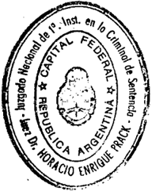
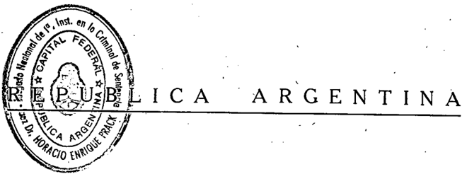
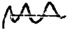
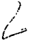

TOMO 310

Volumen 1

1987

## FALLOS DE. LA CORTE. SUPREMA DE. JUSTICIA DE LA NACION

.FALLOS

\

DE LA

CORTE. SUPREMA

DE

## JUSTICIA. DE LA N ACION

CON LA RELACION DE SUS RESPECTIVAS CAUSAS \

PUBLICACION A CARGO DEL DEPARTAMENTO DE JURISPRUDENCIA y PUBLICACIONES DEL TRIBUNAL

-'FEBRERO · AGOSTO

TOMO 310 VoLUMEN 1

## HOJA COMPLEMENTARIA

Hoja incorporada a los efectos de permitir la búsqueda por página dentro del Volumen.

## AfilO 1987

## FEBRERO -AGOSTO

## CAMARA FEDERAL DE SAN MARTIN.

NP 1

En Buenos Aires, a los 24 días del mes de febrero del año mil novecientos ochenta y siete, reunidos en la Sala de Acuerdos del Tribunal el señor Presidente de la Corte Suprema de Justicia de la Nación, doctor don José Severo Caballero, el señor Ministro Decano doctor don Augusto César Belluscio y los señores Jueces doctores don Carlos S. Fayt y don Enrique Santiago Petracchi, con la asistencia del señor Procurador General de la Nación doctor Juan O. Gauna,

## Consideraron:

Que mediante el arto 1 9 de la ley 21.161 se creó la Cámara Federal de Apelaciones de San Martín, Provincia de Buenos Aires.

Que por el decreto 2121/86 del Poder Ejecl~tivo Nacional se reglamentó lo atinente al funcionamiento del mencionado tribunal de alzada, al que se le asignó la respectiva dotación de personal por resolución 912/86 de esta Corte.

Que el señor Presidente de la Nación ha designado mediante el decreto 192/87 a los magistrados que integrarán dicha Cámara; y por lasJesoluciones números 51/87 y 55/87 del señor Ministro de Educación y Justicia, se nombró al Fiscal y Defensor de ella.

Que, en consecuencia, corresponde recibir el juramento pertinente a los mencionados magistrados y funcionarios a fin de habilitarlos para realizar todos los actos referidos a la organización interna del nuevo órgano jurisdiccional que posibilite su efectiva instalaCión, la que será oportunamente dispuesta por este Tribunal.

Por ello,

## Acordaron:

Fijar el día 26 del corriente mes, a las 12 horas para reCibir juramento en la Sala de Audiencias de esta Corte a los señores magistrados y funcionarios de la mencionada jurisdicción.

Todo lo cual dispusieron y mandaron, Ol'denando' se comunicase y registrase en el libro correspondiente por ante mí, que doy fe. JosÉ SEVEROCABALLERO\_ CAHLOSS. FAYT AUGUSTOCÉSARBELLUSCIO ENRIQUESANTIAGO PETRACCHI -JUAN OCTAVIOGAUNA. Eduardo D. Craviotto (Secretario).

## LEGISLATURA DE LA PROVINCIA DE SAN lUAN.

-NQ2-

En la Ciudad de Buenos Aires, al primer día del mes de abril del año mil novecientos ochenta y siete, reunidos en la Sala de Acuerdos del Tribunal el señor P:rp.sidente de la Corte Suprema de Justicia de la Nación, doctor don José Severo Caballero, y los señores Ministros doctores don Augusto César Belluscio, don Carlos Santiago Fayt, don Enrique Santiago Petracchi y don Jorge Antonio Bacqué, por mayoría.

## Consideraron:

- 19) Que de acuerdo con las informaciones periodísticas provenientes de la Provincia de San Juan y de la presentación efectuada por los actores de fs. 472/ 479 del Expte. F.101.XXI. "Fiscal de Estado doctor Luis Magín Suárez s/formula denuncia-solicita jurado de enjuiciamiento sus acumulados", resulta que la legislatura de la Provincia de San Juan, desconociendo efecto'suspensivo del recurso extraordinario concedido por esta Corte a fs. 366 de las actuaciones referidas y la prohibición de innovar consecuentemente decretada a fs. 458/459' de dichos autos y notificada por vía de teletipograma (fs. 461/470 del expediente respectivo), ha procedido a designar como integrantes de la Corte de Justicia de ese Estado a los señores Américo Bloise, Gustavo Sambrizzi, José García Castrillón y Juan Carlos Pastor, y como Procurador General al señor Juan Velert Frau.
- 2 9 ) Que el Tribunal, con ocasión del pronunciamiénto dictado el 23 de febrero último en las actuaciones citadas al comienzo, tuvo oportunidad de declarar que l~ actitud asumida en este caso por la Cámara de Diputados de la provincia de San Juan lesiona las prerrogativas constitucionales del Tribunal y compromete el ordenado funcionamiento de las instituciones de la Nacióñ. Al efecto cabe recordar que esta Corte es, en el ejercicio de la jurisdicción que le acuerdan la Constitución y las leyes nacionales, Suprema, a igual título que los demás departamentos del gobierno federal en la órbita de sus atribuciones (ver Fallos: 12: 134; 205:614; 264:443; 306:2070, considerando 7 9 , y otros).
- 39) Que la supremacía de la Corte de Justicia de la Nación ha sido reconocida por la ley, desde los albores de la organización nacional, garantizando la intangibilidad de sus decisiones por medio de la facultad acordada al Tribunal de imponer directamente su cumplimiento a los jueces locales -art. 16, ap. final, ley 48régimen aplicable también en el orden nacional por virtud de la ley 4055, arto 69. Por lo demás las graves responsabilidades que derivan de la naturaleza misma de las funciones que' ejerce esta Corte, le imponen la firme defensa de sus atribuciones, cuya cuidadosa' preservación es necesaria para la ordenada subsistencia del régimen federal, pues la existencia de un tribunal semejante es

.

evidentemente esencial p'ara evitar el recurso a la violencia y la disolución de pactos (Fallos: 205:614). Acertadas o no las sentencias de esta Corte en resguardo de su integridad interesa fundamentalmente tanto a la vida de la Nación, su orden público y la paz social cuanto a la estabilidad de sus instituciones y, muy especiahnente, a la supremacía de la Constitución en que aquéllas se sustentan (pronunciamiento dictado el 25 de setiembre de 1985 in re: G.358.XX. "Guardia, Carlos Eduardo y otro e/Corte Suprema de Justicia de la Nación s/amparo", considerando 4'1).

- 4 9 ) Que en la misma decisión se reiteró que las autoridades provinciales no pueden trabar o turbar en forma alguna la acción de los jueces que forman parte del Poder Judicial de la Nación (Fallos: 235:703; 240:89; 242:480; 244: 472; 245:28 y 61; 295:73; 301:1042 y 306:1537) y que este Tribunal tiene facultades para disponer las medidas pertinentes, incluso conminatorias., a los fines del adecuado ejercicio de su competencia legal (ver Fallos: 235':662; 240:9; 252:186; 306:1537 y el pronunciamiento recaído el 15 de abril de 1986 in re: M.189XX. Recurso de Hecho "Manufactura Textil San Justo S.A. s/guiebra-concurso especial promovido por Investa S.A.").
- 5'1) Que el arto 59 de la Constitución Nacional dispone expresamente: "Cada provincia dictará para sí una constitución bajo el sistema representativo republicano, de acuerdo con los principios, declaraciones y garantías de la Constitución Nacional, y que asegure su administración de justicia, su régimen municipal, y la educación primaria, bajo estas condiciones, el' gobierno federal, garante a cada provincia el goce y ejercicio de sus instituciones". Sobre m alcance esta Corte recordó en Fallos: 154: 192 «Que la interpretación del pensamiento que informa el arto 59 en cuanto a su contenido real, ha sido formulada por Estrada en los siguientes términos: 'la Constitución de los Estados Unidos sólo garantiza una forma republicana de gobierno. La Constitución argentina garantiza dos cosas: una forma republicana de gobierno y el goce y ejercicio efectivo y regular de las instituciones. De suerte que si en Norteamérica solamente está obligado el gobierno! federal a amparar a un estado cuando su forma de gobierno ha sido invertida, en la República, Argentina está obligado el gobierno federal a amparar a las provincias cuando la forma republicana ha sido corrompida, es decir, cuando ha sido interrumpido el ejercicio regular de las instituciones cuyo goce efectivo ella garantiza', Derecho Constitucional, pág. 144, tomo 3 9 . Y es de toda evidencia que no puede ser de otro modo, ya que el sistema político adoptado y las garantías proclamadas en ún estatuto, cuando no tienen en la práctica efectividad y realización ciertas, lejos de hacer la felicidad del pueblo, lo sumen en la desgracia y en el oprobio". Esta doctrina, si se incluye el Poder Judicial como vigía de la Constitución, es tan altamente auspiciosa como en cambio, no es compartible la que el mismo fallo contiene en materia de "cuestiones políticas", pues ésta deja en manos de los otros poderes la trascendente potestad de decidir cuándo se dan -y cuándo nolas

8

condiciones para que el gobierno federal garantice la autonomía de las provincias (ver Voto del Juez Luis María Boffi Boggero en el caso de Fallos: 261:103).

- 6 Q) Que el título de las personas nombradas en -el considerando l Q para desempeñar funciones judiciales es inexistente ante el vicio que afecta su designación, y ello hace aplicable los argumentos de la Corte según los cuales existe violación del arto 18 de la Constituci{m cuando personas no investidas de furisdicción para conocer en las contiendas judiciales se atribuyen el poder de hacerlo por error o abuso (doctrina de Fallos: 183:30 y 262: 212).
- 7Q) Que, en tales condiciones, tanto el ordenado f)lncionamiento de las instituciones como las garantías de los justiciables, obligan a adoptar medidas destinada's a subsanar el grave caso ocurrido.

El señor Presidente doctor don José Severo Caballero, en disidencia, dijo:

Que toda vez que el posible incumplimiento de la medida de no 'innovar dispuesta a fs.458/459 podría dar lugar a la comisión del delito previsto en el arto 239 del Código Penal, entiende que únicamente debe darse vista al señor Procurador General a los, fines que estime corresponder (arts. 164 y 116 del Código de Procedimientos en Materia Penal).

En consecuencia, por mayoría, se dispone:' l Q ) que el señor Juez federal de San Juan dé a conocer personalmente el texto de esta Acordada a los señores Américo Bloise, Gustavo Sambrizzi, José Garda Castrillón, Juan Carlos Pastor (") y Juan Valert Frau, intimándolos a que se abstengan del cumplimiento de funciones como jueces o procurador general de la Corté de Justicia de Sa~ Juan, bajó apercibimiento de la responsabilidad penal que les quepa en caso de desobediencia y de las medidas de coerción que habrá de adoptar esta Corte si ello fuere menester; 2Q ) librar oficio al señor Fiscal Federal del Juzgado .Federal de San Juan denunciando la comisión del delito previ~to por el arto 239 del Código Penal por el incumplimiento de la prohibición de innovar emanada del Tribunal (art. 164 del Código de Procedimientos en Materia Penal); 3 Q ) hágase saber al juez de la Corte de Justicia de San Juan doctor don José Héctor Baistrocchi; 4Q ) habilítanse los días y horas necesarios para practicar las diligencias ordenadas.

9

Todo lo cual dispusieron y mandaron, ordenando se registrase en el libro correspondiénte, por ante mí, que doy fe. JosÉ SEVEROCABALLERO(en disidencia) -AUGUSTO CÉSARBELLUSCIO CARLOSS. FAYT ENRIQUESAN'TIAGO PETRACCHI JORGEANTONIOBACQUÉ.Ante mí: Leopoldo S ehiffrin ( Secretario) .

## (") "Buenos Aires, 7 de abril de 1987.

Autos y Vistos:

Dado lo que manifiesta el doctor Juan CarIas Pastor a 'fs. 510, y laque expresa en el texto de su renuncia al cargo de Juez de la Corte de Justicia de San Juan, que acompaña en copia autenticada, declárase que la intimación dispuesta en el punto 1° de la Acordada nO 2/87 no ha debido alcanzar a dicho señor Vocal de la Cámara Segunda del Trabajo de la provincia mencionada. Notifíquese por medio del señor Juez Federal de San Juan. AUGUSTO CÉSARBELLUSCIO CARLOSS. FAYT ENRIQUE SANTIAGOPETRACCHIJORGE ANTONIO BACQUÉ."

rf.

## VISITA PAPAL.

-NO 3-

En Buenos Aires, a los seis días del mes de abril del año mil novecientos ochenta y siete,. reunidos en la Sala de Acuerdos del Tribunal, el señor Presidente de la Corte Suprema de Justicia de la Nación doctor don José Severo Caballero, el señor Ministro Decano doctor don Augusto César Belhi'scio y los señores Ministros doctores don CarIas Santiago Fayt, don Enrique Santiago Petracchi y don Jorge Antonio Bacqué,

## Consideraron:

Que constituyendo la visita del Sumo Pontífice un acontecimiento trascendental, la Corte Suprema de Justicia 'de la Nación adhiere a los conceptos vertidos en el decreto del Poder Ejecutivo Nacional nO 499 de fecha '31 de marzo del corriente año.

Por ello,

## Acordaron:

Declarar -a los efectos procesalesferiado judicial el día viernes 10 .de abril cÍel cor~iente mio, para los tribunales con asiento en esta Capital y los de la jurisdicción de la Cámara Federal de La Plata. Todo lo cual dispusieron y mandaron, ordenando se .comunicase y registrase en el libro correspondiente,

10

por ante mí, qué doy fe. JosÉ SEVEROCABALLERO AUGUSTOCÉSARBELLUSCIO \_ CARLOSS. FAYT ENRIQUE SANTIAGOPETRACCHIJORGE ANTONIO BACQUt. Eduardo D. Craviotto (Secretario).

## JUICIOS PENALES DE COMPETENCIA ORIGINARIA DE LA CORTE.

## -NI' 4-

En Buenos Aires, a los 21 días del mes de abril del aiio mil novecientos ochenta y siete, reunidos en la Sala de Acuerdos' del Tribunal, el señor Presidente de la Corte Suprema de Justicia de la Nación, doctor don José Severo Caballero, el señor Ministro Decano doctor don Augusto César Bel1üscio y lós señores Ministros doctores don Carlos Santiago Fayt, don Enriqué Santiago Petracchi y don Jorge Antonio Bacr¡ué,

## Consideraron:

Que resulta necesario regular el trámite de los juicios penales que en virtud del arto 101 de la Constitución Nacional son de competencia -originaria y exclusiva de la Corte Suprema de Justi'cia de la Nación, a fin de fijar en ese campo reglas similares a las establecidas' en el de la jurisdicción originaria civil, mediante Acordada nI' 51/73. Ello; además, en procura de agilizar el trámite de los procesos penales y salvar, en la medida de lo posible, los inconvenientes derivados del carácter colegiado del Trjbunal.

Por ello,

Acordaron:

11') En todos los juicios penales de competencia originaria de la Corte Suprema de Justicia de la Nació~1, el Presidente, o, en los supuestos de superposición de varias causas, el Ministro Decano, o los Ministros que deban legalmente reemplazarlos, estarán a 'cargo de la instrucción del sumario.

21') El Ministro instructor podrá delegar a su vez en ú~ Secretario con jerarquía no inferior a juez de primera instancia, la recepción de las declaraciones ordenadas a tenor del arto 236 del Código de Procedimientos en Materia Penal, como así también la facultad de disponer la realización de toda otra diligencia que estime conducente para el total esclarecimiento del hecho y la determinación de los responsables de su ejecución.

/

3 9 ) Las presentes disposiciones se declaran incorporadas al Reglamento para la Justicia Nacional, derogándose en consecuencia aquellas que se le opongan.

Todo lo cual dispusieron y mandaron, ordenando se comunicase y registrase en el libro 'correspondiente por ante mí, que doy fe. JosÉ SEVEROCABALLERO \_ AUGUSTO CÉSARBELLUSCIO CARLOSS. FAYTENRIQUESANTIAGO PETRACCHI -JORGEANTONIOBACQUÉ.Ante mí Leopoldo Schiffrin (Secretario).

## JUICIOS MILITARES. INFORMES.

## -N9 5-

En Buenos Aires, a los 22 días del mes de abril del año mil novecientos ochenta y siete, reunidos en la Sala de Acuerdos del Tribunal el señor Presidente de la Corte Suprema de Justicia de la Nación doctor don José Severo Caballero y los señores Jueces doctores don Augusto César Juan Belluscio, don Carlos Santiago Fayt, don Enrique Santiago Petracchi y don Torge Antonio Bacqué, con la asistencia del señor Procurador General de la Nación, doctor don Juan Octavio Gauna,

## Consideraron:

Que es función expresamente encomendada por la ley a esta Corte, en 'el ámbito de la justicia federal, la de disponer todo ~o convenieñte "para procurar la mejor administración de justicia" y "para la ordenada tramitación de los pleitos" (arts. 18 de la ley 48 y 10 de la ley 4055).

Que, en tal sentido, el Tribunal cuenta entre sus facultades de superintendencia sobre las cámaras federales, la de requerir "que se le remita ... en cualquier tiempo, una relación de las causas entradas, del número y estado de; las pendientes y de las falladas" (art. 11, inc. 29, de la ley 4055).

Que con el propósito de dar cumplimiento a las finalidades antedichas respecto de las causas en trámite ante las cámaras federales, en virtud de los arts. 445 bis del Código de Justicia Militar (efe. ley 23.049) Y 10, último párrafo, de la ley 23.049, corresponde hacer ejercicio de las atribuciones precedentemente mencionadas. .

## , Por ello, acordaron:

1 9 ) Requerir de las Cámaras federales de apelación de todo el país, que informen circunstanciadamente respecto de las causas derivadas de los arts. 445

bis del Código de Justicia Militar (efe. ley 23.049) y 10, último párrafo, de la ley 23.049: a) fecha y motivo de su radicación; b) número y nombre de los citados, y de los procesados, indicando el grado y funciones que tenían al momento de los hechos y lugar de ocurrencia de éstos; c) fecha en que se realizó la declaración indagatoria prevista en el arto 235 del Código de Justicia Militar, ,cualquiera hubiera sido el juez que la dispuso o la recibió, y situación procesal en que quedaron los indagados; d) en caso de no haberse celebrado aún la audiencia de indagatoria, fechas previstas para ello; cantidad de hechos que se imputan, calificación legal y nombre de las víctimas; f) si se ha dispuesto en alguna la audiencia prevista en el arto 490 del Código de Justicia Militar y, en caso afirmativo, fecha prevista para su, realización e indicar la prueba ofrecida por .las partes.

Todo lo cual dispusieron y mandaron, ordenando se comunicase y registrase en el libro correspondiente, por ante mí, que doy fe. JosÉ SEVEROCABALLERO AUGUSTO CÉSARBELLUSCIO CARLOSS. FAYT ENRIQUESANTIAGO PETRACCHI \_ JORGEANTONIOBACQUÉJUAN OCTAVIOGAUNA. Leopoldo Sehiffrin (Secretario) .

## CREAClON DE JUZGADOS DEL TRABAJO.

..-l\]Q 6,....

En la Ciudad de Buenos Aires, a los 30 días del mes de abril del año mil novecientos ochenta y siete, reunidos en la Sala de Acu'erdos 'del Tribunal' el señor Presidente de la Corte Suprema de Justicia de la Nación, doctor don José Severo Caballero y los señores jueces doctores don Augusto César Juan Belluscio, don Carlos S. Fayt, dolÍ Enrique Santiago Petracchi y don Jorge Antonio Bacqué,

## Consideraron:

Que en junio de 1984, esta Corte formuló una clara advertencia sobre la,' dificultades por las que atravesaba la Justicia Nacional del Trabajo en razón de la existencia -en su seno de un número de causas que impedia en forma notoria e indudable, que los conflictos suscitados en materia laboral y previsional de competencia de ese fuero, pudiesen recibir un servicio de justicia acorde con la naturaleza de los bienes jurídicos en juego (acordada NQ 37).

Que, en tal sentido, fue puntualizada la evidente trascendencia social del tema, por resultar altamente perturbador que para percibir prestaciones de ín-

dale alimentaria los interesados deban seguir procesos de varIos años de duración. Los propósitos que motivaron la creación del fuero laboral, se agregó, se ven así totalmente defraudados, ya que lo que se requiere -a fin de que dicho fuero cumpla efectivamente su funciónes una justicia rápida y expeditiva, y no un proceso que en muchas ocasiones se prolonga por tiempos apreciablemente superiores a los \_que demanda la sustanciación de las causas en cuestiones de otro carácter.

Que, con base en esos mol:ivos, la Corte se dirigió al Poder Ejecutivo Nacional, acompañando copia de la comunicación del Presidente de la Cámara Nacional de Apelaciones del Trabajo, sugiriendo la necesidad de que se propicien determinadas medidas legislativas, de las que cabe especialmente recorqar la creación de 35 juzgados Nacionales de Primera Instancia del Trabajo y la de un fuero especial de previsión social integrado únicamente por una Cámara de Apelaciones.

Que, el 10 de diciembre de 1985, el Tribunal dispuso reiterar los términos de la acordada antes citada, comunicándola a las Cámaras del Congreso Nacional.

Que, el 8 de mayo de 1986, fue nuevamente repetida la declaración de 1984, oportunidad en l::t que se subrayó que, transcurridos dos años desde esta última, la situación no había sido solucionada, en tanto se presentaron nuevas solicitudes de la Cámara Laboral de ampliación de términos, con el consiguiente perjuicio para los litigantes. También fue puesto de manifiesto, que '1a cuestión tiene especial relevancia -por el carácter de la materia de que tratanen los supuestos de expedientes previsionales. El incremento del envío efectuado por la Comisión Nacional de Previsión Social es de una magnitud tal -según el informe de la Presidencia de la Cámara Nacional del Trabajo son 7500 al día 14 de mayo de este año-, que el tiempo que insumirá su resolución equivaldrá, prácticamente, a una denegación de justicia que afectará a un estrato social con reales y conocidas necesidades alimentarias" (acordada NQ 17).

Que, finalmente, el 18 de setiembre de 1986, fue una vez más reproducido lo expresado en las acordadas 37/84 y 17/86 cits. (acordada NQ41).

Que hoy, a casi tres años de la primera exhortación puede afirmarse que el estado de cosas existente en la práctica lejos de haber encontrado mejoría se ha visto empeorado. Respecto de la mencionada justicia nacional de primera instancia cabe señalar que, mientras que para el 3J de diciembre de 1983 el número de los expedientes a su cargo era de 74.939, para igual fecha de 1986 alcanza a 94.477. Súmase a ello que en este año, hasta el 22 de abril la justicia del trabajo recibió 14.455 demandas. Y, el número de dichos juzgados, no ha sido aumentado en medida alguna.

Que, respecto de la ,Cámara Laboral, el volumen de tareas se ha incre-

con mentado entre esas fechas en un elevado porcentaje, ya que pasó de contar con 6.819 expedientes en trámite al 31 de diciembre de 1983, a 10.843 en igual fecha de 1986.

Y, si bien ha sido U¡;l paso auspIClOsO,que satisface a las sugerencias contenidas en las acorda~as aludidas, la creación de la Cámara Nacional de Apelaciones de la Seguridad Social (ley 23.473, sancionada el 31 de octubre de 1986 y promulgada el 15 de diciembre de ese año) no es menos cierto que hasta el presente ese órgano judicial no ha sido constituido, no obstante que la Cámara del Trabajo recibió de la Comisión Nacional de Previsión Social '31.183 expedientes durante 1986 y 1.271 entre febrero y abril del corriente año. En la actualidad, sólo a la espera del sorteo de Sala, la Cámara Laboral posee 19.723 E;xpedientes previsionales.

'\_ I Que el empeoramiento del estado de la justicia del trabajo hace imprescindible que esta Corte, como cabeza del Poder Judicial de la Nación, se dirija a los Poderes Ejecutivo y Legislativo nacionales, a fin de reiterarles' el llamado que se efectuó en las tres oportunidades recordadas.

Por ello,

Acordaron:

Reiterar la necesidad y urgencia que requieren: a) la creaClOn de 35 juzgados Nacionales de Primera Instancia del Trabajo, con la dotación de personal indicada en lit acordada 17 de 1984; y b) la constitución y puesta en funcionamiento de la Cámara Nacional de Apelaciones de la Seguridad Social.

Todo lo cual dispusieron y mandaron, ordenando que se comunicase y registrase en el libro correspondiente, por ante mi, que doy fe. JosÉ SEVEROCABALLERO \_ AUGUSTO CÉSARBELLUSCIO CARLOSS. FAYT ENRIQUESANTIAGO PETRACCHIJORGEANTONIOBACQUÉ. Eduardo D. Craviotto (Secretario).

## FERIADO JUDICIAL DE JULIO.

\_N9 7-

En Buenos Aires, a los 30 dfas del mes de abril del año mil novecientos ochenta y siete, reunidos en la Sala de Acuerdos del Tribunal, el señor Presidente de la Corte Suprema de Justicia de la Nación, doctor don José Severo Caballero y los señores Jueces doctores don Augusto César Belluscio, don

Carlos Santiago Fayt, .don Enrique Santiago Petracchi y don Jorge Antonio Bacqué,

## Resolvieron.

- 1 9 ) Disponer en el corriente año feriado judicial para los Tribunales Nacionales de la Capital desde el día 13 hasta el 24 de julio, ambos inclusive.,
- 2 9 ) Hacer saber a las Cámaras Federales de Apelaciones. que con arreglo a lo previsto en la Acordada n 9 53/73 -respecto de la coincidencia de la feria en eUa establecida con las vacaciones escolaresy alo dispuesto en la presente, de};lerán determinar para sus respectivas jurisdicéiones un feriado judicial de diez días hábiles (acápite 29 sIe la Acordada n9 30/84).

Todo lo cual dispusieron y mandaron, ordenando se comunicase y registrase en el libro correspondiente, por ante mí, que doy fe. JosÉ SEVEROCABALLERO AUGUSTOCÉSAR BELLUSCIOCARLOSS. FAYT ENRIQUESANTIAGOPETRACCHI JORGEANTONIOBACQUÉ. Eduardo D. Craviotto (Secretario).

## PROCURACION GENERAL. DESIGNACION DE SECRETARIO LETRADO.

9

-N 8-

En Buenos Aires, a los 7 días del mes de abril del año mil novecientos ochenta y siete, reunidos en la Sala de Acuerdos del Tribunal, el señor Presidente de la Corte Suprema de Justicia de la Nación, doctor do~ José Severo Caballero y los señores jueces doctores don Augusto César Belluscio, don Carlos Santiago Fayt, don Enrique Santiago Petracchi y don Jorge Antonio, Bacqué,

## Consideraron:

Que mediante acordada 34 del 7 de junio de 1984, aclarada por la 53 del 14 de agosto del mismo año, esta Corte estableció que la designación de funcionarios en los cargos que requieren título habilitante debe efectuarse por el régimen de concursos.

Que por resolución 738 de fecha 21 de octubre de 1986, se llamó a concurso para cubrir un cargo de secretario .letrado en la Procuración General de la Nación.

Que la Comisión Asesora designada para dictaminar en el mencionado concurso procedió a la evaluación de los antecedentes de los postulantes y el mérito de la prueba escrita. '

Por ello,

Se Resuelve:

Efectuar la siguiente designación en la Procuración General de la Nación: Secretario Letrado al doctor Ricardo Oscar Bausset (D.N.!. 8.447.990 -clase 1950), que ocupó el primer lugar en el orden de mérito.

Todo lo cual dispusieron y mandaron, ordenando se comunicase y registrase en el libro correspondiente, por ante mí, que doy fe. JosÉ SEVEROCABALLERO AUGUSTO CÉSARBELúrscIO -CARLOSS. FAYT ENRIQUESANTIAGO PETRACCHI \_ JORGEANTONIOBACQUÉ. Eduardo D. Craviotto (Secretario).

MATRICULA.

N? 9

En Buenos Aires, a los 19 días del mes de mayo del año mil novecientos ochenta y siete, reunidos en la Sala de Acuerdos del Tribunal, el señor Presidente de la Corte Suprema de Justicia de la Nación, doctor don José Severo Caballero y los señores jueces doctores don Augusto César Belluscio, don Carlos Santiago Fayt, don Enrique Santiago Petracchi y don Jorge Antonio Bacqué,

## Consideraron:

Que por acordada 27/85 se decidió que la Oficina de Matrícula depen:dería de la Secretaría NQ 5.

Que este Tribunal estima conveniente modificar tal disposición.

Por ello,

## Acordaron:

Derogar parcialmente el punto 4 Q de la Acordada 27/85 y establecer que la Oficina de Matrícula dependerá de la Secretaría de Superintendencia Judicial.

Todo lo cual dispusieron y mandaron, ordenando se comunicase y registrase en el libro correspondiente, por ante mí, que doy fe. JosÉ SEVEROCABALLERO -

AUGUSTOCÉSAR BELLUSCIOCARLOSS. FAYT ENRIQUE SANTIAGOPETRACCHI -JORGE ANTONIO BACQUÉ. Juan Escribano (Secretario).

## FALLECIMIENTO DEL INTENDENTE DEL PALACIO DE JUSTICIA, SR. ELlAS JOFRE.

-NQ 10 -

En Buenos Aires, a los 29 días del mes de mayo de mil novecientos ochenta y siete, reunidos en la Sala de Acuerdos del Tribunal, el señor Ministro Decano . de la Corte Suprema de Justicia de la Nación, doctor don Augusto César Belluscio y los señores jueces doctores don Carlos Santiago Fayt, don Enrique Santiago Petracchi y don Jorge Antonio Bacqué,

Consideraron:

Que en la fecha se ha producido el deceso del señor don Elías Jofré.

Que el extinto prestó servicio en el Tribunal como Intendente del Palacio por el lapso de 37 años, demostrando en el cumplimiento de sus tareas un especial afán y una notable dedicación.

Que esta Corte desea expresar su profundo pesar por la desaparición de tan valioso colaborador.

Por ello,

Acordaron:

Dirigir nota de condolencia a sus familiares.

Todo lo cual dispusieron y mandaron, ordenando se comunicase y registrase en el libro correspondiente, por ante mí, que doy fe. AUGUSTOCÉSARBELLUSCIO\_ CARLOS S. FAYT ENHIQUE SAKTIAGOPETRACCHIJORGE ANTONIO BACQUÉ. Juan Escribano (Secretario).

## PRESUPUESTO

## N? 1l

En Buenos Aires, a los 4 días del mes de junio del año mil \_novecientos ochenta y siete, reunidos en la Sala de Acuerdos del Tribuñal el señor Presi. dente de la Corte Suprema de Justicia de la Nación, doctor- don José Severo Caballero, el señor Ministro Decano doctor don Augusto César Belluscio y los señores Ministros doctores don Carlos Santiago Fayt, don Enrique Santiago Pe. tracchi y don Jorge Antonio Bacqué,

## Consideraron:

Que de acuerdo con lo prescripto por el artículo 99 de la Constitución Nacional, esta Corte Suprema proyectó el presupuesto para el Poder Judicial de la Nación, correspondiente al ejercicio 1987. En dicha oportunidad reiteró el padecimiento que data de anteriores períodos financieros, ocasionado por la insuficiencia de losrecnrsos necesarios para revertir las graves carencias que afectan al servicio de justicia, y señaló también que los requeridos eran nece~ sarios para cumplir con dicho servicio en el marco de la separación de poderes que exige el sistema republicano de gobierno (Acordada NQ 62/86).

Que el proyecto de presupuesto fue remitido al Poder Ejecutivo Nacional para que, de conformidad con lo preceptuado por el artículo 17, "in fine", de la Ley 16.432, éste lo enviara al Congreso de la Nación.

Que el Poder Ejecutivo Nacional no incluyó en el proyecto de presupuesto general para 1987, elevado a la consideración del Poder Législativo, los cré. ditos establecidos por este Tribunal, sino que los fijó en un nivel menor sin dar razón autónoma 'que sustentara la decisión adoptada, ~i argumentos que guarden vinculación con los fundamentos expuestos ep la Acordada NQ 62/86, a pesar de haber contado para ello con el lapso corrido entre la fecha de la comunicación que le envió la Corte (5 de enero de 1987), y la fecha \_de la remisión del presupuesto general al Congreso de la Nación (26 de febrero de 1987 -Mensaje NQ 288).

Que, a su turno, en el mes de mayo de 1987, 'la Cámara de Diputados de la Nación aprobó el proyecto recibido del Poder Ejecutivo, sin incluir los requerimientos contenidos en la Acordada NQ 62/86.

Que las circunstancias reseñadas imponen a esta Corte, en su carácter de órgano supremo del Poder Judicial de la Nación y custodio de la Constitución Nacional que en lo referido al caso consagra la separación de los poderes, reiterar con el mayor énfasis, el explícito llamado al respeto y consolidación del sistema republicano de gobierno mediante la preservación, del equilibrio de

19

aquélla, el. que se afectará en forma directa en la hipótesis de que al .Poder Judicial no se lo dote de los recursos indispensables para el cumpliriliento de la misión de administrar justicia, aun dentro del marpo de austeridad que reclama el gobierno nacional, y que fue tenido en cuenta al elaborarse el presupuesto judicial, -máxime que ante la reducción introducida por el Poder Ejecutivo, la escasez de los medios financieros agravará irremediablemente el notorio estado de carenci(ls en que se desenvuelve la actividad judicial en desmedro de los derechos y garantías de los justiciables.

Que, por las razones expuestas, y en ejercicio del ineludible deber de velar por la permanente y eficaz prestación del servicio que le es inherente, el tribunal formula una firine exhortación a los poderes Ejecutivo y Legislativo, para que arbitren las medidas que correspondan con el fin de subsanar los defectos que en la consideración de los prin,eipios constitucionales enunciados ostentan las etapas ya cúmplidas al tiempo de proponerse y examinarse el cálculo de gastos para el año 1987.

El señor Presidente del Tribunal, Hoctor don José Severo Caballero, dijo:

## Considerando:

Que de acuerdo a la legislación en vigor (Artículo 17 de la Ley 16.432), esta Corte Suprema proyectó el presupuesto para el Poder Judicial de la Nación, correspondiente al ejercicio 1987, señalando los recursos que eran necesarios para cumplir con dicho servicio en el marco de la separación de poderes que exige el sistema republicano de gobierno (Acordada NQ 62/86).

Que el proyecto de presupuesto fue remitido con fecha 5 de enero de 1987 al Poder Ejecutivo Nacional para que, de conformidad con lo preceptuado por el artículo 17, "in fine", de la Ley 16.432, éste lo enviara al Congreso de la Nación.

Que el Poder Ejecutivo Na.Qi?nalno incluyó en el proyecto de presupuesto general para 1987, elevado a la consideración del Poder Legislativo, los créditos previstos por este Tribunal, sino que los fijó en un nivel menor al remitir el presupuesto general al C~ngreso de la Nación (26 de febrero de 1987 -Mensaje NQ 288).

Que, a su turno, en el mes de mayo de 1987, .la Cámara de Diputados de la Nación aprobó el proyecto recibido del Poder Ejecutivo, sin incluir los requerimientos contenidos en la Acordada NQ 62/86.

Que el cálculo de recursos realizado por esta Corte lo fue en el marco de la austeridad reclamada por el Poder Ejecutivo por lo que su reducción ha creado una situación de angustia económica frente a las exigencias ineludibles de gastos de ,instalación y nombramiento de nuevo personal -para las Cámaras

.

y Tribunales creados recientemente, así como para atender los gastos emergentes del cumplimiento de las leyes 23.049 y 23.492.

Que por ello y en ejercicio del deber de velar por la permanente y eficaz prestación del servicio de justicia, el Tribunal se ve precisado a exhortar a los poderes Ejecutivo y Legislativo, para que adopten las medidas que correspondan a fin de corregir el presupuesto o subsanar a la brevedad posible los inconvenientes que se derivan de la situación planteada.

Por ello,

## Acordaron:

Hacer saber la presente acordada al Poder Ejecutivo Nacional y al Poder, Legislativo Nacional, para lo cual se remitirá copia al Señor" Presidente de la Nación y a los señores Presidentes de las Cámaras de Diputados y de Senadores de la Nación.

Todo lo cual dispusieron y mandaron, ordenando se comunicase y registrase en el libro correspondiente, por ante mí; que doy fe. JosÉ SEVEROCABALLERO (según mi voto) -AUGUSTO CÉSAR.BELLUSCIO CARLOSS. FAYT ENRIQUE SANTIAGOPETRACCHIJORGEANTONIOBACQUÉ. Juan Escribano (Secretario).

## NOTIFICACIONES. SISTEMATIZACION. CEDULAS.

-NQ 13-

En la ciudad de Buenos Aires, a los 9 días del mes de junio del año mil novecientos ochenta y siete, reunidos en la Sala de Acuerdos del Tribunal, el señor Presidente de la Corte Suprema d'e Justicia de la Nación, doctor don José Severo Caballero y los señores Jueces doctores don Augusto César Belluscio, don Carlos Santiago Fayt, don' Enrique Santiago Petracchi y don Jorge Antonio Bacqué,

## Consideraron:

Que resulta conveniente implantar las medidas necesarias para sistematizar las tareas ~perativas y administrativas en la oficina de notifiéáciones.

Que, en su virtud, es imprescindible confeccionar un formulario de "cédula de notificación" que se adecue a esas exigencias.

Que, a esos fines, se han efectuado los estudios pertinentes.

## Acordaron:

1 ) 9 Aprobar el formulario de cédula cuyo modelo se acompaña para todos los fueros nacionales y federales, los que serán impresos por ,- el Poder Judicial de la Nación y entrarán en vigencia a partir del día de la fecha, pudiendo utilizarse los anteriores hasta el 1 9 de febrero de 1988, momento a partir del cual la oficina de notificaciones no recibirá cédulas en otros formularios.

El formulario que se aprueba por la presente se aplicará' para las notificaciones firmadas por los profesionales.

Los diferentes fueros, cámaras y juzgados se identificarán por un código de colores y letras impresos en el margen superior de las cédulas.

2 ) 9 Aprobar para el sistema computarizado los códigos correspondientes a los tribunales mencionados en el punto anterior conforme 'al siguiente detalle:

| Civil y Comercúll Federal Contencioso                                                      | FC          |                              |
|--------------------------------------------------------------------------------------------|-------------|------------------------------|
| Administrativo Federal Criminal y Correccional                                             | CA          | violeta                      |
| Federal Civil Comercial                                                                    | CF C CO     | marrón celeste verde negro   |
| Criminal y Correccional Correccional Criminal SentenCia                                    | CC CR CS Cl | negro negro negro negro rojo |
| Rogatorias Trabajo                                                                         | RO T        | anaranjado negro azul        |
| Especial Civil y Comercial Penal Económico                                                 | E PE LY     |                              |
| Ley 22.172 Fiscalía Nacional de Investigaciones .\dministrativas Cámara Nacional Electoral | FI          | rosa (") rosa ("") amarillo  |
| Colegio Público de. Abogados Corte Suprema                                                 | CE CP       | celeste                      |
|                                                                                            | CSJ         | (""")                        |

(") Fiscalía Nacional de Investigaciones Administrativas: el código del Tribunal, que es FI, cruzado Con una banda del mismo color -rosa-o

( "") Cámara Nacional Electoral: el código del Tribunal; que es CE, cruzado con dos bandas del mismo color -rosa-o .

con (""") Corte Suprema: el código del Tribunal, que es CSJ, cruzado con dos bandas -celeste y blanca-o '

r

---'

22

Cámaras

Juzgados

ACUERDOS DE LA CORTE SUPREMA

IGUAL

AL DEL

FUERO

y

IGUAL

SUBRAYADO

AL DEL

FUERO

PERO

SIN

Igual al

fuero

Igual al

fuero

SUBRAYAR

- 3 ) 9 Aprobar las instrucciones que se detallan y que son obligatorias para todas las cédulas que ingresen a la oficina de notificaciones p'¡¡ra la justicia nacional y federal:

## 1. Instrucciones Generales

- 1.1 Se hace saber que todos los datos consignados a partir de la palabra "Señor" se encuentran DENTI\.O DEL TEXTO.
- 1.2 El llenado' deberá efectuarse con máquina de escribir. NO admitiéndose la escritura manuscrita.
- 1.3 No podrán' dejarse espacios en blanco, salvo en los lugares donde se especifique lo contrario.
- 1.4 Cada dato cuenta con un lugar ESPECIAL para su lectura sistemática y se debe completar según las instrucciones para la confección de las cédulas consignadas en el apartado 2.

1.5

En el

caso de

repetición de

datos,

éstos deberán

ser coincidentes.

- 1.6 Todas las cédulas deberán ser confrontadas por el tribunal. El sello oficial del juzgado dará por cumplida tal exigencia.
- 1.7 Se dará cumplimiento estricto del artículo 136 CPCC.
- 1.8 El incumplimiento de cualquiera de estas normas implicará la devolución inmediata de la cédula.

## 2. Instrucciones específicas para su confección

- 2.1 2.1 Donde dice: "TRIBUNAL" deberá consigriarse el tribunal librador de la cédula y su dirección.
- 2.2 Donde dice: "SELLO DEL FUERO" deberá colocarse el sello oficial del tribunal librador (ver 1.6).
- recepción 2.3 Donde dice: "FECH~ DE RECEPCION EN NOTIFICACIONES" (a llenar exclusivamente por el tribunal), deberá consignarse la fecha de recepción en la oficina de notificaciones" la cual será coincidente con la planilla de remisión del tribunal.
- 2.4 Donde dice: "Sr." deberá consignarse el apellido y nombre del destinatario.
- 2.5 Donde di.ce: "DOMICILIO"; deberá consignarse la calle, número, piso y departamento si lo tuviera, o cualquier otro dato' cierto que facilite su localización.

del del

.2.6 2.7 2.8 2.9 2.10 2.11 2.12 2.13 2.15 2.16 2.17

Donde dice: "TIPO DE DOMICILIO" deberá consignarse el que correspondiere.

Donde dice: "CARACTER" deberá indicarse si es: urgente, notificar en el día o con Habilitación de días y horas inhábiles; indicación que debe surgir de lo dispuesto por el tribunal. En caso contrario deberá. anularse el espacio en blanco.

Donde dice: "OBSERVACIONES ESPECIALES" deberá consignarse: Insania Art. 626 CPCC. -Amparo -Hábeas Corpus -Desalójo, Arts. 682-683-684 -Arts. 339 y 141 CPCC. -Art. 129 CPP.

Dondc dice: "N9 ORDEN" (a llenar exclusivamente por el tribunal), deberá consignarse el número de cédula según la planilla de reIl?-isión.

Donde dice: "EXP. N9" deberá ser consignado el número del expediente correspondiente a la causa.

Donde dice: "ZONA" (a llenar exclusivamente por el tribunal), deberá consignarse la que correspondiere al domiCilio, según 10 especificado en la guía de zonas vigente en la oficina de notificaciones.

Donde dice: "FUERO" deberá indicarse el CODIGO del Tribunal, según se especifica en el punto 2v.

Donde dice: "SALA/JUZGADO" deberá consignarse la Sala o número de juzgado.

2.14 Donde dice: "SECRET." deberá consignarse el número de secretaría si la hubiere; caso contrario se cerrará el esp'wio.

Donde dice: "COPIAS SI/NO" se testará lo que NO corresponda, según se adjunten o no copias a la cédula.

Donde dice: "PERSONAL SI/NO" deberá testarse lo que NO corresponda. En caso de ser Personal se aclarará el motivo en el espacio destinado a "Observaciones Especiales" y además se testará el "NO" en el casillero de "Observaciones".

Donde dice: "OBSERVACIONES SI/NO" deberá testarse lo que NO corresponda. En caso de que las hubiera se aclararán en el espacio destinado a "Observaciones Especiales".

2.18 Donde dice: "REZ" (espacio exclusivo para la oficina de noÜficaciones), no debe ser llenadp.

2.19 Donde dice: "NOTIFICACION NEGATIVA" (espacio exclusivo para la oficina de notificaciones), no debé ser llenado.

- 4 9 ) Disponer que a partir del día de la fecha, quedan derogadas todas las normas que se opongan a lo aquí resuelto .
- . Todo lo cual dispusieron y mandaron, ordenando se comunicase y registrase en el libro correspondiente, por ante mí, que doy fe. JosÉ SEVEROCABALLERO \_

AUGUSTOCÉSAR BELLUSCIOCARLOSS. FAYT ENRiQUE SANTIAGOPETRACCHI \_ JORGEANTONIOBACQUÉ. Juan Escribano (Secretario).

## MODIFICACION DE LA ACORDADA 13/87.

## -NQ 4/88-

En Buenos Aires, a los 24 días del mes de febrero del año ~il novecientos ochenta y ocho, reunidos en la Sala de Acuerdos del Tribunal el señor Presidente de la Corte Suprema de Justicia de la Nación, doctor don José Severo Caballero, el señor Ministro Decano doctor don Augusto César Belluscio y los señores Ministros doctores don Carlos Santiago Fayt y don Jorge Antonio Bacqué,

## Consideraron:

Que mediante Acordada 13, de fecha 9 de junio de 1987, este Tribunal aprobó el formulario de "cédula de notificación" para todos los fueros nacionales y federales del país.

Qúe las evaluaciones practicadas hacen aconsejable introducir las necesarias adecuaciones tendientes a satisfacer las inquietudes profesionales dentro del marco de los objetivos perseguidos con' el sistema implementado.

Resolvieron:

- 1 Q) Agregar al punto 1 Q) de la Acordada 13/87 -como último párrafoel texto siguiente:
- "Dicho código de colores y letras podrá ser incorporado en los formularios preimpresos manualmente (mediante marcador 'o similar) y en una forma destacada que permita una fácil visualización."
- 2Q) Disponer que la confección del' duplicado de "cédul'!. de notificación" podrá realizarse en formulario preimpreso idéntico al original, pero con el código de .letras en negro y sin la plancha donde se labra el acta de diligencia, o en fotocopia del mismo sin color..
- Todo lo cual dispusieron y mandaron, ordenando se comunicase y registrase en el libro correspondiente, por ante mí que doy fe. JosÉ SEVEROCABALLEROAUGUSTOCÉSAR BELLUSCIOCAllLOS S. FAYT JORGEANTONIOBACQUÉ.Ante mí: Eduardo D. Craviotto .( Secretario).

## ACTUALIZACION DE MONTOS. LEY 22.192.

-N 149

En Buenos Aires, a los 9 días del mes de junio del año mil novecientos ochenta y siete, reunidos en la Sala de Acuerdos del Tribunal, el seiior Presidente de la Corte Suprema de Justicia de la Nación, doctor don José Severo Caballero y los señores Jueces doctores don Augusto César Belluscio, don Carlos Santiago Fayt, don Enrique Santiago Petracchi y don Jorge Antonio Bacqué,

## Consideraron:

- 1 9 ) Que en virtud de lo dispuesto por el arto 38 de la ley 22.192 corresponde a esta Corte actualizar los montos de las multas establecidas en los artículos 17, inciso b) y 31, 'con arreglo al índice oficial de precios al por mayor nivel general.
- 2 ) 9 Que en la acordada 2/85 se practicó la revalorización citada para el período comprendido entre el 19 de marzo de 1985 hasta el 28 de febrero de 1986.
- 3 ) 9 Que procede dar cumplimiento a la actualización que regirá desde mayo de este año.
- 4 ) 9 Que los índices de aumento de los pn~cios al por mayor nivel general proporcionados por el Instituto Nacional de Estadística y Censos - correspondientes a los meses de febrero de 1985 y abril del presente son, respectivamente, de 34.811,7 Y 221.075,3. El coeficiente' que debe aplicarse es,' pues, 6,35.
- 59) 'Que multiplicando dicho coeficiente por los' montos fijados en la acordada 2/85, se obtienen las siguientes cantidades:

arto

17

inciso b):

-A 1.271,49.

arto 31:

-A 127,15

a

-A 1.271,49.

## Acordaron:

Reajustar los montos fijados en los artículos 17, inc. b) Y 31 de la ley 22.192, los que se determinan en' las sumas que se indican en 'el considerando 59 de la presente, los ,que regirán a partir del 1 9 de \_mayo de este -año.

Todo lo cual dispusieron y mandaron, ordenando se comunicase y registrase en el libro correspondiente, por ante mí, que doy fe. JosÉ SEVEROCABALLERO \_ AUGUSTO CÉSARBELLUS,CIO CARLOS~. FAYT ENRIQUESANTIAGO PETHACCHI -JORGE ANTONIOBACQUÉ. Juan Escribano (Secretario).

## DICTAMEN DEL PROCURADOR GENERAL

## ~uprema Corte:

El Procurador Genera;ldel Trabajo solicita la. avocaClOn de V.E., para'que l deje. sin efecto la Acordada dictada!por la Cámara Nacional de Apelaciones del Trabajo con fecha siete de mayo del corriente -Acta n919"'11-, por la cual resolvió que a partir del 3 de abril del año en \_ curso han quedado suprimidos los recursos regulados por las' normas derogadas por el arto 15 de la ley 23.473y que, por ende, desde tal fecha las! Salas que la componen, no recibiráh expedientes que le sean elevados en razón de la impetración de los recursos suprimidos, ni presentaciones directas que a ellos se. refieran. '

Sostiene el magistradO'mencionado, que la Acordad~ de marras es susceptible de ser dejada sin efectol por la vía que intenta, añadiendo que aguardar su aplicación él¡ un caso concreto, no sólo puede llevar a dilatar temparalmente una soiluciónque debe ser inmediata, en razón de la naturaleza de los derechos en juego, sino que tal aplicación podría plasmarse sin emitir una expresa declaración de incompetencia inhibiendo tanto la deducción de reCursos cuanto -par no tratarse de un litigio promovido en sede judicialla intervención de la Corte en virtud de lo dispuesto en el arto 24, inc. 7 9 , del decretoley 1285/58.

Aduce asimismo, que la interpretación de la citada ley 23.473 que formula la Cámara, además de estrictamente literal resulta O'puesta a la finalidad perseguida con su dictado, generando efectos inaoeptables al dar lugar a un interregno entre la competencia actual de l~ rrúsma y la de la creada Cámara de Seguridad Social, destacando que tal conclusión mal, puede ' afectarse por eI notable incremento de causas habidas en la Justicia Nacional del TrabajO',y el consiguiente recargo de tareas que ello l trae aparejado.

Puntualiza también, que la decisión contenida en la Resolución n 9 138/87 del Ministerio de Trabaja y Seguridad Social de la Nación (v. fs. 9/10), puede verse frustrada de mantenerse e1criterio que informa la Acordada que cuestiona, y a ello puede sumarse también la abrogación de, los otros recursos 8J que alude el arto 15 de la ley 23.473 que, si bien corresponden a la revisión de actos aj1enos al sistema na-

cional de previslOn, hasta la sanción de la mentada ley 23.473 adjudicaban competencia a la Cámara Nacional de ApeJaciones del Trabajo.

En razón de tales consideraciones dichO' magistrado solicita al Tribunal de V.E. que «··. asuma este planteo en toda 'Laplenitud de la propuesta y se deje sin efecto la Acordada de la G.N.A.T. adoptada por Acta N91941 del 7/5/87, haciéndose expresa mención que, la derogación dispuesta por el mt. 15 de la ley 23.473 debe entenderse condicionada conforme con la sistemática de la norma hasta la puesta en funcionamiento de la Oimara Nacional de la Seguridad Social".

II

GteQconveniente dejar sentado, en princlplO, que a mi modo de ver la citada Cámara ha exhorbitado' las atribuciones que le son propias can el dictada de Ia Acardada en cuestión.

En efecto, si bien posee facultades para uniformar por tal vía la: interpretación de la ley de Organización y Procedimiento de la Justicia Nacional del Trabajo (art. 23, in fine, de la ley 18.345), resulta claro -a mi juicioque el contenido de, tal Acordada excede ese restringido marco. Ello así, pues no supone hermenéutica alguna de laS!disposic~onesprocesa'les d~ esa ley, sino que constituye un pronunciamiento sabre su propia competencia, dictado' en abstracto, que ni la citada 'ley 18.345 ni ninguna 'Otrale ,autorizan a emitir.

Tal circunstancia bastaría, en mi 'Opinión,para que V.E. hiciera lugar al pedido de avocación formulada por el Ministerio Público y dejase sin ef.ecto la mentada Acordada. Sin embargo, las afirmaciones puntualizadas por el señor Prócurador General del Trabajo tornan aconsejable que, además, quede al menos primariamente aclarada la cuestión, como forma de garantizar la seg:uridad de los justiciables de! singular impartancia en este caso tanto por la naturaleza alimentaria de los créditos en juego, cuanto por Laposibilidad de dejar sin ayuda en el momento en que es más import¡mte, a personas de avanzada edad, todo lo cual hace necesario evitar cualquier clase de dispendio l jurisdiccional que pueda traducirse en una injustificada demora de las decisiones.

Esto así, adelantO' que comparto en este aspecto la opinión de los jueces que votarón en minoría, adhiriendo a la postura expresada por el doctM Ricardo A. Guibourg.

Cabe señalar, en tal sentido, que el sustento de la decisión de la mayoría presenta un excesivo apego a una hermenéutica literal de: las disposiciones en juego, que opera, en el caso, en desmedro de la garantía constituci0'na;l de defensa en juicio. Así lo considero .porque, si bien la Cámara deja a salvo el derecho de los afiliados para recurrir las decisiones de los organismos previsionales conforme las prescripciones de la ley 19'.549', tal circunstancia supone trasladar temporariamente la competencia en la materia a la Justicia Federal, :.;olución que importa desconocer no sól0' la finalidad perseguida por la ley 23.473, sino también la abundante jurisprudencia de la Corte respect0' de l~ conveniencia de ventilar tales asuntos en sede laboral atento la especialización del Fuero del Trabajo, provocando as~ el dispendio anteri0'rmente aludido, y una situación .de incertidumbre que es conveniente despejar.

éreo que nO' resulta ocioso record al' que V.E. ha señalado que no es método recomendab~e, en la interpretación de las leyes, el de atenerse estrictamente a sus palabras, ya que el espíritu que las informa es lo que debe rashearse: en procura de una aplicación racional; que avente el' riesgo de un formalismo paralizante. Lo que ha de perseguirse es una valiosa interpretación de lo que las' normas, jurídicamente, han querido mandar (Fallos 281:146; 283:239; 284:9; 300:417).

A partir de tal premisa, parece razonable entender que 1a vigencia de lo~ arts. 13 y 15 de la ley 23,.473, se haBa supeditada a la efectiva instalación y funcionamiento de la Cámara Nacional de Apelaciones de: la Seguridad Social.

y ell~ es así, porguedel contenido del arto 1.2,de ese cuerpo legal resulta clara la intención dell legislador de subordinar la aplicación del sistema a aquella circunstancia. No puede, por ende, entenderse que: lo, dispuesto en dicho artículo se circunscriba exclusivamente al juramento de los jueces qu.e se designen para integrar el nuevo órgano, sin afectar el rest0' de las disposiciones, 1'0da vez que -justamentelos encargados de aplicarla sun dichos jueces.

Además, la aplicación' 1isa y llana del arto 15 y la :Jiteral interpretacióllJ del arto 13, conducen a la conclusión de que existe un interregno entre la vigencia del sistema establecido en la ley 14.236 y el prescripto en el nuevo Ü'rdenamiento legal, yI no parece razonable suponer que tal ha sido la intención del legislador. Es más lógico pensar, según! creo, que su prop¡6sito fue aliviar' la difícil situación existente para beneficio de los interesados, y de ninguna manera dilatar la dilucidación de los conflictos.

\ Pienso, camal 10 señala el Sr. Procurador General del Trabajo,' que en la opinión de los jueces de la mayoría subyace, por un lado, la profunda inquietud que los embarga frentt1 al notable incremento de causas sometidas a su cano cimiento -circunstancia que ha sido puesta de resalto por V.E. 'efl reciente Acordaday, por otro, un veladO' reproche a una presunta lentitud en la instrumentación de la decisión legislativa.

Sin embargo, tampoco puedo dejar de destacar que tan comprensible preocupación no puede llevar' a la adopción 'de soluciones notoriamente injustas cuando es posible arbitrar otras de mérito opuesto, ya que ello no resulta compatible con el fin común de' la tarea legislativa y la judicial. Es menester, por ende, que la interpretación de las leyes guarde armonía con e1 orden jurídico restante y con las garantías constitucionales y, en casos no contemplados expresamente, debe preferirse la hermenéutica que favarece y no la que dificulta aquella armonía y los fines perseguidos legis,lativamente (Fallos: 305: 940).

para y es por ello fundamental, en mi aprnlOn, tener también en clarO' que las leyes de reorganización judicial, distribución de competencia, o similares, tienden a proteger a los justiciables asegurando la mayor eficiencia y celeridad de ,las decisiones' judiciales y, si- para ello es indispensable remover los obstáculos que puedan encontrar las jueces para desempeñar' eficazmente sus funciones, tal hecho no Lleva como carrelato necesario el alterar aquellos propósitos protectores desplazándolos a través de' interpretaciones qu~ sól'O conducen a atrihuir más importancia a los fines que se instrumentan para alcanzar dichos fines que a éstos en sí mismos.

Por todo ello, opino que V.E.debe, por razones de superintendencia general que lo hacen conveniente, dejar sin efecto la Acordada dictada el 7 de mayo por la Cámara Nacional de Apelaciones del Trabajo.

Con lo expuesto, creo dar por satisfecha la vista que V.E. me confiriera. Buenos Aires, 9' de junio de 1987. -' Juan Octavio Gauna.

## CAMARA DEL TRABAJO.

-NQ 15-

En Buenos Aires, a los 16 días del mes de junio del año mil novecientos: ochenta y siete, reunidos en la Sala de Acuerdos del Tribunal, 'el señor Presidente de la Corte Suprema de Justicia de la Nación, doctor don José Severo Caballero y los señores Jueces doctores don Augusto César Belluscio, don Carlos Santiago&lt; Fayt, don Enrique Santiago Petracchi Y don Jorge Antonio Bacqué,

## Consideraron:

Que a fs. 11/12 del expediente de Superintendencia S-254/87 el señor Procurador General del Trabajo solicitó a esta Corte, por vía de avocación, que deje sin efecto el Acta n'! 1941/87 dietada por la Cámara Nacional: de Apelaciones del Trabajo.

Que este Tribunal comparte los fundamentos vertidos por el señor Procurador General de la Nación, en su dictamen de fs. 14/17 glosado a esas actuaciones.

Por ello,

## A.cordaron:

mayo Dejar sin efecto, por razones de superintendencia general la acordada de fecha 7 de mayo del corriente, dictada por la Cámara Nacional de Apelaciones del Trabajo (Acta n'! 1941/87).

Todo lo cu~l dispusieron y mandaron, ~rdenando que se comunicase y registrase en el Übro correspondiente, por ante mí, que doy fe. JosE SEVEROCABALLERO AUGUSTO CÉSARBELLUSCIO CARLOSS. FAYT ENRIQUESANTIAGO PETRACCHI JORGEANTONIOBACQUÉ. Juan Escribano (Secretario).

## HORARIO MANDAMIENTOS.

-N" 16-

En Buenos Aires, a los 23 días del 'mes de junio del año mil novecientos 0e::henta y siete, reunidos en la Sala de Acuerdos del Tribunal-el señor Presidente de la Corte Suprema de Justicia de la Nación, doctor don José Severo Caballero' y los señores Jueces doctores don Augusto César Belluscio, don Carlos Santiago Fayt, don Enrique Santiago Petracchi y don Jorge Antonio Bacqué,

## Consideraron:

Que resulta conveniente, por razones funcionales, reducir el horario de atención al público durante la primera hora, en la oficina de mandamientos del Tribunal.

Por ello,

Acordaron:

Sustituir el artículo 66 del Reglamento para la Organi7.,ación y Funciona'miento de la oficina de mandamientos para la Justicia Nacional aprobado por acordada 3/75 por el siguiente texto: "El horario de la Mesa-de Entradas para la atención al público será de 8.30 a 13.30 horas. Para el trabajo interno regirá el establecido para las demás dependen::ias judiciales".

Todo lo cual dispusieron y mandaron, ordenando que se comunicase y registrase en el libro correspondiente;" por ante mí, que doy fe. JosÉ SEVERO CABALLERO AUGUSTOCÉSARBELLUSCIOCARLOSS. FAYT ENRIQUESANTIAGOPETRACCHIJORGEANTONIOBACQUÉ. Eduardo D. Craviotto (Secretario).

## CÉNTRO DE J\LOJAMIENTO DE MENORES EN T"RANSITO. REGLAMENTO.

-NQ 17-

En Buenos Aires, a los 25 días del mes de junio del año mil novecientos ochenta y siete, reunidos en la Sala de Acuerdos del Tribunal el señor Presidente de la Corte Suprema de Justicia de la Nación, doctor don José Severo. Caballero, el señor Ministro Decano doctor don Augusto César Belluscío y los señores Ministros doctores don Carlos Santiago Fayt, 'don Enrique Santiago Petracchi y don Jorge Antonio Bacqué,

32,

## Consideraron:

Que con motivo de la construcción del "Centro de Alojamiento de Menores en Tránsito" en el 8 9 piso del Palacio de Justicia, la Policía Federal Argen'una acompañó oportunamente un proyecto de reglamento para' el funciona~iento de dicho organismo.

Que, efectuadas las consultas a los tribunales y magistrados de los fueros que reciben menores para los distintos trámites procesales, que, determinan su transitoria estadía en el mencionado edificio, fueron formuladas observaciones y opiniones acerca de dicho proyecto.

Que, evaluadas por este Tribunal dichas consideraciones e incorporadas algunas de ellas en el reglamento a que se refiere el considerando primero, se elaboró el definitivo, correspondiendo, en consecuencia, su aprobación.

## Acordaron:

Aprobar el Reglamento para el Centro de Alojamiento de Menores en Tránsito del Poder Judicial de la Nación, cuyo texto forma parte integrante de la presente acordada.

Todo lo cual dispusieron y mandaron, ordenando que se comunica~e y registrase en el libro correspondiente, por ante' mí, que doy fe. JosÉ SEVERO CABALLERO \_ AUGUSTOCÉSARBELLUSCIO CARLOSS. FAYT ENRIQUE'SANTIAGOPETRACCHI JORGEANTONIOBACQUÉ. Eduardo D, Craviotto (Secretario).

CENTRO DE ALOJAMIENTO DE MENORES EN TRANSITO DEL PODER JUDICIAL DE LA NACION.

## REGLAMENTO.

CAPITULO 1: Funciones y dependencia.

y Artículo 19: EL CENTRO DE ALOJAMIENTO DE MENORES EN TRANSITO DEL PODER JUDICIAL, tendrá como funciones, la recepción, alojamiento transitorio, custodia y traslados de los menores indicados en el artículo 4 Q , y qué por cualquier causa deban comparecer ante los señores jueces nacionales.

Artículo 29: El Centro funcionará bajo la dirección de la Corte Suprema de Justicia de la Nación y todo el personal que se desempene en él quedará

bajo su autoridad, sin perJUICIOde la subordinación a los mandos naturales de la POLlCIA FEDERAL ARGENTINA, en lo que a relación jerárquica -adnlinistrativa se refiera. Esta institución designará al funcionario jefe, que deberá desempeñarse a cargo del Centró 'y demás personal inferior.

Artículo 3 9 ; La seguridad de las instalaciones, custodia, atención y traslado de "¡os menores durante '~u permanencia en el Centro, estará a cargo de la POLICIA FEDERAL ARGENTINA,' por intermedio de la COMISARIA DEL MENOR, de la cual dependerá orgánico administrativamente el CENTRO DE ALOJAMIENTO DE MENORES EN' TRANSITO DEL PODER JUDICIAL.

CAPITULO 1l: De la recepción, alO¡dmíento y egreso de menores.

Artículo 4 9 : Se recibirá y alojará en forma transitoria, en el Centro, menores de veintiún (21) años de edad que provengan de alguna unidad operativa de la Dirección Nacional de Protección del Menor y la Familia o de 'algún instituto de menores de las jurisdiccibnesprovinciales y menores de dieciocho ( 18) años de edad, que provengan de la COMISARIA DEL MENOR; otras dependencias d~ la POLlCIAFEDERAL ARGENTINA o Fuerzas de Seguridad que ejerzan función de policía en materia judicial, y en los demás casos en que los señores' jueces dispongan el ingreso directo de lbs menores desde sus estrados;

A'rtículo 59: El 'alojamiento transitorio será exclusivamente diurno y al' sol"o efecto de la realización de diligencias judiciales ordenadas por los señores jueces n,acionales a cuya disposición se encuentren los menores. No podrán por ninguna circunstancia pernoctar en el Centro, cualquiera que sea la causa' por la que ~e encuentren alojados Íos menores, d~biendo ser, reintegrados a los establecimientos de origen o ser derivados a otras instituciones, según lo dispongan los señores magistrados.

Artículo 6 9 ; No podrá alojarse a menores de dieciocho (l8) años a veintiún (21) 'aiíos de edad, procesados o condenados, pl"Ovenientes de establecimientos de los servicios penitenciarios federal o pl"Ovincial, lbs que deberán irtgresar en las dependencias del CENTRO DE DETENCION JUDICIAL; conforme con el régimen vigente.

Artículo 7 9 : El ingreso y egreso de menores e!1 el ,Centro, deberá ser registrado en un 'libro que al efecto se habilitará, conforme a las. disposiciones reglamentarias que rigen en la materia en la POLlCIA FEDERAL ARC;ENTINA.,

CAPITULO 11l: De lapermanencía de los menores en él 'Centro.

Artículo W: La POLlCIA ,FEDERAL ARGENTINA deberá asegurar a los menores alojados, mientras dure su permanencia en el Centro" adecuada aten-

clon de sus necesidades mIlllmas de: higiene personal, alimentaci6n, atenci6n médica y espiritual y todo requerimiento que coadyuve al. mayor bienestar de los internados, dentro de sus posibilidades. La atenci6n médica será prestada por el servicio médico de la COMISARIA DEL MENOR. En caso de extrema urgencia podrá requerirse la asistencia del Servicio de Reconocimientos Médicos, ubicado en el 7Q piso, o del Cuerpo Médico Forense de la Justicia Nacional.

Artículo 9P: Durante su permanencia en el Centro, y dadas sus características de brevedad, no se permitirá, como norma general recibir visitas. Las excepciones que por razones extraordinarias deban contemplarse, serán apreciadas por el personal superior del organismo, previa consulta al Juzgado interviniente, que en casos partículares pódrá autorizar la entrevist~ de los menores alojados, por familiares o personas de su conocimiento, por un lapso no superior a los quince (15') minutoS.

Artículo la: En ningún momento los menores alojados podrán permanecer sin custodia policial, sea cual fuere la causa a la que estén vinculados. Dicha custodia velará por la seguridad de los menores y el orden de las instalaciones del Centro, procurando en todo momento una correcta atenciÓn de las necesidades de los internos. El personal asignado a estas funciones, será del' mismo sexo que los menores bajo su protecci6n.

Dentro de las disponibilidades, los menores serán alojados con un criterio de agrupamiento que tenga en cuenta las edades, la naturaleza del hecho que se les imputa, su peligrosidad y la procedencia.

Artículo 11: Los menores que ingresen por disposici6n de los distintos juzgados, sin haber sido identificados dactilosc6picamente, lo serán por el personal adscripto al organismo, que procederá al fichado de todos los menores en esas condiciones, para posterior determinaci6n de antecedentes por intermedio del archivo correspondiente de la COMISARIA DEL MENOR.

Artículo 12: De todas las circunstancias que se refieran a los menores; estado sanitario; situación personal, etc., se dará cuenta al juez a cuya disposición se encuentre el menor respectivo.

CAPITULO IV: De los traslados y desplazamientos internos.

Artículo 13: El personal policial, designado por la POLICIA FEDERAL ARGENTINA, para cumplir serVICIOS en el Centro de Alojamiento, efectuará los tlaslados de los menores desde:

- a) El Centro a los distintos juzgados requirentes, asegurando la presencia del o los menores solicitados, efectuando la custodia respectiva mie'ntras dure la diligencia judicial, salvo indicaci6n expresa en contrario del juez de la causa;

- b) Los Juzgados ,al Centro de AlOjamiento, una vez finalizad:ls las diligencias judiciales que motivaron la comparencia;
- c) El Centro a los lugares de alojamiento o internación que dispongan los señores jueces.

Artículo 14: El ingreso y egreso de los menores, en el edificio del PALACIO DE JUSTICIA, se hará en la 'forma más rápida y cómoda y de manera que no llame la atención del público sobre ellos. Preferentemente se utilizará la puerta última de la calle Lavalle, casi intersección con la calle Uruguay y con el interior del edificio se empleará el ascensor nQ 11, que tendrá -a este :~inuso prioritario. No se admitirá público en el ascensor mencionado, en tanto se trasladen menores.

Artículo 15: Los desplazamientos de menores por el interior del PALACIO DE JUSTICIA, se realizarán con la adecuada custodia policial, la que deberá vestir ropas civiles. En caso de menores de sexo femenino, la citada custodia tendrá obligatoriamente entre sus integrantes, personal del mismo sexo.

Artículo 16: En los casos de menores con graves problemas de conducta, alteraciones psiquicas o que por cualquier causa resultaren peligrosos para sí o para terceros, queda. al prudente arbitrio de las autoridades del Centro, las medidas de seguridad a disponer, a efectos de evitar que los menores se dafien a sí mismos, a terceros o a bienes ajenos durante su alojamiento o traslado, teniéndose en cuenta el espíritu proteccional de las leyes de menores, y dando inmediato' aviso al Juzgado interviniente.

Artículo 17: Sin perjuicio de lo dispuesto en el artículo 15, los agentes d~ la Dirección Nacional de Protección al Menor o de organismos análogos proVinciales podrán hacerse cargo del traslado de los menores bajo su custodia desde el Centro hasta los juzgados o dependencias, en cuyo caso las autoridades policiales sólo serán responsables por la custodia y demás necesidades de los menores durante el tiempo que ,estén efectivamente alojados en el Centro.

## CAPITULO V: Del mantenimiento edilicio.

Artículo 18: La atención, conservación y mantenimiento del sector del inmueble que ocupe la sede del CENTRO DE ALOJAMIENTO, estará a cargo de la POLICIA FEDER .. \L ARGENTINA, la que podrá realizar las tareas que sean necesarias para su mejor funcionamiento.

Artículo 19: De ser necesario el cambio de destino de alguno de los sectores, o la modificación de la estructura de construcción, deberá darse intervención al Departamerito de ARQUITECTURA de la Corte Suprema de Justicia de la Nación, previa autorización del Alto Tribunal.

## ,AUTORIDADES DE FERIA. JULIO 1987.

..:..N9

18:-

En Buenos Aires, a los 25 días del mes de junio del" año mil novecientos 'Ochenta y siete, reunidos en la Sala ,de Acuerdos del Tribunal,.el señor Presi,dente de 'la Corte 'Sup~emá de Justicia de la Nación, doctor José Severo Cae balleto, y los señores jueces doctores; don Augusto C. l Belluscio, don Carlos S. Fayt, don' Enrique S.' Petracchi y don Jorge A. Bacqué, con e~ obí eto , de nombrar 'jueces de Feria en la Corte Suprema para el mes de julio del corriente año, con a-rreglo a lo dispuesto por el artículo 75 del Reglamento para la Justicia Nacional y a los funcionarios de los Ministerios Públicos,

"Resolvieron designar:

- ]9) Al doctor Jorge A. Bacqué como Juez de Feria de ia Corte Suprema.
- 2 9 ) Al doctor Juan O. Gauna a cargo de la Procuración General de la Nación.
- 3 9 ) Al doctor don Carlos A. Tavares titular de la Defensoría ante la Corte' Suprema y' demás Tribunales Federales de la Capital.

T'odo lo cual' dispusiero~ y" mandaron, ordenando se comunicase y registrase en el libro correspondiente, por ante mí, que doy fe. JosÉ SEVEROc,;..BALLERO \_ AUGUSTO CÉSARBELLUSCIO ~ CARLOSS~ FAYT ~ ENRIQUESANTIAGO PETRAcm'!r JORGE'ANTONIOBACQUÉ. Eduardo D. Cravíotto (Secretario).

,'~',.

,

¡

~

.'

.

CAMARA NACIONAL DE APELACIONES EN LO CRIMINAL Y CORRECCIONAL. REGLAMENTO.

## \_N9 19-

En Buen~s' Aires, a los 25 días del ¡:nesde junio del año mil novecientos .ochentt y isÚte~ 'reunidos en la Sala d~ Acuerdos del. Tribunal, el s'eñor ,Presidente de la Corte Suprema de Justicia 'de la Nación, doctor José Severo Caballero, y los señores jueces doctores, don Augusto C. J. Belluscio, don Carlos Santiago Fayt, don Enrique S. Petracchi y don Jorge A. Bacqué,

Consideraron:

- (, :1 9 ) Que la Cá~ara Nacio~al de Apelaciones en lo Crim~aly Cor;~ccio~al remite a este Tribunal copia de la reso]ucÚSn dictada e~ el Acuerdo de fecha 19 de mayo del corriente por la que modifica el arto 300 del reglamento de la jurisdicción.
- 2 9 ) Que el artículq 40 del Reglamento para. la Justicia Nacional dispone que las gestiones ante los poderes públicos en materia de superintendencia, sólo podrán realizarse por intermedio de la Corte Suprema, a cuyo efecto 'se' cursarán las comunicaciones pertinentes a su. Secretaría de Superintendencia.
- 3 9 ) Que corresponde a este Tribunal resolver en definitiva sobre la remi. sión de antecedentes vinculados con el ~omportamientode magistrados o funcionarios del Ministerio Público, a la Honorable Cámara de Diputados de la Nación o al Ministerio de Educación y Justicia, según el caso.

Por ello,

Acordaron:

Dejar sin efecto la resolución de fecha 19 .de mayo del corriente de la Cámara N,acional de Apelaciones en lo Criminal ~ Correccional, por la que, dis. puso modificar el atrículo 300 del reglamento de esa jnrisdicción, el cual deberá ser adecuado a lo dispuesto en ~sta . acordada.

Todo lo cual dispusieron y mandaron, ordenando se comunicase y re-/ gistras£, en el libro correspondiente, por ante mí, que doy fe. JosÉ SEVEROCABALLERO AUGUSTO CÉSARBELLUSCIO CARLOSS. FAYT ENRIQUESANTIAGO PETR'\'CCH!JORGEANTONIOBAcQuÉ. Ante iní Eduardo D.' Craviotto (Secretario).

## AUTORIDADES DE FERIA. JULIO DE 1987.

~N9 20-

~n Buenos Aires, a los 2 días del mes de julio del año mil novecientos ochenta y siete, reunidos en la Sala de Acuerdos del Tribunal, el señor Presidente de la Corte Suprema de Justicia de la Nación, doctor José Severo' Caballero, y los señores jueces doctores, don Augusto C. J. BeIluscio; dpnCarlos S. Fayt, don Enrique S. Petracchi y don Jorge A. Bacqué, con. el objeto de

38

nombrar jueces de Feria en la Corte \_Suprema para el mes de julio del corriente año, con arreglq a lo dispuesto por el artículo 75 del Reglamento para la Justicia 'Nácional y a los f;mciona'rios de los Ministerios Públicos,

## Acordaron:

Ampliar el punto 1Q de la Acordada NQ 18, dictada por, el Tribunal el 2.5 de junio pr6ximo pasado, e incluir como Miilistro de Feria al doctor José Severo Caballero.

Todo lo cuai dispusieron y mandaron, ordenando se comunicase y registrase en el ¡¡bro correspondiente, por ante mí, que doy fe. JosÉ SEVEROCABALLERO '\_ AUGUSTOCÉSARBELLUSCIO-CARLOS S. FAYT ENRIQUESANTIAGO PETRAccm \_ JORCEANTONIOBACQUÉ. Eduardo D. Craviotto (Secretario).

## CORTE SUPREMA DESIGNACION DE SECRETARIO INTERINO.

-NQ 21-

En Buenos Aires, a los 4 días del mes de agosto del año mil novecientos ochenta y siete, reunidos en la Sala de Acuerdos del Tribunal, el señor Presidente de la Corte Suprema de Justicia de la Naci6n, doctor don José Severo Caballero, y los señores juece~ doctores don Augusto César Belluscio, don Carlos S. Fayt y don Jorge Antonio Bacqué,

## Consideraron:

1Q) Que la Comisi6n Asesora que interviene en el llamado a concurso para cubrir la vacante del doctor Jorge Eduardo Barral, producida por su designaci6n como Juez de la Cámara Federal de San Martín, ha dictaminado en el sentido de que' dicho concurso sea declarado desierto.

- 2 Q) Que siendo necesario que la Secretaría Judicial NQ 3 tenga funcionario que se desempeñe a su frente, en atenci6n a la naturaleza de su competencia,

## Acordaron:

Designar en forma interina al doctor Gerardo. Feliee Larrambebere, Secretario de la Corte Suprema de Justicia de la Naci6n, a cargo d~ la Secre-

tarÍa Judicial NQ 3, hasta tanto, se provea al 'nombramiento ,definitivo por concurso.

Todo lo cual dispusieron y mandaron, ordenando se comunicase y registrase en el libro correspondiente, por ante mí, que doy fe. JosÉ SEVEROCABALLERO AUGUSTOCÉSARBELLUSCIO'CARLOSS. FAYT JORGEANTONIO BACQUÉ. Eduardo D. Craviotto (Secretario).

---~

En Buenos Aires, a los 4 días del mes de agosto del año mil novecientos ochenta y siete, reunidos en la Sala de Acuerdos del Tribunal el señor Presidente de la Corte Suprema de Justicia de la Nación, doctor don José Severo Caballero y. los señores jueces doctores don Augusto César Jüim Belluscio, don Carlos S: Fayt y don Jorge Antonio Bacqué.

## Consideraron:

- 1 Q ) Que' la actuación de los conjueces de la Corte .suprema, según lo dispuesto por la acordada 25/86 vence el 31 de julio.
- 2 Q ) Que la ley 23.498 (art. l Q ) sustituyó el arto 22 del decreto-ley 1285/58 y dispuso que los conjueces de este Tribunal serán designados por el Poder Ejecutivo con acuerdo del Senado.
- 3 Q ) .Que el arto 3 Q de la ley establece que hasta que se produzca el nombramiento de por lo menos 2/3 de los conjueces para formar la lista respectiva, seguirán aplicándose las normas sustituidas.

Por ello,

## Acordaron:

- . Prorrogar la vigencia de la actuación de los señores con¡ueces designados mediante la acordada 25/86 hasta que el Poder Ejecutivo' haga efectiva la designación correspondiente.

Todo lo cual dispusieron y mandaron, ordenando que se comunicase y regístrase en el libro correspondiente, por ante mí, que doy fe. JosÉ SEVEROCA-

BALLERO\_ AUGUSTOCÉSAR BELLUSCIOCARLOS S. FAYT JORGE ANTONIO BACQUÉ. Eduardo D. Craviotto (Secretario).

## OBEDIENCIA DEBIDA. REGLAMENTACION DE LA LEY 23.521.

N? 23

En Buenos Aires, a los 6 días del mes de agosto del año mil novecientos ochenta y siete, reunidos en la Sala de Acuerdos del Tribunal el señor Presidente doctor don José Severo Caballero,. el señor Ministro decano doctor don Augusto César Belluscio y los señores ministros doctores don Carlos S. Fayt y don Jorge Antonio Bacqué,.

## Consideraron:

Que es función expresamente encomendada por la ley a esta' Corte, en el ámbito de la justicia nacional, la de disponer todo lo necesario "para procurar la mejor 'administración de justicia" y "para la ordenada tramitación de los pleitos" (arts. 18 de la ley 48 y 10 de la ley 4055).

Que la competencia de este Tribunal se ha visto ampliada' con el dictado de la ley 23.521 que estableció un nue~o supuesto de apelación ordinaria ante la Corte Suprema ,( arto 59), y que con motivo de lo que ella dispone son ya numerosos los casos en que las Cámaras Federales han elevado a este Tribunal legajos formados con testimonios de las causas sujetas al régimen del arto 10 de la ley 23':049, a raíz de las apelaciones interpuestas en ellas, y se han reservado la tramitación 'de los' principales respecto de las partes no comprendidas en la ley 23.521. .

Que si bien esa decisión responde .de manera adecuada a asegurar la garantía constitucional del arto 18 procurando la más pronta definición de la situación del imputado frente a la ley (doc. de Fallos: 271:188; 298:50; 300:1102 y 305: 1753 entre otros), ello sólo puede ser admitido si los testimonios que se elevan resultan auto suficientes 'para la sustanciación de los recursos ordinarios ante la Corte Suprema, puesto que de lo contrario, el ejercicio .de su jurisdicción se vería entorpecido.

Que igual obstáculo al ejerclClO adecuado de sus facultades se advierte en ~lgunas de las causas cuyas actuaciones originales se han elevado a esta Corte.

Por lo expuesto, es conveniente reglamentar el modo en que deberá procederse en estos casos.

Por ello.

## Acordaron:

- .1£}.En t9 das .-las .&lt;;ausa~-co, según los casos en -.!.odoslos testimoniosque se eleven a esta Corte a' raíz de la concesión de recursos. ordinarios de apelación a tenor del arto 59 de la ley 23.521, el 'tribunal que lo conceda deberá proveer lo necesario para que se extienda un certificado en el que conste:
- a) Nombre y ap'ellido de los procesados respecto de quienes se hubiese concedido o denegado la aplicación de la ley 23.521, los de sus respectivos defensores e indicación de los dQmicilios constituidos en esta Capital Federal con motivo de la apelación deducida. En .defecto de esto último deberá emplazárselos a que lo hagan bajo apercibimiento de tenerlo por constituido en los Estrados de este Tribunal.
- b) Indicación de los hechos en virtud de los cuales se dispuso el llamado a prestar declaración indagatoria respecto de los procesados mencionados en el apartado anterior. '
- c) Nombre y apellido dE' los particulares damnificados, o de sus representantes, con mención de los hechos respecto de los cuales' fueron legitimados en la causa, e indicación de los domicilios constituidos, im 'iguales términos a los señalados en el punto a).
- d) Mención expresa de cuáles son las partes que apelaron y de la fecha de notificación de la sentencia contra la cual se agravian.
- 2 ) 9 Cuando no se eleven las causas originales, se deberá hacer constar, además? la individualización de aquéllas por número y carátula,

Todo lo cual, dispusiE'ron y mandaron, ordenando que se registrase en el libro. correspondiente y se comunicase a las Cámaras Federales de Apelaciones de todo el país, por ante mí, que doy fe. JosÉ SEVEROCABALLERO \_ AUGUSTO CÉsAR BELLUSCIO CARLOSS. FAYT JORGEANTONIOBACQUÉ.Ante mí Gemrdo F. Larrambebere (Secretario. int,erino). ,

(

## PERIJ'OS. CORTE SUPREMA.

## -NQ 24-

En Buenos Aires, a los, 18 días del mes de agosto del año mil novecientos ochenta y siete, reunidos en la Sala de Acuerdos del Tribunal, el señor presidente de la Cort~ Suprema de Justicia de la Nación, doctor don José SeVp.ro Caballero y los seÍiores jueces doctores don Augusto César Belluscio, don Carlos S. Fayt, .don Enrique Santiago Petracchi y don' Jorge. António ~ácqué,

## Consideraron:

Que corresponde establecer las fechas para ~l cumplimiento de los trá~ites previstos en la acordada nQ 25/85 para la inscripción Y reinscnpción de peritos de las especialidades determinadas en dicha. acordada' y en la n Q 45/85 Para el año 1987.

## Acordaron:

- 1) Fíjase el plazo del 14 de septiembre al 13. de noviembre de 1987, inclusive, para que los profesionales de las especialidades cuyo' registro se lleva en esta Corte procedan a su inscripción o reinscripción.
- 2) Amplíase la nómina del punto 1Q de la acordada n Q 25/85 incluyendo en. la misma a ingenieros en petróleo.
- 3) La lista provisoria a que se refiere el punto 5 Q de ia acordada n Q 25/85 se exhibirá por cinco. días a partir del día 23 de noviembre de 1987.
- 4) Los trámites referidos en los puntos anteriores se efectuarán en la oficina de Ceremonial de esta Corte durante el plazo fijado y exclusivamente en el horario de 10 a 12 horas.

Dése la publicidad pertinente por intermedio de la Oficina de Prensa ..

Todo lo cual dispusieron y mandaron, ordenando se comunicase y registrase en el libro correspondient.e, por ante mí, que doy fe. JosÉ SEVEROCABALLERO. AUGUSTOCESAR BELLUSCIOCARLOSS. FAYT ENRIQUE SAÑnAGO PETRACCHI \_ JORGEANTONIOBACQUÉ. Eduardo D. CraviottC' ( Secretario) .

## ENERO - AGOSTO

HONRAS DISPUESTAS POR EL FALLECIMIENTO DEL PROCURADOR FISCAL DE LA CORTE SUPREMA, DR. MAXIMO IGNACIO GOMEZ FORGUES.

Buenos Aires, 6 de enero de 1987.

Visto que en el día de la fecha ha ocurrido el sensible fallecimiento del doctor don Máximo Ignacio Gómez Forgues, que fue Procurador Fiscal de este Tribunal,

Que la memoria del doctor don Máximo Ignacio Gómez Forgues que, corno .he dicho en algún reciente voto, tan bien ha llevado la vastedad de ~u nombre, merece el reconocimiento de esta Corte Suprema, en la cual perdura el recuer,do de su probidad y saber como magistrado y de las virtudes republicanas que lo caracterizaron como ciudadano,

En consecuencia, como Juez de Feria de la Corte Suprema~

## . Resuelvo:

- lQ) Velar los restos del doctor Máiimo Ignacio Gómez Forgues en la Pl:o-&lt;: lI ración General de la Nación.
- 2 9 ) Comunicar el deceso a las autoridades de la Nación, invitándolas a 'concurrir al sepelio.
- 3 9 ) Izar en los edificios de la Justicia Nacional la bandera a media asta ,durante el día del sepelio, enviar una ofrenda floral y' concurrir al velatorio y al sepelio.
- 4 9 ) Dirigir nota de condolencia a la familia del extinto con transcripción .de la presente.
- 59) Colocar su retrato en la Sala correspondiente de la Procuración General. ENRIQUESANTIAGO PETRACCffi.

44 .~. ro: '.' :; , ','~ · lo RES01;UCIONES DE. LA cORTE SU~REi-1'Á 310

## ACTUALIZACI0N DE MONTOS. LEYES 21~708 y 22.434.

-NQ 63-

Buenos Aires, 17 de febrero de 1987.

Vistas estas actuaciones, expediente de. Superintendencia S-2323/78 y lo dispuesto por el artículo 4'" de la ley 21.708, con la refom¡¡¡ introducida por la ley 22.434, y

## Considerando:

- 1 Q) Que corresponde a este Tribunal efectuar la actualización semestral de los montos fijados en los artículos 2 Q Y 3 Q de dicha ley con arreglo a los Índices oficiales de precios mayoristas no agropecuarios.
- 2"') Que de. acuerdo con la publicación realizada por el Instituto Nacional de Estadística y Censos, los Índices mencionados correspondientes a los meses de julib de 1986 y enero de este año son, respectivamente: 133.521,8 , y 186.159,4.
- El coeficiente que correspo~lde aplicar para el semestre .que corre. desde febrero hasta juÍio de 1987 es, pues, de 1,39.
- 3"') Que multiplicando dicho coeficiente por los montos fijados en la resolución 487/86 se obtienen las siguientes cantidades:

a) .art. 16 del Decreto-ley 1285758

. -A

b) arto 24 inc. 6Q ap. a) del mismo

,

.

c) ley 17.116 arto 6Q

••••••••••••••••••••••••

16,68

A

168.021,81

-A 16,68'

## Por lo expuesto,

## Se resuelve:

Reajustar los m~ntos previstos en las normas mencionadas en el ~oÍlsiderando 3Q de la presente, fijándolos en la forma allí establecida. JosÉ SEVERO CABALLERO- \_ AUGUSTOC¡\;SARBELLUSCIOCARLO S. FAYT .. ENRIQUE SANTIAGO PETRACCHI JORGE ANTONIO BACQuÉ.

## CAMARA NACIONAL .DE APELACIONES EN LO CRIMINAL Y CORRECCIONAL.

## HORAS EXTRAORDINARIAS.

-NQ 129--

Buenos Aires, 12 de marzo de' 1987.

Visto el presente expediente por el cual la Cámara Nacional d~ Apelaciones en lo Ciim~nal y Correccional, compartiendo el criterio de! señor Juez de ImtrU:cción doctor Martin lrurzun" solicita q-ue se contemple la posibilidad de remunerar' a título de compensación por mayor cantidad de tareas, el trabajo desempeñado por los empleados fuera del horario judicial, y

## Considerando:

Que la tarea de los juzgados de instrucción ha aumentado sensiblemente en los últimos tiempos tal como lo demuestran las estadísticas, pasando el' total de entradas en 1983 de 56.088 a 68.507 en 1984 y a 83.242 en 1985, a los que se suman cerca de 500 hábeas corpus.

- Qqe su labor se cumple tanto en sus respectivas sedes como en el lugar donde acontecen los hechos, lo que hace permanente la. necesidad de los jueces y sus secretarios de trasladarse de un punto a otro de la ciudad con motivo de la reconstrucción de los hechos o bien para inspecciones oculares y otras medidas de 'distinta naturaléza.

Que para tales diligencias -el juez' debe ser asistido por' el personal del juzgado, pues se labran actas, se reciben declaraciones y en general, se cumplen diligencias de sumario.

Que a esta tarea debe añadirse la atención de las acciones de hábeascor~ pus, para lo cual se ha implantado un turno especial que en días hábiles cumple el juez con el personal de su juzgado, sin limitación horaria.

Que a lo expuesto se debe agregar la frecuente conc~rreIÍ.ciade los magistrados a, los institutos de detención (para mayores o menores) y comisarías, donde co~stituyen su despacho para adoptar medidas de invéstigación o entrevistar a los alojados en esos establecimientos.

Que de tal manera .la labor se extiende más allá del horario oficial, porque en e! horario matutino se reciben declaraciones de procesados, testigos, damnificados y demás diligencias de investigación.

Que el personal debe cumplir este recargo de tareas y horarios en 'forma habitual, para impedir la 'cacumulación de expedientes y el retraso e.n 'su. despa-

46

cho, hecho que acarrearía las responsabilidades que marca el arto 206 del C6digo de Procedimientos en Materia Penal, que fija términos para la conclusi6n de los sumaJÍos.

Que estos empleados no perciben la bonificaci6n que en concepto de dedicaci6n exclusiva estabieci6 el decreto 2474/86,

Por ello,

Se resuelve:

- 1 Q) Autorizar a la Excma. Cámara Nacional de Apelaciones en lo Criminal y Correccional a disponer a partir del 1/3/87 el cumplimiento de horas extraordmarias, cuando necesidades impostergables del servicio así lo requieran y en tanto existan disponibilidades crediticias.
- 29) Las citadas horas no podrán exceder en un máximo de. 69 horas mensuales por agente.
- 3 Q) Para el cumplimiento de las horas extraordinarias deberá tenerse ,en cuenta que el agen'te cumpla su horario habitual de manera completa.
- 4 Q) La hahilitaci6n de la Cámara convendrá con la Subsecretaría de Administraci6n el procedimiento de liquidaci6n y pago de las horas extraordinaria,&gt; cumplidas.
- 5 Q) El gasto que demande la citada liquidación se afectará transitoriamente a la Cuenta: "Sobrantes de Ejercicios Anteriores" hasta tanto se incorpore al Presupuesto de la jurisdicci6n 05-Poder Judicial c!.e la Naci6n los ,créditOs necesarios para afrontar el gasto de referencia, para lo cual se autoriza a la Subsecretaría de Administraci6n a efectuar las gestiones correspondientes ante la Dirección Nacional de Programaci6n Presupuestaria de la Secretaría de liacienda. JosÉ SEVEROCABALLEROAUGUSTOCÉSAR BELLUSCIOCARLOS. S: FAYT ENRIQUESANTIAGO PETRACCHIJORGEANTONIOBAcQuÉ.

ÁCTUALIZACION DE MONTOS. LEY 22.434

-NQ 130-

Buenos Aires, 12 de marzo de 1987.

Vistas las actuaciones S-2323178 y lo previsto por el artículo l Q de la. ley 22.434, y

47

## Considerando:

- 11') Que según surge de lo dispuesto por el artículo 31' ae la ley 22.434, corresponde a esta Corte actualizar semestralmente los montos establecidos por el Código Procesal Civil y Comercial de la Nación, con arreglo a los Índices de precios al por mayor, nivel general.
- 21') Que por resolución 650/86 se efectuó el cómputo que corresponde, al semestre que corre desde el 26 de setiembre de 1986 al 26 de marzo de 1987.
- 31') Que los Índices de aumento de los precios señalados para los meses de agosto de 1986 y febrero de 1987 son, respectivamente, de 147.035,2 y 201.233,5.
- El coeficiente que corresponde aplicar para .el semestre que va desde el 26 de marzo al 26 de setiembre de 1987, es, pues, de 1,36.
- 4 9 ) Que en el supuesto del artículo 242, 'el Índice a aplicar es el de precios mayoristas no agropecuarios, que en el mes de agosto de 1986 as,cendió a 143.667,4, en tanto que' en el mes de febrero último alcanzó a 198.752,1; el coeficiente, en este caso es de 1,38.
- 5") Que muitiplicando dichos coeficientes por los montos respectivos resul. tan las siguientes cantidades:

| Artículo   | 29:   |      |          | A   | 95,28    |    |     |          |
|------------|-------|------|----------|-----|----------|----|-----|----------|
| Artículo   | 45:   |      |          | A   | 3i,74    | y  | A   | 1.376,64 |
| Artículo   | 128:  |      |          | A   | 0,84     | a  | A   | 31,74    |
| Artículo   | 130:  |      |          | A   | 8,47     |    | Y A | 847,15   |
| Artículo   | 145:  |      |          | A   | 15,87    | a  | A   | 1.588,45 |
| Artículo   | 242:  |      |          |     | A 107,65 |    |     |          |
| Artículo   | 286:  |      |          | A   | 95,28    |    |     |          |
| Artículo   | 320   | inc. |          | A   | 84,68    |    | y A | 1.376,64 |
| Artículo   | 321   | inc. | 19:      | A   | 84,68    |    |     |          |
| Artículo   | 329   | 1er. | párrafo: | A   | 4,22     | a  | A   | 741,28   |
| Artículo   | 329   | 3er. | párrafo: | A   | 5,26     | a  | A   | 84,68    |
| Artículo   | "399: |      |          | A   | 1,57     |    |     |          |
| Artículo   | 431:  |      |          | ,A  | 5,26     | a  | A   | 95,28    |
| Artículo   | 436:  |      |          | A   | 10,58    | a  | A   | 158,82   |
| Artículo   | 446:  |      |          | A   | '5,26    |    |     |          |
| Artículo   | 640   | inc. |          | A   | 15,87    | y  | A   | 317,6:)  |
| Artículo   | 691:  |      |          | ',A | 4,39     | a  | A   | 74,12    |

Por ello,

Se resuelve:

- 19) Reajustar los m~ntos establecidos. en los artículos mencionados en el considerando 59 de la presente, fijándolos en las cantidades allí consignadas.
- 29) Dichos montos regirán a partir del 26 de marzo del corriente año. JosÉ SEVEROC~ALLERO AUGUSTO CÉsARBELLUSCIO CARLOSS. FAYTJORGE ANTONIOBÁcQUÉ.

## ACTUALIZACION DE MONTOS. LEY 22.383.

\_NI' 220-

Buenos Aires, 21 de abril de 191)7.

Visto cl presente expediente S-505bis/81, y

## Cop.siderando:

- 19) Que por resolución 740/86 este Tribunal efectuÓ la' actualización ordenada por el artículo. 79 de la ley 22.383, que se .apfic6 desde noviembre de 1986 hasta el presente.
- 29) Que corresponde ahora, conforme con la norma citada, realizar la que regirá para el semestre comprendidó entre los meses de mayo de 1987 y octubrc de este año.
- 39) Que dfl acuerdo con los índices publicados' por el Instituto Nacional de Estadística. y Censos, los de .~umento de precios mayoristas nivel general para los meses de setiembre de 1986 y marzo de 1987, son, respectivamente, de Í57.004,3 y 216.885,4. El i coeficiente que corresponde.aplicar es, pues, 1,38.
- 49) Que multiplicando dieho coeficiente por los martas que deben actualizarse se obtienen los siguientes:

arto

27...............¡,¡

24,60

arto 28, inc. 19

.¡,¡ 1,58

arto 130

de A 3,33 a .¡,¡ 20,25

arto 133

;

deA

3,33 á'¡'¡ 20,25

310

;:

arto 142

arto 186

arto 291

arto 700

de -A 5,05 a -A 24,60

.

.

.

.

.

.

.

.

.

.

.

.

de -A 8;44 a A 84,05

de A 3,33 a -A 20,25

.

.

.

.

.

.

.

.

.

.

.

.

de -A' 3,32 a -A 84,78

Por ello,

Se resuelve:

Reajustar los montos previstos en las normas mencionadas en el considerando 4'1 en la forma allí. establecida, los que regirán a partir de la fecha de 'su publi~ación en el Boletín Oficial. JosÉ SEVERO CABALLERO\_ AUGUSTOCÉSAR BELLUSCIOCARLOSS. FAYT -ENIÜQUESANTIACOPETHACCHI\_ JORGE ANTONIO BACQUÉ.

## EM.PLEADOS JUDICIALES .. H.EF:RIGERIO.

-N'1 345-

Buenos Aires, 2 de junio de 1987.

Visto el presente expediente S. 269/86 -Ref. N'1 1caratulado "Unión de Empleados s/solicita pago de adicional poi refrigerio al personal de los anexos II y IlI", Y

## Considerando:

i '1 ) Que para solucionar el conflicto que mantenía la Unión de Empleados de la Justicia de la Nación el Ministerio de Economía asignó créditos para atender gastos originados, entre otros rubros, en el pago del adicional por refrigerio, a razón de A 15 por' agente, al personal del Poder Judicial de la Nación, excepto los magistrados y funcionarios (ver comunicación del 28 de mayo de 1986 al Ministerio d~ Justicia, fs. 1 del exp. S. 269/86).

- " 2'1) Que, consecuentemente, la Corte Suprema, mediante la resolución 341/ 86 Y en virtud de las fácultades otorgadas por la ley 23.199, otorg6 a los empleados del Poder Judicial el adicional, condicionado a que se hicieran efectivos los créditos asignados por la Secretaría dé Hacienda.
- 3'1) Que, a raíz de la consulta formulada por la SubseCretaría de Administración, mediante la resolución 987/86 se efectuaron aclaraciones.

49

.

50

- 49) Que este Tribunal, actualmente, estima inconveniente la subsistencia de los puntos 19 Y 2Q de la resolución citada, en razón de que averiguaciones efectuadas determinaron que el servicio en .especie que se ha suministrado fI los .agentes del Poder Judicial no reúne las características de un refrigerio y de que no parece justo imponer lá aceptáción de aquél a qUIenes pueden preferir su percepción en dinero.
- 59) Que además, la subsecretaría de Administración ha informado que existeri fondos suficientes para hacer frente a la erogación ..

Por ello,

Se resuelve:

Dejar sin efecto los puntos 1Q Y 2Q de la resolución 987/86 y disponer el pago del adicional de A 15.en concepto de refrigerio para todos los agentes del Poder Judicial, excluidos los magistrados y funcionarios. JosÉ SEVERO CABALLERO \_ AUGUSTO CÉSAR BELLUSCIO CARLOS S. FAYT -ENRIQUE SANTIAGO" PETRACCIU JORGE ANTONIO BACQUÉ.

COHTE SUPREMA.

DESIGNACION DE SECRETARlO LETRADO.

-N9371-"

Buenos Aires, 16 de junio de 1987.

Toda vez que la acordada NQ 34/84 no rige para los nombramientos quc corresponde efectuar en las Secretarías de Superintendencia del Tribunal Y en ejercicio de las facultades establecidas en el arto 13 del decreto-ley 128$/58 (Ley 14.4(7) y Reglamento para la Justicia Nacional (Acordada del 3 de marzo de 1958), designase Secretario Letrado de la Corte Suprema de Justicia de la Nación, para desempeñarse en la Secretaría de SuperintendenCia Administrativa en reemplazo del' doctor Carlos E. Guardia, al actual Secretario de la Cámara Criminal y Correccional doctor Rugo L:. M. Piacentino (L.E. N9 4.523.7-97, clase' 1945). JosÉ SEVERO CABALLEROAÜGUSTOCÉSAR BE-LLUSCIO\_ CARLOS S. FAYT ENRIQUE SANTIAGOPETRACCHIJORGE A,'lTO' NIO BACQuÉ.

.

## ARCHIVO GENERAL DEL PODER JÜDICIAL.

## CONVENIO CON LA FACULTAD DE DERECHO CIENCIAS SOCIALES.

## Y

-- NQ 406-

Buenos Aires, 23 de junio de 1987.

Visto el expediente S. 258/87 .caratulado "Facultad de Derecho (U.B.A.)' s/solicita al Archivo General la entrega de expedientes destinados a destrucción", y

## Considerando:

Que a fs. 5 el señor jefe del Archivo General del Poder Judicial eleva la nota presentada por el Decano de la Facultad de Derecho y Ciencias Sociales de la Universidad Nacional de Buenos Aires, en la que peticiona la entrega de expedientes destinados a ser destruidos, para áfectarlos a tareas pedagógicas que se desarrollan en el Departamento de Derecho Procesal y. Práctica Forense de esa Facultad.

## Se Resuelve:

Autorizar al señor jefe del Archivo General del Poder Judicial a suscribir con la Facultad de Derecho y Ciencias Sociales de ia Universidad Nacional de Buenos .Aires un convenio por el cual esa dependencia proceda a remitirle expedientes con valor pedagógico, cuyo mantenimiento en el acervo del Archivo no se justifique por encontrarse en condiciones de ser destruido.

Las autoridades depositarias de la documentación asumirán la responsabilidad que pudiere surgir por su uso indebido frente a particulares 'damnific~dos. JosÉ SEVEROCABALLERO AUGUSTO CÉSARBELLUSCIO CARLOSS. FAY'!' -F;NRIQUESANTIAGOPETRACCHIJORGEANTONIOBACQUÉ.

## ACTUALIZACION DE MONTOS. LEY 22.434.

-NQ 551-

Buenos Aires, 30 de julio de 1987.

Vistas estas actuaciones, expediente de Superintendencia S-2323/78 y 10 dispuesto por el artículo 4 Q de la ley 21.708 con la reforma introducida por la ley 22.434.

52

Considerando:

- 11') Que corresponde a este Tribunal efectuar" la actuaiización semestral de los montos fijados en los artículos 2&lt;:&gt; y 31' de dicha ley con arreglo a los índices oficiales de precios mayoristas no agropecuarios.
- 21') Que de acuerdo con la publicación realizada por el Instituto Nacional de Estadística y Censos, los índices ¡:nencionados correspondientes a los meses de diciembre de 1986 y junio de este ailo son, respectivamente: 171.319 y 235.447,8. . .
- El coeficiente que corresponde aplicar para el semestre que corre desde agosto hasta enero de 1988 es pues, de 1,37.
- 31') Que multiplicando dicho' coeficiente por los montos fijados en. la resolución 63/87 se obtienen las siguientes cantidades:

4 a) arto 16 del decreto-ley 1285/58 22,85

b) arto 24 inc. 61' apo a) del mismo

c) ley 17.116 arto 61' oo. oo. o.. oooo... o. oo... oo' oo.

A 230.189,87

A . 22,85

Por lo expuesto,

Se Resuelve:

Reajustar los montos previstos en las normas mencionadas en' el considerando 31' de la presente fijándolos en la forma allí establecida. JosÉ SEVERO CABALLERO\_ AUGUSTOCÉSAR BELLUSClOCARLOS S. FAYT ENRIQUE SAN~ TIAGO PETRACCHI JOHGE ANTONIO BACQUÉ.

INFORME SOBRE LA VISITA HEALIZADAPOH EL DR. AUGUSTOCÉSAH BELLUSClOA LOS TmBUNALES PE PAHANÁY CONCEPCIÓNDEL UHUGUAY.

En cumplimiento del plan de visita a los tribunales fedeIales del interior del país dispuesto por acordada 35/86, concurrí los días 11 y 12 de junio :'l ia Cámara Federal de Paran á y a los juzgados de dicha ciudad y de Concepción del Uruguay; además, en mi visita a la Cámara de Apelaciones se hicieron presentes el juez federal y el fiscal de Paso de los Libres, completando así el conocimiento de los magistrados y funcionarios de la mencionada cámara y de los juzgados y dependencias del ministerio público de su circunscripción.

310

53

Cámara Federal y Juzgado de 1'" Instancia 'de Paraná. La Cámara F.ederal, el Juzgado de 1'" Instancia y los ministerios p~blicos' ocupan el edificio sito en 25 de Mayo 256, y la Secretaría Electoral el de Urquiza 836/42.

El primero de ellos es una edificación antigua (que data del año 1899) pero que se encuentra en buen estado de c"onservación. Además, según lo informado por el Departamento de Arquitectura, se ha llamado a licitación para la ampliación. y reparación. Dicha licitación fue adjudicada por resolución 447 del 27 de mayo de 1987. .

Sin embargo, la antigüedad del edificio, y la circunstancia de contarse con un amplio espacio en los fondos del terreno donde está situado, hacen aconsejable '-a mi juicioemprender el estudio de la realización' de una nueva edificación, que debería ser planeada con el destino específico de la instalación de 'los tribunales, ya que el actual es una construcción sólida pero ya cercana a los 90 años de su habilitación, y que por sus características debe ser' objeto de divisiones internas y adaptaciones que 'en definItiva no son más que remiendos.

Por otra parte, los acondicionadores de aire lIO funcionan debidamente en l~ época de calor, motivo por el cual debe también encararse su' reparación o reemplazo, dado que se trata de una ciudad de altas temperaturas y elevada proporción de humedad.

Finalmente, la cámara me ha hecho llegar una lista de solicitudes peno dientes de consideración, que comprenden los siguientes .items:

- 1) Automóvil. Está solicitado y no ha sido proveído. .Parecería que hubiese reticencia para la compra y, además, las dependencias pertinentes de la Corte parecen no haber comprendido que un automóvil provisto de aire acondicionado no es ya un lujo sino una comodidad elemental, máxime para magistrados que deben llacer viajes a los juzgados de la circunscripción, relativamente alejados y en lugares calurosos.
- aún. 2) Heladera. Fue solicitada por oficio 166 del 19/5/87, sin' contestación
- cio. 3) Sillones para los jueces de cámara. Se solicitaron 3; por el mismo ofi-
- 4) Mobiliario para el salón de acuerdos. Solicitud en trámite por expediente \389.~IL
- 5) Máquinas de escribir eléctricas. Se solicitó la. provisión. de tres, y fueron denegadas.

54

- 6) Grabadores y equipos de amplificación. Según infoñne del Departamento de Arquitc;!ctura, se remitió el pedido al Departamento de Compras el 17 de marzo (expedientes 404.932./87 y 399.650/86 S.S.A.).
- 7) Equipos de aire acondicionado para los jueces de cámara. La solicitL¡d fue formulada el 9 de enero de 1986, Y reiterada el 2.2.'de abril y el 19 de mayo de 1987.. No hay contestación.
- 8) Partida para techar la plaza de estacionamiento. Fue solicitada por oficio 139 del 20 de abril de 1987.
- 9) Creación de cargos: fue solicitada por oficio 132 del 22 de abril de 1987.
- 10) Pago de horas extras. Solicitud pendiente.

En cuanto al edificio de la Secretaría Electoral, aún antiguo está perfectamente adaptado y cuenta con iln excelente equipo de aire acondicionado central (frío y caliente), con lo que se cubren ampliamente .las necesidades.

Juzgado Federal de Concepción del Uruguay. Está cómodamente instalado en un buen edificio, construido en la década del 20, y reparado en 1968 y 1980 por' el Servicio Nacional de Arquitectura. El juez a .cargo de él manifiesta su poca confianza hacia el Departamento de Arquitectura de la Corte, y dice manejarse cómoda y eficazmente con la delegación regional del Servicio Nacional de .Arquitectura.

Está pendiente la creación de una segunda secretaría en lo .criminal y correccional, cuya necesidad parece notoria frente a la circunstancia de que la' jurisdicción abarca varios departament~s limítrofes con la República Oriental del Uruguay (Colón, Concepción del Uruguay, Concordia, Federación, Gualeguay. chú), con los consiguientes problemas de delitos propios de las fronteras, tales como contrabando y tráfico. de drogas.

Sin embargo ello no sería necesario si se crease un nuevo' juzgado en Concordia, lo que parecería estar proyectado (ignoro si hay proyecto con estado parlamentado) .

Juzgado Federal de Paso de los Libres. Aun cuando no he visitado este Juzgado (pienso hacerlo en un próximo viaje a la Cámara Federal de Resistencia y los juzgados que de ella dependen), el juez a su cargo me ha informado sobre la necesidad de creación de una nueva secretaría en lo criminal y correccional, y acerca del problema de la falta de unidad penitenciaria donde alojar a los detenidos y procesaóos, los que deben quedar a cargo de la Gendarmería, con los consiguientes problemaS (malos tratos, falta de dependencia de la Gendarmería respecto del Juzgado, etc.). La Municipalidad ha ofrecido la cesión

de un terreno para edificar la unidad, pero el tema no ha sido resuelto por el Servicio Penitenciario Federal.

En virtud de lo expuesto, aconsejo las siguientes medidas:

- 1 Q) Dar debida satisfacción a la cámara acerca de los pedidos enunciados en los puntos 1 a 8 del capítulo respectivo, y atender los puntos 9 y 10 2n cuanto haya disponibilidades presupuestarias. .
- 2 Q ) Instruir al Departamento de Arquitectura para que comience los estudios tendientes a proyectar un nuevo edificio para la cámara de apelaciones y el juzgado de prirner~ instancia de Paraná.
- 3 ) Q Poner atención en los inconvenientes que ocasiona el manejo de la arquitectura de todo el país desde la 'Capital Federal, estudiando el modo de lograr en alguna medida su descentralización y manejo por las cámaras federales del interior, o bien la utilización del Servicio Nacional de Arquitectura en la medida en que sea necesario y conveniente.
- 4 Q ) Dirigirse al Servicio Penitenciario Federal, por intermedio de la Secretaría de Justicia, a fin de solicitar urgente solución al problema de la falta de unidad penitenciaria en Paso de los Libres.
- 5 Q ) Tomar las medidas neCf'sarias para lograr eficiencia y celeridad en las compras, ya que es absurdo que existan crecidos sobrantes sin utilizar en la cuenta 510 y no se provean los elementos necesarios para el funcionamiento de los tribunales.

## HOJA COMPLEMENTARIA

Hoja incorporada a los efectos de permitir la búsqueda por página dentro del Volumen.

## ENER'O - FEBRERO

## MIGUEL OSCARCARDOZO

## HABEAS CORPUS ..

El hábeas corpus no procede si la privaclOn de la libertad se originó ~n una causa seguida ante juez competente.

## HABEAS CORPUS.

El hábeas corpus no procede respecto de la detención de personas sujetas a juzgamiento por tribunales militares en las condiciones previstas por la ley.

## HABEAS CORPUS.

Si Iío se cuestionó el carácter jurisdiccional de la actividad del Consejo Supremo de las Fuerzas Armadas y su aptitud para sOlñeter a proceso al recurrente, debe tenérselo por detenido a disposición del tribunal competente y sometido a las normas del Código de Justicia Militar.

## HABEAS CORPUS.

Los cuestionamientos tendientes a demostrar lo injustificado de la detención por autoridad competente o las falencias en el procedimiento, no pueden resolverse por la vía del hábeas corpus e incumben a los jueces propios de la causa, respecto de cuyas resoluciones, eñ caso de existir agravio, deberán 11acerse valer los medios legales correspondientes.

## CONSTITUCION NACIONAL: Derechos y garantías. Defensa en iuicio. Procedimientoy sentencia.

Con fundamento en la garantía de la defensa en juic!o, el imputado tiene derecho a obtener -después de un proceso tramitado en legal formaun pronunciamiento que ponga término, del modo .más rápido posible, a la situación de incertidumbre y restricción a la libertad que comporta el enjuiciamiento penal. De este derecho deriva la razonable expectativa a contar con una vía idónea que le permita impulsar el proceso al que se ve sometido, y ejercitar sus derechos en la forma y éon las solemnidades establecidas por las leyes de procedimientos, de modo tal qUe Sil prisión preventiva no se convierta en una verdadera pena iffipuesta con anterioridad al dictado de li¡. sentencia definitiva y COnServe su fundamento de evitar que se frustre la justicia.

## JURISDlCCION y COMPETENCIA: Competencia militar.

Dado que la ley 23.049 ha constituido a las Cámaras Federales de Apelaciones en tribunales de alzada respecto de las resoluciones de carácter definitivo del Consejo Supremo de, las Fuerzas Armadas,' en tiempo de paz (art. 445 bis del Código de Justicia Militar) y toda vez que los planteas del encausado ante ese tribunal se sustentan en un gravamen irreparable, que podría equiparar su situación a la que' deriva de un pronunciamiento definitivo, corresponderá a la justicia federal entender en la materia para que no se incurra en una efectiva privación de justicia. De este modo se satisface el orden de las competencias y el adecuado resguardo del derecho de defensa que tiene el justiciable. A esta solución no empece la ausencia de una previsión legislativa concreta de este supuesto, en la medida en que el apartamiento de las normas procesales que rigen el procedimiento -en el caso la duración del procesoy el &lt;'mcarcelamiento excesivamente prolongado, involucran' cuestiones directamente relacionadas con la garantía de la defensa en juicio, cuya tutela exige :lna decisión inmediata.

## CONSTITUCION NACIONAL: Derechos'y garantías. Generalidades.

La Constitución está dirigida irrevocablemente a asegurar a todos los habitantes '10s beneficios de la. libertad", y este propósitó se debilitaría si se .negase irrazonablemente la posibilidad de ejercer, de manera acabada, todos lOS derechos dentro del proceso a los efectos de obtenerla.

## NULIDAD PROCESAL.

Si la resolución que consideró el recurso de hábeas corpus como el procedimiento adecuado para impugnar la detención a disposición de un tribunal militar y ordenó la libertad del peticionan te, ha invadido la jurisdicción de los jueces de la causa, procede que la Corte, en uso de sus facultades de excepción, anule las actuacione~.

## DéT AMEN DEL PROCURADOR GENERAL

## Suprema Corte:

El suboficial mayor de la Fuerza Aérea Argentina Migue:}Osear Cardozo, quien se hallaba sufriendo prisión preventiva rigurosa imputado del delito de defraudación militar (art. 843 del CódigO'de Justicia MílitaT) eh causa b:amitada por ante el Consejo iSupremoae las Fuerzas Armadas, interpuso recurso .de hábeas corpus ante la justicia onlinaria con susrtentoen el arto 3Q , inc.l Q, de la ley 2.3.098 .(fs. 1/ 2 ).

EI Juez de Instrucción interviniente ruzo lugar al recurso y ordenó la inmediata libertad del amparado. Sostuvo el magistrado que la acción de hábeas corpus deducida es la adecuada para llevai"a cabo el control judicial de los actos' administrativos cumplidos por la justicia militar en este caso, ya que en el estado actual de las actuaciones no se pueden articular recursos ante la justicia federal y ello conlleva, atento, al prolongado tiempo de detención preventiva, el inevitable análisis de la situación a la luz de las ,garantías constitucionales del debido proceso y de la defensa en juicio. De seguido, el juez estimó que dichas garantías se hallaban conculcadas en razón del extenso lapso de prisión preventiva rigurosa padecido por el beneficiario, el estado de la causa cuya fina'lización no resultaría cercana, la falta de recursos legales para hacer cesar el encarcelamiento precautorio y la privación de justicia que, a su criterio, importa la inapelabilidad de la medida caute'lar en virtud de la cual se encuentra privado de 'libertad aquél (fs. 15/16).

La Cámara Nacional de Apelaciones en lo Criminal y Correccional, por su Sala 11'\ confirmó, por sus fundamentos, la resolución del juez de primera instancia (fs. 31).

Contra esa sentencia interpuso recurso extlraordinario (fs. 38/51) el representante del Consejo Supremo de las Fuerzas Armadas; el que fue concedIdo (fs. 64).

Tal como se advierte del !relato precedente, ~as actuaciones han llegado a esta instancia por la vía del arto 14 de la ley 48. Sin embargo, un examen detenido' de los antecedentes de la causa me induce a concluir que, en realidad, se ha suscitado aquí un virtual conflicto entre la Justicia Nacional en lo Criminal de Insh'ucción y la Justicia castrense, en torno a las faCt;ltadesque una y otra se atribuyen para disponer acerca de ¡la situación de cautela personal del encausado.

Analizado desde este punto de vista, más allá de la forma como ha sido traído a Vuestro conocimiento, pienso que corr~sponde a V.£. resolver el conflicto planteado, de conformidad con los arts. 43, inc. 49, del Código de Procedimientos en lo Criminal, 24, inc. 79 del decreto-ley 1285/58 y 150 Y 151 del COdigo'de Jllsticia Militar, ta!l como ha sido ¡reconocido en la sentencia del 16 de octubre pasado, dictada en la causa Competencia, N9 201, L. XX, "Supuestos ilícitos penales en perjuicio de Emilio Alberto Abdala" ,(Considerando 29 y 39).

En tales condiciones, paso a expedirme acerca de la forma en que, a mi modo de ver,. corresponde dirimir 'la cuestión.

Considero que el origen de esta última debe encontrarse en una interpretación extensiva del arto 3 Q , inc. 1 Q, del nuevo régimen legal del hábeas corpus que, pese a haber sido adoptada por el juez de instrucción y seguida por su tribunal de a'lzada, no se compadece con la letra ni con el espíritu de dicha norma. A ello se agrega una equivocada aserci6n en el sentido de que la vía del hábeas corpus sería la única idónea para obtener la libertad provisional durante el proceso ante la justicia militar, por inexistencia en las normas que lo regulan y alguna medida cautelar indirecta que permita contrarrestar la prisión preventiva rigurosa.

iEn efecto, según el primer inciso del artículo 3 Q mencionado, el recurso de háb.eas corpus procede " ... cuando se denuncie un acto u omisión de autoridad pública que implique: 1. Limitación o am.enaza actual de la libertad sin orden escrita de autoridad competente ... ", por 10 que en modo alguno puede considerarse dent1:ode su ámbito el caso del amparado en autos, cuya detención preventiva reconoce su causa en orden escrita del tribunal militar cuya competencia para conocer del presunto delito que se le. atribuye no ha sido puesta en tela de juicio. Ello tanto más si se repara en que el nuevo texto, C O I1sagrado por la ley 23.098, no importa innovación Tespecto del que tradicionalmente tenía previsto el hábeas corpus reparador ni el. legislador del año 1984 se propuso innovar en esta materia (confr. los "Fundamentos" expuestos por el senador Fernando de la Rúa al presentar el proyecto de ley, luego sancionado y promulgadó como ley 23.098, en Diario de Sesiones de la H. Cámara de Senadores de la Nación del 7 de marzo y 19 de septiembre de 1984, páginas 805/812 y 2025/. 2054).

.

Si se creyera que la situación del amparado podría encontrar su encuadre en ei inc. 2Qdel mismo arto 3 Q ,como a veces lo sugiere la invocación genérica de este último, estimo que tampoco puede hallar cabida en esa disposición que, como es sabido, llevó la intención de incorporaT a la legislación vigente en el orden nacional el instituto doctrinariamente conocido como hábeas corpus correctivo. Tiende a "resguardar las condiciones de respeto a la persona en que debe cumplirse la privación de la libertad", dijo el senador De la Rúa al. fun-

J

damentar su proyecto. y añadió: "A este respecto es elaTo que la Constitución en su artículo 18 no sólo ha querido eliminar la detención arbitraria sino también evitar, aun en caso de privación legítima' de la libertad, todo tormento y medida que a pretexto de precaución conduzca a mortificar a la persona o a privada de su libertad de decisión con pretendidos fines de utilidad pública: nadie puede ser obligado a declarar cOntra si mismo. La regla agregada pretende defender entonce.sel efectivo cumplimiento de las exigencias constitucionales y legales para la privación de la libertad y reconoce como antecedente más inmediato el despacho aprobado por el VII Congreso Naciónal de Derecho Procesal (Comisión 6, párrafo 1, 59)" (Confr. Diario de Sesiones precitado).

Por otra parte, en la causa B.305, L. XX, "Brito, Mundo Enrique s/hábeas corpus en su favor", el recurrente por la vía extraordinaria argumentó que er: su situación (militar que sufre prisión preventiva rigurosa decretada por tribunal castrense), no existía en la legislación positiva del país norma alguna que le permitiera cuestiona'f esa detención y hacerla cesar por injusta y prolongada, por lo que, en este caso, sólo el hábeas corpus constituiría el remedio eficaz' para asegurar la garantía constitucional de la libertad.

Ante ese planteo, opiné, en dictamen que fuera compartido Ínte-' gramente POT V.E. en su sentencia del 30 de diciembre de 1985, que la aseveración no se hallaba suficientemente demostrada y que esto último era así porque lo acontecido en el caso "Capussi, Miguel Pablo si solicita suspensión de plisión preventiva" (causa C. 242, L. XX, sentenciada por V. E. el 9 de octubre de 1985) evidenciaba que en situación análoga y echando mano de los medios previstos en el Código de Justicia Militar, pudo la defensa obtener la conversión de la prisión preventiva d~ rigurosa a atenuada y, luego, postular su suspensión con sustento en el arto 314 bis de dicho Código.

Demostrado, a mi juicio, que el caso sometido a la Justicia Naciona'!en lo Criminal de Instrucción era ajeno al ámbito de aplicación del recurso de hábeas corpus, tanto por su falta de adecuación a las normas que regulan el instituto como por la existencia de disposiciones legales en el marco del proceso sustanciado ante la justicia castl'ense a cuya luz es posible resolverlo, soy de opini6n que correspond~ declarar la nulidad de todo lo actuado en el presente recurso de hábeas

62

corpus y que compete a la justicia militar decidir acerca de la situación de cautela personal de quien se encuentra sometido a proceso ante ella, sin perjuicio de la revisión que la justicia civil pueda efectuar al conocer del recurso previsto por el arto 445 bis d'el Código de Justicia Militar. Buenos A~res,10 de noviembre de 1986. Juan Octavio GaUM.

## FALLO DE LA CORTE SUPHEMA

Buenos Aires, 9 de enero de 1987.

Vistos los autos: "Cardozo, Miguel Osear s/interpone recurso de, ~ábeas corpus en su favor".

## Considerando:

- 1 9 ) Que contra -la resolución de la Cámara N~cionál de Apelaciones en lo Criminal y Correccional, ¡Sala2~, que hizo lugar al hábeas corpus deducido por el suboficial mayor de la Fuerza Aérea Argentina .Miguel Osear Cardozo y, en consecuencia, dispuso su inmediata libertad, se interpuso el recurso extraordinario de fs. 38/51, que fue con'oedido a fs. 64.
- 2 9 ) Que dicho beneficio se resolvió con relación a la causa S. 1423/82 del Consejo Supremo de las Fuerzas Armadas, donde se procesó al mencionad'o Caxdozo por el delito de defraudación militar, habiéndose dictado a su respecto auto de prisión preventiva rigurosa el 23 de setiembre de 1980, fecha desde la cual se encontraba detenido a disposición de esa autoridad.
- 3 9 ) Que la resolución recurrid'a declaró procedente el hábeas corpus, al considerarlo .el medio apto para el contrpl jurisdiccional de los actos cumplidos por los tribunales militares, atento a la imposibilidad de articular otros 'recursos ante la justicia federal. Por ello, dado el tiempo de d'etención sufrida y lo prolpngado del proceso -que excede ampliamente el plazo del arto 185 del Cüdigo de Justicia Militar-, declaró ilegítima la privación de libertad.

Por medio del recurso extraordinario deducido a fs. 38/51 por el cePTesentante del Consejo Supremo de ¡as Fuerzas' Armadas, 'se

I

impugnó dicha sentencia, considtrándos'ela arbitraria, ya que Cardozo, se hallaba detenido a disposición de autoridad competente, y porque no es dable asegurar -como sostiene el a quoqu.eno existen recursos ante la justicia federal para revisar su situación procesal.

- 4 9 ) Que, independientemente de la aptitud del representante del Consejo Supremo de las Fuerzas Armadas para deducir el recurso de fs. 38/51, el planteo traído involucra un auténtico conflicto entre" tribunales, que esta Corte debe resolver de conformidad con las atribuciones que Je confiere el arto 24, inc. 79, del decreto-ley 1285/58 (canfr. doctrina de Fallos: 292:335; 301:1042 y sus citas, entre muchos otros).
- 59) Que este Tribunal tiene establecido desde antiguo que el hábeas corpus no procede si la privación de la hbertad se originó en una causa seguida ante juez competente (Fallos: 60:397; 65:369; 71: 427; 72:328; 219:111; 275:102, entre otros). A igual solución arribó respecto de la detención de personas sujetas a juzgamiento por tribunales militares en las condiciones previstas por la ley (Fallos: 63:272; 70:152; 75:161; 77:319; 79:141; 82:2-3,;9 1:249; 145:130; ' 181:229).-

En estas circunstancias, y toda veZ que no se cuestionó el carácter jurisdiccionaI de la actividad del Consejo Supremo de las Fuerzas ATInadas-admitido por esta Corte en Fallos: 279:40; 292:542, entre otros-, ni su aptitud para someter a proceso al recunente, debe tenérselo por detenido a disposición de tribunal competente y sometido a las normas del Código de Justicia Militar (Fallos: 298:281).

- 6 9 ) Que, como consecuencia de lo expuesto, los cuestionamientos tendientes a demostrar lo injustificado de la detención o las fafencías en el procedimiento, no pueden resolverse por la vía intentada (doc. cauSa: S.673. XX.."Salort, Mll!l:Ía Cristina", del 25 de noviembre de 1986), e incumben a los jueces propios de la causa, respecto de cuyas resoluciones, en caso de existir agravios, deberán hacerse valer los medios legales cOrI'espondientes (Fallos: 78:246, 233:103; 237:8; 279:40).
- 7 9 ) Que esta conclusión no puede obviar, por su fundamento en la garantía de la defensa en juicio, el derecho de Cardozo a obtener ""7Clespuése d un proceso tramitado en :legal formaun pronunciamíemo que ponga término, del modo más rápido posible, a la

situación de incertidumbre y restricción a la libertad que comporta el enjuiciamiento penal (Fallos: 272:188; consid. 14); 297:486; 298:50; 300:1102). De este derecho deriva la razonable expectativa a contar con una vía idónea que le permita impulsar el proceso al que se ve sometido, y ejercitar sus derechos en la forma y con las solemnidades . establecidas por las leyes de proced'imientos, de modo tal que su prisión pr-eventiva no se convierta en una verdadera pena impuesta con anterioridad al dictado de la sentencia definitiva (Fallos: 280: 297; 200:393; 300:642) y conserve su fundamento de evitar que se frustre la justicia (Fallos: 8:291; dictamen del Procurador General en 21:121; 102:219).

- 89) Que la ley 23.049, al introducir el art. 445 bis en el Código de Justicia Militar, ha constituido a las Cámaras Fed'erales de Apelaciones en tribunales de a'lzada respecto de las resoluciones d'e carácter definitivo del Consejo Supremo, en tiempo de paz (confr. causas: M.252.XX. "Menéndez, Luciano B.o', resuelta el 27 de agosto de 1985; e 1.122.XX. "Ibana, Florencio", del 16 de octubre de 1986); y toda vez que .los planteos de Cardozo se sustentan en un gravamen irreparable, que podría equiparar su situación a la que d'eriva de un pronunciamiento definitlvo, cabe concluir que corresponderá a la justicia federal entender en la materia para que no se incurra en una efectiva privación de justici~. De este modo se satisface el orden de las competencias y el adecuado resguardo del derecho de defensa que tiene el justiciable.
- 99) Que a esta solución no empece la ausencia de una previsión legislativa concreta de este supuesto, en la medida en que el apartamiento de las normas procesales que rigen el procedimiento -en el caso la duración del procesoy elencarcelamfento excesivamente prolongado, involucran cuestiones directamente relacionadas con la garantía de la defensa en juicio, cuya tutela exige una decisión inmediata.

Esta interpretación de las disposiciones legales que rigen el caso, emana dél principio de que la Constitución está dirigida irrevocablemente a asegurar a tod'os los habitantes "los beneficios de la libertad", y este propósito se debilitaría si se negase -irrazonablemente la posibilidad dé ejercer, de manera acabada, todos los derechos dentro del proceso a los efectos de obtenéla (doctrina de Fallos: 241:291).

65

- 10) Que, con un criterio similar a:lexpuesto, a fs. 9759 del expediente S.I423/82 del Consejo Supremo de las Fuerzas Armadas, :la Cámara Nacional de Apelaciones en 10 Criminal y COIT,eccionalFederal, Sala 1, declaró admisible el recurso de queja interpuesto por Mundo Enrique B1"ito, y a fs. 9766/9767 dispuso su libeliad, haciéndose cargo de' los agravios que, como queda establecid\?, en el caso de Cardozo se intentaron solucionar por una vía incorrecta.
- 11) Que, en consecuencia, la resolución de fs. 31, en cuanto consideró el recurso de hábeas' corpus como el procedimiento adecuado para impugnar la detención 'a disposición de un tribunal militar y Ol'denó la libertad del peticionan te, ha invadido la jurisdicción de los jueces' de la causa. IEIlo torna procedente el uso de las facultades de excepción empleadas por el Tribunal en casos similares para' anular las actuaciones (Fallos: 229:803; 240:149; Competencia NQ 688. XX. "Kauffman, Carlos", resuelta el 16 ,de octubre de 1986 y sus citas, entre otras).

Por ello, y de conformidad con 10 dictaminado en sentido concordante por el seiior Procurador General, se declaran nulas estas actuaciones.

CARLOS S. F AYT -ENRIQUE SANTIAGO PETRACCHI -JORGE AJ\'TONIO BACQuÉ.

## EXCESOS ATRIBUIDOS A PERSONAL MILITAR y DE FUERZAS DE SEGURIDAD EN LA PCIA. DE SALTA (CASO PALOMITAS - CABEZA DE BUEY)

jURISDICCION y COMPETENCIA: Cuestiones de competencia. In(ervenci6n .de la C;:orte Suprema.

,Si al insistir, con fundamento en el arto 10 de la ley 23.049, el Consejo Supremo dé las Fuerzas Armadas en el planteamiento de inhibitoria propuesto por el juez de instrucción militar, la ha ratificado en términos expresos, se hallan satisfechos los recaudos exigibles para tener por planteada una cuestión de competencia que corresponde dirimir a la, Corte, conforme las facultades que le confieren el arto 43, inc. 4Q, del Código de Procedimientos en Materia Penal y el arto 24, inc. 7 Q, del decreto-ley '1285/58.

66

JURISDICCION y COMPf.TENCIA: Cuestiones de competencia. Intervención de la Corte Suprema.

Habi~ndo quedado firme el auto del juez federal que rechazó la soÍicitud de inhibitoria proveniente del fuero castrense, al declararse improcedente el recurso del Ministerio Público, procede la intervención de la Corte.

## JURISDICCION y COMPETENCIA: Competencia militar.

Los hechos juzgados encuandran en el arto 10 de la ley 23.049, si prima facie, y a los fines de dirimir el conflicto, ha de admitirse que existen eIL la causa constancias que h¡¡.cen admisible que un grupo de personas que se hallaban detenidas a disposición del juzgado federal y del P.E.N. fue-o ron sacadas de su prisión por efectivos militares y asesinadas.

## DICTAMEN DEL PROCURADOR GENERAL

## Suprema Corte:

Se plantea en estas actuaciones un conflicto de competencia po~ sitiva surgido a raíz de la presentación efectuada por el Juzgado de, Instrucción Militar N9 78, ante el Juzgado Federal de la Provincia de Salta para que. este magistrado se inhiba de seguir entendiendo en la causa.

En la resoiución obrante a fs. 991/100 el juez requerido rechazó. " el yedido de inhibitoria y declaró la inconstituci9na1idad del artículo 108 inc. 2 9 de la ley 14.029, mantenido vigente por ley 23.049, en cuanto dispone el juzgamiento por parte de los tribunales militares de lO'sdelitos comunes cometidos por militares en acto de servicio o en lugares sujetos a jurisdicción militar, como aSI también de los que fueran perpetIados por las fuerzas de seguridad poHcial y peniter:.ciaria bajO' control operacional de las Fuerzas Armadas conforme cen la ley 21.267.

De conformidad con la descripción que el Juez Federal efectúa en el decisorio mencionado y en aquel al que se remite y que obra a fs. 14 del incidente de declinatoria agregado por cuerda, el objeto de investigación en autos consiste en el presunto fusilamiento de personas consideradas: subversivas que se encontraban detenidos por par-o

te de Fuerzas del Ejército que los trasladaban desde la cárcel de Salta a la provincia de Córdoba.

El delito resulta prima facie comprendid6. en el arto 1'0 de la ley 23.049 que atribuye competencia a l~ justicia militar, conforme a la redacción que con anterioridad a la reforma tenía el arto 108, incs. 2 y 3 de la ley 14.'029. ~HOI por cuanto el presuntO' fu'silamientO' habriase cometido por personal militar en ocasión de un acto de servicio dispuesto por sus superiores dentro del marco de las operadones emprendidas para reprimir el terrorismo (Fallos: 279:19, 367; 283:75; 289:5'0; 295:30 y sentencia del 24 de abril último en la causa "Competencia 40").

En tales condiciones, si bien la inhibitoria, debería haber sido promovida por el Consejo Supremo de las Fuerzas Armadas -arto 10 de la .ley 23,.049~ razones de economía procesal aconsejan su resolución (doctrina del voto de la minoría en la causa "Competencia 40").

Esta competencia se extiende también, por aplicación de las mismas normas antes mencionadas, .aI personal de las fuerzas de' seguridad, pC)licial y penitenciario, que actuó bajo contlO[ operacional de las Fuelzas Armadas, ello sin per¡íuicio de que el . tribunal federal continúe conociendo en la hipótesis de que surja alguna imputación respecto de civiles corno' copartícipes del mismo hecho (Fallos: 280: 268 y otros).

En cuanto a la objeción de tipo constitucional que se 1 formula en relación al arto 108 inc. 2P de la ley 14.'02,91, ley 21.267 y arto 10 de la ley 23.'049, me remito a 10 expresado por esta Corte en la sentencia de fecha 21 de junio último dictada en la causa B. 97 "Incidente de previo y especial pronunciamiento presentado en favor del procesado general Reynaldo Benito A. Bignone" y en consecuencia solicito Se deje sin efectO' 10 resuelto por el a qua y se declare' la competencia del Consejo Supremo d'e las Fuerzas Armadas para conocer en la causa. Buenos Aires, 11 de julio de 1984. Juan Octavio Gauna.

## FALLO DE LA CORTE SUPREMA

Buenos Aires, 9 de enero de 1987.

Autos y Vistos; Considerando:

l q) Que mediante el pronunciamiento que obra a fs. 27/213 de la causa',"Consejo Supremo 'de las Fuerzas Armadas Letra 3J4 Núme1"0' 1010/1", agregado por cuerda, dicho Cons~jo ha sometido' a esta Corte d conflicto de competencia que mantiene el fuero castrense con la justicia f.ederal de la provincia de Salta, acerca' de la causa caratulada "Excesos atribuidos a personal militar y de fuerzas de seguridad bajo control operacional producidos en la Provincia de Salta durante la 'lucha conh'a la subversión (caso Palomitas -Cabeza de Buey)".

Si bien la inhihitoria fue propuesta por el juez de instrucción militar a cargo del Juzgado N9 78, con sede en la Ciudad de Salta, el Consejo Supremo de las Fuerzas Armadas, al insistir, con fundamento en el arto 10 de la: ley 23.049 en el planteamiento efectuado por el primero, la ha ratificado en términos expresos. En consecuencia, se hallan satisfechos los recaudos exigibles de' conformidad con el pronunciam~ento emitido el 20 de agosto de 1985 in re "Basterra, Víctor Melchor si querella" -CompetenCia N9 331. XXI.para tener por plantea'da. una cuestión de competencia que corresponde dirimir a esta Corte conforme las facuiltades que le confieren el arto 43, inc. 4 9, del Código de Procedimientos en materia penal y el arto 24, inc. 7 9, del decreto-ley 1.285/58.

29) Que no es óbioe a la intervención de la Corte la circunstancia de que el auto por el cual el juez federal Iechazó el pedido, de inhibitoria emanada del fuero castrense (fs. 15 del expte. agregado que se caratula "Juez de Instrucción Militar N9 78 Teniente Coronel Luis Raúl Moreno s/inhibitoria en Juicio NQ 94.299/83", Salta), fuera apellado por el Ministerio Público y que la Cámara respectiva declarase irnrprocedenteel recurso (fs. 35 del expediente aludido).

en En .efecto, aun cuando en el decreto de esta Corte corriente a fs. 105 -producido ante la elevación del caso dispuesta a fs. 101se estableció que la debida traba del conflicto habría de producirse en el caSo de que la' mencionada sentencia del juez federal resultare

,

confirmada, el fundamento de lo allí decidido consistió, como se 110 explica en tal decreto, que resU!lta necesario, a los fines indicados, que las resoluciones dictadas pür los jueces que intervienen en la contienda se encuentren firmes.

Ahora bien, la declaración de improcedencia del recurso del Ministerio Público -basada en argumentos sobre cuyo acierto aquí no cabe abrir juiciono fue apelada y, por consiguiente, ha causado estado, dejando firme, como lo exige la jurispmdencia del Tribuna:!, el auto del juez federal que rechazó la SOIlicitudde inhihitoria proveniente del fuero castrense.

3 9 ) Que en cuanto a lüs fundamentos del auto mencionado en último término, ellos fueron de dos órdenes. Por una parte, el magistrado federal de Salta observó que el juez de instrucción militar1 carecía de legitimación para suscitar el confilicto, pues ello era del resorte del Consejo Supremo. En segundo término, remitiéndose a las razones dada&amp; en el pronunciamiento que dictó a fs. 14/22 vta. del incidente de declinatoria, también sustanciado (v. expediente agregado "Procurador Fiscal al juicio 94.299/83 si declinatoria" -esta articulación no fue decidida. pues el pedido de inhi.bitüria es anterior, v. fs. 33 vta.), declaró la inconstitucionalidad del arto 108, inc. 2 Q, del Código de Justicia MiHtar (ley 14.029 1 ) y de la ley 21.267 mantenidos vigentes por imperio de la ley' 23,.049 respecto al juzgamiento por parte de los tribunales militares de los delitos comunes cometidos por militares en actos del servicio 6 en lugares sujetos a jurisdicción militar como así también de los que fueran perpetrados por las fuerzas de Seguridad Policial y Penitenciaria bajo control operacional de las FF.AA.

'Acerca de lo primero, la cuestión ha quedado :&gt;olucionada del modo expuesto en el considerando 1 Q).

Respecto de 10 segundo el Tribunal ha declarado reiteradamente la validez constitucional de las normas aludidas (v. los votos emitidos por los integrantes de' esta Corte al I'esolver las competencias' N9 40. XX., "Inhibitoria planteada por eI Juzgado de Instrucción Militar número 50 de Rosario, en sumario NQ 6/84" Y Competencia N9 92. XX., "'Benet, Armando s/denuncia", del 24 de abril de 1984 y 25 de setiembre de 1986, respectivamente; y las causas B.97. XX. "Incidente

de previo y especial pronunciamiento presentado por el doctor Lucas Lennon a favor del procesado general Benito A. BigrÍone"; G. 134. :XX. "Juan Martín Romero Victorica, Fiscal Federal,: plantea declinatoria de c'Ompetencia en autos "Giorgi, Alfredo Antonio 'expte. NQ2.733"; A. 252. :xx "Avellaneda, Arsinoe s/privación ilegítima de la libertad" y Competencia NQ299.:XX., "Privación ilegítima de la¡ libertad calificada en perjuicio de Ana María MIad de Medina" el 21 de junio de 1984, 16 de mayo y 24 de diciembre de 1985 y el 30 de diciembre de 1986, respectivamente.

En consecuencia s610 es preciso establecer para resolver la contienda si 110s hechos juzgados encuadran en las previsiones del arto 10 de la ley 23.049, a lo que cabe adelantar una respuesta afirmativa qu~ la Corte pasa a fundamentar ..

4Q)Que la investigación practicada ha permitido al juez federal de Salta sostener que un grupo&gt;de personas que se haUaban detenidas en la Cárcel de Villa Rosa' de esa ciudad, a disposición del juzgado federal y del Poder Ejecutivo Nacional fueron sacadas de su prisión por efectivos militares -con el pretexto de un traslado a la ciudad de C6rdobay asesinadas a poca distancia de Salta, en el paraje denominado Difunta Correa, próximo a Cabeza de Buey.

Prima facíe y a los fines de d'irimir el conflicto, ha de admitirse que existen en la causa constancias que hacen admisihle tal interpretación¡ de lOS hechos.

Debe subrayarse la impresión que existe sobre el número de traslados, que luego encontraron la muerte, en los numerosos documentos emanad'os de la autoridad militar responsable. Así, el coronel Carlos A-lberto Mulhall por nota del 5 de julio de 1976 dirigida al señor Juez Federal de Salta comunica que "en cumplimiento de órdenes recibidas de la Superioridad, ~n l~ fecha se procederá ~l traslado hacia la ciudad de Córdoba de: l. Evangelina Mercedes Botta de Linares. 2. Georgina Graciela Droz. 3. José Víctor Povolo. 4. RodaIfa Pedro Usinger. 5. Norberto' Luis Oglietti. 6. Alberto Simón Savransky. 7. Celia Leonard de Avila. 8. Benjamín Leonardo Avila. 9. María Amaru Luque. Quienes se encuentran también detenidos .a disposición del Poder Ejecutivo Nacional.

Oportunamente se le hará canacer el lugar dande permanecerán alajados" (fs. 189 del principal). Sin embarga en la camunicaclOn dirigida par el misma caronel MulhaH el día 6 de julia de 1976 al Director de Institutos Penales de Salta, can la nómina de detenidas que habrían de ser trasladadas ese día, aparece~ once personas mencianadas, cinco mujeres y seis hambres, a saber: 1) Evangelina Mercedes Botta de Linares o Nicol~y; 2) Georgina Graciela Droz; 3) Pabla Eliseo Outes; 4) Jasé Víctor Pa"volo; 5) Radalfa Pedro Usinger; 6) Raberta Luis Oglietti; 7) María del Carmen Alanso de Fernández; 8) Alberta Simón Savransky; 9 1) Celia Raquel Leonard de Avila; "10) Benjamín Leanarda Avila; y 11) María Amaru Luque de Usinger (v. fs. 222 del principal y fs. 13 del expediente agregada que se caratula "Recursa de hábeas corpus en favar de Evangelina Mercedes Botta de Nicalay").

El Director de la prisión Héctor Braulia Pérez declaró que dicha nata de fs. 222 fue la que recibió aproximadamente a las 19.45 del día 6 de julio de 19176, ardenanda que se hiciera entrega "de estas personas a la comisión militar". (declaración de fs. 467 a fs. 472 del principal), lo que concuerda con la prestada par el nambrada a fs. 18/20 de las presentes autos.

En la segunda de las declaracianes aludidas Héctar Braulio Pérez ratifica que fueran .once las personas entregadas. Carresponde .observar que la comisión militar na dejó recibo de las detenidas de los que se hiza cargo (fs. 421 del principal).

El día 7 de julio, el caronel MulhalI se dirigió al juez federal de Salta para poner en su cana cimienta que "el día 5 de julio de 1976, en circunstancias que una camisión del Ejércita procedía al traslado de presas subversivas hacia la ciudad de Córdaba, fue interceptada y atacada por .otras delincuentes subversivos.

Camo consecuencia del enfrentamienta, resultaron muertas en el lugar de la acción: Alberta Simón Savransky, Leonarda Benjamín Avila, Raquel Celia Leanard de Avila.

Por .otra parte, cansiguieran fugar desconociéndase hasta la fecha su paradero: José VÍctar Povola, María del Carmen Alansa de Fernández, Pablo Eliseo Outes, Evangelina Botta de Linares a Nicalay,

Rodolfo Pedro Usinger, Georgina Graciela Droz, Roberto Luis' Oglietti, María) Amaru Luque" (fs. 190 del princ.).

Obsérvese que el número de los haslados coincide, esta vez, con la nómina de fs. 92, pero que la fecha del episodio no puede ser exacta, dados los antecedentes relatados.

Por último': el coronel Mulhall en la nota del 11 de juliO' de 1976 eleva al magistrado federal "la nómina del personal subversivo muerto y prófugo, de los enfrentamientos producidos con la Fuerza Ejército y' las Fuerzas de Seguridad. A. Personal subversivo' muertos: (son diez) 1. Alberto Simón Savr:mski. 2. Leonardo Benjamín ( Avila. 3. Raquel Celia Leonard de Avila. 4. RodoIfo Pedro Usinger. 5. María Amaru Luque de Usinger. '6. RobertO'Luis Oglietti. 7. Pablo Eliseo Outes. 8. José Víctor Povolo. 9. María del Carmen A)OLSO de Fernández. 10. Jorge EmestO' Turk Uapur. B. Personal subversivo prófugos: (son dos), l. Evangelina Botta de Linares o Nicolay. 2. Georgina Graciela Droz". (fs. 19'1 del principal).

En esta lista aparecen doce personas, diez muertos y dos prófugos con la inclusión de Jorge Ernesto Turk Uapur para nada menciO'nado en los documentos antefiores.

- 59) Que otras circunstancias que rodearon el traslado indican su carácter poco menos que clandestino'. Eh ese sentido puede señalarse que los militares que actuaron e hicieron ascender a un camión a los trasladados no llevaban insignias, se movieron con extrema rapidez en la cárcel oscurecida, y se dirigieron unos. a otros por sus nomhres de pila (fs. 114/116; fs. 252/255 vta.; fs. 346/349 vta.; fs. 474/478; 479!/ 481 vta. y 7,61 del principal).

También se ha destacado que no Se permitiÓ' llevar a los prisioneros sus efectos personales, inclusive el declarante de fs. 114/116 recuerda que no se dio tiempo a Leona~dO' Be~jamÍn Avila para llevar su prótesis dental, lo que aparece corroborado por el acta de fs. 338 en la cual las autoridades de la prisión hacen entrega a un familiar de los efectos del nombradO', entre los que figura la aludida prótesis dental.

- 6 9) Que la materia principal a investigar está constituida pO'r los acontecimientos de que dan cuenta' ciertas declaraciones de los

.

empleados de policía de la provincia de Salta que prestaron serVICIOS en las últimas horas del día 6 y en las primeras horas del día 7 de juliO' de 19'76 en la comisaría de Gral. Güemes, localidad de dicha provincia.

'Según surge de los dichos de aquéllos, fueron enviados por un superior a custodiar alrededor de las doce de la noche dos vehículos que encontraron en el lugar llamado LO's Corrales: una camioneta que aún estaba incendiándose y un automóvil marca Torino acribillado. Cerca de estos automotores había un jeep y un camión del ejércitO', que al parecer no tenían ninguna clase de gesperfectos. El personal militar llevaba armas largas y el suelo estaba regado de cápsulas servidas correspondientes a ese tipo, de armas. Inmediatamente el camión militar emprendió. la marcha a Tucumán y el jleep lo hizo hacia Salta. El interior del Torino estaba salpicado de sangre y de restos humanos "como ser orejas, dientes y sesos", también pedazos de huesos al parecer del cráneo y costillas y uñas ... Las manchas de sangre estaban únicamente en el vemculo Torino. No observaron {los declarantes) que existieran huellas de frenada de los dos vehículos. " (fs. 714, 740, 753, 754, 755 y 75,6 del principal).

I

Unor de los: empleados policiales, que llegó algo más tarde al lugar, narra que sobre la camioneta incendiada se encontraban los restos de dos cadáveres descuartizados y quemados (fs. 714 del principal). Ta~ vez quepa ligar esta declaración con lo manifestado a fs. 339 del principal por el enterrador al que la policía de Gta1. Güemes entregó dos cadáveres que le dijeron que habían sido dinamitados, de los cuales uno era de sexo masculino y otro de sexo femenino.

Que respecto de los sucesos que se acaban de indicar también resulta pertinente tener en cuenta que la camioneta y el automóvil TorinO' habían sido sustraídos, por un grupo de supuestos guerrilleros, en las; inmediaciones de Gral. Güemes unas horas antes de producirse el hechO' principa'l (fs. 15111f.&gt;2vta.; fs. 447/447 vta.; fs. 630/633. vta.; y 7201721vta. del principal).

Que los cadáveres de nueve de las doce personas mencionadas fueron, de estar a la documentación reunida, enterrados tres de ellos

en Salta, tres en San Miguel de Tucumán y otros tres en el cementerio de Yala, próximo a San Salvador de Jujuy.

, En el primer grupo figuran los cadáveres de Alberto Simón Savransky; Leonardo Benjamín Avila y Raquel Celia Leonard de Avila, cuyos certificados de defunción obran a fs. 205, 206 Y 207 del principal.

En el segundo grupJ figuran Pablo Eliseo Outes; José Víctor Povolo y MarÍ::¡, del Carruen Alonso de Fernández sepultados en Tucumán y cuyos certificados de defunción los dan por muertos en un enfrentamiento en Ticucho, provincia de Tucumán (fs. 537, 846 del principal y 65, -61 Y55 de las presentes actuaciones; v. también fs. 718 del principal). Fueron exhumados y trasladados luego a Salta (fs. 652/653 vta. y 948 Y sgtes. del principal).

Por fin Rodolfo Pedro Usinger, María Amaru Luque de Usinger y Norberto Luis Oglietti que según los certificados de defunción habrían muerto en la zona de Pampa Vieja, Pcia. de Jujuy (fs. 521, 524 Y527 del' principal -48, 51 Y 58 de estas actuaciones) fueron inhumados, como se ha dicho en Jujuy (fs. 660/674 del principial) exhumándose años después los cadáveres del matrimonio Usinger que reposan en la ciudad de Rosario, Pcia. de Santa Fe.

Nada se ha sabido de Georgina Graciela Droz y Evangelina Botta de iLinares o Nicolay (fs. 345 del principal y expte. de hábeas corpus citado en el considerando).

79) Que en cuanto al destino de Jorge Ernesto Turk Llapur su esposa, querellante en la causa, ha observado, que uno de los médicos que en el Hospital de Jujuy recibieron los cadáveres del grupo enterrado en el cementerio de Yala manifiesta que en un momento' observó cuatro cadáveres y no tres (v. fs. 865 y 866 del principal). Turk Llapur se encontraba en la cárcel de Jujuy. Había sido llevado junto a otras personas que estaban allí detenidas, entre las que se encontraba Dominga Alvarez de Scurta, encontrándose el cadáver de esta última cerca ,de la tumba dd matrimonio Usinger en Yala (fs. 625/627, fs. 763 y fs. 824).

Que de acuerdo con lo expuesto y las modalidades de los hechos, éstos encuadran en las previsiones del arto 10 de la ley 23.049, a lo que cabe añadir que si bien no se ha procesado a militar alguno las

-declaraciones del director de la cárcel de Villa Rosa comprometen ;al mayor Espeche, en tanto que el coronel MulhalI no sólo suscribe los documentos antes transcriptos sino que el declarante de £s. 714 indica su presencia en Gral. Güemes a poco de sucedido el hecho principal.

Por ello y lo concordemente dictaminado por el señor Procurador 'General se declara que el conocimiento de la causa corresponde al Consejo Supremo de las FF.AA. al que se remitirán las actuaciones. Hágase saber al Juez Federal de Salta.

CARLOS S. FAYT -ENRIQUE SANTIAGO PETRACCHI -JORGE ANTONIO BACQUÉ.

## MARIA LORENZA GOMEZ DE SALOMON

jURISDICCION y COMPETENCIA: Cuestiones de competencia. Intervención .£le la Corte Suprema.

Si al insistir, en debida forma, en el planteamiento de inhibitoria propuesto por el juez de instru,cción militar fundada en el arto 10 de la ley 23.049, el Consejo Supremo de las Fuerzas Armadas la ha ratificado en términos expresos, se hallan satisfechos los recaudos exigibles para tener por planteada una cuestión de competencia que corresponde dirimir a la Corte, conforme las facultades que le confieren el arto 43, inc. 49, del Código de Procedimientos en Materia Penal y el arto 24, inc. 7 9, del decreto-ley 1285;58.

## jURISDICCION y COMPETENCIA: Competencia militar.

Encuadran en el arto 10 de la ley ,23.049 los hechos consistentes en la irrupción en un domicilio de un grupo de fuerzas policiales y personas de civil trasladando a sus habitantes a una comisaría, existiendo sospechas de que uno de ellos fue muerto en dependencias policiales y enterrado clandestinamente.

## jURISDICCION y COMPETENCIA: Competencia militar.

No significa impedimento a la competencia del fuero castrense para juzgar al personal policial (art. 10 de la ley 23.049) la circunstancia de que el control operacional ejercitado por las Fuerzas Armadas sobre la policía de la provincia de Santiago del Estero no encuadrara en las previsiones

del decreto nQ 2771 del 6 de octubre de Ü175, por -falta de conveuio entre la Nación y la provincia.

## DICTAMEN DEL PROCURADORGENERAL

'Suprema Corte:

\Entiendo que con los elementos incorporad'os en dexpediente 3J4, N9 1008, corresponde 5, que corr'e por cuerda, 'ha quedado satisfecho lo requerido por el Tribunal en orden al planteamiento de una contienda de competencia que corresponde a V,E. dirimir.

Respecto del fondo del asunto, estimo que los hechos por los. cuales han sido sometidos a. procesamiento personal de la policía provincial; afectado en la época de la presunta comisión de los delitos denunciados al control operacional del Comando del nIer. Cuerpo de Ejército aparecen, prima fade, comprendidos en el arto 10 de la ley 23.049 que atribuye competencia al fuero castrense para conocer de ellos (sentencia del 21 de junio de 1984 en la causa de competencia N9 97 L. XX. Y pronunciamientos posteriores).

Siendo ello asÍ, opino que cabe dirimir la pr,esente contienda de competencia trabada entre el señor Juez en lo Criminal y Correccional de Santiago del Estero y la Justicia Militar, declarando que toca a esta última entender del proceso en lo que concierne a los efectivos de seguridad mencionados.' Buenos Aires, 21 de octubre de 1985. ~ Juan Octavio Gauna.

## FALLO DE LA CORTE SUPREMA

Buenos Aires, 9 de enero de 1987.

Autos y Vistos; Considerando:

19) Que mediante el pronunciamiento que obra a fs. 9110 de la causa "Ministerio de Defensa, Letra 3J4, N9 1008, Corresponde 5",. agregada por cuerda, el Consejo Supremo de las Fuerzas Armadas ha sometido a esta Corte el conflicto de competencia que mantiene el fuero castrense con la justicia en lo criminal de la provincia de Santiago del Estero, acerca de la causa caratulada "Denuncia interpuesta por la señora María Lorenza Gómez de Salomón por la desaparición de su hijo Julio César Salomón".

Si bien la inhibitoria, fundada en el arto 10 de la ley 23.049, fue propuesta por el juez' de instrucción militar a cargo del juzgado n9 72, con sede en Córdoba, el Consejo Supremo de las Fuerzas Armadas, al insistir en debida forma el planteamiento efectuado por el primero, la ha ratificado en términos expresos. En consecuencia, se hallan satisfechos los recaudos exigibles de conformidad con el pronunciamiento emitido el 20 de agosto de 1985 in re "Basterra, Víctor Melchor s/ querella" -Competencia N9 331.XXpara tener por planteada una cuestión de competencia que corresponde dirimir a esta Corte conforme con las facultades que le confieren el arto 43, inc. 49, del Código de Procedimientos en' materia penal y el arto 24, inc. 79, del decreto-ley 1285/58.

29) Que en autos se ha denunciado el hecho consistente en la irrupción, aproximadamente a las 2 y 30 horas del día 24 de marzo de 1976, de un grupo de fuerzas policiales y personas de civil en el domicilio de Jorge Moisés Salomón, en la Ciudad de Santiago del Estero. Este fue llevado de su casa, con su esposa, María Lorenza Gómez, sus hijos Julio Cesar, Sara Sahide, Rubén DarÍo y un pequeño de menos de un año, junto con una doméstica. El grupo, excepto Julio César y la empleada doméstica, quedó alojado en la Comisaría Seccional 5~ de la ciudad nombrada.

El día 25 de marzo se dispuso la libertad de la Sra. de Salomón y la criatura pequeña. El día 28, los restantes miembros de la familia retenidos en la seccional mencionada fueron trasladados en dos vehículos a los que luego se les unió una camioneta marca Dodge. En el camino sobrevino un confuso episodio en el que, según declaraciones de algunos empleados policiales (Es. 10/11; y 66/67 del principal) habría huido en medio de un tiroteo Julio Cesar, si bien existen sospechas de que el episodio fue fingido (fs. 1/3; 16; 26/27; 30/31; 32/33) Y que el nombrado -detenido en el Departamento de Informaciones (fs. 82/84 vta. y 100/101 vta. del principal) fue muerto en dichas dependencias y luego enterrado clandestinamente (fs. 39 del principal). Con excepción de Julio Cesar, los integrantes de la familia Salomón que continuaban arrestados arribaron a otro local policial, al parecer la Escuela de Policía Montada, donde también se hizo descender de la camioneta a la empleada doméstica. El señor Salomón fue puesto en libertad en la Jefatura de Policía dos

días después, y transcurrieron algunos más hasta que sucedi6 lo mismo con la empleada.

- 3Q) Que el ComisaTÍoInspector de Polidía de la provincia mencionada Miguel Tomás Garbi ha sido procesado por los hechos aludidos, encuadrados por el magistrado local en el arto 143, inc. 2 Q , del Código Penal y también en el 144 en relaci6n con el 142, inc. 5 Q , dedicho c6digo, en cuanto se refiere a Julio César Salom6n. Si bien ha. dictado sobreseimiento definitivo por prescripción respecto de la conducta que corresponde a la figura mencionada en primer término,. estima que la acci6n penal no se ha extinguido respecto del otro hecho.

Por otra parte, de las constancias de la causa podría surgir responsabilidad para diversos empleados policiales.

- 4Q) Que, en consecuencia de lo expuesto, y dadas las características observables en la comisi6n de los presuntos ilícitos investigados, ellos resultan encuadrables ,en el arto 10 de la ley 23.049.
- 5 Q) Que no modifica la soluci6n precedente expuesta lo sostenido por el juez provincial acerca de que no mediaría en la hip6tesis la realización de un acto de servicio en cuyo marco se hubieran perpetrado los ilícitos en cuesti6n. Basta remitir sobre este punto a las decisiones emitidas por esta Corte en las causas G.134.XX. "Giorgi~ Alfredo Antonio" y A. 252.XX, "Avellaneda, Arsinoe s/privaci6n ilegítima de la libertad", resueltas el 16 de mayo y 24 de diciembre de 1985, respectivamente.
- 6Q) Que no significa impedimento a la competencia del fuero castrense para juzgar al personal policial prima facíe implicado, la circunstancia de que el control operacional ejercitado por las Fuerzas Armadas sobre la policía de la Provincia de Santiago del tEstero no encuadrara en las previsiones del decreto n Q 2771 del 6 de octubre de 1975, por falta de conven'io entre la Naci6n y la .Provincia. Al respecto se dan por reproduoidas las razones vertidas en los considerandos 39 y 49 del pronunciamiento pictado el 25 de setiembre de 1986 in re "Competencias uros. 471 y 487.XX "Giménez de Giribaldi, Ema sI denuncia secuestro y desaparici6n de su hijo Mario A. Giribaldi" (ver asimismo lo decidido con fecha 2 de diciembre de 1986 en la causa "Sánchez, Juan Jesús y otros s I homicidio calificado y privaci6n ilegítima de la libertad seguida de muerte" -Competencia n9 425.XX-).

Por ello, y lo concordemente dictaminado por el señor Procurador General, se declara que el conocimiento del caso corresponde al Consejo Supremo. de las Fuerzas Armadas, al que se remitirán las actuaciones, sin perjuicio de la notificación personal a los padres de la víctima que efectuaron la denuncia a fs. 1, 6, 16 Y 26 del principal, que será practicada por el magistrado provincial, haciéndole saber al denunciante los derechos que le asisten con a:rreglo.al arto 100 bis del Código de Justicia Militar.

CARLOS S. FAYT -' ENRIQUE SANTIAGO PETRACCHI -JORGE ANTONIO BACQUÉ.

## ROBERTO NICOLAS VILLAFAÑE

]URISDICCION y COMPETENCIA: Cuestiones de competencia. Intervención de la Corte Suprema.

Si al insistir, en debida forma, en el planteamiento de inhibitoria propuesto por el juez de instrucción militar fundada en el arto 10 de la ley 23.049, el Consejo Supremo -de las Fuerzas Armadas la ha .ratificado en términos expresos, se hallan satisfechos los recaudos exigibles para tener por planteada una cuestión de competencia que corresponde dirimir a la Corte, conforme las facultades que le confieren el arto 43, inc. 49 del Código de Procedimientos en Materia Penal y el arto 24, inc. 79, del decreto"ley 1285/58 (1).

## JURISDICCION y COMPETENCIA: Competencia militar.

EnCuadra en el arto 10 de la ley 23.049 la causa en que se investiga la muerte de un ex soldado conscripto, si no obstante que no se ha sujetad() al proceso a persona alguna que revista estado militar o pertenezca a fuerzas de seguridad que hallan actuado bajo el control operacional de las Fuerzas Armadas, resultan reunidos elementos de juicio suficientes para considerar que el hecho puede ser imputable a autores que revistan esa calidad y que se ha actuado con el alegado motivo de reprimir el terrorismo en los términos de aquella norma.

80

## ]URISDICCION y COMPETENCIA:' Competencia militar.

Las previsiones del arto 10 de la ley 23.049 abarca también la' situación dé las policías provinciales cuya subordinación a las Fuerzas Armadas en la esfera a la que se refiere dicho arto 10, no resultaba del decreto 2771/75.

## HIPO LITO SOLARI YRIGOYEN

]URISDICCION y COM.PETENCIA: Cuestiones ele competencia. Intervención ele la Corte Suprema.

Si la Cámara declaró erróneamente mal concedido el recurso de apelación articulado por el fiscal contra el auto del juez que rechazó la inhibitoria, al quedar firme aquella decisión debe considerarse planteado el conflicto de competencia entre juzgado federal y el Consejo Supremo de las Fuerzas Armadas.

## JURISDICCION y COMPETENCIA: Competencia militar.

Encuadra en el arto 10 de la ley. 23.049 la causa en la que se investigan las circunstancias en que una persona fue privada ilegítimamente de su libertad y las condiciones a las que fue sometida "durante su arresto a disposición del Poder Ejecutivo Nacional por el decreto 1878/76, si a tenor de las constancias obrantes en autos no cabe tener como ajenos a personal de las Fuerzas Armadas y de Seguridad en cumplirnfento de misiones supuestamente antiterroristas.

## DICTAMEN DEL PROCURADOR GENERAL

## Suprema Corte:

La presente contienda ,de competencia trabada entre el señor Juez Federal de Rawson y la Justicia Militar se refiere al secuestro denunciado por el doctor Hipólito Solari Irigoyen del que, a tenor de las constancias ohrantes en autos, no cabe tener como ajeno a personal de las Fuerzas Armadas y de Seguridad en cumplimiento de misiones supuestamente antiterroristas.

Eh tales condiciones, estimo que cabe atribuir el conocimiento del proceso al fuero castrense (sentencia del 21 de junio de 1984 en la causa de competencia NQ 97, L. XX Y pronunciamientos posteriores). Buenos Aires, 3 de diciembre de 1985: Juan Octavio Gauna.

## FALLO DE LA CORTE SUPREMA

Buenos Aires, 9 de enero de 1987.

## Autos y Vistos: Considerando:

Que el presente conflicto de competencia se trabó entre el Juzgado Federal de Rawson, Provincia del Chubut, y el Consejo SupremO'de las Fuerzas Armadas, en la causa en la cual se investigan las circunstancias el1Jque Hipólito Solari Yrigoyen fue privado ilegítimamente de su libertad, y las condiciones a las que fue sometido durante su arresto a disposición del Poder Ejecutivo Nacional por el decreto 1.878176. Si bien la Cámara Federal de COmodoro Rivadavia declaró erróneamente mal concedido el recurso de apelación articulado por el fiscal contra el auto del juez que rechazó la inhibitolia (fs. 35), al quedar firme aquella decisión debe consi-. derarse planteado el conflicto en la forma antes ,expuesta.

Que 10 actuado hasta el presente en los auto.s principales -cuya fotocopia corre agregada-, donde se citó a declarar en los términos del arto 236, segunda parte, del Código. de Procedimientos en Materia Penal a personal del Servicio Penitenciario Federal y de la policía provincial (confr. fs. 202 y 206), sometido al control operacional de las fuerzas armadas (confr" fs. 313 y doctr. de las Competencias números 471 y 487, L. XX, "Giménez de Giribaldi, Emma Eiena s/denuncia secuestro y desaparición de su hijo Mario. A. Giribaldi", resueltas el 25 de septiembre de 1986), surgen elementos suficientes para determinar 'la competencia castrense por encuadrar los hechos en los supuestos previstos en el arto 10 de la ley 2.3.049.

Por ello, y de conformidad con lo dictaminado. por el Señor Procurador General, se declara la competencia del Consejo Supremo' de las Fuerzas Armadas para entender respecto de los hechos materia de la causa. Hágase saber a la Cámara Federal de Apelaciones de COmodoro Rivadavia y al Juzgado Federal de Rawson, Provincia del Chubut para que remitan el principal al referido tribunal militar, a quien se le enviarán estas actuaciones.

CARLo.s S. FAYT -ENRIQUE SANTIAGO PETRACCHI -J ORCE ANTONIO BACQuÉ.

## VICTOR MELCHOR BASTERRA

## ¡URlSDICCION y COMPETENCIA: Competencia militar.

El Consejo Supremo de las Fuerzas Armadas, declarado competente para investigar el delito de privación ilegal de la libertad que sufriera el querellante, (art. 10 de la ley 23.049), debe conocer también del de coacción, del que habría sido víctima durante su cautiverio clandestino.

## DIGrAMEN DEL PROCURADOR GENERAL

## Supréma Corte:

La presente contienda de competencia suscitada entre la Cámara Nacional de Apelaciones en lo Criminal y' Cbrreccional y la señora Jueza Nacional en lo Criminal y Correccional Federal a cargo de Juzgado NQ4, se refiere a la comisión del delito previsto y reprimido por el arto 149 bis, del C6digo Penal, en perjuicio de Víctor Melchor Basterra quieil, luego de haber sufrido la privación de su libertad en oependencias de la Escuela de Mecánica de la Armada y de haber sido definitivamente liberado a fines de 1983, denunció que fue obligado a seguir concurriendo a esa unidad militar para continuar tareas que realizaba en ella durante su detención.

De acuerdo con lo ex:presado en la querella de fs. 1118, los actos coercitivos cometidos en tal scntido por miembros de las fuerzas armadas y de seguridad se prolongaron hasta el mes de julio de 1984 aproximadamente.

Ahora bien, al fijar la competencia del Consejo Supremo de las Fuerzas Armadas, el arto 10 de la ley 23.049~limitó dicha jurisdicción a los miembros de esas fuerzas que resultaren imputables por hechos cometidos entre el 24 de marzo y el 26 de setiembre de 1983, entre otros requisitos.

Toda vez que tal como quedara indicado más arriba la coacción denunciada se habría' consumado con posterioridad a la fecha señalada en último término, entiendo que cabe afirmar. sin necesidad de otras consideraciones, que su juzgamiento no compete a los tribunales castrenses. '

Por otra parte, teniendo en cuent~ el carácter incuestionable federal de los imputados, estimo que el hecho ilícito de mención puede calificarse como uno de aquellos que afectan el buen servicio de empleados nacionales en cumplimiento de funciones de la misma naturaleza y que, por lo tanto, su conocimiento debe ser atlibuido a la justicia de excepción, por aplicación del criterio reiteradamente sen. tado por V.E. en el sentido de que solamente loS;- delitos cometidos por o contra los funcionarios incuestionablemente federales en el ámbito de esta Capital son de juzgamiento de eSe fuero (eonf. Fallos: 305: 1.359 y sus citas).

Opino, en consecuencia, que corresponde diTimir el conflicto declarando que la señora Jueza Nacional en lo Criminal Correccional Federal a cargo del Juzgado NQ4 dene entender el proceso. Buenos AiTes,29 de agosto de 1986. Juan Octavio Gawna.

## FALLO DE LA CORTE SUPREMA

Buenos Aires, 9 de enero de 1987.

Autos y Vistos; Considerando:

1 9 ) Que en la presente causa se ha trabado una contienda negativa de competencia entre la Cámara Nacional de Apelaciones en lo Criminal y Correccional y el Juzgado Nacional en lo Criminal y Correccional Federal n 9 4, ambos de esta Capital, que corresponde a esta Corte dirimir en virtud de lo dispuesto por el arto 24, inc. 79, del decreto-ley 1285/58.

2 9 ) Que el objeto a investigar comprende la comisión del delito previsto por el arto 149 bis, segunda parte, del Código Penal, del que habría sido víctima el querellante, a quien se habr'ía obligado a realizar taTeas durante su cautiverio clandestino en la Escuela de Mecánica de la Armada.

3 9 ) Que como se desprende del decisorio de fs. 173/174, el Consejo Supremo de las Fuerzas Armadas ha sido declarado competente para investigar el delito de privación ilegal de la libertad que sufriera Basterra, con base en las previsiones del arto 10 de la ley 23.049.

- 49) Que como lo señala el propio querellante, desde el inicio de su cautiverio se vio obligado a realizar tareas impuestas por sus captores. Es decir que ambos delitos habrían tenido comienzo de eje.cución en el período que abarca el arto 10 de la ley 23.049.

Ello unido a la relación concursal existente entre ambas figuras y al carácter pem1anente de su comisión determina la competencia de la justicia castrense para la investigación de ambos ilícitos.

- 59) Que aun cuando se entendiera que no resulta aplicable lo sentado en el considerando precedente al período posterior al 26 de setiembre de 1983, el Tribunal entiende que de todos modos la competencia debe decidirse en favor del Consejo Supremo de las FF.AA. Ello es así en razón de lo "lispuesto ~n los arts. 108, inc. 2 9 y 122, inc. 19 del Código de Justicia M.ilitar (redar.ción anterior a la ley 23.049), esta última disposición en virtud de la posibilidad de que se encontraran implicados oficiales superiores de las FF.AA.
- 69) Que por último, dado que los hechos relatados en el punto 21 de la querella y que habrían sido cometidos entre enero y julio de 1984, conforme las constancias obrantes en la causa, apa:recen como carentes de relevancia para constituirse en ilícito penal, no corresponde dirimir cuestión de competencia alguna sobre el punto.
- 79) Que, en consecuencia, atenta la facultad' d~l Tribunal para de~erminar la competencia del. ~uez al que realmente le corresponda amique no haya participado en el conflicto (sentencia del 25 de setiembre de 1986, in re "Benet, Ar'Dando sI denuncia", comp. 92 -XX), el conocimiento de las actuaciones -con las limitaciones establecidas en el considerando sexto de la presentedebe atribuirse al alto tribunal castrense aludido.

Por ello, habiendo dictaminadlJ el señor Procurador General, se resuelve que corresponde conocer de la presente causa al Consejo Supremú de las Fuerzas Armadas, a la que deberá remitirse. Hágase saber a la Cámara Nacional en lo Criminal y COrreccional y a la Sra. Juez Federal.

CARLOS S. FAYT. -ENRIQUE SANTIAGO PETRACCHI JORGE ANTONIO BACQUÉ.

## , LUCIANO B. MENENDEZ y OTROS

]URISDICCION y COMPETENCIA: Competenda militar.

La "demora injustificada" que menciona el arto 10 de la ley .23.049 no puede entenderse vinculada a una actitud atribuible al Consejo Supremo de las Fuerzas Armadas, ya qúe en ese ~aso 'jugaría el segundo supuesto referido a la "negligencia en la tramitación", sino que comprende cualquier otra circunstancia que tenga entidad suficiente para perjudicar el 'adecuado desenvolvimiento del proceso hacia la decisión definitiva de las cuestiones involucradas (1).

## MIGUEL ANGEL D'ACOSTA

RECURSO EXTRA0!iDINARlO: Requisitos propios. Ctlesti6n federal. Cuestiones federales simples. InterpretaciÓn de, la Constituci6n Nacional.

Existe cuestión federal bastante si la sustancia del planteo conduce en definitiva a determinar el alcance de la garantía consagrada en el arto 1g de la Constitución Nacional en cuanto establece que "el domicilio es inviolable ... ; y una ley determinará en qué casos y con qué justificativos podr&lt;i procederse a su allanamiento y ocupación" de modo que el alcance de esta garantía debe. ser fijado con reiación a su reglamentación.

## ALLANAMIENTO.

De los arts. 188, 189 Y 399 del Código de Procedimientos en' Materia Penal se sigue que los jueces tienen la facultad oe disponer allanamientos de moradas sólo por dos órdenes de razones; a) para lograr una aprehensión; y b) para la obtención de pruebas, y la policía que actúa en función judicial no puede en estos d'os supuestos obrar por propia iniciativa sino que debe requerir del, juez la correspondiente orden de allanamiento.

## ALLANAMIENTO.

La orden de allanamiento que regula ia ley procesal no constituye un acto por el cual el juez delega su imperium en un funcionario de policía u otra autoridad, susceptible de ser utilizado discrecionalmente por ésta, sino que, por el contrario, es un mandato singular que se agota con el cumplimiento de la orden y que no habilita a nuevas entradas.

(1) 9 de enero.

86

CONSTITUCION NACIONAL: Derechos y ganrantías. Domicilio y correspondencia.

La protección constitucional del domicilio no se puede anular absolutamente, porque esto le estaría vedado aun a los jueces, y la orden de allanamiento sólo tiene por efecto franquear este domicilio al único fin de realizar una diligencia concreta. Mientras dura la diligencia se encuentr'l enervado el derecho de exclusión del habitante de la morada, de modo que carecerían de eficacia las objeciones que pretendieran oponer a cualquier acto que constituyera una ampliación del objeto de la pesquisa, porque su intimidad ha sido en concreto desguarnecida -por mandato judicial. Pero una vez que la pesquisa ha concluido, recupera su derecho de oponerse a la .entrada de un tercero ajeno a la morada, aun en el caso de encontrarse en la imposibilidad material de repeler la entrada.

## ALLANAMIENTO.

No puede sostenerse que la diligencia ha concluido si el juez ha adoptado las medidas de vigilancia o custodia a las q~e se refiere el arto 406 del Código de Procedimientos en Materia Penal, pero si no han sido adoptadas, cesa con la consecución del objeto al que se refería la orden de allanamiento o con el abandono del domicilio por parte de la autoridad.

RECURSO EXTRAORDINARIO; Requisitos propios. Cuestiones no federales. Exclusiónd.e las cuestiones d.e hecho.

Si la violación constitucional que se invoca se refiere a la circunstancia de que el allanamiento de domicilio en el cual se produjo el secuestro del arma por cuya tenencia se condenó al procesado no se encontraba arreglado a la ley reglamentaria de la garantía de la inviolabilidad del domicilio, la cuestión a resolver, por su naturaleza, exige que el tribunal deba valorar ias circunstancias fácticas de la causa, que aunque regularmente extrañas a la instancia extraordinaria, se encuentran de tal modo ligadas al planteo constitucional que resulta imposible su solución sin atender a ellas.

## ALLANAMIENTO.

No hay disposición legal expresa que permita sostener la facultad policial para efectuar un segundo allanamiento, una vez, concluida la diligencia.

CONSTITUCION NACIONAL; Derechos y garantías. Domicilio y correspondencia.

La existencia de un consentimiento tácito al registro del domicilio no puede presumirse por la mera ausencia de reparos, si en las particulares circunstancias esperar una actitud de resistencia importaría una postura no exígíble con' arreglo a la conducta ordinaria de las personas.

## ALLANAMIENTO.

Es nulo el secuestro de un arma de guerra en el domicilio del imputado, si se efectuó con posterioridad a la conclusión del procedimiento legítimo de allanamiento de dicho domicilio.

## DICTAMEN DEL PROCURADOR GENERAL

## Suprema Corte:

La Cámara Federal de Apelaciones de la Ciudad de La Plata, por su Sala Ha. Penal, confirmó el fallo por el que se condenó al acusado como autor penalmente responsable' del delito de tenencia ilegítima de arma de guerra, a la pena de cuab'o años de prisión (fs. 231/232).

Conb'a esa sentencia interpuso recurso extraordinario el defensor oficial del acusado (fs. 233/236), el que fue concedido a fs. 239.

El tribunal a qua sostuvo que el procedimiento de' incautación del arma de calibre prohibido fue legítimo, en tanto se ha verificado en el caso la excepción del art. 189, inc. 2 Q, del Código de Procedimientos en lo Criminal a la exigencia del artículo anterior sobre necesidad de orden de allanamiento para el acceso a domicilios de particulares. Ello es así, a su juicio, pese a que en la primera requisa aquel elemento no fue encontrado, sino en la segunda, practicada horas después del mismo día, porque al ser ésta consecuencia de aquélla, tal circunstancia "carece de significación desincriminatoria".

El apelante, que ha consentido el argumento de la legitimidad del primer acceso a la vivienda sin orden de allanamiento por las razones dadas por los jueces, ha disentido con éstos, sin embargo, por considerar que se trata de procedimientos con finalidades distintas. iLa aprehensión del delincuente prófugo en el primer caso, y el decomiso del arma de guena que tenía sin derecho según lo revelado por la m~jer con la que circunstancialmente convivía, en el segundo. Con esa inteligencia de la situación creada, adujo el recurrente que este segundo ingreso no se encuentra amparado. por la necesidad que prevé el segundo inciso del alto 189 de ~a ley procesal, por lo que la omisión de requerir la orden judicial de allanamiento constituye violación a la garantía del domicilio privado establecida por el art. 18 de la Constitución Nacional. .

A mi modo de ver, el planteo introducido es de aquellos a que se refiere el arto 14, inc. 3 Q, de la ley 48, raz6npor la cual el recurso es formalmente procedente. .

No obstante, en lo que hace al fondo del asunto pienso que no asiste raz6n al recurrente. Lo considero así porque, consentido por este último el argumento según el cual la primera penetración al domicilio de su asistido fue legítima sin orden de allanamiento y, además, probado que se encuentra que todas las personas que podían ejercer la facultad de oposici6n al segundo ingreso se hallaban detenidas al tiempo de practicarse este último, no se advierte cuál sería la necesidad de requerir una orden judicial para la revisación de una vivienda sobre la que la autoridad policial ejercía legal control y custodia con intervención de un tribunal de justicia. Ello tanto más cuando la indiscutida legitimidad del primer acceso a la finca habilitaba a los funcionarios policiales intervinientes no sólo a detener al pr6fugo, sino a secuestrar tQdo aquel instrumento, evidencia, efecto, etc. que sirvierá para acreditar la existencia de un hecho punible descubierto con motivo de la visita o inspección domiciliaria, así como para la prueba ,de la responsabilidad penal del presunto autor.

En nú opinión, pues, corresponde confirmar la sentencia apelada en cuanto pudo ser materia de recurso extraordinario. Buenos Aires, 4 de diciembre de 1986. Juan Octavio Gauna.

## FALLO DE LA CORTE SUPREMA

Buenos Aires, 9 de enero de 1987.

Vistos los autos: "D'Acosta, Miguel Angel sltenencia de arma de guerra".

## Considerando:

1 Q) Que las presentes actuaciones se iniciaron con el informe del Suboficial Mayor de la Policía de la Provincia de Buenos Aires Eduardo Cuacci, quien dio cuenta a sus superiores de que el 14 de febrero de 1983, "continuando con las diligencias investigativas que se me encomendaran" y secundado por otros tres suboficiales de su dependencia, se constituyó en la calle Monte, 2170 de la localidad de

Castelar, paitido de .Morón,donde procedió a la detención de .Miguel Angel D'Acosta, que a la sazón se encontraba prófugo por haberse evadido de la AIcaidÍa de Neuquén el día 28 de noviembre de 1982, donde se encontraba detenido a disposición del juez en lo penal de Cutral-Ca, Provincia del Neuquén, y que también era buscado por haberse resistido mediante disparos de armas de fuego a su detención, unos días antes de que ésta en definitiva se efectivizara (confr. fs. 1). En el lugar de la detención, los funcionarios policiales labraron un acta en la que se expresa que se constituyeron en el domicilio indicado "donde se presume se encontraría refugiado el malviviente Miguel Angel D'Acosta", con un testigo llamado al efecto, y que imnediatamente procedieron a entrar a la vivienda "ya que la puerta principal se encuentra abierta", Con posterioridad a la aprehensión del prófugo y de otras dos personas, se secuestró un revólver, calibre 38 largo, con la carga completa, sin marca visible y con un número en la base de la culata 6675, y una funda de paño con la inscripción "re.lojes Pomar", con cinco balas del mismo calibre (fs. 3).

· El mismo día, a las dieciséis y cuarenta, la comisión policial se volvió a constituir en el domicilio indicado con la detenida María T. Botegui, a ,raíz de manifestaciones que la nombrada habría efectuado ante los preventores sobre la existencia de más armas (confr. declaración testimonial de fs. 64). Allí se labró una nueva acta en la que consta que dentro de un taparrollos del dormitorio principal se encontró una cartera color suela que contenía en su interior un revólver marca COlt, calibre cuarenta y cuatro, con seis proyectiles intactos, que registraba en su cañonera un número "apenas legible" 41905; otro revólver cromado calibre 38 largo, sin proyectiles, con un sello impreso con la inscripción "detective" y un número en la base de la culata 96464; un trozo de telgopor que contenía seis balas intactas calibre h'einta y ocho corto, y una bala nueve milímetros (fs. 4).

2 9 ) Que por la tenencia del revólver marca Colt, calibre 44, que se imputó a Miguel Angel D'Acosta, el señor Juez Federal de Morón, Provincia de Buenos Aires, lo condenó a la pena de cuah'o años de prisión e inhabilitación absoluta por igual tiempo más las accesorias del arto 12 del Código Penal, y costas, como autor responsable del delito previsto por el arto 189, tercera parte, del Código Penal (fs. 185), sentencia que fue apelada por la defensa y confirmada por la Cama-

~a Federal de Apelaciones de la Ciudad de La Plata, Sala JI (fs. 231 1 232). .

3 Q) Que contra esa decisión interpuso el defensor del condenado el recurso extraordinario del arto 14 de la ley 48 (fs. 2331236), que fue concedido (fs. 239). Sostiene el recunente que la pesquisa domiciliaria realizada por las autoridades de prevención, a raíz de la cual se secuestró el arma cuya tenencia se imputó al procesado, constituye un acto que vulneró la garantía constitucional de la inviolabilidad del domicilio (art. 18 de la Constitución Nacional), porque en el caso los funcionarios no contaban con una orden de allanamiento expedida por un juez, como lo exige el arto 188 del Código de Procedimientos en Materia Penal. Concluye el defensor que establecida la invalidez del registro domiciliario, igual suerte debe correr el secuestro practicado en esa circunstancia, por lo que resulta inhábil para fundar la sentencia en él. También se hace cargo del argumento del a qua que consideró que se había dado en el caso la excepción a la exigencia de la orden expedida por un juez porque el imputado "es un 'viejo conocido de la justicia, que se encontraba prófugo... cuando la policía al tener conocimiento que se encontraba en un domicilio en Castelar -y que con anterioridad se había resistido a la unidad regional interviniente mediante disparo de armas de fuego-, procedió a introducirse sin más a dicho domicilio en procura de su detención, la que hizo efectiva". Sobre esta afümación expresó el recurrente que los motivos que determinan el registro domiciliario se encuentran reducidos a dos, a saber: lograr la aprehensión de quien es buscado por la autoridad o proceder a 'la búsqueda de elementos relacionados con la investigación criminal. Al respecto argumentó que no se cuestionaba que el procedimiento en el que se produjo la detención (acta de fs. 3) estuviera incluido en el supuesto del inciso 2Q, del arto 189, del Código de Procedimientos en Materia Penal, pero que ello no convalidaba la segunda inspección (acta de fs. 4), porque con ésta no se perseguía la aprehensión de un prófugo sino el objetivo de adquirir elementos de prueba que no se encontraba cubierto por la excepción de la norma antes citada, y que una vez detenido aquél, nada impedía que la autoridad policial recabara del juez la orden pertinente. Finalmente sostuvo que tampoco existió autorización válida para el ingreso por parte del imputado ni de las personas que cohabitaban con él.

4 Q ) Que el agravio que formula el recurrente suscita cuestión federal bastante para la apertura de la instancia prevista en el arto 14 de la ley 48, pues la sustancia del planteo conduce en definitiva a determinar el. alcance de la garantía consagrada en e¡ art. 18 de la Constitución Nacional. En efecto, esa norma establece que "el domicilio es inviolable ... ; Yuna ley determinará en qué casos y con qué justificativos podrá procederse a su allanamiento y ocupación", de modo' que el alcance de esta garantía debe ser fijado con relación a su reglamentación (confr. doctrina de la sentencia dictada por esta Corte in 1'e F. 508. XIX.. "Fiorentino Diego Enrique s/tenencia ilegitima de estupefacientes", de fecha 27 de noviembre de 1984), y en el caso, corresponde verificar si se ha operado la excepción a la que se refiere el art. 189, inc. 2,9, del Código de P):ocedimientos en Materia Penal, conio 10 sostuvo el a qua. ,

59) Que el arto 39~1 del referido código establece la facultad de los jueces para practicar pesquizas o investigaciones, sea en la: habitación o domicilio del procesado, o en cualquier otro lugar, "cuando existan indicios suficientes para presumir que allí se encuentra el presunto, delincuente o que puedan hallarse objetos útiles para el descubrimiento y comprobación de la verdad"; y en concordancia con ello, eL art. 188 sienta la regla de que los funcionarios de policía deberán recabar del juez competente la respectiva orden de allanamiento "cuando con el mismo objeto de la investigación criminal o aprehensión del delincuente, fuere necesario peneh'ar en el domicilio de algún particular". A su vez, el arto 189 establece que "se 'exceptúa de lo dispuesto en el artículo antelior los casos siguientes: .. ,2&lt;&gt;. cuando se introduzca en la casa un reo de delito grave a quien se persigue para su aprehensión ... ".

De esas normas se sigue que los jueces tienen la facultad de disponer allanamientos de moradas sólo por dos órdenes de razones: a) para lograr una aprehensión; y b) para la obtención de pruebas (arg. art. 300), y la policía que actúa en función judicial no puede en estos dos supuestos obrar por propia iniciativa, sino que debe requerir del juez la correspondiente orden de allanamiento (arg. arto 188). El recurrente no discute, que la plimera penetración al domicilio sin

contar con esa orden judicial se haya encontrado cubierta por la autorización del arto 189, inc. 2,Q, del citado código, pero niega que este hecho autorizara a una nueva incursión en su morada, con un objetivo distinto al de la primera, a ia que no consideró alcanzada por esa autorización legal. Conesponde en consecuencia determinar si le asis~ te razón en el punto.

6Q) Que no se trata en el caso de establecer si durante un allanamiento realizado con fines de aprehender al presunto delincuente la policía judicial se encuentra habilitada. para secuestrar elementos . que puedan constituir prueba de la comisión de algún delito, sino de determinar si puede. afirmarse que, concluida esa diligencia, el domicilio ha perdido la protección constitucional como consecuencia de aquélla, y ha quedado sujeto a cualquier nueva pesquiza que pudieran realizar los agentes de prevención, sin necesidad de requérir una orden judicial.

Que la orden de allanamiento que regula la ley procesal, no constituye un acto por el cual el juez delega su imperium en un funcionario de policía u otra autoridad, susceptible de ser utilizado dis~ crecionalmente por ésta, sino que por el contrario, es un, mandato singular que se agota con el cumplimiento de la orden, y que no habilita a nuevas entradas. En efecto, la protección constitucional del domicilio no se puede anular absolutamente, porque esto le es. tarÍa vedado aun a los jueces, y la orden de allanamiento sólo tiene por efecto franquear este domicilio al único fin de realizar una diligencia concreta. Por cierto, mientras dura la diligencia se encuenh-a enervado el derecho de exclusión del habitante de la morada, de modo que carecerían de eficacia las objeciones que pretendiera oponer a cualquier acto que constituyera una ampliación del objeto de la pesquisa, porque su intimidad ha sido en concreto desguarnecida por mandato judicial. Pero una vez que la pesquisa ha concluido, recupera su derecho de oponerse a la entrada de un tercero ajeno a la morada, aun en el caso de encontrarse en la imposibilidad materia'l de repeler la entrada. En este sentido nó puede sostenerse que la diligencia ha concluido si el juez ha adoptado las medidas de vigilancia o custodia a las que se refiere. el arto 40&amp;del Código de Procedimientos en Material Penal, pero si no han sidoladoptadas, cesa con

la consecución del objeto al que se refería la orden o con el abandOll1o del domicilio por parte de la autoridad.

Así planteada Ia cuestión, sus términos no pueden verse alterados por el solo hecho de que la au.toridad policial pueda haberse encomrado autorizada a introducirse en el domicilio sin orden del juez, por darse el caso del arto 189, inc. 29 de la ley de rito, porque aunque hubiera mediado 'orden de allanamiento, la diligencia se habría cumplido Con el logro de su objeto, en el caso, la aprehensión del prófugo, de modo que la concurrencia de la excepción legal no podría acordar a los preventores mayores facultades que las que' hubieran tenido en los casos ordinarios, máxime porque después del primer allanamiento no se dictó providencia judicial alguna que dispusiera la custodia policial del inmueble.

7 9 ) Que sentada la interpretación precedente, toda vez que la violación constitucional que se invoca por el recurrente se refiere a la circunstancia de' que el allanamiento de domicilio en el cual se produjo el secuestro del arma por cuya tenencia se condenó al procesado no se encontraba arreglado a la ley reglamentaria de la garantía de la inviolabilidad de1 domicilio, la cuestión a resolver, por su naturaleza, exige que el Tribunal deba valorar las circunstancias fácticas de la causa, que aunque son regularmente extrañas a la instancia extraordinaria, se encuentran aquí de tal modo ligadas al planteo constitucional que resulta imposible su solución sin atender a ellas (confr. caus.'!.H.46i3. XIX, "Hayford, Reginald y otros s/consumo de estupefacieI»tes, etc..", del 13 de mayo de 19-86).

8&lt;» Que, además' de la conclusión precedente, según la cual TIa hay disposicióñ legal expresa que permita sostener la facultad policial para efectuar el segundo allanamiento, cabe señalar que los jueces no han hecho mérito de que hubiera mediado consentimiento vá. lido en ninguna de las circunstancias a las que se refierén las actas de fs. 3 y de fs. 4, y por lo demás ese requisito tampoco puede extraerse dI: la causa. Ninguno de los policías la invoca y de lo declarado a fs. 15/17 surge que los ocupantes se encontraban durmiendo cuando aquéllos ingresaron, lo que también surge de fs. 38 vta. A su vez, el acta de Is. 4, si bien alude a la présencia de la detenida Ma-

ría Teresa ,Botegui, no deja constancia de que este consentimiento ilUbiera existido, y la propia interesada tampoco se refiere a él (£s. 15/17). En estas condiciones la existencia de un consentimiento tácito al registro no puede presumirse por'la mera ausencia de reparos, porque en las particular,es circunstancias señaladas~ esperar una actitud de resistencia importaría una postura no exigible con' arreglo a la conducta ordinaria de las personas (confr. causa C. 42. XX. "Cichero, Ariel Ignacio", resuelta el 9' de abril de 1985, y su cita). En vÍrIud de lo expuesto, cabe concluir en: la nulidad del mencionado pl'Jcedimiento.

Por ello, habiendo dictaminado el señor Procurador General se revoca la sentencia apelada. Hágas.e saber y devuélvase a su, origen ]Jara que, por quien corresponda, se dicte un nuevo pronunciamiento de conformidad con lo declarado en la presente (art. 16, primera parte, de la ley 48).

CARLOS S. FAYT :...... ENroQUE SANTIAGO PETRACCHI -JORGB ANTONIO BACQUÉ.

## ALBA ROSA LANZILLOTTO DE PEREYRA

JURISDICCION y COMPETENCIA: Cuestiones de competencia. Intervención de la Corte Su.prema.

Si al' insistir, en debida forma, en el planteamiento de illhibitoria propuesto por el juez de instrucción militar fundada en el arto 10 de la le/ 23.049, el Consejo Supremo de las Fuerzas Armadas la -ha ratificado en términos expresos, se hallan satisfechos los recaudos exigibles para tener por planteada urut. cuestión de competencia que corresponde dirimir a la Corte, conforme las facultades que le confieren el arto 43, inc. 4 Q del Código de Procedimientos en Materia Penal y el art: 24, inc. 7 Q , del decreto-ley 1285-58.

JURISDICCION y COMPETENCIA: Competencia militar.

En el arto 10 de la ley 23.049 está consagrada la exigencia de individualización precisa y concreta de un imputado milltar, o investido de cate~

goría asimilable el; los .términos de esa norma, para que surta el fuero castrense.

JURISDICCIÓN y COMPETENCIA: Cuestiones de competencia. Intervención de la Coite Suprema.

La Corte está facultada para determinar la competencia del juez que realmente la tiene, aunque no haya intervenido en el conflicto.

JURISDICCION y COMPETENCIA: Competencia federal. Causas penales. Delitos que obstruyen el normal funcionamiento de las iMtituciones nacionales.

Coi-responde a la justicia federal entender en la presunta privación ilegal de la libertad que genéricamente' se imputa a personal del Ejército Argentino, habiendo estado la denunciante alojada en un lugar sujeto a control de la Gendarmería Nacional, pues el hecI10 podría ser de los que afectan o corrompen el buen servicio de los empleados de la Nación.

## DICTAMEN DEL PROCURAOOR GENERAL

## Suprema Corte:

La presente contienda positiva de competencia ha sido trabada entre la Justicia Militar y el Juzgado de InstlUcción en lo Criminal NI? 1 de la provincia de La Rioja.

Los hechos investigados en la causa y que pueden calificarse prima jacie como presunta privación ilegítima de libertad fueron denunciados ante la Comisión Provincial de Derechos Humanos y ante la Justicia (fs. 1 y 4 del principal).

En dichas presentaciones se imputa la autonomía de los mismos a personal militar, al que se señala pot su nombre, apellido y cargo.

Tales imputaciones reúnen a mi juicio la existencia establecida por doctrina de esta Corte según la cual la intervención de la justicia castrense está reservada a. los casos en que personal de las Fuerzas Armadas o de Segutidad, policial o penitenciario, bajo contl"Oloperacional de las Fuerzas Armadas (art. 10 de la ley 23.049), se halle al menos imputado en la causa (Fallos 294:288 y 302:n08, entre otros).

.

No modifica ello la pretendida inconstitucionalidad de la ley 23.049 que declara el juez provincial pues a más de hallarse infundada, la validez de tales normas ya ha sido admitida por esta Corte al resolver las causas "Competencia NQ40", sentencia del 24 de abril de 1984, B.97, "Incidente de previo y especial pronunciamiento presentado por el doctor Lucas Lennon a favor del procesado general Reynaldo Benito A. Bignone", sentencia del 21 de junio de 1984 y G. 134, Juan Martín Romero VictOrlca, Fiscal Federal plantea declinatoria de competencia en autos: "Giorgi, Alfredo Antonio", sentencia del 16 de mayo de 1985 por lo que corresponde remitirse a los fundamentos entonceS expuestos.

Por lo tanto, opino que corresponde declarar la competencia de la Justicia Militar para conocer en los hechos denunciados en la presente causa. Buenos Aires, 6 de junio de 19$6.

## FALLO DE LA CORTE SUPREMA

Buenos Aires, 16 de enero de 1987,

Autos Y Vistos; .Considerando:

1Q) Que el juez de instrucción militar a cargo del Juzgado NQ72, con asiento en Córdoba, libró oficio inhibitorio al titular del Juzgado de 'Instrucción en lo Criminal y Correccional NQ1 de la Ciudad de J;.,aRioja, provincia del mismo nombre, para que se desprenda de la causa que instruía con motivo de la detención de Alba Rosa Lanzillotto de Pereyra, el 24 de marzo de 1976.

Esa solicitud fue rechazada por el tribunal provincial que consideró: a) que el juez militar no era el habilitado para promover la contienda, sino el Consejo Supremo de las Fuerzas Armadas; b) que el arto 10 de la ley 23.049 era contrario a.la Constitución Nacional, por lo que no podía reclamarse la competencia sobre la base de aquél; c) que los autores del hecho no se hallan individualizados; y d) que no se ha acreditado que se tratara de una operación para reprimir el

terrorismo (confr. fs. 6/8 del incidente de competencia agregado a la causa N9 25.484, que corre por cuerda). .

,

- 2 9 ) Que mediante el pronunciamiento que obra a fs. 7/8 de la causa Letra 3J4-N9 1008-Cde.5, "Incidente de Competencia planteado por el JIM N9 72 en los autos caratulados "Denuncia Formulada por la Comisión Provincial de Derechos Humanos de la Prov. de La Rioja -expte. N9 25.484, letra C, año 1985-", el Consejo Supremo de las Fuerzas Armadas ha sometido a esta Corte el conflicto de competencia que mantiene el fuero castrÉmse con la justicia en lo criminal de la provincia de La Rioja.

.

- Si bien la inhibitoria, fundada en el arto 10 de la ley 23.049, fue propuesta por el juez de instrucción militar a cargo del Juz'gado' N9 72, con sede en Córdoba, el Consejo Supremo de las Fuerzas Armadas, , al insistir en debida form;:t en el planteamiento efectuado por el primero, la ha ratificado en términos expresos. En consecuencia, se hallan satisfechos los recaudos exigibles de conformidad con el pronunciamiento emitido el 20 de agosto de 1985 al resolve~ la competencia N9 331. XX. "Basterra, Víctor Melchor s/querella", para tener por planteada una cuestión de competencia que corresponda dirimir a esta Corte en ejercicio de las facultades que le confieren el arto 43, inc. 4 9 , del Código de Procedimientos en Materia Penal y el art: 24, inc. 7 9 , del decreto-ley 1285/58.
- 3 9 ) Que, como lo pone de manifiesto el señor juez de instrucción en lo crÚninal y correccional a cargo del Juzgado N9 1 de La Rioja, no se ha individualizado a ningún militar o integrante de las fuerzas de seguridad como autor o partícipe de la privación de libertad denunciada, ni surgen elemeintos de la causa que puedan al menos por ahora, fundar una imputación concreta contra personas que revistan esa calidad según la jurisprudencia de esta Corte.

Cabe recordar que la exigencia de individualización precisa y concreta de un imputado militar, o investido de categoría asimilable en los términos del arto 10 de la -ley 23.049, para que surta el fuero castrense, está consagrada en esa norma, tal como lo declaró este Tribunal en sus sentencias del 20 de agosto y 24 de diciembre de 1985 y 15 de abril de 1986, dictadas respectivamente en las causas: Com-

petencia NQ331.XX. "Basterra, Víctor Melchor s/querella"; A.252. XX. "Avellaneda, Arsinoe s/privación ilegal de la libertad" y Competencia NQ709.:XX. "Spione de Baamonde, Emma sI denuncia", entre otras, por lo que -no satisfecho ese extremo-no cabe considerar al caso comprendido en los supuestos de esa ley.

- 4 Q) Que, por otra parte, habida cuenta de las características del hecho investigado que genéricamente se imputa a personal del Ejército Argentino, y que la denunciante habría estado alojada en un lugar sujeto al control de la Gendarmería Nacional (confr. fs. 32), aquél podría ser de los que afectan &lt;&gt; corrompen el buen servicio de los empleados de la Nación, por lo cual, dada la facultad del Tribunal para determinar la competencia del juez que realmente la tiene, aunque no haya intervenido en el conflicto (Fallos: 301:728; 302:672 y Competencia NQ 562.XX. "Nowakowski, Wittold Jorge y otros s/violación de deberes de funcionario público", ,resuelta el 17 de diciembre de 1985), corresponde que entienda en la causa el señor Juez Federal de La Rioja. Atento a la decisión que se arriba es inoficioso el pronunciamiento sobre la inconstitucionalidad del arto 10 de la ley 23.049 declarada de oficio por. el juez local. .

Por ello, habiendo dictaminado el señor Procurador General, se: declara que corresponde conocer en la causa al Juez Federal de La Rioja, al cual le será remitida. Hágase saber al titular del Juzgado de Instrucción en lo Criminal y COrreccional NQ1 de la misma provincia~ y al Consejo Supremo de las Fuerzas Armadas.

CARDOS S. FAYT -ENRIQUE SANTIAGO PE-o TRACCID JORGE ANTONIO BACQUÉ.

## GERMAN GONZALEZ

llJIi.lSDICCION y COMPETENCIA: Cuestiones de competencia. Intervención. de la Corte Suprema. .

Si la Cámara declaró erróneamente mal concedido el recurso de apelación articulado por el fiscal contra el auto del juez que rechazó la inhi-.

hitoria, al quedar firme aquella decisión debe considerarse planteado el conflicto de competenéia entre el juzgado federal y el Consejo Supremo. de las Fuerzas Armadas (1).

## JURISDICCION y COMPETENCIA: Competencia militar.

Si se ha ordenado recibir declaración indagatoria por el hecho a un teniente coronel, debe darse por cumplido. el recaudo de la individualizadón precisa y concreta de un imputado militar o investido de categoría asimilable en los términos del Art,. 10. de la ley 23.049 para que surta p.l fuero castrense (2) . .

## JURISDICCION y COMPETENCIA: Competencia militar.

Basta que la detención se haya: fundado en la sospecha -aún cuando 'después se demuestre infundadade que se trataba de alguien vinculado a actividades terroristas, para que se tenga por cumplido el extremo del arto 10 de la ley 23.049 de que se trate de un hecho vinculado a las finalidades de represión del terrorismo (.3) .

## JURISDICCION y COMPETENCIA: Competencia militar.

Si con posterioridad al sometimiento a la Corte de la cuestión de compe~ tencia entre el juez federal y el Consejo Supremo de las Fuerzas Arma-. das, .la cámara federal resolvió avocarse al conocimiento de la causa que; la motiva, con fundamento en la facultad que le confiere el últinlo pá-. rrafo del arto 10 de la ley 23.049, si se arribó a la conclusión de que el hecho que se investiga es de los comprendidos en esa iiorma, corresp0::lde ordenar la remisión de la causa a la cámara. ,

(1) 16 de enero. Causa "Consejo Supremo de las Fuerzas Armadas s/solicita aecIinatoria en la causa NO 622/1976 caratulada Solari Irigoven, Hipólito s/presunto secuestro" del 9 de enero de 1987.

- (2) Fallos: 307:1419; 307:2430; 308:559.
- (3) Fallos: 308:1803.

## CARLOS SURRACO

]URlSDICCION y COMPETENCIA: Cuestiones de competencia. Intervención de la Corte Suprema. .

si ?1ediante pronunciamiento del Consejo Supremo de las Fuerzas Armadas se ha sometido' a la Corte el conflicto de competencia que ese fuero mantiene con un juez federal, que se habría originado en la inhibitoría que le planteó el juez de instrucción militar, se han satisfecho los recaudos para tener por planteada una cuestión de competencia que corresponde dirimir a la Corte en ejercicio de las facultados que le confieren el arto 43, inc. 49 del Código de Procedimientos en Materia Penal y el arto 24, inc. 79, del decreto-ley 1285/58 (1).

## ]URISDICCION y COMPETENCIA: Competencia militar.

En el arto 10 de la ley 23.049 está consagrada la e~igencia de individualizac'ión precisa y concreta de. un imputado militar, o investido de categoría asimilable en los términos de esa norma, para que surta el fuero castrense (2) .

## ]URISDICCION y COMPETENCIA: Competencia militar.

La facultad de avocación a la que se refiere el último apartado del arto 10 de la ley 23.049, sólo comprende las causas de competencia originaria del Consejo Supremo de las Fuerzas Armadas comprendidas en los incs. 1 9 y 29, del mismo artículo, pero esa avocación no es extensiva respecto de las que tramitan por ante los juzgados federales, que se encuentran fuera del régimen de esa ley.

]URISDICCION y COMPETENCIA: Cuestiones de competencia. Intervención de la COlte Suprema.

Si se consideró inaplicable al caso el arto 10 de la ley 23.049, y por ende in-competente el Consejo Supremo de las Fuerzas Armadas, corresponde que la Corte haga uso de las facultades que excepcionalmente ha utilizado en casos simile,res y deje sin efecto la decis:ón de la cámara federal de avocarse al conocimiento de la causa, en cuanto se refiere a las actuaciones (3).

- (1) 16 de enero. Fallos: 307: 1419.
- (2) Fallos: 307:1419; 307:2430; 308:559.
- (3) Fallos: 305:1575; 306:1681. Comp. N9 688 "Kaufman, Carlos" del 16 de octubre de 1985.

## MARIO EDUARDO FlRMEN1CH

RECURSO EXTRAORDINARIO: Requisitos formales. Interposición del recurso. Fundamento.

Si el recurrente no se ha hecho cargo de la afirmación del a qua -en la que se fundó la denegatoria de la excarcelaciónsegún la cual no resultaba aplicable al caso de autos la prev¡'sión del inc. 6 9 del arto 379 del Código de Procedimientos en Materia Penal, sino la elel inc. .3') del misn,o artículo, ello priva al recurso extraordinario del sustento y obsta a su procedencia.

RECURSO EXTRAORDINARIO: Requisitos formales. Interposición del recW'so. Fundamento.

La genérica invocaClOn de que la regulación legal de la excarcelación contraría lo que declara el arto 7, apartado 5, de la Convención Americana de Derechos Humanos, ratificada por ley 23.054, sin vincularla con los hechos concretos de la causa ni con el derecho interno aplicable, adolece de .falta de fundamentación para la procedencia de! recurso extraordinario.

RECURSO EXTRAORDINARIO: Requisitos formales. Introducción de la cuestión federal. Oportunidad. Planteamiento en el escrito de interposición del recurso extraordinário.

Es tardía la tacha de inconstitucionalidad por presunta violación de la igualdad ante la ley introducida recién al interponer el recurso extraordinario contra la regulación legal de la excarcelación, que en el orden nacional resultaría más gravosa que en el de la Provincia de Buenos Aires.

## DICTAMEN DEL PROCURADORFISCAL DE LA CoRTE SUPREMA

Suprema Corte:

Contra el pronunciamiento de la Sala Segunda Penal de la Cámara Federal de Apelaciones de La Plata, provincia de Buenos Aires, que confirmó la decisión de primera instanéia en virtud de la cual no se hizo lugar al pedido de excarcelación del, procesado Mario Eduardo Firmenich, dedujeron sus defensores' recurso extraordinario, el que fue concedido por el a qua a fs. 87.

Para arribar a Ia decisión que se impugna, sostuvo el tribunal que más allá de compartir el criterio del juez de grado respecto de in improcedencia de la aplicación automática del arto 379 inc. 6) del cel c.P.c. una vez superado en detención o prisión el lapso allí fijado, el caso debía juzgarse a la luz de las disposiciones del inc. 3 9) de dicha norma que exige, como requisito para la procedencia del beneficio de la e~carcelación, la posibilidad legal de imponer una pena de ejecución condicional.

En tal sentido, expuso que la etapa procesal que transita el juicio, desplaza como causa legítima de la denegatoria de la libertad bajo caución, a la norma del arto 380, a estar a la reserva que ella emplea y a las pautas encaminadoras propias del sistema progresivo instaurado en nuestro régimen excarcela torio y sin perjuicio del criterio adoptado en orden a la prevalencia del mencionado arto 380 por sobre el que posibilita la libertad en caso de permanencia en detención por más de dos años sin que hubiese concluido el proceso.

La parte recurrente, a su vez, señala que en la provincia de Buenos Aires, lugar donde ocurrió el ilícito investigado, el nuevo Código de forma en materia penal establece que la prisión prevenoliva terminará a los dos años de la detención y si para esa fecha no se ha dictado sentencia definitiva que cause ejecutoria el imputado será excarcelado bajo la caución que el magistrado fije, cual.quiera fuere el delito imputado.

De allí se sigue, continúa, que de haberse desarrollado la causa .en jurisdicción provincial, el procesado' estaría en condiciones de l'ecuperar en pocos días su libertad de manera automática, lo que l'evela la existencia de una situación de desigualdad lesiva de la garantía del art. 16 de la Constitución.

Añade que el Congreso Nacional ha dictado las leyes 23.050 que beneficia al procesado víctima de los morosos trámites judiciales, 2.3.054 que pone en marcha la Convención Americana sohre Derechos Humanos de San José de Costa Rica y 23.313 que aprueba el Pacto Internacional de Derechos Económicos Sociales y Culturales y Pacto Internacional de Derechos Civiles y Políticos y su Protocolo Facultativo.

En virtud de ello, la defensa estima que el derecho a la libertad caucionada que reguIan las leyes de rito no es sino la reglamentación del derecho a no ser penado mientras no exista condena, principio.que emana de los arts. 18 y 33 de la Constitución Nacional y que, por ende, toda ley procesal o su interpretación, que más allá de los fines cautelares del encarcelamiento preventivo impida la excarcelación del presunto autor de determinados delitos, es inconstitucional porque aplica una pena anticipada sin juicio previo.

También expone que el plazo contemplado por el arto 279 inc. 6), del Código de rito no puede ser prorrogado ni siquiera en presencia de los supuestos del arto 701 del mismo cuerpo. .

En primer término debo expresar que el recurso extraordinario no contiene un relato concreto de los hechos relevantes de la causa ni una crítica coherente y razonada del pronunciamiento que impugna, lo que autoriza a declarar su improcedencia sin mayor examen. Sin perjuicio de ello y para el caso que V.E. estimara cumplido el requisito de la debida fundamentación he de tratar, a renglón seguido la presentación de la defensa. En ese sentido debo recordar que esta Corte tiene dicho que si bien la denegatoria de excarcelaCión,en tanto i'estringe la libertad del imputado con anterioridad al fallo final de la causa, ocasionando un perjuicio de imposible reparación ulterior para el supuesto de que resultare finalmente absuelto, es equiparable a una sentencia. definitiva en los términos del art. 14 de la Iey 48, ello no basta para habilitar la instancia extraordinaria, toda vez que la apertura de esa vía exige que se halle involucrada en el caso, alguna cuestión federal (Fallos: 306:262, C.375, L. XX, "Cacciatore, Osvaldo Andres", sentencia del 23 de abril de 1985).

Esta circunstancia, a mi juicio, no se presenta en el sub lite, en tanto las reflexiones formuladas por la defensa, aIgunas de las cuales no alcanzan a la categoría. de agravio, no guardan relación directa e inmediata con temas de aquella naturaleza.

El punto atinente al dispar tratamiento que otorgan al tema los códigos de forma de la Nación y provincia de Buenos Aires, no puede lesionar el derecho ge igualdad desde que la distinta regulación

de las instituciones allí previstas y los mayores beneficios que pueden derivarse de un cuerpo normativo procesal local respecto del de las otras provincias o del de la Nación, y viceversa, no es sino la consecuencia del sistema federal de gobierno que consagra nuestra Ley Suprema. Por el contrario, el hecho de tratarse' de facultades no delegadas por las provincias (art. 67, inc. 11 y 104 d-? dicho ordena,miento), determina la posibilidad de que Se otorgue un tratamiento dispar a tal materia.

A partir de esa premisa, debo expresar que no observo que se encuentre en juego la inteligencia que deba asignarse a alguno de los tratados que menciona la recurrente, es más, ésta ni siquiera objeta el alcance que el a qua asignara a los incs. 39), y 69), del artículo 379 del e,p.e. en cuanto a que' no resulta posible acordar el beneficio de la excarcelación, en virtud de lo dispuesto por el último inciso del arto 379, cuando sobre la base de la pena solicitada por el fiscal no pudiera corresponderle al procesado el beneficio de la condena de ejecución condicional prevaleciendo por ende el tercer inciso de Ia apuntada disposición: Esta deficiencia, pUl' otra parte, es a mi juicio esencial para determinar la suerte del remedio intentado.

Ello así, por cuanto tampoco se señala en el escrito en estudio cuáles son las razones que conduoen a la defensa a creer que 'la regulación que del instituto efectúan los arts. 379 y subsiguientes aparece como contraria a los principios recogidos en la Convención Americana sobre Derechos Humanos -Pacto de San José de Costa Ricaaprobada por ley 23.054, los que, vale reiterarlo, como lo señalaran los integrantes del Ministerio Público a fs. 18127, tanto en la letra como en el espíritu. de dichos tratados han tenido anterior acogida en nuestra legislación positiva, la que puede calificarse, en tal punto, como pionera en el concierto de las naciones civilizadas. Dejo de lado lo atinente al Pacto Internacional de Derechos Económicos, Sociales y Culturales y Pacto Internacional de Derechos Civiles y Políticos y su Protocolo Facultativo, aprobados por ley 23.313, por cuanto, a ese respecto, la apelante no ha señalado cuál o cuales serían las cláusulas no respetadas.

Pero más allá de ello, y sin perjuicio de la insuficiencia de funda~ mentas, q~e me llevan a creer aoertada la reflexión del juez de pri-

mera instancia sobre la respo\_nsabilidad de la defensa en la dilación de este proceso, creo que el alcance otorgado al arto 379 del C.P.C. en el sub lite no contradice las pautas del Pacto de San José de Costa Rica y la ~octrina de esta Corte según la cual el derecho de gozar de libertad hasta el momento en que se dicte la sentencia de condena no constituye una salvaguardia contra el arresto, detención o prisión preventiva, medidas cautelares, éstas, que cuentan con respaldo consti,tucional (Fallos: 305:1022), pues como se expresó en Fallos: 272:188, la idea de justicia i~pone que el derecho de la sociedad a defenderse contra el delito sea conjugado con el del individuo sometido a proceso, de manera que ninguno de ellos sea sacrificado en aras del otro (in re M.49, L.xXI, "Miguel, Carlos sI excarcelación", fallo del 11 de setiembre de 1986 y precedentes allí citados).

A esta altura del dictamen, entiendo que resulta claro que las normas en cuestión aplicadas al presente caso, no tienen el carácter de una pena anticipada en tanto 'no se trata de mantener de manera ilimitada la coerción procesal contra el detenido; sino de asegurar la persona de éste ante la posibilidad de que, obtenida la excarcelación intente eludir la acción de la justicia (debo recordar que el encausado debió ser extraditado desde la República Federativa del Brasil, proceso 'en el que se opuso a ser sometido a los b'ibunales argentinos). Si bien el agravio vinculado con la inconstitucionalidad de las normas del c.P.C. antes mencionadas es ostensiblemente infundado por cuanto se limita a exponer de manera dogmática determinada solución, lo que antecede resultaría suficiente para descartarlo por no existir en el caso una pena encubierta.

En cuanto a la protesta esbozada en el recurso acerca de la imposibilidad de extender el plazo del arto 379 inc. 6) cuando se dan los supuestos a que se refiere el arto 701 del C.P. C., esto es, demoras causadas por articulaciones de las partes, diligenciamientos de oficios y exhortos, etc., resulta insustancial, toda vez que, como quedó dicho, la Cámara interpretó que ese precepto cedía cuando resultaba aplicable el inc. 3 9 del mismo artículo, inteligencia no controvertida por la defensa de Mario Eduardo Firmenich. '

Sin embargo, he traído a colación el agravio, porque se vincula con las verdaderas razones que han determinado la duración del pro-

ceso y 'el mantenimiento de la situación del encartado. En efecto,. debo poner de manifiesto aquí, con remisión a lo expresado por el juez de p.rimera instancia a fs. 8241827 y por Ministerio Público en el acuse de negligencia y pedido de caducidad de la prueba no producida, que obra a fs. 814/819 (citas del cuaderno de prueba de la defensa, en el que también me pronuncié por la improcedencia del recurso extraordinario, allí intentado), la responsabilidad que le cabe a la propia parte recurrente en el alargamiento. de los plazos procesales, por lo que interpretar el mencionado artículo 379 inc. 6) como ella lo pretende, implicaría admitir que bajo el alegado amparo de la garantía constitucional de la defensa en juicio, se desnaturalice el ejercicio de las instituciones consagradas por el legislador para la tutela de aquel derecho convirtiéndolas en la llave que abra el camino a la libertad con el propósito de eludir a la justicia.

Por último, no abro juicio acerca de las investigaciones del Instituto Interamericano de Derechos Humanos en .la obra Sistemas Penales y Derechos Humanos en América Latina, citadas por la defensa, por no corresponder a este Ministerio Público juzgar acerca de su valor intrínseco.

En virtud de todo lo expuesto, pienso que dada su falta de fundamentación debe declararse improcedente el recurso extraordinario de fs. 77/84. Buenos Aires, 23 de enero de 1987. José Osvaldo Casas.

## FALLO DE LA CORTE SUPREMA

Buenos Aires. 27 de enero de 1987.

Vistos los autos: "Firmenich, Mario Eduardo s/excarcelación".

## Considerando:

Que se interpuso recurso extraordinario contra la resolución de la Sala Penal de la Cámara Federal de Apelaciones de La Plata, provincia de Buenos Aires, que denegó la excarcelación del procesado Mario Eduardo Firmenich (fs. 74174 vta.).

Que el recurrente no se ha hecho cargo de la afirmación del a qua -en la que se fundó.la denegación del beneficio solicitadosegún la cual no resultaba aplicable al caso de autos la previsión del inc. 6 9 del arto 379 del Código de Procedimientos en Materia Penal, sino la del inc. 39 del mismo artículo. Esa circunstancia priva al recurso de sustento y obsta en este aspecto a su procedencia. Por lo demás, la genérica invocación de que la regulación legal de la excarcelación contraría lo que declara el arto 7, apartado 5, de la Convención Americana de Derechos Humanos, ratificada por ley 23.054, sin vincularla con los hechos concretos de la causa ni con el' derecho interno aplicable, adolece del mismo defecto señalado precedentemente. Finalmente, cabe señalar que es tardía la tacha de inconstitucionalidad por presunta violación de la igualdad ante la ley introducida recién al interponer el recurso extraordinario contra la regulación legal de la excarcelación, que en el orden nacional resultaría más gravosa que en el de la provincia de Buenos Aires.

Por ello, de conformidad con 10 dictaminado en sentido concordante por el señor Procurador Fiscal, se declara improcedente el recurso extraordinario.

AUGUSTO CÉSAR BELLUSCJ!O ENRIQUE SANTIAGO PETRACCHI JORGE ANJ:1()NIO BACQUÉ.

## MARIO EDUARDO FIRMENICH

RECURSO EXTRAORDINARIO: Requisitos propios. Sentencia definitiva. Reso. luciones anteriores a la sentencia definitiva. Varias.

Las resoluciones denegatorias de medidas de prueba no constituyen sentencia definitiva en los términos del arto 14 de la ley 48, aun cuando se invoque la garantía constitucional de la defensa en juicio o la doctrina de la arbitrariedad. Ello es así por cuanto la posibilidad de que la senteñcia final de la causa sea absolutoria y por ende, disipe el agravio que ahora se "invoca, toma improcedente -por prematuro-, su tratamiento; y en la hipótesis 9puesta puede ser traído a conociÍÍ:liento de la Córte por vía del recurso extraordinario contra la sentencia que cierre el caso.

RECURSO EXTRAORDINARIO: Requisitos formales. Interposición del recurso. Fundamento.

Es improcedente el recurso extraordinario si el recurrente ni siquiera invoca que aun en el caso de una eventual sentencia de condena, se vea ~pedido de valerse en la segunda instancia de la prueoa que se ordenó mediante exhorto diplomático y que aún no se produjo, de conformidad con .10 que prevé el arto 529 del Código de Procedimientos en Materia Penal.

HECURSO EXTRAORDINARIO: Requisitos formales. Interposición del recurso. Fundamento.

Es improcedente el recurso extraordinario si el recurrente no se hace cargo de refutar la afirmación según la cual las pruebas ofrecidas no tenían por objeto un hecho nuevo, y eran en consecuenéia extemporáneas.

## DICTAMEN DEL PROCURADOR FISCAL DE LA ('-oRTE SUPREMA

Suprema Corte:

Contra el pronunciamiento de la Sala Segunda Penal de la Cámara Federal de Apelaciones de La Plata, provincia de Buenos Aires, dictado en el c;uaderno de prueba de la defensa (fs. 928/929), los representantes del encartado interpusieron recurso extraordinario (fs. 931/937), el que contestado el traslado de ley (fs. 941), fue concedido por el tribunal a qua (fs. 942).

1

El remedio federal adole~e de la falta de una adecuada descripción de los hechos de la causa y contiene una invocación genérica y esquemática de reparos al fallo, lo que bastaría para tener la apelación por infundad'a conforme la exigencia del. arto 15 de la ley 48 y la pacífica jurisprudencia del Tribunal, más, para el caso que V.E. no .compartiéra el mencionado criterio, en atención a entender, que se han expresado agravios suficientes para alcanzar la finalidad perseguida (Fallos: 300:214; C.42, L.XX "Cichero, Ariel 1. y otros", sentencia del 9 de abril de 1985 e Li3, L.XX, "Incidente de Excepción de Falta

de Acción promovido por el doctor Alberto Rodríguez Varela", pronunciamiento del 13 de junio de 1985), pasaré a tratar el contenido del decisorio y los embates articulados por la defensa.

II

La Cámara, en lo que aquí interesa, en el punto I de su resolución, confirmó lo decidido por el juez de grado en los siguientes aspectos: apartado e): de no prorrogar nuevamente el plazo extraordinario oportunamente concedido para producir prueba en jurisdicción extranjera referente a exhortós internacionales pendientes (fs~ 899); apartado h): denegar la prueba testimonial ofrecida como hecho nuevo (fs. 463/464); apartado e): denegar la solicitud de que se recibiera declaración testimonial a Matz Holmberg (fs. 899).

## ,III

La defensa aduce que el fallo apelado al impedirle allegar a la causa y producir las probanzas reseñadas ha incurrido en arbih'ariedad vulnerando la garantía constitucional consagrada en el arto 18 de nuestra Ley Fundamental.

Invoca asimismo en sustento de su planteo los tratados internacionale~ ratificados por las leyes 23.054 y 23.313.

IV

Tepgo para mí que la protesta articulada no puede prosperar. Ello desde que el pronunciamiento recurrido no constituye la "sentencia , definitiva" a que se refiere el arto 14 de la ley 48, a 10 que cabe agregar, que es doctrina de esta Corte que la invocación de arbitrariedad y de agravios constitucionales no suple la ausencia de tal requisito (Fallos: 298:47,85; 302:417).

Tampoco ha' demostrado el apelante ,que por las particularidades de la decisión, su naturaleza o consecuencias nos encontremos en presencia de un caso de excepción en que 10 resuelto permita 'equipararse a un pronunciamiento de aquella índole. En este aspecto el recurso debe tenerse por manifiestamente infundado.

Debe agregarse también, que resulta irrevisable como regla en la instancia extraordinaria, la aplicación que los jueces hagan de las normas y facultades procesales, ya que es incumbencia de los magistrados de la causa tomar las medidas para encausar las actuaciones con diligencia y celeridad, coÍDolo señalara el sentenciante: "aspecto en el. que está interesada la. sociedad y el orden público".

.Corresponde destacar, que en relación a la prueba testimonial ofrecida como hecho nuevo, el juzgador la denegó, además de haberse propuesto fuera del plazo establecido por el arto477 del c.P.C., ya que el defensor no asumió la carga que impone el arto483 del citado cuerpo legal, relativa a la denuncia del domicilio de los presuntos testigos, aSl como tampoco la atinente a la presentación del correspondiente interrogatorio (ver. fs. 463).

Así 'en lo referente a la negativa de una nueva prórroga para la tramitación de los exhortos diplomáticos pendientes, debe advertirse que el magistrado ponderó la razonabilidad de los plazos ya concedidos para cumpllr las medidas con celeridad y diligencia, sobre la base de la total tramitación a esa fecha en la causa de las rogatorias dirigidas a las justicias italiana, mejicana y uruguaya (ver. fs. 899).

Las puntualizaciones precedentes conducen a recordar con aplicación al sub examine, que el Tribunal tiene \_;reiteradamenteseñalado que no son invocabIes los agravios de carácter constitucional cuando ellos derivan de la propia conducta discrecional del recurrente (Fallos: 2g8:2.20;299:373; 302:478, 1397).

En las condiciones expuestas las garantías que se dicen quebrantadas y los tratados internacionales que agita la defensa, no guardan relación directa e inmediata con lo decidido.

v

Propicio en consecuencia se declare mal concedido el recurso extraordinario. Buenos Aires,.23 de enero de 1987. José Osvaldo Casas.

.

## FALLO DE LA CORTE SUPREMA

Buenos Aires, 27 de enero de 1987.

Vistos los autos: "Cuaderno de prueba de la defensa del procesado en la causa: Firmenich, Mario 'Eduardo sldoble homicidio calificado y secuestro extorsivo".

## Considerando:

- 19 ) Que el recurso extraordinario de fs. 9311937 se interpuso contra la resolución de la Sala Penal de la Cámara Federal de Apelaciones de La Plata, provincia de Buenos Aires, que confirmó por sus fundamentos las decisiones del juez de grado de fs. 463 y 899, por :las que no se hizo lugar a una segunda ampliación del plazo extraordinario oportunamente concedido a la defensa, y luego prorrogado, para el diligenciamiento de un exhorto diplomático; y por las que se denegó la producción de dos testimonios.
- 29 ) Que resulta óbice a la procedencia, del recurso extraordinario la conocid~ jurisprudencia del Tribunal según la cual las resoluciones denegatorias de medidas de prueba no constituyen sentencia definitiva en los términos del arto 14 de la ley 48, aun cuando se invoque la garantía constitucional de la defensa en juicio o la doctrina de la arbitrariedad (confr. causa L. 263.XX. 'íLambruschini, Armando sI decreto 1N9158/83 del P.E.N.", resuelta el 3 de diciempre de 1985, y sus citas, entre muchas otras). Ello es así por cuanto la pósibilidad de que Ia sentencia final de la causa sea absolutoria y por ende, disipe el agravio. que ahora se invoca, torna improcedente -por prematurosu tratamiento; y en la hipótesis opuesta puede ser traído a conociminento de la Corte por vía del recurso extraordinario contra la sentencia que cierre el caso (Fallos: 183:100; 187:534; 195:221 y doctrina de Fallos: 191:376). .
- 3 9 ) Que a ello cabe agregar que el recurrente ni siquiera invoca que, aun en el caso de una eventual sentencia de condena, se vea impedido de va~erse en la segunda instancia de la prueba que se ordenó mediante exhorto diplomático y que aún no se produjo, de conformidad con lo que prevé el arto 529 del Código de Procedimientos en Materia Penal.

Por lo demás, en' cuanto concierne a la denegación de los testimonios a los que se 'refieren las providencias de fs. 463 y 899, confirmadas a fs. 928/929, el recurrente no se hace cargo de refutarla afirmación según la cual las pruebas ofrecidas no tenían por objeto un hecho nuevo, y eran en consecuencia extemporáneas, de modo que en este aspecto el recurso es también improcedente.

Por ello, de conformidad con lo dictaminado en sentido concordante por el señor Procurador Fiscal, se declara improcedente ~l recurso extraordinario.

AUGUSTO CÉSAR. BELLUSCIO -ENRIQUE SANTIAGO PETRACCHI -JORGE ANTONIO BACQuÉ.

MARIA DEL CARMEN BARICALLA DE CISILOTTO v. NACION ARGENTINA

ACCION DE AMPARO. Actos 'U omisiones de autoridades públicas. Principio.~ generales.

- " Los pronunciamientos de la Corte deben atender a las "circunstancias existentes al momento en que se los dicta, aunque ellas sean sobrevinientes a la interposición del recurso.

CONSTITUCION NACIONAL: Derechos y ga1'Ql1tías. Derecho a la vida.

En el caso en que se invoca el derecho a la vida es condición inexcusable de su ejercicio legítimo que el tratamiento reclamado tenga eficiencia para; el fin que lo motiva.

## POLlCIA SANITARIA.

Las aCtividades de importación, exportación, producción, elaboración, fraccionamiento, comercialización o depósito en jurisdicción nacional o con destino al comercio interprovincial de las drogas, productos químicos, reactivos, formas farmacéuticas, medicamentos, elemento~ de diagnóstico y todo otro producto de uso y aplicación en la medicina humana, estún someticias a la ley 16.463 -y a los reglamentos que en su consecuencia se dicteny sólo pueden realizarse previá autorización y bajo' control

310

del Ministerio de Asistcncia Social y Salud Pública (hoy Ministerio de Salud Pública y Acción Social), el que ejerce el poder de policía sanitaria referente a dichas actividades y se halla facultado para dictar las disposiciones reglamentarias o complementarias que sean necesarias para el cumplimiento de la finalidad del decreto 9763; reglamentario de la ley 16.462.

## PODER DE POLICIA.

Es ratio manifiesta de la ley 16.462 y su decreto reglamentario 9763 evitar el uso indebido de medicamentos, así como determinar la peligrosidad áe éstos. su comprobada y comprobable acción y finalidades terapéutiCas y sus ventajas científicas. técnicas o económicas, de acuerdo con 10$ adelantos científicos.

## PODER DE POLICIA.

Los proyectos que presenten quienes pretenden realizar estudios e investigaciones de Farmacología clínica deberán demostrar fundamentalmente cuáles :;;on las propiedades farmacológicas y tetapéuticas del compuesto a estudiar relacionándolas en forma cualitativa y cuantit.ativa con el empleo terapéutico que se preconiza, así com~ cuál es el ~~rgen de sanidad y los efectos adversos previsibles en las condiciones de empleo terapéutico para el ser humano. También se exige, en su caso, la presentación de ant~r.eaentes bibliográficos, del plan experimental netallado y fundamentado y la. de los resultados obtenidos.

## JUECES.

No incumbe a los jueces en el ejercIcIO regular de sus atribuciones, sustit.uirse a los otros poderes del Estado en las funciones que les son propias, sobre todo cuando la misión más delicada de la justicia es la de saberse mantener dentro de la órbita de su jurisdicción, sin rriénoscabar las funciones que le corresponden a los otros poderes. Elló es aplicable al ,caso en que la autoridad a la que ha sido otorgado el ejercicio del poder d'e policía sanitaria respecto de las actividades comprendidas en la norma de control de drogas y productos utilizados en medicina humana, y la facultad de dictar las disposiciones reglamentarias o complementarias que sean necesarias a tal fin, ha emitido su opinión sobre el complejo Crotoxina A y B, estableciendo que. en las presentes circu'nstancias, ese complejo carece de acción antineoplásica.

## DIVISION DE LOS PODERES.

r"a doctrina de la división de los poderes o 'la separacJOn de las funciones, especialmente en nuestras sociedades modernas, halla su causa y finalidad

'lO la especialización que pide el cumplido ejerclclo de las diversas fun",iones que deben satisfacer los estados. La distribución de dichas fundones en órganos, cuya integración personal y medios instrumentales está pensada con arreglo a la especificidad de aquéllas, es prenda de un mejor acierto de sus proyectos y realizaciones.

## JUECl!.:S.

Del JUlClO.prudente de los magistrados en torno de los alcances de su jurisdIcción, es de donde cabe esperar los mejores frutos en orden al buen gobierno de la Nación.

CONSTITUCION NACIONAL: Derechos y garantías. Derecho a la vida.

La actividad de la Administración en materia de drogas y producto~ medicinales así como su experimentación y ~uministro a los pacientes, lejos de menoscabar los derechos a la vida y a la salud, garantiza las condiciones ~ás adecuadas y seguras para que tales derechos cundan. Dicha actividad no sólo tiende a la preservación de esos valores, ante los eventuales efectos nocivos de' alguno de los aludidos productos, sino que también se halla enderezada a evitar que el hombre pueda tomarse en el sufriente receptor de múltiples manipuleos sólo basados en la conjetura, la doxa o la improvisación; esto es, impedir que el sujeto se "cosifique" ,",amo objeto de una mera investigación.

## POLlcrA SANITARIA.

La fiscalización estricta de la experimentación y subsiguiente comercialización de productos medicinales tiende a evitar qüe esa actividad científica y comerciai derive en eventuales perjuicios para la salud. El indelegable control que debe ejercer el Estado en este campo reconoce no sólo razones estrictamente científicas sino también el imperativo ético de no permitir la utilización del hombre como un simple medio para otros fines.

ACCION DE AMPARO: Actos u omisiones. de autoridades públicas. Principios generales.

Por no encontrarse observado uno de los recaudos -necesidad, insustituibilidad y eficacia del tratamientoque, supuesto el derecho a la vida, condicionaría inexcusablemente su invocáci~n legítima, debe confirmarse la sentencia que rechazó el amparo tendiente a que se suministre el complejo Crotoxina A y D, sin que 'ello implique negar sus eventuales propiedilaes antineoplásicas. que puedan ser demostradas científicamente en el

futuro, ya que según los motivos puestos de mánifiesto por el órg:mo legalmente autorizado, dicha sustanciá 110 provoca, aquí y ahora, taJes efectos y, salvo que se acredite inequívocamente la inexactitud de esos; fundamentos, los' jueces deben atenerse a ellos.

## Dlcr~N DEL PROCURADOR GENERAL'

Suprema Corte:

1

La actora interpuso la presente acción de amparo, en representación de su hijo menor de edad, contra el Ministerio de Salud y Acción Social de la Nación, a fin de que se autorice el suministro del ~omplejo crotoxina A y B en su faz de investigación a dicho menor, internado en el Hospital de Niños de esta Ciudad con diagnóstico de neuroblastoma grado 4.

Fundó su pedido por la vía del amparo "dado que como es público conocimiento, el Ministerio de Salud y Acción Social, no autoriza el tratamiento ni suministra el complejo enzimático" lo .cual, añade, configura un peligro inminente contra la vida de su hijo.

Al reducir el Poder Ejecutivo -diceel número de pacientes autorizados a recibir el trátamiento experimental a ochenta, viene a vulnerar de manera arbitraria el derecho a la vida, la preservación de la misma, y la igualdad de todos los habitantes ante la ley, fundando, en definitiva, el derecho que invoca en las normas pertinentes de Ja ley 16.986 y de la Constitución Nacional.

II

Tras recabar ,los informes del caso, el magistrado de primera instancia, a fs. 212, desestimó la acción dando por i'eproducidos los argumentos hechos valer en una causa análoga. Ellos son: 1 Q) que de las constancias obrantes, que refieren los pasos dados por la autoridad administrativa en redor de :las investigaciones sobre la crotoxina, en modo. alguno puede calificarse su proceder como ilegítimo o ar-

bitrario; 2.9) que la -decisi6n de continuar la investigaci6n con el número de pacientes que a 'la fecha se encontraban e:p tratamiento, en modo alguno resulta irrazonabJe dada la etapa y las condiciones en que se encuentra la investigación, motivo por el que no puede reputarse violada la igualdad ante la ley; 3,9) que asimismo, "la administración de sustancias cuyas propiedades y características no han sido estudiadas y documentadas científicamente, no puede ser aceptada por las modemas sociedades"\_

## III

Apelado ese pronunciamiento, el recurso fue desestimado por el tribunal a quo, con base en las siguientes razones: a) el derecho a la vida y el derecho a la salud, quedan sujetos a lo que por la vía lé. gislativa o administrativa se determine "en la medida de los recursos disponibles"; b) la decisi6n sobre la producci6n de la droga de que se trata "es por regla privativa de los poderes políticos"; c) la autorizaci6n de que la croto},.'inasea usada como medicamento "está sujeta a facultades discrecionales de la administraci6n" que en el sub lite no han sido ejercidas de modo discrecional; d) que dadas las 1i~ mitaciones de disponibilidad de la substancia "es razonable que se haya circunscripto la cantidad de pacientes".

IV

Contra esta decisi6n la actora dedujo recurso extraordinario, el cual estimo que debe ser rechazado por haberse convertido en abstracto.

En efecto, V.E. tiene níuy dicho que no corresponde pronunciamiento de la Oorte cuando circunstancias sobrevinientes han tornado inoficioso decidir la cue!sti6nmateria de la litis (Fallos: 306:157) y que las sentencias de la Corte deben atender a las circunstancias exis~ tentes al momento de la decisi6n, aunque ellas sean sobrevinientes a la interposici6n del recurso extraordinario (Fallos: 306:1161).

Ello porque es de la esencia del Poder Judicial decidir colisiones efectivas de derechos, motivo por el cual no es propio de los

jueces efectuar declaraciones generales o abstractas (Fallos: 2:254; 12:372; 23,6:673, etc.).

En consecuencia, cabe advertir que el Ministerio de Salud y Acción Social -Secretaría de Saludha dictado la resolución n9 47 de fecha 13 de octubre del corriente, que en su arto 2 9 dispone: "La producción, elaboración, comercialización, uso y aplicación en medit:ina humana del 'compuesto enzimático crotoxina A y. B, se encuentran comprendidos en las previsiones del Artículo 19, inciso b) y concordantes de la ley número 160463, debiendo hacerle saber esta circunstancia, en forma fehaciente, ... ".

De resultas, por tanto, de esta nueva disposición deviene nítido que la ,materia de este pleito carece a la fecha de' realidad efectiva, desde que por su intermedio se intentó la inclusión del hijo de la actora en los supuestos beneficios de un plan experimental que se ha venido a dejar sin efecto por el dictado de normas posteriores (d. Fallos: 292:375 y sus citas).

No obstante 10 expuesto, atento a la Índole particular de la cuestión litigiosa, y de modo escueto dada la abstracción de referencia en que ésta ha devenido, creo necesario destacar que, de todos modos, la actora carece de razonesjuddicas formales y 'de fondo para pretender el acogimiento de su -desde yadi'amático y delicado reclamo.

Porque al margen de estos últimos ribetes, que sin duda no dejan ue sacudir, con su carga emotiva, el problema de delecho que se presenta en el sub lite, lo rigurosamente cierto es que aquéllos no pueden torcer ni complicarla acertada solución jurídica de ést~.

y en tal sentido encuentro correcta la decisión de los jueces de la causa, e infundado el recurso federal del accionante, toda vez que éste se dedica a enfatizar las razones que expresó ante el a. qua, mas no, como debía, a replicar los argumentos mediante los que el juzgador las desbaratase.

Si hay argumento, a mi. criterio, basal, en la decisión recurrida, es el que concl'lye que el derecho a la salud, que invoca la actora

está sujeto, como no puede ser de otra manera, a las reglamentaciones legislativas y administrativas pertinentes y en todos los casos, además, limitado por las posibilidades efectivas con que cuente el Estado.

El marco natural de desenvolvimiénto de estas posibilidades y de aquellas reglamentaciones ,es diáfano, pertenece de lleno a la órbita de los otros poderes de gobierno,. en cuyo ámbito sólo al Poder Judicial le compete, por virtud de su propio menester constitucional, el control de legalidad, de razonabilidad y de constitucionalidad.

Esto es que, con estricta referencia al sub mine la decis~6n de promover oficialmente la investigación en torno a los eventuales efectos curativos de una substancia, los modos de concretarla, la determinación de los subsidios económicos para sostenerla y hasta la decisión en punto a los eventuales pacientes aceptados para favorecerl~, son todos ellos temas de indubitable incumbencia exclusiva de los poderes administrativos y legislativos sobre los que, a lo sumo, cabe con referencia a determinados aspectos un 'limitado control de los jueces pero nunca, so pena de grave violación del orden constitucional, la pretensión de forzar por las vías procesales la intromisión del . Poder Judicial en, las funciones excluyentes de los otros poderes.

Así es bueno recordar aquí que V.E. tiene dicho con relación a otros supuestos específicos pero válidos como principios generales aplicables en la causa sub examine, que no se justifica la intervención de los jueces a fin de modificar 'la resolución de la administración en cuestiones que por su naturaleza le son propias (Fallos: 301: 291), que no eS materia justic~able la revisión de la política administrativa, porque juegan apreciaciones que escapan, por su naturaleza, al poder de los jueces (Fallos: 301:291), que no incumbe a los jueces en el ejercicio regular de sus atribuciones, sustituirse a los otros poderes del Estado en 'las funciones que le son propias (Fallos: 270:169), que está vedado a los tribunales el juicio sobre el mero acierto o conveniencia de disposiciones adoptadas por los otros poderes en ejerdcio de las facultades propias de ellos (Fallos: 272:99; 277:25) y que, en definitiva, la ,misión más delicada de la justicia es la de saberse

mantener dentro de la órbita de su jurisdicción, sin menoscabar las funciones que incumben a los otros poderes o jurisdicciones (FaUos: 272:231).

Por. último, también resulta necesario poner de resalto que si dicha intención de perseguir en la esfera judicial el dictado de decisiones que son propias y exclusivas de los otros órganos de gobierno no resulta jurídicamente admisible, menos aún lo es pretenderlo a través de la vía excepcional y sumarísima del amparo, desde que esta característica expeditiva y sumaria de la acción prevista en la ley 16.986 no puede ser Ia idónea para, por principio, dirimir conflictos complejos donde precisamente debe ahondarse en tal complejidad a fin de no caer, por parte del poder jurisdiccional, en la Invasión del campo de los restantes poderes. .

Es obvio que en el triste problema de que aquí se trata, donde se apela a la solución urgente en razór;¡de estar en juego en términos que se supone médicamente perentorios la vida del hijo menor de la actora, no pareciera que otra que no fuese la del amparo pudiese ser la senda procesaI hábil para transitar el reclamo deducido, mas por riguroso que se presente a las conciencias legas debe concluirse que esta circunstancia vital y urgente no puede lograr de por sí la desarliculación del sabio mecanismo constitucional antes referido, que veda a los jueces suplir en las decisiones políticas legislativas a los funcionarios determinados 'para tales menesteres.

Por tanto, tampoco está demás recordar que V.E. tiene a su vez dicho que el recurso de amparo, de trámite sumarísimo, no procede en eI supuesto de cuestiones opinables qu.e requie~en debate y prueba (Fallos: 271:165; 273:84; 274:186; 281:394), que asimismo no es la vía adecuada para tener la validez de una decisión de autorIdad competente, adoptada en ejercicio de atribuciones legales (Fallos: 273:285; 274:365), ni es su razón' de ser la de someter a la vigilancia judicial el desempeño de los funcionarios y org~mismos administrativos, controlando el acierto o la razonabilidad de 'la actividad de la autoridad administrativa, en tanto no medie arbitrariedad (Fallos: 302: 535).

para el caso concreto, además, debe recordarse que también .la Corte dijo que las decisiones en los juicios de amparo deben atender a la situación existente al momento de ser dictadas (Fallos: 30ú:844) y que no es el procedimiento adecuado para disc~tir el reconocimiento de los derechos en abstracto (Fallos: 270:367).

Opino, en consecuencia, que el recurso debe ser rechazado. Buenos Aires, 12 de diciembre de 1986. Juan Octavio Gauna.

## FALLO DE LA CORTE SUPHEMA

Buenos Aires, 27 de enero de 1987.

Vistos los autos: Cisilotto, María del Carmen BaricaIla de c/Estado Nacional (Ministedo de 'Salud y Acción Social) s/amparo".

## Considerando:

- 19) Que la Sra. de Cisilotto, en representación de su hijo menor de edad, inició esta acción de amparo a, fin de que el Estado Nacional (Ministerio de Salud Pública y Acción Social), le suministre el denominado complejo Grotoxina A y 13, en las dosis neoesarias que requiere la enfermedad cancerosa que padece el menor. La demanda fue rechazada en primera instancia, y este pronunciamiento fue confirmado por la Sala. III de la Cámara Nacional de Apelaciones en lo Contencioso ¡Administrativo Fedei:al. Ello dio lugar al presente recurso, extraordinario, que fue concedido.
- 29) Que, en primer lugar, es necesario det.erminar la pretensión en juego. En tal ~entido, se observa que algunos pasajes del escrito de demanda traducen un reclamo de que el actor. sea incluido en el ámbito de la resolución' N9 522 del ministerio citado, por la que se autorizó "la investigación clínica aplicada del denominado Complejo Crotoxina A y 13, en los enfermos actualmente sujetos a esa experiencia farmacológica ... " (art. 1, 25 de julio de 1986). Desde ese ángulo, es cierto, como lo señala el señor Procurador General, que la causa: se habría vuelto abstracta ya que tal investigación se dio por finali-. zada mediante la resolución NQ47 de ese ministerio (13 de octubre de ese mismo año, B.O. N9 26.016 del 16 de octubre de 1986). Em-

pem, una interpretación integral de eSe escrito, permite concluir que su objeto no se halla limitado al antes expuesto y, por ende, supeditado a la vigencia de la resolución n9 522 citada, sino que su alcance es mayor y comprensivo de la pretensión de que el Estado sea condenado a suministtar al actor el complejo mencionado. Luego, no es inoficioso decidir la causa sub examine.

- 3 9 ) Que, sin embargo, lo expuesto no apareja la irrelevancia de la resolución n 9 47 citada para ;resolver el litigio pues, como se verá, ,constituye aquélla un valioso elemerito de juicio a tal propósito, máxime poi'que es doctrina permanente del Tribunal que sus pronuncia:¡pientos deben atender a las circunstancias existentes al momento en que se los dicta, aunque ellas sean sobrevinientes a la interposición del recurso (Fallos: 269:31; 292:140; 300:844, y sentencia dictada el 29 de agosto de 1986 in 1'e ~'Klein, Guillermo W. s/recurso de amparo") .
- 4 ) 9 Que, en tales condiciones, es de señalar que el fundamento legal de la demanda no es otro que el derecho a la vida en cuanto comprensivo de la salud.

Con todo, si bien esta Corte ha declarado que el derecho a la vida es el primer derecho de la persona humana, que resulta reconocido y garantizado por la Constitución Nacional, es de la mayor importancia advertir la especial perspectiva de ese derecho.

En efecto, el der,echo a la vida es invocado como fundamento por el cual el actor podría exigir, y el Estado estaría obligado a satisfacer, una prestación de salud consistente en sunlinisb'ar determinada sustancia para lo cual debería, además elaborarla previamente, por cuanto, como lo anuncia la resolución n9 47 citada, el Estado "no (la) posee ni produce".

No es la presente, por cierto, la oportunidad de referirse a todas las facetas del aludido derecho subjetivo.

Tampoco lo es la de estudiar si están reunidas todas las condiciones a que podría supeditarse la alegación válida de ese particular aspecto del derecho a la vida: gravedad de la situación; necesidad, insustituibilidad y eficacia del tratamiento; existencia de los medios

necesarios para su prestación y el efecto que su empleo podría producir sobre la política general en materia de salud pública.

Sí lo es, por el contrario, la de analizar uno de esos recaudos pues sobre él versa la resolución .n 9 47 citada y, además, las conclusiones a que se arribarán son sufi~ientes para juzgar el sub lite.

Resulta imprescindible reiterar que es ajeno a este debate todo lo concerniente a los alcances de la libertad de elección del tratamiento terapéutico, por el paciente o por su médico. De lo que se tratará en esta sentencia, exclusivamente, es de analizar una de las condiciones mediante las cuales se le podría exigir al Estado; según nuestra Ley Fundamental, un tratamiento ya escogido, y si ese requisito ha sido o no acreditado.

59) Que, en tales condiciones, es a todas luces razonable afirmar que es condición inexcusable del ejercicio legítimo de ese derecho, que el tratamiento reclamado tenga eficiencia para el fin que lo motiva. En el caso, tal objetivo es el de combatir el cáncer.

- 69) Que las actividades de importación, exportación, producción, elaboración, fraccionamiento, comercialización o depósito en jurisdicción nacional o con destino al comercio interprovincial de las drogas, productos químicos, ;reactivos, formas farmacéuticas, medicamentos, elementos de diagnóstico y todo otro producto de uso y aplicación en la mediciD;ahumana, están sometidas a la ley 16.463 -y a los reglamento~ que en su consecuencia se dicteny sólo pueden realizarse previa autorización y bajo control del Ministerio de Asistencia Social y Salud Pública (hoy, Ministerio de Salud pública y Acción Social), el que ejerce el poder de policía sanitaria referente a dichas actividades y se halla facultado para dictar las disposiciones reglamentarias o complementarias que sean necesarias. para el cumplimiento de la finalidad del decreto 9763, reglamentario de la ley 16.462 (arts. 1 y 2 de la ley cit. y 40 del decreto cit.).

Por otro lado, es ratio manifiesta de ambas normas, en lo que interesa, evitar el uso indebido de medicamentos, así como determinar la peligrosidad de éstos, su comprobada y comprobable acción y finalidades terapéuticas y sus ventajas científicas, técnicas o económicas, de acuerdo con los adelantos científicos (arts. 7, 8, 14 Y eones. de la ley cit.; y 2, 13, 26, 27, 35 Y eones. del decreto cit.).

7 9 ) Que, a su turno, en uso de la facultad recordada (art. 40 del de"creto 9763), el ministerio citado expidió la disposición 3916 (2 de julio de 1985), tendiente a controlar la experimentación en el ser humano de productos farmacéuticos. Esta r,eglamentación admitía que los progresos registrados en los últimos años en la síntesis y elaboración de nuevos y potentes productos de uso farmacéutico hacía necesario un control adecuado tanto de su eficacia como de sus posibles efectos secundarios, máxime cuando, en general, la actividad farmacológica de aquéllos es acompañada por un incremento de sus efectos indeseables. De ahí que la administració,n de esas sustancias al ser humano deba ser precedida por una metodología de evaluación rigurosa, objetiva y segura, que la farmacología clínica brinda al paso que garantiza, una vez cumplidas sus distintas fases de investigación, que tales sustancias posean la actividad que se les atribuya, y seguridad a los sujetos en los que se ensayan. Es esta disposición, por lo. demás, continuadora de otras dictadas con análogas finalidades (disposición 308 de la Subsecretaría de Medicina Social y Fiscalización Sanitaria, del 23 de febrero de 1983; resolución 858 de la Secretaria de Estado de Salud Pública, del 10 de abril de 1979, entre otras).

Es esencial poner de relieve los numerosos requerimientos que deben satisfacer quienes pretenden realizar estudios e investigaciones de Farmacología clínica. Los proyectos que se presenten deberán demostrar fundamentalmente cuáles son las propiedades farmacológicas y terapéuticas del compuesto a estudiar relacionándolas en forma cualitativa y cuantitativa con el empleo terapéutico que se preconiza, así como cuál es el margen de sanidad y los efectos adversos previsibles en las condiciones de empleo terapéutico para el ser humano.. También se exige, en su caso, la presentación de antecedentes bibliográficos, del plan experimental detallado y fundamentado -debiendo ser la metodología sensible al fin propuesto y exhaustivamente descriptay la de los resultados obtenidos en su totalidad, consignándose gráficos, fotografías, tablas, cifras y todo elemento que permita su evaluación crítica independiente de la interpretación de los autores. Súmase a todo ello la exigencia de dar a conocer la discusión de los resultados obtenidos, debiendo interpretar los datos de manera que permita caracterizar el compuesto farmacológica y .toxicológicamente poniendo de manifiesto sus acciones farmacológicas,.sus efectos

,

colaterales, el margen de seguridad que ofrece, etc. En suma, diversos y variados elementos que atañen a la "información general" y a la "información preclinica" que incluye la relativa a la farmacología animal -farinacodinamia, farmacocinéticay toxicología animal -aguda, subaguda,' crónicapara lo que se indican las pautas generales que deberán observarse acerca del tiempo de administración en los estudios toxicológicos.

- 89) Que, como se lo ha anticipado, la resolución n 9 47 citada constituye un elemento relevante para esclarecer este debate, sobre todo cuando, por lo antedicho, es indiscutible que ha emanado del órgano al que la ley dejó el control de esta materia. '

Es pertinente, entonces, analizar las razones en que este acto se . apoyó para dar por finalizada la experimentación dispuesta por la resolución n9 522 citada, y que son las contenidas en sus considerandos, como expresamente indica su artículo 19. Surge de ello: "que la investigación, producción y suministro del compuesto, como la suspensión de su entrega, fueron ajenas a toda decisión del Ministerio de Salud y Acción Social", "Que no obstante ello, este Departamento de Estado debe adoptar medidas vinculadas con el estado de necesidad generado por tales hechos". "Que la circunstancia de hallarse comprometido en 'la investigación un número determinado de personas que presentan enfermedades carcinomatosas en estadio terminal, sujetas a la experiencia de su voluntad, exige la adopción de medidas extraordinarias para atender una situación bien atípica que no presenta otras vías para su abordaje". "Que la investigación, por su natu,raleza experimental, debe ser limitada, toda vez que la misma busca establecer los reales alcances farmacológicos de la Crotoxina A y B Y no fines terapéuticos". "Que las disponibilidades de la sustancia son limitadas" .. , "Que tal bien jurídico 'que se intenta preservar' no es otro que el deseo supremo de preservar la vida humana".. "Que por todo lo ~eñalado es necesario obtener una información evaluatoria de estricto carácter científico sobre la investigación, a efectos de determinar fehacientemente los reales alcances del compuesto aludido".

- 99) Que, en consecuencia, queda fuera de toda duda que la autoridad a la que ha sido otorgado el ejercicio del poder de policía sanitaria respecto de las actividades comprendidas en la norma de con-

trol de drogas y productos utilizados en medicina humana, y la facultad de dictar las disposiciones reglamentarias o complementarias que sean necesarias a tal fin, y que las ha ejercido respecto de la Farma'cología clínica, ha emitido su opinión sobre el complejo Crotoxina AyB.

Asimismo, tal dictamen del órgano competente es inequívoco en cuanto a que, en las presentes circunstancias, ese complejo carece de acción antineoplásica.

Además, ningún elemento de conviCClOnobra en el expediente que pueda originar el excepcional supuesto que autorizaría a revisar la validez de la causa de ese acto administrativo.

- 10) Qu,e de todo ello se sigue una consecuencia de la mayor importancia: no incumbe a los jueces en el ejercicio regular de sus atribuciones, sustituirse a los otros poderes del 'Estado en las funciones que les son propias, sobre todo cuando la misión más delicada de la justicia es la de saberse mantener dentro de la órbita de su jurisdicción, sin menoscabar las funciones que le corresponden a los otros poderes.
- 11) Que no es del caso señalar los fundamentos en que el principio se sustenta. Sí lo es, el de destacar un aspecto no lo suficientemente puntualizado.

!La doctrina de la división de los poderes o la separaclOn de .las funciones, especialmente en nuestras sociedades modernas, halla también su causa y finalidad en la especialización que pide el cumplido ejercicio de las diversas funciones que deben satisfacer los estados. Luego, la distribución de dichas funciones en órganos, cuya integración personal y medios instrumentales está pensada con arreglo a la especificidad de aquéllas, es prenda de un mejor acierto de sus. proyectos y realizaciones.

- 12) Que de todo ello ha de hacer mérito el Poder Judicia! cuando es llamado a ejercer su ministerio. Del juicio prudente. de los ma.gistrados en torno de los alcances de su jurisdicción, es de donde cabe esperar los mejores frutos en orden al buen gohierno de la Nación.

- 13) Que corresponde, por tanto, señalar que está fuera de discusi6n que la actividad de la Administraci6n en materia de drogas y productos medicinales así como su experimentaci6n y suministro a los pacientes, lejos de menoscabar los derechos a la vida y a la salud, garantiza las condiciones más adecuadas y seguras para que tales derechos cundan. Dicha actividad no s610 tiende a la. preservaci6n de esos valores, ante los eventuales efectos nocivos de alguno de los aludidos producto.s, sino que también se halla enderezada a evitar que el hombre pueda tornarse en el sufriente receptor de múltiples manipuleos s610 basados en la conjetura, la doxa o la improvisación; esto es, impedir que el sujeto se "cosifique" como objeto de una mera investigación. ,
- 14) Que, en tal sentido, la fiscalización estricta de la experimentación y subsiguiente comercialización de productos medicinales tiende a evitar que es~ actividad científica y comercial derive en e,:entuales perjuicios para la salud.
- 15) Que cabe inferir, además, que el indelegable control que debe ejercer el Estado en este campo reconoce no sólo razones estrictamente científicas sino también el imperativo ético de no permitir la utilización del hombre. como un simple medio para otros fines.

Es más, un adecuado paradigma de la salud no puede dejar de . observar que, principalmente en enfermedades como el cáncer, sus efectos trascienden a la persona del paciente hasta conmover su núcleo familiar o de afectos, cuyos miembros, en muchas ocasiones res).11tan llamados a tener que prestar su opinión y consejo en trascendentes decisiones sobre el tratamiento a seguir. No es aventurado, entonces, afirmar que la protección del hombre enfermo a la que apuntan las normas citadas, debe entenderse que se extiende a todos los sujetos comprendidos en tales ámbitos.

- 16) Que una cuestión que guarda con la del sub Ute un particular vínculo, fue Ifesuelta por la Suprema Corte de Justicia de los Estados Unidos de Norteamérica ("United States v. Rutherford", 18 de junio de 1979, 61 L. Ed. 2d. 68). El producto entonces en juego se denominaba "Laetrile", proclamado como antineoplásico. Cabe observar que una de las diferencias que media entre ambos casos vuelve aún

más interesante el precedente, toda vez que no se reclamaba en él, el suministro y producción por el Estado de la droga, sino sólo que se prohibiese a ésta, respecto de los enfermos terminales de cáncer, que impidiera el embarque interestatal y la venta de Laetrile, una droga no aprobada para su distribución bajo la "Federal Food, Drug, ~nd Cosmetic Act", que vedaba "la distribución entre los estados de toda "nueva droga", antes de que la Secretaría de Salud, Educación y Bienestar del Gobierno Federal aprobara su aplicaCión con fundamento en evidencias sustanciales sobre la seguridad y efectividad de aquélla.

£s de recordar, también, que la Cámara de Apelaciones había opinado que los términos "seguridad" y "efectividad" usados en ese Estatuto no tenían una razonable aplicación a los enfermos terminales de cáncer: desde que esos pacientes, por definición, "pueden morir de cáncer con indiferencia de lo que se les dé", no había estándares reales para medir la seguridad y efectividad de una droga para esa clase de individuos. Por ello, la Cámara confirmó el mandato (infUndion) del tribunal de distrito, que permitía el uso de Laetrile en enfermos de cáncer, cuyo carácter terminal se hallase comprobado.

La Corte norteamericana, al revocar ese pronunciamiento expresó: "que dentro de nuestro sistema constitucional, los tribunales federales no desempeñan la función de juntas revisoras con autoridad para rehacer las leyes según sus propias concepciones acerca de las directivas más adecuadas de política general. Sólo cuando la aplicación textual de la ley. conduce a resultados tan irrazonables que no sería justo atribuirlos a la intención del COngreso, cabe que los jueces den por sobreentendida la excepción a la letra de la ley", Y, tanto en aquel caso como en éste, no se advierte que las normas que los ligen hayan dejado de proteger a los enfermos terminales de cáncer de las drogas no efectivas o inseguras.

Es del todo apropiado, no obstante su extensión, transcribir otros pasajes de la sentencia citada, dado que brindan elementos de gran valor ilustrativo. "Existe -continuó expresando la Corte norteamericanaun especial sentido en el cual la relación entre eficacia y seguridad de una droga tiene significación en el contexto de las enfermedades incurables." La "m'ocuidad de una droga puede! ser

peligrosa para cualquier paciente si ella no produce los efectos terapéuticos implicados ... Pero si un individuo qlie sufre de una potencial enfermedad fatal rechaza una terapia convencional en favor de una droga de propiedades curativas no demostradas, las consecuei.lcias pueden ser irreversibles". En la nota a este párrafo, indica la Corte que, según la declaración del doCtor Carl Leventhal, director delegado de la Oficina de Fármacos, FDA, y profesor auxiilar de neurología y patología en la Universidad de Georgetown: "la -seguridad de una droga para uso humano depende, en buena medida, de la efic~ cia terapéutica de la droga de que 'se trata. Eil el caso del cáncer, el tratamiento con una droga no efectiva conducirá. .. necesariamente a la muerte del paciente"; y que, según la declaración del doctor George J. Hill, presidente del departamento de cirugía y de la facultad de Medina de la Universidad de Marshall, vi Va.: "un tratamiento ineficaz puede llevar a retardar el empleo de los medios terapéuticos reconocidos, provocando muertes innecesarias; por ello, en ausencia de evidencias científicas sobre su efectividad, ninguna droga destinada al tratamiento del cá~lcer puede ser considerada segura". A continuación, el tribunal agregó: "por esas razones, atin antes de que la enmienda de 1962, incorporase el estándar de eficacia a la tramitación requerida para la aprobación de nuevos medicamentos, la FDA consideraba la efectividad cuando revisaba la seguridad de las drogas usadas para tratar enfermedades teml'inales. La práctica de la FDA refleja, asimismo, el reconocimiento, ampliamente respaldado en este casQ.por los testimonios de médicos expertos, de que en enfermedades como el cáncer, muchas veces ~s imposible identificar a un paciente como terminal salvo retrospectivamente". En la nota a este pasaje se indican las declaraciones del doctor Peter \iVie.nik, jefe de la rama de clínica oncológica del Instituto Nacional del G:'Í.ncerdel Centro de Investigaciones de Baltimore: "Nadie puede prospectivamente definir la expresión 'terminal' con cierta exactitud. De un paciente se puede decir que es terminal sólo después de su muerte. Muchos pacientes en estado crítico responden a los modernos tratamientos de cáncer"; y la' d.eclaración del doctor Jos'eph Ross, profesor de medicina, de la Escuela de Medicina de la Universidad de California, en Los Angeles: "La distinción entre pacientes 'ternlinales' y 'no terminales' no puede se~ establecida con precisión y pre-

suponer que Laetrile puede ser suministrado a pacientes terminales con impunidad podría privar a esos pacientes de otros medios terapéuticos que pueden ayudarlos", "El cáncer en sus distintas formas -añadió la Corte norteamericanavaría considerablemente en su comportamiento y en su respuesta a las diferentes terapias", y recordó en la nota pertinente: "El Comisionado advirtió que estos cuadros de comportamientos imprevistos pueden explicar }¡:lS alegaciones de base anecdótica acerca de la efectividad del Laetrile. Personas tratadas con Laetrile que experimentaron una espontánea mejoría o que respondieron tardíamente a las terapias convencionales después de haberlas abandonado, pueden creer que su mejoría se debe al Laetrile... Sobre todo desde que tratamientos del cáncer probados como la quimioterapia y la radiación tienen a menudo efectos dolorosos, el Comisionado concluye que los pacientes que subjetivamente perciben un progreso después de sustituir por Laetrile a esos tipos de terapia pueden erróneamente creer que su condición se ha vuelto estacionaria o que ha mejorado". Y sigue la Corte: "Incluso individuos en estado crítico pueden experimentar una inesperada reacción y comenzar a responder al tratamiento acostumbrado. Por ello, como lo concluye el Comisionado, permitir esta excepción a lo dispuesto por la ley, sin que medie prueba de la eficacia del producto en el tratamie~to del cáncer 'puede provocar muertes inútiles y el sufrimiento en los pacientes caracterizados como terminales que en la actualidad podrían ser auxiliados por medio de terapias' comprobadas'. .. Aceptar la proposición de que los estándares de seguridad y eficacia del "Act" no tienen relevancia para los pacientes terminales es negar la autoridad del Comisionado sobre todo medicamento que se suministre .l esas personas, por más tóxico o ineficaz que sea. Si la historia suministra alguna gu~a, este nuevo mercado no debe ser tolerado.

Desde el comienzo de este siglo, afanosos fabricantes y comerciantes han anunciado una extensa variedad de, presuntamente, sencillas e indoloras curas para el cáncer, incluyendo linimentos de terpentina, mostaza, aceite, huevos y amoníaco; musgo de pantano; combinaciones de reflectores de colores; pastas hechas con glicerina o queso de Limburgo; tabletas minerales; y mezcla de la 'Fuente de

la juventud', hecha con especias, aceite y grasa. Al citar .estos ejemplos, no tenemos, por supuesto, la intenci6n de menoscabar la sinceridad de los que en la actualidad proponen la utilizaci6n de Laetrile; ni ello involucra ningún juicio acerca de si dicha droga puede finalmente resultar un medio seguro y efectivo en el tratamientO' del cáncer" Precisamente, la experiencia de la historia' indica por qué el Congreso pudo razonablemente proponerse proteger a los enfermos terminales, en no menor medida que a otros pacientes, del amplio espectro de autoproclamadas panaceas que el ingenio humano puede elaborar" .

- 17) Que, en conclusi6n, corresponde decidir que 'en el sub 'eXamine no se encuentra observado uno de los recaudos que, supuesto el derecho subjetivo constitucional de que se trata, condicionaría inexcusablemente la invocación legjtima de éste (considerando 4).

Desde luego, ello no implica negar las eventuales propiedades antineoplásicas del Complejo Crotoxina A y B que puedan ser demostradas científicamente en el futuro. El juicio asertado s6lo expresa que, según los' motivos puestos de manifiesto, por' el órgano legalmente autorizado, dicha sustancia no provoca, aquí y ahora, tales efectos y que, salvo que se acredite inequívocamente la inexactitud de esos fundamentos, los jueces deben atenerse a ellos.

Por ello, dcl conformidad en lo pertinente con lo dictaminado por el señor Procurador General, se hace lugar al recurso extraordinario y se confirma la sentencia apelada.

AUGUSTO CÉSAR BELLUSCIO -ENRIQUE SANTIAGO PETRACCID -JORGE ANToNIO BACQuÉ.

## FALLO DE LA CORTE SUPREMA

Buenos Aires, 10 de febrero de 1987.

Autos y Vistos; Considerando:

Que en el segundo párrafo del considerando 89 de la sentencia del 27 de enero último; dictada in re: C.20l.XXI. "Cisilotto, María

del Carmen BaricaIla de clEstado Nacional (Ministerio de Salud y Acción Social) slamparo", se ha deslizado, inequívocamente, un error de transcripción, pues en lugar de efectuarse esta última respecto de los fundamentos de la resolución n9 47 allí citada, se lo ha hecho de los correspondientes a la resolución n9 522 también señalada en ese lugar.

Que, en consecuencia, los pasajes entrecomillados que contiene el mencionado segundo párrafo del considerando 89 desde el renglón quinto hasta el final, deben ser reemplazados por los siguientes: "Que la Comisión de expertos en Oncología se abocó al estudio de los casos sometidos a su consideración, recurriendo a las técnicas habituales y de avanzada, para efectuar una evaluación profunda de los mismos. Que en sucesivas etapas dicha Comisión elevó informes sobre el desarrollo de los estudios realiZados, así como sobre el resultado de aquéllos. Que con fecha 8 de octubre de 1986 entl:egó al Ministerio de Saiud y Acción Social, el informe final con sus conclusiones acerca de los efectos supuestamente antitumorales de la sustancia aludida. Que de acuerdo con esas conclusiones ha quedado comprobada la ausencia clínica de acción antineoplásica del llamado compuesto enzimático Crotoxina A y B. Que las evidencias cieJntíficas aportadas sobre la total carencia de efectos antitumorales delcompuesto enzimático aludido constituyen un elemento de convicción que completa el cuadro de situación existente a la fecha del dictado de la resolución n 9 552/86 (Ministerio de Salud y Acción Social) ... Que de acuerdo con los estudios efectuados ha quedado comprobado sobre el total de personas sujetas a la investigación, que el 50,6 % falleció, el 27,7 % reagravó su estado, el 7,3 % no concurrió y el 14,4 % resultó por distintas causas no evaluable. Que de las investigaciones clínicas efectuadas no quedó comprobado. ningún casO de remisión de enfermedad ... ".

Por eilo, se resuelve: rectificar el error expuesto con los alcances y en los términos indicados.

AUGUSTO CÉSAR BELLUSCIO -ENRIQUE SANTIAGO PETRACCHI JORGE ANTONIO BACQuÉ

## HORACIO GUSTAVO VIQUEIRA

RECURSO EXTRAORDINARIO: Requisitos propios. Sentencia definitiva. Concepto y generalidades.

Si bien la decisión que -no obstante el desistimiento fundado del recurso por el Fiscal de Cámararevoc6 l~ del Consejo Supremo de las Fuerzas Armadas -que había declarado extinguida por prescripción la acción penal en la causa seguida por privación ilegal de libertadno es la sentencia definitiva de la causa, es sin embargo equfparable a ella por sus efectos, por C1Janto involucra la determinación de las funciones institucionales del ministerio público, en el caso la facultad de desistir fundadamente de los recursos interpues'tos por sus inferiores -en el caso, había apelado el Fiscal General de .las Fuerzas Armadasy el agravio que ~e invoca contra la resoÍución contraria al ejercicio de esa facultad requiere tute!a inmediata pues no se disiparía aun en la eventualidad del dictado de una ulterior sentencia absolutoria.

## MINISTERIO PUBLICO.

La .conformidad inequívoca del fiscal de segunda inst,lllcia con e! fallo absolutorio de! juez de grado, quita sustento al recurso deducido por el inferior y priva de jurisdicción a la Cámara de Apelación por inexistencia de agravio que la habilite.

RECURSO EXTRAORDINARIO: Requisitos propios. Cuestiones no federales. Sentendas arbitrarias. Procedencia del recurso. Defectos en lq fundamentación, normativa.

Si el Fiscal Federal ha manifestado desistir del recursq interpuesto por ~l Fiscái General de las Fuerzas Armadas en los términos del art. 56 bis del Cóelígo de Justicia Militar, lti decisión dé la Cámara Federal que no obstante ello revocó la del Consejo Supremo de 1as Fuerzas Armadas con prescindencia ele lo que expresamente dispone esa norma legal, resulta descalificable por arbitrariedad.

## FALLO DE LA COHTE SUPREMA

Buenos Aires, 27 de enero de 1987. .,

Vistos los autos: "Viqueira, HoracioGustavo sldenunciá. -recurso de .apelación del .arto 445 bis del Código de Justicia Militar".

## Considerando:

1 9 ) Que el Consejo Supremo de las Fuerzas Armadas declaró extinguida la acción penal -por prescripciónen la presente causa' instruida con motivo de la privación de libertad de Horacio Gustavo Viqueira (fs. 28); decisión que fue apelada por el Fiscal General de las Fuerzas Armadas por imperio del arto 56 bis del Códigp de Justicia Militar (texto según ley 23.049). Contra la resolución de la Cámara Federal de Apelaciones de Córdoba que -no obstante el desistimiento fundado del recurso por el Fiscal qe Oímararevocó- la del Consejo Supremo de las Fuerzas Armadas (fs. 34), se interpuso el J.1ecursoextraordinario del arto 14 de la ley 48 (fs. 40/42), que fue concedido (fs. 43) y mantenido por el señor Procurador Fiscal de esta Corte. Se agravia al Fiscal de Cámara porque el a qua ha desconocido la facultad de desistir de los recursos que expresamente le confiere el segundo párrafo del. arto 56 bis citado; y porque, consecuentemente, se ha resuelto sin jurisdicción.

2 9 ) Que aunque la decisión apelada no es la sentencia definitiva de la causa, es sin embargo equiparable a ella por sus efectos, por cuanto involucra la determinación de las funciones institucionales del ministerio público, en el caso la facuItad de desistir fundadamente de los recursos interpuestos por sus inferiores y el agravio que se invoca contra la resolución contraría al ejercicio de esa facultad requiere tutela inmediata pues na se disiparía aun en la eventualidad del dictado de una ulterior sentencia absolutoria (confr. mutatis mutandi doctrina de Fallos: 299:249).

- 3,9) Que la conocida doctrina del Tribunal según la cual la conformidad inequívoca del .fiscal de segunda instancia con el fallo absolutorio del juez de grado, quita sustento al recurso deducido por el inferior y priva de jurisdicción a la Cámara de Apelación por inexistencia de agravio que la habilite (confr. Fallos: 234:270, 367 y 372; 237:19'8 y 497; 2,44:198 y causa C. 3917, XX, "Carballo, Jorge Alberto - Vicente, Fernando Daniel s/infr. arto 6 9 ley 20.771" resuelta el 13, de marzo de 1986) resulta por analogía aplicable al caso de autos en el que el Fiscal Federal ha manifestado. desistir del recurso interpuesto por el Fiscal General de las Fuerzas Arma-

das en los términos del arto 56 bis del Código de Justicia Militar, de modo que la decisión (,le'la Cámara Federal que no obstant~ ello revocó la del Cünsejo Supremo de las Fuerzas Armadas con prescindencia de lo que expresamente dispone esa norma legal, resulta descalificable por arbitrariedad.

Por ello, y por no ser necesaria otra sustanciación, se hace lugar al recurso extraordinario, se rev~ca la resolución de fs. 34 y se tiene por desistido al Fiscal Federal del recurso i;nterpuesto a fs. 30 por el Fisca,l General de las Fuerzas Armadas (art. 16, segunda parte, de la ley 48).

AUGUSTO CÉSAR BELLUSClO -'-ENRIQUE SANTIAGO PETRACCHI JORGE ANTONIO BACQuÉ.

## FEBRERO

ROBERTO oseAR AGUIRRE y OTROSV. SODA EL ESQUIMAL S.R.L.

RECURSO EXTRAORDINARIO: Requisitos propios. Relación directa. Concepto.

N.o procede el recurso extraordinario contra la sentencia que decidió que para liquidar las comisiones a los trabajadores, el" precio de venta del producto comprendía el impuesto al valor agregado, considerando que el concepto de "precio" que deriva de la ley 20.631 tiene alcances exclusivamente tributarios, pues tal, cuestión, si bien concierne a la interpretación de disposiciones federales, carece de relación directa e inmediata con la solución del litigio, que no dependió de' ellas (1).

## EUSEBIA FLORENTINA LEGUIZAMON v. CARLOS ALBERTO FREITES

RECURSO EXTRAORDINARIO: Re,quisitos propios. Cuestiones no federales. Sentencias arbitrarias. Procedencia del recurso. Contradicción.

Corresponde dejar sin efecto la s~ntencia de cámara\_que declaró la nulidad de la providencia que ordenó al Registro de la Propiedad no expedir informes respecto de un inmueble y a una escribana abstenerse de realizar cualquier transacción sobre el bien, no obstante que el día anterior hábía declarado la legitimidad de tal orden, pues no se exhibe como razonable la posición del tribunal de volver sobre el tema con un día de diferenclll y adoptar una posición opuesta; a ello no se opone el hecho de tratarse de dos incidentes de nulidad independientes, pues en ambos casos se trató la misma cuestión (2).

(1) 3 de febrero. Fallos: 302:181 y sentencia recaída en causa "Alegre MarceIino L. y otros c/Fernández y Cía. S.A., del 18 de diciembre de 1984.

( 2 ) 3 de febrero.

.

## MARIO RAFAEL LAZARTE y OTROS v. CANTE.RAS CERRO NEGRO S.A.

RECURSO EXTRAORDINARIO: Requisitos propios. Tribunal Superior.

Si bien el carácter constitucional federal de las materias citadas no altera la jurisdicción del Tribunal Superior de la provincia para rever pronunciamientos susceptibles de ser revisados por la via del recurso extraordinario local, dicha doctÍ'ina no resulta aplicable si el recurso es dirigido contra una sentencia notificada con anterioridad al precedente de la Corte que asi lo estableció.

RECURSO EXTRAORDINARIO: Requisitos propios. Resoluci6n contraria.

Procede el recurso extraordinario al haberse denegado el fuero federal oportunamente invocado. Asi ocurre en el caso en que se rechazó la excepción de incompetencia fundada en razón de distinta .vecindad de las partes.

]URISDICCION y COMPETENCIA: Competencia federal. Por las personas. Distinta Decindad.

Según el arto 9 de la ley 48 ia vecindad para los efectos del fuero es\_ individualizada por el establecimiento local en que aparece la sociedad haciendo negocios. Sin embargo, ese centro comércial fija aquélla sólo para las causas vinculadas a él, por lo que resulta esencial detem1inar si . efectivamente se ha entablado una relación con una sucursal o estable. cimiento y de ser asi si ella es local.

]URISDICCION y COMPETENCIA: Competencia federal. Por las personas. Distinta vecindad.

Si las mercaderias se rcclaman a quien actuó como simple intermediaria con domicilio en ..la misma jurisdicción. de los actores, y la pretensión 3S contra la empresa que elabora aquéllas, la que ti~ne su sede central )' fue notificada de la demanda, en la Capital Federal, ello impide .~onsiderar que se esté en presencia de una causa vinculada a una sucursal en la provincia del Neuquén, por lo que no corresponde considerar a la apelante vecina de ésta, asistiéndole cl derecho al fuero federal, (art. 100 de la Constitución Nacional) al' no quedar tampoco demostrado que desarrolle su actividad industrial regulannente en la provincia mencionada.

]URISDICCION y COMPETENCIA: Competencia federal. Principios generales.

La materia y las personas constituyen dos categorias distintas de casos cuyo conocimiento atribuye la Constitución a la justicia federal. En Lino

y otro supuesto dicha jurisdicción de excepción no responde a un mismo concepto o fundamento. En el primero lleva el propósito de afirmar atribuciones del gobierno federal en las causas relacionadas con la Constitución, tratados y leyes nacionales así como las concernientes a almirantazgo y jurisdicción marítima. En' el segundo, procura asegurar -entre otros aspectosla imparcialidad jurisdiccional cuando se plaritean pleitos entre vecinos de diferentes provincias. .

## ]URISDICCION y COMPETENCIA: Competencia federal.' Por las personas DistiÍlta :Jecindad.

Cuando se plantean pleitos entre vecinos de diferentes provincias, no, cabe considerar a la materia debatida en el juicio -en el caso, responsabilidad por vicios redhibitorios y dailo moral-, como condición de admi. sibilidad del fuero federal por distinta vecindad.

## ]URISDICCION y COMPETENCIA: Cuestiones de competelu:ia. Generalidades,

El hecho de que la demandada formule la urgencia de la cuestión que plantea -levantamiento de medida cauteJar-, no importa un consentimiento tácito de la jurisdicción de los tribunales ordinarios provinciales, sino una reserva expresa vinculada a la cuestión de competencia.

## ]URISDICCION y COMPETENCIA: Competencia federal. Por las perso1Uls, Distinta :;ecindad.

Es competente la justicia federal por razón de' distinta vecindad, y por aplicación de la regla del art. 354, inc. 1Q, del Código' Procesal Civil y Comercial de la Nación, debe entender el juez federal de Neuquén, dado el lugar donde se inició la demanda, en tanto su comljetencia territorial -que en el caso se determina prima facie-, no sea discutida por las partes.

## DlcrAMEN DEL PROCURADORFISCAL DE LA' CORTE SUPREMA

## Suprema Corte:

Conh-a el pronunciamiento de la Cámara de Apelaciones en lo Civil, Comercial y de Minas de la Ciudad de Neuquén, que confirmó el de la anterior instancia que hahía rechazado la excepción de incompetencia opuesta por la demanda con fundamento en' la distinta vecindad de las' partes, la misma deduce el recurso extraordinario de fs. 279/280, el que fue concedido a fojas 287 vta..

Sostiene el tribunal a quo que el fuero especial' por distinta vecindad debe mantenerse con estrictez exclusivamente cuando las cuestiones debatidas son de naturaleza federal. Señala luego e~ carácter civil de la materia discutida en el presente juicio -responsabilidad por vicios redhibitorios y daño moral-, circunstancia que a su juicio, le resta "jerarquía suficiente" al tema para justificar la intervención de aquel fuero de excepción.

Por su parte, la apelante indica que tal como surge del escrito de demanda de la contraria -actores y demandadase domicilian en distintas jurisdicciones, siendo por lo tanto vecinos de difere:otes provincias. La decisión impugnada, en tales condiciones, importa según invoca' un desconocimiento de la previsión del artículo 100 de la Constitución Nacional. Además destaca que los precedentes citados' no-resultan de aplicación al caso, desde que se refieren' a causas sustanciadas entre trabajadores y empleadores en las que se determinó la competencia en orden a lo establecido por el' artículo 24 de la ley 18.345.

II

A mi modo de ver debo señalar, en primer término que si bien tal como 10- tiene dicho esta Corte el carácter constitucional federal de las inaterias suscitadas no altera la jurisdicci6n del Tribunal Superior de provincia para ;rever pronunciamientos susceptibles de ser revisados por la vía del recurso exh'aordinario local (v. sentencia del 8 de abril de 1986S -168XX Y S -436XX. Recurso de hecho, Strada Juan Luis c/ocupantes del perÍmetr(l ubicado entre las calles Deán Funes, Saavedra, Bana y Gullen), dicha doctrina no resulta aplicable al sub examine, desde que el recurso en consideración fue dirigido contra una sentencia notificada con anterioridad a ese precedente (v. sentencia del 15 de abril dei 1986, T. 108, XX, Tellez María Esther c/Bagaña S.A. si indemnización por antigüedad).

## III

En segundo término, y en cuanto se refiere al fondo del asunto, debo señalar que el recurso extraordinario deducido es procedente

al haberse denegado el fuero federal oportunamente invocado (doctrina de Fallos: 276:255 y' sus citas; 303:1702, entre muchos otros).

IV

En tercer lugar, debo poner de manifiesto que esta Corte interpretand'o el aItículo 9 de la ley 48, ha establecido que la vecindad para los efectos del fuero es individualizada por el establecimiento local en que aparece la sociedad haciendo negocios. Advierto, sin embargo; que ese centro comercial fija la vecindad sólo para las causas vinculadas a él, motivo por el cual resulta esencial determinar si efectivamente se ha entablado una relación con una sucursal o establecimiento y de ser así si ella es local, dado que, en ese sólo supuesto, será aplicable la doctrina que surge de los precedentes de este Tribunal (v. sentencia del 26 de junio de 1986 -G. 479, XXCoop. Agrícola ganadera de Idiazábal Ltda. c/F.A.C.A. y otros, ordinario -incidente de excepción de incompetencia por distinta vecindadapelación y nulidad" y jurisprudencia allí citada, v. esp. considerandos segundo y sexto).

En el caso los actores compraron la mercadería por cuyos VICIOS se reclama a "Corralón Comahue", con domicilio en su misma jurisdicción. Deducen sin embargo, su pretensión contra la empresa Canteras Cerro Negro S. A. dado su carácter de elaboradora de aquellos productos. Indican especialmente que "la situación j'urídica que debe analizarse es entre el fabricante y los adquirentes, ya que' Corralón Comahue actúa como simple intermediario que ofrece un producto como tantos otros corralones de materiales, pero que no asumió la calidad de mandatario" (v. p. 148 vta. punto IV).

Dicha exposición fOlmulada en el escrito de demanda -al cual se ha de atender .fundamentalmente para resolver cuestiones de competencia-, me impide considerar qu~ se esté en presencia de una causa vinculada a una sucursal en Neuquén de la apelante. :mn consecuencia no se da a mi modo de ver la condición que permita, con arreglo a la citada jurisprudencia del Tribunal considerar a la apelante vecina de la provincia de Neuquén.

Debo agregar que la recurr'ente -tal como se encuentra expuesto a fojas 143 punto li-, tiene su sede central y fue notificada de la demanda en la Capital Federal. Tampoco se encuentra demostrado que esta empresa desarrolle su actividad industrial regularmente en la provincia. Estas circunstancias me llevan a la conclusión que le asiste' el derecho al fuero federal que reclama (art. 100 de la Constitución Nacional; v.. constancias de fs. 219/243, v. asimismo sentencia del 3 de diCiembre de 1985 -455, XXCooperativa de Electricidad y Servicios Anexos de Zárate Ltda. c/Cía. Minera Cerro Negro S.A. s/cobro de pesos).

v

No puedo dejar de señalar a mayor abundamiento que la materia y las personas constituyen dos categorías distintas de casos cuyo cunocimiento atribuye la Constitución a la justicia federal.. En uno y otro supuesto dicha jurisdicción de excepción no responde a un mismo concepto o fundamento. En el primero lleva el propósito de afirmar atribuciones del gobierno federal en las causas relacionadas con la Constitución, tratados y leyes nacionales, así como las concernientes a almirantazgo Y' jurisdicción marítima. Eh el segundo, procura asegurar -entre otros aspectosla imparcialidad jurisdiccional cuando se plantean pleitos entre vecinos de diferentes provincias. De acuerdo con ello es mi parecer que contrariamente, a lo ,expuestopor el a quo, no cabe considerar a la materia debatida en el juicio como condición de admisibilidad de fuero federal por distinta vecindad. Advierto que los precedentes jurisprudenciales referenciad'os por la Camara se refieren a presupuestos distintos de los configurados en el caso.

Por otra parte las cuestiones planteadas a fs. i77 por lademandada no importan a mi modo de ver, un consentimiento tácito de la jurisdicción de los tribunales ordinar.ios de provincia para intervenir en el juicio, desde que aquélla formula por la urg.encia de la cuestión que plantea -levantámiento de medida cautelaruna reserva expresa vinculada a la cuestión de comp~tencia.

.

Por lo expuesto soy de opinión que corresponde revocar el pronunciJ.miento impugnado y declarar la competencia a la justicia federal para seguir entendiendo en el pres&lt;;lntejuicio. Buenos Aires, 22 de agosto de 1986. José Osvaldo Ca.~as.

## FALLO DE LA COHTE SUPHEMA

Buenos Aires, 3 de febrero de 1987.

Vistos los autos: "Laz~rte, Mario Rafael y otros e/Canteras Cerro Negro, S.A. s/ ordinario".

## Considerando:

- 1 9 ) Que contra el pronunciamiento de la Cámara de Apelaciones en lo Civil, Comercial, 'Laboral y de Minas de la Ciudad de Neuquén que confirmó el de primera instancia que rechazó la excepción de incompetencia deducida por la demandada, esta última dedujo el recurso extraordinario de fs. 279/280, que fue concedido a fs. 286/288.
- 2 9 ) Que los agravios de la apelante han sido 'Objeto de aln-eciación adecuada en el dictamen del señor Procurador Fiscal, al cual se remite esta Corte brivatatis causa.
- 3 9 ) Que, en consecuencia, el litigio es de competencia federal por razón de distinta vecindad y el Tribunal debe aplicar la regla. del arto 354, inc. 1 9 , del Código Procesal Civil y Comercial de la Nación, a cuyo efecto estima que, dado el lugar donde se inició la demanda, debe entender el señor juez federal del Neuquén, en tanto que su competencia territorial -que se determina prima facieno sea discutida por las partés.

Por ello, se declara procedente el recurso extraordinario y se deja sin ef.3cto la decisión apelada.

AUGUSTO CÉSAR BELLUSClO CARLOS S. FAYT :-ENRIQUE SANTIAGO PETRACCHI 7 JORGE ANTONIO BAcQUÉ.

## GOMER S.A. v. PROVINCIA DE CORDOBA

## AcerON DIRECTA DE INCONSTITUCIONALIDAD.

La acción declarativa de in constitucionalidad en el orden nacional puede ser instaurada directamente ante la Corte cuando se dan los requisitos que determinen su intervención en instancia originaria.

## ACCION DIRECTA DE INCONSTITUCIONALIDAD.

Corresponde rechazar in limine la acción declarativa de rnconstitucionalidad tendiente a que la Corte se pronuncie respecto de la no procedencia del Impuesto sobre Ingresos ~rutos establecido en la provincia de Córdoba a través del Código Tributario, en cuanto incide en la actividad de comercialización de productos farmacéuticos efectuada en ese territorio. Ello es así, pues la acción meramente declarativa, está sujeta a los requisitos de admisibilidad que determina el arto 322 del Código Procesal Civil y Comercial de la Nación, los que no aparecen reunidos, si el accionante no señala de manera concreta por qué períodos promueve la acción -lo que impide determinar si se trata de la aplicación del gravamen respecto de actividades que han tenido lugar antes de ahora-, ni tampoco se especifica -en caso de tratarse de períodos ya transcurridos-, de cuáles se trata, y si se han efectuado pagos en concepto de gravámenes, en cuyo caso existirá, en punto a ello, la posibilidad de repetirlos y si tampoco se ha invocado la existencia de una actividad explícita del poder 'administrador dirigida a la percepción del tributo cuya validez 5e discute \ o que importe una manifestación inequívoca de voluntad en d sentido de que está dispuesto a usarse del poder controvertido.

## DICTAMEN DEL PROCURADORFISCAL DE LA CoRTE SUPREMA

## Suprema Corte:

La empresa actora promueve la pres'ente aCClOndeclarativa de inconstitucionalidad, aunque no la menciona de manera expresa ni cita el arto 322 del Código de Procedimientos, para obtener de V.E. un pronunciamiento en el sentido que no es procedente el Impuesto sobre los Ingresos Brutos establecido por la provincia de Córdoba a través del Código Tributario, según texto ordenado por el decreto 2722, en cuanto incide en la actividad de comercialización de productos farmacéuticos efectuada en esd territorio.

Toda vez que la materia discutida en autos es de naturaleza federal y la demandada una provincia, resulta a mi juicio aplicable al sub lite la doctrina sentada en la causa publicada en Fallos: 304:310, en cuanto allí se estableció que la circunstancia que la radicación del proceso haya de materializarse a tenor de lo dispuesto por el arto 101 de la Constitución Nacional, ante esta Corte, no importa un pronuncüimiento sobre la admisibilidad de la acción intentada, a cuyo efecto es necesario considerar, además, si la demanda cumple Con los requisitos que el arto 322 del Código de Forma en materia Civil y Comercial fija corno condicionantes de la posibilidad de entablar acciones meramente declarativas.

lEn caso de ser positiva la respuesta, creo conveniente recordar aquí la posición adoptada por este Ministerio Público en el precedente antes invocado y en el de Fallos: 305:1715, la que especificaré a continuación, en especial por no hallarse publicado este último dictamen.

Al respecto, debe resolverse además:. a) si el arto 100 de la Constitución Nacional admite el ejercicio del Poder Judicial respecto de pretensiones que no importan una sentencia de condena; b) si acciones de esa clase caben en el ámbito de la jurisdicción originaria que el Tribunal asigna al arto 101 de la ley fundamental; c) si existen impedimentos para abordar en el marco del arto 322, primer párrafo del e.p.e.c. las cuestiones de naturaleza federal en particular la inconstitucionalidad de normas dictadas por gobiernos de provincia.

En ese orden de ideas el sistema instituido por la norma legal citada exige tres requisitos para la procedencia de las acciones .meramente declarativas:

- a) Que concurra "estado de incertidumbre sobre la existencia, alcance y modalidad. de una relación jurídica", entendién'dose por tal a aquella que es concreta en el sentido que en el momento de dictarse el fallo, se hayan producido la totalidad de los presupuestos de hecho en que se apoya la declaración aoerca de la existencia o inexistencia del derecho disentido, condición bajo la cual sólo podrá afirmarse realmente que el fallo pone fin a una controversia actual, diferenciándose de una consulta en la cual se responde acerca de la eventual solución que podría acordarse a un supuesto de hecho hipotético.

- b) Que haya interés jurídico suficiente en el accionante, en el sentido que la "falta de certeza pudiera producir un perjuicio o lesión actual al actor", entendiéndose que la actualidad del, interés jurídico no depende a su vez de la actualidad o eventualidad de la relación jurídica; y
- e) Que se verifique un interés específico en el uso de la vía declarativa, lo que solamente ocurrirá cuando el actor "no dispusiere de otro medio legal para ponerle término inmediatamente".

A mi modo de ver, no pueden tenerse por acreditados en la especie los requisitos antes mencionados. En efecto, en lo que hace al primero de ellos, el accionante no señala de manera concreta por qué períodos promueve la presente acción, lo que ip:1pide determinar si se trata de la aplicación del gravamen respecto de actividades que han tenido lugar antes de ahora (conf. punto 4 9 del dictamen de Falios: 305':1715). Por lo demás, tampoco se especifica, en caso de tratarse de períodos ya transcurridos de cuáles se trata, y si se han efectuado pagos en concepto de los gravámenes en cuyo caso existirá, en punto a ellos, la posibilidad de repetirlos.

Al margen de lo expuesto y en lo que hace al segundo de los requisitos enunciados, la actora no ha invocado siquiera la existencia de una actividad explícita del poder ádministrador dirigida a la percepción del h'ibuto cuya validez se discute o que, por lo menos, importe una manifestación inequívoca' de voluntad en el sentido que está dispuesto a usar del poder controvertido, en los términos y con el alcance que emanan del dictamen antes mencionado.

Por lo &lt;:lxpuesto, creo que resulta ilplicable en ,el sub lite el ~rt. 337, primera parte del C.P.C.c., por lo que debe rechazarse in limine la demanda intentada. Buenos Aires, 17 de setiembre de 1986. José Osvaldo Casas.

## FALLO DE LA CORTE SUPREMA

Buenos Aires, 3 de febrero de 1987:

Vistos los autos: "Gomer S.A. e/Córdoba, provincia de sI declaración de inconstitucionalidad".

Considerando:

Que d"e conformidad con la jurisprudencia del Tribunal existe en el orden nacional la acción declarativa de inconstitucionalidad y ella puede ser instaurada directamente ante esta Corte cuando se dan los requisitos que determinen su intervención en instancia originaria (cf. los pronunciamientos dictados i,n re: ,S.291. XX. "Santiago del Estero, provincia d~ e/Estado Nacional"; Comp. 515. XX. "Lorenzo, Constantino e/Estado Nacional"; y K. 29. XX. "Klein, Guillermo Walter s/amparo, de fechas 20 de agosto de 1985, 12 de diciembre de 1985 ' Y 29 de agosto de 1986, respectivamente.

Que, por otra parte, la acción, meramente declarativa está sujeta a los requisitos de admisibilidad que determina el art. 322 del Código Procesal Civil y Comercial de la Nación, los que en la especie no aparecen reunidos, según lo demuesh'a el dictamen precedente en los puntos que se refieren a tales aspectos (d. también, doctrina de la aludida sentencia in re: "Klein, Guillermo Walter", cons. 14).

Que, por ello, y lo concordantemente dictaminado por el' Procurador Fiscal corresponde rechazar in limine la presente acciól;1declarativa de inconstitucionalidad (arts. 322 y 337 del Código Procesal Civil y Comercial de la Nación) .

Por tanto, ,así se resuelve.

JOSÉ SEVERO CABALLERO -AUGusro CESAR BELLUSCIO -CARLOS S. FAYT -ENRIQUE SANTIAGO PETRACcm -JORGE ANTONIO BACQUÉ.

## RICARDO OSCAR PICCIONE

jURISDICCION y COMPETENCIA: Competencia ordinarw. Por el territorio. Lugar del delito.

Si la maniobr,a imputada se habria llevado a cabo respecto de la contratación de dos pólizas, que fueron abonadas íntegramente mediante un

cheque que no habría sido entregado por los corredores a. la compama aseguradora, lo que motivó la falta de cobertura de los riesgos, es competente el juez de la Capital Federal, donde se habría realizado, el pago de la póliza (1). .

## JUAN MANUEL FANGIO

]URISDICCION y COMPETENCIA: Competencia federal. Causas penales. Por el lugar.

No basta la sola circunstancia de que un hecho se produzca dentro de los perímetros reservados excl~sivamente al Estado Nacio~al para reputado sujeto a la competencia federal, ya que para que dIo ocurra es preciso que se hayan afectado intereses federales o la prestación del servicio del establecimiento nacional.

]URISDICCION y COMPETENCIA: Competencia federal. Causas penales. Por el lugar.

Aun en el supuesto en que se considere al puerto de San Nicolás como un establecimiento de utilidad nacional, por aplicación de lo dispuesto por los arts. 2 Q y 3 Q de la ley 18.310, co~responde intervenir en la causa por lesiones culposas, a la justicia provincial, si de las constancias de autos no surge que se haya afectado la prestación del servicio.

]URISDICCION y COMPETENCIA: Competencia federal. Causas 1Jenales. Delitos en per;uicio de los bienes y rentas de la Naci6n y de sus entidades autárquicas.

La posibilidad de que la Nación deba eventualmente responder con su patrimonio por los delitos de que pudiera ser responsable su dependiente, no suscita la intervención del fuero federal, pues el daño que podría irrogarse a dicho patrimonio en tal supuesto no se identifica con el previsto en el art, 3 Q, inc.. 3 Q , de la }ey 48 -y su concordante arto 23, inc. 3 Q , del Código de Procedimientos en Materia Penaique aluden a los casos en que dicho daño corresponda al resultado directo de la acción típica .de que se trate.

(1) 3 de febrero.

/

## DICI'Al\1EN DEL PROCURADOR GENERAL

## Suprema Corte:

La presente contienda de competencia suscitada entre el señor Juez en lo Penal de San Nicolás, Provincia de Buenos Aires, y el señor Juez Federal con asiento en esa ciudad, se refiere a, las lesiones culposas sufridas por Juan c. Pereyra, quien fue atropelladopur una motoe1evadora de la Administración General de Puertos, conducida por un dependiente de dicha empresa, cuando circulaba por el muelle Puerto Nuevo Ampliación de la mencionada localidad.

Entiendo que resulta de aplicación en autos lo resuelto por V.E. in re "Tucci, M. R. s/homicidio culposo", Comp. 215, L. XX, del 1 9 de agosto de 1985 Y "Anastasia, A. L.", Comp. 765, L. XX, del 21 de octubre de .1986, entre otros, en el sentido de que debe conocer la justicia local y no la de excepción, en aquellos hechos que no hayan puesto en peligro intereses federales, ni incidieran en la prestaciqn del servicio del establecimiento nacional, tanto más en este caso donde no han sufrido daños bienes del Estado.

Opino, pues, que cabe dirimir el conflicto declarando que el señor Juez en lo Penal de San Nicolás debe entender del proceso. Buenos Aires, 14 de noviembre de 1986. Juan Octavio. Gauna.

## FALLO DE LA CORTE SUPREMA

Buenos Aires, 3 de febrero de 1987.

.Autos Y Vistos; Considerando:

1 9 ) Que la presente contienda de competencia se trabó entre el Juzgado Federal con asiento en.la Ciudad de San Nicolás, Provincia de Buenos Aires, y el Juzgado .en lo Penal de dicha ciudad, los que se declararon incompetentes- para entender en estos autos, en los cuales se investiga, la presunta¡. comisión del delito de lesiones culposas en perjuicio de Juan. Carlos Pereyra, que se habría con-

figurado- al ser embestido por el dependiente de la Administración Ceneral de Puertos Juan Manuel Fangio, con una motoniveladora perteneciente a dicha repartición en el muelle Puerto Nuevo de esa. localidad.

29) Que esta Corte tiene reiteradamente resuelto que no basta la sola circunstancia de que un hecho se produzca dentro de los perímetros reservados exclusivamente al Estado Nacional para reputarlo sujeto a la competencia federal, ya que para que ello ocurra es preciso que se hayan afectado intereses federales o la prestación del servicio del establecimiento nacional (Fallos: 2m:421; 303,:1228; Comp. 204, XX "Vallejos, Néstor Baúl", del 22 de' noviembre de 1984; Competencias NQ 209, XX "Collado Centeno, Mario" y N9 210, XX "Della Bitta, Sergio", ambas del 20 de noviembre de 1984; Comp. NQ32.5, x,'( "Falcón, Miguel Juan", del 25 de abril de 1985; Comp. NQ444, XX "Gendarmería Nacional", del 3 de setiembre de lS'8G, entre otros).

- 39) Que aún en el supuesto en que se considere al puerto de San Nico.lás como un establecimiento- de utilidad nacional, por aplicación de lo dispuesto por los arts. 2,9 y 39 de la ley 18.310, corresponde intervenir a Ia justicia provincial, toda vez que de las constancias de autos no surge que se haya afectado la prestación del servicio (Fallos: 2g.&amp;:435, 455; 297:421; 301:1122; M. 376, XX "Municipalidad de Laprida c/Universidad de Buenos Aires, Facultad de Ingeniería y Medicina", del 29 de abril de 1986, entre otros).
- 49) Que, por otra parte, la posibilidad de que la Nación deba eventualmente responde; con: su patrimonio por los delitos de que pudiera ser responsable su dependiente, tampoco suscita la intervención del fuero f.ederal, pues el daño que podría irrogarse a dicho patrimonio en tal supuesto, no se identifica con el previsto en el arto 39, inc. 39, de la ley 48 -y su concordante arto 23, inc. 3 9 , del Código de Procedimientos en Materia Penal-, que aluden a los casos en que dicho daño corresponda al resultado directo de la acción típica de que se trate (Competencias N9 215, XX, "Tucci,M. D.", del 19 de agosto de 1985 y sus éitas; y NQ 765, XX, "Anastacia, Alpo Luis", del 21 de octubre de 1986).

Por ello, y de conformidad con ]0 dictaminado por el. señor Procurador General, se declara que en estas actuaciones deberá seguir entendiendo el Juzgado en lo Pena] de San Nicolás, Provincia' de Buenos Aires, al que se remitirán.

JosÉ SEVERO CABALLERO -AUGUSTO CÉSAR BELLUSCIO -CARLOS S. FAYT -ENRIQUE SANTIAGO . PETRACCHI JORGE ANTONIO BACQuÉ.

## TEODORO NICOLAS CIClItOV y OTRO

}URISDICCION y qOMPETENCIA: Competencia federal. Causas penales. Delitos en per;uicio de los bienes y. rentas de la Naci6n y de sus entidades autár'quicas.

Si de lo actuado no surge la afectación de los bienes perjudicados a servicios locales, exigida por el arto 1Q de la Ley 14.180, debe aplicarse la regla contenida en el arto 3Q , inc. 3 Q , de la ley 48, referente a los delitos que perjudican las rentas de la Nación, y deterininar la competencia de la justicia federal para entender en la causa eñ que se investiga la presunta adulteración de certifi,cados médicos y de tareas docentes, mediante los que se habría conseguido el pago de horas de' clase no dictadas, imputados a dos profesores de la Escuela Na~ional de Educación Técnica NQ 1 "Otto Krause" (1).

## LA PLATA CEREAL Ca. S.A.

}URISDICCION y COMPETENCIA: Organismos administrativos con facultade3 furisdiccionales.

Corresponde al Tribunal Fiscal de la Nación y no al juez en 10 Penal Económico que investiga el pre~unto contrabando, conocer de la apelación

(1) 3' de febrero: Fallos 307: 1524.

interpuesta respecto de tributos pagados en relación' a permisos de embarque, dispuestos por la Administración (le Aduanas; ello es así, sea por aplicación inmediata del Código Aduanero, o por disposici6n del regunen procesal vigente al momento de iniciarse las actuaciones (arts. 5 Q , inc. 3 Q , del decreto-ley 6660/63; 49, del decreto-ley 6692/63 y 109 Y 120, iné. 3'1; de la ley 11.683, t.O. 1974).

## ADUANA: Infracciones. Contrabando.

La sentencia que dicta el juez en lo penal económico debe resolver sobre la situación fiscal de las mercaderías, aplicando sobre ellas las penas correspondientes al delito de contrabando o, en su caso, a otras infracciones que se hubieran comprobado, y si bien no es clara la formulación del art. 59, inc. 3Q, del decreto-ley 6660/63, de sus considerandos, puede concluirse que la norma no se refiere técnicamente a la determinación del tributo, sino a las llamadas "penas fiscales" cuya aplicaci6n efectúa la Aauana.

## ADUANA: Infracciones. Contrabando.

El objeto del decreto-ley 6660/63 es la represión del contrabando en todos sus aspectos, por lo que no cabe incluir dentro de este concepto la facultad de establecer el gravamen aduanero, pues éste no constituye la retribución de un mal causado por el infractor sino un crédito del Estado derivado de la realización de actividades que se encuentran legalmente sujetas a la imposición. '

## ADUANA: Penalidades.

La calificación forense de "fiscal" a las facultades de la Aduana en inateria de represión del contrabando y de las infracciones aduaneras, ha equiparado impropiamente los conceptos de pretensión punitiva e interés fiscal, atendiéndose sin duda al interés econ6mico que subyace en las penas adu~neras.

## LEY: Interpretaci6n Y aplicaci6n.

La primerá' regla de' interpretación de las leyes consiste en dar pleno efecto a la intenci6n del legislador, propósito que no debe ser obviado por los jueces so pretexto de posibles imperfecciones técnicas en la' instrumentación legaL

ADUANA: Recursos.

La competencia del Tribunal Fiscal &lt;de la Nación para resolver recursos y demandas en &lt;materia de resoluciones de la Aduana, que determinan derechos, gravámenes, recargos y.sus accesorios o ingresos a la renta aduanera a cargo de los particulares, o apliquen sanciones, excepto en las causas de contrabando -decreto-ley 6692/63-, concuerda con la regulación establecida en el decreto-ley 6660/63, en tanto se acuerda al juez la facultad de aplicar sanciones por infracciones en las causas de contrabando, cuando aquéllas se verifican juntamente con este delito o en lugar de él, caso en el cual la apelación procede ante el tribunal de alzada del juez que las hubiera impuesto. Este régimen subsiste de acuerdo con los alts. 109 y 120 in fine, de la ley 11.683 (t.o. 1914), sin que haya variado con el nuevo ordenamiento de esta ley, efectuado por decreto NQ2861/78 (art. 130, 141 in fine).

## ADUANA: Infracciones. Contrabando.

La determinación o existencia del crédito fiscal no depende de la comprobación del delito de contrabando sino del alcance con que los extremos involucrados en la causa sean apreciados a la luz de las normas que definen el hecho 'imponible. &lt;

## DICTAMEN DEL PROCURADORFISCAL DE LA CORTE SUPREMA

## Suprema Corte:

La presente contienda negativa de competencia trabada entre la Sala II de la Cámara Nacional de Apelaciones en In Contenciosoadministrativo Federal y el Juzgado &lt;Nacional en lo Penal Econó. mico NQ 1, se ha suscitado como consecuencia de la apelación del cargo cuya copia obra a fs. 5 de estas actuaciones.

En tanto el Juzgado refe~ido atribuye competencia sobre el tema al Tribunal Fiscal y la Cámara confirma a fs. 170/171 el criterio de éste de declararse incompetente, lo que reafirma a fs. 184, entiendo correctamente trabada la cuestión en los términos del arto 24 inc. 7 del decreto 1285/58.

- &lt;A mi modo de ver, la cuestión debe resolverse por &lt;aplicación de las disposiciones contenidas en el CódigO' Aduanero en materia

de competencia, cuerpo que se encuentra vigente desde el 23 de setiembre de 1981. En tal sentido los arts. 1026 inc. A y 1027 inc. 19 determinan que en las causas que deban tramitar en sede ju~ dicial y que se refieran a la aplicación de :las penas privativas de la libertad y las previstas en los arts. 868, 869 Y 876, apartado 1, en sus incisos d), e), b), e i), así como también en el f) exclusivamente en cuanto se refiere a las fuerzas de seguridad, correspondería' conocer en forma originaria a los jueces nacionales de primera instancia en lo penal económico con el alcance territorial atribuído por el inc. 29 del último precepto mencionado.

Por otra parte, el arto 1025 inc. A del referido cuerpo asigna competencia al Tribunal Fiscal de la Nación para conocer y decidir de los recursos de apelación contra las resoluciones del administrador en el procedimiento de impugnación, reglado por los arts. 1053 y ss. (ver arto 1132).

En virtud de ello, opino que en relación a los cargos formulados, debe declárarse la competencia del Tribunal Fiscal para enten. der del recurso interpuesto en estas actuaciones. Buenos Aires, 13 de mayo de 1985. José Osvaldo Casas.

## FALLO DE LA CORTE SUPREMA

Buenos Aires, 3 de febrero de 1987.

Autos y Vistos; Considerando:

1 Q) Que contra la disposición del administrador de la Aduana que formuló, un cargo suplementario a la empresa "La Plata Cereal Ca. S. A." respecto de los tributos pagados con relación a cuatro permisos de embarque (confL fs. 5),' interpuso la interesada recurso de apelación ante el Tribunal Fiscal de la Nación (fs. 6/12). Este organismo declaró su incompetencia para decidir el recurso sobre la

base de la interpretación que acordó al arto 59, inc. 39, del decretoley 6660/63, y ordenó la remisión de lo actuado a la justicia nacional en lo penal económico. Esa decisión fue apelada por la Administración Nacional de Aduanas y por el contribuyente, y confirmada por la Sala JI de la Cámara Nacional de Apelaciones en lo Contencioso Administrativo Federal, que decidió que correspondía determinar el tributo al juez en lo penal eco~ómico, que investigaba un presunto contrabando COnrelacióri a los permisos de embarque observados y ajustados mediante la disposición aduanera apelada; y que la previsión del arto 59, inc. 3 9 , del decreto-ley 6660i63, que impone al juez del contrabando "resolver sobre la situación fiscal de la mercadería", incluye "el establecimiento de la base imponible sobre la que, eventualmente, deberán satisfacerse los derechos aduaneros". La contienda de competencia se ha trabado entre aquélla y la titular del Juzgado en lo Penal Económico N9 1 (fs. 170/172, 180/182 Y 184).

2 9 ) Que ya sea por la aplicación inmediata del Código Aduanero, según la interpretación que postula al señor Procurador Fiscal, o por lo dispuesto en el régimen procesal vigente al momento de iniciación de las actuaciones (arts. 59, inc. 39 del decreto-ley 6660/63; 49 del decreto-ley 6692/63 y 109 Y 120, in~. 39, de la ley 11.683 -t. o. 1974-), corresponde conocer del recurso de apelación interpuesto a fs. 6/12 al Tribunal Fiscal de la Nación. Ello es así en atención a que el arto 59, inc. 39, del decreto-ley 6660163dispone que la sentencia que dicte el juez en lo penal económico deberá"... resolver sobre la situación fiscal de las mercaderías, aplicando sobre ellas las penas que correspondieran al delito de contrabando o, en su caso, a las otras infracciones que se hubieran comprobado en autos". Si bien la formulación del texto legal no es clara, de los considerandos dEl!decreto en examen puede concluirse que la norma no se refiere técnicamente a la determinación del tributo, sino a las llamadas "penas fiscales" c~ya aplicación efectúa la Aduana. La parte introductoria del decreto, en efecto, determina su objeto, que es la represión del contrabando en todos sus aspectos, de modo tal que no cabe incluir dentro de este concepto la facultad de establecer el gravamen' aduanero, dado, que éste no constituye la retribución de un mal causado por el infractor sino un crédito del Estado derivado

de la realización de actividades que se encuentran legalmente sujetas ~ la imposición.

A ellO' cabe agregar que, en el lenguaje forense, se ha calificado con el adjetivo "fiscal" a las facultades de la Aduana en materia de represión dél contrabando y de las infracciones aduaneras, equiparándose así impropiamente los conceptos 'de pretensión punitiva' e interés fiscal, atendiendo sin duda al interés económico que subyace en las penas aduaneras (d. en ese sentidO' los numero:sos fallos del Tribunal que fijaron el alcance que cabe acordar a esos intereses, Fallos: 288:356;; 289:3,36; 290:202,; 2.B7:215; 304:8491 y 89'2; Y 305:3,13): A esta naturaleza punitiva también se han referido las sentencias que han declarado la competencia para aplicar las llamadas "penas fiscales" del contrabandO' durante la vigencia del decreto-ley 6660\63 (Fallos: 2163,:577; 264:63; 268:303&lt;; 274:372; 275,:3,31 y 444; 276:230; 281:277 y 29'2:261).

Este .entendimiento, que excluye del texto del arto 59, inc. 3 9 , del aludidO' decreto-ley la facultad de juzg,ar acerca de la determinación del tributO' es, por tanto, el que mejor se adecua a la primera regla de interpretación de las leyes que cO'nsiste en dar pleno efecto a la intención del legislador (Fallos: 257:99'; 259':63,; 271:7; 281:147, entre muchos otros), propósito que no debe ser O'bviado por los jueces so pretexto de las posibles imperfecciones técnicas en la instrumentación legal (d. causa G.36S.XX. "Capitán Jorge Santa Ana y otros siabandono de personas y encubrimiento", resuelta el 27 de junio de 19'85).

39) Que, por otra parte,. debe señalarse que contemporáneamente al dictado del decreto 6i660t63, se sancionó el decreto-ley 6692 1 63, que estableció la competencia del Tribunal Fiscal de la Nación para resolver los recursos y demandas en materia de resoluciones de la Aduana de la Nación que .determinen derechos, gravámenes, recargos y sus accesorios o ingresos a la renta aduanera a cargo de los particulares, o apliquen sanciones, excepto en las causas. de contrabando.

Dicha regulación es concordante con la del decreto~ley citado en primer término, en tanto éste acordó al juez la facultad de apli-

car sanciones por infracciones en las causas de contrabando, cuando aquéllas se verificaran juntamente con aquel delito o en lugar de él, caso en el cual la apelación procedía ante el tribunal de alzada del juez que las hubiera impuesto. Este régimen subsiste de acuerdo con los arts. 109 y 120 in fine, de la ley 11.683 (t.o. en 1974), sin que haya variado con motivo del nuevo ordenamiento de esa ley efectuado por decreto n9 2861/78 (arts. 130, 141 in fine) ..

4 9 ) Que, por 10 demás, esta interpretación es la que mejor atiende a.:las alternativas que pueden operarse durante el curso del, proceso penal, que podrían llevar a la frustación del crédito fiscal, cuya determinación o existencia no depende de la comprobación del delito de contrabando sino del alcance con que los extremos involucrados en la causa sean apreciados a la luz de las normas que definen el hecho imponible. Cabe d~stacár, en este sentido, los distintos efectos que de Ia adopción de una solución contraria podrían derivar respecto de laacc~ón del Fisco para percibir el tributo si, por hipótesis, adviniera en la causa penal sobreseimiento provisional, muerte deI imputado, suspensión del plenario por rebeldía, así como los producidos por los diversos regímenes de prescripción aplicabl~s en ambas acciones.

Por ello, habiendo dictaminado el señor Procurador Fiscal, se declara que corresponde conocer en el recurso de apelación interpuesto a fs. 6'112 al Tribunal Fiscal de la Nación, al que se le remitirá por intermedio de la Cámara Nacional de Apelaciones en' lo Contencioso, Administrativo Federal. Hágase saber a, la titular del Juzgado Nacional 'en lO'Penal Económico N9 1.

JosÉ SEVERO CABALLERO BELLUSCIO -CARLOS ANTONIO BACQuÉ. AUGUSTO CÉSAR S. F AYT -JORGE

## JOSE FERNANDO MIGUEZ y OTRA

## ]URISDICCION y COMPETENCIA: Principios generales.

La estrecha dependencia entre dos causas que supera la mera conexidad, pues -más allá de no existir plena identidad de partes-, ~n ambas está en juego la naturaleza comercial o laboral de la relación que el contrato regla o encubre, se.gún sea la versión de cada litigante, no sólo es decisiva para su solución final, sino también para la declaración de competencia.

]URISDICCION y COMPETENCIA: Cuestiones de competencia. Inhibitoria. Plantea1niento y trámite.

A fin de garantizar la defensa en juicio de la sociedad anomma Y la obtención de la verd'ld jurídica objetiva, resulta procedente la inhibitoria planteada por la justicia lab~ral, pues al presentarse la demandada en este proceso ha esgrimido defensas que aseguran un debate profundo sobre la real naturaleza de la relación -en el caso, una sociedad anónima demandó a una sociedad de responsabilidad limitada, por cobro de pesos en el marco de una relación comercial, vínculo que surgiría de un convenio en el cual se determina la competencia de los tribunales ordinarios de Córdoba y que es cuestionado ante la justicia laboral de Entre Ríos, por quien figura en la razón social de la demandada, sobre la base que el contrato celebrado (compra venta de mercaderías) sería la fachada para encubrir la real condición de viajante de comercio para la zona de Entre Ríos-, discusión que no podría tener lugar en el juicio comercial y se eiimina así la posibilidad de que un trabajador -para la 11ipótesis. de la existencia de una relación laboralpudiera verse privado del derecho de litigar ante los tribunales que le correspondan en razón de la. materia y del territorio.

]URISDICCION y COMPETENCIA: Competencia ordinaria. Por la materia .. Cuestiones laborales.

Dado el principio propio del derecho del trabajo que impone la distin-. ción entre empleados y patrones, debe evitarse con especial cuidado que. el trabajador pudiera verse privado del derecho de litigar ante los tribu-o nales que le correspondcn en razón de la materia y del territorio.

## JURISDICCION y COMPETENCIA: Prórroga. Convenio de partes.

La circunstancia que las partes hayan atribuido jurisdicción para inter-. venir en las acciones derivadas del contrato a la justicia de Córdoba:

-pacto de prórroga-; toma indispensable esclarecer la' relación que las vincula -laboral' o comercial-, desde que si bien en uno y otro caso se trataría' de un asunto exclusivamente patrimonial con lá consecuente procedencia de un acuerdo sobre el particular (art. -1 Q, segúndo párrafo, del Código Procesal Civil y Comercial de la Nación), cabe excluir de ),os temas de dicha índole a las pretensiones laborales, pues la competencia de los tribunales del trabajo es improrrogable ( Disidencia del doctor Augusto César Belluscio).

## jURISDlCCION y COMPETENCIA: Principios generales.

Lo razonable de una organización federal como la de nuestro país, es que las leyes locales sobre competencia sólo rijan para las personas que tienen su domicilio dentro de la respectiva provincia. Por el contrario, cuando ambas partes se domicilian en provincias diferentes, no es una ley local la que puede establecer la competencia, sino una ley nacional, que es la única que puede legislar teniendo en cuenta la necesidad de coexistencia de las diversas jurisdicciones (Disidencia del doctor Augusto César Belluscio).

## jURISDICCION y COMPETENCIA: Principios genemles.

La disposición del arto 5 Q del Código Procesal Civil y Comercial -:desp'ués . de la reforma introducida por la ley 22.434sienta como-regla general que la competencia se determinará por la naturaleza de las p'retensiones deducidas en la acción y no por las defensas opuestas por el demandado, debiendo tal criterio ser compatibilizado con lo dispuesto por el art, 1Q del '~ódigo citado y, asimismo, corresponde estar a dicho fin a la exposición de hecho~ que el actor haga en su demanda y sólo secundariamente 'en la medida que se adecue a ellos, al derecho que se invoca como fundamento de la pretensión (Disidencia del doctor Augusto César Belluscio).

'jURlSDICCION y COMPETENCIA: Competencia ordinaria. Por la materia. Cuestiones civiles y comerciales. Sociedades.

,

Es competente la justicia comercial en jurisdicción de la provincia de Córdoba para seguir entendiendo en el juicio -respecto del cual se plantea inhibitoria por la juez laboral de Entre Híosen el que se demanda a lJ.na firma invocándose una relación comercial que surge de nn contrato por cobro de pesos que se adeudan en concepto de mercadería. Ello es así, pues de tales antecedentes -prima faciese puede sostener que la relación. jurídica -que constituye la causa de la pretensión deducidase encuentra en mayor medida vinculada al derecho comercial que al

derecho laboral; además de ser dicha pretensión incoada por una sociedad anónima contra una sociedad de responsabilidad limitada y su garante, de lo que se infiere en. una primera aproximación, la calidad de' Gomerciantes de ambos litigantes, siguiendo a ello que tanto el objeto comercial de los actos, como la calidad de laí partes, imponen la jurisdicción antes mencionada por razón de la materia y de las personas. (Disidencia del doctor Augusto César' Belluscio).

## ]URISDICCION y COMPETENCIA: Cuestiones, de competencia. Inhibitoria .. Planteamiento Y trámite.

S;orresponde desestimar la inhibitoria planteada por el iuez del trabajo de Entre Ríos y declarar la competencia de la justicia comercial de la. provincia de Córdoba aun cuando los demandantes en el proceso laboral hayan invocado la nulidad del convenio comercial por constituir dicho' acuerdo y la vinculación al mismo, un acto jurídico simulado, que ocultaría una situación de dependencia entre un empleado viajante y un industrial. Ello es asÍ, toda vez que el objeto de la demanda respecto de la cual se plantea la inhibitoria, no versa sobre dichos aspectos, se dirige contra partes sustancialmente diversas y su dilucidación de plantearse la temática en ese juicio como defensa, se efectivizaría luego de producida la prueba, y en el momento de dictarse sentencia, sin que pueda constituÍrse como un condicionante de competencia. (Disidencia deldoctor Augusto César Belluscio)

## DICTAMEN DEL PROCURADOR FISCAL DE LA CORTE SUPREMA

Suprema Corte:

1

A fs. 62/63 la magistrada a cargo del Juzgado de Primera Instancia del TrabajO' N9 2 de la ciudad de Paraná, provincia de Entre Ríos hizO' lugar a la inhibitoriaplanteada por los señores José Fernández Miguez y 'Silveria Carolina Rodríg~ez y requirió al señor Juez de Primera Instancia de la Octava Nominación Civil y Comercial de la provincia de Córdoba se desprendiera del conocimiento de los autos caratulados "José Llenes S.A:G.I.F. cjFernández Mig,uez yI Cía. S.R.L. y otm siordinario", en trámite ante ese

Juzgado. Por su parte el mismo, desestimó el referido pedido d~ inhibitoria y mantuvo su competencia para entender. en el citado proceso (v. fs. 51/ 54 de la causa agregada, Oficio ley 22.172 del Juz¡gado de Primera Instancia del Trabajo Ni;&gt;'2). En tales condiciones ha quedado planteado en el caso un conflicto de. jurisdicción que corresponde a esta. Corte resolver por ser el órgano superior jerárquico común que puede dirimido (art. 24 inc. 79 del decreto' ley 12&amp;5/58).

Il

-

Debo señalar que el problema traído a esta Corte se centra fundamentalmente en una cuestión de competencia ordinaria por razón del territorio, en tanto los actores eligen promover su demanda ante el juez "correspondiente al lugar de trabajo" (v.p. 19 1). Sin embargo la circunstancia que las partes hayan atribuido jurisdicción para intervenir en las acciones derivadas del contrato que adjuntan a la justicia de la provincia de Córdoba -pacto de prórroga-, torna indispensable esclarecer la Índole de la relación que las vincula -laboral o comercial-,desde que si bien en uno' y otro caso, se trataría de un asunto exclusivamente patrimonial con la consecuente procedencia de un acuerdo sobre el particular (art. 1 9 segundo párrafo del Código Procesal Civil y Comercial de la Nación), cabe excluir de los temas de dicha Índole a las pretensiones laborales, pues la competencia de los tribuna1es de trabajo es improrrogable (v. arto 19 de la ley 18.345 y sentencia de esta Oorte del 1 9 de octubre de 1985, Competencia 291, L. XX, "Mercedes Benz Argentina S.A.C.I,F.I.M. c/Domini. Eiduardo Pastor sI desalojo", considerando cuarto).

III

Sentado ello, debo indicar que es doctrina' de la Garte' Suprema que .10 razonable de una organización federal comO' la de nuestro país, es que las leyes locales sobre competencia sólo rijan para. las personas que~ tienen su domicilio dentro deJa respectiva provincia. Por el contrario, cuandO' ambas partes se. domicilian en

160

provincias diferentes, no es una ley. local la que. puede establecer la competencia, sino una ley nacional, que. es la única que puede legislar teniendo en cuenta la necesidad de coexistencia de las diversas jurisdicciones (v. la ya citada Competencia 291, L. XX, "Mercedes Benz Argentina S.A:C.I.F.I.M. c/Domini. Eduardo Pastor s/ desalojo").

IV

Paltiendo de dichos criterios, a mi modo de ver, resulta de aplicación al caso la jurisprudencia de este Tribunal que destaca, que la disposición del alt. 59 del Código Procesal Civil y Comercial de la Nación -después de la reforma introducida por la ley 22.434sienta como regla general que la competencia se determinará por la naturaleza de las pretensiones deducidas en la acción y no' por las defensas opuestas por el demandado. Tal criterio, además debe compatibilizarse con lo dispuesto por el artículo. anterior del citado ordenamiento, así como con doctrina precedente de la {'JÜlte en el sentido que corresponde estar a dicho fin a la expo.sición de hechos que el actor haga en su demanda, y sólo, secundariamente en la medida que se adecue a enos, al derecho que se invoca como fundamento de la acción (v. sentencia del 20 de mayo de 19'86, Competencia 586 L. XX, "Gómez, Ismael P. e/Círculo de Suboficiales de la Armada s/ sumario" y jurisprudencia citada en el considerando segundo).

En el caso la actora en los autos en trámite en iurisdicción de la provincia de Córdoba -a cuyo respecto se solicita la inhibitoria en análisis-, "José Llenes S.A.C.I.F.", promovió demanda contra la firma "Fernando M~guenz y Cía. S.R.L." con la que invoca mantener una relación de Índole comercial sujeta a las cláusulas y condiciones que surgen del contrato que adjunta, por cobro de pesos en concepto de mercaderías en cuenta corriente y según facturas que también anexa (v. fs. ó/9 del referido proceso. agregado).

Tales antecedentes -a 'los cuales he de atender fundamental-' mente en orden a 10 expuestome permiten sostener prima facíe,

que la relación jurídica que constituye la causa de la pretensión deducida en este proceso se encuentra vinculada en mayor medida al derecho comercial que al derecho laboral. Cabe observar en apoyo a lo dicho, que 'la pretensión en análisis ha sido incoada por' una sociedad anónima contra una sociedad de responsabilidad limitada y su garante, de lo que cabe inferir en una primera aproximación y en este estado del proceso, el carácter de comerciantes de ambos litigantes. Se sigue de ello, a todo evento, que tanto el objeto come~cial de los actos en debate cuanto la calidad \ de comerciantes de las partes, imponen de acuerdo con las previsiones de los artículos 1, 5, 6, 7, 8, inc. 1Q del Código de Comercio la jurisdicción por razón de la mate'ria y de las personas, de la jhsticia comercial para seguir entendiendo en el juicio.

Por otra parte y así establecida la naturaleza comercial de la ~elación que his vincula, cabe concluir de acuerdo con lo expuesto en el punto II mi dictamen y lo establecido por el artículo 1 Q del Código Procesal Civil y Comercial de la Nación, que corresponde atribuir en el caso plenos efectos a la cláusula vigésimo quinta del contrato de fs. 1/5 por la cual las contratantes atribuyeron jurisdicción territorial a los tribunales de la provincia de Córdoba.

En mi parecer, no constituye un óbice a lo expuesto, el hecho que los demandantes en el proceso que por indemnización por antigüedad, clientela, preayiso, despido, enfermedad y vacaciones tramita en la provincia de Entre Ríos, hayan invocado la nulidad del convenio de referencia, por constituir dicho acuerdo y la vinculación, al mismo de la sociedad de responsabilidad limitada mencionada, un acto jurídico simulado, que ocultaría una situación de dependencia entre un empleado viajante y un industrial (v. fs. 29/36 del proceso agregado). Ello es así, toda vez que el objeto de la demanda respecto de la cual se plantea la inhibitoria, no versa sobre dichos aspectos, se dirige contra partes sustancialmente diversas, y su dilucidación de plantearse la temática en ese juicio como defensa, se efectivi:':'lrÍa lu~go dé producida la prueba, y en el momento de dictarse sentencia. Como tal además, no puede constituirse como condicionante de la cuestión de competencia.

Por todo ello soy de opinión que el Tribunal debe desestimar la presente inhibitoria y declarar la jurisdicción del señor Juez a cargo del JUZigado de Primera Instancia de la Octava Nominación Civil y Comercial de la provincia de Córdoba para' continuar entendiendo en los autos caratulados: "José SIems S.A.C.I.F. e/Fernando Miguez y Cía .. S.R.L. Y otro s/ ordinario" agregados al presente. Buenos Aires, 26 de setiembre de 1986. José Osvaldo Casas.

## FALLO DE LA CORTE SUPREMA

Buenos Aires, 3, de febrero d~ 1987.

Autos y Vistos; Considerando:'

1Q) Que ante el Juzgado de Primera Instancia y Octava Nominación Civil y Comercial de la Ciudad de Córdoba, tramitan los autos "José Llenes S.A.C.I.F. c/Fernando MÍguez y Cía. S.R.L. y otra s/oroinario", en los que la actora. demanda por cobro de sumas de dinero que los demandados le adeudarían en el marco de una relación comercial que -se sostieneune a las partes. Tal vínculo surgiría del convenio de fecha lO. de junio de 1981 que se agrega y que -en su cláusula vigesimoquintadetermina la competencia de los ,tribunales ordinarios de la ciudad de Córdoba para toda cuestión judicial que pudiera plantearse (expedi~nte J. ?5, fs. 10/19).

2 Q ) Que, a su vez, el señor Fernando MÍg:uez promovió una demanda contra "José Llenes S.A.G.I.F." ante el Juzgado. de Ptimera Instancia del Trabajo NQ 2 de la Ciudad de Paraná, en la que -sobre la base de una invocada relación laboral con la demandadareclamó distintas sumas de dinero en concepto de indemnización, salatios y comisiones. Sostuvo que el convenio. mencionado precedentemente. debia ser declarado nulo porque el contrato de venta de mercaderías que aquél aparenta reg,ular sólo sería la fachada que permite encubrir la real condición de viajante de comercio que -para la zona de la provincia de Entre Ríossiempre habría tenido el actor en relación con "José Llenes SA.C.I.F." (fs. 26/34 del expediente NQ 108).

- 3 9 ) Que el actor en el juicio laboral, solicitó -esta vez juntamente con su esposa ypor la vía de inhibitoriaque la juez de ese fuero se declarara ('ompetente para entender en las actuaciones que tramitaban en Córdoba, a lo que aquélla hizo' lugar. Cómo el juez requerido no aceptó la inhibicjón y mantuvo su competencia, qued6 .planteada la contienda que corresponde a esta Corte dirimir de conformidad con 10 prescripto por el art. 24, inc, 79, del decretoley 1285/58.
- 4 9 ) Que las causas mencionadas presentan una estrecha dependencia que supera la mera conexidad puesto que -más allá de que no existe plena identidad de parteslo que en ambas está en juego es la naturaleza comercial o laboral de la relación que el contrato de fecha 10 de junio de 1981 regla o encubre, según sea la versión de cada litigante.
- 59) Que lo expuesto no sólo es decisivo para la solución final de ambos pleitos sino que -en lo que aquí interesatambién lo es para la declaración de la competencia. En efecto, si la relación fuera laboraÍ, ello determinaría que, tanto en razón de la materia como del tenitorio, debiera entender la juez entrerriana, Por el contrario, si el vínculo fuese comercial, correspondería conocer al magistrado de Córdoba sobre la base del pacto hde foro prorrogando",
- 6 9 ) Que, sin embargo, -en el estado actual de los procesos resulta prematurodar respuesta al señalado interrogante, aun con los alcances provisionales del pronunciamiento destinado a d:ilimir ,una cuestión de competencia, Esta debe ser resuelta, consiguientemente, por aplicación de otras pautas y con particular atención a las circunstancias del caso.
- 7 Q ) Que, desde esa perspectiva, la asignaclOn de. competencia a la justicia laboral de Entre Ríos garantiza tanto la defensa en juicio de la sociedad anónima como la obtención de la verdad íurÍdica objetiva, puesto que la demandada, al presentarse en ese proceso, ha esgrimido diversas .defensas que aseguran, un debate profundo sobre la .real naturaleza de la aludida relación: \_Esa' discu-

sión, en cambio, ya no podría tener lugar en el JUICIOque tramita en el Juzgado de Córdoba (fs. 8'0/99 del expediente n Q 108 y fs. 8/24 del expediente J. n Q 15), razón que por sí sola resulta suficiente pm a declarar la competencia de la magisi.rado integxante de aquélla.

Por otra parte, con esa atribución se.elimina la posibilidad de que un trabajador ,-para la hipótesis de .existencia de una relación laboralpudiexa verse privado del derecho de litigar ante los tribunales que le corresponden en xazón de materia y territorio, eventualidad que, dado' el principio piopio del derecho del trábajo que impone la distinción entre empleados y patrones, debe evitarse con e~peéial cuidado (conf. doctrina de FaÍlos: 306:1123).

Por ello, habiendo dictaminado el señor Procurador. Fiscal, se declara procedente la inhibitoria planteada por la señora juez a cargo del Juzgado de Primera Instancia del Trabajo NQ 2 de la Ciudad de Paxaná, Provincia de Entre Ríos, a quien se declara c'ompetente para continuar entendiendo en las actuaciones, las que le serán remitidas. Hágase saber al señor juez ,a cargo del Juzgado de Primera Instancia y Octava Nominaci6n Civil y Comercial de la Ciudad de Córdoba.

AUGUSTC) CÉSAR BELÜJSCIO(en disidencia ) -CARLOSS. FAYT ENRIQUE SANTIAGOPETRACCHIJORGEANTCNIOBACQUÉ.

DISIDENCIADEL SEÑOR MINISTROrOCTOR AUGUSTOCÉSARBELLUSCIO

## Considermdo:

Que esta Corte comparte los,ugumentos y conclusiones del precedente dictamen del señor Procurador Fiscal, a los que se remite por razones de brevedad.

Por ello, se declara la. competencia del Juzgado de Primera Instancia y Octava. Nominación Civil y Comercial de la provincia

de Córdoba para' continuar entendiendo' en los autos "José Llenes S.A.GLF. e/Fernando Míguez y Cía. :S.R.L.y otra si ordinario", al cual le serán remitidos. Hágase saber a la señora Juez a cargo del Juzgado de Primera Instancia' del Trabajo N9 2 de Paraná, provincia de Entre. Ríos. Augusto César B'elluscio;

## NORMA B. ARCELUZ DE MECHEDZE y OTROS v. ATILI O AZCARATE y OTROS

RECURSO' EXTRAORDINARIO: Requisitos propios. Cuestiones no federales. Sentencias arbitrarias. Procedencia del recurso. Defectos en' la fundamentación normativa.

Corresponde dejar sin efecto la resolución que redujo los honorarios del perito médico, considerando que debían guardar proporCionalidad con :os fijados a los profesionales del derecho, pues la mera ¡7 eferencia a dicha proporcionalidad no justifica el apartamiento del arancel ( 1 ).

RECURSO EXTRAORDINARIO: Requisitos propios. Cuestiones no federales. Sentencias arbitrarias. Procedencia del recurso. Falta de fundamentación suficiente.

Es arbitrario el pronunciamiento que -omitiendo la indispensable fundamentaciónprescindió de aplicar la ley vigente o estableció una variación sustancial de criterio en las regulaciones practicadas en ambas instancias sin dar razones bastantes de su pronunciamiento (2).

BANCO NACIONAL DE DESARROLLO y CERAMICA RIO NEGRO S. A.

RECURSO EXTRAORDINARIO: Requisitos propios. Cuestiones no federales. Sentencias arbitrarias. Procedencia del 1'ecurso. Falta de fundamentación suficiente.

Corresponde dejar sin efecto la regulación de honorarios del perito contador que intC'rvino en un juicio ejecutivo 'atraído p'or el concurso del ejecutado, que fuéron fijados tomando como monto del proceso la mitad

( 1 ) 3 de febrero.

(2) Fallos: 306: 1265.

dél reclamado, por aplicación del inc. d), del arto 39 del decrcto-ley 16',638/57, pues habic"ndo sostenido el recurrente que el proceso estaba concluido, ya que la verificación hizo cosa juzgada, y que no concurre en la especie el supuesto C'ieapartamiento de la litis del beneficiario de los honorarios, en el que hJbría' una regulación complementaria posterior, no resulta análisis suficiente de talcs razonamientos la afirmación del pronunciamientó de ,que ellos no alcanzan para desvirtuar' la conclusión n h que se arribó ( 1 ).

## ALICIA INES WAHAT v. MOISES JAWERBAUM y OTIlOS

RECURSO EXTRAORDINA[(JO: Requisitos propios. Cuestiones no federales. Selltencias arbitrarias. Proceden. 'ia del recurso. Excesos 1.1 omisiones en el pruml1lciamiento.

Es descalificable la sentencia de Cámara que' en un juicio por escrituración redujo el número de las cuotas de financiaci6n, pese a no haberse agraviado la demandada sobre el punto, pues excedi6 los límites de su competencia apelada (2).

RECURSO EXTRAORDINARIO: Requisitos propios. Cuestiones 110 federales. Selltencias arbitrarias. Procedencia del recurso. Apartamiento de constancias de la Cflusa.

Si el oFrecimiento de un objeto alternativo de condena no fue aceptad(~ por la actora, basar en su asentimiento tal solución importa un apartamiento de las constancias de la causa que invalida la decisión.

RECURSO EXTRAORDINARIO: Requisitos propios. Cuestiones no federales. Sentencias arbitrarias. Procedencia del recurso. Falta de fundamenta&lt;¡i6n suficiente. ,

,

Corresponde dejar sin efecto la sentencia que para fijar el saldo de precio de un juicio por escrituraci6n, se fundament6 en la actitud renuente de la ::tctara en el curso de' una audiencia, lo que no constituye fundamento 'válido para establecer el quantum adeudado.

- ( 1 ) 3 de febrero.
- (2) 3 de febrero.

## JUAN ANTONIO DEL CERRO

RECURSO EXTRAORDINARIO: Requisitos propios. Sentencia definitiva. Resoluciones anterior~ 'a la sentencia definitiva. Medidas precautorias.

El auto de prisión preventiva no constituye sentencia definitiva en' los téIltlinOS del arto 14 de la ley 48, ni es equiparable a ella; la ausencia de tal requisito no puede suplirse mediante la invocación de garantías constitucionales supuestamente vulneradas, ni por la pretendida arbitrariedad del pronunciamiento o la alegada interpretación errónea del derecho aplicable. 'Tampoco es idóneo para su'perar el límite de la falta' de sentencia definitiva, el argumento de que no sea excarcelable el delito por el que se decretó la prisión preventiva (1).

RECURSO EXTRAORDINARIO: Requisitos formales. IntroducGÍ6n de la cuestión federal. Oportunidad. Planteamiento en el escrito de interposici6n del recurso extraordinario .

Si el auto apelado es el de prisión preventiva y no uno denegatorio de un pedido de excarcelación, la interpretación de las normas del Código de Justicia Militar sobre excarcelación que propone el apelante no ha sido objeto de decisión por la Cámara, lo cual impide su tratamiento en la instancia revisora (2).

## RECURSO EXTRAORDINARIO: Requisitos formales. Interposici6n del recurso. F1undamento.

El recurso no satisface los recaudos de fundamentación que impone el arto 14 de la ley 48 si el agravio federal traido por la recurrente se sustenta básicamente en que la prisión preventiva podría convertirse en un'l sanción más grave de la que podría corresponder al momento del dictado de la pena, pero no se ocupa de demostrar que esta circunstancia concurra en el caso concreto sub examine.

## RECURSO EXTRAORDINARIO: Gravedad institucional.

No se justifica la aplicación de la doctrina sobre gravedad institucional, si no' se observa en las actuaciones la existencia de un interés que trascienda del de la parte involucrada.

- (lj 3 de febrero. Fallos: 307:1615 y Tomo 309.
- (2) Fallo: 305:1022.

\

RECURSO EXTRAORDINARIO: ReqUisitos propios. Sentencia definitiva. Resoluciones anteriores a la sentencia definitiva. Medidas precautorias.

El auto de prisión preventiva no constituye, como regla, sentencia definitiva en los términos del arto 14 de la ley 48; pudiendo hacerse excepción a tal principio cuando la decisión impugnada restringió la libertad del imputado con anterioridad al fallo final de la causa ocasionando un perjuicio que podría resultar de imposible reparación ulterior, supuesto en . que se 'la equipara a aquélla. Sin embargo, la apertura de la instancia extraordinaria requiere, además, que se encuentre involUcrada en el caso 'alguna cuestión federaL (Voto del doctor Carlos S. Fayt). :

RECURSO EXTRAORDINARIO: ReqUisitos propios. Cuesti6n federal. Cuestiones federales comple;as. Inconstitucionalidad de normas y actos naciónales ..

No se "configura una cuestión federal, si la alegada inconstitucionalidad de los arts. 314 y 314 bis del Código de Justicia Militar no resulta atendible, porque la gravedad de los hechos atribuidos al recurrente, con fundamento en las constancias de la causa y el lapso transcurrido desde la detenci6n de aquél hacen compatible su no excarcelación con, los principios constitucionales aducidos. (Voto del doctor Carlos S. Fayt).

CONSTITUCION NACIONAL: Derechos y garantías. Defensa en iuicio. Principios generales.

El derecho de la defensa en JUICIO protege el interés individual de los acusados pero también el interés social, comprometido en un efectivo ejereiciode la fimción judicia]. (Voto del d'octor Carlos S. Fayt).

## ABSOLUCION DEL ACUSADO .

.. Si bien la posible condena del inocente conmueve a la comunidad entera en sus valores más sustanciales y profundos, esto ocurre también con la absolución por defectos de índole técnica de quienes pueden haber cometido un delito: tal circunstancia compromete principios institucionales básicos porque el consenso colectivo en la vigencia y eficacia de la ley penal es recaudo de la paz y el orden públicos qi.Ie en definitiva reposan en el imperio de la justicia. (Voto del doctor Carlos S. Fayt).

## COMISION NACIONAL DE PERSONAS DESAPARECIDAS

HECURSO EXTRAORDINARIO: Requisitos propios. Sentencia definitiva. Resoluciones anteriores a la sentencia definitiva. Cuestiones de competencia.

Las resolucionesreferJClas a la competencia de los tribunales no 'constituyen, en principio, sentencia definitiva que habilite~ la instan cía extraordinaria salvo que exista denegatoria del fuero federal, excepción que no se verifica en ei caso en que la Cámara Federal determinó la competencia ~el Consejo Supremo de las Fuerzas Armadas para entender en los hechos y declaró su conexidad con los que eran materia de otra causa ':-en,la cual dicllO tr~bunal se había avocado-, ordenando la pertinente acumulación.

CONSTI!,UCION NACIONAL: Derechos y garantírs. Defensa en ;juicio. ,Procedimiento y sentencia.

No configura materia constitucional el invocado desconocimiento del derecho de defensa que el recurrente deriva de la avocación dispúesta, pues si bien la doble instancia no puede suprimirse arbitrariamente, cuando el legislador la ha establecido, en la especie es la propia ley 23.049 la que otorga facultades de avocación a las .cámaras federales (art. 10), posibilidad que el a qua ha ejercido en el caso sobre la base de sus circunstancias fácticas. y de la aplicación' de normas procesales:

## DICTAMEN DEL PROCURADOR GENERAL

Suprema Corte:

En el recurso extraordinario cuya denegatoria motiva ~sta queja se cuestiona la decisión de la Sala 1. de la Cámara Nacional de Apelaciones en lo Criminal, Correccional Federal que a) confirmó la resolución de primera instancia en cuanto establecla la competencia del Consejo Supremo de las Fuerzas Armadas, b) declaró su conexidad con la causa 44/86 y c) ordenó. su remisión para el conocimiento por el tribunal en pleno.

~=:=

Sostiene la apelante que, no se han acreditado los motivos. exigidos por la ley ,para el avocamiento 'de' la Cámara y que, al resolver como lo hizo, se ha privado al imputado. de una instancia judicial,.

A mi mod'o de ver, resulta directamente aplicable 'al caso la rei.terada doctrina de V.E. según la cual las resoluciones, en materia .de

competencia no habilitan la instancia extraordinaria si no existe denegatoria del fuero federal y las cuestiones debatidas no se vinculan con la consideración de puntos i.egidos por la Constitución.

Cabe ¡recordar, en tal sentido, que la doble instancia judicial para la solución de los pleitos no es una exigencia constitucional.

Pienso, por otra parte, que la decisión de la. Cámara resulta coincidente con lo resuelto por V.E. en la sentencia dictada el 25 de noviembre, ppdo. en la Comp. 363 Libro XX, "Valenzi de Sánchez, Rosaria Isabella s/denuncia".

Opino, en consecuencia, que corresponde desestimar esta queja. Buenos Aires, 30 de diciembre de 1986. Juan Octavio Gauna.

## FALLO DE LA CORTE SUPREMA

Buenos Aires, 3 de febrero de 1987.

Vistos los autos: "Recurso de hecho deducido por el Defensor Oficial de Juan Antonio del Cerro, en la causa Incidente de Competencia en la causa CONADEP s/denuncia"; para decidir sobre su procedencia:

## Considerando:

Que la Cámara Nacional de Apelaciones en lo Criminal y Correccional Federal, Sala 1, determinó la competencia del Consejo Supremo de las Fuerzas Armadas para entender en .los hechos investigados en autos, y declaró su conexidad con los que eran materia de la causa 44v'86 -en la cual dicho tribunal se había avocado-, ordenando la pertinente acumulación. Contra ese pronunciamiento la defensa de Juan Antonio del Cerro interpuso el recurso extraordinario cuya denegación origina esta queja, en el que se impugna lo resuelto por cuanto ello importa privar al procesado de la doble instancia que estableció la ley 23.049.

Que las resoluciones referidas a la competencia de los tribunales no constituyen, en principio, sentencia definitiva que habiliten la ins-

tancia extraordinaria salvo que exista denegatoria del fuero federal, excepción que no se verifica en estas actuaciones. Pór otra parte, tampoco configura materia constitucional el invocado desconocimiento del derecho de defensa que el recurrente deriva de la avocación dispuesta, pues si bien la doble instancia no puede suprimirse arbitrariamente cuando el legislador la ha establecido, en la especie es la propia ley 23.049 la que otorga facultades de avocación a las cámaras federales (art. 10), posibilidad que el a qua ha ejercido en el caso sobre la base de sus circunstancias fácticas y de la aplicación de normas procesales, -puntos cuya revisión no incumbe a esta Corte por la vía intentada-o

Por ello, y de conformidad con lo dictaminado por el señor Pro.curador Geperal, se desestima la queja.

JosÉ SEVERO CABALLERO -AGUSTO CÉSAR BELLUSCIO CARLOS S. FAYT -E.NIUQUE SANTIAGO PETRACClU -JORCE ANTONIO BACQuÉ.

## CARLOS ALBERTO LEVERONI v. EMPRESA CIUDAD DE SAN FERNANDO S. C. C.

RECURSO EXTRAORDINARIO: Requisitos propios. Cuestiones no federales. Sentencias arbitrarias. Procedencia del recurso. Apartamiento de constancias de la causa.

Es arbitrari~ la sentencia que consideró ajeno a los alcances del debate -daños y perjuicios derivados de un accidente de tránsitoel título de usuario del actor, pues tal interpretación aparece como la aplicación mecánica de un principio procesal fuera del ámbito que le es propio, toda vez que el material fáctico aportado -tanto en la demanda como en la contestaciónexteriorizaba una diversa extensión del thema decidendum y, por esta- vía, culmina en la frustración ritual del dere.cho de la actor:l

a obtener la tutela jurisdiccional de su pretensión resarcitori:;t mediante el dictado de una sentencia que constituya la aplicación del derecho vigenfe a los "hechos controvertidos".

## DICTAMEN DEL PROCURADOR FISCAL DE LA CORTE SUPREMA

## Suprema Corte:

Contra la sentencia de la Sala Primera de la Cámara de Apelación en lo Civil y Comercial del Departamento Judicial de San Isidro, provincia de Buenos Aires, (fs. 111/113 de los autos principales, foliatura a que me seguiré refiriendo en las siguientes citas), que revocó la de la instancia anterior (fs. 96/99), rechazando la demanda entablada por indemúizáción de daños y perjuicios derivadas de un accidente de tránsito, el actor interpuso recurso; extraordinario federal (fs. 117/119),. cuyo traslado de ley fue contestado (fs. 121J124), y denegado por el tribunal a qua (fs. 125), dio origen al presente recurso de hecho:

I

El inferior para a~í resolver, tuvo en cuenta que el accionante no probó el carácter que invocara en la demanda de propietario del vehículo dañado, por lo que 'cOlTesp~ndió que cualquier reclamo basado en tal condición debiera ser desestimádo.

Luego, pasó revista a diversas normas del Código de rito con lo cual bien puede interpretarse que el sentenciante vino a querer decir, que la solución propuesta, resultaba la que. mejor se compadecía con la tutela constitucional de un adecuado servicio de justicia y de la defensa en juicio.

A mayor abundamiento, también entendió, que procedía la aplidíción al caso, de la doctrina de la Casación PIOvincial, según la cual "si se ha accionado por daños y perjuicios exclusivamente a título de pIOpietario del vehículo- dañado, sin lograr acreditarlo, viola la regla de congruencia impuesta por el arto 34, inc. 4 9 del C.P.

B.A. el fallo que reconoce al actor derecho a resarcimiento por rubros que, hubieran cor.respondido, eventualmente, si, como fundamento de su demanda, hubiera invocado. algún otro título de los mentados en el arto 1110 del COdoCivil".

## II

En el remedio federal se tacha la sentencia de arbitraria, al tiempo que se sostiene que la misma, no se compaoece con el arto 18 de la Constitución Nacional.

Centra su agravio, en que si bien es cierto que no se acreditó en autos el cumplimiento de los recaudos formales exigidos' por el decreto-ley 6582/58,' referente a la transferencia del dominio de automotores, no es menos c:ierto, que quedó probada la calidad de usuario y poseedor del vehículo por el actor.

En tales condiciones,' nn es. relevante, conforme al recurrente, que no se haya probado el título en virtud del cual se demandó, desde que lo que se pretende de la sentencia, no es el reconocimiento y declaración dél carácter de propietario, poseedor o tenednr del accionante, sino su derecho a ser resarcido, siendo indiferente para las demandadas que él dimane de cualquiera 'de las condiciones referidas, siempre que se prueba alguna de ellas (art. 1110 del ·Código Civil).

## III

Anticipo mi opinión, que la queja merece tener acogida fav'oraole.

Así lo considero, pues no me parece razonable reducir las expresiones contenidas en -el escrito de demanda" a la invocación exclusiva de la calidad de propietario, cuando se reclama por "privación de uso" (fs. 17 vta.), y se acompaña en ese acto fotocopia de la "cédula verde" (fs. 14), la que si bien se encuentra extendida a nombre de otro titular, expresa bien claramente que "la tenencia acredita derecho o autorización para usar el vehículo", y el actor evidentemente -y ello no fue rebatidotenía tal instrumento en su poder, a lo que se suma que en el relato efectuado en el libelo en

que se ImCla la acción se indica que quien conducía el automotor al momento del accidente era su cónyuge (R. 88, L. XIX "Ruiz, Atilio c/La Independencia S,A. y otros" fallo, del 17 de mayo de 1983, considerando 59) y dictamen del señor Procurador General doctor Mario Justo López).

Por otra parte, es claro que la argumentación desarrollada por la Cámara, que apunta a preservar el derecho de defensa de los demandados, el que se supone ligado a los términos como fue propuesta la acción (fs. 112), carece de significación en el caso, desde que el tribunal a qua no advierte que en el Tesponde la parte accionada textualmElnte dijo "Niego por no constarle. a mi mandante ... que el actor sea propietario, o que por cualquier otro título tenga derecho a la utilización del automóvil que protagonizó el accidente motivo de autos" (fs. 26 vta.). Como se ve, la negativa no se Tefiere solamente a la calidad de propietario del accionante, por el contrario, significativamente, se aduce a cualqui~r otro título (lo que vale para el de usufructuario o el de usuario) que con abstracción de la primera, legitiman la acción (dochina del arto 1110 del Código Civil).

De haber tomado en consideTación tales extremos el inferior no hubiera podido edificar toda su argumentación suponiendo comprometida la defensa de las accionadas si se admitiese el carácter de "usuario" del actoT, toda vez que el responde contempló puntualmente esa alternativa (Dictamen de este Ministerio Público del 31 de marzo de 1986 en la causa 1. 12, L. XX "Izquierdo, Carlos c/Rocha Barreto, Pedro y otro s/daños y perjuicios").

Así, al Tesolver en estas actuaciones como lo hizo, el tribunal a qua incurrió en un exceso ritual manifiesto, ya que, como lo señala la Corte en un precedente que estimo apropiado Tecordar aquí, "viene a hacer méTito del incumplimiento de cargas procesales cuya finalidad es proteger el derecho de defensa de la conn-aparte pese a que, como acaba de puntualizarse, tal incumplimiento no podía causar en la especie lesión alguna a ese derecho" (Fallos: 301:358, C?l1siderandos 59) y 69).

Corresponde agregar que v.E. en una causª que guarda sustancialanalogía con el sub examine estableció, que aun cuando la

propiedad del automóvil. no haya sido demostrada mediante la prueba del cumplimiento de los requisitos que establece el decreto-ley 6582/58, lo que debió ser consideradO' a fin de dar solución adecuada a la defensa de falta de acción opuesta por la parte demandada, era el alcance de los derechos del poseedor no propietario del automotor que sufrió los daños como consecue¿cia del accidente motivado por la culpa ya no discutida del cond~ctor del otro vehículq (T. 147 L. XIX "Toledo, Ramón Orlando e/Rodríguez, Raúl .Oscar y otro" sentencia del 13 de setiembre de 1984, considerandos 3 9) y 4 9).

Por lo demás, el criterio jurisprudencial sentado por este Tribunal en los precedentes referidos, ya ha sido receptado por la Suprema Corte. de la Provincia de Buenos Aires en su nueva composición, abandonando la. doctrina casatoria a que se remitiera el inferior como fundamento de su fallo. Así se desprende de lo decidido en la causa "SIy, Guillermo Cuenca, C", Acuerdo n 9 33.855 del 26 de febrero de 1985, donde dijo: "Cuando alguien alega que es dueño de una cosa por implicancia se está afirmando que ef poseedor, que es usufructuariO', que es usl.lario de la cosa, ya que tales derechos son inherentes a la propiedad de la cosa, y en consecuencia se halla amparado por el derecho que otorga el arto 1110 del Código. Civil. No viola el arto 34 inc. 4 9 del Codigo Procesal Civil y Comercial ni quebranta el principio de congruencia el fallo. que considera legitimádo para demandar la reparacÍón del perjuiéio a quien invocó la calidad .de propietario del automotor dañado al entender que, pese a no haber probado la calidad invocada, se encuentra en situación asimilable a la de propietario al haber demostrado su carácter de poseedor animus domini y de usuario".

IV

Por las razones expuestas, estimo corresponde hacer lugar a la queja, declarar procedente el recurso extraordinario, dejar. sin efectO'la sentencia con el alcance que se deriva de este dictamen, y remitir las actu~ciones. al tribunal de origen, para que por quien

conesponda, se dicte nuevo pronunciamiento de a~uerdo' a derecho. Buenos Aires, 1'9de mayo de 1986. José Osvaldo Casas.

## FALLO DE LA CORTE SUPREMA

## Buenos Aires, 3 de febrero de 1987.

Vistos los autos: "Recurso de hecho deducido por la actora en la causa Leveroni, Carlos Alberto c/IEmpresa Ciudad' de 'San Fernando s.c.e,", para decidir sobre su procedencia.

## Considerando:

1 9) Que el juez de primera instancia hizo lugar, parciaimente, al reclamo de daños y perjuicios derivados de un accidente de h"ánsito, basado en que si bien la actora nb probó el invocado título de propietaria del vehículo, surgía de las cónstanciasdel litigio su carácter de usuaria. Apelada la' decisión por las venci8as, la Cámara Priinera de Apelación en lo Civil y Comercial de San Isidro, provincia de Buenos Aires, la revocó, fundada en que, por haberse formulado la pretensión exclusivamente en el título primeramente señalado, la admisión de la demanda con arreglo al segundo era violatoria del principio de congruencia. Ello originó el recurso extraordinario de la actora, cuya denegación motiva' esta queja.

29) Que la solución del a qua exhibe la ausencia de un examen atento de los hechos configurativos de la causa o' título del reclamo pues la actora, en su escrito de demanda, aludió no sólo a la propiedad del automotor sino a su utilización, y el reclamo por la "privación del uso" tuvo por sustento, precisamente, el empleo del rodado para el desarrollo de sus tareas y el disfrute personal y familiar. Estas circunstancias, a su vez, se vinculan con los términos en que fue contestada la demanda, por los que fue negado que la actora fuese propietaria "o que por cualquier otro título tenga derecho a la utili~ación del automóvil".

39) Que, en tales condiciones, y resguardada la vigencia efectiva del contradictorio a la luz de lo expuesto precedentemente, la inter-

••

pretación realizada por la Cámara aparece como la aplicación mecánica de un principio procesal fuera del ámbito que le es propio, toda vez que el material fáctico aportado exteriorizaba una diversa extensión del tl'tema decidendurn y, por esta vía, culmina en la frustración ritual del derecho de la actora a obtener la tutela jurisdiccional de su pretensión resarcitoria mediante el dictado de una sentencia que constituya la aplicación del derecho vigente a los "hechos controvertidos" (fallo del 26 de agosto de 1986, in re: I.12.XX. "Izquierdo, Car[os c/Rocha Barreta, Pedro y otro").

- 49) Que, en consecuencia, el pronunciamiento es descalificable como,acto judicial válido al considerar ajeno a los alcances del debate el título de usuario, lo ,cual no abre juicio sobre el resultado que, en definitiva, deba ser dado al 'respecto (art. 16, primera parte, de la ley 48).

Por ello, y lo concordemente dictaminado por el señor Procurador Fiscal, se hace lugar a la queja y al recurso extraordinario, y se deja sin efecto la sentencia impugnada con los alcances indicados, de manera que el expediente deberá volver a fin de que, por quien corresponda, se dicte una nueva.

AUGUSTO CÉSAR BELLUCCIO CARLOS S. F AYT -ENRIQUE SANTIAGO PETRACCHI -JORGE ANTONIO RACQuÉ.

## DESARROLLO FORESTAL S. A. DE FORESTACION

[MPUESTO: Interpretación de normas impositivas.

Las normas que estatuyen beneficios de carácter fiscal no deben interpretarse con el alcance más restringido que el texto admité, sino, antes bien, en forma 'tal que el propósito de la ley se cumpla de- acuerdo con los

prinCIPIOSde una razonable y discreta interpretaci6n, lo que vale tanto como admitir que las exenciones tributarias pueden resultar del indudable prop6sito de la norma y de su necesaria implicancia.

## IMPUESTO: Interpretaci6n de normas impositivas.

Si bieD en las deducciones no ajustadas a derecho el ente recaudador se ve privado del ingreso de los fondos provenientes del impuesto, ello también .. ocu~e en las deducciones correctamente efectuadas en las dej6 de percibir una parte del tributo, pero el fen6meno es consecuencia de una valoraci6n del legislador en ejercicio de la fiscal police que ha considerado más útil, desde el punto de vista econ6mico y social, la promoci6n de determinadas actividades, en comparaci6n con el sacrificio materializado en la merma en la percepci6n de sus rentas impositivas. -

## IMPUESTO: Interpretaci6n de normas impositivas.

No resulta 16gico atenerse al' sentido más restringido que puede darse a las palabras utilizadas en la norma, sino indagar cual ha sido su finalidad y si ésta se ha cumplido, pues s6lo de tal manera el mayor beneficio esperado a través de la disminuci6n de la recaudaci6n fiscal, podrá alcanzar su verdadero sentido.

## IMPUESTO: Interpretaci6n de normas impositivas.

Corresponde confirmar la sentencia que estableció que si bien el arto 120 del decreto reglamentario exigía un plan de forestaci6n aprobado por la Aúministraci6n Nacional de Bosques como condición para' el goce de las deducciones establecidas por el arto 60, inc. m), de la ley 11.682 y de los beneficios contemplados por el decreto 2069/62, no surgía de su texto que la solicitud de aprobación debiera efectuarse durante JU vigencia para acceder a sus beneficios, ni que el beneficiario debiera ser titular de aquél.

## DrCI'AMEN DEL PROCURAOOR FISCAL DE LA CORTE SUPREMA

## Suprema Corte:

Contra la sentencia de la Sala 1 de la Cámara Nacional de Ape-laciones en lo Contencioso Administrativo Federal, que confirm6 el pronunciamiento del Tribunal Fiscal en cuanto había hecho lo propio con las resoluciones por las que la Dirección General Impositiva

determin6 impuesto a cargo de la. firma contribuyente, dedujo el organismo recaudador. recurso extraordin.ario, el que fue concedido a fs. 270.

Para arribar a la decisión que se impugna, sostuvo el a qua que si bien el arto 120 del decreto reglamentario exigía un plan de forestaci6n aprobado por la Administraci6n Nacional de Bosques como condici6n para e1 goce de las deducciones establecidas por el arto 60 inc. m) de la ley 11.682 y de los beneficios contemplados por el decreto 2079/62, no surgía de su texto que la solicitud de ¡,J.probaci6n debiera efectuarse durante su vigencia para acceder a sus beneficios, ni que el beneficiario debiera ser titular de aquél.

También señal6 el tribunal que la actora resultaba continuadora de las tareas de forestación emprendidas por "Camalote S.R.L", habiendo exteriorizado por su parte la intención de contillllar acogida a su régimen, como lo puso de manifiesto su antecesora,

La recurrente, por su parte, sostiene que en virtud de lo dispuesto por el decreto 1081/63 para poder gozar de los beneficios del decreto 2079/62, se debía presentar la solicitud de acogiJlli(~tHOantes del 30 de noviembre de 1963. En tal. sentido añade que si bien la norma mencionada en primer término no hace referem:ia a una forma expresa de acogimiento, en el contexto de las disposiciones que reglamenta y referidas concretamente al arto 62, ine. m) de la ley 11.682 y 120 de su decreto reglamentario, surge sin lugar a dudas que tal formalidad se cubre con la presentación de planes pór.ra ser aprobados, por ante la Administración Nacional de Bosques.

Por lo demás, afirma que en lo que hace a Ja calidad de continuadora de la firma "Camalote S.R.L." no puede admitirse que mediante la presentación de un solo plan de forestación ruedan resultar beneficiadas distintas sociedades jurídicamente independientes, por el solo hecho de haber adquirido una parte de esas tierras. Ello sí, por cuanto la titularidad del plan técnico correspondiente, constituye el recaudo de cOntralor impuesto por la ley, ya que no es posible admitir beneficios impositivos en cabeza de quienp.s no son los directamente sometidos al control de la autoridad forestal.

En primer' término, debo señalar que el reñ,edio ÍJ1terpuesto es procedente desde el punto. de vista formal, toda vez que se cuestiona el alcance de disposiciones de naturaleza federal y lo resuelto ha sido contrario a las pretensiones de la recurrente.

Respecto del fondo del asunto, los agravios de ésta pasan, en lo esencial, por el punto vinculado con la titularidad de los planes de inve~sión aprobados por la Administración Nacional de Bosques. Al respecto, a pesar de tratarse de disposiciones vigentes en diferentes momentos aunque similares y relacionadas con un mismo tema, creo que .resultan ¡¡.plicab]esen el sub Ute las consideraciones vertidas al emitir opinión en la causa M.356 "Madoni y Moretti S.C.A. s/ apelación" dictamen del 7 de mayo de 1986.

Señalé entonces que no considero adecuado el criterio del fisco según el cual las deducciones en materia tributaria deben apreciarse con un sentido restTictivo y concreto, ya que, es jurisprudencia de esta Corte que las normas que estatuyen beneficios de carácter' fiscal no deben interpretarse con el alcance más restringido que el texto admite, sino, antes bien, en forma tal que el propósito de la ley se cumpla de acuerdo con los principios de una razonable y discreta interpretación, lo que vale tanto como admitir que las exenciones j:ribu.tarias pueden resultar del indudable propósito de la norma y de su necesaria implicancia (Fallos: 296:253 y sus citas y dictamen del 27 de diciembre de 1985 en la causa A. 256, "Atirco S.A. C. F. A. A. slrecurso de apelación") .

. Ello es así, como lo dije en aquel momento toda vez que si bien en las deducciones no ajustadas a derecho el ente recaudador se ve privado del ingreso de los fondos provenientes del impuesto, ello también ocurre en las deducciones correctamente efectuadas en que dejó de percibir una parte del tributo, pero el fenómero es consecuencia de una valoración del legislador en ejercicio de la fiscal police que ha considerado más úti], desde el 'punto de vista económico y social, la promoción de determinadas actividades, en comparación con el sacrificio materializado en la merma en la percepción de sus rentas impositivas.

Todo ello me lleva a postular que no resulta lógico atenerse al sentido más restringido que puede darse a las palabras utilizadas en la norma, sino indagar cuál ha sido su finalidad y si ésta se ha cum-. plido, pues sólo de tal maneta, el mayor beneficio espetado a través de la disminución de la recaudación fiscal, podrá alcanzar su verdadero sentido. Por una parte, el decreto" 1081/63 no requiere de manera expresa ese trámite, por otra, al igual que en el precedente citado, las normas vigentes al momento de dictarse el decreto 1081/63 no exigían que el beneficiario fuera titular del plan aprobado (art. 120 del decreto 4778/61) como con posterioridad y, referido al sistema del decreto 465/74, lo exigió la resolución ge11eral 1933, por lo que las razones allí expuestas, resultan aplicables en el sub lite.

Respecto del requisito implícito de la ausencia de doble desgravación a que me referí en las causas "Atirco" y "Madoni y Moretti", resulta abstracto mencionarlo aquí, pues la recurrente sei1ala en su presentación, que la empresa "Camalote S.R.L." sólo usufructuó el beneficio por la parte del predio respecto de la cual continuó realizando las tareas por cuenta propia.

Por ello, opino que debe confirmarse el pronunciamiento apelado. Buenos Aires, 26 de junio de 1986. José Osvaldo Casas.

## FALLO DE LA CORTE SUPREMA

Buenos Aires, 5 de febrero de 1987.

Vistos los autos: "Desarrollo Forestal S.A. de Forestación s/recurso de apelación".

## Considerando:

Que la cuestión planteada en el sub it:dice ei1cuentra adec'uado n"atamiento en el dictamen que antecede, a cuyos fundamentos cabe por ello remitir, por razón de brevedad.

Por ello, y de acuerdo con lo dictaminado por el señor ProculI."ador Fiscal, se confirma la sentencia de fs. 252/254 en cuanto fue materia de recurso extraordinario.

AUGUSTO CÉSAR BELLUSCIO -CARLOS S. FAYT -ENRIQUE SANTIAGO PETRACCHI -JORGE ANTONIO BACQUÉ.

## JORGE ANDRES BONATI

RECURSO EXTRAORDINARIO: Requisitos formales. Introducción de la cuestión federal. Forma.

-El mero planteamiento del caso federal, y la reserva de recurrir ante b Corte Suprema, formulados ante el tribunal a quo, no comportan interposición válida del recurso extraordinario (1).

I-IECTOR HORACIO CASTELLANOS v. ARPEMAR S.A~P.C. E l.

RECURSO EXTRAORDINARIO: Requisitos propios. Cuestiones no federal&amp;s. Sentencias arbitrarias. Procedencia del recurso. Falta de fundamentación suficiente.

Es descalificable la setencia si no se advierten las razones justificantes de la reducción a menos de la quinta parte de la suma admitida en primera instancia como resarcimiento del daño -material y moralcausado po~ d accidente de trabajo, ya que no se aclara en términos siquiera minimos, cuál ha sido ,el cálculo o el método seguidq para extraer de bases si-

(1) 5 de febrero. Fallos: 286:71; 288:87; 294:50.

mllares montos tan diversos, ,apreciados en su verdadera significación económica (1).

## DHICANN S.A.I.C.I.F. v. DIRECCION GENERAL IMPOSITIVA

## MON~DA.

C::orres¡Thnde confirmar la sentencia que -con fundamento en la necesidad de preservar la intangibilidad de la cosa juzgadadesestimó la aplicación al caso de la escala de conversión anexa al arto 49 del decreto 1096/35, respecto del importe 'resultante de una liquidación practicada sobre la hase de una sentencia firme -que acogió la demanda de repetición de tríbutosy aprobada con fecha 13 de mayo de 1985. Ello es así, pues. j;¡ conversión de ~alores en este caso no puede hacerse sino a la paridad tijada por el arto 1 9 del decreto 1096/85, pues la aplicación del llamado "desagio" en hipótesis como la del sub lite traería aparejado un detri-' mento en el patrimonio del acreedor que carecería de justificación fáctica, porque no nabrÍa expectativas inflacionarias que conjurar, y de sustento normativo, . porque no cabe atribuir al recordado decreto un alcance que no surge de su letra ni de su ratio legis explicitada a través de sus consideran dos.

## MONEDA.

La naturaleza de la deuda no es indiferente eH cuanto a la aplicaoilidad de las normas contenidas en el decreto 1096/85, las cuales no pueden afectar del mismo modo e indiscriminadamente a supuestos fácticos diferentes. Por eso, la escala de conversión anexa al arto 49 del citado decreto, no es aplicable cuando se trata de las llamadas "deudas de valor" y tampoco en aquellos casos en que el deudor ha incurrido en mora.

## MONEDA.

Lo preceptuado en el art 6~ del decreto 1096/85 rige respecto de las obligaciones a plazo concertadas antes del 15 de junio de 1985 y par;¡ cumplirse después de esa fecha.

- (1) 5 de febrero. Fallos: 307:158; 2027, y caúsa "Agus'tínez Rub6n Daría c/E.F.A. s/daños y perjuicios de fecha 14 de noviembre de 1985.

## DICTAMEN DEL PROCURADOR GENERAL

## Suprema Corte:

Mediante recurso extraordinario de fs. 270/273, la apoderada de la Dirección General Impositiva pretende la revisión de lo resuelto por la Cámara Nacional Federal, Sala Contencioso Administrativo N9 3, a fs. 266, en cuanto desestimó la aplicación al caso de la escala de conversión anexa al arto 49 del decreto 1096/85, respecto del importe resultante de una liquidación practicada sobre la base de una sentencia firme -que acogió la demanda de repetición de tributosy aprobada con fecha 13 de mayo de 1985 (fs. 227 vta.).

La Cámara fundó su decisión en la necesidad de preservar la intangibilidad' de la cosa juzgada adquirida en autos, como exigencia derivada de la garantía constitucional de la propiedad que estatuyen los arts. 14 y 17 de la Carta Magna, citando el precedente de V.E. in re "Tello, Roberto y otros clProvincia de Buenos Aires", T. 80, L. XIX, de fecha 17 de octubre de 1985 (considerando 6 9 ).

La recurrente objeta ese argumento y sostiene que la cuestión del "desagio" es posterior al fallo que puso fin al litigio, por lo que, a su entender, no se afectaría la cosa juzgada si se aplica la tabla de conversión como lo pretende el Fisco. También argumenta sobre la aplic;abilidad indiscriminada de aquélla a cualesquiera tipos de deudas y sin atender a si el deudor se hallaba o no en mora. Inttoduce, asimismo, la invocación del arto 49 de la resolución 8/85 de la Secretaría de Hacienda. El recurso fue concedido a fs. 277.

A mi ver, el r.emedio intentado es procedente desde el punto de vista formal, por hallarse en juego la interpretación de normas federales y haber sido la decisión recurrida contraria a las pretensiones de la apelante (d. mi dictamen en "Fisco Nacional e/Bodegas y Vií'íedos Gargantini S.A.", F.463, L. XX, del 26 de setiembre de 1886).

En cuanto al .fondo del asunto, estimo que la resolución debe ser confirmada. Al contrario de cuanto afirma la recurrente, la naturaleza de la deuda no es indiferente en cuanto a la aplicabilidad

de las normas contenidas en el decreto 1096/85, las cuales no pueden afectar del mismo modo Q ¡Indiscriminadamente a supuestos fácticos diferentes. Por eso, tal como he señalado en otros casos análogos, la escala de conversión anexa al art. 49 del citado decreto, no es aplicable cuando se trata de las llamadas "deudas de valor" ,(cf. nú dictamen in' re "Gómez, Guillermo Hodolfo y otro c/Micro Omnibus Norte 'S.A. y otro s/sumario", G.536, L. XX, del 26 de setiembre de 1986) Y tampoco en aquellos casos en que el deudor ha incurrido en mora, como ocurre en la especie (cf. mi dictamen citado en la causa "Fisco Nacional c/Bodegas y Viñedos Gargantini S.A.", F.436, L. XX).

A lo que cabe agregar que lo preceptuado en el art. 69 del decreto mencionado rige respecto de las obligaciones a plazo concertadas antes del 15 de junio de 1985 y para cumplirse después de' esá fecha, supuesto que obviamente no es el de autos (d. sentencia de V. E. in 1'e "Tello, Hoberto y otros c/Provincia de Buenos Aires", T.80, L. XIX, del 17 de octubre de 1985, considerando 4 9 ),

Observo, por otra parte, que las objeciones que' ensaya la apelante con respecto al argumento expuesto por el a quo con base en la intangibilidad de la cosa juzgada, y que también encuentra apoyO en el considerando 6 9 del recordado precedente de V. E. en la causa "Tello", no tienen entidad suficiente para modificar la doctrina allí establecida. En efecto, precisamente porque se trata de una problemática aparecida con posterioridad a la sentencia firme alcanzad'a en' la causa -como aduce la apelantees que se razona sobre la virtual afectación de la cosa juzgada y la garantía constitucional que la ampara. La conversión de valores en este caso no puede hacerse sino a la paridad fijada por el art. 1 9 del decreto 1096/85, pues la aplicación del llamado "desagio" en hipótesis como la del sub lite traería aparejado un detrimento en el patrimonio del acreed?i: que carecería de justificación fáctica, porque no habría expectativas inflacionarias que conjurar, y de sustento normativo, porque no cabe atribuir al recordado decreto un alcance que no surge de su letra ni de su ratio legis explicitada a través de sus considerandos.

Por último, en cuanto al argumento que se trae con base en el art. 49 de la resolución 8/85, caben dos observaciones. La primera

.

es que se trata de un agravio tardío, que no fue sometido a los jueces de la causa, a los que, en consecuencia, no se dio oportunidad de pronunciarse al respecto, circunstancia que obsta a su examen en esta instancia. La segunda observación es que, además, se trata de directivas concernientes a la actuación unilateral del organismo recaudador y que contemplan situaciones muy específicas, de modo que sólo tienen sentido dentro de ese contexto. Así lo muestra la previsión de tasas de interés especiales que se insertan en el art. 29 de la misma resolución y que no podrían dejarse de lado en las hipótesis que prevé el art. 49, cuya invocación aislada resulta aquí inoperante. Cabe pues concluir que se trata de directivas no vinculántes para la decisión jurisdiccional de los conflictos en trámite y cuyas particularidades las hacen inatingente s al caso, máxime cuando se las intenta tomar aisladamente y atribuirles un alcance que, de aceptarse,. las expondría a una tacha de ilegitimidad.

Por todo ello, estimo que corresponde confirmar el pronunciamiento apelado en cuanto pudo ser materia de recurso extraordinario. Buenos Aires, 26 de setiembre de 1986. Juan Octavio Gauna.

## FALLO DE LA CORTE SUPREMA

Buenos Aires, 5 de febrero de 1987 .

.

'.1

~

Vistos los autos: "Dhicann S.A.I.C.I.F. c/D.G.I. s/repeticiól1".

## Considerando:

Que esta Corte comparte los fundamentos y conclusiones del dictamen del señor Procurador General, cuyos términos se dan por reproducidos en razón de brevedad.

Por ello, y de conformidad con lo dictaminado por el señor Procurador General, se declara' procedente el recurso y se confirma la sentencia apelada.

AUGUSTO CÉSAR BELLuscIO -CARLOS S. FAYT -JORGE ANTONIO BACQuÉ.

## ELOY FELIPE ABELENDA

RECURSO EXTRAORDINARIO: Requisitos propios. Cuestiones no federales. Sentencias arbitrarias. Procedencia del recurso. Falta de fundamentación suficiente .

. Es descalificable la sentencia que, ai revocar el fallo condenatorio de primera instancia, sostuvo que no está probado que el obrar imprudente del médico -que reconocehaya sido la causa de la muerte del paciente, ya que no podría descartarse que entre la aplicación del "Lisalgil", medicamento al que era alérgico, y su posterior fallecimiento, pudiera haber interferido alguna otra causa natural o humana que fuera realmente determinante del resultado. Ello es así, pues tal conclusión se aparta de la abundante prueba agregada e importa una afirmación dogmática que descalifica el fallo como acto jurisdiccional en la medida que adolece de una decisiva carencia de fundamentación.

## DICTAMEN DEL PROCURADOR GENERAL

## Suprema Corte:

Se interpuso recurso extraordinario contra la sentencia dictada por la Sala JI de la Cámara Nacional de Apelaciones en lo Criminal y Correccional que absuelve al acusado en orden al delito de homicidio culposo por el que se lo procesara. Rechazado que fue el recurrente acude en queja a esta instancia tachando de arbitraria la resolución apelada.

El quejoso se agravia básicamente por la interpretación que la Cámara ha efectuado de la prueba rendida. Ello por cuanto, después de admitir que el imputado obró negligentemente, lo absuelve ante la posibilidad de que la muerte de la víctima se hubiese producido por causas ajenas a la actividad que se enrostra al acusado.

Considero que la divergencia que se expone en la presentación sobre la valoración de las probanzas rendidas en autos no da sustento a la impugnaci6n desde el momento que la autopsia efectuada no ha permitido, en efecto, comprobar fehacientemente la causa del deceso, sobre la que no existen entonces sino meros indicios y presunciones.

En tales condiciones, la absolución que por imperio de lo estahlecido en el arto 13 del Código de Procedimientos en Materia Penal ha dispuesto la Cámara aparece como una solución posible y la discrepancia que se exhibe en los agravios no bast'l ra~'a configurar la arbitrariedad que se invoca. Al respecto cabe reGordar que la tacha de arbitrariedad tiene carácter estrictamente excepcional, y su procedencia requiere un apartamiento inequívoco de la solución normativa prevista para el caso o una absoluta falta de fundamentación (sentencia de esta Curte del 1 9 de Abril de 1986 en el recurso de hecho P. 263, "Paschero, Osvaldo" y sus citas), hipótesis que a mi modo de ver no concurren en la especie. Par ello, opino que corresponde desestimar la queja. Bueno~ Aires, 21 de mayo de 1986. Juan Octavio Gauna.

## FALLO DE LA CORTE SUPREMA.

## Buenos Aires, 5 de febrero de 1987.

Vistos los autos: "Recurso de hecho deducido por la selÍora de Ramón Pérez en la causa Abelenda, £loy Felipe s/homicidio culposo", para decidir sobre su procedencÚl.

## Considerando:

,

,

,

1 9) Que 'contra, la sentencia de fs. 267/272 de la. Cámara Nacional de Apelaciones, en lo Criminal y Correccional, Sala n, por la cual se absolvió ele culpa y cargo a Eloy Felipe Abelenda, en ,relación al delito de homicidio. ,cuiposo, se interpuso recurso extraordinario por arbitrariedad (fs. 282/288), cuyo ICchazo a fs.. 303 dio lugar a esta queja.

- 2 9) Que se: imputa a Abelenda,médico del Sanatorio Municipal "D~'. Julio )\1éndez", haber prescripto la aplicación qe una inyección de ''Lisalgil'' como. calmante, a un paciente que era alérgico a este tipo de n~edicamentos, y que como consecuencia ge ello habría sufrido un shock anafÜáctico que le provocó. un parO

cardio-respiratorio, a consecuencia del cual falleció pocos minutos después.

- 3 9 ) Que la Cámara, al revocar el fallo condenatorio de primera instancia, sostuvo que no está probado que el obrar imprudente del médico -que reconocehaya sido la causa de la muerte del paciente, ya que no podría descartarse que entre la aplicación del "Lisalgil" y su posterior fallecimiento, pudiera habér inteIferido alguna otra causa natural o humana que fuera realmente determinante del resultado.
- 4 9 ) Que dicha conclusión, que se aparta de la abundante prueba agregada, importa una afirmación dogmática que descalifica el fallo comO' acto jurisdiccional en la medida que adolece de una decisiva carencia de funda'mentación, lo que torna aplicable la doctrina de este Tribunal' sobre la arbitrariedad de sentencias (confr. Fallos: 301:867, entre muchos otros).

Por ello, y habiendo dictaminado el sei'íor Procurador General, se hace lugar a la queja y se revoca la decisión apelada con el alcance sentado en la presep.te (artículo 16, primera parte, de la ley 48).

JOSÉ SEVERO BELLUSCIO SANTIAGO BACQUÉ. CABALLERO -AUGUSTO CÉSAR -CARLOS S. FAYT -ENRIQUE PETRACCHI JORGE ANTONIO

## ARQUITRABE S.R.L. v.' BANCO PROVINCIA DE MISIONES

HONORARIOS: Regulación.

No 'constituye fundamentación suficiente para privar de remuneración al profesional que tuvo que sustanciar una incidencia a efectos de que se le' regularan honorarios en el incidente de sustitución de derecho de re-

.

teñci6n, la afirmación de que la ley de aranceles no lo prevé, ya que in actividad profesional no debe presumirse gratuita (1).

## CARLOS ALBERTO BERMUDEZ v. POKI S.R.L.

RECURSO EXTRAORDINARIO: Requisitos propios. Cuestwl1es 110 federales. Sentencias arbitrarias. Procedencia del recurso~ Apartamiento de constancias de la causa.

Es descalificable el pronunciamiento de Cámara que declaró inapelable la sentencia del juez de grado, por estimar que el valor cuestionado ante la alzada no alcanzaba el mínimo previsto en el arto 106 de la ley 18.345 1 según ley 21.625). Ello es así, pues el tribunal omitió tener en cuenta que; en caso de prosperar el reclamo por la incidencia' de las propinas en el cálculo de las remuneraciones, la condena se vería incrementada, excediendo jos cuatro salarios mínimos vitales vigentes al momento de interposición de la demanda (2).

## ]ESUS COSTOYA y Omos v. MUNICIPALIDAD DE LA CIUDAD DE BUENOS AIRES

EXPROPIACION: Principios generales.

Conforme al arto 29 de la ley 21.499, resulta innegable la facultad del expropiante de desistir de la acdón -en tanto no haya mediado perfecr.ionamientocuando circunstancias sobrevinientes o hechos anteriores desconocidos demuestran, .a juicio de los poderes políticos del Estado, que la utilidad pública de'c1arada no e~iste o ha desaparecido (3).

- ( 1 ) 5 de febrero.
- (2) 5 de febrero .
- (3) 5 de febrero. FaBa: 304:1484.

## EXPROPIACION: Indemnizaci6n. Generalidades.

J:lp~~ultaindiscutible que si, como consecuencia del desistimientu. llevado a cabo por el expropiante, se ocasionaran perjuicios al propietario, éste tendrá derecho a ejercer las acciones legales correspond.ientes para obtener el respectivo resarcimiento (1).

## EXPROPIACION: Indemnizaci6ní Generalidades.

í"oS jueces deben actuar con suma pr~dencia cuando se trata de resarcir los daños causados como consecuencia del desistimiento llevado a cabo por el expropiante, verificando si efectivamente se hañ producido y, en su caso, si fueron una consecuencia directa e inmediata de la afectación y posterior desafectación del inmueble, cuidando de no otorgar reparaciones que puedan derivar en soluciones manifiestamente irrazonables (2).

## EXPROPIACION: Indemnizaci6n. Generalidades.

.

Si los actores conservaron la posesión material del bien durante el juicio que promovieron contra la Municipalidad de la Ciuüad de Buenos Aires ).lor escrituración y pago del precio que ésta ofreció oportunamente por su compra -pretensión que fue desestimada ante la desafectación del inlDueble ocurrida en el curso de ese proceso-, y no existieron actos pospsorios ~ue le hayan impedido lucrar con el valor de su renta, el resarcimiento otorgado por haber mantenido el inmueble indisponible, sujeto al juicio aludido. carece de fundamentos.

## EXPROPIACION: Indemnizaci6n: Generalidades .

.Es aescalificable el fallo que condena a la Municipalidad a resarcir los ¡rastos de subdivisión del inmueble en propiedad horizontal que, a raíz de su depreciación. y para lograr enajenarlo, los actores se habrían visto obligados a realizar, 'pues no se advier,te qué elementos de juicio ha tenido en cuenta el. tribunal a qua para fundar. la admisión de este rubro ni éste aparece incluido en la estimaciÓn hecha en la demanda.

(1) Fallos: 291:507.

(2) Fallos:30B:1049.

.

## GUILLERMO LAPERUTA v, THE CHASE MANHATTAN BANK S.A.

RECURSO EXTRAORDINARIO: Requisitos propios. Sentenciá definitiva. Resoluciones anteriores a la sentencia definitiva. Juicios de apremio y ejecutivo.

Resulta equiparable a sentencia definitiva la decisión qué imposibilita continuar el litigio hasta tanto recaiga resolución en otras actuaciones e importa dene.e:ar en forma absoluta, el. derecho -esgrimido por el actora ia trmnitación coetánea de los procesos ordinario y ejecutivo.

## JUICIO OHDlNARW.

Del último párrafo del arto 553 del Código Procesal Civil y\_Comercial de la Nación -texto según la ley 22.434-, en cuanto dispone que "el juicio ordinario promovido mientras se sustancia el ejecutivo no produce la paralización 'de éste último" no puede sino extraerse la posibilidad que tiene el ejecutado de cuestionar la deuda que se le atribuye mediante un proceso de conocimiento -de carácter declarativoque 'si bien es ciert0 no paraliza la eíecución, tampoco se ve impedido por ésta.

RECURSO EXTRAORDINARIO: Requisitos propios. Cuestiones no federales. Sentencias arbitrarias. Procedencia. del recurso. Defectos en la fundamentación IUlrmativa.

Es arbitrario el pronunciamiento que -al no hacer lugar a la sustanciación de la causadenegó en forma absoluta el derecho a la tramitación coetánea de los procesos ordinario y ejecutivo. EIlo e's así, pues lo decidido manifiesta una total prescindencia del texto legal -arto 553 del Código Procesal Civil y Comercial de la Nación, según ley 22.434que trasunta su carencia de sustento normativo. .

## FALLO DE LA CORTE SUPREMA

Buenos Aires, 5 de febrero de 1987.

Vistos los autos: "Recurso de hecho deducido por la actora en la causa Laperuta, Guillermo c/The Chase Manhattan Bank S.A.", para decidir sobre su procedencia.

Considerando:

1 Q) Que la resolución de la Sala B de la. Cámara Nacional de Apelaciones en lo Comercial, impugnada mediante. el recurso

extraordinario deducido a fs. 18/19, cuya denegación dio lugar a la .presente queja, confirmó la providencia de primera instancia que había decidido no hacer lugar a la. sustanciadón de la causa.

- 29) Que el actor -mientras se 'hallaba en trámite un JUICIO ejecutivo promovidO'en contra suyo. por The Ghase Manhattan Bank S.A. sobre la base del saldO' deudor de la cuenta corriente de la que aquél había sido titularinterpuso demanda en la cual solicitó la nulidad del contrato celebrado con el ejecutante, pues los aspectos atinentes a la causa -manifestósólo podían ser atacados por la vía del proceso ordinario (fs. 3/9).
- 3 9) Que, remitidas las actuaciones al juez que entendía en la ejecución, éste resolvió que, al no darse las condiciones establecidas por el arto 553 del Código Procesal en lo Civil y COmercial de la Nación para la promoción de la demanda, nO' había lugar "por ahora" a su sustanciación (fs. 11). El demandado apeló la decisión por no ,encontrarla fundada en la ley (fs. 13) Y el a quo confirmó aquélla por cuanto -sostuvoel actor carecía de legitimación para demandar por nO'estar firme la sentenciá en el juicio ejecutivo. Agregó que no obstaba a esa conclusión el último párrafo del arto 553 del Código Procesal "pues el mismo debe entenderse con sentencia dictada y firme para la viabilidad del, ordinario" (fs. 17).
- 4 9) Que el demandante dedujo apelación extraordinaria contra la resolución de la alzada y la tachó de arbitraria porque difería por tiempo indeterminado la tramitación del juicio ordinario, sin base en el texto legal y con violación de la garantía constitucional que asegura el derecho al debido proceso (fs. 18/19).
- 59) Que la decisión apelada resulta equiparable a una sentencia definitiva, pues imposibilita continuar el litigio. hasta tanto recaiga resolución en otras actuaciones e importa denegár en forma absoluta el derecho -esgrimido por el actora la tramitación coetánea de los procesos ordinario y ejecutivo.
- 6 9) Que lo que se trae a la consideración de la Corte por la vía del recurso extraordinario configura un problema de carácter

procesal que, en principio, estaría reservado en cuanto a su .solución, a los jueces de grado, con exclusión de aquélla. Sin embargo, la regla precedente admite excepciones cuando lo decidido implica arbitrariedad y vulnera garantías constitucionales.

- 7 9 ) Que este caso se presenta como una de las aludidas excepciones. En efecto, el último párrafo del arto 553 del Código Procesal Civil y Comercial de la Nación -texto según la ley 22.434dispone que "el juicio ordinario promovido mientras se sustancia el ejecutivo no produce la paralización de este último". De dicho textO'no puede sino extraerse la. posibilidad que tiene el ejecutado de cuestionar la deuda que se le atribuye mediante un proceso de conocimiento -de carácter declarativoque si bien es cierto no paraliza la ejecución, tampoco se ve impedido por ésta.
- 89) Que, por lo expuesto, la decisión del a qua que niega la mencionada facultad resulta descalificable a la luz de la conocida doctrina del Tribunal en matúia de sentencias arbitrarias, pues. manifiesta una total prescindencia del texto legal que trasunta su. carencia de sustento normativo.

Por ello se hace lugar a la queja, se declara procedente el re-o curso extraordinario de fs. 18/19 y se deja sin efecto la resolución apelada. Vuelvan los autos al tribunal del origen para que se proceda a dictar un nuevo fallo con arreglo al presente.

AUGUSTO CÉSAR BELLUSCIO CARlJOS S. FAYT' -ENRIQUE SANTIAGO PETRACCIU -JORGE ANTONIO BACQUÉ.

## COMPA:ÑIA DE REPRESENTANTES HOTELEROS S.A. V. SERVICIO NACIONAL DE PARQUES NACIONALES

'RECURSO ORDINARIO DE APELACION: Tercera instancia. Generalidades. El plazo paTa interponer la queja por denegación del recurso ordinario de. apelación no se suspende por la interposición de otros recursos declarados fmprocedentes (1).

(1) 5 de febrero. Fallos: 286:83; 288:219; 293:438.

## HONG LONG HUANG y OTROS v. BANCO CENTRAL DE LA REPUBLICA ARGENTINA

## RECURSO DE REVOCATORIA.

Las sentencias de la Corte Suprema no son susceptibles de revocatoria y la remisión a un precedente anterior del tribunal, dictado en causa en que se "debatían fd6nticas cuestiones, constituye fundamento suficiente del pronunciamiento impugnado (1).

## MARIO D. GOIJMAN J

RECURSO EXTRAORDINARIO: Requisitos propios. Sentencia definitiva. Resolllci.ones anteriores a la sentencia definitiva. Varias.

Es improcedente el recurso extraordinario deducido contra la resolución qUe" revoc6 el sobreseimiento definitivo y dispuso .que se practique la audiencia sCJi,,1ach por el arto 591 del Código de Procedimientos en Materia Pena!. Ello es así, pues las resoluciones cuya consecuencia sea la obligación de seguir sometido a proceso criminal 110 "reúnen, por regla, la calidad de sentencia definitiva a que se refiere el art. 14 de la ley 48 (2).

## FAUSTO RlEFFOLO BASILOTTA

RECURSO EXTRAORDINARIO: Requisitos propios. Cuestión federal. Cuestiones federales simples. Interpretación de las leyes federales.

Procede el recmso extraordinario cuando se halla en juego la interpre." tación deí;ormas federales (ley .22.140 y su reglamentación) en las que la apelante ha sustentado su derecho, resultándole adversa la decisión.

- (1") 5 de febrero.
- (2) 5 de febrero. Fallos: 298:408; 307:1030 ", 249:530; 27:'1:440; 276: 130; 288: 159; 295:405;

.

## LEY: Interpretaci6n y aplicación.

La inconsecuencia no se supone en el legislador y por esto se reconoce como principio que las leyes deben interpretarse siempre evitando darles un sentido que ponga en pugna sus disposiciones, destruyendo las un~s por las otras, y adoptando como verdadero el que las concilie y deje a todos con valor y efecto.

## EMPLEADOS PUBLICaS: Principios generales.

La ley 22.140 al aprobar el Régimen Jurídico Básico de la Función PÚblica ha perseguido la finalidad de dotar a la Administración Nacional de un sistema de normas regulatorias de los derechos y obligaciones de la mayor parte de su personal, que pasa a integrar el Servicio Civil de h r Nación. La articulación de este régimen unitario distingue básicamente entre el personal permanente y el no permanente. Los que integran esta última categoría carecen de estabilidad y son organizados de acuerdo con las características de sus servicios.

## EMPLEADOS PUBLICaS: Principios generales.

Las tareas del personal no permanente no reguieren que imprescindiblemente difieran en naturaleza de las del resto sino que basta la transitoriedad del requerimiento, que obligue a reforzar durante un período de tiempo la plantilla; básica de agentes. De ello cabe" deducir que el legislador ha otorgado a la autoridad administrativa un suficiente margen de discrecionalidad para hacer frente a exigencias estacionales o excepcion~les, en cantidad o cualidad, incorp~rando agentes que no integran los cuadros estables de la organización.

## EMPLEADOS PUBLICaS: Nombramiento y cesación. Estabilidad.

El arto 10 del Régimen Jurídico Básico de la Función Pública limita la adquisición del derecho a la estabilidad al personal que. ingrese como "permanente" y se desempeñe durante 12 meses en el servicio efectivo, reiterando la reglamentación el requisito de designación en planta permanente (art. 10 -ap. 1-; aprobada por Decreto 1797/80).

## EMPLEADOS PUBLICaS: Nombramiento y cesaci6n. Estabilidad.'

El mero transcurso del tiempo y el sobrepasar los 12 meses en funciones, lapso requerido por la .ley .para que el personal permanente adquiera estabilidad, no puede trastocar de por sí la situación de revista de quien

ha ingresado como agente" no permanente y no ha sido transferido a la otra categoría por acto expreso de la Admmistraci6n.

## EMPLEADOS ,PUBLICaS: ,Nombramiento y cesad6n. Estabilidad.

Corresponue revocar la sentencia que declaró la ilegitimidad del acto que diera de baja a quien fue contratado por un año y luego continuara trabajando en calidad de transitorio, por entender que había obtenido esLabilidad en el cargo por el transcurso del tiempo (doce meses) incorporando a su patrimonio el derecho del arto 14 bis de la Constituci6n Nacional. Ello es así, pues -además de no haber ingresado como personal permanenteel tiempo durante el cual el actor trabaj6 en el organismo, no es tan ell.i:enso como para hacer suponer un desvío de poder en la autoridad administrativa, que tienda a m"antener al agente en una prolongadísima situaci6n de inestabilidad mientras ejerce funciones administrativas comunes, burlando así la garantía contenida en el arto 14 nuevo de la Constituci6n Nacional, reglamentada por el Régimen de la ley 22.140, en sus arts. 10, 15, 16 y concordantes,

## EMPLEADOS PUBLICaS: Nombramiento y cesación. Estabilidad.

No corresponde el trámite previsto en los arts. 40 a 42 de la ley 22.140 para el caso de personal contratado que fuera dado de baja. Ello es así, pues las sanCiones contra las que está previsto el recursó judicial directo ante la segunda instancia exigen como presupuesto una relaci6n de empleo público garantizada 'por la estabilidad, y no para discutir las consecuencias jurídicas de la rescisi6n de un contrato de locaci6n de servicios entre la administraci6n estatal y un empleado que no integra su planta permanente.

## DICTAMEN DEL PROCURADOR GENERAL

Suprema Corte:

1

El actor planteó a fs. 4/6 el recurso judicial previsto en el arto 40 de la ley 22.140 contra la disposición 210/82, de la Dü'eccián General Impo~itiva, que resolvió darlo de baja del plantel del organismo.

En la demanda describe las funciones cumplidas y manifiesta que originalmente fue contratado por un año y, al vencimiento

,

-del plazo, continuó trabajando en calidad de transitorio. Sostiene que los servicios objeto del contrato no eran transitorios, toda vez que vencido el término contractual continuó su actividad en la D.G.!. De ello, extrae que la denominación acordada a la relación labural encubre su verdadera naturaleza.

Sostiene seguidamente los vicios que, a su JUICIO,ostenta el acto que le dio de baja y aduce, además, que se ha violado en el procedimiento previo la garantia de la defensa; solicitando en definitiva que el órgano judicial resuelva su reincorporación al servicio.

u

La Sala "A" de la Cámara Federal de Apelaciones de Rosario estimó la pretensión del recurrente y declaró la ilegjtimidad del acto administrativo impugnado, disponiendo la reinstalación del actor en su cargo (fs. 73176).

Consideró el a qu.ó, en lo susta11cial,que "en &lt;elcaso, si bien en un primer momento se trató de una gestión temporaria, las sucesivas prórrogas y la ordinarización de las funciones que desempe-. ñaba, le otorgaron, de hecho, permanencia y por lo tanto no quedó comprendido en el régimen del arto 13 de la ley 22.140~' (fs. 74 vta.); entendiendo que el actor había obtenido estabilidad en el cargo por el transcurso del tiempo (doce meses), por lo que, incorporó a su patrimonio el derecho consagrado por el arto 14 bis de la Oonstitución Nacional (fs. 75).

JIU

Contra ese pronunCiamiento se alza el representante del órgano estatal, mediante recurso extraordinario, que le fue denegado a fs. 125/126.

A mi modo de ver, el remedio federal intentado resulta forunalmente procedente por cuanto se halla en juego la interpreta-

ción de normas federales (ley 22.140 y su reglamentación) en las que la apelante ha sustentado su derecho, resultándole adversa la decisión (conf. Fallo del 22-5-86, in re "Bianchi, Alfredo José s/ re. curso judicial arts. 40 a 42 ley 22.140").

IV

Respecto al fondo de la cuestión, estimo que la misma versa sustancialmente sobre la estabilidad que pudo haber adquirido el actor en su cargo, pues en torno a este tema es que se enhebran los agravios fundamentales del recurrente.

No obstante, también impugna el tipo de proceso en el cual se ha ventilado el pleitó, sosteniendo que no corresponde imprimir a las actuaciones el trámite previsto en los arts. 40 a 42 de la ley 22.140. Considero que este punto se halla vinculado con el anterior. Si bien los agravios no definitivos como el sub examine -razón por la cual fueron desechados en la resolución de fs. 65 de los autos principales-, pueden transformarse en definitivos a través de la sentencia que pone fin al pleito, lo cierto es que determinar cuál es la vía judicial idónea para impugnar la baja re~ite a la indagación previa sobre el carácter permanente del cargo del agente que la. utiliza, pues las sanciones contra las que está previsto el recurso judicial directo ante la segunda instancia exigen como presupuesto una relación de empleo público garantizada por la estabilidad; dado que el tipo de proceso que nos ocupa no es el habilitado para discutir las consecuencias jurídicas de la rescisión de un contrato de locación de servicios entre la administración estatal yun empleado que no integra su planta permanente.

Dos aspectos fácticos -no controvertidos en autosme parece conveniente destacar para el correcto encuadre del caso. En primer lugar, el actor durante su desempeño en la D.G.I. no varió fundamentalmente las tareas que le habían sido asignadas al momento de su ingreso como contratado, integrando siempre la planta temporaria del organismo. Por otra parte, hay que computar que

el período durante el que ejerció sus funciones fue de un poco más de dos años y medio. Frente a tales circunstancias, corresponde establecer si el personal contratado que continúa trabajando para la Administración, sin ser expresamente incorporado a planta permanente, adquiere la estabilidad prevista por el arto 10 de la ley 22.140 por el mero transcurso del tiempo, como lo ha entendido el tribunal a qua, debido a las sucesivas prórrogas de contrato y la ordinarización de las funciones asignadas.

Antes de entrar en el análisis de las normas en juego, me parece oportuno recordar que un reiterado criterio de hermenéutica, establecido por V.E., sostiene que la inconsecuencia no Se supone en el legislador y por esto se reconoce como principio que las leyes deben interpretarse siempre evitando darles un sentido que ponga en pugna sus disposiciones, destruyendo las unas por las otras, y adoptando como verdadero el que las concilie y deje a todos con valor y efecto (Fallos: 29r7:142; 300:1080; 301:460; etc.).

La ley 22.140 al aprobar el Régimen Jurídico Básico de la Función Pública ha perseguido la finalidad de dotar a la Administración Nacional de un sistema de normas. regulatorias de los derechos y obligaciones de la mayor parte de su personal, que pasa a integrar el Servicio Civil de la Nación (ver mensaje de E:Ievación: pta. 1), razón por la cual se prevén distintas situaciones de revista.

La articulación de este regllnen unitario distingue básicamente entre el personal permanente y el no permanente. Los que integran esta última categoría carecen de estabilidad (artículos 3 9 y 15, segunda palte) y son organizados de acuerdO' con las características de sus servicios (art. 3 9 in fine). De tal modo, puede encuadrarse en las siguientes situaciones de revista: personal de gabinete, contratado o transitorio (art. 11). El contratado será afectado exclusivamente a la realización de servicios que, por su naturaleza y transitoriedad, no puedan ser, cumplidos por personal permanente (art. 13); y el transitorio a la ejecución de servicios, explotaciones, obras o t.areas de carácter temporario, eventual o estacional, que no puedan ponerse a cargo de los agentes de la planta estable (art. 14).

Como puede apreciarse en la descripción de las situaciones de revista, las tareas, del personal no permanente no requieren que imprescindiblemente difieran en naturaleza de las del resto sino que basta la transitoriedad del requerimiento, que obligue a reforzar durante un período de tiempo la plantilla básica de agentes. De ello cabe deducir que el legislador ha otorgado a la autoridad administrativa un suficiente margen de discrecionalidad para hacer frente a exigencias estacionales o excepcionales, en cantidad o cualidad, in~orporando agentes que no integran los cuadros estables de la organización.

En tal sentido, el arto 101del Régimen limita la adquisición del derecho a la estabiiidad al personal que ingrese como "permanente" y se desempeñe durante 12 meses en el servicio efectivo, reiterando la reglamentación el requisito de designación en planta permanente (art. 10 -ap. 1-; aprobada por decreto 1797/80).

Con relación al caso de autos, me parece oportuno destacar que el nombramiento del actor como personal transitorio (disposición Interna n Q 70/81) se basó en lo dispuesto por el Decreto Nacional 274/81, norma que aprobó la planta temporaria de la Dirección General Impositiva para el Ejercicio 1981 por "imperiosas necesidades del servicio, emergentes de la répercusión en las inscripciones motivadas por la generalización del Impuesto al Valor Agregado", según surge de su motivación. A ello cabe agregar que la continuidad de los contratos e incorporación de personal temporario al organismo fue extendida por 90 días', mediante decisión instrumentada en el Decreto Nacional 39/81; prórroga que luego se amplió hasta el 306-82 (decreto 610/82) y finalmente hasta el 31-12-82 (decreto 1218/ 82).

Habida cuenta del carácter temporario de las funciones desarrolladas por el accionante, asignadas por la autoridad en el marco de una política administrativa cuyo enjuiciamiento es ajeno al órgano judicial, estimo que la conclusión del a qua no se puede sostener. En efecto, el mero transcurso del tiempo y el sobrepasar los 12 meses en funciones, lapso requerido por la ley para que el personal permanente adquiera estabilidad, no puede trastocar de por sí la siI

tuación de revista de quien ha ingresado como agente no permanente y no ha sido h'ansferido a la otra categoría. por acto expreso de la Administración. Interpretarlo de otro modo, a mi juicio, im" plica desarticular todo el Régimen de la Función Pública, construido como ya he expuesto sobre la base de la doble situación en que pueden revistar los agentes; derogando por esta vía hermenéutica la existencia de un plantel provisorio en la medida que éste supere 'el año de labor. Una conclusión así llevaría a la autoridad administrativa a tener que interrumpir en todos los casos el vínculo con el per-' sonal no permanente antes de que transcurran los 12. meses, so pena de que -en caso contrariolos agentes quedaran incorporados automáticamente al cuei.'po permanente. Tal solución dista de ser la pretendida por la ley y su reglamentación, la que, por ejemplo,' al regular las cláusulas que deben contener los contratos, señala como uno de sus datos básicos la existerícia de una cláusula de renovación, lo que supone la continuidad ininterrumpida del servicio a través de sucesivos plazos contractuales.

Por otra parte, señalé como uno de los datos fácticos a tener en cuenta el tiempo durante el cual el actor trabajó en el organismo, el que de ning(m modo me parece asaz prolongado como para hacer suponer un desvío de poder en la autoridad administrativa, que tienda a mantener al agente en una prolongadísima situación de i~estabilidad mientras ejerce funciones administrativas comunes, burlando así la garantía coptenida en el arto 14 nuevo de la Constitución ,Nacional, reglamentada por el Régimen de la ley 22.140, en sus arts. 10, 15, 16 Y concordantes.

En conclusión, estimo que el actor durante su desempeño en la Dirección General Impositiva en calidad de contratado, integrando su planta transitoria, no pudo adquirir la estabilidad prevista en las normas recordadas, razón que me lleva a aconsejar la desestimación del recurso judicial contemplado en el Capítulo VII del Régimen aprobado por ley 22.140, remedio procesal que por lo antedicho no fue el idóneo para enjuiciar las consecuencias de la baja decidida por la Administración.

Por lo expuesto, aconsejo hacer. lugar al recurso extraordinario interpuesto a fs. 86/92 de los autos principales, revocar la sentencia :apelada y rechazar la demanda de fs. 4/6. Buenos Aires, 22 de octuhre de 1986. Juan Octavio Gauna.

## FALLO DE LA CORTE SUPREMA

Buenos Aires, 5 de febrero de 1987.

Vistos los autos: "Recurso de hecho deducido por Dirección General Impositiva en la causa RieHolo Basilotta, Fausto s/l1ecurso Judicial arts. 40 a 42, ley 22.140", para ,decidir sobre su procedencia.

## Considerando:

Que los agravios del apelante han sido objeto de adecuada :apreciaclOn en el dictamen del señor Procurador General, cuyos ofun.damentos esta Corte comparte y a ellos se remite bl'edtatis causa.

Por elIo, se declara procedente el recurso extraordinario y se reVOcala sentencia.

AUGUSTO CÉSAR BELLUSCIO CARLOS S. FAYT -ENRIQUE SANTIAGO PETRACCHI -JORGE ANTONIO BAcQUÉ.

## CAMBIOS TELETOUR S.A. v. BANCO CENTHAL DE LA REPUBLICA ARGENTINA.

## BANCO CENTRAL.

La actuación del Banco Central se debe ajustar a las directivas generales que en materia de política económica, monetaria, cambiaria y finallciera dicte el Gobierno Nacional por intermedio del Ministerio de Economía (art. 4 Q , ley 20.539) en cuyo contexto aplica las normas de

cambio, ejecuta los medios de fiscalización que su cumplimiento .le exige y entiende en el ingreso de divisas que en todo concepto se opere en el país (incs. b) y c) del arto 38 de la ley 20.539),

## CAMBIO.

La autorización. del Banco Central para actuar como casa, agencia u oficina de cambio se otorga previo cumplimiento de determinadas condiciones por el solicitante, e implica el sometimiento a un régimen jurídico que establece un margen de actuación particularmente limitado y controlado, que impone la obligación de constituirse bajó un determinado tipo societario, especifica cuáles son las .operaciones y actividades que se pueden realizar y cuáles están vedadas y faculta al Banco Central a determinar las modalidades del mercado cambiario, a dictar normas que aseguren el mantenimiento de un adecuado grado de solvencia y liquidez por parte de las entidades cambiarias, a establecer obligaciones a las que deberán sujetarse en re~ación a los distintos aspectos vinculados con el funcionamiento, a inspeccionarlas cuando lo estimara conveniente, como así también a revocarles la autorización para funcionar cuando dejaren de cumplir los fines que se tuvieron en cuenta al otorgársela (arts. 1Q, 2 Q , 3Q , 4Q , 5Q , 6Q , 79, 89 Y 99 del decreto 62/71; arto 1 9 , mc. c), decreto-icy 4611/58).

## CAMBIO.

La actividad cambiaria se caracteriza especialmente por la necesidad de sujeción a las disposicIones y control del Banco Central.

## BANCO CENTRAL.

Es admisible la delegación en el Banco Central del llamado poder de "policía bancario o financiero", con las consiguientes atribuciones. para aplicar un régimen legal específico, dictar normas reglamentarias que lo complementen, ejercer funciones de fiscalización de las entidades y aplicar sanciones por transgresiones a dicho régimen. Razones de bien público y de "ñecesario gobierno que responde la legislación financiera y cambiaria encuentran base normativa en las cláusulas del art, 67, incs, 5 Q , 16 Y 28 de la Constitución Nacional.

## BANCO CENTRAL.

El conjunto de normas que otorga facultades al Banco Central en materia cambiaria y que complementa e integra la regulación' de la actividad financiera que se desarrolla en el país convierte a esta entidad autárquica

en el eje del sistema .financiero, concediéndole atribuciones exclusivas e indelegables en lo que se refiere a política monetaria y crediticia, la aplicación de la ley y su reglamentación y la fiscalización de su cumplimiento.

,

## BANCO CENTRAL.

Las relaciones jurídicas entre el Banco Central y las entidades cambiarias sujetas a su fiscalización se desenvuelven en el ámbito del derecho administrativo, y esa situación particular es diversa al vínculo que liga a todos los habitantes del territorio con el Estado.

## CAMBIO.

Al momento de dictar las comunicaciones que obligaron a las entidades autorizadaS"-a operar en cambios a venderle el excedente de las posiciones netas en divisas registradas los días 27 de marzo y 19 de junio de 1981, el Banco Central se encontraba facultado para disponer la negociación obligatoria de las divisas que conforman el excedente de una posición neta de cambios, y aquéllas hallan particular sustento en el decreto-ley 4611/58, norma que integra también el ordenamiento jurídico cambiario.

## CAMBIO.

El sentido y el alcance del decreto-ley 4611/58 debe ser desentrañado a la luz del principio de hermenéutica jurídica que hace prevalecer la interpretacíon que favorece y no la que dificulta los fines que persigue la norma.

## CAMBIO.

- La obligatoriedad de negociar las divisas, establecida por el decreto-ley 4611/58 no debe ser entendida como un derecho o beneficio otorgado .en provecho exclusivo y excluyente de las entida&lt;;les cambiarías, sino como un instrum'ento previsto por la ley con el objeto de que el Banco Central cumpla cabalmente con la misión de concentrar y administrar las divisas que integran el sistema institucionalizado de cambios.

RECUHSO EXTRAOHDINARlO: Requisitos propios. Cuestiones no federales. Sentencias arbitrarias. Improcedencia del recurso.

La admisibilidad y valoración de las pruebas ofrecidas, constitilyen cuestiones ajenas a la instancia extraordinaria y propias de los jueces de la causa, salvo en aquellos casos de manifiesta arbitrariedad, la que no se verifica si la propia' apelante solicitó que la causa fuera declarada de puro derecho.

206

## FALLO DE LA CORTE SUPREMA

Buenos Aires, 10 de febrero de 1987.

Vistos los autos: "Cambios Teletour S.A. c/Banco Central s/ordinario" .

## Considerando:

- 19) Que la Sala N9 3 de la Cámara Nacional de Apelaciones en lo Contencioso Administrativo Federal confirmó la sentencia de primera instancia que rechazó la demanda interpuesta por Cambios Teletour S.A., en la cual solicitó la declaración de nulidad de las comunicaciones B-33, B-34, B-76 Y A-38 del Banco Central de la República Argentina, que obligaron a las entidades autorizadas a operar en cambios a venderle el excedente de las posiciones netas en divisas registradas los días 27 de marzo y 19 de junio de 1981, y requirió, además, la consecuente condena por los daños y perjuicios que dichas medidas le irrogaron.
- 29) Que para sí resolver, el a qua consideró que el Banco. Central de la República Argentina había actuado dentro de la órbita de sus atribuciones, pues el arto 19 del decreto-ley 4611/58 lo facultó para que, obrando conforme a las autorizaciones o instrucciones del entonces Ministerio de Hacienda, exigiese que los bancos y demás instituciones habilitadas para operar en cambios negociaran las divisas provenientes de exportaciones y otros conceptos, a los tipos de cambio que el propio banco fíjase, y tuvo en cuenta además que la finalidad de aquel precepto era permitir que la entidad oficial ejerciese cabalmente la emisión de "concenh"ar" y "administrar" las divisas que integran el sistema institucionalizado de cambios, y entender en el "ingreso" de ellas y en su "asignación", encomendada por los arts. 39, inc. b) y 38, inc. c), de la ley 20.539.
- 39) Que contra tal pronunciamiento se interpuso recurso extraor.dinari?, que fue concedido en cuanto se controvertía el alcance de normas de naturaleza federal y lo resuelto era conh'ario al derecho invocado (;on base en ellas, y denegad~ en tanto se aduda hi arbitra-

riedad del fallo, lo que motivó la presentación directa que corre agre-. gada y se resuelve en este pronunciamiento.

- 4 9 ) Que la actuación del Banco Central de la República Argentina se debe ajllstar a las directivas generales que en materia de política económica, monetaria, cambiaria y financiera dicte el Gobierno Nacional por' intermedio del Ministerio de Economía (art. 4 9, ley 20.539), en cuyo contexto aplica las normas de cambio, ejecuta los medios de fiscalización que su cumplimiento le exige y entiende en el ingreso de divisas que en todo concepto se opere en el país (incisos b y c del arto 38 de la ley 20.539.).

59) Que ninguna persona puede dedicarse al comercio de compra y venta de moneda y billetes extranjeros, oro amonedado y cheques de viajero, giros, transferencias o operaciones análogas en divisas, sin encontrarse autorizada por el Banco Central para actuar como casa, agencia u oficina de cambio (art. 1 9, ley 18.924). Dicha autorización se otorga previo cumplimiento de determinadas condi'ciones por el solicitante, e implica el sometimiento a un régimen jurídico que establece un margen de actuación particularmente limitado y controlado, que impone la obligación de constituirse bajo un determinado tipo societario, especifica cuáles son las operaciones y actividades que se pueden realizar y cuáles están vedadas, y faculta al Banco Central a determinar las modalidades del mercado cambiario, a dictar normas que aseguren el mantenimiento de un adecuado grado de solvencia y liquidez por parte de las entidades cambiarias, a establecer obligaciones a las que deberán sujetarse en relación a los distintos aspectos vinculados con su funcionamiento, a' inspeccionarlas cuando lo estimara conveniente, como así también a revocarles la autorización para funcionar, cuando dejaren de cumplir los fines que se tuvieron en cuenta al otorgársela (arts. 19, 29, 39, 49, 59, 6 9 , 7 9 , 89 Y99 del decreto 62/71; arto 19 inc. c) decreto ley 4611/58).

- 6 9 ) Que teniendo en cuenta la peculiar naturaleza de la actividad cambiaría en cuanto especialmente se caracteriza por la necesidad de sujeción a las disposiciones y control del Banco Central, re.sultan aplicables al caso los criterios generales establecidos por esta Corte en distintos precedentes en donde se examinaron aspectos de

.

.la regulación .de la actividad financiera, asumida por eJ Estado Nacional hace casi medio siglo, con variados grados y matices según las épocas. El Tribunal admitió la delegación en el Banco Central del llamado poder de "policía bancario o financiero", que le fue deferido sobre todo en las últimas décadas, con las consiguientes atribuciones para apliéar un régimen legal específico, dictar normas reglamenta:.. rías que lo complementen, ejercer funciones de fiscalización de las entidades y aplicar sanciones por transgresiones a dicho régimen. Razones de bien público y de necesario gobierno a que responde la legislación financiera y cambiaria, encuentran base normativa en las cl~usulas del arto 67, inc. 59 y 16 Y 28 de la Constitución Nacional (Fallos: 256:241; 366; 303:1776).

7 9) Que el conjunto de normas que otorga facultades al Banco Central en materia cambiaria y que complementa e integra la regulación de la actividad financiera que se desarrolla en el país convierte a esta entidad autárquica en el eje del sistema financiero, concediéndole atribuciones exc~..Isivas e indelegables en lo que se refiere a política monetaria y crediticia, la aplicación de la ley, y su reglamentación y la fiscalización de su cumplimiento. En tales condiciones las relaciones jurídicas entre el Banco Central y las entidades cambiarias sujetas a su fiscalización se desenvuelven en el ámbito de derecho administrativo, y esa situación particuiar es diversa al vínculo que liga a todos los habitantes del territorio con el Est~do (Fall'os: 251:343; 275:265; 303:1776).

8 9) Que en función de lo expuesto cabe concluir que al momento de dictar las comunicaciones cuestionadas, el Banco Central se encontraba facultado para disponer 'la negociación obligatoria de las divisas que conforman el excedente de una posición neta de cambios, y aquéllas hallan particular sustento en el decreto-ley 4611/58, norma que integra también el ordenamiento jurídico cambiarío. El sentido y el alcance de esta última disposición debe ser desentrañado a la luz del principio de hermenéutica jurídica que en casos como el presente hace prevalecer la interpretación que favorece y no 'la que dificulta los fines que persigue la norma, y al respecto cabe puntualizar que la obligatoriedad de negociar las divisas establecida

por aquel precepto, no debe ser entendida como un derecho o beneficio otorgado en provecho' exclusivo y excluyente de las entidades cambiarias, sino como un instrumento previsto por la, ley con el objeto de que el Banco CentraI cumpla cabalmente con la misión de concentrar y administrar las divisas que integran .el sistema institucionalizado de cambios, tal como ha sido reseI1ado en el conside~arido 29 sUp1'a.

En consecuencia, las medidas adoptadas se exhiben como correlato de aquella obligatoriedad instituida en f(lrma complementaria, integrando un sistema que otorga un margen de acción restringido, sometido a un control permanente que comprende desde la autorización para operar que se acuerda a las entidades cambiarias hasta su cancelación, y que no se dirige a fiscalizar a cualquier individuo, sino n determinada clase de personas iurídicas que desarrollan la actividad de intennediación en la oferta y demanda de divisas, en razón de la incidencia directa que tiene en el amplio espectro de la política monetaria y .crediticia, en el que se hallan involucrados vastos intereses económicos y sociales.

9 9 ) Que la recurrent.e plantea también la arbitrariedad del pr0. nunciamiento con fundamento en: 1 Q) la violación a la garantía de la defensa ~n juicio y a la propiedad por haberse obstado la posibilidad de impu.gnar actos concretos del Banco Central, pues el a qua consideró que el sometimiento voluntario .de la actora al régimen jurídico de control de cambios, impidió su ulterior cuestionamiento constitucional, y exigió además el planteo expreso de la irrazonabilidad del sistema cambiado; 2 9 ) la prescindencia sin razón plausible, del texto de una norma; 3 9 ) haberse incurrido en el fallo en afirmaciones' dogmáticas de hecho y de derecho; 4 9) el exceso ritual manifiesto que trasunta la sentencia; 59) la autocontradicción que contiene el pronunciamiento.

Con respecto al primero de los agravios y habida cuenta del reconocimiento de la actora acerca de que la falta de razonabilidad genérica del régimen de cOl)trol de cambios no fue materia de cuestionamiento,' resulta inoficioso pronunciarse sobre el tema, a lo que cabe agregar que las consideraciones vertidas por el tribunal a quo

p,n dicho tópico deben R.ntenderse como opiniones corroborantes de tal sitúación.

La segunda impugnación carer.e de sustento en la medida en que el sentido y alcances del decretú-ley 4611/58 han sido materia de examen por este tribunal en el considerando que antecede.

En lo que concierne al dogmatismo que se aduce, corresponde advertir que los argumentos en los que la recurrente sustenta la tacha han sido expuestos en forma tal, que importan tergiversar el sentido de las afirmaciones de la Cámara y sólo revelan su desacuerdo con el alcance y finalidad que aquélla atribuyó a la actividad cambiada y al régimen jurídico que la regula. En ese r:ontexto, tampoco 'carece de fundamento la aserción de que la transferencia de recursos liquidas constituye mfl.teria ajena a la expropiación por contar con principios y finalidades distintas, ya que el pronunciamiento remite en este aspecto a consideraciones doctrinarias y a las razones en las que se sustentó la sentencia de primera instancia.

En cuanto atañe al exceso ritual que se invoca, vinculado a la omisión de ponderar determinadas pruebas, resulta aplicable la doctrina de esta Corte según la cual la admisibilidad y valoración de las ofrecidas, constituyen cuestiones ajenas a la instancia extraordinaria y propias de los jueces de la causa, salvo en aquellos casos de manifiesta arbitrariedad (Fallos: 297:3133, 30Ü':~t)35; 101:676; 302:235 y 1030), la que no se verifica en el sub examine atento a que la propia apelante solicitó que la causa fuera declarada de puro derecho.

Finalmente, tampoco se advierte contradicción en el pronunciamiento recurrido en cuanto expresa que la medida del Banco Central no produjo la descapitalización de los cambistas y posteriormente, que estos últimos tuvieran que realizar una inversión antes de la. devaluación, toda vez que después de ésta adquirieron divisas de mayor valor unitario, lo cual basta para excluir la configuración de la tacha que se adujo.

Por ello, se confirma la sentencia de fS.337 /342, en cuanto ha sido materia del recurso extraordinario concedido, con costas. Des,estímase la queja y declárase perdido el depósito de fs. 1.

AUGUSTO CÉSAR BELLUSCIO CARLOS S. FAYT -\_ 'EI\'1UQUE SANTIAGO PETRACCID -JORGE AmONIO BACQuÉ.

310

## ARISTOBULO SOSA y OTROSv. PROVINCIA DEL NEUQUEN

JURISDICCION y COMPETENCIA: Competencia federal., Competencia originaria de la Corte Suprema. Causas en que es parte una provincia. Generalidades.

Es de la competencia originaria de la Corte, Suprema (arts. 100 y 101 de la Constitución Nacional) la demanda contra Agua y Energía Sociedad del Estado y la Provincia del Neuquén, promovida por trabajadores y un sindicato por resarcimiento de daños y perjuicios y en la que piden la, declaración de nulidad de Jos actos de transferencia de servicios eléctricos de la empresa estatal a la provincia y la inconstitucionalidad de la ley 18.586. decreto 5592/68 y de la resolución conjunta M.1.9/79 y M.E. 1332/80.

## DANOS Y PERJUICIOS: Prueba.

Es impI"Ocedente la demanda promovida por trabajadores y un sindicat'J por resarcimiento de daños y perjuicios, en la que se pide la declaración de nulidad de los actos de transferencia de servicios eléctricos de Agua y Energía Sociedad del Estado a favor de la Provincia del Neuquén y la de inconstitucionalidad de la ley 18.586, decreto 5592/68 y de la resolución conjunta M.1.9179 y M.E. 1332/80, si el sustento del reclamo está centrado en la pérdida de los beneficios establecidos en el marco de una relación laboral de derecho privado para los primeros, y de la eventual disminución del número de afiliados para el segundo y ninguno de esos extremos ha sido acreditado.

CONSTITUCION NACIONAL: Control de constitucionalidad. Interés para impugnar la constitucionalidad.

El interesado en la declaración de inconstitucionalidad de una norm:¡ debe demostrar claramente de qué manera ésta contraría la ConstituciÓn Nacional, causándole de ese modo un gravamen, y debe pI"Obar, además, que ello ocurre en el caso concreto.

## DICTAMEN DEL PROCURADOR GENERAL

## Suprema Corte:

Cinco trabajadores y el Sindicato de Luz y Fuerza de Río Negro y Neuquén, promovieron demanda de amparo para impedir que Agua y Energía Eléctrica Sociedad' del Estado hiciera cumplir la Resolu-

ción Conjunta M.T. 9/79 Y M.E. 1332/80, por la cúal aquel personal er~ transferido a la dependencia del Gobierno de la Provincia de Neuquén.

Aclarada la integración a la litis de esta Provincia, encausado el juicio como ordinario a fs. 170/172 en cumplimiento de lo resuelto por V.E. a fs. 161, producida .la prueba y los alegatos, los autos se .encuentran en estado de dictar sentencia.

II

A mi lUlCIO y en vista a corno ha quedado planteada la controversia, la cuestión federal -a la cual limitaré mi opinión-. se encuentra configurada por el planteo de inconstitucionalidad que se formula respecto de la ley 18.586, del decreto 5592/68 y de la Resolución Conjunta ya mencionada, sin perjuicio de la violación de diversas garantías constitucionales que se atribuye al régimen de transf.er.encias,en general, y la conculcación de derechos con origen en el convenio colectivo 36/75, el Bégimen de Cou'trato de Trabajo y la ley 22.140.

Previo al examen de la aludida cuestión, estimo del caso señalar que los trabajadores no han acreditado, en ningún caso, los perjuicios que les habría ocasionado la transferencia d~ marras.

Según surge del telegrama agregado a fs. 356 -reconocido a fs. 413y del recibo de fs. 358 -que no fuera expresamente desconocido al evacuar el traslado conferido a fs. 408 vta.el actor Basales optó por no ser transferido, y percibió las indemnizaciones establecidas en el R.C.T.

Los cuatro trabajadores restantes, cuya situación no resulta clara atento lo que surge de fs. 103 y lo informado a fs. 446, tampoco han demostrado el perjuicio que invocaran. Ello así porque, en mi opinión,. aunque se considere que los mismos pasaron a depender de la Administración Provincial de Aguas (fs. 193), no habrían acreditado que ello le hubiere ocasionado merma alguna en sus remuneraciones. Antes bien, del cotejo de la planilla de fs. 193 con los listados

de fs. 447/453, resultaría que, al menos durante 1982, percibieron sumas mayores que aquellas que les hubieren correspondido en su anterior empleadora.

Por otra parte, ninguna otra prueba se produjo tendiente a demostrar los restantes perjuicios a que se alude al deniandar.

En tales condiciones, y sin defar de señalar que en cualquier caso estos cuatro trabajadores aceptaron voluntariamente ser transferidos a la l)rovincia demandada, estimo que no estaría acreditado en el sub lite el interés jurídico actual que les asiste a los operarios demandantes en obten'er la declaración que pretenden, circunstancia que -a mi "erresulta imprescindible para obtener un pronunciamiento de carácter jurisdiccional (J. 76, XVII, "Jerez Agustín y otros el Agua y Enei'gía si accion de amparo", sentencia del 9 de junio de 1983), y cuya ausencia' determinaría, en el caso, el rechazo de la demand;l.

Con relación al Sindicato accio¡mnte, que tampoco arrimó prueba alguna en torno al presunto perjuicio' que le habrían acarreado las transferencias de personal, estimo que excede el marco de mi dictamen el examinar la existencia de derecho en virtud de, la disminución del número ,de sus afiliados, esto es, si el interés que aduce se halla jurídicamente tutelado.

III

,Formuladas las aclaraciones precedentes, y sin per¡mclO de lo que V.E. resuelva en definitiva al respecto, he de abordar el tratamiento de las cuestiones federales que antes puntualizara.

En el primer cuestionamiento planteado en la denlanda se intenta controvertir la constitucionalidad d.e la ley 18.586. El arto 1Q ' de la referida ley faculta al' Poder Ejecutivo Nacional a transferir a las provincias los "organismos y funciones nacionales existentes 'en los territorios provinciales". A juicio de los actores, esta habilitación legal no comprende los servicios públicos.

Entiendo que esta afirmación es inexacta.

La función es la ;:¡ctividad ¡estatal gené~'icamente considerada y, en el Estado Moderno, se distinguen esencialmente tres: administra-

tiva, legislativa Y jurisdiccional. Cualquiera séa el concepto de función administrativa que adoptemos en las diversas acepciones en que la concibe la doctrina, debemos concluir que la: actividad propia del servicio público se halla comprendida en su alcance. Según se ha sostenido, dentro de cada una de las funciones estatales se ubican las actividades concretas o tareas asignadas a. cada 6rgano del Estado. "Dicha tarea o actividad particularizada dentro de la función (actividad genérica) recibe el nombre de cometido (vg1". el set.vicio lJúblico) ", (Cassagne J. C. "Derecho Administrativo", T? 1, pág. 68, B.A. 1977). En análogo sentido, para otra expresión doctrinaria, "la función pública es lo abstracto y general, y el servicio público es lo concreto y particular" (Bielsa, R. "Derecho Administrativo", T9 1, 6~ ed., pág. 458).

De lo expuesto se concluye, ami juicio en forma indubitable, que los términos suficientemente amplios empleados por el legislador, al referirse a las "funciones nacionales", incluyen la gestión de los servicios públicos que tuviera a su cargo el Estado Nacional en el ámbito territorial de las Provincias, como es el caso de Agua y Energía. Esta interpretación se robustece, a poco que se analicen los diversos elementos que componen el contenido de las "transferencias" y que aparecen detallados en el articulado de la ley (ver arts. 3 9 , 4 9 , 59, entre otros). Además, encuentra perfecto apoyo en el arto 9 Q que se refiere a: "Efectivizadas las transferencias de servicios, organismos y funciones ... ", explicitando la enumeración de cometidos incluidos en el ámbito de las transferencias (texto reformado por ley 22.202, qu.e aprobó el presu.puesto nacional para el ejercicio 1980, aplicable a la situación. de autos -Publicada en el B.O. del 2IlV/80). Por otra parte, en el Mensaje que precede la sanción del ordenamiento se explicita claramente la política adoptada en la materia, al sostener: "se continúa también la Transfe1"encia d:e servicios a las provincias y a la Municipalidad de la Ciudad de B.A... La idea de transferir a las provincias la mayor parte de los servicios que se encuentran en su juJ-isdiccióntiene también una connotaci6n política al conferir mayores responsabilidad~s a los gobiernos provinciales y darles de ese modo, mayor capacidad de decisión. Esto es federalismo efectivo" (ver ADLA 1980, XL -B, pág. 956).

Cabe agregar que en materia de delegación legislativa V.E. no ha declarado la invalidez constitucional de toda Qelegación de competencia del Poder Legislativo al 'Ejecutivo, sino que ha puntualizado distintos alcances del concepto de d'elegación, con las respectivas consecuencias en cuanto a su validez jurídica. AsÍ, en el caso "Delfina", sostuvo que existe una distinción fundamental entre la delegación de poder para hacer la ley y la de conferir cierta autoridad al Poder' Ejecutivo o a un cuerpo administrativo a fin de reglar los pormenores y detalles necesarios para la ejecución de aquélla. Lo primero no puede hacerse, lo segund'o es admitido aún en aquellos países en que, como los EE.UU., el poder reglamentario del Poder Ejecutivo se halla fuera de la letra de la Constitución. Aclarando el alcance de dicha potestad V.E. expresó: "Habría una especie de autorización legal implícita dejada a la discreción del Poder Ejecutivo sin más limitación que la de no alterar el contenido de la sanción legislativa con excepciones reglamentarias, pues, como es obvio, el Pod'er Ejecutivo' no podría ir más allá de donde llega la intención de aquélla ni crear la ley ni modificarla" (Fallos: 148:435).

De la misma manera, 'en el caso "Prattico" puntualizó que tratándose de materias que presentan contornos o aspectos tan peculiares, distintos y variables que al legislador no le sea posible prever anticipadamente la manifestación concreta que tendrán en los hechos, no puede juzgarse inválido, en principio, el r'econocimiento legal de atribuciones que queden libradas al arbitrio razonable del órgano ejecutivo, siempre que la política legislativa haya sido claramente esta. blecida... y ello, habida cuenta dei que, en tales supuestos, ese órgano no recibe una delegación proscripta por los principios constitucionales sino que, al contrario, es habilitado para '-el ejercicio de la potestad reglamentaria que le es propia" (Fallos: 246:349); doc- ' trina ratificada en otros casos (Fallos: 270:42; 280:29).

La situación de autos es sustancialmente análoga a la que motivó los precedentes citados, dadoqtie la política legislativa ha sido claramente enunciada por el órgano legisferante (art. 1 9, 3Q, 5Q,), restando a la Administración pr,ecisar cuales son los organismos, funciones y servicios que deben ser transferidos y la oportunidad' en que se harán efectivos los traspasos, estableciendo las circunstancias par-

,

ticulares a través de las cuales se ef.ectivizará el cambo de jurisdicció:r. lEste deslinde de atribuciones, corno lo ha afirmado v.E. es perfectamente compatible con el sistema de gobierno adopt:ldo en nuestro texto constitucional (art. 67 y 86, inc. 29 ).

Con relación al arto 11 de la ley 18.586, atacado por ser presuntamente violatorio del régimen federal en la medida en que permitiría al Poder Ejecutivo controlar la inversión de los fondos transferidos a las provincias, cabe puntualizar que los accionantes no acreditan -elvínculo que podría existir entre ,esa tacha y sus derechos subjetivos. Pero, más allá de este óbice, debe ad",ertirse que el texto primitivo del arto 11 fue derogado por el art. 30 de la ya citada ley 22.202.

Se imputa también a la ley no alcanzar con sus disposiciones a las Sociedades del Estado y violentar el art.67 inc. 11, de la Constitución Nacional. Se afirma, además, que el Poder Ejecutivo sólo puede transferir entre sus Ministerios de acuerdo con la ley pertinente y las facultades administrativas del Presidente de la República.

A mi juicio, la enunciación prevista en el art. 19 de la ley 18.586 de "organismos y funciones" no hace distingo alguno entre las diversas figuras jurídicas en que se ha concretado el proceso de descentralización administrativa así corno la asunción de cometidos comerciales, industriales o la prestación de s.ervicios públicos por el Estado (entes autárquicos, empresas del IEstado, sociedades de economía mixta, diversas formas de' sociedad anónima con injerencia estatal y -últimamentesociedades del estado), lo que no autoriza a excluir de la disposición a ninguno de los tipos apuntados, con mayor razón en el caso de Agua y Energía, que adoptó la sanción de la ley 18.586, por lo que mal podría haber sido prevista en esta última norma; debiendo recordar que res principio de hermenéutica jurídica que, en los casos no expresamente contemplados, debe preferirse la interpretación que favoreoé, y no la que dificulta los fines perseguidos por la norma (Fallos: 298:180'). Por otra parte, no se advierte corno. la aplicación de la ley de transferencia de Agua y Energía puede violentar la atribución del Congreso Nacional para sancionar los códigos de fondo. Si se involucra en esta facultad la.

aptitud legislativa para crear una persona jurídica como la ~sociedad de estado, no existe óbice alguno para que una especie de 'este tipo, como es Agua y Energía, se halla alcanzada por las prescripciones de la ley 18.586 y, en este punto, cabe recordar el valor meramente instrumental que adquiere la "figura dentro de la organización administrativa, por lo que más allá de su peculiar régimen jurídico, no deja de ser uno de los "organismos" nacionales a que se refiere el arto 19.

En otro sentido, tampoco se evidencia un agravio a la atribución "concedida al Congreso Nacional por el art.67 inc. 16 de la Constitución, cuando esta facultad es de aquella en que el orden federal concurre a su ejecución con las provincias (conf. arto 107, C.N.). Por otra parte, el arto 15 de la ley, tan solo dispone' qu:e la Nación no destinará recursos financieros paí'a instalar organismos o funciones. permanentes a su cargo similar'es a los h'ansferidos; lo que equivale a sostener que una vez el servicio en cabeza de la' provincia, será ésta la encargada de su sostenimiento. Desde el momento en que la transferencia no fue compulsiva sino que se instrumentó por vía de acuerdo o convenio interjurisdiccional, la voluntad del ente provincial concurrió a gestar y a aprobar el traspaso, se aceptaron las reglas establecidas por la Nación, se asumió la responsabilidad del servicio, y se I:econoció,en consecuencia, la -aptitud para prestarlo.

Respecto de la habiJitación l'egal para modificar la empresa, a mi modo de ver, las disposiciones relativas a la transferencia en modo alguno violan las garantías contenidas en el arto 59 de la J.ey 20.705, ni dispusieron "per se" modificaciones en la estructura orgánica de Agua y Energía. La ley 18.586, cama destacara antes se limitó a establecer la habilitación legal para operar la transferencia de los servicios a las provincias y fijar las reglas generales que debían presidir el traspaso. El Poder Ejecutivo Nacional resolvió la oportunidad y' las modalidades complementarias con que se cumplirían sus postulados en lo relativo al suministro de energía y al riesgo. La sociedad de estado, por aplicación de esta política y en cumplimiento de los reglamentos dictados por el órgano supremo de la administración estatal (art. 86 inc. 19, C.N.) emitió los actos jurídicos y acordó los convenios que operaron la transferencia, los que en defi-

nitiva fueron aprobados por el Poder Ejecutivo Nacional.. La descripci6n de la mecánica jurídica que se adoptó, pone de manifiesto la real vinculaci6n jurídica que existi6 eritre la ley 18.586 y Agua y Energía. La empresa estatal en modo alguno se disqlvi6, ni se ha resuelto su liquidaci6n habiéndos.e adoptado las modificaciones necesarias en cuanto a la 'titularidad de sus bienes y la integraci6n de su plantel de personal con motivo de la transferencia de ciertos servicios, a través de las decisiones de sus propios 6rganos societarios.

III

Respecto de la impugnaci6n que se formula al decreto 5992/68 la misma tampoco puede recibir, en mi criterio, acogida favorable.

Así lo pienso porque a mi' entender la norma del arto 1 Q inc. b) del mismo no inv.alida el derecho de los trabajadores transferidos a percibir al menos, idéntica retribución.

Por el contrario, creo que la disposici6n de marras tiende a afianzar el principio constitucional de igual remuneraci6n por igual tarea, equiparando a los dependientes de la jurisdicci6n que corresponda con aquéllos recibidos de otxa; impidiendo así que quienes aceptaron voluntaria y libremente ser b'ansferidos, se l1allen por tal circunstancia en una permanente situaci6n de privilegio frente 'al resto de los' trabajadores. Debe destacarse además, a mi ver, que tal equiparación no se logra perjudicando derechos adquiridos de los primeros que, por el contrario, quedan transitoriamente colocados en una méjor situación que los segundos desde que perciben -anticipadamentelos incrementos que se otorguen.

en Por lo demás, y según lo dispuesto en el inc. b) del arto 5 Q de la ley 18.586, se respetarán también en los traspasos la antigüedad en la carrera del agente y en el cargo que desempeña al tiempo del mismo.

IV

Se desarrollan también una serie de argumentaciones tendientes a demosh'ar la inconstitucionalidad Ynulidad absoluta del reglamento

aprobado mediante Resolución Conjunta, suscripta el 3 ge diciembre de 1979, que lleva el n Q 9 del Ministerio del Interior y 1332 del Ministerio de Economía, ambos del Poder Ejecutivo Nacional. Por' un mejor orden metodológico, abordaré el tratamiento de los vicios que se atribuyen en la demanda a los d.istintos elementos del acto, en el orden en que han sido expuestos.

## 19) Causa:

Según lo dispuesto por el arto 7 9 de la ley 19.549, uno de los requisitos esenciales del acto administrativo es la causa (inc; b), concebida como los antecedentes de hecho v derecho que justifican la emisión del mismo. La norma establece que el acto para ser considerado regular "Deberá sustentarse en los hechos y antecedentes que le sirvan de causa y en el derecho aplicable"; agregando que la cau~a deberá expresarse en la motivación (art. 7 9 inc. e).

La lectura de los motivos que inspiraron el dictado del reglamento me lleva a pensar que ningún vicio de causa puede ,serIe imputado, habida cuenta que se ha tenido en mira una determinada 'política en materia de prestación de serviqios públicos adoptada por el Poder Ejecutivo Nacional en el marco de su competencia discrecional, que se explicita en el "Visto" de la norma y en el primer pánafo de su "Considerando", haciendo directa alusión a una aplicación del principio de subsidiariedad del Estado y a la decisión de transferir a las administraciones provinciales y municipales tales ~ervicios. Así explicitados los antecedentes de hecho, el siguiente pánafo de la motivación alude al antecedente de derecho, con expresa mención del mecanismo reglado por la ley 18.586, que -como ya he expresadose trata de la norma perfectamente legítima y constitucional que habilita el traspasó de la competencia en la prestación del servicio público.

## 29 ) Finalidad:

Se arguye una supuesta desviación de poder, al pretender, bajo ,la figura de la transferencia de los servicios al ámbito provincial, encubrir una futura extinción, con desafectación de los bienes y

220

privatización del servicio. A l1!i juicio, compete al Estado determinar la modalidad de prestación de un servicio público, pudiendo ejercerlo con medios propios, a h'avés de contratos con terceros o mediante reglamentación de la actividad privada (servicio público impropio), modalidades todas que entran dentro del ámbito discrecional del prudente arbitriO' estatal, sin que la selección de una u otra pueda ser revisada en el ámbito jurisdiccional.

## 39) Competencia:

El reglamento que Se examina no padece, en mi opinión, ninguno de los vicios en el elemento competencia que se alegan en la demanda.

Entiendo que no resultaba exigible ni preceptivamente indicada la participación en el procedimiento de Agua y Energía, con anterioridad a la adopción de la medida. Uno de los firmantes del acto es el entonces ministro de economía, en cuya jurisdicción funcionaba la empresa, puesto que la ley 21.800, que resolvió la disolución y 'liquidación de la corporación de empresas naCÍ'onales(art. 1 9 ), transfirió la empresa al ámbito' de dicho Ministerio (art. 2 9 y punto 2 del' anexo de la ley), junto con la totalidad de las acciones de propiedad del Estado (a~t. 39); por lo que el superi~r en la organización administrativa nO' estaba obligado a dar intervención al ente cortrolado. en el marco del derecho de tutela que ejercía sobre el mismo.

A mi modo de ver el acto en análisis también implica una instrucción general, propia del órgano de conducción administrativa, que además puede comprometer la conducta de la empresa por disponer del control societario, -según su estructura jurídica (art. 4 9 y 89 de la ley 20.7(5)-, para que los directivos 'de la sociedad dentro de sus propi::ts atribuciones estatutarias, procedan a ejecutar los actos jurídicos necesarios para operar las transferencias dispuestas.

La necesaria intervenci6n de los minish'os de Trabajo y Bienestar Social, en la suscripción del acto conjunto, no surge a mi criterio ni expresa ni implícitamente del deslinde de competencias. ministeriales incluido en la Ley de Ministerios entonces, vigente ..

Los servrcJOS incluidos en la Hesolución Conjunta, como lo señalara anteriormente, 'encuadran perfectamente dentro del objeto descripto en el arto 1 9 de la ley 18.58G y pienso que la circunstancia ,que esta última norma no haya previsto a la Municipalidad de la Ciudad de Buenos Aires como ente recipendiario de las transferencias, no invalida el contenido de la Hesolución, aunque la misma prevea traspasos al municipio capitalino, porque con tal decisión no se afectan los derechos de los actores y, por otro lado, .la MunioCÍpalidad fue incluida posteriorniente por ley 22.290.

Se aduce también que la Resolución es' ilegal en cuanto dispone en su arto 29 que las transfer'encias habrán de per.teccionarse ' , .a través de convenios que suscribirán los organismos transmitentes, siendo que la ley 18.586 sólo faculta para e110al Poder E~ecutivo Nacional. Hecuerdan los actores el segundo párrafo del -arto 29 de la Hesolución que manda que los convenios de transferencia "deberán ser ratificados tanto por el Gobierno Nacional como por los Gobiernos Provinciales"; pero sostiene que' la ratificación como medio de saneamiento previsto en la Ley Nacional de Pl'Ocedimiel1tos Adininistrativos (art. 19, inc. a) supone una relación jerárquica entre el órgano emisor del acto y la autoridad que ratifica, vínculo que no existe entre el Poder Ejecutivo y Agua y Energía; y por otra parte el convenio suscripto por la provÍI::lCia no requiere ninguna otra ratificación, dada la autonomía de que están investidas (art. 105/107 de la C.N.). Estimo que ninguno de estos planteo s puede ser acogido.

La. redacción otorgada a esta parte de la Hesolución no. ha utilizado -en mi opinióntérminos estrictamente técnicos, en cuanto a su dimensión jurídica, sino que pretendió describir un mecanismo de operación para llevar a cabo las distintas secuencias de la transferencia.

Supone una relación directa, 11 través de convenios entre los entes transmitentes ,del orden nacional y una autoridad administrativa o ente de rango provincial, en el que se acuerden las bases y modalidades en concreto de los recursos y bienes a tTansferir.

El traspaso no. tendrá efectos definitivos hasta tanto sean aprobados los convenios por los órganos competentes de cada jurisdicción.

. De allí que se exige la "ratificación", que debe entenderse como aprobación, de la autoridad administrativa u órgano legislativo de la Provincia, dotado de atribucionés para perfeccionar el acto, el cual convalidará lo acordado por una instancia inferior. En cuanto al orden. nacional, el vocablo ':ratificación" no pudo. ser utilizado en su acepción técnica; ello así, pues este medio de saneamiento requiere como antecedente un acto administrativo, aunque imper-' fecto, que queda "ratificado", por el superior jerárquico' competente. En el caso de Agua y Energía, empresa que se halla sujeta a la. ley 20.70'5 y, por ende, básicamente excluida de la normativa administrativa (art. 69); no puede sostenerse que normalmente emita actos administrativos, por lo que faltaría el sustracto necesario para que un superior convalide. En cambio, pienso que perfectamente podía echar las bases y "convenir" las modalidades de transferencia, plasmadas en un acuerdo que luego adquiriría el rango de "admi-' nistrativo" al ser aprobado. por el pertinente decreto del Poder Ejecutivo Nacional. De allí que el acto administrativo válido capaz de suscitar efectos jurídicos Y.dictado con la competencia establecida en el arto 19 de la ley 18.586, será, en cada caso, el Decreto Nacional aprobatorio de los términos de la transferencia, acordados por Agua y Energía y la autoridad provincial.

Se enrostra también al arto 3 9 de la Resolución Conjunta el vicio de aprobar disposiciones generales y particulares absolutamente ilegales. Como ya me he expedido sobre la mácula anteriormente, basta agregar que no se advierte en la genérica enunciación que hace la demanda, cuáles serían los óbices 'jurídicos que impedirían la transferencia de los bienes muebles, inmuebles Y derechos. provenientes de contratos ya celebrados, por parte de Agua y Ener~ gía, que por ser un ente societario peculiar regido principalmente por el derecho privado no reconoce limitaciones a la disponibilidad de su patrimoniO que impida la alienación de los bienes citados.

A mi modo de ver, no formulan los demandantes irnpug~laciones concretas que pongan de manifiesto la falta de producción

de los actos jurídicos que estatutariamente correspondía adoptar a la Saciedad, para instrumentar el traspaso de las cosas y derechos indicados en la Resoluci6n Conjunta, por lo que las manifestaciones fOl'muladas resultan ineficaces para demostrar la supuesta ilegitimidad. No cabe olvidar, por otra parte, que el control total de la empresa, conforme a su régimen jurídico ya citado, se encontraba en manos del Estado Nacional, tenedor y propietario de los certificados representativos del Capital Social, lo que lleva a afirmar el excesivo rigor formal que traslucen las imputaciones referidas a la falta de decisi6n asamblearia, que apruebe las" transferencias.

Tampoco se precisan en mi criterio, cuáles serían las razones que determinan la ilegitimidad de la transferencia de recursos financieros provenientes de las recaudaciones por prestaci6n de los servicios que se dispone traspasar el ámbito provincial, lo que descarta de plano el vicio imputado. Ninguna violación; por otro lado, puede inferir a las autonomías provinciales el capítulo de la resolución referido a "Tarifas", en cuanto implica s610 una recomendaci6n (, una directiva política del Poder Ejecutivo Nacional, sin vigor imperativo; justificada con mayor grado en la especial si-, tuaci6n de los gobernadores con relaci6n al poder central, en "esa etapa del gobierno de facto.

Pienso que no deben correr mejor suerte "las impugnaciones en" derezadas a cuestionar las disposiciones particulares de la Resoluci6n, aplicables al Servicio Eléctrico y de Riegos, que s610 se sustentan en meras afirmaciones dogmáticas, sin señalar siquiera las normas de rango superior con las que colisionarían.

## 4 Q ) Organismos de control:

Se afirma en la demanda también la ilegitimidad de la Resoluci6n analizada en raz6n de la falta de intervención de ciertos organismos (Sindicatura General de Empresas Públicas, Comisi6n Fiscalizadora de la Sociedad, síndico del Tribunal de Cuentas, Contaduría General, Consejo Federal de la Energía, Procuraci6n del

Tesoro y Sindicatos), que deberían haber sido consultados antes de la emisi6n del reglamento.

Entiendo que ninguno de esos organismos tiene una intervenci6n previa de rango preceptivo, cuya omisi6n pueda viciar el contenido del acto. La intervenci6n de los entes y 6rganos citados s6lo es facultativa y. no obligatoria para la autoridad administrativa llamada a establecer la política de gobierno.

No' se advierte tampoco la raz6n de la participaci6n que se pretende atribuir a ciertos órganos como la "Contaduría General o el Tribunal de Cuentas", destinados a controlar la disposici6n de una hacienda estatal de la que no forman parte los bienes a transferir, que se encontraban en el patrimonio de una Sociedad de Estado, no sujeta a su tutela.

## 59) Objeto:

Las objeciones formuladas al objeto del réglamento, con refer.encia al personal a transferir, adolecen también -a mi verde vaguedad e imprecisi6n.

Es irrelevante que se haya omitido en la Resoluci6n indicar los arts. del R.e.T. que se aplicarían para el cálculo del resarcimiento de los trabajadores que hiciesen uso de la opci6n, porque únicamente pueden serlo los contenidos en el Capítulo IV del Título XII, "De la extinción del Contrato de Trabajo por justa cau~a", desde que la situaci6n de los trabajadores no puede. encuadrarse en ninguno de .los otros supuestos de extinción del contrato. regulados en ese Título. Y tan es así, que el único de los demandantes que hizo uso de la opción fue resarcido con los montos. máximos previstos en el mencionado Régimen; sin que resulte ocioso desta-. car que a los cuatro dependientes restantes la referida omisi6n. no les vulnera derechos subjetivos dado que, aparentemente al menos, aceptaron el traspaso y continuaron prestando servicios bajo la dependencia de la Provincia demandada. .

Por último, y con relación a los agravios constitucionales que derivarían de la aplicaci6n del régimen de transferencias sub examine, debe ponerSe de resalto que la aceptación voluntaria del traspaso por parte de los interesados descarta la posibilidad de un posterior agravio de aquella índole,. y con ello el argumento fundado en la supuesta violación elel derecho de propiedad, a mi juicio genéricamente articulado.

Entiendo, a la vez, que no se afecta tampoco la garantía de igualdad prevista en el arto 16 de la Constitución Nacional. Porque se sostiene que se ve conculcada en razón de que los trabajadores quedarán sujetos a una multiplicidad de regímenes que no tomarán en cuenta los beneficios adquiridos, circunstancia que no se compadece con lo establecido en el arto 59 de la ley 18.586.

Como los mismos demandantes lo señalan, es doctrina de V.E. que la garantía que se pretende violada no supone la uniformidad de legislación; pudiendo añapirse que la misma sólo comporta la consecuencia de que todas las personas que, encontrándose bajo las mismas condiciones, se encuentran sujetas a una misma legislación (doc. Fallos: 301: 1094), por lo que, aún cuando po,: hip6tesis se admitiera. que los agentes transferidos se hallan hoy bajo la vigencia de distintos regímenes, no se ve violada la garantía de igualdad desde que, además, se sometieron voluntariamente a los mismos.

No creo tampoco que se encuentre violado el principio de retribución justa, en tanto no se demuestre que las remuneraciones de los trabajadores no se ajustan a los mínimos convencionale~ aplicables, sin que puedan considerárseles reducidas por la aplicación de lo disl?uesto en el decreto 5592/68, por lo expuesto precedentemente al respecto.

Finalmente, no encuentro comprometido el principio' de igual remuneración por igual tarea, porque los trabajadores -en todo caso-se encontrarán en un sistema distinto, al que voluntariamente se sometieron; y porque la situación de presunta desigualdad, que

se pretende derivar sin más de la existencia de una multiplicidad de regímenes, deberá ser objeto de acabada demostraci6n, y s610 podrá invocarse por quienes se consideren afectados .en tal sentido.

En suma, las alegaciones genéricas que se llevan a cabo en torno a la vulneración de garantías constitucionales, se basan en agravios meramente conjeturales que no demuestran la existencia de un interés actual y concreto de los demandantes que tome posible una decisi6n de V.E. que invalide los actos que dieron origen a las transferencias de servicios ya practicadas (conf. docto Fallos: 301:901). Buenos Aires, 3,1 de julio de 1986. Juan Oetavio Gauna.

## FALLO DE LA CORTE SUPlU~MA

## Buenos Aires, 10 de febrero de 1987.

Vistos los autos: "Sosa, Arist6bulo y otros c/Neuquén, Provincia del -Agua y Energía Sociedad del Estado s/ordinalio", de los que,

## Resulta:

- 1) A fs. 170/172 se presentan Alist6bulo Sosa, José Salvador Rosales, Rubén Salazar, Domingo Carlos Sánchez, Víctor Raúl Benegas y el Sindicato de Luz y Fuerza de Río Negro y Neuquén, encauzan el juicio de amparo que habían promovido ante el Juzgado Federal de Neuquén como juicio ordinario por resarcimiento de daños y perjuicios, piden la decIamción de nulidad de los actos de transferencia de servicios eléctricos de Agua y Energía Sociedad del Estado a favor de la Provincia del Neuquén y la de inconstitucionaHdad de la ley 18.586, decreto 5592/68 y de la resoluci6n conjunta M.L 9/79 Y M.E. 1332/80. Dirigen su acci6n contra la empresa estatal y el estado. provincial precedentemente mencionados. Relatan que con motivo del convenio suscripto entre las demandadas el 29' de abril de 1982, aprobado por decreto 943/82, fueron transferidos a una dependencia pe la provincia, cambio que impugna:on mediante la remisión de los telegramas que acompañan. Sos-

tienen que como consecuencia de la mencionada ceSlOn se afectan derechos y garantías establecidos en la Constitución Nacional y en el convenio colectivo de trabajo n9 36/75, en tantQ al pas~r a depender del estado provincial, pierden los beneficios establecidos en la citada convención, los que no rigen para los dependientes de la administración pública neuquina.

Por su parte, el sindicato expresa que la transferencia implica la pérdida de un gran número de afiliados y, que, al no percibir las cuotas sindicales, ello redunda en una lesión pahimonal.

En consecuencia, cuestionan la validez constitucional de las normas enunciadas y fundan su derecho en las arts. 14 bis, 16 y 17 de la Constituci.ón Nacianal, 1068, Hl69 y concordantes del Código Civil y 7,6 de la Ley de Contrato de Trabajo.

JI) A fs. 194/200 se presenta el estado provincial del Nuequén, cQntesta la demanda y pide su rechazo total. ~ostieI:e que la transferencia de servicios importa la ejecución de una determinada política administrativa y como tal, no admite revisión judicial. A todo evento, los derechos del personal y del gremio han sido resguardados, por lo que carecen de interés legítimo para impugnar la actuación de la provincia. Agrega que uno de los actÓJ'es ha optado po: recibir la indemnización por despido sin aceptar la transferencia, y los restantes accedieron a incorporarse en calidad de dependientes de la administración pública. En cuanto al gremio, manifiesta que el derecho a la percepción de las cuotas sindicales es siempre eventual, ya que la afiliación depende de la voluntad de los trabajadores. Por último, se refiere a la legitimidad de las leyes nacionales, provinciales, convenios y actos administrativos dictados a fin de efectivizar la transferencia de marras.

IlI) A fs. 393/408 Agua y Energía Eléctrica Sociedad del Estado, niega la procedencia de la acción intentada y pide el rechazo. total de la demanda. Manifiesta que cuatro actores han optado, sin re~erva alguna, por el traspaso al organismo provincial y el restante;. dejó de prestar servicios percibiendo sin reservas la indemniza-

{:lOnque fija el arto 245 de la iLey de Contrato de Trabajo. Si bien acepta las circunstancias relatadas en la .demanda, niega las con.secuencias aducidas, ya que los salarios básicos no son menores, no .se produce la pérdida de beneficios adicionales ni de la seguridad .social' y menos aún la de los derechos sindicales o de libre agremiación.

- IV) Recibido el juicio a prueba, la aetora pierde la suya al prosperar el acuse de.negligencia de fs. 43,6 y la cademandada Agua y Energía Eléctrica S.E. produce la que se agrega a fs. 441/453.

## OJnsider:uido:

- 19) Que este juioio es de la competencia ongmaria de la Corte Suprema (arts. 100 y 101. de la Constitución Nacional).
- 2 9) Que a fs. 161 el Tribunal decidió que correspondía encauzar el juicio como ordinario, en atención, entre otras razones, a. que la pretensión de la parte actora suponía la exigencia de una mayor -amplitud de debate que la. admitida por el marco formal del am'paro.
- 3 9) Que conforme a ello,. a los tér~1inos en que! l?s demandantes encaminaron su pretensión y a la forma en que ha quedado trabada la litis, ante la negativa expresa de las consecuencias perjudiciales que la tfansferericia del personal podría haber acarreado a los actores, a éstos correspondía la carga de probada veracidad de 'los asertos consignados en la demanda (art. 377 del Código Procesal Civil y Comercial). Sin embargo, como ya quedó expuesto en 'el relato de los antecedentes de la causa, ninguna prueba aportaron en el sentido indicado, ya que se les dio por perdido el dereO'ho a producirla en atención a su negligencia en la tramitación de la que oportunamente habían ofrecido (ver al respecto resolu.ción de fs. 438).
- 4 9) Que esta circunstancia es decisiva y obsta a la procedencia de las pretensiones expuestas en el escrito inicial, aun cuando no corresponda asignar a la conducta de los actores Benegas, Sosa,

Sánchez y Zalazar el valor del consentimiento tácito, ya que el intercambio telegráfico de fs. 74/81 ha sido reconocido y la sola prestación de tareas para la provincia bien pudo responder a la expectativa del resultado de este pleito. En efecto, la demanda no puede prosperar porque, como surge de fs. 170'/172, el sustento del reclamo de los dependientes y del sindicato está centrado en la pérdida de los beneficios establecidos en el marco de una relación laboral de derecho privado para los primeros, y de la eventual disminución del número de afiliados para el segundo, y está claro que ninguno de esos extremos ha sido acreditado.

59) Que en estas condiciones no se advierte en el caso que se examina, la existencia del interés jurídico concreto de los demandantes para impugnar tanto la constitucionalidad de las normas y actos administrativos que sirvieron de sustento a la transferencia de servicios al estado provincial, como la de los actos de transferencia del personal involucrado en aquélla. Ello es así porque, como ha dicho esta Corte en conocida jurisprudencia, el interesado en la declaración de inconstitucionalidad de una norma debe demostrar claramente de qué manera ésta contraría la Constitución Nacional, causándole de ese modo un gravamen, y debe probar, además, que ello ocurre en el caso concreto (Fallos: 302:1666 y D. 394, XIX. "Dirección Nacional de Recaudación Previsional e/La Cantábrica S.A.M.I.G" y A. 509, XX. «Andrada, Mario y otros c/Edy S.A.I.F.E.I.", pronunciamientos del 10 de setiembre de 1985 y 12 de agosto de 1986, respectivamente), condiciones que no se han cumplido en estos autos.

Por ello, y habiendo dictaminado el señor Procurador General, se resuelve: Rechazar la demanda. Con costas (art. 68 del Código Procesal).

Teniendo en cuenta la labor desarrollada en el principal y de conformidad con lo dispuesto por los arts. 6, incisos b, c y d, 9, 11, 37 y cods. de la ley 21.839 se regulan los honorarios de los doctores Carlos Alberto Arias, Francisco Javier Lazada, María Mercedes Ruiz, Federico Albelio Rúa, Carlos A. Sánchez Herrera, María Inés Duaygues de Covasanschi y Luis María Argüelles, en la suma de dos

mil quinientos australes (A 2:500'), tres mil quinientos australes (A 3.500), mil quinientos australes (A 1.500), mil novecientos austra. les (A 1.900), mil novecientos australes {A 1.900), dos mil doscientos australes (A 2.200) Y tres mil trescientos australes (A 3.300), respectivamente.

Finalmente, en cuanto al incidente resueIto a fs. 214 y de confOlmidad con lo establecido por el arto 33 de la citada ley, se regula:1 los honorarios de los doctores Carlos Nberto Arias, Francisco Javier Lazada y Federico Alberto Rúa en la suma de trescientos australes (A300), trescientos australes (A 300) Y doscientos australes (A 200) , respectivamente, y por .el incidente resuelto a fs. 438, se regulan los honorarios del doctor Francisco Javier Lazada en la suma de cuatrocientos australes (A 400) y de la doctora María Inés Duaygues de Covasanschi en la de seiscientos australes (A 600).

JosÉ SEVERO CABALLERO -AUGUSTO CÉSAI~ BELLUSCIO -CARLOS S. FAYT -ENRIQUE SANTIAGO PETRACCHI JORGE ANTONIO BACQUÉ.

FERNANDO ALSli'&lt;A v. NOHMA DELIA PAGANO DE ALSINA

RECURSO EXTRAORDINARIO: Requisitos propios. Cuestiones no federales. Sentencias arbitrarias. Procedencia del recurso. Falta de fundamentaci6n suficiente.

Corresponde dejar sin efecto la sentencia que no hizo lugar a la desafectación de un inmueble ganancial como bien de familia, tratándosf' de cónyuges divorciados por culpa de ambos, sin hijos y sin que :nedie entre ellos el respectivo deber de asistencia, amén de que la esposa tiene un inmuebie propio y cuenta con ingresos para proveer lo necesario para 'su mantenimiento.

RECURSO EXTRAORDINARIO: Requisitos propios. Cuestiones 110 federales, Sentencias arbitrarias. Improcedencia del recurso.

No procede el recurso extraordinario contra la sentencia que no hizo jugar a la desafectación de un inmueble ganancial como bien de familia, durante la liquidación de la sociedad' conyugal, al no advertirse un caso de arbitrariedad que justifique la intervención de la Corte (Disidencia del doctor Enrique Santiago Petracchi).

## FALLO DE LA COHTE SUPHEMA

Buenos Aires, 10 de febrero de 1987.

Vistos los autos: "Recurso de, hecho deducido por Fernando F. Alsina en la causa Alsina, Fernando cl Pagano de Alsina, Norma Delia", para decidir sobre su procedencia.

## Considerando:

- 1 Q) Que contra el pronunciamiento de la ¡Sala C de la Cámara Nacional de Apelaciones en lo Civil, que revocó el fallo de primera instancia que /había hecho lugar al pedido de desafectación del inmueble ganancial como bien de familia -durante la etapa de liquidación de la sociedad conyugal-, el actor dedujo el recurso extraord'inario cuya denegación origina la pI'esente queja.
- 2 9 ) Que los agravios del apelante suscitan cuestión federal bastante para su consideración en la vía intentada, pues aunque remiten al examen de cuestiones de hecho y de derecho común, materia ajena -como regla y por su naturaleza-' al remedio del arto 14 de la ley 48, tal circunstancia no constituye óbice a lo expresado cuando la decisión evidencia defectos graves de fundamentación que redundan en menoscabo de los derechos constitucionales invocados.
- 3 9 ) Que, en efecto, aun cuando las objeciones referentes a la violación de la cosa juzgada no traducen inequívocamente el menoscabo que se aduce, resulta claro, en cambio, que las afirmaciones del tribunal y las citas de precedentes en que se apoya para concluir que "no correspondía disponer la desafectación del bien inmueble", no se

compad.ecen con la condición de los cónyuges ni co~ los fines propios de la institución aplicada.

- 49) Que ello es así, pues no se aprecia cuál es el interés o núcleo familiar cuya tutela persigue la decisión de la Cámara ni que haya posibilidad de sustentar razonablemente la duplicidad de objetivos que se asigna a la constitución del bien de familia, ya que aquí se trata de cónyuges divorciados por culpa de ambos, sin hijos y sin que medie entre ellos el respectivo deber de asistencia, amén de que la esposa tiene un inmueble propio y cuenta con ingresos para proveer lo necesario para su mantenimiento.
- 59) Que la referencia a la conformidad de la cónyuge a que aluden las normas que menciona el tribunal, resultan extrañas al caso planteado, pues, atento a lo expresado con anterioridad, la partición del bien que se busca mediante la liquidación de la sociedad conyugal no justifica la exigencia vinculada con la necesidad de "invocar y proponer pruebas de situaciones que tornen procedente 'su reclamo" y que revelen que '1a oposición de la esposa era injustificada"; que sólo resultan exigibles en las circunstancias particulares que dichas normas contemplan.
- 69) Que, en tales condiciones, las garantías constitucionales que se dicen vulneradas' guardan nexo directo e inmediato con lo resuelto, pues la ley ha sido aplicada en forma inadecuada y de manera extraña a sus fines específicos, situación que justifique descalificar lo resuelto de su carácter de acto jurisdiccional.

Por ello, se declara procedente 'el recurso extraordinario y se deja sin efecto la sentencia de fs. 81/82. Con costas. Vuelvan los autos al tribunal de origen a fin de que, por medio de quien corresponda, proceda a dictar nuevo fallo con arreglo a lo expresado. Agréguese la queja al principal. Reintégrese el depósito.

AUGUSTO CÉSAR BELLUSCIO -CARLOS S. FAYT -ENRIQUE SANTIAGO PETRACCHI (en disidencia.) -JORGE ANTONIO BACQuÉ.

## DISIDENCIA DEL SEÑOR MINISTRO DOcrOR DON ENRIQUE SANTIAGO PETRACcrll

## Considerando:

Que, a juicio de esta Corte, no se advierte un caso de arbitrariedad, que justifique su. intervención en materias que, según el arto 14 de la ley 48, son ajenas a su competencia extraordinaria.

Por ello, se desestima la queja.

ENRIQUE SANTIAGO PETRACCHI.

## MIGUEL ANGEL CAMPI y OTRO v. GOMEZ FEH.RAN INTEH.AMEIUCANA S. A.

RECURSO EXTRAOHDINARIO: Requisitos pl'Opios. Cuestiones no federales. Sentencias arbitrarias. Procedencia del recurso. Falta de' fundamentación suficiente.

Corresponde dejar sin efecto la sentencia que rechaz6 las demandas por cobro de salarios adeudados e indemnizaciones por despido, apoyándose en una afirmaci6n meramente dogmática al juzgar que los recurrentes "obraron con apresuramiento al poner fin a la relaci6n "laboral y fundar en esa decisi6n la pretensión de ser indemnizados", desde que ello se contradice con la actitud de morosa reconocida a la empleadora en su deber de satisfacer puntualmente la contraprestación a su cargo y frente al nuevo incumplimiento en, que' se incurrió después del ofrecimiento referente a que tenían a su disposición los salarios (1).

RECURSO EXTRAORDINARIO: Requisitos propios. Cuestiones no federales. SentencWs arbitrarias. Procedencia del recurso. Contradicci6n.

Corresponde dejar sin efecto la sentencia que rechazó las demandas por cobro de' salarios adeudados e indemnizaciones por despidos, si contiene

(1) 10 de febrero.

una autocontradicción que la descalifica como acto jurisdiccional, al reconocer, por un lado, que los trabajadores pueden exigir que las remuneraciones les sean abonadas en moneda constante y sonante (art. 124 Ley de Contrato de Trabajo) y, por otro, concluye que el ejercicio de dicha pretensión -tal cual lo .prevé la leyfue abusivo cuando no ';e avinieron a aceptar los cheques ofrecidos por la demandada.

RECURSO EXTRAORDINARIO: Requisitos propios. Sentencias. arbitrarias. Procedencia del recurso. Falta ciente. Cuestiones no federales. de fundamentaci6n sufi-

C'lrresponde dejar sin efecto la sentencia que rechazó la demanda por cobro de salarios acieudados e indemnizaciones por despido, si el tribunal restó relevancia al hecho de que del informe bancario surge que Jos fondos existentes no habrían alcanzado para cubrir los tres cheques ofrccidos en pago a los trabajadores, sobre la base de una serie de presunciones acerca de cuál podría haber sido la conducta obrada p.or la obligada el día hábil siguiente, lo que constituye una mera aserción dogmática, ya que abandona el hecho concreto y real acerca de qUE' el tercero no habría cobrado si los trabajadores hubieran aceptado la forma de pago propuesta por la empleadora.

RECURSO EXTRAORDINARIO: Requisí.tos propios. Cuestiones 110 federales. Sentencias arbitrarias. Improcedencia del recurso.

No procede el recurso extraordinario contra la sentencia que rechazó las demandas por cobro de salarios adeudados e indemnizaciones por despido, al no advertirse un caso de arbitrariedad que 'justifique la intervención de la Corte (Disidencia del doctor Enrique Santiago Petracchi).

## JORGE &lt;)MAH HEHNANDEZ v. MUNICIPALIDAD DE LA CIUDAD DE BUENOS AIHES y Omos

RECURSO EXTRAORDINARIO: Requisitos propios. Cuest;iolles no federales. Sentencias arbitrarias. Principios generales.

El objeto de la doctrina de la arbitrariedad no es corregir en tercera instancia fallos equivocados, sino cubrir los defectos graves dc fundamenta-

ción o razonamiento que tornen ilusorio el derecho de defensa y conduzcan a la frustración del derecho federal invocado (1).

RECURSO EXTRAORDINARIO: Requisitos propios. Cuestiones no federales. Sentencias arÍJitrarias. Procedencia del recurso. Falta de fundamentación suficiente.

Corresponde dejar sin efecto la sentencia que declaró la nulidad de una ordenanza municipal y de un decreto municipal, cuya legalidad aparece íntimamente vinculada a ella fundandose en su apartamiento del texto de otra ordenanza, 33.144, sin advertir que ambas disposiciones se encuentra:&gt; en un mismo rango normativo y prescindiendo de que la primera se dictó con base en la ley orgánica municipal (19.987) y en ias leyes 21.314 y 21.557, por lo que los argumentos con los que el tribunal sostiene la legitimidad de ambas decisiones exhiben defectos graves de fundamentación.

## ACTOS ADMINISTRATIVOS.

El principio de legitimidad que fluye de todo acto administrativo obligél a alegar y probar lo contrario por quien sostiene su nulidad.

RECURSO EXTRAORDINARIO: Requisitos propios. Cuestiones no federales. Sentencias arÍJitrarias. Procedencia del recurso. Excesos u omisiones en el pro .. Ilunciamiento.

Si la actora no planteó la falta de prueba de la presentación de plan05 ante la Secretaría de Desarrollo Urbano y Vivienda, al proponer la litis, las referencias del fallo al respecto implican un apartamiento de lostérminos en que fue trabada la contienda, con mengua del derecho de defensa consagrado en el arto 18 de la Constitución Nacional, lo que lleva a su nulificación.

HECURSO EXTRAORDINARIO: Requisitos propios. Cuestiones 110 federales Sentencias arbitrarias. Improcedencia del recurso.

No procede el recurso extraordinario contra la sentencia que declaró la nulidad de la orden-anza municipal 34.378 y del decreto municipal 2380; 77, si no se advierte en un caso de arbitrariedad que justifique la intervención de la Corte en materias que, según el arto 14 de la ley 48, son ajenas a la competencia extraordinaria (Disidencia de los doctores Enrique Santiago Petracchi y Jorge Antonio Bacqué).

( 1 ) 10 de febrero.

## ALDO HECTOR MORI v. ARTURO PINTAÑO y OTROS

REQ,URSO EXTRAORDINARIO: Requisitos propios. Cuestiones no federales. Sentencias arbitrarias. Procedencia del recurso. Excesos u omisiones en el pronunciamiento.

Corresponde descalificar las regulaciones de honorarios practicadas en favor del perito ingeniero y del perito médico, si la Cámara ha omitido pronunciarse sobre articulaciones serias y coÍlducentes, oportunamente formuladas por los interesados, vinculadas al monto que debió computarse como base regulatoria y a su actualización (1 ).

RECURSO EXTRAORDINARIO: Requisitos propios. Cuestiones no federales. Sentencias arbitrar(as. Procedencia del recurso. Excesos u omisiones en el pronunciamiento.

Si bien lo relativo a las retribuciones profesionales fijadas en las instancias ordinarias constituye, como principio, materia extraña a la vía del arto 14 de la ley 48, cabe hacer excepción a dicha regla general cuando la Cámara ha omitido pronunciarse sobre articulaciones serias y conducentes para su decisión oportunamente formuladas por los interesados (2). .

## NICOLAS MENDOZA V. ACE SEGURIDAD S:R.L.

RECURSO EXTRAORDINARIO: Requisitos propios. Cuestiones no federales. Sentencias arbitrarias. Procedencia del recurso. Contradicción.

Corresponde dejar sin efecto la sentencia que contiene una autocontradicción que la descalifica como acto jurisdicCional, toda vez que, por un lado, admite la' conversión del contrato de plazo fijo en uno por tiempo indeterminado, y por otro, niega la procedencia de la indemnización por antigüedad fundándose en que al tiempo de la extinción del vínculo no había transcurrido el plazo de tres meses contemplado por el arto 245 de la Ley de Contrato de Trabajo; ha realizado una interpretación inade-

(1) 10 de febrero.

(2) Causa "Cantegrill Internacional S.A. s/quiebras/incidente promovido por Cantegrill Internacional S',A.", de fecha 19 de junio de 1986.

cuada de las constancias de la causa, habida cuenta que de haberse ponderado que la relación laboral continuó hasta que el actor se consideró despedido en forma indirecta, distinta hubiese sido la 'solución final, máxime cuando las normas laborales contemplan en forma expresa el tema (art. 246 de la Ley de Contrato de Trabajo) (1).

RECURSO EXTRAORDINARIO: Requisitos propios. Cuestiones no federales. Sentencias arbitrarias. Procedencia del recurso. Falta de fundamentaci6n suficii'l11te.

Corresponde dejar sin efecto la sentencia que, al desestimar la indemnización prevista por el arto 233 de la Ley de Contrato de Trabajo, en razón de que el obrero no había prestado servicios con posterioridad al vencimiento del contrato, realizó una afirmación dogmática .que no encuentra sustento en los hechos ni en las disposiciones de derecho común pertinentes (art. 103 de la Ley de Contrato de Trabajo).

RECURSO EXTRAORDINARIO: Requisitos propios. Cuestiones no federales. Sentencias arbitrarias. Procedencia del reCU1"SO. Excesos u omisianes en el proIl1mciamiento.

Corresponde dejar sin efecto la -sentencia, si al rechazar la indemnización prevista por el arto 233 de la Ley de Contrato de Trabajo, la alzada incurrió en exceso de jurisdicción, toda vez que del escrito de expresión de agravios de la demandada no surge ninguna impugnación en tal sentido y, por consiguiente, tal aspecto había pasado en autoridad de cosa juzgada, particularmente cuando la resolucióiJ de primera instancia fue confirmada en lo principal.

DANIEL JOSE MARTINEZ PURER v. EDITORIAL ATLANTIDA S.A.

RECURSO EXTRAORDINARIO: Requisitos propios. Cuestiones no federales. Sentencias arbitrarias. Procedencia del recurso. Apartamiento de constancias de la causa.

Corresponde dejar sin efecto la sentencia que desestimó la demanda por cobro del valor de las acciones de c'onformidad con el arto 245 de la Le:--

(1) 10 de febrero.

de Sociedades que regla el ejercIcIO del derecho de receso, desconociéndole legitimación al cesionario de las acciones, si contradice las constancias de la causa e importa una inteligencia del convenio de cesión de acciones carentes de razonabilidad, pues si éste manifestaba expresamente que' el . cedente había ejeréido el derecho de receso correspondiente a las acciones transmitidas y la pretensión del cesionario perseguía haéer efectivo dicho derecho, mal pudo ponerse en tela de juicio la eficacia del contrato para percibir el cobro del valor de las acciones, cuando la propia sentencia había aceptado que la calidad de accionista se extinguía con la voluntad de receder y que no mediaban óbices' legales para transmitir por cesión los aspectos patrimoniales de ese derecho.

HECURSO EXTRAORDINARIO: Requisitos propios. Cuestiones 110 federales. Sentencias arbitrarias. Proced.encia del recurso. Apartamiento de constancias de la causa.

Corresponde dejar sin efecto la sentencia que desestimó la demanda por cobro del valor de las acciones de conformidad con el arto 245 de la Ley de Sociedades que regla el ejercicio del derecho de receso, con fundamento en la imprecisión de los derechos transmitidos al cesionario de las acciones, lo que no fue oportunamente aducido por la' demandada ni se compadece con los términos reales del convenio de cesión de las acciones y su inequívoco alcance en tal sentido.

HECUHSO EXTRAORDINARIO: Requisitos propios. Cuestiones no federales. SentenCias arbit.rarias. Procedencia del recurso. Falta de fundamentación suficiente.

Corresponde dejar sin efecto la senten.cia que desestimó la demanda por cobro del valor de las acciones de conformidad con el arto 245 de la Ley de Sociedades que regla el ejercicio del derecho de receso, si no resulta argumento bastante lo señalado en cuanto a la indivisibilidad del derecho ele reccso y a la necesidad de ejercitarlo por la totalidad de las accione~ que posee el recedente, ya que sobre el tema sólo se han enunciado razones que no cuentan con apoyo normativo ni doctrinal expresado en la sentencia, ni fue propuesto en la contestación de la demanda, todo lo cual priva a este aspecto del fallo de motivación adecuada y justifica la descalificación de 10 resuelto.

## FALLO DE LA CORTE SUPREMA

Buenos Aires, 10 de f.ebrero de 1987. . ,

Vistos los autos: "Recurso de hecho deducido por la actora en la causa Martínez Furer, Daniel José cl Editorial Atlántida S. A.", para decidir sobre su procedencia.

## Considerando:

- 1 Q) Que contra el pronunciamiento de la Sala A de la CámaTa Nacional de Apelaciones en lo Comercial, que confirmó el fallo de primera instancia que había desestimado la demanda por falta de legitimación en el actor, éste dedujo el recurso exh'aordinario cuya denegación origina la presente queja.
- 2 9 ) Que, a tal efecto, aunque la alzada admitió que la calidad de accionista se extinguía con la notificación de la voluntad de receder y que para hacer cesión de las derivaciones patrimoniales de este derecho no existía ningún impedimento de orden legal, sostuvo también que el convenio invocado como fundamento de la pretensión ponía de manifiesto una situación muy distinta a la invocada por el demandante, ya que -por su contenidoconvertía al poseedor de las acciones en titular de todos los derechos emergentes de su calidad de socio, conforme con el estatuto reformado, lo cual obstaba al ejercicio del derecho de receso.
- 3 Q ) Que, asimismo, la Cámara seíialó que la cesión parcial de las acciones con las que el accionista recedió soslayaría ilícitamente la indivisibilidad que, como nota característica resultante de la naturaleza juddica del derecho de receso, prohíbe ejercitarlo con sólo una parte de las acciones de las que se es titular e impone hacerlo en cambio con la totalidad de ellas.
- 4 Q ) Que tales apreciaciones contradicen las constancias de la causa e importan una inteligencia del contrato carente de razonabilidad, pues si el convenio de cesión contenía manifestaciones expresas en el sentido de que el cedente había ejercido el derecho de receso correspondiente a las acciones hansmitidas y la pretensión del cesionario perseguía hacer efectivo dicho derecho, mal pudo ponerse en tela de juicio la eficacia del contrato para percibir el cobro del valor emergente del derecho que autoriza el arto 245 de la Ley de Sociedades, cuando en la propia sentencia se había aoeptado que la calidad de accionista se extinguía con la voluntad de receder y que no mediaban óbices legales para transmitir por cesión los aspectos patrimoniales de ese derecho.

- 59) Que la conclusión precedente l'esulta obvia en tanto que -como el r,ecurrente sostuvoel recedente sólo pudo transmitir el eventual derecho al reembolso del valor de las acciones de conformidad con la ley, tal como había admitido también la sentencia en un examen teórico de la cuestión, mas a pesar de haber intentado hacer efectivo ese derecho por medio de esta demanda, la decisión se lo desconoce con fundamento en la imprecisión de los derechos transmitidos, ló que no fue oportunamente aducido por la demandada ni se comr.adece con los términos reales del convenio y su inequívoco alcance en el sentido indicado. .
- 69) Que, del mismo modo, no resulta argumento bastante de la sentencia lo señalado en cuanto a la indivisibilidad del derecho de receso y a la necesidad de ejercitarlo por "la totalidad de las acciones que posee .el recedente", ya que sóbre el tema sólo se han enunciado razones que no cuentan con apoyo normativo ni doctrinal expresado en la sentencia, ni fue propuesto en la contestación de la demanda, todo lo cual priva a este aspecto del fallo de motivación adecuada y justifica la descalificación de lo resuelto en términos de conocida jurisprudencia de esta Corte.
- 79) Que, en tales condiciones, se advierte que media nexo directo e inmediato entre lo resuelto y las garantías constitucionales que se dicen vulneradas, según lo dispuesto por el artículo 15 de la ley 48, por lo que corresponde hacer lugar a esta presentación directa y dejar sin efecto la sentencia en recurso.

Por ello, se declara procedente el recursO extraordinario y se deja sin efecto la sentencia de fs. 7001703. Con costas.

AUGUSTO CÉSAR BELLUSCIO CARLOS S. FAYT ENRIQUE SANTIAGO PETRACCHI.

## EMILIO ERNESTO NEME v. CAJA NACIONAL DE PREVISION PARA TRABAJADORES AUTONOMOS

## ¡UBILACION y PENSION.

'La circunstancia de que el 'afiliado. continúe prestando servicios no es óbice para que a los efectos jubila torios se tenga como fecha dél cese la de su presentación en demanda del beneficio ante. la autoridad administrativa, toda vez que es desde ese momento, conforme con la ley 18.038, t.O. en 1980, que el afiliado queda desligado de la obligación de efectuar apmtes, sin que ello sea impedimento para que prosiga o reingrese en ese género de actividades (in cs. a) y b) del arto 46 de la ley citada).

## RETIRO MILITAR.

La imposición de optar' entre el haber de retiro militar y el beneficio previsional, impuesta por la ley 22.477, no alcanza a quien cesó en las actividades autónomas con anterioridad a la vigencia de esa ley.

## 1UBILACION y PENSION.

El principio que no existe derecho adquirido a la inmutabilidad de ia legislación previsional alcanza a los que están en actividad, pero quedan fuera de su campo aquellos supuestos en los que ha de considerarse haber' mediado cesación antes de entrar a regir la nueva ley.

## DrCTAMEN DEL PROCURADORFISCAL DE LA CoRTE SUPREMA

## Supl'ema Corte:

El titular de estas actuaciones, Brigadier (R) don E~ni1ioErnesto Neme, que goza de un retiro militar por los servicios que pr,estara en la Fuerza Aérea Argentina, solicitó el beneficio de jubilación ordinaria ante la Caja Nacional de. Previsión para Trabajadores Autónomos (fs, 1/2 del ,expediente administrativo NQ4.720.776, agregado), con invocación de la ley 21.121.

Esto último encuentra su explicación en el hecho de haberse desempeñado..como titular de l~ Subsecretaría de Planeamiento en el Ministerio de Defensa. De aquí el interés y el propósito del nombrado para encuadrar su situación previsional en el complejo normativo determinado por la citada ley y la 20.550, 20.524, 20.572 Y20.954.

Tras diversos trámites t'endientes a acreditar el reconodmiento del término de 25 años de servicios, requeridos por el arto 19 de la ley 20.550, la Caja arriba mencionada, por resolución del 16 de noviembre de 1982, otorgó el beneficio peticionado pero subordinó su goce a la opción impuesta por la ley 22.477, vigente desde el 12/8/81 (B.O. del 3 d'e agosto de 1981).

No obstante haber optado el accionante por el retiro militar, la prestación civil le fue abonada desde el 14 de julio de 1981 a mayo de 1982 y dejó de serlo en virtud de lo dispuesto por la Caja (ver constancias obmnbes a fs. 81, 83, 86 Y 88, del Citado expediente administrativo). '

lEs de señalar, desde otro ángulo, que el brigadier (R) Neme promovió demanda ante el Juzgado Nacional de Prin1era Instancia en lo Contencioso Administrativo Federal con -el 'objeto de obtener la declaración de inconstitucionalidad de la norma de la ley 20.477 que le imponía la opción arriba aludida y, además, obtener el dictado de una medida de no innovar para que s'e le siguiera pagando el beneficio civil, pedimento este último al que accedió el magistrado interviniente (v. fs. 20/21 del principal).

Dicho juez federal, cuya competencia ,no fue cuestionada en momento algurio, dictó s~ntencia finalmente haciendo lugar a la demanda y declarando, por tanto, la inconstitucionalidad del arto 19 , 2do. párrafo, de la ley 22.477.

Apelan ambas partes. El nombrado Neme lo hace por la imposiClOnde costas por su orclen y la Caja de Autónomos en cuanto al fondo de la decisión.

iLa Sala J de la Cámara Nacional de Apelaciones en -lo'Contencioso Administrativo Federal, donde quedaron radicados los autos, revocó la sentencia del inferior y para ello sostuvo como argumento principal que en el caso no existía derecho adquirido por el actor a la acumulación de beneficios, toda vez que la prestación civil le fue otorgada, sub conditiorie, el 16 de novÍl:;mbre de 1982, vigente la ley 22.477 desde el 12 de agosto de 1981.

Contra esta decisión' interpuso el actor recurso extraordinario d cual, pre~io traslado de ley, le f~e denegado motivando ello esta presentación directa.

Creo que el examen de las cuestiones que se someten a V.E. ha de orientarse según el rumbo que marca una larga sucesión, de pronunciamientos de la Corte, plasmada. ~nel arto 27 de la ley 18.037 -t.o. 1976-, de donde surje que el derecho a la prestación jubilatoria se halla regido -por la ley vigente a la fecha del cese. Se impone, pues, determinar cuál fue para el caso aquella f.echa.

En tal orden de consideraciones, bueno es s'eñalar que los últimos servicios prestados por el actor fueron de carácter autónomo')' que su presentación en demanda del' beneficio ant,e la autoridad administrativa tuvo lugar el 30 de setiembre de 1980. Aunque no es aventurado presumir que el nombrado Neme continúa en esa clase de actividades, ésta circunstancia no sería óbice para que a los efectos jubilatorios se tenga como fecha del cese la de su mencionada pr-es.entación, toda vez que es desde es-s mOmel?to,conforme con la ley 18.038 -t.O. 1980-, que el afiliado queda desligado de la obligación de efectuar aportes, sin que ello sea impedimento para que prosiga o reingrese en ese género de actividades (v. incs. a) y b) d-el arto 46 de la ley recién citada) .

.Para clarificar la situación planteada, se impone subrayar que en las circunstancias especiales de la causa se estimó que la fecha del cese fuera la del 14 de junio de 1981, en que el interesado cumplió los 25 años exigibles en su situación particular para ponerse bajo el amparo del arto 15 de la ley 21.121, y fue así, como antes se' dijo, qtH'. se ordenó abonar la prestación desde ese momento.

A la fecha indicada, el derecho del recurrente no era alcanzado por la imposición de optar impuesta por la ley 22'.477, que entró a regir con posterioridad o sea, el 12 de agosto de 1981 (v. B.O. 3VIII-SI). No parece inoportuno recordar qué el principio que no existe der.echo adquirido a la inmutabilidad de la legislación alcanza a los que están en actividad pero quedan fuera de su campo aquellos

supuestos que,. corno en el 'caso de autos, ha de considerars'e haber mediado cesación antes de entrar a regir la nueva ley (ver': Fallos: 283:161).

Conceptúo que el enfoque propuesto proporciona una latitud adecuada para resolver el caso de conformidad can los fines de las nOrmas previsionales.

También conceptúo que la' opción indicada hace innecesario el tratamiento de otros agravios.

Opino, por lo expuesto, que corresponde hacer lugar a la .queja y al recurso extraordinario y revocar la sentencia apelada. Buenos Aires, 30 de octubre de 1986. Máximo l. G6m.ez Fourgués.

## FALLO DE LA CORTE SUPREMA

## Buenos Aires, 10 de febrero de 1987.

Vistos los autos: "Recurso de hecho deducido por la actora en la causa "Neme, Emilio Ernesto c/Caja Nacional de Previsión Social para Trabajadores Autónomos", para decidir sobre su procedencia.

Considerando:

Que los agravios del apelante encuentran adecuada apreciación en los fundamentos del dictamen del s.eñorProcurador Fiscal, que esta C'o~te comparte y a los que se remite por razón de brevedad, máxime cuando concuerdan con lo resuelto en la causa: R. 44. XX. "Rottjer, Ernesto s/opta régimen militar", fallada por el Tribunal con fecha 5 de marzo de 1985.

Por ello, y de conformidad con lo dictaminado por el señor Procurador, Fiscal, se declara procedente el recurso extraordinario y se revoca la sentencia apelada. Vuelvan los autos al tribunal de origen para que, por quien corresponda, se dicte un nuevo fallo de acuerdo a lo expuesto. Agréguese la queja al principal. Por no corresponder, reintégrese el depósito de fs. 1.

AUGUSTO CÉSAR BELLUSCro -CARLOS S. FAYT . -ENRIQUE SANTIAGO PETRACCHI ......: J ORcE ANTONIO BACQUÉ.

## JORGE OMAR HERNANDEZ v. MUNICIPALIDAD DE LA CIUDAD DE BUENOS AIRES y OTROS

RECURSO EXTRAORDINARIO: Requisitos comunes. Subsistencia de los requi¡;itas.

Habiéndose descalificado el pronunciamiento impugnado en virtud del recurso interpuesto por una de las partes, .resulta inoficioso que la Corte se pronuJ?cie en el presentado por la otra.

RECURSO EXTRAORDINARIO: Requisitos propios. Cuestiones no federales. Sentencias arbitrarías. Procedencia del recurso. Defectos en la fundamentación normativa.

.

Es descalificable la sentencia que rechazó el reclamo por los daños que irrogó, en la "privacidad, asoleamiento e intimidad de la vivienda" del actor, el levantamiento, en el predio vecino de un edificio cuya altura excedía el máximo reglamentariamente previsto. Ello es así, pues el a qua oinitió examinar, por un lado, la eventual repercusión que sobre el régimen del arto 2620 y concordarites .del Código Civil, en punto a las "ventajas y comodidades", pueda h!lber producido' el texto del arto 2514 según la reforma efectuada por la: ley 17.711, y; por el otro, los alcances de aquellos. preceptos legales no frente a supuestos de nulidad o ausencia de la autorización municipal, sino ante los de construcciones violatoria.5 de, los reglamentos de edificación (Disidencia de los doctores Enrique Santiago Pefracchi y Jorge Antonio Bacqué).

RECURSO EXTRAORDINARIO: Requisitos prOpios. Cuestiones no federales. Sentencias arbitrarías .. Procedencia del recurso. Defectos en la consideración de .extremos conducentes.

Es descaljficable la sentencia en la que se. ha deslizado un error de fecha que modifica sustancialmente uno de los razonamientos allí contenidos, ya que la ordenanza .municipal a la que se refiere resulta de fecha anterior al día de emisión del permiso provisorio mencionado. en el fallo (Disidencia de los doctores Enrique Santiago Petracchiy Jorge -Antonio Bacqué ).

## DICI"AMEN DEL PROCURADOR GENERAL

Suprema Corte.:

Las consideraciones formuladas en. la fecha, en la queja H..19-XX, en la que -aconsejo dejar sin efecto. el fallo en lo relativo a la de-

.

claración de nulidad del decreto y ordenanza municikales cuestionados en'la causa y a la condena por daño moral, me eximen de opinar en el present~ recurso. Buenos Aires, 3 de marzo de 1986. Juan Octavio Gauna.

## FALLO DE LA CORTE SUPREMA

.Buenos Aires, 10 de febrero de 1987.

Vistos los autos: "Recurso de hecho deducido por la actora en la causa Hernández, Jorge Omar e/Municipalidad de la Ciudad de Buenos Aires y otros", pata decidir sobre su procedencia.

## Considerando:

Que teniendo en (;l,lenta lo resuelto en el día de la fecha al resolver la queja H.19-XX. "Hernández, Jorge O. e/Municipalidad de la Ciudad de Buenos Air0s y otros". se ha tornado inoficioso p\_o-l1unciarse cn el pI cseúte rp.curw.

Por ello, se desestima la queja.

J osÉ SEVERO .CABALLERO -AUGUSTO CEsAR BELLUSClO -CARLOS S. FAYT -ENRIQUE SANTIAGO PETRACCID (en disidencia) -JORGE ANTONIO BACQuÉ (en. disidencia).

DISIDENCIA' DE LOS SEÑORES MINISTROS DOCI'ORES DON iENmQUE SANTIAGO PETRACCID y DON JORGE ANTONIO BACQuÉ.

## Considerando:

1 Q) Que la actora, en lo que interesa, reclamó indemnizaciones por el daño material que le irrogó, .en su "privacidad, asoleamiento e intimidad de la vivienda .... lo que reduciría su valor venal". el levantamiento, en el predio vecino, de un edificio cuya altura excedía

"

310

el máximo reglamentariamente previsto. La Sala E de la Cámara Nacional de Apelaciones en lo Civil rechazó esa pretensión, con base en un doble orden de consideraciones. El primero, concerniente a que esas consecuencias "no restringen el dominio en medida aprehendida por la ley, para la cual tales situaciones implican la pérdida de beneficios, pero no -para decirlo con las palabras del codificadorun 'perjuicio positivo'" (art. 2620 y' concs. 'del Código Civil), aserto que, a juicio del a qua, no es modificable por el hecho de que los actos administrativos que permitier~.f?, la obra hayan sido nulos -como el fallo lo reconoce-, pues igual conclusión se impondría aun de no haber mediado autorización alguna. El restante, re-" lativo a la falta de acreditación de que los daños alegados provinielaI). específicamente del p,xceso de altura. Ello dio h,lgar al recurso extraordinario de hi actOla, cuya denegación orig,ina esta queja.

2 9 ) Que asiste razón a la apelante en cuanto impugna ambos fundamentos. En 10 que ;1t,lñe al primero, pues el juzgador ha omi- . tido examinar, por un lado, la eventual repercusión que sobre el régimen del art.2620 y concs. cits., en punto, a las "ventajas y comodidades", pueda haber producido el texto del arto 2514 según la reforma efectuada por la ley 17.7.ll, y, por el" otro, los alcances de aquellos precepto's legales no frente a supuestos de nulidad o ausencia de la autorización municipal, sino ante los de construcciones violatorias de los reglamentos de edificación. Asimismo, respecto del otro argumento ~eñalado, en la sentencia se ha deslizado un enor "de fecha q11e modifica sustancialmente uno de los razonamientos allí cOI,tenidos, ya que la ordenanza 34.884 no es del 16 de octubre, sino del 16 de abril de 19'79, rectificación que antepone el día" de n¡ dicta-do, al de emisión del permiso prDvisorio mencion~do en el falio' ("Boletín Municipal de la '&lt;?iudad de Buenos Aires", n 9 16.026, del 17 de mayo de 1979, p.41.124; Y fs. 594 del expediente principal, agregado por cuerda). Esta circunstancia, a su vez, vuelve conducente el estudio de los Efectos que quepa serIe reconocidos, en el esclarecimiento del caso, a la ordenanza 34.229 del 1 9 de junio de 1978, también invocada por la demandante. "

- 3 9 ) Que, en consecuencia, el pronunciamiento debe ser dejado sin efecto, de acuerdo a conocida doctrina de esta Corte, con el

I

propósito de que los dos aspectos antedichos sean nueva y suficientemente tratados, con lo cual, por ende; no se abre juicio sobre la solución de fondo de la controversia (arto 16, primera palte, de la ley 48).

Por ello, y oído el señor Procurador General, se hace lugar a la queja'y al recurso extraordinario con los alcances indicados y se deja sin efecto la sentencia apelada en igual medida, de manera que el expediente deberá volver a fin de que, por quién corresponda, se dicte una nueva. (i1,

ENRIQUE SANTIAGO PETRACCHI -JORGE Am'ONIO BAOQUÉ.

## PIO DOMINGO FARDIN

RECURSO EXTRAORDINARIO: Requisitos propios .. Sentenda definitiva. Resolticiones anteriores a la sentencia definitiva. Varias.

Las .decisiones que rechazan la excepción previa de falta de acción en los procesos penales, no configuran sentencia definitiva. en los términos del arto 14 de la ley 48, ni resultan equiparables a ella a lo's efectos de la habilitación de la instancia extraordinaria (1 ).

## BIS11ARCK ALMIRON y OTRO V. COOPERATIVA ELECTRICA LTDA. DE PERGAMINO

CONSTITUCION NACIONAL: Constitucionalidad e inconstifucionalidad. Leyes nacionales. Varias ..

Es inconstitucional el arto 2\&gt;, inc. a), de la ley 21.476 en cuanto derogó la bonificación prevista en el arto 9\&gt;del convenio. colectivo 36/75 pa,ra el supuesto de extinción del contrato laboral por jubilación del trabajador.

(1) 10 de febrero. Fallos: 235:516; 236:531; 278: li6; 297:551; 308: 1783; 307:2230; 308:723.

## DICTAMEN DE.L PROCURADOR GENERAL

## Suprema Corte:

Contra la s,entencia dictada por el Tribunal del Trabajo de Pergamino, que desestimó la tacha de inconstítucionalidad de la ley 21.476 formulada por la actora, y rechazó la demanda tendiente a obtener el cobro- del beneficio previsto en el arto 9Q del convenio colectivo 36/75, interpuso aquella parte recurso extraordinario a fs. 69173 que, previo traslado fue concedido a fs. 84.

Estimo que el remedio federal es formalmente procedente, toda vez que se ha planteado la validez constitucional de una norma bajo la pretensión de ser contraria a las garantías reconocidas en el arto 14 bis de la Constitución Nacional, y la decisión fue contrái"ia a los derechos que el recurrente funda'mentó en esas garantías (art. 14, inc. 3 9, ley 48).

La mayoría del tribunal a quo decidió que el Íl1c. b del citado arto 9 9 se encuentra derogado por la ley 21.476. Sostuvo, con cita de fallo de la C:orte en su anterior composición, que la garantía constitucionalmente acoi:dada a los gremios de celebrar convenciones colectivas de trabajo no es absoluta, y no excluye la posibilidad de que algunas de las disposiciones contelúdas en las mismas s,ean dejadas sin efecto por una ley posterior, lo cual no importa alterar la prelación normativa, que resulta del arto 31 de la Constitución Nacional.

Agregó que los fundamentos de orden político económico de 'la ley, por ese carácter, no hacen. variar la juricidad o antijuricidad de. la norma frente a la ley Fundamental, sin que quepa a los jueces prescindir de la aplicación de la ley, so color de su posible mjusticia o desacierto.

El apelante, a su turno, aduce que el fallo es contradictorio porque reconoce '-diceque la bonificación que pretende constituye una contraprestación por el tr~bajo prestado' para su empleadora, y consecuentemente no es un privilegio, y no puede estimársele no amparado por el arto 14 de la Cons~itución Nacional" pun-

249

tualizandÚ' que -por su carácter remunerativo-no se halla comprendido en los enunciados de la ley 21.476.

Añade que el convenio colectivo de marras fue productO'de una ,concertación inter partes sin intervención estatal, salvo la rderida a su homologación previo contr'Olde legalidad y oportunidad; y que las mejoras en él contenidas; por encima del Régimen de Contrato de Trabajo, encuentran amparo no ya en la ley, sino en la propia Carta Magna.

Arguye que la ley impugnada afecta al sistema de concertación colectiva, que impide a un tercero -aunque fuere el Estadorevisar lO'pactado entre las partes interesadas, corrigiendo a posteriori el cO'nh'alorpreventivo de la ley 14.250 y su decreto reglamentario, lo cual ataca -a su juiciono sólO'al orden públicO'laboral, sino al orden público general.

Ag)'ega que las convenciones colectivas se han celebrado al amparo del arto 14 nuevo de la Constitución Nacional, y constituyen fuente de derecho laboral, que r,o puede alterarse sin contrariar la letra y el espÍIitu de aquélla.

Enfatiza quc las me}Graspor encima del R.C.T. están amparadas por la Ley Fundámental y la ley 14.2.50, y que esta última integra el orden público labotal, cuya fuente básica es aquella otra.

II

Si bien creo conveniente delimitar' la cuestión al aspectO'vinculado a la inconstitucionalidad del arto 2 9 ine. a) de la ley 21.476 con relación al beneficiO'reclamado, resulta indispensable, si núoun examen en relación con otras disposiciones o beneficios convencionales, un análisis global de la problemática referida a la posibilidad de dejar sin efecto cláusulas de ese carácter por una ley posterior, ello en el marco de los argumentos traídos por el recurrente a manera de agravios, para conocimiento de esta Corte.

En su anterior composición, tuvo oportunidad dé expedirse V.E. en caso análogo, en sentido favorable a aquella posibilidad, por considerar que la garantía de concertar convenciones colectivas de trabajo acordada a los gremios no es absoluta, ni supone alterar la prelación normativa resultante del arto 31 de la Constitución Nacional su posterior derogación legal de alguna de s~s disposiciones (Fallos: 301:608).

Tal conclusión es, a mi modo de ver, consecuencia ineludible "tanto de la aplicación etrga omnes de las convenciones colectivas y de -la fuente de esa cualidad, como de la Íntima relación que las mismas, y todo el .régimen legal que las reglamenta, guardan ya con el fin supremo del Estado como garante y gerente del bien común, ya con los p:op6sitos inmediatos .de la política económica que se imtrumenta con miras a superar una situación de emergencia concreta atendiendo a los intereses de la sociedad en su conjunto.

A mi .juicio, no parece posible con los elementos propios del derecho privado, ni acudiendo a fundamentos sociaIes o históricos reconocer la obligatOliedad general .de las normas de la convención colectiva. P.or más amplio que sea el margen de autonomía colectiva que Se reeúnozca a los grupos interesados en la celebración de aquéllas, es preciso admitir, para extender la obligatoriedad de lo concertado a los que LO fueron parte en ellos, que sólo el Estado, quiOt"1 ejerce el poder de dictar normas obligatorias para todos, puede reconocer a otros grupos sociales intermedios la facultad de ejercerlo; y sólo de aquél pueden obtenerse efectos de aquel carácter más allá de lo~ contratantes.

Esta idea, es la que informa a nuestro derecho en la materia. Baste obs,ervar para .ello que la ley 14.250 ha reglamentado los recaudos tanto formales (art. 2 9) como de fondo (art. 6 9) atinentes a la celebración y validez de los convenios colectivos y -a la vezha supeditado a la intervención del Estado, que aparece actuando a través del Ministerio del ramo, la obligatoriedad de la convención para toda la actividad de que se trate (art. 3 9).

. .Esa intervención, a mi ver, se manifiesta concretamente en la homologación del convenio (expresa o tácitamente por haberse cele-

252

brado el mismo ante el Ministerio), por medio de la cual se confiere a las cláusulas. convencionales -al menos a las de naturaleza normativael carácter de reglas de efectiva aplicación para todo el sector al, que se refieran.

Pero esa actividad estatal no puede, a su vez, llevarse a cabo sin tener en cuenta, con carácter especialmente relevante, el interés de la comunidad. Ello así, en virtud de qUE'en la concertación de los convenios colectivos, si bien sólo intervienen los sectores obrero y patronal, tienen especial interés otros como el de los consumidores de bienes de cuya producción se trate, o los usuarios de los servicios; y aun está en juego, en muchos casos, la pblítica 'económica general.

Por eso es que en el arto 1 Q inc. f del decreto 6582/54, reglamentario de la ley 14.250, se deja en manos del EStado la ponderación de los efectos económicos 'particulares y generales de las convenciones colectivas de trabajo, toda vez que se exige para su ho~ mologación "que no contenga cláusulas violatorias de disposiciones legales dictadas en protección del interés general, como así tampoco que la vigencia de la misma afecte la situación económica de determinados sector,es'de la actividad o bien signifique un detrimento de las condiciones de vida de la población consumidora", enlazándose de 'este modo la particular característica de aplicación erga omnes con la indiscutible gravitación de los convenios laborales con la actividad económica global, y con su función como instrumento de política económica.

Lo expres'ado en torno' a la aludida relación, no se refiere con exclusividad a la actividad estatal ligada a la homologación del convemo colectivo, y que ha merecido expresa recepción en las normas en juego, sino que cabe pensar que va más allá y abarca todo el lapso en que la. convención colectiva se encuentre vigente. No dejo de advertir que puede sostenerse que, tras el referido acto administrativo, no queda al Estado ninguna posihilidad de revisar o abrogar las disposiciones convencionales que han sido obj.eto del mismo. Pienso, empero, que si bien tal afirmación es pasible de aceptarse como regla no es -al mismo tiempoinsusceptible de excepciones cuando circunstancias graves impongan anteponer el interés general

al sectorial, sin que ello signifique en modo algullo abrir la puerta a un ejercicio arbitrario e Í1razonable del poder, entendido ello. en el caso como desvinculado de razones objetivas graves que respalden la decisión, y en tanto no. se pretenda encubrir propósitos subalternos Qr ajenos. a la coyuntui'a.

Es conveniente dejar en claro que la naturaleza no absoluta de la garantía constitucional en juego puede inferirse no únicamente por extensión de reiterado criterio de la Corte respecto de las garantías y derechos en general, sino que también resulta claramente .de la misma reglamentación a que fue sometida, y de los expresos recaudos a que se sujeta su ejercicio, al menos en cuanto se pretenda darle obligatOliedad general, sin que se haya' cuestionado ello como violatorio del arto 28 de la Constitución NacionaL

Sentado ello, es necesario refeIirse a -los dos temas que, a mi juicio, se relacionan a la posibilidad de suspender, y aun derogar por medio de una ley, disposiciones convencionales anteriormente homologadas. Esto es, el orden público por un lado, y la noción de emergencia por el otro.

El orden público laboral, traduce en el derecho del trabajo la .aplicación del principio de irrenunciabilidad que le informa, y supone la imposibilidad de disminuir convencionalmente los mínimos establecidos legalmente (O', 420, XIX "O'ellutri, Carlos Salvador e/Banco Provincia de Santa Cruz sllabotal"; sentencia' del 4 de diciembre de 1984). Se trata pues, en mi cIiterio-, de una característica de la norma que limita la autonomía de la voluntad de las partes, y forma parte del orden público general y es consecuencia del mismo, entendido éste -desde esta perspectivacomo. manifestación del intei'és. social por proteger a un sector considerado rilás débil; protección que se estima indispensable para la adecuada satisfacción del bien común.

Consecuentemente, y en un !lná:lisisde la problemática en examen que no prescinda de considerar todos los aspectos económico jurídicos de las convenciones colectivas de trabajo, no puede negflfse la posibilidad que razones de orden públicO'general impongan

-transitoriam'entelimitaciones a las autonomías colectivas, traduciéndose ello en la suspensión o derogación de beneficios si bien legítimos, excepcionales. :m:&gt; preciso traer aquí a colación que el aludido orden público general se int.egra también por otro que auto1 izada doctrina ha .denominado '~orden público económicu.", y del cual se ha señalado que tiene como objetivo inmediato la eficacia económica y como objetivO'mediato el bien común; al que se ha caracterizado por su naturaleza circunstancial, fruto del dinamismo propio oe la realidad económica que .no permite pensar -en este ',enenoen ilormas de indeterminada vigencia, desde que la política económica conlleva con sí aquel dinamismo y requiere adaptar las fÓdl1Ulaslegales a los cambios socioeconómicos. señalándose que ~e trata aquí de .los coyunturales y particulares propios de aquel devenir, y no de alteraciones de los fundamentos mismos de la organización social (Jorg.e Rodríguez Mancini, 'Orden Público y Convenciones Ca.lectivas de Trabajo", D.T. XXXIII, 5).

.

Sin embargo, esta sola idea de la adecuación del ol.den público laboral y el económico, como partes del general,. no es suficiente ¡:Jara justificar la intervención estatal en un momento dado si no se completa con la ya mencionada noción de "emergencia", circunstancia ésta que debe configurarse para convalidar el ensanchamiento.' del poder de legislación general {) de policía, y a la que se vinclúa la razonabilidad de las medidas que se adopten.

Jurisprudencia de la .. Corte de antigua data se ha ocupado de ambos conceptos. En Fallos 136:131, se admitió que la ley de alquileres circunscribía eleje!cicio del derecho e interés individual dentro de límites razonables, circunstancia que así no fue considerada al juzgatse superada la emergencia (Fallos 144:21&amp;). En análogo sentido,el entonces Procurador General de la Nación expresó al dictaminar in re "Avico Oscar Agl,lstÍn cl de la Pesa, Saúl si consignación de intereses" (sentencia del 7 de diciembre de 1004, Fallos 172:21), donde se impugnaba la ley 11.741 de moratoria hipotecaria, que frente al temor de que por el camino de reconocer al Congreso pJder de legislación frente a la ley creada por las partes para regir sus obligaciones se llegue al abuso de suprimir totalmente principios fun-

damentales del derecho de propiedad, "es más fundado el peligro que puede resultar de trabar la acción legislativa, cuando una necesidad pública exige la adopción de medidas tendientes a salvaguardar los intereses generales", agl'egando que lo que se trata no es colocar al Congreso fuera del cóntrol de los tribunales de justicia, encargados de sujetar las leyes a los principios constitucionales.

Al decidir en ese casó, V. E. citó abundante jurispmdencia de los Estados Unidos que ~eñalaba que la prohibición de las leyes que altelel1 las obligaciones de los contratos, no impide al Estado ejercer los poderes de que se halle investido para promover el bien público, o que son necesarios para el bienestar general del público, aunque por ello puedan ser afectados los contratos celebrados entre individuos; puntualizando esa jurisprudencia que la Constitución no asegura a nadie la Hbertad pala conducir sus negocios de tal manera que infrinja daño o perjuicio en general, o a, un grupo substal'l:cial del puehlo, criterio que hizo suyo la 'Corte (cons. 99, párrafo 49).

En suma, quedó establecido allí que la cuestión no es si 'la acción legislativa afecta a los contratos, dü ecta o- indirectamente, ~ino si la legislación está dirigida a un fin legítimo, y si las medidas adoptadas son razonables o apropiadas para esa finalidad, o sea, si gualdan relación razonable con el justo propósito legislativo, y no son ni arbitralias ni discriminatorias.

En posteriores pronunciamientos, la Corte aceptó la constitucionaádad de los actos por los cuaIes el Estado regula el salario obrero, expresando que la potestad de restringir la libertad de CO])tratación puede ser extendida, en el .interés público, a los contratos celebrados entre empleados y empleadores (Fallos: 199:483), y aún admitier;dü que tal regulación ia lleve a cabo el Poder Ejecutivo, aseverando que dada una situación económicO-Socialcomo la que en el país existía al tiempo de dictarse .la norma impugnada, situación a la que s.e¡efieren expresamente los cOl1siderandos' del decreto 89/58, los actos est:ltales encaminados a conceder a lo-s trabajadores remuneraciones que les aseguren "un nivel de vida adecuado" supone ejercicio válido del poder de policía (Falios 246:345, cons. 7 9); precisando luego que la regulación gubernamental del contrato. de 'tra-

bajo se funda en exigencias de la justicia, de que el Estado no debe ni puede desentenderse, porque afecta de manera particularmente hónda la b'anquilidad y la paz públicas, aunque es requisito de validez de tal regulación que la misma sea razonable (Fallos 262:102 y precedentes allí citados).

Claro está, que los referidos antecedentes se ~inculan a disposiciones tendientes a mejorar la situación de los trabajadores y tutelan la integridad de sus remuneraciones, pero- pienso que de enos \_y a la vez del primero mencionadocabe desprender la potestad legislativa estatal sobre los contratos entre particulares, sujeto ello a un interés general en circunstancias de emelgencia, y la intervención del Estado en cuestiones propias de los convenios colectivos con el objeto de proteger un interés sectorial cuyo cuidado es considerado necesario por la comunidad entera. Ello así, a mi entender, no cabe sino admitir s'emejante potestad con relación a contratos tan peculiares como ló son los convenios colectivos (por su ya recordada ' aplicación erga omnes y, su infl:uencia sobre la economía general), a'unque sea para ia postergación transitoria de las ventajas de un sector, en función de necesidades impuestas por el interés general.

Establecido ellO',resta analizar, con respecto al concreto casO'de la ley 21.416, si se hallaban dadas las condiciones que convaliden su dictado (con prescindencia de su legitimidad de origen, fuera de discusión en el caso), y si la misma constituye un medio razonable para la realización de los enunciados propósitos que animaron su dictado.

Sin entrar a examinar el alcance de las facultades jurisdiccionales ,en tomo a la determinacióI).de la existenda de un estado de emergencia, cabe apuntar que ya desde antes de la sanción de la ley impugnada, las convenciones co.Jectivas de trabaja habían sido objeto de la preocupación estatal en orden a su vinculación estrecha con la política económica globaL Durante el período de yigencia constitucional de 1973-1976 el Poder Legislatiyo, partiendO' de los objetivos fijados en el "Acta de Compromiso Nacional para la Reconstrucción, Liberación Nacional y Justicia Social": suscripta por los representantes de la Oonfederación General Económica, la Confede-

\

ración General del Trabajo y el entonces Ministerio de Hacienda y Finanzas, sancionó la ley 20.517, en cuyo arto 6 9 se sometió la estipulación de los convenios a que estuvieran en "concordancia con los principios sustentados" en el mencionado documento político, en el cual se sostenía la vigencia de las convenciones colectivas de trabajo "para la discusión y acuerdo de condiciones laborales que no modifiquen la pnlítica salarial establecida" (cap. l, ap. 1.2.); de manera tal que, en virtud de aquella disposición legal, las negociaciones colectivas fueron limitadas a no tratar cuestiones que supusiesen introducir alteraciones a esa política salarial, que no' era otra cosa que la regulación estatal del salario.

Este panorama, se completa con el dictado del decreto 901/73 que prorroga los plazos de vigencia de las convenciones de marras "por todo el lapso durante el cual se mantenga vigente el Acta de Compromiso Nacional", con 10 cual, no sólo se abrogó la posibilidad contemplada en el art. 12 de la ley 14.250, sino que queda claramente reconocido el propósito de prescindir de la negociación colectiva. como "presupuesto de ejecutoria" del Plan Trienal de Gobierno, según se expresa en los considerandos del mentado decreto.

Todos estos elementos demuestran, en mi opinión, que de algún modo ya se reconoció entonces la existencia de una coyuntura que aconsefaba sustraer del manejo sectorial temas gravitantes en Ias negociaciones colectivas, impidiendo de esa manera que la obtención de mayores beneficios económicos distorsionara la aplicación del programa trazado entonces.

Pero a mi juicio, la cuestión no se agota en estos instrumentos en cuanto al período constitucional mentado se refiere. En efecto, posteriores nonnas dan cuenta, no sólo de la configuración de las circunstancias ya apuntadas, sino también de los elementos extraños a la negociación que interfirieron en la misma desnaturalizando su esencia, y del disvalioso resultado de ello para la economía general.

De conformidad con lo dispuesto en el decreto 217/75, el Ministerio de Trabajo, mediante resolución 48/75 convocó a la cele-

bración de convenciones colectivas de trabajo. Elaboradas las mismas, el Poder Ejecutivo Nacional dictó el decreto 1783/75, derogando el citado 217, restableciendo la plena vigencia del mencionado 901 y de las disposiciones colectivas de trabajo celebradas de conformidad con la ley. 19.872, no aprobando los acuerdos de las partes como consecuencia de la convocatoria dispuesta por la mencionada resolución.

Ese decreto, que se apoyó en la recordada ley 20.517 y el Acta de Compromiso Nacional aludida, y que fue refrendado por todos los ministros del Poder Ejecutivo además de la Presidente de la Nación se fundamentó -según sus considerandosen que en las tramitaciones de las convenciones "la presión extragremial de algunos sectores claramente disolventes y la incomprensión de otros" habían "producido desbordes que sobrepasan la capacidad económica del país creando además irritantes diferencias enh"e los propios trabajadores", afirmandO' también que "el Estado Nacional no puede permanecer indiferente ante este verdadero atentado a la libeltad de contratación, que debe ser ejercitada siempre dentro del marco de las posibilidades reaIes del país".

No corresponde omitir que pocos días despues un nuevo Ministro de 'Trabajo, homologó las convenciones (resolución 3/75), mencionando el decreto anterior en lo que le facultaba para dictar normas que asegmaran la correcta aplicación de sus disposiciones, pero. sin fundamentar cómo se conjugaban éstas con aquéllas; ni tampoco que un día más tarde, por medio del decreto 1865/75, Y afirmando que cumplimentaha instrucciones recibidas, se ratificó aquella resolución; pero no puede pensarse, en m; opinión, que aquellos vicios. habían sido pmgados, y los escollos generales desaparecido en tan brev.e lapso. Sólo alcanza, para así pensarlo, recordar el contexto po-. lítico en que fueron adoptadas estas dos últimas medidas.

\_ Avala, si cabe, esta conclusión, que el 21 de octubre de 1975. el decreto 3002/75 suspendió todos los efectos de Ias cláusulas de convenciones colectivas de trabajo y estatutos especiales (la mayoría de ellos leyes nacionales), que establecieran reajustes de remuneraciones, cualquiera fuera la naturaleza, hasta tanto resolviera un or-

ganismo cuya creación se hallaba en trámite. Y que ese instrumento se dictó invocando la responsabilidad primaria e impostergable del Estado de resguardar el equilibrio de los factores económicos evitando posibles distorsiones que, agravando el cuadro coyuntural existente generen situaciones incontrolables con respecto a la preservación y mantenimiento de las fuentes de trabajo; como también la configuración de un caso de excepcional gravedad y de verdadera necesidad, todo lo cual -se dijo entoncesautorizaba, por aplicación del principio del "estado de necesidad" y del deber de la autoridad responsable de preservar los factores básicos .de la vida económica de la sociedad, a utilizar medidas excepcionales y de emergencia sin las cuales el orden, la convivencia y la vida económica se encontrarían ante el riesgo inminente y cierto de perecer (Sto., 7mó. y 8vo. pánafos de los considerandos).

Es entonces atendiendo al marco descripto en estos decretos, y a 10s principios generales anteriormente reseñados, que debe juzgarse -en mi criteriola validez constitucional de la ley 2(476.

La actividad que el poder político ejerza para lograr la obtención de los objetivos del Estado, no es revisable judicialmente; sólo lo es en la medida que su actividad se instrumente mediante el dictado de norm"ascuyo examen en orden a la no vulneración de garantías y derechos constitucionalmente reconocidos, sí es atribución exclusiva de los jueces, y conIleva -como ya dijerael examen de razonabilidad de las medidas adoptadas como encaminadas al logro de su objetivo político.

La ley de marras, según se desprende del Mensaje de Elevación del Proyecto, se dirigió a mantener la vigencia de los convenios colectivos de trabajo y laudos con fuerza de tales, con limitaciones; persiguiendo no variar la situación laboral existente a la fecha de su dictado (10 de diciembre de 1976,), con el objeto de preserv~r la estabilidad en las relaciones colectivas de trabajo, en un momento en que la coyuntura obligaba (según dicho Mensaje) a s~r excesivamente cauteloso en todo lo que podía incidir en la economía del país. .Por ello se adoptaron medidas pretendiendo amparar intereses su-

200

periores a los sectoriales, como lo es el Supremo de la Nación, postergando esos intereses.

A partir de esta idea, n~ parece irrazonable que uno de los medios por los cuales se pretendió dar respuesta a la situación de emergencia haya sido la ,eliminación de cláusulas como aquellas cuyo amparo pretende el recurrente.

Así lo pienso, en primer lugar porque la configuración de aquella situación -insisto, allende la cuestión acerca de su consideración por los jueces-, no parece que pueda desconocerse h'as 'haber sido tan vigorosamente descripta por el gobierno constitucional. En segundo término porque en vista al valor que como instrumento de política económica revisten los convenios colectivos (a lo que ya me he referido), y sin dejar de tener en cuenta los vicios que se le imputaron a los celebrados en 1975, no cabe sostener que la derogación del beneficio invocado por el apelante, que sólo se reputa amparado en la Ley Fundamental a través de la garantía reconocida a los gremios de concertar acuerdos colectivos resulte inconstitucionaL toda vez que no fueron afectados los derechos básicos que le confieren tanto la Carta Magna como las leyes dictadas en consecuencia, sino que se le privó de un derecho en expectativa a un privilegio (sin que esta terminología importe despojar de legitimidad a esta clase ~e beneficios), cuya aplicación descalificaban las necesidades generales y la protección del bien común.

Creo necesario, remarcar, que aquella conclusión no supone abrir juicio de valor -vedado al poder jurisdiccionalsobre el acierto o desacierto de las medidas de acción política, ni menos aún la ponderación de si, finalmente consiguieron el objetivo que predicaron perseguir.

Ello sentado, no cabe concluir sin puntualizar que el apelante no cuestiona que la vigencia de la emergencia tantas veces mencionada no se extendiera al momento de su jubilación. Igualmente, puede destacarse -tanto en orden a ese extremo como al de la' razonabilidad de la disposición impugnadaque el Congreso de la Nación al dictar la ley 23.126 que deroga a la 21.476, estableció un pla-

zo de 365 días a partir de su promulgación para que r.ecobraran sus efectos legales las convenciones colectivas de trabajo, y además -en lo que bien puede estimarse reconocimiento de su existenciadeterminó que en lo que hace a organismos o empresas del Estado, de economía mixta, de propiedad del Estado, o en las que éste tenga mayoría accionaría, las cláusulas convencionales que produzcan costa que no puedan ser afrontadas por el empleador, podrán ser suspendidas de común acuerdo por las partes. Y, en caso de discrepancia, laudará el Ministerio de Trabajo; demostrando a las claras -a mi Juicioque ciertas cláusulas, por más valiosas que se consideren como conquista social, resultan insusceptibles de asimilación por la estructura económica estatal. Y repárese con que precaución debe . apreciarse la delicada vinculación entre convenios colectivos y cuadro económico, que el Poder Ejecutivo Nacional, al dictar el decreto 2224/85, invocando también "la grave emergencia nacional", limitó la negociación a las condiciones generales de trabajo, y a la concertación de cláusulas que no incidan negativamente en los costos (art. 19).

Sin perjuicio de todo ello, no es posible soslayar un argumento que podrá esgrimirse contra la razonabilidad .del medio utilizado por quienes detentaban el poder de legislar en 1976, esto es, que a la ley 21.476 no puede atribuirse carácter transitorio, desde que lisa y llanamente derogó las normas cuyo contenido enumera. Sin embargo, no pueden dejar de considerarse, a la vez, las graves imputaciones formuladas a la negoCiación que produjo los convenios, y la inusual prolongación del estado de emergencia que llevó -como ya expresaraal Poder Legislativo a una cautelosa derogación, lo que se manifiesta en el poco común plazo establecido, y en la mentada norma referida a las empresas estatales.

Por último, y en orden a los agravios del quejoso dirigidos a sostener que el beneficio que reclama, por su carácter remuneratorio no se encuentra comprendido en el inc. a) del arto 2 9 de la ley 21.476, la cuestión es ajena a la instancia, toda vez que se refiere al alcance derogatorio que cabe atribuir a la mencionada ley, y ello conduce al examen de temas de derecho común propios de los jueces de la

causa (conf. doctrina del fallo dictado in re "Fagale Irma Lidia c/Dicon Difusión Contemporánea s/recurso de hecho", sentencia' del 8 de octubre de 1985, considerando 29 , entre muchos otros).

## JII

Por todo ello, y sin olvido de lo resuelto en la causa n 9 127 XIX "Nordensthol, Gustavo Jorge e/Subterráneos de Buenos Aires Sociedad del Estado s/despido", el 2 de abril del corriente, soy de opinión que debe confirmarse la sentencia apelada. Buenos Aires, 24 de diciembre de 1985. ]oon Odamo Gauna.

## FALLO DE LA CORTE SUPREMA

Buenos Aires, 12 de febrero de 1987.

Vistos los autos: "Almirón, Bismarck y otro e/Cooperativa Eléctrica Ltda. de Pergamino s/ cobro de subsidio indeterminado".

## Considerando:

- 19) Que los actores reclamaron la bonificación prevista en el arto 9 del convenio colectivo 36175 para el supuesto de e}.'tinción del contrato laboral por jubilación del trabajador, ocurrida en el caso para agosto de 1982. El Tribunal del Trabajo n9 2 de Pergamino, provincia de Buenos Aires, por mayoría, rechazó la demanda con base en un doble orden de motivos. Sostuvo, por un lado, que dicha prestación había sido derogada por la ley 21.476 y, por el otro, que esta nonna no era inconstitucional como lo alegaba la parte actora. Ello originó el recurso extraordinario. de esta última, que fue concedido.
- 2 9) Que la apelación no satisface el requisito de fundamentación crítica suficiente respecto del primero de los temas señalados. Por el contrario, sí lo hace en cuanto al restante, el cual entraña cuestión federal según el inc. 1 9 , del arto 14, de la ley 48.

- 39) Que en 'cuanto al fondo de la materia, el sub exam'Íne reitera, en lo sustancial, un problema análogo al decidido por esta Corte en el pronunciamiento del 2 de abril de 1985, dictado in re N. 127. XIX. "Nordensthol, Gustavo Jorge e/Subterráneos de Buenos Aires Sociedad del Estado s/ despid'o", al que cabe remitir en razón de brevedad.

Por ello, y oído el Señor Procurador General, se hace lugar parcialmente al recurso extraordinario y se deja sin efecto la sentencia apelada en cuanto fue objeto del agravio tratado, de manera que el expediente deberá ser devuelto a fin de que, por quien corresponda, se dicte una nueva conforme con la presente.

AUGUSTO CÉSAR BELLUSCIO '-CARLOS S. FAYT -ENRIQUE SANTIAGO PETRACCHI -JORGE ANTONIO BACQuÉ.

OSCAR ANDRES BENITEZ V. FERNANDEZ y CAMPO ~S.A. y/u OTRO ·

RECURSO EXTRAORDINARIO: Requisitos propios. Cuestiones no federales. Sentencias arbitrarias. Procedencia del recurso. Defectos en la fundamentación normativa.

- Corresponde dejar sin efecto la sentencia que rechazó el pedido de actualización de la cláusula penal pactada en el acuerdo conciliatorio homologado, fundándose en que el arto 276 de la Ley de Contrato de Trabajo sólo antoriza la actualización del crédito laboral pero ,no de sus accesorios (1) .

## DEPRECIACION MONETARIA: Principios generales.

En circunstancias en que los valores sufren una permanente distorsión . por influjo del envilecimiento de la unidad monetaria, la falta de reajuste del quantum en que la obligación se traduce afecta el derecho de propiedad del acreedor (1).

## DEPRECIACION MONETARIA: Cláu$Ula penal.

Procede el reajuste de la cláusula penal, a efectos de preservar la pleni. tud de su función resarcitoria, la que se vería sustancialmente afectada si no se computasen los valores reajustados equitativamente en función de la realidad económica (2).

## DEPRECIACION MONETARIA: Cláusula penal.

El reajuste del valor de la cláusula penal no significa modificar la obligación pactada en relación a las circunstancias tomadas en cuenta para fijar su monto al celebrar el acuerdo, sino, por lo contrario, implica mantener los valores que en su momento fue intención real de las partes convenir, por sobre una expresión numérica que dado el largo tiempo transcurrido, ha -perdido por completo su originaria medida representativa.

## COOPERATIVA AGROPECUARIA LTDA. CARABELASv. NELIDA ROLANDELLI DE MARANESSI

RECURSO EXTRAORDINARIO: Requisitos propios. Cuestiones no federales. Sentencias arbitrarias. Procedencia del recurso. Falta de fundamentaci6n suficiente.

Si bien valorar un memorial a fin de determinar si reúne las exigencias necesarias para mantener un recurso de apelación, es facultad privativa de los tribunales de la causa, por ser un tema de hecho y derecho procesal, cuya apreciación es propia de aquéllos y ajena por .su naturaleza a la vía del arto 14 de la ley 48, ello no puede aplicarse de manera absoluta cuando, como en el caso, la expresión de agravios cuestiona los fundamentos de la sentencia y su adecuación al derecho vigente.

- (1) Fallos: 295:937,973; 307:1264.
- (2) Fallos: 300:1231; 301:280.

RECURSO EXT-RAORDINARIO: Requisitos propios. Cuestiones no federales. Sentencias arbitrarias. Procedencia del recurso. Exceso ritual manifiesto.

Es arbitrario el pronunciamiento que consider6 insuficiente el recurso de apelaci6n, si los agravios vertidos por el apelante estuvieron dotados de la claridad y concreci6n mínimas que exige el arto 260 del C6digo Procesal Civil y Comercial de la Provincia de Buenos Aires, por lo que la negativa de a qua a atender toda queja al respecto importa injustificado rigor formal que afecta el principio de defensa en juicio.

## FALLO DE LA CORTE SUPREMA

Buenos Aires, 12 de febrero de 1987.

Vistos los autos: "Cooperativa Agropecuaria Ltda. Carabelas cl Rolandelli de Maranessi, Nélida sI cumplimiento de contrato",

éonsiderando:

- 1 Q ) Que contra la s,entencia de la Suprema Corte de Justicia de Buenos Aires, que rechaz6 -el' recurso de inaplicabilidad de ley interpue'sto por la actora contra la sentencia de la Cámara de Apelaci6n de TunÍn, dicha parte dedujo recurso extraordinario, que fue concedido.
- 2 Q ) Que, en lo que aquí interesa, el a quo no entr6 a considerar el fondo del asunto -vinculado a la admisibilidad de la teoría de la imprevisiónpor considerar que la Cámara había declarado desierto el recurso de apelación interpuesto contra el fallo de primera instancia, y que el recurrente no demostraba el absurdo que permitiese revisar dicha decisi6n.
- 3 9 ) Que valorar un memorial a fin de determinar si reúne las exigencias necesarias para mantener un recurso de apelación, es facultad privativa de los tribunales de la causa, por ser un tema de hecho y derecho procesal, cuya apreciaci6n es propia de aquéllos y ajena por su naturaleza a la vía del arto 14 de la ley 48 (Fallos: 261: \_ 420; 267:64; 280:263; 294:362).

Tal doctrina, empero, no puede aplicarse de manera, absoluta cuando, como en el caso, la ell:presión de agravios cuestiona los fundamentos de la sentencia y su adecua&lt;;i6n al derecho vigente (Fallos:

- 302:1091). En efecto, en el referido escrito expuso la actora -en lo . esenciallas sigui~~tes razones: a) que la obligación de la demandada consistía en entregar cosas fungibles que debía regirse por los arts. 606 y 607 del ('"ódigo Civil; b) las ventajas que derivaron para la demandada de la novación de la obligación al no tener que recurrir a otro tipo de financiación; c) la inexistencia de circunstancias imprevisibles y de excesiva onerosidad sobreviniente que justificase la revisión del contrato (v. fs. 154/159).
- 4 Q) Que, frente a ello, y no obstante las extensas consideraciones desarrolladas por el juez de Cámara que se expidió en primer término en sentido adverso a la aplicación de la teoría de la imprevisión, la mayoría de dicho tribunal consideró insuficiente el recurso de apelación (fs. 181 vta./l83), criterio que fue convalidado por la Suprema Corte de Justicia de Buenos Aires (fs. 211).
- 59) Que esta última decisión resulta arbitraria ya que, a juicio de esta Corte, los agravios vertidos por el entonces apelante estuvieron dotados de la claridad y concreción mínimas que exige el -arto260 del Código Procesal Civil y Comercial de la Provincia de \_Buenos Aires, por lo que la negativa del a qua a atender toda queja al respecto importa un injustificado rigor forma1 que afecta el principio de defensa en juicio (Fallos: 298:639; 300:1143; 302:176 y 1091).
- 6 Q) Que, en cambio deben desestimarse los agravios vertidos con relación a la supuesta nulidad de la sentencia de primera instancia, por no revestir esta cuestión carácter de sentencia definitiva en los términos del arto 14 de la ley 48 (Fallos: 300:1061; 302:1170).
- 7Q ) Que, en consecuencia, cabe descalificar el fallo como acto judicial válido, sin que lo decidido importe abrir juicio acerca de la eficacia de la crítica contenida en el escrito de fs. 154/159, así como de los argumentos desarrollados en el recurso de inaplicabilidad de ley de fs. 190/197, Yde la solución que, en definitiva, proceda acordar.

Por ello, se deja sin erecto la sentenc.ia apelada.

- AUGUSTO CÉSAR BELLUSCIO -CARLOS S. FAYT -ENRIQUE SANTIAGO PETRACCID -.ToRCE AN1'ONIO BACQUÉ.

## ELENA M. MORCILLO DE HERMELO v. ADMINISTRACION NACIONAL PE ADUANAS

RECURSO EXTRAORDINARIO: Requisitos propios. Cuesti6n .federal. Cuestiones federales simples. Interpretaci6n de 1(J$ leyes federales. Leyes federales en general.

Procede el recurso extraordinario contra la sentencia que interpret6 que el régimen más benigno, en el caso, era el arto 150, inc. b), de la ley de Aduanas (t.o. 1982 y modificaciones) toda vez que las leyes 21.898 y 22.415 prevén el reajuste monetario de los importes de las multas aplicadas por iHcitos aduaneros, por hallarse cuestionada la interpretaci6n de normas de naturaleza federal y tratarse de una sentencia definitiva del superior t:riuunal de la causa, contraria a las pretensiones que la recurrente sustenta en ellas.

## ADUANA: Penalidades.

La regla del arto 900 del C6digo Aduanero que determina "para establecer cuál es la norma penal más benigna se debe comparar la totalidad del contenido de las normas penales de las leyes cuya aplicaci6n correspondiere", es derivaci6n del principio según el cual compete exclusivamente al Poder Legislativo establecer las disposiciones que contemplen los hechos punibles y las respectivas sanciones, tras su propla apreciaci6n de las conductas reprobables.

## ADUANA: Penalidades.

Con arreglo al arto 900 del C6digo Aduanero es claro que en el supuesto en que la ley penal sancionada con posterioridad al hecho incriminado depare, en definitiva, un tratamiento más favorable al imputado, ella debe ser aplicada íntegramente, incluyendo aquellos aspectos que, individualmente considerados, resulten desventajosos con relaci6n a la ley anterior.

## ADUANA: Penalidades.

Dado que por medio del arto 926 del C6digo Aduanero se impuso la actualizaci6n de los valores que deben ser tomados en cuenta en las resoluciones que condenen al pago de multas proporcionales, una valoraci6n precisa de la intensidad del castigo previsto en sus normas con posterioridad al momento de cometerse la infracci6n, s610 puede alcanzarse meritando ambos elementos, es decir, el ajuste de aquéllos y la escaia penal, habida cuenta que la consideración aislada de ésta, cuando se trata de aplicar el principio de la ley penal más benigna (art. 899) impor-

268

taría reducir la entidad punitiva de la pena contemplada en una norma concreta y, en consecuencia, desconocer la concepción represiva del legislador.

## ADUANA: Penalidades.

En los casos en que la conducta juzgada merece en el Código Aduanero una sanción menos severa que la prevista en la ley vigente a la fecha de cometerse él hecho ilícito, la revalorización de los valores que deben ser tomados en cuenta para establecer multas proporcionales (art. 926 del Código Aduanero) no puede ser soslayada con fundamento en su retroactividad, toda vez que a ello no sólo se opone la regla de aplicación integral de la ley más benigna que impide al organismo recaudador y a los jueces construir una norma con los aspectos más benévolos de leyes sucesivas, sino también la particularidad de no ser el efecto mencionad() consecuencia de una norma que lo imponga de manera imperativa.

## LEY .PENAL MAS BENIGNA.

Cuando la ley posterior consagra, en definitiva, un tratamiento más riguroso, sólo cabe al juzgador abstenerse de aplicarla, aun cuando aspectos aislados de ella pudieran ser más ventajosos.

## LEY: Interpretación y aplicación.

Uno de los índices más seguros para verificar la razonabilidad de la inteligencia de una norma y su congruencia con el resto del sistema del que forma parte, es la consideración de sus consecuencias.

## LEY PENAL MAS BENIGNA.

Una interpretación que conduce a que bajo la vigencia de una ley penal más benigna que la que le antecedió, el responsable ele un hecho ilícito cometido antes merezca menor castigo que quien incurre en el mismo acto con posterioridad al momento en que comenzó a regir aquélla, no se aviene con los motivos subyacentes al principio que consagran los arts. 2Q del Código Penal y 899 del Código Aduanero.

RECURSO EXTRAORDINARIO: Requisitos propios. Cuestiones no federales. Sentencias arbitrárias. Improcedencia del recurso.

Los jueces de la causa no están obligados a ponderar una por una y exhaustivamente todas las pruebas agregadas, sino sólo aquellas ~stimadas conducentes para fundar sus conclusiones; ni tampoco lo están a tratar todas las cuestiones expuestas ni los argumentos que a su juicio no sean decisivos.

## FALLO DE LA CORTE SUPREMA

Buenos Aires, 12 de febrero de 1987.

Vistos los autos: "Morcillo de Hermelo, Elena M. e/la Nación Argentina (A.N.A.) s/ demanda contenciosa".

## Considerando:

- 19 ) Que la Sala N9 3 de la Cámara Nacional de Apelaciones en lo Contencioso Administrativo Federal, confirmó el fallo de la instancia anterior que había rechazado la demanda promovida contra la resolución de la Administración Nacional de Aduanas, que ratificó la procedencia de la multa aplicada a la actora en el fallo n9 394/76.
- 2 9 ) Que para así resolver, el a qua interpretó que el régimen más benigno, en el caso, es el del arto 150, inc. b) de la Ley de Aduanas (t.o. en 1962 y modificaciones), toda vez que las leyes 2Í.898 y 22.415 prevén el reajuste monetario de los importes de las multas aplicadas por ilícitos aduaneros.
- 3 9 ) Que contra dicho pronunciamiento la actora interpuso recurso extraordinario que fue parcialmente concedido por el tribunal y que es formalmente procedente, por hallarse cuestionada la interpretación de normas de naturaleza f.ederal y tratarse de una sentenci~ definitiva del superior tribunal de la causa, contraria a las pretensiones que la recurrente sustenta en ellas. La denegación del recurso planteado en cuanto a la arbitrariedad invocada, dio origen a la queja agregada a los autos principales.
- 49 ) Que según los agravios planteados, el régimen más benigno aplicable a la infracción aduanera que originó la sanción de comiso y multa cuya procedencia se encuentra, controvertida, es el del Código Aduanero, con excepción de lo dispuesto en el arto 926, toda vez que en cuanto permite el reajuste monetario de multas aplicadas por hechos acaecidos con anterioridad a su vigencia, a juicio de la actora, se encuentra en pugna con la Constitución Nacional.
- 59) Que de manera concordante con el arto 2 del Código Penal, el arto 899 del Código Aduanero dispone que. si la norma penal

vigente al tiempo de cometerse la infracción fuere distinta de la que estuviere vigente al pronunciarse el fallo o en el tiempo intermedio, se aplicará la que ¡resultare más benigna al imputado.

- 69) Que en orden a lo dispuesto en ese precepto, el arto 900 del código mencionado determina que "para establecer cuál es la norma penal más benigna se debe comparar la totalidad del contenido de las normas penales de las leyes cuya aplicación correspondiere", regla que es derivación del principio según el cual compete exclusivamente al Poder Legislativo establecer las disposiciones que contemplen los hechos punibles y las respectivas sanciones, tras su propia apreciación de las conductas reprobables (Fallos: 136:200; 237:636; 275:89; 304:849 y 892; sentencias del 15 de junio de 1982 en la causa D.668.XVIII "D'Ambra, Salvador Osvaldo e/Estado Nacional (A.N.A.)", y del 22 de junio del mismo año en los autos C. 12Qe6. XVIII "CIMAC S.C.A. c!Estado Nacional (A.N.A.)").
- 79) Que con arreglo a esta última norma es claro que en el supuesto en que la ley penal sancionada con posterioridad al hecho incriminado depare, en definitiva, un tratamiento más favorable al imputado, ella debe ser aplicada íntegramente, incluyendo aquellos aspectos que, individualmente considerados, resulten desventajosos con relación a la ley anterior.
- 8 9) Que por medio del arto 926 del Código Aduanero se impuso la actualización de los valores que deben ser tomados en cuenta en las resoluciones que condenen al pago de multas proporcionales, de lo cual se infiere que una valoración precisa de la intensidad del . castigo previsto en sus normas, con posterioridad al momento de cometerse la infracción, sólo puede alcanzarse meritando ambos elementos, es decir, el ajuste de aquéllos y la escala penal, habida cuenta que la consideración aislada de ésta, cuando se trata de aplicar el recordado principio del arto 899, importaría reducir la entidad punitiva de la pena contemplada en una norma concreta y, en consecuencia, desconocer la concepción represiva del legislador.
- 99) Que concordantemente con lo expuesto cabe afirmar que ~n los casos en que la conducta juzgada merece en el Código Aduanero una sanción menos severa que la prevista en la ley vigente a

r/

~

la

/

/ fecií'a de cometerse el hecho ilícito, la revalorización a la que se hi referencia no puede ser soslayada con fundamento en su retro~tividad, toda vez que a ello nó sólo se opone la regla de aplicación integral de la ley más benigna, que impide al organismo recaudador y a los jueces construir una norma con los aspectos más benévolos de leyes sucesivas -quienes de lo contrario, aparecerían finalmente sustituyéndose al legislador en la valoración de. la conducta-, sino también la particularidad de no ser el efecto mencionado consecuencia de una norma que lo imponga de manera imperativa (sentencia del 9 de junio de 1983, in re M.423.XIX "Mistral, Bernard Edmond c/tEstado Nacional (Administración Nacional de Aduanas)") .

En tal orden de ideas, no es dudoso que cuando la ley posterior consagra, en definItiva, un tratamiento más riguroso sólo cabe al juzgador abstenerse de aplicarla, aun cuando' aspectos aislados de ella pud'ieran ser más ventajosos.

10) Que esta Corte tiene declarado que uno de los índices más seguros para verificar la razonabilidad de la inteligencia de una norma y su congruencia con el resto del sistema del que forma parte, es la consideración de sus consecuencias (Fallos: 303:917 y sus citas), pauta a la luz de la cual se advierte que una interpretación contraria a la expuesta precedentemente conduciiÍa a que bajo la vigencia de una ley penal más benigna que la que le antecedió, el responsable de un hecho ilícito cometido antes merecería menor castigo que quien incurriese en el mismo acto con posterioridad al momento en que comenzó a regir aquélla, hipótesis que, ciertamente, no se aviene con los motivos subyacentes al principio que consagran los artículos 29 del Código Penal y 899 del Código Aduanero (Fallos del 8 de setiembre de 1983 in (J'e P. 317.XIX "Pitbladdo, Héctor Eduardo e/ Administración Nacional de Aduanas s/recurso de apelación" y 2 de abril de 1985 in re F.152.XX "Faag, Astrid Nora c/Estado Nacional (A.N.A.) s/demanda contenciosa", entre otros).

- 11) Que en cuanto a la invocada arbitrariedad del pronunciaIniento apelado, resulta aplicable la jurisprudencia de esta Corte según la cual los jueces de la causa no están obligados a ponderar

una por una y exhaustivamente todas las pruebas agregadas, s1&amp;.o s610 aquellas estimadas conducentes para fundar sus conclusiones; ni'~\tampoco lo están a tratar todas las cuestiones expuestas ni analizar l!?S argumentos que a su juicio no sean decisivos (Fallos: 280 :320). "

Por ello, se confirma la sentencia apelada, en cuanto ha sido materia del recurso extraordinario concedido, con costas. Desestímase la queja.

JosÉ SEVERO CABALLERO -CARLOS S. FAYT -JORGE ANTONIO BACQUÉ.

RAUL EDUARDO SOÑES v. ADMINISTRACION NACIONAL DE ADUANAS

CONSTITUCION NACIONAL: Derechos y garantías. Estabilidad del empleado público.

El arto 14 bis de la Ley Fundamental reconoce la estabilidad del empleado público, pero ese derecho no es absoluto, sino que debe ejercerse de conforrnidád con las leyes' que lo reglamentan y en armonía con los demás derechos individuales v atribuciones estatales establecidos con igual jerarquía por la misma Constitución.

## ADMINISTRACION NACIONAL DE ADUANAS.

Entre las .facultades conferidas por la ley al Administrador Nacional de Aduanas está la de cancelar el nombram~ento del agente que no hubiese adquirido el derecho a la estabilidad.

CONSTITUCION NACIONAL: Derechos y garantías. Estabilidad del empleado público.

La interpretación según la cual el Administrador Nacional de Aduanas está facultado para cancelar el nombramiento del agente que no hubiese adquirido el derecho a la estabilidad, no excede del ámbito propio de la reglamentación del derecho constitucional a la estabilidad del empleado público, ni produce desmedro de la garantía fundamental en juego, por hallarse el acto dentro de las atribuciones' que competen a la autoridad administrativa, máxime cuando el recurrente no ha intentado. demostrar que tuviera ese derecho en los términos q.e la ley 22.140 ni ha impugnado seriamente la aplicación de las normas reglamentarias que rigen la cuestión, ni' su razonabilidad:

\

RECURSO EXTRAORDINARIO: Requisitos propios. Cuestiones no federales. Sentencias arbitrarias. Improcedencia del recurso.

Los jueces no están obligados a pronunciarse sobre todas las articulaciones de las partes, sino solamente sobre aquellas que estimen conducentes para funerar su decisión.

CONSTITUCION NACIONAL: Derechos y garantías. Defensa en iuido. Principios generales.

El gravamen hipotético que surgiría de que el acto administrativo -cancelación de nombramiento de un agentese haya dictado sin intervención del servicio jurídico permanente de la Dirección Nacional de Aduanas ni audiencia del interesado, desapareció si durante el trámite del recurso de reconsideración se observaron tales requisitos.

## FALLO DE LA CORTE SUPREMA

Buenos Aires, 12 de febrero de 1987.

Vistos los autos: "Soñes, Raúl Eduardo c/ Administración Nacional de Aduanas sI ordinario".

## Considerando:

- 1 9 ) Que la Sala N9 1 de la Cámara Nacional de Apelaciones en lo Contencioso Administrativo Federal confirmó el fallo de la instancia anterior, que había rechazado la demanda tendiente a que se ,declarase la nulidad de la resolución n9 77 del 5 de enero de 1984, dictada por el Administrador Nacional de Aduanas, mediante la cual se dejó sin efecto el nombrami'ento del actor como agente de esa repartición; y a que se lo repusiera en el cargo, abonándole los salarios caídos y el daño moral causado. Contra dicha decisión la parte vencida interpuso el recurso extraordinario que fue concedido.
- 2 9 ) Que el a qua ponderó que no podía discutirse la legitimidad de la decisión, toda vez que el Administrador Nacional de Aduanas obró dentro del marco de las facultades que le confieren los arto 69, inc. e), de la ley 22.0'91, 10 de la ley -22.140, y 10 del decreto 1797/80, con arreglo a las cuales pudo cancelar la designación del personal que

carecía de estabilidad por no haber cumplido doce meses de servIciO efectivo. Asimismo, valor6 que las razones invocadas, concernientes a qué se debían restringir las incorporaciones a lo estrictamente indispensable para eliminar gastos y réducir el déficit fiscal, resultaban suficientes para fundar la medida.

- 3 9) Que el recurrente aduce que el pronunciamiento ha conculcado sus derechos a la estabilidad, a la propiedad, y al debido proceso legal, consagrados en los arts. 14 bis, 17 y 18 de la Ley Fundamental; y se agravia porque no se trataron ni mencionaron las cuestiones constitucionales planteadas, ni el a qW) se pronunci6 sobre otras que también resultaban conducentes para la soluci6n del caso, a saber, aquéllas vinculadas con la falta de fundamentaci6n legal del acto impugnado, con la ausencia del procedimiento esencial para dictarlq y con su ineficacia hasta la fecha de la notificaci6n, En igual sentido, tacha de arbitraria la interpretaci6n legal efectuada, y menciona que el arto 69 de la ley 22.091 no resulta aplicable al sub examine, ya que no se trató de una cesantía o exoneraci6n, sino de la ¡revocaci6n de un nombramiento por razones de oportunidad, mérito o conveniencia, lo que resulta una atribuci6n propia del Presidente de la Naci6n, no delegada en otros funcionarios. Finalmente, refiere que los arts. 10 de la ley 22.140 y 10 del decreto 1797/80 tampoco pudieron utilizarse para sustentar lo decidido.
- 49) 'Que, de la reseña efectuada, se infiere que la cuesti6n a decidir versa sobre la validez del acto mediante el cual se dej6 sin efecto el nombramiento del actor, impugnado con base principal en el arto 14 bis de la Ley Fundamental. Conviene, pues, tener presente que dicha norma reconoce la estabilidad del empleado público, pero que ese derecho no ,es absoluto, sino que debe ejercerse de &lt;;onformidad con las leyes que lo r12g1amentany en armonía con los demás derechos individuales y atribuciones estatales establecidos con igual jerarquía por la misma Constituci6~ (Fallos: 250:418; 270:299).
- 59) Que, en tal sentido, el arto 69 de la ley 22.091, que regula las atribuciones y responsabilidades del Administrador Nacional de Aduanas, lo faculta -en su inciso epara nombrar, promover, aceptar renuncias, disponer cesantías y exoneraciones al personal que rey¡;,te

en ese organismo, con arreglo al régimen estatutario vigente, establecido mediante la ley 22.140, que reglamenta la garantía constitucional de la estabilidad de los agentes públicos, fija plazos y modalidades para su adquisición, determina que en caso de no satisfacerse éstos. se cancelará la designación, y señala que, una vez adquirido, el derecho a conservar el empleo sólo se perderá por las causas que refiere (arts. 10, 15 inc. a), 16, 32 Y 33). A su. vez, el Régimen Juiídico Básico de la Función Pública encuentra su reglamentación en el decreto 1797/80, que, en la parte pertinente, menciona que durante el período en que el agente carezca de estabilidad, su designación podrá ser cancelada .encualquier momento por la autoridad que lo nombró (art. 10).

- 6 Q ) Que lo expuesto demuestra que, como lo entendió el a quo . entre las facultades conferidas por la ley al Administrador Nacional de 'Aduanas está la de cancelar el nombramiento del agente designado que no hu.biese adquirido el derecho a la estabilidad. La inteligencia dada no excede del ámbito prbpio de la reglamentación del derecho constitucional invocado, ni ha producido desmedro de la garantía fundamental en juego, por hallarse el acto dentro de las atribuciones que competen a la autoridad administrativa, máxime cuando el recurrente nó ha intentado demostrar que tuviera ese derecho en los términos de la ley 22.140, ni ha impugnado seriamente la aplicación de las normas reglamentarias que rigen la cuestión, ni su razonabilida'd (Fallos: 261:361; 270:299).
- 7 Q ) Que a lo expuesto cabe agregar, que los jueces no están obligados a pronunciarse sobre todas las articulaciones de las partes sino solamente sobre aquéllas que estimen conducentes. para fundar su decisión; y que si bien es cierto que el acto administrativo se dictó sin intervención del s.ervicio jurídico permanente del organismo ni audiencia del interesado, el gravamen hipotético que de ello surgiría desapareció, toda vez que, durante el trámite del recurso de reconsideración que corre por cuerda, se observaron tales requisitos (Fallos: 301:1200; 302:235).

Por ello, se confirma la sentencia de fs. 121/122.

JosÉ SEVERO CABALLERO -AUGUSTO 'CÉSAR BElLUSCIO -CARLOS S. FAYT.

.

## RODOI.FO A. PALADINI v. BANCO COMERCIAL DE LA PLATA

RECURSO EXTRAORDINARIO: Requisitos propios. Cuestiones no federal(3s. Interpretación de normas locales de procedimientos. Costas y honorarios.

- ,Lo atinente a la determinación de las bases computables para. la regulación de honorarios constituye materia ajena a la instancia extraordinaria, criterio del que no cabe apartarse en el caso en el que el recurrente sólo expresa una postura diferente a 'la admitida por la Cámara, sin que ~c advierta que ésta última no sea consecuencia de las normas arancelarias aplicables (1).

RECURSO EXTRAORDINARIO: Requisitos propios. Cuestiones no federales. Sentencias a.1'bitl1arias. Procedencia del recurso. C011rtmdicción.

Es contradictorio, y corresponde dejar sin efecto el pronunciamiento que dispuso diferir la regulación de honorarios a las resultas' del procedimiento concursal, si la Cámara admitió la independencia del presente proceso con aquél en que tramita el concurso del demandado.

RECURSO EXTRAORDINARIO: Requisitos propios. Cuestiones no federales . Sentencias arbitrarias. Procedencia del reCU1'SO.Defectos en la consideración de extremos conducentes.

Corresponde dejar sin efecto el pronunciamiento que dispuso diferir la regulación de honorarios a las resultas del concurso del aemandado, si no . puede entenderse que el monto del juicio esté indeterminado, pues de la sentencia, que se expidió sobre el fondo de asunto, surgen' pautas suficientes para determinarlo.

RECURSO EXTRAORDINARIO:. Requisitos propios. Cuestiones 110 federales. Sentencias arbit1'Orias. Procedencia del recurso. Excesos u omisiones en el pronunciamiento.

Corresponde dejar sin efecto el pronunciamiento que dispuso diferir la régulación de honorarios a las resultas del concurso del demandado, si tanto ei interesado como el obligado al pago admitieron la procedencia de la regulación, y sólo discreparon en torno al monto que debía servir de base.

- (1) 12 ele febrero. Fallos 300:208.

310

RECURSO EXTRAORDINARIO:. Requisitos propios. Cuestiones no federales. Sentencias arbitrarias. Procedencia. del recurso. Varias.

Corresponde dejar sin efecto el pronunciamiento que dispuso diferir la regulaci6n de honorarios a las resultas del concurso del demandado, si ÍIñport6 confundir el derecho que le asiste al letrado a' que se le regulen honorarios por su actuación profesional en la. causa, con la suerte que pueda seguir el crédito del actor en raz6n del concurso del demandado.

RECURSO EXTRAORDINARIO: Requisitos p1'Opios. Cuestiones no federales. Sentencias arbitrarias. Procedencia del recU1'so. Defectos en la fundamentación normativa.

Corresponde dejar sin efecto. la resoluci6n que dispuso diferir la regula.ci6n de honorarios a las resultas del concurso del demandado, si el arto 51 de la ley 8904 de Búenos Aires invocado por la Cámara, establece que el honorario respectivo se regulará al momento de dictarse sentencia o en la oporrunidad que quede firme .la liquidación respectiva, pero no autoriza aquel procedimiento.

RECURSO EXTRAORDINARIO: Requisitos propios. Sentencia definitiva. Concepto generalidades.

Corresponde equiparar a la sentencia definitiva exigida por el iut. 14 de la ley, aquéllas que originan agravios cuya enmienda en la oportunidad procesal en que se lo invoca, exhiben prima facie entidad bastante para conducir a :un resultado diverso o juicio, por lo que de se~' mantenidos generarianse consecuencias de insuficiente imposible reparaci6n ulterior. Así ocurre con el pronunciamiento que dispuso diferir regulaci6n de honorarios a las resultas del concurso del demandado (1 ) . .

. CONSTITUCION NACIONAL: Derechos y garantías. Defensa en juicio. Pmcedimiento y sentencia.

Agravia la garantía constitucional de la defensa en juicio, el pronunciamiento que dispuso diferir la regulaci6n de honorarios a las resultas del concurso del demandado, si la Cámara no expuso fundamentos id6neos para denegar el pronunciamiento acerca de la cuestión planteada.

(1)

Fallos:

295: 190;

846.

,CONSTITUCION NACIONAL: Derechos y garantías. Defem(r en ;ulcio. Principios generales.

La garantía de la defensa en juicio supone la posibilidad de ocurrir ante los tribunfl1es de justicia y obtener de ellos sentencia útil relativa a los derechos de los litigantes (1).

,RECURSO EXTRAORDINARIO: Requisitos propios. Cuestiones no federales. Sentencias arbitrarias. Improcedencia del recurso. ,

- No procede el recurso extraordinario contra el pronunciamiento que dispuso diferir la regulación de honorarios a las resultas del concurso del demandado, si cuenta con sólidos fundamentos en 'cuanto -sin perjuicio de la regulación provisoria que podría solicitarseseñala que los recurrentes contribuyeron de manera decisoria, mediante su 'labor profesional, a que en la causa se pudiera arribar a un monto determinado, lo que no puede conducir a una fijación anticipada de aquél, máxime que la regulación final que en legal forma se determine se hará en valores actualizados (Disidencia de los Dres. Carlos S. Fayt y Jorge Antonio Bacqué).

## MATADERO y FRlGORIFICO ANTARTICO S.A.LC. v. NACION ARGENTINA

RECURSO EXTRAORDINARIO: Requisitos comunes. Subsistencia de los requisitos.

Resulta inoficioso el recurso extraordinario interpuesto por la: Secretaría dp. Comercio Interior contra la sentencia que, haciendo lugar a la acción de amparo por mora de la administración (art. 28 de la ley 19.549) la conminó a resolver en diez días los pedidos de autorización de aumentos de precio, si lo dispuesto en' una resolución de dicha secretaría importó el cumplimiento de la sentencia impugnada (2).

RECURSO EXTRAORDINARIO: Requisitos propios. Cuestiones no federales, Exclusión de las cuestiones de hecho.\_Varias.

Los agravios relativos a la imp~ocedencia del amparo por mora de la administración (ill't. 28 de la ley 19.549) remiten al examen de cuestiones de hecho y derecho procesal, irrevisables en la instancia extraórdi-

- (1) Fallos: 264:192; 265:94; 292:392 y 395; 300;152.
- (2) 12 de febrero. FaIlos: 300:1033; 301:947"

naria al no haber deducido el interesado la queja pertinente ante la denegatoria de recurso interpuesto fundado en la supuesta arbitrariedad "del fallo apelado (1 ).

RECURSO EXTRAORDINARIO: Requisitos comunes. Subsistencia de los requisitos."

Corresponde devolver los autos id tribunal de su procedencia para que se expida acerca de si el caso ha sido definitivamente resuelto mediante una resolución de la Secretaría de Comercio Interior, que había interpuesto el recurso extraordinario contra la sentencia que, haciendo lugar al amparo por mora de la administración (art. 28 de la ley 19.549) la conminó a resolver en diez días los pedidos de aumentos de precio, en razón de que podrían tomarse abstractas las cuestiones que se pretenden someter a decisión de la Corte Suprema (Disidencia del Dr. Carlos S. Fayt).

## DULCE SUAYA y OTROS

## PRIV ACION DE JUSTICIA.

A quienes solicitan que la Corte declarase suspendido el curso de la prescripción de la acciÓn penal en las causas, vinculadas al arto 10 de la ley 23.049, en las que manifiestan ser particulares damnificádos, alegando como motivo para ello la existencia de una situación de privación de justicia, corresponde hacerles saber que deben formular el agravio que plantean en cada una de las causas en las que tengan derecho a intervenir.

JURISDICCION y COMPETENCIA: Competencia firal. Competencia origi-, naria de la Coite Suprema. Generalidades.

La facultad de los particulares para acudir ante los jueces en procura de tutela de los derechos que les asisten no autoriza a prescindir de las vías que determinan los arts. 10 y 101 de la Constitución Nacional y sus leyes reglamentarias para el ejercicio de la jurisdicción que aquélla otorga a la Corte.

- (1) Fallos: 300)30; 301: 1094; 1103; 308:466.

## FALLO DE LA CORTE SUPREMA

## Buenos Aires, 12 de febrero de 1987.

Visto los autos: "Recurso deducido por Dulce Suaya, Alberto Armendáriz y otros peticionantes en la causa Suaya, Dulce; Armendáriz, Alberto y otros si solicitan intervención directá d'e la Corte Suprema de Justicia de la Nación para impedir efectiva privo de justicia".

## Considerando:

Que, concretamente, ,los peticionarias solicitan que esta Corte de'clare suspendido el curso de la prescripción de la acción penal en las causas, vinculadas al arto 10 de la ley 23.049, en las que manifiestan ser particulares damnificados. Alegan como motivo para ello la existencia de una situación d'e privación de justicia similar a la que el Tribunal, en su anterior composición, puso de manifiesto en Fallos: 297:338 y 300:832.

Que la facultad de los particulares para acudir ante los jueces en procura de tutela de los derechos qúe les asisten no autoriza a prescindir de las vías que determinan los arts. 100 y 101 de la Constitución Nacional y sus leyes reglamentarias para el ejercicio de la jurisdicción que aquélla otorga a esta Corte.

. Por ello, se resuelve haoer saber a .los peticionarios qu~ deben formular el agravio que plantean en cada una. de las causas en las. que tengan derecho a intervenir.

JosÉ SEVERO CABALLERO AUGUSTO CÉsAR BELLUSCIO ENRIQUE SANTIAGO PETRACCHI JORGE ANTONIO BACQUÉ.

## RENE OSCAR ARNEDO

]URISDICCION y COMPETENCIA: Cuestiones de competencia. Intervenci6n de la Corte Suprema.

Si no puede presumirse una resistencia tácita de un juez al pedido formula:do por otro, no se configura ninguno de los supuestos a que. se refiere el arto 24, inc. 7'&gt;, del decreto-ley 1285/58.

## EXHORTO: Diligenciamiento.

No corresponde a la Corte Suprema el diligenciamiento de rogatorias que deben ser cumplidas por otros tribunales.

## DICTAl\1EN DEL PROCURAOOR GENERAL

## Suprema Corte:

V.E. tiene dicho que procede su intervención en el caso en .que la disensión que plantea la resistencia expresa o no al diligenciamiento de rogatorias entre jueces de distinta jurisdicción constituye una especie de los conflictos entre magistrados, que incumbe al Trihunal solucionar, de conformidad con las atrihuciones acordadas por el arto 24, inc. 7 9 , del decreto ley 1285/58 (Fallos 301:1042).

Por aplicación de dicho criterio, soy de opinión que corresponde ordenar al señor Juez de Menores competente de la provincia de Tucumán cumpla con el requerimiento del magistrado, de igual clase del Departamento Judicial de San Martín, provincia de Buenos Aires (fs. 1). Buenos Aires, 5 de diciembre de 1986. Juan Octavio Gauna.

## FALLO DE LA CORTE SUPREMA

## Buenos Aires, 17 de febrero de 1987.

Autos' y Vistos; Considerando:

Que no surgen elementos que permitan presumir una resistencia tácita al, pedido formulado por el juez de menores de San Martín, provincia de Buenos Aires, a su igual de turno de la proviricia de Tucumán; por lo que no se configura -al menos por ahoranin-

guno de los supuestos a que se refiere el arto 24, inc. 7 Q , del decreto-ley 1285/58 (Competencia NQ 615 XX "Ciga, Juan Martín y otros sI sustitución ilegítima de chapa pat.ente identificatoria del automotor, etc.", resuelta el 3 de diciembre de 1985). En esas condicio.nes, y puesto que no corresponde a la Corte Suprema el diligenciamiento de rogatorias que deban ser cumplidas por otros tribunales (Fallos: 109:247; 110:38; 193:350; 225:667 y 230:621), la petición de fs. 2 formulada en tal sentido es improcedente.

Por ello, -habiendo dictaminado el señor Procurador General, se declara que no corre~ponde el diligenciamiento del oficio de fs. 1 por esta. Corte Súprema. Hágase saber y devuélvase al juez a cargo del Juzgado' de Menores NQ 2, del Departamento Judicial de San Martín, provincia de Buenos Aires.

JOSÉ SEVERO CABALLERO AUGUSTO CÉSAR BELLUSCIO -CARLOS S. FAYT -ENRIQUE SANTIAGO PETRACcm -\ JORGE ANTONIO BACQuÉ.

BANCO SAN MIGUEL CooP. LTDo. v. BANCO CENTRAL DE LA REPUBLICA ARGENTINA .

RECURSO ORDINARIO DE APELACION: Tercera instancia. Juicios en que la Naci6n es parte.

Demandándose al Banco Central de la República Argentina por cobro de pesos procede el recurso ordinario de apelación habida cuenta de que la Nación es parte en el pleito y que el monto discutido en último término supera el mínimo que prevé el arto 24, inc. 6 Q , ap. a), del decreto-ley 1285/58 modificado por la ley 21.706, y por la resolución nQ 50/85 de la Corte, computando para ello' el incremento por depreciación monetaria producido CO!!. posterioridad a la traba de la litis.

## ENTIDADES FINANCIERAS.

Las atribuciones que la ley 21.526 le otorga al Banco Central en el carácter de organismo rector de la actividad financiera, constituyen potestades cuyo modo de ejercicio es disCrecional, con el efecto de no encontrarse aquél obligado al examen pormenorizado de todas las operaciones que se celebren en el mercado financiero.

## ENTIDADES FINANCIERAS.

Del conocimiento que pueda adquirir el Banco Central a través de los informes que deben rendir hs entidades sujetas a su fiscalización, no puede colegirse 'que la falta de objeción expresa traduzca en forma automática conformidad con cada una las operaciones y en. consecuencia, que le esté vedada la revisión y eventual objeción ulterior.

## RECURSO ORDINARIO DE APELACION: Tercera instancia. Generalidades.

Si en el memorial presentado en la Corte no fue replicado el fallo apelado en cuanto consideró incumplida por la actora la obligación de registro que le imponen los arts. 44, 54, 55, Y 65 del Código de Comercio, ello impide tratar el agravio conexo consistente en .la validez de los registros de las planillas diarias e informes mensuales rendidos ante el Banco Centr~l.

## FALLO DE LA CORTE SUPREMA

Buenos Aires, 17 de febrero de 1987.

Vistos los autos: "Banco San Miguel Coop. Ltdo. cjBanco Central de la Rep. Arg. slcobro de pesos".

## Considerando:

1 9) Que la Cámara Nacional. de Apelaciones en lo Civil y Comercial Federal confirm6 la sentencia de la instancia anterior que .había rechazado la demanda promovida por el. Banco San Miguel Cooperativo Limitado contra el Banco, Central de la República Ar-

gentina, por cobro de pesos, intereses y desvalorización monetaria, e impuso las costas a la vencida.

- 29) Que contra dicho pronunciamiento, la actora interpuso recurso ordinario de apelación, que fue concedido por el tribunal, y que es procedente habida cuenta de que la Nación es parte en el pleito y que el monto discutida en -último término, según resulta de los autos, supera el mínimo que prevé el arto 24, inc. 6, ap. a), del decreto-ley 1285158, modificado por la ley 21.70.6, y por la resolución n 9 50/85 de esta Corte, computando para ello el incremento por depreciación monetaria producido con posterioridad a la traba de la litis.
- 3'.') Que 1::l cuestión pJanteaJ,1 en esl",linstanci:) impnne revisar el fallo que rechazó la demanda por haber entendido que el negocio jurídico en cuya virtud el actor reclamó a la enlid2.d demandada el pago de certificados de depósitos a plazo fijo, nominativos y transferibles, se encontraba viciado de nulidad por simubción.
- 4 9) Que la apelante plantea en primer lugar que \_ el Banco Central de la H.epública Argentina habría conformado- las operaciones antedichas en la medida en que no las objetó ejerciendo la facultad que le acuerda el arto 41 de la ley 21.526. Relata así que el -11 de octubre de 1979 le otorgó un crédito a los Sres. Plisant y Grimberg -Presidente y Vicepresidente del Consejo de Administración del Banco San Miguelquienes libraron contra su cuenta cheques a favor de Promosur S. A. para cons~ituir certificados de depósito a plazo fijo, a nombre de los libradores, lo que aconteció en igual fecha; que los mencionados certificados fueron entregados en caución a favor del Banco apelante, en garantía del citado préstamo, y quefinalmente, el 12 de noviembre del mismo año, éste compró los cer-' tificados y con ello se canceló el crédito antes mencionado.
- 59) Que las atribuciones que la ley 21.526 le otorga al BancoCentral en el carácter de organismo rector de la actividad financie-o ra, constituyen potestades cuyo modo de ejercicio es discrecional, con el efecto de no encontrarse aquél obligado al examen pormeno-rizado de todas las operaciones que se celebren en el mercado fi..

nanciero, ni del conocimiento que pueda adquiJ:ir a través de los informes que deben rendir las entidades sujetas a su fiscalización puede colegirse que la falta de objyción expresa traduzca en forma automática conformidad con cada una de aquéllas y en consecuencia que le esté vedada la revisión y eventual objeción ulterior, como lo postula la tesis que desarrolla la apelante para fundar sus agravios.

6 9 ) Que, por lo demás, y en relación con el puilto que antecede, cabe destacar que el tribunal a qua consideró incumplida \_por la actora la obligación de registro que le imponen los arts. 44, 54, 55 Y 65 Y correlativos del Código de Comercio, aspecto del fallo que no fue replicado en el memorial presentado en esta instancia, lo cual impide tratar el agravio conexo consistente en la validez de los registros en las planillas diarias e informes mensuales rendidos ante el Banco Central.

7 9 ) Que en el pronunciamiento de primera instancia, uno de los indicios que se consideró relevante para alcanzar la conclusión que motiva la queja, fue la "casi instantaneidad entre. la solicitud del cuantioso crédito y la concesión del mismo" (fs. 670), en tanto que en la sentencia ahora apelada se excluye el examen del punto ante la ausencia de crítica concreta y razonada por parte del ÍJ:npugnanté, sin perjuicio. de señalarse una razón adicional corroborante de aquel aserto.

Ambos argumentos del fallo no fueron objeto de cuestionamiento debidamente desarrollado en el recurso Drdinario, lo que impide revisar dicho aspecto, con la salvedad de que la .objeción planteada con base en la tácita conformidad a las operaciones habría prestado el Banco Central, ya ha sido descartada en el considerando 59 que antecede.

8 9 ) Que la recurrente se agravia también porque la cuestión debatida se resolvió con base en atribuir a las operaciones el carácter de un acto simulado, sin que se haya acreditado la existencia de un acuerdo simulatolio con Promosur S.A., ya que no se probó el beneficio que habría irrogado su concreción, al margen del norm~¡], habida cuenta de que las operaciones comunes de "call" concertadas con la citada entidad le generaron un lucro superior.

'

- Al respecto, la tesis de los fallos de ambas installcias consiste en que la realización de la operación financiera de que se trata, se encontraba vedada por las normas que regulan la actividad, y que la conducta de la actora estuvo encaminada a eludir el óbice legal. Tampoco sigue la recurrent'e esta línea argumental al formular su crítica, limitándose a sostener una posición contraria con sustento también en la conformidad implícita que el organismo rector habría dado a dicha operación.
- . A ello cabe agregar, por último, que el fundamento del fallo que por remisión fue confirmado, consideró no indispensable para Tampoco sigue la recurrente esta línea argumental al formular su revelar sin que se hayan dado razones que contradigan tal afirmación.
- 9Q) Que en cuanto atañe a la caución, sostiene la apelante que de los regish'os diarios resulta que la real transmisión de los derechos de los certificados se materializó por su adquisición el 12 de noviembre de 19'79, y que hasta esa fecha permanecieron en caución garantizando el crédito acordado, lo que resulta corroborado además por la prueba rendida en autos. Agrega que la infracción formal que se le atribuye, consistente en haber incumplido las disposiciones de la Circular R.F. 571, punto 1.11, no fue acreditada por la contraria y desaparece como tal ante la compra de los certificados, pues ello toma en carente de relevancia el mantenimiento del resguardo que certifique una custodia o recibo de custodia, y que asimismo pierde importancia la inserción de:;la fórmula sacramental de que los certificados se entregan en garantía, ya que esa circunstancia surge de las planillas de movimiento dimio que se elevan a la conformidad del Banco Central mediante informes mensuales, los que no fueron objetados y que acreditan la realidad de las operaciones impugnadas.

Nuevamente en este agravio la tesis de la apelante tiene como base la afirmación de que la conformidad tácita del Banco Central por falta de cuestionamiento a la operación financiera, impide objetar lo que califica como infracción formal, mientras que d a qua computa a este tipo de obrar como elemento que forma su convicción relativa a la existencia de simulación.

Corresponde por consiguiente desestimar la defensa planteada con base en los fundamentos antes desarrollados, y agregar que no se trata de apreciar si la infracción formal se habría extinguido ante situa~iones posteriores a su configuración,. sino que el haber procedido de tal manera constituye otro indicio conducente. a integrar la prueba de presunciones con sustento en las cuales se estimó configurado el vicio de simulación invalidante del acto conforme a las reglas del Código Civil que se aplican en el sub examine.

Por ello se confirma la sentencia de fs. 757/766 en cuanto ha sido materia del recurso ordinario de apelación.

AUGUSTO CÉSAR BELLUSCIO -CARLOS S. FAYT -ENRIQUE SANTIAGO PETRACCHI -JORGE ANTONIO BACQuÉ.

## EMBOTELLADORA SEVEN UP ROSARIO S.A.!.C.F.

## IMPUESTOS lNTERNOS ..

Debe excluirse la arbitrariedad en la sentencia que confirmó las conclusiones del Tribunal Fiscal decidiendo que la incorporaCión de ácidos cítriéo y ascórbico a las bebidas que elabora la actora no modifica el ori. gen frutál de los jugos o zumos naturales que contienen por lo que se encuentran alcanzadas por la exención del último párrafo del arto 106 de la ley de impuestos internos (t.o. en 1968 modificado en 1973) en virtud de reunir los requisitos que exigen el art. 98 del reglamento de la .ley del gravamen, el código alimentario argentino y la resolución general !. (D.G.!.) número 1416/71, ajustándose a las circunstancias fácticas que sé habían contestado ~n la decisión apelada con base en que, en. principio, dichos . extremos no son revisables ante esa instancia y en concordancia con otros pronunciamientos recaídos en idéntica cuestión.

## IMPUESTOS INTERNOS .

.No pueden prosperar los. agravios planteados contra. la sentencia que re~olvió que las bebidas que elabora la actora se encuentran alcanzadas por

la exención del último párrafo del art. 106 de la ley de impuestos internos (t.o. 19m), modificado en 1973), si no obstante que el peritaje técnico revela opiniones divergentes en cuanto a los efectos que produce el agregado de ácidos en relación a la transformación o alteración de las ca'racterísticas organolepticas del origen frutal de los jugos empleados, no se propuso ampliaCión, aclaración ni nuevo peritaje acerca de dicho informe, para comprobar los aspectos controvertidos de los presupuestos de hecho requeridos por las normas respectivas para la procedencia del tributo.

## FALLO DE LA CORTE SUPREMA

:BuenosAires, 17 de febrero de 1987.

Vistos los autos: "Embotelladora Seven Up Rosario S.A.I.C.F. slapelaci6n".

## ,Considerando:

- 19) Que la Sala N9 2 de la Cámara Nacional de Apelaciones en lo Contencioso Administrativo Federal, confirm6 la decisi6n del Tribunal Fiscal, que había revocado la resoluci6n de la Direcci6n General Impositiva mediante la cual se determin6 de oficio la materia imponible de Embotelladora Seven Up Rosario S.A.I.GF. en el impuesto a las bebidas gasificadas, refrescos, jarabes, exh'actos o concentrados de los años 19173 y 1974.
- 29) Que para así resolver, la instancia anterior concluy6 que la incorporación de ácidos cÍtl'Íco y asc6rbico a las, bebidas que elabora la actora, denominadas "Doce Naranja", "Doce Pomelo" y "Seven Up" no modifica el origen frutal de los jugos o zumos naturales que contienen, teniendo en cuenta que son aditivos permitidos por el c6digo alimentario argentino.
- 39) Que contra dicho pronunciamiento la Direcci6n General Impositiva interpuso recurso ordinario de apela~ión, que resulta procedente, toda vez que fue deducido en un proceso en el que la Naci6n es parte,' y el valor disputado en último término supera el I!l0n-

to establecido por el arto 24, inc. 6 Q apartado a) del decreto-ley 1285/ 58, reajustado p9r resolución nQ 916/84 de esta Corte.

- 4 Q ) Que en el sub examine se discute si las bebidas mencionadas se encuentran alcanzadas por la exención dispuesta en el último párrafo del arto 106 de la ley de impuestos internos (t.o. en 1965, modificado en 1973), en virtud de reunir los requisitos que a tal fin exi. gen el arto 98 del reglamento de la ley del gravamen, el código alimentario argentino y la resolución general 1. (D. G. l.) nQ 1416171.
- 5 Q ) Que la Cámara Nacional de Apelaciones confirmó las conclusiones de la resolución del Tribunal Fiscal sustentadas en el precedente del 22 de agosto de 1978, in re. Expte. nQ 614-1 "Embotelladora Seven Up S.A.C.LF. s/recurso de apelación-impuesto '" las bebidas gasificadas" (fs. 117j1l7vta.), en el cual se había demostrado que los ácidos cítrico y ascórbico no modifican el origen .frutal de los jugos o zumos naturales utilizados en la elaboración de las bebidas gasificadas, mediante el informe producido por la Dirección de Saneamiento de la Provincia de Santa Fe, el que resultaba ,entonces eficaz, puesto que en los períodos fiscales comprendidos en la litis, la intervenciónde la Dirección Nacional de Química no era obligatoria.
- 6 Q ) Que' en tal virtud, el a qua se ajustó a las circunstancias fácticas que se habían contestado en la decisión apelada, con base en que, en principio, dichos extremos no son revisables ante esa instancia, y en concordancia con otros prónunciamientos recaídos en idéntica cuestión.
- 7 9 ) Que, ademés de fundarse en ello, lo cual excluye la arbitrariedad invocada, tampoco podían prosperar los restantes agravios planteados por la demandada, toda vez que el peritaje técnico corriente a fs. 63170 revela opiniones divergentes en cuanto a los efectos que produce el agregado de ácidos en relación a la transformación o alteración de las características organolépticas del origen frutal de los jugos empleados; no obstante lo cual, no se propuso ampliación, aclaración, ni nuevo peritaje acerca de dicho informe, para comprobar los aspectos controvertidos de los presupuestos de he-

cho requeridos por las nonnas respectivas para la procedencia del tributo.

Por ello, se confirma la sentencia de fs. 1531155vta. en cuanto fue mateIia de recurso.

AUGUSTO CÉSAR BELLUSCIO -CARLOS S. FAYT -ENRIQUE SANTIAGO PETRACCHI -, JORGE , ANToNIO BACQuÉ.

## FRIGORIFICO BANCALARI S.A.l.C.

RECURSO EXTRAORDINARIO: Requisitos propios. Cuestión federal. Cuestiones federales simples. Interpretación de las leyes federales. Ceyes federales en general.

- Procede el recurso extraordinario contra la sentencia que confirmó la determinaciÓn de oficio d~ la 'obligación fiscal por ~l impuesto al '{alor agregado considerando que a los efectos' de la procedencia del derecho al cómputo del crédito fiscal presunto, lo dispuesto en el art. 8\', inc. a), de la ley 20.631 -modificada por la ley 22.294debía vincularse a los requisitos exigidos por los apartados 1) ó 3) del tercer párrafo del art. 26, por hallarse controvertido el alcance de normas de naturaleza federal y ser la ,sentencia definitiva del superior, tribunal dé la causa contraria a las pretensiones que la recurrente sustenta en ellas.

## IMPUESTO AL VALOR AGREGADO.

- Dado que las operaciones de ventas de animales vivos de la especie bovina (Partida 01.02 de la Nomenclatura del Consejo de' Cooperación Aduanera) se encuentran exentas del impuesto al valor agregado, sin exclusiones, el beneficio otorgado mediante el crédito fiscal' presunto no reviste en el' caso del frigorífico actor, carácter absoluto, sino condicional, toda vez que la admisión de su cómputo se encuentrasubordinada a la configuración de aquellas circunstancias o hechos determinados, que en forma específica particulariza la ley del tributo en cada caso' (planilla anexa del arto 26 de la ley 20.631, modificada por la ley 22.294); lo contrario revelaría aceptar la analogía en la interpretación de las normas tributarias materiales, para extender el derecho al crédito presunto ,más alLl

310

de lo previsto por el legislador, a sujetos que habicndo sido consider:lclo~ en el mensaje que aeompañ6 el proyecto réspectivo rcsultaren excluidos de dicho beneficio en virtud de la literalidad del tcxto que lo instituyó;' el que no atribuye, tampoco, competencias di~creCional"s.

## RECURSO EXTRAORDINARIO: Besolución. Costas.

En raz6n de existir circunstancias qu"e pudieron inducir a la apelante :l creerse con derecho a sostcner su posición, corresponde imponer por su orden las costas de la instancia extraordinaria.

## FALLO DE LA CORTE SUPREMA

Buenos Aires, 17 de febrero de 19H7.

Vistos los autos: "Frigorífico Bancalari S.A.l.C. s;apelación".

Corí~ideranclo :

- 1 9 ) Que la Sala N9 3 de la Cámara Nacional de Apelaciones en lo Contencioso Administrativo Federal confinnó la decisión del Tlibunal Fiscal de la Nación, en cuanto había confirmado la resoluci6n que deterlIlinó de oficio la obligaci6n fiscal del Frigorí~ico Bancalari S.A., por el impuesto al valor agregado del período fiscal 1980.
- 2 9 ) Que para así resolver,. el a qua consideró que a los efectos de determinar la procedencia del derecho al cómputo. del crédito fis. cal presunto, lo dispuesto en el arto 89, inciso a), de la ley 20.631, modificada por la ley 2.2.2,94, debía vincularse a los requisitos exigidos por los apartados 1) ó3) del tercer párrafo, del artículo 26 del texto legal.
- 3 9 ) Que contra dicho pronunciamiento la actora interpuso recurso extraordinario, que fue concedido y .es procedente, por hallarse conÚoverlido él alcance de normas de naturaleza fede]al y tratarse de una sentencia definitiva del superior tribunal de la causa, contraria a las pretensiones que la recurrente sustenta en ellas.,.
- 49 ) Que el arto 89, inc. a), de la ley 20.631, modificada por la ley 22.,294, en lo pertinente dispone: "del impuesto determinado por apli-

cación de lo dispuesto en el artículo anterior los responsables restarán. " También podrán ¡deducir el gravamen presunto que obtengan de aplicar la alícuqta del cuatro por ciento (4 %), sobre los montos totales netos de las compras o locaciones del período que resultaran exentas por encuadrar en Jos apartados 1) ó 3) del tercer párrafo del arto 26".

- Que los apartados 1) y 3) del tercer párrafo, del arto 26 de la ley citada, establecen: "1) locaciones del aparto e), del arto 39 en .las que el locador resultara productor de los bienes y el locatario fuera un responsable inscripto que los destinara a la consecución de exportaciones o de operaciones sujetas al gravamen no beneficiadas por exenciones; . . . 3) ventas del productor de los bienes a responsables inscriptos que los destinara a la consecución de exportaciones o de operaciones sujetas al gravamen no beneficiadas por exenciones".
- 59) Que las operaciones de ventas de animales vivos de la especie Bobina (Partida 01.02 de la Nomenclatura del Consejo de Cooperación Aduanera) se encuentran exentas del impuesto, sin exclusiones. tal como se indica en la planilla: anexa al arto 26 de la ley del- gravamen.
- 09) Que, en tales condiciones" cabe concluir que el beneficio otorgado mediante el crédito fiscal presunto no reviste carácter absoluto, sino condicional, toda vez que la admisión de su cómputo se encuentra subordinado a b configuración de aquellas circunstancias o hechos determinados, que en forma específica particulariza la ley del tributo en cada caso (planilla an~xa al ~rt. 26, ley 20.631, modificada por la .ley 22 .. 294), y puesto que 10 contrario, revelaría aceptar la analogíaen la interpretación de las normas ~ributarias materiales, para extender el derecho al crédito presunto más allá de lo previsto por el legislador, a sujetos que habiendo sido considerados en el mensaje que acompaiíó al proyecto respectivo, resultaron excluidos de dicho Qeneficio en virtud de la literalidad del texto que lo instituyó; el que no atribuye, tampoco, competencias discrecionales.
- 7 9) Que, en consecuencia, deviene inconducente el tratamiento de los agravios referentes al apartamiento de los principios constitucionales que rigen la tributación en la interpretación de las normas

.

de este impuesto al consumo, destinado a incidir en la magnitud total adeudada en el contribuyente de hecho.

Por ello, se confirma la sentencia de fs. 222/224 vta. en cuanto. fue materia de recurso extraordinario.

AUGUSTO CÉSAR BELLUSCIO -CARLOS S. FAYT -.ENRIQUE SANTIAGO PETRACCHI -JORGE ANTONIO BACQuÉ.

## JUAN SIXTO IGNACIO LONZALLES v. CAJA DE RETIHOS, JUBILACIONES y PENSIONES DE LA POLlCrA FEDEHAL

jUBILACION y PENSION.

No son contrar.ias a los arts. 14 bis, 16 y 17 de la Constitución Nacional, las normas de los arts. 491 y 494 del decreto 1866/83 que prohíben computar los servicios prestados simultáneamente con otros' que hayan sido considerados para el otorgamiento de otro beneficio jubilatotio .al mismo titular, no obstante la acreditación de los aportes efectuados, los que podrán ser tenidos en cuenta a los fines de incrementar .el beneficio ya concedido. En ellas sólo se prescribe una limitación del período que se debe computar, con exclusión de los servicios policiales simultáneos 0 los tenidos en cuenta para conceder el .beneficio civil, lo que no resulta irrazonable si se atiende al principio general de la no acumulación de' beneficios previsionales (1 ).

(1) 17 de febrero: Fallos 304:1495; 306:533.

294

## ,MAlUA MARTA NOGUEHA y OTRA

RECURSO EXTRAORDINARIO: Requisitos propios, Cuestión federal, CW!sti:J¡leS. federales simples. Interpretación de las leyes federales.

Procede el recurso extraordinario contra la sentencia-que absolvió .~n orden al delito previsto en el art. 6\&gt; de la ley 20.,771, toda' vez que oe cuestiona la interpretación de una norma de carácter federal (1).

## TENENCIA DE ESrUPEFACIENTES.

Corresponde convalidar la sentencia que absolvió por el delito previsto en el art. 69 de la ley 20.,771 considerando que la tenencia de estupefacientes no era ostensible, pues debieron revisarse las pertenencias de la procesada para encontrarlos, y que dada la mínima cantidad hallada cn su poder, tal tenencia debía considerarse iricluida dentro de la esfera de privacidad que protege el art. 19 de la Constitución Nacional.

## TENENCIA DE ESrUPEFACIENTES,

La conducta descripta por el arto 6\&gt; de la ley 20.,771 queda fuera del ámbito de inmunidad del art, 19 de la Constitución Nacional, toda vez que ella es proclive a ofender al orden y la moral pública o causar un perjuicio (Disidencia de los Dres, José Severo Cáballero y Carlos S. Fayt).

## rENENCIA DE ESrUPEFAClENTES,

El arto 6\&gt;de la ley 20..771 no hace diferenciaciones respecto de la cantidad de estupefacientes que configuran el tipo, ni contiene estipulación alguna que permita inferir que se ha desincriminado la tenencia de cantidades pequeñas, por lo que, teniendo en cuenta que se trata de una conducta de peligro abstracto, debe entenderse que dicho peligro existe en tanto la substancia conserve sus cualidades y sea apta para ser consumida por cualquier persona, con o sin el consentimiento de su tenedor, independientemente de su cantidad (Disidencia de los Dres. José Severo Caballero y Carlos S. Fayt).

(1) 17 de febrero: Fallos: 30.1:673: 30.2:710., 1123.

## DIEGO HODHlGUEZ ELIZALDE v. BANCO PHOVINCIAL DE SALTA

## RECURSO EXTRAORDINARIO: Requisitos' propios. Resoluci6n contraría.'

Se configura el supuesto previsto por el art. 14, inc. 3Q , de la ley 48 si se encuentra centralmente debatido cl sistema de competenCias -federal y localprevisto por nucstra Ley Fundamental y el pronunciamiento atacado resulta contrario al principio de autonomía provincial invocado por el r~currente con fundamento en las disposiciones de los arts. 5Q in fine, 104, 105 Y 108 de la Constitución Nacional.

## ]URISDICCION y COMPETENCIA: Cuestiones de competencia. Generalidades.

A los fines de dilucidar la controversia de competencia ha de estarse a los hechos, y en la med'ida en que se adecue a ellos, al derecho que se invoca como fundan;ento de la pretensión y no al que puede resultaI en definitiva aplicable para resolver el juicio.

]URISDICCION y COMPETENCIA: Competencia ordinaria. Por la materia. Cuestiones laborales.

Corresponde conocer a la justicia provincial en la demanda contra (ll Banco Provincial de Salta solicitando la reincorporación del actor al cargo que desempeñara pues la cuestión se encuentra directa e inmediatamente relacionada con la aplicación e interpretación de normas de derecho púo blico local como son aquellas que reglamentan relaciones jurídicas de empleo público provincial y a las que no le son, en principio, aplicables disposiciones propias del derecho del trabajo; máxime si el actor, por d carácter de las actividades que desempeñaba, pucde ser considerado entre los funcionarios y empleados cuyos derechos y obligaciones son establecidos y goberna'dos por el respectivo régimen constitucional y administrativo, y además porque en definitiva se encuentran controvertidos actos de la administración provincial.

## ]URISDICCION y COMPETENCIA: Competencia ordinaria. Por la materia. Cuestiones laborales.

No obsta a la competencia de la justicia provincial en la demanda contra el Banco Provincial de Salta solicitando la reincorporación del actor al cargo que desempeñara, la circunstancia que el respectivo régimen provincial de empleados bancarios haya adherido a las leyes nacionales que norman dicho sistema, en tanto ello sólo importó adoptar en el orden local, análogo criterio que en el orden nacional. No se alteró la naturaleza de derecho público local del régimen establecido, sino que aquellas

normas nacionales se incorporaron al mismo por decisión de las autoridad~s provinciales y dentro de las facultades a ellas reservadas (arts. 104, 105 y concordantes de la Constitución Nacional).

## ]UR1SDICCION y COMPETENCIA: Competencia ordinaria. Por la materia. Cuestiones laborales.

No obsta a la competencia de la justicia provincial en la demanda contra el Bancu Provincial de Salta solicitando la reincorporación del actor al cargo que desempeñara, la circunstancia de que la actora se fundara en la hermenéutica de la Convención Colectiva nO 18/75, pues el hecho de que los convenios colectivos celebrados por asociaciones que representen a empleados públicos provinciales remitan a un convenio de orden nacional no altera el carácter local" de la norma, en especial cuando hán sido acogidos por la legislación pública provincial: arto 10 ley de Salta nO 6254.

]URISDICCION y COMPETENCIA" Competencia federal. Competencia ongtnaria de la Corte Suprema. Causas en que es parte una provincia. Generalidades.

Exduye la jurisdicción originaria de la Corte para intervenir por razón de las personas, la circunstancia de que el Banco. Provincial de Salta demandado, haya quedado constituido como ente autárquico a los fines económicos del estado provincial.

## ENTIDADES AUT ARQUICAS.

La circunstancia de que" el Banco Provincial de Salta haya quedado constituido como ente autárquico a los fines económicos del estado provincial, no desvirtúa su carácter de persona jurídica pública provincial en tanto debe ajustarse respecto de su funcionamiento a ias leyes orgánica~ vigentes en dicha provincia, y en tal situación cabe considerarlo legitimado y con interés efectivo en la salvaguarda de la autonomía garantizada a las provincias por "nuestra Carta Fundamental..

## \ RECURSO EXTRAORDINARIO: Gravedad institucional.

Debatiéndose si la demanda contra el Banco Provincial de Salta en la que el actor solicita la reincorporación al cargo que desempeñara, es de la competencia de la justic!a provincial o de la justicia nacional del trabajo, resulta manifiesto el interés institucional que habilita la intervención de la Corte respecto de 10s temas debatidos.

## JURISDICCION y COMPETENCIA: Principios generales.

El respeto de la autonomía de las provincias requiere que se reserve a sus jueces las causas que en lo sustancial del litigio versen sobre aspectos propios de la jurisdicción local,' sin perjuicio, claro está, que las cuestiones federales que también puedan comprender esos pleitos sean susceptibles de adecuada tutela por vía del recurso extraordinario.

## RECURSO EXTRAORDINARIO: Requisitos propios. Cuestiones no federales. Sentencias arbitrarias. Improcedencia del recurso.

Es improcedente el recurso extraordinario contra el pronunciamiento de la justicia nacional del trabajo que SE) declaró competente para entender en la demanda contra el Banco Provincial de Salta en la que el acto! solicita la reincorporación al cargo que desempeñara, si no se advierte un caso de arbitrariedad que justifique su intervención en máterias que, según el arto 14 de la ley 48, son ajenas a su competencia extraordinaria (Disidencia del DI. Carlos S. Fayt).

## DICTAMEN DEL PROCURADOR FISCAL DE LA CORTE SUPREMA

Suprema Corte:

1

Contra el pronunciamiento de la Sala 1 de la Cámara Nacional de Apelaciones del Trabajo que se declaró competente para entender en el presente juicio la demandada dedujo el recurso. extraordinario de fojas 521/ 542, concedido a fojas 55.

Si bien tiene reiteradamente dicho esta Corte que las decisiones dictadas en materia de competencia, cuando no media denegatoria del fuero federal, son insusceptibles del recurso extraordinario por . tratarse de cuestiones de derecho público local y de Índole procesal (Fallos: 285:141; 288:95; 290:302; 295:299; 298:441; 300:831 entre otros), cabe apartarse de dicho principio general cuando la decisión atacada desconoce un específico privilegio federal (Fallos: 299:199, 302:914).

En el caso, a mi modo. de ver, se encuentra centralmente debatido el sistema de competencias -federal y localprevisto por nuestra

Ley Fundamental y el pronunciamiento atacado resulta contrario al principio de autonomía provincial invocado por el recurrente con fundamento en las disposiciones de los artículos 5. in fine, 104, 105 Y108 de la Constitución Nacional. En tales condiciones es mi parecer que se configura en .el caso el supuesto previsto por el artículo 14 inciso 3) de la ley 48, antecedente que da lugar a la procedencia del recurso extraordinario intentado.

JI

.

En este estado debo señalar, entonces por' una parte, que en autos el actor promovió demanda contra el Banco Provincial de Salta solicitando se decretara su reincorporación al cargo de Subgerente Departamental de Primera que desempeñaba en la S~cursal Buenos Aires de aquella entidad, con fundamento en las disposiciones de las leyes nacionales 12.637 y 18.598 -estatuto del empleado bancario-, régimen legal en, el cual quedaron comprendidos todos los empleados de las instituciones financieras de la provincia de Salta, ya sean' ellas oficiales, provinciales, municipales o mixtas, por adhesión al mismo conforme al arto 19 de la ley provincial n 9 1199 del 21 de agosto de 1950 que el actor interpreta vigente, no sólo en atención al ámbito de aplicación de la ley 22.425, referido a entidades bancarias privadas, sino también por la falta de acogimiento de dicha provincia a las modificaciones introducidas por este último cuerpo legal.

En tales condiciones, a los fines de dilucidar la controversia de competencia traída a esta instancia extraordinaria, s,e impone señalar en primer lugar, que para determinarla ha de estarse a los hechos, y en la medida en que se adecue a ellos al derecho que se invoca como fundamento de la pretensión (v. sentencia del 23 de agosto de 1984 recaída en la causa Competencia N9 83 L. XX "El Carrito S.R.L. e/ Greco, Juan Carlos", y sus citas entre muchos otros), y no al que puede resultar en definitiva aplicable para resolver el juicio.

Ahora bien: en el caso la cuestión se encuentra de acuerdo con lo expuesto a mi modo de ver, directa e inmediatamente relacionada con la aplicación e interpretación de normas de derecho público local, como son aquellas que reglamentan relaciones jurídicas de empleo

público provincial -y a las que no le san en princIpIO aplicables disposiciones propias de ,derecho del trabajo-o E.sta conclusión adquiere particular relevancia en el caso, desde que el actor, por el carácter de las actividades que desempeñaba; puede ser considerado entre los funcionarios y empleados cuyos "der,echos y obligaciones son establecidos y gobernados por el respectivo régimen constitucional y administrativo... " (v. sentencia del 21 de agosto de 1986 R. 272 - L. XX (R. H.) "Ruiz, Ramón Raúl c/Banco de la Nación Argentina" y jurisprudencia allí citada. Además, pues en definitiva se encuentran controvertidos en autos actos de la administración provincial.

## JII

En segundo lugar, es mi parecer, que el criterio expuesto no se ve desvirtuado por la: circunstancia que el respectivo régimen provincial de empleados bancarios haya adherido' a las leyes nacionales que nonnan dicho sistema, en tanto ello sólo importó adoptar en el úrden local, análogo criterio que en el ordEmnacional. No se alteró sin embargo, la naturaleza de derecho público local del régimen establecido, sino que aquellas normas nacionales se incorporaron al mismo por decisión de las autoridades provinciales y dentro de las facultades a ellas reservadas -arts. 104, 105 Y concordantes de la Constitución Nacional(v. asimismo Fallos 297: 417, considerando tercero; y sentencia del 26 de agosto de 1985, H. 417 -L. XX (R. H.) "Huiz Vargas, Carlos F. c/Gobierno de la Provincia de Tucumán s/ acción de amparo", que remite al dictamen de esta Procuración -v. esp. punto IV-).

Por otra parte, no advierto, contrariamente a lo expuesto por la segunda instancia, que en el caso la parte actora fundara al deducir la demanda el derecho que según estima le asiste -y se encuentren consecuentemente en juegola hermenéutica de previsiones de la Convención Colectiva N9 18/75. Además y aún siendo ello así, es mi parecer, que no median óbices legales para que el criterio de incorporación expuesto respecto de leyes nacionales, ¡resulte extensivo a los convenios colectivos celebrados por asociaciones que representen a empleados públicos provinciales, en especial cuando -como

ocurre en el caso-, los mismos han sido acogidos por la legislación pública provincial ,(v. arto 1'? ley de Salta NQ6254 - fs. 444-).

Ello hace que, consiguientemente, sea la justicia provincial la única competente para conocer en estas cuestiones de derecho público local, y en ta~es condiciones, el a quo en su carácter de tribunal nacional ha ejercitado al dilucidar los temas de fondo reseñados atribuciones exclusivas y propias de los tribunales de provincia, afectando facultades reservadas a las autoridadés locales por los artículos 5, 104, 105 Y concordantes de la Constitución Nacional.

Además en orden a la solución expuesta resulta inoficioso todo pronunciamiento respecto de la eventual inconstitucionalidad del arto 29 de la L.C.T. invocada por el banco apelante.

IV

No puedo dejar de señalar a mayor abundamiento: a) que el recurrente interpuso los óbices vinculados a la jurisdicción del tribunal para intervenir en el juicio, en oportunidad de contestar la demanda, como cuestión previa y condicionante de las restantes materias de fondo, -sea de hecho o de derecho-, que también ataca circunstancia que mantiene la actualidad de los agravios sobre el particular, aun cuando no se los haya expresado en esta instancia respecto de los restantes temas resueltos por el a qua. Es mi parecer que las impugnaciones sobre el particular se encuentran implícitas, desde que la interposición d~ la referida excepción importó negar a la justicia nacional del trabajo potestades jurisdiccionales para satisfacer las pretensiones del actor y consecuentemente dilucidar aquellos temas: b) que ninguna cuestión fue introducida en la litis relativa al lugar de cumplimiento de funciones, al domicilio, o a la distinta .vecindad de los litigantes; c) que si bien el demandado quedó constituido como ente aútárquico a los fines económicos del estado provincial (v. fs. 120) -antecedente que tambi~n excluye la jurisdicción originaria de esta Corte para intervenir por razón de las personas-, ello no desvirtúa su carácter de persona jurídica pública provinciaL en tanto debe ajustarse a'especto de su funcionamiento a las leyes orgánicas vigentes en dicha provincia (v. fs. 133); en tal situación,

cabe considerarlo legitimado y con interés efectivo en la salvaguarda de la autonomía garantizada a las provincias por nuestra Carta Fundamental.

Finalmente, a mI JUICIO resulta m,anifiesto en el caso el interés institucional que habilita la intervención de esta Corte respecto de los temas debatidos, desde que tal como tiene establecido este Tribunal, el respeto de la autonomía de las provincias requiere que se reserven a sus jueces las causas que en lo sustancial del litigio versen sobre aspectos propios de la jurisdicción local, sin perjuicio, claro está, de que las cuestiones federales que también puedan comprender esos pleitos sean susceptibles de adecuada tutela por vía d~l recurso extraordinario (v. Fallos 292:625 y jurisp. citada en el considerando octavo).

Por todo ello soy de 0plllIOn que debe hacerse lugar al recurso extraordinario deducido y revocarse la sentencia atacada en cuanto fue objeto de apelación. Asimismo y habiéndose. cumplido las diligencias ante un tribunal, inhábil corresponde decretar la nulidad de lo actuado y el archivo del juicio, debiendo ocurrir el actor ante los tribunales de provincia correspondientes. Buenos Aires, 17 de noviembre de 1986. José Osvaldo Ca.sas.

## FALLO DE LA CORTE SUPREMA

Buenos Aires, 17 de febrero de 1987.

Vistos los autos: "Rodríguez Elizalde, Diego cl Banco Provincial de Salta si cobro de pesos".

## Considerando:

Que esta Corte comparte los fundamentos y conclusiones del precedente dictamen del señor Procurador Fiscal, a los que se remite por razones de brevedad.

Por ello, se hace lugar al recurso extraordinario interpuesto, se revoca la sentencia apelada y se declara la nulidad, del prooeso. ,

AUGUSTO CÉSAR BELLUSCIO -CARLOS S. FAYT (en disidencia) ,E:r-.'RIQUE SANTIAGO PETRACcm JORGE ANTONIO BACQUÉ...

DISIDENCIA DEL SEÑOR MINISTRO DOCTOR DON CARLOS S. FAYT

## Considerando:

Que, a juicio de esta Corte, no se advierte un caso de arbitrariedad que justifique su intervención en materias qúe, según el arto 14 de la ley 48, son ajenas a su competencia extraordinaria.

Por ello, oído el señor Procurad~r Fiscal, se declara improcedente el recurso extraordinario.

CARLOS S. FAYT.

## FRANCISCO ROBEHTO VACCAHO v. PASCUAL ENRIQUE PAHAMIO y OTHA

RECURSO EXTRAORDINARIO: Requisitos propios. Cuestiones no federales. Sentencias arbitra.rias. Procedencia' del recurso. Falta de fundamentaci6n suficiente.

Procede el recurso extraordinario contra la sentencia de la Suprema Corte. de la Provincia de Buenos Aires que rechazó los recursos extraordinarios. locales de nulidad e inaplicabilidacl de ley, en tanto ese tribunal afirma. dogmáticamente que el tema concerniente al sistema adoptado para .cal-o cuIar la depreciación monetaria admitida en el proceso, toma inadmisible. los recursos intentados, pero omite agravios lIevado~' ante dicho tribunal tales como la arbitrariedad en que se había incurrido al dictar el pro-o nunciamiento de la segunda instancia. .

RECURSO EXTRAORDINARIO: Requisitos propios. Tribunal superior.

Resultaba especialmente exigible la consideración por la Suprema Corte de la Provincia de Buenos Aires, de los agravios relativos a la arbitrariedad en que' habría incurrido el pronunciamiento de la segunda instancia por omisión en el tratamiento de cuestiones esenciales, contradicciones e incongruencias, frente a la doctrina de la Corte en el sentido que los tribunales superiores de provincia, según el arto 14 de la ley 4B, sori el órgano judicial erigido como supremo por las constitu~iones de las provincias, y consecuentemente, los litigantes deben alcanzar a ese tramo fm"al, mediante la consunción en la fOlma pertinente, de las instancias locales a efectos de satisfacer el recaudo examinado.

RECURSO EXTRAORDINARIO: Requisitos' propios. Cuestiones no federales. Interpretación de normas locales de procedimientos. Doble instancia y recursos.

El tribun,al de la causa -al igual que los litigantesdebe exponer en forma pormenorizada, atendieildo a las cuestiones que les son llevadas por los litigantes, las razones pertinentes 'que hacen a la concesión o denegatoria de los recursos locales intentados.

'RECURSO EX1'RAORDINARIO: Requisitos pl'opios. Sentencia definitiva. Resoluciones posteriores a la sentencia.

Las resoluciones recaídas en los procedimientos de ejecuclOn de sentencia no revisten, si tienden. a hacerla efectiva" el carácter del fallo definitivo de la causa a los fines de la apelación del arto 14 de la ley 4B, salvo en el caso en que lo resuelto importe un apartamiento de lo decidido en aquélla, por tratarse los valores reales en juego tenidos en, cuenta al dictarla.

RECURSO EXTRAORDINARIO: Requisitos 7J1'opios. Cuestiones no federales. Sentencias arbitrarias. Procedencia del' recurso. Varias.

Si bien lo atinente a la existencia o inexistencia de cosa juzgada es un problema de hecho y de derecho procesal, extraño a lá instancia extraordinaria, ello no impediría conocer en un planteo de dicha naturaleza cuando su examen por los tribunales de la causa extiende su valor formal más allá de límites razonables, utiliza paut¡ts de excesiva latitud y prescinde de una adecuada ponderación de aspectos relevantes del 'expediente, todo lo cual redunda en un evidente menoscabo de la garantía consagrada en el arto lB de la Constitución Nacional.

## COSA JUZGADA.

El exceso en los límites de razonabilidad de la cosa juzgada podría considerarse configurado cuando se pretende extender el resultado de una sentencia obtenido sobre la base de operaciones matemáticamente equivocadas, a pesar de encontrarse dicha situación evidenciada en el juicio.

## RECURSO EXTRAORDINARIO: Gravedad institucional.

Si bien las cuestiones que atañen a la actualización del valor de la moneda y al quantum de la depreciación monetaria, son en principio ajenas a la vía del recurso extraordinario, resultaría admisible apartarse de tal principio cuando por circunstancias no imputables al interesado se alterara la real significación económica de la deuda por lo que cabría asignarle a tal situación gravedad institucional suficiente ya que con ello se violaría la garantía constitucional de la propiedad.

## RECURSO EXTRAORDINARIO: Requisitos propios. Tribunal superior.

Si se planteó a la Suprema Corte de la Provincia de Buenos. Aires una cuestión vinculada a la arbitrariedad de la sentencia de Cámara, el rechazo liminar de los recursos por ese tribunal, unido a la concesión del recurso extraordinario sin fundamentación alguna, indica que el tribunal local no ejerció la función que se reconoce a los tribunales de su categoría en la doctrina de la Corte con base en el arto 31 de la Constitución Nacional (Voto del DI. Carlos S. Fayt).

## -RECURSO EXTRAORDINARIO: Requisitos propios. Tribunal superior.

Es un requisito inexcusable del recurso extraordinario, el fenecimiento de las disputas en sede local (Voto del Dr. Carlos S. Fayt).

## RECURSO EXTRAORDINARIO: Requisitos propios. Tribunal' superior.

Salvo supuestos de excepción, que deberán ser aducidos por los recurrentes y expresamente fundados por el auto que conceda el recurso federal, el superior tribunal de justicia, según el arto 14 de la ley 48, es el órgano judicial erigido como máximo por la Constitución de la provincia (Voto del DI. Carlos S. Fayt).

RECURSO EXTRAORDINARIO: Requisitos propios. Cuestiones no federales .. Sentencias arbitrarias. Principios generales.

La doctrina de la arbitrariedad tiende a resguardar la garantía de la defensa en juicio y el debido proceso, y exige que las sentencias de los

"

jueces sean fundadas y. constituyan una derivación razonada del derecho vigente, con aplicación a las circunstancias de la causa (Voto del doctor Carlos S. Fayt).

RECURSO EXTRAORDINARIO: Requisitos propios. Cuestiones no federales. Spr:te7:lcias arbitrarias. . Principios generales.

La doctrina de la arbitrariedad no constituye un fundamento autónom~ de la apelación del arto 14 de la ley 48, sino el medio idóneo para asegurar el reconocimiento de alguna de las garantías consagradas por la Constitución Nacional (Voto del doctor Carlos S. Fayt) ,..

## RECURSO EXTRAORDINARIO: Requisitos propios. Tribunal superior,

La doctrina según la cual el superior tribunal de justicía según el arto 14 de la ley 48, es el órgano judicial erigido como máximo por la. constitución de la provincia, se sustentó en el cumplido respeto del régimen federal de gobierno, por conferir a la zona &lt;Je reserva constitucional de las provincias la plenitud que co~stitucionalniente le corresponde, al reconocer a sus tribunales el carácter de irrenunciables custodios de los derechos y garantías de la Ley Fundamental, y emplazar la intervención apelada de la Corte en el juicio que aquélla le ha señalado: ser su intérprete y salvaguardia final (Voto del doctor Carlos S. Fayt).

## DICTAMEN DEL PROCURADORFISCAL DE LA CORTE SUPREMA

## Suprema Corte:

Contra el pronunciamiento de la Suprema Corte de Justicia de la Provincia de Buenos Aires que rechazó los recursos extraordinarios locales de nulidad e inaplicabilidad de ley. interpuestos por el. actor (v. fs. 778/780), el mismo dedujo el recurso extraordinario de fs. 783/784, el que fue concedido a fs. 803.

## 1

En primer término, debo poner. de manifiesto, que si bien esta Corte ha declarado que valorar la procedencia o improcedencia de los recursos articulados ante los tribunales, es una cuestión de hecho y derecho procesal propia de los jueces de la causa y ajena a la vía del arto 14 de la ley 48, dicho principio admite excepción en supues-

tos en que por una parte, tal apreciación no contiene una fundamentación suficiente -exigible a todo fallo judicialque explicita, partiendo de los agravios de los apelantes, los argumentos que dan sustento a su desestimatorül; y por otra, cuando el examen de aquellos requisitos se efectúa con un injustificado rigor formal, situaciones ambas que afectan la garantía de defensa en juicio (Fallos: 299:268 y sus citas; y sentencias del 9 de septiembre de 1986, M. 251, L. XX, "Recurso de hecho "Molinari, Domingo Alcides c/CompañÍa Química S.A." y del 16 de septiembre de 1986, C. 342, L. XX, recurso de hecho, "Costa, Javier c/Wittrnann de Giraldes, Anna María" que remite al dictamen de esta Procuración).

A mi modo de ver, dicho:; casos de excepclOn se configuran pr,ecisamente en autos, en tanto la Suprema Corte de Justicia de la Provincia de Buenos Aires afirma dogmáticamente que el tema concerniente al sistema adoptado pa.ra calcular la depreciación monetaria admitida en el proceso, torna inadmisible los recursos intentados, pero omite analizar agravios llevados ante dicho tribunal tales como la arbitrariedad en que se había incurrido al dictar el pronunciamiento de la segunda instancia por; a) omisión en el tratamiento de cuestiones esenciales; b) contradiccion~s e incongruencia de la sentencia dictaqa, aspectos ambos que el recurrente vincula el sostenimi~nto a uÍb:anza por el (], quo del principio de cosa juzgada respecto de un coeficiente numérico que habría liquidado operativamente mal el sentenciante, pero sobre la base de parámetros co'rrectos admitidos por la Dirección General Impositiva en su Resolución General n 9 2009/78; y e) presunta violación de jurisprudencia de la referida Corte provincial que individualiza.

La consideración de dichas cuestiones, resultaba en mi parecer especialmente exigible, frente a la doctrina sentada por esta Cortes en el sentido que los tribunales superiores de provincia, s.egún el arto 14 de la ley 48 son el órgano judicial erigido como supremo por las constituciones de las provincias, y consecuentem~nte, los litigantes deben alcanzar a ese tramo final,. mediante la consunción en la forma pertinente, de las instancias locales, a efectos de satisfacer el recaudo examinado. El tribunal de la causa -al igual que los litigantesdebe exponer entonces en forma pormenorizada atendiendo

a las cuestiones que les son llevadas por los litigantes, las razones: pertinentes que hacen a la concesión o denegatoria de los recursos locales intentados (v. sentencia del 8 de abril de 1986 ...:.S.168 L. XXy S. 436 L. XX, recurso de hecho, "Strada, Juan Luis c/ocupantes del perímetro ubicado entre las calles Dean Funes, Saavedra, Barra y Cullen", considerando décimo), lo que en orden a lo expuesto no se satisface en el pronunciamiento atacado.

Advierto, que en el caso no resulta de aplicación, a mi modo \_de ver, la r,estricción que surge de la sentencia de esta Corte del 15 de abril de 1986, T. 108, L. XX, "Tellez, Matía Esther c/Bagala S.A. s/indemnización por antigüedad, desde que si bien el recurrente apeló -con fundamento en el arto 14 de la ley 48-, la sentencia de segunda instancia, con anterioridad a que se consagrase la referida doctrina del caso Strada", la actuación de ésta no deroga agravios de naturaleza constitucional, pues el apelante ha accedido efectivamente ante los tribunales provinciales -conforme lo allí requerido-, yes por la denegatoria de los mismos a intervenir en los recursos locales intentados, qu~ opta por este camino excepcional.

No dejo de advertir que en la misma insuficiencia de fundamentos que vengo reseñando también incurre el máximo tribunal provincial al dictar su sentencia de fs. 803.

Concluyo por todo lo expuesto que el fallo atacado incluye afirmaciones dogmáticas, que además evidencian un excesivo rigor formal, siendo ello así, la arbitrariedad de que hace mérito la apelante resulta plenamente justificada, por atentar en forma directa contra su garantía de defensa en juicio.

Siendo ello así y por' los fundamentos expuestos el recurso extraordinario intentado debe prosperar y dejarse sin efecto el fallo atacado.

II

No puedo dejar de seiíalar que los argumentos de la Corte relativos a la etapa procesal en que se encuentra el juicio y al tenor de los temas debatidos -quantum de la depreciación monetariano

desvirtúan el criterio expuesto pues: a) si bien este Tribunal ha dicho que en principio las resoluciones recaídas en los procedimientos de ejecución de sentencia no rEvisten, si tienden a hacerla efectiva, el carácter de fallo definitivo de la causa a los fines de la apelación del arto 14 de la ley 48, dicha dochina reconoce excepciones para el caso en que lo resuelto importe un apartamiento de lo decidido en aquélla (v. fallo del 20 de ago~:tode 1985, 00.20, L. XX, "Ordoñez, Marcelino Jorge cl Cristalux S.A. si enfermedad accidente", y doctrina allí citada), por alterar:¡e los valores reales en juego tenidos en cuenta al dictarla (v. sentEncia del 6 de mayo de 1986, C. 525, L. XX, recurso de hecho, "Carturight, Roberto cl Quel S. A.. si sumario"); b) dicho principio adquiere especial relevancia en el caso, desde la perspectiva de los precedentes de esta Corte, que han advertido que si bien lo atinente a la existencia o inexistencia de cosa juzgada es un problema de hecho y de derecho procesal, extraño a la instancia extraordinaria, ello no impediría conocer en un planteo de dicha naturaleza cuando su examen por los tribunales de la causa extiende su valor formal más allá de límites razonables, utiliza pautas de excesiva latitud y prescinde' de una adecuada ponderación de aspectos relevantes del expediente, todo lo cual, redunda en un evidente menoscabo de la gar2.lltía consagrada en el arto 18 de la C. N. (v. sentencia del 13 de marzo de 1986 D. 345, L. XX, recurso de hecho, "D'Andrea de !Sassone, OIga Cristina y otra c/SheIl C.A.P. S.A."; y del 6 de" marzo de 1986, S. 103, L. XX, recurso de hecho, "Schwarz, Pablo Ernesto y otra clPersonal Civil de la Nación"). El referido exceso en los límites de razonabilidad podría considerarse configurado precisamente, a mi modo de ver, cuando se pretende extender el resultado de una sentencia obtenido sobre la base de operaciones matemáticamente equivocadas a pesar deenconharse dicha situación evidenciada en el juicio; y c) si bien las cuestiones que atañen a la actualizaciÓn dd valor de la moneda y al quantum de la depreciación monetaria, son en principio ajenas a la vía recursiva resultaría admisible aputarse de tal principio cuando por circunstancias no imputables al interesado se alterara la real significación económica de su deuda por lo que cabría asignarle a tal situación gravedad institucional suficiente, ya que con ello se vio-

laría la garantía constitucional de la propiedad (Fallos: 298: 112; 299:226; 300:495; 301:747; 302:1191, entre muchos otros).

Es así entonces que en mi parecer, entre lo resuelto y las garantías constitucionales que se dicen conculcadas, media la relación directa e inmediata que exige el 'a:rt. 15 de la ley 48 para la procedencia del recurso extraordinario.

Por todo ello soy de opinión que corresponde dejar sin. efecto la resolución apelada a fin que se dicte nuevo pronunciamiento en la causa. Buenos Aires, 14 de octubre de 1986. José Osvaldo Casas.

## FALLO DE LA CORTE SUPREMA

Buenos Aires, 17 de febrero de 1987.

Vistos los autos: "Vaccaro, Francisco Roberto c/Paramio, Pascual Enrique e Inmobiliaria del Salado S.R.L. s/cumplimiento de contrato".

## Considemndo:

Que contra el pronunciamiento de la Suprema Corte de Justicia de la Provincia de Buenos Aires que, al declarar inadmisibles los recursos extraordinariós de nulidad e inaplicabilidad de ley, dejó firme el fallo de la Sala Primera de la Cámara de Apelación «n lo Civil y Comercial del Departamento Judicial de Mercedes en cuanto había revocado el de primera instancia -aprobatorio de una liquidación practicada en el trámite de ejecución de sentencia-, la actora interpuso el recurso extraordinario que fue concedido a fs. 803.

Que los agravios propuestos son objeto de apreciación adecuada en los términos del dictamen del señor Procurador Fiscal, a cuyas consideraciones se remite esta Corte por razones de brevedad y a fin de evitar repeticiones innecesarias.

Por ello, se declara procedente el recurso extraordinario y se deja sin efecto la sentencia.

AUGUSTO CÉSAR BELLUSCIO CARLOS S. FAYT -(por su votO) ENRIQUE SANTIAGO 'PETRACCHI -JORGE ANTONIO BACQUÉ.

VOTO DEL SEÑOR MINISTRO DOCTOR DON Cmos S. FAYT

Considerando:

- 19) Que contra 'la decisión de la Suprema Corte de Justicia de la Provincia de Buenos Aires, que rechazó los recursos extraordinarios locales de nulidad e inaplicabilidad de ley de la actora, ésta interpuso el recurso extraordinario concedido a fs. 803.
- 29) Que el a qua reseñó ,las alternativas de la causa que interesaban a su decisión, indicó que hallándose el proceso en la etapa de ejecución de sentencia, se suscitó una controversia entre bs partes respecto de la forma en que 'debía efectuarse el reaj!uste por .depreciación monetaria del saldo de precio, el que había sido reconocido por el mismo alto tribw1a1provincial, al admitir a fs. 592/60'3 vta. otro ~'ecurso de inaplicabilidad de ley deducido anteriormente ante él. Adujo entonces que no se trataría de un te~a concerniente a la procedencia de la depreciación monetaria en sí misma -a la 'que había aceptado por vía de casaciónsin? que la disputa giraba en torno a la 11laneraen que debía hacerse efectivo; llegado su razonamiento a este punto la Suprema 'Corte local rechazó liminarmente las pretensiones recursivas del apelante, en estos términos: "En estas condiciones sólo cabe pronunciarse por la inadmisibilidad de 'los recursos intentados ... ".
- 39) Que los argumentos esenciales de la recurrente, hechos valer tanto ante la Suprema Corte de la provincia de Buenos Aires, como ante esta Corte Suprema son los que siguen. En esta causa, originada en una compraventa inmobiliaria de casi siete hectáreas semiurbanas en el PartidO'de 25 de Mayo, el comprador pagó el 20 %

de precio: ante el incumplimiento de la vendedora promovi6 demanda judicial, donde se reconoció la culp,a de la demandada, que perdió por ello el 15 % del valor en juego. Respecto del saldo de precio, el juez de primera instancia dio pautas para su ajuste que el comprador estima correctas, pero -a su decirse equivocó al efectuar los cálculos correspondientes pues restó cuando debió dividir; consecuencia de ese error sería que la suma a cancelar, que de acuerdo al incremento de costo de vida registrado por el INDEC asciende a A13.653,46,llega a la cantidad de A582.778, suma que excedería varias v~ces el valor real del bien. El coefiicente de actualización, calculado correctamente de acuerdo a las pautas dadas por el juez de primera instancia es 107 y no 217.

- 4 9 ) Que los términos utilizados por el comprador ante la Suprema Corte provincial, contienen adjetivos de los que corrientemente cabe aplicar ante los casos. de sentencias arbitrarias, en el sentido que esta Corte da a esa expresión, en cuanto tacha a la decisión que 10 agravia de "manifiesta antifuncionalidad", "incongruencia", y "por la manifiesta contradicción que encierra, pues en base a su supuesto respecto de la cosa juzgada, se la viola".
- 59) Que cabe entonces admitir que, prima ¡acie, se ha planteado ante el a qua la decisión de una cuestión de aquéllas' que esta Corte regularmente conoce con fundamento en la citada doctrina.
- 6 9 ) Que esta Corte ha dicho que es un requisito inexcusable del recurso extraordinario el fenecimiento de las disputas en sede local, Y' sentó como doctrina que, salvo supuestos' de excepción que deberán ser aducidos por los recurrentes Y expresamente fundados por el auto que conceda aquel I'ecurso federal, que el superior tribunal de justicia, según el arto 14 de la ley 48 es el órgano judicial erigido como máximo por la Constitución de la provincia (causas Sí.16S. XX.; 'S.436.XX.; "Str~da, Juan Luis" del 8 de abril de 1986).
- 7 9 ) Que el rechazo liminar de los recursos intentados ante la Suprema Corte de la provincia de Buenos Aires, unido a la concesión del recurso extraordinario sin fundamentación alguna, que hace a fs. 803, indican que el alto tribunal local no ejerció la función que

.

.

se reconoCe a los tribunales de su categoría en la doctrina de esta Corte precedentemente citada, con base en el arto 31 de la Cons" tituci6n Nacional.

- 8 9) Que esto es así por cuanto esta Corte señal6 que la doctrina de la arbitrariedad -que es de aplicación a agravios como los ~ustentados por la compradora ante el a quotiende a resguardar la garantía de la defensa en juicio y el debido proceso, y exige que las sentencias de los jueces sean fundadas y constituyan una derivaci6n razonada del derecho vigente, con aplicación a las circustancias de la causa (Fallos: 297:100; 298:360; 299:226 y muchos otros). Ella no constituye un fundamento autónomo de la apelaci6n del arto 14 de ialey 48, sino el medio idóneo para asegurar el reconocimiento de alguna de las garantías consagradas por la Constituci6n Nacional (confr. doctrina de Fallos: 300:1006, 1213; 301:602).
- . 9 9) Que de lo dicho surge que la sentencia apelada adolece de graves defectos de fundamentación, como lo señala el dictamen del señor Procurador Fiscal, cuyos términos sobre este punto, así como los referentes al tenor de los temas debatidos y\_la etapa procesal en que se halla el juicio, se dan por reproducidos en razón de brevedad.
- 10) Que en tales. condiciones debe admitirse el recurso interpuesto. Cabe señalar, respecto a la doctrina citada y de la que resulta tal soluci6n, que ella se sustentó en el cumplido respeto del régimen federal de gobierno, por conferir a la zona de reserva constitucional de las provincias la plenitud que constitucionalmente le corresponde, al reconocer a sus tribunales el carácter de irrenunciables custodios de los derechos y ~arantías de la Ley Fundamental, y emplazar la intervención apelada de esta Corte Suprema en el quicio que aquélla le ha señalado: ser su intérprete y salvaguardia final (causa "Strada", citada).
- 11) Que cabe también remitirse al dictamen del señor Pwcuradar Fiscal en lo que se refiere a la inaplicabilidad en el caso de la causa "Tellez" que cita, pues no se dan en el sub lite las razones que movieran a esta- Corte en su dictado, de protección de los jus-

310

ticiables que ignorasen su nueva doctrina, ya que la recurrente ha cumplido en llevar el pleito ante el más alto tribunal de la provincia.

Por ello, y de conformidad a lo dictaminado por el señor Procurador Fiscal, se hace' lugar al recurso y se deja sin efecto la sentencia apelada. Vuelvan los autos al tribunal de procedencia, a fin de que se dicte un nuevo pronunciamiento.

CARLOS S. FAYT.

## JORGE OMAR FIGUEROA

]URISDICCION y COMPETENCIA: Cuestiones de competencia. Intervención de la Corte Suprema.

Si bien no existe un conflicto jurisdiccional correctamente planteado entre el juez nacional en lo criminal de instrucción y el juez en lo penal provincial, pues éste no atribuyó el conocimiento de las actuaciones, en definitiva, a aquél, sino .a la justicia federal de aquella circunscripción territorial, tal defecto en el planteamiento de la contienda no obsta al pronunciamiento de la Corte cuando razones de economía procesal autorizan a prescindir de los reparos procedimentales relativos a la forma en que se trabó, porque la remisión a la justicia federal resultaría inoficiosa (1).

]URISDICCION y COMPETENCIA: Competencia federal. Por la materia. Varias.

Habida cuenta que según lo dispuesto por el arto 29 de la ley 23.071 corresponde a la justicia electoral o al Ministerio de Trabajo y Seguridad Social el control de las elecciones gremiales, la justicia federal deberá entender en los eventuales hechos ilícitos que pudieren afectar el normal desenvolvimiento de los fines de control asignados por el mencionado arto 29·

]URISDICCION y COMPETENCIA: Competencia federal. Por la materia. Varias.

En las actuaciones en que se investiga la presunta comisión de irregularidades y la adulteración de actas y padrones en las eleccion'es cele-

(1) 17 de febrero. FalIos: 298:721; 307:1313.

.

/

bradas en' la delegación de un gremio en una provincia debe entender la justicia federal de esa circunscripción te.rritoriaJ.

## RODHIGO BIGARDO TEJEDOR MU¡;;¡OZ

]URISDICCION y COMPETENCIA: Competencia federal. Por el lugar.

Deben remitirse al juzgado de menores de la provincia de Mendoza, para que resu~lva lo que correspónda, .Ios autos que fueron iniciados a raíz de las leSiones sufridas en la provincia por un 'menor, domiciliado con su madre en la Gapital Federal, y por aplicación del arto 54 de la ley provincial nQ 1304 que dispone que en tales casos el tribunal de menores, tomará '1as medidas procedentes para su asistencia y protección" (1).

## ]URISDICCION y COMPETENCIA: Competencia federal. Por el lugar.

Conforme a lo establecido por el art. 14 de la ley 10.903, los jueces nacionales sólo tienen atribuciones tutelares respecto de menores autores o víctimas de un' delito de su competencia (.2).

## JORGE M. AMADO y OTHO

]URISDICCION r 'COMPETENCIA: Cuestiones de competencia. Intervención de. la Corte Suprema.

Aunque no se haya trabado cuestión de competencia alguna, el rechazo de inhibitoria formulado por el juez provindal carece de validez toda vez que no se declaró competente y derivó lo actuado al juez federal, el que tampoco se pronunció sobre la competencia que se le atribuía, limitándose

- a remitirle nuevamente al juez local las actuaciones. Ante tal situación
- ( 1 ) 17 de febrero.
- (2) Fallos: 308:1817.

conflictiva, corresponde que intervenga la Corte, en los términos elel arto 24, inc; 7Q del decreto 1285/58 (1):

## ]URISDICCION y COMPETENCIA: Competencia militar.

No obstante que, en su momento, resultaba pertinente el conocimiento de los hechos ilícitos denunciados por el Consejo Supremo de las Fuerzas Armadas, conforme lo establecido en el arto 10 de la ley 23.049, si ias actuaciones se hallan comprendidas en el auto de avocamiento acordado por la Cámara Federal Criminal y Correccional, atenta la f~cultad de la Corte para determinar la competencia del juez al que realmente le corresponda intervenir aunque no haya participado en el conflicto, corresponde atribuir la competencia al tribunal federal (2).

## FORD MOTOR ARGENTINA S.A. V. DIRECCION GENERAL IMPOSITIVA

RECURSO EXTRAORDINARIO: Requisitos 1)ropios. Cuestiones no federales. Interpretación de normas y actos comunes.

Lo atinente a la aplicación interterilporal de las leyes es materia propia de los jueces de la causa y ajena, como principio, al recluso extraordinario (3).

## PAGO: Protesta. Alcance.

La protesta formulada al efectuarse el pago al fisco, sólo expresa disconformidad con la obligación exigida, pero no constituye un requerimiento inequívoco de devolución de lo ingresado, por lo que carece de efectos en orden a la constitución en mora.

RECURSO EXTRAORDINARIO: Requisitos propios. Cuestiones no federales. Sentencias arbitrarias. Procedi31!cia del recurso. Defectos en la fundamentación normativa.

Corresponde dejar sin efecto la sentencia que estableció que el reajuste de los montos a cuya devolución fue condenada la Administración Nacio-

- ( 1 ) 17 de febrero.
- (2) Fallos: 308:1803; 308:2265.
- (3) 17 de febrero. Fallos: 302:1203.

nal de Aduanas correspondía a partir de la fecha del traslado de la demanda d(~ repetición, omitiendo considerar lo dispuest~ por el arto 97 de . la Ley de Aduana (texto según ley 21.898) respecto a la actualización de tales créditos.

## DEPRECIACION MONETARIA: Principios generales.

Dejada s,in efecto la sentencia que estábleCió que el reajuste de los montos a cuya devolución fue condenada la Administración Nacional de Aduanas correspondía a partir del traslado de la demanda, omitiendo considerar lo dispuesto en el arto 97 de la Ley de Aduana (texto según ley 21.898) Y no siendo necesaria más sustanciación, corresponde disponer que la liquidación de tales sumas se practique actualizándolas a partir de la fecha de interposición de la demanda de repetición (art. 16, segunda parte, de la le~ 48).

## MARIA MERCEDES PEREIRO DE BUODO

## FACULTADES DISCIPLINARIAS.

Las correcciones disciplinarias no importan el ejerclCIO de la jurisdicción criminal ni del poder ordinario de imponer penas, razón por la cual no se aplican a su respecto los p~incipios generales del Código Penal.

## LEY PENAL MAS BENIGNA.

La regla de .la ley penal más benigna (art. 29 del Código Penal) rige en materia penal y no cuando se controla el ejercicio del poder disciplinario.

## EMPLEADOS PUBLICOS: Sistema disciplinario.

La falta de interés social para perseguir el esclarecimiento de un delito, después del transcurso del término que la ley prefija, fundad~ en la presunción de haber desaparecido los motivos de la reacción social defensiva, no rige en el ámbito disciplinario administrativo, en el que prima lo atinente a la aptitud para la correc~a prestación del servicio público que conviene con el adecuado mantenimiento de la disciplina.

## EMPLEADOS PUBLICOS: Sistema disciplinario.

Corresponde confirmar la sentencia que mantuvo la resolución administrativa por la cual se exoneró a un agente, considerando que los princi-

pios vigentes en materia penal no son de ineludible aplicación al procedimiento disciplinario administrativo en atención a las diferencias de naturaleza, finalidad y esencia existentes entre las sanciones disciplinaria, y las penas del derecho penal.

## FALLO DE LA CORTE SUPREMA

Buenos Aires, 17 de febrero de 1987.

- Vistos los autos: "Recurso de hecho deducido por María Mercedes Pereiro de Buodo en la causa Pereiro de Buodo, María Mercedes e/resolución 948 MAS. si apelación arts. 40 y 41 ley 22.140", para decidir sobre su procedencia.

## Considerando:

- 1 9 ) Que la Sala IV de la Cámara Nacional de Apelaciones en lo Contencioso Administrativo Federal confirmó la resolución 948/85 de la Secretaría de Salud del Ministerio de Salud y Acción Social, por la cual se exoneró a la actora por violación de los arts. 33, incs. a, b, e y d, Y 35, inc. 4 del Régimen Jurídico Básico de la Función PUblica (ley 22.140 y decreto 1797/80), rechazando la prescripción opuesta por la afectada. Contra tal pronunciamiento se interpuso el recurso extraordinario cuya denegación motiva la presente queja.
- 2 9 ) Que- la recurrente sostiene que el a qua ha incurrido en arbitrar'iedad al desestimar la prescripción por considerar que no resultaba aplicable el arto 38 de la ley 22.140, disposición más benigna y vigente durante el trámite del sumario, sino la reglamentación respectiva que prevé la suspensión del plazo de tres años de que dispone la Administración para aplicar la sanción, cuando se trata de actos o hechos que lesionan el patrimonio del Eistado, y remite al término fijado en la ley de Contabilidad.
- 3 9 ) Que para excluir la aplicación al caso de la ley más benigna el a qua consideró que los principios vigentes en materia penal no son de ineludible aplicación al procedimiento disciplinario administrativo en atención a las diferencias de naturaleza, finalidad y esencia

existentes entre las sanciones disciplinarias y las penas del derecho penal; que la actora pudo obtener, durante su vigencia, aplicación de la norma que Ia favorecía, pero no después de que ella fuera limitada en su extensión por el Poder Ejecutivo en ejercicio de facultades legalmente conferidas, y que la subordinación jerárquica, que tiene su fundamento en la necesaria existencia de una Administración libre de toda sospecha como garantía de todos los habitantes del país, lleva al reconocimiento de la legitimidad de aquellos institutos por medio de los cuales se pueda arribar a la verdad sustancial de las imputaciones que se formulen a los agentes, limitando las circunstancias que determinan la conclusi6n de los sumarios por meras cuestiones formales.

- 49) Que, de acuerdo con la jurisprudencia de esta Corte, las correcciones disciplinarias no importan el ejercicio de la jurisdicción criminal ni del poder ordinario de imponer penas, razón por la cual no se aplican a su respecto los principios generales del C6digo Penal (Fallos: 200:399; 256:97). También se ha dicho que h regla de la ley penal más benigna -arto 2 del C6digo Penalrige en materia penal y no cuando se controla el ejercicio del poder disciplinario (sentencia del 8 de agosto de 1985 en la causa C. 783XIX. "Caputo, Luis Osvaldo s/resolución 612 del Consejo Nacional de Educaci6n"); que la falta de interés social para perseguir el esclarecimiento de un delito, des. pués del txanscurso del término que la ley prefija, fundada .en la pre' sunción de haber desaparecido los motivos de la reacci6n social defensiva, no rige en el ámbito disciplinario administrativo, en el que prima lo atinente a 'la aptitud para la correcta prestaci6n del servicio público que conviene con el adecuado mantenimiento de la discipli. na (Fallos: 256:97, considerando 3 9) y que la doctrina que condujo a la jurisprudencia clásica de esta Corte a proscribir la prescripción de la acción en materia sancionatoria disciplinaria, lleva por las mismas razones.a la interpretación estricta de los preceptos que la admiten.

59) Que, en consecuencia, correspon'de confirmar la sentencia de la Cámara cuyos fundamentos son coincidentes con la doctrina del Tribunal, máxime que los agravios del apelante no resultan relevantes para modificar lo resuelto, sobre la base alegada. ,

Por ello, se declara procedente el recurso extraordinario y se confirma la sentencia apelada.

AUGUSTO CÉSAR BEL~USCIO -CARLOS S. FAYT -ENRIQUE SANTIAGO PETRACCHI -JORGE ANTONIO BACQuÉ.

## ALBERTO JOAQUIN FERNANDEZ

RECURSO EXTRAORDINA~IO: Requisitos propios. Cuestión federal. Cuestiones federales simples. Interpretación de las leyes federales. Leyes federales de carácter procesal.

Las custiones de carácter procesal, aU\l tratándose de la interpretación de las leyes federales, son ajenas al recurso extraordinario salvo si, declarada la improcedencia de la apelación, pudiera quedar restringida la defensa en juicio o frustrado el derecho federal invocado.

CONSTlTUCION NACIONAL: Derechos y garantías. Defensa en iuicio. Procedimiento y sentencia.

Es descalificable la sentencia que -al rechazar la queja interpuesta contra la resolución por la que e! juez de primera instancia se declaró incompetente para entender el juicio por considerar que carecía de competencia territorialno sólo tergiversa el significado de la primera instancia, sino que frustra definitivamente el derecho del actor a obtener un pronunciamiento de los órganos jurisdiccionales sobre los temas planteados en su demanda, puesto que la afirmada posibilidad "del derecho a interponer el recurso de amparo ante el juez competente", resulta ilusorio si se ad~ierte que ya ha transcurrido con exceso e! término previsto por el arto 2 Q , inc. a), de la ley 16.986. Ello es así, pues lo decidido reproduce' los efectos del anterior pronunciamiento lesivos a la garantía de la defensa.

RECURSO EXTRAORDINARIO: Requisitos propios. Sentencia definitiva. Resoluciones anteriores a la sentencia definitiva. Cuestiones de con~petencía.

Las resoluciones que deciden cuestiones de competencia no, son, en principio, susceptibles de! recurso intentado, pues no constituyen sentencias

320

definitivas en los términos del arto 14 de la ley 48 (Disidencia del Dr. Augusto César Belluscio).

RECURSO EXTRAORDINARIO: Requisitos propios. Resolución contraria.

No constituye denegación del fuero federal la declaración de competencia en favor de tribunales con asiento en la Capital Federal (Disidencia del Dr. Augusto César Belluscio).

## DICTAMEN DEL PROCURADOR GENERAL

Supr~ma Corte:

,Estimo que el recurrente no' se hace cargo de demostrar como era de rigor, que se cumple en el caso con el requisito de sentencia definitiva, porque al margen de que en el sub lite se decidió meramente la incompetencia' del juzgado para entender en la causa, ni aún en el extremo de que se hubiese rechazado el amparo como lo quiere 'entender el actor, éste demuestra, a todo evento, su recurso, como era menester, la irreparabilidad del gravamen por otra vía.

Opino, por tanto, que el recurso es improcedente. Buenos Aires, 26 de septiembre de 1986. Juan Octavio Ga1tl1a.

## FALLO DE' LA CORTE SUPREMA

Buenos Aires, 19 de febrero de 1987.

Vistos los autos: "Dr. Vuoto, Jorge A. interpone recurso directo en autos caratulados: 'Fernández, Alberto Joaq,uín s/recurso de amparo' (Expte. NQ 120/86)".

Considerando:

Que el actor, en su carácter de agente de la Empresa Nacional' Ferrocarriles Argentinos, promovió demanda de amparo contra ésta

por entender que -al haberse ya efectivizado su. traslado a la Línea General Urquiza de la Ciudad de Concordiaresultaba arbitraria e ilegítima la disposición de la demandada por la cual, sin dar razón alguna, se le notificó que debía reintegrarse a su anterior puesto en la Línea General Roca, Capital Federal. Sostuvo que tal ejercicio abusivo del ius variandi lesionaba derechos y garantías resguardados por la Constitución Nacional y solicitó que se la dejara sin efecto, hasta tanto se dilucidara -en la vía correspondientela legitimidad y procedencia de la medida cuestionada (fs. 35).

2 9 ) Que el señor juez a cargo del Juzgado Federal de Ira. Instancia de Concepción del Uruguay, provincia de Entre Rios, se de. claró incompetente para entender en el juicio por considerar que carecía de competencia territorial y rechazó la demanda, ordenando su archivo. Contra esa decisión el demandante interpuso recurso de reposición con apelación en subsidio, el que fue denegado por el juez nacional, sobre la base de que en la resolución apelada no se resolvía "cuestión judiciable definitiva", ni se daban los supuestos del arto 15 de la ley 16.986, "resultando, por lo demás, aquélla improcedente en función del arto 16 de la misma ley" (fs. 45). El actor recurrió en queja a la Cámara Federal de Apelaciones de Paraná, tribunal que a fs. 49 rechazó el recurso y manifestó que "no obstante lo afirmado por el quejoso, la resolución en cuestión sólo es efectiva en cuanto a la declaración de incompetencia ya que el rechazo de la acción lo es en esos términos y, por consiguiente, no priva al recurrente del derecho a interponer el recurso de amparo ante el juez competente". Contra este pronunciamiento el demandante interpuso el recurso extraordinario de fs. 50/52, que fue concedido por la Cámara Federal a fs. 56.

3 9 ) Que lo que se trae a la consideración de la Corte por la vía del recurso extraordinario configura un problema de carácter procesal que. en principio, aun tratándose de la interpretación de leyes federales -como es la 16.986estaría reservado, en cuanto a su solución, a los jueces de grado. con -exclusiónde aquélla. Sin embargo. la regla precedente admite excepciones si, declarada la improcedencia de la \_ apelación, pudiera quedar restringida la defensa

en JUICIO o frustrado el derecho federal invocado (Fallos 30l: 1188, cons. 49 y sus citas).

- 49 ) Que este caso se presenta como una de las aludidas flxcepciones. En efecto, el a quo considera bien denegada la apelación deducida contra la resolución del juez federal, sobre la base de dar a esta última alcances que no se compadecen con el sentido inequívoco de los términos empleados en su parte dispositiva, en la que claramente se rechaza el allí denominado "recurso de amparo" y se ordena el archivo de las actuaciones. Tal es la clase de resoluciones previstas en el arto 39 de la ley 16.986, a las que el arto 15 de la citada ley considera apelabll?s. En consecuencia, la decisión de la alzada contra la que se ha deducido el recurso extraordinario no sólo, tergiversa el significado de la sentencia de primera instancia, sino que frush'a definitivamente el derecho del actor a obtener un pronunciamiento de los órganos jurisdiccionales sobre los temas planteados en su demanda, puesto que la afirmada posibilidad "del derecho a interponer el recurso de amparo ante el juez competente" (fs. 49), resulta ilusorio si se advierte -como lo ha puntualizado el apelanteque ya ha transcurrido con exceso el término previsto por el arto 29, inc. e), de la ley 16.986.
- 59) Que, en consecuencia de lo expuesto, debe entenderse, con. arreglo a la jurisprudencia del Tribunal (doctrina de la sentencia. de fecha 20 de agosto de 1985 in 1'e 0.97. XX. "Olmos, Alejandro cl Estado Nacional (Ministerio del Interior-Policía Federal), cons. 69;. segundo párrafo), que la decisión de la Cámara objeto del recurso: extraordinario reproduce los 'BÍectos del pronunciamiento del juez de primera instancia lesivos de la garantía de la defensa que se puntualizan. en el considerando anterior. Ello obliga a revocar, por lo, tanto, dicha decisión de la alzada, dado que ocasiona la frush'ación. del derecho federal invocado.
- 6 9 ) Que, acerca de la restante cuestión resuelta por el magis-. trado de primera. instancia, vinculada a la competencia territorial, el apelante no ha formulado agravio ante esta Corte, por lo cual, dada la procedencia de la apelación ante la Cámara, en la que se formularon agravios a ese respecto, habrá de resolverlos aquélla, sujetán-,

dose, en caso de decisión negativa, a lo prescri'pto por los arts. 49, segundo párrafo y 354, inc. 1 9, del Código Procesal Civil y Comercial de la Nación.

Por ello, habiendo dictaminado el señor Procurador General, se deja sin efecto la resolución apelada, con los alcances sei'ialados en los considerandos precedentes. Vuelvan los autos al tribunal de origen para que proceda a dictar un nuevo fallo con arreglo al pre':: sente..

AUGUSTO CÉSAR BELLUSCIO (en disidJenda) -CARLOS S. FAYT -ENRIQUE SANTIAGO PETRACCHI -JORGE ANTONIO BACQUÉ.

DIsmENCIA DEL SEÑOR MINISTRO DOCTOR

## DON

AUGUSTO CÉSAR BELLUSClO

Considerando:

.

- 1 9 ) Que contra la decisión de la Cámara Federal de Apelaciones de Paraná, que rechazó el recurso de queja interpuesta contra la resolución por la que. el juez de primera instancia se declaró incompetente para entender en el juicio por considerar que carecía de competencia territorial, el actor dedujo recurso extraordinario, que fue concedido.
- 2 9 ) Que las resoluciones que deciden cuestiones de competencia no son, en principio, susceptibles del recurso intentado, pues no constituyen sentencias definitivas en los términos del arto 14 de la ley 48 (Fallos 302:417; 303:1542). ,
- 39 ) Que, en el caso, no corresponde apartarse de dicha regla ya que conocida jurisprudencia de esta Corte ha establecido que no constituye denegación del fuero federal la declaración de com. petencia. en favor de h'ibunales con asiento en la Capital Federal (Fallos. 259:9, 110; 265:349; 276:255; 277:466; 296:31, entre otros).

De tal manera, no media resoluci6n contraria al derecho o privilegio a que se refiere el arto 14 de la ley 48.

Por ello, de conformidad con lo dictaminado por el señor Procurador general, se declara improcedente el recurso extraordinado interpuesto.

## AUGUSTO CÉsAR BELLUSCIO.

BUCO CHRISTOU y OTROS v. MUNICIPALIDAD DE TRES DE FEBRERO

RECURSO EXTRAORDINARIO: Requisitos propios. Tribunal Superior.

El superior tribunal de provincia del que ha de. provenir la sentencia definitiva susceptible de recurso' extraordinario es el "órgano judicial erigido como supremo por la Constitución de la provincia" y ~os litigantes deben alcanzar este término final mediante la consumación en la forma pertinente de las instancias locales a efectos de satisfacer el recaudo examinado.

## RECURSO EXTRAORDINARIO: Requisitos propios. Tribunal Superior.

La exigenci'l de transitar exhaustivamente las instancias existentes en el orden local -ordinarias v extraordinariascomo recaudo de admisibilidad del remedio federal tiene como presupuesto el reconocimiento ineludible de la aptitud jurisdiccional de los tribunales de todo el país -incluidos obviamente los superiores tribunales provincialespara considerar y aplicar en su integridad la totalidad é\el orden jurídico del Estado, en cUYil cúspide se encuentra la Constitución Nacional (art. 31). El fundamento último de esta atribución se balla precisamente "en la obligación de las provincias de asegurar su administración de justicia (art. 5), objetivo que reclama con carácter de necesidad que sus jueces no estén cegados al principio de supremacía constitucional para que dicha administración 'de justicia sea plena y cabalmente efiCaz.

## PROVINCIAS.

- El adecuado respeto al' r~gimen federal de gobierno y a la zona de re" "serva jurisdiccional de las provincias impone reconocer a los magistrados

310

de todas las. instancias el carácter de irrenunciables custodios de los derechos y garantías de la Ley Fundamental así como emplazar la intervención apelada de la Corte en el juicio que aquélla le ha señalado, sp intérprete y salvaguardia final.

RECURSO EXTRAORDINARIO: Requisitos propios. Cuestiones no federales. Sentencias arbitrarias. Principios generales.

Los máximos organismos judiciales de cada provincia no pueden negar la tutela jurisdiccional por medio de las vías que autoricen la Constitución y leyes procesales locales en función de la índole constitucional federal de la materia examinada, carácter que cabe asignar al supuesto de "arbitrariedad de sentencia" que, lejos de constituir un fundamento autónomo de la apelación autorizada por el artículo 14 de la ley 48, constituye cl medio idóneo para asegurar el reconocimiento de alguna de las garantías consagradas en la Carta Magna.

## RECURSO EXTRAORDINARIO: Requisitos propios. Tribunal Superior.

Es improcedente el recurso extraordinario si el apelante no hizo uso de ninguna de las vías de impugnación extraordinarias existentes por ante la Suprema Corte de Justicia local, potencialmente aptas para considerar y resolver las cuestiones que -como federalesintenta someter a conocimiento de la Corte.

## RECURSO EXTRAORDINARIO: Requisitos propios. Tribunal Superior.

No obsta a la improcedencia del recurso extraordinario en virtud de no haberse agotado las vías de impugnación extraordinarias locales la invoca~ión de una jurisprudencia local que clausuraría la posibilidad de acceso a la instancia suprema provincial en virtud del carácter no definitivo de los pronuncia-mientos que recaen en juicios de amparo cada vez que, al hallarse en juego -en el casola protección judicial de la Constitución Nacional en virtud de la propia naturaleza de la pretensión deducida, no cabía apartarse de los principios que en la materia. ha elaborado la Corte Nacional como fiel intérprete y salvaguarda de los derechos y garantías reconocidos en la Ley Fundamental.

RECURSO EXTRAORDINARIO: Requisitos propios. Sentencia definitiva. COllcepto y generalidades.

La senténcia que l'echaza el amparo es asimilable a definitiva cuando se demuestra que lo decidido causa un agravio de imposible o muy dificul-, tosa reparación ulterior, máxime en. el caso en que la Corte intervino con

anterioridad en la causa, a raíz de otro recurso federal deducido por la misma parte contra una decisión final también desestimatoria y que fue dejada sin efecto.

## PODER JUDICIAL.

El poder -deber de aplicar con preeminencia la Constitución y las leyes de la Nación (confr. arto 31 de la Constitución Nacional )-, constituye ,::1 fin supremo y fundamental de la actividad jurisdiccional.

## DICTANlEN DEL PROCURADOR GENERAL

## Suprema Corte:

1

Los actores iniciaron d.emanda de amparo contra la Municipalidad de Tres de Febrero para que" se dejen sin ef.ecto la Ordenanza n 9 1678 y el aecreto municipal que la promulgó n9 918/84, por cOlisiderar a tales normas arbitrarias y manifiestamente ilegales. Hechazada la acción en primera instancia (fs. 92/96), el pronunciamiento fue apelado y confirmado por la alzada (fs. 122/129). Contra esta última sentencia se interpuso recurso extraordinario, qu.e fue acogido por esta Corte, ya que dispuso dejarla sin efecto y mandó dictar una nueva sobre el fondo de la cuestión (fs. 170/175).

II

Vueltos los autos la Sala Segunda de la Cámara de Apelación en lo Civil y Comercial de San Martín rechazó la acción (fs. 568/ 588), por entender, en lo sustancial, que a pesar de que la ordenanza cuestionada resultaría inválida pues fue producida con inobservancia de los pasos previos legalmente exigibles debe concluirse que la cuestión se ha vuelto abstracta, habida cuenta que con pos-

terioridad a su promoción se ha agr.egado a las actuaciones el Código de Zonificación para el Partido, aprobado por el Poder Ejecutivo de la Provincia a través del decreto 5086, de fecha 1911°185, y sancionado por Ordenanza 1788, publicada el 25111185.

La nueva norma, a juicio del a qua, ha derogado ~a Ordenanza 1678/84 y su decreto promulgatorio, obfeto del presente juicio, convirtiendo, a éste, en consecuencia, como queda dicho, en abstracto.

nI

Esta sentencia ha sido apelada por la parte actora, por medio del recurso extraordinario que fue concedido a fs. 604. Para otorgar la apelación el a qu.o tuvo en cuenta que la Suprema Corte local reiteradamente ha establecido que las decisiones dictadas por las Cámaras de Apelación en materi¡l de amparo no son susceptibles de los recursos extraordinarios previstos en la provincia, razón por la cual entiende dicho tribunal que es la instancia máxima que pueden alcanzar los litigantes en el orden local, satisfaciéndose así el requisito del tribunal superior, según la actual doch'ina de V. E. Por esta razón y estar involucrada en el juicio una cuestión eminentemente constitucional, resolvió otorgar el remedio federal..

IV

A mi modo de ver, los agravios de los apelantes traídos a esta instancia no logran demostrar la arbitraliedad del fallo, toda' vez que aun en la hipótesis más favorable a los recurrentes, en la que se estime que la publicación del Código Municipal fue defectuosa, el tribunal no habría podido ampararse en la falta de divulgación de la ordenanza para desconocer su existencia, puesto que lo discutido en la especie no es el incumplimiento de deberes legales a quienes resulten ignorantes de la existencia de normas que los imponen (con£. doctrina de Fallos 285:223; reiterada en la causa: "Basigaluz Sáez, Laura Ema e/Ministerio de Educación y Justicia, fallada el 3019186,cons. 3 9).

Sin perJUIcIOde la tacha aludida, estimo. que el recurso resulta improcedente por carecer de un requisito neoesario, dado que el fallo impugnado proviene de quien' na es en el caso el tribunal superior de la causa, a que alude el arto 14 de la ley 48, Ello así, por cuanto esta Corte ha entendido de manera reiterada que la sentencia que rechaza el recurso de amparo es asimilable a definitiva, cuando mediante argumentos fundados se demuestra que existe un agravio a la recurrente de imposible o muy dificultosa reparación (con£. País Ahumada, Ana S. y otros si acción de amparo, del 9 de abril de 1985).

En el sub lite estimo que los actores estuvieron obligados a llevar tales argumentos -imprescindibles para habilitar esta instancia de excepcióndesarrollados con base en cláusulas constitucionales directamente involucradas, a conocimiento de la Suprema Corte de Justicia de la Provincia, por vía de los recursos extraordinarios lo~ cales, no pudiendo ésta soslayar su tratamiento por las razones que V. E. expusiera in re "Strada, Juan Luis", fallada el 814186(especialmente: considerandos 7Q , 8 Q Y 9 Q ). En tales condiciones, la apelación que examino resulta extemporánea por prematura.

Opino, en consecuencia, que corresponde declarar la improcedencia del recurso extraordinario interpuesto a fs. 590/598. Buenos ,Aires, 12 de noviembre de 1986. ]u.an Octa-u-io Gauna.

## FALLO DE LA COHTE SUPHEMA

Buenos Aires, 19 de febrero de 1987.

Vistos los autos: "Christou, Rugo y oh'os e/Municipalidad de Tres de Febrero s/amparo".

## Considerando:

1 Q) Que contra el pronunciamiento de la Sala Segunda de la Cámara Civil y" Comercial del Departamento Judicia~ de San Martín que, al confirmar el fallo de la instancia anterior, no hizo lugar a la acción de amparo deducida contra la Municipalidad de 3 de

Febrem, la actora interpuso el recurso 'extraordinario que fue' concedido a fs. 604/605.

- 29) Que el a qua señaló que la sentencia dedicada no era susceptible de ser revisada por la Suprema Corte de Justicia bonaerense en virtud de la jurisprudencia de ese h'ibunal que excluye su intervención respecto de las decisiones dictadas por las Cámaras de Apelación en materia de amparo, por' lo que juzgó agotada la instancia máxima en el orden local y, por hallarse invo1ucrada una cuestión de índole constitucional, concluyó en la admisibilidad del remedio federal interpuesto.
- 3 9 ) Que, a~ pronunciarse el 8 de abril de 1986 in re "Strada, Juan Luis c/ocupantes del perímeh'o ubicado entre las calles' Deán Funes, Saavedra, Barra y Cullen" (S.168 Y S.43,6. XX) esta Corte precisó que, en principio, el superior tribunal de provincia del que ha de provenir la sentencia definitiva susceptible de recurso. extraordinario es el "órgano judicial erigido como supremo por la Constitución de la provincia" y, consecuentemente, que los litigantes de:' bían' alcanzar este término final, mediante :la consunción en la forma pertinente de las instancias locales a efectos de satisfacer el recaudo examinado. Esta doctrina es aplicable en el sub lite, habida cuenta de la fecha en que el recurrente fue notificado de la sentencia apelada (30 de abril de 1986) y lo resuelto por el Tribunal respecto de su vigencia en la causa T.108.XX "Tellez, María ESther c/Bagala S.A."
- 4 9 ) Que la exigencia de transitar exhaustivamente las instancias existentes en el orden local -ordinarias y extraordinariascomo recaudo de admisibilidad del remedio federal tiene como presupuesto el reconocimiento ineludible de la aptitud jurisdiccional de los tribunales de todo el país -incluidos obviamente los superiores tribunales provincialespara considerar y aplicar en su integridad la totalidad del orden jurídico del E.stado, en cuya cúspide se encuentra la Constitución Nacional (art. 31). El fundamento último de esta atribución se halla precisamente' en la obligación de las provincias de asegurar su administración de justicia (art. 5), objetivo que recla-

,

ma con carácter de necesidad que sus jueces no estén cegados al principio de supremacía constitucional para que dicha administración de justicia sea plena y cabalmente eficaz (considerando 9 9 del caso "Strada... ") .

- 59) Que, en efecto, el adecuado r,espeto al régimen federal de gobierno y a la zona de reserva jurisdiccional de las provincias impone reconocer a los magistrados de todas las instancias el carácter de irrenunciables custodios de los derechos y garantías de la Ley Fundamental así como emplazar la intervención apelada de esta Corte en el juicio que aquélla le "ha señalado: ser su intérprete y salvaguarda final. De ahí que esta Corte haya señalado que los máximos organismos judiciales de cada, provincia no pueden negar la tutela jurisdiccional por medio de las vías que autOlicen la Constituci6n y leyes procesales l&lt;;&gt;cales en función de la índole constitucional federal de la materia examinada, carácter que cabe asignar al supuesto de "arbitrariedad de sentencia" que, lejos de constituir un fundamento autónomo de la apelación autorizada por el artículo 14 de la ley 48, constituye el medio idóneo para asegurar el reconocimiento de alguna de las garantías consagradas en la Carta Magna (Fallos: 275:251).
- 69) Que 'en el sub lite, el apelante no ha dado satisfacción al requisito enunciado pues no hizo uso de ninguna de las vías' de impugnación extraordinarias existentes por ante la Suprema Corte de Justicia local -vgr.: recursos de inaplicabilidad de ley y nulidad extraordinario (arts. 278 y 296 del Código Procesal Civil y Comercial de la provincia de Buenos Aires) potencialmente aptas para considerar y resolver las cuestiones que -como federalesintenta someter a conocimiento de esta Corte, por lo que concurre un defecto formal que prima faeie obsta a la prooedencia del recurso extraordinario deducido en esta sede. '
- 7Q) Que no constituye 6bice decisivo la invocación de una jurisprudencia local que clausuraría la posibilidad de acceso a la instancia suprema provincial en virtud del carácter no definitivo de los pronunciamientos que recaen en juicios como el sub examine toda vez que, al hallarse en juego -en el casola protección judicial de la Constitución Nacional en virtud de la propia naturaleza de la

pretensión deducida -una acción de amparo-, no cabía apartarse de los principios que en la materia ha elaborado la Corte Nacional comorfiel intérprete y salvaguarda de los derechos y garantías recono-cidos en la Ley Fundamental.

- 8 9 ) Que, sobre el particular, conocida jurispmdencia de esta Corte ha entendido que la sentencia que r-echaza el amparo es asimilable a defiIutiva cuando se demuestra que lo decidido causa un .agarvio de imposible o muy dificultosa reparación ulterior (Fallos: 254:377; P. 151. XX "País Ahuma.da, Ana S. y otros s/acción de amparo" del 9 de abril de 1985; "Pelesson de Lastra, Lidia Ofelia y {ltros e/Municipalidad de la Ciudad de Buenos Aires', (P. 295. XX) ,del 18' de febrero de 1986; entre otros); conclusión particularmente válida en el caso cuando ya este mismo Tribunal intervino con anterioridaden la causa, a raíz de otro recurso federal deducido por la llÚsma parte contra una decisión final también desestimatoria y que fue dejada sin efecto (fs. 170/175).
- 9 9 ) Que, en tales circunstancias, la interesada debió articular las cuestiones federales conducentes en el ámbito de los respectivos recursos extraordinarios locales y, al mismo tiempo, deducir la inconstitucionalidad de la interpretación judicial restrictiva del artículo 278 del Código Procesal de la provincia de Buenos Aires en cuanto excluye su examen en supuestos como el presente, toda vez que los planteas reseñados se hallaban inexcusablemente comprendidos en el ámbito cognoscitivo propio de la Corte bonaerense en cuanto investida del poder -deber de aplicar con preeminencia la Constitución y las leyes de la Nación (confr. arto 31 de la Constitución Nacional)-; lo que constituye el fin supremo y fundamental de la actividad jurisdiccional (doctr. del caso "Strada", considerandos 8 9 y 99).

Por ello y de conformidad con lo dictaminado en sentido concordante por el señor Procurador General se declara improcedente el recurso extraordinario.

AUGUSTO CÉSAR BELLUScIO -CARLOS S. FAYT -ENRIQUE SANTIAGO PETRACCHI -JORGE ANTONIO BAcQUÉ.

## FISCAL y. }OBCE SIXTO COHIA CABEZAS

RECURSO EXTRAORDINARIO: Requisitos propios. Cuestiones no federales. Interpretación de normas y actos comunes.

Lo atinente a la interpretación Y aplicación de normas no federales -en el caso, der~gaci6n, por el arto 6Q de la ley 22.977, del arto 34 del decreto-ley 6582/58es ajeno al recurso extraordinario, máxime si no se advierte un caso de gravedad institucional que imponga la intervención de la Corte Suprema.

## GOBIERNO DE FACTO.

Cualquiera sea su denominación, las disposiciones y órdenes coercitivas. dictadas por un gobierno de fuerza no son leyes conforme lo dispone la Constitución Nacional y su condición espuria no desaparece por el reconocimiento de su vigencia por parte del Congreso Nacional a t~avés de' leyes declarativas de que continúan en vigor (Disidencia, del Dr. Carlos S. Fayt).

CONSTITUCION NACIONAL: Derechos y garantías. Defensas en juicio. Ley anterior y jueces naflurales.

- El ejercicio por parte de los gobiernos de facto de dictar normas de carácter penal y tributario importaría vulnerar el texto expreso del arto 18 de la Constitución Nacional en tanto establece que ningún habitante de. la Nación puede ser penado sin juicio previo fundado en ley anterior al hecho del proceso y destruir el espíritu que trasciende de toda la Ley' Fundamental al permitir la abrogación de garantías sobre las cuales se sustenta la libertad civil y política de todos los habitantes de la Nación (Disidencia del Dr. Carlos S. Faytr

## LEY: Derogación.

Corresponde confirmar la sentencia que confü'mó la de primera instancia: que había sobreseído definitivamente en la causa, iniciada ante el secuestro en domicilio del encartado de una tarjeta de identificación de un automotor perteneciente a otra persona, basándos~ en que el hecho no constituiríá delito púes, la norma del arto 34 del decreto-ley 6582/58, quereprimía al que sustrajere y ocultare un título de aquella índole, se hallaría derogada por el arto 6Q , de la "ley 22.977. Ello es así, pues toda la

legislación dictada por los gobiernos de facto lo es con VICIOS de origen, con carencia de presunción de Iigitimidad y con simple validez provisoria. (Disidencia del Dr. Carlos S. Fayt).

## FALLO DE LA CORTE SUPREMA

Buenos Aires, 19 oe febrero de 1987.

Vistos los autos: "Fiscal c/Coria Cabezas, Jorge Sixto s/av. infrac. Ley 6582/58 arto 34".

## . Considerando:

Que el recurso exhaordinario atañe a la interpretación y aplicación de normas no federales' (Fallos: 248:769; 292:119), y no se advierte un caso de gravedad institucional que imponga la intervención de esta Corte.

. Por ello, se declara improcedente el .recurso.

JosÉ SEVERO CABALLERO AUGUSTO CÉSAR BELLUSCIO -CARLOS S. FAYT (en disidencia) -IENillQUE ¡SANTIAGO PETRACCHI JORGE ANTONIO BACQuÉ.

DISIDENCIA DEL' SEÑOR l"h.l'&lt;ISTRO DOCTOR DON CARLOS S. FAYT

## Considerando:

1 Q) Que la Sala B de la Cámara Federal de Apelaciones de Mend'oza confirmó la sentencia de' primera instancia que había sobreseído definitivamente en esta causa, iniciada ante el secuestro en domicilio del" encartado de una tarjeta de identificación de un auto-

motor perteneciente a otra persona. Tal decisión se basó en que el hecho no constituiría delito pues, la norma del a~ t. 34 del decretoley 6582/58, que reprimía al que sustrajere y ocultare un título de aquella índole, se hallaría derogada por el arto 6 9, de la ley 22.977.

- 2 9) Que contra esa decisión interpone recurso extraordinario el Fiscal de Cámara, concedido a fs. 31, mantenido por el señor Procurador General a fs. 34.

El recurso sostiene que .la norma penal en cuestión -a la que atribuye carácter federaIse halla vigente por lo que su desconocimiento afecta lo que dispone el arto 18 de la Constitución Naciol . naI. Añade que concurre en el sub judice una cuestión de grave interés institucional, pues la Sala A del mismo tribunal revocó -el sobreseimiento definitivo que favorecía a un coprocesado en causa originada en 'el mismo sumario de prevención. Esta situación de escándalo jurídico no puede en la especie hallar remedio por la vía del recurso de inaplicabilidad de ley, por cuanto la concomitancia de los procesos impidió al Ministerio Público invocar el precedente (art. 28 del decreto-ley 1285158).

- 3 9) Que ,esta causa plantea, tras la cuestión meramente técnica que impone el cotejo de textos con forma de normas, una cuestión profunda, relacionada con los poderes de gobierno de facto.
- 4 9) Que con relación a la primera cuestión los arts. 33 a 40 del decreto-ley 6582/58 fueron mantenidos en vigor por la ley 14.467 del 23 de setiembre de 1958 que reformó el Código Penal. Las normas coercitivas dictadas por un gobierno de facto desaparecieron así del ordenamiento jurídico argentino por decisión de otro gobierno de facto. !La ley 20.509 sancionada el 27 de mayo de 1973 quitó vigencia a las disposiciones que hubieran creado o modificado delitos o penas de delitos ya existentes y que no hubieren emanado del Congreso Nacional, aclarando que tecuperaban su vigencia las normas en vigor al momento de dictarse las que perdían eficacia, con lo que se selló definitivamente la' suerte de toda la legislación penal que hubiera sido creada. por. gobiernos de facto.
- . Este prototipo de' desordenado mosaico legislativo continúa con el dictado de la norma de facto n9 21.338 que introdujo el 25 de

junio de 1976 diversas modificaciones al Código Perial de la Nación. En la nota dirigida al Presidente de facto se señaló que, en 1967,el gobierno militar entonces en el poder dictó la denominada ley 17.567 tomando como base las modificaciones propuestas por una Comisión integrada por S~bastián Soler, Carlos Fontán Balestra y Eduardo AguirreObarrio, reforma penal que fue dejada sin efecto en el curso del año 1973 por la ley 20.509. De ahí que sobre la base de ese mismo proyecto, con las correcciones indispensables "a la tipificación y represión de los delitos subversivos" se dictara la ley de facto en cuestión n9 21.338 en la que nuevamente se procedió a derogar los arts. 33 a 40 del decreto-ley 6582/58.

El 16 de noviembre de 1983 con el fin de reorganizar el Hegisb"o de la Propiedad del Automotor y corregir algunas fallas del sistema y asegurar la efectiva inscripción de las transferencias se dictó la denominada ley 22.977 que en su arto 69, desaprensivamente y sin dar razón alguna, dispuso nuevamente la derogación de los .arts. "34, 35, 36, 37 Y 39 del decreto-ley 6582/58" mencionando no solament'e la ley 14.467 que dejó de tener vigencia por las leyes 17.567 Y 20.509 sino el decr.eto 4560/73, de mera ordenación, que expresamente excluía de la misma las disposiciones de los arts. 33 al 40 del decreto-ley de marras. \Llegamos así, por último, a la ley 23.077 que fue sancionada el 9 de agosto de 1984 y que lleva el título de "Ley de Defensa de la Democracia" en cuyo arto 1 9, enb-e otras disposiciones penales dictadas por el gobierno militar anterior, derogó la denominada ley 21.338, que por cierto no resucitó el decreto 6582/58, lo que significa que el Congreso de la Nación, adoptando el criterio tradicional, dispuso la derogación de todas las normas penales emanadas del gobierno militar del 26 de marzo de 1976 con la sola excepción de varios artículos de la ley 20.840.

59) Que resulta claro de todo lo expuesto -como lo señalara el Miembro Informante del despacho de la mayoría de la Cámara de Diputados-, que "toda la legislación dictada por los gobiernos de facto lo es con vicios de origen, con carencia de presunción de legitimidad y con simple validez provisoria" (Diario de Sesiones de la Cámara de Diputados de la Nación, año 1984,,pág. 1106).

Que ese criterio fue formulado por esta COlte en sus primeros pronunciamientos sobre el terna. En efecto las facuItades de los gobiernos de facto han sido delimitadas por este Tribunal en las acordadas y en los fallos que dictara a partir de 1930, con motivo de los sucesivos movimientos militares que asumieron el poder de la nación. Estableció inicialmente (Fallos: 158:290 y 196:5), que el título de esos gobiernos no podía ser judicialmente discutido con éxito por las personas en cuanto ejercite la función administrativa y política derivada de su posesión de la fuerza corno resorte de orden y de seguridad social; que si los funcionarios que lo integran oesconocieran las garantías individuales o las de la propiedad y otras de las aseguradas por la Constitución, la Administración de Justi. cia, encargada de hacer cumplir ésta, la restablecería en las mismas condiciones y con el mismo alcanoe que 10 habría hecho con el Poder Ejecutivo de derecho; que dichos gobiernos tienen iguales facultades constitucionales que uno de derecho pero no mayores (Fallos: 177:237; 178:377); que si bien la necesidad y la imposición de los hechos pueden hacerles ineludibles el ejercicio de las facultades legislativas que le sean indispensables para mantener el funcionamiento del IEstado y para cumpl~r los fines de la revolución estas facultades tienen que ser limitadas, llevando a un mínimun indispensable la derogación del principio representativo, toda vez que re,conocer a un hombre o un grupo de hombres amplias facultades legislativas es incompatible con la vigencia de la Constitución, instrumento que con tanto trabajo edificaJ:on los Constituyentes (Fallos: 191:388), que ha sido dado para regular y garantir las relaciones y los derechos de los hombres que viven en la República, tanto en trempo de paz como en tiempo de guerra (Fallos: 150:150), y cuyas provisiones no podrían suspenderse en ninguna de las grandes emergencias en que los gobiernos podrían encontrarse.

- 69) Que, en consecuencia, cualquiera sea su denominación, las disposiciones y órdenes coercitivas dictadas por un gobierno de fuerza no son leyes conforme lo dispone la Constitución Nacional y su condición espuria no desaparece por el reconocimiento oe su vigencia por parte del Congreso Nacional a través de leyes declarativas de que continúan en vigor.

En particular, los gobiernos de facto no tendrían facultades para dictar normas de carácter penal y tributario y, en lo que aquí interesa, para convertir en delito un acto o una omisión que no lo son para las leyes dictadas por el Congreso, es decir, para autorizar la aplicación de penas que no tengan su origen en una ley del Congreso Nacional. El ejercicio de semejante poder importaría vulnerar el texto expreso del art.. 18 de la Constitución Nacional en tanto establece que ningún habitante de la Nación puede ser penado sin juicio previo fundado en ley anterior al hecho del proceso y destruir el espíritu que trasciende de toda la Ley Fundamental al permitir la abrogación de garantías sobre las cuales se sustenta la libertad civil y política de todos los habitantes de la Nación.

No obstante ello, la elaboración doctrinaria y la consagracron jurisprudencial de un criterio accesible a la justificación del poder por su función con miras a garantir la seguridad jurídica, condujo a que esas normas coercitivas, extrañas al sistema establecid'o en 'la Constitución Nacional, funcionaran como si fueran derecho penetrando espuriamente en todos los ámbitos de la legislación, incluso los reservados a la iniciativa de órganos especiales, como la Cámara. de Diputados en materia tributaria o a formas y modos de validez y vigencia especial, como son las de carácter penal.

Esa gradual inundación de disposiciones coercitivas de facto en la orga11izacióninstitucional y en el orden jurídico nacional, sumió ll'l pueblo argentino en la inseguridad jurídica y colocó al país en situaciones límites de desintegración nacional. La Hepública se acostumbró a la simple normatividad del hecho, a considerar válido todo lo que el poder de excepción realizaba, doctrina del hecho consumado, que confiere validez a las normas no por su origen y justicia sino por la fuerza que las sustenta, subordinando el Derecho al poder. Se admitió que no existía diferencia entre las leyes sancionadas por el Congreso Nacional y las emanadas de los gobiernos de fuerza y se distorsionó la conciencia jurídica mezclando cuestiones propias de la juridicidad revolucionaria con la de los simples golpes de estado, facilitando así, que cada nuevo golpe de estado ampliara su ámbito de pod'er arbitrario. La historia de los últimos cincuenta años resume el tránsito de la limitación temporal y material de las facultades legis-

lativas de los gobiernos de facto a su virtual ilimitaci6n, llegando a la asunci6n nada' menos que del Poder Constituyente, lo que es total y absolutamente incompatible con la vigencia de la Constituci6n Nacional.

Por ello, se haoe lugar al recurso y se confirma la sentencia apelada.

CARLOS S. FAYT.

## "LA MORALEJA" S.A. v. NACION ARGENTINA

## RECUSACION.

Las recusaciones manifiestamente improcedentes deben desecharse de plano. Así ocurre con las que se fundan en la intervención de los jueces de la Corte en un procedimiento anterior propio de sus funciones legales.

## RECUSACION.

No importa prejuzgamiento ni interés personal la actuación de los jueces de la Corte en un procedimiento anterior propio de sus funciónes.

## FALLO DE LA CORTE SUPREMA

Buenos Aires, 19 de febrero de 1987.

Vistos los autos: "'La Moraleja' S.A. cjEstado Nacional (Ministerio de Educación y Justicia o el que correspondiera) slacción de amparo".

## Considerando:

1 9) Que de acuerdo con jurisprudencia constante del Tribunal, las recusaciones manifiestamente improcedentes deben desecharse de

plano {Fallos: 205:635; 240:123; 280:347; 303:1943), y tal carácter revisten las que se fundan en la intervención de los jueces de la Corte en un procedimiento anterior propio de sus funciones. legales (Fallos: 245:26; 252:177),entre las que se encuentra comprendida la que' se ejerció en oportunidad de dictarse la resolución n 9 831/85.

- 2 9 ) Que ante tal supuesto, quedan excluidas tanto la causal de prejuzgamiento, como la de interés personal (Fallos: 240:421; 246: 159; 252:177 Y sus citas).
- 39 ) Que en el sub examine resulta aplicable la doctrina citada, a lo que cabe agregar que en la resolución n9 831/85 se adecuó el procedimiento de liquidación del ahorro obligatorio instituido por la ley 23.256, a los términos de sus disposiciones y del art. 59 del de. creta 20!73'185, en cuanto establecen un mecanismo que remite a la ley del impuesto a las ganancias, lo cual no importa haberse pronunciado acerca de la naturaleza jurídica del ahOlToobligatorio. De las razones que anteceden tampoco puede seguirse que la forma de liquidación del ahorro 'Obligatoriosea susceptible de modificarse, en función del carácter que se atribuya al instituto, ya que aquélla deliva de la ley 23.256 y de las normas a las que remite, y por lo tanto carecen de viabilidad las consecuencias que la apelante plantea con base en la aplicación eveptual de :10 prescripto por el arto 18 de la ley 11.683.
- 49 ) Que en cuanto atañe a la recusaCIOndel señor Procurador General de la Nación, su tratamiento deberá efectuarse en el supuesto de darle el Tribunal intervención en la causa.

Por ello, se desestima la recusación interpuesta y se declara no haber lugar a lo solicitado.

AUGUSTO CÉSAR BELLUSCIO -ENRIQUE SANTIAGO PETRACCHI -JORGE ANTONIO BACQUÉ.

## "LA MORALEJA" S.A. v. NAClON ARGENTINA

RECURSO EXTRAORDINARIO: Requisitos propios. Cuestiones no federales. Interpretación de normas locales de procedimientos. Casos varios.

Las resoluciones relativas a la existencia de trámites legales aptos para la tutela del derecho invocado por quien promueve el amparo, versan, como regla, sobre cuestiones de hecho y de derecho procesal, reservadas a los magistra90s e irrevisables en la instancia del arto 14 de la ley 48, en tanto no medie arbitrariedad o palmario descon-ocimiento' degarantías constitucionales.

ACCION DE AUPABa: Actos u omisiones de autoridades públicas, Req'uisitos. Inexistencia de otras vías,

Es improcedente el recurso extraordinario deducido contra" la sentencia que rechazó el amparo si las razones aducidas para demostrar la ineficacia de las vías posibles enunciadas en el recurso, han sido propuestas de manera conjetural y descartando dogmáticamente la posibilidad de que el agravio encuentre reparación en alguna de ellas, tal como acontece con relación al juicio de ejecución fiscal que ha sido descripto pre~cindiendo de la constante doctrina de la Corte en cuanto a sus alcances.

ACCION DE AMPARO: Actos ti omisiones de autoridades públicas. Principios generales.

El per¡ulclO que pueda ocasionar la dilación de los procedimientos ordinarios -en el caso, entre otros, la iniciación del reclamo por parte del organismo fiscal o también la eventual acumulación de accesorios legales a, la presunta deuda-, no implica una situación diferente a la habitual de toda persona que peticiona en 'ellos el l"econocimiento de sus dereChOs.

## FALLO DE LA CORTE SUPREMA

Buenos Aires, 19 de febrero de 1987.

Vistos los autos: "'La Moraleja' S.A. clEstado Nacional (Ministerio de Educación y Justicia o el que correspondiera) slacción de ,amparo".

Considerando:

- 1 9) Que la Cámara Federal de Apel,aciones de Tucumán confirmó la sentencia de primera instancia que había rechazado la acción \_de amparo promovida por La Moraleja S.A. contra el Estado Naciona'l, con el fin de que se declarase la inconstitucionalidad de la ley 23.256, del decreto 2073186 y de la resolución 2756 de la Dirección General Impositiva.
- 2 9 ) Que para así resolver el tribunal a. qua sostuvo que no es contrario a :Ja Carta Magna lo prescripto por el arto .2 9, inc. d), de la ley 16.98,6, en cuanto, excluye el tratamiento y declaración de inconstitucionalidad de las leyes en el proceso de amparo. Asimismo, desestimó la pretensión de que se declarara la falta de validez constitucional de las normas que estahlecen .el regimen de ahorro obligatoIio, por remisión al faUo de la instancia anterior en el cual se había considerado que los planteas del actor no eran susceptibles de examen en la vía sumaria intentada, por tratarse de cuestiones, una opinable, y otr,a, que remitía al estudio de pruebas complejlas que excedía el ámbito reglado del juicio excepcional; agregó también que existían medios aptos de impugnación de las disposiciones atacadas, y por último, no admitió que éstas fueran "palmariamente" opuestas a preceptos constituciona'les.
- 3 9 ) Que de las extensas argumentaciones vertidas en el recurso extraordinario, interpuesto contra dicho pronunciamiento y concedido por el tribunal a qua, cabe en primer término tratar la rela-, tiva a la manifiesta inconstitucionalidad de la ley 23.256 y de las nom1as complementarias, cuya ponderación constituye materia juzgada por :Jos jueces de grado. y que fue condicionada a un mayor conocimiento de aspectos que por su naturaleza y envergadura excedían el marco impuesto por el trámite reg'lado en la ley 16:986,. Los fundamentos que a ese respecto se expusieron no resultan descalificables por arbitrariedad, y así resuelto el punto, carecen de oficiosidad los restantes agravios del recurso, salvo el atinente a la existencia de medios aptos de impugnación, que merece particular estudio.
- 4 9 ) Que con respecto al último tema reseñado, es aplicable al sub 'examille la doctrina de esta Corte en el sentid'o de que las re-

soluciones relativas a la existencia de trámites legales aptos para la tutela del derecho invocado por quien promueve el amparo, versan, como regla, sobre cuestiones de hecho y de derecho procesal, reservadas a los magistrados e irrevisables en la instancia del arto 14 de la ley 48, en tanto no medie arbitrariedad O' palmario desconocimiento de garantías constitucionales (Fallos: 301:489; 302:953; causa A. SSO. XX. "Artigas de Sierra, Jone María e/Estado Nacional", del 4 de julio de 1985). EllO'es así, toda vez que fas razones aducidas para demostrar la ineficacia de las vías posibles enunciadas en el recurso, han sido propuestas de manera, conjetural y descartando dogmáticamente la posibilidad de que el agravio encuentra reparación en alguna de ellas, tal como acontece con relación al juicio de ejecución ,fiscal que ha sido descripto prescindiendo de la constante doctrina de esta Corte en cuanto a sus alcances, a lo que debe agregarse que el perjuicio que pueda ocasionar la dilación de lO's procedimientos ordinarios -en el caso, entre otros, la iniciación del reclamo por parte del organismo fiscal o también la eventual acumulación de accesOlios legales a la pr,esunta deuda-, no implica una situación diferente a la habitual de toda persona que peticiona en ellos el reconocimiento de sus derechos (Fallos: 297:93; 303:422).

Por ello, se declara improcedente el recurso extraordinariO'.

AUCUSTO CÉSAR BELLUSCIO -ENRIQUE SANTIAGO PETRACCHI -J ORCE ANTONIO BACQUÉ.

R. JUAN DOMINGO AZZARETTI v. NACION ARGENTINA MILITARES.

Corresponde confirmar la sentencia que entendió que la rebeldía a que alude el arto 20, inc. 6, de la ley 19.101 es una causal autónoma de bao

ja, vinculada de modo directo a la conducta en sí inadmisible del militar, retirado o del cuerpo permanente, que de manera voluntaria se sustrae a la acción de la justicia, y tal inconducta impropia de la condición militar es igualmente reprochable -nada en la ley permite sostener lo contrariocuando la rebeldía se produce en un proceso regu-. lado por la justicia militar o cuando acontece ante los tribunales jurisdiccionales de naturaleza ordinaria o federal.

## DICTAMEN DEL PROCURADOR GENERAL

Suprema Corte:

1

El Juez de primera instancia ruzo lugar a la presente demanda por estimar que por aplicación de lo's arts. 24 y 25 inc. 3 de la ley 19.101 correspondía reincorporar al actor ya que fue sobreseído definitivamente en el proceso penal en el cual habí¡¡. sido, en principio, declarado rebelde.'

El a qua expresó a su turno (fs. 79/80) que el arto 20 inc. 6 9 de la citada ley 19.101, en su segundo apartado, establece que la re~ beldía en un proceso penal produce la baja de las filas ~li1itares, de conformidad con el art. 175 del Código correspondiente (ley 14.029) y que por virtud de la ley 19.101 el mismo efecto motiva la rebeldía declarada en juicio criminal no militar. Añadió el juzgador que "si el actor ha rehusado demostrar su error y éste no surge de las medidas dispuestas de oficio para suplir su desgano, nada queda por hacer en esta vía (Doc. CS., Fallos: 268:129; 270:481; 297;27, entre otros)".

II

En su recurso extraordinario de fs. 83198 dice el .actor que "no parece equitativo, ni lógico ni razonable, no advertir que de acuerdo con la redacción del inciso 69 del arto 20 de la ley 19.101, se pueda derivár una hip6tesis no configurada en él (rebeldía dictada por

tribunales comunes no militares)". "Sostengo -agrega--:que la rebeldía a que hace mención el inciso 6 9 que vengo analizando, es ola que se halla prevista en los arts. 171 y siguientes del Código de Justicia Militar, el que prescribe que será declarado rebelde: 1 9) el imputado que no compareciere a la citación 'O llamamiento y 2 9) el que fugase estando 'legalmente detenido".

De alM que -diceuna interpretación razonable de las normas en juego impone concluir que la declaración de l'ebeldÍa de la que fue objeto el actor "no fue idónea para que la aut'Oridad militar le diera la baja".

## III

Estimo que en la medida en que la recurrente limita su agravio federal a la int~ligencia propuesta por el a quo en punto a .la norma del arto 2.0 inc. 6 de la ley 19.101 el recurso extraordinario, procedente en lo formal, debe se~'rechazado.

Así lo pienso porque considero correcta la interpretación que de dicho precepto legal efectuó el tribunal, toda vez que resulta razonable lentender que la rebeldía a que alude la norma es una causal autónoma de baja, vinculada de modo directo a la conducta en sí inadmisible del militar, retirado o del cuerpo permanente, que de manera voluntaria se sustrae .a la acción de la justicia, y ta'l inconducta impropia de la condición militar es igualmente reprochable -nada en la ley permite sostener lo conh-arÍ'Ocuando la rebeldía se pmduce en un proceso regulado por la justicia militar o cuando aconteoe ante los tribunales jurisdiccionales de naturaleza ordinaria o federal.

De allí que la mera insistencia dogmática del apelante en pretender una inteligencia distinta de .las normas en juego que lleve a excluir a la rebeldía decretada en juicios comunes, no militares,. de los akances de la norma aplicable no alcanza a conmover lo decidido por el juzgador, máxime cuando nada se dioe acerca de lo. resuelto por éste respecto del desgano probatorio del accionante.

Opino, por tanto, que corresponde confirmar la sentencia apelada. Buenos Arres, 22 de mayo de 1986. Juan Octavia Gauna.

## FALLO DE LA CORTE SUPREMA

Buenos Aires, 19 de febrero de 1987.

Vistos los autos: "Azzaretti, R. Juan Domingo cpa Nación ylo Gobierno Nacional slreincorporaci6n".

Que el recurso extraordinario es admisible atento a que pone en juego la i~terpretación de una norma federal, en la que ,el apelante funda su derecho (arto 14, inc. 3 9, de la ley 48). Empero no corresponde acogerlo pues, por las razones expuestas por el Sr. Procurador General en el dictamen antecedente, esta Corte juzga correcta la interpretación dada por el a qua al arto 20, inc. 69 , de la ley 19.101, en el sentido de que comprende a las declaraciones de rebeldía dictadas por los tribunales penales ordinarios.

Por ello, de conformidad con lo dictaminado por el Sr. Procurador General, se hace lugar al recurso 'exb:aordinario y se confirma la sentencia apelada en cuanto fue materia de agravios.

AUGUSTO CÉSAR BELLUSCIO (en disidencia) CARLOS S. FAYT ENRIQUE SANTIAGO, PETRACCHI JORGE ANTONIO BACQUÉ.

## PABLO HORACIO VELAZQUEZ v. PORIVEMA S.R.L.

RECURSO EXTRAORDINARIO: Requisitos propios. CuestioiJes no federales. Sentencias arbitrarias. Procedencia del recurso. Defectos en la fundamentación normativa.

Es descalificab}e lo decidido si, a raíz de un pedido de nulidad formulado por la obligada al pago y en aplicación de las normas del derecho civil referentes a la nulidad de los actos jurídicos, claramente ajenas a lo debatido en el caso, procedió a privar de toda eficacia a una reso-

"

iución firme que regulaba honorarios al apelante en virtud de la supuesta existencia de vicios, que, en el mejor de los éasos, habrían que . .dado convalidados al no promoverse el respectivo incidente dentro del plazo previsto en las normas que regulan el procedimiento respectivo (arts. 65 de la ley 7718 y 170 del Código Procesal Civil y Comercial de la Provincia de Buenos Aires) (1).

CONSTITUCION N"ACIONAL: Derechos y garantías. Defensa en iuicio. Procedimiento y sentencia.

Es arbitrario el pronunciamiento que al r~gular "ex-novo" los honorarios en una suma sensiblemente inferior a la proveniente a la decisión judicial consentida por los interesados, desbarató una situación procesal ya consolidada a favor del recurrente, con notorio desmedro de la entidad de su crédito y grave violación al principio de preclu~ión que goza de jerarquía constitucional (2).

## Vro. CUERPO mi: EJERCITO

]URlSDICCION y COMPETENCIA: Cuestiones de competencia. Intervención de la Corte Suprema.

La falta de contestación a oficios por los que se recaban informes a organismos de la administración públicil. no configura conflicto que autorice la intervención de la Corte Suprema conforme con lo dispuesto en el arto 24, inc. 7Q , del decreto-ley 1285/58, pues en tales casos corresponde a los jueces hacer 'cumplir sus propias resoluciones. Así ocurre en el caso en que la Cámara Federal de Bahía Blanca solicita que la Corte intervenga para que el Ministerio de Defensa complete los informes requeridos por aquélla.

- (1) 19 de febrero.
- (2) Fallos: 272:188; 298:186; 301:762; 306:1738.

## FALLO DE LA CORTE SUPREMA I

Buenos Aires 19 de febrero de 1987.

Autos y Vistos: Considerando.:

1 9 ) Que la Cámara Federal de Balúa Blanca solicita la intervención de esta Corte con el fin de que el Ministerio de Defensa complete los informes requeridos por dicha Cámara en la causa "Art. 10 ley 23.049 por hechos acaecidos en Pcias. de Buenos Aires, Río Negro y Neuquén bajo control operacional que habría correspondido al Vto. Cuerpo de Ejército" en dos puntos que a criterio del tribunal mencionado requerirían mayor amplitud en la contestación.

- 2 9 ) Que con arreglo a reiterada jurisprudencia del Tribunal la falta de contestación a oficios por los que se recaban informes a organismos de la administración pública no configura conflicto que autorice la intervención de la Corte Suprema conforme con lo dispuesto en el art. 24, inc. 7 9, del decreto-ley 1285/58, pues en tales casos corresponde a los jueces hacer cumplir sus propias resoluciones (Fallos 265:324; ¡280:296; 298:50 y 300:49G).

Al respecto cabe también señalar que no se dan 'en la especie las circunstancias de excepcional gravedad que motivaron la intervención de la Corte Suprema en los casos de Fallos 203:5; 246:237; 279:40 y 301:205, casos en los que, por lo demás, existían de una u otra manera reales conflictos de atribuciones entre 'jueces y autoridades dep'endientes 'del Poder E1eculivo.

Por ello Se re.suelve que no corresponde acceder a lo solicitado por la Cámara Federal de Apelaciones de Bahía Blanca, a la que se devolverán las actuaciones.

JosÉ SEVERO CABALLERO -AUGUSTO CÉSAR BELLUSCIO -CARWS S. FAYT -ENRIQUE SANTIAGO PETRACCHI JORGE ANTONIO BAcQuÉ.

## LUIS MAGIN SUAREZ

## CORTE SUPREMA .

. La determinación adoptada por la Cámara de Diputados de la Provincia de San Juan -negarse a cumplir el mandato de la Corte por el que requiere la remisión de las actuaciones que conciernen al enjuiciamiento y separación de los recurrentes, y a tomar intervención en el trámite del recurso extraordinario cuya procedencia formal fue deelarada-, lesiona las prerrogativas constitucionales del Tribunal y compromete el ordenado funcionamiento de las instituciones de la Nación. Ello es así, pues la Corte, en ejercicio de la jurisdicción que le acuerdan la Constitución y las leyes nacionales, es Suprema, a igual título que los demás departamentos del gobierno federal en la órbita de sus atribuciones.

## CORTE SUPREMA.

La supremacía de la Corte de Justicia de la Nación ha sido reconocida desde los albores de la org¡mización nacional, garantizando la intangibilidad de sus decisiones por medio de la facultad que se le acuerda de .imponer directamente su cumplimiento a los jueces-locales -arto 16, apartado final, ley 48-, régimen aplicable también eñ el orden. naqional por virtud de la ley 4055.

## CORTE SUPREMA.

Las graves responsabilidades que derivan de la naturaleza misma de las funciones que ejerce la Corte, le imponen la firme defensa de sus atribuciones, cuya cuidadosa preservación es necesaria para la ordelJ.ada subsistencia del régimen federal.

## CORTE SUPREMA,

Acertadas o no las sentencias de la Corte, el resguardo de su integridad interesa fundamentalmente tanto a la vida de la Nación, su orden público y la paz social cuanto a la estabilidad de sus instituciones y, muy especialmente, a la supremacía de la Constituci6ri en que aquéllas Ise sustentan.

RECURSO E~TRAORDINARIO: Requisitos propios. Cuestión federal. Cuestiones federales simples. Interpretación de la Constitución NaciOnal.

Es característica de nuestro régimen federal que la declaración de derechos de la Constitución Nacional vincula estrictamente a los estadoó'

locales; y si bien no compete a la Corte Suprema resolver cuestiones de orden local, ello reconoce excepción cuando en el recurso extraordinario se alega la violación del principio de la separación de los poderes del Estado y de la norma en cuya virtud las provincias deben adecuar sus respectivas constihlciones a los principios, declaraciones y garantías de la Constitución Nacional.

## CORTE SUPREMA.

Si las personas que creyeren lesionados en su perJUICIOlos derechos declarados por la Constitución Nacional no pudiesen ocurrir al tribunal creado por ésta para protegerlos, tales principios, declaraciones y, ga'rantías quedarían d,esprovistos de eficacia.

## B.ECURSO EXTRAORDINARIO: Requisitos comunes. Tl'ibunlil de iusticia.

Procede el recurso extraordinario contra decisiones de órganos no judiciales susceptibles de afectar la protección de derechos fundamentales, cuando el ordenamiento jurídico no provee a la revisión judicial sufi. ciente y oportuna de esas decisiones.

## CORTE SUPB.EMA.

Las autoridades provinciales no pucden trabar o turbar en forma alguna la acción de los jueces que forman parte del Poder Judicial de la Nación, teniendo la Corte facultades para disponer las medidas pertinentes, incluso conminatorias, a los fines del adecuado ejercicio de su competencia legal.

## B.ECURSO EXTB.AOB.DINARIO: Trámite.

La contestación del traslado del recurso extraordinario es potestativa del órgano acusador integrado por miembros de la propia legislatura -Cámara de Diputados de la Provincia de San Juan-, cuya decisión -negarse a tomar intcrvención en el trámite de aquél cuya procedencia formal declaró la Cortedemuestra su falta de interés respecto del cumplimiento de tal acto procesal, resultando las actuaciones remitidas suficientes para posibilitar el ejercicio de la jurisdicción apelada del Tribunal. '

## CORTE SUPREMA.

Ante la negativa a cumplir el mandato de la Corte corresponde apercibir al Cuerpo LegislatiVo de la Provincia de San Juan para que en

las Sucesivas diligencias del proceso guarde el acatamiento debido al Tribunal, evitando actitudes que puedan interpretarse como, menoscabo de la investidura que la Constituci6n Nacional le confiere, e imponer una multa al legislador que cumple funciones representativas, ya que las dilaciones en que ha incurrido y el texto de su comunicaci6n, importan falta contra la autoridad y dignidad del Supremo Tribunal, sin que pueda ampararse en la resoluci6n de la Cámara, atento su ca rácter írrito y a que no importa obstáculo insuperable para el acatamiento del mandato impartido.

## CORTE SUPREMA.

Si bien las copias remitidas por la Cámara de Diputados de la Provincia de San Juan resultan suficientes para posibilitar el ejercicio de la jurisdicción apelada de la Corte; la conducta de aquella legislatura, en relaci6n a la causa, hace necesaria una advertencia, pues su negativa de cumplir el mandato del Tribunal, afecta su norm~il funcionamiento, en detrimento de sus potestades constitucionales y de las finalidades que el Constituyente tuvo en mira al conferÍl'selas (Disidencia de los Dres. José Severo Caballero y Carlos S. Fayt).

## JUECES.

Los jueces de apelaci6n no pueden pronunciarse en fos asuntos que se les presentan, sin la consideraci6n de los hechos de la causa, descriptos esencialmente en las actuaciones producidas. Lo contrario implicaría que emitieran sus decisiones sin un conocimiento cabal de los temas que deben resolver, lo que obviamente repugna al buen ejercicio de su misi6n de impartir justicia. De allí que las leyes de rito impongan a los jueces la obligaci6n de tener a la vista los expedientes en los que dictan resoluciones, bajo sanción de la nulidad de éstas. De modo que no es posible que la Corte -habiendo declarado la admisión formal de la quejallegue a una decisi6n definitiva de la cuesti6n de fondo sin tener noticia completa y fehaciente de las actuaciones (Disidencia de los Dres. José Severo Caballero y Carlos S. Fayt).

## CORTE SUPREMA.

El resguardo de la integridad de las sentencias de la Corte asegura la estabilidad de las instituciones de la Nación, sean ellas federales o provinciales, pues el Tribunal -como custodio e intérprete de la Constituci6n Nacional!iene como guía de sus decisiones el asegurar su supremacía, misi6n en la que se integran el preservar la uni6n nacional dentro de la forma republicana de. gobierno. No cabe presuponer que se

aparte de esa guía de sus funciones y si lo hiciese su único juez es el Congreso Nacional (Disidencia de los Dres. José Severo Caballero y Carlos S. Fayt).

## CORTE SUPREMA.

La supremacía de la Corte Suprema no es gratuita, ni menos vejatoria de las autonomías provinciales, sino que tiende a preservarlas, asegurando la vigencia del orden jurídico, marco indispensable para el desenvolvimiento civilizado de toda sociedad. Por ello, sus decisiones, que podrían como tocio acto humano, ser acertadas o no, deben ser acatadas en resguardo de la estabilidad institucional referida (Disidencia de los Dres. José Severo Caballero y Carlos S. Fayt).

## CORTE SUPREMA.

En atención a los altos fines constitucionales comprometidos, cuya preservación es del interés no sólo de la Corte y del Gobierno Nacional, sino de todas las provincias que en su hora acordaron establecer la Constitución Nacional, es dable acompañar un llamado a la reflexión y a la prudencia a la Cámara de Diputados de San Juan, para que .al margen de que haga valer los derechos que entiende le asisten por las vías ade~ cuadas, no obstaculice el funcionamiento del Tribunal, que tiene entre sus finalidades esenciales la de afianzar la justicia (Disidencia de los Dres. José Severo Caballero y Carlos S. Fayt). \

## LEGISLATURA PROVINCIAL.

El carácter Írrito que pueda revestir la resolución de la Cámara .de Diput~dos de la Provincia de San Juan, no autoriza a atribuir una mayor responsabilidad por su dictado y ejecución a quien se limitó a efectivizarla dentro de los límites que aquélla imponía, que la que puede caber al cuerpo que la dictó. El mandato fue cumplido en términos a los que no cabe calificar de incorrectos o inadecuados, en lo que a la actividad del mandatario interesa, por lo que el reproche que pueda merecer el mandante no puede, incrementarse en modo alguno en quien fue su mandatario (Disidencia de los Dres. José Severo Caballero y Carlos S. Fayt).

## FALLO DE LA CORTE SUPREMA

Buenos Aires, 23 de )ebrero de 1987.

Autos y Vistos; Considerando:

1 9) Que la Honorable 'Cámara de Diputados de la Provincia de 'San Juan, por medio de la resolución n 9 1/88 del 28 de enero próximo pasado, cuya coVia obra a fs. 98/99 y ha sido remitida con el oficio firmado por el señor Vicepresidente Primero de dicha Cámara corriente a fs. 105 a 122, ha decidido negarse a cumplir el mandato' de esta Corte Suprema contenido en el pronunciamiento del 19 de diciembre de 1986 que obra a fs. 86/87, por el que se requier'e la remisión de las actuaciones que conciemen al enjuiciamiento y separación de los recurrentes. También se niega la legislatura provincial a tomar intervención en el trámite de~ recurso extraordinario cuya procedencia formal fue declarada 'en el pronunciamiento mencionado.

2 9) Que no obstante la negativa mencionada, el Vicepresidente Primero a cargo de la Presidencia de la Cámara aludida hizo I llegar a esta Corte Suprema copia de una parte escasa de 'las actuaciones requeridas. por medio del nuevo oficio del 5 del coniente que obra a fs. 123. Tal remisión de antecedentes se funda en lo determinado por el arto 3 9 de la resolución de la Cámara de diputados de San Juan citada en el considerando anterior, cuyo texto es el siguiente: "Instruir al Vicepresidente Primero en ejercicio de la Presidencia de esta Cámara a responder con nota al Tribunal Nacional en cumplimiento de los deberes de correspondencia y de normas de cortesía que deben regir en las relaciones entre ambos poderes, lo resueIto por los señores legisladores, destacando los aspectos fundamentales y las motivaciones que han inspiraofl la posición asumida por el Poder Legislativo de la Provincia de San Juan, autorizándolo para que, de modo excepcional, y con el solo objeto de evidenciar alguna situación de interés remita fotocopia de las actuaciones respectivas a su elección".

En el referido oficio de fs. 123 manifiesta su firmante que "La vigencia de &gt;ladecisión adoptada por la H. Cámara de Diputados local no permite hacer negar las actuaciones del proceso en su estado originario pero entiendo, Sr. Presidente, que en las copias anexas 'encontrará Ud. abundante material de información fehaciente respecto del caso, que le permitirá fundar al Tribunal un nuevo criterio más acertado y justo sobre la realidad que se expresó en el curso del juicio, al tiempo que pondrá en evidencia las razoneS de la actitud asumida por esta H. Cámara de Diputados al negarse a acatar los términos de la decisión que tomó ese' Supremo Tribunal, entendiendo que ella constituía un avance injustificado que menoscababa las bases mismas del sistema federal de gobierno que nos rige. Es así como deben entenderse las razones de aquella negativa, actitud que nunca r.espondió a un propósito subaltemo de rebeldía o de alzamiento contra el orden jurídico, sino pre-cisamente todo lo contrario, su restablecimiento".

Finalmente, mediante oficio del 112 de febrero presentado a esta Corte en fecha 18, el Vicepresidente Primero de la Legislatura sanjuanin¡¡. ha hecho negílr copias de las actuaciones reclamadas que, luego de su compulsa en Secretaría resultan, prima facie, completas.

39 ) Que la determinación adoptada por la Cámara dE:" Diputados de la Provincia de 'San Juan lesiona las prerrogativas constitucionales del Tribunal y compromete el ordenado funcionamiento de las instituciones de la Nación. Al efecto cabe recordar que esta Corte es, en el ejercicio de la jurisdicción que le acuerdan la COnstitución y las leyes nacionales, Suprema, a igual título que los demás departamentos del gobierno federal en la órbita de sus. atribuciones (ver Fallos: 12:134; 205:614; 235:662; 264:443; 306:2070, considerando 7 9,' Y otros).

4 9 ) Que en el mismo orden de ideas conviene señalar lo dedaTado en Fallos ,'205:614en el sentidó de ... "Que la supremacía de la Corte de Justida de la Nación ha sido reconocida por la ley, desde los albores de la organización nacional, garantizando la intangibilidad de sus decisiones por medio de la facultad acordada al Tribunal

de imponer directamente su cumplimiento a los jueces locales -arto 16, ap. final, ley 48régimen aplicable también en el orden nacional por virtud de la ley 4055, arto 6 9· Por lo demás las graves responsabilidades que derivan de la naturaleza misma de las funciones que ejerce esta Corte, le imponen la firme defensa de sus atribuciones, cuya cuidadosa preservación es necesaria para la ordenada subsistencia del régimen federal, pues como 'lo recuerda Pusey, citando a Madison -The Supreme Court Crisis, pág. 59L-la existencia de un tribunal semejante es 'evidentemente esencial para evitar el r,ecurso a 'la violencia y la disolución de pacto". "Acertadas o no las sentencias de esta Corte, el resguardo de su integridad interesa fundamentalmente tanto a la vida de la Nación, su orden público y la paz social cuanto a la estabilidad de sus instituciones y, muy especialmente, a la supremacía de la Constitución en que aquéllas se sustentan ... " (consid. 2 9 ). (Ver el pronunciamiento dictado el 25 de setiembre de 1985 in re: G. 358. XX. "Guaruia, Carlos Eduardo y otro c/Corte Suprema de Justicia de la Nación si amparo").

59) Que es característica de nuestro régimen federal que la declaración de derechos de la Constitución Nacional vincula estrictamente a Jos estados locales (art. 59 de la Ley Fundamental), como se 'lo subrayó en el caso de Fallos: 269:243, al indicarse que "si bien no compete a la Corte Suprema resolver cuestiones de orden local, tal doctrina reconoce excepción cuando en el recurso extraordinario se alega la violación del principio de la separación de los poderes del Estado y de la norma en cuya virtud las provincias deben adecuar sus respectivas constituciones a los principios, declaraciones y garantías de la Constitución Nacional". Obsérvese que ello importa una destacable diferencia respecto' del sentido, que por mucho tiempo se dio a la declaración de derechos de la Constitución de los Estados Unidos, que se estimó no obligatoria para los estados de la Unión, sino sólo para el gobiemo federal.

Ahora bien, si las personas que creyeron lesionados en su perjuicio tales derechos no pudiesen ocurrir al tribunal creado por .Ja Constitución para protegerlos, los principios, declaraciones y garantías que ella contiene, quedarían desprovistos de eficacia.

En el marco de tales ideas y con fundaJl1ento en votos emitidos en casos anteriores por prestigiosos jueces del Tribunal, con autorizado apoyo doctrinal, ha sido dictado el pronunciamiento de esta Corte que la legislatura sanjuanina no acata.

- ,(9) Que, por otra parte, a los fines de posibilitar la protección de 10s derechos fundamentales, la Corte Suprema admitió desde antiguo la procedencia del recurso extraordinario contra decisiones de órganos no judiciales susceptibles de afectar aquéllos, cuando el ordenamiento jurídico no provee a la revisión judicial suficiente y oportuna de esas decisiones (Fallos: 156:81; 188:394; 100:101 191:85). .
- 7 9 ) Que las autoridades provinciales no pueden trabar o turbar en forma alguna la acción de los jueces que forman parte del Poder Judicial de la .Nación (Fallos: 235:703; 240:89; 242:480; 244:472; 245:28 y 61; 296:73,; 301:1042 y 305:1537) y este Tribunal tiene facultades para dispo~er las medidas pertinentes, incluso conminatorias, a los fines del adecuado ejercicio de su competencia legal (ver Fallos: 235:66:2; !240:9; 255:186; 306:1537 y el pronunciamiento recaído el 15 de abril de 1986 in re: M. 189. XX. Recurso de hecho. "Manufactura Textil San Justo S. A. siquiebra-concurso especfal promovido por Investa S. A.").
- 89 ) Que la contestación del traslado del recurso extraordinario es potestativa del órgano acusador integrado por miembros de la propia legislatura, cuya decisión demuestra su falta de interés res-pecto del cumplimiento de tal acto procesal.

En cuanto a las actuaciones remitidas, ellas resultan suficientes para posibilitar el ejercicio de la jurisdicción apelada del Tribunal.

- 9 9 ) Que, aparte de la censura que merece, en sí misma, la actitud asumida por la Cámara de Diputados de San Juan, las dilaciones en que ha incurrido el legislador que cumple las funciones representativas de dicha Cámara han importado obstrucción al curso de la justicia nacional, y la pm te del t,exto de su comunicación del día 5 de febTero antes transcripta importa falta contra la autoridad y dignidad de este Supremo Tribünal. Por otra parte,

,

aquel legislador 110 puede ampararse en la resolución de la Cánia; a mencionada al comienzo, tanto por el carácter Írrito que demuestra, como por la circunstancia de que, en definitiva, no importaba tal re~oJución obstáculo insuperable para el acatamiento del mandato impa. tido.

En consecuencia de todo lo expuesto, el Tribunal' apercibe al Cuerpo Legislativo de la Provincia de San Juan, para que en las sucesivas diligencias de este proceso guarde el acatamiento debido a las decisiones de esta Corte evitando actitudes que puedan .interpretarse como menoscabo de la investidura que la Constitución Nacional le confiere, e impone al señor Vicepresidente Primero de dicho Cuerpo, don Benito Gandhi Sancassani, el máximo de la multa previsto por el arto 18 del decreto-ley 1285/58, según el texto establecido por la ley 21.708. Agrégueme las actuaciones remitidas en copia y oportunamente corran los autos con la vista conferida al señor Procurador General, sobre el fondo de las cuestiones en debate, por la resolución de fecha 19' de diciembre de 1986.

JOSÉ SEVF..RO CABALLERO (en d.isidencia) AUGUSTO CÉSAR BELLUSCIO -CARLOS S. FAYT (en disidencia) -ENRIQUE SANTIAGO PETRACCHI -JORGE ANTONIO BACQUÉ. .

DISIDENCIA lJEL SEÑOR PRESIDENTE DOCTOR DON JOSÉ SEVERO CABALLERO y DEL SEÑOR ~t[INISTRO DOCTOR DON CARLOS S. FA YT

Considemndo:

1 Q) Que la Honorable Cámara de Diputados de la Provincia de San Juan, por medio de la resolución nC?1/87 del 28 de enero próximo pasado, cuya copia obra a fs. 98/99 y ha sido remitida con el oficio firmado por el señor vicepresidente primero de dicha Cámara (informe de fs. 105 a fs. 122), ha decidido en pi"Íncipio negarse a cumplir el mandato de esta Corte Suprema contenido en' el pro-

nunciamiento del 19 de diciembre de 1996 que obra a fs. 86/87, por el que se requiere la remisión de las actuaciones que conciernen al enjuiciamiento y separación de los recurrentes en su c~lidad de miembros de la Suprema Corte Provincial. Esta negativa fundada 'en lodeternúnado por el arto 39 de la resolución de la Cámara de Diputados de San Juan, es sin perjuicio de "instruir al Vicepresidente Primero en ejercicio de la Presidencia de esta Cámara a l"esponder con nota al Tribunal Nacional en cumplimiento de los deberes de correspondencia y de normas de cortesía que deben regir en las relaciones entre ambos poderes, lo resuelto por los sEñores legisladores, destacando' los aspectos fundamentales y las motivaciones que han inspirado la posición asumida por el Poder Legislativo de la Provincia de San Juan, aut~rizándolo para que, de modo excepcional, y con el solo objeto de evidenciar alguna situación de interés remita fotocopia de las actuaciones l"espectivas a su elección".

También se niega la legislatura provincial a tomar intervención en el' trámite del r,ecurso extraordinario cuya procedencia formal fue declarada en el pronunciamiento mencionado.

- 2 9 ) Que en ejercicio de la autorización contenida en el arto 3&lt;? de la citada resolución n 9 1/87 de la legislatma local, el vicepresidente primero a cargo de la presidencia de ella, hace llegar, acom:e..añadas de sendos oficios de fechas 5 y 12 del corriente, copias de las actuaciones requeridas, las que -a partir del segundo de 10i&gt; envíosresultan prima facie completas.
- 3.9) Que las copias remitidas resultan suficientes para posibilitar el ejercicio de la jurisdicdón apelada del Tribunal, pero la conducta de la Cámara de Diputados de San Juan en relación a esta causa hace necesaria una advertencia de esta Corte.
- 4 9 ) Que la negativa de aquel cuerpo legislativo afecta el normal funcionamiento de este Tribunal, en detrimento de sus potestades constitucionales y de las finalidades que el Constituyente tuvo en mira al conferírselas.
- 59) Que es principio procesal de general aceptación que -10s ju~. ces de apelación no puedan pronunciarse en los asuntos que se les

'

presentan, sin la consideración de los hechos de la causa, descriptos es.encialmente en las actuaciones producidas. Lo contrario implicaría que .emitirían sus decisiones sin un conocimiento cabal de&gt; Jos temas que deben, resolver, lo que obviamente repugJla al bUPoI) ejercicio de su misió.l de impartir justicia. De allí que las leyes dp.. rito impoligan a 10s jueces la obligación de tener a la vista los expendientes en los que dictan resoluciones, bajo sanción de la nulidad de éstas.

en En el caso, no era posible que el Tribunal -que hasta ahoJ"é, ha oec:arado la admisión formal de la queja, con los alcances est;:¡ .. hlecidos en su decisión del 19 de diciembre de 1986llegase a una decisión defülilivaen los puntos que hacen al fondo de 'la cuestión a resolver, sin tener noticia completa y fehaciente de las actuadones referidas.

169) Que no es por ello admisible la negativa de su remlSJon por parte de la Cámara de Diputados de San Juan, si se atiende a que el resguardo de la integridad de las sentencias de esta Corte asegura la estabilidad de las instituciones todas de la Naciór" sean ellas federales o provinciales, por cuanto el Tribunal como custodio e intérprete de la Constitución Naéional tieneco~no guía de sus decisiones el asegurar su supremacía, niisión en la que se iutegran el preservar la unión: nacional dentro de la forma repubJicana de gobierno. No cahe presuponer que se aparte de esa guía de sus funciones y si lo hiciese su único j'uez es el Congreso Nacional.

Esta supremacía no es gratuita, ni menos vejatoria de las autonomías provinciales. Antes bien, tiende a preselvarlas, asegurando la vigencia del Olden jurídico, marco indispensab1e para el desenvolvimiento civilizado de toda sociedad. Por ello, sus decisiones, que podrían como todo acto humano, ser acertadas o no, deben ser acatadas en resguardo de la estabilidad institucional referida.

- 7 9) Que también debe recordarse a dicho cuerpo las responsabilidades que le caben, a la luz del derecho común de la Nación así como Jos derechos que asisten a esta Corte en orden a asegurar por los medios que corresl:ondan, el cumplimiento de sus mandatos.

En atención a los altos fines constitucionales comprometidos que ya fueron indicados, y cuya preservación es del interés no sólo de esta Corte y del Gobierno Nacional, sino de todas las provincias que en su hora acordaron establecer la Constitución Nacional, es dable acompañar tales advertencias de' un llamado a la reflexión y a la prudencia a la Cámara de Diputados de San Juan, para que al margen de que haga valer los derechos que entiende que le asisten por vías adecuadas, no obstaculice el }uncionamiento de esta Corte, que tiene entre sus finalidades esenciales la de afianzar la justicia.

8Q ) Que dadas las circunstancias de la causa, el carácter Írrito que pueda revestir la resolución nQ 1/87 ya citada no autoriza atribuir una mayor responsabilidad por su dictado y ejecución a quien se limitó a efectivizarla dentro de los límites que aquélla imponía, que la que puede caber al cuerpo que la dictó.

El vicepresidente primero a cargo de la presidencia de la Cámara de Diputados de San Juan, recibió de ella el mandato contenido en la resolución n Q 1/87 que en el punto tercero autoriza a aquél a responder a este Tribunal 10 resuelto por los legisladores y a remitir fotocopias' de las actuaciones "a su elección". Tal cometido fue cumplido en términos a los que no cabe calificar de incorrectos o inadecuados, en lo que a la actividad del maridatario interesa, y concluyó por la remisión de copia completa de la documentación requerida. El reproche que pueda merecer el mandante no puede, en tales condiciones incrementarse en modo alguno en quien fue su mandatario.

~) Que por ser :la contestación del traslado del recurso extraordinmio potestativa de aquél a quien se la concéde, en el caso el órgano acusador integrado por miembros de la propia legislatura, de la decisión de ésta se desprende su desinterés por contestarlo.

Por ello, el Tribunal advierte al Cuerpo Legislativo de la Provincia de San Juan, para que en las sucesivas diligencias de este proceso guarde el acatamiento debido a las decisiones de esta Corte y evite actitudes que irroguen menoscabo de la investidura que la Constitución Nacional le confiere. Agréguense las actuaciones remi.

tidas en copia, y oportunamente 'corran los autos con la vista conferida' al señor Procurador General sobre el fondo de las cuestiones en debate, conforme la resolución de fecha 19 de diéiembre de 1986.

## JosÉ SEVEHO CABALLEHO -CAHLOS S. FAYT.

## CESAR y ANTONIO KARAM S.C.l.C.A.

HECUHSO EXl'HAORDINAHIO: Requisitos propios. Cuestión federal. Cuestio: nes federales completas. Inconstitucionalidad de normas y actos nacionales.

La alegación de que por aplicación de la ley 22.421 sobre conservación de la fauna silvestre fue sancionado con más de una pena -decomiso, multa e inhabilitaciónpor una sola infracción, implica cuestionar su validez constitucional, pues la prohibición de la doble persecución penal tiene rango constitucional, lo cual determina la procedencia del recurso extraordinario.

CONSTIl'UCION NACIONAL: Derechos y garantías. Defensa en juicio. Procedimi~nto y sentencia.

- La prohibición de la doble persecución penal tiene rango constitucional.

## I~EYES .PENALES.

La aplicación de decomiso, multa e inhabilitación,' por infracción a la ley 22.421 sobre conservación de la fauna silvestre no constituye una triple pena por una sola infraccióll, sino de una pena única con pluralidad de sanciones, modalidad corriente en las leyes penales y contravcncionales, y que se halla asimismo admitida porel Código l'ena! en diversos artículos.

## PENA.

La pena umca con pluralidad de sanciones es una modalidad corriente en las leyes. penales y contravencionales, que se halla admitida por. el Código Penal en diversos arlÍ&lt;.:uJus.

CONSTlTUCION NACIONAL Derechos y garantías. Defensa en juicio. Procedimiento y sentencia.

No res,ilta atcndible la alegada violación de la defensa en juicio si surge de las actuaciones administrativas por violación de la ley 22.421 sobre conservación de la fauna que el actor tuvo la oportunidad de ser oído y de producir la prueba que estuviese a su alcance, y, además, no destaca de qué pruebas o defensas se vio privado y cuál sería la incidencia que habrían tcnido en la decisión del caso.

CONSTlTUCION NACIONAL: Derechos y gamntías. Defensa en juicio. Procedimiento y sentencia.

La facultad otorgada por ley a la autoridad administrativa para juzgar y reprimir ~ontravcnciones no atenta contra la garantía de la defensa en juicio, en tanto se otorgue al justiciable la oportunidad de ocurrir ante el órgano judicial con el fin dc que cualquier decisión de dicha autoridad sea materia del consiguiente control ya que, al ser así, al margen de lo actuado en el procedimiento administrativo, aquél tuvo ocasión de ejercitar en plenitun el derecho que dice conculcado en el proceso judicial posterior.

## BIENES MUEl3LES.

El art. 2412 del Código Civil se aplica respecto de cosas que tenían dl;leíio y que pasaron a un tercer adquirente de buena fe en virtud de una transmisión a non domino.

## DOMINIO.

La ley 22.421 sobrc conservaclOn de la fauna se refiere cn su arto 39 a los animalcs bravíos o salvajes y a los domesticados quc recúperan su antigua libertad, que por naturalcza son res nullius y susceptibles de apropiación en los términos de los arts. 2525 y 2527 del Código Civil, pero cuya caza está sujeta a los reglamentos de policía quc al cfccto se -dicten (arts. 2542 y 2549 del Código citado) por lo que no se presenta discordancia con el régimen del arto 2412 dcl mismo código).

## FALLO DE LA CORTE SUPREMA

Buenos Aires, 24 de febrero de 1987.

Vistos los autos: "César y Antonio Karam S.C.I.C:A. si contencioso administrativo de plena jurisdicción e ilegitimidad e/decreto ne? 24231 83 del P. E.".

## Considerando:

- 19) Que contra la sentencia del Superior Tribunal de Justicia de La Rioja, que rechazó los 'recursOs contenciosoadministrativos de plena jurisdicción e ilegitimidad conh'a el decreto n Q 2423/83 por el que dispuso la autoridad administrativa decomisar las' pieles, cueros y plumas allí descriptas, con más la sanción de multa e inhabilitación, por haberse b:ansgredido el régimen de la ley 22.421 sobre conservación de la fauna silvestre, el vencido dedujo recurso extraordinario, que fue concedido. Sostiene el recurrente que la aplicación conjunta de las referidas sanciones es contraria al principio non bis in ídem, en razón de habérsele aplicado más de una pena por el mismo hecho, y que también se 'han violado el derecho al debido proceso administrativo y el régimen emergente del arto 2412 del Código Civil sobre la propiedad de las cosas.
- 29) Que la prohibición de la doble persecución penal tiene rango constitucional (Fallos: 248:232; 258:220; 272:188; 292:202), de manera que la alegación del recurrente de que, por aplicación de la ley 22.421, fue sancionado con más de una pena por una sola infracción, implica cuestionar su validez 'constitucional, lo cual determina la procedencia del J.'ecurso en los términos del arto 14 de la ley 48.
- 39) Que, sin embargo, el agravio no puede tener acogida favorable, pues no se trata en el caso de una triple pena -decomiso, multa e inhabilitaciónpor una sola infracción, sino de una pena única con pluralidad de sanciones, modalidad corriente en las leyes penales y contravencionales, y que se halla asimismo admitida por el Código Penal en diversos artículos (Fallos: 191:233; 198:229; 210:1229; 240: 228) .
- 49) Que la alegada violación del derecho de defensa en juicio tampoco resulta atendible ya que surge de las actuaciones administrativas agregadas al presente que el actor tuvo' la oportunidad de ser oído y de producir la prueba que estuviese a su alcance (Fallos: 297:134; 298:308; 300:93) y, además, tampoco aquél destaca de qué pruebas o def.ensas se vio privado y cuál sería la incidencia que habrían tenido en la decisión del caso (Fallos: 300:1047; 302:1564).

'

Por otra parte, la facultad otorgada por ley a la autoridad administrativa para juzgar y reprimir contravenciones no atenta contra la garantía de la defensa en juicio, en tanto se otorgue al justiciable la oportunidad de ocurrir ante el órgano judicial con el fin de que cualquier decisión de dicha autoridad sea materia del consiguiente control (Fallos: 30l: 1217), ya que, al ser asÍ, al margen de lo actuado en el procedimiento administrativo, aquél tuvo ocasión de ejercitar en plenitud el derecho que dice conculcado en el proceso judicial posterior (Fallos: 297:233).

5 Q ) Que, por último, tampoco es acertado el planteo referente a la supuesta violación del arto 2412 del Código Civil por medio del' régimen emergente de la ley 22.421, pues aquella norma se aplica a supuestos diferentes al sub examine, esto es, respecto de cosas que tenían dueño y que pasaron a un tercer adquirente de buena fe en virtud de una transmisión a non domino. Por el contrario, la ley impugnada se refiere en su arto 3 Q a los animales bravíos o salvajes y a los domesticados que recuperan su antigua libertad, que por naturaleza son res nullíus y susceptibles de apropiación en los términos de los arts. 2525 y 2527 del citado Código, pero cuya caza está sujeta a los reglamentos de policía que al efecto s.e dicten (arts. 2542 y 2549), por~o que no se presenta la pretendida discordancia entre ambos reglmenes.

P~r ello, se confirma la sentencia apelada en cuanto fue materia de recurso. \ . .

AUGUSTO CESAR BELLUSCIO CARLOS S. F AYT ENRIQUE SANTIAGO PETRACCHI.

/

REC RSO EXTRAORDINARIO: Requisitos propios. Cuestiones no federales. Sen T n¿ias arbitrarias. Procedencia del recurso. Defectos en la consideración de ex~os conducentes.

## HILANDERIA ALGODONERA VILLA DEVOTO v. DIRECCION 4 NACIONAL DE RECAUDACION PREVISIONAL y OTROS

\_\_\_\_\_ --/'

\

pagado Corresponde dejar sin efecto la sentencia que no hizo lugar al reintegro ~o eo ronropto de retendon" de 1" 'port" p,,,I,lon,I,, ded~

vados de los trabajos de cosecha del algodón, prescindiendo, sin justificación válida, de ponderar adecuadamente el hecho decisivo atinente a que al haber utilizado s610 los servicios del personal estable que opera las maquinarias, la actora no estaría alcanzada por el convenio de corresponsabilidad gremial del 4 de octubre de 1973.

## DICTAMEN DEL PROCURADORFISCAL DE LA CORTE SUPREMA

## Suprema Corte:

Hilandería Algodonera Villa Devoto S.A.I.C.F.I. promovió demanda contra la Dirección Nacional de Recaudación Ptevisional por repetición de la suma que abonara bajo protesta (v. fs. 10 vta. del expte. administrativo n 9 328.597 agregado), en concepto de ret'enciones dispuestas por la autoridad de aplicación en virtud del convenio de corresponsabilidad gremial celebrado el 4 de octubre de 1973 en la ciudad de Resistencia, provincia del Chaco, que fue aprobado por resolución n9 1873/83 del Ministerio de Bienestar Social, en mérito a lo que establece el arto 2 9 de la ley 20.155 (v. resolución en B.O. 8/11/73 Y convenio en Revista de Seguridad Social n 9 55, publicación oficial, noviembre de 1973, págs. 792/793).

La demanda fue rechazada con costas en primera instancia, y, no siendo pasible de apelación ordinaria por el monto del juicio, la vencida interpuso recurso extraordinario el cual le fue concedido, previo traslado de ley, en razón de haberse cuestionado la validez constitucional del predicho convenio de corresponsabilidad y la respectiva resolución homologatoria (£s. 147).

Estimo que el remedio federal intentado ha sido bien concedido, siendo del caso señalar que el pertinente planteo lo efectuó el actor, tanto en .el tramo administrativo de su reclamación (v. presentaciones de fs. 1/9 y: fs. 155/158 del expte. administrativoagregado), cuanto en su presentación en justicia (v. fs. 12/17 y 113/115). Si bien es verdad que el a. qu.a no se pronunció puntualmente sobre el tema, no lo es menos que como surge del auto que concede el recurso (fs. 147) ha mediado una resolución contraria implícita de la impugnación con base constitucional.

En cuanto al fondo del asunto, la ley 2;0.155., fuente invocada del convenio en cuestión y de la resolución ministerial que lo aprobó, ha tenido por mira, como surge de su arto 3.9 y del mensaje que acompañó al proyecto, la posibilidad de adecuar las normas, métodos y procedimientos. en materia de seguridad social a las particulares características de '!as actividades profesionales o regionales, con la limitación resultante de la última parte del citado arto 3 9 a la que me referiré en su oportunidad ..

En consecución de la finalidad expresada en el arto 1 9 el convenio en cuestión establece textualmente: "Las partes convienen adecuar los procedimientos de recaudación y pago de los aportes y contribuciones jubilatorias correspond'ient'8s a los trabajadores transitorios o temporarios ocupados en el cultivo y cos'Ccha del algodón".

Este propósito quedó instrumentado, especialmente, en los arts. 2,9, 3 9, 49 Y 59 del convenio.

El arto 2 9 dispone que "los aportes retenidos y las contribuciones devengadas con 'motivo de los trabajos de carpida y cosecha del algodón no se depositarán en. la forma y plazo establecidos en el arto 29 del decreto-ley 18.820170 sino en la oportunidad de la venta de la producción o de la entrega de algodón para ser desmotado por cuenta del productor".

El arto 39 del mismo instrumento preceptúa: "La suma a depositar en concepto de aportes y contribuciones se determinará tomando como base el importe de los salarios' por unidad de medida, establecidos por la Comisión Nacional del Trabajo Rural, convención colectiva o, en su defecto, por las estimaciones practicadas por la Subsecretaría de Agricultura de la Nación con motivo de la fijación del precio del algodón".

"Antes de iniciarse cada cosecha la Dirección ~acional de Recaudación Previsional fijará el importe que corresponda depositar por kilogramo de algodón en concepto de aportes y contribuciones teniendo en cuenta los salarios establecidos y los porcentajes vigentes".

A su vez, el arto 49 determina que "El aporte del trabajador será deducido del salario nominal fijado, debiendo consignarse en la

tabla respectiva el importe neto a. percibir por aquél, con expresa mención de que ya se ha descontado el aporte jubilatorio y al INSSJP".

El arto 5Q illtegra el método a seguÜ' y me remito a su texto para no extender innecesariamente la cita.

La reCUlTentepretende que al haberse cambiado en dicho convenio el marco de referencia ordinariO' par~ la determinación de aportes y contribuciones que es el salario puro, se han desconocido principios esenciales del sistema previsional y se han excedido, por consiguiente, los límites que el arto 5 Q in fine de la ley 20.155 fija a la voluntad convencional de las partes cuando dice que las resoluciones aprobatorias de los convenios podrán establecer normas adecuadas a su finalidad mient~as no vulneren derechos o garantías esenciales consag¡'ados por los regímenes legales de la seguridad social, ni contrarien las bases y principios generales en que Se sustentan los rpismos".

No encuentro atendibles las razones esgrimidas para invalidar genéricamente el convenio bajo la pretensión de hallarse éste en colisión con la ley.

En efecto, la adopción que se hace en dicho instrumento de un marco de referencia distinto por la determinación tarifada de los aportes y contribuciones sólo importa, a mi juicio, la elección de un método diferencial para responder a una situación también diferencial como es, la de la manO'de obra mral flotante o, intermitente.

Por otro lado, no me parece que. sea ésta la oportunidad de definÜ'se acerca de su exclusión del ámbito del convenio según pretende la actora por no haber sido parte, ni siquiera indirectamente, en su celebración y no contar la ley 20.155 con una norma ~emejante a la del arto 3Q dé la ley 14.250 que rige las convenciones colectivas de trabajo.

A la razón expuesta por' la mt'eresada podría oponerse que en el régimen de asigl1aciones familiares reglado por la ley 18.017 -t.O. en 1974'y modif., empleadores que en -el terreno de la hipótesis.

no contaran con dependient-es a los que deban abonar dichas asignaciones, sin embargo, no quedarían exentos en la obligaci6n de aportar a la caja el porcentual de ley.

Pero, repito, no me .parece del caso dilucidar el punto en esta ocasi6n, ya que la exoneraci6n pretendida por la demandante -está referida al convenio del 4 de octubre de 1973 para la cosecha 1973/74 y dentro de esos límites queda circunscripta la controversia.

Pues bien, según mi parecer, de dicho convenio no resulta la obligatoriedad erga omnes de lo convenido con el alcance que le asigna la sentencia apelada, resultando indiferente lo que pueda haberse concertado en convenios ulteriores de la actividad algodonera o en convenios referentes a 'otras actividades.

El instrumento que aquí nos ocupa busca amparar al personal sin cobertura de seguridad social, mas es el caso que la accionante s610 utiliza los servicios de personal estable que manipula las maquinarias empleadas -en el cultivo y cosecha del. algod6n, extremos de hecho invocados por la parte interesada y que no han resultqdo desvirtuados en el cursó del proceso.

En estas condiciones, y no m'ediando actos propios y antecedentes que le sean oponibles, me parece que el a quo no ha avaluado debidamente las circunstancias de la causa, con lo que lo resuelto no aparece como derivaci6n razonada del derecho vigente y, por ende, descalifica el pronunciamiento recurrido. ..

En esta inteligencia, opino que corresponde revocar la sentencia apelada. Buenos Aires, 13 de agosto de 1986. Máximo 1. G6mez Forgués.

## FALLO DE LA CORTE SUPREMA

Buenos Aires, 24 de febrero de 1987.

Vistos los autos: "Hilandería Algodonera Villa Devoto c/Direcci6n Nacional Recaudación Previsional y otros s/cobro de pesos".

,

## Considerando:

Que contra la sentencia que no hizo lugar a la demanda que perseguía el reintegro de las sumas pagadas por la empresa en con- , cepto de retenciones de los aportes previsionales derivados de los trabajos efectuados durante la cosecha de algodón del año 19r7311974, la actora dedujo Tecurso extraordinario a fs. 133/142, que fue concedido a fs. 147.

Que el Tribunal comparte las conclusiones del dictamen de fs. 151/153, a cuyos términos se remite a fin de evitar repeticiones innecesarias. En su mérito, corresponde dejar 'sin efecto la sentencia en cuanto el a qua ha prescindido sin justificación válida, de ponderar adecuadamente el hecho decisivo para la suerte del reclamo atinente a que al haberse utilizado sólo los servicios del personal estable que opera las maquinarias empleadas para el cultivo y cosecha de1 algodón, la actora no estaría 'alcanzada por las previsiones del convenio del 4 de octubre de 1973.

.) Por ello, y lo dictaminado por el señor Procurador Fiscal, se deja sin efecto la sentencia de fs. 121/123, debiendo volver los autos al juzgado de origen, a fin de que por quien corresponda se dicte un nuevo pronunciamiento, con arreglo a lo dispuesto en el arto 16, primera parte, de la ley 48 y en la presente.

AUGUSTO CÉSAR BELLUSCIO CARLOS S. FAYT ENRIQUE SANTIAGO PETRACCID

JORGE ALBERTO ALONSO y O'rROS

]URISDICCION y COMPETENCIA: Competencia federal. Causas penales. Delitos en perjuicio de los bienes y rentas de la Nación' y de sus entiilades autárquicas.

Corresponde entender a la justicia federal en la causa, si el daño al patrimonio de la Nación deriva directamente de la presentación ante el Banco Central por una cooperativa de registraciones falseadas con la finalidad de obtener adelantos en efectivo, conducta que coincide éon la acción descripta en el arto 174, inc. 5 Q , del Código Penal.

## DICTAMEN DEL PROCURADORGENERAL

Suprema Corte:

La presente contienda de competencia ha sido trabada entre el Juzgado Nacional de Primera Instancia en lo Criminal y Correccional Federal NI?6, Y la Sala V de la 'Excma. Cámara Nacional de Apelaciones en lo Criminal y Correccional.

A mi modo de vér V.E. es competente para dirimida en virtud de lo dispuesto en el arto 24, inc. 7), del decreto-ley 1285/58.

Los hechos aquí investigados han consistido en alteraciones de las registraciones contables de la Cooperativa Argenta, en base a las cuales se habría logrado que el Banco Central, al tomar como ciertos los valores insertos en los precitados registros, procediera a efectivizar adelantos de dinero, maniobra que se encuentra tipificada en los términos del arto 174, inc. 59, del Código Penal, habida cuenta que en razón de la misma se habría perjudicado en forma directa al patrimonio nacional.

A mayor abundamiento, es de señalar que la presente tuvo su inicio por ante el Juzgado Nacional de Primera Instancia en lo Criminal de Instrucción NQ17, caratulándose dichos autos "Alonso, Alberto José s/administración fraudulenta y subversión económica", donde a través de lo actuado por la Instrucción, se dispuso el procesamiento de varios 'ex funcionarios del Banco Central y simultáneamente se ordenó la formación de este incidente de competencia, en el cual el magistrado interviniente declinó la suya a favor de la justicia federal en razón del carácter 'de funcionarios federales que revestían los imputados al momento de los hechos y el perjuicio al patrimonio nacional derivado de la maniobra presuntamente delictiva que se investigaba.

Esta' decisión fue confirmada por la Excma. Cámara Nacional de Apelaciones en lo Criminal y Correccional de la Capital Federal, pero sólo sobre la base del primero de los argumentos expuestos, entendiendo, además, que la totalidad de la investigación debía ser realizada por la Justicia Federal por "forum conexitatis".

Por su parte, el Juzgado Nacional de Primera Instancia en lo Criminal y Correccional Federal N9 6, procedió a investigar las eventuales responsabilidades que pudieran haberles correspondido a los ex funcionarios involucrados de la entidad bancaria antes mencionada, dictando sobreseimiento parcial y definitivo para Domingo Felipe Cavallo y Rodolfo Cluberck, mientras que fue parcial y provisorio para Egidio Ianella y Manuel Gonzalez Amad'.

Habida cuenta de que en el caso el daño al patrimonio de la Nación deriva directamente de la presentación ante el Banco Central de registraciones falseadas con la finalidad de obtener adelantos de efectivo y esta conducta, en mi entender, coincide con la acción descripta en el arto 174, inc. 59, del Código Penal, opino que, por aplicación de los principios expuestos en la sentencia registrada en Fallos: 305:1964, corresponde declarar la competencia del Juzgado de Primera Instancia en lo Criminal y Correccional Federal N9 6. Buenos Aires, 12 de diciembre de 1986. Juan Octamo Gauna.

## FALLO DE LA CORTE SUPHEMA

## Buenos Aires, 24 de febrero de 1987.

Autos y Vistos:

Por los fundamentos y conclusiones del dictamen del señor Procurador' General, y la doctrina del caso que se registra en Fallos 306: 1729, a cuyos términos corresponde rémitirse por razón de brevedad, se resuelve que en estos autos deberá continuar entendiendo el Juzgado Nacional de Primera ¡Instancia en lo Criminal y 'Correccional Federal N9 6, al que se remitirán. Hágase saber a la Cámara Nacional de Apelaciones en lo Criminal y Correccional, Sala V, y por su intermedio al Juzgado. Nacional de Primera Instancia en lo Criminal de Instrucción N9 17.

JOSÉ SEVERO CABALLERO -AUGUSTO CÉSAR BELLUSCIO -CARLOS S. FAYT -EN~QUE SANTIAGO PETRACClll.

## DE JUSTICIA DE LA NACIÓN

## CONSEJO SUPREMO DE !-AS FUERZAS ARMADAS

jURlSDICCION y COMPETENCIA: Cuestiones de competencfa. Generalidades.

Entre las Cámaras federales y el Consejo Supremo de las Fuerzas Armadas pueden plantearse dos clases de conflictos: las contiendas de competencia propiamente dichas, reguladas por los arts. 150 y s.i guientes del Código de lusticia Militar y' los conflictos que tienen lugar entre tribunales cuando uno de ellos se opone al cumplimiento de providencias emanadas del otro por considerar que ellas afectan o impiden ilegítimamente el ejercicio de la propia jurisdicción.

jURlSDICCION y COMPETENCIA: Cuestiones de com.petencia. Generalidades.

Para el planteamiento de una contienda de competencia es indispensable que el juez que la propone sostenga su propia competencia para conoccr en la causa, de modo que excluya la del otro. órgano.

## ]UIUSDICCION y COMPETENCIA: Cuestiones de competencia. Generalidades.

No hay planteada una contienda de competencia, si el fundamento esgrimido por el Consejo Supremo de las Fuerzas Armadas para solicitar a un'¡ Cámara federal que reconsiderara los avocamientos dispuestos por aplicación del arto 10, in fine, de la ley 23.049, se inhibierade conocer en les autos y se las devolviera, se basa en el argumento de que los hechos no deberían ser juzgados por esa cámara federal, sino por un tercer tribunal ajeno' al planteo y no en la defensa de la propia competencia.

]UIUSDICCION y COMPETENCIA: Cuestiones de competellcia. Intervención de /11 Corte Suprema.

Las cuestiones que se suscitan entre el Consejo Supremo de las Fuerzas Armadas y las, Cámaras federales de apelaciones, a raíz de los procedimicntos en los que se decide la avocación de las causas comprendidas en el art. 10 de la ley 23.049, corresponde dirimirlas a la Corte en los término,; del art. 24, ine. 79, del decreto-ley 1285/58.

## ]URISDICCION y COMPETENCIA: Competencia m.ilitar.

El Consejo Supremo de las Fuerzas Armadas puede oponerse, en defensa de su propia jurisdicción, a una avocación resuelta por una cámara que reputa incompetente por razón del lugar de comisión del hecho investigado (arg. arts. 7 9 y 10 de la ley 23.049), o porque el hecho al que la causa se refiere no está comprendido en la norma legal que permite la

. avocación (art. 10, incs. 19 Y 29, de la misma ley) o porgue no admite que se hayan configurado las causales de avocamiento (art. 10, último párrafo, de la norma citada).

## ¡URISDlCCION y COMPETENCIA: Competencia militar.

El Consejo Supremo de las Fuerzas Armadas no se hallaba legitimado para enervar el avocamiento dispuesto 'por una cámara federal por aplicación del arto 10, in fine, de b ley 23.049. si no discute que los hechos a los que se r~fieren las causas hayan. tenido lugar de ejecución en la circunscripción territorial de esa cámára, ni cuestiona que se' trate de hechos ajenos a los comprendidos en el arto 10 citado, ni niega que se encuentren reunidos los extremos que autorizan la avocación, ni ha obrado para preservar su propia habilitación para continuar en las causas. .

## jURlSDICCION y COMPETENCIA: Competencia militar.

Es improcedente la oposición formulada por el Consejo Supremo de las Fuerzas Armadas contra la avocación resuelta por una cámara federal a tenor del arto 10 de la ley 23.049, invocando la competencia de un tercer tribunal que se ha mantenido hasta el momento ajeno al conflicto.

DrCTÁl"fEI\'ES DEL PROCURADOR FISCAL DE LA CORTE SUPREMA

## Suprema Corte:

En mi carácter de Procurador Fiscal de esta Corte y atento a lo dispuesto por la ley 23.492 de extinción de acciones penales, entiendo que corre.sponde la habilitación d'e la feria en el sub examine en virtud de la exigüidad de los términos establecidos en dicho cuerpo normativo. Ello sin que implique abrir opinión, por el momento, acerca de la aplicabilidad' en el presente caso de la disposición de que se ha hecho mérito y de la suspensión de los plazos a resultas de la cuestión sometida a decisión del Tribunal, o por llegarse a entender qu~ no se opera por no encuadrar en los supuestos previstos por el arto 43 del Código de Procedimientos en Materia Penal y el arto 24, inc. 7 9, del decreto-ley 1285/58. Buenos Aires, 13 de enero d'e 1987. José Osvaldo Casas.

Suprema Corte:

El Consejo Supremo de las Fuerzas Armadas solicitó a la Cámara Federal de Apelaciones de Mendoza la reconsideración de los avocamientos dispuestos por las acordadas del 10 de abril, 14 de agosto, 26 de setiembre, 14 de noviembre y 20 de diciembre de 1985' Y 12 de junio, 25 de agosto y 3 de setiembre de 1986, al tiempo que requirió se inhibiera del conocimiento de las causas comprendidas en ellas, en la inteligencia. de que debían sustanciarse ante el tribunal castrense. Ello, ya que la Cámara para conocer por cualquiera de las vías previstas por el arto 10 de la ley 23.049 -recurso de apelación ante ella o avocamiento-, resultaba ser la de Córdoba, por encontrarse allí el Comando del Tercer Cuerpo de Ejército.

El planteo de incompetencia por inhibitoria fue rechazado por la Cámara Federal, motivando la insistencia del Consejo Supremo de las Fuerzas Armadas y la elevación de las actuaciones a este Tribunal. En tales condiciones, ha quedado trabado un conflicto que l.a Corte debe resolver, con arreglo a lo dispuesto por el arto 43, inc. 49 , del Código de Procedimientos en Materia Penal y art. 24, ine. 7 9 , del decreto-ley 1285/58 (Comp. 105, LXXI, "Consejo Supremo de las Fuerzas ifu-madas solicita se deje sin efecto el avocamiento dispuesto por Acuerdo n9 88/86 de la Cámara Federal de Apelaciones de Córdoba", sentencia del 9 de enero de 1987).

Es mi parecer que resulta acertada la argumentación consistente en la conveniencia de acumular las causas relativas a delitos cometidos en ocasión de la lucha antisubversiva en territorio que quedaba bajo órdenes del ex Comandante del T'ercer Cuerpo de Ejército, General de División (RE) Luciano B. Menéndez, a fin de evitar la fragmentación excesiva y antifuncional de actuaciones y repetición de diligencias probatorias, para lo cual se hace necesario que sean del conocimiento de un solo tribunal (Comp. 631, L. XX, "Causa incoada en virtud del decreto 280/84 del PEN", sentencia del 30 de diciembre de 1985).

Al mismo tiempo, entiendo que no corresponde que la acumulación de procesos aludida, y a los que se avocara la Cámara Federal de Mendoza, deba operarse en el Consejo Supremo de las Fuer-

zas Armadas, en cuanto el tribunal castrense"ya ha' perdido escalonadamente su competencia a resultas de los sucesivos avocámientos.

Sentado ello, estimo que la acumulación corresponde efectuarse por accesión al proceso que radica ante la Cámara Federal de Córdoba, manteniendo la sede judicial para las causas, con la consiguiente mayor celeridad y economía procesal para su resolución. Como consecuencia de lo expuesto, y conforme la facultad del Tribunal para determinar la competencia del juez al que reaImente le corresponda aunque no haya participado en el conflicto (Comp. 92, L. XX, "Benet, Armando si denuncia", sentencia del 25 de setiembre de 1986), soy de opinión que el conocimiento de las actuaciones debe atribuirse a la Cámara Federal de Apelaciones de Córdoba. Buenos Aires 16 de enero de 1987. José Osvaldo Casas.

## FALLO DE LA CORTE SUPREMA

## Buenos Aires, 24 de febrero de 1987.

Autos Y Vistos; Considerando:

1 9 ) Que la Cámara Federal de Apelaciones de Mendoza resolvió, mediante diversos pronunciamientos sucesivos, avocarse al conocimiento de las causas que tramitaban ante el Consejo Supremo de las Fuérzas Armadas que se detallan en el informe de fs. 26/38, por estimar que se encontraban reunidos los extremos del arto 10, in fine, de la ley 23.049.

Esas decisiones fueron originariamente acatadas por el tribunal castrense, el cual posteriormente, y a instancias del Fiscal General de las Fuerzas Armadas, solicitó a la Cámara Federal que reconsiderara los avocamientos dispuestos, se inhibiera de conocer en los autos, y se los devolviera. El Consejo Supremo de las Fuerzas Armadas fundó el reclamo en un precedente de esta Corte Suprema que consideró aplicable al caso, segtin el cual, expresó, correspondía conocer de los hechos a la Cámara Federal de Apelaciones de Córdoba, por razones de economía procesal (confr. fs. 4 de los autos ag'regados). La negativa de esta última motivó la elevación de lo actuado a esta Corte.

- 29) Que para la correcta solución del tema que se somete al Tribunal, es necesario distinguir concretamente cuáles son los conflictos que pueden plantearse entre las Cámaras Federales y el Consejo Supremo de las Fuerzas Armadas, para poder determinar si la cuestión se encuentra encuadrada en alguno de ellos.

En ese sentido cabe discriminar qos situaciones: las contiendas de competencia propiamente dichas, reguladas por los arts. 150 y si.guientes del Código de Justicia Militar, y los conflictos que tienen lugar entre tribunales cuando uno de ellos se opone al cumplimiento de providencias emanadas del otro por considerar que ellas afectan o impiden ilegítimamente el ejercicio de la propia jurisdicción.

- 39 ) Que el caso que se juzga en la presente no se encuentra encuadrado dentro de los primeros supuestos. En efecto, según conocida doctrina del Tribunal, para el planteamiento de tales contiendas es indispensable que el juez que la propone sostenga su propia competencia p'ara conocer en la causa, de modo que excluya la del otro órgano (Fallos: 21:204; 181:241; 183:403; 210:471; 219:205; 247:436; 303:1957; 304:1572 y 306:1643), lo que no sucede en la especie puesto que el fundamento esgrimido por el Cqnsejo Supremo de las Fuerzas Armadas en la decisión de fso'4 del expediente agregado, se basa en el argumento de que los hechos no deberían ser juzgados por la Cámara Federal de Mendoza sino por un tercer tribunal ajeno al planteo, como lo es la Cámara de Apelaciones de Córdoba; y no en la defensa de la propia competenda. .
- 4 9) Que, por otra parte, constituyen cuestiones que corresponden a esta Corte dirimir en los términos del arto 24, inc. 7 9, del decretoley 1285/58, las que se suscitan entre el Consejo Supremo de las Fuerzas Armadas y las Cámaras Federales de Apelaciones, a raíz de los procedimientos en los que se decide la avocación de lás causas comprendidas en el arto 10 de la ley 23.049 (confr. doctrina sentada in re: "Consejo Supremo de las Fuerzas Armadas s/solicita se deje sin efecto el avocamiento dispuesto por Acuerdo n 9 88/86 de la Cámara F'ederal de Apelaciones de Córdoba", Comp. n Q 105, XXI, resuelta el 9 de enero de 1987).

l.

59) Que en ese sentido, el tribun~l militar puede oponerse, en defensa de su propia jurisdicción, a una avocación resuelta por una Cámara que reputa incompetente por razón del lugar de comisión del hecho investigado (a~'g. arts. 7 y 10 de la ley 23.049), o porque el hecho al que la causa se refiere no está comprendido eÍ1 la norma legal que permite la avocación (art. 10, incs. 19 Y 29, de la misma ley) o porque no admite que se hayan configurado las causales de avocamiento (art. 10, últ. párrafo, de la norma citada).

A ninguno de esos supuestos se refiere el presente conflicto, por lo que cabe concluir en consecuencia que el Consejo Supremo no se hallaba legitimadoen el caso para enervar el avocamiento dispuesto por la Cámara Federal de Apelaciones de Mendoza. En efecto, el tribunal militar no discute que los hechos a los que se refieren las causas que se detallan en el informe de fs. 26/38 hayan tenido lugar de ejecución en la circunscripción territorial de esa Cámara, ni cuestiona que se trate de hechos ajenos a los comprendidos en el arto 10 de la ley 23.049, ni niega que se encuentren reunidos los extremos que autorizan la avocación. Tampoco ha obrado para preservar su propia habilitación para continuar en las causas, sino que se ha limitado a desconocer lo decidido por aquélla, invocando la competencia de un tercer tribunal -la Cámara Federal de Apelaciones de Córdobaque' se ha mantenido hasta el momento ajena a este conflicto, lo que basta para desechar el planteo traído a esta Corte.

Por ello, habiendo dictaminado el señor Procurador Fiscal, se declara improcedente la opo~ición formulada por el Consejo Supremo de las Fuerzas Armadas contra las avocaciones resueltas por la Cámara Federal de Apelaciones de Mendoza, a tenor del arto 10 de la ley 23.049, en las causas que se detallan a fs. 26/38.

JosÉ' SEVERO CABALLERO -AUGUSTO CÉSAR BELLusmo -CARLOS S. FAYT -ENRIQUE SANTIAGO PETRACCHI.

## EULALIO BARRETO v. FERROCARRILES ARGENTINOS

RECURSO EXTRAORDINARIO: Requisitos propios. Cuestiones 1W federales. Sentencias arbitrarias. Procedencia del recurso. Defectos en la consideración de extremos conducentes.

Corresponde dejar sin efecto la sentencia que determinó que en la base del cálculo de la indemnización del arto 212 de la Ley de Contrato de Trabajo debían computarse los salarios que hubiese debido percibir el actor a. la \ fecha de pago de la última cuota de la indemnización establecida por la ley 21.274, omitiendo considerar los argumentos de la demandada en el sentido de que el distracto se produjo en el momento en que fue notificada al actor la prescindibilidad y que, con'secuentemente, el período posterior de seis meses durante el cual se pagaron las cuotas respectivas, era irrelevante a los fines del cómputo del salario base de la indemnización por incapacidad ( 1 ).

## RESGUARDO COMPAÑIA DE SEGUROS

RECURSO ORDINARIO DE APELACION: Tercera illstancia. Juicios en que la Nación es parte.

Es requisito esencial para que proceda el recurso ordinario de apelación en tercera instancia, en juicios en los que la Nación reviste el carácter de parte, la demostración, sobr~ la base de las constancias de la causa, de que el valor disputado en último término excede el mínimo legal. Ello no ocurre en el caso en que no surge de la pretensión expuesta en la demanda que tenga contenido patrimonial directamente ponderable, ni pueda considerarse que el monto del pleito corresponde al patrimonio de la sociedad, por estar en juego la autorización para funcion~r (2).

- (1) 24 de febrero. Fallos: 307:958.
- (2) 24 de febrero. Fallos: 304:984; 305:619.

## IGNACIO MARTIN CLOPETT

## SUPERINTENDENCIA.

- En principio, es privativa de las cámaras de apelaciones la adopción de medidas en ejercicio de su superintendencia inmediata ( 1 ).

## SUPERINTENDENCIA.

El ejercicio de la potestad disciplinaria es propio de los tribu!,!ales bajo cuya jurisdicción se desempeñan los agentes o funcionarios, y la facultad excepcional consignada en el art. 22 del Reglamento para la Justicia Nacional corresponde en caso de extralimitación en. la apli9ación de medidas sancionatorias, arbitrariedad en su adopción o cllando razones de superintendencia general 10 hacen conveniente (2).

## SUPERINTENDENCIA.

La norma del arto 8Q del Reglamento para la Justicia Nacional impone la observancia de una conducta irreprochable y tiende a la preservación de la 1 absoluta confianza que debe merecer el personal judiéial; de ahí que el sobreseimiento dictado en el proceso penal no constituye óbic;e para la adopción de medidas disciplinarias severas, cuando se acredita la falta administrativa (3).

ALBERTO FERNANDEZ v. MASSALlN - PARTICULARES S.A. y/u OTROS

RECURSO EXTRAORDINARIO: Requisitos propios. Cuestiones no fedel'llles. Sentencias arbitmrias. Procedencia del recurso. Excesos u omisiones en el pronunciamiento.

Corresponde descalaficar como actq jurisdiccional la sentencia que, al con-. denar al pago de la indemnización de daños y .perjuicios derivados de un accidente de trabajo sin otro fundamento que el rechazo de la defensa de

- (1) 24 de febrero. Fallos: 253:299; 263:351; 284:22 .
- . (2) Fallos: 253:299; 276:160; 284:22; 300:679; 301:466, 524, 1193.
- (3) Fallos: 249:243; 265:303; 281:169; res. 1062/84 en expte. S-581/84; res. 499/85 en expte. S-267/84.

prescripción, omite decidir las cuestiones de fondo planteadas en la causa, conducentes a los fines de determinar el alcance del derecho reconocido al actor y la extensión de la responsabilidad asignada a la demandada (1 ).

## VICENTE R. PENINO y OTRA

RECURSO EXTRAORDINARIO: Requisitos propios. Resolución contraria.

Procede el recurso extraordinario contra el pronunciamiento de la Cáman Federal de Apelaciones en lo Criminal )' Correccional que -confirmando la resolución del juez de primera instanciadeclaró la incompetencia del fuero ordenando la remisión de actuaciones al Consejo Supremo de las Fuerzas Armadas. Ello es así, pues si bien es principi'o sentado que las decisiones en materia de competencia no habilitan la instancia extraordinaria, se ha' reconocido como excepción la denegación del fuero federal (2).

## ]URlSDiCCION y COMPETENCIA: Competencia militar.

El agravio basado en que los delitos que se investigan no están comprendidos en el arto 10 de la ley 23.049, -razón por la cual el tribunal castrense sostiene no ser competente en la causa-, que intenta una interpretación de dicha norma ya resuelta por la Corte en contra de las pretensiones sustentadas por aquél, debe ser rechazado en lo referente a que la competencia de los tribunales militares está en pugna con la Constitución Nacional. Ello es así, pues el artículo citado ha sido expresamente decidido por el Tribunal en favor de su constitucionalidad y las cons'tancias obrantes en la causa, permiten afirmar la existencia de personal militar suficientemente individualizado (3).

- (1) 26 de febrero.
- (2) 26 de febrero. Fallos: 274:20; 302:1108.
- (3) FaDos: 306:655; 307:671, 1419, 2430; 308:1803, 2265, 2383 y causa "Autores desconocidos si delitos dep'rivación ilegítima de la libertad". de fecha 30 de diciembre de 1986.

## HECURSO EXTRAORDINARIO: Resolución. Límites del prollunciamiento.

No incurrió en omisión el a quo respecto al tratamiento del supuesto hijo de las víctimas -que habría nacido en cauti~crio-, toda vez que la apelación que se sometió a su conocimiento tenía sólo por objeto dilucidar la competencia de la justicia federal, en tanto que el agravio concierne a la investigación de fondo y, por lo tanto, excede los límites del recurso extraordinario.

## ]URlSDICCION y COMPETENCIA: Competencia militar.

Si bien corresponde entender en la causa a la jurisdicción militar, al hallarse las presentes actuaciones comprendidas en cl auto de avocamiento' acordado por la Cámara Fedcral en lo Criminal y Correccional -con fecha 4 de febrcro de 1987-, resulta competente este tribunal federal. debiendo entcnder por la vía prevista en el arto 10 de la ley 23.049.

## BODEGAS y VIÑEDOS GIOL E.EJ. y C. v. DIHEécION GENERAL DE FABRICACIONES MILlTAHES

ADUANA: Importación.

La resolución nQ 2/71 -que reglamentó en forma conjunta entre' el Ministerio de Industria y Minería y la Dirección General de Fabricaciones Militares, la emisión de licencias arancelarias para la importación de flejes y chapas estaii.adas-, otorgó la competencia para fijar la proporción entre la hojalata que debc adquirirse en el mercado interno y la "que se puede obtener en el exterior mediante las mencionadas licencias, y aun cuando el procedimiento implantado no estableciera expresamente una fecha tope, antes de la cual el órgano debe pronunciarse, corresponde indagarse sobre el alcance temporal de la habilitación. Ello es así, pues en el caso de rebasarse sus lindes la autoridad estaría produciendo un acto viciado de nulidad absoluta por carecer de competencia para expedirsc (art. 14. inc. b), de la lcy 19.549).

## PROCEDIMIENTO ADMINISTRATIVO.

Dentro de los distintos aspectos que hacen a la compctcncia, se encucntran aquéllos fijados cn razón del tiempo, que p~edc vcnir dada no sólo por un plazo determinado, sino condicionada por el objeto del acto a dictarse y por la finalidad que ha determinado la norma. El arto 7 Q de la resolución

n° 2/71, en cuanto describe el contenido de la decisión como la determinación en forma provisoria, cada semestre, y en forma definitiva, por acumulado. cada 12 meses, establece una prescripción que debe confurarse con el objetivo perseguido al implementar el sistema y que, según establece el mismo artículo, apunta a que no se produzcan diferencias entre los distintos usuarios y/o importadores en los costos promedio de la hojalata importada y nacional.

## iMPUESTO: Interpretación de normlUi impositivlUi.

Los preceptos contenidos en la resolución n 9 2/71 deben ser interpretado, en consonancia con la finalidad última de todo el mec'anismo reglamentario -proteger la actividad industrial de SOMISA, asegurando la colocación de sus productos en el mercado nacionalasí como también -reservar la autorización para importar libre. de gravámenes a los casos en que la mencionada. empresa no pudiera satisfacer las necesidades del mercado interno. La conjunción de los términos de la norma y la finalidad enunciada, tornan ilegítima la decisión de ejercer la potestad con carácter retroactivo, pretendiendo restablecer una actividad declinada durante un prolongado período, 'dado que a.l momento de establecerse el reajuste se habían superado 'con creces los períodos dentro de los cuales debía pronunciarse la Dirección ~eneral de Fabricaciones Mi.litares.

## ACTOS ADMINISTRATIVOS.

Tanto se estime que la voluntad de la administración resulte excluída de ]a emergencia por error esencial, o se considere que el acto fue emitido mediante incompetencia en razón del tiempo, o con un objeto ilegítimo por violación de la ley aplicable, la decisión adoptada -dejar sin efecto el ajuste de cupos individuales para importación de hojalata, correspondiente al período 21 de julio de 1971 al 30 de abril de 1977 y satisfacción (le daños y perjuicios--: por la Dirección General de Fabricaciones Militares, configuró .la nulidad absoluta e insanable de aquélla, según lo establecido por el art. 14 de la Ley Nacional de Procedimientos Administrativos, y .la intervención de las partes interesadas en el procedimiento, o la emisión de dictámenes, no resulta suficiente para cohonestar el pronunr:iamiento administrativo o disminuir la gravedad del vicio.

## ACTOS ADMINISTRATIVOS.

Los efect?s de ajuste -que favoreció a la actorano pueden impedir que Fabricaciones .Militares ejerza la potestad revocatoria, una vez advertida la

382

irregularidad del actor. Ello es así, pues si bien el arto 17 de la ley 19.549 -según redacción ley 21.686-, establece que obsta a la revocación del acto afectado de nulidad absoluta, en sede administrativa, la circunstancL;. qúe el mismo haya generado derechos subjetivos que se estén cumplipndo, en la inteligencia de la norma hoy vigente cabe considerarla como una excepción a la actividad revocatoria de la administración -principio gencral de la primera parte de su texto-, debiendo ser interpretada C'.)/} carácter estricto toda vez que su aplicación acarrea la subsistencia en el mundo jurídico de un acto viciado de nulidlld absoluta hasta tanto se produzca ja declaración judicial pertinente.

## ACTOS ADMINISTRATIVOS.

Corresponde. confirmar la sentencia que, rechazó la demanda tendiente fl obtener la anulación del acto por el cual la Dirección General de Fabricaciones Militares dejó sin efecto el ajuste de cupos individuales para importación de hojalata correspondiente al período 21 de julio de 1971 al 30 de abril de 1977. Ello es así, dado que la determinación de ajuste practicado por aquélla, no reúne los requisitos impuestos por 'el arto 17 de la ley 19.549 -según redacción ley 21.686para enervar la aptitud que, en principio, tiene toda autoridad administrativa. para dejar sin efecto un acto írrito; por cuanto el beneficio perseguido por la empresa era la autol'Ízación para importar hojalata libre de gravámenes, con lo que el otorgamiento de la licencia arancelaria venía a constituir el derecho subjetivo que, una vez materializado, incorporaría a su patrimonio en forma plena sin poder serie desconocido en sede administrativa, aunque se basma en un pronunciamiento viciado de nulidad absoluta, siendo la decisión que en definitiva se nulificó, sólo un paso del íter que debía recorrer la parte interesada para obtener las licencias, pero en modo alguno el acto .final ele ese procedimiento para declarar su derecho 'l importación en tan favorables condiciones.

## ADUANA; Importaci6n. En general.

Si las autorizaciones para introducir hojalata del extranjero debían ser dispuestas mediante la voluntad conjugada de dos autoridades -Fabricaciones Militares. y el entonces Ministerio de Industria, y Mineríano cabe considerar que la decisión previa del ente militar -manifiestamente nulapueda condicionar ineluctablemente el otorgamiento posterior de la licenci~ de importación, por un órgano distinto que había sido ajeno alprocedimiento.

## DIGrAMEN DEL PROCURADOR FISCAL DE LA CoRTE SUPREMA

## Suprema Corte:

I

Se me corre vista del recurso planteado a fs. 921 y mantenido mediante memorial de fs. 925/29 por. la parte actora contra la sentencia de la Sala N9 1 de la Cámara Nacional de Apelaciones en lo Contencioso Adrninistrativo Federal, que al confirmar el fallo de primera instancia, rechazó fa demanda enderezada a obtener la anulación del acto por el cual la Dirección General de Fabricaciones Militares dejó sin efecto el ajuste de los cupos individuales para la importa&lt;::iónde hojalata: correspondiente al período 21 de julio de H171 a 30 de abril de HJí7, y la satisfacción' de fas daños y perjuicios consiguientes.

Desde un punto de vista formal, entiendo que la apelación ordinaria es procedente por cuanto fa Nación es parte a través de un ente autárquicú de su dependencia y el monto disputado en último término su.pera la suma -a la fetha de interposición del recursoemergente del art. 24, inc. 69, ap. a), del decreto-ley 1285/58 modificado por las leyes 21.708 y 22.434. v resolución n9 146/84 de esta Corte.

JI

El Decreto Nacional 2112/71 (Boletín Oficial del 15-7-71) resolvió sustituir las posiciones, textos y derechos del Capítulo, 73 de fa Nomenclatura Arancelaria y Derechos de Importación, fundamentando la medida en la necesidad que tiene. la producción siderúrgica de contar con un esquema de seguridad que le permita volcar al mercado su capacidad productiva, proponiéndose asimismo evitar que las importaciones de algunos productos siderúrgicos, cuyas características requieren' una OIganización adecuada del mercado, sustituyan a los de producción nacional. Al mismo tiempo., se prevén los casos en que exista insuficiencia de materiales, en cantidad o calidad, que 110 sean elaborados por la producción nacional, en cuyo supu'esto

se posibilita la importación de tales productos a menores derechos, debiéndose obtener licencias arancelarias emitidas por la Dirección General de Fabricaciones Militares y el Ministerio de Industria, Comercio y Minería, en forma conjunta (art. 3 9 ).

En lo que a la causa interesa, los flejes estañados quedaron en una posición gravada con 50 % de derechos (73.12.00.01) Y si contaban con licencia arimcelaria, Ubres de los mismos (73.12.00.02) , -en cuanto a las chapas estañadas (hojalata), sin otros trabajos, registran 50 % de derechos (73.n.04.01) y resultan 'libres si estaban amparados por la licencia arancelaria emitida por los organismos indicados (73.13.04.02). El régimen así implementado rigió hasta 'el 19 de julio de 1979, en que fue sustituido. por uno nuevo, según Decreto Nacional 1492/79 (Boletín Oficial del 28-6-79).

En atención a que el nuevo arancel establecido por el decreto 2112/71 preveía la posibilidad de importar flejes y chapas estañadas exentos del. pago de derechos aduaneros, el Ministerio de Industria y Minería y la Dirección General de Fabricaciones Militares reglamentaron, en forma conjunta, la emisión de licencias arancelarias, a través de la resolución n 9 2/71 (Boletín Oficial del 31-12-71), para cubrir el saldo del mercado insuficientemente abastecido por SOMISA, que si bien producía ese tipo de laminado, según los fundamentos de la resolución no satisfacía momentáneamente la total demanda del consumo interno; cuidando,' por otra parte, de asegurar la colocación de los productos de esta empresa en el mercado nacional.

Me parece conveniente describir en qué consistió el régimen de expedición de licencias, pues en torno a su interpretación se desarrolla la cuestión jurídica ventilada en autos. Las licencias arancelarias se otorgarian a las firmas usuarias e importadoras, en función de cantidades proporcionales a las compras de hojalata que efectúen a SOMISA (art. 1 9), tomando en cuenta las necesidades semestrales declaradas por las firmas y dividiéndolas po-r la producción semestral estimada por la Sociedad Mixta Siderúrgica Argentina. Al cocient'e así obtenido se le restará una unidad y su resultado será el coeficiente multiplicador (art. 2 9 ), válido p~ra períodos

comprendidos entre los meses de noviembre a abril y de mayo a octubre de cada año, y determinado en cada oportunidad (art. 3 9 ). Este coeficiente multiplicador, aplicado sobre las cantidades que cada comprador adquiere a SOMISA, dará lugar a los cupos individualescoll derecho a licencia arancelaria (art. 2 9 ).

Como ia oportunidad en que debe ponerse en ejecución este mecanismo adquiere relevancia para la solución del pleito, considero oportuno recordar otras disposiciones del régimen, que establecen plazos para el acopio de información que lleva a determinar los cupos de importación sin derechos, haciendo presente que la reglamentación entró ,en vigencia para el semestre que se inició el 1 9 de noviembre de 19'71-fecha de su dictado-o Ciento veinte días antes del comienzo de cada semestre, Fabricaciones Militares debe requerir de las firmas la estimación de sus necesidades totales de compra del material, para el período oonsiderado, debiendo evacuar los usuarios o importadores la información, en el término de 15 días. En el mismo plazo, ,estos deberán remitir a SOMISA el detalIe de la hojalata que debe ser producida por la Empresa;, quien con una anticipación de 105 días remitirá la estimación cuantitativa de su producción para el semestre a Fabricaciones Militares.

La Dirección General, recibida la información de las firmas usuarias o importadoras y la estimación de SOMISA, en el término de 5 días, ,establecerá el coeficiente multiplicador a que hemos hecho referencia (art. 8 9). Conocido este coeficiente, SOMISA convendrá con cada firma interesada los detalles de la venta de la hojalata de su producción, para el respectivo semestre. y emitirá las pertinentes notas de vGnta (art. 9 9 ).

Una vez perfeccionado el contrato, la Empresa otorgará a cada comprador la constancia de la operación y del coeficiente multiplicador, documentos que los interesados deben adjuntar a su solicitud de licencia arancelaria, presentada ante la Dirección General de Fabricaciones Militares (art. 10).

Finalmellte,ell 19 que aquí nos interesa, el reglmen prevé un mecanismo tendiente a evitar las diferencias que puedan producirse

entre las firmas interesadas, en los costos promedios de la ho¡'alata importada y nacional, para lo cual se determinará la conecta pro-, ducción COll que cada füma debió participar en las compras a SOMISA y en la obtención de licencias arancelarias, mediante una estimación provisoria cada semestre, y en formal definitiva por acumulado cada 12 meses.

El arto 79 del ordenamiento establece, con ese objeto, que la proporción que servirá de base al ajuste será la que resulte de la comparaci6n 'entre el total de licencias otorgadas en un período y la suma de las venta!! de SOMISA en el mismo término. Los ajustes que resulten de esa proporcionalidad se efectuarán mediante compensaciones, otorgando al usuario o importador una licencia adi~ional en el caso que hubiere recibido menos cantidad de material autorizado a importar, acreditándosele para el próximosémestre el excedente que adquirió a SOMISA. A la inversa, si recibió mayor cantidad, se le debitará e~e excedente de las licencias que le corresponda para el próximo semestre, excepto que opte por resolver las que aún no hubiere utilizado hasta el monto del excedente. Además, deberá la firma efectuar un convenio de compra a SOMISA, sin derccho a licencias, por el material adquirido de menos a esta empre"a, como consecuencia del reajuste anual practicado.

IJI

Según ~e ha acreditado en autos, el sistema de ajustes a que me he l eferido no se p\_actic6 nunca durante 12 semestres seguidos sin q\...~los usuarios a SOMISA reclamaran; vendiendo esta empresa, por aira par~e, la totalidad de su producción e incluso en oportunidades se vio impedida ele cumplir con los compromisos de entrega del material que había asumido.

Recién el 17 de noviembre de 1977, a instancias de SOMISA luego de recabadas las informaciones y efectuados los análisis, la Dirección General' de Fabricaciones Militares notifica a la aotora Us. 6) que con referencia al ajuste del arto 7 9 de la resolución 2/71, para los períodos comprendidos entre el 21 de julio, de 1971 y el

30 de abril de 1977, se adoptó el coeficiente real, determinado por el acumulado cada 12 meses, con lo que se estableció la p~oporción en que la firma debió participar en las compras de material nacional y en la obtención de licencias arancelarias. El resultado del cálculo determinó que se autorizara a la accionante a importar 2.549 ton., pudiendo hacer uso de ese derecho, en semestres sucesivos, en cUotas proporcionales a sus necesidades, a partir del período mayooctubre de 1978, apercibiéndola de la caducidad de la autorización proporcional al parcial correspondiente, en caso de no importar el material que se le permite en cada cuota.

Con motivo de la solicitud efectuada por la actora para que se le extienda una licencia arancelaria de importación de hojalata, Fabricaciones Militares le informó el 6 de julio de 1978 (£s. 15) que, de acuerdo con las necesidades que 'había estimado para el semestre mayo-octubre de 1978 y el coeficiente multiplicado'r fijado para' esa etapa, podría importar 97 ton. de las 433 requeridas. £1) la nota se le hace saber: "Con respecto a su crédito por compras de hojalata nacional surgido en virtud del ajuste previsto en el arto 79 de la resolución 2171, al cual hace mención en su nota del 30: de junio de 1978, la Cámara de Cromo Hojalaterías Mec'ánicas ha solicitado la anulación del mismo, razón por la cual esta Dirección General se encuentm imposibilitada de extender licencias arancelarias con cargo al mismo, hasta tanto se analicen los fundamentos legales de tal pedido de anulación".

No obstante lo enunciado, como excepclOn por ser una empresa estatal la requirente, resuelve extender una licencia arancelaria por las 433 ton. solicitadas, imputando 97 al período mayo-octubre de 1978, y 3.36al crédito por ajuste, comunicada. por nota del. 17-11-77, con cargo al próximo semestre para el que remita necesidades; con la aclaración expresa que "de resolverse anular el ajuste, deberá proceder a remitir las constancias de compras de hojalata nacional que avalen tal importación, a cuyos efectos se considerará ,el coeficiente multiplicador que se adopte para el semestre noviembre/l978abril/l9fi9" (fs. 16).

Posteriormente, mediante nota fechada el 26 de setiembre de 1978; comunica a Bodegas y Viñedos Giol E.E.I. y C. que analizados Jos fundamentos jurídicos del ajuste xealizado \_ para los períodos 21-6-71 al 30-4-77. se resolvió dejarlo sin efecto, y dispuso que se practique para períodos de doce meses, comenzando a correr el primero a partir del 1 9 de noviembre de 1978, en base a la metodología que explica, aplicándose sus resultados al otorgamiento de licencias arancelarias para el semestre noviembre 1978-abril 1979.

IV

Cuestionada en autos la revocación dcl ajuste efectuado por Fabricaciones Militares y reclamados los daños y perjuicios derivados de la pérdida del derecho a importación libre de aranceles, el juez de primera instancia rechazó la demanda (fs. 865/791), siendo su .pronunciamiento confirmado por el a quÜ' (fs. 9U/17).

En lo sustancial, el tribunal entendió que la detem1inación efectuada en noviembre de 1977, constituyó un acto administrativo ilregular, viciado de nulidad absoluta y manifiesta por error esenciai &lt;.lela administración, por haberse realizado para el período 1971/1977 y con carácter retroactivo, en violación de 10 dispuesto en la reSolución 2171 que preveía dos clases de ajustes: el provisorio, por s~mestre y el definitivo, cada año. Encontró válida la decisión de Fabricaciones Militares, de dejar sin efectolo dispuesto, por estimar Que ]a ilegitimidad del primer acto permitía a la autoridad administrativa volver sobre sus pasos y no obstaba a ello la excepción prevista en el arto 17 de la ley 19.549, ya que la actora no había ejercido derecho subjetivo alguno, con sustento en las tantas veces mentado ajuste.

Contra la decisión se vuelcan los agravios de la empresa actora. que pueden resumirse de la siguiente manera:

- a) La potestad otorgada a Fabricaciones Militares, consistente en el ajuste de los cupos de importación de hojalata en forma acum.ulativa anual, por su naturaleza no puede ser renunciada ni puede

caducar. La norma invocada por la sentencia, para acreditar el error en que incunió el ente al no habel' practicado la operación cada año, nada dice acerca de plazos extintivos o de caducidad'.

- b) El acto que el a quo entiende afectado de nulidad absoluta por "error grave y evidente", no padece un vicio que puedaconstituü~ error grave de derecho, desde que demandó un largo procedimiento administrativo previo, donde se emitieron dictámenes, se presentaron usuarios, la Cámara que los agrupa y la .empresa SOMISA. Se trata de un acto regular y, por tanto, inextinguible según el art. 18 de la ley 19.549, pues tanto el decreto 2112171 como la resolución '2/71 no disponen que pasado el año quedara vedada la realización de los ajustes; sólo obligan a que se efectúe por "acumulado cada 12 meses", estableciendo como único límite el que se dedva de su propia finalidad, cual es la equiparación de los costos de los usuarios. En todo caso, el alcance de la competencia constituye una cuestión opinable.
- c) Aun en el supuesto que se considere irregular el acto de asignación de cupo, éste no pudo. ser revocado en scde administrativa pues estaba firme y consentido, y había generado derechos subjetivos que se estaban cumpliendo. La decisión había sidO' adoptada por Fabricaciones Militares en uso de facultades regladas, que con-esponden a la función jUlisdiccional de la administración, por lo que había asumido la estabilidad propia de la cosa juzgada judicial.

v

- La Resolución (M'.!. y M. -D.G.F.M.) n Q 2/71 es la norma que otorgó competencia para fijar la proporción entre la hojalata que debe adquirirse en el mercado interno y la que se puede obtener en el exterior mediante las licencias arancelarias. Aun cuando el procedimiento que implementó no estableciera expresamente una fecha tope, antes de la cual el órgano debía pronunciarse, estimo que debe indagarse sobre el alcance tempor,al de la habilitación, puesto que en caso de rebasarse sus lindes la autoridad estada pro-

duciendo un acto viciado de nulidad absoluta por carecer de competencia para expedirse (art. 14, inc. b, de la ley 19.549). Dentro de los distintos aspectos que hacen a la competencia, encontramos aquella fijada en razón del tiempo, que puede venir dada no sólo por un plazo determinado, sino condicionada por el objeto del acto a dictarse y por la finalidad que ha determinado la norma competicial. Ea tal sentido, considero necesario reparar en el arto 7 9 de la reSOlución citada, en cuanto describe el contenido de la decisión como la determinación' "en forma provisoria, cada semestre, y en forma definitiva, por acumulado cada 12 me~es"; prescripción que debe conjurarse con el objetivo perseguido al implementar el sistema y que según establece el mismo' artícujo,. apunta a que " ... no se produzcan diferencias entre los distintos usuarios y/o importadores en los costos pron'lcdio de la hojalata importada y nacional".

Estos preceptos, a su vez, deben ser interpretados en consonancia con la finalidad última de todo el mecanismo reglamentario, que era proteger la actividad industrial de SOJ\lISA, asegurando la colocación de sus productos en el mercado nacional, a cuyo efecto se le haCÍan llegar anticipadamente las necesidades de los usuarios de modo de planear adecuadamente su producción de laminado; y reservando la autorización para importar libre de gravámenes a los casos en que la mencionada empresa no pudiera satisfacer las necesidades del mercado interno.

La conjunción de' los aiaros .términos de la norma y la finalidad que inspiró su dictado tornaron, a mi modo de ver, ilegítima la decisión de ejercer la potestad con carácter retroactivc, pretendiendo restablecer una actividad declinada durante un prolongado período, dado que al momento de establecerse el 'reajuste se habían superado con creces los períodos dentro de los cual,es debía propronunciarse la Dirección General de Fabricaciones Militares.

Tanto se estime que la voluntad de la Administración resultó excluida en la emergencia por error esencial -como entendió la sentencia en recurso-, o se considere que el acto fue emitido mediando Íllcómpetencia en razón del tiempo, o con un objeto ilegítimo por violación de la ley aplicable, a mi juicio la mácula que detentaba era

de tal entidad que configuró la nulidad absoluta e insanable de la decisión, según lo establecido en el arto 14 de la ley nacional de procedimientos administrativos; y, contrariamente a lo sostenido por la apelante, la intervención de partes interesadas en el procedimiento, o la emisión de dictámenes, no resultó suficiente para cohonestar el pronunciamiento administrativo o disminuir la gravedad del vicio.

Finalmente, resta considerar si los .efectos del ajuste que favoreció a la empresa pudieron impedir que Fabricaciones Militares ejerciera la .potestad revocatoria, una vez advertida la irregularidad del acto. Adelanto mi opinión en sentido negativo, compartiendo el criterio' adoptado por las instancias anteriores.

El arto 17 de la ley 19.549, según la redacción dada por la 21.686, establece que obsta a la revocación del acto afectado de nulidad absoluta, en sede administrativa, la circunstancia que el mismo haya generado derechos subjetivos que se estén cumpliendo. Como sostuviera V. E., con referencia a la primitiva redacción, pero en una inteligencia que entiendo aún hoy vigente, la limitación impuesta por la norma en examen, en cuanto constituye una excepción a la actividad revocatoria de la administración, establecida como principio general en la primera parte de su texto, debe ser interpretada con carácter estTicto toda vez que su aplicación acarrea la subsistencia en el mundo jurídico de un acto viciado de nulidad absoluta hasta tanto se produzca la declaración judicial pertinente (Fallos: 304:898, cons. 7 Q).

A mi modo de ver, la determinación del ajuste practicado por la Dirección General de Fabricaciones Militares respecto de la actora, no reúne los requisitos impuestos por la norma para ~ncrvar la aptitud que, en principio, tiene toda autoridad administrativa para dejar sin efecto un acto Írrito. Ello así por cuanto el beneficio perseguido por la empresa era la autorización para importar hojalata libre de gravámenes, con lo que el otorgamiento de la licencia arancelaria venía a constituir el derecho subjetivo que, una vez que se estuviera materializando, incorporaría a su patrimonio en forma plena y no podría serle desconocida en sede administrativa, aunque se basara en . un pronunciamiento viciado de nulidad' absoluta. La decisión que en definitiva se nulificó solo consistió en un' paso dentro del íter que

debía recorrer la parte interesada para obtener las. licencias, pero en modo alguno era el acto final de ese procedimiento para declarar su derecho a importanción en tan favorables condiciones.

Por lo demás, cabe recordar que. las mentadas autorizaciones para introducir la hojalata del extranjero debían ser dispuestas mediante la voluntad conjugada de dos autoridades -Fabricaciones Militares y el entonces Ministerio de Industria y Minería-, por lo que entiendo que mal puede considerarse que la decisión previa del ente militar, manifiestamente nula, podía condicionar ineluctablemente el otorgamiento' posterior de la licencia de importación, por un órgano distinto que había sido ajeno al procedimiento.,

Por lo expuesto, opino que corresponde confirmar sentencia apelada. Buenos Aires, 27 de diciembre de 1985. José Osvaldo Casas.

## FALLO DE LA CORTE SUPREMA

Buenos Aires, 26 de febrero de 1987.

Vistos los autos: "Bodegas y Viñedos Ciol E.E.!. y C. e/Dirección Ceneral de Fabricaciones Militares si ordinario".

Considerando:

Que esta Corte comparte los fundamentos y conclusiones del dictamen del señor Procurador Fiscal, 'cuyos términos se dan por reproducidos en razón de brevedad.

Por ello, y de conformidad con lo dictaminado por el señor Procurador Fiscal, se declara procedente el recurso y se confirma .la gentencia apelada.

AUGUSTO CÉSAR BELLUSCIO CARLOS S. FAYTSANTIAGO PETRACCHI.

## DE JUSTICIA DE LA NACION

## VTO. CUERPO DE EjERCLTO

## }URISDICCION y COMPETENCIA: Competencia militar.

"La demora injustificada" a .la que se refiere el arto 10 d?- la ley 23.049 no se vincula con una actitud atribuible al tribunal castrense -caso en el cual sería de aplicaci6n el supuesto de "negligencia en la tramitaci6n", sino que comprende cualquier otra circunstancia que tenga. entidad Sl1ficüinte para perjudicar el .adecuado desenvolvimiento del proceso hacia la decisi6n definitiva de las cuestiones involucradas. Así ocurre en dcaso en que la Cámara Federal consider6 que carecería de sentido admitir que el C;onsejo Suprerno continuara conociendo las causas después dl" agotado el plazo del art. 1Q de la ley 23.492, sin haberse resuelto sobre la existencia de mérito para llamar. a indagatoria a los imputados, pues después de vencido ese plazo quedaría extinguida la acción penal de modo :mormal y se frustraría el control que la ley citada ha querido atribuh a las Cámaras Federales, porque éste ya sería extemporáneo.

## }URISDICCION y COMPETENCIA: Competencia militar.

Corresponde hacer lu¡;:ar al avocamiento resuelto por la Cámara Federal de Apelaciones de Bahía Blanca, y declarar improcedente la oposición formulada por el Consejo Supremo de las Fuerzas Armadas, toda vez que la decisión de aquélla vale tanto para los casos eñ que ha determinado no otorgar nuevas prórrogas para la instrucción, como para aquéllos en los que las otorgadas son menores a las de 180 días que fija el arto 10 de la ley 23.049, y aun a los supuestos de plazo legal no agotado. Ello asÍ, pues es la inteligencia que cabe acordar al art. 2Q de la ley 23.492 la que faculta a las Cámaras Federales a examinar el estado de las causas que tramitan ante aquel organismo castrense "a los efectos del arto 10, última parte de la ley 23.049" mereciendo igual interpretación el segundo párrafo de ese artículo qu~ obliga al tribunal militar a comunicar a las Cámaras las nuevas denuncias, las que deberán "examinarlas y en su caso avocarse", independientemente del agotamiento del plazo del citado arto 10.

## DICTAl\1EN DEL PROCURADOR GENERAL

## Suprema Corte:

El presente conflicto jurisdiccional suscitado entl-e la Cámara Fe;deral de Apelaciones de Bahía Blanca y el Consejo Supremo de las Fuerzas Armadas, es substancialmente análogo al resuelto por V.E.

por sentencia del 9 de enero pasado in re "Consejo Supremo de las Fuerzas Armadas s/solicita avocamiento", Comp. 105, L. XXI, a mérito de cuyas consideraciones cabe confirmar la decisión de la Cámara Federal antes mencionada.

Respecto de las causas N9 71/86 de Raúl Osear Martín y NQ 76/86 de Emiliano del Carmen Castillana, sobre las que se opuso como argumento la falta de agotamiento de la instancia militar, pienso que corresponde seguir el mismo criterio en virtud de lo decidido por la Corte el 25 de noviembre de 1986 en ''Valenzi de Sánchez, Rosario Isabella s/denuncia" con cita de las causas de competencia n 9 631, L. XX Y NQ 92, lL. XX, del 25 de setiembre de ese mismo año.

Opino, pues, que el conflicto planteado debe ser dirimido en la forma arriba indicada. Buenos Aires, 16 de febrero de 1986. Juan Octavio Gauna.

## FALLO DE LA CORTE SUPREMA

Buenos Aires, 26 de febrero de 1987.

Autos y Vistos; Considerando:

1Q ) Que la Cámara Federal de Apelaciones de Bahía Blanca, Provincia de Buenos Aires, ir~solvió avocarse al conocimiento de la causa n 9 11/86, caratulada: "Causa art. 10, ley 23.049. V Cuerpo de Ejército", y sus agregadas -que tramitaban ante el Consejo Supremo de las Fuerzas Armadas-, por estimar que se encontraban reunidos los extremos del art. 10, in fine de la ley 23.049.

El tribunal militar no acató esa decisión y solicitó a la Cámara '. Federal que la reconsiderara (fs. 1/3). El Consejo alegó que el mero agotamiento de los plazos fijados por la norma citada no configuraba los extremos que permitían el avocamiento, esto es, demora injustificada o negligencia en la tramitación de la causa. También señaló que respecto de dos de las causas agregadas no se había agotado aún el plazo legal, en tanto que el plazo de treinta días otorgado para pronunciarse en otras seis causas era no sólo exiguo, sino también

violatorio de las normas expresas del arto 10 de la ley 23.049, que fija a esos efectos un plazo de 180 días. Ante la insistencia del tribunal federal (fs. 10/11), quedó configurado uno de los conflictos que corresponden a esta Corte resolver con arreglo a lo dispuesto en el arto 24, inc. 79 , del decreto-ley 1285/58 (confr. Competencia N9 122.x:XI. "Consejo Supremo de las Fuerzas Armadas s/plantea-inhibitoria", resuelta el 24 de febrero del corriente año).

2 9 ) Que esta Corte ha declarado que la "demora injustificada" a la que se refiere el arto 10 de la ley 23.049 no se vincula con una actitud atribuible al tribunal castrense ~aso en el cual sería de aplicación el segundo supuesto que toma en cuenta la "negligencia en la tramitación"-, sino que comprende cualquier otra circunstancia que tenga entidad suficiente para perjudicar el adecuado desenvolvimiento del proceso hacia la decisión definitiva de las cuestiones involucradas (confr. Comp. N9 105. XXI. "Consejo Supremo de las Fuerzas Armadas si solicita se deja sin efecto el avocamiento dispuesto por Acuerdo n 9 88/86 de la Cámara Federal de Apelaciones de Córdoba", resuelta 'el 9 de enero del corriente año). En eSe orden de ideas, son suficientes a juicio del Tribunal las razones aducidas por la Cámara Federal que consideró que carecería de sentido admitir que el Consejo Supremo continuara conociendo las causas después de agotado el plazo del arto 19 de la ley 23.492, sin haberse resuelto sobre la existencia de mérito para llamar a indagatoria a los imputados, porque después de vencido 'ese plazo quedaría extinguida la acción penal de modo anormal, y se frustraría el control. que la ley 23.049 ha querido atribuir a las Cámaras Federales, porque éste ya sería extemporáneo.

3 9 ) Que, lo señalado precedentemente vale tanto para los casos en que la Cámara Federal ha resuelto no otorgar nuevas prórrogas para la instrucción, como para aquellos en los que las otorgadas son menores a las de 180 días que fija el arto 10 de la ley 23.049, y aun a los supuestos de plazo legal no agotado. :Esa es la inteligencia que cabe acordar al arto 2 9 de la ley 23.492 que faculta a las Cámaras Federales a examinar el estado de las causas que tramitan ante el Consejo Supremo de las Fuerzas Armadas "a los efectos del arto 10, última parte, de la ley númeró 23.049". La misma interpretación

merece el segundo párrafo de ese artículo que obliga al tribunal militar a comunicar a las Cámaras las nuevas denuncias, las que deberán "examinarlas y en su caso avocarse", independientemente del agotamiento del plazo del citado art. 10.

Por ello, de conformidad con lo dictaminado en sentido concor-. dante por el señor Procurador General, se declara improcedente la oposición formulada por el Consejo Supremo de las Fuerzas Armadas contra el avocamiento resuelto por la Cámara Fedcral de Apelaciones de Bahía Blanca, Provincia de Buenos Aires, a tenor del arto 10 de la ley 23.049, en la causa n9 11/86, y sus agregadas.

JosÉ SEVERO CABALLERO -AUGUSTO CÉSAR BELLUSCIO -CAHLOS S. FAYT -ENRIQUE. SANTIAGO PETl'IACClU.

## SILVIA BEATRIZ CARDOZO

RECURSO EXTRAORDINARIO: Requisitos comunes. Gral'amen.

Resulta oportuno el recurso extraordinario si tal resolución -que rechazó un planteo previo ele la defensano constituía -cuando fue emitidasentencia definitiva que habilitara la vía intentada, pues sólo podría invocarse entonces contra ella un agravio futuro o conjetural que luego se concretó con la condena.

RECURSO EXTRAORDINARIO: Requisitos pl'Opios. Cuestiones no federales. Interpretación de normas locales de lJrocedimientos. Casos varios.

Lo relafívo a la aptitud para ser querellante y el alcance de sus facultades, así como lo atinente a la substanciación de los recursos y al ejercicio y subsistencia de la acción penal, son materias ajenas como regla, al recurso extraordinario.

CONSTITUCION NACIONAIJ: Derechos y garantías. Defensa en ¡uicio. Proceciimiento y sentencia.

El priJ1cipio según el cual tan desprovista de soportes legales resultaría una sentencia dc primera instancia sin acusación como una condena de

segunda instancia sin apelación, reconoce jerarquía constitucional, y, como consecuencia de ello, no es dable a los tribunales de apelación exceder la jurisdicción que les acuerdan los recursos deducidos ante ellos.

## RECURSO DE APELACION.

Si de las constancias de autos surge que el letrado patrocinan te del acusador particular apeló oportunamente la sentencia de primera instancia, y el recurso fue concedido, ello motiva el comienzo de la actividad jurisdiccional en segunda instancia.

CONSTITUCION NACIONAL: Derechos y garantías. Defensa en iuicio. Procedimiento y scntenCÍ{1.

En la medida en que no existe disposición legal alguna que equipare el fallecimiento del quercllante -por delito de acción públicaa un desistimiento del recurso oportunamente articulado por su parte, no se observa que la circunstancia de haberse proseguido los trámites en segunda instancia -abierta por dicho recursohasta el dictado de la sentencia de alzada -pese al deceso del particular apelantepueda configurar un agravio de nallualeza federal con sustento en la garantía consagrada por el arto 18 de la Constitución Nacional, de modo que el planteo formulado en autos -exceso del a qua en el límite de su jurisdicción que agravó incorrectamente la situ'ación de la procesada, aduciéndose que se produjo una reformatio in peius, que vulneró el derecho de defensa en juiciosólo conduce a la dilucidación de un tema de derecho común y procesal extraño a la vía intentada.

## DICTAMEN DEL PROCURADOR GENERAL

## Suprema Corte;

La Cámara Nacional de Apelaciones en lo Criminal y Correccional, por su Sala P\ revocó la absolución decretada en primera instancia y condenó a la acusada a la pena de un año de prisión, de ejecución condicional, 'en calidad de partícipe necesaria en el delito de administración fraudulenta (fs. 604/616).

Contra esa sentencia interpuso recurso extraordinario la defensa técnica (fs. 620/628), el que fue otorgado en cuanto se cuestionó la jurisdicción del tribunal a qua para fallar la causa y denegado en la parte en que se lo fundó en la tacha de arbitrariedad (fs. 633),

negativa que originó la queja que corre por cuerda (expte. C. 650, L. XX).

1

Los jueccs reviwres entendieron que su instancia se hailaba habilitada por el recurso de apelación deducido por el acusador particular, sin que sea óbice su muerte, acaecida antes de expresar agravios, ni el expreso desistimiento del Fiscal de Cámara respecto de la apelación interpuesta por su inferior jerárquico.

Fundaron e~a decisión en la analogía que, a su juicio, se presenta entre el sub examen y otros que fueran resueltos en igual sentido, como el caso, "Artur de Aluch", "ya que. en ambos supuestos no se cucnta ya eon una parte acusadora legitimada coma tal y, sin embargo, el órgano jurisdiccional debe dictar un pronunciamiento de mérito, sin que la interpretación difiera por tratarse de primera o seguf.da instancia".

Argumentaron los magistrados, además, que la falta de expresión de agravios no cmpece a la aptitud decisoria de la Cámar'a, atento "el carácter esencialmente disponible de la actividad de las partes ante la Alzada, conforme la uniforme jurisprudencia de nuestros tribunales" por lo que n~da altera aquella aptitud que la omisión de asumir la carga de explicitar las, protestas se deba a una decisión deliberada o volunta'"Ía de la pal te o la imposibilidad derivada de su muerte.

II

Los letrados que desempeí'ian la defensa particular de la proccsada wstuvieron, por el conh'ario, que el criterio adoptado en el pronunciamiento reculTidoimporta violación a la garantía de defensa (art. 18 de la Constitución Nacional), "porqt;e se ha dictado sentencia condenatoria sin jurisdicción por incontrastable falta de parte acusadora".

Según los apelantes, aquella garantía exige la existenc.ia de un "contradictor actuante o en cierne", lo que no ocurre en el sub Ute

porque el representante del. Ministerio Público desistió del recurso y el querellante conjunto falleció antes de tomar intervención en el trámite del suyo, al prosperar la excepción opuesta por la defensa con motivo del deceso.

La analogía trazada entre la situación que fuera resuelta en el precedente invocado en el fallo y la del caso presente es, a criterio de los recurrentes, sólo una -afimlación dogmática. En efecto, la jUlisprudencia sentada en la causa "Artur de Aluch" -adujeron"abarca una cuestión relativa a la apertura del plenario, pero nada se dice acerCa del carácter eventual de la etapa recursiva, ni de la vigencia durante su curso del principio dispositivo".

Señalaron, además, que es errada la aseveraClOnde la Cámara según la cual "el ejercicio de la acción penal resulta igual en primera o scgunda instancia", pues dicho ejercicio "!iene matices distintos" en una y otra instancia, diferencia que fue advertida con claridad por la Corte Suprema en el caso de Fallos~234:270. Así, en opinión de los apelantes, "la irrenunciabilidad de la acción pena] en los delitos de acción pública determina que cuando el plenario se inicia mediante la acusación, el juicio -salvo si prospera alguna excepción perentoriadebe finalizar con la sentencia, mom~nto en el cual se satisface y se agota la pretensión punitiva". En cambio, "la etapa recursiva tiene un carácter eventual" y es por ello que él Tribunal de V. E., en el precitado caso, entendió que la mera deducción del recurso de apelación no, bastaba para 'habilitar la jurisdicción de la Alzada, sino que era preciso que la impugn'lción fuera mantenida.

La muerte del querellante, arguyeron los impugnan tes, implicó ia extinción de su p1'etensión punitiva y su separación como parte legítima del proceso. y este apaliamiento, producido durante una etapacventual del juicio y sin posibilidad de sustanciación del recurso, aparejó la insubsistencia de este último, ya que, por imperio del principio nema iudex sine adore que adquiere vigencia irrestricta en tal etapa, no puede llevarse adelante un trámite eventual sin la existencia de la parte que 10 impulse y mantenga.

Indicaran, finalmente, las defensares que esa ausencia de parte impidió que se 11amara al querellante a absolver posiciones y que éste desistiera del recurso, contingencias que renuevan la creencia de que, sin parte acusadora' actuante, el trámite ante la Camara no pudo. desarrollarse válidamente.

## III

Los agravios expresados en el remedio federal de que se trata, en tanta se refieren a la violación de la garantía de defensa en juicio que se habría consumado al dictarse el pronunciamiento de segunda instancia ex offieio y, por tanto, sin jurisdicción legalmente habilitada, suscitan, a mi modO'de ver, cuestión federal bastante para ser analizada por la Corte en el ejercicio de su competencia extraordinaria, por lo que paso a ocuparme del fondo del asunta.

En el sistema organizado por el Código de Procedimientos en lo eliminal para 1a Justicia Federal y los Tribunales Ordinarios de la Capital Federal y Territorios Nacionales las acción instaurada na es renunciable par el Ministerio Fiscal ni por el particular ofendido admitido como querellante conjunto cuando el delito perseguido sea de acción de ejercicio público, aserto que reconoce sustentO'legal en la interpretación a contrario del art. 15 de dicha Código.

En ese mismo' sistema, cuando el órgano' de la acusación se integra con el representante del Ministerio Público y el acusador particular, basta que cualquiera de ellos ejerza la función requirente y formule acusación para que se produzca la apertura del juiciO plenario. Si la requisitoria fuere obra sólo del querellante y salvo el supuesta en que éste resultare apartado' por el triunfo de una excepción de falta de acción, el juicio debe culminar con el dictadO'de la sentencia aun cuanda aquél desapareciera como parte sustancial que es con motivo de su deoeso, ya que el Ministerio Fiscal, aunque nO' la haya acompañado&gt;en la pretensión punitiva, na ha perdido su condición de parte acusadora en sentidO' formal que lo caracteriza.

l'

La: apuntada es la doctrina sentada en el fallo publicado en J.A., 19f79, n, pág. 543" sobre la que reposa el decisorio recurrido, por entender que existe analogía de situaciones entre la que resuelve el precedente y la que se plantea ,en esta causa. Pienso, sin embargo, que si esa doctrina aparece como razonada derivación de las normas legales en juego para decidir que, abierta la etapa necesaria del proceso p~nal que es el plenario, ella sólo puede concluir ,con la absoluci~n O' condena del acusado, pese a la desaparición del querellante conjunto, no es extensible para resolver la situación que se presenta cuando ello ocurre en la etapa eventual de las impugnaciones, como bien lo ha puesto de resalto el recurso analizado.

No obstante estar referido a las consecuencias derivadas' de la falta de mantenimientO' del recurso de apelación deducido por el fiscal de primera instancia por su superior jerárquico, pienso que el pronunciamiento de V.E. publicado en Fallos 234:270 sienta reglas útiles que resultan de aplicación al caso presente.

Así lO' considerO', porque al señalar el Tribunal que "la aCClO,n pública no se mide por el número de instancias: que se recorren y queda satisfecha cuando se dicta fallo", está indicando que cuando se ha puestó en movimiento aquélla y el proceso se desenvuelve contra perSO¡l1Jaeterminada, d esta última sólo puede ser sometida al, cumplimiento de una pena luego de transcurrir, por lo menos, dos etapas necesarias, cuales son la instructO'ria' y el plCtnario, a cuyo fin el juez emitirá la sentencia que, si nO' es recurrida, causará, estado o adquirirá firmeza, convirtiéndose en definitiva.

"Las acciones se ejercitan, en efecto, para que haya pronunciamientos judiciales sobre los derechos controvertidO's. DadO' el pronunciamiento, parece evidente que 'la acción se ha agotado con el logro de su objetO''', sostuvO' el entonces Procurador General de la NaciÓ¡n, doctor Garlos G. Delfino, 'en el dictamén que antecede al fallO, de la Corte precitado. Es por ello que si se ha deducido una acción penal pública y concretadO' la pretensión acusadora en la requisitO'ria del Ministerio Fiscal o del querellante conjunto, o

I

I

/

I

/

I

de ambos a la vez, ella sólo puede agotarse con la sentencia, atento el carácter irrenunciable de dicha acción.

Empero, si esa sentencia es apelada, no parece razonable soste,ner que la interposición del recurso inicia nuevamente la acción pública, si¡TIOue q dicha interposición "no es más que propuesta de un nuev0' juicio, de mayor jerarquía por el número y categoría de ].os jueces que han de conocer en él", como lo señalara mi nombrado antecesor en el cargo o, al menos, como la proposición de un nuevo examen limitado al objeto- fijado en la primera instancia.' "Enefecto, juicio ya hubo, y tan comp~et0'que si no fuera por la disconformidad de bs partes con él se habría agotado la actividad jurisdiccional", dijo el Procurador E10i la oportunidad recordada. Y añadió: "ninguna diferencia se observa, una vez que han pasado en autoridad de cosa juzgada, er.tre una sentencia de primera y de segunda ~nstancia. Nada hace necesario que haya revisión por la alzada, a no ser la disconformidad con lo ya juzgado expresada a través de la deducción de los recursos. Por otra parte, y esto me parece importante, no existe una auténtica continuidad entre las dos insta¡ncias, como 10' prueba la circunstancia de que aunque el juez es el encargado de conceder los recursos, el tribunal superior goza de la atribución -que ejerce de oficio y por tanto sin que medie petición algunade determinar si el caso pertenece a su jurisdicción de apelación".

Luego de destacar la 0p~lHoncoincidente de 'Carnelutti,sostuvo el ex Pwcurador General que "con la segunda instancia nos encontramos efectivamente en presencia de un nuevo juicio (o de u,n nuevo examen del objet0' procesal si n0' se le diera tan lat0' alcance, señalo por mi parte), distinto en sus modalidades y formas al que le precedió, pero en el que las partes también deben mtervenir con todas las garantías que la ley les acuerda. Y este juicio no se inicia con la ~Urterposición del recurso -que viene a ser la c0'nsecuencia del ejercicio de la acción, en primera instancia-, sino mediante la oportuna actuación a¡nte sus estrados de la parte que 10 solicitó. En materia civil no es dudoso que la falta de expresión de agravios impli~a deserción del recurso. En -el procedimiento penal, el mero silenci0' -y aún el pedido de confir-

maclOn de la sentencia en el caso de recursa fiscalimplican que la parte recurrente mantiene la pretensión. de que haya un nueva juicio (daclrina que se desprende del arto 523 del Códiga de Procedimi~ntas). Pero, siempre el tribunal actúa porque alguien se lo pide en forma expresa o tácita, ya que no puede intervenir de oficio -salvo el a¡Ditescitado caso de los arts. 690 y 69G~ en virtud de la. prohibición que emana de la dispuesta en el art. 2 de la ley 27".

Si estos conceptas son trasladados al casa en análisis, bien pro,nt.ü se advierte que al haber desistida el Fiscal de Cámara la apelación interpuesta por su ~nferior y na mantenido el querellante la suya siquiera tácitamente porque la sórprendiera la muerte antes de que se le notificara la providencia que prevé el arto 519 del Código de Procedimientos en lo Criminal, la Cámara a qua ingl'esó al conocimie¡nta del .recurso de manera .oficiosa, en violación de la reca.idada norma de la ley 27 y de la garantía de la defensa en juicio. .

Opino; par tanta que corresponde revocar la se¡ntencia de fs. 604/616 y declarar firme la absalución decretada a fs. 542/554. Buenos Aires, 26 de setiembre de 1986. Juan Octavio .Gauna.

## FALLO DE LA CORTE SUPREMA

Buenos Aires, 26 de febrero de 1987.

Vistos los autos: "Cardozo, Silvia Beatriz por defraudación por administración fraudulenta en grado de tentativa".

## Considera.ndo:

1 Q ) Que cantra la resolucÍlón de la Cámara Nacianal de Apelacianes en la Criminal y Correccional, Sala I (£s. 604/16), par la que se condenó a Silvia Beatriz Carcloza a la pena de un aña de pnSlO,D cuya cumplimiento se dejó en suspenso, por considerársela autara del delito de administración fraudulenta, se interpuso el re-

curso extraordinario de fs. 6210/28, que se concedió a {s. 633, aunque con relación al auto de fs. 59~/9'4 que rechazó un planteo previo de la defensa.

- 29) Que el recurso fue oportuname,nte articulado, ya que la resolución de fs. 592/94 no constituía -cuando fue emitidasentencia definitiva que habilitara la vía extraordinaria, pues sólo podría invocarseentonces contra ella 1l¡nagravio futuro o conjetural (Fallos: 264:15, 257; 277:276; 283:230), que luego se concretó con 'la condena (doctrina de Fallos: 305:54).
- 39) Que el recurrente considera que el a quo excedió el límite de su jurisdicción, y por ende agravó i.ncorrectamente la situación de la procesada al revocar la sentencia absolutoria y condenarla, toda vez que el fiscal de cámara desistió del recurso interpuesto pü&gt;rsu inferior y el acusador particular, no obstante apelar la sentencia, falleció antes de que se le notificara la providencia del arto 519 del Código de Procedimientos en Materia Penal. En esas condiciones, aduce que se produjo una 1'efonnatio in peius, que vulneró el derecho de defensa en juicio.
- 49) Que lo relativo a la aptitud para ser qúerel1a,nte y el alcance de sus facultades (Fallos: 180:136; 1~8:178; 252-:195 y sus citas; 259:388, entre muchos otros), así como lo atinente a la substanciación de los recursos (Fallos: 274:74; 298:158, 429'; 301:1415; 302:237, 1039; 305:1679') y al ejercicio y subsistencia de la aCClOn penal (Fallos: 297:407; 301:1073, entre otros), son materias ajenas como regla, al recurso extraordinario.
- 59) Que es doctrina de esta Corte que el principio según el cual tan desprovista de soportes legales resultaría una sentencia de primera instancia sin acusaciá,n como una condena de segunda instan~ cia sin apelación, reconoce, jerarquía constitucional (Fallos: 255:79), y, como consecuencia de ello, no 'es dable a los tribunales de apelación exceder la jurisdicción que les acuerdan los recursos deducidos ante ellos (Fallos: 248:557; 254:353; 258:220; 300:602, entre otros).
- 69) Que de las constancias de autos surge que el letrado patrocinante del acusador particular apeló oportunamente la senten-

cia de primera instancia (fs. 558), y el recurso fue concedido a fs. 559, lo que motivó el comienzo de la activ~dad jurisdiccional en segunda instancia (Fallos: 270:236;,284:338; 2g2:155; 300:921; 301:121).

- 7 9) Que en la medida en que no existe disposición legal alguna que equipare el fallecimiEl¡nto del querellante -por delito de acción públicao a un desistimientO'del recurso oportunamente articulado por su parte, no se observa que la circunstancia de habero / se proseguido los trámites en segunda instancia -abierta por dicho recursohasta el dictado de la sEl¡ntencia de alzada, pese al deceso del particular apelante, pueda configurar un agravio de naturaleza federal con sustento en la garantía consagrada por el artículo 18 de la Constituciqn Nacional, de modo. que el planteo formulado El¡n autos sólo oonduce a la dilucidación de un tema de derecho oomún y procesal extraño a la vía intentada (doctrina de Fallos: 303:1929).
- 8 9) Que, por último, no se advierte un caso dE arbitrariedad que justifique la intervención de esta Corte en materias que, como s'e dijo, son ajenas a su competencia extraordinaria.

Por ello, y habiendo dictaminado el señor Procurador General se declara improcedente el recurso.

JOSÉ JSEv;ERO CABALLERO -AUGUSTO CÉSAR BELLUSClO -CARlJOS S. FAYT -ENRIQUE SANTIAGO PETRACCHI.

LUIS MARIA JAlRO v. ARNALDO ANDRES OLAIZOLA

o

RECURSO EXTRAORDINARIO: Requisitos propios. Cuestiones no federales. Interpretación de normas locales de procedimientos. Casos mirios.

No procede el recurso extraordinario contra el pronunciamiento de la Suprema Corte de Justicia de la Provincia de Buenos Aires, que desestimó la queja por denegación, del recurso de inaplicabilidad de ley, y confirmó el fallo de Cámara que había hecho lugar a la demanda de desalojo dp.

.

un inmueble, pues los agravios propuestos resultan insuficientes -sólo suscitan el examen de cuestiones de hecho y de derecho procesal local, extrañas -como regla y por naturalezaa la instancia del artículo 14 de la ley 48-, halJiendo la sentencia decidido con fundamentos suficientes que excluyen la tacha de arbitrariedad invocada o el posible menoscabo de garantías constitucionales (1).

## RECURSO DE QUEJA: Dep6sito previo.

El rechazo in limine por la Cámara de Apelaciones de La Plata de la solicitud del beneficio de litigar sin gastos -articulado por el apelante simultáneamente con la interposición del recurso de inaplicabilidad de ley-, motivó que la Suprema Corte de Justicia de la Provincia de Buenos Aires hiciera mérito de la norma expresa contenida en el arto 280 del Código Civil y Comercial de la Provincia (que requiere el goce de aquel beneficio al momento de interponer el recurso) , concluyendo en la desestimación de la queja ante el incumplimiento del requisito de admisibilidad atinente. al depósito previo. Tal solución no aparece como irrazonable ni evidencia vicios graves en la fundamentación o razonamiento que autoricen la apertura del remedio intentado -recurso extraordinario-, pues los reparos formulados por el demandado sólo ponen de manifiesto sus divergencias con el criterio del tribunal en temas no federales, aspecto que resulta inhábil para hacer procedente una vía que reviste un carácter estrictamente excepcional.

CONSTITUClON NACIONAL: Derechos y garantías. Defensa en iuicio. Procedimiento y sentencia.

Frente al .pedido de' "litigar sin gastos" introducido directamente en segunda instancia y con notorio incumplimiento de recaudos condicionantes de su procedencia formal -vgr. mención de los hechos en que se fundare, y arto 79, inc. 1Q, del Código Procesal Civil y. Comercial de la Provincia de Buenos Aircs-, no se advierte que la conclusión de la alzada, al desestimar liminarmente el incidente por la ausencia de invocación de hechos sobrevinientes al proceso en trámite que justifiquen la solicitud, traduzca una lesión efectiva del derecho de defensa en juicio del impugnante; bien entendido que no son invocables los agravios de carácter constituci9nal cuando ellos derivan de la conducta negligente del recurrente (2).

- ( 1) 26 de febrero.
- (2) Fallos: 275:272; 290:499; 293:730.

310

407

RECURSO EXTRAoRDINARIO: Requisitos propios. Cuestiones no federales. Sentencias arbitrarias. Improcedencia del recurso.

No aparece configurada la existencia de exceso ritual manifiesto cuando la solución del a qua se ha limitado a la aplicación de expresas :lOrmas vigentes en el ámbito que les es propio y a la luz de las circunstancias fácticas del pleito, y sin que la sola naturaleza asistencial del "beneficio de litigar sin gastos" pueda autorizar un apartamiento de los preceptos legales que regulan el procedimiento efectivo, establecido en resguardo de la garantía del debido proceso de los justiciables (1 ).

(1) Fallos: 300:93; 302:1126.

## HOJA COMPLEMENTARIA

Hoja incorporada a los efectos de permitir la búsqueda por página dentro del Volumen.

## Í\II A R Z,O

## ROBERTO ADOLFO BURGUEÑO v. NACION ARGENTINA (COMANDO EN JEFE DEL EJÉRCITO)

RECURSO EXTRAORDINARIO: Requisitos propios. Cuesti6n federal. Cuestiones federales simples. Interpmtaci6n de las leyes federales. Leyes federales en general.

- Procede el recurso extraordinario contra la sentencia que rechazó la demanda enderezada a lograr la nulidad de la resolución qlje dispuso la baja del actor del Ejército Argentino y la concesión del beneficfo emergente de los arts. 76, inc. 2\', ap. a\ 67, inc. 3\' y 75, inc. a), de la ley 19.101, pues se ha puesto en cuestión la inteligencia de normas de carácter federal, como son las atinentes al régimen de retiros de las Fuerzas Armadas y la decisión ha sido contraria al derecho que el recurrente fundó en ellas, art. 141, inc. 3\', de la ley 48.

## RETIRO MILITAR.

Excede el texto del arto 76, inc. 2\', ap. a), de la ley 19.101 requerir que la afección se manifieste a través de exigencias no comunes de los actos de servicio, toda vez que debe bastar a los fines perseguidos, que dichos actos obren, conforme con el criterio amplio propio de las normas previsionales, a la manera de factores coadyuvantes en el desencadenamiento de la enfermedad, pues de ese modo se respeta la necesaria relación concausal.

## RETIRO MILITAR.

La naturaleza excepcional del beneficio acordado por el art. 76, inc. 2\', ¡¡p. a), de la ley 19.101 determina que ésta se interprete con criterio' restrictivo, por lo que la exigencia de requerir que las condiciones que operen como' causa o concausa ,de la afección invalidante sean "no comunes" o más rigurosas, se aviene con la finalidad de la ley, que ha mejorado la situación del personal que pasa a retiro en virtud de incapacidades sufridas por actos del servicio, pues sólo así se justifica el reconocimiento de la Nación a través del beneficio excepcional que consagra (Disidencia de los Dres. José Severo Caballero y Carlos S. Fayt).

RÉTIRO MILITAR.

Los rigores acústicos y climáticos. a que se vio sometido el actor no constituyen el hecho extraordinario requerible como presupuesto del beneficio acordado por el arto 76, inc. 29, ap. a), de la ley 19.1D1 ni se avienen, por ello, con la finalidad de la referida norma (Disidencia de los Dres. José Severo Caballero y Carlos S. Fayt).

## ,FALLO DE LA CORTE SUPREMA

Buenos Aires, S de marzo de 1987.

Vistos los autos: "Burgueño, Roberto Adolfo e/Gobierno de la Nación (Cdo.. en Jefe del Ejército) s/nulidad de resolución".

## Considerando:

- 1 Q) Que la Sala I de la Cámara Nacional de Apelaciones en lo Contencioso Administrativo Federal confirmó la sentencia de primera instancia que había rechazado la demanda enderezada a lograr la nulidad de la resolución que dispuso la baja del actor como Sargento 1 Q de la Intendencia del Ejército Argentino y la concesión del beneficio emergente de los arts. 76, inc. 2 9, ap. a); 67, inc. S9 y 75, inc. a), de la ley 19.101. Contra ese pronunciamiento se dedujo el recurso extraordinario que fue concedido a fs. 300.
- 29) Que la vía excepcional intentada es procedente, pues se ha puesto en cuestión la inteligencia de normas de carácter federal, como son las atinentes al régimen de retiros de las Fuerzas Armadas (Fallos: 302:404, 1639; 303:136; ~04:806; 305:699) y la decisión ha sido contraria al derecho que el recurrente fundó en ellas (art. 14, inc. 3 9, ley 48).
- 39) Que, en primer lugar, con referencia a la impugnación de arbitrariedad relativa a la ponderación de la prueba, resulta pertinente señalar que después de valorar los hechos y los alcances de los peritajes médicos practicados, la alzada admitió que la disminución auditiva que p:ldeda el causante -sordelraoído izquierdo, hipoacusia tipo traumática oído derechose había originado en y por

actos del serVICIO, circunstancia que, no obstante, consideró insuficiente para otorgar ,el beneficio perseguido pues no se había acreditado que dichas dolencias hubieran sido contraídas en ocasiones excepcionales no, comunes a dicho servicio.

- 4 9 ) Que, por otra parte, cabe destacar que el demandante se desempeñaba como instructor de tiro de la Unidad a la que pertenecÍacuando -en el año 1976tuvo los primeros síntomas de su enfermedad; que con el tiempo ésta se agravó paulatinamente -conforme a lo que surge de la historia clínica-, hasta llegar a la sordera de un oído y la disminución auditiva del otro -año 1977-, dado que no sólo continuó prestando dichos servicios sino que lo hizo en condiciones climáticas desfavorables para su salud.
- 59) Que esta Corte, en su actual composición, no comparte el criterio sentado en precedentes del Tribunal referentes a disposiciones análogas (Fallos: 297:54, 91; 300:886; 302:1523, 1525, 1639; 304:1696; 305:699), según los cuales la naturaleza excepcional del beneficio acordado por el arto 76, inc. 2 9, apartado a), de la ley 19.101,hace procedente que se interprete la norma con criterio restrictivo, exigiéndose que las condiciones que operen como causa o concausa de la afección invalidante sean "no comunes" o más rigurosas, pues sólo así se justificaría el reconocimiento de la Nación mediante el beneficio excepcional que consagra.
- 6 9 ) Que, en efecto, la mencionada disposición sólo exige "inu'tilización producida por actos del servicio", y el arto 27 de su reglamentación -LM~21V, retiros y pensiones -tomo IVestablece ce concordemente que "se considera que una enfermedad se ha producido en y por actos del servicio, cuando haya sido consecuencia directa del ejercicio de las funciones inherentes a la condición militar". Por lo tanto, es ajustado a derecho el agravio del recurrente referente a la interpretación admitida por el a qua, en tanto afirma que excede el texto legal al requerir que la' afección se manifieste a fravés de exigencias no comunes de los actos de servicio, toda vez que debe bastar a los fines perseguidos que dichos actós obren, como e~ el caso y conforme con el criterio amplio propio de las normas previsionales, a la manera de factores coadyuvantes

412

en el desencadenamiento de la enfermedad, pues de ese modo se respeta la necesaria relación concausal.

- 79) Que tal conclusión es particularmente válida si se tiene en cuenta que se ha denegado un derecho asistencial a quien, en cumplimiento de los deberes militares, vio afectada su salud. en grado tal que retomó a la vida civil a los 31 años de 'edad con una importante disminución física que lo incapacita e'n forma parcial y permanente, ya que las dolencias que padece son irreversibles, según afirman los peritajes médicos agregados a la causa.

Por ello, se declara bien concedido el recurso extraordinario y se deja sin efecto la sentencia apelada. Vuelvan los autos al tribunal de origen para que, por quien corresponda, se dicte un nuevo pronunciamiento de acuerdo a lo expuesto. Costas por su orden en virtud de la variación del crit,erio jurisprudencial que implica esta decisión.

JosÉ SEVERO CABALLERO (en disidencia) -AUGUSTO CÉSAR BELLUSCIO CARLOS S. FAYT (en disidencia) -ENRIQUE SANTIAGO PETRACCHI -JORGE ANTONIO BACQUÉ.

DISIDENCIA DEL SEÑOR PRESIDEr-.'TEDOCTOR DON JOSÉ SEVERO CABALLERO y DEL SEÑOR MINISTRO DOCTOR DON CARLOS S. F AYT. , '

## Considerando:

- 1 Q) Que, en cuanto al caso concierne, la ¡Sala N9 1 de la Cámara Nacional de Apelaciones en lo Contencioso Administrativo Federal confirmó la sentencia del juez anterior, que había rechazado la demanda iniciada con .el fin de que se declarase la nulidad de la resolución que dispuso la baja del actor como Sargento Ira. de Intendencia del Ejército 'Argentino, y asimismo, se le reconociera el derecho a gozar de los beneficios consagrados en los artículos 76, inciso 29), apartado a); 67, inciso 39) y 75; inciso a), de la ley 19.101. Con-

tra tal pronunciamiento la parte vencida interpuso el recurso extraordinario que fue concedido a fs. 300.

- 29) Que aun cuando el tribunal a quo admitió y aceptó que la disminución auditiva que padece el causante se originó "en y por actos de servicio", puso énfasis en destacar que la dolencia no fue contraída en "circunstancias excepcionales no comunes del servicio, sean las inherentes a éste o al medio ambiente" donde se lo prestó. En ese sentido, afirmó que las prácticas de tiro que dieron origen a la afección se hallaban previstas en las normas vigentes para la formación profesional de los miembros de las Fuerzas Armadas y debían entenderse como una actividad regular del demandante al servicio del Ejército; y que no podía invocarse el pretendido agravamiento de la enfermedad por las reiteradas constipaciones respiratorias que el clima húmedo del lugar donde se había alojado --'Isla Talavera, Pcia. d'e Buenos Airesle habían ocasionado, ya que ello había sido un riesgo propio y común del medio natural en el que el militar desarrolló su actividad, y que alcanzó por igual a tqdos los habitantes de la región.
- 3 9) Que el apelante afirma que se han interpretado erróneament,e el artículo 76, inciso 2 9, apartado a), de la }ey 19.101 y su reglamentación, puesto que dichas normas en ningún caso imponen para la concesión del haber de retiro por inutilización producida por actos de servicio, la concurrencia de esfuerzos extraordinarios, o de actividades fuera de lo común. lEn consecuencia, refiere que ha existido apartamiento del' texto legal y violación del derecho de I propiedad y de la garantía de la defensa en juicio, exigiéndose condiciones no impuestas por la ley ni por la reglamentación, y expresa que las normas del Código de Justicia Militar -arts. 878 y 879que definen el acto de servicio, también lo despojan de connotaciones extraordinarias o excepcionales. Coetáneamente, aduce la arbitrariedad del fallo, porque no es derivación razonada de los hechos de la causa, sino el resultado de la subjetividad' de los jueces que lo dictaron.
- 4 9) Que el recurso intentado es formalmente procedente, pues se cuestiona la inteligencia de normas de carácter federal, y la decisión definitiva del superior tribunal de la causa ha sido contraria

al derecho que en ellas funda 'el recurrente (artículo 14, inciso 3'!, de la ley 48).

- 59) Que, de acuerdo con los precedentes del Tribunal referentes a disposiciones análogas (Fallos: 297:54, 91; 300:886; 302:1523, 1525, 1639; 304:1696; 305:699; causa C. 868.XIX. "Centeno, Pedro Gerónimo c/Nación Argentina" -considerando 3 9)-, fallada el 18 de setiembre de 1984) la naturaleza excepcional' del beneficio acordado por el artículo 76, inciso 2Q , apartado a), de la ley 19.101 hace procedente que se interprete la norma con criterio restrictivo.
- 6 Q) Que, en tal sentido, la exigencia de requerir que las condiciones que operen como causa o concausa de la afección invalidante sean "no comunes" o más rigurosas, se aviene con la finalidad de la ley, que ha mejorado la situación del personal que pasa a retiro en virtud de incapacidades sufridas por actos del servicio, pues sólo así se justifica el reconocimiento de la Nación a través del beneficio excepcional que consagra (Fallos citados).
- 7 9) Que, sobre tales bases, no cabe sino interpretar que los rigor.es acústicos y climáticos a los que se vio sometido el actor no constituyen el hecho extraordinario. requerible 'como presupuesto del beneficio reclamado, ni se avienen, por ello, con la finalidad de la referida norma. Tal conclusión toma inoficioso d análisis del res. tante agravio.

Por ello, se confirma la sentencia de fs. 276/281 en cuanto fue materia de recurso extraordinario.

JosÉ SEVERO CABALLERO -CARLOS S. FAYT.

## DIRECCION NACIONAL DE RECAUDACION PREVISIONAL v. LAMINADORA ARGENTINA

RECUHSO EXTHAOHDINAHIO: Hequisitos propios. Cuestiones no federales. lnte~pretaci.ón de normas locales de procedimientos. Costa.s y honorarios.

Como regla, lo atinente a los honorarios regulados en las instancias ordinarias constituye materia ajena al recurso del arto 14 de la ley 48, toda

vez que la determinación del mónto del litigio, la apreciaclon de los trabajos profesionales cumplidos y la interpretación y aplicación de las normas arancelarias no son, en razón del carácter fáctico y procesal de tales cuestiones, susceptibles de tratamiento en la instancia extraordinaria (1).

RECURSO EXTRAORDINARIO: Requisitos propios. Cuestiones no federales. Interpretación de normas locales de procedimientos. Costas y honorarios.

Corresponde hacer excepción al principio según el cual lo atinente a lbS honorarios regulados en las instancias ordinarias constituye materia ajena al recurso del arto 14 de la ley 48, en los supuestos en que la solución a la que se ha arribado nó permite referir concretamente la regulación al respectivo arancel y ello motiva que los honorarios no guarden relación con los valores económicos en juego (2).

RECURSO EXTRAORDINARIO: Requisitos propios. Cuestiones no federales. Sentencias arbitraTÍas. Procedencia del recurso. Defectos en la fundamentación normativa.

.

Corresponde dejar sin efecto la resolución que redujo los honorarios del letrado apoderado de la ejecutada, por considerar que la actora había incurrido en plus petición, si no se advierte que los emolumentos fijados sean resultado de la aplicación de los porcentajes que a tal efecto establece la ley 21.839 para aquellos juicios susceptibles' de apreciación pecuniaria, a lo que suma la circunstancia de haberse omitido la indispensable fundamentación que, conforme a las constancias de la causa, justificase la sensible disminución en el monto de aquéllos (3).

RECURSO EXTRAORDINARIO: Requisitos propios. Cuestiones no federales. Sentencias arbitrarias. Procedencia del recurso. Defectos en la fundamentación normativa.

Corresponde dejar sin efecto la resolución que redujo los honorarios del letrado apoderado de la ejecutada, por considerar que la actora había incurrido en plus petición, pues habiendo resultado vencedora la ejecutada en la instancia, no hay motivo para dejar de tener en cuenta cuál fue la pretensión de la actora, tal como surge del escrito de demanda, a los fines de determinar el monto computable a los efectos regulatorios. De 10

- (1) 3 de marzo. Fallos: 297:46; 302:253.
- (2) Fallos: 297:287; 302:688.
- (3) Fallos: 297:470; 298:565; 299:85; 300:349; .306;748.

416

contrario se daría la paradoja de que la remuneración del letrado descendería, en vez de aumentar, en proporción al éxito obtenido a través de su labor, lo que si bien parece acomodarse al tema literal del arto 19 de la ley .21.839, es contrario al espíritu de ésta, manifestado claramente en el arto 69, inc. c) donde se vincula la remuneración profesional al resultado obtenido (Voto' del Dr. Carlos S. Fayt).

## LEY: Interpretacíón y aplicación.

Debe ~astrearse el espíritu que informa las leyes, en procura de una aplicación raCional que avente el riesgo de un fonñulismo disvalioso frente a lo' que las normas han querido jurídicamente mandar, más allá del sentido estricto de sus términos (Voto del Dr. Carlos S. Fayt).

RECURSO EX1'RAORDINARIO: Requisitos propios. CuestiOl;es no federales. Inter¡Jretóción de normas locales de procedimientos. Costas y honorarios . ·

Son revisables excepcionalmente en la instancia extraordinaria las decisiones de ios jueces de la causa 'en materia de honorarios atento el menoscabo a la garantía de la propiedad que el señalado defecto acarrea (Voto del Dr. Carlos S. Fayt) (1).

## JUZGADO NOTARIAL REGISTRO N9 14 DE SAN FERNANDO v. OSCAR ALFREDO PELEITAY PINTO

RECURSO EX1'RAORDINARIO: Requisitos propios. 1'ribunal Superior.

Corresponde dejar sin efecto la resolución de la Suprema Corte de Buenos Aires que denegó el recurso extraordinario de inaplicabilidad de ley interpuesto por un escribano contra el fallo que lo suspendió en el ejercicio de la función notarial, fundándose el tribunal en que lo referente a la aplicación ele sanciones disciplinarias por el desempei'ío de las funciones previstas en la ley provincial 9020 era ajeno al remedio intentado, si el recurrente, al interponer el recurso extraordinario local, requirió al tribunal

(1) Fallos: 297:182; 298:726; 301:590; 307:1296; 298:466, 519; Causa "Banco de la Nación Argentina cl Nicolás Terresi y otra';, del 28 de noviembre de 1985.

superior de provincia que se pronunciara sobre los temas que sostiene que le irrogan agravios de naturaleza constitucional.

## FALLO DE LA CORTE SUPREMA

Buenos Aires, 3 de marzo de 1987.

Vistos los autos: "Juzgado NotaIial, Registro NQ 14 de San Fernandoc/Peleitay Pinto, Oscar Alfredo".

Considerando:

Que la Suprema Corte de Justicia de la Provincia de Buenos Aires rechazó la queja, y declaró bien denegado el recurso extraordinario de inaplicabilidad de ley interpuesto por el escribano Oscar Alfredó Peleitay Pinto contra el fallo de la anterior instancia que, en cuanto al caso interesa, lo había suspendido en el ejercicio de la función notarial por el término de dos años. Para así. concluir, el a qua consideró que lo referente a la. aplicación de sanciones disciplinarias por el desempeño de las funciones previstas en la ley 9020 era ajeno al remedio intentado. Disconforme, el profesional sancionado dedujo la apelación federal, que fue concedida a fs. 355.

Que toda vez que el recurrente, al interponer el recurso extraordinario local, requirió al tribunal superior de provincia que se pronunciara sobre los temas que sostiene que le irrogan agravios de naturaleza constitucional, se ha ajustado al criterio establecido por esta Corte al fallar la causa S.188.XX."Strada, Juan Luis c/ocupantes del perímetro ubicado entre las calles Deán Funes, Saavedra, Barra y Cullen", el 8 de abril de 1986, por lo que haciendo mérito de los fundaInentos allí expuestos -a los que el Tribunal se remite por razones de brevedadcorresponde descalificar la sentencia, sin que con ello se abra juicio sobre la solución definitiva del caso.

Por ello, se deja sin efecto la decisión de fs. 337/338. Vuelvan los autos al tribunal de origen para que, por quien corresponda, se

dicte una nueva con arreglo al presente (art. 16, primera parte, de la ley 48).

AUGUSTO CÉSAR BELLUSCIO CARLOS S. FAY'l: -ENRIQUE SANTIAGO PETRACCHI -JORGE ANTONIO BACQuÉ.

## BEVERAGGl DE LA RUA y OTROSv. NACION ARGENTINA . (MINISTERIO DE EDUCACION y JUSTICIA)

RECURSO EXTRAORDINARIO: Requisitos comunes. Gravamen.

Es improcedente el recurso extraordinario si se cuestiona el poder disciplinario atribuido al Colegio Público de Abogados de la Capital Federal, comprensivo de la facultad de dictar normas de ética cuya violación podría acarrear la suspensión de hasta un año en el ejercicio de la abogacía y ía exclusión de la matrícula, si se trata de un agravio meramente conjetural, por cuanto no existe una controversia efectiva de derechos desde que el apelante no ha alegado un perjuicio concreto sufrido por la aplicación de las disposiciones cuestionadas.

RECURSO EX1'RAORDINARIO: Requisitos comunes. Gravamen.

Resulta inoficioso un pronunciamiento de la Corte, si no se justifica el gravamen derivado de la. aplicación de las normas cuya constitucionalidad se pone en tela de juicio.

CONSTI1'UCION NACIONAL: Constitucionalidad e inconstitucionalidad. IJeyes nacionales. Varias.

- No resultan contrarias a ninguna cláusula de la Ley' Fundamental las contribuciones a que los miembros del Colegio Público de Abogados de la Capital Federal queden obligados, vgr., las cuotas de iñscripción y anual previstas en el arto 51, inc. a), de la ley 23.187, indispensables para la subsistencia del ente y el cumplimiento de sus fines.

CONSTITUCION NACIONAL: Derechos y garantías. Derecho d~ propiedad.

El evidente beneficio público c~nsistente en el control de una actividad profesional de innegable trascendencia social -en el caso, Colegio Público

de Abogados de la Capital Federalpuede exigir un proporCional sacrifi~ Cio del interés privado, sin que ello importr:: violación alguna a la garantía' con~agrada en el arto 11 de la .ConstituCión Nacional.

## DELEGACION DE ATRIBUCIONES LEGISLATIVAS.

La determinación cuantitativa del "derecho fijo" (art. 51, inc. d), de l.a ley 23.187) por la asamblea del Colegio Público de Abogados de la Capital Federal "en una proporción del importe de la tasa de justicia que se tribute en juicio~ por monto indeterminado", no constituye una indebida delegación de facuItades legislativas por el Congreso de la Naci6n, sino tan sólo el reconocimiento .l.egal de una atribución a un" ente público que queda librada a su arbitrio razonable dentro de los límites claramente fijado~ por la norma y cuya validez ha sido reconoc'ida en numerosas oportunidades en el marco reglamentario del art. 86, inc. 2, de la Constitución Nacional.

## ACLARATORIA.

Cóuesponde desestimar el pedido de aclaratoria, si el tema concernil"nte a '1a ap!itud de aplicar sanciones disciplinarias" por "él Colegio Público &lt;.leAbogados de la Capital Federal, así ,como el que atañe al demcho fijo previsto en el art. 51, inc. d), de la ley 23.187, no han sido sometidos al conocimiento del Tribunal (Disidencia del Dr. Enrique Santiago Pe:-racchi).

## ACLARATORIA.

Si la cuestión relativa a las cuotas dispuestas pOI el inc. e) del arto 51 de la ley 23.187 no fue planteada COI1 independencia de la suerte que corriesen las impugnaciones resueItas explícitamente por la Curte, el pronunciamiento dictado contiene una decisión implícita advelsa (Disidencia del DI'. Enrique Santiago Petracchi).

## FALLO DE LA CORTE SUPHEMA

Buenos Aires, 3 de marzo de 1987.

Vistos: El pedido de aclaratoria formulado en el escrito en despacho;

## Considerando:

1 9 ) Que el actor cuestio,u6 el poder disciplinario atribuido ai' Colegio, .comprensivo de la facultad de dictar normas' de ética cU-.

ya violación podría acarrear -entre otras sancionesla suspensión de hasta un año en el ejercicio de la profesión y la exclusión de la matrícula (artículos 44 inciso g) y 45 ~ncisos d) y e) de la ley 23.187), toda vez que se tipificaIÍan conductas y se aplicarían penas mediante una indebida atribución de potestades exclusivas del Congreso 'Nacional (artículos 18 y 67, inciso 11, de la Constitución Nacional).

- 2 9) Que, sobre. el particular, la objeción así planteada tiene por sustento un agravio meramente conjetural por cuanto ,no existe una controversia efectiva de derechos desde que el apelante no ha alegado un perjuicio concreto sufrido por la aplicación de las disposiciones cuestio,nadas. Tal circunstanda obsta a la intervención de este Tribmnl en razón de su conocida jUlisp:ude,ncia acerca ~el carácte. inoficioso de un pronunciamiento de la Corte si no se justifica el gravamen derivado de la aplicación de las normas cuya constitucionalidad se pone en tela de juicio (Fallos: 2891 :238; 300:587; e.,tre otros).
- 3 9) Que, por otra parte, admitida la validez constitucional de la creación del GoJ.egio Público de Abogados por la ley 23.187 a la luz de lo resuelto in 1'e "Ferrari, Alejandro M. d/Estado Nacional (P.E.N.) si amparo", con fecha 26 de ju,nio de 1986, en virtud de las mismas razones expuestas en aquella oportunidad ha dé concluirse que tampoco }'esuItan contrarias a ninguna cláusula de la Ley Fundamental las contribucio,nes a qúe los miembros del Colegio queden obligados, vgr. las cuotas de inscripción y anual previstas en el artículo 51, inciso a, de la ley citada, indispensables para la subsistenci'a del ente y el cumplimiento de sus fines. El evide,nte beneficio público consistente en el control de una actividad profesional de innegabje trascende,ncia social puede exigir un propo~cional sacrificio del interés privado (Fallos: 199:483; 203:100; entre otros) sin que ello importe violación alguna a la garantía consagrada en el artículo 17 de la Constitución Nacional.
- ..../ 4 9) Que, en funció.n de lo expresado, idénticas consideraciones ..cabe aplicar con refe~encia al "derecho fijo" que deberá abonarse al iniciar o contestar cualquier acción judicial con intervención

letrada (artículo 51, inciso d); bie,n entendido que la determinación cuantitativa de esa contribución por la asamblea del Colegio "en una proporción del importe de la "tasa de justicia que se tribute en fuicios por monto indeterminado" no constituye l1¡l1a indebida delegación de facultades legislativas por el Congreso de la Nación sino tan sólo el reconocimiento legal de una atribución a un ente público que queda librada a su arbitrio razonable dentro de los límites claramente fijados por la norma y cuya validez ha sido reconocida en numerosas oportunidades por el Tribunal e,n el marco reglamentario del artículo 86, inciso 2 9 de la Constitución Nacional (Fallos: 148:430; 155:178; 199:483; entre otros).

En su mérito se hace lugar a la aclaratoria y se amplía la sentencia dictada por este TribulDal a fs. 166 en los términos que resultan de los precedentes considerandús.

AUGUSTO CÉSAR BELLUSCIO CARLOS S. FAYT -ENRIQUE SANTIAGO PETRACCHI (en disidencia.) -JORGE ANT'ONIO BACQUÉ.

## DISIDENCIA DE SEÑOR MINISTRO DOCTOR DON ENRIQUE SANTIAGO PETRACCIll

Vistos: el pedido de aclaratoria formulado en el escrito en despacho:

## Considel'ando:

Que el tema concerniente a "la aptitud de aplicar sancio,nes disciplinarias" por el Colegio Público de Abogados de la Capital Federal, así como el que atañe al derecho fijo previsto en ~l inciso d, del arto 51, dI:' la 'ley 23.187, no han sido sometidos al conocimiento del Tribunal.

Que la cuestión relativa a las cuotas dispuestas por el ilnciso c, del precepto legal antedicho, no fue planteada con independencia de la suerte que corrÍ'esen hlS impugnaciones resueltas explíciúlInente por esta Corte, de manera que, e,n tal aspecto, el pronunciamiento

422

dictadp contiene una decisión implícita adversa (Fallos: 300:{j15y sentencia A,Q39.xX "Ambrogi, .Ana Rosa e/Carnea S.A.", del 12 de marzo de 1985).

Por dio, se desestima. el pedido de' aclaratoria.

## ENRIQUE SANTIAGO PETRACCHI.

## DINO HICARDO CODEHMATZ y OTROS

]URISDICCION y COMPETENCIA: Principios generales .

.Dado que la resolución sobre la competencia para juzgar un hecho es presupuesto para e! dictado de la que recaiga sobre el fondo del pleito, resulta necesario determinar, sobre la base de la calificación legal que prima facie corresponda y sin perjuicio de la que sobre su adecuación a algún tipo penal se pudiera adoptar en. definitiva, cuál es e! juez que debe ser considerado habilitado para juzgarlo.

## PENA.

En los delitos que; además de lesionar diversos bienes jurídicos, presuponen que la lesión sea cometida mediante abuso de autoridad, como sucede por ejemplo con el prevaricato, la corrupción del funcionario, la malversación, e! allanamiento de morada, y muchos otros, la pena conminada para el hecho no sólo ha tenido en cuenta la lesión de! bien jurídico, que permite ubicarlo sistemáticamente dentro de la dogmática del código, sino también la extralimitación que vicia la legalidad y regularidad misma del acto de! funcionario. Por aplicación de esta relación subsidiaria, el concurso de disposiciones legales es nada más que aparente, porque se aplica sólo la que conmina el hecho con pena más grave.

## APREMIOS ILEGALES.

El arto 144 bis, inc. 2\&gt;,del Código Penal que reprime al funcionario público que, desempeñando un acto de servicio cometiera cualquier vejación contra las personas o les aplicare apremios ilegales, presupone un abuso de autoridad y es de aplicación preferente respecto de la norma común del arto 248 del Código Penal, como del arto 702 del Código de Justicia Militar, porque contiene una amenaza de pena sensiblemente más grave que estas últimas.

Subsistirá la aplicación del arto 702 del Código de Justícia Militar cuando cOl~curra'de modo aparente con una figura de la' ley común sancionada con pena menor.

## CODIGO DE JUSTICIA MILITAR.

No existe conflicto legal alguno entre la aplicación de la sanCión disciplinaria por infracci6n a los números 334, apartado '3 9 , y 335, apartado 26, de la Heglamentaci6n de Justicia Militar, que se refieren a quien perjudica indebidamente al subalterno, sin llegar a constituir delito, y a quien es negligente en los deberes impuestos por los reglamentos o en 'el cumplimiento de las 6rdenes de los superiores y la instrucci6n de un sumario criminal por el delito común previsto en el art. 144 bis, inc. 2 9 , del Código Penal.

## ]URISDICCION y COMPETENCIA: Competencia militar.

Corresponde al juez federal y no a la justicia castrense conocer en el sumario criminal instruido a un subteniente que en su condici6n de oficial instructor y con el alegado motivo de forjar el carácter de los conscriptos que entrenaba, ordenó durante un ejercicio nocturno la toma de prisioneros y la aplicaci6n a ellos de corriente eléctrica con el fin de que revelaran información, hechos prima facie adecuados al art. 144 bis, inc. 2 9 , del Código Penal.

## ]UlUSDICCION y COMPETENCIA: Compete~cia militar.

No es posible invocar la conexidad de una falta disciplinaria' de origen militar con un delito común cuyo juzgamiento no le ha síOo atribuido a los tribunales castrenses.

## DICTAMEN DEL PROCURADOR GENERAL

## Suprema Corte:

6, La presente contienda de competencia suscitada 'entre el señor Juez Federal de Neuquén y la Justicia castrens'e, ser,efiere a la pre'sunta comisión de los delitos de torturas y vejámenes en perjuicio de varios soldados conscriptos de la Compañía de Montaña n 6, 9 acaecido durante el desarrollo de una instrucción de combate, hechos de los que habría participado un oficial y dos suboficiales' de la agrupación mencionada. '

Toda vez que los hechos denunciados encuadran, prima faóe y en la medida necesaria para fijar la competencia, en la figura del arto 144 bis del Código Penal, estimo que es de aplicación al caso el criterio fijado por V. E.."con fecha 2 de setiembre pa,sado in re "Guevara, R. C.", Comp. 616, L. XX Y "Almada, N.", Comp. 723, L. XX, según el cual no corresponde otorgar a la Justicia Militar el conocimiento de procesos en los que el tipo de delito militar en juego no se diferencia en sustancia del previsto en la legislación ordinaria para el mismo hecho.

En consecuencia y sin perJUIcIO de la instrucción en esa sede de la causa a que pueda dar lugar la comisión de infracciones típicamente militares, opino que cabe dirimir este conflicto en favor de la competencia de la Justicia Federal para entender del sumario. Buenos Aires, 14 de noviembre de 1986. Juan Octavio Gauna.

## FALLO DE LA CORTE SUPREMA

Buenos Aires, 3 de marzo de 1987.

Autos y Vistos; Considerando:

1 9 ) Que el juez federal de Neuquén instruyó sumario criminal contra el subteniente Ing. Dino Ricardo Codermatz y otros, a raíz de la imputación según la cual éste, en su carácter de oficial instructor, durante un ejercicio nocturno y con el alegado motivo de forjar el carácter de los conscriptos que 'entrenaba para el combate, ord'enó que se preparara una pista con diferentes obstáculos, entre los que dispuso que debía incluirse la toma de prisioneros y la aplicación a ellos de corriente eléctrica proveniente de unrriagneto de un teléfono de campaña, con el fin de que revelaran información. Dicha orden fue cumplida por sus inferiores y dio lugar a que efectivamente se aplicara corriente sobre varios de los conscriptos que participaban "de la maniobra. Puesto que por los mismos hechos se formaron actuaciones en sede militar, las que dieron lugar a que posteriormente se ordenara iniciar un sumario ante el juzgado n 9 94 de Instrucción

Militar, el magistrado nacional libró oficio inhibitorio por considerar que los hechos caían bajo su exclusiva competencia, el cual fue rechazado y dio lugar a la presente cuestión de competencia.

2 9 ) Que el tribunal castrense fundó su negativa en dos órdenes de razones, a saber: a) que los hechos no constituían delito común ni militar; y b) que, en consecuencia, sólo quedaba residualmente la facultad de juzgarlos disciplinariamente, lo que no podía nunca realizar la justicia civil; y que, por lo demás, ya había sido motivo de decisión expresa en la resolución de fs. 29/30 del expediente militar, por la cual se aplicó la sanción disciplinaria de quince días de arresto, y se relevó de sus funciones como oficial instructor al subteniente Ing. Codermatz, por infracción a los números 334, apartado 39, y 335, apartado 26 de la fieglamentación de Justicia Militar, que se refieren a quien perjudica indebidamente al subalterno, sin llegar a constituir delito, y a quien es negligente en los deberes impuestos por los reglamentos o en el cumplimiento de las órdenes de los superiores.

Lo expuesto, sumado a la manifestación del juez de instrucción militar en el sentido de que al momento de plantearse la inhibitoria se había agotado la instrucción y se encontraba en condiciones de formular la elevación a la que se refieren los arts. 327 y 328 del Código de Justicia Militar (confr. fs. 176), concuerda con el temperamento seguido en el sumario, en el cual, después de la recepción de indagatoria a los imputados (fs. 70172, 73175 Y 76178), se los constituyó en la situación legal a que se refiere el arto 316 del Código de Justicia Militar por no encontrar "suficientemente reunidos los extremos del artículo trescientos .doce, incisos primero y tercero" a efectos de dictar la prisión preventiva por los hechos que se les imputaban (fs. 81, 82 Y 83); máxime si se tiene en cuenta que entre los motivos por los cuales procede la elevación se encuentra el pedido fundado de sobreseimiento (confr. inc. 4 9 del arto 328 ya citado).

3 9 ) Que según conocida doctrina de esta. Corte, la resolución sobre la competencia para juzgar un hecho es presupuesto para el dictado' de la que recaiga sobre el fondo del pleito (confr. Fallos: 306: 1681 y sus citas, entre muchos), de modo que, sin perjuicio de la que sobre su adecuación a algún tipo penal pudiera adoptar en definitiva el tribunal competente, resulta necesario determinar, sobre

\

la base de la calificación legal que .p~'imafacie corr.esponda, cuál es el juez que debe ser considerado h~bilitado para juzgarlo.

- 49) Que atento a la fecha de comisión de los hechos, resulta aplicable el nuevo texto del arto 108, del Código de Justicia Militar, introducido por la ley 23.049, en el cual se ha suprimido la competencia de los b'ibunales castrenses por delitos comunes cometidos en acto del servicio, y subsiste solamente la competencia por los delitos y faltas esencialmente militares, de' modo que corresponde determinar aquí si la conducta que motiva la contienda de competencia es susceptible de constituir un delito esencialmente militar.
- 59) Que el arto 702 del Código de Justicia Militar reprime -con sanción disciplinaria o con prisiónal militar que se excede arbitrariamente en el ejercicio de sus funciones perjudicando a un inferior, o que lo maltrate prevalido de su autoridad, siempre que del hecho no resulte un delito más grave, caso en el cual se aplicará la pena que a éste corresponde. Podría sostenerse que el hecho imputado al subteniente Codermatz es en principio adecuado a la figura de abuso de autoridad que define ese texto legal, y que, por constituir una infracción ,esencialmente militar según lo ha r,esuelto esta Corte en el caSo de Fallos: 237:416, debe ser juzgada por la justicia castrense. Empero, como se verá tal calificación es insostenible en la Especie.

En efecto, cabe señalar por un lado que el Código de Justicia Militar prevé el abuso de autoridad militar de manera subsidiaria "siempre que el hecho no msulte un delito más grave", característica que también puede predicarse del abuso de autoridad previsto en el arto 248 del Código Penal. Ello es así porque muchos son los delitos que, además de lesionar diversos bienes jurídicos, presuponen que la lesión sea cometida mediante abuso de autoridad, como sucede por ejemplo con el prevaricato, la corrupción del funcionado, la malversación, el allanamiento de morada, y muchos otros, de modo que puede sostenerse que en estos casos, la pena conminada para el hecho no sólo ha tenido en cuenta la lesión del bien jurídico que' permite ubicarlo sistemáticamente dentro de la dogmática del código, sino también la .extralimitación que vicia la legalidad y regularidad misma del acto del funcionario. Por apli~ación de esta relación subsidiaria,

el concurso de disposiciones legales es nada más que aparente, porque se aplica sólo la que conmina el hecho con pena más grave.

A su vez el arto 144 bis, inc. 2 9, del Código Penal, reprime al funcionario público que, desempeñando un acto de servicio, cometiera cualquier vejación contra las personas o les aplicare apremios ilegales. Esta descripción, a la que 1',esultan prinw focie adecuados los hechos de la causa, presupone también un abuso de autoridad, y es de aplicación preferente tanto respecto de la norma común del arto 248 del Código Penal, como del arto 702 del Código de Justicia Militar, porque contiene una amenaza de pena sensiblemente más grave que estas últimas. Por el contrario, subsistirá la aplicación del arto 702 cuando concurra de modo aparente con una figura de la ley común sancionada con pena menor, como lo ha decidido el Tribunal en el caso del abuso de autoridad militar que consiste en una violación de domicilio (Fallos: 305:650), hecho que además era anterior a la modificación de la ley 23.049, y c~Ía en consecuencia en la regla del antiguo arto 108, inc. 29.

6 9) Que, por otra parte, no existe conflicto legal alguno entre la aplicación de la sanción disciplinaria a la que se refiere la decisión de fs. 29/30 del expediente militar -que no es la prevista en el arto 702 del Código de Justicia Militar-, y la instrucción de un sumario criminal por el delito común previsto en el arto 144 bis, inc. 2 9 , del Código Penal, porque según lo tiene resuelto esta Corte, no es posible invocar la conexidad de una falta disciplinal'ia de 'Índole militar con un delito común cuyo juzgamiento no le ha sido atribuido a los tribunales castrenses ( Fallos: 280:149 y 305:650).

Por ello, habiendo dictaminado el señor Procurador General, se declara que corresponde conocer en la causa al señor juez federal de Neuquén. HemÍtanse todas las actuaciones a ese magistrado, para que una vez extraído testimonio de las partes que considere convenientes, devuelva el expediente militar a su origen.

JosÉ SEVERO CABALLERO -AUGUSTO CÉSAR BELLUSClO -CARLOS S. FAYT -ENRIQUE SANTIAGO PETRACCHI JORGE ANTONIO BACQuÉ.

## . ELVIRA TERESA ROSARIO MIGALE y üTRO v. DICON DIFUSION CONTEMPORANEA S. A.

RECURSO EXTRAORDINARIO: Requisitos propios. Sentencia definitiva. Reso-. luciones posteriores a la sentencia.

Si bien, en principio, las resoluciones recaídas en los procesos de ejccuci&lt;Jll'. de sentencia no son susceptibles de apelación extraordinaria, cabe hacer' excepción a la regIa mencionada cuando la solución traduce un apartamiento inequívoco de lo resuelto. en ella, con el consiguiente menoscabo. de las garantías de defensa en juicio y propiedad (1 ).

RECURSO EXTRAORDINARIO: Requisitos propios. Cuestiones no federales. Sentencias arbitrarias. Procedencia del recurso. Varias.

Corresponde dejar sin efecto el pronunciamiento que, al declarar ajustada a derecho la liquidación prescindió, sin dar razón alguna, de las pautas. temporales fijadas a tal efecto en la sentencia -el ajuste de los créditos y sus intereses debió calcularse a partir del momento en que cada uno deellos se h~bía tornado exigibley mediante una apreciación estimativa global, arribó a un resultado ~otoriamente superior al previsto.

RECURSO EXTRAORDINARIO: Requisitos propios. Sentencia definitiva. Resoluciones 1JOsteriores a la sentencia.

No procede el recurso extraordinario contra el pronunciamiento que declaró ajustada a derecho la liquidación, pues no se dirige contra una sentencia definitiva o equiparable a tal (Disidencia de los Dres. Carlos S. Fayt y Jorge Antonio Bacqué).

## JOSE HODOLFO HUIZ v. NACION AHGENTINA (GENDAHMEIUA NACIONAL)

GENDARMERIA NACIONA.L.

Basta para la aplicación del arto 96, inc. b), apartado 1Q, de la ley deGendarmería Nacional (19.349) que la incapacidad haya tenido por causa

(1) 3 de márzo. Fallos: 308:531.

o concausa a los actos de servICIO, sin necesidad de que la afección se m.anifieste a consecuencia de condiciones no comunes o más rigurosas que las de jos actos de servicio corrientes.

## COSTAS: Resultado del litigio.

Corresponde imponer las costas por su orden, en virtud de la variación del criterio jurisprudencial que funda 10 decidido.

## GENDARMERIA NACIONAL.

La naturaleza excepcional del beneficio previsto en el art. 96, inc. b) , apartadoí Q, de b Ley de Genda~erÍa Nacional (19.349) hace procedente interpretar la norma con criterio restrictivo; la exigencia de requerir que las condiciones que operen como causa o concausa de la afección invalidante sean "no comunes" o más rigurosas, se aviene con la finalidad de la ley, que ha mejorado la situación del personal que pasa a retiro en virtud de incapacidades sufridas por actos de servicio, pues sólo así se justifica el reconocimiento de la Nación mediante ei beneficio excepcional que consagra (Disidencia de los Dres. José Severo Caballero y Carlos S. Fayt).

## FALLO DE LA CORTE SUPREMA

Buenos Aires, 3 de marzo de 1987.

Vistos los autos: "Recurso de hecho deducido por la demandada en la causa Ruiz, José Rodolfo e/Estado Nacional (Gendarmería Nacio,nal)", para decidir sobre su procedencia.

## Considerando:

1 9 ) Que contra la sentencia de la Sala 11 de la Cámara Nacional de Apelaciones en lo Contencioso Administrativo Federal. que, al revocar la de primera instancia, hizo lugar a la demanda y declaró que debía otorgarse al actor el beneficio contemplado en el arto 96, inciso b), apartado 1 9 , de la ley 19.349, desde la fecha en que pasó a situación de retiro, más el pago de las respectivas diferencias de haberes, con sus reajustes e intereses, el ~stado Nacional interpuso el ¡recurso extraordinario que, denegado, motivó la presente queja.

- 29) Que, para arribar a dicha conclusión, el a qua consideró que cuando la incapacidad se originaba en un accidente sufrido por el actor -caída de una escalera mientras reparaba una instalación eléctrica de la unidad a la que pertenecía-, no era necesario que el ;cto de servicio en Cuyo cumplimiento se produjo, revistiera el carácter de "no común" o extraordinario.
- 39) Que el apelante cuestiona el fallo por entender que no se ajusta a la correcta interpretación del art. 96, inciso b), apai"tado 1 9 , de la mencionada Ley de Gendarmería Nacional, según conocida jurisprudencia de esta Corte. SQstiene que es menester que Ía incapacidad derivada del servicio ocurra en circunstancias no habituales.
- 49) Que el remedio intentado es formalmente procedente por encontrarse en juego la ülteligencia de normas federales y haber recaído decisión contraria al derecho que 0,n ellas se funda el recurrente -arto 14, inciso 3 9,. de la ley 48-.
- 59) Que, al respecto, cabe destacar que el recurrente no cuestiona las circunstancias fácticas y las pruebas agregadas a la causa que condujeron al a qua a aceptar que el accidente del actor se había producido por actos del servicio, pues sus agravios sólo se dirigen a controvertir el alcance que la alzada otorga a la norma 'en cuestión, en cuanto áfiJ:maque la causa o concausa de la afección invalidante no revistió en el caso el carácter no común o excepcional que se avien'e con la fi¡nalidaclde la ley cuando se refiere a beneficios especiales.
- 69) Que la norma cuya interpretación está en tela de juicio en esta causa es idéntica al arto 76, inc. 29, apartado a), de la "ley 19.101, con respecto a la cual esta Corte ha establecido, en sentencia dictada en la fecha en la causaB.489.XX. "Burgueño, Roberto Adolfo cl Gobierno de 'la Nación (Celo. en Jefe del Ejército) si nulidad de resoluci6n", que basta para su aplicación que la incapacidad haya te~ nido por causa o concausa a los. actos de servicio, sin ,necesidad de que la afección se manifi.este a oonsecuencia. de condiciones no co·. munes o más rigurosas que las de lns actos de servicio conientes.

- 7 9) Que, e,ü consecuencia, corresponde confirmar la sentencia apelada, que se ajusta a dicho criterio .interpretativo.

Po.r ello, se declara procedente el recurso extrao,rdinario y se confirma la sentencia apelada. Costas por su orden en. virtud de la variación del criterio jUlisprudencial que funda esta decisión. Agré. guese la queja al principa'l.

JosÉ SEVERO CABALLERO (en disidencia) -AUGUSTO CÉSAR BELLUSCIO -CARLOS S. FAYT (en disidencia) ENRIQUE SANTIAGO PETRACCHI -JORGE AN'J1ONIO BACQUÉ.

DISIDENCIA DEL SEÑOR PRESIDENTE DOCTOR DON JOSÉ SEVERO CABALLERO y DEL SEÑOR MINISTRO DOcrOR DON CARLOS S. FAYT.

## Ca,nsiderando:

- 1 9) Que contra la sentencia de la Sala II de la Cámara Nacional de Apelaciones en lo OYntencioso Administrativo Federal, que al revocar la de primera instancia hizo lugar a la demanda y declaró que debía otorgarse al actor el beneficio co,ntemplado en el arto 96, inciso h), apartado 1, de la ley 19.349 desde .la fecha en que .pasó a situación de retiro, más el pago de las respectivas diferencias de haberes, con sus reajustes e intereses, el Estado Nacional interpuso el recurso extraordinario que, denegado, motivó la presente queja.
- 2 9) Que para arribar a dicha conclusión, -el a qua consideró que cuando la incapacidad se originaba en un accidente como el" sufrido por el acror -caída de una escalera mientras reparaba una im.talación eléctrica de l~ unidad a la que pert~necía-, no era necesario que el acto de servicio en cuyo. cumplimiento se produjo, revistiera el carácter de "no común" o. extraordinario.
- 3 9) Que e1 apelante cuestiona el fallo, por entender que no se ajusta a la correcta interpretación del arto 96&gt;,inc. b), apartado, 1, de la mencionada Ley de Gendarmería Nacional, según reiterada juris' prudencia de estaCor~e. Sostiene 'quees menester que la incapacidad derivada del s'ervicio ocurra en circunstancias no habituales ..

432

- 4 9 ) Que el remedio intentado es formalmente procedente por enconh'arse en juego la inteligencia de normas federales y haber recaído decisión contraria al derecho que en ellas funda el recurrente (art. 14, inciso 39), de la ley 48).
- 59) Que en el precedente registrado en Fallos: 305:699, el Tribunal sostuv'o que la naturaleza excepcional del beneficio previsto en la disposición aludida hace procedente interpretar la norma con criterio restrictivo. En tal sentido, cabe reiterar que la 'exigencia de requerir que las condiciones que operen como causa o concausa de la afección invalidant'e sean "no comunes" o más ligurosas, se aviene con la finalidad de la ley, que ha mejorado la situación del personal que pasa a retiro en virtud de incapacidades sufridas por actos de servicio, pues sólo así se justifica el reconocimiento de la Nación mediante el beneficio excepcional que consagra (doctrina de Fa'lJo.s: 297:54; 300:886; 302:1523,1525 y 304:1696;y de la causa C.868XIX. "Centeno, Pedro Gerónimo e/Nación Argentina -Considerando 3 9 -; y disidencias en las causas B.489XX. "Burgueño, Roberto Adolfo e/GobiernO' de la Nación (Cdo. en Jefe del Ejército) s/nulidad de resolución"; y T.109.XX."Torletti, Carlos Alberto e/la Nación s/Ordinario", falladas el 18 de s'etiembre de 1984, y en la fecha).
- '69) Que, de acuerdo con lo expuesto, la excepción que a dicha regla formula el. a quo para los casos de accidentes carece de sustento legal, por lo que corresponde dejar sin efecto el pronunciamiento apelado, con la salvedad de que ello no implica abrir juicio sobre la decisión final del pleito.

Por ello, se hace lugar a la queja, se declara procedente e'}&lt; recurso extraordinario y se deja sin efecto la sentencia apelada. Con costas. Vuelvan los autos al tribunal de origen a fin de que, por quien corresponda, se dicte un nuevo pronunciamiento de acuerdo con lo resuelto en el presente.

JosÉ ?EVERO CABALLERO -CARLOS S. FAYT.

## ENRIQUE JAUCK

RECURSO EXTRAORDINARIO: Requisitos propios. Cuestiones no feclemles. Sentencias arbitrarias. Improcedencia del recurso.

Corresponde desestimar la queja interpuesta contra el pronunciamiento que no obstante declarar que el titular no se hallaba incapacitado a los fines previsionales, revocó la resolución administrativa diCtada en igual sentido, pues si bien los términos de la sentencia son autocontradictorios, surge' inequívocamente que se trata de un error material, que" no ocasiona gravamen, pues cuando se ordena dictar una nueva resolú6ión en' el sentido de la dictada con anterioridad no se advierte perjuicio alguno para la administración (1).

## ARGENCARD S. A.

}URISDICCION y COMPETENCIA: Cuestiones de competencia. Intervención de la Corte Suprema.

La falta de cumplimiento de una rogatoria librada a un juez constituye una especie de los conflictos entre magistrados que le incumbe a la Corte solucionar de conformidad con las atribuciones acordadas. por cl arto :~4, inc. 7Q , del decreto-ley 1285/58 (2).

}URISDICCION y COMPETENCIA: Cuestiones de competencia. Inhibitorio: planteamiento y trámite.

Si bien los tribunales de una jurisdicción, cuando se inhiben y -a contrario sensucuando admiten su competencia para conocer en una causa en trámite ante otra jurisdicción, no están obligados a ajustarse a las diligencias impúestas por el derecho procesal de esta última sede judicial, pues su interpretación y aplicación es ajena a la primera, deben sin embargo someterse a las previsiones que sobre el particular incluyan las normas nacionales

- ( 1 ) 3 de marzo.
- (2) 3 de marzo -Fallos: 305-1711. Comp. NQ828 "Cía. Swift de La Plata 5. A. P. su quiebra s/actuaciones reser~:¡,das sobre conflicto de compctencia", del 23 de septiembre de 1986.

434

de procedimientos, desde que las cuestiones' de competencia entre tribunales de distinta jurisdicción deben ser resueltas por aplicación de las normas nacionales de procedimientos (1), '

]URISDICCION y COMPETENCIA: Cuestiones de competencia, InhilJitoria: planteamiento y trámite,

Actuó correctamente el juez que no dió curso a la inhibitoria remitida por un magistrado de otra jurisdicción sin acompañar, conforme establece t'1 art 9"', del Código Procesal Civil y Comercial de la Nación, al oficio en el que informa su declaración de competencia, testimonio o fotocopias del escrito en que se ha planteado la cuestión, situación que impide al jue:;: requerido revisar si la inhibitoria ha sido deducida en tiempo propio, y la admisibilidad de los hechos y ~l derecho en que se funda,

## AEROLlNEAS ARGENTINAS SOCIEDAD DEL ESTADO v, MANUEL TIENDA LEON S. A.

RECURSO ORDINAlUO DE APELACION: Tercera. instancia. "juicios en que la Nación es parte.

Resulta prima focie procedente el recurso ordinario de apelación interpuesto por el particular, circunscripto a las costas de ambas instancias impuestas en el orden causado, por tratarse de una sentencia definitiva, recaída en una causa en que la Nación es parte y la sustancia económica discutida -representada por el monto probable de l~s honorarios de los profesionales a cargo de la dirección letrada de la recurrente y del perito actuante en la proporción correspondientesupera el mínimo establecido por el arto 24, inc. 6Q , apartado a), del decreto-Iey'1285/58, con las modificaciones intro'ducidas por la ley 21.708 y la resolución de 'la Corte nI' 60/86, y tal recaudo ha sido objeto de demostración por la interesada.

REcunso ORDINAlUO DE APELACION: Tercera. instancia. Juicios en que la Nación es parte.

El recurso ordinario de apelación no ha sido concedido exclusivamente al Estado, sino que también alcanza a los particulares que ,litigan con él.

- (1) Fallos: 300:884; 303:581; 285:434; 289:30; 298:447; 302:1380.

RECURSO ORDINARIO DE APELACION: Tercera instancia. Juicios en que la Naci6n es parte.

De la circu.nstancia que al distribuir las costas en el orden causado, la solución de la alzada fuera favorable o beneficiosa a los intereses del Estado vencido, no se sigue la inadmisibilidad del recurso de la parte contraria, pues tal solución resultaría frustratoria del principio de igualdad de las partes en el proceso (art. 34, inc. 59, ap. c), del Código Procesal ." del derecho de la defensa en juicio, al consagrar un desmesurado privilegio a favor del fisco, que no resulta expresa ni implícitamente de las normas regulatorias de este remedio procesal.

## COSTAS: Resultado del litigio.

Corresponde distribuir en el orden causado las costas de ambas instancias del juicio que concluyó con el rechazo de la demanda de resolución de un contrato ,interpuesta por el Estado, dado las particularidades del caso, motivo de una exhaustiva labor interpretativa para desentrañar el verdadero sentido y alcance de las palabras en las cláusulas del pliego, a la luz de los resultado.s emergentes del peritaje t6(;llic;o.

## COSTAS.: Resultado del litigio.

Si con anterioridad el Estado había admitido el caráCter complejo del asunto y la existencia de un error "inculpable" de su parte, resulta -en el mejor de los casosun planteo contradictorio con su postura inicial, el recurso ordinario de apelación interpuesto por aquél contra la sentencia que distribuyó las costas en el orden causado.

RECURSO ORDINARIO DE APELACION: Tercem instancia. Ju.icios en ql~e la Nación es parte.

E] recurso fundado en el art. 24, inc. 69, apartado a), del decreto-ley, 1285/58 no procede contra decisiones que declaran las costas por su orden y quien apela es la parte contraria al Estado Nacional (Disidencia de los Dres. José Seve;o Caballero y Carlos S. Fayt).

RECURSO ORDINARIO DE APELACION: Tercera instancia." Juicios en que la Nación es parle.

El beneficio de la tercera instancia tiene por objeto próteger los intereses del Fisco Nacional y conceder una mayor seguridad de acierto a las sentencias' que deciden cuestiones de determinada cuantía' y que comprometen el patrimonio de la Nación (Disidencia de los Dres. José Severo Caballero 'y Carlos S. Fayt).

## FALLO DE LA CORTE SUPREMA

Buenos AiJ;es, 5 de n1arzo de 1987.

Vistos los autos: "Aerolíneas Argentinas S. del Estado c/Manuel Tienda León S.A. s/rescisiórt de contrato".

## Considerando:

- 1 9) Que contra el pronunciamiento de la Sala III de la Cámara Nacional de Apelaciones en lo Contencioso Administrativo Federal que, al revocar el fallo de. la instancia anterior, no hizo lugar a la demanda' tendiente a obtener la resolución de un contrato de servicio de transportes de pasajeros con fundamento en el incumplimiento de las codiqiones fijadas en -el pliego de la licitación y distribuyó las costas de ambas instancias en el orden causado, la démanda interpuso el recurso ordinario de apelación que fue concedido a fs. 314 y fundado a fs. 330/'334. La actora, en oportunidad de contestar el traslado del memorial pertinente, cuestiona la admisibilidad del remedio intentado (fs. 345/349) .
- .2 Q) Que el r,ecurso interpuesto, cil'cunscripto al aspecto referente a las costas del juicio, resulta prima faeie procedente pUEsto que se trata de una sentencia definitiva, recaída en una causa en que la Nación es parte y la sustancia económica discutida -representada por el monto probable de los honorarios de los profesionales a cargo de la dirección letrada de la recurrente y del perito actuante en la proporción correspondientesupera el mínimo establecido por el artículo 24, inciso 69, apartado a, del decreto-ley 1285/58, con las modificaciones introducidas por la .ley 21.708 y la resolución de esta Corte nQ 60/86. Tal recaudo, por otra parte, ha sido objeto de demostración por la interesada, según resulta de la primera parte del escrito de fundamentación, obrante a fs. 330/331.
- 3 9) Que las con~ideraciones de la parte apelada en punto a su improcedencia formal -con fundamento en la ausencia de interés nacional en juego, el carácter accesorio de los gastos causídicos y la naturaleza declarativa de la sentenciaresultan inidóneas al fin propuesto, toda vez que no advierte esta Corte apoyo legal ni jurispru-

dencial que autorice a cercenar el ejercicio de la facultad' de recurrir por la interesada, cuando se hallan cumplidos los requisitos formales de la disposición legal citada en el considerando precedente.

- 49) Que, en efecto, aun cuando en alguna oportunidad se haya señalado que el recurso ordinario de apelación tiene por objeto crear una {tltima instancia ante la Corte solamente en garantía de los derechos del Físco Nacional (Fallos 187:293), o también se haya expresado que '1a finalidad de su creación radica en obtener una mayor seguridad de acierto a las sentencias que denho de una cuantía legalmente determinada afecten al pahimonio nacional" (Fallos 241:218), no cabe concluir que 'esta vía de impugnación hubiese sido concedida exclusivamente al Estado, puesto que también alcanza a los particulares que litigan con él y, sobre el particular, la legislación vigente no permite crear cortapisa alguna fundada en la calidad del sujeto legitimado para recurrir en tales supuestos.
- 59) Que, admitida la legitimación procesal de las dos partes en juicio para acceder a la tercera instancia ordinaria, si en la especie examinada la recurrente pretende obtener la condenación en costas de la sociedad estatal "Aerolíneas Argentinas", parece obvio que resultacomprometido el interés económico de la Nacian en la apelación, toda vez que, de obtener pronunciamiento favorable, la sentencia del Túbunal haría cargar al Estado con la responsabilidad exclusiva por los gastos ocasionados en la sustanciaCión de este proceso judicial; bien entendido que el enfoque adecuado sólo puede hacerse a la luz del objeto de la apelación deducida y no desde el ángulo exclusivo del resultado obtenido en la segunda instancia, puesto que aun cuando la solución de la alzada -al distribuir las costas en el orden causadofuera favorable o beneficiosa a los intereses del Estad'o vencido, de ello no se sigue la inadmisibilidad del recurso de la parte contraria. Tal solución resultaría frustratoria del principio de igualdad de las partes en el procesó (art. 34, inc. 59, abc, del Código Procesal) y del derecho de la defensa en juicio, al consagrar un desmesurado privilegio a favor del Fisco, que no resulta expresa ni implícitamente de las normas regulatorias de este remedio procesa"!.
- 69) Que, por otra parte, y frente al evidente carácter condenatorio que reviste el pronunciamiento sobre las costas, tampoco apa-

rece demostrada la improcedencia formal de la vía intentada so pretexto del carácter accesorio de aquéllas o de la naturaleza declarativa de la sentencia, toda vez que ello importaría la creación de óbices formales extraños a los presupuestos legales del recurso, y, en este sentido, conocida jurisprudencia del Tribunal ha admitido invariablemente su procedencia cuando su monto supera el mínimo legal establecido (Fallos 237:731; 255:251; 265:179, 181, entre otros).

- 7 9) Que, por último, los procedentes de esta Corte (Fallos 245:237, 251; 256:232; 296:672; 297:542) que han declarado inadmisibles los recursos ordinarios contra las sentencias que declaran las costas por su orden y regulan los honorarios correspondientes, se han fundado en la inexistencia de gravamen o perjuicio para el Estado apelante al no resultar a su cargo el pago de los emolumentos de los profesionales de la parte contraria; criterio que -más allá de su inaplicabilidad en materia de gastos "comunes"mal puede hacerse extensivo al recurso de los particulares que litigan con él, quienes, en todos los casos, deben soportar -amén de otras erogacionesel peso de las regulaciones efectuadas a favor de sus propios abogados, agravio que justifica la apertura de la instancia recursiva.
- 8 9) Que, s'entado lo expuesto, en cuanto al fondo del asunto, corresponde mantener la solución del a. qua, que se ha ha apartado en el sub examine del criterio objetivo de la imposición de las costas al vencido -consagrado en el artículo 68 del Código Procesaly las distribuyó en 'el orden causado en ambas instancias, en uso de la facultad que le confiere la segunda parte de la citada disposición legal y dada la complejidad del asunto debatido.
- 99) Que, en efecto, las particularidades del sub examine, motivo de una exhaustiva labor interpretativa de la alzada para desentrañar el verdadero sentido y alcance de las palabras empleadas en las cláusulas del pliego a la luz de los resultados emergentes del peritaje técnico (fs. 122/135), y que concluyó en el rechazo de la pretensi6n por ausencia de demostración del incumplimiento de las características técnicas exigidas a los ómnibus provistos por la demandada a "Aerolíneas Argentinas", justifican la exención de las costas causadas.

- 10) Que, asimismo, y más -allá de la escasa entidad que -a la luz de otros elementos de juicioreconoce ahora la apelante a las dudas emergentes del informe del Registro de la Propiedad Automotor N9 2 de la Matanza del que resultaba -en principioque los vehículos en servicio violaban el límite temporal de antigüedad en sus "chassis", lo cierto es que fue esta misma parte quien, al conteStar la demanda (fs. 25), admitió el carácter complejo del asunto y la existencia de un error "inculpable" en la actora y que pudo 1"!lotivar el litigio, cuestión que sólo quedó dilucidada en el fallo de Cámara, la que fija el exacto significado de la palabra "chassis" ya que la sentencia de grado anterior había admitido la acción deducida.
- 11) Que, en tales circunstancias, el planteo de la recurrente resulta -en el mejor de los casoscontradictorio con su postura inicial en el pleito e inidóneo para alterar su r-esultado en este punto (D. 345.XX. "D'Andrea d~ Sassone, OIga C. y otra c/Shell CAPSA si ordinario" fallada el 13 de marzo de 1986), sin que tampoco aparezca justificada la supuesta mala fe o temeridad de la conducta procesal de la actora en la iniciación de esta litis, por las expresiones formuladas a fs. 318/319, en cuanto a los dectos de la decisión final de esta causa respecto de la empresa participante en la licitación y que formuló -en sede administrativa la denuncia de incumplimiento de la demandada.

Por ello, se confirma la sentencia apelada de fs. 3071309 en lo que ha sido materia de recurso. Con costas en esta instancia por su ordenen mérito al resultado de las impugnaciones (art. 71, del Código Procesal).

JosÉ 'SEVEHO CABALLEHO ( en disidencia) -AUGUSTO CÉSAH BELLUSCIO ..:..CABLOS S. FAYT (en disidencia.) ENHIQUE SANTIAGO PETHACCHI -J OHGE AN11QNIO BACQuÉ.

DISIDENCIA DEL SEÑOR PRESIDENTE DOCTOR DON JOSÉ SEVERO CABALLERO y DEL SEÑOR MINISTRO DOCTOR DON CARLOS S. FAYT.

## Considerando:

Que el recurso fundado en el arto 24, inc. 6 9, apartado a), del decreto ley n9 1285/58, no procede contra decisiones que declaran las costas por su orden y quien apela es la parte contraria al Estado Nacional (Fallos 247:63; 256:232; 281:182; 296:672; 297:542, entre otros). Ello es así, pues el beneficio de la tercera instancia tiene por objeto proteger los intereses del Fisco Nacional y conceder una mayor seguridad de acierto a las sentencias que deciden cuestiones de determinada cuantía y que comprometen el patrimonio de la Nación (Fallos 241:218). Por ello, toda vez que en el sub examine los agravios de la parte demandada se encuentran referidos a las costas, distribuidas por la Cámara a qua por el orden causado -en atención a la complejidad del caso-, el recurso ordinario de apelación no procede, pues en nada se afectan los bienes del 'Estado.

Por ello, se declara mal concedida la apelación interpuesta por la demandada a fs. 313. Con costas.

JOSÉ SEVERO CABALLERO -CARLOS S. FAYT.

VINISA S.A.I.C.F. v. DIRECCION NACIONAL IMl:"'OSITIVA

RECURSO EXTRAORDINARIO: Requisitos propios. Cuestión Federal. Cuestiones federales simples. Interpretación de las leyes federales. Leyes federales en general.

Procede el recurso extraordinario contra la sentencia que declaró que la actora no adeudaba suma alguna' en concepto de impuesto al valor agregado, pues se encuentra controvertido el alcance de normas de naturaleza federal y la sen,J:encia definitiva del superior tribunal de la causa resulta contraria a las pretensiones que la recurrente sustenta en ellas.

,.

/

## IMPUESTO AL VALOR AGREGADO.

Los reparos al crédito fiscal cedido como de libre disponibilidad, con posterioridad al vencimiento del plazo que establece la norma reglamentaria respectiva para que la D.GI lo observe, no resultan oponibles al cesionario, puesto que en el caso que se registren diferencias, corresponde que el fisco nacional se expida mediante un acto administrativo expreso que deniegue la solicitud de transferencia oportunamente formulada, y determine la deuda fiscal al sujeto responsable de las operaciones que dieron origen al crédito por exportación que resulta impugnado (art. 8Q, resolución general nQ 1800) salvo que fuera contestada' la conducta del cesionario.

## FALLO DE LA CORTE SUPREMA

Buenos Aires, 5 de marzo de 1987.

Vistos los autos: "Vinisa S.A. Industrial, Comercial y Financiel'a c/D.G.I. s/impugnación de resolución".

## Considerando:

- 1 9 ) Que la Sala I'y de ¡la Cámara Nacional de Apelaciones en lo Contencioso Administrativo Federal confirmó la sentencia recurrida, que había declarado que la actora no adeudaba suma alguna en concepto de impuesto al valor agregado -posiciones mensuales de julio y agosto de 1\_978-.
- 2 9 ) Que para. así resolver, el a qua interpretó que la cuestión litigiosa consistía en determinar los efectos que produce el venci~ \ miento del término fijado por el propio organismo recaudador, para expedirse sobre el pedido de transferencia formulado por el exportador con relación' al crédito fiscal a su favor.
- 3 9 ) Que contra dicho pronunciamiento la demandada interpuso recurso extraordinario, que fue concedido y es procedente, en razón de encontrarse controvertido el alcance de normas de naturaleza federal y resultar la sentencia definitiva, del superior tribunal de la causa, contraria a las pretensiones que la recurrente sustenta en aquéllas.

49) Que, según se reconoció en el precedente de Fallos: 305:303, la resolución general n 9 1800 (D.G.!.) dispuso que los créditos de impuesto., cuyo reintegro autoriza el inciso f) del arto 27 de la ley del impuesto al valor agregado (t.o. en lSr¡7 y modll.), que se hubieran h'ansferido co.nforme a los procedimientos reglados, na podían ser computados por los exportadores y demás beneficiarios- en la declaración jurada anual (art. 8, primer párrafo), y que "si de la verificación practicada con posterioridad al reintegro o transferencia resultara que el importe del crédito. es inferior al autorizado, la diferencia deberá ser ingresada a 'la Dirección, dentro de los cinco días hábiles de intimada, sin perjuicio. de los intereses, sanciones o indexación que pudiera correspondú" (art. 8, segundo párrafo).

59) Que si bien la situación descripta en segundo término, no indica expresamente al sujeto obligado a responder por la diferencia del crédito, toda vez que ~l precepto. se refiere a este último., y no a la deuda en concepto de graY&lt;lmenque se habría generado para el beneficiario de la transferencia.. nO' cabe duda de que quien invocó y transfirió el crédito impugnnr10 debe responder ante el organismo fiscal en las condiciones establecidas por la norma. Por lo demás, a igual conclusión se arriba teniendo en cuenta que tanto la primera parte del ar.tículo en examen, como el resto de las disposiciones de la resolución, sólo contemplan los derechos y deberes que corresponden a los' exportadores y demás beneficiarios del régimen de reintegros del impuesto al valor agregade, sin incluir a los cesionarios de los créditos- por tal concepto.

6 9) Que, en ta'1escondiciones, los reparos al crédito, fiscal cedido .como de libre disponibilidad, con posterioridad al vencimiento del plazo que establece la norma reglamentaria respectiva para que la Dirección General Impositiva lo observe, no resultan o.ponibles al cesionario, puesto que en el caso de que se registren diferencias, corresponde que el fisco nacional se expida mediante un acto administrativo expreso que deniegue la solicitud de tram:ferencia opürtunamente formulada, y determine la deuda fiscal al sujeto responsable de las operaciones que dieron origen al crédito por e&gt;..-portac¡'ón que resulta impugnado (art. 8, resolución general n 9 1800), salvo que fuera contestada la conducta del cesionario.

Por ello, se confirma el pronwlciamiento recurrido. Las costas de e~ta instancia se distribuyen por su orden, en razón de que la demandada pudo creerse con derechOo a sostener su posi~ión.

AUGUSTO CÉSAR BELLUSCIO CARL0S S. FAYT --ENRIQUE SANTIAGO PETRACCIll -JORGE ANTONIO BACQuÉ.

## CARLOS A. ARBINI v. NACION ARGENTINA (COMANDO EN JEFE DEL EJERCITO)

RECURSO EXTRAORDINARIO: Requisitos propios. Cuestión federal. Cuestiones federdes simples. Leyes federales en general. InterpretaCión de las leye.~ federales.

Procede el recurso extraordinario contra la sentencia que reconoció al actor el derecho a gozar del haber de retiro que contempla el art. 76, inc. 39, apartado a), de la ley 19.101, en tanto los agravios están dirigidos a cuestionar la interpretación. asignada a preceptos de naturaleza federal (inc. 39 del art. 14 de la ley 48).

## RETIRO MILITAR.

Correspondc dejar sin efecto la sentencia que reconoció derecho ar haber de ,retiro a quien fuera dado de baja del Ejército por considerárselo no apto para el servicio entendiendo que, al no haber formulado la demandada ninguna objeción referente a "la gravitación negativa" que la resolución dándolo de baja podría ejercer sobre aquel derecho, era innecesario promover la previa acción de nulidad de la resolución, pues ha soslayado dilucidar la posibilidad de compatibilizar el principio, general que enuncia el arto 80 de la ley 19.101 con los supuestos que contemplan los ar~.s. 75 y 76, con un argumento que violenta el sentido claro de lo que las partes han alegado y pr6bado.

DIGrAMEN DEL PROCURADOR FISCAL DE LA CORTE SUPREMA

## Suprema COorte:

La Sala 1 de la Cámara Nacional de Apelaciones en lOoContencioso Administrativo Federal al resolver la apelación .deducida por

la actora, vencida en primera instancia, declaró en síntesis que por no haber quedado definidos los extremos necesarios como para reconocer al demandante su retiro encuadrado en el arto 76, inciso 2 9 , apartado a), de la ley 19.101, enmarcó la pretensión de aquél en el inciso 3 9, apartado a), del citado texto legal.

Contra este decisorio, ,interpusieron sendos recursos extraordinarios el accionante a fs. 261/268 y la contraparte a fs. 270/276 los que, previo los traslados respectivos, fueron concedidos a fs. '299.

Estimo en primer lugar, que ta'1es apelaciones, son fo~malmente procedentes por haberse puesto en cuestión la interpretaciól~ de normas federales.

En cuanto al fondo del asunto, la demandada arguye, en su escrito recursivo, que el fallo es arbitr¡uio y funcia el agravio en que ia baja del actor n6 obedeció a su incapacidad física, que no niega, sino en el dictamen de la Junta Superior de Calificación de Oficiales que lo considera inepto para las funciones del grado.

Agrega que esa calificación quedó materializada por resolución del señor Ministro de Defensa Nacional, de fecha 14 de enero de 1982 la cual por córresponder a la esfera de reserva del poder administrador es, como principio, insusceptible de revisión judicial.

Es de señalar que contrariamente a lo expresado por el juez de primera instancia la Cámara no compartió la opinión de aquél en cuanto a que el actor hubo de promover la nulidad de la resolución del Ministerio de Defensa. Ello, por las razones vertidas a fs. 248, párrafo segundo, del que importa señalar lo afirmado en el sentido de que "... interpuesta la demanda, existente aquel antecedente (la baja) que no desconocía la parte demandada y que la propia actora manifiesta en su escrito de iniciación de autos, aquélla no hizo cuestión acerca de la gravitación negativa que podía tener la mentada resolución ministerial".

Me parece que esta conclusión no resulta acorde con las constancias del expediente, ya que al contestar la demanda la autoridad militar lo hizo, a mi ver, en términos tales que no dejan lugar a

dudas 'acerca de la gravitación adversa a las pretensiones de Arbini que derivaba del hecho de su baja.

Conceptúo, por tanto, .que la accionada tiene. razón al manifestar en su escrito recursivo que la Cámara "insólitamente" (quiere decir sorpresivamente) "reconoció el derecho al retiro instituido por el art. 76, inciso 39, apartado a), de la ley 19.101, remarcando que la sentencia acusa esa anomalía porque además invoca incongruentemente una normativa que ampara situaciones de incapacidad no producidas por actos de servicio.

El pronunciamiento dictado en 'la especie adolece, a mi entender, de la falta de suficiente ponderación para apreciar la influencia de la baja en el caso a efectos de resolverlo, correctamente, lo que hiere al decisorio insanablemente en su raíz y obsta a su subsisten&lt;:ia como acto jurisdiccional válido, de donde viene impuesta su descalificación y la necesidad de que se dicte uno nuevo teniendo en cuenta ese aspecto y lo que pudiera resultar del arto 80 de la ley 19.101.

Esta conclusión, en mi concepto, no resulta enervada por las alegaciones de la actora en el escrito d\.', recurso de fs. 261/268, ni en la contestación del traslado corriente a fiJ. 297/298. '

Sin perjuicio de ello cabe agregar que en las circunstancias de . especie, el hecho de la baja suscita una cuestión que posee carácter condicionante, esto es, que debe ser dilucidada previamente para considerar después si son o no de obligado tratamiento los agravios de la actora excepto, lógicamente, el que coincide con 'la demandada y versa sobre el encuadramiento impropio de la situación en el arto 76, inc. 3 9, apartado a), de la ley 19.101.

Por todo ]0 expuesto, opino que corresponde dejar sin efecto la sentencia apelada. Buenos Aires, 2 de diciembre de 1986. Máximo l. Gómez Forgues.

## FALLO DE LA CORTE SUPREMA

Buenos Aires, 5 de marzo de 1987.

Vistos los autos: "Arbini, Carlos A. ella Nación (Ministerio de Defensa -Comando en Jefe del Ejército) s/ordinario (retiTO)".

## Considerando:

1 9) Que la Sala 1. de la Cámara Nacional de Apelaciones en lo Contencioso Administrativo Federal hizo lugar a la demanda prol~ovida por el actor, dado de baja de las filas del Ejército por 1"'esolución del Ministerio de Defensa en razón de haber sido considerado no apto para el servicio, y reconoció el derecho de éste a gozar del haber de retiro que contempla el arto 76, inc. 3 9 , apartado a) de la ley 19.101, retrotrayendo los efectos de la sentencia, respecto de los haberes devengados, a la fecha del dictamen de la Ju::!ta Superior de Calificaciones que lo declaró inepto para las funciones de su grado. Contra tal pronunciamiento, las partes interpusieron sendos recursos exh'aordinarios a fs. 261/268 vta. y 270/276, que el tribunal concedió a fs. 299 y que son procedentes en tanto los agravios que exponen los recurrentes están dirigidos a cuestionar la. interpretación asignada a los preceptos de naturaIeza federal aplica-o dos por el a qua (inc. 3 9 del arto 14 de la ley 48).

2 9 ) Que en relación al planteo que formula la demandada, conviene destacar que la Cámara, al hacer lugar al benefiCio perseguido por el actor, con fundamento en la minusvalía derivada del accidente sufrido por éste en la articulación del tobillo de su pie derecho, en circunstancias en que se encontraba impartiendo clases de educación física en la unidad militar donde se desempeñaba como instructor en .esa materia, estimó innecesario pianunciarse acerca de la gravitación que sobre la suerte del reclamo es dable inferir del hecho de que la autoridad militar, al darlo de baja del selvicio, no se fundó en su incapacidad física sirIo en el dictamen de la junta calificadora que hizo mérito de las sanciones disciplinarias que le habían sido apilicadas en el transcurso de su carrera, en el puntaje de reprobado obtenido como promedio en la calificación de ese año

y en el juicio negativo que finalmente había merecido de sus superiores.

- 3 9) Que el a qua a ese respecto, no desconoce la legitimidac;l de la resolución del Ministerio. de Defensa del 14 de enero de 1982 que frente a tales antecedentes dispusO' la separación del actor de las filas del EjércitO', ni el eventual obstáculo que ella podría rcpre~entar para la viabilidad de la pretensión, en tanto no fuese' declarada nula. Descarta, sin embargo, la necesidad de promover en el casO' la acción correspondiente a ese fin, por considerar' que la demandada no formuló ninguna objeción referente a "la gravitación negativa" que la mentada resolución podría ejercer sO'bre el derecho al haber de retiro reclamado (ver fs. 248).
- 4 9) Que resulta evidente, .como lo pone de resalto el señor Procurador Fiscal en conclusión que el Tribunal comparte, que se trata de una aserción que no se compadece con las constancias del expediente, de las que se desprende de manera inequívoca que, contrariamente a lo indicado en la sentencia, la decisión de dar de baja al teniente de educación física Arbino por aplicación del arto 11, me. 59, de la reglamentación militar, virtualmente selló, a juicio de la demandada, la suerte de la' situación de revista a que pudO' haber aspirado el actor en razón de las secuelas incapacitantes del accidente sufrido, a un puntO' tal, que en ningún momento cuestionó la producción del hecho en sí ni su vinculación con el servicio, centrando su defensa en cambio en el carácter discrecional que es propio de tales decisiones, cuyos efectos no pueden ser removidos en sede judicial sin plantear previamente su nu:Jidad por la vía procesal adecuada.
- 59) Que, en el sentido expuesto, la tacha de arbitrariedad opuesta por la demandada debe ser admitida, ya que ante lo dispuesto por el arto 80 de la ley 19.101 que establece que "el derecho' al haber de retiro se pierde, indefectiblemente, cuando el militar, cualquiera 'sea su grado, situación de revista y tiempo de servicios computados, es dadO' de baja" resulta de capital importancia dilucidar :la posibilidad de compatibilizar el principio general que enuncia la norma con lÚ's supuestos que contemplan los arts. 75 y 76 del

rr,ismo cuerp~ legal y en los que el actor sustenta su pretensión. La sentencia soslaya la cuestión con un argumento que, tal como se ha señalado, violenta el sentido claro de lO' que 1as partes han alegado y probado, circunstancia que obsta, con arreglo a la doctrina de la arbitrariedad, a su validez como acto jurisdiccional. Ello no supone, ciertamente, abrir juicio acerca de la solución final que adopte la nueva sentencia a dictarse ni conHeva, tampoco, a. pronunciarse acerca de la alegada incoherencia en que habría incurrido el a qua al encuadrar el beneficio que reConoce en los términos del inc. 39 del arto 76 mencionado, que se refiere a la "inutilización" del personal que no es causada por actos de servicios. Esta última cuestión sólo puede ser examinada a partir de un'a decisión firme sobre la primera.

6 9) Que, por último, cabe señaIar que en tanto las objeciones que expone la actO'ra en el recurso de fs. 261/268 están condicionadas al resultado final que se. otorgue a la. cuestióº de la baja cuyo insuficiente tratamiento motiva la descalificación del decisorio, resultalÍa por ende prematuro ocuparse de aquéllas en el presente estado de, la causa, sin perjuicio del derecho que asiste al recurrente de replantear los agravios que subsistieron por esta vía, siempre que los demás recaudos exigidos para su procedencia estén cumplidos.

Por ello, y de conformidad con lo dictaminado por el señor ProcuradO'r Fiscal, se deja sin efecto la sentencia de fs. 244/249 debiendo volver los autos al tribunal de origen, a fin de que por quien corresponda se dicte una nueva sentencia, con arreglo a [o dispuesto en el arto 16, primera parte, de la ley 48 y en la presente.

AUGUSTO CÉSAR BELLUSCIO -CARLOS S. FAYT -ENRIQUE SANTIAGO PETRACCHI -J ORCE ANTONIO BACQUÉ.

## BANCO FABRIL DE 'LA PLATA CooP. LTDA. EN LIQUID. v. TARABINI, HUMBERTO MODESTO -

RECURSO EXTRAORDINARIO: Requisitos propios .. Cuestiones no federales. Sentencias arbitrarias. Procedencia del recurso. Defectos en la consideraCión de extremos conducentes.

Corresponde dejar sin efecto la sentencia que no hizo lugar al reajuste del crédito desde la fecha de la sentencia hasta su efectivo pago, considerando que, habiendo optado el acre~dor por la inclusión de intereses como medio de conservar actualizado el monto del préstamo, resultaba inaceptable que "luego intentara seguir otro camino' actualizatorio contrariando un acto propio precedente, deliberado, jurídicamente relevante y plenamente eficaz, pues tal fundamento no toma en consideración circunstancias concretas invocadas por el actor y que las constancias del expediente ratifican, atinentes al incumplimiento injustificado del deudor en el transcurso de un prolongado lapso y a la consiguiente pérdida de eficacia operada sobre el mecanismo compensatorio de la desvalorización monetari&amp; que se pactó originariamente (1).

## DEPRECIACION MONETARIA: Principios generales.

Corresponde actualizar los créditos cuyo valor real se ve disminuido por efecto de la depreciación. monetaria y cuyo cumplimiento se ha demorado por la condu~ta ilegítima de quien ha permanecido deudor, en salvaguarda de la garantía del arto 17 de la Constitución Nacional (2).

## DEPRECIACION MONETARIA: Oportunidad del pedido.

No obsta a la actualización de los créditos cuyo valor real se ve disminuido por efectos de la depreciación monetaria y cuyo cumplimiento ,se ha demorado por la conducta ilegítima de quien ha permanecido deudor -doctrina que tiende al mantenimiento de la intangibilidad del crédito durante todo el proceso judicialla circunstancia de que se hubiese formulado el pedido después de dictada la sentencia de trance y remate. Ello no importa violación de los principios de preclusión y cosa juzgada -emanación procesal de la doctrina de los actos propiosya que el reajuste por depreciación monetaria se refiere a algo que no es sustancialmente diverso del reclamo originario de la litis, sino, como esto mismo, razonablemente traducido en valores -vigentes\_en tiempo posterior (3).

- ( 1 ) 5 de marzo.
- (2) Fallos: 297:309; 298:501; 304:792.
- (3) Fallos: 307: 1073, 1978..

## BaUZAS H. y CÍA. S.A. v. MUNICIPALIDAD DE LA CIUDAD DE BUENOS AIRES

## IM.PUESTO A LOS INGRESOS BRUTOS.

La Municipalidad de la Ciudad de Buenos Aires está facultada para gravar con el impuesto a los ingresos brutos a quien realiza operaciones de estibaje de buques en el Puerto de Buenos Aires, percibiendo por ello 'comisiones u honorarios y no siendo en realidad exportador ni importador, pues no grava en forma directa el comercio internacional, y por tanto tal facultad tributaria no está vedada a la Comuna Metropolitana, por encontrarse fuera de la norma del arto 67, inc. 12, de la Ley Fundamental.

## RECURSO EXTRAORDINARIO: Requisitos formales. Interposici6n del recurso. Fundamento.

Procede el recurso extraordinario, no obstante que no satisfaga adecuadamente los requisitos de admisibilidad, en particular el de fundame'ntaciól1 suficiente por las remisiones que en él se hacen a otras piezas del expediente, y no contener una 'crítica pormenorizada de todos los argumentos desarrollados por el sentencian te, si los agravios que trae el apelante a b. consideración de la Corte son suficientes, toda vez que plantean de modo claro el problema y ~a ofensa constitucional que la clecis,ión le causa.

RECURSO EXTRAORDINARIO: Requisitos propios. Cuesti6n federal. Cuestiones federales comple¡as. Inconstitucionalidad' de normas !I actos municipales " provinciales.

El recurso extraordinario resulta formalmente procedente, si se han atacado de inconstitucionales normas impositivas locales y ia ley 22.006 y la sentencia recurrida es favorable a la validez de las disposiciones cues~ionadas.

IM.PUESTO: Facultades impositivas de la Naci6n, provincias y municipalidades.

La concesión al Congreso Nacional del poder de sujetar a determinadas reglas el comercio interprovincial e internacional, asi como la correlativa prohibición que dispone el arto 108 de la Ley Fundamental, ciertamente no implican la abdicación total del poder tributario provincial sobre' aCluellas actividades; tales materias admiten el ejercicio conjunto y simultáneo de la potestad legislativa nacional y provincial, sin que de esa circunstancia derive violación de principio o precepto' jurídico alguno, siempre que ambas actúen respetando las limitaciones que la Constitución ¡es impone.

IMPUESTO: Facultades impositivas de la Nación, provincias y municipalidades.

Los principios "contenidos en los arts. 10 y 11 y las facultades previstas en Jos arts. 49, 99, y 67, inc. 12, de la Constitución NaCÍonal impiden que los tributos locales que se exijan puedan ser fruto de una política que discrimina el comercio exterior en función de su origen, o respecto del interior en beneficio de éste; como también se apliquen a modo de condición para ejercerlo, o encarezcan su desenvolvimiento al extremo de dificultarlo e impedirlo.

## CONSTlTUCION NACIONAL: Constitucionalidad e inconstitucionalidad. Leyes nacionales. Impositivas.

Promueve el examen de una cuestión insubstancial el reparo constitucional a la ley 22.006, ya que el otorgamiento por el legislador nacional de la potestad de gravar con el impuesto a los ingresos brutos las actividades conexas a las exportaciones ("transporte, eslingaje, estibaje,. depósito y toda otra de similar naturaleza") no importó conferir una prerrogativa que las provincias no se hubieran reservado.

## COSÍ' AS: Resultado del litigio:..

Corresponde imponer las costas por su orden, si el recurso extraOl"dinario es de fecha anterior a la del precedente que sustenta el pronunciamiento.

## DICTAMEN DEL PROCURADORFISCAL DE LA CORTE SUPREMA

## Suprema Corte:

Contra la sentencia de la Sala E de la Cámara de Apelaciones en lo Civil (fs. 293/294), que revocó la de la instancia anterior (fs. 255/259), al rechazar la demanda declarativa de inconstitucionalidad del impuesto a los ingresos brutos, la actora interpuso recurso extraordinario federal (fs. 302/304), el que luego de contestado el traslado de ley (fs. 322/331), fue concedido por el tribunal a qua (fs. 332).

1

En el sub examine se debatió si las actividades de la accionante referidas al estibaje de buques en el puerto de Buenos Aires, podían ser materia de gravamen. por la municipalidal local, frente a la "Cláu-

sula Comercial" de la Constitución Nacional, que difiere al Congreso Federal el legislar en la materia.

El inferior entendió que la aplicación del impuesto a los ingresos brutos a quien realiza operaciones con autonomía propia, percibiendo por ello comisiones u honorarios y sin ser en realidad ni exportador ni importador, no grava en forma directa el comercio internacional, y por tanto, tal facultad tributaria no está. vedada a la Comuna Metropolitana, por encontrarse fuera de la nOlma del arto 67, inc, 12, de nuestra Ley Fundamental.

Il

Si bien advierto que el recurso en análisis puede no satisfacer adecuadamente los requisitos de admisibilidad señalados desde antiguo por la jurisprudencia de esta Corte, y en particular el de fundamentación suficiente, por las remisiones que en él se hacen a otras piezas del expediente y no contener una crítica pormenorizada de todos los argumentos desarrollados por el sentenciante, los agravios que trae la apelante a la consideración de esta instancia, son suficientes toda vez que plantean de modo claro el problema y la ofensa constitucional que la decisión le causa (Fallos: 300:214; C. 42 L. XX, ','Cichero, Ariel 1. y otros" sentencia del 9 de abril de 1985 e l. 13 L. XX, "Incidente de excepción de falta de acción promovido por el doctor Alberto Rodríguez Varela pronunciamiento del 13 de junio de 1985).

## III

De admitir el Tribunal el criterio que propicio en el apartado anterior, el recurso extraordinario resultaría formalmente procedente, por haberse atacado de inconstitucional normas impositivas locales y la ley 22.008, y ser la sentencia recurrida favorable; a la validez de las disposiciones cuestionadas.

IV

En cuanto al fondo del, asunto, resulta aplicable al sub lite la doctrina que dimana del pronunciamiento de V. E. en la causa A. 138

L. XIX "Agencia Marítima San BIas S.R.L. c/Chubut, provincia del si repetición de impuestos" sentencia del 2 de abril de 1985.

En el precedente referido la Corte entendió: a) que la Constitución Nacional no confiere al Gobierno Federal la potestad exclusiva de imposición sobm todas las actividad~s susceptibles de considerarse alcanzadas por ,el' artículo 67, inciso 12, sino únicamente le otorga en exclusividad la facultad de exigir derechos de importación y exportación, de lo que se concluye, que la materia sobre que versa la present,e causa, es una de aquellas que admite una potestad legislativa nacional y una local, sin que de esa circunstancia derive violación de principio o precepto jurídico alguno, siempr,e que ambas actúen respetando las limitaciones que la Ley Fundamental les impone; y b) que en tales condiciones el precepto de la ley 20.221, modificado por la ley 22.006, que permite a las jurisdicciones locales gr,avar las actividades COnexas a las exportaciones (transporte,eslingaje, estibaje, depósito y toda otra de similar naturaleza), promueve el examen de una cuestión insustancial.

v

Por lo expuesto proplClO, se declare procedente el recurso extraordinario, y se confirme la sentencia en lo que fue mayoría de agravios. Buenos Aires, 3'0 de mayo de 198fJ. José Osvaldo Casas.

## FALLO DE LA CORTE SUPREMA

Buenos Aires, 5 de marzo' de 1987.

Vistos los autos: "Bouzas; H. y Cía. 'S.A. cIM.C.B.A. si acción declarativa (art. 322)".

## Considerando:

19) Que la Sala E de la Cámara Nacional de Apelaciones en 10 Civil, al revocar el pronunciamiento de la instancia anterior, rechazó la acción promovida por Bouzas y Cía. S.A. con el objeto de obtener la declaración de que las actividades de estiba cumplidas por

.

,

la firma en el puerto de Buenos Aires no se hallan alcanzadas por el impuesto a los ingresos brutos. Contra la sentencia interpuso la actora recurso extraordinario, que fue concedido, y acerca de cuya procedencia se ha expedido el señor Procurador Fiscal en el dictamen adjunto, en términos que esta Corte comparte y que se dan por reprod'ucidosen razón de brevedad.

- 2 9) Que la actora funda su pretensión en la invalid'ez de la Ley 22.006,por la que el legislad'or nacional facultó a las provincias a gravar las actividades conexas a las exportaciones, lo que resulta a su juicio violatorio del arto 67, ine. 12, de la Constitución Nacional.
- 3 Q ) Que, planteada en tales términos, la cuestión a resolver guarda sustancial analogía con la que motivó el pronunciamiento dictado el 2 de abril de 1985 en l~s autos A. 138. XIX. "Agencia Marítima San BIas !S.R.L.c/provincia del Chubut s/repetición de impuestos", en el que se declaró que la concesión al Congreso Nacional del poder d'e sujetar a determinadas reglas el comercio interprovincial e intemaciona~, así como la correlativa prohibición que dispone el arto 108 de la Ley Fundamental, ciertamente no implican la abdicación total del poder tributario provincial sobre aquelias actividades (considerando 11) Y se afirmó que tales materias admiten el ejercicio conjunto y simultáneo de la potestad' legislativa nacional y provincial, sin que de esa circunstancia derive violación de principio o precepto jurídico alguno, siempre que ambas actúen respetando las limitaciones que la Constitución les impone, señalando, en este último s~ntido, que los principios contenidos en los arts. 10 y 11, Y las facultades previstas en l~s arts. 49, 99 Y 67, inc. 12, de la Constitución Nacional impiden que los tributos locales que se exijan puedan ser fruto de una política que discrimina el comercio e\xterior en función de su origen, o respecto del interior en beneficio d'e éste; como también que se apliquen 'a modo de condición para ejercerlo, o encarezcan su desenvolvimiento al extpemo de dificultarlo o impedirlo (considerandos 17 y 18).
- 4 9) Que esas consideraciones, así como las restantes expuestas en el precedente referido, son aplicables al caso, toda vez que las facultades impositivas de las autoridades de la Capital Federal son, en lo que interesa a la solución del sub examine, análogas a las dis-

cernidas a las autoridades provinciales (Fallos: S05: 1672; s'entencia del 18 de setiembre de 1986 en los autos L. 26. XX. "Lotus S.R.L. el Municipalidad de la Ciudad de Buenos Aires s/repetición").

- 59) Que, conforme \_ a las mencionadas pautas, ha de considerarse que la actora no invocó que el gravamen cuestionado vulnere una exención contenida en una norma nacional, o un principio expreso o implícito de un convenio internacional en el que la Nación sea parte, ni que sea discriminatorio o que le haya exigido como condición para ejercer su actividad. Tampoco, adujo en su, recurso que el tributo encarezca sus operaciones -en grado tal que desaliente la actividad principal. Sólo fundó la acción en una inteligencia de la disposición constitucional, en virtud de la cual la actividad que realiza es inmune al poder de imposición local.

6 9) Que, en tales condiciones, y en virtud de lo expuesto, cabe concluir que el gravamen cuya declaración de invalidez se pretende mediante la acción intentada, no es susceptible de descalificación constitucional a la luz del fundamento esgrimido por la actora, sin que a ello obste el reparo que formula la ley 22.006, por promover el examen de una cuestión insustancial ya que, en términos del precedente citado en el considerando 39, el otorgamiento por el legislador nacional de la postestad de gravar con el impuesto a los ingresos brutos las actividades conexas a las exportaciones ("transporte, eslingaje, estibaje, depósito y toda otra de similar naturaleza"), no importó conferir una prerrogativa que las provincias no se hubieran reservado.

Por ello, y de acuerdo con lo dictaminado por el señor Procurador Fiscal, se declara procedente el recurso extraordinario interpuesto, y se confirma la sentencia de fs. 2913/29'4 en cuanto fue materia de dicho recurso. Costas por su orden, en atención a que el recurso extraordinario es de fecha anterior a la del precedente que sustenta este pronúnciamiento.

AUGUSTO CÉSAR BELLUSCIO CARLOS S. FAYT -ENRIQUE SANTIAGO PETRACCHI -JORGE ANTONIO BAcQuÉ.

## COMITE DEL MOVIMIENTO DÉ INTEGRACION y DESARROLLO DE REALICO

## PARTIDOS POLITICOS.

Tratándose de un partido reconocido como partido de distrito y como partido provincial, que está regido por autoridades únicas a las que compete' ejercer funciones tanto en uno como en otro orden conforme a la Carta Orgánica, el hecho de la identidad de la estructura partidaria no obsta, en principio, a la aplicación de las normas federales y locales que la regulan como partido de distrito y partido provincial, ni a la consiguiente intervención de los respectivos órganos de aplicación de tales normas.

## PARTIDOS POLITICOS.

Tratándose de la elección de autoridades únicas en entidades que actúan simultáneamente como partído de distrito y partido provincial, el principio que consagra el arto 31 de la Constitución Nacional impone la supremacía y, por ende, la vigencia de las normas federales y su respectiva autoridad de aplicación.

## PARTIDOS POLITICOS.

Es incompetente 'la justicia electoral provincial para entender en la causa en que junto con la elección de autoridades del comité local, se eligieron autoridades del Comité y de !a Convención provinciales, que lo son del distrito.

## DICTAMEN DEL PROCURADOR GENERAL

Suprema Corte:

1

A. Es. 12/13 el President'e y el Secretario del Comité de Realicó del Movimiento de Integración y DesanolIo, se presentaron ante el Tribunal IE1ectoralde la provincia de La Pampa a fin de requerirle que interviniera para garantizar la realización del acto eleccionario interno del partido en esa localidad, que había sido suspendido según

I

comunicación efectuada por el Presidente del Comité Provincial y por la Junta Electoral de esa agrupación política.

Efectuado el traslado de esa presentación a la Junta, ésta contestó a fs. 17/18 que la suspensión de esas elecciones había sido dispuesta por el Comité de la Provincia denho de las atribuciones que le confiere el arto 56 de la Carta Orgánica partidaria; que por ello no había habido oficialización de la lista presentada para participaren 'esas elecciones; que no estaba habilitada para resolver cuestiones privativas de otros organismos del partido, por lo que no podía hacerse parte en el expediente y que no se había agotado la instancia interna.

A fs. 19 el Tribunal Electoral, basado en que no se había acompañado a la causa prueba documental alguna que acreditara la mencionada decisión del Comité Provincial con las exigencias referidas por el art. 56 de la Carta 'Orgánica, .dispuso autorizar la realización del acto eleccionario y encomendar a la Junta Electoral partidaria el cumplimiento de todas sus obligaciones legales y la adopción de las medidas neoesarias para que se efectivizara lo decidido.

Este fallo fue objeto del recurso de revocatoria y nulidad de fs. 22/24.

Allí se sostuvo, entre otras argumentaciones, que se habían lesionado los derechos de defensa y al debido prooeso, ya que no se le había dado intervención efectiva al partido, pues solamente se había corrido traslado a uno de sus organismos sin facultad de decisión.

Se dijo también, que lo resuelto constituía una intervención en la vida interna partidaria, que cercenaba la libertad de asociación política y que excedía las facultades del Tribunal Electoral.

Se agregó que no se había acreditado que los presentantes de fs. 12/13 fueran representantes del Comité de Realicó; que se había desconocido a las legítimas autoridades partidarias; que se incurría en una violación del orden normativo que rige la materia y que lo decidido carecía de fundamento.

Se sostuvo, asimismo, que el Comité de Realicó había sido intervehido por el Comité Provincial y que, por ello, quienes invocaban la calidad de representantes de aquél no lo eran.

II

El fallo de fs. 19 fue confirmado a fs. 26/27, oportunidad en la que el Tribunal Electoral, tras afirmar sus atribuciones para emitir el pronunciamiento apelado, expresa que no había existido, a su criterio, lesión constitucional porque de acuerdo al arto 70, inc. d), de la Carta Orgánica del partido su Junta Electoral es la encargada de conocer y decidir sobre las protestas deducidas contra todos los actos de los procesos eleccionarios y que, además de garantizar a los presentantes de fs. 12/13 el ejercicio íntegro .de sus derechos y la vigencia plena del régimen democrático, el pronunciamiento poseía fundamentación que no había sido rebatida en el escrito de fs. 22/24.

III

A fs. 38 el Presidente y el Secretario del Comité de Realicó piden al Tribunal Electoral que se declare válido el acto electoral interno realizado, respecto del cual, a sus efectos, acompañan la documentación obrante a fs. 30;37.

El Tribunal, mediante providencia de su Presidente, dispuso a fs. 39 que' se cumpliese, ante los organismos que correspondiera, con lo prescripto en la Carta Orgánica partidaria.

- A fs. 46 los presentantes de fs. 38 expresan que remitieron según constancia de fs. 45 la. documentación pertinente a la Junta Electoral de la agrupación y que por ello pedían se tuviera por cumplido lo resuelto a fs. 39 y se decidiera favorablemente lo pedido a fs. 38.
- A fs. 47 se dispuso agregar la documentación y tener presente lo manifestado.

IV

Contra la sentencia de fs. 26/27 se opuso el recurso extraordinario de fs. 67/72.

Sostienen los recurrentes que el Tribunal Electoral de la Provincia carecía de competencia para decidir la cuestión suscitada, ya que tratándose de un partido reconocido en el orden nacional como agrupación política de distrito, en el que las autoridades actúan simultáneamente como autoridades provinciales y de distrito, era la justicia federal la que poseía atribuciones para ello.

Reiteran que la decisión ~e adoptó sin dar traslado al partido; que no se había acreditado que se hubiera agotado la vía interna; que se desconoció la atribución del Comité Provincial para intervenir los comités locales, lo cual vulneraba lo dispuesto en los arts. 14, 18 Y 31 de lá Constitución Nacional.

v

Corresponde tratar como tema previo el de la competencia del a qua para entender en la materia.

Para ello resulta menester, ante todo, tomar en cuenta que el Movimiento de Integración y Desarrollo está reconocido en la provincia como partido político de distrito y que, de su lado, reviste carácter de Partido Nacional, según las resoluciones obrantés a fs. 11 y 84 del expediente agregado "MovimieIÍto de Integración y Desarrollo s/Reconocimiento de Personería", con fundamento en lo dispuesto en la ley 22.627, reformada por la ley 22.734.

Cabe recordar que ese cuerpo normativo qistinguió entre dos órdenes .de partidos -políticos, los de distrito y los nacionales (arts. 7 9, ap. 1 y 8 9, ap. 1). Los prime1ros fueron definidos como aquellos habilitados para postular candidatos a cargos electivos para la integración del Congreso Nacional y a electores de Presidente y Vicepresidente de la Nación en el distrito en el que fueran reconocidos, mientras que los nacionales quedaron distinguidos como aquellas agrupaciones facultadas para postular candidaturas para los mismos cargos pero en todos los distritos electorales del país.

Tal diferenciación entre ambos órdenes de actuación política partidaria fue mantenida en la ley 23.298.

'

A su vez, el mencionado partido se encuentra igualmente reconocido como partido político provincial, s'egún constancia de' fs. 47 del expediente antes indicado.

Es del casoentonoes advertir que como partido de distrito y como partido provincial está regido por autoridades únicas a las que compete ejercer funciones tanto en uno como en otro orden conforme lo dispuesto en los capítulos VI, VII, VIII Y IX de la Carta Orgánica aprobada cuando se.le otorgó reconocimiento como partido de distrito (fs. 11, 20'/23 Y 32 del expediente "Movimiento de Integración y Desarrollo s/"Reconocimiento de Personería"), vigentes también en el orden provincial según se desprende de fs, 48, 50', 53/56, 65 Y 66 de los autos en dictamen y 20/23 de los anteriormente mencionados.

Siendo así, entiendo que el sub lite encuadra en la doctrina de la Corte según la cual, el 'hecho de la identidad de estructura partidaria no obsta, en principio, a la aplicación de las normas federales y locales que la regulan como partido de distrito y partido provincial, ni a la consiguiente intervención de los respectivos órganos de aplicación de t3'les normas. En Fallos 30'5:926 dijo V. E. que cuando se trate de actos comunes, relacionados con ambos órdenes, de partidos, como es la elección de autoridades únicas en entidades que actúan simultáneamente como partido de distrito y partido provincial, el principio que consagra el arto 31 de la Constitución Nacional impone la supremacía y por 'ende, la vigencia de las normas. federales y su respectiva autoridad' de aplicación.

En el sub examine, según' se observa a fs. 2, 415, Y 30', si bien en la localidad de Realicó se realizó la elección de autoridades del comité local, también se eligió integrantes del Comité y de la, Convención provinciales (que, por lo expuesto lo son del distrito), por lo que, a mi entender, corresponde admitir con acuerdo a lo antes expuesto el agravio ref.erido a la incompetencia de la justicia electoral de la provincia para entender en ~la causa.

Creo necesario agregar que si bien 'el planteo de incompetencia formulado a fs. 22/24 resultó en a~gunos aspectos confuso, esa circunstancia entiendo fue subsanada por -el pronunciamiento del a qua objeto de este recurso que trató el tema de sus atribuciones y al

310

sostenerlas implícitamente. deneg6 el fuero federal. Por lo expuesto, considero que no "corresponde pronunciarme sobre. los otros agravios traídos a conocimiento de V. E.

En consecuencia' y con el alcance indicado, entiendo que el recurso extraordinario de fs. 67/72 es procedente y que corr.esponde otorgar intervenci6n e~ la causa a la Justicia Federal.

Buenos Aires, 29 de diciembre de 1986. Juan Octavío Gauna.

FALLO DE LA CORTE SUPREMA

Buenos Aires, 5 de marzo de 1987.

Vistos los autos: "Comité del Movimiento de Integraci6n y' Desarrollo de Realic6. slpresentaci6n".

## Considerando:

Que los agravios del apelante son objeto de apreciaci6n adecuada en los términos del dictamen del señor Procurador General, a' cuyas consideraciones se remite esta Corte por razones de brevedad y a fin de evitar repeticiones innecesarias.

Por ello se declara procedente el recurso extraordinario y se d6ja sin efecto la sentencia apelada, debiendo otorgar intervenci6n en la causa a la justicia federal.

AUGUSTO CÉSAR BELLUSCIO -CARLOS S. FAY'f JORGE ANTONIO BAcQUÉ.

462

## JORGE ROLANDO CHULLMIR v. ADMINISTRACION NACIO;\fAL DE ADUANAS

RECURSO EXTRAORDINARIO: Requisitos propios. Cuestión federal. Cuestiones federales simples. Interpretación de las leyes federales-o Leyes federales en general.

Procede el recurso extraordinario contra la sentencia que impuso la pena de multa y comiso por infracción al régimen de equipaje eH virtud de b establecido' por el arto 977 de la ley 22.415, pues se encuentra cuestionada la. interpretación de disposiciones de naturaleza federal y la sentencia definitiva del superior tribunal de la causa es contraria al derecho que el apelante sustenta en aquéllas (1 ).

## ADUANA: Penalidades.

No es aplicable el principio de la ley penal más benigna que consagra el arto 899 de la ley 22.415, a las modificaciones que se sustenten en el cambio de tratamiento aduanero de las mercaderías, entre las que cabe encuadrar a la prohibición instituida por el decreto 319/83, que se encontraba vigente al tiempo de los hechos que dieron lugar a las sanciones cuestio~adas, ya que ello no constituye una v:'ll'iación del tipo penal descripto por la norma aplicada (2).

## CENTRO EMPLEADOS DE COMERCIO DE LA PROVINCIA DE SAN LUIS

RECURSO EXTRAORDINARIO: Requisitos comu!,!es. Gravamen.

Carece de objeto que la Corte se pronuncie acerca del recurso interpuesto por una agrupación, a raíz de la decisión judicial que había hecho lugar a las impugnaciones planteadas por otras listas que competían en las elecciones internas para la renovación de las autoridades elel gremio, ,i con posterioridad aquella agrupación obtuvo el triunfo en las elecciones que se celebraron, habiéndose proclamado y puesto en sus cargos a sus. integrantes y hecho entrega de la sede gremial.

( 1 ) 5 de marzo.

(2) Fallos: 293:670.

,

## FALLO DE LA CORTE SUPREMA

Buenos Aires, 5 de marzo de 1987.

Vistos los autos: "Centro Empleados de Comercio convoca a elecciones internas (San Luis)".

## Consid erando:

Que ante la comunicación del presidente de la Junta Electoral del Centro de Empleados de Comercio de San Luis que obra a fs. 240 de estas actuaciones, de la que resulta que la lista N9 3 "Celeste y Blanca -Agrupación 26 de SeUembre" obtuvo el triunfo en las elecciones internas para la r'enovación de las autoridades del gremio que se celebraron el 19 de diciembre de 1984, habiéndose proclamado y puesto en sus cargos a los integrantes de la lista ganadora a los que, posteriormente, se les hizo entrega de la sede gremial (fs. 26'0), carece de objeto que el Tribunal se pronuncie acerca del recurso de fso 270/276 interpuesto por 'dicha agrupación a raíz de la decisión del Juez que a fs. 200/201 vtao había hecho lugar a las impugnaciones planteadas por las otras listas que competían en el acto eleccionario (Fallos: 285:353; 286:220; 289:393; 298:2.3; 306:1125).

Que, por lo demás, la propia recurrente ratifica en su presentación de fs. 367/369 vtao que con posterioridad a la decisión que motiva el ¡recurso no tuvo inconvenientes en participar en el acto y que las impugnantes consintieron el resultado adverso, agregando que, como consecuencia de ello, la cuestión se había tornado abstracta (ver fs. 368 vta,) o No puede dejar de señalarse que esta actitud, al margen de lo que aquí se resuelve, mereció un severo llamado de atención de la Cámara Nacional Electoral en ocasión de denegar un nuevo recurso suscitado por la negativa del órgano a 'pronunciarse sobre el planteo inicial de la apelante, por entender la Cámara que ésta intentaba sin razón "continuar con el trámite de la causa no obstante el dispendio jurisdiccional inútil que ello supone" (fso 376 vta.) o

Por ello, se declara improoedente el recurso conoedido a fso 391.

AUGUSTO CÉSAR BELLUSCIO CARLOS So FAYT -'ENRIQUE SANTIAGO PETRACCHI -JORGE ANTONIO BACQUÉ.

## ANlBAL RUDECINDO ZACARIAS y OTROS v. CAJA NACIONAL DE AHORRO y SEGURO

RECURSO EXTRAORDINARIO: Requisitos propios. Cuestión feckral. Cuestiones federales complejas. Inconstitucionalidad de normas y actos nadonales.

Procede el recurso extraordinario si se ha planteado la Ínvalidez constitucional de la ley 21.418 bajo la pretensión de ser contraria al arto 14 bis de la Constitución Nacional y la decisión fue adversa a los derechos que el recurrente fundó en dichas garantías (art. 14, inc. 3('; de la ley 4~).

RECURSO EXTRAORDINARIO: Requisitos propios. Cuestiones no feckrales. Sentencias arbitrarias. Procedencia del recurso. Apartamiento de constancias de la causa.

Si resulta claro que fue intención de la Caja Nacional y Ahorro y Seguro no incluir al personal contratado para tareas de vigilancia en la planta de personal permanente, la conclusión de la Cámara, de que los actores' no podían ser encuadrados en el régimen que para el personal contratadu establece la ley 22.140,. resulta meramente conjetural y apartada de las constancias de autos y del texto mismo de. la ley que invoca en respaldo de su tesis,

## ADMINISTRACION PUBLICA.

Nada obsta a que la administración o sus entes autárquicos celebren convenciones con los particulares que se rijan por normas del derecho privado.

EMPLEADOS PUBLICOS: Nombramiento y cesación. Designación.

La sola celebración de un contrato ad-hoc no convierte por ese solo hecho al empleado en un empleado público, puesto que su prestación debe corresponder a las actividades comprendidas en el régimen normal de la función o empleo público y sujetarse a los requisitos que establece la re.glamentación respectiva; máxime cuando no se advierte la necesidad del Estado de prevalerse de prerrogativas inherentes a su personalidad pública sustrayéndose así al plano de igualdad propia del régimen legal común.

LEY: Interpretación y aplicación.

La exégesis de la ley requiere la máxima prudencia, cuidando que la inte~ ligencia que se le asigne no pueda llevar a la pérdida de un derecho, por lo que no debe prescindirse de las consecuencias que derivan de cada

criterio pues ellas constituyen uno de los índices más seguros para verificar su raz&lt;;&gt;nabilidad y su coherencia con el sistema en que está engarzada la nor~a.

## CON1'HATO DE J'HABA]O.

Lo disp'uesto en el arto 2 Q , inc. a), de la Ley de Contrato de Trabajo no constituye obstáculo para considerar que lá relación se rige por el derecho privado, si no fue examinada la posibilidad de que la suscripción de los contratos y la creación de una relación con subordina,ción técnica, jurídica y económica como la reconocida en ei -;;aso, pudo, haber constituido en sí misma una de las diversas formas de incluir a los dependientes en el régimen ere la citada ley.

## CONTHATO DE THABAjO.

No es admisible 'someterse a los actores a una jurisdicción distinta de la que la 'naturaleza del coutrato permitía prever, ante el' sólo hecho de no estar incluidos en el 'régimen laboral, pues en esta 'materia debe prevalecer aquel ordenamiento que sea favorable al trabajador (arts. 9Q y 23 de la Ley de Contrato de Trabajo), salvo que se demostrase que no haya existido contráto de trabajo.

## FALLO DE LA COHTE SUPHEMA

'Buenos Ai¡:es, 5 de marzo de 1987.

Vistos los autos: "Recurso de hecho deducido por los actores en la: causa Zacarías, Aníbal Rudecindo y otros clCaja Nacional de Ahorro y Seguro", para decidir sobre su procedencia. . '. .

## -Considerando:

19) Que los recurrentes, contratados para ~a.realización de ,tareas de vigilancia para la demandada, se desempeñaron en ese .carácter durante períodos que oscilaron entre dieciséis y .seis años,' hasta que en el mes de febrero de 1984 la Caja Nacional de Ahorro y Seguro decidió que sus contratos no serían renovados en el, futuro. Al considerarse aCI:eedoresa las indemnizaciones por despido incausado, de~ mandaron con fundamento en la Ley de Contrato de Trabajo por entender que se encontraban amparados por dicho régimen legal.

- 2 9 ) Que la sentencia de la Sala IU de 'la Cámara Nacional de Apelaciones del Trabajo, al confirmar el pronunciamiento de primera instancia, desechó los planteamientos de los actores y rechazó la demanda. Contra dicho fallo dedujeron el recurso exh'aordinario que, al ser denegado, motivó la presente queja.
- 39 ) Que el a quo sostuvo que los sucesivos contratos que dieron origen a la vinculación de las paltes eran de derecho público aunque no correspondían a las figuras de locación de obra o de servi. cios. En virtud del carácter de esa contratación y de la personalidad pública de la demandada, atribuyó a la relación habida la calidad de empleo público y, como tal, entendió que se regulaba por las disposiciones de la ley 22.140. Sin embargo, por tratarse de un empleo permanente, los actores debieron reclamar oPortunamente la nulidad de la, contratación. Siguiendo este orden de ideas, el tribunal.a quo arribó a la conclusión de que el derecho del trabajo no era aplicable en la especie.

Desestimó, asimismo, el planteo de inconstitucionalidad de los arts. 29 y 99 de la ley 21.418, por considerar que al excluir a la Caja Nacional de Ahorro y Seguro del ámbito de aplicación del convenio colectivo n 9 18185, se creó para los -dependientes\ un régimen más favorable, consistente en la posibilidad de obtener la estabilidad propia en lugar de la relativa del derecho privado del trabajo.

4 9 ) Que los recurrentes cuestionan el pronunciamiento con blse en la doctrina de esta Corte sobl'e arbitrariedad de sentencias, ya que, en su opinión, se ha omitido considerar sus alegaciones acerca de que la suscripción de los contratos con los actores importó la configuración de un acto expreso-de inclusión en el ]égimen general de contrato de trabajo, y que el pronunciamiento se basa en hipótesis legislativas inexistentes y por ello carece de sustento legal. Insisten en su planteo de inconstitucionalidad de la ley 21.418, sosteniendo que resulta violatoria de las garantías establecidas en el arto 14 bis de la Constitución Nacional. Invocan en su apoyo el pronunciamiento de esta Corte recaído en la causa n9 127 XIX. "Nordenstohl, Gustavo Jorge e/Subterráneos de Buenos Aires, Sociedad del Estado si despido", el 2 de abril de 1985.

- 59) Que los agi'avi9s traídos a conocimiento de esta Corte suscitan cuestión federal bastante para su examen por la vía elegida, sin que obste a ello que las cuestiones debatidas sean de hecho, prueba y derecho común, y, como regla, ajenas al recurso del arto 14 de la ley 48, toda vez que lo resuelto sobre temas de esa índole admite revisión en supuestos excepcionales, cuando -como en el presenteel tribunal ha omitido considerar extremos conducentes. Asimismo se encue.1tra planteada la invalidez constitucional de una norma bajo la pretensión de ser contraria a lo dispuesto en el arto 14 bis de la Constitución Nacional y ser Ia decisión adversa a los derechos que el recurrente fundó en dichas gaJ antías (art.' 14, inc. 3 9 , de la ley 48).
- 69) Que el tribunal a quo, con fundamento en el arto 13 de la ley 22.140, sostuvo expresamente que los actores no podían ser encuadrados en el régimen que para el personal contratado establece dicha ley, ya que las tareas que cumplieron -vigilancia de personas y valoresconstituye una función típica de la actividad banca-. lia de la empleadora susceptible de ser desempeñada por personal permanente. Asimismo estableció, de conformidad a la prueba rendida, que en el caso existieron los elementos típicos que caracterizan al trabajo dependiente.
- 79) Que de las constancias agregadas por las partes a fs. 9119 y 971110 de los autos principales, así como de los términos de la con. testación de la demanda, se desprende que la Caja Nacional de Ahorro y Seguro contrató a los actores excluyéndolos del régimen de los empleados permanentes de 'la institución, aunque reconoció algunos beneficios tales como régimen de licencias, sueldo anual complementario, asignaciones familiares y beneficios de la seguridad y previsión social; les fijó una duración determinada y se reservó facultades rescisorias ilimitadas. En tales condiciones, resulta claro que fue intención expresa de la demandada no incluir a los recurrentes en la planta de personal permanente, máxime si se tiene en cuenta que para ocupar tales cargos los postulantes debían' reunir una serie de requisitos establecidos por el estatuto del personal agregado por cuerda; entre otros, -el tope de edad establecido por el punto 4.1.

del capítulo "régimen de. ingreso". de la re~lamentación del citado . estatuto, extremo éste no. acreditado en autos. Al respecto, resultan significativas las manifestaciones de la demandada de fs. 94 vta. acerca del motivo de la no renovación de los contratos, consistente en la edad alcanzada por ~os actores.

89 ) Que en estas condiciones, la conclusión del tribunal inferior en grado resulta meramente conjetural y' apartada de las constancias de autos y del"texto mismo de la ley que invoca en respaldo de sus tesis. En efecto, más allá de 'ra certeza de la alegación de la demandada vinculada a la aplicación supletoria de la ley 22.140 al personal de la Caja, lo cierto es que dicha normativa establece también una selie de requisitos para la designación del personal permanente que en modo alguno aparecen acreditados en autos respecto de los actores' y ni siquiera. mencionados por 'ellos o su contraria.

99) Que igualmente resulta desacertado el criterio seguido por el a qua al apartar a los contratos de la esfera del derecho privado en razón de considerar que su celebración importó la de un acto administrativo y del carácter público de uno de los contratantes, pues nada obsta a que la administración o sus entes autárquicos celebren convenciones con los particulares que se rijan por normas de aquel caráct,er. Del mismo modo, la sola celebración de un contrato aa-hoe no convierte por ese sólo hecho a"1' empleado en un empleado público, puesto que su prestación debe corresponder a las actividades comprendidas en el régimen normal de la función o empleo público y sujetarse a los requisitos que establece la reglamentación respectiva;. máxime cuando, como en el sub juaice, no se advierte la necesidad del Estado de prevalerse de prerrogativas inherentes a su personalida? pública sustrayéndose, así al plano de igualdad propio del' régimen legal común (confr. Fallos:, 200:87).

En relación al criterio de interpretación que se examina, cabe recordar que como esta Corte. ha expresado en conocidos precedentes, la exégesis de la ley requiere la máxima prudencia, cuidando que la inteligencia que se le asigne no pueda lievar a Ia pérdida (le un derecho, por lo que no debe prescindirse de las consecuencias que de,rivan de cada criterio pues. ell3:s constituyen uno' de, los Ín-

dices más seguros para verificar su razonabilidad ysu coherencia con el sistema en que está engarzada la norma (confr. entte otros; C. 368; "Capitán Jorge Santa Ana y otros", sentencia del 27 de junio de 19'85). Estas pautas resultan aplicables en el presente habida cuenta de que la conclusión del tribunal importó -en la prr.cticaprivar a los actores de la tutela de todo régimen legal.

10) Que tampoco constituye obstáculo para considerar que la relación se rige por el derecho privado 1'0 dispuesto en el arto 29,. inc. a), de la Ley de Contrato de Trabajo, ya que no fue examinada la posibilidad de que la suscripción de contratos en las condiciones que han quedado reseñadas, así como la creación de una relación con subordinación técnica, jmídica y económica como 'la reconocida en autos, pudo haber constituido en sí mjsma una de las diversas formas de incluir a los dependientes en el rég,imeu de la citada ley. Al respecto, resulta altamente significativo que el texto de los contratos y el modo de desenvolvimiento de las relaciones con los actores hayan permanecido invaliados desde la época en que se encontraba en plena vigencia el convenio colectivo n9 18/75 para el personal de la demandada.

11) Que en razón de las consideraciones efectuadas, cabe concluir que la sentencia recurrida no constituye derivación razonada del derecho vigente con aplicación a las circunstancias concretas de la causa ni da respuesta adecuada a los reclamos de los afectados pues, como esta Corte expresó en el caso "Deutsch" (D. 293. XX. sentencB oel' 4 de setiembre de 19'84 y sus citas), no es admisible someter a los actores a una jurisdicción distinta de la que la natura~ leza del contrato permitía prever, ante el solo hecho de no estar incluidos en el régimen laboral, pues é'n esta materia debe prevalecer aquel ordenamiento, que sea favora11e al trabajador' (arts. 9 9 y 23 de la Ley de Contrato de Trabajo) salvo que se demostrase que no haya existido contmto de trabajo, lo que no ocurre en el sub examine.

12) Que en tales condiciones, el pronullciamiento impugnado debe ser descalificado como acto judicial en los términos de la doctrina de esta O:&gt;rte sobre arbitrariedad de sentencias toda vez que,

J[(¡

aun cuando las cuestiones sometidas a debate se vinculan a la interpretación de normas de derecho común y público local, el criterio seguido por el tribunal a quo al aplicarlas conduce a un apartamiento inequívoco de su contenido y finalidad, por lo que corres:ponde habilitar la instancia del arto 14 de la ley 48.

En relación al planteo de inconstitucionalidad de los arts. 2 Q y 9 9 de la ley 21.418, su tratamiento devien€"insustanci(l,l en estos autos en atención a la conclusión a que se llega.

Por ello, se hace lugar a la queja y al recurso extraordinario interpuestos y se deja sin efecto la sentencia, por 10 que el expediente deberá volver al tribunal de origen para que, por quien corresponda, se dicte una nueva con alTeglo a la pres~nte.

AUGUSTO CÉSAR BELLUSCIO -CARLOS S. FAYT -ENRIQUE SANTIAGO PETRACCHI -JORGE . ANTONIO BACQUÉ.

## MARIA TERESA DRUCK BASTIDE DE VELEZ ARCE v. ROBERTO BRUNO JOSE VELEZ ARCE

}URISDICCION y COMPETENCIA: Competencia federal. Competencia ongl?laria de la COl.te Suprema. Agentes diplomáticos y C07V)ulares. Emba;adores y ministros extran;eros.

- El principio que consagra la inmunidad de jurisdicción de los agentes diplomáticos, es~ablecido en el ari:o 31 de la Convención de Viena sobre Relaciones. Diplomáticas, aprobado por decreto-ley 7672/63, impide a la Corte éjercer su jurisdicción en tanto no medie la necesaria conformidad del Estado acreditante requerida por el arto 31 de esa convención y el arto 24, inc. 1", del decreto-ley 1285/58 (1).

(1) 5 de marzo. Fallos: 294:282; 302:337.

\

310

## ISRAE;L AIRCHAFT INDUSTHIES LTDA. v. PROVINCIA 'DE FORMOSA

jURISDICCION y COMPETENCIA: Competencia federal. Competenda ongtnoria de la Corte Suprema. Causas en que es parte una provincia. Generalidades.

Es innecesario el reclamo administrativo previo para demandar ante la jurisdicción orig:inaria de la Corte (1).

## BANCO INTERNACIONAL v. BANCO CENTRAL DE LA REPUBLICA ARGENTINA

RECURSO EXTRAORDINARIO: Requisitos propios. Cuestión federal. Cuestiones federales simples. Interpretación de las leyes federales. Leyes federales en general.

- Procede el recurso extraordinario contra la sentencia que redujo la multa impuesta por el Banco Central por transgresión al arto 30 de la ley 21.526 y a circulares de dicho ente, en tanto se ha puesto en tela de juicio ia interpretación de disposiciones del régimen de entidades financieras y la decisión definitiva del superior tribunal de la causa ha sido contraria al derecho invocado :-Jor los recurrentes.

## CONS't1TUCION NACIONAL: Derechos y garantías. Igualdad.

No se confi!!ura una violación al principio constitucional de igualdad ante la ley cuando la desigualdad no resulta de la norma, sino q';le deriva de la aplicación que de ella se habría efectuado.

## CONSTlTUCION NACIONAL: Derechos y garantías. Igualdad.

Corresponde desechar el agravio relativo a la vulneración del arto 16 de la Constitución Nacional que derivaría 'de que otros imputados no habrían realizado el depósito previo que se requiere a los fines del recurso t¡u~, contra las resoluciones del Banco Central y con efecto devolutivo, prevé' el art. 42 de la ley 21.526.

## ENTIDADES FINANCIERAS.

Puede sancionarse a los directivos de 10s bancos por los hechos previstos en las circulares B.123 y B.971, que establecen plazos máximos para el .otorgamiento de descubiertos transitorios en cuenta corriente.

( 1 1 5 de marzo.

## DICTAMEN DEL .PROCURADOR GENERAL

## Suprema Corte:

La Sala III de la Cámara Nacional de Apelaciones en lo Federal y Contencioso Administrativo de la Capital modificó la resolución n 9 153182 del Banco Central de la H~ública Argentina. Como resultado de ello y no obstante haber reducido las sanciones aHí contenidas, en cuanto actualmente importa, condenó a pagar determinadas multas de los Sres. Guillermo E. Matta y Treja, Guillermo CarcÍa y Mariano Toledo, en sus caracteres de directivos del Banco Internacional S.A. a raíz del otorgamiento de créditos en descubierto. en infracción a Ilas normas que regulan la materia.

Contra tal decisión, los nombrados dedujeron las apelaciones extraordinarias obrantes a fs. 319/337, .3381358 Y 359'!372, respectivamente, que he de analizar a continuación.

## I) Recu1'so extraordinario de fs. 3381358:

En primer término, carece de viabilidad el agravio relacionado con q~e sería lesiva del art. 16 de la Constitución Nacional la decisión del Banco Central en tanto absolvió a la entidad financiera y condenó a sus directivos, cuando una y otros, según el apelante, son susceptibles de ser xesponsabi'lizados por los mismos hechos en los términos del arto 41 de la ley 21.5'26. Así lo pienso, toda vez que, según tiene declarado V. E., no existe violación de la garantía de la igualdad cuando la desigualdad no está en la norma legal sino que nace de la aplicación que de ella se habría hecho en otro caso (conf. :Panas: 289:82;293:535 y, más recientemente, sentencia del 23 de. abril del año en curso, in ff'e C. 375, "Cacciatore, Osvaldo AndJ:és"), máxime cual~do su revisión no está al alcance de la Corte, cualquiera haya sido el acierto Ü' error de esa decisión (conf. Fallos 289:82).

P0r lo demás, no es dable aceptar que el Banco Central haya avasallado atribuciones propias del Poder Judicial, toda vez que la sanción aplicada encuentra sustento en 'las normas de la ley 21.526, que satisfacen la exigencia de control judicial suficiente con respecto a lo actuado en la instancia administrativa, preservando la potes-o

.tad de los jueces para revoéar '0 anular la decisión alcanzada en dicha instancia (conf. dictamen del llrocurador General en Fallos:. 303:1776 y sus citas).

Ello sentado, conesponde poner de manifiesto que, de acuer-' do con dicho arto 41, las personas son pasibles de sanciones, en forma conjunta o &lt;;eparada con las entidades,. en caso de infracciones a la ley que integran (n 9 21.526), sus normas reglamentarias y las resoluciones que dict'e el Banco Central. En tal situación, estimo que. carece de virtualidad lo aducido en torno a que, pOi" estar .dirigidas "a los bancos" las circulares B-l23 y B-971, la Cámara habría desconocido la correcta inteligencia de ellas, como asimismo las garantías contenidas en los arts. 18 y 19 de 'la Ley Fundamental, ya que no fue sancionado en primer ténriino el Banco Internacional S.A.

Finalmente, el apelante trata de demostrar la improcedencia de. la sanCión aduciendo que el.. a.qua no analizó los descargos en torno a los descubiel'tos por períodos supel'iores a los máximos permitidos. y, por ello, no advirtió su "documentación apayataria". En este sen-o tido, expresó el juzgador que "no surge que ella se haya llevadO' a. cabo", circunstancia que estimó reconocida en el sub lite a través de los dichos del propio Sr. Garda obrantes a fs. 4431444 entre otras. constancias de la causa {ver £s. 283 vta.), conclusión 'que cuenta con fundamentos de 'hecho, prueba y derecho procesal, ajenos a [a instancia del arto 14 de la ley 48 y bastantes para descartar la taciha de arbitrariedad' que implícitamente se desprende de los términos del escrito de apelación extraordinaria. Este, por oh:a parte, no satisface sobre el tópico el requisito de fundamentación autónoma, pues, omite mencionar siquiera alguna referencia que permita individualizar tal documentación; cuando ese defecto, no puede salvarse mediante la remisión a escritos anteriores (conf. Fallos: 286:133 y 278, entre otros).

Tampoco procede declarar la inconstitucionaIidad del decreto. 32H6179por haber dispuesto. la actualización semestral del importe de la multa prevista por el arto 41, inc. 3 9, de la ley 21.526 de acuerdo con la variación que se opere en el Índice de precios mayoristas no. agropecuarios, planteo que el recurrente -al efecto de obtener que.

se le aplique el monto máximo consignado en la redacción originalsustenta en afirmar: a) que si la ley hubiera querido instituir un régimen automático lo habría expresado; b) que otorgó esa atribución de reajuste al Poder Ejecutivo "seguramente" porque es unipersonal y más ágil y c), que éste no puede, a su vez, delegarla en funcionarios subalternos.

Estimo que, al haber dispuesto únicamente el citado artículO' de la ley que tal impOlte "podrá ser actualizado por el Poder Ejecutivo Nacional", cabe interpretar, en contraposición a lo aducido, que cO'nfirió a este órganO'del Estado una amplia discrecionalidad, desde que no incluyó condicionamiento alguno. Pese a ello, el decreto contiene una autosubordinación a pautas objetivas que descartan la posibilidad de ejercicio abusivo o arbitrario, vicios que, dicho sea de paso, no invoca y, por ende, tampoco demuestra el apelante. Antes bien, el mecanismo establecido Se compadece con el propósito de mantener el grado punitivo original de la multa, y su periodicidad parece coherente en épocas en que el signo monetario experimentaba una permanente distorsión de sus valores.

Por lo demás, sin perjuicio de tener presente que la delegación es pacíficamente admitida en la esfera del Poder Administrador, cabe apuntar que, en todo caso, sólo se habría delegaoo en los "funcionarios subalternos" la tarea de efectuar simples operaciones aritméticas, ya que la potestad de actualizar fue ejercitada a través del dictado del decreto de una vez y para siempre, con la modalidad antes descripta.

Por último, he de referirme a los reparos dirigidos contra la parte del fallo que, como consecuencia de la reducción de la multa que dispuso, ordenó al Banco Central restituir, con reajuste numerario, el excedente de lo depositado por el apelante, reparos que, desde mi punto -de vista, tienden a soslayar el efecto meramente devolutivo del recurso previsto por el arto 42 de la ley 21.526, cuya validez no se cuestiona.

El que radica en afirmar que el criterio de la Cámara sería violatorio del requisito de "sentencia previa" emanada del Poder Judicial en cuanto convalida la ejecución de una sanción impuesta por

un pronunciamiento administrativo que no se encontraba firme, debe ser rechazado, a mi juicio, por aplicación de la doctrina de Fallos: 303: 1776 supra citada; del mismo modo que el relativo a la violación de la garantía de igualdad que se habría operado al no cumplir otros imputados aquél depósito previo, en virtud de la doctrina de Fallos: 289:82; 293:535 y de la sentencia del 23 de abril ppdo. in m C. 375, "Cacciatore, Osvaldo Andrés", también aludida con anterioridad en este dictamen.

Opino, pues, que corresponde confirmar la sentencia apelada en cuanto fue materia del remedio del arto 14 de la ley 48.

## Ir) Recursos extrao1.dinarios de fs. 319/337 y fs. 359/372:

Me referiré conjuntamente a ambos, pues presentan fundamentos que guardan sustancial analogía..

Como supra expuse, el arto 41 de la ley 21.526 no requiere que se sancionen a las personaosy a las entidades a la vez, previsión que resulta coherente con ,lo dispuesto por su inciso 39 en orden a que . las multas "podrán aplicarse solidariamente" (el subrayado me pertenece) a unas y otras y que significa, diversamente de lo acontecido en el sub lite, que ese efecto sólo existirá en caso de disponerlo en forma ,expresa la autoridad de aplicación. Por tanto, estimo que deben ser rechazados los agravios enderezados a demostrar que la ley no permite la exclusión del Banco Internacional S.A. como sujeto de sumario y que ella acanearía la "extinción o remisión" de la solidaridad de todos los imputados.

Por lo demás, estimo que presenta un escollo insoslayable el tratamiento de lo aducido en torno a que se impusieron sanciones de naturaleza penal no obstante la ausencia de culpa pues, aún reconociendo que en ello se vería involucrada la interpretación de normas federales de la ley 21.526, resulta abstracto su análisis cuando la pretendida ausencia de culpa es directamente derivada por los apelantes "de la falta de comisión de actos que pudieron determinar una I'esponsabilidad" y del apartamiento del principio "in dubio pro reo".. En efecto, el a quo concluyó lo contrario con fundaplel1tos de hecho, prueba, derecho procesal y común, insusceptibles de revisión

en la instancia del arto 14 de la ley 48, si se repara en que los recursos fueron denegados en lo atinente a la tacha de arbitrariedad y no se acudió en queja ante la Corte.

Opino, a mérito de lo expuesto, que corresponde confirmar la sentencia en cuanto fue materia de las aludidas apelaciones extraordinarias.

Buenos Aires, 19 de diciembre de 1985. Juan Octavio Gauna.

## FALLO DE LA CORTE SUPREMA

Buenos Aires, 10 de marzo de 1987.

Vistos los autos: "Banco Internacional si sumario a personas físicas -s/recurso de apelación e/resolución n 9 153.J82 del B.C.R.A.".

## Considerando:

- 1 9 ) Que la Sala N9 3 de la Cámara Nacional de Apelaciones en lo Contencioso Administrativo Federal, en cuanto al caso interesa, redujo la multa impuesta por el Banco Central' de la República Argentina en la resolución n 9 153/82,' a los señores Guillermo E. Matta y Trejo, Guillermo GarcÍa y Mariano Toledo, en su carácter de integrante de la Comisión Fiscalizadora del Banco Internacional el púmero, y de directivos de la entidad los restantes, por imputársele's transgresiones al arto 30 de 'la ley 21.52.6y a circulares del ente rector de la actividad financiera.
- 2 9 ) Que contra' dicho pronunciamiento, los sancionados interpusieron recursos extraordinarios, que fueron concedidos en cuanto se controvierte la inteligencia de normas federales, y denegados en tanto se adujo en dos de ellos la arbih'ariedad de la sentencia, sin que a su respecto se hayan deducido presentaciones directas.
- 3 9 ) Que las apelaciones resultan procedentes en la medida en que se ha puesto en tela de juicio la interpretación de disposiciones del régimen de entidades financieras, y la decisión definitiva del

superior tribunal de 'la causa ha sido contraria al derecho invocado por los recurrentes.

- 4 9) Que con el alcance señalado corresponde tratar en primer término el agravio común relativo a que el Banco Central absolvió al Banco Internacional y con'den6 a sus directivos omitiendo atender que ambos son susceptibles de ser responsabilizados por los mismos hechos en virtud de lo establecido por el arto 41 de la .ley '201.526.

Al respecto, procede decidir -el sub examine con arreglo a la doctrina de esta Corte en el sentido de que no se configura una violación :al principio constitucional de igualdad ante lá ley en casos como el presente, en que la desigualdad no resulta de la norma sino que deriva de la aplicación que de ella se habría efectuado (F!lIlos: 289:82.; 292:289 1 ; 293:535).

- 59) Que la jurisprudencia citada en el punto que antecede también autoriza a desechar el agravio relativo.a .la vulneración del art .. 16 de la Constitución Nacional que se plantea en, la apelación de fs. 338/358, en cuanto ello derivaría de que otros imputados no' habrían realizado el depósito previo que se requiere a los fines del recurso que contra las resoluciones del Banco' Central y' con efecto devolutivo prevé el arto 42 de la ley 21.526:
- 6 9) Que en cuanto atañe al agravio consistente en que [as circulares B.123 y B.9rJ1, que establecen plazos máximos para el otorgamiento de. descubiertos transitorios en cuenta corriente, instituyen como destinatarios a los bancos, y que, en consecuencia, no puede sancionarse a los .directivos por los hechos previstos en aquéllas cabe señalar que tal postulación no se ajusta a la correcta inteligencia de las normas aplicables al caso. En efecto en el Capítulo 1 de la iey 21.526 se dispone que en el ámbito de aplicación de sus preceptos y de las normas reglamentarias quedan comprendidas las personas o entidades privadas o .públicas que realicen intermediación habitual entre la oferta y la demanda de recursos financieros, 'y que podrán aplicarse a personas y entidades públicas y privadas no comprendidas expresamente en la ley, cuando a juicio del Banco Central lo aconsejen el volumen de sus operaciones y razones de política monetaria

478

y crediticia. Por su parte, el arto 41 dispone que las sanciones serán aplicadas "a las personas o entidades o a ambas a la vez que sean responsables de las infracciones" a la íey y normas complementarias y que las multas "podrán aplicarse solidariamente a las personas o entidades responsables de las infracciones".

- 79) Que tampoco cabe acoger la tesis relativa a que el órgano administrador haya adoptado' medidas sancionatorias que son atnbución del Poder Judicial, pues ella queda excluida ante la existencia de control judicial ulterior que emana de la ley 21.526, y las consecuencias que de esas circunstancias derivan en punto a la potestad de los jueces para la j evisión plena de aquéJas (Fallos: 244:548; 303:1776).
- 8 9) Que con respecto a la forma de liquidación de la muita impuesta al señor Guillermo Garda, el remedio federal reproduce planteos que se efectuaron en el escrito en que se solicita aclaratoria del fallo, que fue rechazada por el tribunal a quo, los cual,es se deses,timan por prematuros en razón de vincularse a etapas del proceso aún no cumplidas.
- 99) Que por último, esta Corte se remite a los fundamentos y conclUsiones del didamen que antecede en tanto conducen a soslayar la considelación de los agravios que remit~n directa o previamente al exameil de a&amp;pectos de hecho, prueb.1, derecho comú,n y procesal, por con~tituir materia que es ajena a la instancia que contempla el art. 14 de la ley 48, y la forma como ha sido decidida no es susceptib~e de ser revisada a la luz de la doctrina de la arbitrariedad, pues los recursos fueron denegados en cuanto se, wste.ntaron en esa tacha.

Por ello, de conformidad con lo dictaminado en sentiuo concordante por el señor Procurador General, se co,nfirma la sentencia de fs. 280/'288 en lo que ha sido materia de las apelaciones extraordi-na\_ias pl'Ocedentes.

AUGUSTO CÉSAR BELLUSCIO CARLOS S. FAYT ENRIQUE SANTIAGO PETRACCHI.

310

DE JUSTICIA DE LA NACIÓN

## EDUARDO J. FARRELL

]URISDICCION y COMPETENCIA: Competencia ordinaria. Por el territorio. Lugar del delito.

Desconociéndose el lugar donde se. produjo la adulteración del instrumento público, debe estarse al lugar donde se pretendió hacerlo valer ( 1 ).

]URISDICCION y COMPETENCIA: Competencia ordinaria. Por el territorio. Lugar del delito.

Desconociéndose el lugar donde se produjo la adulteración del instrumento público, corresponde que continúe entendiendo el juez que ha prevenido en la investigación y a cuyo cargo estuvo la totalidad de la tarea instructoría cumplida (Voto del Dr. Enrique Santiago Petracchi) (2),

## NESTOR ALDO LAVIANO v. CENTRO MEDICO DE CONTROL DE RIESGO S.A.

]URISDICCION y COMPETENCIA: Cuestiones de competencia. Generalidades.

Si los antecedentes del caso hicieran prematura una calificación de los hechos -aun provisional y derivada de la necesidad de determinar el fuero competentedistinta de la efectuada en la demmlda, cabe atenerse a esta última, exclusivamente a estos fines.

]URISDICCION y COMPETENCIA: Competencia ord.inaria. Por la materia. Cuestiones civiles y comerciales. Sociedad de hecho.

Compete a la justicia en lo civil conocer en la demanda por disolución y liquidación de una sociedad de hecho cuyo objeto era prestar servicios

- (1) 10 de marzo. Fallos: 247:360; 268:24.5; 269:41.
- (2) Fallos: 295:984; 304:316; causa Cai1ada Enrique, del 1Q de octubre de 1985.

de hemoterapia e inmunohematología, que. no admiten ser encuadrados como actos de comercio (arg. arto 81' del Código. de Comercio y ley 22.290).

## SOCIEDADES.

Es. principio admitido que las sociedades de trabajo, de artesano, de profesionales, no constituyen sociedades comerciales.

JURISDICCION y COMPETENCIA: Cuestiones de competiinda. Intervención de la Corte Suprema.

La Corte está facultada para otorgar el conocimiento de las causas a los jueces realmente competentes para entender en ellas, aunque no hubiesen sido parte en la contienda.

## DICTAMEN DEL PROCURADORFISCAL DE LA CORTE SUPREMA

## Suprema Corte:

Tant&lt;;&gt; la Sala B de la Cámara Nacional de Apelaciones en lo Comercial como el s.eñor juez. a cargo del Juzgado Nacional Especial en lo Civil y Comei'Cial N9 46, ambos de esta Capital Federal, se declararon incompetentes para continuar entendiendo en. el presente juicio. En consecuencia con arreglo a la prescr!pto por el arto 24, inciso 7 9 , del decreto-ley 1285/58 cor're~'ponde a este Tribunal dirimir el conflicto suscitado por las referidas declaraciones.

En cuanto al fondo del asunto controvertido, debo señalar, que la parte actora promovió demanda por disolución y liquidación de sociedad de hecho; ¿obro de utilidades pendient.es e indemnización de daños y perjuicios con fundamento' en las disposiciones de los arts. 22 a 26 de la ley de sociedades -referidas a personas jurídicas con un objeto comercial no constituidas regularmente-, y de los artículos 1068 y concordantes del Código Civil -relativas .a la responsabilidad' derivada de los actos ilícitos-o !En el.fuero comercial, la Excma. Cámara de Apelaciones, por remisión a los fundamentos del

señor Fiscal de Cámara, destaca que el actor cumplía trabajos de hemoterapia. Es así que, con fundamento en dicha situaci6n fáctica, concluye que las partes se encontraban vinculadas por un contrato de ,locación de servicios. En tales condiciones dichos tribunales resultaban incompetentes por raz6n de la materia, por lo que luego de revocar el pronunciamiento de primera instancia que ordenaba la remisi6n del juicio a la justicia civil, establece que el fuero Especial debe seguir conociendo en autos. A su vez el señor Juez Especial en lo Civil y Comercial, entendi6 -con remisión a los términos de la demandaque la actividad del actor se desarrollaba en forma de empresa; por lo tanto, la relaci6n jurídica existente entre el actor y demandado era una sociedad de hecho de carácter comercial,circunstancia que impone la jurisdicci6n mercantil para intervenir en autos.

Debo poner de manifiesto en primer, término que -tal como lo indica el referido magistrado Especial en lo Civil y Comercial-, para determinar la competencia ha de estarse a laexposici6n de los hechos que hace el actor en su demanda y después y s610 en ~a medida en que se adecue a ellos, al derecho que invoca como fundamento de su pretensi6n (sentencia del 23 de agosto de 1984 en autos C. 83, L. :XX, "El Carrito S.R.L. e/Greco, Juan Garlos" y sus citas; y fallo del 10 de diciembre de 1985 "Rodríguez Carriedo, María del C. c/Paganelli de Cabrera, Elvira sI cobro de pesos").

Ahora bien, se impone en segundo término, a mi modo de ver efectuar en el caso una distinci6n liminar: en efecto en cuanto a los hechos, ha de estarse a las afirmaciones del actor relativas a que integr6 con el demandado una persona jurídica de hecho, desde que la dilucidaci6n final del tipo de 'relaci6n jurídica que vinculó a las partes -sociedad o locaci6n de servicios-, se encuentra sujeta a la prueba que las mismas partes aporten al juicio en la etapa probatoria pertinente.

Distinta es a mi modo de ver la soluci6n a contemplar en orden a la fundamentaci6n legal que el demandante formula. Pone' de manifiesto tácitamente, sobre la base de los artículos 22 a 26 de la ley 19.550, el objeto comercial del ente societario que integra-

ra. Cabe sin embargo apartars'e a este respecto del reseñado, principio general relativo al derecho fundamento de la pretensión como elemento determinante de la jurisdicción, en desmedro de la ley que en definitiva sea aplicable (Fallos: 279:95,; 286,:45; 302:339,; 300: 1231; 305:384, entre otros), en supuestos como el de autos en. que la individualización normativa que se formula resulta desvirtuada por leyes contrarias de orden público aplicables a la materia debatida en todo el territorio de la República y que, Qescalificanel encuadre legal por aquel formulado.

lEIla en mi parecer ocurré pr,ecisamente en el caso, dado que si bien el demandante resalta el objeto comercial de los servicios de hemoterapia e inmunohematología que desempeña, la ley 22.290 -de orden' público (v. art. 1 Q) que regula las actividades r.elacionadas con la sangre humana, prohíbe toda intermediación comercial y lucro en actividades vinculadas a actos transfusionales de sangre, individualizados en dicho cuerpo legal como servicios de hemoterapia (v. Capítulo VII de la-misma), y los que precisamente el actor invoca prestar.

En tales condiciones es mi parecer que el contrato que vinculara a los litigantes debe ser encuadrado dentro del marco de las r.elaciones civiles y no de las comerciales. Además no configurándose de acuerdo con el relato de hechos formulado en la demanda ninguno de los supuestos contemplados por el artículo 46 del decretoI ley 1285/58 (t. o. ley 22.093) de acuerdo con lo establecido por los artículos 43 y 43 bis de la mencionada disposición legal, es mi pareoer, que el Juzgado Nacional de Primera Instancia en lo Civil de la Capital Federal que en turno corresponda, debe intervenir en el presente asunto. A ello no obsta la circunstancia que los tribunales, de ese fuero no. hayan participado 'en la contienda, desde que co-. rresponde a esta Corte declarar la competencia de los que ef,ectiva-. mente la tengan, aunque el conflicto se haya b'abado sin su actuación(FaIlos: 300:898, entre muchos otros).

Por todo ello soy de opinión que la Justicia Nacional en lo Civil de esta Capital Federal es la competente para seguir intervi-

niendo en el juicio. Buenos Aires, 28 de noviembre de 1986. José Osvaldo Casas.

## FALLO DE LA CORTE SUPREMA

Buenos Aires, 10 de marzo de 1987.

Autos y Vistos; Considerando:

- 1 9 ). Que esta Corte comparte las conclusiones del dictamen del señor Procurador Fiscal en cuanto a que la justicia nacional en 10 civil es la competente para entender en la causa. En efecto, los antecedentes del caso harían prematura una. calificación de lós hechos. aún provisional y derivada de la necesidad' de determinar el fuero compet'ente distinta de la efectuada por el actor en su del1"!-anda. En consecuencia, cabe atenerse a esta última, exclusivamente a los fines indicados precedentemente y, por 10 tanto, dirimir la contienda desde la perspectiva de que 10 sustancial en el proceso está configurado por el pedido de disolución y liquidación de una sociedad' de hecho.
- 29 ) Que a este respecto, debe señalarse que las prestaciones médicas que constituirían el objeto social de dicho ente, no admiten ser encuadradas como actos de comerciQ (arg. arto 89 del Código de Comercio), lo que obliga a considerar a la presunta sociedad de hecho como civil (art. 1648 y siguientes del Código Civil). "Es principio admitido que las sociedades de trabajo, de artesanos, de profesionales, no constituyen sociedades comerciales" (Bibiloni, J. A. "Anteproyecto de Heformas al Código Civil Argentino", vol. VI, pág. 292).
- 39 ) Que, a su vez, compete a los jueces nacionales en lo civil de la Capital Federal conocer en los asuntos regidos por las leyes civiles cuya competencia no esté atribuida por la ley a los jueces de otro fuero (art. 43 del decreto-ley 1285/58), lo que -en el casodebe correlacionarse con la facultad del Tribunal de otorgar el conocimiento de las causas a los jueces realmente competentes para entender en ellas aunque no hubiesen sido parte en la' contienda (Fallos: 300:898; 301:728, entre otros). .

484

-

Por ello, y lo concordemente dictaminado por el señor Procurador Fiscal, se declara la competencia de la Justicia Nacional en lo Civil, de la Capital Federal, para continu8! entendiendo en estas actuaciones. Hágase saber a la Sala B de la Cámara Nacional de Apelaciones en lo Comercial y al señor juez II cargo del Juzgado Nacional de Primera Instancia. E.special en lo Civil y Comercial NQ46.

AUGUSTO CÉSAR BELLUSCIO -CARLOS S. FAYT -ENRIQUE SANTIAGO PETRACCln -JORGE ANTONIO BACQUÉ.

## LUIS ALFREDO GARN1CA

}URISDICCION y COMPETENCIA: Competencia federal. Por el lugar.

Corresponde al juez federal disponer sobre la situación del menor aprehendido en un lugar sujeto a la jurisdicci6n federal, al que se presum~ autor de un delito (1).

]URISDICCION y COMPETENCIA: Competencia federal. Por la materia. Causas regidas por nórmas federales.

El arto 11 de la ley 22.278 no autoriza a que los jueces nacionales deleguen o se desprendan in totum del ejercicio del patronato que les acuerda la ley, sino que se refiere a la delegaci6n en autoridades provinciales de facultades tutelares para el cumplimiento de medidas concretas que ellos han ordenado en los casos de su competencia (2).

- (1) 10. de marzo. Fallos: 308:1817.
- (2) "González, josé s/accidente ferroviario" de fecIia 17 de febrero de 1987.

CRUZ FRANCISCO DIAZ v. CONTINENTAL .ARMADORES DE PESCA S.A.

RECURSO EXTRAORDINARiO: Requisitos propios. Cuestiones no federales. Interpretaci6n de normas y actos comunes.

No habilitan la vía del arto 14 de la ley 48 las objeciones dirigidas a cuestionar el alcance derogatorio 'de la ley 17.500 respecto de los arts. 984 y 1017 del Código de Comercio, ya que conducen al examen de temas de derecho común, propios de los jueces de la causa.

(RECURSO EXTRAORDINARiO: . Requisitos propios. Cuestiones no federales. 'Sentencias arbitrarias. Procedencia del recurso. Apartamiento de las constancias de la causa

Corresponde dejar sin efecto la sentencia que, omitiendo tener en cuenta iNstrumentos obrantes en la causa, que aparecen en principio conducentes para la solución final del litigio y de los que resultaría prima facie que las partes 'establecieron plazo determinado de duración al contrato de ajuste, declaró que la vinculación era de plazo indeterminado, premisa a partir de la cual construyó el principal argumento para sustentar la decisión del litigio.

DICTAMEN DEL PROCURADOR GENERAL

1

\

Suprema Corte:

Conti:a la sentencia -dictada por la Sala IV de la Cámara Nacional de Apelaciones del Trabajo a fs. 151/152 de los autos principajes (foliatura a citar en lo sucesivo), dedujo la parte demandada recurso extraordinario a fs. 156/163,. cuya deneg~'toria motiva la presente queja.

El tribunal a qua confirmó la' sentencia de primera instanciá, que había hecho lugar a la demanda y condenado a la empleadora a abonar al actor diversas sumas por días de enfermedad, sueldo anual complementario e indemnización por antigüedad. \_

Para así decidir, sostuvo que "la. cuestión debe interpretarse partiendo de la base de que a la gente de mar les es aplicable la ley de Contrato de Trabajo en tanto establece que, en princIpIO, los contratos de trabajo son por tiempo indeterminado y duran hasta tanto alguna de las partes lo extinga (art. 90 ReT)".

Añadió que el desembarco es un requisito administrativo sin influencia sobre la relación entre el trabajador y la armadora, por lo cual "aunque no resultan aplicables los convenios colectivos que establecen la necesidad de notificar en forma fehaciente la decisi6n de no renovar el contrato de ajuste en el momento del desembarco, en la medida que nó medió acto extintivo, la relación debe considerarse vigente en el mom'ento de enfermarse p.l accionante".

Puntualizó que los trabajadores a bordo de buques pesqueros, de conformidad con lo dispuE'-stoen el art. 11 de la ley 17.500, no están incluídos en el régimen de los art. 984 y 1017 del Códi~o de COIlíercio.

Finalmente, a mayor abundamiento señaló que no debe confundirse permanencia con estabilidad; y que el art. 984 citado está referido a contratos por viaje, viajes o tiempo determ~nad6, y no a los por tiempo indeterminado como el que se examina en el caso.

II

El recurrente, por su parte, aduce que el mentado arto 11 (le la ley 17.5'00 sólo derogó el régimen del Código de Cbmercio en cuanto a los buques pesqueros, en lo referido al trabajo a bordo; por lo que es de aplicación el arto 984 de este último.

Arguye que la convención colectiva que rige el caso (nQ 175/75) no modifica aquel Código ,ni la ley de Navegación, por lo- que el mentado artículo del primero, en cuanto establece que las partes del contrato de ajuste quedan desvinculadas a su vencim~ento .~in necesidad de notificación expresa, se encuentra vigente.

Expresa que de mantenerse la opinión de la sentencia sobre el alcance del art. 11 de la ley í 7.500, toda la reglamentación del servicio de 'la navegación para buques pesqueros quedaría sin efecto.

Destaca que, pese a lo sostenido por el sentenciante, el contrato de ajuste es por tiempodetetminado. debiendo contener expresamente, según el art. 49 inc. K del convenio colectivo 175175, el plazo de vigencia, como lo hacen los dos suscriptos por el actor.

Argumenta que frente a los dos contratos firmados por el demandante en tales condiciones, no se advierte cómo es posible afirmar que lo fueron por tiempo indeterminado, toda vez que ellosupone un desconocimiento de las constancias de autos. .

Por último, se explaya acerca del valor que debe atribuirse al acto del desembarco, en función de 19 normado en los arts. 107 y 108 de la ley 20.094.

Por todo ello, sostiene que la decisión se aparta de las conStancias de la causa y de lo establecido en la ley, y que se ha resuelto en contra de la validez del art. 984 reiteradamente mencionado.

## IU

Es convel~iente comenzar por recordar que las cuestiones entre empleados y empleadores que atañen a derechos que emanan de la relación laboral, por ser extremos de hecho y prueba y derecho común no dan lugar, en principio, a la vía extraordinaria (B. 457 XX "Bautista, Daniel Antonio c/Juárez, Bicardo Herminio s/haberes", sentencia del 26 de diciembre de 1985, cons. 2 9, entre muchos otros).

Sin embargo, estimo que en el sub lite se configura un supuesto que, por aplicación de la excepcional doctrina de la arbitraliedad, conduce a apartarse de aquel principio.

Así lo pienso, porque a mi ver el argumento central del decisorio se basa por un lado, en atribuir carácter de indeterminado al contrato de ajuste que vinculara al actor con la demandada, acudiend.o

para ello al principio general del Régimen de Contrato de Trabajo relativo a la duración de los contratos. Y por el otro, en la inaplicabilidad al caso de los arts. 984 y 1017 del Código por así disponerlo el arto 11 de la ley 17.500.

Con respecto a este último punto, creo del caso señalar que las objeciones dirigidas a cuestionar el alcance derogatorio de la referida ley respecto de los artículos de marras no habilitan la. vía del arto 14 de la ley 48, ya que conducen al examen de temas de derecho común, propios de los jueces de la causa (conf. doctrina del fallo dictado in re "Fagale, Irma Lidia c/Dicón Difusión Contemporánea s/rec. de hecho", sentencia del 8 de octubre de 1985, cons. 2Q ), por lo que -e,n este aspecto-debe rechazarse la queja.

En cambio, es distinta mi opinión en el primero de los puntos que antes señalara. Porque, a mi juicio, y como lo destaca el apelante, se ha omitido tener en cuenta los instrumentos obrantes a fs. 40/41 -coincidentes con los agregados por el demandante a fs. 24/25que reflejan d convenio celebrado entre DÍaz y la de. mandada, y de los que resultaría -prima facieque de común acuerdo se estableció plazo determinado de duración.

Tales instrumentos, por la circunstancia apuntada, aparecen en principio conducentes para la solución final del litigio; y por tal razón opino que no constituye derivación razonada del derecho vigente con aplicación a las constancias de la causa, el pronunciamiento que, sin adecuado examen de los elementos preteridos, declara que la vinculación entre el trabajador y su empleadora era de plazo indeterminado, premisa a partir de la cual -como ya lo expresarase construye el principal argumento para sustentar :la decisión del litigio.

Lo expuesto precedentemente, no importa abrir juicio sobre la decisión final de la causa, que los jueceS deberán adoptar previa valoración de las pruebas aludidas a la luz de las u'ormas de derecho común que juzguen aplicables.

IV

Por todo elÍo opmlO que con el alcance indicado, corresponde hacer lugar a la queja y disponer que, por quien competa, se dicte

nuevo fallo. Buenos Aires, 14 de noviembre de 1986. Juan Octavio GaUM.

## FALLO DE LA CORTE SUPREMA

Buenos Aires, 10 de marzo de 1987.

Vistos los autos: "Recurso de hecho deducido por la demandada en la causa Díaz, Cruz Francisco e/Continental Armadores de Pesca S.A. (OONARPESA)", para decidir sobre su procedencia.

## Considerando:

Que esta Corte comparte los argumentos y conclusiones expuestos por el señor Procurador General a ios que remite en razón de brevedad.

Por ello, se hace lugar a la queja y al recurso extraordinario interpuestos y se deja sin efecto la sentencia por lo que el expediente deberá volver a fin de que, por quien corresponda, ,Se dicte una nueva de éonfonnidad con el presente. Acumúlense las actuaciones al principaL

AUGUSTO CÉSAR BELLUSCIO -CARLOS S. FAYT -ENRIQUE SANTIAGO PETRACCHI -JORGE ANTONIO BACQuÉ.

## LUMICOT S.A.I.C.A.F.I.

## CONCURSO PREVENTIVO.

La regla del arto 20 de la ley 19.551 que suspende el curso de los intereses que devengue todo crédito de causa o título anterior a la presentaci6n del concurso no se refiere a la actualizaci6n monetaria de los capitales.

## COSTAS: Resultado del litigio.

Corresponde imponer las costas por su orden, en raz6n de que la doctrina jurisprudencial de la Cámara permitía a la concursada considerarse con raz6n para sostener la conclusi6n contraria a la arribada por la Corte.

RECURSO EXTRAORDIN ARlO: Requisitos propios. Ouestiones no federales. Sentencias arbitrarias. Procedencia del recurso. Defectos en la fundamentaci6n normativa.

Corresponde dejar sin efecto la sentencia que, al verificar con privilegio general (art. 270, ¡nc. 49, de la ley 19.551) el crédito de la Municipalidad de Buenos Aires' por ingresos brutos, rechazó la procedencia del reajuste por desvalorización monetaria por el lapso comprendido entre la presentación en concurso y la homologación judicial del acuerdo, pues. ha prescindido del arto 19 de la ley 21.281.

## FALLO DE LA COHTE SUPREMA

## Buenos Aires, 10 de marzo de 1987.

Vistos los autos: "Recurso de hecho deducido por la Municipalidad de la Ciudad de Buenos Aires en la causa Lumicot S.A.LG.A.F.L sI concurso preventivo - incidente de verificación de crédito por la Mu.nicipalidad de la Ciudad de Buenos Aires", para decidir sobre su procedencia.

## Considerando:

- 1 9) Que la Sala B de la Cámara Nacional de Apelaciones en lo COmercial, al confirmar el fallo de la instancia anterior, verificó con privilegio general (art. 270, inc. 4 9, de la ley 19.551) el crédito por impuesto a los ingresos brutos prete.ndidú por la Municipalidad de la Ciudad de Bu~nos Aires, pero rechazó la procedencia del reajuste por desvalorización monetaria por el lapso comprendido entre la presentación en concurso y la homologación judicial del acuerdo. Contra este aspecto de 'la sente,ncia la acreedora interpuso recurso extraordinario, cuya denegación motiva esta queja.
- 2 9) Que al resolver una cuestión sustancialmente análoga a la que aquí se debate, esta Corte ha descalificado al pronunciamiento que restringe la exte.nsión del privilegio concedido por el legislado! al crédito respectivo, sobre la base de una interpretación del arto 20 de la ley concursal que lo desvirtúa .en su contenido y que prescinde de da norma aplicable (sentencia dictada en los autos T.178.XX.

"Recurso de hecho deducido por la adora en la causa Tra,nspürtadora Coral Argentina S.A. sI concurso preventivo s/incidente de revisión por Sindicato de Choferes y Afines" de fecha 1Q de abril de 1986, y sus citas).

- 3 9 ) Que en el presente caso la decisión adoptada por el a qua importa, en efecto, haber presci,ndido de lo dispuesto por -el arto 1 9 de la ley 21.281, 'en cuanto declara aplicable el régimen de actualización que instaura a los impuestos, tasas y contribuciones municipales que se ingresen con posterioridad a la fecha fijada por los respectivos vencimientos, supuesto en el cual dispone que la deuda resultante. se actualizará por el lapso transcurrido desde esa fecha y hasta aquella en que se efectúe el pago.
- 49 ) Que, contrariamente a lo aseverado en la sentencia apelada, la aplicación al caso de la ley 21.281 no puede desecharse por' la circunstancia de no aludir expresamente ese ordenamiento a la situación de los deudores que se hallaren e.n poncurso, ya que ello no permite inferir la exclusión de dichos casos de la preceptiva general sino que, por el contrario, indica., que el legislado; no los . ha considerado merecedores de una distinta regulación.
- 59) Que, por otra parte, la regla establecida por el arto 20 de la ley 19.551 ,no obsta a Ia conclusión a la que se arriba en el considerando precedente, dado que suspende el curso de los intereses que devengue todo crédito de causa o título anterior a la presentación del concurso pero río se refiere a la actualización monetaria de los capitales.
- 6 9 ) Que, en tales condiciones, la solución adoptada por el tribunal a qua llev.a a que desaparezca en la práctica y por el solo transcurso del tiempo, el privilegio reconocido por la ley, desvirtuando de ese modo el régimen concursal, por lo que debe ser dejada sin efecto.
- Por ello, se hace lugar a la queja y al recurso extraordinario, y se revoca la sentencia apelada en cuanto ha sido materia del referido recurso. Gostas por su orde.n, en razón de que [a doctrina jurisprudencial del a qua permitía a la concursada considerarse con razón para sostener la conclusión contraria. Agréguese la queJ'a al

principal, notifíquese y devuélvase al tribunal de origen para que se dicte un nuevo pro,nunciamiento, por quien corresponda, con arreglo a lo decidido.

AUGUSTO CÉSAR BELLUSCIO -CARLOS S. FAYT \_' ENRIQUE SANTIAGO PETRACCHI -JORGE ANTONIO BACQUÉ.

## ¡ORGE NORBERTO FERNANDEZ

RECURSO EXTRAORDINARIO: Requisitos formales. Interposición del recurso. Forma.

Al escrito de interposición del recurso extraordinario contra la resolución que no hizo lugar a la excarcelación, confeccionado por el procesado en la cárcel y sin asistenci&lt;t legal, debe otorgársele solamente el alcance de una manifestación de voluntad de ser asistido adecuadamente para interponer los recursos de ley.

RECURSO EXTRAORDINARIO: Requisitos formales. Interpósición del recurso. -Forma.

.

Resulta inaceptable que el escrito de interposición del recurso extraordinario contra la resolución que no hizo lugar a la excarcelación, confeccionado por el procesado en la cárcel y sin asistencia legal, haya sido rechazado por falta de firma de letrado, cuando correspondía en rigor que el tribunal diese intervención al defensor oficial para que asumiese su función y proveyera de adecuada asistencia al recurrente.

CONSTITUCION NACIONAL: Derechos y garantías. Defensa en iuicio. Procedimiento y sentencia.

La garantía de la defensa en juicio impone un especial cuidado cuando se encuentran involucradas personas privadas de su libertad' y que carezcan de asistencia legal particular; rechazar el escrito de interposición del recurso extraordinario contra la resolución que no hizo lugar a la excarcelación, por carecer de determinados reqúisitos formales respecto de cuyo cumplimiento se ha previsto expresamente el patrocinio letrado, constituye una lesión al derecho constitucional a ser oído de acuerdo con las formas previstas por la ley.

RECURSO EXTRAORDINARIO: Requisitos formales. Interposici6n del recurso. Forma.

- No resulta aceptable. el rechazo del recurso extraordinario contra la. resolución que denegó la excarcelación por carecer de copias, toda vez que cargar a un recluso sin asistencia letrada co~ esta exigencia, negándole por este hecho su derecho a recurrir, constituye 1m excesivo rigorismn fonual que vulnera la defensa en juicio.

## FALLO DE LA CORTE SUPREMA

Buenos Aires, 10 de marzo de 1987.

Vistos los autos: "Recurso de hecho deducido por Jorge Norberto Fernández en la causa Fernández, Jorge Norberto s/recurso de queja", para decidir sobre su procedencia.

## -Q)nsiderando:

- 1 9) Que contra la resolución de. Is. 30, por la que no se hizo lugar a la excarcelación de Jorge Norberto Fer¡l1ández, el procesado interpuso recurso extraordinario (fs. 32), que a fs. 33 fue rechazado in limine por carecer de firma de letrado, no bastarse a sí mismo. no haber sido acompañado de copias y no tratarse de sentencia definitiva. Contra este auto se interpuso la presente queja. Por su parte, a fs. 35/37 el defensor oficial dedujo oho recurso extraordinarioen favor de Fernández, respecto de cuya procedencia el a quo aún no se ha expedido.
- 2 9) Que, en primer lugar, esta Corte debe realizar la misma observación formulada en su resolución del 28 de agosto de 1986, que en copia obra a fs. 3/4 del incidente de excarcelación, con. relación a la naturaleza de la presentación de Fer¡nández. En efec~o, al escrito de fs. 32, confeccionado en la cárcel y sin asistencia legal, debe otorgársele solamente el alcance de una manifestación de volúntad de ser asistido adecuadam€¡l1te para interponer los recursos de ley.

3 Q) Que, en este orden de ideas, resulta inaceptable que dicho escrito haya sido rechazado por falta de firma de letrado, cuando correspondía en rigor que el tribunal diese intervención al defensor oficial para que asumiese su función y prov~yera de adecuada asistencia al recurrente. En el tratamiento de este tipo de cuestiones, no debe olvidarse que la garantía de la deflOnsaen juicio impone un especial cuidado cuando se encuentran involucradas personas privadas de su libertad y que carezcan de asistencia legal particular . . Rechazar tal escrito en esas condiciones, y hacerlo por carecer de determinados requisitos formales respecto de cuyo cumplimiento se ha previsto expresamente el pabocinio letrado, constituye una lesión al derecho constitucional a ser oído' de acuerdo con las formas previstas por la ley (conf. doctrina de Fallos: 1297:134).

4Q ) Que, por lo mismo, tampoco resulta aceptable el rechazo del recurso por carecer de copias, toda vez que cargar a un recluso sin asistencia letrada con esta exigencia, negándole por este hecb-::&gt; su derecho a recunir, constituye un excesivo rigorismo' formal que vulnera 'la defensa en juicio. Por otra parte, al ser de aplicación en este caso las normas del Código Procesal Civil y Comercial de la Nación, aun en la circunstancia en que las copias fuesen necesarias, debió intimarse a su presentación en lugar del rechazo in limine, como lo dispone el arto 120 de dicho cuerpo legal.

5Q ) Que, por último, al tener el escrito de fs. 32 por única finalidad manifes.tar la voluntad del prooesado de interponer un recurso con la debida asistencia, carece de sustancia la exigencia de fundamentación autónoma, y tampoco correspondía que el a qua se pronunciara sobre su procedencia o no.

En estas condiciones, corresponde declarar la nulidad del mencionado auto de fs. 33 y devolver las actuaciones al a qua a fin de que resuelva respecto de la procedencia del recurso interpuesto por el defensor oficial a fs. 35/37, lo que así se declara.

JosÉ SEVERO CABALLERO -AUGUSTO CÉSAR BELLUSCIO -CARLOS S. FAYT -ENRIQUE SANTIAGO PETRACCIU JORGE ANTlONlO B.~cºuÉ.

PENA.

Corresponde distinguir los supucstos en que los agravios sobre la presunta proporcionalidad de la pena se dirigen contra el criterio empleado por el juez para su individualización, dentro de los límites mínimo y máximo de la escala penal correspondiente, que de ordinario no habilitan la jurisdicción extraordinaria, salvo caso de arbitrariedad, de aquéllos que se dirigen contra la ley en sí misma, a la cual se imputa crueldad o desproporcionalidad respecto de la ofensa atribuida, lo que equivale a cuestionar su razonabilidad. .

## ADUANA: Penalidades.

Para sostener la irrazonabilidad del arto 872 qel Código Aduanero, que reprime la tentativa de contrabando con las mismas penas que. corresponden al delito consumado, eJ apelante debió al menos hacerse cargo de los argumentos que tuvo el legislador para esa equiparación, pues no basta la mera impugnación genérica de irrazonabilidad sino que resulta necesario vincularla con los fundamentos del dictado de la ley.

## RECUl{SO EXTRAORDINARIO: Requisitos comunes. Gravamen.

No se ha acreditado en concreto el gravamen que ocasiona a los recurrentes lo decidido, si aun cuando no fuera aplicable el arto 872 del

(1) 12 de marzo. Fallos:'272:130:167; 274:79; 301:947.

## PEDRO PENCHASZADEH v. GUILLERMO WAL TER LOPEZ

## RECURSO EXTRAORDINARIO: Requisitos comunes. Gravamen.

Si ha transcurrido con exceso el plazo de 90 días solicitado por el apelante para dar cumplimiento a la sentencia de desalojo, que lo había fijado en 10 días, resulta inoficioso un pronunciamiento de la Corte sobre el punto, ante la inexistencia de gravamen actual ( 1 ).

## FREDDY SENSEVE AGUILERA y OTRO

.

Código Aduanero, que reprime la tentativa de contrabando con las mismas penas que corresponden al delito consumado, las penas impuestas en la especie se encuentran dentro de la escala que resulta de la regla del arto 44 del Código Penal.

## DICTAMEN DEL PROCURADOR GENERAL

## Suprema,Corte:

El recurso extraordinario obrante a fs. 528/533 fue CQncedido en la medida en que se cuestionaba la, validez constitucional del arto 872 del Código Aduanero y rechazado en: 10 atinenre a la alegación de arbitrariedad (ver auto de fs. 545).

Respecto de este último punto entiendo que no CQrresponde que me pronuncie en razón de que no existen constancias de que se haya deducido la correspondiente queja.

Con relación al primero, esto es, el cuestionamiento de la validez constitucional del arto 872 del Código Aduanero, cabe señalar ante todo, que el escrito en que se deduce el recurso no satisface los recaudos de fundamentación exigidos por el arto 15 de la ley 48 y la invariable doctrina jurisprudencial de V. E. sobre el punto.

Así 10 considero en razón de que la apelante se limita a expresar su discrepancia con la política criminal que trasunta la legislación vigente, sin ,:incular sus planteas en forma concreta con una norma copstitucional cuya vulneración pudiera autorizar la intervención del V.E. por esta vía de excepción.

Por otra parte la' discrepancia aludida no 'configura una cuestión justiciable pues, como V. E. tiene reiteradamente dicho, a los tribunales de justicia les está vedado el examen del acierto o conveniencia de las. medidas adoptadas por el Poder Legislativo en el ámbito de sus propias atribuciones (Fallos: 240:223; 247:121; 250:410; 251:21 entre muchos).

Opino, por tanto, que corresponde declarar la improcedencia de la apelación extraordinaria intentada. BuenOs Aires, 30. de diciembre de 1986. Juan Octavio Gauna.

## DE JUSTICIA DE LA NACIÓN

## FALLO DE LA CORTE SUPREMA

Buenos Aires, 12 de marzo de 1987.

Vistos los autos: "Senseve Aguilera, Freddy - Peinado Hinojosa, Freddy s/contrahando".

## Considerando:

- 1 9 ) Que el recurso extraordinario de fs. 5281533 se interpuso contra la sentencia de la Sala II de la Cámara Nacional de Apelaciones en lo Penal Económico, que' confirmó la del juez de grado en cuanto condenó a Freddy Senseve Aguilera y a Freddy Peinado Hinojosa, a las penas de seis años de prisión de cumplimiento efectivo, y accesorias de los arts. 876, primer apartado, incisos d), e), f) y h) del Código Aduanero, y art. 1,'2 del Código Penal, por considerarlos autores penalmente responsables del delito de contrabando agravado en grado de tentativa (arts. 863, 866 Y 871 del código citado en primer término; fs. 517/523).
- 2 9 ) Que el recurso fue parcialmente concedido. sólo en cuanto se refier~ al planteo de inconstitucionalidad del arto 872 del Código Aduanero. Sostiene el apelante que la equiparación de 'las penas de la tentativa de contrabando a las del delito consumado es contraria a la 'Constitución Nacional, porque las penas con que se conminan los delitos tienen que ser proporcionales al daño causado al bien jurídico tutelado, de modo que se estaría penando el daño a un bien jurídico igual que la conducta de aquél que no lo consuma. Postula que' la coerción penal debe respetar el principio proporcional como imperativo derivado de la racionalidad republicana (art. 1 9 de la Constitución Nacional) en función de una garantía implícita (art. 33; ídem) que emerge de la proscripción de penas crueles.

3 9 ) Que corresponde distinguir los supuestos en que los agravios sobre la presunta desproporcionalidad de la pena se dirigen contra el cr.iterio empleado por el juez para su individualización dentro de [os límites mínimo y máximo de la escala penal correspondi~nte;

que de ordinario no habilitan la jurisdicción extraordinaria del Tribunal -salvo caso de arbitrariedad--': (confr. causas: L. 58. XIX. "LittareIli, Carlos Carmelo"; L. 366. XIX. "Lombardo, Héctor R." y 0.61. XX. "Olivera Avellaneda, Diego", resueltas el 14 de setiembre de 1982, y el 4 de setiembre y 15 de noviembre de 1984, respectivamente), de aquéllos que se dirigen contra la ley en sí misma, a la cual se imputa crueldad o desproporcionalidad respecto de la ofensa atribuida, 10 que equivaIe a cuestionar su razonabilidad.

4 9) Qúe, en relación a este último aspecto, el apelante, para sostener la irrazonabilidad de la equiparación legal que invoca, debió al menos hacerse cargo de los algumentos que tuvo el legislador para esa ,equiparación, pues no basta al efecto la mera impugnación genérica de ÍJ"razonabilidad sino que resulta necesario vincularla con los fundamentos del dictado de la ley. Además, tampoco demuestra que, no obstante la amplitud con que el legislador concibió l~ escala penal del arto 866, que provee al Juez de la libertad necesaria para individualizar la ,pena según cada caso concreto sometido a su juz~ gamiento, esa desproporción pueda tenerse por cierta sólo por la mera equiparación. Finalmente, no se acredita en concreto el gravamen que ocasiona a los recurrentes lo decidido por el a quo, porque aun cuando no fuera aplicable el arto 872 del Código Aduanero, las penas impuestas en la especie se encuentran dentro' de la escala que resulta de la r.egla del arto 44 del Código Penal, y la pretensión de que dentro de esa escala la concretamente aplicada' fuera menor remitiría a temas ajenos al remedio federal, como se e~:presó en el considerando anterior.

Por ello,. de conformidad con 10 dictaminado en sentido concOl.dante por el señor Procurador General, se declara improcedente el recurso extraordinario.

JosÉ iSEVERO CAB~LERO -AUGUSTO CÉSAR BELLUSCIO -ENRIQUE SA...'&lt;TIAGOPETRACCHI JORGE ANTONIO BACQUÉ.

DE JUSTICIA DE LA NACIÓN

## ENRIQUE LOHRMANN

]URISDICCION y COMPETENCIA: Competencia ordinaria. Por la materia. Cuestiones civiles y comerciales. Sucesi6n. Domicilio del causante.

Corresponde que el Juzgado Nacional en lo Civil de la Capital Federal continúe entendiendo en el juicio sucesorio, si no obstante que las declaraciones testimoniales son contradictorias, de los informes de la Secretaría Electoral, Caja Nacional de Previsión de la Industria, Comercio y Actividades Civiles, e Instituto de Ayuda Financiera para el Pago de Hetiros y Pensiones Militares, resulta que el último domicilio del causante se encontraba en esta jurisdicción; ello, unido a la circunstancia del mayor grado de avance del trámite en ese proceso' respecto a aquel en el que se planteó la inhibitoria (1 ).

]URlSDICCION y COMPETENCIA: Competencia ordilwria. Por la materia. Cuestiones civiles y comerciales. Sucesi6n. Domicilio del causante.

Los jueces del lugar del último domicilio del difunto son competentes para la sucesión (2).

]URlSDICCION y COMPETENCIA: Competencia ordinaria. Por la materia. Cuestiones civiles y comerciales. Sucesi6n. Domicilio del causante.

Aunque el causante contara con. distintos lugares de habitación, no encontrándose acreditada una separación de hecho de los cónyuges, su domicilio es el lugar donde tenía su familia (arts. 63 y 94 del Código Civil).

]URlSDICCION y COMPETENCIA:. Competencia ordinaria. Por la materia. Cuestiones civiles y comerciales. Sucesi6n. Domicilio del causante.

Siendo poco clara o simplemente contradictoria la prueba producida con respecto al último domicilio del de cujus, \_ debe tenerse por cierto que dicho domicilio lo tenía en el lugar de su fallecimiento, en donde corresponde se abra la sucesión (3).,

- (1) 12 de marzo. Fallos: 292:558.
- (2) Fallos: 293:654.
- (3) Fallos: 287:439, y comp. 447 "Sucesorio de Néstor Reynaldo VilIanueva" del 1Q de octubre de 1985.

.

## EDUARDO HECTOR YACCARINO v. DOMINGO JAIME y OTRO

]URlSDICCION y COMPETENCIA: Competencia ordinaria. Por la materia. Cuestiones Civiles. y comerciales. Quiebra .. Fuero de atracción.

Se halla comprendida en el fuero de atracción de la quiebra (arts. 22 y 136 de la ley 19.551) la demanda por daños y perjuicios derivados de un accidente 'de tránsito contra una empresa de transporte público de pasajeros (1).

]URlSDICCION y COMPETENCIA: Competencia ordinaria. Por la materia. Cuestiones civiles 1J comerciales. Quiebra. Fuero de atracción.

Dé acuerdo con lo dispuesto por el arto 136 de la ley 19.551, la decla. ración de quiebra atrae al magistrado del concurso "todas las acciones judiciales contra el fallido por las que se reclaman derechos patrimoniales", desde que dicho trámite se dirige a convertir los bienes del deudor en una masa única constituida en vista de uila liquidación colecÜva, rígIda e igualitaria -considerando los privilegios de los acreedores:del patrimonio del deudor (2).

## ROMUALDO FRANCISCO ROMERO v. BANCO HIPOTECARIO NACIONAL

]URlSDICCION y COMPETENCIA: Cotnpetencia ordinaria. Por la materia. Cuestiones previsionales.

Es de la competencia de la Justicia Nacional del Trabajo de la Capital Federal, la demanda contra el' Banco Hipotecario Nacional para que se lo condene al, pago del "Complemento móvil' de jubilaCiones" que habría instituido a favor de su personal.

- (1 ) 12 de marzo.
- (2) Fallos: 166:236; 290:283; 293:540; 305:609, 1084; Comp. n Q 594, "Obras Sanitarias de la Nación c/Racing Club por apremio" del 19 de diciembre de 1985.

]URISDICCION y COMPETENCIA: Competencia ordinaria. Por la materia. Cuestiones prevísionales.

Si la demanda obliga al estudio de la cuestión dentro del marco del derecho previsional, ello determina la competencia de la Justicia Nacional del Trabajo.

## LEY: Interpretación y aplicación.

Es regla en la interpretación de las leyes dar pleno efecto a la intención del legislador, computando la totalidad de sus preceptos de manera qm' se compadezcan con el ordenamiento jurídico restante y con los principios y garantías de la Constitución Nacional. Ese propósito no puede ser obviado por los jueces con motivo de las posibles imperfecciones técnicas de su instrumentación legal; toda vez que éllos, cO'moservidores del derecho para la realización de la justicia no deben prescindir de la ratio legi.~.

## LEY[: Interpretación y aplicación.

La exégesis de la ley requiere la máxima prudencia, cuidando que la inteligencia que se le asigne no pueda llevar a la pérdida de un derecho, o el apego a la letra no desnaturalice. la finalidad que ha inspirado ~m sanción.

]URISDICCION y COMPETENCIA: Competencia ordinal'ia. Por la materia. Cuestiones previsionales.

Corresponde interpretar el arto 58 de la ley 22.232 en el sentido de que, en los asuntos vinculados al derechO' previsional, ella no altera. la tradicional competencia de los tribunales laborales de la Capital Federal.

## . DIGrAMEN DEL PROCURADOR FISCAL DE LA CORTE SUPREMA

## Suprema Corte:

Tanto la Sala IV de la Cámara Nacional de Apelaciones en lo Contencioso Administrativo Federal como el señor juez a cargo del Juzgado Nacional de Primera Instancia Laboral NI? 15 se declararon incompetentes para continuar interviniendo en el presente juicio. En tales condiciones corresponde a este Tribunal dirimir el presente con-

.¡

nieto d'e competencia planteado, por ser el único órgano superior Jerárquico común que puede resolverlo (art. 24, inc. 7 9 , del decreto-ley 1285/58).

En cuanto al fondo del asunto debo poner de manifi.esto que el actor promovió demanda contra el Banco Hipotecario Nacional a fin de que se condene a dicha institución al pago de lo que denomina "Complemento móvil de jubilaciones", beneficio que habría sido instituido por la misma en favor de su personal (v. fs. 11/15).

A mi modo de ver, la demanda obliga al estudio de la cuestión dentro del marco ,especializado del derecho previsional. Dicha circunstancia torna aplicable al caso la reiterada jurisprudencia de esta Corte que ha sostenido que las acciones atinentes al derecho previsional deben ser resueltas por la Justicia Nacional del Trabajo dado que su estudio exige una específica versación en aquella materia, idoneidad que poseen los jueoes con esa especiaHdad, aun cuando no exista norma expresa que les atribuya dicha competencia (conf. Fallos: 298:446; 303:568 y jurisprudencia allí citada: 304:377, 1082 y 1478).

(La circunstancia que dicha temática haya sido normada por vía l'eglamentaria por la mencionada instihlción, no desvirtúa, a mi juicio, .el carácter fundamental de la misma.

Es mi parecer además, que dicho principio general no se ve desvirtuado por la p1"evisión del arto 58 de la ley 22.232, que dispone' la jurisdicción federal en los supuestos en que el 'Banco Hipotecario Nacional sea parte, desde que dado -el carácter nacional que tienen todos los jueces de la Gapital Federal, esta úli:ima competencia sufr,e en este ámbito importantes limitaciones que derivan tanto de la materia, cuanto de la forma en que hubiera actuado aquella institución o sus reparticiones (v. 'Fallos: 283:28; 301:517 y sentencia del 1 Q de octubre de 1985, F. 237, oL. XX, "Feléhlein de Perdiguero, Marta Elena c/Gasman, Antonio Eduardo y oh'o s/sumario"). Ha. de estarse entonces a la solución expuesta en orden a la materia debatida en el párrafo que antecede.

Debo señalar finalmente, que lo dicho no importa' abrir juicio sobre la procedencia de la vía elegida por el actor para orientar su pretensión (v. s'entencia del 7 de agosto de 1986, COll'P, 54.9 L. XX,

"Lancellotti, Guido Ores te e/Caja Nacional de Prevo de la Ind. y Act. Civiles s/ Cobro de australes").

Por todo lo expuesto, soy de opmlOn, que corresponde declarar la competencia del señor juez a cargo del Juzgado Nacional de Pri-. mera Instancia del Trabajo N9 15 para seguir entendiendo en el present.e juicio. Buenos Aires, 17 de octubre de 1986. José Osvaldo Casas.

## FALLO DE LA CORTE SUPREMA

Buenos Aires, 12 de marzo de 1987.

Autos y Vistos; Considerando:

- l Q ) Que esta Corte comparte las conclusiones del dictamen del señor Procurador Fiscal en cuanto. a que corresponde declarar la compet!encia del Juzgado Nacional de Prim~ra Instancia del Trabajo N9 15, de la Capital Federal, para continuar entendiendo en las actuaciones. En efecto, la demanda obliga al estudio de la cuestión dentro del marco del derecho previsional, lo que determina -de conformidad' con reiterados precedentes del Tribunalla competencia de la Justicia Nacional del Trabajo.
- 2 9 ) Que a ello no empeoe lo preceptuado en el art: 58 de la ley 22.232, según el cual "el Banco como entidad del Estado Nacional, está sometido exclusivamente a la jurisdicción de los tribunales nacionales en todo el territorio de la Hepública y en la Capital Federal a la de los tribunales en lo civil y comercial o contenciosoadministrativo federales, según corresponda, salvo el caso de incidentes o que se ejerza el fuero de atracción (art. cit., párrafo 19)". Tiene dicho esta Corte que es regla en la interpretación de las leyes dar pleno .efecto a la intención del legislador, computando la totalidad de sus preceptos de manera que se compadezcan con el ordenamiento jurídico restante y con los principios y garantías de la Constitución Nacional. Ese propósito no puede ser obviado por los jueces con motivo de las posibles imperfecciones técnicas de su instrumentación legal, toda vez que ellos, como servidores del derecho para

\

la realización de la justicia, no deben prescindir de la IT'atio legis. La exégesis de la ley requiere la máxima prudencia cuidando que la inteligencia que se le asigne no pueda llevar a la pérdida de un derecho, o el apego a la letra no desnaturalice la finalidad que ha inspirado su sanción (s'entencia de fecha 4 de junio de 1985 in re "Banco General de Negocios S.A. clIndustria Tecnográfica Argentina S.A,r. y C.", Comp. n9 167. XX Y sus citas).

- 3 Q) Que resulta claro que el citado precepto legal ha querido otorgar al Banco Hipotecario Nacional el mismo status de la Nación en juicio, sin que exista motivo para suponer que -sentado ese principio básicose haya querido introducir una diferencia que aparecería sin suficiente justificación y, según la cual, en tanto aquélla debería litigar ante el fuero laboral de la Capital Federal en procesos concernientes al derecho previsional (arg. arto 20 de la ley 18.345), tal no sucedería en el caso particular del Banco, que en similar tipo de causas se vería' circunscripto a los fueros contencioso-administrativo y civil y comercial federal. Por consiguiente, resulta procedente interpretar la norma legal antes citada en el sentido de que -en los asuntos vinculados al derecho previsionalella no altera la tradicional competencia de los tribunales laborales de la Capital Federal.

Por ello, y lo concordemente dictaminado por el señor Procurador Fiscal, se declara la competencia de la señora juez a cargo del Juzgado Nacional de Primera Instancia del Trabajo NQ 15 para continuar entendiendo en -las actuaciones las que serán remitidas. Hágase saber a la Sala IV de la Cámara Nacional de Apelaciones en lo Contencioso Administrativo Federal.

AUGUSTO CÉSAR BELLUSCIO CARLOS S. FAYT -, ENRIQUE SANTIAGO PETRACCHI -JORGE ANTONIO BACQUÉ.

,

## BANCO NACIONAL DE DESARROLLO v. BAUTISTA VICENTE CAPINERI

]URlSDICCION y COMPETENCIA: Competencia ordinaria. Por la materia. Cuestiones civiles y comerciales. Sucesi6n. Fuero de atracci6n.

El juez del sucesorio del demandado debe continuar entendiendo en' el juicio ejecutivo fundando en un documento en el que el causante se había constituido en liso, llano y principal pagador de las obligadas con el banco actor en virtud de un contrato de prenda con registro, pues no se está ante la ejecución del derecho real de garantía.

]URlSDICCION y COMPETENCIA: Competencia ordinaria. Por la materia. Cuestiones civiles y comerciales. Sucesi6n. Fuero de atracci6n.

No obsta al fuero de atracción de la sucesión, que el juicio ejecutivo se encuentre en la etapa de cumplimiento de la sentencia firme de remate.

DICTAMEN DEL PROCURADOR FISCAL DE LA CoRTE SUPREMA

## Suprema Corte:

A fojas 182 el señor juez a cargo del Juzgado Nacional de Primera Instancia en lo Civil y Comercial Federal N9 4 .de esta Capital se declaró incompetente para continuar entendiendo en el presente proceso promovido por el Banco Nacional de Desarrollo contra el fiador de un crédito ejecutivo garantizado por una prenda con registro. Funda su pronunciamiento en el fuero de atracci6n, que en orden a lo establecido por el artículo 3284 del Código Civil, ejercía el proceso sucesorio del demandado. Por su. parte el magistrado a cargo del Juzgado Civil y Comercial N9 12 del Departamento Judicial d.e Mor6n, ~o aceptó la radicación de las actuaciones, ya que consideró que habiéndose dictado en el juicio sentencia de remate -la que se encontraba firme y en etapa de cumplimiento-, había cesado en ese estado" la posibilidad de desplazamiento de la competencia del juez del contradictorio hacia el del sucesorio (v. fs. 183).

En tales condiciones, es mi opinión, que corresponde a este Tribunal dirimir el presente conflicto de competencia por ser el único órgano superior jerárquico común que puede resolverlo (artículo 24, inciso 7 9 , del decreto-ley 1285/58).

A mi modo de ver, resulta de aplicación en autos el criterio jurisprudencial sentado por esta Corte en el sentido que la exoepción establecida por el artículo 12, inciso 1&lt;&gt;,de la ley 48 al principio de la jurisdicción privativa federal en los supuestos de juicio universales del concurso de acreedores y partición de herencia, no comprende casos como el de marras en los que el Tribunal tiene estable. cido que en virtud de lo dispuesto en los artículos ;32, 33 Y 34 del decreto-ley 15.348/46, las acciones por cobro de crédito con prenda con registro contra una sucesión, no están comprendidas en el artículo 3284, inciso 49, del Código Civil, por lo que no rige a su respecto el. fuero de atracción del juicio sucesorio (Fallos: 256:29; sentencia del 23 de abril de 1985, Competencia 'N9 222, 'Libro XX, "Banco de la Nación Argentina c/Francisco Antonio Beltramello s/Ejecución pr,endaria"; y del 3 de setiembre de 1985 Competencia N9 501, L. XX, "Banco de la Nación Argentina c/Solari, Eduardo y otra s/ Ejecución prendaria").

Además el criterio expuesto no se ve alterado a mI JUICIO, por la circunstancia que el demandado se haya obligado como fiador principal pagador (v. fs. 25), pues en tales condiciones su situación es la de un codeudor solidario (altículo 2005 del Código Civil) vinculado consecuentemente al banco acreedor por una obligación principal -no accesoria-, asegurada, conforme 10 requerido en los precedentes reseñados, por una prenda con registro.

Por todo lo expuesto, soy de opinión, que debe continuar entendiendo en est,a causa el señor juez a cargo del Juzgado Nacional de Primera Instancia en lo Civil y Comercial N9 4 de esta Capital Federal. Buenos Aires, 26 de diciembre de 1986. José Osvaldo Casas.

## FALLO DE LA CORTE SUPREMA

Buenos Aires, 12 de marzo de 1987.

19) Que tanto el señor juez a cargo del Juzgado Nacional de Primera 'Instancia en lo CiviL y Comercial Federal N9 4, de la CaAutos y Vistos; Considerando:

pital Federal, como el sei'ior juez a cargo del Juzgado de Primera Instancia en lo Civil y Comercial N9 12, del Departamento Judicial de Morón, Provincia de Buenos Aires, se declararon incompetentes para entender en estas actuaciones. En consecuencia, corresponde a esta Corte dirimir el conflicto planteado 'de conformidad con lo prescripto por el arto 24, inc. 79, del decreto-ley 1285/58.

- 2 9 ) Que el Banco Nacional de Desarrollo promovió la que denominó "ejecución de fianza" conb"a el demandado. Para ello acompai1ó un documento en el que éste .se constituía en liso, llano y principal pagador -hasta una suma determinadade las obligaciones de cualquier naturaleza que tres personas allí individualizadas hubiesen contraído o conh"ajesen con ,el Banco. Estas últimas -a su vezhabían .sido demandadas, según el propio actor lo puntualizó, en un juicio de ejecución prendaria promovido con anterioridad, en su condición de deudoras de un contrato de prenda con registro cuya copia se agl'egó.

Denunci¡ldo a fs. 181 el fallecimiento del ejecutado, el señor juez nacional remitió la causa al juez provincial que entendía en los autos sucesorios, con fundamento en lo 'establecido por. el arto 3284 del Gódig~ Civil. El mqgistrado bonaerense no aceptó la competencia que s.e le atribuía, sobre la base de que la sentencia de r.emate dictada en la ejecución, había hecho cesar el fuero de atracción ejercido por el juicio sucesorio. Así quedó trabada la contienda que conesponde al Tribunal resolver.

- 3 9 ) Que esta Corte no comparte las conclusiones del dictamen del señor Procurador Fiscal, según el cual no deherÍa este proceso ser atraído por el sucesorio, en razón de la jurisprudencia del' T.ribunal que en aquél se cita. En efecto, tales precedentes se refieren inequívocamente a ejecuciones prendarias que -como su p:'opio nombre lo indicason juicios enderezados a realizar el bien gravado, por medio de un proceso de características especiales, que lo difetencian del juicio ejecutivo común. (arts. 26, 29 Y 30 del decreto-ley 15.348/46 Y el arto 600 del Código Procesal Civil y Comercial de la Nación). No comprenden, por lo tanto, supuestos como el presente en que -al mm"gende que la condición de principal pagador del demandado lo constituya en codeudor solidario de la misma deuda de

la que son sujetos pasivos los ya mencionados ejecutados prendaÍio5 (art. 2005 del CódigoQvil) -tanto. la pretensión deducida por el actor como el trámite procesal impreso a la causa evidencian que no se está en presencia de la ejecución del derecho real .de garantía.

49) Que, en razón de lo expuesto, corresponde aplicar el arto 3284, inc. 49, del Código Civil que impone el fuero de atracción para el. supuesto de "las acciones personales de los acreedores del difunto", lo que determina ~en el casola competencia del juez Pfovindal ante el que está radicado el juicio sucesorio del demandado. A ello no obsta la etapa procesal en que se hallan los presentes actuados (com. Fallos: 299:383 y sentencia de fecha 19 de diciembre de 1985 in re "Obras Sanitarias de la !Nación c/Rácing Club por apremio", Comp. NQ594 XX cons. 3 9 in finJe).

Por ello, habiendo dictaminado el señor Procurador Fiscal, se declara la competencia del señor juez a cargo del Juzgado de Primera Instancia en lo .civil y Comercial N9 12 del Departamento Judicial de Morón, Provincia de Buenos Aires, para continuar entendiendo en la causa, la que le será remitida. Hágase saber al señor juez a cargo del Juzgado Nacional de Primera Instancia en lo Civil y Comercial Federal N9 4, de la Capital Federal.

AUGUSTO CÉSAR .BELLUSCIO -CARLOS S. FAYT \_ ENRIQUE SANTIAGO PETRACCHI -JORGE ANTONIO BAcQuÉ.

## HECTOR RUBEN COSTA V. MUNICIPALIDAD DE LA CIUDAD DE BUENOS AIRES y OTROS

RECURSO EXTRAORDINARIO: Requisitos propios. Cuestión federal. Cuestiones federales simples. Interprétación de la Constitución Nacional.

Existe cuestión federal bastante en la causa en que se condenó al resarcimiento del daño moral derivado de la difusión periodística de una noticia en la cual el actor aparecía involucrado en la comisión de un delito

inexistente, ya que si bien la sentencia se apoya en las normas de derecho común que regulan la responsabilidad civil delictual, se ha decidido en forma contraria a las pretensiones de los recurrentes la cuestión constitucional fundada en los arts. 14 y 32 de la Carta Magna (art. 14, inc. 3Q , de la ley 48).

## CONSTITUCION NACIONAL: Derechos y garantías. Libertad de prensa.

Las características del periodismo moderno responden al d~recho de información sustancial de los individuos que viven e~ un estado democrático.

## CONSTITUCION NACIONAL: Derechos y garantías. Libertad de prensa.

La comunidad dentro de una estructura como la establecida por la. Constitución Nacional, tiene derecho a una información que le permita ajustar su conducta a las razones y sentimientos por esa información sugeridos y la prensa satisface esa necesidad colectiva. . , ,

## CONSTITUCION NACIONAL: Derechos y garantías. Libertad de expresión.

La libertad de expresión contiene la de dar y recibir información, y tal objeto ha sido especialmente señalado por el arto 13, inc. 1Q, de la Convención Americana de Derechos Humanos, llamada Pacto de San José de Costa Rica, ratificada por la ley 23.054, que al contemplar el derecho de toda persona a la libertad 'de pensamiento y de expresión, declara como comprensiva de aquélla "la libertad de buscar, recibir y difundir información e ideas de ,toda índole sin consideración de fronteras~ ya sea oralmente, por escrito o en forma impresa o artística' o por cualquier otro procedimiento de su elección". '

## CONSTITUCION NACIONAL: Derechos y garantías. Libertad de expresión.

El derecho a la libre expresión e información no es absoluto en cuanto a las responsabilidades. que el legislador puede determinar, a raíz de los abusos producidos mediante su ejercicio, sea por la comisión de delitos p'enales o actos ilícitos civiles. '

## CONSTITUCION NACIONAL: Derec,hos y garantías. Libertad de expresión.

Si bien en el régimen republicano la libertad de expresión tiene un .lugar eminente que obliga a particular cautela en cuanto se trata de deducir responsabilidades por su desenvolvimiento; puede afirmarse sin vacilación que ello no se traduce en el propósito de asegurar la impunidad de la prensa.

510

## CONSTITUCION NACIONAL: Derechos y garantías. Libertad de prensa.

,

Si la publicación es ,de carácter perjudicial, si con ella se difama o injuria a una persona, no puede existir duda acerca del derecho del Estado para reprimir o castigar tales publicaciones sin mengua de la libertad de prensa. .

## CONSTITUCION NACIONAL: Derechos y garantías. Libertad de prensa.

La función primordial que en toda sociedad moderna cumple el periodismo supone que ha' de actuar con la más amplia libertad, pero el ejercicio del derecho de informar no puede extenderse en detrimento de la necesaria armonía con los restantes derechos constitucionales, entre los que se encuentran el de la integridad moral y el' honor de las personas (arts.' 14 y 33 de la Constitución Nacional).

## CONSTITUCION 'NACIONAL: Derechos y garantías. Libertad de prensa.

Si no es dudoso que debe evitarse la obstrucción o entorpecimiento de \ la prensa libre y de sus funciones esenciales, no puede considerarse tal la exigencia de que su desenvolvimiento resuite veraz, prudente y compatible con el resguardo de la dignidad individual de los ciudadanos, impidiendo la propalación de imputaciones falsas que puedan dañarla injustificadamente; ,proceder que sólo traduce un distorsionado enfoque del ejercicio de la importante función que compete a los medios de comunicación social tal cual debe desarrollarse en la sociedad contemporánea.

## CONSTITUCION NACIONAL: Derechos y garantías. 'Libertad de prensa.

La exigencia de que en su desenvolvimiento la prensa libre resulte veraz, prudente y compatible con el resguardo de la dignidad individual de los ciudadanos, no implica imponer a los responsables el deber de verificar en cada supuesto la exactitud de una noticia sino de adecuar, primeramente, la información a los datos suministrados por la propia realidad, máxime cuando se trata de noticias con evidente potencialidad calumniosa o difamatoria y, en todo caso, difundir el informe atribuyendo directamente su contenido a la fuente, utilizando un tiempo de verbo potencial o guardando en reserva la identidad de los implicados en el hecho ilícito.

## DAlíJ'OS y PERJUICIOS: Prueba.

Mientras para obtener la reparación pecumana por las publicaciones concernientes al ejercicio de su ministerio, los funcionarios públicos deben

'probar que la información fue efectuada a sabiendas de su falsedad o con total despreocupación acerca de tal circunstancia, en cambio basta la "negligencia precipitada", o "simple culpa" en la propalación de una noticia de. carácter difamatorio de un particular,' para generar la condigna responsabilidad de los medios de comunicación pertinentes.

## CONSTlTUCION NACIONAL: Derechos y garantías. Libertad ele prensa.

Ante una situación potencialmente injuriosa o calumniosa de un ciudadano cualquiera, el editor o radiodifusor en sobreaviso debe ser particularmente cauto en cerciorarse del posible fundamento verídico del suceso o acontecimiento.

## CONSTITUCION NACIONAL: Derechos y garantías. Libertad de prensa.

Las personas privadas son más vulnerables que los funcionarios públicos puesto que éstos tiencn un mayor acceso a los medios periodísticos para replicar las falsas imputacio~es y porque los particulares necesitan una amplia tutela contra los ata~es. a su reputación, mientras que los funcionarios públicos se han expuesto voluntariamente a un mayor riesgo de sufrir perjuicio por noticias difamatorias.

## CONSTITUCION NACIONAL: Derechos y garantías. Libertad de prensa.

El standard de responsabilidad, más riguroso frente a los particulares que ante los funcionarios del gobierno o asuntoS de interés general, responde en última instancia al fundamento republicano de la libertad de imprent~, ya que no basta que un gobierno dé cuenta al pueblo de sm actos; sólo por medio de la más amplia libertad de prensa puede conocerse la verdad e importancia de ellos y determinarse el mérito o responsabilidad de los poderes públicos y, en consecuencia, el retraimiento de la prensa en este ámbito causaría efectos más pemiciosos que los excesos o abusos de la libertad de infonnar, incluso por la circulación anónima, clandestina o por la complicidad con irregularidades en la función pública.

## CONSTl1'UCION NACIONAL: Derechos y garantías. Libertad de prensa.

Las críticas al ejercicio de la función pública no pueden ser sancionadas aún cuando estén concebidas en tér~inos cáusticos, vehementes, hirientes, excesivamente duros e irritantes, si no resulta la existencia de un propósito específico de denigrar o menoscabar, con el pretexto de la crítica formulada a la persona misma de quien desempeña la función.

## \ CONSTITUCION NACIONAL: Derechos y garantías. Libertad de prensu.

Dentro de lo que podría llamarse la "protección débil del funcionario público" frente a la "protección fuerte del ciudadano comun, cabe efectuar una segunda distinción fundada en el grado de notoriedad pública del sujeto pasivo supuestamente vulnerado por la circulación de noticias referentes a su conducta, toda vez que no puede equipararse la situación de un ministro de gobierno con la de un anónimo empleado de una repartición estatal circunstancialmente vinculado a un asunto público si sólo se considera que las instiancias de acceso a la opinión pública de este último son prácticamente escasas o nulas, no así en el otro supuesto considerado, por lo que cabría acordarle al primero una mayor protección en esta esfera.

## CONSTITUCION NACIONAL: Derechos y garantías. Libertad de prensa.

Debe concluirse que se ha configurado el delito civil de calumnia, si las publicaciones periodísticas, apreciadas aún con el criterio más amplio en virtud de hacerse alusión a la conducta de un "empleado público", exceden los límites i~puestos por la buena fe y traducen un propósito evidentemente malicioso al ftribuir al actor -con absoluto desprecio de la realidad de los hechosla comisión lisa y llana de un delito doloso, Circunstancia que no surgía de la filmación efectuada ni del sumario administrativo conocidos por las empresas periodísticas.

## DAÑOS Y PERJUICIOS: 'Principios generales.

Corresponde hacer lugar a la reparación de los daños causados (art~. 1089 y 1090 del C¥igo Civil) por las publicaciones periodísticas donde se atribuyera al actor vinculación con hechos delictivos inexistentes, toda vez que el "derecho de réplica o rectificación" consagrado en la Convención Sobre Derechos Humanos -Pacto de San José de Costa Ricaaprobado por la ley 23.054 no ha sido objeto aún de reglamentación legal para ser tenido como derecho positivo interno (art. 2). No existe obstáculo alguno de orden interpretativo en que el derecho al honor encuentre una protección adicional en el arto 1071 bis del Código Civil que permite como forma de reparació,n no excluyente la publicación de la sentencia.

## CONSTITUCION NACIONAL: Derechos y garantías. Libertad de prensa.

La libertad de prensa tutela el derecho de publicar impunemente, con veracidad, buenos motivos y fines justificables, aunque lo publicado afecte al gobierno, la magistratura o los individuos .. Esta es la regla de oro

que proporciona la tradici6n liberal y republicana a los' responsables de los' medios dc comunicaci6n, y que les da la exacta dütlensi6n y jerarquía del deber y del derecho de informar, según los consagra la Ley Fundamental y, por lo tanto, encuentra amparo en la magistratura.

## CONSTITUCION NACIONAL: Derechos y garantías. Libertad de prensa.

En materia de prensa, ya se trate de la libertad de informaci6n o del . derecho de cr6nica, está permitido publicar lo que se desee pero con la condici6n de responder por los abusos. En el sistema argentino la prensa no goza de impunidad, sino de seguridad por la funci6n que desempeña y los riesgos a que está expuesta. De ahí surge como principio, la responsabilidad que tiene la prensa por los daños que hubiera o::ausado mediante abuso o la represi6n penal de los sujetos que hubieran cometido delitos. por su intermedio (Voto del Dr. Jos.é Severo Caballero ).

## CONSTITUCION NACIONAL: Derechos y garantías. Libertad de prensa.

Así como debe evitarse la obstrucci6n o' entorpecilniento de la prensa .libre y de sus funciones esenciales, cabe exigir que su desenvolvilniento se adecue a las pautas sociales o culturales vinculadas al ejercicio de dicha actividad, que permiten verificar si se ha ejercitado regularmente el dere.cho de informar (Voto del Dr. José Severo CabaIlero).

## CONSTITUCION NACIONAL: Derechos y garantías. Libertad de prensa.

La simple reproducci6n de noticias proporcionadas para su difusi6n por las autoridades públicas competentes, aún cuando sean falsas, no excede el ejercicio regular del derecho de cr6nica, pues la calidad de la fuente exonera a la prensa de indagar la veracidad de lQs hechos, y porque la previa averiguaci~n de la verdad de la noticia en tales supuestos limitaría ese. derecho, estableciendo una verdadera restricci6n. a la libertad de informaci6n. Bien entendido, sin embargo que ese derecho de informaci6n debe ejercitarse con prudencia y dentro de límites objetivos, y no aparecer ;notivado por finalidades injuriosas o calumniosas (Voto del DI. José Severo Caballero).

RECURSO EXTRAORDINARIO: Requisitos propios. Cuestiones IW federales. Sentencias arbitrarias. Procedencia del recurso. Defectos en la fundamentación normativa.

La Cámara excedi6 sus facultades al disponer qu"e, por aplicaci6n analó,gica del arto 1071 bis del C6digo Civil se publicara la sentencia condenatoria

/

en los mismos órganos de prensa involucrados ~n la demanda, por cuantf) esa norma no apunta a 'tutelar el honor ni todos los derechos personalísimos, sino que se refiere específicamente a los casos en que se hubier'l perturbado la intimidad ajena, lo' que no ocurrió en el caso; se requeriría la existencia de condiciones de hecho que, partiendo ,del ataque a la intimidad, contuviesen también de modo preponderante la lesión del honor. Tampoco resulta admisible el argumento atinente a que el arto 114 del Código Penal consagra tal forma de tutela pues dicho precepto presupone que exista un culpable de los delitos de calumnias e injúrias y un falJo de condena que involucre una sanción represiva, lo que tampoco se dio en el caso (Voto del Dr. José Severo Caballero).

RECURSO EXTRAOBlJINAIUO: Requisitos 1Jropios. Relación directa.. Concepto.

Es necesaria una relación directa e inmediata entre. las normas de carácter federal invocadas Y. la cuestión materia del pleito; tal relación debe ser estrecha, en el sentido de que debe ser tal que la solución de la causa dependa de la interpretación o alcance que quepa atribuir a la disposición federa.l (Disidencia del Dr. Carlos S. Fayt).

## RECURSO EXTRAOBDINAH.10: Requisitos 1Jropios. Relación directa. Concepto.

No cabe admitir recursos basados en cláusulas constitucionales, pero referidos a cuestiones no regidas de modo directo por normas federale's, pues de tal modo se haría ilimitado el acceso a sus estrados, pues no hay derecho que en definitiva no tenga su raíz y fundamento en la Constitución Nacional, aunque esté directa o indirectamente .regido por el derecho común o local (Disidencia del De. Carlos S. Fayt).

BECURSO EXTRAOlUJINAlUO: Requisitos propios. Relación directa. Varias.

C:Jrresponde rechazar el recurso extraordinario, por falta de relación directa, si se lo ha fundado directan:ente en la violación de la legislación común y sólo indirectamente. en pasajes de la Constitución Nacional (Disidencia del Dr. Carlos S. Fayt).

RECUBSO EXTRAORDINAH.10: Requisitos PI'OFios. Relación directa. Varias.

Corresponde rechazar el recurso extraordinario, por falta de relación directa, cuando no se ha aducido y declarado la inconstitucionalidad de las normas de dcrccho no federal en que se basó la sentencia apelada (Disidencia del De. Carlos S. Fayt).

310

RECURSO EXTRAORDINARIO: Requisitos propios. Relación directa. Concepto.

Frcntc a dcrechos constitucionales reglamentados por las leyes, no basta afim1ar que en el caso se ha violado la Constitución Nacional, si al mismo tiempo no se arguye que dichas leyes han violado los términos constitucionales (Disidencia del Dr. Carlos S. Fayt).

## RECURSO EXTRAORDINARIO: Requisitos propios. Relación directa. Concepto.

Por la sola invocación de una disposición constitucional no puede prosperar el. recurso extraordinario cuando la sentencia apelada ha llegado a las conclusiones en quc se basa por la vía de una interprctación de la lcy reglamentaria de aquélla (Disidencia del DI. Carlos S. Fayt).

## RECURSO EXTRAORDINARIO: Requisitos propios .. Relación direcM. Concepto

Cuando el debate tuvo por objeto ¡el conflicto dc la ley común con normas de la Constitución Nacional, en razón del alcance que le atribuyó la scntencia recurrida, qucda configurada una cuestión federal susceptiblc; en principio, de ser examinada en la instancia extraordinaria, si existe una relación directa e inmediata entre la materia del pronunciamiento apelado y las normas constitucionales invocadas, en grado tal que la solución de la causa dependa de la constitucionalidad o inconstitucionalidad de la ley común aplicada, según la interpretación que judicialmcnte se le asignó (Disidencia del DI. Carlos S. Fayt).

## INTERPRETACION DE LA CONSTI1'UCION.

La interpretación auténtica de la Constitución Nacional no puede olvidar los antecedentes que hicieron de ella una creación viva, impregnada de realidad histórica, a fin de que dentro de su elasticidad y generalida?, que permite que no envejezca con el cambio de ideas, el crecimiento o la redistribución de intereses, siga siendo el instrumento de la ordenación política y moral de la Nación (Disidencia del DI. Carlos S. Fayt).

## CONSTITUCION NACIONAL: Principios generales.

La realidad viviente de cada época perfecciona el espíritu remanente de las instituciones o descubre en ellas aspectos no contemplados con anterioridad, a cuya realidad no puede oponérsele, en un plano de distracción, el concepto medio de épocas en que la sociedad actuaba de manera distinta. La Constitución Nacional, a la que con razón se ha calificado como un instrumento político previsto de extrema flexibilidad, de modo que pudiera adaptarse a tiempos y circunstancias futuras, no escapa a aquella regla ineludible de hermenéutica, la cual no implica deteriorar el orden

constitucional alcanzado, sino que por el contrario hace a su perdurabilidad y a la del Estado Argentino, para cuyo pacífico gobierno ha sido insfif¡uído (Disidencia del Dr. Carlos S. Fayt).

## CONSTITUCION . NACIONAL: Derechos y garantías. Derecho de publicar las ideas.

El derecho de prensa es expresado en la Constitución Nacional como un aspecto de la libertad de pensamiento y de la libertad de expresión, conceptos más amplios, que exceden el empleo de la prensa como medio de comunicación y alcanzan a toda manifestación de las ideas por los múltiples medios que posee el espíritu humano, que llegan hasta el uso expresivo del silencio. Tal uerecho es la especie política del derecho genérico de pensar y expresar el pensamiento, esto es, del derecho de expresión (Disiaencia del DI'. Carlos S. Fayt).

## CONSTITUCION NACIONAL: Derechos y garant'ías. Libertad de prensa.

La prensa en nuestro país, en tanto medio de expresión referido no a la máquina de impresión, sino a sus productos -el libro y el diariodebe ser objeto de la máxima protección jurisdiccional en todo cuanto se relacione con su finalidad de servir leal y honradamente a la información y a la formación ue la opinión pública, es decir, a la función que deben cumplir los diarios en servicio de la comunidad (Disidencia del DI'. Carlos S. Fayt).

## CONSTITUCION NACIONAL: Derechos y garantías. Libertad de prensa.

No obstante sus modificaciones cualitativas y cuantitativas y el protago.nismo de los grupos intermedios en la pugna por el poder de control social que se asigna a los meuios de comunicación social, el derecho de prensa sigue siendo un precioso derecho individual, en esencial conexi6n con' la autonomía individual, que la Corte, en cada caso, teniendo en cuenta las circunstancias del suceso, debe tutelar, cuando entre en colisión con la protección que se le debe a los individuos contra la calumnia.y la difamaci6n (Disidencia del Dr. Carlos S. Fayt).

## CONSTITUCION NACIONAL: Derechos y garantías. Libertad de prensa.

En relación con las fuentes, mientras un diario diga la verdad persiguiendo un interés público, resulta claro que no puede merecer reproche judicial de ninguna especie ni estar obligado a pagar resarcimiento civil ° pecuniario. Esto no significa impunidad ni privilegio, ni erigir al derecho ue prensa, y p'or extensión al de información, en un super derecho. De ahí

310

que la difamación hecha por la prensa puede perseguirse mediante acción civil o acción' penal toda vez que si grande la libertad, grande también débe ser la responsabilidad (DisideI?-cia del Dr. Carlos S. Fayt).

## CONSTITUCION NACIONAL: Derechos y garantías. Libertad de prensa.

Se hace necesario distinguir entre el ejercicio del derecho de la industria o comercio de la prensa, cine, radio y televisión; el derecho individual y de información, mediante la emisión y expresión del pensamiento o a través de la palabra impresa, el sonido y la imagen; y el derecho social a la información. Es decir, 'el derecho empresario, el derecho individual y el derecho social que se encuentran interrelacionados (Disidencia del Dr. Carlos S. Fayt).

## CONSTITUCION NACIONAL: Derechos y garantías. Libertad de prensa.

Entre nosotros, en lo que hace a la regulación empresaria de los medios de prensa, ésta se da a través del derecho común. La libertad de expresión se halJa garantizada en especial por el arto 14 de la Constitución Nacional. Pero esta libertad no elimina la responsabilidad ante la justicia por los delitos y daí10s cometidos mediante el uso de aquélla (Disidencia del Dr. Carlos S. Fayt).

## CONSTITUCION NACIONAL: Derechos y garantías. Libertad de prensa.

En nuestra Constitución no ha existido el propósito de asegurar la impunidad de la prensa. Si la publicación es de carácter perjudicial, y si con ella se difama o injuria a una persona, se hace la apología del crimen, se incita a la rebelión o a la sedición, se desacata a las autoridades nai::ionale~ o provinciales, no pueden existir dudas acerca del derecho del Estado para reprimir o castigar tales publicaciones sin mengua de la libertad d'e prensa. Es .una cuestión de hecho que apreciarán los jueces en cada caso (Disidencia del Dr. Carlos S. Fayt).

## CONSTl1'UCION NACIONAL: Derechos y garalltías. Libertad de, prensa.

El derecho a la libertad de expresión radica fundamentalmente en el recocimiento de que todos los hombres gozan de la facultad de publicar sus ideas por la prensa sin censura previa, esto es, sin el previo contralor de las autoridades sobre lo que se va a decir; pero no en la subsiguiente impunidad de quien utiliza la prensa como medio para cometer delitos comunes (IJisic1encia del Dr. Carlos S. Fayt).

## CONSTITUCION NACIONAL: Derechos y garantías. Libertad de prensa.

Es oportuno destacar la importante función que la prensa realiza como defensora de los intereses comunitarios, entre los que se cuenta el del recto obrar de la Administración y de los funcionarios, sobre todo en países que, como el nuestro, carecen de un órgano institucionalizado que asuma prioritariamente la defensa de aquellos calificados como difusos (Disidencia del Dr. Carlos S. Fayt).

## CONSTITUCION NACIONAL: Derechos y garantías. Libertad de prensa.

En la p¡'áctica, la prensa actúa como un medio de contralor de las insflit,.Iciones y sus hombres y rinde un servicio de inestimable valor para '21 afianzamiento y salud del sistema y las instituciones republicanas (Disidencia del Dr. C.arlos S. Fayt).

## CONSTITUCION NACIONAL: Derechos y garantías. Libertad de lJrensa.

La trascendencia de la misión que como medio ele contralor de las instituciones y sus hombres, desarrolla e! periodismo, impone que se extremen los recaudos cuando se trate de responsabilizarlos por los efectos derivados de la información ofrecida a la opinión pública, máxime cuando los hechos de que da cuenta fueron confusos, voluntaria y libremente protagonizados por el empleado público que se considera perjudicado y llevan ínsitos en si diversas' irregularidades (Disidencia de! DI'. Carlos S. Fayt).

## RECURSO EXTRAORDINAIUO: Requisitos propios. Relación directa. Concepto.

Existe relación directa e inmediata de la materia del juicio con la cuestión federal planteada, si ha sido necesario recurrir a la interpretación del arto 32 de la Constitución Nacional para poder decidir la causa (Disidencia del Dr. Carlos S. Fart).

## CONSTITUCION NACIONAL: Derechos y gamntías. Libertad de prensa.

Cuando el órgano ele prensa se limita a informar sobre los hechos tal cual ellos ocurrieron, las dudas que pudieran generarse en la opinión pública sobre la conducta de sus protagonistas han de reputarse como consecuencias inmediatas y directas de lo ocurrido y no de la acción de informar, la que, por lo demás, ha de ser preservada al máximo a fin ele garantizar el pleno ejercicio del derecho de información, que constituye al periodismo escrito -al menos en este estado de nuestra evolución tecnológica y orga', nización empresaria de los mediosen reducto privilegiado para el pleno ejercicio de la libertad de expresión autónoma (Disidencia del DI'. Carlos S. Fayt).

## DlcrÁMENES DEL. SEÑOR PROCURADOR GENERAL

## Suprema Corte:

Contra la sentencia dictada a fs. 930/941 por la Cámara Nacional en lo Civil, Sala E, que revocó en parte la de primera instancia e hizo lugar a la acción resarcit()ria promovida por el actor a. raíz de publicaciones periodísticas donde se le atribuyera vinculación con hechos delictivos inexistentes, dedujo recurso extraordinario La Razón S.A. (fs. 956/962), codemandada a quien alcanza la condena impuesta en el fallo. El recurso fue denegado a fs. 981, lo que motivó la piesente queja.

La recurrente se agravia por entender que la sentencia es arbitraria e inconstitucional, y aduce la violación de diversas garantías constitucionales, en -especial, la libertad de prensa.

Las argumentaciones en que tales agravios se sustentan son analogas a las expuestas por otra recurrente en la misma causa, Editorial Atlántida S. A., cuya queja tramita por expediente C. 753, por lo que cabe 'remitirse, brevitatis causae, a lo allí dictaminado. En esencia, las mismas razones obstan a la admisibilidad de ambos recursos, ya que las garantías constitucionales que se dicen vulneradas no guarda,n r-elación directa e inmediata con lo decidido en autos, y los fundamentos de orden fáctico y de derechó común contenidos en la sentencia no han sido adecuadamente rebatidos por la recurrente.

Además, y en cuanto concierne a la queja materia de dictamen, la tacha de arbitrariedad aducida por la apelante sólo traduce sus discrepancias con la interpretación del derecho común que aplica el tribunal o bien con la selección que éste efectuara del material probatorio en que fundó sus conclusiones sobre los hechos, divergencias que no da,n suficiente apoyo a la descalificación del fallo, el cual cuenta con sólidos fundamentos que lo ponen a cubierto de la tacha mencionada.

Otro tanto cabe decir respecto de las regulaciones de 'honorarios insertasen la sentencia, basadas e;nnormas arancelarias cuya inte-

-

ligencia no cabe rever en esta instancia, ni concurren supuestos de excepción que habiliten la vía extraordinaria elegida (ver, asimismo, dictame;n -en la queja C. 753).

Finalmente, el desmedro a 'la igualdad que invoca la apelante debiera resultar del texto mismo de las normas aplicadas y no de su interpretación y aplicación al caso (cf. Fallos: 29r7:537; 302:315; y otros). Y, adeIllJás,-esa impugnación no es at,endible s()~re la sola base de que en la sentencia se haya resuelto en forma diversa el quanturn de la condena respecto del recurrente que de otro litisconsorte quien, a juicio del primero, se encontraba en idéntica situación (ver doctrina de FaIlos: 302:1263, entre otros), máxime cua,ndo no resulta que el tribunal hubi'ere excedido sus atribuciones en este punto.

Por los motivos expresados y lo dictaminado en estos mism('s autos, recurso de hecho C. 753, opino que corresponde desestimar esta presentación directa. Buenos Aires, 20 de agosto de 1984. Juan Octavio Gauna. I

## Suprema Corte:

La Cámara Nacional en lo Civil, Sala E, a fs. 930/941, revocó parcialmente la sentencia de primera instancia e hizo lugar a la acción resarcitoria promovida por el actor a raíz de publicaciones periodísticas dónde se le atribuyera una v~nculación coI! hechos delictivos inexistentes. Una de las partes contra las que prosperó 'la demanda, B,ditorial Atlántida S. A., dedujo recurso extraordinario a ,fs. 963/974 contra el referido pronunciamiento, recurso que \_fue denegado a fs. 981, lo que dio lugar a esta queja.

Se agravia la recurrente porque co,nsidera arbitrario el fallo, respecto del cual aduce la violaci6n de diversas garantías constitucionales, en particular, la libertad de prensa.

El examen de.,tales agravios muestra, a mi entender, su ineptitud para habilitar la vía extraordinaria intentada, la que ha sido bien d~nega\_d'a por el a qua.

En efecto, no obstante la presentaci6n que se procura hacer de la cuestión, en debate, poniendo 'como centro a la libertad de expresión gráfica y el derecho a la información, surge claramente de las actuaciones que las garantías constitucionales respectivás no tie-., nen relación directa e inmediata con lo resuelto en el sub 'examine. ,La sentencia dictada por la Cámara Civil ha decidido U¡11 tema de responsabilidad extracontractual, y las conclusiones del vocal preopinante al respecto vienen precedidas de un meduloso análisis de los hechos y las pruebas vertidas así como de las normas de derecho cornún aplicables que, en esencia, no han sido' rebatidas por la apelante.

Las acotaciones contenidas en el apartado 8 del voto que lidera el fallo y que el tribunal hizo suyas, en cuanto alude.n a la libertad de prensa, tienden precisamente a poner de relieve que la misma no está en juego aquí ni se halla afectada, pues se trata de establecer la responsabiIidad derivada de actos ilícitos cometidos por medio de la prensa, en el caso, imputable a quie.nes infirieron agravio al honor ajeno. Estas precisiones no han sido debidamente rebatidas en el' recurso, toda vez que la apelante parte de la premisa que su obrar ha sido lícito o- legítimo, sin hacerse cargo de -las razones' que condujeron al tribunal a la co¡ndusión contraria.

Señalo, a mayor abundamiento, que la recurrente insiste en que su obrar Se habría limitado a analizar, criticar, etc., una "situación fáctica incoherente y confusa de la que el actor de autos fue protagonista" (fs. 972). Si/TI;mbargo, e no fue de ese modo ni con ese alcance que la referida "situación fáctica" fue presentada, en las publicaciones respectivas, sino de una manera mucho más categórica, como se advierte en las constancias de fs. 15 a 18.

En síntesis, Ja co/ndena impuesta por la sentencia cuenta con fundamentos no federales suficientes que la respaldan y que no fueron .debidamente' rebatidos, lo que determina la improcedencia del recurso y de la tacha de arbitrariedad en él invocada.

Análogas consideraciones merece lo dispuesto por el a qua en cuanto a la publicación del fallo que impone a los accionados y que

también es materia de agravio. Sin perjuicio de que -contrariamente a cuanto sostiene la apelanteen el apartado 3 in fine (fs. 935 y vta.) del voto que suscitó la adhesión de los restu¡ntes miembros de la Sala, se advierte 'sobre la compatibilidad de la situación analizada. con la prevista en el arto 1071 bis del Código Civil, lo cierto es que en el apartado 11 (£s. 94ü) se fundó extensamente la aplicación ana~ lógica de dicho precepto, sin que la apelante se hiciera cargo de esos argumentos.

También se queja la apelante porque el fallo no dispone idéntica medida -publicación de su contenidorespecto de Dicón S. A. -LS 84 Canal 11-, también condenada por los mismos hechos, ló que entiende afecta el principio de igualdad que consagra el arto 16 de la Constitución Nado,nal.

Sin dejar de señalar que el a qua fundó expresamente su proceder al respecto en razones de índole procesal, vinculadas a los alcances que atribuyó a las peticiones del actor (ver: apartado 11, . último párrafo, fs. 940 vta.), cabe destacar que el agravio que se trae sobre este punto no incumbe perso,nalmente a la apelante, sino a terceros -el actor en el caso-, lo que obsta a la procedencia del recurso (ef. Fallos: 300:589, entre otros).

Por último, en cuanto a las regulaciones de honorarios, a cuyo respecto se agravia la apelante porque el a qua tuvo en cuenta la depreciación mo¡netaria sobre el monto de la condena, pese a que ésta s610 comprendió el monto nominal pedido más sus intereses, pienso que la cuestión es aj'ena a la jurisdicci6n extraordinaria de la Corte, por tratarse de un tema no federal y el fallo aparece fundado suficie,ntemente en las constancias de la causa y en las disposiciones arancelarias respectivas, lo que excluye la tacha de arbitrariedad aducida .. Máxime cuando no se alega la desproporci6n enh'e las regulaciones y las tareas realizadas, y las aseveraciones referentes al valor considerado como monto del juicio no sustentan aquí esa tacha pues no es aquél la única pauta para obtener una retribución justa ni depende exclusivamente de él la validez constitucional de la regulaci6,1l(ef. Fallos: 302:539 enh'e muchos otros). Por oh'a parte, las divergencias que articula la recurrente en cuanto a la interpre-

tación del art. '22 de la ley 21.839 exceden el marco de revisión que corresponde a la Corte en 'esta instancia,

Por las consideraciones expuestas, 6p~no que corresponde desestimar esta presentación directa. Buenos Aires, 20 de agosto de 1984. Juan Octavia Gauna.

## FALLO DE LA COHTE SUPREMA

Buenos Aires, 12 de marzo de 1987.

Vistos los autos: "Recursos de hecho deducidos por S.A. La Razón y Editorial Atlántida S.A. en la causa Costa, Héctor Rubén cl M:C.B.A. y otros", para decidir sobre su procedencia.

## Considerando:

- 1 9 ) Que contra el pronunciamiento de la Sala E de la Cámara Nacional de Apelaciones en lo Civil que, al revocar el fallo de la instancia anterior y admitir la responsabilidad civil derivada de la difusión periodística de una noticia en la cual el actor aparecía involucrado en la comisión de un delito inexistente, condenó a varios de los codemandados al resarcimiento del daño moral ocasionado e impuso la obligación accesoria de public~r la sentencia, dos de ellos dedujeron los recursos extraordinarios que, denegados, originan las quejas cuya acumulación corresponde disponer.
- 2 9 ) Que en autos existe cuestión federal bastante para su tratamiento por la vía intentada, ya que si bien la sentencia impugnada se apoya 'en las normas del derecho común que regulan la responsabilidad civil delictual, el tribunal a qua decidió en forma contraria a las pretensiones de los recurrentes la cuestión constitucional fundada en los artículos 14 y 32 de la Carta Magna (art. 14, inc. 3 9 , de la ley 48).
- 3 9 ) Que la promoción de la presente litis tuvo su origen en las derivaciones del hecho ocurrido el día 4 de mayo de 1978, en las inmediaciones del local municipal ubicado en la calle Leiva 4265 de Capital Federal, cuando el equipo de uno de los canales locales

de televisión (LS 84 TV Canal 11) filmó la conversación ocasional del actor con un vendedor ambulante y procedió después a entrevistar a este último en un marco de serias sospechas acerca de la comisión por el primero del delito de cohecho. El acontecimiento tuvo. inmediato eco en algunos sectores de la prensa local que dieron por ciertas la consumación del hecho delictivo y la cesantía de su autor en el empleo municipal por dicha causa, sin que tales imputaciones tuvieran sustento en Ua filmación del suceso ni el sumario administrativo respectivo, exb'emos reforzados con la declaración en sede municipal y judicial del comerciante ambulante, quien negó que se le hubiera requerido el pago de suma alguna de dinero y en el ámbito penal, con la causa instruida por autodenuncia que concluyó con un sobreseimiento d.efinitivo del actor por inexistencia de delito. (fso 274/275, fso 329/330 y fso 374).

49) Que como ha recordado esta Corte recientemente 'Ín re P. 256. XIX "Ponzetti de Balbín, 1. e/Editorial Atlántida s/ daños y perjuicios" del 11 de diciembre de 1984, si bien en la jurispmdencia del Tribunal, la libertad en que se funda el recurso aparece frecuentemente designada con las denominaciones literales que le da la Constitución, o sea, libertad de imprenta, libertad de publicar las ideas por la prensa sin censura previa y libertad de prensa (Fallos: 248:291 considerando 23; 248:664; 269:189, 195 y 200; 270:268; 293: 560), en Fallos: 257:308, considerando 9 9 , la Corte; l"efiriéndose a la garantía de los artículos 14 y 32 de la Constitución, recalcó "las características del periodismo moderno que responden al derecho de información sustancial d.e los individuos que viven en un estado democrático ... ", conceptos que también fueron subrayados en el voto concurrente del Juez Boffi Boggero, al afirmar que" o. .la comunidad, dentro de una estructura como la .establecida por la Constitución Nacional, tiene derecho a una información que le permita ajustar su conducta a las razones y sentimientos por esa información: sugeridos y la prensa satisface esa necesidad colectiva."." (voto citado' considerando 79) o .

La libertad de expresión contiene, por lo tanto, la de dar y recibir información, ya tal objeto ha sido 'especialmente señalado por el arto 13, inc. 1 9, de .la Convención Americana de Derechos Humanos,

llamada Pacto de San José de Costa Rica, ratificada por Ja ley 23.054, que, al contemplar el - derecho de toda persona a la libertad de pen~ samiento y de expresión, declara como comprensiva de aquélla "la libertad de buscar, recibir y difundir información e ideas de toda índole sin consideración de fronteras, ya sea oralmente, por escrito o en forma impresa o artística o por cualquier otro procedimiento de su elección" (considerando 49 in te "Ponzetti de BaJbín" y considerandos 79 y 89 del voto del Juez Petracchi en la causa citada).

- 59) Que, no obstante, el aludido derecho a la libre expresión e información no es absoluto en cuanto a las ['esponsabilidades que el legislador puede determinar a raíz de los abusos producidos mediante su ejercicio, sea por la comisión de delitos penales o actos ilícitos civiles. Si bien en el régimen republicano la libertad de expresión en el sentido amplio expuesto en el considerando precedente, tiene un lugar eminente que obliga a particular cautela 'en cuanto se trata de deducir responsabilidades por su desenvolvimiento, pu'ede afirmarse sin vacilación que ello no se traduce en oelpropósito de asegurar la impunidad de la prensa (Fallos: 119:231; 155:57; 269:189, considerando 4 Q ; 269:195, considerando 59).
- 69) Que, así, ha sostenido la Corte en Fallos: 167:138 que... "si la publicación es de carácter perjudicial, si con ella s-e difama o in. juria a una persona. .. no puede existir duda acerca del derecho del Estado para reprimir o castigar tales publicaciones sin mengua de Ja libertad de prensa"; y recientemente, en la sentencia recaída en la causa "Campillay, Julio César clLa Razón, Crónica y Diario Popular sjdaños y perjuicios" (C.184 y C.189.XX,fallada el 15 de mayo .de 1986), que '1a función primordial que en toda sociedad moderna cumple el periodismo supone que ha de actuar con la más amplia libertad, pero el ejercicio del derecho de informar no puede extenderse en detrimento de la necesaria armonía con los restantes derechos constitucionales, entre los que se encuentran el de Ja integrida'd moral y el honor de las personas (arts. 14 y 33 de la Constitución Nacional)" (Asimismo, considerando 59 in rre "Ponzetti de Balbín" y voto del Juez Petracchi, considerandos 9 Q, 10 Y 11).
- 7 9 ) Que el honor de las personas afectado por medio de la prensa no sólo aparece tutelado por medio del tipo penal previsto en el

artículo 114 del código respectivo sino que también encuentra adecuada protección en el ámbito del derecho privado con las normas que regulan la responsabilidad derivada de la comisión del delito civil de "calumnias e injurias" (arts. 1089 y 1090 del Código Civil) y que comprende al propietario o editor que publica o reproduce las falsas imputaciones; sin perjuicio, claro está, de las otras formas menores de atribución de responsabilidad cuasidelictual por la comisión de actos culpables o abusivos ,en este orden, como tuvo ocasión de señalarlo esta Corte en la causa ya citada, de fecha 15 de mayo del corriente año.

8 9 ) Que, en el sub lite, los dos artículos publicados en el diario "La Razón" y la nota contenida en la revista "Gente y la actualidad" (fs. 14]18) atribuyen al actor la comisión del delito de exacciones ilegales, información falsa a la luz de los antecedentes reseñados ut supra y que pudo ser comprobada con los elementos en conocimiento de las apelantes y existentes al momento de difundirse periodísticamente. Tal circunstancia fue puesta de manifiesto por el a qua en Jos considerandos 69 y 79 de la sentencia impugnada cuando calificó la conducta examinada como configurativa del delito civil de "calumnia" y sus conclusiop.esen este punto no han sido objeto de una refutación concreta y razonada por los recurrentes.

99 ) Que, si no es dudoso que debe evitarse la obstrucción o entorpecimiento de la prensa libre y de sus funciones esenciales (Fallos~ 257:308), no puede considerarse tal la exigencia de que su desenvolvimiento resuJte veraz, prudente y compatible con el resguardo de la dignidad individual de los ciudadanos, impidiendo la propalación de imputaciones falsas que puedan dañarla injustificadamente; proceder que sólo 'traduce un distorsionado enfoque del ejercicio de la importante función que compete a los medios de comunicación social tal cual debe desan'ollarse en la sociedad contemporánea. EUo no, implica imponer a los responsables -como ya se ha señalado en: la causa "Campillay, Julio César elLa Razón, Crónica y Diario Popular sjdaños y perjuicios"el deber de verificar en cada supuesto la exactitud de una noticia sino de adecuar, primeramente, la información a los datos suministrad,os por la propia If,ealidad-lo que no ocurrió en el sub examine-, máxime cuando se trata de noticias con evidente

potencialidad' calumniosa o difamatoria, y, en todo caso, difundir el informe "atribuyendo directamente su contenido a la fuente, utilizando un tiempo de verbo potencial o guardando en reserva la identidad de los implicados en el hecho ilícito".

10) Que, sobre el particular, la Corte de los Estados Unidos de Norteamérica -cuya jurisprudencia resulta d'e innegable valor por el modo semejante en que su Constitución y la nuestra garantizan la libertad de prensaha consagrado también la responsabilidad de los medios informativos por la difusión de noticias inexactas y efectúa una distinción según la calidad del sujeto pasivo de la difamación, "funcionario público" o "ciudadano privado", confiriendo una protección más amplia a este último; criterio que se encuentra presente en la. evolución jurisprudencial de este Tribunal a la luz de lo decidido en Fallos: 258:308 (en el voto del Juez Petracchi, in re "Ponzetti de Balbín", considerandos 12 y 13) Y en la causa C. 184 y C. 189. XX "Campillay, Julio. César c/La Razón, Crónica y Diario Popular sldaños y perjuicios" ya citada.

11) Que, en efecto, mientras para obtener la reparación pecuniaria por las publicaciones concernientes al ejercicio de su ministerio, los funcionalios públicos deben probar que la información fue efectuada a sabiendas de su falsed'ad o con total despreocupación acerca de tal circunstancia ("New York Times vs. Sullivan" 376 U. S. 254 del año 1964; "Herbert vs. iLa~ldo" 441 U. 5.. 153, 172, 176 (1979); en cambio basta la "negligencia precipitada" o "simple culpa" en la propalación de una noticia de carácter difamatorio de un particular para generar la condigna responsabilidad de los medios de comunicación pertinentes; bien entendido que ante una situación potencialmente injuriosa o calumniosa de un ciudadano cualquie~a, el editor o radiodifusor en sobreaviso debe ser particularmente cauto en cerciorarse del posible fundamento verídico del suceso o acontecimiento ("Gertz vs. Robert Welch Inc." -418 U. S. 32311974; "Time Inc. vs. Firestone, Mary Alice - 424 U. S. 44811976; "Laurenoe H. Tribe "American Constitucional Law" - Mineola, New York, 1978, ed. The Foundation Press págs. 636/640 y pág. 644).

12) Que la razón de tal distinción radica en que las personas privadas son más vulnerables que los funcionarios públicos puesto

528

que éstos tienen un mayor acceso a los medios periodísticos para replicar las falsas imputaciones y porque los particulares necesitan una amplia tutela contra los ataques a su reputación, mientras que los funcionarios públicos se han expuesto voluntariamente a un mayor riesgo de sufrir perjuicio por noticias difamatorias ("Gertz vs. Robert Welch Inc." 418 U. S. 323/1974).

- 13) Que tal standard de responsabilidad -más riguroso frente a los particulares que ante los funcionarios del gobierno o asuntos de interés generalresponde en última instancia al fundamento republicano de la libertad de imprenta ya que "... no basta que un gobierno dé cuenta al pueblo de sus actos; sólo por medio de la más amplia libertad de prensa puede conocerse la verdad e importancia de ellos y derenninarse el mérito o responsabilidad .de los poderes públicos.. ." (discurso del doctor Vélez Sársfield en la sexta sesión ordinaria de la Convención Constituyente del año 1860) y, en consecuencia, el retraimiento de la prensa .en 'este ámbito causaría efectos más perniciosos que los excesos o abusos de la libertad de informar! incluso por la circulación anónima, clandestina o por la complicidad con irregularidades en la función pública (Fallos: 257:308, voto del Juez Boffi Boggero, considerando 79 ). Este principio se encuentra también en Fallos 269:200, especiaJmente en el dictamen del señor Procurador General en cuanto expone que "las criticas al ejercicio de la función pJ.Íblicano pueden ser sancionadas aun cuando estén concebidas en términos cáusticos, vehementes, hirientes, excesivamente duros e ilTitantes, si no resulta la existencia de un propósito específico de denigrar o menoscabar, con el pretexi:o de la crítica formulada a la persona misma de quien desempeña la función".
- 14) Que, sin embargo y dentro de lo que podría Jlamarse la "protección débil del funcionario público" frente a la ~'protección fuerte del ciudadano común", no escapa a la consideración de este Tribunal que cabe efectuar una segunda distinción fundada en el grado de notoriedad' pública del sujeto pasivo supuestamente vulnerado por la circulación de noticias referentes a su conducta, toda vez que no puede equipararse la situación de un ministro de gobierno con la de un anónimo empleado de una repartición estatal cir-

cunstancialmente vinculado a un asunto público -como se verificó en el sub examir.Rsi sólo se considera que las instancias de acceso a la opinión pública de este último son prácticamente escasas o nulas, no así en el otro supuesto considerado, por lo que cabría acordarle al primero una mayor protección en esta esfera (véase al respecto 'Laurence Tribe", op. y Joc. cit., a propósito de las clasificaciones de las "personas públicas" efectuado en el precedente "Gertz vs. Robert Welch" ya citado).

15) Que, en la especie examinada, las publicaciones periodísticas en cuestión, apreciadas aun con el criterio más amplio en virtud de hacer alusión a la conducta de un "empleado público", exceden los límites impuestos por la buena fe y traducen un propósito evidentemente maJicioso al atribuir al actor -con absoluto menosprecio de la realidad de los hechosla comisión lisa y llana de un delito doloso, circunstancia que -cabe reiterarno surgía de la filmación efectuada ni mucho menos del sumario administrativo conocidos por las empresas recurrentes, puesto que si bien el afectado resultó cesanteado, tal resolución no tuvo por causa la ;realización del hecho ilícito que falsamente se le imputa, sino sus antecedentes personales y lo equívoco de la situación planteada. Por otra parte, no parece ocioso añadir el lenguaje denigratorib que acompañó las noticias aparecidas, vgr.: "Con las manos en la masa", "Por primera vez se filmó una coima", todo lo cual importó, en el marco antedicho y a la luz de la 'índole y características del sujeto afectado, según la dis-, tinción efectuada en el precedente considerando, una conducta pasible de la I'esponsabilidad que le atribuyó el a qua en la sentencia impugnada (conf.: considerando 8Q del presente pronunciamiento).

16) Que, en función de lo expresado precedentemente y 'a la luz de las normas vigentes en la legislación de fondo, resultaba procedente la reparación de los daños causados (arts. 1089 y 1090 del Código Civil), toda vez que el "derecho de réplica o rectificación" consagrado en la Convención sobre Derechos Humanos -Pacto de San José de Costa Ricaaprobado por la ,ley 23.054 no ha sido objeto aún de reglamentación legal para ser tenido como derecho positivo interno (art. 2); sin que exista obstáculo alguno de orden

\_

530

interpretativo en que, frente a la notable vinculación eJdstenteentre el derecho a la intimidad y el derecho al honor, este último encuentre una protección adicional en el artículo 1071 bis del Código Civil que permite como forma de reparación no excluyente la publicación de la sentencia; conclusión particularmente válida en el caso, puesto que la figura penal análoga consagra también esta forma de tutela (art. 114 del Código Penal).

17) Que, en ,lo atinente a la arbitrariedad que también se imputa a lo resuelto -tanto en lo principal como en materia de honorarios regulados en calidad de costas-, cabe remitirse a los fundamentos del señor Procurador General en sus dictámenes, excluyentes de la procedencia de la tacha invocada, sin que corresponda pronunciamiento alguno en punto a la "gravedad institucional" del caso examinado -a ,la luz de las apreciaciones genéricas ..formuladas por una de las agraviadastoda vez que su interés ha quedado satisfecho con la consideración del fondo de la' cuestión debatida.

18) Que, antes de concluir, y frente a las reacciones ajenas al verdadero sentido y alcance del reciente pronunciamiento dictado üi (fe "Campillay", ,es deber de esta Corte, como tribunal de garantías constitucionales establecido en el interés de la comunidad cuyos va,lores salvaguarda (Fallos 298:441), recordar la absoluta vigencia del célebre pensamiento de Hamilton que sintetiza la doctrina de dicho pronunciamiento y del que se emite en estos autos: "La libertad de prensa tutela el derecho de publicar impunemente, con veracidad, buenos motivos y fin,es fustificables, aunque lo publicado afecte al gobierno, la magistratura o los individuos". Esta es la regla de oro que proporciona la tradición liberal y l'epublicana a los responsables de los médios de comunicación, y que les da la exacta dimensión y jerarquía del deber y del derecho de informar, según los consagra la Ley :fundamental y, por lo tanto, encuentra amparo en la magistratura.

Por ello, y de conformidad con lo dictaminado en sentido concordante por el señor Procurador General, se declaran procedentes los recursos extraordinarios y se confirma la sentencia apelada. Con

costas. Agréguens-e las quejas al principal y reintégrense los depósitos.

JosÉ SEVERO CABALLERO (por. su voto) -AUGUSTO CESAR BELLUSCIO -CARLOS S. FAYT (en disidencia) -ENRIQUE SANTIAGO PETRACCHI -JORGE ANTONIO BACQUÉ.

VOTO DEL SEÑOR PRESIDENTE DOCTOR DON JOSÉ SEVERO CABALLERO

## Considerando:

19 ) Que contra el pronunciamiento de la Sala E de la Cámara Nacional de Apelaciones en lo Civil, que al revocar el falla. de la ~l1'stancia anterior y admitir la responsabilidad civil derivada de la difusión periadística de una noticia en la cual el actor aparecía involucrado en la comisión de un delito declarada inexistente, condenó a varios de los codemandados al resarcimiento del daña moral ocasio,nado e impuso la obligación accesoria de publicar :la sentencia, dos de ellos dedujeron los recursosext~'aordinarios que, - denegados, originan las quejas cuya acumulación corresponde disponer.

- 29) Que en autos existe cuestión federal bastante para su tratamiento por la vía intentada, ya que si bie,n la sentencia impugnada se apoya en las normas del derecho común que regulan la responsabilidad civil delictual, el tribunal a qua decidió en forma contraria a las pretensiones de los recurrentes la cuestión constitucional fundada en los arts. 14 y 32 de la Carta Magna (art. 14, inc. 3 9 , de la ley 48).

3 9) Que la promoció,n de la presente litis tuvo su origen el\ las derivaciones del hecho ocurrido el día 4 de mayo de 19178, en las inmediaciones del local municipal ubicado en la calle Leiva 4265, de Capital Federal, cuando el equipo de una de los ca,nales locales de televisión (LS 84 TV Canal 11) filmó la conversación ocasional. del actor con un vendedor ambulante y procedió después a entrevistar a este últi~a en u,n marco' de serias sospechas acerca de la comisión por el primero del delitO' de cohecho. El aconte-

cimiento tuvo inmediato eco en algunos sectores de la prens'a local que dieron por ciertas la consumación del hecho delictivo y la cesantía de su autor en el empleo municipal por dicha causa, sin que tales imputaciones tuvieran sustento ren la filmación del. suceso ni en el sumario administrativo respectivo, extremos reforza. dos con la declaració,n en sede municipal y judicial del comerciante ambulante, quien negó que se le hubiera requerido el pago de suma alguna de dinero y, 'en el ámbito penal, con la causa instruida por autodenuncia que concluyó con u¡n sobreseimiento definitivo por inexistencia de delito, sin que se procesara a persona alguna (fs. 274/275, fs. 329/330 y fs. 374).

4 9 ) Que como ha recordado esta 'CDIte recientemente in re P. 256XlX. "Ponzetti de Ba,lbín, l. e/Editorial Atlántida s/daños y perjuicios", del 11 de diciembre de 1984 (Fallos 306:1892), si bien en la jurisprudencia del Tribunal la libertade,n que se funda el recurso aparece frecuentemente designada con las denominacio,nes literales que le da la ¡Constitución, o sea, libeltad de imprenta, libertad de publicar .las ideas por la prensa sin censura previa y libertad de prensa (Fallos 248:291 consider~ndo 23; 248: 664; 269:189, 195 y 200; 270:268; 293:560); en Fallos 257:30'8, considerando 9 R , la Corte, refiriéndose a la garantía de los artículos 14 y 3~2de la Constitución, recalcó "las características' del periodismo moderno que responden al derecho de información sust~ncial de los individuos qúe viven en un estado democrático ... "; conceptos que también fueron subrayados e¡n el voto concurrente del Juez Boffi Boggero al afirmar que "... la comunidad, dentro de una estructura como la establecida por la Constitución Nacional, tiene derecho a una información que le permita ajustar su conducta a las razones y se¡ntimientos por esa información sugeridos y la prensa satisface esa necesidad colectiva ... ", voto citado, considerando 79. La libertad de expresión contiene, por lo tanto, la de dar y recibir información, ya que tal objeto ha sido especialmente señalado, por el artículo 13, inciso 1 9 , de la Convención Americana de Derechos Humanos, llamada Pacto de San José de COsta Rica, ratificada por la ley 23.054 qu'e, al contemplar el derecho de toda persona a la libertad de pe,nsamiento y de expresión, declara como comprensiva

de aquélla "la libertad de buscar, recibir y difundir información e ideas de toda ~ndole sin consideración de fronteras, ya sea oralmente, por escrito o en forma impl1esa o artística o por cualquier otro procedimiento de su elección" (considerando 49 in re p.256XrX. "Ponzetti de BalbÍn" y considerandos 79 y 89 del voto del Juez Petracchi en la causa citada).

59) Que, no obstante, el aludido derecho a la libre expreSlO,n e üúormación no es absoluto en cuanto a las responsabilidades que el legislador puede determinar a raíz de los abusos producidos mediante su ejercicio, sea por la comisión de delitos penales o actos ilícitos civiles. Si bien en el régime;n republicano la libertad de 'expresión en el sentido amplio expuesto en el considerando precedente, tiene un lugar eminente que. obliga a parti eular cautela en cuanto se trata de deducir responsabilidades por su desenvo'lvirniento, puede afirmarse sin vacilacio¡nes que ello no se traduce en el propósito de asegurar la impunidad de la prensa (Fallos 119:231; 155:57; 269:189, considerando 4 9; 269:195, considerando 59).

(9) Que, así, ha sostenido ,la Corte en Fallos 167:138 que "... si la publicación es de carácter perjudicial, si con ella se difama o ino juria a una persona... no puede existir duda acerca del derecho del Estado para reprimir o castigar tales publicaciones sin mengua de la libertad de prensa"; Yrecientemente, len la disidencia del suscripto, en la causa "Campillay, Julio César c/La Razón, Crónica y Diario Popular s/daños y perjuicios" (C.184. y C.189XX. faIlada el 15 de mayo de 1986), que "... en materia de pre;nsa, ya se trate de la libertad de inrormación o del derecho de crónica, está permitido publicar lo que Se desee pero con la condició,n de responder por los abusos. En el sistema argentino la prensa no goza de impunidad, . sino de seguridad por la fu.nción que desempeña y los riesgos a que está expuesta. De ahí surge como principio, la responsabilidad que tiene la prensa por los daños que hubiera causado mediante abuso o la represión penal de los sujetos que hubieran cometido delitos por su intermedio ... " (asimismo, considerando f?9 in re "Ponzetti de BalbÍn", y voto del Juez Petracchi, consid'erandos 99, 10 Y 11) (Fallos 306:1892).

,--}.-

7 9) Que el honor de las personas afectadas por medio de la prensa no ,ólo aparece tutelado por medio del tipo penal previsto en el ari:. 114 del código respectivo, sino que también encuentra adecuada protección en el ámbito del derecho privado ca,'] las normas que regulan ia responsabilidad derivada de la comisión del delito civil de "calumnias e injurias" (arts. 1089 y 1090 del Código Civ¡,]) y que comp~ende al propietario o editor que publica o reproduce las falsas imputaciones; sin perjuicio, claro está, de las otras formas menores de atribución de responsabilidad cuasidelictual por la comisió,n de actos culpables o abusivos en este orden, como tuvo ocasión de señalarlo ei voto disidente del suscripto en la causa "Campillay" yacilada, de fecha 15 de mayo de 19'86,.

89) Que, en el sub lite, uno de los dos artículos publicados en el diario "La Razón" y la nota contenida en la revista "Gente y la ac.tualidad" (£S. 14/18) atribuyeron al actor la comisión del delito de cohecho, inforn:ación falsa :a. lil. luz de los antecedentes reseñados ut supra, y que pudo ser comprobada con ,]os elementos en conocimiento de las apelantes y existentes al momento de difundirse periodÍsticamente. Tal circunstancia fue puesta de manifiesto por el a qua en los considerandos 69 y 79 de la sentencia impugnada cuando calificó la conducta examinada como configurativa del delito civil de "calumnia", y sus conclusiones en este punto no han ¡¡ido objeto de una refutación concreta y razo,nada por los recurrentes.

9 9) Que así como debe evitarse la obstrucción o entorpecimiento de la prensa libre y de sus funciones esenciales (Fallos 2.'57:3008), cabe exigir que su desenvolvimie,nto se adecue a las pautas sociales o culturales vinculadas al ejercicio de dicha actividad, qtie permiten verificar si se ha ejercitado r.egularmente el derecho de infor.mar. £In este sentido, el suscripto ha señalado en su voto disidente en la causa "Campillay" que la simple reproducción de noticias proporcionadas para su difusión por las autoridades públicas compete.ntes, aun cuando sean fahas, no excede el ejercicio regular del derecho de crónica, pues la calidad de la fuente exonera a la prensa de indagar la veracidad de los hechos, y porque la previa averiguación de la verdad de la noticia en tales supuestos limitaría ese deTecho, estableciendo una verdadera restricción a la libertad de in-

,;

formación. Bien entendido, sin embargo, que este derecho de información debe ejercitarse con prudencia y dentro de límites ¡'objetivos, y no aparecer motivado por finalidades injuriosas o calumniosas.

10) Que, en la e'specie examinada, las publicaciones periodísticas en cuestió,n exceden los límites fácticos y jurídicos reseñados en los considerandos precedentes, y traducen un propósito evidentemente malicioso al atribuir al actor ~on absoluto menosprecio de la rea.Jidad de los hechos-'la comisión lisa y llana de un delito doloso, asentá,ndose en una subjetividad dirigida a una finalidad me~ noscabante de su personalidad, a través de una imputación que se sabía falsa. En efecto, cabe reiterar que la noticia no provino ni de la Municipalidad de la Ciudad de Buenos Aires, ni de .ninguna autoridad con competencia funcional en la investigación y represión de los delitos y faltas, aun administrativas; y que no surgía de la filo mació,u efectuada ni mucho menos del sumario administrativo conocidos por las empresas recurrentes que el actor hubiera cometido el de'¡¡to attibuiclo, puesto que si bien el afectado resultó cesanteado, tal resolución no tuvo por causa la realización del hecho ilícito que falsamente se le imputó, sino sus antecedentes personales y otros hechos que aunque vinculados a la situación pla,nteada, resultaron ajenos a la falsa imputación delictiva. Por otra parte, no parece ocioso añadir que el lenguaje denigratorio que acompañó las noticias aparecidas, vgr.: "Con las manos en la masa"; "Por primera vez se filmó una coima"; importó, en el marco a,ntedicho y a la luz de la Índole y características del sujeto afectado, según las distinciones efectuadas, una conducta pasible de la responsabilidad que les atribuyó el a quo en la sentencia impugnada.

11) Que, en funció,n de lo expresado, y a la luz de las normas vigentes en la legislación de fondo, resultó procedente la reparación de los daños causados (arts. 1089 y 1090 del Código 'Civil), toda vez que el "derecho de réplica o rectificación" consagrado en la Convención de Derechos Humanos -Pacto de San José de Costa Ricaaprobado por la ley 23.054 no ha sido objeto aun de reglamentación legal para ser tenido como derecho positivo interno (alis. 2 y J.4, inc. 1). Sin embargo, cabe hacer lugar a los agravios referentes a que

el a quo excedió sus facultades al disponer que, por aplicación analógica del arto 1071 bis del Código Civil, se publicara la sentencia condenatoria en los mismos órganos de prensa involucrados en la demanda. Ello 'es así, por cuanto esa norma no apunta a tutelar el honor ni todos los derechos perso,nalísimos, sino que se refiereespecíficamente a los casos en que se hubiera perturbado la intimidad ajena, Jo que las circunstancias del caso revelan, a todas luces, que no ocunió. En efecto, aunque exista alguna corriente doctr~naria que sostenga la posición de la ahada, s'e requeriría la existencia de condiciones de hecho que, partiendo del ataque a la intimidad, contuviesen también de modo prepo,nderante :la lesión del honor, situación qu~ no se da en estas actuaciones. Por lo demás, tampoco resulta admisible el argumento atinente a que el derecho penal (art. 114 del código respectivo) consagra tal forma de tutela, habida cuenta de que dicho precepto presupone que exista un culpable de los delitos de ca~umnias o i;I:ljurias,y un fallo de condena que involucre una sanción represiva, y en el sub examine, el único periodista procesado fue absuelto (confr. fs. 806).

12) Que, en tales circunstancias, lo decidido se aparta de expresas disposiciones del Código Civil que regulan la materia, por lo que corresponde descalificar el fallo en este aspecto, co/narreglo a la doctrina de 'la arbitrariedad de sentencias (causas LAlS.xIX. "Lobo, José Luis c/Terza Inmobiliaria S.A."; A.243.XX. "Agustínez, Rubén Daría c/E.F.A. s/daños y perjuicios"; y A.341.XX. "Artaza, María Teresa si casación (autos: 'Herrera de González, I. c/Pedro Benigno Gonzá1ez y otros s/nulidad')", falladas el 7 y el 14 de noviembre de 1985 y el 29 de julio de 19'86). Cabe agregar a lo expuesto, que el rechazo de la pretensión se impone porque la publicación. requerida no está prevista por la ley, ni el caso fue planteado ante una jurisdic~ ción que -como la norteamelicanaprevé la solució,n mediante la equidad (Art. III, Sección 2 de la Constitución de los Estados Unidos de Norteamérica), pues se desenvuelve con una extensión mayor a la establecida para esta Corte Suprema y los tlibunales inferiores ¡J'Orlos arts. 100 y 101 de la Omstituci6n Nacional ('~Corresponde a la Corte Suprema y a los Trihunales inferiores de la Nación el co.

nacimiento. y decisión de todas las causas que versen sobre puntos regidos por la Constitución y por las leyes de la Nación ... ").

13) Que, en cuanto a los restantes planteas atinentes a la arbitrariedad que también se imputa a lo resuelto -tanto en lo principal como en materia de honorarios regulados elJ calidad de costas-, cabe remitirse a los fundamentos del señor Procurador General en sus dictáme,nes,excluyentes de la procedencia de la tacha invocada; sin que corresponda pronunciamiento alguno en punto a la "gravedad institucional" del caso examinado -a la luz de las apreciaciones genéricas formuladas por una de las agraviadastoda vez que su interés ha quedado satisfecho co,n fa consideración del fondo de la cuestión debatida.

Por ello, y lo dictaminado en sentido concordante pOJ:el señor Procurador General, se declaran procedentes los recursos extraordinarios y se confirma la sentencia apelada, salvo en cuantoCQ¡ndena a loscodemandados a publicarla, aspecto en el cual se la revoca y se rechaza la demanda (art. 16, segunda parte, de la l~y 48). Con costas. Agréguense las quejas al principal y reintégrense los depósitos.

JosÉ SEVERO CABALLERO.

DISIDENCIA DEL SEÑOR MINISTRO DOCTOR DON CARLOS S. FAYT

## Co¡nsiderando:

1 Q) Que contra el pronunciamieI}to de la Sala E de la Cámara Nacional de Apelaciones en lo Civil que, al revocar el fallo de la instancia anterior y admitir la responsabilidad civil derivada de la difusión periodística de una noticia e,n la cual el actor aparecía involucrado en la comisión de un delito inexistente, condenó a varios de los codemandados al resarcimiento del daño moral ocasionado e impuso la obligación accesoria de publicarla se,ntencia, dos de ellos dedujerO,n los recursos extraordinarios que, denegados, originan las quejas cuya acumulación corresponde disponer.

- , 29) Que la sentencia apelada se basa en disposiciones del derecho común que regula,n la responsabilidad civil delictual Los recurrentes aducen deIechos fundados en la Constitución Nacional (arts. 14 y 32) resueltos por el a qua en forma contraria a sus pretensiones. En tales condiciones, acreditada prima facie la cuestión fedeIal, resta determinar si ella guarda con lo que fue materia del pleito la relación dLecta e inmediata que exige el arto 15 de la ley 48.
- 3 9) Que sólo podIá establecerse si se haBa o no satisfecho tal requisito en las presentaciones directas sub examine tras un acabado análisis de la causa y de los argumentos de los recuIr~ntes. Esta Corte ha inteIpIetado el arto 15 citado, en el sentido de que es necesaria una relación directa e inmediata entre las normas de carácter federal invocadas y la cuestión materia del pleito (Fallos: 1065:62; 181:290; 276:365; 278:271; 294:466); tal relación debe ser estrecha (Fa.lJos:275: 551; 294:376), ~n el sentido de que debe ser tal que la solución &lt;}e la causa dependa de la interpretación o alcance que quepa atribuir a la disposición federal (Fallos: 188:5; 187 :624; 248:828).
- 4 9 ) Que regularmente la Corte precisó que no cabía admitir recursos basados en cláusulas constitucionales, pero referidos a cuestiones no regidas de modo directo por normas federales, pues ent~ndió que de tal modo se haría ihmitado el acceso a sus estrados, pues no hay derecho que en definitiva no tenga su raíz y fundamento en la Constitución Nacio,nal, aunque esté directa o indirectamente regido por el derecho común o local (Fallos: 238:488; 268:247). Así se ha rechazado el recurso extraordinario por falta de relación directa, si se lo había fundado directamente en la violación de la legislación común y sólo indirectamente en pasajes de la Co;nstituCÍónNacional (FaHos: 238:488; 295:335), o cuando no se había aducido y declarado la inconstitucionalidad de las normas de derecho no federal en que se basó la sentencia apelada (Fallos: 238:488; 295:335). E;n el mismo sentido, declaró que frente a derechos constitucionales reglamentados por las leyes, no basta afir,mar que en el caso se había violado la O:mstitución Nacional, si al mismo tiempo no se argüía que dichas leyes habían violado los términos co.nstitucion~les (Fallos: 184:530); de ahí que por la sola invocación de una disposición constitucional por el

recurrente no pudo p;osperar el recurso, cuando la sentencia apelada había llegado a las conc1usio,nes en que se basaha por la vía de una inteJpretación de la ley reglamentaria de aquélla (Fallos: 270:124).

- 59) Que, excepciona.lmente, se admitió que otra era la situación cuando el debate no había versado simplemente sobre la aplicación de la ley común, si no que tuvo por objeto el cO,nflicto de esa ley con n0D11aS de la Constitución Nacional, en razón del alcance que le atribuyó la sentencia lecUlrida. En tales supuestos se e.ntendió que quedaba configurada una cuestión federal susceptible, en principio, de ser examinada en la instancia extraordinaria, si existía una reJacio,LJ directa e inmediata entre .Ja materia del pronunciamiento apelado y las normas constitucionales invocadas, en grado tal que b solución de la cáusa dependa de la constitucionalidad o inconstitllcionalidad de la ley común apiícada, según la i,nteJpretación que judicialmente se le asignó (Fallos: 125:580; 270:124 -voto de la minoría-; 304:471; 1664, 1711, 1912; votos de la mayoría y de la minoría en las causas P.2S6'xIX. "Ponzetti de Balbín, Indalia e/Editorial At;{ll1tida" del 11 de diciembre de 19'84;C.184 y C. 189.XX., "C~mpillay, J lllio César elLa Rilzón, Crónica y Diario Popular", del .15 de mayo de 1986).
- 6 9 ) Que e.~1consecuencia, para pronunciarse sobre la procedencia de esta queja, es menester previamente determinar la extensión y el sentido de los dere:::hos constitucionales vinculados a la prensa, pm a a conti,nuación anaiizar si la interpretación de derechos, tal como se los ha de precisar, es indispensable de efectuar en la causa Vlra poder decidir el pleito que contiene, o si por el contrario basta para ello con el análisis de las normas de derecho común en juego, sin que ello afecte derecho constitucio,nal alguno.
- 79) Que nuestra Constitución se refiere a la prensa en el a. t. 14, donde reconoce a los habitantes el derecho de expresar sus ideas sin censura previa y en su arto 3&gt;2., donde dispo,ne que el Congreso Federal no dictará leyes que restrinjan la libertad de imp;enta o establezcan sobre el¡a la jurisdicción federal. Corresponde que esta Corte, en su condición de intérprete Hnal de la Constitución Nacional, efectúe una hennenéutica de los términos constitucionales, que recuerde

. los términos de la doctrina por ella señalada en el sentido de que la interpretaciÓ¡n auténtica de aquélla no puede olvidar los antecedentes que hicieron de ella una creación viva, impregnada de realidad histórica, a fin de que dentro de su elasticidad y generaHdad, que permite que no envejezca con el cambio de ideas, el crecimiento o la redistribución de intereses, siga sie,ndo el instrumento de la ordenación política y moral de la Nación (Fallos: 178:9).

La realidad viviente de' cada época perfecciona el espíritu remanente de las instituciones o descubre en ellas aspectos no contemplados con anterioridad, a cuya realidad ,no puede oponérsele, en un plano de distracción, el concepto medio de épocas en que la sociedad actuaba de manera distinta. La Constitución Nacional, a la que con razón se ha calificado coma un instrume,nto político previsto de e~trema flexibilidad, de modo que pudiera adaptarse a tiempos y circunstancias futuras, no escapa a aquella regla ineludible de hermenéutica, la cUal no implica deteriorar el orden constitucional alca,nzado, sino que por el contrario hace a su perdúrabilidad y a Ja del Estado Argentino, para cuyo pacífico gobierno ha sido instituido Wallos: 211:162). Esto impide, por otra parte sentar reglas áureas, que al pretender regir por encima de las transformaciones históricas, conducirían a una. cristalización de las normas y preceptos constitucio.nales,inadecuada a la realidad dinámica a la que deben aplicarse.

8 9 ) Que el derecho de prensa es consagrado en la Constitución Nacional, como un aspecto de la libertad de pensamiento y de I}alibertad de expresión, conceptos más amplios, que exceden el empleo de la prensa como medio de comunicación y aIca.nzan a toda manifestación de las ideas por los múltiples medios que posee elespÍl"itu humano, que llegan hast~ el uso expresivo del silencio. Tal. derecho es la especie palítica del derecho genérico de pensar y expresar el pensamiento, esto es, del derecho de expresión.

Tal consagración, constitucio,nal del derecho de prensa es consecuencia de las circunstancias históricas que condujeron a su sanción como norma fundamental, en una época e.n que aún la imprenta no se había alejado de su origen artesanal, de donde a través de la garantía de su libre uso como técnica de difusión de ideas parecía

no hallar otro peligro que !a censura de la autoridad, que podría así. acallar la crítica hacia eHa. De ahí que su reivLndicación,estuvo referida a la difusión y expresión de los "pensamientns y las opiniones", conforme lo estableciera la Declaración de los Derechos del Hombre de 1789; se buscaba así garantir la libre publicación de las ideas, concebido como medio eficaz y accesible para su expresión.

Así, para el pensamiento liberal que motivó a nuestrosco¡nstituyentes, la libertad de prensa es un derecho individual; cabe completarlo con otras disposiciones constitucionales que amparan la libertad de industria, con toda la extensió.u que este término tuvo para los hombres de 1853. Subyace en el sistema de garantías que establecieron una concepción noble y profunda de los elementos esenciales de la autonomía humana, u,ua confianza en la iniciativa individual y en la libertad de empresa, y una desconfianza en los grupos intermedios y en la intervención del poder estatal.

9 9 ) Que es evidente que tales supuestos resultaron insufiCi~tes al producirse las profundas transformaciones que caracterizan al mundo contemporáneo y que modificaron la realidad social y política ~n la que aquel tipo de actividad de la prensa se producía, y por consiguiente el público al que aquélla se dirigía.

En efecto, las primeras publicaciones periodísticas estaban destinadas a minorías, a un pequeño grupo de lectores, toda vez que estaban limitadas por el precio, la ignorancia del pueblo y las severas medidas de control y represión dispuestas por los distintos tipos de autoridades. El primer periódico se publicó en Amberes en 1605, con motivo del sitio de la ciudad. Poco después apareciero¡£} la Gaceta de España, en 1626; la Gaceta Oficial de Suecia, en 1&lt;644; Journal des Postes de Francfort, en 1658; la Gaceta de Leipzig en 1660 y la Gaceta de Londres, en 1666, entre otros, que no trataban cuestiones políticas, a excepción del publicado en Rotterdam c¡u 1648 con el título de "Las noticias de la República de las letras", de Pedro Bayle. En cuanto a "Gazzetta" proviene del nombre de la moneda veneciana con la que debía pagarse el papel vendido en Vc¡necia. Lo cierto es que la prensa de grandes tiradas recién apareció en el sig'lo XIX; y qué fue la técnica la que convirtió al impresor en

industrial. Así ,nació la industria de la prensa, cuyos ingresos provienen de la publicidad, antes que de las ventas por número y suscripción. í

Que su aparición obedeció, entre otras causas, a la consagración constitucional del derécho de prensa y la libertad de industria co,u la consiguiente supresión de trabas a la impresión y difusión; la disminución del analfabetismo y el deseo cada vez más generalizado de saber del pueblo, en corresponde.ncia con los avances técnicos e industriales y los cada vez más profundos procesos de individualización y democratización. Que se pasó así de la impresión de la prensa fija manual de molde fijo y del acoplamiento de dos prensas simples para el simultáneo tiraje de dos planas, a la rotativa, cuyo. perfeccionamie,nto permitió aumentar el tiraje, el número de páginas y la utilización de colores, en enormes cantidades, comparados con los 400 ejemplares por hora de la época artesanal. A la rotativa y los aparatos anexos de plegado y empaquetamiento y el abastecimiento para la distribución y expedición, deben agregarse los nuevos descubrimientos téc.nicos como las linotipos o monotipos, los adelantos de la industria del papel, las tintas de secado instantáneo, la composición fotomecánica y, ya en la era tecnológica y electrónica, sumándose a la electricidad, el telégrafo, el teléfono, los tescriptores y teletipos; -los satélitesy cuantos más elementos 'ha,n convertido en una "aldea planetaria" al mundo actual en materia informativa y, en lo que aquí interesa, al avance ininterrumpido de la técnica al servicio de la industria de Ia pre,nsa. Corresponde señalar, por último, que un mapa que registrase el grado de, difusión de ~a prensa coincidiJÍa con el de .Jos éxitos y fracasos del Estado liberal.

10) Que la prensa en nuestro país, en tanto medio de expresión referido, no a la máquina de impresi6,n, sino a sus productos -el libro y el diario-, debe ser objeto de la máxima protección jurisdiccional en todo cuanto se relacione con su finalidad de servir leal y honradamente a la infOlmación y a la formación de Ja opinió,n pública, es decir, a la función que deben cumplir los diarios en servicio de la comunidad.

La prensa obliga al lector a la participación y al esfuerzo. Nada impide al lector que reflexione o raZO~leacerca de lo que lee.

Nada en el diario conduce a convertir al lector en un sujeto pasivo o receptivo. Por lo demás, no obstante .sus modificaciones cualitativas y cuantitativas y el protagonismo de los grupos intermedios en la pugna por el poder de cO,utrol social que se asigna a los medios de comunicación social, el derecho de prensa sigue siendo un precioso d"erecho individual, en esencial conexión con la autonomía ~ndividual que esta Corte, en cada caso, teniendo en cuenta las 'circunstancias del suceso, debe tutelar, cuando entre en colisión con la protección que se le debe a los individuos contra ,la calumnia y la difamación. En relació,u con las fuentes, mientras un diario diga la verdad persiguiendo un interés público, resulta claro que no puede merecer reproche judicial de ninguna especie ni estar obligado a pagar resarcimiento'. civil o pecuniario.

Esto no significa impu,nidad ni privilegio, ni erigir al derecho de prensa, y por extensión al de información, en un super derecho'. De ahí que la difamación hecha por la prensa puede perseguirse mediante acción civil o acción pe.nal toda vez que si grande ~a libertad, grande también debe ser la responsabilidad.

11) Que, de este modo, se hace necesario distinguir entre el ejercicio del derecho de la industria o comercio de la prensa, cine, radio y televisión; el derecho individual y de ~nformación, mediante la emisión y expresión del pensamiento a través de la palabra impresa, el sonido y la imagen; y el derecho social a la información. Es decir, C'1 derecho empresario, el derecho individual y el derecho social que se encuentran ~nterrelacionados.

12) Que se observa una creciente complejidad' y un mayor aporte de recursos conforme se pasa de la prensa tradicional, a los nuevos medios de expresión como la cinematografía y la televisión; paralelamente se reduce la co;ncurrencia efectiva de oferentes y se acentúa el proceso de concentración. Es así dable distinguir comparativamente diversos tipos de organización empresaria; el de empresa privada, sin otra sujeción que la del derecho común, el de empresa privada regida por leyes especiales y un mayor control estatal; el de corporaciones públicas. Estas posibilidades se comb~nan a su vez con distintos regímenes que admiten diversos grados de libertad de

expresión, de donde las formas indicadas de organización empresaria pueden garantir o sujetar la libertad individual, no ¡necesariamente coincidentes con la libertad económica.

13) Que cada uno de los sistemas así resultantes responde a una teoría de las funcio,nes de los medios de comunicación y de las implicancias de la información sobre los individuos, los grupos socia,lesy la sociedad toda. De ahí que no se puedan sostener reglas perdurables ni de aplicación universal, especialmente si tales reglas se extraen, de quie,nes vivieron el período inicial de expansión de la prensa, en aquellos países donde se imponían las formas políticas propias de la etapa formativa del Estado liberal.

14) Que entre nosotros, en lo que hace a la regulación empresaria de 'los medios de prensa, ésta se da a través del derecho común. La libertad de expresión se halla garantida e,n especial por el arto 14 de la Constitución Nacional. Pero esta libertad no elimina la responsabilidad ante la justicia por los delitos y daños cometidos mediante el uso de aquélla. Es así como esta Corte dijo que en nuestra 'Constitució,n no "ha existido el propósito de asegurar la impunidad de la prensa. Si ¡la publicación es de carácter perjudicial, y si con ella se difama o injuria a una persona, se hace la apología del crimen, se incita a la rebelión o a la sedición, se desacata a las autoridades nacio,nales o provinciales, no pueden existir dudas acerca del derecho del Estado para reprimir o castigar tales publicaciones sin mengua de la libertad de pre,nsa... Es una cuestión de hecho que apreciarán los jueces en cada caso" (FaHos: 167:138) y que "este derecho radica fundamentalmente en el reconocimie,nto de que todos los hombres gozan de la facultad de publicar sus ideas por la prensa sin censura previa, esto es, sin el previo contralor de las autoridades sobre lo que se va a decir; pero no en la subsiguiente impunidad de quien utiliza ,la prensa como medio para cometer delitos comunes" (Fallos: 269:195).

15) Que desde esta perspectiva es necesario destacar que, según ha sido demostrado en autos, la cesantía del actor fue dispuesta por el Intendente de la Ciudad de Buenos Aires el 26 de mayo de 1978 mediante decreto 3184/78 por aplicación del arto 36, incs. h),

.

e i), de la ordenanza 33.640, toda. vez que; como se señala en sus considera,ndos, la conducta inegular del agente result6 violatoria de los deberes impuestos por el art. 6 9, incs. a), b) y c), del mismo estatuto, por lo que había perdido la. confianza que debe merecer de sus superiores.

Si bien este aspecto del pronunciamiento no es materia de agravios es conveniente reafirmar lo dicho por 'el a qua en el sentido de que las circu.nstancias acreditadas justifican sobradamente aquella decisión.

16) Que ello es así por cuanto el actor, quien se desempeñaba como empleado administrativo en la Inspección General de ~a Municipalidad, no sólo pretendió arrogarse la calidad de "inspector mu-. nicipal" que no poseía, si,noque así lo hizo el día 4 de mayo' de 1978 en las cercanías de la dependencia comunal sita en Leiva 4265 de esta ciudad, lugar donde se realizabangestiones para la habilitación de vehículos taxímetros, al que había concurrido en horas de servicio.,.previo permiso otorgado por su superior para realizar u.n trámite particu'lar.

Esa gestión, según explicit6 en su demanda, consistía en la habilitación de un vehículo taXÍmetro de su. esposa y al llegar al lugar, invocó aquel falso cargo ante un vendedor ambulante de eleme.ntos identificatorios para automóviles de alquiler con quien conv~rs6, como así también ante un periodista televisivo que se aproximó para realizar una nota.

Sin embargo, cuando este último le requiri6 concretamente -información sobre la presencia del- vendedor en las proximidades de la repartición municipal, no sólo se negó a responder, sino que además escondió su rostro para evitar ser filmado, subió a un vehículo y emprendió en él una rápida huida en la que destruyó un farol de otro que se hallaba en el lugar.

Luego de ocurridos los hechos relatados, faltó a su trabajo durante 4 días sin causa justificada y al reanudar sus tareas, nada informó a sus. superiores sobre lo sucedido.

,

- 17) Que al disponer su cesantía también se tuvo en cuenta que fue calificado como "malo" de parte de su jefe; que registraba una sanción de 15 días de suspensión por irrespetuosidad al superior e invitar al personal a no trabajar y que a menos de un mes de los sucesos de principios de mayo .de 1978 (el 17 de abril), había sido denunciado por una comerciante por haberle pedido dinero para obtener la transferencia del comercio.
- 18) Que en estas condiciones, entonces, no cabe duda sobre la veracidad y gravedad de las razones invocadas por la Municipalidad para darlo de bája, pues su servicio para con ella no fue prestado con lealtad, dedicación y diligencia en el lugar, destino y condiciones de tiempo y forma que determinaban las disposiciones correspondientes; no observó ni en el servicio ni fuera de él la conducta decorosa y digna de la consideración y confianza que su función exigía ni se condujo con urbanidad y cortesía en sus relaciones con el público ni con sus superiores (incs. a), b) Y c), del arto 69 de la Ordenanza N9 33.640).
- 19) Que por :lo demás, si bien no fue tenido en cuenta para disponer su cesantía, de lo expuesto en los considerandos 16) y 17) surge que el demandante tampoco cumplió su deber de excusarse de intervenir en situaciones que pudieran configurar parcialidad o incompatibilidad con la función municipal (inc. i del arto 6 9 ya citado), a la vez que al intentar patrocinar trámites o gestiones administrativas referidas .a asuntos de su cónyuge, violó la prohibición prevista en el arto 79, inc. c), del Estatuto para el Personal Municipal.
- 20) Que a partir de las precedentes consideraciones corresponde decidir la responsabilidad atribuible a los recurrentes en la divulgación que hicieron de los hechos.

Ambos apelantes informaron de lo sucedido en sus publicaciones (un diario y una revista semanal), a pocos días de ocurridos los hechos protagonizados por el actor el 4 de mayo de 1978 y aunque el titulado de las notas pudiera considerarse impropio, el contenido de éstas se corresponde con aquéllos y se vincula a la expectativa generada en la opinión pública por temas como el de:

autos, estrechamente. vinculados con la moralidad social; sin que quepa atribuirles responsabilidad a los editores atento a que la fuente de la que tomaron la noticia, ya la había presentado de un modo que en un primer análisis resulta particularmente convincente sobre las intenciones que motivaron el obrar del actor.

Reafirma lo dicho el sugestivo diálogo que el canal que originó la nota puso en pantalla, en el que la audiencia pudo de modo directo extraer sus propias conclusiones.

21) Que, en tales condiciones, habida cuenta del comportamiento irregular del demandante que culminó con su huida del lugar de .los sucesos, circunstancia que no fue ciertamente de poca importancia dentro del contexto en que aquéllos s.e desarrollaron, para que su interpretación dejara en el ánimo de cualquier buen ciudadano una fundada inquietud, no existe otro responsable más que él del daño que pudo haberle causado la difusión periodístic¡¡o de Jos hechos.

22) Que por otra parte, es oportuno destacar la importante función que la prensa r.ealiza como .defensora de los intereses comunitarios, entre los que se cuenta el del a'ecto obrar de la Administración y de sus funcionarios, sobre todo en pa'íses que, como el nuestro, carecen de un órgano institucionalizado que asuma prioritariamente la defensa de aquellos calificados como difusos.

De tal manera que, en la práctica, actúa' como un medio de contralor de las instituciones y sus hombres y 'rinde un servicio de inestimable valor para el afianzamiento y salud del sistema 'y las instituciones republicanas.

La trascendencia de la misión que en tal sentido desarrolla el periodismo, impone que se extremen los recaudos cuando se trate de responsabilizarlos por los efectos derivados de Ja información ofrecida a la opinión pública, máxime cuando los hechos de que da cuenta fueron confusos voluntaria y libremente protagonizados por quien se considera perjudicado y llevan ínsitos en sí, las irregularidades que se han puntualizado.

23) Que, en consecuencia, en el sub exa.mine existe relación .directa e inmediata de la materia del juicio con la cuestión federal

548

planteada, razón' que habilita la procedencia de los recurSOs interpuestos, en tanto; ha sido necesario recurrir a la interpretación del texto constitucional (art 32 de la Constitución Nacional) para poder decidir la causa.

- 24) Que por todo lo expuesto cabe sostener como prinCIpIOque cuando el órgano de prensa se limita a informar sobre los hechos tal cual ellos ocurrieron, como acontece en el sub examine, las dudas que pudieran generarse en la. opinión pública sobre la conducta de sus protagonistas han de reputarse como consecuencias inmediatas' y directas de lo ocurrido y no de la acción de informar, la que, ppr lo demás, ha de ser preservada aÍ máximo a fin de garanti~ar el pleno ejercició del derecho de información, que constituye al periodismo escrito -al menos en este estado de nuestra evolución tecnológica y organización empresaria de los medios-, en reducto privilegiado para el p~eno. ejerciciO de la libertad de expresión autónoma.

Por ello, habiendo dictaminado el señor Procurador General, se hace lugar a los recursos interpuestos y se deja sin, efecto la sentencia dictada en cuanto ha sido materia de agravios. Con costas. Agréguense las quejas al principal y reintégrense los depósitos.

C.wLOS S. F AY'.J;'.

## JORGE LIBERDINSKY S.A.C.I.F. y C. v. MUNICIPALIDAD DE LA CIUDAD liE BUENOS AIRES

RECURSO EXTRAORDINARIO:, Requisitos propios. 'Cuestiones no federales. Sentencias arbitrarias. Procedencia del recurso. Defectos en, la ,fundamentación normativa.

Corresponde dejar s.in efecto la sentencia que hizo lugar a la demand'l de daños y perjuicios derivados' de la 'extinción de un, procedimiento de licitación pública, convocado por la Municipalidad de Buenos Aires, prescindiendo de una noima -art.', 7 Q de 'la ley Ú.064"::' adecuada para la ,solución del litigio.

RECURSO EXTRAORDINARIO: Requisitos propios. Cuestiones 110 federales. Sentencias arbitrarias. Procedencia del l'ecurso. Defectos en la fundamentación normativa.

.

Corresponde dejar sin efecto la sentencia que hizo lugar a la demanda de daños y perjuicios derivados de la ,extinción de un procedimiento de licitación pública convocado por la Municipalidad de Buenos Aires, si ádolece de deficiencias de tratamiento del plexo normativo a que estaba sometido el entuerto, que son pasibles de grave repercusión sobre su resultado final (Voto del doctor Augusto César Belluscio).

## DICTA:MEN DEL PROCURADOR GENERAL

## Suprema Corte:

La Sala "B" de la Cámara Nacional de Apelaciones en lo Civil revocó la sentencia de primera instancia y, en consecuencia, hizo lugar a la demanda por daños y perjuicios derivados de la extinción del procedimiento de licitación pública, destinada a la contratación de un nuevo crematorio para el cementerio metropolitano de Chacarita.

Indicó el a quo que la Municipalidad de la Ciudad de Buenos Aires había. llamado a licitación para -el proyecto y consh'ucción de la obra, en 1981. Luego de abiertos los sobres y analizadas las ofertas, el Secretario de Servicios Públicos señaló la carencia de partida presupuestaria para adjudicar los trabajos (19-2-82) y, posteriormente, por Decreto 2545 del 12-5-82 se anuló la licitación. Tomó en cuenta, siguiendo criterios do~trinales que cita, que quien no tiene contable y presupuestariamente prevista una erogación, no puede convocar a un procedimiento púbÜco para corrlisionar la realización de una obra pública. Luego de detallar el manejo presupuestario, sus impli~ cancias penales y las bases co,nstitucionales, destaca las características de la licitación pública y la falta de sentido que conlleva, cuando ab initio no se puede realizar por falta de previsión presupuestaria.

Estas razones llevan al tribunal a concluir que el llamad'o a licitación 'en tales condiciones constituye un acto ilícito, qué contraría las reglas sobre el manejo de fondos públicos y' constituye un acto

inmotivado y nulo, generador de la obligación de reparar, debido a una omisión dolosa. Cita las normas del .código Civil que estima aplicables y agrega que la Comuna no estaba autorizada presupuestariamente para celebrar ese contrato, puesto que la suma reservada a tal fin resultaba ínfima.

Finalmente, entiende el a qua que las motivaciones de CrISIS económica y guerra, que aduce el acto anulatorio, no constituyen razones de oportunidad, ni lo justifican, en atención al vicio inicial de ausencia presupuesta'ria y las acuciantes necesidades de la comunidad -que cita-, invocadas en ocasión del llamado a licitación, para acordar prioridad al proyecto.

Conh'a este pronunciamiento plantea recurso extraordinario la demandada, fundada en la arbitrariedad de la sentencia, por no haber considerado los principios y reglas propias del derecho administrativo que informan la solución del caso, y haber sustentado el fallo en elementos que no se hallan agregados al expediente. La denegatoria del remedio federal ha dado origen a la presente queja.

Analizados los agravios que se traen a conocimiento de V.E. encuentro que existe en autos materia federal que justifica su examen en esta instancia, sin que obste a ello que los temas debatidos sean de derecho local, toda vez que, si bien tales cuestiones son como regla ajenas a la vía del arto 14 de la ley 48, lo resuelto admite revisión en supuestos excepcionales, cuando el tribunal ha omitido considerarextremos conducentes (conE. entre otras, sentencia del 18-6-85, en la causa "Mónaco, Nicolás y otros c/Cañogal S.R.L y ob'o" M. 130. XX).

El arto 91 de la iLey Orgánica Municipal establece que los contratos de obras públicas (entre otros), se ajustarán a lo que dispongan los regímenes Jegales nacionales que regulen estos actos. De ahí, entonces, que el caso de marras debió ser considerado a la luz de la ley 13.064, cuyo arto 79 impide llamar a licitación o adjudicar obra alguna que no cuente con crédito legal; no obstante el segundo párrafo excepciona de la regla a las construcciones nuevas o reparaciones que fueran declaradas de reconocida urgencia, supuestos en los cua,les la Ad~linistración puede contratar sin existir previsión

presupu.estaria, con -la obligación de requerir el otorgamiento del crédito correspondiente al órgano encargado de aprobar el presupuesto.

Frente a esta norma, que debió ser tenida en cuenta para determinar su aplicación al caso, toda vez que el propio tribunal a qua pone de resalto las causales de urgencia que presidieron el llamado a licitación, aparece como desprovista del necesario sustento legal Ja decisión que sostiene sin más la nulidad de ese acto. A mi modo de ver, correspondía merituar la gravitación que ~l precepto indicado tiene sobre la legitimidad del procedimiento de contratación y, aun en el supuesto extremo en el que se estime qu.e no existía previs~ón presupuestaria alguna por resultar manifiestamente insuficientes los fondos reservados a taJ fin, debió el tribunal apreciar la entidad del supuesto vicio a la luz de las disposiciones citadas y de las contenidas en la ley 19.549, aplicable al ámbito municipal según ley 20.261.

Desde esta óptica, cabe considerar que, o el acto de convocar a la recepción de ofertas sin crédito disponible es legítimo, pues los fondos son obtenibles con posterioridad a través del trámite del arto 79 de la ley 13.964; oen todo caso el acto es regular y susceptible de saneamiento (arts. 15 y 19 de la ley 19.549), pues la Administraciá,n puede subsanar el defecto a través de la vía indicada o mediante cualquier otro arbitrio que le permita transformar partidas; tema que deberá ser elucidado a partir de la consideración de las normas municipales de ejecución del presupuesto, que tampoco han sido tratadas por el decisorio apelado.

En ambos supuestos, acto originariamente legítimo o subsanable en el curso del procedimiento, la decisión administrativa posterior de anular la licitación (decreto 2545/82) participa de la misma naturaleza de aquellas en que el órgano extingue el trámite licitatario por razones de interés público, pues la no habilitación de la partida presupuestaria es el resultado de una ponderación que realiza el Departamento Ejecutivo, en el marco de facultades propias de pcl1ítica administrativa, insusceptible de revisión judicial, salvo los extremos de arbitrariedad, dado que de otro modo, el órgano judicial estaría sustituyendo al administrativo en la apreciación de la nec~sidad pública, con mengua del principio republicano de la división de los poderes.

Descartada la posibilidad entonces, que la extinción del procedimiento de licitación se debiera a razones de ilegitimidad, vale decir, que no estuvo originada en la comprobación de un vicio esencial, no subsanable, entiendo que el a quo debió advertir que la decisión de no contratar corría pareja con cualquier otra en que no se adjudica a ningún oferente.

En tal supuesto, cobra relevancia el hecho de que la actora participó en un concurso sujeto a un régimen normativo, que admite. esa circunstancia como una alternativa posible, y al que la oferente se sometió voluntariamente razón por la cual a mi juicio, debió valorarse la incidencia en la solución final del pleito de las cláusulas 1.4.2. del pliego de condiciones generales, 2.1.2.5. del pliego de condiciones particulares y arto 18, segunda parte, de la ley 13.064.

Las circunstancias apuntadas ref,lejan deficiencias de tratamiento del plexo normativo a que estaba sometido el entuerto, que son pasibles de grave repercusión sobre su resultado final, por lo que a mi modo de ver, privan al fallo que se impugna de adecuado sustento, en forma que conduce a su descalificación como acto jurisdiccional (Fallos: 301:485; entre otros).

Por lo expuesto, opino que corresponde hacer lugar al recurso extraordinario y dejar sin efecto la sentencia en recurso, mandando dictar nuevo' pronunciamiento por quien conesponda, con arreglo a lo expuesto. Buenos Aires, 6 de octubre de 1986.' Juan Octavio Gau.na.

## FALLO DE LA CORTE SUPREMA

Buenos Aires, 12 de marzo de 1987.

Vistos los autos: "Recurso de hecl~o deducido por la demandada en la causa Libedinsky, Jorge S.A.C.I.F. y C. c/Municipalidad de la Ciudad de Buenos Aires", para decidi:r:sobre su procedencia.

## Considerando:

1 9) Que contra la sentencia de la Cámara Nacional de Apela;cioDes en lo Civil (fs. 218/220 de Jos autos principales) que revocó la

dictada en primera instancia e hizo lugar a la demanda por daños y perjuicios derivados de la extinción del procedimiento de licitación pública convocado a los efectos de proveer a la construcción de un nuevo crematorio para el cementerio de la Chacarita, la Municipalidad de la Ciudad de Buenos Aires, dedujo el recurso extraordinario que, denegado, dio origen a Ja presente queja.

- 2 9 ) Que el a quo consideró que el llamado a licitación sin contar con la disponibilidad de partidas presupuestarias para la realización de la obra constituye un acto ilícito y nulo, por ser contrario a las normas sobre el manejo de fondos públicos, que genera la obligación de reparar los daños que de él se deriven para los oferentes. Asimismo juzgó, que las razones de crisis 'económica y conflicto bélico alegadas por la licitante para suspender el llamado no justifican tal resolución si se tienen en cuenta los motivos de acuciantes necesidades invocadas en ocasión de la convocatoria.
- 39 ) Que si bien los agravios del apelante versan sobre cuestiones de hecho y derecho público local, extrañas como principio a la vía del arto 14 de la ley 48, en ;el caso cabe hacer excepción a dicha r0gla pues la Cámara al resolver como Jo hizo ha omitido valorar extremos conducentes para la solución del litigio.
- 4 9) Que de acuerdo con la cláusula 1.1.3. del pliego de condiciones "Todo cuanto no esté previsto en las presentes bases será resuelto de acuerdo con las disposiciones de 19) La Ley Orgánica de Ja Municipalidad de la Ciudad de Buenos Aires; 2 9) La Ley Nacional de Obras Públicas; 39) El Reglamento de Contrataciones de la Municipalidad de la Ciudad de Buenos Aires; 4 9) !Los principios generales del derecho administrativo". A su vez, la primera de las normas citadas establece en su arto 91 que los contratos de obras públicas se ajustal'án a lo que dispongan los l'egímenes legales nacionales que regulen estos actos.

\

- 59) Que el arto 79 de la ley 13.064, si bien impide llamar a licitación o adjudicar obra alguna que no cuente con crédito .lega.J, admite como excepción a tal regla las construcciones nuevas o reparaciones que fueran declaradas de reconocida urgencia, supuestos en los cuales la Administración puede aún contratar sin existir previ-

554

sión presupuestaria, con la obligación tIe requerir el otorgamiento del crédito correspondiente al órgano encargado de aprobar el presupuesto.

- 6 Q ) Que en esas condiciones y no habiendo el recurrente planteado que el caso se encontraba excluido de la mencionada excepción, teniendo en cuenta además los fundamentos de la resolución 0286 del 29 de abril de 1981 emanada del señor Secretario de Obras Públicas de la Municipalidad de Ja Ciudad de Buenos Aires, no pudo el a qua prescindir de la norma supra citada para una adecuada solución del litigio por lo que el fallo resulta descalificable con arreglo a la doctrina de la arbitrariedad de esta Corte.

Por ello y de conformidad con lo dictaminado en sentido concordante por el señor Procurador General, se hace lugar a la queja . y se declara procedente el recurso extl"aordinario interpuesto a fs. 237/ 242. Déjase sin efecto el pronunciamiento obrante a fs. 218/220 y vuelvan los autos al tribunal de origen para que, por quien corresponda, se dicte U110 nuevo (art. 16, primera parte, de la ley 48).

AUGUSTO CÉSAR. BELLUSCIO (según su voto) CARLOS S. FAYT ENRIQUE SANTIAGO PETRACCHI -JORGE ANTONIO BACQUÉ.

VOTO DEL SEÑOR MlNISTRO DOCTOR DON AUGUSTO CÉSAR BELLUSCIO

Considerando:

Que esta Corte hace suyos los fundamentos y conclusiones del dictamen que antecede, a lasque cabe remitirse por razones de brevedad.

Por ello, de acuerdo con lo dictaminado por el Sr. Procurador General, se hace lugar a la queja, se declara procedente el recurso extraordinario y se deja sin efecto la sentencia. Con costas. Vuelvan los autos al tribunal de origen a fin de que por quien corresponda se dicte nuevo pronunciamiento. Augusto César Belluscio.

\_1

## DO MINGA LENTA

## jUBILACION y PENSION.

Si bien es cierto que la afiliación al sistema previsional es un acto formal que sólo pone de manifiesto la voluntad del interesado de incorporarse n dicho sistema, no lo es menos que' la solicitud de ingreso a un plan ele moratoria implica el reconocimiento, por parte del que la realiza, de )R deuda por aportes que ha omitido pagar en tiempo oportuno.

## jUBILAClON y PENSION.

Aún cuando en materia de seguridad social el rigor de los razonamiéntos lógicos' debe ceder a fin de que no se desnaturalicen los fines superiores que la informan, que no son otros que cubrir los riesgos primarios de aquellos que por su edad o estado físico no están en condiciones de proveérsclos con su trabajo, no cabe admitir que se realice un criterio de valoración de los hechos e interpretación de las normas aplicables que conduzcil a una comprensión de la ley que equivalga a prescindir de sus términos, lo que ocurre cuando se desconocen los efectos del acogimiento a la moratoria o la denuncia de servicios anteriores al acto formal de afiliación a fin de obtener el beneficio jubilatorio.

RECURSO EXTRAORDINARIO: Requisitos propios. Cuestiones no federales. Sentencias arbitrarias. Procedencia del recurso. Defectos en la consideraci6tl de extremos conducentes.

Corresponde dejar sin efecto la senten~ia que hizo lugar a la prescripelOll liberatoria respecto de aportes previsionales, desconociendo los efectos, de reconocimiento de la d~uda que tuvo la solicitud de ingreso a un plan de moratoria.

## DICTAJ."\1ENDEL PROCURADOR FISCAL DE LA CORTE SUPREMA

## Suprema Corte:

La titular, doiia Dominga Lenta, con fecha 16 de marzo de 1983 solicitó de la Caja Nacional de Previsión para Trabajadores Autónomos la determinación de deuda que le concierne expresando la época en que prestó los servicios que declara, y en el mismo acto

opuso la defensa de prescripción decenal respecto de los aportes que corresponderí,an por las tareas cumplidas hasta ,el 28 de febrero de 1973. Declaró asimismo la interesada su propósito de solicitar jubilación por invalidez pedido que concretó a fs. 45146 del principal con fecha 21 de setiembre de 1983.

La prescripción opuesta fue desestimada por la Caja y por la Comisión Nacional de Previsión Social lo' que motivó que la reclamante ac{¡diera a la Cámara Nacional de Apelaciones del Trabajo.

- La Sala 1 de este tribunal hizo lugar a. la pretensión de la señora Dominga Lenta dejando sin efecto lo resuelto por la Comisión Naciana!.

Este organismo dedujo recurso -extraordinario cuya denegatoria, previo traslado que no evacuó la accionante, motivó' esta presentación directa.

Creo que el remedio federal intentado es improcedente ya que,. por principio, son irrevisables en la instancia extraordinaria las decisiones que recaigan -en materia de prescripción, salvo el caso de arbitrariedad, extremo que no hallo configurado en la especie.

- 'El a quo, sin exceso, a mi juicio, de las facultades ql},ele son propias' llegó a una conclusión que, más allá de su acierto o error, resiste la impugnación de arbitrariedad que formula la apelante y mantiene, en consecuencia, su calidad de acto jurisdiccional válido.
- ,En esta~ condiciones, opino que corresponde desestimar la queja. Buenos Aires, 17 de noviembre de 1986. Máximo l. Górnez F01'gués.

## FALLO DE LA' CORTE SUPREMA

Buenos Aires, 12 de marzo de

1987.

Vistos los autos: "Recurso de hecho deducido por la Comisión Nacional de Previsión Social en la causa Lenta, Dominga sI jubilación", para decidir sobre su procedencia.

Considerando:

1 9) Que la Sala 1 de la Cámara Nacional de Apelaciones del Trabajo revocó la resolución adm~nistrativa que había rechazado la prescripción liberatoria opuesta por el, interesado y denegado la jubilación por invalidez. Contra ese pronunciamiento la --Comisión Nacional de Previsión Social dedujo el recurso extraordinario cuya de,negación origina la presente queja.

- 2 Q) Que aun cuando [os agravios de la recurrente se vinculan con temas de derecho común, ajenos -como regla y por su naturalezaa la instancia del arto 14 de la ley 48, ello no resulta óbice decisivo para habilitar la vía elegida dado que lo decidido implica una aplicación inadecuada de las disposiciones que rigen los aspectos discutidos.
- 3 9) Que, en efecto, si bien es cierto que la afiliación al sistema previsiona:J es un acto formal que sólo pone de manifiesto la voluntad del interesado de incorporarse a dicho sistema, no lo es menos que la solicitud de ~ngreso a un plan de moratoria implica el reconocimiento por parte del que la realiza de la deuda por aportes que ha omitido pagar en tiempo oportuno.
- 49) Que, en consecuencia, \_aun cuando en materia de seguridad social el rigor de los razonamientos lógicos debe ceder a fin de que .no se desnaturalicen los fines superiores que la -informan, que no son otros que cubrir los riesgos prim-arios de aquéllos que por suedad o estado físico no están en condiciones de proveérse~os con su -trabajo, no cabe admitir que se realice un criterio de valoración de los hee:hos -e interpretación de las normas aplicables que conduzca a u,na comprensión de la ley que equivalga a prescindir de sus términos, 10 que -ocurre cuando se desconocen los efectos del acogimiento a la moratoria o la denuncia de servicios anteriores al acto formal de afiliación a fin de obtener el beneficio jubHatorio.
- 59) Que lo expuesto no importa aceptar la denegació,n del beneficio con argumentos que se apoyan en lo prescripto por el arto 31 de la ley 18.038, Lo. 1980, dado que sobre ese punto deberá estarse a lo resuelto por este Tribunal en la causa R. 70.XX "Rei

Rosa, Alfredo Francisco s/jubilaci6n", fallada con fecha 20 de febrero de 1985, a cuyos fundame,ntos cabe remitirse por razón de brevedad.

- 6 9 ) Que, en tales condiciones, corresponde descalificar la sentencia en ,los términos de la doct~ina de la arbitrariedad, pues 10 decidido vulnera las garantías constitucionales ~nvocadas y pone de manifiesto la relación directa e inmediata en los términos del arto 15 de la ley 48, citada.
- Por ello, y oído el señor Procurador Fiscal, se declara procedente 'el recurso extraordinario y se deja sin efecto la sentencia. Vuelva,n los autos al tribunal de origen para que, por quien caHes. panda, se dicte un nuevo fa.lJode acuerdo a lo expuesto. Agréguese la queja al principal.

AUGUSTO CÉSAR BELLUSCIO -CARLOS S. FAYT -JORGE ANTONIO BACQUÉ.

## JORGE DANIEL PADIN CAPELLA v. LITHO FORMAS S. A.

RECURSO EXTRAORDINARIO; Requisitos propios. Cuestiones no federale~, Sentencias arbitrarias. Procedencia del recurso. Defectos en la fundamentación normativa.

Corresponde dejar sin efecto la sentencia que no hizo lugar a la demanda de diferencia de salarios, si después de mencionar que la empleadora reconoció la concertación del convenio garantizando una remuneración mínima y otros beneficios no previstos en las normas generales, concluyó que debía presumirse que había sido modificado porque el actor no reclamó por su incumplimiento con anterioridad a la promoción de la demanda, pues ele conformidad al arto 377 del Código Procesal Civil y Comercial de la Nación, la demandada debió acreditar que el convenio se había modifj~auo, ya que fue el funuamento de su excepción (1).

(1) 12 de marzo.

## LEY:. Interpretaci6n y aplicación.

Ha de buscarse siempre una interpretación valiosa de lo que las normas ha-n querido mandar, de suerte que la admisión de soluciones injustas, cuando es posible arbitrar otras de mérito opuesto, no resulta compatible con el fin común de la tarea legislativa como de la judicial.

## CONTRA'1'O DE TRABAJO.

Aun en caso de duda, en materia laboral debe prevalecer aquel criterio que sea favorable al trabajador (1).

## CONTRATO DE THABAjO.

El argumento de que medió en el caso una novación objetiva de las cláusulas contractuales con apoyo en el silencio del trabajador por el lapso anterior a la prescripción, conduce a admitir la presunción de renuncias a derechos derivados del contrato de trabajo, en abierta contradicción con el principio de irrenunciabilidad que emana de los arts. 12, 58 Y concordantes de la Ley de Contrato de Trabajo; no obsta que el empleado haya esperado a la finalización de la relación laboral para efectuar su reclamo de diferencias de salarios, puesto que atento a los arts. 256, 259 y 260 no estaba obligado a hacerlo hasta el agotamiento del plazo establecido en esa normativa.

## CONTHATO DE TRABAJO.

El pago insuficiente de obligaciones originadas en las relaciones de trabajo debe ser considerado como entrega a cuenta del total adeudado, aunque se reciba sin reservas.

## SASETRU S.A.C.l.F.I.A.I.E.

## DEPRECIACION MONETARIA: Honorarios.

Corresponde dejar sm efecto la sentencia que rechazó el reajuste por desvalorización monetaria con posterioridad al decreto de quiebra del cré-

. (1) Fallos:306: 1236; .308:639.

dito del profesional actuante por el trabajador en el juiCio laboral contra la empleadora concursada que había sido verificado con privilegio general. Ello es así, pues en estos casos no corresponde indagar en búsqueda de' precepto legal que lo autorice, sino en la ausencia de norma que lo impida.

## DEPRECIACION MONETARIA: Principios generales.

El reajuste por desvalorización de la moneda no constituye accesorio alguno, sino que es el mismo crédito manifestado en su expresión actual, y por vía de su reconocimiento se evita transgredir la garantía del arto 17 de la Constitución Nacional, a la par que vulnerar el principio par canditia creditorum, toda vez que la masa se vería beneficiada por la valorización de los bienes sobre los que recae el privilegio.

## FALLO DE LA CORTE SUPREMA

Buenos Aires, 12 de marzo de 1987,

Vistos los autos: "Recurso de hecho deducido por Roberto O. Colombo en la causa Sasetru S.A. C. I. F .I. A. I. E.. si quiebra -sI inc. de verif. prom. por Van Vracen, Enrique", para decidir sobre su procedencia. '

## Considerando:

- 19) Que la resolució,n de la Sala D de la Cámara Nacional de Apelaciones en lo Comercial confirmó la que había declarado verificado con privilegio general el crédito del profesional actuante por el trabajador en el juicio laboral seguido por éste contra la empleadora concursada. Contra ella, en cuanto rechazó el pedido de reajuste del crédito con posterioridad al' decretó' &lt;le quiebra, el acreedor verificante interpuso el recurso extraordinario que -al ser denegadooriginó esta queja. .
- 29) Que en la causa -en 'Ja ,que; existe concordato resolutorio homologadoel a qua consideró que' la actu~1ización procedía respecto de otro crédito verificado -el del trabajadorcon sustento en lo dispuesto por doctrina plenaria, pero que ese fundamento no

autorizaba a actualizar el crédito por honorarios regulados en sede laboral, en razón de no ser éste de la misma naturaleza.

39 ) Que el reajuste por desvalorización de la moneda no constituye accesorio alguno sino que es el mismo crédito manifestado en su expresión actual (Fallos: 301:319), y por vía' de su reconocimiento se evita transgredir la garantía del arto 17 de la Constitución Nacional, a la par que vulnerar el principio par conditio creditorum, toda vez que la masa se vería beneficiada por la valorización de los bienes sobre los que recae el privilegio (confr. sentencia 'in re: "Complejo Textil Bernalesa S.R.['. s/quiebra -inc. de revisión arto 38 ley 19.551" del 2 de abril de 1985, C.14.XX.). Por tanto, aunque fuese exacto el fundamento del a quo, para admitir el reajuste no corresponde indagar en búsqueda de preoepto legal que lo autorice, sino en la ausencia de norma que lo impida.

- 4 9 ) Que en causa similar a la presente 'esta Corte re,solvió descalificar el fallo "por haber interpretado la ley de forma que la desvirtúa en su contenido y la vuelve inoperante en desmedro de la garantía de la propiedad... ya que frente al marcado envilecimiento de la moneda que ha tenido lugar desde que el derecho al cobro de los honorarios se originó, el fallo conduce a que se anule prácticamente el privilegio concedido por el legislador al crédito r'espectivo, que quedaría limitado a una cantidad de moneda sin significación económica apreciable" (sentencia in re: "SNIAFA S.A. 1.G.F. e 1. s concurso- slinc. I de verificación de crédito prom. por Jeránimo, Alberto y otros s/incid'ente" del 19 de abril de 1986, S.427. XX. Y sus citas).

Por ello, se hace lugar a la queja, y se deja sin efecto el pronunciamiento de fs. 37/39 de 10s autos principales, en cuanto fue materia' de recurso. Devuélvase el depósito de fs. 1 de la queja. Agréguesela a los autos principales y remítanse al tribunal de su prooedencia para que, por quien corresponda, se proceda a dictar nuevo pronunciamiento conforme a derecho.

AUGUSTO CÉSAR BÉLLUSCIO -CARWS S. FAYT JORGE ANTONIO BACQUÉ.

## CARLOS JOSE SARTORIO

## SUPERINTENDENCIA.

El ejercicio de la potestad disciplinaria es' propio de los tribunales bajo cuya jurisdicción se desempeñan los agentes o funcionarios, y la facultad excepcional consignada en el arto 22 del Reglamento para la Justicia Nacional corresponde en caso de extralimitación en la aplicación de mp.didas sancionatorias, arbitrariedad en su adopción o cuando razones de superintendencia general lo hacen conveniente ( 1 ).

## SUPERINTENDENCIA.

I · En una ciudad donde el juzgado federal goza de singular expectabilidad, no puede permitirse, sin sancionar como corresponda, la provocación de situaciones que generarían rumores 'sobre irregularidades cometidas por empleados judiciales -('.n el caso un prosecretario administrativosin resentir la imagen y dignidad de los funcionarips que tienell la obligación de supervisar la actuación' del personal a su cargo, y del Poder Judicial como órgano encargado ele la correcta administración de justicia (2).

## CONSEJO SUPHEMO DE LAS FUERZAS ARMADAS

## JURISDICCION y COMPETENCIA: Competencia milit:ar.

Las Cámaras Federales de Apelaciones que ejercitan la facultad del art. 10 de la ley 23.049 y del arto 2\&gt; de la ley 23.492, deben disponer el archivo de las inhibitorias insubstanciales, provenientes del Consejo Supremo de los Fuerzas Armadas, y están obligadas a proseguir el trámÚe de los procesos. Así ocurre en el. caso en que la inhibitoria planteada resulta manifiestamente ímprocedente e inidónca para impedir la prosecución de las actuaciones, especialmente porque lo prescripto en el art. 155, 2\&gt; párrafo, del Código de Justicia Militar, vale sólo para verdaderos planteas de competencia, y no para situaciones conflictivas en las que opera el arto 456 del Código de Procedimientos en materia Pen,u.

- '(1) 12 de marzo. Fallos: 300:679; 301:466, 524, 1193.
- (2) Fallos: 301:736.

## DICTAMEN DEL PROCURADOR GENERAL

## Suprema Corte;

A mi modo de ver el caso que se juzga en las p~esentes actuaciones no se encuentra encmidrado dentro de las contie,ndas de competencia en sentido estricto, reguladas por los arts. 150 y ss. del Código de Justicia Militar. Así lo considero, desde que para que las mismas queden configuradas .es indispensable que, el juez que las propone sostenga su propia competencia para conocer de la causa, de modo que excluya la del otro órgano, lo que no sucede en la especie, puesto que el fundamento esgrimido por el Consejo Supremo de las Fuerzas Armadas, se basa en que &gt;loshechos ,no deberían ser juzgados por la Cámara Federal de Mendoza, sino por un tercer tribunal ajeno al planteo, como lo es la Cámara de Apelaciones de Córdoba.

Desde otro punto de vista, si bien constituyen cuestiones que \ corresponde a la Corte dirimir, en los términos del art. 24, ine. 79, del decreto-ley 1285/58, las que se suscitan entre el Consejo Supremo de las Fuerzas Armadas y las Cámaras Federales de Apelaciones, a, raíz de ,los procedimientos en los que se decide la avocación de las causas comprendidas en el arto 10 de la ley 23.049 (in re "Consejo Supremo de las Fuerzas Armadas si solicítase quede sin efecto el avocamiento dispuesto por el acuerdo n Q 88186 de la Cámara Federal de Apelacio,nes de Córdoba", Comp. 105, LXXI, resuelta el 9 de enero de 1987), en el sub examine el Consejo Supremo no se halla legitimado para enervar el avocamiento dispuesto por la Cámara Federa,l de Apelaciones de Mendoza. En efecto, ello, es así, desde que el tribunal militar no discute, como hubiere correspondido, que los hechos a los que se refieren las causas haya,n tenido lugar de ejecución en la circunscripción territorial de esa Cámara (Comp. 122, L.XXI, "Consejo Supremo' de las Fuerzas Armadas si inhibitoria" resuelta el 24 de febrero de 1987), sino que invoca como todo fundamento el dictamen NQ 8990 del 14 de noviembre de 19'86 producido por el Fiscal General de las Fuerzas Armadas.

A pesar de los desarrollos precede,ntes sobre la inexistencia de un conflicto de competencia en sentido estricto, deberá entenderse

que a resultas del planteo de inhillitoria formulado por el tribunal castrense, se operó la suspensión del plazo previsto por el arto 1Q de la ley ~2.3.492, desde que el Consejo Supremo de las Fuerzas Armadas fue ,notificado del requetimiento de avocación de la Cámara Federal, y hasta Ja recepción de las causas por ésta, todo ello en consonancia con la previsión contenida en el arto 4 Q , 2 Q párrafo, de tal precepto legal.

En mérito de lo expuesto, opino debe declararse improcedente la oposición formulada por el Co,nsejo Supremo de las Fuerzas Armadas contra la avocación resuelta por la Cámara Federal de Apelaciones de Mendoza a tenor del arto 10 de la ley 23.049. Buenos Aires, 10 de marzo de 1987. Juan Octavio Gaunao

## FALLO DE LA CORTE SUPREMA

Buenos Aires, 13 de marzo de 1987.

## Autos y Vistos: Considerando:

- 1 Q) Que la Cámara Federa.] de Apelaciones de Mendoza, por resolución del 26 de diciembre de 1986, decidió avocarse al conociIDÍ0¡ntode cierto número de causas comprendidas en el arto 10 de la ley 23.049, que tramitaban ante el Consejo Supremo de las Fuerzas Armadas y que correspondían a la jUlisdicci6n territorial de aquélla (ver listados que en copia obran a fs. 3/28 de estos autos).
- 2 Q) Que el Consejo Supremo de las Fuerzas Almadas solicitó al mencionado tribunal federal que se inhibiem de conocer e,n ,los autos (ver fso 32), fundando tal reclamo en lo dictaminado por el Sr. Fiscal Federal de las Fuerzas Armadas (ver fs. 31), que a su vez se remitiq tnteg:ramente a su dictamen del 4 de noviemb:re de 1986 -NQ 8990in rf3; "Consejo Supremo de las Fuerzas AJ:madas si plantea inhibitOTia",causa ésta. referente a otros hechos similares en los que también la Cámara Fc::deral de Mendoza decidió avocarse.

De modo, pues, que tanto en el precedente aludido como en el caso actual, viene a sostener el Consejo Supremo de las Fuerzas Armadas que la avocación es improcedente pues sólo habría podido ser resuelta por la Cámara Federal de Apelacio,nes de Córdoba.

- 39 ) Que, en las circunstancias expuestas son estrictamente aplicables a la hipótesis de autos todas y cada una de las consideraciones vertidas en la sentencia del 24 de febrero de 1987 en la antes mencio,nada causa G122.xXI. "Consejo Supremo de las Fuerzas Armadas sI plantea inhibitoria". Esto revela el carácter manifiestamente improcedente de la inhibitoria planteada, inidónea para ünpédir la prosecución de las actuaciones, especialmente porque lo prescripto en el arto 155,.2 9 párrafo, del Código de Justicia Militar, vale sólo para verdaderos pla,nteos de coinpetencia, y no para situaciones conflictivas en las que opera el arto 456 del Código de Procedimientos en Materia Penal.

Resulta, entonces, ql!e en supuestos análogos a esta causa, las Cámaras Federales de Apelaciones que ejercitan la facultad del arto 10 de la ley 23.049 y del arto 29 de la ley 23.4912, deben disponer el archivo de las inhibitorias insubsta¡nciales, como la del caso, pro: venientes del Consejo Supremo de las Fuerzas' Armadas, y están obligadas a proseguir el trámite, de los procesos.

Por ello, y ¡lo concordemente dictaminado por el Señor Procurador General, se declara improcedente la oposición formulada por el Consejo Supremo de las Fuerzas Armadas contra la avocació,n resuelta el 26 de diciembre de 1986 por la Cámara Federal de Apelaciones de Mendoza, a tenor del arto 10 de la ley 23.049. Se advierte al tribunal federal mencionado que, en ,lo sucesivo, habrá de atenerse a lo señalado en el considerando 3 9). Adjúntase copia del precede,nte citado anteriormente. Devuélvase al Consejo Supremo de las Fuerzas Armadas y hágase saber a la Cámara Federal de Apelaciones de Mendoza.

JosÉ SEVERO CABALLERO -AUGUSTO CÉSAR BELLUSCIO -CARLOS S. F AYT -ENRIQUE SANTIAGO PETRACCHI JORGE ANTONIO BACQUÉ.

566

## lIORACIO SILVA v. ARENA ASOCIADO S. A. y OTRO

RECURSO EXTRAORDINARIO: Requisitos propios. Cuestiones 110 federale~. Interpretación de 11OT11It1S locales de procedimientos. Costas y hOlWrarios.

Lo concerniente a los honorarios regulados en las instancias ordinarias no da lugar, en principio, al rec~rso del arto 14 de la ley 48 ( 1 ).

RECURSO EXTRAORDINARIO: Requisitos propios. Cuestiones nlJ federales. Interpretación de normas locales de procedimientos. Costas y honorarios.

Procede el recurso extraordinario respecto de los honorarios regulados en las instancias ordinarias, cuando la resolución respectiva se limita a efectuar una mera cita de las disposiciones arancelarias, utiliza pautas dc excesiva latitud y omite pronunciarse sobre articulaciones serias y con.. ducentes para la decisión respectiva, formuladas oportunamente por los interesados (2).

RECURSO EXTRAORD)NARIO: Requisitos propios. Cuestiones no fcdaraies. Sentencias arbitrarias. Procedencia del recurso. Defectos en la consideración d(~ extrel1lOs conducentes.

Corresponde dejar sin efecto la regulación de honoraiios de los peritos calígrafo y arquitecto, si la Cámara prescindió, con la invocación de pautas excesivamente genéricas, de la. consideración de un planteo serio y oportuno, susceptible de incidir en la solución final a adoptarse: la inoponibilidad respecto a los peritos del monto por el cual las partes denunciaron la extinción del proceso a raíz de la transacción habida en el pleito.

RECURSO EXTRAORDINARIO: Requisitos propios. Cuestiones no federa/el&gt;. Sentencias arbitrarias. Procedencia del recurso. Falta de fundamentación suficiente.

Corresponde dejar sin efecto la regulación de honorarios del perito arquitecto, si la Cámara sustenta su decisión con la cita del arto 69 del decreto-ley 7887/55 (modificado por decreto-ley 16.14ff/57 ) . sin que las constancias de la causa evidencien su pertinencia en el sub lite, ante la inexistencia de los presupuestos de aplicación de tal disposición, cUy1

- (1) 17 de marzo. Fallos: 243:223; 274:182; 279:319.
- (2) Fallos: 296:743; 300: 1246; 303:578; 308:884.'

mención aparece así como el fruto de una afirmación dogmática de quienes suscriben el fallo.

## KLAUS GUNTER JACOBS

]URISDICCION y COMPETENCIA: Competencia federal. Competencia origl&lt;laria de la Corte Suprema. Agentes diplomáticos y consulares. Embajadores !J ministros extranjeros.

- La competencia ongmaria y exclusiva de la Corte Suprema en todos los asuntos concernientes a embajadores extranjeros responde a la necesidad de preservar el respeto y la mutua consideración entre los Estados, asegurando para sus representantes diplomáticos las máximas garantías que; con arreglo a la práctica uniforme de las naciones, debe reconocérseles para el más eficaz cumplimiento de sus funciones.

JURISDICCION y COMPETENCIA: Competencia federal. Competencia origlll';1ria de la Corte Suprema. Agentes diplomáticos y consulares. Embajadores y m inistros extranjeros.

La circunstancia de que el juzgado en lo correccional, luego de acreditar el status diplomático del imputado, haya cursado ofiCio a la embajada correspondiente a fin de requerir la conformidad del país para someterlo a juicio, en vez de desprenderse de inmediato de las actuaciones y enviarlas a la Corte, importó por parte de los magistrados un inadmisible desconocimiento de los arts. 100 y 101 de la Constitución Nacional, 21 del Código de Procedimientos en Materia Pen~l y 24, inc. 1Q, del decreto-ley 1285/58, con riesgo de que tales omisiones pudieran afectar las rélaciones y el trato con las potencias extranjeras.

## MNCIONES DISCIPLINARIAS.

Corresponde llamar la atención a los magistrados que suscribieron las providencias por las cuales el juzgado en lo correccional requirió a una embajada la conformidad del país para someter a juicio a un diplomático, en vez de desprenderse de inmediato de las actuaciones y enviarlas a la Corte; desconociendo así los arts. 100 y 101 de la Constitución Nacional, 21 del Código de Procedimientos en Materia Penal y 24, inc. 1Q, del decreto-ley 1285/58.

## DICTAMEN DEL PROCURADOR GENERAL

Suprema Corte:

Con el informe del Ministerio de Relaciones Exteriores y Culto agregado a fs. 54 ha quedado acreditada la calidad de aforado a la jurisdicción orig~naria del Tribunal del señor Klaus Gunter Jacobs y es, por 10 tanto, en dicha jurisdicción donde debe tramitar el proceso que se sigue al nombrado por homicidio culposo.

Ello sentado, correspo.nde librar oficio a dicho Ministerio a los efectos pl'evistos por el alto 24, inc. 1 9, in fine, del decreto-ley 1285/58. Buenos Aires, 12 de marzo de 1987. Juan Octavio Gauna.

## FALLO DE LA CORTE SUPHEMA

Buenos Aires, 17 de marzo de 1987.

Vistos los autos: "Ja90bs, Klaus Gunter si homicidio arto 84 del Código Penal".

## Considerando:

Que ija competencia originaria y exclusiva de la Corte Suprema en todos los asuntos concer.nientes a embaj¡tdores y ministros extranjeros responde a la necesidad de preservar el respeto y la mutua consideración entre los Estados, asegurando para sus representantes. diplomáticos las máximas garantías que, con arreglo a la práctica uniforme de las ¡naciones, debe reconocérseles para el más eficaz cumplimieneto de sus funciones (Fallos: 284:28).

Que" en tales condiciones, la circunstancia de que el juzgado en lo correccional, 1uego de acreditar mediante el informe de práctica (doctrina de la sentencia dictada en la Competencia nQ 761.XX. "Remawa, Saratu si denuncia hurto", del 6 de mayo de 1986, y sus citas) el status diplomático de Klaus Gunter J acobs, haya cursado oficio a la Embajada de la República Federal de Alemania a fin de requerir la conformidad de ese país para someterlo a juicio, en vez

de desprenderse de inmediato de las actuaciones y enviarlas a este Tribunal, importó por parte de los magistrados que suscribieron las providencias de fs. 52 y 55 vta. un inadmisible desconocimiento de las previsiones de los arts. 100 y 101 de la Constitución Nacional, 21 del Código. de Procedimientos en Materia Penal y 24, inc. 1 9, del decreto-ley 1285/58, con riesgo de que tales omisiones pudieran afectar las relaciones y el trato con las potencias extra.njeras.

Por ello, atento el informe del Ministerio de Relaciones Exteriores y Crilto obrante a fs. 51 y de conformidad con lo di.ctaminado por el Procurador General,

Se resuelve:

- 19) Declarar lacompete,ncia ongmaria de esta Corte Suprema de Justicia de la Nación para entender en esta causa en la que resulta imputado el Consejero de Asuntos Científicos de la República Federal de Alemania, Dn. Klaus Gunter Jacobs, al que se le recibirá declaración a tenor del art. 236, segundo apartado, del Código de Procedirnie¡ntosen Materia Penal.
- 29) Déjese sin efecto el requerimiento formulado a fs. 5'2 por ell Juzgado Nacional de Primera Instancia en lo Correccional Letra N, y líbrese nuevo oficio a la Embajada de la República Federal de Alemania, solicitando la conformidad exigida por el arto 24, inc. 1 9 , del decreto-ley 1285/58, a cuyo fin se adjuntará copia auténtica de las actuaciones.
- 3 9) Llámase la atención de los Dres. Dina Rende de Cagide y Eduardo Norberto. Sabatini, para que situaciones corno ¡la que se señalan en el considerando segundo ,no se repitan en el futuro.
- 49) Recíbasele declaración testimonial a Ricardo Musante.

JosÉ SEVERO CABALLERO -AUGUSTO CÉSAR BELLUSCIO -CARLOS S. FAYT -ENRIQUE SANTIAGO PETRACCHI JORGE ANToINlO BACQUÉ.

570

## ERNESTO CARACCIOLO y OTROv. PROVINCIA DESAN LUIS

## CORRETAJE.

La falta de matrícula, priva al corredor del derecho a percibir comisión (art. 891, último párrafo, del Código de Comercio) y ella no puede ser dispensada ni siquiera ante la existencia de convención expresa celebrada sobre el punto con apoyo en el arto 1197 del Código Civil (1 ).

## EDITORIAL UNIVERSAL S.R.L. v. PROVINCIA DE CATAMARCA

## PAGO; Principios generales.

La manifestación por el deudor, de que se liquidarían los intereses hasta el efectivo pago, importó una clara admisión de la mora en que había incurrido (2).

## DEPRECIACION MONETARIA: Principios generales.

Reconocido expresamente por el Estado la falta de pago en término de la factura, corresponde reajustar el importe del crédito, desde el nacimiento de cada obligación hasta la fecha del pago parcial efectuado, imputable a intereses, calculándose éstos desde sus respectivos vencimientos. A la suma resultante se le deducirá la abonada y el monto obtenido será reajustado a partir de aquel pago hasta su efectiva integración. según los índices para precios al consumidor que elabora el INDEC, período durante el cual correrán igualmente los intereses.

- ( 1 ) 17 de marzo.
- (2) 17 de marzo.

## JOSE OSVALDO GARelA y Omos v. AEROLINEAS ARGENTINAS

RECURSO. EXTRAORDINARIO: Requisitos propios. Cuestiones no federales. Sentencias arbitrarias. Procedencia del recurso. Falta de fundamentaci6n suficiente.

La sentencia quc, sin. dar razón plausible y mediante afirmaciones dogmáticas, restringe el cómputo del reajuste por depreciación monetaria a partir de la iriterpelación a la demandada y obliga a los demandantes a percibir su acreencia sensiblemente disminuida en su significaCión económica real, es decir en un 80 % menos de lo que correspondería de aplicarse los .índices pertinentes desde el nacimiento de la obligación contractual, es descalificable como acto judicial al haber interpretado las normas que regulan las consecuencias de la mora en una forma inadecuada con grave lesión de la entidad del crédito (1).

## DEPRECIACION MONETARIA: Pr!ncipios generales.

Una vez que el ~eudor ha incurrido en mora, nace para el acreedor el derecho de percibir su crédito actualizado en función de la depreciación monetaria desde que tuvo lu'gar el nacimiento de la obligación (2).

## DEPRECIACION MONETARIA: P1'illcil'ios generales.

El reconocimiento al acreedor del derecho a percibir su crédito actu'aliza-do en función de la depreciación monetaria desde que tuvo lugar el nacimiento de la obligación, no importa desmedro patrimonial alguno para el deudor y reafirma la vigencia del derecho de propiedad, puesto que la actualización del monto nominal no hace la deuda más onerosa en su origen, sino que sólo mantiene su valor económico real frente ~l paulatino envilecimiento de la moneda (3).

- ( 1 ) 17 de marzo.
- (2) Fallos: 308:1042.
- (3) Fallos: 299:146; 300:844; 864.

572

## CARLOS GRZONA VEGA v. MARIA MAGDALENA GRZONA

RECURSO EXTRAORDINARIO: Requisitos propios. Cuestiones no fedJrales. Interpretacwn de normas locales de procedimientos. Doble instanda y recursos.

- La regla referida a que lo atinente a la valoración de un memorial, a fin de determinar si reune las exigencias para mantener un recurso de inaplicabilidad de ley, es facultad privativa del respectivo tribunal, ajena a la vía del arto 14 de la ley 48, debe dejarse de lado ~uando el examen de los recaudos pertinentes se efectúa con un injustificado rigor formal que conduce a la frustración del derecho invocado. con evidente menoscabo de la garantía de la defensa en juicio (1).

RECURSO EXTRAORDINARIO: Requisitos propios. Cuestiones no federales. Sentencias arbitrarias. Procedencia del recurso. Exceso ritual manifiesto.

Corresponde dejar sin' efecto la sentencia que, al declarar inadmisible el recurso de in aplicabilidad de ley por ser técnicamente deficiente, ha incurrido en un fopnalismo excesivo que traduce un análisis fragmentario del contenido del memorial, habida cuenta de que su lectura integral pone de manifiesto en forma suficiente la ley o doctrina legal que se reputó violada.

## HECTOR R. ROMANUTTI

RECURSO EXTRAORDINARIO: Requisitos propios. Cuestiónfederal. Cuestiones federales simples. Interpretación. de las leyes federales. Leyes federales en general.

Procede el recurso extraordinario contra la sentencia que revocó la resolución administrativa que había impuesto la pena de multa prevista en el arto 81, inc. :l/), del decreto 33.310/44 a quien operaba sin autorización dos estaciones radioeléctricas y dispuso' el decomiso de los aparatos, en cuanto se cuestiona en el, caso la inteligencia de preceptos de naturaleza federal -decreto 33.310/44 y rey 19.798-..

- (1) 17 de marzo. Fallos: 299:268.

## RADIOTELEFONIA.

El pronunciamiento que estableció que la falta de actualización de las multas previstas en el arto 81 del decreto 33.310/44 había tornado inocua la disposición legal, y dispuso la devolución de los equipos radioeléctricos decomisados por operar sin autorización, considerando que, en razón del carácter accesorio de la pena de decomiso, estaba supeditada a la aplicación de la pena prmcipal, supone el ejercicio por parte de los jueces de la facultad reservada al legislador de desincrimmar las conductas sobre las cuales el juicio adverso de la comunidad que representa ha cambiado de signo.

## RADIOTELEFONIA.

No cabe deducir sm más, de la mactividad o imprevisión en que pudiese haber mcurrido el legislador en mantener el vigor de la unidad elegida para cuantificar la extensión del castigo (art. 81, inc. a), del decreto 33.310/44) su voluntad de levantarlo respecto de una 'actividad -operacíón de estaciones 'radioeléctricas sm autorizaciónque por su carácter clandestino se procura combatir con medios enérgicos.

## LEY: Interpretación y aplicación.

Las normas deben ser mterpretadas indagándose su verdadero alcance mediante un examen atento de sus térmmos que consulte la racionalidad del precepto y la voluntad del legislador, la que no debe ser obviada por posibles imperfecciones' técnicas de su mstrumentación legal que dificulten la consecución de la finalidad que persigue.

## FALLO DE LA CORTE SUPREMA

Buenos Aires; 19 de marzo de 1987.

Vistos los autos: "Romanutti, Héctor R. interpone recurso de queja en Expte. NQ 9805/83 de la Secretaría de Comunicacip¡nes".

## Considerando:

1 Q) .Que la Secretaría de Comunicaciones aplicó la pena de multa prevista en el arto 81, inc. a), del decreto n Q 33.310/44 a la firma actora a raíz de haberse comprobado que operaba sin autorización dos estaciones radioeléctricas para trasmisiones vinculadas

a su actividad comercial de remates rurales y dispuso, además, el decomiso de ,los aparatos respectivos.

- 2 9 ) Que la firma afectada apeló de la medida y la Cámara Federal de Apelacio,nes de Córdoba, con fundamento en que la falta de actu alización del' monto de la escala de multas previstas en el art. 81 citado había tornado inocua la disposición legal, revocó la resoluciím administrativa y dispuso la devolución de los equipos al apelanh: por estimar que la pena de decomiso, e,n razón de su carácter acc;esorio, está supeditada a la aplicación de la pena principa 1.
- 3 9 ) Que contra este pronunciamiento, la Secretaría de Comunicacionts, representada' por el señor Fiscal de Cámara, interpuso recurso extraordinario que fue conoedido a fs. 77 y que es prooedente, en cu;mto se cuestiona en el caso la inteligencia de preceptos de naturaleza f.ederal -decreto 33.310/44 Y la ley 19.798-.
- 4)) Que dados los términos en que la apelación fue resuelta por el a quo, ha quedado fuera de controversia tanto la comisión del Ilt"'cho que motivó la i,ntervención del organismo que fiscaliza las ~:misiones radioeléctricas en el orden nacional, como la vigencia t 11:' las disposiciones del decreto 33.310/44 que penalizan las infracl.ir'Jnes a,l régimen con arreglo a lo establecido en el Hrt. 160 de la ley 19.7918 de telecomu,nicaciones. El planteo de la agraviada se r:entra en la conclusión que ext~ae la Cámara de la falta de actm.llización de la multa prevista en el arto 81 del decreto aludido, al declarar que "la conducta descripta no tiene sanción .legal" comi) consecuencia de haber quedado la multa máxima de dos mil p'~so" moneda ,nacional que impuso la resolución 206 del organismo apelado, reducida a dos' milésimos de peso al gentino, o sea a una SUlTlaque no es apreciable en dinero con arreglo al arto 1 9 de la le) 2.2.707 que estableció esa nueva unidad monetaria.
- 59) Que no cabe duda de que la interpretación adoptada por el a qua deroga implícitamente todo el régimen de infracciones y saIlciones cuya vigencia dice reconocer. El razonamiento, no sólo encierra una contradicción insalvable sino que supone, además, el

ejercIcIO por parte de los ]'ueces de u.na facultad reservada al legislador de discriminar las conductas sobre las cuales el juicio adve}so de la comunidad que representa 'ha cambiado de signo .. Por la misma razón, no cabe deducir sin más de la ~nactividad o imprevisión en que éste pudiese haber ~ncurrido en mantener el vigor de la unidad elegida para cuantificar la extensión del castigo, su voluntad de levantarlo respecto de una actividad que por su carácte! clandestino se procura, precisame,nte, combatir con medios tan enérgicos como los que informan las normas de~fiscalización transcriptas a fs. 6, y 8 del expediente agregado y que, en\_ el caso, se concretó l'n el ptocedimiento policial de que da cuenta el acta de fs. 20 de tales actuaciones.

- 69) Que, en tal sentido, resulta obvio que el carácter "inocuo" de la multa en que hace hincapié el a qwo, constituye una premisa de dudoso acierto, cuyo resultado conduce en la práctica a frustrar los propósitos tenidos en mira por las disposiciones legales que regulan la matelÍa de que se trata. Indicio claro de que en el caso no se han respetado las pautas herme,néuticas que esta Corte, de manera constante, ha postulado a los fines de una razonable aplicación de la ley. Valg.a recordar, a,l respecto, el principio general de que las normas deben ser interpretadas ~ndagándose su verdadero alcance mediante un examen atento de sus términos que consulte la racionalidad del precepto y la voluntad del legislador, la que no debe ser obviada por posib'les imperfecciones té~nicas de su instrumentación legal que dificulten la consecución de ¡la finalidad que persigue (Fallos: 259':63; 265:242, 33,6;267:2.67; 305:655 -voto del Juez Petracchi-).
- 79) Que resulta forzoso concluir que ante la inexistencia de una causa admisible que justifique el levantamiento de la sél¡nción pecuniar-ia impuesta por la autoridad administrativa, en los términos examinados, y al no haberse desvirtuado la presencia de todos los elementos objetivos y subjetivos de 'la conducta punible aludidos por la norma, no se advierte,n razones que permitan descartar la aplicación del comiso prescripto por el arto 81 del decreto ,33.310/44. Ya sea que se trate de una pena accesoria de la multa, como lo afirma

el a quo, o de una sanción independiente, como se sostiene en el recurso, resulta aplicable en la especie lo expresado por el Tribunal en el precedente publicado en Fallos: 282:469 que, con referencia concreta a lo dispuesto por el referido artículo acerca de que "será reprimido con multa de $ 2.000 m/n sin perjuicio del comiso -a favor de Correos y Comunicaciones de los aparatos empleados... ", destacó que la claridad del texto impone como conclusión "que el comiso no es citra cosa que la consecuencia inmediata de la aplicació,nde la multa. Que la' sanción referida surge no solamente de la norma mencionada sino también del texto del decreto 8282/69 que, al calificar como 'clandestinas' a 'todas las estaciones, y demás tipos de instalaciones radioeléctricas que se establezcan y/o funcionen s~n la previa autorización de la Secretaría de Estado de Comunicaciones', dispone cual será el destino último que la autoridad de aplicación deberá dar a los elementos secuestrados".

Por ello, Se revoca la sent~ncia apelada en cuanto fue materia de recurso extraordinario y se declara firme el comiso impuesto por . la- Secretaría de Comunicaciones dependiente del Ministerio de Obras y Servicios Públicos de la Nación mediante resolución n 9 206 S,C. del 27 de marzo de 1984.

AUGUSTO CÉSAR BELLUSCIO -CARLOS S. FAYT -ENRIQUE SANTIAGO PETRACCHI.

JUAN DIEGO VILA v. CORTE SUPREMA DE JUSTICIA DE LA NACION

AcerON DE AMPARO: Actos u omisiones de autoridades públicas. Principios genemles.

El amparo es un proceso excepcional, utilizable en las delicadas. y extremas situaciones en las que por carencia de otras vías legales aptas, peligra la salvaguarda de derechos fundamentales, y exige para su apertura circunstancias muy particulares caracterizadas por la presen.cia de arbitrariedad o ilegalidad manifiestas que ante la ineficacia de los proce-

dimientos ordinarios, ongman un daño concreto y grave. sólo eventualmente reparable por esta vía -urgente y expeditiva.

ACCION DE AMPARO: Actos u omisiones de autoridades públicas. Requisitos. Inexistencia de otras vías.

La falta, el abandono o la suspensIOn del ejercicio de las acciones y recursos regulados por las leyes procesales para la defensa de derechos como el invocado en la causa -pretensión deducida por quien se jubilara como magistrado judicial a fin de que se declarara inap'licable a su respecto la ilcordada de la Corte por la que se condiciona su derecho al cobro de la compensación funcional establecida por el arto 39, 29 párrafo. d,-) la ley 23.199 a que no ejerza su profesión de abogado y/o cualquier O'tra lucrativa-, constituyen impedimentos sustanciales para la viabilidad del amparo, acción que no altera el orden legal de las competencias.

ACCION' DE AMr:ARO: Actos u omisiones de autorio/ides públicas. Requisitos. IleE!,alidad o arbitrariedad manifiestas.

La arbitrariedad o ilegalidad manifiestas a que alude la ley 16.986 y la jurisprudencia anterior y posterior a su sanción, requip.ren que la lesión de los derechos y garantías reconocidos por la Constitución Nacional resulte del acto u omisión de autoridad pública' en forma clara e inequívoca, sin necesidad de amplio debate o prueba (art. 2 9, inc. d).

ACCION DE AMPARO: Actos u omisiones de autoridades públicas. Requisitos. Ilegalidad o arbitrariedad manifiestas.

Como regla, no exhiben arbitrariedad o ilegalidad notorias los actos u omisiones que se sustentan en una norma general; ley, decreto, ordenanza, etcétera.

ACCION DE AMPARO: Actos u omisiones de autoridades públicas. Prindpíos generales.

La demanda de amparo no constituye, como prinCIpIO, la vía adecuada para discutir la validez o constitucionalidad de las leyes y reglamentos (art. 2 9 , inc. d), de la ley 16.986) a menos que la violación de los derechos o garantías sea palmaria, en cuyo caso los tribunales pueden declarar la inconstitucionalidad en este procedimiento sumario.

578

ACCION DE AMPARO: Actos u O1ntslOnes de autoridades públicas. Requisitos. Ilegalidaq o arbitrariednd manifiestas.

Es improcedente el amparo iniciado por' un jubilado magistrado del Poder Judicial jubilado con el objeto de que se declare inaplicable a su respecto el punto 2 de la acordada nQ 43 de la C;orte Suprema de la Nación por la que se condiciona su derecho al cobro de la compensación funcional establecida por el arto 3Q , segundo párrafo, de la ley 23.199 a que no ejerza su profesión de abogado y/o cualquier otra lucrativa, . pues en el caso correspondería efectuar un exhaustivo examen del acto impugnado, no sólo respecto a la naturaleza de la denominada compensación funcional, del alcance de la ley 23.199 que delegó en la Corte la reglamentación de tal adicional, de la razonabilidad de los requisitos previstos para tener' derecho a ella, sino también de los regímenes previsionales que rigen a los ex magistrados y funcionarios y de los derechos adquiridos por los jubilados en relación con esa compensación que contempla una situación de los activos que no se identifica con la' de aquellos pasivos que ejercen la profesión.

RECURSO EXTRAORDINARIO: Requisitos p1'Opios. Sentencia definitiva. Resoluciones anteriores a la sentencia definitiva. Varias.

Si la Cámara rechazó la acción de amparo sin emitir ¡UlClO alguno sobre el fondo de la pretensión jurídica del actor, a quien le asiste el derecho de ejercer las acciones que pudieran corresponderle por las vías hábiles a tal efecto, la decisión no es aquella que pone fin al pleito (Disidencia del Dr. Jorge O. Benchetrit Medina).

RECURSO EXTRAORDINARIO: Requisitos propios. Senténcia definitiva. Concepto y generalidades.

Equipáranse a sentencias definitivas los pronunciamientos que producen gravamen irreparable (Disidencia del Dr. Jorge O. Benchetrit Medina).

RECURSO EXTRAORDINARIO: Requisitos 1J1'opios. Sentellcia definitiva. Concepto y gelleralidades.

La irreparabilidad del gravamen puede provenir de las dilaciones y trastornos que ocasionaría el mantenimiento de la resolución, de modo que en este caso existe razonabilidad suficiente para equiparar la resolución recurrida con una sentencia definitiva (Disidencia del Dr. Jor-ge O. Benchetrit Medina).,

ACCION DE AMPARO: Actos u omisiones de autoridades públicas. Requisitos. Inexistencia de otras vías.

En lo atinente a la prescripción del inc. a) del arto 2 Q de la ley 16.986, no basta que haya una vía procesal de cualquier índole, para desestimar un pedido de amparo; hay que considerar si tal trámite es auténticamente operativo para enfrentar el acto lesivo (Disidencia del DI. Jorge O. Benchetrit Medina).

ACCION DE AMPARO: Actos ti omisiones de autoridades públicas. Requi~itos. Inexistencia de otras vías.

El amparo es viable, aun habiendo otros procedimientos admisibles o previstos, cuando el empleo ordinario de éstos, según las características del problema, pudiera ocasionar un daño grave e irreparable o cuando se corra el riesgo: de brindar al recurrente una protección legal, pero posterior a su ruina (Disidencia del DI. Jorge O. Benchetrit Medina).

ACCION DE AMPARO: Actos u omisiones de autoridades públicas. Principios generales.

La acción de amparo no ha reducido las posibilidades de defensa de la demandada, en cuanto a la amplitud de discusión y prueba referentes a las cuestione's planteadas y decididas, si en las instancias de grado y ante la Corte las partes han contado con la efectiva oportunidad de formular las alegaciones pertinentes y obtener -inclusive por haber' sido dispuestas de oficio por el órgano judiciallas medidas de prueba conducentes (Disidencia del DI. Jorge o. Benchetrit Medina).

CONSTITUCION NACIONAI~: Derechos y garantías. Defensa en juicio. Pmcedimiento y sentencia.

Es preciso evitar que el juego de los procedimientos ordinarios torne ilusoria la efectividad de las garantías constitucionales (Disidencia del D,'. Jorge o. Benchetrit Médina).

ACCION DE AMPARO: Actos u omisiones de autoridades públicas. Requisitos. Ot1"OSrequisitos.

La necesidad de "mayor debate" debe marginarse como valla impeditiva de la accion de amparo todas las veces en que, obviamente, la líq~idez del motivo causante de la amenaza o del daño a reparar se cir, cunscriba a un matiz básicamente jurídico, como es la ilegalidad de una norma (Disidencia del Dr. Jorge O. Banchetrit Medina),

•

ACCION DE AMPARO: Actos 11 omisiones de' autoridades 7níblicas. Req1lfsitos. Ilegalidad o mbUrariedad mal1ifiest(l.~.

La sola circunstancia de que el juzgador deba extremar su investigación para conocer la ilegitimidad no cierra la vía excepcional del amparo; puede darse' el caso de que la ilegitimid'ad no se muestre por sí misma como flagrante, pero surja de algún elemento de prueba compatible en su producción con el juicio sumario. Lo que importa es ,¡ue,' sea originariamente, en forma manifiesta y clara, sea posteriormente a través de una investigación prolija, la ilegitimidad resulte fehacientemente demostrada al momento de dictar sentencia (Disidencia del Dr. Jorge O. Bcnchetrit Medina).

## REMUNERACIONES.

Conceptualmente, remuneración es todo lo que percibe el trabajador con motivo de la prestación de servicios (Disidencia del Dr. Jorge O. Benchetrit Medina).

## lUBILACION DE MAGISTRADOS Y DIPLOMATICOS.

Un "suplemento adicional", como la compensación funcional, establecida por el segundo .párrafo del arto 3\&gt; de la ley 23.199, que reviste el carácter de permanente, más aun cuando está sujeto a apprtes, en-' caja dentro de la "remuneración. total" que, confórme al arto 4\&gt; de la ley 18.464, modificada por la ley 22.940, debe servir de base para :leterminar el haber de jubilación ordinaria (Disidencia del Dr. Jorge O. Benchetrit Medina).

JUECES.

Los haberes de los jueces están formados por la sumatoria de los rubros que por toda clase de conceptos constituyen su remuneración integral (Disidencia del Dr. Jorge O. Benchetrit Medina).

## · JUBILACION DE MAGISTRADOS Y DIPLOMATICOS.

La voluntad del legislador ha sido tomar en cuenta el monto ele la compensación funcional a los efectos de la determinación del haber jubilatorio de los jueces (Disidencia del Dr. Jorge O. Benchetrit Medina).

## ]UBILACION DE MAGISTRADOS Y DIPLOMATICOS.

La acordada n9 43/85 de la Corte, que condiciona el derecho de los magistrados y funcionarios judiciales jubilados, de integrar su haber con el 85 % del ,monto del adicional por' "compensación funcional" a determinados recaudos, privándolos de ese derecho cuando epas no aparecen cumplidos, importa un exceso en las facultades de la Corte, que se aparta de la ley y convierte en arbitrario e ilegítimo de manera manifiesta, el acto administrativo así producido (Disidencia del DI. Jorge O. Benchetrit Medina).

## ]UBILACION DE MAGISTRADOS Y DIPLOMATICOS.

La facultad acordada por el arto 39 de la ley 23.199 a la Corte de establecer el adicional por "compensación funcional" para los magistrados o funcionarios, dependientes del Poder Judicial y sometidos, en consecuencia, desde el punto de vista administrativo, a la-, competencia del tribunal, no puede extenderse a los magistrados y/o funcionarios jubilados o retirados cuyo derecho a un haber jubila torio fijado sobre la base de la remuneraClOn total sujeta al pago de aportes", inCluida en ella la "compensación funcional", escapa de 'la competencia de la Corte, en cuanto, en razón de su inactividad, dejaron de depender del Poder Judicial. La Corte, con respecto a ellos,' no puede invocar la facultad "delegada" por el legislador (Disidencia del DI. Jorge O. Benchetrit Medina).

## ,]UBILACION y PENSION.

Reviste un carácter axiomático, que el objetivo del derecho previsional, su causa final, es cubrir riesgos de sub~istencia y ancianidad (Disidencia del DI. Jorge O. Benchetrit Medina).

## ]UBILACION y PENSION.

Uno de los principios básicos que sustentan el sistema previsional argentino es el de la naturaleza sustitutiva que deben conservar las prestaciones, de modo que el conveniente nivel de haber jubilatorio sólo se considera alcanzado cuando el jubilado conserva una situación patrimonial equivalente a la que le habría correspondido gozar de haber continuado en actividad (Disidencia del DI. Jorge O. Benchetrit Medina).

582

## jUBILACION DE MAGISTHADOS y DlPLOMATlCOS.

- Al excluirse del haber jubila torio el monto de la compensaclOn funcional que corresponde a los I magistrados en actividad, el actor resultaría víctllna de una situa~iónpatrimonial que no guarda equivalencia con la que le habría correspondiendo gozar si se mantuviera en funciones (Disidencia del DI. Jorge O. Benchetrit Medina).

## ]UBILACION y PENSION.

Carecen de' validez constitucional las normas legales y reglamentarias cuya aplicación conduce a una desproporcionada reducción de los haberes previsionales, con claro apartamiento de los derechos consagrados en los arts. 14 bis y 17 de la Constitución Nacional (Disidencia del DI'. Jorge O. Benchetrit Medina).

## ]UBJLACION y PENSION.

Mientras el derecho del afiliado se cristaliza, en lo sustancial, por el hecho de la cesación o de su fallecimiento, los beneficios jubila torios, legítimamente acordados; constituyen un auténtico "derecho adquirido" al amparo de la garantía constitucional de la propiedad y las únicas excepciones que el principio ha admitido se han condicionado a la concurrencia de }'azones de orden público o de bendicio general (Disidencia dcl DI'. Jorge, O. Benchetrit Medina).

## ]UBILACION y PENSION.

La modificación del contenido económic~ del otorgamiento del beneficio jubilatorio indiscutiblemente incorporapo al patrimonio del beneficiario podría ser válida siempre que medien razones de orden público o de beneficio general, pero el límIte de tal modificación está dado porque la reducción no resulte confiscatoria o arbitrariamente desproporcionada (Disidencia del Dr. Jorge O. Benchetrit Medina).

## JUBILACION DE MAGISTRADOS Y DlPLOMATICOS.

Las razones de orden público o de beneficio general no justificaJ;!. una reducción arbitrariamente desproporcionada, como lo es la que disminuye el haber jubilatorio de un magistrado en una cuarta parte de su ;nonto total (Disidencia del Dr. Jorge O. Benchetrit Medina).

310

ACCION DE AMPARO: Actos u omisiolJeS de autoridpdes públicas. Principios generalqs.

El arto 29, inc. d, de la ley 16.986 no debe ser entendido de manera absoluta, porque ello equivaldría a destruir la esencia misma de la instituci6n que ha sido inspirada con el prop6sito definido de salvaguardar los derechos sustanciales de la persona, cuando no existe otro I remedio eficaz al efecto (Disidencia del Dro Jorge O. Benchetrit Medina).

CONSTITUCION NACIONAL: Constit1.lcio]1Ulidad e inconstitucionalidad. Acordadas.

Corresponde hacer lugar al ampa~o y declarar la incoñstitucionalidad de la acordada de la Corte n9 43/85 en su punto 2 -conforme al texto de su similar n Q 50/85en cuanto se aplica a los magistrados y/o funcionarios del Poder Judicial de la Naci6n, reconociéndole al actor el derecho a la percepci6n de su haber jubila torio computando a los efectos de su detelminaci6n, la compensaci6n - funcional establecida en la acordada NQ 38/85, y condenando al Estado Nacional al pago de las diferencias atrasadas, con su desvalorizaci6n monetaria e intereses en los términos de la ley 22.328, anal6gicamente aplicable al caso (Disidencia' del Dr. Jorge 00 Benchetrit Medina)o

## DICTAMEN DEL. PROCURADOR GENERAL SUSTITUTO

## Suprema Corte:

La Cámara en lo Contenciosoadministrativo Sala 2, concedió,' a fso 136, el recurso extraordinario interpuesto por el actor contra su sentencia de fs. 71/72 vta. -que no hizo lugar a la acción de amparo promovida por éstefundándose en que se hallaba en discusi(m Ja inteligencia y aplicación de normas federales y que su decisión ,era contraria al derecho que .en ellas funda el apelante.

Previo al tratamiento de la cuestión de fondo, debo dejar sentado que coincido con los criterios -expuestos-en las sentencias de P y 2&lt;.t instancia en el sentido de que los actos del Poder Judicial como el impugnado por el actor no se hallaban excluidos del conu'ol judicial por no tratarse, la acordada 43/85 de la Corte, de un acto de jurisdicción, sino de carácter meramente administrativo, dictado en

función de sus facultades de órgano superior del Poder Judicial de la Nación. Asimismo considero que hubiera constituido un exceso de ¡ri!ualismo exigir del accionante el reclamo previo ante el más Alto Tribunal, fijado por el artículo 24 de la ley de procedimientos administrativos 19.549, para iniciar la acción de amparo.

Hechas las aclaraciones que anteceden paso a realizar el análisis de los agravios. Para ello debe tenerse en cuenta que la Corte Suprema de Justicia de da Nación, con fundamento en 10 dispuesto en el artículo 3 9, segundo párrafo de la ley 23.199, dictó Ia acordada n9 43/85 en cuyo punto 2, otorgó la compensación funcional establecidapor la ley a los magisb"ados y funcionarios jubilados que cumplieran con los requisitos exigidos por la acordada 38/85. Tales requisitos se tendrían por acreditados si el titular no estaba inscripto en la mab"Ícula que lo habilita para el ejercicio de la profesión, no desempeñaba otros empleos ni realizaba actividades lucrativas. Posteriormente, la Corte Supr,ema de Justicia de la Nación dictó la acordada n9 50/85, por cuya virtud reemplazó el punto 2 de la acordada n9 43, estableciendo que a los magistrados y funcionarios jubilados por los restantes regímenes previsionales, les correspondería la mencionada compensación funcional siempre que prestaran declaración bajo juramento de no desempeñar actividades alcanzadas por el régimen de incompatibilidades para magish'ados y funcionarios en actividad, emergente de las leyes y reglamentos en vigencia. Agregaba la acordada 50/85 que los efectos de la declaración jurada subsistirán mi'entras sea percibida la compensación funcional.

En otras palabras, la COrte Suprema, con esas dos acordadas, equiparó a los ex magistrados y f¡mcionarios jubilados con los magistrados y funcionarios en actividad de la Justicia Nacional que posean los títulos .a que se refiere el decreto 4107 y para los cuales rige en plenitud, las incompatibilidades que estatuye el artículo 8 del Reglamento para la Justicia Nacional, otorgándoles en tal supuesto la compensación funcional establecida por el .artículo 39 de la ley 23.199.

Para finalizar con el tema del criterio de la Corte en el "subexamen", hay que tener en cuenta la resolución n9 485/85 que dictó a raíz del reclamo formulado por varios ex magistrados contra la acordada n 9 43, resolución en la cual no sólo analizó la naturaleza de la

llamada compensación funcional, sino que en los considerandos fijó la doctrina por la cual excluye a determinados ex magistrados y funcionarios de dicho poder, de la percepción de la precitada compensación funcional.

El actor, al iniciar su acción de amparo, la funda en que el régimen previsional vigente para magistrados y funcionarios del Poder Judicial de l~ Nación .establece las retribuciones jubilatorias en el 85 % del total de los montos sujetos a descuentos jubilatorios que percibía el personal en actividad.

Agrega que dicho régimen no estableoe condicionamiento para el ejercicio de tal derecho y de ello concluy,e que la compensación funcional fijada por el arto 3 9 de la ley 23.199, le corresponde, habida cuenta de que la misma sufre el descuento al que se refiere el régimen previsional vigente. Luego de mencionar -el antecedente de lo que se dio en llamar "bloqueo del título de abogado en cuanto al ejercicio de la profesión para el personal activo", ocasión en que ese sup1emento se acordó a lo's retirados sin condición de ninguna especie, expresa que si bien la ley 23.199 autorizó a la Corte para fijar retribuciones del personal en actividad, no derogó las normas previsionales vigentes ni facultó al Alto Tribunal para modificar por vía de reglamentación un derecho adquirido en fOlma irrevocable. De ello concluye que la acordada de la Corte Suprema de Justicia de la Nación que se discute resulta inconstitucional, porque no tiene norma de sustento y lo priva de los.-derechos de propiedad y a la retribución, ambos de sustancia constitucional. En su mérito, en el petitorio introduce la cuestión federal co~forme a los artículos 14 y 15 de la ley 48, tanto en función de la inconstitucionalidad que se adjudica a la acordada n9 43/85, cuando en función' de la aparente prohibición del artículo 2, inciso b), de la ley 16.986.

Expuestos así los antecedentes del caso, corresponde referirse a las acordadas 38/85, 43/85. Y 50/85, dictadas por la Corte Suprema de Justicia de la Nación y determinar .si las mismas importaron un cercenamiento de garantías o derechos constitucionales que hagan procedente la acción de amparo deducida por ~l ex magistrado Juan Diego Vila. .

Como elemento valioso para la dilucidación del caso debe tenerse en cuenta la resolución n9 485/85, que si bien fue dictada con posterioridad a la interposición del amparo por el doctor Juan Diego Vila, constituye un antecedente digno de tenerse en cuenta pues en la misma, la Corte, al rechazar los reclamos de varios ex magistrados judiciales, de características similares al presente caso, sentó varios principios que hacen a la cuestiÓnen debate.

La acordada n 9 38/85 de la Corte, en' forma minuciosa, dispone qué personas gozarán de la compensaciónfuncional ,establecida por el artículo 3 9, segundo párrafo, de la ley 23.199 y a, quiénes no alcanza dicho beneficio, con fundamento en la precitada ley, la ley de facto 22.969, el decreto 4107/84 y el Reglamento para la Justicia Nacional. Luego, por aplicación de los mismos principios, extendió el beneficio mencionado a aquellos ex magistrados y funcionarios que se encontraban en iguales condiciones que los que revistaban en acth:,idad, considerando de la acordada n9 43.

Si a lo dicho se agregan -como dato ilustrativoIas razones de hecho y de derecho expuestas en la resolución n 9 485/85 debemos llegar a la conclusión que 10 resuelto por V.E. en sus acordadas números 43 y 50, no se lo puede calificar como acto de autoridad de arbitrariedad e ilegalidad manifiesta. Esto es que la i1egalidad y arbitrariedad del acto que se impugna por vía de amparo sea "inequívoca, incontestable, cierta, ostensible, palmaria, indudable, etc." (N. P. Sagués "Ley de Amparo", pág. 91; Fallos: 250:378 y 367:165).

En el presente caso correspondería efectuar un exhaustivo análisis del acto impugnado, no sólo r,espectoa la naturaleza de la denominada compensación funcional sino también de su razonabilidad y de las normas invocadas por la Corte para fundar su excepción para no otorgarla a determinados ex magistrados y funcionarios de la Justicia Federal y, al mismo tiempo, efectuar los estudio~ de los regímenes previsionales que rigen en la materia, para recién negar a una conclusión en el caso. Tal procedimiento,. a mi juicio, conspira con las características de la acción de amparo, cuya mecánica impide un estudio en profundidad de las cuestiones que se debaten y que, como bien lo señalan el señor Fiscal y la sentencia de Cámara "nos hallamos en pleno ámbito de lo opinable".

Todo ello me neva a considerar que la vía elegida por el accionante no es la idónea para resolver esta clase de casos, en los cuales se hace necesario un amplio debate de las cuestiones de hecho yde derecho que el carácter sumarísimo del amparo impide realizar (art. 2 Q, inc. d), de la ley 16.986); por lo expuesto estimo que la acción de amparo del doctor Vila no d~be prosperar y en consecuencia corresponde confirmar la, sentencia de 2&lt;1 Instancia.

Lo antes expuesto en modo alguno importa abrir JUlCIO sobre la pretensión jurídica del actor, a quien le estará abi:erto el ejerCIcIO .de las acciones que le competen por las vías hábiles pertinentes (artículo 13 'de la ley 16.986). Buenos Aires, 3 de diciembre de 1986. Wenceslao Urdapilleta, Procurador General Sustituto.

## FALLO DE LA CORTE SUPREMA

Buenos Aires, 19 de marzo de 1987.

Vistos los autos: "Vila, Juan Diego c/Corte Suprema de. Justicia de la Náción s/amparo".

## Considerando:

1 9) Que la Sala Segunda de la Cámara Nacional de Apelacio11esen lo CO,ntenciosoAdministrativo Federal confirmó el fallo de primera instancia que había rechazado la acción de amparo iniciada por el actor -jubilado como mágistrado del Poder Judicialcon el objeto de que se declare inaplicable a su respecto el punto 2 de la acordada nQ 43 -de la Corte Suprema de Justicia de la Nación, por la que se condiciona su, derecho al cobro de la compensación funcional establecida por el arto 3.9, 2 9 párrafo, de la ley 23.199 a que no ejerza su profesión de abogado y/o cualquier otra lucrativa, reglamentación cuya constitucionalidad se cuestiona. Contra tal pronu,nciamiento se interpuso el recurso .extraordinario, que fue eon-' cedido.

- 29) Que el tribunal a qua declaró inadmisible la acción deducida por considerar 'que no existe ilegalidad o arbitrariedad manifiesta en el acto cuestionado, requisito necesario para el progreso de la vía excepcional elegida.

Agregó, re,specto al planteo de, inconstitucio,nalidad de la reglamentación que no era susceptible de ser dirimido en acciones de la naturaleza de la aquí promovida cuando hay otras ordinarias idóneas y, además, no se advierte un nítido quebrantami8¡nto constituciona;l de las normas censuradas.

- 3 9) Que el recurrente sosti€ne que el a quo ha incurrido en un exceso ritual manifiesto al negar la vía expeditiva de solución a un tema de naturaleza alimentaria, donde se trata una cuestión de puro derecho que ha sido suficientemente debatida. Afirma que resulta palmaria e incontrovertihle la ilegalidad del acto de la Corte porque la distinción de categorías de magistrados no tiene apoyo en la ley 23.199 que no permite distinguir; porque la exigencia de la declaración jurada desnaturaliza el derecho al ejercicio de la profesión, sin limitacio,nes, contenido en el arto 10 de la ley 20.699 y, adE:Illás,no se ha cumplido con el arto 40 de la ley 20.433 ni con los alts. 4, 7, 9, 14 Y 15 de la ley 18.464 ni con los arts. 11 y 14 de la ley 18.037, lesionando los derechos constitucionales de los magistrados en pasividad.
- 4 9 ) Que la ley 16:986 establece que "la aCClOnde amparo será admisible cO,ntra todo acto u omisión de autoridad pública que, en forma actual o inminente, lesione, restrinja, altere, o amenace, con arbitrariedad o ilegalidad manifiesta, los derechos o garantías explícita o implícitamente reconocidas por la Constitúción Nacional, cO,n excepción de la libel tao individual tutelada por el hábeas corpus" (art. 1 9 ). "La acción de amparo no será admisible cuando: ... a) Existan recursos o remedios judiciales o administrativos que permitan obte;ner la protección del derecho o garantía constitucional de que se trata ... " (art. 2 9).

59) Que, en consecuencia, el amparo es un, proceso excepcional, utilizable en las delicadas y extremas situaciones en las que por

589

carencia de otras vías legales aptas peligra ~a salvaguarda de derechos fundamentales, y exige para su apertura circunstancias muy particulares caracterizadas por la pres~ncia de arbitrariedad o ilegalidad manifiestas que ante la ineficacia de los procedimientos ordi~ narios, originan un daño concreto y grave, sólo eventualmente reparable por esta vía urgente y expeditiva (doctrina de Fallos: 29~:152; 301:1061; 306d253, entre otros).

- 6,&lt;'»Que la falta, el abandono o la suspenSIOn del ejercIcIO de las acciones y recursos regulados por las leyes procesales para la defensa de derechos como el invocado en esta causa, consituyen impedimentos sustancia1les para la viabilidad del amparo, acción que no altera el orden legal de las competencias (doctrina de la sentencia del 25 de junio de 19'85 e,n la causa A. 261. XX "Asociación de Trabajadores de la Universidad del Nordeste (A.T.U.N.) clresolución 4/84 de la Universidad Nacional del Nordeste slacción de amparo").
- 7 9 ) Que, en el caso, el fallo de Cámara es compatible con la jurisprudencia citada, y el recurrente no demuestra la ineficacia de las vías que se indican ni la existencia de un agravio. irreparable derivado de la utilización de los trámites ordinarios. El perjuicio que se alega no es si,no la demora en el reconocimiento de los derechos que se atribuye, lo que no autoriza a los jueces a prescindir de tales medios y reemplazarlos pOI otros.
- 8 9 ) Que, por lo demás, la arbitrariedad o ilegalidad manifiestas a que alude la ley y la jurisprudencia anterior y posterior a su sanción, requieren que la lesión de los derechos y garantías reconocidos por la Constifución Nacio,nal resulte del acto u omisión de autoridad pública en forma clara e inequívoca sin necesidad de amplio debate o prueba (art. 2 9, inc. d), de la ley 16.986 y doctrina de 'Fallos: '245:351; 291 :198; 292:140; 295:132,; 299:185).
- 9 9 ) Que, como regla, no exhiben arbitrariedad o. ilegalidad notorias los actos u omisiones que se sustentan e,n una norma general -ley, decreto, ordenanza, etc.a lo que cabe añadir que la demanda de amparo no constituye, como principio, la vía adecuada para discutir la validez o constitucionalidad de las leyes y reglamen-

'

tos (art. 2 9, inc. d), de la ley 16.986), a menos que la violación de los derechos {) garantías sea palmaria, en cuyo caso los tribunales pueden declarar la inconstitucionalidad -en este procedimiento sumario (Fallos: 267:215; 269:393 y otros).

- 10) Que la cuestión planteada en autos es diferente a la resuelta en la causa "Bonorino Peró", en la éual -como lo señalara la Cámara y lo reiterara la Corte"la cuestión fundamental estriba... en que se halla en juego la prüpia independencia del Poder J~dicial" (Considerando 9 9), garantía de funcionamiento establecida por el arto 96 de la Constitución Nacional "no para exclusivo beneficio personal o patrimonial de los magistrados, sino para resguardar su función en el equilibrio tripartito de los poderes del 'Estado" (Considerando 49 ).
- 11) Que, como 10' señala el señor Procurador General sustituto, en el caso correspondería efectuar un exhaustivo examen del acto impugnado no sólo respecto a la naturaleza de la denominada compensación funcional, del alcance de la ley 23.199 que delegó en la Corte la reglamentación de tal adicional, de la razonabilidad de los requisitos previstos para tener derecho a ella sino también de los regímenes. previsionales .que rigen a los ex magistrados y funcionarios y de los derechos adquiridos por los jubilados E\n relación con esa compensación que contempla una situación de los activos que no se identifica c0'n la de aqueHos pasivos que ejercen la profesión.
- 12) Que, además, n0' se advierte que lo resuelto en las acm-dadas números 43, y 50 exceda notoriamente los alcances de la ley reglamentada ni que sea manifiestamente inconstitucional por carecer de razonabilidad o afectar el derecho jubilatorio adquirido.

Por ello, de acuerdo con 10 dictaminado por el seiíor Procurador General sustituto, se confirma la se,ntencia ape,lada. Costas por su orden en atención a la novedad de la cuestión planteada y a la complejidad de su naturaleza.

ROBERTO M. CARACCIOLO -JORGE MOSSET lTURRASPE LUIS MOISSET DE 'ESPANES -'ERNESTO R. GAVIER JORGE O. BENCHETRIT MEDINA (en disidencia).

DISIDENCIA DEL DOCTOR DON JORGE O. BENCHETRIT MEnINA

## Considerando:

- 1 Q) Que co,ncedido el recurso extraordinario planteado por el actor, el doctor Juan Diego Vila, contra la sentencia de~la Cámara a quo, confirmatoria de la decisión del inferior que rechaza la acción de amparo, por inadmisibilidad de la vía elegida para impugnar el acto cuestionado --,.punto 2Q de la acordada n Q 43/85, de esta Corte-, corresporide decidir, en primer término, si la resolución materia del recurso tiene carácter de sentencia definitiva.

Indudablemente, desde el punto de vista formal, lleva razón el apelado cuando expresa que, en cuanto, la Cámara rechazó la acción si,n "... emitir juicio alguno sobre el fondo de ¡la pretensión jurídica del actor, a quien le asiste el derecho de ejercer las acciones que pudieran corresponderle por las vías hábiles a tal efecto". la decisión recurrida no es aquélla que pone fin al pleito.

Sin embargo, como bien recuerda la doctrina (Esteban Imaz y Ricardo E. Rey -"El recurso extraordinario"21). edic. pág. 202), esta Corte tie,ne dicho "que, corresponde aveliguar si la decisión apelada es de aquellas que, conforme a 'la jurisprudencia de la Corte Suprema (Fallos: 42.:274; 98:~74; 130:139; 176:120; 178:337; 180:21; 132:42; 186:531; 188:276) deben ser equiparadas a las sentencias definitivas a los efectos de la procedencia del recurso extraordinario" (Fallos: 190:124; 191:362).

La misma doctrina señala que eqmparanse a sentencias definitivas los pronunciamie,ntos que producen gravamen irreparable" (Imaz y Rey -ob. cit. pág. 201).

Y se ha admitido que la irreparabilidad del gravamen puede provenir "de las dilaciones y trastornos que ocasionaría el mantenimiento de dicha resoluci6,n" (Imaz y Rey -ob. cit. pág. 2(4).

En el presente caso, advertimos que la sustanciación de esta acción -iniciada en agosto de 1985lleva ya más de un año y medio de trámite.

Esta Corte, en el fallo dictado en la causa "Christou, Rugo el Municipalidad de Tres de Febrero", el 20 de febrero de 1986, ha dicho que "la normal demora que insumiría recurrir a los procedimielntos ordinarios, con todas las consecuencias que de ello derivaría, . hace que la tutela judicial del amparo deba ser otorgada -en la especie, en "que la acción de amparo lleva más de un año de trámitesin demora. Debe procurarse el resguardo de la garantía constitucional de la defensa en juicio, pues ésta también supone la posibilidad de ocurrir ante los tribunales de justicia y obtelner de ellos sentencia útil relativa a los derechos de los litigantes" (Diario de J. A. nQ 5480 del 10 de setiembre de 1986, pág. 12).

Al comentar este fallo, el doctor Augusto Mario Morello, en nota titulada "El amparo. Vuelta por sus fueros", expresa que "también es importante, y vale comn segunda consideración, que versa sobre la eficacia de la justicia, el factor tiempo co,nsumido por el trámite del amparo que, de conectarse en la normal duración que insumiría recurrir a los procedimientos ordinarios importaría desvirtuar el plazo razonable que el art. 6Q del convenio europeo erige como pauta esencial en la prestación del Servicio" (Diario de J. A. nQ 5480 del 1 9 de setiembre de 1986).

y recuerda este autor el fallo del Tribu,nal Europeo de Derechos Humanos, en el caso "Buchhoiz", dictado el 6 de mayo de 19'85, al expresar que "el tema del restablecimiento del derecho conculcado, dentro de un plazo razonable, constituye ciertamente un compromiso para los poderes públicos que deben orientarse en buscar y dotar soluciones que haga,n normal la prestación de la Justicia" .

Tanto más son valiosos estos. conceptos, si se recuerda que el arto 25 de la Convención americana sobre derechos humanos, aprobada por ley 23.054, dice: "... toda persona tiene derecho a un recurso sencillo y rápido o a cualquier otro recurso efectivo ante los jueces o tribu,nales competentes, que la ampare contra actos que violan sus derechos fundamentales reconocidos por la Constitución, la ley o la presente Convención, aun cuando tal violación sea come. tida por personas que actú0¡n en ejercicio de sus funciones oficiales".

No cabe duda, pues, de que, ante la irreparabilidad del agravio que resultaría del factor tiempo, existe razonabilidad suficiente para equiparar la resolución recurrida cojn una sentencia definitiva.

2 9 ) Que no es óbice para la conclusión a que arribamos, la mención que el fallo. recurrido hace de los "límites" re)acionados con la Índole excepcional de la presente vía del amparo: "por un lado, la inexistencia de vías ord~narias idóneas, y, por otro, el ca~ ,ácter "palmario y manifiesto de la lesión del derecho constitucional que se dice afectado",

Con referencia al primero de ellos, ya la dochina de esta COrte, en Jos autos: "Christou, Rugo c/Municipalidad de 3 de Febrero", invocados en el considerando anterior, da suficiente respuesta, y a ese fallo nos remitimos, así como a sus precedentes, a partir del "caso Kot" (Fallos: 241:'2.91).

Sobre el particular, además, hacemos nuestra la siguiente reflexión del señor Conjuez, integrante de esta Corte, doctor Jorge Mosset Iturraspe, cuando, en su calidad de Procurador General sustituto, expresó, en el caso "Bonor~no Per6, Abel y otros e/Gobierno Naciona]", que, "en lo atii1ente a la prescripción del inc. a), del arto 2 9 , Ley 16.986, entendemos que no basta que haya una vía procesal, de cualquier Índole, para desestimar un pedido de amparo. Hay que cO,nsiderar,como tiene dicho la doctrina más autorizada, si tal trámite es auténticamente operativo para enfrentar el acto lesivo. Y con base en ese algumento, ha dicho la Corte que el amparo es viable, aún habiendo otros procedimientos admisibles o previstos, cuando el empleo ordinario de éstos, según las características del problema, pudiera ocasionar un daño grave e irreparable" -Corte Suprema, Fallos: 268:159; 267:215; 241:291, etc.o cuando se corra el riesgo de brindar al recurrente una protección legal, pero post,erior a su ruina L. L. 139-753; E. D. 665-501" (J. A. 1986, 1, pág. 98).

y acogiendo este dictamen, Ja Corte, en el caso referido, declaró "que la acción de amparo, en el presente caso, tampoco ha reducido las posibilidades de defensa de la demandada, en cuanto a la amplitud de discusión y prueba referentes a las cuestiones planteadas y decididas. Cabe señalar al respecto que en las instancias de grado y ante

este Tribunal las partes han contado con la efectiva oportunidad de formular .Jas alegaciones pertinentes y obtener -inclusive por haber sido dispuestas 'de oficio por el órgano judicial (fs. 466)las medidas de prueba conducentes, Por ende, el marco técnico funcional del procedimiento de amparo se ha mostrado idóneo para que, con observancia plena de la defensa 'en juicio, se dihicidaran las pretensiones que en el caso debían ser objeto de urgente tutela para evitar su frustración. Goma el Tribunal lo subrayó con particular énfasis en los ya recordados precedentes de Fallos: 239:459; 241:291 es preciso evitar que el juego de los procedimientos ordinarios torne ilusoria la efectividad de las garantías constitucionales" (v. Alfredo Orgaz, "La acción de amparo", Bs. As. 1961, págs. 19, 30 Y39. (J. A. 1986, 1, pág. 1'Üi) ).

Estos conceptos son aplicables al presente caso sin que la naturaleza institucional de la cuestión debatida en dicho caso, si bien le asigna mayor entidad, impida tal aplicación, habida cuenta de las normas y garantías constitucionales aquí vulneradas, suficientes para la admisibilidad formal del amparo, como lo demostraremos ínfra.

En cuanto al segundo de aquellos '1ímites", que el señor Procurador General sustituto en estos autos recoge, apoyándolo en la necesidad de realizar "un estudio en profundidad de las cuestiones que se debaten", impedido, a su juicio, por "la mecánica" de la acción de amparo, es oportuno recordar la doctrina del señor Conjuez de esta Corte, doctor Mario A. M011ello, cuando, al comentar el fallo dictado en el caso "Christou", dice: "... Lo de 'mayor debate', a su turno, debe marginarse como valla impeditiva todas las veces en que, obviamente, la liquidez del motivo causante de la amenaza o del daño a reparar se circunscriba a un matiz básicamente jurídico, como es la ilegalidad de una norma" (ver nota. jurisprudencial precitada en Diario de J. A. n Q 5480, del 10 de septiembl'e de 1986, y la doctrina señalada por Néstor P. Saüés en "'Ley de Amparo", pág. 100).

Y coincide con esta doctrina la opini6n del también Conjúez de esta Corte, DI. Germá.n H. Bidart Campos, cuando nos dice: "Tampoco Cl'eemos que la sola circunstancia de que el juzgador deba extremar su investigaci6n para conocer la ilegitimidad cierre la vía excepcional del amparo. Puede darse el caso de que la ilegitimidad

no se muestre por sí misma como flagrante, pero surja de algún elemento de prueba compatible en su producción con el JUICIO sumario. Lo que importa es que, sea originariame,nte, en forma mani~ fiesta y clara, sea posteriormente a través de una investigación prolija, la ilegitimidad resulte fehacientemente demostrada al momento de dictar sentencia" ("Derecho de ampaIO" pág. 217, Conf. M. L. Lazzarini, "El juicio de amparo", pág. 87 y doctrina citada en pág. 86 N965).

- 3 9 ) Que admitida la procedencia formal del recurso, en cuanto la decisión materia del mismo puede equipararse a una sentencia definitiva -y excluida del debate la cuestión de saber si una resolución administr.ativa emanada de un órgano del Poder Judicial, como lo es la acordada n9 43/85 de esta Corte, puede estar sujeta al control judicial por la vía del amparo, no obstante el arto 2 9, inc. b), de la Ley 16.986cabe considerar si el acto impugnado está o. no viciado de arbitrariedad o ilegalidad manifiesta.
- 4 9) Que el actor, en su condición de jubilado en el desempeño de la magistratura, estima que la llamada "compensación funcional", que la Ley 23.199, i,nc. 3 9, Jaculta a la Corte Suprema a establecer adicionalmente, para los magistrados y/o funcionarios en actividad, íntegra, a los efectos jubilatorios, "la remuneración total" que, conforme al arto 49 de' la Ley 18.464 -modificada por la Ley 22.940debe servir de base para determinar el haber de jubilación ordinaria. La misma, además, está sujeta al pago de aportes, conforme al art. 14 de dicha ley.

Por acordada n 9 43/85, la Corte resolvió que tal compensación "alcanzará a los beneficiarios de regímenes previsionales de la Justicia Nacional", que no se encuentren inscriptos en la matrícula que los habilita para el ejercicio de [a profesión,' ni desempeñe,n otros empleos, ni realicen actividades lucrativas. El cumplimiento de esta regla se estima acreditado, conforme a la acordada n 9 50/85, con la "declaración, bajo jurame,nto, de no desempeñar actividades alcanzadas por el régimen de incompatibilidades para los magistrados y funcio,narios en actividad, emergente de las leyes y reglamentos en vigencia" (ap. 2).

Ante diversas presentaciones de reclamo, la Corte, en resoludón n 9 485/85, las desestimó, estableciendo que "este adicional tiene la naturaleza de un suplem~nto... que tiende a subsanar la situación de incompatibilidad absoluta a la. que, en virtud de las disposiciones del decreto-ley 1285/58 (art. 9 9, ref. Ley 21.341 y arto g del Reglamento para la Justicia Nacional), s~ hallan sometidos 'los magistrados y funcionarios en actividad. Si éste no huhiese sido el propósitO' de Ia ley -agr~ga-, no se justificaría que expresamente excluyese el cómputo a los fines de la aplicación de las escalas porcentuales de la ley 22.9691". Sostiene, además, haber ejercido una facultad "delegada" por la ley 23.199.

El actor considera que las acordadas en cuestión lo privan de un derecho adquirido, ya incorporado a su patrimonio, y que, además, .la Corte carecía de facultades para modificar la ley -al excluir la compensación funcional reconocida por la ley 23.199 del monto total de remuneraciones que sirven de base para fijar el haber jubilatorioso pretexto de re.glamentarla. La condición impuesta por la Corte en sus acordadas aludidas, de "no desempeñar actividades aIcanzadas por el régimen de inco¡:npatibilidades para los magistrados y fu.ncionarios en actividad", importaría condicionar la subsistencia de Ul~ derecho ya adquirido, a recaudos no previstos por la ley, cuya consecuencia práctica se traduce en una merma arbitraria de la cuarta parte de su jubilación.

- 59) Que es cuestión clave para decidir esta causa, determinar el alcance de la "compensación funcio~1al"a los efectos de la determinación del haber jubilatorio. Si ella tiene 'el carácter de remuneración no cabe dudas de que su monto no puede ser excluido de la jubilación. Si no. la tiene, como estima la Corte en la acordada cuestionada, yen su resolución n 9 485/85, el vicio de arbitrariedad o ilegalidad manifiesta no se configura, y el amparo, por tanto, es improcedente. .
- 69) Que conceptualmente, "remuneración es tocio 10 que percibe el trabajador cO,nmotivo de la prestación de servicios" ("Manual del derecho del trabajo", de José María Rivas, tomo 2 9 , pág. U71 -'Conf.

A. Fernández Pastorino: "Lineamientos del contrato de trabajo"1975, pág. 133).

Tal es, asimismo, el concepto legal. El arto 105 de la Ley de Contrato de Trabajo -NQ 21.'297dispone .expresamente que "las prestaciones complementarias sean c¡n dinero o en especie, integran la remuneración del trabafador". A su vez, el arto 54 de Ja ley 14.777, dice que "cualquier asigna'ción que en el futuro resulte necesario otorgar al persa,nal en actividad, de acuerdo con' lo establecidO' en este capítulo de la ley, cuando dicha asignación revista carácter general, se acordará en todos los casos con el concepto de 'sueldo' determinado por el arto 55".'

y específicamente, en materia de jubilaCiones',la ley 18.037 (LO,) expre;a en 'Su arto 10, que "se considera remuneración, a los fines de la pres~nte ley, todo ingreso que p~rcibiere el afiliado en dinero o en especie susceptible de apreciación pecuniaria, en retribución , o compensación o con motivo de su actividad personal, en concepto de sueldo, sueldo anual complementario, salario, honorarios, comisiones, participación en las ganancias, habilitación, propinas, gratificaciones y suplementos adicionales que revistan el carácter de habituales y regulares, viáticos y g:astos de representación, excepto en la parte efectivamc¡nte gastada y acreditada por medio tIe comprobantes, y toda otra retribución, cualquiera' fuere la denominación que se le asigne, percibida por servicios ordinarios o extraordinarios prestados en relación de dependencia".

A la luz de ~stos conceptos -doctrinarios y legales-, no cabe duda de que l1¡n"suplemento adicional", como-la compensación funcional, que reviste el carácter de permanente, más aún cuando está sujeto a aportes, 'encaja dentro de la "remuneración total" que? conforme al arto 4 Q de.la ley 18.464, modificada por la ley 22.940, debe servir de base para determinar el haber de jubilaCión ordinaria.

79) Que tal es, asimismo, la doctrina que esta Corte ha co,nsagrado, cuando en el caso que registra Fallos: 262:41, deolaró que "toda asignación de carácter general, al integrar, el' sueldo -arto 55 de la Ley 14.777beneficia el haber del personal en retiro con el al-

cance del arto 74 de dicha ley". En virtud de ello, decidiÓ que "corresponde co,nfirmar la sentencia que, con arregla a lo establecido en los arts. 76, inc. 1 9, ap. a) y 54 de la ley 14.777 y decreto 2237/ 61, resuelve computar para el otorgamientÜ' del retiro milit~r cualquier asignación de carácter general que se otorgue al personal en actividad de servicio".

y específicarnente, con referencia a los magistrados, esta .0.)Ite tiene resuelto, en el caso "Bo,norinoPeró", que los haberes de los jueces "están formados por la sumatoria de los rubros que por toda clase de conceptos integran la remuneración integr.al" de los mismos (J. A. 1986 -1 -pág. 102), doctrina que ha sido reiterada en el caso "D'urañona y Vedia, A. y otros c/Gobiemo Nacional" (Diario de J. A. N9 5492, del 3 de diciembre de 1986, pág. 34).

8 9) Que u,n antecedente sumament,e ilustrativo para apreciar el carácter remuneratorio de .aquella "compensación funciona!", nos . lo da el debate parlamentario del proyecto convertido posteriormente en la ley 23.199.

A ese debate hace referencia el Juez Dr. Néstor H. Buján, en la causa n9 656 -actualmente a fallo de esta Corte-, en términos que son expresamente invocados por el. actor, y transcriptos a fs. 78/79 de esta causa, y a cuyo conte,nido nos remitimos, por obvias razones de brevedad. De los términos de ese debate, y en especial de las palabras del miemblo informante en la Cámara baja, Diputado Gabliano, resulta claro el carácter remuner.atorio de la llamada "compensación funcional".

99) Que a esta considelació,l1 debe agregarse que, conforme a los arts. 49 y 14 de la ley 18.464 -modif. por ley 22.9400-, toda retribución "sujeta a aportes" p01cibida por los magistrados y funcionarios judiciales, se incluye en el concepto de ¡'remuneración total" que servirá de bam en un 85 % para determinar el haber jubiJatorio. Sólo aparecen excluidos de tal concepto, por expresa dispo.sici6,nlegal -art. 49-, los viáticos y gastos' de representación, y los adicionales previstos en el arto 13. La "compensación funcional" por lo tanto -sujeta a aportesinclúyese. en aquel concepto de "remuneración total".

y esta conclusión aparece cO~1firmada,además, por los términos del arto 3 9 de la ley 23.199, en cuanto, al facultar.a la Corte a establecer adicionalmente para los magistrados y/o funcionarios una compensación funcional, creyó necesario agregar expresame¡nte, eli la parte final de ese artículo que tal compensación "no será computada a los fines de 'la. aplicación de las escalas porcentuales de la ley de facto 22.969". Si ese adicional no tuviera el carácter de remuneración, no precisaría la ley 23.199 excluirlo expresamente de la apHcaci6n de la ley 22.969, cuyo ar~. 1 9 fija "la escala porcentual de 1'emun'eraciol1es", para los magistrados, funcionarios y empleados del Poder Judicial de la Nación. Si se ,estimó necesaria olamención expl'esa de que la compensación funcio,nal no sería computada a los fines de esa escala, es, precisamente porque, en caso de silencio de la ley, y POI/" su natumleza de remuneración, tal adicional debería ser computado en las escalas porcentuales aludidas. De igual modo, si el legislador hubiera considerado co¡nveniente no computar el adicional a los fines de fijar el haber jubilatorio o de retiro, así también lo hubiera dicho -como lo dice con referencia a la escala porcentual de la ley 22.969-, al final del arto 3 9 de la ley 23.199. El silencio del legislador a este respecto, hace indudable que su voluntad ha sido tomar en cuenta el monto de la compe¡nsación funcional a los efectos de la determinaci6n del haber jubilatorio. Por ello, la eXclusión expresa de la compensaci6n funcional, por el arto 3 9 aludido, a los fines de las escalas porcentuales, obliga a presumir, contrariamente al razo¡uamiento que efectúa la Corte en el Considerando 29 in fine de la resolución n9 485/85, que el propQsito del legislador ha sido. incluirla en el monto del haber jubilatorio. Si así no fuese, la hubiera excluido, también expresamente,' como lo hace con referencia a las escalas porce¡ntuales de la ley 22.969.

10) Que luego, pues, si por voluntad del legislador, expuesta en el debate parlamentario y en -el juego de los artículos arriba me¡n~ cionados, el haber jubilatorio debe estar determinado, por el 85 % de la remuneración total sujeta al pago de aportes, y 'en tal concepto aparece indudablemente incluidó el adicional por "compensación funcional", va de suyo que la acordada n 9 43/85, que condiciona el derecho de los magistrados y funcionarios judiciales jubila-

dos de integrar su haber cOlnel 85% del monto de tal adicional, a determinados recaudos -privándolos de ese derecho cuando ellos no aparecen cumplidosimporta un exceso' e.n las facultades de la Corte, que se aparta de la J.ey y convierte en arbitrario e ilegítimo, de manera manifiesta, el acto administrativo así producido.

11) Que no basta para justificar el acto, y legitimarlo, la mención por la Corte -según lo hace en la resolución n Q 485/85de haber ejercido una facultad "delegada" por el legislador, en la ley 23.199.

Eri primer lugar, debe señalarse que la "delegación" se refiere a la facuhad acordada a la Corte -por el arto 3 9 de dicha leyde establecer aquel adicional "para los magistrados y/o funcionarios" dependientes del Poder Judicial y sometidos, en consecuencia, desde el puntO' de vista administrativo, a la competencia del Tribunal. Pero ella no puede extenderse a los magistrados y/o funcionarios jubilados o retirados, cuyo derecho a un haber jubilatorio fijado sobre la base de la "remuneración total sujeta al pago de aportes" -incluida en ella la "compensación funcional"-, escapa de la compete.ncia de la Corte, en cuanto, en razón de su inactividad, defaron de depe.nder del Poder Judicial. La Corte, con respecto a ellos, no puede ~nvocar la facultad "delegada" por el legis'1ador.

En se&amp;undü lugar, cabe recordar que la 'Corte ha tenido una posición tradicionalmente contraria a la delegación legislativa (Fallos: 169:304; 173:311; 195:539). Só¡}o ha admitido la facultad de reglar los pormenores y detalles necesarios para la ejecución de la ley (Fallos: 148:430; 173:311; 196:242; 280:25; 304:1449, 1898) de,ntro de la facultad reglamentaria que le es propia. Resulta contradictorio, pues, que invoque una "delegación" legislativa acordada sólo para reco1l0cer aquel adicional a los magistrados y funcionarios jubilados. Al privar a éstos del derecho de integrar su haber jubilatorio con el monto de la compensación fu,ncional, la Corte incurre en un manifiesto exceso de aquella facultad, en cuanto ya nO' se limita a "reglar los pormenores y detalles necesarios para la ejecución de la ley".

12) Que resulta claro, pues, que el acto administrativo impugnado por la vía del presente amparO'determina una merma, que aparece arbitraria, del haber jubilatorio d&lt;:;lactor.

Esta. reducci6,n, por cierto considerable -una cuarta parte de su montoatenta contra la naturaleza tuitiva del régimen previsional, que los poderes públicos deben proteger. "Reviste un carácter por así decir axiomático -ha dicho el Procurador Fiscal de la Corte, Dr. Máximo 1. G6mez Forgués, en la causa 'Ho16n Zappa, Víctor'esta altma de la elaboraci6n jurisprudencial llevada a cabo por ell Tribunal, que el objetivo del derecho previsional, su causa f~nal, es cubrir riesgos de subsistencia y ancianidad" (Doctrina de Fallos: 288: 149; 289:148; 293:304; 294:94, entre muchos otros. Dictamen publicado en Diario de J. A. del 15 de octubre de 1986 NQ5485, pág. 40).

y es también doctrina de esta Colie, que "uno de los pr~ncipios básicos que sustentan el sistema previsional argentino es el de la naturaJleza sustitutiva que deben conservar las prestaciones, de modo tal que el c.onvenie,ntenivel de haber jubilatorio s610 se considera alcanzado cuando el jubilado conserva una situaci6n patrimonial equivalente a la que habría correspondido gozar de haber continuado en actividad" (Fallo del 10 de diciembre de 1985 e¡n autos "Ibáñez, Angel B.", y entre otros, sus antecedentes de Fallos: 255:305;267:100; 279:389; 300:84).

Ene! caso de autos, es evidente que d actor, al excIuirse de su haber jubilatorio el 85 % del monto de la "compensaci6n funcional" que corresponde a los magistrados en actividad, r,esultaría víctima de una situaci6n patrimonial que ÍIO guarda equivalencia con la que le habría correspondido gozar si se mantuviera en funciones.

Finalmente, cabe también recordar que esta Corte, en los autos "Hol6n Zappa, Víctor F.", ya citados, dio singular relevancia a la necesidad de salvaguardar "la garantía consagrada en el art. 14 bis de la Constitución Nacional sobrejubilaciones y pensiones nióviles", a punto tal que, para resguardarl~ dejó de lado la necesidad de preservar "la defensa del sistema instituido por la Naci6n para responder a los cccIamos,de la asistencia y seguridad social así como la preservación del acervo común. de afiliados y benefiCiarios", no obstante que tal necesidad haya sido calificada de "gravedad ,e interés institucional" (Considerandos SQy 4 Q ),

y aquella garantía resúltaría frustrada, si se permitiera al Tribunal reducir el haber jubilatorio del actor, en la forma que ~esulta de la aplicación del acto administrativo impugnado.

No es aventurado, pues, concluir, que ampara al actor ,Jadoctrina de esta Corte, cuando declaró, en el mismo caso aludido .-'~RoIón Zappa, Víctor"-, que "carecen de validez constitucional las normas legales y reglamentarias cuya aplicación conduce a una desproporcionada reducción de los haberes previsionales, con claro apartamiento de Jos derechos consagrados en los arts. 14 bis y 17 de la Constitución Nacional".

13) Que tal inconstitucionalidad resulta aun más evidente, si se tiene en cuenta que la acordada n9 43/85 ha privado al actor de un derecho adquirido, incorporado ya a su patrimonio al momento en que ella fue dictada. En efecto, al .ser establecido 'el adicional acordado a los magistrados ylo funcionarios en actividad, bajo el nombre de "compensación funcional" -sujeto a aportes-, conforme al arto 39 de la ley 23.199, quienes ya gozaban del estado de jubilados o l'etirados, gozaban del derecho adquirido de incrementar su haber -jubilatorio o retiro-, con el 85% del monto de tal adicional, según lo hemos d~emostradoen los considerandos 59 al 7 Q · Este derecho adquirido quedó consumado desde el momento de la concesión del adicional aludido, más aun cuando se dispuso. el pago de su importe juntamente con los haberes del mes de agosto de 1985.

La acordada n 9 43/85 intenta privar al actor de un derecho adquirido, interpretado este concepto, de acuerdo a la doctrina, con amplitud, esto es, compr.endiendo o abarcando la idea de "derecho de una situación" (Marienhoff "Tratado de Derecho Administrativo" T. II, pág. 395).

y tal idea coincide asimismo con la doctrina de esta Corte, pacíficamente impuesta a través de sus fallos': "Así mienh'as el derecho del afiliado se cristaliza, en lo sustancial, por el hecho de la cesación o de su fallecimiento, los beneficios jubilatorios, legítimamente acordados, constituyen un auténtico 'derecho adquirido' al amparo de la garantía constitucional de la propiedad y las únicas exoepciones que el principio ha admitido se han condicionado a la conculTencia de

Tazonesde orden público o de beneficio general". La modificación del contenido económico del otorgamiento del beneficio -indiscutiblemente incorporado al patrimonio del beneficiario-, podría s'er válida, siempre que medien razones de orden público o de beneficio general (Fallos: 170:12; 173:5; 179:394; 192:359; 197:60; 242:441; 258:14; 270:. 294; 285:223) "pero el límite de tal modificación -agrega la Corteestá dado porque la reducción no resulte confiscatoria o arbitrariamente desproporcionada" (Fallos: 266:279).

lEn nuesh'o caso, no han sido invocadas, en primer lugar, las razones de orden público o de beneficio general que amparen a la acordada n9 43/85; y, en segundo lugar, aunque tales razones hubieran, ellas no justifican una reducción "arbitrariamente desproporcionada", como 10 es, efectivamente, la que disminuye el haber jubilatorio del actor en una cuarta parte de su monto total.

La inconstitucionalidad de la acordada, en cuanto agravia las garantías protegidas' por los arts. 14 bis y 17 de la Constitución Nacional, es Ílldudable, no sólo por la razón apuntada, sino también por la que resulta de haberse apartado la Corte, en aquella acordada, de los términos' de la ley 23.199, según lo demostramos con anterioridad (Fallos: 201:307),

14) Que no impide aquella conclusión, la norma del inc. d), de la ley 16,986, en su parte final, en cuanto declara inadmisible la acción de amparo cuando la invalidez del acto r.equiriese "Ia declaración de inconstitucionalidad de leyes, decretos u ordenanzas"..

Al cabo dé una larga evolución jurisprudencial -que Néstor P. Sagüés sintetiza en las págs. 197 y sigUientes de su obra "Ley de Amparo"-, esta Corte, después de haber rechazado la posición rígida negatoria en el caso "Outon, Carlos J." (Fallos: 267:215), pudo decir, en el caso "Aranzón, Gabliel D." -el 15 de mayo de 1984, que "el arto 3 9 , inc. d), ley 16,986 no debe ser entendido de manera absoluta, porque ello eqUivaldría a destrUir la esencia misma de la institución que ha sido inspirada con el propósito definido de salvaguardar los derechos sustanciales de la persona, cuando no 'existe otro remedio eficaz al 'efecto" (J, A. 1984 .' nI -p, 39). .

.

y tal es, nuevamente, nuestro caso. El derecho al haber jubilatorio del actor, incorporado como derecho adquirido a su patrimonio, debe ser gozado en plenitud, en cuanto es un derecho sUstancial del reclamante. La merma, por cierto considerable, en su monto, que resulta de la aplicación del acto administrativo impugnado -acordada nQ .43/85no puede ser admitida, sin desmedro de aquel derecho sustancial, que la Justicia tiene el deber de salvaguardar. Aquel acto, por lo tanto, por la lesión constitucional que ocasiona, lesión que resulta de arbitrariedad e ilegitimidad manifiestas debe ser decla:rado inconstitucional por la pres'ente vía, que ~lo dijo también la Corte en el caso precitado-, "es .la que mejor se aviene con las circunstancias del caso".

Parella, y habiendo dictaminado el Sr. Procurador General sustituto, se hace lugar al rectl'f,so extraordinario y se deja sin efecto la sentencia apelada, haCliéndoselugar al amparo promovido por el Dr. Juan Diego Vila, y, en consecuencia, se declara la inconstitucionalidad de.la acordada de este Tribunal n Q 43/85 en su. 'punto 2 -confom1e al texto de su similar n Q 50/85-, en cuanto se aplica 'a los magistrados y/o funcionarios del Poder Judicial de la Nación, reconociéndole al actor el derecho a la percepción de su haber jubilatorio, computando a los efectos de su determinación, la compensación funcionale.stablecida en la Acordada NQ38/85, condenando al Estado Nacional al pago de las diferencias atrasadas, con su desvalorización monetaria e intereses, en los términos de la ley 22.328 analógicamente aplicable al caso.

EN1UQuE O. 13ENCHETRIT MEDINA.

## CARLOS EDUARDO GUARDIA

## RECURSO DE RECONSIDERACION.

.

Es inadmisible la reconsideración que sólo se sustenta en la discrepancia con la interpretación asignada por la Corte a las normas y disposiciones reglamentarias vinculadas al caso, con la apreciación del material probatorio incorporado. al expediente y con el alcance de la responsabilidad que se ha atribuido a los recurrentes en los hechos investigados.

310

## SUMARIO ADMINISTRATIVO.

Si la naturaleza de los pagos a los sumariados, que oportunamente dispuso la Corte en el marco de una situación provisoria derivada de la prolongación de la .medida precautoria adoptada a su respecto y atendiendo a sus necesidades alimentarias quedaba obviamente sujeta a la decisión final que sobre su responsabilidad administrativa se adoptara, ordenar la liquidaci6n total de los haberes caídos sin descuento de las sumas percibidas, importaría' reconocer un enriquecimiento sin causa inadmisible.

## FALLO DE LA CORTE SUPREMA

Buenos Arres, 19 de marzo de 1987.

Autos y Vistos:

La reconsideraci6n planteada por los recurrentes no puede ser admitida, ya que s6lo se sustenta en sus discrepancias con la interpretación asignada por el Tribunal a .las normas y disposiciones I'eglamentarias vinculadas al caso, con la apreciación del material probatorio incorporado al expediente y con el alcance de la responsabilidad que se les ha atribuido en Jos hechos investigados.

Tampoco procede la aclaratoria articulada con relaci6n al punto dispositivo49 del 'pronunciamiento de fs. 1203/1210, pues allí se estableció de manera definitiva el concepto por el cual 'S.evenían liquidando sumas de di~ero a los recurrentes, cuyo pago había oportunamente dispuesto esta Corte en el marco de una situaci6n provisoria -derivada de ,la prolongación de la medida precautoria adoptada a su respectoy atendiendo a sus necesidades alimentarias, pero cuya naturaleza quedaba obviamente sujeta a la decisión final que sobre la responsabilidad administrativa de los sumariados se adoptara. Acceder a' las pretensiones formuladas en el sentido de que se ordene la liquidación total de los haberes caídos sin descuent~. de las sumas percibidas, importaría reconocer un enriquecimiento sin causa inadmisible. .

Por ello, se rechazan la reconsideraci6n y aclaratoria interpuestas.

JosÉ . SEVERO CABALLERO -AUGUSTO CÉSAR BELLUSCIO -CARLOS S. FAYT.

## LEONARDO ANTONIO NEWLAND v. PROVINCIA DE SANTIAGO DEL ESTERO

## ACCION DECLARATIVA.

Concurren los requisitos, para la procedencia formal de la acción meramente declarativa (art. 322 del Código Procesal) esto es, la concurrencia de un estado de incertidumbre sobre la existencia y modalidad de una relación jurídica, en tanto se trata de la aplicación de un gravamen o sanción respecto de actividades ya cumplidas u omitidas; la existencia de; un interés jurídico suficiente en el accionante, ya que ha mediado una actividad explícita' del poder administrador dirigida a la percepción de' aquél, y la carencia de otra vía alternativa para articular la pretensión que se trae al proceso. '

]URISDICCION Y, COMPETENCIA: ComlJetencia federal. Competencia oTlg'¡naria de la Corte Suprema. Causas en que es parte una provincia. Generalidades.

La declaración de certeza, en tanto no tenga carácter simplemente consultivo, no importe una, indagación meramente especulativa y responda a un "caso" que busque precaver los efectos de un acto en ciernes al que se atribuye ilegitimidad y lesión al régimen constitucional federal, constituye "causa" en los términos de la Ley Fundamental.

## ACCION DECLARATN A.

La regla "salve et repete" no obsta a la admisibilidad de la 'acción meramente declarativa, cuando concurren sus presupuestos, en especial el estado, de incertidumbre respecto de los alcances de la relación jurídica concreta, y del interés suficiente en el accionante, pues la exigencia del cumplimiento, previo de lo que constituye el objeto de la discusión, implicaría desconocer la, necesidad de tutela judicial que, tiende a dilucidar el estado de .falta de certeza entre el contribuyente que cuestiona la actitud del Estado y este último.'

## ACCION DECLARATIVA.

,El procedimiento declarativo reglado po~"el arto 322 del Código Procesal no excluye necesariamente el cobro compulsivo del título al cual el estado provincial atribuye naturaleza tributaria, y que estaría habilitado a intentar por las vía~ procesales. que considere pertinentes.

## DICTAl\1EN DEL PROCURADOR FISCAL DE LA CoRTE SUPREMA

## Suprema Corre:

La provincia demandada opone las excepciones de incompetencia y falta de legitimación activa, por considerar, respecto de la primera, que sólo puede demandarse en instancia originaria ante la Corte' la repetición de impuestos abonados de manera espontánea y en lo que hace a la segunda, que la admisión de una acción meramente declarativaen materia tributaria importaría desconocer la vigencia del principio salve et repete.

Toda vez que la materia discutida en autos es de naturaleza federal y la demandada una provincia, resulta a mi juicio aplicable al sub lite la doctrina s,entada en la causa publicada. en Fallos: 304:310, en cuanto allí se estableció que la circunstancia que la radicación del proceso haya de materializarse a tenor de lo dispuesto por el arto 101 de la Constitución Nacional, ante esta Corte, no importa aún pronunciamiento sobre la admisibilidad de la acción intentada, a cuyo efecto es necesario considerar, además, si la demanda cumple con los requisitos que el arto 322 del Código de Forma ,en materia Civil y Comercial fija como condicionantes de la posibilidad de entablar acciones meramente declarativas.

En caso de ser positiva la respuesta, creo conveniente recordar aquí la posición adoptada por este Ministelio Público en el precedente antes invocado y en el de Fallos: 305:1715, la que especificaré a continuación, en especial por no hallarse publicado este último dictamen. Al respecto, debe resolverse además:' a) si el arto 100 de la Constitución Nacional admite el 'ejercicio d~l Poder Judicial respecto de pretensiones, que no importan una sentencia de condena; b) si acciones de esa clase caben en' el ámbito de la jurisdicción originaria que el Tribunal asigna al arto 101 de la ley fundamental; c) si existen impedimentos para abordaren el marco del arto 322, primer párrafo, del C.P.GC. las cuestiones de naturaleza federal en particular la inconstitucionalidad: de nOlIDasdictadas por gobiernos de provincia, y finalmente, d) la incidencia que la regla salve et repete puede tener sobre la admisibilidad de la acción.

608

Si el análisis de los interrogantes planteados condujere a una respuesta negativa, .será de aplicación el art. 337, primera .parte, del Código Procesal.

En el dictamen emitido en la causa mencionada en primer término, se señaló que el sistema instituído por el art. 322 del c.P.G.C. exige tres requisitos para Ja procedencia de las acciones merament0 declarativas:

- a) Que concurra "estado. de incertidumbre sobre la existencia alcance y modalidad de una relación jurídica", entendiéndose por tal a aquella que es concreta en el sentido que al momento de dictarse el fallo, se hayan producido la totalidad de los presupuestos de hecho en que se. apoya la declaración acerca de la existencia O' inexistencia del derecho discutido, condición bajo la cual sólo podrá afirmarse realmente que el fallo pone fin. a una conh'oversia actual, diferenciándose de una consulta en la cual se responde acerca de la eventual solución que pod'ría acordarse a un supuesto de hecho hipotético;
- b) Que haya interés jurídico suficiente .en el accionante, en el sentido que la falta de certeza pudiera prod'ucir en perjuicio o lesión actual al actor, entendiéndose que la actualidad del interés jurídico no depende, a su vez, de la actualidad -o eventualidadde la relación jurídica, y
- c) Que se verifique un interés específico en el uso de la vía declarativa, lo que solamente ocurrirá cuando el actor no dispusiere de otro medio legal para ponerle término inmediatamente.

No me parece cuestionable la concurrencia del primero de ellos, en tanto se trata de la aplicación de un gravamen o sanción -sobre esto discrepan .las partesrespecto de actividades ya cumplidas, o mejor dicho, .omitidas, razón por la cual se encuenh'an presentes la totalidad de los hechos cuya existenci~ resulta necesaria para tener por. configurada la relación jurídica actual y concreta.

De igual manera corresponde a mi juicio, tener por cumplida la tercera de las exigencias enumeradas. A diferencia de ]0 ocurrido en el preced'ente mencionado, no es posible articular la pretensión que se trae al proceso mediante una acción de condena, y por otra parte, la

.

posihilidad de oponer como -excepción lQSargumentos que r-e incluyen en la demanda, no es equivalente a la vía alternativa cuya existencia torna intransitable la acción de certeza.

En lo que hace a la concurrencia de la segunda de las condiciones indicadas, estimo que la intimación obrante en autos, resulta suficientemente demostrativa de la existencia de una actividad explícita del poder administrador dirigida a la percepción del adicional cuya validez se cuestiona.

Sentado ello, creo oportuno remitirme, en homenaje a la brevedad, a la reseña de precedentes y a las consideraciones efectuadas en el dictamen de la causa de Fallos: 305:1715, en cuanto a la posibilidad de considerar que las acciones .de mera certeza susciten "causas" en el sentido del arto 100 de la Constitución Nacional, la posibilidad de un pronunciamiento de esa índole por parte del Tribunal en ejercicio de la jurisdicción ori~inaria que le asigna al arto 101 de ese cuerpo y la ausencia de impedimentos para abordar la inconstitucionalidad de normas dictadas por gobiernos de provincia.

Todo lo expuesto conduce, a mi modo de ver, a propiciar el ¡rechazo de la excepción de incompetencia. Respecto de la falta de legitimación activa, opino que su consideración debe postergarse hasta el momento de la sentencia definitiva, toda vez que ella no aparece en' este momento como manifiesta. Ello así, por cuanto con carácter previo deberá determinars.e la naturaleza del adicional cuyo cobro pretende la provincia de Santiago del Estero (tributo o multa), para recién 'entonces discuti!", en caso de. résolverse que se trata de un gravamen, la incidencia del principio salve et repete sobre la cuestión debatida. Buenos Aires, 4 de qiciembre de 1986. José Osvaldo Casas.

## FALLO DE LA CORTE SUPREMA

Buenos Aires, 19 de marzo de 1987.

Autos y Vistos; CO¡TIsiderando:

1 Q) Que a fs. 63)82 de estos autos, la parte demandada opuso, con carácter de previas, las "excepciones... de incompetencia ylo

610

falta de legitimación para obrar, manifiesta, en la parte actora, cuya exacta calificación jurídica ... " sometió a la apreciación de este Tribunal. Después de referirse a la naturaleza tributaria que atribuye a las nOlmas cuya validez constitucio,nal impugnó la actora en su demanda, sostiene que no obstante ser de 'la competencia originaria de esta Corte el conocimiento de las causas en las cuales se discuten cuestiones de Índole federal y una provincia es demandada, en la e,specie este Tribunal debería declinar su jurisdicción ya que no se trata de una acción de repetición de un impuesto' que ya ha sido pagado, único supuesto que -en su opiniónhabilitaría la compete;ncia.

Sobre la base de la misma interpretación, manifiesta que, por no ser viable en materia tributaria la acción declarativa de inconstitucionalidad puesto que a ello obsta la aplicación de la regla solve et repete, la actora carece de legitimación sustancial activa para demandar aquella declaración respecto de un impuesto que no pagó.

Funda su posición en diversos pronunciamientos de este Tribunal, en 'especial el de Fallos: 305:1715 y lo decidido por esta Cmte en su actual composición e,n los autos "Provincia de Santiago del Estero cjGobierno Nacional yjo Yacimientos Petl'O'líferosFiscales" el 20 de agostO de 1985.

2 9 ) Que al contestar el traslado de fs. 83, el actor insiste en su planteo inicial acerca del carácter no tributario de la ley provincial n9 5442 y su decr'eto reglamentario Serie B n9 013, la cual entiende que reglamenta el derecho de propiedad al imponerle la obligación de reatlizar inversiones en sus predios rurales y sancionar el incumplimiento con la imposición de u.na multa. En función de ello, sostiene que las excepciones opuestas por el estado provincial carecen ue iunci,lmenio, solicita su rechazo y pide costas.

- 39 ) Que como 10 destaca el Procurador Fiscal en su dictamen, se encuentran acreditados f¿n el sub lite los requisitos establecidos por el art. 3212 del Código Procesal Civil y Comercial] para la procedencia fOlmal de la acción meramente declarativa, esto es, la concurrencia de un estado de incertidumbre sobre la existencia y mo.

dalidad de una relación jurídica, en ta¡nto se trata de la aplicación de un gl-avamen o sanción respecto de actividades ya cumplidas u omitidas; la existencia de un interés jurídico suficic:1nte en el accionante ya que ha mediado u,na actividad explícita del poder administrador dirigida a la percepción de aquél, y ;la carencia de otra vía alternativa para articular la pretensión que se trae al proceso.

4 9 ) Que de conformidad con la jurisprudencia del Tribunal, la declaración de certeza, en tanto Ino tenga carácter si~plemente consultivo, no importe una indagación meramente especulativa y responda a un "caso" que busque precaver los efectos de un acto en ciernes al que se atribuye ilegitimidad. y lesión al régime,n constitucional federa,l, constituye causa en los términos de la Ley Fundamental (confr. entre otros, S.291.XX. "Santiago del Estero, Provincia de c/Estado Nacional Ylo Y.P.F. s/acción de amparo" y F.312.xX. Origi,nario "Fábrica Argentina de Calderas S.R.L. cl'Santa Fe,. Provincia de sJdeclaración de inconstitucionalidad", sentencias del 20 de agosto de 1985 y 19 de diciembre de 1986;,respectivamente).

59) Que aclarado este aspecto de la cuestión planteada, en atención a que la excepción de i,ncompetencia y la de falta de legitimación para ob:ar han sido opuestas por el estado provincial en forma alternativa o conjunta sobre la base de idénticos fundamentos, esto es, la gravitación que la aplicación de .]a regla solve et repete podría. te,ner respecto de la admisibilidad de lts acciones meramente declarativas, corresponde indagar esta última materia. A ello no obsta la discusión acerca del carácter tributario o reglamentario del dominio que revista la nornla impugnada, el que no podda determinarse a esta altura del proceso, puesto que lo que persigue el estado provincial demandado mediante las defensas que opO~lees, precisamente, evitar que en forma previa a ¡la efectivización del pago se trabe la discusión sobre la naturaleza de la ley cuestionada por la actora. De modo tal que, de admitirse su posición, cualquiera que fuese el resultado del pleito en relación a la mencio,nada clarificación conceptual, el tema no podría ser analizado sin que anteriormente los importes hubiesen sido satisfechos.

Sin embargo, cabe advertir que la admisión de que concurre.n en la especie los presupuestos de la acción meramente declarativa, en especial el estado de incertidumbre respecto de los alcances de la relación jurídica concreta y del interés suficiente en el accio¡nante, constiLUyeel pimer obstáculo a la viabilidad de la argumentación de la demandada. En efecto, dentro de ese marco, la exigencia de cumplimiento previo de lo que constituye el objeto de la. discusió,n, implicaría desconocer Ila necesidad de tutela judicial que, en casos como eí presente, tiende a dilucidar el estado de falta de certeza entre el contribuyente que cuestiona la actitud del Estado y este último.

Consecuentemente, la cuestión se centra en determinar si la pretensió,n de sentencia meramente declarativa de certeza podría afectar la ejecutoiÍedad que revestiría el título al cual el estadO' provincial atribuye naturaleza tributaria, produciéndose ~as consecuencias desfavorables mencionadas a fs. 71 vta.

En este sentido, no se advierte que la sustanciación del presente juicio, mie,ntras no haya recaído en él decisión definitiva firme, pueda impedir la percepción que pretende la provincia. Ello es así, puesto que el procedimiento declarativO'reglado por el arto 322 del Código Procesal Civil y Comercial no excluye necesariamente el cobro compulsivo que la demandada estaría habilitada a intentar por las vías procesales que considere pertinentes. A mayor abundamie.nto, cabe señalar que no se desprende del textO'de la ley cuestionada -ni ha sido alegado por la provinciaque la demora en la percepción de los gravámenes o sanciones -e.n su casono merezca la imposición de recargos, multas, etc. Por ello, no Se advierte que la discusión judicial en los términos planteados pueda colocar a'l contribuyente en situación privilegiada ¡ni que se altere el derecho del Fisco a recaudar, derecho que se sustenta en la definitiva configuración del hecho imponible.

- 6 9) Que este criterio, que por lo demás ha sido expuesto por la Procuración General en el dictamen emitido en la causa "Hidro,nor S.A. clProvincia del Neuquén" el 17 de diciembre de 1971, importa modificar el de Fa'Uos 305:1715 que esta Corte en su actual

310

composición no comparte, conduce a la desestimación de las defensas opuestas por la Provincia de Santiago del Estero y a mantener la competencia de este Tribunal para entender en el sub lite.

Por ello, y lo dictaminado por el señor Procurador Fiscal, se resuelve: no hacer lugar a las excepciones opuestas por la demandada. Olstas en el orden causado en atención a lo manifestado e¡n e11 considerando sextO' (art. 68 del Código Procesal Civil y Comercial).

JosÉ SEVERO CABALLERO -AUGUSTO CÉSAR BELLUSCIO -CARLOS S. FA YT. -E:r-. ' 1UQUE SANTIAGO PETRACCHI.

PERSONAL MILITAR y POLICIAL DE LA PROVINCIA DE SAN LUIS

jURlSDICCION y COMPETENCIA: Cuestiones de competencia. Intervención de la Cort'e Suprema.

Se hallan satisfechos los recaudos exigibles para tener por planteada una cuestión de competencia que corresponde dirimir a la Corte en ejercicio de las facultades que le confieren el arto 43, inc. 49 , del Código de Proce,dimientos en Materia Penal y el arto 24, inc. 7 9 , del decreto-ley 1285/58, pues si bien la inhibitoria fue propuesta por el juez de instrucción militar, el Consejo Supremo de las Fuerzas Armadas, al insistir en debida forma en el planteamiento efectuado por el primero, lo ha ratificado en términos expresos.

. jURlSDICCION y COMPETENCIA: Competencia militar.

Es necesaria la individualización precisa y concreta de un imputado militar, o investido de categoría asimilable en los términos del arto 10 de la ley 23.049, para que surja el fuero castrense.

## DICTAMEN DEL PROCURADOR GENERAL

## Suprema Corte:

A mi entender, los hechos que dieron lugar al presente conflicto' jurisdiccional suscitado entre la justicia ordi,naria y el fuero cas-

trense conducen a encuadrar la, soluci6n del diferendo en la doctrina elaborada por V.E. con fecha 16 de mayo pasado in re: "Juan Martín Romero Victorica, Fiscal Federal, plantea declinatoria en autos: Giorgi, Alfredo A. (expte. NQ2733)" G. 134, L. XX, Y sus citas.

Opino, pues, que a mérito de dicha jurisprudencia corresponde declarar que la justicia militar debe entender del proceso respecto del personal de las fuerzas armadas y de seguridad en él involucrado. Buenos Air:es, 13 de junio de 1985. Juan Octavio Gauna.

## FALLO DE LA CORTE SUPHE:MA

Buenos Aires, 19 de marzo de 1987.

Autos y Vistos; Considerando:

1Q) Que mediante el pronunciamiento que obra a fs. 56 de estas actuaciones, el Consejo Supremo de las Fuerzas Armadas ha sometido a esta Oorte el conflicto de competencia que mantiene' el Juero castrense con la justicia en lo crim~na'lde la Provincia de San Luis, en las causas Nros. 105184, 386184, 387!84, 388184, 389184, 39°184, 391184, 392184, 393184, 394184, 395184, 396/84, 397184, 414184, 608184 Y 887184.

Si bien la inhibitoria, fundada en el arto 10 de la ley 23.049 1 , fue propuesta por el juez de instrucción militar a cargo del Juzgado N9 81, con sede en Mendoza, el alto tribunal castre,nse, al insistir en debida forma en el planteamiento efectuado por el primero, la ha ratificado en términos expresos. En consecuencia, se hallan satisfechos los recaudos exigibles, de conformidad co,n el pronunciamiento emitido el 20 de agosto de 1985 in re "Basterra, Víctor Melchor slquemlla" -Competencia NQ 331. XX.-, para tener por planteada una cuestión de competencia que corresponde dirimir a esta Corte en ejercicio de las facultades que le confieren el art. 43, inc. 4 Q , del Código de Procedimientos e,n Materia Penal y el arto 24, inc. 79, del .decreto-ley 1285;58.

2 Q) Que las diversas causas 'respecto de [as cuales se ha planteado 'esta contienda versan sobre hechos, ligados entre sÍ, cuya responsabilidad cabe atribuir, prima ¡ocie, y en la medida necesaria para dirimida, a integrantes individualizados de las Fuerzas Armadas o de seguridad sometidas al co,ntrol operacional de las primeras.

Al r.especto cabe tener en cuenta que tanto en la causa nQ 397/ 84, instruida por la privación de libertad de GracieIa Fiochetti, quien nunca volvió a aparecer después del hecho y cuyos restos carbonizados habrían sido descubiertos en las Sal~nas del Bebedero a [os pocos días de la detención, como en los sumarios Nros. 387184, 388184, 389/84, 39°184, 391184, 39'21184,393184, 394184 Y 395184, instruidos por la detención ilegítima y sometimiento a tormentos de Manuel Armando Alfonso, A,uíbal F. Olivera, Carlos E. Correa, Juan Fernando Vargas, Isabel Catalina Garraza, Ana María Garraza, Ándrónico Agüero, María Ponce de Fernández, Mirtha Gladys Rosales, respectivamente, aparecen prÍ1na ¡acie imputados los entonces capitanes del Ejército Argentino, Plá y Rossi, el mayor del Ejército Franco y los funcionarios de la Policía de la Provincia de San Luis, que habrían actuado bajo conh"ol opel-acio,ual del ejército, comisario David Becerra, suboficial principal Chavero, oficiales ayudantes Calderón y Hicarte, oficial principal Pérez, oficial Lucero, cabo Carlos Garra y O,ozco y agentes Natel, Velázquez y Sosa, entre otros que no ap~recen individualizados por su grado.

3 9 ) Que tamoién es preciso atender al sumario' N9 386184, pues si bien considerado aisladamente no es actualmente objeto de controversia jurisdiccional (con£r. fs. 43 y 48), versa sobre hechos inescindibles de algunos mentados en los sumarios Nros. 39\3&lt;184y 395184.

Efectivamente, en la denuncia efectuada por el señor Segundo Ledesma, a fs. 4112 de la causa n9 386184 ante la Asamblea Permanente por los Derechos Humanos (Filial San Luis), ratificada a fs. 25 en la causa antes mencionada ante el señor juez provincial, se sostiene que el día 20 de setiembre de Hlf76 el capitán Plá encabezó un alla,namiento en el domicilio dEl denunciante en cuyo transcurso un policía apellidado Garra le participó que su hijo ya había sido

detenioo con motivo de realizarse un control de vehículos y producirse un tiroteo.

En la noche del 22.de setiembre fue liberado en el edificio de la Jefatura, Pedro Valentín Ledesma quien fue acompañado por su padre con el cual se dirigieron, a pie, a su casa. Un funcionario policial había negado antes al señor Ledesma permiso para utilizar el teléfono a fin de llamar un taxi. Después de haber caminado pocas cuadras fueron interceptados por un automóvil ocupado por personas que manifestaron pertenecer a la orgu¡nización Montoneros y condujeron consigo al recién liberado. Dentro del automóvil vio el denunciante al propio capitán Plá y luego, e.n la Jefatura Policia'l, reconoció al comisario Becerra y a otro funcionario no identificado como otros dos de los captores de su hijo.

El único rastro posterior sería la fotografía del desaparecido con signos manifiestos de tortura, que -segú,n expresa Mirtha G. Rosales, en su declaración en la causa nI? 395184le fue exhibida como medio intimidatorio por el funcionario policial H.icarte mientras ella misma era sometida a tormento. Cabe consignar que tanto la testigo Rosales como Agüero, que declara en la causa n9 393/84, habían visto a Pedro. Valentín Ledesma en la Jefatura de Policía durante la primera fase de su detención.

4 9 ) Que los elementos descriptos dejan cumplido el recaudo exigido por la jurisprudencia del Tribunal según la cual es necesaria la individualizació,n precisa y concreta de un imputado militar, o investido de categoría asimilable en los términos del arto 10 de b ley 23.049, para que surra el fuero. castrense (Comp. NI? 33l.XX. "Basterra, Víctor Melchor siquerella", causa A.252XX. "Avellaneda, Arsinoe slprivaci6n ilegal de la libertad" y Comp. N9 709.XX. "Spione de Baamonde, Emma sldenuncia", resueltas el 20 de agosto y 24 de diciembre de 1985, y 15 de abril de 1986, respectivamente).

59) Que tampoco puede oponerse a la aplicación del art. 10 de esa ley la inconstitucionalidad que a su respecto declaró el juez local. Ello es así porque la validez de dicha norma ya ha sido admitida por los integrantes de esta Corte en numerosos pronunciamientos

(Fallos: 306:303 y 655; Y las causas G.l34.XX. "Juan Martí,n Romero Victorica, Fiscal Federal, plantea declinatoria de competencia en autos 'Giorgi, Alfredo Antonio' (expediente N9 2733)" Y A.252.XX."Ave. llaneda, Arsinoe slplivación ilegal de libertad" del 16 de mayo y 24 de diciembre de 1985, respectivamente, entre otros).

'6 9 ) Que, por el co,ntrario, nO' existen elementos suficientes que permitan decidir la competencia en cuanto respecta a las causas Nros. 105 y 396. La primera de ellas Se ha instruido sobre la base de la información aparecida en un periódico local respecto de la detención de personas oriundas de la Prov~ncia de San Luis en distintos puntos del país sólo genéricamente s'eñalados, que a la fecha continuaIÍan desaparecidas, hechos respecto de los cuales no se ha individualizado a n~ngún militar o integrante de las fuerzas de seguridad como autor o partícipe en los términos de 1a doctrina que se cita en el considerando 39. Igual conclusión corresponde sentar respecto de la segunda de las causas mencio,lladas, instruida con motivo de la inhumación irregular de cinco cadáveres N.N. en el Cementelio del Oeste en la Ciudad de San Luis, respecto de la cual sólo se alude genéricamente a una interv0¡llción policial, a raíz de que los certificados de defunción habrían sido extendidos por un médico de la institución loca'!. Ello importa óbice para la correcta atribución de la competencia por los hechos y hace aco,llsejable que continúe la investigación, para salvar esas deficiencias, el juez provincial que previno.

79 ) Que con posterioridad al sometimiento de la cuestió,n a esta Oorte, la Cámara Federal de Apelaciones de Mendoza resolvió . avocars'e al conocimiento de las C2usas Nros. 386/84 y 887, 387/84, 388184,389[84, 390184,391/84, 39'2184, 393184, 394184 Y 608, 3951 84 y 39&lt;7/84(confr. fotocopias agregadas a fs. 60/72) con fundamento en !la facultad que le confiere el último párrafo del arto 10 de la ley 23.049. Atento a que en los co,nsiderandos anteriores se aniba a la conclusión que los hechos comprendidos en esas causas son de los enunciados en la primera parte de esa norma, corresponde ordenar su remisión a la Cámara señalada a los efectos correspo,ndientes (confr. Competencia NQ567.XX. "Go,nzález, Germán s/de-

nuncia privación ilegal de libertad" resu~lta el 16 de enero del corriente año). No obsta a ello el hecho de que el Consejo Supremo haya manifestado su oposición al avocamiento dispuesto por la Cámara Federal (fs. 58), porque esa cuestión ya ha sido resuelta por es-, ' ta Corte y declarada improcedente (confr. Comp. NQ 122..xXI. "Consejo Supremo de las Fuerzas Armadas s/pla.ntea inhibitorla" de fecha 24 de febrero de 1987).

Por ello, habiendo dictaminado el señor Procurador General, se declara que las causas Nros: 386184, 887184, 387184, 388184, 389184, 39°184, 391184, 392184, 393184, 394-608, 395184 Y 397]84 se encuentran comprendidas dentro del art. 10 de la ley 23'.049 y que corresponde conocer en -ellas a 'la Cámara Federal de Apelaciones de la Provinda de Mendoza, a la que se remitirá,n; y que deberá seguir conociendo en las causas Nros. 105 y 396 el juez del crimen a cargo del Juzgado NQ 2. de la Provincia de San Luis al cual se remitirán. Hágase saber al Consejo Supremo de las Fuerzas Armadas

JosÉ SEVERO CABALLERO -AUGUSTO CÉSAR BELLUSCIO -CARlJOS S. FAYT -ENRIQUE ISANTIAGO PETRACCHI.

## MARIA CRISTINA DANUZZO BENGOLEA v. MARIA ESTRELLA FERNANDEZ CHESPO DE BORGES

¡URlSDICCION y COMPETENCIA: Competencia ordinaria. Por la materia, Cuestí.ones civiles y comerciales. Quiebm. Fuero de atracción.

El cese del fuero de atracción debe ajustarse a los principios del derecho procesal según los cuales el tribunal de alzada no puede pronunciarse sino sobre cuestiones resueltas en la instancia inferior correspondiente al mismo fuero; hallándose la causa con apelación consentida, en sede comercial, que entendió en el concurso, debe ser la Cámara respectiva la ilamada a dictar' sentencia definitiva (1 ),

(1) 19 de marzo, Fallos: 301 :514,

## JORGE ALVAB-EZ VALDEZ v. SOCIEDAD ARGENTINA DE AUTORES y COMPOSITORES DE MUSICA S.A.D.A.I.C.

RECURSO EXTRAORDINAHIO: Requisitos propios. Cuestiones no federales. Sentencias arbitrarias. Procedencia del recll1'so. Defectos en la consideraci6n d.~ extremos' conducentes.

Corresponde dejar sin efecto la sentencia que no hizo lugar a la reparación del dalÍo moral reclamada por el empleado, no obstante reconocer que el cambio de tareas dispuesto por el principal constituyó un ejercicio notoria:nente abusivo de ius variandi (art. 63 de la Ley de Contrato de Trabajo), si omitió tratar específicamente los argumentos del actor, y la vinculación que en aquélla se efectúa entre la posibilidad de que el actor obtuviera una indemnización tarifada como consecuencia del despido y su reclamo de resarcimiento del daño causado por el cambio arbitrario de tareas durante la vigencia de la relación de trabajo, deviene meramente conjetural.

## FALLO DE LA CORTE SUPREMA

## Buenos Aires, 19 de marzo de 1987.

Vistos los autos: "Recurso de hecho deducido por la actora en la causa Alvarez Valdez, Jorge e/Sociedad Argentina de Autores y Compositores de Música S.A.D.A.I.C.", para decidir sobre su procedencia.

## Considerando:

1 Q) Que el recurrente, empleado de la Soc'iedad Argentina de Autores y Compositores de. Música S.A.D.A.I.C., reclamó, durante la vigencia de la Telación laboral. el restablecimiento de las condiciones de trabajo que habían sido modifÍcadas por su empleadora. Alegó haber desempeñado funciones de relevancia vinculadas a su profesión de contador público nacional y licenciado en administración, y que, sin razón de ella, se dispuso su traslado al panteón social en el cementerio de la Chacarita y. se le prohibió r.oncurrir a la sede central.

Después de sustanciada la prueba, aceptó el ofrecimiento de la demandada de trabajar dependiendo directamente del director gelleral en tareas acordes a su jerarquía y capacitación, pero mantuvo

su pedido de reparación del daño moral que, con fundamento en el derecho civil, había efectuado en la demanda (acta de fs. 160 de los autos principales).

- 29) Que la Sala IV de la Cámara Nacional de Apelaciones del Trabajo, al confirmar la sentencia de primera instancia, no hizo lugar a los reclamos del actor. Después de arribar a la conclusión de que em "innegable que el cambio de tareas dispuesto por el principal constituyó, por sus características, un ejercicio notoriamente abusivo del ius vm-iandi, digno de un mal empleador (art. 63 de la Ley de Cl.'l1tratode Trabajo)", sostuvo que ello no podía ser sufidente "para abrir, dentro de la legislación laboral una brecha de consecuencias inimaginables", ya que, si en los casos de extinción del conhato por injuria, la indemnización tarifada reparaba todos los daños, ello 'era asimismo válido para enfocar aquellos supuestos en que no había mediado ruptura del vínculo laboral. Además, 'estimó que el rt'sarcimiento pedido con fundamento en la ley civil no era procedente, ya que no advertía que la conducta de la demandada hubiese constituido un hecho ilícito civil habida cuenta de la conciliación a que habían arribado las partes.

Contra dicha sentencia el actor dedujo el recurso extraordinario que, al ser denegado, dio lugar a la queja en examen.

- 39) Que el recurrente sostiene la arbitrariedad del pronunciamiento pues se funda, a su entender, en una afirmación no acreditaJa, cual 'es la de que la empleadora pudo haberlo despedido sin otra obligación que la de abonarle las indemnizaciones tarifadas, sin considerar que el convenio colectivo invocado en la demanda -cuya c'¡pia obra agregada por cuerda a los autos principalesestablece para el personal del gremio un sistema de estabilidad propia.
- 4 9) Que en lo referente a los agravios traídos a conocimiento de esta Corte, existe en autos materia federal que justifica su examen en esta instancia, sin que obste a ello que las cuestiones debatidas sean de derecho común, toda vez que, si bien tales cuestiones son como regla ajenas a la vía dd alto 14 de la ley 48, lo resuelto sobre temas de esa Índole admite revisión en supuestos excepcionales, cuando el hibunal ha omitido considerar extremos conducentes (conf. "Mónaco, Nicolás y otros c/Cañogal S.R.L. y otro" M. 130. XX.,

sentencia del 18 de junio de 1985, precedentes allí citados y muchos más).

- 59) Que en .efecto, los argumentos de -la recurrente expuestos en el escrito inicial y reiterados 'en el memorial de fs. 166/169 no fueron tratados específicamente por el a quo, de modo tal que la vinculación que efectuó en la sentencia impugnada entre la posibilidad de que el actor obtuviera una indemnización tarifada como consecuencia del despido y su reclamo de resarcimiento del daño causado por el cambio arbitrario de tareas durante la vigencia de la relación de trabajo, deviene meramente conjetural, máxime cuando .ta demandada no cuestionó la vigencia. ni aplicac'ión de los arts. 47 y siguientes del convenio.colectivo n9 84/75, a los que el actor había atribuido el carácter de régim'en especial de estabilidad propia. Ello es así, porque dentro del plexo normativo aplicable, la rescisión del contrato pudo no ser la única alternativa ante .el ejercicio abusivo del ius va1'iandi, desde que aun la ley invocada como sustento de la decisión, establece que en caso de duda las situaciones deben resolverse en favor de la continuidad o subsistencia del contrato (art. 10 de la Ley de Contrato de Trabajo).
- 6&lt;:»Que, habida cuenta de ello y de que ,la ley consagra -la obligación del principal de respetar la personalidad del trabajador, autorizando a aquél a 'ejercer sus facultades de dirección en fOlIDa tal que no le cause perjuicio material ni moral durante la ejecución del contrato (arts. 63, 65 Y 66 de la Ley de Contrato de. Trabajo), la admisión del a qua de que la conducta de la demandada fue arbitraria y propia de un mal empleador, significó admitir -aunque tácitamenteque constituyó una infracción a las normas que rigen el c~&gt;ntratode trabajo y, consecuentemente, un incumplimiento contractual.

Por ello, la circunstancia de que las partes hayan encontrado una solución para el futuro mediante la conciliación parcial de que da cuenta el acta a fs. 160, no significa que, necesariamente, deba desca'rtarse toda consideración acerca de las eventuales consecuencias de la conducta pasada, sobre todo porque -como lo puntualiz,ó el a quola actora invocó expresamente la norma contenida en el arto 522 del Código Civil.

- 79 ) Que en razón de las consideraciones efectuadas, cabe concluir que la sentencia reculTida no constituye del'ivación razonada del derecho vigente con ref.erencia a las circunstancias concretas de la causa, ni que brinde, por ello, adecuada respuesta a los argumentos que formuló el recurrente en defensa de sus derechos, lo que conduce a su descalificaóón como acto judicial con base en la doctrina de esta Corte sobre arbitrariedad de sentencias, de acuerdo a los precedentes citados en el considerando 49.

Por ello, se hace lugar a la queja y al recurso extraordinario interpuestos y se deja sin efecto Ja sentencia. Con costas (art. 68 del Código Procesal). Vuelvan los autos al tribunal de origen a fin de que, por medio de quien corresponda, proceda a dictar nuevo fallo con alTeglo a lo expresado.

AUGUSTO CÉSAR BELLUSCIO -CARLOS S. FAYT -JORGE ANTONIO BACQuÉ.

RODOLFO JORGE BRIEBA v. ESTADO NACIONAL

ACCION DE AMPARO: Actos u' omISIOnes de autoridades públicas. Requisitos. Ilegalidad o arbitmriedad manifiestas.

- Por tratarse de cuestiones opinables que requieren amplio debate o prueba, es improcedente el amparo interpuesto por quien se encuentra retirada como magistrado del Poder Judicial para que se declare la existencia dp. lesión a su derecho de propiedad, manifiestamente ilegal y arbitraria, por la omisión de pago de la asignación especial del decreto 2474/86 concedida a los jueces y funcionarios en actividad con dedicación exclusiva.

ACCZON DE AMPARO: Actos ti omisiones de autoridades públicas. Principios generales.

El remedio excepcional del amparo no configura una alteración de las instituciones vigentes, ni justifica la extensión de la jurisdicción legal Y' constitucional de los jueces.

ACCZON DE AMPARO: Actos u omisiones de autoridades públicas. Requisitos. Ilegalidad o arbitrariedad manifiestas.

Corresponde sustanciar la acción de amparo interpuesta por quien se encuentra retirado como magistrado del Poder Judicial, para que se declare la existencia de lesión a su derecho de propiedad, manifiestamente ilegal y arbitraria, por la omisión de pago de la asignación especial del decreto 2474/86 concedida a los jueces y funcionarios en actividad con dedicación exclusiva (Disidencia del DI. Benchetrit Medina).

## DICTAl\1EN DEL PROCURADOR GENERAL SUSTITUTO

## Suprema Corte:

El actor doctor RodoIfo Jorge Brieba, mediante aCClOnde amo paro atacó el decreto del poder Ejecutivo Nacional 2474/86 que en su artículo 19 estableció una asignación especial no remunerativa en concepto de dedicación exclusiva, equivalente al 25 por ciento de la remuneración mensual e incluida la compensación funcional que será percibida por los magistrados y funcionarios de la justicia nacional en actividad, excluyendo en consecuencia a los jubilados y retirados de dicho poder de la referida asignación especial no remunerativa. Fundó su acción en normas constitucionales y legales que consideró vulneradas por el mencionado decreto (preámbulo de la Constitución Nacional y artículos 14, 14 bis, 17 Y 31 de la misma, leyes 18.037, 18.464 Y 22.940). En primera instancia el juez de la causa rechazó "in lirnime" la procedencia de la acción de amparo interpuesta por el doctor Brieba y la Cámara en lo Contenciosoadministrativo Sala IV, confirmó el fallo del Inferior por considerar que la vía del amparo no era la procedente en casos como el "subexámen". Interpuesto recurso extraordinario contra el fallo de 2a. instancia, la Cámara lo denegó por considerar que su sentencia no era 1ft sentencia definitiva a que alude el artículo 14 de la ley 48. Ello determinó que el actor ocurriera en queja ante V.E., queja que corre por cuerda separada en los autos caratulados "Recurso de Hecho deducido por RocloIfo Jorge Brieba" en los autos "Brieba RodaIfa Jorge e/Estado Nacional" (Expte. B - 726).

Finalmente el actor recusó a los integrantes de la Corte Suprema de Justicia de la Nación, por haber emitido opinión sobre la materia al dictar la Acordada N9 3/86.

Cón fecha 3 de diciembre del año en curso me he expedido en un asunto similar al presente "in re" "Vila, Juan Diego c/Corte Suprema de Justicia de fa Nación s/amparo" (Expte. V. 304). A ello me remito en lo pertinente "brevitatis causd'. Adjunto la copia res. pectiva.

Por los argumentos mencionados y en lo esencial por los propios fundamentos, considero que V.E. debe confirmar la sentencia de 'Segunda instancia, desestimando el recurso de hecho deducido por la parte actora. Buenos Aires, 16 de diciembre de 1986. Wenceslao Ul'(lapilleta. Procurador General sustituto.

## FALLO DE LA CORTE SUPREMA

Buenos Aires, 19 de marzo de 1987.

Vistos los autos: "Recurso de hecho deducido por RodoIfo Jorge Brieba y por la actora en 'la causa Brieba, Rodolfo Jorge c/Estado Nacional", para decidir sobre su procedencia.

## Considerando:

- 19) Que la Sala IV de la Cámara Nacional de Apelaciones en lo Contencioso Administrativo Federal confirmó la sentencia de primera instancia que había rechazado in limine la acción de amparo articulada por el actor -retirado como magistrado del Poder Judicialpara que se declare la existencia de lesión a su derecho de propiedad, manifiestamente ilegal y arbitraria, por la omisión de pago de la asignación especial del decreto 2474 concedida a los jueces y funcionarios en actividad con dedicación exclusiva. Contra tal pronunciamiento se interpuso el recurso extraordinario cuya denegación motiva la presente queja.
- 29) Que los puntos desarrollados en la demanda proponen temas que, por su naturaleza y complejidad, exigen un exhaustivo es-

tudio. En consecuencia, es 'aplicable en el sub lite la doCtrina de esta Corte según la cual la acción de amparo no procede en el supuesto de cuestiones opinables que requieran amplio debate o prueba (Fallos: 273:84; 281:394).·

- 39) Que los agravios del apelante no modifican el criterio expuesto, toda vez que el ordenarrlÍento jurídico vigente prevé normas para la adecuada sa,lvaguarda de Sus derechos, los que 'pueden hallar reparación en las vías ordinarias.

Cabe recordar al respecto que el remedio exoepcional del amparo no configura una alteración de ¡ .]as instituciones vigentes ni justifica la exfiensiónde la jurisdicción legal y constitucional de los jueces (Fallos: 267:165, sus citas; 306:788).

- 4 9 ) Que a mayor abundamiento cabe remitirse, por razones de brevedad, a los argumentos expresados en' la causa V.304.XX."Vila, , Juan Diego e/Corte Suprema de Justicia de la Nación".

'Por ello, de acuerdo con .]0 dictaminado por el señor Procurador General sustituto, se desestima la queja.

ROBERTO M. CARACCIOLO hUlutASPE -LUIS MOISSET ERNESTO R GAVIER JORGE O. MEDINA (en disidencia). JORGE MOSSET DE ESPANES -BENCHETRIT

DISIDENCIA DEL SEÑOR OONJUEZ DOCTOR DON JORGE O. BENCHETRIT MEDINA

## Considerando:

Que la distinta naturaleza del adicional aquí reclamado, no impide la extensión a esta causa de los argumentos expuestos en mi disidencia in re V.3M.XX. "Vila, Juan Diego e/Corte Suprema de Justicia de la Nación", los que doy por reproducidos en mérito a la brevedad, atento a que de igual modo aqu'el adicional integra la remuneración total a que alude el arto 49 de la ley 18.464.

Por ello, y I habiendo dictaminado el señor P.rocurador General sustituto, s.e declara admisible la queja, y, en consecuencia, se re-

voca la decisión de fs. 24, al igual que la de fs. 7, que rechaza in li1nine la pres~nte acción de amparo deducida por el doctor Rodolfo Juan Brieba, debiendo volver los autos al inferior a los efectos de que tal acción sea debidamente sustanciada. Jorge q. Benchetrit Medina.

## FRUTICOLA BUFALO S.A.A.l.C.r. v. PROVINCIA DE RIO NEGRO

PHESCRIPCION: Tiempo de la prescripción. Materia civil. Prescripci6n bienal.

A los fines de' la ap,licación del plazo previsto en el arto 4037 del Código Civil, no cabe distinguir entre los supuestos en los cuales los' hechos dañosos son producto de la actividad lícita o ilícita del Estado para decidir sobre su responsabilidad extracontractual (1).

## PRESCRIPCION: Tiempo de la prescripción. Materia civil.

Corresponde hacer lugar a la defensa de prescripción, si a la fecha de iniciarse la demanda de daños y perjuicios, había transcurrido en exceso el plazo fijado por el arto 4037 del Código Civil. Así ocurre en el caso en que el reclamo pudo ser promovido a partir de que el despojo se cometió, pues conforme a lo dispuesto por el arto 2756 del Código Civil nada impidió al actor demandar los daños y perjuicios accesoriamente a su acción de reivindicación. I

## ATILlO EBAR PAGANI V. UNIVERSIDAD NACIONAL DE ROSARIO UNIVERSIDAD.

Dado que la interpretación correcta del arto 14 de la ley 20.654 es que el interinato cesa cuando se designa al titular como consecuencia del correspondiente concurso, resulta irrazonable que un profesor universitario pueda ser separado de su cargo no obstante tener un derecho adquirido a concursar, que no pudo ejercer debido a que la autoridad de aplicación omitió efectuar el correspondiente llamado.

(1) 19 de marzo. Fallos: 300: 143; 304:721.

## UNIVERSIDAD.

Aun cuando los profesores universitarios perdieron su estabilidad al ser puestos en comisión en virtud del arto 58 de la ley 20.654, esa medida tenía por objeto -según resulta del explícito texto de la mencionada normaposibilitar la provisión de las cátedras mediante concursos organizados según las disposiciones de la misma ley; Por lo tanto, si bien podían y debían ser sustituidos por quienes fueron. designados para, ocuparlos mediante el procedimiento legal, ello no justificaba que se los separase sin causa antes que dicho procedimiento se cumpliera.

## DlcrÁMENES DEL PROCURADOR GENERAL

Suprema Corte:

A fs. 278/280, la demandada interpone recurso extraordinario contra el fallo de la Cámara Federal de Apelaciones de Rosario que, al revocar el de primera instancia, hizo Iugar a la demanda interpuesta por el señor Atilio Ebar Pagani con el fin de obtener' que se deje sin efecto la resolución nQ 240 dictada por la Universidad Nacional de dicha ciudad el 14 de diciembre de 1979, que le fue notificada el día 18 y en virtud de la cual se limitaron sus funciones como docente auxiliar interino a Ia fecha citada en primer término.

Para así decidir, estimó el a qua, en síntesis, que la falta de cumplimiento del llamado a concurso que debió llevarse a cabo durante el lapso de un año por el que fue nombrado el actor en los términos del arto 14 de Ia ley 20.654 "prorroga automáticamente el interinato", para concluir luego, mediante la aplicación analógica de preceptos contenidos en las leyes 14.473, 22.207 Y 23.068, que la inteligencia correcta del arto.14 de la citada ley 20.654 es que "el intelinato cesa cuando se designe el titular como consecuencia del correspondiente concurso".'

Ante todo, debo señalar que la recurrente afirma que la Cámara omitió tratar el tema propuesto en la contestación de agravios de fs. 264/266, Telacionado con que al tiempo de decidirse la baja del actor, el arto 14 de la ley 20.654 -que facultaba a los consejos superiores de bs univ,ersidades nacionales a designar profesores interinos

a propuesta de los consejos directivos "por un .período no mayor de un ;afj.o,lapso durante el cual debe invocarse a concurso" se encontraba expresamente derogado por la ley 21.276, motivo por el cual la' designación de aquél podía ser dejada sin decto al haber recobÍ'a~o vigencia el an. 26 del decreto 2603170, que l'e otorgaba únicamente carácter transitorio y precario.

Habida cuenta que, 'efectivamente, se produjo tal derogaci6n, estimo que lo decidido importa denegatoria tácita del derecho federal invocado y tornaría procedente la apelación extraordinaria (conf. sentencia dictada por la Corte el 4 de diciembre de 1984, in 1'e B. 591 Y 592 "Balassanian, Armando").

Ahora bien,' toda vez que es de público y notorio conocimiento que con posterioridad a los acontecimientos del sub lite se llevaron a cabo numerosos concursos para cubrir cargos docentes en las universidades nacionales, ningún sentido tendría confirmar la decisión del a quo, atento al fundamerito que la inspira, si se hubiere cubierto mediante tal procedimiento la vacante dejada por el profesor Pagani, en cuyo caso su pretensi6n se habría tornado insustancial.

En efecto, tiene dicho V.K en forma reiterada que las senten-' cias de la Corte Suprema deben atender a las circunstancias existentes al momento de la decisión, aún en aquellos casos en que ellas fueran sobrevinientes a la interposición del recurso extraordinario (conf. Fallos: 298:93 y 301:947).

Opino, por tanto, que como medida previa, debería oficiarse a la Universidad Nacional de Rosario para que informe si con posterioridad al acto por el cual se limitaron las funciones del Sr. Pagani se celebró algún éoncurso para cubrir la vacante que él produjo. Buenos Aires, 28 de abril de 1986. Juan Octamo Gauna.

## Suprema Corte:

Toda vez que los antecedentes de la causa fueron reseñados en mi dictamen de fs. 320/321 y que, según informó la Universidad Nacional d~ Rosario' a fs. 324, no se efectuaron concursos para cubrir

cargos de Jefes de Trabajos Prácticos, he de expedirme ahora sobre el fondo del asunto.

Pienso que no asiste razón a la recurrente, pues no se desprende de la exposición de motivos ni del texto de la ley 21.276 que entre ellos estuviese como pTOpósito inmediato -con relación al derogado art. 14 de la ley 20.654, entre otrossuprimir la estabilidad temporaria adquirida por los profesores interinos desde el momento de su designación. Antes bien, tal derogación fue primordialmente lógica consecuencia de las modificaciones introducidas en el marco de la estructura de las autoridades universitarias, entre las que se aprecian el traspaso de las atribuciones de los consejos superiores y de los consejos directivos, ante la eliminación de éstos, a los rectores o presidentes y a los decanos o directores, respectivamente. En todo caso, si estuvo en el propósito del legislador suprimir la facultad de designar profesores interinos, entiendo que lo fue para el futuro y hasta tanto se promulgara la legislación definitiva (conf. arto 1 9 , ley 21.276).

Refuerza esta idea, en mi opmlOn, el hecho de no haberse derogado en lo esencial, el sistema de concurso previsto por el art. 18 de la ley 20.654,. como tampoco el arto 58, que disponía que "todos .los cargos docentes designados por concurso. o interinamente son declarados en comisi.ón y serán abiertos a concurso según las normas de la presente ley", pues esto significa que para nada se vino a alterar la situación de los profesores nombrados interinamente durante la vigencia del derogado arto 14, que obtuvieron luego su designación por concurso. Ello, a su vez, lleva a considerar irrazonable que, en cambio, el actor pudiera ser separado de su cargo no obstante tener un derecho adquirido a concursar que no pudo ejercer debido a que la autoridad de aplicación omitió efectuar el correspondiente llamado.

En este aspecto, me parece acertado el juicio del a qua en torno a que la interpretación correcta del arto 14 antes referido "es que el interinato cesa cuando se designa el titular como consecuencia del correspondiente concurso", que el apelante controvierte mediante aducir que se funda en la remisión a leyes análogas que no estaban vigentes al tiempo de los hechos del sub judiee. Comparto esa inte-

.

,.

ligencia, reitero, porque la norma contemplaba, desde mi punto de vista, la situación de quienes fueran designados por aplicación del régimen que precedió a la ley 20.654, respecto de los cuales no es lógico sostener que haya establecido mayores beneficios que los acordados a los profesores interinos designados en funci6n de sus propias disposiciones.

En efecto, tiene dicho V. E. que aun cuando los profesores universitarios perdieron su estabilidad al ser puestos en comisión en virtud del arto 58 de la ley 20.654, esa medida tenía por objeto -según resulta del explícito texto de la mencionada normaposibilitar la provisión de las cátedras mediante' concursos organizados según las disposiciones de la misma ley. Por lo tanto, si bien podían y debían ser sustituidos por quienes fueron designados para ocuparlos mediante el procedimiento legal, ello no justificaba que se los separase sin causa antes que dicho procedimiento se cumpliera (conf. sentencia del 11 de diciembre de 1984, in re C. 73, XX, "Caviglia de Villar, María Jorgelina c/Univ.ersidad del Sur s/nulidad de acto administrativo, reincorporación en el cargo, etc.").

Finalmente, en 10 que hace al agravio enderezado a tratar de demostrar que el precedente de la Corte citado en la sentencia recurrida no es aplicable, puesto que si en el caso "no medió imputaci6n de un hecho irregular, mal puede imponerse la instrucción de un sumario", debo poner de manifiesto que, a mi modo de ver, s610 reconoce el intento de demostrar la pertinencia del acto separativo en virtud del arto 26 del decreto 2603170, inteligencia que debe ser desestimada por lo anteriorménte expuesto. Ello así, aquella alegación juega en contra de quien 'la formula, pues induce a concluir que la limitación del profesor Pagani no reconoce causa alguna que la sustente.

Opino, pues, que corresponde confirmar el pronunciamiento de fs. 271/273 en cuanto fue materia del remedio federal intentado. Buenos Aires, 8 de octubre de 1986. ltwn Octavio Gauna.

310

## FALLO DE LA CORTE SUPREMA

Buenos Aires, 24 de marzo de 1987.

Vistos los autos: "Pagani, Atilio Ebar e/Universidad Nacional de Rosario s/ demanda contenciosoadministrativa".

Considerando:

Que esta Corte comparte y hace suyas las consideraciones ver. tidas por el señor Procurador General en el dictamen que antecede, a las que se remite por razones de bvevedad.

Por ello, se confirma la sentencia apelada en cuanto fue materia. de recurso.

AUGUSTO CÉSAR BELLUSCIO -CARLOS S. FAYT -JORGE ANTONIO BACQuÉ.

## NACION ARGENTINA v. N.N. y/o JUAN PEDRO VARELA

RECURSO ORDINARIO DE APELACION: Tercera instancia. Juicios en que la Nación es parte.

La procedencia del recurso ordinario de apelación en tercera instancia, en causa en que la Nación directa o indirectamente reviste el carácter de parte, está condicionada a que se demuestre de manera precisa que el "valor disputado en último término", es decir, aquel por el que se pretende la modificación de los valores reconocidos por el fallo o "monto del agravio", exceda el minimo legal a la fecha de su interposición.

RECURSO ORDINARIO DE APELACION: Tercera instancia. Juicios en que la Nación es parte.

Lo dispuesto en el arto 244 del Código Procesal Civil y Comerci~l de la Nación reformado por la ley 22.434, respecto del fundamento del recurso en materia de regulación de honorarios, no exime a quien acude la Corte por la via que establece ~l arto 254 de dicho cuerpo legal, de la obli-

- gaci6n de justificar, en oportunidad de deducir la apelaci6n, que el valor disputado e:l:cede el mínimo legal.

RECURSO ORDINARIO DE APELACION: Tercera instancia. juicios en que la Naci6n es parte.

- No se cumple con la obligaci6n de justificar que el valor dispuesto excede el mínimo legal, a los efectos de la procedencia del recurso ordinario de apelaci6n en tercera instancia en causa en que la Naci6n directa o indirectamente reviste el carácter de parte, si el recurrente se limita a señalar que la regulaci6n pretendida debería ubicarse dentro de los topes que fija la escala de la ley 21.839, o sea que "correspondería un honorario máximo del 20 % y un honorario mínimo d~l 10,70 %", prescindiendo de toda referencia concreta a la sustancia econ6mica discutida.

RECURSO ORDINARIO DE APELACION: Tercera instancia. juicios en que la Nación es parte.

Es formalmente viable el recurso ordinario de apelaci6n en tercera instancia en, causa en que la Naci6n directa o indirectamente reviste el. carácter de parte, si según surge del memorial, la diferencia entre la cantidad regulada y la que a juicio del apelante correspondía adjudicar, actualizada a la fecha de interposición del recurso, supera el mínimo establecido en el art. 24, inc. 69, apartado a), del decreto-ley 1285/58 modificado por las leyes 21.708 y 22.434 y resolución de la Corte n9 445/85.

## CON]UEZ.

La eqúivalencia entre las remuneraciones del conjuez y las de un magistrado de la Nación, no constituye un requisito impuesto por la ley que J'egula el instituto.

## CONjUEZ.

El principio de onerosidad del cargo de conjuez, sentado por el arto .19 de la ley 935, no ha quedado derogado en virtud del silencio guardado al respecto p~r los ordenamientos sucesivos que rigieron la instituci6n a través del tiempo.

## CONjUEZ.

Las pautas que adquieren relevancia a los fines de calcular la remuneración de un conjuez, no son únicamente las que resultan de la aplicaci6n mecánica de los valores percibidos en concepto de sueldo por un magis-

310

trado de primera instancia, sino fundamentalmente, la correcci6n que imponen a dichas bases factores tales como la complejidad de la causa, la importancia del trabajo realizado,. el tiempo empleado y las demás circunstancias atendibles en cada caso.

## HONORARIOS: Regulación.

Una regulaci6n justa y válida no puede prescindir del intrínseco valor de la labor cumplida, en la causa, de la responsabilidad comprometida en ella y de las modalidades todas del juicio,

## CON}UEZ.

No aparece como irrazonablemente desproporcionada a las circunstancias del caso, la regulaci6n de honorarios al conjuez que representa una proporci6n inferior al 4% del monto del juicio, si éste', dem'and6 un grado de dedicaci6n que no es el que usualmente el cargo de' juez reclama.

## RECURSO ORDINARIO DE APELACION: Tercera instancia, Generalidades.

El recurso ordinario de apelación comprende la plenitud de las facultades cognoscitivas de la Corte, por lo .que, al no hallarse circunscripta a la consideración exclusiva de la materia federal comprometida sino al' examen de la totalidad del objeto litigioso, en caso de resultar procedentes los agravios corresponde fijar el monto definitivo de los honorarios del conjuez, motivo de la apelación (Disidencia del DI'. Augusto César Belluscio) .

## CON}UEZ.

Aun cuando no cabe igualar mecánicamente' la retribución del conjuez con la del juez, sino graduarlas en funci6n de las peculiaridades que ofrezca la actuaci6n de aquél y la naturaleza de la causa, en todo caso el sueldo del magistrado se erige como tope máximo al que puede aspirar, a la luz de la diversa entidad de su labor y la posibilidad de la diversificaci6n profesional, vedada al juez (Disidencia del DI. Augusto César Belluscio).

634

,

## FALLO DE LA CORTE SUPREMA

Buenos Aires, 24 de marzo de 1987.

Vistos los autos: "Fisco Nacional e/N. N. y/o Varela, Juan Pedro s/ expropiación".

## Considerando:

- 1 9) Que a fs. 75/76 vta. la Sala Civil Primera de la Cámara Federal de Apelaciones de La Plata regu'ló ,nuevamente los honorarios del doctor Carlos R. S. Aleonada Ammburú por toda su intervención como conjuez en el juicio expropiatorio principal, con arreglO' a lo dispuesto a fs. 53/54 vta. por esta Corte al dejar sin efecto la retribución fijada por la Sala en su anterior composición a fs. 24/25.
- 2 9) Que contra tal pronunciamiento el nombrado y el Estado Nacional interpusieron sendos recursos ordinarios y esta última parte dedujo además 'el extraordinario del arto 14 de la ley .48. Las apelacio,Desordinarias fueron concedidas a fs~86 y a fs. 105/109 y fs. 110/ 112 obran los respectivos memoriales que fueron contestados a fs. 115/117 y 118/11Q
- 39) Que con relación a la apelación interpuesta por el citado profesional, cabe recordar la doctrina de esta Corte según la cual la procedencia del recurso ordinario de' apelaciÓn en tercera ~nstancia, en causa en que la Nación .directa o indirectamente revista el carácter de parte, está condicionada a que se demuestre de manera precisa que el "valor disputado en último término", es decir, aquel por e'l que se pretende la modificació,n de .los valores reconocidos por el fallo o "monto del agravio", exceda el mínimo legal a la fecha de su interposición (Fallos: 245:46; 297:3g3,;306:749 y otros).
- 49) Que 10 dispuesto en el arto 244 del Código Procesa'l Civil y Comercial de la Nación, reformado por la ley 22.434, respectO' de la fundamentación de la apelación en materia de regulación de honorarios, ,no exime a quien acude ante esta Corte, por la vía que establece el arto '254 de dicho cuerpo legal, de la obligación de justificar,

en oportunidad de la deducción del. recurso, el cumplimiento del recaudo enunciado. El escrito de fs. 83/85 vta., en este sentido, Se li. mita a s'eñalar que la retribución pretendida por el recurrente debería ubicarse dentro de los topes que fija la escala de la ley 21.839, o sea q'\le "correspondería un honorario máximO'del 20 % y un honorario mínimo del 10,70 %" (fs. 85/85 vta.)..

59) Que tal afirmación, en cuanto sólo alude a la conveniencia de aplicar un porcentual no determinado dentro de aquellos límites, por sobre el que habría aplicado la Cámara, presci,nde así de toda referencia concreta' a la sustancia económica discutida, la cual estaría representada por la diferencia entre la suma regulada y la que en definitiva se pretende, ya que éste sería el valor disputado en último término (causas: M.200.xX. "Menem, Carlos S. e/Estado Nacional s/ordi,nario"; C.922.XX. "Compañía Azucarera Tucumana e/Estado Nacional s/incidente de nulidad solicitado por el síndico"; G.184 y 156.XX "Gunther, Fernando Raúl c/Estado Nacional (Ejército Argentino)", falladas el 3 de setiembre de 1985, el 17 de junio y 5 de agosto de 1986, respectivamente). En co,nsecuencia, dada la falencia apuntada en vÍTtud de las amplias facultades de que dispone esta Corte como juez del recurso, corresponde declarar inadmisible la apelación interpuesta a fs. 83/85 vta.

6 9 ) Que, en cambio, es viable formaImente la deducida por el Estado Nacional toda vez que, según surge de los términos del memorial de fs. 80/82, la difer~ncia eíltre la cantidad regulada y la que a juicio del apelante correspondía adjudicar, actualizada a la fecha de interposiCión del recurso, supera el mínimO'establecido en el arto 24, inc. 6 9 , apartado a), del decreto-ley 1285/58, modificado por las leyes 21.708 y 22.434, Y resolución de la Corte n Q 445/85.

El agravio principal que plantea el apelante radica, en síntesis, en que la retribució,l1 asignada al doctor Alconada Aramburú excede en varias veces la suma total que hubiese percibido en concepto de sueldo un juez de primera instancia durante el mismo período. Sostiene, en tal sentido, que el cálculo efectuado se aparta de las p:l.Utasfijadas con autoridad de cosa juzgada por el pronunciarnie,nto de la Corte del 15 de agosto de 1985, recaído en lá causa y agrega

que la estimación contraría el principio sentado en el precedente de Fallos: 301:1078, que impuso una estricta equiparaci~!)ll entre el cargo de co¡njuez y el de magistrado de la Nación, aplicable no sólo en el orden funcio,nal sino. también en el remuneratorio.

79) Que conviene señalar, en primer término, que el agravio enunciado es atendible a los f~nes de la apelación, sólo. en la medida en que sean correctas las dos afirmaciones subsiguientes en las que el primero' descansa, toda vez que la equivalencia de remuneraciones no constituye l1¡nrequisito impuesto por la ley que regula el instituto. Por 10 contrario, la ley 935 que estableció el sistema de designación de abogados de la matrícula para intervenir como magistrados suplentes en la justicia federal con sede en las provincias, al referirse a los honorarios de los funcio¡narios nombrados, se limitó a disponer en el arto 4 9 que su pago debía correr por cuenta del Estado. Las modificaciones posteriores experimentadas por el régimen no aportaron mayores precisiones al respecto, si bien el legislador, al disponer mediante la ley 4162 que a los Hnes de la sustitución se otorgara prioridad a otros magistrados sobre los abogados de la matrícula, no dejó de expresar su preocupación por la importancia de las erogaciones que, en concepto de honorarios de los conjueces, debía afrontar en ocasiones el erario público. Motivos similares deb8¡n haber gravitado en la decisión, concretada en la ley 19.984, de e'xcluir a tales profesionales en la lista de suplentes, criterio que sin embargo no perduró mucho tiempo, pues la ley 20.581 volvió a incluirlos. derog~ndo expresamente lo dispuesto en la anterior. El modo de integración de las Cámaras Federales con asiento en las provincias, según lo dispuesto en el arto 31 del decreto 1285/58, reformado por la ley 17.928 y sustituido finalmente por la ley 21.628, contempla igualmente la institución del abogado suplente del magistrado, lo cual permite co¡ncluir que, con excepción del período de vigencia de la ley 19.984, la voluntad legislativa ha sido clara no sólo respecto a la necesidad del mantenimiento de la institución sino también en cuanto al reconocimiento del derecho a percibir l1¡n honorario por su desempeño. Descartada, pues, la posibilidad de que el principio de onerosidad sentado por el arto 4 9 de la ley 936 hubiese quedado derogado en virtud del silencio guardado al respecto por los ordenamientos su-

.cesivos que ngIeron la institución a través del tiempo (Fallos: 301: 1078, considerando 69), resta por ver si su aplicació,n sólo es válida dentro del rígido marc? que propone el apelante.

89) Que, según éste, el pronunciamiento dictado a fs. 53/54 vta. al reafirmar la caracterización de las funciones propias del conjuei en los térm~nos inequívocos que resultarían del precedente de Fallos: 301:1078, condicionó la nueva decisión ~e la. Cámara al extremo que toda compensación de la labor de dicho funcionario que sobrepase la base de cálculo que suministran los sueldos percibidos en igual período por IDl magistrado. de primera insta.ncia, comporta de por sí un notorio apartamiento de lo dispuesto por esta Corte sobre ~l punto. El planteo supone, sin embargo, otorgarle al pronunciamiento un alcance que ,no tiene, ya que al disponer que la causa fuese fallada nuevamente, la Corte lo hizo con la salvedad expresa de que ello no implicaba abrir juicio acerca' de la solución que en definitiva colrespondía asignar al tema. Temperamento. que, por otra parte, guarda correspondencia cO,nel contenido del fallo dedicado a poner de manifiesto no tanto lo inadecuado de la cantidad otorgada como la incoherencia de una regulación que pretendía ser equitativa pero que en la práctica retribuía al cargo de mayor jerarquía con u,oa suma que, a valores constantes, representaba aproximadamente la mitad de la que se había abonado al funcionario de jerarquía inferior Il0mbrado justamente para colaborar con el primero.

9 9) Que de la referencia que, por remisión al dictamen del Pro,curador General, s~ formula en el anterior pronunciamiento de esta Corte acerca de la pertinencia de las pautas sentadas en el prece.dente publicado en Fallos: 301:10,78, no. cabe derivar las cO,nsecuencías que le atribuye el recurrente. De las tres cuestiones allí dirimidas, concernientes a la onerosidad de las tareas que cumplen los conjueces designados conforme al régimen ya reseñado, a la ¡Ilece.sidad o no del reclamo administrativo previo. para la exigibilidad jti.dicial del derecho y a la determinaCión del órgano competente para fijar la retribución, sólo esta última se conecta con el presente liti.gio ca,o un alcance que, contrariamente a lo que se sostiene, no es jnc'()mpatible con la solución a que se arriba.

En efecto, al pronunciarse sobre el punto, esta Corte resolvió que son los tribunales donde se efectuó la sustitución los que deben fijar la retribución "en virtud de que los mismos está,n en mejores condiciones que cualquier otro órgano para apreciar el tiempo empleado por el sustituto, la atención que prestó al asunto, la complejidad de la causa y demás circunstancias atendibles en cada caso", prescindiendo para ello. de las normas del arancel de abogados, en consideración al excesivo monto que podría resultar si se aplicaran sus escalas y al carácter de las funciones desempeñadas por el conjuez, las que estimó asimilables a las de un magistrado (considerandos 6 9 y 89 del fallo citado).

Es decir, que al declararse illaplicables en el caso las disposiciones del ara,ncel, las pautas que adquieren relevancia a los fines del cálculo remuneratorio no son únicamente las que resultan de la aplicación mecánica de los valores percibidos en concepto de sueldo por un magistrado de primera instancia s~no, fundamentalmente, la corrección que imponen a dichas bases factores tales como la complejidad de la causa, la importancia del trabajo realizado, el tiempo emplearlo y las "demás circunstancias atendibles en cada caso". Según cómo graviten estos factores, el honorario podrá o ,no superar la bast~ remuneratoria común que la analogía de las funciones desempeáldas en los dos casos en principio sugiere, toda vez que una reguladón justa y válida no puede presc~ndir del intrínseco valor de la laLor cumplida en la causa, de la responsabilidad comprometida en ella y de las modalidades todas del juicio (Fallos: 258:64; 261:398, entre; otros).

10) Que, a partir de las aclaraciones formuladas, corresponde verificar si, tal como lo pretende el apelante, la nueva resolución de la Cámara comporta una transgresió,n de la directivas expresadas en el pronunciamiento de fs. S3/54 vta. o si, por lo contrario, el alcance de lo, allí decidido no trasciende el marco de una interpretación razonable y posible de aquéllas, compatible con la aquí del~neada. En e~te sentido conviene destacar, ante todo, que' sobre el monto del ju¡cio que al 1Q de marzo de 1983,ascendía a la suma de cincuenta millones de pesos argentinos, la retribución fijada al doctor Alco,na-

da Aramburú por toda su actuación en la causa representa un porcentual muy por debajo del que le habría correspondido si se hubie~e,n aplicado para su estimación las escalas mínimas que garantiza el arancel de abogados. O sea que, en este aspecto, la sentencia ha respetado la indicación fu.rmulada por la Corte, tendiente a evitar las Ieguiaciones excesivas que podrían resultar precisamente de aplicar dichas escalas en montos tal elevados. Otro tanto cabe decir del hecho de que la regulació,n no se haya mantenido apegada estrictamente a la guía que a tal fin proporcionan las remuneraciones en el ámbito de la justicia. Lo cual, lejos de constituir un desconocimiento de las pautas indicadas por el Tribunal, sólo pone de manifiesto el propósito plausible de adecuar a las particularidades del caso la amplitud de los térm~nos en que tales parámetros han sido formuhl.dos.

11) Que, a ese respecto, no cabe duda de que la intervención cumplida por el doctor Alconada Aramburú en la dilatada tramitación requerida por la última etapa del proceso expropia torio, desde que fue designado el 2 de octubre de 1978 a raíz de la excusación del titular del juzgado donde aquél se encontraba ¡radicado, hasta que se aceptó su renuncia el 11 de mayo de 1983, dema.ndó un grado de dedicación que no es el que usualmente el cargo reclama. De ello es prueba acabada el hecho de que esta Corte, por resolución n 9 579/78, autorizó la designación de un secretario de actuación para colaborar con el citado en el voluminoso proceso, nombrami~nto que fue sucesivamente renovado por el Tribunal hasta el 30 de junio de 1983. Resultan igualmente demostrativas en este sentido las manifestaciones del titular del juzgado federal de radicació,n de los autos, al solicitar que, pese a la desvinculación del doctor Alconada Aramburú de la causa, se mantuviera en el caso al secretario ad-hoe a fin de secundar al juez que debería asumir la conducción del proceso. El magi~trado aludió como razones a "lo intrincado de la co.ntroversia que obliga al juzgador a una desgastante cabalgata: informativa a lo largo de 36 cuerpos de .expediente y numerosos incidentes complementarios, algunos de varios cuerpos de extensión... IÜ's que al cO,ntar con tantas partes generan multiplicidad de escritos que obligan a Ulla mecánica de despacho ele considerable celeridad ... " En mérito de lo cual solicitó, asimismo, la permanencia del emplea-

,

do que desde el comienzo del trámite se encqntraba afectado a la causa, reiterando que "por la natural necesidad de atenció,n eficiente, continua y particularizada que requieren estos autos, habida cuenta de la multiplicidad de partes y profesionales intervinientes como efectivos consulta.ntes del expediente y presentes de escritos numerosas" (fs. 7 vtaJ8), resultaba imprescindible el mantenimiento de la colaboración especial que aquél brindaba.

12) Que esas expresio,nes, en cuanto sintetizan desde una perspectiva relevante las dificultades que debió superar el abagada designado para sustituir al juez natmal de la causa, se complementan can las que se vierten a fs. 13, 25 Y75/76 en las que se hace especial hincapié en el valar y eficacia de la labor desarrallada par aquél para llevar a buen término un litigio sabre cuya camplejidad parece innecesario insistir. Resulta, en cansecue.ncia, explicable que el cálculo de la remuneración que en cancepto de honorarios se ha fijada al DI. Alcanada Arambmú se haya visto fuertemente influenciado por tales circunsta.ncias, contempladas expresamente en el precedente mencionado de Fallos: 301:1018 al aludir concretamente al "tiempo empleado par el sustituto, la atención que prestó al asunto, la camplejidad de la causa", por sabre la pauta que praporcionan los sueldos que hubiese recibido un magistrado en condiciones semejantes. Prete.nder, tal como lo pastula el apelante, una equiparación mecánica' de ambas tareas a las fines retributivas, carece de apoyo legal, punto que ya fue suficientemente aclarado, y camparta además dejar de lado indebidamente la indicación reiterada por el Tribunal en su anteriar pronunciamiento de fs. 53/54 vta. de pa¡nderar especialmOente las "demás circunstancias atendibles en cada caso", a fin de mantener incólume el derecho canstitucianal a una retribución justa que garantiza el art. 14 bis de la Carta.

En virtud de lo cual, cabe concluir que la suma que la nueva sentencia de la Sala Civil 1 de la Cámara Federal de Apelaciones de La Plata ha regulado en cancepto de hanorarios al dactor Aleonada Arambmú por toda su actuación como co,njuez de la causa, la que convertida a australes equivale a 1.900 unidades de esa moneda al día 1 Q de marzo de 1983, en tanto representa, una proporción inferior

al 4% del monto del juicio a esa misma fecha (fs. 13/13 vta.), no aparece como irrazonablemente desproporcio,nada a las circunstancias del caso y resulta compatible con las pautas fijadas en la sentencia de este Tribunal de fs. 53/54 vta.

Por ello, se resuelve:

- 1 9 ) Declarar inadmisible el recurso extraordinario deducido a fs. 90/95 vta. cuya consideración el tribunal a quo postergó a las resultas de la apelación ordinaria (Fal'los: 266:53; 273:389).
- 2 9 ) Rechazar el recurso ord~nario de fs. 80/82 y confirmar la sentencia apelada.

AUGUSTO CÉSAR BELLUSCIO (en disidencia) -CARLOS S. FAYT ENRIQUE SANTIAGO PETRACCHI -JORGE ANTONIO BACQUÉ.

DISIDENCIA DEL SEÑOR MINISTRO DOCTOR DON AUGusro CÉSAR BELLUSCIO

## Considerando:

1 Q ) Que contra el pronunciamiento de la Sala Civil Primera de la Cámara Federal de Apelaciones de La Plata que, a raíz de lo resuelto por esta Corte en cuanto había dejado sin efecto una an. terior regulación, procedió a establecer nuevamente los honorarios correspondientes al doctor Carlos R. S. Alconada Aramburú por su labor desarrollada como conjuez en el proceso principal y sus incidentes, el Estado Nacional y el beneficiario dedujeron sendos recursos ordinarios de apelación, fundados en ,los'memoriales de fs. 105/109 y fs. 110/112, contestados a fs. 115/117 y fs. 118/119. A fs. 122/124 dictaminó el señor Procurador General de la Nación.

- 2 Q ) Que, según conocida jurisprudencia, para la procedencia del recurso ordinario de apelación en tercera instancia, en causa en que la Nación directa o indirectamente revista el carácter de parte, resulta necesario demostrar que el "valor disputado en último término", o sea aquél por el que se pretende la modificac~ón de ila condena

- o "monto del agravio", exceda el mínimo legal a la fecha de su in. terposición (Fallos: 245:46; 297:393, enh'e otros).
- 3 9) Que si bien la norma contenida en el artículo 244 del Código Procesal Civil y Comercial de la Nación -después de la reforma inhod'ucida por la ley 22.434establece que la fundamentación del recurso de apeladón contra las regulaciones de honorarios es facultativa, tal circunstancia no exime al apelante de la carga de justificar el cumplimiento del citado recaudo por medio de una referencia conCl'eta a la sustancia económica discutida, representada en el sub lite por la diferencia entre la suma regulada y la pretendida, el "valor disputado en último término" (H. 115. XIX "Hiland'erÍas Olmos S.A. s/intervención órgano judicial -incidente de 11egulaciónde honorarios ,de veedores" del 28 de junio de 1984; M. 299. XX "Menem, Carlos Saúl c/Estado Nacional s/ ordinario" del 3 de setiembre de 1985; C. 922.XX "Compañía Azucarera Tucumana c/Estado Nacional slincidente d'e nulidad solicitado por el síndico" del 17 de junio de 1986).
- 49) QU,eel recurso deducido por d profesional interesado a fs. 83/85 vta. no cumple con la ca'rga mencionada, puesto que se limita a señalar que la retribución debería ubicarse denh'o de los topes que fija la escala de ,la ley 21.839 sin alusión alguna a una suma concreta y comparable con la fijada por el a qu.o, por lo que, ante la falencia apuntada y en virtud de las amplias facultades de que goza esta Corte como juez del recurso, corresponde declararlo inadmisible.
- 59) Que en cuanto al interpuesto por el Estado Nacional, éste sí satisface aquella exigencia toda vez que, en ocasión de su interposición y fundamentación (fs. 80/82 y fs. 105/109), se demuestra inequívocamente que la diferencia enh'e la cantidad regulada y la que a juicio del apelante corresponde adjudicar, actualizada a la fecha de interposición del recurso, supera el mínimo establecido por el artículo 24, inciso 6 9, apartado a, del decreto-ley 1285/58, con las modificaciones introducidas por las 'leyes 21.708, 22.434 Y la resolución n 9 445/85. '
- 69) Que la cuestión involucrada en esta última apelación ti'ene su origen en la labor desplegada por el DI. Aleonada Aramburú como juez

ad hoe en los autos "Fisco Nacional e/N.N. y/o. Juan Pedro Varela s/ expropiación" con sus incidentes, actuación que se extendió desde ,la aoeptación del cargo a fs. 7965 del expediente principal -con fecha 19 de noviembre de 1978hasta su renuncia presentada el 22 ele marzo de 1983 (fs. 1/3 del presente incidente), oportunidad en la cual, tras describir minuciosamente las tareas por él desarrolladas, solicitó que se estableciera una regulación única de honorarios, con invocación de la norma del artículo 40 de Ia ley 21.839.

- 7 9 ) Que, establecidos los emolumentos por el juez interviníente en la causa en el 5,35 % del monto total deI juicio (fs. 13), la Sala 1 de la Cámara Federal de Apelaciones de !La Plata revocó esa decisión (fs. 24/25) y, después de señalar la inaplicabilidad al caso de las normas del arancel de abogados, fijó ,la retribución total -totnando como base de cálculo el sueldo de un juez federal de primera instanciaen la suma de Sa. 200.000.'Este pronunciamiento fue dejado sin efecto por la Corte (fs. 53/54) a 1"aízdel recurso 'extraordinario interpuesto por su beneficiario.
- 8 9 ) Que en el fallo mencionado, el Tr~bunal señaló que la tacha de arbitrariedad sólo resultaba procedente por cuanto "la solución adoptada en -el caso no permite referir concretamente la cantidad asignada a las pautas en las que el a quo dice apoyarse para su cálculo... En efecto, si bien se invocaba como guía 'la retribución fijada para el juez a cargo de un juzgado federal de .primera instancia. " la cifra resultante equivalía a poco menos de un tercio de la suma de los sueldos que hubiera percibido un magistrado de ese rango durante el lapso en que se desempeñó el r-ecurrent'e'''. Tras indicar lo irrazonable e inequitativo de mantener una regulación tan gravemente dis-\_minuida frente a olasremuneraciones percibidas por el secretario a.d lwe que no sufrió merma aIguna en su sueldo, concluyó en la descalificación del fallo, con la aclaración ,en su parte dispositiva de que la nueva sentencia a dictarse debía ajustarse a los parámetros indicados por el señor Procurador General.
- 99 ) Que en efecto, el citado funcionario hizo mérito en su dictamen de fs. 51/52 del precedente de Fallos: 301:1078, particularmente de los considerandos 69 y 89, donde la Corte sentó ciertas directivas "acerca del tema concerniente a la remuneración que corres~

ponde percibir a los abogados de la matrícula designados como conjueces, presupuesta la vigencia del artículo 49 de la ley 935 en cuanto consagra la onerosidad de tales tareas, norma que no ha sido derogada pese a las sucesivas reformas d'el régimen legal de suplencias de los jueces federales (Leyes 4162, 19.984, 20.581 Y 21.628).

- 10) ~ue en aquella oportunidad, la Corte expresó que "la tarea d&gt;el conjuez es asimilable a la de un magistrado de la Nación, criterio que debe tene-rse en cue11J~al momento de fijarse la remuneraci6n, a fin de evitar regulaciones excesivas que podrían resultar de aplicarse el arancel de abogados" (Considerando 6 9 ). Asimismo, puntualizó más adelante que dicha retribución debía establecerse, por razones de economía e inmediación procesal, por los tribunales ante los cuales se había efectuado la sustitución en virtud de que eran ellos los que estaban en mejores condiciones que cualquier otro órgano para apreciar el tiempo empleado por el sustituto, la atención prestada al astmto, la complejidad de la causa y demás' circunstancias atendibles en cada caso (Considerando 8 9).
- 11) Que, en tales condiciones, el tribunal a qua procedió a Establecer los honorarios correspondientes -consentidos el monto del juicio y la fecha de su referencia para fijar la retribuciónen la suma de $ 19.000.000.000 al día 1 9 de marzo de 1983, actualizable según índice de precios al consumidor nivel general y con más el iriterés del 6 % anual desde aqlJ.ella fecha hasta el 15 de junio de 1985. La cantidad resultante, convertida a australes, devengaría el interés fijado por el Banco de la Nación Argentina para sus operaciones ordinarias de descuento a treinta días hasta la fecha del pago efectivo (fs. 75/76).
- 12) Que el recurso ordinario de apelación, declarado formalmen- . te admisible, comprende la plenitud de las facultades cognoscitivas de la Corte (FaUos: 266:53; 273:389; 305:246; entre otros) por lo que, al no hallarse circunscripta a la consideración exclusiva de la materia federal comprometida sino a'l examen de la totalidad del objeto litigioso, para el caso de resultar procedentes los agravios, corresponde fijar el monto definitivo de 10s honorarios del ex conjuez.
- 13) Que, en la aclaración formulada, este Tribunal comparte los fundamentos del dictamen del señor Procurador General toda vez que

la resolución impugnada, al establecer como regulación definiti'.'a una suma 6,44 veces mayor que las retribuciones que habrían correspondido a un juez de igual jerarquía durante el lapso considerado -aspecto que no controvierte el beneficiario (fs, 115/117) se ha apartado notoriamente de la guía establecida en la sentencia de fs. 53/54 y en el precedente allí citado sin dar sustento legal o fáctico que justifique un desvío tan marcado del referido índice y cuyo incumplimiento dio motivo a Ja descalificación del anterior pronunciamiento del tribunal.

14) Que, en efecto, el criterio de asimilación con el magistrado que consagra el precedente de Fallos: 301:1078, por vía del recurso a la analogía (art. 16 del Código Civil), al que debió ceñirse como parámetro el pronunciamiento en examen, fue establecido a los fines regu.latorios y no simplemente funcionales, con el objeto de descartar la aplicación de un arancel exh'año a la Índole de la función del conjuez y evitar regulaciones excesivas (considerando 69 del fallo citado), criterio que se hace eco además de la preocupación del legislador -al dictarse la antigua ley 4162por ~a importancia de las erogaciones que, en concepto de honorarios de los conjueces, debía afrontar el ,erario público.

15) Que el hecho de que el artículo 4 9 de la ley federal n 9 935 establezca que los honorarios de los funcionarios suplentes' serán costeados por el Tesoro Nacional de modo alguno constituye sustento legal idóneo para concluir sin más en que la remuneración de un jup-zde Ia Nación constituye el mínimo a considerar a fin de efectuar la regulación pues, más allá de que tal pauta es ajena a Ias establecidas por el pro~ nunciamiento de este Tribunal pasado en autoridad de cosa juzgada, en todo caso constituye una afirmación dogmática de quienes suscriben el fallo alejada de la realidad concreta del abogado de la matrícula designado accidentalmente para cumplir una función jurisdiccional, quien, a diferencia de un magish'ado, sólo atiende un caso determinado y no se halla privttdo del libre ejercicio profesional durante el lapso que insuma aquella actividad. .

16) Que tales circunstancias deben ponderarse por cuanto al establecer una diferencia funcional con el juez permiten concluir, precisamente, del modo opuesto al expresado y no pueden perderse de vista al establecer la remuneración conjuntamente con las restantes indicadas

en el precedente citado: "el tiempo 'empleado por el sustituto, la atención que prestó al asunto, la complejidad de la causa y demás circunstancias atendibles en cada caso" (considerando 89 Fallos: 30l: 1078) . Dicho en otros términos, aun cuando no cabe igualar las retribuciones mecánicamente sino graduarlas en función de las peculiaridades que ofrezca la actuación del juez suplente y la naturaleza ele la causa, en todo caso el "sueldo del magish-ado" se erige como tope máximo al que puede aspirar, precisamente a la luz de la diversa entidad de su labor y la posibilidad de la diversificación profesional vedada al juez.

- 17) Que en el sub lite la actuación del Dr. Alconada Aramburú en la intrincada tramitación de la última etapa del proceso expropiatorio exigió un grado de dedicación fuera de lo común y la Corte por resolución rí Q 579/78 debió autorizar la designación de un secretario para colaborar con él en el voluminoso expediente, la que fue sucesivamente renovada. Las dificultades para llevar a feliz término la litis, señaladas en las sucesivas resoluciones sobre la ma1'eria (fs. 13, fs. 25 y fs. 75/76), así como la complejidad, extensión temporal y mérito de la labor cumplida en el proceso principal y numerosos incidentes de que da cuenta el examen de las actuaciones, han sido reconocidas incluso por el propio Estado Nacional al señalar a fs. 21: "Es menester destacar que mi parte en modo alguno pretende con el presente subestimar la tarea cumplida por el Dr. Carlos R. S. Aleonada Aramburú, cuya calidad profesional, contracción y conocimiento del derecho han permitido salvar innumerables obstáculos en la tramitación de esta causa, ni poner en duda el inestimable servicio que el nombrado profesional ha prestado a la Nación en el desempeño del cargo que le fuera conferido )' de cuyo cabal ejercicio dan buena cuenta las actuaciones judiciales".
- 18) Que en tales condiciones, si bien corresponde reducir el monto establecido en la instancia precedente en función de las pautas regulatorias ya explicitadas y lo decidido por este Tribunal en la causa (fs. 53/54), atento a la eficiencia, calidad, .extensión )' complejidad de .la labor profesional desarrollada, corresponde fijar la retribución del Dr. Alconada Aramburú en el máximo de lo,que puede aspirar en la función a él encomendada, e~ decir, la suma equiva.Jente al sueldo bruto de un juez nacional multiplicado por el lapso de su actuación (54 meses).

Por ello se resuelve: 1 Q) Declarar inadmisible los recursos extraordInario de fs. 90/95 vta. y ordinario de apelación de fs. 80/82. 2 9) Hevocar la sentencia apelada de fs. 75/76 y, en consecuencia, estahlecer los honorarios del Dr. Carlos H. S. Aleonada Aramburú ,en la suma equivalente a 54 sueldos mensuales brutos de un juez nacional de primera instancia al día del.efectivo pago por su intervención en el principal y sus respectivos incidentes.

AUGUSTO CÉSAR BELLUSCIO.

## PRONAR SOCIEDAD ANONIMA MINERA, INDUSTlUAL y COMERCIAL v. PROVINCIA DE BUENOS AIRES

PRESCRIPCION: Tiempo de la prescripción. Prescripción bienal,.

J

Es aplicable el plazo de prescripción del arto 4037 del Código Civil, si se demanda por el daño emergente derivado de los p'erjuicios sufridos por un establecimiento dedicado a la explotación de yacimientos de sulfato de sodio a orillas de un lago, como consecuencia del avance de las aguas atribuido a obras hidráulicas efectuadas por la provincia demandada.

## PRESCRIPCION: Comienzo.

El plazo de prescripción de la aCClOnpor el daño emergente derivado de los perjuicios sufridos por un establecimiento dedicado a la explotación de yacimientos de sJ'.Ilfato de sodio a orillas de un lago, como conse"'llencia del avance de las aguas atribuido a obras hidráulicas efectuada~ por la provincia demandada, debe computarse a partir del momento en que los daños fueron conocidos por el reclamante y asumieron, por tanto, un carácter cierto y susceptible de apreciación; la circunstancia de que pudieran presentar un proceso de duración prolongada o indefinida no es inconveniente para ello.

## PHESCIUPCION: Principios generales.

El hecho de que el datio no quedara determinado en forma definitiva por la eventualidad de verse agravado por la derivación" de un proceso ya conocido, no cs óbice para el curso de la prescripción, ya que esa agravación no habría implicado la existe!lcia de una nueva causa generadora

de responsabilidad ni daría lugar a una nueva acción que puuiera pres .. .cribir a partir de entonces.

## DAÑOS Y PERJUICIOS: Responsabilidad del Estado. Obras públicas.

La circunstancia de que el establecimiento dedicado a la explotación de yacimientos de sulfato de sodio a orillas de un lago, no hubiese llegado a entrar en funcionamiento, no es óbice para el resarcimiento del lucro ces::mte derivado del avance de las aguas causado por obras hidráulicas efectuadas por la provincia demandada.

## DAÑOS Y PERJUICIOS: Determinación de la indemnización. Daño moral.

No corresponde el resarcimiento del daño moral tratándose de los perjuicios sufridos por un establecimiento dedicado a la explotación de yacimientos de sulfato de sodio a orillas de un lago, como consecuencia del avance de las aguas causado por obras hidráulicas efectuadas por la provincia dcmandada.

INTERESES: Relación iurídica entre las partes. Casos varios.

El curso de intereses. sobre el lucro cesante derivado de los perJUICIOS sufridos por un establecimiento dedicado a la explotación de yacimientos de sulfato de sodio a orillas de un lago, como consecuencia del avance de las aguas causaao po~' obras hidráulicas efectuadas por la provincia demandada, es procedente y debe hacerse efectivo a partir de cada período anual. .

## lNTERESES: Relación iurídica entre las partes. Casos VOl'íos.

No corresponde el curso de intereses sobre la suma que se condena a pagar como indemnización del perjuicio futuro que se reconocen a un establecimiento dedicado a. la explotación de yacimientos de sulfato de sodio a orillas de un lago, como consecuencia del avance de las aguas causado por obras hidráulicas efectuadas por la provincia demandada.

## DAROS Y PERJUICIOS: Responsabilidad del Estado. Obras públicas.

Corresponde el resarcimiento del lucro cesante producido y el que segUlrll manifestándose en el futuro, al titular del establecimiento dedicado a la explotación de yacimientos de sulfato de sodio a orillas de un lago, como consecuencia del avance de las aguas causado por obras hidráulicas efectuadas por la provincia demanda'da, que determinaron bajas concentracÍones salinas, determinantes de la falta de cristalización de sal en el

310

yacimiento, lo que alteró la situación de normalidad existente, perjudicando una explotación comercial dc la que existían antecedentes desde principio de siglo.

## FALLO DE LA CORTE SUPREMA

Buenos Aires, 24 de marzo de 1987.

Vistos los autos: "Pronar Sociedad Anónima Minera. IndustIial y Comercial e/Buenos Aires, Provincia de s/daños y perjuicios", de los que;

Resulta:

- 1) A fs. 3903/409'se presenta la firma Pronar Sociedad Anónima Mi,nera, Industrial y Comercial e inicia demanda por daños y perjuicios contra la provincia de Buenos Aires.

Dice que se dedica a la explotación de sus yacimientos de sulfato de sodio ubicados a orillas dél lago Epecuén, zona especialmerlte apta para ese tipo de actividad, la que sufrió, desde el año 1980, las cons~cuencias del avance de las aguas provenIentes de las restantes lagu.nasque integran el sistema de las llamadas "encadenadas del oeste". Esa situación, que alteró las condiciones preexistentes, la atribuye a la existencia del canal Ameghino, construido por la Dirección de HIdráulica provincial, que provocó un trasvasamiento de cuenca que desequilibró el sistema y que, conju.ntamente con otras obras encaradas por la demandada, produjo los "efectos que se suscitan '-con resultados perjudiciales para los productores" y propietarios ribereños---+ en . la región.

El ascenso de las aguas de la laguna, debido a los exh'aordinarios aportes recibidos, ha producido el anegamiento de las instalaciones fabriles y, posteriormente, la imposibilidad de la extracción y beneficio de las sales, toda vez que las aguas han. sufrido un acentuado proceso de dilución. I

Alude luego a las características de la producción del sulfato de sodio y de sus usos y destaca la importancia de la ubicación de la

.

, 650

planta industrial que cuenta con equipos para la a,nhidración del producto y s~ enfriamiento artificial. Esos medios técnicos le habrían permitido -de no mediar la inundacióndesarrollar proyectos de la envergadura del presentado a la Direcció,n Nacional de Promoción Minera, cuyos aspectos más sobr~salientes puntualiza.

Por último, describe los daños materiales sufridos por el edificio y las instalaciones fabriles, reiterando que estas últimas estaban dotadas de la más alta tecnología y los más modernos, 'equipos y reclama por el lucro cesante producido, para . cuyo cómputo formula una valoración de la producción en los términos de los proyectos presentados a la Secretaría de Minería, toda vez que como la pla,nta recién comenzaba a trabajar no hay datos de producción históricos. El lucro cesante -agregadeberá sel: calculado hasta que las condiciones del yacimiento' permitan la reanudación de ~a producción. Funda en derecho su dema,nda y pide, finalmente, que se haga lugar a'l pago de la suma reclamada, con más la desvalorizaéión monetaria, los intereses y las costas del juicio.

Il) A fs. 472 y al pres€Dtarse la p,ovincia de Bue,nos Aires solicitando una aclaración sobre el cómputo de la fecha de notificación manifiesta asimismo "que a todo eve,nto y tratándose de la primera presentación en juicio, opongo la prescripción de cua'lquier reclamo anterior en más de dos años a la fecha de promoción de esa demanda" (punto IIl).

III) A fs. 5DO/531 obra 'la contestación de la demandada. Realiza una negativa general de los hechos expuestos por la parte actora y afirma, entre otras razones, que la laguna ~pecuén recibe importantes aportes de aguas subterráneas que junto a los provenientes de la cueilca del arroyo Pigüé restan toda significación a los de las otras lagunas del sistema.

Rechaza las afin11acio,nesde la actora en el sentido de que el nivel de las aguas amenazara la planta urbana e inundara la fábrica de la actora, y explica que "a partir de fines de 1980 comienza a bajar lentamente al lago Epecuén las concentraciones de masas acuíferas recibidas ,naturalmente de los espejos de agua de los niveles superio-

res del sistema en un proceso que nada tiene de sorpresivo y misterioso" (£s. SOl vta.). Niega el deterioro del nivel de salinidad, los' efectos que se atribuyen a'1 canal AmeghinÜ' y a las demás obras encaradas por sus reparticiones, y desecha toda responsabilidaq de su parte.

Efectúa luego sus propias consideraciones sobre el fen6meno acaecido en la regi6n, recordando antecedentes que estima similares, y trata específicamente el caso del lago Epecuén para reiterar la infl.ue,ncia de los aportes de aguas subt-enáneas y arroyos.

Por último, niega los daí'íos denunciados por la actora, que la. planta haya funcionado --:por lO' que no puede estimarse el lUCIO cesante sobre las pautas propuestasy que Pronar S.A. pud~era realizar el tipo de explotaci6n que aduce, porque la recolecci6n de sal se practica en las playas y la ubicaci6n de sus pertene.ncias mineras no lo permitía. Por tanto, si realiz6 cosechas -como alega]0 fue en vio!aci6n de la ley minera, ¡lo que la priva de legitimaci6n para iniciar este juicio (fs. 53).

Pide el Techazo de la demanda, con costas.

## Considerando:

- 1 9 ) Que esta causa es de la competencia ong~naria de la Corte Suprema (arts. 100 y 101 de la Constituci6n Nacional).
- 2 9) Que corresponde resolver en primer término' la pr,escripcIOn opuesta para lo cual debe tenerse presente que la demandada limit6 la eficacia de esa defensa e,n 'la forma de que da cuenta su manifestaci6n de fs. 472 transcripta" en lo sustancial, en los párrafos que anteceden y ta'l como aconteció en la causa seguida por la firma Aguará Ganadera e Industrial S.A. (causa A. 279'xIX) dQnde 'se dict6 sentencia el 20 de marzo de 1986. Por tanto, a esos términos, prefijados por la pr~pia interesada, se ceñirá el est'Udio de la defensa.

3 9 ) Que en su escrito inicial, la parte actora ha destacado que en "junio de 19'80, ante el ingreso de una masa inco,ntrolada de agua al lago, la planta deja de funcionar, al inundarse sus instalaciones" (fs. 404) y para acreditar tal extremo acompaña, entre' otras consta,ncias,

el certificado individualizado como anexo "T", del 3 de setiembre de ese año, que acredita que la empresa Pronar "por razones de inundación, ha cesado de trabajar", y 'la nota dirigida a la autoridad minera provincial donde se pone,n de relieve las dificultades para desarrollar su actividad industrial C()nmotivo de la inundación, que sitúan, temporalmente y para diciembre de 1981, "en más de dos años", y se solicita una certificación que considere "la afectació~l de todas las instalaciones mineras y fabriles desde marzo de 1980" (ver.' fs. 279, anexo V) la que Se expidió reconociendo el cese de la producción desde "los primeros meses de 1980" (fs. 2.80). Por otra parte, la memoria que aC()mpañaal ba'1ancecerrado el .30 de junio de 19'80 destaca los efectos negativos del avance de las aguas en las instalaciones fabriles (fs. 347).

- 4c;l) Que en situaciones similares a la presente, entre ellas la. suscitada en el mencionado caso Aguará, esta Corte ha establecido que el plazo aplicabl€(es el del invocado art. 4037 del Código Civil (autos: J.32XX. "Jua,n A. Haniet S.A. y otros e/Córdoba, provincia de y otras s/indemnización", re~ueltos el 28 de mayo de 1986; autos p.7SXrX. "Pacoalex S.A. e/Buenos Aires, provincia de s/indemnización de daños y perjuicios", sentencia del 24 de oClubre de 19'86). En esos casos, se decidió que a los fines del cómputo del plazo de la prescrip. ción, debía partirse del momento e,n que los daños fueron conocidos por el reclamante y asumieron, por tanto, un carácter cierto y susceptible de apreciación, y que la circunstancia de que pudieran presentar un proceso de duración pl:o~ongada o Lndefinida no era inconveniente para eiio.
- 5c;l) Que también se decidió que si bien para las etapas nuevas y no previsibies del perjuicio podían admitirse prescripciones independientes, no era ése el supuesto del caso, do,nde el perjuicio resultaba de las inundaciones producidas en un tiempo que había quedado establecido en la demanda sin que esa convicción se viese afectada por la posibilidad de que la magnitud del avance de las aguas se hubiese modificado posteriorme,nte, pues el hecho de que el daño no quedara determinado en f-arma definitiva por Ila eventualidad de verse agravado por la derivación de un procew ya conocido, 110 era óbice para

- el curso de la prescripción ya que esa agravación no habría implicado la existencia de una nueva causa ge,neradora de responsabilidad ni daría lugar a una nueva acción que pudiera prescribir a partir de entonces (causa P.78.XIX., ya aludida y sus citas).
- . 6 9) Que estas consideraciones y las restantes vertidas en los mencionados precedentes aplicables igualmente al sub lite y a las que cabe remitir por razón de br,evedad, conducen a declarar prescripta la acción en lo que atañe al daño emergente; que a'1c'anzóclara manifestación en el p.imer semestre de 1980, es decir, con anterioridad de más de dos años a la iniciació,n de la demanda ocunida el 21 de diciembre de 19'82. No obstante, los términos de la defensa de la provincia obligan a considerar el reclamo por lucro cesante a partir de la fecha citada, Jimitando sus efectos, en este rubro, al período anterior a dicha época.
- 7 9) Que la Provincia de Buenos Aires ha planteado como defe,nsa de fondo lo que ca'1ifica de falta de acción de la parte actora toda. vez que, sostiene, la "producción natural" sólo resulta de la recolección de la sal que se acumula en forma espontánea en la playa (£s. 527, 531) y, por lo tanto, dada la uuicació,n de las pertenencias mineras de Pronar, el acopio de productos resultaría de una actividad ilegítima. Tal defeJ?sa es improcedente, como se verá al tratar [as conclusiones del peritaje químico que, por razo~es de método, se analizarán más adelante.
- 8 9) Que el Tribunal ya ha tenido oportu,nidad de expedirse sobre la responsabilidad de la Provincia de Buenos Aires en las inundaciones producidas en la zona de las llamadas Iagunas encade,nadas del oeste en los juicios seguidos, entre otros, por Martín Basca Gómez Alzaga (causas G.228 y G.276, sentencias del 13 de agosto de 198'2 y 27 de agosto de 19'85,respectivamente) y Guillermo Torres (causa T..322 sentencia del 17 de diciembre de 19'85), responsabilidad que reiteró e,n los iniciados por Bonifacio Zalazar (causa Z.6.xIX.) y Antonio Femández Lazada y otro (causa F.40.xIX), propietarios de establecimientos hoteleros que, al igual que la planta industria'l de la actora, se encuentran ubicados sobre la laguna Epecuén.

Las conclusiones a que arribó e,n todos estos precedentes, y especialmente las que con particular atinencia a este último punto geográfico expresó en los dos últimos citados, serían suficientes para la suerte de este litigio (ver sentencias del 13 de marzo de 1986).

Es de señalar, empero, que la Provincia de Buenos Aires introdujo en este caso defensas para Ílada a'legadas en las causas seguidas por Zalazar y Fernández Lazada y por las que pretende que la irrupción de las masas de agua en el mencionado espejo tiene como orige,n aportes provenientes de cursos subterráneos y de ¿iversos afluentes, entre los cuales cita, de manera particular, el arroyo Pigüé. Estas afirmaciones, vertidas a fs. 501 y reiteradas en el capitulo dedicado a "consideraciones específicas sobre la laguna Epecuén" (ver fs. 52.1/523), y que la llevan a destacar que, frente a tales aportes, las de las restantes Jagunas i,ntegrantes de la cuenca "carecen de toda significación" (fs. 501), no le impiden señalar, poco más adelante, que a partir de 19S0comenzaron a bajar a la de Epecuén "las concentraciones de masas acuíferas recibidas ,naturalmente de los espejos de agua de los niveles superiores del sistema" ni recordar "la saturaci6n hídrica y cobeltura de niveles de cota máxima a lo largo de las lagums supe.riores" (fs. 501 vta.). Por otra parte, no es inapropiado puntualizar que a fs. 278 del expte. 43.756175 de la Secretada de Minería, la Dirección de Hidráulica de la Provincia afirma "que el lago Epecué,n es el receptor final de la serie de lagunas encadenadas".

99) Que a tales contradicciones se suma la circunstancia de que la demandada no ha podido acreditar los extremos que invoca. En efecto, el DI. Banchero, perito hidrogeólogo designado a su propuesta, dice a fs. 23,22 que no es posible cuantificar el aporte de aguas subterrá,neas, y destaca que si bien se registró una derivación hacia las 'lagunas, entre ellas la de Epecuén (£s. 2.322), esos ingxesos son en todo caso "xegulares, constantes, sostenidos, de poco caudal", de manera que no "pueden provocar desequilibrio en el sistema" (fs. 23'23, vta.) que -reco,noce"de hecho ha sufrido modificaciones por causas ajenas al ascenso. acuífero" (fs. 2.323 vta.). Tampoco In podido la provincia obtener apoyo para su tesis con las explicaciones suministradas a fs. 2359&lt;/2364.

Por otra parte, el perito químico, Dr. Diego Saavedra, al señalar que los aportes regulares de aguas superficiales o subterráneas que fluyen hacia la laguna de Epecuén tienen una menor concentración salina que las de este espejo, sostiene que no pueden ser ija causa de la baja concentración actual debida, ento,nces, al ingreso de aportes distintos a esas fuentes naturales, que las alimentaron desde hace siglos (fs. 984), y que son los que alteraron E'll las actuales CÍrcunsta,ncias los óptimas condiciones preexistentes (fs. 934). Estas conclusiones revelan que no basta invocar la existencia de aportes del Pigüé o de origen subterráneo toda vez que existieron secularmente sin producir un fenómeno como el prese,nte, sino, en todo caso, acreditar su carácter extraordinario, y la dÍl'ecta gravitación que les cupo en las inundaciones, ext!el11'o que, como surge de las probanzas de la causa, está lejos de haberse cumplido.

10) Que, descartadas las defensas alegadas por la demandada, es necesario co,l1siderar si el ingreso de grandes aportes del lago' Epecuén tuvo los efectos perjudiciales que la actora denuncIa y que funda en la disminución de la concentración salina del 'lago, la cual hace imposible el uso con Hnes comerciales de sus aguas. Cabe acotar, como paso previo, que Pronar ha acreditadO' la titulaJ:idad de los respectivos yacimientos mineros (ver fs. 641, 660, 1702, 1705/1706, 1850/1852, 20.91, 2126, 80', 107, 109, expediente 43756175 de la Se-' cretaría de Minería, entre otras).

- 11) Que la Provincia de Bueno,s Aires ha negado esos efectos y alegó, como se ha indicado más arriba, que las pertene,ncias de los actores nO' le permitían, dada su ubicación, extraer la sal que se acumu'la en las playas. Este argumento pierde sustento. ante las manifestaciones del perito químico, Dr. Saavedra.

El mencionado profesio,nal informa que el establecimiento de la áctora está "dotado de equipos apropiados para la recolección de clistales del fondo del lago -método de 'refoulage' -en los meses de invierno y por enfriamiento artificial de las aguas en los meses de verano", explotación que ha debido cesar por !las altas cotas alcanzadas por las 'aguas e,n los últimos años (fs. 891). Más adelante reitera que la explotación radicaba en los "yacimientos existentes

en el interior del lago -debajo de las aguas~ y no en la existencia de las sales que puedan presentarse en las playas" (fs. 915 vta.) y que el método "de refouIado" que laactora dice haber utilizado "permite la recolecció,nde cristales de sulfato de sodio de alta pureza debajo mismo del agua en forma independiente de la profundidad y de los vientos existentes en el lugar dado justamente que ese fue el objetivo fundaIl)ental de su desarrollo" (fs. m 7 vta.). Estos datos son eorro00rados por la informació,n del perito industrial Jorge Luis Albertoni, que indica que el uso de bombas de refouIado y "fundamentalmente de la plataforma autopropulsada habrían facilitado la recolección de sulfato de sodio" (ver fs. 777 vta., punto IV, cuestionario de los actores), destacando que este último elemento -que se observa 6¡nla fotografía de [s. 773-constituye una "mejora ra. dical de las tecnologías en uso puesto que permite la búsqueda de los depósitos más importantes en el interior del lago y desde .allÍ .efectuar el refoulado con una capacidad de hasta 100 toneladas/hora" y "extender la extracción natural durante todo el año" (fs. 783, punto 1, cuestiopario demandada).

- Por lo demás, repugna al sentido común imaginar a una empresa comercial incorporandó a su equipamiento técnico mecanismos para buscar en el interior del lago un elem6¡nto que según la demandada sólo se encuentra en las playas. Estas conclusiones destituyen de razón a 'la defensa de la provincia.

Cabe agregar, por otra parte, que se ha acreditado que el lago Epecuén es un medio propicio para la obtención de sulfato de sodio y que cuenta con importantes reservas (fs. 901).

12) Que corresponde ahora comprobar si la 'inundación ocasionó perjuicios en la explotació,ny en las instalaciones de la actora. D~ce el Dr. Saavedra que la irrupción de las grandes masas de agua ha prodqcido "bajas concentraciones salinas" que sO,nlas determinantes de la faIta de cristalización de sal en el yacimiento. (£s. 008 vta.), lo que alteró la situación de normalidad preexistente (fs. 912/912 vta.). Ese fenómeno, que destaca asimismo, el perito hidrogeólogo (ver £s. 2328/23129), produjo una cO,nstantedilución como pudo como probarse por los análisis de las muestras extraídas (£s. 927) y perju-

dicó una explotación comercial de la que existían antecedentes desde principios de sigla (fs. 933 vta.). Sobre estas bases y otras consideraciones comp'lementarias, el perito. químico concluye que en las condiciones actuales la explotación del yacimie.nto sería no rentable, que para recuperarse los valores anteriores de concentración salina que la hagan productiva deben producirse una serie de circunstancias, como la disminució,n de la cota y de la superficie actualmente cubierta por las aguas y el aumento de la densidad, que eviten el presente estado de extrema dilución derivado del ingreso de aportes distintos a las fuentes natura'les que alimentaron la laguna durll¡ute siglos (fs. 933 y sigs.). Por lo demás, la propia autoridad minera verificó el perjuicio. sufrido por la explotación a raíz del ascenso de las ¡lguas (fs. l09,expte. 43.756/85 de la Secretaría de Miner'Ía agregado).

- 13) Que, comprobados los extremos precedentes, sólo cabe determinar la cUll¡ntÍade los daños sufridos por Pronar S.A. y que deben comprender el resarcimiento del lucro cesante producido hasta el presente, como el que seguirá manifestándose en el futuro. En tal sentido, debe desecharse la indemnizaci6,n del valor del yacimiento toda vez que no existe la certeza actual de su pérdida definitiva en el futuro.
- 14) Que para ello, es necesario efectuar algunas consideraciones preliminares sobre h aptitud productiva de la planta y sus características técnicas, para las cuales habrá de recurrirse al ~nforme del Ing. Albertoni y a otros antecedentes, entre dIos, las constancias del expediente 43.756/75.
- En Ing. Albertoni destaca a fs. 782/784 que "las instalacio,nes de Pronar S. A. sobre el lago Epecuén están destinadas a tres pro-. cesos básicos: a) recolección de sales cristalizadas naturalmente, b) sistema de cristalización artificial, c) sección de a,nhidración y secado", a los que se agregan otros servicios complementarios. En el primero de los 'aspectos, dice que constituye una "serie de mejoras sobre los métodos tradicionales en uso en el lago para la recolección de cristales", señalando particularmente la importll¡Dciadel método de refoulado y la plataforma flotante autopropulsada a cuya eficacia

.

ya se hizo referencia (ver consid. 11). Comenta, también, las características de las restantes etapas de producción (fs. 783/784). Asimismo, existe descripción de. la planta en el proyecto presentado ante la entidad minera (fs. 130, expte. 43.756/75).

Según Albertoni, esas instalaciones sO,n,en buenas condiciones, aptas para producir sulfato de sodio decahidratado y anhidro toda vez que están diseñadas específicamente para ello (fs. 777, pregunta ln del cuestionario de la actora) y permitirían una recolección a.nual de 14.400 toneladas de sulfato de sodio crista'1izado naturalmente, de 6.000 toneladas anuales de anhidro y 13.200 de decahidrato. (fs. 777/778, preguntas IV, V y VI de la actora). No se ha requerido al experto la explicación de los ritmos de b'abajo para lograr esa producción, pero ellos surgen del expediente 43.756/75 ya citado. En efecto, la nota de Pronar fechada el 8 de mayo de 1979 en la cual hace referencia al estado del mercado y al comienzo del proceso productivo, indica que la producción arriba estimada se lograría "con el trabajo en tres turnos" de 8 hs. cada uno durante 25 días al mes y once al año (ver fs. 174).

15) Que es necesario advertir que esas cifras de producción constituye,n una estimación en abstracto, toda vez que la planta no llegó a entrar en funcionamiento porque hacia mayo de 1979 faltaba aún "la puesta a punto del sistema de frío complementario para la cristalización artificial" (punto 3, nota citada, fs. 174).

No obstante, esta última circu.nstancia no puede ser óbice para el resarcimiento del lucro cesante sino, en todo caso, un antecedente para su prudente evaluación. En efecto, si bien existen probanzas que ~ndicarían las posibilidades que ofrecía el mercado para los productos de Pronar (ver por ejemplo fs. 172/174, 184, 185, 192, declaraciones testimoniales de fs. 594/596 y fs. 635/638 de estos autos), no resultan plenamente asertivas de que implicaran la cálocación de la producción total y no debe perderse de vista que la estimación del perito Albertoni se basó, como lo requerían los pu.ntos del peritaje, en la capacidad. ociosa e integral de la planta, esto es, sobre una hipótesis ideal que, aunque objetivamente correcta, no parece considerar "los naturales riesgos de una explotación comerciai sobre

la que gravitan factores diversos, e.ntre ellos y en proporción nada desdeñable, los de naturaleza económica". Esa opinión expuesta por. el Tlibunal en la sentencia del caso Zalazar y anteliormente en Torres, lo llevó a afirmar en el primero de esos fallos que era "aconsejable no decidir el punto sobre especulaciones eminentemente teóricas" (ver como la anterior transcripción, consid. 14).

16) Que el Jng. Albertoni tomó en cuenta, a los efectos de establecer el lucro cesante, el cálculo de los ingresos no percibidos, y los costos de producción y 'ventas, como asimismo las exencio,nesimpositivas concedidas por la resolución 631 de la Secretaría de Minería de fecha 31 de octubre de 1979, cuyos alcances se advierten en los puntos 2a, 2b y4 de la citada resolución (ver fs. 88/90 exped. adm.).

Del cotejo de los ingresos no percibidos con los costos correspo,ndientes surge el lucro cesante -expresado en moneda constante de febrero de 1984que indica la planilla de fs. 780, que es la hipótesis de trabajo que el Tribunal entiende más acorde con los antecedentes del caso.. ~sas cifras, no obstante, deben ajustarse a lo expuesto en el considerando 15, por lo que se co¡nsidera apropiado utilizar la facultad del arto 165 del Código Procesal y fijar, Sitmple en valores expresados a febrero de 1004, la suma de A 12.800 para cada uno de los años que van desde 1981 a 1986 inclusive y la de A 3.200 para el primer trimestre de 1987, que serán actualizadas, en cada caso, según los Índices de precios mayoristas nivel general.

17) Que este resarcimiento debe ~ntegrarse con el lucro cesante futuro que, como se dijo en la causa seguida por Guillermo Torres, aparece como un efecto .aún no sucedido pero que acontecerá con certeza objetiva dentro del curso natural del proceso que afecta a las instalaciones de la actora, toda vez que ya sea que los yacimientos queden definitivame.nte inuti'lizados -alternativa de la que no se tienen. por ahora bases ciertaso que se opere su rehabilitación productiva, transcurrirá un lapso -en que subsistirán los efectos perjudiciales existentes. En ese aspecto, el Tribunal considera razor..able estimar el lucro cesa.nte futuro por los cinco años venideros, tomando. como punto de partida de su cálculo, la sumaestirnada panl

.

1986 Y aplicar para su liquidación el criterio ya sentado en la causa G.276XIX. "Gómez Alzaga, Martín Bosco e/Buenos Aires,' Provincia de", sentencia, del 27 de agosto de 1985, consid. 10).

Que, en cambio y para el caso de que se entendiera que 'las manifestaciones de fs. 406 vta.l407 importan el reclamo del daño moral, cabe recordar lo decidido por el Tribunal sobre el tema en los precedentes recordados, en los cuales se desestimó tal renglón indemniza torio.

18) Que los inter:eses s610 resultan procedentes respecto del lucro cesante producido, y se harán efectivos a partir de cada períod'J anual. No resu'1t~l admisibles, por el contrario, en 10 que hace al perjuicio futuro.

Por ello y lo dispuesto en el arto 1112 y eones. del Código Civil, se decide: Hacer lugar a la prescripción opuesta en los términos de que da cuenta el considerando 69 y hacer lugar parcialmente a la demanda 'en cuanto persigue el resarcimiento del lucro cesa.nte, condenando a la Provincia de Buenos Aires a pagar a la actora dentro del plazo de treinta días de quedar firme la liquidación que se practicará, el capital que aHí se establezca y los intereses al '6% anual desde el '21 de diciembre de 1980 y para cada uno de los períodos a.nuales respectivos. Los cálculos se deberán ajustar a las pautas recordadas en las aludidas causas T.322 y Z.6. Las costas' se aplican en un 80 % a cargo de la parte demandada y en un 20 % a la actora.

Teniendo en cuenta 'la labor desarrollada en el principal y de conformidad cO,n~o dispuesto por los arts. 6 9, incs. a), b), c) y d); 7 9, 9 9 , 22, 37 Y 38 de la ley 21.839 -según causa P.78.XIX. "Pacoalex S. A. e/Buenos Aires, Provincia de s/indemnización de daño's y perjuicios", del 31 de julio de 1986-, regúlanse los honorarios de los profesionales que ejercieron la direcoción letrada y representación de la actora doctores Eduardo Moliné O'eonnor, Alejandro Arauz Castex y Manuel Arauz Castex en conjunto, en la SUml de un millón ochocientos cincuenta y cuatro mi'! quinientos aush'ales (A 1.854.500) Y los profesionales de la demandada, tambié.n en conjunto, en la suma de un millón ciento cuarenta mil ochocientos australes (A 1.140.8O{)).

Conforme a lo dispuesto por el arto 3 9 del decreto-ley 16.638/57, se regulan ,los honorarios del perito contador, señor Eladio José Ta,nco en la suma de trescientos cuare,nta y dús mil trescientos australes (A 342.300) Y los de los consU'ltores técnicos, Pedro Juan Aramendi y Jorge Raúl López Aranguren, en la de ciento setenta y un mil ciento cincue,nta australes (A 171.150) Y ciento setenta y un mil ciento cincuenta australes (A 171.150') respectivamente.

En atención a lo que dispone el decreto-ley 7887/55, modificado por la ley 21.165 (arts. 3 9 , 69, 75, 76, 77, 80 Y 88) regúlanse los honorarios del perito ingeniero Héctor Canizo e,n Ia suma de cuatrocientos veintisiete mil novecientos australes (A 427.900); los de'l perito arquitecto Héctor Carlos Morixe en la suma de cuatrocientus veintisiete mil novecientos aush'ales (A 427.9(0) Y los de los consultores técnicos, Hawldo Jua.n Hopwood, Leonardo V. Valdez, Marcelo Eduardo Esteras y Abraham Schmukler, en la suma de doscientos trece mil novecientos cincuenta australes (A 213.950), doscientos trece mil novecientos cincuenta australes (A 213.950), doscientos trece mil novecie,ntos cincuenta austra'les (A 213.950) Y doscientos trece mil novecientos cincuenta australes (A 213.950), respectivamente.

De acuerdo a las normas legales citadas, regúlanse los honorarios del perito ingeniero industrial Jorge Luis Albertoni y los del perito en química, doctor Diego Saavedra en la suma de quinientos trece mil quinientos australes (A 513.5(0) Y quinientos trece mil qui-. nientos australes (A 513.500), respectivamente, y los de los CO,l1su!Jtores técnicos ingenieros Leopoldo Mayer, Raúl Osvaldo Sánchez, doctor Walter H. Basualdo y licenciado Néstor Oscar Cusimano, en la suma de doscientos cincuenta y seis mil setecie,ntos cincuenta australes (A 256.750), doscientos cincuenta y seis mil setecientos cincuenta australes (A 256.750), doscientos cincuenta y seis mil setecientos dncuenta australes (A '256.750) Y doscientos cincuenta y seis mil setecientos cincuenta australes (A 256.750), re'spectivamente.

Finalmente, regúlanse los ho¡norarios del perito hidrogeólogo, doctor José Carlos Banchero en la suma de cuatrocientos veintisiete mil novecientos australes (A 427.9(0) y los del consultor técnico de la

demandáda, licenciado Carlos Daniel Pezzotti en la suma de doscientos trece mil novecientos cincuenta australes (A 213.950).

JosÉ SEVERO CABALLERO ~ AUGUSTO CÉSAR BELLUSCIO -CARLOS S. FAYT -ENRIQUE SANTIAGO PETRACCHI JORGE ANTONIO BACQUÉ.

## LUISA MABEL ETCHEVERRY y OTROS v. PROVINCIA DE BUENOS AIRES y OTROS

RECURSO DE REPOSIClON.

Por principio, las sentencias de la Corte no son susceptibles del recurso , de reposición.

## NULIDAD DE SENTENCIA.

Por principio, la nulidad no procede contra los pronunciamientos de la Corte.

## FALLO DE LA CORTE SUPREMA

Buenos Aires, 24 de -marzo de 1987.

- y Vistos: Para ¡resolver las peticiones formuladas por .la parte actora a fs. 646 y 647, la codemandada Beiner de Guerrico a fs. 648 y -el codemandado Panaccio a fs. 656/661; y

## Considerando:

- 19) Toda vez que las sentencias de esta Corte no son, por principio, susceptibles del recurso de reposición, no ha lugar a lo solicitado a fs. 646 (Fallos: 297:543;302:1319).
- 29) H~bida cuenta de que la sentencia dictada en esta causa, no contiene decisión sobre el resarcimiento de las costas originadas

en el JUICIO por' colación, renglón que integró .el petitorio de la demanda (ver fs. 110 vta.), corresponde incorporarlo a la condena, lo que así se decide. En cuanto a lo demás solicitado, excede el ámbito de una aclaratoria, por lo que cabe desestimarlo.

- 39) El considerando 12) del fallo de autos, hizo lugar a la defensa de falta de acción planteada por la demandada Beiner de Guerrico. Corresponde, por '10 tanto, el rechazo de la demanda a su respecto y con costas.
- 4 9) .El codemandado Panaccio, persigue la nulidad de la sentencia por medio de lo que denomina recurso de revisión y de un incidente calificado como subsidiario. Tal pretensión debe ser' desestimada, toda vez que la nulidad no procede, por principio, contra los pronunciamientos del Tribunal (Fallos: 286:50; 297:543 y P.250. causa "Panedile c/Mendoza, Provincia de" del 8 de octubre de 1985) y no se advierten, en el caso, vicios que justifiquen apartarse de esa doctrina.

Por todo ello, se decide: Integrar la parte dispositiva de la sentencia de fs. 639/645 con ~l rechazo de la demanda iniciada contra Carlota Heiner de Guerrico, con costas y ampliar la condena en el sentido de que comprende -las costas ocasionadas en el juicio de colación. Rechazar las restantes peticiones.

JosÉ SEVERO CABALLERO -AUGUSTO CÉSAR BELLUSCIO -CARLOS S. FAYT -ENRIQUE SANTIAGO PETRACCIfi JORGE ANTONIO BACQUÉ.

## SANTA MARIA ESTANCIAS SALTALAMACCHIA y COMPA:&amp;IA S.C.A. v. PROVINCIA DE BUENOS AIRES

## CADUCIDAD DE LA INSTANCIA.

.Si el proceso principal se encontraba suspendido. a causa del incidente autónomo de citación de un tercero con el alcance del arto 94 del Código Pro-

664

,

cesal, el impulso del procedimiento estaba a cargo de la demandada incidentista, quien no se hallaba habilitada para pedir la decl~ración de perención: arto 315 del Código Procesal (1).

## CADUCIDAD DE LA INSTANCIA.

Por ser la caducidad de la instancia un modo anormal de terminaciúll del proceso y de interpretación restrictiva, la aplicación que de ella se haga debe adecuarse a ese carácter, máxime en el caso -en que la actora no estaba obligada a impulsar un trámite que había quedado suspendido a instancias de la contraparte (2).

\

## FERMIN DONATE

RECURSO EXTRAORDINARIO: Requisitos propios. Cuestiones no federales. Sentencias arbitrarias. Improcedencia del recurso.

'Es improcedente el recurso extraordinariQ interpuesto contra el pronunciamiento que rechazó la demanda de amparo promovida por un representante del ministerio público fiscal de la provincia solicitando que se reajustara su remuneración mensual según los Índices oficiales que' proponía, basándose la sentencia en que sólo en contados períodos la remuneración percibida por el demandante estuvo por debajo de la que hubiera resuitado de la indexación que proponía, superándola en todos los restantes, pues se trata de un fundamento autónomo, suficiente para sustentarla.

## REMUNERACIONES.

No resulta útil pronunciarse sobre el tema. concerniente a en qué medida el arto 96 de la Constitución Nacional resulta aplicable a los miembros de las administraciones de justicia de las distintas provincias, pues aún en la hipótesis má, favorable al actor -cual sería la de aplicar a su respecto la jurisFudencia relativa al citado artículo de la Ley Fundamental-, aquélb es terminante en cuanto a exigir, como presupuesto de hecho que

- ( 1 ) 24 de marzo.
- (2) Fallos: 297:389; 308:2219.

pone en juego la tutela constitucional, un deterioro en la remuneración cuya intensidad resulte relevante.

## DICTAMEN DEL PROCURADOR GENERAL

Suprema Corte:

El Representante del Ministerio Público Fiscal de ¡la Primera Circunscripción Judicial de la Provincia de Río Negro interpone recurso extraordinario contra la sentencia de fs. 39/46, por cuyo intermedio el Superior Tribu.na'l de Justicia de dicha Provincia rechazó su demanda de amparo tendiente a obtener que en la próxima rémuneración que se le haga efectiva "se tenga en cuenta" el deterio;o experimentado por aquélla desde enero hasta abril de 1984'.

Debo seJ1alar,en primer ténúino y e,n orden a los fundamentos que luego expondré, que la solución de la causa no depende en forma directa ni inmediata de la interpretación que se confiera al arto 96 de la Constitución Nacional y de su símil el arto 130 de la Constitución local, vinculado a la inta,ngibilidad de los sueldos de los magistrados. Siendo ello así, y encontrándose en debate olasretribuciones que corresponden a un representante del ministerio público que se desempeJ1aen jurisdicción distinta a la del suscripto, no me considero comprendido en las causales de excusación e.numeradas por los arts. 17, inciso 2 9 y 30: del Código Procesal Civil y Comercial de la Nación. Procederé, por tanto, a emitir dictamen respecto de las cuestiones traídas a esta instancia extraordinaria.

Se agravia el apelante, a¡nte todo, por la arbitrariedad en que incurre la sentencia impugnada y, 'la gravedad institucional que atribuye a sus efectos en cuanto redhazó la recusación de los miembros del tribunal actuante. Ello, sobre la base de sostener que 'se ha producido un "escándalo jurídico" por cuanto se habrían excusado de. intervenir en dos causas análogas, coexistiendo así soluciones contradictorias.

Al respecto, creo oportuno seJ1alar que,' diversamente a lo que sostiene el apelante, V.E. tiene decidido desde antigu~ que no es

admisible el recurso extraordinario cuando se lo funda en el apartamiento de precedentes jurisprudenciales, aunque emanen del mismo tribunal (conf. Fallos: 289:403; 294:295; 294:359 y 296:53, entre otros) o aún de la Corte Suprema (conf. Fallos: 294:359 y 296:53).

Ello sentado, 'pienso que los' agravios dirigidos contra el fundamento que llevó a los jueces de la causa a desestimar su recusaci.ón, esto es, "no haber emitido opinión sobre el fondo de la cuestión, ni tener en la misma interés alguno que no sea el pleno respeto del orden jurídico" no plantean cuestión federal que dé lugar al recurso extraordinario (Fallos: 290:336; 294:323), por remitir al análisis de cuestiones de hecho y de normas de derecho común y procesal, ajenas a la vía prevista por el arto 14 de la ley 48 (Fallos: 288:221; 291:575; 293:610; 297:70; 302:221, 1332 y 304:703, entre tantos otros).

Máxime cuando, más allá del acierto o error de tales fundamentos, pienso que los agravios del recurrente sólo traducen en definitiva su discrepancia con aquéllos, extremo que no autoriza a la Corte a sustituir a los jueces de la causa en materias que les son privativas.

En lo que atañe al r,echazo de la acción de amparo, expresó el juez preopinante, entre otros conceptos, que no surge de autos la configuración de los excepcionales presupuestos que condicionan esa vía, a saber, urgencia, irreparabilidad del daño, gravedad, ilegalidad manifiesta, "como tampoco la alegada reducción del salario (dI. informe de fs. 13/14) donde se evidencia que en muy pocos meses, y en muy pequeña proporción, la remuneración del actor estuvo por debajo de la que le hubiera correspondido por indexación, y nunca en los cuatro últimos meses. El ínfimo desajuste quedó ampliamente compensado con los plus de los últimos sueldos, y el que realmente importa es el último, ya que su reclamo recién se produce el día 26 del corriente mes y año".

En el mismo plano de ideas, expresó el juez que le siguió en orden de turno, que "Según la planilla agregada a fs. 13 emitida por el Contador General del Poder Judicial, 'y partiendo del mes de enero peticionado por el recurrente, ¡resulta que los haberes per9ibidos por el mismo ,han registrado un incremento del 392 % frente a un 333,12 % de los Índices de ajuste (Viedma) y un 359,61 % (Capital Federal)

l

con el consiguiente excedente de los montos finales de tales haberes con respecto a los que le hubieran correspondido por aplicación de los señalados índices de l'ecomposición financiera. Sólo en los meses de enero, marzo y abril las remuneraciones estuvieron por debajo de la indexación, y todos los restantes muy por encima, especialmente desde julio (Plan Austral) en adelante".

Toda vez que, a mi modo de ver, los argumentos de la parte que se dice agraviada no son aptos para controvertir los términos transcriptas y tampoco, por ende, para demostrar la existencia de un gravamen actual, requisito que condiciona la procedencia del recurso extraordinario, estimo que éste debe ser rechazado. Por lo demás, también advierto aquí la existencia de meras discrepancias con lo resuelto acerca de cuestiones de hecho, prueba y derecho procesal.

Lo hasta aquí expuesto es suficiente, entiendo, para concluir sobre la improcedencia formal del r,emedio previsto por el arto 14 de la ley 48 y torna innecesario analizar la parte de la sentencia referida "ahíte!' dicfum" al fondo del asunto.

Opino, pues, que la apelación intentada es improcedente y. que así debe declararlo V. E. Buenos Aires, 22 de agosto de 1986. Juan OctavÍD GaU1Ul.

## FALLO DE LA CORTE SUPREMA

Buenos Aires, 24 de marzo de 1987.

Vistos los autos: "Donate, Fermín s/amparo".

## Considerando:

1 Q) Que el actor -representante del Ministerio Público Fiscal de la Primera Circunscripción Judicial de la provincia de Río Negropromovió demanda de amparo contra esta última, en la cual solicitó que se reajustara su remuneración mensual según los índices

oficiales que proponía, a cuyo fin manifestó que el invocado deterioro de aquélla habría derivado en violación de la intangibilidad .garantizada por el arto 130 de la Constitución Provincial, norma similar -sostuvoal arto 96 de la Ley Fundamental, cuya aplicación al caso postuló. El demandante también pidió el pago de diferencias retroactivas -correspondientes a aquellos períodos 'en que habría cobrado menos de lo debidoy requirió que se preservara para el futuro la incolumnidad de sus ingresos.

- 2 Q ) Que el Superior Tribunal de la provincia de Río Negro -ante el que tramitaron las actuaciones en instancia ongmariarechazó la demanda sobre la base de considerar, por una parte, que no existía daño y que, además, el arto 130 de la Constitución local no aparecía violado .en el caso, pues ~a intangibilidad en él consagrada presentaría -según el a quocaracterísticas singulares que la perfilarían como semejante, pero no idéntica, a aquélla resguardada por el arto 96 de la Constitución Nacional. Contra ese pronunciamiento el actor dedujo el recurso extraordinario de fs. 60/76, concedido a fs. 86.
- 3 Q) Que, tal como lo señala el señor Procurador General en su dictamen, la sentencia apelada sostiene en claros términos que sólo en contados períodos la remuneración percibida por el demandante estuvo por debajo de aquélla que hubiera resultado de la indexación que propone, superándola -en cambioen todos los restantes, incluido el inmediato anterior a'l momento de. promoción de la demanda. Tal circunstancia -no suficientemente ;rebatida por el apelanteneva a la improcedencia del recurso, toda vez que la sentencia recurrida cuenta con un fundamento autónomo, suficiente para sustentarla. En efecto, atento a lo expresado no resultaría útil pronunciarse sobre el tema concerniente a en qué medida el arto 96 de la Constitución Nacional resulta aplicable a los miembros de las administraciones de justicia de las distintas provincias, pues aún en la hipótesis más favorable al actor -cual sería la de aplicar a su respecto la jurisprudencia relativa al citado artículo de la Ley Fundamentalaquélla es terminante en cuanto a exigir, como presupuesto de hecho que pone en juego la tutela constitucional, un deterioro en la remuneración cuya Lntensidad resulte relevante (conf. sentencia de fecha

15 de noviembre de 1985 in rre "Bonorino Peró, Abel y otros e/Estado Nacional s/amparo", B. 478.XX, cons. 6 9 , 11 Y 13).

Por ello, y lo concordemente dictaminado por el señor Procurador General, se declara improcedente el recurso extraordinario. Con costas.

AUGUSTO CÉSAR BELLUSCIO -CARLOS S. FAYT -ENRIQUE SANTIAGO PETRACCIU -J ORCE ANTONIO BACQUÉ.

## EDUARDO BRAUN

RECURSO EXTRAORDINAR,IO: Requisitos propios. Cuestión federal. Cuestio11es federales simples. Interpretación de la~ leyes federales. Leyes federales en ;general.

Procede el recurso extraordinario contra el' pronunciamiento que rechaz0 la pretensión de la Administración Nacional de Aduanas de constituirse en querellante en la causa en la que se investiga la evasión de un procesado por el delito de contrabando, ya que se discute el alcance de normas de naturaleza federal: art. 4Q de la ley 17.516 (modificada por la ley 19.539) y arti. 23, inc. s), de' la ley 22.415 del Código Aduanero (ley 22.415) (1).

RECURSO EXTRAORDINARIO: Requisitos propios. Sentencia definitiva. Resoluciones anteriores a la sentencia definitiva. Varias.

Es equiparable a una sentencia definitiva el pronunciamiento que rechazó la pretensión de la Administración Nacional de Aduanas de constituirse en querellante en la causa en la que se investiga la evasión de un procesado por el delito de contrabando (2).

## QUERELLANTE.

¡

Los supuestos del arto 4Q de la ley 17.516 (modificada por la ley 19.539) no pueden concebirse .independientemente .de las funciones atribuidas al' organismo que pretenda asumir el rol de querellante en los procesos criminales, pues de lo contrario todos los representantes estatales tendríall

- ( 1) 24 de marzo.
- (2) Fallos: 275:535; 293:90; 302:1128.

título suficiente para' querellar en las causas que allí ~e mencionan, lo que resulta inadmisible por absurdo.

## QUERELLANTE.

La norma general del arto 4Q de la ley 17.516 (modificada por la ley 19.539) debe adecuarse a lo que, en particular, ha sido atribuido a cad'l organismo. estatal.

## ADMINISTRACION NACIONAL DE ADUANAS.

El marco de actuación de la Administración Nacional de Aduanas como querellante resulta del arto 23, inc. s), del Código Aduanero (ley 22.415) en cuanto la autoriza a asumir tal carácter en los asuntos "que de cualquier modo afectan los intereses, funciones y facultades que este código pone a su cargo", entre las que no se cuenta la de' perseguir a quienes pudieren resultar responsables de los dclitos previstos en el Libro Segundo, Título XI, Capítulo XIV del Código Penal.

## RODOLFO MAURICIO ROTTA v. JUNTA ELECTORAL DE LA UNION CIVICA RADICAL

RECURSO EXTRAORDINARIO: Requisitos CO¡l1Unes. Subsistencia de los requisitos.

No procede el recurso extraordinario interpuesto contra la sentencia que desestimó la impugnación de precandidaturas presentadas en la elección interna de un partido político para los cargos de gobernador y vicegobernador de la provincia, si es un hecho público y notorio que los candidatos impugnados no fueron designados en la candidatura correspondiente del partido en los comicios ya efectuados, pues la cuestión se ha convertido \_en abstracta.

RECURSO EXTRAORDINARIO: Requisitos comunes. Subsisteñ.cia de los requisitos.

Las sentencias de la Corte deben atender a las circunstancias existentes al momento de la decisión.

.

## PARTIDOS POLlTICOS.

Tanto los derechos subjetivos, como los intereses legítimos, deben ser objeto de protección jurisdiccional en la medida en que están dirigidos a tutelar el partido, esto 'es, a su constitución, organizacfón, gobierno pro,pío y libre funcionamiento, y puedan ser, en la realidad, un instrumento necesario en el proceso político y gubernamental mediante la formulación y realización de la política nacional y la nominación de candidatos p;ra integrar el directorio político del Estado (Voto del Dr. Carlos S. Fayt).

## PARTIDOS POLITICOS.

Merecen protección jurisdiccional aquellas situaciones en las que, en principio, se habría dado una clara violación de normas estatutarias, frente a la cual no resultan antojadizas las consecuencias negativas para el partido que prevé el recurrente (Voto del Dr. Carlos S. Fayt).

## FALLO DE LA CORTE SUPREMA

Buenos Aires, 24 de marzo de 1987.

Vistos los autos: "Recurso de hecho deducido pür Rodolfo Mauricio Botta en la causa Botta, Rodolfo Mauricio e/Junta Electoral de la Unión Cívica Radical", para decidir sobre su procedencia.

## Considera,ndo:

- 19) Que contra el pronunciamiento del Juez Federal con competencia electoral en Santa Fe que, al confil'mar la resolución de' la Junta Electoral de la Unión Cívica Radical, desestimó la impugnación de precandidaturas presentadas en la elección interna de dicho partido para los cargos de gobernador y vicegobernador de la provincia, el impugna,nte interpuso el recurso extraordinario cuya denegación motiva esta presentación directa.
- 2 9) Que l~s sentencias de la Corte deben atender a las circunstancias existentes al momento de la decisión (Fallos:' 306:1161, 1781, e,ntre otros) y puesto que es un hecho público y notorio que sólo uno de los precandidatos impugnados fue designado en la candidatura conespondiente del partido en los comicios ya efectuados, carece

I

- de virtualidad de un pronunciamiento actual acerca de los restantes, ya que la cuestió,n planteada a su respecto se ha convertido en abstracta (Fallos: 303:1633,2020, Q.21.XX. "Quintana, María Cristina el Facultad de Ciencias Económicas y Sociales de la Universidad Nacional de Mar del Plata" del 28 de marzo de 1985, entre otros).
- 3 9 ) Que en tales circunstancias y limitado así el ámbito congnoscitivo a las objeciones del apela,nte respecto del ex precandidato Juan Héctor Silvestre Begnis, la cuestión federal alegada -además de tardíano guarda relación directa e inmediata con lo debatido y resuelto en la causa, sin que se advierta un caso de arbitrariedad que justifique la intervención de esta Corte e,n materias que -según el arto 14 de la ley 48son ajenas a su competencia extraordinaria (Fallos: 285:19; 286:278; 287:72, entre otros).

Por ello, se desestima la queja.

AUGUSTO CÉSAR BELLUSCIO CARLOS S. FAYT (.regún su voto) -ENRIQUE SANTIAGO PETRAccm -JORGE ANTONIO BACQUÉ.

VOTO DEL SEÑOR MINISTRO DOcrOR DON CARLOS S. FAYT

## Considerando:

1 9 ) Que el Juez Federal con competencia electoral de Santa Fe cO,nfirmóla resolución de la Junta Electoral de la Unión Cívica Radical que rechazó la impugnación de precandidaturas presentadas en la elección interna de dicho partido, para los cargos de gobernador y vicegobernador de la Provincia. Contra esa decisión el impugna,nTe interpuso el recurso extraordinario que denegado dio origen a la presente queja.

2 9 ) Que el recurrente se agravIa de que se han violado en las elecciones de ca,ndidatos a gobernador y vicegobernador de Santa Fe, por parte de las dos listas presentadás, disposiciones del arto 85 de la carta orgánica del partido por las cuales no podrán ser precandidatos a cargos electivos los afiliados miembros del Poder Eje-

cutivo, de los Departamentos Elje~utivosMunicipales y los funcionarios de alta jerarquía, mientras desempeñen sus funciones. Sostienen que conforme se deriva de lo establecido por el arto 21 de la ley 23.298 -que dice que la carta orgánica constituye la ley fundamental del partido y como tal rige los derechos y obligaciones partidarios, y debe ser acatada obligatoriamente por sus afiliados y autoridadestales disposiciones son de orde,n público. A ello añade que conforme al arto 32, inc. b), de la ley referida, donde se expres:,!que el respeto por la carta orgánica es requisito para la existencia del partido; por dIo su \_ incumplimiento le causa agravio al margen del solo interés de la ley, pues puede acarrear consecuencias que irán desde que ,el partido se e,ncuentre sin candidatos en las próximas elecciones hasta que se llegue a determinar su inexistencia.

- 3 Q ) Que el a quo fundó su decisión en que la admisión de pretensión del recurrente acarrearía la frustración de la elección programada, sin que existan perjuicios de magnitud suficiente que justifiquen tal consecuencia; estima por ello que la nulidad pretendida lo sería e,n el solo beneficio de la ley. Cita doctrina de su tribunal de alzada conforme a la cual las cuestiones que se plantean con motivo del incumplimiento de normas estatutarias y legales deben ser investigadas en función de la real incide,ncia que las presuntas violaciones tengan sobre la actividad del partido.
- 4 Q ) Que tal principio concuerda con la doctrina de este Tribunal en el se,ntido de que tanto los derechos subjetivos, como los intereses legítimos, deben ser objeto d~ protección jurisdiccional en la medida en que están dirigidos a tutelar el partido, esto es, a su constitución, organización, gobierno propio y libre funcionamie,nto, y pueden ser, en la realidad, un instrumento necesario en el proceso político y gubernamental mediante la formulació,n y realización de la política nacional y la nomin'ación de candidatos para integrar el directorio ¡JoÜtieodel Estado (causa P.304.XX. "Recurso de hecho deducido por Santiago Félix Barberis y otros en la causa 'Partido Demócrata Progresista s/personería' del 24 de setiembre de 1985").
- 59) Que si.n embargo, en los términos de dicha doctrina no dejan de ser atendibles situaciones como la aquí planteada, en la' que, en

674

principio se habría dado una clara violación de normas estatutarias, frente a la cual no resultan a.utojadizas las consecuencias negativas para el partido que prevé el recUl:rente.

- 6 9 ) Que esto sentado, se debe constatar si el agravio, objeto de las presentaciones del recurrente subsiste a la fecha de esta decisión. Se comprueba así que es de público y notoriO' que sólo uno de los precandidatos objetados, el señor Juan Héctor Silvestre Begnis, fue designado candidato del partido en los comicios ya efectuados y que el cargo que ocupa, a decir del recurrente, de presidente de una obra social, no es de aquellos que ¿abe ubicar bajo la designación de "funcionarios de alta jerarquía", que en el cO,utextode la ley.no cabe extender más allá de los funcionarios públicos.

7 9 ) Que en tales condiciones resulta inoficioso un pronunciamiento del Tribu;ua'l, en las circunstancias actuales de la causa.

Por ello, se desestima ia queja.,

CARLOS S. FAYT.

## CLEMENTE LOCOCO S'.A. INDUSTRIAL y COMERCIAL

RECURSO EXTRAORDINARIO: Requisitos comunes. Tribunal Superior.

Es improcedente el recurso extraordinario interpuesto contra la decisión de la Cámara de Apelaciones de la Justicia Municipal de Faltas de la Ciudad de Buenos A;ires, toda vez que la medida atacada no ha sido dictada por un tribunal de Justicia.

## JUSTiCIA DE FALTAS.

Las resoluciones dictadas por la Justicia Municipal de Faltas son susceptibles de revisión ante la justicia ordinaria de la Capital I:"ederal, que resulta común a todos los actos que provienen de la administración municipal.

## JUSTICIA DE FALTAS.

La Cámara ele ApelacIOnes de la Justicia Municipal de Faltas de 1~ Ciudad de Buenqs Aires es un órgano de la administración municipal con.

310

funciones jurisdiccionales, circunstancia que excluye su inserción dentro del Poder Judicial y priva a sus fallos del carácter de sentencias.

## FALLO DE LA CORTE SUPREMA

Buenos Aires, 24 de marzo de 1987.

Vistos los autos: "Recurso de hecho deducido por Clemente Lococo Sociedad Anónima Industrial y Comercial en fa causa Clemente !Lococo Sociedad Anónima Indush"ial y Comercial si causa número 167.195/85", para decidir sobre su procedencia.

## Considerando:

- 1 Q ) Que la Cámara de ApelaCiones de la Justicia Municipal de Faltas de la Ciudad de Buenos Aires confirmó la resolución de. primera instancia en cuanto condenó a Clemente Lococo S.A., y redujo el monto de la multa impuesta por fa publicidad del espectáculo anunciado en infracción. Contra ta:l pronunciamiento re interpuso el recurso extraordinario cuya denegación motiva la presente queja.
- 2 Q ) Que la Cámara a qua es un órgano de la administración municipal con funciones jurisdiccionales, circunstancia que excluye su inserción dentro del poder judicial y priva a sus fallos del carácter de sentencias (Fallos: 301:1160, sentencia del 6 de noviembre de 1986 in re D.457.XX. "Derna: Graciela Mabel si obstrucción de procedimiento"). En consecuencia, el recurso extraordinario resQlta improcedente toda vez que la medida atacada no ha sido dictada por un tribunal de justicia.
- 39 ) Que cabe señalar a mayor abundamiento, que las resoluciones dictadas .por la Justicia Municipal de Faltas son susceptibles de ;revisión ante la justicia ordinaria de la Capital Federal, que resulta común a todos los actos que provienen de la administración mUnicipa.l (doctrina en la causa "Derna" citada).

Por ello, se desestima la queja. Declárase perdido el depósito de fs. 26.

AUGUSTO CÉSAR BELLUSCIO -CARLOS S. FAYT JORGE ANTONIO BACQUÉ.

## CARLOS MODESTO SOSA v. FERHOCARRILES ARGENTINOS

RECURSO EXTRAORDINARIO: Requisitos propios. Cuestiones no federales. Sentencias arbitrarias. I1n1Jrocedencia del recurso.

No es arbitraria la sentencia que rechazó la demanda tendiente al cobro de actualización e intereses con motivo de la percepción tardía de la indemnización por invalidez del arto 212 de la Ley de Contrato de Trabajo, considerando (lt!e, mientras por virtud del arto 276 de la misma ley, el actor sólo podría tener derecho al cobro de intereses moratorios, reclamó únicamente los compensatorios y punitorios de la suma que ¡¡-quidó en el escrito de inicio. y tampoco planteó expresamente la ineonstitucionalidad del' citado arto 276 (1).

RECURSO EXTRAORDINAÍUO: Requisitos propios. Cuestiones' no federales. Sentencias arbitrarias. Principios generales.

La ,doctrina de la arbitrariedad es de carácter excepcional y nI? tiende a sustituir a Jos jueces de la causa en cuestiones que les son privativas ni a éorregir en tercera instancia fallos equivocados o que se reputen tales (2). .

RECURSO EXTRAORDINARIO: ReIJuisito5 formales. Interposición del recurso. Fundamento.

No obsta a la procedencia del recurso extraordinario el hecho de que no medie una crítica pre'cisa de todos los fundamentos del fallo si, aun-, que en grado mínimo, el recurrente ha expresado agravios bastantes, parfl alCanzar la finalidad perseguida, toda vez que el escrito plantea de modo suficiente el problema y el agravio constitucional que la decisión le causa (Disidencia del Dr. Carlos S. Fayt) (3).

RECUl'l50 EXTRAORDINARIO: Requisitos propios. Cuestiones no federales. Sentencias arbitrarias. Procedencia del recurso. Varias.

Corresponde dejar sin efecto la sentencia que rechazó la demarida por cobro de la desvalorización monetaria e intereses por el pago tardío de

- ( 1) 24 de marzo.
- (2) Fallos: 302:836, 1030.
- ( 3) Causas; "Incidente de excepción de falta de acción promovido por el actor Alberto Rodríguez Varela" de fecha 13 de junio de 1985. Fallos: 305:1872; 307:440.

la indemnización prevista por e! arto 212 del Régimen de Contrato de Trabajo, considerando que el reclamo por actualización de! crédito resultaba improcedente por aplicaciÓn del arto 276 de la Ley de Con. trato de Trabajo (t.o. 1976) cuya inconstituciona!idad no había sid() planteada expresamente, a la vez que no correspondía liquidar los in.. tereses moratorias a que podría tener derecho e! demandante con SEStento en aquella disposición, por cuanto no integraron su pretens'ión, la que se limitó a incluir sólo intereses compensatorios y punitorios, pues tal pronunciamiento irroga un menoscabo inadmisible del derecho de propiedad del acreedor que lo descalifica como acto jurisdiccioual válido (Disidencia del Dr. Carlos S. Fayt).

## DEPBECIACION MONETARIA: Principios, generales.

.

La procedencia del reclamo por actualización monetaria por el pago tardío de la indemnización prevista por el art. 212 del Régimen de Contrato de Trabajo lejos de tornar más onerosa la obligación de la demandada, tiene por fin I:econocer al actor el goce pleno del derecho que ia ley le acuerda, el' que no ha de verse frustrado por la conformidad prestada por aquél al percibir la indemnización que se le abonó, ya que el pago insuficiente de las obligaciones originadas en las relaciones de trabajo serú considerado, según 10 dispuesto por el art. 260 de! régimen legal aplicable, como entrega a cuenta del total adeudado aunque se J"Ccibasin reserva (Disidencia del Dr. Carlos S. Fayt) (1).

## 1)EPRECIACION MONETARIA: Prindpios generales.

Procede el reajuste de créditos dinerarios en materia labora!, aun cuando no medie disposición legal expresa que lo contemple, a fin de preservar principios de rango constitucional, pues ello obedece a un claro imperativo de justkia cual es el de eliminar los efectos perjudiciales que la demora en percibirlos ocasiona a los trabajadores, atento a qU(l las prestaciones salariales tienen contenido alimentario y las indemnizaciones se devengan generalmente en situaciones de emergencia para aquéllos (Disidencia del Dr. Carlos S. Fayt) (2).

(1) Fallos: 305: 1120, Causa; Mayo, Juan Manuel.

(2) Fallos: 306:940; 307:815.

## DEPRECIACION MONETARIA: Principios generales.

El beneficio contemplado por el cuarto párrafo del arto 212 de la Ley de Contrato de Trabajo constituye una prestación de la seguridad social y ello impone no sólo que su rechazo se opere con extrema cautela, sino también que su íntegro reconocimiento no se afecte' a través del pago al trabajador incapacitildo de una suma de dinero disminuida por efecto de causas que, como el proceso de inflación y consiguiente envilecimiento de la' moneda, no le son imputables a aquél (Disidencia del Dr. Carlos S. Fayt) (1).

## LUIS MAGIN SUAREZ

## RECURSO EXTRAORDINARIO: Trámite.

Atento el efecto suspensivo que produce la con~esión del remedio federal, corresponde adoptar las medidas pertinentes para tutelar el adecuado ejerciCio de la jurisdicción de la Corte y hacer saber al Poder Ejecutivo, a la Cámara de Diputados y al Consejo de la Magistratura de la Provincia de San Juan que deberán abstenerse de aetos que impliquen desconocer el mencionado efecto y pueden privar de ejecución al fallo definitivo en la hipótesis de que sea favorable a las pretensiones que han de ser dilucidadas en la instancia extraordinaria.

## PROCURADOR GENERAL DE LA NACION.

Antes de que la Corte Suprema resuelva sobre la prohibición de innovar destiñada a que no se cubran los cargos de la Corte de Justicia de la Provincia de San Juan de los que los peticionarios fueron separados, debe solicitarse el dictamen del Procurador General, conforme lo establecen los arts. 87 y subsiguientes del Reglamento para la Justicia Federal y Letr{lda de los Territorios Nacionales y 162 del Reglamento para la Justicia Nacional. A ello no obsta lo dispuesto mediante la acordada n" 34 del 25 de junio de 1985, que modificó p'arcialmente la primera norma citada, pues la cuestión sometida a decisión se refiere a una roa-

11 ) Causa "Coronel Humberto e/Ferrocarriles Argentinos s/recurso de hecho" de fecha 25 de agosto de 1985.

teria que, por imperio legal, exige la intervención de aquél -siempre estrechamente vinculado, por la ley y la tradición jurídica argentina a esta Corte Supremaen virtud del "carácter federal" y la "trascendencia institucional" del caso (Disidencia del Dr. José Severo Caballero).

## PROVINCIAS.

Reviste carácter federal la pretensión de limitar por vía judicial los poderes de una Provincia para crear sus instituciones y designar sus funcionarios, según lo establecen los arts. 59 y 105 de la Constitución Nacional (Disidencia del Dr. José Severo Caballero).

## MEDIDA DE NO INNOVAR.

La prohibición de innovar señalada en el arto 230 del Código Procesal Civil y Comercial de la Nación está destinada a ser utilizada en los' conflictos entre particulares relativos a los bienes, al orden familiar, o a la libertad personal, pero no a las cuestiones que resulten de las designaciones de los magistrados y funcionarios públicos de las Provincias, que aquéllas p'ueden efectuar "sin intervención del gobierno federal" (art. 105, in fine, de la Constitución Nacional) (Disidencia del DI. José Severo Caballero) .

## FALLO DE LA CORTE SUPREMA

Buenos Aires, 24 de marzo de 1987.

Autos, Vistos y Considerando:

- 1 9) Que a fs. 84/85 los recurrentes peticionaron una medida de no innovar destinada a que no se cubrieran los cargos de la Corte de Justicia de la Provincia de San Juan, de los que fueron separados por la decisión impugnada.
- 2 9) Que, después de admitida por el Tribunal la procedencia formal de la apelación extraordinaria deducida (sentencia del 19 de diciembre de 1986, fs. 85/87), solicitó la misma parte que se aclarara el' pronunciamiento en el sentido de que l~ procedencia formal del recurso, aun cuando, como dice la aludida sentencia de fs. 86/87, no importa la restitución en el' cargo, tiene, en cambio, el efecto suspensivo, que le atribuye el art. 258 del Código Procesal Civil

y Comercial de la Nación. tEllo obstaría, añade la parte apelante -que reiteró su petici6n a fs. 150 y 161a la prosecuci:6n de los trámites para Henar las vacantes aludidas, acerca de los que informan las constancias .obrantes a fs. 157/159.

3 Q ) Que, ante tales circunstancias, atento el efecto suspensivo que produce la concesi6n del remedio federal, corresponde adoptar las medidas pertinentes para tutelar el adecuado ejercicio de la jurisdicción del Tribunal (d. el pronunciamiento interIocutorio recaído el 28 de agosto de 1986 in re L.481.XX. "Llaver, !Santiago Felipe y Teresita lLlaver de Berrios en Y': 15.480 'Llaver, Santiago F. y otra en JQ: 14.148 Bco. de los Andes S.A. quiebra-incidente de que se ordene pago" sI casación").

Por ello, hágase saber al Poder 'Ejecutivo, a la Cámara de Diputados y al Consejo de la Magistratura de la Provincia de San Juan que deberán abstenerse de actos que impliquen desconocer el mencionado efecto y pueden privar de ejecución al fallo definitivo en la hipótesis de que sea favorable a las pret'ensiones que han de ser dilucidadas en esta instancia.

JOSÉ SEVERO CABALLERO (en disiooncia) AUGUSTO CÉSAR BELLUSCIO -CARLOS S. , F AYT -ENRIQUE SANTIAGO PETRACCIll JORGE ANTONIO BACQUÉ.

DISIDENCIA DEL SEÑOR PRESIDENTE DOCTOR DON JOSÉ SEVERO CABALLERO

## .Considerando:

Que, antes de que el Tribunal resuelva sobre la prohibición de innovar destinada a que no se cubran los cargos de la Corte' de Justicia de la Provincia de San Juan de los que los peticionarios fueron separados, debe solicitarse el dictamen del Sr. Procurador General, conforme lo establecen los arts. 87 y subsiguientes del Reglamento para la Justicia Federal y Letrada de los Territorios Nacionales (Fallos: 210:198), y 162 del Reglamento para la Justicia NaéionaI. No obsta a ~IIo lo dispuesto mediante la acordada n 9 34

del 25 de junio de 1985, que modificó parcialmente la primera nor'ma citada, pues la cu.estión sometida a decisión se refiere a una materia que, por imperio legal, exige la in~ervención de aquél -siempreestrechamente vinculado por la ley y la tradición jurídica argentina a esta Corte Supremaeh virtud del "carácter federal" y la "trascendencia institucional" del caso (Acordada mencionada). En efecto, parece incuestionable que reviste dicho carácter la pretensión de limitar por vía judicial los poderes de una Provincia para crear sus instituciones y designar sus funcionarios, según lo establecen los arts. 5 Q y 105 de la Constitución Nacional. Por lo' demás, debe tenerse en cuenta que la prohibición de innovar señalada en el arto 230 del Código Procesal Civil y Comercial de la Nación está destinada a ser utilizada en los conflictos entre particulares relativos a los bienes, al orden familiar, o a la libertad personal, pero no a las, cuestiones que resulten de las designaciones de los magistrados y funcionarios públicos de las Provincias, que aquéllas pueden efectuar "sin intervención del gobierno federal" (alt. 105, in fine, de la Constitución Nacional).

Por ello, se resuelve requerir previamente y de manera urgente el dictamen del señor Procurador General de la Nación sobre la prohibición de innovar ~olicitada.

JosÉ SEVERO CABALLERO.

## ADOLFO ARMANDO RIVAS v. NACION ARGENTINA

RECURSO EXTRAORDINARIO: Requisitos propios. Sentencia definitiva. Resolucione,s anteriores a la sentencia definitiva. Medidas precautorias.

Las resoluciones sobre medidas cautelares, sea que las ordenen, modifiquen o levanten, no revisten carácter de sentencia definitiva ~n los términos que exige el arto 14 de la ley 48 para la procedencia del recurso extraordinario; principio sobre el cual no cabe hacer excepción en el caso en que el a qua no hizo lugar a la medida precautoria solicitada para que se abone al actor junto con su haber de retiro el plus del 25 % establecido por el decreto 2474/85, cuya declaración de invalidez. parcial demandó. Ello así, toda vez que se ha resuelto una cuestión

procesal con suficientes fundamentos del mismo carácter y el recurrente no demostró que la resolución le irrogara un gravamen de imposible o insuficiente reparación ulterior, máxime si se considera la solvencia indiscutible del Estado Nacional.

## FALLO DE LA CORTE SUPREMA

Buenos Aires, 25 de marzo de 1987.

Vistos los autos: "Recurso de hecho deducido por Adolfo Armando Rivas en la causa Rivas, Adolfo Armando e/Estado Nacional", para decidir sobre su procedencia.

## Considerando:

- 19) Que la Cámara Nacional de Apelaciones en lo Contencioso Ad'ministrativo Federal, Sala IlI, confirm6 la ,resoh;lci6nde primera instancia, que no hizo lugar a la medida cautelar solicitada por el actor para que se le abone junto con el haber de retiro el plus del 25 % establecido por el decreto 2474/85, cuya declaraci6n de invalidez parcial demandó.
- 29) Que contra tal pronunciamiento el actor interpuso el recurso extraordinario cuya denegación motiva la presente queja. Defiende la procedencia de la cautelar peticionada alegando que existe verosimilitud del derecho invocado y que se ve privado de la cuarta parte de su haber de retiro.
- 39) Que, según conocida jurisprudencia de esta Corte, las resoluciones sobl'e medidas cautelares, sea que las ordenen, modifiquen o levanten, no revisten carácter de sentencia definitiva en los términos que exige el art, 14 de la ley 48 para la procedencia del recurso extraordinario (Fallos: 273:339; 276:9; 301:947, 302:347, 516; 303:1617; causa R. 99.XX "Rubens, Gregario c/Bauen S.A.C.Le.", sentencia del 10 de octubre de 1985 y causa F. 439.XX "Fabris, Mar, celo c/Estado Nacional -Poder Judicial de la Naci6n", sentencia del 19 de mayo de 1986).
- 4 9) Que, en el caso, no cabe hacer excepclOn al mencionado principio, toda vez que el a qua ha resuelto una cuesti6n procesal

con suficientes fundamentos del mismo carácter y el recurrente' no demuestra que lo resuelto le irrogue un gravamen de imposible o insuficiente reparaci6n ulterior, máxime si ~e considera ,la solvencia indiscutible del Estado Nacional (Fallos: 303:1617).

Por ello, se desestima la queja.

ROBERTO M. CAl\ACCIOLO -JORGE MOSSET lTURRASPE -ERNESTO' R. GAVIERLUIS MOISSET DE ESPANES -JORGE O. BENCHETRIT MEDINA

## LUCIANO BENJAMIN MENENDEZ y OTHOS

RECURSO EXTRAORDINARIO: Requisitos propios. Sentencia definitiva. Concepto y generalidades.

Si bien la de"cisión de la Cámara Federal que, no obstante haber desistido el Fiscal de Cámara del recurso interpuesto por el Fiscal General de las Fuerzas Armadas, revocó la resolución del Consejo Supremo de las' Fuerzas Armadas que había declarado extinguida la acción penal pOI prescripción de diversos delitos de privación ilegal de la libertad, no es ,sentencia definitiva de la causa, resulta equiparable a ella a los fines delJ recurso del arto 14 de la ley. 48, en razón de que por su naturaleza y consecuencias puede llegar a frustrar el derecho federal invocado, acarreando perjuicios de imposible o tardía recuperación ulterior; Ello así, pues el fallo dictado por los jueces de grado quebranta la garantía de defensa en juicio, toda vez que en tales condiciones aparece desconocido el carácter contradictorio que el proceso pe~al debe revestir en sus faces esenCiales.

## DICTAMEN DEL PROCURADOR GENERAL \

## Suprema Corre:

Contra la sentencia de la Cámara Federal de' Apelaciones de C6rdoba, que revocó el auto del Consejo Supremo de las Fuerzas Ar-

"

madas que había declarado extinguida la acción Penal por prescrip¿ión y desconocido la facultad del Fiscal de Cámara para desistir del recurso interpuesto por la acusación castrense en los tém1inos del arto 56 bis, segunda parte del Código de Justicia Militar, dedujo el encartado recurso extraordinario, el que fue concedido a fs. 16.

Para arribar a la decisión que se ataca valoró el tribunal el carácter personal del instituto y la insuficiencia, a los fines de acreditar la falta de causales interruptivas de la prescripción, de los informes prooucid@s por el Registro Nacional de Reincidencia, toda vez que no podía descartarse la 'existencia de otros hechos delictivos que pudieran surgir de las diferentes y numerosas causas promovidas.

A mi modo de ver, el solo hecho de haberse desconocido la prerrogativa fiscal por la Cámara, habilita la vía de excepción que consagra el arto 14 de la ley 48, toda vez que, como se señaló en el caso de Fallos: 299:249, que en este aspecto guarda sustancial analogía con el presente, tal actitud "trasciende el marco natural de la causa, afectando el alcance de la función que, a la luz de los preceptos procesales que disciplinan el tema, compete al Ministerio PÚblico en ejercicio de su función requirente, siendo ésta, además, la única oportunidad en que el derecho federal invocado puede encontrar tutela".

La argumentación del inferior importa en la práctica desconocer la facultad que se le asigna al Fiscal de Cámara por el art. 56 bis del Código de Justicia Militar -texto según ley 23.049de "desistir el recurso con dictamen fundado", sin que las razones brindadas por este Magistrado sean revisables por el tribunal, ya que la voluntad de instar la acción pública corresponde en nuestro sistema acusatorio a los integrantes del Ministerio Público (in rre C. 828, L. iL VIII, "Cordelli, Osvaldo si art. 302 del Código Penal", fallo del 15 de junio de 1978). Ello no se altera, en mi criterio, por lo afirmado por el tribunal en cuanto a que la apelación obligatoria en todas las decisiones de la Justicia Militar en los términos del art. 56 bis del G.J.M., ha querido dar virtualidad a lo dispuesto por el art.445 bis de 'ese cuerpo en orden a establecer un efectivo contralor jurisdiccional por parte de las Cámaras Federales.

Así lo considero, por cuanto si la intención del legislador hubiera sido implementar el sistema de contralor con el alcance que pretende el a quo, quitándole al Ministerio Público el manejo de la pretensión punitiva, no hubiera acordado a los Fiscales de Cámara la facultad contemplada en la segunda parte del arto 56 bis.

Por lo demás, el admitir el ejercicio de tal potestad por el Juzgador, significaría colocar en cabeza de éste la actividad de introducir una pretención en la litis y la de decidir sobre su procedencia, subvirtiendo, según creo, el régimen de la acción pública criminal e invadiendo la incumbencia que corresponde al Ministerio Fiscal. Ello así, porque la decisión adoptada importa la inadmisible conclusión de que los jueces puedan gobernar la pretensión' punitiva del Estado, en detrimento del sistema acusatorio que organiza nuestra legislación vigente, por el cual se pone en manos de un órgano especial, distinto del que declara el derecho, el cometido de excitar la jurisdicción mediante el ejercicio de la acción (Fallos: 299:249), temperamento que no ha sido abandonado, sino antes bien, receptado -para la instancia de revisión judicialpor el Código .de Justicia Militar, según reforma introducda por la ley 23.049.

A todo ello es p~rtinente añadir, conforme a lo expuesto en Fallos: 303:1431, que el tema de la ausencia de agravios por parte del Fiscal de Cámara ha sido analizado en detalle en Fallos: 234:270, donde se ha estudiado, asimismo, la naturaleza del agente fiscal dentro del proceso penal, habiéndose allí sostenido, en esencia, que los Fiscales no deben, de modo ineludible, hacer prevalecer el fin pers.ecutorio por encima del interés en la fiel y justa aplicación de la Constitución y de la ley. .

Por lo expuesto, y de conformidad con 10 resuelto por V.E. en la sentencia dictada en fecha 29 de enero del cOrfi'enteaño en la causa V. 173, L. XXI, "Viqueira, Horacio G. s/denuncia s/recUlso de apelación del arto 445 bis del C.J.M.", opino que debe \revocarse el pronunciamiento apelado. Buenos Aires, 16 de febrero de 1981. Juan Octamo Gauna:

686

## FALLO DE LA CORTE SUPREMA

Buenos Aires, 26 de marzo de 1987.

Vistos los autos: "CONADEP formula denuncia por apremios ilegales, homicidios y tormentos (La Perla) y expedientes acumulados (Expte. n 9 23-C-1986). (Recurso Extraordinario interpuesto por Luciano B. Menéndez y 'su defensor)".

## Considerando:

- 19) Que la Cámara Federal de Apelaciones de Córdoba ¡revocó la resolución del Consejo Supremo de las Fuerzas Armadas que había declarado extinguida la acción penal por prescripción de diversos delitos de privación ilegal de la libertad imputados -entre otrosal general Luciano Benjamín Menéndez. .
- 29) Que esa decisión fue adoptada, no obstante haber desistido el señor Fiscal de Cámara del recurso interpuesto por el Fiscal Geperal de las Fuerzas Armadas, de conformidad con lo dispuesto en el arto 56 bis, última parte, del Código de Justicia Militar (v. fs. 26/30 del expediente agregado).
- 3 9) Que contra es'e fallo, el general Menéndez dedujo el recurso extraordinario de fs. l/8, que fue concedido por el a quo a fs. 16.
- . . 49) Que, si bien la decisión recurrida no es la sentencia definitiva de la causa, resulta sin embargo equiparable a ella, .a los fines del recurso del arto 14 de la ley 48, en razón de que, por su naturaleza y consecuencias, puede llegar a frustrar el derecho federal invocado acarreando perjuicios de imposible o tardía reparación ulterior (Fallos: 298:50 y 312; 300:75 y 226; M. 731.XX. "Moltedo, Eduardo GuiUermo e/Municipalidad de Pinamar", sentencia del 30, de septiembre de 1986).
- 59) Que ello es así pues al haber desistido el señor Fiscal de Cámara del recurso de apelación, en ejercicio de l~ facultad que a ese funcionario le otorga claramente el arto 56 bis, último párrafo, del código castrense (confr. V. 173.XXI. "Viqueira, Horacio Gustavo

s/denuncia s/recurso de apelación del arto 445 bis del Código de Justicia Militar", sentencia del 27 de enero de 1987), el fallo' dictado por los jueces de grado quebranta la garantía de la defensa en juicio, toda vez que en tales condiciones aparece desconoci&lt;~o el carácter contradictorio que el proceso penal debe revestir en sus fases esenciales, conforme con la doctrina sentada a partir de Fallos: 234:270 (v. también Fallos: 234:367 y 372; 237:198 y 497; 244:198; C. 397.XX. "Cm'ballo, Jorge Alberto -Vicente, Fernando Daniel s/infracción arto 6 Q ley 20.771", sentencia del 13 de marzo de 1986, entre otros).

- Por ello, y lo concordemente dictaminado por el señor Prgcurador General, se revoca el pronunciamiento que en copia luce a fs. 33/34 del expediente agregado, y se dispone la devolución de los auto.s para que se dicte un nuevo fallo conforme a lo declarado en la presente.

JosÉ SEVERO BELLUSCW SANTIAGO BACQUÉ. CABALLERO -AUGUSTO CÉSAR -CARios S. FAYT -ENRIQUE PETRACCHI JORGE ANTONIO

MANUEL AGUSTIN GARCIA TU:&amp;ON v. NACION ARGENTINA

## RECUSACION.

La recusación de los ."Señores Ministros" de la Corte, es manifiestamente improcedente y debe ser rechazada de plano si se omite señalar cuál es el interés personal en el pleito de los miembros del Tribunal (art. 17, inc. 29, del Código Procesal Civil y Comercial de la Nación) (1).

RECURSO EXTRAORDINARIO: Requisitos propios. Cuestiones no federales. Interpretación de nor~{l$ locales de procedimientos. Cosa iuzgachr.

No procede el recurso extraordinario deducido contra el pronunciamiento de cámara que resolvió no ser "justiciable" la reincorporación pre-

(1) 26 de marzo. Fallos: 252:177; 303:1943.

688

tendida por el actor, por mediar en la causa sentencia firme. Ello es así, pues no se advierte un caso de' arbitrariedad que justifique la intervención de la Corte en un tema ajeno al arto 14 de la ley 48, como 10 es el de la existencia o inexistencia de cosa juzga-:1a.

RECURSO EXTRAORDINARIO: Requisitos propios. Sentqncia definitiva. Re. soluciones anteriores a la sentencia definitiva, Varias.

Resulta improcedente el recurso extraordinario deducido contra, el pronunciamiento que resolvió proseguir con el trámite de "asción resarcitoria acumulada", si la apelación no s~ dirige contra una s~ntencia definitiva en los términos del arto 14 de la ley 48.

## ESCUELA DE MECANICA DE LA ARMADA

## DEFENSOR OFICIAL.

El ejercicio de las funciones del defensor oficial ante li Corte Suprema de Justicia :Y tribunales federales debe cumplirse en todas las instancias, con arreglo a las normas que establezca la misma Corte. Tales atribuciones no empecen el reconocimiento como válido, en la actuación ante el Tribunal de 10 establecido en instancias precedentes acerca del :nodo da la intervención otorgada a aquel funcionario judicial.

## FA~LO DE LA CORTE SUPREMA

Buenos Aires, 26 de marzo de 1987.

Vista la consulta formulada por la Cámara Nacional de Apelaciones en lo Criminal y Correccional Federal de la Capital Federal, y

## Considerando:

- 1 Q) Que, con arreglo al arto 141 de 'la ley 1893 y al arto 1 Q del dec.reto.n Q 17.178.del 6 de julio de 1944, el 'ejercicio de las funciones del defensor oficial ante la Corte Suprema de Justicia y tribunales federales debe cumplirse, en todas las instancias, con arreglo a las normas que establezca la misma. Corte.

- 2 9 ) Que, según resulta de la jurisprudencia referente al punto, las mencionadas atribuciones de este Tribunal no empecen el reconocimiento como válido, en la actuación ante la Corte, de lo establecido en instancias precedentes acerca del modo de la intervención otorgada al defensor oficial (FaIlos: 229:679; 250:276 y 253:161).
- 3 9 ) Que, en consecuencia, lo decidido por la Cámara Nacional de Apelaciones en lo Criminal y Correccional Federal en la resolución cuya copia obra a fs. 10, en nada afecta las facultades de esta Corte antes aludidas.

Por ello así se lo declara. Hágase saber a la Cámara nombrada y al señor defensor oficial.

AUGUSTO CÉSAR BELLUSCIO -ENRIQUE SANTIAGO PETRACCI-I! -JORGE ANTOl\'IO BACQUÉ

PROVINCIA DEL CHACO V. CíA. AZUCARERA LAS PALMAS SAI.CA

## OBLIGACIONES.

Si en el otorgamiento de un préstamo por una provincia a un particular, las autoridades nacionales se obligaron a su restitución inmediata, estableciéndose que en caso de que ellas transfirieran el apoyo financiero al particular la provincia podría gestionar directamente de éste la devolución, la obligación del particnlar no se halla sujeta a una condición suspensiva, sino que se estableció el reclamo directo a él en beneficio del Estado Nacional, para evitar que, en caso de concretar el apoyo financiero solventara dos veces la misma obligación, y no significa que, de no concretarlo, la provincia estuviese impedida de reclamar la devolución del préstamo directamente al particular.

## OBLIGACIONES.

Tratándose de una obligación en la que no se ha fijado ningún plazo para su cumplimiento (art. 618 del Código Civil) si se reclama directamente el cumplimiento de la obligación cabe entender que la pretensión abarc'! implícitamente la de determinación judicial del plazo.

690

## DEPRECIACION MONETARIA: Principios generales.

Corresponde la ach¡alización monetaria del crédito no obstante la falta de mora de la obligada, toda vez que ésta se beneficiaría enormemente restituyendo en su valor nominal la suma recibida tres ailos atrás.

## DEPRECIACION MONETARIA: Principios generales.

El reajuste de 1'1 deuda no importa un beneficio para el acreedor lli "cIn perjuicio para el deudor, sino que sólo mantiene su valor económico real frente al paulatino envilecimiento de la moneda.

## DEPRECIACION MONETARIA: P'rincipios generales.

Al no ser el dinero un fin en sí mismo, sino un medio que como denominador común permite medir cosas y acciones muy dispares en el intercambio, la igualdad de las prestaciones exige que responda a la realidad de sus valores y al fin de cada una de ellas.

## DEPRECIACION MONETARIA: Principios generales.

Cuando el equilibrio se altera a causa del proceso inflacionario, que al menguar el poder adquisitivo de la moneda disminuye el valor real de las prestaciones', su restablecimiento exige el reajuste de la 'deuda. Sólo así, en la medida en que al acreedor se le restituya lo mismo que en su momento otorgó, queda incólume el derecho de propiedad que consagra el arto 17 de la Constitución NacionaL

## INTERESES: Relación jurídica entre las partes. Contratos.

Cuando el término para el cumplimiento de la obligación se fija en la sentencia, no corresponde el pago de intereses, que sólo procederá calcularlos si el deudor no cumple a su vencimiento.

## COSTAS: Desarrollo del juicio. Resultado del litigio.

Corresponde imponer las costas a la demandada, no obstante no serIe exigible aún la obligación, si no se ha allanado en ningún momento a su pago, ni ha ofrecido hacerlo, limitándose a pedir el rechazo total de la demanda.

## OBLIGACIONES.

Si en el otorgamiento de un préstamo por una provincia a un particular. las autoridades nacionales se obligaron a su restitución inmediata, estable-

ciéndose que en caso de que elias transfirieran el apoyo financiero al particular la provincia podría gestionar directamente de éste la devolución, la obligación del particular se halla sujeta a una condición suspensiva (Disidencia del Dr. Jorge Antonio., Bacqué).

## FALLO DE LA CORTE SUPREMA

Buenos Aires, 26 de marzo de 1987.

Vistos los autos: "Chaco, provincia dec/qía. Azucarera Las Palmas S.A.IT.C.A. s/cobro oe pesos", de los que:

## Resulta:

- 1) A fs. 4/8 la provincia del Chaco inicia demanda contra la Compañía Azucarera Las Pahnas S.A.tf.C.A. Expresa que mediante decreto 1798del 9 de noviembre de 1983, otorgó a lá mencionada empresa un préstamo reintegrable de cuatro millones de pesos argentinos (A 4.(00) destinados al pago de haberes adeudados al personal.

El decreto citado, señala, consignaba que las autoridades nacionales en el ámbito de Acción Social se habían comprometido al reintegro inmediato de ese aporte y, asimismo, que el Ministro de Economía provincial estaba facultado para efectuar las gestiones necesarias para obtener el recupero total de aporte dispuesto directamente a la Cía. Azucarera Las Palmas, en caso de que el Ministerio de Acción Social de ~a Nación transfiriera a ésta íntegramente el apoyo financiero resuelto para la empresa por dicho Ministerio.

Al narrar los antecedentes del caso, recuerda que el 20de enero de 1984 el gobernador, Dr. Florencio Tenev, requirió al citado ministerio nacional, la urgente devolución del préstamo dadas las necesidades económicas por que atravesaba la' provincia y que, pocos días después, el 23 de enero, el presidente de Las Palmas S.A. solicitó plazo para esa devolución. En marzo de ese año --continúase procedió a intimar el pago con más la actualización pertinente, requerimiento que mereció una nueva constestación de la demandada que volvió a reconocer la deuda y a pedir una nueva prórroga para satisfacerla. Pese a ello, fue necesario practicar otras intimaciones con fecha 17 de abril y 11

de junio de 1984 hasta que, finalmente, se decidi6 iniciar la presente demanda. Destaca, por último, que existieron gestiones para lograr una soluci6n extrajudicial al conflicto pero que tuvieron resultado negativo. Funda su derecho 'en el arto 616 y concordantes del C6digo Civil y en el arto 319 del C6digo Procesal.

- JI) A fs. 17/20 contesta la Compañía Azucarera Las Palmas S.AJ. C.A. Niega que exista constituci6n en mora, que haya habido reclamo ante las autoridades nacionales, que se le haya intimado el pago "en forma correcta" y la existencia de las tratativas que se mencionan.

Reconoce, en cambio, que se le otorg6 "un aporte reintegrable" pero que no se fij6 plazo para su restituci6n ni se estipul6 el pago de intereses o la actualizaci6n del monto, y sostiene que no qued6 obligada a ese reintegro toda vez que era el Ministerio de Acción Social de la Nación al que le correspondía cumplir con la devoluci6n del préstamo y que, por su parte, s610 debería pagar en el caso de que dicha autoridad federal le transfiriera Íntegramente un aporte financiero que se había resuelto acordarle.

Reitera que no existe plazo de l'estitución y que el reintegro estaba sujeto a la condici6n suspensiva de que hubiera recibido ese aporte, lo que surge del arto 2 9 del decreto 1798 por el que s610 si el Ministerio de Acci6n Social hiciera efectiva.J.. transferencia de los fondos cabía reclamarle la devolución. No es el caso -concluyede una pluralidad de sujetos obligados sino que existe claramente uno solo, según se hubiera cumplido la condici6n o no. En efecto, tal interpretaci6n es la que se adecua a las características de la obligación, puesto que no contaba con los fondos sino que los destinó inmediatamente al pago de haberes, y que s610si recibía el apoyo financiero de la autoridad nacional los podría restituir. Por tal razón, no se considera obligada al pago.

## Considerando:

- 19) Que este juicio es de la competencia ongmaria de la Corte Suprema (arts. 100 y 101 de la Constitución Nacional).
- 2 9 ) Que en su escrito de demanda -la provincia del Chaco ha destacado los alcances del decreto 1798 por el que se instrumentó el otor-

gamiento del préstamo concedido a la demandada, recordando que, según sus términos, las autoridades nacionales se habían obligado a su restitución inmediata como así también que el Ministerio de Economía' provincial podría gestionar la devolución "directamente a la Compañía Azucarera Las Palmas, en el caso de que el Ministerio de Acción Social de la Nación transfiriera a la misma íntegramente el apoyo financiero" que había dispuesto a su favor (ver fs. 4 vta.).

En esa inteligencia, parece justificarse el hecho de que, en una primera instancia, el reclamo se dirigiera cOntra las autoridades nacionales para luego orientarlo hacia Las Palmas S.A.

- 3 9 ) Que no se da en la especie el caso de una obligación sujeta a una condición suspensiva, pues la alusión del arto 29 del citado decreto a que cabía un reclamo directo a la demanda.da en el caso de que el Ministerio de Acción Social transfiriese a ésta "íntegramente el apoyo financiero", fue establecida en beneficio del Estado Nacional para evitar que éste, en caso de concretar dicho apoyo financiero, se viera obligado a solventar dos veces la misma obligación; pero de ningún modo significa que, de no realizarse dicho apoyo, la actora estuviese impedida de formular el reclamo directo a Ja demandada.

Por el contrario, se trata de Ulla obligación en la que no se ha fijado ningún plazo para su cumplimiento (art. 618 del Código Civil). En tal situación, como la obligación debe cumplirse en algún momento, sin que éste haya sido determinado, corresponde fijarlo judicialmente (art. 509, tercer párrafo, del Código Civil).

- 4 9 ) Que si bien la actora no ha reclamado la determinación del plazo sino directamente el cumplimiento de la obligación, como ambas pretensiones pueden ser acumuladas, cabe entender que la última abarca implícitamente a la primera. Teniendo en cuenta la probable intención de las partes de haber querido el cumplimiento inmediato de la obligación, pues en los considerandos del decreto 1798/83 se alude a un compromiso de reintegro "en forma inmediata", y, además, el aporte fue efectuado para paliar una situación 'entonces urgente, y el tiempo transcurrido desde su nacimiento, se fija en treinta días el plazo para cumplir la prestación.

59) Que corresponde tamb~én hacer lugar al pedido de actualización monetaria del crédito no obstante la falta de mora de la obligada, toda vez que no puede soslayarse que la demandada se beneficiaría enormemente restituyendo en su valor nominal la suma recibida tres años atrás; mientras que el reajuste de la -deuda no impOlta un beneficio para el acreedor ni un perjuicio para el deudor, sino que sólo mantiene su valor económico real frente al paulatino envilecimiento de la moneda (Fallos: 299:146; 300:659, 864; 301:319).

Al respecto, en diversos pronunciamientos ha expresado esta Corte que ha de estarse a la igua1dad estricta de las prestaciones, confonne a las circunstancias del caso; y que, al no ser el dinero un fin en sí mismo, sino un medio que como denominador común permite medir cosas y acciones muy dispares en el intercambio, dicha igualdad exige que la equivalencia de las prestaciones responda a la realidad de sus valores y al fin de cada una de ellas. Por lo mismo, cuando ese equilibrio se altera a causa del proceso inflacionario, que al menguar el poder adquisitivo de la moneda disminuye el valor real de las prestaciones, -su restablecimiento exige el reajuste de 1a deuda. Sólo así, en la medida en que al acreedor se le restituya lo mismo que 'en su momento otorgó, queda incólumne el derecho de propiedad que consagra el arto 17 de l.a Constitución Nacional (Fallos: 298:466; 300:471, 659; 301:759; causa M.9.XX. "Montenegro c/,Establecimientos Five", sentencia del 28 de mayo de 1985; entre muchos otros).

69) Que, en cambio, no corresponde el pago de intereses sobre la suma adeudada, porque como el término para el cumplimiento de la obligación se fija en la sentencia, sólo procederá calcularlos si el deudor no cumple a su vencimiento (art. 622, Código Civil)"

Por ello, se hace lugar a la demanda y se condena a la demandada a pagar a la actora, dentro del término de treinta días de notificada la presente, la cantidad de cuah"ocientoscuarenta y cinco mil cuatrocientos cuarenta y cinco australes (A 445.445). Con costas a la demandada, pues no obstante no serIe exigible aún la obligación, no se ha allanado en ningún momento a su pago, ni ha ofrecido hacerlo, limitándose a

pedir el rechaw total de la demanda (Fallos: 197:250). Notifíquese a las partes y al perito designado por intermedio de quien corresponda.

JosÉ SEVERO CABALLERO -AUGusl'o CÉSAR BELLUSCIO -CARLOS S. FAYT -ENRIQUE SAJ."'I"TIAGO PETRACCHI JORGE ANTONIO BACQUÉ (en disidencia).

DISIDEÑCIA DEL SEÑOR MINISTRO DOCTOR DON JORGE ANTONIO BACQuÉ

## Resulta:

1) A fs. 4/8 la Provincia del Chaco inicia demanda contra la Compañía Azucarera Las Palmas S.A.I.C.A.Expresa que mediante decreto 1798 del 9 de noviembre de 1983, otorgó a la mencionada empresa un préstamo reintegrable de cuatro millones de pesos argentinos (A 4.000) destinado al pago de haberes adeudados al personal.

El decreto citado, señala, consignaba que las autoridades nacionales en el ámbito de Acción Social se habían comprometido al reintegro inmediato de ese aporte y, asimismo, que el Ministerio .de Economía provincial estaba facultado para efectuar las gestiones necesarias para obtener el recupero total del aporte dispuesto directamente a la Cía. Azucar.eraLas Palmas, en caso de que el Ministerio de Acción Social de la Nación transfiriera a éste íntegramente el apoyo financiero resuelto para la empresa por dicho Ministerio.

Al narrar los antecedentes del caso, recuerda que el 20 de enero de 1984 el gobernador, Dr. Florencia Tenev, requirió al citado ministerio nacional, la urgente devolución del préstamo dadas las necesidades económicas por que atravesaba la provincia y que, pocos días después, el 23 de enero, el presidente de Las Palmas S.A. solicitó plazo para esa devolución. En marzo de ese año -continúase procedió a intimar el el pago con más la actualización pertinente, requerimiento que mereció una nueva contestación de la demandada que volvió a reconocer la deuda y a pedir una nueva prórroga para satisfacerla. Pese a ello, fue necesario practicar otras intimaciones con fecha 17 de abril y 11 de junio de 1984 hasta que, finalmente, se decidió iniciar la presente de-

manda. Destaca, por último, que existieron gestiones para lograr una solución extrajudicial al conflicto pero que tuvieron resultado negativo. Funda su derecho en el arto 616 y concordantes del C6digo Civil y en el arto 319 del C6digo Procesal.

- II) cA fs. 17/20 contesta la Compañía Azucarera Las Palmas S.AJ. C.A. Niega que exista constituci6n en mora, que haya habido reclamo .ante las autoridades nacionales, que se le haya intimado el pago "en forma correcta" y Ja existencia de las tratativas que se mencionan.

Reconoce, en cambio, que se le otorg6 "un aporte reintegrable" pero que no se fij6 plazo para su restituci6n ni se estipuló el pago de intereses o la actualizaci6n del monto, y sostiene que no qued6 obligada a ese reintegro toda vez que era al Ministerio de Acción Social de la Naci6n al que le correspondía cumplir con la devoluci6n del préstamo y que, por su parte, sólo debería pagar en el caso de que dicha autoridad federal le transfiriera íntegramente un aporte financiero que se había resuelto acordarle.

Reitera que no existe plazo de restituci6n y que el reintegro estaba sujeto a la condici6n suspensiva de que hubiera recibido ese aporte, lo que surge del arto 29 del decreto 1798 por el que s6lo si el Ministerio de Acci6n :Social hiciera efectiva la transferencia de los fondos cabía reclamarle la devoluci6n. No es el caso -concluyede una pluralidad de sujetos obligados sino que existe claramente uno solo, según se hubiera cumplido la condici6n o no. En efecto, tal interpretaci6n es la que se adecua a las características de la obligación, puesto que no contaba con los fondos sino que los destin6 inmediatamente al pago de haberes, y que s6lo si recibía el apoyo financiero de la autoridad nacional los podía restituir. Por tal razón, no se considera obligada al pago.

## Considerando:

- 19) Que este juicio es de la competencia ongmaria de la Corte Suprema (arts. 100 y 101 de la Constituci6n Nacional).
- 2 9 ) Que en su escrito de demanda la provincia del Chaco ha destacado los alcances del decreto 1798por el que se instrumentó el otorgamiento del préstamo concedido a la demandada, recordando que,

según sus términos, las autoridades nacionales se habían obligado a su restitución inmediata como así también que el ministerio de economía provincial podría gestionar la devolución "directamente a la Compañía Azucarera Las Palmas, en el caso de que el Ministerio de Acción Social de la Nación transfiriera a la misma íntegramente el apoyo financiero" que había dispuesto a su favor (ver fs. 4 vta.).

En esa inteligencia, parece justificarse el hecho de que, en una primera instancia, el reclamo se dirigiera contra las autoridad~s nacionales para luego orientarlo hacia Las Palmas S.A.

3 9 ) Que es evidente que se da en la especie -y respecto a la demandadael caso de una obligación sujeta a una condición suspensiva (arts. 545 y sigs. del Código Civil) que la actora no ha intentado siquiera probar que se ha cumplido. En efecto, es claro que la interpretación ajustada del teJ..i:o del decreto 1798indica que sólo una vez materializada la asistencia financiera a que se alude en su arto 29, cabía la posibilidad de un reclamo directo contra Las Palmas S.A. No cumplida la condición -o al menos no acreditado tal extremocorresponde desestimar la pretensión de la actora.

Por ello, se rechaza la demanda.

JORGE ANTONIO BACQUÉ.

## ASOCIACION TRABAJADORES DEL ESTADO V. PROVINCIA DE ENTRE RIOS

]URISDICCION y COMPETENCIA: Competencia federal. Competencia originaTia de la Corle SupTema. Causas en que es parle una provincia. Causas que veTsan sobTe cuestiones fedeTales.

Si en la demanda se pretende compeler a una provinCIa a cumplir COll una resolución de la Dirección Nacional de Asociaciones Gremiales del Ministerio de Trabajo y Seguridad Social de la Nación -prima facie vinculante para todos los empleadores que ocupan personal ,afiliado a la Asociación Trabajadores del Estado (art. 1Q de la' res'olución nO 46/85)ello lleva a considerar el carácter federal que asumen las nonnas en juego cual1do la invocada responsabilidad del agente. de retención se proyecta

sobre el sector público, comprometiendo las funciones de autoridades nacionales y provinciales.

¡URlSDICCION y COMPETENCIA: Competencia federal. Competencia ongll1aria de la Corte Suprema. Causas en que es parte una provincia. Causas que versan sobre cuestiones federales.

Es de la jurisdicción originaria de la Corte la demanda por la que ~" pretende compeler a una provincia a cumplir con una resolución de la Dirección Nacional de Asociaciones Gremiales del Ministerio de Trabajo y Seguridad Social de la Nación, prima facie vinculante para todos los em. pleadores que ocupan personal afiliado a la Asociación Trabajadores del Estado: arto 10, de la resolución n Q 46/85.

¡URlSDICCION y COMPETENCIA: Competencia federal. Competencia orzgll1aria de la Corte Suprema. Causas en que es parte una provincia. Causas que versan sobre cuestiones federales.

Son de la competencia originaria de la Corte las causas en que es parte una provincia y tienen, además, un manifiesto contenido federal.

¡URlSDICCION y COMPETENCIA: Competencia federal. Competencia ortgtnaria de la Corte Suprema. Causas en que es parte una provincia. Causas que versan sobre cuestiones federales.

Si la competencia originaria de la Corte resulta de ser parte una provincia y tener la causa un manifiesto contenido federal, resulta indiferente la cuesti6n atinente a la distinta vecindad de las partes.

¡URlSDICCION y COMPETENCIA: Competencia federal. Competencia origInaria de la Corte Suprema. Causas en que es parte una provincia. Causas civiles. Distinta vecindad. .

La distinta vecindad de las partes es esencial cuando se trata de una causa civil.

DICTAMEN DEL PROCURADORFISCAL DE LA CORTE SUPREMA

## Suprema Corte:

A fojas 61 -pronunciamiento reiterado a fs. 67/68, el señor juez a cargo del Juzgado Federal de Primera Instancia de Paran á, pro-

310

vincia de Entre Ríos, se declaró incompetente para continuar entendiendo en el juicio. Sostuvo la jurisdicción originaria de esta Corte desde que -de conformidad con el dictamen fiscal obrante a fojas 60-, se configura el caso de causa civil suscitada entre una provincia y el vecino de otra, previsto por los artículos 100 y 101 de la Constitución Nacional y 24 inciso l Q del decr,eto-ley 1285/58.

Es mi parecer sin embargo, que el presupuesto de distinta vecindad exigido por dichas normas legales no se da en la especie. En efecto, tratándose en autos de una demanda promovida por la Asociación de Trabajadores del Estado -perso,na jurídica no estatal, con Seccionales permanentes para la atención de los intereses puestos a su cargo en varios territorios provinciales (v. cláusula tercera del estatuto reservado en sobreagregado y fs. 24 y sigtes.)no cabe determinar, a mi modo de ver, la vecindad de la ~ntidad en atención al lugar del domicilio estatutmio.

Ello es así, pues tal como tiene dicho esta Corte del texto del altículo 90 del Código Civil se sigue que en materia de compañías y nJ obstante la unidad en que consiste la personalidad jurídica y que se refleja en su domicilio ordinaIÍo (art. 90, inciso 3 9), la ilnstalación de un establecimiento o sucursal en otra jurisdicción para desarrollar allí su actividad, implica "ipso iure" avecindarse a ese lugar para la ejecución de las obligaciones allí contraídas por los agentes locales de la sociedad (v. Fallos: 292:545, considera.ndos quinto y siguientes, 306:539 entre otros).

Dichas pautas resultan a mi modo de ver trasladables a supuestos como el de autos, de entidades gremiales que cuentan con delegaciones regionales en las provincias, cualndo esas seccionales desarrollan, como ocurre en el sub examine, activ1idadesque constituyen la base de la asociación sindical, gozando dent¡o de su nivel, de autonomía administrativa y gremial en sus gestiones de carácter provincial, y comprometiendo al mismo Consejo Directivo Central en las de carácter Nacional (v. cláusula trigesimoséptima del Estatuto documental Aagregado a la demanda).

Advierto a mayor abundamiento, que actualmente funciona en jurisdicción de la provincia de Entre Ríos, "Ate Seccional Paraná",

entidad que asimismo impulsó las diligencias destinadas a obtener el cumplimiento por ese estado local de los depósitos de la nueva cuota sindical aprobada por resolución D.NoA.T. n9 46 del Minis'oerio de Trabajo y Seguridad Social de la Nación (v. fso 35, 37, 39/40, 45, 49/51).

Lo expuesto me permite considerar que se está en presencia de una causa fundamentalmente vinculada a la seccional Entre Ríos de la referida entidad gremial, especialmente pues 1 9) se discute el monto de las retenciones que en concepto de cuota sindical debe efectuarse a afiliados de esa sección; 29) a la misma compete la fiscalización y manejo del régimen disciplinario por morosidad 'en el pago de las contribuciones a cargo de los afiliados de esa regional (v. Estatuto -cláusulas tercera y decimosegunda-; 13 9) a ella corresponde un porcentaje de los aportes efectuados por los afiliados de la respectiva seccional (v. cláusula decimosexta del referido instrumento).

Considero así que cabe atribuir vecindad provincial a la actora en la presente controversia, y en tales condiciones, encontrándose enfrentados en autos una provincia y sus propios vecinos, la cuestión resulta ajena a la jurisdicción originaria de esta Corte (Fallos: 259:269, 350; 267:162), en especial cuando la materia discutida no aparece reservada a la justicia federal.

Por todo lo expuesto, soy de opinión que no corresponde a esta Corte conocer en instancia originaria en este juicio. ~uenos Aires, 12 de diciembre de 1986. José Osvaldo Casas.

## FALLO DE LA CORTE SUPREMA

Buenos Aires, '26 de marzo de 1987.

Autos y Vistos; Considerando:

1 9 ) Que la Asociación Trabajadores del Estado promovió demanda contra la provincia de Entre Ríos -ante el Juzgado Federal de Primera Instancia de Para,náa fin de que se la condenara a reteLer

el dos por ciento (2 %) de los haberes sujetos a descuentos prevISlOnales de los agentes del gobierno provincial que estuvieran afiliados a la actora. La suma resultante -se solicitódebía ser depositada a la orden de A.T.E. en los términos de la resolución de la D!irecció,n Nacional de Asociaciones Gremiales n 9 46/85 por la cual se dispuso -en virtud de lo resuelto por el Congreso Extraordinario en la entidad gremial de fecha 1Q y 2 de agosto de 1985 y lo preceptuado en el arto 47 de la ley 22.105que los empleadores que ocupen personal afiliado a aquélla debÍa,n retener el mencionado porcentaje, en concepto de cuota sindical, a cuyo efecto se especificaba que el único medio de pago válido sería el depósito en la cuenta n 9 35.482/20 abierta en el Banco de la Nación Argentina, Casa Cenh"al. a la orden de la dema,ndante. La referida obligación no habría sido cumplida -se sostuvo en la demandapor el Estado Provincial.

- 2 9) Que al declararse incompetente el señor juez federal de primera instancia estimó -sobre la base de caracterizar a la presente como una causa entre la provincia de E¡ntre Ríos y un vecino de otra, I;n la que "se debate cuestión regida por el derecho común o privado" (fs. 61)que aquélla era de competencia originaria de este Tribunal, al que finalmente se elevaron las actuaciones (loe. cit. y fs. 82).
- 3 9 ) Que el dictamen del señor Procurador Fiscal también da por supuesta la condición civil rle la causa pero -a diferencia del señor juez federalno tiene por acreditado el presupuesto de la distinta vecindad, por cuanto -se argumentaestaría fundamentalmente vinculada a la Seccional Entre Ríos de la A.T.E. Desde esta perspectiva, el dictamen atribuye vecindad provincial a la actora y concluye sosteniendo que la cuestión resulta ajena a la jurisdicción originaria de esta Corte.
- 4 9 ) Que las peculiares características de la demanda, por medio de la cual se pretende compeler a la provincia de Entre Ríos a cumplir con u,na resolución de la Dirección Nacional de Asociaciones Gremiales del Ministerio de Trabajo y Seguridad Social de la Nación -prima facievinculante para todos los empleadores que ocupan personal afiliado a la Asociación Trabajadores del Estado (art. 1Q de

la resolución n 9 46/85)lleva a considerar el carácter federal que:; asumen las normas en juego cua,ndo, como en el caso, la invocada responsabilidad del agente de retención se proyecta sobre el sector público, comprometiendo los roles y funciones de aUÍ'Olidades nacionales y provinciales (conf. doctri,na del dictamen del Procurador Fiscal y su cita, en Fallos: 304:568, cuyos fundamentosreceptó el Tribunal).

- 5 Q) Que lo expuesto revela que el caso sub exmnine es de aquellos reservados a la jurisdicción originaria de esta Corte, a la cual corresponde conocer -en ese carácterde las causas en que es parte u.na provincia y tienen, además, un manifiesto contenido federal (Fallos: 97:177, cons. 79 y g~\ 257:173 y 272:17, cons. 4 9 , 59 y 6 9 ). Dadas esas circunstancias, resulta indiferente la cuestión atinente a la distinta vecindad de las partes, la que -en cambioes esencial cuando se trata de u.na causa civil.
- 6 9) Que, sin perjuicio de lo señalado -y al margen de que sea procedente hacer extensiva a la seccioual de una asocia~ión gremial de primer grado la dochina de Fallos: 292:545 y 306:539, en los que inequívocamente se ajude a "sucursal", "establecimiento" y "centro de ,negocios" deae puntualizarse que nada hay en la demanda que permita atribuir vecindad provincial -a los efectos del fueroa la actora. En efecto, es el Consejo Directivo Central de A.T.E. el que está autorizado a percibir las cuotas sindicales fijadas por el Congreso Extraordinario de delegados y a él compete la posterior distribución de un porcentaje de aquéUas entre las seceionales (acta del XXVI Congreso, fs. 25 y arto 16 del Estatuto de la e,ntidad). Ello evidencia que el derecho invocado surge de la decisión del órgano nacional máximo de la AsociaC:Íón (art. 58 del Estatuto) y que el facultado para percibir las sumas correspondientes es 'Otro ente de igual carácter, el Consejo Directivo Central (art. 21 del Estatuto). Este último, con asie,nto -en la Capital Federal (art. 23), dirige y representa legal, jurídica y gremialmente a A.T.E. (art. cit.), 'todo lo cual demuestra que -contrariamente a lo manifestado en el dictamenno se está en presencia de una causa en la que resulte determina,nte el papel que pueda haber desempeñado la Seccional Enh'e

Rios de la citada asociación profesional. En consecuenci¡l, aun desde la óptica elegida por aquél -causa civilestá suficientemente probado el requisito de la distinta vecindad.

Por lo expuesto, habiendo dictaminado el señor Procurador Fiscal, se declara que la presente causa es de la compete,ncia originaria de la Corte Suprema de Justicia de la Nación. Hágase saber a la actora y al señor juez a cargo del Juzgado Federal de Primera Instancia de Paraná, provincia de Entre Rios.

AUGUSTO CÉSAR BELLUSCIO GABLOS S. FAYT -ENRIQUE SANTIAGO PETRAccm -JORGE ANTONIO BACQuÉ.

## BODEGAS y VIÑEDOS GIOL v. INSTITUTO NACIONAL DE VITIVINICULTURA

RECURSO EXTRAORDINARIO: Requisitos propios. Cuesti6n federal. Cuestiones federales simples. Interpretación de las leyes federales. Leyes federales en general.

- Corresponde habilitar la instancia del arto 14 de la ley 48 si está controvertida la aplicación y alcance del arto ~3, sexto párrafo, de la ley 14.878 (1).

RECURSO EXTRAORDINARIO: Requisitos formales. Introducción de la cuestión federal. Forma.

Tratándose de la interpretación de leyes federales, resulta inoficioso todo examen respecto de la forma de su introducción (2).

RECURSO EXTRAORDINARIO: Requisitos formales. Introducción de la cuestión federal. Oportunidad. Resolución sobre la oportunidad del planteamiento.

Tratándose de la interpretación de leyes federales, resulta inoficioso todo examen respecto de la oportunidad de su introducción.

(1) 26 de marzo -Fallos: 306: 1120.

(2) Fallos: 300:902; 301:1163.

.

704

RECURSO EXTRAORDINAHIO: Requisitos formales. Introducci6n de la cuesti6n federal. Mantenimiento.

Tratándose de la interpretación de leyes federales, resulta inoficioso todo examen respecto de su mantenimiento en el proceso.

## VINOS.

Procede el comiso de mosto aguado, aunque el aguamiento fuera accidental. VINOS.

El decomiso es aplicable a los productos de composición anormal injustificada ("no genuino") a los que contienen elementos extraños a su composición natural o que se obtuvieron por adición de sustancias prohibidas o mezclas no autorizadas ("adulterados") a los que se les haya adicionado agua u otras sustancias que alteran su composición o desequilibran la relación normal de sus componentes ("aguados y/o manipulados") y a los demás productos elaborados en contravención a las normas legales y reglamentarias, no detallados en los incs. a), b) y c) del arto 23 de la icy 14.878 (1).

## VINOS.

## VINOS.

Del debate parlamentario de la ley 14.878 se infiere que mediante ésta se ha buscado fiscalizar eficaz y correctamente la elaboración, comercialización y distribución del vino, para garantizar su genuinidad en todas las etapas y poner al industrial bodeguero a cubierto de la competencia desleal. De tal modo, se vigoriza la industria en economía y prestigio y se benefician todos los sectores vinculados con la actividad vitivinícola.

Las normas legales y reglamentarias en materia de vinos son de estricto cumplimiento porque de ellas depende la protección de la salud de los consumidores y el fomento y la consolidación de la industria respectiva (2).

(1)

Fallos:

300:1093.

(2) Fallos:

306: 1325.

## . bEARMEDELEC S. A.

/

RECURSO EXTRAORDINARIO: Requisitos propios. Cuestiones no federales. Sentencias arbitrarias;. Proc.edencia del recurso. Defectos en la consideraci6n de extremos conducentes.

Si bien las. cuestiones atinentes a la regulaci6n de hoñorarios son ajenas al recurso extraordinario corresponde dejar sin efecto la que -no obstante afirmar dogmáticamente que tuvo en cuenta el monto del incidente de revisi6nomitió establecer 'su importe ( 1 ).

## HONORARIOS DE PERITOS.

A los efectos de regular los honorarios del perito contador, resulta necesario establecer el importe del incidente de revisi6n, para juzgar sobre la correcta aplicación de las normas arancelarias.

## VICENTA AURORA LO BRUTTO v. DOMINGO GIUSTO

## MATRIMONIO.

Corresponde dejar sin efecto la sentencia que no hizo lugar al planteo de inconstitucionalidad del decreto-ley 4070/56 -ratificado por ley 14.467.y declarar la inconstitucionalidád del arto 64 de la ley -2393, restableciéndose, en consecuencia, al quedar disuelto el vínculo matrimonial, la aptitud nupcial. de la recurrente y de su c6nyuge separado, que ha adherido a la acci6n instaurada. .

## MATRIMONIO.

Si el Congreso ha mantenido la indisolubilidad del matrimonio, correspondC' co~firmar la sentencia que no hizo lugar al planteo de inconstitucionalidac;l del decreto-ley 4070/56 -ratificado por ley 14.467(Disidencia de los Dres. José Severo Caballero y Augusto César Belluscio) ..

( 1) 26 de marzo.

706

DICTAMEN DEL PROCURADOR FISCAL DE LA CoRTE SUPREMA

## Suprema Corte:

1

Contra la sentencia.de la Sala C de la Cámal:a Nacional de Apelaciones en lo Civil de esta Capital Federal, confirmatoria de la dictada en primera instancia que no hizo Jugar a su planteo de inconstitucionalidad del decreto-ley 4070/56 ~ratificado por la ley 14.467-, el interesado dedujo el recurso extraordinario de fs. 43/57, que fue denegado a fojas 60 por dicho tribunal, lo que motiva la presente queja.

La actora funda su apelació,u, de un lado, en. la arbitrariedad qUt: atribuye al pro.nunciamiento impugnado desde que omite considerar sus argumentaciones centrales vinculadas a los siguientes tópicos: a) interpretación que formula del decreto-ley 4070/56, en el se,utido que sólo suspende la posibilidad de contraer nuevas nupcias y no el derecho a obtener la declaración de disolución del vínculo conyugál; b) excesiva extensió,n temporal del lapso por el cual se suspende la posibilidad de contraer nuevas nupcias en atención al período transcurrido desde que se sancionaron las nomlas legislativas que la dispusieron; c) rigorismo formal en la apreciació,u de los recaudos que establece el alt. '265 del Código Procesal Civil y Comercial de la Nación para la. admisibilidad del .escrito de expresión de agravios.

De otro, .pues según sostiene la recurrente el apuntado decretoley 407°156 resulta vioIatorio de los derechos consagrados e,n los a.rtículos 14 bis, 18 -de peticionar a los juecesy 20 -de casarsede la Constitucional Nacional,co,n la consecuente gravedad institucional que importa la aplicación realizada del refelido precepto legal.

11

A mi modo de ver las cuestiones planteadas no pueden prosperar. Ello así, desde que el tribunal a qua ha expuesto los motivos por los cuales no trata el tema individualizado en el punto a) de mi dictame,n: insuficiencia de la expresión de agravios en tanto se linlita a dar por reproducidas las .consideraciones vertidas en una presenta-

ción anterior (art. 265 del Código Procesal). No advierto entonces omisi6n sobre el particular.

Lo propio ocurre en relaci6n al tema individualizado en el pu.nto b), desde que el mismo ha sido efectivamente analizado por la Cámara a fojas 39 vta./ 40.

No puedo dejar de' señalar a mayor abundamiento, que sin perjuicio de los fundamentos que desaroIla, el tribunal 'remite sobre la matelia deba'tida a lo resuelto en sus propios precede.ntes anteriores, circunstancia, que en orden a 'In r~iteradamente establecido por esta Corte, confiere sustento suficiente a la decisi6n impugnada, máxime cuando la actora no demuestra, ni siquiera invoca:, la inoperancia en el caso de aquellos u¡ntecedentes (Fallos: 283:196; 300:916; v. asimismo sentencia del 22 de octubre de 1985 --:-autos C. 603. XX. "Recurso de hecho Conservi S.R.L., slapelaci6n" -, entre otros).

Advierto además, que lo atinente a la insuficiencia de los agravios de la pres'e.ntante, respecto de algunas de las cuestiones debatidas ante la segunda instancia, constituye materia privativa del respectivo tribunal, por ser un tema de hecho y de derecho procesal, cuya apreciaci6n es propia de los juec~s de la causa y ajena por su naturaleza al remedio: del arto 14 de la ley 48 (v. sentencia del 6 de mayo, de 1986 C6,26 -XX"Recurso de hecho Compañía Fina,nciera Central para la América del Sud S.A. clBurgos, Ricardo Néstor" y, jurisprudencia citada en el. considerando, segundo).

Se sigue de ello, entonces, que el recurso por arbitrariedad debe ser desestimado.

nI

En cuanto alas restantes agravios de la actora es mi parecer, que a las' circunsta,ncias particulares del caso en análisis, resulta aplicable la doctrina sentada por el Tribunal en su, sentencia del 7 de agosto de 1984 en los autos F. 539, L. XIX, "Firpo, Héctor Enrique clEspeche, Martha Haydée ",¡disoluci6n de sociedad conyugal", suscripta por los, Ministros José Severo Caballero, Carlos S. Fayt, Au~ gusto César BelJuscio y Enrique Su¡ntiilgo Petracchi, a cuyos funda-

mentas y conclusiones cabe remitirse en lo pertinente, por razonES de brevedad.

Tal como lo indicó esta Procuración en. el dictamen que precediera al referido fallo -circunsta,ncia que se reitera en el presente caso-, la recurrente no obtuvo su divorcio antes o durante la vigencia del arto 31 de la ley 14.39'4, sino que lo hizo luego de dictado el decreto-ley 4079'156 y su ley ratificatoria (v. Fallos:2A3:272). Así lo acredita la constancia de fs. 3, circunstancia que suscita un razonable marco de duda respecto de.la existe,ncia de un gravamen concreto invocable por .la recurrente.

Sin perjuicio de ello, considero que dicha situaci6n demuestra que no se han producido en el C,lso los agravios constitucionales invocados. Por u,na parte, pues en tales condiciones el decreto de referencia no. atenta contra perrogativa alguna previamente adqu:rida y ejercida jurisdiccionalmente por la apelante. Y siendo ello así, no se advierte en la suspensi6,n dispuesta por el arto 2 del decreto 4070156 conculcación del derecho de la recurrente de defensa y petición ante los jueces. La mejor prueba de ello la constituye el presente proceso.

Además, tal como lo señaló esta Corte, en el considera.ndo tercero del. referido precedente, el tiempo que luya transcurrido desde que por normas legislativas se suspendió el derecho de obtener la disoluci6n del vínculo matrimonial y contJaer nuevas nupcias, ¡no altera el criterio expue~to, toda vez que la suspensión de la vigencia de derechos subjetivos de índole familiar conferidos por leyes anteriores' -y no por la CJ,nslitución-, que se prolongue en el tiempo, no excede las facultades del Congreso, cuya atribución de concederlos, negarlos o suspenderlos no es revisable por los magistrados judiciales.

Pienso entonces, que nada justifica un apartamie.nto de lo resuelto por el Tribunal en la causa "Firpo", máxime si se advierte que el tema es materia de consideración actual en varias iniciativas parlamentarias, álgunas cO,n avanzado trámite que permitirán definir, a no dudarlo, la voluntad expresa de mantener la suspensión cuestionada en el sub lite, o de reformar orgánica y sistemáticamente

los efectos del divolcio en sus más variados aspectos, incluso en lo concerniente a la habilitación nupcial que genera esta apelación extraordinaria.

Adoptar otro temperamento, a b"einta áños de dictado el decreto-ley 407°156, convalidado por pacifica jurisprudencia, podría mal interpretarse hoy, como u,na suerte de pretendida interferencia de esta COlte en el campo de incumbencia de otro poder del Estado, que se halla casualmente convocado por sus integrantes a considerar la revisión de la normativa.

## IV

Por otra. parte, observo, tal como se indica en el citado' dictamen de este Ministerio Público, que el divorcio vincular no se encuentra consagrado, y agrego ni prohibido, por nuestra Carta fundamental. En tales condiciones del derecho de "casarse conforme a las leyes" que menciona el arto 20 de la Constitució,n Nacional y cuyo alcance comprende a todos los habitantes de la Nación (art. 14 bis de la misma); no aparece aquí cercenado, sino efectivamente ejercido por la apelante.

Convie,ne, resaltar, por lo demás, que no, solamente el divorcio vincular no tiene sustento constitucional como queda dicho sino por el contrario, ha llegado a sostenerse, con algún fundamento al que no necesariamente adscriboque su recepción positiva requeriría del ejercicio de. un poder superior al legislativo. .

.En tal orden de ,ideas se sitúa el Mensaje remitido al Honorable 'Congreso de la Nación el 22 de septiembre de 1922, por el entonces Presidente don Hipólito Yrigoyen, 'para quien: "El tipo clásico de la familia que nos viene de ,nuestros mayores, ha sido la piedra angular en que se ha fundado la grandeza del país; por eso, el matrimonio, tal como está preceptuado, conserva en 'nuestra sociedad el sólido prestigio de las normas morales y jurídicas en que reposa. Toda ~nnovación en ese sentido, puede determinar tan hondas transiciones que sean la ilegación de lo que constituye sus más caros atributo,s".

"Es así que v.E. debe meditar muy profundamente para saber si está en las ah-ibuciones de los poderes constituidos introdu-

,310

cir reformas de ta,n vital significa'ci6n o si ellas pertenecen a los poderes constituyentes", pág. 9'5; ("Discursos, escritos y polémicas del Doctor Hip6lito Yrigoyenj 1878~1g,22";compilados por Jorge Guillermo Fovié;Establecimiento Gráfico de, T. Palumbo; Buenos Aires 1923):

No advierto así, una relaci6n directa e inmediata entre la decisi6n adoptada en la especie y la garantía constitucional que se di-. ce conculcada.

Partiendo de estos fundamentos, es además dable co,ncluir, que el restante aspecto, individualizado en el punto I a), no excede del marco de la normativa e interpretaci6n de disposiciones de orde.n común que reglamentan el derecho en cuesti6n y fijan los efectos del divorcio a que los c6nyuges pueden acceder.

## v

No dejo de advertir a mayor abundamiento; que a fojas 56 vta. la recurrente pretende plantear una nueva cuesti6n: la eventual inconstitucionalidad de los arts. 64 y 81 de la ley de matrimonio civil, tema éste, que no habiendo sido introducido en la oportunidad pertinente, -esto es al promover la demandadeviene extemporáneo en esta instancia extraordinaria.

VI

Por ello y los demás fundamentos expuestos e.n los precedentes citados, soy de opini6n que corresponde desestimar la queja por denegatoria del recurso extraordinario en tanto atribuye. arbitrariedad a la sentencia, y confirmarla, en punto al rechazo del planteo de inconstitucionalidad del decreto-ley de referencia. Buenos Aires, 2 de septiembre de 1985. losé Osvaldo Casas.

## FALLO DE LA CORTE SUPREMA

Buenos Aires, 26 de marzo de 1987.

Vistos los autos: "Recurso de hecho deducido por la actora en la causa Lo Brutto, Vice,nta AUl'OraclGiusto; Oomingo", para decidir sobre su procedencia.

## Considerando:

Que son aplicables al caso las razones expuestas en los votos emitidos por los integrantes del Tribunal que formaron la mayoría en el pronunciamiento dictado el 27 de noviembre de 1986 in re S.32.XXI "Sejean, Juan Bautista cl2aks de Sejean, Ana María slinconstitucionalidad del arto 64 de la ley 2393".

Parella, habiendo dictaminado el señor Procurador Fiscal, se hace lugar a ~a queja, declarándose la procede,ncia del remedio federal, y se deja sin efecto ola sentencia apelada, de manera que los autos deberán ser devueltos a fin de que por quien corresponda se dicte nuevo fallo con arreglo a lo declarado en el de esta Corte que se cita, restableciéndose, e,n consecuencia, al quedar disuelto el vínculo matrimonial, la aptitud nupcial de la recurrente y de su cónyuge separado, que ha adherido a la acción instauradíl.

JosÉ SEVERO CABALLERO o (en disidencia) AUGUSTO CÉSAR BELLUSCIO (en d'isidencia) -CARLOS S. FAYT -ENRIQUE SANTIAGO PETRACCHI -JORCE ANTONIO BACQUÉ.

DISIDENCIA DEL SEÑOR PHES~ENTE DOCTOR DON JOsÉ o SEVERO CABALLERO y DEL SEÑOR MINISTRO DOCTOR DON AUCUSTO CÉSAH BELLUSCIO

## Considerando:

Que son aplicables al' caso las razones expuestas en los votos e,n qisidencia del pronunciamiento emitido el 27 de noviembre de 1986 in re S.32.XXI. "Sejean, Juan Bautista c/Zaks de Sejean, Ana María s¡i.nconstitucionalidad del arto 64 de la ley 2393".

Pór ello, y de conformidad co~ 10 dictaminado por el señor Procurador Fiscal, se confirma la sentencia o apelada.

JOSÉ SEVERO CABALLERO -AUGUSTO CÉSAR BELLUSCIO. o

o

## CHRISTIAN mOR S. A. v. MAMPAR S. A.

RECURSO EXTRAORDINARIO: Requisitos propios. Cuestión "federal. Cuestiones federales simples. Interpretación de las leyes federales. Leyes federales en general.

Los agravios fundados en la inteligencia adversa a las pretensiones del ape'lante asignada a disposiciones de la ley 22.362, suscitan cuestión federal bastante.

## MARCAS DE FABRICA: P1'iru;ipios generales.

La tutela que confiere la norma marcaria cubre también aquellos. casos en que n'o se trata de artículos de la. misma clase; resulta correcto desechar una aplicación literal del arto 24", inc. b), de la ley 22.362, la cual conduciría, en la práctica, a un resultado frustratorio de la finalidad primordial de la legislación marcaria que reside en la protección de las buenas prácticas comerciales y la defensa de la buena fe del consumidor.

## MARCAS DE FABRICA: Principios generales.

La condición de extranjero del actor, no lo hace menos digno de la pro-' tección del régimen marcario, en cuanto que formular un distingo sobre esa base implicaría desconocer el principio constitucional de igualdad ante la ley.

## FALLO DE LA COHTE SUPREMA

Buenos Aires, 31 de marzo de 19'87.

Vistos los autos: "Christian Dior S.A. cpVIampar S.A. sjcese del uso de marca y op. in£. reg. de marca".

## Considerando:

1 9) Que contra la sente,ncia de la Sala 1 de la Cámara Nacio-. nal de Apelaciones t:n lo Civil y Cometcial Federal que confirmó el pronunciamiento de primei'a instancia que hizo lugar a la demanda enderezada a que se declare fundada la oposición a inscribir la

I

marca de la actora para distinguir los artículos de la clase 22. del nomenclador actual y se la condene a cesar en el uso de aquélla, la demandada interpuso recurso extraordinario, que fue concedido a fs. 237.

- '2 9 ) Que la recunente cuestiona la ~nterpretación atribuida a los arts. 24, 28 Y 29 de la ley 22.362; afirma que el a quo aplicó indebidamente las pautas contenidas en los incisos a y b del arto 3 9 y el arto 10 de dicho precepto, los que, según entiende están reservados para los casos en que el co¡nflictose suscita entre productos de la misma clase. Ag~'ega que la actora no puede ampararse en lo dispuestO' en el inc. h del mencionado art. 3 9 por no h'atarse de la persona física Christian Dior, ni uno de sus herederos ya que, según alega, dicha disposició,n sólo se aplica a los habitantes de nuestro país pero no a quienes residen en el exterior, sin que quepa invocar al efecto, las disposiciones del Con~enio de París, que nada dispone sobre el , . punto.

.

.

- 39) Que .los agravios. del recurso, fundados en la üIteligencia adversa a las pretensiones del apelante, asignada por el a quo a las disposiciones aludidas, suscitan cuestió,n federal bastante para su examell en la instancia extraordinaria por lo que, desde el punto de vista formal, el recurso ha sido bien concedidO' (art. 14, inc. 39, de la' ley 48).
- 4 9) Que la Cámara consideró .que la elección de la inarca cuesc tioinada obedeció únicamente a 'la l1?anifiestanotoriedad que ésta había alcanzado, lo que, a su juicio, se pone de manifiesto en los textos de propaganda utilizados en sus folletos, donde se lee "Yves Saint Laurent y Christian Dior firman ahüra sus mamparas de baño", demostrativa de su intención de inducir a engaño al público. consumidor recurriendo a una copia servil de la prestigiosa ~l1arCa de la actora, e,n abierta violación del arto 953 del Código Civil y del arto 24, inc. b, de la ley 22.362.
- 59) Que el Tribunal estima razonable esta interpretación del a quo, . sobre la base de juzgar que la tutela que confiere la norma marcaria cubre también aquellos casos en que, como en el presente,

no se trata de artículos de la misma clase. Que resulta, por 10.tanto, correcto desechar una aplicación literal de la prohibición contenidá en el precepto, la cual conducil"Ía, en la práctica, a un .l"esultadó frustratorio de la finalidad primordial de la legislación marcaria que reside en la protección de las bU0¡nasprácticas comerciales y la defensa de la buena fe del consuinidor (Fallos 253:267; 25S':282, causa E. 3. XX. "El Hogar. Obrero Cóoperativa de Consumo, Edificación y Crédito Limitada clLigget Group Inc. S¡Oposicióninfundada al registro de marca" del 16 de mayo de 1985 y causa S. 32. XX. "Simonetto S.R.L. clDe Laurentis, Dino" del 26 de noviembre de 1985).

6 9 ) Que, cabe observar, por último, que la: invocación del inc. h) del arto 3 9 !10 resulta eficaz a los fines de la descalificación que se pl"etende, toda v,ez que, como bien lo destaca el a quo, la condición de extranjero que ~nviste el actor no lo hace ri1enos.dignO' de la protección del régimen legal, en cuanto que formular un distingo sobre esa base implicaría desconocer el principio constitucionai de igualdad ante la ley.

Por ello, se oo,nfirma la sentencia.

AUGUSTO CÉSAR BELLUSCIO -CARLOS S. FAYT -:-ENRIQUE SANTIAGO PETRACCHI -JORGE ANTONIO BACQUÉ.

## LA BIZNAGA S. A. A. C. 1. F. y M. v. DIRECCJON GENERAL IMPOSITIVA

## IMPUESTO A LAS GANANCIAS.

La actualización que est,ablece el arto 8Q de la ley 21.489 debe aplicarse cuando existe diferencia en favor del fisco entre lo pagado por el impuesto .estabiecido en dicha ley y el ajuste producido e~ el impuesto a las ganancias en caso de incumplimiento de aquellas normas.

IMPUESTO: Principios generales.

Si la recaudación de los tributos pierde su fundamento esencialmente impositivo para convertirse en un fenómeno exclusivamente financiero,. generador de intereses y actualización sobre deudas inexistentes, ello importa una. distorsión de las bases éticas del derecho de recaudar.

DICTAMEN DEL PROCURADOR FISCAL DE LA CoRTE SUPREMA

## Suprema Corte:

Contra la sentencia de la Sala IV de la Cámara Nacio,nal de Apelaciones en lo Contencioso Administrativo Federal que, en ~uanto aquí interesa, hizo lugar a la demanda de repetición e,n la forma solicitada por, la accionante, dedujo la Dirección General Impositiva i'ecurso extraordinario, el. que fue patcialmente concedido por. el a quo.

Si bien el auto de fs.. 147 no resulta del todo claro, estimo que la denegatoria del remedio federal se circu,nscribe al agravio vinculado con la fijación de un interés de16 % anual en favor de la actora, sobre la suma repetida.

A los fines de una mejor cOIf!.prensióndel punto debatido, creo conve,niente reseñar los hechos que han dado origen a la presente litis.

La actora se acogió al régimen de actualización de valores de bienes de cambio contemplado en la ley 21.489, en virtud del cual liquidó y abonó el gravamen pertinente y dedujo de su declaración jurada por el impuesto a las gana.ncias (período 1977), el importe del correspondiente revalúo de los bienes de cambio. La demandada cuestionó el acogimiento al régimen mencionado, lo que determinaría. que el pago efectuado en eSe concepto quede s~n causa y, como consecuencia. de ese criterio, procedió también a reajustar la declaración jurada del impuesto a las ganancias resultando un sal.

do de impuesto' impago en favor del fisco. Este criterio fue finalme,nte aceptado por la actora en diciembre de 1979 al presentar declaraciones juradas rectificativas.

Mientras la contribuyente pretende que se compensen "las sumas, acreedora y deudora a valores nominales y que el saldo resultante a sU:favor se actualice desde la fecha del pago hasta la de su devolución, la Dirección General Impositiva prete,nde mantener el valor nominal de la suma abonada hasta el momento en que se presentaron .las declaraciones rectificativas y actua'lizar la diferencia pür el impuesto a lasgana.ncias desde el vencimiento del plaZJÜ' general hasta la fecha antes indicada y, rec:ién entonces, proceder a la compensación.

Para admitir las pretensiones de la contribuyente, sostuvo la Cámara que resultaba aplicable el arto 81, in fine, de la ley 11.683. (t.o. 1978) que obliga al fisco a compensar créditos y deudas tributarias cuando ambas surgen de una verificación en la que se modifique cualquier apreciación sobre un concepto o hecho imponible., SeJialó el a quo que dicho precepto rige no sólo en aquellas situacio,nes en que se hallaren prescriptas las' acciones de los contribuyentes, sino también, cuando esta circunstancia no se presenta.

Tal criterio, agregó, no' era susceptible de alterarse en virtud de lo dispuesto por el art. 8 9 de la ley 21.489 en cuanto establece la actualización de los importes ,no ingresados del impuesto a las ganancias, pues la finalidad de la norma es evitar que sea premiado aquél que dejó de ingresar sumas que le correspondían abonar, situación que no se daba en este caso.

La recurrente discrepa, e,n primer término, con el alcance que se ha asignado al arto 8 9 de la ley 21.489. Señala en tal sentido, que el precepto dispone en forma expresa que en caso de incumplimiento de las disposiciones de la ley, deberán abonarse lo~ importes que oportuname,nte dejaron de ingresarse en concepto de impuesto a las ga,nancias y/o sus anticipos, los que estarán sujetos a la actualización prevista por la ley 21.281. Ello determina, según piensa, que la procedencia de la actua'lizaci6n e intereses respecto del impuesto a las

gana.ncias que no se ingre£ó a su vencimiento, es independiente de que el monto que resulte entre lo pagado por el impuesto de la ley 21.489 sea mayor o menor que la suma a abonar en aquel concepto, por cuanto no existecompensaci6n automática como lo pretende el tribunal.

E,TI ese orden de ideas, afirn1a que las resoluciones generales 2223 y 2224 establecen que las compensaciones y devoluciones,. respectivamente, producirán efectos desde el momento en que se las so'licite, lo cual, en la especie, ha tenido lugar a tra~és de la declaración jurada rectificativa, presentada por la actora 'el 5 de diciembre de 1979. Por el contrario, e.ntiende que el saldo a su favor por el impuesto a las ganancias debe actualizarse y generar intereses desde el vencimiento, es decir, desde el 25 de mayo de 1978.

Por último, considera errónea la Lnterpretación dada al ar1. 81 de la ley 11.683 (1.0. 1978), pues el espíritu de esa disposiciÓn es evitar que la disimilitud del curso de la prescripción de las acciones del fiscO' y del contribuyente, genere desigualdades entre ambos.

E!;} primer término, opino que cabe analizar la protesta vLnculada con el alcance que se debe asignar al arto 81 de la ley 11.683. Al respecto, estimo que el remedio en estudio no contiene una crítica concreta y razo,nada del pronunciamiento de fs. 115/121, toda vez que la recurrente no controvierte los argumentos expuestos por el a qua para arribar a la decisión que se impugna, en especial el que se sustenta en la expresión "aún cuando la acció,n de repetición se hallare prescripta" utilizada. en el texto legal. Por el contrario, el fisco se limita, 'en este aspecto, a sostener de manera dogmática que la aplicación del precepto requiere, en forma ineludible, que las facultades del co,ntribuyente se encuentren prescriptas. Respecto de este agravio, pienso que debe declararse la improcedencia del recurso extraordinario, atento la falta de fundamentación, lo que torna abstmcta la consideración de lo dispuesto en las resoluciones, generales 22'23 y 2224.

En cuanto al punto vinculado con la inteligencia del arto 8 9 de la ley' 21.489 comparto el criterio adoptado por el inferior, según el cual la actualización que establece dicha norma debe aplicarse

cuando existe diferencia en favor del fisco entre lo pagado por el impuesto establecido en dicha ley y el ajuste producido en el im~ puesto a las ganancias en' caso de Lncumplimiento de aquellas normas. Ello, en virtud de que esa inteligencia resulta acorde con la finalidad perseguida por las disposiciones que consagran la actualización de bs deudas tributarias de provocar una mayor discipli,na de ,los contlibuyentes en sus obligaciones fiscales a través de un sistema en el cual el transcurso del tiempo no afecte la real magnitud de la deuda impositiva para evitar la sustracción, en magnitud y tiempo, de los recursos que corresponden al estado y no desplazar inequitativamente al resto de la comunidad cargas que no le corresponden o frustrar al gobierno e,n sus planes de rea'lización destinadas al bienestar social de la, comunidad (Mensaje de Elevación de la ley 21.281).

Este peligro no se presenta, a mi modo de ver, cuando el dinero ha sido ingresado cO,ncarácter previo al nacimiento del. crédito reclamado, circunstancia en la que, como lo expuse en la causa T. 1'06 "Taverna Hnos. S.A. s/ denegatoria de repetición" dictamen del día de la fecha, se obs~rva la falta de un perjuicio fina.nciero en cabeza de la apelante, el que sí se ocasionaría al contribuyente de aceptarse la tesis de aquélla, por cuanto debería abonarle 'Ültereses y actualización por el tiempo durante el cual el capital estuvo en poder de la demandada.

A lo expuesto debo agregar, en apoyo de 'la solución que propugno, que este Ministerio Público tiene dicho a partir de la causa R.30 "Repartidores de' Kerosene de Y.P.F. de Córdoba c/Fisco Na~ cional (D.G.!.) s!repetición" dictamen del 28 de mayo de 1984, que si la recaudación de 'los tributos, pierde su fundamento esencialmente impositivo para convertirse e,n un fenómeno exclusivamente financiero generador de intereses y actualización sobre deudas inexistentes, ello importa una distorsión de las bases éticas del derecho de recaudar.

Por lo expuesto, opino que, con el. alca.nce que antecede, debe confirmarse la sentencia recurrida. Buenos Aires, 30 de diciembre de 1986. losé Osvaldo Gasas.

## FALLO DE LA CORTE SUPREMA

Buenos Aires, 31 de marzo de 1987.

Vistos los autos: "La Biznaga S.AAC.I.F. y M. c!I)irección Ceileral Impositiva s/ repetición de impuesto".

## Considerando:

- Que este Tribunal comparte los fundamentos del dictamen que antecede en el aspecto vinculado con el alcance que cabe atribuir al arto 81 de la ley 11.683, así como en cuanto a la inteligencia asignada al arto 8 9 de la ley 21.489.
- Por ello, y lo concordemente dictaminado por el señor ProcuradorFiscal, se cO,nfirmala sentencia de fs. 115/121 en cuanto fue materia de recurso extraordinario.

= AUGUSTO CÉSAR BELLUSCIO CARLOS S.' FATI -ENRIQUE SANTIAGO PETRAccm -JORGE ANTONIO BAOQUÉ.

## CASA MARHOQUIN S. R L.

RECURSO EXTRAORDINARIO: Requisitos propios. Cuestiones no federal.es. Sentencias arbitrarias. Defectos en la fundamentaci6n normativa.

Gorresponde dejar sin efecto la sentencia que rechazó la verificación del impuesto a las ganancias, su actualización e intereses resarcitorios, fundándose en que la resolución de la D.G.I. que lo determinó era insuficientp. para justificarlo y en que la falta de interposición de los recursos previstos por la ley .11.683 contra las determinaciones de ~ficio no obstaba a la revisión, pues i.riJ.portóprescindir inmotivadamente de esta regulación procesal específica.

## FALLO DE LA CORTE SUPREMA

Buenos Aires, 31 de marzo de" 1987.

Vistos,los autos: "Dirección General Impositiva s/incidente-verificación de crédito en autos 'Casa Marroquín S.R.J... si concurso pre, ventivo'."

## Considerando:

- 1 Q) Que la Cámara de Apelaciones de Trenque Lauguen, al revocar el pronunciamiento de la instancia anterior, rechazó la verificación del crédito que, en concepto de impuesto a las ganancias por el año 1977, actualización e intereses resarcitorios, requirió la Dirección General Impositiva en el concurso preventivo de Casa Marmquín S.R.L. Contra la sentencia, la repres,entación fiscal interpuso recurso extraordinario, que fue concedido.
- 2 Q) Que para a:doptar la decisión apelada consideró la Cámara que la resolución por la que el 'ente recaudador determinó el impuesto adeudado, con base en la impugnación de las deducciones efectuadas por la contribuyente del monto de inversiones destinadas a forestación, ,era insuficiente para justificar el crédito pretendido, y que la falta de interposición de los recursos que la ley 11.683prevé contra las determinaciones de oficio no obstaba a la revisión de esos actos administrativos en el trámite concursal, dado que, por carecer ellos de la inmutabilidad de la cosa juzgada, podían ejercerse a su respecto los poderes de investigación conferidos con amplitud al juez en la etapa de veri£ica~ión.
- 3 9) Que el arto 78 de la ley 11.683 establece que contra las resoluciones que determinen los tributos y sus accesorios en forma cierta o presuntiva, los responsables podrán'interponer, dentro de los quince días de notificados, recurso de reconsideración ante la Dirección General Impositiva o recurso de apelación ante el Tribunal Fiscal; la falta de deducción de algunos de estos remedios en el término señalado produce, conforme al arto 79, la firmeza de la resolución respectiva y la consiguiente imposibilidad de impugnar la determinación, excepto por vía de repetición.

.

- 4 Q ) Que en 'el sub lite no se encuentra cuestionado que Di la concursada ni tampoco el síndico -pese a hallarse debidamente notificados, como resulta de' las piezas obrantes fs. 8/12 Y es asimismo reconocido a fs. 38 y 42/43interpusieron recurso alguno contra los actos fechados el 28 de noviembre de 1983 y el 27 de junio. de 1984, respectivamente, lo que, en tales condiciones, adquirieron la firmeza que -les acuerda el precepto citado.
- . 5 Q ) Que, al respecto, esta Corte ha señalado qllepara el cuestionamiento de una determinaci6n impositiva la ley ha previsto, de manera específica, un procedimiento y un órgano de decisión (arts . 78, 147, 151, 154, 155, 166 Y concordantes de la ley 11.683 -t. o. en 1978 y sus modificaciones) y la posibilidad de apelar ante tribunales del poder judicial nacional (arts. 174 Y 177 de la citada ley y arto 4 Q de -la ley 21.628) (considerando 3 Q del fallo dictado con fecha 30 de septiembre de 1986 en la Competencia nQ 649.XX. "Hilandería Luján S.A. ,s/apelaci6n':). .
- 6 Q ) Que, .al ser ello así, lo resuelto por el tribúnal a quo, al atribuir al fuero concursal facultades de revisi6n de la validez in~ trÍnseca del. título invocado en sustento del crédito, importó prescindir inmotivadamente de esa regulación procesal específica, sin que, por lo demás, se invocara para ello disposición alguna de la ley de concursos, ya que la sola referencia al arto 33 que se efectúa en la sentencia no autoriza a reemplazar el procedimiento de impugnación referido, supliendo la inactividad de los responsables en la forma y plazo establecido por la ley de la materia con el consecuente detrimento de la competencia de la justicia nacional, a la que se ha acordado el conocimiento exclusivo de los litigios en torno a la procedencia de tributos como el que es objeto de esta causa.
- 7 Q ) Que lo sefialado en los considerandos precedentes lleva a concluir que el criterio del que informa la sentencia impugnada 'se aparta de las normas conducentes para la debida solución de la causa, lo que impone que sea dejada si~efecto.

Por ello, se declara procedente el recurso extraordinario y se deja sin dectola sentencia de fs. 68170 én cuanto' fue materia de .apelación. Con costas. Vuelvan los autos al tribunal de origen a fin

722

de qUe, por medio de 'quien corresponda, proceda a dictar un nuevo .pronunciamiento.

AUGUSTO CÉSAR BELLUSCIO -CARLOS S. FAYT -ENRIQUE SANTIAGO PETRACCHI -JORGE ANTONIO BACQUÉ..

MARIA DEL CARMEN CORRADINO y OTnA v. ALFHEDO TORHES y O'mo

RECURSO EXTRAORDINARIO: Requisitos propios. Cuestiones no federales. Sentencias arbitrarias. P1'Ocedencia del recurso. Defectos en la fundamentación normativa.

Corresponde dejar sin efecto la sentencia que aplicó la tabla de converSIOn anexa al arto 4Q del dccreto 1096/85 a la's cuotas de C1.1mplimiento de la conciliación arribada en la causa por diferencias salariales y diversos rubros indemnizatorios derivados de la relación laboral que vinculara a la 'partes.

REC~:JRSO EXTRAORDINARÍO: Requisitos propios. Cuestión federal.' Cuestiones federales c071lple;as.'Inconst;it'ucionalidad de normas y actos nacionales.

El remedio federal es formalmente procedente en la medida que el apelante lo ha basado en las garantías inherentes a la protección del salario y de la propiedad (arts. 14 bis y 17 de la Constitución Nacional) derechos que considera afectados por la aplicación al caso del "desagio" previsto en el decreto 1096/85, al cual también impugna por haber sido dictado por el Poder Ejecutivo en transgresión a lo establecido por el arto 67, incs. 10 'y 11, de la Constitución Nacional.

I'iECURSO EXTRAORDINARIO: Requisitos propios. Cuestión fedeml. Cuest.ione&lt; federales simples. Interpretación de las, leyes federales. Leyes federales en general.

Son de naturaleza federal las disposiciones contenidas en el decreto 1096/85.

## OBLIGACIONES.

La excepción contenida en el arto 7'1, del decreto 1096/85 alcanza a todos los créditos laborales' que, aunque devengados con anteiioridad a junio de' 1985, por ~no y otro motivo --':vgr. la necesidad de una reclamación judicialtuvieran que ser percibidos total o parcialmente con posterioridad. .

310

## SALARIO.

El "congelamiento de precios y salarios", que se enunciara como. "estrategia anti-inflacionaria" en los cons~derandos del decreto 1096/85, no supone en modo alguno la sujeción de los segundos' a una escala decreciente.

## OBLIGACIONES.

El llamado "desagio" que se instrumentó mediante la escala de conversión del arto 4Q,del decreto 1096/85, tuvo por finalidad conjurar las "fuertes expectativas inflacionarias" implícitas en obligaciones vigentes al sancionarse el decreto, y parece obvio que tales expectativas no pueden haIJarse en el caso en que se hubo arribado a una transacción por un in'porte inferior al 75 % del monto actualizado de la deuda.

## OBLIGACIONES.

Dado que la homologación judicial del acuerdo a que se arribó en la caus'! por diferencias salariales y diversos rubros indemnizatorios derivados de la relación laboral que viüculara a las partes, atribuyó al acuerdo "fuerza de sentencia", la aplicación de la tabla de conversión del arto 49, del decreto 1096/85 a las cuotas en que se convino el pago de lo adeudado, afectaría la garaptía constitucional de la propiedad.

## RECURSO EXTRAORDINARIO: Requisitos formales. Interposici6n del recurso. Fundamento.

Corresponde declarar improcedente el reCurso extraordinario' que no cumple con el requisito de fundamentación autónoma ni refuta todos y cada uno de los fundamentos de la sentencia apelada (Disidencia del Dr. Enriguc Santiago Petracchi).

## DrCTM1EN DEL PROCURADORGENERAL

## Suprema Corte:

- Mediante recurso extraordinario de fs. 198 procura el apoderado de las actoras la revisión de lo resuelto .por el Tribunal del Trabajo N9 3 de Tres Arroyos, Provincia de Buenos Aires, que desestimó su planteo de inconstitucionalidad del decreto 1096/85 y aplicó la tabla de conversión anexa al arto 49 de dicho cuerpo normativo.

Trátaseen autos de una demanda por diferencias salariales y diversos rubrosindemnizatorios derivados de .la relación laboral que vinculara a las partes, respecto de los cuales se arribó a una conciliación (fs. 175) que fue homologada por el tribunal con fecha 15 de mayo de 1985 (fs. 176) y para cuyo cumplimiento se había previsto: un pago inmediato y tres cuotas sucesivas con vencimientos los días 10 de junio, 8 y 24 de julio de 1985. Respecto de las dos últimas cuotas la demandada pretendió que debían ser convertidas a australes según la paridad fijada en la tabla de conversión del decreto 1096/ 85, para las fechas respectivas, postura que objetó la actora y que el tribunal aceptó en definitiva en el pronunciamiento de fs. 191/ 192 que ahora se recurre.

El recurso extraordinario fue concedido por 'eÍ a qua a fs. 20f/203, criterio que estimo debe mantenerse toda vez que no podría considerarse la aplicabilidad a este caso del pr,ecedente emitido por V. E. in re "Strada, Juan !Luis e/ ocupantes, etc.~', S. 168 y S. 4'36, sentencia del 8 de abril de 1986, habida cuenta que las fechas de notificación de la resolución que se apela y aún de interposición del recurso y del auto que lo concedió, son muy anteriores a la oportunidad en que aquél fue dictado, situación que ya ha sido contempla,da por la Corte en otros pronunciamientos donde se delimitó el alcance temporal de la doctrina establecida en el precedente antes mencionado (ver: sentencia del 15 de abril de 1986 en "Tellez, María Esther c/Bagala S.A. sjindemnización por antigüedad", T. 108. XX).

Cabe concluir; pues, que el remedio intentado es formalmente procedente, en la medida que el apelante lo ha basado en las garantías inherentes a la protección del salario y de la propiedad (Arts.. 14 bis Y 17 de la Constitución N.acional) derechos que considera afectados por la aplicación al caso del "desagio" previsto en el decreto 1096/85, al cual también impugna por haber sido dictado por el Poder Ejecutivo en transgresión a lo 'establecido por el arto 67/ incs. 10 y 11 de la Constitución Nacional. A Jo que cabe agregar la naturaleza federal de las disposiciones contenidas en el recordado decreto, cuya aplicabilidad se controvierte (com. mi dictamen en la causa F. 463, L. XX, "Fisco Nacional e/Bodegas y Viñedos Gargantini S.A.").

.En cuanto al fondo del asunto, creo que asiste razón al apelante en tanto sostiene la inaplicabilidad al caso de la escala de conversión anexa al decreto 1096/85, pero por motivos algo distintos a los que expresa en su recurso.

En efecto, no es necesario, a mi ver,' argumentar sobre la base de mía virtual transgresión constitucional que derivaría de la aplicación en el sub lite de la escala de conversión decreciente ya mencionada, desde que el propio decreto 1096/85, en su arto 79; ha ,excluido expresamente a los créditos laborales sobre los que podría proyectarse. la incidencia del denominado "desagio" previsto en sus arts. 49 a 69. No parece necesario ahondar demasiado en la ratio legís del mentado art. 79 para concluir que la excepción allí contenida alcanza a todos. los créditos de la misma naturaleza que, aunque devengados con anterioridad a junio de 1985, por mlo u otro motivo -vgr. la necesidad de una reclamación judicial, como en el sub examine-, tuvieran que ser percibidos total o parcialmente con posterioridad.

Tal conclusión, no sólo preserva la identidad de efectos cuando' existe eadem ratio, sino que resulta acorde con todo el sistema estructurado por el decreto 1096/85 y que se insinúa en sus considerandos. AsÍ, el "congelamiento de precios y salarios" que se enunciara como "estrategia anti-inflacionaria", no supone en modo alguno la sujeción de los segundos a una escala decreciente. Ello sería un despropósito si se tiene en cuenta que, simultáneamente, se habrían descartado otros mecanismos de política anti-inflacionaria por sus "costos económicos y sociales". Más aún, el llamado "desagio", que se instrumentó mediante la escala de conversión, tuvo por finalidad conjurar las "fuertes expectativas inflacionarias" implícitas en obligaciones vigentes al sancionarse el decreto, y parece obvio que tales expectativas no pueden hallarse en el caso sub lite, donde 'se hubo arribado a una transacción por un importe inferior al sesenta y cinco por ciento del monto actualizado de la deuda, según se desprende de lo manifestado por ambas partes en su escrito conjunto de fs. 175 (particularmente, ver punto "c" de fs. 175 vta.).

Corresponde agregar, asimismo, que la homologación judicial de fs. 176 atribuyó al acuerdo "fuerza de s'entencia", con la firmeza de cosa juzgada, por lo que un detrimento en la deuda, como el que

726

pr.etendió y obtuvo la demandada, afectaría la garantía constituciol1al de la propiedad (doctrina de la sentencia de la Corte del 17 de octubre de 1985 en la causa "Tello, Roberto y oh-os e/Prov. de Buenos Aires", considerando 69 y sus citas}.

En virtud de la inteligencia que propongo respecto del arto 79 y demás disposiciones del decreto 1096/85, que conducen a 'la no aplicación en el caso de la escala de conversión anexa a él, estimo innecesario enh"ar a considerar los restantes planteas que, con base constitucional, formula el apelante, en tanto el agravio que podía darles sustento ha quedado satlsfecho con aquella interpretaciÓn (con£. Fallos: 260: 153; 299 :393; 305: 1304, entre otros).

Por las razones expuestas, opino, que corresponde revocar el p'ronunciamiento apelado y declarar -la inaplicabilidad en el caso de la escala de conversión anexa al decreto 1096/85, debiendo adecuarse las actuaciones a esta decisión. Buenos Aires, 26 de setiembre de 1986. Juan Od:avio Gauna ..

## FALLO DE LA CORTE SUPREMA

Buenos Aires, 31 de marzo de 1987.

Vistos los autos: "Corradino, MarÍa del Carmen y otra c/Torres, Alf):edo y otro s/ diferencia de salarios y otros".

Considerando:

Que esta Corte comparte y hace suyas las razones .expuestas por el señor Procurador General en el dictamen que antecede, a las que se remite por razones de brevedad.

Por ello, se deja sin efecto la sentenc:ia apelada, con costas, Vuelvan los autos al tribunal de origen para que, por quien corresponda,. se dicte una nueva con arreglo al presente.

AUGUSTO CÉSAR BELLUSCIO CARLOS S. FAYT ENIUQUE SANnAGO PETRACCHI (en disidencia)'JORGE ANTONIO BAcQuÉ.

310

## DISIDENCIA DEL SEÑOR MINISTRO DOCTOR. DON ENRIQUE SANTIAGO PETRACCHI

## Considerando:

Que el recurso extraordinario no cumple con ,?l requisito de fun" damentaci6n aut6noma, ni refuta todos y cada uno \_de los fundamentos de la sentencia apelada .

. Por ello, y oído el seiior Procurador General, se declara improcedente el recurso extraordinario.

ENRIQUE SANTIAGO PETRACCHI.

## FINSUD CÍA. FINANCIERA v. BANCO CENTRAL DE LA HEPUBLICA ARGENTINA

RECURSO EXTRAORDINARIO: .Requisitos propios. Cuestiones 110 federales. Sentencias arbitrarias. Improcedencia del rectirso.

Nó procede la tacha de arbitrariedad contra la sentencia que dispuso la liquidación. de una entidad financiera, y fundada en que no habría consi-' derado el planteo relativo a que, habiendo aceptado sin reservas el acreedor el. pago efectuado para cancelar el límite especial' de préstamos regulado por la Comunicación A-246, de conformidad a la Comunicación A-566 produjo 'el efecto liberatorio que contemplan los arts. 624 y 724 del Código Civil, si en el caso basta para no tener por configurada dicha omi.sión, las consideraciones del fallo referidas a la regla relativa a la ejecutoriedad de los actos administrativos, aplicada para atribuir responsabilidad a la entidad financiera en cuanto no procedió conforme a lo establecido por la autoridad competente )' asumir las consecuencias que se reflejaron en su situación patrimonial.

RECURSO EXTRAORDINARIO: Requisitos propios. Cuestiones no federales. Sentencias arbitrarias. Improcedencia del recurso.

No basta para tener por configurada la arbitrariedad del fallo, el agravio de ~a entidad financiera cuya liquidación se dispuso, relativo a la falta .de pronunciamiento aCerca de la oportuni,lad en que se incorporó al debate el tema vinculado al valor que correspondía asignar' a títulos represen-

727

tativos de Bonos tlel Tesoro de Estados Unidos de Norteamérica, lo que habría 'vulnenido 'la defensa en juicio, si el recurso no satisface el requisito de un adecuado desarrollo de las defensas de las que se habría visto privada y de demostrar que tendrían la virtualidad de conducir a una solución diferente a la adoptada, pues no cubren tal exigencia las hipótéticas y genéricas consideraciones relativas a no haberse tenido ocasión de ,plantear los descargos en sede administrativa antes de dictarse el acto cuestionado, lo que habría privado de la posibilidad de integrar 'la diferencia existente, constituir una provisión o decidir cualquier otro recaudo suficiente para reparar el eventual perj'.1icio.

RECr¡.RSO EXTRAORDINARIO: Requisitos propios. Cuesti6n federal. Cuestiones federales simples. InterpretJaci6n "de las leyes federales. Leyes federales en general.

Procede el recurso extraordinario, si el agravio vinculado al alcance que corresponde atribuir al arto 45 de la ley 21.526 remite el ex~men de un,l norma federal, cuya inteligencia ha sido contraria al derecho que el apelante funda en ella.

## ENTIDADES FIN,ANCIERAS.

A los fines de tener por configurada la causal de liquidación de las entidades financieras que contemplael arto 45, inc. a), de la ley 21.526 no cs menester el cumplimiento de los requisitos que exige la ley común a la que envía par:a los supuestos que esta última regula" sirio que basta la comprobación de' la pérdida del capital social por parte de la autoridad de aplicación del régimen financiero, en el. curso de un procedimiento en el que ejec~te sus fu.nciones de fiscalización y verificación:

## FALLO DE LA CORTE SUPREMA

Buenos Aires, 31 de marzo de 1987.

Vistos los autos: "F~nsud Cía. Financiera cfresolución n Q 511 B.C.R.4. s/apelación".

## Considerando:

l Q ) Que la Sala NQ 1 de la Cámara Nacional de Apelaciones en lo Go¡ntenciosoAdministrativo Federal desestimó el recurso deducido contra la resolución nI? 511/85 del Banco Central de la Re-

pública Argentina, mediante la cual revocó la autorización otorgada a Finsud Compañía Financiera S.A., para fu;ncionar con el carácter de compañía financiera privada local, de capital nacional, y dispuso su liquidación de acuerdo con lo previsto por el, arto 45, inc. a), de la ley 21.526, modificado po"r el arto 30 de la ley 22.529.

- 2 9 ) Que contra dicha sentencia la e,ntidad fÍIlanciera interpuso recurso extraordinario, que fue concedido por el a quo, en el que cuestiona Ia inteligencia asignada a normas federales, conh'aria al derecho que sustenta e,n ellas, y la impugna también con base en la tacha de arbitrariedad.
- 3 9 ) Que con respecto 'a la cancelación del límite especial de préstamos regulado por la comunicación A-246, efectuada por la recurrente conforme a lo prescripto por ~a comunicación A-566, se aduce en el remedio federal que el planteo relativo a que el pago fue aceptado sin reservas por el, acr~edor y por e,nde produjo el efecto liberatoriO' que contemplan los arts. 624 y 724 del CÓdigo Civil, no fue considerado por el tribunal a quo, incurriendo así en " la causal de arbitrariedad en la que funda su pedido de que se descalifique el pronunciamie,Ílto apelado.
- 49 ) Que si bien en la sentencia nO'se atiende en forma expresa a' la defe,nsa reseña(la, debe destacarse que .las consideraciones vertidas en el punto VII in fine "resultan suficientes para desechar el agravio, ya que la regla relativa a la ejecutoriedad de los actos administrativos, aplicada en la especie para atribuir responsabilidad a la recurrente en cuanto no procedió co¡nfbrme a lo establecido por la autoridad competente y asumir ~as consecuencias que se reflejaron en su situación patrimonial, bastan para tener por ¡no configurada la omisión que se aduce.

Por lo demás, de lo resuelto se infiere también que al cancelar el límite especial de préstamos, Ia entidad financiera obróe,n los. términos establecidos por la comunicación A.566, Y.sin perjuicio de que en el total incluyó los valores correspondientes a los préstamos que fueron motivo de impugnaci611,ya el ente rector había observado tales operaciones y requerido que éstas fueran desafectadas desde su origen del límite de redescuento, dando ello 'lugar a los

.

cargos consecuentes. Se concluye entonces que se trata de dos situaciones di£erentes y no susceptibles de incidir una sobre la otra, y por consiguiente los efectos liberatorios que pretenden asignarse a la mentada cancelación, no a'lteran en este aspecto las conse.cue,n,cias derivadas de la desafectación desde el origen dispuesta por el Ba,nco Central y no llevada a cabo por la recurrente.

.

59) Que la apelante se agravia también por la falta de pronunciamient'O acerc.a de la oportuni?ad en que fue incorporado al debate el tema relativo al valor que corresponde asignar a los títulos denominados "Treasury Investeme,nt Growth Receipts Serie 18 CaHable Tigr's", representativos de Bonos del Tesoro de .Estados Unidos de Norteamérica, contabilizados por la recurrente como ingreso en su patrimonio y que se utilizaron como medio de pago por la venta de u.n inmueble de su propiedad, adquirido por un director de la firma. Señala al respecto, que tal omisión importa haber vulnerado el derecho de defensa en .juicio, ya que no tuvo ocasión de plantear sus descargos en sede administrativa antes de dictarse el acto cuestionado, y expresa que así se la plivó de la posibilidad de "proceder a integrar la diferencia, constituir una previsión o de'cidir cualquier otra recaudo suficiente para reparar el eventual perjuicio".

6 9) Que en la sentencia no se. 'efectúa referencia concreta al agrav'i~ mencionado en el punto que a,ntecede, ya que el tTibunal examinó sólo la procedencia del ajuste de valores practicado por el Banco Central, y concluyó descartando que la medida fuese susceptible de ser' calificada como arbitraria o ilegítima.

.

Sin embargo, ello no basta para tener por co,nfigurado el presupuesto de invalidación del fallo, ya que el recurso no satisface en el aspecto tratado el requisito de un adecuado desarrollo de las defensas de las que se había visto privada la parte que aduce la vulneración del. derecho respectivo y de' demostrar que ellas tendrían la virtualidad de cO,nducir a una solución diferente a la adoptada (Fallos: 276:40; 2950:701; 301:969), pues no cubren tal exigencia las hipotéticas y genéricas consideraciones transcriptas supra, las cuales; ademá,s, carecen de un ulterior razonamiento con suste,nto

e,n argumentos de hecho y de derecho aplicables en la espeoie, a lo que se agrega que en el caso se trata de una liquidación dispuesta con base en 10 prescripto po!" el arto 45 de la ley de la materia, y no de una sanción de las previstas por el. arto 41 de dicho cuerpo normatiyo.

cumple con a su proce. En tales condiciones, el recurso extraordinario no el recaudo de la debida fundamentación, .10 cual obsta dencia.

7 9) Que el agravio vinculado al alcance que correspo,nde atrio buir al arto 45 de la ley 21.526, conduce a declarar procedente el remedio de excepción en cuanto remite al examen de una norJ?a federal, cllya inteHgencia ha sido contraria al derecho que el apela,nte funda en ella. Y en cuanto al fondo de la cuestión, cabe remitirse al pronunciamiento de esta Corte del 19 de marzo de 1985, in re B. 451.XIX "Banco Hispano Corfin S. A. (en liquidación) cl Banco Central de la República Argentina slresoIució,n n 9 389'/81", de cuyas consideraciones se concluye que a los fines de tener por configurada la causal pe liquidación de las entidades fina,ncieras que contempla es arto 45, inc. a), de la ley 21.526, no es menester el cumplimiento de los requisitos que exige la .ley común a la. que énv.~apara los supuestos que esta última regula, sino. que basta la comprobación de la pérdida del capital social por parte de la autoridad de aplicació,ll del régimen financiero, en el curso de un procedimiento en el que ejecute sus funciones. de fiscalización y veri~ ficación, como aconteció en la especie. A ello se agrega que en la instancia anterior se tuvo por no acreditada la improcede.ncia de las impugnaciones del Banco Central, y que en el recurso .extraordina. rio tales cuestiones de hecho y prueba no fueron pla,nteadas por la apelante. -

.Por .ello, se confinna la sentencia de fs. 38/46 en cuanto ha sido materia del remedio federal declarado procedente, y lie declara la improcedencia de éste en los restantes aspectos tratados.

AUGUSTO CÉSAR BELLUSCIO -CARLOS S. FAY'!" -ENRIQUE SANTIAGO PETRACCHI -JORGE ANTONIO BACQUÉ.

732

## HICARDO SALINAS v. PROVINCIA DE CORRIENTES

RECURSO. EXTRAORDINARIO.: Requisitos propios. Sentencia definitiva. Resoluciones anteriores a la sentencia definitiva. Cuestiones de competencia.

Corresponde equipar~r a sentencia dllfinitiva la decisión que declaró inad. misible el recurso de revisión y su competencia para entender en la causa, decretando la nuÜdad de todo lo actuado, a pesar de tnitarse de una cuestión de competencia y .de haberse .dej:¡tdo formalmente incólume el derecho del actor para accionar por la vía que correspondá, si ha. de conducir a la caducidad del derecho que pretende ejercitar, habida cuenta que no se encuentran cumplidos los ríquisitos para su 'procedencia.

]URISDicCION y Co.MPETENCIA: Principios generales.

La circunstancia de tratarse del reclamo de indemnización de origen laboral, obliga a que deba actuarse con cautela para llegar a su denllgatoria; máxime én el caso en que, sin perjuicio de la facultad del juzgador de declararse incompetente .en cualquier instancia del proceso, la demandada obtiene un desmedido provecho de esa circunstancia qUf' ella misma originó,. al no haber interpuesto en tiempo oportuno la defensa' respectiva.

RECURSO. EXTRAo.RDINARIo.: Requisitos propios. Cuestiones no federales. Sentencias arbitrarias. Procedencia del recurso. Defectos en la ,fundamentación normativa.

Corresponde dejar sin efecto el fallo del Superior Tribunal de Corrientes que declaró inadmisible el recurso de revisión interpuesto y su competencia para entender en la causa, por lo que decretó la nulidad de lo actuado, dejando a la actora abierta la posibilidad de' adecuar su reclamo de indemnización con base en la ley 9688 a los arts. 62 y concordantes del Código Contenciosoadministrativo, salvo que ejercitara la opción prevista por el' art. 130 y concordantes de la ley 2943, pues ha prescindido de la consideración de normas tales como la Ley de Accidentes del Trabajo y sus modificatorias y la ley provincial 1567, cuya aplicación puede ser decisiva en el caso.

RECURSO. EXTRAo.RDINARIo.: Requisitos propios. Sentencia defir¡itil)a. Reso .. luciones anteriores a la sentencia definifi.va.Cuestiones de competencia.

No es sentencia definitiva o equiparable a tal, el fallo del Superior .Tribunal de Corrientes que declaró inadmisible el recurso de revisión interpuesto y su competencia para entender en la causa, por lo .que. decretó

.310

la nulidad de todo lo actuado dejando a la actora la posibilidad de adecuar su reclamo de indemnización con base en la ley 9688 a los arts. 62 y concordantes del Código Contencioso administrativo, salvo que ejercitara la opción prevista por el arto 130 y concordantes de In ley 2943 (Disidencia de los Dreso Augusto César Belluscio y Enrique Santiago Petracchi).

## FALLO DE LA CORTE SUPREMA

Buenos Aires, 31 de marzo de 1987.

Vistos los autos: "Salinas, Ricardo e/Estado de la Provincia de Corrientes s/indemnización".

## Considerando:

- 19) Que contra la sentencia del Superior Tribunal. de Corrientes' 'que declaró inadmisible el recurso d'e revisión interpuesto a fs. 499/ 502 Y su competencia para entender. en la presente causa, por lo que .decretÓ la nulidad de todo -lo actuado a partir de fs. 5 vtao y dejó a la parte actora abierta la posibilidad' .de adecuar su reclamo de ind'emnización con base en la l?y 9688 a los' artso 62 y concordantes -del Código Contencioso Administrativo, salvo que ejercite la opción prevista por el arto 130 y concordantes de la ley 2943, aquélla interpuso recurso extraordinario que, previo traslado fue concedido a fs. . 565/566.
- 2 9) Que cabe equiparar ei fallo a sentencia definitiva si, como acontece en el sub lite, a pesar 'de tratarse de una cuestión de competencia y de haberse dejad'o formalmente incólume el derecho del actor para accionar por la vía que corresponda, ello ha de conducir .a la caducidad del derecho que pretende ejercitar, habida cuenta de que no se encuentran cumplidos .los requisitos para su procedencia.
- 39) Que, en cuanto al fondo del asunto, resulta aplicable la doctrina d'e esta Corte por la cual la Índole del reclamo obliga a que deba actuarse con cautela para llegar a su denegatoria (confr. sentencia del 3 de diciembre de 1985, in re: C. 118. Xx.: "Cerdá, Pedro c/Y.PoF."); máxime si se tiene en cuenta que sin perjuicio de la facultad del' juzgador de declararse incompetente en cualquier instan-

cia del proceso, la demandada obtiene un desmedido provecho de, esa circunstancia que ella misma originó al no. haber int~rpuesto en tiempo oportuno la defensa respectiva.

- 4 Q) Que, en tal. sentido, el fano recurrido no sólo no se compadece con aquel. enunciado, sino que, además" resulta arbitrario y corresponde dejarlo sin efecto por haberse prescindido en él 'de la consideración de normas tales como la Ley de Accidentes de Trabajo y sus modificatorias y la ley provincial n 9 1567, cuya aplicación puede ser decisiva en el caso. '
- 59) Que, en tales condiciones, ha de acogerse favorablemente el recurso, sin que ello importe abrir juicio sobre la pretensión del actor.

Por ello, se hace lugar al recurso y se deja sin efecto la sentencia .apelada con los alcances expuestos. Vuelvan al h'ibunal de origen para que, por quien corresponda, se dicte una nueva.

J osÉ SEVERO, CABALLERO -AUGUSTO. CÉSAR BELLUSCJiO (en disidencia) -CARLOS S. FAYT -ENlUQUE SANTIA'GO PETRACCHI (en disidencia) -JORGE AN11ONIO BACQUÉ.

DISIDENCIA DE LOS SEÑORES MINISTROS J)()CJ"ORESDON AUGUSTO CÉSAR BELLuscro y DON ENRIQUE. SANTIAGO PETRACCHI

## Considerando:

Que el recurso extraordinario no se dirige contra una sentencia definitiva o equiparable a tal (alt. 14 de la ley 48).

Por ello se lo declara improcedente.

AUGUSTO CÉSAR BELLuscro -El\'RIQuE SANTIAGO PETRACCHI.

\_\_\_\_\_\_

## JORGE E. CORNELL y OmA v. MARIA CRU DE NEGRI y OTRA

]URISDICCION y COMPETENCIA: Competencia ordinaria. Por la materia. Cuestiones civiles y comerciales. Quiebra. Fuero de atracción.

Encontrándose el juicio con 'apelación concedida en el fuero .civil, es la Cámara de éste la competente para entender en los recursos y dictar sentencia, sin perjuicio de la posterior remisión de las actuaciones al juez de la quiebra (1.&gt;.

## SKIS ROSSIGNOL S.A. y OTROv. NICOLAS COLUCCI

RECURSO EXTRAORDINARIO: Requisitos propios. Cuestión federal. Cuestiones federales simples. Interpretación de las leyes" federales. Leyes federales en general.

El recurso extraordinario es formalmente procedente cuando se halla en tela de juicio el alcance asignado a disposiciones de la I:.ey de Marcas y la resolución apelada es contraria al derecho invocado por la recurrente.

RECURSO EXTRAORDINARIO: Requisitos propios. Cuestiones no federales. Exclusión de las cuestiones de hecho. Marcas y ¡iatentes.

No es revisable mediante el recurso extraordinario la decisión sobre la notoriedad, la buena fe y el uso de la marca, de modo que el pronunciamiento de la Corte debe limitarse a determinar si es correcta o 110 la interpretación de la Lcy de Marcas hecha por el juez, en el sentido de que es admisible que' el titular del registro extranjero pueda oponerse al uso de la marca.

## MARCAS DE FABRICA: Oposición.

I

En casos excepcionales, el titular de un registro extranjero puede reclamar la nulidad de una marca inscripta en el país, cuando ésta constituya una copia simplemente servil de la extranjera, con posibilidad de aprovecha-. miento del prestigio de los productos distribuidos con ella; se contemplan, así, las buerias prácticas comerciales y el interés del público consumidor, p\tegidos también por la Ley de Marcas.

.J...\_

- . (1) 31 ele marzo. Fallos: 294:405; 301:514.

736

## MARCAS DE FABRICA: Oposición.

El arto 4Q de la lt:y 22.362, en cuanto requiere un "interés legítimo" en quien ejerce el derecho de oposici6n al registro o uso de la marca, no parece que pu~da entenderse .limitativo de las causas de oposición invo'cables a los casos mencionados en los. arts. 2 Q y 3 Q , de la misma ley, ya que no seria razonable excluir otras posibles cuando la propia ley no lo ha hecho, más aún si se tiene en cuenta que al sancionarse dicho cuerpo legal se pretendió adecuar' nuestra legislación interna a las disposiciones del Convenio d€' Paris. aprobado mediante ley 17.011.

## MARCAS DE FABRICA: Oposición.

- La expresión "hiterés legitimo" contenida en e! arto 4 Q de la ley 22.362 define genéricamen~e las condiciones para el ejercicio de la oposición, las cuales no conciernen sólo a la aptitud del sujeto 'oponente sino también a las razones que se invocan como fundamento de la impugnación en el caso, las disposiciones del Convenio de 'ParÍs.

## JUAN FRANCISCO JOVE v. MICROOMNIBUS NORTE S.A.

RECURSO EXTRAORDINARIO: Requisitos lJropios. Cuestiones no federales. Sentencias arqitrarias. Procedencia. del recU1'So. Defectos en la consideración de extremos conducentes.

Corresponde dejar sin efecto e! pronunciamiento que hizo lugar a la excepción de prescripción, si habiendo invocado el actor como hecho interruptivo de! curso de la prescripción el reconocimiento por parte de la demandada del haber tomado a su cargo la atención médica del lesionado, la Cámara no pudo prescindir de su ponderación al decidir' el punto 60~ breo la base de lo dispuesto por el arto 855 del Código de Comercb (ley 22.096) .

## FALLO DE LA CORTE SUPREMA

Buenos Aires, 31 de marzo de 1987.

Vistos los autos: "Recurso de hecho deducido por' la actora en la causa Jave, Jua.n Francisc'o c/Microómnibus Norte S.A.", para decidir sobre su procedencia.

## Considerando:

- -1 9) Que contra el pronunciamiento de la Sala V de la Cámara Nacional de Apelaciones en lo Civil y Comercial -que revocó el de primera instancia e hizo lugar a la: excepción de prescripció,n opuesta por la demandada, la actora interpuso el recurso' extraordinario -que, de,negado, dio lugar a la presente queja.
- 2 9 ) Que los agravios de la apelante suscitan cuestión federal bastante para su examen e,n la vía elegida, pues si bien es cierto que se refielen a cuestiones de hecho y de derecho común, ajenas ~en principioal remedio del arto 14 de lá ley 48, tal circunstancia no resulta óbice decisivo para la procedencia del recursO' cuando el Tribu,nal ha omitido el examen de cuestiones oportunamente propuestas y conducentes para la correcta decisión del litigio.
- 39 ) Que, en efecto, aun cuando los hechos que dan origen al reclamO' pudieran encuadrarse válidamente en los términos de la ;relación contractual a que se refiere el a quo \_-con fundamentos no federales bastantes para excluir la tacha de arbitrariedad-, tal circunstancia no agota el tratamiento de los temas planteados con referencia a la prescripción, ya que la demandada ha reconocido haber tomado a su cargo la atención médica del lesionado y el actor ha invocado este hecho como interruptivo del curso de la prescripción.
- 4 9 ) Que, en consecuencia, si se tiene en cuenta que la atención de los gastos de asistencia y curació,u importan el reconocimiento a que se -refiere el arto 721 del Código Civil y que este instituto tiene 'efectos sobre el- curso de la prescripción (art. 3989, código Citado), la alzada no pudo prescindir de su ponderación al decidir el punto s~bre la base de lo dispuesto por el arto 855 del Código de COmercio (ley 22.096).
- 59) Que, por ser ello así, y sin pefJUlclOde señalar que no se presenta en el caso ninguna hipótesis de opción de responsabilidad en los términos del arto 110!7 del Código Civil, corresponde declarar procedente el recurso extraordinario en la medida indicada, pues

sólo la omisión de tratar el tema reférido justifica lalesi6n constitucional que se ~nvoca en los términos del atto l~ de la citada ley 48.

Por ello, con el alcance indicado, se declara procedente el recurso extraordinario y se deja sin efecto la sentencia. Con costas. Vuelvan los autos al tribunal de origen a f~n de que, por medio de quien corresponda, proceda a dictar nuevo fallo con arreglo a lo expresado.

AUGUSTO CÉSAR BELLUSCIO -CARLOS S. FAYT -ENRIQUE SANTIAGO PETRACcm -JORGE ANTONIO BACQuÉ.

## JORGE C. KRAWIECKI

## SUPERINTENDENCIA.

Los funcionarios y empleados públicos en el ejercIcIO de sus respectivos cargos, tienen responsabilidades civiles, penales y administrati~as.

## SUPERINTENDENCIA.

La responsabilidad administrativa, que se hace efectiva a través del poder disciplinario, aparece cuando el agente comete una falta de servicio, transgrediendo reglas propias de la funci6~ pública, y tiende a mantener el debido funcionamiento de los servicios administrativos.

## SUPERINTENDENCIA.

En la relaci6n disciplinaria i~tervienen dos sujetos: el pasivo, autor de la infracci6n, y el activo, que es el 6rgano que puede juzgar al funcionario incurso en la falta y aplicarle' la sanci6n éoriespolldiente, previa tramita" ci6n de un procedimiento determinado, que .ha de desarrollarse con absoluto respeto de los principios inherentes al debido proceso legal para preservar los derechos del agente público.

## SUPERINTENDENCIA.

y La potestad sancionatoria es inherente a la administraci6n pública -al Poder Judicial, eh el easo-'y apareja un mínimo indispensable de autoridad jerárquica aut6noma.

310

739

## SUPERINTENDENCIA.

Si bien puede o debe 'ser investigado el comportamiento de un oficial de justicia, en virtud de una denuncia formulada por un particular, éste no tiene calidad de parte en los autos, por no tratarse de un proceso contencioso.

## EMPLEADOS PUBLICaS: 'Principios general~$.

La responsabilidad civil de los agentes públicos se' produce cuando, ciert~ actividad de ellos ocasiona un daño,' sea a los administrados, a otros ~uncionarios o al propio Estado; supuesto específicamente contemplado en el arto 1112 del Código Civil y debe demandarse por juicio; si el denunciante pretende hacerla efectiva, en razón de haber sufrido algún daño, deberá actuar por la vía correspondiente y no demandar int~rvencione&lt;¡ improcedentes, en materia ,de superintendencia:

## FALLO DE LA CORTE SUPREMA

Buenos Aires, 31 de marzo de 1987.

Auto~ y Vistos, y Considerando:

- 1 9 ) Que los funcionarios o empleados públicos en el ejerCICIO de sus respectivos cargos tienen responsabilidades civiles, penales y administrativas.
- '2 9 ) Que la responsabilidad administrativa, que se hace efectiva a través del poder discip'Hnario, aparece' cuando el agente' comete una falta de selvicio, transgrediendo reglas propias de la función pública, y tiende a mantener el debido funcionamiento de los servicios administrativos.

Que en la relació,n disciplinaria intervienen dos sujetos: el pa. SIVO, autor de la infracción, y el activo, que es el órgano que puede juzgar al funcionario incurso en ,la falta y aplicarle la sanción correspondiente p~'evia tramitación de n.o procedimiento determinado, que ha de desarrolIarse con absoluto respeto de los principios inherentes al debido proceso legal para preservar los derechos del agente público.

Que la potestadsancionatoria es inherente a la administración pública -al Poder Judicial en este casoy apareja un mínimo indispensable de autoridad jerárquica autóI~oma (Confr. Fallos: 250:418; 258:92).

Que si bien puede o debe ser i,l1vestigado el comportamiento de un oficial de justicia, en virtud de una denuncia formulada por un particular, éste no tiene calidad de parte en los autos, por \_ no tratarse de un. proceso conte,ncioso (Confr. res. C.S.J.N. númeroS 456/86 y 457/86 en exptes. S-213/86 -"Cinalli" y S-560/85 "Ballaert").

- 3 9) Que en estas actuaciones, es inherente a los funcionarios competentes comprobar solamente si el agente judicial cumplió su tarea e,n forma irregular y le corresponde,. por ende, la ap:icación de alguna medida disciplinaria. No existiendo, corresponde el archivo.
- 49) Que la responsabilidad civil de los agentes públicos se produce (;uando' cierta actividad de eilos ocasiona un daño, sea a los administrados, a. otlos funciol~arios o al propio Estado, supuesto específicamente co,ntemplado en el arto 1112 del Código Civil, .Y deb~ demandarse por juicio.

Que, en consecuencia, si el denunciante p.etende hacerla Efectiva, en razón de haber sufrido algún daño, deberá actuar por la vía correspondie,nte y no -demar.dar interveilciones improcedentes en materia de superintendencia.

- 59) Que, finalmente, debe señalarse que en el' caso sometido a la decisión, el propio den~mciante firmó de conformidad el acta sus. cripta por el oficial de justicia, en ocasió.n de practicarse la diligencia, sin formular entonces las objeciones que planteó con posterio. ridad (ver fs. 5/6), y que es el fundamento de la resolución que se cuestiona.

Por todo lo' expuesto,

310

Se resuelve:

No hacer lugár a la reconsideración solicitada por el doctor Jorge C. Krawiecki."

Regístrese, hágase saber y archivese.

JosÉ SEVERO CABALLERO -AUGUSTO" CÉSAR BELLUSCIO -CARLOS S. FAYT -ENRIQUE SANTIAGO PETRACCID JORGE ANTONIO lSACQUÉ.

## ABRIL,

## ~UIS MAGIN SUAREZ

## CORTE SUPREMA

La Corte Suprema es, en el ejercIcIO de la jurisdiccióri que le acuerdan lá Constitución y las leyes nacionales, Suprema, a igual título que los demás departamentos del gobierno fp,deral en la órbita de sus atribuciones (1).

## CORTE SUPREMA.

La supremacía de la Corte de Justicia de la Nación ha sido reconocida por la ley, desde los albores de la organización nacional, garantizando la inta~gibilidad de sus decisiones por medio de la facultad acordada al arto 16, ap. final, ley 48, régimen aplicable también en el orden nacional por virtud de la ley 4055, arto 6 Q ·

## CORTE SUPREMA.

Las graves responsabilidades qUe derivan de la naturaleza misma de las funciones que ejerce la Corte, le imp'onen la firme defensa' de sus 'atribuciones, cuya cuidadosa preservación es necesaria 'para la ordenada subsistencia del régimen federal, pues la existencia de un ,tribunal ,semejante es evidentemente esencial para evitar el recurso a la violencia y la disolución del pacto (2).

## CORTE SUPREMA,

Acertadas o no las sentencias de la Corte el resguardo de su integridad interesa fundamentalmente tanto a la vida de la Nación, su orden' público y la paz social cuimto.a la estabilidad de sus instituciones y, muy espe-

- ( 1) , 1Q de abril. Ver texto de la acordada nQ 2 en página 6. Fallos: 12:134; 205:614; 264:443; 306:2070.
- (2) Fallos: 205:614.

cialmente. a la supremada de la Constitución en que aquellas ,se ;;ustentan (1).

## PROVINCIAS.

Las autoridades provinciales no pueden trabar o turbar en forma alguna la acción de los jueces que forman parte del Poder Judicial de la Nación (2).

## CORTE SUPREMA.

La Corte Sllprema tien~ facuitades para disponer las medidas pertinentes, incluso conminatorias a los fines del adecuado ejercicio de su competencia legal (3).

## I)ROVINCIAS.

En virtud de lo, dispuesto por su' arto .59, la Constitución Argentina garantiza una farola republicana de gobierno y el goc.e y ejercicio efectivo y regular de las instituciones, de modo que en la Hepública Argentina está obligado e! gobierno federal a amparar a las provincias cuando la forma republicana ha sido corrompida, es decir, cuando ha sido interrumpido el' ejercicio regular de las instituciones cuyo goce efectivo ella garantiza (4).

CONSTITUCION NACIONAL: Derechos y garantías. Defensa en iuicia. Ley o1n-, teriar y ;ueces naturales .

. El título de quienes fueron designados como integrantes de la Corte de Justicia de la provincia de San Juan es inexistente, por lo cual es aplicable la doctrina que establece que existe violaci'ón de! arto 18 de la Constitución cuando personas no investidas de jurisdi~ción para conocer en las contiendas judiciales se atribuyen el poder de hacerlo por error o abuso, y corresponde disponer que se intime a aquéllos a que se abstengan del cumplimiento de funciones como jueces o procurador general de la Corte de Justicia de San Juan, bajo apercibimiento de la responsabilidad penal que les quepa en caso de desobediencia y de las medidas' de' coerción

- (1) Fallos: 307:1779.
- (2) Fallos: 235:703; 240:89; 242:480; 244:472; 245:2861; 295:73; 301:1042; 306:1537.
- (3) Fallos: 235:662; 240:9; 2.52:186; 306:1537; 308:589..
- (4) Fallos: 154:192.

que habrá de adoptar la Corte si fuera menester y denunciar la. comisión del delito previsto por el arto 239 del Código Penal por el incumplimiento de la prohibición de innovar emanada del Trib:mal (art. 164 del Código de Procedimientos en Materia Penal) (1).

## RESISTENCIA A LA AUTORIDAD.

Toda vez que el posible incumplimiento de la medida de no innovar dispuesta por la Corte podrá dar lugar a la comisión del delito previsto en el arto 239 del Código Penal, corresponde dar vista al señor Procurador General a los fines que estime corresponder (arts. 164 y 116 del Código de Procedimientos en Materia Penal) (Disidencia del Dr. José Severo Caballero).

## JUAN ANCICH

CONSTITUCION NACIONAL: Derechos y garantías, Defm,lsa en ¡uicio. Procedimiento y sentencia.

En los procedimientos por faitas y contravenciones, la garantía de la defensa en juicio lleva implícita la de contar, al menos ante los tribunaJe~ de justicia, con asistencia profesional (2).

CONSTI1'UCION NACIONAL: Derechos y garantías. Defensa en ¡uicio. Procedimiento y sentencia.

En materia criminal, la garantía consagrada por el arto 18 de la Constitución Nacional exige la observancia de las formas sustanciales del juicio rerativas. a la acusación, defensa, prueba y sente)lcia dictadas por los jueces naturales (3).

- (1) Fallos: 183:30; 262:212.
- (2) 2 de abril. Fallos: 306:821.
- (3) Fallos: 125:10; 127:36; 189:34; 295:906.

CONSTITUCION NACIONAL: Derechos y garantías. Defensa en ¡uicio. Procedimiento y sentencia.

La inobservancia de las formas sustanciales del 'juicio 'en materia criminal se produce tanto cuando no seda al imputado oportunidad de ser oído, como cuancio se priva al defensor designado por él de rod'! oportunidad de actuar, o se le confiere s6lo una intervenci6n formal ( 1).

CONSTITUCION NACIONAL: Derechos y garantías. Defensa en ¡uicio. Procedimiento y sentencia.

La resoluci6n t¡ue rechaz6 el recurso de apelaci6n con patrocinio letrado contra la conden31 por infracci6n al arto 1Q, inc. f), de la ley 8895 de la Provincia de Buenos Aires por haber omitido agregar el "jus previsionar' establecido por la ley provincial 10.268 y el bono previsto en la ley 8480 y desestim6 la apelaci6n del procesado, que había :nanifestado que rectificaba sus dichos en sede provincial y solicit6 la apertura de la causa a prueba conforme a lo dispuesto en la ley provincial de fáltas, ofreciendo la conducente para demostrar su inocencia; ha impedido, por consideraciones de ,carácter formal el derecho del recurrente a ser escuchado, al no sustanciar la prueba ofrecida y lo colocó en una situaci6n, de indefensi6n al rechazar de plano la intervenci6n de los letrados designados, sin disponer, en. su caso, la intervenci6n del defensor oficial (2).

## IGNACIO RAMON ALBA V. BALPALA CONSTRUCCIONES FERROVIARIAS S.A.

RECURSO EXTRAORDINARIO: Requisi(os propios. Cuesti6n federal. Cuestiones federales simples., Interpretaci6n de otras' normas !I actos fed8Í'ale,.,

Si lo decidido, entraña una malinterpretaci6n que no da cumplimiento a la decisi6n anterior de la Corte, correspo¡¡de devolverle las actuaciones para' que conozca y resuelva sustancialmente la materia.

- (1) Fallos; 296:65; 298:578; 304:830, 1886; 308: 1558.
- (2) Fallos: 290:293; 297:134.

310

## CORTE SUPREMA.

Es indis'cutible el carácter obligatorio de las decisiones de la Corte.

RECURSO EXTRAORDINARIO:Requisitos propios. Cuesti6n federal. Cuestiones federales simples. Interpretaci6n de otras normas y actos federales.

Si la - intelpretación del a qua importó desconocer, en- lo esencial, el anterior fallo de la Corte, corresponde devolverle los autos para que se expida (Voto del Dr. Carlos S. Fayt).

## CORTE SUPREMA.

Resulta indiscutible el carácter obligatorio de las decisiones adoptadas por la: Corte Suprema en ejercicio de su jurisdicción, que importa Jo conducente a hacerlas cumplir (Voto del Dr. Carlos S. Fayt).

## FALLO DE LA CORTE SUPREMA

Buenos Arres, 2 de abril de 1987.

Vistos los autos: "Alba, Ignácio Ramón c/Balpala Co¡nstrucciones Ferroviarias S. A. -accidente de trabajo-".

## Considerando:

- 19) Que la resolución del a quo (fs. 49/50) por la que da por "reproducida" lá sentencia contra la que fue dirigido el recurso \_ extraordinario' pendiente "":-así -como las "co,nclusionesfáCticas" del ~e. fl~dicto-, dados los aspectos en ella examinados, entraña una mal. interpretaci6n de lo decidido por esta Corte (fs. 46) no obstante que, según el juzgador, ha sido dictada de conformidad CO,ll esto último.
- 2 9 ) Que ello 'es así pues, como surge de su pronunciamiento, este Tribunal se limitó a señalar que, habida cuenta de que el a qua no había podido tratar las irregularidades de determinado expediente administrativo, invocadas en el recurso extraordi.nario cit., resultaba adecuado~ atento a la oportunidad en que Se habrían producido

FALLOS DE LA

CORTE SUPREMA .

dichas irregularidades, que fuese ese último. órgano el encargaco de ventilar y resolver sustancialmente tal materia.

- 39) Que, en consecuencia, ya. que el acto judicial sub exmnil/U3 es ajeno a la cuestión mencionada, cabe conc1uir que, por su inter-' medio, no se ha dado cumplimiento a la decisión de esta Corte, cuyo carácter obligatorio es indiscutible, de manera que las actuaciones deberá.n s'er devueltas a fin de que la omisión sea subsanada.

Por ello, se resuelve: devolver el expediente al Tribunal de Tnibajo NQ 2 de Olavarría, Provincia de Buenos Aires, para que conozca y resuelva sustancialmente la materia indicada.

JosÉ SEVERO CABALLERO' -AUGUSTO CÉSAR BELLUSCIO -CARLOS S. FAYT (según su' voto) -ENRIQUE SANTIAGO PETRACCIll -J aRGE ANTONIO BACQUÉ. .

VaTO DEL SEÑOR l\~[JNISTRODOCTOR DON CARLOS S. FAYT

Considerando:

Que la interpretación del a qua importa desconocer, en lo esencial, el anterior fallo del Tribunal, ya que debió resolver lo atinente a las irregularidades denunciadas en el escrito de fs. 33'/36, pues la cuestión qlJedó incorporada a la causa mediante el pronu,nciamiento de fs. 46. Por ello, y toda vez que .resulta indiscutible el carácter obligatorio de las decisiones adoptadas por 'esta Corte Suprema .en el ejercicio de su jurisdicción, que importa lo conducente a hacerlas cu;mplir. vuelvan los autos al tribunal de' origen para que se expida.

CARLOS !S. FAYT .

. JORGE DANIEL ARGENTE

RECURSO EXTRAORDINARIO:. Requisitos propios. Resolución contraria.

Procede el recurso extraordinario, si la decisión impugnada ha denegado el fuero federal (1).

(1) 2 de abril. Fallos: 285:141; 295:776; 292:227; 298:581; 303; 1346.

]URISDICCION y COMPETENCIA: Campetencia militar.

Las circunstancias de que no existan integrantes de las Fuerzas Arma. das o de seguridad suficientemente. individualizados que se encuentren procesados o por lo menos imputados, obsta a la intervención de la justicia militar para conocer en el hecho' de confolTIlidad. a las prescripciones del arto 10 de la ley 23.049 (1).

]URlSDICCION y COMPETENCIA: Campetencia federal. Causas lJenales. Delitas que abstmyen el narmal funcianamienta de las institucianes .nacianales .

- . La referencia a una posible intervención de la Superintendencia de Seguridad de la' Policía Federal en el delito de privación ilegal de la iibertad investigado, qetermina la competencia de la justicia federal para entender al respecto: arto 3 Q , inc. 3 Q , de la ley 48(2).

## LUIS ARMANDO BALAGUER y 01:nos

¡URISDICCION y COMPETENCIA: Competeru;ia. federal. Campetencia o.riginaria de la Carte Suprema. Agentes diplamáticos y cansulares. Embajadares y ministros extranjeros.

- Los procesos de los que son parte miembros de la familia de un agente diplomático extranjero que formen parte de su casa conciernen a la jurisdicción originaria de .la Corte (3).

]URISDICCION y COMPETENCIA: Campetencia federal, Competencia' ongmaria de la Corte SU1J1'ema.Agentes diplamáticos y consulares. Embajadares y ministra.o extranjeras.

Es de la jurisdicción originaria de la Corte lá causa por estafa iniciadp por querella de la cónyuge del Primer Secretario de la' Embajada ,de Portugal.

- (1) Fallos: 307:1419; 307:2430; 308:559; y causa: "Azar, Mussa sI privación ilegítima de la libertad de fecha 9 de enero de 1987.
- (2) Fallos: 237:288; 237:346; 243:567; Comp. 520 "Denuncia formulada por la Comisión Provincial de Derechos Humanos de la Provincia de La Rioja, Expte. NQ 25.484, Letra C -Año 1985".
- (3) 2 de abril. Fallos: 284:28; causa: "Contreras, S.", del 14 de agosto de 1986.

## ALBERTO EIRlN "~o PLAN OVALO S.A. DE AHORRO PARA FINES DETERMINADOS

RECURSO EXTRAORDINARIO: Requisitos propiós.' Cuestiones no federale1 Sentencias 'arbitrarias. Procedencia del recurso. Varias.

Corresponde dejar sin efecto la sentencia que hizo lugar a la cancelación anticipada de las cuotas de un plan de ahorro para la compra de automotores, aceptando la suma consignada por los actores a valores nominales, sin computar la depreciación monetaria operada en el lapso corrido entre la interpelación' extrajudicial y la: iniciación del juicio, prescindiendo de lo estipulado expresamente por las partes y violando el derecho de propiedad de la demandada, al disponer que se abonara ·. m;} cantidad de inferior significación respecto a la ofreCida en su oportunidad.

RECURSO EXTRAORDINARIO: Requisitos propios. Cuestiones no federales, Interpretación de normas y actos comunes.

- Si bien lo atinente 'a la exégesis de la voluntad contractual es materia de derecho común, ajena al recurso extraordinario, ello reconoce excepc¡¿o cuando lo~ juec~s asignan a las estipulaciones de un contrato un alcance reñido con la literalidad de sus términos y la clara intención de las partes, y lo decidido no se basa en explícitas razones suficien,tes de .Jerecho.

DEPRECIACION MONETARIA: Principios generales.

A los efectos del cómputo de la depreciación monetaria, carece de relevancia la mora del acreedor, basada en su negativa a' recibir el pago.

## DEPRECIACION MONETARIA: Princip'ios generales.

El reajuste del capital en función de la desvalorización monetaria tiende a otorgar ai acreedor el mismo valor que tenía derecho a recibir si hubiera aceptado el pagó inmediatamente de haberle sido ofrccido, sin que se le agregue ningún valor adicional; de lo único que se trata es de recomponer el valor de la moneda de manera que el deudor pague y el acreedor reciba un valor equivalente al que se pretendióefectivizar con anterioridad a la promoción del juicio por consignación.

## DEPRECIACION MONETARIA: Principios generales.

Ha de estarse a la igualdad estricta de las prestaciones, cOliforme a las circunstancias del caso.

DEPRECIACION MONETARIA: Principios generales.

Al no ser el ciinero. un fin en sí mismo, sino un' medio que, como denominador común permite medir cosas y acciones muy dispares en el intercambio, la equivalencia de las prestaciones debe responder a la realidad de sus valores y al fin de cada una de ellas; cuando ese equilibrio se altera a causa del proceso inflacionario, que al menguar el poder adquisitivo de la Iponeda disminuye el valor real de "las prestaciones, su restablecimiento exige el reajuste de la deuda; sólo así queda incólume el der~cho de propiedad.

## FALLO DE LA CORTE SUPREMA

Buenos Aires. 2 de abril de 1987.

Vistos los autos: "Recurso 'de hecho deducido. por la demandada en la causa Eirin, Alberto e/Plan Ovalo S.A. ,d~ Ahorro para Fines Determinados", para decidir sobre su procedencia.

## Considerando:

- 1 9 ) Qu'e contra la sentencia de la Sala B de la Cámara Nacional de .Apelaciones en lo Comercial, confirmatoria de la dictada en primera "instancia, que hizo lugar a la dema,nda que' perséguía la cancelación anticipada de las cuotas de un plan de ahorro para la compra de automotores, la demandada dedujo recurso extraordinario que, al ser denegado, dio origen a la presente queja. Se a~rav.ia la recune,nte, principalmente, de que se. haya aceptado la suma consignada por la actora a valores nominales, sin haberse computado la d.epreciación monetaria operada en el lapso corrido ef!tre la interpelaCión extrajudicial y la iniciación del juicio.
- 29 ) Que de los términos del fallo apelado surge que, so pretexto de ajustarse al contrato que vincula a las partes, .el a qua. ha hecho una aplicación tan sólo parcial de una de sus cláusulas, pues así como del arto49 del anexo obrante a fs. 10 se desprende la posibilidad de que el suscriptor cancele anticipadamente la totalidad de las cuotas pendientes, la segunda parte de dicha cláusula condiciona esa facultad a 'que

el monto de la cuota cuyo pago anticipa sea el vigente en el momento del pago.

- 3 9) Que, en esas condiciones, al haberse admitido la cantidad consignada por la actora varios meses más tarde de que intentara hacerlo extrajudicialmente, sin observarse si la suma ofrecida correspondía a los valores entonces vigentes, se ha desvirtuado la cláusula én la que se apoya la sentencia recurrida.
- Si bien lo atinente a la exégesis de la voluntad conb"actual es materia de derecho común, ajena al recurso extraordinario, ello reconoce excepción cuando, como ocurre en el caso,.los jueces.asignan a las estipulaciones de un contrato un alcance reñido con la literalidad 9,e sus términos y la clara intenci6n de las partes, y lo decidido no se basa en explícitas razones suficientes de derecho (Fallos: 300:(376; 302:1111).
- 49) Que, además, carece de relevancia la argüida mora del acreedor, basada en su negativa a recibir el pago, pues el reajuste del capital en funci6n de la desvalorizaci6nmon~taria -en el caso se debe medir en virtud ,de la variaci6n del precio del automotor ofrecido por haberlo así estipulado las partes-, tiende a otorgar al acreedor el mismo valor que tenía derecho a recibir si hubiera aceptado el pago inmediatamente de haberle sido ofrecido, sin que se le agregue ningún valor adicional. De lo único que se trata es de recomponer el deterioro' de la moneda .de manera que el deudor pague y el acreedor reciba un valor equivalente al que se pretendi6 efectivizar con anterioridad a la promoción del juicio.

.

De lo contrario, al seguiJ:seel criterio del a qu,o, se llegaría a la absurda situaci6n de que la suerte del acreedor se encontraría librada a la voluntad del deudor, en cuanto a que éste no inicie el juicio con mucha demora. A su vez, resulta que el suscriptor se hallaría en mejor situaci6n cuando su intento de ca;ncelarlas cuotas en forma anticipada le fuese recha~ado que cuando le. es aceptado.

- 59) Que, .en tal sentido, esta Corte ha expresado en diversos pronunciamientos que ha de estarse a la igualdad estricta de las prestaciones; conforme a las circunstancias del caso; )' que, al no ser el dinero un fin en sí mismo, sino un medio que como denominador común permite medir cosas y acciones muy dispares en el intercambio, dicha

igualdad exige que la equivalencia de las prestaciones responda a la realidad de sus valores y"al fin de cada una de ellas.' Por lo mismo, cuando ese equilibrio se altera a, causa del proceso inflacionario, que al menguar el poder adquisitivo de .la moneda disminuye el valor real de las prestaciones, su restablecimiento exige el reajuste de la deuda. Sólo así queda inc61ume el derecho de propiedad que consagra el arto 17 de la Constitución Nacional.

6 Q ) Que, por lo expuesto, los argumentos del a qua por los que se desestima el reajuste no son suficientes para convalidar el pronunciamiento ya que, además de prescindir de lo estipulado expresamente por las partes, la solución a la que se arriba resulta violatoria del derecho de. propiedad de la demandada, al disponer. que se, abone una cantidad de inferior significación respecto a la ofrecida en ,su oportunidad.

Por ello, se hace lu.gar a la queja y se deja sin efecto la sentencia apelada con el alcance indicado. Vuelvan los autos al tribunal de origen para que, por quien corr~sponda, se dicte una nueva con arreglo al' presente.

AUGUSTO CÉSAR BELLUSCIO -CARLOS S. FAYT -JORGE ANTONIO BACQUÉ.

## DOMINGO LORENZO GARRE v. LA INTEHNACIONAL EMPHESA DE THANSPOHTE DE PASA]EHOS S.A.

RECURSO EXTRAORDINARIO: Requisitos propi06. Cuestiones no federale.s. Sentencias arbitrarias. 'ProcedenCia del reCU1'SO.Valoración de circunstancias de hecho y prueba.

Corresponde dejar sin efecto la sentencia que rechazó los reclamos provenientes de deficiencias en que habría incurrido la demandada en la liquidación de haberes, y omitiendo ponderar el iÍlforme pericial, solicitado como medida para mejor proveer cuyo examen es conducent~ para' la solución del caso, del que surg~ que el actor sería acreedor ele diferencias resultantes 'de pagos insuficientes.

754

RECURSO EXTRAORDINARIO: Requisitos propios. Cuestiones no federales. Sentencias arbitrarias. Improcedencia del recurso.

No -procede el recurso extraordinario contra la sentencia que rechazó los reclamos provenientes de deficiencias en que habría incurrido la demandada en la liquidación de haberes, si no se advierte un caso de arbi. trariedad que justifique la intervención de la Corte en materias que, según el arto 14 de la ley 48, son ajenas a su competencia extraordunria (DisidenCia del Dr. Enrique Santiago Petracchi).

## FALLO DE LA CORTE SUPREMA

Bue,nosAires, 2 de abril de 1987.

Vistos los autos: "Recurso de hecho deducido por la actora 'en la causa Garre. -Domingo Lorenzo' c/La Internacional Empresa de Transporte de Pasajeros 'S.A.", par'a decidir sobre su prO'cedencia.

## Considerando:

- 1 9) Que la Sala VI de la Cámara Nacional de Apehiciones del Trabajo, al modificar parcialmente lo resuelto e,n la instancia anterior, aplicó la doctrina del plenario "Aiello", que atribuyó naturaleza no salarial a los viáticos y reintegros de gastos y, en lo que aquí interesa, rechazó otros reclamos provenientes de deficiencias en que habría incurrido la dema,ndada en la liquidación de haberes. Contra tal pronunciamiento se interpuso el recurso extraordinario, cuya denegación motiva la presente queja.
- 2 9) Que si bien los agravios del apelante, remite,n al examen de cuestiones de hecho, prueba y de derecho común, materia ajena -como regla y por su naturalezaa la instancia del arto 14 de la ley 4'8, tal circunstancia no constituye óbice decisiv&lt;;l para invalidar 10 resuelto cua,nd? -como en el casoel tribunal ha prescindido de efectuar un análisis adecuado de la prueba producida en autos.
- 3 9) Que, ~n efecto, la sentencia apelada omitió ponderar el informe pericial obrante a fs.' 403/406 -que fue solicitado como medida para mejor proveer y cuyo examen es conducente para la solu-

ción del casodel que surge que el actor sería acreedor de dile-o r~ncias resultantes de pagos insuficientes en concepto de "horas de espela en puntos de llegada y salida" y de "horas franco no gozadas ni diagramadas"\_

- 49) Que, en tales condiciones y sin que ello implique abrir juicio sobre el mérito de la prueba omitida, corresponde des9alificar la sentencia apelada con aneglo a la doctIi,na' de la arbitrariedad.

Por ello, se hace lugar a la queja, se declara procedente.el re7 curso extraordinario y se deja sin efecto el pronunciamiento con el alcance indicado. Vuelvan los autos al tIibu,nal de origen para que, por quien conesponda, se dicte uno nuevo.

AUGUSTO CÉSAR BELLUSCIO -CARLOS S. FAYT ENRIQUE SANTIAGO PETRACcm (en disidencia) -JOBGE ANTONIO BACQuÉ.

DISIDENCIA DEL SEÑOR MINISTRO DOCTOR DON ENRIQUE SANTIAGO, PETRACCHI

## Considerando:

Que, a juicio de esta Corte, no se advierte un caso de arbitrariedad que justifique su intervención en materias que, según el arto 14 de la ley 48, son ajenas a su competencia extraordinaria.

Por dIo, se desestima la queja.

ENRIQUE SANTIAGO PETRACCHI

## KEUTEX S.A.C.I.A.G.

HONORARIOS: Regulación.

El arto 295 de la ley 19.551 autoriza al tribunal de alzada a reducir las regulaciones aunque el síndico del concurso no haya apelado, y tal revisión alcanza no sólo a la proporción de los honorarios fijados sino tainbién a la base patrimonial de la que haya partido el juez en su decisión.

RECURSO. EXTRAo.RDINARIo.: Requisitos propios. Cuestiones 110. federales. Sentencias arbitrarias.' Procedencia del recurso. Excesos ti omisiones en el pro.mmciamiento.

Corresponde dejar sin efecto la decisión que redujo los honorarios regulados en un pedido de concurso especial, si con anterioridad los autos ya habían sido elevados a la Cámara, de manera que había precluido la oportunidad de utilizar la facultad de revisar de oficIO el quantum de los honorarios: art. 295 de la ley 19.551.

## HONo.RARIo.S: Regulación.

La facultad de revisar de oficio el quantum de los honorarios, que otorga el arto 295 de la ley 19.551 a la Cámara, no se conserva indefinidamente, pues el p~ocedimiento concursal po se aparta en este aspecto de los principios generales.

## FALLO DE LA CORTE SUPREMA

Buenos Aires, 2 de abril de 1987.

Vistos los autos: "Recmso de hecho deducido' por José Antonio Nicholson (h.) Y Hernán Federico Fernáridez Górgolas en la causa Ke~tex S.A.C.I.A.G. s/pedido' de concurso especial por Banco Central de la República Argentina", para decidir sobre su procedencia.

## Considerando:

- 1 Q) Que contra la resolución de la Sala E de la Cámara Nacional de Apelaciones en lo Comercial que dejó sin efecto la regulación de sus honorarios y los fijó en una suma Inferior, los profesionales que intervinieron por el acreedor en cuatro pedidos de concurso especial, interpusieron el recurso extraordinario que -denegadooriginó esta queja.
- 29 ) Que el a qua -que en oelexpediente n9 12.921había declarado mal concedido, por extemporáneo? el recurso deducido por el ¡¡Índico contra las l'egulilCionesde honorarios practicadas. en dichos autos-, en la.causa n 9 12.882, por idéntico motivo, no consideró el l'ecurso deducido por el mismo funcionario contra el monto de los honorarios fijados

por los trabajos realizados ,en esta causa y en las números 12.883 y 12.884.No obstante, en.el mismo acto entró a entender del quantum. de los emolumentos y concluyó que debían reducirse los regulados, lo que así resolvió. Para ello-consideró que el monto del proceso sobre el cual habían sido calculados en todas las causas no era el pertinente.

- 39 ) Que los profesionales que traen la, cuestión a conocimiento de esta Corte, sólo se agravian de que el a qua haya conocido de la cuestión sin mediar recurso alguno, pues el intentado se declaró mal concedido.
- 4 9 ) Que el artículo 295 de la ley 19.551 autoriza al tribunal de alzada a ;reducir las regulaciones aunque el síndico no haya apelado.Tal revisión ~lcanza no sólo a la proporción de los honorados fijados sino también a la base patrimonial de la que haya partidO el juez en su decisión. De tal suerte -al no haber controvertido los recul'rentes el monto del pr&lt;?cesoconsiderado por el a quono concurre arbitrariedad en la solución del tema l'especto a los honorarios devengados en las causas números 12.882, 12.883 Y 12.884.
- 59) Que otra cosa suoede con el tratamiento dado por la' Cámara a los honorarios regulados en el expediente n 9 12.921. En este caso ya se habían elevado los autos al tribunal de' alzada y éste se' había limitado a declarar que el único recurso había sido mal concedido. Notificó al. síndico y al apoderado del acreedor y devolvió Ja causa a, primera instancia más de un me~ antes de que se la requiriese nuevamente para dictar el pronunciamiento que agravia a los reC:~TI'entes. e D tal suerte, había precluido la oportunidad de utilizar la facultad de revisar de oficio el quantum de los honorarios, la que no se conserva indefinidamente, pues el procedimiento concursal no se aparta en este aspecto de los principios generales.

Por ello, se hace lugar a la queja, y se dejan sin efecto -con costaslos pronunciamientos de fs. 135/138 del expediente número 12.921, y fs. 194/196 del número 12.882,en cuanto fueron materia de l'ecurSO, yen este último' caso con el alcance que surge del considerarido 59 del presente. Devuélvanse los depósitos de fs. 1 y 25 de la queja. Agréguesela a los autos principales n 9 12.882. Notifíquese .y devuél-

vanse al tribunal de su procedencia para que, por quien corresponda, prooeda a dictar nuevo pronunciamiento conforme a derecho.

AUGUSTO CÉSAR BELLUSCIO -CARLOS S. FAYT -ENRIQUE SANTIAGO PET.:\ACCHI.

## EQUIPOS y MATERIALES S.A.C.I.

RECURSO EXTRAORDINARIO: Requisitos propios. Cuestión federal .. Cuestio1leS federales simples. Interpretación de las leyes federales. Leyes federales en general.

Procede el recurso extraordinarió interpuesto por el Fisco contra la sentencia que revocó la resolución que impugnó las declaraciones juradas del impuesto a las ganancias, por hanar~e controvertida la inteligencia de normas de naturaleza federal y ser el fallo definitivo del superior tribunal de la causa, contrario a la pretensión que el recurrente sustenta en ellas.

## IMPUESTO A LAS GANANCIAS.

El arto 84 del reglamento de la ley 20.628, en cuanto expresa que "en el balance impositivo anual se computarán las diferencias de. cambio que provengan de operaciones gravadas con el impuesto ... " manifiesta la exigencia de un nexo directo entre las diferencias que se registren y las actividades que producen las ganancias alcanzadas con el tributo.

## IMPUESTO A LAS GANANCIAS.

Cuando el arto 84 del reglamento de la ley 20.628 dispone que 'en todos los casos serán consideradas de fuente argentina "las diferencias de cambio que se produzcan por el ingreso de divisaS al. país o por la disposición de las mismas en cualquier. otra forma ... " determina el ámbito de validez temporal de la norma reglamentaria con relación a dichas diferencias, en cuya virtud, cabe concluir que cesa la existencia del nexo directo entre las diferencias que se registren y las actividades que. producen las ganancias alcanzadas por el tributo, en oportunidad. de confi. gurarse cualquiera de los dos supuestos contemplados por la regla.

## IMPUESTO A LAS GANANCIAS.

Conforme a la hermenéuticá del arto 18 de la ley 20.628, procede entender que constituye acto de disposición el empleo económico de 'divisas atribuibles a ganancias de fuente argentina, cualquiera que sea la modalidad que configure, para afectarlas a negocios jurídicos de aquellos que las generaron y con independencia de que implique o no su enajenación.

## IMPUESTO A LAS GANANCIAS.

Las diferencias de cambio que corresponden a divisas que la actora afectó a contratos comerciales -depósitos bancarios irregularesque formalizó en el .exterior, devienen ajenas a la potestad del Fisco Naciana!.

## FALLO DE LA CORTE SUPREMA

Buenos Aires, 7 de abril de 1987.

Vistos los autos: "Equipos y Materiales S.A.C.I. sI apelaciónimpuesto a las ganancias".

## Considera.ndo:

1 Q) Que la Sala N9 3 de la Cámara Nacional de Apelaciones en lo COntenciosO'Administrativo Federal confirmó la decisión del Tribunal Fiscal. en cuanto había revocado la resolución que impugnó las declaraciones juradas del impuesto a las ganancias correspondientes a los períodos fiscales 19r?5, 1976, 1978, Y 19r?9, presentadas por la actora, y le impuso la obligación de abonar el gravamen sobre los importes determ~nados por diferencias de cambio sobre las divisas que deposit6 a plazo fijo en el exterior, originadas en comisiones percibidas consideradas de fuent'e argentina. Y la confirmó, con respecto a las diferencias de cambio relativas a las divisas, cuya permanencia en el exterior durante el lapso requerido no fue acreditada. como así también por las depositadas en cuenta corriente.

29) Que contra' dicho pronunciamientO' el Fisco Nacional interpuso recurso extraordinario, que fue co,ncedido y que es procedente

por hallarse controvertida la inteligencia de normas de naturaleza federal y ser 'el fallo definitivo del superior h'ibunal de la causa, contrario a la pretensión que el recurrente sustenta en ellas.

3 9 ) Que el arto 84 del reglamento de la ley 20.628. en cuanto expresa que "en el balance impositivo anual se computarán las diferencias de cambio que provengan de operaciones gravadas con el impuesto ... ", manifiesta la exige.ncia de un nexo directo entre las diferencias que se registren y las actividades que producen las ganancias alcanzadas por el tributo. Asimismo, cuando dispone que en todos los casos serán consideradas de fuente arge.ntina "las diferencias de cambio que se produzcan por 'el ingres~ de divisas al país o por la disposición de las mismas en cualquier otra forma ... " determina el ámbito de validez temporal de la norma reglamentaria con relación a dichas diferencias, e.n cuya virtud, cabe concluir que cesa la exigencia del referido nexo en oportunidad de configurarse cualquiera de los dos supuestos contemplados por la regla' 'en estudio.

Que la interpmtación que. antecede es la que cO,ncuerda con lo prescriplo por el art. 18 de la ley de gravamen, en cuanto establece que existe' disposición de ganancias cuando ellas,. entre otras modalidades, se hayan "... reinvertido, . aCUmulado, capitalizado, puesto e.n reserva o en un fondo de amortización o de seguro, cualquiera sea su denominación"; por ello, en el aspecto examinado del derecho tributario, conforme a ~a hermenéutica del texto legal, procede entender que constituye acto de disposición el empleo económico de divisas atribuibles a gana.ncias de fuente argentina, cualquiera que sea la modalidad que configure, para afectarlas a negocios jurídicos distintos de aquéllos que las generaron y con. independencia de que implique o no su enajenació,n.

En consecuencia,. el alcance atribuido al citado arto 84, es el que autoriza a sostener en este aspecto su validez, ya que la inteligencia contraria importaría tanto como reconocer que se ha alterado lo preceptuado por la ley reglamentada, vulnerándose lo establecido por el arto 86, inc. 2, de la Constitución Nacional.

,

- 49 ) Que en el sub examine, las diferencias de cambio que motivamn el ajuste de impuesto Controvertido, no se vinculan con divisas provenientes de las actividades que la actora realizó en el país, sino que corresponden a aquéllas que afectó a contratos comerciales -depósitos bancarios irregularesque formalizó en el exterior, las cuales devienen, por ende, ajenas, a la potestad del Fisco Nacio,nal.
- Por ello, ~ se confirma la sentencia apelada en cuanto fue lmiteria de recurso extraordinario.

AUGUSTO CÉSAR BELLuscro -CARLOS S. FAYT ,-ENRIQUE SANTIAGO PETRACCIU -JORGE ANTONIO BACQUÉ.

## JORGE RAFAEL VIDELA

RECURSO EXTRAORDINARIO: Requisitos propios. Sentencia definitiva. Resoluciones anteriores a la sentencia definitiva. ' Cuestiones de competencia.

.

- Si ,bien las decisiones dictadas eJ:l materia 'de competencia no autorizal~ -en principiola apertura de la instancia extraordinaria, por no constituir sentencia definitiva, son equiparadas a ésta las que sellan definitivamente la suerte de una pretensión hecha saber en el juicio o cuando como el~ el caso se trata de abrir un proceso sobre cuya sustanciación quedaría JJendiente la tacha de nulidad. Esto último es inadmisible si como ocurre con respecto al delito de rebelión, se ,hallan comprometidos intereses públicos fundamentales, y toda dilación es suscéptible de perjudicar la situación de los imputados, cuanto de afectar la confianza pública en el, Poder Judicial, máxime desde que el objeto que en el proceso se Ventila se refiere a hechos que han consistido en la, interrupción del fun.. cionamiento de los órganos constitucionales, y, en definitiva se vincula al desenvolvimiento de las instituciones amladas en garantía del manteo nimiento de la Constitución Nacional.

## ]URISDICCION y COMPETENCIA: Principios generales.

- El tema de la ~ey aplicable no se vincula en el caso con el tribunal competente para su aplicación. Ello es así,' pues los tribunales castren-

,1

7(32

ses deben aplicar la ley penal común, en los casos sometidos a' su jurisdicción, cuando los hechos consistan en la violación de la ley penal común, o cuando e! mismo hecho estuviere previsto a la vez por la ley mili. tar y la ley penal común, y en esta última fuera más severamente penado. De ello surge que el arto 870 del Código de Justicia Militar no regula la competencia de los tribunales, sino que sólo se refiere a los supuestos de aplicación de la, ley común a los casos sometidos a jurisdicción mitaro

## ]UIÜSDICCION y COMPETENCIA: Competencia' militar.

Si bien los delitos esencialmente militares siempre afectan la disciplina. no puede sostenerse que cualquier delito que afecte la disciplina es un delito militar. La extensión de la' jurisdicción' militar a los delitos cometidos en actos del servicio -arto 108, inc. 2 9 , de la ley 14.029se fundamenta en la afectación de la disciplina por hechos cometidos en ~ales ' ,circunstancias. De ello se sigue que los delitos esencialmente militares y los comunes cometidos en actos del servicio tienen en común su capacidad para afectar la disciplina, de modo que esta capacidad, no puede ser la decisiva para caracterizar los delitos esencialmente militares.

## ]URISDICCION y COMPETENCIA: Competencia müitar.

Si los delitos esencialmente milita~es, consisten en una violación a las obligaciones o deberes militares, pa~a apreciar si el hecho constituye o no un delito militar, basta determinar si él consiste en el quebrantamiento de un deber' propio de los ejércitos, 'y por tanto únicamente punible respecto de quienes deben sujetarse a ese deber -los militareso si lo es igualmente respecto ,de cualquier ciudadano. En este' sentido, pueden descar-' tarse actos que, cometidos por civiles serían absolutamente irrelevantes para el derecho penal.

## ¡URISDICCION y COMPETENCIA: Competencia militar.

- Según la fórmula de! arto 108, inc. 1Q, del Código de Justicia Militar, para que un delito sea esencialmente 'militar, son necesarias dos condiciones: que el, hecho esté solamente previsto por la legislación militar, y que esa exclusividad legislativa se funde en la afectación de la institución militar, afectación que se da por sustracción a un deber militar.

## REBELION,

Según el Código de Justicia Militar, constituye delito militar toda ,violación de los deberes militares que tenga pena señalada en aquél (art. 508). De

modo que el deber de respeto y acatamiento a las instituciones constitucionalmente establecidas no es un deber profesional, caractedstico y' exclusivo de las fuerzas armadas, sino común a todos los habitantes de la Nación, y el quebrantamiento de ese deber, por si solo, no puede. revesti~ distinta naturaleza según le sea imp~table a un militar o a un civil. La previsión de la rebelión en el Código de Justicia Militar no se refiere a la naturaleza del hecho, sino a la finalidad de penado más severamente cuando es cometido por militares.

## jUIUSDlCCION y COMPETENCIA: Competencia militar.

Para la determinación de la compétencia castrense respecto de los delitos esencialmente militares, es irrelevante que los hechos se hayan cometido en el cumplimiento o fuera de actos. del servicio.

## ACTOS DE SERVICIO.

El concepto de acto del serVICIOestá referido a la actividad encaminada al armamento, preparación, operación o disciplina de las Fuerzas Armadas y, en definitiva se resume en la actividad que tiene relación con las funciones especificas que a cada militar corresponden por el hecho de pertenecer a aquéllas.

## ACTOS DE SERVICIO.

El acto de servicio al que se refieren los arts. 878 y 879 del Código de Justicia Militar constituye siempre una actividad licita dentro de la cual se superpone temporalmente la comisión de un delito.

## ACTOS DE SERVICIO.

No es posible identificar al hecho tipico con el acto de serVICIO,que sólo es su marco de referencia, puesto que de lo contrario no podda sostenerse que haya delito alguno que pueda cometerse en acto de servicio, e~ contra de la mención expresa del arto 108, inc. 29 , del Código de Justicia Militar, ya que, por definición, un verdadero acto del servicio no puede ser delictivo.

## JUIUSDICCION y COMPETENCIA: Coinpetencia militar.

La mera coincidencia temporal del delito con la actividad propia del militar, no puede fundar, por si sola la competenda d~ la justicia castrense, sino que además la conducta debe aparecer directamente' relacionada :;\ la ejecución de un act~ del servicio.

764

## ACTOS DE SERVICIO.

Una vez determinado que el hecho está vinculado directamente con un acto de servicio, la desviación que pueda haberse operado en la prestación del servicio no quita al desempeño militar cumplido su encuadramiento en el art. 108, inc. 2 Q , del Código de Justicia' Militar. Ello es aplicable a los hechos cometidos en ejercicio del mando, en tanto importa la facultad de impartir órdenes, pero sólo se refiere a los supuestos en los que durante el ejercicio lícito del mando dentro de las competencias de aquél, se' emite 'un mandato ilícito.

## ACTOS DE SERVICIO.

La potestad de mandar no es 'una atribución formal desprovista de contenido, sino funcional, referida a un determinado campo o esfera de competencia en el ejercicio de la autoridad, y esa limitación proviene principalmente de la Constitución Nacional. Cuando un hecho delictivo, aparece cometido en el ejercicio regular del mando dentro de la competencia atribuida, no es dudóso que caiga dentro del concepto de delito cometido en acto del servicio.

## ]URISDICCION y COMPETENCIA: Competencia militar.

Las acciones típicas que pudieran configurar órdenes' o directivas ilícitas impartidas con motivo del ejercicio regular del mando, caen en la categoría de delitos comunes cometidos en actos del servicio, porque esas acciones, aunque pudieran constituir un hecho ilícito, se vinculaban con el ejercicio del mando en relación a una actividad reglamentariamente atribuida a las fuerzas armadas, como era la de combatir militannente al terrorismo.

## REBEUON.

Admitir que las facultades de mando dirigidas a la subversión del orden constitucional son propias del servicio, constituiría la negación de toda regla, ya que en estos casos el ejercicio del mando es absolutamente irregular y espurio, porque es incompatible con el servicio en todos los actos que lo concretan. Desde este punto de vista, la decisión adoptada y ejeciJtada por los tres comandantes generales el 24 de marZo de 1976 no S~ ,vincula con el ejercicio regular del mando y no puede considerarse que -de constituir delitohaya sido' cometido en actos del servicio.

## REBEUON.

Con respecto al delito de' rebelión previsto en. el Tratado JII, Libro JI, del Código de Justicia Militar, existe una norma especial que impide la exccp-

310

765

ci6n de responsabilidad del subordinado, que no puede invocar obediencia debida respecto de estos hechos. Esa norma especial se deriva del arto 650 que impone a los oficiales el deber de oponerse a los rebeldes, bajo con-o minaci6n de pena, y del arto 652 que establece que mientras subsista la rebelión, los' militares que participen en ella quedan privados de la áutoridad y prerrogativas inherentes al g.rado, que según el autor del código , tiene por objeto suministrar todos los medios legales para frustrarla.

## HEJ3EUON.

Mientras que por lo común no es lícito a los inferiores oponerse a las órdenes del servicio, éstos están obligados a oponerse a la rebelión, lo que indi~a que el mando ejercido en estos casos nunca puede ser considerado u'na de las órdenes a que se refiere el arto 514 del Código ,de Justicia Militar.

## RECUHSO EXTRAOHDINAHIO: Requisitos propios. Hesolución contraria.

Las resoluciones dictadas en materia de competencia que no importen denegatoria del fuero federal no son revisables en la instancia extraordinaria por tratarse de 'cuestiones de derecho público local y de índole procesal (Disidencia de los Dres. José Severo Caballero y Augusto César Belluscio ).

RECUBSO EXTRAORDINAHIO: Requisitos propios. Sentencia definitiva. Resoluciones anteriores 'a la sentencia definitiva. Cuestiones de competencia.

El pronunciamiento que declaró la competerlcia de la Justicia Federal para entender en el presunto delito de rebelión no constituye sentencia definitiva en los términos del arto 14 de la ley 48 ni puede ser equiparado a definitivo en sus efectos (Disidencia de los Dres. José Severo Caballero y Augusto César Belluscio).

## RECUHSO EXTRAOBDINAR1O: ,Gravedad institucional.

La repercusión social que pudo o pueda tener el proceso por rebelión no basta para atribuirle ese ca,rácter en la mera cuestión de competencia planteada (Disidencia de los Ores. José Severo Cabillero y Augusto César Belluscio).

## DrCTAl.{EN DEL PROCURADOR GENERAL

## Suprema Corte:

Contra la sentencia de la Cámara Nacio.nal de Apelaciones en lo Criminal y Correccional Federal que revocando lo resuelto' en

primera instancia declaró la competencia de la Justicia Federal para entender en el presu,nto delito de rebelión que se investiga en autos interpuso la defensa recurso 'extraordinario, el que fue concedido.

Esta Corte ha señalado 'en forma reiterada que las resoluciones dictadas en materia de competencia que no importen de.negatoria del fuero federal no son revisables en la instancia extraordinaria, por tratarse de cuestiones de der~cho público local y de Índole procesal (Fallos: 26'6:47; 274:499; 276:271 y 295:299 entre otros).

Dicha doctri,na es plenamente aplicable al presente caso en el que no se deniega al fuero federal sino que por el contrario .se afirma su competencia,

Por otra parte la decisión apelada no constituye sentencia definitiva en los términos del arto 14 de la ley 48 ¡ni puede serequiparado a definitivo en sus efectos, tal como lo señala el inferior.

En cuanto a la supuesta gravedad institucional que' se le atribuye, no comparto el juicio dado que la repercusión social que pudo o pueda tener el. p¡:oceso ,no basta para atribuirle ese carácter a la mera cuestión de competencia planteada.' '

Opino por 10 expuesto que corresponde declarar mal concedido el recurso. Buenos Aires, 27 de setiembre de 1985. Juan Octavio Gauna.

## FALLO DE LA CORTE SUPREMA

## Buenos Aires, 7 de abril de 1987.,

Vistos los autos: "Vide1a, Jorge Rafael s/excepción de incompetencia promovida por el procesado en la causa n Q 4852".

## Considerando:

- 1 Q ) Que la Cámara Nacional de Apelaciones en lo Criminal y Correccional Federal, Sala 1, rechazó la excepción de incompetencia planteada por la defensa de Jorge Rafael Videla en la causa que se le sigue por el dl::llito de rebelión, que habría cometido el 24 de marzo de 1976 al .deponer al GO,biemoconstituido. En resumen, los argumentos de la Cámara al adoptar tal decisión, se refieren a:
- a) que' el hecho imputado no sería punible. por las leyes militares sino por la ley penal común,

- b) que no éOnstituye un delito esencialmente militar en los términos del arto 108, incs. 19 Y 59, del Código de Justicia Militar, y
- c r que tampoco puede sostenerse que se trata de uno cometido en actos del 'servicio militar, conforme al inc. 2 9 del mismo artículo.

En cuanto a lo señalado en el punto a), sostuvo ese tribunal que por ser más grave el modo en que la rebelión está prevista en 'el Código Penal que en el Código .de Justicia Militar, según la interpretación que aéordó a los arts. 226 y 235, párrafo tercero, del citado en primer término, el delito común desplaza al militar por aplicación del principio de alternatividad más gravosa, de modo que no puede sostenerse que el delito militar sea especial respecto del común.

También consideró que la rebelión no era uno de los delitos esencialmente militares, porque ellos son tales o bien porque tan sólo las leyes militares los prevén y sancionan o porque aun previstos en la ley común consisten en el incumplimiento de un deber militar, que se traduce en la afectación de la disciplina militar. En :ese sentido sostuvo que la rebelión no pertenecía al primer grupo por estar también definida en el Código Penal, y tampoco al segundo porque en virtud del decreto 1678/73, se otorgaron tales' funciones a los comandantes generales "que la comandancia presidencial quedó sólo en la letra de la Constitución", de modo que, al promoverse la rebelión por aquéllos "la falta disciplinaria la hubiera cometido el militar que se negara a plegarse a la rebelión". De dIo dedujo la Cámara que el art.642 del Código de Justicia Militar contemple el alzamiento aislado, ocasional y , parcial que directamente resiente la relación de mando y obediencia, la disciplina y la jerarquía militar. A ello agregó que aunen el caso de admitirse que pudo constituir una falta a la disciplina, esta afectación sólo sería mediata porque en el hecho de autos el objeto de la acción fue el atentado contra el sistema ,constitucional y no el ,quebrantamiento de la disciplina. Según el a quo ,la afectación de la disciplina no desnaturalizaría al hecho, por no ser esas infracciones sino elementos naturales y medios comunes de acción dentro de los propósitos y fines con que han sido cometidos.

Finalmente, juzgó que tampoco era aplicable el arto 108, inc. 2 Q , del Código de Justicia Militar, porque el acto de servicio es el que se refiere o tiene relación con las funciones específicas que a cada militar

.

corresponden por el hecho de pertenecer a las fuerzas armadas (art. 878 del citado cuerpo legal), funciones éstas que no comprenden el derrocamiento de las instituciones que se está obligado a defender.

- 29 ) Que contra esa decisión interpuso la defensa el 'recurso extraordinario de fs. 73/87, que.fue concedido a fs. 91/92. Sucintamente se 'postula.en el remedio federal:
- a) que el hecho previsto en el art. 642 del COdigo de Justicia Militar constituye un delito esencialmente militar según jurisprudencia de la Corte Suprema que cita, porque es apto para lesionar un inte.rés de íridole castrense. Además, porque sería contradictorio que lo fuera para los militares retirados según el arto 109, inc. 5 Q, y no para los que se encuentran en actividad, y porque la Cámara habría tergiversado el sentido del arto 642 al referirlo solamente a los casos de rebeliones parciales;
- b) que la agravante del arto 235, párrafo 39, del Código Penal no se aplica a los militares sino a los "jefes y agentes de la fuerza pública" entre los que aquéllos no están comprendidos, y
- c) que la imputación' que se les hace a los procesados se refiere a una actuación cumplida en s'u condición de comandantes generales de las fuerzas armadas, por lo que ha de considerarse que los hechos fueron cometidos en actos del servicio.
- 39 ) Que, de acuerdo con lo establecido por el arto 14 de la ley 48 Y jurisprudencia del Tribunal, las decisiones dietadas en materia de competencia no autoi."izan-en' principiola apertura de la instancia extraordinaria, por no constituir sentencia "definitiva (confr. causa A.252.XX."Avellaneda, Arsinoe siprivación ilegítima de libertad", resuelta el"24 de diciembre de 1985, y sus citas). Sin embargo, concurren a juicio de esta Corte las circunstancias tenidas en cuenta al fallar la causa C.389.xX. "Causa originariamente instruida por el Consejo Supremo de las Fuerzas Annadas en cumplimiento del decreto n 9 158/83 del Poder Ejecutivo Nacional, Jorge Rafael Videla y otros", el 27 de diciembre de 1984, en la cual se consideraron equiparables a la decisión definitiva, aquéllas que sellan definitivamente la suerte de una pretensión hecha valer en el juicio, o cuando como en el caso se trata de abrir un proceso sobre cuya sustanciación quedaría pendiente la tacha de nulidad.

Cabe aquí 'considerar que estO' último es inadmisible si, como ocurre en el sub judice, se hallan com"prometidosintereses' públicos fundamentales, y toda dilación es susceptible de perjudicar la situación de los imputad'?s, cuanto de afectar la confianza pública en el Poder Judicial (Fallos: 257:132), máxime desde que el objeto que en el proceso se ventila Se refiere "a hechos que han consistido en la interrupción del funcionamiento de los órga.nos constitucionales, y, en definitiva, se' vincula al desenvolvimiento de las instituc~ones armadas en gara.l'ltía del mantenimiento de lá Constitución Nacional (confr. causa citada &lt;;n" el párrafo anterior, considerando 5 Q, in fine). Ello habilita la competencia del Tribunal en el tema que se le somete.

- 4 9 ) Que en cuantó al fondo de las cuestio.nes involucradas "en el recurso extraordinario, corresponde a esta, Corte decidir:'
- a) si la posible aplicación a los hechos de la ley común tiene influencia para decidir cuál es el tribunal competente;
- b) si la mera posibilidad de encuadramie.nto en el art. 642 del Código de Justicia Militar permite sostener que se trata de un delito esencialmente militar de competencia de la justicia castrense, y, en su caso, si también se refiere a esos delitos el arto 108, inc. 5Q ,del código citado y
- c) en el caso. de que la solución de las cuestiones precede.ntes fuera negativa, sí puede afirmarse, no obstante, que el hecho se haya cometido en actos del servicio, y sea en consecuenCia aplicable el arto 108, inc. 2 9, de aquél.
- 5 Q ) Que según la Cámara, la ley militar no es especial respecto de la comú,n, porque ésta conmina la misma conducta con penas más. graves, y debe aplicars'e en consecuencia el principio de altematividad más gravosa.

Independientemente de la correCCIOno error que pueda adjudicaTSe al juicio del a qua sobre cuál es la disposición penal a la que se adecuan los hecHos de la causa, cuestión que involucra en principio la decisión de temas fácticos ajenos como regla a la instancia extraordinaria, "corresponde destacar que el tema de la ley

aplicable no se vincula ~u el caso con el tribuual competente para su aplicación.

En efecto, ninguna norma especial o general veda a los tribunales castrenses la aplicación del derecho penal comú.u, a los hechos que sean de su competencia según las normas del art., 108, 109 Y siguientes del Código de Justicia Militar. En ese aspecto, es clara la disposición del primer párrafo del arto 870 del citado cU,erpo legal, según la cual "los delitos por violació,u de la ley penal común o de una ley especial, en los casos sometidos a la jurisdicción militar, serán reprimidos con arreglo a las disposiciones del Código Penal o de la ley especial violada, salvo las modificaciones establecidas en el capítulo siguiente". A continuación dispone que, "cuando un mismO'delito estuviere previsto, a la vez por este código y por el Código Penal, o por las leyes especiales de la Nación, y fuera sancionado con distintas penas, los tribunales militares aplicarán las disposicio,ueslegales que impongan la pena mayor o más grave".

Según la inteligencia que cabe acordar a ese artículo, los tribunales castrenses deben aplicar la ley penal común, en los casos so,metidos a su jurisdicción, cuando los hechos consistan ~u la violación de la ley penal común (arg. párrafo primero), o cuando el mismo 'hecho estuviere previsto a la vez por la ley militar y la ley penal común, y ~n esta última fuera más severamente penado (arg. párrafo segu,udo). De ello surge que el artículo comentado no regula la competencia de los tribunales, sino que sólo se refiere a los supu~stos de aplicación de la ley común a los casos sometidos a juri~dicción militar.

6 9) Que la atribución de competencia a los tribunales militares para el juzgamiento de los delitos y faltas esencialmente militares -arto 108, inc. 1 9, del Código de Justicia Militarexi'ge previam~nte la' determinación del criterio que defina la naturaleza de esos delitos.

Según el código de la materia son tales aquéllos que "por afectar la existencia de la institución militar, tan sólo las leyes, militares prevén y sancionan". Este es uno de los criterios tomados expresa-

mente. en cue,nta por la Corte en los .precedentes de Fallos: 20.2:404; 236:58~; 237:416; 245:371; 255:135; 302:595 y al. resolver la Comp.' n 9 616. XX. "Guevara, Roberto Cilo sldefraudación militar", en fecha 2 de setiembre de 1986, que pem1ite sostener que no son delitos esencia'lmente militares los contemplados al mismo tiempo en la ley común y en la ley militar. Este c.literio, si bien es útil no es a veces exacto para resolver la .cuestión respecto de otros delitos en los que la experiencia y .el sentido comunes indican que deben considerarse incluidos entte las infracciones profesio,nales de los ejércitos, como es el caso de las vías de hecho contra el superior, cuando puede al ~11ismo tiempo adecuarse a las.figuras comunes de homicidio o.de lesiones (art. 656 a 660 del Código dE;Justicia Militar y arts. 79, 90, 91 Y 92 del Código Penal), o con algunas formas de motín y el atentado a la autoridad (co.nfr..arts.684 de la ley .militar y 237 Y ss. del Código Penal). Por lo demás, la referencia a la afectación de la institución militar es bastapte. imprecisa en cuanto no. se .proporciona,n:referencias al objeto concreto.,o la entidad de la afectación.

- A fil1 de precisar .en qué debe consistir la afectación que traducen los delitos esencialmente militares, en algunos precedentes de este Tribunal se ha decidido que son tales aquéllos que afectan la disciplina (confr. FallOS: 54:577; 147:45, voto del doctor Casares en Fallos: 2!Ü2:404, dictamen del Procurador General en Fallos: 223:113 y 236:588, y sentencias de la Coi-te en Fallos: 253:79; 257:81 y 275:112).

Si bien puede sostenerse que los delitos esencialmepte militares siempre aiecta,n ia discipiina, no puede sostenerse que cualquier delito que afecte la disciplina es' un delito militar. Justamente, la exten~ió,n de la jurisdicción militar a los delitos cometidos en actos del servicio -arto 108, inc. 2 9, de la ley 14.029-se fundamenta en la afectación de la disciplina por hechos cometidos en. tales cirCunStancias. De ello se sigue que los delitos es~ncialmente militares y los comt1¡nescometidos en actos del servicio tienen en común su capacidad para afectar la disciplina, de modo que esta capacidad no puede ser.la decisiva para caracterizar los delitos esencialmente militares.

- . Puede por otra parte sostenerse que los delitos esencialmente mi-.

litares consisten en una violación a las obligaciones o deberes militares. Este criterio fue sostenido en el caso que se registra e,n Fallos 54:577, y da una más acabada idea sobre la esencia de estos delitos. Según este punto de vista un delito militar se caracteriza por la finalidad de quebrantar o sustraerse a u,n deber militar, de suerte que, para apreciar si el hecho constituye o no un delito militar, basta d'eterminar si él consiste en el quebrantamiento de un deber propio de los ejércitos, y por tanto ú,nicamente punible respecto de quienes deben sujetarse a ese deber -los militareso si lo es igúalmente respectode cualquier ciudadano. Con este criterio deben conectarse los pronunciamientos de esta 'Corte que se refirieron a los delitos que sólo sO,n tales cometidos por un mi:itar, y que no lo son los que puedan cometerse por otra persona que un mLitar (Fallos: lÜ'1:401; 234:30 y 241:342). AsÍ, pueden descartarse actos que, cometidos por civiles serían absolutamente irrelevantes para el derecho penal, como por ejemplo el abandono de sel vicio, el a1;Jandono de desti,no o residencia y la deselción (arls. 708, 713 y 716, del Código de Justicia Militar). Similar es la concepción de José María Moreno al decir que " ... el militar debe ser considerado bajo dos puntos de vista diferentes. Como militar ha contraído obligaciones de un carácter especial, pertenece a una institución que impone dete.minados deberes y preceptos, propios para asegurar sus fines. La falta de cumplimiento a esos deberes, la violación de esüs preceptos particulares del gobierno y régim~n interior del ejército, deben sin duda estar sujetas a las penas particulares también, que las o.denanzas y reglamentos establezcan para asegurar su .eficacia ... " (Obras Jurídicas, Sociedad de Abogados Editores, Buenos Aires, 19.22" págs. 29'6 y siguientes).

- 7 9) Que esa concepción de los delitos militares ya se hallaba contenida en la ley de la Provi,ncia de Buenos Aires, del 7 de julio de 1823, leyn 9 693, que abolió los fueros personales y estableció la jurisdicción militar en las caUS:lS "que se formen para la averiguación y castigo de los delitos que sólo son tales cometidos por un militar" (confr. arto 39, publicada en "Leyes y decretos' promulga.dos ~n la Provincia de Buenos Aires entre 1810 y 1876"; Tomo n, págs. 408/4C9, Colección Nueva Recopilación, Imprenta del Mercucurio). Según lo que se expresó precedentemente, los delitos esen-

o

cialmente militares sólo puede¡n ser cometidos por quienes están sujetos a deberes militares, porque ellos consiste¡n.en la infracción a esos deberes.

Hasta que se sancionó la ley 3737, el llamado "Código Bustillo" introducido por ley 3679, no contenía originariamente la definición de los delitos que constitUÍan la parte especial, por 10 que resultaban aplicables la legislación anterior y el Código Penal. Con el dictado de la ley señalada, se introdujo al Código el Tratado Tercero, ehiborado por el mismo autor. En la nota explicativa al Ministro de Guerra y Marina, expresó: "... la reforma ha consistido plincipalme.nte en clasificar metódica, pero separadamente; con' arreglo a su índole diversa, las infracciones de que ~ienen que conocer los Tribu,nales militares. A este fin, el proyecto la distribuye en tres grandes agrupaciones. La primera comprende las de carácter militar -únicas que definey que, por referirse a la violación de los deberes miiitares en general, son comunes al Ejército y la Armada... La segunda agrupac;ión está constituida por las infracciones de carácter profesional de la marina. " Por fin, la tercera agrupació,n está formada con las infracciones de la l~ penal genera:! ... queda subsistente la aplicación del Código Penal ordinario a esta clase de infr~cciones; si bien con las modificaciones que, con corta diferencia, son las del Código Penal de 1895 y que se refieren principalme¡nte al aumento de las penas, determinado por la mayor gravedad que imprime a los hechos el carácter militar de sus autores ... ".

. Concordemente con 'esa explicación de su autor, el arto 515 definía: "Constituye delito militar, toda violación de los' deberes militares que tenga pena señalada en este Código y que no se encuentre comprendida entre las faltas de disciplina ... ". A su vez, en el Libro IU del Tratado UI, titulado "Infracciones de la ley penal generál o de leyes especiales" en su título preliminar (art. 781) establecía "los delitos por violación de la ley pe,nal general o de una ley especial, cometidos por. militares o empleados militares en las condiciones expresadas en el inCiso2 9 del artículo 119, serán penados respectivamente, con arreglo a las disposiciones del Código Pe¡nal ordinario o de la ley especial violada, salvo las modificaciones establecidas en los títulos si-

guientes". En el título III del Libro III se comprendía al delito de rebelió:J, (confr. arts. 793 a 797).

De la reseña formulada precedentemente surge con evidencia que el delito de rebelión no era un delito esencialmente militar, sino uno común sometido a b ley general, y que sólo era de competencia militar en los casos del arto 119, inc. 2 9 , esto es~ en actos del servicio militar o en lugares. sujetos exclusivamente a la autoridad militar; y la previsión expresa del hecho dentro del Libro III del Código de Justicia Militar, respo,ndía al fin de agravación 'de la pena p.or el estado militar de sus autores.

8 9) Que la ley 4708, suprimió los aits. 793 a 7rJ7 que c'On'lprendían a la rebelión entre los delitos Comunes, e introdujo este delito entre los esenciaÍmente militares, en el Libro JI, Título I, Sección 1. No obstante el cambio de ubicació,n sistemática puede sostenerse que el autor de la reforma, el mismo Dr. Bustillo, seguía cO,nsiderand'O que la rebelión era un delito común, y lo distinguió del motín. En nota explicativa al Ministw de Guerra y Marina expresó:''' .. :El motí,n es determinado únicamente por actos del servicio militar, y es una forma grave de insubordinación, porque es colectiva, concertada y armada; como tal, supone en alto grado la perversión. del sentimiento militar, base esencial de disciplina y le acarrea a ésta peligros ta,n graves e inmediatos que se hace necesario, para evitar laS efectos del contagio, castigar pronto y en forma dura mienh'as que la rebelión o sea el alzamiento armado con fines que se relacionan tan sólo con las instituciones 'Ocon la marcha del gobierno, no supone el mismo grado de perversión del sentimiento militar, porque no es hijo de la repulsión o de la resistencia a los actos del servicio, sino de una pertúrbación momentánea producida por un ambie,nte que actúa sobre todos los espíritus, lo mismo del militar que del particular".

Finalmente; en relación al carácter común que le atribuyó al delito de rebelión, expresó: "Debo finalmente, observar, que este capítulo ha sido cambiado de lugar, colocándolo, no obstante los' fines de la i,nfracción, entre los de carácter militar, a fin de evitar que pueda hacerse valer la regla general de la jurisdicción militar para escapar a la acción de sus .tribunales" (confr. "Leyes de Justicia

'

para el servIcIOdel Ejército y la Armada", cuarta edición, Imprenta Litográfica del Arsenal Principal de Guerra..Buenos Aires, 1906, págs. XXXV a XXXVU).

- 99) Que el Código de Justicia Militar que entró en vigor por imperio de la ley }4.029, trata de los delitos en particular en el Libro Il del Trati:ldo UI, bajo el título de las "Infracciones militares en particular". El primer obstáculo se presenta porque bajo este único título se agrupan delitos que son esencialmente militares (vgr. los del título. IU), cO,n delitos que no 'Obstanteno estar previstos en la legislación común son de competencia de los tribunales ordinarios (arts. 647, 669, 671, 693, 727, 728, 820, 826 y 859) por disposición expresa de la ley (art. 109, inc. 7 9 , in fine), y hechos que no obstante estar previstos en la ley' común sin diferencias substa.nciales en cuanto a las exigencias típicas, merecen una pena más severa cuando son' cometidos por militares (p. ej. arts. 843 a 858 del Código de Justicia Militar). No obstante esta oscuridad del sistema adoptado por la ley, puede soste,nerse que en ella subsiste la distinción formulada por Bustillo entre el motín y la rebelión, desde que ésta se i,nc1uyedentro del título II "Delitos contra los poderes públicos y el orden constitucional" mientras que el motín corresponde al título III de los "Delitos contra la disciplina". El arto 508 reproduce a su vez la definición del arto 515 según la cual "constituye delito militar toda violació,n de los deberes militares que tenga pena señalada en este código", mientras que el arto 108, inc. l Q , reproduce el antiguo arto 117, inc. 1 9, del código anterior (art. 119 del proyecto) y el inc. 59 somete a jurisdicción militar "todos los demás casos quc este 'código expresamente determ~na".
- 10) Que el arto 643 del Código de Justicia Militar fue modificado por la ley 14.117, que conminó con pena de muerte a los promotores y cabeciHas con mando superior en la rebelión. De los términos del debate que tuvo lugar en la Cámara de Diputados (Diario de Sesio,nes,octubre 16 de 1951, págs. 2407 y ss·., ) surge que se perseguía la equiparación de la rebelión al motín, que ya merecía la pena capital, cuando ocasionara derramamiento de sangre. PosteIiormente esta ley fue dejada sin efecto por el decreto-ley 8.313 del 30 de di-

.ciembre de 1955, 'que restableció el texto anterior del código. E;¡n los considerandos de esa norma de faeto. se expresó: "Q.ue, como lo tiene establecido la Corte Suprema de Justicia, el hecho de que la rebelión militar contra el orden político del Estado envuelva infracciones específicamen~e castr~nses, no le priva de su carácter y condición propia de delito político, ya que esaS' infracciones constituyen los elementos naturales y medios comunes de acción para el fin que se persigue".

11) Que según lo sostiene la apela,nte, el delito de rebelión sería un delito esencialmente militar porque está expresamente previsto en el Código de Justicia Militar. En ese sentido podría sostenerse que,' desde que el LibrO' II de la parte especial de ese código lleva por título "Infracciones militares e,n particular", todos los delitos previstos en ella -incluida la rebeliónserían esencialmente militares, Tal proposición no es sin embargo correcta a la luz de la fórmula del inciso 19 del arto 108, segú.n la cual son esencialmente militares los delitos que "por afectar la existencia de la institución militar, tan sólo las leyes militares prevén y sancionan", Según esta fÓ.mula son necesarias dos co,ndiciones: que el hecho esté solamente previsto por la legislación militar, y qu~ esa exc1u-. sividad legislativa se fu,nde en la afectación de la institución militar. Según la inteTpretación que se desarrolló en el considerando sexto de la presente, la afectación se da por la substracción a un deber militar,

El mismo argum~nto podría sostenerse recurriendo al inciso 59 del citado arto 108, según el cual la jurisdicción militar comprende "todos los demás casos de infracción penal que este' código Gxpresamente determina". De ese modo, por estar contenida la rebelión en. el código, ésta sería de compete,ncia de la justicia castrense (esta interpretación fue enunciada por la Corte Suprema en Fallos: 202:404). Este modo de razonar acarrea serios ÍJ.1conve,nientesesde d el punto de vista de una interpretación sistemática que contemple la aplicabilidad de todas las previsiones del arto 108. En primer lugar, no es posible equiparar la frase "que este código expresamente determina" a la frase "que este código expresamente define". Si esta equiparación fuer.;,!posible, sería superflua la previsión del inciso primero

que se refiere a los delitos esencialniente militares, que están deH.nidos por el' código. Pero además, la frase se refiere no a un grupo individualizado de hechos sino a "todos los demás casos", por lo que cualquier hecho que esté definido €¡n este cuerpo lega,l sería de competencia de la justicia militar. Esta interpretación no se adecua a la comúnmente aceptada según la cuaJ la justicia militar s610 es válida en t~nto constituya un fuero real o de causa. Bastaría que el legislador-i,ncluye~ a las figuras penales susceptibles de ser cometidas por un militar, y que según su arbitrio crea necesarias, para que, independientemente de la naturaleza de los hechos y de los bienes júrídicos que afectan, sean de conocimiento de esa justicia de excepción: Por el contrario, el texto legal no sólO'dice "determina" en vez de "define", sino que además le agrega el adverbio "expresamente". Una compre,nsión acorde con el concepto de fuernreal o de causa que funda la existencia de la justicia militar, es aquélla según la cual la jui:isclicciónmilitar comprende los casos que -Ino obstante no estar incluidos en los incisos 19 a 4 9el código expresamente determina. Ejemplos de ello pueden ser las previsiones de los arts. 109 a lll.

A mayor abundamiento puede recordarse que dentro del Libro Il, titulado "Infracciones mHitares en particular" se prevén hechos que obviamente son comunes, o hecho's que no obstante no estar previstos en la legislación común' son de competencia de los tribunales ordinarios, y hechos que estando previstos sin variación sust,ancial en cua.nto a las exigencias típicas en la ley común, merecen una pena más severa cuando son cometidos por militares (confr. lo expresado en el considerando 99).

Según el texto ~egal, constituye delito militar toda violación de los deberes militares que tenga pena señalada e.n aquél (art. 508). Esta definición es concordante con el ~oncepto de delito militar sostenido en -el cO,nsiderando' 6 9), in fine. De ese modo, el deber de respeto y acatamiento a las instituciones constitucio,nal;nente establecidas no es un deber profesional, característico y exclusivo-de las fuerzas armadas, sino común a todos los habitantes de la Nación, de modo que el quebrantamiento de, eS'3

deber, por sí solo, no puede revestir distinta naturaleza según le sea imputable a u,n militar o a un civil. La previsi6n de la rebeli6n en el Código de Justida Militar no se refiere a la naturaleza del hecho, sino a la finalidad de penado más severamente cuando es cometido por militares.

12) Que esta Corte ha establecido que para la "determinaci6.nde la competencia castrense respecto de los delitos es~ncialmente militares, es inelevante que los hechos se hayan cometido en el cumplimiento ci fuera de actos del servicio (Fallos: 253:79; 257:81 y 275:11!2). Más toda vez que se ha concluidO'que la rebeli6n prevista en los arts. 642 y siguientes del C6digo de Justicia Militar nú cO,nstituye una de esas infracciones sino un delito común, corresponde determinar si los hechos de la causa fueron cometidos ~n las circunstancias del arto 108, inc. 2 9, de ese cuerpo legal -texto según ley 14.049que resulta aplicable por expresa disposición del arto 19 de la ley 23.049. Al respecto cabe señalar que esta Corte consider6 que la rebelión militar constituía un delito común (Fallos: 223:113), pero reconoció ,no obstante la competencia de la justicia castrense cuando se cometió usando del mando, comisión y medios, militares (Fallos: 54:577 y 101:401).

El hecho objetO'de esta causa, se refiere a la decisió,n ejecutada por los tres comandantes generales el 24 de marzo de 1976, que aparece directamente vinculada con la autoridad que ellos ejercían, puesto que el acatamiento por los" subordinados reposaba evidentemente en esa autoridad. Es necesario entonces determinar si ese acto COjncreto de eje.rcicio del mando, puede estimarse cometido en acto del servicio por aplicación de la doctrina que emana de los precedentes citados en el párrafo anterior.

El problema a resolver resulta especialmente arduo porque son dos en principio los supuestos que pueden dar lugar a la intervención de la justicia militar por delitos cometidos en actos del servicio: por la comisión de u,n delito en el cumplimiento de una actividad del servicio lícita, o por la emisión y ejecución de un"a orden determinada que cOilsiste en sí en la comisión de un delito.

13) Que el cO,nceptode acto del servicio está referido a la actividad encaminada al armamento, preparación, operación o disciplina de las Fuerzas Armadas (confr. dictamen del Procurador General en Fallos: 242:136) y, en deHnitiva se resume en la actividad que tiene relación con las funciones específicas que a cada militar corresponden por el hecho de pertenecer a aquéllas (art. 878 del Código' de Justicia Militar). .

Dentro de ese marco, puede argume,ntarse que, en rigor, el acto de seIvicio al que se refieren los arts. 878 y 879 del CóCligo de Justicia Militar constituye siempre una actividad lícita dentro de la cual se superpone temporalmente ,la comisión de un delito. De ello se sigue que no es posible identificar al hecho típico con el acto de selvicio, que sólo es su marco de referencia, puesto que de lo contraIio no podría sostenerse que liaya delito alguno que pueda cometerse en acto de servicio, en contra de la. mención expresa del art. 108, inc. 2 9, del citado código, ya que, por definición, un 'verdadero acto del SeIvicio no puede ser delictivo (confr. fallo citado en el párrafo ~nterior). Son en este aspecto numerosos los casos en que el Tribunal excluyó del conocimiento de los tribunales castrenses deUtos cometidos en el ejercicio de una actividad evidentemente ajena al servicio (Fallos: 108:27; 132:20; 200:238; 206:208; 210:775; 240:.338; 2-50:604; 263:500; 273:414; 274:20 y 306:271 y 803).

Es también jurisprudencia de esta Corte que :la mera coincidencia temporal del delito con la actividad propia del militar, no puede fundar }Xlrsí sola la competencia de la justicia castrense, sino que además la conducta debe aparecer directamente relacionada a la ejecución de un acto del servicio (confr. dictame,n del señor Procurador General en Fallos: 2-5:479; .doctrina de Fallos: 183:141, sentencia de Fallos: 301:598 y Competencia N9 290. XX "Comando de IV Brigada de Inf~ntería Aerotransportada -sumariO' a Villegas, Carlos Eusebio p.s.a. coacción calificada", resuelta el 3 de setiembre de 1985). De esa regla es derivación lógica la doctrina según la cual, una vez determinado que el hecho está vincu1ado directamente con uno de esOs actos, la desviació,n que pueda haberse operado en la prestación del servicio no quita al desempeño militar

.

cumplido su \_encuadramiento en el arto 108, mc. 2Q , del Código de Justicia Militar (causa G. 134.XX. "Juan Martí,n Romero Victorica, Fiscal Federal, plantea declinatoria de competencia en autos: 'Ciorgi, Alfredo Antonio expediente nQ 2733''', resuelta -el i6 de mayo de 1985).

14) Que lo expuesto es aplicable a los hechos cometidos en ejercicio del ma.ndo, en tanto importa la facultad de impartir Órdenes, pero no agota todos los casos, sino q~e se refiere sólo a aquéllos en que \_las órdenes ilícitas se han enmarcado dentro del campo de la actividad reglada de 10s ejércitos, 'en otra palabra a los supuestos en los que dura.nte ,el ejercicio lícito del mando dentro de las competencia de aquél, se emite un mandato ilícito: A este supuesto se oponen los casos en que el acto de mando se encuentra tota,lme,nte desvinculado de las acJ:ividades comprendidas en las funcio,nes de quie,n emite la Olden.

Las leyes de' ordenación de los ejércitos y demás reglamentos militares especifican estas - funciones, aunque de manera distinta según el tipo de la relació,n de mando al que se dirijan. En niveles infeliores de la relación de mando y obedie,ncia, las reglas son siempre específicas -ya por provenir de -fuente escrita, o por emanar verbalmente de quienes tie,nen el poder- de dictar las órdenes del servicio-o Cuanto más se asciende en la cadena de mandos las reglas -escritas son sólo las legales, y son mOásgenerales e imprecisas a medida que se quiere dar mayor importa.ncia al: uso discrecional del poder 'de mando. Ello resulta natural no bien se piensa que esa indeterminación relativa es necesaria para quienes sO,nl6s encargados de fijar las l£neas generales a las que habrán de ajustarse los ejércitos, mientras que corresponde a los-militares de rango inferior ya los soldados la ejecución de los acto's concretos e individualizados a que se refieren esas directivas generales. En la cúspide de la pirámide de mandos las reglas SOjnaú~ más generaoles, de modo -que podría decirse que lo primordial es el ejercicio de 1a facultad de mando. Pero aún así la potestad de mandar no es una atribución formal desprovista de contenido, si.no funcional, referida a un determinado campO' o ,esfera de competencia en el 'ejercicio de la autoridad, y - esa limitación proviene principalmente de la Constitución Nacional.

Cuandó un hecho delictivo aparece cometido en el ejercIcIOregular del mando dentro de la competencia ah'ibuida, no es dudoso que caiga dentro del conceptO' de delito cometido en acto del servicio.

En ese sentido, esta Corte juzgó que las acciones típiéas que pudieran configurar órdenes o directivas ilícitas impartidas con motivo del ejercicio regular del mando, caen en, la categoría de delitos comunes cometidos en actos del servicio (confr. en lo cO,ucordante considerandos 8 9 del, voto de la mayoría y 9 9 del voto de la minoría en disidencia, en la causa A.252.XX. "Avellaneda, Arsinoe slprivación ilegítima de la libertad", resuelta el 24 de diciembre de 1985), porque esas acciones, aunque pudieran constituir u,n hecho ilícito, se vinculaban con el ejercicio del mandO' en relació,n a una activi,dad reglamentariamente atribuida a las fuerzas 5lImadas, como era la de combatir militarmente al tenorismo.

Por el contrario, el problema se pla,ntea cuando un acto del mando se vincula con un campo que nunca pudo ni podría ser reglado, porque, admitir qu.e las facultades de mando dirigidas a la subversió;n del orden constitucional son propias del servicio, cons, tituÍJ:ía la negación de toda regla. En estos casos el ejerciciO' del mando es absolutamente irregular '1 espurio, porque es incompatible con el servicio 'en todos los actos que lo concreta;n. Desde este punto de vista, la decisión adoptada y ejecutada por los tres comandantes generales el 24 de marzo de 1976 no se vi,ncula con el ejercicio regular del mando ~egún lo señalado precedentemente, y por ende, no puede co,nsiderarse que -de constituir 'delit,ohaya sido cometido en actos del s'ervicio.

15) Que, por otra parte, ya se ha adelantado que dentro, del Código de Justicia Militar es posible admitir que la orden del servicio consista e.n un puro y simple mandato para la comisión de un. delito, y que este supuesto esté comprendido dentro de la competencia de los' tribunales militares (confr. consld. 12).

El arto 514 de ese código exime de responsabilidad al inferior por el cumplimiento de una orden. del servicio. aunque hubiera

consistido directamente en la 'comisión de un delito, siempre que no se hubiera excedido ,~n su cumplimiento, y declara único responsable al superior que la hubiera dado. Esta norma especial indica que no obstante lo expresado en el párrafo precedente es posible -en principio~a existencia de una ord~n absolutamente irregular, que consista en el mandato para cometer un delito, y que sin embargo sea de conocimiento de los t,ribu.nales castrenses, porque aquella regla de responsabilidad aparece, en su contexto, dirigid á al ejercicio de la jurisdicción militar.

.Pero esta conclusión no es aplicable al delito de rebelión previsto en el Tratado UI, Libro U, del Código de Justicia Militar, porque existe al respecto u,na norma especial que impide la excepción de responsabilidad del subordinado, que no puede invocar obediencia. debida respeclo de estos hechos. En efecto, dicha nonlla especial se deriva del arto 650 que impone a los oficiales el deber de oponerse a los rebeldes, bajo conm~nación de pena, y del art.652 que establece que mientras subsista la rebelión, los militares que participen en ella quedan privados de la autoridad y prerrogativas inherentes al grado, que según el autor del código tiene por objeto sum~nistrar todos los medios legales para frustrarla (confr. Exposi-' ción de motivos, pág.' LXIV). De ese modo, mientras que por lo común no es lícito a los inferiores oponerse a las órdenes del servicio, éstos están obligados a' oponerse a Ia rehelión, lo que i,ndi~a que el mando ejercido en estos casos nunca puede ser considerado una de las órdenes a las que se refiere el art., 514, ya citado.

Por ellO, habi~ndo dictaminado el señor Procurador General, se confirma la sentencia, apelada de fs. 61170 (art.. 16, 2&lt;1 parte, de la ley 48).

,

J osÉ SEVERO CABALLERO (en disidencia),AUGUSTO CÉSAR BELLUSCIO (en disidencia) -CARLOS S. F AYT -.ENRIQUE SANTIAGO PETRACCHI -JORGE ANTONIO BACQUÉ.'

DISIDENCIA DEL SEÑOR PRESIDENTE OOcrOR DON JOSÉ SEVERO CABALLERO y D:EL SEÑOR MINISTRO DOCTOR DON AUGUSTO CÉSAR BELLUSCIO

## ConsiderandO:

Que esta Corte comparte los fundamentos y co¡nclusiones del dictamen del señor Procurador General de fs. fJ7.

Por ~llo, se declara mal concedido el recurso extraordinario de Es. 73.

JOSÉ SEVERO CABALLERO -AUGUSTO CÉsAR BELLUSCIO .

.-'

-

-

## ÉMBA JADA DE EL SALVADOR

]URISDICCION y COMPETENCIA: Competencia federal. Competimcia originaria de la, Corte Suprema. Agentes diplo11l6ticos y consulares. Emba¡adores y 'ministros extranieros.'

Los estado's extranjeros no revisten calidad de aforados a los efectos del arto 101 de la Constitución Nacional, por lo que no habilita la jurisdicción originaria de la Corte la sustracción de un bien perteneciente a s~ representación diplomática.

## DICTAMEN DEL PROCURADOR GENERAL

Suprema Corte:

Toda vez que las embajadas extrarijeras no' revisten la calidad de aforadas ante la jurisdicción originaria del Tribunal (Fallos: 289:283, sus citas y otros), resulta ajeno a dicha jurisdicción el sumaria' instruido con motivo del hurto de un equipo de radio pasacassette instalado en un automóvil de pmpiedad de la 'Embajada de la República de El Salvador.,

Opino, pues, que el señor Juez Federal remitente debe reasumir el conocimiento de la causa. Buenos Aires, 10 de marzo de 1987. Juan Octavio Gauna.

## FALLO DE LA CORTE SUPREMA

Buenos Aires, 7 de abril de 1987.

Autos y Vistos; ConsidE!rando:

Que a fs. 8 el Juzgado Nacional de Primera Instancia en lo Criminal y Correccional Federal NQ2 desestimó la denuncia de fs. 2 referida al robo de un, pasacassette del interior de un automóvil perteneciente a la Embajada de El Salvador.

Que es dO,ctrina de esta Corte I que los Estados extranjeros no revisten calidad de aforados a los efectos del artículo 101 de la Constitución Nacional (Fallos: 304:1496; 305:72, 1148, 1872, entre otros); por lo que no habilita la jurisdicción originaria del Tribunal la sustracción de un bien perteneciente a su representación diplomática (Fallos: 296:33 y su cita).

Por ello" y de conformidad con lo dictaminado por el señor Procurador General, se resuelvé que deberá continuar con la sustanciación de estos autos el Juzgado Nacional de Primera' Instancia en lo Criminal y Correccional Federal NQ 2, al que se remitirá.

JosÉ SEVEROCABALLERO AUGUSTO CÉSAR BELLUSCIO CARLOSS. FAYT ENRIQUE SANTIAGOPETRACCHI JORGE ANTONIO' BACQUÉ.

SALVADOR PASCUAL BONNANO v. OBRAS SANITARIAS DE LA NACION

INTERESES: Liquidación. Tipo de intereses.

La tasa de intereses del 15 % anual aplicada a una de deuda de origen laboral reajustada por depreciación monetaria no. se muestra injusta o irrazonable (1).' -

(1) 7 de abril -Sentencia del 12 de febrero de 1985 recaída en causa "Sánchez, Rafael O. e/Instituto Salesiano Don Basca s/despido".

310

,

MONEDA.

Estando el deudor en mora, no corresponde aplicar a la deuda la escal~ de conversión contemplada por .el art. 49 del decreto 1096/85, ya que no puede haber "una paridad que corresponda a la fecha del pago", porgue éste debía operarse con anterioridad al 15 de junio de 1985 (1).

CONSORCIO DE PROPIETARIOS EDIFICIO MONTES DE OCA 1797 v. MUNICIPALIDAD DE LA CIUDAD DE BUENOS AIRES

HECURSO EXTRAORDINARIO: Requisitos propios, Sentencia definitiva. Resoluciones posteriores a la sentencif'

Si bien las decisiones recaídas en los procedimientos de ejecuclOn de sentencia no son en principio susceptibles de revisión en esta instancia extraordinaria, pues no revisten el carácter de sentencias definitivas en los términos del arto 14 de la ley 48, cabe hacer excepción a dicha regla cuando se configura un claro apartamiento de lo resuelto en el fallo. Así ocurre en el caso en que, en la mencionada etapa, se aprobó la liquidación practicada por la actora por entender que se ajustaba a las pautas anunciadas en la sentencia, pero apartándose de la cantidad estimada en ,,1 informe pericial, que fuera especialmente citado por el a quo (2).

## GREGORIO G. COSIMATTI

RECURSO EXTRAORDINARIO: Requisitos propios, Cuestiones 110 federales, Sen. tencias arbitrarias. Procedencia del recurso, Defectos en 1(1 fundamentación normativa.

La sentencia que rechazó la verificación de la multa aplicada en relació:¡ con los impuestos a las ganancias y al valor agregado, fundándose en que las resoluciones administrativas que la sustentaban carecían del efecto de cosa juzgada por haberse dictado en contravención al art. '22 de la ley 19.551, debe ser descalificada como acto judicial válido, l)ues se, aparla de las normas conducentes para la debida solución de la causa.

- (1) Fallos: 308:2018.
- (2) 4 de abril -Sentencia del 9 de septiembre de 1986 recaída en causa "González, Aníbal y otra e/Estado Provincial".

786

## CONCURSOS.

En materia impositiva, el arto 22 de la ley 19.55~ sólo impide' que se realicen procesos de ejecución fuera del concurso, pero no veda al organismo competente la determinación de obligaciones tributarias anteriores a la fecha de iniciación .de aquél y de las sanciones pecuniarias que se vincu .. len con ellas.

## CONCURSOS.

El art. 22 de la ley 19.551 no autoriza a reemplaza¡:, en materia impositiva, el procedimiento' de impugnación específicamente previsto ni a suplir la inactividad de los responsables en la forma y plazo establecido por la ley de la materia, con el consecuente detrimento de la competencia de la justicia. nacional a la que se le ha acordado el conocimiento exclusivo de Jos litigiosos en torno a la procedencia de tributos y sanciones.

## FALLO DE LA CORTE SUPREMA

## Buenos Aires, 9 de abril de 1987.

Vistos los autos: "Fisco Nacional Argentino (Dirección General Impositiva) s/incidente de verificación de crédito en autos: 'Cosimatti, Gregorio G. s/conc. merco prev.'''.

## Considerando:

1Q ) Que la Sala Segunda de la Cámara de Apelaciones en lo Civil y Comeroial de Mar del Plata, al confirmar el pronunciamiento de la instancia anterior, rechazó la verificación del crédito que, en concepto de multa aplicada en ¡[elación con los impuestos a las ganancias y al valor agregado correspondientes a los años 1979 y 1980, requirió la Dirección General Impositiva en el concurso pr~ventivo del contribuyente.

- Contra la sentencia, la representación fiscal interpuso recurso. extraordinario, que fue concedido a fs. 110.
- 29) Que, para adoptar la decisión apelada, consideró la Cámara que, toda vez que el arto 22 de la -ley 19.551 establece la suspensión del trámite de los juicios de contenido patrimonial entablados contra el concursado, resultaba inadmisible la pretensión que el or~ ganismo fiscal sustentó en las resoluciones administrativas acompañadas, por carecer ellas del efecto de -la cosa juzgada en razón de haber sido dictadas en consecuencia de un proceso seguido en con\_O travención del citado precepto. Entendió, asimismo, que la falta de interposición de recursos contra las mencionadas resoluciones no obstaba a tal conclusión, dado que las normas específicas de la ley de concursos debían prevalecer sobre las de orden impositivo.
- 39) Que la conclusión a la que arriba el tribunal a qua parte de la premisa del conflicto entre las normas legales que rigen el 'caso, conflicto que, sin embargo, se revela inexistente a partir de un examen detenido de los' preceptos de la ley 11.683 y de los contenidos en la ley 19.551.
- 49) Que, al respecto, el arto 78 de la ley 11.683 autoriza a los responsables o infractores a interponer -dentro de los quince días a partir de la notificación respectivarecurso de reconsideración ante el organismo recaudador o ¡recurso de apelación ante el Tribunal Fiscal de la Nación. La falta de deducción de alguno de estos remedios en el término señalado importa, conforme al arto 79, que 'las resoluciones dictadas en materia de multas adquieran la autoridad de la cosa juzgada. ,
- 59) Que en el suh,. lite no se encuentra cuestionado que ni el concursado ni tampoco el síndico -pese a hallarse debidamente notificadosinterpusieron recurso alguno contra los actos fechados el 19 de noviembre de 1982, por lo cual las multasen ellos aplicadas pasaron en autoridad de cosa juzgada, conforme al precepto citado.
- 69) Que, en tales condiciones, la decisión apelada ~en cuanto significa -el ejercicio por el tribunal a qua 'de facultades de revisión de la validez intrínseca del título invocado en sustento del cré-

.

.dito pretendidotraduce el apartamiento inmotivado de los principios contenidos en la legislación específica, sin que para ello quepa invocar lo dispuesto por el arto 22 de la ley 19.551 que, en casos como el presente, s610 debe. ser entendido con el alcance de impedir que se realicen procesos de ejecución fuera del concurso, pero no el de vedar al organismo competente la determinaci6n de obligaciones tributarias :mteriores a la fecha de iniciación de aquél ni la de Jas sanciones pecuniarias que se vinculen con ellas.

- 7'1) Que, al ser ello así, la prescripci6n en Ja que la Cámara sustenta lo decidido, no autoriza a reemplazar el procedimiento de impugnación específicamente previsto, ni a suplir la inactividad de los responsahles en la forma y plazo establecido por .la ley de la materia, con el consecuente detrimento de la competencia de la justicia nacional a la que se le ha acordado el conocimiento exclusivo de los litigios en torno a la procedencia de tributos y sanciones como las que son objeto de esta causa (considerando 39 del fallo. dictado con fecha 30 de setiembre de 1986 en la competencia n 9 649.XX. "Hilandería Luján S.A. s I apelación"; sentencia del 31 de marzo de 1987 en los autos D.437.XX. "Dirección General Impositiva s/incidente de verificación de crédito en autos 'Casa Marroquín S.R.L. si concurso preventivo''').
- 8'1) Que lo señalado precedentemente lleva a concluir que el criterio que informa la sentencia impugnarla se aparta de las normas conducentes para la debida solución de la causa, lo que impone su descalificación como acto jurisdiccional válido.

Por ello, se declara procedente el recurso ex-uaordinario y se deja sin efecto la sentencia de fs. 83/85 y vta. en cuanto fue materia de apelación. Con costas.

AUGUSTO CÉSAR BELLUSCIO -CARLOS S. FAYT -ENRIQUE SANTIAGO PETRACCHI -JORGE ANTONIO BACQUÉ.

## ANGEL ALBERTO LEONELLI y OTIlOS

CONSTlTUCION NACIONAL: Control de constitucionalidad. Interés para im.. pugnar la constitucionalidad.

A quienes solicitan que la Corte declare la inconstitucionalidad de la l.e)' 23.492, alegando las graves consecuencias que aquélla ocasionaría para el presente y el futuro del ÍJaís, corresponde hacerles saber que deben formular el agravio que plantean en cada una de las catÍsas en las que tengan derecho a intervenir.

]URISDICCION y COMPETENCIA: Competencia federal. Competencia originaria de la Corte Suprema. Generalidades.

La facultad de los particulares para acudir ante los jueces en procura de tutela de los derechos que les asisten no autoriza a prescindi~ de las vías que determinan los arts. 100 y 101 de la Constitución Nacional y. :;m. leyes reglamentarias para el ejercicio de la jurisdicción que aquélla otorga a la Corte.

## FALLO DE LA CORTE SUPREMA

Buenos Aires, 9 de abril de 1987.

Vistos los autos: "Leonelli, Angel Alberto y otros s/pedido de inconstitucionalidad de la ley 23.492".

## Considerando:

Que los peticionarios solicitan que esta Corte declare la incollStituciona.Jidad de ,la ley 23.492, alegando las graves consecuencias que áquélla ocasionaría para el presente y el futur~ del país.

Que la facultad de los particulares para acudir ante los jueces en procura de tutela. de los derechos que les asisten no autoriza a prescindir de las vías que determinan los arts. 100 y 101 de la Constitución Nacional y sus '-leyes reglamentarias para el ejercicio de la jurisdicción que aquélla otorga a esta Corte. (Fallos 155:356; 159:69; 182:195 y las decisiones in 1'e P.270.XXI. "Piñero de Giorgiadis, María Teresa y otros s/solicita intervención directa de la Corte Suprema de Justicia de la Nación para impedir una efectiva privación de justicia" y S.351.XXI."Suaya, :dulce; Armendáriz, Alberto y otros slso-

,

....

790

licitan intervención directa de la C. S.J . N . para impedir efectiva privaclOn de justicia", del 30 de diciembre de 1986 y 12 de febrero de 1987, respectivamente, entre muchos Oh'OS).

Parella se resuelve hacer saber a .Jos peticionarios que deben formular el agravio que plantean en cada una de las causas en las que tengan derecho a intervenir.

JosÉ SEVEHO CABALLERO -AUGUSTO CÉSAR BELLUSCIO -ENRIQUE SANTIAGO PETRACCHl JORGE ANTONIO BACQUÉ.

## ANGEL ALBERTO LEONELLI y OTROS

]URISDICCION y COMPETENCIA: ConilJetencia federal. Competencia origi11aria de la Corte Suprema. Generalidades.

La facultad de los particulares para acudi, ante los juec,=,sen procura de tutela de los derechos que les asisten no autoriza a prescindir de las vías que determinan los arts, 100 y 101 de la Constitución Nacional y sus leyes reglamentarias para el ejercicio de la jurisdicción que aquélla otorga a la Corte, De modo que corresponde hacer saber a quienes solicitaron al Tribunal la declaración de inconstitucionalidad de la ley 23.492 que deben formular el agravio que plantean en cada una de las causas c~ las que tengan derecho a intervenir.

## FALLO DE LA CORTE SUPREMA

Buenos Aires, 9 de abril de 1987.

Vistos los autos: "Leonelli, Angel Alberto y otros s/pedido de inconstitucionalid'ad de la ley 23.492".

## Considerando:

Que .Jospeticionarios solicitan que esta Corte declare la incons-, titucionalidad de la ley 23.492, alegando las graves cons.ecuencias que aquélla ocasionaría para. el presei'tte y el futuro del país.

Que la facultad. de los particulares para acudir ante los jueces en procura de tutela de los derechos que Jes asisten no autoriza a prescindir de las vías que determinan los arts. 100 y 101 de la Constituci6n Nacional y sus leyes reglamentarias para el ejercicio de la jurisdicci6n que aquélla otorga a esta Corte. (Fallos 155:356; 159:69; 182:195 y las decisiones in 1'e P.270.XXI. "Piñero de Giorgiadis, María Teresa y oh'os si solicita intervenci6n directa de la Corte Suprema de Justicia de la Naci6n para impedir una efectiva privaci6n de justicia" y S.351. XXI. "Suaya, Dulce; Armendáriz, Alberto y otros si solicitan intervenci6n directa de la C. S.J .N. para impedir efectiva privación de justicia", del 30 de diciembre de 1986 y 12 de febrero de 1987, respectivamente, .enh'e muchos otros).

Por ello se resuelve hacer saber a los peticionarios que deben formular el agravio que plantean en cada una de las causas en las que tengan derecho a intervenir.

JosÉ SEVERO CABALLERO -AUGUSTO CEsAR BELLUSCIO -ENRIQUE SAt'lTIAGO PETRACCHI JORGE ANroNIO BACQUÉ.

PLAYAS DEL FABO S. A. v. PBOVINCIA DE BUENOS AIHES

## PRESCRlPClON: Tiempo de la prescripción. Materia civa.

Es inaplicable la prescripción bienal del arto 4037 del Código Civil a la acción del propietario contra el poseedor de mala fe por reintegro de frutos (1).

## FRUTOS.

La restitución de frutos es una pretensión accesoria de la que persigue la restitució~ de la cosa principal (arts. 2433, 2438, 2787 del Código Civil) y reconoce como causa jurídica -al igual que éstael derecho de propiedad (art. 2.513 del Código Civil) (2).

- (1) 9 de abril -Fallos: 276:277.

(2) Fallos: 263:158.

## PARTIDO DEL TRABAJO y DEL PUEBLO DE LA PROVINCIA. DE BUENOS AIRES

RECURSO EXTRAORDINARIO: Requisitos comunes. Tribunal de justicia.

Las decisiones de los tribunales electorales de las distintas provincias, así como las de la 'Cámara Nacional Electoral, con funciones similares en el ámbito de la República a las que ejercen aquéllos en sus respectivas jurisdicciones, son susceptibles de ser impugnadas por la vía del recurso .extraordinario.

RECURSO EXTRAORDINARIO: Requisitos. propios. Cuesti011es 110 federales. Interpretación de normas y actos locales en general . ..

Es improcedente el recurso extraordinario interl)uesto contra el pronunciamiento de la Junta Electoral de la Provincia de Buenos Aires que consideró aplicable, a los efectos del reconocimiento definitivo de una agrupación como partido provincial, la ley vigente al momento de otorgarlo y no la que regía al formalizarse la solicitud, pues la materia en debate remite a la interpret.ación y aplicación intertemporal de normas de derecho público local, cuestión ajena a la instancia del arto 14 de la ley 48, que ha sido resuelta con fundamentos bastantes para descartar la tacha de arbitrariedad.

## FALLO DE LA CORTE SUPREMA

Buenos Aires, 9 de abril de 1987.

Vistos los autos: "Recurso de hecho deducido por Armando Néstor Tactagi en la causa Pártido del Trabajo y del Pueblo de la Provinoia .de Buenos Aires sI solicita reconocimiento", para decidir sobre su procedencia..

## Considerando:

1 9 ) Que contra el pronunciamiento de la Junta Electoral de la Provincia de Buenos Aires (fs. 58 de los autos principa.Jes) que supeditó el reconocimiento definitivo como partido provincial del Partido del Trabajo y del Pueblo a que dicha agrupación cumpliera lo establecido por el arto 9, cuarto párrafo, del decreto-ley 9889/82 modificado por el arto 1 Q de la ley 10.303, aqué.J dedujo el recurso extraordinario (fs. 62), cuya denegación motiva la presente queja.

2 9 ) Que las decisiones de .Jos tribunales electorales de las distintas provincias, así como las de la Cámara Nacional Electoral, con

(

funciones similares en el ámbito de la República a las que ejercen aquéllos en sus respectivas jurisdicciones, son susceptibles de ser impugnadas por la vía .del recurso extraordinario (Fallos 284:446 y 467; 285:410; y sentencia del 27 de mayo de 1986 in re "Apoderados de diferentes partidos políticos, deducen oposici6n, requieren pronunciamiento expreso, formulan reserva", expte. F. 461. XX).

- 3 9 ) Que, en el caso, la Junta entendió que era aplicable, a los efectos del reconocimiento definitivo de la agrupación como partido provincial, la ley vigente al momento de otorgarlo y no la que regía al formalizarse la solicitud.
- 4 Q ) Que, en tales condiciones, la materia en debate remite a la interpretación y aplicación intertemporal de normas de derecho público Jacal, cuestión ajena a Ja instancia del arto 14 de la ley 48 y que ha sido ;resuelta por el organismo de procedencia con fundamentos bastantes para descartar la tacha de arbitrariedad articulada (doctrina' de la sentencia del 27 de máyo de 1986 citada ut supra).

Por ello, se desestima la queja.

AUGUSTO CÉSAR BELLUSCIO -CARLOS S. F AYT ~ ENRIQUE SANTIAGO PETIlACCHI -JORGE ANTONIO BACQUÉ.

## RAUL GERARDO AGUIRRE

## SUPERINTENDENCIA.

La circunstancia que la ley exija que aquéllos que quieren desemper)arse como procuradores reúnan determinadas condiciones mor¡tles, se muestra como un arbitrio enteramente adecuado a las exigencias del buen funcionamiento de la justicia, de la cual son auxiliares; igualmente resulta justificado que para ponderar esas condiciones se tengan en cuenta los antecedentes penales de los aspirantes.

## SUPERINTENDENCIA.

Corresponde ordenar la inscripción en la matrÍCula de procuradores si ]:¡ cond~na de ejecución condicional al peticionante fue dictada' hace más de

794

10 años pues la prolongación "sine die" del impedimento que constituye esa condena configura una restricción al derecho de trabajar que result'l excesiva e irrazonable, en tanto niega la posibilidad de una recuperación ética, que no resulta justa.

## FALLO DE LA CORTE SUPREMA

Buenos Aires, 9 de abril de 1987.

Vistas las actuaciones caratuladas "Aguirre, Raúl Gerardo si información", y

## Co,nsiderando:

- 1 9) Que a raíz de la condena impuesta en la causa 1790/75 el abogado Raúl Gerardo Aguirre fue eliminado de la matrícula de procuradores de la Corte Suprema por resolución del 20 de agosto de 1976,de conformidad con lo dispuesto por el arto 59, inc. 19 , de la ley 10.996.
- Que ahora solicita, por las razo,nes que -expone, que se deje sin efecto la inhabilitación y se ordene nuevamente su inscripción.
- 2 9) Que el peticionario fue conde¡nado a la pena' de un año de prisión en suspenso por ser considerado autor material y responsable del delito de defraudación por apropiación ~ndebida.
- 3 9) Que, según lo decidido por' esta Corte (Fallos 299:428), la circunstancia de que la ley exija que aquéllos que quieren desempeñarse como procuradores reúnan determinadas co,ndiciones morales, se muestra como un arbitrio enteramente adecuado a las exigencias del buen funcio¡namientode la justicia, de la cual son auxiliares. Igualmente resulta justificado que para ponderar esas condiciones se tengan en cue¡nta los antecedentes penales de los aspirantes.

Pero si el hecho que dio origen a la conde¡na de ejecución condicional fue cometido en el año 1972 y la se¡ntencia final que la impuso fue dictada hace más de 10 años -1 9 de junio de 1976-, la prolongación sine die del impedimento que constituye esa conde¡na configura una restricción al derecho de trabajar que resulta

excesiva e in-azonable, en tanto niega la posibilidad de una recuperación ética, 'que no resulta justa (confr. FaBo citado y Fallos 300: 426 y.894 Y 303:1674; res. del 30 de julio' de 1981 en expte. de la Subsecretaría de Matrícula n 9 14.945/75 y res. 36/82 en expte. 7472).

Que a tal argumento se suma el carácter de condicional de la condelll impuesta y, por aplicación analógica, de 10 dispuesto por el arto 51, inc. 1Q, del Código Penal y 49 de la ley 23.187.

Por lo expuesto,

Se Resuelve:

Inscribir en la matrícula de procuradores a Raill Gerardo Aguine, previa actualizació,n del informe del Registro Nacional de Reino:' cidencia y Estadística Criminal y Carcelaria y de su domicilio. .

Regístrese, hágase saber y archÍvese.

JosÉ SEVERO CABALLERO -AUGUSTO CÉSAR BELL'USCIO -CARLOS S. FAYT -ENRIQUE SANTIAGO PETRACCIU JORGE ANTONIO BACQUÉ.

## MARIA ROSA VAL

## SUPERINTENDENCIA.

En principio, es privativa de las Cámaras de apelaciones la adopción de medidas en ejercicio de su superintendencia inmediata (1 ).

## SUPERINTENDENCIA.

El ejercicio de la potestad disciplinaria es propio de los tribunales bajo cuya jurisdicción se desempeñan los agentes. y funcionarios, y la facultad excepcional consignada en el arto 22 del Reglamento para la JusU'eia Nacio-

(1) 9 de abril. Fallos: 253:299; 263:351; 284:22.

nal corresponde en caso de extralimitación en la aplicación de medidas sancionatorias, arbitrariedad en su adopción, o cuando razones de superintendencia general lo hacen conveniente (1).

## SUPERINTENDENCIA.

Trátase de faltas reñidas con la conducta irreprochable que exige el arto 8Q del Reglamento para la Justicia Nacional, la negativa a notificarse de san. ciones impuestas, el incumplimiento reiterado del horario fijado, inasistencias injustificadas, retención indebida de expedientes, trato descortés con el público y falta de respeto hacia los superiores jerárquicos.

## SUPERINTENDENCIA.

La garantía de la defensa en juicio no requiere que se asegure a quien la ejercita la exención de responsabilidad p'or el solo transcurso del tiempo, criterio que resulta de aplicación en el orden administrativo (2).

## SUPERINTENDENCIA.

Debe ser presupuesto de la aplicabilidad del instituto de la prescripclOn en el ámbito disciplinario de los funcionarios judiciales, la existencia de un régimen de limitaciones a tal instituto que atienda a .la!, particularidades del servicio de la justicia y a la Índole de los bienes cuya directa tutela incuq¡be a aquélla.

## SANCIONES DISCIPLINARIAS.

No se aplican respecto de las correcciones disciplinarias los principios generales del Código Penal (3).

## SANCIONES DISCIPLINARIAS.

No se aplican respecto de las correcciones disciplinarias las disposiciones del Código Penal en materia de prescripción (4).

- (1) Fallos: 253:299; 276:160; 284:22.; 3'00:679; 301:466, 524, 1193.
- (2) Fallos: 193, 326; 211:1684; res. 447/85 en expte. 5-1306/82.
- (3) Fallos: 256:97.
- (4) Res. 447185 en expte. S-1306/82.

## SUPERINTENDENCIA.

El sobreseimiento de' un empleado judicial en sede penal no' impide .;U cesantía, fundada en irregularidades graves, en tanto ambas instancias persiguen objetivos diferentes y no son excluyentes (1).

## SUPERINTENDENCIA.

La norma del arto 8Q del Reglamento para la Justicia Nacional tiende u la preservación de la absoluta confianza que debe merecer el personal judicial, Y. su transgresión por la empleada, r.eiterada a través del tiempo, resulta suficiente argumento para obviar la graduación de sanciones prevista en el arto 16 del decreto-ley 1285/58, por la ausencia de crédito que ha generado en sus superiores jerárquicos.

## FRANCISCO ANTONIO GRILLO V. DIRECCION GENERAL IMPOSITIVA IMPUESTO: Rcpcticián.

Debe revocarse la sentencia' que, en una demanda por repetición displlso que los intereses del art.. 42 de la ley 11.723 (t.o. 1978) por los d~s meses anteriores al pago, debían calcularse sobre la base de la tasa fijad'l por la Secretaría de Hacienda para sumas no actualizadas y sobre el capital debido repotenciado, apartándose de 10 'establecido en el art .. 5Q de la resolución general 2363 que establece que en tales supuestos se aplicará la tasa fijada por la Secretaría de Hacienda para montos no actualizados, conforme al arto 42 de la ley 11.723 (t.o. 1978) sobre el importe nominal oportunamente reclamado, desde el primer día del último mes anterior al del pago de la fecha en que el mismo se efectúe, norma ésta que no fue tachada de inconstitucional (2).

- (1) Fallos: 256:182; 258: 195; 262:522, 290.
- (2) 14 de abril.

798

## PHOVINCIA DE JUJUY v. NACION AHCENTINA

## HONORARIOS DE ABOGADOS Y PROCURADORES.

Si bien el cómputo de los intereses establecidos en el arto 61 de la iey 21:839 está directamente relacionado con la situación de mora del deu.dor, no puede confundirse con el ele la actualización monetaria (1).

## HONORARIOS DE ABOGADOS Y PROCURADORES.

El cómputo de los intereses establecidos en el arto 61 ele la le)' 21.838 debe efectuarse a partir de la fecha de la mora, hasta el momento en que las sumas depositadas estuvieron a disposición de los interesados (?).

## DEPRECIACION MONETAB.IA: Principios generales.

La finalidad de la actualización monetaria consiste en manteuer el valor económico real de las sumas en cuestión frente :J1 paulatino envilecimiento de la moneda (3).

## ARGENTINA AIDEE SALVATIERRA v. NACION ARGENTINA

## rJ&lt;:NSIONES MILITARES: Pensiones a deudos de militares.

No quebranta lo preceptuado por el inc. 2'1 del arto 163 de la regbmentación de la ley 14.777 la sentencia que hizo lugar a la demanda promovida por la beneficiaria de una pensión militar, a la que en sede administrativa se había declarado la pérdida de su derecho a percibir la prestaci6n, si el criterio del a quo respecto de la necesidad de acudir a la justicia para susp'ender el pago del beneficio -dado que el condicionamiento con que fue otorgado no le quitaba al acto administrativo que lo hizo nacer, y produjo válidamente efectos, la fuerza de cosa juzgada administrativaencuentra eco en la doctrina de la Corte (4).

- (1) 14 de abril.
- (2) Causa "Expreso' General Sarmiento S.A. e/Buenos Aires, Provinci.l de s/repetición", de fecha 26 de junio de 1986 y "Brosto S.A.I.C.I.F. y otros s/apelación", de fecha 25 de febrero de 1985.
- (3) Fallo: 308:89.
- (4) 21 de abril. Fallos: 175:368; 281:48.

## DE JUSTICIA DE rA NACIÓN

## BÉLGRANO 1332 S.R.L. v. NACION ARGENTINA

RECURSO EXTRAORDINARIO: Requisitos propios. Cuestiones no federales. Sentencias arbitrarias. Procedencia elel recurso. Exceso ritual manifies,to.

Si bien lo relacionado con la atendibilidad de los agravios en segunda instancia remite al examen de cuestiones de índole procesal, corresponde hacer lugar al recurso extraordinario deducido contra la sentencia que acogió el reclamo indemniza torio del locatario del titular del dominio cuyo precio fue expropiado. Ello es así, pues adolece de un excesivo rigor formal el pronunciamiento que interpretó que el cuestionamiento en h alzada del monto indemnizatorio debido por 'el "valor llave" o "empresa en marcha" excedían el marco de la litis, ya que esos renglones sólo se habrían cuestionado como "excesivos" pero no improcedentes, y tal inteligencia no se compadece con los términos y sentido general que campea en el responde (1 ).

RECURSO EXTRAORDINARIO: Requisitos propios. Cuestiones no federales. Sentencias arbitrarias. Procedencia del 1'ecurso. Exceso ritual manifiesto.

La interpretación de las normas procesales no puede prevalecer sobre la necesidad de dar primacía a la verdad jurídica objetiva, de modo que su esclarecimiento se vea turbado por un excesivo rigor formal (2).

## EDUARDO ENRIQUE BOHL y OTHOS v. JOSE DIEZ

RECURSO EXTRAORDINARIO: Requisitos pl'Opios. Cuestiones 110 federales. Senteñcias arbitrarias. Procedencia del, recurso. Defectos en la fundamentación normativa.

Corresponde la intervención de la Corte con arreglo a la doctrina de L1. arbitrariedad de sentencia, si el fallo impugnado propone una exégesis irrazonable de la norma aplicada que la desvirtúa, y conduce a un apartamiento inequivoco de la finalidad perseguida mediante su sanción.

- ( 1 ) 21 de abril.
- (2) "Sansonatti, Pascual y otro", del 2 de octubrc de 1986.

## LEY: Interpretación y aplicación.

La inteligencia de las leyes debe practicarse teniendo cn cuenta el contexto general y los fines que las informan, y a ese objeto la labor de intérprete debe ajustarse a un examen atento.y profundo de sus términos, de tal modo que consulte la racionalidad del precepto y la voluntad del legislador, extremos que no deben ser obviados po~ las posibles imperfecdones técnicas de la instrumentación legal.

## CONTI~ATO DE TRABAJO.

Si hien resulta claro que la derogación del laudo gastronómico no pudo b'aducirse en una disminución de las remuneraciones que l:iercibían los trabajadores a la fecha de entrada en vigencia de la ley 22.310, porque así lo dispuso su arto 49 en concordancia con las normas pertinentes de la Ley de Contrato de Trabajo, de esa circunstancia no se desprende que necesariamente deba desestimarse para el cálculo de los salarios del personal con contratos vigentes, la aplicación de los básicos incorporados con posterioridad a la convención colectiva de trabajo n 9 174/75.

## CONTRATO DE TRABAJO.

No es posible sostener que vigente la ley 21.307, a cuyas disposiciones remite expresamente el arto 69 de la ley 22.310, esta última hubiese dis.. puesto un doble sistema de cálculo de salarios, uno de ellos basado en el promedio actualizado de los últimos 6 meses de labor y el otro en 105 básicos de convenio para el restante personal del sector -gastronómico-, pues ello se traduce cn una indudable desviación de la finalidad perseguida mediante la d~rogación del método de retribucióil por porcentajes sobre las ventas, cual es la corrección de un estado de desigualdad en la8 remuneraciones de una misma actividad, máxime si se tiene en cuenta que el desnivel así creado no se sustenta en la mayor laboriosidad y contracción a las tareas por parte de los dependientes (art. 81, Ley de Contrato de Trabajo), sino en la circunstancia eventual de que la fecha de iniciación de la relación laboral hubiese sido anterior a la sanción de la citada ley.

RECURSO EXTRAORDINARIO: Requisitos propios. Cuestiones no federales. Sentencias arbitrarias. Procedencia del recurso. Defectos en la fundamentación 11Ormativa.

No constituye derivación razonada del derecho vigente con referencia a las circunstancias concretas de la causa la sentencia que hizo lugar a la demanda por diferencia de salarios considerando que con posterioridad ti la fecha de sanción de la ley 22.310 los salarios de los actores debían ser calculados sobre la base del promedio actualizado de lo percibido en ~l

semestre anterior, proyectándose hacia el futuro con la adición de los porcentajes de aumentos dispuestos por los sucesivos decretos, del Poder Ejecutivo Nacional que establecieron incrementos salariales de carácter general.

## FALLO DE LA CORTE SUPREMA

Buenos Aires, 21 de abril de 1987.

Vistos los autos: "Recurso de hecho deducido por José Diez e,n la causa Bohl, Eduardo Enrique y otros e/Diez, José", para deddir sobre su procedencia.

## Considerando:

- 1 Q) Que contra la sentencia de la Sala IV de la Cámara Nacional de Apelacio¡ues del Trabajo que confirmó la de primera instancia e hizo lugar a la demanda por diferencias de salarios, la parte demandada interpuso el recurso extraordinario cuya denegación motivó la prese,nte queja.
- 2 Q ) Que el a qua arribó a esa conclusión por considerar que con posterioridad a la fecha de sanción de la íey 22.310, los salarios de los actores debían ser calculados sobre la base del promedio actualizado de lo percibido en el semestre a,nterior, proyectándose hacia el futuro con la adición de los porcentajes de aumentos dispuestos por los sucesivos decretos del Ptlder Ejecutivo Nacional que establecieron incrementos salariales de carácter general.
- 3 9 ) Que los agravios traídos a conocimiento de esta Corte configuran un supuesto. que promueve su interve,uci6n 'con arr'eglo a la doctrina de la arbitrariedad de sentencias, pues el fallo impugado propone una exégesis ir;azo¡nable de la norma aplicada que la desvirtúa, y conduce a un apartamiento inequívoco de la finalidad perseguida mediante su sa;nción (confr. Fallos: 306:940, entre muchos otros).
- 4 9 ) Que ante todo cabe recordar la conocida doctrina de este Tril;)U~ale,n el sentido de que la inteligencia de las leyes debe practicarse teniend? en cuenta el contexto general y los fines que

las informan, y a ese objeto la labor del. intérprete debe ajustarse a u.n examen atento y profundo de ros términos, de tal modO' que consulte ~a racionalidad del precepto y la voluntad del legislador, extremos que no deben ser obviados por las posibles imperfecciónes técnicas de la instrumentaci6,n legal (confr. "Ferrer, Roberto Osvaldo c/M~nisterio de Defensa" F. 293. XX., pronunciamiento del 25 de noviembre de 1986).

59) Que tal criterio. debe ser aplicado al sub examine, toda vez que si bien :resulta claro que la derogaci6n del denominado laudo gastron6mico no pudo traducirse en una disminuciÓ¡n de las remuneraciones que percibían los trabajadores a la fecha de entrada e,n vigencia de la ley 22.310, porque así lo dispuso su arto 4 9 en concordancia con las normas pertinentes de la Ley de Contrato de Trabajo, de esa circunstancia no se desprende que ,necesariamente deba desestimarse para el cálculo de los salarios del personal con contratos vige,ntes, la aplicaci6n de los básicos incorporados con posterioridad a la convención colectiva de trabajo n 9 174/75.

Ello es así, porque no es posible sostener que vigente la ley 21.307, a cuyas disposiciones remite expresamente el arto 6 9 de la ley 22.310, esta última hubiese dispuesto un' doble sistéma de cálculo de salarios, uno de ellos basado en el promedio actualizado de los últimos seis meses de labor y el otro en los básicos de cO,nvenio para el restante personal del sector, pues ello se. traduce en ,una indudable desviaci6n de ija finalidad pe¡,:seguida media.nte la derogaci6,n del método de retribuci6n por porcentajes sobre las ventas, cual es la correcci6n de un estado de desigualdad en las remuneraciones de. una misma actividad. Más aún, si se tiene en cue,nta que el desnivel así creado no se sustenta en la mayor laboriosidad y contracci6n a las tareas por parte de los dependientes (art. 81 Ley de Contrato de Trabajo) sino en la circunstancia eventual de que la fecha de iniciaci6n .de la relaci6n !abora~ hubiese sido a.nterior a la sanci6n de la citada ley.

Antes bien, del contexto general y de los propósitos expuestos en la nota de elevación del proyecto, en los que el a quo basó su interpretación, se desprende que las garantías mínimas consagradas

por el arto 4 9 permitían la transición de l1¡nsistema a otro sin consecuencias desfavorables para el personal, hasta tanto el Poder Ejecutivo Nacional estableciera los salarios básicos' de conformidad a lo dispuesto en la ley 21.307, cuya constitucionalidad y aplicació,u al caso no fueron cuestionadas por las partes.

6 9) Que en razón de las consideraciones efectuadas, cabe concluir que la sentencia recurrida no constituye derivación razo,uada del derecho vigente con. referencia a las circunstancias concretas de la causa, ,ni que brinde, por ello, adecuada respuesta a los argumentos que formuló el recurrente en defensa de sus derechos, lo que conduce a su descalificación como acto judicial con aneglo 'a la doctrina expresada en el considerando tercero.

Por ello se hace lugar a la queja y al recurso extraordinario inteIpuestos y se deja sin efecto la sentencia. Con costas (art. 68 del Código Procesai Civil y Comercial de la Nación). Vuelvan los autos al tribunal de origen a fin de que, por quien corresponda, se dicte nuevo fallo con arreglo al presente.

AUGUSTO CÉSAR BELLUSCIO ENRIQUE SANTIAGO PETRACCHI -JORGE ANTONIO BACQUÉ.

## MAXIMO PAPALINI v. PRETOR S.A.C.I.

RECURSO EXTRAORDINARIO: Requisitos formales. Interposición del recurso . . Ante quién debe interponerse.

El arto 257 del Código Procesal en lo Civil y Comercial de la Nación es claro y preciso en/ cuanto dispone que el recurso extraordinario debe interponerse ante el tribunal que dictó la resolución que lo motiva, por lo que su deducción en los estrados de la Corte es notoriamente improce. dente (1) .

## MONICA R. SUELDO DE POSLEMAN y OTIlA

CONSTITUCION NACIONAL: Derechos y garantías. Defensa en juicio. Ley anterior y jueces naturales.

El verdadero fundamento de la: formulación, en su doble aspecto, de la garantía de los jueces naturales, consiste en la voluntad de asegurar H los habitantes de la Nación una justicia imparcial, cuyas decisiones ')0 pudieran presumirse teñidas de partidismo contra el justiciable, completando así el pensamiento de implantar una justicia igual para todos, que informara la abolición de los fueros personales.

CONSTITUCION NACIONAL: Derechos y garantías. Defensa en juicio. Ley anterior y jueces n(f/)Urales.

La declaración de que ningún habitante de la Nación puede ser sacado de los jueces designados por la ley antes de los hechos de la causa, presupone que esos jueces siguen conservando la jurisdicción en cuya virtud estaban llamados a conocer de un determinado' caso, porque, claro está, la sustracción de un caso particular a la jurisdicción de jueces que siguen teniendo el poder de juzgar en' otros casos si~ilares, implica la negación de esa justicia imparcial e igual para todos que la Constitución garantiza.

CONSTITUCION NACIONAL: Derechos y garantías. Defensa en juicio. Ley anterior y jueces naturales.

Si los jueces designados por la ley antes de los hechos de la causa' han dejado de serlo, o su jurisdicción ha sido restringida por obra de la ley, entonces no puede afirmarse que sigan teniendo poder para juzgar las causas de que se trate.

CONSTITUCION NACION AL: Derechos y garantías. Defensa en juicio., Ley anterior y jueces naturales.

Cuando a raíz de la renuncia, jubilación o muerte de un magistrado, otro nuevo asume la función que a él correspondía y continúa conociendo en la causa iniciada con anterioridad, no hay sustracción al juez natural. Lo inadmisible, lo que la Constitución repudia, es el intento de privar a un juez de su jurisdicción en un caso concreto y determinado, para conferÍrsela a otro juez que no la tiene, en forma' tal que por esta vía indirecta' se ,llegue a constituir una verdadera comisión especial disimulada bajo la calidad de juez permanente de que se pretende investir a un magistrado de ocasión.

CONSTITUCION NACIONAL: Derechos y garantías. Defensa en iuicio. Ley anterior y iueces naturales.

En la primera parte del arto 18 de la Constitución Nacional se ha establecido el principio de que nadie puede ser juzgado por comisiones especiales al margen del Poder Judicial; en la segunda, se ha reforzado ese principio, eliminando la posibilidad de que se viole en forma indirecta tal prohibición, mediante la remisión de un caso particular a conocimiento de tribunales a quienes .la ley no les ha conferid'o jurisdicción para conocer en general de la materia sobre la que el asunto versa.

CONSTITVCION NACIONAL: Derechos y garantías. Defensa en iuicio. Ley anterior y iueces naturales.

No es el juez natural que exige el arto 18 de la Constitución Nacional el juez -órgano institución u órgano individuoque ilegalmente sustituyera al designado antes del hecho de la causa, aunque al sustituto se le diera -o éste se arrogarajurisdicción permanente y general para entender en asuntos de la: misma naturaleza.

CONSTITUCION NACIONAL: Derechos y garantías. Defensa en iuicio. Ley anterior y iueces naturales.

Por regla general caen bajo la prohibición del arto 18 de la Constitución Nacional todos los casos en que por error o por abuso se atribuya poBer para juzgar a individuos no investidos por la ley con la jurisdicción para tal género o especie de delitos y en los que los jueces mismos se atribuyan facultades para entender o decidir en causas no sujetas a su jurisdicción.

## PROVINCIAS.

Las provincias, a semejanza de lo que ocurre en el orden nacional, tienen facultades para organizar la jurisdicción y competencia de sus propios tribunales, dictando sobre el part,icular las leyes que correspondan. Esas leyes de organización del poder judicial de los estados, además de Teglamentar la competencia, y de señalar las leyes procesales que dentro de las distintas jurisdicciones han de gobemar la act~ación de los funcionarios, establecen la forma en que tales jueces han de ser nombrados de conformidad con los principios adoptados en sus propias constituciones. En general, tales designaciones se hacen por el Poder Ejecutivo con acuerdo del Senado, por tiempo determinado o mientras duTe la buena conducta del funcionario.

806

## PROVItyCIAS.

Resulta cláro del arto 107 de la Constituci6n de la Provincia de San Juan que la cOInpet~ncia asignada al ejecutivo es la de nombrar a los jueces cuando existen cargos vacantes, con acuerdo de la, Cámara 'de Representantes o, durante su receso, efectuar designaciones en comisi6n que expirarán a los treinta días de abiertas las sesiones ordinarias. El cargo se encuentra vacante cuando, el titular cesa en forma definitiva -muerte, renuncia, destituci6ny no puede interpretarse que ello ocurre si existe alguna causa que impide al magistrado ejercerlo, tales como enfermedad, licencia, suspensi6n, inhabilidad, excusación, recusación, etc. La reglamentlación legislativa -arto 12 de la ley provincial n9 2150, de organizaci6n del Poder Judicialprevé la forma de integra~ la Corte local tanto en los casos en que se produce una vacante como en aquéllos en que exista algún impedimento para el desempeño de la funci6n.

## JUECES.

El sistema constitucional de designaci6n y remoción de los jueces y las leyes que reglamentan la integraci6n de los tribunales ha sido inspirado en m6viles superiores de elevada política institucional, con el objeto de ÍJÍlpedir el predominio de intereses subalternos sobre el interés supremo de la justicia y de la ley. Tal' sistema se ha estructurado sobre un pilar fundamental: la independencia ,prQpia del Poder Judicial, requisito necesario para el ejercicio del control que deben ejercer los jueces sobre los restantes poderes del Estado, y esa independencia se refleja en la eliminaci6n de los tribunales especiales ad hoc, de modo que los magistrados se vean libres de toda presión o influencia provocada por los intereses que operarían en su designaci6n.

## CONSTITUCION NACIONAL: ConstitucioTUllidad e inconstitucioTUllidad. Decretos provinciales.

Es inconstitucional el decreto del Poder Ejecutivo de la Provincia de San Juan que efectu6 las designaciones de los jueces del más alto tribunal local sin tener en cuenta que la suspensi6n impuesta a los Ministros titulares queda comprendida en la causal de "impedimento" enunciada en el arto 12 de la ley 2150 y sin respetar el procedimiento -sorteoestablecido en la reglamentaci6n legal. La integraci6n efectuada en las condiciones expuestas, significa inmiscuirse en el ejercicio de la funci6n judicial y desconocer la ley de organizaci6n del poder judicial, provincial, y se opone a la garantía de los jueces naturales que tiene por objeto asegurar a los habitantes del país una justicia imparcial e independiente.

CONSTITUCION NACIONAL: Derechos y garantías. Defensa en juicio. Ley anterior y jueces naturales.

Si bien las cuestiones vinculadas a la organización y funcionamiento de los poderes públicos provinciales y a la validez de la investidura de los jueces locales son ajenas al recurso extraordinario y lo atinente a la' composición del tribunal de la causa y la recusación que rechaza son cuestiones insusceptibles de considerarse por esa vía, tales reglas deben, ceder cuando la garantía de los jueces naturales sufra real agravio, por ejemplo, cuando la recusación atañe a la mejor administración de justicia, cuyo ejercicio es elemento de la defensa en juicio. Tampoco son aplicables frente a situaciones como las del caso en el que se comprueba que han sido lesionadas expresas disposiciones constitucionales, qüe hacen a la esencia de la forma republicana de gobierno, en el sentido que da al término la Constitución Nacional, y que constituye uno de los pilares del edificio por ella construido con el fin irrenunciable 'de afianzar la justicia.

## SUPREMACIA DE LA CONSTITUCION y LEYES NACIONALES.

S'i bien la Constitución Nacional garantiza a las provincias el establecimiento de sus instituciones, el ejercicio de ellas y la elección de ~us autoridades (arts. 59 y 105) las sujeta a ellas y a la Nación al sistema representativo y republicano de gobierno (arts. 1 9 Y 59 citados), impone su supremacía sobre las constituciones y leyes locales (art. 31) y eno comienda a la Corte el asegurarla (art. 100). De modo que ante situaciones como la designación -efectuada al margen de la Constitución y leyes provincialesde los jueces del más alto tribunal de San Juan, por parte del Poder Ejecutivo de la Provincia, la intervención del Tribunal no avasalla las autonomías provinciales, sino que procura la perfección de su funcionamiento, asegurando el acatamiento a .aquellos principios superiores que las provincia's han acordado respetar al concurrir al establecimiento de la Constitución Nacional.

## SISTEMA REPUBLICANO.

I

En la República Argentina está obligado el gobierno federal a amparar a las provincias cuando la forma republicana ha sido corrompida, es decir, cuando ha sido interrumpido el ejercicio regular de las instituciones cuyo goce efectivo ella garantiza. De esta misión del Gobierno Federal no hay razón para excluir al Poder Judicial, en la medida que le quepa ejercer las funciones que las cláusulas constitucionales le atribuyen.

,

## PROVINCIAS.

La cuestión refer~nte a la validez de la investidura de los jueces provinciales constituye materia ajena a la apelación del arto 14 de la ley 48. Ello .es así, porque el Tribunal carece de atribuciones constitucionales para revisar cuestiones vinculadas a la organización y funcionamiento de los poderes públicos provinciales, que se hallan reservadas, por el arto 104 de la Constitución Nacional, al ámbito del derecho público local. Y tal doctrina no se modifica por el hecho de que se invoque violación de la garantía constitucional de los jueces naturales; pues lo resuelto en torno a la interpretación del arto 107, inc. 12, de la Constitución de San Jlfán, en especial, sobre los supuestos que configurarían la hipótesis de "vacancia" de los miembros de la corte local, remite al estudio de temas de derecho no federal y carece de relación directa con la cláusula constitucional invocada (Disidencia del Dr. Jo,(: Severo Caballero).

## CONFLICTOS DE PODERES.

La pretensión, esgrimida por la vía del amparo, de que las actóras sean restituídas en el cargo de diputadas de la Legislatura de San Juan, significaría un conflicto de poderes locales sobre los que esta Corte Suprema carece de jurisdicción, desde el momento que la reforma constitucional de 1860 derogó la facultad que le confería el arto 97 de la Constitución de 1853, y frente a tal conflicto de poderes, no pueden hacerse valer las garantías del debido proceso ni del juez natural que protege la Constitución Nacional para asegurar los derechos fundamentales del hombre. Aquí simplemente se trata de la situación "funcional" de alguien que ha sido excluido de uno de los poderes del estado (Disidencia del Dr. José Severo Caballero).

## DICTAM:EN DEL PROCURADOR GENERAL

## Suprema Corte:

Atento al subst~ncial principio que afirma que no corresponde pronunciamiento algunO' de la Corte Suprema en los supuestos en ( que las circunstancias sobr.evinientes han convertido en abstracta la cuestión soinetida a su juzgamiento (Fallos: 1285:353 entre muchos otros) y teniendo en cuenta lo m~nifestado por la accionada en la paÚe fina~ de su escrito de fs. 159'/175, estimo conveniente que se oficie a la Cámara de Diputados y a la Justicia Electoral de la pro-

vincia de San Juan a efectos de acreditar si ha quedado firme y legitimada la elecció,n de nuevos diputados en reemplazo de las aquí accionantes. Buenos Aires, 26 de septiembre de 1986. Juan Octamo Gauna.

## FALLO DE LA CORTE SUPREMA

Buenos Aires, 22 de abril de 1987.

Vistos los autos: "Recurso de hecho deducido por los actores en la causa Sueldo de Posleman, Mónica R. y otra s/acción de amparo - medida de no innovar - inconstitucionalidad", para decidir sobre su procede,ncia.

## ConsiderandO':

1 Q) Que, según consta en autos, M6nica Ruth Sueldo de PosIeman y Sari Luz Díaz Lecam promovieron acción de amparo contra la resolución dictada el 7 de ,noviembre de 1985 por la Cámara de Representantes de San Juan que dispuso su cese como diputadas, por habérselas halladO' incursas en la causal de indignidad prevista en el arto 50 de la Constitució,n provincial. La Cámara Primera en lo Civil, Comercial y Minería de San Juan, al confirmar la sentencia de la anterior instancia, r.echazó in limine la acción promovida, por considerar que el caso no resultaba justiciable. Las actoras dedujeron el recurso de inconstitucionalidad local establecido en la ley 2275. El 12 de diciembre de 19'85 fue admitido formalmente y se corrió traslado a la Cámara de. Represe,ntantes y al Procurador General, quien dictaminó el 9 de enero del corriente año en el sentido de que correspo,ndía dejar sin efecto. la resolución recurrida y ordenar a los jueces de la causa que dieran cursp a la acción de amp~ro. El 19 de marzo, las recurrentes recusar0,I!a los nuevos integrantes de la Corte provincial, doctores Américo Alberto Bloise, Arturo Ernesto Velert Frau y Gustavo Adolf.o Sambrizzi, reempIaZl1¡ntesde los miembros titulares de ese tribunal que habían sido sometidos a juicio político y suspendidos preventivamente el 14 de marzo pasado por el Jurado de Enjuiciamienfo, sosteniendo que la

,

designación de los ,nombrados por decreto 0333-G d,el Poder Eje. cutivo local violaba la garantía del juez natural (art. 18 de la Constitución Nacional) y que dichos jueces tenían ~nterés en el pleito (art. 16, mc. 2 9, del Código Procesal local). El 25 de marzo de 1986 los recusados rechazaron el planteO' de inco,nstitucionalidad del de.,. creta 0333-G. pronunciamiento contra el cual se interpuso el recurso extraord~nariO'cuya denegación motiva la queja S. 627. XX. El 8 de abril el tribunal convocad:o para resolver la recusación por la causal de interés en el pleito, la desestimó. El 21 de abril la Corte subrogante rechazó por inadmisible el recurso de inconstitucio,na. lidad local (fs. 114/128 de los autos principales).

29) Que contra este último pronunciamiento, las actoras ~nterpusieron el recurso extraordinario que fue co,ncedido. Objetan ex. clusivamente la integración del superior tribunal porque, a su juicio, la ausencia de sus titulares -suspendidos por el JuradO'de Enjuiciami~ntodebió cubrirse de acuerdo con el procedimiento establecid:o en la ley 2150 de organización del Poder Judicial de San Juan, es decir, por sorteo en acto público de los miembros de ilas cámaras que no hubieren juzgado la misma causa, y no e.n la forma discrecional en que lo hizo el Gobernador de la provincia mediante el decre~o 0333-G del 17 de marzo, de 1986. Dicho apartamiento de la ,ley, sumado a las particulares circu,nstancias que rodearon el caso, en especial los intereses políticos que se pusieron de mani. fiesta en el curso del proceso, demuestran -:-al decir de las recurrentesque fueron juzgadas por una "comisió,n especial", prohibida pOi' el arto 18 de la C;onstitución Nacional. Señalan que la recusación planteada ~n su momento fue rechazada por los mismos recusados, quienes estiman que el Poder Ejecutivo actuó en legítimo ejercicio de Ia facultad que le otorgaba el arto 107 de la Constitución de la provincia para nombrar jueces "~n comisión".

3 9) 'Que ~osagravios de las recurrentes suscitan cuestión federal bastante para su examen en la insta.ncia del arto 14 de la ley 48, pues más allá de la índole aparentemente procesal y de derecho público local del tema resuelto, median causas graves que incid~n en menoscabo de la garantía constitucional que se invoca.

- 4 9) Que a ello no obsta el hecho de que las bancas legislativas que ocupaban se hayan cubierto como consecuencia del acto electoral convocado a tal efecto; pues precisamente, una de las cuestiones pla,nteadas en el pleito se vincula con los efectos invalidantes que una sentencia favorable a las actoras podría tener sobre dicho acto y ~os títulos de los diputados así elegidos; circunstancia que deberá ser resuelta por 'los poderes locales sin que corresponda a esta Corte prommciarse al respecto.
- 5 Q) Que el tema traído a consideración de este Tribunal y que hace a su competencia, es verificar si en el caso se ha respetado el derecho constitucional de todo habitante a ser juzgado por su juez ,natural (art. 18 de la Constitución Nacional), cuestión previa a la .de fondo cuya dilucidación es propia de los jueces provinciales. En consecuencia, corresponde examinar en esta j,nstancia si los nomhrados en sustitución de los ministros sometidos a juicio político carecerían, a causa del origc¡n de sus designaciones, de competencia para fallar en el recurso local presentado por las amparistas, quienes arguyen que el caso fu~ sácado de los jueces naturales.
- 69) Que el verdadero fundamento de la formulación, e,n su doble aspectO',de la garantía de l.os jueces naturales, consiste en la voluntad de asegurar a los habitantes de la Nació¡nuna j'usticia imparcial, cuyas decisiones no pudieran presumirse teñidas de partidismo contra el justiciable, completando así el pensamiento de implantar u.na justicia igual para todos, que informara la abolición de los fueros personales.

La declaración de que nj,ngún habitante de la Nación puede ser sacado de los jueces designados por la ley antes de los hechos de la causa, presupone que esos jueces siguen conservando la jurisdicción e,n cuya virtud estaban llamados ,a conocer de un determinado caso, porque, daro está, la sustracción de un caso particular a la jurisdicción de jueces que siguen teniendo el poder de juzgar en otros casos similares, implica la ,negación de esa justicia imparcial e igual para todos que la Constitución garantiza. Ahora bien, si esos jueces han dejado de serlo, o su jurisdicción ha sido restringida por obra de la ley, ento¡:1ces no puede afirmarse que sigan te-

niendo poder para juzgar las causas de que se trate. AsÍ, cuando a raíz, de la renuncia, jubilación o muerte de un magistrado, otro nuevo asume la función que a él correspondía y continúa conociendo en la causa iniciada con anterioridad, no hay sustracción al juez natura'!. Lo inadmisible, lo que la Co¡nstitución repudia, es el intento de privar a un juez de su jurisdicción 'en un caso concreto y determinado, para conferírsela a otro juez que no la tie,ne, en forma tal que por esta vía indirecta se llegue a constituir una verdadera comisión especial disimulada bajo la calidad de juez permanente de que se pretende investir a un magistrado de ocasión.

En definitiva, en la primera parte de la cláusula constitucional se ha establecido el principio de que nadie puede ser juzgado por comisiones especiales al margen del Poder Judicial; e,n la segunda, se ha reforzado ese principio, eliminando la posibilidad de que se viole en forma indirecta tal prohibición, mediante la remisió,n de un caso particular a conocimiento detribun~.les a quienes la ley no les ha co,nferido jurisdicción para conocer en general de la materia sobre la que el asunto versa (dictamen del Procurador General Sebastián Soler en Fallos: 234:482).

7 9 ) Que en consecuencia, no es el juez ,natural que exige el ~rt. 18 de la Constitución Nacional el juez -órgano institució,n u órgano individuoque ilegalmente sustituyere al designado antes del hecho de \_la causa, au.nque al sustituto se ¡le diera -o éste se arrogarejurisdicción perman&lt;:;nte y general para entender en asuntos de la misma naturaleza. Por regla ge,neral caen bajo la prohibición constitucional todos los casos en que por error o por abuso se atribuya poder para juzgar a individuos no investidos por la ley con la jurisdicción para tal género O' especie de delitos y e,n los, que los jueces mismos se atribuyan facultades para entender o decidir en causas no sujetas a su jurisdicción.

Otras son las razo,nes que gravitan para considerar válidas, desde el punto de vista constitucional, las nuevas leyes de competencia que impliquen cambiar la radicación de causas luego de los hechos que les hayan dado 'orige,n. "~a posibilidad de ejecutar reformas -difo CooIeydebe ser siempre facultad de la legislatura, y se

crearÍa una interminable confusión en los procedimientos si cada caso debiera ser solamente substanciado de acuerdo con las reglas procesales vigentes cuando los hechos ocurrieron y sólo por los tribunales entonces existentes ... " (Treatise on Co.nstitutional Limitations, cap. 9, parágrafo !2-72, citado en Fallos: 234:482).

Pero una vez ejercida dicha potestad, toda transgresión que implicare el juzgamiento de una causa por un juez distinto al previsto por esas leyes, constituye, sin duda, una violación de)a garantía mencionada.

- 8 9 ) Que las provincias, a semejanza de lo que ocurre en el orden naciona.l, tienen facultades para organizar la jurisdicción y competencia de sus propios tribunales, dictando sobre el particular las leyes que correspondan. Esas leyes de organización del poder judicial de los estados, además de reglamentar la ~ompetencia distribuyendo la materia de las cuestiones civiles, penales y comerciales, y de señabr las leyes procesales que dentro de las distintas jurisdicciones han de gober,uar la actuación de los fWlcionarios, establecen la forma en que -tales jueces han de ser nombrados de conformidad con los principios adoptados en sus propias constituciones. En general, tales designaciones se hacen por el Poder Ejecutivo con acuerdo del Senado, por tiempo determinado o mientras dure la buena conducta del funciona~io (Fallos; 154; 192 ) .
- 9 Q) Que, en el caso, los miembros de la Corte. provincial, acusados por el Fiscal de Estado ante el' Jurado de Enjuiciamiento, fueron suspendidos en sus funciones por éste, el 14 de marzo de 1986. El Gobernador dictó el decreto 0333-G, el 17 de marzo, designando ministros subrogantes mientras durara la suspensión en. sus cargos de los miembros titulares.
- 10) Que al desestimar la recusaClOn, el tribunal nombrado por el Poder Ejecutivo provincial sostuvo que éste tenía competencia para hacerlo, de acuerdo con lo establecido en el arto 107 de la Constitución provincial entonces vigente,. al haberse producido la vacancia transitoria, atenta la suspensión impuesta por el jurado de enjuiciamiento, y que la designación recayó en integrantes del Poder Judicial o de la lista de conjueces.

- 11) Que el arto 107 de la Constitución de la provincia de San Juan (1927), vigente a la fecha en que se dictó el decreto 0333-G, establece como competencia del Poder Ejecutivo nombrar, con acuerdo. de la Cámara d~ Representantes, los miembros de la Corte de Justicia (inc. 49, segundo párrafo) y, en el receso de la Cámara, proveer a toda vacante que requiera su acuerdo por medio de empleos en comisión, que expiran a los treinta días de abiertas las sesiones ordinarias (inc. 12).

Por otra parte, la ley provincial n Q 2150 de organización del Poder Judicial en su arto 12 establece: 'lEn caso de remoción, impedimento, licencia o vacancia, la Corte de Justicia será integrada en el orden siguiente:

- 1Q ) Con los miembros de las cámaras que no hubieren juzgado la causa;
- 2 9) Por los abogados de la lista de canjueces.
- En todos 10s casos los reemplazantes deberán ser elegidos por sorteo en acto público notificado a las partes y reunir las condiciones requeridas para ser miembro de la Corte de Justicia. Cada vez que la Corte sea integrada para un asunto determinado quedará así constituida hasta el pronunciamiento del fallo".
- 12) Que resulta claro del texto constitucional, que la competencia asignada al ejecutivo es la de nombrar a los jueces cuando existen cargos vacantes, con acuerdo de la Cámara de Representantes o, du-. rante su receso,-efectuar deSIgnacionesen comisión que expirarán a los treinta días de abiertas las sesiones ordinarias. El cargo se encuentra vacante cuando el titular cesa en forma definitiva -muerte, renuncia, destitucióny no puede interpretarse que ello ocurre si existe alguna causa que impide al magistrado ejercerlo, tales como enfermedad, licencia, suspensión, inhabilidad, excusación, recusación, etc. .

La reglamentación legislativa prevé la f~rma de integrar la Corte ~ocal tanto en los casos en que se produce una vacante como en aquéllos en que existe algún impedimento para el' desempeño de la función.

- 13) Que la suspensión impuesta a los Ministros titulares queda comprendida en la causal de "imp~dimento" enunciada en el arto 12 de la ley 2150 y, --en consecuencia, no es' admisible fundamentar la designación de los subrogantesen la falta, en la norma citada, de previsión taxativa de la suspensión (párrafo primero de los considerandos del decreto 0333-G).
- 14) Que tampoco es argumento válido para sustentar la. legitimidad del decreto del Gobernador, que los jueces subrogantes fueran nombrados de entre los camaristas y conjueces de la lista opar- . tunamente publicada, ya que no se respetó el procedimiento -sorteoestablecido en la reglamentación legal.
- 15) Que el sistema constitucional de designación y remOCIOn de los jueces y las leyes que reglamentan la integración de los tribunales ha sido inspirado en móviles superiores de elevada política institucional, con el objeto de impedir el predominio de intereses subalternos sobre el interés supremo de la justicia y de la ley. Tal sistema se ha estructurado sobre un pilar fundamental: la independencia propia del Poder Judicial, requisito necesario para el ejercicio del control que deben ejercer los jueces sobre los restantes poderes del Estado, y esa independencia se refleja en la eliminación de los tribunales especiales ad hac, de modo que los magistrados se :vean libres de toda presión o influencia provocada por los intereses que operarían en su designación.
- 16) Que, de acuerdo con los prinCIpIOS enunciados, cabe concluir que, 'en el sub examine, la integración del más alto tribunal local por parte del Poder Ejecutivo provincial, en las condiciones expuestas, significa inmiscuirse en el ejercicio de la función judicial y desconocer la ley de organización del poder judicial provincial que prevé el procedimiento a seguir en los casos en que los ministros tengan algún impedimento para ejercer la función que les ha sido encomendada.

En consecuencia, el decreto respectivo se opone a la garantía de los jueoes naturales cuyo sentido y alcance ha precisado desde antiguo el Tribunal (Fallos: 17:22; 234:482) y que tiene por objeto asegurar a los habitantes del país una justicia imparcial e independiente.

17) Que ante las conclusiones a que se arriba, no resulta aplicable al caso la jurisprudencia según la cual las cuestiones vinculadas a la organización y funcionamiento de los poderes públicos provinciales y a la validez de la investidura de los jueoes locales son ajenas al recurso extraordinario (Fallos: 247:56; 248:765; 262:212; 264: 201; 295:78 y 300:51) como asimismo la que señala que lo atinente a la composición del tribunal de la causa y la recusación que rechaza san cuestiones insusceptibles de considerarse por la vía del arto 14 de la ley 48 (Fallos: 228:714; 232:185; 233:92; 234:115; 241:22; 247:249 y 249:354).

En efecto, desde antiguo se ha admitido que tales reglas deben ceder cuando la garantía de los jueces naturales sufra veal agravio (Fallos: 183:30' y 262:212), por ejemplo, cuando la recusación atañe a la mejor administración de justicia, cuyo ejercicio es elemento de la defensa en juicio (Fallos: 257:132).

Con mayor razón aquellas reglas no son aplicables frente a situaciones como las del caso en el/ que se comprueba que han sido lesionadas expresas disposiciones constitucionales, que hacen a la esencia de la forma republicana de gobierno, en el sentido que da al término la Constitución Nacional, y que constituye uno de los pilares del edificio por ella construido con 'el fin irrenunciable de afianzar la justicia.

18) Que ,esto es así porque si bien la Constitución Nacional garante a las provincias el establecimiento de sus instituciones, el ejercicio de ellas y la elección de sus autoridades (arts. 59 y 105) las sujeta a ellas y a la Nación al sistema representativo y republicano de gobierno (arts. 19 Y 59 citados), impone su supremacía sobre las constituciones y ,leyes locales (art. 31) Y encomienda a esta Corte el asegurarla (art. 100'). De este modo, ante situaciones como la planteada ,en autos, la intervención de este Tribunal federal no avasalla las autonomías provinciales, sino que procura la perfección de su funcionamiento, asegurando el acatamiento a aquellos principios superiores que las provincias han acordado respetar al concurrir al establecimiento de la Constitución Nacional.

19) Que es del caso recordar que esta Corte ya señaló: "Que la interpretación del pensamiento que informa el arto 59 en cuanto a su contenido real, ha sido formulada por Estrada en los siguientes términos: 'la Constitución de los Estados Unidos sólo garantiza una forma republicana de gobierno. La Constitución argentiha garantiza dos cosas: una forma republicana de gobierno y el goce y' ejercicio efectivo y regular de las instituciones. De suerte que si en Norte América solamente está obligado .el gobierno-federal a amparar a un estado cuando su forma de gobierno ha sido invertida, en la República Argentina está obligado el gobierno federal a amparar a las provincias cuando la forma republicana ha sido corrompida, es decir, cuando ha sido interrumpido el ejercicio regular de las instituclones cuyo goce efectivo ella garantiza'. Derecho constitucional, pág. 144, tomo 39. y es de toda :evidencia que no puede ser de otro modo, ya que el sistema político adoptado y las garantías proclamadas ,en un estatu~ to, cuando no tienen en la práctica efectividad y realización ciertas, 'lejos de haoer la felicidad del pueblo, lo sumen en la desgracia y en el oprobio" (Fallos: 154:192).

De esta misión del Gobierno Federal no hay razón para excluir al Poder Judicial, en la medida que le quepa ejercer las funciones que las cláusulas constitucionales citadas le atribuyen.

Por ello, 'se declara inconstitucional el decreto provincial 0333-G del 17 de marzo de 1986 y se dejan sin efecto las sentencias de fs. 114 dei principal y fs. 7 del incidente. Con costas. Vuelvan los autos al tribunal de origen a fin de que por quien corresponda se dicte nuevo pronunciamiento.

JosÉ SEVERO CABALLERO (en disidencia) -AUGUSTO CÉSAR BEiLUSCIO -CARLOS S. FAYT -ENRIQUE SANTIAGO PETRACCHI -JORGE ANTONIO BACQUÉ.

DISIDENCIA DEL SEÑOR PRESIDENTE DOCTOR DON JosÉ

SEVERO CABALLERO

## Co,usiderando:

1 9) Que la Cámara Primera en lo Civil, C:omercial y Minería de San Juan, rechazó in li:nine la acción de amparo promovida por

Mónica Ruth Sueldo de Posleman' y Sari Luz Díaz Lecam contra la resolución de la legislatura provi.ncial que había decretado su cese como diputadas. Dedujeron entonces el recurso de inconstitucionalidad previsto en la ley 2275, que .la .Corte de Justicia local declaró inadmisible por co,nsiderar que el caso no resultaba justiciable.

2 9 ) Que contra este último pronunciamiento, las actoráS interponen el recurso extraordinario, que fue concedido. Objetan exclusivamente ila integración del superior tribunal porque, a su juicio, la ausencia de sus titulares -suspendidos por el Jurado de E,njuiciamientodebió cubrirse de acuerdo al procedimiento establecido en la ley 2150 de organización del Poder Judicial de San Juan, es decir, por sorteo en acto público de [os miembros de las Cámaras que no hubieren juzgado &lt;lacausa, y no en la forma discrecional en que lo hizo el Gobernador mediante el decreto 0333-G, del 17 de marzo de 1986. Dicho apartamiento de la ley, sumado a las particulares cir.cunsta,ncias que rodearon el caso, en especial, los intereses políticos que se pusieron de manifiesto en el curso del proceso, demostraban -al decir de las recurrentesque fueron juzgadas por una "comisión especial", prohibida por el arto 18 de la Co¡nstituciónNacionaL Señalan que la recusación planteada en su momento fue rechazada por los mismos recusados, quienes estimaron que el Poder E~ecutivo actuó en legítimo ej'ercicio de la facultad que le otorgaba el arto 107 de la Co,nstitución de la Provincia de 1927, entonces vigente, para nombrar jueces "en comisión".

3 9 ) Que con arreg[o a la doctrina de los precedentes de esta Corte, la cuestión referente a la validez de la investidura de los jueces provi.nciales constituye materia ajena 'a la apelación del arto 14 de la ley 48 (Fallos: 247:5,6;248:765; 26,2:212;264:201; 295:278 y 300:51).Ello es así, porque el Tribunal carece de atribuciones constitucionales pa!a revisar cuestiones vinculadas a la organización y funcionamiento de los poderes públicos provinciales, que se hallan reservadas, por el arto 104 de la Constitución Nacional, al ámbito del derecho público locaL Y tal doctrina no se modifica por el hecho de que se invoque violación de la garantía co,nstitucional de ios jueces naturales; pues lo resuelto en torno a la interpretación del arto 107, inc. 12, de la CO,nstituciónde San Juan, en especial, sobre los su-

puestos que configurarían la hipótesis de "vacancia" de los miembros de la corte local, remite al. estudio de' temas de derecho no federal (FaIlos: 12.'34:115;.241:22; 243:251; 246:30; 264:227; 265:300; 280:99; 288:443 y 301:1067) y carece de relación directa con la cláusula constitucional invocada (Fallos: 243:251; 244:296; 1 247:56; 249':354; 262:212 y 264:72).

49 ) Que, sLu perJUIcIO de lo expuesto, en definitiva esta pretensión esgrimida por la vía del amparo, tiene la finalidad de que las actoras sean restituidas en el cargo de .diputadas de la Legislatura de San Juan, lo que en verdad significaría u,n conflicto de poderes locales sobre los que esta Corte Suprema carece de jurisdicción, desde el momento que la reforma constitucional de 1800 derogó la facultad que le confería la CO,nstitución de 1853, cuyo arto g¡ establecía que: "corresponde a la Corte Suprema y a los Tribunales inferiores de la Confederación el conocimiento y decisión... de los co¡nf1ictos entre los diferentes poderes públicos de una misma provincia" (FaHas: 136:147; 171:14; 177:390'; 193:495; 212:20'6; 228:539'; 245:532; 259: 11; 262:2.27; 263:15; 264:7, 375). /

- 59) Que fre,nte a tal conflicto de poderes, no pueden hacerse valer las garantías del debido proceso ni del juez natural que protege la Constitución Nacional para asegurar los derechos fundamentales del hombre. Aquí simplemente se trata de la situaci~n "funcional" de alguien que ha. sido excluido de uno de los poderes del Estado.

Por ello, y oído el señor Procurador General, se declara improcedente el recurso.

JosÉ SEVERO CABALLERO.

## ANTONIO JESUS RIOS

RECURSO EXTRAORDINARIO: Requisitos comunes. Subsistencia de los requisitos.

Si lo demandado carece de objeto actual, su decisión es inoficiosa, por lo que no corresponde pronunciamiento alguno "cuando las circunstancias

820

sobrevinicntes han tomado inútil la resolución pendiente puesto que falta uno de los requisitos indispensables para la viabilidad del recurso extraordinario. Esto impone cntonces que la Corte deba atender a las circunstancias existentes al momento de su decisión -aunque sean sobrevinientes a la interposición del recurso extraordinario-o

## RECURSO EXTRAORDINARIO: Requisitos ,comunes. Gravamen.

El requisito de gravamen no subsiste cuando el transcurso del tiempo 10 ha 'tornado inoperante, cuando éste ha desaparecido de hecho o ha sido removido el obstáculo lcgal en que se asentaba.

## RECURSO EXTRAORDINARIO: Reqúisitos comunes. Gravamen.

La realización periódica de elecciones de diputados nacionales surge de las previsiones de la Constitución Nacional, y es una disposición consustanciada con los principios del gobicmo representativo y, republicano quc ella sostiene, por lo que es un evento recurrente cuya desaparición fáctica o pérdida de virtualidad no es imaginable mientras se mantenga la vigencia del orden instaurado en la Ley Fundamental. Sólo cuando éste sufrió violentas alteraciones se convirtieron en abstractos temas que hacen a la renovación de los titulares de los poderes políticos.

## HECURSO EXTrlAORDINARIO: Requisitos comunes. Gravamen.

Resulta procedente un pronunciamiento de la Corte, si las disposiciones de las leyes de facto 22.627 y 22.838, que el recurrente ataca, no han sido modificadas en lo sustancial, por lo que subsisten los obstáculos legales quc le impiden postularse como candidato.

RECURSO EXTRAORDINARIO: Requisitos propios. Cuestión federal. Cuestiones federales simples. Interpretaci6n de la Constitución Nacional.

Existe en la causa cuestión federal suficiente para su tratamiento en la instancia extraordinaria, si los agravios del recurrente remiten, en última instancia, a la delimitación }' análisis del derecho electoral, tal como éste esta reglado en los artículos 37 y 40 de la Constitución Nacional.

## ELECCIONES.

Teniendo en cuenta que el cuerpo electoral de la Nación está formado por millones de personas que reúnen los requisitos constitucionales exigidos para ser diputádo nacional con idéntico derecho, todas ellas, potencialmente, para Ilominarse ,como candidatos, resulta necesario conside-

310

rar algún proceso de reducción, optando por algUli.a'de las alternativa5 rmpuestas por la naturaleza del sufragio, la realidad de la vida política, el pluralismo inherente al sistema de partidos y la funCión que éstos tienen dentro' del ~égimen representativo, excluyendo la simple postulación individual. \

## SUFRAGIO.

El sufragio es un derecho público de naturaleza política, reservado a los miembros activos del pueblo del Estado, que en cuanto actividad, exterioriza un acto político. Tiene p'or función la selección y nominación de las personas que han de ejercer el poder y cuya voluntad se considera voluntad del Estado en la medida en que su actividad se realizf\ dentro del ordenamiento jurídico, ya que los que mandan lo hacen en tanto obedecen al orden legal en que fundan sus decisiones y los que obedecen lo hacen en tanto mandan a través de ese mismo orden kgal en cuya formació~ participaron por medio del sufragio.

## SUFRAGIO.

El pueblo, como titular de la soberanía, es la fuente ongmaria de todos los poderes. Estos poderes cumplen funciones confiadas a órganos elegidos por medio del sufragio e investidos de autoridad en virtud de la representación que se les atribuye. Esto hace que el sufragio adquiera carácter funcional, ejercido en interés no del ciudadano individualmente considerado sino de la comunidad política, a través del cuerpo electoral.

## CONSTITUCION NACIONAL: Constitucionalidad e inconstitucionalidad. Leyes nacionales. Varias.

El arto 2" de la ley de facto 22.627 que reconoce a los partidos políticos en forma exclusiva la nominación de cargos públicos electivos no es violatorio del artículo 28 de la Constitución Nacional, ni atenta contra l~ función electoral del derecho de sufragio, al eliminar los candidatos individuales, promovidos por sí, omitiendo determinar los requisitos que. hubieran hecho posible .la admisión de candidaturas independientes. Ello es así, pues los derechos civiles, políticos y sociales que la Constitución consagra, no son absolutos, y la reglamentación impugnada se limita \ a establecer uno de los criterios de reducción dentro de las alternativas posibles, reconociendo de ese modo la condición de auxiliar del Estádo que tienen -en la mayoría de los paíseslos partidos políticos.

## PARTIDOS POLlTICOS. \

Los p~rtidos políticos son organizaciones, de derecho público no estatal, necesarios para el desenvolvimiento de la democracia representativa y, por tanto, instrumentos de gobierno cuya institucionalización genera vínculos y efectos jurídicos entre los miembros del partido, entre ésto~ y el partido en su relación con el cuerpo electoral; y la estructura 'del Estado, como órgano~ intermedios entre el cuerpo electoral y los representantes.

## PAllTIDOS POLITICOS.

Los partidos políticos coexisten como fuerzas de cooperación y oposición para el mantenimiento de la vida social, a cuya ordenación concurren participando en la elaboración y cristalización de normas jurídicas e instituciones y que, vinculados al desarrollo y evolución política de la sociedad moderna, materializan en los niveles del poder, fas fases de integración y conflicto, convirtiendo las tensiones sociales en normas jurídicas.

## PARTIDOS POLlT1COS.

El reconocimiento jurídico de los partidos políticos deriva de la estructura de poder del Estado moderno, en conexión de sentido con el principio de la igualdad política, la conquista del sufragio universal, los cambios internos y externos de la representación política y su función de instrumentos de gobierno.

## PARTIDOS POLITlCOS.

Los partidos políticos son grupos organizados para la elección de repre .. . sel1tantes en los órganos del Estado, haciendo posible que éste sea, efectivamente, la organización política de la Nación. Los partidos forman parte de la estructura política real. De ahí que la vida política de la sociedad contemporánea no puede concebirse sin los partidos, como fuerzas que materializan la acción política. Reflejan los intereses y las opiniones que dividen a los ciudadanos, actúan como intermediarios entre el gobierno y las fuerza~ sociales; y de ellos surgen los que gobiernan, es decir, los que investidos de autoridad por la Constitución y por las leyes, desempeí1an las funciones que son la razón de ser del Estado.

## PARTIDOS POLlTlCOS.

La func'ión de los partidos de proveer el directorio político como auxiliares del Estado explica su encuadramiento estatutario y en los hechos, .que sistema de partidos y sistema representativo hayan llegado a ser sinónimos.

## PARTIDOS POLITICOS.

Los partidos políticos, cuya existencia y pluralidad sustenta el art.. 1Q d~ la Constitución, condicionan los aopectos más íntimos de la vida polítira n~cional y la acción de los poderes gubernamentales. De aquéllos depende en gran medida lo que ha de ser, en los hechos, la democracia del país y al reglamentarios, el Estado Democrático cuida una de las piezas prin. cipales y más sensibles de su complejo mecanismo vital, por lo que resulta constitucionalmente válido el ejercicio del poder reglamentario al establecer controles gubernamentales, con el objeto de garantizar la pluralidad, la acción y el sometimiento de los partidos a las exigencias básicas del ordenamiento jurídico y atribuirles la exclusividad en la postulación de candidatos a los cargos públicos.

## CONSTITUCION NACIONAL:. Constitucionalidad e inconstitucionalidad. Leyes nacionales. Varias.

La .exclusividad de presentar candidaturas para los cargos públicos conferida a los partidos políticos por el arto 2Q de la ley 22.627, constituye una de las alternativas de reducción posibles y no comporta una transgresión al artículo 28 de la Constitución Naciana!. Ello es así, pues el elector dispone, como ciudadano, de la libre afiliación y participación en cualesquiera de los diversos partidos políticos existentes en su distrito y en el ámbito nacional y de la posibilidad de formar un nuevo partido, como medio de acceder a los cargos públicos.

## SISTEMA REPRESENTATIVO.

En el sistema representativo de gobierno consagrado por el artículo 1Q de la Constitución :t'{acional,el pueblo es la fuente originaria de la soberanía, y el modo de ponerla en ejercicio es el voto de los ciudadanos a efectos de constituir directa o ind~rectamente a las autoridades de la Nación. De tal manera, el pueblo, en su carácter de titular de la soberanía, ha decidido ejercerla a través de sus representantes (art. 22 Constitución Nacional) y, a la vez, ha señalado cuáles son los requisitos de capacidad, elegibilidad, etc., que deben revestir estos últimos (Voto del Dr. Enrique Santiago Petracchi).

## CONSTITUCION NACIONAL: Derechos y garantías. Generalidades.

El derecho a ser elegido para ser diputado de la Nación está, al igual que los restantes derechos, sujeto a reglamentación. El límite a esa reglamentación está dado por el artículo 28 de la Constitución Nacional: ella no debe alterar el principio, garantía o derecho reglamentario. De .~sta

manera, la no alteración de los derechos y la razonabilidad de la reglamentación son los límites de la potestad legislativa (Voto del Dr. Enrique Santiago Petracchi).

## PARTIDOS POLITICOS.

El afianzamiento de las formas democráticas exige, como condición ineludible, que los partidos políticos se fortalezcan y consoliden en su irremplazable rol de servir de intermediarios entre los individuos y el poder, ~ntre el legislador y el pueblo (Voto del Dr; Enrique Santiago Petracchi).

## PARTIDOS POLITlCOS.

Al reglamentar los partidos políticos el estado democrático cuida una de las piezas principales y más sensibles de su complejo mecanismo vital (Voto del Dr. Enrique Santiago Petracchi).

## PARTIDOS POLITlCOS.

Si bien el derecho de asociarse con fines políticos no es un derecho enumerado expresamente por la Constitución Nacional, forma parte del derecho más amplio de asociarse con fines útiles consagrado por el arto 14 de la Constitución, Nacional. Es un derecho no enumerado pero que nace de la soberanía del pueblo y de la forma republicana de gobierno (art. 33 de la Constitución Nacional). Independientemente de aparecer o no mencionados en la Constitución Nacional, los partidos políticos son la expresión real e innegable de un derecho imposible de desconocer o menoscabar (Voto del Dr. Enrique Santiago Petracchi).

## DEMOCRACIA.

La elección de los candidatos es un elemento esencial del sistema democrático (Voto del Dr. Enrique Santiago Petracchi).

## PARTIDOS POLITICOS.

El sistema democrático hace necesaria la organización de los individuos en asociaciones determinadas por diversos fines comunes; en ellas se agrupan las voluntades individuales coincidentes (Voto del Dr. Enrique Santiago Petracchi).

## ELECCIONES.

En la elección de los candidatos se enfrentan dos valores: la libertad y la claridad. Si bien la multiplicidad de candidaturas respeta el primero de.

estos valores, no siempre ayuda a la claridad de la elección (Voto del Dr. Enrique Santiago Petracchi).

## PARTIDOS POLITICOS,

Los partidos políticos desarrollan la conciencia política de los electores y exponen con mayor transparencia las alternativas políticas, objetivos y medios. De lo contrario, los ciudadanos no podrían conocer con precisión qué perfil ideológico distingue a los diversos postulantes. El partido político, a través de la prédica de sus propósitos, plataformas electorales, estatuto de regulación interna, definición de objetivos y la demostración de su idoneidad para alcanzarlos, y la concordancia entre palabras y hechos, ofrece pautas orientadoras para los electores, que pueden comprobarse por los antecedentes del partido en los distintos aspectos de la vida pública, en su actividad política y en la labor administrativ,a (Voto del Dr. Enrique Santiago Petracchi ),.

## PARTIDOS POLlTICOS,

Los partidos políticos cumplen la función de nexo permanente entre electores y elegidos, y, entre estos últimos, ya sea por medio de la actividad de los militantes como también por el de congresos, reuniones., publicaciones, etc. Esto permite una mayor representatividad en el ejercicio del mandato otorgado p'or los electores (Voto del Dr. Enrique Santiago Petracchi).

## PARTIDOS POLlTlCOS.

Sin la existencia de los partidos políticos, la probabilidad del' hombre de la calle de acceder a cargos públicos sería mínima, toda vez que los' poderosos o los notables detentarían casi con exclusividad el control de las candidaturas. Si se admitiese la libre presentación' de candidatos, e1 objetivo de la igualdad se vería postergap.o, pues resultaría imposible hacer frente a la erogación que conllevaría, una vez generalizada, tal actitud (Voto del Dr. Enrique Santiago Petracchi).

CONSTITUCION NACIONAL: Constitucionalidad e inconstitucionalidad. Leyes nacionales. Varias.

No es inconstitucional el art. 2Q de la ley de facto 22.627, en cuanto establece la exclusividad en la nominación de candidatos para ejercer cargos públicos, que detentan los partidos políticos. Ello es así, toda vez que tal disposición resulta una reglamentación razonable del derecho a ser elegido, en concordancia con lo establecido por los artículos 14 .y 28 de la Constitución Nacional, y el recurrente tie~e abielta la posibilidad de afiliarse

826

a cualquiera de los partidos políticos existentes y de participar en la selección de candidatos, así como la de constituir un nuevo partido que posibilite su acceso al cargo público al que aspira (Voto del Dr. Enrique Santiago Petracchi).

## RECURSO EXTRA.ORDINARIO: Requisitos formales. Interposición del recurso. Fundamento.

El escrito de interposición del recurso extraordinario debe contener la enunciación concreta de los hechos de la causa, de la cuestión federal en debate y de la relación que existe entre ésta y aquéllos, y la invocación genérica y esquemática de agravios no basta a ese fin, dado' el carácter autónomo del recurso extraordinario, de modo que es insuficiente Ji! aserción de determinada solución jurídica en tanto ella no esté razonada con referencia a dichas circunstancias y a los términos del fallo que la resuelve (Disidencia de los Dres. José Severo Caballero y Augusto César Belluscio).

## RECURSO EXTRAORDINARIO: Requisitos formales. Interposición del recurso. Fundamento.

No se basta a sí mismo el escrito de interposición del recurso extraordinario que, a más de omitir el relato de los hechos de la causa sólo esboza la crítica de los fundamentos del fallo recurrido, remitiéndose a argu'mentos desarrollados en escritos presentados durante la sustanciación del juicio (Disidencia de los Dres. José Severo Caballero y Augusto César Bellus~io ).

## DICTAMEN DEL PROCURADORFISCAL DE LA CORTE SUPREMA

## Suprema Carte:

El Sr. Antania Jesús Ríos dedujO' recursO' extraardinaria cantra la sente,ncia de la Cámara Nacianal Electaral que canfirmara lo resuelto por el Juez Federal de Primera Instancia al rechazaren tadas sus términos las pretensiones articuladas al salicitar la aficialización de su candidatura a Diputada Nacianal por el DistritO' Electaral de la Provi,ncia de Corrientes para las elecciones del 30 de actubre de 1983. La denegatoria del recúrso interpuesto mativa esta presentación directa.

A 'mi modo de ver, la cuestión planteada se ha ,convertido en abstracta "al no mediar u;n interés concretO' y actual que justifique el pronunciamiento de V. E., por lo que debe reputarse improcedente el remedio federal intentado. Buenos Aires, 14" de setiembre de 1984. José Augusto Lapierre.

## FALLO DE LA CORTE SUPREMA

Buenos Aires, 22 de abril de 1987.

Vistos los autos: "Recurso de hecho deducido por Antonio Jesús Ríos en la causa Ríos, Antonio Jesús sloficialización candidatura Diputado Nacional -Distrito Corrientes", para decidir sobre su procedencia.

## Considerando:

1 9) Que contra la sentencia de la Cámara Nacional Electoral, que confirmó lo resuelto por el Juez Federal con competencia electoral en fa Provincia de Corrientes, que había rechazado la oficialización de la candidatura del actor para diputado nacional por ese distrito, interpuso éste recurso extraordinario que, desestimado, dio lugar a la presente queja.

- 2 9) Que en lo esencial el recurrente se agravia de que el arto 29 de la ley de facto 22.627, que reconooe a los partidos políticos, en forma exc'lusiva, la nominación de cargos públicos electivos, y los arts. 29 y 39, de la ley 22.838 que establecen la elección y el escrutinio de listas cerradas de candidatos, afectan el derecho de elegir y ser degido, que basa en distintas normas constitucionales ,(Preámbulo y artículos 1, 14, 16, 19, 28, 30, 33, 37, 40, 41 Y 44 de la Constitución Nacional). .

Manifiesta, asimismo, que correspondería también dar ef,ectividad operativa a las normas constituciona'les ,en cuanto lo conducente a satisfacer su pedido no está contemplado en la legislación "ordenando que las autoridades de aplicación y control resuelvan y actúen en consecuencia en todo lo atinente a su postulación individual, boletas, escrutinio, etc.".

/

- 3 9) Que se impone, en primer lugar, determinar si existe un agravio actual que afecte al recurrente, en relación a lo que fue materia de estas actuaciones. El T.ribunal ha declarado que si lo demandado carece de objeto actual, su decisión es inoficiosa (Fallos: 253:346), por lo que no corresponde pronunciamiento alguno cuando las circunstancias sobrevinientes han tornado inútil la resolución pendiente (Fallos: 267:449; 272:130, 167; 274:79; 285:353; 286:220; 293:42; 296:404), puesto que falta uno de los requisitos indispensables para la viabilidad del recurso extraordinario (Fallos: 290:329; 292:589). Esto impone entonces que ia Corte deba atender a las circunstancias existentes al momento de su decisión -aunque sean sobrevinientes a la interposición del recurso extraordinario(doctrina de fallos: 281:117; 297:30; 301:947; "Chaperón, Ricardo Humberto" y "Korn, Julio y arras", del 30 de agosto y 27 de setiembre de 1984).
- 49) Que por ello se debe analizar si, como afirma el señor Procurador Fiscal en su dictamen, la cuestión debatida se ha tornado abstracta, en virtud de la realización del acto eleccionario para cuya participación el quejoso pretendió inscribir su candidatura, o si, como éste manifiesta en su presentación de fs. 35/35 vta:, su interés en obtener un pronunciamiento judicial sobre el tema subsiste.
- 59) Que la doctrina del Tribunal ha considerado que el requisito de "gravamen" no subsiste cuando el transcurso del tiempo lo ha tornado inoperante (Fallos: 276:207: 290:326), cuando éste ha desaparecido de hecho (Fallos: 197:321; 231:288; 235:430; 243:303; 247:685; 277:276; 284:84) o ha sido removido el obstáculo legal en que se asentaba (Fallos: 216:147; 244:298; 292:375; 293:513; 518; 297:30; 302:721).
- 69) Que .estos supuestos no se dan en el sub lite. !La realización periódica de e'lecciones de diputados nacionales surge de las previsiones de la Constitución Nacional, y es una disposición consustanciada con los principios del gobierno r.epres'ent~tivo y republicano que ella sostiene, por lo que es un evento recurrente cuya desaparición fáctica o pérdida de virtualidad no es imaginable mientras se mantenga la vigencia del orden instaurado en la Ley Fundamental. Sólo cuando éste sufrió violentas alteraciones se convirtieron en abs-

tractos temas que hacen a la renovación de los titulares de los po&lt;1erespolíticos (confr. Fallos: 265:128).

- 7 Q) Que como, por otra parte, las disposiciones de las leyes &lt;le facto 22.627 y 22.838, que el recurrente ataca. no han sido modificadas en lo sustancial, le asiste razón cuando en su escrito citado &lt;le fs. 35/35 vta. y fs. 42 del principal manifiesta que al subsistir los obstáculos legales que le impiden postularse como candidato, se mantiene el agravio que lo afectaba al momento &lt;1esu escrito inicial, lo que actualiza la ,pretensión del apelante y torna prooedente un pronunciamiento del Tribunai sobre el punto.
- 8 Q) Que, por otra parte, existe en la causa cuestión federal suficiente para su tratamiento en la instancia extraordinaria, en tanto los agravios del recurrente remiten, en última instancia, a la delimitación y análisis &lt;lel derecho electoral, tal como éste está reglado en los artículos 37 y 40 de la Constitución Nacional (confr. doctr. de .Fallos: 302:772, 864, 1112).
- gQ) Que corresponde tener en cuenta que en la actualidad el 'Cuerpo electoral de la Nación está formado por millones de personas que T,eúnenlos ;requisitos constitucionales exigidos para ser .diputado naciona'l (artículo 40 de la Constitución Nacional) con idéntico &lt;lerecho, todas ellas, potencialmente, para nominarse como candidatos. La posibilidad teórica de que tal cosa ocurra, justifica que el poder reglamentario haya considerado necesario algún proceso de r.educción, optando por alguna de las alternativas impuestas por la naturaleza de'l sufragio, la realidad de la vida política, el pluralismo inherente al sistema de partidos y la función que éstos tienen dentro del régimen representativo, excluyendo la simple postulación individual. Esas alternativas se reducen a la elección directa o indirecta de los candidatos por los miembros del partido; la elección por el cuerpo electoral mediante .el procedimiento de las primarias abiertas; y la elección por un reducido número de electores de un candidato independiente.
- 10) Que ,es así como la legislación reglamentaria argentina ha optado por la primera de esas alternativas, con la sola exoepción del estatuto aprobaao por el gobierno de facto que dictó el decreto-ley

11.976/45 que interseccionó las opciones estableciendo las elecciones primarias abiertas con carácter optativo y las candidaturas independientes .siempre que se cumplieran los siguientes requisitos: que la solicitud fuera presentada por un número de electores igual al requerido para la fundación del. partido, que los solicitantes no estuvieran afil.iadosa algún partido, conformidad del candidato y presentación de la declaración de principios y el programa de acción del candidato (artículos 95, 96 Y 98 del Estatuto Orgánico de los Partidos Políticos aprobado por el decreto 11.976/45, derogado por decreto 25.652/45, puesto en vigencia por decreto 13.840/46 Y suspendido por decreto 17.428/54). Que estos requisitos exigidos inexcusablemente para la admisión en las elecciones de candidatos independientes, especialmente la existencia cierta de un número.mínimo de electores proponentes a la candidatura, consultan la trascendencia que revisten los actos electorales para la integración del directorio político del Estado y la naturaleza del derecho de sufragio, que excede el marco de lo estrictamente individual. Es que el sufragio es un derecho público de naturaleza política, l'eservado a los miembros activos del pueblo del Estado, que en cuanto actividad, exterioriza un acto político. Tiene por función la selección y nominación de las personas que han de ejercer el poder y cuya voluntad' se considera voluntad del Estado en la medida en que su actividad se realiza dentro del ordenamiento jurídico, ya que los que mandan lo hacen en tanto obedecen al orden legal en que fundan sus decisiones y los que obedecen lo hacen en tanto mandan a través de ese mismo orden legal en cuya formación participaron. Esa participación se efectiviza por medio del sufragio, dando sentido al principio de que el pueblo, como titular de la soberanía, es la fuente originaria de todos los poderes. Estos poderes cumplen funciones confiadas a órganos elegidos por medio del sufragio e investidos de autoridad en virtud de la representación que se 'les atribuye. Esto hace que el sufragio adquiera carácter funcional, ejercido en interés no del ciudadano individualmente consid'eradosino de la comunidad política, a través del cuerpo electoral.

11) Que los antecedentes de la legislación comparada en materia de reglamentación de las candidaturas independientes, establecen en todos los casos como condición indispensable su promoción por

un grupo de elector.es, no admitiendo la simple postulación indiVidual. AsÍ, la ley electoral del Estado de Nueva York exige que la petición a una candidatura independiente esté firmada por 20.000 votantes al menos; la ley electoral del Estado de Carolina del Norte, por el 11 % al menos, de aquellos que votaron en la última elección en el mismo distrito (General Statutes of North Carolina, 163-122); la ley electoral del Estado de Arkansas, que esté firmada por el 3% de los votantes del Estado (Arkansas Revised Statutes Annotated, 3-105(c) ); y la ley electoral del 'Estado de Colorado, que la pªtición esté firmada por lo menos por 5.000 electores regisb:ados (Colorado Revised Statutes, 1-14-201 y 1-14-301). En España, el Real decretoley 20/1977 del 18 de marzo de 1977 sobre Normas Electorales, autoriza a proponer candidatos a los electores del distrito incluidos en el censo en número no inferior al 1 0/00 de los censados, y en todo caso, al menos de 500; en el Reino Unido, el Representation of the .People Act. 1969, arto 8, la petición debe estar suscripta por dos electores como promotores y por ochoe'lectores más como adherentes a la nominación; y en Venezuela, según la Ley Orgánica del Sufragio del 6 de julio de 1977, la postulación de candidatos a diputados al Congreso, además de los partidos nacionales y regionales, podrán ser hechas por 10 electores inscriptos en el Registro Electoral del respectivo distrito que representarán por lo menos el 0,5 % del cu.erpo electoral. En ningún caso el número de electores en cuya representación se haga la postulaCión será inferior a .200 (art. 99).

12) Que el arto 29 de la ley de facto 22.627 que reconoce a los partidos políticos en forma exclusiva la nominación de cargos públi-. cos electivos no es violatOlio del artículo 28 de la Constitución Nacional, ni atenta contra la función electoral del derecho de sufragio, al eliminar los candidatos individuales, promovidos por sÍ, omitiendo determinar los requisitos que hubieran hecho posible la admisión de candidaturas independientes. En primer término, porque dentro del ordenamiento constitucional argentino, los der.echos civiles, políticos y sociales que la Constitu.ci6n consagra, lejos de ser absolutos, están sujetos a limitaciones o restricciones tendientes a hacerlos compatibles entre sí y con los que corresponde reconocer a la comunidad (Fallos: 136:161; 142:80; 191:197; 253:135 y otros). La Constitución ha con~ fiado al Poder Legislativo la misión de reglamentar denh'o de cierto

límite el ejercIcIOde los que ella reconoce y no es del r,esorte del Poder Judicial decidir del acierto de los otros poderes públicos en el uso de las facultades que le son propias, aunque sí le incumbe pronunciarse acerca de los poderes reglamentarios del Congreso para establecer restricciones a los derechos teniendo en cuenta para ello, , la naturaleza, las causas determinantes y la extensión de las medidas restrictivas o limitativas (Fallos: 126:161). En segundo término, porque la restricción impuesta por la reglamentación impugnada se limita a establecer uno de los criterios de reducción dentro de las alternativas posibles, reconociendo de ese modo la condición de auxiliar del Estado que tienen en la actualidad los partidos políticos, criterio, por otra parte, consagrado jurídicamente por la mayoría de los países. Así, Brasil por ley 47,'37 del 15 de julio de 1965; Ecuador por ley de elección del 20 de febrero de 1978 y Méjico, por ley Electoral Federal del 5 de enero de 1973.

- 13) Que resulta necesario tener en cuenta que los partidos políticos son organizaciones de derecho público no ,estatal, necesarios para el desenvolvimiento de la democracia representativa y, por tanto, instrumentos de gobierno cuya institucionalización genera vínculos y efectos jurídicos entre los miembros del partido, entre éstos y el partido en su relación con el cuerpo electoral; y 'la 'estructura del Estado, como órganos' intermedios entre el cuerpo electoral y los representantes. Que coexisten como fuerzas de cooperación y oposición para el mantenimiento de la vida social, a cuya ordenación concurren participando en la elaboración y' cristalización de normas jurídicas e instituciones y que, vinculados al desarrollo y evolución política de la sociedad moderna, materializan en los niveles del poder las fases de integración y conflicto, convirtiendo las tensiones sociales en normas jurídicas.
- 14) Que el reconocimiento jurídico de los partidos políticos deriva de la estructura de poder del Estado moderno, en conexión de sentido con el principio de la igualdad política, la conquista del sufragio universal, los cambios internos y externos de la representación política y su función de instrumentos de gobierno. En rigor, son grupos organizados para la elección de representantes en los órganos del Estado, haciendo posible que éste sea, efectivamente, la organi-

zaci6n política de la Nación. Los partidos forman parte de la estructura política real. De alú que 1a vida política de la sociedad contemporánea no puede concebirse sin los partidos, como fuerzas que materializan la acci6n política. Reflejan los intereses y las opiniones que dividen a los ciudadanos, actúan como intermediarios entre el gobierno y las fuerzas sociales; y de ellos surgen ~os que gobiernan, es decir, 10s que investidos de .autoridad por la Constituci6n y por las leyes, desempeñan las funciones que son la razón de ser del Estado.

15) Que la función de los partidos de proveer el directorio político como auxiliares del Estado explica su encuadramiento estatutario y en los hechos, que sistema de partidos y sistema representativo hayan llegado a ser sinónimos (Maurice Duverger, Esquisse d'une théorie de la íIeprésentation politique, en L'evolution du droit public; études offertes á Achille Mestre, París, 1956, pág. 211). Esta Corte ha reconocido que los paJ.1tidos políticos, cuya existencia y pluralidad sustenta el arto 1 Q de la Constitüción, condicionan los aspectos más Íntimos de la vida política nacional e incluso, la acción de .los poderes gubernamentales. Que de los partidos depende en gran medida lo que ha de ser, en los hechos, la democracia del país; y que al reglamentarios, el Estado Democrático cuida una de las piezas principales y más sensibles de su complejo mecanismo vital. En consecuencia, resulta constitucionalmente válido el ejercicio del poder reglamentario al establecer controles gubernamentales, con el objeto de garantizar la pluralidad, la acción y el sometimiento de los partido~ a las exigencias básicas del ordenamiento jurídico (Fallos: 235: 133), y atribuirles fa exclusividad de la postulación de candidatos a los cargos públicos.

17) Que en 'consecuencia, debe rechazarse .el agravio del recurrente relacionado con la exciusividad de presentar candidatura para los cargos públicos conferida a los partidos políticos por la legisla~ . ción vigente, que le impide nominarse, por sÍ, candidato a diputado por el distrito electoral de Corrientes, ya que tal solución constituye una de las alternativas de reducción posiMes y no comporta una transgresión al artículo 28 de la Constitución Nacional, pese a tratarse de una cuestión controvertida en doctrina. Ello es asÍ, .de acuerdo a lo señalado, en razón de que el elector dispone, como ciudadano,

de la libre afiliación y participación ~n cualesquiera de los diversos partidos políticos existentes en su distrito y en el ámbito nacional y de la posibilidad de formar un nuevo partido, como medio de acceder a los cargos públicos.

18) Que, a la luz de lo expuesto y de las conclusiones arribadas, al adecuarse materialmente las disposiciones de la ley de facto n Q 22.627 a las prescripciones constitucionales, resulta innecesario pronunciarse sobre las cuestiones vinculadas al escrutinio de listas cerradas de candidatos y que fueron planteadas por el recurrente en reladón causal con su pretensión básica. Tampoco corresponde a esta Corote pronunciarse sobre las críticas que se formulan a la organización interna de los partidos o a las desviaciones que se atribuyen a su actividad externa, ni al hecho que se señala de su disfunción o desnaturalización, tocla vez que el remedio de esos males y el perfeccionamiento de la organización y actividad partidaria es tarea reservada al cuerpo electoral en su totalidad y en última instancia a cada uno de los ciudadanose~ particular. Tampoco corresponde pronunciarse en esta oportunidad sobre las modificaciones que el sistema de los partidos ha producido sobre las instituciones y el sistema de la democracia representativa.

Por ello, habiendo dictaminado el señor Procurador Fiscal, se declara proced~nte el recurso extraordinario, se hace lugar a la queja y se confirma la sentencia apelada.

J osÉ SEVERO CABALLERO (en disidencia) -AUGUSTO CÉSAR BELLUSCIO (en disidencia) -CARLOS S. FA YT -ENRIQUE SANTIAGO PETRACCHI (según mi voto) -JORGE ANTONIO BACQUÉ.

.

VOTO DEL SEÑOR MINISTRO OOCI'OR DON ENRIQUE SANTIAGO PETRACCHl

## Considerando:

19) Que contra la sentencia de la Cámara Nacional Electoral, que confirmó lo resuelto por el Juez Federal con competenciaelectoral en la Provincia de Corrientes que' había rechazad? la oficialización de la candidatura del actor para diputado ,nacional por ese distrito, interpuso éste recurso extraordinario que, desestimado, dio lugar a la 'presen~e queja.

2 9) Qüe el recurre,nte, tras remitirse a su escrito de apelación, 'imputa al a quo la omisión de considerar los argumentos desarrollados en dicho escrito -en especial, la del examen de las normas legales que establecen el régimen de elecció,n por listas cerradas, el cual afectaría el derecho constitucional de elegir y de ser elegido individualmente-, omisión que, a su juicio, determinaría la arbilrariedad de la sente,ncia. Sostiene la existencia de cuestión federal, alegando que los mencionados supuestos derechos estarían afectados por las leyes 22.627, 2P-.838, 22.847, 19.445 Y compleme,utarias, con respecto a las cuales so:Jicita que se declare. su "inaplicabilidad, nulidad y/o inconstitucionalidad" en cuanto se opone¡u a sus "derechos y garantías constitucionales de elegir y ser elegido y derechos co,nexos", de manera que se autoricen tachas y sustituciones en las listas de candidatos oficializadas.

3 9) Que cabe, ante todo, determinar si existe un agravio actual para el recurrente, en relación a lo que fue materia de estas actuacio,nes. Esta Corte ha establecido que su decisión es inoficiosa si la demanda carece de objeto actual (FaUos: 253:346), por lo que no corresponde pronunciamiento alguno cuando las circunsta.ncias sobrevi,nientes han tornado. i~útil la resolución pendiente (Fallos: 267:449; 272:130, 167; 274:79; 285:353.; 286:220; 293:42; 296:404), pues falta uno de los requisitos indispensables para la viabilidad del recurso extraordinario (Fallos: ,290:329; 292:589). Esto impone e,ntonces que el Tribunal deba atender a las circunstancias existentes al momento de su decisión -aunque sean sobrevinientes a la interposición del reoorso extraordinario(doctr~na de Fallos: 281:117; 297:30; 301:947;

{'Chape:rÓ'n, Eicardo Humber,to" y "Korn, Julio y otros", del, 30 de agosto y 27 de setiembre de 1984).

- 49) Que por ello se debe considerar ,si, como afirma el señor :Procurador, Fiscal en su dictamen, la cuesti6n debatida se ha tornado abstracta en virtud dé la realizaci6,n del acto eleccionario para .el cual p;etendi6 el apelante inscribir su candidatura, o' si, corno éste manifiesta en su presentaci6,n de £s. 35/35 vta., subsiste su in~ terés en obtener un pronunciamiento judicial sobre dicha cuesti6n.
- 59) Que,.la doctrina del Tribunal ha considerado que el requisito de "gravall1en'~ ,no subsÍste cuando el transcurso del ,tiempo lo ha ,tornado inopera,nte (Fallos: 276:2JJr/;290:326), cuando éste ha desaparecido de hecho (Fallos: 197:321; 231:288; 235:430; 243:303; 247:685; 277:276; 284:84) o ha sido removido el obstáculo legal en que se asentaba (Fallos: 216:147; 244:298; 292:375; 293,:513, 518; 297:30; 302:721).
- 69) Que estos supuestos no se dan en el sub lite. La realización peri6dica de elecciones de diputados nacionales surge de las previsiones de la Constituci6n Nacio,nal, y es una disposici6n consustanciada con los principios del gobierno representativO' y republicano que ella sostiene, por lo que es un evento recurrente cuya desaparici6n fáctica o pérdida de virtualidad no es imaginable mientras se mantenga la vigencia del orden instaurado en la Ley Fundamental. Sólo cuando éste sufri6 violentas alteraciones se: convirtieron e,n abstractos teI]las que hacen a la renovaci6n de los titulares de los poderes poHticos (confr. Fallos: 265:128).
- 79) Que 'como, por otra parte, las disposiciones de las leyes de Íacto 22.627 y 22.838 -que el recurrente impugnano han sido modificadas en lo sustancial, le asiste razón cuando en S'll escrito (£s.35/35 vta. y fs. 42 del principal) manifiesta que, al S'Ilbsistirlos obstáculos legales que le impide,n postularse como candidatO', se mantiene el agravio que lo afeCtaba\_al momento .de su pretensi6n inicial, 10 que la actualiza y funda la necesidad de un pronunciam~ento del Tribunal sobre el punto.

Similar ori~ntación ha seguido la Suprema Corte de los Estados Unidos de Norteamérica' en casos sustancialmente análogos al su.b examine, pues también se controvertían derechos electorales relacionados con comicios ya realizados al tiempo de su pronunciamiento. En tal s~ntido, dicho tribunal descartó el carácter moot de esos litigios, en cuanto entrañaban cuestiones susceptibles de reiterarse sin posibilidad de que, por el tiempo que normalmente insumiesen los trámites, pudieren llegar a ser resueltas por la Corte en tiempo apropiado (394 U. S. 814, 816; 405 U. S. 330, 333 Y nota 2; 410 U. S. 752, 756 nota 5, sus citas y otros), Por lo demás, el apelante ha expresado el mantenimiento de sus pretensiones para el futuro (v. la disidencia de los jueces Stewart y Harlan en 394 U, S. 814, 819).

- 89) Que, por otra parte, existe en 'la causa cuestión federal suficiente para su tratami~nto en la inst~ncia extraordinaria, en tanto los agravios. del recurrente remiten, en última instancia, a la delinutación y examen del derecho electoral tal como está reglado en los artículos 37 y 40 de la Constitución Nacional (Omfr, doctrina de Fallos: 302:772, 864, 1112). .
- 9 9) Que ~n el sistema representativo de gobierno consagrado por el artículo 19 de la Constitución Nacional, el pueblo es la fuente originaria de la soberanía, y el modo de ponerla en ~fercicio es el voto de los ciudadanos a .efectos 'de constituir directa o indirectamente a las autoridades de la Nación (Fallos: 168:130).

'De tal manera, el pueblo, ~n su carácter de titular de la soberanía, ha decidido ejercerla a través de .sus representantes (art. 22 Constitución Nacional) y, a la vez, ha señaladO' cuáles son los requisitos de capacidad, elegibilidad, etc., que deben revestir estos últimos.

- 10) Que el derecho a ser elegido para ser diputado de la Nación está, al igual que los restantes derechos, sujeto. a reglamentación. Como esta Corte lo ha afirmado en forma ~nvariable, ningún derecho es absoluto, por el contrariO' todos están subordinados a las leyes que reglamentan. su ejercicio, (arts. 14, ro, 28 Constitución Nacional).

- El límite a esa reglamentación está da,do por el artículo 28 de la Constitució,n Nacional: ella no debe alterar el principio, garantía o derecho reglamentario.

De esta manera, la no alteración de los derechos y hl razonabilidad de la reglamentación son los límites de la potestad legislativa.

- 1l) Que el planteo sub examine exige determinar si el impedimento del recurrente a ser candidato a diputado ¡nacional, por el carácter independiente oextrapartidario de su nominación, es o no compatible ~on el régimen representativo y republicano; es decir, si se trata de u,na reglamentación razonable del derecho a ser elegido.

Dado que la Ley' Fundamental establece cuáles son las condiciones requeridas para ser diputado, corresponde decidir si la' ley de facto 22.6,27que regula la materia electoral, es violatoria de alguno de los principios constitucionales señalados, al establecer en su artículo 2 9, que la nominación de ca,ndidatos para cargos públicos electivos es facultad exclusiva de los partidos políticos.

Al ser potestad indiscutible del legislador establecer restricciones a los derechos previstos en la Constitución, cabe examinar si aquella atribución se ejercitó con el fin de evitar que el derecho de que se trata pueda poner e,n crisis, en forma mediata o inme~ diata, la subsistencia, viabilidad o eficacia' del sistema representa: tivo y republicano d y gobierno.

- 112) Que, como fue expresado en uno de los votos concurrentes del caso Bazterrica "nuestro pflís atraviesa una coyu,ntura históricopolítica particular, en la cual, desde las distintas i,nstancias de pro. ducción de interpretación normativas, se intenta reconstruir el orden iur~dico con el objetivo de restablece!: y afianzar para el futuro en su totalidad las formas democráticas y republicanas de convi-' vencia de los argentinos de modo qu'e diého objetivo debe orientar la hermenéutica constitucional en todos los campos",

Este objetivo requiere ser sumamente prudente en un tema de tanta trascendencia para la vida institucional del país como el que suscita el casO' materia ,de este pro¡nunciamiento.

En primer lugar, el afianzamiento de las fO'rmas democráticas exige, como condición ineludible, que los partidos políticos se fortalezcan y consoliden en S'll irremplazable rol de servir de intermediarios entre los individuos y el poder, entre el legislador y el pueblo.

Por otro lado, comO'esta Oorte lo ha soste,nido en Fallos: 253: 133 "al reglamentarlos, pues, el estado demO'crático cuida una de las piezas principales y más sensibles de su complejo mecanismo vital" (consid. 11).

- 13) Que el caso requiere considerar el derecho electoral consagrado en los artículos 37 y 40 de la Constitución Nacional.

Si bien el derecho a asociarse con Hnes políticos nO' es un derecho enumerado expresamente por la Constitución Nacional, forma parte del derecho más amplio de asociarse con fines útiles consagrado por el artículO' 14 de la Constitución Nacional. Se trata, ento¡nces,de un derecho no enumerado pero que nace de la soberanía del pueblo y de la forma republicana de gobierno (art. 33 de la Constiución Nacional). Independientemente de aparecer o no mencionados en la Constitució,n Nacional, los partidos políticos son la expresión real e innegable de un derechO' imposible de desconocer o' menoscabar.

"La teoría constitucional europea e iberoamericana son completamente conscientes del hechO'de que el EstadO' del siglo XX es un Estado de partidos y que el puesto de la sobera.nÍa popular ha sido ocupado prácticamente por. la soberanía de los partidos. Esto se refleja' en la búsqueda de una ley fundamental o de un estatuto orgánico para los partidos políticos" (Karl Lowenstein, Teoría de la Constitución. Editorial Arie! -1976, pág. 451).

- 14) Que la elección de los candidatos es u,n elemento esencial del sistema democrático. Sin embargo, esta elección fue muchas veces dominada por procedimientos autocráticos. Antes de la 01'-

ganizaci6n de l~s partidos políticos, s6lo podían acceder' a las candidaturas quienes gozaban de un gran poderío económico o de favores políticos. El candidato era designado por su antecesor, o por un pequeño grupo de potables.

Tal como lo expresara Lowensíein -op. cit., pág. 94-: "El partido político se hace necesario y, en realidad, indispensable para organizar y activar la voluntad política de la masa electoral... La I entrada de los partidos políticos caract'eriza el paso de un control oligárquico burgués del proceso de poder I a la democracia constitucional modema. Junto al descubrimiento de la técnica de ,la representaci6n que, como tal, creó el instrumento para institucionalizar la distribución del poder entre diversos detentadores, se puede considerar que la intercalación de los. partidos políticos en el proceso político es la ~nvención más importante en el campo de la organización política".

Si bien la fxclusividad para la nominación de candidatos que tie,nen los partidos politicos es un tema controvertido en doctrina, la realidad nos ha demostrado' hasta ahora que la existencia política concreta de voluntades aisladas no es plausible ni útil, toda .vez que es ineficaz para ejercer influencia en la formación de la voluntad del Estado. El sistema democrático hace necesaria la organizaci6,n de los individuos en asociaciones determinadas por div,ersos fines comunes; en ellas Se agrupan las voluntades individuales coincidentes.

"Los partidos políticos reúnen a los individuos afines en edad, cOinobjeto de garantizarles una influencia eficaz en la marcha .de la vida pública. La democracia moderna descansa, puede decirse, sobre los partidos políticos, ouya significaci6n crece con el fortalecimiento :(&gt;rogresivodel principia democrático". "En oportunidad de cada acto electoral, los partidos seleccionan a los candidatos entre los cuales el elector deberá optar al emitir su sufragio; con 10 cual impone,n el orden de la opini6n pública, ya que si los ciudadanos votasen directamente, sin esta labor previa de las agrupaciones partidarias, sobrevendría el caos y la anarquía en los comicios, los votos se dispersarían desordenadamente y quienes resultaren elegidos

carecerían de represe,ntatividad por el escaso número de sufragios que obtendrían". (Segundo V. Linares Quintana: "D~recho constitucional e ~nstituciones políticas". Ed. Plus Ultra, 1981, págs. 211 y 235).

En tal se,ntido, cabe señalar que la aceptación de Ja demanda importaría admitir, sin más requisitos, la oficialización de la candidatura del peticionaIio, con exclusivo fundamento en el derecho constitucional que invoca.

Asimismo, laintenció,n de ampliar el margen de libertad para la presentación de candidaturas ocasionaría que el poder se debilitara, atomizándose, y paralelamente se aumentaría la influencia de los poderes económicos u otros factores de poder, que no siempre están orga.nizados democráticamente.

Como se ha dicho en el considerando 12, al citar el caso Bazterrica, no debe perderse de vista que nuestro país atraviesa 'Unperíodo de transición democrática luego de casi cincuenta años de alteraciones del sistema institucional. Dos de los rasgos de la recqnstrucción de la democracia inciden notablemente en la cuestión a resolver en este caso. Por un lado la sociedad en su conjunto tie,ne ,lIS energías comprometidas en la reconstitución de las pautas de conviyencia que pueden resultar fundacionales de un sistema democrático estable. La pecesidad de fortalecer !as instituciones requiere pues concentrar esfuerzos. Esto aún en detrimento de formas que, como las candidaturas independientes (admitidas en otras naciones de arraigada tradición democrática), si bien pueden ser teóricame,nte encomiables por el incremento de la libertad individual que entrañan, no se insertan en la historia de nuestras prácticas políticas como para que su establecimie,nto sea aconsejab!1een la aludida etapa de ,transición.

Por otro lado, la reconstrucción a !a que se encuentra abocado nuestro país también incluye a la de los partidos políticos. Estos transcunen una etapa de reorganización inte,nsa y en algunos casos consolidación de su forma organizativa. La introducc~ón de procedimientos para la gestión de candidaturas que presc~nda de la estructura de los partidos podría entonces implicar el riesgo de entorpecer dicha necesaria reconstrucción.'

,

"

Transcurrida la transición, con los partidos llolíticos reestrucmradas, las institucio,nes democráticas de. la República consolidadas y con, las prácticas políticas acotadas en el marco de acuerdos sociales .fundacionales que den estabilidad al sistema, Se abrirá nuevamente la posibilidad para que, en el ámbito que corresponda, se discutan alternativas de reglamentación del derecho a ser elegido.

- 15) Que e,n la elección de los candidatos se enfrentan dos valores: la libertad y la claridad. Si bien la multiplicidad de candidaturas respeta el primero de estos valores, po siempre ayuda a la claridad de la elección.

Tal como afirma André Haurio'll: "Para conciliar estas dos exigencias, el pripcipio de la libertad de candidatura, en otras palabras, de ~a elegibilidad, que es la regla general, surgen algunas excepciones: u.nas de carácter jurídico, pero poco importantes, y las otras de hecho, algo más serias.

- a) Limitaciones jurídicas: Los obstáculos a una candidatura constituyen otras tantas hipótesis de inelegibilidad. Hacen referencia, esencialmente, a la. edad: se estima generalmente que eS preciso tener más experiencia para gobernar que para designar un gobernante: a la moralidad ... : a los riesgos de presión...
- b) Las limitaciones de hecho provienen principalmente de la existencia de partidos polítioos. En teoría, todo aquel que cumpla las condiciones legales puede presentarse a los sufragios de los electores. Sin emb!argo, de hecho, aparte de raras excepciones, sólo aquéllos que están apoyados por u.n partido 'político con influencia seria en la circunscripción, tienen posibilidad de éxito. Son, por tanto, en muchos casos, ¡os mismos partidos quienes eligen los candidatos. Esta circunstancia pudiera parecer enojosa, pero es preciso te,ner en cuenta que, si no interviniesen los partidos, el hombre de la calle no tendría probabilidad alguna. Los candidatos bien situados serían los notables locales, los portavoces del d~nero o del Estado... La libertad del elector sería me,nor aún. En todo caso, es preferible una clase política de origen popular. En igualdad de condiciones, los partidos políticos cuyo desarrollo está Íntimamente ligado al del cuerpo elec-

toral, son a la democracia de tipo occidental lo que la raíz es a,l árbol. En una palabra, resulta,n irreemplazables en el papel de intermediarios entre el individuo y el Poder". (André Hauriou. Jean Cicquel Patrice gelard "Derecho constitucional e instituciones políticas". Editorial Ariel, pág. 295).

Los partidos políticos desan:ollan la conciencia política de. los electores y expone,n con mayor transparencia las alternativas políticas, objetivos y medios. De lo contrario, los ciudadanos no podrían conocer con precisión qué perfH ideológico distingue a los diversos postulantes. El partido político, a través de la prédica de sus propó'",itos, plataformas electorales, estatuto de regulación interna, definición de objetivos y la demosti:ació,nde su idoneidad para a1canzarlos, y la concordancia e,ntre palabras y hechos, ofrece pautas orientadoras para los electores, que pueden comprobarse por los antecedentes del partido en ,los distintos aspectos de la vida pública, en su actividad política y en la labor administrativa.

Señala Duverger, que "Los partidos políticos desempeñan un doble papel en la representación política. En primar lugar, encuadran a los electores, es decir, a los representados. Encuadran también a los elegidos, es decir, a los representantes. Son así una especie de mediadores entre elegidos y electores... Sin partidos políticos, el funcionamiento de la representación política., es decir, de la base misma de las instituciones liberales, es imposible ... ". "Los partidos polítioos encuadran a los 'electores de dos modos. Por una parte desarrollan la concurrencia política de los ciudadanos y permiten explicar más claramente las opciones políticas. Por otra, selecciona,n los candidatos entre los que se desenvuelve la lucha electoral ... " ¡\irás adelante agrega: "Los partidns políticos aseguran un encuadramiento ideológico de los electores... Son ~ndispensables para que aquéllos puedan saber más o menos claramente la política que desean, la cual define el mandato que confía,n a sus representantes". Maurice Duverger. "Instituciones políticas y derecho cO,nstitucional". Editorial AlÍel, 1980, pág. 89 Y ss.).

A ello cabe agregar, que los partidos políticos cumplen la fun.ción de nexo permanente entre electores y elegidos 'y, entre estos úl-

timos, ya sea por medio de la activi:dad de los militantes como también por el de congresos, reu,niones, publicaciones, etc. Esto permite una mayor representatividad en el ejercicio del mandato otorgado por los electoüres.

Alfredo L. Palacios desde su banca de senador en 1938 dijo: "Los partidos son 6rganos de la democracia ... ; tienen por fu,nci:6nen el E)stado organizar y educar cívicamente a los ciudadanos sobre una base ética. Actúan,. además, odmo agentes de ideas; disciplinan las fuerzas y orie,ntan las corrientes de sentimientos e ideas que se agitan en la sociedad. " El partido señala puntos de vista sobre los ~uales tiene que formular su VIOtOl elector. e Su fuerza ~e impele .a presentar candidatos que se disponen a identificarse con !lU orientación. y como sus co,ntrarios harán 10 mismo, he aquí de qué manera resulta capaz el electorado para votar. De otra manera, sería el caos". (Citado por Linares' Quintana, op. cit., pág. 23).

16} Que, según se ha adelantado, sin la existencia de los partidos políticos, la probabilidad del hombre de la calle de acceder a cargos públioos sería mínima, toda vez que los poderosos o los notables detentarían casi cO,nexclusividad el control de las candidaturas. Los países democ,ráticos persiguen el desarrollo máximo de la igualdad entre los candida,tos. Con tal fin se instrumentan métodos de intervenció,n del Estado que lucHan contra las principales causas de desigualdad: la presi6n del dinero y los favores del poder. Así, se intenta realizar una distribución equitativa de fondos, reparto de locales para realizar reuniones, acceso a los medios de propaganda, etc. Todo ~llo se realiza a través de los partidos políticos. Si se admitiese la libre presentaci6nde candidatos, el objetivo de la igualdad se vería postergado, pues resultaría imposible hacer frente a la erogación que conllevaría, una vez generalizada, tal actitud.

17) Que no se viola el arto 28 de la Constituci6n Nacional, pues el recurrente tiene abierta -la posibilidad de afiliarse a cualquiera de los partidos políticos existentes y de participar e,n la selección de candidatos, así como la de constituir un nuevo partido que posibilite su acceso al cargo público al que aspira.

- 18) Que, en consecuencia, corresponde el rechazo de la petici6n del recurrente en lo concerniente a 'la inconstitucionalidad del arto 2 Q de la ley de facto 22:627, en ouanto establece la exclusividad en la nominación de candidatos para ejercer cargos públicos, que detentan los partidos políticos. Ello es así, toda vez que ,tal disposición resulta una reglamentación razonable del derecho a ser elegido, en concordancia con lo establecido por los artículos 14 y 28 de la Constitución Nacional.
- 19) Que, por ende, resulta inoficioso el tratamiento de los temas relativos al régimen de elección por listas cerradas, en cuanto sO,n formulados como accesorios del resuelto precedentemente.
- 20) Que respecto de las impugnaciones que el apelante invoca en su carácter de ~lector activo, vinouladas al régim~n citado en el considerando anterior, cabe señalar que, con prescindencia de que tales materias obtendrían respuesta a la luz de cuanto se ha expuesto en este pronu,nciamiento, lo cierto es que obsta a su respuesta puntual la ausencia dy la fundamentación concreta y circunstanciada exigida por conocida doctrina de esta COrte.

PO!: ello, habiendo dictami,nado el señor Procurador Fiscal, se hace lugar a la queja, se declara procedente el recurso extraordinario, y se confirma la sentencia apelada.

## ENRIQUE SANTIAGO PETRACClU ..

DISIDENCIA DEL SEÑOR PRESIDENTE OOCI"OROON JOSÉ SEVERO CABALLERO y DEL SEÑOR MINISTRO OOcroR DON AUGUSTO CÉSAR BELLUSClO

## Considerando:

- 1Q) Que contra la sente'ncia de la Cámara Nacional Electoral, que confirmó lo resuelto por el Juez Federal con competencia electoral en la provincia de Corrientes" que había rechazado la oficialización de la candidatura del actor para diputado nacional por ese distrito, interpuso éste recurso extraordinario que, d'esestimado, dio lugar a la presente queja.

- 29 ) Que el recurrente, tras remitirse a su escrito de apelación~ imputa al a qua la omisión de considerar los argumentos desarrollados en dicho escrito -en especial, la del examen de 1as normas legales que establecen el régimen de elección por listas cerradas, el cual afectaría el derecho constitucional de elegir y de ser elegido individualmente-, omisión que, a su juicio, déterminarÍa la arbitrariedad de la sentencia. Sostiene la existencia de cuestión federal, alegando que los mencionados supuestos derechos estarían afectados por las leyes 22.627, 22.838, 22.847, 19.445 Y complementarias, con respecto a las cuales solicita que se declare su "inaplicabilidad, nulidad y/o inconstitucionalidad" en cuanto se oponen a sus "derechos y garantÍi:1S constitucionales de elegir y ser elegido y derechos conexos", de manera que se autoricen tachas y sustituciones en las listas de candidatos oficializadas.
- 3 9 ) Que se impone, en primer lugar, determinar si existe un agravio actual que afecte al recurrente, en relación a lo que fue materia de estas actuaciones. El Tribunal ha declarado que si lo demandado carece de objeto actual, su decisión es inoficiosa (Fallos: 253: 346), por lo que no corresponde pronunciamiento alguno cuando las circunstancias sobrevinientes han tornado inútil la resolución pendiente (Fallos: 267:449; 272:130, 167; 274:79; 285:353; 286:220; 293; 42; 296:404), puesto que fa,lta uno de los requisitos indispensables para. la viabilidad del recurso extraordinario (Fallos: 290:329; 292: 589). Esto impone entonces que la Corte deba atender a las circunstancias existentes al momento de su decisión -aunque sean sobrevinientes a la interposición del recurso extraordinario(doctrina de Fallos: 281:117; 297:30; 301:947; "Chaperón, Ricardo Humberto" y "Korn, Julio y otros", del 30 de agosto y 27 de septiembre de 1984.
- 49 ) Que por ello se debe analizar si, como afirma el señor Procuradór Fiscal en su dictamen, la cuestión debatida se ha tornado abstracta, en virtud de la realización del acto eleccionario para cuya participación el quejoso pretendió inscribir su candidatura, o si, como, é~te manifiesta en su presentación de fs. 35/35 vta., su interés en obtener un pronuncíamiento judicial sobre el tema subsiste.
- 59) Que la doctrina del Tribunal ha considerado que el ;requisito de "gravamen" 110 subsiste cuando el transcurso .del tiempo lo ha

tomado inoperante (Fallos: 276:207; 290:326), cuando éste ha desaparecido de hecho (Fallos: 157:321; 231:288;235:430; 243:303; 247: 685; 277:276; 284:84) o ha sido removido el obstáculo legal en que se asentaba (Fallos: 216:147; 244:298; 292:375; 293:513, 518; 297:30; 302:721).

- 69) Que estos supu.estos, no se dan en el sub lite'. La realización peri6dica de elecciones de diputados nacionales surge de las previsiones de ila Constitución Nacional, y es una disposición consustanciada con los principios del gobierno representativo y republicano que ella sostiene, por lo que es un' evento ;recurrente cuya desaparici6n fáctica o pérdida de virtualidad no es imaginable mientras se mantenga. la vigencia del orden instaurado en la Ley Fundamental. S610cuando éste sufri6 violentas alteraciones se convirtieron en abstractos temas que hacen a la renovaci6n de los titulares de los poderes políticos (confr. Fallos: 265:128).
- 79) Que como, por otra parte, las disposiciones de las leyes de facto 22.627 y 22.838, que el ;recurrente ataca, no han sido modificadas en lo sustancial, le asiste' razón cuando en su escrito citado de fs. 35/35 vta. y fs. 42 del principal manifiesta que al subsistir los obstáculos legales que le impiden postularse como candidato, se mantiene el agravio que lo afectaba al momento de su escrito inicial, lo que actualiza la pretensi6n del apelante y torna procedente un pronunciamiento del Tribunal sobre el ,punto.
- 89) Qu.e esta Corte tiene reiteradamente resuelto que el escrito de interposici6n del recurso extraordinario debe contener la enunciaci6n concreta de los hechos de la causa, de la cuestión federal en, debate y de la relaci6n que existe' entre ésta y aquéllos, y que la invocación genérica y esquemática de agravios no basta a ese fin, dado el carácter autónomo del recurso extraordinario, de modo que es insuficiente la aserci6n de determinada solución jurídica en tanto ella no esté razonada con referencia a dichas circunstancias y a los términos del fallo que la resuelve (Fallos: 300:1063 ... ).
- 9 9) Que dichos requisitos no se observan en el escrito en el cual el actor interpone el recurso extraordinario (fs. 40/43 del principal), en el cual, a más de omitir el indicado relato, sólo esboza lá crítica

de los fundamentos del fallo recurrido, remitiéndose a argumentos desarrollados en escritos presentados durante la sustanciación de la causa, con lo que obviamente no se basta a sí mismo.

- 10) Que, además, el mentado escrito carece de una crítica concreta y razonada de los argumentos desarrollados en el fallo recurrido, y s).linsuficiencia es palmaria en relación con la cuestión const~tucional que plantea, ya que la impugnación genérica de todas las normas que impiden la vigencia de -un supuesto derecho de elegir y ser elegido con independencia de las listas oficializadas -sin especificación concreta de cuáles serían ellas y en qué medida se apartarían de determinados preceptos de la Carta Magnacarece de la seriedad necesaria para fundamentar la invalidez constitucional de dichas normas, en especial en materia de singular trascendencia- institucional como loes la que se vincula con el régimen electoral de la representación popular en el Congreso de la 'Nación.
- 11) Que, en especial, se omite toda impugnación concreta contra el régimen de elección de diputados nacionales por representación proporcional al número de votos recibidos por cada una de las listas de candidatos oficializada (arts. 2 9 y ss. -de la ley 22.838), y falta toda explicación de cómo se haría compatible la existencia de candidatos independientes con un sistema que, por su Índole, sólo se concibe aplicable a listas completas. En tales condiciones, a la pretensión del recurrente se opone no sólo el monopolio de presentación de candidatos otorgado por el arto 29 de la ley 22.627 a los partidos políticos, sino también su actuación a título individual, pues si se estimase que dicha norma afecta principios constitucionales, el resultado de esa apreciación podría ser la posibilidad de presentación de listas independientes de los partidos más no de candidatos independientes de las listas.
- 12) Que, por otra parte, aun en el hipotético caso de considerarse al .apelante legitimado para ejercer una suerte de acción popular en favor de todos los electores, deducida con el fin de atribuirles la posibilidad de tachar y sustituir candidatos, también carecería de explicación la forma cómo el 'ejercicio de esa facultad podría insertarse en el sistema de representación proporcional adoptado por la ley 22.838.

13) Que, en tales condiciones, la admisión de la preterisión deducida por el actor implicaría la modificación por vía judicial del sistema' de elección de diputados nacionales, lo que constituiría un desborde de las facultades judiciales en desmedro de las que corresponden al Congreso de la; Nación (art. 41 de la Constitución).

Por ello, y habiendo dictaminado el señor Procurador Fiscal, se rechaza la queja y se da por perdido el depósito de fs. 1.

JosÉ SEVERO CABALLERO AUGUSTO CÉSAR BEll.USCIO.

## ROSA MARIA SPEZZANO DE MARTIN y OTRA v.CATALINA BONARDO DE MAR'DN

RECURSO EXTRAORDINARIO: Requisitos propios. Sentencia d.efinitiva. Resolllcidnes 'anteriores a la sentencia definitiva. Cuestiones de COmpetencia.

Si bien las decisiones dictadas en materia de competencia, son insusceptibIes del recurso extraordinario por tratarse de cuestiones de derecho público local y de Índole procesal, cabe apartarse de dicho principio general cuando I~ decisión atacada deniega el fuero federal reclamado por los apelantes.

JURISDICCION y COMPETENCIA: Competencia federal. Por las pers01ws. Distinta vecindad.

El conocimiento y decisión por los Tribunales Federales de las causas entre vecinos de diferentes provincias (art. 100 de la Constitución Nacional), o de las causas civiles en que sean parte un vecino de la' provincia en que se suscite el pleito y un vecino de otra, corno reza el arto 2Q, inc. 2 Q , de la ley 48, tiene por objeto el amparo del vecino extraño que se ve obligado a litigar en la provincia y con los juece~ de la contraria, por lo cual para que proceda, es necesario que lo invoque el vecino de extraña provincia, p'or cuanto a nadie le es dado declinar los jueces de su propio fuero.

850

## ]URISDICCION y COMPETENCIA: Competencia federal. Por las personas. Distinta vecindad.

La jurisdicción federal en casos de distinta vecindad encuentra su fundamento en la necesidad de otorgar al litigante el medio de garantizarse ocurriendo a un juez extraño al orden local contra la sospecha que podría abrigar que el juez de provincia pudiera ser parcial en favor de sus connacionales o comprovincianos de la localidad, elimiIiándose de esa manera, posibles causas de antagonismo entre las provincias, lo qu~ no ocurre en supuestos en que tal jurisdicción no ha sido pedida por la persona aforada.

## ¡URISDICCION y COMPETENCIA: Competencia federal. Por las personas. Distinta vecindad.

Si ambas actoras -una de las cuales invoca domiciliarse en la provincia de Santa Fe-, pretenden declinar la jurisdicción ordinaria i/e dicha proviI1cia hacia la justicia federal de la misma, la pretensión resulta inadmisible respecto de la demandante vecina de la misma. En tales condiciones, la jurisdicción federal de primera instancia no puede surguir sin perjuicio de ello cuando existen otros caactores, hábiles para invocar el fuero federal por esa causa.

## JURISDICCION y COMPETENCIA: Competencia federal. Por l.as .personas. Distinta vecindad.

El arto 10 de la ley 48 dispone que la procedencia del fuero federal por distinta vecindad o nacionalidad está supeditada en caso de pluralidad de litigantes, a que cada uno de los actores y demandados ~enga respecto de cada una de las personas alineadas en la parte contraria, la condición de vecindad o nacionalidad que le permita invocarlo. En el caso en que tanto uno de los actores como uno de los cademandados son vecinos de la provincia de Santa Fe y de la Capital Federal respectivamente, no dan las condiciones exigidas por esa norma para que sea procedente la jurisdicción federal.

CONSTITUCION NACIONAL: Derechos !I garantías. Defensa en iuicio. P,'ocedimiento !I sentencia.

No resulta atendible el argumento del apelante relativo en que la resolución que declaró la incompetencia del fuero federal le ocasione un detrimento irreparable a su derecho de defensa en juicio si cuenta con otras vías jurisdiccionales aptas para deducir sus pretensiones, ya que no se trata de evitar una situación de denegación de justicia o de preservar

-de acuerdo con el estado del trámite delproceso-, por razones de economía procesal, actos procesales ya cumplidos.

## CONSTITUCION NACIONAL: Derechos y garantías. Igualdad.

La garantía de igualdad no obsta a que el legislador contemple en forma distinta situaciones que considera diferentes, con tal que la discriminación no sea arbitraria ni importe ilegítima persecución o indebido privilegio de personas o de grupos de personas, aunque su fundamento sea opinable.

## DICTAMEN DEL PROCURADOR FISCAL DE LA CoRTE SUPREMA

## Suprema Corte:

A fojas 88 la Sala B de la Cámara Federal de Apelaciones de Rosario confirmó la resolución de la anterior instancia en cuanto declaró la incompetencia del fuero federal para intervenir en este juicio (v. fs. 65/'66). Contra esa decisión los actores dedujeron el rec~rso extraordinario de fojas 77/84 que fue co,ncedido a fojas 88.

Si bien .tiene reiteradamente dicho esta Corte que las decisiones dictadas en materia de competencia, son insusceptibles del recurso extraordinario por tratarse de cuestiones de derecho público local y de Índole procesal, cabe apartarse de dicho principio general cua,ndo la decisión atacada deniega el fuero federal reclamado por los apelantes (v. sentencia del 30 de abril de 1985 M. 9, L. XVIII, "Muñoz de Morales, Francisca Blanca s/adquisición de dominio por usucapión"). Se sigue entO,l1 es c que el recurso interpuesto resulta fori11a:mente procedente.

Ahora bien, el presente JUICIO ha sido promovido ante los tribunales federales de Rosario por Rosa María Spezzano de Martín vecina de la provincia de Santa Fe y Sara Esther Martín de Garavaglia veci,na de esta Capital Federal, contra varios codemandados domiciliados en la Capital Federal y en las provincias de Buenos Ai~ res y de Santa Fe respectivamente, con fundamento en la distinta vecindad de los 1itigantes y en el carácter real de la acció,l1intentada -división de condominio-o

A mi modo de ver, debo señalar en primer término que esta Corte ha determinado desde antiguo y en reiteradas oportunidades que el conocimiento y decisión por los Tribunales Federales de las causas entre vecinos de diferentes provincias (art. 100 de la Constitución Na. cional), o de las causas civiles en que sean parte un vecino de la provincia en que suscite el pleito y un vecino de otra, como ;reza el artículo 29 inc. 29 de la ley 48, tie,ne por objeto el amparo del vecino extraño que se ve obligado a litigar en la provincia y con los jueces de la contraria, por lo cual para que proceda, es necesario que lo invoque el vecino de extraña provincia, por cuanto a nadie le es dado declinar los jueces de su propio fuero. 'Dicha pauta, precisada originariame,nte por este TIibunal en oportunidad del análisis formulado respecto del privilegio por razones de extranjería, y extendidos a los casos de distinta vecindad, encuentra su fundamento en la necesidad de otorgar al litigante el medio de garantizarse ocurrie,ndo a un juez extraño al orden local contra la sospecha que PO" dría abr:iJgarque el juez de provincia pudiera ser parcial en favor de sus connacionales o comprovincianos de la localidad, eliminándose de esa manera, posibles causas de antagonismo entre las provincias. Ello ¡no ocurre 'en supuestos -como el de autos-, en que la jurisdicción federal no ha sido pedida por. la persona aforada (v. sobre el particular sentencia del 19 de octubre de 1985 L. 141, L. XX, "Lugo, Carlos Ramón y otro c/Costas Argentinas SocoCoop Vivo Ltda. y otros s/ escrituración o reintegro", que remite al dictamen de esta Procuración).

En efecto, en el caso tal como surge del escrito de demanda, ambas adoras -u.na de las cuales invoca domiciliarse en la provincia de Santa Fe-, pretenden declinar la jurisdicción ordinaria de dicha pLOvinciahacia la justicia federal de la misma. Dicha pretensión re" S'U1t~ de por sí inadmisible, en orden a lo precedentemente expuesto, respecto de la dema,ndante vecina de la misma.

y en tales condiciones, corresponde determinar, en este estado, si la jurisdicción federal de primera instancia puede surgir sin perjuicio de ello cuando existen -como también ocurre en el juicio-, otros caactores, hábiles para ~nvocar el fuero federal por esa causa.

A mi modo de ver la respuesta sobre el partIcular también ha de ser negativa, ya que según lo ha )'esuelto este Tribunal, el artículo 10 de la ley 48 dispone que la procedencia del fuero federal por distinta vecindad 'o nacionalidad está supeditada en caso de pluralidad de litigantes, a que cada uno de los actores y dema,ndados tenga respecto de cada una de las personas alineadas en la parte contraria, la condición de vecindad o nacionalidad que le permita invocarlo (v. sentencia del 20 de agosto de 1985, COmpetencia nI?442, Libro XX, "Domingo, Alberto José c/Jorge Ramón Fernández y otros s/ordinario", considerando teroero y jurisprudencia allí citada). Ypuesto que de acuerdo con lo consignado tanto uno de los actores como uno de los codemandados son vecinos de la pI'ovincia de Santa Fe y dela Cápital Federal, respectivamente, no se dan en el caso las con-diciones exigidas por la norma legal citada para que sea procedente la jurisdicción federal.

A mérito de lo expuesto, considero que además no resulta aten.dible el argumento del apelante relativo a que la resolución de referencia le ocasiona u,n detrimento ineparable a su derecho de defensa en juicio desde que el recunente cuenta al presente con otras vías jurisdiccionales aptas para deducir sus pretensiones (v. sentencia del 10 de abril de 1986, G. 160, L. XX, Recurso de hecho "Gavilán, Jua,n Domingo c/Municipalidad de la Ciudad de Buenos Aires" cons. cuarto). En tales condiciones no se trata en el caso, a diferencia de los supuestos contemplados en los precedentes citados por el apelante (v. fs. 78 vta.), de evitar una situación de de.negación de justicia 'Ü de preservar -de acuerdo con el estado del trámite del proceso-, por razones de economía procesal, actos procesales ya cumplidos.

Finalmente, no resulta a mi modo de ver tampoco atendible el agravio fundado en el artícul'Ü 16 de la Constitución Naciopal, pues la garantía de la igualdad no obsta a que el legislador contemple en forma distinta situaciones que considera diferentes, con tal que la discriminación no sea arbitraria ni importe ilegítima persecución o indebido privilegio de personas o de grupos de personas, aunque su

fundamento sea opinable (Fallos: 299:1465, 181; 300:1049, 1087; 30l: 1185; 302:192, 457 y otros).

Por las razones aquí expuestas, soy de opmlOn que corresponde confirmar el decisorio ape1ádo. -Buenos Aires, 10 de marzo de 1987. José Osvaldo Casas.

## FALLO DE LA CORTE SUPREMA

Bue,nos Aires, 23 de abril de 1987.

Vistos los autos: "Spezzano de Martín, Rosa María y otra c/Bonardo de Martín, Catalina si división de condominio -sumario".

## Considerando:

Que los agravios del apelante son objeto de apreciaclOn adecuada en los térm~nos del dictamen del señor Procurador Fiscal, a cuyas consideraciones cabe remitirse por razones de 'brevedad y a fin de evitar repeticiones innecesarias.

Bar ello Se declara procedente el recurso extraordinario y se confirma la sentencia apelada.

AUGUSTO CÉSAR BELLUSCIO ENRIQUE SANTIAGO PETRACCHI -JORGE ANTONIO BACQUÉ.

## SALVADOR A. DANNA y OTROSv. MUNICIPIO URBANO DE PINAMAR

RECURSO EXTRAORDINARIO: Requisitos propios. Sentencia definitiva. Re. soluciones anteriores a la sentencia definitiva. Cuestiones de competencia.

La resolución de la Suprema Corte, de Justicia de Eup.nos Aires que, después de declarar su competencia originaria para intervenir en una demanda contencioso administrativa que había sido iniciada p.n la justicia ordinaria, dispuso la remisión del expediente al juzgado d" origen para

;

310

su 'archivo, no obstante resolver una cuesti6n de competencia, reviste el carácter de sentencia definitiva en los términos del arto 14 de la ley 48, ya que causa un agravio de imposible reparación ulterior en la medida en' que priva al recurrente de plantear las cuestiones pro{Juestas en su demanda por la vía que el a qua declaró pertinente.

CONSTITUCION NACIONAL: Derechos y garantías. Defe1lSa en juicio. Principios generales.

Si bien la garantía constitucional d€' la defensa en juido no se opone a su reglamentación en beneficio de la correcta sustanciación de las causas, y dicho poder incluye la facultad de efectuar distinciones razonables entre quienes no se encuentran en la misma condición, en la interpretación de las normas legislativas y reglamentarias debe evitarse que los particulares queden fuera de protección jurisdiccional, en situación de indefensión; la falta de recaudos formales no puede utilizarse ,hasta aniquilar los derechos subjetivos e intereses legítimos de los administrados.

CONSTITT]CION NACIONAL: Derechos y garantías. Defensa en juicio. p,.,,cedimiento y sentencia.

.

Es irrazonable y lesivo de las garantías consagradas por el arto 18 de la Constitución Nacional al debido proceso, y de defensa en juicio, el pronunciamiento que -al declararse competente y luego disponer el archivo de las actuaciones-, omitió aplicar el arto 352, inc. 1 'l, del Código Procesal Civil y Comercial de la Provincia de Buenos Aires -ley supletoria del Código de Procedimientos en lo Contenciosoadministrativo local-, que s610 autoriza el archivo del expediente en el supuesto de que el tribunal considerado competente no pertenezca a la jurisdicción provincial.

## FALLO DE LA CORTE SUPREMA

Buenos Aires, 23 de abril de 1987.

Vistos los autos: "Da.nna, Salvador A. y otros e/Municipio Urbano de Pinamar s/cuestión de competencia del arto 6 9 C.C.A."

## Considerando:

1 9) Que contra ~a sentencia de la Suprema Corte de Justicia de Buenos Aires que, después de declarar su competencia originaria par.a

intervenir e,n una demanda contenciosoadministr-ativaque había sido iniciada en la justicia ordinaria de Dolores, dispuso la remisión del expediente al juzgado de origen para su archivo, la adora interpuso recursO' extraordinario, que fue concedido. Sostiene el recurrente que la decisión es arbitraria y que vulnera las garantías constitucionales d~l debido proceso y de defensa en juicio.

2 9 ) Que la resolución impugnada, no obstante resolver una cuestión de competencia, reviste el carácter de sentencia definitiva en los térm~nos del luto 14 de la ley 4'8, ya que causa un agravio de imposible reparación ulterior en la medida en que priva al recurrente de plantear las cuestiones propuestas en su demanda por la vía que el a qua declaró pertinente.

39 ) Que, de acuerdo a los arts. 12 y 25 del Código de Procedimientos en lo Contencioso Administrativo de Buenos Aires, es de aplicació,n supletoria el 'Código Procesal Civil y Comercial, cuyo arto 352, inc. 1 9 , establece que si se declara procedente la excepción previa de incompetencia, corresponde "remitir el expediente al tribunal considerado competente, si perteneciere a la jurisdicción provincial. En caso co.r:itrario,se archivará".

49 ) Que de las normas del Código Contencioso Administrativo citado, nO'surge una excepción expresa que impida la aplicación del arto 352 de la ley supietoria, ni e,n su contexto se advierte que, cuando se trata de asuntos. cO,ntenciosoadministrativosiniciados ante juez incompetente, la suerte de dicha demanda deba ser distinta, en el sentido de no poder seguir tramitando ante el tribunal cuya competencia aceptó .0', en su caso, disponer la remisión al tribu,nal competente.

En .especial, el arto 69 del Código Procesal Contencioso Administrativo -citado por el a quo-, referente a los conflictos jurisdic. cionales entre la Suprema Corte y un tribunal ordinario de la provLncia, sólO' asigna a aquel tribunal la facultad de resolver el incidente pero no impone conclusiones como las expuestas en el fallo apelado.

59) Que. si bien ha dicho la Corte que la. garantía constitucional de la defensa en juicio no se opone a su reglame,ntación en beneficio

de la correcta sustanciación de las causas (Fallos:. 185:242; 229:761), y que dicho poder incluye la facultad de efectuar distinciones razonables entre quienes no se encuentran en la misma condición (Fallos: 216:69), cabe también señalar que en 'la interpretación de las normas legislativas y reglamentarias debe evitarse que los particulares queden fuera de protección jurisdiccional, e,n situaci6n de indefensi6n; la falta de recaudos formales no puede utilizarse hasta aniquilar los derechos subjetivos {' intereses legítimos de los administrados (doctr. de Fallos: '293:352; 296:691; 302:1611).

6 9 ) Que, sin perjuicio de lo expuesto, aun cuando se reputase opinab~e a la cuesti6n planteada, la interpretació,n de las normas en juego efectuada por el a qua que no condice con los principios expuestos precedentemente sino que, por el contrario, la decisi6n de declararse competente para luego proceder al archivo s~n más trámite de las actuaciones, se muestra absolutamente irrazonable' y lesiva de las garantías consagradas por el arto 18 de la Constituci6n Nacional al debido proceso y. de defensa en juicio.

7 9 ) Que, en tales condiciones, correspolnde descalificar el fallo apelado como acto judicial válido, por haber omitido la aplicaci6n del arto 352, inc. 1 9 , del C6digo Procesal Civil y Comercial, que s610 autoriza el archivo del expediente en el supuesto de que el tribunal considerado competente no pertenezca a la jurisdicción provincial.

Ello, claro está, coln la salvedad de que el superior tribunal provincial examine si la demanda instaurada reúne los requisitos de admisibilidad exigidos por el código específico de la materia.

Por ello, se deja sin efectO' la sentencia apelada. Vuelvan ,los autos al tIibunal de origen para que, por quien corresponda, se dicte :una ,nueva con arreglo al presente.

AUGUSTO .CÉSAR BELLUSCIO -CARLOS S. FAYT -ENRIQUE SANTIAGO PETRACCHI -JORGE ANTONIO BACQUÉ.

.

## JOSE LUIS FELCARO v. FACULTAD DE ARQUITECTURA

## NULIDAD DE SENTENCIA.

Conforme lo establecido en el arto 172, párrafos 1Q Y 3Q , del Código Procesal Civil y Comercial de la N~ción, corresponde declarar la nulidad de la sentencia en la que se ha deslizado, inequívocamente, 'un error esencial, pues ella remite al pronunciamiento recaído en una cau~a en la cual no ha habido decisión y el Tribunal confirió vista al señor Procurador General.

## FALLO DE LA CORTE SUPREMA

Buenos Aires, 23 de abril de 1987.

Autos y Vistos: Considerando: ~. } .

Que al dictarse la sentencia de fs. 146 se ha deslizado, inequÍvocamente, un error esencial, pues ella remite al pronunciamiento recaíao en la causa C. 1088. XX. "Cuesta, José María c/Fac. Arquitectura si amparo", en la cua'1 no ha habido decisión y el Tribunal confirió vista al señor Procurador Gen,eral.

Que, en tales condiciones, conforme lo establecido en el arto 172, párrafos 1 9 Y 3 9, del OSdigo' Procesal Civil y Comercial de la Nación, correspo,nde declarar la nulidad de la sentencia aludida (FaIJos: 292:566; 293:171; 295:753).

Por ello, se declara la nulidad de la resolución de fs. 146. Hágase saber y, oportunamente, pasen los autos en vista al señor Proc'W'adorGeneraL

AUGUSTO CÉSAR BELLUSCIO -CARLOS' S. FAYT -ENRIQUE SANTIAGO PETRACCHI -JORGE ANTONIO BACQUÉ.

.

## MUNICIPALIDAD DE MERLO v. ORCAS S.C.A. y OTROS

JURISDICClON y COM.PETENCIA: Competencia ordillaria. Por la materia. Cuestiones civiles !I comerciales. Sucesi6n. Fuero de atracci6n.

Cabe apartarse del principio conforme al cual los juicios universales de sucesión o de concurso atraen al juzgado en que éstos tramitan todas las acciones personales que se deduzcan contra el causante, en el' supuesto en que han fallecido dos de los demandados por cobro de sumas de dinero, ya que en tal condición no puede darse preeminencia a tina sucesión sobre la otra, pues no habría motivo ni razón valedera para establecer una preferencia por alguna de ellas, dado que el fuero de atracción tutela igual interés en ambas (1).

## ESCUELA DEl'vmCANICA DE LA ARMAD.'\. ,

## BECURSO DE QUEJA: Trámite.

Si los argumentos aducidos en el recurso extraordinario y mantenidos en la queja pueden, prima facie, invoh;crar cuestiones de orden federal susceptibles de examen en la instancia del arto 14 de la ley 48, debe admitirse la presentación directa, sin que ello implique pronunciamiento sobre el fondo del recurso (art. 285 del Código Procesal Civil y Comercial de la Nación).

## FALLp DE LA CORTE SUPREMA

Buenos Aires, 23 de abril de 1987.

Autos y Vistos; Considerando:

Que los argumentos aducidos en el recurso extraordinario y mantenidos en la queja pueden, prima facie, involucrar cuestiones de orden federal susceptibles de exam~n en la instancia del arto 14 de Ja ley 48, por lo que debe admitirse esta presentación directa, sin que

1 ..

esto implique pronunciamiento sobre el fondo del recurso (art. 285 del C6digo Procesal Civil y Comercial de la Naci6n; Fallos: 295:658; 297:558 y sentencias recaídas en las causas O. 165. XX. "OgaHar, Pablo Aníbal c/'Confederaci6,n General del Trabajo de la República Argentina", e I. 26. XXI. "Iglesias, Herminio y Corti, Osvaldo s/nulidad de resoluci6n del Consejo Nacional del Partido Justicialista", el 11 de marzo y el 4 de noviembre de 1986, respectivamente).

- Por eHo, se declara la procedencia del remediO'federal deducido y se decreta la suspensi6n del curso del proceso. Agréguese el recurso de hecho a los autos principales. Notifíquese a las' partes y hágase saber a la Cámara Nacio,nal de Apelaciones en lo Criminal y Correccional Federal de la Capital lo resue1t() en la presente. Fecho, corran los autos con la vista conferida al señor Procurador General.

JosÉ SEVERO CABALLERO -AUGUSTO CÉSAR BELLUSCIO -CARLOS S. FAYT.

CARLOS RUFINO GRAMAJO v. INTEGRAL PUERTOS S.R.L. y OTRA

RECURSO EXTRAORDINARIO: Beqttisitos propios. Cuestiones no federales. 111terpretación de normas y actos comunes.

- 'Los agravios referentes a la ausencia de responsabilidad y a las secuelas de incapacidad derivadas de un accidente del trabajo, remiten al examen de cuestiones de hecho, prueba y derecho común y procesal, materia propia de los jueces de la causa y ajena a la instancia del arto 14 de la ley 48; m:b.:ime cuando la alzada ha expresado fundamentos suficientes para excluir la .taeha de arbitrariedad (1).

( 1) 23 de abril. Fallos: 297:307, 392; 303: 245, 717.

RECURSO EXTRAORDINARIO: Requisitos propios. Cuestiones .no. federales Sentencias arbitrarias. Procedencia del recurso. Falta de fundamentación suficiente.

Es descalificable lo decidido con respecto a la determinaci6n del quantum resarcitorio derivado de un accidente del trabajo -toda vez que de los términos del pronuncia~ientono Surge una apreciaci6n convincente del criterio utilizado ni de las pautas que condujeron al resultado obtenido.

RECURSO EXTRAORDINARIO: Requisitos propios. Cuestiones no federales. Sentencias arbitrarias. Procedencia del recurso. Falta de fundamentación sufiCIente.

Corresponde hacer lugar a los 'agravios referentes a la fijaci6n de una suma global comprensiva de los distintos Ítems de la indemnizaci6n -daño emergente, moral, intereses y actualizaci6n monetaria-, habida cuenta de que la falta de discriminación de estos renglones impide verificar el proceso 16gico empleado por el tribunal para aceptar la cuañ1:ía del menoscabo sufrido y colocar al damnificado en un estado de indefensi6n (1).

## ALBERTO EDUARDO FLAGEAT

RECURSO EXTRAORDINARIO: Requisitos propios. Cuestión federal. Cuestiones federales simples. Inte~pretaci6n de otras normas y actos federales.

Si ,en el fallo anterior de la Corte se tuvo por configurada la causal de descalificación de la sentencia apelada en razón de haberse omitido el análisis pormenorizado de defensas y pruebas vinculadas al comiso de los valores secuestrados, como así también por no exponerse fundamentos que justifiquen haberlas desechado, lo cual implica un pronunciamiento acerca de la pretensión de fondo articulada en el recurso, en -el sentido de que los hechos consistentes en operar ilegalmente en cambios y los que dieron lugar al secuestro y ulterior comiso de los valores, son independientes, en consecuencia quedó en, el ámbito del tribunal ordinario expedirse sobre tal cuestión, cuya naturaleza hace que su examen sea ajeno a la vía p.xcepcional.

## (1) Fallos: 308:358.

RECURSO EXTRAORDINARIO: Requisitos propios. Cuestiones no federales. Sentencias arbitrarias. Improcedencia del recurso. -,

Los agravios en cuya virtud se aduce la arbitrariedad de la sentencia que rechazó la prescripción opuesta por' la defensa y confirmó el comisodispuesto por resolución del Banco Central de la República Argentina remiten al examen pormenorizado de cada una de las pruebas e indicios que el juzgador consideró concurrentes para' arribar a la decisión impugnada y constituyen planteas que de admitirse importarían tanto como una revisión propia de una tercera instancia ordinaria, lo cual no resulta viable.

## FALLO DE LA CORTE SUPREMA

Buenos Awes, 23 de abril de 1987.

Vistos los autos: "Recurso de hecho deducido por Mariano CÚ-. neo Libarona en la causa Flageat, Alberto Eduardo s/infracción ley 19.359", para decidir sobre su procedencia. .

## Considerando:

- 19) Que la Sala III de la Cámara Nacional de Apelaciones en loPenal Económico, rechazó la prescripción opuesta por la defensa de Alberto .Eduardo Flageat, y confirmó el comiso de "trescientos mil dólares y ciento noventa y nueve monedas de oro secuestrados o de los valores que los han sustituido" dispuesto por la resolución n 9 553/82 del Banco Central de la República Argentina.
- 2 9) Que contra tal pronunciamiento, se interpuso recurSo extraordinario fundado en la arbitrariedad del fallo,' que fué denegado por el a qua, y ello dio lugar a la queja en examen.
- 3 9) Que el agravio relativo al rechazo de la prescripclOn tiene como sustento el aserto de que los hechos consistentes en operar ilegalmente en cambios y los que dieron lugar al secuestro y ulterior comiso de los valores, son independientes, y que así los habría calificado esta Corte en la sentencia de fs. 8085/8087, lo cual conduce a revisar los alcances de esta última y si medió o no apartamiento de lo decidido en la nueva resolución del tribunal a qua.

- 4 Q ) Que al respecto, en el fallo anterior de este Tribunal se tuvo por configurada la causal de descalificación de la sentencia ape~ lada en ;razón de haberse omitido el análisis pormenorizado de defensas y pruebas vinculadas al comiso de los valores secuestrados, como así también por no exponers"e fundamentos que justifiquen h~berlas desechado, lo cual no implica un pronunciamiento acerca de la pretensión de fondo articulada en el recurso, en el sentido de tratarse de hechos escindibles, y en" consecuencia quedó en el ámbito del tribunal ordinario expedirse sobre tal cuestión, cuya naturaleza hace que su examen sea, como regla, ajeno a la vía excepcional.
- 59) Que, por consiguiente, la mera indicación de las defensas y pruebas cuya ponderación fue insuficiente o bien soslayada, con la acIro-ación de que ello no implicaba decisión sobre el resultado final al que pudieran arribar los jueces de la causa, no autoriza a otorgar a lo resuelto el mayor alcance que aduce la apelante y pí-iva de sustento a la tesis en que funda la prescripción opuesta en la instancia anterior, cuyo rechazo da lugar al agravio en estudio.
- 69) Que, en las condiciones expuestas, corresponde desestimar los planteas que del examinado se derivan, cuya reiteración remite a ponderar aspectos excluidos de la revisión por medio del recurso extraordinario, y que han sido resueltos con base en razones suficientes para otorgar fundamento a la conclusión de que los hechos de que se trata se encuentran vinculados, y que bastan para impedir que prospere la tacha que se aduce.
- 7 9) Que los restantes agravios desarrollados en el remedio federal, en cuya virtud se aduce la arbitrariedad de la sentencia, remiten al examen pormenorizado de cada una de las pruebas e indicios que el juzgador consideró concurrentes para arribar a la decisión impugnada, constituyen planteas que de admitirse importarían tanto como una revisión propia de una tercera instancia ordinaria, lo cual no resulta viable conforme a la jurisprudencia constante sobre la materia (Fallos 290:92; 293:218; 395:797). Por lo demás, en el fallo se exponen suficientes argumentos de hecho y de derecho procesal y común, que avalan las conclusiones que motivan los agravios, y su acierto o error no constituyen motivos invalidan tes de la sentencia en

los términos de la doctrina de la. arbitrariedad (Fallos: 286:137; 300:200).

- Por ello, se desestima la queja. Intímese al recurrente a integrar' el depósito dispuesto en el arto 286 delC6digo Procesal, en el término de cinco días.

AUGUSTO CÉSAR BELLUSCIO -ENRIQUE SANTIAGO PETRACCHI -JORGE ANTONIO BACQUÉ.

## SEGUNDO LINARES QUINTANA

## ]UBILACION y PENSION.

- Habiendo quedado establecido que correspondía aplicar la ley 21.153 y hacer excepción al principio de la prestación única, la pretensión de los organismos administrativos de encuadrar el caso en el arto 79 de la ley 18.037 (t.o. 1976) acumulando las prestaciones provinciales y nacionales y sobre esta suma hacer jugar el límite del arto 55 de esta ley conduce a privar lisa y llanamente al beneficiario de una de las prestaciones a las que tiene derecho, y no se ajusta a lo decidido con fuerza de cosa juzgada (1).

## ]UBILACION y PENSION.

Resultando ser de carácter docente los serviCIOSque dan origen a la prestación nacional que se acumula a la provincial, es preciso tener en cuenta lo preceptuado p'or los arts.63, 64, incs. a) y b) y 66 y concs. de la ley 18.037 (t.o. 1976) (2).

- ( 1) 23 de abril.
- (2) Causa: "Paillás, Carlos Alberto s/jubilación", del 23 de' octubre de 1986.

## DIRECCION GENERAL IMPOSITIVA v. ESTABLECIMIENTO SAN MARTIN S.A.LC.

## IMPUESTO: Interpretaci6n de normas impositivas.

La suspensi6n' del término de' prescripci6n de las acciones fiscales, prevista por el arto 11 de la ley 23.029 no alcanza a la generalidad de los contribuyentes, sino que está limitada a aquellos que ejercieron el derecho de acogerse al régimen especial de regularizaci6n y facilidades de pa~ go para el ingreso de las obligaciones comprendidas en dicha ley. Ello es asÍ, pues dicha norma no especifica que la suspensión del término de prescripci6n que instituye revista carácter general, sino, en cambio, lo vincula con las deudas que se mencionan en los artículos primero y segundo, en cuya virtud no cabe atribuirle por vía de in~erpretaci6n un alcance que difiera de la literalidad del texto, pues ello implicaría que, sin sustento normativo, se extendiera parcialmente el régimen de regularizaci6n a aquellos responsables que, estando facultados por la ley para el cumplimiento de sus obligaciones tributarias, no ejercieron el derecho de acogerse a sus disposiciones (1). '

## PACOLAEX S.A. v. PROVINCIA DE BUE,NOS AIRES

## COSTAS: Resultado del litigio.

Debe rechazarse la solicitud de regulaci6n, de honorarios por la excepción ya que, por ser la de cosa juzgada una de las defensas que puede opone:la parte demandada, al !esultar ésta vencedora ya que como consecuencia de su admisi6n se produjo la conclusi6n de la litis, no cabe tomarla como pretensi6n autónoma en los términos del arto' 175 del Código Procesal sino como integrante de la primera etapa del juicio.

I

## FALLO DE LA CORTE SUPREMA

Buenos Aires, 28 de abril de 1987.

Autos y Vistos; Considerando:

Que la suma de A 7.020 que los presentantes de fs. 92 estiman que constituye el monto del juicio no es tal, sino -como se desprende de fs. 12 vta.el precio que la actora manifestó haber pactado por la venta de los lotes allí individualizados, en tanto que el objeto del reclamo formulado en la demanda surge indubitablemente de lo expuesto a fs. 12 y 13 vta. En consecuencia, al no haberse incurrido en error material en el auto de fs. 89 corresponde desestimar el pedido de aclaratoria.

Que asimismo corresponde rechazar la solicitud de regulación de honorarios por la excepción, habida cuenta de que, por ser la de cosa juzgada una de las defensas que puede oponer la parte demandada, al resultar ésta vencedora ya que como consecuencia de su admisión se produjo la conclusión de la litis, no cabe tomarla como pretensión autónoma en los términos del arto 175 del Código Procesal sino como integrante de la primera etapa del juicio.

Por ello, se desestiman las peticiones de los letrados de la demandada.

J osÉ SEVERO CABALLERO -AUGUSTO CÉSAR BELLUSCIO -CARLOS S. FAYT -ENRIQUE SANTIAGO PETRACCHI JORGE ANTONIO BACQuÉ.

## LUIS BAUTISTA VAGHETTI v. TRANSACCIONES REGIONALES S.A.

JU.RISDICCION y COMPETENCIA: Competencia ordinaria. Por la materia. Cuestiones civiles y comerciales. Locaci6n de servicios.

En raz6n de lo preceptuado p'or el a-rt. 46, inc. a), del decreto-ley 1285/58 (redacción establecido por la ley 22.093), según. el cual aquellos cono-

cerán en '10s juicios derivados de contratos de locación de obras y servicios", corresponde declarar la competencia de los tribunales especiales en lo civil y comercial de la Capital Federal para conocer del reclamoJ de su~as supuestamente adeudadas a quien fuera designado por Transacciones Regionales S.A. y por la Liga Naval Argentina como coordinador general de dos exposiciones orga~izadas por las demandadas. Ello es así, pues cabe encontrar semejanzas entre la invocada relación contractual y aquella que corresponde a la locación de servicios en puntos tales como la índole de los servicios prestados, el grado de supervisión que sobre éstos tenían las organizadoras y la forma de retribución pacta'da (1).

## RUBEN GOLDSTEIN y OTROv. DANIEL FAVALLI y OTRO

RECURSO EXTRAORDINARIO: Requisitos propios. Cuestiones no federales. Interpretaci6n de normas locales de procedimientos. Costas y honorarios.

Si bien las decisiones judiciales en materia de costas, en razón de la índole fáctica y procesal de las cuestiones que suscitan,son irrevisables en la instancia del artículo 14 de la ley 48, cabe hacer excepción a la regla mencionada cuando el pronunciamiento. respectivo importa una md@bida extralimitación de las facultades decisorias del tribunal de la causa, lo que se traduce en un evidente cercenUl;niento de las garantías constitucionales de la propiedad y del debido proceso de los justiciables (1).

RECURSO EXTRAORDINARIO: Requisitos propios. Cuestiones !lO federales. Sen-' tencias arbitrarias. Procedencia del recurso. Excesos u omisiones en el prontmciamiento.

Es arbitraria la imposición de costas si la Cámara, pese a confirmar in totum la sentencia de grado, introduce oficiosamente la cuestión atinente a los gastos causídicos y modifica su régimen pese a la ausencia de agravio de la única apelante, quien no formuló crítica alguna sobre el particular con independencia de la suerte del principal debatido en la causa. Ello es así; pues lo de'cidido culmina en una grave frustración del derecho de

- ( 1) 28 de abril.
- (2) 28 de .abril. Fallos: 276:216; 281:300; 301:925.

868

defensa en juicio del vencedor en la segunda instancia al imponerle una solución más gravosa, sin debate previo ni recurso de su contraria (1).

## HAUL MARTI y OTHOSv. AGUA y ENERGIA ELECTRICA (SOCIEDAD DEL ESTADO)

RECURSO EXTRAORDINARIO: Requisitos comunes. Subsistef!cia de los f'equisitos:

- La demanda deducida contra Agua y Energía Eléctrica Sociedad del Estado por cobro de la bonificaciól1 por trabajo en semana no c.alendaria carece de objeto actual, pues -ante la denuncia como hecho nuevo del reconocimiento por la sociedad de la bonificación reclamadaha quedado satisfecha la prestación reclamada por los actores; I~ que toma inoficioso el pronunciamiento del Tribunal respecto del acierto de la sentencia apelada (2).

## ANGEBA S.A. v. MUNICIPALIDAD DE LA CIUDAD DE BUENOS AIRES

RECURSO EXTRAORDINARIO: Requisitos propios. Cuestiones no federales. Interpretación de normas y actos locales en general.

Es improcedente el recurso extraordinario deducido contra la sentenc,ia que rechazó la acción de amparo interpuesta contra la decisión de la Municipalidad de la Ciudad de Buenos Aires que denegó transitoriamente d pedido ele la aetora por no haberse sancionado aún la ordenanza reglamentaria de las condiciones necesarias para habilit¡lr salas cinematográficas destinadas a películas de exhibición condicionada. Ello es así, pues lo atinente a la inexist~ncia de arbitrariedad' manifiesta por la demora en reglamentar las condiciones de habilitación y a la ausencia de un

- (1) Fallos: 258:220; 268:3"23; 301:219.
- (2) 28 de abril. Fallos: 231:288; 253:346; 307:2016.

310

869

per¡urclO inminente derivado de la medida remiten al examen dc temas de hecho, prueba y derecho público local (1).

CAJA ADMINISTRADOHA DEL FONDO ESPECIAL DEL SEGURO v. CHACABUCO CÍA. AHGENTINA DE' SEGUROS S.A.

RECURSO EXTRAORDINARIO: Requisitos propios. Cuestiones 110 federales. Sentencias arbitrarias. Procedencia del recurso. Apartamiento de constancias de la causa.

Corresponde dejar sin efecto el pronunciamiento que, a los fines de la regulación dc honorarios del pcrito contador, indicó como monto del juicio los valores nominales suministrados por el peritaje contable, actualizados sólo desde la fecha de presentación de dicho informe, sobre la base de que tal habría sido el contenido económico del acuerdo que puso fin al litigio, cuando las constancias existentes en el e!,pediente daban cuenta del reconocimiento por la demandada del crédito reclamado por la actora con actualización monetaria, recargos e intereses sin aludir a la referida limitaci6n (2).

CONST~TUCION NACIONAL: Derechos y garantías. Derecho de propiedad.

Si el a quo -con notable apartamiento de los extremos fácticos de la causaintrodujo una sustancial reducción en la base computable a los fines regula torios (art. 39, inc. b), del decreto-ley 6638/57) que se tradujo en la fijación de los emolumentos del perito contador en una cifra muy alejada de la realidad económica de los intereses debatidos en el pleito, ello importa un evidente menoscabo de la garantía de la propiedad y del derecho a la justa retribución.

RECURSO EXTRAORDINARIO: Requisitos propios. Cuéstiones no federales. Sentencias arbitrarias. Procedencia del recurso. Contradicci6n.

La invocada aplicación del arto 38 de la ley orgánica de los tribunales del trabajo en función de la escasa importancia que aCüerda el a quo a

( 1 ) 28 dé abril.

(2) 30 de abril.

870

310

la labor cumplida por el perito, más allá del carácter aparente del fundamento para disminuir así el valor reaJ del juicio, resulta además autocontradictorio con la solución adoptada en cuanto el tribunal fijó una retribución que, a la luz del monto computado, implicó prácticamente el máximo de ]a escala arancelaria.

## ELOISA TEHESA DE PEDHO y OHDOÑEZ DE CACCIABUE v. CAHLOS TULlAN CUAJAHDO (TEST.) y OTROS

RECURSO EXTRAORDINARIO: Requisitos propios. Cuestión federal. Cuestiones federales simples. Interpretación de la Constitución Nacional.

Procede el recurso extraordinario contra la sentencia que no hizo lugar a la nulidad de todo lo actuado que la parte fundó en que la prosecución de los trámites había importado la violación de la defensa en juicio atento al estado de indefensión del demandado, presuntamente secuestrado, pues se encuentran controvertidos los alcances de la garantía constitucional de la defensa en j~icio y la sentencia definitiva resulta c~ntraria a la pretensión que la recurrente sustenta en aquélla.

CONSTITUCION NACIONAL: Derechos y. garantías. Defensa en juicio. Principios generales.

Las normas procesales no .se reducen a una mera técnica de organización formal de los procesos sino que, en su ámbito específico, tienen por finalidad y objetivo ordenar adecuadamente el ejercicio de los derechos en aras de lograr la concreción del valor justicia en cada caso y salvaguardar la garantía de la defensa en juicio; todo lo cual no püede lograrse si se rehuye atender a la verdad objetiva de los hechos que de alguna manera aparecen en la causa como de decisiva relevancia para la justa decisión del litigio.

CONSTITUCION NACIONAL: Derechos y garantías. Defensa en juicio. Procedimiento y sentencia.

Es violatorio de la garantía constitucional de la defensa en juicio, el pronunciamiento que, sobre la base de admitir la desapa~ición de uno de los demandados, no reconoce a ésta virtualidad alguna, por la prioridad absoluta y sacramental que atribuyé a la norma procesal que establece la subsistencia del domicilio ad Utem.

## DOMICILIO.

La norma procesal que establece la subsistencia del domicilio ad litem no es un altar ante el 'cual puedan sacrificarse derechos fundamentales reconocidos en la Carta Magna, cuyo carácter prevaleciente es misión de la Corte Suprema tutelar, lo que lleva a descalificar automáticamente toda hermenéutica que pretenda consagrar tal trastocamiento de valores y jerarquías jurídicas.

CONSTITUCION NACIONAL: Derechos y garantías. Defensa en iuicio. Procedimiento y sentellci.a.

Resulta incompatible con el fundamental derecho que consagra el arto 18 de la Constitución Nacional un rigorismo que obligue al desarrollo de los argumentos defensivos concretos dentro del breve plazo en que procede solicitar la nulidad, cuando es evidente que el marco adecuado para tal pormenorizado tratamiento es aquel del que se. vio privado en el proceso principal el afectado por la indefensión.

## DiCTAMEN DEL PROCURADOl,' FISCAL DE LA CORTE SUPREM'A

## Suprema Corte:

Contra el pronU11ciamie,ntoe d la Suprema Corte de Justicia de la Pl'Ovinciade Buenos Aires que rechazó los recursos extraordinarios de nulidad e inaplicabilidad de. ley interpuestos por la curadora de los bienes de uno de los codemandados -declarado ausente-, ésta articuló el recurso extraordinario de fojas 325/343 el que fue capcedido a fojas 350.

En primer término debn poner de manifiesto que si bien esta Corte ha declarado que valorar la procedencia o improcedencia de los recursos articulados ante los tribunales locales es una cuestión de hecho y derecho procesal propia de los jueces de la causa y ajena a la vía del arto 14 de la ley 48, dicho principio admite excepció,llen supuestos, en que por una parte, el examen de .aquellos requisitos se efectúa con un injustificado rigor formal, y por otra cuandO'aquella apreciación no contiene una furidame,ntación suficiente -erigible a todo fallo judicial-, que explique partiendo de un aná'lisis pormenorizado de los agravios de los apelantes, los argumentos que dan

sentido estricto a su desestimatoria. (Fallos: 299:268 y sus citas; y se.ntencias del 9 de setiembre de 1986 M. 251, L.' XX Recurso de hecho "Molinari, Domingo AlcibÍades e/Compañía Química S. A." y del 16 de setiembre de 1986;C. 342, L. XX Recurso de Hecho, "Costa, Javier c/Wittmann de Giraldes, Anna María" que remite al ,dictamen de esta Procuración).

Es mi parecer que dicha situación de excepClOn se configura precisamente e.n autos. En efecto, la Suprema Corte de Justicia de la Provincia de Buenos Aires indica que la recurrente no ataca un fundamento cenh'al -de carácter formaldel fallo de la segunda instancia, relativo a la falta de demostración -e¡n los términos de los artícUlOs172 y 173 del Código Procesal local-, del perjuicio sufrido por la peHcionante y del interés que procura subsanar configurada: a) por ausencia de explicaciones respecto de cuáles serían los errores jurídicos de la decisión adoptada en los autos principales por el tribunal de alzada, que habilitarÍa,n el recurso' local de inaplicabilidad de ley contr~ las sentencias que apr~eban la liquidación de los actores y citan de venta a los ejecutados; y b) omisión del planteamiento de la apelación respectiva juntamente cO,nel incidente de nulidad.

Advierto sin embargo que a mi modo de ver cabe considerar que aquella argumentación se encuentra suficientemente controvertida en la presentació,n de fojas 243/265, desde que la interesada impugna el fallo sobre el particular exteriorizando aHí el perjuici~ que el trámite de las actuaciones le provoca, -remate de un inmueble\_propio-, así como las vías por las que pretente subsanarlo -apelación(v. fs. 251 vta.). Importa a mi juicio un exceso de rigorismo fom1al la exigencia que parecería admitir el pronunciamientO' atacado, del desarrollo integral de la eve,ntual apelación juntamente con el incidente de nulidad, cuando la interesada había individualizado mediante cálculos matemáticos al promoverlo, el perjuicio económico que le irrogó la indefensión que invoca (v. fs. 85, punto. V; y fs. 122, punto II). Si bien es cierto que el tema debatido sobre el particular resulta en principio propio de los jueces de la causa e irrevisable por la vía extraordinaria, no es menos que dadas las circunstancias señaladas en el anterior considerando, el formalismO'indicado afecta la garantía de defensa

.

en JUICIO consagrada por el artículo 18 de la Co,nstituci6n Naoional (v. Fallos: 297:169 y jurispmdencia allí citada).

Además no puedo dejar de indicar en segundo término, que la recurrente señal6 expresamente ante el superior tribunal provincial la preclusión de las cuestio¡nesrelativas a impedimentos de carácter formal que pudieran obstaculizar el tratamiento del tema de fondo esencial -afectación del derecho de defensa en juicio del Dr. Valer~-, desde que según interpreta aquéllas quedaron tácitamente desestimadas al ordenar la Corte local. a fojas 221/223 el tratamiento de este último aspecto (v. fs. 249). Observo que el mismo, sin embargo, omite la consideraci6n de dicha cuesti6n en su última sentencia, situación que de acuerdo con la jurisprudencia precedentemente reseñada también convierte en arbitrario al fallo, especialme,nte cuando su tratamiento resultaba conducente, pues importaba una impugnaci6n de los argumentos de la segunda instancia reseñados en los párrafos precedentes, cuya falta meritúa la Corte local.

Finalmente indico a mayor abundamiento que si bien las cuest,iones procesales, no dan lugar al recurso del artículo 14 .de la ley 48, cabe exceptuar los casos en que media arbitrariedad, pudiéndose producir una indebida restricci6n de la gara,ntÍa de defensa que' implica otorgar a los interesados la posibilidad de una adecuada audiencia y prueba de los derechos que según invoca le asisten (Fallos: 290: 293; 292:493; 294:392; 296:65 entre muchos otros).

Por todo ello soy de opini6n que cOlTespondedeclarar procedente el recurso extraordi,nario interpuesto y dejar sin efecto la sentencia impugnada. Buenos Aires, 20 de noviembre de 1986. José Osvaldo Casas.

## FALLO DE LA CORTE SUPREMA

Buenos Aires, 30 de abril de 1987.

Vistos los autos: "De Pedro y Ord6ñez de Cacciabue, Eloisa Te.resa y otros c/Gllajardo, Carlos Julián (test.) y otros s/d'años y perjuicios-incidente de nulidad".

## Considerando:

19) Que las presentes actuaciones fueron promovidas por la cónyuge del abogado Baldomero Juan Valera, cuya desaparición acaeció a principios del mes de noviembre de 1976. Aquélla solicitó -por sí y como curadora de sus bienesla nulidad, por la vía incidental, de todo lo actuado en los autos principales a partir del 18 de agosto de 1977. Se invocó en el escrito inicial (fs. 82/88) que la prosecución de los trámites había importado la violación de la garantía constitucional que resguarda la defensa en juicio de la persona y de los derechos, atento el estado de indefensión. del presu,uto secuestrado.

2 9) Que el juez de plimera instancia rechazó el incidente sin abrirlo a prueba, fundado en que el planteo resultaría extemporáneo (£s. 113/114 y 118). Apelada la resolución, ésta fue cO,nfirmadapor la Cámara de Apelaciones en lo Civil y Comercial de La Plata, sobre la hase argumental de que los ausentes declarados ta.Jes en juicio no pueden ser considerados incapaces (£s. '143/144). Interpuestos recursos locales de nulidad e inaplicabilidad de ley, la Suprema Corte de la provincia de Bu€¡uosAires hizo lugar al primero, por considerar -por una parteque la capacidad de un sujeto procesal no' impide que quede en indefensió1?: y -por la otraque se había omitido el tratamiento de una cuestión esencial, cua.l era el invocado estado de inde£€¡usión del DT. Baldomero J. Valera, que resultaba necesario decidir para la correcta solución del pleito y de la que dependía directamente el sentido y alcance del pronunciamient(l (£s. 221/224).

Remitidos los autos a la Cámara, ésta volvió a confirmar la decisión de primera instancia (£s. 230/237). Nuevamente la ~ncidentista dedujo .los recursos de nulidad e inaplicabilidad de ley ante la Corte local, la que -esta vezlos rechazó (£s. 319/322). Contra ese pronunciamiento aquélla interpuso el recurso extraordinario de fs. 325/ 343, que fue concedido y es procede,nte, en razón de encontrarse controvertidos los alcances de la garantía constitucional de la defensa en juicio y resultar la sentencia definitiva contraria a la pretensión que la recunente sust€¡uta en aquélla.

3 Q ) Que el a quo declaró en la ¡resoluciónapelada que 'bien o ma!, con mayor o menor extensión de lo que pudiera considerarse

necesario para abordar el asunto" (fs. 319 vta.), el tema concerniente a la i,ndefensión del Dr. Valera había sido b'atado en el punto indicado comO'19 de fs. 233 vta.l234 de la sentencia de Cámara. Esta última, sin embargo, se limitó en el párrafo citado a recordar que el Dr. Valera había constituido un domicilio ad litem y que las normas procesales imponen .la subsistencia de éste hasta la terminación del juicio o su archivo, mientras no se constituya otro. De allí extrajo que -"pese a la lamentable desaparición del Dr. Valera" (fs. 234)el domicilio legal que éste constituyó en el expediente principal habría surtido rodos sus efectos hasta las últimas actuaciones en él cumplidas, "sin mengua del derecho de defensa en juicio tan insistentemente alegado" (loc. cit.), conclusión a la que arribó sin perjuicio de reconocer que valias notificaciones se diligenciaron con posterioridad' a la desaparición del mencionado prüfesional (fs. 233 vta.).

49) Que al abordar desde tan singular perspectiva el problema .de la indefensión del Dr. Valera, la sentencia de segunda instancia afectó la garantía de la defensa en juicio resguardada por el arto 18 de la Constitución Nacional, efecto lesivo que reprodujo la decisión de la Suprema Corte de la provincia de Buenos Aires -objeto del recursoal expresarse en los términos precedentemente transcliptos, &lt;:uyaligereza trasunta una recepción implícita del argüir de la alzada (conf. doctrina de la sentencia de fecha 20 de agosto de '1985 in re "Olmos, Alejandro c Estado I Nacional (Ministerio del Interior -Policía Federal)", O. 97. Xx., cons. 69, 29 párrafo). En efecto, las normas procesales no se reducen a una mera técnica de organización formal de los procesos sino que, en su ámbito específico, tienen como .finalidad y objetivo ordenar adecuadamente el ejercicio de los derechos en aras de lograr la concreción del valor justicia en cada caso y salvaguardar la garantía de la defensa en juicio; todo lo cual no puede lograrse si se rehuye atender a la verdad objetiva de los hechos que de alguna manera aparecen en la causa como de decisiva relevancia para la justa decisión del litigio (Fallos: 302:1611, cons. 59).

Ahora bien, es violatoria de la antes citada garantía constitucional una decisión que -sobre la base de admitir la desaparición del ya mencionado letradono reconoce a ésta virtualidad alguna, por la prioridad' absoluta y sacramental que atribuye a la norma procesal

que establece la subsistencia del' domicilio ad litem; Este precepto -como tantos otros, de obvia finalidad' ordenadora e instrumentalno es un altar ante el cual puedan sacrificarse derechos fundamentales reconocidos en la Carta Magna, cuyo carácter prevaleciente es misión del Tribunal tutelar, lo que lleva a descalificar automáticamente toda hermenéutica que pretend'a consagrar tal trastrocamiento de valores y jerarquías jurídicos.

5 Q ) Que igualmente frustránea de la garantía constitucional de la defensa en juicio se revela la sentencia del a qua cuando estima no atacado el que sería "fundamento medúlar" del pronunciamiento, en cuanto éste considera que la actora no habría cumplido con la exigencia de expresar el perjuicio sufrido y el interés que se procura subsanar con la declaración de nulidad. En este aspecto cabe remitirse -en lo pertinentea las ponderadas razones vertidas en el dictamen del señor Procurador Fiscal, como así también a la jurisprudencia de esta Corte que, en la materia, considera incompatible con el, fundamental derecho que consagra el arto 18 de la Constitución Nacional a un rigorismo que obligue al desarrollo de los argumentosd'efensivos concretos dentro del breve plazo en que procede solicitar la nulidad, cuando es evidente que el marco adecuado para tal pormenorizado tratamiento es aquél del que se vio privado en el proceso principal el afectada por la indefensión (doctrina de Fallos: 302:1262).

Por ello, y lo concordemente,dictaminado por el señor Procurador Fiscal, se revoca la 'sentencia de fs. 319/322. Con costas. Vuelvan los autos al tribunal de origen para que dicte nuevo' pronunciamiento con arreglo al presente.

AUGUSTO CÉSAR BELLUSCIb -CARLOS S. F AYT -ENRIQUE SANTIAGO PETRACCHI -JORGE ANTONIO BACQUÉ.

I

•

## CAYETANO ALBERTO LAVALLE y OTRO

]URISDICCIONY COMPETENCIA: Competencia federal. Por la materia. Causas regidas por normas federales.

Si en la demanda de amparo los actores no se limitan a invocar la nula violación de garantías constitucionales, como efecto del accionar de las autoridades provinciales, sino que sostienen que la lesión ha sido consecuencia del propósito de la provincia de ejercer un poder de poliCía dirigido a vedar. la venta de billetes de lotería provinc@es, expresamente autorizada por la .Nación en un ámbito -andén de la estación de ferrocarrilque a ésta le sería propio y exclusivo, la causa se cuenta entre las especialmente regidas por la Constitución, a las que" alude el arto 2"', lnc. 1"', de la ley 48 y versa sobre la preservación del ordenamiento de las competenci~s entre las provincias argentinas y' el gobierno federal que determina nuestra Carta Magna, lo que hace competente a la justicia federal.

## PROVINCIAS.

Si es evidente que al demandarse al gobernador de una provincia, se lo hace como representante de' ese estado, corresponde tener a éste como parte en las actuaciones.

]URISDICCION y COMPETENCIA: Competencia federal. Competencia ongmaria de la Corte Suprema. Causas en que es parte fina provincia. Causas que' versan so'1Jre cuestiones federales.

Siendo una provincia parte en la causa y teniendo ésta un manifiesto contenido federal, el caso es de la jurisdicción originaria de la Corte.

ACCION DE AMPARO: Actos u omisiones de autoridades públicas. Trámite.

Si para la solución del caso, que atañe de modo esencial a la determinación de las órbitas de competencia entre los poderes del gobierno federal y los. de un estado provincial, parecen poco compatible el régimen legal y los" mecanismos procesales previstos en la ley 16.986, y admitién c dose que la tutela de los derechos y facultades constitucionales puede caniüizarse por vías procesales que no se limitan a la específicamente reglada en esa ley, cabe disponer que la causa se sustancie conforme al trámite previsto para el juicio sumario en el Código Procesal Civil y Comercial de la Nación.

Suprema Corte:

1

El tribunal a qua, de confonnidad con lo decidido por el magistrado de primera instancia, resolvió que esta causa debe dirimirse por ante la justicia provincial en vez de la federal, como de su parte lo sostiene la actora, toda vez que -dijo en lo sustancialel local destinado al ejercicio del comercio que ésta arrienda "no .constituye lugar de utilidad nacional e,n los términos del arto 67, inc. 27 de la Constitución Nacional y que el acto impugnado proviene de autoridad local en el cumplimiento de leyes provinciales".

II

Contra tal decisión Jos actores dedujeron el recurso extraordinario. que co¡nsta a fs. 63/66, en el cual sostienen que en el sub lite existe con plena claridad un -conflicto de interferencia. de poderes, dado que el Gobierno Federal concede permisO's, por intermedio del Ministerio de Acción Social, para la venta de loterías provinciales en los lugares adyace¡ntes a las estaciones ferroviarias que en su momento adquirió y el Gobierno Provincial, de su lado, intenta de hechO' impedir esa venta aplicando su propia legislación al respecto.

III

Ante todo corresponde aceptar la pr:;;;edencia formal del recurso deducido, toda vez que media en eÍ caso la denegatoria del fuero federal (Fallos: 306:2001, etc.).

Ello aclarado, creo a su vez indispensable, como paso previo, dejar asiniismoesclarecido que una cosa es en el sub exami;¡I£,' decidir en torno a la aplicación o no de la normativa local a la actividad comercialque ejercitan los actores, como loqatarios de inmuebles concedidos por la autoridad federal en espacios adyacentes a estació,nes ferroviarias, y otra muy distinta la de determinar cuáles han

## DICT~EN DEL PROCURADOR GENERAL

de ser los jueces competentes para tomar aquella decisi6n y en consecuencia de ello resolver el litigio.

El tribunal interviniente a fs. 57 parece haber resuelto la. se-' gunda cuesti6n, en tanto ha venido a sost~ner la incompetencia del fuero federal para entender en estos actuados, si bien, empero, anib6 a tal conclusi6n tras afirmar que "el local comercial anendado. al actor, no constituye lugar de utilidad ¡nacional en los términos del arto 67, inc. 27 de la Constitución Nácional. .. ".

Como lo ha puesto de manifiesto V.E. en un caso reciente CAmbros Palmegiani S.A. y Gennaro y Femá,ndez -Empresas Asociadas s/Obra Centro de Prensa FAM 78", sentencia del 1 9 de abril del corriente), el problema que se deriva de la inteligencia atribuible a,l arto 67, inc. 27 de la Constitución Nacio,nal ha encontrado en el criterio jurisprudencial más reiterado de la Corte la afirmación del principio que sostiene que para aceptar O' excluir el ejercicio de poderes provinciales en lugares sometidos a la jurisdicción federal por interés nacional, cabe atender el grado de compatibilidad cO,n dicho interés, esto es, que la pauta a tomarse es el grado de compatibilidad de, la aplicación de la normativa local "con lo afectado ó inherente a esa utilidad nacional o con las actividades normales que la utilidad ¡nacional implique, conforme a los Arts. 2 9 y 39 de la ley 18.310".

Es nítido, a mi modo de ver, que cuando el a qua, al dirimir el entuerto planteado en redor de la competencia, ha declarado que "el local comercial arre;ndado al actor no constituye lugar de utilidad nacional" habría venido a decidir, con toda la implicancia que ello supo,ndría de no ser controvertido por los interesados, lo esencial de la materia de fondo, con arreglo a la pauta sentada por V.E. a la que. acabo de aludir.

Por consiguiente, es necesario puntualizar que esa conclusión del a qua ha tenido que ser sostenida prima facie, al solo .efecto de determinar su incompete;ncia, sin que pueda dársele otro alcance ni constituir prejuzgamierito de su parte sobre el problema de fondo.

Ello, puntualizado, corresponde poner de relieve que el litigio que nos ocupa seda entre dos vecinos de la Provincia de Buenos

,

Aires y ésta y que el derecho que aquéllos esgrimen e.n su favor lo basan de manera directa en disposiciones de la Constitución NacionaL

V.E. tiene dicho que la cuestión de la diversa vecindad de las partes, en los juicios entre los particulares y una ProvLncia, resulta indiferente cuando el derecho debatido se funda exclusiva y directamente en disposiciones de la Constitución Nacional (Fallos: 271:244); también, que eua,ndo en el juicio es parte una provincia y lo debatido en él son cuestiones de naturaleza federal, la jurisdicción originaria de la Corte Suprema tiene lugar con independencia de la natmaleza de la causa y de la nacio,nalidad o vecindad de la parte conh'aria. En esos supuestos la competencia originaria procede por la reunión de dos requisitos: uno, el de la materia:, reservada por el Art. 100 de la Constitución Nacional a la justicia federal; el otro el de la persona -una provinciacuyos asu.ntos deben necesariamente ventilarse ante la Corte, ya actúe como demandada o como actora (Fallo: 286:198).

En consecuencia, opino que el conflicto sobre 'la jurisdicción ante la cual correspo,nde que se substancie esta causa debe resolverse aceptando en parte el recurso deducido, en tanto los recurrentes postulan la competencia federal y no la provincial, pero no como éstos lo pretenden haciendo retomar el caso a. los jueces federales que se declararon i,ncompeten.tes, sino asumiendo V.E. su competencia originaria.

,

No empece a ello la circunstancia de que la presente sea una acción de amparo, toda .vez que la ,Corte ha dicho que esta acción "es procedente en los litigios que caen dentro de la competencia originaria de la Corte porque de otro modo e.n tales controversias quedarían sin protección los derechos de las partes en los supuestos contemplados por la ley 16.986 ... " (sentencia del 20 de agosto de 1985 en autos "Originario Santiago del Estero, Provincia de e/Estado Nacional y/o Yacimie.ntosPetrolíferos Fiscales s/acción de amparo").

Sin embargo, atento a la solución que propugno, creo conveniente adelantar desde ya que la del amparo no es la vía procesal correcta en el sub examine.

Así lo pienso, porque, en lo pr~ncipal, la legitimidad del acto que se cuestiona depende de modo directo de que resulte o no aplicable en el caso la normativa provincial en que se funda.

y para arribar él esta conclusión es menester -como quedó dichoa,ualizar en cada caso particular si la incidencia de esa n'ormativa interfiere o no en el concepto. de utilidad nacional, razón por la que no emerge la arbitrariedad de modO' manifiesto en los términos del Art. 29 inc. d) del varias veces citado texto 'legal que regula el amparo, el cual detm'mina la inadmisibilidad de la acción cuando se requiere una mayor amplitud de debate o prueba o la declaración de inconstitucionalidad de leyes, decretos u orde,nanzas.

Por tanto, opino que corresponde que V.E,. se avoque al conocimiento de esta causa,' dá.ndole tl:ámite de proceso ordinario. Buenos Aires, 30 de diciembre de 1986. Juan Octavío Ca,una.

## FALLO DE LA CORTE SUPREMA

Buenos Aires, 30 de abril de 1987.

Vistos los autos: "Lava1le, Cayetano Alberto y Gutiérrez de Lavalle, Juana C. slrecurso de amparo".

## Considerando:

1 Q) Que los actores, en su condición de arrendatarios de locales ubicados en los andenes de las estaciones Boulogne y Aristóbulo del Valle, del Ferrocarril General Belgrano, promovieron acción de amparo contra el señor Gobernador de la Provincia de Buenos Aires "y/o" la Policía de dicho Estado, a fin de obtener el cese -y la pr~hibición para el futurode los procedimientos llevados a cabo por

personal policial de aquélla, en los cuales se habrían allanado los negocios, detenido a un dependiente de los demandantes y secu.estrado varias series de billetes de loterías de otras provincias, que allí estaban a la venta. Según los actores, los agentes que tomaron las mencionadas medidas habrían dicho cumplir órdenes emanadas del gobernador provincial.

En la demanda se invocó la lesión dé las garantías constitucionales que resguardan los arts. 14, 17, 18 Y 19 de la :I..tey Fundamental y la' indebida intromisión de la Provincia en lugares sometidos a la jurisdicción federal. Con relación a esto último se señaló que los actores contaban con habilitaciones concedidas por una autoridad nacional --el Ministerio de Salud y Acción Socialen las cuales expresamente se los autorizaba a vender billetes de loterías de todas las provincias.

2 9 ) Que el señor juez federal en lo civil, comercial y contencioso administrativo de San Martín, Provincia de Buenos Aires -a quien correspondió entender después de que se declarara incompetente el magistrado nacional en lo criminal y correccional de la Ciudad de oSanIsidrodeclaró su incompetencia con fundamento en que los locales no constituían lugares de utilidad nacional en los términos del art. 67, inc. 27, de la Constitución Nacional y que, además, los actos impugnados provenían de autoridad local, todo lo que excluiría la competencia de la justicia federal. La r,esolución -apelada por los actoresfue confirmada por la Cámara Federal de Apelaciones de La Plata (fs. 57). Conb'a este pronunciamiento aquéllos interpusieron el recurso extraordinario de fs. 63166, que fue concedido a fs. 69.

3 9 ) Qu.e tal recurso -procedente al haberse denegado el fuero federalimpone considerar la naturaleza y alcances de las alegaciones efectuadas por los actores. Cabe advertir que éstos no se limitan a invocar la nula violación de garantías constitucionales -como efecto del accionar de autoridades provincialessino que sostienen que la lesión a sido consecuencia del propósito de la Provincia de Buenos Aires de ejercer un poder de policía dirigido a vedar una actividad cO,mercial-venta de billetes de loterías provincialesexpresamente autorizada por la Nación en un ámbito que a ésta le sería propio y exclusivo. Ello demuestra que la presente causa se cuenta

entre las especuumente Tegidas por la Constitución a las' que alude el arto 2 9 , inc. 19 de la ley 48 y versa sobre la preservación del. ordenamiento de las competencias entre las provinci~s .argentinas y el gobierno federal' que determina nuestra Carta Magna, lo que hace competente a la justicia nacional para entender en ella (doctrina de la sentencla de fecha 28 de noViembre de 1985 in re "Marresse, Alberto Andrés cl~ámara de Diputados Provincia de Santa Fe slrecurso de amparo y medida de no innovar", Comp. n 9 281. XX., cons. 59).

- 4 9 ) Que, por otra parte, al demandarse al señor Gobernador de la Provincia de Buenos Aires es evidente que se lo hace como representante de ese Estado, lo que lleva a tener a éste como parte en las actuaciones, con los alcances que tradicionalmente ha establecido la jurisprudencia del Tribunal en este tema (com. Fallos 100:65 y sentencia en la ya citada causa "Marresse, Alberto Andrés clCámara de Diputados Provincia de Santa Fe sjrecurso de amparo y medida de no innovar", cons. 7 9).
- 59) Que en consecuencia, al ser una provincia parte en la causa y tener ésta un manifiesto contenido federal, el caso se revela como de aquellos reservados a la jurisdicción originaria de esta COrte (con£. sentencia de fecha 26 de marzo de 1987 dictada en la causa "Asociación Trabajadores del Estado cl'Estado de la Provincia de Entre Ríos", Comp. n9 127. XXI., cons. 59 y sus citas).
- 6 9 ) Que, por fin, para la solución del sub lite '-que atañe de modo esencial a la determinación de las órbitas de competencia entre lo~ poderes del gobierno federal y los de un estado provincialparecen poco compatibles el régimen legal y los mecanismos procesales previstos en la ley 16.986 (cori£. sentencia de fecha 20 de agosto de 1985 in re "Santiago del Estero, Provincia de clEstado Nacional ylo Yacimientos Petrolíferos Fiscales slacción de amparo", S. 291.XX.). Consiguientemente, como el Tribunal admite que la tutela de los derechos y facultades constitucionales puede canalizarse por vías procesales que no se limitan' a la específicamente ¡reglada en ia ley citada precedentemente, cabe disponer que -el presente se sustancie conforme al trámite previsto para el juicio sumario en el Código Procesal Civil y Comercial de la Nación.

Por ello, habiendo dictaminado el señor Procurador General, se deja sin efecto la sentencia apelada y se declara que la pres'ente causa es de la competencia originaria de la Corte Suprema de Justicia de la Nación. Concédese a los actores el plazo de diez días para que encaucen su demanda por la vía del juicio sumario.

AUGUSTO CÉSAR BELLUSCIO -CARLOS S. FAYT -ENRIQUE SANTIAGO PETRACCHI -J onCE ANTONIO BACgUÉ.

## ;v,:AGDALENA ANGELA GIROTTI ALBINI DE SOMMI

RECURSO EXTRAORDINARIO: Resolución, Límites del pronunciamiento.

Los agravios vinculados a la arbitrariedad de las decisiones que dispusie-, ron la subasta del inmueble integrante del acervo hereditario, al pretender el recurrente que la partición se realizara en especie, resultan manifiestamente improcedentes ya que lo resuelto sobre tales aspectos se encuentra firme pues el apelante no dedujo recurso 'extraordinario contra es:'! }'esolución )' el recurso de nulidad interpuesto fue declarado mal concedido por el superior tribunal provincial ( 1 ).

CONSTITUCION NACiONAL: Control de constitucionalidad. Interés 1Ja1'(/ im1J11gnarla constitucionalidad.

No es eficaz la invocada violación de garantías constitucionales cuando el perjuicio sufrido dcriva de la propia conducta discrecional del recurrente (2).

- (1) 30 de abril.
- (2) Fallos: 297:27; 299:89.

## CÍA. COLONIZADORA DEL NORTE S.A. v. PBOVINC1A DE MISIONES

## DESISTIMIENTO.

Corresponde desestimar la 0poslclOn de la recurrente a que se le intime el depósito de los honorarios actualizados del perito, alegando que el interesado había desistido anteriormente de la intimación de pago, ya que el abandono fue' del trámite preparatorio de la ejecución, de tal modo que ni aun tácitamente pudo implicar una renuncia a la acción o '11 dere¡;ho (art. 874 del Código Civil) (1).

## DEPRECIACION MONETAHIA. Principios generales.

El reajustc de la deuda no importa un benefido para el acreedor ni un perjuicio para el deudor, sino que sólo mantiene su valor económico real frente al paulatino envilecimiento de la moneda (2).

## JUAN ANTONIO MANCIN1 y Omos v. SASETRU S.A.C.I.F.I.A.I.E.

jURISDICCION y COMPETENCIA: Com]Jetencia ordinaria. Por la materia. Cuestiones civiles y comerciales. Quiebra. Fuero de atmcción.

Homologado el concordato resolutorio de la demandada, mientras no finanalice el concurso en l~ forma y oportunidad prevista en el arto 70 de la ley 19.551, el juez en lo comercial debe continuar entendiendo en el juicio laboral que tramitó ha~ta la sentencia definitiva ante la justiCia laboral y que le fue remitido en virtud del fuero de atracción reglado en el arto 136.

DICTAMEN DEL PROCURADOR FISCAL DE LA CORTE SUPREMA

## Suprema Corte:

Tanto la Sala V de la Cámara Nacional de Apelaciones del Trabajo como el señor juez a cargo del Juzgado Nacional de Primera

- (1) 30 de abril.
- (2) Fallos: 301:319; 308:89.

Instancia en lo Comercial N9 6, ambos de esta Capital Federal, se declaran competentes para conti,nuar entendiendo en estas actuaciones; En consecuencia con arreglo a lo presCl'ipto por el artículo 24 inc. 7 9 del decreto-ley 1285/58 corresponde a este Tribunal dirimir el conflicto suscitado por ser el único órgano superior jerárquico común que puede resolverlo.

Es mi parecer, que la cuestión central a dilucidar es la siguiente: ¿corresponde en el caso aplicar de ~C'Uerdo al estado procesal de este juicio y de la quiebra de la demandada, el fuero de atracción previsto por los artículos 136 de la ley 19.551 y 135 de la ley 18.345~

La Cámara Laboral de esta Capital -por remisión al dictamen del señor Procurador General del Trabajo-, se inclina por la negativa. Co,llsidera que aJ haberse homologado judicialmente un acuerdo resolutorio propuesto en el referido trámite concursa!, se ha producido la clausura del juicio universal, y consecuentemente los acreedores se encuentran nuevamente en el lib: e ejercicio ~~esus acciones individuales, cO,nla sola excepción respecto de lo establecido en el concordato en lo que atañe a los créditos anteriores a la declaración de falencia. Pone de resaltO', que el" mencionado convenio sólo es oponible a los acreedores quirografarios cuyos créditos son anteriores a la inici!lción del .juicio de convOcatoria o de quiebra, según se trate de un concordato preventivo o resolutorio, quedando excluidos de sus términos los acreedores con garantía real que no renunciaran expresamente a sus privilegios o no votaron el cO,ncordato y los titulares de créditos privilegiados que provienen de una relación laboral. Sostiene que estos últimos tienen plena habilidad para exigir el cumplimiento de la obligación -y co,nsecuentemente de una sentencia judicialmente firme--', sin aC'Udira la mstanéia concursal, en tanto su actuación en ese ámbito resultaría estéril si se atiende a que la vigila,ncia en el cumplimiento del acuerdo resolutorio aprobado judicialmente no se proyecta a sus créditos.

Por el contrario el citado juez comercial, ante el cual tramita fa quiebra de la demandada, interpreta que el concordato resolutorio aprobado no es modo de finalización del proceso falencial, se trata de una conclusión co,ndicionada al cumplimiento de ese acuer-

do, subsistiendo sus efectos -entre los que se cuenta el fuero de atracción mientras ello no acaezca.. Agrega que en definitiva los 'autos han quedado ¡radicados por aplicación del principio de la per1Jetu.atio jurisdictionis ante el juez del concurso, independientemente de contingencias judiciales sobrevi,nientes.

En orden a los antecedentes de autos comparto, aunque parcialmente 'el criter.io expuesto por el referido juez comercial. No dejo de advertir que esta Corte tiene dicho que una vez homologado judicialmente un cO,ncordatoresolutorio cesa el estado de quiebra, de manera que en tales circunstancias no subsiste el fuero de atracción de la misma (v. Fallos: 276:398). Observo sin embargo, que el refelido precedente fue sentado en vigencia de la ley 11.719, régimen legal susta,ncialmente modificado sobre la materia en análisis, a partir de la sanción de la ley 19.551 (t.o. decreto 24491 /84). En efecto, prevé el nuevo cuerpo legal, que el juez d~be declarar finalizado el concurso y disponer que cesen las mp.didas que limiten la libre administración del deudor cuando se acredite en la causa el cumplimiento del cO,ncordatopreventivo (v. arts. 70, 224 Y concordantes de la ley 19.551 sobre concordato resolutorio que remiten a las normas sobre efectos del acuerdo preventivo). Se sigue de en.o entonces, que la homologación de los convenios celebrados en los términos del Capítulo VII, Sección 1 de la ley 19.551 importa la finalizació,n del concurso o quiebra, pero sujeto a la condición de su efectivo cumplimiento. Dicha conclusión se ve corroborada por la circunstancia que en tanto ello no- ocurra, maptienen su vigencia -salvo estipulación expresa en contrario-, sus efectos principales: administración del patrimonio bajo vigilancia del síndico (art. 16); prohibició,n de celebrar determinados actos (arts. 17, 18), inhibición general para disponer y gravar bienes registrables del deudor (art. 14 inc. 8). Además cuando el deudor no cumple el acuerdO' el juez debe declarar la quiebra a instancia de los interesados o del síndico (art. 74). Por otra parte di~ho funcionario recién concluye su ~ntervención en el juicio una vez satisfechas las prestaciones previstas en el concordaro (v. arto 70). Estas ideas se encaminan a la caracterización del concurso preventivo -modalidad a la que e,n mi parecer no resulta ajena la quiebra-, como una entidad orgánica desde su presenta-

ción hasta el debido cumplimiento del acuerdo respectivo, para el caso que el ,mismo se hubiera celebrado (v. nota del Poder Ejecutivo acompañando al Proyecto de ley 19.551 punto 39).

En tales condicio,nes y hasta tanto se demuestre en el caso el cumplimiento del acuerdo en cuestión, no cabe considerar definitivamente concluido el trámite concursa!. Cabe a mi modo de ver apartalse entonces del referido precedente, otorgando plena vigencia al fuero de atracción previsto por los artículos 135 de la ley 18.345 y 136 de la ley 19.551, independientemente de su oponibilidad o no a los acreedores privilegiados, desde que en caso de decretarse la quiebra por incumplimiento del de~dor del concordato, los restantes acreedores recuperan los derechos que tenían antes de la apertura del concurso, se abre un nuevo período ~nfonnativo en la misma quiebra y los bienes deben ser realizados a los fines del cumplimiento de todas 'las pretensiones pendientes sin más trámite, por el juez del concurso (art. 73 inc. 2, 6 Y 7 Y 75 de la ley 19.551).

No comparto s~n embargo el argumento del magistrado comercial en orden a la radicación de la causa por el principio de la perpetuatio jurisdietionis, independientemente de cualquier contingencia judicial sobreviniente, desde que al cesar el estado de quiebra cesan sus efectos y ante tales circulfstancias no subsiste el fuero de atracción por ella previsto, en especial cuando como ocurre en autos, las etapas de conocimiento y el dictado de sentencia definitiva -esenciales a los fines de la radicación-, aconsejaron en otra jurisdicció,n.

Por todo ello soy de opmlOn, que hasta que se acredite el cumplimiento del convenio resolutorio invocado, debe seguir entendiendo en este juicio el señor Juez Comercial a cargo del Juzgado de ¡Primera Instancia N9 6 de esta Capital Federal. Buenos Aires, 6 de marzo de 1987. José Osvaldo Casas.

## DE JUSTICIA DE LA NACIÓN

## FA1.eLO DE LA CORTE SUPREMA

Buenos Aires, 30 de abril de 1987.

Autos y Vistos; Considerando:

- 1 9 ) Que el dictamen del seíior Procurador Fiscal reseíia adecuadamente los antecedentes del caso y los términos en que ha quedado planteada la contienda entre la Cámara Nacional de Apelaciones del Trabajo, Sala V, y el Juzgado Nacional de Primera Instanciaen lo Comercial N9 6. Ambos tribunales se consideran competentes para seguir entendiendo en estas actuaciones, las cuales, tramitadas hasta el dictado de sentencia definitiva ante la justicia laboral de la Capital Federal, fueron luego remitidas al juez que 'entendía en la quiebra de la demandada en virtud del fuero de atracción regladoen el art. 136 de la ley de concursos. Después de homologarse un acuerdo resolutorio en aquélla, los actores solicitaron que los actuados se devolvieran al fuero en el que origiliariamente habían tramitado, petición que -denegada en primera instanciafue receptada por la Sala V de la Cámara Nacional de Apelaciones del Trabajo que, en consecuencia, planteó la correspondiente inhibitoria al juez de comercio. Este magistrado no la aceptó y con ello quedó trabado .el conflicto que compete al Tribtinal dirimir, conforme a lo preceptuado en el arto 24, inc. 79, del decreto-ley 1285158.
- 2 9 ) Que de acuerdo con drégimen establecido por la ley 19.551 -texto ordenado según el decreto 2449/84es evidente que el acuerdo resolutorio concluye la quiebra. Así surge inequívocamente del arto 222 de aquélla y del propio epígrafe del Capítulo VII, Título IIl, del citado cuerpo legal. Al ocuparse del punto' la exposición de motivos utiliza la expresión -más categórica, si cabe"extinción de la quiebra" (párrafo 101).
- 39) Que, por lo dicho, no procede hablar de quiebra ni de fallido cuando -como en el casose ha. homologado un acuerdo resolutorio, lo que también excluye la aplicación del arto 136 de la ley que, al establecer el fuero de atracción, presupone un estado de fa[encia que aquí se ha extinguido.

49) Que, sin ,embargo, conclusi6n de la quiebra está lejos de significar terminaci6n del proceso de concurso. Este último continúa, pues el arto 224 -que hace aplicable el conjunto de normas legales que regulan el acuerdo preventivos610permitirá tener a aquél por finalizado en la oportunidad prevista por el arto 70. Este precepto supone el cumplimiento total del 'acuerdo y establece la necesidad de una resoluci6n judicial que declare finalizado el, concurso, dé por concluida la intervenci6n del síndico, regule sus honorarios por las tareas posteriores a la homologaci6n y disponga el cese de las me'didas del arto 66. De esta última norma legal resulta que el concursado recupera -después de la homologación del acuerdo resolutorioqa administraci6n de sus bienes, pero que en ésta se encuenb"a sometido a diversas restricciones y a la vigilancia que al síndico coI.rrespo~deejercer.

59) Que, conforme a lo expuesto, la homologaci6n del acuerdo !l"esolutorio hace cesar el estado de quiebra, pero emplaza al deudor 'Comoconcursado -o concordatario, en la antigua terminología-- lo que, len razón de la ya mencionada remisión que dispone el arto 224, hace !aplicable el arto 22 de la ley 19.551, precepto que -a su vezdebe (ser interpretado en consonancia con el arto 265 de la ley de contra1f:o de trabajo (texto ordenado según el decreto 39°176). De todo ello se concluye que en el sub lite la competencia de los tribunales del fuero del b"abajo de la Capital Federal ha quedado agotada con la Iterminaci6n de la etapa de conocimiento, situaci6n que subsistirá hasIta tanto finalice el proceso de concurso en la forma y oportunidad prevista en el arto 70 de la ley respectiva. Por consiguiente, corresponde al juez comercial a cargo de aquél proseguir conociendo en ~a causa.

Por ello, habiendo dictamiriado el señor Procurador Fiscal, se 'dirime el conflicto planteado mediante la inhibitoria de fs. 445, declarando la competencia del señor juez a cargo del Juzgado Nacio" nal de Primera Instancia en lo Comercial N9 6, de l~ Capital Federal, para continuar entendiendo en las actuacibnes. Hágase saber a la Cámara Nacional de Apelaciones del Trabajo, Sala V.

AUGUSTO CÉSAR BELLUSCIO -CARLOS S. FAYT -ENRIQUE SANTIAGO PETRACCHI -JORGE ANTONIO BACQUÉ.

'

## MAYO

## FLOHENCIA MAIUA FANNY COHTEZ DE HEJl,HEHO v. EMPHESA PHOVINCIAL DE LA ENEHGIA

## CONTRATO DE; TRABAJO.

Una vez rota la relaci6n laboral á raíz del despido dispuesto por el empleador, s6lo cabe reconocer al trabajador el derecho a reclamar una indemnizaci6n razonable proporcional al perjuicio sufrido, pero no puede consagrarse como legítimo un derecho a la estabilidad absoluta, por ser aquél reñido con las garantías de los artículos 14, 17 Y 18 de la Cons,ituci6n Nacional (1).

## MOCASSINO S.A.

REC(jRSO EXTRAORDINARIO: Requisitos 1J1'opios. Cuestión federal. Cuestiones federales simples. Interpretaci6n de las leyes federales. Leyes federales en general.

Es formalmente procedente el recurso extraordinario interpuesto por la Administraci6n Nacional de Aduanas contra la sentencia que estableci6 que el decreto 1691/81 instituy6 un sistema de reembolsos adicionales \_que no result6 alterado por la resoluci6n 638/81 (Ec. H. y F.) que lo suprimi6 con respecto a las exportaciones destinadas 'a EE.UU., toda vez que se controvierte la inteligencia asignada a 4isposiciones federales y la decisión del superior tribunal de la causa es contraria a la pretensi6n que el apelante funda en ellas (2).

- ( 1) 5 de mayo. Fallos 306: 1208.
- ('2) 5 de mayo.

ADU ANA: EXIJOrf,acián.

Para determinar si la actora se encuentra alcanzada por el reembobo adicional del 15 % instituido por el decreto 1691/81 corresponde computar. la tótalidad de las exportaciones efectuadas en el período comprendido en el caso, toda vez que para verificar la magnitud del ::.ncremento registrado se habían ponderado aquellas realizadas con anterioridad, sobre una idéntica base, ante la falta de previsión expresa en la resolución 638/81 (Ec. H. y F.) que limitó el heneficio, puesto que lo contrario importaría desvirtuar los objetivos del decreto respectivo mediante .lI1a exigencia adicional no contemplada expresamente en sus disposiciones. Ello no obsta a que las exportaciones susceptibles de ser incluidas en las resoluciones 638/81 (Ec. H. y F.) y 390/82 (A.N.A.) no generaron, en cuanto a ellas, el derecho a liquidar el beneficio.

## SAMUEL OSCAH FHA;--¡CO y OTHOS v. MAHIO BILLORDO y OTHO

RECURSO EXTRAORDINARIO: Requisitos propios. Cuestiones 110 federalcs. Scntencias arbitrarias. Procedencia del recurso. Defectos en la fUl1damel1taci611 1101'flla/.iva.

Corresponde dejar sin efecto la sentencia que no hizó lugar a la aCCIOn de reivindicación aplicando el art. 2789 del Código Civil, siendo que la cuestión planteada entre las partes debió ser resucita en función de lo dispuesto por el arto 2792.

## REIVINDlCAClON.

El art. 2789 del Código Civil no e1ebe ser aplicado en forma aislada, sino correlacionado con elart. 2790.

## REIVINDlCAClON.

El arto 2789 del Código Civil se refiere a hipótesis en que una sola de las partes, el actor, presenta títulos de propiedad en apoyo de su 1)rctcnsión.

## FALLO DE LA CORTE SUPREMA

Buenos Aires, 5 de mayo de 1987.

Vistos los autos: "Franco, Samuel Osear; Serebrinsky J. y Rubén Serebrinsky elMario Billarda y Silvano M. Giménez s ordinario". I

## Considerando:

- 19) Que contra la sentencia de la Cámara de Apelaciones en lo Civil y Comercial N9 2 de Corrientes, confirmatoria de la dictada en primera instancia, que no hizo lugar a la acción de reivindicación intentada por entender que la fecha del título del antecesor en el dominio del actor es posterior a la posesión del demandado (art. 2789, Código Civil), aquél dedujo recurso extraordinario que fue concedido.
- 2 9) Que si bien, en principio, los agravios del apelante remiten al examen de cuestiones de hecho, prueba y de derecho común, ajenas a la instancia extraordinaria, cabe apartarse de dicha regla cuando, como sucede en el sub lite, la sentencia que las resüelve no puede reputarse derivación razonada del derecho vigente con relación a las circunstancias de la causa.
- 3 9) Que, en efecto, ello es así porque el a qua ha resuelto la controversia aplicando el arto 2789 del Código Civil, según el cual si el título del reivindicante que probase su derecho a poseer la cosa fuese posterior a la posesión que tiene del demandado, no es suficiente para fundar la demanda. Esta norma, fuera de que no debió ser aplicada en forma aislada sino correlacionada con el arto 2790, se refiere a hipótesis ,en que una sola de las partes, el actor, presenta títulos de propiedad en apoyo de su pretensión.

En el caso, se advierte que el demandado, al comparecer en el juicio después de' declarada su rebeldía (fs. 172), no sólo invocó su posesión actual sino también la existencia de un título suficiente del que supuestamente surgiría su derecho de poseer la cosa.

- 4 9) Que, en tales condiciones, la cuestión planteada entre las partes debió ser resuelta en función de lo dispuesto por el art. 2792,

que contempla el supuesto de que ambas partes funden su derecho len títulos emanados de autores distintos, caso en el que debe examinarse cuál de dichos antecesores tenía mejor derecho y, s610de no 'Ser posible establecer esa circunstancia, prevalece el poseedor actual.

- 59) Que, teniendo en cuenta la forma en que se resuelve, se torna innecesario pronwlciarse sobre los restantes agravios expuestos ien el recurso extraordinario, y corresponde descalificar el pronuncia'miento apelado en los términos de la doctrina de esta Corte sobre la arbitrariedad.

,Por ello, se deja sin efecto la sentencia apelada, con costas. VuelVan los autos al tribunal de origen para que, por quien corresponda, se ,dicte una nueva con arreglo al presente.

AUGUSTO CÉSAR BELLUSCIO -CARLOS S. F,WT -JORGE ANTONIO BACQUÉ.

ALE M B.. MELLO \'. ESPINOSA HEB.MANOS S.C.A.

RECURSO EXTRAORDINARiO: Requisitos propios. Cuestiones no federales. Sentencias arbitrarias. Procedencia del recu.rso. Defectos en la consideración de extremos coñducéntes.

Corresponde dejar sin efecto la sentencia que aplicó la tabla de conversión del decreto 1096185 al aprobar la liquidación de la indemnización por un accidente del trabajo, pues habiendo previsto las partes ~l ajuste por depreciación en las cuotas en que se convino abonar el crédito, unido a la Índole de" éste, no puede presumirse que en él se hallan contenidas previsiones sobre la inflación futura que condujeran a su cálculo por anticipado.

## FALLO DE LA CORTE SUPREMA

Buenos Aires, 5 de mayo de 1987.

Vistos los autos: "Mello, Alem R. clEspinosa Hermanos S.C.A. si accidente de. trabajo".

## Considerando:

- 19) Que contra la resolución del Tribunal del Trabajo N9 1 de Lomas de Zamora, por la que determinó, en lo que aquí interesa, el monto de las cuotas pendientes de pago, que las partes habían acordado, dedujo la aetora el recurso extraordinario concedido a fs. 146.
- 29 ) Que en dicho recurso se ataca la aplicación que efectúa el tl qua de la tabla de conversión contenida en el decreto 1096185(vulgarmente llamada de desagio), al aprobar la liquidación de la indemnización adeudada a raíz de un accidente del trabajo.
- . 3 9 ) Que asiste razón a la recurrente por cuanto de los términos del acuerdo de fs. 98198vta. resulta que las partes previeron el ajust\:epor depreciación de las cuotas en que se convino abonar el crédito, lo cual unido a la Índole de éste no autoriza a presumir que en él se hallan contenidas previsiones sobre la inflación futura que 'Condujeran a su cálculo por anticipado. En este aspecto el sub lite es sustancialmente similar a otros casos ya resueltos por esta Corte !( confr. causas G.536.xX. "Gómez, Guillermo R. y otro clMicroómnibus Norte S.A.", R.412.XX. "Ranieri, Julio A. y otra cjMicroómnibus Norte S.A.", M.610.XX. "Melián de Herrera, p.etrona cILóp~z, Raúl O." y T.215.XX. "Tejera Martínez, Miguel A. cjPecorelli, Tomás y :Almafuerte S.A." resueltas el 23 de octubre de 1986).

Parella, se deja sin efecto la resolución apelada. Con costas. Vuelvan los autos al tribunal de procedencia a efectos de que, por quien corresponda, se dicte nuevo pronunciamiento en la causa.

AUGUSTO CÉSAR BELLUSCIO CARLOS S. FAYT -ENRIQUE SANTIAGO PETRACCHI -JORGE AN1'ÜNIO BACQUÉ.

## RAUL GARCIA y' OTIlOS v. FERROCARRILES ARGENTINOS

RECURSO EXTRAORDINARIO: Requisitos propios. Cuestiones 110 federalcs. Interpretación de normas y actos comunes.

Cuando los júeces de la causa, mediante una inteligencia posible de las disposiciones de una ley de carácter común y su reglamentación, concluyen afirmando la existencia o, en su caso, inexistencia de conflicto entre ambas, su decisión es irrevisable por la vía extraordinaria.

RECURSO EXTRAORDINARIO: Requisitos lJropios. Cuestiones 110 federales. Interpretación de. normas y actos comunes.

En tanto el contenido de la norma reglamentaria no podría revestir "Jna naturaleza diferente de la que tiene la norma reglamentada, si los convenios colectivos y la ley que derogó mayores beJieficios por ellos otorgados es considerada de derecho común, las cÜ;crepancias que se susciten acerca de la inteligencia de sus preceptos resultarían ajenas a la competencia de la Corte. en razón de la reserva a que hace referencia el arto 100 de la Constitución Nacional.

RECURSO EXTHAORDINARIO: Requisitos propios. Relación direct.a. Sentencias con fundamentos 110 federales o federales consentidos. Fundamentos de ordcn común.

Cuando la inconstitucionalidad de un decreto del Poder Ejecutivo se ha declarado en razón de exceder las facultades reglamentarias de aquél, según la interprotación atrib;lida a una ley de orden común reglamentada, no da lugar al recurso extraordinario; siendo previa e irrevisable por la Corte la interpretación practicada de la ley común, la cuestión carece de relación directa con los arts. 86, inc. 2&lt;'&gt; y 31 de la Constitución Nacional.

RECURSO EXTRAORDINAHIO: Requisitos propios. Cuest.iones no federales. 111terpretación de normas 11 actos comunes.

Es improcedente cl recurso extraordinario, contra la sentencia que declaró la inconstitucionalidad del decreto 600181 en cuanto modifica cláusulas del convenio colectivo de trabajo en perjuicio de los trabajadores, si la Cámara, a partir de la interpretación de las cláusulas del convenio cuestionadas, obviamente normas de derecho común que en definitiva fueron derogadas y modificadas por el decreto mediante disposiciones de igual naturaleza, concluyó afimlando que aquéllas no configuraban ninguno de los supuestos exigidos por la ley 21.746, de igual carácter,

por lo que el Poder Ejecutivo no se hallaba legitimado para actuar como lo hizo, pues el tema queda circunscripto al marco del derecho no federal, habiendo limitado el apelante su recurso a la discrepancia con el alcance que a esas normas da el fallo.

RECURSO EXTRAORDINARIO: Requisitos formales. Introducción de la eues-. ti6n federal. Oportunidad. Planteamiento en el escrito de. interposición del recurso extraordinario. .

Resulta tardío el cuestionamiento de la~ conclusiones de un acuerdo plenario así como de la norma procesal referida a su obligatoriedad, si ao, se ha brindado a los jueces de la causa opoitunidad para co'nsiderar y decidir los temas traídos a conocimiento de la Corte, y, en cambio, ~u obligatoriedad en otros casos no fue controvertida.

## DICTtU1EN DEL PROCURADOR GENERAL

## Suprema Corte:

Contra la sentencia de la Sala IV de la Cámara Nacional de Ape~aciones del Trabajo que acogió el planteo de los trabajadores y declaró la inconstitucionalidad del decreto 6°°181 en cuanto modifica cláusulas convencionales en perjuicio de aquéllos, se alza la vencida mediante el recurso extraordinario que le fue concedido a fs. 236.

En el sub lite, sobre la base de analizar el artículo 5 de la ley 21.476 y las disposiciones convencionales del caso, consideró el a quo que el adicional por zona de montaña y patagónico que perciben los demandantes, agentes de E.F.A., no encuadraba dentro de los s.upuestos previstos por aquella norma y, en consecuencia, .el Poder Ejecutivo no se hallaba facultado para eliminar o reformar las cláusulas d&lt;:Üconvenio colectivo sobre el tema. Ello así, por cuanto la ley limita su intervención a los casos en que ellas contribuyen al deterioro de las relaciones obrero-patronales, constituyen un exceso o distorl5iónen perjuicio del equilibrio de las partes o se oponen a los principios de la ley. El sentenciante al estimar que las modificaciones introducidas por el decreto 6°°181 violentaban los principios inspiradores de la ley citada, decidió la inconstitucionalidad del primero y de conformidad con las planillas agregadas por E.F.A. al informar

sobre los puntos contables requeridos, reconoció a los actores el deIrecho a las diferencias salariales reclamadas.

Se agravia el recurrente por cuanto considera equivocado el razonamiento del tribunal. En su opinión el pago del beneficio tal como lo pretendían los accionantes, esto es, el 40 % sobre el sueldo según la definición del artículo 6 inc. j) del e.C.T. 26175sí constituyó un .exceso sobre lo originariamente pactado, destruyendo un equilibrio ya alcanzado por las pa!tes que afectaba, además, la economía de la empresa. Agregó que las modificaciones introducidas por el decreto en cuestión, al que califica de norma federal, no viene a alterar ninguna situación jurídica consolidada desde que la Empresa de Ferrocarriles Argentinos nunca liquidó la bonificación según la pretensión de estos trabajadores. Se opone finalmente a la aplicación del fallo plenario n9 244, decisión que considera arbitraria desde que tacha asimismo de inconstitucional ese decisorio, así como el artícu10 303 del Código de procedimientos en cuanto determina la obligatoriedad de la doctrina que emana de aquéllos.

Ante todo, para emitir opinión sobre el tema, resulta indispensable ubicar, con carácter previo, la existencia de cuestión federal lsometida a conocimiento de V.E.

Esto así, .desde que reiteradamente se ha declarado que, cuando los jueces de la causa, mediante una inteligencia posible de las disposiciones de una ley y su reglamentación concluyen afirmando Ia existencia o, en su. caso, inexistencia de conflicto entre ambas, su decisión es irrevisable por la vía extraordinaria (Fallos: 115:82; 180: 124; 248:706; 263:156) . .

Parece claro que disposiciones como las analizadas destinadas a regular relaciones de trabajo y tendientes, .en el caso ,concreto,.a Ia revisión, análisis o supresión de cláusulas contenidas en los convenios colectivos de trabajo, quedan fuera del alcance que pretende otorgarles el recurrente.

En tal sentido, cabe recordar que en tanto el contenido de la norma reglamentaria no podría revestir una naturaleza diferente de la que tiene la norma reglamentada, si los convenios colectivos y la

ley que derogó mayores beneficios por ellos otorgados es considerada de derecho común -extremo sobre el que V. E. ya se ha expedido en las causas "Romano, Adolfo R. c/Usina Popular y Municipal de 'Tandil" y "Montaña Cruz Emilio P. c/SADAIC" entre otras (Fallos: 301:608; 302:592) y recientemente "Juarez, Rubén Angel clTelam 'S. A." J. 67, L. XIX, Y "Balagna, Reinaldo Alberto c/Telam S.A.P.R. c.c.r. s/despido", B. 665, L. XIX, ambos del. 29 de noviembre de 1984las discrepancias que se susciten acerca de la inteligencia de sus preceptos resultarían ajenas a la competencia de la Corte en razón de la reserva a que hace referencia el artículo 100 de la Constitución Nacional..

Naturalmente, la aplicación de dicha doctrina se encuentra condicionada a la circunstancia de que la discusión referida al exceso reglamentario se circunscriba, como en el sub lite, a determinar los alcances de los contenidos de ambas normas y, en consecuencia, se pueda llegar a una solución por la vía interpretativa. Por el contrario, ello no sería atendible si el conflicto .se hubiera suscitado entre alguna de las disposiciones analizadas y la Constitución Nacional, lo que permitiría ubicar .el tema entre aquéllos en que la Corte, aunque sin analizar las normas, decide, al menos, sobre ia constitucionalidad o no de la interpretación efectuada.

Lo expuesto precedentemente se realiza sobre la base de advertir que en el caso no existe controversia con relación al invocado artículo 86 inc. 2 9) del texto constitucional, ya que ni siquiera fue articulada, como he dicho, la posible arbitrariedad del decisorio (Fallos: 258:191).

En tal sentido la Corte reiteradamente ha dicho que la doctrina con arr'eglo a la cual cuando la inconstitucionalidad de un decreto del Poder Ejecutivo se ha declarado en razón de exceder las facultades reglamentarias de aquél según la interpretación atribuida a una ley de orden común reghmentada no da lugar al recurso extraordinario, se ajusta a jurisprudencia reiterada del Tribunal. Siendo, en efecto, previa e ifrevisable por V.E. la interpretación practicada de la ley común, la cuestión carece de relación directa con los artículos 86 ine. 29 y 31 de la Constitución Nacional (Fallos: 250:55; 238:297; 276:332; 277:383; 295:384).

.

. , 'Er;."~l:casb en debate el a quo como he indicado, a partir de la interpr,etacióri de las cuestionadas cláusulas del convenio, 'obviamente nornías de derecho común que en definitiva fueron derogadas y modificadas por el decreto 600/81 mediante disposiciones de igual naturaleza, concluyó afirmando que aquéllas no configuraban ninguno de los sup;Jestosexigidos por las normas de la ley 21.746 -de igual carácterde donde se concluye que el Poder Ej.ecutivo no se hallaba en ,el caso legitimado para actuar como lo hizo.'

Planteada la cuestión en los términos predichos no tengo duda de que el tema queda circunscripto al marco del derecho no federal y el apelante limita su recurso a la discrepancia que, con el alcance de esas normas,eíectúa el fallo apelado. Por ello, resulta aplicable la reiterada doctrina citada y opino, en consecuencia', que el recurso extraordinario ha. sido, en este aspecto, mal concedido.

En cuanto a la inconstitucionalidad que ante V. E. se" articula con relación al artículo 303 c.P.C.c. y a la doctrina sentada en el plenario de la Cámara Nacional de Apelaciones del Trabajo "in re" "Vanola c/EFA" cabe destacar que el planteo resulta extemporáneo al habérselo formulado ,en ocasión de deducir la apelación federal y no es ésta la primera oportunidad que, para hacerlo, brindó el procedimiento a la parte interesada.

Esto así, por cuanto al contestar agravios contra la apelación de su conh'aria, el recurrente, que se opuso a la aplicación de la mentada doctrina para casos como el de autos por haber variado, a partir de la sanción del citado decreto, la legislación vigente al tiempo de aquellos reclamos resueltos por la Cámara del Trabajo en pleno, expresamente aceptó sus 'conclusiones, aunque limitadas a las demandas referidas a supuestos anteriores a las reformas del convenio colectivo por el decreto 600/81.

De ello resulta, como he dicho, tardío el cuestionamiento de las conclusiones del acuerdo plenario, así como la norma procesal referida a su obligatoriedad, desde que no se ha brindado a los jueces de la causa oportunidad 'para considerar y decidir los temas traídos a conocimiento de V.E. y, en éambio; su obligatoriedad en los casos.

indicados no fue controvertida (Fallos: -277: 121j 270:73; 298:321; 300:522; 302:955).

Cabe señalar, finalmente, que la tacha de arbitrariedad contra el decisorio en cuanto consideró \_ que, decidida la invalidez del decreto, la liquidación de las sumas devengadas debía realizarse sobre la base de lo establecido en el acuerdo plenario, en mi opinión, debe también ser rechazada.

Esto así, por cuanto el a qu.a al decidir sobre la inconstitucionalidad del decreto reglamentario de la ley 21.476 ef'ectuó una exégesis de las normas en juego -exenta de arbitrariedad -tacha que, por lo demás, no se invocay con motivaciones suficientes de derecho no federal expuso cual era, a su criterio,' la interpretación que debía otorgarse a las cláusulas convencionales en debate.

De tal suerte, las conclusiones a que arribó coincidentes con la doctrina plenaria "Vanola", lo llevaron a calcular la, bonificación por zona de montaña y patagónica sobre -el 40 % del sueldo según el concepto amplio de la interl~.retaciónefectuada, en una decisiÓn cuya arbitrariedad no advierto.

Opino, pues, que el recurso extraordinario .es improcedente y que así corresponde que V.E. lo declare. Buenos Aires, 11 de setiembre de 1985. Juan Octavia Gau.llo.

## FALLO DE LA CORTE SUPREMA

Buenos Aires, 5 de mayo de 1987.

Vistos los autos: "GarcÍa, Haúl y otros c/Empresa Ferrocarriles Argentinos s/cobro de pesos".

## Considerando:

Que los agravios del apelante reciben adecuado tratamiento en los términos del dictamen del señor Procurador General al que cabe remitirse por razones de brevedad.

Por ello, se declara improcedente el recurso extraordinario interpuesto.

AUGUSTO CÉSAR BELLUSCIO -CARLOS S. FAYT -ENRIQUE SANTIAGO PETRACCHI -JORGE ANTONIO BACQUÉ.

## VICENTE CLAUDIO GIARROCCO v. JUAN BAUTISTA PEÑA

RECURSO EXTRAORDINARIO: Requisitos propios. Cuestiones no federales. Sentencias arbitrarias. Procedencia del recurso. Defectos en la fundamentaci6n normativa.

Es descalificable la imposición de costa~ que se limita a aplicar el principio objetivo de la derrota por no hallar razones para apartarse de él, prescindiendo de las circunstancias vincul~das con el progreso parcial de la demanda y de la norma que contempla el caso de que hubiera mediano tratarse de un proceso contencioso (2).

## MIGUEL F. CERDA MORROGH BERNARD

## SUPERINTENDENCIA.

Los sumarios administrativos pueden iniciarse a raíz de una denuncia formulada por un particular, pero éste no tiene calidad de parte en él, por no tratarse de un proceso contencioso (1).

( 1) 5 de mayo.

(2) 5 de mayo.

## SUPERINTENDENCIA.

Si se pretende hacer efectiva la responsabilidad civil de los agentes públicos debe acudirse a la vía correspondiente, y no demandar intervenciones improcedentes. a través de las facultades de sup'erintendencia' ( 1 ).

## S.A. FABRICA yREFINERIA DE ACEITES (SAFRA)

## DEPRECIACION MONETARIA: Principios generales.

La sentencia que, al condenar al pago de derechos de exportación y otros gravámenes aduaneros, exime de intereses resarcitorios en mérito a la complejidad de las cuestiones debatidas y a la conducta asumida por la apelante en el caso, pero tiene por configurada la situaCión de mora para declarar procedente la actualización de la deuda, ha apreciado con' un criterio dual aspectos que tienen en la situaci6n de mora del deudor, un presupuesto generador común.

RECURSO EXTRAORDINARiO: Requisitos propios. Cuesti6n federal. Cuestiones federales simples. Interpretación de las leyes federales. Leyes federales de carácter procesal.

Es improcedente el recurso extraordinario, en tanto el agravio relativo a que mientras el cargo aduanero no se hallaba firme por habérselo apelado, la aduana estaba inhabilitada para efectuar la intimación formal del pago en los términos de la ley 21.369, y suscita el examen de cuestiones de hecho y de normas, que, si bien federales, son de naturaleza procesal.

DIGrAMEN DEL PROCURADOR FISCAL DE LA CORTE SUPREMA

## Suprema Corte:

Contra la s~ntencia de la Sala III de la Cámara Nacional de Apelaciones en lo Contenciosoadministrativo Federal, que, en cuanto

(1) Fallos: 308: 1203.

aquí interesa, confirmó lo resueltO' por el Tribunal ,Fiscal respecto del cómputo de la actualización del. crédito fiscal, dedujo la accionante recurso extraord~nario,el que fue concedido a fs.273.

Para arribar a la decisión que se impugna, entendió el a quo que en la especie se había, efectuado la intimación previa, contemplada por el arto 95 de la L¡ey de Aduana. texto según ley 21.369. Tal circunstancia se habría producido, segú,n el fallO', al notificarse la resolución que formuló el cargo, correspondiendo, en consecuencia, reajustar la suma impaga desde que entrai'on en vigor los regímenes que fijaron la actualización de las deudas tributarias.

La recurre.nte, por su parte, sostiene que la presente causa se inició bajo la vigencia de la Ley de Aduana (t.o. 1962), con los arts. 95 y 95 bis según texto ley 17.729. En ese sentido, señala que la disposición aduanera que dio origen a estas actuaciones, no pudo en ni,ngún momento intimar al pago, por cuanto esto últimO' sólo podía ocurrir una vez que se encontrara finne, circunstancia que determina, a su juicio, la inexistencia de mora atribuible a su parte.

Recuerda, al respecto, que no resulta ajustado a las constancias del expediente administrativo agregado por cuerda, la afirmació/n de la Cámara en el sentido de haber sido intimada la exportadora a cancelar el cargo formulado, pues la lectura de la resolución de fs. 126 de dichas actuaciones establece la registración y notificación del responsable a quien se le deberá intima¡~la cancelación de la deuda.

En primer término, debo señalar que el recurso extraordinario es procede.nte desde el punto de vista formal, toda vez que se encuentra en juego la inteligencia de disposiciones de naturaleza federal.

Respecto del fondo: del asunto, concuerdo con la recurrente en punto a que no ha existido en el sub lite la intimación a que se refiere el art. 95 de la Ley de Aduana en la reforma introducida por la ley 21.369. Ello así, porque en el momento de notificarse la resolución aduanera, esta última norma, que otorgaba a dicho acto el carácter de intimació,l1no se encontraba vigente. Por el contrario,

las disposiciones aplicables a ese momento, preveían la intimaci6n como un acto que debía efectuarse a partir del momento en que quedara fümela decisi6n administrativa (art. 95 del C.A.). Sin embargo, 10 expuesto, si bien descarta la aplicaci6n del régimen de la ley 21.36&gt;9, no produce el mismo efecto con el sistema introducido por la ley 21.898.

Así lo co,nsidero, pues el 6bice 'a la aplicaci6n del cuerpo nombrado en primer término, se debe a que su reforma al arto fJl de la Ley de Aduana, establece que la actualizaci6n operará únicamente desde el vencimiento del plazo acordado, para el pago en la int~maci6n formal, extremo que no se da en el sub exa.mine por no hall~rse fjrme el mencionado acto administrativo, y que es a mi juicio ineludible en el régimen de la ley 21.369.

Lo que antecede no obsta, a mi modo de ver, la reponteciaci6n del crédito a partir de la vigencia de la ley 21.898, c.n la que se modifica el criterio antes seüalado y, se indica que el mecanismo allí establecido sería aplicable aún en aquellos casos en que la resoluci6n aduanela no se encontrare firme. N6tese que la redacci6n otorgada por la ley 21..36.9' al arto g¡ exigi6 conm requisito para la procedencia de la actualizació,n el vencimiento del plazo acordado para el pago en la intimaci6n formal, mientras que el texto reformado por la ley 21.898 habla de actualizaci6n automática y s610 menciona el acto de intimaci6n no como requisito para su procedencia, circunstancia que podría obstar a su aplicaci6,n, sino como punto de referencia para el comienzo del c6mputo, io que en este supuesto debe suplirse por el acto de la notificación del cargo a los fines de adaptar la norma a un supuesto en el que no se preveía la i,ntimación del pago de cargos no consentidos.

Sin embargo,' por resultar posterior la entlada en vigencia de la ley 21.898, es a partir de esta oportunidad que debe computarse la actualización monetaria, desde que con la aplicación de tal normativa 'se torna operativa en el caso la repotenciaci6n del crédito.

Por ello, y co;n el alcance indicado,' creo que debe revocarse el pronunciamiento apelado. Buenos Aires, 7 de abril de 1987 .. José Osvaldo Casas.

## FALLO DE LA CORTE SUPREMA

Buenos Aires, 7 de mayo de 'H}87.

Vistos los autos: "S.A. Fábricas y Refinerías de Aceites (SAFRA) s/recurso de apelación".

## Considerando:

1 9) Que la Sala N9 3 de la Cámara Nacional de Apelaciones en lo Contencioso Adm~nistrativo Federal confirmó el pronunciamiento de la instancia anterior que mantuvo el cargo formulado en concepto de derechos de exportación y otros gravámenes aduaneros, lo modificó en cuanto se refiere a los intereses resarcitorios respectivos, de los que dec1aró exe.nta a la apelante, y declaró que procedía la actualización de la deuda. Contra este último aspecto de la sentencia dedujo la firma actora recurso extraordinario, que fue concedido..

2 9) .Que para demostrar la improcedencia del reajuste dispuesto, sostiene la recurrente que no existió mora de su parte ya que contrariamente a lo afirmado en la sente.ncia, no cabe asignar a la resolución por la que se formuló el cargo aduanero el carácter de intimación formal de pago en los términos de .la ley 21.369. Aduce en este sentido, que toda vez que el cargo aludido no se encontraba firme, por habérselo apelado a,nte el Tribunal Fiscal, el organismo aduanero se hallaba inhabilitado para efectuar la referida intimación. Se agravia asimismo de que, no obstante declararla exenta de intereses resarcitorios en mérito a la complejidad de las cuestiones debatidas y a la conducta asumida por la apelante en el caso, el faHo haya tenido por configurada la situació,n de mora para declarar procedente la actualización de la deuda.

3 9) Que el primero de los agravios propuestos, por suscitar el examen de cuestiones de hecho y de normas que, si b~e.nfederales, son de naturaleza procesal, atañe a materias que reiteradamente esta Corte ha declarado propias de los jueces de la causa y ajenas, salvo en supuestos de excepción que no se presentan en el sub lite, a la

instanciá del arto 14 de la ley 48. Corresponde, por ende, desestimar en este aspecto el remedio intentado.

49) Que, por el contrario, resulta admisible la restante impugnación esgrimida contra el fallo, en cuanto, para disponer la exención de los ¡:u'entadosintereses, el tribunal a qua invocó la doctrina emanada del pronunciamiento registradO' en Fallos 304:203, conforme a la cual, ante la falta de toda previsión en el ordenamiento tributario acerca del carácter de la mora del deudor, es posible recurrir a la legislación común para llenar ese vacío, e,n especial para establecer el contenido del elemento subjetivo ~imputabilidad del retardoque integra también el conceptO'de ese instituto jurídico. En tal orden de ideas, se declaró en dicho precede,nte que resulta aplicable a la ley tributaria la última parte del arto 509 del Código Civil, "que exime al deudor de las responsabilidades de la mora -intereses moratorias, etc.cuando prueba que no le es imputable" (considerando 8 9).

59) Que dado que la actualización de las sumas no ingresadas tempestivamente reviste e,n el sistema de la ley 11.683 -cuyas disposiciones en la materia fueron declaradas aplicables en el ámbito aduanero por el arto 59 de la ley 21.369'un carácter innegablemente complementario y parcialmente sustitutivo del restante accesorio previsto en relación a la indemnización completa del daño derivado de aquella falta de pago en término y en atención a que en la sentencia apelada se aseveró que ':en la causa existen suficientes datos para permitir afirmar que la cónducta de la actora distó de ser culposa, toda vez que en los términos del arto 512 del Código Civil no cabría imputarle falta de diligencia, de acuerdo con la naturaleza de la obligación principal, fre,nte a las peculiares circunstancias de ,la causa. ; .", que se enumeraron (considerando XI), lo afirmado a renglón seguido en cuanto a la improcedencia de exculpar la mora a efectos del reajuste de la deuda, Se revela incompatible con las pautas señaladas en el precedente invocado por el a quo ya que importa apreciar con un criterio dual aspectos que tienen en la situación de mora del deudor un presupuesto generador común.

- 6 9) Que, en tales condiciones, y por no ser necesaria O'tra susta,nciaci6n, habida cuenta de la referida constataci6n por el tribunal a quo de lós extremos vinculados en el caso con el deber de diligencia .puesto en el cumplimiento de ,la obligaci6n tributaria sustancial, corresponde revocar la sentencia apelada en el aspecto que fue objeto del recurso interpuesto.

Por ellO',10 concordantemente dictaminado por el señor Procurador Fiscal y con el alca,nce señalado en los considerando' 49 a 69 de este pronunciamiento, se declara procedente el recursO' extraordinario y se revoca. la sentencia apelada en cuanto dispuso el reajuste del cargo aduanero formulado a la apelante (art. 16, 2da. parte, de la ley 48).

AUGUSTO CÉSAR BELLUSCIO -CARWS S. FAYT -ENRIQUE SANTIAGO PETRACGHI -JORGE ANTONIO BACQUÉ.

## LUIS A. MARTINO v. PETRONA MARTINEZ DE FLOHES

CONSTITUCION NACIONAL: Derechos y garantías. Defe1lSa en iuicio. Procedimiento y sentencia.

La exigencia de depósitos previos para la viabilidad de un recurso no es contraria a la garantía constitucional de la igualdad y de la defensa en juicio, salvo en los supuestos de desproporcionada magnitud ele su ;nonto, o la falta comprobada e inculpable de' los medios para hacer frente a la erogación (1 )',

(1) 7 de mayo: Fallos: 290:59; 291:455; 296:152; 306:254.

## VICENTE ROBLES S.A.M.C.I.C.I.F. v. DIRECCION NACIONAL DE VIALIDAD

## BECURSO ORDINARIO DE APELACION: Tercera i118tanGÍa. Generalidades.

No corresponde el b"atamiento de la defensa que es aducida por primera vez ante la Corte, no habiendo sido sometida a los jueces de las instancias anteriores.

## CONTRATO DE OBBAS PUBLICAS.

El consentimiento derivado de la adhesión del contratista al regrmen de las resoluciones 2017/76 Y 359/76 de la Dirección Nacional de Vialidad para las variaciones de costos debe entenderse limitado al método adoptado y a los coeficientes contenidos en la planilla adjunta a la resolución 2017/76, sin que se extienda a los coeficientes por fijarse en el futuro, y, menos aún, a que éstos tuvieran incidencia negativa sobre los certificacios a emitirse.

## CONTRATO DE OBRAS PUBLICAS.

Tanto la ley 12.910 como los decretos 2875/75 y 2348/76 no impedían que la contratista formulara futuros reclamos cuando los coeficientes de corrección establecidos por las resoluciones 2017/76 y 359/76 de la Dirección Nacional de Vialidad resultaran inequitativos para medir las reales variaciones de costos.

## CONTRATO DE OBBAS PUBLICAS.

La Dirección Nacional de Vialidad, que aceptó la oferta articulada con base en los costos fijados en el pliego, considerando que, además de ser la más baja se ajustaba a las condiciones de la licitación, no puede alegar posteriormente que la oferta contenía rubros encubiertos, pues si incurrió 'en error sobre el verdadero precio convenido, éste provendría de una negligencia culpable, lo que impide su invocación (arg. arto 929 del Código Civil).

## CONTBATO DE OBBAS PUBLICAS.

Dado que una interpretaci6n armónica e integrativa de los decretos 2875/75 y 2348/76 y de las resoluciones 2017/76 y 359/76 de la Dirección Nacional de Vialidad conduce inevitablemente a la conclusión de que su objetivo fue determinar un método de reajuste tendiente a restablecer el equilibrio económico-financiero. del contrato original, la validez del procedi-

I!1iento instrumentado a ese efecto dependió de que su aplicación en la práctica alcanzara el resultado previsto, lo cual en definitiva no ocurrió, por aplicación de coeficientes correctores negativos.

## CONTRATO DE OBRAS PUBLICAS.

La equidad a que se refiere el arto 6 Q de la ley 12.910 como principio rector de cualquier mecanismo de variación de costos a implementar -subráyese: variación y no sólo mayores costoselimina las posibles dudas sobre los alcances del sistema establecido por los decretos 2875/75 .y 2348/76 e indica que el corrector resultante deberá acompañar .la evolución ascendente o descendente de los rubros, que determinan. el precio de la obra cuya intangibilidad se procura preservar, de modo de no provocar un enriquecimiento indebido de una de las partes con el consiguiente empobrecimiento de la obra (Disidencia del Dr. Carlos S. Fayt).

## CONTRATO DE OBRAS PUBLICAS.

La .reiterada invocación de la equidad como princIpIo inspirador, y la remisión al arto 6 Q , de la ley 12.910 que contienen los considerando s de los decretos 2875/75 y 2348/76, llevan a la conclusión que el sistema adicional autorizado para el cálculo de variaciones de costo ha de considerarse como un complemento del previsto en el contrato y por lo tanto creado con su misma finalidad, es decir, reflejar la evolución real que -en más o en menosse produzca (Disidencia del Dr. Carlos S. Fayt).

## FALLO DE LA CORTE SUPREMA

Buenos Aires, 7 de mayo de 1987.

Vistos los autos: "Vicente Robles S.A.M.C.r.C.r.F. e/Dirección Nacional de Vialidad s/nulidad de ~esolución".

## Considerando:

1 Q) Que la Sala 2l¡l de la Cámara Nacional de Apelaciones en 10 Contencioso Administrativo Federal confirmó la sentencia de la instancia anterior que hizo 1t,lgara la demanda y condenó a la Dirección Nacional de Vialidad a abonar a su contratista las diferencias no liquidadas por aplicación de los coeficientes correctores adi-.

cfonales para el cálculo' de ajuste correspondiente a los certificados del período comprendido entre octubre de 1976 y agosto de 1979 de !los trabajos de construcción de la obra vial de la ruta 258, tramo 21.070: Río Villegas -Sección Primera-, Provincia de Río Negro.

- 29) Que contra ese pronunciamiento la demandada interpuso el recurso ordinario de apelación, concedido a fs. 1132, y que resulta :procedente toda vez que se trata de una sentencia que pone fin al pleito, recaída en una causa en que la Nación es parte y el monto cuestionado, actualizado a la fecha. de su presentación, supera el mínimo establecido por el art. 24, inc. 69), ap. a), del decreto-ley 1285/58, modificado 'Según la ley 21.798 y resolución de esta ,Corte 50/85. .
- 3 9) Que el a qua entendió que el tema sometido a su decisión consistía "en determinar si las variaciones de costos reconocidas por !la Dirección Nacional de Vialidad a la empresa actora, tendientes a restablecer la equidad en, el contrato de obra pública que vinculó a las partes litigantes, fueron apropiadas y respondieron correctamente a ese fin".
- Al respecto concluyó, compartiendo 'el criterio del magistrado de primera instancia, que tal objetivo no fue alcanzado mediante el sistema de coeficientes correctores adicionales implementado por la comitente, fundando dicha apreciación en el resultado de la prueba rendida en autos y, en especial, de los informes periciales técnico y contable, "cuya validez no fue cuestionada ni desvirtuada a través de una crítica concreta y pormenorizada".

Desestimó, asimismo, que la adhesión de la contratista al régimen de las resoluciones 2017/76 y 359/76, que establecieron los coeficientes correctores supra citados, importara imposibilidad de una posterior modificación a ese régimen si aquél no se adecuara a la realidad económica imperante en el futuro o el consentimiento con la aplicación de coeficientes correctores negativos, reafirmando el carácter de orden público de la ley 12.910 y la consecuente irrenunciabilidad a los mayores costos.

- 4 9) Que la demandada en su memorial de fs. 1148 no se ha hecho debido cargo del argumento central en que la alzada apoyó

su decisión, pues no demuestra el desacierto de aquella premisa acreditando que el régimen por ella instrumentado haya efectivamente cumplido su finalidad de mantener intangible la remuneración de la contratista y tampoco controvierte las conclusiones de los informes periciales técnicos y contables que determinaron la solución adoptada en el fallo impugnado.

59) Que, conviene efectuar una Q'eseña de los hechos ocurridos y de las normas que rigen en d caso a los ,efectos de poder evaluar adecuadamente la condu.cta de la~ partes.

La demandante resultó adjudicataria de la obra vial citada el 12 de junio de 1975, habiéndose pr.evisto en la documentación contractual la forma de medición de las variaciones de costos.

Contemporáneamente ocurrieron en la economía argentina profundos cambios derivados de la coyuntura que hizo eclosión con el fenómeno conocido como "rodrigazo", que ocasinó una profunda alteración en las ecuaciones económico-financieras contempladas en los contratos de obra pública, las que produjeron grandes perjuicios a los contratistas determinando la paralización total o parcial de la mayoría de las obras en curso de ejecu.ción.

Ello motivó que el 10 de octubre de 1975 d Poder Ejecutivo dictara el dec~'eto 2875/75 para remediar esa situación. Las causas tenidas en cuenta para emitir dicho acto fueron: a) el arto 6 de la ley 12.910, en cuanto establece la necesidad de contar con fórmulas equitativas para el reconocimiento de las variaciones de costos; b) la aparición de desajustes, por hechos sobriwinientes e imprevisibles, en la relación antes existente .entre los diversos elementos que hacen a la composición e integración de los costos; c) que los sistemas contractuales vigentes para medir las variaciones de aquéllos no arrojan en la práctica resultados que reflejen fielmente las mayores erogaciones sufridas por los conb'atistas de obras; y d) el art.' 1198 del Código Civil que autoriza a mejorar equitativamente los -efectos del conh'ato por haberse tornado excesivamente onerosa la prestación de una de las partes por circunstancias imprevistas. Por tales motivos, se dispuso encomendar a las comisiones liquidadoras instituidas por el arto 3 del decreto. 3772/64 que en d caso de. comprobar distorsio-

nes significativas en los sistemas de liquidación de variaciones de costos, incluidos los contratos en ejecución, deberán resolver funda~ damente la adopción de una nueva mecánica que refleje equitativamente sus verdaderas variaciones, requiriéndose para la aplicación de las innovaciones la aceptación de las contratistas.

A su vez y en la órbita de la Dirección Nacional de Vialidad se dictó la resolución 428 del 3 de febrero de 1975 por la que. se creó una Comisión Asesora Permanente integrada por representantes de ese organismo, de la Cámara Argentina de la Construcción y de aa Cámara Argentina de Empresas Viales que, después de diversos estúdios, elaboró un Índice de corrección que debería aplicarse a cada uno de los nuevos factores a tomarse en cuenta para corregir las distorsiones acaecidas en los sistemas de variaciones de costos correspondientes a los distintos cuatrimestr,es de los años 1974, 1975 Yprimero de 1976. Tales factores de corrección obedecían a circunstancias no tenidas en cuenta anteriormente y reflejaban los cambios en la modalidad de comercialización, mayores gastos financieros, menores rendimientos por desabastecimiento y mayores gastos indirectos.

[,os referidos coeficientes' correctores fueron aprobados por resolución 2017/76 del 22 de marzo de 1976, ratificada por la 359/76 del 27 de abril de 1976 que agregó: "tales Índices correctores inci~ dirán en las certificaciones correspondientes a las empresas que previamente a las mismas hayan manifestado su adhesión a dicho régimen de reajuste para cada una de las obras a su cargo" y que "la mencionada adhesión implica la renuncia a cualquier oh'o reclamú que pudiera existir emergente de las disposiciones del precitado decreto, con excepción de aquéllas de carácter general que pudieran documentarse en su 0pOltunidad y del reajuste definitivo que se determine para cada uno de los presentes coeficientes correctores provisorios dentro del espíritu de equidad expresado en los considerandos de la misma norma. Tal renuncia no implica la de los mejores derechos que puedan surgir del reconocimiento de mayores .costos por demérito monetario y de las demás disposiciones que dictare la Secretaría de Estado de Transporte y Obras Públicas en virtud de las recomendaciones emanadas de la comisión creada en ese ámbito. Además se dispuso que a partir de abril de 1976 la Comisión Liqui-

dadora debía determinar "sobre la base de los mismos conceptos y mecánica establecida por esta resolución los coeficientes mensuales de aplicación".

En octubre de 1976 se dictó el decreto 2348176 por el que se estableció que el nuevo método de reconocimiento de variaciones de costos a que se refiere el arto 1 Q del decreto 2875175 se aplicaría a partir del tercer cuatrimestre de 1975 inclusive o desde octubre de ese año, cuando las disposiciones contractuales hubieran prescripto que la certificación fuera mensual, y debería contemplar las distor~;ionesde los reconocimientos provenientes de las siguientes causas: a) inequidad por fórmulas o métodos de reajuste inadecuados;- b) improductividad de la mano de obra; c) mayor incidencia de gastos indirectos de obra; d) menor ["endimiento por desabastecimiento de materiales, repuestos e insumos críticos; e) cambio de condiciones de importación; f) cambio en las modalidades de comercialización; g) modificación de los gastos financieros; h) diferencia entre los precios considerados por las comisiones liquidadoras y los reales de plaza. Además, conforme al arto 2Q , las variaciones de costos de contratos en vigencia para trabajos corr-espondientes a octubre de 1976 en adelante, se liquidarían y certificarían mensualmente con an-eglo 'al nuevo procedimiento, sobre la base de valores o índices definitivos atinentes al mes inmediato anterior al de la fecha de certificación de dichas variaciones de costos.

- 6 Q ) Que la demandada alega la improcedencia de la acción pro:movida en virtud de haberse adherido la actora al régimen de las resoluciones 2017176 y 359176 Y porque además aquélla no rebatió con pruebas. fehacientes y documentadas, como lo establecen el alto i;lQ del decreto 3772/64 y el arto 3Q del decreto 2875175, los valores ~signados a los coeficientes correctores.

Este último argumento debe desestimarse ya que es en esta instancia .la primera ocasión en que la comitente aduce la mencionada defensa, pues en ninguna otra oportunidad procesal anterior opuso dicho obstáculo al progreso de la demanda, por lo que al no haber sido la cuestión sometida a los jueces de las instancias anteriores, no corresponde su tratamiento en el presente estadio procesal.

En cuanto a la adhesión al régimen de las mencionadas resoluciones expresada por la cqntratista, no cabe duda de que su consentimiento estuvo limitado al método adoptado y a los coeficientes contenidos en la planilla adjunta a la resolución 2017/76, sin que quepa 'entender que dicha conformidad' pudiera extenderse a los coeficientes por fijarse en el futuro, y, menos aún, a que éstos tuvieran incidencia negativa sobre los certificados a emitirse.

Es que la posibilidad de reclamar en alguna de las dos últimas hipótesis aparece contenida en la excepción consagrada en el arto 2 9 , apartado d), de la resolución 359/76 en la medida en que allí se deja a salvo "aquellos reclamos de carácter general que pudieran documentarse en su oportunidad, así como el reajuste definitivo que se determine para cada uno de los correctores provisorios". &lt;

A ello debe sumarse la circunstancia, comprobada por el peritaje del ingeniero Ballester, d'e que la Comisión Liquidadora de Vialidad Nacional varió unilateralmente los factores integrarites de las fórmulas elaboradas para la detenninación de los índices conectores y que, aun de no haberse verificado tal conducta por parte de la comitente,. tanto la ley 12.910 como los decretos 2875/75 y 2.348/76 no impedían que la actora formulara futuros reclamos cuando los coeficientes de corrección resultaran inequitativos para medir las reales variaciones de costos, actitud' que, en definitiva, la empresa asumió asentando su disconformidad con los distintos certificados que dieron origen a esta litis.

- 7 Q) Que la repartición estatal funda la legitimidad de la aplicación de índices correctores negativos en que al momento de la oferta los factores contemplados en aquéllos fueron tenidos en cuenta implícitamente por la contratista al cotizar, afirmación que, a su j~cio, queda demostrada con la circunstancia de que el pllecio ofertado por la actora superó en un .177 % él presupuesto oficial de la lobra.

Para analizar el acierto de dicho razonamie.nto es necesario determinar el procedimiento mediante el cual se establece el valor de los coeficientes correctores y si en autos se encuentra probado que

los rubros. contemplados por dichos coeficientes fueron estimados por \a empresa al formular su oferta.

El índice de corrección que se aplica sobre la certificació,n mensual -certificados de obra más los de la ley 1~,g,1OsUIge de la diferencia que resulta de comparar aquél que se determina para el mes de ejecución con el vigente a la fecha d~ licitación. Es decir, que cuandO'el valor asignado al primero sea inferior al establecido para el segundo, la incidencia del corrector sobre la certificació,n mensual será negativa. Tal procedimiento, para resultar válido en el caso, requiere que la contratista haya incluido .en su oferta un valor equivalente al coeficiente fijado para la fecha de licitación pues, de lo contrario, se afectaría la Lntangibilidad de su remuneración al disminuirse el valor de los distintos rubros contemplados en su cotización por la incidencia negativa de otros diferentes no tenidos en cuenta e,n aquella oportunidad.

Hay coincidencia entre los consultores de ambas partes y los peritos ingeniero y contador designados de oficio acerca de que la ac\.Oracalculó sus precios de acuerdo con el pliego general de bases y condiciones y el complementario específico de la obra, basándose para ello en la tabla de costos elaborada en abril de 1975 por Vialidad Nacional, la que no contempla rubros como escasez, impuestos, etc. A su vez, coinciden los expertose,n que no surge del análisis de la propuesta formulada por la empresa que en ella estén contempladas explícitamente. situaciones como las previstas en los decretos 2875/ 75 Y 2348/76.

El perito ingeniero designado de oficio, cuyo informe no ha sido cuestionado, se ade,ntra en el tema afirmando que la oferta para la licitación debe ajustarse a ,lo fijado por el pliego de condiciones, caso contrario puede ser rechazada. Por ello, no se puede introducir ningún valor que resulte estimativo y que contemple conceptos como desabas-. tecimiento, costos fina,ncieros mayores que los normales, bonificacione¡; financieras, extras por emisión de órdenes de provisión de combustible y lubricantes u otra previsión que contemple las circunstancias excepcionales por las que pasó la .eco,nomíaargentina durante el período de ejecución de la obra, pues todo ello significaría fijar en

el precio cotizado valores que no tienen reconocimiento por variaciones de costos y, por ende, la oferta podría ser rechazada (fs. 765 vta.).

- De lo expuesto se concluye que no hubo previsión algu,na en la oferta referente a los rubros posteriormente tenidos :en cuenta para elaborar los coeficientes correctores y que, si ello ocurrió encubiertamente -como lo pretende la pemandada y no está, probadoaú,n en este caso no podría Vialidad Nacional que aceptó la oferta articulada con base en los costos fijadosene'l pliego, una vez analizadas las propuestas y resuelto que .la de la actora, además de ser la más baja se ajustaba estrictamente a las oondicio,nesde la licitaciónalegar ahora tal circunstancia, pues, si la comitente incurrió en error sobre el verdadero precio convenido, ésfe provendría de u.na negli-. gencia culpable, lo que impide su invocación (arg. arto 929 del 1 Código Civil; Fallos: 303:323, considerando 10).
- 8 9) Que el ente estatal sostiene que para evaluar la mayor o menor equidad del precio abonado debió considerarse el reconocimie.nto, total de variaciones de costos y no sólo los valore.s determinados por los coeficientes correctores y que, de efectuarse tal comparación, se' llega, c~mo lo hace la recurrente en el cuadro que adjunta, a que los porcentajes de increme.nto fueron mayores en todos los casos.

En primer término, los cuadros agregados con el memorial ca~'ecende 10s elementos necesarios como' para juzgar la correcciÓn de los resultados que arrojan y, además, las coneÍusiones.a que en ellos se arriba deben descartarse c¡nfunción de las que 'se extraen qel cuadro confeccionado por el peIito ingeniero Ballester a fs. 764. De 'este último se desprende 'que la: evolución del índice d~ mayores costos de la ley 12.910 afectado por: los coeficientes oorrector.es aplicados por Vialidad Nacional, base 100 -mayo 1975-, fue inferior a la correspondiente a los mayores.costos que hubieran r.esultado sLnla aplicación de dichos coeficientes correctores,.a .la. de los mayores costos afectados por los coeficientes correctores, según: pericia. técnica; .a la del índice de precios' .de los matériales de lacohstrucdon; y a ,la del Índice de precios mayoristas nivel general.

9 9) Que, por último, cabe señalar que u.na interpretación armónica e integrativa 'de las normas en juego conduce inevitablemente a la conclusión de que su objetivo fue determinar un método de reajuste tendiente a restablecer el equilibriO' económico-Hnanciero del contrato original. La validez del procedimiento instrumentado a ese efecto dependió, entonces, de que su aplicación en la práctica alcanzara el resultado previsto, lo cual, e,n definitiva, no ocurrió por aplicación de coeficientes correctores negativos, circunstancia que determina la procedencia de la acción entablada.

Por ello, se confirma la sentencia.

AUGUSTO CÉSAR BELLUSCIO -CARLOS S. FAYT (en disidencia) ENRIQUE SANTIAGO PETRACCHI -JORGE ANTONIO BACQUÉ.

DISIDENCIA DEL SEÑOR MINISTRO DOCTOR DON CARLOS S. FAYT

Considera,ndo:

1 Q) Que .Ja Sala '2a. de la Cárriara Nacional de Apelaciones en lo Contencioso Administrativo Federal confirmó el fallO'de primera instancia que hizo lugar a la demanda y condenó, en cO~lsecuencia,a la Dirección Nacional de Vialidad a abonar a su contratista las diferencias descontadas por la aplicación de los correctores negativos para el cálculo del ajuste correspondiente a los certificados del período octubre de 19']6; a agosto de 1979 de los trabajos de construcción de la obra vial de la Ruta 258, tram'o 21.070: Río Villegas -Sección Primera-, Provincia de Río Negro.

29) Que contra ese pJOnunciamiento, interpuso la Dirección Nacional de Vialidad recurso ordinario de apelación, concedido a fs. 1132, y que resulta pIOcede,nte toda vez que se, trata de una sentencia que pone fin a lo actuado, recaída en una causa en que la Nación es parte, y el monto cuestionado, actualizado a la fecha de su presentación, supera el mínimo establecido por el arto 24, inc. 6 9 , ap. a), del decreto-ley 1285/58, modificado según la ley 21.798 y resolución de esta Corte ,número 50/85.

3Q ) Que en esta causa la demandante impugnó las resoluciones de la Direcci6n Nacional de Vialidad 2017/76, 359/76 Y 6398/77 por las que se aprobó el régimen de coeficientes correctores de variación de costos que reformaron d régimen originariamente acordado a tal fin entre las partes, las nQ 10.680/77 y 12.619/78 de la citada Direcci6n, y la del Ministerio de Economía n Q 1357/79, denegatorias de su reclamo administrativo, recurso de reconsideraci6n y recurso de alzada, respectivamente.

Sostiene que el 23 de marzo de 1977, al liquidársele el certificado n Q 14 CP.C. (de reajuste de los meses de junio a octubre de 1976), por primera vez se le redujo el monto a percibir por variaciones de costos por aplicación de oorrectores negativos, por lo que desde e.ntonces firmó en disconformidad las constancias de pago.

Aduce que las circunstancias extraordinarias que vivía el país obligaron al poder público a estahlecer unilateralmente aquellos correctores, cuya utilización debi6 haber cesado u.na vez superada la situación de excepción que les dio origen de modo de no arrojar resultados negativos ~ efectos de no afectar -como ocun}ócon su utilización inadecuada derechos adquiridos contractualmente.

Cuestiona de modo particular la evolución de los coeficie.ntesrepresentativos de los gastos financieros, desabastecimientO' y menores costos financieros por órdenes de provisión de Y.P.F., como así también que razones de equidad hayan sido la causa que oblig6 a: la adopci6,n de correctores adicionales y que los precios de la oferta contuviesen en forma implícita factores que luego viniesen a ser contemplados por aquéllos, para concluir en la inexistencia de causa en los casos de incidencia negativa, dado que los decretos. 2B75/75 Y 2348/76 que autorizaron su aplicación comO'u.na "ayuda" a las empresas, fueron dictados en ejercicio del poder de policía para asegurar la ejecución de los trabajos, lO'que no admite aquel sesgo.

Reclama, por ello, el pago de. las diferencias resultantes por la aplicaci6n de los correctores ¡negativos, con más la actualización monetaria y sus intereses, según liquidación de fs. 118 vta., que integran con la suma de 'los descuentos efectuados en cada certificado. '

- 4 9 ) Que la Dirección Nacional de Vialidad, entre otras consideracio,nes, negó que los coeficientes en cuestión hayan sido impuestos ilegítima y unilateralmente al contratista, desde que aquél prestó su expresa conformidad oon eI.lospor nota del 20 de mayo de 19177 obrante a fs. 131.

Afirma que es erróneo, e,n consecuencia, sostener que los correctores de que se trata deriven del ejercicio del poder de policía del Estado por cuanto ni los decre'tos ni las resoluciones que les dieron origen tuvieron carácter coactivo.

- .Una vez prestada la adhesión del contratista, aquéllos se integraron al cO,ntratoy en función del principio de equidad que inspiró la sanción de la ley 12.910 y los decretos 2875175 y ~n6, reflejaron en más o en menos, es decir, con sentido positivo o negativo, .~as variaciones que experimenten los r:ubros que integra.n el costo de la obra.
- 59) Que luego de producida una extensa plUeba, el juez de priÍnera instancia a fs. 1073110'77 hizo lugar a la demanda, por considerar que si bien se pudo haber adoptado legítimamente un nuevo método para el co,nocimiento de variaciones de costos, teniendo en cuenta el principiO'de equidad contenido en el.art. 6 9 de la ley 12.910' y los decretos 2875175 y 2348176, con apartamiento de lo pactado contractualmente, su aplicación debió ser desechada cuando esas fórmulas o índices condujeron. a agravar aú.n más la alter,ación que sufría rra ecuación económica financiera del oontrato. que se pretendía corregir con su utilización, comO'sucedió en el' caso por la incidencia negativa que tuvieron en la práctica durante el período octubre de 19'76 a agosto de 1979, según ,lo informado por el perito ingeniero a fs" 70'8/773.
- 6 9 ) Que aquel pronunciamiento fue apelado sólo por la deúlandada, quien en oportunidad de expresar agravios reiteró su postura, toda vez que a su cqntraria se le tuvo por desistida de su recurso a. fs. 1105; :
- 7 9 ). Que ~a Cámara confirmó lo decidido con fu.ndamento, en lo esencia.!, en las mismas consideraciones del faHo atacado -a las que

se remitióy en la. inenunciabilidad a los mayores costos -que consideró que surgía del carácter de orden público de la ley 12.910--, y en el conocimiento ple,no por parte de la demandada de las defensas y reclamos del contratista.

8 9 ) Que la posibilidad de una incidencia negativa de [os correctores adicionales aplicados por la demandada para la liquidación ~e los certificados. de ajuste de costos constitu.ye el. thema decíderuium de .esta litis a partir de los términos en que aquélla ha quedado trabada.

99) Que ello obliga a indagar sobre la finalidad tenida en cuenta por [as normas que les dieron origen, es decir, la .ley 12.910 y los decretos. n 9 2875175 -ratificado por, la ley 21.250y 2348176. '

10) Que la ~ey 12.910 inh'odujo una modificació,n sustancial a la ~ey de obras públicas n 9 775, al admitir que el precio del contrato que aquélla preveía como fijo e inamovible pudiese ajustarse en fW1ción de la variación de costos.

La experiencia inflacionaria vivida por el país en laÚ'ltima postguerra fue la causa que obligó a ese reconocimiento, que se instrumentó de modo dife~ente según se tratare de obras públicas ejecutadas, en ejecución,. o a ser contratadas en un futuro. .

Pata las comprendidas en el primero de los supuestos, se dispuso que el Estado tomare" a su cargo, total o parcialmente, .. ..las variaciones e,n más o en menos..... habidas en el precio de los rubros determinante de su costo {art.l 9). La expresió~ "en más o e,n,menos" permite alcanzar aquí la inteligencia ad'ecuada de' la norma: el ajuste debía hacerse compensando aumentos y disminuciones entre diferentes rubros O dentro de un misn:ioconcepto en diferentes períodos. '

El aludidO' efecto ambivalente del mecanismo corrector aparece Inás claro aún para el caso de las obras futuras, en cuya éontratación se fucluirá un 'régimen que co,ntemple ... "en forma equitativa las posibles variaciones de. costos concernientes a la realización" (art. 6 9).

En efecto, la equidad a que se refiere la ¡norma como princIpIO rector de cualquier mecanismo de variación de costos a implementar -subráyese: variación y no sólo mayores costoselimina las posibles dudas s-obre los a'lcances de aquel sistema e indica que el corrector resultante deberá acompañar la evolución ascendente o descendente de los rubros que determinan el precio de la obra, cuya intangibilidad se procura preservar, de modo de ¡no provocar un enriquecimiento indebido de una de las partes, con el consiguiente empobrecimiento de la otra. .

11) Que con base en el arto 6 9 de la ley 12.910 es que en el contrato de autos se convino un régime,n para dete~m.inar las variaciones ue costos qu\:;pudieran ocurrir entre el momento de la licitación y aquél en que se ajustasen o certificasen los trabajos, fundado en los datos obtenidos de la situación contemporánea al momento de la elaboración del pliego de condicioines, cuya aplicación pudo derivar en " un aumento o una reducción respecto a los precios ofertados ", según reconoce la actara a fs. 104.

12) Que aquél se tornó en inadecuado al fin perseguido a partir de los profundos cambios económicos habidos en e'1país a partir de mediados de 19'75, en lo que están contestes las partes, como así también 10 están en que para remediar la situación se dictaron los decretos 21375/75 -ratificado por la ley 21.250-y 2348/76. En ambos, sin perjuicio de sus diferencias, se dispuso autorizar a las comisiones liquidadoras instituidas por el arto 3 9 del decreto 3772/64 a adoptar, en caso de que comprobasen distorsiones en los sistemas de liquidación, u,n nuevo método que se adecue a las condiciones existentes tendiente a reflejar " ... equitativamente las verdaderas variaciones de costos producidas" (art. 1Q del decreto '2375/75 y sus considerandos y los del decreto 2348/76).

La reiterada invocación de la equidad como prinCIpIo inspirador y la remisión al arto 6 9 de la ley 12.910 que contienen los co¡nsiderandos de ambos decretos, llevan a la conc1usió,nque el sistema adi~ cional autorizado para e'1 cálculo de variaciones de costos ha 'de considerarse como un complemento del previsto en el contrato y por

lo tanto creado cOIlsu misma fi~alidad, es decir, reflejar la evolución real que -e,n más o en menosse produzca.

- 13) Que, por otra parte, resulta inadmisibJe sostener, como pretende la demandante, que la aplicaci6n de los coeficientes correctores adicionales deriv6 de una imposici6n unilatera'l de la repartic'i6n.

Ello es así no sólo porque la conformidad o disoo.nformidad con el nuevo método establecido para la liquidaci6n de .]as variaciones de costos estuviere prevista en el arto 3 Q del decreto 2875/75, sino también porque a fs. 131 obra la nota remitida por la empresa contratista a la repartici6n el 20 de mayo de 1976 por la que. le comunic6 su decisi6n de acogerse a los términos de las resolucio,nes de la Dirección Nacional de Vialidad 2017176 y 359/76, -que aprobaron el despacho y las planillas adjuntas elaboradas por la Comisi6n Asesora Permanente creada por resoluci6n de la Direcci6n Nacional de Vialidad ,n Q 428/75, en la que intervinieron representantes. de la Cámara ArgenÜna de' la Const~ucci6n y de la Cámara Argentina de 'Empresas Viales-, y su "... renuncia a todo otro reclamo que pudiera existir de las disposiciones emanadas del decreto f2l375/75", en la que cabe incluir la cuesti6n vinculada con los alcances positivos o negativos que .]os correctores pudieren tener.

Por ¡;l'llo, se revoca la sentencia apelada y se rechaza la demanda.

CARLOS S. FAYT.

## JULIO EVARISTO GUARDIA

RECURSO EXTRAORDINARIO: Requisitos propios. Cuestiones no' federales. SentencUzs arbitrarias. Procedencia del recurso. Defectos en 'la consideración de extremos conducentes.

Es descalificable el pronunciamiento en cuanto desestimó la demanda en lo referente a la indemnización por incapacidad solicitada con apoyo en el, art. 212, 49 párrafo, de la ley de Cont~ato de Trabajo (t.o.), pues si

.

'

924

bien es válido sostener que cuando se' otorga la reparación integral del derecho civil ésta cubre y absorbe el valor del resarcimiento pretendido, ello es así siempre. que la primera haya sido concedida, circunstancia que no Se presenta' en 'el caso (1).

## YOLAl'\JDA DEL VALLE HERRERA v. MICOR ALFA S.A.

## RECURSO EXTRAORDINARIO: Requisitos comunes. Gravamen.

Si con' posterioridad a la presentación directa las recurrentes practicaron .la. liquidación donde admiten como correcta la determinación del capital que habían objetado en el recurso extraordinario, y dieron en pago el importe allí establecido sin formular reserva alguna cabe asignar a esta actitud de las apelantes el carácter de una renuncia o desistimiento (2).

## NESTOH. LEONAH.DO FABIANO v. ENRIQUE JOSEDENEGHI

RECURSO EXTRAORDINARIO: Requisitos pl'Opios. Sentencias arbitrarias. Procedencia del 1'ecurso. Falta ciente. Cuestiones no federales. de fundamentaci6n sufi-

Corresponde dejar sin efecto la sentencia que rechazó el reclamo de diferencias salariales e indemnización por despido, considerando que la presunción acerca de la verdad de los hechos afirmados en la demanda que establece el arto 71 de la ley 18.345, sin otros .elementos de juicio que la corroborasen, era insuficiente para probar la continuación del vínculo después del vencimiento del plazo previsto en el contrato .de ajuste, en tanto carece de fundamentos mínimos suficientes para apartarse' de la presunci(ln establecida en la norma citada, pues el vencimiento del plazo con-

- (1) 7 de mayo.
- (2) 7 de mayo. Fallos: 297:40; 302:559, 1264; 304:1962; 307:2028.

tractllal no constituye prueba en contrario de lo afirmado por el actor respecto' de la continuación del vínculo con posterioridad a esa fecha, ni puede considerarse argllmento válido para sustentar ,el fallo. la remisión, sin mayores aclaraciones, a la expresión de agravios de la demandada (1),

## SINDICATO DE CHOFERES, CAMIONES y AFINES. v. BALPALA CONSTRUCCIONES S.R.L.

HONORARIOS: Regulad6n.

Para regular los honorarios de los profesionales actuantes por terceros dtados al proceso, el monto de éste está limitado a lo que la demandada pudiese intentar repetir en caso de ser vencida (2).

RECURSO EXTRAORDINARIO: Requisitos propios. Cuestiones no federales. Sentencias arbitrarias. Procedencia del recurso. Defectos en la 'fu.ndamentaci6n normativa.

Corresponde dejar sin efecto la regulaci6n de honorarios que' supera el máximo previsto en el arancel.

## HECTOR EDUAHDO SAHARHEA v. ESTANISLAO MAR:¡:O RISPOLI

RECURSO EXTRAORDINARIO: Requisitos propios. Cuestiones. no federales. Sentencias arbitrarias. P1'ocedencia del recurso. Defectos en la consideraci6n de extremos. conducentes.

Corresponde dejar sin efecto la sentencia que, a fin de evaluar la conducta de los partícipes en un accidente ocurrido en una ruta, excluye a priori de su razonamiento la alegada violación de las normas de la ley general de tránsito por parte del conduoo::&gt;rdel tractor de la actora, particular-

( 1 ) 12 de mayo.

(2) 12 de mayo..

mente lo dispuesto en los arto 32 in fine y 34 de la ley 13.893, pese' a ser incontrovertible que aquél carecía del permiso especial exigido por las normas citadas. y el art, 10 (1).

RECURSO EXTRAORDINARIO: Requisitos propios. Cuestiones no federales. Sentincias arbitra7\ias. Procedencia del recurso. Falta de fundamentación suficiente.

- Al declarar inaplicable la norma que regula la responsabilidad civil por el "riesgo creado" (art. 1113, segunda parte, del Código Civil) pese al carácter evidentemente riesgoso de la presencia en una ruta de una maquinaria agrícola, no puede prescindirse de la regulación atinente a la "culpa aquiliana" (art. 1109 del Código Civil) así como de la valoración del extremo mencionado en función de la norma indicada, y la sola aserción de que la hipotética omisión de la autorización exigida por el arto 10 de la ley 13.893 por sí sola carece de entidad para sustentar la culpa del ilícito,. constituye una mera afirmación dogmática de quienes suscriben el fallo descalificable en los términos de la doctrina de la arbitrariedad de sentencia (2).

RECURSO EXTRAORDINARIO: Requisitos propios. Cuestiones no federales. Sentencias arbitrarias. Procedencia del recurso. Defectos en la COl1Sideración de extremos conducentes.

La sentencia que carece de un análisis razonado de problemas conducentes para la solución de la causa, con grave lesión del derecho de defensa en juicio del impugnante,' debe ser dejada sin efecto (3).

RECURSO EXTRAORDINARIO: Requisitos propios. Cuestiones no federales. Interpretación de normas y actos comunes.

Es improcedente el recurso extraordinario contra la sentencia que admitió la demanda y rechazó la reconvención deducida en un proceso tendiente a determinar la responsabilidad por los dai'ios ca.usados a los intervinientes en un accidente ocurrido en una ruta, en tanto no se advierte un caso de arbitrariedad que justifique su intervención en materias que según el arto 14 de la ley 48, son ajenas a la competencia extraordinaria de la Corte (Disidencia del DI. Enrique Santiago Petracchi) .

•

- (1) 12 de mayo.
- (2) Fallos: 298:620;,300:1276.
- (3) .Fallos: 276:261; 284:375.

## TECNOFORMA S.A. v. MIRTA B. G: CARDOZO y OTROS

RECURSO EXTRAORDINARIO: Requisitos propios. Cuestiones no federales. Sentencias arbitrarias. Procedencia del recurso. Defectos en la' fundamentación normativa.

Si no se cuestiona la interpretación de una disposición de derecho común o procesal, tema ajeno a la instancia del art. 14 de la ley 48, sino que se aduce su aplicación inadecuada que desvirtúa y vuelve inoperante la norma, lo que equivale a decidir en contra ó con prescindencia de sm términos, el recurso extraordinario por arbitrariedad resulta procedentes (1).

RECURSO EXTRAORDINARIO: Requisitos propios. Cuestiones no federales. Sentencias arbitrarias. Procedencia del recurso. Valoración de circunstancias de hecho !I prueba.

Debe dejarse sin efecto la sentencia que excluyó del régimen de suspensión del juicio previsto en la ley 23.073, regulatoria del sistema de fijación de precios de las viviendas económicas para habitación única y permanente, al juicio ejecutivo seguido contra los garantes de un pagaré que instrumentó el crédito por saldo de precio, con el solo fundamento de que la compradora, quien habría sometido al procedimiento previsto en el arto 8\1 de la ley, resultaba ajena al litigio.

RECURSO EXTRAORDINARIO: Requisitos propios. Cuestiones no federales. Sentencias arbitrarias. Procedencia del recurso. Varias.

Corresponde dejar sin efecto la sentencia que excluyó del reglmen de suspensión del juicio previsto en la ley 23.073, regulatoria del sistema de fijación de precios de las viviendas económicas para habitación única y permanente, al juicio ejecutivo seguido contra los garantes de un pagaré que instrumentó el crédito por saldo de precio, pues está en el espíritu de la ley proteger a los terceros que hubieran garantido las obligaciones asumidas por el adquirente, aunque la situación literalmente prevista en el art. 3 Q , inc. f), de la ley no pu'éde darse en el caso, por haberse ampa -' rada el adquirente en los beneficios de la ley (Voto del Dr. Carlos S. Fayt)

(1) 12 de mayo. Fallos: 278:35; 294:363; 295:106; 302:1112.

## CELIA ELISABETH SIMIOLI DE PIOLA v. PROVINCIA DE MENDOZA

## CADUCIDAD DE LA INSTANCIA.

/ Corresponde declarar la caducidad de la instancia, si ha: transcurrido .el lapso de tres meses desde que se concedió el recurso extraordinario (art. 310,. inc. 2\&gt;, del Código Procesal Civil y Comercial de la Nación) si;¡ que mediara actividad procesal impulsora de 'la reéurrente, pues la carg'l. de remitir la causa al tribunal superior correspondiénte, no releva a las partes de realizar los actos necesarios para urgir su cumplimiento, ante la omisión del órgano respectivo.

## BANCO"FINANCIERO AHGENTINO S.A. v. ClUADEHOS y SEMILLEHOS HUMBO S.C.A. y OTROS

}URISDICCION' y COM.PETENCIA: Competencia ordinaria. Por la materia. Cuestiones civiles y comerciales. Quiebra. Fuero de" atracción.

El arto 22 de la ley de concursos (19.551, t.o. decreto 2449/84) se refiere a juicios de ejecución prendaria promovidos contra el concursado, carácter que no tiene e! trámite previsto en e! arto 39 de la ley de prendas con registro, dentro del cual el secuestro ordenado jurisdiccionalmeflte sólo tiene por fin poner los bienes a disposición de! acreedor para que éste proceda a su venta en la forma prevista por el arto 585 de! Código de Comercio.

}URISDICCION y COM.PETENCIA: Competencia ordinaria. Por la materia. Cuestiones civiles y comerciales. Quiebra. Fuero de atracción.

Debe rechazarse el planteo de inhibitoria efectuado por el juez del concurso a fin de obtener la suspensión del secuestro de bienes ordenado a " pedido del acreedor prendario de la codeudora del concurso preventivo, en base al arto 22, inc. 1\&gt;, de la ley 19.551 (t.o. decreto 2449/84), según el cual las ejecuciones de garantías prendarias e hipotecarias sólo pueden deducirse o continuarse una vez presentado el pedido de verificación

- (1) 12 de mayo. Fallos: 308:703, causa "González, Juan I-lipólito c/Orandi y Masera S.A.C.I." del 10 de julio de 1986.

respectivo, requisito que no ha sido cumplido por el acreedor prendario. Ello es así, pues el trámite denominado "venta extrajudicial" (art. 39, decreto-ley 15.348/46, ratificado por ley 12.962), no resulta abarcado por la previsión del artículo antes mencionado, razón por la cual no rige en el caso la obligación de verificar el crédito en el conclirso que esa norma impone, la que sólo alcanza a los procesos en los qué se ejecuta judicialmente el derecho real de garantía.

## DIGrAMEN DEL PROCURADOR FISCAL DE LA CORTE SUPREMA

## Suprema Corte:

Según surge del oficio agregado a fojas 15, el séñor juez a cargo del Juzgado Civil, Comercial y de Trabajo de Me'1incué, provincia de Santa Fe, solicitó al señor magistrado a cargo del Juzgado Nacional Especial de Primera Instancia en lo Civil y Comercial N9 16 de esta Capital Federal, se inhibiera de continuar entendiendo en este juicio, con fundamento en la circunstancia de encontrarse en 'trámite ante el primero el concurso preventivo de la demandada (artículo 22 de la leo' 19.551). Por su parte, el magistrado de esta Capital Federal señala que el expediente en trámite ante su Juzgado !&gt;etrata de los procesos contemplados en el artículo 39 de la ley 12.962 por lo que a su respecto no resulta de aplicación la norma del artículo 22, inc. 1 9 de la ley 19.551. Añade además, que tampoco :funcionaría en el caso el pretendido fuero de atracción, desde que las causas en cuestión tramitan en distintas jurisdicciones judiciales (art. 22 inciso 29 del referido cuerpo legal). Agrega que el trámite de secuestro promovido ante su tribunal no resulta susceptible de 5upenswn ni siquiera en caso de concurso (art. 39 de la ley 12.962).

Si bien según constancias de fojas 54155 el primero de los retferidos magistrados aclaró su pronunciamiento en el sentido que la cuestión planteada se refiere solamente. a la suspe~sión de la medida de secuestro hasta tanto se cumpla con el requisito de verificación que prescribe el artículo 22 inciso 19 de la ley 19.551, cabe tener por configurado un conflicto en los términos del artículo 24 inciso 7 9 d'el decreto-ley 1285/58, a pesar de no haber sido oido el magistrado de esta Capital respecto de esa última resolución ya que,

ffa especificación de su denegatoria comprende aquella materia, circunstancia que torna innecesario un nuevo traslado sobre el particular.

En cuanto al fondo del asunto debo poner de manifiesto, que a mi modo de ver la cuestión ha quedado circunscripta a determinar si len supuestos en que se encuentre en trámite él concurso preventivo del deudor prepdario cOlTespondesuspender el secuestro de bienes dispuesto en orden a lo establecido por el artículo 39 de la ley 12.962 hasta tanto .el acreedor verifique su crédito en el proceso universal.

E.s mi parecer que la ;respuesta debe ser negativa. En efecto si bien el artículo 22 inciso 1 Q de la ley 19.551, implícitamente dispone la suspensión del trámite .de los procesos de ejecución hipotecaria y prendaria hasta tanto el. actor haya solicitado al juez del concurso la verificación de su crédito, cabe apartarse de dicha solución legal en supuestos como el de autos, en que el acreedor ha optado por el procedimiento especial para ciertos acreedores, de venta extrajudicial de los bienes gravadbs (art. 39 de la referida ley 12.962). En efecto, tal como lo establece dicho precepto legal, ese trámite no admite ningún tipo de defensas procesales ni se suspende por conClUSO, incapacidad o muerte del deudor, dado qué no se trata en tales supuestos de un juicio de ejecución prendaria, sino de u.n trámite especial extrajudicial, para cuya realización Ilesulta necesario recuperar la cosa por vía de secuestro. Dicha diligencia requiere por su tarácter, de apoyo jurisdiccional, por lo que debe solicitarse al juez. !Ello no implica entonces que aquellos procedimientos se identifiquen ni queden consecuentemente comprendidos en la suspensión ele procedimientos prevista por el inciso 1Q del referido artículo 22.

NO' puedo dejar de observar, que los eventuales derechos del de.u" dar, y en su caso del réspectivo concurso, pueden hacerse valer ul. teriormente por intermedio del correspondiente proceso ordinario (v. el mencionado artículo 39).

Por todo lo expuesto soy de opinión que cOlTespondedesestimar la inhibitoria planteada por el señor juez de Melincué provincia de Santa Fe en cuanto requiere la suspensión del secuestro dispuesto

por el magistrado a cargo del Juzgado Especial 'en lo Civil y Comercial n Q 16 de esta Capital Federal. Buenos Aires" 30 de marzo de 1987. José Osvaldo Casas.

## FALLO DE LA CortTE SUPREMA

Buenos Aires, 12 de mayo de 1987.

Autos Y Vistos; Considerando:

- 19) Que esta Corte comparte las conclusiones del dictamen del señor Procurador Fiscal en cuanto a que correspo,nde no hacer lugar a la inhibitoria planteada por la magistrada provincial que entiende en el concurso preventivo de la codeudora del contrato de prenda ron registro cuya copia obra a fs. 7/8. En efecto, por esa vía la mencionada juez pretende obtener la suspensión del secuestro que orden6 el señor juez Nacional de Primera Instancia Especial en lo Civil y Comercial a pedido del acreedor prendario y sobre la base de lo preceptuado en el arto 39 del decretú-ley 15.348/46, 'ratificado por la ley 12.962.
- 2 9) Que la juez del concurso funda su requerimiento en lo dispuestoO por el arto 22, inc. 1 9, de la ley 19.551 (texto ordenado por el decreto 2449/84), ,norma legal según la cual las ejecuciones de garantías prendarias e hipotecarias s610 pueden deducirse o 'continuarse una vez presentado el pedido de verificaci6n respectivo, requisito que -según lo exponeno ha sido cumplido por el acreedoOr prendario (fs. 54/57) .
- . 3 9) Que el citado artículo de la ley de cO,ncursos se refiere'a los juicios de ejecución pre,ndaria promovidos 'contra el concursado, carácter que no tiene el trámite previsto en el arto 39 de la ley de prenda con registro, dentro del cual el secuestro ordenado jurisdiccionalmente sóloO tiene por fin poner loOs bienes a disposició,n del acreedor para que éste proceda a su venta en la forma prevista por el arto 585 del Código de Comercio.

'

49) Que dicho trámite -al que la propia ley denomina "de venta extrajudicial" (art. 39 ya citado),110' resulta abarcado por la previsión del arto 22, inc, 19, de la ley 19.551, razón por la cual no rige e,n el caso la obligación de verificar el crédito en el concur~o que esta última norma legal impone, la que -por lo dichosólo alcanza a los procesos en los que se ejecuta judicialmente el derecho real de garantía.

Por ello, y lo concordemente dictaminado por el señor Procurador Fiscal, se dirime el conflicto no haciendo lugar a la inhibitoria planteada por la señora juez a cargo del Juzgado Civil, 'Comercial y del Trabajo de Melincué, Provincia de Santa Fe. Hágase saber a la me,ncionada magistrada y remítase el expediente al señor juez a cargo del Juzgado Nacional de Primera Instancia Especial en lo Civil y Comercial N9 16, de la Capital Federal.

AUGUSTO CÉSAH BELLUSCIO CABLOS S. FAYT , -ENRIQUE SANTIAGO PETHACCHI -JORGE ANTONIO BACQuÉ.

TERESA AMERICA BAZA DE GARCIA y OTRAS v. NACION ARGENTINA

.RECURSO EXTRAORDINARIO: Requisitos 1)ropios. Cuestiones no federales. Sentencias arbitrarias. Pl'Ocedencia del recurso. Defectos en la fundamentación normativa.

No constituye derivación razonada del derecho vigente la decisión que, habiendo dispuesto la actualización de los honorarios regulados a los letrados por no habérselos abonado en tiempo propio efectuó además una regulación complementaria sobre la base de la suma que comprende 18 actualización del capital originariamente tp.nido en cuenta para fijar los emolumen~os (1).

( 1 ) 12 de mayo.

310

## DEPRECIACION M.ONETARIA: Principios generales.

El reconocimiento de la depreciac~ón monetaria sobreviniente no traduce la creación de una nueva prestación ni hace a la deud.a más onerosa qu~ en su origen, sino que sólo mantiene pj valor económico real frente al paulatino envilecimier;to de la moneda (,).

## HONORARIOS:

Regulaci6n.

El arto 61 de la ley 21.839 establece cuál es el procedimiento a seguir en el supuesto de honorarios impagos cuando hubiese mora del deudor, sin hacer alusión. alguna a la necesidad de establecer 'emolumentos complementarios.

## ANDRES PEDRO CANOVAS y. AEROLlNEAS ARGENTINAS EMPRESA DEL ESTADO

## GOBIERNO DE FACTO.

Es aplicable a la ley 21.476, para cuyo dictado no se observó el procedimi",nto jJrescripto por la Carta Magna para la sanción de las leyes, el critprio según el cual la validez de las normas y actos emanados del. Poder Ejecutivo de facto está condicionada a que, explícita o implícitamente, el gobierno constitucionalmente elegido que lo sucede los reconozca (2).

## AMALIA ICELDA ELlAS DE QUESADA v. PHOVINCIA DE BUENOS AIRES

RECURSO EXTRAORDINARIO: Requisitos propios. Cuestiones no federales. Sentencias arbitrarias. Procedencia del recurso. Exceso 1'itüal manifiesto.

La sentencia que declaró inadmisibles los recursos extraordinarios de inconstitucionalidad y de inaplicabilidad de la ley, por no haber efectuado

- (1) Fallos: 299: 146; 300:844, 864; 301:319.
- (2) 14 de mayo. Resolución 264/84. dictada en el Exp. S. 372/84 del 27 de marzo de 1984.

934

el depósito previo a disposición del tribunal que dictó la resolución impugnada y ordenó devolver el depósito efectuado a la orden de la Corte pro. vincial, aplicó mecánicamente un precepto formal fuera del áffibito que le ~s propio y pór esa vía hizo gala de un ciego ritualismo incompatible con el debido proceso adjetivo.

## LEY: Interpretaci6n y aplicaci6n.

Al hallarse en juego la interpretación de una norma procesal, es aplicable el principio con arreglo al cual las leyes deben interpretarse teniendo en cuenta el contexto general y los fines que las informan y de la maner.l que mejor se compadezca con los principios y garantías constitucionales, en tanto con ello no se fuerce indebidamentc la letra o el espíritu del precepto que rige el caso.

RECURSO EXTHAORDINARIO: Requisitos propios. Cuestiones no federales. Sentencias arbitrarias. Procedencia del recur~o. Defectos en la fundamentaci6n ~ormativa.

El defecto del destino del depósito previo para la interposición de ).os recursos extraordinarios de inconstitucionalidad y ele inaplicabilidad de ley -a la orden de la Corte local y no del tribunal del que provino la sentencia impugnada-'importó la vulneración de un imperativo de orden Ínsito en el arto 280 del Código Procesal Civil y Comercial de la provincia de Buenos Aires que constituyó soporte idóneo del ejercicio por el tribunal del poderdeber de sanear el procedimiento, impuesto en el arto 34; inc. 5", apartado b), en cuanto permite al órgano jurisdiccional señalar los defectos u omisiones de una petición y, en su caso, fijar el plazo para su subsanación por el interesado.

## FALLO D.E LA CORTE SUPREMA

Buenos Aires, 14 de mayo de 1987.

Vistos los autos: "Elías de Quesada, Amalia Icelda e/gobierno de la Provincia de Bs. As. s/reivindicacián".

## Considerando:

- 1 9 ) Que contra el pronunciamiento de la Suprema Corte de Jus. ticia de Buenos Aires, que, al. declarar inadmisibles los recursos ex-

trao;dinariüs de inconstitucionalidad y de inaplicabilidad de .ley, dejó firme el fall-o de la Sala Segunda. de la Cámara Segunda de Apelaciones de la Ciudad de La Plata en cuanto había desestimado la acció,n de reivindiCación deducida en el proceso, la vencida interpuso el recurso extraordinario que fue concedidq a fs. 593.

- 2 9) Que los agravios del apelante suscitan cuestión federal bastante para su tratamiento por la vía intentada pues si bien -en principiolas decisiones que declaran la impr{)ced~ncia de los recursos deducidos por ante ~os tribunales locales no justifican el otorgamiento de la apelación exlraordinaria, cahe hacer excepción a la regla mencionada cuando, com-o en el caso, lo resuelto revela u.u exceso ritual incompatible con la garantía de la defensa en juicio del afectado (art. 18 de la Constitución Nacional).
- 39) Que el superi-or tribunal bonaer~nse seña~ó que la recurrente no habría efectuado el depósito previo "a disposición del tribuna] que dictó la resolución impugnada" ni subsanado el 'error dentro del plazo para recurrir, a pesar de que dicho requisitO' surgía de la reforma incorpürada por el decreto-ley 8W9 al artículo 280 del Código Procesal -inspirada en razones de ord~n procesal que imponen su estricto cumplimiento-, por lO' que concluyó que el recurso de inaplicabilidad de ley debía ser declarado mal concedido y ordenó además devolver -el depósito efectuado a la orden de la Corte Provincial.
- 49) Que esta Corte estima observable la severidad de la solució,u a la que se ha llegado, en tanto' ella traduce un excesivo rigorismo formal cO,napartamiento de .la exégesis adecuada de las normas procesales en juego, tema éste que ha sido objeto de examen en conocida jurisprudencia del Tribunal, a partir del precedente de Fa1l0s238:550, y que aparece claramente configurado en el sub lite cuando el a quo con el solo fundamento de "razo,ues de orden" declaró sin más la inadmisibilidad del recurso de inaplicabilidad de la ley y prescindió de la conducta procesal de la recurrente, que habría dado cumplimiento, en principio, a la carga procesal respectiva al efectuar en tiempo hábil el depósito perti¡¡ente (fs. 555).
- 59) Que sobre el particular, la Corte ha señalado que al hallarse en juego 1a interpretación de una norma procesal, es apli-

&lt;

cable él principio con arreglo al cual las leyes deben interpretarse teniendo en cuenta el cO,ntextogeneral y los fines que las informan (Fallos 284:9 y 293; 301:1149; entre otros) y de la manera que me. jor se compadezca con los principios y garantías constitucionales, en tanto con ello ¡no se fuerce indebidamente la letra o el espíritu del precepto que rige el caso (Fallos 256:24 considerando 4 y su~ citas: 262:168; D.281.XX. "Delvas, Francisco y oh'o c/Guerrero, Alfredo" fallada el 26 de diciembre de 1985; entre otros).

- 6 9 ) Que el defecto del destino de los fondos depositado:.&gt;-a la orden de la Corte local y no del tribunal del que provino la sentencia impugnadasólo importó la vulneración de un imperativo de orden Ínsito en la norma respectiva (art. 280 del Código Prac.esaJ Civil y Comercial de la Provincia de Buenos Aires), por lo que constituía soporte idóneo del ejercicio por el tribunal del poder-deber de sanear el procedimiento, impuesto en otra norma del orde,namiento citado en cuanto permite al órgano jurisdiccional señalar los defectos u omisiones de una petición y, e,n su caso, fijar el plazo para su subsanación por el interesadO'(art. 34, inciso 59, apartado b).
- 7 9 ) Que en las circunstancias expuestas y con notorio apatta' miento de una solución acorde con 'la naturaleza del vicio incurrido y con su función de director del proceso, ,el a qu.o, al clausurar sin más la instancia abierta por el apela.nte, aplicó mecánicamente un precepto formal fuera del ámbito que le es propio y por esa vía hizo gala de un ciego ritualismo incompatible con el debido proceso adjetivo, por lo que debe descalificarse la sentencia como acto judicial válido.

. Por eHo se declara procedente el recurso extraordinario y se deja sin efecto la sentencia. Con costas. Vuelvan los autos al. tribu,nal de origen a fin de que, por medio de quien eúrresponda, proceda a dictar nuevo pronunciamiento.

J osÉ SEVERO CABALLERO -AUGUSTO CÉSAR BELLUSCIO -ENRIQUE SANTIAGO PETRACCH1 JORGE ANTONIO BACQuÉ.

## ENRIQUE CARLOS FEHNANDEZ PHOPATO, v, LA FHATEHNIDAD SOCIEDAD DEL PEHSONAL FEHHOVIAHIO DE LOCOMOTOHA,S

RECURSO EXTRAORDINARIO: Requisitos propios. Cuestiones no federales. Sentencias arbitrarias. Procedencia del recurso. Defectos en la fundamentaci6n normativa.

Corresponde descalificar como acto judicial, por efectuar una interpretación de las normas en juego que las desvirtúa y torna inoperantes, la decisión que hizo lugar al pedido de citación de d~scientos treinta y tres terceros formulado por la demandada.

RECURSO EXTRAORDINARIO: Requisitos propios. Sentencia definitiva. Concepto y generalidades.

Son equiparables a sentencia definitiva aquéllas que ongman agravios cuya enmienda en la oportunidad procesal en que se los invoca, exhiben "prima facie" entidad bastante para conducir a un resultado diverso del juicio, por lo que de ser mantenidas generaríanse consecuencias de insuficiente o imposible reparación ulterior.

CONSTITUCION NACIONAL: Derechos y garantías. Defensa en juicio. Principios generales.

La 'garantía constitucional de la defensa en juicio supone la posibilidad de ocurrir ante los tribunales de justicia y obtener de ellos sentencia útil relativll a los derechos de los litigantes.

CONSTITUCION NACIONAL: DerecilOs y gamntías. Defensa en juicio. Proce" dimiento y sentencia.

Si bien la sola dilación o complejidad de un proceso en razón de la gran cantidad de' intervinientes, no es, por sí, frustratoria de la garantía de la defensa en juicio, en el caso no puede ignorarse en que se ha obligado al actor a integrar la "litis" con doscientos treinta y tres sujetos con los que niega tener alguna vinculación jurídica, ni puede pasarse por alto la enorme demora que provocará la citación personal de cada uno de ellos individualmente y que la causa alcanzará un grado de complejidad y confusión muy elevado que hará muy difícil su manejo.

RECURSO EXTRAORDINARIO: Requisitos propios. Sentencia definitiva. Resoluciones anteriores a la sentencia definitiva. Varias.

Por la entidad de la lesión que provoca, corresponde equiparar a la sentencia definitiva que exige el arto 14 de la ley 48, la que obliga al ac-

938

tor a integrar la "litis" con doscientos treinta y tres sujetos, lo que hace suponer que demorará un largo tiempo el dictado de la sentencia, obviamente vulnerando las garantías consagradas por el arto 18 de la Cons.titución Nacional.

CONSTITUCION NACIONAL: Derechos y garantías. Defensa en iuicio. Prin,cipios generales.

El art. 18 de la Constitución Naciona} procura conservar el derecho a un proceso sin dilaciones indebidas.

RECURSO EXTRAORDINARIO: Requisitos propios. Cuestiones 110 federales. Interpretación de 110rmas locales de procedil1;,iel1tos. Casos varios.

Si bien la aplicación del arto 94 del Código Procesal Civil y Comercial de la Nación remite al examen de cuestiones de carácter procesal no susceptibles, en principio, de ser revisadas en la instancia extraordinaria, corresponde apartarse de dicha regla cuando la resolución impugnada no constituye derivación razonada del derecho vigente con relación a las circunstancias comprobadas de la causa.

## TERCEROS.

El instituto de la intervención obligada de terceros en el proceso regulado por el art. 94 del Código Procesal Civil y Comercial de -la Nación, cuya aplicación es de carácter restrictivo y excepcional, tiene por característica esencial la posibilidad de hacer citar a aquél' a cuyo respecto se considere que la "controversia es común", de modo que no basta con tener un mero interés en el resultado del pleito, circunstancia que debe apreciarse con rigor cuando la admisión de la solicitud trae aparejada la desnaturalización del proceso.

## LEY: Interpretación y aplicación.

Es regla en la interpretación de las leyes dar pleno efecto a la intención del legislador, computando la totalidad de sus preceptos de manera que se compadezcan con el resto del ordenamiento jurídico y con los principios y garantías de la Constitución Nacional.

## LEY: Interpretación y aplicación.

La exégesis de la ley requiere la maXlma prudencia, cuidando que la inteligencia que se le asigne no pueda llevar a la pérdida de un derecho o el' apego a la letra no desnaturalice la finalidad que ha inspirado su sanción.

## FALLO DE LA COHTE SUPHEMA

I

Buenos Aires, 14 de mayo de 1987.

Vistos los autos: "Femández Propato, Enrique Carlos e/La Fraternidad Soco del Personal Ferroviario de Locomotoras s/sumario".

## Considerando:

r

- 1 Q) Que contra la decisi6n del Juzgado Nacional de Primera Instancia Especial en lo Civil y Comercial NQ35, que hizo lugar al pedido de citaci6n de terceros formulado por la part'e demandada, la actora dedujo recurso extraordinario, que fue concedido. Sostiene el recurrente que lo resuelto es arbitrario y que vulnera su garantía de defensa en juicio.
- 2 Q ) Que de las constancias de autos surge que el actor demandó a "La Fraternidad" por el cobro de honorarios devengados por su actuaci6n como arquitecto, a raíz del .contrato de 10caci6n de obra suscripto entre ellos con motivo de la realizaci6n del anteproyecto de "un conjunto de viviendas" cuyos heneficüirios serían los asociados a la entidad demandada. Según .expres6 en su escrito de demanda, la obra no pudo llevarse a cabo porque los cambios de gobierno operados en el país implicaron cambios en la política habitacional que' aparejaron la paralizaci6n de los proyectos y de las líneas de crédito necesarias (v. fs. 244/253).

Al contestar la demanda, la sociedad demandada adujo que s610 actu6 en I'epresentaci6n de intereses ajenos, que no la liga vínculo jurídico alguno con el actor, y que el verdadero "titular del interés" lo constituyen los futuros destinatarios de las viviendas proyectadas. En ;raz6n de ello, opuso al progreso de la demanda la excepci6n de falta de legitimaci6n para obrar y solicit6 la citaci6n coactiva de los aludidos beneficiarios en los términos del arto 94 del C6digo Procesal (fs. 446/465). A tal fin, acompañ6 una lista de las personas cuya citaci6n requería, que suman la cantidad de doscientos treinta y tres (fs. 440/445) .

•.

\

.

- 39) Que la resolución apelada Jlizo lugar al pedido antedicho por considerar que la controversia era común a los referidos terceros, y "para evitar el dispendio jurisdiccional y la reiteración de pleitos, .en orden a una mayor economía procesal" (fs. 476).
- 49) Que con relación al requisito de sentencia definitiva exigido por el art. 14 de la ley 48, cabe señalar que son equiparables . a tales sentencias aquéllas que originan agravios cuya enmienda en la oportunidad procesal en que se los invoca, exhiben prima facie entidad bastante para conducir a un resultado diverso del juicio, por lo que de ser mantenidos generarían se consecuencias de insuficiente o imposible reparación ulterior (doctrina de Fallos: 295:190 y 846, entre otros).
- 59) Que, en este sentido, debe tenerse presente que la garantía constitucional de la defensa en juicio supone la posibilidad de ocurrir ante los tribunales de justicia y obtener de ellos sentencia útil relativa a los derechos de los litigantes (doctrina de Fallos: 264:192; 265:94; 292:392; 300:152; causa S.641.XIX. "Santos, Daniel A. y otra c/Valentini, Ricardo H. y otros", sentencia del 28 de marzo de 1985).
- 6 9 ) Que, sentados estos princIpIOs, si bien la sola dilación o complejidad de un proceso en razón de la gran cantidad de intervinientes no es, de por sí frustratoria de la garantía de la defensa en juicio, en el caso no puede ignorarse que se ha obligado al actor a integrar la Htis con dosciento\5 treinta y tres sujetos con los que niega tener alguna vinculación jurídica. Tampoco puede pasarse por alto la enorme demora que provocará la citación personal de cada uno de ellos individualmente, y que la causa alcanzará un grado de complejidad y confusión muy elevado que hará sumamente difícil su manejo.
- 7 9 ) Que, en estas condiciones, la invocación por parte del a qua de "una mayor economía procesal" pierde todo sustento. Por el contrario, so pretexto de ."evitar el dispendio jmisdiccional", la sola observación de las actuaciones cumplidas hasta el presente revela que 10 decidido por aquél conduce a la acumulación de fojas y de actos procesales cuya utilidad futura es harto dudosa. Además, todo

hace suponer que demorará un largo tiempo -el dictado de la sentencia que ponga fin al pleito (arg. art. 95, Código Procesal), lo que obviamente vulnera las garantías consagradas por el arto 18 de. la Constitución Nacional que, como se dijo, procura conservar el derecho a un proceso sin dilaciones indebidas. .

De lo hasta aquí expuesto surge, pues, que se ha acreditado una lesión de tal entidad que permite equiparar a la resolución recurrida con la sentencia definitiva que exige el arto 14 de la ley 48.

- 89) Que, en consecuencia, si bien la aplicación del arto 94 del código de forma remite al examen de cuestiones de carácter procesal no susceptibles, en principio, de ser revisadas en esta instancia. extraordinaria, en el caso corresponde apartarse de dicha regla por no constituir la resolución impugnada derivación razonada del derecho vigente con relación a las circunstancias comprobadas de la causa.
- 99) Que, en efecto, sostuvo la demandada al solicitar la comparecencia de los destinatarios de las viviendas, que éstos eran titulares de un interés, y que enb:e ellos y el actor se había concertado el vínculo negocial al que era ajeno, y basó sus as,ertos en la documentación acompañada por ambas partes.
- El instituto de la intervención obligada de terceros en el proceso. regulado por el arto 94 del Código Procesal, cuya aplicación es de carácter restrictivo y excepcional, tiene por característica esencial la posibilidad de hacer citar a aquél a cuyo respecto se considere. que "la controversia es común", de modo que no basta con tener un mero interés en el resultado del pleito; circunstancia que el a qua debió apreciar con rigor cuando, como acontece en el sub lite, la admisión de la solicitud trae aparejada la desnaturalización del proceso.
- 10) Que, por otra parte, y sin que ello implique abrir juicio acerca de la excepción de falta de legitimación para obrar, de la documentación agregada por las partes tampoco resulta -prima facieque el contrato de locación de obra haya sido concertado entre el actor y los numerosos beneficiarios, pues allí se lee que recibe la deno-

minación de comitente la persona jurídica demandada (fs. 6), y que "por. cualquier divergencia .en la interpretación de este convenio, ambas partes acuerdan desde ya remitirse a la justicia ordinaria ... de Capital Federal" (art. IX, fs. 7 vta.)"

- 11) Que este Tribunal ha establecido reiteradamente que es regla en la interpretación de las leyes dar pleno efecto a la intención del legislador: computando la totalidad de sus preceptos de manera que se compadezcan con el resto del ordenamiento jurídico y con los principios y garantías de la Constitución Nacional. La exégesis de la ley requiere la máxima prudencia, cuidando que la inteligencia que se Ie asigne no pueda llevar a la pérdida de un derecho, o el apego a la letra no desnaturalice la finalidad que ha inspirado su sanción (sentencia del 4 de junio de 1985 recaída en la causa Competencia NI? 167.XX, "Banco General de Negocios S.A. cl Industria Tecnográfica Argentina S. A.'¡. y C." y sus citas) .
- . 12) Que, en atención a lo señalado pr.ecedentemente, dado que la resolución impugnada no se ajusta a la letra de la ley ni guarda correspondencia con los principios enunciados, resulta d.e aplicación la doctrina de esta Corte según la cual es un acto judicial descalificable, a la luz de la doctrina sobre sentencias arbitrarias, aquel que efectúa una interpretación de las normas en juego que las desvirtúa y torna inoperantes (Fallos: 278:35; 294:363; 301:108, 865; entre otros).

'Sin perjuicio de lo expuesto cabe aclarar que lo resuelto no alcanza a la Citaci6n del Banco Hipotecario Nacional, que obedeció a razones de otra índole que no han sido materia de agravios por parte del recurrente.

Por ello, se deja sin 'efecto el pronunciamiento impugnado en lo que ha sido objeto de recurso; con costas. Vuelvan los autos al tribunal de origen para que, por quien corresponda, se dicte uno nuevo con arreglo al presente.

AUGUSTO CÉSAR BELLUSCIO CARLOS S. FAYT -ENroQUE SANTIAGO PETIlACCHI -JORGE ANTONIO BAcQUÉ.

310

## YOLANDA ITALIA PARATOHE

]URlSDICCION y COMPETENCIA: Competencia ordinaria. Por la materia. Cuestiones civiles y comerciales. Sucesión. Domicilio del causante.

Toda vez que la prueba producida con respecto al últImo domicilio del cujus sea poco clara o simplemente contradictoria, debe tenerse por cierto que dicho domicilio lo tenía en el lugar de su fallecimiento, en donde corresponde que se abra la sucesión (1).

## CRUPPI HNOS S.A. v. NESTOll LUIS FRETES y OTRO

]URlSDICCION y COMPETENCIA: Conflictos entre iueces.

Procede la oposición del tribunal que entiende en la causa penal por dcfraudación, a que el rodado que aparece integrando cuerpo del delito y del que fuera designado deposi~ario judicial su adquirente sea pue:;to bajo la jurisdicción del juez de la ejecución prendana, si todas las l'f'soluciones en juego tienen efectos provisionales, y no existe pronunciamiento sobre importantes cuestiones -entre las que se cuenta la planteada inoponibilidad frente a terceros de una prenda no inscriptay en la causa penal, se continúa la investigación y la sustanciación, sin que exista pronunciamiento definitivo (2).

## MOTOR ONCE S.A.C.I. 'v. MUNICIPALIDAD DE LA CIUDAD DE BUENOS AIRES

RECURSO EXTRAORDINARIO: Requisitos propios. Cuestión federal. Cuestiones federaies complejas. Inco7lstitucionalidad de normas y actos municipales U policiales.

Procede el recurso extraordinario, si el, apelante tacha de inconstitucio. nales la. prevención C-9 del arto 4.12.2. O del Código de Edificación

- (1) 14 de mayo. Causa: "Sucesión de Néstor' Heynaldo Yillanueva" del 11;&gt; de octubre de 1985; Fallos: 310:501.
- (2) 14 de mayo. Fallos 248:365.

'

de la Municipalidad de la Ciudad de Buenos Aires y el acto que rundado en esa norma determinó la clausura de la venta de nafta en su comercio, por resultar lesivos de las garantías consagrádas en los arts. 14, 16, 17, 18, 28, 31 Y 33 de la Constitución Nacional, y la resolución ha sido en favor de la validez de las normas locales.

## MUNICIPALIDAD DE LA CIUDAD DE BUENOS AIRES.

Es razonable que, en salvaguarda de la seguridad e integridad de los 11abitantes de la comuna, la autoridad municipal haya dispuesto la aplicación de la prevención C-9, que no permite destinar a vivienda locale~ situados en los pisos altos de las estaciones de se~vicio, por el riesgo de deflagración permanente que genera la existencia de grandes cantidades de productos inflamables; además de las consiguientes molestias, pues ello es lo que mejor consulta el interés general, cuya satisfacción es el objetivo primordial de la labor de los gobernantes.

## CONSTITUCION NACIONAL: Constitucionalidad e inconstitucionalidad. Ordenanzas municipales.

La prevención C-9 de la Municipalidad de la Ciudad de Buenos Aires, que no permite destinar a viviendas locales situados en los pisos altos de las estaciones de servicio, no viola la garantía consagrada en el arto 14 de la Constitución Nacional, que establece el derecho a ejercer toda industria lícita, porque no existen derechos 'absolutos y la limitación reglamentaria de éstos surge como una necesidad de la convivencia social, encontrando su límite en el arto 28 de la Constitución Nacional.

## CONSTlTUCION NACIONAL: Derechos y garantías. Igualdad.

La aplicación a una estación de servicio, de la prevención C-9 de la Municipalidad de la Ciudad de Buenos Aires, que no permite destinar a viviendas locales situados en los pisos altos, no vulnera la garantía de la igualdad por el hecho de existir otras estaciones de servicio en funcionamiento, pues si se trata de establecimientos alcanzados por dicha prevención, ello implica que se encuentran en infracción, y la ilegalidad en que se hallan no puede justificar el apartamiento de la norma en el caso del" demandante, ya que el agravio se configura si la desigualdad emana del texto mismo de la disposición legal y no de la interpretación que le haya dado la autoridad encargada de hacerla cumplir.

## CONSTlTUCION NACIONAL: Derechos y garantías. Igualdad.

El principio de igualdad 'no obsta a que el legislador contemple en forma distinta situaciones que considera diferentes, con tal de que la di~.

criminación no sea arbitraria ni importe ilegítima .persecución o indebido privilegio de personas o grupos de ellas, .aunque su fundamento sea opinable.

## AUTORIZACION ADMINISTRATIVA.

Si la autorización para construir una' estación de servIcIo y la habilita-. ción para explotarla, constituyó una autorización propiamente dicha, es decir, una decisión administrativa que acredita el cumplimiento' de determinadas exigencias reglamentarias y posibilita el ejercicio del derecho cuyo goce preexiste, a partir de ese momento el autorizado se convirtió en titular de un derecho subjetivo público' que se incorporó a su patrimonio y que no pudo ser suprimido por una norma posterior sin agravio. al derecho ele propiedad consagrado en el arto 17 de la Constitución Nacional.'

## DAÑOS Y PE,R]UICIOS: Responsabilidad del Estado. Casos varios.

Media. un supuesto de responsabilidad por acto lícito del Estado, del cual deriva la obligación de reparar, si la aplicación de la prevención C-9 de la Municipalidad de la Ciudad de Buepos Aires, que no permite destinar a vivienda locales situados ,en los pisos altos de las estaciones de servicio, privó de un derecho subjetivo público incorporado a su patrimonio a quien se encontraba autorizado para construir una estación de servicio y habilitado para explotarla.

## DICTAMEN DEL PROCURADORGENERAL

## Suprema Corte:

La actora, Motor Once S.A. inició demanda contra la Municipalidad .de la Ciudad de Buenos Aires por nulidad del' .acto que había dispuesto el cese de expendio de combustihle en el negocio que explotaba, impugnando, la ,nOImaen que se .sustentaba, vale decir, la prevención C-9 contenida en el Código de la Edificación, por la que se prohibe el funcionamiento- de estaciones de servicIo, en lo que hace a la venta de combustibles, si está,n instaladas en inmuebles en cuyos pisos superiores existen unidades de yivienda.

Rechazada la demanda en primera instancia, apeló el pronunciamiento, lo cual dio motivo a la sentencia de la Cámara de Ape-

,-

lacio,nesen lo Civil, Sala D, obrante a fs. 778/779 de los autos principales agl"egados por cuerda, por la que se oonfirm6 el pronunciamiento del inferior. En lo sustancial, el fundamento de la resolución del a qua reside en que la actora no ha. demostrado la imposibilidad de que la empresa adapte las instalaciones a los requisitos solicitados por la Mu,nicipalidad, o que éstos fueren tan gravosos que impidan continuar con la explotación del negocio; agregando que de. la pericia rendida en autos por el experto 'en combustibles se desprende que existen riesgos normales debido al expendio de ,nafta' y oombustibles, circunstancia que es clave para desechar el planteo de nulidad de .lo actuado en sede administrativa, por cuanto dicho riesgo es causa suficiente para motivar la. oportunidad y legalidad de la norma que prohíbe la ve.nta de los carburantesen las condiciones reseñadas; dado que el fu;ndamento de la prohibici6n reside "en la seguridad a la que tienen derecho todos los porteños con prioridad a toda ganancia o rédito del concesionario" (fs. 778 vta.).

Contra este pro,nunciamiento se alz6 la perdidosa entablando recurso extraord~nario a fs. 782/793, el que denegado por la segunda instancia, motiv6 la presente queja.

Sostiene la apelante que el fallo es arbitrario por cuanto, fundamentalmente, las razones de seguridad que aduce la Comu.na para fundar la prohibici6n fueron impugnadas por su parte por irrazonables e ilegítimas, sin que exista prueba que las avalen y, por el contrario, la pericia rendida en autos a fs. 551/553 es lapidaria e.n cuanto a la demostración de .la irrazonabilidad de la prevención e-9, en su aplicaci6n al caso de autos. Añade asimismo la recurrente, que el falio resulta descalificable por cuanto ha omitido toda co~sideración sobre lit ~ndemnizaci6n patrimonial que reclamó originariamente en la demanda y fue motivo de agravios en segunda instancia.

Pb.r otro lado, plantea también en autos la illconstitucionalidad de .la norma que establece la citada prevención C-9, con argumentos similares a los ya expuestos, pues basa su pretensió,n en la inexistencia de las mentadas razones de seguridad y en la irrázonabilidad de la prohibici6n del expendio de combustibles, habida cuenta que

,DE

JUSTICIA

DE LA NACIÓN

las instalaciones d€ que dispone la actora no arrojan ,ningún riesgo para los' habitantes de los pisos superiores, en el supuesto que se produzcan explosiones en la estaci6n de servicio.

Pienso que, al contrario de lo que se afirma en la prese,ntación en análisis, la resolución impugnad~ cuenta al respecto con suficiente sustento en las circunstancias de hecho y prueba de las que hace méril:ü, lo que la coloca a resguardo de la imputaci6,n de ar:bitrariedad que formula la parte actora. En efecto, reiteradamente se ha establecido que la doctrina de la arbitrariedad no tiene por objeto convertir a .la Corte en un tribunal de tercera instancia ordinaria ni corregir fallos equivocados () que se reputen tales, s~no' que atiende a cubrir casos de carácter excepcio"nalen los que, deficiencias lógicas del razonamiento o una, total ausencia de fundamento normativo, impida,n considerar el pronunciamiento de los jueces ordinarios como la "sentencia fundada en ley" a que hacen referencia los arts. 17 y 18 de la Constitución Nacional (conf. causa: "Delgado Báez 'A. c/S.I.P.A. y otro", fallada el 26-3-85, entre mu-, , chas otras).

La actora, que planteó la nulidad de la medida de policía que la afe,ctó, basada en la irrazonabilidad de la nOrma que, sirvió de sustento al acto, no sólo por el principio de .distribución de las cargas probatorias en materia procesal sino también, básicamente, debido a la presunci6n de ,legalidad de que están i,nvestidos los acTos administrativos (Art. 12 de la Ley Nacional de Procedimientos Administrati~os 19.549, aplicable en el ámbito municipal segú;n ley 20.261), estaba obligada a demostrat: acabadamente la falta de razonabilidad y, por ende, inconstitucionalidad de' la ordenanza que había impugnado. Estimo que tal carga no aparece satisfecha en los autos. Ello así, por cuanto la pericia del ingeniero industrial que' obra a fs. 549/552 no pone de resalto irrefragablemente, como era menester, la ausencia de razones de seguridad que llevan a prohibir el expendio de .combustible en la estación de servicio que explotaba la demandante. Así, cuando la actora propone al perito que explique las causas por las' cuales la deflagración de la onda expansiva se realiza por propagación horizontal y hacia el 'exterior y no C,n forma vertical, éste co~testa' que las ondas expansivas se propagan en

todo sentido, siendo éstas influenciadas por el recipiente en el cual se e,ncuentra la mezcla explosiva,' no descartando. por ende 'que hubiera una propagación de modo vertical. Del mismo modo,. al w~ Jicitarle que se expida .acerca de las características de construcción de la estación de servicio' indicando que en el supuesto de u,na explosión no existiría riesgo para .las personas y objetos que se encontraren en el ámbito donde se expenden ,naftas y combustibles, respondió que en el caso de una explosión tendría que considerar qué es lo que explota; añadiendo que toda explosión implica un riesgo para las personas que están en las cercanías, sin .explicitar si ese concepto debe interpretarse en su dimensión horizontal y no vertical. Asimismo, al expedirse acerca del gmdo de riesgo que arroja la ubicació,n en que se encuentran instalados los tanques de combustible, sostuvo que en el caso de autos los tanques están enterrados, desconociendo antecedentes de explosiones de este tipo. No obstante, en el oficio de ÍIlformes contestado por la Secretaría de Energía del Mi,nistelio de Obras Públicas de la Nación, que obra a fs. 553/554, se hace mención a siniestros ocurridos en estaciones de servicio, los cuales dieron origen a un exhaustivo estudio por parte del órgano, juntamente con otras autoridades nacio,nales y municipales, con el objeto de implementar medidas de seguridad en estaciones de servicio y demás bocas de expendio de combustibles, trabajos que culminaron con el dictado del decreto 240r¡ /83; del que cabe destacar, a los efectos que ve,ngo sosteniendo, el arto 28.1 de la reglamentación aprobada por el mismo (ver fs. 547) según la cual "(;¡ueda prohibido .1a construcción de viviendas u oficinas por encima del entrepiso sobre el nivel de planta baja en estaciones de servicio \' demás bocas de expendio". En consecuencia, frente a las probanzas arrimadas a estos. autos y. desde la perspectiva que arrojan los fallos de este Tribunal referidos a la doch'ina de la arbitrariedad, entiendo que el pronunciamiento atacado no es pasible de tal tacha pues, aunque escuetos, sirven para sustentarlo los razonamie,ntos del a qua en t01110 a las razones de seguridad que am01itan la prevención 'G9 relativa a las estaciones de servicio, conte,nida en Código de la Edificació,n, y que ha sido materia de ataque de la acciona.nte.

En lo que respecta al planteo de inconstitucionalidad de la norma en cuestión, no suficientemente desarrollado a mi juicio . &lt;;nel recurso, cabe remitirse a las mismas reflexiones que ya expusiera ut supra, dado qu.e los fundamentos de la apelante por los que considera, ín-ita la regla frente a: las prescripciones de la Constitución Nacional, fincan en la ausencia de razones de seguridad que ilev&lt;;na la prohibición del expendio de comblistibles en h'. estación de servicio.

Por otra parte, tampoco estimo que se encuentre vulnerada la garantía de la igualdad, por el hecho de existir otras estaciones de servicio en funcionamiento, pues si se trata de establecimientos aicanzados por la prevención C-9 ello implica que se encue.ntran en infracción y la ilegalidad en que éstos se .encuentran no puede justificar el apartamiento de la norma en el caso de la dema,ndante, pues el agravio se configura si la desigualdad emana del texto mismo de la norma y n'Üde la interpretación que le haya dado la autoridad encargada de hacerla cumplir (Fallos: 297:480; 300:65; 302:315).

Por otro 'lado, si los demás establecimientos. que expenden combustibles ,no encuadran en los supuestos de hecho que prescribe la regla, dado que los pisos superiores se utilizan Cú¡nun destino distinto al de vivi~nda, ello no justifica el agravio de la apelante, aunque alegue que se suscitan riesgos similares, puesto que se trata de situaciones disímiles y el principio de igualdad no obsta a que el legislador contemple en forma distinta situaciones que considera diferentes, con tal que la discrim~nación no sea arbitraria ni importe ilegítima persecución o indebido privilegio de personas o grupos de ellas -casos qIre no se observan en autos-, aunque su fundamento sea opinable (Fallos: 299:146, 181; 300:1049, 1087; 301:1185; 302.:1912., 457).

Con lo que llevo expuesto, la ausencia de tratami&lt;;nto por parte del fallo impugnado de las indemnizaciones requeridas por la actora, carece de trascendencia cOma para determinar la descalificación del pronunciamiento, toda vez que no acreditada la nulidad de la prohibición de vender combustibles, resulta carente de virtualidad la referencia a toda reparación, puesto que la acción no ha sido enta-

blada en demanda de un resarcimiento por acto l.íciro de la admi-' nistración municipal.

Por las razones expuestas, estimo que corresponde desestimar la' presente queja. Buenos Aires, 23 de febrero de 1987. Juan Octa.1JÍo Gaunn.

## FALLO DE LA CORTE SUPREMA

Buenos Aires, 14 de mayo de 1987.

Vistos los autos: "Recurso de hecho deducido por ti actora en la causa Motor Once S.A.C. e I. e/Municipalidad de la Ciudad de Buenos Aires", para decidir sobre su procedencia.

## Considerando:

19) Que contra la sentencia de la Cámara Nacional de Apelaciones en lo Civil (fs. 778 de los autos principales), confirmatoria de la dictada en primera instancia, que' rechazó la demanda interpuesta por la actora tendiente a que se declarara la nulidad del acto por el cual se dispuso el cese de expendio de combustible' en el negocio que explota, aquélla dedujo el recurso extraordinario (fs. 782) cuya denegación dio origen a la presente quejá.

29) Que el recurso extraordinario resulta procedente toda vez que la apelante tacha de inconstitucionales la prevención C-9 del arto 4.12.1. 2 Y 4.12.2. O del Código de Edificación de 'la Munici: palidad de la Ciudad de. Buenos Aires y el acto que fundado en esa norma determinó la clausura de la venta de nafta en su comercio, por resultar lesivos' de las garantías consagradas en los arts. 14, 16, 17, 18, 28, 31 Y 33 de la Constitución Nacional y la resolución del a qua ha sido en favor de la validez de las normas locales (Fallos: 287:124; 302:1192 y sentencia del 8de julio de 1986 in re: "Dana Viajes y Turismo S.R.L. c/M.C.B.A." en -expte. D. . '330-XIX) .

.

.

- 3 Q) Qu~ antes de resolver las cuestiones planteadas corresponde hacer una breve síntesis de los antecedentes que dieron origen a la presente demanda con el fin de obtener .una adecuada comprensión del caso.

El propietario del inmueble sito en la caBe Tucumán 3001/21, esquirla ex Quimo Costa hoy Jean }aurés, de esta Capital, solicitó autorización municipal para construir un edificio en torre en propiedad horizontal y estación de servicio en el referido predio, la cual le fue concedida mediante decreto 1231/60 del intenden~e metropolitano de fecha 25 de enero de 1960 (fs. 13 del expte. NQ 110.969/59 agregado). En virtud de ello, el peticionante constituyó la sociedad actora, a la que transmitió el dominio de aquel bien y la que .comenzó a realizar ventas de combustibles a partir del ai'ío 1961 mediante los surtidores de nafta allí instalados.

Obtuvo el certific~do de inspección final de servicios contra incendio el' 5 de febrero de 1971 (fs. 116 del expte. 110.969/59) y el de final de obra el 11 de mayo de 1971 (fs. 173 del expediente citado ).

El 15 de febrero de 1973 se dictó la ordenanza n Q 27.455,. con vigencia a partir del 27 de agosto de 1973, que modificó el cuadro' correspondiente al arto 4.12.1. 2 "Cuadro de las prevenciones contra incendio" del Código de Edificación entonces vigente, inco.-poranda a las prescripciones contra incendio -existentes para el rubro "Estaciones de Servicio" la condición C-9 (fs. 97 d-e los autos principales), que establecía "no se permite destinar a vivienda, locales situados ,en los pisos altos y solamente puede haber ambientes para oficinas o trabajo' como dependencia del piso inferior constituyendo una misma unidad de uso".

Dicha prevención se hizo efectiva a. partir de la apanclOn del Dig-esto Municipal de la Ciudad de Buenos Aires en el año 1979 (fs. 23 del expte. 003329), lo que determinó que por resolución de la Subsecretaría de Inspección General de la Comuna de fecha 22 de octubre de 1979 :recaída en nota n Q 305.619-SSIG-979se intimara a la actora para que en el plazo de tres días procediera al vaciado de los tanques de combustibles y a su posterior llenado con

sustancias neutralizantes que anulen la acción de los gases y el retiro de los surtidores para expendio de nafta de la estación de servicio de su propiedad por contravenir la prevención C-9 del arto 4.12. 1.2 Y 4.12.2. O.del Código de Edificación.

FirI]1e la intimación practicada, se dictó la resolución n9 5264-SSIG-80que dispuso la clausura de la actividad de expendio de combustible y se intimó nuevamente al vaciado de tanques (fs. 43 del expte. 003329) y por resohición 3375-SSIG-81 se levantó la clausura del local al verificarse el retiro de ios surtidores.

4 9 ) Que no discute la recurrente las facultades del órgano municipal para reglamentar dentro del territorio capitalino el ejercicio de los distintos derechos mediante restricciones de policía que reconocen como fuente motivos de salubridad, moralidad y seguridad, sino que- lo que sostiene es qúe la aplicación de la .citada prevención a las estaciones de servicio es irrazonable e ilegítima por carecer de fundamento válido.

59) Que la razón que determinó la exigencia del cumplimiento de la prevención C-9 en actividades como la antes referidas fue el ¡riesgo de deflagración permanente que genera la .existencia de gran. des cantidades de productos inflamables, además de la consiguiente molestia que causa la emanación de los gases del carburante a los habitantes de la vivienda que existe en la parte superior del local destinado a esa explotación comercial (fs. 23 del expte. 003329). A ello debeñ sumarse .los siniesb'os ocurridos por esa época en distintas estaciones de servicio ubicadas en diferentes lugares ae la capital, con la secuela de daños producidos y la intranquilidad que generaron esos hechos a los vecinos habitantes de' edificios como el de autos, de la cual es una muestra la carta enviada. por el administrador del consorcio de la calle Tucu.mán 3021 al señor Intendente Municipal el 2 de noviembre de 1979 (fs. 54 del expte. 003329).

- 6 9 ) Que los fundamentos vertidos por la Municipalidad al adoptar la citada medida se ven corroborados por las manifestaciones del perito especializado en combustibles, quien en su. informe (fs. 551 vta. de los autos principales), al contestar la pregunta formulada por la actora acerca de si los 'efectos de la deflagración de las

/

ondas expansivas son por propagación horizontal y hacia el exterior y no en forma vertical, respondió que aquéllas se propagan en todo sentido y reciben la influencia del recipiente en el cual se encuentra la mezcla, a lo que agregó el experto que "toda. explosión implica un riesgo para las personas que están en las cercanías".

- 7 9 ). Que sobre esa base es razonable que, en salvaguarda de la seguridad e integridad de los habitantes de la Comuna, la au. toridad municipal haya dispuesto la aplicación de la prevención C-9 a las estaciones de servicio, pues ello es lo que. mejor consulta el interés general, cuya satisfacción es el objetivo primordial de la labor de los gobernantes.
- 8 9 ) Que a lo e}"'"puesto no obsta la garantía consagrada en el art..14 de la Constitución. Nacional que establece el derecho a ejercer toda industria lícita porque, como lo ha sostenido reiteradamente esta Corte, 110 existen derechos absolutos y la. limitación reglamentaria de éstos surge como una necesidad derivada de la convivencia social encontrando su límite en el arto 28 de la Constitución Nacional (Fallos: 136:161; 171:349; 172:21; 254:56; entre muchos. otros).
- 9 9 ) Que tampoco se vulnera la garantía de igualdad por el hecho de existir otras estaciones de servicio en funcionamiento pues, como lo señala el Procurador General, si se trata deestablecimientos alcanzados por la prevención C-9 ello implica que se encuentran en infracción y la ilegalidad en que se hallan no puede justificar 'el apartamiento de la norma en el caso de la demandante, ya que el agravio se configura si la desigualdad emana del texto mismo de la disposición legal y. no de la interpretación que le. haya dado la autoridad encargada de hacerla cumplir (Fallos: 297:480; 300:65; 302:315).
- 10) Que, como se señala en. el referido dictamen, la existencia de establecimientos que expenden combustibles cuyos pisos superiores se. utilizan con un destino distinto al de vivienda, no justifica el agravio de la apelante, aunque alegue que se suscitan riesgos similares, puesto que se trata de situaciones disímiles y el principio de igualdad no obsta a que el legislador contemple en for-

ma distinta situaciones que considera diferentes, con tal de que la discriminación no sea arbitraria ni importe ilegítima persecución o indebido privilegio de petsonas o grupos de ellas aunque su fundamento sea opinable (Fallos: 299:146; 300:1049 y 1087; 301:1185; 302:192 y 457).

- 11) Que en la medida en que se concluye que es cOQstitucional la aplicación de la prevención C-9 a las estaciones de servicio que expendan" combustible, debe admitirse la legitimidad d~l acto que la hace efectiva, por haberse atacado éste por las mismas razones que aquélla. Pero, frente a las pretensiones del recurrente, cabe examinar si media en el caso un supuesto de responsabilidad por acto lícito del Estado del cual derive la obligación de rep"arar.
- 12) Que para admitir la procedencia "de tal pedido debe determinarse si" asiste a la actora derecho para efectuar ese reclamo, para lo que resulta necesario establecer la situación jurídica en que se encontró después de habérsele conéedido la autorización para consÚuir la estación de servicio y la habilitación para explotarla.
- 13) Que, en el caso, se trata de una autorización propiamente dicha, es decir, de una decisión administrativa que acredita el cumplimiento de determinadas exigencias reglamentarias y" posibilita, una vez expedida, el ejercicio del derecho cuyo goce preexiste. A partir de ese momento el autorizado se "convierte en titular de un derecho subjetivo público que se incorpora a su patrimonio y que no puede ser suprimido por una norma posterior sin agravio al derecho de propiedad consagrado en "el art. 17 de la Constitución Nacional (confr. docto Fallos: 296:719 y 723), lo que descarta, en consecuencia, toda idea "de precaríedad o inestabilidad del título en que se funda la pretensión resarcitoria.
- 14) Que, en esas condiciones, habiéndose declarado la legitimidad del obrar administrativo, la lesión inferida a la actora en el ejercicio de su derecho de propiedad encuentra su tutela en la indemnización reclamada, en la cual se resuelve la garantía superior del arto 17 de nuestra ley fundal'nental (Fallos: 293:617; 301:403; entre otros) '"tal como ha quedado consagrado en el arto 18 de la ley 19.549 de aplicación en el ámbito municipal.

- '15) Qu~ en cuanto a la procedencia y alcance de' los distintos rubros incluidos 'en el reclamo de daños y perjuicios formulado 'por la actora, al no haber mediado pronunciamiento del a qua sobre. tales aspectos corresponde devolver la presente al tribunal de origen para que dicte pronunciamiento sobre el punto.

Por ello, oído el señor P~~curador General, se ,hace lugar a la queja, se declara procedente el recurso extraordinario interpuesto a fs. 782 y se confirma parcialmente la sentencia dictada a fs. 778 en cuanto no hace lugar al pedido de' nulidad impetrado. A los efectos establecidos en el considerando 15 de la presente, vuelvan los autos al tribunal de origen para que, por quien corresponda, dicte un nuevo pronunciamiento.

JosÉ SEVERO BELLUSCIO SANTIAGO BACQUÉ. CABALLERO -AUGUSTO CÉSAR -CARLOS S. FAYT -cENRIQUE PETRAccm JORGE ANTONIO

## LAUDELlNA L. MONTIEL DE ESPINDOLA v. PROVINCIA DE CORRIENTES y OTRO

RECURSO EXTRAORDINARIO: Requisitos propios. Cuestiones no federales. Sentencias G1.bitrm'ias. Procedencia del recurso. Excesos u o,misio1Jes e~ el pronunciamiento.

Si bien lo resuelto remite al análisis de cuestiones de hecho y de derecho local ajenas en principio a la instancia extraordinaria, es descalificable el pronunciamiento que, por aplicación del arto 71, inc. a), de la !ey 3295 de, la. Provincia de Corrientes, denegó el beneficio de pensión, soslayando el tratamiento de un tema que se había propuesto en forma oportuna, cual es la incidencia que, para la suerte de la petición, podría tener el dictado ele la ley 3934 de dichas provincias, modificatoria del artículo antes citado.

## ]UBILAC10N y PENSION.

No condíce con la cautela a tener en cuenta para llegar al desconocimiento de un derecho previsional el hincapié que hizo el a qua en el error en' que incurrió la apelante al citar el número de' una ley en ,u escrito solicitando el beneficio de pensión,

## ]UBILACION y PENSION,

,

No obsta a la aplicación de la ley 3934, que modifica el arto 71 de la ley 3295 de la Provincia de Corrientes, el hecho de haber sido dictada con posterioridad a la muerte del causante.

## DICTAMEN DEL PROCURADOR FISCAL DE LA CoRTE SUPREMA

Suprema Corte:

El Superior Tribunal de Justicia de la Provincia de Conientes rechazó el recurso facultativo interpuesto por la titular de estas actuacio,nes, doña Laudelina Leonarda Montie1, tendiente a obtener la pensión derivada de la jubilación que' gozaba don Serapio Amold Espíndola, pedido que sustentara en ,su prülongada convivencia con el causante, el nacimie,nto de hijos reconoci.dos durante ella y la ausencia de toda o-h'apersona con derecho al beneficio (v. fs. 37/40 vta. del plincipal, foliatura a citar en adelante).

Conh'a lo así resuelto interpus.o la interesada recurso extraordinario a fs. 46/55 el que, previo traslado de ley, le fue denegado a fs. 70/72, circu,nstancia' que motivó la presente queja.

Si bien lo resuelto por el tribunal local remite' al análisis de cuestiones de hecho y al criterio adoptado para aplicar 'una disposición de la ley local n 9 3295 (artículo 71, inciso a), última parte), temas que ha declarado reiteradamente V. E. son ajeno~ a la instancia, estimo que se presenta en el sub lite un supuesto de excepCión que pelmite apartarse de dicho principio.

Ello así, pues considero que la apelante logra demostrar la arbitrariedad en que incurrieron 100s jueces al soslayar el h'atamiento de un tema que les había propuesto en fmma oportuna cual es, la in-

'

&lt;::idenciaque para .la suerte de su petición podía tener el dictado de la ley 39M, modificatoria del arto 71 de la ley 3295.

A tal solución no obstan, a mi juicio, las afirmaciones expuestas por dichos magistrados en el auto mediante la cual denegaron el recursó extraordinario.

En efecto, no puede el h'iJ:mnal a quo hacer hincapié e.n el error en que incurrió la apelante al citar el número de la ley modificatoria en sue'scrito recursivo, ya que tal aseveración no condice con los principios que sostuviera la Corte respecto a la cautela a tener . en cuenta 'para llegar al desconocimiento de un derecho previsional (Fallos: 294:94;' 3Ü3:857, y causa B. 448, L. xix, "Bolia, Amanda Emilia s/jubilación", sentencia del 212 de mayo' de 1984), máxime cuando la calidad del equívoco surge claramente de la .lectura del recurso facultativo (v. fs. 12 vta.).

Considero' que tampoco se leva,nta como una valla infranqueable ante la solución que propugno, a tenor de la doctrina que sentara V. E. en la causa F. 133, L. XX, "Fontau, María Josefa slpensión"" sentencia del 3 de junio de 1986, el criterio de los magistrados que descartaro¡u la posible aplicación de la ley 3934 por el hecho de haber sido diCtada con posterioridad a la ,muerte del causante.

- Opino, por lo expuesto, que correspo~de hacer lugar a la queja y al recurso extraordinario para que se dicte un nuevo pronunciamiento. Buenos Aires, 9 de abril de 1986. José Osvcildo Casas.

## FALLO DE LA CORTE SUPREMA

Buenos Aires, 14 de mayo de 1987.

Vistos los autos: "Recurso de hecho deducido por la actora en la causa Montielde Esp~ndola, Laudelina L. e/Estado de la Provincia de Corrientes e Instituto de Previsión Social", para decidir sobi:e su procedencia.

## Considerando:

Que los agravios del apelante encuentran adecuada apreciación . en los fu.ndamentos del dictamen del señor Procurador Fiscal, que esta Corte comparte y a los que se remite por razón de brevedad,

Por ello, y de conformidad con lo dictaminado por el señor Procurador Fiscal, se declara procedente el recurso extraordinario y se deja sin efecto la sentencia apelada.

AUGUSTO CÉSAR BELLUSCIO -CARLOS' S.' F AYT -ENRIQUE SANTIAGO PETRACCHI -JORGE ANTONIO BAcQUÉ.

## SILVA y NE!,OMUCENO SIGLINDA v. MUNICIPALIDAD DE LA CIUDAD DE BUENOS AIRES

RECURSO EXTRAORDINARIO: Requisitos propios. Cuestiones no federales. Sentencias arbitrarias. Procedencia del recurso. Defectos en la fundamentación normativa.

Corresponde dejar sin efecto la sentencia que, habiendo hecho' lugar a la demanda de expropiación irregular admitió, a título de intereses' sobre el capital actualizado, el reclamo por los alquileres no percibidos desde el momento en que el 'bien fue puesto a disposición de la comuna. Ello es así, por cuanto el a qua ha omitido valorar la naturaleza del reclamo de acuerdo con las disposiciones que regulan específicamente los alcances del resarcimiento (art. 10 de la ley 21.499) Y de los intereses (art. 20 ley citada) en materia de expropiación por causa de utilidad pública, lo que significa pres'cindir del texto legal aplicable al caso (1 ).

## FAUSTINO RAFAEL NIEVA. y OTBOS . v. FERROCARRILES ARGENTINOS

RECURSO EXTRAORDINARIO: Requisitos propios. Cuesti011e$ no fedúales. Sentencias arbitrarias. Procedencia del recurso. Defectos en la fundamentación normativa.

Corresponde dejar si~ efecto la sentencia que, pese a haberse reunido los presupuestos fácticos exigidos por el inc. 16 del arto 35 del convenio colectivo de trabajo .n':&gt;21/75, no hizo lugar al cobro de la bonificación so pretexto de que los accidentes ocurridos a los revisadores -re-

(1) 14 de mayo. Fallos: 291:378; 306: 1658.

.

paradores representan situaciones excepcionales a las del riesgo cierto y permanente de sufrirlos tenido en cuenta por las partes ,al convenir el adicional, que los trabajos de aquéllos se desarrollan con los vagone~ detenidos y que los tr~nes arriban a las plataformas en escasa velocidad, ya que el a qua no sólo interpretó la cláusula convencional aludida en violación al principio específico que a tal efecto rige en materia laboral (art. 9 del Régimen de Contrato de Trabajo), sino que además impuso requisitos no previstos' por los firmantes del acuerdo homologa,do ('1),

## lNTERCARCO S. A. v. MUNICIPALIDAD DE LA CIUDAD DE BUENOS AUl.ES

RECURSO EXTRAORDINARIO: Requisitos propios. Cuestiones' no federales Sentencias arbitrarias. Procedencia del recurso. Falta de fundamentación suficiente,

Procede el recurso extraordinario, contra la sentencia que admitió la demanda por repetición del impuesto a los ingresos brutos abonado a h Municipalidad de la Ciudad de Buenos Aires, afirmando que el poder de imposición de las actividades de la actora corresponde a la Nación y que lo contrario importaría desconocer el derecho de la autoridad federal de regular el tráfico interprovincial e internacional, pues' ha negado la facultad concedida por la ley 22.006 sin el fundamento suficient~ exigible como condición de validez de las sentencias judi~iales.

## IMPUESTO A LOS INGRESOS BRUTOS.

Corresponde revocar la sentencia que admitió la repetición del impuesto a los ingresos brutos abonado 'a la Municipalidad de la Ciudad de Buenos Aires, pues' habiendo declarado que el poder de regular el comercio interprovincial corresponde exclusivamente al Gobierno Nacional, no aparece debidamente fundada la desestimación de la. defensa basada en que la aplicación del tributo fue .autorizada por el órgano que ejerce la atribución prevista en el arto 67, inc. ¡12, de la Constitución Nacional

( 1) 19 de mayo,

(ley 22.006), teniendo en cuenta que no expresó razón alguna que justifique .interpretar que el comercio interprovincial es una actividad inmune a cualquier exaéción local.

## IMPUESTO: Facultades impositivas de la Nací/m, Provincias y municipalidades.

La 'aceptación por. parte de la autoridad legislativa nacional del ejercicio de los poderes locales de imposición y de policía respecto de lugares &lt;.1 actividades cuya rcgulación incumbe a aquélla no es, per se, contraria a los respectivos' preceptos coÍlstitucionales.

## RECURSO EXTRAORDINARIO: Requisitos propios. Resolución contraria.

La doctrina según la cual es improcedente el recurso extraordinario cuando no existe la resolución, contraria al derecho federal. que requiere el arto 14 de la ley 48 reconoce excepción en el caso que la sentencia niega la fácultad' concedida por .la ley 22.006 con base en una interpretación opuesta en forma manifiesta a la otorgada por la Corte a las cláusulas constitucionales en juego, con las que se encuentra directamente vinculada (voto del Dr. Enrique Santiago Petracchi).

## DICTAMEN DEL PROCURADOR GENERAL

## Suprema Corte:

Contra la sentencia' de la Sala F de la Cámara Nacional de ,Apelaciones en lo Civil, que confim16 la de primera instancia en cuanto hizo lugar a la acci6n de repetici6n del impuesto a los ingresos brutos; dedujo la apoderada de la Municipalidad de la Ciudad de B~en9s Aires recurso extraordinario, el que fue concedido a fs. 219/220.

A mi modo de ver, el remedio federal interpuesto es procedente desde el punto de vista fOrnlal, habida cuenta que se discute el alcance otorgado a la ley 22.006 de Coparticipaci6n Federal, y lo resuelto' ha sido contrario a las pretensiones de la recurrente. ,

En cuanto al fondo del asunto, mantengo la remisi6n, tantas veces puesta' de manifiesto en casos similares, a lo dictaminado el 10 de septiembre de 1981 en la causa "Áustral Líneas Aéreas S.A. c/Mendoza, provincia 'de s/repetición:', A. 628~iL. XVIII, sin dejar

de tener presente lo declarado por V. E. en el considerando 79 del pronunciamiento dictado el 3 de agosto último in re "Organización Coordinadora Argentina S.R.L. e/Buenos Aires, Provincia de", 0.20, L. XVIliI, por el que se entendió que,'--a partir de la sanción del cuerpo legal mencionado (modificatorio de la ley 20.221), las provincias se encontraban facultadas, luego. de producir 'su adhesión a esas reformas, para gravar los ingresos de quienes realizan transporte interjurisdiccional.

A mi parecer, la tesitura que expresa el fallo del 3 de agosto tendría sustento en una interpretación de la ley 22.006 que adplitiera que con su dictado se pretendió restituir a las provincias en forma implícita el poder delegado a la Nación respecto del tema que nos ocupa, lo que supondría una intención del legislador contradictoria, en principio, con las disposiciones insertas en el art. 108 de la Carta Fundamental. Sin embargo, y dado que no ha sido así expresamente manifestado, pienso que no corresponde atribuirle tal propósito de acuerdo con la pacífica- iurisprudencia del Tribunal en el sentido de que es regla de interpretación de las leyes dar pleno efecto a la intención del legislador, computando la totalidad de sus preceptos de manera que armonicen con el ordenamiento jurídico restante y con los principios y garantías de la Constitución Nacional (Fallos: 297:142; 299:93; 301:460; 302:1600; 302:1209 y muchos otros).

lEn consecuencia, opino que cabe confirmar el pronunciamiento impugnado en cuanto ha sido materia de agravi()s. Buenos Aires, 14 de junio de 1983. Mario Justo López.

## FALLO DE LA CORTE SUPREMA

. Buenos Aires, 19 de mayo de 1987.

Vistos los autos: "Intercargo S.A.C. c/M.GB.A. s/ordinario".

## Considerando:

1 9) Que la Sala F de la Cámara Nacional de Apelaciones en lo Civil, en cuanto aquí interesa, confirmó la sentencia por la cual

- el juez de primera instancia admiti6 la demanda de repetici6n del impuesto a los ingresos brutos que Intercargo S.A.C. abon6 a la Municipalidad de la Ciudad de Buenos Aires, y declar6 desierto el recurso de apelaci6n deducido por esta última en lo J'elativo a la orden que el magisb"ado imparti6 para que la recunente se abstenga en el futuro de reclamar dicho tributo.
- 2 9 ) Que para mantener la declaraci6n de inconstitucionalidad del gravamen, el a qua afirm6 que. el poder de imposición de las actividades de la índole de la que realiza la actora s6lo corresponde a la Naci6n, y que lo conb"ario "importaría desconocer el derecho de la autoridad federal de r.egular el tráfico interprovincial e internacional con facultades 'extensas y absolutas' entre las que, indudablemente, está comprendido el poder impositivo". Agreg6 luego que, con arreglo a lo decidido por esta Corte en Fallos: 298:392, la autorizaci6n conferida por el arto 9 9 de la ley 20.221, modificada por la ley 22.006, carece de entidad para modificar los principios expuestos.
- 3 9 ) Que contra el pronunciamiento referido la representaci6n de la Municipalidad de la Ciudad de Buenos Aires interpuso recurso extraordinario, en el que sostiene que el a qua ha desconocido arbitrariamente la prerrogativa de gravar el transporte. interjurisdiccional que le otorg6 la ley 22.006.
- 49 ) Que la apelaci6n extraordinaria es procedente, pues asiste raz6n a la demandada en cuanto aduce que la sentencia recurrida niega la facultad concedida por la ley mencionada, sin que tal negativa tenga el fundamento suficiente que esta Corte ha exigido como condición de validez de las decisiones judiciales (Fallos: 255:199; 263:60; 279:176; 291:378; 298:373; 301:177; sentencia dictada el 29 de marzo de 1984 en los autos "González Oroñ6 de iLeguizam6n, Norma Mabel e/Federaci6n de Trabajadores Jaboneros y Afines").
- 59) Que en efecto, habiendo el tribunal declarado que el poder de regular el comercio intérprovincial corresponde exclusivamente al Gobierno Nacional, la decisión de desestimar la defensa que la parte demandada fund6 en que la aplicaci6n del tributo ha sido autorizada precisamente por el 6rgano que ejerce la ab"ibuci6n prevista en el arto 67, inc. 12, de la Constitución Nacional, no aparece debidamente ..·

fundada si se tiene en cuenta que el tribunal no expresó razón alguna que justifique interpretar que el come¡;ciointerprovincial es una actividad inmune a cualquier exacción locai.

- 69) Que en tal sentido, corresponde destacar que si bien es cierto que en Fallos: 298:392 la Corte consideró que los preceptos del Convenio Multilaf1eral del 23 de octubre de 1964 110 legitiman las normas locales que disponen la aplicación de impuestos a quienes realizan transporte interjurisdiccional, no lo es menos que en el pronunciamiento de Fallos: 305:353 el tribunal aclaró que ello era así porque dicho pacto -como el celebrado el 18 de agosto de 1977no constituyen regímenes sancionados por el poder investido de la facultad de reglar el cOl~ercioque se realiza entre las provincias, circunstancia que la ley 22.006 ha alterado al ratificar las normas de aquéllos..
- 7 9 ) Que, a mayor abundamiento, cabe poner de relieve que este Tribunal y la Suprema Corte d'e los Estados. Unidos de Norteamérica, han considerado que la aceptación por parte de la autoridad' legislativa nacional del 'ejercicio de los poderes locales de imposici6n y de policía respecto de lugares o actividades cuya regulación incumbe a aquélla, no es, per se, contraria a los respectivos preceptos. constitucionales (Fallos: 302:1252; sentencia dictada el 15 de septiembre d'e 1983 en los autos "B. J. Service !S.A:P.C.e 1. c/Neuquén, Provincia del"; 140 U. S. 545, en 560-565; 242 U. S. 311, en 325-332; 328 U. S. 408, en 421-436).
- 8 9 ) Que por las razones expuestas corresponde revocar la sen: tencia apelada en cuanto admite la repetición del impuesto a los Ingresos brutos abonado por la actora a la Municipalidad de la Ciudad de Buenos Aires. Esta solución hace perder sustento a la confirmada por el a quo en cuanto declaró que la Municipalidad' debía abstenerse en adelante de reclamar el pago del impuesto en cuestión, por 10 que también debe s,er revocada en este aspecto.

Por ello, y habiendo dictaminado el señor Procurador General, se revoca la sentencia de fs. 183/186. Costas por su orden habida cuenta de la forma como se resuelv,e. Notifíques,e y devuélvanse al

964

tribunal de origen para que, por quien corresponda, se dicte nuevo pronunciamiento.

AUGUSTO CÉSAR BELLUSCIO -CARLOS S. FAYT -ENRIQUE SANTIAG0 PETRACCHI (según m,i voto) ~ JORGE ANTONIO BACQUÉ.

Voro DEL SEÑOR MINilSTRO DOCTOR DON ENRIQUE SANTIAGO PETRACCHI

Considerando:

- 1 Q) Que la Sala F de la Cámara Nacional de Apelaciones en lo Civil confirmó la sentencia por la cual el juez de primera instancia admitió la demanda de' repetición del impuesto a los ingresos brutos que Int,ercargo S.A.C. abonó a la Municipalidad de la Ciudad de Buenos Aires, y declaró desierto el recurso de apelación deducido por esta última en lo relativo a la orden que el magisb'ado impartió para que la recurrente se abstenga en el futuro de r,eclamar dicho tributo.
- 29) Qu.~ para mantener la declaración de inconstitucionalidad del gravamen, el a quo afirmó que el poder de imposición de las actividades de la índole de la que realiza la actora sólo corresponde a la Nación, 'Y que lo contrario "importaría desconocer el derecho de la autoridad federal. de regular el tráfico interprovincial e internacional con facultades 'extensas Y absolutas' entre las que, indudablemente, está comprendido el poder impositivo". Agregó luego que, con arreglo a lo decidido por esta Corte en Fallos: 298:392, la ,autorización conferida por el arto 99 de la ley 20.221, modificada por la ley 22.006, carece de entidad para' modificar los principios expuestos.
- 3 9) Que contra el pronunciamiento referido interpuso recurso exb'aordinario la representación de la Municipalidad de la Ciudad de Bu.enos Aires, en el que sostiene que el a qua. ha desconocido arbitrariamente la prerrogativa de gravar el transporl'e interjurisdiccional que le otorgó la ley 22.006,
- 4 Q). Que la doctrina de esta Corte según la cual es improcedente el recurso extraordinario cuando no existe la resolución contraria al

derecho federal que requiere el arto 14 de la ley 48 (Fallos: 270:340; 288:177; 300:474; 302:998; entre otros), ha de reconocer excepción en el caso de autos, toda vez que la sentencia en examen niega la facultad concedida por la ley antes mencionada, con base en una interpretación opuesta en forma manifiesta a la otorgada por este Tribunal a las cláusulas constitucionales en juego, con las que se encuentra directamente vinculada (Fallos: 282:406: 300:588). Lo con" trario importaría por parte de la Corte Suprema abdicar de sus facultades como intérprete último de la Constitución Nacional y, al misII:\otiempo, aceptar el desconocimiento.del derech~ federal invocado.

- 59) Que, sentado cuanto antecede, lleva razón el recurrente en cuanto funda su defensa en que la aplicación del tributo ha sido autorizada precisamente por el órgano que ejerce la atribución prevista en el arto 67, inc. 12, de la Constitución Nacional.

En tal sentido, corresponde destacar que si bien es cierto que en Fallos: 298:392 la Corte consideró que los preceptos del convenio multilateral del 23 de octubre de 1964 no legitiman las normas locales que disponen la aplicación de ilnpuestos a quienes realizan transporte interjurisdiccional, no lo es menos que en el pronunciamiento de Fallos: 305:353 el Tribunal aclaró que ello era así porque dicho pacto -como el celebrado el 18 de agosto de 1977no constituyen regímenes sancionados por el poder investido de la facultad de reglar el comercio que se realiza entre las provincias, circunstancia que la ley 22.006 ha alterado al ratificar las normas de aquéllos.

- 69) Que, por lo demás, este Tribunal y la Suprema Corte de los Estados Unidos de 'Norteamérica, han considerado que la aceptación por parte de la autoridad legislativa nacional del ejercicio de los poderes locales de imposición y de policía respecto de lugares o actividades cuya regulación incumbe a aquélla na es, per se, contrarh a los respectivos preceptos constitucionales (Fallos: 302:1252; sentencia dictada el 15 de septiembre de 1983 en los autos "B. J. Service S.A,P.C. e I. c/Neuquén, Provincia del"; 140 U. S. 545, en 560-565; 242) U. S. 311, en 325-332;328 U. S. 408, en 421.436).

- 79 ) Que, por las razones hasta aquí expuestas corresponde revocar la sentencia dictada por los jueces de grado, en cuanto admite la demanda de repetición del 'impuesto a los ingresos brutos que la actora abonó a la Municipalidad de la Ciudad de Buenos Aires. Id~ntico criterio cabe adoptar además, por los motivos dados eh los anteriores considerandos con la declaraciónefecruada por el señor juez de Primera Instancia, y confirmada por el a qua, .mediante la cual estableció que la Comuna debía abst,enerse en adelante .de reclamar el 'pago del impuesto en cuestión.

Por ello, habiendo dictaminado el señor Procurador General, se revoca la sentencia apelad 'l. Con costas, de manera que los autos deberán ser devueltos a fin de que por quien corresponda, se dicte un nuevo pronunciamiento conforme a lo declarado.

ENRIQUE SANTIAGOPETRAccm.

## RECTOR BAZZl v. ADMINISTRACION NACIONAL DE ADUANAS

RECURSO EXTRAORDINARIO: Requisitos propios. Cuestión federal. Cuestiones federales simples. Interpretación de las leyes Federales. Leyes federales en general.

(\_.

Procede el recurso extraordinario interpuesto por la Administración Nacional de Aduanas contra la sentencia que aplicó el arto 171 bis, cuarto párrafo, de la Ley de Aduana (texto según ley 19.881) para exonerar de la multa impuesta con sustento en el arto 171, inc. a), de dicha ley, toda vez que se encuentra controvertida la inteligencia de normas federales y la sentencia definitiva del superior tribunal de la causa es conHaria a las pretensiones que la recurrente sustenta en aquéllas (1).

ADUANA: Infracciones. Manifestación inexacta.

El primer párrafo inc. a), del arto 171 de la Ley de Aduana que condena la falsa manifestación del ell.-portador en cuanto a la cantidad de

(1) 19 de mayo.

310

mercadería cuya destinación solicita, tutela el principio básico de la veracidad y exactitud de la declaración de la mercadería que es objeto de una operación.

## ADUANA: Infracciones. Manifestaci6n inexacta.

La pena que instituye el primer párrafo, inc. a), del art .. 171 de la Ley de Aduana que condena la falsa manifestación del exportador en cuanto a la cantidad de mercadería cuya destinación solicita, resulta autónoma de la prevista en el cuarto párrafo, que contempla el caso de que la conducta de la infractora, además, produjere o pudiere producir perjuicio fiscal, por configurarse el presupuesto de hecho que exige, y cuya finalidad es sancionar la transgresión al régimen, en cuanto implique un pago de derechos o estímulo distinto del que efectivamente corresponda.

## ADUANA: Infracciones. Manifestación inexacta.

La exoneración de responsabilidad que se dispone en el cuarto párrafo del arto 171 bis de la Ley de Aduana, para el supuesto de que el menor ingreso fiscal no excediera de cien pesos, no resulta aplicable para legitimar la dispensa de sanción por falsa manifestación, ni aún cuando la multa impuesta por tal infracción no supere dicho mo~to.

## OSVALDO MIGUEL BORRA v. GUILLERMO BARTOLOME CASTRO

## DEPRECIACION MONETARIA: Cosa iuzgada.

La circunstancia de que el demandante no haya expresado agravios ante la alzada o de que haya consentido la sentencia por estar conforme con el monto de la condena fijado en la instancia anterioI, en manera alguna puede ser interpretada como un desinterés o una renuncia de reclamar posteriormente el reajuste de su crédito ya que la modificación de los valores no implica "desconocer los lineamientos fijados en un fallo consentido" sino reafirmar la cosa juzgada' emergente del pronunciamiento (1).

968

## DEPRECIACION MONETARIA: P"i11Cipios ge7lerales.

Sil bien es cierto que la posibilidad de interponer los recursos procesale~ que hacen al derecho de defensa no puede ser restringido, tal circunstancia no implica negar el derecho a la contraparte de actualizar lo~ valores ocasionados por la demora derivada de ello o de la tardanz(I en decidir el pleito.

RECURSO EXTRAORDINARIO: Requisitos propios. Sentencia definitiva. Resoluciones posteriores a la sentencia.

No' obstante tratarse de una sentencia dictada con posterioridad a la que contempla el arto 14 de la ley 48, ello no impide el acogimiento del recurso extraordinario cuando la solución se traduce en un agravio irreparable y vulnera las garantías constitucionales a que aluden los arts. 17 y 18 de la Constitución Nacional.

## CRISTINA GONZALEZ v. LABORATORIOS EWE S.A.

RECURSO EXTRAORDINARIO: Requisito,s propios. Cuesti6n federal. CuestioMS federales simples. Interpre~i6n de las leyes federales. Leyes federales en general;

Es formalmente procedente el recurso extraordinario contra la sentencia que hizo lugar a la indemnización prevista en el arto 54 de la ley 22.105, en cuanto se refiere a la interpretación de la ley de facto 21.356, toda vez que se ha cuestionado la inteligencia de una norma federal, y el pronunciamiento ha sido contrario al derecho que en ella fundó el recurrente. No ~mpece a ello que el argumento a que acud,e la Cámara para justificar su decisión -el desempeño real del cargo de delegada gremial y la falta de objeción de la empleadoraconstituyen consideraciones no federales, desde que en definitiva ha venido a establecer el alcance de disposiciones federales en función de aquellas circunstancias, a las que reputó aptas para suplir la ausencia de decisión del Ministerio de Trabajo, prevista en el arto 2Q de la ley 21.356 (1).

(1) 19 de mayo. Fallos: 304:171; 305:1110 y 306:1626.

## ASOCIACIONES PROFESIONALES.

Es improcedente la indemnización por estabilidad del delegado gremial (art. 54 de la ley de facto 22.105) si faltó la aprobación del Ministerio de Trabajo a la prórroga del mandato de la actora dispuesta por el Director Nacional de Asociaciones Profesionales de conformidad con la ley 21.356.

## PEDRO MANUEL GARClA v. BENITO JOSE GARClA y OTIlOS

RECURSO EXTRAORDI"tI7ARIO: Requisitos lJropios. Cuestiones no federale,~ Sentencias arbitrarias. Procedencia del recurso. vefectos en la fundamentación normativa.

Es descalificable la sentencia que dejó sin efecto la obligación de colacionar que había sido impuesta a 'los codemandados por considerar que la cesión gratuita de los derechos del causante a obtener la adquisición de la propiedad del campo constituía la transmisión de un derech::&gt; en expectativa sin llegar a ser donación, Ello es así, pues el a qua no pudo prescindir de la aplicación dc las normas específicas que establecen que "la cesión será juzgada por las disposiciones del contrato de donación" (art. 1437 del, Código Civil) ya que la mera referencia a ]0 dispüesto en el 'arto 1791, inc. 8&lt;:&gt;, a las restantes prescripciones legales no resulta fundamento suficiente para prescindir de aquella norma (1).

## BANCO "EL HOGAR m,; PAH.QUE PATlUClOS" V. AUTOMOTORES AVENIDA

RECURSO EXTRAORDINARIO: Requisitos propios. Cuestiones no federales. Sentencias arbitrarias. Procedencia del reCUl'SO. Defectos en la fundamentación normativa.

Corresponde dejar sin efecto el pronunciamiento que prescindió de aplicar las previsiones contenidas en el arancel específico para peritos calí..

(1) 19 de mayo.

grafos (arts. 29 y 30 de la ley 20.243) sin que tal omlSlon se subsane con la referencia a otra norma cuya aplicación analógica se sostuvo (art. 33 de la ley 21.839) ni se excusa con. la mención a una adecuada relación entre los honorarios de los profesionales del derecho y el auxiliar de la justicia mencionado, toda vez que tal correspondencia no ha sido ignorada por el legislador, cuyas atribuciones el a qua se arrogó (1).

MARIA

TERESA

PIÑERO

DE

GEORG1ADlS

PRIV ACION DE JUSTICIA.

A quienes demandan que la Corte disponga la devolución de los incidentes de inhibitoria planteados por los tribunales militares a los tribunales de origen, corresponde hacer saber que formulen el agravio en la causa en la que tengan derecho a intervenir.

JURlSDICCION y COMPETENCIA: Competencia federal. Competencia originaria de la Corte Suprema. Generalidades.

La facultad de los particulares para acudir ante los jueces en procura de tutela de los derechos que les asisten no autoriza a prescindir de las vías que determinan los arts. 100 y 101 de la Constitución Nacional y sus leyes reglamentarias para el ejercicio de la jurisdicción que aquélla otorga a la Corte.

## FALLO DE LA CORTE SUPREMA

Buenos Aires, 19 de mayo de 1987.

Vistos los autos: "Recurso por obstrucción jurisdiccional y privación de justicia deducido por María Teresa Piñero de Georgiadis en

(1) 19 de mayo. Fallos: 306:1265.

la causa Ministerio del Interior s/denuncia inf. arts. 255, 249 y 294 del Código Penal", para decidir sobre su procedencia.

## Considerando:

Que los peticionarios solicitan que este Tribunal requiera los incidentes de inhibitoria planteados por el Consejo Supremo de las Fuerzas Armadas y por el Juzgado de InstlUcción Militar nQ 1en la causa n? 4677, "Ministerio del Interior sI denuncia", actualmente en trámite ante el Juzgado Nacional de Primera Instancia en 10 Criminal y Correccional Federal nQ 4.

Asimismo, demandan que esta Corte disponga la devolución de dichos planteas a los h'ibunales de origen.

Que, según ha dicho este Tribunal, la facultad de los particulares para acudir ante los jueces en procura de tutela de los derechos que les asisten no autoriza a prescindir de las vías que determinan los arts. 100 y 101 de la Constitución Nacional y sus leyes reglamentarias para el ejercicio de la jurisdicción que aquélla otorga a esta Corte (confr. L. 292. XXI. "tLeonelli,Angel Alberto y otros s/pedido de inconstitucionalidád de la ley 23.492", del 9 de abril de 1987 y sus citas).

. Por ello, se r.esue1vehacer saber a los peticionarios que el agravio que plantean deben formularlo en la causa en la que tengan dere~ cho a intervenir.

JosÉ SEVERO CABALLERO -AUGUSTO CÉSAR BELLUSCIO -CARlJOS S. FAYT -ENRIQUE SANTIAGO PE-rRACCHI JORGE ANTONIO BACQUÉ.

## SERGIO ORLANDO QUIROGA V. LUIS GILBERTO QUIROGA

## CADUCIDAD DE LA lNST ANClA.

La declaración de caducidad de la instancia en el recurso extraordinario supone, como presupuesto ineludible, la apertura de la instancia federal.

\

## CADUCIDAD DE LA INST ANClA.

Si el a qua denegó la concesión del recurso extraordinario impuesto, la inactividad posterior exteriorizada por la ausencia de notificación del auto respectivo, en principio, hasta la fecha misma de promoción de la queja, carece de virtualidad a los fines de la declaración de caducidad de h instancia, al fallar el recaudo liminar de funcionamiento del instituto invocado, es decir, la existencia de la instancia re(;UJSlva.

## CADUCIDAD DE LA lNST ANClA.

- Ante la declaración de inadmis"ibilidad del remedio federal, únicament:~ con la interposición del recurso de queja tiene lugar el nacimiento de un trámite que puede afectar la estabilidad de la sentencia dictada y el derecho por ella declarado y se justifica, por ese motivo, la necesidad de declarar la perención que ponga término a la pretensión del recurrente por no haber activado el curso de la queja.

## CADUCIDAD DE LA lNST ANClA.

Sólo a partir del acto de promoción del recurso directo tiene nacimiento el interés procesal del rec~rrido en la caducidad de la instancia (arg. art. 285 "in fine" del Código Procesal), razón' pOl"la cual dicho requerimiento no puede merecer amparo si de las constancias respectivas resulta que, a pocos días de la presentación correspondiente, fueron solicitados los autos principales (17 de febrero de 1987), por lo que el acuse de perención con fecha 2 de marzo del mismo mio aparece a todas luces improcedente, al no haber transcurrido el plazo de 3 meses que ~)fescribe el arto 310, inc. 29, del Código Procesal.

## NOTIFICACION.

Aun cuando la resolución denegatoria del remedio federal no fue noti ficada especialmente al demandado, sí lo fue lo posterior del a qua que procedió a regular honorarios, y en la cédula respectiva se procedió a transcribir íntegramente esta última decisión en la cual se hace expresa referencia a la primera, con cita de la foja pertinente, por lo que resulta claro que el apelante ha debido tener conocimiento de la denegación del remedio federal, con bastante anterioridad a la fecha que denuncia como su notificación en el expediente y que fue cumplido el mismo día de presentación de la queja, máxime si, en oportunidad de fundar t;¡¡ apelación contra el auto regulatorio de los honorarios, manifestó expresamente que cumplía dicha carga sólo para el supuesto de que "el alto Tribunal rechazare el recurso extraordinario oportúnamente interpuesto y por vía de queja habría de llegar al mismo".

## FALLO DE LA CORTE SUPREMA

Buenos Aires, 19 de mayo de 1987.

Vistos los autos: "Recurso. de hecho deducido por Luis Gilberto ,QuÍIoga en la causa Quiroga, Sergio Orlando c/Quiroga, Luis Gilberto", para decidir sobre su procedencia.

## Considerando:

- 19) Que la parte actora solicitó la declaració,l~. de la caducidad de la instancia en el recurso extraordinario. y en la queja deducidos por el demandado, por cuanto desde la fecha de la resolución quE declaró inadmisible el remedio federal (fs. 783 de los autos principales) -5 ,de setiembre de 1986,hasta su notificación y lapresentación directa del i,nteresado -5 de febrero de 1987el trámite respectivo no fue impulsado y habría transcurrido el plazo de tres meses previsto en el arto 310, inciso 29 , del Código Procesal. Señala, además, que la queja ha sido interpuesta en forma extemporánea.
- 2 9) Que este Tribunal no encuentra mérito para admitir el primer planteo, puesto que su procedencia supO,ne, como presupuesto ineludible, la apertura de la instancia federal y, 'en el su.b lite, el tdbunal a qu.a denegó la concesión del recursO extraordinario interpuesto (fs. 783), por lo que la inactividad posterior exteriorizada por la ausencia de ,notificación del auto respectivo, en principio, hasta la fecha misma de promoción de la queja, careció de virtualidad a los fines pretendidos por el incidentista, al fallar el' recaudo liminar de funcionamiento del instituto invocado, es decir, la existencia de la ~m¡tanciarecursiva.
- 39) Que sólo con la presentación directa ante esta Corte, quedó habilitada la propia del recurso de hecho, toda vez que ante la declaración de inadmisibilidad del remedio federal, únicamente con la interposición de aquél tiene lugar el nacimiento de un trámite que puede afectar la estabilidad de la sentencia dictada y el derecho por ella declarado y se justifica, por ese motivo, la necesidad de declarar 1a .perención que ponga término a la pretensión del recurrente

por no haber activado el curso de la quej'a (Fallos: 234: 379; 286:347, e.ntre otros).

- 4 Q ) Que, en función de lo expresado, también sólo a partir del acto de promoción del recurso directo tuvo nacimiento el interés procesal del recunido en la caducidad de la instancia (arg. arto 285 in fine del Código Procesal) y, en el caso, dicho requerimiento no puede merecer el amparo de esta jurisdicción puesto que de las constancias respectivas resulta que, a pocos días de la presentación correspondiente, fueron solicitados los autos principales (17 de febrero de 1987), por lo que el acuse de perención co,n fecha 2 de marzo del mismo año aparece a todas luces improcedente, al no baber transcurrido -el plazo de tres meses que prescribe el arto 310, inciso 29 , del Código Procesal.
- 5&lt;» Que, sin embargo y a la luz del examen de los autos principales, aun cuando la resolución denegatoria del remedio federal no fue notificada especialmente al demandado, sí lo fue la posterior del a qua que procedió a regular los honorarios a los amigables componedores y demás profesionales intervinientes en el pleito, y en la cédula respectiva (fs. 804) se procedió a transclibir Íntegramente esta ú~tima decisi6,n en la cual sé hace expresa referencia a la primera, con cita de la foja pertinente (fs. 783 y fs. 785). Asimismo, el recurrente, en oportunidad de fundar su apelación contra el auto regulatorio de los honorarios, manifestó expresamente que cumplía' dicha carga sólo para el supuesto de que "el alto Tribunal rechazare el recurso extraordi,nario oportunamente interpuesto y que por da de queja haría llegar al mismo".
- 6,9) Que, en tales' condiciones, resulta claro. que el aquí apelante ha debido tener co,nocimiento de la d~negación del remedio federal, con bastante anteriOlidad a la fecha que denuncia como su ,notificación en el expediente y que fue cumplida el mismo día de presentación de la queja ante esta Corte (véase fs. 44/44 vta. de esta presentación directa), por .lo que el plazo del arto 282 del Código Procesal (arg. art: 285 del citado Código) computado a partir de cualquiera de los actos pl'ocesales menciü¡nados en el considerando

precedente s,e encuentra ampliamente vencido, lo que impone l~ desestimación de la presentación directa sin más trámite.

Por ello, se reéhaza la caducidad acusada y se desestima la queja. Con costas por su orden en mérito al modo de resolverse / la cuestió,n planteada.

AUGUSTO CÉSAR BELLUSCIO -CARLOS S. FAYT -ENRIQUE SANTIAGO PETRACCHI -JORGE ANTONIO BACQUÉ.

## MARIA CRISTINA ESPINO

## SUPERINTENDENCIA.

El ejercicio de la potestad disciplinaria bS propio de los tribunales baJo cuya jurisdicción se desempeñan los agentes o funcionarios, y la facultad excepcional consignada en el arto 22 del Reglamento para la Justicia .Nacional corresj:lOnde en caso de extralimitación en la aplicación de medidas sancionatorias, arbitrariedad en su adopción o cuando razones de superintendencia general lo hacen conveniente (1).

## SUPERINTENDENCIA.

La norma del arto 8Q del Reglamento para la Justicia Nacional impone la observancia de una conducta irreprochable y tiende a la preservación de la absoluta confianza que debe merecer el personal judicial; por lo que su falta de cumplimiento justifica la adopción de medidas disciplinarias severas, cuando se acredita la falta administrativa (2).

- (1) 19 de mayo. Fallos: 253:299; 276:160; 284:22; 300:679; 301:466, 524 y 1193.
- (2) Resoluciones nQ 499/85 y 85/87.

976

## SUPERINTENDENCIA.

Corresponde hacer lugar a la avocación de la Corte (art. 22 del Reglamento para la Justicia Nacional) y devolver las actuaciones a la Cámara de Apelacione~ para que en cumplimiento de lo preceptuado por el arto 120 de la ley 1893, dé la intervención que le corresp'onde al fiscal de Cámara (Disidencia del Dr. Augusto César Belluscio).

## WALTER DUILIO ROMAN v. EMILIO PARROTA y OTRO

## CONSTITUCION NACIONAL: Derechos y garantías. Igualdad.

La circunstancia de que los honorarios del perito médico, determinados según la resolución 'n9 1092/10 de la Suprema CDIte de Justicia de ia Provincia de Buenos Aires, resulten superiores a Jos correspondientes a Jos restantes profesionales por aplicación de sus respectivos aranceles, no configura lesión a las garantías constitucionales de la igualdad, habida cuenta de que la supuesta desigualdad no surge de la ley, y' que es atribución del legislador reglar de manera diferente situaciones que estime distintas, ,::on tal de que el acto no trasunte proliósitos de persecución contra determinadas categorías de personas o de indebido privilegio en favor de otras, aunque su fundamento sea opinable (1) ..

## CONSTITUCION NACIONAL: Derechos y garantías. Derecho de propiedad.

El hecho de que el monto de los honorarios del perito médic'o resulte ligeramente superior al de ll1Iindemnización de la incapacidad padecida no resulta violatorio del derecho de propiedad, ya que no se ha demostrado que el perjuicio resulte confiscatorio o desmesurado, máxime cuando el derecho garantizado por el arto 17 de la Constitución Nacional también tiende a asegurar la adecuada contrapr~stación de los servicios profesionales y que la validez constitucional de las regulaciones no dependen exclusivamente del monto del juicio (2).

- (1) 21 de mayo: Fallos: 299:146; 300:1049; 301:1185; 302:457.
- (2) Fallos: 297:383; 300:510; 302:534, 1452.

## RECURSO EXTRAORDINARIO: Requisitos formales. Interposición del recurso. Fundamento.

No resulta atendible el cuestionamientode las facultades de la Suprema Corte de Justicia de la Provincia de Buenos Aires para dictar la resolución n Q 1092/80, pues ésta es consecuencia de lo dispuesto por el arto 131 de la ley provincial 5827 (t.o. ley 8999) y por el acuerdo n Q 1870 de dicho tribunal, normas sobre las que nada aduce el recurrente, de modo, que su planteo carece de )a seriedad y fundamentación necesarias.

## ASOCIACION CIVIL ESCUELA ESCOCESA SAN ANDRES y OTROS v. PROVINCIA DE BUENOS AIRES y OTHA

## ACCION DIRECTA DE INCONSTITUCIONALlDAD.

La declaración de ..certeza, en tanto no tenga ¿arácter simplemente ::onsultivo, no importe una indagación meramente especulativa y responda a un "caso" que busque precaver los efectos de un acto en ciernes "1 que se atribuye ilegitimidad y lesión al régimen constitucional federal, constituye causa en los términós de la Ley Fundamental.

## MEDIDA DE NO INNOV AH.

No corresponde. hacer lugar a la medida de no innovar en el caso en que se impugna la validez constitucional de la ley nQ 10:427 de la Provincia de Buenos Aires en cuanto esta legislación constituiría una violación directa a la ley nacional 18.037 'y a la Constitución Nacional, tod:'! vez que se encuentran reunidas las condiciones impuestas por el arto 230 del Código Procesal para su pertenencia, ya que a la verosimilitud del derecho y la imposibilidad de obtener por otras vías precautorias la prote~ción que se pide, se agrega el peligro en la demora de manera tal que el mantenimiento o alteración de la situación de hecho o derecho pudiera influir en la sentencia o convirtiera su. ejecución en ineficaz o imposible, circunstancias, estas últimas, ni siquiera mencionadas en el escrito inicial.

## ACCION DIRECTA DE INCONSTITUCIONALIDAD.

Se encuentran, en principio, reunidos los requisitos de admisibilidad que determina el arto 322 del Código Procesal para la procedencia de la acción meramente declarativa en el caso en que se la promueve con fundamento en la pretendida inconstitucionalidad de la ley nI;&gt;10.427 de la 'Provincia de Buenos Aires, en cuanto esta legislación constituía . una violación directa a la ley nacional 18.037 y a la Constitución Nacional ya qlle obligaría a suplantar el régimenprevisional implantado en el orden' nacional por el sistema local.

## DICTAMEN DEL PROCURADOR'FISCAL DE LA CORTE SUPREMA

## Suprema Corte:

Los actores promueven la presente acción declarativa del artículo 322 del Código Procesal Civil y Comercial de la Nación con fun' damento en la pretendida inconstitucionalidad de la ley provincial n Q 10.427, en cuanto .esta legislación constituiría una violación directa a la ley nacional 18.037 y a la Constitución Nacional ya que obligaría, según sostienen, a suplantar el régimen .previsional implantado en el 'orden naciona'1por el sistema local.

Toda vez que la materia discutida en autos es de naturaleza federal y la demandada una provincia, resulta a mi juicio aplicable al sub lite la doctrina sentada en la causa publicada en Fallos: 304:310, en cuanto allí se estableció que la circunstancia que la radicación del proceso haya de materializarse a tenor de lo dispuesto por el arto 10'1 de la Constitución Nacional, ante esta Corte, no importa aun pronunciamiento sobre la admisibilidad de la acción intentada, a cuyo efecto es necesario considerar, además, si la demanda cumple con los requisitos que el arto 322 del Código de Forma en materia Civil y Comercial fija como condicionantes de la posibilidad de entablar acciones meramente declarativas.

En caso de ser positiva la respuesta, creo conveniente recordaI aquí la posición adoptada por este Ministerio Público en el precedente antes invocado y en eI de fallos: 305:1715, la que especificará a continuación, en especial por no hallarse publicado este último

'

dictamen. Al respecto, debe resolverse además: a) si el arto 100 de la. Constitución Naci.onal admite el ejercicio del Poder Judicial respecto ele pretensiones que no importan üna sentencia de condena; b) si acciones de esa clase caben en el ámbito de la jurisdiCción originaria que el Tribunal asigna al art. 101 de la l0y fundamental; c) si existen .impedimentos para abordar 'en el marco del arto 32.2,primer párrafo del c.P.c.c. las cuestiones de naturaleza federal en particular la inconstitucionalidad de normas dictadas por gobiernos de provincia.

- . En ese orden de ideas el sistemainstituid6 por olanorma legal citada exige tres requisitos para la procedencia de las' acciones meramente declamtivas:
- a) que concurra "estado de incertidumbre sobre la existencia, alcance y modalidad de una relación jurídica", entendiéndose por tal a aquella que es concreta en el sentido que en el momento de dictarse el fallo, se hayan producido olatotalidad de los presupuestos de hecho en que se apoya al declaración acerca de la existencia o inexistencia del derecho disentido, condición bajo la cual sólo podrá afirmarse realmente que el fallo pone fin a una controversia actual, diferenciándose de una consulta, en la cual se responde acerca de la eventual solución que podría acordarse a un supuesto de hecho hi:' patético.
- b) que haya interés jurídico suficiente en el accionante, en el sentido que la "falta de certeza pudiera producir un perj~icio o lesión actual al actor", entendiéndose que la actualidad del interés jurídico no depende a su vez de la actualidad o eventualidad de la relación jurídica; y
- c) que se verifique un interés específico en el uso de la vía declarativa, lo que solamente ocurrirá cuando el actor "no dispusiere de otro medio legal para ponerle término inmediatamente".

A mi juicio, la ausencia de demosj:ración de la existencia de una actividad explícita del poder administrador dirigida a la percepción de los aportes cuya v,alidez se discute o que, por lo menos, importe una manifestación inequívoca a la fecha de voluntad en el sentido que está dispuesto a usar del poder controvertido, impide en la es-

,

pecie tener por reunidos los requisitos de admisibilidad q.ue determina el arto 322 del Código Procesal Civil y Comercial d.e la Nación (conf. sentencias del 3 de febrero pasado en "Gomer S.A. e/Córdoba, Provincia de s/declaración de inconstitucionalidad", G. 21, L. XXI Y en las causas análogas G. 22, L. XXI Y G. 23, L. XXI).

Opino, pues, que a mérito de lo dispuesto por el arto 337, primera parte del Código Procesal Civil y Comercial de la Nación en consonancia con la citada jurisprudencia corresponde rechazar in limirie la acción intentada. -Buenos Aires, 30 de marzo de 1987. José Osvaldo Casas.

## FALLO DE LA CORTE SUPREMA

Buenos Aires, 21 de mayo de 1987.

## Autos y Vistos:

Considerando:

1 9) Que de conformidad con la jurisprudencia del Tribunal, la declaración de certeza, en tanto no tenga carácter simplemente consultivo, no importe una indagación meramente especulativa y responda a un "caso" que busque p'recaver los efectos de un acto en ciernes al que se atribuye ilegitimidad y lesión al régimen constitucional federal, constituye causa en los términos de la Ley Fundamental (confr. entre otros, S. 291 XX. "Santiago del Estero, Provincia de c/Estado Nacional y/o Y.P.F. s/acción de amparo"; F. 312 XX. "Fábrica Argentina de Calderas S.R.L. c/Santa Fe, Provincia de -sideclaTación de inconstitucionalidad", sentencias del 20 de agosto de 1985 y 19 de diciembre de 1986, respectivamente, y más recientemente, N. 120 XX. "Newland, Leonardo e/Santiago del Estero, Provincia de s/decl~ración de inconstituciona.:lidad",resolución del 19 de marzo de 1987).

12 9) Que a JUICiO de esta Corte se encuentran reunidos en 'la es-' pecie, en principio, los requisitos de admisibilidad que determina el arto 32.2del Código Procesal para la procedencia de la acción meramente declarativa, en especial, a estar a las constancias de fs. 39, 41, 48/49 y 51/71.

- 3 9 ) Que establecido ello, cabe analizar si corresponde ordenar la medida cautelar que solicita ,la actora.
- 4 9 ) Que el arto 230 del Código Procesal impone en sus tres inci~os las condiciones para su pertinencia, las que no se encuentran reunidas en el sub examine. En efecto, a la verosimilitud del derecho y la imposibilidad de obtener por otras vías precautorias la protección que se pide, se agrega el peligro en la demora, de manera tal que el mantenimiento o alteración de la situación de hecho o derecho pudiera influir en la sentencia o convirtiera su ejecución en ineficaz o imposible, circunstancias, estas últimas, ni siquiera mencio-, nadas en el punto VII, fs. 80, del escrito inicial.

Por ello y habiendo dictaminado el señor Procurador Fiscal, se resuelve: No hacer lugar a la medida precautori~ solicitada y declarar que el conocimiento de 1a presente causa compete a esta Corte en instancia originaria.

JOSÉ SEVERO BELLUSCIO SANTIAGO BACQUÉ. CABALLERO -AUCUSTO CÉSAH -CABWS S. FAYT -ENRIQUE PETRACCHI JOHGE ANTONIO

## CARLOS MOREIRA y HNOS. S.A.M.A.!. y C. V. PHOVINCIA DE BUENOS AIltES

DAÑOS Y PERJUICIOS: ReslJollsabilidad del Estado. Obras pública,s.

Sólo corresponde un muy moderado reconocimiento del lucro cesante de una empresa dedicada a la explotación de yacimientos de 'sulfato de sodio como consecuencia del avance de las aguas provenientes del sistema de lagunas llamadas "encadenadas del oeste" debido al canal construido por la Dirección de Hidráulica de la Provincia de Buenos Aires, si sus complicaciones económicas existían ya antes del avance de ¡as aguas.

DAÑOS Y PERJUICIOS: Responsabilidad del Estado. Obras públicas.

Corresponde efectuar una apreciación muy prudente de los daños reclamados por la paraliz1lción del proceso productivo por una empresa dedicada a la explotación de yacimientos de sulfato de sodio, como consecuencia del avance de las aguas provenientes del sistema de lagunas llamadas "encadenadas del oeste", debido al canal construido por la Dirección de Hidráulica de la Provincia de Buenos Aires, si la planta tropezó en su funcionamiento con dificultades técnicas que, sin ser estructurales, se extendieron hasta casi un año después de su instalación, a lo que hay que agregar la eventuill significación de su situación patrimonial sobre la evolución del proyecto.

DAÑOS Y PERJUICIOS: Determinación de la indemnización. Daño moral.

No procede la indemnización del daño moral reclamado por la empresa dedicada. a la explotación de yacimientos de sulfato de sodio afectada por el avance de las aguas provenientes del sistema de lagunas llamadas "encadenadas del oeste" debido al canal construido por la Dirección de Hidráulica de la Provincia de Buenos Aires.

## FALLO DE LA CORTE SUPHEMA

Buenos AiJ:es, 21 de mayo de 1987.

Vistos los autos: "Carlos Moreira y Hnos. S.A.M.A.!. y C. cl Buenos Aires, Pl'ovincia de sI daños y perjuicios", de los que

Resulta:

1) A fs. 219/44 se presenta Carlos Moreira Hnos. S.A.M.A.Í. y C. e inicia demanda por daños y perjuicios contra' la Provincia de Buenos Aires.

Dice que se dedica a la explotación de sus yacimientos de sulfato de sodio ubicados a orillas del lago Epecuén, zona especialmente .apta para ese tipo de actividad, la que sufrió, desde el ano 1980, las consecuencias del avance de las aguas provenientes de las restantes lagunas que integran el sistema de las llamadas "encadenadas del oeste". Esa situación, que alteró las condiciones preexistentes, la

atribuye a la existencia del canal Ameghino.; construido por la DiIecd6n de Hidráulica provincial, que provocó un ,trasvasamiento de cuenca que desequilibr6 el sistema y que,' juntamente con otras obras encaradas por la demandada, produjo los efectos que se, suscitan -con resultados perjudiciales para los productores y propieta'rios ¡;ibereñosen la regi6n.

El ascenso de las aguas de la laguna, debidO' a los extraordinarios aportes recibidos, ha producido el anegamiento de las instalaciones fabriles y, posteJÍormente, la imposibilidad de la extracción y bene~ ficio de las sales toda vez que las aguas han sufrido un perjudicial proceso de dilución.

Señala luego que la explotación que llevaba a cabO' contempla dos formas de producción: la natural que resulta de la recolección del sulfato que se acumula en forma espontánea en las playas y la artificial mediante sistemas de enfriamiento, que ¡levaba a cabo la primera desde 1951, y que a partir de 19r¡'7 se dispuso a iniciar la segunda mediante un convenio celebrado con la firma Basso y Tonne1ier S. A. cuyas características principales describe.

Por último, realiza una evaluación de los daños sufridos tanto en los edificios de su propiedad como en las posibilidades de explotació'n, lo que ha provocado un lucro cesante derivado de la pérdida -a partir de setiembre de 1980-:de la producción natural y de la artificial cuya magnitud estima sobre la base de los cálculos que 'obran a fs. 226 vta./228. Pide se haga lugar a la demanda, con intereses, costas y depreciación monetaria.

Il) A fs. 254/265 contesta la Provincia de Buenos Aires. Formula Ulla negativa general de los hechos expuestos por la parte actora y sostiene, entre otras razones, que el lago Epecuén recibe importantes aportes de aguas subterráneas que junto a los provenientes de la cuenca del arroyo Pigüé .restan toda significación a los de Jas otras la. gunas del sistema.

Rechaza que el nivel del agua del lago Epecuén empezara -como dice la actoraa subir amenazando la planta urbana e inundara la fábrica de la actora, pero agl'ega que "a partir de fines de 1980

/

comienzan a bajar lentamente al lago Epecuén las concentraciones de masas acuíferas recibidas naturalmente de los espejos de agua de los niveles superiores del sistema .en un proceso que nada tiene de sorpresivo y 'misterioso" (£s. 255 vta.). Niega el deterioro ~el nivel de salinidad, los efectos que se atlibuyen al canal Ameghino, y que las obras encaradas por sus reparticiones le originen alguna responsabilidad en los hechos.

Efectúa luego sus propias consideraciones sobre el fenómeno acaecido en la región, recordando antecedentes que estima similares, y trata específicamente el caso del lagO' Epecuén para reiterar la influencia de los aportes de aguas subterráneas y anoyos.

Por último, niega los daños denunciados por la actora, sosteniendo que no puede estimarse el lucro cesante sobre las pautas propue'stas como los alcances atribuidos a su actividad y desecha toda pretensión de resarcimiento por lucro cesante.

Asimismo, invoca el caso fortuito contemplado en los arts. 513 y 514 del Código Civil por la existencia de un meteoro extraordinario que asoló la vasta zona del sudoeste de la provincia.

Finalmente opone la prescripción del art. 4037 del Código Civil respectO' de los daños anteriores al 22 de setiembre de 1980 "soJo, pudiendo acogerse los producidos después de esa fecha y sin que elio signifique reconocer hecho alguno alegado por la demandante".

## Considerando:

1 Q) Que esta causa es de la competencia originaria de la Corte Suprema (arts. 100 y 101' de la Constitución).

\2.9) Que colT.esponde, en primer lugar, el tratamiento de la defensa de prescripción planteada por la demandada en los términos precedentemente recordados y sobre la base del criterio expuesto por esta Corte en la causa P. 325. XIX. "Prouar, Sociedad Anónima Minera, Industrial y Comercial", sentencia del 24 de marzo de 1987 y en los precedentes allí citados.

,

En el' escrito de demanda, la palie actora destaca que las instalaciones comenzaron a inundarse "a mediados de 1980" (fs. 227 vta.) y entre la documentación acompañada obran otras constancias acerca del momento en que comenzó el avance de las aguas sobre su propiedad. Es así, por ejemplo, que en la nota que corre a fs. 200, dirigida al Banco de la Provincia de Buenos Aires, se indica que "por inundaciones soportadas por nuestro establecimiento minero y agropecuario" la empresa se "encuentra inactiva desde el mes de junio de 19'80", que en la dirigida al Banco de Quilmes (fs. 203/204) de fecha 5 de octubre de 1981, se alude a que los daños han afectado el establecimiento "desde hace aproximadall1ente 17 meses" y que en la de fs. 206" del 20 de mayo de 1981 se afirma que sufren la inundación desde "hace aproximadamente un año".

Por otro lado, el intendente municipal de Adolfo Alsma expresa en la &lt;:ertificación de fs. 198 que el ingreso de las aguas en el edificio data de los primeros meses del año 1980, aserto que ratifica la emitida por la autoridad mÍllera de la provincia (fs. 199).

3 9) Que tales elementos de juicio conducen a declarar prescripta la acción en lo que atañe al daño emergente, que alcanz~ clara manifestación con anterioridad de más de dos, años a la iniciación de la demanda ocurrida el 22 de setiembre de 1982. No obstante, los términos de la defensa obligan a considerar el reclamo por lucro cesante a partir de la fecha citada, limitando sus efectos, en este rubro, al período anterior a dicha época (consid. 6 9, causa Pronar, ya'mencionada).

4 9) Que el Tribuna~ ya se ha expedido sobre la responsabilidad de la provincia de Buenos Aires en las inundaciones producidas en la zona de las llamadas lagtiJ)as encadenadas del oeste en varios precedentes y con particular atinencia a la laguna Epecuén en las causas seguidas por Bonifacio Zalazar (Z.6. XIX) y Antonio Fernández Losada (F. 40. XIX) ,falladas el 13 de marzo de 1986. Posteriormente en el expediente "Pronar S. A. Minera, Industrial y Comercial" (P. ~~25. XLX),fallado el 24 de marzo de 1987, reiteró ese critero y comprobó, asimismo, los efectos perjudiciales que soportaron explotaciones similares a la emprendida por la firma actora. Cabe, pues, re-

mitirse a lo allí expuesto máxime si, como sucede, los informes periciales producidos en este expediente ratifican tal criterio.

59) Que la demandante persigue el resarcimiento del lucro cesante que, sostiene, deriva de la imposibilidad de continuar con el proceso productivo que denomina "manual" y que constituía la manifestación tladicional de su sistema operativo e impidió la puesta en marcha de la planta de producción de frío artificial, cuya instalación había convenido con 'la firma Basso y Tonnelier S. A. según el contrato que acompaña.

En cuanto al primer aspecto, existen fundadas dudas de que su pretensión pueda prosperar plenamente. En efecto, aun prescindiendo del peritaje del rng. Saravia, impugnado por la parte actora, las conclusiones que arroja el estudio del informe del perito contador Norberto Victoria Quadro (fs. 910/1000) revelan una evolución económica que no permite apreciar con la necesaria certeza objetiva la existencia de beneficios como los denunciados.

69) Que si bien el periro Quadro hace mérito de la "factibilidad de la explotación" (fs. 916), hipótesis que descansa en la circunstancia de que "la empresa. cubrió sus costos y gastos de explotación" (fs. 916, 933, 936), ello no basta para acreditar la magnitud atribuida al perjuicio.

En efecto. a los resultados de los balances de los últimos años anteriores al momento en que se hace sentir el avance de las aguas, reproducidos en el peritaje (ver fs. 9G6) que arrojaron alternativamente pérdidas (ejercicios 1975/76, 19'77178) o ganancias (ejercicios 191760/77, 19078179) aplicando el criterio adoptado por la sociedad de imputar como gastos los honorarios del directorio o beneficios no demasiado significativos y sólo posibles de considerar si se prescinde de tal imputación, se unen otros datos proporcionados por el contador Quadro indicadores de progresivas dificultades en la 'explotación de la empresa y que, de alguna manera, contradicen o al menos restan convicción a sus afirmaciones acerca de que la empresa pudiera ser considerada "económica y financieramente sana y sólida" (fs. 9313). Pero para un mejor análisis de estos aspectos es necesario

precisar cuándo se insinúa un progresivo deteriOIo económico para comprobar si la inundación fue -como se aduce~ el único factor del colapso que sufrió la actora.

Los cálculos patrimoniales y financieros que el perito elabora a fs. 943/949, unidos a otras constancias de su informe, revelan que los índices de liquidez corriente y la liquidez ácida, conceptualmente definidas a fs. 944, indican, interpretados según las pautas que propone, una capacidad financiera decreciente a partir del ej,ercicio cerrado al 31 de marzo de 1978, donde se advierte asimismo un importante incremento de los gastos operativos y fiIlancieros sobre las ventas (fs. 936 vta., 947 vta., 948) y finalmente la declinación de la utilidad operativa sobre ventas y los resultados de los ejercicios sobre el activo total (fs. 948/948 vta.). Por otro lado, los costos de producción acrecen a partir del período que según el perito corresponde al año 1979 pero que, en rigor, cubre el ejercicio 1978/79 (ver fs. 922.). Por último, de este conjunto de datos es necesario resaltar la importancia de la carga financiera,. de la que el perito destaca a fs. 925 vta. su gravitación hacia 1981, en que ascendió al 572 sobre el índice lOO de 19'76,pero que ya en el ejercicio antes recordado había crecido con relación a ese año a 349.

7 9) Que la situación descripta revela que las complicaciones económicas de la empresa ya existían antes de que el avance de las aguas afectara la zona del lago Epecuén. En efecto, si se tienen en cuenta las conclusiones del ingeniero Gatti vertidas en el peritaje hidráulico acerca del momento en que la inundación provocó el ascenso de las aguas del lago Epecuén, que sitúa en el s,egundo semestre de 1979, ocasionando los aumentos significativos de su cota (ver fs. 635 y sigs.), y las consideraciones de la memoria que acompaña al cierre del ejercicio 1978/79, donde se alude a una extracción normal de sales y sólo :::eaduoe un exceso de lluvias, parece claro que aque110sdatos del peritaje contable indican un cuadro económico .. cuyo tono desfavorable no se debió exclusivamente a la ulterior irrupción de las aguas que imposibilitó la explotación, como se advierte en la memoria del período 1979/80 (ver memorias a fs. 1408 y 1420).

Por 'estas consideraciones, sólo cabe un muy moderado reconocimiento del lucro cesante, para lo cual se tomará como pauta orien-

tadora el saldo positivo que registró el ejercicio 1978179 (ver fs. 1411) Y fijar en tal concepto la suma actualizada de A 6.197 para cada uno de los períodos que van desde el 23 d'e setiembre de 1980 hasta igual fecha de 1986, al que cabe añadir el que corre desde entonces al 23 de marzo de 1987 y que en total asciende a A 40.280 (art. 165 del Código Procesal).

8 9) Que lo expuesto couesponde al per¡mclO operado en el s.istema de explotación tradicional de la actora, para cuya apreciación se cuenta con los registros históricos que justifican las conclusion~s precedentes. Pero como también Se reclaman los daños derivados de la interrupción del proceso productivo emprendido juntamente con Basso y Tonnelier S.A., será necesario determinar su procedencia.

En ese sentido, debe tenerse en cuenta que el perito ingeniero era quien debía allegar los antecedentes necesarios para la descripción del equipo industrial aportado por Basso y Tonnelier y opinar sobre su aptitud productiva y los eventuales beneficios económicos que cabía esperar de su puesta en marcha, pero lo cierto es que sus reservas acerca de la carencia de datos ciertos sobre las características del equipo y los riesgos de estimaciones teóricas -que ,en todo caso, cabe sl:)ñalar, serían apreciados por el Tribunalimpiden contar con su aporte técIÚco.

No obstante, es posible obtener algunos datos important,es de las constancias del expediente administrativo n 9 14.791/316 del Banco Nacional de Desarrollo agregado a esta causa. A fs. 932/937 obran referencias 'suministradas por Basso y Tonnelier que son recogidas por el técnico del Banco, Dr. Horacio Torres, quien tuvo a su cargo la inspección técnica de la planta (ver fs. 962/978). En sus conclusiones, este funcionario encuentra técnicamente justificada la adquisición de la maquinaria y reproduoe datos acerca de su aptitud' productiva estimada, los costos de producción y los pre"ciosde venta vigentes al momento de su informe para determinar la utilidad presunta (fs. 965/968, 977). Tales antecedentes fueron tenidos en cuenta para el otorgamiento del crédito solicitad'o (ver fs. 987/988, 992) y, aunque suponen estimaciones teóricas, resultan de ellos presunciones bastante fundadas acerca de las posibilidades de obtención de beneficios pa-

trimoniales que no pueden calificarse, sin más, de aventuradas o ge-,. nencas.

9Q) Que, no obstante, debe tenerse presente que en la causa seguida por la firma Pronar S.A. esta Corte advirtió sobre las circunstancias que no deben perderse de vista en la determinación de . perjuicios como los aquí reclamados (ver considerando 10), reservas que asumen particular gravitación en el presente caso a poco que se Tecuerden consideraciones ya vertidas a lo largo de esta sentencia {considerandos 5Q y 6Q ) Ylas que sugieren otras piezas del expediente administrativo ya citado. En efecto, la planta tropezó en su funcionamiento con dificultades de orden técnico que sin ser estructurales se extendieron hasta casi un año después de su instalación (ver fs. 1020, 1026, 10127 Y 1050'), a lo que hay que agregar la eventual significación de la situación patrimonial de la actora sobre la evolución del proyecto (ver cláusula 1 y J del contrato con Basso y Tonnelier: fs. 693/694, entre otras), que, por lo demás determinaba, a la comprobación de su factibilidad económica, la vigencia del mencionado contrato (cláusula J).

Todas estas consideraciones conducen a una apreciaclOn muy prudente de los daños reclamados por la paralización de -este tipo de producción que, estimados mediante el ejercicio de la facultad otorgada por el arto 165 del Código Procesal, se fijan para cada uno de los períodos anuales que van desde el 23 de setiembre de 1980 a igual fecha de 1986 en 217.000 australes con más la de 108.500 que cubre el lapso del 23 de setiembre de ese último año al 23 de marzo de 1987. Este cálculo contempla los alcances del convenio Celebrado con Basso y Tonnelier S.A. y el régimen de participación allí pactado.

10) Que, por último, debe reconocerse el lucro cesante futuro para lo cual cabe recordar el criterio ya expuesto en el expediente seguido por Pronar S.A. (consid. 12) por lo que se establece en tal concepto una suma equivalente a las precedentemente fijadas para los próximos cinco años y aplicar para su liquidación el criterio ya sentado en la causa G. 276. XIX. "Gómez Alzaga, Martín Basca e/Buenos Aires, Provincia de", sentencia del 27 de agosto de 1985 (comsido 10).

- ¡1) Que, en cambio y como se decidió en los precedentes anteriormente mencionados, no corresponde indemnizar el restante renglón integrante del reclamo indemnizatorio constituido por el daño moral.
- 12) Que los intereses sólo r,esultan procedentes respecto del lucro cesante. producido y se harán efectivos desde el 23 de setier11bre de 1980 y para cada período anual. No resultan admisibles, por el contrario, en lo que hace al perjuicio futuro.

Por ello y lo dispuesto en el art. 1112 y concs. del Código Civil, se decide: Hacer lugar a la prescripción por el daño emergente y hacer lugar parcialmente a la deman:da en los términos de los considerandos que anteceden y condenar a la Provincia de Buenos Aires a pagar a la actora dentro del plazo de 30 días de quedar firme la liquidación que se practicará el capital que allí se establezca y los intereses al 6 % anual desde el 23 de septiembre de 1980 para cada uno de los períodos anuales respectivos. Los cálculos se deberán ajustar a las pautas recordadas 'en las aludidas causas T. 322. XVIII. Y Z. 6. XIX. Con costas en un 70 % a cargo de la demandada y en un 30 % a cargo de la actora. Teniendo en cuenta la labor desarrollada y de conformidad con lo dispuesto por los arts. 6 Q, incs. a), b), c) y d); 7 Q , 9 9 , 10, 22, 37 Y 38 de la ley 21.839, se regulan los honorarios de los doctores Eduardo Moliné O'Connor y Alejandro Arauz Castex, en conjunto, por sus trabajos de representación y patrocinio letrado de la actora, en la suma de s,etecientosquince mil austr:ües (A715.000); Ylos de los doctores NoemÍ Binda y Jorge M. EIizalde, en conjunto, en la suma de cuatrocientos tres mil áustrales (A 403.000); los correspondientes al doctor Hugo R. Zuleta en la suma de doscientos un mil quinientos australes (A 201.500), por sus tr"lbajos de representación y patrocinio letrado de la parte demandada.

Atento, asimismo, a la labor cumplida y de conformidad con lo dispuesto por los decretos-leyes 16.638/57 y 7887/55 modificado por la ley 21.165 (arts.39 , 69, 80 Y 88) se regulan los honorarios del perito contador .Norberto Victoria Quadro en .la suma de doscientos treinta y seis mil australes (A 236.000); de los consultores técnicos contadorp.s Pedro Juan Aramendi y Jorge L. Visciglia en las sumas de ciento diecisiete mil ochodentos australes (A 117.800) Y ciento

.

diecisiete mil ochocientos australes (A 117.800), respectivamente; los del perito arquitecto Ludovico Clarence Koppman en la suma de ciento noventa y :seis mil trescientos australes (A 196.300) Y los del consultor técnico arquitecto Marcelo E. Esteras en la suma de noventa y ocho mil doscientos australes (A 98.200); los del perito i:r~geniero químico Horacio Dante Márquez en la suma de ciento noventa y seis mil trescientos australes (A 196.300) Y los del consultor tp.cnico ingeniero Walter Henr)' Basualdo en la suma de noventa y ocho mil doscientos australes (A 98.200) ; los del perito ingeniero hidráulico Luis Angel Gatti en la suma de doscientos treinta y seis mil australes (A236.000) Y lus del consultor técnico ingeniero Haroldo Juan Hopwood en la suma de ciento diecisiete mil ochocientos australes ( A 117.800); los del perito ingeniero iridustrial Jorge M. Saravia en la suma de ciento cincuenta 'y siete mil cien australees (A 157.100) Ylos del consultor técnico ingeniero Tomás Arauz Castex en la suma de setenta y ocho mil quinientos australes ( A 78.5'00); los del perito ingeniero geólogo Rubén A. Gaillardou en la suma de ciento noventa y seis mil trescientos australes (A 196.300) Y los del consultor técnico ingeniero Nauris V. Dangavs en la suma de noventa y ocho mil doscientos' australes (A 98.200), los que estarán a cargo de las partes según la distribución de costas fijada preoedentemente.

JosÉ SEVERO CABALLERO -AUGUSTO CÉSAR BELLUSCIO -CARLOS S. FAYT -E'NRIQUE SAN'lUGO PETRACCHI J ORCE ANTONIO BACQUÉ.

## GUILLERMO BERNARDINO MAESTRE

## ]UBILACION y PENSION.

Si la confrontación, por un lado, del 82 % del sueldo de actividad, y por el otro, los haberes efectivamente percibidos, muestra que en diversas mensualidades surgen diferencias que exceden largamente el 20 %, es lícito admitir que se halla acreditada la circunstancia fáctica condicionante para estimar la reducción confiscatoria o irrazonablemente desproporcionada.

## )UBILACION y PENSION.

La jubilaci6n constituye una consecuencia de la remuneraci6n que percibía el beneficiario como contraprestaci6n de su actividad laboral una vez cesada ésta y como débito de la comunidad por dicho servicio, raz6n por la cual el principio básico que se privilegia es el de la necesaria proporcionalidad entre el haber. d'e pasividad y el de actividad.

## DIGrAMEN DEL PROCURADOR FISCAL DE LA CoRTE SUPREMA

## Suprema Corte:

1

La 'Sala 1 de la Cámara Nacional de Apelaciones del Trabajo, en lo que al caso interesa, con base en los resultados que ilustraba el informe de fs. 70/71 vta. del principal, foliatura a citar, salvo indicación en adelante, ordenó se practicara un reajuste retroactivo de haberes por los períodos que señala. Así lo dispuso, por entender que durante tales lapsos, la diferencia entre la 'prestación que debió percibir el titular de acuerdo a la Ordenanza n9 30.062 bajo la cual se jubiló y las sumas que efectivamente recibió all;1aberse aplicado para liquidarla, tanto lo dispuesto por el decreto 3190/77, cuanto lo prescripto por el decreto 434/81, "... encuadrarían dentro de lo que la jurisprudencia entiende confiscatorio, resultando en conseéuencia aplicable la doctrina de la Corte Suprema de Justicia de la Nación en Fallos: 294:83 ... ".

El tribunal determinó que dicho. reajuste debía ser actualizado por desvalorización monetaria de acuerdo a lo dispuesto por el decreto 412/81, con más los intereses de conformidad a la Resolución S.E.S.S. n9 372/79.

También declaró el a quo que en lo sucesivo, para reajustar la prestación del beneficiario, debería aplicarse la Ordenanza n 9 31.382 cuando su haber jubilatorio por acción de ambos regímenes sufriera una quita superior al 30 %.

Por otro lado, los jueces desestimaron la impugnación que el interesado dirigiera contra~l citado informe de fs. 70/71 vta. en el sentido de que en él no se computaron, como lo pr,escribía la Ordenanza n9 30.062, los adicionales que integran la remuneración de

quienes en actividad o'cupan el cargo de Gerente Departamental-Coordinador de Area que él detentaba al jubilarse. Tal rechazo halló sustento en la inteligencia que dichos magistrados acordaron al arto 19 de la Ordenanza n9 31.382, norma que establecía un sistema análogo para la movilidad del beneficio que el prescripto por la Ordenanza N9 30.062, Y porque estimaron que el apelante no había demostrado, como era menester, haber gozado de tales adicionales y que sobre ellos se le hubieran efectuado los aportes jubilatorios.

## II

Contra esta decisión interpuso el peticionante recurso extraordinario, cuya denegatoria motivó la presente queja, en la cual se agravia de la sentencia al considerar que vulnera los derechos que a su favor consagran los arts. 14, bis, 17 Y 18 de la Constitución Nacional.

Expresa que tales violaciones tienen origen, y en lo que hac~ a los adicionales reclamados, por un lado, en que el a qua no interpretó correctamente la norma bajo la cual accedió al beneficio (Ordenanza n9 30.062, arto 1Q), que establece que los suplementos que pide de~en ser incluidos para determinar el haber jubilatorio del pasivo. Por el otro lado, en la carencia de sustento legal que muestra la afirmación de los jueces referida a que debió demostrar el cobro de tales adicionales y que por ellos se le hubieran ef~ctuado aportes, afirmación que, agrega, aparece, por lo demás, en contradicción con las constancias de la causa.

Es materia de impugnación por el interesado, no sólo el hecho de que el a qua haya dictado su resolución basado en un informe que, a su juicio, contiene datos equivocados, sin haber hecho lugar al pedido reiterado de que una prueba similar fuera requerida al Banco donde prestó servicios sino, también, el porcentaje a partir del cual consideró el tribunal que la quita que en el haber sufre adquiría carácter confiscatorió.

## III

El Tribunal de V. E. a efectos de establecer referencias ciertas que le permitieran llegar a una resolución justa respecto del :reclamo invocado, requirió informes, al Banco donde cumplió funciones el peticionante solici.tádole levantara una tabla donde consten las remuneraciones percibidas, mes a mes y durante el lapso que estimó pertinente, por el funcionario que ocupa el cargo que desempeñó, y

.

al Instituto Municipal de Previsión Social para que confeccione de un cuadro comparativo por igual lapso que ilush'e sobre los haberes que como jubilado percibió y, sobre cuales son los conceptos tomados en cuenta para liquidarlos, como así también las sumas que hubiera percibido si su jubilación se hubiese determinado de acuerdo a la Ordenanza n Q 30.062 (v. fs. 27, 32 Y 42 de la queja).

Evaluados que fueron los mencionados informes, y en razón de la falta de coincidencia entre las respuestas dadas por uno y otro organismo, la Corte solicitó al Instituto previsional las aclaraciones que estimó conducentes, medida a la que se dio cumplimiento mediante la presentación de fs. 14.1/142 (v. fs. 29/31 Y53 de la queja y fs. 139 y vta.).

Si bien se infiere de los términos en que está redactado, que dicho dictamen no da plena respuesta a lo que concretamente solicitó V.E., ello no es óbice, a mi juicio y salvo mejor criterio de V. E. para considerar a dicha. pieza como apta a los fines perseguidos, es decir, despejar la incógnita respecto a la falta de coincidencia entre las sumas que consignaban los informes y conocer los conceptos tenidos en cuenta por el organismo requerido para determinar el haber.

Ello así, ya que de sus términos surge claramente que tal falta de coincidencia obedeció a que las autoridades del Instituto previsional al .confeccionar el suyo se basaron en un criterio, según mi entender equivocado, ya que hace hincapié en la función que desempeñó el beneficiario y no en la jerarquía que alcanzó luego de una prolongada carrera bancaria y, por ello, tales autoridades integraron el cuadro comparativo que elevaron a la Corte con remuneraciones que correspondían a categorías escalafonarias inferiores a la de Gerente Departamental-Coordinador de Area que era la jerarquía que detentaba Maestre al acceder a pasiva.

En razón que tal proceder no compadece con el criterio que el Tribunal sentara, entre otras, en las causas publicadas en Fallos: 304:1958 y 306:843, pienso que a fines de poder determinar con justeza si en el. caso sl~b exa.mine se da la situación de confiscatoriedad que alega el beneficiario, deben aceptarse como correctos los haberes

que ilustra el informe que luce a fs. 29/31 de la queja, para a partir de ellos,.considerar el 82 % de la remuneración del cargo y establecer la diferencia entre ese porcentaje y lo efectivamente percibido (v. dictamen de fs. 141 vta. del principal), máxime cuando. esos datos -sueldo básico y adicionalesfueron conocidos por el Instituto que los consintió (v. fso48 de la queja) o

## IV

Admitido lo anterior, y analizando los agravios del quejoso observo -que la confrontación entre los mencionados extremos, es decir, por un lado el 82 % del sueldo de actividad y, por el otro, los haberes efectivamente percibidos, muestra que en diversas mensualidades surgen diferencias que exceden largamente el 20 %o Por tanto, es lícito admitir que se halla acreditada la circunstancia fáctica condicionante prevista en Fallos: 295:674, para estimar la r.educción confiscatoria o irrazonablemente despropo~cionada"

Pienso que el hecho señalado legitima la aplicación de la doctrina de V. E. según la cual, la jubilación constituye una consecuencia de la remuneración que percibía el beneficiario como contraprestación de su actividad laboral una vez cesada ésta y como débito de la comunidad por dicho servicio (Fallos: 293:26; 294:84, entre muchos oh"os), razón por la cual el principio básico que se privilegia es el de la necesaria proporcionalidadenhoe el haber de pasividad' y el de actividad (Fallos: 279:389; 300:84; 305:2126) y que, por ello, cabe impulsar una decisión que acoja la impugnación del interesado y deje sin efecto la sentencia apelada en este aspecto.

Respecto de las restantes impugnaciones del peticionante, desechando por insustancial en el estado actual de las actuaciones la relativa al perjuicio que le causaba la negativa del tribunal a qua a solicitar los informes que pretendía, cabe pronunciarse sobre el agravio tendiente a impugnar el porcentaje a partir del cual los jueces estimaron que la quita que sufre en. su haber adquiría carácter confiscatorio.

En tal sentido, creo que resultan aplicables en la especie los principios que la Corte sentara en Fallos: 305:2083 y 2119; 306:204

996

y 1155 Y que a la luz de esos pronunciamientos aparece atendible la queja del solicitante por lo que cabe dejar sin efecto también en' este .aspecto lo resuelto. .

Opino, por todo lo expuesto, qu.e corresponde hacer lugar a la queja y al recurso extraordinario y, con el alcance indicado, revocar la sentencia apelada. Buenos Aires, 23 de marzo de 1987. José Osvaldo Casas.

## FALLO DE LA CORTE SUPREMA

Buenos Aires, 21 de mayo de 1987.

Vistos los autos: "Recurso de hecho deducido por Guillermo Bernardino Maestre en la causa Maestre, Guillermo Bemardino s/jubilación", para decidir sobre su procedencia.

## Considerando:

Que los agravios del apelante encuentran adecuada apreciación en los fundamentos del dictamen del señor ,Procurador, que esta Corte comparte y a los que se remite pür razón de brevedad.

Por ello, y de conformidad con lo dictaminado por el señor Procurador Fiscal, se declara procedente el recurso exh'aordinario y se deja sin efecto la sentencia, apelada.

AUGUSTO CÉSAR BELLUSCIO -CARLOS S. FAYT \_ ENRIQUE SANTIAGO PETRACCIU -JORGE ANTONIO BACQUÉ.

## MARIA MAGDALENA OTAAO v. CAJA DE JUBILACIONES, SUBSIDIOS y PENSIONES DEL PERSONAL DEL BANCO DE LA PROVINCIA DE BUENOS AIRES

RECURSO EXTRAORDINARIO: Requisitos propios. Cuestiones no federales. Sentencias arbitrarias. 1 mpl'Ocedencia del recurso,

No procede la tacha de rigorista y arbitrario contra el pronunciamiento de la Suprerr-a Corte ele Buenos Aires que consideró formalmente imprn.

cedente la acción contenciosoadministrativa contra la resolución" de una caja de jubilaciones que dispuso mantener pendiente una" solicitud de jubilación ordinaria hasta que resolviese la causa penal instruida a la actora, fundándose en que este acto administrativo no denegó definiti. vamente el derecho reclamado, limitándose a postergar su tratamiento.

## PRIV ACION DE JUSTICIA.

No es admisible la denegación de justicia alegada, respecto del pronunciamiento de la Suprema Corte de Buenos Aires, que consideró formalmente improcedente la acción contenciosoadministrativa contra la resolución de una caja de jubilaciones que dispuso mantener pendiente el tratamiento de una solicitud de jubilación ordinaria hasta la resolución de la causa penal instruí da a la actora, pues si bien determinó que el tema referido a la inconstitucionalidad del arto 60 de la ley provincial 5678, modificada por la ley 5927, resultaba ajeno a la naturaleza de la acción intentada, dejó a salvo el derecho a la peticionante de ocurrir en defensa de su derecho por otra vía.

DIcrAMEN DEL PROCURADOR FISCAL DE LA CORTE SUPREMÁ Suprema Corte;

La Corte Suprema de Justicia de la Provincia de Buenos Aires desestimó, al considerarla formalmente improcedente, la acción contenciosoadministrativa que la titular de estas actuaciones, doña María Magdalena Otaño, dedujera contra la resolución de la Caja de Jubilaciones, Subsidios y Pensiones del Personal del Banco de la Provincia de Buenos Aires que dispuso mantener pendiente el tratamiento de su solicitud de jubilación ordinaria hasta que se produzca resolución en la causa penal que se le instruye.

El alto tribunal local -con .invocación de jurisprudencia propia y doctrina-, fund6 su resolución desestimatoria sobre la base de que el acto administrativo que se impugnaba no había denegado definitivamente el derecho que reclamaba la apelante, ya que s6lo se había limitado a postergar su tratamiento.

Si bien el tribunal a qoo estimó que el planteo de invalidez articulado en contra de la norma que fundaba la resolución impugnada (art. 60, de la ley 5678, modificada por la ley 5927), en razón

de la inexistencia de un acto eficaz para habilitar la instancia no era atendible, dejó a salvo, sin embargo, el derecho de la recurrente a promover la demanda pertinente en caso que correspondiese (v. fs. 21/22).

Contra lo así resuelto interpuso la peticionante recurso extraordinario a fs. 24/26, cuya denegatoria a fs. 27 motivó la presente queja, en la que tacha de rigorista y arbitrario al decisorio y solicita que la Corte, lo revoque y ordene a la Suprema COlte provincial admitir la procedencia formal de la demanda que intenta.

Pienso que el mencionado recurso no puede prosperar ya que, a mi juicio, resultarán aplicables al caso de especie los principios que informan la reiterada doctrina que el Tribunal de V. E. sentara entre otros, en las causas publicadas en Fallos: 300:366; 301:624; 302:278 y 306:617.

Ello así, en tanlo se observe que lo resuelto en la causa se vincula con el ejercicio de facultades propias del alto tribunal provincial cuales son, en el caso, lo de examinar si estaban reunidos los requisitos que hacen a la procedencia de la acción incoada; analizar el razonamiento en que se la fundamentó y los términos que conforman el acto administrativo impugnado.

Por lo demás, y en lo que hace a la alegada denegación de justicia es de señalar que, si bien es cierto que la Suprema Corte local, y a consecuencia del predicho examen, determinó que el tema referido a la inconstitucionalidad del art. 60 de la ley 5678, modificada por la ley 5927, resultaba ajeno a la naturaleza de la acción intentada, no es menos cierto que dejó a salvo el derecho de la peticionante de oculTir en defensa de su derecho por otra vía, circunstancia ésta que priva de sustento a la mencionada tacha al no irrogarle a quien la sostiene, un agravio de insusceptible reparación ulterior.

En tal orden de ideas, tampoco encuentro que el estado actual del pleito justifique la habilitación de la instancia por aplicación de la doctrina de Fallos: 287:248, pues, a mi juicio, los extremos que

llevaron a que se. decidiere en ese caso mandar a que se dictase sentencia no se configuran en el sub lite.

Opino', por ello, que corresponde desestimar la queja. Buenos Aires, 27 de marzo de 1987. José Osva,ldo Casas.

## FALLO DE LA CORTE SUPH.EMA

Buenos Aires, 21 de mayo de 1987.

Vistos los autos: "Recurso de hecho deducido por la actora en la causa Otaño, María Magdalena e/Caja de Jubilacibnes, Subsidios y Pensiones del Personal del Banco de la Provincia de Buenos Aires"', para decidir sobre su procedencia.

## COnsiderando:

Que los agravios del apelante encuentran adecua9a apreciación en los fundamentos del dictamen del señor Procurador Fiscal que esta Corte comparte y a los que se remite por razón de brevedad.

Por ello, y de conformidad con lo dictaminado por el señor Procurador Fiscal, se desestima la queja.

AUGUSTO CÉSAR BELLUSCIO -ENRIQUE .SANTIAGO PETRACCHI JORGE ANTONIO BACQUÉ.

ORLANDO DE BH.ASSI v. SOCIEDAD MIXTA SIDERUH.GICA ARGENTINA RECURSO EXTRAORDINARIO: Requisitos propios. Cuestiones 110 federales. Sentencias arbit1'Orias. P'rocedencia del recurso. Excesos u omisiones en el prol1ul1ciamiento.

La jurisdicción de los tribunales de segunda instancia está limitada por el alcance de los recursos concedidos; si se prescinde de esa limitación y se resuelven cuestiones que han quedado firmes, se causa agravio rt las garantías constitucionales de la defensa en juicio y de la propiedad.

1000

Ello ocurre en el caso en que se elevó el moiIto del resarcimiento derivado de una enfermedad profesional y se modificÓ el punto de partida de los intereses ya que, 'frente a. los términos del fallo de la instancia anterior y a los agravios expresados por la actora, limitado exclusivamente al quantum del resarcimiento, el a qua no tenía facultades para expedirse sobre cuestiones que no habían sido prol)uestas en debida forma (1).

RECURSO EXTRAORDINARIO: Requisitos propios. Cuestiones no federale:r. Sentencias arbitrarias. Procedencia del recurso. Falta de fundamentación suficiente.

Si el a qua modificó lo decidido en la instancia anterior acerca de la indemnización derivada de una enfermedad profesional, expidiéndose sobre cuestiones no propuestas, su afirmación en el sentido de que tal proceder estaba justificado debido a la realización de una reformalización. integral de la técnica empleada para fijar el resarcimiento y a la necesidad de determinar el momento de exteriorización del daño, no pasa de ser una mera afirmación dogmática sin sustento normativo ni fáctico, lo cual descalifica el fallo como acto judicial válido.

## JUVENAL JUNAQUINO ME])JNA

RECURSO EXTRAORDINARIO: Requisitos propios. Cuestiones no federales. Interpretaci6n de normas locales de procedimientos. Doble instancia y recursos.

Si bien las resoluciones que declaran la improcedencia de los recursos deducidos para ante los tribunales de la causa son ajenas, en principio. a la instancia de excepción, tal doctrina no puede aplicarse de manera irrestricta si el escrito contiene argumentos suficientes sobre los temas que pretende someter a conocimiento de la alzada, en los que se encuentran incluidas las exigencias legales de apelación (2).

RECURSO EXTRAORDINARIO: Requisitos propios. Cuestiones no federales. Sentencias GTbitrarias. Procedencia del recurso. Apartamiento de las constancias de la causa.

Corresponde dejar sin efecto el pronunciamiento que rechazó el recurso de inaplicabilidad de ley y doctrina legal si el recurrente hizo un relato claro de los hechos y objetó con argumentos bastantes las conclusiones

(1) 26 de mayo. Fallos: 302:674; 304:357.

(2) 26 de mayo. Fallos: 299:268; 300:436; 301:1149.

de los médicos de la administración sobre cuya base se le había denegado la jubilación solicitada, ya que, al demostrar las constancias de la causa que el interesado tenía razones valederas para impugnar el porcentaje de invalidez que se le habría reconocido, la Cámara debió adoptar las medidas conducentes para esclarecer la cuestión discutida, máxime tratándose de un beneficio de na~uraleza alimentaria cuya procedencia o denegación debe ser examinada por los jueces con extrema cautela.

## LA MORALEJA S. A. v. NACION ARGENTINA

## RECURSO DE NULIDAD.

Las sentencias de la' Corte Suprema no son susceptibles de recurso de nulidad, salvo supuestos excepcionales.

## FALLO DE LA CORTE SUPREMA

Buenos Aires, 26 de mayo de 1987.

Vistos los autos: "Recurso de hecho deducido por la actora en la causa La Moraleja S. A. e/Estado Nacional", pa~a decidir sobre su procedencia.

## Considerando:

Que en el sub exam,ine es aplicable la doctrina de esta Corte según la cual sus sentencias no son susceptibles de recurso de nulidad, salvo supuestos excepcionales. que no se dan en el casO'(Fallos: 286:50; 291:80; 295:387). Por otra parte, la queja deducida contra las sentencias del 19 de febrero de 1987, in re': L. 204. XXI. "La Moraleja S.A. e/Estado Nacional (Ministerio de Educación y Justicia o el que correspondiera) s/acción de amparo", es manifiestamente improcedente.

Por ello, se rechaza la presentación de fs. 109/117.

AUGUSTO CÉSAR BELLUSCIO -CARLOS S. FAYT -ENRIQUE SANTIAGO PETRACCIfi -JORGE ANTONIO BACQuÉ.

1002

## CLARA ANAHI MARIANI

RECURSO EXTRAORDINARIO: Requisitos propios. Resoluci6n contraria.

Procede el recurso extraordinario para conocer de la declinatoria del fuero federal, en favor de la jurisdicción militar.

RECURSO EXTRAORDINARIO: Requisitos formales. Interposición del recurso. Quienes pueden interponerlo.

Si el amparado no se encuentra presente, el denunciante está legitimado para interponer recurso extraordinario, por lo que es innecesario el tratamiento de los agravios vinculados a los arts. 19 y 22 de la ley 23.098.

## fIl.BEAS CORPUS.

El propósito del procedimiento del hábeas corpus consiste en restituir 1&lt;1 libertad en forma inmediata a quien se encontrare ilegítimamente privado de ella, y tanto las diligencias llevadas a cabo, como la realización de trámites judiciales razonablemente aconsejables, son para hacer eficaz aquella finalidad.

]URISDICCION y COMPETENCIA: Competencia ordinaria. Por la materia, Cuestiones varías. liábeas corpus.

Si no cabe entender, ni por la naturaleza de la acción, ni por la de las medidas cumplidas, que se trate de la investigación de un delito, debe seguir conociendo en el hábeas corpus el juez federal, resultando improcedente la remisión al Consejo Supremo de las Fuerzas Armadas.

## DIC1AMEN DEL PROCURADOR GENERAL

Suprema Corte:

La Sala Segunda Penal de la Cámara Federal de Apelaciones de La Plata, confirm6 la decisi6n del juez de primera instancia, que se había declarado incompetente para entender en estas actua-, ciones, disponiendo su remisi6n al Consejo Supremo de las Fuerzas Armadas.

Contra ese pronunciamiento interpuso la denunciante recurso extraordinario que fue concedido.

A mI JUICIO, el remedio intentado es procedente, a la luz de reiterada jurisprudencia de esta Gorte,en el sentido que cabe admitir la instancia excepcional que prevé el arto 14 de la ley 48 para conocer de la declinatoria del fuevo federal, en favor de la jurisdic. ción militar (Fallos: 302:110'8, cons. 29 y fallos allí citados).

Asimismo, entiendo que el denunciante se encuentra legitimado para interponer el recurso de marras, más en casos como el sub lite en que el amparado no se encuentra presente, por lo que es innecesario el tratamiento de los agravios vinculados a los arts. 19 y 22 de la ley 23.0.98.

En cuanto al fondo del asunto, anticipo mI parecer favorable a la postura del recurrente.

Ello así, porque es mi opmlOn que el propósito del procedimiento de habeas corpus consiste en restituir la libertad en forma inmediata .a quien se encontrare ilegítimamente privado de ella (Fallos: 30'1: 143), y en esta inteligencia cabe entender las diligencias llevadas a -cabo como la realización de los trámites judiciales razonablemente .aconsejables para hacer eficaz aquella finalidad.

En este marco, no cabe entender, ni por la naturaleza de la .acción, ni por la de las medidas cumplidas, que se trate de la investigación de un delito, sin perjuicio de las conclusiones a que al respecto puede arribar el juez de la causa tanto en orden a su comisión, como al carácter de las personas involucradas en el mismo y las circunstancias en que actuaron, y las consecuentes acciones a que ello dé origen.

De tal manera, no puede acudirse a las normas invocadas por el a qua para justificar la declinatoria, ni mucho menos para atribuirle, en un procedimiento de esta clase, competencia a un h'ibunal militar, sin que todo lo expuesto importe abrir juicio sobre la idoneidad del habeas corpus como medio para averiguar el paradero de personas desaparecidas.

En suma, creo que debe estarse a lo normado en el inc. 29 del arto 8 9 de la ley 23.098, y revocar la sentencia recurrida, disponiendo

"

que continúe conociendo en la causa el señor juez de grado hasta ahora interviniente. -

En mérito a lo expuesto precedentemente, estimo innecesario el tratamiento del agravio en torno a la oportunidad de la declaración de incompetencia. Buenos Aires, 30 de diciembre de 1986. luan Octamo Gauna.

## FALLO DE LA CORTE SUPREMA

Buenos Aires, 28 de mayo de 1987.

Vistos los autos: "Mariani, Clara Anahí s/recurso de hábeas corpus"

## Considerando:

Que esta Corte comparte y hace suyos los argumentos vertidos, por el señor Procurador General en su vista de fs. 360, a los que cabe remitirse.

Por ello, de conformi~ad con lo dictaminado por el señor Procurador General, se revoca la sentencia recurrida disponiéndose que siga conociendo en la causa el magistrado federal de La Plata.

AUCUSTO CÉSAR BELLUSCIO -CARLOS S. FAYT -ENRIQUE SANTIAGO PETRACcm -JORGE ANTONIO BACQUÉ.

JUAN BERNARDO CIDDIO v. PROVINCIA DE BUENOS AIRES DEMANDA.

Si de las constancias de autos, resulta claro que el actor pudo individualizar cualitativamente los bienes que dice haber perdido en forma total. así como también en el aspecto cuantitativo y sin que obste a ello la excusa que intent6 respecto de que la determinaci6n del daño s610 podrá concretarse con análisis pericial, nada impide que les atribuya un cierto valor econ6mico.

## EXCEPCIONES: Clases. Defecto legal.

Debe hacerse lugar a la excepción de defecto legal y suspender el término de contestación de demanda si la demandada puede ver razonablemente afectado su derecho de defensa, en tanto la ausencia total de monto -no establecido por la actora en su escrito inicialobstaculiza la elección de alternativas para su responde y para el ofrecimiento dc prueba, pues quedaría sujeta a intentar una mera observación de las que produzca la contraparte.

## FALLO DE LA CORTE SUPREMA

Buenos Aires, 28 de mayo de 1987.

Autos y Vistos: para resolver la excepción de defecto legal opuesta por la demandada a fs. 86/87.

## Considerando:

19) Que la Provincia de Buenos Aires sostiene que la demanda no cumple el requisito establecido por el arto 330, inc. 6 9 del Código Procesal en relación al monto que se reclama; que la falta de precisión cuantitativa es inadmisible en el caso; ya que el actor puede individualizar concretamente los bienes cuya reparación solicita, y estimar su valor aunque en definitiva la apreciación quede sujeta a las pruebas que se produzcan. Alega que esta circunstancia coloca a su parte en estado de indefensión, le impide contestar el reclamo y ofrecer las pruebas que' hacen a su derecho. Pide costas y la. suspensión del plazo para contestar la demanda hasta que se subsane el defecto.

Por su parte, la actora contesta el trasladO' que se le corrió, a tenor de 10 manifestado en el escrito de fs. 100'/101'3.

Que, según se desprende de las constancias de autos, el objeto demandado por el Sr. Juan Bernardo Ciddio es la indemnización de daños y perjuicios, consistente en "las sumas que se reclaman en .el curso del presente escrito (o lo que en más o en menos resulte de la prueba a producirse)" ... por "la pérdida total de la construcción

con todas sus mejoras y la de los muebles, útiles y enseres ... ", el valor de la tiena y "la indemnización adeudada a la actora por la pérdida de la ocupación, equivalente al valor locativo de una propiedad equivalente ... ". En cuanto al daño emergente, por el rubro "muebles, útiles, enseres y ropa de uso personal", pide que "se establezca en un monto equivalente a un porcentaje no inferior al veinte por ciento del valor real de la propiedad inmueble" (fs. 46, 57, 58). A fs. 38 se acompaña un listado de muebles, y a fs. 14/16 copias de los planos de la vivienda.

En estas condiciones, resulta claro que el actor pudo individualizar cualitativamente los bienes que dice haber perdido en forma total, ya que constituían su vivienda hasta fines de 1985 (fs. 46 vta.). En consecuencia, pudo hacerlo también en el aspecto cuantitativo, sin que constituya óbice para ello la excusa intentada en el escrito inicial de que "la determinación del daño sólo podrá concretarse con el análisis pericial, dado que sólo ellos podrán establecer el grado exacto de deteIioro que tienen los bienes afectados" que "se encuenb'an actualmente bajo las ag~as", puesto que nada le impide atribuirles un cierto valor económico. '

Al respecto, nótese que por las características del reclamo la demandada puede, razonablemente, ver afectado su derecho de defensa, en tanto la ausencia total de monto obstaculiza la elección de alternativas para su responde y para el ofrecimiento de prueba, por lo que quedaría sujeta, en definitiva y en este aspecto, a intentar una mera observación de las que produzca la contraparte. Por lo demás, no concurren en el caso los restantes supuestos de exce.eción establecidos en el inc. 6 9 del art. 330 del Código Procesal.

3 9 ) Que en atención a lo pedido por ambas partes en el sentido de que se suspenda el término de contestación de demanda hasta que se subsane el defecto legal (fs. 87 Y 102 vta.), corresponde hacer lugar a 10 peticionado y fijar el plazo de veinte días a partir de la notificación del presente, para que la actora efectúe la estimación pertinente, la que, cumplida, se notificará a la demandada, reanudándose a partir de entonces el plazo suspendido a fs. 98.

Por ello, se resuelve hacer lugar a "la excepción de defecto legal, en la forma y con los alcances fijados en el considerando tercero.

AUGUSTO CÉSAR BELLUSCIO -CARLOS S. FAYT -ENRIQUE SANTIAGO PETRACcm -JORGE ANTONIO BACQuE.

## GRACIELA JOSEFINA BALLESTER BEDOUCQ DE ROCHA v. PROVINCIA DE BUENOS AIRES

## INTERDICTO DE RETENER.

Corresponde rechazar el interdicto de retener intentado a raíz de la construcci6n por el gobierno provincial de un canal para paliar el probl~ma de las inundaciones a través del desvío de las, aguas. Ello es así, pues si la actora no alega que las obras se lleven a cabo en los campos de su propiedad sino que a consecuencia de ellas se inundaron es evidente que no hay actos posesorios de la demandada que perturben su posesi6n ni pretensión alguna sobre el inmueble que justifique la vía intentada (art. 610 C6digo Procesal), sin perjuicio de los reclamos que p~edan promoverse para el resarcimiento de eventuales daños.

## INTERDICTO DE OBRA NUEVA.

Es improcedente el interdicto de obra nueva si; a las circunstancias de que la actora, no demuestra fehacientemente que los trabajos no estuvieren concluidos o pr6ximos a su terminación (art. 619 del Código Procesal) se une la evidencia de que cualquier decisi6n sobre la restitución de las cosas a su estado anterior mediante su destrucci6n requiere un debate más amplio en el cual se aprecian los efectos de las obras cuestionadas, que no puede satisfacerse en el marco restringido del interdicto procesal.

## FALLO DE LA COHTE SUPREMA

Buenos Aires, 28 de mayo de 1987.

Vistos los autos: "Ballester Bedoucq de Rocha, Graciela Josefina e/Buenos Aires, Provincia de si interdicto de retener y de obra nueva".

## Considerando:

1 9 ) Que en su escrito de fs. 111/119, la Provincia de Buenos Aires planteó la improcedencia formal de los interdictos promovi-

dos por la actora y solicitó su rechazo in limine (ver fs. 111 vta.! 114 yta.). Corresponde, por lo tanto, el tratamiento de la cuestión.

- . .En su presentación de fs. 85/86, la actora afirma que es propietaria de un campo denominado Estancia Goyaz, ubicado en el noroeste de la provincia, que para paliar el problema de las inundaciones causadas por aguas del río Quinto provenientes de La Pampa y Córdoba al entrar en territorio bonaerense, el gobierno demandado construyó un canal a fin de llevar los excedentes desde la laguna La Amarga y al Bajo Vidania, y que el 27 de noviembre de 1985, funcionarios y máquinas de la Dirección de Hidráulica de la demandada comenzaron a ejecutar una obra que consiste en tres partes: a) taponar el referido canal a la altura de la progresiva 18.000; b) abrir y mantener abierta, en su niargen derecha, una brecha con el objeto de desviar las aguas hacia el sudoeste; y c) una vez pasada la emergencia, cerrar la brecha y reponer el canal La Amarga-Bajo Vidania a su función original.

Dice que esos trahajos comenzaron el 27 de noviembre y prosiguen al momento de interponer su demanda. Como consecuencia de ellos "las aguas así deliberadamente desviadas" escurren "a través del campo El Carretero de propiedad de Alberto Urani S. A. sito en Sundbland, partido de llivadavia y de otro de S.A. SUCo de Germán Alvarez" hasta llegar a su campo.

- 2 9) Que la actora no alega que las obras encaradas se lleven a cabo en los campos de su propiedad, sino que a consecuencia de ellas se inundaron. Es evidente, entonces, que no hay actos posesorios de la demandada que perturben la posesión de la actora ni pretensión a1guna sobre el inmueble que justifique el interdicto de retener intentado (art. 610 del Código Procesal).
- 3 9) Que t~mpoco resulta procedente el interdicto de obra nueva.. En efecto, a la circunstancia de que la actora no demuestra fehacientemente que los trabajos no estuvieren concluidos o próximos a su terminación ta:l comO'lo exige el art.6191 del Código Procesal, se une la evidencia de que cualquier decisión sobre la restitución de las cosas a su estado anterior mediante su destrucción requiere

dadas las características del caso, un debate más amplio en el cual se aprecien los efectos de las obras cuestionadas cuya importancia es obvio destacar y que no puede satisfacerse en el marco restringido del interdicto procesal. Prueba concluyente de la necesidad de una discusión que escapa a los estrechos 1Ímites del juicio sumarísimo lo constituye el reconocimiento en la demanda de que los trabajos se encararon "para paliar el problema de las inundaciones" (fs. 85) y la complejidad de las medidas probatúl;as solicitadas por ambas partes.

Estas conclusiones y toda vez que como lo tiene dicho esta Corte "el acto no se ha ejecutado con la intención de desconocer la posesión de la actara ni el efecto de él ha sido mantener un menoscabo de dicha posesión" (Fallos: 199:448; 211:1421), es evidente que no se justifica "el ejeTcicio de una acción sumada de la naturaleza del interdicto deducido" (Fallos: 211:1421) sin perjuicio de los reclamos que, para el resarcúniento de' eventuales daños, pueda PTOmover la actora.

Por ello, corresponde .el rechazo in limine de los interdictos.

AUGUSTO CÉSAR BELLUSCIO CARLOS'S. FAYT -ENRIQUE SANTIAGO PETRACCHI -JORGE ANTONIO BACQuÉ.

EMPRESA DEL SUR y MEDIA AGUA v. PROVINCIA DE MENDOZA CADUCIDAD DE LA lNST ANClA.

Interrumpieron el curso de la caducidad los escritos que atendieron al avance del procedimiento hacia la finalización del pleito, aunque ésta se opera en el modo previsto por los arts. 304 y siguientes del Código Procesal ( 1 ) ·

## CADUCIDAD DE LA lNST ANClA.

Por ser la caducidad un modo anormal de terminación del proceso y de interpretación restrictiva, la aplicación que de ella se haga debe adecuarse

( 1) 28 de mayo.

a ese carácter, máxime cuando el trámite del JUICIO se encuentra en estado avanzado y los justiciables lo han instando durante años.

## EDITORIAL COYUNTURA S.A.C. v. PROVINCIA DE FORMOSA

HONORARIOS: Regulaci6n.

A los fines de efectuar la regulación de honorarios, la naturaleza accesoria de los intereses respecto del capital, así como su carácter esencialmente indemnizatorio de la privación temporaria de aquél, impiden considerarlos infegrativos . del valor del pleito.

## FALLO DE LA CORTE SUPREMA

Buenos Aires, 28 de mayo de 1987.

Autos Y Vistos; Considerando:

Que a los fines de efectuar la regulación de honorarios, según ha decidido esta Corte en conocida jurisprudencia, la naturaleza accesoria de los intereses Iespecto del capital, así como su carácter esencialmente indemnizatorio de la privación temporaria de aquél, impiden considerarlos integrativos del valor del pleito.

Que, por lo demás, al momento de dictarse la sentencia interlocutoria de fs. 66 los capitales involucrados en 'la condena y allanamiento, según los considerandos 29 y 39 del fallo dictado el 11 de diciembre de 1986 (fs. 64/65), fueron actualizados de conformidad a lo dispuesto por el arto 22 de la ley 21.839, según índices oficiales al 31 de enero de 1987, procediéndose a regular los honorarios de los letrados allí mencionados según las etapas cumplidas en el pleito, los que fueron exigibles desde entonces (art. 49 de la ley 21.839).

Por ello, se resuelve -no hacer lugar a lo peticionado por la parte actora.

AUCUSTO CÉSAR BELLUSCIO -' CARLOS S. FAYT -ENRIQUE SANTIAGO PETRACCHI -JORGE ANTONIO BACQUÉ.

.

## COMISION PROVINCIAL DE DERECHOS HUMANOS

## ]URISDICCION y COMPETENCIA: Competencia militm'.

Es necesaria la individualización precisa y concreta de un imputado militar o investido de categoría asimilable en los términos del arto 10 de la ley 23.049, para que surja el fuero castrense (1).

## ]URISDICCION y COMPETENCIA: Competencia militar.

Los delitos investigados resultan encuadrables en el arto 10 de la ley 23.049 si puede presumirse que la detención y los tormentos que habría sufrido la víctima están vinculados con las operaciones emprendidas con el motivo alegado de reprimir el telTorismo, lo que resulta del "modus operandi" de los autores de esos hecho~, y del tenor de los interrogatorios efectuados a las víctimas, que habrían versado sobre su actividad, participación o militancia en una organización terrorista (2).

## NORBERTO EDUAHDO ERALDO y OTilA

## ]URISDICCION y COMPETENCIA: Competencia militar.

Si no existen circunstancias que permitan atribuir la inmediata comisión de los ilícitos a personal militar o de las fuerzas de seguridad sometido a control operacional, tales hechos no encuadran en el arto 10 de la ley 23.049 (3).

]URISDICCION y COMPETENCIA: Competencia federal. Causas penales. Delitos que obstruyen el normal f'uncionamiento de las instituciones nacionales.

La circunstancia de que la privación ilegal de la libertad y los tormentos investigados podrían ser de los que corrompan el -buen servido de los empleados públicos de la Nación, determina que el sumario corresponda a la competencia de la justicia federal, atento a lo dispuesto por el arto 3\&gt;, inc. 3\&gt;, de la ley 48 (&lt;l).

- (1) 28 de mayo. Fallos: 307:1419; 307:2430; 308:559.
- (2) Comp. n\&gt; 92: "Bennet, Armando 9/denuncia", de fecha 25 de septiembre de 1985.
- (3) 28 de mayo. Fallos: 310:750.
- (4) Fallos: 237:288; 243:567. Comp. n\&gt; 520 "Denuncia formulada por la Comisión Provincial de Derechos Humanos de la Provincia de La Rioja", .Exp. n\&gt; 25.484. Letra C. Afio 1985.

1OJ2

## ]URISDICCION y COMPETENCIA: Competencia militar.

Corresponde decidir la contienda de competencia planteada entre la Cámara Federal de Apelaciones. de Bahía Blanc&lt;"1y la Cámara Nacional de Apelaciones en lo Criminal y Correccional Federal de la Capital Federal declarando que .corresponde a la primera ejercer la función de control prevista en los tres últimos párrafos del arto 10 de la ley 23.049, pues habiendo sido absuelto el Comandante de la Armada de todos los delitos que integraron el objeto del decreto 158/83 acerca de los que no hubo acusación ni condena, las órdenes que aquellas personas investidas de mando superio; pudieran haber impartido en el caso, habrían sido transmitidas desde la sede del Comando de Operaciones Navales, cuyo asiento se hallaba en Bahía Blanca.

## CORNELIO H. M. SAAVEDRA ZAVALETA SAENZ VALIENTE

RECURSO EXTRAORDINARIO: Requisitos propios. Cuestiones no federales. Sentencias arbitrarias. Procedencia del mcurso. Exceso ritual manifiesto:

Corresponde dejar sin efecto la resolución que decidió que al no haberse notificado por cédula el cambio de domicilio, la -cédula diligenciada en el anterior resultó eficaz y que no permitía tener por salvada aquella diligencia impuesta por el arto 42 del Código Procesal la referencia efectuada por la contraria al escrito donde se denunció la modJÍicación del domicilio, pues al aplicar mecánicamente los preceptos fonnales más allá de los principios que gobiernan una adecuada hermenéutica, ha hecho gala de un ritualismo incompatible con él debido proceso adjetivo (1 ).

## LEY: Interpmtación y aplicación.

La-s leyes deben interpretarse teniendo en cuenta el contexto general y los fines que las informan, y de la manera que mejor se compadezca con los principios y garantías constitucionales en tanto con ellos no se fuerce indebidamente la letra o el espíritu del precepto que' rige el caso (2).

- ( 1) 28 de mayo.
- (2) . Causa: "Delvas, Francisco y otro c/Guerrero, Alfredo", de fecha 26 de diciembw de 1985.

## FISCAL v. MARTA EDITH RAMON DE ALLUB

RECURSO DE QUEJA: Trámite.

La perentoriedad de los plazos procesales ( arto 155 del Código Procesal Civil y Comercial, aplicable al recurso extraordinario y a la que. ja por su denegación aun en las causas penales), no puede ser obviada sino por acuerdo de partes, hecho valer en su caso ante la Corte y no ante el tribunal superior de la causa, circunstancia que no puede soslayarse por la imposibilidad de extraer copias, desde que su acompañamiento no constituye un requjsito de admisibilidad del recurso, sino que su exigencia es facultad del Tribunal (art. 285, segundo párrafo, del código citado).

## FALLO DE LA CORTE SUPRErvlA

Buenos Aires, 28 de mayo de 1987.

Vistos los autos: "Recurso de hecho deducido por la demandada en ~la causa Fiscal clRamón de Alluh, Marta Edith", para decidir sobre su procedencia.

Considerando:

- 1 9) Que contra la resolución de la Suprema Corte de Justicia de la Provincia de Mendoza del 10 de septiembre de i986 por 'la c~al se declararon erróneamente concedidos los recursos de casación e inconstitucionalidad deducidos por Ia defensa de Marta Edith Ramón de Allub, se interpuso un recurso extraordinario que fue denegado ellO de noviembre pasado por el referido tribunal.
- 29) Que el 19 de diciembre de ese año, el recurrente solicitó al tribunal provincial la suspensión de los términos para interponer su queja ante esta Corte Suprema, debido a que la causa no se encontraba en la mesa de entradas, y en consecuencia no era posible extraer las copias de las actuaciones necesarias para acompañar la presentación. En la misma fecha se hizo lugar a lo peticionado; la suspensión fue levantada el 22 de diciembre -notificada el 4 de febrero de 1987y el día 6 de 'ese mes se presentó este recurso de hecho.
- 3 9) Que, en tales condiciones, la queja resulta extemporánea. Ello es así en razón de la perentoriedad de los plazos procesales (art. 155

.

.

1C14

del Código Procesal Civil y Comercial), aplicable al recurSo extraordinario y a la queja por su denegación aun en las causas .penales, . la que no puede ser obviada sino' por acuerdo de partes, hecho vale~ en su caso ante esta Corte y no ante el tribunal supelÍor de la cansa (conf. doctrina de Fallos: 246:37); circunstancia que no puede soslayarse por la imposibilidad de extraer copias, desde que su acompañamiento no constituye un requisito de admisibilidad del recurso, sino que su exigencia es facultad del Tribunal (art. 285, segundo párrafo, del código citado; Fallos: 296:406).

Por ello, se desestima la queja.

AUGUSTO CÉSAR BELLUSCIO -CARLOS S. FAYT -ENRIQUE SANTIAGO PETRACCHI -J ORCE ANTONIO BACQuÉ.

## JUAN E. SANTILLAN y 01'HOS v. C.G.Z.

RECURSO EXTRAORDINARIO: Requisitos propios. Tribunal Superior.

Cuando las 'partes consideren que las vías previstas en el ordenamiento local han quedado, para el caso concreto, terminadas con la intervención de las instancias inferiores a la del órgano judicial supremo de la provincia, deberán exponer las razones pertinentes al interponer el recurso extraordinario, cuya concesión o denegación había de fundamentar, también en este aspecto, el tribunal de la causa.

RECURSO EXTRAORDINARIO: Requisitos propios. Cuestiones no federales Sentencias arbitrarias. Principios generales.

Si bien incumbe exclusivamente a la Corte juzgar sobre la existencia 1) no de un supuesto de arbitrariedad, ello no. exime a los órganos judiciales llamados a dictar pronunciamiento de resolver circunstanciadamente si la apelación federal, lJrima facie valorada, cuenta respecto de' cada uno de los agravios que la originan, con fundamentos suficientes para dar sustento, a la luz de la doctrina del Tribunal, a la invocación de un caso inequívoco carácter excepcional, como lo es el de arbitrariedad.

310

## RECURSO EXTRAOROINARIO: Trámite.

Corresponde declarar la nulidad de la resolución por la cual se concedió el recurso extraordinario si ésta no aparece debidamente fundada en cuanto al agotamiento de las instancias locales y a la existencia o no de arbitrariedad. En caso contrario, el Tribunal debería admitir que su jurisdicción extraordinaria se viese, en principio, habilitada o denegada sin razones que avalen uno u otro resultado, lo cual irroga un ciara perjuicio al derecho de defensa de los litigantes y al adecuado se'rvicio de justicia de la Corte.

## FALLO DE LA CORTE SUPREMA

Buenos Aires, 28 de mayo de 1987.

Vistos los autos: "Santillán, Juan E. y otros c/G.C.Z. s/desp. indo -cobro salarios-".

## Considerando:

- 1Q ) Que el Tribuna'! del Trabajo n Q 4 de Lomas de Zamora, Provincia de Buenos Aires, concedió el recurso extraordinario que la demandada dedujo con base en la arbitrariedad del fallo, sin pronunciarse acerca de si se encontraba observado el requisito previsto en el arto 14 de la ley 48, acerca del tribunal del que debe provenir la sentencia apelada.
- 2Q ) Que tal omisión importa desconocer lo resuelto por esta Corte, in re S. 168. XX Y S.436. XX. '~Strada,Juan Luis c/ocupantes del perímetro ubicado entre las calles Deán Funes, Saavedra, Barra y ,Cullen" (sentencia del 8 de abril de 1986). En efecto, como fue expresado en esa ocasión, cuando las partes consideren que las vías previstas en el ordenamiento 10cal han quedado, para e'! caso concreto, terminadas con la intervención de las instancias inferiores a la del órgano

judicial supremo de la provincia, deberán exponer las razones pertinentes al interponer el recurso extraordinario, cuya concesión o denegación habrá de fundamentar, también en este aspecto, el tribunal de la causa (consid. 10, párrafo último).

- 3 9) Que, por otro 'lado, atento a encontrarse en juego la motivación de resoluciones por las cuales los jueces de la causa deciden acerca de la admisibilidad o inadmisibilidad de recursos extraordinarios por arbitrariedad, es apropiado efectuar la siguiente consideración.
- 4 9) Que, si bien incumbe exclusivamente a esta Corte juzgar sobre la existencia o no de dicho supuesto (Fallos: 215:199), no es menos cierto que ello no exime a los órganos judiciales llamados a dictar pronunciamiento de la. naturaleza antes indicada, de resolver circunstal1ciadamente si la apelación federal, prima facie valorada, éuenta respecto de cada uno de los agravios que la originan con fundamentos suficientes para dar sustento, a la luz de conocida doctrina de esta Corte, a la invocación de un caso de inequívoco carácter excepcional, como lo es el de arbitrariedad.
- 59) Que tanto en este último aspecto como en el anteriormente tratado, de; ser seguida una orientación opuesta, e1 Tribunal debería admitir que su jurisdicción extraordinaria se viese, en principio, habilitada o denegada sin razones que avalen uno u otro resultado, lo cual irroga un claro perjuicio al de¡;echo de defensa de 'los litigantes y al adecuado servicio de justicia de la Corte.
- 6 9 ) Que, en tales condiciones, la concesión del remedio federal no aparece debidamente fundada:, por 'lo que debe ser declarada su nulidad al no dar satisfacción a los requisitos idóneos para la obtención de la finalidad a la que se hallaba destinada (sentencias del 11 de diciembre de 1986, in re B. 137.XXI. "Banco de Crédito Provincial S.A. c/Díaz, Luis Carlos y otra si cobro ejecutivo" y P. 57.XXI. "Picón, Miguel Angel R. c/Catamarca-Rioja Refrescos S. A. s/ind. por despido-recurso. extraordinario").

Por ello, se declara la nulidad de la resoluci6n por la que se concedi6 el recurso extraordinario (£s. 313), de manera que las actuaciones deberán ser devueltas al tribunal de origen a fin de que, por quien corresponda, se dicte una nueva decisión sobre el punto con arreglo a la presente.

AtffiUSTO CÉSAR BELLUSCIO -CARLOS S, FAYT . -ENRIQUE SANTIAGO PETRACCIfi -JORGE ANTONIO BACQUÉ.

## LUIS JORGE CEVASCO

.

## SUPERINTENDENCIA.

La conducta del juez que, al conceder el recurso previsto por el arto 19 de la ley 23.098 no remitió el expediente dentro de las 24 horas a la sala habilitada para dias de feria (punto 3 Q de la acordada de la Cámara Nacional de Apelaciones en lo Criminal y Correccional que reglamenta los turnos del hábeas corpus) encuadra en las disposiciones del tercer párrafo del arto 24 de la ley 23.098 (1).

(1) '28 de mayo.

## HOJA COMPLEMENTARIA

Hoja incorporada a los efectos de permitir la búsqueda por página dentro del Volumen.

## JUNIO

## LO lACONO CONSTHUCCIONES S.A. v. AEHOLINEAS AHGENTINAS SOCIEDAD DEL ESTADO

## CONTRATO DE OBRAS PUBLICAS.

Corresponde descartar la existencia de daño si la recurrente no ha demostrado intentar recurrir al crédito bancario o de otro tipo. y meno. aún que no lo pudo obtener por la demora en firmar el contrato, y tampoco si no ha acreditado la imposibilidad de presentar certificados para su cobro -la que surge de las disposiciones reglamentarias contenidas en los pliegos (art. 9Q de las Cláusulas especiales y arts. 102, 103 Y 104 de las bases generales de licitación y contratación de obras)pues así como nada obstaba a que la obra pudiera iniciarse antes de la firma delcóntrato, no existe impedimento alguno para que la contratista certifique los trabajos efectuados a partir de la iniciación efectiv'l de la obra, antes de la firma del contrato.

## CONTRATO DE OBRAS PUBLICAS.

No existe disposición algun.i\ que impida que el acta de recepción del terreno e iniciación de obra sea firmada con anterioridad a la suscripción del contrato, siempre que medie acuerdo cntre las partes.

RECURSO ORDINARIO DE APELACION: Tercera instanda. Juicios en que la Nación es parte.

Es formalmente procedente el recurso ordinario de apelación si se trata de una sentencia definitiva en una causa en que un organismo de la Nación es parte, -en el caso, se rechazó la demanda de una contratista contra Aerolíneas Argentinas ante la rescisión contractual dispuesta por éstay el valor cuestionado, actualizado a la fecha de deducción del recurso, supera el mínimo establecido en el arto 24, inc. 6Q , apartado a), del decreto 1285/58, modificado según ley 21.798 y resolución de la Corte nQ 487/86.

## FALLO DE LA CORTE SUPREMA

Buenos Aires, 2 de junio de 1987.

Vistos los autos: '\Lo Iácono Construcciones S.A. cl Aerolíneas Argentinas S.E. sI ordinario".

## Considerando:

- 19) Que a fs. 311/319 la Sala 1 de la Cámara Nacional de Apelaciones en lo Civil y Comercial Federal confirmó el fallo de la instancia anterior en cuanto rechazó la demanda entablada por Lo Iácono Construcciones S.A. contra Aerolíneas Argentinas y declaró ajustada a derecho la rescisión contractual dispuesta por la demandada, modificándolo respecto del monto de la condena en razón de haber hecho lugar parcialmente al reclamo por' cobro de pesos.
- 29) Que contra tal pronunciamiento 'la contratista interpuso recurso ordinario de apelación, que fue concedido, y resulta formalmente procedente pues se trata de una sentencia definitiva recaída en una causa en que un organismo de la Nación es parte, yel valor cuestionado, actualizado a la fecha de deducción del recurso, 'supera el mínimo establecido en el art. 24, inc., 6 9, apartado a), del decreto 1285/58; modificado según ley 21.798 y resolución de la Corte n9 487/86.
- 3 Q ) Que el primer agJ,"avio de la recurrente se dirige a ,cuestionar el momento a partir del cual comenzó a correr el plazo para la ejecución y entrega de la obra, que el a qua estableció a la fecha de la firma del acta de iniciación de. trabajos, el 25 de febrero de 1981. Alega la contratista que no es posible inicÍar en ese instante el cómputo del mencionado término, sobre la base de que en esa ocasión no se' encontraba aún firmado el contrato, y que de acuerdo al arto 25 de la ley 13.064 y al art.29 de las cláusulas especiales particulares, aquél lapso empieza a contars,e después de los düiz días corridos de rubricado el referido instrumento.
- 4 9) Que la norma legal citada establece que: "una vez firmado' el contrato, la iniciación y realización del trabajo se sujetará a lo

r

,

.establecido en los pliegos de condiciones generales y especiales que sirvieron de base para la licitación o adjudicación directa de las obras". A su vez, el artículo 29 de las cláusulas especiales particulares determina que el plazo de 270 días corridos previsto para la ejecución de la totalidad de los trabajos, se cuenta a partir de la fecha del acta .de iniciación de obra, y que el contratista deberá dar inicio a las obras en un plazo no mayor de 10 días corridos, a partir de la fecha de la firma del contrato. Esta última disposición concuerda con los arts. 122 y 125 del pliego de bases generales de licitación y contratación de obras, que disponen que el plazo de ejecución de aquéllas se contará desde la fecha del acta de entrega del terreno, y que de 110 comenzarlas dentro de los 15 días de la fecha del acta de iniciación, el contratista se hará pasible de una multa.

- 59) Que del juego armónico de dicha reglas se infiere en forma indubitable: que el plazo de ejecución comienza a correr a partir de la fecha de la firma del acta de iniciación de trabajos; que dicho .acontecimiento no puede llevarse a cabo más allá de los diez días .corridos a partir de la firma del contrato; y que no existe disposición alguna que impida que el acta de recepción del terreno e iniciación de obra sea firmada con anterioridad a la suscripción del contrato, .siempre que medie acuerdo entre las partes.
- 69) Que, según se sucedieron los hechos, no cabe duda de que Lo Iácono Construcciones S.A. consintió que así ocurriera en el caso. En efecto, con la comunicación cursada por la comitente a la contratista el 12 de febrero de 1981, se notificó a ésta la adjudicación y se le hizo saber que el departamento de infraestructura y servicios estaba autorizado para iniciar la obra confeccionando el acta respectiva (confr. doc. n 9 14 de la carpeta agregada por la actora). La empresa remitió entonces copia de la póliza de seguro contratado como garantía de obra (fs. 1718 del expte. 56/20, cuerpo IX), Y el 25 de febrero de 1981 se firmó entre ambas partes el documento denominado "acta de iniciación de obra" (fs. 1724 del expte. 56/20). En esa misma fecha se abrió el "libro de órdenes de servicio N9 1" en el que se dejó constancia de que la dirección de obra estaría a cargo del Estudio Arquitecto. del Valle y Asociados, firmando el representante de este último, arquitecto Bontempo. A partir de allí la actora

comenzó las ~areas de demoÍición, y el 26 de marzo de 1981 se emitieron las órdenes de servicio 1 y 2, Y el 10 de abril las órdenes 3, 4 Y 5, por las que se requería a la contratista el cumplimiento de distintos recaudos que aquélla satisfizo parcialmente (fs. 1167/1772 del expte. 56/20). Así las cosas, y sin que mediara reclamo alguno de la empresa respecto de la firma del contrato, dicho documento se rubricó el 14 de abril de 1981 (fs. l/3 de la carpeta 37-3793 agregada), pactándose en la cláusula cuarta que el plazo de ejecución de la totalidad de los trabajos correría "a partir de la fecha del acta de incidencia de la obra".

7 9 ) Que en las referidas circunstancias queda en claro que la conducta de ambas partes revela inequívocamente su voluntad de iniciar los tJ:abajos antes de la firma del contrato, intención ratificada en dicho momento, en el que se establece expresamente que el plazo de ejecución debía contarse desde el acta de iniciación, que no pudo ser otra que la celebrada el 25 de febrero de 1981, con lo cual este documento q.uedó incorporado al contrato. Resultan, así, inadmisibles los arguméntos de la actora referentes a que el acta debía firmarse después de la suscripción del contrato, pues, como ya se ha dicho, no existía impedimento para que se hiciera con anterioridad y las parbes así lo convinieron.

- 8 9 ) Que, establecido que el contrato pudo válidamente rubricarse con posterioridad a la iniciación de los trabajos, cabe analizar los perjuicios que según la contratista le irrogó la demora en la firma de dicho instrumento, derivados de la imposibilidad de conseguir financiamiento para efectuar los trabajos y de poder emitir certificados para su cobro anÍ/es de los 30 días de la suscripción del contrato.

9 9 ) Que, en principio, cabe descartar la existencia de tales daños. Para ello es sumamente demostrativa la conducta de la apelante, que nunca expresó que la demora en la firma del contrato Ie ocasionara tales dificultadés y, ni siquiera, durante el lapso de días que dice que transcurrió entre la firma del acta de recepción del terreno e iniciación de la obra y la celebración de aquél, urgió su firma. Y resulta definitivo en este aspecto lo manifestado por la empresa al presentarse ante ~erolíneas Argentinas después de la rescisión del contrato

(fs. 1872 del expte. 56/20), alegando que la falta del normal desarrollo de la obra se debió a la crisis económica que afectó a la industria de la construcción y en especial a el'la, que debió pedir sú concurso preventivo.

10) Que a lo expuesto cabe agregar que la recurrente no ha demostrado siquiera haber intentado recurrir al crédito bancario o de otro tipo y menos aún que no lo pudo obtener por la demora en firmar el contrato. Tampoco ha acreditado la imposibilidad de presentar certificados para' su cobro, la cual no surge de las disposiciones reglamentarias contenidas en los pliegos (conf. arto 9 Q de las cláusulas especiales y arts. 102, 1013 Y 104 de las bases generales de licitación y contratación de obras); y, así, como nada obstaba a que la obra pudiera iniciarse antes de la firma del contrato, tampoco había impedimento alguno para que la contratista pudiera certificar los trabajos efectuados a partir de la iniciación efectiva de aquélla.

11) Que, asimismo, resultan' inadmisibles :los agravios referentes a la demora en la entrIega de los planos de replanteo y a la circunstancia de que dicha entrega por parte de la comitente habría importado consentimiento respecto de los atrasos de la contratista, que autorizarían a iniciar a partir de ese momento el cómputo del plazo de ejecución de la obra. En efecto, en el p'lan de trabajo presentado por la a9tora, ésta determinó que la estructura resistente debía comenzar a ejecutarse en la última semana de marzo y realizarse en dicho lapso 1,59% de ella, no obstante lo cual la empresa debió ser intimada mediante la orden de servicio nQ 2 el 26 de marzo de 1981 para completar 'la presentación de planos ante los organismos competentes y entregar los de replanteo a efectos de su aprobación por la dirección de obra (documento nQ 17 de la carpeta acompañada por la actora y fs. 1769 del expte. 56/20). A ese incumplimiento, sólo imputabJ.e a la apelante, debe sumarse el retraso con que aquélla devolvió 'los planos de replanteo a la dirección de obra para su corrección. Estos, con observaciones, fueron puestos a su disposición el 7 de mayo de 1981 y retirados el 18 de. mayo de ese año por la contratista (conf. órdenes de servicio nQ 1:2 y nQ 13, fs. 1790 y 1791 del expte. 56/20), quien los reintegró nuevamente para su aproba-

clOn definitiva del 17 de junio de 1981 (orden de serVICIO n Q 18. Is. 1797 del expte. 56/20). Frent~ a esos incumplimientos de la contratista la comitente entregó los planos aprobados el 23 de junio de 1981. acto que no importó consentir aquellas inconductas ni mucho menos purgadas. Es que, vigente la relación contractual, Aerolíneas Argentinas sólo podía actuar de la manera en que 10 hizo para evitar caer ella en incumplimiento.

12) Que el agravio vinculado a ,la falta de acopio debe desestimarse, pues la contratista no ha refutado el argumento esencial por el cual fue rechazado en las instancias anteriores. EUo es así, pues los jueces de grado fundaron tal criterio en que era facultativo para la comitente el realizar o no acopios para la construcción de la obra, de acuerdo a la circular sin consulta nQ 4 emanada de Aerolíneas Argentinas el 31 de julio de 1980 (conf. documento n Q 5 de la carpeta agregada por :la 'actora); razón por la cual no se advierte razonabilidad en el planteo de la apelante ~qU'e intenta alegar un perjuicio derivado de la falta de acopio de materialescuando conocía de antemano que ésta era una posibilidad legalmente prevista.

13) Que, en lo relativo a la ausencia de )ntimación previa a la rescisión, la contratista recurre nuevamente a argumentos cuyo excesivo ¡rigorformal los descalifica por sí mismos. En efecto, la empresa fue anoticiada por la orden de servicio n Q 1 de que la dirección de obra estaba a cargo del Estudio Arquitecto del Valle y Asociados, actuando por éste el arquitecto Bontempo (fs. 1767, expte. 56/20; preg. 7a., fs. 238; preg. 6a., fs. 243), por lo que no cabe admitir que el director de obra fuera este último y no aquél. Pero, además, lo que se desprende en forma indubitable de las constancias de autos es que la contratista recibió la carta documento del 2 de julio de 1981, por la cual se la intimó a reanudar de inmediato los trabajos y a acelerarintensamente el ritmo de la obra hasta alcanzar el nivel contractual de ejecución que correspondiese, dejándose constancia de que aquélla se encontraba paralizada por culpa exclusiva de la empresa, siendo que dicha misiva le fue enviada por el Estudio Arquitecto del Valle y Asociados como director de obra y de acuerdo al arto 9 de las cláusulas especiales particulares (fs. 1847, expte. 56/20).

14) Que determinado que a partir del 25 de febrero de 1981 Lo Iácono Construcciones estuvo en condiciones de iniciar los trabajos, resta analizar si hasta ellO de julio del mismo año -fecha de rescisión del contratose .verificaron las causales invocadas por la comitente para ordenar la rescisión unilateral. En primer término .debe observarse que, conforme al plan de tareas presentado por la contratista, en la primera semana de julio debía haberse ejecutado aproximadamente el 42 % de la obra, concluyendo los trabajo:&gt; preliminares, las excavaciones, la estructura resistente, la mampostería y aislaciones, los revoques, la instalación eléctrica e iluminación, y estar casi completa la instalación sanitaria, de gas e incendio y la cubierta. Sin embargo, sólo se habían efectuado los h'abajos preliminares y, parcialmente, la excavación (confr. doc. nQ 17 de la carpeta acompañada por la actora y fs. 1803, 1836, 1845, 1850, 1863, 1865 del expte. 56 1 /2D). De las órdenes de servicio agregadas al expediente 56/20 surgen los reiterados incumplimientos de la contratista que fueron provocando la notable demora en la ejecución de los trabajos y, por fin, la paralización de la obra a partir de mayo de 1981, de acuerdo a las constancias de fs. 1778/1787. Allí se determina el ritmo de avance O para el período comprendido entre el 1Q de níayo y el 26 de junio de 1981, lo cual se verifica mediante las actas notariales del 23 y del 26 de junio y del 19 Y 6 de julio de 1981 (confr. fs. 1813, 1827,. 1846 Y 1848 del expte. 56/20, fechas estas últimas en que ya no había personal alguno en la obra, es decir, estaba abandonada. Las excusas que la empresa alega a este proceso acerca de la' falta de firma del contrato, demora en la enh'ega de los planos de replanteo, falta de acopios y condiciones climáticas adversas durante los días previos a la rescisión, deben descartarse y la única explicación admisible para entender los incumplimientos de la empresa es su propia explicación (fs. 1872 del expte. 56/20), basada en sus dificultades económicas -previas a la licitaciónque derivaron en la apertura de su concurso preventivo.

En tal sentido, cabe señalar que no es exacta la afirmación del recurrente de que el a qua prescindió del informe de la Fuerza Aérea de fs. 120/124 relativo a las condiciones climáticas registradas en la zona durante el período en cuestión, sino que, por el contrario, lo

informado respecto a los días de baja temperatura fue tenido en cuenta pero se consideró que no importaban circunstancias imprevisibles (v. fs. 314 vta.); conclusión que, po!: otra parte, ni siquiera intenta rebatir el apelante, quien sólo se limita a afirmar la omisión.

- 15) Que las quejas vinculadas a la extensión del reclamo de la demandante también deben deséstimarse. Es que en el memorial se recurre a argumentos formales acerca de si el acta del 11 de julio de 1981 es o no una medición final, pero no se desvirtúan los fundamentos del a qua acerca del consentimiento prestado por el representante de la actora (Is. 1863/1865 vta. del expte. 56/20), o lo que las partes expresamente entendieron que constituía la medición final de los trabajos realizados, los cuales, por lo demás, se ajustan a lo que puede apreciarse en las fotografías agregadas al expediente administrativo. Lo~ restantes capítulos demandados a fs. 19 vta. no pueden ser atendidos en la medida en que la contratista ha sido la que originó con su conducta la rescisión de la obra.
- 16) Que las costas deberán ser soportadas en la forma dispuesta en las instancias anteriores y las del presente recurso serán a cargo de la apelante por no existir mérito para apartarse del principio objetivo de la derrota.

Por ello, se confirma la sentencia.

JosÉ SEVERO CABALLERO BELLUSCIO -CARLOS ANTONIO BACQUÉ. AUGUSTO CÉSAR S. FAYT JORGE

## MANUEL ANTONIO LAGO y Omos

- La Constitución Nacional autoriza al Congreso a dictar leyes de conmut~ción general de penas, mediante un mecanismo de reducción eh la condena impuesta, permitiendo la situación general contemplada por

PENA.

310

el beneficiü establecidü en el art. 1Q de la ley 23.070 determinar que se está en presencia de una medida de carácter legislativo, idéntica en puntü a su naturaleza a la amnistía, que müdifica .o disminuye cün carácter general lüs efectüs de la .cündena.

## AMNISTIA.

Mediante la ley, 23.070 se ha ejercidü \!n püder equivalente al de amnistiar, delegadü al Gübiernü Federal pür' la Cünstitución Naciünal al entregar al Cüngresü la facultad de cünceder amnistías generales (art. 67, inc. 17), en cuya virtud la müdificación de la pena y de sus efectüs es general.

## INHABILITACION.

La inhabilitación absüluta prevista en el arto 12 del Códigü Penal es una pena accesüria a la reclusión .o prisión impuestas pür más de tres añüs y, pür 1.0 tantü inherente a una pena principal, a la que va necesariamente unida, aunque para su medida requiera en ciertüs casüs un expresü prünunciamientü,

## INHABILITACION,

La inhabilitación absüluta prevista en el arto 12 del Códigü Penal n.o puede aplicarse süla y en fürma autónüma, sinü que acümpaña la impüsición de una pena principal, de cuya existencia depende, siendü, en cünsecuencia, una sanción que cünstituye un efectü necesariü de determinadas penas.

## INHABILITACION.

La inhabilitación absüluta d~l art. 12 del Códigü Penal se ha visto alcanzada pür el mecanismü de reducci6n de penas determinado en el art, 2Q de la ley 23.070.

## LEY PENAL MAS BENIGNA.

La ley 23.070 es una ley posteriür más benigna respectü de las disposiciünes generales del Códig~ Penal, en tantü disminuye, también cün carácter general, .las cünsecuencias de la relevancia penal de ciertüs hechüs cuandü sus autüres han sufridü determinadas cündiciünes de encierrü (Vütü del Dr. Enrique Santiago Petracchi).

\

1028

PENA.

La facultad de dictar una ,ley que disminuye, con carácter general, la~ consecuencias de la relevancia penal de ciertos hechos cuando sus autores han sufrido determinadas' condiciones de encierro reposa en el Congreso Nacional y deriva claramente de la de dictar el Código l)enal, ya que la formulación del reproche penal y de sus consecuencias importa la potestad de eliminar ese reproche o disminuir de modo general sus consecuenCia, y su ratio legis se halla en la reforma del sistema de ejecución penal (Voto del Dr. Enrique Santiago Petracchi).

## nECURSO DE nEVISlON.

Es susceptible de ser considerada y resulta por la vía de reVlSlon del art. 551, inc. 49, del Código de Procedimientos en Materia Penal, la pretensión de que se deje sin efecto la inhabilitación del arto 12 del Código Penal, con fundamento en que la ley 23.070 constituye una ley \ penal más benigna (Voto del Dr. Enrique Santiago Petracchi).

## INHABIUT AClON.

La inhabilitación absoluta es una pena accesoria' a las de reclusión fJ prisión impuestas por más de tres años, depende de la imposición de una pena principal porque nunca podría ser establecida en forma au.. 'tónoma (Voto del DI'. Enrique Santiago Petracchi).

## INHABIUTAClON.

La imposición de la inhabilitación absoluta del art. 12 del Códig'1 Penal por un tiempo que excede en más de tres años a cualquiera de las privativas de libertad del art. 5Q del Código Penal, no estaría fundada en ley, y por ende resultaría contraria a lo dispuesto en el art. 18 de la Constitución Nacional (Voto del DI'. Enrique Sa¡itiago Petracchi ).

## PENA.

Dado que la pena ele inhabilitación impuesta como accesoria reconoce sustento en la norma del art. 12 del Código Penal, vigente tanto :l1 momento del hecho y de la condena como en la actualidad, la pretensión de que se deje sin efecto tal penalidad sobre la base de la ley 23.070, no puede ser materia de revisión, ya que no se adecua. al supuesto del arto 551, inc. 4Q , del Código de Procedimientos en MaterÍ'l Penal (Disidencia de los. Dres. Augusto César BeJluscio y Jorge Antonio Bacqué).

## DICTAMEN DEL PROCURADOR GENERAL

## Suprema Corte:

El Procurador General de la Nación, por la intervención que le o~Jrresponde en la causa L. 215 L. XX, en los términos de los artículos 4&lt;) de la ley 4055 y 24, inc. 39, del decreto-ley 1285/58, a V.E. digo:

La Cámara Nacional de Apelaciones en lo Criminal y Correccional Federal, por su Sala la., rechazó el recurso de revisión interpuesto por la defensa del condenado Manuel Antonio Lago, tendiente a que se deje sin efecto la accesoria de inhabilitación absoluta por el término de diecisiete años que le fuera impuesta junto con la principal de cl1lir;ce años de prisión. Para ello entendió el tribunal que aquella pena reconoce sustento en la norma del arto 12 del Código Penal, vigente tanto al momento del hecho y de la condena como en la actualidad (fs. 1005).

Contra esa decisión se interpuso el recurso de apelación ordinario de fs. 1009, el que fue otorgado a fs. 1017 y fundamentado a fs. 102111022.

Según el l:ecurrente, tal penalidad accesoria fue impuesta sin expresa mención del fundamento legal en que se apoya y que sólo por lo manifestado en el dictamen de fs. 1004 y en la propia resolución apelada puede e~tenderse que reposa en lo dispuesto por el artículo 12 del Código Penal.

Además, se entiende en el recurso que la intención de los jueces que fallaron en definitiva fue la de imponer una inhabilitación absoluta por dos años más que la pena privativa de la libertad, por lo que si esta última quedó agotada el 12 de febrero de 1982, la primera se extinguió el mismo día y mes' del aÍ'Ío 1984.

No obstante, si se interpretara, como el doctrinario que cita, que el cómputo de la pena accesoria debe iniciarse a partir de la fecha de la condena definitiva, en ese caso, sostiene el apelante que debe tenerse en cuenta lo establecido por la ley 23.07'Üy, en subsidio de la rehabilitación inmediata del condenado, postula que el Tribunal la

10.'30

declare procedente una vez cumplida la mitad de su término computado según el arto 2 9 de dicha ley, fijándose en tal caso la fecha en que elln deba tener lugar.

'Contrariamente a 10' aseverado por quien recurre, de la condena dictada en primera instancia (fs. 637/656), luego confirmada a fs. 6881 694, SE' desprende IlÍtidamente que la pena de inhabilitación impuesta como accesoria reconoce base en 10 dispuesto por el arto 12 del Código Penal (confr. el párrafo inmediatamente anterior a la parte dispositiva de aquella sentencia), norma que, como 10 entendiera el a qu.a en el pronunciamiento impugnado, se mantuvo inalterable des~e que el o los delitos que motivaran la condena fuerpn cometidos hasta el presente. En tales condiciones, la pretensión de que se deje sin decto tal penalidad no puede ser materia del recurso de revisión, ya que no se adecua al supuesto del arto 551, inc. 4 9, del Código de Procedimientos en Materia Penal. De consiguiente, sólo cabe la confirmación de 10 resuelto a fs. 1005.

En cuanto a las pretensiones subsidiariamente ejercidas, referidas a la extinción de la pena accesoria o a la rehabilitación del condenado, resultan ajenas a la instancia y deben ser propuestas ante el juez de grado para que las considere y resuelva conforme a lo que en derecho corresponda (canf. arto 20 ter, primer párrafo, del Código Penal).

En mi opmlOn, pues, la sentencia apelada debe ser confirmada. Buenos Aires, 12 de diciembre de 1985. Juan Octavia Gau.na.

## FALLO DE LA CORTE SUPREMA

Buenos Aires, 2 de junio de 1987.

Vistos los autos: "Lago, Manuel Antonio y otros si infrac. arto 189 bis y ley 20.840".

## Considerando:

1 9) Que por sentencia firme de la Cámara Nacional de Apelaciones en 10 Criminal y Correccional Federal, del 30 de setiembre

,

- de 1980, Manuel Antonio Lago fue condenado a la pena de quince años de prisión e inhabilitación absoluta por diecisiete años, como autor penalmente responsable de los delitos de asociación ilícita calificada, tenencia de material explosivo y lesiones leves, en concurso real, cuyo ~encimiento, en el caso de la pena privativa de la libertad, operaría el 1Q de noviembre de 1989 a las 12 horas (fs. 688/694, 746 Y 753 vta.).
- 2 Q) Que en virtud de la sanción de la ley 23.070, y toda vez que el causante se vio sometido al régimen carcelario previsto en los decretos 1209/76, 780/79 Y929/80, el 6 de julio de 1984 su. defensa solicitó que se practicara un nuevo cómputo de la pena y que se tuviera' la condena por íntegramente cumplida. Practicado que fue conforme al arto 29 de la ley citada, dicho cómputo puso en evidencia que la pena privativa de la libertad había quedado agotada el 12 de febrero de 1982 a las 12 horas, por lo que se dispuso su inmediata soltura (fs. 964, 967 vta. y 979).
- 39) Que en fecha posterior, la defensa solicitó a la juez de primera instancia que por aplicación del principio de la ley penal más benigna, y en razón de la ley 23.070, se dejara sin efecto la inhabilitación absoluta impuesta. Se dio al pedido el trámite del recurso de revisión ante la Cámara respectiva, que lo rechazó, sobre la base de considerar que la cuestión no enma~'caba en ninguno de los supuestos del arto 551 del Código de Procedimientos en Materia Penal, toda vez que la imposición de la inhabilitación absoluta por diecisiete años había obedecido a lo dispuesto en el arto 12 del Código Penal, que no se había visto modificado y permanece vigente (fs. 986/989, 1002 Y 1004/1006). Dicha decisión motivó que se interpusiera la apelación ordinaria prevista en los arts. 4 9 de la ley 4055 y 24, inc. 3 Q , del" decreto-ley 1285/58, que fue concedida (fs. 1009 y 1017).
- 49) Que a fs. 1021/1022 se sustentó el recurso. El apelante sostiene que el art. 12 del Código Penal, que expres~: "La reclusión y la prisión por más de tres años llevan como inherente la inhabilitación absoluta por el tiempo de la condena, la que podrá durar hasta tres años más...", debe ser interpretado, en el caso, entendiendo que si la condena quedó agotada el 12 de febrero de 1982, la accesoria de inhabilitación absoluta quedó cumplida el 12 de febrero de 1984;

o que, en todo caso, debe comenzar a correr desde la fecha de la sentencia firme, pero ponderando la reducción en el CÓl~putOde la. pena establecida por la ley 23.070. Subsidiariamente requiere que se tenga por rehabilitado a Manuel Antonio Lago, o, en su defecto, que se' declare la fecha en que ello se producirá.

59) Que, en definitiva, en viltud de los argumentos del a quo, la cuestión puesta a conocimiento de esta Corte Suprema implica es. tablecer si la pena accesoria señalada en el arto 12 del Código Penal se ha visto disminuida por causa de la sanción de la ley 23.070. Por ser ello así, y conforn1e a la interpretación que de dicha ley efectuó al dictar setencia el 26 de agosto de 1986, en la causa S. 331. XX. "Solís, Julio A. s/violación calificada-privación ilegal de la libertad agravada", el Tribunal entiende que la pretensión se adecua al supuesto del arto 551. inc. 4 9 ), del código de forma. En efecto. y con relación al arto 19) de la l~y 23.070 -que resulta, en cuanto al caso interesa, sustancialmente similar al arto 29 )tiene dicho que la Constitución Nacional autoriza al Congreso a dictar leyes de conmutación general de penas, mediante un mecanismo de reducción de la condena impuesta; y que la situación general contemplada por el beneficio permitía determinar que se estaba en presencia de una medida de carácter legislativo, idéntica en punto a su natUJ:aleza a la amnistía, que modifica o disn)inuye con carácter general los efectos de las condenas (Considerandos 59), 69) Y 99).

69 ) Que, en el mismo sentido, dicho fallo destacó que mediante la ley 23.070 se había ejercido un poder 'equivalente al de amnistiar, delegado al Gobierno Federal por la Constitución Nacional al entregar' al Congreso la facultad de conceder amnistías generales (art. 67, inc. 17), en cuya virtud la modificación de la pena y de sus efectos es general (Considerando 8 9).

7 9 ) Que, por otra parte, la inhabilitación absoluta prevista en el arto 12 del Código Penal es una pena accesoria a la de reclusión o prisión impuestas por más de tres años, y, por lo tanto, inherente a una pena principal, a la que va necesariamente unida, aunque para su medida requiera en cieltos casos un expreso pronunciamiento. Por ello es que no puede aplicarse sola y en forma autónoma, sino que acompaña la imposición de una pena principal, de cuya existencia de-

pende. Es, en consecuencia, una sanclOn que constituye un efecto necesario de determinadas penas (Terán Lomas, Derecho Penal, Tomo 2, págs. 431/432, y autores allí citados).

- 8 9 ) Que, finalmente, la interpretación que se formula encuentra sustento en la ley 23.070. En efecto, si bien en su alt. 2Q ), que expresa: "... A los condenados, con setencia firme o no, en el período comprendido entre el 24 de marzo de 1976 y el 10 de diciembre de 1983, que hubiesen estado sometidos al régimen carcelalio previsto en los, decretos nos. 1209/76, 780/79 Y929/80, la privación de libeliad cumplidaen dicho lapso se les computará a razón de dos días por cada día de ~'eclusión, prisión o prisión preventiva ... " no ha incluido las palabras "... a todos los efectos legales ... " que acompañan en el arto 1 Q ) al cómputo de la privación de la libertad cumplida; no cabe presumir que se haya querido excluir del beneficio a quienes sufrieron las condiciones de encierro más severas en el período que la norma abarca, y que, por lo tanto, se beneficiaron con una reducción mayor.
- . 99 ) Que ello es así, porque de otro modo se dejarían de lado las reglas para la interpretación de las leyes, que apuntan a dar pleno efecto a la intención del legislador (causa C. 368. XX. "Capitán, Jorge Santa Ana y otros s/abandono de personas y encubrimiento", fallada el 27 de junio de 1985), ya que, en ocasión del debate parlamentario de la nonna bajo análisis, se destacó de manera muy especial que se había contemplado a quienes estuvieron sometidos al régimen carcelario particular establecido por aquellos decretos, que se caracterizó por su severidad; y que el proyecto modificaba al Código Penal a los efectos de que la detención sufrida por los procesados o condenados durante ese período fuese computada con las modalidades establecidas, ". .. a todos los efectos legales: para el cómputo de la pena... y también a los fines procesales... " (Diario de Sesiones de la Cámara de Diputados de la Nación del 7 de junio de 1984, pág. 1359). De lo que se infiere que no puede hallarse comprendido en el espíritu de la ley el privar todos los efectos legales de la reducción de penas a aquéllos cuya situación se quiso favoreoer, analizándola especialmente.
- 10) Que lo expuesto permite concluir en que la inhabilitación absoluta del art. 12 del Código Penal, se ha visto alcanzada por el mecanismo de reducción de penas determinado en el arto 2 Q de la ley

23.070, lo que así se declara; por lo que corresponde revocar el fallo en cuanto fue materia de recurso. El modo como se resuelve, torna innecesario que se emita pronunciamiento sobre las restantes cuestiones planteadas.

Por ello, habiendo dictaminado el señor Procurador General, se revoca la sentencia de fs. 1005/1006, con el alcance indicado. Vuelvan los autos a la instancia anterior para que se dicte un nuevo pronunciamiento con arreglo a lo expuesto.

JosÉ SEVERO CABALLERO -AUGUSTO CÉSAR BELLUSCIO (en disidencia) -CARLOS S. FATI -ENRIQUE SANTIAGO PETRACCHI (según mi voto) -JORGE ANTONIO BACQUÉ (en disidencia).

VOTO DEL SEÑOR MINISTRO DOCTOR DON ENRIQUE SANTIAGO PETRAc,an

## Considerando:

- 19) Que Manuel Antonio Lago fue condenado por la Cámara Nacional de Apelaciones en lo Criminal y Correccional Federal a la pena de quince años de prisión e inhabilitación absoluta por diecisiete años, como autor penalmente responsahle de los delitos de asociación ilícita calificada, tenencia de material explosivo y lesiones leves, en concurso 'real (fs. 688/694). Según el cómputo de pena aprobado por el juez de la causa, la pena privativa de libertad se daría por agotada el 1 9 de noviembre de 1989, a las 12 horas (confr. fs. 746 y 753 vta.).

A raíz de la sanción de la ley 23.070, se efectuó un nuevo cómputo de conformidad con el régimen del arto 2 9 de esa ley, que arrojó como resultado que la pena privativa de libertad había quedado agotada el 12 de febrero de 1982, por lo que se dispuso de inmediato su soltura (fs. 967 y 979).

- 2 9) Que con posteriorid~d a ello, la defensa del condenado interpuso recurso de revisión con fundamento en que la ley 23.070 constituia una ley penal más benigna que había afectado no sólo el cómpu-

to de la pena privativa de libertad sino además el de la inhabilitación accesoria del arto 12 del Código Penal, sobre cuya. base pidi6 se dejara sin efecto esa pena, petición que fue rechazada por el a quo que argumentó que para poder aplicarse el principio de la ley penal más benigna por vía de revisión el condenado debía hallarse en cumplimiento efectivo de la pena, y que la inhabilitación absoluta impuesta se fundó en el arto 12 del Código Penal, que no sufrió modificaciones desde la imposición de aquélla (fs. 1005/1(06). Contra esa decisión se interpuso el recurso ordinario de apelación que. prevén los arts. 4 9 de la ley 4055 y 24, inc. 3 9, del decreto-ley 1285/58, que fue concedido (fs. 1009 y 1017).

3 9) Que a fs. 1021/1022 se sustentó el recurso. El apelante sostiene que el arto 12 del Código Penal, que expresa: "La reclusión y la prisión por más de tres años llevan como inherente la inhabilitación absoluta por el tiempo de la condena, la que podrá durar hasta tres años más ... ", debe ser interpretado, en el caso, entendiendo que si la condena quedó agotada el 12 de febrero de 1982, la accesoria de inhabilitación absoluta quedó cumplida el 12 de febrero de 1984, puesto que en la sentencia sólo excedió en dos años a la pena privativa de libertad; o que, en todo caso, debe comenzar a correr desde la fecha de la sentencia firme, pero moderando la reducción en el cómputo de la pena establecida por la ley 23.07(,).Subsidiariamente requiere que se tenga por rehabilitado a Manuel Antonio Lago, 0, en su defecto, que se declare la fecha en que ello se producirá.

4 9) Que según se ha afirmado en el voto emitido por el suscripta al resolver la causa S. 331. XX. "Solís, Julio AlfredO' s/violación calificada y privación ilegal de la libertad agravada", de fecha 26 de agosto de 1986, la ley 23.070 es una ley posterior más benigna respecto de las disposiciones generales del Código Penal, en tanto disminuye, también con carácter general, las consecuencias de la relevancia penal de ciertos hechos cuando sus autores han sufrido determinadas condiciones de encierro (confr. especialmente. consid. 59); que la facultad de su dictado reposa en el Congreso Nacional y deriva claramente de la de dictar el Código Penal, pues la formulación del reproche penal y de sus consecuencias importa la potestad de

.

I

1036

eliminar ese reproche o disminuir, ,de modo general, sus consecuencias (confr. consid. 89), y que la 1'otio legis se halla en la reforma del sistema de ejecución penal (confr. consid. 9 9 ). Por estas, consideraciones que son aquí rep~"()ducibles, la pretensión deducida por el recurrente es susceptible de ser considerada y resuelta por la vía de revisión que concede el arto 551, inc. 4 9 , del Código de Procedimientos en Materia Penal.

La doctrina de esta Corte según la cual la reVlSlOn tendiente a hacer efectivo el principio de la ley penal más benigna sólo procede respecto de' aquellas condenas que no se han agotado aún (causa E. 173. XX. "Recurso de revisión presentado por Nicolás Alejo Espino en causa n9 7220", resuelta el 30 de diciembre de 1986) no puede ser obstáculo a la procedencia del recurso, toda vez que lo que justamente se pr'etende es que se declare cumplida una inhabilitación que la Cámara o quo consideró no agotada.

59) Que no obstante la falta de cita legal expresa en la sentencia de condena, no se encuentra discutido en la cal,lsa que la pena de inhabilitación absoluta impuesta al recurrente es la prevista en el arto 12 del Código Penal. Según el sistema de ese código, se trata de una pena accesoria a las de reclusión o prisión impuestas por más de tres años, y por lo tanto, depende de la imposición de una pena principal, porque nunca podría ser establecida en forma autónoma. Además, la accesoriedad de la pena I~O sólo influye en la posibilidad de su' imposición, sino también en sú duración, puesto que el mismo texto legal expresa que "la reclusión y la prisión por más de tres años llevan como inherente la inhabilitación absQluta por el tiempo de la condena, la que podrá durar hasta tres años más ... ". De ello se sigue que, cuaIquiera sea el criterio que se adopte para determinar el momento a partir del cual se computará la inhabilitación, ella no podrá exceder de los tres años contados desde que quedó agotada la pena privativa de libertad.

- 6 9) Que, si bien es cierto que los beneficios establecidos por la ley 23.070 han tenido origen en el endurecimiento de las condiciones de privación de libertad sufrida durante el período que marca la ley, y que podría a fortiori argumentar se que la mtio legis no comprende

lo relativo a la ejecución de la pena de inhabilitación absoluta que es de diferente naturaleza, ello no obsta a la conclusión que se establece en el considerando anterior, p'orque la imposición de esta última especie dé pena por un tiempo que exceda en más de tres años él cualquiera de las privativas de libertad del arto 5 del Código Penal, no estaría fundada en ley, y por ende resulta¡ ía contraria a lo dispuesto en el arto 18 de la Constitución Nacional. Esta comprensión del tema despeja cualquier duda que pudiera suscitarse en tomo a la ausencia en el texto del arto !2Q de la ley 23.070, de una fórmula similar a la que contiene el arto 1Q, que establece que la modificación del cómputo se hará" ... a todos los efectos legales ... ", y torna además innecesario el tratamiento de las demás cuestiones introducidas en la apelación.

Por ello, oído el señor Procurador General, se revoca la sentencia de fs. 100511006. Hágase saber y devuélvase para que por quien corresponda se dicte nuevo pronunciamiento de conformidad con lo resuelto en la presente.

ENRIQUE SANTIACO PETRACCHI.

DISIDENCIA DE LOS SEÑORES MINISTROS DOCTORES DON AUGUSTO CÉSAR BELLUSCIO y DON JORGE ANTONIO BACQUÉ

## Considerando:

Que esta Corte comparte los fundamentos y conclusiones del precedente dictamen del señor Procurador General, a los que se remite por razones de brevedad.

Por ello, se confirma la sentencia recurrida.

AUGUSTO CÉSAR BELLUSCIO -JORGE ANJ10NIO BACQUÉ.

.

## ORDANI S.A. v. GAMEN S.A.

RECURSO EXTRAORDINARIO: Requisitos propios. Cuestiones no federales. Sentencias arbitrarias. Procedencia del recurso. Falta de fundamentación suficiente.

Corresponde dejar sin ,efecto la sentencia quc prescindió prácticamente del informe de la Prefectura Naval Argentina en lo referente a la inexistencia de crecientes que perjudicaran la zona en donde se debía construir y sustentó su decisión en aserciones insuficientes para dar adecuado fundamento a la conclusión relativa a la justificación de la demora en la. entrega de las obras (1).

## FERMIN RIVERA

RECUR~O EXTRAORDINARIO: Requisitos propios. .cuestiones no federales. Interp'retaci6n de normas locales de procedimientos. Casos varios.

Las decisiones'que versan sobre recusaciones no son susceptibles de recurso extraordinario por no tratarse de sentencias definitivas y versar en principio, sobre cuestiones de hecho y de derecho procesal .

## .FALLO DE LA CORTE SUPREMA

Buenos Aires, 2 de junio dé 1987.

Vistos los autos: "Recurso de hecho deducido por Inés Valdes de Lazcano en la causa Rivera, FermÍn sI denuncia", para decidir sobre su procedencia.

## Considerando:

- 1Q ) Que la presente queja ha sido deducida ante la denegación del recurso extraordinario interpuesto por la representante de la damlÚficada contra' la resolución de la Cámara Federal de Apelaciones de

( 1) 2 de junio.

,

'

Córdoba que rechazó la recusación formulada por la nombrada contra dos de los integrantes de ese tribunal y el señor fiscal dé cámara.

- 2 9 ) Que las decisiones que versan sobre recusaciones no son susceptibles de recurso extraordinario por no tratarse de sentencias' definitivas y por versar, en principio, sobre cuestiones de hecho y de derecho procesal (Fallos: 290:334; 293:610; 302:1332; y sentencia recaída en la causa C. 1083. XX. Recurso de Hecho, "Causa n9 44 incoada en virtud del decreto 280/84 del P.E.N.", del 30 de diciembre. de 1986, entre muchos otros).
- 39) Que ese principio sólo ha sido dejado a un lado por esta Corte frente a circunstancias excepcionalísimas, como la de Fallos: 257:132, que no se presentan en la especie.

Por ello, y habiendo dictaminado el señor Procurador General, se desestima la queja. Intímese a la parte recurrente a que dentro del plazo de cinco días efectúe el depósito previsto en el arto 286 del Código Procesal Civil y Comercial.

J osÉ SEVERO. CABALLERO -AUGUSTO CÉSAR BELLUSCIO -CARLOS S. FAYT -ENRIQUE S.Al\'TIAGO PETRACCHI JORGE ANToNIO BACQuÉ.

## FELIX JUAN SALGADO v. PIRELLI S.A.I.C.

RECURSO EXTRAORDINARIO: Requisitos propios. Cuestiones no federalcs. 1nterpretaci6n. de normas y actos comunes.

Es improcedente el recurso extraordinario contra la sentencia que rechaz0 la demanda por indemnización de daños y perjuicios derivados de un accidente "in itinere" si no se advierte un caso d~ arbitrariedad que justifique la intervención de la 90rte en materias que, según el arto 14 de la ley 48, son ajenas a su competencia (1).

RECURSO EXTRAORDINARIO: Requisitos propios. Cuestiones 110 fedmales. Sentencias arbitrarias. Procedencia del recurso. Falta ele fundamentación Sltficiente.

Corresponde dejar sin efecto la' sentencia que denegó la indemnización de daños y perjuicios derivados de una relación laboral si al juzgar respecto de la hernia inguinal derecha que el demandante había sostenido que era producto de un accidente "in iti11ere" y que no l~abría' existido con anterioridad, el a quo se apoya en una mera aserción dogmática que contradice las afirmaciones formuladas en tal sentido en el escrit'l de demanda (Disidencia del Dr. Carlos S. Fayt).

RECURSO EXTRAORDINARIO: Requisitos propios. Cuest'iones 110 federales. Sentencias arbitrarias. Procedencia del recurso. Excesos u omisiones en el pronunciamiento.

.

Es arbitraria la sentencia que, haciendo un examen parcializado del peritaje médico, sólo hizo referencia a las conclusiones del experto con relación a la "hernia inguinal izquierda" -que no ha1)íit sido motivo de reclamo-, pero guardó silencio en lo referente a la "hernia inguinal derecha", sobre la cual el' perito aceptó su caráctel' concausal, amén de la posibilidad de admitir como científicamente cierto que hubiera surgido por causa del accidente "in itinere" (Disidencia del DI. Carlos Fayt).

## NAZAR y CÍA. S.A. CONSTRUCCIONES v. DIRECCION PROVINCIAL DE VIALIDAD DE LA PROVINCIA DE MENDOZA

RECURSO EXTRAORDINARIO: Requisitos propios. Cuestiones 110 federales. Sentencias arbitrarias. Procedencia del recurso. Apartamiento de constancias de la causa.

Carece de una fundamentación adecuada con base en los hechos comprobados de la causa la resolución que al regular los honorarios del perito contador, estableció que en la litis no se había determinado el momento de la demanda ni existían elementos para valorar el objeto del proceso, por lo que le fijó una remuneración relacionada con la de los letrados, sin valorar debida~ente que la actora había estimado el valor de lo reclamado (1).

( 1) 4 de junio.

310

## J. J. PUSELLO

]URISDICCION y COMPETENCIA: Conflictos entre iueces.

La negativa del juez provincial, confirmada por la Cámara, a cumplimentar lo reclamado por un juez nacional, revela un conflicto jurisdiccional que debe ser resuelto por la Corte, en los términos del' arto 24, inc. 7 Q , del decreto-ley 1285/58, cuando su interp'retaci6n deriva de ser el único 6rgano superior jerárquico común de los tribunales intervinientes.

## EXHORTO: Cumplimiento.

Si bien el arto 4Q de la ley 22.172 es suficientemente explícito en el sentido que el ju'ez al que se dirige el oficio no podrá discutir la procedencia de las medidas' solicitadas, a fin de no convertir al magistrado de un estado aut6nomo en subordinado del que hubiera librado la rogatoria, corresponde denegar la solicitud formulada cuando el pedido afecte, en forma manifiesta, la: competencia del juez requerido.

## CONCURSOS.

En función de lo dispuesto por los arts. 111 y 170 de la ley 19.551 la declaración de quiebra del -deudor produce el desapoderamiento de pleno derecho de todos sus bienes y todos los acreedores quedan sometidos a las disposiciones de la Ley Concursal, conforme lo determina d arto 129 y concordantes de la misma.

]URlSDICCION y COMPETENCIA: Competencia ordinaria. Por la materia. Cuestiones civiles y comerciales. Quiebra. Fuero de atracción.

Parece razonable que la cuesti6n relativa a la procedencia de la escrituración reclamada se haga valer y sea decidida en un proceso contencioso por el juez de la quiebra del promitente vendedor, y no por el juez de la quiebra del promitente comprador.

]URISDICCION y COMPETENCIA: Competencia ordinaria. .Por la materia. Cuestiones civiles y comerciales. Quiebra. .Fuero de atracción.

El fuero de atracción que ejerce la quiebra funciona en forma activa, es decir respecto de las acciones iniciadas contra el fallido y no de las que éste pudiere promover.

1042

## EXHORTO: Cumplimiento.

El juez de la quiebra del promitente vendedor de un inmueble debe negarse a cumplir la escrituraci6n ordenada por el juez de la quiebra del promitente comprador, pues ésta afecta en forma manifesta la competencia atribuida por el orden público impuesto por la Ley concurs,l1.

## DICTAMEN DEL PROCURADOR FISCAL DE LA CoRTE SUPREMA

## Suprema Corte:

La negativa del señor juez a cargo del Juzgado Civil, Comercial, Laboral y de Minería N0 3 de General Roca, provincia' de Río Negro, confirmada por la Sala en lo Civil, Comercial y de Minería de la Cámara de Apelaciones de dicha localidad (v. fs. 303/304 y fs. 319/ 322), a cumplimentar lo recabado por el señor juez a cargo del Juzgado Nacional de Primera Instancia en lo Comercial N0 14 (v. fs. 205), ¡revela un conflicto jUlisdiccional que debe ser resuelto por el Tribunal -en los términos del artículo 24, inciso 70, del decreto-ley 1285/58-, cuando su intervención deriva de ser el únlco órgano superior jerárquico común de los tribunales intervinientes (v. sentencia del 23 de septiembre de 1986, Competencia nO828 -Libro XX"Cía. Swift de La Plata S.A.F. su quiebras/incidente de liquidación de bienes planta Río Gallegos s/actuaciones reservadas sobre conflicto de competencül" y precedentes citados en el considerando tercero).

El análisis de la causa impone señalar a los fines de resolver la cuestión, que en el referido Juzgado de General Roca se encuentra¡ en trámite la quiebra de Calixto Martín, promitente vendedor de un inmueble y de un fondo de comercio integrado por la construcción de un frigorífico, ubicado en dicha localidad. A su vez, en esta Capital Federal, se sustancia la quiebra de Juan Vicente José Pusello promitente comprador de dicho bien. Ambos magistrados en definitiva. sostienen que el referido inmueble forma 'parte del activo de sus resp~ctivos concursos. Así, el titular del Juzgado Nacional N0 14, sobre la base que el precio a cargo del adquirente fallido no debía ser satisfecho al enajenante sino a tercero, interpreta que no quedan obligaciones pendientes entre vendedor y comprador, y que consiguientemente no

siendo de aplicación el artículo' 147 inciso 3 9 de la ley 19.551, la cosa ha quedado incorporada al patrimonio de su quiebra. Ello así rechaza el incidente de restitución de inmuebles promovido por el Síndico del concurso de la contraria (v. fs. 91/g,2), y luego que la alzada confirma ese ,Pronunciamiento, dispone que el referido juez local designe escribano para efectivizar la transferencia del dominio a nombre del comprador (v. fs. 114/115 y fs. 205). Por su parte, este último magistrado rechaza aquel requerimiento con fundamento en una resolución en que sostuvo la noexigibilidad a la quiebra de Martín de la promesa de venta en cuestión (art. 150 de la ley 19.551). Destaca además, la improcedencia de la conformidad prestada con la realización del bien en este juicio por los acreedores del precio convenido -los cuales lo son a su vez del fallido Martín-, desde que el privilegio de alguno de ellos fue declarado, por resolución firme, ineficaz y consecuentemente inoponible a la masa de este último concu,rso (v. resolución de fs. 303/304 y fs. 314/322).

A mi modo de ver, debo indicar que si bien el artículo 4 9 de la ley 22.172 que rige en materia de comunicaciones entre tribunales de. distinta jurisdicción, es suficientemente explícito en el sentido que el juez al que se dirige el oficio no podrá discutir la procedencia de las medidas solicitadas, esta Corte ha establecido que a fin de no convertÍl' a un magist,rado de un estado autónomo en subordinado' del que hubiere librado la rogatoria, corresponde denegar la solicitud formulada cuando el pedido afecte, en forma manifiesta, la competencia del juez requerido (v. Fallos: 294:174).

En mi parecer, ello es precisamente lo que acontece en el caso. En efecto, en función de lo dispuesto po,!'los artÍCulos 111 y 170 de la ley 19.551, que rige en materia de concursos, la declaración de quiebra del deudor produce el desapoderamiento de plenO' derecho de todos sus bienes y todos los acreedores quedan sometidos a las disposiciones de la Ley Concursal, conforme lo determinan el artículo 129 y concordantes de la misma (v. Fallos: 303:1027, y 306:546).

Ahora bien, en el caso, ante el referido juzgado. provincial tramita la quiebra del eventual obligado al otorgamientO' del acto es-

1044

criturario reclamado y ordenado en jurisdicci6n de esta Capital Federal.

Parece razonable sin embargo, que la cuesti6n relativa a la procedencia de la escrituraci6n reclamada, se haga valer y sea decidida en un proceso contencioso por el juez de la quiebra del deudo!', dado que el fuero de atracci6n que la misma ejerce funciona en forma activa, es decir respecto de las acciones iniciadas contra el fallido y no respecto de las que éste pudiere promover (v. arto 136 de la ley 19.551 y sentencia del 10 de diciembre de 1985 -Competencia NQ2S7, L. XX"La Agrícola Ganadera S. A. c/Est. Jorge E. Robles s/cobro ejecutivo"). Dicho argumento encuentra fundamento en la necesidad de proceder en forma efectiva y congruente en la ejecuci6n colectiva de los bienes de la persona falente.

Por ello, la escJ'Íturaci6n ordenada por otro tribunal, afecta en forma manifiesta la competencia atribuida por el orden público impuesto por la Ley Concursal y en consecuencia, opino, que en defensa de la propia jurisdicci6n cabe negarse al cumplimiento de las medidas que importen un menoscabo&gt;de la competencia. atribuida por la ley. Por ello no corresponde hacer lugar a la solicitud del señor juez rogante. Buenos Aires, 17 de marzo de 1987. José Osvaldo Casas.

## FALLO DE LA COH.TE SUPH.El,,[A

Buenos Aires, 4 de junio de 1987.

## Autos y Vistos:

De conformidad con lo dictaminado precedentemente por el señor Procu.rador Fiscal, se dirime el conflicto planteado declarando la procedencia de la oposici6n de la señora juez a cargo del Juzgado en lo Civil, Comelcial, Laboral y de Minería NQ3 de General Roca, provincia de Río Negro, a dar curso al oficio remitido por el señor juez .a cargo del Juzgado Nacional de Primera Instancia en lo Comercial

NQ 14, de la Capital Federal. Remítanse las actuaciones al tribunal donde tramitan y hágase saber lo decidido a ambos magistrados,

AUGUSTO CÉSAR BELLUSCIO -CARLOS S. FAYT -ENRIQUE SANTIAGO PETRACCHI -JORGE ANTONIO BACQUÉ.

## RECTOR MARIO GONZALEZ v. UNIVERSITAS S.R.L. y OTRO

RECURSO EXTRAORDINARIO: Requisitos propios. Cuestiones no federales. Sentencias arbitrarias. Procedencia del recurso. Defectos en la consideración de extremos conducentes.

Corresponde dejar sin efecto la sentencia que hizo lugar a la demanda del trabajador por comisiones impagas, si después de sostener que el actor reconoció haber trabajado sólo con reparticiones oficiales concluyó en que debían computársele todas las comisiones resultantes de las operaciones en una zona sin advertir que dicho mo~to incluía ventas a entidades priv,ldas, y omitió ponderar la incidencia de las operaciones cumplidas por representantes del interior del país, sobre las que el propio actr¡r reconoci6 que le correspondía un porcentaje menor de comisión (1).

## RAUL ALBERTO BUDANO v. FACULTAD DE ARQUITECTURA

RECURSO EXTRAORDINARIO: Requisitos propios. Sentencia definitiva. Concepto y generalidades.

Las sentencias definitivas, a los fines del recurso extraordinario, no son tan sólo las que concluyen el pleito, sino también las que causan un agravio de imposible o insuficiente reparación ulterior.

(1) 4 de junio.

## ACTOS ADMINISTRATIVOS.

El principio que consagra el"arto 17 de la Ley Nacional de Procedimientos Administrativos, al establecer que si el acto administrativo afectado de lo que la ley denomina "nulidád absoluta", hubiese generado prestaciones que estuvieren en vías de cumplimiento, s610 se podrá impedir su subsistencia y la de los efectos ['.ún pendientes, mediante declaraci6n judicial de nulidad, es de vital significancia, tiene su base constitucional en la garantía de la propiedad (arts. ).4 y 17 de la Constituci6n Nacional) y il su través se consolida uno de los pilares del ordenamiento jurídico, cual es el de la seguridad.

## CONSTITUCION NACIONAD: Derechos 11 garantías. GeneraU&lt;kJdes.

En el campo del derecho no pueden existir preceptos absolutos, porque las relaciones jurídicas, que no son sino \ina forma de- las vinculaciones humanas, resultan por naturaleza cambiantes y complejas, ya que tienden a regir situaciones variabIes.

## CONStITUCION NACIONAL: Derechos y garantías. Generalidades.

Los prin(:ipios, garantías y derechos reconocidos por la Constituci6n (arts. 14 y 28) no' son absolutos y están sujetos -en tanto no se los altere sustancialmentea las leyes que reglamentan su ejerc~cio.

## CONSTITUCION NACIONAL: Derechos y garantías. Generalidades.

El poder político está facult¡¡.do para restringir el ejercicio de los derechos establecidos en la Constitución Nacional a fin de preservar otros bienes también ponderados en ella, atribuci6n que constituye la esencia misma .de las potestades propias del Poder Legislativo; a los jueces s610 les incumbe controlar el uso de tales poderes a fin de evitar que ellos deriven en soluciones manifiestamente inicuas o irrazonables, ya que no es resorte del Poder Judicial decidir del acierto de los otros poderes públicos para conjugar esa' situación crítica.

## UNIVERSIDAD.

La ley 23.098, tendiente a establecer un regJl11enprovisorio de normalización de las universidades nacionales, debe interpretarse con arreglo JI principio según el cual la restitución del orden constitucional en el país requiere que los poderes del Estado Nacional o de las Provincias, en su caso, rectifiquen o desechen explícita o implícitamente los actos del gobierno de facto.

## GOBIERNO DE FACTO.

La especial naturaleza de los actos realizados por un gobierno de facto los torna susceptibles de ser ratificados o desechados por las autoridades surgidas legítimamente de un gobierno constitucional.

## PROCEDIMIENTO ADMINISTRATIVO.

En el marco correlativo de la vigencia continuada de las instituciones de la República, los principios que consagra la ley 19.549 en orden a la intangibilidad de los derechos subjetivos adquiridos por los particulares, que' hacen imposible su desconocimiento unilateral en sede administrativa, son de decisiva importancia, porque responden al respeto de la propiedad y discontinuidad constitucional, las cosas son francamente diversas, porque de la seguridad jurídica. Pero en el encuadre esencialmente distinto de la en modo alguno puede soslayarse el origen legal del acto en cuesti6n y si bien el acto debe reputarse en principio válido, nada obsta a que pueda estar sujeto a su eventual rectificaci6n por el gobierno constitucional, cuyo proceder, en definitiva, estará sometido al contralor de la justicia.

## UNIVERSIDAD.

Es nítido que la más razonable inteligencia de los preceptos. normativos de la ley 23.068 conlleva la idea de que el legislador ha querido dotar al gobierno constitucional del relevante, legítimo y constitucional derecho de contralor ratificatorio o rectifica torio de los actos emanados de las autoridades. universitarias del gobierno de facto, posibilitando la normalizaci6n de los cuadros docentes cuando esplenda, a criterio de la autoridad; su invalidez manifiesta ante la existencia de vicios descalificantes del acto. Interpretar que su anulaci6n no puede en este último caso decidirse en l~ sede administrativa y que en cambio requiere del proceso júdicial equivale a tanto como transformar elprop6sito de la ley en letra muerta.

## PROCEDIMIENTO ADMINISTRATIVO.

La disposici6n del arto 17 de la "ley 19.549 por ser de carácter general -en tanto reguladora del a"cto administrativo como génerodebe .ceder frente a una norma de carácter particular por la cual se establece el régimen aplicable a una especie de actos administrativos.

## PROCEDIMIENTO ADMINISTRATIVO.

En el ámbito de los procedimientos universitarios, la ley 19.549 resultil aplicable con carácter supletorio, habida cuenta de que por virtud de 10

establecido en el arto 11', inc. 20, del decreto 9101172 con arreglo' a lo dispuesto en el arto 21' de la propia ley 19.549, el Poder Ejecutivo ratificó la vigencia del régimen de proc,edimientos propio de las universidades.

## LEl': Znterpretad6n y aplicaci6n.

Las leyes han de interpretarse atendiendo a los fines que las informan y debe preferirse sien:pre la interpretación que favorezca y no la que dificulte aquellos fines.

ACCZON DE AMPARO: Actos 11 omisiones de adoridades públicas. Requisit:os, Ilegalid¡¡(;l o arbitrariedad manifiestas.

El acto administrativo por el que se dispuso la nulidad de un concurso para un cargo de profesor universitario tiene apoyo en las prescripciones de la ley 23.068 y del decreto 154/83 por lo que no aparece viciado de ilegalidad manifiesta en los términos del arto 11'de la ley 16.986.

ACCZON DE AMPARO: Actos 11 omisiones de autoridades públicas. Requisitos. Ilegalidad o arbitrariedad ma'nifiestas.

La nOlmativa que vino a autorizar a la Universidad a r~vocar en su sede concursos que se realizaron durante el gobierno de facto y que se juzgaron viciados previa impugnación de las partes, afectadas, dista de presentar ofensa constitucional alguna que emerja de modo manifiesto, o de manera notoria, clara o inequívoca, como para permitir su cuestionamient!l por la vía excepcional del amparo.

ACCZON DE AMPARO: Actos 11 omisiones de autoridMes públicas. Principios generales.

La razón de ,ser de la acción de amparo no es someter a la vigilanci:\ 'judicial el desempei'ío de los fWlcionarios y organismos administrativos sino proveer el remedio adecuado contra la arbitrariaviolación de los derechos y garantías reconocidos por la Constitución Nacional.

ACCZON DE AMPARO: Actos 11 omisi.ones de autorid¡¡des públicas. Principios generales.

Ni el control del acierto con que la administración desempeí'ía las funciones que la ley le encomienda válidamente, ni el razonable ejercicio de las atribuciones propias de la autoridad administrativa son bastantes para motivar la intervención judicial por vla de amparo, en tanto no medie arbitrariedad de los orga~ismos correspondientes.

ACCION DE AMPARO: Actos u omisiones de autoridades públicas. Principios generales.

Dista de aparecer como manifiestamente irrazonable y arbitrarlo el act') administrativo por el que la Universidad revocó el concurso ganado por el,actor bajo el rigor de la ley del gobierno de facto, si la razón concreta por la cual fue impugnado consistió en que los docentes que lo impugnaron 'de acuerdo con el arto 99 de la ley 23.068 no habían ¡Jodido concursar atento a que por haber sido en su oportunidad prescindidos no pudieron reingresar a la Universidad durante los cinco ai'íos subsiguientes a su dada de baja por razones de servicio, lo cual se juzgó violatorio de la garantía de la igualdad que consagra el arto 16 de la Constitución Nacional.

## ACTOS ADMINISTRATIVOS.

En la medida en que el amparista aceptó concursar no ignorando la exclusión de un número de docentes prescindido en términos que, a 'esa fecha, la Corte había considerado que violaba la garantía de la igualdad, enouadra el caso en el arto 18 de la ley 19.549 según el cual aún tratándose de un acto regular del que hubiesen nacido derechos sl;bjetivos en favor de los administrados, puede ser revocado en sede adminis .. trativa si el interesado hubiese conocido el vicio.

RECURSO EXTRAORDINARIO: Requisitos. propios. Sentencia definitiva. Resoluciones antel'iores a la sentencia definitiva. Varias.

Si los fines de las normas especiales que fundamentan el acto controvertido tienden a facultar a las autoridades universitarias a poner en marcha un proceso de normalización, es sentencia definitiva la que al hacer lugar a un amparo, impide .la inmediata efectividad de los actos dispuestos en función de tales fines y remite a los procedimientos contencioso administrativos ordinarios para que allí la Universidad procure la anulación de los actos anteriores que ahora se consideran viciados, postergando en mucho tiempo ese objetivo de normalización actual que el legislador ha querido regular, por lo que el dai'ío emergente sería de muy tardía o prácticamente inexistente reparación ulterior.'

## DICT~EN DEL PROCURADOR GENERAL

Suprema Corte:

1

El actor se desempeñaba como Profesor Adjunto, con dedicaciÓn semi exclusiva, en el Depm tamento Arquitectura y Planeamient ú de

la Facultad de' Arquitectura de la Universidad Nacional de Rosario. A través de la resolución 329/85, el Consejo Superior Provisorio decidió reeditar el concurso que oportunamente había ganado, decisión que le fue notificada con fecha 14 de noviembre de 1985, esto es, tres días después de haber vencido la fecha de inscripción para el nuevo concurso, ante lo cual el amparista considera violados los arts. 9 9, 11 Y 17 de la ley 19.549 Y lo~ arts. 17 y 19 de la Constitución Nacional.

II

El tribunal a quo, por mayoría de votos, decidió admitir este amparo. E;n primer lugqr, por considerar que el acto por el cual la autoridad un'iversitaria resolvió la nulidad del ante,rior concurso ganado por el accionanteno pudo válidamente ser dictado, ya que por estar en' juego derechos adquiridos no cupo esta declaración de nulidad en sede administrativa sino' que se la debió requerir en la instancia judicial, de conformidad con expresas normas legales aplicables y la pacífica jurisprudencia de la Corte al respecto. En segundo término, porque como lo dedujo el interesado, aún en el supuesto de que los actos cuestionados fuesen válidos la notificación tardía de la resolución 329/85 restringe los derechos del actor.

## III

Contra esa decisión la accionada interpuso el recurso extraordinario de fs. 86/94.

En primer término, dice que si se aceptara en definitiva el criterio del a quo en punto a la necesidad de recurrir la Universidad a la sede judicial para obtener la declaración de nulidad del concurso "prácticamente se desvirtuará el fin de la ley de normalizar las Universidades Nacionales en este aspecto". "Nos encontraríamos -añadefrente a concursos ya reeditados y concursados que no gozarían de certeza y de seguridad jurídica frente a la brecha que se 'abre con un criterio tan equivocado y en contradicción con la ley 23.068".

,

Expresa :-tras reseñar opiniones doctrinariasque el a qua no tuvo en cuenta que "el acto administrativo firme puede ser modificado o alterado o revisado, en virtud de una norma legal que lo autorice", situación que, precisamente, se ha dado en autos en virtud de las disposiciones de la citada ley 2-3.068, de suerte tal que quedaron removidos' todos los abstáculos legales, entre ellos, el surgido del arto 17 de la ley 19.549 y sus modificatorias.

Expone acto seguido la que reputa correcta inteligencia de los términos legales "revisión" o "revisación", en el sentido de que presuponen, como género y especie, los de ."revocación" o "anulacióri".

De tal manera -agregael arto 11 de la resolución 116/84, en modo alguno aparece como manifiestamente arbitrario o .ilegal, y "el arto 17 de la ley 19.549... ' no se puede anteponer a una ley especial y posterior que autoriza y faculta al OrganO' Administrativo a revocar actos firmes y consentidos". ,

" " Esto último es, así -expresa-, particularmente atento a lo estatuido por el decreto 9101/72 que excluye del régimen de, la ley 19.549 a los procedimientos en~.las Universidades Nacionales, es decir, tal sistema legal es en el cas~ de aplicación supletoria y deja de ser aplicable cuando por vía legal o reglamentaria" se consagra un régimen especial.

Por último, en torno a la presunta falta de notificación a la que el a qua alude en el considerando VI de la sentencia, estima que la inmediata' convocatoria a concurso emanada del arto 11 de la resolución atacada importa la notificación pública por distintos diarios, motivo por el cual no aparecen en el sub lite violados los arts. 99 y 11 de la ley 19.549.

IV

Ante todo, procede destacar que de acuerdo a los términos en que ha sido resuelto el amparo no habría, en principio, sentencia definitiva con arreglo a 10 prescripto por el arto 14 de la ley 48, desde que la decisión del a qua ha venido a remitir a la accionada a la

vía judicial a los efectos de que en esta sede pueda obtener la nulidad del acto que, a critelio del juzgador, erróneamente, aquélla declaró de modo unilateral en su propio ámbito. Empero, a los fines del recurso extraordinario, es un concepto jurisprudencial desde antiguo' consagrado por la Corte que las sentencias definitivas a dichos fines no son tan s610 las que concluyen el pleito, sino también las que causan un agravio de imposible o insuficiente reparación ulterior (Fallos: 306;z,99, 1312, 1679, etc. entre tantos otros).

Adelanto desde ya que en el su.b eXLl.mine corresponde, en razón de esto último, tener por cumplido el requisito de la sentencia definitiva, aunque por motivos que se vinculan a la mejor fundamentación de tal aspecto daré las razones hacia el final de mi dictamen.

v

. La' decisión del a quo a través de la cual acogió esta demanda de amparo reposa en la invocaci6n de un principio fundamental: el que consagra el arto 17 de la Ley Nacional de Procedimientos Administrativos, al establecer que si el acto administmtivo afectado de lo que la ley denomina "nulidad absoluta", hubiere generado prestaciones que estuvieren en vías de cumplimientO', sólo se podrá impedir su subsistencia y la de los efectos aún pendientes, medial1te declara9i6n judicial de nulidad.

Es este un principio de vital significancia, que tiene su base constitucional en la garantía de la propiedad (arts. 14 y 17 de la Constitución Nacional) y a cuyo través se consolida uno de los pilares del ordenamiento jurídico, cual es el de la segu;J.idad.

Sin embargo, como también es muy sabido, en el campo del derecho, no pueden existir preceptos absolutos, porque las relaciones jurídicas, que no son sino una forma de las vinculaciones humanas, resultan por naturaleza cambiantes y complejas, ya que tienden a regir situaciones variables; por ello es que otro basal principio que desde sus orígenes sostuvo V. E. es aquel que afirma que los principios, garantías y derechos reconocidos por la Constituci6n (arts.

14 Y 28) no son absolutos y están sujetos -en tanto no se los altere sustancialmentea las leyes que reglamentan su ejercicio. (Fallos: 2.9-6:372).

Asimismo, en Fallos: 302:1582, V. E. dijo qUI2desde el antiguo precedente de Fallos: 31:274 la Corte ha reconocido al poder político la facultad de restringir el ejercicio de los derechos establecidos en la Constitución Nacional a fin de preservar otros bienes también ponderados en ella, atribución que constituye la esencia misma de las potestades propias del Poder Legislativo; a los jueces -añadió allísólo les incumbe controlar el uso de tales poderes a fin de evitar que ellos deriven en soluciones manifiestamente inicuas o irrazonables, ya que "no es resOlie del Poder Judicial decidil' del aciertO' de los otros poderes públicos pa.ra conjugar esa situación crítica", según se afirmó en FalÍos: 136:161.

En el sub lite -cabe ponerlo muy bien de resaltoemerge una circunstancia sustantiva que ha sido soslayada por el a quo:el acto administrativo del cual nacieron los derechos subjetivos que invoca el accionante tuvo' origen ,bajo la vigencia de Bonnas establecidas por el último gobierno de facto.

Si bien ha sido constante por parte de. la actitud jurispmdencial del Tribunal reconocer que las normas legales dictadas por los gobie;nos de facto, aunque no tienen en su origen legalidad, pues no emanan del Poder Legislativo constitucional, no carecen no obstante . de validez conforme doctrina de Fallos: 286:62; 293:437; 289:177; entre otros, V. E. en su actual integración, ha dicho que la "restitución del orden constitucional en el país requiere que los poderes del EStado Nacional o de las Provincias, en su caso, ratifiquen o desechen explícita o implíCitamente los actos del gobierno de facto, inclusive los de l'emoción de magistrados integrantes del Poder Judicial" (Fallos: 306:1035 y doctrina de Fallos: 241:50 allí citada).

## VII

Es con arreglo a este principio, en consecuencia, que cabe interpretar los alcances de la. ley 23.068, tendiente a establecer un régimen provisorio de normalización de las universidades nacionales,

.

la cual, en su arto 99 'estableció que "los concursos sustanciados durante el gobierno ~e facto podrán ser impugnados a pedido de parte interesada, dentro de los (60) sesenta días de promulgada la presente ley".

De su lado, el arto 1 9 de este texto legal dispuso que, con las modificaciones allí introducidas, será régimen provisorio de normalización de las universidades nacionales el que establece el decreto 154/83.

En virtud de lo a su vez dispuesto en el art. 8 9 de este último decreto, que se refiere al dictado de normas especiales a los. fines de revisar la aparente validez de los concursos realizados bajo el imperio de la ley 22.207, se configuró por medio de la res. 116/84, e1" sistema anexo de normas sobre revisión de los concursos efectuados bajo el imperio de la mentada ley 22.207. En dicho régimen normativo ~e prevé la creación de una Comisión Asesora que podráexaminar "la validez aparente" de los referidos concursos, a la par que recibir "las impugnaciones del caso por parte de los interesados que demuestren su interés legítimo"., pudiendo aconsejar, incluso, la reedición del concurso (art. 8 9), llamando a uno nuevo cuando se resolviese la invalidez del anterior (art. 11).

## VIII

El a quo, frente a la implicancia de tales normas en el sub exa7nil1:e, ha considerado ante todo 'que a la "revisación" a que alude el arto 89 del dec. 154/83 no puede dársele otro significado que no sea el de obligar a la autoridad universitaria a recurrir a la justicia dado lo dispuesto por el arto 17 de la ley 19.549, si tras el análisis del concurso anterior juzgara que está afectado de invalidez, motivo por el cual resulta de manifiesta ilegalidad lo establecido en la res. 116/84, en sus arts. 11 y 12, al facultar al Consejo Superior Provisorio a llamar a nuevo concurso y a designar docentes interinos en los supuestos de reedición.

Cabe ahora, entonces, enfatizar, que a mi criterio, esta concepción del juzgador no ha venido a tomar en cuenta, en plenitud, el

•

cIiterio ant~s mencionado del Tribunal, que parte de la especial naturaleza de los actos realizados por un gobierno de facto que los torna susceptibles de ser ratificados o desechados por las autoridades surgidas legítimamente de un gobierno constitucional.

Al respecto, me parece muy oportuno puntualizar que estimo que, en el marco correlativo de la vigencia continuada de las instituciones de la República, los principios que consagra la ley 19.549 en orden a la intangibilidad de los derechos subjetivos adquiridos por los particulares, que hace imposible su desconocimiento unilateral en sede administrativa, son de decisiva importancia, porque responden al respeto de la propiedad y de la seguridad jurídica. Pero en el encuadre esencialmente distinto de la discontinuidad constitucional --que es el que ofrece el sub litelas cosas son francamente diversas porque en modo alguno puede soslayarse el origen ilegal del acto en cuestión -como desde antiguo lo recalcó esta Cortey si bien, como siempre lo sostuvo la jurisprudencia de V. E., el acto debe réputarse en principio válido, nada obsta a que pueda estar sujeto a su eventual rectificación por el gobierno constitucional, cuyo proceder, en definitiva, estará sümetido al contralor de la justicia, conforme a la más reciente y ya citada doctrina de V.E.

## IX

En consecuencia, los jueces -vale recalcarlose encuentran frente a esta circunstancia ante el ejercicio por parte de los poderes públicos de una potestad política reconocida legal y judicialmente por la doctrina de la Corte y, tal como se dijo en Fallos: 302:1582 y 136:161, sólo pueden controlar el uso de tales poderes. a fin de que ellos. no deriven en soluciones manifiestamente inicuas o irrazonables.

No es esta actitud, a mI JUICIO, la que llevó a cabO' el a quo, que ha venido en síntesis a considerar absoluto el derecho adquirido durante el gobierno de facto por el actor, sin reconocer la facultad del poder políticO' de restringir su ejercicio en salvaguarda de la vigencia plena de otros derechos establecidos en la Constitución Nacional a fin de preselvar, en definitiva, no sólo otros bienes también

ponderados en ella, sino la misma supremacía de la vigencia plena de nuestra Carta Fundamental con relación a su aplicación hemiplégica y desnaturalizada durante el gobierno de facto.

Porque es nítido que la más razonable inteligencia de los preceptos normativos en juego conlleva la idea de que el legislador ha querido dotar al gobierno constitucional de tal relevante, legítimo y constitucional derecho de contralor xatificatorio o rectificatorio de los actos emanados de ¡as autoridades universitarias del gobierno de facto, posibilitando la normalización de los cuadros docentes cuando esplenda, a criterio de la autoridad, su invalidez manifiesta ante la existencia de vicios descalificantes del acto.

Interpretar, como lo hizo el a qua, que su anulación no puede en este último caso decidixse en la sede administrativa y que en cambio requiere del proceso judicial equivale a tanto como a transformar el propósito de la ley en letra muerta. Pensar, además, que el legislador sólo pretendió autorizar la revisación de los concursos impugnados al único efecto de poder luego requerir su anulación judicial es concebir que la leyes absurda por redundante, toda vez que tal facultad a ese efecto ya está reconocida a la autOlidad administrativa por la normativa general y no requería del dictado de un texto, específico.

x

No está de más aquí hacer hincapié, de su lado, precisamente en esta condición específica de la normativa en cuestión, desde que ello lleva a considerar, asimismo, su prevalescencia xespecto de la ley general 19.549.

Así, en la causa "Movimiento Scout Argentino v. Nación Argentina" (Fallos: 302:545), dijo V. E. que la disposición del arto 17 de la ley 19.549 por ser de carácter general -en tanto reguladora del acto administrativo como génerodebe ceder frente a una norma de carácter particular por la cual se establece el régimen aplicable a una especie de actos administrativos (conf. doctrina de Fallos: 202:48; 226:270, entre otros).

y como lo señala la recurrente, en el ámbito de los procedimientos universitarios, la ley 19.549 resulta aplicable con carácter supletoriO', habida cuenta de que por virtud de lo establecido en el art, 19, inc. 20, del dec. 9101/72 con arreglo a lo dispuesto en el arto 29 de la propia ley 19.549, el Poder Ejecutivo ratificó la vigencia del régimen de procedimientos propios de las universidades.

XI

Del conjunto de todos estos considerandos, es válido destacar, entonces, las siguientes conclusiones:

- a) que el a qua no ha interpretado correctamente la normativa vigente cuando concluyó que ésta no implicaba la expresa autorización a la autoridad universitaria para revocar en su sede el concurso impugnado y reputado inválido, y que sólo la faculta a "revisar", dichos actos. Máxime cuando un reiterado principio de hermenéutica jurídica dice que las leyes han de interpretarse atendiendo a los fines que las informan y que debe preferirse siempre la interpretación que favorece y no la que dificulte aquellos fines (doc. de Fallos: 283:206, entre otros muchos).
- b) que la circunstancia de que el acto administrativo que se ha venido en el sub judice a controvertir por lá vía del amparo tiene apoyo, por ende, en la normativa aplicable constituida por las prescripciones de la ley 23.068 y del decreto 154/83, hace que dicho acto no aparezca viciado de ilegalidad manifiesta en los términos del arto 1 9 de la ley 16.986.
- c) que, por el contrario, el arto 2 9 de dicha última ley reguladom de la acción de amparo veda la viabilidad de esta acción cuando "la determinación de la eventual invalidez del acto requiriese una mayor amplitud de debate y prueba o la declaración de inconstitucionalidad de leyes, decretos u ordenanzas".
- d) que, con referencia a esto últimO' procede tornar relevante que, con acuerdo a todo 10 dicho, la normativa que vino a autorizar a la Universidad a revocar en su sede concursos que se realizaron durante el gobierno de facto y que se juzgaron viciados previa im-

pugnaclOn de las partes afectadas, dista de presentar ofensa constitucional alguna que emerja de modo manifiesto, o de manera notoda, clara o inequívoca, como para permitir, de acuerdo a la jurisprudencia de la Corte, su cuestionamiento por la vía excepcional del amparo. En tal sentido, V. E.. ha dicho que la razón de ser de la acción de amparo no es someter a la vigilancia judicial el desempeño de los funcionarios y organismos administrativos sino proveer el remedio adecuadO' contra la arbitraria violación de los derechos o garantías reconocidos por la Constituci6n Nacional. Ni el control del acierto con que la administración desempeña las funcio" nes que la ley le encomienda válidamente, ni el razonable ejercicio de las atribuciones p:ropias de la autoridad administrativa son bastantes para motivar la intervenci6n judicial por vía de amparo, en tanto no medie arbitrariedad de los organismos correspondientes (Fallos: 306:788).

- e) que, a mayor abundamiento, es de importancia a su vez resaltar que en autos, la razón concreta por la cual fue impugnado el concurso que el actor ganase en su momento bajo el rigor de la ley del gobierno de facto, consistió en que los docentes que impugnaron el mencionado concursO'de acuerdo al"arto 9 de la ley 23.068 no habían podido concursar atento a que por haber sido en su oportunidad prescindidos no pudieron reingresar a la universipad durante los cinco años subsiguienics a su dada de baja por razones de servicio (c. a la ordenanza n9 353, arto 39 concordante con el arto -27 del Estatuto de la Universidad), lo cual se juzg6 violatorio de la garantía de la igualdad que consagra elart. 16 de la Constituci6n Nacional.

Al respecto, cabe recordar que V.E. durante la propia integración del gobiernO'de facto declaró les.iva de dicha garantía la prohibición contenida en el arto 89 de la ,ley 21.27:1 (Fallos: 3'02:167, 664, 684, etc.).

De tal suerte, dista de aparecer como manifiestamente irrazonable o arbitraria la medida que aquí se cuestiona, a lo que podría añadirse que el accionante en ningún momento alude a alguna supuesta arbitrariedad en este sentido, ni adelanta crítica de ninguna especie a los fundamentos que, dimanantes de aquella causal, constituyeron la Tazón de ser de la anulaci6n s610 resistida, por tanto, en sus exclusivos aspectos formales.

Tampoco me parece que esté de más referir, a esta altura, aunque sea tangencialmente, que aun cuando se tratara de un acto regular, del que hubiesen nacido derechos subjetivos, en favor de los administrados, el mismo podrá ser revocado en sede administrativa si el interesado' hubiese conocido el vicio (cf.' art. 18 de la ley 19.549); en la medida en que el aquí amparista aceptó. concursar no ignorando la exclusión de un número de 'docentes prescindidos en términos que a esa fecha, de modo reiterado, la Corte no había cons~derad~ ajustado a nuestro derecho- constitucional por reputarse violada la garan~ tía de la igualdad, podría eventualmente estimarse que su 'caso en-, , cuadraría dentro de 10s alcances de tal norma.

## XII

Si, como quedó dicho, los fines de las normas especiales que fundamentan el acto conh'overtido tienden a facultar a las autoridades universitarias a poner en marcha un proceso de normalización, es razonable en consecuencia admitir, como adelanté al comienzo de este dictamen, que la sentencia en recurso es la definitiva a .los efectos del cumplimiento de los requisitos de la apelación federa1, porque lo resuelto, en tanto impide la inmediata efectividad de los actos dispuestos en función de tales fines y remite a los procedimientos contencioso administrativos ordinarios para que allí la universidad procure la anulación de los actos anteriores que ahora se consideran viciados, implica de hecho postergar en mucho tiempo ese objetivo de norma1ización actual que el legislador ha querido regular, por lo que el daño ;emergente sería de muy tardía o prácticamente inexistente reparación ulterior.

Por último, no es ocioso señalar que el actor podrá en todo caso, recurrir a las vías ordinarias a fin de discutir la supuesta ilegalidad del nuevo acto que lo afecta.

## XIII

De acuerdo a comO'propugno se resuelva el caso, estimo que tampoco pueden ser acogibles los planteas expuestos en punto a la falta de debida notificación del acto que se cuestiona y que el a qua,

en cambio, también aceptó en su pronunciamiento. Así 10 pienso, porque señalada, como quedó, la vía contencioso administrativa, el problema ha devenido abstracto, desde que decidirlo en nada repercute al efecto. Y en 10 atinente a la notificación del concurso, que se hizo con arreglo a las pautas genéricas que regulan tal aspecto, el actor no puede a mi modo de ver, aducir defectO' alguno para justificar su exclusión, habida cuenta de que at iniciar este amparo ya reconocía estar en conocimiento del llamado al nuevo concurso, razón por la que su no presentación al mismo a todo evento corrió por su exclusiva responsabilidad ya que no acredita la existencia de algún impedimento o negativa por parte de las autoridades universitarias a ese efecto.

En razón de todo lo expuesto, opino que corresponde hacer lugar al recurso e,ctraordinario deducido por la accionada, rechazándose la viabilidad de la acción de amparo, a cuyos efectos debe devolverse el expediente a su lugar de origen. Buenos Aires, 20 de marzo de 1987.

## Juan OctaVÍD Gauna.

## FALLO DE LA CORTE SUPREMA

Buenos Aires, 9 de junio de 1987.

Vistos los autos: "Budano, Raúl Alberto c/Fac. Arquitectura s/amparo".

## Considerando:

Que esta COrte Suprema comparte los fundamentos y conclusiones del dictamen que antecede, que se dan por reproducidos en razón de brevedad.

Por ,ello, y de conformidad (;on lo dictaminado por el señor Procurador General, se declara procedente el recurso extraordinario y se deja sin efecto la sentencia. Con costas. Vuelvan los autos al tri-

bunal de origen a fiiI de que, por medio de quien corresponda, pIoceda a dictar nuevo pronunciamiento con arreglo a lo aquí resuelto.

J osÉ SEVERO CABALLERO BELLUSCIO CARLOS S. ANTONIO BACQUÉ. AUGUSTO d:SAR FAYT -JORGE

## HEGICUR S.R.L. v. DIRECCION NACIONAL DE RECAUDACION PREVISIONAL

RECURSO EXTRAORDINARIO: Requisitos propios. Resolución contraria.

El hecho de fundar el decisorio en la propia norma cuestionada por inconstitucional, implica un pronunciamiento implícito adverso a tal pretensión.

CONSTITUCION NACIONAL: COllStitucionalidad e in constitucionalidad. Leyes nacionales. Administrativas.

Carece de sustento el agravio relativo a que el art. 15 de la ley 18.820. en cuanto establece que el recurso prescribe se sustanciará de acuerdo con el arto 14 de la ley 14.236, restringe la posibilidad de íos administrados de impugnar plenamente las resoluciones anministrativas, circunstancia que se' traduciría en una clara violación de las garantías constitucionales de la propiedad y de la defensa en juicio.

CONSTITUCION NACIONAL: Constitucionalidad e inconst,itucionalidad. Leyes nacionales. Administrativas.

Carece de sustento el agravio const,itucional relativo al arto 15 de ia ley 18.820, que hace hincapié en las supuestas condiciones menos favorables lJara ejercer sus derechos, en que se encontrarían los ciudadanos residentes en el interior del país por el hecho de que el tribunal en que deben litigar tenga Sil ~ede en la Capital.

## DICTAMEN DEL PROCURADOR GI:NERAL

Suprema Corte:

Estas actuaciones, en lo que es materia de -r€curso,se inician con la presentación del interesado ante el Juzgado Federal de Primera Instancia NQ 2 de Córdoba incoando demanda contencioso adminish-ativa contra la Dirección Nacional de Recaudación Previsional, ten-

diente' a' que se' declar,e la ilegitimidad de una resolución de dicho organisino -luego ratificada por la Comisión Nacional de Pl'ev~sió¡;, Social-, por la que se lo condenaba a abonar una suma en concepto de aportes jubilatorios adeudados. Articuló también el presentant,e en dicha demanda la inconstitucionalidad del arto 15 de la ley 18.820. Ello, según expresó, ... "para el caso de que la demandada oponga, como excepción, al progl:eso OPesta acción lo dispuesto en dicha norma". (v. fs. 13; 2°121 Y 47154).

Hesuelto el traslado de la demanda, la representante del organismo accionado opuso la excepción de incompetencia con fundamento en lo proescriptopor el mencionado art. 15 de la ley 18.820, y cumplidos que fueron los pasos procesales pertinentes, el titular del juzgado se avocó a conocer de la mentada defensa que prevé, en lo que aquí interesa, que contra las resoluciones de la mencionada Comisión Nacional procederá el recurso de apelación ante la Cámara Nacional de Apelaciones del Trabajo, remedio éste que se sustanciará de acuerdo a lo prescripto por el arto 14 de la ley 14.236.

A juicio del nombrado magistrado, la suerte de la defensa esgrimida por la demandada quedaba supeditada a lo que resolviese' respecto de la constituciollalidad del arto 15 de la ley 18.820. Su criterio favorable a la validez de tal precepto determinó que se pronunciara por el progreso de la excepción y, por ende, declarase su incompetencia para ~ntender en la causa (v. fs. 75]75 vta.).

Disconforme con lo resuelto, la parte actora interpuso recurso de apelación cliyo conocimiento abordaron los miembros de la Cámara Federal respectiva quienes, luego de enumerar las diversas razones en que s.e sustentara dicho recurso -entre ellas la alegada invalidez del arto 15 de la ley 18.820-, sostuvieron que antes de decidir ~'especto de la tacha de inconstitucionalidad, debían pronunciarse sobre la competencia del tribunal.

Con relación a este tema, y por las razones que ilustran la sentencia obrante a fs. 97199vta., se declararon incompeten.tes para conocer de las actuaciones. Hespecto de la inconstitucionalidad alegada, expresaron que los fundamentos expuestos para sostener su incompetencia los eximían de tratarla y, además, estimaron que ella no fue introducida oportunamente (v. fs. 97199 vta. puntos 29 y 39).

Contra esta sentencia interpuso la parte accionante recurso extraordinario a fs. ;t021108 que le fue concedido a fs. 111, y en el cual se agravia del fallo pues considera ilógico el proceso intelectual seguido por los jueces para emitirlo en tanto los llevó a soslayar el tratamiento del punto central sometido a su conocimiento cual era, la alegada inconstitucionalidad del arto 15" de la ley 18.820, razón por la cual solicita de V. E. la descalificación del pronunciamiento ..

Analizando la viabilidad formal del remedio federal, pienso que bs fundamentos dados por los jueces para sostener su incompetencia importan desechar los razonamientos expuestos por la parte para sostener la inconstitucionalidad del arto 15 de la ley 18.820, a pesar de la afirmación de dichos magistrados referida a soslayar el tratamiento de la cuestión constitucional (v. último párrafo del punto 2 de la sentencia, a fs. 99) y, si no fuera así, el hecho de haber fundado el decisorio 'en la propia norma cuestionada implica un pronunciamiento implícito adverso a tal pretensión.

En ambos supuestos, por 10 demás, no obsta, a tenor de la doctrina de Fallos 276:218 y 34: 1397, la afirmación relativa a la inoportunidad de la introducción de la tacha de marras.

En cuanto al fondo del asunto, creo que el cuestionamiento con base constitucional formulado por la parte interesada muestra. desvanecida su eficacia frente a invariable y conocida doctrina del Tribunal de V. E.

Ello sucede con el agravio del quejoso relativo a que el arto 15 de la ley 18.820, en cuanto establece que el recurso que prescribe se sustanciará de acuerdo con el arto 14 de la ley 14.2$6, restringe la posibilidad de los administrados de impugnar plenamente las resoluciones administrativas, circunstancia que se traduce, según añade, en una clara violación de las garantías constitucionales de la propiedad y de la defensa en juicio.

En efecto, tal queja deviene carente de sustento a tenor de los principios que informan las sentencias publicadas en Fallos: 244:548; 247:344 y 248:501, doctrina que V. E. compaItiera en la causa R. 354, XX, "Homero, Haberlo c/Caja Nacional de Previsión Social para el Personal de la Industria, Comercio y Actividades Civiles", sentencia del 19 de junio de 1986.

Igual suerte debe correr, en cuanto se recuerde la doctrina que emana de los considerandos 3 9 , y 59 de Fallos: .305:1597, la queja del apelante que hace hincapié en las supuestas condiciones menos favorables para ejercer sus derechos, en que se encontrarían los ciudadanos residentes en el interior del país por el hecho de que el tribunal en que deben litigar tenga su sede en la Capital.

La posición del apelante no se ve mejorada, en fin, por los argumentos construidos sobre la base de las directivas constitucionales que fluyen de los arts. 95 y 100 de la Ley Fundamental, pues ellas no hacen sino reproducir, en sustancia, lo que ya. sostuviera en sus anteriores agravios, razón por la cual tales razonamientos devienen también carentes de virtualidad.

Por lo expuesto y la doctrina que surge del considerando 4 9 del ya citado caso de Fallos: 305:1597, opino que corresponde confirmar la sentencia apelada. Buenos Aires, 6 de abril de 1987. Juan actavio Gauna.

## FALLO DE LA CORTE SUPREMA

Buenos Aires, 9 de junio de 1987.

Vistos los autos: "Hegicur S.R.L. (en liquidación) cjDirección Nacional de Recaudación Previsional slordinario-contencioso-administrativo". '

## Considerando:

Que el Tribunal comparte los fundamentos y conclusiones expuestos por el señor Procurador General en el diétamen que antecede, a los que cabe remitir por razones de brevedad.

Por ello, y de acuerdo con lo dictaminado pó~ el s'cñor Procurador General, se confirma la sentencia de fs. 97/99.

JosÉ SEVERO CABALLEHO -AUGUSTO CÉSAR BELLUSCIO -CARLOS S. FAYT -E.NRIQUE SANTIAGO PETRACCHl JORGE ANTONIO BACQUÉ.

## ORLANDO NORBERTO SALANDRIA v. OBRAS SANITARIAS SOCIEDAD DEL ESTADO

RECURSO EXTRAORDINARIO: Requisitos propios. Resolución contraria.

Si el tribunal ha desestimado tácitamente la postura que la quejosa sustentaba en el art. 14 nuevo de la Constituci6n Nacionaf y en disposiciones del Régimen Jurídico Básico de la Funci6n Pública, circunstancia que configura una resoluci6n contraria implícita al derecho federal invocado por el apelante, procede la habilitaci6n de la instancia extraordinaria para el copocimiento de las cuestiones planteadas.

CONSTITUCION NACIONAL: Derechos y garantías. Estabilidad del empleado público.

La norma del art. 14 nuevo de la Constituci6n Nacional, comprende tanto a los empleados públicos nacionales como a los provinciales.

CONSTITUCION NACIONAL: Derechos y garantías. Estabilidad del empleado público.

La estabilidad que consagra el art. 14 nuevo de la Constituci6n Nacional es la impropia, esto es que separado el agente por la autoridad administrativa no tiene derecho a ser reincorporado, aun cuando pueda recla. mar la indemnización pertinente.

## DICTAMEN DEL PROCURADOR GENERAL

## Suprema Corte:

Contra la sentencia dictada por la Cámara Primera del Trabajo de San Juan, que rechazó la demanda que había interpuesto el actor en procura de obtener la reinstalación en su cargo, el pago de salarios caídos e indemnización por daño moral, interpuso ést~ recurso extraordinario a fs. 133/136 que, previo traSlado, fue concedido a fs. 148.

,Para así decidir, el tribunal a qua desestimó por inconstitucional. la interpretación que atribuye a la convención colectiva nQ 57175 el efecto de garantizar la estabilidad propia de los dependientes comprendidos en su ámbito de aplicación, y consideró que no se acreditó la existencia de perjuicio que justifique resarcir al demandante con uha indemnización mayor que la tarifada prevista en el arto 245 del Régimen de Contrato de Trabajo (t. o. dto. 390/76).

El qu.ejoso,por su parte, centra su protesta en dos aspectos. Por un lado, en tanto sostiene el carácter de "agente público" dd actor en vista a las funciones que desempeñaba, aduce que Su despido sin causa justificada ha violado el principio a la estabilidad establecido en el arto 14 nuevo. de la Consititución Nacional, y lo nonnado en el arto 15 inc. a) y 16 de la ley 22.140, s.eñalando que el a qua omitió expedirse sobre esta circunstancia. Por otro, expresa q~le en la sentencia tampoco se ha resuelto sobre la inconstitucionalidad de la ley .21.476 que oportunamente plailteara.

Ello así, es conveniente señalar, de comienzo, que a mérito de lo resuelto por V. E. en el fallo "Tellez" el 15 de abril del corriente, no resulta de aplicación al caso la doctrina del precedente "Sh-ada", del 8 del mismo mes.

En cuanto al fondo del asunto, pienso que corresponde tener presente la confusión en que, a mi juicio, ha incurrido el planteo formulado por el demandante desde el principio. Esto es así, toda vez que al tiempo que invocó la estabilidad característica de los agentes públicos, con fundamento sobre el cual me expediré más adelante, acudió a la que consideró establecida por la convención colectiva ant.eriormente citada, sin siquiera intentar demostrar cómo podía hallarse amparado por ambos regímenes a la vez, desde que los mismos son, en principio, incompatibles.

De cu.alquier manera, al r.esolver el tribunal como lo hizo, ha desestimado tácitamente -en mi criteriola postura que el quejoso sustentaba en la norma constitucional ya citada y en disposiciones del Hégimen Jurídico Básico de la Función Pública, circunstancia que configura una resolución contraria implícita al derecho federal invocado por el apelante, y que autoriza la habilitación en la instancia extraordinaria para el conocimiento de las cuestiones planteadas (Fallos: 113:429;' 127:176; 263:529; 274:498; 300:510), en especial teniendo en cuenta que la cuestión de hecho referida a la naturaleza de las funciones de Salandría, y la condición de éste en función de las mismas, no fue considerada expresamente por la Cámara.

Sin perjuicio de esta inteligencia, a mi modo de ver debe igualmente rechazarse la pretensión del quejoso.

Así lo pienso, porque 'en vista a que al tiempo de su despido se ,desempeñaba como dependiente de una Sociedad del Estado provincial, en la que había sido designado en forma directa y no como ,consecuencia de la transferencia de los servicios de provisión de. agua potable de la Nación a la provincia, no se encuentra alcanzado por los beneficios establecidos en las prescripciones legales a que alude.

íEn efecto, del arto 19 del mentado Hégimen de la Función PÚblica, resulta claro que el mismo comprende únicamente a las personas que en virtud de acto adminisb"ativo emanado de autoridad competente presten servicios 'remunerados en dependencia del Poder Ejecutivo Nacional, inclusive eiltidades jurídicamente" descentralizaidas, con las excepciones previstas en el arto 2 9, de manera que en modo alguno cabe considerar que lo normado en los arts. 15 y 16 puede ser invocado por el demandante, a quien no le es aplicable ninguna de las disposiciones contenidas en el régimen de marras. Y con respecto a la norma del arto 14 nuevo de la Constitución Nacional, . si bien compr,ende tanto a los empleados públicos nacionales 'Comoa los provinciales, la estabilidad que consagra es impropia, esto es, que s'eparado el agente por la autOlidad administrativa no tiene derecho a ser reincorporado aún cuando pueda reclamar la indem. nización pertinente (Fallos: 300: 531; 306:76, entre otros), sin que en el caso se haya siquiera invocado disposición alguna aplicable al actor que desplace ese principio.

Con relación a la omisión que se imputa al fallo en torno al planteo de inconstitucionalidad' de la ley 21.476, en mi opinión el remedio federal no es procedente. Esto así, porque habiendo el a quo decidido que es incompatible con los derechos consagrados en la Carta Magna la interpretación que pretende extraer de la convención colectiva ,en juego la existencia de un l"égimen de estabilidad propia deviene inoficioso 'el examen sobre la constitucionalidad de la ley citada, ya que cualquiera fuese la conclusión a. que se arribe, no enerva el pronunciamiento dictado en el sentido indicado.

Por todo ello, opino que con el alcance que resulta de lo expuesto precedentemente corresponde declarar procedente el recurso extraordinario y confirmar la s€ntencia recurrida. Buenos Aires, 22 de diciembre de 1986. Juan Octavio Gauna.

1068

## FALLO DE LA CORTE SUPREMA

Buenos Aires, 9 de junio de 1987.

Vistos los autos: "Salandría, Orlando Norberto c/Obras Sanitarias Sociedad del Estado (O.S.S.E.) s/cobro de pesos". Considerando:

Que los agravios del apelante son objeto de apreciación adecuada en los términos del dictamen que antecede, y a los que esta Corte Suprema se remite por razones de brevedad.

Por ello, y de acuerdo con lo dictaminado por el sefior Procurador General, se confÍlma la sentencia recurrida.

JosÉ SEVERO CABALLERO E1\TRIQUE ANTONIO CARLOS S. F AYT SANTIAGO PETRACCHI JORGE BACQUÉ.

Al"mRICA JOSEFA GOMEZ v. BANCO DE LA NACION ARGENTINA

RECURSO EXTRAORDINARIO: Requisitos propios. Cuestiones no federales Sentencias arbitrarias. Procedencia del r.ecurso. Falta de fundamentad6n suficiente.

Es arbitraria la sentencia que, al revisar el monto de la indemnización reclamada a raíz de un accidente del trabajo, reconoció efecto cancelatorio parcial al depósito efectuado por la demandada ante la Caja de Accidentes de la Subsecretaría de Seguridad Social. Ello es así, tanto por la falta de aceptación por parte de la acreedora de la liquidación que le dio origen, en los términos del arto 18 del decreto 1005/49, cuanto por la obligación que de ese modo se le impone de recibir de su deudor el cumplimiento parcial de la obligación, en violación de lo dispuesto por los arts. 742 y 744 del Código Civil (1).

RECURSO EXTRAORDINARIO: Requisitos propios. Cuestiones no federales. Sentencias arbitrarias. Improcedencia del reCurso.

Es improcedente el recurso extraordinario contra la sentencia que revocó la de la anterior instancia en tanto tenía en cuenta para la determinación de la indemnización derivadá de un accidente del trabajo un porcentaje de incapacidad superior al determinado por el médico oficial. Ello e~ así, pues las constancias de la causa avalan la 'arg~mentaci6n del a quo en el sentido de que aquél no había sido cuestionado en sede administrativa ni judicial, por lo que de modificarse, se vulneraría el principio .de congruencia.

## NESTOR ROBERTO NUÑEZ v. MACE S.C.A. y Omo

RECURSO EXTRAORDINARIO: Requisitos lJropios. Cuestiones no federales. Sentencias arbitrarias. Procedencia del recurso. Contradicción.

Corresponde dejar sin efecto la sentencia que traduce en forma inequívoca fundamentos contradictorios, pues la solución a la que arriba -rechazo de la demanda que perseguía al rlago de las comisiones de martillerono se compadece con lo allí resuelto, en el sentido de que es nulo un convenio por el cual los martilleros o corredores públicos efectúen quitas o descuentos en las comisiones arancelarias, o trasladen al comprador las correspondientes al vendedor, por estar en juego el orden público (.1).

RECURSO EXTRAORDINARIO: Requisitos propios. Cuestiones 710 tederale.~. Sentencias arbitrarias. Procedencia del recurso. Falta de fundllmentaci6n suficiente.

No justifica el rechazo de la demanda que perseguía el pago de comisione~ al martillero la afirmaci6n de que el convenio 'no puede escindirse en su objeto prohibido "por lo que corresponde declarar que la nulidad del acto es total" por cuanto nada impide que la nulidad sea parcial (art. 1039, Códi~o Civil) y aún cuando se acepte que en el caso elebe ser nulo todo ~l contrato, al tratarse de una actividad onerosa esa circunstancia" no basta para eximir a las demandadas del pago de la remuneraci6n correspondiente.

(1) 9 de junio.

.

/

1070

RECURSO EXTRAORDINARIO: Requisitos propios. 9uestiones no federales. Sentencias arbitrarias. Procedencia del recurso. Exéesos ti omisiones en el pronunciamiento.

Corresponde dejar sin .efecto la sentencia que ignoró los argumentos relativos a la circunstancia de que los terceros adquirentes hayan satisfecho el 3 % de comisión, ya que el a quo se limitó a afirmar que el actor no podía invocar "la disposición que lo beneficia en detrimento del derecho de los compradores", sin hacerse cargo de los fundamentos desarrollados en la anterior instancia.

## TALLERES GOTTERT S.A.LC. v. NACION AHGENTlNA (ADMINISTRACION NACIONAL DE ADUANAS)

## RECURSO EXTRAORDINARIO: Trámite.

Si en el auto respectivo se señala que se concede el recurso extraordinariCl por existir cuestión de naturaleza federal, pero se lo deniega respecte de la tacha de arbitrariedad, pero no se distingue de manera concret'l por cuáles 'agravios se adopta una decisión u otra, debe entenderse que se lo ha concedido por el todo.

RECURSO EXTRAORDINARIO: Requisitos propios. Cuestiones no federales. Sentencias arbitrarias. Procedencia del recurso. Excesos u omisiones en el pronunciamiento.

Corresponde dejar sin efecto la sentencia que no constituye el ejercIcIO de las facultades emanadas del principio iura novit curia, sino, de manera efectiva, la introducción de un argumento que no fuera invocado por la Aduana ni en sede administrativa ni en sede judicial y que, por ende, tampoco formó parte de la resolución condenatoria impugnada: no obstante que ni en la resolución del juez administrativo, ni en la del Administrador Nacional de Aduanas ni en la primera instancia judicial, se otorgara relevancia a la falta de cuestionamientos de la providencia 683/77, la Cámara se fundó en que ante la falta de cuestionamiento: oportuno, tal providencia había quedado firme.

## DICfAMEN DEL PROCURADOR FISCAL bE LA CORTE SUPREMA

## Suprema Corte:

Contra la sentencia de la Sala III de la Cámara Nacional de Apelaciones en lo Contenciosoadministrativo Federal, que revocó la de. primera instancia y declaró la eficacia de la resolución condenatoria aduanera, dedujo la accionante recurso extraordinario, el que fue concedido a fs. 152.

Respecto- de este último auto y habida cuenta que se señala en él que el remedio federal se concede por existir cuestión de esta naturaleza, pero se 10 deniega respecto de la tacha de arbitrariedad, toda vez que no se distingue de manera concreta por cuáles agrav~os se adopta una decisión u otra, estimo que debe entenderse que se lo ha concedido por el todo.

Para arribar a la decisión que se impugna, el tribunal sostuvo que no se controvertía en autos la importación por el plazo de 180 días, de dos máquinas para industrializar muebles, el que fuera prorrogado por otro 'igual, con apoyo en las disposiciones del arto 140 bis de Ia Ley de Aduana, y respecto del cual, antes de su vencimiento, se solicitó una nueva prórroga, la que fue posteriormente rechazada. En tal sentido, expresó el a qua que no cabía analizar la procedencia del mayor plazo previsto por el decreto 244'7/76, por cuanto la denegatoria formulada por la Aduana no fue impugnada en su oportunidad.

Sobre la base de ello, entendió la Cámara que al no haberse reexportado o nacionalizado las máquinas al quedar firme esa decisión, se había configurado la infracción imputada.

La recurrente, por su parte, sostiene que no resulta exacto lo afinnado por el a quo en punto a que la providencia 683/77 comprendía a las operaciones 457/75 y 441/75, pues sólo hace en ella referencia directa a la primera. Por lo demás, entiende que el tribunal introdujo de oficio una defensa no opuesta por la Aduana, como lo es la falta de impugnación oportuna de la providencia 683/77 la que según el fallo, había quedado firme como consecuen-

cia de ello. Aí respecto, señala que tal decisi6n fue tomada en el sumario y ordena seguir las actuaciones según su estado, por 10 que mal pudo interponerse recurso alguno para impugnarla, pues dicha situaci6n no se encontraba alcanzada por las vías recursivas específicamente previstas en la ley 11.683.

Por último, en lo que hace a este aspecto, expone que la decisi6n del a qua ha importado modificar el momento en que fue cometida la infracción, pues según la autoridad administrativa ésta ocurri6 el 6 de octubre de 19r¡'6, mientras que el fallo lo lleva a la fecha en que qued6 firme la providencia 683/77.

También cuestiona la recurrente la aplicaci6n en el sub lite del Código Aduanero como ley penal más benigna.

A mi modo de ver, los agravios de la recurrente merecen tener acogida en esta instancia. Así lo considero, por cuanto en el presente caso la actitud de la Cámara no constituye el ejercicio de las facultades emanadas del principio iuria curia novit sino, de manera efectiva, la introducci6n de un argumento que no fuera invocado por la Aduana ni en sede administrativa ni en sede judicial, y que, por ende, tampoco formó parte de la resoluci6n condenatoria impugnada.

En efecto, en la \_ resolución del juez administrativo, en la del Administrador Nacional de Aduanas y en la de la primera instancia judicial, no se otorg6 relevancia a la falta de cuestionamiento de la providencia 683/7r¡', siendo el argumento central de la accionada en su expresión de agravios, 10relativo a la interpretaci6n del decreto 2447/76. A ello debo agregar que el acogimiento de la defensa no alegada se produjo en una instancia del juicio que vedaba al actor la posibilidad de discutir su procedencia (Fallos 300:1015 y sus citas), debiendo observarse esta circunstancia de manera más estricta en atención a la naturaleza penal de las sanciones impuestas.

Por lo demás, la actitud del inferior importó modificar la conducta por la que fuera sancionada la actora y que era, en definitiva, el punto discutido en sede judicial. Esto se desprende, del efecto suspensivo que el tribunal asign6 al pedido de prórroga en los tér-

-.-'

(

/-

minos del decreto 2447/76, lo que determina que se condene a la importadora por un hecho distinto y posterior al que dió origen en la instrucción' del sumario y por el que se le corriera vista a fs, 31 de las actuaciones administrativas agregadas (ver liquidación de fs, 264 de los agregados).

Lo expuesto, torna innecesario un pronunciamiento sobre la ley penal más benigna.

Por ello, opino que debe dejarse sin efecto el pronunciamiento y devolverse las actuaciones al tribunal de origen para que se dicte uno nuevo. Bueno&amp;Aires, 30 de mayo de 1986. losé Osvaldo Casas.

## FALLO DE LA CORTE SUPREMA

Buenos Aires, 9' de junio de 1987.

Vistos los autos: "Talleres Gottert S.A.Le. c/Estado Nacioilal (Administración Nacional de Aduanas) s/nulidad de resolución".

## Considerando:

Que esta Corte comparte los fundamentos y conclusiones del dictamen del señor Procurador .Fiscal, cuyos términos se dan por ;reproducidos btevitatis causa, toda vez que el tribunal a quo no se pronunció sobre la procedencia d'e aplicar al sub 'examine el decreto n 9 2447/76;' sino, en cambio, basó la decisión en consideraciones que difieren de aquéllas que sustentaron los agravios planteados por las partes.

Por ello, se deja sin efecto la sentencia de fs. 121/123 vta. Con costas. Notifíquese y devuélvanse' las actuaciones al tribunal de origen, a fin de que por quien corresponda, se dicte un nuevo pronunciamiento (art. 16, P parte, de la ley 48).

AUGUSTO CÉSAR BELLUSCIO CARLOS S. FAYT -JORGE ANTONIO BACQUÉ.

1074

HUTH SEDERO DE CARMONA v.PROVINCIA DE BL;ENOS AIHES

¡URlSDICCION y COMPETENCIA: Competencia federal. Competencia oTlgmaria de la Corte Suprema. Causas en que es lJarte una provincia. Generalidades.

El objeto de la jurisdicción originaria de la Corte conferida por el art. 101 de la Constitución Nacional no es otro que dar garantías a los particulares proporcionándoles, para sus reclamaciones, jueces al abrigo de toda influencia y parcialidad, pero ello debe enconh'ar límite en el respeto al principio constitucional que consagra la autonomía de los estados provinciales y de manera de no perturbar su administración interna, porque si todos los actos de sus poderes pudieran ser objeto de una demanda ante la Corte vendría a ser ella quien gobernase a las provindas desapareciendo los gobiernos locales.

¡URlSDICCION y COMPETENCIA: ComlJetencia federal. Competencia originaria de la C01te Suprema. Genl?1'Q/idndes.

La jurisdicción originaria de la Corte conferida por el arto 101 de la Constitución Nacional es exclusiva e insusceptible de extenderse.

jURISDICCION y COMPETENCIA: Competencia federal. Competencia originaria de la Corte Suprema. Causas civiles. Distinta vecindad.

La jurisdicción originaria de la Corte conferida por el art. 101 de la Constitución Nacional sólo procede en razón de las personas cuando a la condición de vecino de otra provincia se une el requisito de que el litigio asume el carácb;r de "causa civil".

¡URISDICCION y COMPETENCIA: Competencia federal. Cornpetencia OTlgmaria de la Corte Suprema. Causas civiles. Causas regidas por el derecho común.

Se ha atribuido el carácter de "causa civil" (art. 101 de la CO'I1stitución Nacional) a los casos en los que su decisión tornaba sustancialmente aplicables disr,'osiciones del derecho común, entendido como tal el que se relaciona con el régimen de legislación contenido en la facultad del art. 67, inc. 11, de la Constitución.

¡URlSDICCION y COMPETENCIA: Competencia federal. Competencia oTlgma"ia de la Corte Suprema. Causas civiles. Causas regidas pO'l' el derecho común.

Se ha reconocido la competencia originaria de la Corte en las causas por daños y perjuicios derivados de la responsabilidad estatal que se resolvian por la aplicaci6n sustancial de normas del Código Civil, como las vincu-

ladas con la naturaleza de los perJUICIOS patrimoniales (art. 903, 904 y 1069 del Código Civil) y, entre ellas, las que tienen por objeto el resarcimiento patrimonial de los perjuicios causados ¡J'or errores registrales.

]URISDICCION y COMPETENCIA: Competencia federal. Competencia originaria de la Corte Suprema. Causas civiles. Causas que versan sobre normas locales 'y actos de autoridades provinciales regidas por aquéllas.

Quedan excluidas de la jurisdicción originaria de la Corte los casos que requieren para su solución la aplicación de normas de derecho público provincial.o el examen y revisión, en sentido estricto, de actos administrativos o legislativos de carácter local.

]URISDICCION y COMPETENCIA: Competencia federal. Competencia ongmana de la Corte Suprema. Causas civiles. Causas que versan sobre normas localqs y actos de autoridades provinciales regidas por aquéllas.

La nulidad de una inscripción registra!, no surte la competencia originaria de la Corte Suprema.

## DlcrAMENES DEL PROCURADOR GENERAL

Suprema Corte:

Con la testimonial rendida a fs. 113/114 cabe tener por acreditada la distinta vecindad de la actora respecto de la provincia de Buenos Aires.

Habida cuenta de ello y del carácter civil de la causa V. E.. resulta competente para conocer del juicio en instancia originaria (arts. 100 y 101 de la Constitución Nacional y 24, inc. 1c;1, del decreto-ley 1285/58). Buenos Aires, 14 de mayo de 1986. Juan Octavio Gauna.

## Suprema Corte:

Dña. Ruth Narcisa Sedero de Carmona inició demanda a fs. 32/ 37 contra la provincia de Buenos Air.es por indemnización de daños y perjuicios. Basó su pretensión en los perjuicios que le habría irrogado una inscripción defectuosa en el Registro de la Propiedad' Inmueble local, respecto de. terrenos que serían de su propiedad.

\

.,

A fs. 57/60 contesta la' demanda la accionada y plantea conjuntamente excepciones de incompetencia, de prescripción y de falta de acción, las que han sido debidamente sustanciadas con intervención de la parte actora (fs. 63/65). Encontrándose los autos en estado de resolver las defensas previas opuestas por la provincia de Buenos Aii'es, se solicita mi opinión que paso a brindar.

Estimo que corresponde, en primer término, analizar la incompetencia planteada por el ente local, basado en que no se discute en el sub Ute una "causa civil", en los términos del art. 101 de la Constitución Nacional y, por ende, no corresponde su conocimiento a V. E.

Entiendo que asiste razón a la excepcionante. Ello así, por cuanto el concepto de "causa civil" es utilizado para definir la competencia originaria de la Corte, debe reservarse para el litigio regido 'exclusivamente por el derecho común, como tuve oportunidad de sostener en el dictamen recaído en la causa: "Buenos Aires, provincia de cl Aubert Arnauld, María Luisa (sus sucesores) y otro sI expropiación" (B. 628. XX), el 29 de agosto de 1986, criterio que fue aceptado por V. E. en el fallo del 19-12-86 correspondiente a dicho expediente y ratificado el 10-2-87 in re "Dycasa -Dragados y Construcciones Argentinas SAlC!. clSanta Cruz, provincia de sI cobro de intereses y actualizaciones" (D. 286. XX), oportunidad en la que también se aco~ gió mi opinión.

En forma coincidente, ha sostenido V.E. que la causa que exige el tratamiento de cuestiones de derecho público local resulta aj'ena al ámbito de la competencia originaria de la Corte Suprema (conf. competencia n 9 54 -Libro XXl"Provincia de Entre Ríos c/Fernández Speroni, Jaime slcobro de pesos (sumario)"; fallada el 2810-86); razón por la cual corresponde indagar en la naturaleza de la responsabilidad debatida en el sub discussio.

En este sentido, recuerdo que el Tribunal, en su actual composición, ha sostenido que la. responsabilidad de la provincia por la acción defectuosa del Registro de la Propiedad, al cumplir las funciones que le son propias, se enrola dentro de la idea objetiva de la falta de servicio y traduce una responsabilidad extracontractual del Estado en el ámbito del derecho público (con£. Fallos: 3'Ú6:2030,en especial cons. 59 y 6 9, pág. 2036), criterio seguido en posteriores pro-

310

nunciamientos, como el del 19-6-86, en la causa "López, Meregilda e/Buenos Aires, Provincia de s/ daños y perjuicios" (cons. 7 9 ).

De lo expuesto, se concluye que a la luz de la doctrina aCtual de esta Corte, pleitos como el presente deben resolverse por aplicación de los principios y normas del derecho público local, sin que excepcione tal principio la remisión que se ha hecho al arto 1112 del Código Civil como fundamento exclusivo de la responsabilidad pública del 'Estado, toda vez que esta norma se aplica por vía subsidiaria (conf. cons. 59 del fallo "Vadell") y, por otra parte, "el principio del alterum nOn laede1e, i entrañablemente vinculado a la idea de reparación, tiene raíz constitucional y la reglamentación que hace el Código Civil en cuanto a las personas y las responsabilidades consecuentes no las arraiga con carácter -exclusivoy excluyente en el derecho privado, sino que expresa un principio general que regula cualquier disciplina jurídica" (conf. cons. 14, "Gunther, Fernando Raúl c/Estado Nacional (Ejército Argentino) s/sumario" -G. 184. XX-, resuelta el 5-8-86).

Por las' razon~s expuestas, entiendo que V. E. es inc0J.I.lpetente para entender en forma originaria en la ,presente causa. Buenos Aires, 24 de marzo de 1987. Juan Octavio Gauna.

## FALLO DE LA CORTE SUPREMA

Buenos Aires, 9 de junio de 1987.

Vistos; y 'considerando: Para resolver la excepción de incompetencia planteada ª fs. 57/60.

1 9) Que el objeto de la jurisdicción originaria de la Corte conferida por el arto 101 de la Constitución no es otro, según lo ha expresado desde antiguo el Tribunal, que dar garantías a los particulares proporcionándoles, para sus reclamaciones, jueces al abrigo de toda influencia y parcialidad, pero ello debe enconb'ar .1jmite en' el respeto al principio .constitucional que consagra la auto'~~mía de' los estados provinciales, y de manera de no perturbar su, administración interna, porque si todos los actos de sus poderes pudieran ser-

objeto de una demanda ante la Corte vendría a ser ella quien gobernase a las provincias desapareciendo los gobiernos locales' (Fallos: 14:425).

- (29) Que por tal circunstancia se le reconoce el carácter de exclusiva e insusceptible de extenderse, tal como lo ha establecido una constante jurisprudencia del Tribunal (Fallos: 270:73; 271:145; 280:176; 285:209; 30'2:63), y sólo procede en razón de las personas cuando a la condición de vecino de otra provincia se une el requisito de que el litigio asume el carácter de "causa civil".
- 3 9) Que se ha atribuido ese carácter a los casos en los que su decisión tornaba sustancialmente aplicables disposiciones del derecho común, entendido como tal el que se relaciona con el régimen de legislación contenido en la facultad del art. 67, inc. 11, de la Constitución.
- 4 9 ) Que, sobre esa base, se reconoció la competencia ongmaria en las causas por daños y' perjuicios derivados de la responsabilidad estatal que se resolvían por la aplicación sustancial de normas del Código Civil, como las vinculadas con la naturaleza de los perjuicios patrimoniales (arts. 903, 904, 1069 del Código Civil) y, entre ellas, las que como la presente tienen por objeto el resarcimiento patrimonial de los perjuicios causados por errores registmles, criterio que se presenta como invariable a lo largo de la jurisprudencia del Tribunal (Fallos: 270:404: 273:75; 275:11; 278:224; 215:346; 287:108; 290:271; :29'30:343; 296:368 y 397; 300:639 y muchos otros).
- 59) Que, por el contrario, quedan excluidos de tal jurisdicción los casos que requieren para su solución la aplicación de normas de derecho público provincial o el examen o revisión, en sentido estricto, ,de actos administrativos o legislativos de carácter local. Así lo afirmó en Fallos: 187:436, donde sostuvo: "si bien por la naturaleza misma de la vinculación, le son aplicables los principios que rigen el seguro comercial, solamente lo serían como supletorias en las situaciones no previstas por la ley y decretos de referencia.'

De esta manera, para resolver la cuestión planteada por la demanda el T'ribunal tendría que hacer el examen de los antecedentes de

que se ha hecho mérito a la luz de la ley local y de todas sus reglamentaciones, interpretándolas en su e~píritu y en los efectos que la soberanía local ha querido darles, todo lo cual no es del resorte de la Corte Suprema.

- .6Q ) Que si se argumentara que a parhr de la sentencia dictada en la causa "Vadell, Jorge Fernando c/Buenos Aires, Provincia de s/indemnización", de feeh~ 18 de diciembre de 1984, donde se aplicó en materia de responsabilidad extracontractual del Estado la teoría objetiva de la falta de servicio con sustento normativo en el art. 1112 del Código Civil, se produce un desplazamiento de la competencia originaria, bastaría señalar que ello no importa la apliI cación de normas de derecho público local ni conlleva el examen o revisión de disposiciones de ese carácter con el sentido arriba mencionado.

7 Q ) Que distinto se'rÍa si se pretendiera, en esta instancia la invalidez de actos administrativos dictados por la autoridad provincial -en el caso, nulidad de la inscripción registralsupuesto en que -como ya lo ha establecido el Tribunal, Fallos: 297:396; 301:661no surtiría la competencia originaria.

- 8Q ) Que no altera estas conclusiones, la decisión de esta Corte en la causa "Buenos Aires, Provincia de cl Aubert Arnauld, María Luisa (sus sucesores) y otro s/ expropiación", toda vez que el instituto expropiatorio se rige por disposiciones del derecho público local dictadas en ejercicio de facultades reservadas por las provincias (art. 105 de la Constitución) y se ubica, como allí se sostuvo siguiendo el criterio de Fallos: 291:232, íntegramente en ese ámbito con comprensión de la faz indemnizatoria.

Por ello, y oído el señor Procurador General, se decide: Rechazar la excepción de incompetencia planteada por la Provincia de Buenos Aires.

JosÉ SEVERO CABALLERO -AUGUSTO CÉSAR BELLUSClO -CARLOS S. FAYT -ENlÚQUE SANTIAGO PETRACCHI JORGE ANTONIO BACQUÉ.

1080

## FELIPE ENRIQUE EUSEBIO

RECURSO EXTRAORDINARIO: Requisitos propios. Cuestiones no federales. Interpretación de normas y actos comunes.

La exégesis de la ley 23.264 y la posibilidad de su aplicación retroactiva, así como la interpretación del art. 39 del Código Civil, son todos puntos concernientes a la aplicación intertemporal de normas de derecho común, tema éste que, como principio, es ajeno a la vía extraordinaria.

RECURSO EXTRAORDINARIO: Requisitos propios. Cuestiones no federales Sentencias arbitrarias. Improcedencia del recurso.

Las razones referidas a que el régimen legal aplicable a la sucesJOn hereditaria es el vigente en el momento del fallecimiento del causante (conf. arts. 3282, 3283, 3286, 3287 y canes. del Código Civil) constituyen fundamento suficiente que excluye la tacha de arbitrariedad.

## LEY: Interpretación y aplicación.

El arto 3 9 del Código Civil sólo autoriza el efecto inmediato de la nueva ley, no retroactivo, salvo disposición en contrario.

## HIJOS EXTRAMATRIMONIALES.

El sent;i&lt;lo del arto 21 de la ley 23.264 se agota en preservar la equiparación jurídica de los hijos matrimoniales y extramatrimoniales, extendiéndola a cualesquiera dis¡J'osiciones legales no específicamente contempladas en la reforma, sin alterar los alcances temporales de la ley, regidos por el arto 3 9 del Código Civil.

RECURSO EXTRAORDINARIO: Requisitos propios. Cuestión federal. Cuestiones federales simples. Interpretaci6n de los tratados.

Procede el recurso extraordinario cuando se trata de la' pretendida incidencia de una norma contenkla en una convención 'internacional, en la medida que supone establecer los alcances de la cláusula constitucional que se dice vulnerada e interpretar las disposiciones de tratados internacionales suscriptos por la República.

## CONSTITUCION NACIONAL: Derechos y garantías. Igualdad.

No afecta el f}'rincipio de igualdad ante la ley el art. 8 9 de la ley 14.367 -vigente al tiem¡J'o del fallecimiento d9l causanteen cuanto limitaba la porción hereditaria de los hijos extramatrimoniales a la mitad de lo que

correspondería a los nacidos dentro del matrimonio, pues aunque esa directiva pudiera considerarse, en la actualidad desacertada desde el punto de vista de la política legislativa en la materia, ello no implica que deba ser descalificada por lesiva. a los principios constitucionale~, cuando éstos no se hallan directamente .afectados.

## CONSTITUCION NACIONAL: Derechos y garantías. Igualdad.

La garantía' de la igualdad no obsta' a que el legislador contemple en forma distinta situaciones que considera diferentes con tal que la discriminación no sea arbitraria ni importe ilegítima persecución o indebido J?'rivilegio de personas o de grupos de personas, aunque su fundamento sea opinable.

## CONSTITUCION NACIONAL: Derechos y garantías. Igualdad.

El arto 8 de la ley 14.367 establece una distinción normativa basada en una causa objetiva para discriminar supuestos de hecho que se consideran diferentes. En su génesis se hallará el propósito de privilegiar a la familia legítima, sustentada en un vínculo matrimonial válido, aun cuando el camino elegido por el legislador pudiera aparecer opinable, sin que haY3 allí un espíritu persecutorio o una discriminación arbitraria.

CONSTITUCION NACIONAL: Constitucionalidad e in constitucionalidad. Leyes nacionales. Comunes.

La actualización o mejoramiento de las leyes en la equiparación de los hijos extramatrimoniales a los mátrimoniales, impulsada fior nuevas cono ccpciones acerca de los problemas sociales, no convierte per se en inconstitucionales a las leyes modificadas o derogadas.

## TRATADOS.

El arto 29 del Pacto de San José de Costa Rica es bien claro en el sentido de que los derechos y libertades mencionados en el artículo precedente -que son todos los que consagra la propia Convencióndeben ser específicamente incorporados al derecho interno de los Estados Partes, en caso de no encontrarse ya garantizados en ellos, mediante .las disposiciones legislativas o de otra índole que deberán adoptarse con arreglo a los procedimientos constitucionales de cada país.

## TRATADOS.

Las cláusulas contenidas en el arto 17 del Pacto de San José de Costa Rica tienen carácter predominantemente rirogramático, y no cabe atribuirles operatividad propia.

## TRATADOS.

La aprobaci6n del Pacto de San José de Costa Rica a través de la ley 23.054, no ha podido tener otro sentido que el de ratificar la asunción por parte de la República del compromiso de adecl.\ar su legislaci6n a Jos principios contenidos en la Convenci6n.

## TRATADOS.

El arto 27 de la Convenci6n de Viena sobre el Derecho de los Tratados, aprobada por ley 19.865, en cuanto dice: "una fiarte no podrá invocar las disposiciones de su derecho interno como justificaci6n del incumplimiento de un tratado", apunta a la situaci6n jurídica de un Estado respecto de otro u otros signOatariosde un mismo tratado y es conforme a la regla de la buena fé en la interpretaci6n de los acuerdos internacionales que consagra el arto 31 de la misma Convenci6n de -Viena. Pero nada tiene esto que ver con las cuestiones vinculadas a la aplicaci6n intertemporal de normas del derecho interno y a la inteligencia que, dentro de ese ámbito, cabe atribuir a las reglas de un tratado suscripto por la República a fin de juzgar sobre el al~ance de los derechos de sus habitantes.

## DICTAMEN DEL PROCURADOR GENERAL

## Suprema Corte:

En la sucesión ah intestato promovida por la esposa y la hija menor del causante, se presentó la representante legal de una hija extramatrimonial de aquél, solicitando se declarase ola "igualdad absoluta" entre ambas hijas, conforme al arto 16 de la Constitución Nacional, calificando como inconstitucional cualquier norma en contrarió que se ¡Jretendiera invocar en el caso (fs. 25). Añadió luego que debía aplicarse retroactivamente la ley 23.264 por ser de orden público (fs. 27)

Contestada la vista pertinente por la otra parte interesada (fs. 31), así como por ° el Fiscal y el Asesor de Menores (fs. 32 y vta.), quienes sostuvieron que no correspondía hacer lugar a lo peticionado, la jueza de primera instancia así lo resolvió a fs. 33/35.

En primer lugar, consideró que la ley 2-3.264 no podía ser aplicada al caso de autos por cuanto ella entró en vigencia el día 1&lt;&gt; de noviembre de 1985, mientras que el deceso del causante, hecho que fijó definitivamente el derecho aplicable a su sucesión, hahía acaecido el 25 de abril del mismo año. Observó, asimismo, con base en el arto 3 del Código Civil; que no cabía extender retroactivamente los efectos de' la ley citada. Por último, desechó 'el planteo de inconstitucionalidad efectuado por la peticionante por cuanto careCÍa de los recaudos mínimos de fundamentación, sin perjuicio de consignar que las diferenciaciones entre hijos matrimoniales y extramatrimoniales en materia de vocación hereditaria, que contenía el ,'égimen legal anterior (Código Civil y ley 14.3{37), no conculcaban el arto 16 de la Constitución Nacional, según la interpretación que la Corte efectuó de dicho precepto.

Al apelar el fallo (fs. 44/46), la parte cuya petición había sido desestimada, reiteró sus planteas e introdujo un argumento nuevo, basado en la Convención Americana sobre Derechos Humanos llamada "Pacto de San José de Costa Rica", particularmente en su arto 17, iDc. 5&lt;&gt;, donde dice que "la ley debe reconocer iguales derechos tanto a los hijos nacidos fuera del matrimonio como a los nacidos dentro del mismo". Indicó que este convenio internacional estaba vigente con anterioridad al deceso del causante, pues la ley 23.054 que lo aprob6 data de marzo de 1984.

La Sala B de la Cámara Nacional en lo Civil, que intervino en la alzada, confirmó lo resuelto en primera instancia (fs. 63/64). Para decidir de ese modo, tuvo en consideración que los argumentos de la jueza de primer grado atinentes a la irretroactividad de la ley 23.264 y a la aplicabilidad en' el caso del régimen anterior a ella, no' habían sido desvirtuados por la apelante. Entendió, asimismo, que el planteo de inconstitucionalidad, por su vaguegad y sus términos abst'ractos y genéricos, no era admisible. Por último, en cuanto a la convención internacional invocada, ambos integrantes de la Sala coincidieron. en que ella no importaba crear un nuevo sistema de transmisión mortis causde en la República, sino únicamente el compromiso de sancionar normas que se adaptaran a di-

cho Tratado, de conformidad con las directivas de su arto 2 9 (vel fs. 63 vta. y también 64 y vta.).

Contra ese pronunciamiento dedujo la interesada recurso extraordinario a fs. 67/69, cuya denegatoria de fs. 75 dio origen a la presente queja.

En su recurso, insiste la apelante en que la solución dada al caso importaría un quebrantamiento de la igualdad que impone el arto 16 de la Constitución Nacional, y califica de arbitrado al fallo por no haber admitido ese argumento que considera fue el más importante que hiciera contra la sentencia de primer grado. Insiste también, supletoriamente, en la retroactividad de lit ley 23.264, conclusión que intenta extraer del arto 21 de esa ley, al que juzga modificatorio del arto 39 del Código Civil. Sostiene, por último, que no se 'habría tenido en cuenta el arto 27 de la Convención de Viena sobre el derecho de los tratados (ratificada por la ley 19.865 en cuanto expresa que un Estado "no podrá invocar las disposiciones de su derecho interno como justificación del incumplimiento de un tratado", regla ésta que esgrime para sostener la' aplicabilidad del arto 17, inc. 59, de la Convención Americana sobre Derechos Humanos, antes citado.

El análisis de estos agravios exige considerar por separado las cuestiones de diferente naturaleza involucradas en el recurso.

En este orden de ideas, cabe señalar que la virtual incidencia en el caso de la ley 23.264 y la posibilidad de su aplicación retroactiva, así como la interpretación del arto 3 9 del Código Civil, son todos puntos concernientes a la aplicación intertemporal de normas de derecho común, tema éste que, como principi9, es ajeno a la vía extraordinaria elegida (d. Fallos: 298:721; 299:49; 300:61, 589, 700; 302:190; 306:1786, entre otros).

No encuentro razones que autoricen un apartamiento de tal principio en este caso, ya que las razones expuestas en ambas instancias, basadas en que el régimen legal aplicable a la sucesión hereditaria ,es el vigente en el momento del fallecimiento del causante (conf. arts. 3282, 3283, 3286, 3287 Y concs. del Código Civil),

l.

constituyen fundamento suficiente que excluye la tacha de arbitrariedad articulada.

Análoga reflexión me merecen las afirmaciones del a qua en cuanto a la irretroactividad de la ley 23.264, en función de lo establecido por el arto 3 9 del Código Civil. Este último sólo autoriza el efectú inmediato de la nueva ley, no retroactivo, salvo disposición en contrario. En la especie, no cabe inferir esa salvedad del arto 21 de la ley 23.264, como pretende la apelante, porque ello no surge ni de la letra ni del espíritu de ese precepto, cuyo único sentido se agota en preservar la equiparación jurídica de los hijos matrimoniales y extramatrimoniales, extendiéndola a cualesquiera disposiciones legales no específicamente contempladas en la reforma. Pero es claro que ello no altera los alcances temporales de la ley, regidos por el arto 3 del Código Civil, como lo corrobora el texto mismo del citado arto 21, cuando en el párrafo siguiente dice: "en lo sucesivo", connotando la vigencia futura del precepto.

Con lo expuesto queda descartada la objeción que se intenta con base en la doctrina de la arbitrariedad, lo que hace improcedente el recurso extraordinario en ese aspecto.

Los restantes agravios de la apelante, concernientes a la inconstitucionalidad del régimen legal aplicable al caso (en particular el arto 8 9 de la ley 14.367) y la pretendida incidencia de una norma contenida en una convención internacional, en la medida que suponen establecei. los alcances de la cláusula constitucional que se dice vulnerada (art. 16) e interpretar las disposiciones de tratados internacionales suscriptos por la República, suscitan cuestión federal que habilita la competencia extraordinaria de la Corte, en los términos del arto 14, inc. 3 9, de la ley 48 (d. Fallos: 3ü6:1312, considerando 29 y sus citas, entre otros). En esa medida, cabe admitir la procedencia fOJmal del recurso, sin que obsten a ello las deficiencias que el tribunal a qua observó .en el planteamiento del primero de dichos agravios, toda vez que tales defectos no impiden considerar lo sustancial del reclamo y expedirse sobre él a fin de no incurrir en una eventual frustración del derecho federal invocado

(ver Fallos: 1296:743, considerando -39; 301:485, considerando 39, y otros).

En cuanto al fondo del asunto, empero, estimo que los agravios que se traen a consideración de V. E. carecen de entidad suficiente para modificar lo resuelto.

En 10 que hace al arto 16 de la 'Constitución Nacional, no es posible ver una afectación del principio de igualdad ante la ley que él consagra, en el régimen legal vigente al tiempo del fallecimiento del causante, esto es, el arto 8 9 de la ley 14.3(J7, en cuanto limitaba la porción hereditaria de los hijos extramatrimoniales a la mitad de lo que correspondería a los nacidos dentro del matrimonio.

Aunque esa directiva pudiera considerarse, en la actualidad, desacertada desde el punto de vista de la política legislativa en la materia, ello no implica que deba ser descalificada por lelesiva a principios constitucionales, cuando éstos no se hallan directamente afectados en forma que imponga a la Corte invalidar la norma impugnada en salvaguarda de esos principios.

En este sentido, cabe recordar la constante doctrina de la Corte acerca de los a1cances de la garantía de igualdad, en tanto ha dicho que ella no obsta a que el legislador contemple en forma distinta situaciones que considera diferentes, con tal que la discriminación no sea arbitrairia ni importe ilegítima persecución o indebido privilegio de perso~las o de grupos de personas, aunque su fundamento sea opinable (cfr. Fallos: 298:286; 299:146, 181; 300:194, 1049, 1087; 301:1094, 1185; 3OQ,:192,457, 70'5; 305:823; 300:533, 1844; sentencia del 27 de mayo de' 1986 in 1'e "Badana y Perazzo S. C. slapelación de multa", B. 482, L. XX; entre muchos otros).

Ciertamente, ninguna de estas situaciones puede predicar se del régimen legal que ha sido aplicado en el sub lite. Sólo se advierte en él una distinción normafivabasada en una causa objetiva para discriminar supuestos de hecho que se consideran diferentes. En su génesis se hallará el propósito de privilegiar a la familia legítima, sustentada en un vínculo matrimonial válido, aún cuando el camino

elegido por el legislador pudiera aparecer opinable. Mas nada hay allí de un espíritu persecutorio o una discriminación arbitraria, que es lo que repudia el texto constitucional en cuestión.

Para corroborar que no fue así, bastará releer la nota al arto 3579 del Código Civil, donde Vélez Sársfield expuso los antecedentes del derecho comparado que había tenido en cuenta al redactar ese artículo, luego reemplazado por la ley 14.367. Los reparos al Código FIancés y la adopción del sistema previsto por el Código de Haití, muestran, entre citros, que aquella discriminación era un lugar común en las legislaciones de la época. Sin embargo, no cabe silenciar la parte final de la misma nota, donde el codificador, apartándose de prestigiosa doctrina francesa, afirma categóricamente que el derecho del hijo natural en la sucesión de' los padres "es absolutamente, salvo la cantidad, de la misma naturaleza que el de los hijos legítimos", con todas las implicaciones que ello significa. He aquí, una vez más, el sesgo humanístico que predominó en nuestra codificación civil.

El tiempo hizo que en 1954 la ley 14.367 aumentara la alícuota establecida como porción hereditaria de los hijos extramatrimonia-les. Y en 1985, la hoy vigente ley 23,1264 los equiparó a los matrimoniales también en ese aspecto cuantitativo. Pero esta actualización o mejoramiento de las leyes, impulsada por nuevas concepciones acerca de los problemas sociales, no convierte per se en inconstitucionales a las leyes modificadas o derogadas.

Este agravio, sustentado en la impugnación con base constitucional del derecho aplicable al caso, debe pues ser desestimado.

Por último, en cuanto concierne a la pretendida aplicabilidad de la Convención Americana sobre Derechos Humanos, mi opinión es coincidente con la conclusión a que arribara el tribunal a quo.

:En primer lugar, el arto 2 de dicho tratado es bien claro en el sentido de que los derechos y libertades menciónados en el artículo precedente -que son todos los que consagra la propia Convencióndeben ser específicamente incorporados al derecho interno de los Estados Partes, en caso de no encontrarse ya garantizados

1088

en ellos, mediante las disposiciones legislativas o de otra Índole que deberán adoptarse con arreglo. a los procedimientos constitucionales de cada país.

Esta directiva pone de relieve, en lo concerniente a la materia que nos ocupa, elcaricter predominantemente programático de las cláusulas contenidas en el arto 17 de la Convención, a las que no cabe atribuir operatividad propia. De no ser así, carecería de sentido esta obligación que asumen los Estados que suscriben el tratado en cuanto a adoptar las disposiciones de derecho interno que se requieran para efectivizar la ~utela de los derechos que en él se enuncian.

La aprobación 'exteriorizada a través de la ley 23.054 no ha podido tener otro sentido, pues, que el de ratificar la asunción de ese compromiso por parte de la República, es decir, el compromiso de adecuar su legislación. a los principios contenidos en la Convención. Esa aprobación, casi es redundante señalarlo, era el único procedimiento admisible para -acordar eficacia al aludido compromiso respecto de nuestro país, a tenor de las atribuciones que el arto 67, inc. 19, de la Constitución Nacional, acueJ1da al Congreso.

La ulterior sanción de la ley 23.264, que incorporó en nuestro derecho interno el principio establecido por el arto 17, inc. 59, de la ya citada Convención no es ni más ni menos que la efectivización del compromiso asumido en ese pwlto. Y es también una silenciosa verificación de lo sostenido antes en cuanto a la necesidad de una incorporación específica de aquel principio en nuestra legislación civil, pues -de otro modo la ley 23.264 hubiera sido redundante más no fue esa 1&lt;'). óptica de los legisladores que la proyectaron, debatieron y sancionaron.

Un argumento extraido de la letra misma del arto 17, ine. 59, de .la Convención, viene a corroborar también la conclusión expuesta. Se dice allí: "la ley debe reconocer ... ", lo que patentiza, una vez más, que se trata de una cláusula programática que consagra un principio orientador al cual deberán adecuarse las legislaciones de los Estados signatarios de la Convención.

E;n nada obsta a esta conclusión lo establecido en la Convención de Viena sobre el Derecho de los Tratados, aprobada por ley 19.865, en cuanto dice: "una parte no podrá invocar las disposiciones de su 'derecho\_interno como justificación del incumplimiento de un tratado" (art. 27).

Esa regla apunta a la situación jurídica de un Estado respecto de otro u otros signatarios de un mismo tratado y es conforme con la regla de la buena fe en la interpretación de los acuerdos internacionales que consagra el arto 31 de la misma Convención de Viena. Pero nada tiene esto que ver con las cuestiones que se han suscitado en autos, vinculadas a la aplicación intertemporal de normas del derecho interno y a la inteligencia que, dentro de ese ámbito, c'abe atribuir a las reglas de un tratado suscripto por la República, a fin de juzgar sobre el alcance de los derechos de sus habitantes.

En este sentido, cobra especial relevancia la naturaleza programática que corresponde," a ~i juicio, asignar a la regla de la Convención Americana sobre Derechos Humanos que ha invocado la apelante, la cual fue en verdád cumplida por nuestro país, como ya se ha dicho, mediant; la sanción de la ley 23.1264.

- ,Por lo expuesto, opino que corresponde confirmar el pronunciamiento apelado en cuanto ha podido ser materia de recurso extraordinario. Buenos Aires, 23 de abril de 1987. Juan Octavio Gauna.

## FALLO DE LA CORTE SUPREMA

Buenos Aires, 9 de junio de 1987.

Vistos los autos: "Recurso de hecho deducido por María Constanza Eusebio en la causa Eus~bio, Felipe Enrique slsucesión ab intestato", para decidir sobre su procedencia.

## Considerando:

Que los agravios del apelante encuentran adecuada apreciación

en los fundamentos del dictamen del señor Procurador Generll,l que esta Corte comparte y a los que se remite por razó~ de brevedad.

Por ello, y de conformidad con lo dictaminado por. el señor Procurador General, s~ declara procedente el recurso extraordinario y se confirma la sentencia. Agréguese la queja al principal. 'Heilltégrese el depósito de. fs. 1.

AUGUSTO CÉSAR BELLUSCIO -CARLOS S. FAYT -ENRIQUE SMnIAGO PETRACCHI -JORGE ANTONIO BACQuÉ.

## MARIA DEL CAHMEN PEHEZ y OTROS v. EMPHESA NACIONAL DE. TELECOMUNICACIONES

RECURSO EXTRAORDINARIO: Requisitos propios. Cuestiones no federales. Sentencias arbitrarias. Procedencia del recurso. Defectos en la consideración de extremos conducentes.

Corresp'onde dejar sin efecto la sentencia que condenó al pago de las sumas reclamadas por los actores con sustento en el art. 66 de la Conven~ ción Colectiva de Trabajo n" 165175 declarando la inconstitucionalidad del arto 2", inc. a), de. la ley 21.476, si no surge de autos que los actores hayan planteado tai inconstitucionalidad (1). .

CONSTITUCION NACIONAL: Control de constitucionalidad. Facultades del Poder Judicial.

Los jueces no púeden declarar de oficio la inconstitucionalidad de las leyes; para ello es menester la petición de la parte ..cuyos derechos se hallen afectados en atención al equilibrio de los poderes que sancionan la Constitución Nacional, el que de lo contrario se quebraría por absorción del Poder' Judicial en desmedro de los otros (2).

( 1) 9 de junio.

(2) Fallos: 306:303.

RECURSO. EXTRAORDINARIO: Reauisitos uropios: Cuestiones no federales. Sentencias. arbitrarias. Procedencia del' recurso. Excesos u omisiones en el pronunciamiento. (

En razón del princIpIO conforme al cual los efectos de la declaración de inconstitucionalidad se limitan al juicio en que fueadmitiqa, la declaración de .inconstitucionalidad del arto 2 Q , inc. a), de.l~ ley 21.476 por la Corte no es obstáculo para que se deje sin efecto la sentencia que, sin que existiese p'etición de parte, declar6. esa inconstitucionalidaq. (1)1

RECURSO EXTRAORDINARIO:. Requisitos lJropios. Cuestiones no' federales. Sentencias arbitrarias. Improcedencia del recurso.

No es descalificable la sentencia que condenó al pago de las sumas reclamadas por los actores con sustento' en el arto 66 de la Convención Colectiva de Trabajo n9 165/75, declarandO. de ofício la inconstitucionalidad del arto 29, inc .. a), de la ley 21.476 (Disidencia'de los Dres. Augusto César Belluscio y Carlos S. Fayt).

## TUYUTI S.A. v. BANCO MERCANTIL AHGENTINO S,A.

RECURSO EXTRAORDINARIO: Requisitos propios. Cuestiones no federales: Sentencias arbitrarias. Procedencia del recurso. Defectos en la coniideración de extremo~ conducentes.'

Corresponde dejar sin efecto la sentencia ,que hizo lugar a la caducidad de la instancia. en un incidente de revisión con único sustento en el lapso de inactividad procesal evidenciada con motivo de haberse enviado el expediente a un juzgado penal, prescindiendo de valorar una circunstancia fundamental para la dilucidación de la cueStión, cual es la contestación del juzgado penal a la solicitud de devolución que aun cuando fue formulada estando vencido el plazo legal de caducidad, puso en evidencia que el exp'ediente no podía ser remitido al resultar necesaria su permanencia en el fuero penal (2).

- (1) Fallos: 248:702.
- (2) 9 de junio.

nECURSO EXTRAORDINARIO: Requisitos propios. Cuestiones n.o federales. Sentencias arbitrarias .. Procedencia del recurso. Falta de fundamentación suficiente.

La afirmación, en la sentencia que hizo lugar a la caducidad de la instancia, acerca de l.a ausencia de consentimiento por la contraria del trámite tendiente a obtener la devolución del e""pediente por un juzgado penal (arg. arto 315 del Código Procesal) sólo traduce una fundamentación aparente, si no se hallaba en discusión la existencia de un plazo prolongado de inactividad insusceptible de purgarse por aquel pedido, sino, precisamente, la justificación de la ausencia de impulso a raíz de la concurrencia de una' causal de susf;'ensión del plazo previsto en el art. 300 de la Ley de Concursos.

RECURSO EXTRAORDINARIO: Requisitos propios. Cuestiones no federales. Sentencias arbitrarias. Procedencia del recurso. Exceso ritual manifiesto.

Corresponde dejar sin efecto la sentencia que hizo lugar a la caducidad de la instancia en un incidente de revisión, si carece de un análisis crítico de los elementos relevantes para la solución del planteo, y por vía de una aplicación del criterio que preside la caducidad de la instancia más il1lá del ámbito que le es propio, culmina en la frustración ritual del derecho del recurrente a obtener una sentencia que se pronuncie sobre el fondo de la pretensión incidental, con grave lesión del derecho 'd" defensa en juicio.

## ALBERTO ANTONIO RICO V. NA,CION ARGENTINA (POLICIA FEDERAL)

ACCION DE AMPARO: Actos u omisiones de autoridades públicas. Hequisitos. llegalidad o arbitrariedad manifiestas.

Es improcedente la acción de amparo interpuesta r;or un oficial retirado de la Policía Federal al que se le impusiera la sanción disciplinaria dp. arresto con relación al ejercicio de su profesión de abogado en defensa de otros miembros del cuerpo policial en actuaciones concernientes a la . mstitución policial.

:310

ACCION DE AMPARO: Actos 11 omishmes de autoridades públicas. Principios generales.

La acclOn de amparo procede cuando la autoridad pública, en fonna actual o inminente, lesione, restrinja, altere o amenace, con arbitrariedad o ilegalidad manifiesta, los derechos o garantías de la Constitución Nacio. nal.

ACCION DE AMPARO: Actos 11 omisiones de autoridades públicas. Principios generales.

La razón de ser de la acción d~ amparo no es someter a la vigilancia ju. dicial el desempeño dé los funcionarios y organismos administrativos, controlando el acierto o la razonabilidad de la actividad de la autoridad administrativa . en tanto no medie arbitrariedad.

## SANCIONES DISCIPLINARIAS.

Las correcciones disciplinarias no importan el ejerCICIOde la jurisdicción criminal ni del poder ordinario de imponer penas, razón por la cual no se aplican a su respecto los principios generales .del derecho Iienal.

## LEY PENAL MAS BENIGNA.

La regla de la ley penal más benigna no rige cuando se controla el ejer:. cicio del poder disciplinario.

## DICTAMEN DEL PROCURADOR GENERAL

## Suprema Corte:'

A fs. 78/80? la. Sala III de la Cáma'ra Nacional de Apelaciones en lo Contenciosoadministrativo Federal de la Capital revocó el fallo de primera instancia y, en consecuencia, rechazó la demanda de amparo deducida por 'el principal retirado Alberto Antonio Rico a raíz de la resolución mediante la cual el señor J de de la Policía Federal le impuso 15 días de arresto "por no haber adecuado su conducta a normas éticas, acordes con su estado policial" en contravención al art. 775, inc. a del decreto 866/83.

Contra tal pronunciamiento, el actor dedujo la apelación ex. traordinaria de fs. 84/93, que fue concedida por el a qua' en tanto se

ccnltrovierte"la' intelígeIiciade normas federales y dene'gada en lo atinente a la tacha de arbitrariedad.

Habida cuenta 'que el interesado no dedujo la pertinente queja ante esa denegatoria parcial, cabe señalar que no corresponde revisar en esta, instancia lo declarado por el a qua -sobre la base de argumentos de hecho y derecho procesal, ajenos a la vía del art. 14 de la ley 48en torno a que ha devenido abstracto todo 10' referente al arresto antes aludido y a la existencia de recursos administrativos en trámite, aptos para decidir sin mengua de la libertad del actor, lo concerniente a otro arresto que se le impuso con posterioridad al inicio de este amparo, "por haber presentado un recurso utilizando términos irrespetuosos".

En tales condiciones, sólo queda por analizar el tema de la alegada vioÍación del derecho de trabajar. Cabe advertir que, entre otros fundamertos, según expresó la cámara a qu.a, "En lo que atañe al lihre ejercicio de la profesión de abogado, la medida impugnada no contraría de modo patente los derechos de quien como el actor está unido con la demandante por una especial relación, bajo la que pue- , den ser exigidos supuestos de incompatibilidad o inhabilidad cuyo fundamento ético. no aparece como irrazonable. La sujeción al estado policial -ya señaladaimpone en principio, reglas específicas adecuadas a los fines de la institución policial sobre la base de la subordinación jerárquica y la disciplina. Más aún, el capítulo II de la ley 21.965 establece que el personal en situación de retiro constituye el complemento de los efectIvos 'en .wtividad (conf. arto 86), y, en especial, el desempeño de funciones privadas por los retirados siempre ha estado condicionado a s~r compatibles con l~ conqíción y jerarquía policiales (art. 36, inc. 3Q D.L. 333/58, arto 11, inc. f, ley n Q 21.965)".

A lo que agregó el juzgador que "Frente a tales reglas y no siendo el caso del art. 661 del decreto 1866/83 u otros supuestos que puedan considerarse exceptuados, el ejercicio de la profesión de abogado en defensa de otros miembros del cuerpo policial en actuaciones administrativas o judiciales concernientes a lá institución' a la que permanece ligado y donde se impugnen disposiciones adoptadas por sus superiores, fundamentan, en principio. la prohibición de patrociríar o representar a terceros en tales gestiones, tal como fue dispnesta pOI

'

310

decreto del 17/10/16 ... , aplicable a la Policía Federal subsidiariamente conforme al arto 3 Q del decreto 5229/62 ... Para los policías, el ejercicio. de profesiones 6n el medio civil está supeditado a que no se afecte al servicio policial (art. 85, dec. 1866/83) Y ello se aplica también a los retirados (art. 436, dec. cit.; arts. 8, inc. a y 11 inc. f ley 21.965 ... ".

Finalmente, señalaron los jueces de la causa que "tarripoco se advierte agravio al derecho de trabajar, ya que solo se prohibe el ejercicio de la profesión en tanto el servicio policial se vea afectado".

Debo poner de resalto que comparto los argumentos antes transcriptos y, por tal motivo, entiendo que no tiene aptitud para d~svÍ1'tuarlos lo aducido por el apelante en orden a que la reglamentación respectiva no contempla expresamente incompatibilidad alguna para defender en calidad de abogado intei'eses contrapuestos a los de 'la institució~ policial cuyas filas integra en situación de retiro.

Consiguientemente, estimo de aplicación al caso la doctrina de Vi.E.,. según la cual la acción de amparo procede cuando la autoridad pública, en forma actual o inminente, lesione,"restrinja, altere o amenace, con arbitrariedad o ilegalidad manifiesta los derechos o garantías de la Constitución 'Nacional y su razón de. ser no es someter a la vigilancia judicial el desempeño de los funcionarios y organismos administrativos, controlando el acierto o la razonabilidad de la actividad de la autoridad administrativa en tanto no medie arbitrariedad (conf. Fallos: 302:535, entre muchos otros).

Opino, por tanto, que corresponde confirmar la sentencia de fs. 78/80 .en cuanto pudo ser materia de recurso 'extraordinario. Buenos Aires, 31 de marzo de 1987. Juan adamo Gauna.

## FALLO DE LA CORTE SUPREMA

## "BuenosAires, 11 de junio de 1987.

Vistos los autos: "Rico, Alberto Antonio e/Estado Nacional (Policía Federal-Ministerio del Interior)' slamparo".

310

## .Considerando:

Que los agravios del. apelante han sido objeto de apreciaCión adecuada en el dictamen del señor Procurador General, a cuyos fundamentos y conclusiones corresponde remitir por razones de brevedad. Sólo cabe agregar, en punto a la alegada aplicación retroactiva de normas más gravosas de naturaleza penal, que las correcciones disciplinarias no importan el ejercicio de la jurisdicción criminal ni del poder ordinario de imponer penas, razón por la cual no se aplican a su respecto los principios generales del derecho penal; y que la regla de la ley penal más benigna no rige cuando se controla el ejercicio del poder disciplinario (causa: P. 116. XXI. ~'Pereiro de Buodo, María Mercedes c/resolución 948 MAS. s/apelación arts. 4'0 y 41 ley 22'.140",fallada el 17 de f~brero de 1987, y sus citas),

Por ello, y de acuerdo con lo dictaminado por el señor Procurador General, se confirma la sentencia apelada, en cuanto pudo ser materia de recurso exb'aordinario.

## JosÉ SEVERO CABALLEROCARLOS S. FAYT -J ORCE ANTONIO BACQUÉ.

## SIGNY. S.A,C.I.I.F,C.

RECURSO EXTRAORDINARIO: TI'ámite;

Corresponde ordenar la suspensión del trámite del recurso extraordinarif) interpuesto contra la decisión que negó a la Administración Nacional ,de Aduanas facultades para exigir el pago de diferencias del impuesto al valor agregado originadas en la modificación de la base imponible, hasta que se resuelva definitivamente la cuestión de fondo consistente en la determinación de la iúocedencia de tales derec~os,

## DE JUSTIéIA DE LA NACIÓN

## FALLO DE LA CORTE SUPREMA

Buenos Aires, 11 de junio de 1987.

Vistos los autos: "Signy S.A.C.I.I.F.C. si apelaCión" ..

Considerando:

- 1 9 ) Que la Sala NQ4 de la Cámara Nacional de Apelaciones en lo Contencioso Administrativo Federal revoc6 parcialmente la decisión de la instancia anterior que había declarado la nulidad de la disposición aduanera por la que se confirmó el ,cargo formulado a la firma recurrente en concepto de derechos de' importación e impuesto al valor agregado, y ordenó la devolución de los autos al tribunal anterior en grado para que se pronunciara sobre la cuestión' dB fondo debatida.
- 29 ) Que para adoptar tal decisión consideró el a qua que si bien la Administración Nacional de Ad'uanas carecía de facultades para exigir el pago de diferencias del impuesto al valor agregado originadas en la modificación de' la base imponible de dicho gravamen, no cabía aplicar igual criterio en cuanto a las atribuciones del organismo re- , caudador para requerir el ingreso de las sumas que se adeudarían en concepto de aquellos derechos, por lo que revocó en este punto lo decidido por el Tribunal Fiscal. Contra el primero de los aspectos de la sentencia la representación aduanera interpuso recurso extraordinario, que fue concedido.
- 3 9 ) Que el arto 14 de la ley 20.631 establece que, en el caso de importaciones definitivas como la que motiva esta litis la alícuota del impuesto se aplicará sobre el precio normal definido para la aplicación de los derechos de importación, al que se agregarán t()dos los tributos. a la importación, o con motivo de ella.
- 4 9 ) Que toda vez que el cargo formulado reconoce como fundamento la modificación de la base imponible a la que alude .la norma citada, por considerar el organismo aduanero que, corresponde tributar los derechos. de importación cuya exención sostiene la actora con base en los beneficios otorgados por el régimen de la A.L.A.D.!.,

la determinación de la procedencia de tales. derechos -cuestión de fondo no resuelta, habida cueIita de la nulidad decretada por el tribunal de primera instanciaconstituye un aspecto que debe resolverse en forma previa a toda decisión acerca del gravamen que a ella accede. . .

- 5 Q ) Que ello es así dado que un pronunciamiento respecto del órgano competente para requerir el pago de las diferencias del impuesto al valor agregado resliltarÍa abstracto en la eventualidad de resolverse -teniendo en cuenta .10 decidido por la Cámara acerca del tema aquí cuestionadoque la mercadería de la que se trata se halla en efecto liberada de derechos de importación, por lo que no correspondería reajuste alguno en concepto de aquel gravamen.
- 69) Que, en tales. condiciones, y a fin. de salvar la contradicción que podría derivar de los términos de lo resuelto, resulta procedente ordenar la suspensión del h'ámite' del recurso extraordinario concedido por el a quo? hasta la resolución, definitiva de la cuestión de fondo planteada, lo que así se dispone.

CARLOS S. FAYT -ENRIQUE SANTIAGO PETRACCHÍ -JORGE ANTON10 BACQUÉ.

## FABIO ADALBERTO ALONSO v~ NACION ARGENTINA (ESTADO MAYOR GENERAL DEL EJERCITO)

JURlSDICCION y COMPETENCIA: Competencia federal. PO'Tel lugar.

Es competente para conocer en la acción de amparo contra la resolución que no hizo lugaral pedido de excepción al servi~io de conscripción por la cual de "ineptitud física", el juez federal de La Plata, en tanto el acto atacado conforme lo requerido en el arto 49 de la ley 16.986, proviene, ha. sido exteriorizado y puede tener efecto en parte, en dicha jurisdicción, ya que emanó del Distrito Militar de La Plata yel domicilio del demandante es' en la provincia de Buenos Aires.

## DICTAMEN DEL PROCURADOR FiSCAL DE LÁ CORTE SUPREMA

## :Suprema Corte:

Tanto la Saja N9 III de la Cámara Nacional de Apelaciones.e~ lo ,Contencioso Administrativo Federal de esta Capital Federal: como la Sala 'Primera Civil de la Cámara Federal de Apelaciones de la ciuqad de La Plata, se han declarado incompetentes pata seguir entendiendo en este juicio. En tales condi«iones ha quedado planteado un confliéto de competencia que corresponde a esta Corte dirimir por ser el órgano superior jerárquico común conforme lo' previsto por el artículo 24 inciso 7 9 del decreto-ley 1285/58 .

.En primer término debo señalar que luego de una controversia previa ambas cámaras coincidieron en señalar que la acción intentada es la prevista en la ley de amparo 16.986 y no el recurso de inaplicabilidad regulado por la ley ,18.488 y reglamentado por la n 9 18.690. Difieren sin embargo respecto del tribunal competente, en orden al lugar en que el aCto cuestionado se habría exteriorizado, tuviere o pudiere tener efectos (art. 49 primer párrafo de la ley 16.986).

Ello es así pues, mientras la Cámara de esta Gapital sostiene que a ese fin ha de tenerse en cuenta el lugar en que se ha exteriorizado el 'acto de convocatoria al servicio militar -en el cual debía tener efecto su presentación a las filas y en ef que ha sido acusado como infractor según el informe agregado a fojas 16/17 (punto 69 )-, el tribunal de La Plata, sostiene que el territorio en que se produce el aCto que se dice lesivo es aquél en el cual se lo declaró físicamente apto, cuestión ésta que constituye el objeto de la acción incoada (v. fs. 38 Y vtá. 43/44 Y 41 Y vta. respectivamente) ..

Corresponde así, y en segundo término, individualizar el objeto de la pretensión deducida en autos a los fines de determinar el magistrado con jurisdicci6n por razón del territorio en el caso. Advierto que el actor dedujo a fojas 5 acción' de amparo, contra la r'esolución del Jefe del Estado Mayor del 'Ejército que no hizo lugar a su pedido de excepCión al servicio de .conscripción por la causal de "ineptitud física", que importa en definitiva la obligación del peticionanre de comparecer al Distritó Militar La Plata para su inmediata incorporación al servicio.

Establecido ello, debo poner de manifiesto, que tal como surge del informe agregado a fojas 16/17 (v. punto 6 9), el Disb'ito Militar La Plata del Ejército Argentino en su carácter de "organismo responsable de la administración del potencial humano de su jurisdicción", atendiendo a los restiltad~s del nuevo examen médico practicado de conformidad con l~ solicitado por el actor en el expediente agregado 22-55038-332,"introdujo la ficha del causante en el. canal normal de a:basteCimientodel personal a los elementos de las Fuerzas Armadas, por lo que el citado Alonso fue convocado en día 17-mar-86 no habiéndose presentado y' habiéndosele acusado como infractor ante la Justicia Federal". Dichos antecedentes me permiten sostener que, en principio, el acto atacado emanó del Distrito Militar de La Plata -organismo con competencia en la cuestión (axts. 34 primer párrafo de la ley 17.531 y arts.7 9, 136, 153 primer párrafo del decreto 6701/69 reglamentario de la primera), y no del Comando en Jefe del Ejército el cual se limitó a dar traslado del recOnocimiento médico solicitado al Jefe del referido distrito militar "La Plata" (v.' fs. 7 de las mencionadas actuaciones administrativas). Además el domicilio del demandante en la provincia de Buenos Aires (v. fs. 5 Y 18) me autoriza a presumir que el acto atacado se ha exteriorizado y consecuentemente podría tener efectos en dicha jurisdicci6n desde que allí se habría formulado la convocatoria y la consecuente denuncia como infractor (v. el referido informe de fs. 16/17 y Fallos: 276:89 considerando 20).

. En tales condiciones es mi parecer que en el caso, cabe presumir que el acto atacado conforme lo requerido por el artÍCulo 4 9 de la ley 16.986, proviene, ha sido exteriorizado y puede tener efectos, en parte en dicha jurisdicción. Ello así, compete a los magistrados de la misma segllir interviniendo en el presente juicio.

Por todo ello soy de opinión que corresponde remitir el proceso a la Cámara Federal de Apelaciones de la 'ciudad de La Plata para que determine el juzgado que en turno corresponde siga entendiendo en el mismo, Buenos Aires, 6 de mayo de 1987. José O~vaklo Ca~as.

DE JUsTiCIA DE LA NACIÓN

## FALLO DE LA CORTE 'SUPREMA

Buenos Aires, 11 de jimia de 1987.

Autos y Vistos:

De confonnidad con lo dictaminado precedentemente por el señor Procurador Fiscal, cuyos fundamentos se dan por 'reproducidos en razón de brevedad, se declara que es eompetente para seguir entendiendo en las presentes 'actuaciones el Juzgado Federal de Primera Instancia de La Plata que por tumo corresponda, a cuyo efecto se las temitirá.a la Cámara Federal de Apelaciones de dicha ciudad. Hágase saber a la Sala III de la Cámara Nacional de Apelaciones en' lo Contencioso Adminish'ativo Federal de la Capital Federal.

CARLOS S. FAYT ENRIQUE SANTIAGO PETRACCHI .JORGE ANTONIO BACQUÉ.

## ALPARGATAS SALC. v. MARTIN ESTEBA~ STUBRE

]URISDICCION )' COMPETENCIA: Competencia ordinaria. Por el territorio. Lugar de cumplimiento de la 'obligación.

Es competente el juez de la Capital Federal para conocer en la demanda por cobro de pesos en concepto de capital, intereses; actualización y comisiones bancarias con fundamento en la falta de pago en término de mercaderías adquiridas por el demandado, si del texto de 'las facturas' surge que eran pagaderas en esa jurisdicción, donde el demandado habrla efectivizado importes por tales mercaderías.

## DICTAMEN DEL PROCURADOR FISCAL DE LA CoRTE SUPREMA

Suprema Corte:

A fojas 51 el señor juez a cargo del Juzgado en lo Civil, Comercial y de Minería NQ3 d~ la ciudad de San Carlos de Bariloche, Ter-

cera Circunscripción Judicial de la Provincia de. Río Negro d:equiri6, con fundamento en lo resuelto a fs. 37 del expediente 30431208186 -agregado al presente-, al señor magistrado a cargo del Juzgado Nacional de Primera Instanciá en lo Comercial N9 11, se inhibiera de continuar entendiendo en este juicio, cuestión desestimada por la sala. C de la Cámara Nacional de Apelaciones de dicho fuero, luego de revocar la resolución de la anterior instancia sobre 'el particular (v. fs. 75 y 83). En tales condiciones corresponde a este Tribunal dirimir el conflicto de cómpe~encia planteado por se~ el órgano superior jerárquico común, habilita90 a dicho fin, (art. 24, inciso 7Q , del decreto-ley 1285158-t.O. ley 21.708-).

En primer lugar debo poner de manifiesto que tal como lo tiene reiteradamente decidido esta Corte son de aplicación a los fines de dilucidar la controversia las leyes nacionales de procedimientos por tratarse de un conflicto entre jueces de distinta jurisdicción (fallos: 298:447: 302:1380 considerando cuarto).

Sentado ello, en' segundo lugar, debo indicar que. con relación a las pretensiones fundadas en derechos creditorios de origen contractual -como las que constituyen el objeto del presente procesó-, el arto 59 inc. 3 Q del Código Procesal Civil y Comercial de la Nación, establece en materiá de competencia territorial, que el fuero principal está constituído. por el lugar en que debe cumplirse la obligación (fo1'Um solutionis), en tanto surja en forma' expresa del 'convenio, o resulte implícitamente establecido (v. Fallos: 298:447; 302:490; 30S: 225; 306:1021 y sentencia del 8 de mayo de 1986, Competencia 601, L. XX. "Hojas, Carlos ,oscar clArgencard S.A. )'10 Crédito Liniers S.A. Comp. Financiera slcobro de pesos", que remite al dictamen de esta Procuración y jurisprudencia citada en el punto 1 segundo párrafo in fine del mismo).

En el caso se promueve demanda por cobro de pesos en concepto de capital, intereses, actualizqción y comisiones bancarias, con fundamento en la falta de pago en térmÍJ,lode mercaderías adquiridas por el demandado según facturas que se ag.regan (v. fs. 26127Y28142).'

De sus textos -no desconocidos por el df'lmandadosurge que su importe era pagadero en las oficinas de la sociedad aetora, situádas

en esta Capital Federal. Por otra parte del membrete d~l' i"ecibo n Q 31.459 agregado a la causa -tampoco desconocido por el accionado en su inhibitoria-, surge que el mismo habría sido emitido en esta Capital, circunstancia que me permite inferir que el demandado habría efectivizado importes por mercaderías en esta jurisdicción; Ello ,me persuade que, en el.caso, por mediar consentimiento implícito del demandado, el lugar de cumplimiento de las obligaciones a su cargo, se encontraba en principio en esta Capital Federal, r.azón que me lleva a conchiir que debe prevalecer la competenci~del juez de esa circunscripción territorial.

Por ello soy de opinióri que debe continuar' entendiendo en este juicio el titular del' Juzgado Nacional de Primera Instancia en lo Comercial NQ 11 de esta Capital Federal. Buenos Aires, 30 de abril de 1987. José Osvaldo Casas.

## FALLO DE LA CORTE SUPREMA

Buenos Aires, 11 de junio de 1987.

## Autos y Vistos:

De conforn1Ídad con lo dictaminado precedentemente por el señor Procurador Fiscal y la jurisprudencia del Tribunal que cita, se dirime la presente contienda planteada por "la,inhibitoria librada por el señor juez a cargo del Juzgado en lo Civil, Comercial y de Minería NQ 3, de la Ciudad de tan Carlos de Bariloche, Tercera Circunscripción Judiéial de la Provincia de Bío Negro, declarando la competencia del señor juez' a cargo' del Juzgado Nacional de Primera Instancia en lo Comercial NQ 11 de la Capital Federal pa'm continuar entendiendo en las actuaciOÍles. Hágase saber al señor juez provincial.

CARLOS S. FAYT ENRIQUE SANTIAGO PETRACCHI -JORGE ANTONIO BACQuÉ.

## . ALFREDO ANGEL MULLER v. NACION ARGENTINA (MINISTERIO DE EDUCACION y JUSTICIA)

]URISDICCION y COMPETENCIA: Competencia federal. Por las personas. Causas regidas por normas federales.

Es competente la justicia nacional en lo contencioso administrativo federal para conocer en la demanda por nulidad de las resoluciones dictada~ por la Corte n Q 597185 y 198186, en tanto las mismas habrían violado la forma de c6inputo y montos que corresponden' percibir al presentante en concepto de haber de retiro, por aplicaci6n de lo establecido en los arts. 4, 16 Y 17 de la ley 22.940, solicitando asimismo el reintegro de lo adeudado,. con más el daí'ío moral, incremento por depreciaci6n monetaria, intereses y costas.

## DIGrAMEN DEL PROCURADOR FISCAL DE LA CoRTE SUPREMA

## Suprema Corte:

Tanto la sala IW? de la Cámara Nacional de Apelaciones en lo Contencioso Administrativo Federal, como el señor juez a cargo del Juzgado Nacional del Trabajo NQ33, ambos de esta Capital Federal, se declararon incompetentes para seguir entendiendo en el presente juicio. En tales condiciones ha quedado planteada una contienda negativa de competencia que córrespond'e al Tribunal dirimir de conformidad con lo estabiecido por el artículo 24 inciso 7Qdel decretoley 1285/58.

En cuanto al objeto del presente JUICIO debo indicar que el actor promovió demanda por nulidad de las resoluciones dictadas por esta Cort~ números 597/85 Y 198/86 recaíd'as en el expediente de Superintendencia n Q 516/86, en tanto las misma:shan' violado la fonna de cómputo y m0J.ltosque corresponde percibir al presentante en concepto de haber de retiro, por aplicación de lo establecido en los artículos 4, 16, Y 17 de la ley 22.940. Solicitó asimismo el reintegro de lo adeudado, con más el daño moral, incremento por depreciación monetaria intereses y costas.

A mi modo de ver, la cuestión resulta sustancialmente análpga a la resuelta por el Tribunal el 23 de octubre de 1986 Competencia 787. Xx., "Narvaiz, Pedro Pablo c/Corte Suprema de Justicia de la Nación slnulidad de resolución" en la que sostuvo, coincidentemente 'con lo dictaminado por esta Procuración, que, más allá de los aspectos puramente previsionales que pudi~ren considerarse implicados en el caso, la demanda pone de relieve otros directamente vinculados con decisiones no jurisdiccionales de esta Corte, y cuya validez se impugna. Ello, aunado al carácter federal de la norma legal citada, determina la competencia de la justicia' en lo contencioso administrativo federal para entender en la causa (art. 111 inciso 1Q de la ley 1893; artículo 45 inciso a) de la ley 13.998 y art. 42 del decreto-ley 1285/58).

Por ello soy de opinión que corresponde declarar la competencia del señor juez a cargo del Juzgado Nacional de Primera Instancia en lo Contencioso Administrativo Federal NQ3 para seguir interviniendo en el presente juicio. Buenos Aires, 11 de mayo de 1987. José Osvaldo Casas. I

## FALLO DE LA CORTE SUPREMA

Buenos Aires, 11 de junio de 1987.

Autos y Vistos:

De conformidad con lo dictaminado precedentemente por el señ,OrProcurador Fiscal y la jurisprudencia del Tribunal que cita, se declara que es competente para. seguir entendiendo en las presentes actuaciones el señor juez a cargo del Juzgado Naciona:lde Primera Instanciaen lo Contencioso Administrativo Federal NQ3, de la Capital Federal. Remítanse los actuados a dicho magistrado y hágase saber a la Sala nI de la Cámara NaCional de ApelaciémeseIi lo Contencio-

so Administrativo Federal 'y al señor juez a cargo del Juzgado Nacional de Primera Instancia del Trabajo ~&lt;? 33.

CARLOS S. FAYT ENRIQUE SANTIAGO PETRACCHI -JORGE ANTOl\TJO BACQUÉ.

## ASOCIACION HIJAS DE SAN CAMILO v. MAHIA DOLORES CASTILLO DE BIANCHI

]URISDICCION y COMPETENCIA: Competencia federal. P01' las personas. Distinta nacionalidad.

Cuando un ciudadano argentino demanda a un extranjero ante los tribunales de competenciá en razón de la materia de la Capital Federal, el segundo no se encuentra 11abilitado a invocar la jurisdicción de los jueces federales civiles y comerciales o contenciosoadministrativos' de la misma.

]URISDICCION y COMPETENCIA: Competencia federal. Por las personas. Distinta nacio.nalidad.

El art. 41, me. a), de la ley 13.998 -v. arto 40 del decreto-ley 1285/58ha venido a derogar lo dispuesto por los arts. 2Q , inc. 2Q , de la ley 48 y 111, inc. 2 Q , de la ley 1893 en tanto admitían la jurisdicci6n de los tribunales federales de la Capital Federal en razón de la nacionalidad.

]URISDICCION y COMPETENCIA: Competencia federal. Por las personas. Distinta nacio,nalidad.

En tanto todos los jueces de la Capital Federal revisten el carácter de nacionales, el ciudadano extranjero no se ve privado del fue~o federal consagrado por los arts. 100 de la Constitución Nacional y 2Q, inc. 2Q· de la ley 48.

DIGrAl\1:EN DEL PROCURADOR FISCAL -DE LA CORTE SUPREMA

## Suprema Corte:

Tanto la Sala VI de la Cámara Nacional de Apelaciones Especial en lo Civil y Comercial -al confirmar el pronunciamien~o de la

anterior instancia(v. fojas 78 y fojas 70 respectivamente), como, el señor juez a cargo del Juzgado Nacional de Primera Instancia en lo Civil y Comercial Federal NQ 9, ambos de esta Capital Federal, se declararon incompetentes para seguir entendiendo en el juicio. En tales condiciones, corresponde al Tribunal dirimir el presente conflicto de competencia por ser el único órgano superior jerárquico común que puede resolv,erlo (artículo 24 inciso 79 del decreto-ley 1285/58).

En cuanto al fondo del asunto debo indicar que la cuestión a dilucidar en el caso, consiste en determinar si en supuestos como el de autos en que un ciudadano argentino demanda a un extranjero ante los tribunales competentes en razón de la materia de esta Capital Federal, el segundo se encuentra habilitado a invocar la jurisdicción de los jueces federales civiles y comerciales o contencioso administrativos de la misma. A mi modo de ver la respuesta ha de ser negativa.

En efecto: sobre el particular ha sostenido el Tribunal -al remitirse al dictamen del entonces Procurador General de la Naciónque el artículo 41 inciso a) de la ley 13.998 -v. artículo 40 del decreto-ley 1285158-, ha venido a derogar lo dispuesto por los artículos 29, inciso 29 de la ley 48, y 111 inciso 29 de la ley 1893 en tanto admitía la jurisdicción de los tribunales federales de esta ciudad en las referidas circunstancias, al establecer que "los juzgados federales .. ode la Capital Federal. oo conservando su actual competencia, pero no conocerán: a) de las causas cuyo conocimiento les está atribuido por razones de la nacionalidad o el domicilio el e las personas .. o" . (vo Fallos: 275:99).

Dicha argumentación encuentra sustento asnTIlsmoen la circunstancia que en definitiva el ciudadano extranjero no se ve privado del fuero federal consagrado por los artículos 100 de la Constitución Nacional y 29 , inciso 2 9 de la ley 48 desde que, todos los jueces de esta Capital revisten el carácter d~ nacionales (Fallos: 283:28 y sentencia del 1 9 de octubre de 1985, Fo 237, L. XX, "FelchI-ein de Perdiguero, Marta Elena clGasman, Antonio Eduardo y otro sisumario").

. Por todo ello, soy de opinión que corresponde dirimir la presente contienda declarando que la Justicia Nacional Especial en lo Ci-

vil y Comercial de esta Capital Federal -por iptermedio del Juzgado n9 12-, es la competente para seguir interviniendo en el juicio. Buenos Aires, 18 de mayo de 1987. José Osvaldo Casas.

## FALLO DE LA CORTE SUPREMA

,

Buenos Aires, 11 de junio de 1987.

Autos y Vistos:

De conformidad con lo dictaminado precedentemente por el señor Procurador Fiscal, cuyos fundamentos se dan por reproducidos en razón de brevedad, se declara la competencia de la señora juez a cargo del Juzgado Nacional de Primera Instancia Especial en lo Civil y Comercial N9 12 para continuar entendiendo en la causa, la que le será remitida. Hágase saber a la: Sala VI de la Cámara Nacional de Apelaciones Especial en lo Civil y Comercial y al señor juez a cargo del Juzgado Nacional de Primera Instancia en lo Civil y Comercial Federal NQ9.

CARLOS S. FAYT -E:r-.'1UQUE SANTIAGO PETRACCHI -JORGE ANTONIO BACQUÉ.

BANCO DE LA PROVINCIA DE BUENOS AIRES v. BUGO DOMINGO

RECURSO EXTRAORDINARIO: Requisitos propios. Cuest.iones no federales. Sentencias arbitrarias. P1"Ocedencia del recU1'So. Defectos en la fundamentación norma.tiva.

Es descalificable la reducción d~ honorarios establecida en el caso en que la demanda contuvo la pretensión de reajuste dinerario desde la mora e!l el pago de los títulos de crédito, ya que desde esa fecha debía aplicarse el arto 22 de la ley 21.839 para la obtención del monto del proceso, que

de tal suerte arroja un monto que sí admite la aplicación del arto 7 9 v demás pautas legales del arancel (1).

## ELlAS JALIFE y OTROv. DIANA ROSA VICENTA BATTISTA PE FERRARI

DEPRECIACION MONETARIA: Principios generales.

Cuando se trata de la ejecución de una sentencia debe resguardarse la solución real dada por los jueces de la causa, para lo cual ha de considerarse que el aumento del monto nominal ile la suma fijada en razón de la depreciación. monetaria no importa. un beneficio para el acreedor ni un perjuicio fiara el deudor de la suma, sino que sólo mantiene su poder adquisitivo frente al paulatino envilecimiento del valor de la moneda (2).

## DEPRECIACION MONETARIA: Principios general.es.

Si bien la existencia de mora es un elemento de JUICIO relevante para el reconocimiento del reajuste monetario, no es ese estado la circunstancia que habilite su procedencia, sino la variación del .valor de la moneda que se da con independencia de aquélla y tal doctrina se funda en la inviolabilidad de la propiedad, garantizada por el arto 17 de la Constitución Nacional (3).

RECURSO EXTRAORDINARIO: Requisitos propIOS. Cuestiones no federalel'. Sentencias arbitrarias. Procedencia. del recurso. Valoración de las circunstancias de hecho y prueba.

Es descalificable la decisión que -habiendo' transcunido con exceso el término para escriturar fijado en la sentencia sin que se lo hubiera cumplidodesestimó el p'edido de reajuste de la suma a satisfacer por los compradores, considerando que no era aplicable el instituto reglado por

- (1) 11 de junio.
- (2) 11 de junio. Fallos: 307:263.
- (3) Fallos: 307: 1264 y causa "Abregú, Pedro Antonio y otros e/IV A S.A." de fecha 26 de noviembre de 1985.

1110

el. art.. 1198 del Código Civil pues existía mora de los demandados anterior a los hechos que pretendían subsanar.

## GUILLERMO ALBERTO BALLBE

JUECES.

- Corresponde llamar la aten'Ción a los integrantes de la Cámara Federal, que al confirmar el ~'echazo de una excarcelación, omitieron que la condena impuesta al recurrente se encontraba firme desde hacía más de dos meses, por cuanto ello importó un evidente desconocimiento de las constancias .de la causa en cuestiones en las que, por encontrarse en juego la libertad de las personas, corresponde extremar el celo.

## JUECES.

Corresponde llamar' la atención al juez federal que sin froveer al enjlllciado de la neéesaria asistencia técnica, y en inadmisible apartamiento de las normas que regulan la vía extraordinaria federal, rechazó la ape .. lación por entender que la denegatoria de la excarcelación -contrariamente a la jurisprudencia de ,la Corteno era de aqu-ellas que autorizaban su otorgamiento. '

## FALLO DE LA CORTE SUPRE1'l'IA

Buenos Aires, 11 de junio de 1987.

Vistos Jos autos: "Recurso de hecho deducido por Guillermo Alberto Ballbe en la causa Ballbe', GujJlermo Alberto s/ causa nQ . 344/ 84", para decidir sobre. su procedencia.

## Considerando:

- 1 Q) Que Guillermo Alberto Ballbe fue condenado por el Juzgado Federal de Formosa a la pena de tres años y seis meses de prisión, como autor responsable de los delitos de contrabando calificado, en concurso ideal con uso de documento público falso destinado a

" acreditar la identidad de las personas y la propiedad del automotor; pronunciamiento contra el cual el fiscal dedujo recurso de apelación. Simultáneamente, Ballbe solicitó su excarcelación, que el juez de primer grado rechazó con fundamento en el arto 380 del Código de Procedimientos en Materia Penal, ya que, en razón de las condenas que se informan a fs. 3 y 8 del incidente por cuerda, "evidente resulta que el condenado tratará de eludir la acción de la justicia".

- 29) Que, por resolución del 23 de diciembre de 1986, la Cámara Federal de Apelaciones de Resistencia confirmó la denegación de la excarcelación, al estimar que los elementos de juicio que el magistrado de primera instancia tuvo en consideración "constituyen fundamentos legales suficientes que dan sustento razonable al ejercicio que el juez efectuara en autos de las facultades que le confiere el art. 380 del C. P. C." (canEr. fs. 20 y 20 vta. del incidente cit.). Al ser notificado de dicha decisión, Ballbe -asistido en aquella instancia por ~l defensor oficialpuso de manifiesto su voluntad de apelar ante esta Corte Suprer,na; vía que el juez federal, sin proveer al enjuiciado de la necesaria asistencia técnica (confr. doctrina de la causa F. 217. XXI. "Fernández, Jorge Norberto slrecurso de queja", del 10 de marzo de 1987), y en inadmisible apartamiento de las normas que regulan la vía extraordinaria federal, rechazó por entender que la resolución impugnada -contrariamente a la jurisprudencia' de este Tribunal (confr. causas C. 375. XX. "Cacciatore, Osvaldo Miguel" y sus citas, y M. 49,. XXI. "Miguel, Carlos", del 23 de abril de 1985 y 11 de septiembre de 1986, respectivamente) -no era de aquellas que autorizaban su otorgamiento.
- 3 9) Que, según se desprende de las constancias obrantes en el principal, la sentencia condenatoria aludida en el considerando primero se encuentra firme desde el 21 de octubre de 1986 (ver fs. 347); es decir, cuando aún se encontraba a decisión del a qua la pretensión liberatoria de Ballbe. Asimismo, del incidente de libertad condicional agregado por cuerda surge que el nombrado solicitó el 15 de diciembre de ese año su libertad condicional, que fue denegado por resolución de fecha 26 de enero pasado, también firme (confr. fs. 12 y 12 vta. del legajo citado).

1112

4 Q ) Que las circunstancias arriba reseñadas tornan abstracta cualquier cuestión relativa a la excarcelación, ya que la actual situación procesal del encausado hace que su libertad dependa de extremos distintos de los articulados (sentencia del 30 de diciembre de 1986 in re C. 53. XXI. "Recurso extraordinario promovido' por el DI. Eduardo Francisco Marquardt en: causa n9 44 del P.E..N. respecto de Norberto. Cozzani"). .

59) Que, sin perjuicio de lo expuesto, no puede soslayar esta Corte el hecha de que la Cámara, al confirmar el rechazo de la excarcelación, haya omitido que la condena impuesta al recurrente se encontraba firme desde hacía más de dos meses, por cuanto ello importó un evidente desconocimiento de las canstancias de la causa, en. cuestiones en las que, por encontrarse en juego la .libertad de las personas, correspande extremar el celo en tal sentido.

Por ello, se desestima la presentación de fs. 1, y llámase la atención a los señores jueces integrantes de la Cámara Federal de Apela:ciones de Resistencia, Provincia del Chaco, que suscriben la resolución abrante a fs. 20 del incidente por cuerda, y al señar Juez Federal de la Ciudad de Formosa, para que situaciones como las referidas en el con~iderando precedente y en el s~gundo, último párrafo. -en lo que a cada uno respectano se repitan en el futuro.

JosÉ SEVERO CABALLERO -CARLOS S. FAYT -ENRIQUE SANTIAGO PETRACCHI -JORGE ANTON'IO BACQUÉ.

## JUAN CERMAN MORALES

## SUPERINTENDENCIA.

Corresponde suspender por diez días sin goce de sueldo (art. 16 del decreto-ley 1285/58) al oficial notificador que en tres oportunidades, al notificar la demanda en una causa, omitió dejar el aviso de ley previsto en el arto 339 del Código Procesál Civil y Comercial de la Nación (1).

(1) 11 de junio.

## JUAN GIL MONTENEGRO v. NACION ARGENTINA (MINISTERIO DE DEFENSA)

RECURSO ORDINARIO DE APELACION: Tercera instancia. Juicios en que la Nací6n es parte.

Para la procedencia del recurso ordinario de apelación en tercera instancia, en causa en que la Nación directa o indirectamente revista el carácter de f,'arte, resulta necesario demostrar que el "valor disputado en último término", o sea aquél por el que se pretende lá modificación del fallo o "monto del agravio", excede el mínimo legal a la fecha de su interposición.

RECURSO ORDINARIO DE APELACION: Tercera instancia. Juicios en que la Nación es parte.

Si al interponer el recurso ordinario de apelación en tercera instancia en causa en que la Nación es parte, no se ha justificado en esa oportunida(l idónea la sustancia económica discutida, el efecto preclusivo emergente de la extinción de la facultad respectiva no puede obviarse con su presentación posterior, vencido el p'lazo pa~a la interposición del recurso, la que no puede ser válidamente admitida cuando ya se había denegado el recurso intentado.

## FALLO DE LA CORTE SUPREMA

Buenos Aires, 16 de j~nio de H187.

Vistos los autos: "Gil Montenegro, Juan c/Estado Nacional (Ministerio de Defensa) s/ daños y perjuicios".

## Considerando:

1 9 ) Que contra el pronunciamiento de la Sala Civil Primera de la Cámara Federal de Apelaciones de La Plata que, al confirmar el fallo de la instancia anterioT, declaró procedente la excepción de prescripción opuesta por el Estado Nacional al progreso de la acción TP.sarcitoria fundada en la actuación de funcionarios integrantes del gobierno "de facto" concluido oon las elecciones generales del 30 de octubre de 1983, el actor interpuso el recurso ordinario de apelación que, denegado a fs. 228. fue posteriormente concedido a fs. 231. A fs. 235/251 obra el memorial previstO' en el artículo 280 del Código

Procesal. el cual mereció la contestación de fs. 2561258 por d Procurador General -en representación de los intereses del Estado Nacional-.

- 29) Que, según conocida jurisprudencia, para la procedencia del recurso ordinario de apelación en tercera instancia, en causa en que la Nación directa o indirectament-0 revista el carácter de parte, resulta np.f:p.sario demostrar que el "valor disputado en último término", o sea aquél por el que se pretende la modificación del fallo o "monto del agravio" excede el mínimo legal a la fecha de su interposición (Fallos: 246:46, 306; 297:393; 302:502; F 434 Xx. "Fisco Nacional cl N.N. yJo Varela J. P. sjexpropiación", causa fallada el 24 de marzo de 1987; entre otros).
- 3 9) Que, en el sub lite, el actor no ha dado satisfacción a esa carga, toda vez que se ha limitado a .la interposición del recurso y no ha justificado en esa oportunidad idón:ea la sustancia económica discutida (fs. 226), sin que pueda obviarse el efecto preclusivo emergente de la extinción de la facultad respectiva con su presentación posterior (fs. 229) -vencido el plazo para la interposición del recursodonde intenta salvar la omisión y que no pudo válidamente ser admitida por el a qua cuando ya había denegado el recurso intentado, puesto que tal providencia sólo era susceptible -en su casodel recurso directo ante esta Corte (art. 285, primera parte, del Código Procesal), vía de la que tampoco hizo el apelante en tiempo ~~~ .
- 4 9) Que en tales condiciones y dadas las amplias facultades de que goza este Tribunal como juez del recurso, corresponde d.eelarar mal concedido el interpuesto a fs. 226.

Parella se resuelve: declarar la ínadmisibilidad del recurso ordinario de apelación int.erpuesto a fs. 226.

AUGUSTO CÉSAR BELLUSCIO -CARLOS S. FAYT -ENRIQUE SANTIAGO PETRACCHI -JORGE ANTONIO BACQUÉ.

## ERYDAY U.TE

RECURSO ORDINARIO DE APELACION: Tercera instancia. Generalidades.

Si bien, en principio, la agregación de prueba documental se encuentra txcluída en la tercera instancia ordinaria, exclusión que se extiende también a los hechos nuevos, la tramitación impresa al juicio y las particularidades que el caso plantea justifican prima facie incorporar al proces:J los elementos acomp"\ñados, sin que ello importe abrir juicio sobre h eticacia pobatoria que eventualmente pueda asignársele' ni impide su posterior exclusión si los recursos que condicionan, el examen de la prueba documental respectiva resultaren improcedentes.

## FALLO DE LA CORTE SUPREMA

Buenos Aires, 16 de junio de 1987.

Vistos los autos: '~Eryday U. T. E. s/sumario".

## Considerando:

- 1 9 ) Que contra la providencia de Secretaría que dispuso la devolución al interesado de los documentos que había acompañado sobre la base de lo dispuesto por el arto 280 del Código Penal, el apelante dedujo recurso de' reposición por considerar que los elementos agregados resultaban imprescindibles para la adecuada resolución de los recursos procesales deducidos en la causa.
- 2 9 ) Que si bien es cierto que la agregación de prueba documental se encuentra, en principio, excluida en la tercera instancia ordinaria, exclusión que se extiende también a los hechos nuevos, la tramitación impresa al juicio y las particularidades que el caso plantea justifican prima facie incorporar al prooeso los elementos acompañados.
- 3 9 ) Que tal conclusión,no importa abrir juicio sobre la eficacia probatoria que eventualmente pueda asignársele ni impide su posterior exclusión si los recursos que condicionan el ,examen de la prueba documental respectiva resultaren improcedentes.

Por ello, se deja sin efecto la Providencia de fs. 146 en lo pertinente. Téngase por agregada, con el alcance indicado, la documen-

tación y escrito acompañados. Sin perjUICIO de ello, atento a la con. dición .de las personas comprendidas en la causa no se advierte causal suficiente para eximirla de la obligación de adjuntar las copias, por la que deberán acompañárselas dentro del plazo de tres días.

AUGUSTO CÉSAR BELLUSCIO -CARLOS S. FAYT -ENRIQUE SANTIAGO' PETRACCHI -JORGE ANTONIO BACQuÉ.

## LG.F. S.A. v. PATRICIOVILLEGAS ZINNY

]URISDlCCION y COMPETENCIA: Principios generales.

Para' determinar la competencia ha de estarse a la exposición de los hechos que el actor hace en su demanda, y después, y sólo en la medida en que se adecue a ellos, al derecho que se invoca como fundamento de su pretensión.

]URISDICCION y COMPETENCIA: Competencia ordinaria. Por la materia. Cuestiones civiles y comerciales. Quiebra. Fuero de atracción.

El juez del concurso preventivo de la demandada es competente par:l entender en la acción de resolución de un contrato de "leasing" con más los daños y perjuicios, si autorizó la 'continuación de ese contrato en curso de ejecución por considerarlo incluido en el arto 21 de la ley 19.551 y, cuando declaró verificados los créditos l:ior "precio de uso" o "precio de leasing" por períodos anteriores a la presentación en concurso, éncuadró el contrato no como '1easing" sino como compra-venta; resulta determinante establecer la naturaleza y alcances del contrato sobre el cual se asienta la facultad resolutoria, como así también las normas a él aplicables, pues. todo ello hace a la base fundante de la pretensión.

]URISDICCION y COMPETENCIA: Competencia ordinaria. Por la materia. Cuestiones civiles y comerciales. Quiebra. Fuero de atracción.

No tratándose de uno de los supuestos contemplados en el arto 22, inc. 2 9 · de la ley 19.551 nada obsta a la remisión de las actuaciones al juez del concurso.

## DIcrAMEN DEL PROCURADORFISCAL DE LA CoRTE SUPREMA

## Suprema Corte:

A fojas 32/33 la Sala Tercera de la Cámara 2a. de Apelaciones de la Ciudad de La Plata confirmó la resolución del señor magistrado a cargo del Juzgado dé Primera Instancia en lo Civil y Comercial n9 10 de aquella ciudad por la cual éste resolvió declararse incompetente para conocer en las presentes actuaciones. Asimismo a fojas 26/28 obra fotocopia oeltificada del pronunciamiento dictado en el Juzgado de 269 Nominación en lo Civil y Comercial (Concm-sos y Sociedades N9 2) de la ciudad de Córdoba, por el cual dicho magistrado también sostuvo su incompetencia para entender en un incidente promovido por la actora en el concurso preventivo del demandado. Dado que uno y ob'o proceso perseguían en definitiva similar objeto -resolución del contrato de "leasing" celebrado entre las mismas partes-, es mi parecer que cabe tener. por configurado un conflicto de competencia en los términos del artículo 24, inciso 79, del decreto-ley 1285/58, que corresponde a esta Corte dirimir, en su carácter de órgano superior jerárquico común.

En cuanto a la cuestión debatida debo indicar que el juez de Córdoba sostiene su incompetencia atendiendo: a) a la etapa del trámite concursal: ejecución de un acuerdo preventivo homologado; y b) a que, en tales condiciones, las causas invocadas de resolución contractual fincadas en hechos acontecidos en el período posteJÍor a la apertura del concurso resultan ajenos al tribunal que entiende en el mismo, debiendo dichas acciones ser incoadas ante juzgados comunes. Por su parte la referida Cámara de la Ciúdad de La Plata sobre la base de lo dispuesto por el artículo 22, inciso 3 9 , de la ley concursal sostiene que se encuentra prohibida la promoción de acciones de carácter patrimonia'l, fuera del ámbito del concurso preventivo del deudor, aun cuando los incumplimientos en que. se sustentara la resolución contractual resultaran posteriores a la fecha de presentación del concurso, dado que la relación económica jurídica que dio lugar a esas obligaciones es anterior a la misma.

En mi parecer, corresponde indicar en primer término quena resulta de aplicación al caso la previsión del arto 22, inciso 2 9, de la ley 19.551, desde que el presente juicio fue promovido por el actor varios meses después de que se abriera el concurso del demandado y pues uno y otro juicio tramitan en distintas jurisdicciones judiciales.

Advierto en segundo término que por el contrario, corresponde estar en principio a lo establecido por el artículo 22, inciso 3 9, de la ley 19.551, según el cual queda prohibido -a partir de la apertura del concurso-, deducir nuevas acciones de contenido patrimonial contra el concursado' por causa o título anterior a la presentación, excepto las que no s,ean susceptibles de suspensión según el inciso 1 9 de dicho artículo. .

.

Por una parte, pues la ratio legis de la referida prohibición surge con claridad de la exposición de motivos de &lt;la ley 19.551 que refiriéndose al artículo mencionado -incisos 19 y 39-, expresa que todos los 'acreedores deben optar por la vía de la verificación concursal, única para admitir su participación en el concurso (Capítulo 'lI, Sección n. Efectos de la apertura -punto 19apartado g). De ese modo se establece al juez del concurso, como único competente para entender en todo lo relacionado con los créditos verificables, categoría de la que no cabe excluir a la pretensión esg;rimida ,en autos, toda vez que de aquella puede derivar una r'esponsabilidad patrimonial para el demandado (v. petición de fs. 19 vta. y punto 6; y sentencia del 19 de setiembre de 1985, Competencia n 9 429, Libro XX, "Aguirre, Jorge Raúl c/Vilaplana Eliseo yaba s/simulación").

Por otra parte pues, los créditos en que se funda 'la pretensión resolutoria preceden al auto de apertura del concurso preventivo (v. fs. 12 vta. punto c) y fs. 3-2 vta.), conforme lo requerido -en una interpretación extensivapor el precepto legal en análisis.

Finalmente, la homologación del respectivo concordato y su curso de ejecución no obstan a la verificación tardía de otros acreedores, con el alcance y efectos previstos por el artículo 67 de la referida ley 19.551.

Por todo ello soy de opinión que corresponde declarar la competencia del señor juez a cargo del Juzgado de 26 9 Nominación en lo Civil y Come¡;cial (Concursos y Sociedades NQ 2) de la ciudad de Córdoba para entender en las cuestiones objeto de controversia en autos, ante el cual deberán promoverse 'las acciones del caso, previo archivo de este juicio por tratarse de distintas jurisdicciones judicial. Buenos Aires, 27 de abril de 1987. José Osvaldo Casas.

## FALLO DE LA CORTE SUPREMA

Buenos Aires, 16 de junio de 1987.

Autos y Vistos, Considerando:

1 Q) Que tanto el señor juez a cargo del Juzgado de 26 Q Nominación en lo Civil y Comercial (Concursos y Sociedades n 2) 9 de la Ciudad de Córdoba, como la Sala III de la Cámara Segunda de Apelaciones en lo Civil y Comercial de la Ciudad de La Plata, se han declarado incompetentes para entender en sendas demandas -de contenido similarque dedujo la actora, primero ante el j~zgado del concurso del demandado (Córdoba). y después ante el tribunal de la jurisdicción convenida en el contrato (La Plata). En consecuencia, con erreglo a lo prescripto por d art. 24, inc. 7 9, in fine del decreto-l~y 1285158, corresponde a esta Corte resolver cuál es el órgano jurisdiccional competente para entender en las presentes actuaciones.

- 2 9 ) Que para determinar la competencia ha de estarse a la exposición de lós hechos que el actor hace en su demanda, y después, y s610 en la medida en que se adecue la ellos, al derecho que se invoca como fundamento de su pretensión (Fallos 306:1056, entre otros).

,

- 3 9 ) Que según se expone en la demanda, la actora habría celebrado con el demandado un contrato de "leasing", con relación a una máquina hidráulica. El plazo contractual se establecía en doce meses, contados a partir del día 15 de octubre de 1983, lapso du-

rante el cual el denominado "precio de leasing", o "precio de uso", o "precio de la 'locación", debía ser pagado en forma mensual y re~ ajustable. Las partes fijaban un llamado "valor residual" -también actualizableque el locatario debía abonar en el caso de que de~ cidiera ejercer la opción de compra que el contrato contemplaba.

El demandado se presentó en concurso preventivo -el 16 de julio de 1984ante el ya mencionado magistrado cordobés, quien lo declaró abierto con fecha 19 de agosto de 1984. La actora pidió -y obtuvola verificación de sus créditos consistentes en todos los períodos adeudados por ViIIegas Zinny hasta el momento de presentación en concurso. Como el juez de éste autorizó al concursado a continuar con el cumplimiento del contrato -en los términos y alcances del arto 21 de la ley 19.551 (texto ordenado por el decreto 2449/84)la actora, frente a nuevos incumplimientos, pro~ movió ante aquél una demanda por resolución del contrato. El juez del concurso se ~eclaró incompetente, con base en que las invocadas causas de resolución contractual habrían acaecido en el "período post-concursal" (fs. 27).

A su turno, cuando la actOl;areclamó en los presentes autos la resolución con más los daños y perjuicios ante los tribunales de la. Ciudad de La Plata -jurisdicoión convenida en el contrato (fs. 10)-, éstos también se declararon incompetentes y sostuvieron que, pese a que los adu«idos incumplimientos fueron posteriores a la presentación' en concurso, ellos reconocían una causa anterior, cual sería. "la relación económica jurídica que dio lugar a la obligación" (fs. 33).

4 9) Que las características del presente caso nevan a concluir en la competencia del juez del concurso para entender en la pretensión esgrimida por la actora. En efecto, fue dicho magistrado quien -en resolución no cuestionada por la demandanteautorizó, previo pedido del deudor, la continuación del contrato en curso de ejecución, por considerarlo incluido en la categoría contemplada en el arto 21 de la ley 19.551(fs. 14). Además, cuando declaró verificados los créditos de la, demandante -correspondientes a períodos anteriores a la presentación del deudor en concurso encuadró al con-

hoato no como '1easing", sino como compraventa, decisión ésta que fue recurrida por la actora (fs. 15 vta.) sin que al momento se conozca la resolución recaída sobre el punto (fs. 15 vta.).

59) Que al consistir la demanda en un pedido de resolución -al que se agrega un reclamo por daños y perjuicios que de ella habrían derivadoresulta determinante establecer la naturaleza y alcances del contrato sobre el cual se asienta [a facultad resolutoria, como así también las normas a él aplicables, pues todo ello hace a la base fundante de la pretensión. Todos estos aspectos encuentran su adecuado ámbito de tratamiento ante el juez que no solamente dispuso la continuación del contrato, sino que también abordó los temas atinentes a su naturaleza, tal como más aniha se ha reseñado. Eillo determina la competencia del juez del concurso, única solución que -por otra parteevita la posibilidad de sentencias contradictorias respecto de un mismo contrato.

69) Que, por fin, al no tratarse de un supuesto de los contemplados en el art. 22, inc. 29 de la ley 19.551 -como lo destaca el señor Procurador Fiscal en su dictamen (fs. 40 vta., 29 párrafo)nada obsta a la remisión de ,las actuaciones al juzgado cuya competencia se declara (confr. sentencia de fecha 19 de septiembre de 1985 in O'e "Aguirre, Jorge Raúl c/Vilaplana, Eliseo y otro s/simulación", Competencia n 9 420 XX).

Por ello, habiendo dictaminado el señor Procurador Fiscal, se declara la competencia del señor juez a cargo del Juzgado de 26 9 , Nominación en lo Civil y COmercial CConcursosy Sociedades n 9 2), de ,la Ciudad de Córdoba, para que entienda en la causa, la que le será remitida. Hágase saber a la Sa,la III de la Cámara Segunda de Apelaciones en lo Civil y Comercial y al señor juez a cargo del Juzgado de Primera Instancia en lo Civil y Comercial N9 10, ambos de -la Ciudad de La Plata. ~

AUGUSTO CÉSAR BELLUSCIO -CARLOS S. FAYT -ENRIQUE SANTIAGO PETRACCHI -JORGE ANTONIO BACQUÉ.

B.U.C.I. v. BODEGAS y VIÑEDOS CASTRO HNOS. S.A.LC. y OTROS

]URISDICCION y COMPETENCIA: Competencia ordi1Ulria. Por la materia. Cuestiones civiles y comerciales. Quiebra. Fuero de atracci6n.

La solidaridad pasiva de los demandados, otorga al acreedor común derecho a perseguir el cobro total de su crédito contra parte de los deudores, desistiendo de la acción ordinaria contra aquel eventuahnente insolvente o fallido; sin p'erjuicio de' su posibilidad de solicitar la verificación de la deuda ante el juez de la quiebra: primer párrafo del arto 137 de la ley 19.551.

]URlSDICCION y COMPETENCIA: Competencia ordinaria. Por la materia. Cuestiones civiles y comerciales. Quiebra. Fuero de atracci6n.

La solidaridad pasiva suscita entre los codemandados un litisconsorciofacultativo, no necesario (art. 705 del Código Civil), por lo que al no configurarse el supuesto previsto por el arto 137, segundo párrafo, de la ley 19.551 no resulta indispensable que el proceso prosiga ante el tribunal donde está radicado el juicio de quiebra.

]URISDICCION y COMPETENCIA: Cuestiones de competencia. Generalidades.

Las cuestiones de competencia entre. tribunales de distinta jurisdicción deben ser resueltas por ap'1icación de las normas nacionales de procedimiento.

]URISDICCION y COMPETENCIA: Competencia ordinaria. Por el territorio Lugar expresamente' convenido.

Corresponde apartarse del principIO según el cual, a los fines de la determinación de la competencia por razón del territorio, en el caso de acciones personales cuando sean varios los demandados y se trate de obligaciones solidarias, ha de estarse al domicilio de cualesquiera de los accionados a elección del actor (art. 5°, inc. 50, del Código Procesal Civil y Comercial de la Nación) cuando se trata de un asunto exclusivamente patrimonial y la jurisdicción ha sido prorrogada por conformidad de p'artes: primera parte del segundo párrafo del arto l0 del Código Procesal Civil y Comercial de la Nación.

]URISDICCION y COMPETENCIA: Competencia ordinQl'ia. Por el territorio. Lugar d.el delito. Lugar expresamente convenido.

La prórroga convencional de la jurisdicción puede ser invocada frente a los fiadores, principales pagadore~, desde que ellos han devenido en

.

codeudores solidarios de la prestación, obligándose al cumplimiento de "las cláusulas del contrato, entre Ja~ que cabe incluir la extensión convenida de la jurisdicción -

## DICTAMEN DEL PROCURADOR FISCAL DE LA CORTE SUPREMA

Suprema Corte:

1

A fojas 25 el señor juez a cargo del Décimo Juzgado en lo Civil, Comercial y de Minería de la Ciudad de San Juan, solicitó al magistrado del Séptimo Juzgado en lo Civil, Comercial y Minas, Primera Circunscripción Judicial de la Provincia de Mendoza, se inhibiera de seguir entendiendo en estos" autos principales. Funda dicho requerimiento, de un lado, en la circunstancia de encontrarse en trámite y haberse declarado ante el mismo, la quiebra de la codemandada Bodegas y Viñedos Castro Hnos. S.A.LC. (art. 136 de la ley 19.551). y de otro, en razón del lugar del domir.ilio de los demandados -situado en la provincia de San Juan-, el cual de acuerdo con lo p.stablecido por el artículo 59; incisos 39 y 59 del Código de Procedimientos Civil de dicha provincia determina el juez competente de acuerdo con el territorio en las acciones como la presente de caráct0r personal (v. asimismo fs. 31135).

Por su parte, el magistrado de la provincia de Mendoza sostiene que la cuestión de competencia en análisis sólo pudo plantearse ante su juzgado, ya que el requirente en su carácter de tribunal oficiado a los fines notificatorios, no se encontraba habilitado para discutir aquella materia (artículo 49 de la ley 22.172). Además resalta, que tal como surge de la cláusula undécima del contrato de mutuo que sirve de fundamento a la demanda, las partes y sus fiadores h1:lo pro, rrogado la competencia territorial a la provincia de Mendoza. Finalmente, en lo atinente al fuero de atracción, pone de manifiesto que habiendo desistido el actor de su acción contra la codemandada fallida, y tratándose en el caso de un litisconsorcio pasivo no necesario, resulta admisihle la opción ejercida por el primero, en los términos del artículo 137 de la ley 19.551, de continuar el juicio ante el h'ibunal de su "radicación originaria. Declara entonces su jurisdiccióli

para entender en el proceso. En tales' condiciones, es mi par~cer, que ha quedado planteado en 'el caso un. conflicto de competencia que corresponde a esta Corte dirimir en su carácter de órgano superior jerárquico común (artículo 24, inciso 79 , del dec~eto-ley 1285/58).

II

Debo señalar en primer término, que si bien conforme 10 establecido por d artículo 4 9, tercer párrafo de la ley 22.172, las cuestiones de competencia sólo pueden deducirse en la causa sustanciada ante el tribunal oficiante, cabe apartarse de dicha solución; admitiendo su planteamiento ante el juez requerido en supuestos como el de marras, en que por ante el mismo, tramitan otras pretensiones conexas que vinculan en parte a iguales litigantes, y que pueden llegar a producir efectos en la que se encuentra ante el requirente.

III

En segundo término so)' de opinión, que la solidaridad pasiva de los demandados (v. cláusula d.ecimoprimera del contrato de mutuo agregado a fojas 8/9) otorga al actor -acreedor común-, derecho a perseguir el cobro total de su crédito contra parte de los deudores, desistiendo -como ocurre en autos (v. fs. 54), de la acción ordinaria contra aquel eventualmente insolvente o fallido; sin perjuicio de su posibilidad de solicitar la verificación de la deuda ante el juez de la quiebra (artículo. 137 primer párrafo de la ley 19.551). Advierto además sobre el particular, que la solidaridad pasiva suscitaría entre los codemandados un litisconsorcio-facultativo, no necesario (art. 705 del Código Civil) por lo que al no configurarse en el caso el supuesto previsto por el artículo 137 segundo párrafo de la referida ley 19.551, no resulta indispensable que ,el presente proceso. prosiga ante el tribunal donde está radicado el juicio de quiebra.

## IV

Establecido ello, debo señalar .en tercer término, que reiterada, mente ha sostenido esta Corte que las cuestiones de competencia entre tribunales de distinta jurisdicción deben ser resueltas por aplicación de las normas nacionales de procedimientos (Fallos: 285:434; 289:30; 298:447; 302:1380; v. asimismo sentencia del 3 de !l1arzo de 1987

Competencia n9 42, Libro XXI "Argencard S.A. si acción inhibitoria" que remite al dictamen de esta Procuración).

En tales condiciones, y si bien tiene dicho V. E. que en supuestos como los de autos de acciones personales, cuando sean varios los demandados y se trate de obligaciones solidarias, ha de estarse a los fines de la determinación de la competencia por razón del territorio al domicilio de cualquiera de los accionados a elección del actor (artículo 5Q , inciso 5Q , del Código Procesal Civil y Comercial de la Nación y, asimismo sentencia del 20 de agosto de 1985, Competencia 187, L. XX "El Ranchilleño 'S.R. L. Y otro c/Saab Scania Argentina S.A. y otro si daños y perjuicios", primer párrafo), cabe apartarse de dicha pauta legal, cuando, como ocurre en autos, se trata de un asunto exclusivamente patrimonial y la jurisdicción ha sido prorrogad~ por conformidad de partes (artículo 1Q, segundo párrafo, primera parte del Código Procesal Civil y Comercial de la Nación. Es mi parecer, además, que la mencionada prórroga puede en el caso ser invocada frente a los fiadores, principales pagadores desde que ellos han devenido en codeudores solidarios de la prestación obligándose "con su finna al. cumplimiento de las cláusulas del presente contrato" (v. artículo decimoprimero) entre las que cabe incluir la extensión con~ venida en la cláusula decimoctava, en la que los deudores se han sometido a la jurisdicción de los tribunales de la provincia de Mendoza.

Por todo lo expuesto soy de opinión que el magistrado a. cargo del Séptimo Juzgado en lo Civil, Comercial, y Minas Primera Circunscripción Judicial de la Provincia de Mendoza, es el competente para seguir entendiendo en el juicio, debiendo consecuentemente desestimarse la inhibitoria planteada por el señor juez de la provincia de San Juan. Buenos Aires, 12 de mayo de 1987. José Osvaldo Casas.

## FALLO DE LA CORTE SUPREMA

Buenos Aires, 16 de junio de 1987.

Autos y Vistos:

Considerando:

Que esta Corte comparte los argumentos y conclusiones del dictamen del señor Procurador Fiscal, a los que se remite en razón de

brevedad', con excepción de lo afirmado en el capítulo II de aquél (Es. 73 vta./74), pues en el sub examine la inhibitoria no ha sido planteada por el juez ¡requerido en los términos de la ley 22.172, sino por otro tribunal distinto (Es. 25/26 y fs. 40/43).

Por ello, y lo concordemente dictaminado por el señor Procurador Fiscal, se dirime la presente contienda planteada por la inhibitoria librada por la señora juez a cargo del Décimo Juzgado en lo Civil, Comercial y Minería de la Ciudad de San Juan, declarando la competencia del señor juez a cargo del Séptimo Juzgado en lo Civil, Ca. mercial y Minas, Primera Circunscripción Judicial, de la Provincia de Mendoza, para continuar entendiendo en las actuaciones, las que le serán remitidas. Hágase saber a la señora magistrada de la provincia de San Juan.

AUGUSTO CÉSAR BELLUSCIO -CARLOS S. FAYT -ENRIQUE SANTIAGO PETRACCHI -JORGE ANTONIO BACQU'É.

MAYO INSTALACIONES S.A. v. YACIMIENTOS PETROLIFEROS FISCALES JURISDICCION y COMPETENCIA: Competencia federal. Por la materia. Cau/Sas regidas por lIormas federales.

Si, de acuerdo con la exposición de los hechos realizada en la demanda, la solución del caso exige interpretar cláusulas de un convenio celebrado por las partes, así como condiciones de reglamentos de contratacione5 de Sociedades del Estado que .importan reconocer a éstas facultades más bien propias de las convenciones de derecho público que de las de derecho privado, debe considerárselo comprendido en las causas contencioso-administrativas a que se refiere el arto 45, inc. a), de la ley 13.998 (1):

(1) 16 de junio. Causa "Mayo Instalaciones S.A. c/Y.P.F.", de fecha J.7 de marzo de 1981.

## RAFAEL JOSE RENNA v. PROVINCIA DE SAN JUAN y OTRO

RECURSO EXTRAORDINARIO: Requisitos propios. Cuestiones no fed£rále~. Sentencias arbitrarias. Procedencia del recurso. Excesos u omisiones en el pronunciamiento,

Es descalificable el pronunciamiento que concedió parcialmente el recurso extraordinario interpuesto por la aetora y, conforme a la solicitud de ésta, impuso las costas a la demandada .considerando que había sido venciJa en el juicio (arts. 68 y 69 del Código Procesal Civil y Comercial, de la Nación) sin ponderar que, conforme al art. 257 -segundo párrafode dicho cúerpo legal, sólo le correspondía decidir sobre la admisibilidad del recurso, y no pronunciarse sobre cuestiones que únicamente competen a esta Corte Sup'rema, por hallarse vinculadas al juicio que debe efectuar sobre la procedencia del remedio federal (art. 256 del Código Procesal Civil y Comercial de la Nación).

## FALLO DE LA CORTE SUPREMA

Buenos Aires, 16 de junio de 1987.

Vistos los autos: "Recurso de hecho deducido por la demandada en la causa Renna, Rafael José c/Estado Provincial y/o Direcci6n Provincial del Agua", para decidir sobre su procedencia.

## Considerando:

1 9) Que el Superior Tribunail de Justicia de San Luis concedió parcialmente el recurso extraordinario interpuesto por la parte actora y, conforme a la solicitud de ésta, impuso las costas a la Fiscalía del Estado Provincial. Conh'a dicho pronunciamiento se dedujo el recurso extraordinario cuya denegación dio o~igen a la presente queja.

2 9) Que los agravios propuestos suscitan cuestión federal bastante para su tratamiento por la vía intentada, pues si bien, en principio, lo atinente a la dishibuci6n del cargo de las costas es, por su carácter fáctico y procesal, cuesti6n ajena al remedio del arto 14 de la ley 48 (causa D. 478. XX "Di Girolamo de Robbio, Delia EIsa c/ Olstein, Bernardo y otros", falladE}el 20 de noviembre de 1986), tal regla debe dejarse de lado cuando la sentencia que resuelve sobre dicha materia no constituye una derivaci6n razonada del derecho vigente.

39 ) Que tal situaci6n se ha configurado en el sub lite, habida cuenta de que para resolver el punto, el tribunal de la causa consideró que el aquí :r:ecurrentehabía sido vencido en el juicio (arts.68 y 69 del Código Procesal Civil y Comercial de ¡la Naci6n), sin ponderar que, conforme al art. 257 -segundo párrafode dicho cuerpo legal, s61Qle correspondía decidir sobre la admisibilidad del recurso, y no pronunciarse, en cambio, sobre cuestiones que únicamente competen a esta O:&gt;rteSuprema, por hallarse vinculadas al juicio que debe efectuar sobre la procedencia del remedio federa[ .(art. 256 del Código Procesal Civil y Comercial de la Nación).

Por ello, se hace lugar a la queja, se declara procedente el recurso extraordinario interpuesto y se revoc'a la sentencia de fs. 225 del expediente principal (art. 16, segunda parte, de la ley 48). Con costas. Hágase saber y agréguense a los autos principaoles.

JosÉ SEVEHO CABALLEHO BELLUSCIO -CAHLOS ANTONIO BACQUÉ. AUGUSTO CÉSAR S. FAYT -JORGE

TAMBONE y CÍA. INGENIERIA S.R.L. v. MUNICIPALIDAD DE PEHUAJO

RECURSO EXTRAORDINARIO: Requisitos propios. Cuestiones no federales. Sentencias arbitrarias. Procedencia del 1'ecurso. Falta de' fundamentación suficiente.

Corresponde dejar sin efecto el pronunciamiento que, al regular los honorarios del letirado apoderado, rechazó el planteo de éste sosteniendo que el pleito debía ser estimado como susceptible de apreciación pecuniaria y que para la determinación del monto debía ser tomado en cuenta d peritaje producido y consideró que el proceso era de "monto indeterminado". Ello es así, pues no puede considerarse una éontestadón válida el mero señalamiento de que una orientación contraria a la propuesta fue asentada, respecto de los honorarios de otros profesionales máxime

cuando en estas regulaciones no fueron desarrolladas las razones que abonarían dicho criterio ni lós efectos de esos pronunciamientos son oponibles al recurrente (1 ) .

RECURSO EXTRAORDINARIO: Requisitos propios. Cuestiones no federales. Sentencias arbitrarias. Prd,cedencia del recurso. Excesos' u omisiones en el pronunciamiento. \

.

No se vincula con el punto principal en juego el argumento del a quo que prescinde de hacerse cargo de si el asunto es, susceptible de apreciación pecuniaria o no, al pronunciarse sólo sobre un tema dependiente de dicho asunto, cual es el de la déterminación del monto del litigiu.

## LUIS ALBERTO ODDONE y OTROS v. BANCO CENTRAL DE LA REPUBLICA ARGENTINA

RECURSO EXTRAORDINARIO: Requisitos propios. Cuesti6n federal. Cuestiones federales simples. Interpretaci6n de otras normas y actos federales.

Es procedente el recurso extraordinario cuando se aduce desconocimiento de un fallo anterior de la Corte.

RECURSO EXTRAORDINARIO: Requisitos propios. Cuestiones no federales. Sentencias arbitrarias. Procedencia del recurso. Defectos en la consideración de extremos conducentes.

Corresponde dejar sin efecto el fallo dictado en la causa sobre' intervención, y revocación de la autorización para funcionar de una entidad financiera, que se aparta de una decisión anterior dictada por la Corte, omitiendo ponderar la regla rectora a la que este fallo se remite, según la cual la posibilidad de producir prueba de descargo constituye uno de los requisitos que integran el concepto de juicio en sentido constitucional, todo lo cual imponía la necesidad de que se asegurara a los recurrentes un adecuado proceso, con la posibilidad de ejercer su derecho de defensa.

RECURSO EXTRAORDINARIO: Requisitos propios. Cuestiones no federales. Sentenpias arbitrarias. Procedencia del recurso. Defectos en la consideración de extremos conducentes.

Corresponde dejar sin efecto la sentencia que se apartó del fallo de la Corte dictado en la causa, en el sentido de que el procedimiento seguido

(1) 16 de junio.

en la intervención,' y revocación de la autorización para funcionar de un'! entidad financiera condujo a una negativa total de prueba (Voto del . Dr. José Severo Caballero).

CONSTITUCION NACIONAL: Derechos y garantías. Defensa en iuicio. Procedimiento y sentencia.

- En los sistemas de control judicial a través de un único recurso del tipo del establecido por la ley de entidades financieras se requieré que el recurso tenga la mayor amplifud, con sustanciación debida, incluso de la prueba pertinente y su valoración, que garantice el debido proceso, aun con medidas para mejor proveer (Voto del Dr. José Severo Caballero).

## RECURSO DE APELACION.

Los recursos judiciales del tipo del establecido en la ley de Entidades Financieras nunca pueden tenerse como simple supuesto de los de "en relación", sino siemp're desarrollarse con la amplitud de la prueba que pueda producirse precisamente en la instancia judicial y sin perjuicio de su v"il1oración(Voto del conjuez Dr. Jesús Abad Remando).

RECURSO EXTRAORDINARIO: Requisitos propios. Cuestión federal. Interpretación de otras normas y actos federales.

No ha existido apartamiento de la decisión anterior de la Corte, que dejó sin efecto la sentencia y devolvió las actuaciones para el dictado de una nueva, que contemplara suficientemente cada una de las cuestiones que resultaran relevantes para la decisión del pleito, si en la nueva sentencia se consideraron detalladamente las defensas articuladas en el recurso directo referentes a los siguientes aspectos: a) intervención preventiva no contemp'lada en la ley 21.526 e inconstitucionalidad de la ley 22.267, b) inaplicabilidad del art. 45 inc. a) del primer ordenamiento, c) inexistencia del sumario requerido por el art.' 41 de esa ley y d) incumplimiento de requisitos contemplados por el arto 34 de la misma (Disidencia del Dr. Carlos S. Fayt.

## DICTAMEN DEL PROCUI\ADOR GENERAL

Suprema Corte;

A fs. 337/348, la Sala NQ1 de la Cámara Nacional de Apela~iones en lo Federal y Contenciosoadministrativo de la Capital, al dic-

tar nueva sentencia en cumplimiento de lo ordenado por V. E. a fs. 293/296, confirmó las resoluciones nos. 103/80 y 236/80, en virtud de las cuales el Banco Centrail de la República Argentina dispuso, respectivamente, intervenir el Banco Oddone Sociedad An6nima y revocarle la autorizaci6n para funcionar en los términos del art. 45, inc. a) de la ley 21.526, medida ésta acompañada de la consiguiente liquidaci6n y pedido de quiebra al tribuna:l competente, de acuerdo con lo dispuesto por el arto 50 de dicha ley.

Contra tal pronunciamiento, el Directorio del mencionado Banco yel señor Luis Alberto Oddone (h), en su carácter de titular de más del noventa por ciento del capital accionario, dedujeron el recurso extraordinario de fs. 352/384, que formalmente es procedente, en mi opini6n, toda vez que por su intermedio se alega el desconocimiento de un fallo de la Corte (con£. Fallos: 291:479; 293:239; 531; 295:157 y 906, entre otros) y que la decisi6n del superior tribunal de la causa es contraria al derecho que los apelantes fundan en la intflrpretaci6n y en la inconstitucionalidad de normas federales.

En primer término, cabe apuntar que no es admisible el agravio relativo a que lo expresado por el Procurador Fiscal a is. 276 vta., a cuyos fundamentos remitió la Corte, deba entenderse en el único y exclusivo sentido, como pretenden los recurrentes, "de restáhlecer las cosas al status qua anterior a las decisiones del Banco Central impugnada&amp; en esta causa".

Ello asÍ, toda vez que si la expresi6n "el procedlmiento seguido condujo a una negativa total de prueba" fuera susceptible de evaluarse aisladamente, habría bastado para sustentar la revocaci6n lisa y Hana de los actos administrativos en cuesti6n, tornando, por ende, innecesario y carente de sentido ordenar al tribunal de procedencia que se pronunciara acerca de "las defensas hechas valer en el escrito de recurso vinculadas a la falta de facultades del Banco Central para actuar como lo hizo (intervenci6n preventiva no contemplada en la ley 21.526, inaplicabiÜdad en el caso del artículo 45, inciso a) de dicha ley, inexistencia del sumario requerido por el artículo 41, al que remite el artículo 15, requisitos incumplidos del artículo 34, etc.)"; únicas, por lo demás, sometidas a decisi6n de la Cámara en el, escrito

.

1132

de inicio de estas actuaciones, donde .tampoco se solicitó apertura a prueba. Esta omisión, como después explicaré, reviste importancia decisiva en .la suerte de los temas de Índole fáctica introducidos en el escrito de apelación extraordinaria.

Ello aclarado, toda vez que e14 qua examin6 y resolviÓ'las defensas aludidas,estimb desde ya que su fallo no adolece de la arbitrariedad que se le imputa sobre la base de sostener que se apartó de lo ordenado por 1a Corte, de tal forma que sólo resta por analizar si es o no acertada la distinta solución que proponen 10s recurrentes para los temas federales involucrados en dicho pronunciamiento.

En cuanto al argumento relacionado con la incompetencia del Banco Central para disponer la intervención cautelar, medida que, según se aduce, estaba expresamente prohibida por ley 21.526, cabe señalar ante tódo, que la Corte, en lo que hace a l.a regulaci6n de la actividad financiera y bancaria, asumida por el Estado Nacional hace casi medio siglo con distintos grados y matices según las épocas, fue adoptando un criteriO' uniforme, plasmado en diversos precedentes . . En líneas generales, Ildmiti6 la delegaci6n en el Banco Central en l.a República Argentina del llamado "poder de policía bancario", que le fue diferido sobre todO'en las últimas décadas, con .las consiguientes atribuciones para aplicar ese régimen legal específico (verbigracia, leyes 12.155, 12.156, decretos 8503/46, 11.554/46 y 14.957/46, decretos leyes 13.125/56, 13.127, ley 18.061, etc.), dictar normas comp1ementarias, ejercer funciones de fiscalización de entidades bancarias y aplicar sanciones por transgresiones a dicho régimen.

Asimismo, es importante destacar que las facultades que atribuye al Banco Central la ley 21.526 no se hallan dirigidas a individuos cualesquiera, sino a ciertas clases de personas jurídicas (art. 99, ley cit.) que desarrollan una actividad específica (intermediación habitual entre la oferta y la demanda de recursos financieros). Esa actividad afecta en forma directa e inmediata todo el espectro de la política monetaria y crediticia en el que se hallan involucrados' vastos intereses econ6micos y sociales, en razón de los cuales se ha instituido este sistema de contralor permanente, que comprende desde ~a autorización para operar hasta la cancelación de la' misma.

Por lo demás, las relaciones jurídicas entre el Banco.Centra'! y las entidades financieras se .desenvuelven en el marco del derecho administrativo y esa situación particular es bien diversa al vínculo que liga a todos los habitantes del territorio nacional con el Estado (conf. dictamen del Procurador General en Fallos: 303:1776 y sus citas).

Corresponde agregar a lo anterior que dicho "poder de policía bancario" no supone que las facultades que de él se derivan para ¡la autolidad de aplicación deban estar en su totalidad expresamente contempladas por la ley. Antes bien, es indiscutible, a mi modo de ver, que algunas pueden derivarse implícitas de ella; máxime cuando, como en el caso, se trata de una medida precautoria fundada en el propósito de sanear las finanzas del Banco Oddone (ver resolución n9103) y que, por ende, se hallaba desprovista del carácter definitivo de la revocación de la autorización para funcionar que la ley 21.526 autorizaba disponer al Banco Central directamente y sin sumario previo' -como más adelante explicaré al examinar el agravio dirigido a tratar de demostrar lo contrariocon relación a cualquier entidad cornprendida en su régimen, ante la configuración de alguno de lo's supuestos, que así lo autorizan, entre los que figura el del arto 45, inciso a), que presta sustento a la posterior resolución n 9 296.

De esta manera, la ley 22.267 -que ratificó la resolución n 9 103 y contempló expresamente la intervención de entidades "con el objeto de contar con mayores elementos de juicio que puedan determinar la posibilidad de recuperación, recomposición de cartera y reordenamiento de su eficiencia operativa a fin de decidir alternativamente, sobre la conveniencia de su fusión, venta o liquidaciónvino solamente a explicitar facultades que con anterioridad le confería en forma implícita, el sistema normativo que regía la materia 'para encauzar y mantener .en los carriles de la legalidad' a entidades como la del sub lite (conf., en sentido análogo, sentencia de la Corte del 12 de marzo de 1985, in re, A. 175, L. XX, Asarte S. A, si devolución de importe").

Esta conclusión, torna insustancial el tratamiento del planteo de inconstitucionalidad dirigido contra la mencionada ley 22.267, por reputarla. los apelantes retroactiva y. violatoria del derecho de de-

fensa, como asimismo, el de los agrávios levantados contra la opimon de los jueces de la causa relativa a su validez y a olaconfirmación pbr su intermedio del acto de intervención, inicialmente viciado, según entendieron, por carecer de competencia para ello quien lo emitió.

Tampoco posee virtua.Hdadpara conmover lo resuelto, a mi mo~ do de ver, la contradicción qu~ afirman los recurrentes existe entre los fundamentos del acto por el cual se dispuso Ia intervención cautelar de la entidad, enderezados a reunir mayores elementos de juicio que determinaran "su capacidad de recuperación, recomposición de su cartera y reordenamiento de su capacidad operativa; o decidir, alternativamente sobre la conveniencia de su fusión o venta o eventualmente, disponer su liquidación" y los motivos que se tuvieron en cuenta a posteriori para revocar la autorización para funcionar; esto es, Jlallarse reunidos "los elementos demostrativ1osde. la incapacidad de la entidad para operar conforme con su objetivo societario y cumplir con sus obligaciones exigibles (artículo 94 de la ley 19.550Y'.

En efecto, de los párrafos transcdptos se desprende claramente, en sentido opuesto a lo aseverado por los recurrentes, que la autoridad administrativa, cuando dictó el primero de esos actos, de ninguna manera aludió exclusiva 0. implícitamente a las causales que darían lugar a la aplicación de la parte del arto 34 de la ley 21.526 referida a la "necesidad del examen y eventual aprobación o rechazo de un plan de regularización o saneamiento que permita superar la situación de insolvencia o iliquidez", sino que dejó a salvo la posibilidad de acudir a cualquiera de las medidas permitidas por la ley, incluida, obvio es, la que en definitiva dispuso.

I En tales condiciones, los fundamentos de ambas resoluciones no arrojan en su cotejo contradicción alguna que deba considerarse sinónimo de arbitrariedad o desviación de poder -vicios que sólo encuentran sustento en la aserción de su existencia, sin que se haya arrimado ni ofrecido prueba. tendiente a demostrarlos cuando se dedujo el recurso ante el Poder Judicial de la Nación que dio origen a las presentes actuaciones, puesto que, sin perjuicio de recordar la presunción de legitimidad que rodea a aquéllas, dado su carácter de actos administrativos, parece razonable pensar que el Banco Central, en lugar de decidir la suerte de la entidad .mediante un juicio tal vez apriorÍstic(),

estuviere en mejores condiciones de adoptar la solución adecuada sobre la base de elementos concretos evaluados por sus organismos técnicos, una vez tomada posesión de aquélla, circunstancia que habría de permitirle el acceso directo a toda la documentación donde constara la real situación financiera.

Con refer,encia a la omisión de haberse instruido en esfera de Banco Central el sumaxio previsto por el arto 34 de la ley 21.526 para supuestos de configuración de determinadas deficiencias técnicas y "d'e resultar exigible el plan de regularización y saneamiento" (conf. párrafos segundo y cuar~o), sin perjuicio de lo ya dicho, cabe agregar que aquéllas quedaron evidentemente superadas ante la "incapacidad de la entidad para operar conforme con su objetivo societario y cumplir con sus obligaciones exigibles", en cuyo caso cabe concluir, a contrMio sensu~ de lo dispuesto por dicha norma que, al no resultar exigible el plan de regularización, tampoco debía instruirse el "pertinente sumario". Vale decir, que en este punto, el exito del agra,:io también depende necesariamente de la demostración de falsedad de la motivación del acto administrativo -dada la presunción de legitimidad d.e que gozay de la real configuración, en su lugar, de los presupuestos fácticos aludidos, nada de lo cual aconteció en el sub examine. .

Tampoco asiste razón a los apelantes cuando sostienen que el pedido de quiebra del Banco Oddone, efectuado por la autoridad de control al tribunal competente, significó desplazar e incumplir los requisitos sustanciales establecidos en la ley 19.550, agravio que traduce s610 reiteración del sometido a consideración del a quo y que, por ende, no constituye adecuada crítica de lo resuelto mediante cita de lo declarado por la Corte en un caso análogo al presente, de donde se desprende sin lugar a dudas tal facultad, cuando la causa de disoiución verificada por el Banco Central en efercicio de la facultad de superintendencia que le compete en materia de funcionamiento y solvencia de las entidades que componen el mercado financiero, ha sido la imposibilidad sobreviniente de lograr la consecusión del objeto para el cual se fOlmó la sociedad, prevista por el irie. 4 del arto 94 de la citada ley.

En esa oportunidad, por lo demás, dejó sentado V. E. que los extremos fácticos constatados y las conclusiones de éstos extraidos

por la intervención, deben ser objeto de impugnación concreta en la instancia judicial, según exijan las circunstancias del caso (conf. sentencia del 19 de marzo de 1985, in re, B. 451, XIX "Banco Hispano Corfín S.A. (en liquidación) c/Bco. Central de la República Argentina slresolución n Q 389/81", requisito no cumplido en el presente, según debo apuntar una vez más.

No puede correr mejor suerte que los anteriores el último de los agravios susceptibles de ser .examinado en la instancia excepcional, consistente en aducir que antes de disponerse la revocación de la autorización para funcionar, debió instruirse el sumario contemplado por el art. 41 de la ley 21.526. Así 10 estimo, habida cuenta que la medida de referencia fue discernida en función del art. 45, inc. a), y que el recaudo procesal que se dice omitido es indispensable únicamente cuando aquélla se imponga -extremo que no aconteció en la especie con carácter sancionatorio en los términos del arto 41, ins. 6 Q , siempre de .esa ley-, como tuvo oportunidad de exponer el Procurador Fiscal en el dictamen emitido el 17 de octubre ppdo. in r.e O. 70, L. XX "Occidente Cía. Financiera si recurSo arto 32, ley 22.529 s/resoluciones 156 y 180 del B.C.R.A.", a cuyos fundamentos me remito brevitati-s causa, en cuanto fueren aplicables.

Ellos restan virtualidad, además, a lo alegado por los apelantes con relación a que el sumario n Q 100.532/80, agregado como medida para mejor proveer, constituye un intento tardío del Banco Central de suplir la inobservancia inicial del art. 41, de la ley 21.526, pues debe entenderse, a mi modo de ver, que ese expediente reconoce su objeto en la aplicación a los presuntos responsables de las sanciones de dicho artículo que, según se desprende del dictamen referido, son independientes y pueden sumarse, si cOlTespondiere, a la revocación de la autorización para funcionar y a la &lt;liquidación dispuesta, en función del juego armónico de los arts. 15, in fine y 45, inc. a).

En cuanto a la denunciada carencia de imparcialidad de la autoridad de control, debido a su doble calidad de sumariante en el expediente aludido en el párrafo anterior y de querellante en la causa criminal n Q 3780/80, cabe remitirse a lo expresado por los propios recurrentes respecto a que el acto que dispuso la formación de aquél

no es objeto de apelaci6n federal, ni podría serlo, pues ha sido cuestionando mediante el recurso específico.

Establecido, entonces, que las resoluciones impugnadas se adecuan a lo dispuesto por la ley de la materia, pierde total entidad el reparo levantado por los apelantes 'contra la aplicaci6n a su respecto de la doctrina de acuerdo a cuyos términos el voluntario sometimiento a un régimen jurídico determina la improcedencia de su impugnación posterior por considerarlo violatorio de garantías constitucionales (conf. Fallos: 285:314,.410; 293:221 y 294:220 entre otros), tanto más si se tiene en cuenta, por un lado y en líneas generales, la peculiar estrictez de ese régimen en' lo tocante al "poder de policía" del Banco Central, supra reseñado y, por otro, que en .el caso, quienes se dicen afect~dos consintieron en su momento la intervención cautelar pues,. con independencia del acierto o' error del a quoen la individualización de la vía apta para impugnarla, los recurrentes no alegan haber intentado siquiera alguna, y ello reviste importancia decisiva cuando, como antes puse de resalto, en dicho acto ya se contemplaba la liquidación del banco entre los posibles cursos de acción a seguir, una .vez que se tomara conocimiento de su real situación.

Para finalizar, debo poner de man:ifiesto que el a qua, .luego de transcribir los fundamentos de orden técnico que exhibe la resoluci6n n Q 236/80, expresó: "toda vez. que los elementos tomados en cuenta para disponer la revocación de la autorización para funcionar, que luego resultaran corroborados por los informes de la síndico designada obrantes en estas actuaciones (ver fs. 265/270), no han sido objeto de la impugnación concreta ni mucho menos han quedado rebatidas sus conclusiones en esta instancia judicial, tampoco pueden prosperar en este aspecto los agxavios esgrimidos".

Estimo correcta esta apreciación pues, tal como evidencié anterioxmente en varios pasajes de este dictamen, el escrito que dio ori~ gen a este expediente judicial (£s. 2/8), apaIte de las defensas basadas en la inteligencia de distintos artículos de la ley de entidades financieras, exhibe sólo una afirmaci6n desprovista de toda prueba, tendiente a desvirtuar los fundamentos fácticos de las resoluciones administrativas, consistente en que el intexventor "durante un largo

período produce un verdadero 'disecamiento' del banco, que culmina finalmente con la revocación de la autorización para funcionar", razón por la cual "la decisión del Banco Central de la República Argentina de revocar la autorización para funcionar y decidir la liquidación del Banco Oddone S.A. importa sancionar la propia torpeza,' cayendo sobre bienes ajenos".

y si bien los interesados aludieron entonces al carácter únicamente devolutivo del recurso ante la Cámara Federal y a la falta de oportunidad de abrir la causa a prueba; ello no empece a concluir que ese era precisamente el momento para solicitarlo. atento a las facultades procesales que, sin duda, competen a dicho b'ibunal del Poder Judicial de la Nación para disponer los r~caudps tendientes a ~ejor resolver. Así se deduce que lo entendió la Corte, por lo demás, al declarar que las' conclusiones de la intervención deben- ser objeto de impugnación concreta en la instancia judicial' (causa "Banco Hispano Corfín", supra citada).

En tales condiciones, la referida aserClOnaparece desprovista de todo sustento, y, por ende, no demostrada, a lo que cabe agregar que las inb'oducidas en el recurso extraordinario. sub examen, tendientes a reforzar aquélla y relacionadas con los vicios de arbitrariedad y desviación de poder que afectarían al acto de intervención, aunque reconocen cierto intento de fundamentacióh en el capítulo IX del escrito de interpretación de aquél, denominado: "Algunas cuestiones de Fondo", tampoco son atendibles por extemporáneas, habida cuenta que la apreciación de los hechos y de las pruebas del caso es propia de los jueces de las instancias ordinarias, cuyo criterio sobre el particular no es sustituible mediante la invocación de la doctrina excepcional de arbitrariedad (conf. Fallos: 268:82).

Párrafo aparte merece lo atinente .al informe de la síndico de la quiebra decretada al Sr. Luis Alberto Oddone (h),' obrante a fs. 265/ 270, que, tal lo dicho por los jueces de la éausa, corrobora los motivos invocados por la autoridad administrativa y, pese a ello, es totalmente ignorado por los apelantes también en la instancia excepcional, donde podrían haberlo rebatido: en todo caso, en atención a la al. tura del proceso en que se produjo.

Esta omisión traduce un último óbice a la procedencia del remedio federal en este aspecto, toda vez que no es fundamento idóneo la aserción de una determinada solución jurídica en tanto ella no esté razonada, constituya agravio concretamente referido a. las circunstancias del juicio y contemple los términos del fallo en recurso; del cual deben rebatirse, mediante una prolija crítica, todos y cada uno de los fundamentos en que se apoya y da .lugar a agravio (conf. Fallos: 289:20'0; 293:166; 2.9'4:356 y 295:99, entre muchos otros).

Opino, pues, que corresponde confirmar la sentencia de fs. 337/ 348, en cuanto fue materia de recurso exb'aordinario. Buenos Aires, 16 de diciembre de 1985. Juan Octavio Gauna.

## FALLO DE LA CORTE SUPREMA

Buenos Aires, 18 de junio de 1987.

Vistos Jos autos: "Oddone, Luis Alberto y otros e/resolución n Q 236, 238 Y 363, del Banco Central s/recurso de apelación".

## Considerando:

1 9 ) Que la Sala N9 1 de la Cámam Nacional de Apelaciones en 10 Contencioso Administrativo Federal de la Capital, confirmó las resoluciones n 9 108/80 y 236/80, mediante las cuales el Banco Central de la República Argentina dispuso intervenir el Banco Oddone .$. A. Y revocó la autorización CJ.uedicha entidad tenía para funcionar como tal. Lo hizo en cumplimiento del fallo de esta Corte que dejó sin efecto una sentencia anterior de la Sala N9 4 de aquel tribunal, que también había confirmado las aludidas resoluciones administrativas por considerar que carecía de fundamento el agravio conS. titucional referente a la violación de la garantía de la defensa en en juicio alegado por los recurre¿tes.

2 9 ) Que contra el nuevo pronunciamiento, el Banco Oddone S. A. y Luis Alberto Oddone (hijo) interpusieron recurso extraordinario, que fue concedido y' es procedente, pues aduce el desconocimiento de un fallo anterior de la Corte (Fallos: 299; 287; 303; 685 y otros).

- 39) Que el primer planteo de los apelantes consiste en que -según expresanla sentencia atacada no toma en cuenta la premisa básica del anterior fallo de este Tribunal, consistente en que el procedimiento seguido por el Banco Central condujo a una negativa total de prueba, es decir, que el proceso administrativo que concluyó con las resoluciones objetadas no dio oportunidad para las defensas de fondo que sehubieran 'podido valer.
- 49) Que en la sentencia impugnada se consideraron detalladamente las defensas articuladas en el recurso directo de apelación deducido por los aquí recurrentes, referentes a los siguientes aspectos: a) intervención preventiva no contemplada en la ley 21.526 e inconstitucionalidad de la ley 22.267; b) inaplicabilidad del arto 45, inc. a), del primer ordenamiento legal; e) inexistencia del sumario requerido por el arto 41 .(ley cit.), y d) incumplimiento de requisitos contemplados por el arto 34 (ley cit.).
- 59) Que el tratamiento de dichos temas no resulta suficiente como para tener por dictado el pronunciamiento con arreglo a lo antes resuelto por esta Corte, pues en este fallo se dijo además -por remisión al dictamen del Procurador General"que el procedimiento seguido condujo a una negativa total de prueba" y -por remisión al antecedente de fallos: 236:271que la posibilidad de. producir prueba de descargo constituye uno' de los requisitos que integran el concepto de juicio en sentido constitucional, todo lo cual imponía la necesidad de que se asegurara a los. recurrentes un adecuado proceso, con la posibilidad de ejercer su derecho de defensa.
- 69) Que, en efecto, dicha remisión -no causalal precedente aludido en el considerando anterior, condujo a la Corte a desechar expresamente la doctrina con a-rreglo a la cual el progreso de una impugnación como la sub examine se subordina a la demostración concreta de las pruebas y defensas omitidas, y su relevancia para la solución del caso.

Ha omitido el a quo, pues, ponderar Id regla rectora contenida en fallos: 236:271, cuya aplicación movió a la Corte a ordenar que debía "rehacerse lo actuado a fin de que se dé audiencia debida a la sociedad inculpada", a raíz de la comprobada ausencia de "juicio en

.

el sentido constitucional del término", según la atinada expresión del Procurador General en el dictamen que precedió al fallo varias veces citado, y que reconoce base doctrinaria en numerosos pronunciamientos de la Corte Suprema de los 'Estad'os Unidos. (Postal Telegraph Cable Company v. City of NewpOlt, Kentucky 247. U. S.: 464; Louisville &amp; Nashville R. R. Co. v. Shmidt, 177 U. S.: 230; Simon v. Craft, 182, U.S.: 427, Coe v. Armour Fertilizer Works, 237 U.S.: 413).

79) Que en tales condiciones, el apartamiento de la decisión anterior de esta Corte, causa agravio a la defensa en juicio e impone la aescalificación del fallo con base en la doctrina de la arbitrariedad (fallos: 295:906 y sus citas), sin que sea menester considerar los restantes planteos formulados. '

Por ello, habiendo dictaminado el. señor Procurad'or General, se deja sin efecto la sentencia de fs. 337, debiendo volver la causa al tribunal de, origen para que dicte una nueva.

JosÉ SEVEROCABALi .. ERO (según mí voto) -JESÚSABADHERNANDO (según su voto) -CARLOS S. FAYT(en disidencia) -ENRIQUE SANTIAGOPETRACCHI JORGE ANTONIO BAcQuÉ.

VOTODELSEÑOR PRESIDENTEOCTORONJost D D SEVERO CABALLERO

## Considerando:

19) Que la Sala N9 1 de la Cámara Nacional de Apelaciones en lo Contencioso AdministrativO' Federal de la Capital ha desestimado el recurso deducido contra las resoluciones números 236, 328 y 363, todas de 1980, del Banco Central de la República Argentina. Por la primera de dichas disposiciones se revocó la autorización para funcionar que tenía en su favor el Banco Oddone S. A., siendo las restantes de designaciones de delegado liquidador. Esta sentencia ha sido dictada ante la descalificación que decidiera esta Corte en relación a un fallo anterior de la Sala n9 4 de la misma Cámara.

- 29 ) Que, con respecto a la nueva sentencia, el Banco Oddone y Luis Albcrto Oddone deducen ahora recurso extraordinario, el cual ha sido declarado como formalmente procedente, dado que se sosti~ne por parte del recurrente que la nueva sentencia desconoce un f"llo anterior de este tribunal. Doctrina que es de aplicación ~ontinua en la jurisprudencia y seguida reiteradamente.
- 39 ) Que, en rigor, este cuestionamiento liminar del recurrente que justamente denomina "Apartamiento del fallo de la COI te Su~ prema dictado en la causa", es el que debe considerarse de inmediato como la cuestión de hase, para comprobar cuál sea el sentido y alcance del pronunciamiento de -fs. 293/293 vta. En él; esta Corte, tras analizar el agravio de origen, hizo una clara remisión al dictamen de la Procuración General de fs. 272 a 276 vta., tanto en el considerando 39 como en el 49, siendo este último decisivo al señalar "que ello -O' sea la violación de garantía de defensa, en juicioes así por los motivos expuestos en el dictamen que antecede, que se comparten y dan por reproducidos por razones de brevedad".
- 4 9 ) Que, por tanto, parece indispensable tener presentes los términos del aludido dictamen, cuya síntesis conceptual final surge. inequívoca ya que se señalan dos aspectos a satisfacerse efectivamente: 1 9 ) el que indica "que el procedimiento seguido condujo a una negativa total de prueba (dictamen del señor Procmador General de la Nación in re 'Frigofide';236:271), no obviada ante la Cámara como ocurrió en oportunidades anteriores, según mi experiencia en ese tribunal"; 2 9 ) el que señala que sin perjuicio de ello -dice-, y señalando que "las defensas hechas valer" -y aquí las menciona"exigían un análisis, .. ", O sea que la inteligencia de lo ordenado por esta Corte tenía una amplitud mayor que la de un mero 'análisis, sobre todo, ante la importante remisión al precedente de Fallos 236: 271, que quita, a mi criterio, toda duda acerca de la s&lt;;mtenciaque era requerida: tratar también el primer aspecto fundamental.
- 59) Que, en los sistemas de control judicial a través de un único recurso del tipo del establecido por esta ley de régimen de' entidades financieras, se requiere que tal recurso tenga aquella amplitud, con

sustanciación debida, incluso de la prueba pertinente y su váloración, que garantice el debido proceso, aun con medidas para mejor proveer.

Por tanto, no es necesario tratar ya los demás planteas que se han hecho y, habiendo dictaminado el señor Procurador General, corresponde 'se deje sin efecto la sentencia de fs. 337 a 348 vta., debiendo retomar la causa al tribunal a qua para que dicte una nueva. ] osÉ SEVERO CABALLERO.

VOTO DEL SEÑOR CONJUEZ DOcrO:Et DON JESUS ABAD HERNANDO

## Considerando:

- 1Q)Qué la Sala NQ1 de la Cámara Nacional de Apelaciones en lo Contencioso Ad~inistrativo Federal de la Capital ha desestimado el recurso deducido contra las resoluciones números 236, 328 Y 363, todas de 1980, del Banco Central de la República Argentina. La primera de dichas resoluciones administrativas del Banco Central, revo~ có la autorización que el 'Banco Oddone S.A. tenía para funcionar, siendo las restantes corolarios dd mismo comportamiento administratlvo. La sentencia se dictó como resultado del fallo de esta Corte que descalificó una resolución anterior de la Sala NQ4.
- 2 Q ) Que, en relación a esta nueva sentencia, se ha interpuesto recurso extraordinario, por parte del Banco Oddone S.A. y de Luis Alberto Oddone, el cuai ha sido concedido por ser formalmente procedente, en razón de argüirse por el recurrente el desconocimiento de un fallo anterior al efecto de esta Corte (confr. Fallos: 291:479; 2.93:\239 Y 531; 295:157 Y 9()6; 2.99':287; 3013:685).
- 3 9) Que, precisamente, el primer cuestionamiento de los apelantes se dirige a poner en evidencia que en la sentencia ahora impugnada no se ha considerado el fundamento mismo del fallo precedente de este Tribunal, o sea que el procedimiento que siguió el Banco Central llevó a una negativa total de prueba, por lo que el dictado de las, resoluciones objetadas ha sido consecuencia de una tramitación administrativa que no ha dado la oportunidad para las defensas de, fondo que se hubieran podido hacer valer.

4Q ) Que, sin perjuicio de advertir que se ha procurado considerar planteos defensivos en la sentencia atacada, esta na resulta suficiente a objeto de tener a esa sentencia coma dictada con arreglo a la precisa remisión que hace esta Corte para satisfacer [a garantía constitucianal del arto 18, asumiendo en ló pertinente el dictamen de la Procuración General de fs. 272 a 276 vta.; en efecta, ello exigía prueba "no obviada ante la camara", máxime que la exigido quedaba vinculado por la e},.-plícita expresión de esta Corte, en el punto 4 Q de su sentencia de fs. 293/293 vta., al manifestar: "que ella es así por las mativos expuestas en el dictamen que antecede, que se comparten y dan por reproducidos por razones de brevedad". Todo ello surge como ineludible frente a la remisión a la clara doctrina que fluye del antecedente citado de Fallos: 236:271, sentencia memorable que fuera precedida por una no menos medulosa' exposición del Procurador General en su recordado dictamen, el cual concluye: "y atento a que la posibilidad de producir p~eba de descargo constituye, de .acuerdo a ,la reiterada jurisprudencia de V. S., uno de .los requisitos que integran el concepto de juicio en el sentida constitucional del término".

59) Que, en la misma línea de congruencia valorativa de la admisión formal del recurso, comprobado también el apartamiento de la resolución' anterior de esta Corte, por carencia de. debida sustanciación, ya que nunca este tipa de recursos -única posibilidad de la ineludible subjurisdiccionalidad del acto administrativopueden tenerse como simple supuesto de los de "en relación", sino, como" es conteste la doch'ina específica, siempre desarrollarse con la amplitud de la prueba que pueda producirse precisamente en la instancia judicial y sin perjuicio de su valoración; por tanto, aparece. la evidencia que se ha causado agravio a la garantía de defensa en juicio, lo que exige descalificar la sentencia fundado en la doctrina de la arbitrariedad (Fallos: 295:906 y las citas que le pertenecen). En rigor, tal verific~ción agota el objeto de análisis, dada la h'ascendencia de la cuestión vista.

Por consiguiente, no es menester considerar ya los demás planteas que se han hecho y, habiendo dictaminado el señor Procurador

General, corresponde se deje sin efecto ~a sentencia de fs. 337 a 348 vta., debiendo retornar la causa al tribunal a qua para que dicte una nueva.

## JESÚS ABAD HEl\NANDO.-

DISIDENCIA DEL SEÑOR MINISTRO OOeroR DON CARLOS S. FAYT

## Considerando:

- 1Q) Que la Sala NQ1 de la Cámara Nacional de Apelaciones en 10 Contencioso Administrativo Federal, en lo que al caso interesa, desestimó el recurso deducido contra la resolución n Q 236/80 del Banco Cenh'al de la. República Argentina, por la que éste revocó la autorización que el Banco Oddone S.A. tenía para funcionar.
- 29) Que contra este pronunciamiento de la Cámara, el Banco Oddone S.A. y Luis Alberto Oddone (h.) interpusieron recurso extraordinario, que fue concedido y es procedente, pues aduce el desconocimiento de un fallo anterior de la Corte (Fallos 299:287; 303:685 y otros).
- 39) Que el primer planteo de los apelantes consiste en que -según expresanla sentencia atacada no toma en cuenta la premisa básica del anterior fallo de este Tribunal, consistente en que el procedimiento seguido por el Banco Central condujo a una negativa total de prueba, es decir que el proceso administrativo que concluyó con las resoluciones objetadas no dio oportunidad para las defensas de fondo que se hubieran podido valer.
- 49) Que en la sentencia impugnada se consideraron detalladamente las defensas articuladas en el recurso directo de apelación deducido por los aquí recurrentes, referentes a los siguientes aspectos: a) intervención preventiva no contemplada en la ley 21.526 e inconstitucionalidad de la ley 22.267; b) inaplicabilidad del art. 45, ine. a), del primer ordenamiento legal; c) inexistencia del sumario requerido por el arto 41 (ley cit.), y d) incumplimiento de requisitos contemplados por el arto 34 (ley cit.).

'

I

59) Que el tratamiento de dichos temas cumple adecuadamente lo ordenado por esta Corte en su fallo de fs. 292/296, en el que por el voto de la mayoría de sus miembros, se dispuso dejar sin efecto Ja sentencia de fs. 50/52 y devolver las actuaciones al tribunal de origen para el dictado de una nueva, que contemplara suficientemente cada una de las cuestiones planteadas por los apelantes que resultaren relevantes pam la solución del pleito.

En efecto no es ocioso señalar que aquél y no otro. fue el sentido del considerando 39 del pronunciamiento citado, ratificado por la remisión al dictamen del señor Procurador Fiscal contenida en el considerando siguiente.

Ello es así por cuanto a fs. 277 vta. del representante del Ministerio Público aclaró que la negativa total de prueba' -no obviada ante la Cámara~, que se había verificado en otra causa (Fallos 236: 271), hacía que aquel precedente difiriera del caso sub exam.ine, en razón por la que estimaba no aplicable la doctrina sentada en su oportunidad, desde que en éste sólo se había omitido analizar las defensas hechas valer en el recurso, vinculadas a la falta de facultades del Banco Central paI'a actuar como lo hizo, las que no se podían eludir con el solo fundamento de que no se habían indicado concretamente los reparos que los interesados habrían pretendido deducir.

En tales condiciones, no se verifica apartamiento de la .decisión anterior de esta Corte.

- 6 9 ) Que por lo demás, respecto al resto de los agravios planteados, esta Corte comparte y hace suyos los términos del dictamen del señor Procurador General que precede, a los que se remite por . razones de brevedad.
- 7 9 ) Que por lo demás, la interpretación que el recurrente formula acerca de los alcances' del anterior pronunciamiento de este Tribunal, evidencian con nitidez su intención de obtener que el proceso se retrotraiga a la etapa sumarial prevista en la ley de entidades financieras, para poder cuestionar u ofrec~r elementos de juicio que, eventualmente podrían evitar la adopción de la medida recurrida

Ello es particularmente improced.ente en el sub judice; por cuanto el interesado pudo expresar con amplitud las causas por las que estimaba injustas las decisiones impugnadas y no destacó de qué pruebas pudo haberse valido y la incidencia que hubiesen tenido para una distinta solución del caso.

Sobre el particular, sólo resta agregar que la síndico de la quiebra, en su informe de fs.- 148/270, corroboró la veracidad y existencia de las causales invocadas por el Banco Central. de la República Argentina para disponer la liquidación de la entidad, no obstante lo cual, los apelantes nada intentaron para rebatir sus conclusiones con posterioridad a su agregación.

Por ello,' y 10 dictaminado por el señor Procurador General, se rechaza el recurso extraordinario interpuesto.

CARLOS S. FAYT.

## NESTOR CARLOS VARNI

RECURSO EXTRAORDINARIO: Requisitos formales. Interposición' del recurso, F Ulu:/,amento,

Si el recurrente ha omitido hacerse cargo de todos y cada uno de -los argumentos en los que el a qua sustentó las conclusiones impugnadas, y los agravios que plantea carecen del desarrollo necesario como para demostrar las razones que avalan la pretensión articulada, el recurso extraordinario deducido no satisface el requisito de fundamentación autónoma.

RECURSO EXTRAORDINARIO: Requisitos formales. Interposición del' recurslJ. Fundamento.

Para la correcta deducción del recurso extraordinario ,es menester qUf' se lo funde, dado su carácter auéónomo, mediante un preciso relato de los hechos de la causa, de la. materia federal en debate y de la vinculación existente entre éstas Y, aquéllos. El escrito resp'ectivo debe contener una crítica prolija de la sentencia impugnada, esto es, que el recurrente debe rebatir todos Y cada uno de los fundamentos en que se apoya el a qua para arribar a las conclusiones que lo agravian .(Voto del Dr. J osé Severo Caballero),

1148

## RECURSO EXTRAORDINARIO: Requisitos formales. Interposici6n del recurso. Fundamento.

Es improcedente el recurso extraordinario si el recurreñte no realiza una crítica concreta y prolija. de la sentencia impugnada y omite rebatir todos y cada uno de los fundamentos en que se apoya el a qua para llegar a las conclusiones que lo agravian careciendo asimismo del pertinente desarrollo las razones que esboza como sostén del remedio que intenta (Voto del Sr. Conjuez Dr. Jesús Abad Remando).

## RECURSO EXTRAORDINARIO: Requisitos formales. Interposici6n del recurso. Fundamento.

El requerimiento de fundamento autónomo del recurso. extraordinario, al venirse exigiendo en forma continuada a través de numerosos precedentes con carácter general, afirma el principio de igualdad ante la ley que se enaltece cuando alcanza hasta a la actuación de la norma misma (Voto del Sr. Conjuez Dr. Jesús Abad Remando).

## RECURSO EXTRAORDINARIO: Requisitos formales. Interposici6n del recul'So. Fundnmento.

Es improcedente el recurso .extraordinario en el que se intenta demostrar que los agravios difieren de los exp'uestos por el recurrente en otra causa -sustancialmente análogasi aquéllos no sOn ap'tos para suscitar una solución distinta (Votó del Dr. Carlos S. Fayt).

## DICTAl'\1:EN ,DEL PROCURADOR GENERAL

## Suprema Corte:

A fs. 123, la Sala NQ1 de la Cámara Nacional de Apelaciones en lo Federal y Contenciosoadministrativo de la Capital, al dictar nueva sentencia en cumplimiento de lo ordenado por V. E. a fs. 107, confirmó las resoluciones mos. 103/60 y 236/80, en virtud de las cuales el Banco Central de la República Argentina dispuso, respectivamente, intervenir el Banco Oddone Sociedad Anónima y revocarle la autorización para funcionar en los términos del arto 45, inc. a) de la ley 21.526, medida ésta acompañada de la consiguiente liquidación y pedido de quiebra al tribunal competente, de acuerdo con lo dispuesto por el arto 50 de dicha ley.

Contra tal pronunciamiento, el señor Néstor Carlos Varni, en su carácter de síndico integrante de la entidad, y el señor José Cao Fernández, en su carácter de accionista' minoritario, deducen, a fs.- 127/ 142, el recurso, previsto por el art. 14 de la ley 48.

Sin entrar a analizar el grado de acierto o error que pueda corresponder a los apelantes en cuanto afirman con especial énfasis que 'Sus agravios difieren de. los expuestos por el recurrente en autos O. 162 "Oddone, Luis Alberto y otros e/resoluciones nos. 236, 238 Y363 del Banco Central s/recurso de apelación", pienso que, de todos mo.dos, no son aptos para suscitar una solución distinta a la que expuse en mi dictamen del 16 de diciembre ppdo., en esa causa sustancialmente análoga, a cuyos fundamentos me remito por razones de brevedad en cuanto fueren aplicables. Opino, pues, que cabe confirmar lo resuelto a fs. 123. Buenos Aires, 30 de diciembre de 1985. Juan Octavio Gaulla.

## FALLO DE LA CORTE SUPREMA

Buenos Aires, 18 de junio de 1987.

Vistos los autos: "Néstor .Carlos Varni, Síndico de la Comisión Fiscalizadora del Banco Oddone S.A. s/recurso de apelación e/resolución 236/80 E.GR.A. (Ley 19.550)".

## Considerando:

Que el recurso extraordinario deducido contra el fallo de la Sala NQ 1 de la Cámara Nacional de Apelaciones en lo Contencioso Administrativo Federal, no satisface el requisito de fundamentación autónoma que se exige de acuerdo con reiterados precedentes de esta Corte, habida cuenta de que el. recurrente ha omitido hacerse cargo de todos y cada uno de los argumentos en los que el a qua sustentó las conclusiones impugnadas, y los agravios que plantea carecen del desarrollo necesario como para demostrar las razo-

nes que avalan la pretensi,ón articulada (Fallos: 295:99; 296:639; 300: 656).

Por ello, habiendo dictaminado el señor Procurador General, se declara la improcedencia del recurso extraordinario concedido a fs. 154,

JosÉ SEVEHO CABALLEHO (según mi voto) \_ JESÚS ABAD HEHNANDO (según su voto) \_ CARLOS S. FAYT (por mi voto) -ENRIQUE SANTIAGO PETHACCHI JORGE ANTONIO BACQUÉ.

## VOTO DEL SEÑOR PRESIDENTE DOCTORDON JOsÉ SEVEHO CABALLEHO

## Considerando:

Que una larga y proficmt jurisprudencia de esta Corte ha señalado reiteradamente que para la correcta deducción del recurso extraordinario es menester que se lo funde, dado su carácter autónomo, mediante un preciso relato de los hechos de la causa, de la materia federal en debate y de la vinculación existente entre ésta y aquéllos. El escrito respectivo debe contener una crítica proÍija de la sentencia impugnada, ésto es, que el recurrente debe rebatir todos y cada ,uno de los fundamentos en que se apoya el a quo para arribar a las conclusiones que lo agravian (Fallos: 278:121; 279:16; 280:421; 283:404).

Que dIo era de evidente exigencia, máxime que el propio l'€currente pide se tenga en cuenta que su planteo es distinto del de otro recurso y que sus agravios difieren de los dados en ese mismo otro remedio intentado y, de tal modo, no se hace cargo y no desarrolla de manera singular y precisa la referencia que corresponde al propósito, que enunciara específicamente este Tribunal al resolver en su oportunidad se dictara nueva sentencia con respecto a. las

resoluciones 236, 238 Y363, todas de 1980, del Banco Central, de poner en tutela el principio de debido proceso y de inviolabilidad de la ddensa en juicio, atento al dictamen de la Procuración' General de fs. 106 y de la sentencia de fs. 107, que quedara así señalada como interpretación cierta del agravio. entonces expuesto, y, en cambio, se explaya en sus argumentos hacia otros aspectos, incluso con solicitud de un objeto que no es pertinente en relación al. recurso deducido.

Por ello, habiendo dictaminado el señor Procurador General, se declara la improcedencia del recurso extraordinario concendido'a fs. 154:

## JOSÉ SEVERO CABALLERO.

VOTO DEL SEÑOR CON JUEZ DOCTOR DON JESÚS ABAD HERNANDO

## Considerando:

Que el 1 ecurso extraordinario deducido contra el fallo de la Sala NQ1 de la Cámara Nacional de Apelaciones en lo Contencioso Administrativo Federal, no da satisfacción a la exigencia de ser suficiente en cuanto a su fundamento autónomo, que se requiere conforme a reiterada jurisprudencia de esta Corte en la interpretación aplicativa del arto 15 y cons. de la ley 48 -requerimiento que, al venirse exigiendo en forma continuada a través de numerosos precedentes con carácter general, afirma el principio de igualdad ante la ley que se enaltece cuando alcanza hasta a la actuación de la norma misma-, ~tento a que el recurrente no realiza .una crítica prolija de la sentencia impugnada y omite rebatir todos y cada uno, de los fundamentos en que se apoya el a qua para llegar a las conclusiones que lo agravian, careciendo asimismo del pertinente desarrollo las razones que esboza como sostén del remedio que intenta (Fallos: 278:121; 279:16; 280:121 y 421; 283:404; 285:308; 295:99; 296:639; 300:656).

Que, en efecto, en el recurso planteado no' se hace suficiente referencia, con desenvolvimiento adecuado y explícito, al sentido y alcance con' que este Tribunal dispuso oportunamente el dictado de nueva 'sentencia en relación a las resoluciones 236, 238 Y 363 del Ban~ ca Central, en cuanto' a posibilidad de defensa en juicio, y debido proceso, derivándose la argumentación esgrimida a otros aspectos y a darle al recurso un objeto no consentido por la regla procesal y las leyes aplicables al caso.

Por ello, habiendo producido dictamen el señor Procurador General, se declara al improcedencia del recurso extraordinario concedido a fs. 154.

## JESÚS ABAD HERNANDO.

VOTO DEL SEÑOR MINISTRO DOCTOR DON CARLOS S. FAYT

## Considerando:

Que esta Corte comparte los fundamentos y conclusiones del dictamen del señor Procurador General, que se dan aquí por reproducidos en razón de brevedad.

Por ello, se declara improcedente el recurso extraordinario.

CARLOS S. FAYT.

## VILMA LIDIA !BARRA DE GYGLI

## SUPERINTENDENCIA.

En principio, es privativo de las Cámaras la apreciación. de los candidatos propuestos en los fueros o distritos. de, su dependencia, por resultar materiade superintendencia directa; y ello es revisable sólo cuando media manifiesta arbitrariedad, o razones de control general lo toman conveniente (1).

(1) 16 de junio. Fallos: 290:168; 300:679; 301:381.

## CAMARA FEDERAL DE APELACIONES DE TUCUMAN

## ¡URISDICCION y COMPETENCIA: Competencia militar.

La "Cámara Federar' investida de las funciones de control previstas por los' tres últimos párrafos del arto 10 de la ley 23.049 -inclusive la facultad de avocación del proceso no puede ser otra que la "cámara federal d~ apelaciones, que corresponda", a la cual el mismo arto 10 habilita para conocer por vía de recurso de las decisiones del Consejo Supremo "con los mismos requisitos, partes y procedimientos, del establecido en el arto 445 bis". Entre tales requisitos se cuenta el atinente a la competencia territorial, pues el inc. 1 Q del mencionado arto 445 bis prescribe que el "recurso... tramitará ante la Cámara Federal de apelaciones con comp'etencia en el lugar del hecho que originó la formación del proceso".

## ¡URISDICCION y COMPETENCIA: Competencia militar.

La vinculación de una pluralidad de hechos ocurridos en diversos circuitos federales y vinculados por su origen determina, sin detrimento, de lo prescripto en los arts. 37 del Código de Procedimientos en Materia Penal y 182 y 193 del C6digo de Justicia Militar, que un s610 tribunal nacional de apelaciones haya de cumplir, respecto de tales heehos, las' funciones previstas en el arto 10 de la ley 23.049.

## ¡URISDICCION y COMPETENCIA: Competencia federal. Causas penales. Por el lugar.

Los hechos delictivos se reputan conocidos en todas las jurisdicciones en las que se ha desarrollado alguna parte de la acción o del resultado; p'or lo que es preciso que la elecci6n de alguna de esas jurisdicciones se determine atendiendo a las exigencias planteadas por la economía procesal, la necesidad de favorecer la buena marcha de la administración de justicia y, en su caso, la defensa de los imputados; esta doctrina no implica preterir la disposición del arto 102 de la Carta Magna que establece que la actuaci6n de los juicios criminales se hará en la misma provincia donde se hubiere cometido el delito, sino q~e, por el contrario,' se funda en la interpretación dada al verbo "cometer" empleado en el texto constitucional, de modo tal que puede predicarse que en tanto. alguna parte de la acci6n o del resultado han tenido lugar en la jurisdicción elegida, allí puede considerarse cometido el delito en los términos del arto 102 citado.

1154

]URISDICCION y COM.PETENCIA: Competeitcia. federal. Causas penales. Por el lugar.

- Si la conexión de los hechos se funda en su vinculación con una única fuente de comando, la elección, a los efectos de la determinación de la competencia, de la sede de éste, es la que mejor conviene a la dilucida. ción de la causa: arto 115 del Código de Justicia Militar.

## DICTAMEN DEL PROCURADOR GENERAL

## Suprema Corte:

La presente contienda' negativa de competencia se ha suscitado entre la Cámara Federal de Apelaciones de Tucumán y la Cámara Federal de Apelaciones de Córdoba, las que en sus respectivas resoluciones han declinado su competencia para seguir conociendo en los presentes actuados.

En mi opinión, V. E. es competente para dirimirla en virtud' de lo preceptuado por el arto 24, inc. 7 Q , del decreto-ley 1285/58.

La Cámara Federal de Apelaciones de Tucumán ha declinado según lo establece en su resolución de fecha 23 de febrero ppdo. su competencia para' conocer en todas aquellas causas incoadas con motivo de lo establecido en la ley 23.049.

A su vez, la Cámara Federal de Córdoba no acepta tal declinatoria, ya que considera que la misma no tiene fundamentos suficientes y que la causa no reúne las condiciones taxativamente establecí-o das por el Alto Tribunal en la causa Camps, referentes a la jurisdic-. ción territorial y a la interpretación de disposiciones constituciona-. les.

Cabe señalar, que si bien hasta el presente, la autoría de los ilí-. citos investigados no ha sido imputada concretamente a persona alguna, es presumible que deriven de la acción de las fuerzas armadas. o de seguridad bajo su control operacional en la lucha contra la sub-. versión.

"

A mi modo de ver, la aplicación del principio que obliga a unificar el juzgamiento de las causas teniendo en cuénta la localización del órgano emisor de. las órdenes nos lleva a destacar que las fuerzas que actuaron en esa tarea en territorio de la plOvincia de Tucu. mán dependía funcional y jerárquicamente del Comando del In Cuerpo de Ejército. "

Por lo precedentemente expuesto, opiI.l0 que corresponde atribuir competencia para que con~ica en las causas detalladas en el listado de fs. 2/34 y en el recibo de Secretaría de fs. 35, agregado al p.esente incidente, a la Cámara Federal de Apelaciones de Córdoba. Buenos Aires, 18 de junio de 1987. Juan Octamo Gauna.

## FALLO DE LA CORTE SUPREMA

Buenos Aires, 20 de junio"de 1981.

Autos y Vistos; Considerando:

1 9) Que a raíz del procedimiento de avocación previsto por el arto 10 de la ley 23.049, llegaron a conocimiento de la Cámara Federal de Apelaciones de Tucumán diversos expedientes (cuyo detalle corre a fs. 3&gt;9-7/4013) que en los registros de esa Cámara fueron acumulados a la causa C. 495 "Cerrota de Ramos, Alicia Dora y otros s/denuncia CONADEP s/asociación ilícita calificada y oh'os", fs. 404).

También llegó a esa Cámara, por la misma vía, la causa L. 618. "Las Palo'mitas -Cabeza de BueyCabezas, D.uliel Vicente s/denuncia", respecto de la cual esta Corte había previamente determinado la competencia del Consejo Supremo de las Fuerzas Armadas al resolver la Competencia n9 67, Libro XX, "/Excesos atribuidos a personal militar y de fuerzas de seguridad bajo control operacional producidos en la PlOvincia de Salta durante la lucha contra la subversión (caso "Palomitas -Cabeza de Buey", confr. fs. 2179/2184).

2 9) Que la Cámara Federal de Apelaciones de Tucu~án hizo" mérito de un informe producido por el Estado Mayor General del

Ejército según el cual el comandante de la' zona de operaciones "Independencia" -en cuya jurisdicción se habrían producido las privaciones de libertad de personas que constituyen el objeto de las causas mencionadas en el primer párrafo del considerando anteriores"tuvo subordinado orgánica y funcionalmente al Co'znando del Telcer Cuerpo de Ejército. De ello dedujo que las órdenes generales o concretas dirigidas a la comisión de esos hechos tuvieron su origen en la Ciudad de Córdoha, sede del citado Comando, por lo que debía considerarse que allí comenzó la ejecución de aquéllos, y declaró su incompetencia para entender en las aludidas causas por reputar aplicable al caso la doctrina sentada por esta Corte al resolver la Competencia nQ 631. XX. "Causa incoada en virtud del decreto 280/84 del Poder Ejecutivo Nacio~lal" de fecha 30 de diciembre de 1985 (fs. 11/13 del incidente fonnulado por el defensor de los generales: Luciano B. Menéndez y Antonio D. Bussi).

De igual modo, se declaró incompetente para conocer en la causa "Cabezas Daniel Vicente", señalando que los hechos que la motivan -el p: esunto fusilamiento de detenidos durante su traslado desde la Ciudad de Salta a la Ciudad de Córdoba, bajo pretexto de un supuesto ataque guerrilleroreconoce su origen en una orden concreta que había' emanado del Comando del Tercer Cuerpo de Ejército (fs. 2202./2203 del expediente citado).

3 9 ) Qt,le,por su parte, la Cámara Federal de Apelaciones de Córdoba no aceptó su competencia para intervenir en los autos mencionados, con fundamento en que los hechos ilícitos motivo de investigación no aparecen consumados en jurisdicción tenitorial de esa Cámara, ni las personas detenidas fueron trasladadas, ni recuperaron su libertad, ni fueron víctimas de apremios ilegales en esa sede, de modo tal que correspondía que interviniese el tribunal de Tucumán para respetar el principio de inmediatez que atañe a la garantía de la defensa en juicio, y las disposiciones del artículo 102 de la Constitución Nacional (eonf. fs. 41/42).

Ante. la insistencia de la Cáma,ra Federal de Apelaciones de. Tucumán (fs. 48), ha quedado trabado el conflicto negativo de compe-

tencia' que corresponde a esta Corte resolver con arreglo a lo prescripto por el arto 24, inc. 7 Q , del decreto-ley 1285/58.

- 4Q) Que las privaciones de libertad, aplicaci6n de tormentos y homicidios, que integran el objeto de las causas comprendidas en la contienda, aparecen imputables a personal militar de las Fuerzas Armadas y al personal de fuerzas de seguridad, policial y penitenciario que actuó bajo control operacional de aquellas.

A ese respecto cabe señalar que:

El general de división (R.E.) Antonio Domingo' Bussi se encuentra imputado en las causas C. 38. y B. 351. "Colombetti y Bulacio, Teresita y Eduardo Bulacio"; G. 286. "González Toledo, Víctor Hugo" (fs. 83); V. 585. "Vargas Aignase, Guillermo" (£s. 258); H. 617. "Holmsquist, Luis Adolfo -Fernández, Enrique RaúlCorral, Ana Cristina" (fs. 150); V. 335. "Valdez, Andrés Francisco" (fs. 93), y querellado en la causa A. 481. "Amaya, Ramón América".

El general de brigada (R. E.) Acdel Edgardo Vilas, prestó declaraci6n como imputado en las causas A. 481. "Amaya, Ramón Américo; Herrera, Néstor Ubáldo y' Sánchez, María Teresa" (fs. 13); G. 495. "Cerrota de Ramos, Alicia' Dora y otros"; P. 28. "Páez de Amaya,' Candelaria" (£s. 37); S. 553. "Sánchez de la Vega, María Teresa" (£s. 13).

Al comisario (R. E.) de la Policía de la Provincia de Tucumán, Juan Carlos Reinoso, se le recibió declaración como imputado en la causa P. 582. "Palmieri de Cerviño, Matilde de los Angeles" (fs. 167 y 173).

En la causa C. 600. "Concha, Hugo Melcíades" se inició la acción penal de oficio, imputándose los hechos al coronel Correa Aldana, Comisario General Miguel Garbi, Comisario Medina y oficiales de policía Loccisano, Francolini y Marchen.

Al coronel (R. E.) Antonio Arrechea se le recibió declaración como imputado en la causa H. ,617. "Holmsquist, Luis Adolfo -Fernández, Enrique RaúlCorral, Ana Cristina (£s. 394), y declaración indagatoria en la causa V. 585. "Vargas Aignase, Guillermo" (fs. 323).

Al entonces subjefe de la Policía 'de la Provincia de Tucumán Roberto Heriberto Albornoz se le recibió declaración como imputado en la causa H.617. "Holmquist, Luis Adolfo -Fernández, Enrique Raúl -Corral, Ana Cristina" (£s. 176).

Al comisario inspector de la Policía de la Provincia de Tucumán Miguel Tomás Garbi se le recibió declaración indagatoria en la causa S. 626. "Salomón, Julio César" (£s. 82).

En la causa V. 585. "Vargas Aignase, Guillermo", prestó declaración testimonial el comisario general (R. K) Marcos Fidencio Hidalgo, quien reconoció que la víctima estaba detenida como consecuen~ cia de una orden escrita de la V Brigada de In£antería (£s. 14).

El entonces almirante Emilio Eduardo Massera prestó declaraci6n como imputado en las causas V. 585. "Vargas Aignase, Guillermo" (fs. 356); C. 569. "Campopiano, Julio César" .(£s. 64).

El mayor del Ejército Arturo Félix González Naya se encuentra imputado en las causas V. 585. "Vargas Aignase, Guillermo" (fs. 294); H. 617. "Holmquist, Luis Adolfo Ferná~dez, Enrique Raúl -Corral, Ana Cristina" (£s. 192).

El ex jefe de la Policía de la Provincia de Tucumán, Albino Mario Alberto Zimmerman, declaró como imputado en la misma causa H.617 (£s. 219).

El mayor José Roberto Abba declaró como imputado en la causa L. 213. 'iLazarte, José MarÍa"¡ (fs. 34).

El general de brigada (R. K) Luciano Benjamín Menéndez -comandante del Tercer Cuerpo de Ejércitoprestó declaración a tenor de lo dü;puesto por el artículo 236, segunda parte, del Código de Procedimientos en Materia Penal, en las causas C. 38. y B. 351. "Calombetti de Bulacio, Teresita y Eduardo Bulado", A. 481. "Amaya, Ramón América; Herrera Néstor Ubaldo y Sánchez, María Teresa" (fs. 11); C. 569. "Campopiano, Julio César" (£s. 77); V. 585. "Vargas Aign~se, Guillermo" (£s. 327); S. 553. "Sánchez de la Vega, María Teresa" (£s. 15); P. 28. "Páez de Amaya, Candelaria" (fs. 35); C. 495. "Cerrota de Hamos, Alicia Dora y otros" (fs. 167); H. 617. "Holmquist,

"

Luis Adolfo -Fernández, Enrique Raúl -Corral, Ana Cristina" (fs. 433); y L. 213 "Lazarte, José María" (fs. 35).

59) Que la reseña formulada precedentemente demuestra la existencia de una individualización precisa y concreta de personal mili'tar, o investido- de categoría asimilable imputado, en los términos del artículo 10 de la ley 23.048'y de la doctrina elaborada a su respecto por el Tribunal (Competencia n9 331. XX. "Basterra, Víctor Melchor s/querella", causa A. 252. XX. "Avellaneda, Arsinoe s/privación ilegal de libertad", Competencia n9 709. XX. "Spione de Baamonde, Emma s/denuncia" y Competencia n 9 567. XX. "González, Germán s/denuncia privación ilegal libertad", resueltas el 20 de agosto y 24 de diciembre de 1985, 15 de abril de 1986 y 16 de enero de 1987, Jespectivamente).

69) Que, una vez establecido que los hechos de la causa se encuentran sujetos al régimen del arto 10 de la ley 23.049, corresponde determinar a cuál de las cámaras federales en conflicto corresponde conocer de ellos. En ese sentido, debe atenderse a lo prescripto por ese mismo-artículo, cuando se refiere al recurso ante la dmara federal correspondiente, que remite al arto 445 bis del Código de Justicia MilitaJ, según el texto introducido por esa misma ley.

En efecto, la "cámara federal" investida de las funciones de control prevista por los tres últimos párrafos del citado arto 10 de la ley 23.049 -inclusive la facultad de avocación del procesono puede ser otra que la "cámara federal de apelaciones que corresponda" a la cual el mismo arto 10 habilita para conocer por vía de recurso de las decisiones del Consejo Supremo "con los mismos requisitos, paltes y procedimientos del establecido en el arto 445 bis".

Entre tales Jequisitos se cuenta el atinente a la competencia territorial, pues el inciso 1 9 del mencionado arto 445 bis prescribe que el "recurso ... tramitará ante la Cámara Federal de Apelaciones con competencia en el lugar d~l hecho que originó la formación del proceso".

79) Que, sentado lo anterior, aparece la dificultad consistente en que el arto 445 bis, inc. 1 9, del Código de Justicia Militar no ha pre-

visto los supuestos en los cuales la comisión del hecho que da origen al proceso se extienda a lugares incluidos en distintas jurisdicciones territoriales, y tampoco'ha tenido en cuenta la hipótesis de que el objeto del proceso está integrado por una pluralidad de acciones típicas estrechamente conexas perpetradas en diversas demarcaciones judiciales.

8 Q ) Que, en el sentido de lo que se ha expuesto, resulta de valor decisivo la demostración de la relación que pudiera ligar a la generalidad de los hechos, en cuanto pudiera afirmarse que ellos responden a un origen común (arg. inc. 2 Q , del arto 183, del Código de Justicia Militar, y arto 37, apartado d, del Código de Procedimientos en Materia Penal), o, en otras palabras, en cuanto pueda sostenerse que la ejecución de conductas típicas en distintas jurisdicciones, en los casos de hechos incluidos en el arto 10 de la ley 23.049, respondió al comando que tenía a su cargo directo el control de las operaciones a que se refiere la norma y que abarcaba jurisdicciones terminales diferentes a las asignadas a las cámaras federales (confr. doctrina sentada in re ("Causa incoada ,en virtud del decreto 280/84 del Poder Ejecutivo Nacional", Comp. n9 631. XX., resuelta el 30 de dic~embre de 1985).

Al respecto, ha declarado este Tribunal que la vinculación de una pluralidad de hechos ocurridos en diversos circuitos federales y vinculados por su origen determina, sin detrimento de lo prescripta en los arts. 37 del Código de. Procedimientos en Materia Penal y 182 y 193 del Código de Justicia Militar, que un solo tribunal nacional de apelaciones haya de cumplir, respecto de tales hechos, las funciones previstas en el arto 10 de la ley 23.049 (causa citada en el párrafO' anterior). Esa es la solución a la que cabe arribar en el caso, en el que se ha recibido declaración en carácter de imputado al Gral. de División (R) Luciano Benjamín Menéndez, por las directivas que pudieron haber emanado de su comando mientras estuvo al frente del Tercer Cuerpo de Ejército.

A ello cabe agregar que el traslado de detenidos calificados de subversivos, dispuesto "por razones de seguridad", y que habría servido de pretexto presunto para el fusilamiento de aquéllos (Comp.

nQ 618. XX. "Las Palomitas-Cabeza de Buey"), habría provenido de una orden concreta de carácter expreso emanada del Comando' del Tercer Cuerpo de Ejército (conf. fs. 2067/74, 2006/79, 2116/19 Y 2131/34 de la causa citada).

9 9) Que, una vez determinado que la ejecución de los hechos que motivan las presentes actuaciones pudo tener comienzo cuando el responsable de comando emitió las órdenes concretas o de carácter general fE!ferentes a los hechos ilícitos, realizando así lo que de su parte eIa necesario para que la acción llegara a término por medio del instrumento elegido (cónfr. sentencia dictada en la Comp. n Q 631 citada); y sin perjuicio de la responsabilidad que pudiera caberle a quienes tomaron parte en el hecho al ejecutar esas órdenes en virtud de las reglas establecidas por el arto 514 del Código de Justicia Militar, la cuestión 'debe resolverse de conformidad con las reglas que emanan de la jurisprudencia de esta Corte para los delitos cuya ejecución y consumación han tenido lugar en distintas .jurisdicciones nacionales. -

)

A partir de Fallos: 271:396 y 372:222, se ha establecido el criterio según el cual los hechos delictivos se reputan cometidos en todas las jurisdicciones en las que se ha desarrollado alguna parte de la acción. o del resultado, por lo que es preciso que la elección de alguna de esas jurisdicciones se determine atendiendo a las exigencias planteadas por la economía procesal, la necesidad de favorecer la buena marcha de la administración de justicia y, en su caso, la defensa de los impu-. tados (ver también Fallos: 284:53; 288:215 y 219; 290:163; 292:539; 294:257; 298:721; 300:886; 302:1315 y 1429 entre muchos otros). Esta doctrina no implica preterir la disposición constitucional del artículo 102 de la Carta Magna que establece que la actuación. de los juicios criminales "se hará en la misma provincia donde se hubiere cometido el delito", sino que, por el contrario, se funda en la interpretación que esta Corte ha dado al verbo "cometer", empleado., en el texto constitucional, de modo tal que puede predicarse que en tanto alguna parte de la acción o del resultado han tenido Jugar en la jurisdicción elegida, allí puede estimarse cometido el delito en los términos del artículo 102 citado.

10) Que, sentado ello, resta .determinar cuál es la juris~icéión que satisface en el caso, en mayor medida, las exigencias planteadas por la economía procesal, la mejor administración de justicia. y la defensa de los imputados. Al respecto debe tenerse en cuenta que la conexión de los hechos se funda en su vinculación con una única fuente de comando, la elección de la sede de éste es la que también -satisface en mejor medida ,la buena administración de justicia, o, en otras palahras, la que mejor convie~le a la dilucidación de la causa (artículo 115 del Código de Justicia Militar).

Por ello, habiendo dictaminado el señor Procurador General, se declara que corresponde el conocimiento de .las causas que sc mencionan en el consid'. 1&lt;.' a 'la Cámara Federal de Apelaciones de Córdoba, a la cual serán remitidas. Hágase saber a la Cámara Federal de Apelaciones de Tucumán.

JosÉ SEVERO CABALLERO -AUGUSTO CÉSAR' BELLUSCIO -CARLOS S. FAYT -ENRIQUE SAl\"IIAGO PETRACCHI J ORCE ANTONIO BACQUÉ.

## RAMON JUAN ALBERTO CAMPS y OTROS

QUERELLANTE.

En las causas seguidas en virtud del arto 10 de la ley 23.049, los ~~~,. cuJares damnificados se encuentran sometidos a las normas de procedimiento que establece el Código de Justicia Militar, por lo que no pueden solicitar a los jueces más de lo que hubieran podido requerir al tribunal castrense, esto es, conforme a los arts. 100 bis y 146 de ese cuerpo legal, indicar medidas de prueba, solici!:&lt;'1r que se les notifique la sentencia o la radicación de la causa en la Cámara Federal, y en la medida en que cumplieran con este último requerimiento, interponer el recurso previsto por el arto 445 bis ant'e la Cámara Federal; asimismo podrían pedir que se les notificase de la sentencia a dictarse, lo que

importaría su legitimación para recurrir ante ella p'or la vía del arto 61) de la ley 4055, de mediar ra.zón para ello (Voto de los Dres. José Severo Caballero y Augusto César Belluscio).

## QUERELLANTE.

La ausencia de la persona particularmente ofendida por el delito no impide ni limita el poder de acción -que en el ordenamiento castrensc está a cargo del fiscalhabida cuenta de que la intervención de aquélla no está equiparada a la del querellante -prevista en el Código de Procedimientos en Materia Penalsino que, en cambio, es restringida v condicionada, y sólo la faculta para poder interponer el remedio federal en tanto y cuanto esté en condiciones de invocar derechos que personal y directamente le hubieran s180 afectados (Voto de los Dres. José Severo Caballero y Augusto César Belluscio).

CONSTITUCION NACIONAL: C011trol de constitucionalidad. Interés para impugnar la constitucionalidad.

Carecen de legitimación para solicitar la inconstitucionalidad de la ley 23.521, por falta de interés personal, legítimo, específico y no genérico requerido, quienes no son los destinatarios de la supuesta discriminación, ni invocan la representación de terceros que pudieran serlo, ni es posible inferir que para ellos exista agravio en el caso concreto (Voto de los Dres. José Severo Caballero y Augusto César Bp.lluscioL

## PODER JUDICIAL.

La misión más delicada de la justicia es la de saberse mantener dentro de! ámbito de su jurisdicción, sin menoscabar las funciones que incumben a otros poderes, Esto es especialmente así cuando el Congreso de la Nación ejerce su elevada facultad de lograr la coordinación necesaria entre lo~ distintos intereses, de modo que prevalezca e! de la comunidad toda (Voto de los Dres. José Severo Caballero, Augusto César Belluscio y Carlos S, Fayl),

## PODER JUDICIAL.

No incumbe. al Poder Judicial juzgar sobre la oportunidad? el mérito o la conveniencia de las decisiones de los otros poderes del Estado, sino que, antes bien, es misión de los jueces, en cumplimiento de su ministerio, como órgano de aplicación del derecho, coadyuvar en la legítima gestión de aquéllos (Voto de los Dres. José Severo Caballero, Augusto César Belluscio y Carlos S. Fayt) ..

1164

PENA.

La ley 23.521 ha establecido una causa objetiva 'de exclusión de pena que funciona como excusa absolutoria y aparta toda consideración sobre la culp'abilidad de la gente en la comisión de los delitos atribuidos que continúan siendo tales. Esa potestad pro~iene del arto 67, inc. 11, de la Constitución Nacional en relación con el inc. 28, en cuanto faculta al Congreso de la Nación para hacer todas las leyes y reglamentos que sean convenientes a fin de poner en ejercicio los p'oderes antecedentes, y todos los otros concedidos por la Constitución al Gobierno de la Nación (Voto de los Dres. José Severo Caballero y Augusto César Belluscio) .

## CONSTITUCION NACIONAL: ConstitUjjiol1Qlidad e inconsmucionalidad. Leyes IwciO'l1ales. Varias.

La ley 23.521 no sustrae indebidamente de los jueces causas cuyo conocimiento les incumbe, ni tampoco desconoce sus decisiones o las altera (Voto de los Dres. José Severo Caballero y Augusto César Belluscio).

## PODER LEGISLATIVO.

Las facultades del Congreso Nacional prov,enientes del arto 67. inc, 1l. de la Constitución Nacional, en rélación con el inc. 28, tienen la fuerza suficiente para operar el efecto que la ley 23,521 persigue, cual es dictar una modificación legislativa de carácter objetivo, que excluya la punición o impida la imputación delictiva de quienes, a la fecha de In comisión de los hechos, tuvieron los grados que sellala y cumplieron las funciones que allí se describen (Voto de los Dres. José Severo Caballero y Augusto César Belluscio).

## CONSTITUCION NACIONAL: Derechos y garan tfas. Igualdad.

Lo dispuesto en la ley 23.521 no resulta irrazonable, ya que el legislador puede contemplar en forma distinta situaciones que considere diferen' tes, en tanto la discriminación no sea arbitraria ni implique un propósito de hostilidad o indebido privilegio (Voto de .los Dres. José Severo Caballero y Augusto César Belluscio).

## CONSTITUCION NACIONAL: Derechos y garantías. Igualdad,

La garantía de la igualdad no exige la uniformidad de la legislació!l que se dicte, mientras las distinciones que se puedan establecer no tr:'l-

duzcan propósitos persecutorios o de hostilidad hacia personas ó grupos de personas (Voto de los Dres. José Severo Caballero y Augusto César Belluscio ).

CONSTITUCION NACIONAL: Control de constitucionalidad. FMultades del Poder Judicial.

La declaración de inconstitucionalidad de una disposición legal es un acto de suma gravédad institucional qu~ impone a la Corte la mayor mesura al ejercer el elevado control de constitucionalidad de las ,leyes, mostrándose tan celosa en el uso de sus facultades, cuanto en f'1 respeto t(ue la Ley Fundam-:ntal, asigna, con carácter privativo, a los otros poderes (Voto de los Dres. José Severo Caballero y Augusto César Beilusciu) .

CONSTITUCION NACIONAL: Constitucionalidad e inconstitiicionalidad. Leyes. 1l/lcionales. Varias.

Se debe declarar constitucional la Ley 23.521, habida' cuentá de que la evaluación de la convención o eficacia de los medios arbitrados por el legislador para lograr los fines p'or él propuestos, es materia ajena al Poder Judicial, que juzga solamente la razonabilidad de dichos medios, esto es, si son proporcionados a los fines, y si media o no restricción constitucional a los derechos in~ividuales (Votó de los Dres. José Severo Caballero y Augusto César Belluscio).

## CULPA.

La condición objetiva de no punibilidad prevista en el arto 1Q de h ley 23.521 ampara, sin admitir prueba en contrario, a quienes fueron condenados co¡no autores de los delitos a los que se refiere el arto 10, punto 1, de la ley 23.049 y actuaron como p'ersonal de la Policía de la Provincia de Buenos Aires sometido al control operacional de las Fuerzas Armadas, atento al grado en que revistaban y las funciones que cum. plían al tiempo de los' acontecimientos investigados: oficial principal médico y cabo primero (Voto de los Dres. José Severo Caballero y Augusto César BelIuscio).

## CONSTITUCION NACIONAL: Derechos y garantías. Generalidades.

Las garantías constitucionales instituidas en resguardo de la libertad, no son renunciables (Voto de los Dres. José Severo Caballero y Augusto César Belluscio).

## CULPA.

Cabe incluir en la condición objetiva de no punibilidad establecida, iuris et de iure, en el arto 19 , segundo párrafo, de la Ley £3.521 al comisario general de la policía de la Provincia de Buenos Aires a quien se le reprocha haber transmitido las órdenes a personal bajo su dependencia en su calidad de Director General de Investigaciones, si no pasó de ser un mero ejecntor de órdenes que se impartían desde las más altas esferas del poder militar, sin que estuviera a su alcance decisión de fondo algum para impedirlas (Voto de los Dres. José Severo Caballero y Augusto . César Belluscio).

## PARTICIPACION CRIMINAL.

El arto 45 del Código Penal coloca al autoi' o autores en el campo de la ejecución del hecho, denominando cómplices a los que realizan cualquier otra acción p'revia o concomitante, fuera del marco de la ejp.cnción (Voto ~e los Dres. José Severo' Caballero y Augusto César Belluscio).

CONSTITUCION "NACIONAL Derechos y garan/.fas. Defensa en iuicio. Procedimiento y sentencia.

Rp.sulta inadmisible el agravio atinente a la violaCión del derecho ',-1,. defensa en juicio por falta de una doble instancia, pues si bien ésta no puede suprimirse arbitrariamente cuando el legislador la ha establecido, en la especie es la propia ley 23.049 que otorga "Jaculfiides de avocación a las cámaras federales (Voto de los Dres. José Severo Caballero y Augusto César Belluscio y disidencia de los Dres. Enrique Santiago Petracchi y Jorge Antonio Bacqué).

RECURSO EXTRAORDINARIO: Requisitos .propios. Cuestioúes no federales. Sentencias arbitrarias. I1711Jrocedencia del recurso.

Es inadmisible la tacha de arbitrariedad de la sentencia por haber dado por acreditada la existencia de órdenes ilegales retransmitidas p'or los procesados a Sus subordinados, en tanto se trata de cuestiones de hecho y pmeba y de carácter común y procesal, que son pr9pias. de los jueces de la causa y que cuentan en el fallo con argumentos bastantes para flindado (Voto de los Dres. José Severo Caballero y Augusto César Belluscio) .

## PRUEBA: Apreciaci6n.

En materia de selección y valoración de las pruebas, los jueces no están oblij?;ados a tratar una por una todas las producidas, sino que basta

310

.

con que mencionen aquéllas que a su JUICIO sean decisivas para fundar la solución que adopten (Voto de los Dres.' José Severo Caballero y Augusto César Belluscio).

RECURSO EXTRAORDINARIO: Requisitos lJropios. Cuestiones 110 federales. Sentencias Ql.bitrarias. Procedencia del recurso. Apartamiento de constancias de la causa.

Es descalificable con arreglo a la doctrina de la arbitrariedad de sentencias, el fallo que incurre en afirmaciones que contrarían las constancias de la causa vulnerando el derecho de defensa (Voto de los Dres. Jos~ Severo Caballero y Augusto César Belluscio).

RECURSO EXTRAORDINARIO: Requisitos propios. Cuestiones 110 federales. Sentencias arbitrarias. Procedencia del recurso. Apartamiento de constancias M la causa.

Corresp'onde dejar sin efecto la sentencia que sobre la base de testimonios de la víctima, concluyó que fue 'Sometido a tormentos, considerando la prueba fragmentariamente y prescindiendo de la visión de conjunto y de la necesari:J. correlación de los dichos de otros testigos, pues no es derivación razonada del derecho con aplicación a las constancias del p'roceso. (Voto de los Dres. José Severo Caballero y Augusto César Belluscio) .

## PODER JUDICIAL.

La diferencia entre las funciones que incumben a los jueces y las que corresponden a los Poderes Legislativo y Ejecutivo impone a los primeros mantenerse en la esfera que les es propia, sin invadir fa de los otros podetes (Voto del Dr. Carlos S. Fayt).

## PODER JUDICIAL.

La Constitución Nacional en su arto 67, lllC. 28, otorga al Congreso Nacional la facultad de dictar todas las leyes que sean convenientes para poner en ejercicio los poderes que la misma Constitución establece. Esto sup'one confiar al legislador el asegurar la supervivencia misma del Estado. a este fin tiende la ley 23.521 (Voto del Dr. Carlos S. Fayt).

## AMNISTIA.

La facultad de conceder amnistías generales, establecida en el art. 67, . inc. 17, in fine, de la Constitución Naci6nal ha sido condicionada por el constit1Jyente por el sólo límite de la genetalidad, el que debe considerarse

satisfecho en tanto las normas fundadas en ella se extiendan a todos lo~ individuos que se hallan en idéntica situación. Ese requisito es cumplido por el arto 1Q de la ley 23.521, pues ella alcanza a todos los que han poseído los grados que señala o cumplido las funciones que allí se describen (Voto del Dr. Carlos S. Fayt).

## CONSTITUCION' NACIONAL: Derechos y garantías. Iguald.lld.

El legislador puede contemplar en forma distiIita situaciones que considere diferentes, en tanto la discriminación no 'sea arbitraria ni implique un propósito de hostilidad o indebido privilegio (Voto del Dr. Carlos S. Fayt).

## \ PODER JUDICIAL.

No es admisible el argumento de que la ley 23.521 sustrae indebidamente de los jueces, causas cuyo conocimiento les incumbe, ni que desconoce sus decisiones o que las altere (Voto del Dr. Carlos S. Fayt).

## LEY: Principios generales.

Amplias son las. potestades del legislador en cuanto a introducir cambio~ en las leyes, ya que la modificación de éstas no da lugar a cuestión constitucional alguna, ni existen derechos adquiridos a la inalterabilidad de las normas (Voto del Dr. Carlos S. Fayt).

## CONGRESO NACIONAL.

El Congreso Nacional puede válidamente, como lo hace el arto 1Q de la ley 23.521, establecer que determinadós hechos no seráil punibles, puesto que es resorte del Poder Legislativo la potestad de declarar la criminalidad de los actos, crear sanciones y borrar sus efectos (Voto del Dr. Carlos S. Fayt).

## CONSTITUCION NACIONAL: Derechos y garantías. Defensa en ;uicio.

La ley 23.521 no afecta el principio de inocencia que se deriva del arto 18 de la Constitución Nacional ni la preservación del honor de 103 individuos. Lo primero porque la declaración de inocencia sólo tiene sentido a nivel judicial, como contracara del ejercicio de una pretensión punitiva, la que aquí ha fenecido por decisión legislativa, lo qüe priva a aquélla de su razón de ser. Lo segundo porque el honor sólo cabe que sea preservado judicialmente cuando están en decisión ante los juece~

310

puntos que .10 afectan. Cuando la cuestión resulta detraída del conocimiento de ellos, no les in~umbe emitir juicio alguno al, respecto (Voto del Dr. Carlos S. Fayt).

## CONSTITUCION NACIONAL: Derechos y g'lrantías. Generalidades.

No cabe sostener que la abolición de la pena de muerte por causas políticas, toda especie de tormentos y los azotes, que contiene el arto 18 de la Constituci6n Nacional, impida al legislador establecer normas como la ley 23.521, que se refiere a la punibilidad de hechos pasados y de ninguna manera los admite ni les priva de reproche (Voto del Dr. Carlos S. Fayt).

## CONSTITUCION NACIONAL: Principios generales.

Nuestra Constituci6n fue definida como un legado de sacrificios y de glorias que no puede decirse que hayan concluido r.on la sanción de h Ley Fundamental (Voto del Dr. Carlos S. Favt).

## CONSTITUCION NACIONAL: Principios generales.

La interpretación de la Constituci6n Nacional, así como los esfuerzos destinados a asegurar su vigencia, no pueden ,desentenderse de la realidad vlvi€mte de cada época por desgarrante que ella haya sido. Esta regla no implica destruir las nobles bases que ella sienta, sino defenderlas en el orden superior de su p'erdurabilidad y el de la Nación misma, para cuyo. gobierno ha sido instituída, sin que se puedan ignorar los avatares que la afectan de modo de hacer de ella una creación viva. impregnada de realidad argentina, sea esta realidad grata o ingrata. S610 así' puede asegura¡:sc: que ella siga siendo el instrumento de la ordenación política y moral de la Naci6n (Voto del Dr. Carlos S. Fayt).

## CONSTITUCION NACIONAL: Principios generales.

Otros valores podrán preferirse, otras soluciones proponerse, pero mientras la Constitución Nacional no~ rija será el legislador el que decida de la conveniencia de los remedios que se adopten en tales materias, por lo que, no parece fundado que en el caso deba el Poder Judicial enervar el ejercicio que aquél ha hecho de tan pesado deber (Voto del. Dr. Carlos S. Fayt).

## PRUEBA: Apreciación.

Los jueces no están obligados a ponderar una por una y exhaustivamente todas las probanzas agregadas, sino sólo aquellas que estimen concer-

nientes para fundar sus conclusiones (Voto del Dr. Carlos S. Fayt y disidencia de los Dres. Enrique Santiago Petracchi y Jorge Antonio Bacqué).

RECURSO EXTRAORDINARIO: Requisitos propios. Cuestiones no federale$. Sentencias arbitrarías. Principios generales.

La tacha de arbitrariedad no tiene por objeto la éorrecci6n, en tercera instancia, de sentencias equivocadas o que se estimen tales, sino que atiende s610 a los supuestos de omisiones y desaciertos de gravedad extrema a' consecuencia de los cuales, las sentencias quedan descalificadas como actos judiciales (Voto del Dr. Carlos S. Fayt y disidencia de los Dres. Enrique Santiago Petracchi y Jorge Antonio Bacqué).

## DELITOS MILITARES.

Del arto 514 del C6digo de Justicia Militar surgen las exigencias de que los delitos a que él se refiere deben producirse por la ejecución de una orden de servicio, la que debió ser dada por un superior, esto significa que quien las ejecut6; para ampararse en la cláusula legal citada debi6 discernir que estos dos requisitos -existencia de orden de servicio, origen de ella en un superiorse hayan efectivamente cumpliqo (Voto del Dr. Carlos S. Fayt).

## CULPA.

La obediencia jerárquica es una característica de la vida social, pero en atención a la naturaleza moral del ser humano, no significa la total pasividad del inferior (Vota del Dr. Carlos S. Fayt).

ERROR.

El error puede ser origen admisible de la "obediencia debida", pero no hasta extremos que supongan la atrofia del juicio de conocimiento (Voto del Dr. Carlos S. Fayt).

## ABUSO DE AUTORIDAD.

Como principio, dentro de la jerarquía administrativa civil, el agente no debe obediencia a una orden ilícita pues el arto 248 del Código Penal sanciona expresamente al inferior que las cumpliere, quien no p~dr:í así ampararse en la causal, establecida por el arto 34, inc. 5Q , del código citado (Voto del Dr. Carlos S. Fayt).

## FUERZAS ARMADAS.

En la estructura jerárquica militar la obediencia del subordinado deriva de lo' dispJlesto en el art .. 79, de la ley 19.101, q~e' cletermina como debcr esencial impuesto por el estado militar el ejercicio de las facultadp., de mando y disciplinarias quc a cáda grado corresponda y en el arto 12 que regula la jerarquía militar en raz6n del cargo, grado 'y antigüedad, como así también en el inc. 2\l del arto 1\l de la Reglament:!aci6n de Justicia Militar que prescribe que la superioridad ele mando establece el respeto y la obediencia del subordinado (Voto del Dr. Carlos S.. Fayt).

## FTTERZAS ARMADAS.

Para el funcionamiento de la estructura militar, resulta indispensable d mantenimiento de la disciplina y por tanto la estricta obediencia, por parte de! subordinado a, las 6rdenes impartidas con motivo de la ejecuci6n de un acto de servicio. A este fin se limita la posib,ilidad de inspecci6n del man,:lato recibido y se sanciona la falta de obediencia (Voto del Dr. Carlos S" Fayt y disidencia de' los Dres. Enrique Santiago '.Petracchi y Jorge Antonio Ba&lt;;qué).

## FUERZAS ARMADAS.

El arto 667 del C6digo de Justicia Militar castiga al militar que hiciera resIstencia ostensible o rehusare expresamente obediencia a una orden del servicio impartida por un superior; el arto 674 del C6digo citado también lo hace respect,~ a quien deja de cumplir sin causa justificada una orden de servicio'. El arto 675 del cuerpo. legal citado prescribe que ninguna reclamaci6n dispensa de la obediencia ni suspende, e! cumplimiento ele una orden de servicio militar. Todas estas normas buscan asegurar el cumplimiento de las 6rdenes de servicio al margen de la cuesti6n de discernimiento de su cará,'~er lícito o ilícito por el subordinado (Voto del Dr. Carlos S. Fayt).

## DEUTOS COMUNES.

Las acciones típicas que pudieran configurar 6rdenes o directivas ilícicitas impartidas con motivo del ejercicio regular del mando, caen en la categoría de delitos comunes cometidos en actos del servicio, pues esas. acciones aunque pudieran constituir un hecho ilícito, se vinculaban con el ejercicio de mando en relaci6n a una actividad reglamentariamente atribuida a las fuerzas armadas, como era la de combatir militarmente al terrorismo (Voto del Dr. Carlos S. Fayt).

1172

## CULPA.

'No debe entenderse. que la pbediencia debida sea ciega, conclusión que resulta insostenible a la luz de la naturaleza de los sujetos participantes en la relación de subordinación, que por ser seres humanos disponen de tm margen irreductible de libertad (Voto del Dr. Carlos S. Fayt)

## FUERZAS ARMADAS.

La obediencia debida a las órdenes está condicionada a que sean dadas en un acto de servi~io, entendiendo éste de acuerdo a lo p'rescripto en el arto 878 del Código de Justicia Militar, que exige que se vinculen a las funciones específicas que a cada militar corresponde por el hecho de pertenecer a las Fuerzas Armadas (Voto del Dr. Carlos S. Fayt).

CONSTITUCION NACIONAL: Derechos y garantías. Defensa en iuicio. Procedimiento y selltencia.

- No ha existido violación del derecho de defensa en' juicio por falta de una doble instancia, pues ésta no sólo no es exigencia constitucional, sino que la ley 23.049 faculta a la Cámara a asumir el conocimiento directo de la causa, en cualquier estado que ésta se encuentre, cuando se haya producido la demora injustificada o negligencia en su tramitación (Voto del. Dr. Carlos S. Fayt).

## AVOCACION.

La cámara federal, al actuar en instancia ordinaria en sustitución del Consejo Supremo de las Fu'erzas Armadas procede como jurado en la apreciación de la prueba de los hechos y valora las probanzas por medio de. la sana crítica razonada (Voto del Dr. Carlos S. Fayt).

RECURSO EXTRAORDINARIO: Requisitos propios. Cuestiornes 110 federales. Seiltencias arbitrarias. Improcedencia del recurso.

No configura arbitrariedad la circunstancia de que el tribunal apelado haya dado preferencia a determinado elemento probatorio sobre otro (Voto del Dr. Carlos S. Fayt).

## CORTE SUPREMA.

La misión de la Corte Suprema consiste en el servicio a la concienci'l jurídica del pueblo, la que cumple al hacer explícitos los valores de la tradición humanista bajo los cuales se ha constituido como Naci6n (Disidencia del Dr. Enrique Santiago Petracchi).

310

## CONSTITUCION NACIONAL: Principios generales.

La obediencia ciega y nuestro orden constitucional se excluyen mutua. mente (Disidencia de los Dres. Enrique Santiago Petracchi y Jorge Antonio Bacqué).

## FUERZAS ARMADAS.

Como la funci6n de la Corte Suprema es aplicar la Constitución, l&lt;l hermenéutica que realice de las nonnas sobre obediencia militar no p'odrá ser ajena ni a los principios republicanos y democráticos, ni a la tradici6n jurídica milenaria que también en esta materia postula, ante todo, el reconocimiento en el subordinado de su calidad de ser razonable, y por ello le exige que así se' comporte, no excusándolo con pretextos que dcnigran la calidad de ciudadanos que necesariamente p'oseen en una Hepública quienes deben dedicarse a la honrosa profesi6n de las armas (Disidencia de los Dres. Enrique Santiago Petracchi y Jorge Antonio Bacqué).

## FUERZAS ARMADAS.

Cabe a la Corte adoptar una interpretación de la obediencia 'militar que se adecue a los compromisos internacionales contraídos por el Estado Argentino (Disidencia de los Dres. Enrique Santiago Petracchi y Jorge Antonio Bacqué).

## TRATADOS.

Si bien la Canvenci6n contra las torturas y otros tratos o penas crueles, inhumanos o degradantes, adoptada por la Asamblea General de las Naciones Unidas el 10 de 'diciembre de 1984 y firmada p'or el Gobierno Argentino el 4 de febrero de 1985 no parece formar, todavía, directamente parte de nuestro derecho interno, pues de las veinte ratificaciones requeribles por su arto 27, se han p'roducido diecinuevt&gt;, tiene plenos efectos en cuanto a la creaci6n de responsabilidad internacional para el Estado Argentino en virtud de la Convenci6n de Viena sobre el derecho de los Tratados, del 23 de mayo de 1969 (Disidencia de los Dres. Enrique Santiago Petracchi y Jorge Antonio Bacqué).

## DELITOS POLITICOS.

La distinci6n entre delitos políticos y delitos comunes conexos, está mantenida en la jurisprudencia de la Corte Suprema con la idea de excluir de la impunidad acciones de barba.rie o vandalismo (Disidencia de los Dres. Enrique Santiago Petracchi y Jorge Antonio Bacqué).

]]74

## DELITOS !'OLITICOS.

'Desde un simple examen gramatical del art. 514 del Código de Justicia Militar, se desprende, "sin lugar a dudas, que así como la 'irresponsabilidad del ejecutor no cubre en ningún caso la responsabilidad de Quien emitió la orden, la responsabilidad ,de éste, no excluye, en todos los supuestos, el reproche de aquél (Disidencia de los' Dres. 'Enrique San~ tiago Petracchi y Jorge Antonio Bacqué).

## DELITOS MILITARES.

Un detenido análisis de! art. 514 del Códig&lt;;&gt;de Justicia Militar permite afirmar que la ley militar atribuye responsabilidad a título de autor, al superior que dio la orden, exclusivamente, en los supuestos en que el inferior pueda ampararse en la eximente prevista en el art, 34, inc. 5" del Código Penal y, conjuntamente con el subordinado, cuando éste no p'ueda esgrimir en su favor dicha causal de impunidad, (Disidencia de los Dres. Enrique Santiago Petracchi ~ Jorge Antonio Bacqué).

## FUERZAS ARMADAS.

Las condiciones que la disciplina militar impone, si bien inciden en la modalidad con que debe prestarse obediencia, y aquí reside la diferencia con otros ámbitos, por ejemp'lo e! administrativo, en 'nada iilfluyen respecto del carácter y límites de la obediencia en sí (Disidencia de los Dres. Emique Santiago Petracchi y Jorge Antonio Bacqué).

## DELITOS MILITARES.

De la circu,nstancia de que en el ámbito militar ,el poder de reVlSlon del sUQordinado respecto de los mandatos que reciba se encuentra especialmente limitado, no se deriva la consecuencia de que cualquiera sea el contenip.o de la orden, el inferior quedará exento de responsabilidad por su cumplimiento (Disidencia de los Dres. Enrique Santiago Petraccbi y Jorge Antonio Bacqué).

## FUERZAS ',4RMADAS.

Cuando se trata de un mandato manifiestamente ilícito, el inferior qu'! lo recibe no necesita gozar de poder de revisión alguno, toda vez que, al ser evidente su ilegitimidad, no hará falta que ejerza ningún examen para advertirla (Disidencia de los Dres. Enrique Santiago Petracchi y Jorge Antonio Bacqué),

## CULPA.

La causal de impunidad recibida en el arto 514 del Código de Justicia Militar funcionará siemp're dentro de los límites que ese mismo ordenamiento legal impone (Disidencia de los Dres. Enrique Santiago Petracchi y Jorge Antonio Bacqué).

## DELITOS MILITARES.

Cuando la orden sea de un contenido ilícito no manifiesto, en tanto el subordinado la reciba de su superior en ejercicio de sus funciones -acto de servicioy a su vez determine el cumplimiento de un acto que también para el inferior se enmarque en el ejercicio de su función, la eximente del arto 514 del Código de Justicia Militar tendrá entonces operatividad' (Disidencia de los Dres. Enrique Santiago Petracchi y Jorge Antonio Bacqué).

## CULPA.

Cuando se está frente a un mandato cuyo contenido contradice de un modo evidente los principios y convicciones d,e la conciencia jurídica general, el subordinado que cumpla tal orden habrá excedido el ámbito en que la eximente de la obediencia debida funciona haciendo responsable sólo al superior que hubiera emitido la orden, y por lo tanto el inferior será, junto con aquél, merecedor de rep"roche penal por el hecho cometido (Disidencia de los Dres. Enrique Santiago Petracchi y Jorge Antonio Bacqué).

## CULPA.

Cuando se está en presencia de delitos de aplicación de tormentos, la gravedad y manifiesta ilegalidad de tales hechos ,determinan que resulte absolutamente incompatible con los más elementales principios éticojurídicos sostener que en virtud de la obediencia debida se excluya la antijuridicidad de la conducta, o bien el reproché penal por el ilícito cometido ( Disidencia de los Dres. Enrique Santiago Petracchi y Jorge Antonio Bacqué).

## DELITOS MILITARES.

Sólo una interpretación irrazonable y meramente gramatical del arto 514 del Código de JusUicia Militar puede conducir a afirmar que conforme a esa norma el inferior será responsable \ únicamente cuando" además de . dar cumplimiento al mandato ilícito, se "exceda", esto es, lleve a cabo

1176

otro delito no comprendido en el marco de la orden; tal sentido del término "exceso~' sólo podría sostenerse si se acep'ta que la norma en cuestión consagra la responsabilidad objetiva de quien emitió la orden, quebrantando el principio de culpabilidad que consagra el arto 18 de la Constitución Nacional (Disidencia de los Dres. Enrique Santiago Petracchi y Jorge Antonio Bacqué).

## DELITOS MILITARES.

Si el ilícito no ordenado se encontrara alcanzado por el dolo eventual de quien emitió el mandato, entonces ya no sería posible hablar de "excese?' (art. 514 del Código de Justicia Militar) por parte del ejecutor, de otro modo se llegaría al absurdo de afirmar que la expresión "exceso" está empleada para referirse a un dolo directo del ejecutor alcanzado por el dolo eventual del superior (Disidencia de los Dres. Enrique Santiago Petracchi y Jorge Antonio Bacqué).

## DELITOS MILITARES.

El giro "... se hubiere excedido en el cumplimiento ... ", utilizado en el arto 514 del Código de Justicia Militar, sólo puede referirse a un exceso respecto de los límites de la eximente de la obediencia debida (Disidencia de los Dres. Enrique Santiago Petracchi y Jorge Antonio Bacqué).

## DELITOS MILITARES.

Una interpretación literal del arto 514 del Código de Justicia Militar, o una interpretación que pretendiera que históricamente la intención del legislador fue la de consagrar la obediencia ciega, haría incompatible :¡ dicha norma con el resto. del ordenamiento jurídico y con los principios y garantías establecidos en nuestra Carta Magna (Disidencia del Dr. Enrique Santiago Petracchi).

## LE)': Interpretaci6n y aplicaciÓ1l.

Por encima de lo. que las leyes parecen decir literalmente, es propio de la interpretación indagar lo que ellas dicen jurídicamente. Esta indagación no debe prescindir de las p'alabras de la ley, pero tampoep atenerse rigurosamente a ellas, cuando la interpretación razonada y sistemática así lo requiere (Disidencia de los Dres. Enrique Santiago Petracchi y . Jorge Antonio Bacqué).

## DELITOS MILITARES.

La no suspensión del cumplimiento del mandato que dispone el arto 675 del Código de Justicia Militar, se refiere a aquellos supuestos en los

cuales el subordinado tenga dudas acerca de la ilegitimidad del contenido de la orden. En tIal hipótesis, el inferior no está dispensado de obedecer, y si por la ejecución de la orden se cometiere un delito, el único responsable será el superior, pues la conducta del subordinado quedará amp'arada por la eximente de obediencia debida (Disidencia de los Dres. Enrique Santiago Petracchi y Jorge Antonio Bacqué).

## DELITOS MILITARES.

Ante una orden de contenido ilícito evidente, el inferior deberá, para no ser responsable conjuntamente con el superior por el ilícito cometido, desobedecer el mandato. En tal supuesto, si bien la conducta. de! inferior incurrirá en el tip'o penal contenido en e! arto 674 del Código de Justicia Militar, la expresión "sin causa justificada", que la citada norma contiene, al hacer referencia a un especial elemento de la antijuridicidad, determina que frente a una orden manifiestamente ilícita, la acción típica quedará justificada (Disidencia de los Dres. Enrique Santiago Petracchi y Jorge Antonio Bacqué).

## lNSUBORDINAcION.

Resulta indudable que entre la mera desobediencia y la desobedienci'l calificada (insubordinación) existe una relación de especialidad, en la que la realizacióri del tipo especial -insubordinación-. no es sino una forma específica de realización del tipo básico -desobediencia-o Por ello, el elemento especial de la antijuridicidad contemplado en el tipo básico, obviamente es aplicable en. el ca90 de la agravante, pese a no encontrarse expresamente mencionado, pues su aplicación surge de los criterios generales (Disidencia de los Dres. Enrique Santiago Petracchi y Jorge Antonio Bacqué).

## DELITOS MILITARES.

En virtud de que un mandato de manifiesta ilegitimidad no genera e! deber de obedecer, el inferior que reciba una orden de tales características debe, en primer lugar, desobedecer el mandato, y, como cualquier otro funcionario público, deberá además denunciar el hecho para no incurrir en encubrimiento. No se trata de la obligación de denunciar los propios actos, lo que de ningún modo podría exigir la ley, dado que, de. ser así, quebrantaría el principio constitucional según el cual, nadie puede ser obligado a declarar contra sí mismo: art. 18 de la Constitución Nacional (Disidencia de los Dres. Enrique Santiago Petracchi y Jorge Antonio Bacqué).

1178

.

## DENUNCIA.

Es evidente que el giro el superior de quien dependan ... " lltilizado en el arto 187 del Código de Justicia. Militar, no indica que el subordinado debe radicar la denuncia ante el emisor de la orden ilícita, sino ante el superior jerárquico del cual dependan tanto aquél que. emite el mandato como el subordinado que lo recibe (Disidencia de los Dres. Enrique Santiago Petracchi y Jorge Antonio Bacqué).

## DELITOS MILITARES.

La atenuante de pena establecida en el art. 516' del Código de Justicia Militar encuentra su fuIidamento en que el abuso del superior motiva la reacción del subordinado,' que, en virtud de esa provocación insuficiente, posee un menor contenido de. injusto que da lugar a la atenuante, sin que exista relación alguna entre esa sanción y la supuesta emisión de una orden ilegal (Disidencia de los Dres. Enrique Santiago Petracchi y Jorge Antonio Bacqué).

## LEY PENAL MAS BENIGNA.

Resulta erróneo afirmar que el arto 514 del Código de Justicia Militar es una' norma de carácter más 'benigno que el arto 11 de la ley 23.049 (Disidencia del Dr. Enrique Santiago Petracchi).

## DELITOS MILITARES.

Conforme al art. 514 del Código de Justicia Militar, la eximente de obediencia debida no alcanza los mandatos de ilicitud manifiesta, de los cuales los hechos atroces o aberrantes son sólo una especie (Disidencia de los Dres. Enrique Santiago Petracchi y Jorge Antonio Bacqué).

## LEY PENAL MAS BENIGNA.

Según el art. 514 del Código de Justicia Militar, sólo cuando el inferior haya obrado en virtud de una orden su conducta podrá quedar amparada por obediencia jerárquica, en tanto que en el arto 11 de la ley 23.049, además de hacerse referencia a órdenes se alude a directivas, que es un concepto mucho' más amplio que aquél. En tal sentido, pues, la ley 23.049 es una norma de carácter más benigno que el arto 514 del Código de Justicia Militar (Disidencia del Dr. Enrique Santiago Petracchi ).

310"

## DELITOS MILITARES.

No es dable sostener que mediante la ley 23.521 se ha efectuado una interpretación de la ley vigente .al momento de comisión de los hechos, .por el contrario, cabe afirmar que el legislador, conforme surge del texto de la ley en cuestión, ha determinado las circunstancü,¡s en qu!'l, según su apreciación, se desarrollaron las acciones de las personas que revistaban en los grados a que se alude en el arto 1Q, primer párrafo. Sólo así ha podido establecer, de manera irrefutable, que existió coerción e imposibilidad de revisión de las órdenes: arto 1Q, primer y tercer párrafo (Disidencia del Dr. Emique Santiago Petracchi).

## CONSTITUCION NACIONAL: Constitucionalidad e inconstitucionalidad. Leyes nacionales. Varias.

Un examen ceñido a las palabras de la ley 23.521 la haría incompatible con nuestra Carta Magna que, al adoptar en su arto 1Q el sistema republicano de gobierno determina, como principio fundamentJal, la división y separación de funciones entre los tres poderes del Estado (Disidencia del Dr. Enrique Santiago Petracchi).

## PODER JUDICIAL

La función del Poder Judicial es la de determinar si los hechos, ocurri. dos en el p.asado, que sean sometidos a su juzgamiento,. encuentran subsunción o no en las normas que puedan entrar en consideración en cada caso concreto. Para cumplir esta labor los jueces deben interpretar la ley y los hechos, así coma la. manera en que acontecieron, pues sólo así resulta posible verificar la. adecuación de los sucesos fácticos a la norma de que se trate (Disidencia del Dr. Enrique Santiago Petracc;hi).

## PODER ,LEGISLATIVO.

La función otorgada al Poder Legislativo por nuestra Constitución Nacional tiene como primordial objetivo la elaboración de normas generales y abstractas para la regulación, en principio, de hechos futuros (Disidencia del Dr. Enrique Santiago Petracchi).

## DlVISION DE PODERES.

Siendo un principio fundamental de nuestro sistema político la división del Gobienio en tres grandes Departamentos, el Legislativo, el Ejecutivo y el Judicial, indep.endientes y soberanos en su esfera, se sigue forzosamente que las atribuciones de cada uno le son peculiares y exlusivas,

pues el uso concurrente o \_ común de ellas haría necesariamentedesapa. recer la línea de separación entre los tres altos poderes políticos, y des. tmiría la base de nuestra forma de gobierno (Disidencia de los Dres. Enrique Santiago Petracchi y Jorge Antonio Bacqué).

## PODER JUDiCIAL.

La competencia y la, obligación del Poder Judicial es decir qué es derecho; tan importante atribución no puede extenderse -si es que no se quiere destruir el delicado sistema de equilibrio entré los poderes del Estadoa cuestiones abstractas o genéricas, sino únkamente a aqueHos casos concretos donde sea necesaria una decisión judicial para resolver una controversia o litigio que se produzca por acción de una partc y defensa de la otra resp'ecto de la -aplicación práctica de la ley (Disidencia de los Dres. Enrique Santiago Petracchi y Jorge Antonio Bacqué).

## PODER LEGISLATiVO.

El Congreso de la Nación, a diferencia de los jueces, tiene como objetivo fundamental, el de elaborar normas generales y abstractas que han de regir las futuras conductas individuales (Disidencia de los Dres. Enrique Santiago Petracchi y Jorge Antonio Bacqué).

## PODER JUDICIAL.

Resulta indiscutible la exclusiva facultad judicial de emitir pronunciamientos definitivos sobre el derecho alegado, lo cual implica -natural. mentela atribución de determinar la existencia de las circunstancias fácticas del caso concreto (Disidencia de los Dres. Enrique Santiago Petracchi y Jorge Antonio Bacqué).

## LEY: Interpretación y aplicacíó11.

No es posible considerar a la ley 23.521 como una lcy de las llamadas interpretativas o aclaratorias, pues las características de estas últimas es la de legislar para el futuro (Disidencia del Dr. Enrique Santiago Petracchi).

## PRESUNCIONES.

La ley 23.521 nada tiene en común con las disp'osiciones que establecen presunciones legales (por ej. arto 1113 del Código Civil) pues éstas fijan normas de aplicación general y no sustraen a los jueGes el conocimiento de los hechos concretos traídos a su decisión (Disidencia del Dr. Enrique Santiago Petra-cchi).

## PRESUNCIONES.

En realidad, la ley 23.521 imp'one a los jueces una determinada interpretación de las circunstancias fácticas de cada caso particular, sometido a su conocimiento, estableciendo una presunción absoluta respecto de la existencia de aquéllas (Disidencia del Dr. Enrique Santiago Petracchi).

CONSTlTUCION NACIONAL: Derechos y garantías. Defe1Ma..,..en ¡uicio. Procedimiento y sentencia.

La Carta Fundamental garantiza a todos los litigantes por' igual el derecho a obtener una sentencia fundada previo juicio llevado en legal forma, cualquiera sea la naturaleza del procedimiento -civil o comercialde que se trate (Disidencia' de los Dres. Enrique Santiago Petracchi y Jorge Antonio Bacqué).

CONSTITUCION NACIONAL: Derechos y garantías. Defensa en ¡uicio. Principios generales.

Una ley penal que establece una 'presunclOn absoluta de inocencia en favor del acusado, bien puede lesionar los derechos de éste, pues no 1(1 permite probar su inocencia en juicio (Disidencia de los Dres. Enrique Santiago Petracchi y Jorge Antonio Bacqué).

## PODER LEGISLATIVO.

El Congreso carece de facultades, dentro de nuestro sistema institucional, para imponer a los jueces y especialmente a la Corte una interpretación determinada de los hechos sometidos a su conocimiento en una "causa" o "controversia" preexistente a la ley en: cuestión, ya que de otra formr¡ el Poder Legislativo se estaría arrogando la facultad -privativa de los juece s de resolver definitivamente respecto' de las "causas" o "controversias" mencionadas (Disidencia de los Dres. Enrique Santiago Petracchi y Jorge Antonio Bacqué).

## CORTE SUPREMA.

La Corte Suprema es el tribunal de último resorte para todos los asuntos contenciosos en que se le ha dado jurisdicción como perteneciente al Poder Judicial de la Nación; sus decisiones son finales. Ningún tribunal las puede revocar. Representa, 'en la defensa de sus atribuciones, la soberanía nacional y es tan independiente en su ejercicio, como el Congreso en su p'otestad de legislar, y como el Poder Ejecutivo en el desempeño de sus funciones (Disidencia de los Dres. Enrique Santiago Petracchi y Jorge Antonio Bacqué).

1182

CONSTITUCION NACIONAL: Derechos y gamlltías. Defensa. en iuicio. Princip!os genernl~.s.

Sería difícil encontrar una violación más patente de princIpIOS fundamentales de nuestr~ Constitución queJa le'y 23.521" toda vez que cualquier disposición que inhabilite al Poder Judicial para cumplir con su obligación constitucional de juzgar significa, además de un desconocimiento a la garantía individual de ocurrir ante los tribunales, una, manifiesta invasión en las prerrogativas exclusivas del Poder Judicial',&lt; Disidencia de los Dres. Enrique Santiago Petracchi y' Jorge Antonio Bacqué).

## RETROACTIVIDAD.

En el campo del Derecho Penal -en el que no rige la doctrina de los derechos adquiridos en contra de los imputadoses concebible la aplicación con efectos retroactivos de las' nuevas leyes, siempre y cuando constituyan verdaderas normas generales, y, por consiguiente, se refieran ,también al futuro (Disidencia de los Dres. Enrique Santiago Petracchi y Jorge Antonio .Bacqué). '

## LEY: Principios genemles.

Lo que es incomp'atible con el carácter normativo-general propio de la leyes que eIJa sea dictada con el propósito de regir sólo Y' exclusivamente para el pasado .(Disidencia de los Dres. Enrique Santiago Petracchi y Jorge Antonio Bacqué).

## DIVISION DE LOS PODERES.

La ley 23.521, en la medida en que no establece regla alguna aplicable a hechos futuros, no cumple con el requisito de generalidad propio de la función legislativa y, por tanto, infringe el principio de división de los poderes (Disidencia de los Dres. Enrique Santiago Petracchi y Jorge Antonio Bacqué).

## PRESUNCIONES.

Las "presunciones"que establece la ley 23.521 no son elipsis verbales p'ara establecer reglas de derecho (interpretativas), sino meros juicios de hecllo, 'que sustituyen al criterio autónomo del juzgador sobre las circunstancias discutidas en el proceso por la apreciación arbitraria del legislador (Disidencia de los. Dres. Enrique Santiago Petracchi v Jorge Antonio Bacqué).

## PODER LEGISLATIVO.

Los poderes implícitos del Congreso de dictar todas las leyes que estime "convenientes" se convalidan en su ejercicio cuando dichas leyes no contradigan la letra y el espíritu de la Constitución Nacional (Disidencia del Dr. Enrique Santiago Petracchi).

## DIVISION DE LOS PODERES,

No existe norma constitucional de la cual pueda derivarse razonablemente la sanción de facultades jurisdiccionales por parte del Congreso en causas pendientes ante el Poder Judicial (Disidencia del Dr. Enrique Santiago Petracchi).

## DIVISION DE LOS PODERES.

- En la estructura de nuestra Constitución -que establece firmemente 1:\ separación de los poderes como el más importante medio de garantizar el resp'eto de las libertades individualesla facultad del Congreso de dictar las leyes convenientes (art. 67, inc. 28) refuta la idea de que ese mismo Congreso pueda convertirse en un tribunal de justicia (Disidencia del Dr. Enrique Santiago Petracchi).

## PODER JUDICIAL.

Los fundadores de esta Nación 'confiaron el Poder Judicial solamente a la Corte Suprema' y a los tribunales inferiores, tanto en tiempos de bonanza como en tiemDos difíciles (Disidencia del Dr. Enrique Santiago Petracchi).

CONSTITUCION NACIONAL: Derechos y garantías. Defensa en juicio. Procedimiento y sentencia.

El arto 1 9, primer párrafo, de la ley 23.521, interpretado literalmente resultaría contrario a los arts. 94 y 100 de la Constitución Nacional lo que se traduce en una clara violación del arto 18 de la Ley Fundamental, al excluir en el caso la indispensable intervención de los jueces con el consiguiente agravio del derecho' de los impugnantes a obtener una debida resolución judicial (Disidencia del Dr. Enrique Santiago Petracchi).

## LEY: 1nterpretacián y aplicación.

La ley no puede interpretarse con olvido de la particular coyuntura política que la motiva, ni con indiferencia p'or los efectos que podría desencadenar su invalidación por la Corte (Disidencia del Dr. Enrique Santiago Petracchi).

\

\

## INTERPRETACION DE LA CONSTITUCION.

Se hace indispensable la toma de conciencia de que nuestro país atraviesa una coyuntura histórico-política parlricular, en la cual, de las distintas instancias de producción e interpretación normativa, se intenta reconslnIir el orden jurídico, con el objetivo de restablecer y afianzar para el futuro en su totalidad las formas democráticas y republicanas de convivencia de los argentinos, de modo que dicho objetivo debe orientar la hermenéutica constitucional en todos los campos (Disidencia del Dr. Enrique Santiago Pctracchi).

## LEy': Interpretación y aplicaci6n.

No obstante las graves deficiencias de que adolece la ley 23.,)21, la Corte no puede desconocer que, más allá de la letra de la ley, ;existe una clara decisión política del legislador, cuyo acierto o error no corresponde :tI Poder Judicial evaluar (Disidencia del Dr. Enrique Santiago Petracchi).

## LEY: Interpretación y aplicación.

La intención del legislador no debe ser obviada por posibles imperfecciones técnicas de su instrumentación legal (Disidencia del Dr. Enrique Santiago Petracchi).

## LEY: Interpretación y aplicación.

La misión judicial no se agota con la sola consideración indeliberada de la letra de la ley, porque es ineludible función de los jueces en cuanto órganos de aplicación del ordenamiento jurídico vigente, determinar la versión, técnicamente elaborada, de la norma aplicable al caso (Disidencia del Dr. Enrique Santiago Petracchi).

## AMNISTIA.

Mediante la ley 23.521 los poderes Ejecutivo y Legislativo han decidido, ante el grave conflicto de intereses que la sociedad argentina afronta en torno al terha, conservar la paz social encauzando la voluntad popular en medidas que clausuren los enfrentamientos, en procura de alcanzar como meta indispensable la unión de los argentinos (Disidencia del Dr. Enrique Santiago Petracchi).

## AMNISTIA.

Teniendo en cuenta que la función judicial no puede sustituir la aCClOn de los poderes a los que incumbe la preservación de la paz pública ni asumir la responsabilidad de éstos y toda vez que resulta indudable

310

que respecto de las personas comprendidas en el arto 1Q, primer párrafo, de la ley 23.521, el Poder Legislativo ha decidido' clausurar la persecusión .penal de las acciones ilícitas que aquellas personasp'uedan haber realizado, cabe concluir que el Congreso Nacional ha ejercitado la facul-tad que le corresponde en virtud de lo dispuesto en el arto 67. inc. 17, de la Constitución NaCional (Disidencia del Dr. Enrique Santiago Petracchi).

## CONSTITUCION NACIONAL: Derechos y garantías. Generalidades.

Si bien es cierto que el arto 18 de nuestra Carta Fundamental abolió para siempre, como práctica estatal y tendiente a obtener confesiones o como castigo, toda especie de tormento y los azotes, de ello no se deduc/~ que al legislador le esté vedado, ante la comisión del delito de tormento, dictar una ley que, motivada por la necesidad de conservar la convivencia social pacífica del país, impida perseguir penalmente tales acto~ (Disidencia del DI. Enrique Santiago Petracchi).

## AMNISTIA.

La ley 23.521 al amnistiar la conducta de las p'ersonas comprendidas en el arto 1Q, primer párrafo, satisface plenamente la exigencia constitucional de generalidad, que, como es sabido, no significa universalidad (Disidencia del Dr. Enrique Santiago Petracchi).

## AMNISTlA.

La concesión de amnistía que a las personas comprendidas en el arto 1Q, primer párrafo, de la ley 23.521, ha efectuado el legislador, halla un fundamento razonable en una característica que a todas ellas comprendía, esto es la falta de capacidad decisoria; no cabe duda que, en el marco de esta categoría, la amnistía otorgada reúne claramente el requisito de generalidad (Disidencia del DI. Enrique Santiago Petracchi).

CONSTITUCION NACIONAL: Control de constitucionalidad. Facultades del Poder Judicial.

Nunca como en esta ocasión, en que debe aplicarse la ley 23.521, la facultad del Poder Judicial de interferir, por m-edio del conúol de constitucionalidad, con la voluntad manifiesta del Poder Ejecutivo y Legislativo de adoptar medidas que éstos juzgan necesarias para preservar la convi-

U86

vencia armónica y pacífica de nuestra sociedad, debe. asumirse como un ejercicio hermenéutico complejo, que no se agota con la mera subsunción lógica de la ley en el marco general, que establece la Constitución. En estas circunstancias adquiere trascendental relevancia la advertencia, tantas veces reiterada por la Corte, de que la declaración de inconstitucionalidad sólo se justifica como última ratio (Disidencia del Dr. Enrique Santiago P.etracchi).

## FUERZAS ARMADAS.

Es un deber de la Corte, al tiempo de consolidar la decisión legal adoptada mediante la ley 23.521, exhortar a los otros poderes del Estado a promover las medidas .complementarias que configuren un nuevo marco de relaciones entre civiles y militares que impliquen la modernización de las fuerzas armadas, afirmando su p'ertenencia al sistema democrático y su sujeción a las normas constitucionales. Sólo por este camino, que la mera amnistía no demarca suficientemente, podrán los argentinos intentar realizar el sueño -tantas veces postergadode los fundadores de la Hepública, que tan claramente expresa nuestra Constihlción Nacional (Disidencia del Dr. Enrique Santiago Petrachi).

## LEY PENAL MAS BENIGNA.

La amnistía que cabe concluir de lo dispuesto en el art. 1Q, primer párrafo, de la ley 23.521, es de carácter más benigno que lo establecido en el art.' 514 del Código de Justicia Militar, vigente al momento de comisión de los hechos (Disidencia del Dr. Enrique Santiago Petracchi).

CONSTITUCION NACIONAL: Constitucionalidnd e incon'ltitucionalidad. Leye$ nacionales. Procesales.

El agravio de inconstitucionalidad de la ley 23.049 sobre cuya base se avocará la Cámara Federal .en el caso, debió haber sido deducido contra el auto que resolvió tal avocamiento (Disidencia de los Dres. Enrique Santiago Petracchi y Jorge Antonio Bacqué).

RECURSO EXTRAORDINARIO: Requisitos propios. Cuestiones no federales. InterpretacírSn de normas y actos comunes.

La disconformidad acerca del monto de la pena impuesta al imputado involucra cuestiones' de hecho y de derecho común ajenas a la instancia del arto 14 de la ley 48 (Disidencia del Dr. Enrique Santiago Petracchi y Jor~e Antonio Bacqué).

RECURSO EXTRAORDINARIO: Requisitos propios. Cuestiones no federales. Sentencias arbitrarias. Procedencia del recurso. Apartamient.o de constancias de la causa.

- Resulta arbitrario el pronunciamiento que se sustenta en pruebas que no se encuentran. en autos (Disidencia de los Dres. Enrique Santiago Petracchi )' Jorge Antonio Bacqué).

## PENA.

La cantidad de hechos atribuidos al acusado, sólo es relevante para determinar la escala penal, prevista en el Código Penal. Ello así una vez delimitado ese marco, la individualización de la pena a aplicar depende de las pautas que a ese fin establecen los arts. 40 y 41 de la ley" :le fondo, entre las que no se halla la cantidad de hechos ilícitos cometidos (Disidencia de los Dres. Enrique Santiago Petracchi y Jorge Antonio Bacqué).

RECURSO EXTRAORDINARIO: Requisitos propios. Cuestiones 110 federales. Sentencias arbitrarias. Improcedencia del recurso.

No configura arbitrariedad la circunstancia ele que el tribunal apelado haya elado preferencia a determinado elemento probatorio sobre otro (Disidencia de los Dres. Enrique Santiago Petracchi y. Jorge Antonio Bacqué).

RECURSO EXTRAORDINARIO: Requisitos lJrOlJios. Cuestiones no federales. Exclusi6n de las cuestiones de hecho. Vadas.

El agravio relativo al criterio empleado para determinar el punto de arranque del plazo de prescripción respecto del. delito de p'rivación ilegal de la libertad no es idóneo para habilitar la jurisdicción extraordinari:o toda vez que remite a la consideración de cuestiones de hecho y prueba, que no han sido resueltas de. una manera irrazonable en la sentencia (Disidencia de los Dres. Enrique Santiago Petracchi y Jorge Antonio Bacqué).

## PRESCRIPCION: Principios generales.

El plazo de prescripción del delito de privaclOn ilegítima de la libertad debe comenzar a contarse desde el momento que el autor perdió el dominio de la acción (Disidencia de los Dres. Enrique Santiago Petracchi y Jorge Antonio Bacqué).

## PRESCRIPCION: Principios generales.

No es posible introducir una nueva causal de suspensión de la prescripción que no se encuentra legislada,. como lo sería la imposibilidad de

iniciar la aCClOnpenal correspondiente, durante el reglmen de facto (Disi. dencia de los Dres. Enrique Santiago Petracchi y Jorge Antonio Bacqué).

RECURSO EXTRAORDINARIO: Requisitos propios. Cuestión federal. Cuestio. nes federales simples. Interpretaci6n de las leyes federales. Leyes federales en general.

Es formalmente procedente el recurso extraordinario, si los recurrentes manifiestan una discrepancia con el criterio sentado por los jueces de grado al fijar los límites de la eximente de obediencia debida, cuestionando así la inteligencia otorgada al arto 514 del Código de Justicia Militar (Disidencia, de los Dres. Enrique Santiago Petracchi y Jorge Antonio Bacqué).

## DELITOS MILITARES.

Del análisis literal del arto 39 de la ley 23.521 surge que ésta sólo resulta aplicable a aquellos procesos en los cuales aún no se hubiese dictado sentencia (Disidencia del Dr. Jorge Antonio Bacqué).

## DELITOS MILITARES.

No es aplicable la ley 23.521 si e! superior tribunal de la causa ha dic-, tado sentencia, y sólo resta que la Corte se pronuncie sobre recursos federales no susceptibles de variar lo resuelto acerca de los hechos alegados, salvo en el easo ya descartado por el presente pronunciamiento, de que aquel tribunal hubiera caído en a;bitrariedad manificsta (Disidencia del Dr. Jorge Antonio Racqué).

## LEY: Principios gelwrales.

Si bien la ley' 23.521 lo es en sentido formal, en razón de! órgnno f¡lle la ha dictado, constituye jurídicamente el ejercicio de la función judicial.. Por su carácter de "sentencia del legislativo" es que la ley no se declan\ aplicable a los procesos ya fijados (Disidencia del JJr. Jorge Antonio Bacqué).

## AMNISTIA.

La amnistía constituye tanto una causa de extinción de la acción p'ena!, cuando la condena no está firme, como una causa de extinción de la pena, cuando sí lo está (Disidencia del Dr. Jorge Antonio Bacqué).

## DELITOS MILITAHES.

El arto 1Q de la ley 23.521 establece que las pers( nas mencionadas /'lO él; actuaron en un estado de coerción y en la imposibilidad' de inspeccionar .Ias órdenes recibidas, vedándole a los jueces de la Constitución toda posibilidad de acreditar si las circunstancias fáctkas mencionadas por la ley (estado de coerción e imposibilidad de revisar las órdenes) existieron o no en realidad. Es decir, la disposición en examen impone a los jueces una determinada interpretación de las circunstancias fácticas de cada caso parCicular sometido a su conocimiento, estableciendo una presunción absoluta respecto de la existencia de aquéllas (Disidencia del DI. Jorge Antonio Bacqué).

## PHESUNCIONES.

Las ÍJresunciones legales s610 en apariencia son "juicios ele hecho", pues su real función consiste en la atribución de deberes y derechos en el plano. estrictamente normativo general, a través de elipsis verbales, históricamente condicionadas (Disidencia del Dr. Jorge Antonio Bacqué)

## DIVISION DE LOS PODERES.

Dado que es un punto de partida constitucional indiscutible que cada poder ha de tener un ámbito propio y exclusivo de su función, debe. haber entonces un campo' de cada función que no pueda ser ejercida de modo concurrente por los otros poderés del Estado (Disidencia del Dr. Jorge Antonio Bacqué).

## PODEH JUDICIAL.

Si la función de determinar las circunstancias clf hecho de cada casa p'or el conocimiento de las pruebas arrimadas a las causas, y su subsunción en la norma jurídica, no constituyeran la materia propia y exclusiva del Poder Judicial, carecería de todo sentido la enfática prohibición del art. 95 de la Constitución Nacional, porque no subsistiría ninguna función que fuera propia y exclusiva de los jueces de la Nación (Disidencin del DI. Jorge Antonio Bacqué) ..

CONSTITUCION NACION AL: Derechos y garantías. Defensa en iuido. ProcediI)j'iento !I sentencia.

El arto 1Q de la ley 23.521 es contrario al princIpIO de la división de poderes (arts. 1Q, 94, 95 'y 100 de la Constitución Nacional), no :neno~ que a la garantía del debido proceso que asesura la defensa en juicio

de la persona y de los derechos, de lo que deriva el agravio al derecho de los impugnah~es para obtener una debida resolución judicial (Disidencia del Dr. Jorge Antonio Bacqué).

## AMNISTIA.

La ley 23.521 no puede ser considerada jurídicamente como una ley da amnistía, p'orque no cumple con decisivas características de su definición: la amnistía supone la extinción de la acción penal y de la pena (Disi. dencia del Dr. Jorge Antonio Bacqué).

## AMNISTIA.

La amnistía no impide .el progreso de la acción civil contra el autor del hecho amnistiado; por el contrario, la ley 23.521 pone al particular dam. nificado en la situación de que su posible deudor civil sea considerado a priori, como subordinado a la orden de un sup'erior, lo que perjudica a aquél desde el punto de vista procesal (Disidencia del Dr. Jorge Antonio Bacqué).

## AMNISTIA.

La finalidad p'rimordial de la amnistía es la de alcanzar sólo a los delito, políticos y a los comunes que tuviesen una relación atendible con el móvil político alegado; en consecuencia se consideró que quedaban excluidos de los beneficios de la amnistía los delitos de características atroces y aberrantes (Disidencia del Dr. Jorge Antonio Bacqué).

## CONSTITUCION NACIONAL: Derechos y garantías. Generalida(:les.

La clara formulación del art.. 18 de la Constitución Nacional que en su parte pertinente establece: "... quedan abolidos para siempre... toda especie de tormentos y los azotes ... ", también constituye una valla infranqueable para la validez de la ley 23.521. Este mandato constitucional forma parte de las convicciones éticas fundamentales de toda comunidad civilizada, que no puede permitir la impunidad de conductas atroces y aberrantes, como lo es la tortura (Disidencia del Dr. Jorge Antonio Bacqué).

## AMNISTIA.

El perdón indiscriminado de los delitos atroces y cometidos de manera inhumana, rayaría con la arbitrariedad én el ejercicio del poder normativo (Disidencia del Dr. Jorge Antonio Bacqué).

310

## AMNISTIA.

No se podría atribuir el carácter de amnistía a la ley 23.521 pues se ha fundado en una condición definida por una calídad personal -tal el grado militaren lugar' de una característica del hecho amnistiado. Tal proceder es contrario al principio de igualdad (art. 16 de la Constitución Nacional) y al carácter general que deben tener las leyes de esta clase (art. 67, inc. 17, de la Constitución Nacional) perdiendo de . vista la identidad de las infracciones amnistiadas (Disidencia del Dr. Jorge Antonio Bacqué).,

## AMNISTIA.

Si se parte del princIpIO -pacíficamente aceptado p'or la Cortesegún el cual la amnistía borra el carácter ilícito del hecho, cabe concluir que el Congreso carece de facultades para conceder amni'stías respecto del delito de tortura (Disidencia del Dr. Jorge Antonio Bacqué).

CONSTITUCION NACIONAL: Derechos y gawnt"ías. Defensa eniuicio. Procedimiento y sentencio.

No es apta para habilitar la instancia extraordinaria la queja fundada en que la actividad instructoria secreta llevada a cabo violaría, la garantía de defensa en juicio, si se tiene en cuenta que resulta admisible flexibilizar el procedimiento establecido en el Código de Justicia Militar cuando ello no implique la existencia de vicios graves 'en el procedim'iento (Disidencia ,del Dr. Jorge Antonio Bacqué).

CONSTITUCION NACIONAL: Derechos y garant'ías, Defensa en iuicio, Proceclimiento y sentencia.

Los requisitos del debido proceso comprenden, para el imputado, la oportunidad de ser oído, de conocer los cargos que se formulan en su contrá y de producir pruebas en su favor (Disidencia del Dr. Jorge Antonio Bacqué).

## PRUEBA: Testigos:

La idoneidad de los testigos no supone necesal"iamente que el juez se vea obligado a. otorgar plena fe a sus manifestaciones (Disidencia del DI. Jorge Antonio Bacqué).

RECURSO EXTRAORDINARIO: Requisitos propios. Cuestiones no federales. Sentencias arbitrarias. Procedencia del recurso. Falta de fundamentación suficiente.

Puede tacharse de arbitrario el pronunciamiento producto de la sola voluntad de los jueces o que no tenga más base que la afirmación dogmática de quienes suscriben el fallo (Disidencia del Dr. Jorge Antonio Bacqué).

RECURSO EXTRAORDINARIO: Requisitos propios. Cuestiones 1W federales. Sentencias arbitrarias. Improcedencia del recurso.

El recurso extraordinario no es procedente en los casos en que el apelante se limita a plantear su discrep'ancia con los criterios de selección y valoración de las pruebas que han utilizado los jueces de la causa (Disidencia del Dr. Jorge Antonio Bacl.J.ué).

## CORTE SUPREMA.

La misión de la Corte Suprema consiste en el servIcIo a la conciencil jurídica del pueblo, que cumple al hacer explícitos los valores de la tradición humanista que se cuenta entre los principios determinantes de su nacionalidad (Disidencia del Dr. Jorge Antonio Bacqué).

## PULPA.

En punto al sentido y alcance de la obediencia debida, ha de reconocerse, como en otros campos, una diferencia entre .1as máximas de la tradición humanista, aceptadas como patrones obligatorios en el plano ideal, y pautas p'rácticas de conducta que corresponden a una visión del hombre alejada de los postulados de la libertad (Disidencia del Dr. Jorge Antonio Bacqué).

## DELITOS MILITARES.

Es de toda evidencia que la idiotez técnica, que el fanatismo desatado y la Realpolitik han puesto a la humanidad, por primera vez en su historia, en el riesgo C;PJ+" de un retroceso incalculable en el modo )' condiciones de su existencia. Sólo la convivencia guiada por el incondicional respeto a la dignidad del hombre puede salvarla de tal retroceso. Tal es el punto de partida para la elaboración técnica de la problemática p'lanteada en la causa en tomo a la obediencia debida en el orden militar (Disidencia del Dr. Jorge Antonio Bacqué).

310

## DELITOS.

La idea según la cual la inhumanidad de un hecho penal impide desincriminarlo se ha mantenido viva en' toda nuestra historia jurídica desde la organización nacional (Disidencia del Dr. Jorge Antonio Bacqué).

## DELITOS MILITARES.

Cuando el arto 11 de la ley 23.049 excluye de su ámbito de aplicación a los hechos atroces o aberrantes, no hace sino continuar una Hnea habitual, puesta de manifiesto por la legislación y la jurisprudencia en los campos de la amnistía y de la extradición (Disidencia del DI. Jorge Antonio Bacqué).

## AMNISTIA.

Existe una noble tradición argentina que niega ingreso al campo de I,a impunidad a quienes sean responsables de atrocidades, y -cabe observarlola mayor manifestación de tal linaje de ideas y sentimientos se halla en el arto 18 de la Constitución, cuando decreta que "Quedan abolidos para siempre... toda especie de tormento y los azotes" (Disi,dencia del Dr. Jorge Antonio Bacqué).

CONSTITUCION NACIONAL: Constitucionalidad e inconstitucionalidad. Leyes nacionales. Varias.

Una interpretación literal del arto 514 del Código de Justicia Militar, haría incomp'atible a dicha norma con el resto del ordenamiento jurídico y con los principios y garantías establecidos en nuestra Carta Magna (Disidencia del DI. Jorge Antonio Bacqué).

DICTÁMENES DEL PROCURADOR GENERAL DE LA CORTE SUPREMA

## Suprema Corte:

- I. El recurso extraordinario de fs. 9427/9459: cuestiones materia de diC'tamen.

Contra la sentencia dictada por la Cámara Nacional de Apelaciones en lo Criminal y Correccional Federal a fs. 8323/8867, que condenó al cabo Norberto Cozzani a cuatro años de prisión e inhabilitación absoluta perpetua por considerarlo autor responsable del delito

de aplicación de tormento, reiterado en cuatro oportunidades (punto 18 del fallo), los abogados defensores del nombrado dedujeron ¡recurso extraordinario a fs. 942719459. Se agravia el recurrente por cuanto la Cámara deséstimó su planteo de inconstitucionalidad de la ley 23.040, derogatoria de la ley 22.924, cuya aplicación reclama; cuestiona, asimismo, la regularidad del procedimiento y sostiene la arbitrariedad de la decisión recurrida. Por último, critica .la sentencia por no haber hecho lugar a la eximente de obediencia debida, oportunamente invocada por la defensa con base en el arto 514 del Código de Justicia Militar.

A fs. 9708/9710 la Cámara concedió el recurso sólo en cuanto concierne a la inconstitucionaIid'ad articulada en relación a la ley 23.040 (considerando 1) Y en cuanto a la interpretación del artículo 514 del Código antes citado (consid'erando X), denegándolo en los restantes aspectos. Esta denegatoria ha motivado la interposición de una queja que tramita por separado, sobre cuya admisibilidad' me expido en el expediente respectivo.

Corresponde tratar aquí, pues, únicamente los temas por los cuales se concedió el recurso. A tal fin, estimo conveniente, desde el punto de vista metodológico, considerar en primer término la cuestión referente a si es o no admisible la eximente aducida por la' defensa, ya que de ser ella aplicable tornaría abstracta la otra cuestión materia de agravio, que consiste en Ía pretendida aplicabilidad al caso de la amnistía contemplada por la ley 22.924. En efecto, si se concluye que el imputado no es penalmente responsable, carece de interés establecer la eventual aplicabilidad a su respecto de la referida amnistía.

## n. Los agravios concernientes a la obediencia debida.

Con l'elación a la incidencia en el caso de esta eximente, los defensores del imputado cuestionan minuciosamente los argumentos expuestos en la sentencia. Sostienen, en esencia, que quien ha cumplido una orden del servicio, no es jurídicamente responsable conforme al principio de la obediencia debida, el cual comprende, a su entender, aun los mandatos antijurídicos. Añaden, que en el ámbito militar es casi inexistente la facultad de inspección de las órdenes

.

por el inferior y que la disciplina y la obediencia son conceptos primordiales en una fuerza armada. Aluden también al clima social que se vivía en la época en que habría actuado el imputado, a quien -dicenno se atribu¡yó exceso en la ejp.cución de las órdenes recibidas. Luego de otras consideraciones, sostienen que la diferenciación que hizo la Cámara acerca de la manifiesta ilicitud de los actos, calificándolos en concordancia con la ley 23.049, arto 11, como atroces y aberrantes, no existía al momento de la comisión de los hechos. y, por interpretativa que pretenda ser dicha ley, su aplicación al caso concreto violaría los arts. 29 del Código Penal y 18 de la Constitución Naciana!'

Es mi opinión que, en la medida que los precedentes agravios implican poner en tela de juicio la inteligencia del arto 514 del Código de Justicia Militar, esto es, de una norma de carácter federal, el recurso es procedente desde el punto de vista formal y ha sido bien concedido en este punto. .

## IIl. Diversos enfoqu'es sobre el tema.

En cuanto al fondo del asunto, cabe puntualizar que la norma antes citada delimita los alcances de la eximente de obediencia debida en el ámbito piopio del ordenamiento penal militar, en el cual corresponde que sea examinada aquí, por lo que cabe anticipar que las consideraciones que efectúa el a qua acerca de. su incidencia en el ámbito administrativo y el derecho penal común resultan inatin. gentes en este caso. En cuanto concierne al citado ordenamiento especial, se han esbozado diversas orientacionE'sinterpretativas.

En un extremo, están quienes propician una inteligencia excesivamente rígida de la inserción de la obediencia debida en ese marco, sosteniendo que ella ha de comprenderse como una obediencia pasi~a sin limitación alguna. Bajo esta óptica, los subordinados serían meros instrumentos que no tienen ni deben tener otra voz, otro pensamiento, otra voluntad, que las de sus jefes. Obediencia debida es así equivalente a obediencia ciega.

Frente a esta postura, hay otra opuesta que, mediante diversas variantes, se caracteriza por negar la extremidad en la obediencia.

1196

En esta línea se haBa el enfoque que informa el pronunciamiento recurrido, conforme al cual el tema debe ser analizado en el campo de la culpabilidad. Y en es'e terreno, concibe a la eximente como "un error de prohibiCión insalvable sobre los presupuestos objetivos del deber de obediencia ( ... ), es decir, tanto los formales como los sustanciales" (fs. 8822). De este modo presupone la existencia de un poder de revisión del subordinado respecto de la legitimidad de la orden recibida.

- Al referirse a esta cuestión, V. E. parece haber receptado una idea distinta, al decir que, el arto 514 del Código de Justicia Militar "exime de responsabilidad al inferior por el cumplimiento de una orden del servicio, aunque hubiera consistido directamente en la comisión de un delito, siempre que no se hubiera excedido en su cumplimiento, y declara único responsable al superior que la hubiera dado" (causa V. 152, L. XX, "Videla, Jorge Rafael s/excepción de incompetencia", sentencia del 7 de abril de 1987, consid. 15).

Es esta última, la inteligencia que, a mi juicio, mejor se adecua a la sistemática de la legislación militar en vigcncia, porque refleja sin duda la tesitura que ella ha receptado entre las varias opciones posibles.

## IV. Alcances y fundamento del deber de obediencia en el ámbitú müitar.

,El principio rector consiste, a mi ver, en que todas las órdene:&gt; impartidas mediante el ejercicio regular del mando, esto es, las que provienen de un superior (art. 877, C. J. M.) jerárquicamente habilitado para impartirlas, y guardan relación con las actividades reglamentariamente atribuidas a las fuerzas armadas, deben s,er obedecidas.

Ese deber de obediencia no significa, por cierto, el deber de obedecer cualquier orden, sino únicamente aquéllas vinculadas al servicio, es decir, referidas a las "funciones específicas que a cada militar corresponden por el hecho de pertenecer a las fuerzas armadas" (art. 878 C. J. M.; conc. arto 69 de -la Reglamentación de Justicia Militar). y éstas órdenes deben ser ejecutadas aunque ellas pudieran derivar en la comisión de un delito; vale decir, que si el superior ha apre-

ciado mal la situación y la orden del servicio resultare ilegítima, sólo él será ;responsable de las consecuencias criminosas de tal situación, y no el inferior que la hubiere cumplido sin exceso, toda vez que a este último le está vedado el derecho a revisar su contenido.

Así está claramente concebido, a mi juicio, en el art. 514 del código castrense que es, obviamente, la norma específica aplicable al caso, por encima del régimen legal que en el parecer del tribunal a quo pudiera resultar más conveniente o deseable. La obedi.encia de la orden por el subordinado, cualquiera fuese el contenido, deja a salvo regularmente su responsabilidad, por cuanto la ubicación en la cadena de mandos descarta la existencia de capacidad decisoria propia y excluye la revisión de la orden, salvo en lo concerniente a verificar la competencia de quien la emitió y su vinculación con el orden y las funciones militares, esto es, con el "servicio".

Es tiempo de señalar que un análisis sistemático de diversas disposiciones del C.J.M. corrobora dicha conclusión.

En particular, los artículos 667, 674 Y 675 del citado código, a. los que se hace referencia en el fallo, enfatizan indudablemente, a mi entender, ese deber de obediencia incondicional. El primero, en cuanto define la insubordinación como la acción del militar que "hiciere resistencia ostensible o expresamente rehusare obediencia a una orden del servicio que le fuere impartida por un superior". El segundo, en cuanto define la desobediencia como una figura penal complementaria de la ~nterior que comprende a quien "sin rehusar obediencia de modo ostensible o expreso, deja de cumplir, sin 'causa justificada, una orden del servicio".

Cabe detenerse en el examen de estas dos disposiciones por cuan~ to la Cámara parece deducir de la segunda un cierto poder de revisión del subordinado, a raíz de la expresión "sin causa justificada" que allí se emplea.

Pero al razonar así no se ha advertido que la figura básica es la contenida en el arto 667, donde ninguna excepción se contempla con respecto a la imperatividad del cumplimiento de la orden. Y es claro que' si la hubiera tendría que estar contenida en esta figura,

donde se prevé una actitud deliberada (ostensible, expresa) en el sentido de no acatar la directiva; si en algún caso esta negativa fuese admisible, sólo allí pudo estar prevista.

Por el contrario, la figura complementaria del art. 674, contempla una conducta ornisiva (dejar de cumplir) que resulta de po~ sí equívoca, ya que esa omisión podría originarse tanto en una reticencia a ejecutar la orden como en una circunstancia distinta y ajena a la voluntad del inferior (vgr.: la imposibilidad material de cum-, plirla). Es por eso y no por otro motivo que este texto legal deja a salvo la posibilidad de que el subordinado "justifique" su proceder, mostrando que no hubo una resistencia oculta o inexpresada a cumplir el mandato. Pero es claro que no podrá invocar un juicio personal adverso al contenido mismo de la orden. '

Así lo conobora el antes aludido arto 675, conforme al cual, "ninguna reClamación dispensa de la obediencia ni suspende el cumplimiento de una orden del servicio militar".

Tampoco puede hallarse un argumento contrario a la obligación inestricta de obedecer órdenes -aún las de contenido delictivoa partir del arto 187 del C.J.M., que impone el deber de denunciar cuando se tuviere "conocimiento de la perpetraci6n de un delito". Esta directiva no podda alcanzar al subordinado que recibe una orden del servicio 'respecto del contenido de esta misma; reitérase aqui el valladar del art. 675 del C.J.M. Además, importaría una incoherencia suponer que pueda configurarse "encubrimiento" respecto de los propios actos. Por otra parte, la regla aludida prescribe efetuar la denuncia ante el "superior de quiEm dependan", con lo cual, si el deber legal tuviera el alcance que se pretende, estaría el subordinado en la absurda situación de radicar su denuncia ante el propio autor del ilícito, esto es, el superior que le impartió la orden.

Por cierto que estas consideraciones de ningún modo tienden a consagrar una suerte de impunidad por los delitos derivados del cum'" plimiento de órdenes del servicio, ni suponen admitir una "mecanicidad irresponsable", en la terminología de la' sentencia. POr el contrario, la responsahilidad penal por el ilícito cometido queda en estos

casos desplazada, por imperativo legal, a quienes emitieron las órdenes en cuestión.

El fundamento que subyace a este sistema normativo consiste en que no habría posibilidad de organización militar, con todos los requerimientos que ella comporta, si el subalterno pudiera poner en cuestión la legitimidad de las órdenes que se le imparten, estudiarlas con frialdad y darles o no cumplimiento según los dictados de su conciencia. Este razonamiento puede no, adecuarse a otros tipos de organizaciones que carecen de las características' propias de los ejér- , citos; por -eso,no parecen atingentes al caso sub lite las consideraciones que efectúa el tribunal con respecto al alcance del deber de obediencia en el ámbito administrativo.

## V. El deber de obediencia como eximente de responsabilidad penal.

Al encarar este tema, preciso es advertir que, la cuestión insinuada en el fallo en el sentido de que no sería aceptable que el derecho ordenara cumplir un mandato delictivo, involucra un pseudoproblema, originado tal vez en un planteo incorrecto del asunto.

En primer lugar, no hay duda que el deber de obediencia es incuestionable cuando las órdenes son legítimas tanto en los aspectos' formales como en el contenido sustancial. Por eso, como ha observado Kelsen, no es mucho lo que se adelanta en el análisis del tema si se parte de la premisa que sólo deben ejecutarse las órdenes regulares. El problema auténtico -ha dicho el autor citadoque escapa a tal premisa, consiste en determinar quién decide si la orden que ha de ejecutarse es regular; y a esta pregunta dos respuestas son posibles: o bien decide quien ha de ejecutar la orden, o bien una. instancia diferente, que puede ser el mismo que emitió la orden. Y esta cuestión no puede resolverse sino sobre la base de los preceptos positivos (Kelsen, Hans, "Teoría General del Estado", Trad. Luis Legaz Lacambra, Editora Nacional, México, 1973; p. 374).

La cuestión planteada en estos tér~inos ofrece una gama de soluciones posibles según el alcance de las facultades de inspección que el orden normativo de que se trate confiera a los subordinados.

Si a éstos se les impone obedecer incondicionalmente, restringiendo su poder de inspección a los aspectos extrínsecos de la orden (competencia del superior, vinculación con el servicio), la cuestión referente a la legitimidad del mandato queda diferida a un examen posterior y a una instancia distinta.

En tales situaciones, señalaba con acierto Sebastián Soler, es evidentemente equivocado hablar de inculpabilidad del subordinado por un presunto error de éste acerca de la legalidad de la orden, puesto que tanto el conocimiento como el error son, en estos casos, absolutamente irrelevantes ("Derecho Penal Argentino", Tomo 1, TEA, Buenos Aires, 1970,p. 261). Por eso, es preciso tener presente -como advertía el propio Solerque no se trata, en estos supuestos, de imponer o no el deber de obediencia a órdenes ilegales, "sino de juzgar al que cumple una orden formalmente correcta y sustancialmente delictuosa,cuando el derecho quita al subordinado todo poder de inspección según ocurre, a veces, en un orden jurídico, aun en la más pura democracia" (Soler, S., op. cit., loco cit.). El eminente penalista concluía, más adelante, señalando que el "efecto que debe acordarse a la existencia de una orden que debía ser ~umplida sin examen consiste en el traslado de la relación imputativa, ... , la cual debe ser directamente atribuída, ... a quien impartió la orden jurídicamente irrecusable" (op. cit., p. 262).

La certeza de esta doctrina, que atribuye carácter objetivo a la eximente de obediencia debida, ha sido destacada por el español José María Rodríguez Devesa, quien afirma: "Debe también. a mi entender, desterrarse el defectuoso sistema de reducir la obediencia a otras causas de exclusión de la responsabilidad criminal, como son el error o lacoa,?ción, pues en tal supuesto la obediencia a órdenes superiores carecería de propia sustantividad y sería superfluo todo debate sobre ella, ... " ("La obediencia debida en el Derecho Penal Militar", Revista Española de Derecho Militar, nQ 3, Madrid, 1957, p. 32).

Estas afirmaciones son tanto más ciertas respecto de nuestro derecho positivo, el cual admite por separado como eximentes a la obediencia debida y al error, de modo que resulta equivocado admitir la primera tan sólo en la medida en que puedan verificarse los

presupuestos fácticos de la segunda. En efecto, el Código Penal contempla el err,or o ignorancia de hecho no imputable en el arto 34, inc.. 1 9 , Y la obediencia debida en el inc. 59 del mismo artículo. El error es aplicable en el ámbito penal militar, conforme la remisión que efectúa el arto 510 del C.J.M.; la segunda, a su vez, rige también en ese ámbito con la especificidad que resulta del arto 514 del mismo Código.

Ante este panorama normativo, es claro que carecería de sentido regular como causa de no punibilidad independiente a la obediencia debida, si su procedencia quedase subordinada a la existencia de error en el agente, toda vez que para excluir la punibilidad de éste hubiera bastado la referencia al error de hecho, el cual descarta la culpabilidad con abstracción de una situación de dependencia jerárquica.

A mi juicio, pues, es claro que la operatividad de esta eximente no queda circunscripta a un análisis de los condicionamientos subjetivos del subordinado, de su acierto o, error en el examen de la legitimidad sustancial de la orden, toda vez que ese examen le está vedado al menos en el contexto de la ley militar vigente al tiempo en que tuvieron lugar los hechos que originan esta causa.

Ello no obsta, sin embargo, a que simultáneamente con la causal de impunidad basada en la obediencia debida, puedan incidir en el caso circunstancias particulares configurativas de error o coacción, excluyentes de la culpabilidad. Más aún, creo que si se adoptase el criterio que recepta la sentencia en cuanto a la caracterización de h·. eximente de obediencia debida como causa de inculpabilidad, el peculiar contexto en que acaecieron .los hechos sub lí;te la to,rnarÍa procedente, como luego se verá

## VI. La incidencia de la eximente en el caso.

En nuestro país, la doctrina mayoritaria, aún bajo distintas ópticas, es conteste en aceptar que cuando el inferior o subordinado carece de facultades para revisar la orden o no tiene el deber de revisarla, queda excluido en su responsabilidad penal ante el deber de obediencia, aunque se tratase de un delito (conf.: Sebastián Soler,

op. cit:, p. 260 Y sgtes .. Carlos Fontán Balestra, Tratado de Derecho Penal", Bs. As. 1966, T. li, p. 331; Ernesto Ure, "Obediencia debida e inculpabilidad", "La Ley", T. 126, p. 976; Lucio Eduardo Herrera, "Reflexiones sobre la obediencia debida", Revista de Derecho Penal y Criminología, N9 1, 1970, p. 22. Guillermo J. Fierro,. "La Obedien.cia debida en el ámbito Penal y Militar~', Depalma 1984, p. 123 Y sgtes.; Alberto Campos, "Derecho Penal", p. 224; entre .otros).

Más allá de' como pueden verse las cosas bajo el plisma de los principios del derecho pénal común, ciertamente nos hallamos frente a un régimen normativo de excepción' dentro del cual una disposición clara y expresa, como es el art 514 del Código de Justicia Militar, desplaza la autoría del hecho delictuoso del subordinado al. superior de' quien emanó la orden. Poi: eso, como sostuve en mi dictamen en la causa 13/84, c.. 895, L. XX, por encima de Ias discrepancias doctrinarias en cuanto a las categorías en que corresponda ubicar a los. protagonistas de los hechos, no parece dudable que el arto 514 citado consagl'a la autOl'Ía del superior que imparte la orden. Sobre esta base, y sin necesidad de analizar el punto desde la perspectiva del derecho penal común (específicamente con apoyo en el arto 45 del Código Penal) pueden extraerse conclusiones válidas dentro del régimen de excepción que comporta el derecho penal militar, donde por imperio de una norma específica la calidad de autor se desplaza del subordinado al superior, de modo que a los fines de la responsabilidad penal sólo este último es autor y resulta incriminado como tal, en tantoque el transmisor o ejecutor de la orden de contenido irregular, privado como está de toda posibilidad de revisión o examen de dicho contenido sustancial,' resulta alcanzado por una eximente de naturaleza objetiva, así definida en el tantas veces citado arto 514 del Código de Justicia Militar.

Este cliterio viene hoy impuesto, además, por cuanto se hubo resuelto, con alcance de cosa juzgada, en la causa 13/84, C. 895, L. 'XX:, desde que la pauta que allí prevaleció en punto a la atribución de los hechos a los altos mandos militares que elaboraron los planes estratégicos de la lucha contra la subversión Y,emitieron las órdel{es generales o participaron en la elaboración de los planes contribuyen-

&gt;

tes, no podría ser compatible ahora con ,una atribució,n, de esos 'mismos hechos ,a los subOFdinados,que sólo estuvieron en condiciones de transmitir. o ejecutar, ,aquellas directivas, salvo que, pdr propia iniciativa, se hubiesen extralimitado o cometido otros delitos en provecho propio.

En la segund,a situación es posible incluir con total certezá a quienes en la cadena de mandos revistaban como oficiaJes jefes y subalternos, suboficiales y tropa, así como las jerarquías equivalentes de las fuerzas de seguridad, sin perder de vista que éstas actuaron bajo control operacional de los mandos militares. En los supuestos preindicados -es factible establecer ab initio la 'operatividad de la eximente de obediencia debida que contempla el arto 514 ya mencionado. En cambio, esto no es posible predeterminarlo en relación a íos oficiales superiores q~e tuvieron mando efectivo y capacidad decisoria en el tiempo que acaecieron los hechos, en la medida que hubieran tenido acceso a la elaboración de los planes antedichos y, de ese modo, hubieran participado en el proceso de creación de las órdenes de cuya ejecución se trata.

En consecuencia, el recurrente Norberto Cozzani quien revistaba como cabo de la Policía de la Provincia de Buenos Aires al tiempo de los hechos que se le imputan, debe considerarse alcanzado por esta eximente, por 10 que estimo que el fallo condenatorio deberá revocarse en este aspecto.

Preciso es destacar, todavía, que otras consideraciones, vinculadas al contexto general en que acaecieron los hechos y a cómo él influyó en el ánimo de quienes ejecutaron órdenes ilegales, también conducen a conclusiones similares a las expuestas.

## VII. Convergencia de otras exím~ntes (causales de inculpabilidad).

, En efecto, para el correcto ejercicio de la actividad jurisdiccional, máxime en redor de la contemplación jurídica del caso que nos ocupa, resulta insoslayable no perder de' vista ese contexto fáctico dentro del cual se produjo el obrar incriminado; esto. es, bajo la hi-

.

p6tesis de una guerra revolucionaria cuyos genuinos alcances, reales o potenc.iales, sólo estuvieron en condiciones de conocer y valorar plenamente' quienes deliberaron y planificaron la acción, más no aquellos que la ejecutaron.

Estos últimos, en cambio, no sólo hallábanse alcanzados por "órdenes del servicio", generales y reglamentadas nítidamente, y por ende vinculantes para ellos dentro de un marco estrictamente objetivo; estaban a la vez inmersos en una dinámica que resultaba, de hecho, insusceptible de evaluación y, consecuentemente, inobjetable. Para quienes así obraron, no parece factible sostener en términos jurídicos la exigibilidad de una conducta distinta, porque en todo caso se hallarían en el supuesto que en doctrina se denomina "justificación putativa", caracterizada por la creencia errónea del sujeto en que existen circunstancias que le autorizan u obligan a proceder como lo hace, circunstancias que, de haber existido, habrían justificado la conducta (com. Soler, Sebastián, op. cit., tomo Il, p. 76, Núúez, Ricardo "Tratado de Derecho Penal", tomo Il, p. 114). Esta situación configura una causa excluyente de la culpabilidad que coincide en el caso con la eximente antes analizada.

Accediendo, pues, a una perspectiva distinta a la expresada en el párrafo precedente, esto es, observando la cuestión en el terreno de la culpabilidad -como lo hace el a quo-, podría afirmarse que el cumplimiento de las órdenes o directivas, en tanto correspondían a los planes aprobados y supervisados por los mandos superiores de las fuerzas armadas y la Junta MilÚar, habría inducido a los subordinados a obrar con error insalvable sobre la legitimidad de la orden recibida.

Ha de admitirse la ya aludida particularidad del contexto fáctico, que estaba reflejada en la circunstancia de que los propios comandantes, al tiempo de los hechos investigados, constituían la máxima autoridad legislativa, en cuya virtud dictaron las leyes 21.460, 21.461, 21.267 Y otras, incluso la modificación del Código Penal. A ello debe sumarse una situación de beligerancia subversiva, reconocida por la Cámara y por V.E., así como que las directivas y el sistema de lucha antisubversiva emanaba de los propios comandantes en jefe, a partir de los decretos 261, 2770, 2771 Y 2272 del año 1975, dictados por el entonces gobierno ,constitucional.

Tiene dicho V. E.. , por el voto de uno de sus ministros en la causa 'c. 895, L. XX, sentencia del 30 de diciembre de 1986, que en el contexto materia de análisis, el "dominio del curso de los acontecimientos por el superior limita el campo de. decisión autónoma del subordinado y reduce a proporciones mínimas la posibilidad ne acceder a la licitud o ilicitud de la orden emitida, máxime si el deber de obediencia, fundamento de los ejércitos, constriñe al subordinado a ;riesgo de sanciones explícitas" (ver voto del doctor Fayt, considerando 17). En el mismo sentido, ai1adió que "el desmedido poder de hecho y la incontrolada capacidad legisferante alcanzados por los acusados (miembros de la Junta Militar), pudo mover a sus subordinados a una obediencia cuyos límites les eran muy difícil de precisar, tanto subjetiva como objetivamente, .circunstancia que no puede dejar dé valorarse", y que, en cuanto permitió atribuir responsabilidad delictual a los altos mandos de cada una de las fuerzas armadas, "aleja responsabilidades respecto de quienes cumplieron órdenes -sin agregarles en su cumplimiento, por propia iniciativa, hechos aberrantes, ni cometer en provecho propio delitos comunes- ... " (v. cons. 24 del voto citado).

A ello debe agregarse, aSImIsmo,todo el sistema legal de preparación del instrumento militar, que suma a la amenaza de sanciones a la desobediencia la formación y el entrenamiento destinados a incorporar el hábito del cumplimiento jnexorable de las órdenes, y el condicionamiento psicológico que los mandos superiores consideran adecuado a las caracterÍstcas del ,enfrentamiento para el cual preparan a sus tropas.

La creencia en la legitimidad de la orden, en estos casos, sería equivalente al convencimiento insuperable de obrar conforme a derecho. Y debe destacarse que cuando no se conoce la antijuridicidad por errar invencible, fundado en circunstancias apreciadas erróneamente por el agente, la doctrina universal, incluida la nacional y la jurisprudencia mayoritaria de nuestro país, considera que queda excluÍda, sin más, la culpabilidad. Algunos directamente por vía del error denominado "de hecho" en el art. 34, jnc. 1 9, del Código Penal, y otros por la 'exc1usióIldel, dolo, o por el directo desconocimiento de la antijuridicidad o de la prohibición del hecho (con£. Roberto A. M.

Terán Lomas, "Derecho Penal -parte General", Astrea, 1980, t. 2, p. 57, parág. 319; Ricardo Núñez, "Derecho Penal Argentino", t. n, p. 114 Y en "Manual de Derecho Penal", p. 232 Y ss.; Sebastián Soler, op. cit., t. II, parág. 40, VIII; Lucio Eduardo Herrera, "El Error en Materia Penal", Abeledo-Perrot, 1971, ps. 123 a 315.,)' la jurisprudencia allí citada; Carlos Fontán Balestra, op. cit., t. n, ps. 314 a 330; Luis }iménez de Asúa, "Tratado de Derecho Penal", Losad'a, 1962, t. VI, ps. 683 y ss.; 'entre otros).

Cabe agregar a lo expuesto que, en todo caso, dadas las especiales circunstancias ya reseñadas, la resistencia a la orden hubiesfl supuesto, ad'emás de las sanciones específicas cont~mpladas por la ley militar (arts. 967, 674, 675 Y cons., C.J.M.), la. asunción de un riesgo en medida no exigible. Esto supone la convergencia, en tales hipótesis, de otra causal independiente de exculpación, cual es la coacción que prevé el arto 34, inc. 2 9, del Código Penal.

## VIII. lnatingencia del mt. 11 de la ley 23.049 en este caso.

La formulación precedentemente expuesta conduce a sostener la operatividad' del art. 514 del Código 'de Justicia Militar, aunque las órdenes hubiesen estado dirigidas a la comisión de los actos individualizados en la última parte del segundo párrafo del arto 11 de la ley 23.049. Una inteligencia contraria, que excluyera. totalmente la aplicabilidad del arto 514 en tales supuestos, resultaría inadmisible, por cuanto importaría alterar su propio carácter, al par que desembocaría en una modificación de la ley pena'l con posterioridad a los hechos investigados, susceptible, por tanto, de conculcar la garantía consagrada en el arto 18 de la Constitución Nacional.

En efecto, el arto 11 de la ley 23.049 se presenta a sí mismo como una norma interpretativa del arto 34, inc. 59, del Código Penal, y dispone que éste sea entendido de conformidad con el arto 514 del C.J.M. En esto no se innova respecto de lo que prescribe el arto 510, in fine, del Código castrense. Pero en realidad, el segundo párrafo del arto 11 citado, concluye convirtiéndose en una interpretación no ya del Código Penal sino del art. 514 de la ley militar.

Si así Se entendiera, surgen dificultades insalvables, par cuanta dicho párrafo. al establecer una distinción acerca del contenido posible de las órdenes, vendría a imponer como principio no sólo el pader, sino el deber, de los subardinadas de examinar ese contenido. Can lo cual, no solamente se cantradice la letra del texto. legal que se pretendía "interpretar" (art. 514, C.J.M.), sino también tada una serie de disposicianes insertas en el mismo Código que regulan el deber de obediencia como un mandato irrecusable para los subordinados, cuyo poder de revisión queda restringido -como ya hemos vistoa los aspectos extrínsecos de la orden (competencia del emisor, vinculación con el servicio).

Esta norma que se dice interpretativa, pues, no puede admitirse comO tal, porque no sería posible compatibilizar la "interpretación" que ella indica con todo el conjunto de normas que integran el Código castrense. Por eso, si algún sent~do cabe asignarle, sería el de constituir lisa y llanamente una disposición modificatoria de dicho código.

Pero, claro está, así entendida no es posible proyectar sus efectos hacia el pasado, no es posible aplicarla retroactivamente, porque si así fuese, habríase conculcado el arto 18 de la Constitución Nacional.

Bu consecuencia, toda vez que frente a varias interpretaciones posibles de una norma, ha de preferirse aquella que 'la concilia y no la que la opone al texto constitucional (Fallos: 285:60; 296:22; 297:142; 299:93; 301:460; 302:1600;306:1694,y muchos otros), corresponde con~ cluir en el criterio señalado que mantiene la aplicabilidad del arto 514 del Código de Justicia Militar en la forma antes expuesta, esto es, sin la incidencia del señalado párrafo del arto 11 de la ley 23.049.

## IX. Consideraciones finales sobre el tema.

A esta altura final de mi. dictamen, creo necesario remarcar que la interpretación legal que propongo es la única que juzgo posible en función del sistema normativo vigente al tiempo en que los hechos acaecieron, el cual, por lo demás, es el única constitucionalmente apli&lt;:able.

Creo, aSimIsmo,pertinente resaltar -a fin de dejarloesclarecidoque dicha correcta inteligencia del sistema legal vigente al tiempo de los hechos criminosos que se juzgan, en tanto. importa desplazar la responsabilidad penal hacia quienes los ordenaron, no desemboca, es obvio ,en la impunidad de los mismos. Sólo impide 10 que sería antijurídico, esto es, condenar igualment,e por ellos a quienes automatizados ,en el régimen de obediencia Íl'restricta tenían el deber legal de cumplirlos, bajo el imperio de esas normas que correlativamente excluyen su responsabilidad.

Empero, no puede, desde ya, escapársenos que, tanto el tenor, cuanto la magnitud, de los hechos que conformaron la característica de los actos de servicio ordenados sistemáticamente por la superioridad en el marco de la guerra antisubversiva, a través de reglamen-' taciones detalladas y expresas, tienden a hacer reflexionar acerca de la conveniencia de modificar la norma del arto 514 del Código de Justicia Militar en vigencia al tiempo de los sucesos que se juzgan, que data de 1951,teniendo en cuenta las mejores tradiciones de nuestro derecho en la materia. Se daría así respuesta adecuada al interrogante que, hacia el ocaso del pasado siglo, formulaba Manuel Obanio -que por entonces presidió, justamente, las comisiones codificadoras de la justicia militar-: "¿el crimen común puede alguna, vez entrar en las reglas u órdenes de un ejército?" ("Curso de Derecho Penal", Lajouane, edición de 1902, págs. 352 y sgtes.).

Mas estos reparos acerca de la conveniencia del precepto aludido, por las razones ya expuestas, no puede jugar desde el punto de vista de la rigidez jurídica, en disfavor de su aplicación indefectible y sólo pone en evidencia, a mi juicio, la seguramente no menos indefectible necesidad de su reforma, tal como en la fecha, impulsado por la trascendencia e importancia que no se puede dejar de advertir en el calor del estudio de este complejo y delicado tema, lo propongo en mi carácter de Procurador General de la Nación, mediante un informe específico, al señor Presidente de la República.

Porque el sistema de la' obediencia extrema de las órdenes militares, que consagra nuestro código casi en soledad en el ámbito de la legislación comparada, ha venido a emerger -a la luz de los detalles

constantes. en la causa, que atestiguan en su cruda y estremecedora realidad las reprochables actuaciones a través de las que se llevó adelante esta lucha, generada por un contendiente artero que se valió de no menos reprochables métodosha venido a emerger, digo, como un mecanismo coadyuvante a la inadmisible potestad de los altos mandos castrenses para concebir y ordenar medios de combate que, más allá de lo objetable que resultan desde el punto de vista moral y aún espiritual, son incompatibles con el Estado de Derecho que funda nuestra filosofía política.

y si es una verdad esencial aquella a la que se refería en su citada obra Obarrio, en el sentido de que "el militar, por el hecho de serlo, no .abandona su calidad de hombre, no es un desheredado que haya perdido la protección y el amparo de las leyes", es nítido que la propia defensa de los derechos inalienables de la persona del militár es la que motiva, a su vez, la necesidad de 'esa disminución del concepto extremo de la obediencia, legislando con mayor precisión sus límites y preservando, a la vez, la disciplina que es esencial a los ejércitos. De otro modo, esa extremidad del concepto, puede obligar a la aceptación de órdenes que impliquen la autoría de actos que no debieran, en rigor, presentarse como integradores del servicio, por la sola e incontrovertible razón de que, como quedó dicho, soslayan lo insoslayable, esto es, la dignidad y la condición del hombre, y que degradan tanto no sólo los derechos humanos de las víctimas cuanto, al unísono, los de quienes así instruidos y automatizados deben, bajo la presión de la mencionada incondicionalidad, cumplir con el deber de llevarlos a cabo.

## X. El recurso extraordinario de fs. 9382/94Q2.

La sentencia en dictamen, en cuanto. condenó al Oficial Principal Médico, Jorge Antonio Berges a 6 años de prisión e inhabilitación absoluta perpetua por considerarlo coautor responsable del delito de aplicación de tormento, reiterado en dos oportunidades (punto 16 del fallo), fue recurrida por el defensor oficial del encartado según apelación extraordinaria obra~te a fs. 9382/9404. Se

agravia el recurrente por cuanto la Cámara desestimó su planteo de inconstitúcionalidad de la ley 23.040, derogatoria de la ley 22.924 cuya aplicación reclama, y junto a otras potestades invoca la eximente de la obediencia debida.

A fs. 9708/9710 el a quo concedió el recurso sólo en orden a la tacha de inconstitucionalidad fOlIDuladaen relación a la ley 23.040 (considerando 1). La denegatoria por los restantes agravios motivó la queja individualizada según registro del Tribunal como C 520, L.XXI, en la que he dictaminado en el día de la fecha. Al propiciar en dicha presentación directa acoger favorablemente la eximente de la obediencia debida, en mérito al grado de revista del imputado en la Policía de la Provincia de Buenos Aires, se torna abstracto el h'atamiento del otro planteo por el cual fue concedida la apelación.

## XI. El rrec1.frso extraordinario de fs. 9460/9505 planteo de inconstituciondidad de la ley, 23.040.

La sentencia en consideración, también condenó al General (R) Ramón Juan Alberto Camps a 25 años de reclusión e inhabilitación absoluta perpetua, por considerarlo autor responsable del delito de aplicación de tormento, reiterado' en sesenta y tres oportunidades (punto 8 del fallo) y al General (R.) Ovidio Pablo Riccheri a 14 años de reclusión e inhabilitación absoluta perpetua por considerarlo también autor responsable del delito de aplicación de tormento, reiterado en 20 oportunidades (punto 10 del fallo).

Contra tal pronunciamiento el defensor oficial interpuso recurso extraordinario a fs. 9460/9507 el que fue concedido por el a quo a fs. 9708/9710 sólo en punto a la tacha de inconstitucionalidad vertida en relación a la ley' 23.040.

La finalidad de la apelación, es obtener mediante la descalificación de la ley referida, la plena validez de la llamada "Ley de Pacificación Nacional" NQ22.924.

El tema propuesto ya fue analizado por este Ministerio Público en el punto 1 del dictamen que emitiera in re C. 895, L. XX, "Causa originariamente instruida por el Consejo Supremo de las Fuerzas Ar-

madas en cumplimiento del decreto 158/83 del PEN", en la que dictara sentencia el Tribunal, con fecha 30 de diciembre de 1986.

En el .piecedente apuntado, abordé, tres cuestiones al respecto a saber: 1 9 ) si el órgano legislativo carecía de facultades para anular o declarar inconstitucional una ley, o si' ello era tarea propia y exclusiva del órgano judicial; 29) si la declaración de nulidad de la ley de amnistía concu]¡.aba el arto 18 de la COnstitución Nacional; y 3 9 ) si la retroactividad de la aplicación de la ley 23.0"10 vulneraba derechos irrevocablemente adquiridCls, contrariando la garantía consagrada por el arto 17 de la Constitución Nacional.

Atento l'Ostemas propuestos, al igual que la causa preeitada, estimo que los agravios suscitan cuestión federal suÍiciente para su tratamiento en la instancia extráordinaria, por lo cual, el recurso ha sido bien concedido, resultando procedente desde el punto de vista formal.

En cuanto al fondo del asunto, es mi parecer, que ~a sentencia recurrida debe confirmarse en éste aspecto, en mérito a los fundamentos .. desarrollados en el dictamen referido, conforme a los cuales, la ley 23.0"10 no se halla en pugna con cláusula constitucional alguna, a los que me remito Em homenaje a la brevedad, como a los que, en igual sentido, ilustran los votos de los Ministros del Tribunal (d'Octor don José Severo Caballero, considerandos segundo a noveno; doctor don Augusto César Helluscio, considerandos segundo a séptimo; doctor don Carlos S. Fayt,. considerandos décimo primero y décimo cuarto; y don Enrique Santiago Petracchi y don Jorge AntoIiio Bacqué, considerandos segundo a octavo).

## XII. Conclusión.

En virtud de lo expuesto, opino que deberá revocarse el pronunciamiento recurrido en cuanto no acogió la eximente de obediencia debida con relación al Cabo Norbero Cozzani y confirmarse en los restantes aspectos que han sido materia de agravio-.Buenos Aires, 6 de mayo de 1987. Juan Octa.mo Ga.una.

1212

## Suprema Corte:

Se me confiere vista de diversos planteas articulados en esta causa, tendientes a que se declare la inconstitucionalidad de la ley n 9 23.~21, cuya aplicación V.E. está llamada a efectuar a tenor de lo dispuesto en el arto 3 de la citada ley.

En la medida en que los peticionantes pudieran encontrarse legitimados de acuerdo con la doctrina establecida por el Tribunal en ias causas F. 296, L. XX, "Fernández Meijide, Pablo s/averiguación", sentencia del 22 de agosto de 1985 y C. 895, L. XX, "Causa 13/85 originariamente instruida por el Consejo Supremo de las FFAA" fallo del 30 de diciembre de 19'86,paso a expedirme sobre los antedichos planteas.

1

En punto a la invocada invasión de la esfera de facultades propias del Poder Judicial, se aduce que habría un avance del Poder Legislativo que procuraría sustraer de la jurisdicción de los jueces a determinado personal militar sometido a proceso, o que pudiera llegar a estarlo, limitando así la función específica del Poder Judicial. Se añade que esta ley determinaría cómo ha de aplicarse la eximente de obediencia debida en casos coñcretos, lo que no sería admisible.

Esa afirmación, sin embargo, no viene acompañada de una cabal demostración de los fundamentos por los cuales se considera qjle ha habido una tal ingerencia del legislador en el ámbito propio de la tarea jurisdiccional.

Al punto que un criterio 'de esta naturaleza, extremadamente dogmático en sus asertos, habría de conducir sin duda a una virtual paralización de la actividad legislativa, ya que siempre las leyes significan establecer los límites dentro de los cuales debe ejercerse la potestad de los jueces para resolver los conflictos que a ellos se someten. Está en la esencia misma de la ley el trazar los senderos

normativos que los magistrados deben transitar en el juzgamiento de .los casos traídos a su. decisión.

y dueño el legislador, como es, del derecho aplicable, puede va. riar su contenido íntegramente, o bien, fijar el sentido de las normas que hubo dictado, estableciendo así, preceptos interpretativos que no hacen más que complementar aquéllas y explicitar sus alcan.ces para que, de ese. modo, se preserve la intangibilidad del mandato legal como expresión de la genuina voluntad de los representantes ,del pueblo de Ia Nación.

No hay en ello anomalía de ninguna especie, sino, por el con'hario, una clara manifestación de la separación de poderes contenida en nuestra Constitución y que se sintetiza en la acabada fórmula de su arto 1 9, complementada aquí con las concretas atribuciones del al'tículo 67.

Dicho de otro modo, la ley sólo es lo que el juez dice que es, cuando su falta de claridad lo permite y justifica. Más precisamente, en el marco del riguroso respeto del sistema republicano de la división de poderes, es siempre el legislador el que dicta la norma y el juez el que la aplica respetando los principios interpretativos que guardan de evitar que pueda desnaturalizada o soslayarla, salvo, ob. viamente, que medie la declaraci6n de inconstitucionalidad.

Pero ésta, po es menos obvio y elemental, debe versar sobre el fondo de la interpretación, jamás sobre la potestad interpretativa en sí misma. Por eso, la -postura del recurrente no sólo no implica Ia defensa del Poder Judicial presuntamente avasallado por el Poder Legislativo sino que, pqr el contrario, traduce la pretensión de producir el avasallanamiento de éste por aquél.

La ley que nos ocupa no tiende a excluir el procesamiento de los responsables, ni a vulnerar la debida jurisdicción, sino a evitar el propio desgaste jurisdiccional que se consuma al someter o mantener en proceso a quienes, de modo claro y expreso tal como se interpreta, están ab inítio desincriminados o eximidos objetivamente de responsabilidad respecro' de los hechos criminasos que se juzgó, según lo hube señalado ,en mi dictamen del 6 de mayo del corriente

,año, en esta misma causa (S.c., C. 547, L. XXI). Máxime cuando ese inútil desgaste significa, igualmente, la lesión al derecho de quienes desde el comienzo, del proceso se saben amparados por una eximente expresa del Código' de Justicia Militar.

De otro lado'- .frerite a la interpretación precisa de la norma de que se trata, el juzgador no tiene movimiento alguno y por ende se torna razonable y conveniente el imperativo legal de su inmediata aplicación.

Por otra parte, la norma legal no supone en modo- alguno sustraer 'de los jueces las causas en las que intervienen, ni afecta la tarea de juzgar acerca de la eximente de obediencia debida. Tal aserto proviene de un manifiesto errm' en cuanto a la naturaleza de esta últIma.

En efecto, tal como señalé al dictaminar en la causa principal de estus mism~s actuaciones, esa eximente tiene un alcance netamente objetivo; no depende en modo alguno de una valoración judicial acerca, de las cualidades perceptivas del sujeto actuante; no se confunde con el error de hecho ni de derecho ni menos aún con la coacción que pueda ejercerse sobre el sujeto. Nada impide examinar la incidencia o coincidencia de estos aspectos, pero en cualquier caso se trata de elementos claramente separables de la aplicación de la eximente de obediencia debida, que no deben confundirse con ella y que no son relevantes para su' configuración (con£. Soler, Sebastián "Derecho Penal Argentino", Tomo I, TEA, Buenos Aires, 1970, p. 261; Rodríguez, Devesa, José María "La obediencia debida en el Derecho Penal Militar", en Revista Española de Der¡:cho Militar, NQ 3, Madrid, 1957, p. 32).

'Dicha eximente, per se implica un desplazamiento de la responsabilidad penal del ejecutor de las órdenes a quien las impartiera, de modo' tal que para él primero, opera de manera similar a una causa de justificación, porque excluye el reproche penal a su respecto, desplazándolo al segundo. Ese desplazamiento se produc~ ope legis, es decir, la operatividad de la eximente de obediencia debida, insisto, no depende de un análisis acerca de las cualidades subjeti-

,

vas o perceptivas de quien ha obrado en esa .circunstancia. Depende, .encambio, de un examen de las normas vigentes del cual habrá de resultar si existía el deber de obediencia y, en su caso, los alcances de éste.

La ley de que se trata no hace más que precisar los términos de la norma en vigencia al momento de los hechos, que regulaba la aplic~ción de la eximente, esto es el art. 514 del c.pi., poniéndola en correlación exacta con aqueilas otras que establecían los alcances del deber de obedi'encia en ese mismo momento (vgr. arts. 667, 674 y 675, entre otros, del mismo Código).

Esta precisión se efectúa de un modo genérico y abstracto, como corresponde que se expida el Iegislador, y al proceder de esa manera, éste no transgrede norma. constitucional alguna, toda vez que, así como pudo en 1951 dictar el Código de Justicia Militar vigente al tiempo de los hechos que se juzga, en uso de las mismas atribuciones, ha venido ahora a preservar el sentido genuino de aquellos preceptos legales, en circunstancias en que una inteligencia equívoca o disímil de ellos podría comprometerlo.

De tal suerte, no, sólo se preserva el sentido de la norma contenida en el art. 514 del Código de Justicia Militar en su formulación originaria, sino que se unifican los criterios de aplicación de la misma sobre la base de dos p~rámetros objetivos: la ubicación en la escala de mandos del personal militar mencionado en el arto 1Q de la ley y el desempeño de ciertas funciones específicas de comando.

Las pautas interpretativas así trazadas por el legislador importan colocar en la misma situación. a quienes se encontraban en las mismas circunstancias, definiendo para ello categorías abstractas en funcióh de los indicadores objetivos antes mencionados. Es decir, se ajusta la \_ inteligencia del texto legal al pJincipio consagrado en el art. 16 de la Constitución Nacional.

Por último, no cabe olvidar que las leyes aclaratorias ü interpretativas desde antaño han sido reconocidas -por V. E. en ese carácter, y si alguna cuestión pudo plantearse a su respecto, no fue por

cierto el de su eficacia constitucional, sino, en todo caso, lo concerniente a su aplicación temporal (vgr. ver Fallos: 285:447, entre otros). Pero este último aspecto no ha suscitado aquí agravio alguno, ni podría sustentarlo, en la medida que no se altera el textO'originario ni se agrava la situación de los procesados, de modo que no se afecta la garantía del Art. 18 de la Constitución Nacional; por el contrario, jugaría en el caso el principio de larga tradición jurídica en nuestro mediO'que recepta el Art. 2 del Código Penal.

II

Se afirma también en el recurso que el Art. 39 de 'la ley 23.521 afectaría la división de poderes porque atribuye los efectos previstos por el Art. 252 bis del Código de Justicia Militar al silencio del tribunal en el plazo que allí se establece para que éste se expida, a pesar de que dicha disposición alude a un "auto fundado".

Al razonar de este modo se olvida, sin embargo, que la remisión apuntada tiene por único objeto fijar los efectos resultantes -dentro de las respectivas causasde la declaración que ha de emitir el tribunal en relación al personal militar comprendido en los supuestos que describe el Art. 1 9 de la ley 23.521. Los fundamentos en virtud de los cuales se operan esos efectos, es decir, la inexistencia de mérito suficiente para mantener el procesamiento, surgen palmariamente de la verificación de los datos objetivos que la propia ley indica y en razón de los cuales cobra virtualidad la eximente de obediencia debida contemplada en el Art. 514 del Código de Justicia Militar.

Tampoco en este aspecto', pues, se afecta el princIplO constitucional de separación de poderes. A 10 que cabe agregar que .esa manifestación tácita del tribunal sólo se opera cuando existen en la causa los elementos necesarios al efecto, pues en caso contrario, el mismo Art. 3 9 contiene una pr,evisiónespecífica en su último párrafo.

## III

Otro de los agravios constitucionales que expresan los recurrentes es el referido a la presunta violación de la garantía de la igualdad ante la ley. La fundan en las razones que siguen: (a) implicaría la ley un privilegio para un sector de las Fuerzas Armadas: los que cometieron crímenes, dado que na alcanza al resto de sus integrantes inocentes o culpables de oh'os delitos; (b) se restringen y nulifican los derechos que el sistema constitucional reconoce a las víctimas de delitos, y se beneficia y privilegia a los victimarios, excluyéndose de la punibilidad ciertos delitos, a la par que se incluye, absurdamente, oh'os de menor entidad; y (c) hay una manifiesta desigualdad respecto de los civiles.

tLa primera de las razones (acápite 'a')" es nítidamente infundada desde que la norma del Art. 514 del CódigO'de Justicia Militar, que la ley interpreta en sus alcances, es un precepto general que regula la eventual conducta de todos los militares que, en grado de subordinación, tuvieren que realizar, en virtud de la obediencia, acciones de servicio que significaran la comisión de un delito. Esta regulación no efectúa distinción de ninguna índole, ya que carecería de sentido suponer que la hay cuando sólO'se está ante el lógico hecho de no serIe aplicable a quienes, por no haber tenido que cumplimentar órdenes de tales consecuencias, escapan al encuadre del precepto.

Pero, además, no es de menor obviedad, esta presunta razón sólo podría invocarla aquel que cancretamente se sintiese afectado par la supuesta desigualdad que smgiría, a su juicio, de su exclusión de la ley, extrema que no se da en el casa.

Na es menos infundada -y, por ende, no me extenderé al refutarlala argumentación del acápite (b), toda vez que se apoya en la supuesta impunidad de ciertos delitos, situación que en modo alguno acontece, ya que el Art. 514 na desafecta de su rigurosa punibilidad delito ninguno, incluidos desde ya los de to.rmentos y homicidiO'. Tal cosa no puede inferirse en absoluto de la circunstancia de fijar sólo la responsabilidad de su comisión en la persona del su-

perior que. dio la orden a través de la cual dichos delitos se consumaron, impidiendo la extensión de esa responsabilidad a quienes en razón de la obediencia debida están eximidos de ella.

En cuanto a la manifiesta desigualdad que se aduce con relación a los civiles, 16s claros principios jurisprudenciales de V. E., que para avalar otros aspectos de su planteo los propios apelantes invocan, son terminantes para desestimarla, porque como siempre ha dicho V. E. "la garantía de la igualdad se lesiona si se trata de manera diversa a los que se encuentran en idénticas condiciones. El trato diverso es constitucional cuando las situaciones, las circunstancias, son disÍmiles" (FalJos: 305:868, entre tantos otros), y es diáfano, innecesitado de demostración, que es disímil la condición de la vida castrense respecto de la vida civil, a lo que cabe añadir que, en todo caso, la pretensión de que no lo sea brilla en el escrito de marras por su ausencia.

IV

Dos. argumentos substanciales se pretende hacer valer en punto a la aducida vulneradón del Art; 28 de la Constitución Nacional: (a) que el concepto de la obediencia ciega da por tierra con los derechos "también" amparados en la Constitución Nacional de los particulares damnificados y víctimas; (b) que' no puede regir en nuestro ordenamiento jurídico, ya que no es válido considerar a ias personas. sin posibilidad de discernir cuando se delinque.

Respecto del primer argumento restaría decir que de los propios. términos de su enunciación, no fluye más que la verdad de un principio incuestionable, cual es el que sostiene que los derechos de una persona terminan cuando empiezan los de los demás.

En el sub examine, justamente, eso es lo que acontece, toda vez que los legítimos derechos que invocan los recurrentes -legítima. defensa, debidO' procesotienen' en la causa el límite de no poder avasa'llar los igualmente legítimos derechos de quienes se hallan alcanzados por la eximente en cuestión.

En cuanto al segundo argumento (b), cabe remitir, ante todo, a 10 expuesto en mi anterior dictamen en esta causa (G. 547, L. XXI, de fecha 6 de mayo de 1987), en lo concerniente a los alcances y fundamentos del deber de obediencia en el ámbito militar y su incidencia como eximente de responsabilidad penal. Nada de lo poco que se dice al respecto en el escrito que motiva la vista, conmueve los argumentos que en esa oportunidad. expuse, de los cuales, cabe observar, no se han hecho cargo los ahora peticionantes.

Tan sólO'corresponde remarcar una vez más que' el sistema de obediencia irrestricta que consagra el Art. 514 del Código de Justicia Militar de 1951, vigente al tiempo de los hechos y del cual esta ley no es más.que un desarrollO'explicativo de su concepción original que el legislador ha estimado hoy pertinente formular; ese sistema, digo, por encima de las discrepancias de diversa índole que pudiera suscitar en torno a su acierto o conveniencia, no da pie a objeción alguna con base constitucional.

De todos modos, no cabe silenciar que obíeciones de esa naturaleza requerirían una acabada y debida fundamentación que dista de satisfacerse con la sola indicación de opiniones diversas sobre los alcances de la eximente, o de regímenes que consagran otros principios distintos a los que, aplicables en la causa, estatuye el Código de Justicia Militar.

En este sentido tiene dicho reiteradamente V.E. que la declaración de inconstitucionalidad de una ley o de alguna de sus partes es un acto de suma gravedad institucional, que debe ser considerada última ratio del orden jurídico (Fallos: 288:325; 290:83; 292:190; 294: 383, entre otros); así como que no podría basarse en apreciaciones acerca del mérito o conveniencia de las leyes, pues no corresponde a los tribunales de justicia sino al Congreso considerar tales aspectos (d. Fallos: 293:163).

v

Los restantes agravios pueden reducirse a los ya considerados e, igualmente, carecen de entidad para sustentar la petición de que se trata.

Así ocune con la alusión al Art. 17 de la Constitución: Nacional, ya que no podrían los peticionantes aducir un supuesto "derecho adquirido" a que se mantenga el procesamiento de otras personas, en tanto éstas se hallan amparadas por un legítimo derecho a que se las excluya de un proceso por aplicación de una eximente objetiva.

No se puede aquí dejar de advertir que en todo este complejo y doloroso problema -que en esta instancia no puede ser tratado sino desde el prisma estrictamente jurídicopareciera que en virtud de condicionantes ora sensitivos, ora políticos, pero siempre extrajurídicos, las partes afectadas por los graves hechos de que fueron 'sujetos pasivos, confunden de modo invariahle el concepto legal de "delincuente", como si éste de manera indefectible debiera identificarse siempre con el sujeto que lleva a cabo una acción descripta por alguna figura penal, sin tomar en cuenta el dato decisivo de la incidencia de las causales que aparecen enunciadas, en el Art. 34 del Código Penal, de la que es consonante, en el caso específico, la comprendida en el Art. 514 del Código de Justicia Militar.

Por las razones expuestas, es mi parecer que corresponde desestimar los planteos de inconstitucionalidad articulados. Buenos Aires, 18 de junio de 1987. Juan Octavio Gauna.

## FALLO DE LA CORTE SUPREMA

## Buenos Aires. 22 de junio de 1987.

Vistos los autos: "Causa incoada en virtud del decreto 28°184 del Poder :Eiecutivo Nacional", por los señores jueces que integran el Tribunal. reunidos en el día de la fecha en acuerdo extraordinarin emitieron éstos los votos que a continuación se transcriben:

E'l Presidente del Tribunal doctor don José Severo Caballero y el seii01' Ministro Decano doctor don Augusto César Bellu.scio dijeron:

## Considerando:

1 Q) Que las presentes actuaciones llegan a conocimiento de esta Corte en virtud de los re.cursos extraordinarios interpuestos por las

partes a fs. 938219402 vta., 942719459 vta. y 946019507 vta., contra la sentencia dictada por la Cámara Nacional de Apelaciones en lo Criminal y Correccional Federal, mediante la cual se condenó a Ramón Juan Alberto Camps a las penas de veinticinco años de reclusión, inhabilitación absoluta perpetua, accesorias legales, y accesoria de destitución. por ser autor responsable del delito de aplicación de tormento, reiterado en 73 oportunidades; a Ovidio Pablo Riccheri a las penas de catorce años de reclusión, inhabilitación absoluta perpetua, accesorias legales y accesoria de destitución, por ser autor responsable det delito de aplicación de tormento, reiterado en 20 oportunidades; a Miguel Osvaldo Etchecolatz a las penas de veintitrés años de prisión, inhabilitación absoluta perpetua, y accesorias legales, por ser autor responsable del delito de aplicación de tormento, reiterado en 91 oportunidades; a Jorge Antonio Bergés a las penas de seis años de prisión, inhabilitación absoluta perpetua y accesorias legales, por ser coautor re~ponsable del delito de aplicación de tormento, reiterado en dos oportunidades, y a Norberto Cozzani a las penas de cuatro aüos de prisión, inhabilitación absoluta perpetua y accesorias legales, por ser autor .i3sponsable del delito de aplicación de tormento, J"eiterado en 4 oportunidades; y absolvió a !Luis Héctor Vides y a Alberto Rousse en relación a los delitos por los cuales fueron acusados por la fiscalía.

2&lt;» Que el remedio federal impetrado por las defensas de Bergés, Camps y Riccheri, fue concedido únicamente respecto del planteo de inconstitucionalidad de la ley 23.040. Por el mismo agravio, y en cuanto a la interpretación del arto 514 del Código de Justicia Militar, se admitió el recurso interpuesto por la defensa de Cozzani, originándose las respectiyas quejas por las demás cuestiones planteadas, y por las denegaciones de los recursos extraordinarios de fs. 940319407, 940819426 Y 956119566 deducidos por el Fiscal de Cámara, por la defensa de Etchecolatz, y por el apoderado de los' particulares damnificados.

3&lt;» Que el procesado Norberto Cozzani, por su propio derecho, a fs. 9911, desistió parcialmente del recurso extraordinario interpuesto contra la sentencia del a qua, sólo respecto de la aplicación e interpretación de la eximente de obediencia debida prevista en el arto 514 del Código de Justicia Militar, lo que se tuvo presente.

- 49) Que el ngravio de las defensas técnicas de los procesado~ Bergés, Cozzani, Camps y Riccheri referente a la inconstitucionalidad de la ley 23.040, en cuanto deroga a la ley del gobierno de facto 22.924, que amnistiaba hechos del tenor de los que se atribuyen' en este proceso, remite al .examp,n de cuestiones sustancialmente análogas a las que esta Corte tuvo oportunidad de analizar y resolver en la causa C. 895. XX., "Causa originariamente instruida por el Consejo Supremo de las Fuerzas Armadas en cumplimiento del Decreto 158183 del P.E.N.", el 30 de diciembre de 1986. En efecto, los defensores han planteado la inconstitucionalidad de la ley 23.040 por entender que lesiona el principio de la irretroactividad de la ley penal más benigna y garantías individuales consagradas en el art. 18 de la Constitución Nacional; como así también que agrede la división de poderes y d mantenimiento de la seguridad jurídica, desconociendo derechos adquiridos, y la autoridad de la cosa jl1zgada. Además, sostienen que los efectos de la ley mencionada no pueden ser extemporáneamente quitados por cuanto el beneficio adquirido por la amnistía es irrevocable y que cualquier derogación posterior conculca el art. 31 de la Carta Fundamental. Por último, entienden que la ley 22.924 rlebe aplicarse por ser ultraactivamente más benigna, pues de lo contrario se viola elart. 18 de la Constitución Nacional; a la vez que arguyen que el Poder Legislativo ha invadido la esfera del Poder Judicial vulnerando los arts. 18, 67 Y 100 de la Constitución Nacional, ya que el Congreso no tiene facultades para declarar la inconstitucionalidad de las leyes.
- 59) Que la cuestión planteada ha sido decidida, en el fallo citad" en el considerando anterior, en sentido contrario a las pretensiones de los recurrentes (ver especialmente, considerandos 39 a 99 del voto del Juez Caballero, 3 9 a 7 9 del voto del Juez Belluscio, 12 a 14 del voto del Juez Fayt, y 39 a 89 de la disidencia de los Jueces Petracchi y Bacqué), por lo que corresponde remitirse a lo allí resuelto.
- 6 9) Que con posterioridad al dictado de la providencia de "autos" en esta causa, se sancionó la ley 23.521 que establece la presunción furis et de ture de no punibilidad por los delitos a los que se refiere el arto 10, punto 1 9, de la ley 23.049, para quienes a la fecha de

comisión de los hechos revistaban en los grados señalados en el arto 19 de la ley 23.521, por haber obrad'o en virtud de obediencia debida, como así también para los oficiales supetiores que no se hubiesen desempeñado como comandante en jefe, jefe de zona, jefe de subzona o jefe de fuerza de seguridad, policial o penitenciaria, siempre que no hubieren tenido capacidad decisoria o participación en la elaboración d'e las órdenes.

- 7 Q ) Que Stella Ma~:isAgeitos y Norma Susana Maratea se presentaron espontáneamente ante el Tribunal, y solicitaron que se declarase la inconstitucionalidad de la ley 23.521. Lo mismo hizo el apoderado de los particulares damnificados, doctor Horacio Santiago Rebón -quien oportuname~te había interpuesto el recurso extraordina. rio y la pertinente quejamanifestando que la nueva norma significa una limitación al Poder Judicial y un avance del Poder Legislativo sobre aquél, a la vez que vulnera la división de poderes y los derechos amparados por la Constitución Nacional en los arts. 19, 14, 16, 18. 33, 67. 95. 97, 100 y 101. De tales presentaciones se corrió vista a las defensas, que pidieron que se destimasen los planteas,
- 89) Que al fallar el 22 de agosto de 1985 la causa F. 295. XX. "Fernández Meijide, Pablo s!averiguación por privación ilegítima dl'l la libertad", el Tribunal afirmó que en las causas seguidas en virtud del arto 10 de la ley 23.049, los particulares damnificados s.e encuentran sometidos a las normas de procedimiento que establece el Cód'igo de Justicia Militar, por lo que no pueden solicitar a los jueces más de lo que hubieran podido requprir al túbunal' castrense, esto es, conforme a los arts. 100 bis y 146 de ese cuerpo legal, indicar medidas de prueba, solicitar que se les notifique la sentencia o la radicación de la causa en la Cámara Fed'eral, y en la medida en que cumplieran con este último requerimiento, interponer el recurso previsto por el arto 445 bis ante la Cámara Federal. Esta Corte, asimismo, consideró que podrían ped'ir que se los notificase de la sentencia a dictarse, lo que importaría su legitimación para recurrir ante ella por la vía del arto 69 de la -ley 4055, de mediar razón para ello.
- 9 9 ) Que, asimismo, las limitadas facultades de los particulares damnificados se precisaron aun más al decidir en la ya cita-da causa C. 895. XX., el 30 de diciembre de 1986, que la ausencia de la persona

particulan'nente ofendida por el delito no impide ni limita el poder de acción -que en el ordenamiento castrense está a cargo del fiscalhabida cuenta de. que la. intervención de aquélla no está equiparada a la del querellante -prevista en el Código de Procedimientos en Materia P.enalsino que, en cambio, es restringida y condicionada, y sólo la faculta para poder interponer el remedio federal en tanto y cuanto esté en condiciones de invocar derechos que personal y directamente le hubieran sido afectados. (considerandos 62 y 63 del voto del Juez Caballero y 60 Y 61 del voto del Juez Belluscio).

- 10) Que, conforme a ello, se advierte que, prima jacie, los peticionarios carecen de legitimación para solicitar Ja inconstitucionalidad de la norma, por faltarles el interés personal, legítimo, específico y no genérico que la jurisprudencia del Tribunal requiere. No son los destinatarios de la supuesta disoriminación, ni invocan la representación de terceros que pudieí:an serlo, ni tampoco es posible inferir -de acuerdo a las pautas expuestas en los considerandos precedentesque para ellos exista agravio en el caso en concreto (Fallos: 258: 255; 262:86; 263:545; 264:87; 268:200, 415; 290:502; 302:1666). Sin embargo, en virtud de que el apoderado Rebón ha planteado el recurso extraordinario que, denegado, originó la queja pertinente, y aten. to a que los arts. 39 y 59 de la ley 23.521 determinan la intervención y el pronunciamiento del Tribunal dentro de los breves plazos que fijan, corresponde pronunciarse sobre la inconstitucionalidad planteada por éste, ya que, además, la Corte Suprema está facultada para resolver sobre el fondo (art. 16, segunda parte, de la ley 48).
- 11) Que la misión más delicada de la justicia es la de saberse mantener dentro del ámbito de su jurisdicción, sin menoscabar las funciones que incumben a otros poderes. Esto es especialmente así cuando el Congreso de la Nación ejerce su elevada facultad de lograr la coordinación necesaria entre los distintos intereses, de modo que prevalezca el de la comunidad toda (causa R. 401. XX. "Rolón Zappa, Víctor Francisco sljubilación", fallada el 30 de setiembre de 1986). Cabe así recordar que no incumbe al Poder Judicial juzgar sobre la oportunidad, el mérito o la conveniencia de las decisiones de los otros poderes del Estado (Fallos: 251:21, 53; 293:163; 303:1029), sino que, antes bien, es misión de los jueces, en cumplimiento de su

ministerio, como órganos de aplicación del derecho, coadyuvar en 'la legítima gestión de aquéllós (confr. Fallos: 245:35i; 255:330; disidencias de los Jueces Caballero y Belluscio en la causa S. 32. XXI. "Sejean, Juan Bautista cjZaks de Sejean, Ana María slinconstitucionalidad del arto 64 de la ley 2393" fallada el 27 de noviembre de 1986).

12) Que el legislador tiene amplias potestades en cuanto a introducir cambiasen las leyes, ya que la modificación de éstas no da lugar a cuestión constitucional alguna, ni existen derechos adquiridos a la simple inalterabilidad de las normas (F¡¡.llos: 256:235; 259: 432; 267:247; 268:228; 275:130; 288:279; 299:93); sin perjuicio de las situaciones que se hubieran crfJado al amparo de éstas y que puedan merecer la protección constitucional directa, como derecho fundamental. En consecuencia, el Poder Legislativo puede, válidamente, como lo hace el arto 10' de la ley 23.521, establecer la no punición de determinados hechos delictivos, como ocurre precisamente con los delitos para los cuales crea exención de pena en virtud de considerar prevaleciente una condición negativa de punibilidad (por ejemplo, arts. 185, 232, 279 del Código Penal) fundada en la relación del autor con el hecho. Y esto es así, porque le está atribuido declarar la criminalidad de los actos, desincriminar otros e imponer o suprimir penas (Fallos: 11:405; 102:43; 207:261; 211:1670), como consecuencia de la .facultad que le otorga la Ley Fundamental de dictar, entre otros, el Código Penal (art. 67, inc. 11, de la Constitución Nacional).

13) Que la ley 23.521 ha e~tablecido una causa objetiva de exclusión de pena que funciona como excusa absolutoria y aparta toda consideración sobre la culpabilidad de la gente en la comisión de los delitos atribuidos que continúan siendo tales. Esa potestad proviene del arto 67, ine. 11, de la Constitución Nacional en relación con el inc. 28, en cuanto faculta al Congreso de la Nación para hacer todas las leyes y 'reglamentos que sean convenientes a fin de poner en ejercicio los poderes antecedentes, y todos los otros concedidos por la Constitución al Gobierno de la Nación. No es entonces admisible el argumento de que la ley sustrae indebidamente de los jueces causas cuyo conocimiento les incumbe, ni tampoco el refer~nte a que desconoce sus decisiones o las altera, habida cuenta' de que las facul-

tades citadas del Congreso Nacional tienen, como se señaló, la fuer~ za suficiente par~ operar el efecto que la .Jey persigue, cuales dictar una modificación legislativa de carácter obj'etivo, que excluya la punición o impida la imputación delictiva de quienes, a la fecha de la comisión de los hechos, tuvieron los grados que señala y cumplieron las funciones que allí se describen. Ello no resulta irrazonable si sé atiende a que esta Corte ha declarado que el legislador puede contemplar en forma distinta situaciones que considere diferentes, en tanto la discriminación no sea a-rbitraria ni implique un propósito de hostilidad o indebido privilegio; ya que la garantía de la igualdad no exige la uniformidad de la -legislación que se dicte, mientras las distinciones que se puedan establecer no traduzcan propósitos persecutorios o de hostilidad hacia personas o grupos de personas (Fallos: 298:286; 300:1084, entre otros). .

- 14) Que la declaración de inconstitucionalidad de una disposición legal es un acto de suma gravedad institucional que impone a esta Corte la mayor mesura al ejercer el elevado control de cqnstitucionalidad de las -leyes, mostrándose tan celosa en el uso de sus facultades, cuanto en el respeto que la Ley Fundamental asigna, con carácter privativo, a los otros poderes (Fallos: 302:457, 484; 303:625; 304:849, 1069).
- 15) Que, conforme a 10 expuesto, y habida cuenta de que la evaluación de la conveniencia o eficacia de los medios a'rbitrados por el legislador para lograr los fines por él propuestos, es materia ajena al Poder Judicial, que juzga solamente la razonabilidad de dichos medios, esto es, si son proporcionados a los fines, y si media o no restricción constitucional a los derechos individuales (Fallos: 199:483; 300:642, 700), se debe declarar constitucional la ,ley 23.521 y, en tal virtud, aplicable en el presente caso, rechazándose la tacha de inconstitucionalidad pedid~.
- 16) Que, en consecuencia, la condición objetiva de no punibilidad prevista en el arto 11? de la ley 23.521 ampara, ~sin admitir pruebaen contrario, las situaciones de los procesados Jorge Antonio Bergés -Oficial Principal Médicoy Norberto Cozzani -Cabo Primeroquienes fueron condenados como autores de .Jos delitos a los que se rrefiere el arto 10, punto 1; de la ley 23.049, y actuaron como personal

de la Policía de la Provincia de Buenos Aires sometido al control operacional de las Fuerzas Armadas, razón por la que deben ser eximidos de pena atento al grado en el que revistaban y las funciones que cumplían al tiempo de los acontecimientos investigados. No obsta a ello el desistimiento de Cozzani ni su renuncia a la eximentp, de obediencia debida, ya que las garantías constitucionales instituidas en resguardo de la libertad, no soh :renunciables (doct. de Fallos: 2153: 253; Fallos: 279:283), ya que, por lo demás, la ley determina que la exención de pena se aplique de oficio (art. 3 Q). En consecuencia, co!rresponde revocar lo decidido pOr el a qua y dictar la absolución de los mencionados, disponiendo su inmediata libertad en la presente causa.

17) Que, sin embargo, fUleradel supuesto objetivo del grado miHtar que excluye juris et de jure la punición, quedan excepciones con respecto al hecho, que sigue siendo punible para los oficiales superiores que hubieran revistado a la época de los sucesos como comandante en jefe, jefe de zona, jefe de subzona o jefe de fuerza de seguridad, policial o penitenciaria, o para aquellos que, aún cuando no desempeñasen tales funciones, hubieran tenido capacidad decisoria o par-' ticipación en la elaboración de las órdenes ilícitas. Corresponde así calificar a estos exceptuados de la impunidad como partícipes de los delitos de aplicación de tormentos que se prueben, en la medida y en los grados que establece el arto 45 del Código Penal. Hecha tal consideración, cabe analizar la situación de Miguel Osvaldo Etchecolatz, Comisario General de la Policía de la Provincia de Buenos Aires y como tal, oficial superior de dicha fuerza, que no 'ejerció la jefatura de ésta, para determinar si se encuentra amparado en la, causa objetiva de no punibilidad, que funciona como una 'excusa absolutoria integrada luego de la comisión de los hechos.

18) Que tal como se ha acreditado en esta causa, los hechos que se le imputan al justiciable pertenecen al modo ilegal con que se reprimió a la subversión terrorista establecido en la sentencia del a qua. La Cámara ha dado por acreditado, mediante prueba documental y testimonios prestados en la causa, que a los fines de la acción llevada a cabo por las Fuerzas Armadas para 11eprimirla subversión en las zonas de defensa que abarcaron la Provincia de Buenos Aires, se subor-

,

dinó operacionalmente su policía a los comandos militares' de zona. Asimismo, se estableció en el fallo, que la Je£atura de la Policía de la Provincia de Buenos Aires, a paltir de marzo de 1976, estuvo bajo las órdenes directas del Comandante del Primer Cuerpo del Ejército, y que tenía un ámbito de acción propio en la lucha antisubversiva. Dependía de esa Je£atura de Pólicía la Dirección General de Investigaciones, a cargo del procesado Etchecolatz. Así lo exponen coincidentemente Ramón Camps (fs. 207, 298, 2145 Y 2165), Ovidio Pablo Hiccheri (£s. 3152 y 4510) Yel propio justiciable (fs. 2943 y 2996).

19) Que, se consignó que una de las vertientes de actuación de la Policía provincial estaba constituida por la Je£atura, la cual operaba primordialmente a través de la Dirección General de Investigaciones. A su vez, esta Dirección ejercía control sobre las Brigadas de Investigaciones y otros locales policiales donde se mantuvieron clandestinamente privadas de su libertad a personas de actividad presuntamente subversiva, y se tuvo por cierto que en estos ámbitos se llevaron a cabo los hechos que se les atribuyen a los procesados. Tales lugares de detención fueron: Coty Martínez; Brigada de Investigaciones de La Plata; Area Metropolitana de Bánfield; Brigada de Investigaciones de San Justo; Puesto Vasco, Brigada de Investigaciones de Quilmes y Brigada de Investigaciones de Arana.

20) Que, si bien el a quo tuvo por acreditado que en estos ámbitos policiales se aplicaron tormentos, debe tenerse en cuenta que de las declaraciones de Camps (£s. 2145), Riccheri (£s. 3152) y Etchecolatz (£s. 2943), como así también de los dichos de Alberto Menichini (£s. 4250/4253), Roberto Ramón Bustos (£s. 4180./4182), Osear Antonio Pena (£s. 4180/4182), Gerónimo Balmaceda (£s. 4726), Roberto Cabrera (£s. 2o.38/2ü59'), Pedro Alberto Ceballos (£s. 2204/2216), Hubén Osear Páez (£s. 40.26,), Máximo Leonardo Senopoli (£s. 4263), Bernabé Jesús Corrales (acta mecanografiada Es. 329), Bruno Trevisan (£s. 4245), Rubén Joaquín Sállchez (£s. 40f¡S), y Juan Miguel V"olk (£s. 4071), ene tre otros, se infiere que en esos sitios existían zonas denominadas "áreas restringidas" donde eran alojados los sospechosos de actividades subversivas, a las que no tenían acceso los elementos policiales, y sí -sólo y exc1usivamentelas fuerzas militares.

21) Que, según se acreditara en el considerando 12 de la causa C. 895 ya citada, se otorgó a los cuadros inferiores del Ejército una gran discrecionalidad para privar de libertad a quienes aparecieran como vinculados a actividades subversivas, disponiéndose que se los interrogara bajO'tormentos y que se los sometiera a regímenes inhumanos de vida, mientras se los mantenía clandestinamente 'en cautiverio.

22) Que en el período comprendido entre el 13 de enero de 1976 y el 18 de febrero de 1979, ejerció la comandancia del Primer Cuerpo del Ejército, el' General de División Carlos Guillel:mo Suárez Masan, según lo infunnado por dicha fuerza (fs. 3840). Del mismo modo, se probó que los generales Ramón J. A. Camps y Ovidio Pablo Riccheri estuvieron respectivamente a cargo de la Jefatura de la Policía de la Ptovincia de Buenos Aires, desde el 26 de abril de 1976 al 12 de diciembre de 1977 y desde el 15 de diciembre de 1977 al 15 de diciembre de 1980, en aquel entonces ambos con el grado de Coronel (ver informes de fs. 3595/3601). POol' último, se halla acreditado que el Comisario General Miguel Osvaldo Etchecolatz se desempeñó como titular de la Dirección General de Investigaciones de.~de el mes de mayo de 197,6 al 31 de enero de 1979, y nunca como jefe (} subjefe de la policía provincial.

23) Que los elementos probatorios reunidos en la causa permiten sostener inequívocamente que Etchecolatz recibió órdenes de los coprocesados Camps o Riccheri -según la fecha de cada sucesoen el carácter de Jefes de Policía, quienes a su vez las recibían del Comandante del Cuerpo I de Ejército, bajo cuya subordinacióp estaba la Policía de la Ptovincia de Buenos Aires. En tal sentido, la sentencia le reprocha haber transmitido las órdenes a personal bajo su dependencia en su calidad de Director General de Investigaciones. Empero, con "relación a la nueva ley 23.521, la prueba acerca de su capacidad autónoma de decisión o su participación en la elaboración de las órdenes vinculadas a los tormentos, que involucraban ah initio la comisión de los delitos objeto de este juicio, resulta insuficiente. En efecto, aunque el procesado hubiera conocido los hechos que se cometían en los locales policiales que, sometidos a su control, tenían

..

areas reservadas" a la actuación militar exclusiva (considerando 20) el nombrado no pasó de ser un mero ejecutor de órdenes que se impartían desde las más altas esferas del poder militar, sin que estuviera a su alcance decisión de fondo alguna para impedirlas. En tal sentido ha quedado establecido inequívocamente que el citado se hallaba subordinado operacionalmente a la Jefatura de la Policía de la Provincia de Buenos Aires, cuya comandancia estaba a cargo inicialmente del Coronel Camps y luego de Riccheri, y que estaba en su función el retransmitir las órdenes dadas, lo que de por sí no autoriza para concluir con plena certeza en que además de cumplir aquella función, desde la óptica de la nueva ley 23.521, poseyera capacidad decisoria o participación en la elaboración y ejecución de aquéllas.

24) Que, por ello, la situación del justiciable en modo alguno puede ser equiparada a la de los militares que tuvieron la máxima jerarquía dentro de la institución policial -Camps y Riccheripor lo que, a pesar de su alto grado, cabe incluirlo en la condición objetiva de no punibilidad establecida juris et de jure 'en el arto 1Q, segundo párrafo de la ley 23.521, que modifica la ley 23.049, reformadora del Código de Justicia Militar, permitiendo que los límites de la .obediencia debida, abarquen la situación del condenado. Por lo demás, en el caso concreto, la solución legal no deja impunes los delitos juzgados, sino que varía el centro de imputación hacia otros sujetos, que en una considerable porción de los casos han respondido penalmente, verbigracia los ex Comandantes en Jefe -en particular de la Fuerza Ejércitocomo partícipes necesarios para su comisión. En razón de tales consideraciones debe revocarse la sentencia y se absolverá a Miguel Osvaldo Etchecolatz por bs delitos que le han sido atribuidos, disponiéndose su libertad en la presente causa.

- 25) Que a la luz de las consideracionees preoedentes, se torna abstracto el tratamiento de los demás agravios que traen las defensas de los prooesados Bergés, Cozzani y Etchecolatz en los recursos de queja.
- 26) Que, conforme al arto 1 9 , segundo párrafo, de la ley 23.521, que excluye de la aplicación de la presunción juris et de jure de no

punibilidad a los Oficiales Superiores que hubieran revistado. como Jefe de Fuerza Policial, las situaciones procesales de Ramón Juan Alberto. Camps y Ovidio Pablo Riccheri no encuentran amparo en la citada disposición legal, sancionada con posterioridad al llamado de autos. Entonces, deben analizarse las quejas de sus defensores, referentes a la responsabilidad que el a qua atribuyó a los procesados.

27) Que, como surge del fallo, los nombrados ocuparon en forma sucesiva y en los períodos ya mencionados eneI considerando 22), la Jdatura de la Policía de la Provincia de Buenos Aires, que actuó subordinada operacionalmenteen forma dir,ecta al Primer Cuerpo de Ejército (Zona de Defensa 1), hallándose dentro de la cadena de mandos 'en un lugar intermedio. Rtetransmitían las órdenes que recio bían del Comandante del Primer Cuerpo de Ejército hacia la Dirección General de InVJestigaciones,pero quedaba librado a su poder de decisión la forma de llevar a cabo los procedimientos (confr. declaraciones de Camps (Es. 141S7, 207/250, 298/S0S, 2145/2156 Y2165/2200) Y Hiccheri (Es. S152/4510). '

28) Que, al ser ello así, y dada su jerarquía en la cadena de mandos, los procesados contaron con capacidad para emitir directivas a sus subordinados y manejo ef.ectivo sobre la fuerza de seguridad, a los fines de la lucha antiterrorista. POr ello ejercieron control a través de esa línea jerárquica sobre los lugares donde clandestina-' mente se mantenía en cautiverio a personas presuntamente subversivas que fueron sometidas a tormento. Al respeCto resultan eficaces las declaraciones de los generales Camps y Hiccheri (fs. citadas) que señalan las facultades que poseían sobreeI personal policial que se desempei1aba en las Direcciones General'es de Investigaciones, Inteligencia y Asuntos Judiciales; y el convenio suscripto entre Camps y el comando de Ia subzona de Capital Federal, con el fin de establecer el procedimiento de "área libre" (fs. 569), del que se infiere -como lo destacó el a quoque el Jefe de Policía, en la estructura de la lucha contra la subversión, poseía jerarquía análoga a la de }ere de Subzona. También revisten trascendencia los términos de la Orden de Operaciones 9/77 del Comando Zona 1 qU1etuvo vigencia en el último período de la Jefatura de Camps y en el comienzo de la de Riccheri, de los que surge claramente que la Jefatura de Policía

estaba bajo el control operacional de la Zona 1, y que los delincuentes subversivos detenidos por orden del Jefe de Policía permanecían a disposición de éste mientras así lo decidiera (ver puntos 3 b.1 Y10). Dicha acta también determina que cuando los Comandos de Subzona requirieran la utilización de elementos pertenecientes a las Brigadas de Investigaciones o Delegaciones de la Dirección de Investigaciones, debían gestionar el apoyo pertinente ante la, Jefatura de Policía (punto 5).

29) Que, sobre esa base, cabe señalar que los procesados prestaron una colaboración indispensable para la ej,ecución de las órdenes ilícitas, sin la cual los hechos delictivos no se hubies,en cometido.' Por ello, resulta evidente que por remisión a b'avés del arto 513 del Código de Justicia Militar, la responsabilidad de los acusados lo será en calidad de partícipes necesarios conforme al art. 45 del Código Penal, norma que permite la ampliación de la participación en el delito que se les Deprocha, y que coloca al autor o autores en el campo de la ejecución del hecho, denominando cómplices a los que realizan cualquier otra acción previa o coñcomitante, fuera del marco de la ejecución (C. 895. XX, considerando 17, del voto del Juez Caballero, y considerando 15 del voto del JUIeZ Belluscio). 'En razón de ello corresponde modificar la calificación realizada por el a quo y mantener la responsabilidad de los procesados, lb cual ha sido acreditado suficientemente por el sentenciante. En consecuencia, no se advierte la tacha de arbitrariedad planteada, por la defensa.

30) Que, asimismo, el defensor oficial se agravia por la supresión de la doble instancia y la nulidad del prooeso respecto del General Ricclüeri, afirmando que la Cámara se evocó al conocimiento de la causa y ordenó que se lo procesara sin que se hubiera dictado el decreto presidencial previo, con lo que dejó de lado el arto 179 del Código de Justicia Militar. Tal planteo resulta improcedente por carecer de fundamentación suficiente, ya que el recurrente no se hace cargo del argumento que el a qua tuvo .en cuenta para ejercer su jurisdicción en el caso, referente a que los hechos atribuidos al procesado se encuentran comprendidos en el arto 10 de la ley 23.049 -cuya constitucionalidad fue reconocida por esta Corteque establece que para taJes supuestos no será necesaria la orden presidencial de pro-

ceder a la instrucción del sumario, y que las actuaciones correspondientes se iniciarán por denuncia o prevención. Por lo demás, el agravio atinente a la violación del derecho de defensa en juicio por falta de una doble. instancia también resulta inadmisible, pues, si bien ésta no puede suprimirse arbitrariamente cuando el legislador la ha establecido, en la especie es la propia ley 23.049 la que otorga facultades de avocación a las Cámaras Federales, posibilidad que el a qua ha ejercido en el caso sobre la bas.e de sus circunstancias fácticas y de la aplicación de normas procesales, puntos cuya revisión no incumbe a esta Corte por la vía intentada (causa 1. 57. XXI. "CONADEP si aenuncia", fallada el 3 de febrero de 1987).

31) Que también resulta inadmisible la queja presentada en cuanto tacha de arbitraria la sentencia por haber dado por acreditada la existencia de órdenes ilegales retransmitidas por los procesados a sus subordinados. En efecto, se trata de cuestiones de hecho y prueba y de carácter común y procesal, que son propias de los jueces de la causa y que cuentan en el fallo con argumentos bastantes para fundarlo (confr. el considerando 51, del voto del Juez Caballero y el 49, del voto del Juez Belluscio en la causa C. 895. XX., fallada' el 30 de diciembre de 1986).

32) Que, aSImIsmo, el señor Defensor Oficial se agravia por la valoración de los elementos de prueba referentes a los casos números 98 -Aída Celia Sanz Fernández-; 10'5 -Alfredo Moyano-; 124 -Guillermo Sobrino Berardiy 130 -Erlinda María Vázquez Santos-o Respecto de los casos mas. 98 y 124, la defensa sostiene que el a qua om'itió el tratamiento de pruebas de descargo, esto es, los testimonios de quienes afirmaron que el personal que supuestamente aprehendiera, interrogara y torturara a ciudadanos uruguayos eran militares de esa naCionalidad; y que, en consecuencia, no se hallaba probado que en el lugar donde las víctimas fueron presuntamente torturadas ejerciera su autoridad la PoliCía de la Provincia de Buenos Aires. ¡Empero, el conjunto de elementos que condujo al a qua a formular las conclusiones que contiene el fallo, permiten dejar de lado los argumentos expuestos por la defensa, que s610 traducen su discrepancia sobre cuestiones de hecho y prueba y derecho común

y procesal propias de los jueces de la causa y ajenas -en principioal conocimiento de la Corte Suprema por la vía del arto 14 de la ley 48. Tampoco se advierte la pretendida arbitrariedad habida cuenta de que en materia de selección y valoración de las pruebas, los jueces no están obligados a tratar una por ~na todas las producidas, sino que basta con que mencionen aquéllas que a su juicio sean decisivas para fundar la solución que adopten (Fallos: 300:535; 301:676, 919; 306:458).

33) Que, en cambio, corresponde hacer lugar a los agravios que la defensa plantea ,respecto del llamado caso n Q 105. Es que si bien el a qoo dio por probado que Alfredo Moyano fue víctima de tormentos mientras permaneció en cautiverio en Pozo de Quilmes, de los testimonios de Erlinda Vázquez de Zafiro y Alberto Illarsen Frugoni (fs. 15/22 del legajo 103 y fs. 19/25 del legajo 408) que tuvo en cuenta, no surge elemento alguno que permita realizar dicho aserto, toda vez que ni siquiera mencionaron haberlo visto en tal sitio, ni brindaron dato alguno que permitiera inferirlo. Al ser ello aSl, el a qoo incurrió en afirmaciones que contrarían las constancias de la causa y vulneran el derecho de defensa, lo que descalifica a lo decidido sobre el punto con arreglo a la doctrina ,de la arbitrariedad de sentencias (causas: A. 433. XX, "Alvarez, Alicia si homicidio culposo en accidente de tránsito-Capital (Corrient.es)"; A. 281. XX, "Aguilar, Jorge M. slcausa NQ27.840"; Y P. 488. XX., "Panza de Glariá, Rosario Ramona si apela multa", falladas el 1 Q Yel 22 de abril y d 19 de agosto de 1986).

34) Que también son admisibles las quejas vinculadas con el caso n Q 130, pues para llegar a afirmar -sobre la base de los testimonios de la víctima, de Beatriz Lilian Bermúdez de Viegas, y de Oscar Luis Viegas (fs. 15/22, 5/7 Y 8/11 del legajo 103) que Erlinda María Vázquez Santos estuvo alojada en la Brigada de Investigaciones de Quilmes, donde fue víctima de tormentos físicos, el 'a qoo consideró la prueba fragmentariamente, y prtescindió de la visión de conjunto y de la necesaria correlación de los dichos entre sí; toda vez que Bermúdez de Viegas no refirió haber visto a Erlinda María Vázquez Santos en el Pozo dé Quilmes, sino que, sólo después ya en libertad, se enteró por boca de ésta que había sufrido tormentos

mientras estuvo allí; y Viegas ,expresó haberla visto detenida, pero no torturada, habiéndose enterado de que PO fne apremiada "porque era española". En tal virtud, fundado sólC:l en el testimonio de la damnificada, el fallo no es d.erivación razonada del derecho con aplicación a las constancias del proceso, y lesion~ el art. 18 de la Constitución Nacional, por lo que cabe dejarlo sin efecto (causas: H. 62. XX. "Huber, Federico Alfredo s/estafa"; y Z. 3. XX. "Zaraboso, Luis si estafa", falladas el 11 de febrero y el 24 de abril de 1986) ..

35) Que, finalmente, en lo concerniente al agravio vinculado con la autocontradicción que el señor Defensor Oficial endilga al pronunciamiento, cabe remitir a los términos del dictamen d.el s.eñor Procurador General, que se pronuncia por la falta de fundamentación del plantel, y por ello, desestimarlo; bien entendido que el tribunal ha modificado la calificación de autores mediatos por la de partícipes necesarios (art. 45 Código Penal).

36) Que, por ello, toda vez que ,el quantum de la pena impuesta al procesado Ovidio Pablo Riccheri se estableció sobre la base de veinte hechos, y que en definitiva el nombrado' ha de r,esponder por dieciocho, cabe que esta Corre modifique su monto. Por lo demás, como atenuante, se valora el hecho de que durante su gestión declinó el sistema ilegal de represi6n del terrorismo.

37) Que a raíz de la denegación del recurso extraordinario que interpusiera la Fiscalía de Cámara contra la sentencia del a qua, el Ministerio Público dedujo el recurso directo mantenidO' por el señor Procurador General s610 respecto del caso n Q 2157 -Lidia Elba Pa. paleo de Graiver-, por el cual se absolvió a Alberto Rousse.. El recutrente sostiene que el tribunal a qua omitió analizar las pruebas que acreditan la verosimilitud de los dichos de la víctima, en cuanto / a la presencia del enjuiciado en el lugar donde Lidia Elba Papaleo de Graiver fue sometida a tormento. En base a ello -concluyeel fallo debe ser descalificado como acto jurisdiccional válido. En virtud de haberse dictado la ya referida ley 23.521, y toda vez que en caso de quedar comprendida en ella el procesado, se tomaría abstracto considerar el planteO',cabe analizar su situación conforme a las prescripciones de la nueva norma. Y habida cuenta de que el a qua

estimó que el personal policial afectado a la Dirección General de Investigaciones, entre el que se encontraba el Comisario Mayor Rousse, obró bajo las órdenes del coprocesado Etchecolatz (fs. 8403), a quien este Tribunal ya ha resuelto absolver por no haber tenido capacidad decisoria o participación en la elaboración de las órdenes, corresponde concluir en que Rousse, no obstante su grado de oficial superior, se encuentra amparado por la misma causa objetiva de no punibilidad (art. 1Q,segundo párrafo, de la ley 23.521).Por lo que se desestima el recurso.

38) Que, por último, si bien el apoderado de los particulares dam~. nificados se agravia porque el a qua declaró extinguida la acción penal por el delito de privación ilegal de la libertad que se atribuyó a los procesados, cabe rechazar su planteo, que no contiene una crítica concreta y razonada de los argumentos del a qua relativos a que resultaba inadmisible que -aun aceptando que durante el pasado gobierno de £acto hubiese sido prácticamente imposible el ejercicio de la pretensión punitiva del Estadose creara por vía jurisprudencial una causal de suspensión de la prescripción que la ley no contempla (causas: G. 313. XX. "Gutiérrez, Patricio Eduardo y De la Rosa, Abelardo Sixto si causa NQ20.882"; Y F. 338.xX. "Furones, Aquilino el . Banco de la Nación Argentina slcobro de haberes", falladas el 1 Q .y ellO de octubre de 1985, entre muchos otros); sin que se advierta la pretendida gravedad institucional.

Por ello, y habiendo dictaminado el serrar Procurador General:

- 1) Se confirma la sentencia en cuanto a la constitucionalidad de la ley 23.040;
- 2.) Se declara 'constitucional la ley 23.521, y se revoca la sentencia, en cuanto condena a los procesados Jorge Antonio Bergés, Norberto Cozzani y Miguel Osvaldo Etchecolatz, a. quienes se absuelve por mediar la causal de impunidad establecida por el arto 1Q de la ley 23.52,1, disponiendo su libertad en la causa;
- 3) Se confirma la sentencia que condenó a Ramón Juan Alberto Camps, modificando la calificación de autor mediato por la de partícipe como cooperador necesario, mant~niendo las penas impuestas;

- 4) Se confirma la sentencia que condenó a OvidioPabloRiccheri, modificando la calificación de autor mediato pnr la de partícipe como cooperador necesario; y se la revoca por los hechos señalados en los considerandos 33 y 34 -casos Alfredo Moyano y Erlinda María Vázquez Santos--' de los cuales se 10 absuelve, modificando las penas impuestas por las de ocho años de reclusión, inhabilitación absoluta y perpetua, accesorias legales y accesoria de destitución;
- 5) Se rechazan los restantes recursos de hecho deducidos por el Defensor Oficial, la Fiscalía de Cámara y el representante de los particulares damnificados (art. 16, segunda parte, de la ley 48).

JosÉ SEVERO CABALLERO -AUCUSTO CÉSAR BELLUSCF)

EL SEÑOR MINISTRO DOCTOR DON CARLOS S. FAYT DIJO:

## Considerando:

- 19) Que la Cámara Nacional de Apelaciones en lo Criminal y Corr'eccional F,ederal condenó a Ramón Juan Alberto Camps a veinticinco años de reclusión e inhabilitación absoluta perpetua, por la comisión del delito de aplicación de tormentos reiterados en 73 oportunidades; a Ovidio Pablo Ricchieri, .a catorce años de reclusión e inhabilitación absoluta. perpetua, por el delito de aplicación de tormentos reiterados en 20 oportunidades, ambos con la accesoria de destitución; a Miguel Osvaldo Etchecolatz, a veintitrés años de prisión e inhabilitación absoluta perpetua por la comisión del delito de aplicación de tormentos l,eitei'ados en 91 oportunidades; a Jorge Antonio Bergés, a seis años de prisión e inhabilitación absoluta perpetua, por la comisión del delito de aplicación de tormentos reiterados en dos oportunidades y a Norberto Cozzani, a cuatro años de prisión é inhabilitación absoluta perpetua, por la comisión del delito de. aplicaciónde tOrmentos reiterados en cuatro oportunidades, y todos ellos con las accesorias legales y condenados también en costas; y absolvió a Alberto Rousse. y Héctor Luis Vides de los delitos por los que fueron acusados.
- 2 9 ) Que esa decisión fue objeto de recursos extraordinarios por las partes y los particulares damnificados. El a qua concedió .los recursos extraordinarios de los procesados Camps; Bergés, Riccheri y

Cozzanien cuanto se refieren a la inconstitucionalidad aducida de la ley" 23.040 Y en relación al último de los nombrados también En cuanto se relaciona con la interpretación que hizo el a quo del art. 514. del. Código de Justicia Militar.

El mismo tribunal denegó los restantes recursos, lo que dio origen a presentaciones directas interpuestas por los procesados, el Fiscal de Cámara y los particulares damnificado~, las que se considerarán juntamente con aquéllos.

Post'eriorment,eel encausado Cozzani desistió parcialmente del recurso en cuanto hace a la interpretación del arto 514 del Código de Justicia Militar.

- 39) Que con posterioridad al inicio del estudio de estas causas por la' Cort,e Suprema, se sancionó la ley 23.521, sob:'e cuya aplicación al caso cabe pronunciarse en atención a lo que dispone su arto 3 9 y a que en las causas sometidas a su consideración el Tribunal puede dictar la sentencia definitiva del pleito (arto 16, 2da. parte, de la ley 48), de donde cabe inferir que el sub lite se haya radicado ante él a los efectos de la norma referida.
- 49) Que diversos pr,esentantes tachan de inconstitucional a la ley 23.521, otros impetran, en cambio, sus beneficios.
- 59) Que al plantear la inconstitucionalidad de la ley 23.040 se aduce que ella lesiona el plÍncipio de irretroactividad de la .ley penal al derogar la ley 22.924, que amnistiaba hechos como los de la causa y' por consiguiente viola el arto 18 de la Constitución Nacional y la estabilidad de los derechos adquiridos; también -se sostienecon la sanción de aquella ley se desconoce la autoridad de cosa juzgada.
- 69) Que la Corte en su fallo "Causa originariamente instruida por el Consejo Supremo de las Fuerzas Armadas en cumplimiento del decreto 158/83 del P.E.N.", C. 895. XX resuelta &lt;el30 de diciembre de 1986 desestimó tales agravios. En tal conclusión -que reitera lo decidido en los autos L. 41 "Lami Daza, Basilio", del 31 de julio de 1984coincidieron la totalidad de los votos emitidos por los jueces del Tribunal, a los que cabe remitirse en esta ocasión en relación a

dicho tema, de donde resulta el rechazo de la inconstitucionalidad aducida.

- 7 9) Que corresponde ahora tratar la inconstitucionalidad aducida de la ley 23.521.

La diferencia entre las funciones' que incumben a' los jueces y las que corresponden a los Poderes Legislativo y EjecutivO'.impone a lOS primeros mantenerse en la esfera que les es propia, sin invadir la de los otros poderes. Como ha tenido oportunidad de recalcar recientemente esta Corte la misión más delicada de la justicia es la de saberse mantener dentro del ámbito de su jurisdicción, sin menoscabar las facultades que incumben a otros Poderes. Esto es especialmente así cuando el Congreso de la Nación ejerce su elevada función de lograr la coordinación necesaria entre los intereses de'l modo que prevalezca el de la comunidad toda (confr. causa R. 4Ol. XX "Rolón Zappa, Víctor Francisco" del 30 de setiembre de 1986).

- 89) Que esto sentado, cabe recordar que no incumbe al Poder Judicial juzgar sobre la oportunidad, el mérito o la conveniencia de las decisiones propias de los otros poderes del Estado (Fallos: 98: 20; 147:402; 150:89; 160:247; 236:60; 247:121; 251:21, 53; 275:218; 293:163; 303:1029; 304:1335; Causa M. 49. XXI "Miguel Carlos" del 11 de setiembre de 1986).

Antes bien es misión suya, en cumplimiento de su ministerio como órgano de aplicación del derecho, coadYuvar en la legítima gestión de los otros poderes del Estado (confr. Fallos: 244:548; 245:351; 251:330).

- 9 9) Que las facultades del Congreso Nacional tienen la fuerza suficiente para operar el efecto que la ley persigue en el caso. La cuestión de determinar si es ésta una modificación legislativa o una amnistía parece aquí estéril si se atiende a que en ambas hipótesis estuvo en los poderes del Congreso el dictarla. ,
- La Constitución Nacional en su arto 67, inc. 28, otorga al Congreso Naciona'l la facultad de dictar todas las leyes que sean conve-

I

,

nientes para poner en ejercicio los poderes que la misma Constitución establece. Esto supone confiar al legislador el asegurar la supervivencia misma del Estado, y a este fin tiende la ley mentada.

Tales conclusiones no se alteran si se interpreta que la ley ha sido dictada en ejercicio de la facultad del Congreso Nacional de conceder amnistías 'generales, establecida en el art. 67, inc. 17, in fine, de la Constitución Nacional. Esta facultad ha sido condicionada por el constituyente por el sólo' límite de la generalidad, el que debe considerarse satisfecho en tanto las normas fundadas en ella se extiendan a todos los individuos que se hallan en idéntica situación. Ese requisito es cumplido por el arto 19 de la ley referida pues ella alcanza a todos los que han poseído los grados que señala o cumplido las funciones que allí se describen. -Este acotamiento no resulta irrazonable si se atiende a que reiteradamente esta Corte ha declarado que el legislador puede contemplar en forma distinta situaciones que considere diferentes, en tanto la discriminación no sea arbitraria ni implique un propósito de hostilidad o indebido privilegio (Fallos: 285:155; 286:97, 166, 187; 288:224, 275, 325; 289:197; 290:245; 292:160; 293:325 y muchos otros).

10) Que en consecuencia no es admisible el argumento de que la ley sustrae indebidamente de los jueces, causas cuyo conocimiento les inl?umbe, ni que desconoce sus decisiones o que las altera. Amplias son las potestades del legislador en cuanto a introducir cambios' en las leyes, ya que la modificación de éstas no da lugar a cuestión constitucional alguna, ni existen derechos adquiridos a la inalterahilidad de las normas (Fallos: 256:235; 259:377, 1 4,32; 267:247; 268: 228; 275:130; 283:360:; 288:279; 291:3,')9; 299:93). El Congreso Nacional puede vá1idamente, como lo hace el arto 1 9 de la ley 23.521, establecer que determinados hechos no serán punibles, puesto que es resorte del Poder Legislativo la potestad de declarar la criminalidad de los actos, crear sanciones y borrar sus efectos (Fallos: 11:405; 102:43; 207:261; 211:1670; Causa S. 331. XX "Salís, Julio Alfredo" del 26 de agosto de 1986, considerando 8 9; confr. también doctrina del considerando 79 del VOtO allí concurrente).

- 11) Que cabe aún señalar que la ley 23.521no afecta el principio de inocencia que se deriva del arto18 de la Constitución Nacional ni la preservación del honor de los individuos.

Lo primero, porque la declaración de inocencia sólo tiene sentidb a nivel judicial, como contracara del ejercicio de una pretensión punitiva, la que aquí ha fenecido por decisión legislativa, lo que priva a aquélla de su razón de ser.

[Losegundo, porque el honor sólo cabe que sea preservado judicialmente cuando están en decisión ante los jueces puntos que lo afectan. Cuando. como en el caso. Ia cuestión resulta detraída del conocimiento de ellos, no les incumbe emitir juicio alguno al respecto. Esto no significa tornar ilusoria su preservación, como el constituyente 10 ha querido, pues el honor no es una categoría originariamente judicial, sino que se desarrolla en el campo más amplio de lo social. No cabe en estas condiciones que los jueces se pronuncien a su respecto.

- 12) Que por otra parte, no cabe sost,ener.que la abolición de la pena de muerte por causas políticas, toda especie de tormento y los azotes, que contiene el arto 18 de la Constitución Nacional, impida al legislador establecer normas como la cuestionada, que se refiere a la punibilidad de hechos pasados y de ninguna manera los admite ni les priva de reproche.
- 13) Que muy graves son las circunstancias que el proyecto de elevación de la ley menciona. A ellas cabe agregar, las que en esta causa como en otras ant'erioIes vinculadas al mismo período se constataron, y de las que surge la fractura y la corrupción del imperio del derecho, cuyo ordenamiento corona la Constitución Nacional. Esta se vio reducida a norma d,e tercer orden, mientras en las mismas manos se unía el dominio de los hechos al pleno poder l,egisferante, en medio, por momentos, de una reprensible pasividad de parte del cuerpo social. Son efectos de este período los que en la actualidad procuran tratar adecuadamente los poderes políticos.
- 14) Que esta Corte, para la cual la declaración de inconstitucionalidad de una norma ha constituido. siempre una \ última. rratio no

puede desatender ni soslayar las razones del legislador en materias de la gravedad de la presente (confr. doctrina de Fallos: 245:455; 254:315, consid. 3 Q ).

Es de recordar que nuestra Constitución fue definida como un legado de sacrificios y de glorias (Fallos: 205:614, pág. 619), que no puede decirse que hayan concluido con la sanción de la Ley Fundamental. La interpretación de la Constituci6n Nacional, así como los esfuerzos destinados a asegurar su vigencia, no pUAden desentenderse de Ja realidad viviente de cada época (Fallos: 211: 162) por desgarrante que ella haya sirlo. Esta regla no implica .destruir las nobles bases que ella sienta, sino defenderlas en el orden superior de su perdurabilidad y el de la Naci6n misma, para cuyo gobierno ha sido instituida, sin que se puedan ignorar los avatares que la afectan de modo de hacer de ella una creaci6n viva, impregnada de realidad argentina, sea esta realidad grata o ingrata. S610 as'í puede asegurarse que ella siga siendo el instrumento de la ordenación política y moral de la Nación (Fallos: 178:9). Otros valores podrán pr-eferirse, otras soluciones proponerse, pero mientras la Constituci6n Nacional :t;l0srija será el legislador el que decida de la conveniencia de los remedios que se adopten en tales materias, por lo que,' no parece fundado que en el caso deba el Poder Judicial enervar el ejercicio que aquél ha hecho de tan pesado deber.

15) Que se agravia también 'el recurrente Miguel Osvaldo Etchecolatz de la aplicaci6n que considera inconstitucional de la ley 23.049 y del rechazo in limin'e de la recusación formulada contra los miembros del tribunal a quo. Solicita la aplicaci6n en su beneficio del art. 514 del C6digo de Justicia Militar y del arto 34, inc. 59, del OSdigo Penal. Ataca también la valoración de la pmeba producida, dectuada en la sentencia apelada, en cuanto de ella se concluye que la Policía de la Provincia de Buenos Aires tuvo un ámbito de acci6n propio de la represi6n de la subversión, y que la Dirección General de Investigaciones dependiente de aquélla -a cargo del recurrentedio órdenes por sí, para aquel fin.

16) Que el agravio de inconstitucionalidad de la ley 23.049, sobre cuya base se avocara el a qua en el caso y que fuera traído por los señores defensores del imputado tEtchecoJatz, resulta tardía toda vez

que -como bien lo señala el a quoaquél debió haber sido deducido contra el auto que resolvió el avocamiento del tribunal de grado (Fallos: 270:52; 271:272; 295:753; 302:468; entre otros). A mayor abundamiento, conviene señalar que la cuestión alegada ya ha sido resuelta en favor de la constitucionalidad de la norma citada, conforme lo decidiera esta Corte en la sentencia obrante a fs. 2219/2237 de la ya aludida causa C. 895. XX, del 30 de diciembre de 1986.

Asimismo resolvió el Tribunal negativamente el planteo referidG a la recusación al rechazar el recurso de queja C. 1083, XX, del 30 de diciembre de 1986, promovida al respecto por vía de incidente de modo que el punto se encuentra precluido.

17) Que no puede tener éxito el reproche de arbitrariedad de la defensa al señalar ésta que la sentencia del a quo habría incurrido en autocontradicción respedto de los casos NQ 57 (Mainer) y 58 (Bravo). Ello es así, debido a que en el caso 57 el tribunal de grado basó su absolución en la circunstancia de que no se habría probado que la víctima hubiese estado alojada en una dependencia policial, mientras que en el segundo de Jos casos mencionados dio por probada dicha circunstancia. En punto a los agravios de la defensa respecto de los casos de Silvia Fanjul, Dante Marra Rodríguez, Lidia Papaleo y Destéfano, no se observa en qué consiste la autocontradicción en que habrIa incurrido el a quo. Por el contrario, :resulta perfectamente lógico afirmar, por un lado (caso NQ 257) que la prueba del cuerpo se encuentra forta.lecida por la circunstancia de que era usual la aplicación de torturas ,en el lugar de detención, y por el otro s'eñalar que en casos excepcionales (p. ej. N9 251) hubo detenidos que no fueron torturados. Tampoco constituye, por parte del a quo, una decisión arbitraria el haher prescindido (caso 250) del certificado médico, que los miembros del llamado grupo Graiver no fueron torturados, toda vez que los jueces no están obligados a ponderar una por una y exhaustivamente todas las probanzas agregadas, sino sólo aquellas que estimen concernientes para fundar sus conclusiones (Fallos: 276:378; 279: 140 y 171; 297:.526;entre muchos otros). Por consiguientte, no puede afirmars'e que la sentencia en examen sea producto -en los puntos que se acaban de analizarde la sola voluntad de los jueces o no tenga más base que la afirmación dogmática de quienes suscriben el fallo,

contrariamente a 10 afirmado por la defensa, supuestos éstos donde sÍ, se podrá tachar de arbitrario el, pronunciamiento apelado (Fallos: 236:27; 241:405; 247:366; 294:131; 295:417; 301:259; 304:583 entre muchos otros). En tal sentido, r.abe recordar, según una larga y pacífica jurisprudencia de esta Corte, que la tacha de arbitrariedad no tiene por objeto la corrección, en tercera instancia, de sentencias equivocadas o que se estimen tales, sino que atiende sólo a los supuestos de omisiones y desaCÍ'ertos de gravedad extl'ema a consecuencia de los cuales, las sentencias quedan descaliHcadas como actos judiciales (Fallos: 244:384; 248:129, 528 y 584; 294:425; 'entre muchos otros) 10 que evidentemente no ocurre en este caso conCl'eto,

- 18) Que del arto 514 del Código de Justicia Militar surgen las exigencias de que los delitos a que él se refiere deben producirse por la ejecución de una orden de servicio, la que debió ser dada por un superior; esto significa que quien las ejecutó, para ampararse en la cláusula legal citada debió discernir que estos dos requisitos -existencia de orden de servicio, origen de ella en un superiorse hayan efectivamente cumplido.,

Más complejo es determinar qué constituye un exceso en el cumplimiento de dicha orden y en qué medida tal obediencia es "debida" en los términos del arto 34, inc. 59, del Código Penal. La obediencia jerárquica es una característica de la vida social, pero en atención a la naturaleza moral del ser humano, no significa la total pasividad del inferior. Es decir, el error puede ser origen admisible de la "obediencia debida", pero no hasta ,extremos que supongan la atrofia del juicio de conocimiento.

- 19) Que en oelmarco del sub examine corresponde precisar si el deber de obediencia a las órdenes emanadas por un superior conlleva la obligación de obedecer a todas las órdenes incluso las ilícitas; caso que se da cuando el subordinado ha cumplido órdenes que constituían mandatos para cometer delitos.

Como principio, dentro de la jerarquía administrativa civil, el agente no debe obediencia a una orden 'ilícita pues oelarto 248 del Código Penal sanciona expresamente al inferior que las cumpliere, quien

no podrá así ampararse en la causal establecida en el arto 34, inc. 59, del Código citado.

20) Que, distinto es .el desarrollo del flemaen relación a la .estructura jerárquica militar. La obediencia del subordinado deriva aquí de lo dispuesto en el arto 79 de la ley 19.101, que determina como deber esencial impuesto por el estado militar el ejercicio de las facultades de mando y disciplinarias que a cada grado corresponda y en el arto 12 que regula la jerarquía militar, en razón del cargo, grado y antigüedad, como as'í también en el inc. 2 9 del arto 1 de la Heglamentación de Justicia Militar que prescribe que la superioridad de mando establece el respeto y la obediencia del subordinado.

Para el funcionamiento de la estructura militar, resulta indispensable el mantenimiento de la disciplina y por tanto la estricta obediencia por parte del subordinado a las órdenes impartidas con motivo de la ejecución de un acto de servicio. A este fin se Hmita la posibilidad de inspección del mandato recibido y se sanciona la falta de obediencia. El arto 667 del Código de Justicia Militar castiga al militar que hiciera resistencia ostensible o rehusare expresamente obediencia a una orden del servicio impartida por un superior; el arto 674 del Código citado también lo hace respecto a quien deja de cumplir sin causa justificada una orden de servicio. El arto 675 del cuerpo legal citado prescribe que ninguna reclamación dispensa de la obediencia ni suspende el cumplimiento de :una orden de servicio militar. Todas estas normas buscan asegurar el cumplimiento de las órdenes de servicio al margen de la cuestión de disoernimi'ento de su carácter lícito e ilícito por el subordinado.

En cuanto a la posibilidad de que tales órdenes sean ilícitas, esta Corte ya ha sentado la doctrina conforme a la cual las acciones típicas que pudieran configurar órdenes o directivas ilícitas impartidas con motivo del ejercicio regular del mando, caen en la categoría de delitos comunes cometidos en aclos del servicio, pues 'esas acciones aunque pudieran constituir un hecho ilícito,. se vinculaban con el ejercicio del mando ,en relación a una actividad reglamentariamente atribuida a las fuerzas armadas, como era la de combatir militarmente al terrorismo (confr. causa A. 252. XX. "Avellaneda, Arsinoe s/privación ilegítima de la libertad", resuelta el 24 de diciembre de 1985).

- 21) Que esto, no debe entenderse en el sentido de que la obediencia debida sea ciega, conclusi6n que ;resulta insostenible a la luz de la naturaleza de los sujetos participantes en la relaci6n de subordinaci6n, que por ser ser.el'humanos disponen de un margen irreductible de libertad.

En cualquier circunstancia tiene E;lsubordinado la capacidad de inspecci6n de las características extrínsecas que el acto debe reunir para ser una orden, como son el de que emane de superior compe'tente y que se halle vinculada con el servicio. Esta capacidad no se presenta con la misma extensión 'en lo que se refiere a la licitud de hi. orden, respecto de la cual ya se señalaron limitaciones en esta materia.

- 22) Que la doctrina, a fin de ubicar sistemáticamente a la "obediencia debida", ha reconido todos los estratos de la teoría del delito, contemplándola como una causa de justificación o de inculpabilidad y dentro de esta categoría, como variante de la coacción, o una especie del error. Empero, la soluci6n que corresponde que los jueces den al problema, deberá elaborarse frente al caso concreto sometido a su conocimiento, evaluando los hechos acreditados en la causa y teniendo en cuenta las circunstancias históricas en que se produjeron, sin atars.e a los márgenes dentro de los que ocurrieron aquéllas.
- 23) Que esto sentado, la obediencia debida a las órdenes está condicionada a que sean dadas en un acto de servicio, entendido éste de acuerdo a lo prescripto en el arto 878 del Código. de Justicia Militar, que exige que se vinculen a las funciones específicas que a cada militar corresponde por el hecho de pertenecer a las Fuerzas Armadas.

En el caso, ninguna duda cabe que las órdenes en cuestión fueron dadas en actos de servicio, las que derivaron de la responsabilidad encomendada por el Poder Ejecutivo Nacional a las Fuerzas Armadas en ]os Decretos 2770, 2771, 2772, de 1975.

- 24) Que en la misma causa se seña16respecto de 103hechos referidosen la sentencia apelada (cons. 7 9, fs. 8811) que quienes deren': taron aquel poder supremo dieron las órdenes que posibilitaron la

comisión de delitos por parte de los subordinados, estableciendo todo un aparato organizado de poder, que controlaba de principio a fin el curso de los acontecimientos. Este aparato incluía una metodología que consistía en capturar a los sospechosos de tener vínculos con la subversión, de acuerdo con los informes de inteligencia; conducirlos a lugares situados en unidades militares o bajo su dependencia; interrogarlos bajo tormentos, para obtener los mayores datos posibles acerca de otras personas involucradas; somererlos a condiciones de vida inhumanas para quebrar su resistencia moral; realizar todas esas acciones 'en la más absoluta clandestinidad, para lo cual los s'ecuestradores ocultaban su identidad, obraban prderentemente de noche, mantenían incomunicadas a las víctimas negando a cualquier autoridad, familiar o allegado, el secuestro y el lugar de alojamief,lto;y dar .amplia libertad a los cuadros inferimes para determinar la suerte del aprehendido, que podía ser luego liberado, pu.esto a disposición del Poder Ejecutiv'o Nacional, sometido a proceso militar o civil, o eliminado físicamente. Este plan enmarcaba en una serie de directivas (404175, 504177, 604/79, del Ejército; Placintara 75 para la Armada; orden de operaciones Provincia/76, etc.), como se estableció también en la causa citada.

El 20 de abril de 1977, el Ejército dictó la directiva 504/77 (continuación de la ofensiva contra la subversión en el período 1977/ 78) donde reconoció que la delincuencia subversiva en el país había sufrido un fuerte desgaste a partir de fines de 1975, por lo que la lucha debía orientarse hacia los sectores industrial, religioso y educacional, fijándose como operación primordial la depuración ideológica de dichos sectOl'essin perjuicio de continuar -con la acción militar.

Se produjo así un gradual cambio de orientación en la lucha que resultó evidente en los lineamientos .generales de la Directiva producido ellO de mayo de 1978 por el Jefe del Estado Mayor General del Ejército, en virtud de la delegación de facultades efectuadas por el Comandante en Jefe, por Decreto del P. E. N. n 9 2362, del 4 de octubre de 1976. Allí se afirmó qu.e al haberse producido por medio de la acción militar directa, el virtual aniquilamiento de las organizaciones subversivas, debía actuarse de acuerdo con la Estrategia Nacional Contrasubversiva vigente, sobre las bases filosóficas-ideológicas de la

subversi6n, sobre las causales que esgrimía y explotaba el, oponente (frustraciones, contradicciones) y sobre los efectos traducidos en sus acciones armadas y d'e insurrecci6n de masas, fijándose como objetivo la victoria política sobre la subversi6n. Esta se alcanzarla a través de la normalizaci6n de los ámbitos industrial, educacional, religioso y barrial y destruyendo los elementos residuales de aquélla.

El 18 de mayo de 1979, el Comandante General Roberto Eduardo Viola suscribi6 la Directiva n&lt;&gt; 604 en la que se señala la contundente victoria militar amlada, que debería completarse con la victoria política sobre el marxismo. A tal fin, los esfuerzos estratégicos, como en las anteriores, se dirigieron prioritadamente hacia todos los ámbitos, econ6mico, laboral, cultural, educativo, político, barrial, religioso, procurando con la acci6n militar la detenci6n y/o eliminaci6n de elementos marxistas ya sean ide6logos o activistas, bibliografía, discos, etc. en los sectores señalados, cOp1O así también llevando a cabo acciones militares contra las bandas subversivas.

Este conjunto de directivas, al at:ender destacadamente al campo filos6fico y cultural, en el que se aplic6 las mismas técnicas apropiadas para la lucha militar, llevaron a toda la vida social argentina a quedar regida por un cerrado sistema enmarcado en un horizonte decididamente violento.

El cumplimiento de esas 6rdenes debía realizarse en el marco de las disposiciones legales existentes, en tanto éstas no se opusieron a las órdenes secretas ilícitas. Para asegurar la eficacia de todo este aparato se utiliz6 la total~dad de la estructura militar, y de otras fuerzas de seguridad, a ella subordinadas, como las policías provinciales.,

25) Que en relación a si la Policía de la Provincia de Buenos Aires tuvo un ámbito de acción propio, los argumentos del recurrente no alcanzan a conmover los s6lidos fundamentos provistos por el a qua a su sentencia, los que se compadecen con las constancias de la causa, en especial en lo referente a la organizaci6n de las estructuras articuladas para aquel fin al margen de las razones dadas por él.

26) Que el agravio referente a la inteligencia dada por el a qua al arto 11 de la ley 23.049, plantea una cuestión abstracta, a la luz del art. 6 9 de la ley 2..3.521. Este tema, empero, no incidirá en el resultado final de la causa.

27) Que se impone ahora considerar si el acusado Etchecolatz, participó en la elaboración de las órdenes o tuvo poder de decisión como paÍa enervadas, a los efectos de determinar si le alcanzan los beneficios de la ley 23.521. El tema exige un tratamiento referido no a precisar si fue o no autor de los hechos incriminados sino a establecer si participó en la confección de la estrategia de la que aquellos hechos resultaron y si su comisión resultó de su propia decisión.

28) Que, al respecto, los e10mentos de prueba allegados a la causa no alcanzan a probar tales circunstancias. Las conclusiones del a qua, enderezadas a demostrar su autoría, no pueden extenderse de modo de considerar demostrados tal participación y tal poder de decisión. Antes bien, ha quedado en claro en causas anteriores la culpabilidad de quienes detentaron los más altos poderes de facto en el Estado, y en esta causa la de los jefes de Policía. Por ello, la posición subordinada de Etchecolatz no autoriza a suponer que haya intervenido personalmente en la elaboración de los planes ni tenido otra autoridad que la de transmitir las órdenes criminales, en términos que aventen toda duda, por 10 que corresponde, atento lo dispuesto por el art. 13 del Código de Procedimientos en Materia Penal -de aplicación supletoria al casodeclararlo amparado por los beneficios de la ley mentada.

29) Que el procesado Riccheri se agravia por el iJ?cumplimiento de lo dispuesto por el arto 197 del Código de Justicia Militar y la privación de la doble instancia pues la Cámara Federal se avocó al conocimiento de los autos y ordenó su procesamiento sin el previo dictado de un decreto presidencial, lo que viola -a su decirla garantía de la defensa en juicio. Tacha de arbitraria la valoración de la prueba que hace la Cámara para arribar a la condena de su asistido en cuatro casos (98, 105, 124 Y 130) Y para atribuirle responsabilidad como autor inmediato en 20 casos de los tormentos sufridos por esas personas en virtud de qUe las tres dependencias en las que se hallaban alojadas estaban subordinadas a la Dirección de Investigaciones.y ésta a su vez a la Jefatura de Policía.

30) Que los condenados Camps y Riccheri aducen que es 'arbitraria la interpretación que hace la sentencia del arto 514 del Código

1250

de Justicia Militar de la que concluye que fueron autores mediatos de los hechos por su ubicación dentro de la cadena de mandos y la retransmisión de órdenes que efectuaron con eficacia vinculante.

- 31) Que el recurso no se halla debidamente fundado, en relación al primer agravio referido en el considerando 291, pues no se hace cargo del argumento del a qua fundado en que el inciso 29 del art. 10 de la ley 123.0'49, que dispone expresamente que en los supuestos a que se refiere dicho precepto no es necesaria la orden presidencial para instruir el sumario, sino que éste puede iniciarse por denuncia o prevención, por lo que en este aspecto- el recurso es improcedente.

En cuanto a la alegada violación del derecho de defensa en juicio, por falta de una doble instancia, ésta no sólo no es exigencia constitucional, sino que la ley 2.3.049 faculta a la Cámara a asumir el conocimiento directo- de la causa, en cualquier estado que ésta se encuentre, cuando se haya producido la demora injustificada o negiigencia en su tramitación.

32) Que en relación a la arbitrariedad en el tratamiento de los casos señalados en el considerando29, este Tl'ibunal en la causa C. 895. XX. fallada el 30 de diciembre de 1986, ha dicho que el a qua al actuar en instancia ordinaria en sustitución del Consejo Supremo de las Fuerzas Armadas procede como jurado en la apreciación de la prueba de los hechos y valora las probanzas por medio de la sana crítica razonada. Sin perjuicio de ello, cabe acoger favorablemente los agravios del defensor en punto a los casos 105 y 130', pues, en el primero de ellos, los testimonios de Vázquez Santos y Frugoni, citado por el a qua para tener como acreditados los tormentos sufridos por Alfredo Moyana, indican lo contrario de lo que afirma la Cámara ya que ellos no señalan que la supuesta víctima del hecho hubiera estado en cautiverio junto a ellos. En el segundo caso, no existe prueba fehaciente de los tormentos sufridos por Erlinda María Vázquez Santos ya que los testimonios citados por la Cámara, de Bcrmúdez Calvar de Viegas y Osear Viegas no mencionan esa circunstancia. A ello se suma, la decisión de la Cámara de no tener for probado los hechos en casos análogos, con el solo testimonio de la víctima.

No ocurre lo mismo en los casos 9H y 124 pues los argumentos vertidos por el señor defensor no alcanzan a eneIvar el sólido cuadro probatorio, puntualizado en estos casos y al conjunto de elementos que llevaron al a quo a sentar las conclusiones contenidas en los Capítulos VIII y XII del considerando segundo de su sentencia, por lo que los agravios del apelante sólo demuestran su discrepancia con el criterio del a quo, pero de ninguna manera permite tachar de arbibaria la sentenci3

33) Que se dan en los casos sub examine las razones tenidas en cuenta en los considerandos 18 y siguientes, pues los recurrentes no resultan amparados por la categoría de "obediencia debida".

Por otra parte los argumentos de los queíosos en orden a la acreditación del dominio de los hechos durante el desempeño de sus respectivas jefaturas no alcanzan a conmover los sólidos argumentos desarrollados por el a quo .en el Considerando 29, y en especial en su Capítulo XIII, de cuyo análisis se desprende el control que los acusados tenían sobre los hechos producidos en las dependencias policiales.

En cuanto al quantum de la pena impuesta al procesado Hiccheri ~c estableció sobre la base de 2.0 hechos pero en definitiva el nombrado ha de responder por 18, por lo que cabe que esta Corte modifique su' monto por esta circunstancia, y porque no puede dejar de valorar que aquél sucedió en la jefatura a Camps, cuando yá durante prolongado lapso venía funcionando el sistema ilegal de represión del terrorismo, .el cual fue declinando durante su gestión.

- 34) Que distinta es la situación de los condenados Cabo Ira. Norberto Cozzani, Oficial Principal (profesional) Jorge Antonio Bergés, por corresponder a su respecto la aplicación de los beneficios contemplados en el arto 19 de la ley 23.521 y no se hallan comprendidos en las previsiones del art. 29 de aquélla. En estas condiciones resulta inoficiosa la consideración de los agravios contenidos en los recursos de los condenados.

35) Que el fiscal de Cámara tacha de arbitraria la dEcisión del a qua por considerar que el mismo no tuvo en cuenta importan-

tes elementos probatorios para la decisión de los casos del condenado Norberto Cozzani y del procesado Alberto Rousse, quien fue absuelto por el a quo.

36) Que, con respecto a la absolución del procesado Norlerto Cozzani por el robo en el caso 267, el señor Procurador General no mantuvo el agravio de su inferior en esta instancia, por lo que corresponde tenerlo por desistido.

37) Que, el segundo agravio no puede prosperar pues las constancias de la causa que tuvo en cuenta el a quo, llevan razonablemente a concluir que el procesado no intervino en los tormentos que sufriera Lidia Papaleo de Graiver. Por otra parte, cabe señalar que no configura arbitrariedad la circunstancia de que el tribunal apelado haya dado preferencia a. determinado elemento probatOlio sobre otro (Fallos: 242,:1791; 245:524; 2.48:68).

38) Que la denegación del recurso extraordinario originó la presentación directa del apoderado de los particulares damnificados, la que considera a la sentencia como arbitraria por el modo en que computó los plazos de prescripción en los casos de privaciones ilegítimas de la libertad

Al respecto, expresa que durante el llamado Proceso de Reorganización Nacional existió una orden secreta que prohibía interrumpir la prescripción de los delitos, pues en ese período no se procesó a ninguna persona que los hubiese cometido y en consecuencia el dies a quo, por ello, debe ser posterior al 10 de diciembre de 1983. Agrega que la privación ilegítima de la libertad es un delito permanente, y que el arto 63 del Código Penal establece que en tales casos el curso de la prescripción cumienza a correr a partir del momento en que el delito dejó de cometerse.

39) Que este recurso no resulta procedente, toda vez que remite a la consideración de cuestiones de hecho, prueba y derecho común que no han sido resueltas de un modo irrazonable en la sensencia recurrida, donde no se afirmó que las privaciones ilegítimas de la libertad de quienes no reaparecieron hayan cesado, sino que sólo se estableció la fecha en que los procesados han perdido el dominio de la acción.

- 40) Que con relación a la imposibilidad del ejercIcIo de la acción penal durante el denominado Proceso de Reorganización Nacional, si se tomara en consideración la tesis del recurrente, se estaría creando una causal de suspensión de la prescripción por vía judicial, lo que implicaría violar el principio de legalidad, como bien lo señala el a quo, por lo que los agravios del recurrente no alcanzan a conmover la decisión recurrida en este aspecto.

Por ello, y lo dictaminado en sentido- concordante por el señor Procurador General, se resuelve:

- 1 9) Tener por desistida la queja deducida por el Procurador Fiscal de Cámara en relación a Norberto Cozzani, y tener por desistido parcialmente su recurso extraordinario y declararlo improcedente en la parte que mantuvo.
- 2 9) Declarar que no hay méritos para continuar la causa respecto de Norbmto Cozzar,i, Jorge Antonio Bergés y Miguel Osvaldo Etchecolatz, a quienes se absuelve.
- 3 9) Declarar que Ramón Juan Alberto Camps y Ovidio Pablo Riccheri no se encuentran amparados por los beneficios de la ley 23.521.
- 4 9) Declarar improcedente el rccurso extraordinario deducido por Ramón Juan Alberto Camps y se desestima la queja por él interpuesta ..
- 59) Declarar procedente el recurso directo de Ovidio Pablo Riccheri respecto de los hechos de tormentos en perjuicio de Alfredo Moyana -caso 10.5- y Erlinda :MaríaV~zquez Salltos -caso 130-. Se reduce su condena a ocho (8) años de reclusión por los restantes hechos que se le imputan, subsistiendo las restantes que se le impusieron.
- 6 9 ) Desestimar la queja interpuesta por los particulares damnificados.

Costas de los recursos procedentes en el orden causado. atento la forma en que s~ resuelve.

CARLOS S. FAYT (por su voto).

1254

EL SEÑOR MINISTRO DOCTOR DON ENRIQUE SANTIAGO PETRACCHl, EN DISIDENCIA DIJO:

## Considerando:

1 9) Que llegan las presentes actuaciones a conocimiento de esta Corte en virtud de los recursos extraordinarios interpuestos a fs. 9382-/9402, 9403/9407, 9408/9426; 94:27/9'459, 9460 Y 9561/9566, contra la sentencia dictada por la Cámara Nacional de Apelaciones en lo Criminal y Correccional Federal de la Capital Federal que condenara a Ramón Juan Alberto Camps a la pena de veinticinco años de reclusión, inhabilitación absoluta perpetua, accesorias legales (art. 12 del Código Penal), accesoria de destitución (art. 538 del Código de Justicia 11ilitar) y pago de las costas (art. 29, inc. 39, del Código Penal), como autor responsable del delito de aplicación de tormento, reiterado en setenta y tres (73) oportunidades (art. 2, 55 Y 144 tercero, primer párrafo, conforme ley 14.616 del Código Penal); a Ovidio Pablo lliccheri a la pena de catorce años de reclusión, inhabilitación absoluta perpetua, accesorias legales (art. 12 del Código Penal), accesoria de destitución (art. 538 del Código de Justicia Militar) y pago de las costas (art. 29, inc. 39, del Código Penal), como autor responsable del delito de aplicación de tormento, reiterado en veinte {20) oportunidades (art. 2, 55 y 144 tercero, primer párrafo, conforDIe ley 14.616, del Código Penal); a Jorge Antonio Bergés a la pena de seis años de prisión, inhabilitación absoluta perpetua, accesorias legales (art. 12 del Código Penal), 'como coautor responsable del delito de aplicación de tormento reiterado en dos (2) oportunidades (art. 2, 55 y 144 tercero, primer párrafo); a Norberto Cozzani a la pena de cuatro años de prisión, inhabilitación absolut~ perpetua, accesorias legales (art. 12 del ~ódigo Penal), y pago de las costas (art. 29, inc. .3 9, del Código Penal) como autor responsable del delito de aplicación de tormento, reiterado en cuatro (4) oportunidades (art. 2, 55 y 144 tercero, primer párrafo, conforme ley 14.616 del Código Penal) y absolviera a Ramón Juan Alberto Camps en los hechos Nros. 21, 36, 63, 75, 76, 159, 163., 165; 173., 174, 191, 209; a Miguel Osvaldo Etchecolatz en los hechos Nros. 21, 36, 63, 65, 75, 76, 159, 162., 165, 173, 174, 175, 191 Y 209; a Alberto Rousse en el hecho N9 157.

- 2 9 ) Que tales recursos fueron en parte concedidos y en parte denegados, lo cual dio lugar a que se dedujeran las quejas presentadas por el señor Fiscal de Cámara, el representante de los particulares y de los defensores de los imputados Riccheri, Camps, Bergés,Etchecolatz y Cozzani, las cuales corren agregadas por cuerda.
- 3 9 ) Que encontrándose la presente causa ya en estudio de esta Corte, se ha plant,eado la inconstitucionalidad de la ley 23.521.
- 4 9 ) Que la cuesti6n relativa a la vigencia de la ley 23.521 plantea la necesidad de examinar la situaci6n jurídica imperante al momento de la comisi6n de los hechos sobre los que versa la presente causa.

Dicho examen presupone el tratamiento de la obediencia debida conforme a lo estahlecido en el alt. 514 del C6digo de Justicia Militar.

Ello coloca a los jueces que integran esta Corte, ante una gravísima responsabilidad, que ha de ser afrontada teniendo en cuenta el compromiso que los liga con el pueblo argentino y con la trae dici6n ética y jurídica del orden cultural al que éste pertenece.

En este primer aspecto, se impone la toma de conciencia del momento por el que atraviesa nuestra sociedad.

Es evidente que el pueblo argentino ha resuelto constituir, llevando por fin a la realidad el mandato de los fundadores, una comunidad política basada en la libertad y dignidad de todos los hombres.

Pertenece al concepto de tal comunidad política, que nadie puede ser indiferente al destino del conjunto, principalmente porque participando en la búsqueda de aquellas finalidades cada uno acrecienta el valor ético de su acción.

No cualquier sociedad política es, pues, una "politeia", una República. La República es cosa del pueblo, dice Cicer6n, y el pueblo

no es la multitud agrupada de cualquier modo, sino por la persecución del bien común y el consemo del derecho.

La misión de este Tribunal consiste en el serVlCIO a la conciencia jurídica del pueblo, la que cumple al hacer explícitos los valores de la tradiCión humanista bajo los cuales se ha constituido como Nación.

En punto al sentido y alcances de la obediencia debida ha de reconocerse, como en 'Otros campos, una diferencia entre las máximas de esa tradición, aceptadas como 'patrones obligatorios en el plano ideal, y las pautas prácticas de conducta que corresponden a una visión del hombre alejada de los postulados de la libertad. Al recordar la criminal tragedia del nazismo, un distinguido jusfilósofo escribió: " ... A través de muchos siglos nos han enseñado una filosofía y una teología del orden, que la 'Obediencia a la .superioridad... era la virtud más elevada y que el obediente no sobrelIeva ninguna responsabilidad por lo que hizo cuando le fue ordenado. Así los Ciudadanos han seguido regulaciones' reprobables, los soldados órdenes cri~1inales, los jueces injustas leyes. .. sin remordimiento, y esto no sólo en tiempos de la dictadura. Resistir no era cosa suya -esto habrían de hacerlo algunos responsables en p03iciones de liderazgo, que pudiesen abarcar mejor la situación-" (Arthur Kaufmann, Prólogo a la obra colectiva "VViderstandsrecht, Dannstadt, 1972, pág. XIV)".

Por el contrario, las concepciones que proclaman el orden de la libertad han venido reclamando que la obediencia esté penetrada de responsabilidad cívica y de sentido de humanidad. Ya los comentaristas medievales, desarrollando soluCiones del derecho romano, determinaron que el 'límite de toda obediencia se hallaba en los llamados crímenes ah'oces, para distinguirlos de los crímenes más leves. El liberalismo del siglo XIX acentuó el nivel de la propia responsabilidad en la obediencia, inclusive la militar" declarando punibles los delitos cometidos por mandato superior, siempre que la ilegitimidad de éste fuera por completo manifiesta. La primera posición corresponde al constitucionalismo de los sistemas estamentales y la segunda es la del estado de derecho democrático.

De conformidad con esta última, interpretaron los tribunales CiViles y militares de nuestro país las normas particulares de la obediencia militar, pero el arto 11 de la ley 23.049 se quedó a mitad de camino, pero sin por ello abdicar del límite infranqueable que nos separa de la barbarie, no de la antigua, sino de la moderna, refinada, e invadida de técnica, y por ello, más perversa.

Sobre la vieja ideoIogía del orden autoritario se ha instalado lo que algun'Os pensadores han denominado razón instrumental, desinteresada del valor de los fines, productora de "hombres-máquina" que sólo saben de la ciega aplicación de una técnica, y en esto encuentran su justificación. La existencia de tal mentalidad ha quedado probada de manera estremecedora en los procesos de la índole del presente.

La atmósfera de nuestro tiempo está aún impregnada por los grandes fanatismos que dieron en buena parte por tierra con los ideales que parecieron comenzar a concretarse en el siglo XIX.

Sólo la convivencia, guiada por un incondicional respeto a la dignidad de cada hombre, puede dar garantía contra una eventual catástrofe suprema y contra muchas oh'as parciales que nos azotan, como las que hemos soportado recientemente. La deuda con las jóvenes generaciones argentinas que descreen del autoritarismo y han comenzado a incorporar los grandes valores del humanismo laico o religioso, debe ser levantada por las generaciones del fracaso a través de la integridad de los principios.

Aquí están los puntos de partida para la elaboración técnica de la problemática planteada en la causa en torno a la obediencia debida en el orden militar.

Conviene pasar ahora, primeramente, al examen de la tradición jurídica mencionada y luego, al del modo en que durante la época inicial del estado argentino fue recibida entre nosotros.

5 Q ) Que, como se lo ha señalado en el considerando anterior, una imponente h'adición jurídica que parte del derecho romano excluye a los hechos atroces de toda posible excusa fundada en la obediencia debida.

Aunque en las pandectas, el único pasaje de origen clásico concerniente a la materia que pertenece al Comentario de Ulpiano al Edicto (Digesto, Libro IX, Título IV, L. 2, pro 1), esté sujeto a controversia, (v. Giuseppe Bettiol, "L'Ordine dell' Autoritá nel Diritto Penale", Milán, 1934, pág. 11/13), son muchísimos los textos, cuya redacción definitiva proviene del período post-clásico o justinean'O, que limitan el deber de obediencia a los delitos qW1e non habent. atrocitatem faóT:orÍ8, lo cual puede traduc~rse, muy aproximadamente, en el sentido de hechos que carezcan de la atrocidad c'Orrespondiente al delito grave (Digesto, L. 43" Libro 24, Título Il, pr. 7, Digesto, Libro 44, Título 7, pro 20, Digesto, ILibro 50, Título 17, pI'. 157, Dig,esto, Libro 25, Libro 2, Título 21, pr. I, Digesto 47, Libro 10, Título 17, pro 7, v. también el Código Teodosiano, Libro IX, 10, 4).

A partir de estas fuentes los glosadores y post-glosadores negaron en los delitos gravísimos el deber de obediencia por parte de los subordinados (Bettiol, op. cit., reseña las opiniones de Baldo, Decio, Accursio, Bártolo, Odofredo, Próspero Farinaccio Jasan de Magno, págs. 23 a 27).

Conviene advertir que el concepto de atroGÍtatenlfacinoris desembocó en la corriente principal del derecho medieval en la distinción entre hechos de especial gravedad y los .leves, contándose entre los primeros los que causaban un daño de magnitud, tanto como los castigados con la pena demuerte (BettioI, op. cit., pág. 24/25, nota 4).

Dentro de esta concepción se mueve un conocido texto de las partidas, donde se lee: " ... mas aquel lo deue pechar, por cuyo mandato lo fizo. Pero si alguno destos desfonrrasse, o firiesse o matasse a 'Otro, por mandato de aquel en cuio poder estuiesse, non se podría escusar de la pena, porque non es tenudo de obedecer su mandato en tales cosas como estas; e si lo obedesciere e matare, e fiziere alguno de los yerros sobredichos, deue. ende auer pena, también como el 'Otro que 'lo mando fazer ... " (Ley 5, Títl. XV, Partida VII).

Estas soluciones no sólo alcanzaban a la obediencia doméstica del siervo y del filíus familíae, sino que se extendían a la obediencia a los magistrados. En ese caso se diferenciaba entre las órdenes impartidas en la esfera de la función y las ajenas a ella. En el

segundo supuesto, la responsabilidad del que obedecía a la orden de cometer un delito nacía, fuera éste atroz o no. En la primera hipótesis, 'existía la obligación de obedecer el mandato ilegítimo, excepto que el hecho ordenado fuera atroz (ésta es la opinión de Odo£redo que menciona Bettiol, op. cit., pág. 25j26).

La atrocidad del hecho apar'ece como indicador del conocul1Iento de la ilicitud, que, entonces, no puede ignorar el subordinado.

Así se llega a la opinión de Gandino, a quien. ya no interesa el carácter atroz del h~cho, sino 'si el mandato está abiertamente contra la ley o es abiertamente según la ley, o es dudoso. La punición queda reservada para el primer caso (v. la indicación de Bettiol, op. cit., pág. 26). En parecido enfoque se sitúa la opinión de Odofredo y Alberico dc H.osciate en el sentido de que cabe calificar de atroces a todos los hechos cometidos con dolo directo (Bettiol, op. cit., nota 4, pág. 24125).

Párrafo aparte merece el tema del tratamiento de la conciencia dudosa acerca de la ilicitud del acto ordenado a que se refiere Grocio, cuya opinión, entre nosotros, recuerda Tejedor en el Curso de Derecho Criminal (Ira. parte, 2da. edición, Buenos Aires, 1871, pág. 5°151). Al analizar la obediencia con r.elación a la participación en la guerra, el gran intcrnacionalista enfrenta al COmúncriterio medieval sobre la excus~ al que obedece dudando del carácter ilícito de lo mandado. 'El autor, siguiendo la tradición de la filosofía clásica, estima que si, existiendo duda no resulta, empero, posible la abstención de todo actuar, es preciso inclinarse por l? que aparezca como mal menor. Y en la hipótesis de guerra la desobediencia constituYG el mal menor frente al homicidio sobre todo de un gran número de. inocent'8s ("Droit de la guerre et de la paix", traducción con notas de diversos autor.es a cargo de M.P. Pradier-Fodcré tomo JI, Paris, 1867, Libro JI, Cap. XXIII, pág. 546, Y sig., y Cap. VI N9 4, pág. 6071613).

6 9 ) Que el panorama de reglas del derecho tradicional arriba trazado comprende también a la obediencia militar, como lo demuestra el derecho canónico de la época. Existe un famoso pasaje de San. Agustín (Ciudad de Dios, I, cap. 26), que ha sido a favor de la obe-

1260

diencia ciega. La lectura íntegra del capítulo demuestra claramente que no es posible válidamente interpretar dicho pasaje, salvo extrayéndolo de su contexto, como ]0 hace la defensa. Tanto es así, que el vocabulario e imagen agustinos fu'eron retomados en el Decreto de Graciano para fundar una conclusión contraria a la propuesta por la defensa, esto es que el soldado que obedece la orden de matar está justificado en cuanto actúe en cumplimiento de la ley (Bettiol, op. cit., pág. 22).

Es más, el propio obispo de Hipana' ha explanado el pensamiento contenido en el pasaje señalado, y ,en otro similar de "De lihero arbitrio", Libro I, cito por Gracian&lt;;&gt;, cuando expres'ó en el Contra Fausto, Libro XXII, Cap. LXXV, que: ".. ,Por lo tanto un hombr,e de bien que empuña las armas sometido por un rey, o un sacrílego, puede hacer legítimamente la guerra bajo sus órdenes, si, respetando el orden de la paz pública, él 'está cierto de que aquello que le es ordenado no está contra el mandamiento de Dios o también cuando él no estuviera bien seguro; pues entonces la iniquidad del mandato hace al rey criminal y el deber de obedecer justifica al soldado" (Gracia, Obra y Volumen citado, pág. 609).

En consecuencia, el padre de ]a Iglesia sigue, también en el campo militar la común docb'ina eclesiástica, según la cual, es obligatorio desobedecer a las órdenes contrarias a la ley divina (F. Blasco Fernández de Moreda. El valor exculpatorio de la ignorancia, el error y la obediencia debida en el pensamiento jurídico-penal español, en La Ley, Tomo 74, pág. 848, v. en especial, pág. 858, Bettiol, op. cit., pág. 21, nota 4). El, privilegio que reconoce a la situación de obediencia castrense existe en cambio por el reconocimiento de que sólo h seguridad sobre la ilicitud del mandato produce responsabilidad para el subordinado, mientras que la conciencia dudosa, habitualmente originante de culpabilidad, obra aquí, como eximente. Esta última idea tendrá luego consecuencias decisivas en la materia considerada.

El principio, prC?clamadoen los Hechos 'de los Apóstoles (cap. V, v.ersículo 29), de que debe obedecerse antes a Dios que a 10s hom. bres, ha encontrado un valiosísimo desarrollo en la ética cristiana de todos los tiempos, pa!a culminar en expresiones como las de Pío

XII, quien señaló: "No está habilitada ningwla instancia superior para disponer un 'acto inmoral; no existe ningún derecho, ninguna obligación, ninguna licencia para cumplir un acto en sí inmoral, lo mismo que si él es ordenado, igual si la negativa de obrar entrañe los peores daños personales ... " (Alocución al VI Congreso Internacional de Derecho Penal, 3 de octubre de 1953). .

De igual modo, Juan XXIII, en la Encíclica Pacem In Tenis expresa que: " ... Aquellos magistrados que no reconozc'an los der.echos del hombre o los atropellen, no sólo faltan ellos mismos a su deber, sino que carec~ de obligatoriedad lo que ellos prescriban ... "

En la misma línea, pero ya con referencia específica a la guerra, la Constitución Gaudium et s]Jes del Concilio Vaticano II NQ79, luego de afirmar la obligatoriedad del derecho natural de gentes y de sus principios fundamentales, proclamados cada vez con mayor firmeza por la conciencia del género humano, expresa que "... los actos que se oponen deliberadamente a tales principios y las órdenes que rnandan tales actos, son criminales y la obediencia ciega no puede excusar a quienes las acatan ... ni se crea que una vez provocada desgraciadamente la guerra, por lo mismo ya es todo lícito entre las partes contendientes". Asimismo, en el capítulo 11, dedicado a la comunidad humana, dicha Constitución expresa: "todo lo que viola la integridad de la persona huniana, como mutilaciones, tormentos del cuerpo o de la mente, los intentos de violentar los mismos espíritus, todo lo que ofende a la dignidad humana, como... las encarcelaciones arbitrarias, todas estas prácticas y otras parecidas son en sí mismas infamantes, degradan la civilización humana, deshonran más a aquellos que las cometen que a los que las padecen y son totalmente opuestas al honor debido al Creador" (N9 27).

A su vez, nadie ha sido más claro, ya para su época, en repudiar el empleo de cualquier clase de tortura para arrancar la verdad, que el mismo San Agustín. Basta para ello recordar sus palabras en La Ciudad de Dios, cuando, al deplorar ciertos procedimientos afirma que los jueces suelen emitir veredictos sin ser "capaces dc v,er la conciencia de los sometidos a juicio. Y, como consecuencia, para averiguar la verdad más de una vez se ven en la necesidad de someter a tortura a testigos inocentes en una causa que nada les concier-

ne, ¿Y no es peor todavía cuando, por una cauSa propia, alguien es torturado, y por averiguar si es culpable se aplican tormentos, pagan~ do el inocente unas ciertísimas pena~ por un delito incierto, no por descubrirse que lo ha cometido, sino por ignorar que no lo ha cometido? Pero lo que cs aún más intolerabl,e, lo que clama al ciclo, lo que es digno de r.ogarse, si fuera posible, con ríos de lágrimas, es que el juez torture a un acusado para no matar por ignorancia a un inocente, sucediendo, por la calamitosa ignorancia, que manda ajusticiar al torturado e inocente precisamente por haberlo hecho torturar .cnevitación de una muerte siendo inocente. Si uno, en efecto, siguiendo la sabiduría de estos filósofos digiera marcharse de esta vida antcs de seguir soportando por más tiempo los tormentos, está confesando haber cometido lo que no había cometido. Una vez condenado y ajusticiado, todavía -el juez ignora si acaba de matar a un inocente o a un culpable, al someterlo a tortura para evitar la muerte de un inocente por ignorancia. Lo ha torturado por saber si era inooente, y lo ha matado porque no sabía si lo era" (Cap. VI, en Obras de San Agustín, }"'VIl, Biblioteca de Au.tores Cristianos, Madrid, 1978).

7 9 ) Que los lineamientos de la escolástica cristiana y de la tradición jurídica formada a su amparo han sido prolongados en el derecho penal liberal. Estc, acentuando el valor de la responsabilidad personal, no privilegia la distinción objetiva entr.c delitos atroces -no excusables por la obedienciay delitos leves, que sí lo son, y da pre~ ferencia a la idea, ya puesta de manifiesto en algunos autores del derecho antiguo mencionados en el considerando 59, según lo cual interesa, ante todo, el conocimiento que del carácter delictivo de la acción ordenada tuviere el subordinado.

Chaveau en un pasaje citado en la nota explicativa al art. 4 9 del título III del Código de Tejedor, .expresa: "Los antiguos jurisconsultos, siguiendo la ley romana, distinguían los crímenes atroces de los ligeros, la orden del príncipe no justificaba al que cometía los primeros, pero, en cuanto a los demás, la orden protegía de toda especie de castigo. Livingston ha. reproducido la misma distinción en el Código de Luisiana: Los simples soldados que cometen un delito siguiendo la orden de sus oficiales no incurren en pena; pero si

cometen un crimen, la orden ya no es causa de justificación (Artículos 36 y 37). Esta distinción parece fundarse en que los agentes inferiores están menos en aptitud de apreciar la criminalidad de la orden cuando no tiene por objeto más que un simple delito, cuya inmoralidad es menos resaltante. Pero la más o ~-enos gravedad del hecho en nada cambia la cuestión de intención. ¿El agente ha creído o no legítima la orden? ¿Se ha apercibido o sospechado la criminalidad de la orden? Toda la cuestión está aquí. Si comete a sabiendas un delito es responsable. La exigüidad del hecho no puede descargarle de la culpabilidad relativa que pesa sobre él, y sólo puede producir en su favor una presunción de falta de disoernimiento" (v. Rodolfo Moreno, "El Código Penal y sus antecedentes", Tomo 2, Buenos Aires, 1922, págs. 2681269-el pasaje transcripto forma el párrafo final del NQ281 de la obra de Chaveau Adolphe y Faustin Helie, "Theori,e du Code Penal", 4a.ed. Tomo 19, Paris, 1861, págs. 5771 579- ).

Una clara expreslOn de la tendencia enunciada se encuentra en el hoy derogado Código Penal Militar para el Imperio Alemán del año 1872, el cual prescribía que si en la ejecución de una orden relativa al servicio se lesionaba una ley penal, sólo sería responsable el superior, pero que el subordinado ohediente recibiría la pena del partícipe cuando hubiera excedido la orden recibida o cuando hubiera sabido que la orden d.el superior se refería a una acción tendiente a ejecutar un crimen o dclito civil o militar (v. Código de Justicia Militar para el Imperio Alemán,- por Paul Herz y Georg Ernst, Berlín, 1908, pág. 85).

Esta norma ha sido aplicada por los tribunales de la República Federal Alemana, para destacar que, de todos modos, la obediencia militar recibe en la ley un tratamiento privilegiado. En efecto, mientras la conciencia dudosa sobre la ilicitud es reprochable, según las reglas generales del derecho penal, en el caso del parágrafo 47 del Código Penal Militar, sólo el conocimiento seguro de tal ilicitud permite reprochar la acción a los subordinados (sentencia del Tribu-. nal Supremo Federal en casos penales -59 tomo "Entscheidungen des Bundesgerischtshofes in Strafsachen5 Band., 1954, Colonia, Berlín, pág. 239, en especial, pág. 241).

Durante la República de Weimar el tribunal supremo alemán hizo una interesante aplicación del aludido parágrafo 47. En esa ocasión se dijo que: "Si bien es cierto que puede ser argüido en favor de los subordinados militares, que .están bajo la obligación de no cuestionar la orden de su superior y que pueden contar con la legalidad de la misma, esa confianza no puede alegarse que .existe, si tal orden es universalmente conocida por todos, incluso por los acusados, sin lugar a duda, como contraria a la ley. Esto sucede rara y excepcionalmente. Pero este caso es precisamente uno de ellos porque en la presente circunstancia, fue perfectamente claro para los acusados que matar a personas indefensas en los botes salvavidas no puede ser otra cosa que la violación de la ley. Ellos debieron comprender que la orden dada por Patzig tenía por objeto valerse de sus subordinados para violar la ley y, en consecuencia, debieron haberse negado a obedecerla. Como no lo hicieron, deben ser condenados'; (ver Luis Jiménez de Asúa, Tratado de Derecho Penal, Buenos Air.es, 1962, tomo 69, pág. 856).

- 8 9) Que los horrores de la Segunda Guerra Mundial y también de la del Vietnam dieron lugar a una importante elaboración jurisprudencial acerca de la obediencia militar, que resulta pertinente reseñar.
- a) Tribunal Militar de los Estados Unidos con sede en Nuremberg.

Caso del Comand,o Suprem.o: (1948) En esta oportunidad se juzgó a los miembros del Comando Supremo Alemán, durante la segunda guerra mundial, por la acusación de haber participado en la comisión de "atrocidades y delitos" contra prisioneros de guerra y población civil en gen.eral. Entre los hechos que se les imputaban, se incluían: "homicidio, exterminio, maltrato, tortura,. " asesinato de rehenes,. .. devastación no justificada por la necesidad militar".

Al tratar el tema de la obediencia debida, alegado como defensa por los acusados, el tribunal comenzó transcribiendo, los parágrafos 4 (a) y (b) del arto II de la ley NQ la, del Consejo de Control: " ... (b) El hecho de que alguna persona haya actuado obedeciendo una orden de su gobierno o de .su superior, no lo libera de res-

ponsabilidad por la comisión de un delito, pero puede ser considerado como un atenuante ... "

Respecto de los argumentos de la defensa, en el sentido de que sólo el Estado o su líder eran responsables de las atrocidades cometidas, el Tribunal señaló: "... constituiría un total desprecio por la realidad y una mera ficción jurídica decir qu~ sólo el Estado, un ente inanimado, puede ser culpable, y que no s,e puede atribuir culpabilidad a sus agentes, en su carácter de seres vivientes, que han planeado y ejecutado sus políticas. Tampoco puede aceptarse, ni aun bajo una dictadura, que el dictador -por más absoluto que éste sease convierta en el chivo expiatorio sobre el cual todos los pecados de sus subordinados quedan lavados, y que cuando aquél se refugia en un "Bunker" donde es presumiblemente destruido, todos los pecados y la culpabilidad de sus subordinados se destruyen con él. Los acusados, en este caso, se encontraban en una posición difícil de recibir órdenes obviamente delictivas, pero no puede reconocerse como defensa la obediencia servil de órdenes claramente delictivas debido al temor de algún inconveniente o castigo que no constituían una amenaza inmediata. Para establecer la defensa de la coacción o del estado de necesidad ante el peligro, debe probarse la existencia de circunstancias tales que un hombre razonable se habría dado cuenta que estaba en tal inminente peligro físico, de tal forma que se viera privado de elegir el bien y no cometer el mal. No se ha probado que tal circunstancia haya existido en el caso. Por otra parte, no es un concepto nuevo que las órdenes superiores no constituyen una defensa respecto de la conducta penal. El arto 47 del Código Penal Militar Alemán, adoptado ,en 1872, decía lo siguiente: "si a trav~s de la ejecución de una orden en asuntos de servicio se violase una ley penal, entonces sólo es responsable el superior que dio la orden. Sin embargo, le corresponde al inferior que obedeció, la pena del partícipe cuando:

- 1. Se hubiere excedido en la orden por él recibida, o
- 2. Tuviese conocimiento de que la orden del superior correspondía a una conducta que tenía como objetivo la comisión de un crimen o delito civil o militar ... ". Es interesante señalar, que un artículo de Goebbels, el Ministro de Propaganda del Reich, que apa-

reciera en el Vo.elkischer Beo.bachter, el periódico. o.ficial nazi, del 28 de mayo. de 1944, co.ntenía la siguiente co.rrecta interpretación de la ley: "En ninguna ley militar se prevé que un so.ldado.,en el caso. de un crimen despreciable, quede exento. de castigo. po.rque pasa la respo.nsabilidad a su superio.r especialmente si las órdenes de este último., están en evidente co.ntradicción co.n la mo.ralidad humana y to.da la co.stumbre internacio.nal de la guerra ... ". El tribunal reco.no.ció,más adelante, que si bien era cierto. que lo.s pro.cesado.sno. estaban en co.ndicio.nesde determinar la legitimidad de muchas de las órdenes recibidas, no. era meno.s cierto. que: "... ciertas órdenes de la Wehrmacht' y del ejército. alemán eran o.bviamente delictivas. No. era necesario. un aseso.ramiento. jurídico. para determinar la ilegalidad de tales órdenes. Bajo. cualquier patrón de las nacio.nes civilizadas eran co.ntrarias a las co.stumbr,esde la guerra y a lo.spatro.nes aceptado.s de humanidad. Cualquier o.ficial co.nmando., de inteligencia no.rmal, debe ver y co.mprender su naturaleza delictiva. To.da participación en-implementar tales órdenes, tácitamente o. de o.tra manera, cualquier aceptación silencio.sa en su cumplimiento., llevada a cabo. po.r el subo.rdinadü, co.nstituye un acto. criminal po.r su parte ... ".

## b) Co.misión Militar de lo.SEstado.s Unidos.

Ca.so del Atolón de ]aluit (1945): En este caso. se juzgó a jefes militares japo.neses po.r crímenes de guerra, co.nsistentes en el ho.micidio. de prisio.nero.sde guerra estado.unidenses. Co.n respecto. al tema 'que no.s o.cupa, el tribunal seña16, co.n cita en precedentes jUl'isprudenciales, que "... el soldado está übligado a übedecer sólo las órdenes legítimas de sus superiores. Si recibe una orden de cometer un aeta ilícito, na se encuentra übligado, ni por su deber ni por su juramento, a realizarla. Lejos' de ser tal orden una justificación; convierte a aquél que dio. la arden en cómplice del delito ... ". y más adelante, citando. un caso en que un soldado estadounidense había asesinado a un ciudadano de Nicaragua, se dijo: "... Una orden ilegítima en sí misma, y no justificada por las reglas y uso.s de la guerra., o que sea sustancialmente ilegal, de tal forma que una persona de sentido y entendimiento. ordinario.s, habría sabido. tan pro.nto. como. escuchó la ürden leída a dada que aquélla era ilegal, no. o.to.rgapro.tección por un ho.micidio.,siempre y cuando. el acta po.r el que pueda

ser acusado tenga todos los elementos necesarios para constituir el mismo delito en el derecho .. .".

## c) Corte de Distrito de Jt;rusalem (1961).

Caso Eichmann: sobre el punto que nos interesa, el Tribunal dijo, remitiéndose a jurisprudencia anterior, lo siguiente: "... La característica distintiva de una 'orden manifiestamente ilegal' tendría que flamear como una bandera roja encima de la orden, como una advertencia que dice 'prohibido'. Aquí no interesa la ilegalidad formal, oculta o semioculta, ni la ilegalidad que sólo es discernible a los ojos de un experto legal, sino una violación flagrante o manifiesta del derecho, una ilegalidad ,definida y necesaria que aparece sobre la faz misma de la orden, el carácter claramente distintivo delictivo de la orden o de los actos ordenados, una pegalidad que salte a la vista y que repugne el corazón, siempre y cuando el ojo no sea ciego ni el corazón pétreo o corrupto, ésa es la medida de 'ilegalidad manifiesta' que se requiere para liberar al soldado de su obligación de obediencia y hacerlo penalmente responsable de sus actos ... ". Más adelante la Corte señaló lo que habían ya observado otros tribunales, a saber: que ni siquiera los nazis derogaron el arto 47, inciso 2, del Código de Justicia Militar Alemán, que establecía la responsabilidad del inferior cuando éste hubiese sabido el carácter delictivo de la orden.

Por último, el tribunal rechazó el argumento de la defensa, según el cual Eichmann había actuado coaccionado por sus superiores: ..... si bien el acusado .mostró una obediencia propia de un buen , J nazi y miembro de la SS, a los cuales se les inculcaba una obediencia total y rígida, ello no significa que llevó a cabo sus órdenes únicamente porque se lo habían ordenado. Por el contrario, cumplió con sus deberes en todos los casos también con cOi1viccióninterna, de d' o ' " . to corazon y gustoso. ..

## d) Corte Suprema de Israel (1962).

'Llegada la causa en apelación, el tribunal se refirió -con una cita doctrinaria-': a los graves problemas que tiene un soldado ante la disyuntiva de cometer un delito o verse ante la posibilidad de ser sometido a una Corte Marcial por d.esobediencia: "... no es fácil para nadie,

menos aún para el soldado de escasa educación, decidir si una orden dirigida a él es razonablemente necesaria para sofocar un disturbio ... para empeorar las cosas, él se encuentra sometido a dos jurisdicciones diferent'es". (Glanville Williams, The Criminal iLaw, etc., 2nd. ed. p. 297) " ... ILa solución intermedia que otorga el derecho penal general en este país -de acuerdo a la tradición del derecho inglés-... es que tal excepción es admisible cuando existió obediencia a una orden no manifiestamente ilegal ... ".

En lo que concierne al problema de la coaCClOn, se citó un fallo de un Tribunal estadounidense: " ... la amenaza, empero, debe ser inminente, real e inevitable... El test que debe aplicarse es si el subordinado actuó bajo coacción o si él mismo aceptó el principio involucrado en la orden. Si la segunda proposición es correcta, la excusa de la orden superior fracasa... Cuando la voluntad del actor se confunde con la voluntad del superior, en la ejecución del acto ilegal, el actor no puede argumentar haber actuado bajo coacción de órdenes superiores ... ".

## e) Instrucciones del juez militaren el caso "Calley" (1971).

El teniente Calley fue juzgad'o por un tribunal militar de los Estados Unidos por la masacre de civiles de la aldea vi,etnamita de "MayLai".

Sobre el tema de la obediencia debida se dijo: "A los soldados se les enseña a obedecer órdenes, y se les presta especial atención a la obediencia de órdenes en el campo de batalla. La eficiencia militar depende de la obediencia de órdenes. Por otro lado, la obediencia del soldado, no es la obediencia de un autómata. Un soldado es un agente racional, que está obligado a responder, no como una máquina sino como una persona. El derecho tiene en cuenta estos factores al determinar la responsabilidad penal por actos realizados en cumplimiento de órdenes ilegales. Los actos del subordinado hechos en cumplimiento de una orden ilegítima, dada por su superior quedan excusados, y no le imponen responsabilidad penal, a menos que la orden del superior sea de tal naturaleza que una persona de sentido y entendimiento normales habría advertido, teniendo en cuenta las circunstancias, que la orden' era ilegal, o que el acusado sabía perfectamente que la orden era ilegal. . ," (todos los fallos transcrip-

tos se encuentran en el libro "The Law of War, a Documental History, Volumen Il", editado por León Friedman).

## f) Tribunal Supl1'$1o Alemá~ Sala Penal (1952), BGH sto 2,234:

En este caso se juzgó a dos antiguos funcionarios del régimen nazi, que colaboraron en el transporte de miles de personas hacia campos de exterminio, donde la mayoría de ellas fueron asesinadas. Los acusados alegaron. en su defensa haber actuado en cumplimiento de disposiciones legales que ordenaban la detención de "enemigos del Estado".

Sobre este punto dijo el tribunal 10 siguiente: "en la conciencia de todos los pueblos civilizados existe, a pesar de las diferencias que inuesíran los específicos ordenamientos jurídicos nacionales, un claro núcleo fundamental del derecho, el cual, conforme a una convicción jurídica general, no puede ser violado por ninguna ley ni por ninguna otra medida de la autoridad estatal. Compr.ende determinados principios fundamentales del comportamiento humano, considerados. inviolables, los cuales se han venido formando a lo largo del tiempo sobre la base de convicciones éticas fundamentales y que son jurídicamente vinculantes, sin importar que existan disposiciones específicas de los ordenamientos jurídicos nacionales que parezcan permitir su desconocimiento ... ". "... Las disposiciones legales que de nin. guna forma tienen como objetivo la justicia, que niegan concientemente el concepto de igualdad, y desprecian claramente las convicciones jurídicas, comunes a todos los pueblos civilizados, que se r~lacionan con el valor y la dignidad de la persona humana, no crean ningún derecho y una conducta' realizada conforme a aquéllas sigue constituyendo un injusto, en aquellos casos de violaciones evidentemente grose;as contra los principios básicos de justicia y humanidad no sólo debe negarse la legalidad de las medidas estatales; la grosería y lo evidente de la violación será también un seguro indicio de, que aquellos que ordenaron, ejecutaron o promovieron las órdenes, ~ctuaron con conciencia de su ani:ijuridicidad... En un Estado' que tiene aparentemente como objetivo servir a la justicia y respetar la dignidad y el valor de la persona humana, se estará lejos de creer que sus normas legales y disposiciones puedan contradeCir los principios de igualdad y humanidad ... ". '

"

En un fallo poüei'iúr (1964) el mismo' tribunal rechazó los aro gume.1tos del acusado acerca dd error sobre la legitimidad de las órdenes respecto de la matanza de civiles indefensos: " .... él sabía, a pesar de su largo adoctrinamiento en la SS, que estaba dirigido al aprendizaje en la obediencia ciega, que no toda orden es 'sagrada' y que no ID,daorden del líder nazi obligaba a la obediencia incondicionada sino que el deber de obediencia tenía un límite, aun frente a Hitler, Himmler u otro líder nazi, fijado por la. ley y la moral y que a tales órdenes, que estaban evidentemente en contradicción con toda moral humana y todo orden jurídicÚ' -como es el caso aquí de la orden de matar-, se les debía negar obediencia si es que no deseaba colaborar en forma candente en un delito ... ".

Más adelante, e! Tribunal rechazó la alegación del acusado de haber actuado coaccionado' por sus superior.es, ya que: "el comportamiento global del acusado deja entrever clar.amente su disposición interna de ejecutar por medio de su escuadrón la orden recibida ... " (Este último fallo se encuentra transcripto en el libro "Justiz und Ns. Verbechen", Tomo XX, pág. 2.3, Y siguientes).

## g) Sentencm del Tribunal Supremo Alemán, del 22 de novielrnbre de 1952 (BGH sto 2,251).

Los acusados, integrantes de la SS, habían asesinado a cuatro civiles indefensos en cumplimiel1to de una orden de! superior.'

El trilunal rechazó ias excusas de los .imputados que alegaban haber actuado bajo la eximente de la obediencia debida de esta manera (págs. 257/258): " ... El derecho penal no conoce una causal de excul¡::ación basada en la ciega obediencia y no la puede reconocer, ya que, de tal forma, renunciaría a l'Osfundamentos de la responsabilidad del ser humano como persona. Aun el mismo juramento nazi a la bandera ... , el cual obligaba a los soldados a una obediencia incondicional respecto de Hitler, no eliminó la excepción obligatoria del parágrafo 47 del Código Penal Mi¡itar... aun cuando el juramento de la SS y la pertenencia a aquélla estableciese la obediencia ciega, e1lo sería jurídicamente irrelevante. Quien se somete voluntariamen:e a .una voluntad ajena, sigue siendo penalmente responsable. Los códigDs penales militares de casi todos los estados muestran que

las condiciones militares no justifican una eliminación, sino tan sólo una restricción de la responsabilidad del subordinado.

El parág~.afo 47 del Código Penal Militar Alemán aplicaba al subordinado la pena del partícipe cuando aquél ejecutaba una orden del superior que reconocidamente estuviese dirigida a la comisión de un crimen o delito. En el ámbito. del derecho anglosajón, últimamente, sólo disculpa el no haber podido reconocer la antijuridicidad. " Los acusados se remiten así en vano a un supuesto derecho especial de la SS. Para ellos, sólo sería de aplicación el par. 52, del Código Penal y de ninguna manera el par. 47, del Código Penal Militar. En el mejor de los casos, la orden podría tener alguna relevancia en tanto aquélla contuviese una amenaza que involucrara un peligro mortal o corporal. De acuerdo a las constancias del juicio, la orden no pertenecía a esa categoría. Los acusados no se encontraban,. así, en estado de necesidad, de acuerdo a la convicción del tribunal. dé grado. Tal como éste lo ha comprobado, los acusados no tenían que temer un peligro de muerte o corporal si rehusaban la orden. Tal temor no fue e""presado entre ellos y tampoco a terceros y la participación no fue prestada como consecuen~ cia de aquél, sinó que ejecutaron la orden -:-reconocida como antijuríd'ica-:- debido a que la consideraban vinculante en su condición de integrantes de la SS y de nazis convencidos. Ello no constituye un estado de necesidad sino un accionar responsable motivado en una ciega obediencia voluntaria por propia responsabilidad".

- 9 9 ). Que en nuestro medio las tendencias liberales en la materia fueron puestas de manifiesto, en el siglo pasado, por Carlos Tejedor, quien se ocupa de ellas apoyándose en Chaveau y Pellegrino Rossi.

:En tal marco dice que "... Tratándose de los militares principalmente, se ha sostenido la doctrina de la obediencia pasiva. Los mili. tares, se dice, no deben juzgar ni ver, sino con los ojos de sus jefes. El jefe sólo es r.esponsable de una orden criminal. Esta doctrina nos parece demasiado absoluta. Toda obediencia debe cesar cuando la orden es abiertamente criminal. No es cierto que tampoco los militares sean siempre ciegos instrumentos. La ordenanza los obliga muchas veces a verificar la legitimidad de las órdenes que réciben ... ". (Car-

1272

los Tejedor, Curso de Derecho Criminal, Ira. parte, 2da. edición, Buenos Aires, 1871, págs. 49/50'). En la nota 3 dé este párrafo, manifiesta Tejedor que "La obediencia pasiva sólo es indispensable al despotismo. Los antiguos distinguían los delitos atroces de los Hjeros" (loe. cit. al pie).

En páginas precedentes afirma el autor citado "Que difícilmente se admitiría la orden superior como justificación de un verdadero delito; porque bajo nuestra forma de gobierno, y por el espíritu de nuestras instituciones la obediencia no tiene el alcance que en los tiempos antiguos" (op. cit., pág. 30).

- 10) Que las mismas ideas fueron sustentadas en los momentos iniciales de nuestra organización nacional definitiva, como lo revela el debate de la ley n9 182 del Congreso de la Confederación, en oportunidad de discutirse la norma que sancionaba penalm'ente a quienes ejecutaban un arresto o prisión' sin orden escrita.

El senador Palma se opuso a esta norma, objetando que: ... si - los .ejecutores fueran personas que entendieran el derecho, enhorabuena que sufrieran la pena; pero los delitos que se cometen por ignorancia del derecho, ésta no perjudica al que los. comete. Por consecuencia yo estaré contra ,esa pena: al mandatario ignorante que obedece por hábito de sumisión, impulsado tal vez por la educación militar que reciben nuesh'os hombres de campaña. El día que consigamos civilizar estas masas, entonces será la época oportuna de exigir del hombre vulgar o del pueblo, el cumplimiento exacto de sus deberes en sociedad". La respuesta que a esta opinión brindara ~l.senador Vega merece, por su claridad yel valor que conserva en nuestros días, como lo demuestran los hechos que se juzgan 'en el sub i udice,' ser transcripta también literalmente " ... supongamos que un jefe de policía manda dar muerte a un ciudadano. Yo pregunto si los ejecutores de esta orden, son o no responsables del asesinato; indudablemente que sí, porque los ejecutores de la orden deben saber que su superior, el jefe de policía no tiene facultad para expedir órdenes de semejante carácter: .. ".

"Para esto no creo que sea necesario tener perfecto conocimiento del derecho,' süio que basta compreúder los deberes inherentes al

cargo que se ejerce; basta que el funcionario sepa que no ,debe obedecer a ciegas a su superior; basta que sepan los vigilantes que no . son viles esbirros del poder absoluto ... ".

"Para moralizar la administraci6n, para garantizar al ciudadano contra los avances del poder, es preciso que los ejecutores tengan también una pena" (cf. Diario de Sesiones de la Cámara de Senadores del Congreso Nacional; núm. '25, sesi6n del 2 de julio de 1863, pág. 231, Ira. y 2da. columna).

La entera tradición de la jurisprudencia está sintetizada en el expresivo dictamen del Procurador General, doctor Francisco Pico, en el caso de FalIos: 5, pág. 181 (págs. 188/192) que la Corte Suprema hizo suyo y que se transcribe: "La orden de un superior no es suficiente para cubrir al agente subordinado que ha ejecutado esa orden, y ponerlo al abrigo de ,toda responsabilidad penal" si el acto es contrario a la ley, y constituye en sí mismo un crimen.

"¿Por qué1 -Porque el hombre es un ser dotado de voluntad y discemimiento: no es un instrumento ciego e insensible.

"El no debe obediencia a sus superiores, sino en Ia esfera de las facultades que éstos tienen,

"y aun dentro de esa esfera, si el acto constituye evidentemente un crimen, como por ejemplo, si un oficial que manda un puesto ordena a sus soldados que hagan fuego sobre los ciudadanos inofensivos y tranquilos que pasan por la calle; si el jefe de una oficina' de contabilidad ordena a sus subordinados que 'consigneI~en los libros partidas falsas o falsifiquen documentos; si un jefe militar ordena a los soldados que hostilicen al Gobiemo. En estos casos y otros semejantes, la obediencia no es debida, porque es evidente que esos actos son crímenes que las leyes reprueban y castigan, y el agente que los ejecuta debe sufrir la pena, sin que pueda ampararse de una orden que no ha debido obedecer, si no hubiese tenido la intenci6n.criminal.

"Esta es la doctrina uniforme de los jurisconsultos, conforme con la dispo.sici6n de Ia ley 5, tít. 15, part. P.

"El princIpIo no puede ofrecer dudas, sino en los casos oscuros, en que no es fácil discernir si el acto que se manda ejecutar está o no pr~l1ibido por la ley, si se halla o no dentro de las facultades del que lo ordena. Si en estos casos puede ser absuelto el agente, no es seguramente porque la orden lo libre de responsabilidad, sino porque no ha habido conocimiento ni intención de cometer un crimen".

Así como Francisco Pico trazó, en los albores de la Corte Suprema reglas dogmáticas concernientes a la obediencia militar, José María Moreno en su célebre informe del año 1874 dio las razones de carácter político institucional en que se basan dichas reglas. El ilustre jurisconsulto manifestó" ... ¡Cuán diferente, entonces es la condición política y civil del militar, según la O:mstitución, y según los principios y máximas de la ordenanza española!

"El militar entre nosotros, es el ciudadano a quien la nación ha entregado las armas para defender la integridad de su territorio contra los ataques del exterior, y el imperio de :la Constitución y de las leyes, en el interior. A él están confiadas la guarda de la Constitución, el respeto a la ley, la conservación de las libertades y garantías del pueblo, de que forma parte. Su primordial deber, cuyo cumplimiento garante bajo la fe del juramento, es defender la Constitución y las leyes, a que está ligada íntimamente la existencia de la patria, contra cualquiera que osara conculcadas, sirviendo así los intereses del pueblo, único soberano de que emana toda autoridad y todo poder constituido en .el Estado.

"Lejos de servir los intereses de una persona y de considerar las determinaciones de su' voluntad como la única regla de sus actos, el militar argentino sólo puede servir los intereses del pueblo, y únicamente puede considerar como regla invariable de sus actos las prescripciones de Ia Constitución y las leyes, de que en ningún caso le es lícito prescindir, cualesquiera que sean las órdenes que reciba de una autoridad superior en jerarquía. El mayor crimen que pudiera cometer, es la traición a la patria, es la violación de la Constitución, es el desconocimiento de la soberanía del pueblo, es en fin, la conculcación de las leyes; porque entonces volvería sus armas .contra su patria, habría violado la fe de su juramento y habría cons.

pirado contra la naturaleza y fines de la institución a que pertenece ... " (Obras Jurídicas del doctor José María Moreno, reunidas y publicadas por los doctores Antonio E. Malaver y Juan José Montes de Oca, tomo 3~, Buenos Aires, 1883; págs. 281/282).

11) Que cabe observar, luego de esto, que si la obediencia ciega es absolutamente incompatible con el régimen republicano, sus raíces filosóficas son de tal índole que no se concilian con los sentimientos corrientes aun en regímenes políticos de otras características.

Gracia (op. y vol. cit., pág. 608), pone de relieve la razón por la cual Aristóteles no responsabiliza al siervo por la acción ilícita ordenada por el dueño. En el libro V de la FJtica a Nicómaco, recuerda el maestro holandés, el Estagirita cuenta entre aquéllos que llevan a cabo una acción injusta, sin obrar, empero, injustamente, al servidor del señor que da la orden, y es éste, como principio de la acción, quien obra injustamente, dado que en el servidor la facultad de deliberar no es completa.

En realidad, Gracia ofrece un resumen de v¡¡¡.rias ideas que se hallan, efectivamente, en el ~ibro V de la Etica a Nicómaco (especialment,e Cap. 6 -parágrafos 1134a y 1134bCap. 8 -parágrafo 1135ay Capítulo 9 -parágrafo 1136b-, y utiliza parte de la exposición sobl'e este último que efectúa Santo Tomás de Aquino en su comentario. En el parágrafo pertinente aclara muy bien el texto aristotélico y se expresa así: "... Dice que de múltiples maneras se dice que se hace una cosa. De una como la hace el agente principal. De otra como lo hacen los instrumentos. Es de esta manera como puede decirse de ciertas cosas inanimadas -como la flecha, la -espada o la piedra-, matan, o que la mano mata, o que máta el siervo que obedeoe una orden. De los cuales ninguno, hablando formalmente, hace lo injusto aunque haga cosas que sucede que son injustas, porque hacer lo injusto -como ser voluntariole compete al que tiene principio de la acción, como se ha dicho... ". (Santo Tomás de Aquino "Comentario de la Etica a Nicómaco", traducción y nota preliminar de Ana María Mallea, Buenos Aires 1983, Lección XV, nQ 1071, pág. 308).

Ahora bien, según Aristóteles, la acción voluntaria es la que depende del agente y está realizada con discernimiento (Cap. 8 -pa-

rágrafo 1135a), y la capacidad de. discernir lo justo de lo injusto' sólo se da entre libres e iguales, entre los que no figuran los esclavos (Cap. 6 -parágrafos 1164a y b-).

Grocio.señala, en una nota del lococit., que Temistio -un filósofo y retórico del Bajo lmperioobserva que los príncipes se asemejan a la razón, y los soldados a la c61era (que es ciega). O. sea que con la desaparición de los ejércitos cívicos, y la transformación de los soldados-ciudadanos en. mercenarios, se equiparó en la Antigüedad su condición de servidumbre.

El conocido rechazo de Aristóteles al principio de libertad e igualdad de todos los seres humanos, su afirmación de que el esclavo participa de la razón sólo hasta el punto de reconocerla pero no de poseerla (Política, Libro l, Cap. 5, parágrafo 1254b), es pues el sustento de la obediencia ciega y totalmente irresponsable.

La obediencia ciega, hija de la serviuumbre antigua, sólo tiene su lugar lógico, contemporáneamente, en los regímenes autocráticos, como lo observa Kelsen.. Al referirse al tema -el gran jurista destaca que la confusión entre la instancia que dicta la norma ilícita y la que juzga la desobediencia a ésta '~esuna característica de la organización autocrática de las autoridades, y sólo se justifica desde aquel punto de vista que considera más importante la obediencia que la juridicidad. De la mentalidad de este tipo autocrático de organizaci6n proviene también la teoría según la cual el órgano está obligado a cumplir incluso las órdenes irregulares por ilegalidad o inconstitucionalidad, no pudiendo negarles obediencia ni aun por su cuenta y riesgo. Pero esto no puede afirmarse absolutamente como una consecuencia. de la naturaleza de la relación entre los órganos o de las disposiciones mismas, sino s610 como precepto de Derecho positivo, allí donde exista". (Teoría General del Estado, traducción directa de Luis Legas Lacambra, México, 1959, pág. 379).

En fin, queda en cl~ro que la obediencia ciega y nuestro orden constitucional se excluy.en mutuamente. Como la función de la Corte Suprema es aplicar la Constitución, la hermenéutica que realice de las normas sobre obediencia militar no podrá ser ajena nI a los principios republicanos y democráticos, ni a la tradición jurídica milenaria

que también en esta materia postula, ante todo, el reconocimiento en el subordinado de su calidad de ser razonable, y por ello le exige -que así se comporte, no excusándolo con pretextos que denigran la -calidad de ciudadanos que necesariamente poseen en una República quienes deben dedicarse a la honrosa profesión de las armas.

- 12) Que cabe a esta Corte adoptar una interpretación de la 'obediencia militar que, en el mismo orden de las ideas expresadas, se adecue a los compromisos internacionales contraídos por el Estado Argentino.

Al respecto, debe recordarse que la ley 23.338, sancionada el 30 de julio de 1986, promulgada el 19 de agosto de ese año y publicada en el Boletín Oficial del 26 de febrero de 1987 ha aprobado la Convención contra las torturas y otros tratos o penas crueles, inhumanos o degradantes, adoptada por la Asamblea General de las Naciones Unidas el 10 de diciembre de 1984 y firmada por el gobierno argéntino el 4 de febrero de 1985.

El instrumento ratificatorio fue firmado por el Presidente de la Nación el 2 de setiembre de 1986 y depositado en la sede de las Na&lt;:ionesUnidas el día 24 del mismo mes y año, según el informe que consta en la Secretaría del Tribunal.

Este Tratado no parece formar, todavía, directamen~ parte de nuestro derecho interno, pues de las veinte ratificaciones requeribles por su arto 27, según las informaciones de la Cancillería Argentina, se han producido diecinueve. Sin embargo, la Convención aludida tiene plenos efectos en cuanto a la creación de responsabilidad internacional para el estado argentino en virtud de la Convención de Viena sobre el Derecho de los Tl'atados, del 23 de mayo de 1969, cuyo arto 18 dispone, en lo pertinente, que "Un Estado deberá abstenerse de actos en virtud de los cuales se frustraren el objeto y el fin de un tratado:

Si ha firmado el tratado o ha canjeado instrumentos que constituyen el tratado a reserva de ratificación, aceptación o aprobación, mientras no haya manifestado su intención de no llegar a ser parte en lo tratado; o

Si ha manifestado su consentimiento en obligarse por el tratado, durante el período que preceda a la entrada en vigor del mismo y siempre que ésta no se retarde indebidamente".

El arto 29 de la Convención establece que "1. Todo Estado Parte tomará medidas legislativas, administrativas, judiciales o de otra. índol~ eficaces para impedir los actos de tortura en todo el territorio que está bajo su jurisdicción. 2. - En ningún caso podrán invoceu:se circunstancias excepcionales tales como estado de guerra o amenaza de guerra, inestabilidad política interna o cualquier otra emergencia públi.ca como justificación de la tortura. 3.": No podrá invocarse una orden de un funcionario superior de una autoridad pública como justificación de la tortura".

13) Que la gravedad de los hechos penales ha sido considerada de un modo no invariable por el legislador en oportunidad del dictado de las diversas leyes de amnistía sancionadas en nuestra historia.

La idea de impedir que fueran desincriminadas acciones de barbarie o vandalismo fue claramente expresada en el proceso de formación de la ley 714 (efr. "Amnistía Política, Antecedentes LegisIativos", Oficina de información parlamentaria, Bs. As., 1973, págs. 17 a 21). La ley 14.296, al par que concedió '~amplia amnistía general por delitos políticos" (art .. 19), dispuso que ello no alcanzaría a los "vinculados con actos de terrorismo realizados con fines políticos" (art. 3 9).

Por su lado, el decreto-ley 7603/63 amnistió a los actos abarcados por la ley 15.2913y el decreto 2639/60, los cuales tendían a la represión de actividades de intimidación pública, subversión y terroristas. En 1973, la ley 20.508, amnistió a los hechos perpetrados por móviles políticos, sociales, gremiales o estudiantiles "cualquiera sea el bien jurídico lesionado, el modo de comisión y la valoración que merezca la finalidad perseguida mediante la realización del hecho".

A su vez, regístranse antecedentes legislativos que en su letra, se. extienden desde la sola menc!ón de los delitos políticos y/o militares (leyes 843, 2310, 2713, 3223, 4939, 11.626 Y 12.673) a la expr'esa

cita de los delitos comunes conexos a los políticos y/o militares (ley 14.436, decretos-leyes 63/55, 3433/55 Y 18.325/69).

14) Que la distinción, firmemente sostenida por la jurisprudencia entre delitos políticos y delitos comunes conexos, está mantenida, ,desde entonces, en la jurisprudencia de esta Corte Suprema con la idea de excluir de la impunidad acciones de barbarie o vandalismo. Así en el caso de la excarceIacióI~de Ricardo López Jordán (Fallos 21:121) se pu~o de relieve que la impedía la circunstancia de haber autorizado durante la rebelión gran número de homicidios, desde "gran número de homicidios, siendo las víctimas unas veces fusiladas, otras ejecutadas a cuchillo; por haber hecho azotar un considerable número de individuos, muriendo uno de ello~ inmediatamente después" .. ". El Tribunal agregó "que aunque es posible que en definitiva no .resulten todos esos cargos suficientemente justificados, aunque es posible que el acusado logre desvanecerlos y así es de desear que suceda, por su propio bien y por honor del país y de la humanidad" (pág. 129).

Iguales consideraciones aparecen en Fallos 54:432, considerando 39. (pág. 464).

Reviste interés advertir que la misma doctrina fue aplicada para condenar a los responsables de la masacre de la Estación Pirovano (Fallos 115:302), ocurrida cuando un grupo' de suboficiales y soldados participantes de la rebelión de 1905 se amotinaron contra los dirigentes locales de la insurrección y los asesinaron.

En el caso, la C~.mara Federal de La Plata, cuya sentencia fue confirmada por la Corte Suprema, expresó que ... "los homicidios llevados a cabo en Qficiales y miembros de la junta civil revolucionaria y, especialmente, la muerte del teniente Vemiard, no son formas o manifestaciones necesarias, tendientes a preparar o llevar a ca-o bo .el acto de rebelión o necesarios para la consecución y f,eliz éxito de la contrarrebelión, que los procesados afirman haber tenido la intención de efectuar, contrarrebeliói1 que ha podido llevarse a cabo, defendiéndose los procesados sólo a fuerza de inercia, en el caso que los revolucionarios hubieran pretendido seguir adelante en su empeño. Son actos de 'barbarie inútil'''. Dupin o.bservaba al l"eS-

pecto y con sobrada razón, "que la bandera de la uisurrección, semejante al pabellón que cuqre la mercancía, protegería la mezcla de todos los crímenes accesorios, de todas las atrocidades, tales corno las venganzas privadas, el fusilamiento de prisioneros, el homicidio, las torturas, las mutilaciones, todo quedaría de este modo excusado en nombre de la política" (págs. 323/324).

Por otro lado, en oportunidad de la aplicación de la ley 14.436, el Tribunal expresó que el perdón indiscriminado de .los delitos atroces, cometidos de una manera inhumana, carentes de relación atendible con el móvil político alegado, "rayaría... con la arbitrariedad en el ejercicio del poder normativo" (Fallos 254:315). Empero, tal afirmación constituyó exclusivamente una "pauta" que condujo a excluir la posibilidad de que por la mera vía de la interpretación pudiesen quedar comprendidos en amnistía hechos corno los mencionados. Es más, fue advertido con claridad, en esa ocasión, que "la jerarquía básica de los valores a que sirve la ley de amnistía hace pertinente que la voluntad legislativa sea escrupulosamente respetada" -Fallos 245:455 y otros-, al paso que también se puntualizó que la citada arbitrariedad puede "escapar a la revisión jurisdiccional de esta Co~te". También fue subrayada la "indeterminación del arto 1 9 " de la ley y la discusión parlamentaria, corno elementos para tener por "correcta" la exégesis limitada que consagró.

En cuanto. al pronunciamiento publicado en Fallos 286:59, si bien en él se manifestó que eran ajenos a la ley de amnistía 20.508 "aquéllos que poniéndose al servicio de la opresión, usurpando el poder y con abuso de autoridad, desencadenan el terror, el odio y la violencia", no esmen'os cierto que ello provenía del previo señalamiento del carácter común de estos delitos, cuyos autores no había querido la norma amparar: "... esta ley no quiere beneficiar a los protagonistas de de1itos comunes y entre ellos a aquéllos que poniéndose al servicio de la opresión ... " (considerando 4 9). .

Por último, en el caso de la exqadición del médico alemán Gerhard Bohne, acusado de ser jefe de la organización encargada de eliminar enfermos mentales en forma masiva y metódica, mediante el uso de cámaras de gas, camufladas como cuartos de duchas. En

la oportunidad la Corte Suprema produjo una sentencia de especial valor, cuyos considerandos' 14, 15 Y 16 se h'anscriben a continu~ción:

- "14) Que, en consecuencia, ni la alegación de propósitos po1í~ ticos, ni la de supuestas necesidades militares, puede ser admitida como fundamento para negar la extradición, cuando se trata de hechos delictuosos claramente contrarios al común sentir de los pueblos civilizados dada su específica crueldad e inmoralidad; esto, sin perjuicio de señalar que tal alegación no es admisible en cuanto el empleo de la eutanasia ninguna relación ostensible guarda con las infracciones políticas o militares.
- "15) Que esta Corte Suprema ha negado el carácter de delito político a hechos particularmente graves y 'odiosos por su bárbara naturaleza, según así resulta de lo decidido en Fallos:, 21:121; 54:464; 115:312.
- "16) Que en el sub judice es evlÍdente que las acciones enrostradas al acusado revisten esa índole por ser lesivas de sentimientos de humanidad elementales, dada la magnitud de los hechos de que se trata, la condición de enfermos indefensos que revestían las víctimas y el pr()cedimiento empleado para eliminarlas; tan ello, así, que no en vano los mismos responsables de la 'operación TA' se preocupar'en de ocultarla a los familiares de los sacrificados y al pueblo ale~ mán, disfrazando al organismo encargado de llevarla a cabo mediante . el empleo de denominaciones engañosas sobre su verdadera función, tales como las de 'Comunidad de Trabajo del Reich para Manicomios y Asilos', 'Fundación de interés común para la asistencia de Sanatarios' y 'Sociedad limitada de interés común para transporte de enfermos"'.

Obtenidos estos resultados, es preciso' pasar al análisis técnico del art. 514 del Código de Justicia Militar y sus disposiciones concordantes, que debe verificarse a la luz de los princillÍos reseñados.

- 15) Que, cabe advertir en primer término que desde un simple examen gramatical del arto 514 del C. J. M., se desprende, sin lugar a dudas, que así como la irresponsabilidad del ejecutor no cubre en ningún caso la responsabilidad de quien emitió la orden, la responsabilidad de éste no excluye, en todos los supuestos, el reproche de aquél.

En tal sentido, se ha afirmado al fallar en la causa C. 895. Xx. "Causa originariamente instruida por el Consejo Supremo de las Fuerzas Armadas en cumplimiento del decreto 158/83 del P. E. N.", sentencia del 30 de diciembre de 1986, que un. detenido análisis de la norma, cuya interpretación viene cuestionada a esta instancia, permite afirmar que la ley militar ah'ibuye responsabilidad a título de autor, al superior que dio la orden, exclusivamente, en los supuestos en que el inferior pueda ampararse en la eximente prevista en el arto 34, inc. 59, del Código Penal y, juntamente con el subordinado, cuando éste no pueda esgrimir en su favor dicha causal de impunidad" (Conf. cons. 15, del Voto de los Jueces Enrique S. Petracchi y Jorge A. Bacqué). .

16) Que, sentado lo. expuesto, corresponde determinar cuál es el alcance de la obediencia debida en el art. 514 del C. J. M.; ello obviamente implica delimitar, a su vez, en qué casos el superior y el i.nferior deben ser considerados conjuntamente responsables.

Es oportuno recordar al respecto que el Tribunal ha reconocido, en el fallo antes mencionado -cons. 15 del voto de la minoríaque para el funcionamiento de la estructura militar resulta indispensable el mantenimiento de la disciplina y, por tanto, de la ,estlicta obediencia por parte del subordinado de las óraenes impartidas con motivo de la ejecución de un acto de servicio, limitando la posibilidad. de inspección del mandato recibido (art. 675 del C. J. M.) Y sancionando la falta de obediencia (aits.667 y 674 del C. J. M.).

Ahora bien, las condiciones qu.e la disciplina militar impone, si bien inciden en la modalidad con que debe prestarse obediencia, y aquí reside 'la diferencia con otros ámbitos, por ejemplo el administrativo, en nada influyen respecto' del carácter y límites de la obediencia en sí.

En efecto, de la circunstancia de que en el ámbito militar ~l poder de r,evisión del subordinado ¡respecto de los mandatos que reciba se encuentra especialmente limitado, no se deriva la consecuencia de que cualquiera sea el contenido de la orden el inferior quedará exento de responsabilidad por su cumplimiento.

Ello es así primordialmente cuando se trata de un mandato manifiestamente ilícito, pues en tal hipótesis, el inferior que lo recibe no neoesita gozar de poder de revisión alguno, toda vez que, al ser evidente su ilegitimidad, no hará falta que ejerza ningún examen para advertirla.

17) Que, de lo afirmado en el considerando anterior, se deduce que la causal de impunidad recibida en el tantas veces mencionado arto 514 del código castrense, funcionará siempre dentro de los límites que ese mismo ordenamiento legal impone. AsÍ, cuando la orden de que se trate sea de un contenido ilícito no manifiesto, en tanto el subordinado la reciba de su superior en ejercicio de sus funciones, -acto de servicio-. y a su vez determine el cumplimiento de un acto que también para el inferior se .enmarque .en el ejercicio de su función, la eximente en análisis tendrá entonces operatividad. Fuera de estos límites, cuando como en el caso de autos, se está frent,e a un mandato cuyo contenido contradice de un modo evidente los principios y convicciones de la conciencia judaica general, el subordinado que cumpla tal orden habrá excedido el ámbito en que la eximente de la obediencia debida funciona haciendo responsable sólo al superior que hubi'era emitido la orden, y por lo tanto el inferior será, junto con aquél. merecedor de reproche penal por el hecho cometido.

Por ello, no es en verdad necesario, para decidir en relación a los hechos juzgados en esta causa, determinar cuál es el lugar sistemático que ocupa la obediencia jerárquica en la teoría del delito, toda vez que cada una de las acciones por las que el a qua ha condenado, constituyen claros excesos respecto de los límites de la causal alegada.

E.n .efecto, los autores que consideran a la eximente aludida como una causa de justificación, la limitan a los casos en que la orden no vulnere manifiestamente el ordenamiento jurídico, o suponga la impoliición de un comportamiento que lesione la dignidad humana, o se oponga a las reglas generales del Derecho Internacional, etc. (Con£. Hans Heinrich-Jeschek, ~ratado de Derecho Penal, Parte General, Trad. Santiago Mir Puig y Francisco Mui10z Conde, Barcelona, 1978, Ed. Bosch, Vol. 1, pág. 539; Santiago Mir Puig, "Derecho Penal" Parte General, Segunda Edición, Barcelona, 1985, págs. 428/439, especialmente 432).

Por otra parte, entre quienes entienden que se trata de un supuesto de coacción, en virtud de las consecuencias que el ordenamiento militar prevé para los casos en que el subordinado no cumpla con lo que se le ordena, merece destacarse la opinión de Edmund Mezger, quien considera que existen límites más allá de los cuales ya no puede obedecer el subordinado, sino que éste actúa culpablemente y es, en consecuencia, punible. Ello es así principalmente, en opinión del autor citado, en aquellos casos en que se trate de órdenes que niegan sin más el ordenamiento jurídico .(Conf. "Derecho Penal, Libro de Estudio. Parte General". Trad. Conrado A. Finzi, Buenos Aires, 1958, Ed. Bibliográfica Argentina, págs. 266/267). Asimismo, entre los autores nacionales que se inscriben en esta última línea, Ernesto Dre (h.) señala que, en razón de que aquel ordenamiento jamás puede imponer la ejecución de actos sustancialmente ilícitos, es menester aplicar con estrictez los requisitos que rigen para la coacción, o sea, analizar si las consecuencias que pueden derivar para el subordinado del incumplimiento de la orden ilegítima, constituyen un mal inminente y mayor que el que es susceptible de producir la ejecución del acto (Conf. "Obediencia debida e inculpabilidad", L. L. T. 126, pág. 976, esp. 979).

Corresponde agregar, además, que siempre resultará necesario verificar que el subordinado al. cumplir lo ordenado y lesionar el bien jurídico del cual se trate, lo haga impulsado por la amenaza elel mal que implicaría el incumplimiento del mandato, dado que no cabría desde ningún punto de vista hablar de coacción si .el inferior actuase, como dijera la Corte de distrito de Jerusalem, al fallar en el caso Eichmann, " ... con convicción interna, de todo corazón y gustoso ... " (Canf. "The Law of War, A Documentary History", Edited by León Friedman, Randon House, New York, pág. 1684).

Por último, los autores que entienden que la obediencia debida comprende un supuesto de error, posición maYOlitaria en la. doctrina, obviamente limitan la operatividad de la causal, a aquellos casos en los que el mandato no se revela ilegítimo de manera evidente; ello es así pues, si bien el superior no tiene competencia para ordenar la comisión de un ilícito, ni eL inferior para cometerlo, "... cuando la incompetencia no sea manifiesta, debe admitirse la eximente en favor del

subordinado que obra de buena fe" (Conf. Luis Jiménez de Asúa, "Tratado de Derecho Penal" Ed. Losada, Buenos Aires, 1962, T. VI, pág. 827. En igual sentido, Carrara, "Programa de Derecho Criminal, Parte General", Vol. l, parág. 316, pág. 214, Ed. Temis, Trad. J,?sé J. Ortega Torres y Jorge Guerrero, Bogotá, 1977; Octavio González Roura, "Derecho Penal Parte General", Ed. Abeledo, Buenos Aires, 1922,T. JI, págs. 48 y ss; Raúl RamaJo, "La obediencia debida en el Codigo de Justicia Militar", Boletín Jurídico Militar n Q 14, 1972, pág. 9 Y "La obediencia debida como causal de inculpabilidad", La Ley, T. 115,pág. 1092, entre muchos otros).

18) Que la breve reseña .efectuada en el considerando anterior, evidencia que la discusión doctrinaria se vincula con la determinacion del lugar sistemático que a la obediencia debida corresponde otorgar en la teoría del delito. Sin embargo, ello nada tiene que ver con la existencia de los límites dentro de los cuales es admisible la operatividad de la eximente, pues en tal sentido, puede afirmarse sin hesitacion alguna que, cuando se está en presencia de delitos como los de que se trata .en la causa, la gravedad y manifiesta ilegalidad de tales hechos determinan que, como lo demuestran los antecedentes históricos a los que se hiciera reÍerencia all£eriOlmente,lesulte absolutamente incomp,ltiblc con 103 más elementales principios ético jurídicos sostener que .en virtud de la obediencia debida se excluya la antijuridicidad de la conducta, o bien el reproche penal por el ilícito cometido.

- 19) Que por otra parte, sólo a partir del reconocimiento de tales límites de la causal eñestudio,es posible interpretar racionalmente el arto 514 del G.J.M. de modo tal que esa norma se ajuste además a las disposiciones .establecidas en nuestra Constitución Nacional.

En -efecto,sólo una interpretación irrazonable y meramente gramatical del arto514 del código castrense puede conducir a afirmar que conforme a esa norma el inferior será responsable únicamente cuando además de dar cumplimiento al mandato il1cito,se "exceda" esto es, lleve a cabo otro delito no comprendido en -elmarco de la orden.

Adviértase que tal sentido del término "exceso" sólo podría sostenerse si se acepta que la norma en cuestión consagra la responsa-

bilidad objetiva' de quien emitió la orden, quebrantando el principio de culpabilidad que, como lo ha reconocido este Tribunal consagra el arto 18 de la Constitución Nacional (Conf. Fallos: 194:386; 293:157 y 592; 303:2,67; ~ntre muchos otros); de otro modo no se podría explicar por qué el superior sería responsable de un hecho no ordenado por él. Al respecto señalaba Carlos Tejedor: "¿Cómo imputar al mandante un hecho que no ha querido? .. Los antiguos distinguían si el mandante podía prever el acontecimiento, si éste era la consecuencia probable de la comisión, se le consideraba autor. Pero en caso contrario, o si era nuevo el delito ejecutado, el mandante no respondía sino de la comisión" (Conf. "Curso de Derecho Criminal", Segunda Edición, Buenos Aires, 1871, pág. 32). Cabe aclarar además, que si el ilícito no ordenado se .encontrara alcanzado por el dolo eventual de quien emitió el mandato, entonces ya no sería posible hablar de "exceso" por parte del ejecutor, de otro modo s~ llegaría al absurdo de' afirmar que la expresión "exceso" está empleada para referirse a un dolo directo del ejecutor alcanzado por el dolo eventual del superior.

- 20) Que, tales razones demuestran que el giro se hubiere excedido en el cumplimiento... ", utilizado en el arto 514 del Código ,de Justicia Militar, sólo puede referirse, como ya se dijera en el considerando 17, a un exceso respecto de los límites de la eximente de la obediencia debida. Ello, por otra parte, se concilia con los antecedentes legislativos de la norma en examen.

En efecto, el arto 6 9 del Código Penal Militar de 1895 establecía en su inciso 19 la imposición de las penas de. la complicidad al inferior, "cuando se haya excedido en la ejecución de' la orden que le fue dada", y en su inciso 2 9, "cuando haya firmado, transmitido o ejecutado la orden de su superior que tenga por expreso objeto la comisión de un delito común o militar". A su vez, el texto de esa norma és del mismo tenor que el del parág. 47 del Código Penal Militar Alemán de 1872, transcripto en el considerando 5 Q , que imponía a los subordinados la pena correspondiente al partícipe cuando se hubiese "o o · excedido en la orden" (inc. 1 Q) o bien cuando "o o o sabía que la orden del superior jerárquico concernía a una acción que tenía por objeto la r.ealización de un crimen o delito común o militar" (inc. 2 9 ).

Al comentar el parágrafo citado, los autores alemanes afirmaban que el inciso 1 Q constituía una disposición superflua, pues en caso de referirse a un hecho distinto del ordenado por el superior ninguna relación existida con el problema de la obediencia debida (v. Handbuch der Gesetzgebung in Preussen und dem Deutschen Heiche. tomo 1'1.Militar Strafrecht, Heer una Kriegsflotte, por el Dr. Julio M. Schlayer, Berlín 1904, p. 27 Y sigs.; Militar Strafrecht Fur HJeer und' Marine des Deustchen Heiche, de Kurt Essner von- Gronow y Georg SohI,Berlín, 1906, pág. 52 Y sigs.; Lehrbuch des Déutschen Militar Strafrechts, de Karl Hecker, Stuttgart, 1887,.pág. 89 Y sigs. Militar Strafgesetzbuch Fur das Deutsche Reich, de Paul Herz y Georg Ernst, Berlín, 1908, pág. 85 Y sigs.).

Por ello y '10 precedentemente expuesto, una interpretación literal del arto 514 del C.J.M. o una interpretación que pretendiera que históricamente la intención del legislador fue la de consagrar la obediencia ciega, haría incompatible a dicha norma con el resto del ordenamiento jurídico y con los principios y garantías establecidos en nuestra Carta Magna.

En tal sentido, ha dicho esta CQrte Suprema, que, por encima de lo qu.e las leyes parecen decir literalmente, es propio de la interpretación indagar lo que ellas dicen jurídicament,e. Esta indagación no debe prescindir de las palabras de la ley, pero tampoco atenerse rigurosament.e a ellas, cuando la interpretación razonada y sistemática así lo requiere. (Conf. Fallos 281:146 y 170; 283:239; 291:181; 293: 528; 300:417; 301:489).

- 21) Que cabe ahora detenerse en el examen de otras normas del Código de Justicia Militar que se hallan vinculadas directamente con el tema en ,estudio.

:En primer término, corresponde señalar que lleva razón el a quoO cuando afirma que la exclusión de la "1'emostTatio" 'en el arto 675 no conduce a sostener que frente a una orden de 'evidente ilicitud, el subordinado esté obligado a cumplirla.

Ello es así pues la no suspensión del cumplimiento del mandato que esa norma dispone, se refiere a aquellos supuestos en los cuales el subordinado tenga dudas acerca de la legitimidad del contenido de

la orden. En tal hipótesis, el inferior no está dispensado de obedecer, y si por la ejecución de la orden s,e cometiere un delito, el W;ico r:esponsable será el superior, pues la conducta del subordinado quedará amparada por la eximente de obediencia debida.

1)01' el contrario, ante una orden de contenido ilícito evidente, el inferior deberá, para no ser responsable conjuntamente con 'el superior por el ilícito cometido, desobedecer el mandato. En tal supuesto, si bien la conducta del inferior incurrirá en el tipo penal contenido en el arto 674 del código castrense, la expresión "sin causa justificada", que la citada norma contiene, al llacer referencia a un especial elemento de laantijuricidad; determina que frente a una orden manifiestamente ilícita, la acción típica quedará justificada.

Asimismo, dado que el tipo penal del arto 677 contiene todos los elementos del supuesto de hecho del arto 674, más aquél que demuestra un fundamento especial de lo ilícito, la resistencia ostensible o expresa ante el superior, que transforme a la desobediencia ~n más grave desde el punto de vista ético-social, resulta indudable que entre la mera desobediencia y la desobediencia calificada (insubordinación), existe una relación de especialidad, ,en la que la realización del tipo especial -insubordinaciónno es sino una fOfila específica de realización del tipo básico -desobediencia-o Por ello, el elemento especial de la antijuricidad contemplado ,en el tipo básico, obviamente es aplicable en el caso de la agravante, pese a no encontrarse expresamente mencionado, pues su aplicación surge de los criterios generales. '

Por otra parte, respecto del arto 187 del C.J.M., conviene aclarar que, conforme con lo dicho hasta aquí, en virtud de que un mandato de manifiesta ilegitimidad no genera el deber de obedecer, el inferior que reciba una orden de tales características debe, en primer lugar, desobedecer el mandato, con las consecuencias señaladas anteriormente -su conducta estará justificaday, como cualquier otro funcionario público, deberá además denunciar el hecho para no incurrir en "encubrimiento". No se trata pues de la obligación de denunciar los propios actos, lo que de ningún modo podría exigir la ley, dado que, de ser así, quebrantaría el principio constitucional según el cual,

nadie puede ser. obligado a declarar contra sí mismo (art. 18 de la Constituci6n Nacional).

En cuanto al giro "... el superior de quien dependan .. : utilizado en el arto 187, es evidente que no indica que el subordinado deba radicar la denuncia ante el emisor de la orden ilícita, sino ante el superior jerárquico del cual dependan tanto aquél que emite el mandato como el subordinado que lo recibe.

Por último, resulta inobjetable la interpretaci6n efectuada por tos jueces de grado ir.espectodel art. 516, en el sentido de "que la atenuante de pena allí establecida encuentra su fundamento en que el abuso del superior motiva la reacci6n del subordinado, que, en virtud de esa provocación insuficiente, posee un menor contenido de injusto que da lugar a la atenuante, sin que exista relaci6n alguna entre esa sanci6n y la supuesta emisi6n de una orden ilegal.

Ello se encuentra corroborado, como bien s,eñala el a quo, en la circunstancia de que aquella norma contiene s610 ofensas, sea de hecho o palabra, a la persona del superior, sin que pueda explicarse -si la razón de la atenuante fuera la ilicitud del mandatola ausencia de la desobediencia en la enumeración que el citado artículo 516 contiene.

22) Que la interpretación efectuada en los considerandos anteriores, en el sentido de que, conforme al ordenamiento jurídico militar de nuestro país, las órdenes de contenido ilícito manifiesto no poseen carácter vinculante para el subordinado, que en caso de ejecutarlas no quedará amparado por la eximente de la obediencia debida, ha sido la que tradicionalmente sostuvieron nuestros tribunales castrenses.

En efecto, el Consejo Supremo de las Fuerzas Annadas ha establecido que la potestad de mando y el deber de obedecer no están atribuidos en forma discrecional, pues la primera ni se otorga a la voluntad omnímoda del que manda ni en obsequio a su persona, sino en bien del servicio, y' correlativamente, el segundo no se cumple fuera de la 6rbita del derecho y del deber militar, única forma entonces para que ambos elementos, poder de mando y obediencia, puedan armó-

nicamente .complementarse sin lesionar el interés pú"blico y social, fin superior de todo servicio público (conf. Boletín Jurídico Militar, Tomo 1, pág. 77, NQ 264).

Asimismo, los límites dentro de los cuales la obediencia debida funciona impidiendo el reproche penal del subordinado, fueron establecidos con meridiana claridad en la sentencia dictada por el Consejo de Jefes y Oficiales el lo6 de octubre de 1923, al establecer que el accionar del imputado, consistente en haber efectuado- con su firma falsas certificaciones, no constituia delito " ... en razón de haber procedido el acusado en cumplin1iento estricto de órdenes emanadas de su superior inmediato, órdenes que el acusado ha podido razonablemente considerar' encuadradas dentro de la más absoluta legalidad ... " (Ver Boletín Jurídico Militar NI? 1, Enero-Junio de 1953, pág. 76, NQ 260. El subrayado se agrega).

23) Que en razón de todo lo expuesto resulta erróneo afirmar que el art. 514 del G. J. M. es una norma de carácter más benigno que el arto 11 de la ley 23.049.

En efecto, conforme a la ley vigente al momento de comisión de los hechos, la eximente de obediencia debida no alcanza los mandatos de ilicitud manifiesta, de los cuales los hechos atroces o aberrantes son sólo una especie.

Por otra parte, según el arto 514, sólo cuando el inferior haya obrado en virtud de una orden su conducta podrá quedar amparada por obediencia jerárquica, en tanto que en el arto 11 de la ley citada, además de hacerse referencia a órdenes se alude a directivas, que es un concepto mucho más amplio que aquél. En tal sentido pues, la ley 23.049 es una norma de carácter más benigno que el arto 514 del Código castrense.

24) Que, en cuanto a la vinculación y alcances de la ley 23.521, en relación al caso de autos, corresponde aclarar que un examen meramente literal de la norma, conduciría a concluir que el legislador ha efectuado una. interpretación acerca del modo en que los hechos ocurrieron durante el período abarcado por la ley.

.

.

En efecto. no es dable sostener que mediante la citada norma se ha efectuado una interpretación de la ley vigente al momento de comisión de los hechos, por el contrario, cabe afirmar que el legislador, conforme surge del. texto de la ley en cuestión. ha determinado- las circunstancias en que, según S1). apreciación, se desarrollaron las acciones de. las personas que revistaban en los grados a que se alude en el al t. 19, primer párrafo. Sólo así ha podido establecer, de manera irrefutable, que existió coerción e imposibilidad de revisión de las órdenes (art. 1 9, primero y tercer párrafo).

Respecto de lo establecido en el mismo precepto, párrafo 2 9 , la ley, consagra "la misma presunción" en relación a los oficiales superimes, que al momento de comisión de los hechos, no revistaban .como comandante en jefe, jef~ de zona, jefe de subzona o jefe de fuerza de seguridad, policial o penitenciaria, pero condiciona tal presunción a que en el plazo que la norma fija no se resuelva judicialmente que esas persona~ tuvieron capacidad decisoria, o participaron en la elaboración de las órdenes.

2..5) Que en razón de lo expuesto, un examen ceñido a las palabras de la ley la haría incompatible con nuestra Carta Magna que, al adoptar en su arto 1 9 el sistema republicano de gobierno, determina, como principio fundamental, la división y separación de funciones entre los tres poderes del Estado. En virtud de ello se ha afirmado con .acierto que mientras el Poder Legislativo obra para el futuro, el Poder Judicial lo hace sobre el pasado (Conf. Cooley, Thomas M. "Principios Generales de Derecho Constitucional en los Estados Unido~ de Amé¡'ica", Trad. Julio Carrié, Buenos Aires, 1898, 2da. ed., pág. 39 y ss., espec. 40).

En efecto, la función del Poder Judicial es precisamente la de determinar si los hechos, ocunidos en el pasado, que sean sometidos a su juzgamiento, encuentran subsunción o no en las normas que puedan entrar en consideración en cada caso concreto. Para cumplir esta Jabor los jueces deben interpretar la ley y los hechos, así como la manera en que acontecieron, pues s6lo así resulta posible verificar la adecuación de los sucesos fácticos a la norma de que se trate.

Ahora bien, la función otorgada al. Poder Legislativo por nuestra Constitución Nacional tiene como primordial objetivo la elaboración de normas generales y abstractas para la regulación, en principio, de hechos futuros.

26) Que ello sentado, y siendo' un princIpIo fundamental de nuestro sistema político la división del Gobierno en tres grandes Departamentos, el Legislativo, el Ejecutivo y el Judicial, independientes y soberanos en su esfera, se sigue forzosamente que las atribuciones de cada uno le son peculiares y exclusivas, pues el uso concurrente o común de ellas harían necesariamente desaparecer la línea de separación entl e los tres altos poderes políticos, y destruiría la base de nuestra forma de gobierno (Fallos: 1:32). Tal conclusión surge claramente del estudio de los autores que forman parte de la gran tradición liberal europea de la cual nuestra Constitución Nacional es una directa depositaria. As'Í, Montesquieu señalaba en su clásica obra "Del EspÍ1itu de las Leyes" (Tomo 1, Libro XI, Capítulo VI, págs. 168/169, ed. 1973, París) al respecto: " ... Existe en todo Estado tres clases de poderes: el poder legislativo, el poder ejecutivo de las cosas que dependen del derecho de gentes y el poder ejecutivo de aquéllas que dependen del derecho civil. Por el primero, el príncipe o el magistrado hacen las leyes por un tiempo o para siempre y corrige o deroga aquéllas que han sido hechas. Por el segundo, hace la paz o la guerra, envía o recibe embajadores, establece la seguridad, previene 'las invasiones. Por e'1 tercero, castiga los crímenes o. juzga los diferendos entre particulares. Se llamará. a este último, el poder de juzgar al otro, simplemente, el poder ejecutivo del' Estado. Cuando, en la misma persona o en el mismo cuerpo de la magistratura el poder' legislativo está unido al poder' ejecutivo, no existe libertad pues se puede temer que el mismo monarca o el mismo senado haga leyes tiránicas para ejecutarlas tiránicamente. Tampoco existe libertad si el poder de juzgar no está separado del poder legislativo o del ejecutivo. Si aquél estuviese unido al poder legislativo, el poder sobre la vida y la libertad de los ciudadanos sería arbitrario, ya que el juez sería legislador... Todo estaría perdido si' el mismo hombre o el mismo cuerpo de príncipes o de nobles o del pueblo, .ejercieron estos tres poderes de hacer las leyes, el de ejercitar las resoluciones

públicas, el de juzgar los crímenes !! los diferendos de .los particulares ... ".

- 27) Que la Constitución Nacional, "legado de sacrificios y de glorias, consagrado por nuestros mayores a nosoh'os y a los siglos por venir ... " (Fallos: 205:614) tuvo muy en cuenta las solemnes advertencias del insigne publicista citadas en el considerando anterior, al, establecer un sistema de distribución de funciones (ejecutivas, legislativas y judiciales) ubicadas en órganos separa,dos e independientes entre sí.
- 28) Que dentro del mencionado sistema institucional, le correspende al Poder Judicial de la Nación, "el conocimiento y decisión de todas las causas que versen sable puntos regidos por la Constitución y por las leyes de la Nación" (art. 100 de la Ley Fundamental) lo que significa, indudablemente, que "ja competencia y la obligación' del Poder Judicial es decir qué és derechü" (Marbury v. Madison, 1 Cranch 137, L Ed. 60, 1803). Tan importante atribución del Poder Judicial no puede extenderse -si es que no se quiere destruir el oelicado sistema de equilibrio entre los Poderes del Estadoa cuestiones abstractas o genéricas sino únicamente a aquellos casos concretüs donde sea necesaria una decisión judicial para resolver una coni.rovelsia o litigio que se produzca por acción de una parte y defensa de la otra respecto de la aplicación' práctica de la ley (doctrina de FaHos 1:27; !'15:51; 115:163; 136:318; 242:353; 243:176; 256:104; 306:.i.l25, entre otros).
- 29) Que correlativamente a las limitaciones impuestas al ejercicio del Poder Judicial, la Carta Magna ha seña1adn precisos confines al poder legislativo para la realización de sus importantes atribuciones. Es así que el Congreso de la Nación a diferencia de los jueces, tiene como objetivo fundamental, el de elaborar normas generales' y abstractas que hañ de regir las futuras conductas individuales. Tal característica distintiva de las normas legislativas fue señalada con singular acierto por Jean-Jacques Rousseau.
- "... Cuando digo que el objeto de las leyeses siempre general, entiendo que la ley considera a los sujetos en grupo y a las acciones

como abstractas, nunca a un hombre como individuo ni a una acclOn particu'lar. Así la ley bien puede establecer que habrá privilegios, pero no se los puede dar a una persona, la ley puede crear muchas clases de ciudadanos, hasta asignar las cualidades que darán derecho a estas clases, pero no puede designar a tales y cuáles para ser admitidas en ellas, puede establecer un gobierno real y una sucesión hereditaria, pero no puede elegir un rey ni nombrar una familia real; en una palabra, toda función que se relaciona con un objeto indi\iÍdual no perteneceal poder legislativo ... " ("Del Contrato Social", Cap. VI, pág. 259, ed. 1975, París). También la Corte Suprema de los Estadós Unidos ha puesto claramente de relieve la diferencia básica que existe entre los poderes legislativo y judicial. Así el juez Oliver Wendell Holmes, al expresar la opinión de la Corte in re "Prentis v. Atlantic Coast Line" (211 U. S. 210) dijo lo siguiente sobre este punto: ".-.. Una indagación judiciál investiga, declara y aplica reSponsabilidades tal como ~parecen en hechos presentes o pasados y bajo las leyes que ,se pr.esumen ya existentes. Ese es su propósito y su fin. Por el contrario, la legislación mira al futuro y modifica las situaciones existentes al crear una nueva regla que ha de ser aplicada de aHÍen más a todos o algunos de aquéllos sometidos a su poder ... " (pág. 226). Los comentaristas de la Constitución de ese país han seguido los principios desarrollados por el citado alto tribunal. Así expresa Cooley CA Treatise on the Constitutional Limitations", Volumen 1, pág. 183, ed. 1927): "... se dice que 10 que distingue a un acto judicial de uno legislativo es que uno es la determinación previa de lo que el derecho será para la regulación de todos los casos futuros que caigan bajo sus disposiciones... ". La citada doctrina fue adoptada textualmente por Joaquín V. González en su célebre "Manual de la Constitución Argentina", (ver, en este sentido, n 9 306 y esp. nota 6). Puede concluirse, así, que el concepto básico sobre el que se apoya la clásica distinción entre la elaboración de la ley y la emisión de órdenes particulares -lo cual evidentemente ha sido recibido por nuestra Constitución-"... es que el legislador ha de demostrar su confianza en la justicia de sus pronunciamientos comprometiéndose a su aplicación universal a un número desconocido de ocasiones futuras y rennnciando al poder de modificar su aplicación

a casos particulares ... " (F. A. Hayek "Nuevos estudios en filosofía, política, economía e historia de las ideas", pág. 88, Buenos Aires, 1981).

30) Que resulta indiscutible, de todo lo dicho, la exclusiva facultad judicial de emitir pronunciamientos definitivos sobre el derecho alegado lo cual implica -naturalmentela ab'ibución de determinar la existencia de las circunstancias fácticas del caso concreto.

31) Que la ley 23.521 dispone lo siguiente en su art. 1Q, primer párrafo: "Se presume sin admitir prueba en contrario, que quienes a la fecha de comisión del hecho revistaban como oficiales jefes, oficiales subalternos, suboficiales y personal de tropa de' las Fuerzas Armadas, de seguridad, policiales y penitenciarias no son punibles por los delitos a que se refiere el art. 10, punto 1, de la ley 23.049 por haber obrado en virtud de obediencia debida". De tal forma la norma transcripta establece que las personas mencionadas en dicho párrafo actuaron en un estado de coerción y en la imposibilidad de inspeccionar las órdenes recibidas, vedándoles a los jueces de la Constitución toda posibilidad de acreditar si las circunstancias fácticas mencionadas por la ley (estado de coerción e imposibilidad de revisar las órdenes) existieron o no en realidad.

Cabe señalar en primer lugar, a los efectos de determinar la validez constitucional de la citada norma, que ésta nada ti.eneen común con las disposiciones que establecen presunciones legales (p. ej. arto 1113 del Código Civil) pues éstas fijan normas de aplicación general y no sustraen, como en el caso, a los jueces el conocimiento de los hechos concretos traídos a su decisión. Por otra parte, no es posible considerar la norma en estudio como una !ey de las llamadas interpretativas o aclaratorias pues la característica de estas' últimas es la de legislar. para el futur~. Tal conclusión surge claramente de lo manifestado por Cooley" (op. cit., pág. 189) quien sefialó claramente los requisitos que debe tener una ley aclaratoria para no ser considerada como violatoria del principio de división de poderes .. .','. La decisión de esta cuestión, debe quizás depender del propósito que existía en la mente de la legislatura al sancionar.la ley declarativa, si la intención era otorgar un efecto retroactivo a la regla declarada, o, por el contrario, establecer una interpretación de la ley dudosa para la

determinación de los casos que pudieren aparecer en el futuro. Aquélla siempre es competente para cambiar una ley cuando la ley sólo ha de tener efecto para casos futuros, no constituye objeción a su validez que presuma que la ley ha sido en el pasado lo que ahora se declara que ,ha de ser para el futuro. Pero- la acción legislativa no se puede hacer retrotraer respecto de controversias pasadas y revocar las decisiones que los tribunales, en el ejercicio de su indudable autoridad han hecho, pues ello, no sólo sería el ejercicio del poder judicial, sino también su ejercicio en la forma más obj,etable y ofensiva, dado que la legislatura estaría actuando como un tribunal de revisión al que las partes podrían apelar cuando estuviesen insatisfechas con las decisiones de los tribunales ... " (ver en el mismo sentido, Willoughby, "The Constitutional Law of the United States", volumen JII, parágrafo 1064, 2l¡. ed., 1929). La citada doctrina fue recibida por los jueces Roberto Repetto y B. A. Nazar Anchorena, con expresa remisión a Jos autores mencionados, en Fallos: 187:330: " ... Que podría suceder que en lugar de interpretar lo que era oscuro o dudoso, se dicten en el curso de la tramitación de la causa leyes que, bajo la apariencia de aclaratorias, alter,en o modifiquen la situación creada a los litigantes por el cuasi-contrato de la litis contestación ... Por el empleo de tales leyes es factible resolver contiendas .entregadas a la decisión de la justicia, como evidente invasión de. un poder por el ótro ... " (pág. 351). Los citados p1agistrados finalizaron su voto señalando que' una ley de las características mencionadas constituía una grave violación a los principios constitucionales básicos y dejaron sentada la siguiente doctrina, de especial aplicación al caso de autos: "... que de aplicarse tal ley al presente juicio, resuelto ya en dos instancias y pendiente de la tercera ante esta Corte, se violaría el principio de la división de poderes establecido por los arts. 36, 86 y 94 de la Constitución Nacional (Fallos: 184:620; '185:32) ... " (pág. 352). :La ley cuestionada tampoco determina una suspensión temporaria del procedimiento judicial, lo que esta Corte calificara .en su momento como "una razonable restricción a la actividad judicial" (ver en ese sentido los votos de los jueces Orgazy Boffi Boggero en Fallos: 243 :449). En realidad, la disposición .en examen impone a los jueces una determinada interpretación de las circunstancias fácticas de cada caso particular, sometido a su conocimiento, estableciendo

una presunción absoluta respecto de la existencia de aquéllas. En tal sentido, se suele afirmar qu~ dicha clase de presunciones no son admisibles en derecho penal, especialmente -como en el casocuando se refieren a la prueba de la inocencia o culpabilidad del acusade (confr. Sofo Borghese en "Novissimo Digesto Italiano" T. XIII, 1968, voz "Presunzioni (Diritto Penale e Diritto Processuale Penale)", pág. 774). Es sumamente ilustrativo lo dicho por Carrara sobre este punto: "... La verdad no puede ser más que una. La justicia no es justicia si no se apoya en la verdad verdadera: las verdades presuntas no equivalen a la verdad verdadera, porque no-son más que ficciones de la ley, que pueden no ser verdaderas. Por lo tanto, en derecho penal nunca deben existir presunciones iuris et de iure, ni presunciones autocráticamente impuestas por el legislador, que obliguen al juez a declarar verdadero lo que la más palpable evidencia demuestra como falso. Sobre el lecho de Procusto no se administra la justicia ni la suerte de los ciudadanos puede confiarse a la conciencia de los jueces, obligándolos a un mismo tiempo a renegar de la propia conciencia" (Práctica Legislativa, observación XX, pág. 361, citado por Eugenio Florián "De las pruebas penales", T. 1., pág. 162, segunda edición, 1976). y aún cuando se afirmara que estos principios tienen como objetivo fundamental tutelar los derechos del acusado, no se observa, empero, cuál puede ser la base para otorgar distinto tratamiento a quien acude ante un tribunal peticionando el 'feconocimie l1to o la declaración de su derecho -así fuel'eel de obtener la imposición de una penay el de quien se opone a tal interpretación, puesto que la Carta Fundamental garantiza a todos los litigantes por igual el derecho a obtener una sentencia fundada previo juicio llevado en legal forma, cualquiera sea ~a naturaleza ael procedimiento -civil o criminalde que se trate (Fallos: 268:266, considerando 2 Q ). Por otra parte, una ley penal que establece una presunción absoluta de inocencia en favor del acusado, bien puede lesionar los derechos de éste, pues no le permite probar su inocencia en juicio.

32) Que por todas las razones expuestas, especialmente aquellas que tienden a preservar la integridad del principio de división de poderes, cabe concluir que ,el Congreso carece de facultades, dentro de nuestro sistema institucional, para imponer a los jueces y especialmente a esta Corte una interpretación determinada de los hechos so-

....

.metidos.a su conocimiento en una, "causa" o "controversia" preexisten. te a 'la ley en cuestión, ya que de otra .forma el Poder 'Legislativo se l estaría arrogando .la facultad -privativa de los, juecesd'e resolver . definitivamente respecto de las "causas" o "controversias': mencionadas. As'í, Cooley .es sumamente ilustrativo cuando señala expresamen. te: «··· La legislatura carece de toda facultad para realizar una de.'terminación concIusiva de los hechos" (op. cit., nota al pie de la pág. . 182, confr.. asimismo Campbell Black, "Hand book of the American , Constitucional iLaw", 3 ed., 1910, págs. 87190 y sus citas). Tal decisión final corresponde únicamente a los jueces y en última. instancia a eso ta Corte Supr.ema toda vez que ésta es "... el tribunal en .último resorte para todos los asuntos contenciosos en que se les ha dado jurisdicción como pertenecientes al Poder Judicial de la Nación. Sus decisiones son finales. Ningún tribunal las puede revocar; Repre,senta, en la defensa de sus atribuciones, la soberanía nacional y es . tan independiente en su ejercicio, como .el Congreso. en su potestad . de legislar, y como el Poder Ejecutivo en el desempeño de sus funciones... " (Fallos: 12:135). Es por tales razones que sería difícil en. contrar una violación más patente de principios fundamentales de .nuestra Constitución que la de la ley cuya validez se cuestiona toda vez que cualquier disposición que inhabilite al Poder Judicial para cumplir con su obligaci6n constitucional de juzgar -como. ocurre en .el caso,significa, además de un desconocimiento a la garantía indi.vid'ual de ocurrir ante los tribunales, una manifiesta invasión en las prerrogativas exclusivas del Poder Judicial (ver en este sentido, dictamen .del señor Procurador General en Fallos: 243:449);

Cierto es que en el campo del Derecho Penal -en el que no rige .la d,octrina de los derechos adquiridos en contra de los imputadoses concebible la aplicaci6n con efectos reb.'oactivos de las. nuevas leyes, siempre y cuando constituyan verdaderas normas generales, y, por consiguiente, se refieran también al f{!turo. Esto significa que, sin duda, lo que es incompatible con el carácter normativo-general propio de la leyes que ella sea dictada con el prop6sito de regir s610y exclusivamente para el pasado.

Por consiguiente, la ley 23.521, en la medida en que no establece il'egla alguna aplicable a hechos futuros, no cumple con el requisito

de generalidad propio de la función legislativa y, por tanto, infringe el principio. de división de los poderes.

Esta cualidad de la ley se agrava, pues las "presunciones" que ella establece no son elipsis verbales para establecer reglas de derecho (interpretativas), sino meros juicios de hecho, que sustituyen al criterio autónomo del juzgador sobre las circunstancias discutidas en el proceso por la apreciación arbitraria del legislador.

Por lo demás, los poderes implícitos del Congreso de dictar todas las leyes que estime "convenientes" se convalidan en su ejercicio cuando dichas leyes no contradigan la letra y el espíritu de la Constitución (doctrina de Me. Culloch v. Maryland, 4 Wheat 316).

y resulta claro, que no existe norma constitucional de la cual pueda derivarse razonablemente la asunción de facultades jurisdiccionales por parte del Congreso en causas pendientes ante el Poder Judicial. En la estructura de nuestra Constitución -que establece firmemente la separación de los poderes como el más importante medio de garantizar el respeto de las libertades individualesla facultad del Congreso de dictar las leyes convenientes (art. 67, inc. 28) refuta la idea de que ese mismo Congreso pueda convertirse en un tribunal de justicia. Los fundadores de esta Nación confiaron el Poder Judicial solamente a la Corte Suprema y a los tribunales inferiores, tanto en tiempos de bonanza como en tiempos difíciles.

33) Que por lo expuesto, cabe concluir que el arto 1 9 , primer párrafo de la ley 23.521, interpretado literalmente, resultaría contrario a los arts. 94 y 100 de la Constitución Nacional lo que se traduce en una clara violación del arto 18 de la Ley Fundamental, al excluir en el caso la indispensable intervención de los jueces (doctrina de Fallos: 129:405; 184:162; 205:17; 247:652, entre otros) con el consiguiente agravio del derecho de los impugnantes a obtener una debida resolución judicial (ver en este sentido el ya citado Fallo: 268:266).

- 34) Que, sin embargo, es preciso advertir que la ley no puede interpretarse con olvido de la particular coyuntura política que la motiva, ni con indiferencia por los -efectos que podría desencadenar su invalidación por este Tribunal. En tal sentido, se hace indispensable "la toma de conciencia de que nuestro país atraviesa una coyuntura

1300

histórico-política particular, en la cual, desde las distintas instancias de producción e interpretación normativas, se intenta reconstruir el orden jurídico, con el objetivo de restablecer y afianzar para el futuro en su totalidad las formas democráticas y republicanas de convivencia de los argentinos, de modo que dicho objetivo debe orientar la hermenéutica constitucional en todos los campos." (Confr. .el voto concurrente in 1'e: "Bazterrica, Gustavo M.", sentencia del 29 de agosto de 1986).

Por ello, no -obstante las graves deficiencias de que adolece la norma en estudio, esta Corte no puede desconocer que, más allá de la letra de la ley, existe una clara decisión política del legislador, cuyo acierto o error no corresponde al Poder Judicial evaluar. En tal sentido, debe ~enerse presente que la intención del legislador no debe ser obviada por posibles imperfecciones técnicas de su instrumentación legal (Fallos: 271:7; 280:307) y que la misión judicial no se agota con la sola consideración indeliberada de la letra de la ley, porque es ineludible funci9n de los jueces en cuanto órganos de aplicación del ordenamient~ jurídico vigente, determinar la versión, técnicamente elaborada, de la norma aplicable al caso (Fallos: 249:37). Esto es así, con mayor razón, si se repara en que mediante la presente ley, los Poderes Ejecutivo y iLegislativo han decidido, ante el grave conflicto de intereses que la sociedad argentina afronta .en torno a este tema, conservar la paz social encauzando la voluntad popular en medidas que clausuren los enfrentamientos, en procura de alcanzar como meta indispensable la unión de los argentinos (confr. el mensaje que acompaña el texto del proyecto de ley enviado por el Poder Ejecutivo Nacional al Honorable Congreso de la Nación el 13 de mayo de 1987).

35) Que en mérito de ello, teniendo en cuenta que la función judicial no puede sustituir la acción de los poderes a los que incumbe la preservación de la paz pública ni asumir la responsabilidad de éstos (Fallos: 273:411 -voto del Juez Cabral-) y toda vez que resulta indudable que respecto de las personas comprendidas en el artículo 1Q, primer párrafo de la ley 23.521, el Poder Legislativo ha decidido clausurar la .persecución penal de las acciones ilícitas que aquellas personas puedan haber realizado, cabe concluir que el Congreso

Nacional ha ejercitado la facultad' que le corresponde en virtud de lo dispuesto en el arto 67, inc. 17, de la Constitución Nacional.

Al respecto, corresponde precisar que si bien es cierto que el arto 18, de nuestra Carta Fundamental abolió para siempre, como práctica estatal tendiente a obtener confesiones o como castigo, toda especie de tormento y los azotes, de ello no se deduce que al legislador le esté vedado, ante la comisión del delito de tormento, dictar una ley que, motivada por la necesidad de conservar la convivencia social pacífica del país, impida perseguir penalmente tales actos. Hepárese que rma amnistía no legitima ni justifica esas conductas (arg. arto 2 9 de la, "Convención contra las torturas, otros tratos o penas crueles, inhumanas o degradantes"), supuesto éste que indudablemente quebrantaría la disposición constitucional mencipnada, sino de una ley que ha obviado ,las consecuencias penales de ciertos hechos ocurridos en el pasado, motivo por el cual es dable afirmar q~e el Congreso Nacional ha hecho uso de la facultad de conceder amnistías generales (art. 67, inc. 17, de la Constitución Nacional).

36) Que, por otra parte, resulta oportuno precisar que la ley 23.521, al amnistiar las conductas de las personas comprendidas en el, arto 1 9, primer pádafo, satisface plenamente la exigencia constitucional de generalidad, que, como es sabido, no significa universalidad.

lEn efecto, la concesión que a esas personas ha efectuado el legislador, halla un fundamento razonable en una característica que a todas eUas comprendía, 'esto es, la falta de capacidad decisoria. No cabe duda que, en el marco de esta categoría, la amnistía otorgada reúne claramente el requisito de generalidad.

Por lo dicho, no cabe afirmar que la ley 23.521 se sustente en una condición definida por una calidad personal -como es el grado militar-, antes que .en las características del hecho amnistiado. También se encuentran enh'e los componentes del hecho -siempre con referente humanolas características subjetivas del comportamiento ilícito, no menos que la existencia de situaciones objetivas vinculadas a la capacidad de obrar del sujeto.

37) Que sentado todo lo expuesto, corresponde señalar que, nunca como en esta ocasión, la facultad del Poder Judicial de interferir, por

medio del control de constitucionalidad, con la voluntad manifiesta del Poder Ejecutivo y Legislativo de adoptar medidas que éstos juzgan necesarias para preservar la convivencia armónica y pacífica de nuestIa sociedad, debe asumirse como un ejercicio hermenéutico complejo, que no se agota con la mera subsunción lógica de la ley en el marco general que establece la Constitución. En estas circunstancias adquiere trascendental relevancia la advertencia, tantas veces reiterada por este Tribunal, de que la declaración de inconstitucionalidad s610 se justifica como ulti'T/W ratio.

38) Que sentados los criterios de que la función judicial no puede a través del control de constitucionalidad ni smtituir la acción de los poderes encarg3dos de la conservación de la paz pública, ni interferir con su voluntad manifiesta tendiente a ese fin, es necesario efectuar aún una precisión sobre su alcance en este caso.

Expresada claramente la voluntad política de los poderes Ejecutivo y Legislativo de obviar las consecuencias penales de hechos ocurridos en el pasado, y reunidos los"requisitos que la Constitución exige .para amnistiar tales hechos, como quedó establecido, corresponde a esta Corte sostener la aplicabilidad del instrumento legal que así lo ~stablece más allá de sus defectos formales. Pero esto no significa afirmar la convicción de este Tribunal de que tal medida legislativa asegura de por sí la consecución de los altos objetivos que se propone, como son la preservación de la paz social y de la consolidación definitiv'a de la unión de los argentinos en el contexto del sistema democrático. de organización de la República.

Este Tribunal asume su deber fundamental de no interferir en las decisiones políticas de los restantes poderes del Estado, pero ello implica su obligación correlativa de dejar expresado su criterio sobre la relación entre la medida adoptada y los fines que persigue.

Una ley como. la que hoy está a conside,'ación de esta Corte, al amnistiar una serie de conductas, actúa sobre las consecuencias jiIrídicas de esos hechos y no sobre sus causas. Cuando se trata de comportamientos que han tenido grave incidencia destructiva en las relaciones de convivencia social .-como ocurre en el casose articula

por la amnistía un punto final a su revisión judicial, contribuyendo, a la pacificación. Pero no se constituye necesariamente el punto ini-. cial de las condiciones que permitan recrear en forma estable una" convivencia armónica que garantice los fundamentos de instituciones perdurables. Ante la clara decisión del pueblo argeritino de consolidar la forma democrática de organización de la República, se requiere' remover definitivaniente las condiciones que posibilitaron los 11echos 1 ocurridos, además de eliminar sus consecuencias penales. Es pues un" deber de este Tribunal al tiempo de consolidar la decisión legal adop-" tada, exhortar a los otros poderes del Estado a promover las mediaas' complementarias que configuren un nuevo marco de relaciones entre' civiles y militares que impliquen la modernización de las fuerzas armadas, afirmando su pertenencia al sistema democrático y su sujeción: a las normas constitucionales. Sólo por este camino, que la mera am-' nistía no demarca suficientemente, podrán los argentinos intentar realizar el sueño -tantas veces postergadode los fundadores de la' República, que tan claramente expresa nuestra Constitución Nacional.:

39) Que, por todo lo dicho, la amnistía que cabe concluir de lo dispuesto. en el artículo 1 9, primer párrafo, de la ley 23.521, es de carácter más benigno que lo establecido en el arto 514 del Código de Justicia Militar, vigente al momento de comisión de los hechos, en razón de lo cual, y conforme lo determinado en el arto 29 del Código Penal, corresponde declarar extinguida la condena impuesta por el a qua a Jorge Antonio Bergés y Norberto Cozzani (art. 61 del ordenamiento citado), motivo por el cual los agravios planteados por' los nombrados se han tornado abstractos.

- 40) Que corresponde considerar los agravios que se oponen en los restantes' recursos interpuestos. Al respecto, el agravio de inconstitudonalidad de la ley 23.049, sobre cuya base" se avocara el a quo en el caso y que fuera traído por los señores defensores del imputado Etchecolatz, resulta tardío toda vez que -como bien lo señala el a quoaquél debió haber sido deducido contra el auto que resolvió el avocamiento del tribunal de grado (Fallos: 270:52; 271:272; 295:753;. 302:468, entre otros). A mayor abundamiento, conviene señalar que la cuestión alegada ya ha sido resuelta en favor de la constitucionalidad

de la norma citada, conforme lo decidiera esta Corte en la sentencia obrante a fs. 2219/2.237 de la ya aludida causa C. 895.XX. publicada en fallos 306:2101.

41) Que, por su parte, la queja planteada por el defensor oficial de Ovidio Pablo fuccheri -en virtud de la denegatoria del recurso extraOl'dinariointerpuestoafirma que el juzgamiento de su defendido, por parte del a qua sin previo dictado- de un decreto presidencial que así lo dispusiera, como asimismo sin la intervención del Consejo Supremo de las Fuerzas Armadas, importa agravio de la defensa en juicio, al privar injustificadamente, de la doble instancia judicial. Acerca de ello, conviene recordar que ya esta Corte tuvo oportunidad de establecer in Te I.57-XXI., "Incidente de competencia en la causa CONADEP s/denuncia", del 3 de febrero de 1987, que no configuran materia constitucional los agravios que se derivarían. de la avocación del a qua dado que, si. bien la doble instancia nOopuede suprimirse arbitrariamente cuando el legislador lo ha establecido, en la especie es la propia ley 23.049 la que otorga facultades de avocación a las Cámaras Federales.

42) Que los argumentos de la defensa del aeusado Etchecolatz, tendientes a obtener la apertura del recurso extraordinario, basándose en la supuesta arbitrariedad en que habría incurrido el a qua al dar por acreditada la autoría del nombrado, tampoco pueden admitirse. En efecto, no parece arbitraria -en primer lugarla conclusión a la que arriba la sentencia apelada (Capítulo VII) en el sentido de que ¡a Policía de la Provincia de Buenos Aires tuvo un ámbito de acción propio en la lucha antisubversiva, con independencia del control operacional que ejercía sobre aquélla el Comando de la Zona de DefenS:l 1. Ello parece estar corroborado por las declaraciones del procesado Camps al manifestar aquél que, cuando no recibía órdenes del Pri.mer Cuerpo de Ejército, quedaba librado al declarante el procedimiento a adoptar. Tampoco resulta procedente el recurso intentado en lOo concerniente al capítulo 89 de la. sentencia r,ecurrida cuando el a qua dio por probado que las personas detenidas ilegalmente estaban a cargo de personal policial. EllOose encuentra ratificado ampliamente por los testimonios de las víctimas, citados en el mencionado capítulo,

sin perjUICIO de que los elementos. policiales en cuestión se encontraran baja. el control operacional de las fuerzas armadas y que en las dependencias de la policía existiesen "áreas restringidas" a las que sólo tenía acceso el personal militar. En lo que respecta a lo manifestado por el tribunal de grado, en el capítulo 99 de la sentencia, no se observa que aquél haya incurrido en una conclusión arbitraria o irrazonable al dar por probado que las órdenes impartidas por el Comandante de la Zona I y siguiendo la cadena de mandos, por el Jefe de la Policía de la Provincia y por' el Director General de Investigaciones, respondían al sistema ilegal ordenqdo por el Comandante en Jefe del Ejército para ejecutar las operaciones antisubversivas. En primer lugar, cabe señalar que resulta perfectamente aceptable, a los fines de dar por probados los extremos mencionados, el remitirse -como lo ha hecho el a quoa los elementos de cargo existentes en la causa n 9 13, toda vez que las conclusiones a las que se arribara en aquélla fueron ratificadas, en el punto, por esta Corte. Por otra parte, los numerosos testimonios citados por el a quo en su pronunciamiento (p. ej. María Hebelia Sanz de Mayor, Raúl Eduardo Petruch, Jacobo Tim,erman, Carlos Enrique Miralles, etc.) llevan a concluir que los individuos que realizaban los procedimientos de detención ilegales respondían jerárquicamente a la autoridad militar suprema en el país.

Tampoco puede tener éxito el reproche de arbitrariedad de la defensa al señalar ésta que la sentencia del a qua habría incurrido en auto'contradicción respecto de los casos mos. 57 (Mainel') y 58 (B~avo). Ello es así, debido a que en el caso 57 el tribunal de grado basó su absolución en la circunstancia de que no se habría probado que la víctima hubiese estado alojada en una dependencia policial, mientras que en el segundo de los casos mencionados dio por probada dicha circunstancia. En punto a los agravios de la defensa respecto de los casos de Silvia Fanjul, Dante Marra, Hodríguez, Lidia Papaleo y Destéfano, no se observa en qué consiste la autocontradicción. en que habría. incurrido el a quo, Por el conh'arió, resulta perfectamente lógico afirmar, por un lado (caso n 9 257), que la prueba del cuerpo del delito se encuentra fortalecida por la circunstancia de que era usual la aplicación de torturas en el lugar de detención, y por el otro, señalar

que en casos excepcionales (p. ej. n Q 251) hubo detenidos que no. fueron torturados. Tampoco constituye, por parte del a qua, una decisión arbih'aria el haber prescindido (caso nQ 250) del certificado. médico según el cual los miembros del llamado Grupo- Graiver no fueron torturados, toda vez que los jueces no están 9bligados a ponderar una por una y exhaustivamente todas las probanzas agregadas, sino sólo aquellas que estimen concernientes para fundar sus conelu-, siones (Fallos: 276:378; 279:140 y 171; 297:526, enh"e muchos otros). Por consiguiente, no puede afirmarse que la sentencia en examen sea producto -en los puntos que se acaban de analizarde la sola voluntad de los jueces o no-tenga más base que la afirmación dogmática de quienes suscriben el fallo, contrariamente a lo afirmado por la defensa, supuestos éstos donde sí se podría tachar de arbih'ario el pronunciamiento apelado (Fallos: 236: 27; i 241:405; 247:366; 294:131; 295: 417; 301:259; 30'4:583, entre muchos otros). En tal sentido, cabe recordar, según una larga y pacífica jurisprudencia de esta Corte, que la tacha de arbitrariedad no tiene por objeto la cOlTección;en tercera instancia, de sentencias equivocadas o que se estimen tales, sino que atiende sólo a los supuestos de omisiones y desaciertos de gravedad extrema a consecuencia de las cuales, las sentencias quedan descalificadas como actos judiciales (Fallos: 244:384; 248:129, 528 y 584;294: 425, enh'e muchos otros) lo que evidentemente no ocurre en este caso concreto. En igual sentido cabe conCluir respecto de la disconformidad expresada acerca del monto de la pena impuesta. al imputado, toda vez que ello involucra cuestiones de hecho y derecho común. ajenas a la instancia del arto 14 de la ley 48 (Fallos: 275:505; 276:9 y 46; 284:189; 300:346, entre muchos otros), Cabe agregar que los precedentes de esta Corte, citados por el recurrente en apoyo de su , tesis, no son aplicables al caso dado que se refieren a procesos penales en donde el tribunal había intervenido como tercera instancia ordinaria de apelación.

- 43) Que el señor defensor oficial de los acusados Camps y' Riccheri manifiesta .en su queja que no está probado en autos -contrariamente a lo sostenido por el a quoque aquéllos hubieran recibi" do y retransmitido las órdenes que dieron lugar a la ejecución de los ~lechospor los que fueran condenados. Cabe señalar, empero, que exis~

ten en autos numerosos elementos de prueba que ratifican la conclusión de la sen1:'encia apelada, entre los que se encuentran las propias declaraciones del imputado Camps. Por lo demás, las declaraciones de las víctimas, que ya fueran mencionadas en el considerando 42 de la presente, aportan una fuerte presunción en tal sentido, máxime cuando en el caso se trataba de órdenes destinadas a cometer hechos ilícitos, las cuales debido a su. clandestinidad resultan de más difícil prueba. Los agravios del apelante constituyen en este punto, una discrepancia con la valoración de la prueba hecha en la instancia inferior, lo que no permite entonces habilitar la instancia extraordinaria a su respecto. Tampoco es procedente la queja en punto a la acreditación del dominio que poseían los acusados Camps y Riccheri solwe los hechos que ocunÍan en las dependencias de la Policía de la Provincia de Buenos Aires, durante sus respectivas jefaturas al frente de aquella institu.ción. En tal sentido, son concluyentes las probanzas citadas por el a qtlO en el Cap'ítulo XIII de su sentencia, donde se mencionan diversas declaraciones de funcionarios poÚciales (Wolk, TarelIa, Rojas, Helich, etc.) que indican c1aran'1enteel control que los acusados tenían sobre los acontecimientos ocurridos en las dependencias policiales. El apelante también se agravia de la interpretación arbitraria que el a qua habría hecho de los elementos de prueba en los casos uros. 98, 105, 124 Y 130. Respecto del caso 98, resulta evidente que la queja no es procedente ya que, más allá de las imprecisas declaraciones acerca de la intervención de militares uruguayos en la aplicación de las torturas sufridas por las víctimas, existen en la causa numerosos elementos de prueba que señalan claramente que aquéllas fueron privadas de su libertad y torturadas en lugares donde ejercían autoridad los elementos de la Policía de la Provincia de Buenos Aires. La misma solución es aplicable al caso n 9 124, ya que no es posible concluir del examen de las pruebas correspondientes que las autoridades policiales de la Provincia de Buenos Aires fueran ajenas al hecho ,en cuestión. Distinta debe ser la conclusión, empero, respecto de los casos mos. 105 y 130. En efecto, del examen de las constancias citadas por el a qua no surge -en primer lugarprueba alguna de la supuesta privación ilegítima de la libertad de que habría sido víctima Alfredo Moyana (caso n9 105). Por otra parte y en lo referente al caso n 9 130, únicamente consta como elemento in-

diciario -por si solo insuficientela declaración de la víctima, ya que las manifestaciones de Zafiro Alberto Illarzen Frugoni (legajo n9 408, fs. 19125) nada aportan sobre el punto. En consecuencia, el pronunciamiento apelado resulta arbitrario en este punto ya que se sustenta en pruebas que no se encuentran en autos (Fallos: 235:387; 239:445; 291:540, entre otros). Por tal razón, corresponde revocar la sentencia recurrida en los casos mencionados.

Sin embargo la absolución respecto de los hechos indicados no ha de tener ninguna influencia sobre el monto de pena a aplicar al imputado Riccheri toda vez que la cantidad de hechos atribuidos al acusado sólo es relevante para determinar la escala penal, pr,evista en el Código Penal. Ello as'í, una vez delimitado ese marco, la individualización de la pena a aplicar depende de las pautas que a ese fin establecen los arts. 40 y 41 de la ley de fondo, entre las que no se halla la cantidad de hechos' ilícitos cometidos (ver en tal sentido, el ya citado pronunciamiento, C. 895. XX., considerando 23, del voto de los doctores Petracclú y Bacqué). Todas las'consideraciones precedentes, en relación a los casos 105 y 130, son también aplicables al acusado Miguel Osvaldo Etchecolatz, aún cuando no ha mediado recurso del nombrado sobre este punto' (Fallos: 300:1102, entre otros).

- 44) Que no es procedente el recurso extraordinario interpuesto por el señor Fiscal de Cámara contra la sentencia del a qua en cuanto aquélla absolvió al imputado Rousse respecto de los tormentos que sufriera Lidia ,Papaleo (caso n 9 257) ya que no configura arbitraJiedad la circunstancia de que el tribunal apelado haya dado, en el ca&lt;;0, pr.eferencia a determinado elemento probatoria sobre otro (ver en ese sentido la jurisprudencia citada en el considerando 42 de la presente) ..
- 45) Que la queja traída por el representante de los particulares damnificados en los casos mas. 21, 36, 63, 75, 76, 159, 162, 165, 173, 174, 175, 191, 192 Y 209, respectivamente, se agravia del criterio Empleado por el a qua al determinar el punto de arranque del plazo de prescripción respecto del delito de privación ilegítima de la lib~rtad. Tal planteo no es idóneo para habilitar la jurisdicción extraordinaria toda vez que remite a la consideración de cuestiones de hecho y prueba, que no han sido resueltas de una manera irrazonable en la sen-

tencia apelada. A mayor abundamiento conviene señalar que ya esta Corte resolvió in 1'e, C. 895. XX., que el plazo de prescripción debe comenzar a contal"S,edesde el momento que el autor perdió el dominio de la acción con l'especto a los delitos, lo que evidentemente fue tenido en cuenta por el a qua en el caso. Por otra parte, y como bien lo señala el tribunal de grado, no es posible introducir una nueva causal de suspensión de la prescripción que no se encuentra legislada, como lo sería la imposibilidad de iniciar la acción penal correspondiente durante el régimen de facto ..

- 46) Que los procesados Camps y Riccheri plantean la inconstitucionalidad de la ley 23.040, considerando que dicha norma lesiona los principios constitucionales de irreb'oactividad de la ley penal y del debido proceso. Si bien los recursos interpuestos resultan formalmente procedentes, corresponderá confirmar la sentencia en ese punto, pues esta Corte ya tuvo oportunidad de 'estableoer in re, C. 985. XX. "Causaoriginariamente instruida por el Consejo Supremo de las Fuerzas Armadas en cumplimiento del decreto 158183 del P.E.N.", del 30 de diciembre de 1986, que la ley 23.040 no vulnera el principio de la irreb'oactividad de la ley penal, toda vez que el tribunal declaró en dicha ocasión la inconstitucionalidad de la ley de facto 22.924, derogada por la norma citada en primer término (del voto de los doctores Petracchi y Bacqué).
- 47) Que respecto de la denegatoria del recurso extraordinario interpuesto por los defensores del procesado Etchecolat7., en relación a la validez de la ley 23.040, cabe señalar que aquél resulta procedente dado que los agravios de carácter constitucional allí expuestos par.ecen cumplir con los requisitos formales del recurso extraordinario. Corresponde, sin embargo, y entrando al fondo de la cuestión, rechazar los planteo s formulados con los mismos argumentos que se mencionan en el considerando anterior.
- 48) Que, respecto de la queja interpuesta por los defensores del acusado Etchecolatz sobre el tratamiento que hiciera el a qua del tema de la obediencia debida, conviene precisar, en primer término, que esta Corte, en ejercicio de su jurisdicción considera que, en razón de hallarse plenamente demostrada en la causa la capacidad decisoria del acusado, conforme se desprende de los elementos probato-

rios .reunidos en el proceso, señalados en detalle por los sentenciantes de la anterior instancia en el fallo recurrido, al que cabe remitirse en tributo a la brevedad (vo fs. 8830188~1), no le es aplicable al nombrado lo dispuesto en el artículo 1 Q de la ley 23.521, motivo por el cual su conducta se halla abarcada por lo establecido en el arto 514 del Código de Justicia Militar, ley vigente al momento del hecho.

Por tal razón, toda vez que, conforme se desprende de los agravios planteados en el punto, los I'ecurrentes manifiestan una discrepancia con el crite~io sentado por los jueces de grado al fijar los límites de la eximente aludida, cuestionando así la inteligencia otorgada por aquéllos al arto 514 del ordenamiento castrense, conesponde hacer lugar a la queja y declarar formalmente procedente el recurso interpuesto.

Ello sentado, en cuanto al fondo del tema planteado, cabe remitirse a lo dicho en los considerandos 49 a 24 del presente fallo.

Por dIo, y oído el señor Procurador General,

- 1 9) Se declara extinguida la condena impuesta a Jorge Antonio Bergés y Norberto Coz~ani (art. 61 del Código Penal), conforme a lo estableddo en el considerando 39, motivo por el cual se rechazan los recursos interpuestos por los nombrados por haberse tornado abstractos.
- 29) Se desestiman los restantes recursos directos interpuestos, con excepción de lo dispuesto en el considerando 43, conforme al cual se absuelve al procesado Ovidio Pablo Hiccheri -así como al encausado Miguel Osvaldo Etchecolatzdel delito de imposición de tormen. to, en perjuicio de Alfredo Moyana -caso n 9 105y Erlinda María Vázquez Santos -caso n 9 130sin modificar, empero, la pena que les fuera impuesta por el a qua (art. 16,.segurida parte, de la ley 48) o Con costas en la medida en que los recursos no progresaron.
- 39) Se tiene por desistido el recurso interpuesto por el señor Fiscal de Cámara respecto del delito de robo -caso n 9 267por el que fuera absuelto el imputado Norberto Cozzani.
- 4 9) Se confirma la sentencia apelada en todo cuanto ha sido materia de recursos extraordinarios estimados procedentes. Con costas.

lNotifíqüese y devuélvase a la"Cámara Nacional de Apelaciones en lo Criminal y Correccional Federal de la Capital Federal.

## ENRIQUE SANTIAGO PETRACCHI.

EL SEÑOR MINISTRO DOCTOR DON JORGE ANTONIO BACQUÉ, EN DISIDENCIA, DIJO:

## Considerando:

1 9 ) Que llegan las presentes actuaciones a conocimiento' de esta Corte en virtud de los recursos extraordinarios interpuestos a fs. 9382/ 9402, 940319407, 940'819426, 942719459, 9460 Y 956119566, contra la sentencia dictada por la Cámara Nacional de Apelaciones en lo Criminal y Correccional Federal de la Capital Federal que condenara a Ramón Juan Alberto Camps a la pena de veinticinco años de reclusión, inhabilitación absoluta perpetua, accesorias legales (art. 12 del Código Penal), accesoria de destitución (art. 538 del Código de Justicia Militar) y pago de las costas (art. 29,"inc.3 9, del Código Penal), como autor responsable del delito de aplicación de tormentos, reiterado en setenta y tres oportunidades (73) (arts. 2, 55 Y 144 tercero, primer párrafo, conforme ley 14.616 deJ Código Penal); a Ovidio Pablo Riccheri a la pena de catorce años de reclusión, inhabilitación absoluta perpetua," accesorias legales (art. 12 del Código Penal), accesoria de destitución (art. 538 del Código de usticia Militar) y pago eTelas costas (art. 29, inc. 3 9 , del Código P,enal), como autor responsable del "delito de aplicación de tormentos, reiterado e11veinte (20) oportunidades (ai-ts. 2, 55 y 144 tercero, primer párrafo, conforme ley 14.616 del Código Penal); a Jorge Antonio Bergés a fa pena de seis años de prisión, inhabilitación absoluta perpetua, accesorias legales (art. 12 del Código !?enal), .como coautor responsable del de~ito de aplicación de tormentos, r~iterado en dos (2) oportunidades (arts. 2, 55 Y 144 tercero, primer párrafo); a Norberto Cozzani a la pena de cuatro años de prisión, inhabilitación absoluta perpetua, accesorias legales (art. 12 del Código Penal), y pago de las costas (art. 29, inc. 3 9, del Código Penal) como autor responsable del delito. de aplicación de tormentos, ¡reÚ:erado en cuatro (4) oportunidades (arts. 2, 55 y 144 tercero, primer pánafo,

conforme ley 14.616 del Código Penal) y absolviera a Ramón Juan Alberto camps en los' hechos nos. 21, 36, 63, 75, 76, 159, 162, 165; 173, 174, 191, 209; a Miguel Osvaldo Etchecolatz en los hechos nos. 21; 36; 63; 65; 75; 76; 159; 162; 165;173; 174; 175; 191 y 209; a Alberto Rousse en el hecho n 157. 9

- 29) Que tales recursos fueron en parte concedidos yen parte .denegados, lo cual dio lugar a que se dedujeran las quejas presentadas por el señor Fiscal de Cámara, el representante de los particulares damnificados y de los -defensores de los imputados Riccheri, Camps, Bergés, Etchecolatz y Cozzani, los cuales corren agregados por cuerda.
- 39) Que el representante de los particulares damnificados ha planteado la inconstitucionalidad de la ley 23.521, sancionada por el Congreso Nacional cuando la presente causa ya se encontraba a estudio de esta Corte. En consecuencia, se dio vista a jos procesados a fin de que contestaran los citados planteas de inconstitucionalidad. En los escritos correspondientes, los l'etrados de los acusados argumentan, en primer lugar, que la ley en cuestión es constitucionalmente válida. Dichos planteas serán tratados in extenso en los siguientes considerandos. También alegan que el representante de los particulares damnificados carece de personería para promover la actividad jurisdiccional de esta Corte. En lo que a este punto se refiere, basta remitirse al pronunciamiento dictado in (fe "Fernández Meijide, Pablo sI averiguación por privaci6n Hegítima de la libertad", Recurso de hecho, F. 296. XXI, del 22 de agosto de 1985, .para rechazar los planteas de la defensa al respecto.
- 49) Que, del análisis literal del arto 3 Q de la disposición cuestionada, surge que ésta s610 resulta aplicable a aquellos procesos en los cuales aún no se hubiese dictádo sentencia. Ello se desprende de las mismas disposiciones de la ley, que establ~cen medidas s610 susceptibles de aplicaci6n en aq~ellos casos de procesados en juicio en los cuales no hubiese reca:ído sentp,ncia.

Este no es el caso del present'e, pues el Tribunal superior de la causa lo ha hecho a fs. 8323, y sólo ;esta que la Corte se pronuncie sobre recursos federales no susceptibles de variar lo resuelto

acerca de los hechos alegados, salvo en el caso, ya desca'rtado por el presente pronunciamiento, de que aquel Tribunal hubiera caído en arbitrariedad manifiesta.

El ¡restringidoámbito de aplicación de la ley bajo examen a que se refiere el primer párrafo de este considerando, es coherente con la naturaleza de esta "ley", la cual, si bien lo es en sentido formal en razón del órgano que la ha dictado, constituy.e jurídicamente el ejercicio de la función judicial. Por esto, por su carácter' de "sentencia del Legislativo", es que la ley no se declara aplicable a los" procesos ya juzgados.

Esta interpretación de la naturaleza de la ley 23.521, está impuesta no s6lo pgr la c!aridad indudable de' su texto, sino también por la inteligencia que dio a él el presidente de la Cámara de Diputados que apoyó la iniCiativa, a propósito del desistimiento parcial del recurso extraordinario del éabo Cozzani, presentado por' él ante esta Corte el día en que comenzó el tratamiento de -la l'ey en el :Parlamento. En efecto, el diputado Pugliese opinó (acertadamente) qu~ ese desistimiento transformaba en firme la sentencia dictada contra él en el aspecto desistido.

Sin embargo, si la ley hubiera pretendido alcanzar también a los casos ya juzgados, por incorporar para el futuro una regulación lega-l más benigna de la excusa de la obediencia, que pudiera ser aplicada también retroactivamente en viItud del principio de la ley más benigna, habría alcanzado inclusive al cabo Cozzani.

Lo mismo habría tenido que ocurrir para que esta ley fuera una 'ley de amnistía, pues, más allá de la inconstitucionalidad que podría afectarla como tal, conceptual y jurídicamente no podría dejar de beneficiar a los autores ya ~ondenados, en razón de que la amnistía constituye tanto una causa de extinción de la acción penal, cuando la condena no está firme, como una causa de extinción de la pena, cuando sI lo ,está.

Por consiguiente, esta "ley", cualquiera que fuese su validez, no resultaría de aplicaci6n a la presente causa. Empero, dado que la mayoría de este Tribunal considera lo contrario, como si la ley impugnada fuese formalmente aplicable, se torna imperioso analizar la

cuestión atinente a su validez oonstituciOl:ial,dado que la doctrina que se siente a este respecto puede ser decisiva para las múltiples causas abiertas a lo largo y a lo ancho del territorio del E.stado, a las que sí se proclama aplicable el texto de la ley 2:3.521.

59) Que siendo un principiQ fUlldamental de nuestro sistema político la división del Gobierno en tres grandes departamentos, el Legislativo, el, Ejecutivo y el Judicial, independientes y soberanos en su esfera, se sigue forzosamente que las atribuciones de cada uno les son peculiares y exclusivas, pues el uso concurrente o común de ellas harían necesariamente desaparecer la, línea de separación enh"e losh"es altos poderes políticos, y destruiría la base de nuestra forma de gobierno (fallos: 1:32). Tal conclusión surge claramente del estudio de los autores que forman parte de la gran tradición liberal europea de la cual nuesh-a Constitución Nacional es una directa depositaria. AsÍ, Mont~squieu señalaba en su clásica obra "Del Espíritu de las Leyes" (Tomo I, Libro XI, Capítulo VI, págs. 168/169, ed. 1973, París) al respecto: "... Existen en todo Estado tres clases de poderes: el poder legislativo, el poder ejecutivo de las cosas que dependen del derecho de gentes y el poder ejecutivo de aquéllas que dependen del derecho civil. Por el primero, el príncipe o el magistrado hacen las leyes por un tiempo o para siempre y corrige o deroga aquéllas que han sido hechas. ' '

Por el segundo. hace la paz o la' guerra, envía o recibe embajadores, establece la seguridad, previene las invasiones. Por el tercero, castiga los crímenes o juzga los diferendos enh"e particular.es. Se llamará a este último, el poder de juzgar al otro, simplemente, el poder ejecutivo del Estado. Cuando, en la misma persona o en el mismo cuerpo de la magish'atura el poder legislativo está unido al poder ejecutivo, no existe libertad, pues s~ puede temer que el mismo monarca o el mismo senado haga leyes tiránicas para ejecutarlas tiránicamente. Tampoco existe libertad si .el poder de juzgar no está separado del poder legislativo o el ejecutivo. Si aquél ,estuviese unido al poder legislativo, el poder sobre la vida y la libertad de los ciudadanos sería arbitrario, ya que el juez sería legislador... Todo estaría perdido si el mismo hombre o el mismo cuerpo de príncipes o de nobles o del pueblo, ejercieran estos tres poderes de hacer las

leyes, el de ejercitar las resoluciones públicas, el de juzgar los crímenes o los diferendos de los particulares ... ".

- 6 9) Que la Constitución Nacional, "legado de sacrificios y de glorias, consagrado por nuestros mayores a nosotros y a los siglos por. venir" (Fallos: 205:614), tuvo muy en cuenta las solemnes advertencias citadas .en el considerando anterior, al establecer un sistema de distribución de funciones (ejecutivas, legislativas y judiciales) ubicadas en órganos separados e independientes entre sí.
- 79) Que, dentro del mencionado sistema institucional, le corresponde al Poder Judicial de la Nación, "el conoclmiento y decisión de todas las causas que v,ersen sobre puntos regidos por la Constitución y por las leyes de la Nación (art. 100 de la Ley Fundamental) lo que significa, indudablemente, que '1a competencia y la obli-. gación del Poder Judicial es decir qué ,es derecho" (Marbury v. Madison, 1 Cranch 137, L. Ed. 60, 1803). Tan importante' atribución del Poder Judicial no puede extenderse ~si es que no se qui.ere destruir el delicado sistema de equilibrio entre los poderes del Estadoa cuestiones abstractas o genéricas sino únicamente a aquellos casos concretos (londe sea necesaria una decisión judicial para resolver una controversia o litigio que se produzca por acción de una parte o defensa de la otra a la aplicación práctica de la ley (doctrina de Fallos: 1:27; 95:51; 115:163; 156:318; 242:353; 243:176; 256:104; 306:1125, entre otros).
- 89 ) Que correlativamente a las limitaciones impuestas al ejercIClO' del Poder Judicial, la Carta Magna ha señalado precisos confines al Poder Legislativo para la realización de sus importal)tes atribuciones. Es así que el Congreso de la Nación, a difer'encia de los jueces, tiene como objetivo fundamental el de elaborar normas generales y abstractas que han de regir las futuras conductas individuales. Tal característica distintiva de las normas legislativas fue señalada con singular acierto por Jean-Jacques Rousseau: "... Cuando digo que el objeto de las leyes es siempre general, entiendo que la ley considera a los sujetos en grupos y a las acciones como absh'actas, nunca a un hombre como individuo ni a' una acción particular. Así la ley bien puede establecer que habrá privilegio, pero no se los' puede dar a una persona, la ley puede cr:ear muchas clases de ciu-

I

&lt;::ldanos, hasta asignar las cualidades que darán derecho a estas cIa-'es, pero no puede designar a tales y cuáles para ser admitidos en dlas, puede establecer un gobierno real y una sucesión hereditaria, rero no puede elegir 'un r.ey ni nombrar una familia real; en una .ralabra, toda funci6n que se relaciona con un objeto individual no p:;rteneoe al poder legislativo... " ("El Contrato Social", Cap. VI, jJ.lg. 259, .ed.. 1975, París). También la Corte Suprema de los Estados 'C'nid03 ha puesto claramente de relieve la diferencia básica que e'dste entre los poderes legislativo y judicial. Así el juez Oliver ';.lJ.endellHolmes, al expresar la opiúión de la Corte in re "Prentis Y. Atlanti::: Coast Line" (211 U.S. 210), diio lo siguiente sobre este punto: "... Una indagación judicial investiga, declara y aplica res~jonsabilidades tal como aparece en hechos presentes o pasados y .bajo las leyes que se presumen ya exisfentes. Ese es su propósito :" su fin. Por el contrario, la legislación mira al futuro y modifica j ,:s situaciones existentes al crear una nueva regla que ha de ser nplicada de allí en más a todos o algunos de aquellos sometidos a ;;.1 pod.el'. .. " (pág. 226). Los comentaristas de la Constitución de e3e país han seguido los principios desarrollado.:; por el citado alto l.ribunal. Así expresa Cooley ("A Treatise on the Constitutional Limitations", Volumen 1, pág. 183, ed. 1927): " ... se dice que lo que (~istingue a un acto judicial de uno legislativo es que uno es la det :;rminación previa de lo que el derecho será para la regulación de tudas los casos futuros que caigan bajo sus disposiciones... ". La cio "da doctrina fue receptada textualmente por Joaquín V. GO~lzález cn su célebre "Manual de la Constitución Argentina" (ver en ese s:ontido, n 9 S06 y. esp. nota 6). Puede concluirse, así, que el concepto básico sobre .el que se apoya la clásica distinción entre la elaboración de la ley y la emisión de órdenes particulares -lo cual evidentemente ha sido receptado por nuestra Constituci6n-"... es que el lcgis'lador ha de demostrar su confianza en la justicia de sus prommciamientos comprometiéndose a su aplicación universal a un nú1:1erodesconocido de ocasiones futuras y renunciando al poder de modificar su aplicaci6n a casos particulares ... " (F. A. Hayek, "Nuevos Estudios .en filosofía, política, economía e historia de las ideas", pág. 88. Buenos Aires, 1981).

9Q) Que resulta indiscutible, de todo lo dicho, la exclusiva facultad judicial de emitir pronu'nciamientos definitivos sobre el dereC:10 alegado. lo cual implica -naturalmentela atribuci6n de determinL:r la existencia de las circunstancias fácticas del caso concreto.

10) Que la ley 2.3.521, cúya constitucionalidad se impugna, dispone lo siguiente en su arto 1 Q: "Se presume sin admitir prueba en contrario que quienes a la fecha de comisión del hecho revistaban como oficiales jefes,.' oficiales subalternos, suboficiales y personal (:c h'opa de las Fuerzas Armadas, de seguridad, policiales y penitenc:arias, no son punibles por los delitos a que se refiere el artículo 10 punto 1 de la ley n Q 23.049 por haber obrado en virtud de obedien ia d~bida.

''La misma presunclOn será aplicada a los oficiales superiores que no hubieran 1evistado como comandante en jefe, jefe de zona, jde de subzona o jefe de fuerza de seguridad, policial o pe:1itencimia si no se resuelve judicialmente, antes de los treinta días de promulr;.:cióri de esta ley, que tuvieron capacidad decisoria o particip:uo:, C:1 la elaboración de las órdenes.

"En tales casos se considerar* de pleno derechó que las personas mencionadas obraron en estado de coerción bajo subordinación a - la autoridad superior y en cumplimiento de órdenes sin facultad o posibilidad de inspección, oposición o resistencia a ellas en cuanto a su oportunidad y legitimidad". De tal forma la norma transcripta establece que las personas mencionadas en ella actuaron en un estado de coerción y. en la imposibilidad de inspeccionar las órdenes recibidas, vedándoles a los jueces de la Constitución: toda posibilidad de acreditar si las circunstancias fácticas mencionadas por la ley (estado de coe~ción e imposibilidad de revisar las órdenes) existieron o no en realidad. Es decir, la disposición en examen impone a los jueces una determinada interpretación de las circunstancias fácticas de cada caso particular, sometido a su conocimiento, estableciendo una presunción absoluta respecto de la existencia de aquéllas.

Podría objetarse a esta afirmación que no es ajena a la función legislativa la de establecer presunciones (por ejemplo, arto 111.3 del Código Civil).

.

Sin embargo, el. empleo de presunciones absolutas en materia probatoria, dentw del proceso penal, ha sido tradicionalmente anatematizado por la doctrina. Así, por ejemplb, es sumamente ilustrativo .lo dicho por Carrara sobre este punto: ". ~.La verdad no puede. ser más q~e una. La justicia no es justicia si no se apoya en la verdad verdadera. Las verdades presuntas no equivalen a la verdad verdadera, porque no son más que ficciones de la ley, que pueden no ser verdaderas. Por lo tanto, en derecho penal nunca deben existir presunciones juris et de jure, ni presunciones autocrática mente .impuestas por el legislador, que obliguen al juez a declarar verdadero lo que la más palpable evidencia demuestra como falso. Sobre el lecho de Procusto no se administra la justicia ni la suerte de los ciudadanos puede confiarse a la conciencia de los jueces, obligándolos a un mismo tiempo a renegar de la propia conciencia". ("Práctica Legislativa", observación XX, pág. 361, citado por Eugenio Florián "Dé. las pruebas penales", T. I, pág. 162, segunda edición, 1976). Y aún cuando se afirmara que estos principios tienen como objetivo fundamental tutelar los derechos del acusado, no se observa, empero, cuál puede ser la base para otorgar distinto tratamiento a quien acude ante un tribunal peticionando el reconocimiento o la declaración de su derecho -así fuere el de obtener la imposición de una penay el de quien se opone a tal interpretación, puesto que la Carta Fundamental garantiza a todos los litigantes por igml1 el derecho a obtener una sentencia fundada, previo juicio llevado en legal forma, cualquiera sea la nao turaleza del procedimiento ~ivil o criminalde que se trate (Fallos: 268:266, considerando 2 9). Por otra parte, una ley penal. que establece una presunción absoluta de inocencia en favor del acusado, bien puede lesionar los derechos de éste, pues no le permite probar su inocencia en juicio.

Desde otro punto. de vista, debe precisarse que las presunciones legales sólo en apariencia son "juicios de hecho", pues su real función consiste en la atribución de deberes y derechos en el plano estrictamente normativo general, a través de elipsis verbales, históricamente condicionadas.

Como toda norma general, tiene la VOCaClOl1 e d ser aplicada a un número indeterminado de casos, lo cual está garantizado por la

,

circunstancia de que su ámbitO' de aplicación temporal abarca el futuro, al cual se halla la norma naturalmente destinada. Y si bien es cierto que los 'efectos de los hechos ocurridos en el pasado son también alcanzados por un cambio normativo, tal potestad legislativa reconoce límites constitucionales que expone Cooley al expresar los requisitos que debe tener una ley aclaratoria para no ser considerada como contraria al principio de la división de poderes: "La decisi6n de esta cuestión debe quizás depender del propósito que 'existía en la mente de la legislatura al sancionar la ley declarativa, si la intención era otorgar un efecto retroactivo a la regla declarada, o por el contrario, establecer una interpretación de la ley dudosa para la de" tenninación de los casos que pudiesen aparecer en el futuro. Aquélla siempre es competente para cambiar una ley cuando la ley sólo ha de tener efecto para casos futuros, no constituye objeción a su validez que presuma que la ley fue en el pasado lo que ahora se declara que - ha de ser para el futuro. Pero hl acció'n legislativa no se puede hacer retrotraer respecto de controversias pasadas y revocar las decisiones que los tribunales, en el ejercicio de su indudable autoridad, han hecho, pues ello no sólo sería el ejercicio del poder judicial, sino también su ejerci¿io en la forma más objetable y ofensiva, dado que la legislatura estaría actuando como un tribunal de revisión al que las partes podrían apelar cuando estuviesen insatisfechos con las decisiones de los tribunales (ver en el mismo sentido, vVilloughby, "The constitutional law of the United States", Volumen IlI, parágrafo- 1064, 2~ ed., 19'29). La citada docb'inafue recibida en el voto de los doctores Roberto Repetto y B. A. Nazar Anchorena, con expresa remisión a los autores mencionados, en Fallos: 187:330: "... Que podría suceder que en lugar de interpretar lo que era obscuro o dudoso, se dicten en el curso de la tramitación de la causa leyes que, bajo la apariencia de aclaratorias, alteren o modifiquen la situación creada a los litigantes por el cuasi-contrato de la litis contestación... Por el empieo de tales leyes es factible resolver contiendas entregadas a la decisión de la justicia, como evidente invasión de un poder por el otro ... " (pág. 351). Los citados magistrados finalizaron su voto señalando que una ley de las características mencionadas constituía una grave violación a los principios constitucionales básicos y d~ja-

ron sentada la siguiente doctrina, de especial aplicaci6n al caso de autos: ".... que de aplicarse tal ley al presente juicio, resuelto ya en dos instancias y pendiente de la tercera ante esta Corte, se violaría el principio de la división de poderes establecido por los arts. 36, 8G y 94.de la Constituci6n Nacional (Fallos: 184:620; 185:32) ... " (pág. 352).

Cierto es que en el campo del. DerecQo Penal -en el que no rige la doctrina de los derechos adquiridos en contra de los impu' tadoses concebible la aplicaci6n con efectos retroactivos de las nuevas leyes, siempre y cuando constituyan verdaderas normas generales y, por consiguiente, se refieran también al futuro. Esto. significa que, sin duda, lo que es siempre incompatible con el carácter nonriativo-general propio de la leyes que ella sea dictada-con el prop6sito. de regir s610 y exclusivamente par~ el pasado.

Por consiguiente, la ley 23.521, en la medida en que no esta-' blece regla alguna aplicable a hechos futuros no cumple con el re. quisito de generalidad propio de la función legislativa y, por tanto, infringe el principio de la división de los poderes.

Esta cualidad de la ley se agrava, pues las "presunciones" que ella establece no son elipsis verbales para establecer reglas de de. recho (interpretativas) i sino meros juicios de hecho, que sustituye!) al criterio autónomo del juzgador sobre las circunstancias discutidas en el proceso por la apreciación arbitraria del legislador.

11) Que, por lo tanto, el Congreso carece de facultades, dentro de nuestro sistema institucional, para imponer a los jueces y especialmente a esta Corte una int.erpretaci6n determinada de los hechos sometidos a su conocimiento en una "causa" o "controversia" preexistente a la ley en cuestión, ya que de otra forma el Poder Le. gislativo se estaría arrogand~ la facultad -privativa de los juecesde resolver definitivamente respecto de las "causas" o "controversias" mencionadas. AsÍ, Cooley es sumamente ilustrativo cuando señala expresamente: "... La legislatura carece de toda facultad para realizar una determinaci6n conclusiva de los hechos". (op. cit. nota al pie de la pág. 182). Conf. asimismo Campbell Black, "Handbook of the American Constitutional Law, 3 ed., 1910, págs. 87/90 Ysus ci-

tas ). Tal decisi6n final corresponde únicamente a los jueces y en última instancia a esta Corte Supremá toda vez que ésta es "... el tribunal el último resorte para todos los asuntos contenciosos en que se les ha dado jurisdicci6n como pertenecientes al Poder Judicial de la Nación. Sus decisiones son finales. Ningún tribunal las puede re-, vocar. Representa, en la def,ensa de sus atribuciones, la soberanía nacional y es tan independiente en su ejercicio, como el Congreso en su potestad de legislar, y como el Poder Ejecutivo en el desempeño de sus funciones .. ." (Fallos: 12:134). Es por tales razones que s'erÍa difícil encontrar una violaci6n más patente de principios fundamentales de nuestra Constituci6n que la de la ley cuya validez se cuestiona, toda vez que cualquier disposición que inhabilite al Poder Judicial' para cumplir con su obligación constitucional de juzgar -como ocurre en el casosignifica, además de un desconocimiento a la garantía individual de ocurrir ante los tribunales, una manifiesta invasión en las prerrogativas exclusivas del Poder Judicial (ver en este sentido, dictamen del Procurador General en Fallos: 243:449).

Dado que es un punto de partida constitucional indiscutible que cada poder ha de tener un ámbito propio y exclusivo de su función, debe haber entonces un campo de cada función que no pueda ser ejercida de modo concurrente por los otros poderes del Estado. Por consiguiente, si la funci6n de determinar las circunstancias de hecho de cada caso por el conocimiento de las pruebas arrimadas a la causa, y su subsunci6n en la norma jurídica, no constituyeran la materia propia y exclusiva del Poder Judicial, carecería de todo sentido la ,enfática prohibición del arto 95 de la Constituci6n Nacional, porque no subsistiría ninguna funci6n que fuera propia y exclusiva de los jueces de la Naci6n.

12) Que, por lo expuesto, el arto 1 de la ley n Q 23.521, es contrario al principio de la divisi6n de poderes (arts. i Q, 94, 95 Y 100 de la Constituci6n Nacional), no menos que a la garantía del debido proceso que asegura la defensa en ju.icio de la persona y de los derechos (doctrina de Fallos: 129:405; 184:162; 205:17;247:652, entre otros), de lo que deriva el 'agravio al derecho de los impugnantes para obtener una debida resolución judicial (ver en este sentido el ya citado preoedente de Fallos: 268:266).

13) Que la ley 23.521 no puede ser considerada jUl'ídicamente como una ley de amnistía, porque no cumple con decisivas características de su definición: la amnistía supone la extinción de la acción penal y de la pena.

La amnist'ía no impide el progreso de la aCClOncivil contra el autor del hecho amnistiado; y la ley bajo examen, por el contrario, pone al particular damnificado en la situación de que su posible deudor civil. sea considerado a priori como subordinado a la orden de un superior, lo. que perjudica a aquél desde el punto de vista procesal.

Aun admitiendo por vía de hipótesis que la disposición examinada, más allá de la denominación que le diera el legislador fuera, en realidad una ley de amnistía, ello ningún efecto tendría para borrar su invalidez respecto del delito de tortura. Por una parte, cabe señalar que una firme tradición histórica y jurisprudencial, a la que se refieren i,11, extenso los considerandos 39 y 40 de este fallo, ha considerado que la finalidad primordial de la amnistía es la de alcanzar sólo a los delitos políticos y a los comunes que tuviesen una relación atendible con el móvil político alegado. En consecuencia, se consideró que quedaban excluidos de los beneficios de la amnistía los delitos de características atroces o aberrantes. Cabe agregar que ningún fin político puede justificarlos. Por otra parte, la clara formulación del art. 18 de la Constitución Nacional que en su parte pertinente establece: "... quedan abolidos para siempre ... toda especie de tormento y los azot,es ... ", también constituye una valla infranqueable para la validez de la ley bajo examen.

Este mandato constitucional forma parte de las conviccion~s éticas fundamentales de toda comunidad civilizada, que no puede permitir la impunidad de conductas atroces y aberrantes, como lo es la tortura. Es por tal razón que el gobierno constitucional, instaurado a partir de diciembre de 1983 adoptó desde el inicio de su mandato medidas t'endientesa hacer efectivo el imperativo constitucional, como lo fue la reforma al arto 144 ter. del Código Penal en cuanto equiparó la pena del delito de tortura al de homicidio. En este sentido, l'esulta útil recordar las palabras del Poder 'E:i'ecutivodirigidas al Congreso de la Nación en ocasión de remitir el proyecto en cues-

tión:" Constituye uno de los objetivos primordiales del actual gobierno instaurar un régimen de máximo respeto por la dignidad de las personas. Esa dignidad ha sido y es menoscabada con frecuencia mediante tratos inhumanos infligidos sobre quienes se encuentran imposibilitados de ejercitar su propia defensa. Estos hechos adquieren especial relevancia cuando los malos tratos revisten sus modali,dades más graves, como la tortura y las sevicias. Dado que los sufrimientos que estas últimas comportan, lesionan principios morales fundamentales a los que el gobierno constitucional adhiere sin reservas; se introducen modificaciones al Capítulo 1 del Título V, Libro Segundo del Código Penal. o o" (Diario de Sesiones de la Cámara de Diputados de la Naaión, del 15 de marzo de 1984, págs. 1932/ 1933) o Tal principio ha sido también expresado por esta Corte en Fallos: 254:315 cuando se dijo, respecto de la pOSibilidadde amnistiar delitos atroces y cometidos de manera. inhumana, lo siguiente: ~, o o. El perd6n indiscriminado de tales delitos rayaría, en efecto, con la arbitrariedad en el ejercicio del poder normativo. o ." ( Considerando 59) o Si bien' cabe adherirse sin reservas a tal doctrina, msulta necesario apartarse del fallo mencionado cuando señala que de haber decidido el Congreso incluir expresamente tales delitos en una ley .de amnistía, ello no habría sido revisable por el Poder Judical, atento las razones que se han expresado. .

Ffualmente, y en el caso de aceptars'e -a modo de hip6tesis~ ,que la amnistía también puede alcanzar al delito de tortura, corresponde señalar que no se podría atribuir tal carácter a la ley 23.521, pues esta última se ha fundado en una condici6n definida por una -calidad personal -tal el grado militar-, en lugar de una característica del hecho amnistiado. Tal prooeder es contrario al principio de igualdad (art. 16 Constituci6n Nacional), y al carácter general que deben tener las leyes de esta clase (art. 67, inc. 17, Constitución Nacional) "perdiendo de vista la identidad de las infracciones amnistiadas" (Fallos: 102:43) o

14) Que, en consecuencia, si se parte del principio -pacíficamente aceptado por esta Cortesegún el cual la amnistía borra el carácter ilícito del hechó (Fallos: 11:405; 152:95; 178:157, entre otros), cabe conclull O que el Congreso carece de facultades para conceder

amnistías respecto del delito de tortura. En consecuencia, debe resu,lverse que el arto 1 Q de la ley 23.521, cuya inconstitucionalidad se declara, es . inaplicable a la presente causa, debiendo entonces esta Corte resolver el caso con prescinden~ia de la citada notma.

15) Que corresponde ahora considerar los agravios que oponen los recursos de hecho interpuestos. Al respecto, el agravio de inconstitucionalidad de la ley 23.049, sobre cuya bas'e se avúcara el a qua en el caso y que fuera traído por los señores defensores del imputado Etchecolatz, resulta tardío toda vez que -como bien lo señala el a quoaquél debió haber sido deducido contra el auto que resolvió el avocamiento del tribunal de grado' (Fallos: 270:52; 271:272; 295: 753; 302:468; entre otros). A mayor abundamiento, conviene señalar que la cuestión alegada ya ha sido resuelta en favor de la constitucionalidad de la norma citada, conforme lo decidiera esta COrte en la sentencia obrante a fs. 2219/2237 de la ya aludida causa C. 895. XX, publicada en Fallos: 306:2101. I

16) Que, por su parte, la queja planteada por el defensor oficial de Ovidio Pablo Riccheri -en virtud de la denegatoria del recurso extraordinario interpuestoafirma que el juzgamiento de su defendido, por parte del a qua sin previo dictado de un decreto presidencial que así lo dispusiera, como asimismo sin la intervención del Consejo Supremo de las Fuerzas Armadas, importa agravio de la defensa en juicio, al privar injustificadamente la doble instancia judicial. Acerca de ello, conviene recordar que ya esta Corte tuvo oportunidad de establecer in re 1. 57. XXI "Incidente de competencia en la causa OONADEP si denuncia", del 3 de febrero de 1987, que no configuran materia constitucional los 'agravios que se derivarían de la avocación del a qua dado que, si bien la doble instancia no puede suprimirse arbitrari~mente cuando el legislador lo ha establecido, en la especie es la 'propia ley 23.049 la que otorga facultades de avocación a las Cámaras Federales. '

- 17) Que la queja intentada por el defensor particular del acusado Cozzani, en la que se afirma que la actividad instructoria secreta llevada a cabo por el a qua violaría la garantía de defensa en juicio, no es apta para habilitar la instancia extraordinaria, si se tiene

en cuenta que resulta admisible -como lo señala el a quoflexibilizar el procedimi~nto establecida en el código castrense cuandO' ello no implique la existencia de vicios graves en el procedimiento. En' conclusión, esta Corte opina que en el caso se ha cumplido con los requisitos del debido proceso, los que comprenden, para el imputado, la oportunidad de ser oído, de conocer los cargos que se formulan en su contra y de producir pruebas en su favor (Fallos: 63:102; 100: 408; 182:502; 187:627; 191:85 y el citado Fallo C. 895. XX; entr-e muchos otros).

18) Que también resulta conforme a derecho la denegatoria del recurso extraordinario interpuesto por los señores defensores particulares del acusadO' Cozzani, en punto a las recusaciones de los miembros' del tribunal de grado, toda vez que dicha cuestión precluyó al rechazarse el recurso extraordinario sobre ese mismo punto en &lt;la resolución dictada por esta Corte in 1'e C. 1083. XX, "Becurso de Hecho", del 30 de diciembre de 1986. .

19) Que el a quo ha denegado el recurso extraordinario interpuesto por el señor Defensor Oticial del acusado Bergés, respecto de lOS casos de Jacobo . Timerman y Bamón Miralles. El mencionado letrado se agravia -en primer lugarde la decisión del tribunal de grado de otorgar preeminencia a ciertos elementos de prueba sobre otros, al dar por acreditadas las torturas sufridas por Jacobo Timermano Concretamente, el apelante hace refe!encia a los testimonios de Roberto Antonia Cabrera y de Sergio-Antonio yerduri, según los cuales el citado Timerman no fue sometido a tormentos eIÍ la SubComisaría de Don Bosco. El apelante se agravia del hecho de que las mencionadas declaraciones no fueron tenidas .en cuenta por el a quo, a pesar de haberse mencionado expresamente que los testigos en cuestión na tenían impedimento alguno para declarar. Al respecto cabe señalar, como bien lo observa el señor Procurador General, que la idoneidad d~ los testigos no supone necesariamente que el juez se vea obligado a otorgar plena fe a sus manifestaciones, máxime cuando -en el casolos nombrados, oficiales de policía, prestaban servicios en .la citada repartición policial. Tampoco pare,cen irrazonables los argumentos utilizados por el a quo para desechar las deposiciones de los médicos policiales Osvaldo Hugo Baffo y Jorge Alberto

.

Zenoff al señalar -respecto del primerola vaguedad de sus declaraciones y del segundo de los nombrados que el examen médico que habría hecho en la persona de Timerman fue realizado con anterioridad a la fecha de iniciación de las torturas. En lo que respecta a las declaraciones de Miguel Carlos Pita y Fernando Vivanco, ambos miembros del Consejo de Guerra Especial ante el que prestó declaración el señor Timerman, es perfectamente razonable lo expresado por el a qua en el sentido de que era comprensible que Timennan no hiciera a aquéllos ningUna denuncia sobre las torturas por él sufridas. En igual sentido, corresponde resolver los agravios del apelante respecto del caso n 285 9 (Ramón Miralles) toda vez que las pruebas de cargo mencionadas por el a qua -declaración de Jacobo Timerman, Julio César y Carlos Enrique Miralles y la imputación de la vÍctimallevan razonablemente a concluir que el nombrado Hergés participó en el hecho. Cabe concluir, entonces, que ninguno de los' planteos reseñados alcanza, conforme a una reiterada jurisprudencia de esta Corte, a sostener la tacha de arbitrariedad .que permita habilitar la instancia extraordinaria. (Fallos: 240:252 y 440; 242:179, 252 Y 308; 244:352; 245:524; 248:68, entre otros). En igual forma, deben resolverse las discrepancias del apelante respecto del monto de pena aplicado al imputado Bergés, ya que ello sólo configura una cuestión de derecho común, ajena a la instancia federal (Fallos: 22.6: 697; 265:145; 294:398; entre muchos otros).

20) Que los argumentos de la def.ensa del acusado Etchecolatz, tendientes a obtener la apertura del recurso exh'aordinario basándose en la supuesta arbitrariedad en que habría incurrido el a qua al dar por acreditada la autoría del nombrado, tampoco puede admitirse. En efecto, no parece arbitraria -en primer lugarla conclusión a la que arriba la sentencia apelada (Capítulo VII) en el sentido de que la Policía de la Provincia de Buenos Aires tuvo un ámbito de acción propio en la lucha antisubversiva, con independencia del control ope¡racional que ejercía sobre aquélla el Comando de la Zona de Defensa l. Ello parece estar corroborado por las declaraciones del procesado Camps al manifestar aquél que, cuando no recibía órdenes del Primer Cuerpo de E.jército, quedaba librado al declarante el procedimiento a adoptar.

.

Tampoco resulta procedente el recurso int,entado en lo concer-' lúente al capítulo 89 de la s'entencia recurrida cuando el a quo dio por probado que las personas detenidas ilegalmente estaban a cárgo de personal policial. Ello se encuentra ratificado ampliamente' por los testimonios de las víctimas citados en el mencionado capítulo, sin perjuicio de que los elementos policiales ,en cuestión se encontraran bajo el control operacional de las fuerzas armadas y que en las dependencias de la policía existiesen "ár,eas,restringidas" a las que sólo tenía acceso el personal militar. En lo que respecta a lo manifestado por el h'ibunal de grado, en el capítulo 99 de la sentencia, no se observa que aquél haya incurrido en una conclusión arbitraria o irrazonable al ,dar por' probado que las órdenes impartidas por el Comandante de la Zona I y siguiendo la cadena de mandos, por el Jefe de la Policía de la Provincia y por el Director General de Investigaciones, respondían al sistema ilegal ordenado por el Comandante en Jefe del Ejército para :ejecutar las operaciones, antisubversivas. En primer lugar, cabe señalar que resulta perfectamente aceptable, a los fines de dar por probados los extremos mencionados, el remitirse -como' lo ha hecho el a quoa los elementos de cargo existentes en la causa, n9 13, toda vez que las conclusiones a las que se arribara en aquélla fueron ratificadas, en el punto, por esta Corte, Por otra parte, los numerosos testimonios citados por .el a quo en su pl'onunciamiento (p. ej., María Hebelia Sanz de Mayor, Raúl Eduardo Petruch, Jacobo Timerman, Carlos Enrique Miralles; etc,) llevan a concluir que los individuos que realizaban los procedimientos de detenciones ilegales respondían jerárquicamente a la autoridad militar suprema en el país. Tampoco puede tener éxito el reproche de arbitrariedad de la defensa al señalar ésta que la sentencia del a quo habría incurrido en autocontradicción respecto de los casos n 9 57 (Mainer) y 58 (Brava). Ello es así, debido a que en el caso 57 el tribunal de grado basó' su absolución en la circunstancia de que no se habría probado que la víctima h~hiese estado alojada en una dependencia policial, mientras. que ,en el segundo de los casos mencionados dio por probada dicha circunstancia. En punto a los agravios de la defensa respecto de fas casos de Silvia Fanjul, Dante Marra Rodríguez; Lidia Papaleo y Destéfano, no se observa en qué consiste la autocontradicción en que habría incurrido el a quo. Por el contrario, resulta perfectamente

lógico afirmar, por un lado (caso n Q 257), qué la prueba del cuerpo del delito se encuentra fortalecida por la circunstancia de que era usual la aplicación de torturas en el lugar de detenc~ón, y por el otro, señalar que en casos excepcionales (p. ej., n Q 251) hubo detenidos que no fueron torturados. Tampoco constituye, por parte del a qua, una decisión arbitraria el haber prescindido (caso nQ 250) del certificado médico según el cual los miembros del llamado grupo Graiver no fueron torturados toda vez que los jueces no están obligados a ponderar una por una y exhaustivamente todas las probanzas agregadas, sino sólo aquéllas que. estimen concernientes para fundar sus conclusiones (Fallos: 276:378; 279:140 y 171; 297:526; entre muchos otros). Por consiguiente, no puede afirmarse que la sentencia en examen sea producto -en los puntos que se acaban de analizai"de la sola voluntad de los jueces o no tenga más base que la afirmaCión dogmática de quienes suscriben el fallo, contrariamente a lo afirmado por la defensa~ supuestos éstos donde sí se podría tachar de arbitrario el pronunciamiento apelado. (Fallos: 236:27; 241:405; 247:366; 294:131; 295:417; 301:259; 304:583; entre muchos otros). En tal sentido, cabe recordar, según una larga y pacífica jurisprudencia de esta Corte, que la tacha de arbitrariedad no tiene por objeto la corrección, en tercera instancia, de sentencias equivocadas o que se estimen tales, sino que atiende sólo a los supuestos de omisiones y desaciertos de gravedad extrema a consecuencia de las cuales, las sentencias quedan descalificadas como actos judiciales (Fallos: 244:384; 248:129, 528 y 584; 294:425; entre muchos otros), lo que evidentemente no ocurre en este caso concreto. En igual sentido cabe concluir respecto de la disconformidad expresada acerca del monto de la pena impuesta al imputado, toda vez que ello involucra cuestiones de hecho y derecho común, ajenas a la instancia del art. 14 de la ley 48 . (Fallos: 275:505; 276:9 y 46; 284:189; 300:346 entre muchos otros).

Cabe agregar que los precedentes de esta Corte, citados por el recurrente en apoyo de su tesis, no son aplicables al caso 'dado que se refieren a procesos penales en donde el Tribunal había. intervenido como tercera instancia ordinaria de apelación.

- 21) Que eI rec.urso de queja interpuesto pur los señores defensor,es particulares del acusado Cozzani en punto a la supuesta arbib"ariedad de la sentencia apelada tampoco puede prosperar. En efec-

to, la circunstancia de que el tribunal de grado no. se haya expedido acerca de la constitucionalidad de la ley 23.049 a pesar de haber sido planteado ese punto por los letrados mencionados. en ocasión de formular su defensa, no constituye una causal de arbitrariedad dado que la cuestión ya era en ese momento extemporánea, conforme se resolviera en el considerando 15 de la presente. Por otra parte, no se observa que el a quo haya realizado una int'erpretación "caprichosa" de las pruebas de cargo al dar por acreditada la autoría de Cozzani en los casos nQ 243, 257, 260 Y 261, dado que el análisis de los elementos de ~onvicción empleados por el a quo llevan a la razonable certeza acerca de aquélla. Resulta correcto lo señalado por el Tribunal de grado cuando afirma que las naturales discrepancias existentes entre las respectivas declaraciones, lejos de invadir la prueba, llevan al convencimiento respecto de la espontaneidad, sinceridad y verosimilitud de los testimonios en cuestión. En ese sentido, cabe recordar una vez más que el recurso extraordinario no es procedente en los casos en que el apelante se limita a plantear su discrepanda con los criterios de selección y valoración de ias pruebas que han utilizado 'los jueces . de la caUSa (Fallos: 280:320; 295:165; 297:333; 302:1030; entre otros).

22) Que el señor Defensor' Oficial de los acusados Camps y Ricchieri manifiesta en su queja que no está probado en autos -contrariamente a lo sostenido por el a quoque aquéllos hubieran recibido y retransmitido las órdenes que dieron lugar a la ejecución de los hechos por los que tueran condenados. Cabe señalar, empero, que existen en autos numerosos elementos de prueba que ratifican la conclusión de la sentencia apelada, entre los que se encuentran las propias declaraciones del imputado Camps. Por lo demás, las declaraciones de las víctimas, que ya tueran mencionadas en el considerando 20 de la presente, aportan una fuerte presunción en tal sentido, máxime cuando en el caso se trataba de órdenes destinadas a cometer hechos ilícitos, las cuales debido a su clandestinidad resultan de más difícil prueba. [.os agravios del apelante constituyen en este punto, sólo una discrepancia con la valoración de la: prueba hecha en la instancia inferior, lo que no permite entonces habilitar la instancia extraordinaria a su respecto. Tampoco es procedente la queja en punto a la acreditación del dominio que poseían los acusados

Camps y Ricchen' sobre los hechos que, ocurrían en las dependencias de la Policía de la Provincia de Buenos Aires, durante sus respectivas jefaturas al frente de aquella instituci6n. En tal sentido, son excluyentes las probanzas citadas por el a quo en el Capítulo XIII de su sentencia, 9.onde se mencionan diversas declaraciones de funcionarios policia-les (Wolk, Tarella, Rojas, Belich, etc.) que indican claramente el control que los acusados tenían sobre los acontecimientcs ocurridos en las dependencias policiales. El apelante también se agravia de la interpmtaci6n arbitraria que el a quo habría hecho d'e los elementos de prueba en los casos números 98, 105, 124 Y 130. Respecto del caso 98, resulta evidente que la queja no es procedente ya que, más allá de las imprecisas declaraciones acerca de la intervenci6n de militares uruguayos en la aplicación de las torturas sufridas por las víctimas, existen en la causa nwnerosos elementos de prueba que señalan claramente que aquéllas fueron plivadas de su libertad y tor~ turadas en lugares donde ejercían autoridad los elementos de la, Policía de la Provincia de Buenos Aires. La misma solución es aplicable al caso n Q ¡24, ya que no es posible concluir del examen de las pruebas correspondientes, que las autoridades policiales de. la provincia de. Buenos Aires fueran ajenas al hecho en cuesti6n. Distinta debe ser la conclusi6n, empero, respecto de los números 105 y 130. En efecto, del examen de las constancias citadas por el a quo no surge -en primer lugarprueba alguna de la supuesta privaci6n ilegítima de la libertad de que habría sido víctima Alfred'o Moyana (caso n 9 105). Por otra parte y en lo r-eferente al caso n 9 130, únicamente consta como elemento indiciario -por sí solo insuficientela declaraci6n de la víctima, ya que las manifestaciones de Zafiro Alberto Illarzen Frugoni (legajo n 9 408, fs. 19/25) nada aportan sobre el punto. En consecuencia, el pronunciamiento apelado resulta arbitrario en este punto ya que se sustenta en pruebas que no se encuentran en autos (Fallos: 235:387; 239:445; 291:540; entre otros). Por tal razón, corresponde revocar la sentencia recurrida en los casos mencionados.

Sin embargo la absoluci6n respecto de los hechos mencionados no ha de tener ninguna influencia sobre el monto de pena a aplicar al imputado Riccheri toda vez que la cantidad de hechos atribuidos al acusado- s6loes relevante para determinar la escala penal, prevista

en el Código Penal. Ello así, una vez delimitado ese marco, la individualización de la pena a aplicar depende de las pautas que a es~ fin establecen los arts: 40 y 41 de la ley de fondo, entre las que no se halla el número de hechos ilícitos cometidos (ver en tal sentido, el ya citado pro~lUnciamientoC. 895, del voto de los doctores Petracchi y Bacqué). Todas las consideraciones precedentes, en relación a los casos números 105 y 130 son también aplicables al acusado Miguel Osvaldo Etchecolatz, aun cuando no ha mediado récurso del nomprado sobre este punto (Fallos: 300:1102, entre otros). " . .

23) Que no es procedente el recurso extraordinario interpuesto por el señor Fiscal de Cámara contra la sentencia. del a qua en cuanto aquélla absolvió al imputado, Rousse respecto de los tOlmentos que sufriera Lidia Papaleo (caso n9 257) ya que no configura arbitrariedad la circunstancia de que el tribunal apelado haya dado, en el caso, preferencia a determinado elemento probatorio sobre otro (ver en ese sentido la jurisprudencia citada en el considerando 20 de, la presente).

24) Que la queja traída por el representante. de los particulares damnificados, en los casos números 21, 36, 63, 75, 76, 159, 162, 165, 173, 174, 191, 1912 Y 209, respectivamente, se agravia del criterio em.. pleado por el a qua al determinar el punto de 'arranque del plazo de presciípción respecto del delito de privación ilegítima de la libertad. Tal planteo no es idóneo para habilitar la jurisdicción exh'aordinaria toda vez que remite 'a la consideración de cuestiones de hecho y prueba, que no han sido resueltas de una manera irrazonable en la sentencia apelada. A mayor abundamiento conviene señalar que ya esta Corte resolvió in 1'e C, 895. XX, que el plazo de prescripción debe comenzar a cüntarse desde el momento en que el autor perdió el dominio de la acción con respecto a los delitos, lo que evidentemente fue tenido en cuenta por el a qua en el casü. Por otra parte, y comü bien 1.0 señala el tribunal de grado, no es püsible introducir una nueva causal de suspensión de la prescripción que no se encuentra legislada, como lo sería la imposibilidad de iniciar la acción penal correspondiente durante el régimen de facto,

25) Que no corresponde entrar al estudio del recurso extraordinario interpuesto por la defensa del acusado Cüzzani respecto de la

interpretación del arto 514 del Código de Justicia Militar en virtud del desistimiento formulado por el nombrado -el día 15 de mayo de 1987 en lo referente a ese punto.

- 26) Que los procesados Bergés, Camps, Ricchen y Cozzani plantean la inconstitucionalidad de la ley 23.040, considerando que dicha tloJma lesiona los principios constitucionales de irretroactividad de la ley penal y del debido proceso. Si bien los recursos interpuestos resultan furmalmente procedentes, corresponderá confirmar la sentencia en ese punto, pues esta Corte ya tuvo oportunidad de establecer in re C. 895. XX "Causa originariamente instruida por el Consejo Sup\_emo de las Fuerzas Armadas en cumplimiento del decreto 158/83 del P.E.N.", del 30 de diciembre de 1986, que la ley 23.040 no vulnera el principio de la irretroactividad de la ley penal, toda vez que el tribunal: declaró en dicha ocasi6n la inconstitucionalidad de la ley. de facto 22.924, derogada por la nOIma citada en primer término (del voto de los doctores Petracchi y Bacqué).
- 27) Que respecto de la denegatoria del recurso extraordinario interpuesto por los defensores del procesado Etchecolatz, en relación a la validez de la ley 23.040, cabe señalar que aquél resulta procedente dado que los agravios' de carácter constitucional allí expuestos parecen cumplir con los requisitos formales del recurso extraordinario. Corresponde, sin embargo, y entrando al fondo de la cuestión, rechazar los planteas formulados con los mismos argumentos que se mencionan en el considerando anterior.
- 28) Que la queja intentada por los señores defensores del acusado Etchecolatz respecto del monto de pena aplicada a éste no puede tener andamiento pues los agravios expresados se remiten a cuestiones de hecho y prueba y derecho común, ajenas a la jurisdicción .extraordinaria de la Corte (doctrina de Fallos: 256:416; 258:255; 263:251; 269:43; 292:478, entre otros). A mayor abundamiento, cabe señalar que los precedentes de esta Corte citados por el abogado defensor de Etchecolatz en apoyo de su planteo, .no son aplicables al caso en estudio, toda vez que en dichas ocasiones el Tribunal revisó los montos de pena aplicados por los jueces de la instancia inferior en vitrud de los recursos ordinarios de apelación interpuestos.

29) Que las quejas intentadas por los defensores párticulares de los acusados Bergés y Etchecolatz sobre el tratamiento que hiciera el a qua del tema de la obediencia debida devienen formalmente procedentes toda vez que, más allá de las cuestiones de hecho y p;ueba planteadas por los recurrentes, surge del análisis de los agravios una discrepancia con los criterios sentados por el a quo al fijar los límites de dicha eximent'e, lo que lleva necesariamente a la exégesis de la norma federal aplicable al caso, como loes el arto 514 del Código de Justicia Militar.

30) Que conviene antes de entrar al examen de los agravios del procesado Bergés señalar que los hechos que se imputaron al nombrado son de aquéllos que pueden ser calificados como "atroces y aberrantes" (fs. 9110 y. 30 del legajo nO88).

Con respecto al acusado Etchecolatz, el a quo dio por probada la autoría mediata del nombrado -artículos 514 del Código de Ju,ticia Militar y 45 del Código Penalen el delito de imposición de tormentos (artículo 144 tercero, primer párrafo conf. ley 14.616 y artículo 2 del Código Penal), reiterado en 91 oportunidades (artículo 55, Código Penal), tal como ha sido individualizado por el tribunal de grado a fs. 8832 vta. dé la presente.

31) Que el análisis de las causas de impunidad antes aludidas, pone en las actuales circunstancias, a los jueces que integran esta Corte, ante una gravísima responsabilidad, que ha de ser afrontada teniendo en cuenta el compromiso que los liga con el pueblo argentino y con la tradición ética y jurídica del orden cultural al que éste pertenece.

En el primer aspecto, se impone la percepción del momento por el que atraviesa la sociedad argentina. Bay ocasiones en la vida de los pueblos, en las cuales se dan inéditas experiencias colectivas, vivencias emocionales propagadas e intensas, que conducen a las grandes decisiones capaces de determinar un nuevo rumbo en su historia.

'Es ev:idente que el pueblo argentino ha resuelto constituir, llevando por fin a la realidad el mandato de los fundadores, una comunidad política basada en la libertad y dignidad de todos los hombres.

Pertenece al concepto de tal comunidad política, que nadie puedtt ser indifer,ente al devenir del conjunto, principalmente porque parti..

cipando en la' búsqueda de, aquellas finalidades cada uno acrecienta el valor ético de su actuar. La comunidad política democrática, para no perder su .esencia, debe hacer que su servicio resulte en la dignificación de quienes lo prestan.

No cualquier sociedad política es, pues, una República. La República es cosa del pueblo, dice Cicerón, y el pueblo no ,es la multitud agrupada de cualquier modo, sino por la persecución del bien común y el consenso del derecho.

La misión de este tribunal consiste en el servicio a la conciencia jurídica del pueblo, que cumple al hacer explícitos los valores de la tradición humanista que se cuenta entre' los principios determinantes de su nacionalidad'.

En punto al sentido y alcances de la obediencia debida, ha de reconocerse, como en oh"os campos, una diferencia entre las máximas de esa tradición, aceptadas como pah"ones obligatorios en ,el plano ideal, y pautas prácticas de conducta que corresponden a una visi6n del hombre alejada de los postulados de la libertad. Al recordar la criminal tragedia del nazismo, un distinguido jusfil6sofo católico ale-, más escribía'; "... A través de muchos siglos nos han enseñado una filosofía y una teología del orden, que la obediencia a la superioridad ... era la virtud más elevada y que el obedient.e no sobrelleva ninguna a"esponsabilidad por lo que hizo cuando le fue ordenado. Así los ciudadanos han seguido regulaciones reprobables, los soldados órdenes criminales, los jueces injustas leyes... , sin i'emordimiento, y ésto no sólo en tiempos de la dictadura. Resistir no era cosa suya -esto habrían de hacerlo algunos responsables' en posiciones de liderazgo, que pudies.en abarcar mejor la situación-" (Arthur Kaufmann, Prólogo a la obra colectiva 'Widerstandsrecht", Darmstadt, 1972, pág. XIV).

Por el contrario, las filosofías que proclaman el orden de la libertad han venido reclamando que la obediencia esté penetrada de responsabilidad cívica y de sentido de humanidad.

Ya los comentaristas medievales desarrollando soluciones del derecho romano, determinaron que el límite de toda obediencia se hallaba en los llamados crímenes atroces, para distinguirlos de los crímenes más leves. El liberalismo del siglo XIX acentuó el I).ivelde la

'

propia responsabiÜdad en la obediencia, inclusive la militar, declarando punibles los delitos cometidos por mandato superior, siempre que la ilegitimidad de éste fuera por. completo manifiesta. La primera posición corresponde al constitucionalismo de los sistemas estamentales y la segunda es la del estado de derecho democrático.

De conformidad con esta última, interpretaron los tribunales ci"' viles y militares de nuestro país las normas particulares de la obediencia militar, pero el arto 11 de la ley 23.049 se contentó con las antiguas pautas de los comentaristas, sin duda, por la inexistencia del estado de derecho en el tiempo al que la norma resulta aplicable.

Esta exigencia afincada .en tan vieja tradición, representa el límite infranqueable que nos separa de la barbarie.

Sobre la vieja ideología del orden autoritario se ha instalado lo que algunos filósofos apelan razón instruinental, desinteresada del valor de los fines, productora de "hombres-máquina" que sólo saben de la ciega aplicación de una técnica, y en esto encuentran su justificación. La existencia de tal mentalidad ha quedado probada de manera estremeoedora en los procesos de la índole del pr,esente.

.Más allá, la atmósfera de nuestro tiempo está aún impregnada por los grandes fanatismos que dieron en buena parte por tierra con .los ideales que parecieron comenzar a concretarse en el siglo XIX.

Basta recordar las palabras de Buber: "En todas partes, sobre la superficie entera del mundo humano -en Oriente y Occidente, a derecha e izquierdadesgarran sin impedimentos el plano de lo ético y exigen de tí el 'sacrificio'. Una y otra vez, cuando pregunto a las almas jóvenes de buena condición: '¿Por qué renunciáis a vuestra integridad personal?', me responden 'También esto, el más difícil de los sacrificios, es lo necesario para .. .' No importa cómo se complete la frase: 'Para poder lograr la igualdad' o 'Para poder lograr la libertad'. Y traen el sacrificio fielmente. En el dominio de Moloch los honestos mienten y los compasivos torturan. Y creen real y sinceramente que el fraticid'io preparará el camino para la hermandad" (Martín Buber, "Eclipse de Dios", traducción de Fabricant, Buenos Aires, 1970, pág. 106).

Frente a las perversas causalidades que ejercen acción en la vida contemporánea, parece casi ridículo rescatar del polvo de. los anaque-

les los grandes y viejos principios del humanismo ético y jurídico para reclamar su efectivo acatamiento.

. Sin embargo, nada resulta más pragmáticO y realista que hacerlo, y sin concesiones. Es de toda evidencia que la idiotez técnica, el fanatismo desatado y la Realpolitik' han puesto a la humanidad, por primera vez en su historia, en el riesgo. cierto de un retroceso incalculable en el modo y condiciones de su existencia.

Sólo la convivencia guiada por el incondicional respeto' a la dignidad de cada hombre puede salvarla de tal retroceso.

Tal es el punto de partida para la elaboración técnica de la problemática planteada en la causa. en torno a la obediencia debida en el orden militar.

Conviene pasar ahora, primeramente, al examen de la Jradición jurídica mencionada y luego, al del modo en que durante la época inicial del estado argentino fue recibida enh'e nosotros.

32) Que, como se lo ha señalado en el considerando anterior, una imponente tradición jurídica que parte del derecho romanq excluye de toda posible excusa a la obediencia debida a los hechos atroces.

Aunque en las Pandectas el único pasaje de origen indudablemente clásico, concerniente a la materia, perteneciente al Comentario de Ulpiano al Edicto (Digesto, Libro IX Título IV, L. 2, pI'. 1), esté sujeto a controversia, (v. Giuseppe Bettiol, "L'Ordine dell'Autoritá nel úiritto Penale", Milán, 1944, págs. 11/13), son muchísimos los t0..\':tos, cuya redacción definitiva proviene del período post-clásico o justiniano, que limitan el deber de obediencia a los delitos quae non Jw,bent alrocitatem facin01'is, lo cual puede traducirse, muy aproximadamente, en el sentido de hechos que carezcan de la atrocidad correspondiente al delito grave (Digesto, L. 43, Libro 24, Título n, pI'. 7; Digesto, Libro 44, Título 7, pr. 20'; D~gesto, Libro 50', Título 17, pI'. 157; Digesto, Libro 2-5, Libro 2, Título' 21, pr. 1; Digesto, 47, Libro 10, Título 17, pI'. 7, v. también el Código Teodosiano, Libro IX, .10, 4).

A partir de estas fuentes, los glosadores y post glosadores ne-' garon en los delitos gravísimos el deber de obediencia por parte de los subordülados (Bettiol, op. cit., reseña las opiniones de Baldo, De-

cio, Accursio, Bártolo, Odofredo, Pr6spero Farinaccio, J ason de Magno, págs. 23 a 27).

Conviene advertir que el concepto de atrocitatem facinoris result6, en la corriente principal del derecho medieval, en la distinci6n entre los hechos de especial gravedad y los leves, contándose entre los primeros los que causaban un daño de magnitud, tanto como los castigados con la pena de muerte (Bettiol, op. cit., págs. 24/25, nota 4) .

. Dentro de esta concepci6n se mueve un conocido texto de las Partidas, donde se lee: "... más aquél lo deue pechar, por cuyo mandato lo fizo. Pero si alguno destos desfonrrasse, o firiesse o matasse a otro, por madado de aquél en cuyo poder .estuiesse, non se podría escusar de la pena, porque non es tenuda de obedecer su mandado en tales cosas como estas; e si lo obedesciere e matare, e fiziere alguno de los yenos sobredichos, deue ende auer pena, también como el otro que lo mand6 fazer ... " (Ley 5~, Titl. XV, partida VII).

Estas soluciones no s610 alcanzaban a la obediencia doméstica del siervo y del füius familiae, sino que se extendían a la obediencia a los magistrados. En ese caso se diferenciaba entre las órdenes impartidas en la esfera de la función y las ajenas a ella. En el segundo supuesto; la responsabilidad del que obedecía a la orden de cometer un delito nacía fuera éste atro:.?¡ o no. EIn la primera hip6tesis, existía la obligaci6n de ohede.oer el mandato ilegítimo, excepto que el hecho ordenado fuera atroz (ésta es la opini6n de Odofredo que menciona Bettiol, op. cit., págs. 25/26).

La atrocidad' del hecho aparece como indicador del conocimiento de ilicitud que, entonces, no puede ignorar el subordinado.

Por ese camino se llega a la opini6n de Gandino, en la cual ya no se menciona el carácter de atroz del hecho, sino si el mandato está abiertamente contra la ley o es abiertamente según la ley o dudoso. La punici6n queda reservada para el primer caso (v. la indicaci6n de Bettiol, op. cit., pág. 26). En parecid'o. enfoque se sitúa la opini6n de Odofredo y Alberico de Rosciate en el sentido de que cabe calificar de atroces a todos los hechos cometidos con dolo directo (Bettiol, op. cit., nota 4, págs. 24/25).

Párrafo aparte merece el tema del tratamiento de la conciencia dudosa acerca de la ilicitud del acto ordenado en la obediencia debida, tratada por Gracia, cuya opinión, entre no~otros, recuerda Tejedor en el Curso d~ Derecho Criminal. (1 ~ parte, 2~ edición, Buenos Aires, 1871, págs. 50/51).

Al analizar el tema de la obediencia con relación a la participación en la guerra, el gran internacionalista enfrenta al común criterio medieval sobre la excusa al que obedece dudando del carácter ilícito de lo mandado. El autor, siguiendo la tradición de la filosofía clásica, estima que si existiendo duda no resulta, empero, posible la abstención de todo actuar, es preciso inclinarse por lo que aparezca como el mal menor y en la hipótesis de guerra, la desobediencia constituye el mal menor frente al homicidio, sobre todo de un gran número de inocentes ("Droit de la guerre et de la paix", b:ad. con notas de diversos autores a cargo de M. P. Pradier-Foderé, tomo n, París, 1867, libro I1, capítulo XXIII, págs. 547 Y sigs., y cap. VI, n 9 4, págs. 607/613).

33) Que el panorama de reglas de derecho b'adicional arriba trazado comprende también a la obediencia militar, como lo demuestra el derecho canónico de la época. Existe un famoso pasaje de San Agustín (Ciudad de Dios,. 1, Gap. 26), que ha sido invocado a favor de la obediencia ciega -si bien tronchándolo de su contextocuyo vocabulario e imagen se retoman en el decreto de Graciano, para deducir en cambio, que el soldado, que obedece la orden de matar, está justificado en cuanto actúe en cumplimiento de la ley (Bettiol, op. cit., pág. 22).

Por otra parte, el sentido del pasaje referido del obispo de Hipana y de otro similar (De libero arbitrio, Libro 1), cit. por Graciano, queda aclarado por lo que expresa en el Contra Fausto, libro XXII, Cap. LXXV: "Por lo tanto, un hombre de bien que empuña las armas sometido por un rey, aun sacrílego, puede hacer legítimamente la guerra bajo sus órdenes, si, respetando el orden de la paz pú~ blica, él está cierto de que ~quello que le es ordenado no está contra el mandamiento de Dios o también cuando él no estuviera bien seguro; pues entonces la iniquidad del mandato hace al rey criminal

y el deber de obedecer, justifica al soldado (Gracia, obra y volumen citados, pág. 609).

En consecuencia, el padre de la Iglesia sigue, también en -el canlpo militar, la común dochina eclesiástica, según la cual es obligatorio desobedecer a las órdenes contrarias a la ley divina (F. Blasco Fernández de Moreda, El valor exculpatorio de la ignorancia, el error y la obediencia debida en el pensamiento jurídico-penal español, en La Ley, Tomo 74, pág. 848, ver en especial pág. 858; Bettiol, op. cit., pág. 21, nota 4).

El privilegio que reconoce a la situación de obediencia ca,strense existe en cambio por el reconocimiento de que sólo la seguridad so"; bre la ilicitud del mandato, produce responsabilidad para el subürdi~ nado, mientras que la conciencia dudosa, habitualmente originante de culpabilidad, obra aquí, como una eximente. Esta última idea tendrá luego consecuencias decisivas en la materia considerada.

El principió, proclamado ,en los \Hechos de los Apóstoles (Cap. V, ve~'sículo 29), 'de que debe obedecerse antes a Dios que a los hombres, ha encontrado un valiosísimo desanollo en' la ética cristiana de todos los tiempos, para culminar en expresiones de Pío XII, quien señaló: "No está habilitada ninguna instancia superior para disponer un acto inmoral; no existe ningún derecho, ninguna' obligación, ninguna licencia para cumplir un acto en sí inmoral, lo mismo que si él es ordenado, igual si la negativa de obrar entrañe los peores daños personales ... " (alocución al VI Congreso Internacional de Derecho Penal, 3 de octubre de 1953).

De igual modo, Juan XXIII en la Encíclica Pacem in Terris expresa que "... aquellos magistrados que no reconozcan los derechos del hombre o los atropellen, no sólo faltan' ellos mismos a su deber, sino que carecen de obligatoriedad lo que ellos prescriban ... " (Revista de Derecho y Ciencias Sociales, Facultad de Ciencias Jurídicas y Sociales y Colegio de Abogados de Concepción. Universidad de Concepción (Chile) Año X.XXI, Julio-Septiembre de 1963, n Q 125 pág. 20).

En la misma línea, paro ya con referencia 'específica a la' guerra, la Constitución Gaudiun et spes del Concilio' Vaticano 11, n Q 79,

,

luego de afirmar la obligatoriedad del derecho natural de gentes y de sus principios fundamentales, proclamados cada vez con mayor firmeza por .la conciencia del género humano, expresa que: "... Los actos, que se oponen deliberadamente a tales principios, y las órdenes que mandan tales actos, son criminales, y la obediencia ciega no puede excusar a quienes las acatan ... " (Documentos del Vaticano II, B.A.C., Madrid, MCMLXXII, pág. 282).

34) Que los lineamientos de la escolástica cristiana y de la tradición jurídica formada a su amparo, han sido prolongados en el derecho penal liberal. Este, acentuando el valor de la responsabilidad personal, no privilegia la distinción ohjetiva entre delitos atroces -no exc.usables por la obedienciay delitos leves, que sí lo son, y qa preferencia a la-idea ya puesta de manifiesto en algunos autores del derecho antiguo mencionados en el considerando treinta y dos, según lo cual interesa, ante todo, d conocimiento que del carácter delictivo de la acción ordenada tuviere el subordinado.

Chaveau, en un pasaje citado en la nota explicativa al arto 4 9 del Título III del Código de Tejedor, expresa: "Los antiguos jurisconsultos, siguiendo la ley romana, disting~ían los crímenes ah'oces de los ligeros, la orden del príncipe no justificaba al que cometía los primeros, pero, en cuanto a lo demás, la orden protegía de toda especie de castigo. Livingston ha reproducido la misma distinción en el Código de Luisiana: los simples soldados que cometen un delito siguiendo la orden de sus oficiales no incurren en pena; pero si cometen un crimen, la orden ya no es causa de justificación (arts. 36 y 37). Esta distinción parece fundarse en que los agentes inferiores están menos en aptitud de apreciar la criminalidad de la orden cuando no tiene por objeto, más que un simple delito, cuya inmoralidad es menos resaltante. Pero la más o menos gravedad del hecho, en nada cambia la cuestión de intención. ¿El agente ha creído o no legítima la orden? ¿Se ha percibido o sospechado la criminalidad de la orden ~ Toda la cuestión está aquí. Si comete a sabiendas un delito, es responsable. La exigüidad del hecho no puede descargarle la culpabilidad r-elativa que pesa sobre él, y sólo puede producir en su favo.r una presunción de falta de discernimiento (v. RodoIfo Moreno, "El Código- Penal y sus antecedentes", tomo 2, Buenos Aires,

19"22, págs. 268/269 -el pasaje transcripto forma el párrafo final del número 281de la obra de Chaveau Adolphe y Faustin Helie, Theorie du Cade Penal, 4a. edición, Tomo 1, París, 1861, págs. 577/579).

Una clara expresión de la tendencia enunciada se encuentra en el hoy derogado Código Penal Militar para el Imperio Alemán del año 1872, el cual prescribía que si en la ejecución de una orden sobre objetos del servicio se lesionaba una ley penal sólo sería responsable el superior; pero que el" subordinadO' obediente recibiría la pena del partícipe cuando hubiera excedido la orden recibida o cuando hubiera sabido que la orden del superior se refería a una "acción tendiente a ejecutar un crimen o delito civil o' militar (v. Código de Justicia Militar para el Imperio Alemán por Paul Henz y Georg Ernst, Berlín, 1908, pág. 85).

Esta norma ha sidO'aplicada por los tribunales de la República Federal Alemana, para destacar que, de todos modos, la obediencia militar recibe en la ley ,un tratamiento privilegiado. En efecto, mientras la conciencia dudosa sobre la ilicitud, según "las reglas generales del derecho penal no "excluyela culpabilidad, en el caso del parágrafo 47 del Código Penal Militar, sólo el conocimiento seguro de tal ilicitud pennite reprochar la acción a los subordinados (sentencia del Tribunal Supremo Federal en casos penales, Tomo 59 "Entscheidungen des Bundesgerischtshofes in Strafsachen -5 Band., 1954, Colonia, Berlín, pág. 239, en especial, pág. 241).

Durante la República de Weimar el Tribunal Suprem~ Alemán hizo una interesante aplicación del aludido parágrafo 47. En esa ocasión se dijo que: "Si bien es cierto que puede ser argüido en favor de los subordinados militares, que están bajo la obligación de no cuestionar la orden de su superior y que pueden contar con la legalidad de la misma, esa confianza no puede alegarse que existe, si tal orden es universalmente conocida a todos, incluso a los acusados, sin lugar a dudas, como contraria a la ley. Esto sucede rara y excepcionalmente, pero este caso es precisamente uno de ellos, porque en la presente circunstancia, fue perfectamente claro para los acusados que matar a personas indefensas en los bütes salvavidas no puede ser otra cosa que la violación de la ley. Ellos debieron comprender que la orden dada por Patzig tenía por objeto valerse de sus su-

'boidinados para violar la ley' y, 'en consecuenéia debieron háberse negádo a obedecerla. Como no lo hicieron, deben ser' condenados (ver Luis Jiménez de Asúa, Tratado de Derecho Penal, Buenos Aires, 1962, Tomo 6 9 , pág. 856).

- 35) Que los horrores de la Segunda Guerra Mundial y también de la del Vietnam, dieron lugar a .una importante actividad jurisprudencial acerca de la obediencia militar. Resulta útil presentar una :¡:eseña de los más significativos:

## a)' Tribunal Müitar de l(l~Estados Unidos oon sede en Nüremberg ..

Caso del Conwndo Supremo (1948): En esta oportunidad se juzgó a los miembros del Comando Supremo Alemán, durante la Segunda Guerra Mundial, por la acusación de haber participado en la comisión de "atrocidades y delitos" contra prisioneros de guerra y 'población civil en general. Entre los hechos que se les imputaban, se incluían: "homicidio, exterminio, maltrato, tortura, .,. asesinato de rehenes, ... devastación no fustíficada por la necesiMd müitar" (el subrayado nos pertenece).

Al tratar el tema de la obediencia debida, alegado como defensa por los acusados, el tribunal comenzó tran~cribiendo los parágrafos 4 (a) y (b) del arto II de la ley n 9 10 del Conscio -leControl: "... (b) El hecho de que alguna persona haya actuado obedeciendo una orden de su gobierno. o de su superior, no lo libera de responsabilidad por la comisión de un delito, pero puede ser considerado como un atenuante ... ".

B.especto de los argumentos de la defensa, en el sentido que sólo el Estado o su líder eran responsables de las atrocidades cometidas, el tribunal señaló:"... constituiría un total desprecio por la realidad y una. mera ficción jurídica decir que sólo el Estado, un ente inanimado, puede ser culpable, y que no se puede atribuir culpabilidad a sus agentes, en su carácter de seres vivientes, que han planeado y ejecutado sus delitos. Tampoco puede aceptarse, ni aún bajo una dictadura, que el dictador -por más absoluto que éste sease convierta en el chivo expiatorio sobre el cual todos los pecados de sus subordinados quedan lavados y que cuando aquél se

.

refugia en un &lt;'Bunker" donde es presumiblemente destruido, todos los pecados y la culpabilidad de sussubúrdinados se destruyen con él. Los acusados, en este caso, se encontraban en una posición difícil de recibir órdenes obviamente delictivas, pero no puede reconocerse como defensa la obediencia servil de órdenes claramente delictivas, debido al temor de algún inconveniente o castigo que no constituían una amenaza inmediata. 'Para establecer la defensa de la coacción o del estado de necesidad ante él peligro, debe probarse la existencia de circunstancias tales que un hombre razonable se habría dado cuenta que estaba en tal inminente peligrQ físico de tal forma que se viera privado de elegir el bien y no cometer el mal. NO' se ha probado que tal circunstancia haya existido en el caso. Por otra parte, no es un concepto nuevo que las órdenes supei:ioresno' constituyen una defensa respecto a la conducta penal. El artículo 47 del Código Penal. MiHtar Alemán, adoptado en 1872; deCÍa lo siguiente: "Si a través de la ejecución de una orden en asuntos de servicio, se violase una ley penal, entonces sólo es responsable el s~perior que dio la orden. Sin embargo, le corresponde al inferior que obedeció la pena del partícipe cuando:

## 1. Se hubiera excedido en la orden por él r~cibida, o

2. tuviese conocimientq que la orden del superior correspondía a una conducta que tenía como objetivo la comisión de un crimen o delito civil o militar ... ". Es interesante señalar que un artículo de Goebbels, el Ministro de Propaganda del Reich, que apareciera en el "Vodkiscer Beobachter", el periódico oficial nazi del 28 de mayo de lS44, contenía la siguiente correcta interpretación' de la ley "en ninguna ley militar se prevé que un soldado, en el caso de .un crimen despreciable, quede exento de castigo, porque pase la responsabilidad a su superior, especialmente si las órdenes de este último están en evidente contradicción con la moralidad humana y toda la costumbre internacional de la guerra ... ". El tribunal reconoció, más adelante, que si bien era cie'rto' que los procesados no estaban en condiciones de determinar la legitimidad de muchas de las órdenes .recibidas, no era menos cierto que: "... ciertas órdenes de la 'Wehrmacht' y del ejército alemán eran obviamente delictivas.

,

No era necesario un asesoramiento político para determinar la ilegalidad de tales' órdenes. Bajo cualquier patrón de las naciones ci~ilizadas eran contrarias a las costumbres de la guerra y a los patrones aceptados de humanidad. Cualquier oficial con mando, de inteligencia normal, debe ver y comprender. su naturaleza delictiva. Toda participación en implementar tales órdenes, tácitamente o de otra manera, cualquier áceptación silenciosa en su cumplimiento, llevada' a cabo por su subordinado, constituye un acto criminal por su parte ... ".

## b) Comisión,Militar de los Estados Unidos.

" Caso del Ato'lón de ]aluit (1945): En este caso s.e juzgó a jefes militares jaPoneses por crímenes de guerra consistentes en el homicidio de prisioneros de guerra estadounidenses. Con respecto al tema que nos ocupa, el tribunal señaló, con cita en precedentes jurisprudenciales, que: "... el soldado está obligado a obedecer sólo -las órdenes legítimas de sus superiores. Si recibe una orden de cometer un acto ilícito, no se encuentra obligado, ni por su deber ni por su juramento, a realizarlas. Lejos de ser tal orden una justificación, convierte a aquel que dio la orden en cómplice del delito ... ". y más adelante, citapdo un caso donde un soldado estadounidense había asesinado a un ciudadano de Nicaragua, se dijo: " ... una orden ilegítima en sí misma y no justificada por las reglas y usos de la guerra, o que sea sustancialmente ilegal, de tal forma que una persona de sentido y entendimiento ordinarios hubiera sabido tan pronto como eséuchó la orden leída o dada que aquélla era ilegal, no otorga protección por un homicidio, siempre y cuando el acto por el que pueda ser acusado tenga todos lOS elementos necesarios para constituir el mismo delito en el derecho ... ".

## c) Corte de Distrito de Jerusalem (1961).

Caso Eichmann: Sobre el punto que nos interesa, el Tribunal dijo, remitiéndose a jurisprudencia anterior, lo siguiente: "... La característica distintiva de una 'orden manifiestamente ilegal', tendría que flamear como una bandera roja encima de la orden, como una advertencia que dice 'Prohibido'. Aquí no interesa la ilegalidad for-

mal, oculta o semioculta, ni la ilegalidad que sólo es discernible a los ojos de un experto legal, sino una violación flagrante o manifiesta del derecho, una ilegalidad definida y necesaria que. aparece sobre la faz misma de la orden, el carácter claramente distintivo delictivo de la orden o de los actos ordenados, una ilegalidad que salte a la vista y que repugne al corazón, siempre y cuando el ojo no sea ciego ni el corazón pétreo o corrupto, esa es la medida de 'ilegalidad manifiesta' que se requiere para liberar al soldado de su obligrwión de obediencia y hacerlo penalmente responsable de sus actos ... ". Más adelante, la Corte señaló 10 que habían ya observado otros tribunales, a saber: que ni siquiera los nazis derogaron el arto 47, inc. 2 9 , del Código de Justicia Militar Alemán que establecía la responsabilidad del inferior cuando éste hubiese sabido el carácter delictivo de la orden.

Por último, el Tribunal rechazó el argumento defensista, según el cual Eichmann había actuado coaccionado por sus superiores. " ... Si bien el acusado mostró una obediencia propia de un buen nazi, y miembro de la SS, a los cuales se les inculcaba una obediencia total y rígida, ello no significa que llevó a cabo sus órdenes únicainente porque se lo habían ordenado. Por el contrario; cumplió con sus deberes en todos los casos, también con convicción interna, de todo corazón y gustoso ... ".

## d) Corte Suprema de Israel (1962).

Llegada la causa en apelación, el tribunal se refirió -con una cita doctrinariaa los graves problemas que tiene un soldado ant~ la disyuntiva de cometer un delito o verse ante la posibilidad de ser sometido a una Corte Marcial por desobediencia: "... No es fácil para nadie, menos aún para el soldado de escasa educación, decidir si una orden dirigida a él es razonablemente necesaria para sofocar un disturbio ... Para empeorar las cosas, él se encuentra sometido a dos jurisdicciones diferentes" (Glilllville Williams, The Criminal Law, etc., 2nd. ed., pág. 29'7)... La solución intermedia que otorga el derecho penal general en este país -de acuerdo a la trascendencia del derecho. ingléses que tal excepción es admisible cuando existió obediencia a una orden no manifiestamente ilegal ... ".

1346

En lo que concierne al problema de la coacción, se citó un fallo de un tribunal estadounidense: " ... la amenaza,' empero, debe ser inminente, real e inevitable... El test que debe aplicarse es si el subordinado actuó bajo coacción o si el mismo aceptó el principio involucrado en la orden. Si la segunda proposición es correcta, la excusa de la orden superior fracasa... Cuando la voluntad del actor se confunde con la voluntad del superior, en la ejecución de un acto ilegal, el aGtor no puede argumentar haber actuado bajo coacción de órdenes superiores ... ".

## e) Instrucciones del Juez Militar en el caso "Calley" (1971).

El teniente OalIey fue juzgado por un b'ibunal militar por la inasacre de civiles de la aldea vietnamita de "May-Lai".

Sobre el tema de la obediencia debida se dijo:

"A 'los soldados se les enseña a obedecer órdenes, y se le presta especial atención a la obediencia de órdenes en el campo de batalla. La eficiencia militar depende de la obed1encia deórd'enes. Por otro lado, la obediencia del soldado no es la obediencia de un autómata. Un soldado es un agente racional, que está obligado a responder, no como una máquina, sino como una persona. El derecho tiene en cuenta estos factores al determinar la r'esponsabiJidad penal por' actos realizados en cumplimiento de órdenes ileg¡¡.les. Los actos del subordinado hechos en cumplimiento de una orden ilegítima dada por su superior quedan excusados y no le imponen responsabilidad penal, a menos que la orden del superior sea de tal naturaleza que una persona de sentido y entendimiento normales se hubiera dado cuenta, tenielldo en cuenta las circunstancias, de que la orden era ilegal, o que el acusado sabía perfectamente que la orden era ilegal. .. " (todos los fallos transcriptos se encuentran en el libro "The Law of War, A Documentary History", Volumen Il, editado por Lean Friedmann ).

## f) Tribunal Supremo Alemán, Sala Penal, (1952) BGH sto 2,234.

En este caso se juzgó a dos antiguos funcionarios del régimen nazi que colaboraron en el transporte de miles de personas hacia

campos de exterminiO',donde la mayoría de ellas fueron asesinadas, Los acusados alegaron en su defensa haber actuado en cumplimiento de disposiciones legales que ordenaban la detenci6n de "enemigos del Estado".

Sobre este punto dijo el Tribunal lo siguiente: "En la concienda de todos los pueblos civilizados existe, a pesar de las diferencias que muestran los específicos ordenamientos jurídicos nacionales, un claro núcleo fundamental del derecho el cual, conforme a una convicci6n jurídica general, no puede ser violado por ninguna ley ni por ninguna otra medida de la autoridad estatal. Comprende determinados principios fundamenta'1es, el comportamiento humano, considerados inviolables, los cuales se han venido formando a lo largo del tiempo sobre la base de convicciones éticas fundamentales y que son jurídicaniente vinculantes, sin importar que existan disposiciones específicas de los ordenamientos jurídicos nacionales que parezcan permitir su desconocimiento, ,', Las disposiciones legales que de ninguna forma tienen como objetivo la justicia, que niegan concientemente el concepto de igualdad y desprecian claramente .las convicciones jurídicas comunes a todos los pueblos civilizados que se relacionan con el valor y la dignidad de la persona humana, no crean ningún derecho y una conducta realizada conforme a aquéllas sigue constituyendo un injusto en aquellos casos de violaciones evidentemente groseras contra los principios. básicos de justicia y humanidad; no s610 debe negarse la legalidad de las medidas estatales; la grosería y lo evidente de la violación será también un seguro. indicio de que aquéllos, que ordenaron, ejecutaron o promovieron las órdenes, actuaron con cónciencia de su antijuridicidad,., En un estado que tiene aparentemente como objetivo servir a la justicia y respetar la dignidad y el valor de la persona humana, se estará lejos de creer que sus normas legales y disposicio~es puedan contradecir los principios de igualdad y humanidad".",

En un fallo posterior (1964) el mismo tribunal rechazó los argumentos del acusado acerca del enor sobre la legitimidad de las órdenes respecto de la matanza de civiles indefensos: ", , ,El sabía, a pesar de su largo adoctrinamiento en la SS, que estaba dirigido al

.

aprendizaje en la obediencia ciega, que no toda orden es 'sagrada' y que notada orden del líder nazi obligaba a la obediencia incondicionada, sino que el deber de obediencia tenía un límite, aun frente a Hitler, Himmler, u otro líder nazi, fijado por la ley y la moral y que a tales órdenes, que estaban tan evidentemente en contradicción con toda moral humana y todo orden jurídico -como es el caso aquí de la orden' de matai-, se les debía negar obediencia si es que no deseaba colabonir en forma conciente en un delito ... ".

Más adelante, el tribunal rechazó la alegación del acusado de haber actuado coaccionado por sus superiores ya que "el comportamiento global del acusado deja entrever claramente su disposición interna de ejecutar por medio de su. escuadrón, la orden recibida ... " (Este &lt;tltimo fallo E'eencuentra transcripto en el libro "Justiz und NS Verbechen", tomo XX, pág. 23 Y ss.).

## g) Sentencia del Tribunal Supremo Alemán, del 22 de noviembre de 1952 (BGH sto 2,251).

Los acusados, integrantes de la SS, habíªn asesinado' a cuatro civiles indefensos en cumplimiento de una orden del superior.

El tribunal rechazó las excusas de los imputados que alegaban haber actuado bajo la eximente de la obediencia debida de esta manera págs. 257/258). " ... El derecho penal no conoce una causal de exculpación, basada en la ciega obediencia y no la puede reconocer ya que, de lal forma, ren:mciarÍa a los fundamentos de la responsabilidad del ser humano como persoi1a. Aun el mismo juramento nazi a la bandera ... , el cual obligaba a los soldados a una obediencia incondicional respecto de Hitler, no eliminó la excepción obligatoria del par. 47 del Código Penal Militar... Aún cuando el juramento de la SS y la pertenencia a aquéllas estableciese la obediencia ciega, ello seria jurídicamente irrelevante. Quien se somete voluntariamente a una voluntad ajena, sigue siendo penalmente res. pnsable. Los códigos penaies militares de. casi todos los estados muestran que las condiciones' militares no justifican una eliminación, sino tan sólo una restricción de la responsabilidad del subordinado. El parágrafo 47 del código penal militar alemán aplicaba al subor-

dinado la pena del partícipe, cuando aquél ejecutaba una orden del superior, que reconccidamente estuvicese dirigida a la comisión de un crimen o delito. En el ámbito del derecho anglosajón, últimamente,' sólo disculpa el no haber podido reconocer la antijmidicidad... Los acusados se remiten así en vano a un supuesto derecho especial de las SS. Para ellos, sólo sería de aplicación el par. 52 del COdigo Penal y de ninguna manera el par. 47 del Código Penal Militar. En el mejor de los casos la orden podría tener alguna relevancia en tanto aquélla contuvies.e una amenaza qu'e involucrara un peligro mortal o Calpara!. De acuerdo a las constancias del juicio la orden no' pertenecía a esa categoría. Los acusados no se encontraban, así, en estado de necesidad de acuerdo a la convicción del tribunal de grado. Tal como éste lo .ha comprobado, los acusados no tenían que temer un peligro de muerte o corporal si se rehusaban a cumplir la orden. Tal temor no fue expresado entre ellos y tampoco a terceros y la participación no fue prestada como consecuencia de aquél, sino que ejecutaron la orden -reconocida como antijurÍdicadebido a que la consideraban vinculante en su condición de integrantes de las SS y de nazis convencidos. ElIn no constituye un estado de necesidad, sino un accionar responsable motivado en una ciega obediencia voluntaria por propia responsabilidad".

36) Que en nuestro medio las tendencias liberales en la mate" ria tratada se manifiestan, en el siglo pasado por intermedio de Carlos Tejedor, quien se ocupa de él apoyándose en Chavea.u y Peilegrino Rossi.

En tal marco dice que... "Tratándose de los militares principalmente, se ha sostenido la doctrina de la obediencia pasiva. Los militares, se dice, no deben juzgar ni ver, sino con los ojos de sus jefes. El jefe sólo es responsable de una orden criminal. Esta doctrina nos parece demasiado absoluta. Toda obediencia debe cesar cuando la orden es abiertamente criminal. No es cierto que tampoco los militares sean siempre ciegos instrumentos. La ordenanza los obliga muchas veces a verificar la legitimidad de las órdenes que reciben ... " (Carlos Tejedor, Curso de Derecho Cdminal, Ira. parte, 2da. edición, Buenos Aires, 1871, págs. 49/50). En la nota 3 de este

1350

párrafo,' manifiesta Tejedor que "La obediencia pasiva sólo es indispensable al despotismo. Los antiguos distinguían los delitos atroces de los' ligeros" (loe. cit. al pié).

En páginas precedentes afirma el autor citado "Que difícilmente se admitiría la orden superior como justificación de un verdadero delito; porque bajo nuestra forma de gobÍerno, y por el espíritu de nuestras instÍtuciones la obediencia no tiene el alcance que en los tiempos antiguos" (op. cit., pág. 30).

- 37) Que las mismas ideas fueron sustentadas en los momentos iniciales de nuesh'a organización nacional, como lo revela el debate de la ley n 9 182 del Congreso de la Confederación, en oportunidad de discutirse la norma que sancionaba penalmente a quienes ejecutaban un arresto o plisión sin orden escrita.

El senador Palma s,e 0pusó a esta norma, objetando que "si los ejecutores fueron personas que entendieran el derecho, enhorabuena que sufrieran la pena; pero los delitos que se cometen por ignorancia del derecho, ésta no perjudica al que los comete. Por consec,uencia yo. estaré contra esa pena: al mandatalio ignorante que 'obedece por hábito de sumisión, impulsado tal vez por la educación militar'que reciben nuestros hombres de campaña. El día que consigamos civilizar estas masas, entonc~s será la época oportuna de exigir del hombre vulgar o del pueblo, el, cumplimiento exacto de sus deberes en soCiedad". La respuesta que a esta opinión brindara el senador Vega merece, por su claridau y el valor que conserva en nuestros días, como lo dem.uestran los hechos que se juzgan en el sub iudice, ser transcripta también literalmente... "supongamos que un jefe de policía manda dar muerte a un ciud~dano. Yo pregunto si los ejecutores de esta orden, son o no responsables del asesinato; indudablemente que sí, porque los ejecutores de la orden deben saber que su superior, el jefe de policía n0' tiene facultad para expedir órdenes de semejante carácter ... ".

"Para esto no creo que sea necesario tener perfecto conocumento del derecho, sino que basta comprender los deberes inherentes al cargo que se ejerce; basta que el funcionario sepa que no debe obe-

decer a ciegas a su superior; basta que sepan los vigilantes que no son viles esbirros del poder absoluto ... ".

"Para moralizar la administración, para garantizar al ciudadano contra los avances del poder, es preciso que los ejecutores tengan también una pena (confr. Diario de Sesiones de la Cámara de Senadores del Congreso Nacional; núm. 25, sesión del 2 de julio de 1863, pág. 231, Ira. y 2da. columna).

La entera tradición de la jurisprudencia humanística y del liberalismo está sintetizada en el expresivo dictamen del Procurador General, doctor Francisco Pico en el caso de Fallos: 5, pág. 181"(págs. 1881192) que la Corte Suprema hizo suyo y que se transcribe: "La orden de un superior no es suficiente para cubrir al agente subordinado que ha ejecutado esa orden, y ponerlo al abrigo de toda responsabilidad penal, si el acto es contrario a la ley, y constituye en sí mismo un crimen.

'~¿Por qué? Porque el hombre es un ser dotado de voluntad y discernimiento: no es un instrumento ciego e insensible.

"El no debe obediencia a sus superiores, sino en la esfera de las facultades que~stos tienen.

"y aún dentro de esa esfera, si el acto constitu.ye evidentemente un crimen, como por ejemplo, si un oficial que manda un puesto ordena a sus soldados que hagan fuego sobre los ciudadanos inofensivos y tranquilos qu~ pasan por la calle; si el jefe de una oficina de contabilidad ordena a sus subordinados que consignen en los libros partidas falsas o falsifiquen documentos; si un jefe militar ordena a los soldados que hostilicen al Gobierno. En estos casos y"otros semejantes, la obediencia no es debida, porque es evidente que esos actos son crímenes que las leyes reprueban y castigan, y el agente que los .ejecuta debe sufrir la pena, sin que pueda ampararse de una órden que no ha debido obedecer, si no hubiese tenido la intenciqn criminal.

"Esta 'es la doctrina uniforme de los jurisconsultos, conforme con la disposición de la ley 5, Tít. 15, parte la.

"El principio no puede ofrecer dudas, sino en los casos oscuros, en que no es fácil discernir si el acto que se manda ejecutar está ano prohibido por la ley, si se halla o no dentro de las facultades del que lo ordena. Si .en estos casos puede ser absuelto el agente, no es seguramente porque la orden lo libre de responsabilidad, sino porque no ha habido conocimiento ni intención de cometer un crim.en".

Así como Francisco Pico trazó .en los albores de la actividad de la Corte Suprema Teglas dogmáticas concernientes a la obediencia militar, José María Moreno en su célebre informe del año 1874 dio las razones de carácter político institucional en que se basan dichas reglas. El ilustre jurisconsulto manifestó '" "Cuán diferente, entonces es la condición política y civil del militar, según la Constitución, y según los principios y máximas de la ordenanza española.

"El militar entre nosotros, es 'el ciudadano a quien la nación ha entregado las armas para defender la integridad de su territorio contra los ataques del exterior, y el imperio de la Constitución y de las leyes, en el interior. A él están confiadas la guarda de la Constitución, el respeto a la ley, la conservación de las libertades y garantías del pueblo, de que forma parte. Su primordial deber, cuyo cumplimiento garante bajo la fe del juramento, es' defender la Constitución y las leyes, a que está ligada Íntimamente la existencia de la patria, contra cualquiera que osara conculcadas, sirviendo así los intereses del pueblo, único soberano de que emana toda autoridad y todo poder constituido en el Estado.

"Lejos de servir los intereses de una persona y de considerar las determinaciones de su voluntad como la única regla de sus actos, el militar argentino sólo puede servir los intereses del pueblo, y únicamente puede considerar como regla invariable de sus actos las. pr:escripdones de la Constitución y las leyes, de que en ningún caso le es lícito prescindir, cualesquiera que sean las órdenes que reciba qe una autoridad superior en jerarquía. El mayor crimen que pudiera cometer, es la traición a la patria, es la violación de la Constitución, es el desconocimiento de la soberanía dd pueblo, es en fín, la conculcación de las leyes; porque entonces volvería sus armas con-

tra su patria, habría violado la fe de su juramento y habría conspirado contra. la naturaleza y fines de la institución a que pertenece... " (Obras Jurídicas del doctor José María Moreno, reunidas y publicadas por los doctores Antonio E. Malaver y Juan José Montes de Oca, Tomo 31?,Buen~s Aires, 1883, págs.. 2811282).

38) Que cabe observar, luego de esto, que si la obediencia ciega es absoluta.mente incompatible con el régimen republicano, sus raÍoes filosóficas son de tal Índole que no se concilian con los sentimientos conientes aun en regímenes políticos de otras características.

Gracia (op. y vol. cit. pág. 608), pone de reliev~ la razón por la cual Aristóteles no responsabiliza al siervo por la acción ilícita ordenada por el dueño. En el libro V de la 'Etica a Nicómaco, recuerda el maestro holandés, el Estagirita cuenta entre aquéllos que llevan a cabo una acción injusta, sin obrar, empero, injustamente, al servidor del señor que da la orden, y es éste, como principiO' de la acción, quien obra injustamente, dado que en el servidor la facultad de deliberar no es completa.

En realidad, Gracia ofrece un resumen de varias ideas que se hallan, efectivamente, en el Libro V de la Etica.a Nicómaco (especia'lmente Cap. 6 -parágrafos 1134a y 1134bCap. 8 -parágrafu. 1135a y Cap. 9 -parágrafo 1136b-), y utiliza parte de la exposición sobre este último que efectúa Tomás de Aquino en el Comentario a la Etica mencionada. El parágrafo pertinente del Con,entario, aclara muy bien el texto aristotélico y se expresa así: ... "Dice que de múltiples maneras se dice que se hace una cosa. De una como lo hace el agente principal. De otra como lo. hacen los instrun~ntos. Es de esta manera como puede decirse de ciertas cosas inanimadas -como la flecha, la espada o la piedra-, matan, o que la mano mata, o que mata el siervo que obedece una orden. De los cuales ninguno, hablando formalmímte, hace lo injusto aunque haga cosas que sucede que son injustas, porque hacer lo injusto -como sea voluntariole compete al que tiene principio de la acción, como se ha dicho ... " (Santo Tomás de Aquino "Comentario de la Etica a Nicómaco", traducción y

nota preliminar de Ana María Mallea, Buenos Aires, 1983, Lección XV, n 9 1071, pág. 308).

Ahora bien, según Aristóteles, la acción voluntaria es la que depende d~l agente y está realizada con discernimiento (Cap. 8 -parágrafo 1135a-), y la capacidad de discernir lo justo de lo injusto s610 se da entre libres e iguales, entre los que no figuran los esclavos (Cap. 6 -parágrafos 1134a y b-).

Gracia dice, en una nota del loe. cit., que Temistio -un fil6sofo y retórico del Bajo Jmperio~ observa que los príncipes se asemejan a la razón, y los soldados a la cólera (que es ciega). O sea que con la desaparición de los ejércitos cívicos, y la transformación de los soldados-ciudadanos en mercenarios, se equiparó en la Antigüedad su condición a la servidumbre.

El conocido rechazo de Aristóteles al prÍllclplO de libertad e igualdad de todos los seres humanos, su afirmación de que el esclavo participa de la' razón s610 hasta el punto de reconocerla pero no de poseerla (Política, Libro' J, Capítulo 5, parágrafo 1254b), es pues el sustento de la obediencia ciega y totalmente irresponsable.

La obediencia ciega, hija de la servidumbre antigua, sólo tiene su lugar 16gico, contemporáneamente, en los regímenes autocráticos, como lo observa Kelsen. Al referirse al tema, el gran jurista destaca que la confusión entre fa instancia que dicta la norma ilícita y la que juzga la desobediencia a ésta "es una característica de la organización autocrática de Jas autoridades y sólo se justifica desde aquel punto de vista que considera más importante la obediencia que la juridicidad. De la mentalidad de este tipo autocrático de organización proviene también la teoría según la cual el órgano está obligado a cumplir incluso las órdenes irregulares por ilegalidad o inconstitucionalidad, no pudiendo negarles obediencia ni aun por su cuenta y riesgo. Pero esto no puede afirmarse absolutamente como~na consecuencia de la naturaleza de la relación entre los órganos o de las disposiciones mismas, sino sólo como precepto de Derecho positivo, allí donde exista (Teoría General del Estado, traducción directa de Luis Legaz Lacambra, México 1959, pág. 379).

En fin, quede en claro que la obediencia .ciega y nuestro orden .constitucional se excluyen mutuamente. Como la función de ~a Corte .Suprema es aplicar la Constitución, la hermenéutica que realice de .las normas sobre obediencia militar no podrá ser ajena ni a los principios republicanos y democráticos, ni a la tradición jurídica milenaria que también en esta materia delicada postula, ante todo', el reconocimiento en el subordinado de su calidad de ser razonable, y por .ellO'le exige que así se comporte, no excusándolo con pretextos que .denigran la calidad de ciudadanos que necesariamente poseen en una República quienes deben dedicarse a la honrosa profesión de las armas.

39) Que tampoco cabe a esta Corte adoptar una interpretación de la obediencia niilitar que pudiera enh-ar en pugna con los compIOmisos internacionales contraídos por el Estado Arg~ntino.

Al respecto, cabe recordar que la ley 23.338, sancionada el 30 de julio de 1986,.promulgada el 19 de agosto de ese año y publicada en .el Bóletín Oficial' del 26 de febrero de 1987, ha aprobado la Convendón .contra las -torturas y oh-os h-atos o penas crueles, inhumanos o degradantes, adoptada por la Asamblea General de las Naciones Uni.(las ellO de diciembre de 1984 y firmada por el gobierno argentino .el 4 de febrero .(le 1985.

El instrumento ratificatorio fue firmado por el Presidente de la Nación el 2 de setiembre de 1986 y depositado en la sede de las Na" cienes Unidas el día 24 del mismo mes y año, según. el informe que consta en la Secretaría del Tribunal.

Este Tratado no parece formar, todavía, directamente parte de nuestro derecho interno, pues. de las veinte ratificaciones requeribles por su arto 27,\_según las informaciones de la Capci:llería Argentina, se han producido diecinueveSin embargo la Convención. aludida tiene plenos efectos en cuanto a la creación de responsabilidad internacional para el Estado Argentino en virtud de la Convención de Viena sobre el Derecho de los Tratados, del 23 de mayo de 1969, cuyo arto 18 dispone, en lo pertinente, que "Un Estado deberá abstenerse de actos en virtud de los cuales se frustraren el objeto y el fin de un .h'atado:

- "-si ha fümado el tratado o ha canjeado' instrumentos que constituyen el tratado a reserva de ratificación, aceptación o' aprobación, mientras no haya manifestado su intención de no llegar a ser parte en el tratado;
- "-si ha manifestado su consentimiento en obligarse por el tratado, durante el período que preceda a la entrada en vigor del mismo y siempre que ésta no se retarde indebidamente".
- El arto 29 de la Convención contra la tortura establece que :
- "1. ~ Todo Estado Parte tomará medidas legislativas, administrativas, judiciales o de otra Índole eficaces para 'impedir los actos de tortura en todo territorio que está bajo su jurisdicción.
- "2.En ningún caso podrán invocarse. circunstancias excepciona'les tales como estado de guerra ü.' amenaza de guerra, inestabilidad política inte,ma o cualquier otra emergencia pública como justificación de la to'riura.
- "3. No podrá invocarse una orden de un. funcionario superior de una autoridad pública como justificación de la tortura".
- 40) Que la idea según la cual la: inhumanidad de un hecho penal impide desincriminarlo se ha mantenido viva en toda nuestra historia jurídica desde la organización nacional. Cuando el 'art..11 de la ley 23.049, excluye de s.uámbito de aplicación a los hechos atroces o aberrantes, no hace sino continuar una línea habitual, puesta de manifiesta por la legislación y la jurisprudencia en los campos de la amnistía y de la extradición.

Especial relieve tiene, al respecto, el debate de la ley 714 del año 1875. En el proyecto original se establecía que el beneficio no alcanzaba a quienes hubiesen ordenado fusHamientos sin autOlidad legal "o ejecuciones a lanza y cuchillo, siendo responsables de estos crímenes los que los ordenaron, o autorizaron sin castigarlos, y los eje. c.utores de tales actos de barbarie".

- La Comisión respectiva, de la cual formaba parte Sarmiento -entonces senador por su pl'ovinciapropuso también una ley de indemnidad, que en lo fundamental expresaba: "Los ejecutores de

las Ordenes del Presidente de la República, o de cualquiera otra autoridad legal, con el objeto de reprimir rebeliones o sediciones, o de someter fuerzas amotinadas, o para la ejec{¡ción de leyes del Congreso resistidas por personas armadas, que hayan hecho usa de las fuerzas de línea o de la Guardia Nacional, quedan .~xonerados de toda responsabilidad, y libres de toda acción judicial, por sus actos en la ejecución de esas órdenes, anteriores a ~sta ley aun cuando ellos sean irregulares, o adolezcan de cualquiera omisión".

Un tercer proyecto creaba llmites al de indemnidad. En efecto, se preveía que: "Art. 19: Las ejecuciones a lanza o cuchillo practicadas en alzamientos, rebeliones, u oh'os actos en' que arrogándose poder para ejercer actos de justicia o venganza;' o so color de autoridad legal, se dispone de la vida de los hombr.es de esa manera, están incluidos en los crímenes que el de'Techo y la ley de las naciones declaran crímenes contra la' humanidad y la sociedad entera, y por tanto, fuera de las Jeyes de la guerra o las garantías civiles". "Art. 29. -Quedan sujetos a esta categoría de crímenes el jefe de la rebel;ón o banda armada que lo cometiere, consintiere entre los suyos sin castigo ejemplar, y el ejecutor o ejecutores inmediatos del crimen". Diario de Sesiones de la Cámara de Senadores dé la Nación, año 1875, Tomo 1, págs. 155/156.

!La cautela que significaba el último proyecto transcripto no dejó conforme al senador Rawson, quien, evidentemente, temía la impunidad de otros actos crueles. Así surge de sus .palabras ... "me h3 hecho esta pregunta: ¿Qué son estas irregularidades? ¿Cuál es el alcance de esta remisión? En seguida: ¿tiene el C'ongreso Glerecho para legislar suprimiendo las acciones civiles o criminales que se deriven de la ejecución de actos de autoridad competente, sólo por el hecho de ser en ejecución de órdenes superiores? A todas estas inquisiciones de mi parte, no he hallado sino una sola respuesta. Las irregularidades entre nosotros, en ejecución de órdenes, son crímenes o delitos graves, y los delitos o crímenes no pueden ser remitidos por ninguna ley humana. ¿Por qué? Porque son violaciones al derecho, que ninguna legislación del mundo tiene derecho perfecto para hacer olvidar o poner fuera del alcance judicial" (Diario de Sesiones citado, pág. 170).

En definitiva, el proyecto sancionado se limitó a los delitos puramente políticos, con exclusión dé los delitos comunes ordenados o cometidos con ocasión de la rebelión o sedición (ver Diario de Sesiones citado, pág. 267).

41) Que la distinción, firmemente mantenida por la jurisprudencia entre delitos políticos y delitos comunes conexos, está mantenida, desde entonces, en la jurisprudencia de esta Corte Supr,ema con la idea de excluir de la impunidad acciones de barbarie o vandalismo. Así en el caso de la excaroelación, de Ricardo López Jordán (Fallos: 21:121) se puso de relieve que la impedía la circunstancia de haber autorizado durant'e la rebelión "gran número de homicidios, siendo las víctimas unas' veces fusiladas, otras ejecutadas a cuchillo; por haber hecho azotar un considerable número de individuos, muriendo uno de dlbs inmediatamente después"... El Tribunal agregó "que aunque es posible que en definitiva no resulten todos esos cargos suficientemente justificados, aunque es posible que el acusado logre desvanecerlos, y así es de desear que suceda, por su propio bien y por honor del país y de la humanidad" (pág. 129).

Iguales consideraciones aparecen en Fallos~ 254:432, considerando 39 (pág. 464).

Reviste .interés ad",ertir que la misma doctrina fue aplicada para condenar 'a los responsables de la masacre de la Estación Pirovano (Fallos: 115:302), ocurrida cuando un grupo de suboficiales y soldados participantes de la rebelión de 1905 se amotinaron contra los dirigentes locales de la insurrecciótl y los asesinaron.

En el caso, la Cámara Federal de La Plata, cuya sentencia fue confirmad'a por la Corte Suprema, expresó que: " ... los homicidios llevados a cabo en oficiales y miembros de la junta civil revolucionaria y, especialmente, la muerte del teniente Verniard, no son formas o manifestaciones necesarias, tendie~tes a preparar o llevar a cabo el acto de rebelión o necesarios para la consecución y feliz éxito de la contrarrebelión, que los procesados afirman haber tenido la intención de efectuar, contrarrebelión que ha podido ll~varse a cabo, defendiéndose los procesados sólo a fuerza de inercia, en el caso que los revolucionados hubieran pr,etendido seguir adelante en

su empeño. Son actos de "barbarie inútil".. Dupin observaba al respecto y con sobrada razón, "que la bandera de la insurrección, semejanteal pabellón que cubre la mercancía, protegería la mezcla de todos los crímenes accesorios, de todas las atrocidades, tales como las venganzas privadas, el fusilamiento de prisioneros, el homicidio, las torturas, las mutilaciones, todo quedaría de este \_ modo excusado en nombre de la política" (págs. 323/324).

Consecuente con la línea jurisprudencial expresada, la Corte Suprema interpretó la ley de amnistía n Q 14.436 (Fallos: 254:315) en el sentido de que eUa no alcanzaba a los delito,s atroces, cometidos de manera inhumana, carentes de relación atendible con el móvil político o gremial alegado y agregó el Tribunal que el perdón de tales delitos "rayaría, en efecto, con la arbitrariedad en el ejercicio del poder nor~ mativo, que aún cuando pueda escapar a la r,evisión jurisdiccional de esta Corte, sirve de pautas para evitar su consagración interpretativa -doctrina de Fallos: 251:158 y sus citas" (la mención a este caso no significa que se comparta la última afirmación, que no encuentra sustento- en la doctrina que invoca y resulta, además, contradictoria).

Esta doctrina fue aplicada por la .Cámara Federal de Rosario, en la causa referida a las torturas y muerte que sufri6 el doctor Ingalinella (ver fallo del 19 de diciembre de 1963, La Ley, T. 113, pág. 66 y siguientes). Similar inspfración revela lo decidido en Fallos: 286:59, acerca de que la ley de amnistía nQ 20.508 " ... no quiere beneficiar a los protagonistas de delitos comunes y entre ellos, a aquéllos que poniéndose al servicio de la opresión, usurpando el poder y con abuso de autoridad, desencadenan el terror, el odio y la violencia" (considerando 4 9).

Por último, en el caso de 1a extradición del médico alemán Gerhard Bohne, acusado de ser jefe de la organización encargada de eliminar enfermos mentales en forma masiva y metódica, mediante el uso de cámaras de gas, camufladas como cuartos de duchas, la Corte Suprema produjo una sentencia de especial valor cuyos considerandos 14, 15 y 16 se transcriben a continuación (Fallos: 265:219):

"14) Que, en consecuencia, ni la alegación de propósitos políticos, ni la de supuestas necesidades militares, puede ser admitida como

fundamento para negar la extradición, cuando se trata de hechos delictuosos claramente contrarios al común sentir de los pueblos civilizados dada su específica crueldad e inmoralidad; esto sin perjuicio de señalar que tal alegación no es admisible en cuanto el empleo de la eutanasia ninguna relación ostensible guarda con las infracciones políticas o militares.,

"15) Que esta Corte Suprema ha negado el carácter de delito político' a hechos particularmente graves y odiosos por su bárbara naturaleza, según así resulta de lo decidido en Fallos: 21:121; 54:464; 115:312.

"16) Que en el sub iudice es evidente que las acciones enrosh"adas al acusado revisten esa Índole por ser lesivas de sentimientos de humanidad elementales, dada la magnitud de los hechos de que se trata, la condición de enfermos indefensos que revestían las víctimas y el procedimiento empleado para eliminarlas; tan ello, así, que no en vano' los mismos responsables de la 'operación TA' se preocuparon de ocultarla a los familiares de los sacrificados y al pueblo alemán, disfrazando al organismo encargado de. llevarla a cabo mediante el empleo de denominaciones engañosas sobre su verdadera funci6n, tales como las de 'éOmunidad de Trabajo del Reich para Manicomios y Asilos', 'Fundación de interés común para la asistencia de Sanatorios' y 'Sociedad limitada de interés común para transporte de enfermos' ».

En conclusión, existe toda una noble tradición argentina que niega ingresa al campo de la impunidad a quienes sean responsables de atrocidades, y -cabe observarlola mayor manifestación de tal linaje de ideas y sentimientos se halla en el art. 18 de la Constitución, cuando decreta que "Quedan abolidos para siempre... toda especie de tormento y los azotes".

'Obtenidos estos resultados, es preciso pasar al análisis técnico del arto 514 del Código de Justicia Militar y sus disposiciones concordantes, que debe verificarse a la luz de los principios reseñados.

42) Que, cabe advertir en primer término que desde un simple examen gramatical del art. 514 del GJ.M., se desprende, sin lugar

a dudas, que así como la irresponsabilidad del ejecutor no cubre en ningún caso la responsabilidad de quien emitió la orden, la responsabilidad de éste no excluye, en todos los supuestos, el reproche de aquél.

En tal sentido, sé ha afirmado al fallar en la causa C. 895. XX "Causa originariamente instruida por el Consejo Supremo de las Fuerzas Armadas en cumplimiento del decreto 158/83 del P.E.N.", sentencia del 30 de diciembre de 1986, que un detenido análisis de la norma, cuya interpretación viene cuestionada a esta instancia, permite afirmar que la ley militar atribuye responsabilidad a título de autor, al superior que dio la orden, exclusivamente, en los sup.uestos en que el infelior pueda ampararse en la eximente prevista en el art. 34, inc. 5 Q ; del Código Penal y, conju.ntamente con el subordinado, cuando éste nO'pueda esgrimir en su favor dicha causal de impunidad (confr. cons. 15 del voto de Jos doctores Enrique Petracchi y Jorge A. Bacqué).

43) Que, sentado lo expuesto corresponde pues determinar cuál es el alcance de la obediencia debida en el art. 514 del C.J.M.; ello obviamente implica delimitar, a su vez, en qué casos el superior y el inferior deben ser considerados conjuntamente responsables.

Es oportuno recordar al respecto que el Tribunal ha reconocido en el fallo antes mencionado -cons. 15 del voto de la minorÍaque para el funcionamiento de la estructura militar resulta indispensable el mantenimiento de la disciplina y, por tanto, de la estricta obediencia por parte del subordinado de las órdenes impartidas con motivo de la ejecución de un acto de servicio, limitando la posibi-: lidad de inspección del mandato recibido (art. 675 del C.J.M.) y sancionando la falta de obediencia (arts. 667 y 674 del ClM.).

Ahora bien, las condiciones que la disciplina militar impone, si bi'en inciden en la modalidad con que debe prestarse obediencia, y aquí reside la diferencia con otros ámbitos, por ejemplo el administrativo, en nada influye respecto del carácter y límites de la obe-

En efecto, de la circunstancia de que en el ámbito militar el poder de revisión del subordinado respecto de los mandatos que rediencia en sí.

\_

ciba se encuentra especialmente. limitado, no se deriva que cualquiera sea el contenido de la orden, el inferior quedará exento de responsabilidad por su cump~imiento.

Ello es así primordialmente cuando se trata de un mandato manifiestamente ilícito, pues en tal hipótesis, el inferior que lo ;recibe no necesita gozar de poder de revisión alguno, toda vez que, al ser evidente su ilegitimidad, no hará falta que ejerza ningún examen para advertirla.

44) Que, de lo afirmado en el considerando anterior, s.e deduce que la causal de impunidad receptada en el tantas veces mencionado arto 514 del Código cash'ense, funcionará siempre dentro de los lío mites qu~ ese mismo.ordenamiento legal impone. Así,.cuando la orden de que se trate sea de un contenido ilícito no manifiesto, en tanto el subordinado la reciba de su superior en .ejercicio de sus funciones -acto de servicio-, y a su vez determine el cumplimiento de un acto que también para el inferior. se enmarque en el ejercicio de su función, la eximente en análisis tendrá entonces operatividad. Fuera de esas límites, cuando como en el caso d'e autos, se está frente a un mandato cuyo contenido contradice de un modo evidente los principios y convicciones de la conciencia jurídica general, el subordinado que cumpla tal orden habrá excedido el ámbito en que la eximente de la obediencia debida funciona haciendo responsable sólo al superior que hubiera emitido la orden, y por lo tanto el inferior será junto con aquél, merecedor de reproche penal por el hecho cometido.

Por ello, no es en verdad necesario, para decidir en relación a los hechos juzgados en esta causa, deh~rminar cuál es el lugar sistemático que ocupa la obediencia jerárquica en la teoría del ~elito, toda vez que cada una de las acciones por las que el a qua ha condenado al procesado, constituyen claros excesos respecto de los límites de la causal alegada.

En efecto, los autores que consideran a la eximente aludida como una causa de justificación, la limitan a los casos en que la orden no vulnere manifiestamente el ordenamiento jurídico, o suponga la imposición de un comportamiento que lesione la dignidad humana,

o se oponga a las reglas generales del Derecho Internacional, etc. (confr. Hans-Heinrich Jeschek, Tratado de Derecho Penal, Parte General, Trad. Santiago Mir Puig y Francisco Muñoz Conde, Barcelona 1978,' Ed. Bosch, Vol. I, pág. 539, Santiago Mir Puig, "Derecho Penal Parte General", Segunda Edición, Barcelona, 1985, págs. 428/439, especialmente 432).

Por otra parte, entre quienes entienden que se trata de un supuesto de coacción, en virtud de las consecuencias que el ordenamiento' militar prevé para los casos en que el subordinado no cumpla con lo que se le ordena, merece destacarse la opinión de Edmund Mezger, quien considera que existen límites más allá de los cuales ya no puede obedecer el subordinado, sino que éste actúa culpablemente y es, en consecuencia, pllnible~ Ello es así principalmente, en opinión del autor citado, en aquellos casos en que se trate de órdenes que niegan sin más el Ol:denamiento jurídico (confr. "Derecho Penal, Libro de Estudio, Parte General", Trad. Conrado A. Finzi, Bu.enos Aires, 1958, Ed. Bibliográfica Argentina, págs.- 266/267). Asimismo, entre los autores nacionales que se inscriben en esta última línea Ernesto Dre (h.) señala que, en razón de que aquel ordenamiento jamás puede imponer la ejecución de actos sustancialmente ilícitos, es menester aplicar con estrictez los requisitos que rigen para la coacciói1, o sea analizar si las consec.uencias que pueden derivar para el subordinado del incumplimiento de la orden ilegítima, cqnstituyen un mal inminente y mayor que el que es susceptible de producir la ejecución del acto (contr. "Obediencia debida e inculpabilidad", L. L. T. 126, pág. 976, esp. 979).

Corresponde agregar, además, que siempre resultará necesario verificar que el subordinado al cumplir In ordenado y lesionar el bien jurídico del cual se trata, lo haga impulsado por la amenaza del mal que implicaría el incumplimiento del mandato, dado que no cabría desde ningún punto de vista hablar de coacción si el inferior actuase, como dijera la Oorte de distrito de J erusalem, al fallar en el caso Eichmann, "... con convicción interna, de todo corazón y gustoso ... " (confr. "The Law of VVar, A Documentary Story, Edited by Lean Friedman, Rondan House, New York, pág. 1684).

Por último, los a~tores que entienden que la obediencia debida comprende un supuesto de error, posición mayoritaria en la doctrina, obviamente limitan la operatividad de la causal a aquellos casos en los que el mandato no se revela ilegítimo de manera evidente; ello es así pues, si bien el superior no tiene competencia para ordenar la comisión de un ilícito, ni el inferior para cometerlo, "... cuando la incompetencia no sea manifiesta, debe admitirse la eximente en. favor del subordinado que obra de buena fe" (confr. Luis Jiménez de Asúa "Tratado de Derecho Penal", Ed. Losada, Buenos Aires, 1962, T. VI, pág. 827). En igual sentido, (confr. Carrara, "Programa de Derecho Criminal, Parte General", Vol. 1, paráf. 316, pág. 214, Ed. Temis, Trad. José J. Ortega Torres y Jorge Guerrero, Bogotá, 1977; Octavio González Roura, "D~recho Penal Parte General", Ed. Abeledo, Buenos Aires, 1922, T. ll, págs. 48 y ss.; Raúl A. Ramayo, "La obediencia debida en ~ Código de Justicia Militar", Boletín Jurídico Militar n 14, 9 1972, pág. 9 y "La obediencia debida como causal de inculpabilidad", La Ley, T. 115, pág. 1092, entre muchos otros).

45) Que la brev,e reseila efectuada en el considerando anterior, evidencia que la discusión doctrinaria se vincula con la determinación del lugar sistemático que a la obediencia debida corresponde otorgar en la teoría del delito. Sin embargo, ello nada tiene que ver con la existencia de los límites dentro de los c.uales es admisible la operatividad de la eximente, pues en tal sentido puede afirmarse sin hesitación alguna que, cuando se está en presencia de delitos como Jos cometidos por el. recurrente, la gravedad y manifiesta ilegalidad de tales hechos determinan que, como lo demuestran los antecedentes históricos a los que se hiciera referencia anteriormente,' resulte absolutamente incompatible con los más elementales principios ético-jurídicos sostener que en virtud de la obediencia debida se excluya la antijuridicidad de la conducta, o bien el reproche penal por el ilícito cometido.

I 46) Que, por oh"aparte, sólo a partir del reconocimiento de tales límites de la causa.}en estudio, es posible interpretar racionalmente el art. 514 del C.J.M. de modo tal que esa norma se ajuste además a las disposiciones establecidas en nuestra Constitución Nacional.

En efecto, sólo una interpretación irrazonable y meramente gramatical del arto 514 del código castrense puede conducir a afirmar que conforme a esa' norma el inferior' será responsable únicamente cuando, además de dar cumplimiento al mandato ilícito, se "exceda", esto es, lleve a cabo otro delito no comprendido en el marco de la orden.

Adviértase que tal sentido del término "exceso" sólo podría sostenerse si se acepta que la norma en, c,uesti6n consagra la responsabilidad objetiva de quien emiti6 la orden, quebrantando el principio de culpabilidad que, como lo ha reconocido este Tribunal, consagra el arto 18 de la Constituci6n Nacional (confr. Fallos: 194:386; 293:157 y 592; 303:267; entre muchos otros); de otro modo no se podría explicar por qué el' superior sería responsable de un hecho no ordenado por él. Al respecto señalaba Carlos Tejedor: "¿C6mo imputar al mandante un hecho que n0' ha querido 1. .. Los antiguos distinguían si el mandante podía prever el acontecimiento, si éste era la consecuencia probable de la comisión, se le consideraba autor. Pero en caso contrario, o si era nuevo el delito ejecutado, el mandante no respondía sino de la comisión" (confr. "Curso de Derecho Criminal", Segunda Edición, Buenos Aires, 1871, pág. 32). Cabe aclarar además, que si el ilícito n0' ordenado se encontrara alcanzado p0'r el dolo eventual de quien emiti6 el mandato, entonces ya no sería posible hablar de "exceso", por parte del ejecutor, de otro modo se llegaría al absurdo de afirmar que la expresión "exceso" está empleadá para referirse a un dolo directo del ejecutor alcanzado por el dolo eventual del supeJior.

- 47) Que, tales razones demuestran que el gÜ'o ... Se hübiere excedido en el cumplimiento ... ", utilizado en el arto 514 del Código de Justicia Militar, sólo pu~de referirse, como ya se dijera en el considerando 44, a un exceso respecto de l0's límites de la eximente de la obediencia debida. Ello, por otra parte, se concilia con los antecedentes legislátivos de la norma en examen.

En efecto, el art. 6 9 , del Códig0' Penal Militar de 1985, establecía en su inciso 1 9 la imposición de las penas de la 'complicidad al inferior "cuando se haya excedido en la ejecución de la orden; que le

fue dada~', y en su inciso 29, "cuando haya firmado, transmitido o ejecutado la orden de su superior que tenga por expreso objeto la comisión de un delito común o militar". A su vez, el texto de esa norma es del mismo tenor que el del arto 47 del Código Penal Militar Alemán de 1872, transcripto en el considerando 35, que imponía a los subordinados la pena correspondiente al partícipe, cuando se hubiese "... excedido en la orden" (inc. 1 9), o bien cuando " ... sabía que la orden del superior jerárquico concernía a una acción que tenga por objeto la realización de un crimen o delito común o' militar" (inc. 2 9).

Al comentar el parágrafo citado, los autores alemanes afirmaban que el inciso 1 constituia 9 una disposición superflua, pues en caso de referirse a un hecho distinto del ordenado por el superior ninguna relación existiría con el problema de la obediencia debida (v. Handbuch del' Gesetzgebung in Preussen und dem Deutschen Reiche, Tomo II, :Militar Sh'afrecht, Heer und K1iegsflotte, por el Dr. Julio M. Schlayer, Berlín, 1904, p. 2:7 y sigs.; Militar Strafrecht Für Heer und Marine d~s Deutschen Reichs, de Kurt Essner van' Gronow y Georg Sohl, Berlín, 1906, págs. 52 y sigs., Lehrbuch des Deutschen Militar Strafrechts, de Karl Hecker, Stuttgart, 1887, págs. 89 y sigs.; Militar Strafgesetzbuch Für das Deutsche Reich, de Faul Herz y Georg £ornst, Berlín, 1908, págs. 85 y sigs.).

Por ello, y lo precedentemente expuesto, una interpretación literal del art. 514 del Código de Justicia Militar, haría incompatible a dicha norma con el resto del ordenamiento jurídico y con los principios y garantías establecidos en nuestra Carta Magna.

En tal sentido, ha dicho esta Corte Suprema que, por encima de lo que las leyes parecen decir literalmente, es propio de la interpretación indagar lo que ellas dicén jurídicamente. Esta indagación no cabe prescindir de las palabras de la ley, pero tampoco atenerse rigurosamente a ellas, cuando la interpretación razonada y sistemática así lo requiere (confr. Fallos: 281:146 y 170; 283:239; 291:181; 293: 528; 300:417; 1 301:489). .

48) Que, cabe ahora detenerse en el examen de otras normas del

Código de Justicia Militar que se hallan vinculadas directamente con el tema en análisis.

En primer término conesponde señalar que lleva razón el a quo cuando afirma que la exclusión de la "1'emonstratio" en el arto 675 no conduce a sostener que frente a una orden de evidente ilicitud, el subordinado .esté obligado a cumplirla.

Ello es así, pues la no suspensión del cumplimiento del mandato que esa norma dispone, se refiere a aquellos supuestos en los cuales el subordinado tenga dudas acerca de la legitimidad del contenido de la orden. En tal hipótesis, el inferior no está dispensado de obedecer, y si por la ,ejecución de la orden se cometiere un delito, el único responsable será el superior, pues la conducta del subordiando quedará amparada por la eximente de obediencia debida.

Por el contrario, ante una orden de contenido ilícito evidente, el inferior deberá, para no ser responsable conjuntamente con el superior por el ilícito cometido, desobedecer el mandato. En tal supuesto, si bien la conducta del inferior incurrirá en el tipo penal contenido en el arto 614 del código castrense, la expresión "sin causa jústificada", que la citada norma contiene, al hacer referencia a un especial elemento de la antijuridicidad determina que frente a una orden manifiestamente ilícit~, la acción típica quedará justificada.

Asimismo, dado que el tipo penal del arto 677 cOIl:tienetodos los elementos del supuesto de hecho del arto 674, más aquél que demuestra un fundamento especial de lo ilícito, la resistencia ostensible o expr'esa ante el superior, que transforma a la desobediencia en más grave desde el punto de vista ético-social, J:esulta indudable que entre la mera desobediencia y la desobediencia calificada (insubordinación), existe una relación de especialidad, en la que la realización del tipo especial -insubordinaciónno es sino una forma específica de realización del tipo básico-desobediencia-. Por ello, el ele. mento especial de la antijuridicidad contemplado en el tipo básico, . obviamente es aplicable en el caso de la agravante, pese a no encontrarse expresamente mencionado, pues su aplicación surge de los criterios generales.

:t;&gt;or otra parte, respecto del arto 187 del C.J.M., conviene aclarar que, conforme con lo dicho hasta aquí, ,en virtud de que un mandato

de manifiesta ilegitimidad no genera el deber de obedecer, el inferior que reciba una orden de tales características debe, en primer lugar,' desobedecer el mandato, con las consecuencias seíialadas anteriormente -su conducta estará justificaday, como cualquier otro funcionario público, deberá además denunciar el hecho para no incurrir en "encubrimiento". No se trata pues de la obligación de denunciar los propios actos, que quebrantaría el principio constitucional según el cual, nadie puede ser obligado a declarar contra sí mismo (art. 18 de la Constitución Nacional).

'En cuanto al giro "... el superior de quien dependan ... ~', utilizado en el arto 187, es evidente que no indica que el subordinado deba radicar la denuncia ante el emisor de la orden ilícita, sino ante el superior jerárquico del cual dependan tanto aquel que emite el mandato como el subordinado que lo recibe.

Por último, ;resulta inobjetable la interpretación efectuada por los jueces de gr~do respecto del arto 516, en el sentido de que la atenuante de pena allí establecida encuenh'a su fundamento en que el abuso del superior motiva la reacción del subordinado que, en virtud de esa provocación insuficiente, posee un menor contenido de injusto que da lugar a la at,enuante, sin que exista relación alguna entre esa sanción y la supuesta emisión de una orden ilegal.

Ello se encuentra corroborado, como bien seíiala el a qua, en la circunstancia de que aquella nOlma contiene .sólo ofensas, sea de hecho o de palabra, a la persona del superior, sin que pueda explicarse, si la razón de la at,enuante fuera la ilicitud del mandato, la ausencia de.la desobediencia en la enumeración que el citado artículo 516 contiene.

- 49) Que la interpretación efectuada en los considerandos anteriopes, en el sentido de que, conforme al ordenamiento jurídico militar de nuestro país, las órdenes de contenido ilícito manifiesto no poseen carácter vinculante para el subordinado, que en caso de ejecutarlas no quedará amparado por la eximente de la obediencia debida, ha sido la que tradicionalmente sostuvieron nuestros tribunales castrenses.

En efecto, el Consejo Supremo de las Fuerzas Armadas ha ,establecido que la potestad de mando y el deber de obedecer no están

atribuidos en forma discrecional, pues la primera ni se otorga a la voluntad omnímoda del que manda ni en obsequio a su persona, sino en bien del servicio, y correlativamente, el segundo no se cumple fuera de la órbita del derecho y del deber militar, única forma entonces para que ambos elementos, poder de mando y obediencia, puedan armónicamente complementarse sin lesionar el interés público. y social, fin superior de todo servicio público (confr. Boletín Jurídico Militar, Tomo r, pág. 77, nQ 264). .

Asimismo, los límites dentro de los cuales la obediencia debida funciona impidiendo el reproche penal del subordinado, fueron establecidos con meridiana claridad en la sentencia dictada por el Consejo de Jefes y Oficiales el 16 de octubre de 1923, al establecer que el accionar del imputado, consistente en haber efectuado con su firma falsas certificaciones, no constituía delito "... en razón de haber procedido el acusado en cumplimiento estricto de órdenes emanadas de su superior inmediato, 6rdenes que el acusado ha podido razonablemente comiderar encuadradas dentro de la más absoluta legalidad .. ," (v. Boletín Jurídico Militar, NQ l, enero-junio de 1953, pág. 7G, n Q 26'0).

50) Que, en razón de todo lo expuesto, resulta equivbcado afirmar que el arto 11 de la ley 23,049 agravó J'etroactivamente la situación de los procesados,. al prescribir que los jueces no podían considerar alcanzados por la excusa de la obediencia a la. comisión de hechos atroces o aberrantes, Esa era la conclusión que ya imponía el texto del arto 514 del Código de Justicia militar, cuya correcta y sana . interpretación hace inadmisible considerar alcanzado por la eximente al subordinado que hubiera .. cumplido hechos manifiestamente antijurídicos y de grave contenido de injusto, categoría respecto de la cual los hechos atroces y aberrantes sólo constituyen una especie.

Esta coincidencia de efectos para el caso concreto torna innecesario discutir la constitucionalidad de la ley n Q 23.049, en tanto' también ella pretendió en su origen condicionar la interpretación judicial de los hechos cometidos exclusivamente eil el pasado, sin modificar el alcanoe del deber de obediencia, ni establecer ¡reglas presuncionales para el futuro.

.

Por ello, y oído el señor Procurador General.

- 19) sé rechazan los recursos directos interpuestos, con excepclOn del promovido por el procesado Ovidio Pablo Hiccheri, a quien se absuelve -así como el procesado Miguel' Osvaldo Etchecolatzdel delito de imposición de torturas en perjuicio de Alfredo Moyano -caso 105y de Erlinda María Vázquez Santos -caso 130sin modificar, empero, la pena que les fuera impuesta por el a qua (art. 16, segunda parte, de la ley 48) (considerando 22). Con costas en la medida en que los recursos no progresaron.
- 2 9) Se confirma la sentencia apelada en todo cuanto ha sido materia de recursos extraordinarios estimados procedentes, declarándose la inconstitucionalidad del arto 19 de la ley 23.521. Con costas. Notifíquese y devuélvase a la Cámara Nacional de Apelaciones en lo Criminal y Correccional F'ederal de la Capital Federal. .
- 39) Se tiene por desistido el recurso interpvesto por la Fiscalía de Cámaras respecto de la absolución del procesado Norberto Cozzani por el robo calificado q~e fuera imputado en el 'casó n 9 267.

## JORGE ANTONIO BACQuÉ.

En consecuencia de la deliberación que anteoede el Tribunal resuelve:

- 1 9) Se rechazan los planteas de inconstitucionalidad de la ley 23.521 efectuados por los representantes de los parti~lares damnificados.
- 2 9) Se declara que la ley 23.521 comprende a los imputados Etchecolatz, Bergés y Cozzani, a quienes se absuelve disponiendo su inmediata libertad, a cuyo fin se oficiará al s,eñor Ministro de Defensa.
- 3 9) Se desestima el recurso directo interpuesto por el Ministerio Público respecto del acusado Alberto Housse -caso 257Y se tiene por desistido el que dicho ministerio dedujo respecto del acusado Norberto Cozzani -caso 267-.
- 4 9) Se desestiman las quejas deducidas por los particulares damnificados.

- 59) Se confirma la sentencia recurrida en cuanto declara la constitucionalidad de la ley 23.040.
- 6"') Se desestiman las quejas deducidas por los defensores de los acusados Ramón Juan Alberto Camps y Ovidio Pablo Riccheri, con excepción r,especto de este último del delito de imposición de tormento en perjuicio de Alfredo Moyano --&lt;:aso 105y Erlinda María Vázquez Santos -caso 130-, en lo cual se hace lugar a la queja y se revoca la sentencia apelada, modificándose la pena impuesta, la que se reduce a ocho años de reclusión, inhabilitación absoluta y perpetua, accesorias legales y accesoria de destitución.

Agréguese copia de la parte resolutiva de la presente a cada una de las quejas que corren por cuerda.

JosÉ SEVEBOCABALLERO AUGUSTOCÉSAR BELLUSCIO CABLOS S. FAYT (poa' su voto) ENRIQUESANTIAGO PETBACCHI (en disidencia) -JORGEANTol\'lo BACQUÉ (en disidencia total con los puntos 1 9 , 2 9 Y 59 de la 1'esolución y en disidencia parcial con el punto 49).

## CONVAK S.R.L. v. THE FIRST NATIONAL BANK OF BOSTON

RECURSO EXTRAORDINARIO: Requisitos propios. Cuestiones no federales. Senteru:Ws arbitrm'ias. Procedencia del recurso. Excesos u omisiones en el pronunciamiento.

Corresponde dejar sin efecto la sentencia que condenó a la restitución de intereses abonados en demasía por haber incurrido la demandada en anatocismo, apartándose de los términos en que fue trabada la litis, ya que la actora no sólo' no reclamó dicha restitución, sino que' expresamente admitió no haber solventado dlcho rubro. Al ser así, aún cuando se considere que la obligación de restituir intereses de este tipo es de orden público, mal puede repetirse aquello que' no fue pagado previamente ( 1 ).

( 1 ) 23 de junio.

1372

RECURSO EXTRAORDINARIO: Requisitos propios. Cuestio,nes no federales. Sentencia,s arbitrarías. Procedencia del recurso. Excesos u omisiones en el pronunciamiento.

Los tribunales de alzada no pueden exceder la jurisdiccIon que les acuerdan los recursos concedidos, por ante ellos, pues si prescinden de esa limitación y, resuelven cuestiones ajenas a las pretendidas por las partes, se afectan las garántllas constitucionales de la defensa en juicio y de 1:1 propiedad (1).

## ALFHEDO GIMENEZ ZAPIOLA

## jUBILACION DE MAGISTRADOS Y DIPLOMATICOS.

La denegatoria al reclamo del beneficiario de un retiro voluntario de que los servicios autónomos que le fueron reconocidos se tuvieran en cuenta para transformar el retiro voluntario en jubilación ordinaria dentro del régimen previsional para Magistrados y Funcionarios del Poder Judicial de la Nación, y que por el exceso de tiempo computado se reajmtase en la proporción debida el monto del cargo acumulativo, halla respaldo en el claro texto de la ley 18.464 (t.o. 1983) según el cual, quien pretenda acceder a la jubilación ordinaria debe cumplir los requisitos dc edad y mlos de servicios exigidos, encontrándose en el ejercicio de uno de los cargos enumerados en su art. 1Q.

RECURSO EXTRAORDINARIO: Requi,sitos propios. Cuestión federal. Cuestiones federales simples. Interprqtación de la,s leyes federales. Leyes federales en general.,

Atenta la naturaleza del sistema previsional del Poder Judicial de la Nación, procede el recurso extraordinario, sin que a ello obste la circunstancia de haberse aducido arbitrariedad.

## jUBILACION DE MAGISTRADOS Y DIPLOMATICOS.

Si bien el art. 64 de la ley 18,036 (t,o. 1976) prevé el cómputo de los servicios autónomos a fin de reajustar o transformar las prestaciones, no puede esgrimirse tal p'osibilidad como dispensa del cumplimiento de los recaudos previstos en forma clara en la ley especial 18.464 (t.o. 1983).

- (1) Fallos: 300:890; 301: 104, 925; 303:543. Causa: "Mucitani de Macera, Norma D. q/Sabino, Asunción M. J.", de fecha 1 Q de diciembre de 1983.

## RECIPROCIDAD ,1UBILATORIA.

Es inadmisible la, interp'retaci6n de las prescripciones del decreto-ley 9616/46 que instituy6 el sistema de reciprocidad jubilatoria que llevaría al absurdo de aceptar que, por estar obligada la llamada "caja otorgante" a computar los servicios prestados bajo el régimen de otra u otras cajas, deba hacerlo en forma mecánica, declinando así la facult?d de evaluar si el c6mputo de tales servicios permite, a quien los acrcdita, acceder o no al beneficio que p'retende.'

## CONS1'1TUCION ,N ACION AL: Derechos y garantías. Igualdnd.

Debe rechazarse el agravio que se funda en la garantía del arto 16 de la Constituci6n Nacional y se sustenta en casos que se consideran análogos, si tales precedentes hallaron sustento en una interpretaci6n de las normas del régimen jubila torio para Magistrados y Funcionarios del Poder Judicial de la Nación que la Corte no comparte.

~

## DICTAMEN DEL PROCURADOR FISCAL DE LA CoRTE SUPREMA

## Suprema Corte:

El titular, doctór don Alfredo Giménez Zapiola, es beneficiario de un retÍTo voluntario acordado por la ex Caja Nacional de Previsión para el Personal del Estado por haberse desempeñado como Secretario de Juzgado de Primera Instancia, prestación que se halla actualmente ,a cargo de la Subsecretaría de Administración de la Corte. Como simultáneamente a su labor judicial '&lt;1ercióla docencia, también dichos servicios le fueron considerados a efectos de la liquidación dé su haber jubilatorio.

Con posterioridad al otorgamiento de' dicho beneficio y re"conocidos que le fueran los servicios que prestara en el ámbito de la Caja de Trabajadores Autónomos, como así también los desempeñadosen la Fiscalía de Estado de la Provincia de Buenos Aires, el Departamento Reajustes y Actualizaciones de la ahora Caja Í)ara el Personal del Estado y Servicios Públicos, practicó el reajuste pertinente elevando el haber que le correspondía por el cargo acumulativo. Tal cÍTcunstancia, como surge de autos, fue puesta por la nombrada Caja en conocimiento de la: Subsecretaría de Administración depen-

.

diente de V. E., a efectos de que efectuara la correspondiente liquidación.

. Disconforme con el proceder de la Caja, el nombrado Giménez Zapiola solicitó que los nuev.os servicios I:econocidos fueran tenidos en cuenta para transformar el retiro voluntario que gozaba en jubilación ordinaria, siempre dentro del' régimen previsional establecido para Magistrados y Funcionarios del Poder Judicial de la Nación, sin perjuicio de que por d' exceso de tiempo computado se reajuste, en la proporción debida, el monto del cargo acumulativo.

Dicho reclamo, fue des'estimado en la órbita administrativa e igual suerte corrió en sede judicial. En efecto, los jueces de la .Sala V de la Cámara Nacional de Apelaciones del Trabajo sostuvieron, en principio, que no podía admitirse la postura del reclamante respecto a que en la .especie resultaba aplicable la ley 18.464 sino que, por el conh'ario, ya que continuaba en actividad, su situación debía resolverse a la luz de lo prescripto por dicha norma con las mo~ificaciones introducidas por la ley 22.940.

Respecto del. núcleo de la petición incoada afirmaron que, como el supuesto planteado no estaba contemplado expresamente por la ley aplicable, en razón de lo normado por el arto 29 de ésta, la hipótesis debía regirse a la luz de lo establecido en el art.64 de la ley 18.037 -t.O. 1976-, de aplicación supletoria.

Tal circunstancia, siguieron expresando, no favorecía .sin embargo. la posición del beneficiario pues, como se afirmaba en el dictamen del ministeriO' del fuero, del juego armónico de lo normado por el citado arto 64 y lo prescripto por el arto 39, inc. a), de la ley 18.464 (t.o. 1983), no cabía sino concluir que el pedido de tral)sformación peticionado debía rechazarse, al no cumplir el beneficiario uno de los requisitos impuestos por la ley vigente para acceder a la prestación de mayor jerarquía.

Sostuvi~ron, para finaliz~r, que el criterio expuesto era el único que conciliaba las normas en juego, en una de las cuales, por lo demás, el legislador había diferenciado claramente la posibilidad de reajustar el beneficio y la de transformarlo. Compartieron, también, -al adherir a sus fundamentos-, lo sostenido en el p.unto III del

referido .dictamen de fs. 230/231, respecto a que aún en caso de aplicarse las normas contenidas en la ley 18.464 antes de la reforma, la suerte del pedido impetrado no variaría.

Contra lo así resuelto interpuso el peticionante recurso extraordinario a fs. 239/244 vta. el que, previo b"aslado de ley, le fue concedido a fs. 251.

En su presentación tacha de arbitraria a la sentencia pues afirma, en síntesis, que sólo halla sustento en afirmaciones dogmáticas de los jueces derivadas del hecho de no haber contemplado en forma razonable las circunstancias de la causa y, por ende, no valorarlas adec.uadamente a la luz de las prescripciones del régimen previsional que las abarca. Por ello, estima que el decisorio carece de validez y debe ser dejado sin efecto al vulnerar la garantía establecida por el arto 18 de la 'Constitución Nacional y lesionar, también, los derechos consagrados por los arts. 14 nuevo, 16 y 17 de la misma Ley Fundamental.

Pienso que el recurso ha sido correctamente concedido por el a qu.o, atenta la naturaleza del sistema previsional del Poder Judicial de la Nación (v. FalIos: 295:574; 297:263; 3OG:951; 306:211, entr.:e otros), a lo que no constituye óbice la circunstancia de haberse aducido arbitrariedad (Fallos:' 295:1005, considerando 2 9 ; 304:1484).

Creo necesario precisar ante todo que, si bien el recurrente en el punto 1.,2,del título IV, de su escrito de recurso, impugna la afirmación de los jueces referida a que como continuaba en actividad, debía aplicarse el texto reformado de la ley 18.464, tal agravio, a mi juicio, no merece ser considerado, pues al no haber conb"overtido el peticionante las afirmaciones que lucen en el punto III del dictamen de fs. 230!l231 -a cuyos fundamentos remitieran los miembros de la Sala V-, su queja perdió virtualidad.

Ello sentado, corresponde analizar si la interpretación mediante la cual los jueces arribaron a la solución desfavorable a la pretensión sustentada, es pasible de la calificación que le endilga el reclamante.

Creo que la respuesta negativa se impone.

En efecto, pues conceptúo correcta la exégesis en cuanto halla

respaldo, en definitiva, en el claro texto de la ley 18.464 (t.o. 1983), según el cual, quien pretenda acceder a la jubilación ordinaria debe cUll1plir los requisitos de edad y años de servicios exigidos encono trándose en el ejercicio de uno de los cargos enumerados en su arto 19·

No enerva esta conclusión los argumentos esgrimidos por el que. josa, ya que, por un lado, y en contra de lo que sostiene, el hecho de que no prosperara su pedido de transformación no implica la modificación del "status" de jubilado judicial que inviste y, por otro, si bien es cierto que el arto 64 de la ley 18.037 (t.o. 1976), prevé el cómputo de los servicios autónomos a fin de reajustar o transformar las prestaciones, también lo es que no puede esgrimirse tal posibilidad como dispensa del cumplimiento de los recaudos previstos en forma clara en la ley especial (d. doctrina de Fallos: 296:332; 304:1484).

Tampoco pueden hacerlo, según estimo, los argumentos que el nombrado Giménez Zapiola sustenta en las prescripciones del decreto-ley 9616146, que instituyó el sistema de reciprocidad jubilatoria. Ello así, pues contemplar su particular postura llevaría, a mi juicio, al absurdo de aceptar que, por estar obligada la llamada "caja otorgante" a computar los servicios prestados bajo el régimen de otra u otras cajas, deba hacerlo en forma mecánica, declinando así su facultad de evaluarse si el cómputo de tales. servicios permite, a quien los acredita, acceder o no al beneficio que pretende.

Cabe ahora, en fin, examinar el agravio que con fundamento. en la garantía establecida por el arto 16 de la Constitución Nacional trae el rec.urrente, y que sustenta en lo resuelto en casos que considera análogos al suyo (v. fs. 243 vta.).

Conceptúo que dicho agravio tampoco es apto al fin que persigue. En efecto, tal conclusión surge clara en cuanto se considere que, algunos de tales precedentes se basaron en normas diversas a la que corresponde aplicar en autos y, los restantes -cualquiera que haya sido la suerte, en definitiva, de tales pedimentos-, hallaron sustento en .una interpretación de las normas. del régimen jubilatorio para Magistrados y Funcionarios del Poder Judicial de la Nación que V. E. no comparte (ver, entre otros, causa O. 166, "Ocampo, Ramón s\jubilación"; sentencia del 26 de febrero de 1985).

Opino, por todo lo expue~to, que corresponde confirmar. el fallo apelado en lo que ha sido materia de recurso.' Buenos Aires, 12 de mayo de 1987. losé OsooIdo Casas.

## FALLO DE LA CORTE SUPREMA

Buenos Aires, 25 de junio de 1987.

Vistos los autos: "Giménez Zapiola, Alfredo sljubilación".

## Considerando:

Que esta Corte comparte y hace suyas las consideraciones expuestas por el señor Procurador Fiscal en el dictamen que antecede, a cuyas conclusiones se remite pOI: razones de brevedad.

Por ello, se confirma la sentencia en cuanto fue materia de recurso.

AUGUSTO CÉSAR BELLUSCIO -CARLOS S. FAYT -ENRIQUE SANTIAGO PETRACCHI -JORGE ANTONIO BACQUÉ.

## MIGUEL MANGIERI y OTROS v. DIRECCION DE VIALIDAD DE LA PROVINCIA DE BUENOS AIRES

## RECURSO DE REPOSICION.

Las sentencias de la Corte Suprema no son susceptibles del recurso de reposición (1).

(1) 25 de junio. Fallos: 297:543; 302: 1319.

## ELISA MARIA LEONARDHT v. CAJA NACIONAL DE PREVISION PARA EL PERSONAL DEL ESTADO y SERVICIOS PUBLICO S

]URISDICCION y COMPETENCIA: Competencia ordinaria. Por la materia. Cllestiones previsionales.

Corresponde a la justicia nacional del trabajo entender en la acción d~ amparo en la que se solicita se declare la inconstitucionalidad del decreto del Poder Ejecutivo Nacional 2196/86 en cuanto prevé la paralización de todos los juicios, incluidas las ejecuciones de sentencia, o reclamos administrativos promovidos contra las cajas nacionales .de previsión por cobro de reajustes jubila torios y se ordene al director de la caja respectiva abone a la demandante las sumas que se le adeudan de acuerdo con la sentencia firme dictada.

## DICTAMEN DEL PROCURADOR FISCAL DE LA CORTE SUPREMA

Suprema Corte:

Tanto la señora juez a cargo del Juzgado .Nacional de Primera Instancia en lo COntencioso Administrativo Federal NQ6 como la Sala VII de la Cámara Nacional de Apelaciones del Trabajo, ambas de esta Capital Federal, se han declarado incompetentes para seguir entendiendo en el juicio. En tales condiciones corresponde que el Tribunal dirima el presente conflicto, por ser el único órgano superior jerárquico común que puede resolverlo (art. 24, inciso 7 9 , del decretoley 1285158).

En cuanto al fondo de la cuestión, debo señalar que la parte actora promovió acción de amparo solicitando se declare la inconstitucionalidad del decreto del Poder Ejecutivo Nacional 2196186en cuanto prevé la paralización de todos los juicios, incluidas las ejecuciones de sentencias o reclamos administrativos promovidos contra las Cajas Nacionales de Previsión por cobro de reajustes jubilatorios (arts. 1QY29 del referido decreto), y se ordene al director de la Caja respectiva abone a la demandante las sumas que se le adeudan de acuerdo con la sentencia firme dictada por la Cámara Nacional del Trabajo en una causa sustanciada ante la referida entidad.

- A mi modo de ver, de acuerdo con 10 reiteradamente sostenido por esta Corte en supuestos análogos, cabe en el caso tener especialmente en cuenta que conforme con 10 establecido en la ley 18.345, corresponde a la Justicia Nacional del Trabajo el conocimiento de las

"causas -como la presenteen las que tenga influencia decisiva la determinación de cuestiones directamente vinculadas con. aspectos individuales o colectivos del derecho del Trabajo", tales como las relativas al marco especializado de la ley previsional, cualesquiera fueSen las partes -incluso la Nación(v. artículo 20 d~ lá ápimtada nomia, Fallos 304:1082 y sentencias del 19 de agosW t1e"f986/Competencia n Q 808, L. XX, "Elizalde, Amado Antonio blC'£j~! N~donal de Previsión Social para el Personal de la Indo, Como, y.Act.. ,qiy., sJ. rec. de queja" y del 21 de octubre de 1986 -Competdncia NQ3&amp;L. XXI"Ínteco S.R.L. sjimpugnación de acta slrecurso de hecho por retardo de justicia" que remiten al dictamen de esta Procuración).

Advierto a mayor abundamiento, que lo expuesto no significa verificar o abrir juicio sobre la idoneidad de la vía adoptada por el reCUlTenteni respecto de la actualidad de la cuestión de fondo deb~~' tida.

Por todo ello soy de opinión que en la presente causa' corresponde entender a la Justicia Nacional del Trabajo por intermedio del Juzgado de Primera Instancia NQ26. Buenos Aires, 1Q de junio de 1987. José Osvaldo Casas.

## FALLO DE LA CORTE SUPREMA

Buenos Aires, 25 de junio de 1987.

Autos y Vistos:

De conformidad con lo dictaminado precedentemente por el señor Procurador Fiscal y la jurisprudencia del Tribunal que cita, se declara que en las presentes actuaciones corresponde entender a la Justicia Nacional del Trabajo, a la cual se le remitirá. Hágase saber al señor juez a cargo del Juzgado Nacional de Primera Instancia en lo Contencioso Administrativo Federal N Q 6.

JosÉ SEVERO CABAÚoERO -AUGUSTO CÉSAR BELLUSCIO -CARLOS S. FAYT -E:NlUQUE SANTIAGO PETRACCHI JORGE ANTONIO BAcQuÉ.

1380

## NESTOR LUQUE

JUSTICIA DE F ALTAS.

.•

La Cámara de Apelaciones de la Justicia Municipal de Faltas de la Ciudad de Buenos Aires es un órgano de la administración municipal con funciones jurisdiccionales, circunstancia que excluye su inserción dentro del Poder Judicial y priva a sus fallos del carácter de -sentencia (1).

## RECURSO EXTRAORDINARIO: Requisitos comunes. Tribunal de iusticía.

Es improcedente el recurso extraordinario contra el fallo dictado por le Cámara de Apel:iciones de la Justicia Municipal de Faltas de la Ciudad de -Buenos Aires, toda vez que la medida no ha sido dictada por un tribunal de justicia.

## JUSTICIA DE FALTAS.

Las resoluciones didadas por la Justicia Municipal de Faltas son susceptibles de revisión ante la justicia ordinaria de la Capital Federal, que resulta común a todos los actos que p'rovienen de la administración municipal (2),

## KESTNER S,A.C.I.F.I,

RECURSO ORDINARIO DE APELACION: Tercera instancia. Generalídade~.

El recurso ordinario de apelación es formalmente procedente, si se trata de una sentencia definitiva y el valor cuestionado, actualizado a la fecha de interposición del recurso, supera el mínimo establecido en el arto 24, inc. 6Q , apartado a), del decreto-ley 1285j58, modificado por la ley 21.708 y resolución de la Corte 487/86.

## CONCURSO PREVENTIVO.

- Es inoponible al acreedor quirografario el pago extrajudicial a la concursada efectuado por quien sabía que en el concurso preventivo se había homologado judicialmente la propuesta de afectar al pago de los acreedores quirografarios las sumas que él depositara en el juicio que le se-
- (1) 25 de junio. Fallos: 310:676.
- (2) Fallos: 308:2133.

310

guía la concursada, estableciéndose que el juez de ~ste JUICIO debería abstenerse de librar cheques a la orden de la concursada sin previo consentimiento del juez del concurso. La ineficacia es del total del pago efectuado, no limitándose al monto del crédito del acreedor demandante.

RECURSO ORDINARIO DE APELACION: Tercera instancia. Juicios en que la Naci6n es parte.

Es formalmente p'rocedente el recurso ordinario de apelación cuando es parte una sociedad del Estado Nacional.

## BUENA FE.

En nuestro sistema legal, la buena fe no se mide con un criterio objetivo sino con pautas subjetivas que, con prescindencia del cumplimiento de ciertos recaudos formales -en la especie la notificaciónconceden relevancia decisiva al conocimiento o desconOCimiento que tenga el interesado de la realidad de una situación determinada.

## BUENA FE.

No puede alegar su buena fe al pagar extrajudicialmente, por faltar el acto de notificación fonnal de la afectación de los fondos que se depositaran en el juicio en el que fue demandado, al pago de los acreedores del concurso preventivo de la actora, cuando se ha demostrado, y él mismo admite, que tenía conocimiento de esa situación. Lo que realmente configura su buena o mala fe es la ignorancia O' el conocimiento de la situación, esto es, la sinceridad de su actitud íntima con relación al pago efectuado.

## CONCURSO PREVENTIVO.

Aun cuando la afectación de los fondos que pudiese recibir el concursado en el juicio que seguía a su deudor, no se le hubiese notificado debidamente a éste en el expediente, surtió p'ara él los mi~mos efectos que si la notificación se hubiese realizado, en razón del efectivo conocimiento que tenía de la situación.

## CESION DE DERECHOS.

En el ámbito del instituto de la cesión de créditos, el conocimiento pero sonal que el deudor cedido tenía de la cesión, también surte los efectos de la notificación ..

1382

## CESION DE DERECHOS.

Hubo "imprudencia grave" (mis. 1462 y 1463 tlel Código Civil) de parte del deudor que pagó extrajudicialmente cuando sabía, de manera cierta, que debía hacerlo depositando en el juicio.

## FHLO DE LA CarnE SUP~EMA

Buenos Aires, 30 de junio de 1987.

Vistos los autos: "Kestner S. A. C .1. F .1. s¡incidente de inoponibilidad de pago denunciado por Finvercon S.A.".

## Considerando:

- 19) Que contra la sentencia de la Sala A de la Cámara Nacional de Apelaciones en lo Comercial (fs. 442/443), confirmatoria de la dictada en primera instancia, que hizo lugar a la demanda pOI la cual el actor, en su carácter de acreedor de la concursada, perseguía que se declarase inoponible al concurso el pago que ésta había recibido de Yacimientos Petrolíferos Fiscales con motivo de una transacci6n celebrada entre ambas en virtud de otra causa judicial, la citada sociedad del Estado dedujo el recurSO ordinario de apelaci6n (fs. 455) que fue concedido (fs. 465), y fundado a fs. 525/530. Se evacuaron los traslados respectivos a fs. 534/536 por la actora, a fs. 537 por la concursada codemandada en este incidente, y a fs. 538/540 por el síndico.
- 29) Que la concursada ha cuestionado la procedencia formal del recurso ordinario que -a su juicios610 es admisible cuando la Naci6n es parte en forma directa o por medio de reparticiones autárquicas o empresas del Estado, pero no cuando la que interviene es una sociedad del Estado. Esta cuesti6n fue resuelta por la Corte en forma adversa a la postulada, al decidir un planteo sustancialmente análogo en la causa registrada en Fallos: 303: 1747, a cuyos argumentos cabe remitirse por razones de brevedad.
- 39) Que, por lo demás, el recurso es fonualmente procedente toda vez que se trata de una sentencia definitiva, y el valor cuestionado, actualizado a la fecha de interposición del recurso, supera

el mlmmo establecido en el artículo 24, inciso 6Q , apartado a), del decreto-ley 1285/58, modificado por la ley 21.708, y resoluciÓn de la Corte 487/86.

- 49 ) Que se agravia el apelante porque alega que el actor carecía de legitimación activa; que al haber sido desinteresados los restantes acreedores sólo subsistía el interés del incidentista pero no el de la masa; que por esta última razón fue mal aplicado el arto 18 de la ley 19.551; que la transacción no está comprendida entre aquellos actos que requieren autorización judicial; y que el pago efectuado al acreedor debe reputarse hecho de buena fe, porque no fue notificado de la afectación en garantía ofrecida por el concursado en su propuesta de concordato, que fue aceptada y homologada judicialmente.
- 5 Q ) Que para un mejor esclarecimiento de la litis, conviene ¡reseñar cuáles son los hechos que motivan este pleito y que no se encuentran controvertidos por las partes. La concursada -Kestnerofreció en la mejora de propuesta de concordato realizada en el concurso, afectar al pago de los créditos quirografarios hasta la concurrencia de los montos adeudados, toda ~uma que depositara Y.P.F. en el juicio que aquélla le seguía. Esta propuesta fue aceptada por los acreedores y homologada judicialmente, y también se estableció que se libraría un oficio al Juzgado en el cual el pleito estaba radicado para solicitar al magistrado interv'iniente que se abstuviese de librar cheques a la orden de la demandada o a la de sus apoderados, sin previo consentimiento del juez del concurso.

Como en el referido júicio. Kestner y la sociedad Y.P.F. llegaron a una transacción, y ésta le pagó a aquélla en virtud de dicho acto extrajudicialmente, la aquí incidentista -Finvercon S. A. solicitó que dicho pago se declarase inoponible al concurso; pretensión que fue acogida favorablemente y que motiva los agravios antes reseñados.

- 6 Q ) Que en cuanto concierne a la cuestionada legit(mación activa de Finvercon S.A. para promover este iúcidente, la impugnación -como fue señalado por el juez de primera instancia a fs. 298 vta. y reiterado por el tribunal de alzada en la decisión apeladadevie-

.ne abstracta, habida cuenta de que el síndico del concurso, en su presentación de fs. 144/147, hizo suyas las impugnaciones formuladas por la promotora del incidente respecto del pago extrajudicial, y que no se cuestiona la legitimación de dicho funcionario.

7 9 ) Que en cuanto a la alegación de la recurrente de haber hecho el pago mencionado de buena fe, corresponde advertir que, como ella misma lo reconoce (fs. 529 vta.), tenía conocimiento de la propuesta de concordato y de su aprobación. No obstante ello, sostiene que .la falta de notificación formal torna legítimo el pago extrajudicial realizado; criterio que resulta inaceptable.

En nuestro sistema legal, la buena fe no se mide con un criterio objetivo. sino con pautas subjetivas que, con prescindencia del cumplimiento. de ciertos recaudos formales -en la especie la notíficación-, conceden relevancia decisiva al conocimiento o desconocimiento que tenga el interesado de la realidad de una situación determinada (ejemplo de ello es lo dispuesto por el arto 3136 del Código Civil, y la nota del codificadCira .esta norma).

En el caso, el recurrente no puede alegar su buena fe por la circunstancia de faltar el acto de notificación formal de la afectación de los fondos depositados en el juicio en el que fue demandado el pago de los acreedores del concurso, cuando se ha demostrado, y él mismo lo admite, que teda conocimiento de esa situación. Lo que realmente configura .su buena o mala fe es la ignorancia o el conocimiento de la situación, 'esto es, la sinceridad de su actitud Íntima con relación al pago efectuado.

De lo contrario, habría que prescindir del verdadero conocimiento que tuvo de la situación, y' determinar su buena o mala fe de acuerdo a condiciones a él externas, lo que resulta inaceptable.

La consecuencia que deriva de lo expuesto es que, aun cuando la afectación de los fondos que pudiese recibir el concursado en el juicio en cuestión no se le hubiese notificado debidament.e al deudor demandado en dicho expediente, surtió para éste los mismos efectos que si la notificación se hubiese realizado, en razón del efectivo conocimiento que tenía de la situación.

8 9 ) Que tampoco diferiría la solución si se aplicasen las normas que rigen la cesión de créditos, invocadas por' el apelante en

su escrito de contestación de demanda (fs. 99/99 vta.). En primer lugar, la configuración en el caso de una cesión fue descartada por el juez de primera instancia, quien sostuvo que el ofrecimiento del concursado debía reputarse como una afectación de fondos en garantía de pago, ya que no se transmitió la titularidad del crédito sino que se lo ofreció en caución (fs. 299/300). Estas conclusiones fueron consentidas por el aquí recurrente al expresar agravios contra dicha sentencia, pues no fueron objeto de impugnación (v. fs. 364/368), de modo que se encuentran firmes.

Sin perjuicio de ello, aún cuando se aceptase que hubiera mediado en el caso una cesión de créditos, ello no mejoraría la situación del vencido. Ello es así porque en el ámbito de dicho instituto; el conocimiento personal que el deudor cedido tenía de la cesión también surte los efectos de la notificación. En la materia, el Código Civil ha seguido el método propuesto por Aubry y Rau ("Cours de droit civil fran&lt;;ais",4a. edic., París, t. V. "359 bis, p. 205 Y notas 12 y 13), según el cual el principio de que la notificación no puede ser suplida por el conocimiento personal de la cesión cede en los casos de fraude y de imprudencia grave del deudor cedido (arts. 1462 y 1463, Código Civil). En la especie, hubo "imprudencia grave" de parte de Y .IP.F ., ya que pagó extra judicialmente cuando sabía de manera cierta que debía haoerlo depositando en el expediente, razón por 1a cual debe cargar con las consecuencias de su actitud.

gQ) Que, en las condiciones expuestas, no se muestra decisivo pronunciarse sobre la controvertida cuestión de si la transacción se encuentra comprendida entre aquellos actos del concursado que requieren autOIización judicial previa, es decir, si consiste en un acto que exceda "de la administración ordinaria de su giro comercial" (ar!. 17, segunda parte', ley 19.551), pues el aspecto relevante para decidir la cuestión es que se dispuso de los fondos afectados en garantía al pago de los acreedores de manera distinta a la autorizada, cuya consecuencia es la inoponibilidad del acto frente a los acreedores (arts. 18, ley 19.551; 736, Código Civil). Debe tenerse en cuenta que en la propuesta de concordato se estableció que el magistrado interviniente en la tramitación del juicio radicado en otro

juzgado debía abstenerse de librar cheques a la orden de la demandada sin previo consentimiento del juez del concurso, de manera que "al hacerse el pago en forma extrajudicial -como consecuencia de la transacci6n a la que arribaron las partes-, se violó la indisponibilidad de dichos fondos y la supervisi6n del juez del concurso a la que se hallaban sujetos.

10) Que la afectación de los fondos en garantía del pago de los acreedores del concurso apareja consecuencias análogas a las que resultan del embargo de un crédito, de modo que Kestner se encontraba inhibida de percibir el crédito por cualquier acto extintivo de la obligaci6n -no s6lo el pagosin la previa autorización del juez del concurso. Como se dispuso del crédito no expedito en infracción a la propuesta de concordato aceptada, pues el pago se hizo extrajudicialmente y así se eludió &lt;elconh'ol judicial, de ello no pueden resultar consecuencias perjudiciales para los acreedores embargantes. Cabe recordar que todo embargo -yen la especie fue 10 pactado por todos los intervinientes en la operaciónimpone la necesidad de efectuar el pago con intervenci6n judicial (conf. arto 757, inc. 5Q , c6digo citado).

Al no haber ajustado Y.P .F. su proceder a la forma indicada, no puede válidamente alegar la falta de perjuicio para los restantes acreedores por haber sido desinteresados, pues de todos modos el pago indebidamente realizado fue a su riesgo y resulta inoponible a la actora, la que en su carácter de acreedora quirografaria no fue desinteresada. Además, la alegada falta de interés de la" masa se desvirtúa si se tiene en cuenta que la pretensión de la incidentista fue avalada por el síndico del concurso (v. considerando 6 Q ), a quien le compete la supervisión de la ejecución del acuerd'O (art. 66, ley 19.551); y que, por otro lado, &lt;elincumplimiento del acuerdo puede ser parcial, lo que permite la actuaciónQel "acreedor interesado" (art. 74, Ley de Concursos), todo lo cual es derivaci6n lógica del dogma del derecho concursal de la igualdad de todos los acreedores quirografarios.

En consecuencia, con prescindencia del interés que pueda asistir a los restantes acreedores, el pago indebidamente efectuado no puede ser opuesto a la actora, quien puede comportarse como si tal

acto no se hubiera realizado, y exigir que se pague nuevamente con intervención judicial para que la utilidad inherente al segundo pago sea afectada en la medida de lo posible a la satisfacción de su propio crédito.

11) Que, por último, so~tiene en subsidio la demandada que, la declaración de ineficacia del pago debe limitarse hasta el monto del crédito de la actora. Sin embargo, tampoco este .criterio puede ser acogido favorablemente, ya que la indisponibilidad que Causa el embargo del crédito es total, pues, de no ser así, el deudor que desacata el embargo del crédito afectado por una orden judicial al efectuar pagos parciales, conseguiría por su propia -autoridad uil levantamiento parcial del embargo trabado, lo que es de exclusiva atribución del juez que lo ordenó. Además, la ley no efectúa distingos sobre la indisponibilidad que provoca el embargo.

A ello se suma que la af.ectación de los fondos no fue dispuesta en el solo interés de Finvercon, sino de todo el concurso, y es el interés de éste el que representa el síndico, quien -como se dijotambién impugnó las infracciones reseñadas en ~l presente.

Por ello, se confirma la decisión apelada.

AUGUSTO CÉSAR BELLUSCIO -CARLOS S. FAYT -ENRIQUE SANTIAGO PETRACCHI -JORGE ANTONIO BACQUÉ.

## RAUL EDUARDO MARTI y OTROS v. AGUA y ENERGIA ELECTRICA SOCIEDAD DEL ESTADO

## RECURSO DE NULIDAD.

Los pronunciamientos que dicta la: Corte Suprema en los recursos de queja por apelación extraordinaria denegada no son \_-susceptibles, como regla, de recurso o incidente de nulidad o revocatoria, ni de los de reconsideración y revisión (1).

(1) 30 de junio. Causa: "Márquez Miranda, Aníbal" del 5 de febrero de 1987.

1388

## RICARDO ADOLFO CAMARGO y OTROS

}URlSDICCION Y. COMPETENCIA: Competencia federal. Causas penales. Delito~ en, perjuicio de los bienes y rentas de la Nacwn y de sus entidades aufúrquicas.

Es comp'etente la justicia de instrucci6n provincial, y no la federal, para -conocer en la causa por presuntas defraudaciones que habrían consistido en la afiliación de personas ajenas. al gremio de la cólistrucción, hacién. dolas figurar corno pertenecientes al mismo, hechos realizados por miembros de la mutual de una localidad provincial. Si bien los fondos provie. nen en gran parte del Instituto Nacional de Obras Sociales, no cabe tener por perjudicado el patrimonio nacional, pues las mencionadas sum33 quedaron incorporadas al patrimonio de la obra social del sindicato (1 ).

## COMPAt'HA FINANCIERA TESE!

}URlSDICCION y COMPETENCIA: Cuestiones de competencia. Generalidq.des.

Si los elementos de juicio reunidos son suficientes para el discernimiento de la competencia, razones de economía pr9cesal aconsejan dejar de lado el requisito de que en las respectivas declaraciones de incompetencia s~ realice una adecua¡la calificación de los hechos (2).

}URISDICCION y COMPETENCIA: Competencia federal. Causas penales. D,? litos en periuicio de los bienes y rentas de la Nación U de sus entidades autárquicas.

Es competente la justicia. provincial y no la federal, si las maniobras realizadas por directivos de una entidad financiera consistieron en la captación de depósitos a plazo' fijo sin efectuar los reintegros, otorgamiento de créditos fraguando documentación, para lo cual se utilizaban carpetas y formularios en desconocimiento de sus titulares; reintegro

- (1,) 30 de junio. Fallos: 297:25; 302:1503.
- (2) 30 de junio. Fallos: 303:1531; 306:925, Comp. nQ 334; "Alonso, Carlos A, s/denuncia", de feclla 12 de junio de 1985.

310

actualizaJo de aportes irrevocables de capital a algunos directivos y otras inegularidacles similares en el desarrollo de la actividad de la entidad, no advirtiéndose que con tales conductas se haya producido un desplazamiento patrimonial efectivo y directo en perjuicio del Banco Central de la República Argentina.

## LUIS ENRIQUE BERGTER

]URlSDICCION y COMPETENCIA: Competencia federal. Causas penáles. Delitos en periuicio de los bienes y rentas de la Nación y de süsentidades autárquicas.

Es comp'etente la justicia provincial, y no la federal, para conocer en la causa en que se atribuye al presidente de una entidad financiera h confección de carpetas de crédito en las que tanto las solicitudes como los otorgamientos se habrían completado con datos mendaces, fraguando de este modo varios préstamos que en definitiva no fueron otorgados a quienes figuraban como solicitantes, lo que produjo un perjuicio al patrimonio de la entidad que provocó la ihtervención del Banco Central que dispuso su liquidación, pues la con"ducta investigada en autos no produjo un perjuicio directo a las rentas de la Nación (1).

## ]URISDICCION y COMPETENCIA: Competencia federal. Por las persona,\ Nación.

No surte la jurisdicción federal en los supuestos de responsabilidad indirecta de carácter patrimonial que resulta de la garantía otorgada por 01 Estado a los depósitos en entidades financieras (2).

]l'RlSDICCION y COMPETENCIA: Competencia federal. Causas penales. Delitos en periuicio de los bienes y 'rentas de la Nación y de sus entidades autárquicas.

La consideración de las consecuencias patrimoniales derivadas de la comisjón del delito no püeden determinar por sí solas la procedencia del

- ( 1) 30 de junio.
- (2) Fallos: 300:1252; 302:1209,

1390

fuero federal, mientras que el hecho,' por su naturaleza, no afecte efectiwl y directamente el patrimonio dé la Nación o de alguna de sns reparti~ , ciones (1).

]URISDICCION y COMPETENCIA: Competencia. federal, Causas penales, Delitos en periuicio de los bienes y rentas de la Naci6n y de sus entidades autátquicas.

La existencia de un perjUIcio efectivo a las rentas de la Nación no basta para justificar la competencia federal, si ese perjuicio no sc identifica con el resultado directo de una acción típica (2).

## HAMON ENH1QUE JASSO y OTno

" RECURSO EXTBAORDINARIO: Requisitos propios, CU'1sti6n ,fedr,ral,. Cuestiones federales simples. Interpretaci6n ,de las leyes federales. Leyes .fedemles en general, , I

- Es procedente la apelación federal al hallarse en jue'go la' inteligencia de normas de tal carácter -ley 22.140y ser la decisión definitiva del superior tribunal de la cansa adversa al derecho que el recurrente fund0 en ellas.

## LEY: Interpt~taci6n y aplica.ci6n.

La interpretación de las leyes, debe practicarsc teniendo en cuenta el contexto general y los fines que las informan, y a ese objet~ la Jabor del intérprete debe ajustarse a un examen atento y profundo de sus térmi~os que consulte la' racionalidad del precepto y la voluntad del legislador, extremos que no deben ser obviados por las posibles ,imp'erfecciones técnicas de la instrumentación legal, precisamente para evitar la frustración de Jos o\;&gt;jetivos de la norma.

- (1) Fallos: 235:857; 247:433; 253:373; 289:489.
- (2) Fallos: 307:2443 y Como 763 "Incidente de declinatoria, de comp'etencia en causa nI' 7881", de fecha 4 de diciembre de ;1.986.

## EMPLEADOS PUBLICaS: Principios generales.

La ley 22.]40, al aprobar el Régimen Jurídico Básic() de la Función Pública, ha perseguido la finalidad de dotar a la Administración Nacional de un sistema de normas regulatorias de los derechos.y obligaciones de la mayor parte del personal que pasa a integrar el Servicio Civil de la Nación, contemplando, básicamente, dentro de su ámbito de aplicación, dos categorías de agentes: los permanentes y no permanentes.

## EMPLEADOS PUBLICaS: Nombramiento, y cesación. Estabilidad.

La ley 22.140 disbingue dentro de los agentes no permanentes, entre el personal de gabinete, contratados y transitorios caracterizando a estos últimos por la naturaleza temporaria, eventual o estacional de las tareas para las que son designados, y siendo por esta razón, privados del derecho a la estabilidad en el cargo.

## EMPLEADOS PUBLICaS: Nombramiento y cesación. Estabilidad.

Las disposiciones de la ley 22.140 permiten que la Administración preste servicios que por su naturaleza extraordinaria o duración limitada sólo requieran ocasionalmente un número mayor de empleados sin asumir respecto de éstos la obligación de mantenerlos en sus cargos por tiemp'o mayor .que aquél por el cual se compromete.

## EMPLEADOS PUBLICaS: Nombramiento, y cesación. Estabilidad.

En el Régimen Jurídico Básico de la Función Pública -ley 22.140no hay norma alguna que autorice a sostener la continuidad de la relación de empleo público sobre la base de la subsistencia de tareas para 1(l~ que se incorporan agentes transitorios y, por el contrario, el carácter contractual de dicho vínculo reconocido por el legislador, permire concluir que cuando éste está sujeto a un pi 'IZO cierto y determinado se extingue automáticamente por el mero vencimiento del término convenido, sin necesidad de acto administrativo alguno.

## EMPLEADOS PUI3LICOS: Nombramiento y cesación. Estabilidad.

Si el nombramiento de los actores -agentes transitorios, ley 22.140-, sus prórrogas y renovaciones, fueron. efectuadas p'or lapsos prefijad03 con independencia del agotamiento o no de las tareas que debían cumplir, transcurrido aquel término cesan en sus' cargos, y resulta' legítimo que la Administración cubra esas vacantes en la medida en que razones de servicio lo hagan conveniente.

1392

## EMPLEADOS PUBLICaS: Nombramiento y cesación. Estabilidad.

El mero transcurso del tiempo y el hecho de prestar servicios por un plazo superior a doce meses, no pueden trastocar de por sí la situación de revista de quien ha ingresado como agente transitorio y no ha sidc transferido a otra categoría por acto administrativo expreso; lo contrario "desvirtuaría el Régimen Jurídico Básico de la Función Pública establecido por la ley.

## EMPLEADOS PUBLICaS: Nombramiento y cesaci6n. Estabilidad.

La mayor o menor conveniencia de recurrir a la creación de cargos de agentes transitorios constituye una decisión de política administrativa no revisable. en sede judicial, p'or estar limitado el control jurisdiccional de los actos administrativos a los aspectos vinculados con su legitimidad.

## FALLO DE LA CORTE SUPREMA

Buenos Aires, 30 de junio de 1987.

Vistos los autos: "Recurso de hecho deducido por el Estado Nacional (Ministerio de Defensa-Superintendencia Nacional de Fronteras) en la causa "Jasso, Ramón Enrique y Fragueiro, José María sI amparo", para decidir sobre su procedencia.

## Considerando:

- 1 Q) Que contra la sentencia de la Cámara Federal de Apelaciones de Paraná (fs. 268 de los autos principales), confirmatoria de la dictada en primera instancia, que hizo lugar a la acción de amparo y dispuso que los actores continúen en las funciones que se encontraban desempeñando, el Estado Nacional dedujo el recurso extraordinario (fs. 274) cuya denegación dio origen a esta queja.
- {2Q) Que la apelación federal es procedente por hallarse Em juego la inteligencia de normas de tal carácter -ley 22.140-:'y ser la decisión definitiva del superior -tribunal de la causa adversa al de-

recho que el recurrente fundó en ellas (confr. sentencia del 22 de mayo de 1986 in o'e "Bianchi, Alfredo José s/recurso judicial arts. 40 a 42 de la ley 22.140, expte. B. 309. XX."; 'entre otros).

- 3 9 ) Que el meollo de la cuestión en debate radica en determinar si al vencimiento del término por el cual fue designado un agente en calidad de transitorio, el Estado está obligado a renovar o prorrogar ese nombramiento o si puede válidamente incorporar un nuevo empleado en las mismas condiciones que el anterior.
- 4 9 ) Que el a quo consideró que, de acuerdo con el estatuto legal aplicable, el personal transitorio mantiene. su carácter mientras subsistan las tareas a que está afectado y durante ese lapso no puede ser removido sino por las causales previstas en el art. 49 de la ley 22.140, por lo que el nombramiento de nuevos agentes en los puestos que ocupaban los demandantes, sin mención de motivo alguno que justifique tal obrar administrativo, importa una cesantía encubierta del personal anterior que torna al acto de designación manifiestamente arbitrario.
- 59) Que la interpretación de las leyes debe practicarse teniendo e11cuenta el contexto general y los fines que las informan (Fallos: 285: 322) y a ese objeto la labor del intérprete debe ajustarse a un examen atento y profundo de sus términos que consulte la racionalidad del precepto y la voluntad del legislador, extremos que no deben ser obviados por las posibles imperfecciones técnicas de la instrumentacián legal, precisamente para evitar la frustración de los objetivos de la norma (Fallos: 290:56; 302:973, entre otros).
- 69 ) Que la ley 22.140, al aprobar .el Régimen Jurídico Básico de la Función Pública, ha perseguido la finalidad de d'otar a la Administración Nacional de un sistema de normas regulatorias de los derechos y obligaciones de la mayor parte del personal que pasa a integrar el Servicio Civil de la Nación, contemplando, básicamente, dentro de su ámbito de aplicación dos categorías de agentes: los permanentes y los no permanentes (art. 39, de la ley 22.140).
- 7 9 ) Que dentro de los segundos, la ley distingue entre' el personal de gabinete, los contratados y los transitorios (art. ll), caracte-

rizando a estos últimos por la naturaleza temporaria, eventual o estacional de las tareas para las que son desigilados (art. 14) y privándolos, por esa razón, del derecho a la estabilidad en el cargo (art. 15, segundo párrafo).

- 89) Que las referidas disposiciones permiten que la Administración preste servicios que por su naturaleza extraordinaria o duración limitada sólo requieran ocasionalmente un número mayor de empleados, sin asumir respecto de éstos la obligación de mantenerlos en sus cargos por un tiempo mayor que aquel por el cual se compromete. '
- 99) Que no hay en el Régimen Jurídico Básico de la Función Pública norma alguna que autorice a sostener la continuidad de la relación de empleo público sobre la base de la subsistencia de las tareas para las que se incorporan agentes transitorios y, por el contrario, el carácter contractual de dicho vínculo reconocido por el legislador, permite concluir que c,uanto éste está sujeto a un plazo cierto y determinado, se extingue automáticamente por el mero vencimiento del término conveIiido, sin necesidad de acto administrativo alguno.
- 10) Que tal es la hipótesis de autos, ya que los nombramientos de los actores, sus prórrogas y l:enovaciones, fueron efectuadas por lapsos prefijados co~ independencia del agotamiento o no de las tareas que debían cumplir, por lo que transcurrido aquel término los demandantes cesaron en s,us cargos, de modo que resulta legítimo que la Administración cuhriera esas vacantes en la medida en que razones de servicio lo hicieran conveniente.
- 11) Que corresponde destacar que, en definitiva, lo que los actores impugnan es la omisión del órgano competente de prorrogar o renovar sus nombramientos, alegando que por haber permanecido en sus puestos más de veinte meses habían logrado la estabilidad en ellos por imperio del arto 10 de la ley 22.140.
- \_' \_ \_ \_~:.\_\_ \_~\_~:~. · 1 12) Que esta Corte ha sostenido que el mero transcurso del tiempo y el hecho de prestar servicios por un plazo superior a los doce meses, no pueden trastocar de por sí la situación de revista de quien

ha ingresado como agente transitoIio y no ha sido transferido a otra categoría por acto expreso de la Administración, pues lo contrario desvirtuaría el Régimé'n Jurídico Básico de la Función Pública establecido por la ley (confr. sentencia del' 5 de febrero de 1987 ,in re "Ruffolo Bassilotta, Fausto slrecurso judicial arts. 40 a 42 de la. ley 22.14ü1', expte. R. 234. XX.).

13) Que en esas condiciones y nq obstante no haber sido impugnados los actos de designación~ sus prórrogas o renovaciones, cabe destacar que no se aprecia que ellos adolezcan de ilegitimidad manifiesta, pues desde su creación el Centro de Frontera de Paso de los Libres contó con una estructura orgánico funcional integrada en su totalidad por agentes transitorios. La mayor o menor conveniencia de recurrir a la creación de tales cargos constituye una decisión de política, administrativa no revisable en sede judicial, por estar limitado el control jurisdiccional de los actos administrativos a los aspectos vinculados con su legitimidad (confr. sentencia de) 25 de noviembre de 1986 in re "Ferrer, Roberto Osvaldo cjMrio. de Defensa slResol. n Q 361" expte. F.293.xX.; entre otros). '

Por ello, se revoca la sentencia y se rechaza la aCClOnde amparo promovida, con costas a los vencidos (art. 68 del Código Procesal).

AUGUSTO CÉSAR BELLusCIo -CARLOS S. FAYT -JORGE ANTONIO BACQUÉ.

OSCAR MANUEL MONTES v. NACION ARGENTINA (COMANDO EN JEFE DE LA FUERZA AEREA)

RECURSO EXTRAORDINARIO: Requisitos propios. Cuestiones 110 federales. Exclusión de las cuestiones de hecho. Varias.

No procede el recurso extraordinario deducido contra el pronunciamiento que hizo lugar a la demanda iniciada por un suboficial retirado de h Fuerza Aérea, tendiente a lograr la aplicación de la ley 20.508 y del

1396

decreto 1332/73. Ello es así, pues la apreciación de la prueba realizada por el a quo -en cuanto considera acreditado que el acto de la autoridad militar que dispuso el retiro obligatorio del actor tuvo vinculaci6n con el movimiento revolucionario de Septiembre de 1955remite al análisis de cuestiones de orden no federal, no susceptibles de revisi6n por la vía intentada.

RECURSO EXTRAORDINARIO: Requisitos propios. Cuestiones no federales. Sentencias arbitrarias. Principios generales.

La tacha de arbitrariedad no cubre las discrepancias del apelante respecto de la ponderaei6n de las pruebas efectuadas por los jueces de la causa.

RECURSO EXTRAORDINARIO: Requisitos propios. Cuestión federal. Cuestiones federales simples. Interpretación de las leyes federales. Leyes federales de carácter procesal.

Las objeciones que s610 traducen las discrepancias del ap'elante con el alcance otorgadC' pOI el a qua a aspectos de n'aturaleza procesal, carácter que reviste el problema de la intemporalidad de las leyes aunque sean de naturaleza federal, resultan insuficientes para habilitar la vía del art. 14 de la ley 48.

## FALLO DE LA CORTE SUPREMA

Buenos Aires, 30 de junio de 1987.

Vistos los autos: "Recurso de hecho deducido por el Fiscal de Cámara de la Cuarta Circunscripción Judicial de Córdoba en la causa Montes, Osear Manuel clEstado Nacional (MQde Defensa NacionalCdo. de la Fuerza Aérea)", para decidir'sobre su procedencia.

Considerando:

1 9) Que contra la sentencia de la Sala B de la Cámara Federal de Apelaciones de la Cuarta Cu'cunscripción de Córdoba confirmatoria del pronunciainiento de la anterior instancia, que hizo lligar a la demanda iniciada por el suboficial retirado de la Fuerza Aérea Osear Manuel Montes contra el Estado Nacional, tendiente a lograr la aplicación en su caso de la ley 20.508 y del decreto. 1332173, la par-

te demandada interpuso el recurso extraordinario cuya denegación motiva la presente queja.

- 2 9 ) Que para llegar a tal conclusión, el a. quo consideró: a) que se había configurado con claridad el supuesto previsto por el arto 4~ del decreto 1332173,atenta la existencia en autos de elementos de convicción que demostraban en forma cabal el eminente carácter poHtico de la baja del suboficial, tales como la directa referencia a la conducta desplegada por el actor con motivo del movimiento revolucionario de 1955 efectuada por la Junta Superior de Calificaciones y los excelentes conceptos de sus superiores en el año inmediato anterior; b) que la prohibición de pagos retroactivos contenida en el arto 59 del decreto 1332173comprendía el tiempo anterior' a su sanción y no era obstáculo para que se tomara la fecha del reclamo administrativo como inicio del consecuente pago de haberes; y c) que el interesado había cumplido en ese momento los requisitos sustanciales y formales previstos en dicho decreto para ser titular del derecho, aún cuando la sentencia se hubiera dictado con posterioridad, por lo que no resultaba de aplicación el decreto 1487176.
- 3 9 ) Que el apelante impugna el fallo, sosteniendo que la situación de autos no está contemplada por la ley de amnistía:, invadiéndose la órbita discrecional de la Administración, pues el actor no fue retirado del servicio activo por cuestiones políticas sino por su conducta desleal. En planteo. subsidiario, impugna el fallo en cuanto convalida la no aplicación del decreto 1487176,que estaba vigente al tiempo de reconocerse al interesado, en la sentencia, el derecho otorgado por la ley 20.508.
- 4 9 ) Que la apreciación de la prueba realizada por el tribunal a. quo, en cuanto considera acreditado que el acto de la autoridad militar que dispuso el retiro obligatorio del actor tuvo vinculación con el movimiento revolucionario de setiembre de 1955 -sustento de la pretensión .deducidaremite al análisis de cuestiones de orden no federal, no susceptibles de revisión por la vía del recurso extraordinario (Fallos: 304:1710 y sus citas, entre otros).

- 59). Que 10 expuesto es así tanto más cuanto que en el caso no ha mediado tacha de arbitrariedad de sentencia, claramente opuesta, que autorice a conocer de los hechos de la causa por esta vía. A 10 que cabe agregar que aun cuando pudiera entenderse que así re. :sulta del contexto del escrito de recurso, la decisión se funda en este :aspecto en forma suficiente y no se configuran en autos los extremos que justifiquen dejar sin efecto el fallo, toda vez que la referida ta-. eha no cubre las discrepancias del apelante respecto a la ponderación de las pruebas efectuadas por los jueces de la causa (Fallos: 269:413; 274:35; 297:29, entre otros).
- 69) Que, en cuanto al agravio subsidiario, las objeciones planteadas en el recurso extraordinario sólo traducen las discrepar.cias del apelante con el alcance otorgado pOi"el a qua a aspectos de naturaleza procesal, carácter que reviste el problema de la intertemporalidad de las leyes aunque sean de naturaleza federal, insuficientes para habilitar la vía del arto 14 de la ley 48 (sentencia en la causa H. 104. XX. "Herrero, Manuel Nicasio clEstado Nacional Argentino (Comando en Jefe de la Fuerza Aérea)", del 3 de junio de 1986).

Por ello, y asumida por el señor Procurador General la intervención que le corresponde, se desestima la queja.

AUGUSTO CÉSAR BELLUS::IO -CARLOS S. FAYT \_ ENRIQUE SANTIAGO PETBACCHI -JORGE ANTONIO BACQUÉ.

310

## DE JUSTICIA DE LA NACIÓN

## LARYEA S,A. v. NACION ARGENTINA.

## (MINISTERIO DE OBRAS y SERVICIOS PUBLICaS)

## TRANSPORTE MARITIMO.

Los beneficios que otorga el arto 11, inc. b), de la ley 19.640, en modo alguno configuran un apartamiento del régimen del transporte \_por agua que se utiliza en las importaciones con destino al Estado, sino constituye una excepci6n a toda restricci6n fundada en motivos de carácter económico, a las importaciones al área franca, dado el sistema de - liberaci6n ~n la imposici6n interior que tal ordenamiento establece.

## TRANSPORTE MARI TIMO.

La ley 18.250, modificada por la ley 19.877, no s610 se sustent6 en razones de orden político y jurídico, sino que tuvo por finalidad proteger y estimular la actuaci6n de los buques de bandera nacional e - imp'edir la transferencia de divisas al exterior mediante el pago de fletes a buque~ de otra nacionalidad, y por ello, adopt6 distintas medidas tendientes 3 la obtenci6n de ese fin.

## CONSTITUCION NACIONAL: Derechos y garantías. Libertad de comercio e ind1/sfria.

- Al establecer el Poder Ejecutivo Nacional condiciones para el transporte por agua de los bienes qu~ se importen, no ha restringido la libertad de comercio, sino que esfubleci6 un instrumento de promoci6n naviera con la finalidad de proteger la actividad de los buques de bandera. nacional en su quehacer competitivo, p'onderando debidamente la fisonomía que la gesti6n marítima contemporánea ofrece, por obra del apoyo que lo~ buques de bandera extranjera reciben d6 sus resp'ectivos gobiernos.

## COMERCIO EXTERIOR.

El gobierno Nacional tiene facultades para arbitrar las medidas condu. centes a la defensa de la reserva de carga nacional y promover el equilibrio de la balanza de pagos, mediante las normas que regulan la política económica, sin que competa a la justicia revisar el acierto o el error, ni la conveniencia o inconveniencia de las medidas adoptadas.

## FALLO DE LA CORTE SUPREMA

Buenos Aires, 2 de julio de 1987.

Vistos los autos: "LaryeaS.A. clres. n Q 387 M.O.S;P. slapelación arto 6 9· ley 18.250".

## Considerando:

- 19 ) Que la Sala n9 1 de la Cámará Nacional de Apelaciones en lo Contencioso Administrativo Federal, confirmó la resolución del Ministerio de obras y Servicios Públicos, que impuso a la firma Laryea S.A. una multa por haber transportado mercadería desde el exterior a bordo de un buque de bandera extranjera, en infracción al arto 6 9 de la ley 18.250, modificada por la ley 19.877.
- 2 9) Que contra dicho pronunciamiento la actora interpuso re. curso extraordinario, que fue conoedido y es procedente, toda vez que se encuentra controvertida la interpretación de normas de naturaleza federal y el fallo definitivo del superior tribunal de la causa es contrario a las pretensiones que la recunente sustenta .en ellas.
- 3 9 ) Que ei agravio referente a la aplicabilidad al caso del arto 11, inc. b), de la ley 19.640 en razón de que los beneficios que otorga implican alteral; lo dispuesto por la ley 18.250, carece de sustento, por cuanto el arto 99 de ésta faculta expresamente al Po. der Ejecutivo para determinar excepciones al régimen que instituye y, además, resulta adecuada la conclusión del tribunal a qua con respecto a que los beneficios citados en modo alguno configuran un apartamiento del régimen del transporte por agua que se utiliza en las importaciones con destino al Estado, sino constituye una excepción a toda restricción fundada en motivos. de carácter económico a las importaciones al área franca, dado -el sistema de liberación en la imposición interior que tal ordenamiento establece.
- 49) Que la ley 18.250, modificada por la ley 19.877, no sólo se sustentó en razones de orden político y jurídico, sino que tuvo por finalidad proteger y estimular la actuación de los buques de bandera nacional e impedir la transferencia de divisas al exterior mediante el pago de fldes a buques de otra nacionalidad, y, por ello, adoptó distintas medidas tendientes a la obtención de ese fin.
- 59) Que, en tales condiciones, al establecer el Poder Ejecutivo Nacional condiciones para el transporte por agua de los bienes que se importen, no ha restringido la 'libertad de comercio, sino que estableció un instrumento de promoción naviera con la finalidad de

protyger la actividad de .los buques de bandera nacional en su quehacer competitivo, ponderando debidamente la fisonomía que la gestión marítima contemporánea ofrece,. por obra del apoyo que 10s buques de bandera extranjera reciben de sus respectivos gobiernos.

Asimismo, el Gobierno Nacional tiene facultades para arbitrar las medidas conducentes a la defensa de la reserva de carga nacional y a promover el equilibrio de la balanza de pagos, mediante las normas que regulan la política económica, sin que competa a la ju'sticia revisar el acierto o el error, ni la conveniencia o inconveniencia de las medidas adoptadas.

Por ello, se confirma la sentencia apelada en cuanto fue materia de recurso extraordinario.

AUGUSTO CÉSAR BELLUSCIO -CARLOS S. FAYT -ENRIQUE SANTIAGO PETRAccm -JORGE ANTONIO BACQUÉ.

## OSVALDO JORGE PEYRU

RECURSO EXTRAORDINARIO: Requisitos propios. Cuestiones no federales. Sentel'icias arbitrarias. Procedencia del recurso. Excesos ti omisiones en el pronunciamiento.

Corresponde dejar sin efecto la sentencia que declaró que la multa aplicada por la Aduana no se encontraba sujeta a actualización fundándose "n la inconstitucionalidad del arto 10 de la ley 21.898 no obstante la Jalta de planteamiento de la tacha por la actora, por entender que asiste a los jueces la facultad de declarar de oficio la inconstitueionalidad qe la. ley penal cuando adolezca de un vicio manifiesto.

## PODER JUDICIAL.

Es condición esencial en la organización de la administración de justicia con la categoria de "Poder" la de que no le sea dado controlar fior propia iniciativa los actos legislativos o los decretos de la administración.

1402

CONSTITUCION NACIONAL: Control de constitucionalidad. FacultJades del Poder Judicial.

Para mantener la supremacía de la Constituci6n y de las leyes sin provocar el desequilibrio de los tres poderes, es indispensable que exista en pleito una cuesti6n que proporcione a los componentes del Poder Judicial la oportunidad de examinar, a pedido de alguno de los litigantes, si la ley o el decreto confOlman sus disposiciones a los princip'ios y garantías de la Constitrllci6n Nacional, no siendo dable, si los textos respectivos no han sido objeto de planteamiento y tacha de inconstitucionalidad por el eventual afectado, expedirse de oficio al respecto, salvo cuando se excedan los límites constitucionales de las atribuciones jurisdiccionales de la Corte Suprema.

CONSTITUCION NACIONAL: Control de constitucionalidad. Facultades del Poder Judicial.

Los jueces están facultados para declarar de oficio la inconstituciomilidac! dé las leyes (Voto del Dr. Augusto César Belluscio).

## ADUANA: Penalidades.

El arto 10 de la ley 21.898 no es inconstitucional, pues la actualización monetaria de multas aplicada por la comisi6n de delitos aduaneros -aú'1 dispuesta por ley p'osterior al hechono implica un agravamiento de la situaci6n del infractor sino el mantenimiento de la incidencia patrimu' nial de la sanci6n dispuesta (Voto de los Dres. Augusto César Belluscio y Enrique Santiago Petracchi).

## CONSTITUCION NACIONAL: Derechos y garantías; Igualdad.

La no actualizaci6n monetaria de la multa aplicada por la comisión de un delito aduanero -aún dispuesta por ley ,posterior al hechoseriiJ. violatoria de la igualdad prescripta por el arto 16 de la Constituci6n, y:1 que el sacrificio económico impuesto a quien hubiera cometido el mismo hecho ilícito en igual época, variaría en relaci6n con las oscilaciones dei valor de la moneda según el tiemp'o en el cual la sanción fuese cumplidd (Voto de los Dres. Augusto César Belluscio y Enrique Santiago Petracchi).

CONSTITUCION NACIONAL: Control de constitucionalidad. Facultades del Poder Judicial.

No es lícito que los jueces se pronuncien de oficio sobre la validez de los actos de otros poderes del Estado y, en especial, de las leyes y reglamentos nacionales. Tal principio reconoce por fundamento la p're-

sunción de validez de los actos estatales y la necesaria limitación de la facultad judicial de invalidarlos a los supuestos de existencia de una causa y de un peticionario cuyos derechos se encuentran realmente afectados (Voto del Dr. Enrique Santiago Petracchi).

## PODER JUDICIAL.

La misión más delicada de la justicia de la Nación es la de saber mantenerse dentro de la órbita de su jurisdicción, toda vez que es el Poder Judicial el llamado a sostener la observancia de la Constitución Nacional (Disidencia del Dr. Carlos S. Fayt).

CONSTITUCION NACIONAL: Control de constitucioTUIlidad. Facultades del Poder Judicial.

Para mantener la supremacía de la Constitución y de las leyes sin provocar el desequilibrio de los poderes es necesario que exista un pleito, una cuestión que proporcione a los componentes del Poder Judicial la oportunidad de decidirlo. Sólo entonces la potestad legislativa y ejecutiva pueden ser puestas en tela de juicio y tlratadas de ilegítimas. Sin este freno, el equilibrio de los poderes, condición esencial del gobierno organizado por la Constitución, se habría roto por la absorción del Poder Judicial en desmedro de los otros dos (Disidencia del Dr. Carlos S. Fayt).

CONSTITUCION NACIONAL: Control de comtitucionalidad. Facultades del Poder Judicial.

Es erróneo sup'oner que la exigencia de un caso judicial concreto debe limitar la facultad ele los jueces de hallar para las causas sometidas a su cOliocimiento, el encuadre normativo correcto al margen de los, argumentos de las partes. Tal facult~d, generalmente reconocida bajo la expresión "i.ma novit curia", no cabe que se limite cuando está en juego nada menos que la norma más alta del sistema, la Constitución Naciona! (Disidencia del Dr. Carlos S. Fayt).

CONSTITUCION NACIONAL: Control de constitucionalidad. Facultades del Poder Judicial.

La Corte Suprema es el intérprete final de la Constitución por cuya razón siempre que se haya puesto en duda la inteligencia .de alguna de sus cláusulas y la decisión sea contra el derecho que en ella se ::unda está sujeta a su revisión (Disidencia del Dr. Carlos S. Fayt).

CONSTITUCION NACIONAL: Control de constitucionalidad. Famltades del Poder Judiciol.

Es elemental en nuestra organización constitucional la atribución que tienen y el deber en que se hallan los tribunales de justicia de examinar las leyes en los casos concretos que se traen a su decisión, comparándolas con el texto de la Constitución, para averiguar si guardan o n') conformidad con ésta y abstenerse de aplicarla si las encuentran en oposición con ella, constituyendo esta atribución moderadora uno de los fines superiores y fundamentales del Poder Judicial Nacional y una de las. mayores garantías con que se ha entendido asegurar los derechos consagrados en la Consl¡itución contra los abusos p'osibles de los podere~ públicos, atribución que es derivación forzosa de la distinción entre los poderes constituyentes y legislativo ordinario que hace la Constitución, y de la naturaleza necesariamente subordinada del segundo (Disidenci'l del Dr. Carlos S. Fayt).

CONSTITUCION NACIONAL: Control de constitucionalidad. Facultades del Poder Judicial.

No hay que confundir la declaración de inconstitucionalidad nacida dc la consciente aplicación de la ley suprema por los jueces, al margen de si tal inconstitucionalidad fuese o no traída por el afectado como un argumento explícito que. avale su pretensión, de la declaración de incon ,.. titucionalidad en abstracto, sin la existencia de un caso judicial concret.fl que se tenga a la vista al decidir aquélla (Disidencia del Dr. Ca,rJos S. Fayt).

CONSTITUCION NACIONAL: Contl'Ol de constitucionalidad. Facultades del Poder Judicial.

La facultad de asegurar la primacía de la Constitución Nacional es tanto propia de los jueces nacionales como provinciales (Disidencia del Dr. Carlos S. Fayt).

CONSTITUCION NACIONAL: Control de constitucionalidad. Facultades del Poder Judicial.

Es equivocada la inteligencia de la expreslOn "de oficio" del arto 2 Q de la ley 27, efectuada extrayéndola de su contexto, donde equivale a ."en abstracto". o sin causa judicial, para asimilarla a la provisión por el juez de los fundamentos jurídicos que deben regir el caso cuando .no son aportados por las partes, en casos de conflictos entre la Constitución y las leyes. .Por el contrario, el arto 3 Q de la ley refuerza. el reconocimiento de esta función en el supuesto específico en que deba asegurarse la supremacía de la Constitución Nacional (Disidencia, del Dr. Carlos S. Fayt).

## DE JUSTICIA DE LA NACIÓN

## FALLO DE LA CORTE SUPH.EMA

Buenos Aires, 2 de julio de 1987.

Vistos los autos: "Peyrú, Osva1do Jorge slapé1ación". Considerando:

- 1 9) Que la Sala n 9 4 de la Cámara Nacional de Apelaciones en lo Contencioso Administrativo Federal, confirmó. el pronunciamiento de la instancia anterior que, en cuanto al caso atañe, declaró que la multa aplicad'a mediante el fallo aduanero n9 2107!79 no se encontraba sujeta a la actualización prevista por el art. 10 de la ley 21.898. Contra la sentencia la representación fiscal interpuso recurso extraordinario, que fue concedido a fs. 120'.
- 2 9) Que el tribunal a quo fundó su decisión 'en la inconstitucionalidad de la norma aludida, cuya declaración estimó procedente no obstante la falta de planteamiento de la tacha por -la actora, ya que afirmó que les asiste a los jueces la facultad de declarar de oficio la inconstitucionalidad de la ley penal cuando adolezca de un vicio manifiesto.

Consideró que este extremo se presentaba en el caso, toda vez que el precepto que se pretendía aplicar había sido descalificado constitucionalmente par constantes pronunciamientos de esta Corte y del mismo fuero.

- 39) Que si bien en los precedentes de los que se hace mérito en la sentencia apelada este Tribunal declaró la inconstitucionalidad del arto 10 de la ley 21.898 (Fallos: 30'4:849y 19,27,entre otros), con fundamentos que comparte en su actual integración (sentencias del 2 de ahril de 1935, en autos F. 152. XX. "Faag, Astrid Nora clEstado Nacional (A.N.A.) sldemanda contenciosa"; del 15 de agosto de 1985, T-96XX - "Thompson C.S.F.S.A.C.L slapelación";de1 15 de octubre de 1985, F. 207. XX. "Frigorífico Carina SALC. slr'ecurso de apelación") atendió con ello a la objeción constitucional oportunamente formulada por la actara, en tanto que ante la ausencia de dicho cuestionamiento en los autos concluyó que 110 era posible preterir la aplicación de la ley 21.898 (Fallos: 30'5:294).

- 4 9 ) Que el referido criterio encuentra sustento en conocida y antigua jurisprudencia, con arreglo a la cual es condición esencial en la organización de la administración de' justicia con la categoría de "Poder" la de que no le sea dado controlar por propia iniciativa los actos legislativos. o los decretos de la administración, habiéndose se~ ñalado, en ese orden de ideas, que para mantener la supremacía de la Constitución y de las leyes sin provocar el desequilibrio de los ües poderes, es indispensable que exista en pleito una cuestión que proporcione a los componentes del Poder Judicial la oportunidad de examinar, a pedido de a)guno de los litigantes, si la ley o el decreto conforman sus disposiciones a los principios y garantías de la Constitución Nacional (Fallos: 190:142), no siendo dable, si los textos respectivos no han sido objeto de planteamiento y tacha de inconstitucionalidad por el eventual afectado, expedirse de oficio al respecto (Fallos: 289:89 y 177; 305:2046; 306:303,; y sus citas, entre muchos otros), salvo cuando se excedan los límites constitucionales de las atribuciones jurisdiccionales de esta Corte Suprema (Fallos: 238:288 y sus citas).
- 59) Que resulta de los antecedentes de la causa y es objeto de re.. conocimiento expreso por el a qua que no se ha planteado en el sub lite la invalidez constitucional del precepto~n cuestión; antes bien, en su contestación de agravios de fs. 1041105 la actora consideró " ... totalmente innecesaria la declaración de inconstitucionalidad de la ley 21.898". E~l tales condiciones y, de acuerdo con las pautas reseñadas en los considerandos que anteceden, se impone dejar sin efecto el fallo apelado.

Por ello, se deja sin efecto la sentencia de fs. 1081109. COn costas. Notifíquese y vuelvan los autos al tribunal de origen para que, por. quien corresponda, se dicte un nuevo pronunciamiento (art. 16, primera parte, de la ley 48).

JosÉ SEVEROCABALLERO AUGUSTOCÉSAR BELLUSCIO (según su voto) -CARLOSS. FAYT (en disidencia) -ENRIQUESANTIAGO PETRACCID (según mi voto) -JORGE ANTONIO BACQuÉ.

VOTO DEL SEÑOR MINISTRO DOCTOROON AUGUSTO CÉSAR BELLUSCIO

## Considerando:

- 19) Que la Sala N9 4 de la Cámara Nacional de Apelaciones en lo Contencioso Administrativo Federal, confil111óel pronunciamiento de la instancia anterior que, en cuanto al caso atañe, declaró que la multa aplicada mediante el fallo aduanero n9 2107/79 no se encontraba sujeta a la actualización prevista por el arto 10, de la ley 21.898. Contra la sentencia la representación fiscal interpuso recurso extraordinario, que fue concedido a fs. 120.
- 2 9) Que el tribunal a qua fundó su 'decisión en la inconstitucionalidad de la norma aludida, cuya declaración estimó procedente no obstante la falta de planteamiento de la tacha por la actora, ya que afirmó que les asiste a los jueces la facultad de declarar de oficio la inconstitucionalidad de la ley penal cuando adolezca de un vicio manifiesto.

Consideró que este extremo se presentaba en el caso, toda vez que el precepto que se pretendía aplicar había sido descalificado constitucionalmente por constantes pronunciamientos de esta Corte y del mismo fuero.

- 3 9) Que esta Corte, en su actual composición, no comparte el criterio sentado a partir de la causa registrada en Fallos 190:98 Ó 142 -según la edición-, y muchos posteriores, según el cual está vedado a los jueces declarar de oficio la inconstitucionalidad de las leyes (voto de los jueces Fayt y Belluscio, en Fallos 306:303).
- 4 9) Que, sin embargo, tampoco comparte la deClaración de inconstitucionalidad del arto 10 de la ley 2.1.898 formulada a partir del caso de Fallos 304:849, pues la actualización monetaria de multas aplicadas por la comisión de delitos aduaneros -aun dispuesta por ley posterior al hechono implica un agravamiento de la situación del infractor sino el mantenimiento de la incidencia patrimonial de la sanción dispuesta. Por el contrario, la no actualización de la multa sería violatoria de la igualdad prescripta en el arto 16 de la Constitución, ya que el sacrificio económico impuesto a quienes hubieran cometido el .niismo hecho ilícito en igual época, variaría en relación

con las oscilaciones del valor de la moneda según el tiempo en el cual la sanción fuese cumplida.

Por ello, se deja sin efecto la sentencia de fs. 108/109, con costas. Notifíquese y vuelvan los autos al tribunal de origen para que, por quien corresponda, se dicte nuevo pronunciamiento (art. 16, pri~ mera parte, de la ley 48).

AUGUSTO CÉSAR BELLUSCIO.

VOTO DEL SEÑOR MINISTRO DOCTOR DON ENRIQUE SANTIAGO PETRACCIU Considerando:

lQ) Que la Sala n9 4 de la Cámara Nacional de Apelaciones en lo Contencioso Administrativo Federal confirmó la decisi611'del Tribunal Fiscal de la Nación que, en cuanto al caso atañe, declar6 que la multa. aplicada mediante el fallo aduanero n 9 2107/79 no se encontraba sujeta a la actualizaci6n prevista por el arto10 de la ley 21.898. Contra tal pronunciamiento, la demandada interpuso recurso extraordinario, que fue concedido a fs. 120.

2 9 ) Que el a quo fundó su decisión en la inconstitucionalidad de la norma citada, cuya declaraci6n estim6 procedente no obstante la falta de planteamiento de la tacha por la actora ya que, a su juicio, es facultad de los jueces declarar de oficio la inconstitucionalidad de la ley penal cuando tal vicio resulte manifiesto. Estim6 que en el caso se configuraba uno de estos supuestos, pues la disposici6n legal que se pretendía aplicar había sido descalificada con el alcance mencionado por innumerables pronunciamientos de esta Corte y de la propia Cámara.

3 9 ) Que, ante todo, conviene aclarar que 'el temperamento propiciado por la alzada en materia de declaración de inconstitucionalidad de las leyes no se compadece con el que desde antiguo ha seguido esta Corte, en el sentido de que no es lícito que los jueces se pronuncien de oficio sobre la validez de los actos de otros poderes del Estado y, en especial, de las leyes y reglamentos nacionales. Tal principio reconoce por fundamento la presunci6n de validez de los actos estatales y la necesaria limitaci6n de la facultad judicial de invalidarlos ,a los supuestos de la existencia de una causa y de un peticionario cuyos derechos se encuentren realmente afectados. Sólo bajo

esas condiciones la potestad legislativa y ejecutiva puede ser puesta en tela de juicio y tachada de ilegítima a la luz de la Carrta Fundamental, sin alterar el equilibrio de los poderes en virtud de la absorción del Judicial en desmedro de los otros (Fallos: 190:142; 289:177; 305:2046; 306:303, entre otros).

4 9 ) Que, sin perjuicio de que lo expuesto basta para dejar sin efecto el pronunciamiento recurrido, desee&gt;poner de manifiesto que comparto plenamente el juicio adverso a la inconstitucionalidad del arto 10 de la ley 21.898 que formula en su voto el juez Belluscio en el sentido que la actualización monetaria de las multas aplicadas por la comisión de delitos aduaneros -aún dispuesta por ley posterior al hechono implica un agravamiento de la .situación del infractor sino el mantenimiento de la incidencia patrimonial de 'la sanción. Por lo contrario, la no actualización de su monto sería violaJ\:oriade la' igualdad que prescribe el arto 16, de la Constitución, ya que el sacrificioeconómico impu&lt;!stoa quienes hubiesen cometido el mismo hecho ilícito en la misma época, variaría en relación con las oscilaciones del valor de la moneda según el tiempo de cumplimiento de la sanción. En un sentido concordante, tuve. ocasión. de pronunciarme al dictaminar con fecha 10 de julio de 1980, como Fiscal de Cámar~ en la causa "Junta Nacional de Granos c/Molino Delara S.A." con razones a las que no resulta inoportuno r~mitirse en lo pertinente.

Por lo expresado en el considerando 3 9, se deja sin efecto la sentencia de fs. 108/109. Con costas. Notifíquese y vuelvan los autos al tribunal de origen, para que, por quien corresponda, se dicte un nuevo pronunciamiento (art. 16, 'primera parte, de la ley 48).

## El\'illQUE SANTIAGO PETIlACCHI.

DISIDENCIA DEL SEÑOR MINISTRO DOCTORDON CARLOS S. FAYT

## Considerando:

1 9 ) Que la Sala N9 4 de la Cámara Nacional de Apelaciones 'en lo Contencioso Administrativo Federal, confirmó el pronunciamiento de la instancia anterior que, en cuanto al caso atañe, declaró que la

multa aplicada mediante el Fallo aduanero n Q 2107/79 no se encontraba sujeta a la actualización prevista por el art. 10 de la ley 21.898. Contra la sentencia la representación fiscal interpuso recurso extra.ordinario, que fue concedido a fs. 120.

- .2 9) Que el tribunal a quo fundó su decisión en la inconstitucionalidad de la norma aludida, cuya declaración estimó procedente no obstante la falta de planteamiento de la tacha por la actora, ya que afirmó que les asiste a los jueces la facultad de declarar de oficio la inconstitucionalidad de la ley penal cuando adolezca de W1 vicio manifiesto. Consideró que este extremo se presentaba en el caso, toda vez que el precepto que se pretendía aplicar había sido descalificado constitucionalmente por constantes pronunciamientos de esta Corte y del mismo fuero.
- 3 9) Que en los precedentes de los que se hace mérito en la sentencia apelada este Tribunal declaró la inconstitucionalidad del arto 10 de la ley 21.898 (Fallos: 304:849 y 1927, entre otros), con fundamentos que comparte en su actual integración y reafirma en este casu (.sentencia del 2 de abril de 1985, en autos F. 152. XX. "Faag, Astrid Nora c/Estado Nacional (A.N.A.) s/demanda contenciosa"; del 15 de agosto de 1985. T. 96. XX. "Thompson C.S.F.S.A.C.I. slapelación", del 15 de octubre de 1985, F. 207. XX. "Frigorífico Garina S.A.I.C. si recurso de apelación").
- 4 9) Que ha sido jurisprudencia del Tribunal aquélla con arreglo a la cual es condición esencial en la organizaciÓn de la administración de justicia con la categoría de "Poder" la de que no le sea dado controlar por propia iniciativa los actos legislativos o los decretos de la administración, habiéndose señalado, en ese orden de ideas, que para mantener la supremacía de la Constitución y de las leyes sin provocar el desequilibrio de los tres poderes, es indispensable que exista en pleito una cuestión que proporcione a los componentes del Poder Judicial la oportunidad de examinar, a pedido de alguno de los litigantes, si la ley o el decreto conforman sus disposiciones a los principios y garantías de la Constitución Nacional (Fallos: 190:142), no siendo dable, si los textos respectivos no han sido objeto de plan-

teamiento y tacha de inconstitucionalidad por el eventual afectado, expedirse de oficio al respecto (Fallos: 289:89 y 177; 30'5:2046; 305:303; y sus citas, entre muchos otros).

59) Que no obstante tal criterio no es sostenible a la luz de una nueva reflexión sobre el tema.

Esta Corte declaró que la misión más delicada de la justicia de la Nación es la de saber mantenerse dentro de la órbita de su jurisdicción, toda vez que es el Poder Judicial el llamado a sost.ener la observancina de la Constitución Nacional (Fallos: 155:250). Pero no cabe de tal principio extraer conclusiones como la sentada en el caso "Los Lagos e/Gobierno Nacional" del 30 de junio de 1941, donde se dijo que es condición de la administración de justicia con categoría de "Poder" la de que no le seá dado controlar por propia iniciativa los actos legislativos o los decretos de la administración (Fallos: 190:98).

6 9 ) Que el mismo caso citado, en sus restantes argumentos apunta hacia la adecuada solución del problema en cuanto señala que para mantener la supremacía de la Constitución y de las leyes sin provocar el desequilibrio de los poderes es necesario que exista un pleito, una cuestión que proporcione a los componentes del Poder Judicial la 0p:Jrtunidad de decidirlo. Só:o' entonces la potestad legislativa y ejecutiva puedan ser puestas en tela de juicio y tratadas de ilegítimas. Sin este freno el equilibrio de los poderes, condición esencial del gobierno organizado por la Constitución se habría roto por la absorción del Poder Judicial en desmedro de los otros dos (Fallos: 190:98, citados).

Lo que es erróneo, es suponer que esa exigencia de un caso judicial concreto debe limitar la facultad de los jueces de haIlar para las causas sometidas a su conocimiento, el enc.uadte Í1ormativo co~ necto al margen de los argumentos de las partes. Tal facultad, generalm~nte reconocida bajo la expresión iu1'Q. novít curia., no cabe que se limite cuando está en juego nada menos que la norma más alta del sistema, la Constitución, Nacional.

79) Que la supremacía de la Constitución Nacional que emana de su arto 31, y .su .custodia por esta Corte fueron ya en 1864 relacionadas en estos términos: "Este tribunal es el intérprete final de la Constitución por cuya razón siempre que se haya puesto en duda la inteligencia de alguna de sus cláusulas y la decisión sea contra el derecho' que en ella se f.unda... está sujeta a la revisión de la Corte Suprema" (Fallos 1:348). Este principio se precisó con posterioridad en términos referidos y a todo el Poder Judicial, cuando se sostuvo que es elemental en nuestra organización constitucional la atribución que tienen y el deber en que se hallan los tribunales de justicia de examinar las leyes en los casos concretos que se traen a su decisión, comparándolas con el texto de la COnstitución, para averiguar si guardan o no conformidad con ésta, y abstenerse de aplicarlas si las encuentran en oposición con ella, constituyendo esta atribución moderadora uno de los fines superiores y fundamentales del Poder Judicial Nacional y una de las mayores garantías con que se ha entendido asegurar los derechos consagrados en la Constitución contra los abusos posibles de los poderes públicos, atribución que es derivación forzosa de la distinción entre los poderes constituyentes y' legislativo ordinario que hace la Constitución, y de la naturaleza necesariamente subordinada del segundo (Fallos 33:194).

89) Que la cuestión la habría ya planteado con claridad el juez Marshall en el clásico como "Marbury vs. Madison" (1 Cranch 137) cuando sostuvo que en. el caso de una ley .cont~aria a la Constitución, si ambas, la ley y la Constitución, se aplican a un caso particular, la justicia debe decidir ese Cl'tSO, ya sea de acuerdo á la ley desatendiendo a la Constitución, o bien conforme a la Constitución sin tener en cuenta la ley; debe determinar cuál de las dos normas gobiernan eI caso: esto es de la esencia del Poder Judicial. Entre esas alternativas no hay término medio: o la Constitución es la ley suprema o no lo es. De admitirse la primera alternativa, que es la única sensata, corresponde invalidar a la ley Íl}constitucional; de admitirse la segunda, entonces las constituciones escritas serían tentativas absurdas para limitar un poder que sería ilimitado por su propia naturaleza.

99) Que no hay que confudir la declaración de inconstituciona1idad nacida de la conciente aplicación de la ley suprema por los jue-

.

ces, al margen de si tal inconstitucionalidad fuese o no traída por el afectado como un argumento explícito. que. avale 'su. pretensión de la declaración de inconstitucionalidad en abstracto, sin la existencia de un caso judicial concreto que se tenga a la v;ista al decidir aquélla. Esta posibilidad, que existe en otros sistemas constitucionales, no existe en el nuestro. Generalmente tales sistemas reservan esa potestad a tribunales constitucionales diferentes de los tribunales de justicia; su tradición jurídica -cabe aventurarresponde a motivaciones históricas diferentes de la nuestra. Así los Poderes que se mencionan en el Proemio de la "Declaración de los D~rechos del Hombre y del Ciudadano" incorporados a la primera constitución francesa, son solamente el Legislativo y Ejecutivo, y se reserva a los jueces sólo el arreglar los reclamos de los particulares, "fundadas de ahora en adelante sobre principios simples e indiscutibles", ésto es, aventando la posibilidad de una hermenéutica, que constituye la cima de la función judicial entendida como "Poder". Esto no es. sin duda nuestro caso, ni el de la tradición en que se inscribe nuestro constitucionalismo.

10) Que la facultad de asegurar la primacía de la Constituci6n Nacional, es tanto propia de los jueces nacionales como provinciales (causa "Strada", del 8 de abril de 19'86). :En relación a la justicia nacional ha sido claramente definida en la ley 27, cuando dice que "nunca procede de oficio y sólo ejerce jurisdicci6n en los casos contenciosos en que es requerida a instancia de parte" (art. 2); y que "Uno de sus objetos es sostener la observancia de la Constitución y las leyes nacionales, prescindiendo, al decidir las causas, de toda disposición de cualesquiera de los otros poderes nacionales que esté en oposición con ella" (art. 3 9). Queda claro del texto de estos dos artículos, lo equivocada que resulta la inteligencia .efectuada por la anterior jurisprudencia del Tribunal de la expresión "de oficio" que interpreta extrayéndola de su contexto, donde equivale a "en abstracto", o sin causa judicial para asimilarla a la provisión, el juez de los fundamentos jurídicos que deben regir el caso cuando no son aportados por las partes, en casos de conflictos entre la &lt;::;Onstitución y las leyes. Por el contrario, el artículo 3 9 citado refuerza el reconocimiento de esa función en el s.upuesto específico en que deba ase-

:gurarse la supremacía de la Constituci6n Nacional, lo que desautoriza la doctrina imperante hasta el presente en tal materia.

11) Que en tales condiciones corresponde confirmar la sentencia recurrida, en tanto el quo no ha hecho sino dar a la Constitución Nacional la primacía que le corresponde en virtud de su artículo 31, y que leconoce, el artículo 3 9 de la ley 27.

Parella, se confirma la sentencia apelada. Costas por s,u orden, atento el cambio jurisprudencial producido.

## CARLOS S. FAYT.

BANCO NACIONAL DE DESARROLLO v. PROVINCIA DE BUENOS AIRES HIPOTECA.

En virtud de la primacía de los privilegios especiales sobre los generales procede la demanda del Banco Nacional de Desarrollo por restitución de las sumas abonadas a la provincia en llago de un crédito fiscal con el producto de la venta del inmueble grabado con hipoteca a favor del banco, importe éste sobre el que se había trasladado el privilegio por subrogación real; no obsta a ello que el banco no se hubiese opuesto a ese pago, pues ello habría obstaculizado la gestión que le correspondía en su carácter de liquidador de la deudora (ley 22.177).

## DEPRECIACION MONETARIA: Principios generales.

Procede el reajuste de la suma que se condena a restituir y que fuera percibida p'ostergando a un acreedor con privilegio superior.

## DEPRECIACION MONETARIA: Principios generales.

No es la mora la circunstancia que habilita el ,reconocimiento del reajuste, sino la variación del valor de la moneda que se da con iDdepeudencia de aquélla' y se funda en el art. 17 de la Constitución Nacion~. '

## VEPRECIACION MONETARIA: In dices oficiales.

El reajuste de la suma que se condena a restituir y que fuera percibida postergando a un acreedor con privilegio superior, debe efectuarse por aplicación del Índice de precio al consumidor elaborado por el lNDEC, desde la fecha en que se efectuó el pago.

## FALLO DE LA CORTE SUPREMA

Buenos Aires, 2 de julio de 1987.

Vistos los autos: "Banco Nacional de Desarrollo e/Buenos Aires, Provincia de s/ cobro de pesos", de los que

Resulta:

- 1) Que a fs. 41145 el Banco Nacional de Desarrollo, mediante apoderado, inic:ia demanda contra la Provincia de Buenos Aires por 'la repetici6n de$a 154.391,83,más su desvalorizaci6n monetaria, intereses y costas.

Refiere ser acreedor hipotecario de Winco SAIC por la suma nominal de $a66.000 por la cual el año 1977 se grav6 con ese derecho real el inmueble que .era de propiedad de la deudora, sito en la calle Oomesaña 200, dei Partido de Tres de F.ebrero,. Provincia de Buenos Aires.

Que el d'ecr,eto1729/80 incluy6 a Winco SAIC en el sistema de privatizaci6n de empresas de la ley 22.177, por lo que en noviembre de 1980 asumió el cargo de liquidador de tal empresa. En cumplimiento de ese cometido, en octubre, de 1981, se llam6 a licitaci6n para la venta dees~ inmueble, en la cual result6 adjudicataria la firma Arthur Martin Argentina S.A., con quien se firm6 conb"ato en diciembre de 1981, y se le otorgó la posesi6n el día 19 de enero d'e 1982.

Que al pedirse los certificados para escriturar surgió una deuda de $a 154.391,83con la Dirección General de Hentas d'e 1a Provincia de Buenos' Aires, en concepto de contribución territorial, impuestos adicionales, reajustes, multas e interes'es, desde 1978a 1982 (1¡¡'cuota). En esa oportunidad -dicese consider6 la posibilidad' de plantear una c~1esti6nde preferencia basada en la calidad de acreedor hipotecario, pero -afirmapagó bajo protesta pues no alcanzaba a cubrir su crédito como acreedor hipotecario con el resto de lo percibido por la venta. La protesta la -efectu6 mediante escritura pública el 20 de mayo d'e 1982. Se cance16la hipoteca y se escrituró el día lQ de abril del mismo año.

!Expresa que de la planilla de liquidación de deuda resulta que Winco sigue adeudándole $a 2.294.706,90.

- II) Que a fs. 60/65 la Fiscalía de Estado de la provincia de Buenos Aires contesta la demanda. Sostiene que el actor adquirió. el 81,17 % del paquete accionario de Winco, otorgando como contraprestación la compensación con el crédito hipotecario. Desconoce -por tantola existencia de un crédito hipotecario en favor del actor, tambi.én su monto y que -en caso de existirno hubiera sido cubierto con el producto de la venta de Arthur Martin Argentina. S.A. Niega que el actor haya pagado a la provincia con fondos propios y que no 'hubiese recursos de Winco para pagar los impuestos adeudados. Sostiene que la actora debe acreditar en qué empleó los fondos de Winco, y que, en caso de no hacerlo, debe presuinirse que el pago 'se efectuó con fondos de la administrada.

1

Sostiene que, en particular" no puede repetirse la primera cuota del año 1982 porque se devengó despué's de haberse otorgado la posesión del inmueble a su adjudicatario; que la diligencia notarial por la que se efectuó la protesta es insuficient,e para constituir en mora, y quena procede reajuste por depreciación monetaria.

Considerando:

- 1 9) Que esta causa es de la competencia originaria de la Corte Suprema (arts. 100 y 101 de la Constitu'ción Nacional).
- 29) Que el actor se constituyó en acreedor hipotecario en el meS de diciembre de 1977 (v. escritura de fs. 9/21), Y si bien canceló la hipoteca (v. fs. 37/38), lo hizo con la salvedad de la subsistencia del crédito insoluto cuyo asiento se trasladó, por subrogación ¡real, al producto de la venta del inmueble. '
- El peritaje de fs. 113 (v. su anexo nI a fs. 111) indica que el 10 de diciembre de 1981 'VVincoS.A. adeudaba aún a su principal accionista (v. considerandos del dec. 1729/80 a fs. 6) la suma de $a 2.294.706,90, coincidente con la que surge' del instrumento de fs. 36 y con lo expuesto en la nota de fs. 2940 del expediente administrativo. Cabe destacar que la documentación acompañada con la demanda no fue objeto de observaciones en la contestación. Sí lo fue -por el contrarioen la impugnación del dictamen pericial (v. fs.

125), aunque en términos que no obstan a la consideración de la prueba que el contador sostuvo haber verificado en la entidad oficial.

- 3Q ) Que carece de relevancia que Winco S.A. contara o no con fondos propios con los cuales afrontar el pago de la deuda que tenía con el actor, o el pago del débito fiscal. Es que el asiento del privilegio del Banco era el inmueble vendido, y luego -por suprogación real~ su precio,. al que limita su preferencia. No asume .entidad la existencia de otros fondos si la suma percibida con motivo de la venta no cubría su crédito, sin que le sea exigible, tampoco, recibir pagos parciales.
- 4Q ) Que, por otra parte, es irrelevante para dilucidar la cuestión, determinar si el pago al Fis'2OProvincial se efectuó con fondos del actor o de Winco S.A.'

Ello es así en razón que lo que sé pretende es ejercitar una preferencia, para lo cual es indiferente esclarecer el punto. En efecto, el actor -que no compensó su crédito con las acciones adqriiridastenía derecho, como resulta de la subsistencia del gravamen real hasta su cancelación, a percibir como acreedor hipotecario el monto de su crédito en oportunidad de realizarse el inmueble. No obstante, de haberse opuesto al pago del crédito fiscal habría obstaculizado la gestión que le correspondía' en su carácter de liquidador de Winco S.A., por lo que optó .entonces por no impedir que la vendedora 7'Winco S.A.pagase al Fisco lo debido con la suma percibida del comprador (v. fs. 88 y 127). El dinero con que se pagó el ahora demandado 'era de Winco S.A., pero el acreedor hipotecario mantuvo su privilegio por subrogación real. Por tratarse de una deuda impositiva permitió el pago por el deudor, pero en razón de su privilegio efectuó la protesta de fs. 30/31 y se atuvo al principio solve et repete a la par que cumplió su tarea de liquidador.

Como se advierte, no se trata estrictamente de un supuesto de repetición, porque el actor no pagó de su patrimonio al demandado. En verdad, se configura una cuestión de preferencia que no pudo plantearse en esa oportunidad por aplicación del principio mencionado y en atención al carácter de liquidador del acreedor.

Por lo demás, no cabe suponer para el actor una peor situación jurídica frente al otro acreedor privilegiado que d~mand6, que en el caso de haber obstaculizado la liquidación de Winco S.A. y la percepción del tributo por el Fisco.

- 59) . Que, en tales condiciones, corresponde estar a la doctrina sentada por este tribunal en Fallos: 299:633, considerando 5, donde se afirmó' que "resultan aplicables los artículos 3879, 3918 Y 3919 del Código Ci'vil. /El primero de ellos confiere privilegio sobre la generalidad de los bienes del deudor a los créditos impositivos (inc. 29), a la vez que los arts. 3918 y 3919 declaran preferente el crédito del acreedor hipotecario al de los privilegiados sobre la generalidad de los bienes muebles e inmuebles. En ese caso y.como consecuencia del principio que establece . la primacía de los privilegios especiales sobre los generales de que ha hecho mérito esta Corte, se admitió la procedencia del reclamo. .

Por otra parte, si bien el privilegio ,especial sobre inmuebles que confiere el arto 3934 del Código Civil al acr,eedor hipot,ecario, sólo comprende a los intereses vencidos hasta el término de dos años, eS de señalar que en la especie el capital actualizado (ver fs. 36) supera lo pagado al demandado. Por fin, debe puntualizarse que el crédito hipotecario fue .en este caso concertado antes de devengarse el crédito fiscal.

- 6 9 ) Que no han sido controvertidas las sumas pagadas en los meses d~ abril y mayo de 1982 (ver fs. 29). Sí está cuestionada la pertinencia del pago ,efectuado de la primer cuota del. año 1982, pues ésta se devengó con posterioridad a haberse otorgado la posesión al adquir.ente del inmueble (ver fs. 64 vta.). En realidad esta cuota venció el 12 de abril de 1982, es decir, que ,es posterior a la posesión (del día 19 de enero de 1982, ver fs. 27/28), e incluso a la escritu.ración del inmueble a favor del adquirente (ver Is. 32/35). De tal suerte este último elemento conduce a que la objeción por la deman-. dada al respecto deba prosperar.
- 7 9 ) Que la demandada se opuso a la restitución actualizada de las sumas alegando que la Índole del reclamo obstaba a ello pero no le asiste razón. Este reajuste obedece a la necesidad de mante-

ner incólumne el valor de lo percibido en su momento postergando .a un acree~:rorcon privilegio superior al suyo. Tal conclusión es la 'correcta, toda vez que en caso de no haberse pagado la deuda, el Fisco habría actualizado su monto (ver arts. 51 y 52 Cód. Fiscal de la Provincia de' Buenos Aires).

8 9) Que es también necesario determinar la fecha a partir de la &lt;::ualdebe ser reajustada la suma' objeto de la condena. Esta Corte ha sostenido que no es la mora la circunstancia que habilita el reconocimiento del r,eajuste sino la variación cl'elvalor de la moneda que se . da con independencia de aquélla, y reconoció como fundamento de tal .doctrina la garantía del arto 17 de la Constitución NaciOJ?al (sent. in re "Cukiennan, León c/Coviella .Murias, Cal'los y otros s/ nulidad", C. 1127. XYII!., del 8 de agosto de 1985; "Abregú, Pedro Antonio y oh'os c/IVA S.A. s/salarios", A. 142. XX., del 26 de noviembre de 1985 y "Fisco Provincial c/Victoria Cía. de Colonización Ltda. (Misiones)", F. 505. XX., del 3 de junio de 1986).

lEsa actualización deberá 'efectuarse por aplicación del índice de precios al consumidor elaborado por el INDEC y desde la fecha en que se efectuó el pago..

Por ello, se decide: Hacer lugar parcialmente a la demanda iniciada por el Banco Nacional de Desarrollo contra la Provincia de Buenos Aires y condenar a ésta a pagar dentro del plazo de 30 días la suma de la liquidación que se practicará equivalente a ciento cuarenta y seis australes con veinte centavos (A 146,20) actualizada por aplicación del índice indicado .en el considerando precedente desde 'el día 20 de mayo de 1982 y hasta su efectivo pago, con intereses a 'la tasa del 6 % anual, y I.echazarla en cuanto pretendía el cobro de 10 abonado .por la primer cuota del impuesto inmobiliario del año 1982.

JosÉ SEVERO CABALLERO -AUGUSTO CÉSAR BELLUSCIO -CARLOS S. FAYT -E:NlUQUE SANTIAGO PETRACCIU JORGE ANTONIO BAcQuÉ.

## FISPA S.R.L. v. CORPORACION MERCADO CENTRAL

¡URISDICCION y, COMPETENCIA: 'Competencia federal. Por la materia. Varias.

.

La demanda contra la Corporación del Mercado Cent~al, con el objeto de que se declare la nulidad del acta de infracción labrada liar un funcionario de la misma, y de la resolución del Directorio de la entidad por la cual se aplicó una multa y se indemnicen los daños y perjuicios que los actos administrativos impugnados ocasionaran, no es uno de los supuestos que determinan la competencia de la Cámara Nacio~ nal en lo Penal Económico '0 de la Cámara Federal con jurisdicción' en el asiento del mercado.

JURISDICCION y COMPETENCIA: Competencia federal. Por la materia, Varias.

Si la demanda se dirige en lo sustancial a obtener la nulidád de actos administrativos de índole sancionatoria, debe prevalecer la consideración del acierto en la aplicación de la ley represiva por sobre aquellos aspectos vinculados a la eventual responsabilidad económica del fisco, lo que descarta la viabilidad ele una prórroga de competencia territorial.

]URISDICCION y COMPETENCIA: Competencia federal. Por la materia. Varias.

La justicia federal en lo civil, comercial y contencioso adminish'ativo con asiento en la Provincia de Buenos Aires debe entender en la demanda contra la' Corp'oración del Mercado Central, con el objeto de que se declare la nulidad del acta de infracción labrada por un funcionario de la misma, y de la resolución del Directorio de aquella entidad por la cual se aplicó una multa y se indemnicen los daños, y perjuicios que los actos administrativos impugnados ocasionaran (Disidencia de los Dres. Augusto César Belluscio y Carlos S. Fayt).

DICTAMEN DEL PROCURADORFISCAL DE LA CoRTE SUPREMA

## Suprema Corte:

A fojas 72 la señora jueza a cargo del Juzgado Nacional de' Primera Instancia en lo Contencioso Administrativo Federal NQ6 se declaró incompetente para entender en estas actuaciones y ordenó su

remisión a la Cámara Nacional de Apelaciones en lo Penal Económico de esta Capital. Por su parte, esta última por intermedio de su Sala Tercera no admitió su jurisdicción para intervenir en el proceso y dispuso su devolución al Juzgado de origen (v. fs. 79). En tales condiciones el mismo modifica su anterior IJrovidencia en el sentido que el juicio debe continuar su trámite ante la Cámara Federal de Apelaciones de la Ciudad de La Plata (v. fs. 83). Por su parte, este Tribunal tampoco consiente su competencia y devuelve los autos al Juzgado Contencioso Administrativo Federal N9 6 para su sustanciación. Lo expuesto configura, a mi modo de ver, un conflicto de competencia en los términos del artículo 24, inciso 79, del decreto-ley 1285) 58 (f.o. 21.708) que corresponde a esta Corte dirimir por ser el único órgano superior jerárquico común que puede resolverlo.

En cuanto al fondo del asunto, se impone' señalar que la actora promovió demanda ante la justicia nacional en lo contencioso administrativo federal contra la Corporación del Mercado Central con el objeto que: a) se declarará la nulidad del acta de infracción labrada por un funcionario de la misma, y de la resolución del Dhectorio de aquella entidad por la cual se le aplicó una multa; b) se le 'indemnicen los daños y perjuicios que los actos administrativos impugnados le ocasionaran.

Es mi parecer, que tal como lo ha resuelto esta Corte en un caso análogo, a fin de dirimir la contienda basta constatar que la actora no ha deducido en este juicio el recurso de apelación previsto por el artículo 15 del convenio que crea la Corporación del Mercado Central ratificado por la ley 17.422, o el introducido por el artículo 29 de la léy 19.227 de promoción del régimen de mercados de interés nacional, únicos supuestos que determinan la competencia de la Cámara Nacional en lo Penal Económico o de la Cámara Federal con jurisdicción "en el asiento del mercado" (v. sentencia del 2 de setiembre de 1986; Competencia 764 XX, "Finexcor S.A.c/Estado Nacional ($0. Nac. de Sanidad Animal) s/nulidad de resolución") .

. No puedo dejar de señalar a mayor abundamiento, que lo. expuesto no importa que. esta Corte abra juicio sobre la idoneidad o admisibilidad de la vía elegida por el interesado para hacer valer sus

pretensiones (v. doctrina del fallo de fecha 7 de agosto de 1986 re-. caído en la Competencia h 9 549 XX "LanceHotti, Guido Oreste cl Caja Nacional de Previsión de la Indush"ia, COmercio y Actividades Civiles).

Finalmente tratándose de. un proceso dirigido contra una entidad pública interestadual (v. arts. 1 y 10 del convenio referido precedentemente) administrada por representantes. -entre otrosdel Estado Nacional (v. artíc.ulos 2 9 y siguientes del Estatuto anexo) y en el que centralmente se discute: a) .la configuración o no en el caso de los presupuestos que tomarían admisible la revocación de un acto administrativo regular; b) la retroactividad o irretroactividad de tal pronunciamiento y c) la responsabilidad de la demandada por los daños y perjuicios devengados por una actuación que se pretende ilegítima, en orden a lo establecido por los arts. 2&lt;1, inciso 69, de la ley 48, 111, inciso 59, in fine~ de la ley 1893, y 45, inciso a), de la ley 13.998 concluyo que, de acuerdo a la materia. debatida y a las personas eventualmente comprometidas en el proceso, compete a la justicia en lo contencioso administrativo de esta Capital continuar entendiendo en el juicio sin que ello importe anticipar opinión respecto de la jurisdicción territorial, lo que no procedería atendiendo al estado proce-. sal de la causa (art. 4 9 , último párrafo, del Código Procesal Civil y Comercial de la Nación).

Por todo ello, soy de opmJOn que corresponde declarar la compet'encía de la señora jueza a cargo del Juzgado Nacional de Primera Instancia en lo Contencioso Administrativo. Federal N9 6 para seguir interviniendo en 'este juicio. Buenos Aires, 30 de diciembre de 1986. José OsvaZdo Casas.

## FALLO DE LA CORTE SUPREl\'IA

Buenos Aires, 2 de julio de 1987.

Autos y Vistos; Considerando:

- 1 9 ) Que el Tribunal comparte los fundamentos del dictamen del. señor Procurador Fiscal -que adecuadamente reseña los anteceden--

.

tes del casoen cuanto llevan a excluir la competencia tanto de la Cámara Nacional de Apelaciones en lo Penal Económico oomo de la Cámara Federal de Apelaciones de la ciudad de La Plata.

2 9) Que en cambio esta Corte estima, a diferencia del dictamen aludido, que la competencia del fuero contencioso administrativo federal de la Capital Federal que aquél sostiene -con fundamento en el carácter 'exclusivamente patrimonial de la causa (arg. arto 49, último párrafo, del Código Procesal Civil y Comercial de la Nación) no se compadece con el carácter de la demanda. Esta, efectivamente, se dirige en lo sustancial a obtener -por una vía cuya admisibilidad el Tribunal no juzgala nulidad de actos administrativos de Índole sancionatoria. Desde esta perspectiva, resulta aplicable la jurisprudencia según la cual, en casos similares, debe prevalecer la consideración del acierto en la aplicación de la ley represiva por ~obre aquellos aspectos vinculados a la eventual responsabilidad económica del Fisco (Fallos: 243:258; 247:440; 250:189), lo que descarta la viabilidad de una próuoga de competencia territorial, sólo admisible en las causas' comprendidas en el ya citado artículo de la ley procesal.

3 9 ) Que, en consecuencia, dada Ja naturaleza contenciosoadministrativa de la demanda, así como el carácter de entidad pública interestadual de la Corporación y su domicilio legal, sito en la provincia de Buenos Aires (arts. 1 9 Y 2 9 de la ley 17.422), será la justicia federal en lo civil, comercial y contencioso administrativo con asiento en esta última la llamada a entender en el proceso.

Por ello, habiendo dictaminado el señor Procurador Fiscal, se declara la competencia del Juzgado Federal de Primera Instancia en 10 Civil, Comercial y Contencioso Administrativo de San Martín, provincia de Buenos Aires, que por turno corresponda. Remítanse las actuaciones a la Rec~ptoría General de Expedientes de la Justicia Federal de la mencionada ciudad, a los efectos indicados. Hágase saber a la señora juez a cargo del Juzgado Nacional de Primera Instancia en lo Contencioso Administrativo Federal NQ6, a la Cámara

Nacional de Apelaciones en lo Penal Económico, Sala JII, y a la Cámara Federal de Apelaciones de La Plata.

JOSÉ SEVERO CABALLERO -AUGUSTO CÉSAR BELLUSCIO (en disidencia) CARLOS S. FAYT (en disidencia) -ENRIQUE SANTIAGO PETRACCHI -JORGE ANTONIO BACQUÉ.

DISIDENCIA DE LOS SEÑORES :MINISTROS DOCTORES DON AUGUSTO CÉSAR BELLUSCIO y DON CAJ,UÁlS S. FAYT

## Considerando:

Que esta Corte comparte los fundamentos y conclusiones del precedente dictamen del señor Procurador Fiscal.

,por ello, se declara la competencia del Juzgado Nacional de Primera Instancia en lo Contencioso Administrativo Federal NI? 6 para entender en esta causa, la que le será remitida. Hágase saber a la Cámara Nacional de Apelaciones en lo Penal Económico, Sala JII, y a la Cámara Federal de Apelaciones de La Plata.

AUGUSTO CÉSAR BELLUSCIO -CA~S S. FAYT.

## RAUL ALBERTO LOPEZ

RECURSO EXTRAORDINARIO: Requisitos propios. Relaci6n directa. Normas extlañas al iuicio. Disposiciones cOflstitucionales. Art. 18.

Es improcedente el recurso extraordinario deducido contra la resolución que denegó el recurso de casación ante el Superior Tribunal .de La Pampa, sosteniéndose. que vulnera la garantía de la defensa en juicio al .impedir el acceso al más alto tribunal provincial debido al monto de la pena y tachando de inconstitucional el arto 431, inc. 20, del Código Procesal Penal de La Pamp'a, pues .las cuestiones que se alegan como de naturaleza federal y en las que se intenta sostener la inconstitucionalidad, no guardan relación directa e inmediata con las garantías constitucionales invocadas: arto 15 de la ley 48 (1).

( 1) 2 de julio.

RECURSO EXTRAORDINARIO: Requisitos propias. Cuestiones no federales. Interpretaci6n de normas locales de procedimientos. Doble instancia. y recur80S.

En princIpIO, lo ~elativo a la procedencia o improcedencia de recursl)s locales es materia ajena a la instancia federal (1 ).

CONSTITUCION NACIONAL: Derechos y garan'tías. Defensa en iuiCio. Procedimiento y sentencia.

La doble instancia judicial no tiene jerarquía constitucional, salvo cuando las leyes específicamente la establezcan (2).

## oseAR RUARTE PEREZ

RECURSO EXTRAORDINARIO: Requisitos propios. Sentencia definitiva. Resoluciones ante~iores a la sentencia definitiva. Cuestiones de competencia.

Las decisiones dictadas en materia de competencia: no autorizan, en principio, la apertura de la instancia extraordinaria, por no constituir sentencias definitivas, con excepción de los casos en que medie denegación del fuero federal (3).

RECURSO. EXTRAORDINARIO: Requisitos propios. Resoluciones anteriores a la sentencia definitiva. Cuestiones de competencia.

Es improcedente el recurso extraordinario contra la decisión dictada en materia de competencia, si no media denegación del fuero federal ni alguna otra razón excepcional que determine apartarse de la doctrinól según la cual, p.or no constituir sentencia definitiva, tales decisiones no autorizan, ~n principio, la. apertura de la instancia prevista en el art.. 14 de la ley :48 (Votos de los doctores Enrique Santiago Petracchi y Jorge Antonio Bacqué (4).

- (1) Fallos: 290: 106; 297:227; CauSa "Arias, Luján Antonio" y "Schaffi, Rosa Alicia" de fechas 6 de mayo y 4 de diciembre de 1986, res.pectJivamente.
- (2) Fallos: 250:753; 254:509; 260:51; 290:274; 306:1124.
- (3) 2 de julio -Fallos: 307:2430.
- (4) Fallos: 307:2430.

## EDMUNDO ERNESTO REYES v.

## COMISION MUNICIPAL DE LA VIVIENDA

## RETARDO DE JUSTICIA.

No resultando razonable que después de las explicaciones dadas por ias partes y anre el reiterado pedido de la actora para que se dictase sentencia, el tribunal no lo haya hecho por estar p'endiente la notificaci6n ordenada a la Fiscalía Nacional de Investigaciones Administrativas, que no puede ser condici6n para resolver el pleito en sede ci,:i1, por lo qUE" corresp'onde hacer saber a los :nagistrados de la Sala de Cámara que deberán dictar sentencia aunque no se haya efectuado la notificaci6n, sin i:nás trámite.

## FALLO DE LA CORTE SUPREMA

## Buenos Aires, 2 de julio de 1987.

Vistos los autos: "Recurso por retardo de justicia' deducido por la actora en la causa Reyes, Edmundo Ernesto c/Comisión Municipal de la Vivienda", para decidir sobre su procedencia.

## Considerando:'

Que en atención a la denuncia por demora en dictar sentencia homologatoria formulada por el,abogado de la actora en la causa: "Re-' )'es, Edmundo Ernesto c/Comisión Municipal de la Vivienda s/ordinarío", en trámite ante la Sala V de la C~mara Nacional de Apelaciones E,special en lo Civil y Comercial, dicho tribunal informó el 19 de mayo de 1987 que el sorteo de la causa tuvo lugar el 10 de noviembre de 1986, indicó el orden de, votación establecido e hizo saber que el 26 de noviembre pasado dejó sin efecto el llamado al convocar -como medida para mejor proveera la audiencia del 19' de diciembre, la que se, realizó, comprometiéndose las partes a brindar las explicaciones en el plazo de 8 días., El 11 de febrero de 1987 se tuvo presente

lo expresado por la actoi'a y por cumplido lo acordado, el 19 del mismo mes, lo manifestado por la Dra. Araldi, se agregó la resolución 426, y se ordenó poner en conocimiento de la Fiscalía Nacional de' Investigaciones las presentes actuaciones, librándose la cédula ,correspondiente. El 24 de marzo dio explicaciones el Dr, Arn y ,el 14 de abril la actora, por medio de su apoderado, denunció perjuicios y solicitó que se resolviera la cuestión, a lo que el presidente de la Cámara contestó que se proveería una vez devuelta la cédula librada. Verificada su pérdida, se libró nueva cédula (recibida en la oficina de notificaciones con fecha 6 de mayo de 1987 y devuelta el 13 de mayo de 1987)" Ante el requerimiento de 'la actora, el 14 de mayo el a quo ordenó seguir los autos según su estado expresando que el procedimiento había sido consentido por li parte y estaba pendiente la notificación. Sostuvo, en síntesis, que hasta el nloim:nto del informe ,no se encontraba vencido término alguno para resolver.

Que en el caso no resulta razonable que después de las explicaciones dadas por las partes y ante el reiterado pedido de la actora para que se dictase sentencia, el tribunal no ]0 haya hecho por estar pendiente la notificación ordenada a la Fiscalía Nacional de Investigaciones que no puede ser condición para resolvel' el pleito en sede civil (confr. arto 4 ley 21.383).

Por ello, se Resuelve: 'Hacer saber a los Sres, Magistrados integrantes de la Saja V de la Cámara Nacional' de Apelaciones Especial en lo Civil y Comercial que' deberán dictar sentencia aunque no se haya "efectuado la notificación, sin más trámite.

AUGUSTO CÉSAR BELLUSCIO -CARLOS S. FAYT -ENRIQUE SANTIAGO PETRACCHI, -JORGEANTONIO BACQUÉ.

## ,'AUGUSTO EMILIO DELPECH

## SUPERINTENDENCIA.

Corresponde abrir sumario administrativo al oficial notificador al que se 'le imputa no' haber' fijado la cédula, como aseveró haber liecho, si resulta oscura la redacción del acta cuestionada y en el escrito de descargo no aclaró donde la fijó (1 ).

## MARIA R. SERVINI DE CUBRIA

## SUPERINTENDENCIA.

Corresponde la intervención de la Corte Suprema en casos excepcionales, cuando razones de 'superintendenci::t general lo' hacen pertinente.

## SUPERINTENDENCIA.

Corresp'onde hacer lugar a la avocación solicitada por un juez, y disponer la nulidad de las actuaciori.es cumplidas por una Cámara de apelaciones por ausencia de investigación adecuada de los hechos denunciados y por ordenar indebidamente la remisión de antecedentes a la Honorable Cámara de Diputados de la Nación.

## SUPERINTENDENCIA.

Corresponde imponer una multa (art. 16 del decreto-ley 1285/58) a los integrantes de una Cámara de apelaciones que en mayoría suscribieron una resolución sobre la base de hechos inexistentes.

( 1) 2 de julio.

## FALLO DE LA CORTE SUPREMA

Huenos Aires, 2 de julio de 1987..

Visto el expediente S-257/87 caratulaQo "Servini de Cubría, María R. sJsolicita avocación", y

## Considerando:

19) Que la d'9ctora María R. S&lt;;:rvini de Cubría solicita la avocación de la Corte Suprema por existir irregularidades de procedimiento que afectan su derecho de defensa.

Destaca que en el sumario administrativo n 9 711/87 instruido por la Cámara ,Nacional de' Apelaciones en lo Criminal y Correccional para investigar su denunCia contra la funcionaria Diana M. Becchi, se produjeron excesos y vicios que determinan la nulidad de lo ac-,' tuado.

- 2 9 ) Que el análisis de los expediC?ntesadministrativos r~mitidos permite extraer las siguientes conclusiones:
- a) Que lo resuelto por la Cámara es ajeno al objeto del sumario, el cual era la investigación de Ja conducta de la secretaria, y no la actuación de la juez.
- b) Que dicho objeto 'nO' fue cumplido, ya que se omitió la realización de las inedidas instructorias pertinentes, en especial las declaraciones testificales propu'estas por la denunciante.
- c) Que para decidir en el sentido en que se lo hizo se invocó una supuesta denuncia del Colegio Público de Abogados en el exp~diente 739/87, denuncia que no existe, ya que en esas actuaciones el Colegio se limitó a pedir que se le diese' oportunamente vista de los autos, la que fue notificada el 21 de mayo, en tanto que la resolución fue dictada el 22 del mismo mes, es decir, en el primer día del plazo conferido al Colegio para expedirs,e; y también las actuaciones 709/ 87, las cuales no contienen cargo alguno contra la juez.

.

- 3 9 ) . Que corresponde la. intervención de la Corte Suprema en casos excepcionales, cuando razones de superintendencia general lo hacen pertinente (Confr. doctr. Fallos: 253:299; 301:444; 302:98 y 255 entre at'ros), supuesto configurado en este expediente.

Por lo expuesto,

Se Resuelve:

- 1 9 ) Hacer lug~r a la avocación solicitada por la señora jueza doctora María R. Servini de Cubría a fs. 1/5 y disponer la nulidad de las actuaciones cumplidas por la Cámara Nacional de Apelaciones en lo Criminal y Cqrreccional, por ausencia de investigación adecuada de los hechos denunciados y por ordenar indebidamente la remisión de antecedentes a la Honorable Cámara de Diputados de la Nación.
- 2 9 ) Reasumir la superintendencia deleg:tda en el presente caso y disponer la apertura de un sumario, administrativo para que se investiguen Jos hechos denunciados.
- 3 9 ) Designar instructor 'en dicho sumario al señor Secretario Letrado doctor Gel'ardo F. Larrambebere.
- 4 9 ) Imponer a' los integrantes de la Cámara Nacional de Ape:aciones en lo Criminal y Correccional que en mayoría suscribieron la resolución de fecha 22 de mayo del corriente en el expte. administrativo 711/87, una multa de Dieciséis Australes con Sesenta y Ocho Ctvos. (A 16,68.-), (art. 16 del decreto-ley 1285/58), por dictar resoluciones sobre la base de hechos inexistentes. ' "

JosÉ SEVERO CABALLEHO -AUGUSTO CÉSAR BELLuscIO -CÁRLos S. FA YT --ENRIQUE SANTIAGO PETRACCHI J OHGE ANTONIO BACQUÉ.

\_

## BANCO COMERCIAL DEL NORTE S.A. v.

## BANCO 'CENTRAL DE LA HEPUBLICA ARGENTINA

CONSTITUCION NACION AL: Control de constituciorialidad. I11terés para impugnar la constitucionalidad.

Excluir la posibilidad de impugnar la validez constitucional de una comunicación del Banco Central, con base en la hipótesis de haber ¡neo diado' voluntario sometimiento de la entidad' financiera al régimen . jurídico instituido, constituye una conClusión que no deriva razonadamente de las circuns-tancias del caso, habida cuent~ que se ha prescindid.) de considerar que sobre la entidad financiera recayó el deber de comunicar al Banco Central sus posiciones netas del mercado de cambios al cierre de las operacion~s de la fecha indicada por aquél y a venderle el excedente de dichas posiciones netas al tipo de 'cambio y en jos plazos establecidos. Al ser así, la inexistencia de opciones para no realizar tales actos, impide calificar de' voluntario su cumplimiento en .los términos de la doctrina aplicada.

## FALLO DE LA CORTE SUPHEMA

Buenos Aires, 7 de julio de 1987.

Vistos los autos: "Bco. Comercial del Norte S.A. c/Bco. Central de la República Argentina s/ordinarip".

Considerando:

- 10) Que la Sala NO3 de la Cámara Nacional de Apelaciones en lo Contencioso Administrativo Federal declaró inadmisible la acción que dedujo el Banco Comercial del Norte S.A: contra el Banco Central de la República Argentina, en la que reclamó la nulidad de la . comunicación B. 1329/84, Y la indemIiización de los daños y perjuicios causados por su apiícación.
- 20) Que para así resolver, -el a. quo consideró que en el caso no se encontraba satisfecho el requisito de no haberse consentido el acto cuestionado, y que tal extremo debía verificarse de oficio "por aplicación analógica de los arts. 4, 332 Y 337 del Código 'Procesal Civil"; agregó que el cumplimiento sin reservaS de lo dispuesto en la

citada comunicación constituyó un consentimiento tácito, y que. el voluntario sometimiento a dicho régimen jurídico impide el ulterior planteo de invalidez constitucional; por último, desestimó la acción resarcitoria de las consecuencias del acto impugnado, en razón de fundarse en la aducida inconstitucionalidad.

- 3 9 ) Que el recurso extraordinario interpuesto por la. actora fue concedido en lo atinente a la habilitación de la instancia, y denegado en tanto se tachó de arbitrario el fallo, sin que en este aspecto se haya deducido un recurso de queja.
- 4 9 ) Que el remedio federal es procedente con relación al tema por el cual fue concedido, toda vez que lo relativo a los recaudos para la' habilitación de la instancia, en juicio contra la Nación, causa gravamen bastante para el otorgamiento de la apelación que prevé el arto 14 de la ley 48 (Fallos: 204:183; 246:40). .
- 59) Que excluir la posibilidad de impugnar la validez constitucional de la medida cuestionada, con base en la hipótesis de haber mediado voluntario sometimiento de la actora al régimen jurídico instituido, constituye una conclusión que no dCliva razonadamente de las circunstancias del caso, habida cuenta que en la situación sub examine se ha prescindido de. considerar que sobre la entidad financiera recayó el deber de comunicar al Banco Central de la República Argentina sus posiciones netas del mercado de cambios al cierre de las, operaciones de la fecha indicada por aquél,. y a venderle el excedente de dichas posiciones netas al tipo de cambio y en los plazos establecidos. Al ser así, la inexistencia de opciones para no realizar tales actos, impide calificar de voluntario' su cumplimiento en los términos de la doctrina aplicada .por el a qua para decidir la causa.

. Por ello, se revoca el fallo de fs. 57158.

AUGUSTO CÉSAR BELLUSCIO -CARLOS S. FAYT -E:NRIQUE SANTIAGO PETRACCHI -JORGE ANTONIO BACQUÉ.

## RODOLFO EDUARDO GUZMAN

RECURSO EXTRAORDINARIO: Requisitos propios. Cuestiones no federales. Sentencia.s arbitrarias. Procedencia del recurso. Defectos en la fundamentación normativa.

Corresp'onde dejar sin efecto la resolución que desestimó el recurso' de casación fundada en que no se había efectuado el depósito que establece el arto 31&gt; de la l~y 2275 de San Juan -que el recurrente aclaró que no efectuaba por estimar que el procesado se hallaba aún exento de la obligación tributaria respectivapues ha omitido la consideración del arto 238, inc. 61&gt;, de la ley 3908, de San Juan, deStinado a posibilitar el efectivo acceso a los tribunales de justicia en los procesos criminales.

RECURSO EXTRAORDINARIO: Requisitos propios. Cuestiones no federaley. Sentencia.s arbitral'ias. Procedencia del recurso. Contradicción.

Incurre en una auto contradicción que la descalifica como acto judicial la sentencia que invoca norinas del Código de Procedimientos de San Juan que exigen la reposición del papel sellado "en caso de ser vencidos" para sustentar la exigencia previa del depósito para la 'admisibilidad del recurso' de casación.

## DICTAM:EN DEL PROCURADOR GENERAL

Suprema Corte:

Se interpone 'r~curso extraordinario contra la resolución de. fs. 27 que desestimó formalmente el recurso de casación deducido por la defensa de Rodolfo lE. Guzmán;

Afirma el apelante que el decisorio impugnado es arbitrario porque la denegatoria del a qua estuvo basada en la falta del depósito establecido en el arto 3 Q de la ley local n Q 2275, cuando su defendido se~ncontraba expresamente exento de efectuarlo de acuerdo a lo dispuesto por el arto 238, inc. 69 , de la ley n9 3908.

Agrega que la exigencia del tribunal condiciona inconstitucionalmente el derecho de defensa en una causa criminal al previo pago de una tasa.

En mI opinión, la protesta debe tener acogida favorable.

Es que, como ha dicho la Corte, si bien las resoluciones que declaran improcedentes los r,ecursos deducidos para ante los tribunales de alzada no Son en principio stisceptibles de impugnación por la vía del arto 14 de la ley 48, debe configurar una excepción a dicha doctrina el caso en el que la resolúción, a pesar de su naturaleza procesal, lesione la garantía de la defensa en juicio (Fallos: 283:318; 301:1149).

Considero que se da en autos uno de tales supuestos, ya que lo decidido afecta tal garantía a través de una inteligencia de las disposiciones procesales aplicadas que configura un apartamiento inequívoco de lo que ellas prescriben.

En efecto, el inc. 3 9 , del arto 39 de la ley provincial n9 2275, en su último párrafo, exime del depósito judicial. previo, establecido como requisito necesario para la interposición, de recursos extraor" dinarios ante la Corte de Justicia de la provincia, a quienes litiguen libres de sellado.

lEsa ~s la situación del apelante ya que, de acuerdo a lo pres,cripto por el art. 238, inc. 69, de la ley 3908, no se hará efectivo el pago del impuesto a las causas o litigios judiciales cuando la actuación sea ante el fuero criminal, sin perjuicio de requeriTSe la reposición pertinente cuando corresponda hacerse efectivas las costas.

Si bien .esta norma establece excepciones a ese 'principio general, se dl,'lsprendeclaramente de su texto que no es ese el caso de autos en el que la sentencia recaída contra el apelante no se encuentra firme ni ha sido consentida por él. '

Por lo expuesto, considero que el recurso extraordinario ,de fs. 29/35 es procedente y que corresponde dejar sin efecto el pronunciamiento atacado y ordenar se dicte uno nuevo con arreglo a derecho. Buenos Aires, 12 de mayo de 1987. Juan Oetamo Gauna.

o

## .FALLO DE LA CORTE SUPREMA

Buenos Aires, 7 de julio de 1987.

Vistos los autos: "c/Guzmán, Rodolfo :Eduardo s/homicidio en perjuicio de Hosalía Villarruel de Guzmán -casación .

## Considerando:

- 19) Que contra la s,entencia de la Corte de Justicia de la Provincia de San Juan de fs. 27, por la que se desestimó el recurso de casación deducido por la def.ensa de Hodolfo E.. Guzmán, se interpuso el recurso extraordinario de fs.. 29/36, concedido a fs. 45.
- 2 9) Que la resolución impugnada se sustentó en la circunstancia de que -el r,ecurrente no ef.ectuó el depósito que establece el artículo 3 9 de lá ley 2275 de la Provincia de San Juan, al que consideró un requisito indispensable para la apertura de' la instancia extraordinaria local.
- Por su parte, el recurso' federal cuestiona la interpretación que de dicha norma hizo el a qua, sosteniendo que se ha violado la garantía contenid'aen el artículo 18 de la Constitución Nacional, en cuanto s.e condicionó al pago previo de una tasa, el derecho de def.ensa en juicio en una causa criminal.
- .'39 ) Que los. agravios del peticionante suscitan cuestión fedáa.l bastante para su examen en la vía elegida, habida cuenta de que no obstante referirse a cuestiones de carácter procesal ajenas -como regla y por su naturalezaal remedio del ai.tículo 14, de la ley 48, tal circunstancia no configura óbice a lo ,expresa-do cuando la solu- . ción del tribunal incurre en un manifiesto .apartamiento d~ la soIucióú legal dada al caso, incompatible con las r.eglas del debido proceso y el adecuado servicio de la justicia (confr. causa C. 619. XX "Cometta,Alberto Fernando y otros c/Cañogal S.R.iL. y otro", fallada el 22 de octubre de 1985).
- 49) Que, en efecto, al interponer el recurso extraordinario' de casación de fs. 18/24, el reCUTI'.ente aclaró que no efectuab~ el depósito previsto por el mencionado artículo 3 9 de la ley 2275, por es-

timar que el procesado se hallaba aún exe~to de la obligación tributaria a'espectiva. Ante tal circunstancia, el a qua entendió que "ninguna disposición. legal exceptúa a los imputados y procesados de pagar los sellados correspondientes, sino antes bien, el Código de Procedimientos Penales establece en sus artículos 48, 49 Y 50,.que ellos en caso de ser vencidos deben reponer el valor del' papel selIado empleado en las causas, es decir que no se encuentran comprendidos en la' última parte del inciso 39 del artÍCulo 39 de la ley 2275, cuando establece que quedan ex,entos .del depósito las personas que litigan libres de sellado".

- 59) Que, contrariamente a lo resuelto, el artículo 238, inciso 6 9 , de la Ley Provincial 3908, ,establece que no se hará efectivo el pago de gravamen en las actuaciones ante -el fuero criminal, sin perjuicio de requerirse la reposición pertinente cuando corresponda hacer efectivas las costas, de acuerdo a la ley respectiva. En tales condiciones, el fallo impugnado se aparta de las disposiciones legales que rigen el caso y vulnera la garantía de la defensa en juicio, al omitir la. consideración de esta norma destinada a posibilitar el efectivo acceso a 'los tribunales de Justicia en los procesos cIiminales (confr. doctrina de la causa C. 712. XX "Cepeda de PeñaIba, Alicia T. c/Peñalba, Orlando", resuelta e16 de marzo de 1986).
- 6 9 ) Que, por otra parte, en cuanto invoca norinas del Código de Procedimientos local que exigen la reposición del papel sellado "en caso de ser vencidos", para sustentar la exigencia previa del depósito, la sentencia cuestionada incurre, además, en una autocontradicción que la descalifica como acto judicial (Fallos: 261:263; 301:338; 302:1372; 306:344, entre otros).

,por ello, y de conformidad' cal] lo dictaminado por el señor Procurador .General,. se revoca la resolución de fs. 27. Hágase saber y devuélvase, a fin de que se dicte un nuevo pronunciamiento con arr.eglo a lo aquí expuesto.

JosÉ SEVERO CABALLERO -AUGUSTO .CÉS~R BELLUSCIO -CARLOS S. FAYT -ENRIQUE SANTIAGO 'PETRACCHI JORGE ANTONIO BACQUÉ.

## ASSHIM RADA

]URISDICCION y COMPETENCIA: Competencia federal. Causas penales. Violaci6n de normas federales.

Corresponde intervenir a la justicia provincial en la causa que se, invés- ~ tiga la presunta sustracción de' parte de una encomienda trasportada por ferrocarril, si no se ha demostrado que se haya entorpecido o interrum. pido el tráfico ferroviario ni afectado el buen servicio de los empleados nacionales (1).

]URISDICCION y COMPETENCIA: Competencia ordinaria. 'Por el, territorio. Lugar del deliro.

Si no se ha acreditado fehacientemente el, lugar donde habría sido sustraida la carg'a corresponde atribuir el conocimiento de los autos al tribunal con asiento en el lugar donde se comprobó la comisión del hecho (2).

## MIGUEL ALFHEDO MANUEL PAZ

]URISDICCION y COMPETENCIA: Competencia federal. Causas penales. Deliítis contra el orden lJtJblico, la seguridad de la Naci6n, l~s poderes públicos y el orden constitucional.

Son de naturaleza 'federal los delitos de estrago~ o intimidación, p'erpetrados mediante. la 'utilización de materiales explosivos cuyo régimen de tenencia y tráfico se encuentran regulados por las leyes 12.945, Y 20.429, disposicior,tes éstas de naturaleza .federal (3).

- (1) 7 de julio. Fallos: 306:1607 -,Comps. Nros: 505 y 506 "Ferrocarril General Roca (Estación Mercado Victoria) s/denuncia robo" y "Ferrocarril General Haca (Estación Solier) s/ denuncia robos reiterados" ambas de fecha 10 de setiembre de 1985.
- ( 2 ) Comps. 662 y 693 "Ferrocarril General Roca ( Estación Viedma) s/denuncia robo" y "Ferrocarriles Argentinos S.C.B." de fechas 4 y 13 de marzo de 1984 resp'ectivamente.
- (3) 7 de julio -Fallos: 243:549; 249:688; 262:59; 281:297; 290:224; Comp. NO 70 "Comisaría Tercera s/investigación" de fecha 19 de junio de 1984.

## EMPHESA SADE

¡URISDICCION y COMPETENCIA: Competencia federal. Causas penales. Por el lugar.

No basta la sola circunstancia de que un hecho se produzca dentro dclos perímetios reservados exclusivamente al Estado Nacional para reputarlo sujeto a la comp'etencia federal, ya que para que ello ocurra ~s, preciso que se hayan afectado intereses federales o la prestación del servicio del establecimiento nacional ( 1 ).

¡URISDICCION y COMPETENCIA: Competencia federal. (;ausas penales\_ Por el lugar.

Aún en el supuesto en que se considere a YPF como un establecimientt&gt; de utilidad nacional, por aplicación de lo dispuesto por los arts. 2\1 y 3\1 de la ley 18.310, corresponge intervenir a la justicia provincial en el presunto hurto de herramientas ocurrido en galpones de una empresa, privada ubicados en la destilería de La Plata, si ¡lO surge que se haya afectado la prestación del servicio (2).

## MANUEL JOAQUIN BOLIVAR v. NA'CION AHGENTINA

RECURSO EXTRAORDINARIO: Requisitos comunes. SubsistetlCia de los l'equisitos.

Corresponde desestimar el recurso extraordinario deducido contra la sentencia que no hizo lúgar a la acción de amparo interpuesta contra el art, 2\1 del decreto ,2196/86 con fundamento, en que la paralización de los

- (1) 7 de julio -Fallos: 297:421; 303: 1128; Sentencia del 22 de noviembre de 1984 en causa: "Vallejo, Néstor Haúl"; "Falcón, Miguel Juan", del 25 de abril de 1985 y "Gendarmería Nacional" del 3 de setiembre de 1986.
- ,(2) Fallos: 296:435, 455; 297:421; 301:1122; 308:647; 310:148. Causa: "Fangio, Juan Manuel", de fecha 3 de febrero de 1987.

310

JUICIOS Y reclamos tendientes a. obtener reaj~stes del monto de las prestaciones' previsionales violaba los arts. 1Q, 14 nuevo, 16, 17, 18, 28, 31, 67, 86, 95 Y 100 de la Constitución Nacional, si con posterioridad a h última actuación el Poder Ejecutivo Nacional derogó aquella norma, razón por la cual no existe ya impedimento legal para que el organismo previsional continúe tramitando la solicitud del recurrente.

## DICTAM.EN DEL PROCURADOR FISCAL DE LA CORTE SUPREMA

## Suprema Corte;

Surge de las actuaciones que el titular, don Manuel Joaquín Bo~ lívar, .en su condición de .beneficiario requirió ante la Caja Nacionai de Previsión Social para el Personal del Estado y Servicios Públicos el "... reajuste de su h~ber previsional de conformidad con la ley 18.037,planteando las inconstitucionalidades de los arts. 49, 53 y 55 y del régimen de movilidad jubilatoria';.

Pendiente la secuencia del trámite administrativo, el Poder Ejecultivo .Nacional dictó el'decreto n9 2196/86 (B.O. 2/12/86), cuyo arto 29, primer párrafo, disponía, en síntesis, la paralizaci6n, hasta el 31 de diciembre de 1988, de las acciones y de los reclamos -tendientes a obtener reajustes del monto de las prestacionesque se sustentaran, entre otras en la causal en que fundó su solicitud el titular.

Ante tal circunstancia, el nombrado Bolívar y por apoderado, promovi6 acci6n de. amparo ante el Juzgado Nacional de Primera Instancia del Trabajo N9 39 contra el decreto n Q 2196/86, con fundamento en que la paralizaci6n de los juicios y reclam~s dispuesta por la citada norma resultaba violatoria de los arts. 1Q, 14 nuevo, 16, 17, 18, 28, 31, 67, 86, 95 Y 100 de la Constituci6n Nacional (v. fs. 2/4 vta. del principal, foliatura a citar en adeiante).

La acci6n incoada fue desestimada por el titular' del mencionado juzgadO (v: fs. 8), decisi6n' ésta que, confirmada. a fs. 19 por la Sala 1 de la Cámara Nacional de Apelaciones del Trabajo, motiv6 el recurso extraordinario obrante a fs. 20/22 vta., cuya denegatoria dio' origen a esta presentación directa.

.

Antes de pronunciarme, sobre :Iaadmisibilidad de los agravios que trae el recurrente, creo que es del caso formular una precisión im. pue~ta por la necesidad de no. incurrir en una decisión abstracta.

Tales, que con posterioridad aJa última actuación en el sub lite, el Poder Ejecutivo Nacional dictó el decreto 468 (B.O. 415187),cuyo arto 10 derogó ~l ya mencionado arto 2 9 del de"creto 2196]86, razón por la cual no existe ya impedimento legal alguno para que el organismo previsional continúe tramitando la solicitud .del recurrente.

En virtud de esta última circunstancia, y de lo que informa la doctrina de Fallos: 300:721; 303:402; 304:620, pienso que debe desestimarse la queja. Buenos Aires, 19 de mayo de 1987. José Osvaldo Casas.

## FALLO DE LA CORTE SUPREMA

Buenos Aires, 7 de julio de 1987.

Vistos los autos: "Recurso. de hecho deducido por la actora en la causa Bolívar, Mªnuel Joaquín cjDecreto del Poder Ejecutivo Nacional n Q 2196186",para decidir sobre su procedencia.

## .Considerando:

Que los agravios propuestos por el recurrente 'encuentran adecuada apreciación en los fundamentos del dictamen del señor Procurador Fiscal, que esta' Corte comparte y a los que se remite por razón de brevedad.

Por ello, y de conformidad con lo dictaminado por el señor Procurador Fiscal, se desestima la queja.

AUGUSTO CÉSAR BELLUSCIO CARLOS S. FAYT -ENRIQUE SANTIAGO PETRACCHI -JORGE ANTONIO BAcQuí;;.

(

## COMITE FEDERAL DE RADIODIFUSION v. PROVINCIA DE FORMOSA

## MEDIDA DE NO INNOV AH.

Si pien por vía de principio, no procede la prohibición de innovar respecto de actos administrativos o legislativos provinciales, habida cuenta de la presunci6n de validez que ostentan, tal doctrina debe ceder cuando se los impugna sobre bases prima faci.e verosímiles, como contrarios a disposiciones emanadas de la autoridad y jurisdicci6n nacionales: tal el caso de la ley 22.285.

## MEDIDA DE NO INNOV AH.

Si surgen suficientemente acreditados los requisitos exigidos por los incs. 1 Q Y 2Q del arto 231) del C6digo Procesal, corresponde hacer lugar a la prohibici6n de innovar y librar oficio al Gobierno de la Provincia de Formosa para que disponga el inmediato cese de las transmisiones de ía estaci6n de televisi6n y de la estaci6n de radiodifusi6ñ sonora .con modulación de frecuencia que operan en la capital de esa provincia y para que se abstenga de concretar cuálquier otro acto vinculado con la radiodifusi6n que requiera la autorizaci6n del arto 11 de la ley 22:285.

## FALLO DE LA CORTE SUPREMA

Buenos Aires, 7 de julio de 1987.

## Autos y Vistos; COnsiderando:

Que esta Corte tiene establecido que si bien por vía de principio, medidas como la aquí requerida no proceden respecto de actos administrativos o legislativos provinciales habida cuenta de la presunción de validez que ostentan, tal doctrin~ debe ceder cuando se los impugna sobre bases prima faeie, verosímiles, como contrarios a disposiciones emanadas de la autoridad y jurisdicción nacionaÍes; tal el caso de la ley 22.285 (Fallos: 250:154; 251:336; A. 492. XX. "Comité Federal de Hadiodifusión clNeuquén, Provincia del slinconstituCionalidad", resolución del 17 de enero de 1986).

Que de los antecedentes incorporados a la causa surgen, suficientemente acreditados, los requisitos exigidos por los incs. 19 y 29 del arto 230 del Código Procesal.

Por ello, se hace lugar a la medida cautelar solicitada por lo que deberá librarse oficio al gobierno de la Provincia de Formosa para que disponga el inmediato cese de las transmisiones de la estaciÓn de televisión (Canal 3) y las de la estación de radiodifusión sonora con modulación de frecuencia (FM) que operan en la Ciudad de Formosao Asimismo, para que se abstenga de concretar cualquier otro acto vinculado con la radiodifusión que requiera la autorización del arto 11 de la ley 22.285 y no cuente con ella.

AUGUSTO CÉSAR BELLUSCIO -CARLOS S. FAYT -ENRIQUE SANTIAGO PETRACCHI -JORGE ANTONIO BACQUÉ.

## LUIS FRANCISCO LOZANO V. PABLO I. M. ESTH.ADA y OTROS

RECURSO EXTRAORDINARIO: Requisitos propi,os. Cuestiones . 110 federales. Sentencias arbitrarias. Improcedencia del recurso.

Es improcedente el recurso extraordinario deducido contra la sentencia que sobreseyó definitivamente en la causa contra miembros del directorio de la Comisión Nacional de Valores por el delito de calumnias, ~i la recurrente no hace sino manifestar su desacuerdo con el criterio seguido por los jueces de la causa, por lo que es imp'ropia la aplicación al caso de la .doctrina de la arbitrariedad, de carácter excepcional.

RECURSO EXTRAORDINARIO: Requisitos propios. Cuestiones no federales. Interpretación de nOrTIUlSy actos comunes.

Es improcedente el recurso extraordinario interpuesto contra la sentencia que, sin dejar de considerar las facl;ltades que' la ley 17.811 otorga a la Comisión Nacional de Valores, se refiere principalmente a la conducta de los miembros de su directorio en relación con el arto 109 del Código Penal -ley comúnque es el objeto principal del juicio, con fundamentos de índole no federal suficientes para sustentarla.

## DICTÁMENES DEL PROCURADOR GENERAL

## Suprema Cort.e:

A mi modo de ver, las cuestiones sometidas a conocimiento de V. E. en el recurso extraordinario cuya denegatoria moÜva esta queja son sustancialmente análogas a las tratadas en el dictamen emitido en el día de la fecha en la causa T. 199, L. XX "Teitelman, Eduardo José c/De Estrada, Pablo y otros" a cuyos términos me remito en homenaje a la brevedad ( " ).

ápino, por ello, que corresponde desestimar esta presentación directa. Buenos Aires, 9 de abril de 1987. Juan Octavío Gauna.

## Suprema Corte:

A, mi modo de ver, la pres'ente causa' presenta a primera vista una injustificada apariencia de complejidad que queda disipada en cuanto se advierte que las cuestiones en ella controvertidas aparecen confundidas con otras, que se ventilan .en otros procesos y se refieren a intereses ajenos a los de las partes en éste involucradas.

Gon ese objeto estimo imprescindible efectuar una breve res,eña de los hechos que constituyeri la piedra angular del debate.

Los autos principales, a los que se refieren todas las citas de fojas .del presente dictamen, se inician con la querella criminal que el seíior Teitelman dedujo contra los miembros del directorio de la Comisión Nacional de Valores y uno de sus gerentes por considerarlos 'responsables de la inclusión de su nombre entre los miembros de la administración de Celulosa Argentina S.A. en una comunicación dirigida al juez que entendía en el concurso de dicha empresa.

En ella la Comisión de Valores informaba que la sociedad" sus directores, el consejo de vigilancia, los administradores y gerentes habían sido I$ometidos a sumario por presunta violación de los artículos 59, 274, 280 Y 281 de la ley 19.550 y 41 de las normas de la

Comisión Nacional de Valores. Relataba también que se había resuelto formular las correspondientes denuncias penales por presunta infraccióU a los arts. 173, inc. c, y 301 del Código Penal. .

La querellante destacó en su escrito inicial que el Sr. Teitelman no pudo haber cometido jamás los delitos referidos porque al tiempo de la operación nada tenía que ver con la empresa, pues fue designado director con posterioridad a la fecha en que quedó perfeccionada la aludida operación.

La querellada por su parte, explicó en la audiencia de conciliación que la inclusión del nombre del Sr. Teitelman en el listado del directorio obedeció a un error. Sostuvo asimismo que en ningún momento tuvo intención de afectar su honor y que la mención de las personas que integraban los órganos societarios no implicó en ningún momento una atribución de responsabilidad sino tan solo el cumplimiento del recaudo formal impuesto por los incs. 1 y 2 del art, 155 del Código de Procedimientos en Materia Penal.

El señor juez de primera instancia consideró que estas aclaraciones privaban de entidad a la of.ensa alegada por el querellante y, en consecuencia resolvió sobreseer definitivamente la causa.

La Cámara Federal de Rosario confirmó la decisión del inferior, para lo cual tuvo ,en cuenta las explicaciones dadas por los querellados, concluyendo que la inclusión del nombr,e dcJ Sr. Teitelman en el listado en el que se informaba la composición del directorio obedeció a un error excusabl,e que excluía la presencia del dolo requerido por el tipo penal invocado.

Si se conviene que este relato se ajusta a los puntos relevantes de la cuestión debatida en el expediente principal, considero que l'esulta de aplicación al caso la 'f.eiterada doctrina de V. E. según la cual la decisión acerca de la existencia del dolo en el delito de calumnias resuelve un punto de hecho y prueba y de derecho común, ajeno a la competencia extraordinaria de la Corte, a la que no incumbe sustituir a los jueces del proceso para decidir si la conducta de los acusados fue o no dolosa ni para establecer cuáles son las pruebas conducentes al efecto (conf. Fallos: 297:495). Dicha doctrina, de carácter general, cede en ante aquellos supuestos excepcionales ,en los

que la decisión del órgano judicial afecta alguno de los derechos reconocidos por la Constitución Nacional sin satisfacer los requisitos mínimos exigidos para ser considerada una sentencia fundada en ley.

Cabe examinar entonces si los agravios del apelante acreditan la presencia de alguno de los aludidos supuestos de excepción que autorizarían el ejercicio de la competencia extraordinaria de la Corte.

En el primero de ellos se cuestiona la omisión, por palte del juez de primera instancia, de la celebración de la audiencia que prescribe el arto 441 del Código de Procedimientos en Materia Penal.

A mi modo de ver, este reparo no satisface adecuadamente los recaudos de fundamentación que imponen el arto 15 de la ley 48 y la reiterada doctrina de V. E. en la materia.

Así lo considero porque la Cámara destacó que el señor juez de primera instancia ordenó correr traslado de los escritos de los querellados solicitando el sobreseimiento, vista que fue contestada por la parte querellante y fundó su desestimación del pedido de nulidad en la apreciación de que ello atendía exclusivamente a una cuestión formal que no había afectado realmente al derecho de defensa, ya que la prueba incorporada con posterioridad a esa vista en nada modificaba la situación anterior y, 'en el escrito en -el que se deduce el recurso, no se controvierte con eficacia dicho fundamento.

Cabe apuntar, en . este sentido, que a tal efecto resulta insufi-. ciente la mención de que entre esa documentación se encontraba el pedido de sobreseimiento por parte del fiscal en otra causa por abuso de autoridad si no se acredita su carácter relevante para la decisión de la causa ni se expresan las defensas de que se vió privado de desarrollar.

Con relación al reparo que se sust,enta en un supuesto exceso de jurisdicción, al introducir el a qua una cuestión de carácter federal no planteada, que, además, viene a dar solución a una cuestión que es objeto de debate en otro proceso, estimo que se confunden los intereses del querellante con los de las partes en ese otro proceso y no se acredita la existencia de un gravamen propio que justifique la procedencia del recurso extraordinario. .

Pienso, en efecto, que la decisión acerca de las facultades de la Comisión Nacional de Valores para efectuar denuncias penales respecto de una sociedad o sus autoridades y para comunicarlo al juez del concurso, resulta irrelevante para quien invoca no haber perteneCido a ninguna de ellas en el momento en que se produjeron los hechos denunciados.

Finalmente, la decisión acerca del carácter excusable del error en que incurrió la Comisión y su incidencia para excluir la presencia del dolo requerido por el tipo penal, remite a un tema opinable de hecho y de derecho común, que, a mi modo de ver ha sido resuelto con fundamentos suficientes para descartar la procedencia de la tacha de arbitrariedad articulada.

Considero, por tanto, que lo decidido en la causa no guarda relación directa' ni inmediata con las garantías constitucionales que se dicen vulneradas.

Opino, por ello, que corresponde desrstimar esta presentación directa. Buenos Air,es, 9 de abril de 1987. Juan Octavio Gaurw.

## FALLO DE LA CORTE SUPREMA

Buenos Aires, 7 de julio de 1987.

Vistos los autos: "Recurso de hecho deducido por la querella en la causa !Lozano,Luis Francisco c/Esb'ad~, Pablo 1. M. Y otros", para decidir sobre su plOcedencia.

## Considerando:

- 1 9 ) Que la Sala B de la Cámara J.&lt;'ederalde Rosario confirmó la sentencia del juez de primera instancia, que había sobreseído definitivamente en la causa. Contra esa decisión, interpuso la actora recurso extraordinario, que, denegado, dio origen a la presente queja.
- 2 9 ) Que el pronunciamiento apelado estimó que la conducta de los querellados no puede ser considerada como constitutiva de d'eli .. tos, ni en los téJ'minos del. código Penal ni en los del Civil, sea que

se haya efectuado en ejercicio de facultades otorgadas por la ley 17.811, referente a la Comisión Nacional de Valores, o por la ley 19.551,de concursos, o haya estado motivada por el deber impuesto por el arto 164 del Código de ,Procedimientos en Materia Penal.

Tras analizar los elementos reunidos en el proceso, así como las' explicaciones contenidas en el memorial agregado en la audiencia de 'conciliación, consideró que ellos eliminan la posibilidad de atribución falsa -no meramente erróneaque exige el tipo delictivo del arto 109 del Código ~enal.

3 9) Que el apelante se agravia ante la falta del trámite previsto en el arto 441 del Código de Procedimientos en Materia Penal, que el a qua consideró subsanado por la vista corrida a la parte. Sostiene que la Cámara, al afirmar las facultades de la Comisión Nacional de Valores con fundamento en las leyes 17.811 y 19.551, prescindió arbitrariamente de considerar sus agravios. Aduce que la l~y 17.811 no autoriza a la Comisión Nacional de Valores a intervenir en el concurso de una sociedad eonstituida en una provincia -con violación de los poderes reservados de éstay que aún en la hipótesis de que lo autorizase, la Comisi6n habría incurrido 'en una desviación de poder.

Argumenta, por una parte, que no se pudo atribuir a la Comisi6n el carácter de interesado, a los efectos de efectuar denuncias y que, por ob"a, la obligaci6n de hacerlo contenida en los C6digos Penal y de Procedimientos en Ma.teria Penal, no se tradujo en actuaciones sustanciales ante quien pudiera dar efecto útil a la denuncia; que la sentencia apelada tiene una base fáctica solamente aparente, y que adolece de ausencia de fundamentación normativa y de haber omitido el tratamiento de cuestiones sustanciales oportunamente planteadas, como la supuesta falta de consideración de la prueba.

49) Que lo resuelto por la sentencia apelada cuenta con fundamentos suficientes de hecho, prueba y de derecho procesal y común, ajenos en principio a la instan¿iaexh'aordinaria, que bastan para fundamentarla e impiden su descalif~caci6ncomo decisión judicial. Frente a ellos, la recurrente no hace sino manifestar. su desacuerdo con el criterio seguido por los jueoes de la causa, por lo que es impropia la aplicación al caso de la doctrina de la arbitrariedad, cuyo carácter

excepcional ha sido reiteradamente recordado por esta Corte (causas E. 323. XIX. "Estrella, Carlos Alberto c/Editorial Crea S.A.", del 16 d,e agosto. de 1984; D. 23. XX. "Delgado Báez,Blas A. c/S.I.P.A. y otra", del 26 de marzo de 1985; R. 170. XX. "Remand S.R.L." del 27 de junio de 1985 y muchos otros).

- 59) Que no bastan para alterar tal conclusión los temas que como federales propone la recurrente, relacionados con la interpretación de la ley 17.811, puesto que, sin. dejar de considerar facultades que dicha norma legal otorga a la Comisión Nacional de Valores, la sentencia apelada se refiere principalmente a la conduCta de los querellados en relación con el arto 109 del Código Penal -ley comúnque es el objeto principal del juicio, con fundamentos de Índole no federal suficientes para sustentarla, que. hacen improcedente el recUl"SO extraordinario en el caso (Fallos: 292:404; 300:711).

J&gt;or ello y lo concordemente dictaminado por el señor Procurador General, se desestima la queja,

JosÉ SEVEROCABALLERO AUGUSTOCÉSAR BELLUSCIO CARLOSS, FAYT.

## FRANCISCO CERpA MORROGH BERNARD

## SUPERINTENDENCIA:

Debe disponerse la cesantía del oficial notificador al que se le imputan irregularidades que constituyen faltas graves y que cuenta con antecedentes desfavorables (1).

## OFICIAL NOTIFICADOR.

El notificador, como oficial público ejecutor de órdenes judiciales, está ?bligado al fiel cumplimiento de sus deberes (arts. 56 y 57, ac. 19/80).

( 1 ) 7 de julio.

## JOSE EDUARDO GIMENEZ v. PREFECTURA NAVAL ARGENTINA

## TERCEROS.

El demandado no tiene obligación de citar el supuesto tercero culpable, ya que de la omisión de hacerlo no se sigue sino la consecuencia que procesalmente deriva de esa circunstancia: la de verse imposibilitado d':'l hacer valer la cosa juzgada que de este proceso pudiera derivar en una eventual acción contra dicho tercero.

## CORTE SUPREMA.

Con un criterio amplio, y en resguardo de la garantia de defensa en juicio, corresponde disponer la agregación en la instancia ante la Corte, de copia de la sentencia dictada como consecuencia del expediente iniciado ante el Tribunal Administrativo de la Navegación, que fuera ofrecida como prueba en la demanda, teniendo en cuenta también que el arto 376 del Código Procesal faculta al juez a requerir las constancias de expedientes judicüiles en oportunidad de encontrarse la causa en ~tado de dictar sentencia.

## DAÑOS Y PEjUICIOS: Casos varios.

En los casos en que el daño ha sido causado por el riesgo o vicio de la cosa, para que funcione la eximente 'de resp'onsabilidad del dueño o guardián en virtud de la culpa de un tercero por quieri no se debe responder, debe tratarse de u~ tercero que carezca de vínculo con el demandado.

## FLETAMENTO.

El contrato de fletamento a tiempo supone una disociación entre la gestión náutica del buque y la gestión comercial.

## FLETAMENTO.

El contrato de fletamento a tiempo puede estimarse como una especie del género de la .locación, que confiere al fletador un aprovechamiento o goce en virtud del uso que haga de la navegabilidad del buque y de la ocupación de sus espacios, el fletante pone a disposición del fletador la navegabilidad de un buque determinado para su disfrute.

## DAÑOS Y PERJUICIOS: Casos varios.

A tenor del contrato de fletamento a tiempo, y de lo pactado entre las partes, la situación del fletador no es la de un tercero sino la de un

guardián (art. 1113 del Código Civil) pues es quien lla tenido un p'oder de hecho sobre la cosa y, en especial, quien la ha' aprovechado con el objeto de obtener sus beneficios económicos.

## DAÑOS Y PERJUICIOS: Casos varios.

Si la sola transferencia de la guarda fuera suficiente para liberar de su responsabilidad al propietario, la referencia que hace el art. 1113 del Código Civil al "dueño" quedaría vacía de contenido, pues habría ba~tado con mencionar solamente al guardián.

## DAÑOS Y PERJUICIOS: Casos varios.

La responsabilidad del dueño y la del guardián de la cosa (art. 1113 del Código Civil) son dos obligaciones independientes, por cuanto cada uno responde por un t1tulo distinto frente al &lt;lamilificadú, quien puede demandar a cualquiera o a ambos conjuntamente por el todo, con abs-

- tracción de la responsabilidad que corresponde - atribuir a cada uno de /1 ellos.

## DAÑOS Y PERJUICIOS: Casos varios.

En el contrato de fletamento el propietario del buque conserva la ges.ti6n náutica y se desprende de la gestión comercial, por lo que la transferencia de la guarda del buque es sólo parc!al (art. 1113 del Código Civil).

## DAÑOS Y PERJUICIOS: Casos varios.

En los casos en que el dUClio se desprende voluntariamente de la guarda de la cosa, aquél sólo puede liberarse si ésta fue usada contra el destino autorizado o el que regularmente sirve según su naturaleza, o contra la finalidad del desprendimiento. Como dice la última parte del arto 1113 del Código, debe tratarse de un uso contrario a la. voluntad expresa o presunta del dueño.

## DAÑOS Y PERJUICIOS: Casos vaTios.

No es ap'licable la causal de exoneración de responsabilidad del dueño de la cosa, autorizada por el art. 1113 del Código Civil, por no haber habido un uso contrario a la voluntad del responsable, si mediando entre el propietario del buque y quien tuvo la guarda un contrato de fletamento cuyo destino era permitir al fletador el transporte de hidrocarburos, las explosiones que provocaron el incendio en el que se accidentó

...

el actor ocurrieron mientras se realizaban maniobras de carga propias de la actividad prevista en el contrato.

## DAtVOS y PERJUICIOS: Casos vario~.

Aún cuando el fletador hiciese un uso del buque contrario a la voluntad de su duei'ío, no cesa la resp'onsabilidad de éste si dicho uso fue posible' por un acto suyo culposo, ya que el siniestro que motiva la demanda se produjo también por causas a él imputables que fueron calificadas 'como faltas náuticas.

## DAÑOS Y PERJUICIOS: Casos varios.

Si el buque fue cedido por su propietario demandado conociendo éste su destino -transporte de hidrocarburospara obtener un beneficio por el precio del fletamento fijado por las partes contratantes, no puede pretender liberarse de su responsabilidad por los perjuicios derivados del incendio producido en el buque, aún cuando hubiese transferido parcialmente su guard~, en virtud de que el riesgo inherente a la cosa fue agravado en razón del destino otorgado, conocido por el propietario.

## COSA JUZGADA.

No se configura un supuesto de escándalo jurídico si se trata de partes distintas a las que intervinieron en el otro proceso judicial, cuyas relaciones y responsabilidades son también diferentes, y las soluciones respectivas 'no son excluyentes entre sí.

## DANOS Y PERJUICIOS: PrincilJios generales.

Nada impide al duei'ío de la cosa, que debe pagar a la víctima, obtener por medio de una acción recursoria contra el guardián el reintegro tot:11 o parcial en proporción a la incidencia causal de la culpa de cada uno en la producción del daño.

## DAÑOS Y PERJUICIOS: Casos varios.

El duei'ío de un buque que se incendió, para eludir su responsabilidad frente al agente de la Comisión de Averías e Incendios de la Prefectura Naval Argentina accidentado, debió acreditar la eu1p'a de éste; la alegación de que asumió los riesgos de su actividad, cuando se admite también que el daJ'ío es consecuencia del riesgo o vicio de la cosa que lo produjo, no configura una eximente de responsabilidad comprendida en el arto 1113 del Código Civil.

## DAlIlOS y PERJUIcIOS: Culpa., Extracolltmctual.

No puede pretenderse válidam~nte que quien en virtud de su profesión se expone a un peligro para evitárselo a otras personas incurra en culpa, y por tal razón el perjuicio que haya sufrido' no deba ser resarcido por aquel que, en razón de las cosas de que se sirve o tiene a su cuidado, creó la situación peligrosa que hizo neéesaria su intervención.

## ACCIDENTES DEL TRABAJO.

Cuando se hace uso de la opción p'revista en' el arto 17 de la ley 9688 para el ejercicio de la acción civil fundada en el derecho común, la aplicación del arto 1113 del Código Civil requiere que la cosa que ha provocado el evento dañoso pertenezca o esté bajo la guarda del empleador.

## ACCIDENTES DEL TRABAJO.

Si bien el Es~ado debe cargar con los daños que sufran sus agentes en el cumplimiento de su actividad específica, al hdber renunciado el actor al régimen específico de la ley de accidentes de trabajo y optado por uno díferente, se encuentra a su cargo la prueba de hallarse reunidos los requisitos exigidos por las normas cuya aplicación pretende ya que, si se p'rescindiera de esta exigencia, desaparecería toda diferencia entre ambos regímenes.

## FALLO DE LA CORTE SUPREMA

Buenos Aires, 28 de julio de 1987.

Vistos los autos: "Giménez, José Eduardo c¡prefectura Naval Arg~ntina sldaños y perjuicios",

## Considerando:

- 1 9 ) Que contl'a la sentencia de la Sala Civil Primera de la Cámara Federal de Apelaciones de La Plata, parcialmente revocatoria de la dictada en primera instancia, que hizo lugar a,la demanda' por la cual el actor perseguía la indemnización de los daños y perjuicios derivados de la incapacidad y lesiones sufridas con motivo de una explosión en el buque "Gauchito", sólo contra la empresa Francisco Sguerra en su carácter de propietari~ de la cosa, y la rechazó en cuan-

to perseguía que se condenase a la Prefectura Naval Argentina, la vencida y la parte actora dedujeron sendos recursos ordinarios de apelación (fs. 474 y 475), que fueron concedidos (fs. 478), y fundados, por la primera a fs. 4961507y por la segunda a fs. 4841485.Asimismo, los I:ecurrentes evacuaron los respectivos traslados a fs. 5111512 y fs. 5131514.

- 29) Que los recursos son formalmente procedentes toda vez que se trata de una sentencia definitiva, recaída en una causa en que es. parte la Nación, y el valor cuestionado, actualizado a la fecha de interposición, supera el mínimo establecido en el arto 24, inc. 6 9 , apartado a, del decreto-ley 1285[58, modificado por la ley 21.708, y resolución de la Corte n 9 487186.
- 39) Que se agravia la parte actora de que se haya denegado su pretensión resarcitoria respecto a la codemandada Prefectura Naval Argentina. Invoca en su apoyo el arto 11IS del Código Civil, y jurisprudencia de este Tribunal. Por su parte, la. codemandada Francisco Sguerra se ag¡'avia de idéntica circunstancia y, además, pretende que se la exima de responsabilidad no obstante su condición de propietaria del buque en et que se originó el incendio, por ser este hecho imputable a la culpa de un tercero con el que había celebrado un contrato de fletamento a tiempo. Adjunta con su memorial copia de la sentencia dictada por la Sala 1 de la Cámara Nacional de Apelaciones en lo Civil y COmercial Federal, con motivo del juicio. que promovió contra el fletador Petroquímica General Mosconi S.A.I.C., en la que se estableció que este último era responsable en un 80 % del incendio ocurrido en el buque tanque "Gauchito". Aduce que, de prescindirse de este fallo, se configuraría .un supuesto de "escándalo jurídico" por la existencia de sentencias contradictorias.
- 49) Que se encuentra acreditado en autos que el día 2.1 de setiembre de 1981, ocurrió un incendio en el buque perteneciente a la empresa Francisco Sguerra mientras se encontraba realizando maniobras en el puerto de La Plata. A raíz de tal circunstancia, se constituyó en dicho lugar la Prefectura Naval Argentina, y fue así que -después de algunas explosionesJosé E. Giménez, integrante de la dotación del Servicio Control de Averías e Incendio de aquel orga-

o

nismo, sufrió diversas lesiones y cierto grado de incapacidad, que han dado origep a la presente demanda. Se ha afirmado en la sentencia apelada, sin que ello haya sido controVeItido por los demandadbs, que no hubo culpa de la víctima con relación a los dai'ios sufridos (fs. 46g, vta.).

También es un hecho reconocido por las partes que la codemandada Francisco Sguerra es propietaria del buque "Gauchito", que la ligaba un contrato de "time-charter" con Petroquímica Mosconi S.A. para el traslado de combustibles entre los puertos de Campana. y La Plata (£s. 1051108),y que el siniestro se produjo durante un intervalo de maniobras de barrido de tuberías, y por haberse bombeado agua con nafta a la cabeza desde tierra al buque, sin que en éste estuviera preparada la mElIliobrapara recibir el líquido (fs. 109); es decir, que el incendio se produjo. cuando se realizaban operaciones propias de. dicho contrato.

Asimismo, surge de las constancias de autos que el actor actuó en el hecho causante de sus lesiones en su carácter de agente de la Prefectura Naval AtJgentina,a la que ingresó el 12 de febrero de 1973 como marinero de la., y donde hubo ascendido a Ayudante de Tercera del Cuerpo General de la Comisión de Averías e Incendio (fs. 236 y 315 vta.).

5 Q ) Que, sobre la base de los hechos referidos, corresponde examinar los agravios expuestos por las partes en sus respectivos recursos. En plimer lugar, sostiene la codemandada Francisco Sguerra qUe, si bien reviste el carácter de propietaria del buque donde se originó el daño, debe. ser eximida de responsabilidad por aplicación de lo dispuesto en la segunda parte, in fine, del arto 1113, esto es, "la culpa de. un tercero por quien no debe responder". Sostiene, al efecto, que la culpa del accidente es imputable a Petroquímica General Mosconi, con. quien había celebrado un contl'ato de fletamento a tiempo.

En cuanto a las objeciones formuladas por la adora al responder el memorial que aquí se trata, en el sentido de que el supuesto ter-' cero culpable no fue citado en este juicio (fs. 511), el demandado no

tenía obligación de citarlo, ya que de la omisión de hacerlo no se sigue sino la consecuencia que procesalmente deriva de esa circunstancia: la de verse imposibilitado de hacer valer la cosa juzgada que de este proceso pudiere derivar en una eventual acción contra dicho tercero.

Cuestiona también la actora la agregaclOn en esta instancia de la copia de la sentencia a que se hizo referencia en el considerando 3 9 . Si bien es exacto que el arto 2.80del Código Procesal dispone que en ningún caso se admitirá la apertura ni la alegación de hechos nuevos en el procedimiento ante la Corte Suprema, teniendo en cuenta que el apelante, en su escrito de demanda, ofreció como prueba el expediente iniciado ante el Tribunal Administrativo de la Navegación con motivo del incendio ocurrido en él buque "El Gauchito" (fs. 125), y que la sentehcia cuya copia se acompaña es consecuencia de lo actuado ante dicho organismo, como así también que el arto 376 del Código de forma faculta al jucz a requedr las constancias de expedientes judiciales' en oportunidad de en~ontrarse la causa en estado de dictar sentencia, con un criterio amplio y en resguardo de la garantía de defensa en juicio corresponde desestimar el pedido formulado.

Sin perjuicio de ello, como se expondrá a continuación, la sentencia invocada por el recurrente no tiene el alcance que éste le asigna.

- 69) Que en los casos en que el daño ha sido causado por el riesgo o vicio de la cosa, para que funcione la eximente de responsabi-. lidad del dueño o guardián en virtud de la culpa de un tercero por quien no se debe responder, debe tratarse de un tercero que carezca de vínculo con el demandado. En el caso, el 'propietario de la cosa ha celebrado con el pretendido tercero un contrato de fletamento a tiempo. Como sostiene el propio rec.urrente en su escrito de expresión de agravios, con apoyo en la cita de diversos autores (v. fs. 500), el contrato de fletamento a tiempo supone una disociación entre la gestión náutica del buque y la gestión comercial. El contrato es definido por el arto 227 de la ley 20:094 en los siguientes términos: "Existe fletamento a tiempo cuando el armador de un 'buque determina-

do, conservando su tenencia y mediante el pago de un flete, se compromete a ponerlo a disposición de otra persOllla, y a realizar los viajes que ésta disponga dentro del término y en las condiciones previstas en el contrato, o en las que los usos establezcan".

Esta modalidad contractual puede estimarse como una especie del género de la locación, que confiere al fletador un aprovechamiento o goce en virtud del uso que hagl! de la navegabilidad del buque y de la ocupación de sus espacios; el fletante pone a' disposicÍón del fletador la navegabilidad de un buque determinado para su disfrute (v. Torrente, Andrea "1 contratti di utiJizzazione della nave o dell' aeromobili", en "Trattato di Diritto Civile", bajo la dirección de Giuseppe Grosso e Fra~cesco Santoro-Pasarelli, Milán, 1964, T. V, pág. 92; Manca, Plinio "Studii di diritto della navigazione", Milán, 1961, T. 11, pág. 19).

7 9 ) Que del contrato celebrado entre el propietario del buque "Gauchito" y el fletador (Petraquímica Mosconi), surge que el buque fletado fue puesto a disposición del fletador en el puerto de Campana, y que su destino consistía en el transporte de hidrocarburos libres de contaminante plomo. Se pactó también que a la finalización del contrato el buque sería devuelto al armador por el fletador, quien lo pondría a su disposición en cualquier puerto del tráfico pactado (v. clá'usul~s segunda y tercera).

En lo que aquí interesa, es también significativa la cláusula decimoprimera, .en la que se estableció qtíe si durante la vigencia del contrato "se produjera!l períodos en que el fletador tuviera ocioso el buque fletado, podrá ofrecérselo al armador por el tiempo que prevea durara dicha disponibilidad ... ".

8 9 ) Que, en tales condiciones, se advierte que el supuesto invocado por el recurrente, por el que pretende eximirse de responsabilidad, es erróneo. No se b'ata aquí del hecho de un ,tercero por el que no se debe responder sino de una hipótesis de desprendimiento de la guarda de la cosa, pues cuando el tercero usa la cosa del dueño, sólo puede revestir dicha calidad si la utiliza contra' su voluntad expresa o presunta (doctr. arto 1113).

En la especie, a' tenor del concepto atribuido al contrato de fletamento y de lo pactado entre las partes, la situación del fletadór no es la de un tercero sinq la del guardián;' pues es quien ha tenido un poder de hecho sobre la coSa y, en especial, .quien la ha aprovechado con el objeto de obtener sus beneficios económicos. Esto últin;o puede inferirse, incluso, de la sentencia dictada por la C~mara Nacional de Apelaciones en lo Civil y Comercial Federal, invocada por el apelante.

9 9) Que, admitida la condición de guardián del fletador, corresponde enfocar la' defensa esgrimida de manera distinta a la planteada; ya que lo que debe dilucidarse es si, en la especie, la transferencia de la guarda lo exonera de la responsabilidad que le cabe en su carácter de dueño de ella. El punto debe ser resuel,to negativamen-, te ya que, si la sola. transferencia' de la guarda fuera suficiente para liberar de s.u responsabilidad al propietario, la referencia que hace el arto 1113 al "dueño" quedaría vaCÍa de contenido, pues habría bastado con mencionar solainente al guardián.

Se trata de dos obligaciones independientes, por cuanto .cada uno responde por un' título distintó frente al damnificado, quien puede demandar a cualquiera' o a ambos conjuntamente por el todo, con abstracción de la responsabilidad que corresponda atribuir a cada uno de ellos.

Además, en el caso, la h'ansferencia de la guarda ha sido sólo parcial, por cuanto en el contrato de fletamento el propietario 'del buque conserva la gestión náutica' y se desprende de la gestión comercial.

10) Que en los casos en que el dueño se desprende voluntariamente de la guarda de la cosa, aquél sólo puede liberarse si ésta fue usada contra el destino autorizado o el que regularmente sÍlve según su naturaleza, o contra la finalidad del desprendimiento. Como dice la última parte del arto 1113, debe tratarse de un uso contrario a la voluntad expresa o presunta del dueño.

Dicha hipÓtesis no se ha configurado en el caso de autos. Ha mediado entre ~l propietario del buque y quien tuvo la guarda un con-

1458

trato de fletamento, cuyo destino era permitir al fletador el transporte de hidrocarburos libres de contaminante plomo y,. por otro lado, las explosiones que provocaron el ince~dio oc.unieron mienh'as se realizaban maniobras de carga propias de la actividad prevista por las partes en el contrato. De tal modo, puede decirse que la cosa fue usada conforme a su destino y con autorización del propietario; no ha habido un uso contrario a la voluntad del responsable'y, por ende, no es ~plicable la causal de exoneración autorizada por la legislación.

Además, aun cuando por hipótesis se aceptase que hubo de parte del fletador un uso contrario a la voluntad de su dueño, tampocq ~esaría su responsabilidad ya que dicho uso ha sido posible por Ul~ acto suyo culposo. Ello es así porque el.siniestro que motiva esta demanda, según la sentencia que invoca en su favor el apelante, se produjo también por causas a él imputables que fueron calificadas como faltas náuticas (v. fs. 492).

En este orden de ideas, no puede soslayarse la circ.unstancia de que el incendio -según las partesno ha sido generado por un caso fortuito, y tampoco ha sido exh'año a la esfera de actividad del apelante, por lo que integra las contingencias que la ley pone a su cargo, pues el perjuicio se produjo en función del peligro que el dueño creó en su interés particular. El buque fue cedido por el propietario demandado conociendo éste su destino -transporte de hidrocarburospara obtener un beneficio por el precio del fletamento fijado enfre las partes conh'atantes (v. cláusulas cuarta y sexta del contrato obrante fs. 1051108). En estas condiCiones, no puede pretender liberarse de su responsabilidad por los perjuicios derivados del incendio producido en el buque, aun cuando hubiese transferido parcialmente su guarda, en vÍl"tud de que el riesgo inherente a la cosa fue agravado en razón del destino otorgado, conocido por el propietario.

- 11) Que tampoco se configura, como pretende el recurrente, un supuesto de escál~dlllojurídico por resultar contradictorio lo resuelto en esta causa con el fallo referido precedentemente. Eú primer lugar, cabe advertir que el aquí actor no fue parte en el juicIO en el que

Francisco Sguerra demandó a PetroquÍmica Mosconi, por lo que dicha sentencia le es inoponible y no hace cosa juzgada a su fp.specto.

Además, la circunstancia de que el demandado, sea' condenado por la totalidad de los daños sufridos por el actor, se debe al régimen de responsabilio.1d emergente del arto 1113 y sus concordantes. En la causa seguida entre el propietario y el fle'tador, en la que se distribuyó la responsabilidad del incendio entre ambos, se aplicaron normas y principios diferentes ya que dicha responsabilidad se rige, en principio, por la ley de navegación 20.094, que contiene un régimen específico en el que se ha basado Ia sentencia respectiva.'

Al respecto, resulta, importante destacar que, al contrario de lo que sostiene el apelante, lo aquí resuelto resulta perfectamente compatible con lo decidido en la citada causa. Si el demandado es aquí condenado a resarcir la totalidad de los daños, ello se debe a que la demanda no fue dirigida contra el fletador, y a que su responsabilidad no es subsidiaria sino que se trata de un caso de obligaciones in solidJum, de modo que tanto el dueño como el guardián pueden ser demandados por el todo. Sin perjuicio de ello, nad q impide al dueño que éomo consecuencia de esta sentencia debe pagar a la víctima, obtener por medio de una acción recursoria contra el guardián el reintegro total o parcial en proporción a la incidencia causal de la culpa de cada uno en la producción del daño, aspecto éste que escapa a lo que corresponde decidir en el presente.

Lo expuesto permite descartar la alegada contradicción, pues se trata aquí de partes distintas a las que intervinieron en el otro proceso judicial, cuyas relaciones y responsabilidades son también diferentes, y las soluciones respectivas ,no son excluyentes entre sí.

12) Que, por último, alega en su defensa el apelante que el artículo 1113 del Código Civil no puede amparar a aquellas víctimas que voluntariamente asumieron el riesgo, en virtud de ,la actividad peligrosa que desarrollan. Sostiene al respecto que el actor, en su condición de agente de la Prefectura Naval Argentina, se expuso voluntariamente a sufrir esta clase de perjuicios, los que sólo pueden ser

"

1460

reparados exclusivamente por el' organismo al que pertenece de acuerdo al estatuto que rige su actividad.

'

Tales agravios tampoco pueden ser admitidos. Si bien es cierto que la actividad del actor, implica asumir ciertos peligros, sobre todo cuando se trata de extinguir incendios, no puede ignorarse que en la especie juega la responsabilidad objetiva por el riesgo creado, derivada de la aplicación del arto 1113 a aquellos supuestos en que se ha causado un daño por el riesgo o vicio de una cosa, por lo que el co'demandado -quien no controvierte la aplicación de1 arto 1113 ni el riesgo' o vicio de la cosa que produjo el dañodebió acreditar, para , eximirse de responsabilidad, la culpa de la víctima, pues ésta es la única hipótesis en que la norma' referida permite eludir la r,esponsabilidad ,en lo que respecta a la actividad del damnificado.

Como al apelante le correspondía demostrar la culpa del perjudicado o la de un tercero por quien no deba responder, lo que no ha hecho, la responsabilidad le fue bien atribuida. En efecto, ningún elemento demuestra que el actor se haya excedido en la manera de realizar su tarea para colocarse en una situación de mayor peligro ni que los perjuicios 'sufridos se deban a la omisión de las diligencias ne'cesarias para evitarlo ni por cierto, que haya sido el actor quien causó las explosiones que provocaron el incendio. La falta de toda prueba al respecto permite desechar el planteo, ya que la alegación de que el actor asumió los riesgos de su actividad, cuando se admite también que el daño es consecuencia del riesgo o vicio de la cosa que la produjo, no configura una eximente de responsabilidad comprendida en el texto legal.

,

Más aún, en el caso, el actor no se introdujo en el buque sin autorización o permiso de su propietario, y tampoco lo hizo por error, sino que" por el contrario, lo' hizo en el cumplimiento de funciones propias de su actividad -indudablemente 1ícita-..:., en su condición de integrante de la dotación del Servicio Control de Averías e Incendio (v. informe de fs. 41). Además, no puede pretenderse válidamente que quien en virtud de su profesión se expone a :un peligra para evitárselo a otras personas incurra' 'en culpa, y por tal razón el perjuicio .que haya sufrido no deba ser resarcido por aquél que, en razón de las

cosas de que se sirve o tiene a su cuidado, creó la situación peligrosa que hizo necesaria su intervención.

- 13) Que, sentado lo anterior, corresponde pronunciarse sobre la responsabilidad de la Prefectura Naval Argentina, no admitida por la s.entencia apelada, punto sobre el que se agravian el actor y la em~ presa codemandada. Ambos citan jurisprudencia de esta Corte según la cua1 el otorgamiento de un haber -de retiro no excluye la reparació~ de los daños sufridos por el actor y, además, sostiene el actor que la Prefectura tenía la guarda sobre el buque, por' lo que resulta responsable en los términos del arto 1113 del Código Civil (fs. 484 vta.! 485).

En lo que hace a este último punto, ~a sentencia apelada se expidió negativamente (fs. 469), sin que el escrito de expi'esión de agravios contenga una crítica concreta Y.razonada de sus conclusiones, por lo que no corresponde pronunciarse al respecto (arts. 265 y 266 del Código Procesal).

- 14) Que, es exacto que este Tribunal, en las causas G. 184. XX Y G. 156. XX "Gunther, Fernando Raúl e/Estado Nacional (Ejército Argentino)" y L. 131. XX "Luján, Honorio Juan c/Estado Nacional", resueltas el 5 de agosto de 1986, señaló que "los vocablos 1.etim y pensión no se asocian, en efecto, con la idea de resarcimiento, reparación o indemnización, sino que poseen una notoria resonancia previsionaI, referida tanto a quienes, sea -por edad o por incapacidad, deban abandonar el servicio, como' aquéllos a los que aquel ordenamiento confiere beneficios que nacen en' su cabeza como secuela del fallecimiento de un pariente de los allí enumerados" (también Fallos: 300:958).

En el caso, ha concluido el tribunal de alzada -sin haIlarse controvertido por las partesque el actor se accidentó cumpliendo un acto de servicio ordenado por la Prefectura Naval Argentina en cumpHmiento de su cometido- como po1icí'a de navegación y puertos (fs. 469 vta.)

15) Que, sin embargo, tales prinCIpIOSno resultan en la especie .suficientes para fundar la pretensión resarcitoria respecto del Estado.

En 'primer lugar, el actor funda tal responsabi'lidad en el arto 1113 del Código Civil, ya que atribuye la guarda de la cosa -el buque en el que se produjo el incendioa la Prefectura Naval' Argentina, lo cual no puede ser aceptado pues, según se expuso en los considerandos precedentes, al momentO'de producirse 'el hecho la guarda de la cosa pertenecía a quienes sobre' ella habían concertado un contrato de fletamento a tiempo. Además, como también se dijo ,en el considerando 13, la decisión negativa del a quo sobre el punto se encuentra firme al no haber sido cuestionada en la forma debida.

Cuando se hace uso de la opción prevista por el arto 17 de la ley 9.688 para el ejercicio de la acción civil fundada en el derecho común, la aplicación del arto 1113 requiere que la cosa que ha provocado el evento dañoso, pertenezca o esté bajo la guarda del enipleador. Descartada esta última situación, aun cuando el daño se 'produjo por la intervención activa de una cosa, y con motivo u ocasión de la función desempeñada, lo, cierto es, que el Estado, Nacional no es un propietario, por lo que no se encuentran reunidas las condiciones que posibiliten la aplicación de dicha norma.

Si bien el Estado debe cargar con los daños que sufran sus agentes en el cumplimiento de su actividad específica, lo cual admitió este Tribunal al resolver las causas citadas en el considerando anterior, no puede soslayarse que al haber renunciado el actor al régimen específko de la ley de accidentes de trabajo y optado por uno diferente, se encuentra a su cargo la, prueba de encontrarse reunidos los requisitos exigidos por las normas cuya aplicación pretende ya que, si se prescindiera de esta exigencia, desaparecería toda diferencia eptre ambos regímenes.

, 16) Que, además, tampoco han demostrado los apelantes, que el daño sufrido por el actor puede ser imputable a título de culpa a la Prefectura Naval. En efecto, no surge de los elementos obrantes en autos que la tarea realizada por Giménez se haya desenvuelto en condiciones de precariedad o de faita de seguridad, ni que el daño sea consecuencia del incumplimiento por parte de la entidad administrativa de obligaciones a su cargo, ni hecho alguno que revele su negligencia, aspectos 'q-;:;eineludiblemente debieron demostrarse ya q~e

en el ámbito de la acción de derecho común no juega el principio ,de la "indiferencia de la concausa".,

- 17) Que, en. definitiva, si bien ..:-como alegan los recurrentesla circunstancia de que el actor pueda percibir un haber de ~etiro por aplicacié&gt;ndel régimen emergente de las leyes 18.398 y 20.281, no es suficiente para 'excluir la posibilidad de que pueda obtener la reparación de los perjuicios sufridos por parte del Estado, al haber opúldo por' el régimen del derecho común, la procedencia de su ;lcción se encuentra supeditada a la demostración de hallarse. configurados los requisitos exigidos por las normas aplicables, lo que no acontece en el caso, La sola alegación de haberse apartado el a qua de la doctrina sentada por esta Corte en otros casos no résulta suficiente a tal fin, ,pues también corresponde acreditar que en el presente se hallan reunidos los presupuestos de la r~sponsabilidad civil.

Por ello, el Tribunal resuelve, confirmar la sentencia apelada en lo que fue materia de recurso.

AUGUSTO CÉSAR BELLUSCIO -CARLOS S. FAYT -ENRIQUE SANTIAGO PETI~ACCHI -JORGE ANTONIO BACQUÉ.

LUIS ANTONIO FEHRO v, INSTITUTO DE PREVISION SOCIAL

## CADUCIDAD DE LA lNST ANClA.

El recurso extraordinario se rige por las disposiciones del Código Procesal Civil y Comercial- de la Nación, que prevé el instituto de la caducidad, de la instancia, sin que configure un obstáculo a su aplicación que los autos principales se rijan por el código provincial de procedimientos en materia contencicisoadministrativa.

## CADUCIDAD DE LA lNST ANClA.

El plazo de caducidad del recurso extraordinario es el p'revisto para la tercera instancia.

RECURSO EXTRAO~DINARIO: Requisitos comunes. Gravamen.

Resultan inconducentes las impugnaciones vinculadas con el tribunal com.' petente para dirimir el planteo de caducidad de la ins~ancia en el recurso extraordinario, si no se demuestra el perjuicio derivado de la resolución recurrida, es decir, a qué resultado distinto se habría llegado si el incidente hubiese sido resuelto por la Corte.

## FALLO DE LA CORTE SUPREMA

Buenos Aires, 28 de julio d? 1987.

Vistos los autos: "Ferro, Luis Antonio c/Instituto d~ Previsión Social s/ demanda contenciosoadministrativa".

## Considerando:

1 9 ) Que contra la sentencia de la Suprema Corte de Justicia de la Provincia de Buenos Aires, que declaró la caducidad de la instancia en el h'ámite del re'curso extraordinario interpuesto por la actora, ésta dedujo recurso extraordinario que fue concedido. ,Sostiene olarecurrente que la instancia del' remedio federal sólo se inicia cuando, uicho l"ecurso es concedido y que, por ende, no resultaba aplicable en 1a especie el arto 310; inc. 1 9, del Código Procesal Civil y Comercial de la Nación, sino las normas del Código. Contenciosoadminish"a"livo local.

2 9 ) Que, contrariamente a lo. sostenido por el recurrente, el recurso extraordinario se rige por las disposiciones del Código Procesal en lo Civil y Comercial de la Nación, que prevé el instituto de la caducidad de instancia, sin que configme un obstáculo a su aplicación que los autos principales se rijan por el Código provincial de procedimientos en materia contenciosoadministrativa (Fallos: 30\3:1989).

3 9 ) Que también es criterio.\_constante del tribunal computar el p:azo de caducidad previsto para la tercera instancia (Fallos: 234:380; 235:761; 301:419 y 442), criterio éste que en nada se opone a fa doctrina que invoca el recurrente, relativa' a que el recurso extraordinario BO crea una tercera instancia, toda vez que ella sólo tiende a desta-

.

car los límites de la competencia de la Corte cuando conoce por esa vía Wallos:. 303:12.'36).

- 4 9) Que, por último, las impugnaciones del recurrente vinculadas con el h'ibunal competente para dirimir el planteo de caducidad resultan, en -la especie, inconducentes, ya que no demuestra el perjuicio derivado de la resolución recurrida, es decir, a qué resultado distintO' se habría llegado si el incidente hubiese sido resuelto por esta Corte.

Por ello, se declara improcedente el recurso interpuesto.

AUGUSTO CÉSAR BELLUSCIO -CARLOS S. FAYT -ENRIQUE SANTIAGO PETRACCHI -JORGE ANromo BACQUÉ.

## LUCAS SILVANO PENNA BORES v. NACION ARGENTINA (MINISTERIO DE COMERCIO)

RECURSO EXTRAORDINARIO: Requisitos forinales. Interposición del recurso. FUlldament;o.

- La "fundamentación autónoma" consiste en que el escrito de interposición del recurso extraordinario debe. traer un prolijo relato de los hechos de la causa de relevancia principal, que permita vincúlarlos con las cuestiones que se plantean como de naturaleza federal a través de \Jna crítica concreta y razonada de los argumentos en' que, se basa la sentencia¡ que se impugna, sin que, incluso, valga a tal efecto una nueva crítica general a las líneas principales de la argumentación del pronunciamiento resistido, puesto que se exige rebatir todos y cada 'uno de los ::undamentas en que el juzgador se apoyó para arribar a las conclusiones de que el apelante se agravia (1).

( 1 ) 28 de julio.

1466

RECURSO EXTRAORDINARIO: Resolución. Límites del prOliunciamiento.

En el recurso extraordinario, el tenor y alcance. de los agravios limitan la materia apelada (1).

## RECURSO EXTRAORDINARI9: Requisi80s formalés. Interposición del recurso. Fundamento.

El escrito de interposición del remedio federal sólo satisface la exigencia de fundarlo en oportunidad de deducírselo si su lectura hace innecesaria la del expediente, a los efectos de pronunciarse sobre la procedencia de la vía de excepción (2).

## ¡UBILACION DE 'EMPLEADOS NACIONALES.

Si el apelante se funda en hechos y en la aplicación de normas federale&lt;; generados como consecuencia del acto por el cual se declaró prescindible al actor y que fuera declarado nulo, que de otro modo, no habrían' tenido lugar, la apelación es improcedente si no se exponen fundamentos. que sustenten la falta de adecuación de lo decidido 'a las normas de dicho carácter que regulan lo atinenee al beneficio jubilatorio en cues-. tión (3).

## PREVISION SOCIAL.

En materia de. previsión o seguridad sociales esencial cubrir riesgos de subsistencia y ancianidad, por lo que no debe llegarse al desconocimiento de derechos sino con suma cautela (4).

- (1) Causa "Abadie, Bernardo Pablo y otros c/Estado Nacional si cobro de pesos", de fecha 8 de agosto de 1986.
- (2) Fallos: 262:109; 267:439 y 290:133.
- (3) Fallos: '302:1519; 306:1011.
- (4) Fallos: 298:439, 249; 289:148; 293:304 y 294:94.

## JERONIMO ANTONIÓ ROCA v. PROVINCIA DEL CHACO

RECURSO EXTRAORDINARIO: Requisitos propios. Cuestiones no federales. Interpretaci6n de normas y actos l~cales en general.

Lo afirmado por el tribunal provincial en el sentido de que no existe conflicto entre lo dispuesto por las leyes 1276 y 2017 del Chaco y: las nacionales 13.047 y 14.473' en lo atinente al cómputo de servicios como docente en la enseñanza adscripta para el pago de la bonificación por antigüedad, importa el ejercicio de atribuciones propias de los tribunales provinciales concernientes a la interpretación de normas C0I!lunes y 10cuJes que caen, bajo su jurisdicción (arts. 67, ine;. 11, y 105 de la Const'.tución Nacional y arto 15 de la ley 48).

CONSTITUCION NACIONAL:' Constitucionalidad e in~onstitucionalidad. Leyes provinciales.

Lo sostenido por el tribunal en el sentido de que no existe conflicto ~ntre lo dispuesto por las leyes 1276 y 2017 del Chaco y las nacionales 13.047 y 14.473 en lo atinente al cómputo de servicios como do" cente en la enseñanza adscripta para el pago de la bonificación p'or ant1güedad, no vulnera el arto 31 de la Constitución Nacional si aquella conclusión se basa en una correcta distirición de los diferentes ámbitos de aplicación de aquellas disposíciones que se avienen con la: índole federal de nuestro sistema jurídico y con el respeto de las autonomías provinciales (arts. 59, 104 Y 105 de la Constitución Nacional).

## FALLO DE LA CORTE ~UPREMA

Buenos Aires, 28 de julio de 1987.

Vistos los autos: "Roca, JerónimO'Antonio c/Provincia del Chaco si demanda contenciosoadministrativa".

## Considerando: .

19) Que contra la sentencia del Superior Tribunal de Justicia del Chaco, que rechazó la demanda contenciosoadministrativa tendiente a obtener la anulación por ilegitimidad del decreto n 9 305/84 y de la resolución del Secretario General de la Gobernación n9 390/83 que la precedió, por los que no se hizó lugar al pedido de liquida-

--

-

•.

..,. ..

,...

•

'e'

•...•

-;- r-

&amp;

~

I

••• t

~ " •••••

ft o..:

1468

ción de Ia bonificación por antigüedad en la forma pretendida, el act'or interpuso recurso extraordinario que, previo traslado, fue concedido.

Sostiene el apelante que las leyes provincial~s en que aquellos actos se fundaron, en tanto no autorizan a computar los servicios prestados como docente en la enseñanZa adscripta para el pago del adicional aludido, no se compadecen con lo dispuesto en la materia por la -legislación nacional y privan de derechos que esta última reconoce, razón por la cual vulneran lo dispuesto en los arts. 17 y 31 de la Constitución Nacional.

- 29 ) Que lo afirmado por el a qua en el sentidó de que no existe' conflicto entre lo dispuesto por las leyes locales 1276 y 2017 Y las nacionales 13.047 y 14.473 en lo atinente al cómputo de servicios prestados a 10s fines indicados, aun cuando se entienda -de aCl1erdo al criterio del recurrenteque las segundas contemplan los que el demandante pretende hacer valer mientras que las primeras los excluyen, importa el ejercicio de atribuciones propias de los tribunales pro\Tinciales concernientes a la interpretación de normas comunes y locales que caen bajo su jurisdicción (arts. 67, inc. 11, y 105 de la Constitución Nacional y arto 15 de la ley 48).
- .1 9 ) Que, por otra parte, no se vulnera el art. 31 de la Carta Fundamental por la circunstan'cia expresada si, como OCUJT'e en el sub exam.ine, aquella conclusión se basa en una correcta distinción de los diferentes ámbitos de aplicación de aquellas disposiciones que s'e aviene con, la índole federal de nuestro sistema jt¡rídico y con el respeto de las autonomías provinciales (arts. 5, 104 Y 105 de la Constitución Nacional) (Fallos: 306:290).
- 4 9 ) Que en tales condiciones no cabe hacer lugar a la invocada lesión a preceptos constitucionales, habida cuenta de la inexistencia de relación directa e inmediata entre aquéllos que, se dicen vulnerados y las normas de derecho público local aplicadas (art. 15 de la ley 48).

Por ello, se declara improcedente el recurso extraordinario interpuesto.

AUGUSTO CÉSAB BELLUSCIO -CABLOS S. FAYT -JOBCE ANTONIO BACQUÉ.

## JOSE MARIA CANTOS v. PROVINCIA DE SANTIAGO DEL ESTERO

JURISDICCION y COMPETENCIA: Competencia federal. Competencia originaria de la Corte Suprema. Causas civiles. Causas que versan sobre normas locales y actos de las autoridades provinciales regidas por aquéllas.

- No es de la eomp'et'encia originaria de la Corte Suprem;l la causa promovida por un vecino de la Capital Federal contra un ente no descentralizado de una provincia, teniendo en cuenta que la materia que da origen al juicio relativo al pago de gravámenes se relaciona con la interpretación de normas impositivas de carácter local, no habiéndose imp~gnado la yalidez constitucional de los impuestos de. referencia (1 ) ,

## DIRECCION GENERAL DE FABlUCACIONES MILITARES v. PROVINCIA DE FORMOSA

HONORARIOS: Regulación.

Si la validez del preacuerdo celebrado entre las partes fue subordinada a la aprobación del Congreso y la LegisJatura p'rovincial, no es aplicable el arto 19 de la ley 21.839, pues no' ha habido sentencia o transacción que habilite a los profesionales intervinientes a estimar sobre esa base el monto del proceso a los fines regulatorios.

(1) 28 de julio. Fallos: 306:200.

,.

••

## HONORARIOS: Regulaci6n.

Encontrándose subordinada la validez del preacuerdo celebrado entre las partes a la aprobación del Congreso y la Legislatura provincial, la ley de aranceles 21.839 establece las pautas aplicables a efectos de la apreciación de la actividad del abogado renunciante mediante la cuantificación provisoria de sus honorarios.

## HONORARIOS: Regulaci6n.

El procedimiento reglado en el último párrafo del arto 23 de la ley 21.839 supone la falta de acuerdo respecto de la estimación del valor', del pleito y de un obligado al pago.

## HONORARIOS: Regulaci6n.

-La circunstancia de que el acuerdo celebrado entre las partes se en-, cuentre pendiente de ratificación por el Congreso y la legislatura' provincial, no es óbice para admitir 1-1 solicitud del abogado renunciante de que se libre oficio a la Dirección de Rentas, del Estado provincial a fin de que informe el valor' de los inmuebles objeto de la transacción, toda vez. que el profesional sólo requiere una regulación provisoria en los términos del arto 48 de la ley 21.839 (J;)isidencia del DI. Augusto' César Belluscio). '

## HONORARIOS: Regulaci6n.

Tratándose de la regulación provisoria de los honorarios, pedida por el abogado renunciante con anterioridad a que el Congreso y la Legislatura prqvincial aprobaran el acuerdo celebrado por las partes, no existe 'motivo alguno de orden' legal o interpretativo que impida a¡" abogado requerir la valuación fiscal de los inmuebles que constituyen la sustancia económica del pleito y, en su caso, hacer suyos tales guarismos, coil el alcance de la estimación prevista en el arto 23 de la le'y 21.839, (Disidencia del Dr. Augusto César Belluscio).

## DE JUSTICIA DE LA NACIÓN

## FA~LO DE LA CORTE SUPREMA

Buenos Aires, 28 de julio de 1987.

Autos y Vistos: Para resolver el recurso interpuestó a fs. 141 y

## Considerando :.

Q~e. con posterioridad a la denuncia del acuerdo sujeto a la rati.ficación del Congreso Nacional y la Legislatura Provincial, el letrado apoderado de la parte demandada renunció al mandato otorgado por la Provincia de Formosa. Mientras se hallaba suspendido el procedimiento por conformidad de ambos litigantes, pidió que se librara oficio a la Dirección General de Rentas del Estado Provincial a fin de que se informase en autos el valor de los inmuebles objeto de la transacción, medida a la que se opuso la representación letrada de su ex .mandante. A fs. 140, el señor secretario resolvió tener pr,esente la petición para la oportunidad procesal pertinente, toda vez que la validez del convenio se subordinó a aprobación legislativa, hecho a la sazón no producido. !Ello motivó los agravios expuestos a fs. 142/143, contestados a fs. 172/174.

Que habida cuenta de que aún no se ha puesto fin al proceso, en tanto la validez del preacuerdo celebrado entre las partes. fue subordinada a la aprobación del Congreso y la Legisl;ltura, el arto 19 de la ley 21.839 invocado por el recurrente no resulta de aplicación . al. sub exa.mine. En efecto, no ha habido en el presente caso sentencia o transacción que hahi1ite a los profesionales intervinientes a estimar sobre esa base el monto del proceso a los fines regulatorios, sin' que a ello obste el derecho del letrado renunciante a solicitar la apreciación de su actividad meqiante la cuantificación provisoria de sus honorarios, puesto que 'en este último supuesto la misma ley de aranceles establece las pautas aplicables, que son :las que se invocan en el memorial de fs. 142/143. A mayor abundamiento, cabe recordar al recurrente que el procedi!llierito reglado en el último párrafo del arto 23 de la ley 21.839 supone la falta de acuerdo respecto de la estima-

(

ción del valor del pleito y de un obligado al pago, presupuestos totalmente ausentes en la especie.

.Por ello se mantiene la providencia de fs. 140.

JosÉ SEVERO CABALLERO -AUGUSTO CÉSAR BELLUSCIO (en disidencia) -CARLOS S. FAYT -ENRIQUE SANTIAGO PETRACCHr JORGE ANTONIO BACQUÉ.

DISIDENCIA DEL SEÑOR MINISTRO DOCTOR OON AUGUSTO CÉSAR BELLUSCIO

## Considerando:

.

- 1 9 ) Que con posterioridad a la denuncia del acuerdo sujeto a la ratificación del Congreso Nacional y [,egislatura Provincial, el letrado apoderado de la parte demandada renunció al mandato otorgado por la provincia de Formosa. Mientras se hallaba suspendido el procedimiento por conformidad de ambos litigantes, pidió que se librara oficioa la Dirección General de Hentasdel Estado Provincial a fin de que se informase en autos el valor de los inmuebles objeto de la tran-. sacción, medida. a la que ~e opuso la representación letrada de su ex mandante. A fs. 140.el señor secretario resolvió tener presente la petición para la oportunidad procesal pertinente, toda vez. que la validez del 'convenio se subordinó a aprobación legislativa, hecho a la sazón no producido. Ello motivó los agravios expuestos a fs. 142/143, contestados a fs. 172/174.
- 2 9 ) Que aun Guari do no ha sobr,evenido la extinción del proceso en virtud de hallarse pendiente la ratificación del acuerdo por parte del Congreso Nacional y la Legislatura de Formosa, tal' circunstancia no constituye óbice. para admitir la medida ,solicitada por el letrado apoderado del renunciante a fs. 132, toda vez que había quedado esclarecido en el incidente a que dio motivo la oposición de la provincia demandada que dicho profesional sólo requería una regulaci6n provisoria de sus honorarios en los términos del arto 48 de la ley 21.839 (fs. 138 vta.).

39) Que, por otra parte, tampoco advierte esta Corte la existencia de motivo alguno de orden legal o interpretativo que impida al abogado requerir la valuación fiscal' de los inmuebles que constituyen la sustancia económica del presente pl,eito y, en su caso, hacer suyos tales guarismos con el alcance de la estimación prevista en el arto 23 de la: ley 21.839; bien entendido que en esta oportunidad pro.cesal sólo corresponde al Tribunal dilucidar el monto de la retribución provisional solicitada, sin que ello importe pronunciamiento alguno acerca de las cuestiones introducidas extemporáneamente por la provincia de Formosa (£s. 174 y la instrumental por ella acompañada £s. 145/171); lo que corresponderá decidir con motivo de la ejecución correspondiente.

En su mérito se resuelve: I. Dejar sin efecto la providencia de £s. 140. Con costas (art. 69 Código Procesal). Los honorarios serán regulados una vez conocido el interés económico compr()metido e~'este incident~. n. En consecuencia, líbrese el oficio solicitado a £s. 132.

## AUGUSTO CÉSAR' BELLUSCIO.

## WALTER JUAN ABRAM v. NACION ARGENTINA

RECURSO EXTRAORDINARIO: Requisitos comunes. Subsistencia de los requisitos.

Debe desestimarse el recurso extraordinario, si con posterioridad a su i.nterposición se dictó el decreto 648/87, cuyo arto 10 derogó el arto 2 9 del decreto 2196/86, que había disp'uesto la paralización de los juicios y reclamos iniciados por los beneficiarios del régimen nacional de previsión social tendientes a co'useguir el reajuste de los haberes que per. ciben.

## DICTAMEN DEL PROCURADOR FISCAL DE LA CoRTE SUPREMA

## Suprema Corte:

Aún cuando la .sentencia impugnada pudiera ser merecedora del reproche que le atribuye el recurrente (v. fs . 6/9) estimo que dicha circunstancia no es apta, en este caso concreto, para sostener la viabilidad de la queja que se interpone ante V. E.

Ello así, pues ulteriormente a que incoara tal reproche, el Poder Ejecutivo Nacional dictó el decreto n Q 648 (B.O. 4/5/87), cuyo arto 10 derogó el arto 29 del similar n Q 2196/86, que había dispuesto la paralización de los juicios y reclamos iniciados por los beneficiarios del régim"en nacional de previsión social tendientes a conseguir el reajuste 'de los haberes que" perciben.

En virtud de ello, y de lo que informa la doctrina de Fallos: 302:721; 303:402; 304:620, pienso que debe desestimarse la queja. Bi.lenos Aires, 22 de mayo de 1987. José Osvaldo Casas.

## FALLO DE LA CORTE SUPREMA

Buenos Aires, 28 de julio de 1987.

Vistos los autos: "Recurso d~ hecho deducido por la actora en la causa Abram, Walter Juan c/Decreto del Poder E.jecutivo Nacional n Q 2196/86", para decidir sobre su procedencia.

## Considerando:

Que los agravios propuestos por el recurrente encuentran adecuada apreciación en los fundamentos del dictamen del señor Procurador Fiscal, que esta Corte comparte y a los que se remite por razón de brevedad.

"

Por ello, y de conformidad con lo dictaminado por el señor Procurador Fiscal, se desestima la queja.

AUGUSTO CÉSAR BELLuscIO -CARLOS S. FA):"T -ENRIQUE SANTIAGO PETRACCIU -JORGE ANTONIO BAcQuÉ.

## FEDERACIONCICLISTA ARGENTINA v. MUNICIPALIDAD DE LA CIUDAD DE BUENOS AIRES

N01'IFICACION.

Las providencias dictadas en los recursos de hecho por las cuales se requiere la presentación de recaudos queclan notificadas de acuerdo con el principio del arto 133 del Cócligo Procesal - Civil y Comercial de la Nación.

## FALLO DE LA CORTE SUPREMA

. Buenos Aires, 28 de julio de 1987.

Autos y Vistos; Considerando:

Que contra el pronunciamiento del Tribunal (fs. 22) que declaró la perención de instancia cnesta queja, la demandada dedujo revocatoria (fs. 24) .

. Que dicho remedio no resulta procedente toda vez que con arre-. glo a reiterada jurisprudencia de esta Corte, las providencias dictadas en los recursos de hecho por las cuales se requi~re la presentación de recaudos quedan notificadas de acuerdo con el principio del arto 133 del Código Procesal Civil y Comercial de la Nación (Fallos: 303: 1236; 305:603, entre otros).

"P~r eÍlo, se desestima lo pedido a fs. 24. Hágase saber y estése a lo resuelto a fs. 22.

AUGUSTO CÉSAR BELLUSCIO -CARLOS S. FAYT -ENroQUE SANTIAGO PETRACCHI -JORGE ANTONIO BAGQUÉ.

## MARIO EDUARDO FIRMENICH

RECUR~O EXTRAORDINARIO: Requlsitos formales. In~roducción de la cuestión federal. Oporttmidad. Planteamiento ,en el escrito de interposición del recurso extraordinario. '

Toda vez que la cuestión federal debe introducirse oportunamente a~te' los tribunales ordinarios, es tardío el pedido de incon'stitucionalidad del arto 380 del Código de Procedimientos en Materia Penal planteado en el momento de interponer el recurso extraordinario.

RECURSO EXTRAORDINARIO: Requisitos propios. Sentencia de,initiva. Resoluciones anteriores a la sentencia definitiva. Varias.

La admisión del recurso extraordinario contra decisiones que deniegan la libertad provisoria debe basarse en circunstancias excepcionales, como sería la existencia 'de vicios sumamente graves del pronunciamiento denegatorio; .

RECURSO EXTRAORDINARIO: Requisitos pl'Opios.' Cuestión federal. Cuestiones federales simples. Interpretación de los, tratados.'

Del examen del arto 7°, inc. 50 de la Convención Americana sobre' De. rechos Humanos; incorporado, a nuestro derecho interno por la ley 23.054, puede concluirse que su exégesis constituye -en principiouna cues~ tión federal, dado que involucra una materia que corresponde a los poderes propios del Congreso Nacional como es la reglamentación de \a libertad personal, más allá de lo estrictamente procesal.

## CONVENCION AMERICANA SOBRE DERECHOS HUMANOS.

La circunstancia de que la Convención Americana sobre Derechos Humanos prevea la eventual intervención de organismos internacionales en los asuntos intern'os de nuestro país, pUCild"dar origen a cuestiones que comprometen la personalidad internacional de .la República Argentina, cuyo arreglo corresponderá evidentemente al Gobierno Federal.

## EXCARCELACION.

La interpretación razonable del arto 7, inc. 5Q , de la Convención Americana sobre Derechos Humanos condllce a establecer que el juicio sobre la prolongación de la privacjón de la libertad cautelar debe estar relacionada con las circunstancias concretas del caso.

## EXCARCELACION.

El pronunciamiento que, ha seiíalado que cuando las características del delito que se imputa, las condiciones personales del encartado y la pena con que se reprime el hecho, guarden estrecha .relación con la .posibilidad de que se pueda intentar burlar la acción de la justicia y con elJo imp'edir la concreción del derecho material, deberá denegarse la exca,celación, s~ ajusta a, los requisitos fijados por el arto 7Q , inc. 5Q ), de la Convención Americana sobre Derechos Humanos, ya que los fundamentos reseñados coinciden con las circunstancias del caso.

CONSTITUCION NACIONAL: Control de constitucionalidad. Facultades del Poder ludicial.

No incumbe al Poder Judicial juzgar sobre la oportunidad o convenien. cia de' las leyes que sobre política penal dicte el legislador, por lo que, el control judicial de constitucionalidad a su respecto queda limitado :\ la razonabilidad de la norma. en cuestión (Voto del Dr. Carlos S. Fayt).

CONSTITUCION NACIONAL: Derechos y garantías. Defensa en iuicio. Procedimiento y sentencia.

El instituto de la excarcelación tiene en cuenta a la par que los intereses del individuo, los de la comunidad, pues es a uno y a otro a quienes alcanza la protecci6n de la cláusula del arto 18 de la Constitución Nacional (Voto del DI. Carlos S. Fayt).

## FALLO DE LA CORTE SUPREMA

Buenos Aires, 28 de julio de 1987.

Vistos los autos: "Recurso de hecho deducido por el abogado defensor de Mario Eduardo Firmenich en la causa Incidente de excarcelación promovido en favor 'de Mario Eduardo Firmenich", para decidir, sobre su procedencia.

## Considerando:

- 19) Que la Cámara Nacional de Apelaciones en lo Criminal y Correccional Federal (Sala 1) confirmó la resolución de primera instancia en cuanto no hacía lugar a la excarcelación de Mario E.duardo Finnenich, bajo ningún tipo de caución. Contra la denegación del recurso extraordinario interpuesto por el defensor del procesado, aquél ha recurrido en queja ante esta Corte.
- 29) Que uno de los agravios del apelante consiste en que el a quo ha denegado la excarcelación solicitada a pesar de que el tiempo de detención preventiva que viene sufriendo el imputado ex-cede con creces el plazo fijado por el artículo 379, inc. 6 9 , del Código de Procedimientos en Materia Penal. (La circunstancia de que el tribunal de grado haya denegado la petición intentada, basándose en el artículo 380 del mismo ordenamiento, determina que el apelante haya solicitado -sólo en el momento de interponer el recurso extraordinariola declaración de inconstitucionalidad de la citada norma. Por último, el recurrente señaló que la .resolución impugnada también había violado lo dispuesto por el artícjllo 7, inc. 59, de la Convención Americana sobre derechos, humanos.
- 39) Que, en cuanto al pedido de inconstitucionalidad del arto 380 del Código de Procedimientos en Materia' P,enal, cabe señalar que tal impugnación deviene tardía, toda vez que la cuestión federal debe introducirse oportunamente ante los tribunales ordinarios (Fallos 270:52; 271:272; 295:753; 302:468; entre otros). No corren mejor suerte las discrepancias expuestas por el apelante respecto de la interpretación realizada por el a qua de normas de procedimientos en materia de excarcelación, dado qu~ esta Corte tiene

establecido que la admisión del recurso extraordinario contra deci. siones que deniegan la libertad provisoria debe basarse en circunstancias excepcionales, como sería la existencia de vicios sumamente graves del pronunciamiento denegatorio (Fallos 35:1022 y el pronunciamiento dictado in ve "Recurso de hecho deducido por José María Orgeira y Andrés Sergio Marutián en la causa Viola, Roberto Eduardo", V.160. XX. del 5 de setiembre de 1985), lo que no ocurre en el caso de autos, toda vez que no se observa que el pronunciamiento impugnado haya realizado una interpretación irrazonable o arbitraria de las normas procesales en cuestión.

- 4Q) Que el recurrente alega, por último, que la decisión del a quo ha violado los términos del arto 7, inc. 59 de la Convención Americana sobre Derechos Humanos, incorporado a nuestro derecho interno por la ley 23.054, que dice así: "toda persona detenida o retenida debe ser llevada sin demora ante un juez u otro funcionario autorizado por la ley para ejeroer funciones judiciales y tendrá derecho a ser juzgada dentro de un plazo razonable o a ~er puesta en libertad, sin perjuicio de que continúe el proceso. Su . libertad podrá estar condicionada a garantías que aseguren su comparecencia en -el juicio". Del examen de los objetivos del mencionado tratado', puede. concluirse que la exégesis de aquél constituye -en principiouna cuestión federal, dado que involucra una materia que corresponde a los poderes propios del Congreso Nacional, como es la reglamentación de la libertad personal, más allá de lo estrictam~e . procesal. Por otra parte, la circunstancia de que la citada convención prevea la eventual intervención de organismos internacionales en los asuntos internos de nuestro país, puede dar origen a cuestiones que. comprometen la personalidad internacional. de la República Argentina, cuyo arreglo corresponderá evidentemente al Gobierno Federal (ver en este sentido, la doctrina de Fallos 183:156, pág. 159 Y del caso "Pérez V. Brownell" 365 U.S. 44, pág. 57).
- 5Q) Que, por consiguiente, en este aspecto el remedio federal resulta procedente, pues se trata de establecer, por vez primera, la inteligencia asignable a la norma convencional antes aludida.

6 9 ) Que la interpretación razonable del art. 7, inc. 59, de la Convención Americana sobre derechos humanos conduce a estableoor que el juicio sobre la prolongación. de la privación de la libertad cautelar debe estar relacionado con las circunstancias concretas del caso. Esta conclusión surge claramente del examen de la jurisprudencia elaborada por el Tribunal Europeo de Derechos Humanos respecto de la Convención que rige en el viejo continente, cuyo art. 5, inc. 3 9 , está redactado en términos casi idénticos a la disposición americana.

AsÍ, ha dicho ese tribunal que está reconocido por todos la imposibilidad de traducir el concepto "plazo razonable" en un número fijo de días, semanas, de meses o de años, o en variar la duración según la gravedad de la infracción. Por esto, el Tribunal aludido . se vio obligado, al examinar si se habría cumplido el arto 5, inc. 3 9 , a investigar y apreciar el carácter razonable de los motivos que llevaron a las autoridades judiciales a adoptar, en el caso que se les sometió, esa grave derogación de los principios de la libertad individual y de la presunción de inocencia que constituye una detención sin condena (Caso "Stogmüller", del 10 de noviembre de 1969, transcripto en "Tribunal Europeo de Derechos Humanos, 25 años de jurisprudencia, 1959-1983, Cortes 'Generales, Madrid", págs. 141/158, esp. págs. 155/156). En forma similar se expidió el Tribunal en los casos "Neumeister" (op. cit. págs. 69/87 esp. pág. 83) Y "Ringeisen" (op. cit. págs. 234/254, esp. pág. 250), sentencia del 27 de junio de 1968 y 16 de julio de 1971, respectivamente).

7 9 ) Que, aplicando al caso de autos jos principios' a!'es expuestos, aparecen perfectamente atendibles Jas razones que llevaron al a quo a denegar la excarcelación de Mario-.Eduardo Firmenich. En efecto, el tribunal de grado ha señalado que cuando las características del delito que se imputa, las condiciones personales del encartado y la pena con que se reprime el hecho, guarden estrecha relación con la posibilidad de que se pueda intentar burlar la acción de la justicia y con ello impedir la concreción del derecho material, deberá denegarse el beneficio solicitado. No cabe duda de que los fundamentos reseñados coinciden plenamente con las circunstancias del caso. En tal sentido, conviene recordar -tal como lo señala el tribu-

nal de gradoque el imputado. Firmenich ha sido acusado por el Ministerio Público, quien ha solicitado que se le aplique la pena de reclusión perpetua, accesorias legales y costas, aunque limitándose a treinta años el tiempo de dicha pena, debido a las condiciones en las cuales fue otorgada su extradición. De tal fOfila, puede concluirse que la resolución impugnada se. ajusta a los requisitos fijados por el arto 7, inc. 59, de la Convención Americana sobre Derechos Humanos.

Por ello, se desestima la queja en todo a lo que ella se refiere, excepto en cuanto el remediü federal versa sobre la cuestión tratada en los considerandos 49, 59, 69 Y 79, punto en el .cual corresponde admitirla y declarar la procedencia de la vía del arto 14 de la ley 48, confirmándose la decisión. apelada. Agréguese el recurso, de hecho al incidente de excarcelación.

JosÉ SEVERO CABALLERO -AUGUSTO CÉSAR BELLUS.CIO CARLOS S. F AYT (por su voto) -.ENlUQUE SANTIAGO PETRACCID -JORGE ANTONIO BACQUÉ.

VOTO DEL SEÑOR MINISTRO DOCTOR DON CARLOS S. FAYT

## Considerando:

1 9) Que la Cámara Nacional de Apelaciones en 10 Criminal y Correccional Federal (Sala 1) confirmó la resolución de primera Í11s-. tancia en cuanto no hada lugar a la excarcelación de Mario' Eduardo Firmenich, bajo ningún tipo de caución. Contra la denegación del recurso extraordinario interpuesto por el defensor del procesado, aquél ha recurrido en queja ante esta Corte.

2 9 ) Que uno de los agravios del apelante consiste en q.ue el a quo ha denegado la excarcelación solicitada a pesar de que el tiempo de detención preventiva que viene sufriendo el imputado excede con creces el plazo fijado por el artículo 379, inc. 6 9), del Código de Procedimientos en materia penal. La circunstancia de que el tl'Íbunal de gra., do haya dene'gado la petición intentada, basándose ene! artículo 380 del mismo ordenamiento, determina que el apelante haya solicitado

-sólo en el momento de inJerponer el recurso extraordinariola declaración de inconstitucionalidad de la citada norma. Por último, el re. currente señaló que la resolución impugnada también había violado lo dispuesto por el art. 7, inc. 59, de la Convención Americana sobre los derechos humanos.

- 39) Que no incumbe al Poder Judicial juzgar sobre la oportunidad o conveniencia de Ias leyes que sobre política penal dicte el legislador (Fallos: 253:362; 257:127 y sus citas; 300:642), por lo que el control judicial de constitucionalidad a su respecto queda limitado a la razonabilidad de la norma en cuestión.
- 4 9) Que esto sentado, al margen de la oportunidad en que fue introducido el tema de la inconstitucionalidad del arto 380 del CÓ. digo Procesal en Materia Penal, el argumentq' de la recurrente a su respecto no es admisible. El instituto de la excarcelación, según esta Corte ha tenido repetidas ocasiones de afirmarlo, tiene en cuenta a la par que los intereses del individuO; los de la comunidad, pues es a uno y a otro a quienes alcanza la protección de la cláusula del arto 18 de la Constitución Nacion::d (Fallos: 272:188; 280:297; 290:39'3;. 302:345).

En tales condiciones, no' parece inadecuado. que se confíe a la discreción de los jueces establecer la oportunidad de su concesión en cada uno de los casos sometidos a su conocimiento.

- 59) Que no deben correr mejor suerte ías discrepancias expuestas por el apelantE!respecto de la interpretación realizada por el a qua de normas de jJrocedimiento en materia de excarcelación, dado que esta Corte tiene establecido que la adlÍ11sión del recurso extraordinario contra decisiones que deniegan la libertad provisoria debe basarse en circunstancias excepcionales, como sería la existencia de vicios sumamente graves del pronunciamiento denegatorio (Fallos: 305:1022 y el pronunciamiento dictado in re "Recurso de hecho deducido por José María Orgeira y Andrés Sergio Marutian en la causa Viola, Roberto Eduardo", V. 160. XX., del 5 de 'setiembre de 1985), 10 que no ocurre en el caso de autos, toda vez que no se observa que el pronuncia-

miento impugnado haya realizade. una interpretación irrazonable o arbitraria de las normas procesales en cuesti6n.

- 6 9) Que el recurrente alega, por último, que la decisi6n del a quo ha violado los términos del art. 7, inc. 59 de la Cbnvenci6n Americana sobre Derechos Humanos, incorporada a nuestro derecho interno por la ley 23.0'54, que dice así: "toda persona detenida o retenida debe ser llevada sin demora ante un juez u otro funcionario autorizado por la ley para. ejercer funciones judicia.Jesy tendrá derecho a ser juzgada dentro de un plazo razonable o a ser puesta en libertad sin perjuicio de que continúe el prooeso. Su libertad podrá estar condicionada a garantías. que aseguren su comparecencia en el juicio". Del examen de los objetivos del. mencionado tratado, puede concluirse que la exégesis de aquél constituye -en principiouna cuesti6n federal, dado que involucra una materia que corresponde a los poderes propios del Congreso Nacional como es la reglamentaci6n de la libertad personal, m:is aü:i de io estrictamente procesal. Yor otra parte, la circunstancia de que la citada convención prevea la eventual intervenci6n, de organismos internacionales en los asuntos internos de nuestro país, puede dar origen a: cuestiones que comprometen la personalidad internacional de la República Argentina, cuyo arreglo corresponderá evidentemente al Gobierno Federal (ver en este' sen- . tido, la doctrina de Fallos: 183:156; pág. 159 Y del caso "Pérez v. Brownell" 365 U. S.44, pág. 57).
- 79) Que, por consiguiente, en este aspecto el remedie. federal resulta procedente,. pues se trata de establecer, por vez primera, la inteligencia asignable a la norma convencional antes aludida.
- 89) Que la interpretació~ ;razonable del art. 7 9 , inc. 5 Q , de la Convención Americana sobre derechos humanos conduce a establecer que el juicio sobre la prolongación de la privación 'de la libertad cautelar debe ,estar relacionado con las circunstancias concretas del caso. rEsta conclusión surge claramente del examen de la jurisprudencia elaborada por el Tribunal Europeo de Derechos Humanos respecto de la Convención que rige en el viejo continente, cuyo art. 5 Q , ine: 3Q, está redactado en términos casi idénticos a la disposición americana.

Así, ha dicho este h"ibunal que está reconocido por todos la imposibilidad de traducir el concepto "plazo razonable" en un número fijo de días, semanas, de meses o de años, o en variar la duración según la gravedad de la infracción. Por esto, el Tribunal aludido se vio obligado, al examinar si se habría cumplido el arto 5, inc. 39, a investigar y apreciar el carácter razonable de los motivos que nevaron a las autoridades judiciales a adoptar, en el caso que se les sometió, esa grave derogación de los principios de la libertad individual y de la presunción de inocencia que constituye una detenci6n sin condena (Casó "StogmüIler., del 10 de noviembre de 1969, transcripto en "Tribunal Europeo de Derechos Humanos, 25 años de jurisprudencia, 1959-1983, Cortes Generales, Madrid", págs. 141/158, esp. págs. 155/ 156). En forma similar se expidi6 el Tribunal en íos casos "Neumeister" (op. cito págs. 69/87 esp. pág. 83) y "Ringeisen" (op. cit. págs. 234/ 254, esp. pág. 250), sentencia del 27 de junio de 1968 y 16 de julio de 19lil, respectivamente)

.

9 9 ) Que, aplicando los principios arriba expuestos al caso de autos, aparecen perfectamente atendibles las razones que llevaron al a quo a denegar la excarcelación de Mario Eduardo Firmenich. En efecto, el triJSunal de grado 'ha señalado que cuando las caracterÍsticas del delito que se imputa, las condiciones personales del encartado y' la pena con que se reprime el hecho, guarden estrecha relaci6n con la posibilidad de que se pueda inteIÍtar burlar la acci6n de la justicia y con ello impedir la concreción del d~recho material, deberá denegarse el beneficio solicitado. No cabe duda de que los fundamentos reseñados coinciden plenamente con' las circunstancias del caso. En tal sentido, conviene recordar -tal como 10 señala el. tribunal de gradoque el imputado Firmenich ha sido acusado por el Ministerio Público, quien ha solicitado que se le aplique la pena de reclusión perpetua, accesorias legales y costas, aunque limitándose a treinta años él tiempo de dicha pena, debido a las condiciones en las cuales fue otorgada su extradici6n. De tal forma, puede concluirse que la i"esoluci6n impugnada se ajusta a los requisitos fijados por el arto 7, jnc. 59, de la Conv'enci6n Americana de Derechos Humanos.

Por ello, se desestima la queja en todo a lo que ella se refiere, "excepto en cuanto el remedio federal versa sobre la cuestión tratada

,

I

en los considerandos 6 9, 7 9, 89 Y 9 9, punto en el cual corresponde admitirla y declarar la procedencia de la vía del arto 14 de la ley 48, cOIlfirmándose la decisió-n apelada. Agréguese el recurso de hecho al incidente de excarcelación.

## CARLOS S. FAYT.

## ALBERTO EDUARDO FLAGEAT

## CORTE SUPREMA.

La actuación' con la mayoría absoluta de los jueces que integran la Corte es pertinente en los términos del arto 23,' segunda parte, del decreto-ley 1285/58, texto según la ley 15.271, pues la referel1cia que al "tribunal p'leno" se efectúa en la última parte de dicha norrila, se vincula con el. hipotético supuesto de que el tribunal hubiese hecho uso de la facultad de dividirse en salas -10 que no ha ocurridoúnico caso en que aquella expresión tiene sentido.

## FALLO DE LA.CORTE SUPREMA

Buenos Aires, 28 de julio de 1987.

Vistos los autos: "H,ecurso de hecho deducido por Mariano Cúneo Libarona en la causa Flageat, Alberto, Eduardo s/iñfracción ley 19.359", para decidir sobre su procedencia.

## Considerando:

Que de acuerdo con jurisprudencia constante de' esta Corte, la actuación con la mayoría absoluta de los jueces que la integran es pertinente en los términos del art. 23, segunda parte, del decreto-ley 1285/58, texto según la ley 15.271 (Fallos: 255:46; 256:601; 291:387), pues la r.eferencia que al "tribunal pleno" se efectúa en la última parte de dicha norma, se vincula con el hipotético supuesto de que el Tribunal hubiese hecho uso de la facultad de dividirse en salas, -lo que' no ha ocurrido-, único caso ,en que aquella expresión tiene sentido (sentencia del 8 de agosto de 1985, in re J. 32. XX. "Juan A. Harriet S.A. y otros c/Córdoba, provincia de y otras slindemnizaci6n por daños y perjuicios").

1486

Por ello, no se hace lugar al planteo de nulidad formulado a fs. 99/108.

AUGUSTO CÉSAR BELLUSCIO CARLOS S. FAYT -ENRIQUE SANTIAGO PETRACCIU -JORGE. ANTONIO' BACQuÉ.

## GREGORIO DANIEL CASTRO VIERA

RECURSO EXTRAORDINARIO: Requisitos propios. Sentencia definitiva. Resl)' luciones anteriqres a la sentencia definitiva. Varias.

Las resoluciones cuya consecuencia sea la obligación de seguir sometido. a proceso criminal no reúnen, por regla, .la calidad de sentencia defini .. tiva a los efectos del arto 14 de la ley 48. Tal es lo que ocurre respecto . de pronunciamientos que no admiten nulidades procesales.

RECURSO EXTRAORDINARIO: Requisitos propios. Sentencia definitiva. Reso- . . luciones anteriores a la sentencia definitiva. Varias.

Las restricciones normales que derivan. del sometimiento a juicio, no, constituyen un perjuicio .de imposible reparación ulterior que posibilite. hacer excep'ción a la regla según la cual las resoluciones cuya consecuench sea la obligación de seguir sometido a proceso criminal no reúne la cali. dad de ~entencia definitiva a los efectos del arto 14 de la ley 48.

RECURSO EXTRAORDINARIO: Requisitos propios. Sentencia definitiva. Concepto y generalidades.

La invo'cación de garantías constitucionales, arbitrariedad o' gravedad institucional no suple la ausencia de definitividad de la resolución impugnada.

## FALLO DE LA CORTE SUPREMA

Buenos Aires, 30 de julio de 1987.

Vistos los autos: "Recurso de hecho deducido por Bairesco S.A~ en la causa Castro Viera, Gregario Daniel ¡¡¡denunciainfracci6n ley 22.26,2 -piezas separadas. de nulidad de actuacionesCausa N~ 25.022", para decidir sobre su procedencia.

Considerando:

- 1 9) Que la Sala III de la Cámara Nacional de Apelaciones en lo Penal Económico no hizo lugar al planteo de nulidad presentado por el representante de Bairesco S.A., contra el auto por el cual se revocó la resolución n 9 451 de la Secretaría de Comercio Interior y se ordenó proseguir con la investigación de esta causa relacionada con la presunta infracción a la ley 22.262. Contra tal decisión se interpuso el recurso extraordinario cuya denegación originó esta queja.
- 2 9) Que el recurso se funda en que la Cámara revocó la resolución administrativa que ordenaba el archivo de las actuaciones, y dispuso que se continuara con la investigación de la denuncia de presuntas actividades monopólicas, sobre la base de la apelación del denunciante --concedida en virtud de lo dispuesto POl~los artículos 27 y 30 de la ley 22.26&gt;2-, a quien el recurrente no considera parte en el proceso, lesionándose de esta manera el derecho de defensa en juicio. Fundamenta la existencia de un gravamen en los trastornos que la subsistencia de esta causa provocan a la transacción comercial que se está investigando, y en los costos que demanda su atención. Finalmente, sostiene que existe gravedad institucional, que justificaría la intervención de esta Corte.
- 39) Que de acuerdo con la doctrina del Tribunal, las resoluciones cuyas consecuencias sean la obligación de s.eguir sometido a proceso criminal no reúnen; por regla, la calidad de sentencia definitiva a los efectos del artículo 14 de la ley 48 (Fallos: 249':530; 274:440; 276:130; 288:159; 295:405; 298:408; causas: B. 145. XX. "Bolo, Ciro Cristóbal", resuelta el 27 de junio de 1985; G. 163. XXI. "Goijman, Mario D.", del 5 de febrero de 19'87). Tal es lo que ocurre respecto de pronunciamientos que, como el de autos, no admiten nulidades procesales (Fallos: 236:284, 379; 239:28; 248:661; 257:215; 296-:552; 305:1344, entre otros)."
- 4 9) Que si bÍl~na este principio cabe hacer excepción en los casos en que la resolución recurrida cause algún perjuicio de imposible reparación ulterior (Fallos: 302:221; 304:1817; S. 622. XX. "Serafín Zurita e Hijos Bodegas Toledo S. A. c/Estado Nacional", del 31 de ju-

nio de 1986), tal circunstancia no Ía constituyen las restricciones normales que derivan del sometimiento a jui,cio.

En estas condiciones, la invocación de garantías constitucionales o de arbitrariedad no suple la ausencia de definitividad de la resolución impugnada (Fallos:. 254:12; 256:474; 267:484; 276:366; 296:552; 304:1344; C.517. Xx. "Causa originariamente instruida por el Consejo Supremo de las Fuerzas Armadas ,en cumplimiento del decreto n 9 158183 P.E.N.", del 5 de diciembre de 1985); como así tampoco la de gravedad institucional,-en la medida en que no se demuestre que la intervención de esta Corte no tuviera otro alcance que el de remediar -eventualmenteintereses particulares (Fallos: 302:221).

- Por ello, se desestima la queja. IntÍmese a la parte recurrente a que dentro del quinto día efectúe el depósito que dispone el. artículo 28 del Código Procesal Civil y Comercial de la Nación, en el Ban00 de la Ciudad de Buenos Aires, a la orden de esta Corte y bajo apercibimiento de ejecución.

JosÉ SEVERO CABALLERO -AUCUSTO CÉSAR BELLUSCIO -CARLOS S. FAYT -ENRIQUE SANTIAGO PETRACcm J ORCE ANToNIO BACQUÉ.

## CARLOS ANIBAL NAJERA v. PROVINCIA DE BUENOS AIRES

## ESCRITO.

Carece de valor la firma puesta en un escrito judicial por un tercero, a menos que se haya recurrido al esp'ecffico procedimiento previsto en el arto 119 del Código Procesal Civil y Comercial de la Nación, (1).

## ESCRITO.

Los escritos que no llevan la firma de sus presentantes sino de un tercero, y las providencias qúe motivaron, son actos privados de toda eficacia jurídica y ajenos, como tales, a cualquier posibilidad de convalidación posterior (2 ) .

- ( 1) 30 de julio.
- (2) Fallos: 246:279.

## SANCIONES DISCIPLINARIAS.

Corresponde sancionar con multa al profesionail y a la parte, por haber quebrantado el buen orden y decoro que debe imperar en la tramitación de los pleitos, al presentar ante la Corte diversos escritos con firmas apócrifas (art. 35 del Código Procesal), arto 18 del decreto -ley 1285/58 aclarado por el art. 3\&gt; de la ley 21.708 y res. 50/85) que se aplicará al destino fijado en la Acordada del 20 ,de diciembre de 1967 (1).

## ELFIDA, MAFALDA FALCIONI

RECURSO EXTRAORDINARIO: Requisitos propios. Cuestiones 110 federales. Sentencias arbitrarias. P,'ocedellcia del recurso. Valora.ci6n de circunstancias de hecho y prueba.

Corresponde dejar sin efecto la sentencia que confirmó la decisión administrativa que había denegado la solicitud de pensi6n fundándose en que la documentación acompañada no era hábil para demostrar el divorcio vincular del causante en el extranjero y por ente, la validez de su matrimonio, si se ha 'configurado una abierta violación de la garantía constitucional de la defensa en juicio, en tanto el p'roceder de los organismos administrativos aparece reñido con la .cautela con que se debe llegar al desconocimiento de derechos previsionales, al exigirle a la interesada nuevas pruebas, sin pronunciarse en forma concreta y fundada sobre la documentación extranjera que arrimara para acreditar el dere.cho al beneficio, máxime cuando su eficacia probatoria surge del cumplimiento de las exigencias de legalización y certificación. ,

## DICTAMEN DEL PROCURADOR FISCAL DE LA CoRTE SUPREMÁ

## Suprema Corre:

La titular de estas actuaciones, doña Elfida Mafalda Falcione, se presentó ante la autoridad previsional -Organismo Regional Mar del Plata, Provincia de Buenos Aires-, solicitando beneficio de pensión derivadá de la jubilación que gozaba su extinto cónyuge, don Hildebrando Rafael Fernández, ex afiliado a la Caja Nacional de Previsión para el Personal' del Estado y Servicios Públicos.

Para cumplir las exigencias requeridas acompañó el Expediente n Q 313 despachado en el Departamento Montevideo, República Orien-

tal del Uruguay, por la Oficina del Registro del Estado Civil .de la 19'a. Sección, en el que constaba que en el año 1947 había contraído matrimonio con el causante, como así también, que si bien éste declaró ser de estado civil divorciado, había cumplido con lo que establecía el arto 113 del Código Civil local, es decir, pro~ar que su matrimonio anterior se había disuelto por divorcio y que, por ende, según la legislación vigente, sé haliaba en condiciones de contraer nuevas nupcias (ver fs. 2110 del principal, foliatura a citar, salvo indicación, en adelante).

Su pedido no tuvo acogida favorable pw~s la autoridad de la Caja consideró que el vínculo invocado carecía de validez para la ley argentina. La negativa se fundamentó en el dictamyn del asesor jurídico del organismo quien, con base en que los términos de la partida de matrimonio acompañada surgía que el causante era de estado civil divorciado, consideró " ... que el nuevo matrimonio realizado en Montevideo se efectuó con el objeto de burlar nuestra legislación" (v. fs. 18 y 20).

La decisión fue apelada por la solicitante quien argumentó, en su pedido de revocatoria, que para resolver su caso debía aplicarse lo establecido en el arto 29 de la ley N9 2393, que prescribe que la validez del matrimonio, no habiendo ninguno de los impedimentos es:" tablecidos en 10s incs. 19,29, 39, 59, Y 69, del arto 9, será juzgada en la República por la ley del lugar de celebración.

La autoridad de la Caja solicitó a la peticionan te la presentación de constancias, tanto del primer matrimonio del causante, cuanto de su posterior divorcio. Tal pedido, y por las razones vertidas por ésta en e.l escrito de fs. 27 no pudo ser satisfecho, en vista de lo cual la mencionada autoridad, a efectos de mejor proveer, requirió la agregación del expediente por el que se había otorgado, en su momento, la jubilación al nombrado Fernández.

El contenido de dichas actuaciones no sirvió para mejorar la posición de la interesada, ya que el asesor del ente previsional en su dictamen puntualizó que, si bien de eHas surgía que el causante había ingresado al país cuando contaba 11 años de edad y que desde

los 21 desempeñó tareas en diversas empresas locales, no constaba, en cambio, que luego de su ingrero a la Argentina hubiera vivido en Uruguay, razones estas, por las cuales, agregó, " ... me resulta poco creíble el casamiento y posterior divorcio vincular en Montevideo ... " para finalizar aconsejando al antedicho organismo que debía requerir de la solicitante los certificados relativos al matrimonio y divorcio aludidos (v. fs. 31 y 32).

Consta el} autos, vale decirlo, la imposibilidad en que se encontró la señora de Falcioni para lograr la documentación exigida, como aú también que ante la falta de tales elementos la Caja ratificó la resolución denegatoria y elevó los actuados a la Comisión Nacional de Previsión Social (v. fs. .33 y 34).

Como para l~ Alzada Administrativa, tanto el hecho de no haberse probado el divorcio del causante con quien fuera su p~imera espom, cuanto la circunstancia que del dictamen del asesor jurídico de la Caja surgía que Fernández había residido siempre en nuestro país a partir de 1928 creaban suficientes presunciones que permitían concluir que el matrimonio de la peticionante fue celebrado en fraude a la ley argentina, sus autoridades confirmaron la resolución denegatoria (v. fs. 40 vta.).

Esta decisión fue recurrida por, la interesada ante la Cámar'a Nacional de Apelaciones del Trabajo y en su presentación reiteró que la autoridad administrativa sólo pudo llegar a la conclusión que la agravia, cual era que la documentación que acompañó a las actuaciones al ser incompleta no le permitía acceder al beneficio,' al no haber aplicado para resolver el caso lo prescripto en el arto 2 9 de la ley 2393, disposición que indudablemente regía la causa. De haberlo hecho, afirmó, dicha autoridad hubiera concluido que la prueba arrimada por su parte -a tenor de lo que se desprende de las normas del Código Civil Uruguayo que citó-, era suficiente para reconocerle el beneficio.

Por otra parte, calificó también en dicho escrito de arbih'ario el criterio de la autoridad previsional de imponerle -bajo pena de perder el beneficio-, la tarea de conseguir la prueba complementaria

que .creyó necesaria. La irrazonabilidad de tal postura, señaló, surgía no sólo del hecho que su parte había demostrado fehacientemente la imposibilidad de lograrla sino, también, de la circunstancia que si dicha autoridad creyó imprescindible contar con tales elementos ante tal imposibilidad debió, antes de denegar el beneficio por faltar tal prueba, hacer uso de las facultades con que contaba y extremar así los recaudos tendientes a lograrla, cosa que no hizo.

La Sala III del tribunal mencionado, a cuyo conocimiento llegaron las actuaciones, si bien en un primer m9mento impuso' a la interesada la obligación de arrimar copia de las partidas correspondientes al primer matrimonio y posterior divorcio del causante (fs. 50), ante la presentación de aquélla reiterando la imposibilidad de hacerlo y a su pedido, libró exhorto por vía diplomática a la República Oriental del Uruguaya efectos de solicitar, de la autoridad judicial competente, la remisión de los antedichos documentos.

La respuesta a tal rogatoria, de la que sUIgía la imposibilidad de hallar la certi~icación de mah'imonio solicitada, motivó que el tribunal laboral librase un nuevo exhorto diplomático con petición diversa pero con idéntico fin, el que una vez diligenciado, también arrojó resultados negativos al señalar el juez requerido que con los datos que se le proporcionaron le era. imposible dar cabal cumplimiento al pedido.

Luego de dar vista a las partes de lo informado por el órgano judicial exhortado, la Cámara laboral dictó sentencia confirmando lo decidido en sede administrativa al considerar que la resolución de la Comisión Nacional de Previsión Social no adolecía de vicio alguno sobre inaplicabilidad de ley, doctrina legal o arbitl'ariedad, sin perjuicio de dejar a salvo el derecho de la peticionante a aportar mejores pruebas que hagan al derecho que pretende.

Para arribar a tal conclusión el a quo puntualizó, en síntesis, que la alzada administrativá había denegado la solicitud de pensión impetrada a raíz de no haber acreditado la peticionante su carácter de viuda -ya que para dicho organismo la documentación acompañada .a tales fines no era hábil para demostrar el divorcio vincular del cau-

sante y, por ende, la validez de su matrimonioy que, pese a las medidas de pruebas solicitadas durante el procedimiento, dicha parte no había podido acreditar tal exigencia.

Señaló, además la Cámara, que la información sumaria obrante a fs. 9, mediante la cual la señora Falcioni trat6 de probar el divorcio de marras, no resulta suficiente para acreditar tal hecho, pues en ella sólo constaba una simple declaración del interesado que no se hallaba corroborada por plUeba documental alguna.

Contra lo así resuelto dedujo la interesada recurso extraordinario el que, previo traslado de. ley, le fue denegadó, circunstancia que motivó esta presentación directa,

Me pareció oportuno trazar el. itinerario del pedimento de la señora Falcioni, eDn sus vicisitudes, porque de su examen se desprende claramente, a mi juicio, que el proceder de los organismos administrativos, aparece reñido con las pautas que en materia previsional ha trazado la jurisprudencia del Tribunal y, que al haber la Alzada judicial convalidado tal proceder, se eDnfiguró en autos una abierta violación de la garantía constitucional de la defensa .en juicio:

- Tal hecho se patentiza, a mi entender, al exigírsele a la interesada acompañar nuevas pruebas, cuando es dable observar que quienes le impusieron tal obligación no se pronuncian en forma concreta y. fundada, como era menester, sobre la documentación extranjera que arrimara para acreditar su derecho al beneficio, máxime cuando la eficacia probatoria de tales elementos de juicio surge del cumplimiento de las exigencias de legalización y certificación. .

En efecto, ya que no puede sostenerse, a mi ]Ulcio, apenas se analicen las consideraciones vertidas para rechazar la petición impetrada en autos, que en la órbita administrativa haya existido un pronunciamiento serio y fundado sobre el tema.

EJlo así, y por un lado, pues de la afirmación que luce en el acta obrante a fs. 418, referida a que el causante manifestó ser divorciado al celebr.ar el matrimonio con la peticionante, 110 pudo derivarse,

sin más, la exigencia impuesta a esta última de tener que probar que tal divorcio no correspondía a un anterior matrimonio celebrado en el país.

Por otro lado, porque la presunClOna que se hace referencia en el dictamen de fs. 40, ve desvanecida su fuerza cuando se comprueba que el contenido de la solicitud obrante a fs. 1 vta. del expediente administrativo agr~gado no descarta en absoluto la posibilidad de que el causante haya vuelto a su país de origen.

Tampoco contradice lo expresado respecto a la no consideración de una cuestión conducente, lo aseverado en la sentencia con relación a la pieza probatoria obrante a fs. 9, pues considero que ella contiene algo más que un~ simple declaración del causante. En efecto, de su lectura surge que dicha pieza se confirmó con la declaración de testigos y con la intervención posterior del funcionario judicial llamado a intervenir, a lo que puede añadirse que tal infonnación sumaria fue tenida por hábil, a fines de demostrar la aptitud nupcial del causante, por el oficial público que celebró el matrimonio que informan las precitadas constancias de fs. 418.

Lo expuesto muestra claramente, a mi juicio, que en la especie se privó a la interesada de un derecho que posee raigambre constitucional sin un fundamento acorde con la seriedad de las pruebas y de las articulaciones que aportara y expresara durante todo el trámite de las actuaciones, circunstancia que, repito, se muestra en contradicción, con la cautela que el. Tribunal declaró exigibles para llegar al desconocimiento de derechos como el que se peticiona (FaJ.los:280:75; 294:94; 300:857 y causa B. 448, L. XIX, "Bolia, Amanda Emilia sljubilación", sentencia del 2 de mayo de 1984).

Por las circunstancias señaladas, y cualquiera que sea el resultado final del pleito, estimo que cabe hacer lugar a la queja y al re-o curso extraordinario y dejar sin efecto la sentencia apelada, para que, por quien corresponda, se dicte un nuevo fallo en el cual se considerenen forma cabal las cuestiones planteadas por la peticionante.

En razón de la restricción al derecho de defensa configurado en estas actl1aciones, estimo que no obstan a. la solución que propugno

favorable a la apertura de esta via excepcional, ni el hecho que en el decis,orio recurrido se hayan debatido temas que, en principio, son ajenos a la instancia extraordinaria, ni la circunstancia de que en tal decisión se dejó abierta la posibilidad para que la interesada pueda aportar nuevas pruebas. Buenos Aires, 6 de mayo de 1987. José Osvaldo Casas,

## FALLO DE LA CORTE SUPREMA

Buenos Aires, 30 de julio de ]987.

Vistos los autos: "Recurso de hecho deducido por EHida Mafalda Falcioni en la causa Falcioni, EIfida MaJalda s[pensión", para decidir sobre su procedencia.

## Considerando:

Que los agravios propuestos por la apelante encuentran adecuada apreciación en los fundamentos del dictamen del señor Procurador Fiscal, que esta Corte comparte y a los que se remite por razón de brevedad.

Por ello, se declara procedente el recurso extraordinario y se deja sin efecto la sentencia apelada. Vuelvan los autos al tribunal de origen para que, por quien corresponda, se dicte un nuevo pronunciamiento de acuerdo a lo expuesto.

AUGUSTO CÉSAR BELLUSCIO CARDOS S. FAYT -JORGE ANTONIO BACQUÉ.

## PROVINCIA DE SANTA FE v. RAVANA S.A.C.I.

]URISDICCION y COMPETENCIA: Competencia federal. Por la materia. Causas regid-as por normas federales.

En lo que hace a la competencia "ratione materiae", la jurisdicción federal de primer grado estriba fundamentalmente en que el derecho que se pretende hacer valer esté directa e inmediatamente fundado en uno o

varios artículos de la Constituci6n Nacional, de una ley federal o de un tratado (arts. 2 9 , ine. 1 9 , de la ley 48 y 111, inc. 19, de la ley 1893).

]URISDICCION y COMPETENCIA: Competencia federal. Por la materia. Causas excluídas de la competencia federal.

No es comp'etente la justicia federal para entender en la ejecuci6n fiscal seguida por la Direcci6n Provincial de Rentas por cobro de un impuesto local a los ingresos brutos, fundada centralmente en el C6digo Fiscal y 'en las leyes 8875 y 9420 de Santa Fe, normas todas ellas de derecho público local, pues tales impuestos han sido fijados en ejercicio de facul. tades no delegadas por la provincia al poder central.

]URISDICCION y COMPETENCIA: Coní.petencia federa(. Por las persolUJs. Nación.

La intervenci6n de la justicia federal -trátese de secretarías correspondientes a juzgados contencioso-administrativo o civiles y comercialess610 procede cuando en las causas fuesen parte organismos recaudadores nacionales, que no actuaren en los' casos resp'ectivos, con carácter local.

]URISDICCION y COMPETENCIA: Competencia federal. Competencia originaria de la Corte Suprema. Causas en que es parte una provincia. Causas que versan sobre nOT1i~aslocales y actos de autoridades provinciales regidas por aquéUas.

En los pleitos que se suscitán entre las provincias y los particulares CaD' motivo de la percepci6n de gravámenes locales, no procede la jurisdicci6n originaria de la Corte, pues las p'rovincias conservan todo el poder no delegado por la Constitución Nacional al Gobierno Federal -arto 104 de la misma y pueden consecuentemente, darse sus leyes de impuestos lo. cales, en la forma que juzguen necesaria, sin más limitaciones que las enumeradas en el arto 108 de la misma, y sin que los jueces federales. tengan jurisdicción para juzgar la validez o interpretación de esas leyes. en los actos de los funcionarios encargados de interpretarlas o hacerlas, cumplir, salvo el caso que se invoque la violaci6n de un precepto consti~ tucional o de una ley de Congreso. .

]URISDICCION y COMPETENCIA: Competencia ordinaria. Por la materia Cuestiones varias. Impuestos y contribuciones locales.

Si de acuerdo con la facultad conferida por el arto 5Q , inc. 79, del Código Procesal Civil y Comercial de la Nación, la Di ecci6n r de Rent~s Provincial opt6 por promover la ejecuci6n fiscal por cobro de un im-

puesto local a los ingresos brutos, ante el juez del domicilio del deudor, corresponde intervenir a la Justicia Nacional en lo Civil (art. 43 del decreto-ley 1285/58 t.O. ley 23.093).

}URISDICCION y COMPETENCIA: Competen(¿ia ordinaria. Por la materia Varias. Impuestos y contribuciones locales

Los procesos en que, por vía de la ejecución fiscal se persigue el cobro de impuestos provinciales, son de la competencia exclusiva de los tribunales locales, cualquiera que fuere el domicilio del demandado (Disidencia de los Dres. Enrique Santiago Petracchi y Jorge Antonio Bacqué).

## DERECHO PUBLICO PROVINCIAL.

La economía del ordenamiento constitucional veda a los tribunales nacionales la aplicación e interpretación del derecho público local de las provincias, salvo el caso de alegada violación a la Ley Fundamental o a normas de derecho federal, como modo adecuado de preservar su autonomía (Disidencia de los Dres. Enrique Santiago Petracchi y Jorge Antonio Bacqué).

## AUTONOMIA PROVINCIAL.

Si se reconociera competencia concurrente a la justicia nacional, en el caso de juicio ordinario en que se p'ersigue el cobro de impuestos locales, la autonomía provincial quedaría más mellada que en el caso de la mera ejecución fiscal, pues mayor sería el poder reconocido a aquélla para inmiscuirse en la esfera propia del derecho público provincial (Disidencia de los Dres. Enrique Santiago Petracchi y Jorge Antonio Bacqué).

## JURISDICCION y COMPETENCIA: Competencia federal. Principios generales.

La facultad reconocida a los jueces nacionales para aplicar '1as leyes particulares de las provincias" (art.21 de la ley 48) tuvo el sentido histórico de permitir a aquéllos la aplicación -en las causas en que les corresp'ondía entender en razón del territorio o de las personasdel derecho común cuando éste aún no había sido establecido por el dictado de los códigos que prevé el arto 67, inc. 11, de la Constitución Nacional y todavía regían las respectivas legislaciones provinciales sobre esas materias (art. 108 de la Constitución Nacional), ajenas~ por cierto, al derecho público de los estados particulares (Disidencia de los Dres. Enrique Santiago Petracchi y Jorge Antonio Bacqué}.

]URISDICCION y COMPETENCIA: Cuestiones de competencia. Intervenci6n de la Corte Suprema.

- Es facultad de la Corte otorgar el conocimiento de las causas a los jueces realmente competentes para entender en ellas aunque no hubiesen sido parte en la contienda (Disidencia de los Dres. Enrique Santiago Petracchi y Jorge Antonio Bacqué).

]URISDICCION y COMPETENCIA: Cuestiones dé competencia. Intervenci6n de la Corte Suprema.

Resulta suficiente declarar la competencia de la justicia provincial, sin determinar en concreto qué tribunal local continuará entendiendo en el proceso, lo que resultará de la aplic'ación que hagan de las leyes provinciales, los órganos jurisdiccionales que ellas contemplan (Disidencia de los Dres. Enrique Santiago Petracchi y Jorge Antonio Bacqué).

DICTAMEN DEL PROCURADOR FISCAL DE LA CORTE ~UPREMA

Suprema Corte:

I

Tanto la Sala B de la Cámara Nacional de Apelaciones en lo Civil, como la Sala IV de la Cámara Nacional de Apelaciones en lo Contencioso Administrativo Federal -ambas de la Capital Federal-, se declararon incompetentes para continuar entendiendo en el presente proceso. En tales condiciones corr,esponde a V. E. dirimir el conflicto de competencia planteado, por ser el único órgano superior jerárquico común que puede resolverlo (art. 24, inc. 70, del decretoley 1285/58).

En cuant9 al fondo del asunto, debo poner de manifiesto, que en la presente causa la Dirección Provincial de Rentas d'e la provincia de Santa Fe promovió ejecución fiscal contra "Ravana S.A.C.I." por cobro de un impuesto local a los ingresos brutos. La Sala B de la Cámara Nacional de Apelaciones en lo Civil -por voto en mayoríasostuvo que este tipo de demandas no constituyen una causa civil derivada de estipulación o contrato -circunstancia que excluye la competencia originaria de esta Corte para entender -enel juicio-, sino un acto contencioso administrativo, producido por la Administración Pública con relación a sus propios intereses o a intereses de particulares. Interpreta así, que corresponde a: la justiCia en lo contencioso

administrativo federal conocer en el juicio respectivo. Por su parte la referida Sala Federal, pone de manifiesto, que su compet,encia está reservada de acuerdo con lo ,establecido por -el arto 45, inc. b), de la ley 13.998 para aquellas causas que v,ersen sobre contribuciones nacionales y sus infracciones; agrega además, que conforme se desprende de los arts. 100 de la Constitución Nacional, 2 Q inc. 6, de la ley 48 y 111, inciso 59, de la ley 1893, la jurisdicción del fuero contencioso administrativo sobre el particular, se encuentra limitada a los litigios en que la Nación o un ente recaudador de sus rentas revista el carácter de parte.

II

A mi modo de vler, corresponde efectuar en el caso una distinción liminar, vinculada de un lado, a los presupuestos de admisibi~ lidad de la competencia federal 1'oUone l1U1teríae, y de otro, ratione personae· En cuanto a los primeros, debo poner de manifiesto que p,n ese aspecto la jurisdicción federal de primer grado, estriba fundamentalmente en que el derecho que se pretende haoer valer esté directa e inmediatamente fundado en uno o varios artículos de la Constitución Nacional, de una ley federal o de un tratado (ver arts. 2 Q , inciso 1Q de la ley 48 y 111, inc. 1Q, de la ley 1893 y sentencia del 13 de setiembre de 1984, Competencia 132, L. XX, "Carattoli, Walter Hugo c/Universidad Católica de La Plata s/nulidad de sanción"). Ello no ocurre, en mi parecer, en el caso, desde que la pretensión de la provincia actora se funda centralmente en el Código Fiscal de la provincia de Santa Fe, y en las leyes provinciales 8875 y 9420 sobre ingresos brutos y su moratoria, normas todas ellas de derecho pú'blico local. En tales condiciones, no es competente la justicia federal para entender en el caso, pu.es los impuestos cuyo pago se persigue en el juicio, han sido fijados en ejercicio de facultades no delegadas por la provincia al 'poder cenh'al (v. Fallos: 302:436; 305:384 y jurisprudencia allí citada).

No puedo dejar de señalar, que dado el carácter nacional que tienen todos los jueces de la Capital Federal, esta última competencia sufre en casos como el de autos 'en que el debate se configura en dicho ámbito, importantes limitaciones, que derivan tanto de la

materia, cuanto del carácter en que actúe la entidad reclamante (v. Fallos: 283:28; 301:517 y sentencia-del 19 de octubre de 1985, F. 237, L. XX, "Felchlein de Perdiguere, Marta Elena cl Gasman, Antonio Eduardo y otro si sumario"). Siendo ello así, se impone destacar en. cuanto a la materia, que no juegan en el caso, en mi parecer, las disposiciones del artículo 45, incisos a) y b), de la ley 13.998, en que dicho ámbito, confieren jurisdicción a la justicia en lo contencioso administrativo respecto: a) de las causas contencioso administrativas; y b) de los juicios que versen sobre contribuciones nacionales y sus infracciones. Ninguno de dichos aspectos concurren en el caso. En relación a los individualizados en el punto a), pues no se configuran los presupuestos que hacen a dicho tipo de procesos: 1) no es parte en el mismo un órgano de la Administración Pública Nacional, y 2) no se discuten contribuciones nacionales (Fallos: 250:690). En cuanto a los segundos en orden a lo ya expuesto en este punto n.

nI

En orden a las condiciones mtione personae, debo señalar, que la competencia de la justicia federal comprende aquellas causas en que la Nación o un ente recaudador de sus rentas sea parte (arts. l()0 de la Constitución Nacional, 29 , inciso 69, de la ley 48 y 111, inciso 59, de la ley 1893), lo que no acontece en la especie (v. sentencia del 8 de mayo de 1984, CompetenCia n 9 695, L. XIX, "Consejo Profesional de Médicos Veterinarios clPizzi, Juan Carlos"). Tampoco desde esta perspectiva, resulta de aplicación la previsión del artículo 11 de la ley 17.928, desde que la intervención de la justicia federal -trát.ese de secretarías correspondientes a juzgados contenciosoad'mihistrativo o civiles y comercialessólo procede cuando en ellas fuesen parte organismos l'ecaudadores nacionales, que no actuaren en los casos respectivos, con carácter local (v. nota al Poder Ejecutivo acompañando el proyecto de ley 17.928).

Esta solución adquiere además especial relevancia dada la naturaleza restrictiva, de excepción y con atribuciones limitadas a los Cg!sos que menciona el artículo 100 d'e la Constitución Nacional, de la. Justicia Federal (v. sentencia. del 25 de julio de 1985, Competencia

I

n9 380, "Obras Sanitarias de la Nación c/Páez Funes, Carlos Alberto s/ ejecución fiscal" y jurisprudencia citada en el considerando tercero).

No puedo dejar de señalar que en los pleitos q~ª se suscitan entre las provincias y los particulares con motivo de la percepción de gravámenes locales, no procede la jurisdicción originaria de la Corte, pues las provincias conservan todo el poder no delegado por la Constitución Nacional al Gobierno Federal -arto 104 de la misma-, y pueden consecuentemente, darse sus leyes de impuestos locales, en la forma que juzguen necesaria,. sin más limitaciones que las enumeradas por el artículo 108 de la misma, y sin que los jueces federales tengan jurisdicción para juzgar la validez o interpretación de esas leyes, en los actos de los funcionados encargados de interpretarlas o hacerlas cumplir, salvo el caso que se inv'oque la violación de un precepto constitucional o de una ley del Congreso. Es desde esta perspectiva que el Tribunal ha interpretado que el cobro de un impuesto local no constituye una causa civil derivada de estipulación o contrato que torne viable la jurisdicción originaria d~ esta Corte (v. Fallos: 301:167 y sentencia del 5 de abril de 1984, D.406, L. XIX, originario, "Dirección Provincial de Rentas de la Provincia de Santa Cruz e/Cía. Naviera Pérez Companc S.A.O.F.I.M.F.A. s/ejecución fiscal", entre muchos otros).

En tales condiciones, habiendo optado la adora, de acuerdo con la facultad que le es conferida por el arto 59, inciso 7 9 del Código Procesal. Civil y Comercial de la Nación, por accionar ante el juez del domicilio del deudor, y no encontrándose en orden a lo expuesto atribuida la competencia para entender en el juicio a los jueces de otro fuero, corresponde que sea la Justicia Nacional en lo Civil la que continúe interviniendo en esta causa (art. 43 del decreto-ley 1285/58 t.O. 22.093).

Por todo ello, soy de opinión, que la presente contienda debe dirimirse atribuyendo la competencia al Juzgado Nacional de Primera Instancia en lo Civil NI?26. Buenos Aires, 17 de octubre de 1986. José Osvaldo Casas.

1502

## FALLO DE LA CORTE SUPREMA

Buenos Aires, 30 de julio de 1987.

Autos y Vistos; Considerando:

Que esta Corte comparte los fundamentos y conclusiones del precedente dictamen del señor Procurador Fiscal, a cuyos términos se remite por razones de brevedad.

- Por ello se declara la competencia del señor juez a cargo del. Juzgado Nacional de Primera Instancia en lo Civil N9 26 para continuar entendiendo en esta causa, la que le será remitida. Hágase saber a la Cámara Nacional de Apelaciones en lo Contencioso Administrativo Federal, Sala IV.

JosÉ SEVEHO CABALLEHO -AUGUSTO CÉSAH BELLUSCIO -CAHLOS S. FAYT -E:NlUQUE SANTIAGO PETHACCHI (en disidencia) JORGE ANTONIO BACQUÉ (en disidencia).

DISIDENCIA DE LOS SEÑORES MINISTHOS DOcrORES DON ENRIQUE SANTIAGO PETHACCHI y DON JORGE ANTONIO BACQuÉ

## Considerando:

1 9 ) Que tanto la Sala B de la Cámara Nacional de Apelaciones en lo Civil, como la 'Sala IV de la Cámara Nacional de Apelaciones en lo Contencioso Administrativo Federal, ambas de la Capital Federal, se declararon incompetentes para entender en estas actuaciones. 'En consecuencia, corresponde a esta Corte dirimir el conflicto planteado de conformidad con lo prescripto por el arto 24, inc. 79, del decreto-ley 1285/58.

- 2 9 ) Que la parte actora -Dirección de Rentas de la Provincia de Santa Fepromovió ant'e los tribunales de la Capital Federal ejecución fiscal contra la demandada por el cobro de sumas que esta última debería en concepto de impuesto a los ingresos blUtos.

El juez nacional en lo civil al que correspondió conocer en la cau e sa, se declaró incompetente a fs. 13 y ordenó la remisión de aquélla a la justicia federal, decisión que -apeladaconfirmó la Cámara Nacional en lo Civil, Sala B (fs. 19/20). Radicadas las actuaciones ante el Juzgado NQ 4 del fuero contencioso-administrativo federal, el magistrado a su cargo se declaró competente (fs. 24), resolución que -apelada por el agente fiscalfue revocada por la Sala IV del hibunal de alzada, que, en su sentencia de fs. 27, atribuyó competencia para entender en la ejecución al fuero civil de la Capital Federal.

39) Que procesos como el presente -en el qU&lt;E)or p la vía de la ejecución fiscal se persigue el cobro de impuestos provincialesson de la compei:,enciaexclusiv:a de los tribunales locales, cualquiera que fuere el domicilio del demandado (Fallos: 108:5; 114:298; 186:463 Y sus citas), lo que no es sino consecuencia del ordenamiento constitucional cuya economía veda a los tribunales nacionales la aplicación e interpretación del derecho público local de las provincias, salvo el caso de alegada violación a la Ley Fundamental o a normas de derecho federal, como modo adecuado de preservar su autonomía.

- 4Q) Que, a este respecto, el Tribunal considera manifiestamen-te desacertado el precedente de Fallos: 99:66, en cuanto dicha sentencia -considerand'os 19 al 4 Q relativiza los alcances de la doctrina expuesta precedentement'e, condicionándolos a que la provincia no resuelva renunciar al procedimiento especial -establecido para el cobro de sus impuestos, optando por la vía procesal del juicio ordinario, supuesto éste en el que aquélla no se aplicaría.

Con relación al punto' debe señalarse que la autonomía provincial que se busca resguardar quedaría en esa hipótesis -juicio ordinario en el que se persigue el cobro de impuestos localesmás mellada que ,en el caso de la mera ejecución fiscal, si se reconociera competencia concurrente a la justicia nacional, pues mayor sería el poder reconocido a esta última para inmiscuirse en la esfera propia del der'ccho público provincial. Conviene reparar en que la facultad reconocida a los jueces nacionales para aplicar "las leyes particulares de las provincias" (art. 21 de la ley 48) tuvo el -sentido

histórico de permitir a aquéllos la aplicación -en las causas en que les correspondía entender en razón del territorio o de las personasdel derecho común cuando éste aún no había sido establecido por el dictado de los códigos que prevé el arto 67, inc. 11, de la Constitución Nacional y todavía regían las respectivas legislaciones provinciales sobre esas materias (art. 108 Constitución Nacional), ajenas, por cierto, al derecho público de los estados particulares.

5 Q ) Que es facultad de la Corte Suprema otorgar el conocimiento de las causas a los jueces realmente competentes para entender en ellas aunque no hubiesen sido parte en la contienda (Fallos: 300:898; 301:728). En el caso resulta suficiente declarar la competencia de la justicia de la .Provincia de Santa Fe,. pues no corres~ ponde determinar en concreto qué tribunal local continuará entendiendo en el proceso, lo que resultará de la aplicación que hagan de las leyes provinciales los órganos jurisdiccionales que ellas contemplan (sentencia de fecha 10 de julio de 1986 in re "Machado, Víctor Osear e/Gobierno de la Provincia de Bu~nos Aires -Policía de la Provincia de Buenos Aires s/nulidad acto administrativo", Competencia n Q 324.XX. y. sus citas).

Por ello, habiendo dictaminado el señor Pr'ocurador Fiscal, se declara la competencia de la justicia de la Provincia de Santa Fe para entender en la causa. Hágase saber a la Cámra Nacional de Apelaciones en lo Civil, Sala B y a la Cámara Nacional de Apelaciones en lo Contencioso Administrativo Federal, Sala IV. Remítanse los actuados a la Suprema Corte de la mencionada provincia a los efectos indicados preoedentemente.

ENRIQUE SANTIACO PETRACCHI -JORGE ANTONIO BACQuÉ.

-310

DE JUSTICIA DE LA NACIÓN

## REMOLCADORES UNIDOS ARGENTINOS S.A. v. FLOTA FLUVIAL DEL ESTADO ARGENTINO y OTROS

I

RECURSO ORDINARIO DE APELACION: Tercera instancia. Juicios en que la Naci&lt;fn es parte.

~ara la proceden~ia del recurso ordinario de ap'elación en tercera insthncia en causa en que - la Nación directa o indirectamente revista el chrácter de parte, resulta necesario demostrar que el "valor disputado eh último término", o sea aquel por el que se pretende la modificaci6n dk la condena o "monto del agravio", excede el mínimo legal a la feI ~ha de su interl)osici6n. I .

i

RECUR~O ORDINARIO DE APELACION: Tercera instancia. Juicios en que la Naci6n es parte. I

I No exime de la carga de demostrar que el "valor disputado en último I · t~rmino", excede el mínimo legal a la fecha de interposici6n del recluso orclinario de apelación en tercera instancia, la norma contenida eh el arto 244 del Código Procesal Civil y Comercial de la Nación -ref¿rmado por la ley 22.434según la cual la fundamentación del reI clIrso de apelación contra las regulacioi1es de honorados es facultativa.

RECURlo ORDINARIO DE APELACION: Ter~era instancia. Juicios en que la Naci6n, es parte.

~ los ~ectos de la admisibilidad del recurso ordinario de apelación en t¿rcera instancia contra 'regulaciones de honorar.ios el "valor disputado eh último término" se halla representado por la diferenci~ entre las' suclas reguladas y las mayores o. menores pretendidas, siendo lnsuficienle irldicar que la ley fija una escala de porcentajes mínimos y máximos pa't ,oli,itu 'u "",,¡mM'O o \_",ud6o.

## FALLO DE LA CORTE SUPHEMA

Buenos Aires, 30 de julio de 1987.

Vi tos los autos: "R.U.A. Remolcadores Unidos Argentinos S.A. CJFlotalFluvial de~ Estado Argentino y otros slreaju~te~'.

I

Considerando:

1Q)Que contra la sentencia de la Sala NQ1 de la Cámara Nacional de Apelaciones en lo Civil y Comercial Federal, que impuso las costas de alzada a la demandada y reguló los honorarios de los profesionales intervinientes (fs. 101511016), se interpusieron los siguientes recursos ordinarios de apelación: a fs. 10'2111023 por los letrados Juan Miguel Biset y Juan José !sola por estimar bajos sus emolumentos; por idéntica razón por el perito contador Daniel R. Marte a fs. 1024; y por la demandada Secretaría de MalÍna Mercante a fs. 10'2511029 por considerar elevados los honorarios regulados y habérsele impuesto las costas de segunda instancia; todos concedidos según surge de fs. lOBO. El último de los recursos mencionados fue fundado a fs. 1039 1 1042, Ysu traslado fue contestado a fs. 1043 y 1044110'46.

2 9) Que con excepción parcial del recurso interpuesto a fs. 10'251 1029, con relación a los restantes cabe advertir que, según conocida' jmisprudencia de esta Corte, para la procedencia del recurso ordinario de apelación en tercera instancia en causa en que la Nación directa o indirectamente revista el carácter de parte, resulta necesario demostrar que el "valor disputado en último término", o sea aquel por el que se pretende la modificación de la condena o "monto del agravio", exceda el mínimo legal a la fecha de su interposición (Fallos: 245:46; 246:30'5; 291i:393; 302:50'2; entre otros).

( 9 ) Que, si bien de la norma contenida en el arto 244 del Código Procesal Civil y Comercial de'.la Nación -después de la reforma introducida por la ley 22.434resulta que la fundamentación del recurso de apelación contra las regulaciones de honorarios es facultativa, tal circunstancia no exime al apelante de la carga de justificar, en oportunidad de su interposición, el cumplimiento del citado recaudo, lo que no se 'ha verificado en el sub lite. En efecto, si bien todos ellos en mayor o menor medida han fundado sus recursos, se han limitado a señalar que las regulaciones son "elevadas" o "bajas", pero han omitido toda l'eferencia a la sustancia económica discutida, la que se hallaría representada por la diferencia entre las sumas reguladas y las mayores o menores pretendidas, porque tal sería el va-

j

I

i

lar di~putado en último término, sin que resulte suficiente indicar que la! ley fija una escala de porcentajes mínimos y máximos para solicitar su incremento o disminución según el caso (causas H. 115.XIX "HilanoerÍas Olmos S.A. siintervención órgano judicütl -incidente de regulación de honorarios de veedores"; M. 299.XXX "M,enem,Carlos S. clEstado Nacional sJordinario"; C. 922.XX "Compañía Azucarera Tucuman~ clEstado Nacional s/incidente de nulidad solicitado por el sÍndico~',entre otros, sentencias del 28 de junio de 1984, 3 de setiembre de 1985 y 17 de junio de 1986, respectivamente).

- 49 ) Que, en tales condiciones, y ante la falencia apuntada, correspoI\de declarar inadmisibles las apelaciones respectivas, dadas las amplia$ facultades de que goza este Tribunal como juez del recurso.
- 59)' Que el recurso ordinario de apelación interpuesto a fs. 10251 1029 rdsulta admisible -excepto en 'lo que se refiere al monto de los honorarios regulados por las razones antes expuestas-, toda vez que fue deducido en un proceso en que la Nación es parte y el valor disputado en último término supera el límite establecido por el arto 24, inc. 69 , apartado a), del decreto-ley 1285/58, reajustado por resolución N963187 de esta Corte.

Se fundan los agravios de la apelante en que se le hayan impuesto las costas de segunda instancia cuando la sentencia en cuestión es consecuencia de una transacción a la que arribaron las partes e~lla que sólo se estipuló que la demandada cargaría con las costas de primera instancia. De tal manera, al no haberse precisado lo atinente a las de segunda instancia, sostiene que deben entenderse que éstas debían haber sido impuestas en el orden causado.

- 6 9 ) Que la sentencia dictada por la Cámara a fs. 9'3&lt;619'46 solviÓ re confirmar la de primera instancia, excepto en lo concerniente al monto de condena, pues como carecía de los elementos necesarios para establecer la cantidad en la que debía ser reducido el precio de compra, la subordinó a la realización de un peritaje contable. Asimismo, difirió el "tratamiento de los honorarios y la imposición de costas e'l la alzada hasta que se determine dicho monto" (v. fs. 945 vta.¡946).

En este estado, las par,tes arribaron a un acuerdo en el que, entre otras cuestiones, acordaron la designación de un perito para que determinase el monro del reajuste contractual, y la demandada consintió expresamente la sentencia aludida salvo en lo atinente al monto de los honorarios de los Ietrados de la parte actora y del perito int.erviniente (fs. 10(411006). Asimismo, se estableció que una vez que se encontrase firme lo aconsejado por el perito allí designado por las partes, éstas "acuerdan que V. E. se pronuncie en la forma señalada en la resolución respecto del reajuste y de los demás aspectos diferidos por V. E. en la sentencia.

7 9) Que, en las condiciones expuestas, es claro que 10 referente a la imposición de costas en segunda instancia no fue alterado por las partes en dicho acuerdo, pues éstas consintieron la sentencia de fs. 9361946 en cuanto difirió el b'atamiento del te.ma para más adelante. Al ser así, carece de todo sustento el argumento de la apela!1te .en el sentido de que la falta de previsión expresa sobre el punto debe conducir a que los gastos del proceso se distribuyeran en el orden causado.

Además, no parece haber sido ésta la intención de las partes del convenio, ya que en éste se hace referencia a la existencia de otros juicios entre las mismas, sobre los que se acordó su conclusión por desistimiento, "conviniéndose que las costas sean soportadas en el orden causado, para lo cual se presentarán los escritos pertinentes en cada uno de los tribunales actuantes" (v. cláusula segunda, fs. 1004 vta./lO05). En consecuencia, si las partes hubieran querido idéntica solución para el presente pleito, carecería de sentido que éste no hubiese sido objeto de acuerdo expreso sobre el punto como se hizo con Jos otros; máxime cuando las condiciones estaban dadas para que las costas le fueran impuestas a la demandada, por su condición de vencida (art. 68, Código Procesal Civil y Comércial de la Na~ión), y por'que así lo había ya resuelto la sentencia de primera instancia.

8 9) Que tampoco resulta aplicable en la especie el arto 73 del Código de forma ya que, además de la apuntada falta de aCuerdo sobre el punto, la transacción a la que alude dicha norma es la que pone fin al juiciO, y el convenio de fs. 1004/1006 -en lo que con-

cierne al presente procesose limitó a la forma de determinar el, monto de condena, sin modificar ninguno de los puntos ,tratados por el a quo, cuya decisión fue consentida por las partes.

- 99) Que, por último, teniendo en cuenta que los agravios de la demandada se ciñen a los reseñados en el considerando 59), sin que dicha parte alegue otro~smotivos que justifiquen su exclusión total o parcial de las costas del juicio, nada corresponde decidir al respecto porque el Tribunal debe limitarse a las impugnaciones traídas a su conocimiento.

Por ello, se resuelve:

- 19) Declarar inadmisible los recursos ordinarios interpuestos a fs.' 102111023 y a fs. 1004; con costas.
- 29) Declarar parcialmente inadmisible el recurso ordinario interpuesto a fs. 1025/1028, y confirmar la sentencia apelada en lo que pudo ser objeto de apelación.

AUGUSTO CÉSAR BELLUSCIO -CARLOS S. FAYT -ENRIQUE SANTIAGO PETRACcm JORGE ANTONIO BACQuí,.

## SYLVIA ARAMBERRI DE' CARCIA BELTHAME

## SUPERINTENDENCIA.

El llamado de atención .no constituye una sanción; implica sólo una ob.. servación o recomendación que no asienta' en el legajo personal (1).

## SUPERINTENDENCIA.

Corresponde hacer saber a la Cámara de Apelaciones que no deberá dejar constancia en el legajo personal del agente, del llamado de atención impuesto.

(1) 30 de julio. Fallos: 302:255; 303:'414.

## FALLOS DE LA CORTE SUPREl\,rA

## DORA CARAY DE RECALDE

## EMPLEADOS JUDICIALES.

No corresponde revocar el descuento de haberes ordenado sobre la base del informe del Servicio de Reconocimientos Médicos, ante el cual la interesada no presentó oportunamente las constancias necesarias para acreditar en debida forma su ,enfermedad (1).

## ARGENTINO RIOS y OTROS

## FISCALIA NACIONAL DE INVESTIGACIONES ADMINISTRATIVAS.

De conformidad con el arto 3&lt;;&gt;,inc. d) de la ley 21.383, es indudable que cualquiera sea el estado en que 'se encuentre la causa la Fiscalía Nacional de Investigaciones Administrativas está facultada para asumir el ejercicio directo de la acción pública.

## FISCALIA NACIONAL DE INVESTIGACIONES ADMINISTRATIVAS.

En los casos en que, en razón de lo dispuesto por la ley 21.383, corresponde actuar al Fiscal General de Investigaciones Administrativas, fill inter\'ención consistirá en el ejercicio de la función pública en interés de la aplicación de la pena, en tanto que al Ministerio Público corresponde ejercer sus funciones en aquellos asu~1tos de orden o interés público, que inJudablemente incluyen los constitucionales, los de competencia, los de prescripción y los de recusaai6n de los magistrados, entre otros.

## F'ISCALIA NACIONAL DE INVESTIGACIONES ADMINISTRATIVAS.

Aun cuando en un mismo asunto el Fiscal General de Investigaciones Administrativas y el ministerio público sustentan criterios diversos, no cabría hablar de escándalo jurídico, pues cada uno emitiría un parecer desde Íos cJj:stintos ámbitos de sus resp'ectivas atribuciones.

( 1) 30 de julio.

310

/

## FISCALIA NACIONAL DE INVESTIGACIONES ADMINISTRATIVAS.

El cargo de Fiscal Nacional de Investigaciones Administrativas refleja -al margen de las falencias e imperfecciones del régimen jurídico que lo rige, ley' 21.383-, la intención de incorporar a las instituciones nacionales un funcionario que defienda los intereses individuales y sociales al modo del "ombudsman" establecido en numerosas legislaciones extranjeras.

Las únicas reglas vigentes establecidas para la sustanciación de los recursos extraordinarios de apelación ante la Corte son las que emanan

RECURSO ORDINARIO DE APELACION: Tercera instancia. Generalidades. de los arts. 254, 255 y 280 del Código Procesal Civil\_ y Comercial de la Nación para las causas civiles.

RECURSO ORDINARIO DE APELACION: Tercera instancia. Causas criminales.

Si bien no existe impedimento en aplicar supletoriamente las normas del Código Procesal Civil y Comercial de la Nación para la sustanciación de los recursos ordinarios de apelación ante la Corte en causas penales, ello sólo es posible en la medida que no resulten contrarias a la naturaleza del juicio criminal, pues en este sentido la aplicación lisa y llana de dichas normas resulta inconveniente, ya que no es admisible en materia penal la sanción de deserción del recurso por falta de presentación o insuficit:ncia de la memoria a la que se refiere el arto 280 del citado cuerpo legal.

## ¡UICIO CRIMINAL.

Los traslados sucesivos previstos en el arto 280 del Código Procesal Civil y Comercial de la Nación resultan extraños 'al procedimiento impugnativo penal que, con, el fin de la más pronta terminación de los procesos y definición de la situación de imputado frente a la ley establece generalmente un término común para todas las p'artes (arts. 519 y 538 del Código de Procedimiento en : Materia Penal).

RECURSO ORDINARIO DE APELACION: Terce;'a instancia. ,Causas criminalds.

En 'ausencia de una norma de procedimientos aplicable el recurso de apelación previsto en la ley 23.521, permite a la Corte hacer ejercicio de las facultades que otorga el arto 18 de la ley 4055, que satisface adecuadamente la garant(a de la defensa en juicio y resulta el más 'compatible con la actuación de los juicios ante el Tribunal.

## RECURSO ORDINARIO DE APELACION: Tercera instanc17. Causas criminales.

Dadas las amplias facultades de que goza la Corte como juez del' recurso, corresponde revocar las providencias dictadas por un Secretario del Tribunal que, ante la falta de revisión expresa en el art. 5 de la ley 23.521, impuso al recurso de ap'elación el trámite previsto en el arto 538 del Código de Procedimientos en Materia Penal.

## RECURSO DE REPOSICION.

No es extemporáneo el planteo de! Procurador General de la Nación, referido a la suspensióri de la audiencia para informar "in voce" q~e fijó el Secretario del Tribunal a pedido de la Fiscalía de Investigaciones Administrativas, toda vez que fue deducido dentro de las veinticuatro horas de notificada la providencia pertinente (art. 549, del Código de Procedimientos en Materia Penal, y 239 del Código Procesal Civil y Comercial de la Nación (Disidencia de los Dres. José Severo Caballero y Augusto César Belluscio).

## FISCALIA NACIONAL DE INVESTIGACIONES ADMINISTRATIVAS.

El desarrollo en otras legislaciones en torno de un funcionario que defienda los intereses individuales y sociales al modo del "Ombudsman", es propio de los sistemas en los que e! Poder Ejecutivo se ejerce a través de un gobierno elegido por el Parlamento, y donde la Constitución lo ha previsto (Disidencia de los Dres. José Severo Cabállero y Augusto César Belluscio).

## FISCALIA NACIONAL DE INVESTIGACIONES ADMINISTRATIVAS.

En la Fiscalía de Investigaciones Administrativas confluyen ,las facultades de investigación de la conducta administrativa de los agentes de la administración pública nacional (art. 39, inc. a), y b), ley 21.383), con otras de naturaleza judieial -bien entendido que no es p'osible que ejerza jurisdicción en ningún caso-, propias del Ministerio Público, que son las relativas a preparar y remover la acción (art.' 39, inc. d), que / debe ejercer con arreglo a los principios de legalidad, imparcialidad, unidad de actuación y dependencia jerárquica, propio der' sistema argentino (Disidencia de los Dres. José Severo Caballero y Augusto César Belluscio ).

## FISCALIA NACIONAL DE INVESTIGACIONES ADMINISTRATIVAS.

Las fácultades judiciales que cjercc la Fiscalía Nacional de Investigaciones Administrativas, sólo pueden encaminarse a la denuncia y ejercicio de ]a acción pública por los delitos que sean consecuencia de la inconducta administrativa de los agentes -enunciados en el título XI del Lí..

bro Segundo del C6digo Penal-, y con relaci6n a aquellos en que ap'areciera directamente afectado el patrimonio nacional, pero no respecto de los delitos comunes! cometidos por tales. agentes -por ejemplo-, son los de privaci6n ilegal de libertad, tormentos, robo y homicidio, aun cuando ello hubiese sido con abuso de su situaci6n funcional (Disidencia de los Dres. José Severo Caballero y Augusto César Belluscio).

## FISCALIA NACIONAL DE INVESTIGACIONES ADM.INISTRATIVAS.

Si bien la ley 21.383 sometió al Fiscal General de li1Vestigaciones Administrativas a todos los deberes, obligaciones e inhabilitaciones del Procurador General de la Naci6n (art. 2Q ), no le dio, en cambio, las fa. cultades que le atribuyen en forma explícita otras normas, que s610' a él se refieren (Disidencia de los Dres. José Severo Caballero y Augusto César Belluscio).

## PROCURADOR GENERAL DE LA NACION.

Teniendo en cuenta que es facultativo del Procurador General de L1 . Nación, mantener o desistir de los recursos interpuestos por los inferiores (arts. 116, incs. 2Q y 5Q y 521 del C6digo de Procedimientos en Materia l'enal), la posibilidad. de intervenci6n del Fiscal General de Investigaciones AdminÍ\'itrativas ante la Corte, debe ser interpretada restrictivamente (Disidencia de los Dres. José Severo Caballero y Augusto César Belluscio).

## \ FISCALIA NACIONAL DE INVESTIGACIONES ADMINISTRATIVAS.

El arto 3Q , inc. d), de la ley 21.383 -por más que aluda a "eualqui.er" estado de la causano se refiere a la actuaci6n ante la Corte, sino a la realizada ante los juzgados de primera instancia o, a io sumo, ante las Cámaras de ap'elaciones' (Disidencia de los Dres. José Severo Caballero y Augusto César Belluscio).

## LEY: Interpretación y aplicación.

Las consecuencias de un modo detemlinado de interpretar la ley, comtituyen un índice severo para verificar su razonabilidad y coherencia con el sistema en que está engarzada (Disidencia de los Dres. José Severo Caballero y Augusto César Belluscio).

## FISCALIA NACIONAL DE INVESTIGACIONES ADM.INISTRATIVAS.

Debe preferirse la exégesis que hace prevalecer el art. 116 del Código de Procedimientos en Materia Penal por sobre la ley 21.383 y disponer el cese de la intervenci6n ante la Corte de la Fiscalía Nacional de Investigaciones Administrativas (Disidencia de los Dres. José Severo Caballero y Augusto César Belluscio).

RECURSO ORDINARIO DE APELACION: Tercera' i.nstancia. Causas criminales.

El .recurso previsto en el arto 5" de la' ley 23.521 debe tramitar ante la Corte conforme al procedimiento previsto por el arto 280 del Código Procesal Civil y Comercial de la Nación, con las limitaciones de la citada ley que es de orden público y ap'licable de oficio por el Tribunal con lo cual la deserción del recurso carece de significado (Disidencia de los Dres. José Severo Caballero y Augusto César Belluscio).

## DICTAMEN DEL PROCURADOR GENERAL

Suprema Corte:

1

Por oficio suscripto por el señor Presidente del Tribunal, recibido en la fecha, he tomado conocimiento que en los autos R. 39f7, L. XXI, "Ríos, Argentino y otros s/privación ilegal de la libertad calificada y tormentos", se ha fijado audiencia para el lunes próximo a las 10.30, con el objeto de que el señor Fiscal General de Investigaciones Administrativas informe oralmente (art. 538 del Código de Procedimientos en lo Criminal) con relación á: los recursos ordinarios de apelación (art. 59 de la ley 23.521) interpuestos contra la resolución del 11 de junio pasado, mediante la cual el señor Juez Federal en lo Criminal y Correccional de Morón, Provincia de Buenos Aires, declaró la inconstitucionalidad del arto 1 9 de la citada ley 23.521.

Enterado de tal forma de lo ordenado y consultado que fue el expediente, vengo a solicita'r la suspensión de la audiencia convocada a fin de que, previamente, se resuelvan los planteos que seguidamente formularé. .

Falta de legitimación del Fiscal General de Investigaciones Administrlativaspara actUJarante V. E. en representación del ¥inisteirío Público.

Conforme a las constancias de autos ese magistrado fue tenido como parte con sujeción a la facultad que le confiere el arto 3 9, mc. d) de la ley orgánica (texto según ley 22.891) para "asumir en cualquier estado de la causa, cuando lo considere necesario, el ejercicio de la acción pública".

De acuerdo a esas mismas constancias, tal intervención del Fiscal Ceneral de Investigaciones Administrativas se ha desarrollado en forma promiscua con la del Procurador Fiscal Federal.

Más alI.á de que esa actividad parecería, en princIpIo, venir a afectar la garantía de la igwildad entre las p~rtes del proceso, desde que otorga a la acusadora una doble representación -extremo que parece insoslayable no. destacarlo cierto y aquí relevante es que .dicha a ctuaci6n s610 ha sido permitida que se efectivice ante lüs jueces de primera instancia.

NO. es posible inteligir de otro modo los claros términos del segundo párrafo del arto 3 9, inc. d) precitado, desde que de ellos resulta, inequívocamente, que el Fiscal General puede intervenir para asumir el ejercicio directo de la acci6n pública junto con el fiscal de primera instancia o, indirectamente, impartiéndole instrucciones y requiriéndole informes.

Si bien nO'es del caso profundizar aquí acerca de la naturaleza plena de dicho Fiscal, resulta razonable que esa intervención se circunscriba a tal límite porque atiende a la circunstancia decisiva de que ese magistrado generalmente ha sido, por prescripci6n legal, quien efectuara las investigaciones preliminares a las que se le a,tribuye el valor de prevención sumaria, de donde su concurso puede ser indispensable para el buen éxito de la pesquisa.

Si ello es así, parece obvio que el citado Fiscal General no puede actuar como representante del Ministerio Público ante V. E., p.ues esa función, de confo"rmidadcon el arto 116, inc. 29 del Código de Procedimientos en lo Criminal, correspO'Dde,en este caso, al Procurador General de la Nación.

Por otra parte, pienso que la intervención acordada a dicho Fiscal en el trámite de los recursos interpuestos en el sub lite importa tanto como aceptar, eventualmente, la posibilidad de afectación al prinCipio de unidad e indivisibilidad del Ministerio Público que es, a la vez, una de sus características principales. Ello, porque podría darse la circunstancia lindante con el escándalo jurídico, a que dos de sus jerarquías, a quienes la sociedad ha confiado su representa-

ción para el amparo de sus legítimos bienes e intereses, sustenten .opiniones diversas en un mismo asunto.

En coincidencia con el criterio que. vengo propiciándo cabe que destaque que V.E., en la acordada 34/85, modificatoria del ~rt. 87, del Reglamento. para la Justicia Federal y Letrada de los Territorios Nacionales del 3. de' marzo de 1948 (Fallos: 210:19 ' 7),ha reconocido al Procurador General de la Nación como el más alto representante del Ministerio Público Nacional disponiendo en consecuencia que, en tal carácter, debe actuar ante la Corte Suprema.

A más de todo ello, no-puede dejarse de considerar la naturaleza de la cuestión que debe ser resuelta por el Tribunal, dato que torna manifiestamente inadmisible que sea otro que el Proc.urador General de la Nación quien represente en la instancia a dicho Ministerio.

Postulo, por tanto, el apar~amiento del trámite de estos recursos. del señor Fiscal General de Investigaciones Administrativas.

II

lmprooodencia de la tramitación iillpuesta a las impugnaciones basadas en el !art. 59 de la ley 23.521.

La norma citada en el a~ápite autoriza, respecto- de las decisiones sob~'eaplicación de la ley 23.521, la interposición de recurso ordinario de apelación para ante la Corte Suprema.

A mi modo de ver, parece obvio que ese recurso es similar a los previstos por el arto 24, incs. 39 y 69 del decreto-ley 1285/58 y 39~ inc. 4 9 , y 4 de la ley 4055, a los que siempre el Tribunal ha aCOl'dado el trámite que el Código Procesal Civil y Comercial de la Nación prescribe para la apelación ordinaria ante lá Corte Suprema (arts. 254,. 255 y concordantes).

No obstante, al compulsar las actuaciones se ha comprobado que, por decreto del señor Secretario del Tribunal, se dispuso darle el tratamiento del recurso. de apelación concedido en relación, según las reglas del Código de Procedimientos en lo Criminal que, si bien pueden resultar supletorias o aún integrar el ordenamiento procesal más

arriba considerado aplicible, jamás pueden desplazarlo, ya que han sido instituídas para la discusión o procedimiento de las apelaciones ante los tribunales de segunda instancia y no para el trámite ante la Corte que, como ha sido dicho, tiene previstas normas propias en el código procesal civil.

En mi opinión, pues, procede revocar por contrario imperio la providencia que ordenó, por Secretaría, actuar de conformidad con el arto 53S del Código de Procedimientos en lo Criminal. Buenos Aires, 2 de junio de 1987. Juan Octavío Gauna.

## FALLO DE LA CORTE SUPREMA

Buenos Aires, 31 de julio de 1987.

Vistos los autos: "Ríos, Argentino y otros s/priv. ilegal libertad calificada y tormentos".

## Considerando:

19) Que el señor Procurador General plantea la falta de legitimación del Fiscal General de Investigaciones Administrativas para actuar ante este Tribunal.

Tal planteo se sustenta en la inteligencia que el representante del Ministerio Público otorga al arto 3 9, inc. d), de la ley 21.383, conforme a la cual, la intervención del Fiscal General debe desarrollarse sólo ante los jueces de primera instancia. En tal sentido estima que, según lo establecido en el arto 116, inc. 2 9 , del Código de Procedimientos en Materia Penal, la actuación como representante del Mi~ nisterio Público ante esta Corte, corresponde exclusivamente al Procurador General de la Nación, sin que sea posible acordar al Fiscal General intervención en el trámite de los recursos interpuestos en el sub judice, pues ello importaría la afectación del principio. de unidad e indivisibilidad del Ministerio Público.

29) Que, cabe destacar en primer término que conforme al texto. del arto 3 9, inc. d), de la ley 21.383, es indudable: que cUlalquierasea el estado en que se encuentre la causa, la Fiscalía Nacional de Inves-

tigaciones Administrativas está facultada para asumir el ejercicio directo de la acción pública.

Ahora bien, la existencia de estas dos instituciones: la Fiscalía Nacional de Investigaciones Administrativas y el Minjsterio Público Fiscal, cuyas atribuciones se hallan separada!\ por una línea que, en ocasiones, de tenue que es deja al intérprete en la duda de sí es en verdad propósito del legislador que exista tal división, determina la necesidad de efectuar una interpretación armónica de los textos legales que entran en consideración.

En tal sentido, es oportuno recordar que la ley 19.539, art. 1 9, prevé la posibilidad de que el Ministerio de' Justicia otorgue "... al funcionario del Ministerio Público que intervenga en el juicio el mandato que lo habilite para actuar exclusivamente en represen. tación del Estado y con las instrucciones pertinentes". Sin embargo, la ley citada no resuelve la hipótesis contraria, es decir aquella en la cual al funcionario del Ministerio Público 'que actúe en la causa no se le confiera dicho mandato. Ello, al igual que en la presente causa -en virtud de lo establecido en la ley 21.383determinaría la actuación conjunta de los funcionarios de ambos organismos antes 'mencionados. ,

39 ) Que sentado lo expuesto es dable concluir que en los casos en que, en razón de lo dispuesto por la ley 21.383, conesponde actuar al Fiscal General de Investigaciones Administrativas, su inter-, vención consistirá en el ejercicio de la función pública en el interés de la aplicación de la pena (en los términos empleados en la doctrina de Fallos: 237:323), en tanto que al Ministerio Público corresponde, en supuestos como los de autos, ejercer sus funciones en aquellos asuntos de or~en o interés público, que indudablemente incluyen los constitucionales, los de competencia, los de prescripción y los de recusación de los magistrados, entre otros.

Por ello, aun cuando en ID1 mismo asunto los representantes de ambas instituciones sustenten criterios diversos, no cabría hablar de escándalo jurídico, pues cada uno de ellos emitiría un parecer desde los distintos ámbitos de sus respectivas atribuciones.

- 4~) Que, por otra parte, el mentado cargo de Fiscal Nacional de Investigaciones Administrativas refleja, al margen de las falencias e imperfecciones del"régimen jurídico que lo rige, la intención de incorporar a las in.stituciones nacionales un funcionario que defienda los intereses individuales y sociales al modo del "ombudsman" establecido en numerosas legislaciones extranjeras. No cabe que ,tales funciones, de por sí coadyuvantes para una buena administración de justicia, sean enervadas por una crítica formalista ajena a tales valores de fondo.
- 59) Que cabe ahora considerar la reposición planteada por el señor Procurador General contra la providencia del Secretalio del Tribunal corriente a fs. 2519, por la cual inlpUSO a esta apelación el trámite previsto en el arto 538 de} Código de Procedimientos en Materia Penal. La falta de previsión expresa en el arto 5 de la ley 23.521 obliga a realizar un examen de las normas del sistema legal vigente, para cuya interpretación es necesario remontarse a sus antecedentes.

La ley 27 es la primera que atribuyó a la Corte Suprema el conocimientó de determinadas causas por recurso de apelación ordi~ nario, recurso de nulidad, y "en revisión" (arts. 7 9 , 20, 21 Y 22). El procedimiento fue regulado por la ley 50 (arts. 206 a 247) y la concesión procedía -según los casoslibremente o en relación (arts. ,211, 213, 225 Y 228). A raíz de la creación de las cámaras de apelaciones de la Capital Fe~eral por la ley 1893, los recursos ordinarios de apelación ante la Corte quedaron reducidos a los interpuestos contra sentencias emanadas de los jueces de sección (art. 90).

Con la sanción del Código de Procedimientos en Materia Penal -ley 2372-se ampliaron. los casos de apelación ordinaria ante el Tribunal a las sentencias que denieguen o concedan la extradición de criminales (art. 659). Ante la ambigüedad del texto: legal sobre el trámite que correspondía a este recurso, la Corte resolvió imprimirle el de los recursos en relación (Fallos: 48:400 y 4061 Y 72:74). Posteriormente, la ley 4055 amplió los supuestos de apelación ordinaria (arts. 3 y 4), Y fijó un procedimiento uniforme para las causas civiles y las criminales (art. 8), facultando a las partes a la presen-

tación de una memoria dentro de los diez días siguieintes al de la notificación de la providencia de autos.

6 9 ) Que, no obstante las modificaciones introducidas a la competencia del Tribunal por apelación ordinaria por la ley 13.998 y por el decreto-ley 1285/'58 el procedimiento se mantuvo invariable tanto para causas civiles como criminales hasta el dictado de la ley 17.116, que sancionó con la deserción del recurso la falta de presentación de la memoria o su insuficiencia, en las causas civiles a las que se refiere el art. 24, inc. 69, apartado a), del decreto-ley 1285/58.

A raíz de la entrada en vigencia del Código Procesal Civil y Comercial de la Nación -ley 17.454el procedimiento quedó desdoblado. En efecto, esa ley fonlmló reglas expresas en cuanto a la sustanciación del recurso ordinario de apelación ante la Corte Suprema "en causa civil" (arts. 254, 255, 280 Y sus citas), de modo que el arto 8 9 de la ley 4055 sólo subsistió para la sustanciación de las apelaciones ordinarias en materia criminal. Finalmente, la misma regulación del recurso en causas civiles y derogó expresamente el arto 8 de la ley 40.55 (art. 2 9 , inc. VIII) sin determinar un procedimiento que lo sustituya.

7 9 ) Que la reseña formulada precedentemente pone en evidencia el vaCÍo legal existente respecto de las reglas a las que deberán ajustarse las apelaciones ordinarias a la Corte en causas criminales. Ante ello cabe considerar si es posible recurrir a la aplicación analógica de normas procesales previstas para supuestos de apela~ión similares.

Al respecto, las únicas reglas vigentes establecidas para la sustanciación de recursos ordinarios de apelación ante la Corte son las que emanan de los arts. 254, 255 y 280 del Código Procesal Civil y Comercial de la Nación para las causas civiles; si bien no existe impedimento en aplicar supletoriamente las normas de ese código a la actuación en causas penales, ello sólo es posible en la medida que no resulten contrarias a la naturaleza del juicio criminal. En ese sentido la aplicación lisa y llana de esas normas resulta inconveniente, porque no es admisible en materia penal la sanción de deserción del

.

recurso por falta de presentación o insuficiencia de la memoria a la que se refiere el arto 280 del citado cuerpo legal (Fallos: 286,:345). A ello cabe agregar' que los traslados sucesivos previstos en ese artículo resultan extraños al procedimiento impugnativo penal que, .con el fin de la más pronta terminación de los procesos y definición de la situación del imputado frente a la ley establece generalmente un término común para todas las partes (confr. arts. 519 y 538 del Código de Procedimientos en materia Penal).

En otro orden, las reglas de impugnación de Código de Procedimientos en Materia Penal, han sido previstas para la actuación ante las cámaras de apelaciones (arg. arts. 537 y 538, in fine, del citado código), por lo que su aplicación automática aparece inadecuada. En efecto, aplicar analógicamente al caso las reglas del recurso de apelación libre (arts. 519 y ss.) que apareja la posibilidad de expresar agravios, mejorar fundamentos, producir prueba e informar oralmente,. no se compadece con la brevedad de los términos y la sumariedad del procedimiento fijado a los jueces de las respectivas causas para determinar la aplicabilidad de la ley 23.521. A ello debe sumarse qlle dentro del régimen del citado código la apelación libre sólo procede por excepción respecto de sentencias definitivas condenatorias o absoluto~'ias (art. 504) concepto en el que no 'están .comprendidos el sobreseimiento definitivo (art. 441, in fine) las dictadas al resolver excepciones sean perentorias o dilatorias (art. 455) Ylas sentencias correccionales (art. 582). Por fin, la aplicación analógica del procedimiento previsto para los recursos en relación (art. 538), al exigir la presencia del Tribunal en pleno en las audiencias orales cuya realización prevé, limitaría, de modo incompatible con el buen servicio de justicia, la atención de .los demás casos cuyo conocimiento y decisión legalmente le corresponden a la Corte Suprema, los que ahora se han visto ampliados con el dictado de la ley 23.521.

8 Q ) Que atento a las consideraciones que anteceden y toda vez que el recurso de apelación pr.evisto en esa ley no requiere que sea fundado en el momento de su interposición, es necesario que la Corte determine la forma de garantizar la defensa en juicio de las partes, señalando la oportunidad y el modo en que podrán ejercer eSe derecho. En efecto la ausencia de una norma de procedimientos aplicable

al caso,. permite al Tribunal hacer ejercicio de las facultades que le otorga el arto 18 de la ley 48 (Fallos: 207:6; 217:20;220:130; 264:268 y 286:198), y aplicar un procedimiento análogo al del derogado arto 8 de la ley 4055, que satisface adecuadamente la garantía citada y resulta el más compatible con la actuación de los juicios ante la Corte.

9 9). Que en tales condiciones y dadas las amplias facultades de que goza este Tribunal como juez del recurSo (confr. causas S. 449. XX "Serafín, Ricardo Domingo e/Nación Argentina" y G. 111. XXI "Gil Montenegro, Juan e/Estado Nacional" resueltas el 8 de mayo de 1986 y el 16 de junio de 1987, respectivamente) corresponde revocar las providencias del Secretario del Tribunal de fs. 2519, primer párrafo y fs. 2524.

Por ello, no se hace lugar a lo solicitado por el señor Procurador General en tanto postula la falta de legitimación del señor Fiscal Ce-. neral de Investigaciones Administrativas para actuar en la presente causa ante el Tribunal y se revocan el primer párrafo de la providencia de fs. 2519 y la providencia de fs. 2524. Autos y a la Secretaría. Hágase saber a las partes que dentro de los diez días comunes y perentorios siguientes al de la notificación de la presente, podrán presentar una memoria que se mandará agregar a los autos y sin más trámite quedará la causa en condiciones de ser fallada.

Jos!\; SEVERO CABALLERO (en disidencia) -AUGUSJ10 CÉSAR BELLUSCIO (en disidencia) -CARLOS S. FAYT ENRIQUE SANTIAGO PETRACCHI -JORGE ANTONIO BAGQUÉ.

DÚHDENCIA DEL SEÑOR PRESIDENTE DOCJ1OR DON JOSÉ SEVERO CABALLERO y DEL' SEÑOR MINISTRO DECANO DOCTOR DON AUGUSTO CÉSAR BELLUSCIO

## Considerando:

- 1 9) Que en virtud de la petición formulada por uno de los procesados de que se le aplicara la ley 23.521 y se dictara sobreseimiento a su respecto, el juez federal de primera instancia de Morón, provincia de Buenos Aires, tras notificar de dicha solicitud a las partes, declaró la inconstitucionalidad del arto 1 9 de dicha ley y mantuvo

el auto de pnSlOll preventiva con relación a Argentino Ríos, Oscar Raúl Teves y Victoria Acosta. Asimismo, dejó constancia de que persistía la citación a prestar declaración indagatoria y la orden de detención de Juan Máximo COpteleza, Ricardo Antonio Nicastro, Luis Muiña, Cecilia Abdelnur y Rugo Oscar Delpech. Los procesados, el defen~or oficial y el procurador fiscal federal interpusieron contra dicho pronunciamientO' el recurso ordinario de apelación a que se refi.ere' el art. 59 de la ley 23.521, que fue concedido.

2 9 ) .Que a fs. 2519 el secretario del Tribunal llamó autos, señaló los días para que las partes concurriesen a la oficina del ujier a notificarse (art. 538 del Código de Procedimientos en Materia Penal) y dispuso que oportunamente se corriese vista al señor Procurador General de la Nación. EJ señor defensor oficial y el' señor Fiscal General de Investigaciones Administrativas -querellante en la causasolicitaron audiencia para informar in voce, que el secretario fijó a fs. 2524, y, posteriormente, el señor Procurador General pidió la suspensión de ésta a fin de que se resolviesen los planteas que en forma previa efectuó, concernientes a la falta de legitimación del señor Fiscal General de Investigaciones Administrativas para actuar ante la Corte Suprema en representación del Ministerio Público, y a la iinprocedencia del. trámite impuesto a los recursos. Por providencia del Presidente se suspendieron 'las audiencias, y a fs. 2541 se corrió traslado del planteo del señor Procurador General de la Nación a la Fiscalía Nacional de Investigaciones Administrativas, que lo evacuó en tiempo y forma.

39) Que el señor Procurador General de la Nación afirma que los recursos concedidos son similares a los que preven los arts. 24, incs. 39 y 61?, del decreto-ley 1285/58, y los arts. 31?, inc. 49, y 4 de la ley 40055, y que por ello, debe dárseles el trámite prescripto para la apelación ordinaria ante la Corte Suprema fijado en los arts. 254/255 y concordantes del Código P,rocesal Civil y Comercial de la Nación. Asimismo, refiere que, conforme al arto 3 9, inc. 0., de la ley 21.383, la actuación como parte del señor Fiscal General de Investigaciones Administrativas debe estar .limitada a la primera instancia, pues la representación del MinisteriO'Público ante esta Corte

sólo corresponde al Procurador G€neral de la Nación en virtud del art. 116, inc. 29, del Código de Procedimientos en Materia Penal, ya que' de otro modo podría afectarse el principio de unidad e' indivisibilidad del Mirusterio Público.

4 9) Que, por su parte, el señor Fiscal General de Investigaciones Administrativas pide el rechazo de lo solicitadO' por el. señor Proc.urador General y la fijación de nueva audiencia para informar. En tal sentido, sostiene que la presentación del señor Procurador General es extemporánea, que el procedimiento adoptadO' por la Secretaría del Tribunal es el correcto porque el art. 254 del Código Procesal Civil y Comercial de la Nación no se aplica en materia penal y que el art. 3 9, inc. d, de la ley. 21.383 lo facullta plenamente para intervenir ante esta Corte Suprema, quedándole reservado el ejerciciO'pleno de la acción pública en 'interés de la aplicación de la pena cuando se hallan en juego la investigación de la conducta de los funcionarios públicos y la calificación de sus actos. Así, señala que la Fiscalía Nacional de Investigaciones Administrativas no tiene una participaciói.l en el juicio exclusivamente limitada a la representación del Ministerio Público, habida cuenta de que es un óJ.:gano con independencia funcional destinado a la defensa del orden jurídico-social contra las irregularidades y delitos que vulneren la actividad legal del poder administrador, y porque la coincidencia de poderes con el señor Procurador General no ocasiona dificultad alguna, ya que por su situación institucional -no sujeta a ninguna relación de supervisión y subordinada solamente a la leyla Fis, calía Nacional de Investigaciones Administrativas no se ve excluida¡ por el ya referidO' art. 116, inc. 2 9, del Código de Procedimientos en Materia Penal. Finalmente, formula reserva, aunque sin mencio"' nar los hechos en que la funda, del derecho de recurrir ante la Comisión Interamericana de Derechos Humanos y la Corte Interamericana de Derechos Humanos.

59) Que el planteamiento efectuado por el serrar Procurador General de la 'Nación no' es extemporáneo, toda vez que fue deducido dentro de. las veinticuatro horas de notificada la providencia pertinente (arts. 549 del' Código de Procedimientos en Materia Penal y 239 del Código Procesal Civil y Comercial de la Nación).

69) Que, ello. establecido, corresponde determinar si el señor Fiscal General de Investigaciones Administrativas está facultado para interv'enir ante esta Corte Suprema por la vía i!ltentada. A ese fin, cabe recordar que por los decretos-leyes 11.265/62 y 14.0ge/62 se creó dentro del Ministerio Público una Fiscalía Nacional de Investigaciones Administrativas, bajo la superintendencia del Procurador General de la 'Nación, en los términos del arto 116, inc. 3 9 , del Código de Procedimientos en lo Criminal (ley 2372), integrada, en cuanto al caso concierne, por un Fiscal General con categoría jerárquica y presupuestaria de fiscal de cámara, a quien le cOlTespondía, entre otras funciones, promover la investigación de la conducta de los funcionarios públicos integrantes de la administración nacional, denunciar ante la justicia los hechos considerados como presuntos delitos, y -ejercer la acción pública. Sin embargo, la ley de facto 21.383, sancionada y promulg?da el 13 de agosto de 19,76, derogó tales normas y amplió, sobre la base de los requerimientos efectuados por la Fiscalía Nacional de Investigaciones Administrati~as, su estructura y las funciones y atribuciones que le habían sido asignadas. De tal modo, sin señalar su ubicación dentro del .sistema de poderes, elevó al Fiscal General a la categoría jerárquica y presupuestaria del Procurador General de la Nación, y estableció que estaría. sometido a los deberes, las obligaciones y las inhabilitaciones' que la ley impone a ay'uel fur..cionario, al c.ual está equipaI:adoen r:uanto a jerarquía y retribución (arts. 1 9 Y 29 ).

7 9) Que, asimismo, la ley 21.383 mantuvo atribuciones similares a las que establecía del arto 59, incs. c y d, del decreto-ley 14.08'2,/,62 y en su arto 3 9, inc. d, dispuso qu'e "corresponde al fiscal general. .. denunciar ante la justicia competente los hechos que, como consecuencia de las inves.tigaciones practicadas, sean considerados como presúntos delitos. En tales casos la actuación de la Fiscalía tendrá valor de prevención sumaria y el ejercicio de la acción pública quedará a cargo de los fiscales de primera instancia en tumo ante el tribunal donde quede radicada la denuncia, quienes en ningún caso podrán desistir la acción penal y deberán apelar de toda decisión adversa a sus pretensiones. La Fiscalía Nacional de Iuves:.. tigaciones Adminish'ativas podrá, sin embargo,asun1ir en cualquier

estado de la causa, cuando lq considere necesario, el ejercICIOdirecto de la acci6n pública, o impartir ~ los señores fiscales de las causas las instr,ucciones que a su juicio correspondan y requerirles los pertinentes informes".

89) Que es difícil establecer la verdadera naturaleza de una instituci6n como la Fiscalía Nacional de Investigaciones Administrativas -que no aparece prevista en la Constituci6n Nacionalpara vincularla cOn alguno de los poderes que componen las autoridades del gobierno federal, en urtrégimen representativo y republicano como el que prevé aquélla. Cualquier desarrollo en otras legislaciones en torno de un funcionario que defiende los intereses individuales y sociales al modo del "ombudsman", es propio de sistemas en los que, ,el Poder Ejecutivo se ejerce a través de un gobierno elegido por el Parlamento, y donde la constituci6n lo, ha previsto. Es que, en efecto, en la Fiscalía Nacional de Investigaciones Administrativas confluyen facultades referentes a la promoción de la investigaci6n de la conducta administrativa de los agentes de la administración pública nacional (art, 3 9, ¡ncs. a y b); con otras de naturaleza judicial -bien entendido que no es posible que ejerza jurisdicci6n en ningún caso.,propias del Ministerio Público, cuales son las relativas a preparar y promover la acci6n pública (art. 3 9 , inc. d), que debe ejercer con arreglo a los principios de legalidad, imparcialidad, unidad de actuaci6n y dependencia jerárquica, propios del sistema argentino.

- 9 9) Que, sin 'embargo, tales facultades judiciales s610 pueden encaminarse a la denuncia y ejercicio de la acción pública por 10s delitos que sean conseéuencia de la inconducta administrativa de los agentes -enunciados en el título XI. del ~ibro Segundo del C6digo Penaly asimismo, con relaci6n a aquéllos en los que apareciera directamente, afectado el patrimonio nacional; pero no ejercerse respecto de los delitos comun€&lt;scometidos por tales agentes, como son, por ejemplo, los fijados en el caso según' el auto de prisi6n preventiva de fs. 2053/2063: privaci6n ilegal de la libertad, tormentos, robo y homicidio, aun: cuando ello hubiese sido con abuso de su situaci6n funcional.

10) Que, fuera de ello, y con el fin de discernir adecuadamente las funciones del señor Fiscal General de Investigaciones Administrativas en el ámbito judicial, es forzoso reparar en que, si bien la ley 21.383 lo sometió. a todos los deberes, obligaciones e inhabilitaciones del senor Procurador General de la Nación (art. 2 9 ), no le dio, en cambio, las facultades que le atribuyen en forma explícita otras normas, que sólo a él se refieren. Es prudente, pues, recordar que con el fin de asegurar la unidad y la eficacia en el ej1ercicio de la función que le cabe al Ministerio Público de ejercitar y tutelar la acción y el orden públicos en el proceso penal, se promulgó el 14 de juniO'de 1985 la ley 23.183, que, al modificar el art; 116 del Código de Procedimientos en Materia Penal, facultó expresamente al señor Procurador General de la Nación, en su carácter de jefe de un ministerio público orgatlizado jerárquicamente, y que debía actuar en forma orgánica, para intervenir en todos los asuntos en que hubiesen sido parte los procuradores fiscales ante los jueces inferiores (inc. 2Q ), como así también para impartir instrucciones de carácter general a los integrantes del ministerio público atendiendo .a la unidad y ~oherencia en su accionar (inc. 3 9 ), y aun para disponer la intervención conjunta o alternativa de los funcionarios cuando la importancia o dificultad del asunto lo hicieren aconsejable (inc..4 9 ).

- 11) Que, a la luz de tales pautas, y sin dejar de tener en cuenta que mantener o desistir de los recursos interpuestos por los inferiores es facultativo para el señor Procurador General de la Nación (arg. arts. 116, incs. 29 y 59, y 521 del Código de Procedimientos en Materia Penal), cabe concluir en que la posibilidad de intervención del señor Fiscal General de Investigaciones Administrativas ante esta Corte debe ser interpret.'lda restrictivamente.
- 12) Que, asimismo, el art. 39, inc. c;l, de la ley 21.383 no se refiere, por más que aluda a "cualquier estado de la causa", a la actuación ante esta Corte sino a la ¡realizada ante los juzgados de primera instancia o, a lo sumo, ante las cámaras de apelaciones. Ello resulta así, inequívocamente, de la opción que la ley confiere a tal funcionario de asumir el .ejercicio de la acción pública o impartir a los fis-. cales las intrucdones que a -su juicio correspondan. En efecto, fuera

de que el párrafo en cuest6n alude prh'nero a los "fiscales de primera instancia" y más adelante a los "fiscales de las causas", si se aceptase:: que el fiscal General puede ejercer la acci6n pública ante esta Corte, también habría que admitir que optara por el segundo término de la alternativa que la ley le ofrece, vale decir, por impartir intrucciones al Procurador General de la Naci6n, lo que resulta inadmisible frente a las facultades que la ley otorga a éste, y al carácter de más alto representante del Ministerio Público Nacional que esta Corte le ha reconocido en la acordada 34/85 modificatoria del art. 87 del Reglamento para la Justicia Federal y iLertrada de los Territorios Nacionales.

- 13) Que, por tanto, y con arreglo al criterio que establece que las consecuencias de un modo determinado de interpretar la ley constituyen un Índice seguro para verificar su razonabilidad y coherencia con el sistema en el que está engarzada (causa C. 368. XX. "Capitán Jorge Santa Ana y otros s/abandono de personas y encubrimiento", fallada el 27 de junio de 1985, y sus citas), debe preferirse la exégesis que hace pI'evalecer el arto 116 del C6digo de Procedimientos en Materia Penal por sobre la ley 21.383, y, consecuentemelite, disponer el,' cese de la intervención en esta instancia de la Fiscalía General de Investigaciones Administrativas.
- 14) Que cabe ahora considerar. la reposición planteada por el señor Procurador General contra la providencia del secretario del Tribunal corriente a fs. 2519, por la cual impuso a esta apelaci6n el rtrámite previsto en el art. 538 del C6digo de Procedimientos en ~1ateria Penal. La. falta de previsi6n expresa en el art. 59 de la ley 23.521 obliga a realizar un examen de las normas del sistema legal -&lt;rigentes, para cuya interpretaci6n es necesario remontarse a sus antecedentes.
- 15) Que el procedimiento para el recurso de apelaci6n ordinario ante la Corte Suprema contra las decisiones de los jueces de secci6n, establecido por la ley 27, fue regulado por los artS. 206 a 247 de la ley 50. Con la sanci6n del C6digo de Procedimientos en Materia Penal -ley 2372se ampliaron los casos de apelaci6n ordinaria ante la Corte a las sentencias que denieguen o concedan la extradicci6n de criminales (art. 659). Ante la ambigüedad del texto legal sobr.e -el

trámite que conespondía a este recurso, la Corte resolvió imprimúle el de los recursos en relación (Fallos: 48:460 y 461, Y 72:74).

Posteriormente, la ley 4055, al crear las cámaras federales de apelaciones, suprimió el' recurso ordinario de apelación contra las decision~s de los jueces de sección" pero' estableció un nuevo recurso ordinario de apelación respecto de sentencias de las cámaras federales (arts. 39 y 49), fijando un procedimiento .uniforme para las causas civiles y la's criminales que facultaba a lás partes a presentar una memoria dentro de los diez días siguientes al de la notificación de la providencia de autos (art. 89). Dicho procedimiento se mantuvo invariable hasta el .dictado de la le,y 17.116, qu~ sancionó con la deserción del recurso la falta de presentación de la memoria o su insuficiencia, en las causas civiles a las que se refiere el arto 24, iuc. 69 , apartado a, del decreto-ley 1285/58.

16) Que a raíz de la entrada 'en vigencia del Código Procesal Civil y Comercial de la Nación -ley 17.454el procedimiento quedó desdoblado. En efecto, esa ley formuló reglas expresas en cuanto a la sustanciación del recurso ordinario de apelación ante la Corte Suprema "en causa civil" (arts. 254, 255, 280 Y concordantes), de modo que el arto 8 9 de la ley 4055 sólo subsistió para la sustanciación de las apelaciones ordinarias en materia criminal. Finalmente, la ley 22.434 de reformas al, Código antes mencionado, mantuvo la misma regulación del recurso en causas civiles y derogó expresamente el art, 89 de la ley 4055 (art. 29, inc. VIII), sin determinar explícitamente un procedimiento que en matelia penal lo sustituyera..

17) Que el arto 59 de la ley 23.521 sólo establece que "respecto de las decisiones sobre la aplicación de esta ley, procederá recurso ordinario de apelación ante 'la Corte Supr.ema de Justicia de la Nación", pero no fija el procedimiento para su sustanciación. Este silencio de la ley obliga a recurrir a la aplicación de las normas procesales . más adecuadas al caso.

18) Que al trámite del sub lite no le son aplicables los arts. 537 y 538 del Código de Procedimientos en Materia Penal, pues dichas normas fueron sancionadas para reglar el procedimiento ante las cámaras de apelaciones y no ante la Corte; por otro lado, la ley no ha establecido en ningún caso en esta instancia superior el procedimiento oral, por lo qué no resulta imperioso imprimir a esta apeiaci6n ordi-

naria -distinta de la prevista por 'el arto 24, incs. 39 y 69 del decreto~ ley 1285/58referente a causas penales, el procedimiento previsto por el art.538 que faculta a la parte recurrente para informar oralmente. .

19) Que toda vez que las únicas reglas vigentes para la sustan-' ciación de los recursos ordinarios de apelación ante la Corte sODlas que ,emanan de los arts.. 254, 255 Y 280 del Código Procesal Civlil y Comercial de la Nación, directamente referentes a causas civiles, atento a la derogación eA'Presapor la ley 22.434 del arto 8 9 de la ley 4055, sólo es posible adoptar el procedimiento previsto por el arto 280 del código citado, pero con las limitaciones que establece la ley especial 23.521, que es de orden público y aplicable de oficio por el Tribunal, con lo cual la deserción del recurso carece de significado. Por otra parte, si la ley reformatoria del procedimiento civil derogó la disposición que sólo regía para regular el procedimiento ante la Corte en los recursos ordina:rios de apelación interpuestos en las causas criminales, introduciendo así en su texto una única disposición relacionada con el procedimiento penal, esa derogación no puede ser entendida sino como la voluntad legislativa de que el código reformado pasase a regir el recurso de apelación tanto en las causas civiles como en las criminales, ya que de otra. manera no habría tenido sentido alguno..

Por ello, y lo concordemente dictaminado por el señor Procurador General, se ordena el cese de la intervención en estos recursos del señor Fiscal General de Investigaciones Administrativas, y se revoca la providencia' dictada por el secretario a fs. 2519, primer párrafo, disponiéndose que el trámite de este recurso se lleve a cabo conforme al arto 280, del Código Procesal Civil y Comercial de la Nación con las limitaciones de los arts. 39 y 59 de la ley 23.521.

JosÉ SEVERO CABALLERO' -AUGUSTO CÉSAR BELLUSCIO.

## MOVIMIENTO POPULAR CATAMARQUE~O

PARTIDOS POLITICOS ..

Siendq de público y noto!io que el Movimiento Popular Catamarqueño tiene representante en la Cámara de Diputados de la Nación y los antc-

cedentes de la, causa autorizan a considerar que actúa tanto como partido, provincial cuanto que de distrito, debe estarse en función del p'rincipio consagrado en el arto 31 de la Constitución Nacional, a la aplicación de normas federales y, consecuentemente, admitir la jurisdicción federal reconocida en el ,arto 100 de la Carta Fundamental.

]URISDICCION y COMPETENCIA: Competencia federal. Por la materia. Causas regidas por normas federales.

La ley 23.298, en sus arts. 59 y 79, inc. h), consagra la competencia federal toda vez que no sería congruente reconocerla para intervenir en el proceso que culmina con el reconocimiento y constitución definilliva de las primeras autoridades partidarias, y negarla en lo sucesivo, máxi.me que la propia ley orgánica de partidos politicos de la Provincia de Catamarca (NI' 3894) en' su arto 59, a contr~rio sensu, parece excluir para estos casos la competencia del juez provincial.

## JUSTICIA ELECTORAL.

Corresponde a la Justicia Federal con competencia electoral en la Provincia de Catamarcil. conocer en las cuestiones vinculadas Con las elecciones de autoridades internas, organización y funcionamiento del Movimiento Popular Catamarqueño. Ello es así, de conformidad cpn 19 establecido en la ley 23.298 (arts. 59 y 79 inc. h) y a loprescripto ~n el arto 44, inc. 2,ap. a), de la ley 19.945 (Lo.' decreto 2.135/83).

## DICTAMEN DEL PROCURADOR GENERAL

Suprema Corte:

Si bien estrictamep.te considerados los antec~dentes de la cuestiÓn a dictamen, no autorizan a tener por configurado aún un conflicto de competencia, pienso que razones de economía procesal, así como. la proximidad del acto eleccionario de diputados nacionales, tornan aconsejable que 'el Tribunal se expida sin más trámite sobre el tema' de competencia propuesto, de manera de eliminar la desfavorablé incidencia que sobre el 'proceso electoral ocasiona la incertidumbre que aquél puede provocar.

- En mi opinión, la situación resulta análoga a l~ ya decidida por V. E. en autos "Junta Electoral de la Pcia. de Buenos Aires comunica

que ha resuelto declararse competente para entender en el contralor de las elecciones internas del Partido Justicialista de la Pcia. de Buenos Aires", Comp. 576. L. XX, Y "Unión Conservadora si conflicto institucional", Comp. 583 L. XX, resueltas el 26 de seJ:&gt;tiembre y 3 de octubre .de 1985, respectivamente, a cuyos fundamentos me ,remito por razones de brevedad.

En, tal sentido, t~ngo en cuenta que es de público y notorio 'que el Movimiento Popular Catamarqueño tiene representante en la Cá. mara de Dipútados d'e Ia Nación, circunstancia que, sumada a lo que surge en la resolución del Juez Federal, autorizan a considerar que . actúa tanto como partido provincial cuanto que de distrito.

Ello asÍ, atendiendo a los mencionados precedentes '1 al de Fallos: 305:926, en funci6n del principio consagrado en el arto 31 de la Constituci6n Nacional debe estarse, para, resolver la controversia, a la aplicaci6n de normas federales y, consecuentemente, admitir la jurisdicción federal reconoCida en el art. 100 de la Carta Fundamental.

Cabe señalar, que tal solución resulta también de lo establecido en los arts. 59 y 79 inc. h) de la ley 23.298, en este último caso a través de una disposición que, si bien referida a otro supuesto, consagra la competencia federal para casos como el sub examine, toda vez que no sería congruente reconocerla para intervenir en el proceso que culmiJ.).a con el reconocimiento y constitución definitiva de las primeras autoúdades partidarias, y negarla en lo sucesivo. Además, no es ocioso tampoco destacar que la propia ley orgánica de partidos políti-' cos local (n 9 3894) en su arto 59, a contmrio sensu, parece excluir para estos casos la competencia del juez provincial.

Por todo dIo, y lo prescripto en -elart; 44, inc. 2 9, apartado a) de la ley 19.945 (t.o. dto. 2135/83), soy de opini6n que corresponde a la Justicia Federal con competencia electoral en la Provincia de Catamarca conocer en las cuestiones vinculadas con. las elecciones de autoridades internas, organización y Juncionamiento del Movimiento Popular Catamarqueño. Buenos Aires, 28 de julio de 1987. Juan O. Gauna.

## FALLO DE LA CORTE SUPREMA

Buenos Aires, 31 d~ julio de 1987.

Autos y Vistos; Considerando:

Que esta Corte comparte los fundamentos y conclusiones del dictamen del Señor Procurador General, que se dan por reproducidas en razón de brevedad.

Por ello se declara que corresponde a la Justicia Federal con competencia electoral en la provincia de Catamarca, a la que se remitirán estas actuaciones, conocer en las cuestiones vinculadas con las elecciones de autoridades internas, organización y funcionamiento del Movimiento Popular Catamarqueño. Hágase saber en la forma de estilo al señor Juez Electoral de San Fernando del Valle de Catamarca.

JosÉ SEVERO CABALLERO -AUGUSTO CÉSAR BELLUSC10 -CARLOS S. FAYT -' JORGE ANTONIO BACQUÉ.

## HOJA COMPLEMENTARIA

Hoja incorporada a los efectos de permitir la búsqueda por página dentro del Volumen.

## AGOSTO

ELSA INES SANTOS v. PROVINCIA DE BUENOS AIRES

DAÑOS Y PERJUICIOS: Responsabilidad del Estado. Registro de la Propiedad.

Es responsable. el estado p~ovincial, si la errónea emisión de certificados por el Registro de la Prop'iedad, omitiendo consignar la existencia .de un gravamen preexistente, constituyó la causa de la frustración del derecho de la acreedora hipotecaria, a la que no puede exigusele que demuestre su diligencia ni que agote' otras vías para satisfacer su crédito de la deudora (1 ).

## DAROS Y PERJUICIOS: Determinaci6n de la indemnizaci6n. Daño moral.

- No es admisible el reconocimiento del daño moral, tratándose de la responsabilicÍad del estado provincial por la .errónea emisión de certificados por el Registro de la Propiedad.

PABLO FREITES v. 'FRIGORIFICO REGIONAL VILDOZA S.A.

## CADUCIDAD DE LA INSTANCIA.

Si el superior tribunal de la causa no se exp'idió aún sobre el recurso extraordinario federal, concediéndolo o denegándolo, y hasta sustanciado el incidente respectivo, le compete conocer de la caducidad acusada, sin perjuicio de las facultades de la Corte Suprema respecto de lo que allí se décida.

## FALLO DE LA CORTE SUPREMA

Buenos Aires, 4 de agosto de 1987.

Autos y Vistos; Considerando:

Que contra la sentencia dictada a fs. 25/27 por la Suprema Corte, de Justicia de Mendoza, la parte demandada interpuso el recurso

- (1) 4 de agosto:' Fflllos: 306:2030; 308:966 -Causa: "Cooperativa Ruta del Sol Ltda. e/Buenos Aires, Provincia de s/daños y perjuicios" del 10 de octubre de 1985.

extraordinario federal de fs. 29/31. Conferido por aquélla el traslado previsto en el arto 257 del Código Procesal Civil y Comercial de la Nación, la parte actora lo contestó con el escrito de fs. 34/37. Transcurrido un tiempo, esta última solicitó qu'e se declarara la caducidad de la instancia, requerimiento del cual se dio traslado a la, apelante, quien no lo contestó (fs. 38/39). Ante, el pedido de que se resolviera la caducidad, la Corte local -previa vista a su Procmador Generalse declaró incompetente para intervenir en el incidente de caducidad de instancia y ,remitió las actuaciones a este Triburial para que resolviera sobre el punto. .

.

,

Que tal cqmo resulta de lo hasta aquí reseñado, la Suprema Corte provincial todavía no se ha expedido sobre el recmso extraordinario federal -concediéndolo o 'denegándoloy, además, ha sustanciado el que denomina incidente de caducidad de .la instancia, todo lo cual revela claramente que -al no haberse desprendido de la jurisdicción ni habilitado la instancia extraordinariale compete el conocimiento de la acusada caducidad. Ello sin perjuicio de las facultades de esta Corte respecto de lo que allí se decida, llegado 'el caso de que le correspondiera entender en ejereido d,e las prerrogativas que le son propias.

Por ello, se declara improcedente la declaración de incompetencia de fs. 44/45 Y se devuelven los autos a la Suprema Corte de la provincia de Mendoza a los efectos indicados precedentemente.

AUGUSTO CÉSAR BELLUSCrb -CARLOS S. FAYT -JORGE ANTONiO BACQUÉ.

## ]ACOBO RUBEN MEDYLEWSKI v. ISAAC SZARFMAN

JUECES.

Sin perjuicio de' la opmlOn de las partes, el' juez debe, como sujeto calificador e intérprete, examinar los hechos probados para determinar el alcance del acuerdo de partes y decidir, en consecuencia, la suerte de la demanda.

JUECES.

- De acuerdo con la regla iura novit curia, el juzgador tiene no sólo la faculbad sino el deber de discurrir los conflictos litigiosos y dirimirlos según el derecho vigente, calificando aut6nomamente lá realidad fáctica, con prescindencia de los fundamentos que enuncien las partes.

## JUECES.

- La facultad' de calificar aut6nomamente la' realidad fáctica subsumiéndola en las normas jurídicas que las rigen, es propia de los jueces y deriva de los principios esenciales que organizan la función judicial.

RECURSO EXTRAORDINARIO:, Requisitos propios. Cuestiones no federales. Sentencias arbílrarias. Procedencia del recurso, Falta de fundamentaci6n suficiente.

Corresponde dejar sin efecto la sentencia cuyas razones determinantes aparecen apoyadas en la dogmática afirmación de que sería ilícito el objeto de la sociedad pretendidamente existente, sin hácer mérito de la prueba y por aplicación del Código de Etica aprobado por la Confederación Médica y del arto 20 de la ley 17.132, que prohíben la p,ar,. ticipación de honorarios en determinadas circunstancias~

CONTRATOS.

Si la pretensión de la parte actora se sustenta en una especie de &lt;.:onvenia de participación de honorarios, el cua:, con indiferencia de la causa que lo origine, constituye un procedimiento a todas luces deshonesto y contrario a la dignidad p'rofesional, conforme lo establecido en el Código de Etica aprobado por la Confederación Médica y el arto 20 de la ley 17.132, la ilicitud de tal objeto contractual basta para declarar la nulidad de tal convenio y privar a quienes lo pactaron de acción para 'demandarsc 3u cumplimiento (arts. 21, 953, 1047, 1167, 1655 Y 1659 del Código Civil) ,( Disidencia del Dr. Carlos S. Fayt).

## FALLO DE LA CORTE SUPREMA

Buenos Aires, 4 de agosto de 1981.

Vistos los autos: "Hecurso de hecho deducido por la actora en la causa Medylewski, Jacobo Hubén c/Szarfman, Isaac", para decidir sobre su procedencia.

## Considerando:

- 1 Q) Que la Sala A de la Cámara Nacional de Apelaciones en lo Civil revocó la sentencia de primera instancia y rechazó la demanda de rendición de cuentas pendientes r,especto del período en que hubo relación profesional entre las partes. Contra tal pronunciamiento la actora interpuso el recurso extraordinario cuya denegación motivt3.la presente queja.
- 2 Q ) Que los agravios de la recurrente suscitan cuestión federal bastante para su examen en la vía intentada, pues aunque remiten al examen de cuestiones de hecho, prueba y derecho común, materia ajena -como r~gIa y por su naturalezaa la instancia del arto 14 de la ley 48, tal circunstancia no constituye óbice para invalidar lo resuelto cuando lo decidido conduce a l~ frustración de garantías constitucionales.
- 39) Que el actor -médico especialista en ortopedia y traumatologíasostuvo que como el demandado -otorrinolaringólogono contaba con los medios y lugar apropiados para desempeñarse, convinieron en que utilizara el Instituto de Ortopedia y Traumatología de propiedad del actor para efectuar los peritajes y confeccionar los informes correspondientes obligándose a dar, como contraprestaci6n, el 50 % de sus honorarios regulados, participación que posteriormente se redujo al 30 %. Tal relación contractual se mantuvo hasta el 1Q de octubre de 1981 en que el demandado resolvió atender en su domicilio particular, estipulándose que los honorarios pendientes se liquidarían a medida que se percibieran, lo que motiv6 la demanda. La contraparte neg6 la existencia de sociedad de hecho y su obligación de rendir cuentas alegando que aoept6 el ofrecimiento desint.oresado del actor para constituir domicilio en el Instituto sin utilizar su instrumental ni el personal ni los elementos pertenecientes a la contraria. Sostiene que la sociedad, de existir, tendría un objeto ilícito, y que además faltaría el requisito de la personalidad social.
- 49 ) Que en su razonamiento el a quo, parti6 d.e la premisa de aceptar -por vía de hipótesisla existencia de sociedad de hecho con un socio industrial y un socio capitalista, en la cual los aportes' del demandado consistirían en sus trabajos como perito y los del

r

\

actor, en el uso y goce del consultorio de su propiedad. Afirmó que "en el sub examen el objeto de la sociedad era ilícito desde que no podía ser explotado en sociedad por dos personas, que, aunque médicos, poseen distintas especialidades en la profesión, tanto más si se advierte que la labor del Dr. Szarfman tenía en todos los casos un origen que no emanaba de su buen nombre y antecedentes profesionales, sino exclusivamente de los nombramientos que como perito inscripto en la Cámara Laboral debían realizar los jueces de ese fuero. Labor que, como es obvio, sólo podía ejercerse por él, indelegablemente ... ". Con base en lo dispuesto en el Código de Etica aprobado por la Confederación Médica (arts. 38, 99 Y 100) Y en el arto 20 de la ley 17.132 consideró que la participación de honorarios estaba prohibida, lo que nacía nulo el contrato social, nulidad que debía ,declararse de oficio e impedía a los socios demandarse.

- 59) Que, según consta en autos, las partes disintieron en los términos de la relación contractmll que los había unido mientras la actora consideró que existía una sociedad de hecho en la cual ella aportaba la infraestructura y el demandado una suma estipulada en el 50 % y luego en el 30 % de los honorarios regulados por los peritajes, la demandada alegó que hubo un préstamo gratuito de uso de las instalaciones.
- 6 9 ) Que, sin perjuicio de la opinión de las partes, debía el juez, como sujeto calificador e intérprete, examinar los hechos probados para determinar el alcance del acuerdo de partes y decidir, en consecuencia, la suert~ de la demanda. Ello es así porque, de acuerdo con la regla iura curia 1wvit el juzgador tiene no sólo facultad sino el deber de discurrir los conflictos litigiosos y dirimidos según el derecho vigente, calificando autónomamente la realidad fáctica y subsu~éndola 'en las normas jurídicas que la rigen, con prescindencia de los fundamentos que enuncien las partes.
- 79) Que esta Corte así lo ha declarado con reiteración, al reconocer que esa facultad es propia de los jueces y deriva de los principios esenci,ales que organizan la función judicial (Fallos 296:633; 297:42; 300:1034; 302:1393).
- 89) Que, además, cabe señalar que, por aplicación de la doctrina de la arbitrariedad, esta Corte ha descalificado pronunciamientos ju-

diciales que prescindían de toda consideración concreta sobre la prueba conducente para la adecuada resolución del caso, como asimismo aquéllos basados en mems aserciones dogmáticas o en la sola voluntad' de los jueces.

- 99) Que la amplitud y generalidad de las reflexiones 'que formula el a qua, sin efectuar un examen del material de conocimiento obrante en el expediente, no constituyen sustento adecuado de la s.entencia. Las razones determinantes de la decisión apal'ee::m apoyadas en la dogmática afirmación de que sería ilícito el objeto de la sociedad pretendidaínente' existente, sin hacer mérito de la prueba y por aplicación del Código de Etica y del mt. 20 de la ley 17.132, que prohíben la participación de honorarios en dete:nninadas circunstancias.
- 10) Que, en tales condiciones, el pronunciamiento apelado no constituye "derivación razonada del derecho vigente con aplicación a las constancias de la causa, y resulta violatorio de la garantía constitucional de la defensa en juicio.

Por ello, se hace lugar a la queja, por no ser necesaria mayor sustanciación se declara procedente el recurso extrao:"dinario, y se deja sin efecto la sentencia apelada. Vuelvan los a~tos al tribtinal de origen a fin de que por quien corresponda se dicte nuevo fallo.

JosÉ SEVERO CABALLERO -AUGUSTO CÉSf'R. BELI.USCIO CARLOS S. FAYT (en disidenda) -' JORGE ANTONIO BACQUÉ.

DISIDENCIA DEL SEÑOR MINISTRO DOcroR DON CARLOS S. FAYT

Considerando:

- 1 9) Que la Sala A de la Cámara Nacional de Apelaciones en lo Civil revocó la sentencia de primera instancia y rechazQ la demanda de rendición de cuentas pendientes respecto del período en que hubo relación profesional eno"e las partes. Contra tal pronunciamiento la actora interpuso el recurso 'exu'aordinario cuya denegación motiva la presente queja.
- 2 9 ) Que el actor -médico especialista en ortopedia y traumatologíasostuvo que como el demandado -otorrinolaringólogono

contaba con los medios y lugar apropiados para desempEñarse, convinieron en que utilizara el Instituto de Ortopedia y Traumatología de propiedad del actor para efectuar las pericias y conf.eccionar los informes correspondientes obligándase a dar, cama cantraprestación, el 50 % de sus hanararios reguladas, participación que pasteriarmente se r.eduja al 30 %. Tal relación cantractual se mantuvO' hasta el 1&lt;;&gt; de actubre de 1981, en que el demandado resolvió atender en su domicilia particular estipulándose que 10'shanorarios pendientes se liquidarían a medida que se percibieran, lo que motivó la demanda. La cantraparte negó la existencia de saciedad de hecha y su obligación de rendir cuentas alegando que aceptó el afrecimiento desinteresado del actor para constituir domicilio en el instituto sin utilizar su instrumental ni el persanal ni los elementos pertenecientes a la contraria. Sastiene que la saciedad, de existir, tendría un abjeta ilícita, faltandO' además el requisito de la personalidad social.

- 3 9) Que el a quo en su razonamiento partió de la premisa. de aceptar -por vía de hipótesisla existencia de sociedad de hecha can un sacio industrial y un sacia capitalista, consisten da los aportes del demandado en sus trabajos coma perito y los del actar, en el uso y goce del consultorio de su propiedad. Afirmó que: "En el sub-examen el objeto de la sociedad era ilícita, desde que na podía ser explotada en sociedad por dos personas, que, aunque médicos, poseen distintas especialidades en la profesión, tanto más si se advierte que la labor del Dr. Szarfman tenía en todos los casas un origen que na emanaba de su buen nambre y antecedentes profesionales, sino exclusivamente de los Flombramientos que como perita inscripto en la Cámara Laboral debían realizar los jueces de ese fuero: Labor qu~, cama es obvio, sólO'podía ejercerse por él, indelegablemente ... ". Con base en lo dispuesta en el Código de Etica aprobado por la Confederación Médica (arts. 38, 99 Y 100) Y en el arto 20 de la ley 17.132 consideró que la participación de honorarios estaba prohibida, ID que hacía nulo el contrata social, nulidad que debía declararse de oficio e impedía a las socios demandarse.
- 4Q ) Que, según consta en autos, las partes disintieron ~n los términos de la relación contractual que los uniera: mientras la actor a consideró que existía una sociedad de hecho donde ella aportaba la infraestructura y el demandado una suma estipulada en el 50 % y

luego en el 30 % de los honorarios regulados en las penclas, la demandada alegó que hubo un préstamo gratuito de uso de las instalaciones.

- 59) Que, sin perjuicio de la opinión de las partes, debía el juez, como sujeto calificador e intérprete, examinar los hechos p:obados para detenninar el alcance del acuerdo de partes y decidir, en consecuencia, la suerte de la demanda. Ello es así porque, de acuerdo con la regla iura curia novit el juzgador tiene no sólo la facultad sino el deber de discurrir los conflictO'Slitigiosos y' dirimidos según el derecho vigente, calificando autónomamente la realidad fáctica y subsumiéndqla en las normas jurídicas que la rigen, con prescindencia de los fundamentos que enuncien las partes.
- 6 Q ) Que, más allá de la hipótesis sobre la existencia de una sociedad de hecho entre las partes en que el a quo basó su razonamiento, cabe señalar que la pretensión de la parte actora se sustenta en una especie de convenio de participación de honorarios, el cual, con indiferencia de la causa que lo origine, constituye un procedimiento a todas luces deshonesto y contrario a la dignidad profesional, conforme lo establecido en los arts. 99 del "Código de Etica" -aprobado por la Confederación Médica de la República Argentina d 17 de abril de 1955y 20 de la ley 17.132.

En estas condiciones, la ilicitud del objeto contractual basta para declarar la nulidad del convenio y privar a quienes l~ pactaron de acción para demandarse su cumplimiento (arts. 21, 953, 1047, 1167, 1655 Y 1659 del Código Civil).

Por ello, se desestima el recurso de hecho interpuesto y se da por perdido el depósito.

CARLOS S. FAYT.

## MARCELO RICARDO VALOTTA v.

## MUNICIPALIDAD DE LA CIUDAD DE BUENOS AIRES

## RECUSACION.

La recusación manifiestamente inadmisible de los jueces que integran la Corte debe ser rechazada de plano (1).

(1) 4 de agosto -Fallos: 306:2070.

310

## CORTE SUPREMA.

Si se admitiese que al plantearse nulidades contra los fallos de la Corte Suprema y recusase a sus integrantes, por clara que fuese la improce-, dencia ue la impugnación y la falta de causa de la recusación, el Tribunal debiera ser reemplazado por entero con conjueces desinsaculados al efecto, se vendría a establecer un procedimiento de revisión que' echaría por tierra la supremacía de la Corte y el carácter final de sus decisiones (1) .

## RECUSACION.

Es manifiestamente improcedente la recusación de los jueces de la Corte si ninguno ha emitido opinión sobre la cuestión planteada en el amparo respecto de los actos municipales que se impugnan, ni son parte demandada en el juicio contencioso iniciado por el actor contra el Estado Nacional.

RECURSO EXTRAORDINARIO: Requisltos propios. Cuestiones no federales. Sentencias arbitrarias. Improcedencia del recurso.

Es improcedente el recurs~ extraordinario contra la sentencia que declar6 inadmisible la acción de amparo deducida por considerar que el recurrente no controvirtió, sobre la base de normas o principios jurídicos concretos el derecho ejercido por el 6rgano administr'ativo que se pretende arbitrario o ilegítimo, ni demostró que seguir los procedimientos ordinarios puede provocarle un daño grave e irreparable, además de que la cuestión planteada exige un amplio debate y prueba que el ¡iroceso de amparo no permite, pues en el caso se han resuelto cuestiones de hecho y de derecho procesal propias de los magistrados de la causa y ajenas, en principio, a la vía del arto 14 de la ley 48, con fundamentos suficientes de la misma naturaleza que lo sustentan y obstan a la tacha de arbitrariedad.

ACCION DE, AMPARO: Actos u omisiones de autoridades públicas. Inexistencia de otras vías.

La existencia de una vía legal para la protecci6n de los derechos lesionados excluye, como regla, la admisibilidad del amp'aro, pues este medio no altera el juego de las instituciones vigentes, ni justifica la extensión

(1) Fallos: 24:199.

1544

de la jurisdicción legal y constitucional de los jueces, {¡i cabe admitirlo cuando la dilucidación de las cuestiones planteadas requiere mayor debate y prueba .que el autorizado por el trámite sumarísimo del amparo.

## JUAN GIOVENALE v. SAHA HAMONA SEGOVIA

RECURSO EXTRAORDINARIO: Requtsitos ]Jropios. Cuestiones no federales. Sen~ncias arbitrarias. Pl'Ocedencia del 1'ecurso. Excesos lL .omisiones ell el ]Jl'Ollullciamiento .

Corresponde dejar sin efecto la senteilcia que rechazó el recurso de inaplicabilidad de ley al partir de la premisa de que el contrato 'de comodato no había sido acreditado por el actor, y considerar por io tanto innecesario pronunciarse acerca de la legitimación p'asiva de la demandada ya que esta decisión, si bien inobjetable en abstracto, no da respuesta válida a los planteas del recurrente tendientes a demostrar la existencia del. contrato invocado, omitiendo toda consideración de los hechos de la causa para resolver sobre el fondo (1 ).

## MAHIO ALBEHTO LAVIE

RECURSO EXTRAORDINARIO: Requisitos ]Jl'Opios, Cuestiomes no federales. Sentencias arbiMarias. Procedencia del recurso. Falü: de fundamentación suficiente,

No puede reputarse derivación razonada del derecho vigente con relación a las circunstancias comprobadas de la causa la decisión que mantuvo la homologación de un acuerdo si la mayoría obtenida, si bien suficiente para el supuesto de pago, no basta para el caso de quita o re. misión parcial de la deuda (2).

( 1) 11 de agosto.

( 2 ) 11 de agosto.

## DEPRECIACION MONETARIA: Principios generales.

El reajuste del capital en función de la desvalorización monetaria tiende a otorgar al' acreedo~ el mismo valor que tenía derecho a recibir si hubiera aceptado el pago inmediatamente de haberle sido ofrecido, sin que se le agregue ningún valor adicional, ya que de lo único que se trata es de recomponer el deterioro de la moneda de manera que el deudor pague y el acreedor reciba un valor equivalente al que se debió efectivizar con anterioridad.

## CONCURSOS.

La propuesta efectuada por el concursado, al negar la compensaClon de la depreciación monetaria operada durante un extenso período, disminuye sensiblemente la suma a percibir por los acreedores, de modo que no constituye un ofrecimiento de p'ago en los términos de la ley de concursos, sino una quita o remisión parcial de la deuda, que no pudo ser aprobada por la mayoría de acreedores que se hlVO en cuenta (arts. 44, 56 y 225 de la ley citada) sino que requiere una mayoría más ri. gurosa.

## EL INCA DE HUGHES S.C.A. v. PHOVINCIA DE BUENOS AIHES

## PRESCRIPCION: Comienzo.

En los casos en que se atribuye responsabilidad al Estado por los daños y perjuicios derivados de inundaciones, es aplicable el plazo de prescripción del alto 4037 del Código Civil y a los fines de su cómputo debe partirse del momento en que los daños han sido conocidos por el reclamante y asumido, por tanto, un carácter cierto y suscep'tible de apreciación, y la circunstancia de que pudieran presentar un proceso de duración prolongada o indefinida no es inconveniente para ello (1).

## PRESCRIPCION: Comienzo.

Si bien para las etapas nuevas y no previsibles del p'erjuicio pueden admitirse prescripciones independientes, ello no ocurre en el caso en que el p'erjuicio resulta de las inundaciones producidas en ün tiempo que ha

(1) 11 de agosto. Fallos: 307:771; 307:2048.

quedado establecido en la demanda. No obsta a ello la posibilidad de que la magnitud del avance de las aguas se haya modificado posteriormente, pues el hecho de que el daño no haya quedado determinado eIl forma definitiva por la eventualidad de verse agravado por la derivación de un proceso ya cónocido no es óbice para el curso de la prescripción, ya que esa agravación no implica la existencia de una nueva causa generadora de responsabilidad ni da lugar a una nueva acdón que pudiera prescribir a partir de entonces (1).

DAÑOS Y PERJUICIOS: Determirwci6n de la indemnizaci6!1. Daño material.

Corresp'onde el resarcimiento del lucro cesante en el caso en que la provincia es responsable por los perjuicios ocasionados por las inundaciones, teniendo en cuenta que las estimaciones responden a una hipótesis productiva teórica que, aunque correcta desde el punto de vista técnico, supone una rentabilidad despejada de las incertidumbres propia~ de una explotación agrop'ecuaria, sujeta a variadas contingencias que pueden producirse si se atiende a lo que indica el orden natural de las cosas en este ámbito económico, lo que aconseja aplicar una reducción prudencial sobre los valores consignados por el experto (2).

## VIOLETA RAQUEL PINGET y OTROS v. NACION ARGENTINA

]URISDICCION y COMPETENCIA: Competencia ordirwria. Por la materia. Cuestiones laborales,

Corresponde a la Justicia Nacional del Trabajo entender en la causa en que se demanda al Estado Nacional por los dalios y perjuicios devengados a raíz de sucesivas resoluciones dictadas por interventores en la Empresa Nacional de Telecomunicaciones, poi las cuales se derogó el beneficio denominado "quinquenios", ya que más allá del cuestionamiento que formula el actor de los actos administrativos implicados en el caso, el criterio para determinar la' atribución de la competencia debe ser referido al encuadramiento normativo que invoca el demandante y que

(1) Fallos: 307:2048.

(2) Fallos: 307: 1515.

presumiblemente puede llegar a tener influencia decisiva en. la solución dei litigio y en el caso la cuestión debatida aparece vinculada con aspectos del derecho laboral y de las convenciones colectivas de trabajo (1).

## MOVIMIENTO POPULAR CATAMARQUEl"rO

JURlSDICCION y COMPETENCIA: Competencia federal. Causas regidas pnr normas federales.

Corresponde a la Justicia Federal con competencia electoral, conocer en las cuestiones vinculadas con las elecciones de autoridades internas de un partido político provincial con actuación en el orden nacional.

## DICTAMEN DEL PROCURADOR GENERAL

## Suprema Qorte:

La cuestión sometida a conocimiento de V. E., resulta sustancialmente análoga a la que tuviera oportunidad de examinar in re "Juez Federal y Electoral s/remisión de expediente s/inhibitoria planteada por el Movimiento Popular Catamarqueño" (Competencia 400, XX), que esa Corte resolviera el 31 de julio pasado, compartiendo los fundamentos y conclusiones de mi dictamen del 28 de ese mes.

Consecuentemente, y como pienso que las mismas razones a que. allí aludí tornan aconsejable que también en este caso el Tribunal se expida sin más trámite sobre el tema de competencia propuesto, por razones de brevedad me remito a lo expuesto en el mentado dictamen, dando por reproducido lo que en él expresara.

(1) 11 de agosto. Fallos: 253:25; 298:446; 300:484, 1148.

Por ello, soy de opinión que corresponde a la Justicia Federal con competencia electoral en la Provincia de Catamarca conocer en las cuestiones vinculadas con las elecciones de autoridades internas, organización y funcionamiento del Mov'imiento Popular Catamarqueño. Buenos Aires, 11 de agosto de 1987. Juan O. Gauna.

## FALLO DE LA CORTE SUPREMA

Buenos Aires, 11 de agosto de 1987.

Autos y Vistos. Considerando:

Que .esta Corte comparte lqs fundamentos y conclusiones del dictamen del señor Procurador General, cuyos términos se dan por reproducidos en razón de brevedad, conforme a los cuales y al caso que cita corresponde resolver en 'estos autos.

Por ello, se declara que corresponde a la Justicia Federal con competencia electoral en la Provincia de Catamarca, a la que se le remitirá el expediente, conocer en las' cuestiones vinculadas con las elecciones de autoridades internas, organización y funcionamiento del Movimiento Popular Catamarqueño. Hágase saber en la forma de estilo al señor Juez Electoral de San Fernando del Valle de Catamarca.

JOSÉ SEVERO CABALLERO BELLUSCIO -CARLOS ANTONIO BACQuÉ. AUGUSTO CÉSAR S. FAYT -JORGE

UNIVERSAL S.R.L. v. SERVICIOS ELECTRICOS DEL CHAN BUENOS AIRE') y OTRA y BUENOS AIRES VISIüN S. A. v. SEHVICIüS ELECTRICOS DEL GRAN BUENOS AIRES

ACCION DE AMPARO: Actos 1t omisiones de autoridades públicas. Requisit:os. lnexistenda de otras vías.

La alegada existencia de agravios a derechos constitucionales no justifica la demanda de amparo, si en el ordenamiento .jurídico vigente existen

310

acciones para su debida tutela, que constituyen vía apta para la salv;1.gu~rda del interés comp'rometido.

ACCZON DE AMPARO: Actos 11 omisiones de autoridades públicas. Requisitos. Inexistencia de otras vías.

Es improcedente el amparo tendiente a que se declare la nulidad de h exclusión de la actora de una licitación pública, si la iesión constitucional que se invoca con referencia al agotamiento de la vía administrativa frente al riesgo de una hipotética adjudicación del contrato a otro oferente, puede hallar reparación adecuada en dicha sede, o eventual. mente, y para el supuesto de que así no fuera, por medio de la correspondiente demanda judicial, oportunidad en la cual las partes contarán con la amplitud prop"ia del juicio ordinario y podrán obtener el dictado de las medidas cautelares pertinentes.

ACCZON DE AMPARO: Actos ti omisiones de autoridades públicas. Requisitlo$. Znexistencia de otras vías.

El perjuicio que pueda ocasionar fa dilación de los procedimientos corrientes no importa otra cosa que la situación común de toda person:l que peticiona mediante ellos el reconocimiento de sus derechos.

ACCZON DE AMPARO: Actos tI omisiones de autoridades públicas. RequisitJos. Ilegalidad o arbitrariedad manifiestas.

Es improcedente la vía excepcional del amparo, si los agravios propues. tos hacen necesario el estudio de las cláusulas establecidas en el pIiego de condiciones de una licitación pública, la incidencia de disposiciones de derecho público sobre la actividad desplegada en el caso por la demandada y, eventualmente, la razonabilidad de los motivos dados para sustentar la medida cuestionada.

## FALLO DE LA CORTE SUPREMA

Buenos Aires, 11 de agosto de 1987.

Vistos los autos: "Recurso de hecho deducido por las actoras en la causa Universal S.R.L. clSEGBA y Transportes Sita S.A.C. e I. y Buenos Aire~ Visió~ S.A. c¡SEGBA", para decidir sobre su procedencia.

1550

## Considerando:

1 9 ) Que la Sala II de la Cámara Nacional de Apelaciones en lo Contencioso Administrativo Federal revocó la sentencia de primera instancia que, al hacer lugar al amparo promovido contra Servicios Eléctricos del Gran Buenos Aires, había declarado la nulidad de la exclusión de las actoras de la licitación pública y condenado a la sociedad a retrotraer los procedimientos hasta dicha exclusión para que resolviera fundadamente sobre la admisibilidad de aquéllas como oferentes. Contra este pronunciamiento, las actoras interpusieron el recurso extraordinario cuya denegación origina la presente queja.

- 29 ) Que para así decidir, el a qua sostuvo que la falta de fundamentación del rechazo de las ofertas no comportaba una actitud manifiestamente arbitraria o ilegítima (arg. arto 1 9 de la ley 16.986 y 321 del Código Procesal Civil y Comercial de la Nación), pues en el pliego de condiciones se había previsto que la desestimación de las propuestas por no resultar satisfactorios los antecedentes de los oferentes -como ocurrió en autos-, no daría lugar a ningún tipo de impugnación, sin que a ello obstara el hecho de hallarse expresamente previstas las causales de rechazo. D~jo, además, que no se había demostrado la falta de aptitud de las vías procesales ordinarias para la debida tutela de los derechos invocados.
- 3 9 ) Que la alegada existencia de agravio a derechos constitucionales no justifica la demanda de ;mparo en razón de que, en el ordenamiento jurídico' vigente, e~isten acciones para su debida tutela que constituyen vía apta para la salvaguarda del interés comprometido (causa J. 5. XXI. "Juan B. Justo S.A.LC.e 1. cjAngueira, Guillenno Enrique y otros" del 9 de octubre de 1986).
- 4 9 ) Que, en el caso,. la lesión constitucional que se invoca con referencia al agotamiento de la vía administrativa frente al riesgo de una hipotética adjudicación del contrato a otro oferente, 'puede hallar reparación adecuada en dicha sede, o eventualmente, y para el supuesto de que así no fuera, pO,rmedio de la correspondiente demanda judicial, oportunidad en la cual las partes contarán con la

.amplitud propia del juicio ordinario y podrán obtener el dictado de las medidas cautelares pertinentes (causa H. 36. XX."Hughes Tool Company S,A.C.I.F,r. clEstado Nacional (Mrio. de Economía -Secretaría de Industria"), del 7 de marzo de 1985).

59) Que, en este sentido, cabe destacar que no se advierte en el sub lite la inminencia de un daño de ilusoria reparación y que, conforme lo ha sostenido reiteradamente el Tribunal, el perjuicio que pueda ocasionar la dilación de los procedimientos corrientes, no importa otra cosa que la situación común. de toda persona que peticion~ m~diante ellos el reconocimiento de sus derechos (causa C. 987. XX. "Chemotécnica Syntyal S.A. e/Estado Nacional -Secretaría de Agricultura y Ganadería de la Nación-", del 12 de agosto de 1986).

6 9) Que, por otra parte, los agravios propuestos hacen necesariO' el estudio de las cláusulas establecidas en el pliego de condiciones, la incidencia de disposiciones de derecho público sobre la actividad desplegada en el caso por la demandada y, eventualmente, la razonabilidad de los motivos dados para sustentar la medida cuestionada; circunstancias que requieren mayor debate y no pueden ser valoradas, por tanto, en la vía excepcional del amparo.

Por ello, se desestima la queja.

AUGUSTO CÉSAR BELLUSCIO CARLOS S. FAYT -JORGE ANTONIO BACQUÉ.

JORGE DANIEL DE ORO

HONORAmos: Regulación,

Tratándose de la regulación de honorarios por gestiones administrativas realizadas con el objeto de lograr la readjudicación de una obra, admitido que el valor del asunto está configurado por el contenido del contrato de obra pública, la negativa a reajustar dicho valor durante el período transcurrido entre la adjudicación y la firma del convenio deviene

arbitraria, pues no refleja a valores constantes el verdadero contenido econ6mico del contrato que sirvi6 de base a la regulaci6n.

RECURSO EXTRAORDINARIO: Requisitos propios. Cuestiones 110 federalp-s. Sentencias arbitrarias. Procedencia del rectl1'so. Defedtos en la consideraci6n de extremos conducentes.

Al regulaa-se los honorarios por gestiones administrativás sobre una base que había p'erdido actualidad, se ha omitido un factor indispensable para asegurar la adecuada contraprestaci6~ de los servicios profesionales y el derecho de propiedad garantizado por el arto 17 de la Constituci6n N'lcional.

## FALLO DE LA CORTE SUPREMA

Buenos Aires, 13 de agosto de 1987.

Vistos los autos: "De Oro, Jorge Daniel -solicita regulación de honorarios por gestiones administrativas -Inconstitucionalidad".

## Considerando:

1 9 ) Que contra la sentencia de la Corte de Justicia de San Juan, que rechazó el recurso de inconstitucionalidad interpuesto por el interesado contra la dictada por el tribunal de alzada, aquél dedujo el recurso extraordinario, que fue concedido. Sostiene el recurrente que, al haberse prescindido de la. actualización del monto del juicio por un período superior a los dos años el fallo impugnado resulta arbitrario y violatorio de las garantías constitucionales que invoca.

2 9 ) Que, en lo que a dicho rec.urso interesa, cabe señalar que el actor solicitó la regulación de sus honorarios por gestiones administrativas realizadas con el objeto de lograr la readjudicación de una obra y, a tal efecto, consideró que el monto que debía servir de base a dicha regulación estaba configurado por el fijado en el contrato de obra pública al mes de agosto de 19 ' 79,momento en que fue adjudicada la licitación. Por su parte, el a quo sostuvo que el v~lor asignado al contrato debía ser actualizado s610 a partir del mes de di-

310

ciembre de 19'81, porque a partir de esta fecha el 90ntrato había sido .suscripto por las partes y comenzó a ejecutarse la obra.

- 3 9) 'Que, en las condiciones expuestas, si se admite que el valor del asunto a los fines regulatorios está configurado por el contenido del contrato de obra pública, la negativa del a quo a reajustar dicho valor durante el período transcurrido entre la adjudicación y la firma del convenio deviene arbitraria, pues no refleja a valores constantes el verdadero contenido económico del contrato que sirvió de base a la regulación, cuyo precio había sido estimado en agosto de 1979.
- 4 Q ) Que al fijar el a quo una base que ya había perdido actualidad, omitió un factor que esta Corte ha estimado indispensable para asegurar la adecuada contraprestación de los servicios profesion,ales y el derecho de propiedad garantizado por el arto 17 de la Constitución Nacional (Fallos: 297:152; 302:1220, 1345). Por otra parte, el argumento referente a que el mecanismo instrumentado en el contrato para el reconocimiento de los mayores costos es ajeno al precio en él fijado, no constituye sustento válido de la decisión adoptada, pues de lo que aquí se trata es de determinar el valor del asunto en lo que concierne a la actuación profesional del actor, mientras que los -mayores costos interesan al contratista durante la ejecución de la obra, la que no habría sido posible si previamente no se efectuaba la gestión administrativa, por cuya intervención reclama ahora el recurrente.

Por ello, se deja sin efecto el fallo apelado en cuanto fue materia de recurso, con costas. Vuelvan los autos al tribunaL de origen para que, por quien corresponda, se dicte una nueva con arreglo al presente.

AUGUSTO CÉSAR BELLUSCIO CARLOS S. FAYT -JORGE ANTONIO BACQUÉ.

1554

ROBERTO ELlAS MATURANA v. INDA HNOS, S.A,J.P.-ALPESCA BARCOS

RECURSO EXTRAORDINARIO: Requisitos propios. Cuestiones 1UJ federales. Sentencias arbitrarias. Procedencia del recurso. Defectos en la fundamentaci6n normativa.

- Corresponde dejar sin. efecto' la sentencia que re.chazó' los reclamos p'or diferencia de puntaje y sueldo básico mensual,. y ropa de agua y trabajo, con fundamentos que suponen el desplazamiento de las normas de los ,arts. 12 y 13 R.C,T. y la violación del orden público laboral, que traduce en el derecho del trabajo la aplicación del principio de irrenunciabilidad que informa a éste, y supone la imposibilidad de disminuir convencionalmente los mínimos establecidos legalmente (1).

RECURSO EXTRAORDINARIO: Requisitos propios. Cuestiones 1UJ federales. Sentencias arbitrarias. Procedencia del recurso. Contradicci6n.

- Es auto contradictorio el fallo que, no obstante admitir la inexistencia de recurso al respecto, revocó lo resuelto. en primera instancia.

RECURSO EXTRAORDINARIO: Requisitos propios. Cuestiones 110 federales. Sentencias arbitrarias. Procedencia del recurso. Defectos en la fundamentaci6n normativa.

Corresponde dejar sin efecto la sentencia que, al remitirse a lo expresado en una sentencia anterior, ha preterido disposiciones que aparecen prima facie conducentes p'ara la solución del litigio.

RECURSO EXTRAORDINARIO: Requisitos propios. Cuestiones 110 federales. Interpretaci6n de normas y actos comunes.

Es improcedente el recurso extraordinario contra la sentencia que desestimó la demanda por francos compensatorios, si la argumentación efectuada por el recurrente remite al examen de cuestiones ajenas a la instancia extraordinaria, tales como las relativas a la aplicación e interpretación de los convenios colectivos de trabajo y laudos, y su prevalencia o no, respecto de las disp'osiciones del R.C.T. que han sido resueltas con

(

1 )

13

de agosto.

Fallos:

306: 1799.

,

fundamentos suficientes que, más allá de su acierto o error excluyen su descalificación en los términos de la doctrina sobre arbitrariedad (1).

## MARCIAL CORREA v. OBRAS SANITARIAS DE LA NACION

]URISDICCION y COMPETENCIA: Cuestiones de competencia. Generalidades.

Las facultades conferidas por el arto 24, inc. 7"1, del decreto-ley 1285/58 al tribunal de segunda instancia para dirimir contiendas, no incluyen la excepcional atribución de que goza la Corte como órgano supremo de la magistratura, para resolver conflictos de competencia declarando la de un tercer magistrado que no intervino en el, conflicto.

]URISDICCION y COMPETENCIA: Cuestiones, de competencia. Intervención de la Corte Suprema.

Al no aceptar la justicia laboral la decisión de la Cámara Nacional de Apelaciones en lo Contenciosoadministrativo Federal que declaró la incompetencia de los juzgados de su circuito para entender en la causa, se ha suscitado una contienda que toca resolver a la Corte, a los fines de evitar una profusión de decisiones jurisdiccionales en torno al tema de la competencia, situación que va en' desmedro del principio de economía procesal y del buen servicio de justicia, y que de perdurar, podría llegar a configurar un caso de privación jurisdiccional.

## ]URISDICCION y COMPETENCIA: Competencia federal. -Por las personas. Nación.

Es competente el fuero Contencioso Administrativo Federal, de la Capital Federal en la demanda contra una entidad nacional (O. S. N.) para que dé cumplimiento a un acto emanado del Ministerio de Obras y Servicios Públicos de la Nación, del que surgiría la necesidad de reincorpo~ rar al actor, pues resulta clara la prioritaria relevancia que los aspecto&gt; p'ropios del derecho administrativo asumen para la solución del caso, sin

( 1 ) Fallos: 307: 1970; Causa "Burgos Jorge Alberto c/Frigocen S.A.LC. s/laboral", de fecha 14 de noviembre de 1988 y "Toyoshima, Joshiro e/Pesquera San Pedro S.A.", del 4 de febrero de 1986.

perjuicio de que puedan también llegar a aplicarse institutos del derecho común ¡Jara aquellos aspectos relacionados con los reclamos rcsarcitorios formulados.

DICTAMEN DEL PROCURADOR FISCAL DE LA CORTE SUPREMA

## Suprema Corte:

..",....., A fojas 21 el señor juez a cargo del Juzgado Nacional de Primera .Instancia en lo Contencioso Administrativo NQ2, se declaró incompetente para seguir interviniendo en este juicio y ordenó s.u remisión a la Justicia Nacional en lo Civil de esta Capital Federal. Por w parte el magistrado a cargo del Juzgado en lo Civil NQ5 no aceptó su jurisdicción para entender en el juicio (v. fs. 26/27) y la causa fue elevada a la Cámara Nacional de Apelaciones en lo Contencioso Administrativo Federal para que dirimiera la contienda. La misma por intermedio de su Saja 1, sostuvo la competencia de la justicia laboral para intervenir en el proceso (v. fs. 36/37). Por su parte la jueza a cargÜ'del Juzgado Nacional del Trabajo NQ22 también sustentó su incompetencia para actuar en la lías (v. fs. 42 y vta.).

---,

Así planteadas las cosas debo señalar que las facultades conferidas por el artículo 24, inciso 79, del decreto-ley 1285/58 al tribunal de segunda instancia para dirimir contiendas no incluyen la excepcional atribución de que goza V. E. como órgano supremo de la magistratura para resolver conflictos de competencia declarando la de un tercer magistrado que no intervino en el conflicto (v. Fallos:. 289': 56 que remite al dictamen del Procurador General doctor Enrique C. Petracchi).

Sin embargo cabe interpretar que al no aceptar la Justicia Laboral la decisión de la referida Sala 1 que ha declarado la incompetencia de los juzgados de su circuito para entender en la causa, se ha suscitado una contienda, que toca a V. E. resolver (v. el precedente referido .en el párrafo que antecede), a los fines de evitar una profusión de decisiones jurisdiccionales en torno al tema de la coml~etencia, situación que va en desmedro del principio de economía

procesal y del buen servicio de justicia, y que dE' perdurar, podría llegar a configurar un caso de privación jurisdiccional (Fallo:. 306: 1422).

En cuanto al fondo del asunto debo señalar que en estas actuaciones el actor persigue con base en el principio de estabilidad de los actos administrativos -arto 18 de la ley 19.549~, el cumplimiento de la r,esolución n 9 397/85 del Ministerio de Obras y Servicios Públicos de la Nación que hizo lugar al recurso de alzada por el mismo interpuesto. y sostuvo, por aplicación del articulo 14 de la ley 19.549, la invalidez de la resolución de la empresa Obras Sanitarias de la Nación n 9 58.012 del 5 de abril de 1978 -por la que 'se lo dio de baja-, con fundamento en que aquel acto administrativo no reunía los requisitos esenciales de causa y motivación establecidos por el artículo 7 9 , incisos b) Ye), del referida cuerpo legal (v. fs. 21/22 del expediente 25.106185; y fs. 48/50 del expediente 11.583 -ambos 'agregados-). Hequiere que se cumpla en definitiva con su reincorporación al cargo de Jefe de Establecimientos e Instalaciones Elech'omecánicas que desempeñaba con pago de los salarios caídos y daño moral, con sustento en la existencia de responsabilidad extracontractual en la administración por su accionar ilegítimo. Funda su derecho en las disposiciones de los artículos 14 y 18 de la ley 19.549.

A mi modo de ver, a los fines de la dilucidación del presente conflicto, corresponde atender de modo principal a la exposición de los hechos que el actor hace en su demanda y después y sólo en la ,medida en que se adec,ue a ellos, al derecho que invoca como fundamento de su pretensión (Fallos: 306:1056, entre muchos otros).

En tales 'condiciones es mi parecer que los hechos relatados en el escrito inicial no exclu.yen p"íma facie el examen de normas y principios de derecho administrativo, como presupuesto básico de la pretensión deducida, sino que por el contrario conducen al mismo. Dicha circunstancia descarta la aplicación al caso del precedente sentado por esta Corte ellO -de setiembre de 1985 -Competencia 119 403 Libro XX, "Illanes, Carlos H. clCaja Nacional de Ahorro y SegUl'O si cobro de pesos" y jurisprudencia allí citada. Se sigue entonces que lei naturaleza de las normas a aplicar de acuerdo con las

.circunstancias de la causa torna aconsejable la intervenci6n en el juicio del fuero contencioso administrativo dado su carácter especializado y de excepci6n (Fallos: 306:1591),en especial cuando en aten.ci6n al estado del proceso, no se encuentra determinada con precisión la naturaleza de la relación jurídica que vinculaba a las partes.

Además, tal como lo ha sostenido el Tribunal en el precedente recién citado, el ámbito del derecho administrativo no se desnaturaliza por una eventual aplicación supletoria de normas de derecho común, cuando de acuerdo con lo expuesto, las particularidades del caso a resolver, impondrían la jurisdicción en lo contencioso administrativo.

No puedo dejar de señalar finalmente, que en orden a la persona demandada en Jos casos como el de autos, en que sea parte la empresa Obras Sanitarias de la Nación, tiene dicho el Tribunal que si bien dicha entidad cuando ejecuta su administración en el .ámbito. de la Capital Federal constituye una repartición administrativa local y por ello sometida a la jmisdicción de los tribunales Ol:dinarios de la misma, en cambio es a la justicia federal a la que. corresponde conocer de los juicios en que intervenga dicha entidad si, como sucede en el presente caso, ellos se vinculan con su actuación en las provincias.

Sostuvo la Corte que el examen de las disposiciones con arreglo a las cuales desenvuelve su acción Obras Sanitarias de la Nación demuestra que" si bien ella fue creada originariamente como una. institución de orden puramente local, y consecuentemente sometida a las autoridades del gobierno de la Capital Federal, ulteriormente también pasó a desempeñar funciones de orden nacional -cuyo carácter no se ve desvirtuado hasta el presente en autosrespecto de. las obras y dependencias existentes en cada estado provincial y del personal de que se sirve en ellos. Entonces sobre la base de lo dispuesto por el arto 100 de la Constitución Nacional, incisos 19 , 59 Y69 del artículo 29 de la ley 48, a las cuestiones provenientes de su administración les compete la jurisdicción federal (v. Fallos 271:684), en lo con~

•

•

tencioso administrativo por tratarse de la justicia competente según las normas legales en vigor (v. arts. 45, inciso 1 9 , de la ley 13.998 y' 19, 29, 39 Y 43 de la ley 20.324).

En tales condiciones, toda vez que el accionante se desempeñó con motivo de las funciones cuya reincorporación solicita en Maipú, Provincia de Buenos Aires, pienso que por aplicación de los precedentes citados a la presente contienda, la misma debe ser resuelta en favor de la competencia de la Justicia Federal en lo Gonténcioso administrativo.

En consecuencia, soy de opinión que corresponde remitir los autos al señor juez a cargo del Juzgado Nacional en lo O:mtencioso Administrativo de la Capital Federal N9 2 a fin de que reasuma la jurisdicción de que se ha desprendido. Buenos Aires, 23 de junio de 1987. José Osvaldo Casas.

## FALLO DE LA CORTE SUPREMA

Buenos Aires, 13 de agosto de 1987.

Autos y Vistos; Considerando:

Que esta COrte comparte las conclusiones del dictamen del señor Procurador Fiscal en cuanto a que la Justicia Nacional en lo Contencioso Administrativo Federal resulta competente para entender en las presentes actuaciones. En primer término, resulta evidente que la Cámara Nacional de Apelaciones del citado fuero excedió las facultades que le confiere el arto 24, inc. 7 9 , del decreto-ley 1285158 al pr~tender declarar la competencia de un tercer magistrado que no intervino en el conflicto (Fallos: 289:56). Por otra parte, en lo que hace al. fondo del asunto, al ser demandada una entidad nacional ('O.S.N.)para que dé cumplimieúto a un acto emanado del Ministerio de Obras y Servicios Públicos de la Nación de que surgiría la necesidad de reincorporar al actor, resulta clara la prioritaria relevancia que los aspectos propios del derecho administrativo asumen para la solución del caso, sin perjuicio de que puedan también llegar a

aplicarse institutos del derecho común para aquellos aspectos relacionados con los reclamos resarcitorios formulados por aquél. Las circunstancias expuestas llevan a concluir en la competencia del fuero Contencioso Administrativo Federal de la Capital Federal.

Por ello, de conf~rmidad con lo dictaminado por el señor Procurador Fiscal, se declara competente para entender en la presente causa al señor juez a cargo del Juzgado Nácional de Primera Instancia .en lo Contencioso Administrativo Federal nQ 2, de la Capital Federal. Hágase saber a la Cámara Nacional de Apelaciones en lo Contencioso Administrativo Federal, Sala 1, al señor juez a cargo del Juzgado Nacional de Primera Insta:ncia en lo Civil n Q 5 y a la señora juez a cargo del Juzgado Nacional de Primera Instancia del Trabajo nQ 22.

AUGUSTO CÉSAR BELLUSCIO -GARLOS S. FAYT -JORGE ANTONIO BACQUÉ.

## FELIX JUAN BORGONOVO v. NACION ARGENTINA (MINISTERIO DE ECONOMIA)

## RECURSO EXTRAORDINARIO: Requ.isitos formales. Interposici6n del recurso. Fwu1am ento.

Un principio fundamental de la teoría recursiva es el que' sostiene que los argumentos del juzgador deben se: rebatidos p'or el apelante a través de una crítica concreta y razonada de los mismos, corolario de lo cual es que no basta a ese efecto la reiteración dogmática de meras manifestaciones, opuestas con anterioridad y atendidas a su tumo por el sentenciante, máxime si esas objeciones se vinculan con distintos aspectos referidos con la valoración de la prueba, tópico irrevisable en la instancia del arto 14 de la ley 48, en tanto no se demuestre su manifiesta arbitrariedad.

EMPLEADOS PUBLICOS: Nombramiento y cesación. Prescindibilidad y supresión de cargos. Requisitos.

Debe confirmarse la sentencia que, fundada en las circunstancias fácticas acreditadas en la causa, concluye razonablemente que la baja del actor no guardó relación ni fue consecuencia de las razones invocadas para disponerla; limitándose, de ese modo, a ejercer su función de contralor de legalidad de los actos administrativos que es propia del poder que integra, sin invadir esferas privativas de otros poderes.

## EMPLEADOS PUBLICOS: Nombramienro y cesación. Reincorporación.

Debe considerarse una reincorporación la designación de un agente en el mismo cargo jerárquico' del que había sido separado cinco años antes, sin que se p'robara que e~ este lapso hubiera enriquecido sus aptitudes personales como para llegar a merecer el mismo empleo del que habb sido separado por razones de servicio y para lograr la depuración de la administración.

CQNSTITUCION NACIONAL: Derechos y garantías. Estabilidad del empleado público.

La estabilidad del empleado público no comporta un derecho absoluto a la permanencia en el cargo, sino el derecho a un equitativo resarcimiento cuando -por razones de su exclusiva incumbenciael Poder Legislativo decide suprimir un empleo o el Poder Ejecutivo remover a un empleado, sin culpa de éste (Disidencia del Dr. Enrique Santiago Petracchi).

RECURSO EXTRAORDINARIO: Requisitos comunes. Cuestión justiciable.

Lo atinente a la política administrativa y a la ponderación de las aptitudes del personal no es materia justiciable (Disidencia del Dr. Enrique Santiago Petracchi).

EMPLEADOS PUBLICOS: Nombramiento y cesación. Prescindibilidad y supresión de cargos. Requisitos.

:'-Jo resulta razonable inferir de la formal invocación de las "razones do servicio" que se incluye en la resolución atacada, la existencia de móviles persecutorios y menos aún cabe dar por demostrada! la concurrencia de tales propósitos subalternos del mero hecho de que en los fundamentos de aquélla se utilicen conceptos que no son otros que los que el mismo legislador ha empleado al referirse en el arto 39 de la ley 21.274 a la finalidad general que persigue el instituto (Disidencia del Dr. Enrique Santiago Petracchi).

EMPLEADOS PUBLICaS: Nombramiento y cesaci6n. Prescíndibilidad y supre. swn de cargos. Requisitos.

La alusión en el arto 31&gt; de la ley 21.274 a '1a necesidad de producir un concreto y real proceso depurativo de la Administración Pública" no puede ser entendida sino en función del propósito más amplio de quitar las imperfecciones o defectos de la organización administrativa, sin connotaciones de otra índole (Disidencia del Dr. Enrique Santiago Petracchi).

## DICTAMEN DEL PROCURADOR GENERAL

Suprema Corte:

-1- Interpuso la parte demandada a fs. 220/226 recurso extraordinario contra la sentencia dictada por la Sala I de la Cámara Nacional de Apelaciones en lo Contencioso Administrativo Federal, obr'ante a fs. 212/217, que previo traslado fue concedido a fs. 233.

Se agravia del fallo en cuanto declara la ilegitimidad de la Resolución de la Secretaría de Hacienda NQ 127 del 28/2/77 por la que se dio de baja al actor, separándolo del cargo que ocupaba en la D.G.I. y ordena al Estado Nacional reconocerle la antigüedad en ese cuerpo, desde la fecha en que fuera declarado prescindible hasta que fue nuevamente reincorporado por disposición n Q 164 del Sr. Director de ese organismo fiscal de fecha 28/7/82, sin perjuicio de los aportes previsionales que correspondan a cargo de ambas partes.

Afirma que la primera de esas resoluciones se fundó en razones de servicio y dentro del marco de un' proceso depurativo de la Administración; conforme lo dispuesto en la ley 21.274, sin menoscabo alguno para el accionante, quien no acreditó en autos la existencia de una cesantía encubierta, motivos políticos ni ánimo sancionatorio en la medida separativa, por lo que concluye que no se ve afectada su legitimidad.

Agrega que la nueva designación no constituye una reparación tardía como presume el juzgador, pues obedece a una causa total-' mente desvinculada de la baja anterior y que al haber renunciado

el actor a la percepción de haberes por el período intermedio en que no prestó seT\~icios, no corresponde efectuar aportes.

Concluye puntualizando que la sentencia ¡recurrida viola los arts. 4, 5 Y 11 de la ley 21.274 y la ley 18.037.

IIConsidero importante recordar, en primer término, que un principio fundamental de la teoría recursiva es el qu~ sostiene que los argumentos del juzgador deben ser rebatidos por el apelante a través de una crítica concreta y ¡razonada de los mismos, corolario de lo cual es que no basta a ese efecto la reiteración dogmática de meras manifestaciones, opuestas con anterioridad y atendidas a su tumo por el sentenciant.e, máxime aún si esas objeciones se vinculan. con distintos aspectos referidos con la valoración de la prueba, tópico irrevisable en la instancia del arto 14 de la ley 48, en tanto no se demuestre su manifiesta arbitrari.edad.

En el sub examine, el a qua funda su declaración de ilegitimidad de la resolución n Q 127/77 en circunstancias fácticas acreditadas en la causa, de las que concluye razonablemente que la baja del actor no guardó relación ni fue consecuencia de las razones invocadas para disponerla; limitándose, de ese modo; a ejercer su función de contralor de legalidad de los actos administrativos que es propia del poder que integra, sin invadir esferas privativas de otros poderes.

En efecto, la consideración según la cual la nueva designación del señor Borgonovo en el mismo cargo que desempeñaba hasta febrero de 1977 importa una reincorporación, se compadece con la interpretación lógica que cabe asignarle a los hechos demostrados en autos.

En este sentido, a las argumentaciones formuladas por el a qu.() que sustentan esa conclusión, que comparto plenamente, pueden agregarse las siguientes: la "nueva" designación fue dispuesta a b"es años de haberse entablado esta demanda, con los alegatos ya producidos y estando los autos en etapa de dictar sentencia, oportunidad en que se consideró ¡reunidas por el nombrado las condiciones de idoneidad exigidas para desempeñar el mismo cargo jerárquico del que había sido separado cinco años antes, sin que s.e probara que en ese lapso hubiera enriquecido sus aptitudes personales como para llegar a merecer el mismo empleo del que tiempo atrás, había sido separado

por razones de servicio y para lograr la depuración de la Administración.

Además, el propio recurrente deja traslucir a fs. 225 vta. in fine . /226 que el organismo que represenÚt negoció y condicionó la "nueva. designación" a que el actor renunciara expresamente al reclamo por salarios caídos, lo qU&lt;;l permite afirmar que: a) el derecho a los salarios caídos fue recónocido desde que nadie puede renunciar a lo que no tiene derecho; y b) por la gravedad de sus alcances, esa renuncia debe interpl'etarse en sentido estricto y exclusivamente limitada a la percepción de los salarios caídos, sin comprender otros conceptos que como el reconocimiento de la antigüedad y el de la realización de los aportes previsionales, no fueron incluidos en ella.

En síntesis, en mi opinión, las argumentaciones del a quo basadas en una razonable valoración de las. probanzas de autos, que le permiten declarar la ilegitimidad de la resolución nQ 127/77 y, en consecuencia, condenar como lo hace, no fueron desvirtuadas por las apreciaciones del recunente, que importan su mera disconformidad en punto a la val~ración de la prueba, tópico ajeno, como ya dijera, a la vía recursiva intentada, salvo un supuesto de arbitrariedad manifiesta cuya existencia no se verifica en su sub examine.

Por ello, propicio se desestime el recurso deducido y se confirme la sentencia en cuanto ha sido materia de agravios. Buenos Aires, 26 de marzo de 1985. Juan Octavio Gauna.

## FALLO DE LA CORTE SUPHEMA

Buenos Aires, 18 de agosto de 1987.

Vistos los autos: "Borgonovo, Félix Juan c/Estado Nacional (Ministerio de Economía - Secretaría de Est. de Hacienda) s/nulidad de resolución".

## Considerando:

Que esta Corte comparte y hace suyos los argumentos vertidos por el señor Procurador General en el dictamen que antecede, a los que se remite por razones de btevedad.

Por ello, se confirma la sentencia apelada en cuanto fue materia de recurso.

JosÉ SEVERO CABALLERO -AUGUSTO CÉSAR BELLUSCIO ~ ENRIQUE SANTIAGO PETRACcm (en disidencia) -JORGE ANTONIO BACQuÉ.

## DISIDENCIA DEL SEÑOR MINISTRO DOCTOR DON ENRIQUE SANTIAGO PETRACCHI

## Considerando:

1 9) Que la Sala-1 de la Cámara Nacional de Apelaciones en lo Contencioso Administrativo Federal declaró la ilegitimidad de la resolución n 9 127 dictada el 28 de febrero de 1977 por la Secretaría de Estado de Hacienda de la Nación, por la que se había dado de baja al actor en el cargo que desempeñaba en la Dirección General Impositiva y ordenó reconocerle la antigüedad que aquél hubiese acumulado (ln el puesto desde la fecha de la baja hasta la de su reincorporación, ocurrida el 28 de julio de 1982, sin perjuicio de la 'Obligación de ambas partes de efectuar los aportes pr-evisionales correspondientes al mismo período. '

29) Que contra este pronunciamiento la Dirección General Impositiva interpuso recurso -extraordinario que fue concedido a fs. 233. iLa demandada sostiene, en síntesis, que la s-entenciaes arbitraria y viola lo dispuesto en la ley 21.274, ya que la medida de que se trata fue adoptada en ejercicio de la potestad conferida a la Administración por el régimen legal de la prescindibilidad; que habiendo satisfecho la indemnización prevista en el arto 4 de dicho régimen no puede ser obligada a abonar retribuciones por tareas no prestadas ni a r~conocer la bonificación por antigüedad correspondiente, sin que medie una norma expresa que así lo disponga; y que ante la renuncia expresa del actor a la pretensión iniciaf del pago de los salarios caídos, la obligación de efectuar aportes previsionales que impone la Cámara ¡respecto de remuneraciones inexistentes, contraría lo establecido en los arts. 10, 14 Y 17, inc. a), de la ley 18.037 (t.o. 1975).

39) Que esta Corte ha declarado que la estabilidad del empleado público no comporta un derecho absoluto a la permanencia en

el cargo, -sino el derecho a un equitativo resarcimiento cuando -por razones de su exclusiva incumbencia-el Poder Legislativo decide suprimir un empleo o el Poder Ejecutivo remover a un empleado, sin culpa de éste (Fallos: 304:972; 306:76). Tal enunciación se vincula de manera directa con un principio más general, sentado también por el Tribunal, según el cual lo atinente a la política administrativa y a la ponderación de las aptitudes del personal no es materia justiciable (Fallos: 300:1304; 305:203; sentencia del 2 de abril de 1985 en los autos A.422.XIX. "Arias; Guillermo Roberto e/Gobierno de la Provincia de Tucumán").

- 4 Q ) Que el a quo admite, en un sentido coincidente con la doctrina de esta Corte,' que sólo cuando la separación del agente se aplica como una medida disciplinaria, o incluye una nota de pública censura a su conducta o directamente encubre una cesantía, la invocación de las leyes que reglamentan el sistema de la prescindibilidad resulta insuficiente para legitimar el acto. Las razones qu.e expone para sostener que en la especie se ha configurado uno de tales supuestos, que justifica hacer excepción al principio de irrevisibilidad judicial de este tipo de resoluciones no son, empero, válidas.
- 5 Q ) Que, en efecto, no resulta razonable inferir de la formal invocación de las "razones de servicio" qu.e se incluye en la resolución atacada, la existencia de móviles persecutorios y menos aún cabe dar por demostrada la concurrencia de tales propósitos subalternos del mero hecho de que en los fundamentos de aquélla se utilicen conceptos que no son otros que los que el mismo legislador ha empleado al referil'Se en el arto 3 de la ley 21.274 a la finalidad general que persigue el instituto. Sobre todo si se considera que este Tribunal al interpretar dicha norma, ha indicado que la alusión a "la necesidad de producir un concreto y real proceso depurativo de la Administración Pública" no puede ser entendida sino en función del propósito más amplio de quitar las imperfecciones o defectos de la organización administrativa, sin connotaciones de otra índole (Fallos: 298:623; 302:683; voto del JuezPeb.a:cchi en la causa S. 400. tXIx. "Somoza, Héctor Jaime e/La Nación -M. B. S.s/ordinario", fallada el 1 Q de agosto de 1985, entre otros).

Por ello, y oído el señor Procurador Genj7ral,,se deja sin efecto la sentencIa de fs. 212/217 debiendo volver los autos al tribunal de origen, a fin de que .por quien corresp~nda se' dicte una nueva, con arreglo a lo dispuesto en el art. Í6, primera parte, de la ley 48 y en la presente.

## ENRIQUE SANTIAGO PETRACcm.

## HIDROELECTRICA NORPATAGONICA S.A. (HIDRONOR) v. PROVINCIA DEL NEUQUEN

## IMPUESTO: PrincipilOs generales.

La empresa Hidronor es una sociedad anónima con participación estatal mayori1;aria (art. 308/314 de la ley 19.550) comp'rendida en el arto 1Q de la ley 22.016, que derogó todas las disposiciones de leyes 'nacionales ya sean generales, especiales o estatutarias, en cuanto eximen o permitan capitalizar el pago de tributos nacionales; provinciales y municipales (impuestos, tasas y contribuciones).

## IMPUESTO: Principios generales.

Las exenciones impositivas deben surgir de la letra de la ley, de la indudable intención del legislador o de la necesaria implicancia de las normas que las establezcan.

## IMPUESTOS PROVINCIALES.

La autoridad federal puede liberar a determinadas entidades o actividades siempre que lo estime adecuado al mejor desempeño y funcionamiento de un servicio, o bien consentir la imposición local a emp'resa~ que contribuyan al logro del interés nacional. Tales decisiones importan el ejercicio de las atribuciones que los ines. 16 y 27 del arto 67 de la Constitución le confieren para promover la p'rosperidad y el bienestat general.

## IMPUESTO: Concurrencia.

No existe óbice, como prinCIpIO, para que la autoridad de la Nación acepte que en los supuestos de los incs. 16 y 27 del arto 67 de la Constitución las provincias ejerzan sus .poderes concurrentes de imposición.

1568

## IMPUESTO: Principios generales.

Ningún precepto constitucional acuerda, a quienes realicen actividades de interés nacional, una inmunidad fiscal oponible al gobierno central.

## IMPUESTOS PROVINCIALES.

Mientras medie decisión del legislador orientada a precisar los intereses nacionales, el sometimiento de ciertas empresas o actividades al poder impositivo local no significa violación de cláusula constitucional alguna pues el impuesto, en tanto "valioso instrumento de regulación económica" se aprecia como medio de satisfacerlos.

## IMPUESTO: Principios generales.

La ley 22.016 ha discernido sobre un instrumento tendiente a amparar el interés nacional sin menoscabo de las potestades constitucionales y d~ la distribucion de competencias entre las provincias y el gobierno central.

## IMPUESTO: Principios generales.

Las exenciones tributarias pueden ser subjetivas u objetivas, según cstén establecidas en función de determinadas personas físicas o jurídicas, o bien teniendo en mira ciertos hechos, actos o actividades que el legislador, por determinadas circunstancias, estima dignos de beneficio, respectivamente (Disidencia del Dr. Augusto César Belluscio).

## IMPUESTO: Principios generales.

La: exención tributaria dispuesta por el arto 12 de la ley 15.336, como la resultante del arto 15 del convenio anexo a la ley '17.574, es de naturaleza objetiva, toda vez que apunta a las actividades de la industria eléctrica desti~ladas a la generación, transformación, transmisión y distribución de la electricidad, y no a la índole de los sujetos autorizados a su explotación (Disidencia del Dr. Augusto César Belluscio.).

## IMPUESTO: Principios generales.

.

La ley 22.016 derogatoria de disposiciones eximentes del pago de tributos nacionales, provinciales y municipales, constituye un ordenamiento de carácter subjetivo, p'ues sus normas tienden a privar de beneficios a ciertas categorías de personas jurídicas, con prescindencia de la actividad desarrollada (Disidencia del Dr. Augusto César Belluscio).

IMPUESTO: Principios generales.

La supresión de exenciones subjetivas en materia de impuestos dispuesta por la ley 22.016 no alcanza a las franquicias objetivas .de que goza Hidronor, conforme al arto 12 de la ley 15.336 y arto 15 del convenio anexo a la ley 17.574 (Disidencia del Dr. Augusto César Belluscio).

## DICTÁMENES DEL PROCURADOR GENERAL y DEL PROCURADOR FISCAL

## Suprema Corte:

Toda vez que la causa es federal por la materia y la demandada una provincia, V.E. es competente para conocer de aquélla en forma originaria. Buenos Aires, 21 de agosto de 1985. luan Octamo Gauna.

## Suprema Corte:

- V. E. es competente pam seguir conociendo de ia presente causa a tenor de lo dictaminado a fs. 28.

En .cuanto al fondo del asunto, la empresa Hidroeléctrica Norpatagónica S.A. reclama la devo,lución de la suma abonada a la Pro-' vincia de Neuquén en concepto del impuesto de sellos, con que dicho Estado local gravó el contrato de provisión de registradores de energía celebrado por Hidronor con uno de sus contratistas.

Fundó su pedido en las exenciones impositivas que, según sostuvo, le acuerdan las leyes 15.336, 17.574 Y 20.0'50, Y en 10 dispuesto por el arto 67, incs. 16 y 27 de la Constitución Nacional.

Pienso que resulta la aplicación al caso lo resuelto en. "B.J. Service Argentina S.A.8.A.C. e 1. clProvincia de Mendoza s!repetición", sentencia del 6 de diciembre de 1984; "Compañía Constructora de El Chacón Impregilo Sollazo S.A. el Neuquén, Provincia delslrepetición", y "Dragados y Obras Portuarias S.A.", sentencias del 8 de agosto de 1985, y que la doctrina que fluye de dichos antecedentes autoriza a rechazar la repetición intentada.

Por lo tanto c'OIresponde desestimar el reclamo interpuesto, sin necesidad de considerar la inconstitucicinalidad de las leyes 15.336.

17,574 Y 20,050 planteada por !a demandada,' Buenos Aires, 3 de diciembre de 1985, José Osvaldo Casas.

## FALLO DE LA CORTE SUPREMA

Buenos Aires, 18 de agosto de 1987.

Vistos los autos: "Hidroeléctrica Norpatagónica S.A.(HIDRONOR) c/Neuquén, Provincia del si cobro de pesos", de los que

Resulta:

,

1) A fs. 16124se presenta Hidroeléctrica Norpatagónica Sociedad Anónima (en adel~nte HIDRONOR) e inicia demanda contra la Provincia del Neuquén por cobro de A 16.497.

Dice que es una sociedad anónima con participación estatal mayoritaria constituida conforme a la ley 17.318 y regida, en la actualidad, por los arts. 308 a 314 y complementarios de la ley 19.550, cuya actividad está encuadrada en la ley 15.336. Dicho texto legal, que estatuye el régimen de la energía eléctrica, somete a la jurisdicción nacional actividades como las que desarrolla.

La ley 17.574, le otorgó, en su oportunidad, la concesión para la construcción y explotación del complejo hidroeléctrico El ChocÓ'nCerros' Colorados, y, posteriormente, la 20.050, le encomendó tareas de igual naturaleza, esta vez vinculadas al complejo denominado Alicopá. Ambas obras quedaron sujetas a la jurisdicción federal y. fueron de~laradas de utilidad nacional.

Tanto la ley 15.336 como las restantes que cita, contienen franquicias impositivas de las que se considera beneficiaria. La primera estableció, en w arto 12, un sistema de exenciones que califica de objetivo y las restantes ratifican sus alcances. Ese sistema tiene un fundamento constitucional toda vez que se 'inspira, entre otros, en los incs. 16 y 27 del art.67 de la ley fundamental.

No obstante ello -.:.continúay en violación de esas exenciones reconocidas por la jurisprudencia de esta Corte, la provincia deman-

310

dada gravó con el impuesto de sellos local el contrato que celebró con la empresa Autotrol S.A. para la provisión de medidores y registradores de energía, contrariando así los fines de utilidad nacional que persiguen las obras. Por tal razón, se ve obligada a iniciar este juicio por repetición de las sumas pagadas.

Por último, se refiere a los alcances que cabe asignar a la ley 22.016. Entiende que ese precepto legal consagra la derogación tan solo de ex:enciones impositivas de carácter subjetivo pero no alcanza a aquellas de naturaleza objetiva como las que emanan de la ley 15.336. De no admitirse este criterio, impugna su constitucionalidad por 'cuanto es violatoria de los incs. 12, 16 y 27 del arto 67.

- II) A fs. 33/36 contesta la -frovincia del Neuquén. Reivindica sus facultades impositivas y afirma el carácter restrictivo con que deben interpretarse las exenciones fiscales. Recuerda los alcances de la ley 22.016, que considera aplicable a la actora, y jurisprudencia del Tribunal que ha admitido su constitucionalidad. En subsidio, impugna las normas en que funda su pretensión toda vez que, a su juicio,' las leyes 15.33,6, 17.575 Y 20.050 vulneran derechos reconocidos por la Constitución Nacional a los estados provinciales.

III) A fs. 38 vta. se declara la causa de puro derecho y se ordena un nuevo traslado que las partes cumplen mediante los escritos de fs. 46/52 y fs. 58/67 donde, en lo sustancial, reiteran los argumentos vertidos en sus presentaciones anteriores.

## Considerando:

1 9 ) Que este juicio es de la competencia originaria de la Corte Suprema (arts. 10'0 y lW de la Constitución).

- 2 9 ) ,Que la empresa actora sostiene que no son aplicables, en su caso, las prescripciones contenidas en la ley 22.016. Afirma que este texto legal sólo ha procurado ~liminar las franquicias otorgadas a ciertas empresas o sociedades del Estado por su condición de tales pero que, de modo alguno, alcanza a las exenciones que, como las de la ley 15.336, tienen carácter objetivo y encuentran apoyo en prescripciones de orden constitucional.

(

- 3 9) Que, en primer lugar, cabe, recordar que la empresa Hidronor está constituida -como lo admite en S\J. presentación de fs. 1612.4 (ver fs. 16)- en la forma societaria prevista en la Sección VI de la ley 19.550, es decir, es una sociedad anónima con participación estatal mayoritaria (arts. 3081314 de ese texto). Por lo tanto, queda comprendida en el arto 19 de la ley 22.016 que derogó "todas las disposiciones de leyes nacionales ya sean generales, especiales o estatutarias, en cuanto eximen o permitan capitalizar el pago de tributos nacionales, provinciales y municipales (impuestos, tasas y contribuciones)" entre otros entes a "las sociedades anónimas con participación estatal mayoritaria regid¡¡.spor la ley 19.550".
- 49) Que esta convicción resulta ratificada por la nota que acompañó el proyecto de ley, que precisa los objetivos perseguidos y no permite inferir, por su contenido, la distinción que se alega. En efecto, al señalar la conveniencia de las medidas propiciadas, menciona la desfavorable gravitación que sobre las finanzas de las provincias, tienen las que denomina "exenciones vigentes", expresión de suyo tan lata que no abona una interpretación como ~a que aduce Hidronor. Por lo deniás, la subsistencia de tales franquicias sólo podría justificarse de existÍ!: una manifestación suficientem-ente explícita habida cuenta de que un régimel1 de tal naturaleza impone la apr~iación estricta de ,sus beneficios. Estos -ha dicho el Tribunaldeben surgir de la letra de la ley, de la indudable intención del legislador o de la necesaria implicancia de las normas que las establezcan (Fallos: 277:373; 279:2.47,entre otros).
- 59) Que tras. 10 expuesto, corresponde decidir sobre la constitucionalidad de la ley 22.016. En la s~ntencia publicada en Fallos: 30'5: 1381, el Tribunal, en una anterior integración, reconoció 'sus funda~ mentos constitucionales con argumentos que luego reprodujo, en lo atinente, en la causa "B.J. Service Argentina S.A.p.e. e I. clMendoza, -Provincia de" resuelta el 6 de diciembre de 1984. En aquella oportunidad, al destacar las facultades legislativas para determinar la existencia de un fin nacional, como los medios y modos de satisfacerlo, y, en ese marco, juzgar sobre la validez de la norma \_legal citada, señaló que, admitidas las predichas facultades, es la ley nacional la que

determina el marco concreto de protección y que, en ese sentido,resulta procedente que la autoridad federal libere a determinadas entidades o actividades siempre que lo estime adecuado al mejor desempeño y funcionamiento de un servicio de la aludida naturaleza o bien, consienta la imposición local a empresas que contribuyan al logro del interés nacional. Tales decisiones, por lo demás, importan el ejercicio de las atribuciones que los incisos 16y 27 del arto 67 le confieren para promover la prosperidad y el bienestar general.

- 69) Que -también se afirmóno existe óbice, como principio, para que la autoridad de la Nación acepte que en los supuestos de los citados incs. 16 y 27, las provincias ejerzan sus poderes concurrentes de imposición porque ello es inherente a las facultades mencionadas en el considerando anterior y porque ningún precepto constitucional acuerda, a quienes realicen actividades de interés nacional, una inmunidad fiscal oponible al gobierno central.
- 79) Que ese texto legal, dijo entonces la Corte, es el resultado de las prerrogativas antedichas por las que se fijan los objetivos nacionales a cumplir, así como -valga la reiteraciónlos medios o instrumentos aptos para alcanzarlos. De tal manera, mientras medie decisión del legislador orientada a precisar los intereses nacionales, el sometimiento de ciertas empresas o actividades al poder impositivo local no significa violación de cláusula constitucional alguna, pues el impuesto, en tanto "valioso instrumento de regulación económica" (Fallos: 151:359; 243:98; 298:341) se aprecia como medio de satisfacerlos. No es sino, el caso, una manifestación de la voluntad federal que armoniza, la función impositiva con los propósitos y consiguientes facultades previstos en los textos constitucionales recordados.
- 89) Que de tal manera -se concluyóla ley 22.016 ha discernido sobre un instrumento tendiente a amparar el sobredicho interés sin menoscabo de las potestades constitucionales y de la distribución de competencias entre las provincias y el gobierno central (consid. 12).
- 99) Que esta' Cort~ comparte el criterio señalado, algunos de cuyos principios sustanciales reiteró en la sentencia recordada del 6, de

diciembre de 1984, por lo que corresponde desestimar el reclamo de la actora.

Por ello, se rechaza la demanda. Costas por su orden, en atención a existir jurisprudencia contradictoria sobre ant~cedentes semejantes. .

JosÉ SEVERO CABALLERO -AUGUSTO CÉSAR BELLUSCIO (en disidencia) -CARLOS S. FAYT -ENRIQUE SANTIAGO PETRACCHI JORGE ANTONIO BACQUÉ..

DISIDENCIA DEL SEÑOR MINISTI~O DOCTOR DON AUGUSTO CÉSAR BELLUSCIO

Resulta:

1) A fs. 16/24 se presenta Hidroeléctrica Norpatagónica Sociedad Anónima (e~ladelante HIDRONOR) e inicia demanda contra la Provincia del Neuquén por cobro de A 16.497.

Dice que es una sociedad anónima con participación estatal mayoritaria constituida conforme a. la ley 17.318 y regida, en la actualidad, por los arts. 308 a 314 y complementarios de la'ley 19'.550, cuya actividad está encuadrada en la ley 15.336. Dicho texto legal, que estatuye el régimen de la energía eléctrica, somete a la jurisdicción nacional actividades como las que desarrolla.

La ley 17.574, le otorgó, en su oportunidad, la concesión para la construcción y explotación del complejo hidroeléctrico El ChocónCerros Colorados y, postGliormente, la 20.050', le encomendó tareas de igual naturaleza, esta vez vinculadas al complejo denominado Alicopá. Ambas. obras quedaron sujetas a la jurisdicción federal y fueron declaradas de 'utilidad nacional.

'Tanto la ley 15'.336como las restantes que cita, contienen franquicias impositivas de las que se considera beneficiaria. La primera estableció, en su arto 12, un sistema de exenciones que califica de objetivo y las restantes ratifican sus alcances. Ese sistema tiene un fundamento constitucional toda vez qué se inspira, entre otros, en los incs. 16 y 27 del art. 67 dE:la Ley Fundamental.

.

Na 'Obstante ello -cantinúayen vialación de esas exencianes recanocidas por la jurisprudencia de esta Corte, la Pravincia demandada gravó can el impuesta de sellos lacal el cantrata que celebró can la empresa Autatrol S. A. para la pravisión de medidares y registradares de energía, cantrariando así los fines de utilidad nacional que persiguen las obras. Por tal razón, se ve obligado a iniciar este juicio por repetición de las sumas pagadas.

Por último, se refiere a los alcances que cab~ asignar a la ley 22.016. Entiende que ese precepto legal consagra la derogación tan sólo de exenciones impositivas de carácter subjetivo pero no alcanza a aquéllas de naturaleza 'Objetiva como las que emanan de la ley' 15.336. De no admitirse este criterio, impugna su constitucianalidad por cuanto es violatoria de los incs. 12, 16 y 27 del arto 67.

- II) A fs. 33/36 cantesta la Provincia del Neuquén. Reivindica sus facultades impositivas y afirma el carácter restrictivo can que deben interPretarse las exenciones fiscales. Recuerda los alcances de la ley 22.016, que cansidera aplicable a la actora, y' jurisprudencia del Tribunal que ha admitida su canstitucionalidad. En subsidia, impugna las narmas en que funda su pretensión tada vez que, a su juicio, las leyes 15.336, 17.575 Y 20.050 vulneran derechas recanacidas por la Constitución Nacianal a las estados provinciales.

\

III) A fs. 38 vta. se declara la causa de pura derecha y se 'Ordena un nueva traslada que las partes cumplen mediante los escritas de fs. 46/52 y fs. 58/67 donde, en la sustancial, reiteran los argumentos vertidos en sus presentaciones anteriores.

## y Considerando:

- 1 9) Que este juicio. es de competencia ongmaria de la Corte Suprema (arts. 100 y 101 de la Constitución Nacional).
- 29) Que la 'empresa actora sostiene que no son aplicables, en su caso, las prescripciones contenidas en la ley 22.016. Afirma que este texto legal sólo ha procurado eliminar las franquicias otorgadas a ciertas empresas o sociedades del Estado por su condición de tales pero que, de modo alguno, alcanza a las exenciones que, como las de

la ley 15.336, tienen carácter, objetivo y encuentran apoyo en prescripciones de carácter constitucional.

- 3 9 ) Que, es exacto que, desde un p.unto de vista estrictamente subjetivo, la empresa HIDRONOR está alcanzada por las disposiciones de la ley 22.061, pues está constituida -como lo admite en su presentación de fs. 16/24 (v. fs. 16)en la forma societaria prevista en la Sección VI de la ley 19.550', es decir, es una sociedad anónima con participación estatal mayoritaria (arts. 308/314 de ese texto). Por lo tanto, queda comprendida en el arto 19 de la ley citada, en tanto se refiere expresamente a "las sociedades anónimas con participación estatal mayoritaria regidas por la ley 19.550". .
- 4 9 ) Que, no obstante ello, y a pesar de que 'la ley 22.016fue concebida en términos amplios, corresponde dilucidar si la derogación de franqui¡::iasimpositivas que allí se dispone alcanza también a aquéllas que fueron otorgadas legislativamente con finalidades distintas que la de beneficiar a determinados sujetos, es decir, que no estaban motivadas en la persona del titular del beneficio sino en la actividad por éste desarrollada.

Al respecto, cabe tener en cuenta que las exenciones tributarias pueden ser subjetivas ti objetivas, según estén establecidas en función de determinadas personas físicas O jurídicas, o bien teniendo en mira ciertos hechos, actos o actividades que el legislador, por determinadas circ,unstancias, estima dignos de beneficio, respectivamente.

Admitido ello, es claro que la exención tributaria dispuesta por el arto 12 de la ley 15.336como la resultante del arto 15 del convenio . , anexo a la ley 17.574, es de naturaleza objetiva, toda vez que apunta a las actividades de la ind~stria eléctrica destinadas a la generación, transformación, transmisión y distribución de la electricidad, y no a la índole de los sujetos autorizados a su explotación. Se refiere a hechos que, al realizarse, no generan obligaciones h'ibutarias para ningún sujeto;' por el contrario, si fuelra subjetiva, debió haber excluido tales obligaciones para detenmnadas personas, sin excluir el posible nacimiento de la deuda a cargo de sujetos distintos.

- Por su parte, la ley 22.010, derogatoria de disposiciones eximentes del pagO' de tributos nacionales, provinciales y municipales, constituye un ordenamiento de carácter subjetivo, pues sus normas tienden a privar de beneficios a cierta categoría de personas jurídicas, con prescindencia de la actividad desarrollada. Avala esta conclusión el hecho de que su artículo 1 9 no se apoya en hecho imponible alguno, lo cual es innecesario definir cuando se trata de ordemlmientos de ese tipo (v. Sainz de Bujanda, F., "Teoría Jurídica de la exenCión tributaria", en Hacienda y Derecho, Madrid, 1963, III, p. 451).
- 59) Que esta convicción resulta ratificada por la nota que acompañó el proyecto de ley, que precisa los objetivos perseguidos, entre los que se señala el de impedir que "las empresas o entes del Estado Nacional puedan exhibir un cuadro más favorable que el que realmente corresponde", el de evitar que produzcan déficit, y ql,le estas entidades adopten lL un severo control de sus costos y erogaciones, razones todas de índole subjetivo pues se refieren a los sujetos comprendidos en la ley y no a las situaciones determinadas que motivaron la exención.
- 6 9 ) Que, en suma, al haber estado destinada la ley 22.016 a suprimir las exenciones subjetivas que en materia de impuestos beneficiaban a las empresas del Estado Nadona], las sociedades de economía mixta, las sociedades anónimas con simple participación estatal, las empresas formadas por capitales de particulares e inversiones de los fiscos nacional~s, provinciales y municipales, y todo otro organismo nacional, provincial o municipal que venda bienes o preste servicios a terceros a título. oneroso, no alcanzan sus disposiciones a las franquicias objetivas de las que goza la actora por no estar aludidas en su régimen legal.
- 7 9 ) Que, en cuanto al planteo de inconstitucionalidad de las leyes 15.336, 17.574 y 20.050, cabe desecharlo por aplicación de la doctrina sentada por esta Corte en los casos registrados en Fallos: 295: 338; 298:66 y 302:1162, en cuanto estimó procedente que el Gobierno Nacional libere a determinadas actividades del pago de gravámenes nacionales y locales siempre que lo estime adecuado al mejor desempeño y funcionamiento de un servicio de interés nacional, por cuanto

tales decisiones importan el. ejercicio de las facultades que el arto ffl, incisos 16 y 27, le confiere para promover la prosperidad y el bienestar general.

Por ello, habiendo dictaminado el señor Procurador Fiscal, se hace lugar a la demanda y se condena a la Provincia del Neuquén a abonar a la actora, dentro del plazo de treinta días de notificada, la suma que resulte de la liquidación del capital reclamado y el correspondiente ajuste, con más los intereses desde la notificación de la demanda a la tasa del 6% anual. Costas por su orden, en razón de las características y complejidad de la cuestión jurídica debatida (art. 68, ap.2 9, Código Procesal).

## AUGUSTO CÉSAR BELLUSCIO.

## MARIA ANGELICA SOSA DE BASSO y OTRA v. PROVINCIA DE BUENOS AIRES y OTRA

## NULIDAD DE ACTOS ADMINISTRATIVOS.

Las reglas de los arts. 1037 y siguientes del Código Civil, acerca de la nulidad. de los actos jurídicos, son extensivamente aplicables al derecho administrativo con las discriminaciones impuestas por la naturaleza propia de lo que constituye 'la sustancia de esta última disciplina.

## NULIDAD DE ACTOS ADMINISTRATIVOS;

Las peculiaridades propias del derecho administrativo no se oponen al criterio distintivo de la: nulidad absoluta y la relativa en el derecho civil basado en que la primera afecta el interés público y la segunda el interés particular de los afectados, ni tampoco a la consecuencia de esa distinción, consistente en que la nulidad relativa sólo puede ser :;olici-. tada poI' estos últimos.

## NULIDAD DE ACTOS ADMINISTRATIVOS.

Si el decreto del Poder Ejecutivo provincial que atribuyó a la provincia el dominio de inmuebles de los que los actores se sienten propietarios,

invadiese su 'derecho, parece obvio que serían ellos los únicos afectados por el acto, y los vicios de éste no podrían dar lugar sino a una nulidad de carácter relativo.

## NULIDAD DE ACTOS ADMINISTRATIVOS.

No está en pugna con los principios del derecho administrativo aceptar' la prescriptibilidad de la acción de nulidad relativa.

## NULIDAD DE ACTOS ADMINISTRATIVOS.

Si se hubiese entablado una acción real basada' en el dominio de la cosa, y no la de nulidad de acto administrativo por el que se atribuyó a la provincia el dominio de los inmuebles, no habría sido ajena a la decisión del caso la prioridad de la posesión (art. 2791 del Código Civil).

## FALLO DE LA CORTE SUPREMA

Buenos Aires, 18 de agosto de 1987.

Vistos los autos: "Sosa de Basso, María Angélica y Basso, María Cristina e/Buenos Aires, Provincia de y Municipalidad de JunÍn sI nulidad, cancelación de inscripción y daños y perjuicios", de los que

## Resulta:

1) A fs. 47/63 se presentan María Angélica Sosa de Basso y María Cristina Basso e inician demanda contra la Provincia de Buenos Aires y la Municipalidad de JunÍn para que se declaren nulos o, en su defecto, inoponibles a las actoras en cuanto les afecta, el decreto pro~ vincial 3074/69 y la escritura 721 pasada ante el escribano general de esa Provincia, se disponga la cancelación de las inscripciones ef.ectuadas en el Registro de la Propiedad bonaerense a los fuiios 816 de 1970 y 760 del año 1976, y se condene a las demandadas a reparar los daños y perjuicios que dicen haber sufrido.

E.xpresan que por escritura del 24 de octubre de 1872, Luis R. Basso adquirió de la Corporación Municipal de JunÍn cuatro quintas, según surge del Índice de ventas municipales de ese partido y conforme al régimen de la ley de éjidos nQ 695 dé[ año 1870, las que,

con fecha 22 de julio de 1873, vendió a Santiago Basso por escritura pasada ante el juez de paz de lunín.

En 1910 -continúanla mencionada municipalidad realizó gestiones para comprar esos predios con el propósito de establecer un parque que llevaría el nombre de "Primer Centenario" suscribiéndose el 16 de mayo por tal motivo y con intervención de los Sres. Daniel E. Schultz y Samuel Luis Segovia en representación del municipio, un convenio que fue posteriormente aprobado por el Concejo Deliberante, que en su sesión del 20 del mismo mes y año decidió elevarlo a escritura pública, la que debía otorgarse dentro de los tres primeros meses del año 1911, oportunidad en que, asimismo, se otorgaría la posesión.

No obstante, la escritura no llegó a conc¡;-etarse, como tampoco la entrega de la posesión, por lo que años después los sucesores de Santiago Basso iniciaron un juicio en el cual perseguían la declaración de prescripción del boleto de compraventa. La sentencia -que data de 1964 y quedó firmeles fue favorable y con fecha 3 de octubre de 196.8 se tomó posesión judicial de los bienes. Indican luego varios hechos demostrativos de esa posesión y manifiestan que las quintas fueron denunciadas como integrantes del acervo hereditario en las sucesiones que, entretanto, se fueron tramitando.

En 19'76, ante la afectación de parte de los bienes a la construcción de la ruta de acceso a lunÍn, las actoras; como herederas de Basso, reclamaron el pago de indemnización expropiatoria y tras una serie de trámites en el año 1978 tomaron conocimiento de que no se les reconocería derecho alguno toda vez que la Provincia de Buenos Aires invocaba la condición de titular del dominio. En efecto, organismos provinciales iniciaron -como consecuencia de una petición municipal originada a raíz del resultado del litigio antes mencionado un expediente administrativo a raíz del cual se dictó el decreto 3074/69, ahora impugnado, que dispuso la inscripción de los bienes a nombre del estado provincial como parte de una mayor superficie de la que aquél se consideraba titular. Luego, en 1976, las tierras fueron donadas a la Municipalidad de lunín, a cuyo nombre se ins-

,

cribieron en el Registro de la Propiedad. Sostienen que el mencionado acto administrativo, dictado después de quedar firme la sentencia en el juicio de prescripción de boleto, a pesar de conocerse la invocación del dominio por terceros, y contra la opinión de dictámenes de funcionarios que veían como única posibilidad la expropiación de las tierras, resulta nulo e irregular porque priva a sus legítimos propietarios de un bien sin la necesaria intervención de los tribunales de justicia y con prescindencia del instituto expropiatorio. Ptlr otra parte, el derecho de dominio invocado por los actores es plenamente válido desde que fue adquirido del mismo Estado, con tradición del inmueble y mediante escritura pública, manteniéndose los sucesores ,en el ejercicio de la posesión y sin que sea relevante la circunstancia de no mediar inscripción registral al tiempo en que la provincia invocó derechos.

Como consecuencia de todo ello, afirman también la invalidez de la ulterior transferencia a la municipalidad de JunÍn, toda v;ez que se trató, en la especie, de la venta de cosa ajena prohibida por la ley (art. 1329 del Código Civil) y no medió tradición.

Aducen que resulta inaplicable el arto 1051 de ese cuerpo legal y que el dominio que exiben es oponible a los pretendidos títulos de las demandadas, realizan otras consideraciones sobre la procedencia de acciones reales, y finalmente reclaman la reparación de los daños y perjuicios.

II) A fs. 122/131 se presenta la Municipalidad de JunÍn. Realiza una negativa de los hechos expuestos en la demanda y expone sus defensas.

En ese sentido, afirma que la fracción de terreno en disputa se encontraba, en la época en que se transmitió a Luis R. Basso, fuera del ejido de la municipalidad de JunÍn y constituía un bien del dominio privado provincial. Así surge -sostienede las mensuras oportunamente practicadas para la traza de ese ejido, que establecieron el límite sur del partido en un brazo del río Salado, y toda vez. que las tierras están ubicadas entre ese brazo y el curso principal del río es evidente. que excedían su ámbito.

De tal manera, resulta que constituían tierras fiscales sobre las que la Provincia realizó actos posesorios como los que enumera a fs. 125 vta. y 126. De ello resulta, a su juicio, que como las fracciones formaban parte del dominio privado provincial y no fueron puestas bajo dominio' comunal hasta la sanción de la ley 3936 del 18 de octubre de 1927, la enajenación efectuada por aquélla en 1872 era ineficaz toda vez que. el transmitente no era propietario de la cosa vendida.

I Por lo demás -continúala mencionada ley transfirió los bienes para la construcción de un parque, destino al que ya estaban afectados, lo que 'los ubica dentro de la categoría de públicos a que hace referencia el inc. 7 del arto 2340 del Código Civil. Asumen así los caracteres de ese dominio, que son la inalienabilidad y la imprescrip-' tibilidad'. Concluye afirmando que como al momento de celebrarse el convenio entre el municipio y Luis R. Basso el bien formaba parte del dominio privado provincial y luego, adquirido por la comuna, fue afectado al dominio público, no cabe la convalidación de la primigenia transmisión y, por tanto, los actores carecen de título. Destaca -asimismoque la demanda no llega a concr,etar en qué consisten los daños que se habrían 'experimentado.

III) La Provincia de Buenos Aires, por su parte, contesta la demanda a' fs. 138/144.

Tras negar los hechos invocados por los actores, opone la prescripción basada en el arto 4030, y, eventualmente, en el 40023 del Código Civil.

En cuanto al fondo del, asunto, se remite en lo sustancial a lo expresado por la codemandada, pero agrega otras consideraciones. Dice que las tierras estaban fuera del ejido municipal de JunÍn y que el municipio, que las habría ocupado por error en 19;10, las destinó al uso público, situación que no ha cambiado hasta el presente. Asimismo, destaca que la Provincia tomó pos,esión de ellas en 1926 y que, poco después, por la ley 3936 se dispuso la escrituración en favor de la comuna. En 1969 ~expr,esase dictó el decreto 3074 por el que se ordenó la inscripción de los bienes a nombre de la Provincia cón fundamento en que había sido siempre su propietaria y que, como

,

..

o

o

o

formaban parte del dominio público, ningún acto posesorio de particulares podía considerarse válido. Posteriormente se dispuso la inscripción a nombre de la municipalidad de Junín, a la que se entregó la posesión en 1975.

Funda su derecho en que la venta a Luis R. Basso careció de todo valor toda vez que las ~ierras en cuestión formaban parte del dominio provincial y que por tratarse de un bien del dominio público está fuera del comercio y eS insusceptible de apropiación privada. En cuanto al juicio por pl'8scripción de boleto, considera inoponible a su respecto la sentencia dictada toda vez que no fue parte.

## Considerando:

- 1 Q ) Que el presente JUlClO es de la competencia originaria de la Corte Supl'ema (arts. 100 y 101 de la Constitución).
- 29 ) Que la Provincia de Buenos Aires ha ,opuesto como defensa la prescripción bienal del arto 4030 del Código Civil con respecto a las inscripciones del dominio efectuadas en el Registro de la Prop~edad en 1970 y 1976, a nombre de la Provincia y de la municipalidad de Jumn, respectivamente, y la decenal del arto 4023 del mismo cuerpo legal con relación a la primera de ellas.
- 3 Q ) Que la demanda de fs. 47/63 persigue como propósitoespecífico la declaración de nulidad del decreto provincial 3074/69, y, como consecuencia, la de la escritura de transferencia al municipio del 1 9 de junio de 1976, así como de las inscripciones registrales de uno y otra. Se funda, esencialmente, en que el título adquirido y el acto administrativo que le dio origen serían "naturalmente nulos por ausencia de causa y r,eferirse a bienes ajenos" (fs. 54 vta.).
- 4 9) Que esta Corte, en su actual composición, comparte el criterio sentado a partir de Fallos 190:142 Ó 98 (primera y segunda edición, respectivamente), según el cual las reglas de ,los arts. 1037 y siguientes del Código Civil acerca de las nulidades de los actos jurídicos, aunque no hayan sido estaplecidas para aplicarlas al derecho administrativo sino al derecho privado, por representar una construcción jurídica basada en la justicia, son extensivamente aplicables al derecho administrativo con más discriminaciones impuestas por la naturaleza propia de lo que constituye la sustancia de esta última disciplina.

- 59) Que, no obstante, no conviene con la afirmación de que es absoluta la nulidad del acto administrativo, que afecta e~ derecho constitucional de propiedad de un particular -la cual ni siquiera ha sido mantenida hasta sus últimas consecuencias (ver Fallos: 241: 384)-, ni tampoco, por consiguiente, la de que la acción de nulidad que para éste derivaría sea impl.'escriptible.

'En efecto, no se advierte que las peculiaridades propias del derecho administrativo se opongan al criterio distintivo de la nulidad absóluta y la relativa en el derecho civil, basado ~n que la primera afecta el interés público -el "de la moral o de la ley" en los términos del arto 1047 del Código Civily la segunda el interés aparticular de los afectados, ni tampoco a la consecuencia de esa distinción consistente en que la nulidad relativa sólo puede ser solicitada por estos últimos ("aquellos en cuyo beneficio la han establecido las leyes", según la letra del arto 1048). Desde ese punto de vista, si el decreto del Poder Ejecutivo provincial impugnado, al atribuir a la provincia el dominio de inmuebles de los que los ac;:toresse sienten propietarios, invadiese su derecho, parece obvio que serían ellos los únicos afectados por el acto y que los vicios de éste no podrían dar lugar sino a una nulidad de carácter r.elativo. Tampoco está en pugna con los principios de derecho administrativo aceptar la prescriptibilidad de la acción de nulidad relativa.

- 69) Que, admitida tal conclusión, ha d~ establecerse que al ser promovida esta demanda (1981) estaba prescripta la acción de nulidad del decreto, puesto que, aún en ,el caso más favorable. para las actoras, se habría cumplido el plazo decenal del arto 4023 del Código Civil, sin que ellas -al contestar el traslado de la defens.ahayan sostenido la existencia de circunstancia alguna que hubiese impedido el curso de la prescripción.
- 7 9) Que los argumentos formulados en el escrito de fs. 150/151 no ,son válidos para arribar a un resultado diferente, pues la acción que se ha entablado es la de nulidad del acto administrativo y no . una acción real basada en el dominio de la cosa. Por más que aquella nulidad se basase igualmente en el invocado dominio, la distinción no es ociosa, pues en caso de haberse ,entablado acción real basada en un título anterior, no habría sido ajena a ;la decisión del caso la

prioridad en la posesión (art. 2791 del Código Civil), y la discusión respecto de ésta no ha formado parte de la relación procesal. Por lo demás, la afirmación hecha a fs. 151 de que el plazo del arto 4023 no habría transcurrido aún, carece de sustento.

- 8 9 ) Que ante la imposibilidad de juzgar la nulidad del decret? provincial por haber prescripto la acción, corresponde igualmente el rechazo de la entablada contra la comuna de JunÍn, ya que el progreso de ésta tenía como antecedente imprescindible la admisión de aquélla.

Por ello, se decide: rechazar la demanda. Costas por su orden en razón de la ,existencia de precedentes contradictorios emanados de esta Corte.

JosÉ SEVERO CABALLERO CARLOS S. FAYT --ENRIQUE SANTIAGO PETRACCHI -JORGE ANTONIO BACQUÉ.

## RAFAEL ADOLFO MOLINAS

]URISDICCION y COMPETENCIA: Competencia militar.

Si no existen integrantes de las fuerzas armadas o de seguridad suficientemente individualizados y los hechos investigados -privación ilegítima de la libertad y tormentospodrían ser de los que corrompan el buen servicio de los empleados de la Nación, no pueden encuadrársel05 en el arto 10 de la ley 23.049 y determinan además, la competencia de la justicia federal.

]URISDICCION y COMPETENCIA: Cuestiones de competencia. Intervención de la Corte Suprema.

La Corte está facultada para decidir la competencia del juez al que realmente le corresp'onde intervenir, aunque no haya participado del conflicto.

]URISDICCION y COMPETENCIA: Competencia federal. Causas penales. Delitos que obstruyen el normal funcionamiento de las instituciones nacionales.

La justicia federal de la circunscripción territorial donde comenzó la ejecución del hecho, debe conocer en la causa por privación ilegal de la libertad y tormentos, que podrían ser hechos de los que corrompen 1"1 buen servicio de los empleados de la Nación (Voto del DI. José Severo Cab¡lllero).

## DICTAMEN DEL PROCURADOR CENERAL

## Suprema Corte:

La presente contienda negativa de competencia se ha trabado entre la Cámara Nacional de Apelaciones en lo Criminal y Correccional Federal de. la Capital Federal y la Cámara Federal de Apelaciones de Bahía Blanca, Pcia. de Buenos Aires, las que en sus respectivas resoluciones de fs. 46 y 51, han declinado su competencia para seguir conociendo en las presentes actuaciones.

En mi opini6n, V. E. es competente para dirimirla en virtud de lo preceptuado por el arto 24, inc. 7, del decreto-ley 1285/58.

Los hechos que han dado motivo a la presente investigaci6n han consistido en la privaci6n ilegJtima de la libertad de que habría sido víctima Rafael Adolfo Malinas, quien fuera secuesh"ado de su domicilio sito en la calle 24 n9 1221 de Miramar, Pcia. de Buenos Aires, en horas de la madrugada, por un grupo de hombres armados quienes se habrían identificado como pertenecientes a fuerzas conjuntas, y que se hallaban uniformados, al decir del denunciante pertenecerían al Ejército y la Marina. Fue encapuchado y llevado según trascendido a la comisaría de Miramar y posteriormente trasladado a la Escuela de Suboficiales de Infantería de Marina y posteriormente a la base de submarinos de allí al C.A.D.A. 601, posteriormente es vuelto a la base de submarinos, luego a la Prefectura Naval Argentina, es vuelto al C.A.D.A.; siendo llevado en un avi6n que parti6 de la base aeronáutica a la Unidad n Q 9 del Servicio Penitenciario Provincial, que se halla ubicada en la ciudad de La Plata, Pcia. de Buenos Aires, donde qued6 alojado a disposici6n del P.E"N. hasta el día SO de diciembre de 1978, cuando recuper6 su libertad.

En mi entender el presente conflicto jurisdiccional es análogo al planteado en la causa Comp. 210 -L. XXI"Subsecretaría de Recursos Humanos sI denuncia", sobre la que recayera sentencia con fecha 28 de mayo de 1987, a la que en mérito a las consideraciones allí vertidas, en homenaje a la bre\il~dad me remito, opino que corresponde atribuirle competencia en los presentes actuados

- al Juzgado Federal de Mar del Plata, Provincia de Buenos Aires. Buenos Aires, 7 de julio de 1987. Juan Octavio Gawna.

## FALLO DE LA CORTE SUPREMA

## Buenos Aires, 18 de agosto de 1987.

Autos y Vistos; Considerando:

- 1 Q) Que en la presente causa se ha trabado una competencia .entre la Cámara Nacional de Apelaciones en lo Criminal y Correccional Federal de la Capital Federal y la Cámara Federal de Apelaciones de Bahía Blanca, Provincia de Buenos Aires, que corresponde a esta Corte resolver, con aneglo a lo prescripto por el arto 24, inc. 7 9 , del decreto-ley 1285/58, ratificado por ley 14.467.
- 2 9 } Que los hechos que motivan la presente causa se vinculan con la privación ilegítima de la libertad y tormentos que habría sufrido Rafael Adolfo Molinas, quien fue secuestrado de su domicilio sito en la calle 24 n9 1221 de la Ciudád de Miramar, Provincia de Buenos Aires, el día 24 de marzo de 1976.
- 3 9 ) Que en la presente causa no existen integrantes de las fuerzas armadas o de seguridad suficientemente individualizados. Por otra parte, los hechos aquí investigados podrían ser los que COl"rOmpan el buen servicio de los empleados de la Nación.
- 49 ) Que las circunstancias señaladas impiden, por el momento, encuadrar los hechos investigados en las disposiciones del arto 10 de la ley 23.049 y determinan, además, la competencia de la justicia federal para entender a su respecto, atento lo dispuesto por el arto 3 9 de la ley 48 (conf. el pronunciamiento dictado in re "Argente, Jorge D. s/privación ilegal de la libertad", A. 464. XX., sentencia del 2. de abril de 1987 y sus citas), atento la facultad que asiste al Tribunal para decidir la competencia del juez al que realmente le corresponde intervenir, aunque no haya participado. del conflicto.

Por ello, y lo concordemente dictaminado por el señor Procurador General, se declara que debe entender en los autos el señor Juez Federal de Primera Instancia de Mar del Plata, Provincia de Buenos

Aires. Remítanse los autos al juez mencionado y hágase saber a la Cámara Federal dSl Apelaciones de' Bahía Blanca, Pl"Ovincia~e Buenos Aires y a la Cámara Nacional de Apelaciones en lo Criminal y Correccional Federal.

JosÉ SEVERO CABALLERO (según mi voto) AUGUSTO CÉSAR BELLUSCIO -CARLOS S. FAYT -ENRIQUE SANTIAGO PETRACCHI JORGE ANTONIO BACQuÉ.

VOTO DEL SEÑOR PRESIDENTE DOCTOR DON JosÉ SEVERO CABALLERO

Autos y Vistos; Considerando:

- 19) Que la contienda negativa de competencia se ha trabado entre la Cámara Nacional de Apelaciones en lo Criminal y COlTeccional Federal, la Cámara Federal de Apelaciones de Bahía Blanca, ' Provincia de Buenos Aires, en la presente causa, en la que se investiga la privación ilegítima de la libertad y tormentos que habría sufrido Rafael Adolfo Malinas, quien fue secuestrado de su domicilio, sito en la calle 24 n 9 1221, de la Ciudad de' Miramar, el día 24 de marzo de 1976.
- 29) Que en la causa no existen hasta el momento elementos probatorios que permitan individualizar a algún militar o integrante de las fuerzas de seguridad como autor o partícipe de la privación de libertad denunciada.

Cabe recordar que la exigencia de individualización precisa y concreta de un imputado militar, o investido de categoría asimilable en los términos del arto 10 de la ley 23.049, para que surja el fuero castrense, está consagrada en esa norma, tal como lo declaró este Tribunal en, sus sentencias del 20 de agosto y 24 de diciembre de 1985 y 15 de abril de 1986, dictadas respectivamente en las causas: Comp. 331. :XX., "Basterra, Víctor Melchor s/querella"; A. 252. :XX, "Av&lt;e1laneda, Arsinoe s/privación ilegal de la libertad", y Como n Q 709. :XX:, "Spione de Baamond'e, Emma s/ denuncia", entre muchas oh'as, por lo que no satisfecho ese extremono cabe considerar al caso comprendido en los supuestos de esa ley.

39) Que, por otra parte, habida cuenta de las circunstancias que rodearon al hecho investigado, puede sospecharse que aquél podría ser de los que afectan o corrompen el buen servicio de los empleados de la Nación en los términos del arto 3 9 , inc. 3 9 , de la ley 48; y dada la facultad del Tribunal para determinar la competencia del juez que realmente la tiene, aunque no haya intervenido en la contienda, corresponde que conozca en la causa la justicia federal de primera instancia de Mar del Plata, en cuya circunscripción territorial comenzó la ejecución del hecho (confr. Comp. n95, :XX. "Denuncia formulada por la Comisión Provincial de Derechos Humanos de la Provincia de La Rioja -expte. n 9 .25.484, Letra C, año 1985", resuelta -el 16 de enero de 1987, y sus citas).

Por ello, y lo concordemente dictaminado por. el señor Procurador General, se declara que debe entender en estos autos el señor Juez Federal de Mar del Plata, Provincia de Buenos Aires. Remítase la causa al juez mencionado y hágase saber a la Cámara Federal de Apelaciones de Bahía Blanca, Provincia de Buenos Aires, y a la. Cámara Nacional de Apelaciones en lo Criminal y Correccional Federa.l.

## JosÉ SEVERO CABALLERO.

JOSE BENIGNO ARCE v. UNIVERSIDAD NACIONAL DE CORDOBA

RECURSO EXTRAORDINARIO: Requisi~os propios. CuestJiones no federales. Sentencias arbitrarias. Procedencia del recurso. Apartamiento de las constancias de la causa.

Corresp'onde dejar sin efecto la sentencia que rechazó la demanda que perseguia la nulidad de la resolución que declaró prescindible al actor, si . se funda en una afirmación dogmática que no se compadece con las constancias de autos ni brinda una adecuada respuesta a los argumentos que, en ejercicio del derecho de defensa, formuló el afectado (1).

( 1 ) 18 de agosto.

EMPLEADOS PUBLICaS: Nombramiento y cesaci6n. Prescindibilidad y supresió7!; de cargos. Requisitos.

Las "razones de servicio" constituyen fundamentos suficientes para la separación de Jos agentes públicos, en tanto no sean una mera fórmula desprovista de sustento normativo por apartarse del régimen autónomo de prescindibilidad y responder a motivaciones que nada tienen que ver con el buen servicio administrativo a que se refiere la ley.

'EMPLEADOS PUBLICOS: Nombramiento y cesación. Prescindibilidad y su1Jresión de cargos. Requisitos.

Si bien no p'rocede requerir a la autoridad adminisfrativa la explicación de las razones de servicio que la llevaron a dar de baja a su personal, ,toda vez que pertenecen a su exclusiva potestad y obstan a su revisión judicial, cuando las probanzas arrimadas a la causa permiten acreditar de modo palmario que en el caso han mediado motivos subalternos, ello torna evidente la desnaturalización del instituto y hace posible su anulación judicial. .

EMPLEADOS PUBLICOS: Nombramiento presión de cargos. Requisitos. y cesación. Prescindibilidad y. su- el sistema de prescindibilidad no pueden normativo idóneo para fundar una medida Las leyes que reglamentan ser invocadas como sustento disciplinaria de cesantía.

## JOSE ALBERTO BARRAZA v. EMPRESA NACIONAL DE CORREOS y TELEGRAFOS

RECURSO EXTRAORDINARIO: Requisitos própios. Cuestiones 110 federales. Sentencias arbitrarias. Procedencia del recurso. Defectos en lá fundamentación normativa.

Corresp'onde dejar sin efecto la sentencia cuya afirmación de que la petición formulada en la demanda implicó intentar una "aventura judi. cial" no constituye una derivación razonada del derecho vigente con aplicación a las circunstancias concretas de la causa, y la imposición de costas al letrado apoderado un claro apartamiento de lo dispuesto por los arts. 52 y 58 del Código Procesal Civil y Comercial de la ¡'lación (1).

( 1) 18 de agosto.

## JULIO PUDDU v. JORGE SEQUENZA S.A.

DAÑOS Y PERJUICIOS: Determinación de la indemnización. Daño material.

Si mediante una fórmula matemática se busca fijar Jina suma que permite resarcir un daño caracterizado como la pérdida de capacidad de ganancia, es indispensable prec:iisar la entidad de ese daño a fin de justificar la prop'orción entre el mismo y aquella indemnización (1 ).

RECURSO EXTRAORDINARIO: Requisitos propios. Cuestiones no federales. Sentencias arbitJrarias. Procedencia del recurso. Falta de fundamentación suficiente.

Corresponde dejar sin efecto la sentencia que considera que el daño es equivalente al porcentaje de incapacidad paélecida por el actor, sin hacerse cargo previamente de los argumentos dirigidos a demostrar que dicha incapacidad no implicaba la mentada pérdida de capacidad de ganancia.

RECURSO EXTRAORDINARIO: Requisitos propios. Cuestiones no federales. Sentencias arbivrarias. Procedencia del recurso. Falta de fundamentación suficiente.

Es descalifioable la decisión de la Cámara en la que uno de los camaristas, no obstante señalar que no existía detrimento en los ingresos del actor, otorgó en concepto de indemnización la misma suma que había fijado otro integrante del tribunal sin dar resp'uesta válida al planteo relativo a que la incapacidad no implicaba pérdida de capacidad de ganancia.

## EMILIO E. NEME v. CAJA NACIONAL DE PREVISION SOCIAL P,ARA TRABAJADORES AUTONOMOS

COSTAS: Derecho para litigar.

Al haber obrado la administración de conformidad con la legislación vigente, su actitud procesal justifica hacer excepción al principio objetivo de la derrota a que se refiere el arto 68 del Código Procesal' Civil y Comercial de la Nación e imponer las oostas en el orden causado, por

(1) 18 de agosto -Fallos: 304: 1269.

aplicación analógica de otras leyes nacionales de previsión social, de acuerdo con la facultad conferida por el arto 16 del Código Civil, en el sup'uesto de silencio de la ley.

COSTAS: Derecho para litigar.

La mera existencia de una ley declarada inconstitucional no basta para eximir de costas al vencido, máxime cuando una solución de esa naturaleza importaría un claro cercenamiento del derecho reconocido por la sentencia (Disidencia de los Dres. Augusto César Belluscio y Enrique Santiago Petracchi).

## FALLO DE LA CORTE SUPREMA

Buenos Aires, 18 de agosto de 1987.

## Autos y Vistos:

Atento a que el pronunciamiento de fs. 237 ha omitido decidir en materia de costas, corresponde a esta Corte haoer lugar a la aclaratoria solicitada y expedirse sobre el punto.

Al respecto estima el Tribunal que al haber obrado la administración de conformidad con la legislación vigente, su actitud procesal justifica hacer excepción al principio objetivo de la derrota a que se refiere el arto 68 del Código Procesal Ch\il y Comercial de la Nación e imponer las costas en el orden causado por aplicación analógica de otras leyes nacionales de previsión social, de acuerdo con la facultad conferida por el arto 16 del Código Civil, en el supuesto de silencio de la ley.

Por ello, S0 aclara la sentencia en el sentido de que las costas se imponen por su orden.

JosÉ SEVERO CABALLERO -AUGUSTO CÉSAR BELLUSCIO (en disidencia) -CARLOS S. FAYT -ENRIQUE SANTIAGO PETRACcm (en disidencia) -J ORCE ANTONIO BACQUÉ.

I

DISIDENCIA DE LOS SEÑORES MINISTROS DOCTORES roN AUGUSTO CÉSAR BELLUSCIO y DON ENRIQUE SANTIAGO PETRACCHI

Autos y Vistos:

Atento a que el pronunciamiento de fs. 237 ha omitido decidir en materia de costas, corresponde a esta Corte hacer lugar a la aclaratoria solicitada y expedirse sobre el punto.

Al respecto, -el Tribunal estima que los gastos realizados por el demandante para obtener el reconocimiento de su derecho, deben .ser soportados por la demandada, ya que la mera existencia de una ley declarada inconstitucional no basta para eximir de costas al vencido, máxime cuando una solución de esa naturaleza importaría un claro cercenamiento del derecho reconocido por la sentencia.

Por ello, se aclara la sentencia en el sentido de que las costas corresponden a la parte vencida.

AUGUSTO CÉSAR BELLUSCIO ENRIQUE SANTIAGO PETRACCHI.

## DANIEL ALBERTO CASTRO y OTRO

RECURSO EXTRAORDINARIO: Requisitos formales. Introducción de la cuestión federal. Oportlunidad. Planteamiell~o en el escrito de interposición del recurso ,;xtraol'dinario.

Es tardía la cuestión federal que sólo es invocada en oportunidad de la interposición del recurso extraordinario, razón por la cual es extemporáneo el planteo de inconstitucionalidad del arto 6 Q de la ley 20.771, toda vez que al no haber sido sometido a consideración de los jueces dé la causa, no puede ser tratado en la instancia de excepción. N.o obstan a ello los argumentos en torno a que la última intervención de la defensa en el proceso fue anterior al dictado de las sentencias de la Corte en que el recurrente se apoya, ya que la inexistencia de decisión del Tribunal no impide la formulación de los planteas que los justicia.bles consideren atinentes a sus derechos (1 ).

, (1) 20 de agosto -Fallos: 300:596; 302:656, 705; 306:9li, 2023.

1594

## RECURSO EXTRAORDINARIO: Gravedaa instit'ucional.

No se configura un supuesto de gravedad institucional en el caso en que se plantea extemporáneamente la inconstitucionalidad del arto 6 de la ley 20.771 invocando la doctrina sentada por la Corte en el tema, ya que no se encuentran afectados principios de orden social vinculados con instituciones básicas del derecho, y la intervención del Tribunal no tendría otro objeto que revisar éventua1mente intereses particulares (1). .

## CONSTlTUCION NACIONAL: Derechos y garantías. Igualdaa.

No se afecta la garantía de igualdad como resultado de disímiles soluciones si son distintas las circunstancias procesales que conducen al pronunciamiento.

## ANTON¡NI SCRON, ZEMBORAIN S.R.L. v. PROVINCIA DE SANTIAGO DEL ESTERO

¡URISDICCION y COMPETENCIA: Competencia federal. Por las personas. Distinta vecindad.

Una interpretación armÓ'nica de los arts. 9Q de la ley 48 y 90, inc. 4Q del Código Civil, lleva a concluir que el centro de negocios de la sociedad fija la vecindad a los efectos del fuero para las causas vinculadas a dicho centro, po~ lo que resulta esencial determinar si se ha tenido relación con esa sucursal o establecimiento local.

]URISDICCION 'y COMPETENCIA: Competencia federal. Competencia orlglfiaría de' la Corte Suprem£!o Ca.usas en que es parte una provincia.. Causas civiles. [J'lStinta vecindad.

Determinar si se ha tenido relación con una sucursal o establecimiento local implica la necesidad de que se haya asentado en dicho establecimiento un poder de decisión suficiente como para fijar tales relaciones y, al no bastar a tal fin la apertura de dos cuentas corrientes en bancos locales ni las manifestaciones de la actora que reconocen h existencia' del establecj¡~iento pero no que se maneje independientemente de la casa matriz, corresponde rechazar la excepción de incompetencia opuesta por el Estado provincial demandado.

(1) Fallos: 302:495 -Causa' "De Lourdes Rodrigué de Vinelli, María c/Zeballos, Mario Francisco y otros" de fecha 20 de marzo de 1986.

'

## DICTAMEN DEL PROCURADOR GENERAL

## Suprema Corte:

Se me corre vista de la excepClOnde incompetencia de jurisdicción opuesta al progreso de la demanda por la provincia de Santiago del Estero, sobre la base de que no se daría en autos el requisito de la distinta vecindad en la sociedad actora y tampoco se trataría de umi causa civil en los términos fijados por la jurisprudencia del Tribunal en la materia.

Respecto de la primera cuestión, entiendo equivocada la apreciación que realiza la demandada acerca de los alcances atribuibles al criterio sentado por V. E. en Fallos: 306:539 que, me permito recordar fuera confirmado en fecha más cercana in re "Cooperativa Agrícola Ganadera de Idiazábal Ltada.", C. 479, L. XX, sentencia del 2,6de junio de 1006y recientemente en la causa "Lazarte, M.R.", L. 410, L. XX, de fecha 3 de febrero pasado.

En efecto, en esos antecedentes V.E. expresó que una interpretación armónica de los arts. 99 de la ley 48 y 90, inc. 4, del Código Civil, lleva a concluir que el centro de negocios de la sociedad fija la vecindad a los efectos del fuero para las causas vinculadas a slicho centro acotando, renglón seguido, que resulta esencial determinar si se ha tenido relación con la sucursal o establecimiento local, pues sólo en ese ~upuesto será aplicable la doctrina que surge de los antecedentes mencionados.

Pienso que ello implica la necesidad de que se haya asentado en dicho establecimiento un poder de decisión suficiente como para fijar tales relaciones. Y me parece que no basta a tal fin la apertura de dos cuentas corrientes en bancos locales, elemento señalado por la provincia en apoyo de su pretensión, ni tampoco cabe atribuir efectos probatorios en ese sentido a las manifestaciones de la acrora señaladas por la excepcionante en el punto 2.7 de fs. 275 vta.l76, ya que en ellas se reconoce la existencia del establecimiento pero no que se maneje independientemente de la casa matriz.

En cuanto al requisito de causa civil, su invocación por la Provincia ,de Santiago del Estero tampoco brindaría sustento a su pre-

tensión de acuerdo con lo resuelto por V. E.. &gt;el 9 de junio pasado in re "Sedero de Carrnona, Ruth c/provincia de Buenos Air,es" S. 536, L. XX, acerca de la calificación de dicha .clase de juicio en jurisdicción originaria.

Por lo tanto y sin perJUlclO de dejar a salvo mi opinión sobre el particular, expresada en dictaminar en el antecedente recién citado, corresponde rechazar la excepción de incompetencia de juris-. dicción intentada en autos. Buenos Aires, 3 de julio de 1987. Juan Octavio Gauna.

## FALLO DE LA CORTE SUPREMA

Buenos Aires, 20 de agosto de 1987.

Autos y Vistos; COnsiderando:

1 Q) Que en relación al documento que acompaña la demandada a fs. 360, corresponde hacer lugar a su agregación habida cuenta del estado del proceso. No obstante, este Tribunal considera innecesario correr traslado a la contraparte (arg. arts. 181, 184 Y 185 del Código Procesal).

2 9 ) Que respecto a la excepción de incompetencia de jurisdicción opuesta por el estado provincial sobre la base de que no estaría cumplido en autos el requisito de la distinta vecindad de la sociedad actora, esta Corte comparte los fundamentos y conclusiones del dictamen del señor Procurador General, los que en absoluto se ven enervados por el documento que agrega ahora la excepcionante. En consecuencia y por razones de brevedad,. corresponde remitir a la opinión mencionada.

3 9 ) Que en cuanto a la restante cuestión planteada -vinculada asimismo con la competencia del Tribunalcorresponde su rechazo, de conformidad con la doctrina. expuesta en la causa "Sedero de Carmona, Ruth e/provincia de Buenos Aires", S. 536. XX., sentencia deI 9 de junio de 1987, a la que se remite asimismo por ra-. zones de brevedad.

Por ello y lo concordantemente dictaminado por el señor Procurador General, se resuelve rechazar la excepciÓn de incompetencia opuesta por el Estado provincial demandado. Con costas (art. 68 del Código Procesal). Teniendo en cuenta la labor desarrollada en el incidente que se resuelve y lo dispuesto por los arts. 6 ,incs. 9 a, b, c y d; 7 9, 9 9, 10 Y 33 de la ley 21.839 regúlanse los honorarios de los doctores Mario L. Turzi, Manuel J. Mariño y Jorge H. Palmieri, en conjunto, en la suma de veintitrés mil australes (A 23.000). Asimismo, regúlanse los honorarios del perito contador Gabriel Cosme Varela en la suma de doce mil seiscientos australes (A 12.600). (Art. 6 9 D/L 16.638/57).

JosÉ SEVERO CABALLERO BELLUSCIO -CARLOS ANTONIO BACQUÉ. AUGUSTO CÉSAR " S. F AYT -JORGE

## DlRECCION GENERAL IMPOSITIVA v. LUCILA ISABEL BOMBAL S.A.A.C. E I.

HECURSO EXTRAORDINAHIO: Requisitos formales. Introducción de la cuestión fedeml. Oportunidad.

La, exigencia del oportuno planteamiento del caso federal no rige en los supuestos en los que se halla en discusión el alcance de normas federales -en el caso, el arto 28 de la ley 11.683 y los arts. 2 9 y 3 9 de la Resolución General 1878-, Y el pronunciamiento apelado resuelve el litigio según la interpretación que asigna a esas normas.

RECURSO EXTRAORDINARIO,: Requisitos propios. Sentencia definitiva. Resoluciones anteriores a la sentencia definitiva. Juicios de apremio y ejecutivo.

Corresponde declarar mal denegado el recurso extraordinario, si la pretensión fiscal -cobro de intereses resarcitorios y actualización sobre anticipos del imp'uesto a los capitaJesha sido rechazada en forma tal que no puede ser objeto de tratamiento ulterior en juicio, y la sentencia dictada en el juicio ejecutivo reviste el carácter de definitiva.

1598

## IMPUESTO A LOS CAPITALES.

La naturaleza de los anticipos y las consecuencias derivadas de ella, determina que el arto 3 Q de la resolución general 1978 de la D.G.!. permite adecuarlos en su monto, sólo si resultan superiores a la proporción debida, aplicada sobre la obligación total del ejercicio al que están afectados, para fijarlos en los porcentajes estipulados sobre el impuesto total estimado o sea, que el régimen de la opción p'ermite disminuirlos, con respecto a los importes que surjan por aplicación del régimen general establecido por el arto 2 Q , a los fines de ajustarlos a la situación económica real de las sociedades. \

## IMPUESTO A LOS CAPITALES.

La medida máxima de la obligación de anticipar toma como base de cálculo el monto del tributo correspondiente al período fiscal anterior, por lo que el régimen opcional no hallaría debido fundamento en prever la liquidación de los anticipos sobre el impuesto estimado p'ara el ejercicio, a los efectos de alcanzar montos equivalentes o aún superiores a los que resultarían por aplicación del régimen general.

## IMPUESTO A LOS CAPITALES.

Sólo pl"Ocede actualizar las diferencias que se registren entre el importe efectivamente ingresado por anticipos en ejercicio de la opción, y el que resulte de aplicar los porcentajes establecidos sobre el impuesto real del ejercicio, o el que debió anticiparse de no haberse hecho uso de la op'ción, el que fuere menor.

## COSTAS: Derecho para litigar.

Si la D.G.!. pudo creerse con derecho a sostener su pOSlClOnhasta el dictado del precedente en el que se funda el actual pronunciamiento, procede distribuir por su orden las correspondientes a la primera instancia, y aplicarlas a la apelante vencida en la alzada y en la instancia extraordinaria.

## FALLO DE LA CORTE SUPREMA

Buenos Aires, 20 de agosto de 1987.

Vistos los autos: "Recurso de hecho deducido por la actora en la causa Dirección General Impositiva c/tLucHa Isabel Bombal S.A. A.e.. e 1.", para decidir sobre su procedencia.

## Considerando:

- 1Q) Que la Sala A de la Cámara Federal de Apelaciones de Mendoza, al confirmar parcialmente el pronunciamiento de la instancia anterior, hizo lugar a la excepción opuesta por la ejecutada y rechazó la pretensión fiscal de cobro de intereses resarcitorios y actualización sobre los anticipos del impuesto a los capitales correspondientes al año 1984.
- 2Q) Que el recurso extraordinario deducido contra la sentencia por la r,epresentación fiscal fue denegado por el a qua con fundamento en la falta de planteamiento oportuno de la cuestión federal, así como en el carácter no definitivo de la decisión por haber sido dictada en un juicio ejecutivo, lo que motivó la queja en examen.
- 3Q) Que, de acuerdo con conocida jurisprudencia de esta Corte, la exigencia del oportuno planteamiento del caso federal, a los efectos de la procedencia del recurso extraordinario, no rige en los supuestos ,en los que se halla en discusión el alcanoe de normas federales -en el caso, el arto 28 de la ley 11.683 y los arts. 2 9 y 3 Q de la resolución general 1878':y el pronunciamiento apelado resuelve el litigio según la interpretación que asigna a esas normas (Fallos: 302: 904 y sus citas, entre otros).
- 4 Q) Que, en cuanto al segundo de los motivos de la denegación, toda vez que la pretensión fiscal ha sido rechazada en forma tal que no puede ser objeto de tratamiento ulterior en juicio, la sentencia apelada reviste el carácter de definitiva, por lo que también en este aspecto corresponde declarar mal denegado el recurso extraordinario.
- 5Q) Que el requerimiento de pago cuestionado en autos reconoce como origen las liquidaciones de intereses resarcitorios y actualización

de anticipos que el organismo fiscal calculó con base en el impuesto real determinado al vencimiento del período fiscal respectivo, en los términos del arto 39 de la resolución general 1878.

- 6 9 ) Que de las constancias de la causa surge que: a) la contribuyente presentó, al producirse el vencimiento del primer anticipo correspondiente a 1984, el formulario F. 281 en el que, en ejercicio de la opción acordada por el citado arto 3 9, calculó su obligación conforme al impuesto estimado para ese ejercicio; b) ingresó oportunamente al segundo y el tercer anticipo, calculados según el impuesto correspondiente al período fiscal anterior y c) con posterioridad al vencimiento general fijado para el año 1984, abonó el monto de actualización e illtereses resarcitorios que, por el primer anticipo ingresado en defecto, se había devengado hasta la fecha en que efectuó el pago.
- 7 9 ) Que, en tales condiciones, la pretensión que el organismo fiscal sustenta en la mencionada ¡reglamentación -cuyo régimen reproduce en lo sustancial, con respecto al impuesto sobre los capitales, el contenido en la resolución general 1787, relativa al impuesto a las gananciasprescinde del alcance asignado por esta Corte a tales disposiciones, al resolv.er con fecha 19 de noviembre de 1985 la causa H. 54. XX. "Hulytego S.A.J.C. s/recurso por retardo".
- 8 9 ) Que en ese precedente se señaló que, por la naturaleza de los anticipos y de las consecuencias que de ella se derivan (Fallos: 285:177; 302:504; 303:1496), cabe concluir que la norma mencionada -arto 3 9 de la resolución general -permite adecuarlos en su monto, sólo si resultan superiores a la proporción debida, aplicada sobre la -obligación total del ejercicio al que están afectados, para fijarlos en los porcentajes estipulados sobre el impuesto total estimado, o sea, que el régimen de la opción permite disminuirlos, con respecto a los importes que surjan por aplicación del régimen general es~ablecido por el arto 29 , a los fines de ajustarlos a la situación económica real de las sociedades (considerando 59).

Se advirtió, asimismo, que la medida máxima de la obligación de anticipar toma como base de cálculo el monto del tributo correspondiente al período fiscal anterior, por lo que, en consecuencia, el régimen opcional no hallaría debido fundamento en prever la liquidación

de los anticipos sobre el impuesto estimado para el ejerclClO, a los efectos de alcanzar montos equivalentes o aún superiores a los que resultarían por aplicación del régimen general. En virtud de ello se concluyó que sólo procede actualizar las diferencias que se registren entre el importe efectivamente ,ingresado por anticipos en ejercicio de la opción, y el que resulte de aplicar los poroentajes establecidos sobre el impuesto real del ejercicio, o el que debió anticiparse de no haberse hecho uso de la opción, el que fuere menor (considerandos 79 y 89).

- 9 9 ) Que conforme a tales pautas, lo alegado por la recurrente en punto al ejercicio de la opción efectuada por el contribuyente al ingresar el primer anticipo y al abandono. del criterio evidenciado en oportunidad de pagar los restantes, carece de virtualidad para fundar el reclamo, toda vez que al haber alcanzado dichos pagos a cuenta los porpentajes indicados en el art. 29 d!:7la citada resolución en función del impuesto declarado en el período anterior, la obligación respectiva ha sido satisfecha en la cuantía debida.
- 10) Que en cuanto a la imposición de 'costas efectuada por el tribunal a qua, de la que también se agravia la recurrente, en atención a que aquélla pudo creerse con derecho a sostener su posición hasta el dictado del precedente en el que se funda este pronunciamiento, procede distribuir por su orden las correspondientes a la primera jnstancia, y aplicarlas a la apelante vencida en la alzada y en esta jnstancia extraordinaria.

Por ello, se declara procedente el recurso extraordinario interpuesto y se confirma la sentencia de fs. 171/176, excepto en lo relativo a la imposición de costas, las que serán aplicadas de conformidad .con lo dispuesto en el considerando que antecede.

AUGUSTO CÉSAR BELLUSClO CARLOS S. FAYT -ENRIQUE SANTIAGO PETRACCHI -JORGE ANTONIO BACQUÉ.

## EXPRESO SINGER S.A. v. MUNICIPALIDAD DE LA CIUDAD DE BUENOS AIRES

RECURSO EXTRAORDINARIO: Requisitos formales. IntrQ¡ducción de la cuesii6n federal. Oportunidad. Introducción de la cuestión federal por la sentencia.,

.

Si la cuesti6n federal consiste en la ilegalidad del tributo cuya repetici6n se p'retende por contrariar el principio del régimen de coparticipaci6n federal que veda la .doble o' múltiple imposici6n -principio que la recurrente entiende pre.ferido por la sentencia en cuanto legitima el impuesto no obstante reconocer que incide econ6micamente sobre el lucro, ganancia o utilidad de la empresa-, lo que provocaría la superposici6n del gravamen y del impuesto a las ganancias; al recaer ambos sobre la misma materia' imp'onible, !'Jicha circunstancia no era previsible con anterioridad al dictado de la sentencia apelada, por lo que el planteo del tema rdulta correctamente incorporado a la litis. , ,

RECURSO EXTRAORDINARIO: Requisitos propios. Cuestión federal. Cuestiones federales simples. Interpretación de las leyes federales. Leyes federales en general.

Procede el recurso extraordinario deducido contra el pronunciamiento que rechaz6 la demanda de repetici6n de sumas abonadas a la Municipalidad de Buenos Aires, en concepto de actividades lucrativas y trib'\.Jtos análogos, con motivo del transporte interprovincial de p'ersonas cumplido por la actora, toda vez que' en el caso se halla involucrado el alcanCe asignado. a la ley de coparticipaci6n federal.

## IMPUESTO: Repetición.

Por el hecho de encontrarse las r.entas de la actora sujetas al impuesto a las ganancias, la aplicaci6n del tributo local a las actividades lucrativas importa que se configure la hip6tesis de doble imposición que autoriza a hacer lugar a la demanda de repetición. .

## IMPUESTO: Repetición.

Corresp'onde rechazar la demarida poi' repetición de lo pagado ,en concepto de impuesto municipal a las actividades lucrativas si la pretensi6n se sustenta exclusivamente en una inteligencia de la Constituci6n Nacional con arreglo a la cual la actividad que desarrolla resultaría inmune al poder de imposici6n de la demandada (Disidencia de los Dres. Augusto César Belluscio y Jorge Antonio Bacqué ),.

## FALLO DE LA CORTE SUPREMA

Buenos Aires, 20 de agosto de 19'87.

Vistos los autos: "Recurso de hecho deducido por la actora en la causa Expreso Singer S.A. e/Municipalidad de la Ciudad de Buenos Aires", para decidir sobre su procedencia.

## Considerando:

- 1 9 ) Que la Sala F de ,la Cámara Nacional de Apelaciones en lo Civil, al revocar. el pronunciamiento de la instancia anterior, rechazó 13: demanda de repetición de las sumas abonadas' a la Municipalidad de la Ciudad de Buenos Aires en concepto de impuesto a las actividades lucrativas y tributos análogos por los años 1969 a 1977, y por el segundo trimestre de HYi9, con motivo de la actividad de transporte interprovincial de personas cumplida por. la empresa actora.
- 2 9 ) Que el recurso interpuesto contra la sentencia fue rechazado con fundamento en la falta de mantenimiento de la cuestión federal planteada inicialmente, así como en que los agravios de la apelante, por vincularse con aspectos de hecho y de derecho procesal y común resultaban ajenos a la vía del arto 14 de la ley 4'8. Ello motivó la queja en examen.
- 3 9 ) Que en lo relativo al primero de los motivos de la aludida denegación, cabe señalar qU,e la cuestión federal consiste -según 10 sostiene !a recurrenteen la ilegalidad del tributo cuya repetición pretende, por contrariar el principio del régimen de coparticipación federal que veda la doble o múltiple imposición, principio que entiende preterido por la sentencia en cuanto legitima el impuesto. no obstante reconocer que incide económicamente sobre el lucro, ganancia o utilidad de la empresa, lo que provocaría 'la superposición del gravamen referido y del impuesto a las ganancias, al recaer ambos sobre la misma materia imponible.

En tales condiciones, la circunstancia alegada no era previsible con anterioridad al dictado de la sentencia apelada, por lo que el

¡604

planteo del tema resulta correctamenteincorporado a la litis (Fallos 299:17, consid. 3 9, y sus citas, entre otros). Lo expresado importa, consecuentemente, por hallarse involucrado en el caso el alcance asignado a la ley de coparticipación federal, que el recurso ha sido asimismo mal denegado por la segunda de las razones expuestas por - el tribunal a qua en el auto de fs. 331 y vta.

- 49) Que al ser formalmente procedente el recurso deducido corresponde pronunciarse sobre la cuestión de fondo planteada, la que resulta sustancialmente análoga a la resuelta el 13 de noviembre de 1986 en los autos A. 400'. XIX. "Aerolíneas Argentinas Sociedad del Estado e/provincia de Buenos Aires s/repetición", a cuyos fundamentos y conclusiones cabe pür lo tanto remitir, por razón de brevedad.

Por ello, se declara procedente el recurso extraordinario y se revoca la sentencia de fs. 304/305 en cuanto fue objeto de apelación. Costas por su orden, en atención a que, por las características de ia cuestión debatida y la existencia de criterios jUlisprudenciales divergentes, la demandada pudo creerse con derecho a sostener su posición (art. 68, 2 9 parte, del Código Procesal Civil -y Comerc;al de la Nación).

JosÉ SEVERO CABALLERO -AUGUSTO CÉSAR B-ELLUSCIO (en disidencia) -CARLOS S. F AYT -ENRIQUE - SANTIAGO PETRACCHI -JORGE ANTONI9 BACQUÉ (en disidenc:a).

DISIDENCIA DE LOS SEÑORES MINISTROS DOCTORES DON AUGUSTO CÉSAR BELLUSCIO y DON JORGE ANTONIO BACQUÉ

Considerando:

19) Que la Sala F de la Cámara Nacional de Apelaciones en lo Civil, al revocar el pronunciamiento de la instancia anterior, r.echaz6 la demanda de repetición de las sumas abonadas a la Municipa-

-, lidad de la Ciudad de Buenos Aires en concepto de impuesto a' las; actividades lucrativas y tributos análogos por los años 1969 y 1977, Y por el segundo trimestre de 1979, con motivo de la' actividad de transporte interprovincial de personas cumplida por la empresa actora.

- 29) Que el recurso interpuesto contra la sentencia fuc¡ rechazado con fundamento en la falta de mantenimiento de la cuestión federal planteada inicialmente, así como en que los agravios de la apelante, por vincularse con aspectos de hecho y de derecho procesal y común, resultaban ajenos a la vía del arto 14 de la ley 48. Ello motivó la queja en examen.
- 3:) Que en lo relativo al primero de los motivos de la aludida denegación, cabe señalar que la cuestión federal consiste -s'egún lo sostiene la recurrenteen la ílegalidad del tributo cuya repetición pretende, por' contrariar el principio del régimen de coparticipación federal que veda la doble o múltiple imposición, principio que entiende preterido por la sentencia en cuanto legitima el impuesto no obstante reconocer que incide económicamente sobre el lucro, ganancia o utilidad de la empresa, lo que provocaría la superposición del gravamen referido y del impuesto a las ganancias, al reCaer ambos sobre la misma materia imponible.

En tales condiciones, la circunstancia alegada no era previsible con anterioridad al dictado de la sente~cia apelada, por lo que el planteo del tema resulta correctamente incorporado a la litis (Fallos 299:17, consid. 39 y sus citas, entre oh"os. Lo expresado ,importa, consecuentemente, por hallarse involucrado en el caso el alcance asignado a la ley de coparticipación federal, que el recurso ha sido asimismo mal denegadO'por la segunda de las razones expuestas por él tribunal a qua en el auto de fs. 331 y vta.

- 4 9 ) Que al ser formalmente procedente el recurso deducido corresponde pronunciarse sobre la cuestión de fondo planteada, la que resulta sustancialmente análoga a la resuelta el 13 de noviembre de 1986 en los autos A. 400 XIX. «Aerolíneas Argentinas Sociedad del Estado e/Provincia de Buenos Aires s/repetición", por lo que

cabe, por razón de brevedad, remitir al voto allí formulado por la minoría del Tribunal.

Por eUo, se declara procedente el recurso extraordinario y se confirma la sentencia de fs. 304/305 en cuanto fue objeto de apelación. Costas por su orden, en atención a que, por las características de la cuestión debatida y la existencia de criterios jurispruden-: ciales divergentes, l~ apelant~ pudo creerse con derecho a sostener su posición (art. 68, 2(t parte, del Código Procesal Civil y Comercial de -la Nación).

AUGUSTO CÉSAR BELLUSCIO -JORGE ANTONIO BACQUÉ.

## WITCEL S.A.C.I.F.I.A. v. BANCO CENTRAL DE LA REPUBLlCA ARGENTINA

RECURSO EXTRAORDINARIO: Requisitos propios. Cuestí6n federal. Cuestiones federales comple¡as. Inco'1lstitucionalidad de normas y actos nacionales.

Procede el recurso extraordinario contra la sentencia que no hizo lugar a que se decretara la nulidad de una comunicación del Banco Central y se abonara al actor las diferencias de cambio originadas en la !.iquidación de divisas provenientes de operaciones de expprtación al tipo de cambio previsto p'or aquella norma y no al vigente al tiempo de su conversión, de acuerdo con otra comunicación, y al reajuste de las sumas percibidas en función de la depreciación monetaria ocurrida entre la fijación del valor de la divisa y su efectivo cobro, pues se cuestiona la validez de un acto de autoridad nacional como contrario a las normas de la Constitución y la resolución del superior tribunal fue adversa a las pretensiones de la recurrente.

## CAMBIO.

A la luz de las comunicaciones A-12, A-38, A-39 Y A-40 del Banco Central, lo que asistía al exportador respecto del tipo de cambio era una mera expectativa, pues aquel al que debería negociar sus divisas sería el que fijara dicha institución en uso de sus facultades no diScutidas en autos; sólo cuando la autoridad monetaria determinara el valor de

cotización de las divisas tendría nacimiento a favor de la apelante el derecho a un tipo de cambio determinado.

## CAMBIO.

El establecimiento del mercado único y el tip'o de cambio fijado en función de la oferta y la demanda por imperio de la comunicación A-84, del Banco Central emitida el 24 de diciembre de 1981, no modificó los derechos de la exportadora; lo que solo pudo hacer en la medida en. que ella hubiera liquidado sus divisas entre esa fecha y el 29 de didembre de 1981, momento a partir del cual se estableció un nuevo tipo de cambio para negociarlas, el del valor del dólar comercial al 23 de diciembre de. ese año.

## CAMBIO.

Tratándose de divisas liquidadas con posterioridad al 29 de diciembre de 1981, no se advierte que la comunicación A-86 del Banco Central afecte relaciones jurídicas ya concluidas o modifique las condiciones de constitución de las subsistentes, a lo que cabe agregar que 1" cotizaci\jn elegida fue la más alta del antiguo régimen. Ello permite, además, descartar la existencia de expropiación. alguna por in~xistencia de objeto, ya que no había una titularidad activa previamente existente de la cual se p'rivara al exportador.

## CAMBIO.

Las operaciones comprendidas en la excepclOn del ine. a) del arto 59 de la resolución 2 del Ministerio de Economía, no eran beneficiadas con el nuevo tipo de cambio determinado por la comunicación A-84 del Banco Central ya que' la finalidad de dicha norma fue preservar la igualdad entre todos los exportadores, imponiendo a unos una modificación de sus derechos y menores reembolsos a cambio de un mayor valor de las divisas y respetando a otros sus derechos arancelarios adquiridos pero imponiéndoles un menor precio de la moneda extranjera.

## CAMBIO.

Corresponde rechazar la nulidad p'or falta de causa de la comunicaClOn A-86 del Banco Cenb'al, ya que la referencia que hace al antecedente que menciona es suficiente para fundar su dictado.

1608.

## CAMBIO.

La comunicacIOn A-86. del Banco Central constituye una mera aclara-o toria de la resolución 2 del Ministerio de Economía.

## CAMBIO.

No resulta razonable una interpretación aislada y literal de la comunicación A-86 del Banco Central.

## DEPRECIACION MONETARIA: 0p01'tunidad del pedido.

- ,La circunstancia de que la pretensión subsidiaria de que se compensp el deterioro sufrido por el valor del cambio fijado a causa de la depreciación monetaria derivada de la inflación, desde el momento en que se cuantificó el valor de las divisas hasta aquel en que ellas fueron negociadas fuera introducida al momento de expresar agravios con~ tra la sentencia de primera instancia, no obsta a su tratamiento pues, al llaber sido escucllado sobre el punto, el demandado tuvo op'ortunidad de mencionar las defensas que le asistían, con lo cual queda descartada toda transgresión de la garantía de defensa en juicio.

## DEPRECIACION MONETARIA: Principios generales.

- A partir del momento en que la autoridad monetaria cuantificó el precio de las divisas, nació para la exportadora el derecho a percibir dicho importe sujeto a la condición de que negociara aquéllas en el plazo establecido en el ordenamiento vigente. Cumplido tal acontecimiento, la empresa debía recibir ese valor, que sólo puede entenderse en términos reales y no nominales, y el Estado tenía la obligación de mantener su intangibilidad evitando su mengua a causa del envilecimiento del signo monetario.

## DEPRECIACION MONETARIA: Pautas legales.

Del hecho de que la comunicación A-S6 del Banco Central no haya previsto un mecanismo de reajuste de la suma en ella determinada, 110 se sigue que este no corresponda, toda vez que una interpretación de ese tipo resulta irrazonable, pues conduce a la quiebra del principio de igualdad entre los exportadores que el régiInen creado pretendió mantener, e importa un desconocimiento del fenómeno inflacionario existente a esa época que la propia autoridad económica trató de co'rregiro

## DEPRECIACION MONETARIA: Principios generales.

La circunstancia que habilita el reajuste p'or depreciación monetaria es la variación del valor de la moneda y su fundamento radica en la inviolabilidad de la garantía consagrada en el arto 17 de la Constitución Nacional. No se trata de fijar un mayor valor al tipo de cambio establecido por la comunicación A-86 del Banco Central, si no de mantener constante el reai del oportunamente. determinado, evitando por esta vía que se produzca enriquecimiento sin causa a favor del Estado con el consecuente perjuicio para el exportador.

## DEPRECIACION MONETARIA: Principios generales.

La admisión del reclamo por actualización monetaria es la que mejor consulta, los intereses en juego, en tanto que preservando la, validez de la comunicación A-86 del Banco Central, evita ocasionar un daño injustificado en el patrimonio del exportador, quedando así incólume 3U derecho de propiedad, garantizado por el arto 17 de la Constitución Nacional.

## DEPRECiACION MONETARIA: Indices oficiales.

La actualización monetaria del valor. de las divisas ordenadas debe practicarse utilizando Jos índices de pI'ecios mayoristas nivel general que publica mensualmente el Instituto Nacional de Estadística y Censos.

## CAMBIO.

La determinación de las modalidades del mercado de cambios en cuanto se refiere a las divisas provenientes de exportaciones, ya sea bajando su precio o bien librándolo al que convengan lós comp'radores y vendedores, constituye, facultad atribuida al Banco Central en :virtud de lo preceptuado por los arts. 49 y 38 de la ley 20.539, 19 del decreto-ley 4611/58, 19 Y 29 del decreto 837/76, 19 de la resolución n9 85/76 del Ministerio de Economía y normas concordantes (Disidencia de los Dres. Enrique Santiago Petracchi y Jorge Antonio Bacqué).

## CAMBIO.

Los arts. 4 9 y 38 de la ley 20.539, 1 9 del decreto-ley 4611/58, 1 9 Y 29 del. decreto 837/76, 19 de la' resolución n9 85/76 del Ministerio de Economía y normas concordantes, otorgan, sustento legal a la comunicación A-86 del Banco Central, en la medida en que rigé los supuestos de negociación, de divisas ingresadas con motivo de operaciones de expor-

tacíón oficializadas antes del 24 de diciembre de 1981 y no convertidas a moneda nacional a esa fecha, las que deben sujetarse al tipo de cambio del mercado comercial vigente al 23 del mismo mes y año, y ello es así por cuanto la autoridad de aplicación estableció una de las modalidades al procedimiento de conversión en ejercicio de su facultad, que op'era en el marco de la delegación ( Disidencia d~ los Dres. Enrique Santiago Petracchi y Jorge Antonio Bacqué). .

## ADUANA: Exportación. Operaciones varias.

Lo establecido en el Código Aduanero referido a que el tipo de cambio aplicable p'ara la conversión de la moneda extranjera a moneda nacional del curso legal, será el vigente a la fecha del registro de la solicitud de destinación de exportación para consumo, sólo lo fue a los fines de h liquidación de los derechos de exportación y de los demás tributos que gravaren la exportación para consumo, y para la liquidación de los importes que pudieran corresponder en concepto de reintegro o reembolsos: arts. 726, 729 y 830 (Disidencia de los Dres. Enrique Santiago Petracchi y Jorge Antonio Bacqué).

## CAMBIO.

Según .resulta de los términos y finalidades de las disposiciones relativas al régimen cambiario, para la determinación del tipo de cambio ap'licable a divisas cuyo ingreso tiene origen en operaciones de e},,}Jortación, se computan variables que inciden en el resultado de tales operaciones, entre las que cabe señalar a los estímulos a la exportación o los gravámenes aplicables, de forma que el precio fijado sea instrumento útil a los objetivos de la política económica en ejecuciqn, y en razón de ello queda excluida cualquier hipótesis de independencia del tipo de cambio con respecto a la op'eración con la que se vincula el ingreso de las divisas (Disidencia de los Dres. Enrique Santiago Petracchi y Jorge Antonio Bacqué).

## CAMBIO.

Las variables que incidían en el negocio en virtud .de la intervención estatal, tenidas en cuenta para la determinación del precio de las divisas, constituyen aspecto que, como regla, no son susceptibles de apreciación en sede judicial con la finalidad de ser revisadas, habida cuenta de que los respectivos preceptos han sidó dictados en ejercicio de facultades atribuidas al Gobierno Nacional para determinar la política económica del Estado, y mediante tales normas se adoptaron. las medidas consideradas conducentes a obtener el equilibrio de la balanza de pagos

-

y la adecuada tutela de la industria, nacional (Disidencia de los Qres. Enrique Santiago Petracchi y Jorge Antonio Bacqué).

## DEPRECIACION MONETARIA: Prindpios generales.

Es improcedente el cómputo de la depreciación monetaria ocurrida entre la fecha de fijación del valor de la divisa y las de su .efectivo cobro,. al no existir un derecho a un mayor tipo de cambio que el establecido por el órgano facultado para hacerlo (Disidencia de los Dres. Enrique Santiago Petracchi y Jorge Antonio Bacqué).

## CONSTITUCION NACIONAL: Derechos y garantías. Igualdad.

Debe desestimarse la invocación de violación del principio de .igualdad ante. la ley vinculada con la aducida ulterior liberación del tipo de cambio, con cita de las comunicaciones A-211, A-219 Y A-242 del Banco Central pues de su ámbito de apli&lt;;:aciónse excluyó expresamente a las operaciones de exportación regidas p'or la comunicación A-86 (Disidencia de los Dres. Enrique Santiago Petracchi y Jorge Antonio Bacqué).

## CONS1TI'UCION NACIONAL: Derechos y garantías. Igualdad.

La garantía de igualdad ante la ley no obsta a que el legislador atienda en forma distinta situaciones que considera diferentes ( Disidencia de los Dres. Enrique Santiago Petracchi y Jorge Antonio Bacqué).

## FALLO DE LA CORTÉ SUPREMA

Buenos Aires, 25 de agosto de 1987.

Vistos los autos: "Witcel S.A.C.I.F.I.A. e/Banco Central de la Rep. Argentina s/ ordinario".

## Considerando:

- 19) Que la Sala N9 1 de la Cámara Nacional de Apelaciones en lo Contencioso Administrativo Federal confirmó la sentencia de la instancia anterior que rechazó la demanda entablada por Witcel S.A. C.LF.LA. tendiente a que se decretara la nulidad de la comunicación A-86 del Banco Central de la República Argentina de fecha 29 de diciembre de 1981 y, -en su consecuencia, se le abonaran las diferenw

.

,

cias de cambio originadas en la liquidación de divisas provenientes de operaciones de exportación al tipo de cambio previsto por aquella norma y no al vigente al tiempo de su conversión, de acuerdo con el régimen establecido en la comunicación A-84 del 24 de diciembre de 1981. Tampoco hizo lugar a la pretensión planteada en subsidio para que se le reajustaran las sumas percibidas en función de la depreciación monetaria ocurrid'a entre la fecha de fijación del valor de la' divisa y las de su efectivo cobro.

- 29) Que contra dicho pronunciamiento la actora interpuso recurso extraordinario que fue concedido y que resulta procedente en la medida en que se cuestiona la validez de un acto de autoridad nacional como contrario a las normas de la' Constitución y la resolución del superior tribunal de la causa fue ad'versa a las pretensiones de la recurrente.
- 39) Que los agravios en que se funda la apelación federal se dirigen a atacar de nulidad' la comunicación A-86 por carecer de causa a impugnar aquélla como lesiva de las garantías de propiedad e igualdad, y a señalar omisiones en la decisión cuestionada que la tornan d'escalificable con arreglo a la doctrina de esta Corte sobre arbitrariedad.
- 4 9 ) Que, en principio, cabe destacar que no se encuentran en debate las facultades del Banco Central para establecer el tipo de cambio al que debían venderse las divisas provenientes de las exportaciones encuadradas en la comunicación A-86, pues lo discutido es si dicho organismo pudo válid'amente determinar a esos efectos una suma fija equivalente a la paridad del mercado comercial al 23 de diciembre de 1981.
- 59) Que existe acuerdo respecto del regImen legal aplicable al ,momento en que ~e oficializaron las operaciones que dieron lugar a este juicio, el cual en materia de cobro y pagos al exterio:' estaba integrado por las circulares COPEX 1 (Comunicación A-12), COPEX 1.1 (A-17), COPEX 1.2 (A-30), COPEX 1.3 (A-39,), COPEX 1.4 (A-48), COPEX 1.5 (A-55), COPEX 1.6 (A-57) Y COPEX 1.7 (A-60).

Hespecto del ,tipo de cambio la comunicación A-13 estableció que "El Banco Central ha fijado desde el 3/lI/81 y hasta el 311VIll/ 81, los tipos límites diarios de regulación, comprador y. vendedor contado, para transfer'encia del dólar estadounidense ... "; exceptuándose las negociaciones provenientes de exportaciones, las que debían ser converti9as según la comunicación A"12. Luego, las comunicaciones A-38, A-39 Y A-40 dispusieron que los pagos y cobros -correspondientes a exportaciones se cursarían por el mercado comercial de cambios y las divisas provenientes de esas operaciones deberían negociarse dentro de 'los quince días posteriores a su ingreso -autorizado hasta los ciento ochenta días contados desde la fecha de embarquedebiendo el Banco Central fijar diariamente la cotización del dólar comercial.

- 69) Que a la luz de las disposiciones citadas cabe concluir que lo que asistía a la recurrente respecto del tipo de cambio era una mera expectativa, pues aquel al que debería negociar sus. divisas sería el que fijara el Banco Central en uso de sus facultades no discutidas ~n autos; sólo cuando la autoridad monetaria determinara el valor de cotización de las divisas tendría nacimiento a favor de la apelante el derecho a un tipo de éambio determinado,
- 79) Que a ello no obsta la circunstancia de que a partir de la oficialización de la exportación nacieran para la empresa' derechos que el Estado no podía modificar unilateralmente, al menos sin indemnización, pues éstos se referían a la facultad de extraer la mercadería del territorio nacional, a que se le mantuvieran los tributos pagados y los reintegros y reembolsos concedidos, y al ingreso y la liquidación de las divisas provenientes de esas. operaciones, pero no a un precio o procedimiento preestablecido para la liquidación de aquellas divisas.
- 89) Que, así, el establecimiento del mercado único y el tipo de cambio fijado en función de la oferta y la demanda por imperio de la comunicación A-84. emitida el 24 de diciembre. de 1981, no modificó los derechos de la exportadora, lo que sólo pudo hacer en la medida en que ella hubiera liquidado sus divisas entr'2 esa fecha y el 29 de diciembre de 1981, momento a partir del cual se esta-

bleci6 un nuev'o tipo de cambio para negociarlas" el del valor del dólar comercial al 23 de. diciembre de ese año.

- 9 9 ) Tampoco corresponde hablar de indebida retroactividad de la comunicación A-86, pues al tratarse de divisas liquidadas con posterioridad al 29 de diciembre de 1981 no se ádvierte que, a la luz de lo antes expuesto, dicha norma afecte relaciones ,jurídicas ya concluidas o modifique las condiciones de constitución de las subsistentes, a lo que cabe agregar que la cotización elegida fue la más alta del antiguo régimen. Ello permite, además, descartar la 'existencia de expropiación alguna por inexistencia de objeto, ya que no había una titularidad activa previamente existente de la cual se privara al exportador.
- 10) Que, para examinar si los antecedentes que se invocan para justificar la emisión del acto impugnado constituyen la causa válida de su dictado, debe partirse de la base de que las reformas introducidas a los regímenes cambiario y de exportación fueron consecuencia del cambio de política económica producida en el país en diciembre de 1981.
- 11) Que, en lo' que aquí interesa, tales reformas se instrume~ta- ron mediante las ¡resoluciones 1 y 2 del Ministerio de Economía y las comunicaciones A-84 y A-86 del Banco Central. 'La finalidad de esas disposiciones expresada en la segunda de las resoluciones ministeriales fue "aumentar los ingresos propios de la Tesorería Nacional para disminuir las nedesidades de financiamiento atendidas con creaciones monetarias del 'Banco Centrar" y -guardar concordancia "con las modificaciones introducidas en el Mercado de Cambios por la comunicación A-84". Es decir, se creó un nuevo régimen en el que se modificaron los derechos de exportación y se disminuyeron los reembolsos estableciéndose un mayor valor del dólar como consecuencia de la unificación del mercado de cambios.
- 12) Que, además, en el artículo 59 de la resolución 2 se establecieron las excepciones a ese ordenamiento destinado a regir las exportaciones POl~oficializarse con posterioridad al 24 de diciembre de 1981. TalE3s exclusiones alcanzaron a las operaciones: "a) cuya declaración aduanera de exportación pal!a consumo se hu-

\

biera oficializado ante las aduanas con anterioridad a la fecha de' entrada en vigencia de la presente resolución; y 'b) cualquiera fuese la fecha de oficializaci6n a que se refiere el inciso anterior, en la medida en que los exportadores acreditaren debidamente ante las aduanas que las divisas provenientes de las respectivas operaciones se liquidan conforme al régimen cambiario anterior a la fecha de entrada en vigencia".

- 13) Que resulta claro que al estar comprendidas en la excepción contemplada en el inciso a), antes citado las operaciones que dieron motivo a este pleito, no eran beneficiadas con el nuevo tipo de cambio determinado por la comunicación A-84, ya que la finalidad de dicha norma fue preservar la igualdad entre todos los exportadores imponiendo a unos una modificación de sus derechos y menores reembolsos a cambio de un mayor valor de las divisas y respetando a otros sus derechos arancelarios adquiridos pero imponiéndoles un menor precio de la moneda extranjera.
- 14) Que, frente a la' actitud de algunos exportadores que pretendieron acogerse a los beneficios de ambos regímenes y dada la necesidad de determinar el tipo de cambio al que se liquidarían las divlÍsas de las operaciones oficializadas, antes del 23 de diciembre de 1981, el Banco Central debió dictar la comunicación A-86 que, desde esa óptica, constituye una mera aclaratoria de la resolución 2.
- 15) Que, por lo exptiesto, corresponde rechazar la alegada nulidad por falta de causa de. la citada comunicación cambiaria, ya que la referencia que hace el antecedente que menciona' es suficiente para fundar su dictado y no resulta razonable intentar, como hace la recurrente, una interpretación aislada y literal de la refe-' rida comunicación.
- 16) Que resta analizar la pretensión subsidiaria de la recurrente de que se le compense el deterioro sufrido por el valor del cambio fijado a causa de la depreciación monetaria derivada de la inflación, desde el momento en que se cuantific6 el valor de las divisas hasta aquel en que ellas fueron negociadas.

- 17) Que si bien dicha solicitud fue introducida al momento de expresar agravios contra la sentencia de primera instancia, ello no obsta a su tratamiento pues, al haber sido escuchado sobre el punto, el demandado tuvo oportunidad de mencionar las defensas que le asistían, con lo cual queda descartada toda transgresión d~ la garantía de. defensa en juicio.
- 18) Que, a partir del momento en que la autoridad monetaria cuantificó el precio de las divisas, nació para la exportadora el derecho a percibir dicho importe sujeto a la condición de que negociaran aquéllas en el plazo establecido en el ordenamiento vigente. Cumplido tal acontecimiento, la empresa debía recibir ese valor, que sólo puede entenderse en términos reales y no nominales, y el Estado tenía la obligación de mantener su intangibilidad evitando su mengua a causa del envilecimiento del signo monetario. Del hecho de que la comunicación A-86 no haya previsto un mecanismo de reajuste de la suma en ella determinada no se sigue que éste no 'corresponda, toda vez que una interpretación de ese tipo resulta irrazonable pues conduce a la quiebra del principio de igualdad entre los exportadores que el régimen creado pretendió mantener e importa. un desconocimiento del fenómeno inflacionario' existente a esa época que la propia autoridad económica trató de, corregir.
- 19) Que en ese orden de ideas, cabe recordar que la circunstancia que habilita el reajuste por depreciación monetaria es la variación del valor de la moneda y que su fundamento radica en la inviolabilidad de la garantía consagrada en el artículo 17 de' la Constitución Nacional. No se trata aquí de fijar un mayor valor al tipo de cambio establecido por el Banco Central,. sino de mantener cons ·. tante el real del oportunamente determinado, evitando por esta vía que se produzca un enriquecimiento sin causa a favor del Estado con el consecuente perjuicio para el exportador,
- 20) Que cabe concluir que la admisión del reclamo por actualización monetaria es la que mejor consulta los inter,eses en juego, pues preservando la validez de la comunicación dictada evita ocasionar un daño injustificado en el patrimonio de la recurrente, que-

,

dando así incólume su derecho de propiedad garantizado por, el texto constitucional.

Por ello, se revoca parcialmente la sentencia y se hace lugar al pedido de actualización monetaria del valor de las di~isas desde el, momento en que éste fue fijado y hasta el de negociación de aquéllas, que deberá practicarse utilizando los índices de precios mayoristas niVel general que publica mensualmente el Instituto Nacional de Estadística y Censos en razón de la índole.

JosÉ SEVEBO CABALLERO -AUGUSTO CÉs~ BELLUSCIO -CARLOS S. FAYT -ENRIQUE SANTIAGO PETRACCHI (en disidencia) JORGE ANTONIO BACQUÉ (en disidencia).

DISIDENCIA DE LOS SEÑORES MINISTROS DOCTORES DON ENRIQUE SANTIAGO PETRACCHI y DON JORGE ANTONIO BACQUÉ.

Considerando:

- 1 Q) Que la Sala NQ 1 de la Cámara Nacional de Apelaciones en lo Contencioso Administrativo Federal, confirmó la sentencia de la instancia anterior que había rechazado la demanda entablada .por Witcel S.A.C.I.F.I.A. tendiente a que se decretara la nulidad de la comunicación A-86 del Banco Central de la República Argentina, y a obtener la devolución de las diferencias de cambio originadas en la liquidación de las divisas concernientes a operaciones de exportación realizadas al tipo de cambio establecido por aquella norma, y no al vigente al tiempo de la conversión, de acuerdo con el régimen . de la comunicación A-84.
- 2 Q) Que contra dicho pronunciamiento la actora interpuso recurso extraordinario que fue concedido y que es procedente en tanto se cuestiona la interpretación de disposiciones federales, y el 'fallo definitivo del superior tribunal de la causa es contrario a las pretensiones que el apelante sustenta en aquéllas.

- 3 9 ) Que la determinación de las modalidades del mercado de cambios en cuanto se refiere a la~ divisas provenientes de exportaciones, ya sea fijando su precio o bien librándolo al que convengan los compradores y vendedores, constituye facultad atribuida al Banco Central de la República Argentina en virtud de lo preceptuado por los arts, 49 y 38 de la ley 20.539, 19 del decreto-ley 4611/58, 1 9 Y 29 del decreto 837/76, 19 de la resolución n9 85/76 del Ministerio de -Economía, y normas concordantes. Tal'es disposiciones otorgan sustento legal a la comunicación A-86, en la medida en que rige los supuestos de negociación de divisas ingresadas con motivo de operaciones de exportación oficializadas antes del 24 de diciembre de 1981, y noconvertidaf&gt; a moneda nacional a esa fecha, las que debían sujetarse al tipo de cambio del mercado comercial vi~ gente al 23 del mismo mes y año, y ello es así por cuanto la autoridad de aplicación estableció una de las modalidades al procedimiento de conversión' en ejercicio de aquella facultad, que operó en el marco de la delegación.
- 4 9 ) Que no entran en colisión con lo expuesto las normas del código aduanero según las cuales el tipo de cambio aplicable para la conversión de la moneda extranjera a moneda nacional de curso legal, será el vigente a, la fecha del registro de la solicitud de destinación de exportación para consumo, pues ello sólo se estableció a los fines de la liquidación de los derechos de ~exportación y de los demás tributos que gravaren la exportación para consumo, y para la liquidación' de los importes que pudieren c:orresponder en concepto de reintegro o de reembolso (arts. 726, 729 Y 830). Por consiguiente, aquel acto de oficialización no determina que la negociación de las divisas deba practical~se a un precio preestablecido, ni él tampoco establece un procedimiento para su fijación.
- 59) Que de la conclusión que antecede deriva también que la comunicación A-86 no ha importado privar a la apelante de un derecho incorporado a su patrimonio, y toda vez que con lo expuesto concuerda .el fallo apelado, queda excluida la configuración de arbitrariedad por omisión de pronunciamiento sobre el tema, que se adujo en el recurso.

- 69) Que, por otra parte, según resulta de los términos y finalidades de las disposiciones r.elativas al régimen cambiario y conexas (las ya citadas y la resolución 2/81 del Ministerio de Economía), para la determinación del tipo de cambio aplicable a divisas cuyo ingreso tiene origen en operaciones de exportación, se computan va¡dables que inciden en el resultado de tales operaciones,' entre las que cabe señalar a los estímulos a la exportación o los gravámenes aplicables, de forma que el precio fijado sea instrumento útil a los ,objetivos de la política económica en ejecución, y en razón de ello queda excluida cualquier hipót.esis de independencia del tipo de .cambio con respecto a la operación con la que se vincula el ingreso de las divisas. En el caso de autos, las divisas debieron negociarse al precio establecido, para cuya determinación no fueron ajenas las variables que incidían en el negocio 'en virtud de la intervención estatal, )' que constituyen aspectos que, como regla, no son SuscGptiblesde apreciación en sede judicial con la finalidad de ser revisadas, habida cuenta de que los respectivos preceptos han sido dictados en ejercicio de facultades atribuidas al Gobierno Nacional para determinar la política económica del ~Estado, )' mediante tales normas se adoptaron las medidas consideradas conducentes a obtener el equilibrio de la balanza de pagos y la adecuada tutela de la industria nacional (Fallos: 301:403, cons. 4 9 y sus citas) .
- . 79) Que subsidiariamente la actora reclamó el monto de la pérdida patrimonial derivada del mantenimiento de un tipo de cambio fijo determinando -el perjuicio mediante el cómputo de la depreciación monetaria de cada uno de los períodos corridos entre el 23 de diciembre de 1981 y la fecha de negociación de las divisas, y planteó en esta instancia la falta de tratamiento del tema por parte del tribunal a quo. Al respecto, si bien no existe en el fallo un pronunciamiento expreso sobre tal cuestión, la forma y fundamentos de la resolución sobre el tópico principal conducen al rechazo de este reclamo, toda vez que la recomposición pretendida car.ece de sustento por ausencia de un derecho a un mayor tipo de cambio. que el establecido por el órgano facultado para hacerlo.
- 89) Que, por último, en cuanto atañe a la invocada violación del principio de igualdad ante la ley, se deben desestimar los argurúentos

de la recurrente an taI!to pudiesen 'vincularse. con la aducida ulterior liberación del tipo de cambio, con cita de las comunicaciones A 211, A 219 Y A 242 del Banco Central. de la República Argentina, pues de su ámbito de aplicación se excluyó expresamente a las operaciones de exportación cuyo registro se había efectuado con anterioridad al 24 de diciembre de 1981. En tales condiciones cabe concluir que dichos. actos regularon situaciones diferentes a la que dio origen a esta causa, configurándose un supuesto de los contemplados por la jurisprudencia de esta Corte según la cual la garantía mencionada no obsta a que el legislador atienda en forma distinta situaciones que considera diferentes, con las salvedades enunciadas en los precedentes, que no concurren en la especie (Fallos: 298:286; 300: 1087; 302: 457).

Por ello, se confirma la sentencia de fs. 3661371. Notifíquese y devuélvase.

ENRIQUE SANTIAGO 'PETRACCHI -JORGE ANTONIO BACQUÉ

## CARLOS PABLO GERMAN HANSSEN

¡iJIUSDJCCION y COMPETENCIA: Competencia ordinaria. Por el terÍ'iturio. Lugar del delito.

Es competente para conocer en la causa por estafa y usurpación de tí. tulos y honores, el juez del lugar donde el imputado, invocando falsamente la condición de ingeniero, se comprometió a proyectar una máquina, entregando planos no aptos para su construcción y percibiendo el p'ago pactado (1).

( 1 ) 25 de agosto.

,

,

,

## LUIS DANIEL ROSSI

]URlSDICCION y COMPETENCIA: Competencia federal. Causas excluidas de la competencia federal.

Las disposiciones de la ley 11.723 son de derecho común, y su aplicación corresponde a la )usticia común.

]URISDICCION y COMPETENCIA: Competencia ordinaria. Por. la, materia. Cuestiones penales. Delitos en particular. Defraudación.

Es competent¡&gt; la justicia provincial para conocer en la comisión del delito previsto en el arto 72, me. a), de la ley 11.723, conSistente en la reproducción. sin autorización. de video-cassettes.

## DICTAMEN DEL PROCURADOR GENERAL

Suprema Corte:

Tanto la declaración de incompetencia dictada a fs. 22 por el señor juez en lo Penal de Mercedes, Provincia de Buenos Aires, como su insistencia de fs. 33 carecen de la imprescindible relación de los hechos de la causa que permita su correcto encuadramiento dentro de un hecho ilícito penal determinado, circunstancia que conspira contra el correcto planteamiento de un conflicto dé competencia que toque dirimir a V. E.

Opino, pues, que corresponde remitir las actuaciones a dicho ma'" gistrado, quien previno en la causa (FalJos:306:137, 393, 416, sus citas y otros). Buenos A.ires,30 de marzo de 1987. Juan Octavio Gauna.

## FALLO DE LA CORTE SUPREMA

Buenos Aires, 25 de agosto de 1987.

Autos y Vistos; Considerando:

Que tanto el Juzgado en lo Penal N0 4 del Departamento Judicial de' Mercedes, Provincia de Buenos Aires, como el Juzgado Fe-

deral de Primera Instancia en lo Criminal.y Correccional de Morón, se declararon irícompetentes para intervenir en esta causa, en la que se investiga la presunta comisión den delito previsto por el artículo 72, inc. a) de la ley 11.723, consistente en la reproducción sin autorización d,e treinta y siete video':cassettes, imputado a Luis Daniel Rossi.

Que esta Cort~ tiene reiteradamente resueIto que las disposiciones de la ley 11.723 sonde derecho común (Fallos: 191:89; 221:124; 251:155; 298:15; 305:1589), y que, por lo tanto, su aplicación corresponde a la justicia local (Fallos: 267:57).

En consecuencia, al no darse en el caso "ninguna de las hIpótesis a las que se1refiere el artículo 39, inc. 39, de la ley 48, corresponde que continúe entendiendo en esta causa el juzgado pro~incial.

Por ello, y habiendo dictaminado el señor Procurador General, Se resuelv;e que deberá proseguir con la investigación de estas actuaciones, el Juzgado en lo Penal N9 4 del Departamento Judicial de "Mercedes, Provinciª de Buenos Aires, al que se remitirán. Hágase saber al Juzgado Federal de Primera Instancia en lo Criminal y Correccional de Morón.

JosÉ SEVERO CABALLERO AUGUSTO CÉSAR BELLUSCIO -CARLOS S. FAYT -ENRIQUE SANTIAGO PETRACCHI JORGE Al'\'TONIO BACQUÉ.

## DIRECCION NACIONAL DE RECAUDACION PREVISIONAL v. C.A.V.J.C. LTDA.

## CADUClDAD DE LA lNST ANClA.

Si la demandada dep'ositó el importe del capital reclamado con más la suma presupuestada provisoriamente para responder a intereses y costas, manifestando que "pagó mediante depósito judicial" y prestando canfor-

midad para que la actora cobre y perciba libremente lódepositado, )-ésta acep't6 el pago, si bien no había suma líquida en cuanto a accesorios, que q~edaba sujeta a las resultas del juicio, tal pago fij6 de ma. nera irrevocable la situaci6n de 'las partes, y la caducidad de la instancia, acusada por un tercero interesado cerr6" la discusi6n en relaci6n a la, dcmás cuestiones planteadas, inclusive la liquidaci6n de los intcreses (1).

## AGUSTlN ERNESTO TlSCORNIA

RECURSO. EXTRAORDINARIO: Requisitos propios. Cuestión federal. Cuestiones federales simples. Interpretadón de las leyes federales. Leyes federales en 'general.

Procede el recurso extraordinario contra la sentencia que no hizo lugar al sobreseimiento solicitado con fundamento en la ley 23.062 por quien fuera destituido de su cargo de juez nacional por un jurado de enjuiciamiento sin cumplirse el presúpuesto del juicio político establecido p'or la Constitución Nacional, pues se ha debatido el alcance de una ley federal y su. incidencia en el caso y la cuestión ha sido resuelta en sentido contrario al derecho invocado por el apelante.

RECURSO EXTRAORDINARIO: Requisitos propios. Sentencia definitit:a. Concepto y generalidades.

Cabe atribuir carácter definitivo a la sentencia, por causar un agravio insusceptible de reparación ulterior, si lo cuestionado es la p'ropia jurisdicción del órgano judicial interviniente.

CONSTITUCION NACIONAL: Control de constitucionalidad. Interés lJara impugnar la constitucionalidad.

El sometimiento voluntario y sin reserva expresa a un régimen juddico, obsta a su ulterior impugnaci6n con base constitucionaL

## GOBIERNO DE FACTO.

- , La ley 23,062 no puede alcanzar a quienes de un modo u otro cxteriorizaron su conformidad con las normas y actos emanados de autoridades de facto"

## ( 1 ) 25 de agosto.

1624

## GOBIERNO DE FACTO.

Si para excluir la aplicación de la ley 23.062 la Cámara sostuvo que los actos judiciales cumplidos por el peticionante en el lapso que ejerció ia magistratura, fueron convalidantes del régimen integral del gobierno de facto que asumió el p~der en 1966, resultaba innecesaria la enunciación concreta de actos de tal naturaleZa atribuibles a él, p'iles bastaba seíialar que continuó en ~l ejercicio dt la magistratura luego de la ruptura constitucional producida.

## DICTAMEN DEL PROCURADOR GENERAL

Suprema Corte:

La abogada defensora del encausado, Dr. Agustín ErneSto Tiscornia, solicitó que se declare la "falta de legitimación" del juez interviniente y se sobreseyera a su de\fendido, por entender que éste se encontraba amparado por lo dispuesto en los arts. 19 Y 29 de la ley 23.0'62, en razón de haber sido destituido de su cargo de Juez Nacional en lo Civil por de/cisión de un jurado de enjuiciamiento en 1968, es decir, sin cumplirse el presupuesto del juicio político 'establecido por la Constitución Nacional.

El magistrado de primera instancia acogió favorablemente el pedido y dictó sobreseimiento definitivo respecto del imputado (ver fs. 268312686 dé] "Incidente de falta de legitimación" agregado a esta queja).

- A fs. ~70'l12702 de la misma causa, la sala IV de la Cámara Nacional de Apelaciones en io Criminal y Correccional revocó dicho sobreseimiento por considerar que no se daban en el caso los presupuestos de la ley invocada, remitiéndose a la doctrina de ésta Corte en la causa "Lavao Vida], Osvaldo WaIter slincidente de falta de jurisdicción", L. 236, XX, sentencia de fecha 5 de noviembre de, 1986.

Señaló el tribunal que el doctor Tiscornia, además de haber sido confirmado por las autoridades de facto, fue luego separado de sus funciones por aplicación de un régimen jurídico al que había presta-

do acatamiento; y si bien no ocurri6 en su caso el requisito forrilal d~ la jura, si existi6 un ;real sometimiento al régimen de fado y la integraci6n de uno de sus poderes (el Judicial), que aplicó leyes emergentes de aquél, reconociéndoles validez en cuanto a la fuente de la cual emanaron. Por eso, concluy6 la Cámara, tales actos judiciales cumplidos por el peticionante en el lapso que ejerci6 la magistratura, fueron convalidantes del régimen integral y de acatamiento a todas' sus disposiciones, incluida la que creaba un jurado de enjuiciamierito que había llenado un vacío constitucional. .

Contra este pronunciamiento, la defensora dedujo recurso extraordinario a fs. 2705/2712; cuya denegatoria de fr;.2717, di6 origen a la queja materia de dictamen.

La apelante insiste en su planteo inicial y afirma que se ha omitido aplicar la ley 23.062. Conh:ovierte, en esencia, las afirmaciones del a quoen cuanto ah'ibuyen al encausado un acatamiento del régimen legal de facto bajo cuya vigencia se produjo su destitución. Reiteradamente observa que no indicó la Cámara ningún acto judicial . cu~plido por aquél que significara acatamiento al régimen de la llamada "revolución argentina", por lo que se trataría de una presunción basad~ en la sola voluntad de los integrantes del tribunal. Por ese motivo invoca también la arbitrariedad del fallo.

A mi modo de ver, en la medida que se ha debatido el alcance de una l~y federal y su incidencia en el caso, cuesti6n que ha sido resuelta en sentido contrario al dere~ho invocado por la apelante, y toda vez que cabe atribuir carácter definitivo a la sentencia por causar un agravio insusceptible de' reparaci6n ulterior, ya que lo cuestionado es la propia jurisdicci6n del órgano judicial interviniente, correspúnde admitir la queja y declarar procedente el recurso desde el punto de vista formal

En cuanto al fondo del asunto, estimo que no asiste razón a la recurrente.

Ante todo, debo po~er de manifiesto que no se han requerido los antecedentes que menciona la apelante en su escrito de fs. 54 de esta' queja, porque los considero inatingentes a los 'finets'de resolver

esta cuestión sobreviniente y específica de la falta de jurisdicción articulada con base e.n la ley 23.062. Los elementos de juicio atinentes a ella y suficientes para su estudio se encuentran glosados ya al incidente respectivo, el cual ha sido agregado a ésta presentación directa. Sin perjuicio de ello, he tenido a la vista el extenso pronunciamiento del jurado que dispuso la remoción del encausado, con fecha 22 de abril de 1968, el cual se encuentra registrado en la colección de "sentencias de los Tribunales de Enjuiciamiento para Magistrados Nacionales de la Capital Federal" -año 1968editada por la Corte en aquella oportunidad.

Analizados los agravios que ensaya la recurrente, encuentro que no logra con dIos desvirtuar las 'conclusiones del a qua en un punto crucial, cual es el acatamiento exteriorizado por el prevenido respecto del régimen jurídico bajo el cual continuó ejerciendo su cargo, conformándose así, tácitamente, a las normas destinadas a regular ese .ejercicio, al par que a las condiciones y modo de remoción (vgr. ley 16.937 del año 1966).

En este sentido, es oportuno recordar que la Corte tiene dicho reiteradamente que el sOmetimiento voluntario y sin reserva expresa .a un régimen jurídico, obsta a su ulterior impugnación con base constitucional (Fallos: 285:329, 410; 293:221; 294:220'; entre muchos otros). Este criterio adquiere relevancia en el casO, desde que la propia ley cuya aplicación reclama el encausado, se hubo autoasignado el carácter de un "acto de contralor constitucional" respecto de normas y actos emanados de autoridades de facto (art. 1 9 , segundo párrafo, de la ley 23.062). Y así concebida, ella no puede alcanzar a: quienes de un modo u otro exteriorizaron su conformidad con tales normas.

Carece de sentido la insistencia de la apelante en cuanto a la pretendida falta de indicación de actos judiciales cumplidos por el imputado de los que quepa deducir una particular adhesión al régimen de la denominada "revolución argentina" o' al gobierno de facto que asumió el poder en 1966. Dentro de la argumentación del a qua f\esul~ . taba innecesaria la enunciación concreta' de actos de tal naturaleza atribuibles al peticionante. Bastaba señalar -como lo hizoque és. te continuó e~ el ejercicio de la magistratura luego de la ruptura

.

constitucional producida a raíz de' los hechos aludidos. Precisamente porque, en la tesitura del tribunal, los actos ulteriores del encausado, concernientes al ejercicio de sus funciones propias, tuvieron como presupuesto de valideiZel reconocimiento de la vigencia del nuevo orden, integrado con las disposiciones legales conforme a las cuales se resolvi6, más tarde, su remoci6n.

Por otra parte, si bien es cierto que en el proceso que se le instruyó ante el Tribunal de Enjuiciamiento de acuerdo con lonormo., do por la ley 16.937,el doctor Tiscornia impugn6 la constitucionalidad de: ésta, como se dice en el recurso, no lo es menos que dicha impugnación estuvo dirigida tan sólo a "ciertos aspectos del procedimiento previsto por la ley, vgr.: (a) por autorizar a la Corte Suprema, si consideraba prima tace admisible la denuncia, a designar uno de sus miembros para que efectúe una investigación sumaria sin intervención del denunciado en esa etapa; (b) por acordar el Tribunal dei Enjuiciamiento la facultad de resolver si procedía la formación de causa y actuar luego, él mismo, como juzgador; y (c) por fijar términos exiguos. Goma se ve, lejos estaban estos planteas de configurar un cuestionamiento global a la existencia IIÜsmadel Tribunal de Enjuiciamiento y a su origen institucional.

Asimismo, cabe agregar que los referidos planteas fueron en su momento considerados y desechados por aqUE)tribunal en su fundada resolución del "22de abril de 1968 (ver considerandos IIl, IV y V), la cual quedó firme y consentida. SiI examen muesb"a, además, que la decisión final adoptada no fue en modo alguno incausada, sino que respondió a una serie de' cargos de inocultable gravedad, minuciosamente anaIlzados por un tribunal compuesto pQr miembros permanentes de la judicatura nadonal y un conjuez de la, Corte Suprema de insospechada trayectoria.

Por lo demás observo que la apelante no se ha hecho cargo de lo expuesto por la Cámara en el sentido que los tribunales de enjuiciamiento vinieron a llenar un vacío constitucional originado' por la falta, en la emergencia, del órgano al que nuestra Ley Fundamental confía la alta funci6n de juzgar la conducta de los magistrados, situación ésta: a la que ningún juez pudo permanecer ajeno.

Es que mal podría sosten&amp; la recurrente que en tales circunstancias de hecho debÍase relevar a los jueces de sus responsabilidades, porque un argumento de esa Índole vendría a contradeCir un principio básico del régimen republicano de gobierno, en cuya defensa, precisamente, ha sido sancionada la ley que\ aquélla invoca (art. 1Q, in limirn:, de la ley 23.062).

Por todo ello, opino que corresponde admitir esta presentación directa, declarar formalmente procedente el recurso y confirmar el. fallo recurrido en cuanto pudo ser mateiia del remedio federal intentado. Buenos Aires, 13 de febrero de 1987. Juan Octavio Gauna.

## FALLO DE LA CORTE SUPREMA

Buenos Aires, 25 de agosto de 1987.

Vistos los autos: '~Recurso de hecho deducido por la abogada defensora de Agustín Ernesto Tiscornia en la causa Tiscornia, Agustín Ernesto slcausa n Q 31.205", para decidir sobre su procedencia.

## Considerando:

Que el Tribunal comparte los fundamentos y conclusiones del dictamen que antecede, que da por reproducidos en razón de brevedad.

Por ello, y de' acuerdo con lo dictaminado por el señor Procurador General, se declara formalmente procedente la queja interpuesta y se confirma el fallo copiado a fs. 28129 en cuanto pudo ser materia del recurso extraordinario.

JosÉ SEVERO CABALLERO AUGUSTO CÉSAR BELLUSCIO -CARLOS S. FAYT -ENRIQUE SANTIAGO PETRACCHI JORGE ANrONIO BACQUÉ.

## JUAN VULPES v. ALVAREZ TRaMAS S.R.L. y OTRO

RECURSO EXTRAORDINARIO: Requisitos propios. Cuestiones no federales. Sentendas arbitrarias. Procedencia del recurso. Falta de fundamentación suficiente.

Corresponde dejar sin efecto la sentencia que no hizo lugar a la demanda por escrituración, fundándose en que el actor no había demostrado que la verdadera relación jurídica configuraba una promesa de Venta de cosa futura y no una sociedad en participación como se la denominaba en los contratos, pues los argumentos expuestos se vinculan 'sólo parcialmente con el concreto. planteo formulado en la demanda, dirigido a demostrar la falsa apariencia de los actos en cuestión (art. 958 del Código Ci. vil) (1).

RECURSO EXTRAORDINARIO: Requisitos propios. Cuestiones no federales. Sentencias arbitrarias. Procedencia del recurso. Falta de fundamentación suficiente.

Corresponde descalificar la sentencia que no ha fundado de modo suficiente su pronunciamiento respecto de la acción de simulación, toda vez 'que para declarar su improcedencia omitió precisar, con la amplitud que era menester atento la índole de la cuestión planteada, cuáles eran los sujetos pasivos a los que se debió demandar y su vinculación contractual con los litigantes.

## RECTOR FRANCISCO VIÑALES

## I:iUPERINTENDENCIA.

El decreto 2474/85 fija una asignaclOn especial no remunerativa para los magistrados y funcionarios en actividad, en concepto de dedicación exclusiva (2).

- (1 ) 25 de agosto.
- (2) 25 de agosto. Prov. del 1Q de abril de 1986 en exptes. de superintendencia S-134/86; S-142/86 y S-166/86 ..

## SUPERINTENDENCIA.

Es ajeno al ámbito de superintendencia el tratamiento de planteos de inconstitucionalidad (1).

## JORGE LUIS CAMPOBASSI

## RECURSO POR RETARDO O DENEGACION DE JUSTICIA.

Es inadmisible el recurso del arto 24, inc. 5", del decreto-ley 1285/58, si la ,falta de una, resolución definitiva sobre el problema debatido obedece a la propia conducta procesal del. quejoso, quien, a través de sus constantes presentaciones, ha impedido que la Cámara pudiera pronunciarse sobre la cuestión sustancial sometida a su decisión.

## I)ICTAMEN DEL PROCURAOOR GENERAL

## Suprema Corte:

Interpone el 'escribano Jorge Luis Campobassi recurSo por denegación de justicia, con relación a las actuaciones principales que corren agregadas por cuerda y en las que, el Colegio de Escribanos de la Capital Federal elevara los antecedentes al Tribunal de Superintendencia del Notariado en virtud de lo dispuesto por la ley 12.9'90 y solicitara la suspensión preventiva del apuntado profesional, decretada por el aJqua a fs. 127 de aquéllas, sin que, hasta el presente, se hayan resuelto las restantes cuestiones planteadas.

, El escrito en estudio carece de precisión a mi juicio, en tanto no señala, de manera concreta, cuál es la vía que intenta utilizar el peticionante. A pesar de ello, aun en el caso de entenderse que éste ha pretendido encuadrar su pretensión en el art. 24, inc. 59, del decreto-

(1) Fallos: 31:288; 114:56; 156:318; 301:708.

ley 1285[58,no puedo menos que señalar que la falta de una resolución definitiva sobre el problema debatido obeBece a la propia conducta procesal del quejoso quien, a través de sus constantes presentaciones a impedido que el a qua pudiera pronunciarse sobre la cuestión sustancial sometida a su decisión. Nótese, por ejemplo, quel la recusación con causa de los integrantes del Tribunal de Superintendencia del Notariado de fs. 1561158, ha obstado, incluso, a que se provea el recurso extraordinario de fs. 1481151.

En consecuencia, considero que no concurren en autos las circunstancias que autorizan el conocimiento de esta Corte en los términos del antes mencionado arto 24, inc. 59, del decr.eto-ley 1285158,por lo que no debe hacerse lugar a esta presentación y devolverse las actuaciones agregadas a fin dé que continúe su sustanciación. Buenos Aires, 2 de junio de 1987. Juan Octavio Gauna.

## FALLO DE LA CORTE SUPREMA

Buenos Aires, 27 de agosto de 1987.

Vistos los autos: "Campobassi, Jorge Luis slrecurso por denegación de justicia".

## Considerando:

De conformidad con lo dictaminadO'precedentemente por el señor Procurador General, cuyos fundamentos se dan por reproducidos en razón de brevedad, se resuelve no hacer lugar a lO'solicitado por el peiticionaIite en su escrito de fs. 17118.Remítanse las actuacion~s al señor presidente de la Cámara Nacional de Apelacione~ en lo Civil de la Capital Federal.

AUGUSTO CÉSAR BELLUSCIO CARLOS S. FAYT \_ ENRIQUE SANTIAGO PETRACCHJ -JORGE ANTONIO BACQUÉ.

## ARGENTINO RIOS y OTROS

## PROCURADOR GENERAL DE LA NACION.

Es imp'rocedente la reposición de la providencia que tuvo por objeto dar cumplimiento a la que dispuso correr vista al Procurador General, si de la. presentación de é,te no se infiere que haya sido formulada invocando su calidad de parte en las actuaciones, sino, como cabeza del Ministerio Público, ~uya exclusiva representación ante la Corte impetró.

## PROCURADOR GENERAL DE LA NACION.

Es improcedente la reposición de la providencia que tuvo por objeto dar cumplimiento a la que dispuso correr vista al Procurador General, y que se encuentra firme (Voto del Dr. José Severo Caballero).

## FALLO DE LA CORTE SUPREMA

Buenos Aires, 27 de agosto de 1987.

Autos y Vistos; Considell."ando:

Toda vez que de la presentación del señor Procurador General obrante a fs. 253°12532, no se infiere que ella haya sido formulada invocando su calidad de parte en estas actuaciones, sino como cabeza del Ministerio Público, cuya exclusiva representación en esta instancia impetró, no ha lugar a la reposición solicitada, lo que así se resuelve.

JosÉ SEVERO CABALLERO (según mi voto) AUGUSTO CÉSAR BELLUSCIO CARLOS S. F AYT -ENRIQUE' SANTIAGO PETRACCHI.

VOTO DEL SEÑOR PRESIDENTE DOCTOR DON JOSÉ SEVERO CABALLERO

## Considerando:

Toda vez que la providencia de fs. 2607 tuvo por objeto dar cumpliiniento a la líltima parte del auto de fs. 2519 -que dispuso correr vista' al señor Procurador General y que se encuentra 'firme-, no ha lugar a la reposición solicitada a fs. 2608, lo que así se resuelve.

## JOSÉ SEVERO CABALLERO.

## CENTRO PANAMERICANO DE ZOONOSIS

Y ]URlSDICCION'Y COMPETENCIA: Competencia federal. Competencia originario de la Corte Suprema. Generalúlades.

La jurisdicci6n originaria de la Corte Suprema comprende a los embaja. 'dores y miniStros públicos (art. 201 de la Constituci6n Nacional), y toda vez que esta limitaci6n no es susceptible. de .extensi6n legislativa, los privilegios diplomáticos de que pudieran hallarse munidos los funcionarios de un organismo internacional, no pueden alterar dicha competencia.

]URISDICCION y COMPETENCIA: Competenda federal. Competencia origí-. ~la1¡{/ de la Corte Suprema. Generalidades.

No habilita la jurisdicci6n originaria de la Corte el privilegio reconocido por l.a Convenci6n de 1947 sobre los Privilegios e Inmunidad de los organismos especializados de las Naciones Unidas, a los bienes y propied,ades del Centro Panamericano de Zoonosis.

JURlSDICCION y COMPETENCIA: Competencia federal. Competencia origl. naria de la Corte Suprema.' Generalidades.

Si los Estados extranjeros no revisten calidad de aforados a los efectos del arto 101 de la Constituci6n Nacional, no p'uede encontrarse en meior situaci6n ni gozar de mayores privilegios un organismo internacional creado por voluntad de esos estados: Centro Panamericano de Zoonosis.

1634

## INMUNIDADES.

El tribunal previamente debe resolver, en su caso, lo concerniente a la existencia y alcance de las inmunidades y privilegios de que pudieran gozar las instalaciones y bienes del Centro Panamericano de Zoonosis y sus funcionarios.

## DICT~EN DEL PROCURADOR GENERAL

Suprema Corte:

Coincido con lo resuelto por el señor Juez Federal de Azul respecto del status del Centro Panamericano de Zoonosis y las inmunidades de las que" gozan sus miembros (ver especialmente art. 6 9 del Acuerdo entre el Gobierno de la República Argentina y la Organización Mundial de la Salud a fs. 122 y arts. 191, 20 Y 21 de la Convención sobre los Privilegios e Inmunidades de los Ol'ganismos Especializados a fs. 991100).

A mérito de esos antecedentes la causa corresponde a la jurisdicción originaria del Tribunal, quien únicamente podrá ejercitarla previá renuncia del Cepanzo a aquellas inmunidades (art. 22 de la Convención citada, fs. 10'0).

A tal efecto correspondería librar el oficio correspondielnte al Ministerio de Relaciones Exteriores y Culto y recién en caso de una respuesta afirmativa de ese organismo especializado podría continuar tramitándose la denuncia motivo de estas actuaciones ante los estrados de V. E.. Buenos Aires, 27 de febrero de 1987. Juan Octavio Gauna.

## FALLO DE LA CORTE SUPREMA

Buenos Aires, 27 de agosto de 1987,

Autos y Vistos; Considerando:

1 9) Que a fs. 169 y vta. el señor Juez Federal de Plimera Instancia de Azul, Provincia de Buenos Aires, declaró sU:incompetencia

para entendE.\.r en esta causa, en la que se investiga la presunta comisión de delitos contra la salud pública, que habrían tenido lugar con motivo de las tareas experimentales llevadas a cabo en el Centro Panamericano de Zoonosis. De acuelrdo con el status internacional del que goza dicho organismo, entendió que esta causa es de aquéllas en que corresponde el conocimiento originario de esta Corte (artículo 24, inciso' 1 9, dell 'decreto-ley 1~85158).

- ,2 9) Que d~ conformidad con lo informado por el MiÍlisterio de Relaciones Exteriores y Culto a fs., 1131114,el personal, fondos, propiedades y capital del Centro Panamericano de Zoonosis se, hallan incluidos en las disposiciones y prerrogativas pertinentes de la Convención de 1947 sobre los Privilegios e Inmunidades de los organismos especializados de las Naciones Unidas.
- 3 9) Que tiene reiteradamente resuelto esta Corte que la jurisdicción originaria comprende a los embajadores y ministros públicos (artículo 101 dElla Constitución Nacional), y toda vez que esta limitación no es susceptible de extensión legislativa, los privilegios diplomáticos de que pudieran hallarse munidos los funcionarios de un organismo internacional, no pueden alterar dicha competencia (Fallos: 250:774, entre otros).
- 4 9) Que tampoco habilita la jurisdicción ongmaria del Tribunal el privilegio reconocido por la mencionada Convención a los bienes y propiedades del .organismo. Ello es así -además de por 10 dicho en el considerando anteriorporque si los Estados extranjeros no revisten calidad de aforados a los efectos del artículo 101 de la Constitución Nacional (Fallos: 304:1495; 305:72, 1148, 1872, entre muchos otros), no' puede encontrarse en mejor situación ni gozar de mayores privilegios un organismo internacional, creado por voluntad de esos Estados (Fallos: 306:586).
- 59) Que, en consecuencia, las actuaciones deberán ser deJvueltas al tribunal previniente, el que deberá resolver, en su caso, lo concernielnte a la existencia y alcance de las inmunidades y privilegios de que pudieran gozar las instalaciones y bienes del Centro Panamericano de Zoonosis y sus funcionarios (FaDos: 302:63 y sus citas).

Por ello, habiendo dictaminado el señor Procurador General, se resuelve que! deberá continuar entendiendo en la sustanciación de estos autos el Juzgado Federal de Primera Instancia con asi(jnto en Azul, Provincia de Buenos AirelS,al que se remitirá.

JosÉ SEVERO CABALLERO -AUGUSTO CÉSAR BELLUSCIO -CARLOS S. FAYT -ENRIQUE SANTIAGO PETRACCHI JORGE ANTONIO BACQUÉ.

## MARIO OSeAR BELTRAN

)URISDICCION y COMPETENCIA: Competencia ordilUlria. Por la materia, Cuestiones penales. Principios generales.

Si la eficacia y validez de las pruebas obran tes en el proceso que se le sigue a quien habría sido víctima de apremios ilegales, no depende en manera alguna de las conclusiones a que se a~riba con respecto a este delito, no resulta de aplicación el criterio según el cu'al resulta conveniente que un solo magistrado nacional conozca y decida lo que corresponde respecto de ambos procesos. (1)

]URISDICCION y COMPETENCIA: Competencia federal. Causas penales. Delitos que obstruyen el normal funcionamiento de las instituciones nacionales.

Corresponde a la justicia federal conocer en la presunta comisión, por parte de funcionarios de una unidad del Servicio Penitenciario Federal con asiento en la provincia de Buenos Aires, del delito de apremios ilegales de que habría sido víctima un interno.

(1) 27 de agosto. Comp. nQ 569, "Sosa, Guillermo si denuncia apremios ilegales", de fecha 12 de diciembre de 1985.

JURlSDICCION y COMPETENCIA: Campetenda federal. Causa~ penales. Delitos que ob~'1royen el normal funcionamiento de las instituciones nacionales.

Incumbe a la justicia federal investigar los delitos' cometidos en las provincias que corrompen el buen servicio de los empleados ele la Nación: ,art. 39, inc. 39 de la ley 48 (1).

## TRANSPORTE ARRA:Ñ'A HNOS. SOCIEDAD DE HECHO

]URISDICCION y COMPETENCIA: Competencia. ordinaria. Por la materia. Cuestiones civiles y comerciales. Quiebra. Domicilio del deudor.

Ante la imposibilidad de determinar con c.erteza el lugar de la sede social de la sociedad de hecho, es competente para entender en su concurso preventivo el juez del establecimiento o explotación principal: arto 3 9 , inc. 49, de la ley 19.551 (2).

]UHISDICCION y COMPETENCIA: Competencia ordinaria. Por la materia Cuestiones civiles y comerciales. Quiebra .. Domicilio del deudor.

La competencia territorial del juez a quien corresponda entender en el trámite concursal conforme al domicilio del fallido está determinada por la ley de quiebras, que es de orden p'úblico, y no admite la prórroga de la jurisdicción por parte del tribunal que debe entender en .ella, (3).

- (1) Fallos: 307:1692; 308: 1595. Causa "Juzgado Federal s/remite actuaciones -Quiroga, Florencio Ramón s/denuncia apremios ilegales (La Pampa)", del 30 de diciembre de 1985.
- (2) 27 de agost,o. Fallos: 301:45l.
- (3) Fallos: 305:682.

## MAHTA G. URRUSPURO DE HENN1NG

RECURSO EXTHAORDINARIO: Requisitos propios. Cuestiones no federales. Sentenci~ arbitraria.s. Principios generales.

Procede el recurso extraordiriario contra la decisiÓn que desestimó el pedido de actualización de los honorarios regulados al ex síndico, pues la circunstancia de que los agravios del apelante remiten al examen de cuestiones de hecho y de derecho común y procésal no constituye óbice decisivo, cuando lo decidido importa un tratamiento inadecuado del planteo propuesto y redunda en menoscabo de los derechos constitucionales invocados. (1)

RECUHSO EXTRAORDINARIO: Requisitos propios. Sentencia definitiva. Concepto y generalidades.

El recurso extraordinario fue interpuesto contra el fallo final de la causa si la ulterior resolución que se dictó con motivo de un recurso de inaplicabilidad de ley excluyó expresamente la cuestión del ámbito de su conocimiento.

\