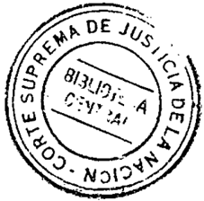
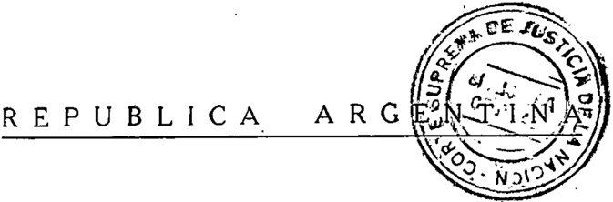
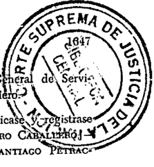
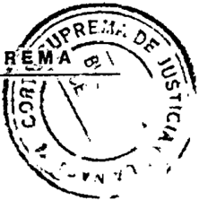
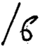
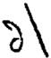
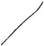
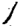

TOMO 310

Volumen 2

1987

, .

## FALLOS

DE LA

CoR TE

SUPREMA

DE

## JUSTICIA DE LA NACION

PUBLICACION A CAnGO DEL DEPAnTAMENTO DE JURISpnUDENCIA y PUBLICACIONES DEL TRIBUNAL

1987

## HOJA COMPLEMENTARIA

Hoja incorporada a los efectos de permitir la búsqueda por página dentro del Volumen.

3Q) El funcionario que se dcscmpeíie dos y Producción debe poseer título de Subdirector Arquitecto Ingeniero

Todo lo cual   dispusieron se comunicase cn ecl Jibro correspondiente, por ante CÉSAR BELLUSCIO CauLos SANTIAGO CHI JoRcE ANTONIO   BAcQué. Juan   Escríbano (Sccretario) .

## HEGIMEN LICENCIAS.

N? 27

En Buenos Aires, a los 10 días del mes de septiembre del ailo mil nove. cientos ochenta y siete, reunidos en la Sala de Acuerdos del Tribunal, el señor Presidente de la. Corte Suprema de Justicia de la Nación. doctor don losé Severo Caballero y los señores Jueces doc~ores don Augusto César Junn Belluscio, don Carlos S. Fayt, don Enrique ,Santiago \_Pctrncchi y don Jorge Antonio Baequé.

Acordaron:

- ]9) Sustituir los artículos 11 y 31 del Régimen de Licencias para la Justicia Nacional aprobado por acordada 34/77 por los siguientes textos:
- Art. 11: Excepci6n: La Corte Suprema podrá conceder. en resoluci6n fundada, beneficios en condiciones no previstas en el presente régimen de licencias, siempre que medien circunstancias excepcionales, debidamente comprobadas.
- Art. 31: Actividades CientÜicas, Culturales o. Deportivas: Los funcionarios y empleados que cuenten con una antigüedad en el Poder Judicial de la Nación mayor de tres años podd-n solicitar licencia extraordinaria a fin de desarrollar actividades científicns o culturales que resulten de interés para la función, por el término de un año con percepci6n de haberes y por un .año más sin goce de los mismos, si a juicio de la autoridad competente no se afcctara la .debida prestaci6n del servicio. Cuando esas actividades carezcan de dicho interés, el beneficio podrá otorgarse por un año, sin percepci6n de haberes con la misma reserva. También podrán pedir licencia extraordinaria con el objeto de participar en actividades deportivas. la que se acordará en los casos y bajo las condiciones previstas para el personal de ]a ~dministración Pública.
- 29) !vlodificar el art. 30 estableciendo que la nntigUedad requerida cs de ,6 meses, en lugar de 3.

3°) Agregar en los arts. 30, 33 Y 34. que la antigüedad requcrida para la concesión de las respectivas licencias debe ser la que correspoñda al desempeño de funciones en el Poder Judicial de la Nación.

Todo lo cual dispusieron y mandaron, ordenando se comunicase y registrase en el libro correspondiente, por ante mí, que doy fe. JoSÉ SEVERO CABALLERO \_ AUGUSTO CÉSAR BELLUSCIO -CARLOS S. FAYT -ENRIQUE SANTIAGO PErnAccm -JORGE ANToNIO BACQUÉ. -Juan Escribano (Secretario).

COHTE SUPHEMA. DESIGNACION DE SECHETAHIO ..

-NQ28-

En Buenos Aires, a los 22 días del mes de septiembre de mil novecientos ochenta y siete, reunidos en la Sala de Acuerdos del Tribunal. el señor Presidente de la 'Corte Suprema de Justicia de la Nación, doctor don José Severo Caballero )' los señores Jueces doctores don Augusto César Belluscio, don Carlos S. Fay~, don Enrique Santiago Petracchi y don Jorge Antonio Bacqué,

## Consideraron:

Que mediante ncordada 34 del í de junio de 1984, aclarada por la 53 del 14 de agosto del mismo afio, esta Corte estableció que la dcsignuc.:ión de funcionarios en los cargos que requieren título hahilitante debe efectuarse por el régimen de concursos.

Que por reso]uci6n nO 907 de fecha 4 de diciembre de 1986, se llamó a concu~o para cubrir el cargo de Secretario de la Corle Suprema de Justicia de la Nación.

Que la Comisi6n Asesora designada para dictaminar en el mencionado concurso procedi6 a ]a evaluaci6n de los antecedentes de los p'ostulantes y el mérito de la prueba escrita.

Por ello.

Se Resuelve:

Efecruar la siguiente designaci6n en ]a Corte Suprema de Justicia de la Nación: Secretario al Doctor Juan Carlos Manzanares (L.E. N9 4.059.774 -clase 1930-), el cual ocup6 el primer lugar en el orden de mérito.

Todo lo cual dispusieron y mandaron, ordenando se comunicase y registrase en el libro correspondiente, por ante mí, que doy fe. JosÉ SEVERO CABALLERO \_ AUGUSTO CÉSAR BELLUSCIO -CARLOS S. F AYT -ENRIQUE SANTIAGO PETRACCHI -JORGE ANTONIO BACQUÉ. Juan Escribano (Secretario).

## PROCURACION GENERAL DE LA NACION. DESIGNACION DE PROCURADOR INTERINO.

-NQ 29 ~

En Buenos Aires, a los 24 días del mes de sep'tiembre del ailo mil nove~ cientos ochenta y siete, reunidos en la Sala de Acuerdos del Tribunal, el señor Presidente de la Corte Suprema de Justicia de la Naci6n, doctor don José Severo Caballero, y los sei"íores Jueces doctores don Augusto César Bell'lscio, don Carlos S. Fayt y don Jorge Antonio Bncqué,

## Consideraron:

- lQ} Que el señor Procurador General' de la Nación, doctor Juan Octavio Gauna comunicó a este Tribunal que con fecha 22 del corriente elevó su renuncia al Señor Presidente de la Nación.
- 2°) Que por decreto 1536 del Poder Ejecutivo, el doctor Gauna fue designado Secretario de Interior.
- 3Q ) Que siendo necesario designar un funcionario para que se desempeñe al frente de la Procuración General dc la Nación,

## Acordaron:

- Designar al señor Procurador Fiscal de esta Corte, doctor José Osyaldo Casas para que se desempeñe en el cargo vacante hasta tanto se efectúe la designación definitiva.

Todo lo cual dispusieron y mandaron, ordenando se comunicase y registras~ en el libro correspondiente, por ante mí, que doy fe. JosÉ SEVEROCABALLERO ~ AUGUSTO CÉSAR BELLTJSCIO -CARLOS S. FAYT -ENRIQUE SANTIAGO PETRAC~ CH! -JORGE ANTONIOBACQUÉ. -Juan EscrilJono (Secretario).

1650

## CONCUHSOS. MODlJ'JCACJON DEL RECLAMENTO.

-NQ 30-

En Buenos Aires, a los 6 días del mes de octubre del mio mil novecientos ochenta y siete, reunidos en la Sala de Acuerdos del Tribunal el selior Prcsi. dente de la Corte Suprema de Justicia de la Nación, doctor don José Severo Caballero y los señores Jueces doctores don Augusto César J. Belluscio, don Carlo~ s. Fayt, don Enrique Santiago Petracchi y don Jorge Antonio Dacqué.

## Consideraron:

Que la expericllcia originada en la aplicación de las acordadas 34, 53 Y 00/84, por las Gunlcs se establece el régimen de concursos para la designación de los cargos que requieren título habilitante por disposición legal, aconseja establecer ciertos ajustes en cuanto nI nombramiento de los Secretarios, Subsecretarios )' Prosccretarios de los Tribunales Nacionales, permitiendo la designación p'or nscenso directo en los cargos superiores )' en los que scan de exclusiva confianza de los magistrados.

Que, asimismo, resulta :1tcndible la petición formulada por el Colcgio PÚblico dc Ahogndos de la Capital Federal en el sentido de integrar las comisiones asesoras establecidas por la primera de las acordadas mencionadas.

## Acordaron:

- 19) El régimen de designaci6n por concursos estnblecido Ilor la acordada 34/84 y sus eomplementnrins sólo sení. obligatori.o -respecto de los fUIl&lt;.:ionarios Ictradospara la provisión de los cargos inferiores, es decir, los de proseerctario letrado o sus equivalentes en la Corte Suprema, y de secretario de juzgado o sus equivalentes en los tribunales inferiores. En los cargos superiores a Jos mencionados, la Corte y las cámarns, en cada caso, p'odrán optar entre el llamado a concurso o la designaci6n por ascenso entre quienes ocupan el cargo inmediatamente anterior en el escalafón.
- 29) No es necesario el concurso para el trasIndo de un funcionario de un cargo a otro equivalente. ni para la provisión de cargos con funciones exclusivamente de supcrintendencia.
- 39) Para la designación de los secretarios letrados directamente dependientes de los ministros de In Corte Suprema, éstos podrán optnr entre In aplicación del régimen de concursos o el nombrnmicnto a su propuesta. En el segundo caso, salvo que se tratare de quienes hubiesen desempeñado cargo o empleo

judicial al tiempo de su nombnuniento, los así designados cesaráp en sus funciones en caso de cesar el magistrado que los propuso.

- 49) En la Capital Federal, las comisiones asesoras a que alude el arto 3 dé la acordada 34/84 estarán integradas: para la designación de secretarios de primera instancia, por un juez de cámara, lin juez de primera instancia y un abogado representante del Colegio Público de Abogados de la Capital Federal; para la designaci6n de prosecretarios de cámara, por dos jueces de cámara y un representante del Colegio; y para los prosecretarios letrados de la Corte, por dos jueces de la Corte y UD representante del Colegio.

Todo lo cual dispusieron y mandaron, ordenando se comuñicase y registrase en el libro correspondiente, por ante mí, que doy fe. JosÉ SEVEROCABALLERO AUGUSTO CÉSAR BELLUSCIOCARLOSS. FAYT ENRIQUESANTIAGO PETRACcm -JORGEANTONIOBACQuÉ.Juan Escribano (Secretario).

## EMPLEADOS jUDlCIALES. jUB1LACION.

-NQ 31-

En Buenos Aires, a los 6 (lias del mes de octubre del año mil novecientos ochenta y siete, reunidos en la Sala de Acuerdos del Tribunal, el señor Presidente de la Corte Suprema de Justicia de la Nación doctor don José Severo Caballero y los señores Jueces doctores don Augusto César Belluscio, don CarIas S. Fayt, don Enrique Santiago Petracchi y don Jorge Antonio Bacqué,

## Consideraron:

Que la ley de facto 22.955, reglamentada por decreto 33'19/83 estableció un régimen jubilatorio específico -modificatorio del generalpara los agentes comprendidos en el Escalafón para el personal civil de la Administración Pública Nacional y el que presta servicios en el Ministerio de Defensa, Estado .Mayor Conjunto o Comando en Jefe de, las Fuerzas Armadas, que instauró la movilidad del haber de las prestaciones (art. 7°).

Que la ley 18.484 (t.o. p'or decreto 2700183) no ampara a 'gran ca{it'idad de agentes que, a pesar. de reunir los requisitos de edad y antigüedad no pueden jubilarse', pues de acogerse a los beneficios de la ley 18,039" -que es

la que actualmente corresponde aplicarlesverían reducido en un 60 % el sueldo que cobran en la actualidad.

Que esta situación afecta precisamente a los empleados que perciben las más bajas remuneraciones y crea una desventaja manifiesta con relación al resto del personal que colabora en la efectiva prestación de un servicio público.

Que este Tribunal reitera la inexistencia de fundamentos de equidad que determinen la exclusión del Poder Judicial del régimen sancionado, que hace cuatro años beneficia al personal civil de la Administración Pública Nacional y al que presta servicios en el Ministerio de Defensa, Estado Mayor CJJljunto o Comando en Jefe de las Fuerzrls Armadas (art. 1 9 , ley 22.955).

Por todo ello,

Acordaron:

Reiterar la acordada 2/84 de fecha 3 de febrero de 1984 solicitando al Honorable Congreso de la Nación que se considere la inclusión en el arto 1Q de la ley 22.955 de los funcionarios y emp'leados del Poder Judicial de la Nación no comprendidos en el Régimen de Jubilaciones y Retiros para Magistrados y Funcionarios (ley 18.464, t. O. por decreto 2700/83).

Todo lo cual dispusieron y mandaron, ordenando se comunicase y registrase en el libro correspondiente, por ante mí, que doy fe. JosÉ SEVEROCABALLEROAUGUSTOCÉSAR BELLUSCIOCARLOS S. FAYT ENRIQUE SANTIAGOPETRACeHl -JORGEANTONIO BACQUÉ.Juan Escribano (Secretario).

CORTE, SUPREMA -DESIGNAClON DE SECRETARIO

N? 32

En Buenos Aires, a los 8 días del mes de octubre del año mil novecientos ochenta y siete, reunidos en la Sala de Acuerdos del Tribunal, el señor Presidente de la Corte Suprema de Justicia de la Nación, doctor don José Severo Caballero y los señores Jueces doctores don Augusto César Juan Belluscio, don Carlos S. Fayt, don Enrique Sa~tiago Petracchi y don Jorge Antonio Bacqué,

## Acordaron:

de la Nación en reeroHoracio Bisordi (D. N. Justicia Alfredo Designar Secretario de la Corte Suprema de plazo' del doctor Jorge Eduardo Barral, al doctor 1. N' 7.613.304 -clase 1948-).

Todo lo cual dispusieron y mandaron, ordenando se comunicase y registrase en el libro correspondiente, por ante mí, que doy fe. JosÉ SEVERO CABALLERO -AUGUSTO CÉSAR BELLU~CIO -CAR] OS S. FAYT -ENRIQUE SANTIAGO PETRACcm -JORGE AXTONIO BACQUÉ. -Juan Escribano (Secretario).

## COMISI0N LIQUIDADORA DEL PODER JUDICIAL.

-N' 33-

En Buenos Aires, a los 20 días del mes de octubre del año mil novecientos ochenta y siete. reunidos en la Sala de Acuerdos del Tribunal el selio! Presidente de la Corte Suprema de Justicia de la Nación, doctor don José Severo Caballero y los señores Ministros doctores don CurIos S, Fa)'t, don Enrique Santiago Pctracchi y don Jorge Antonio Bacqué,

## Consideraron:

Que la Subsecretaría de Administración -ante la iniciativa del Departamento de Arquitecturasolicita la creación de la Comisión Liquidadora -ley 12,910en ~mbito del Poder Judicial de la Nación.

Que las variaciones de costos observadas en las obras en ejecución por terceros han conducido en numerosas oportunidades a situaciones de demoras significativas, cuando no a su paralización.

Que este estado de cosas ocasiona perjuicios en tanto redunda en detrimento de los presupuestos previstos, como así en los plazos para la termina&lt;;ión de las mismas.

Que si bien los inconvenientes expuestos se han venido superando con actualizaciones que se practiquen en cada caso, se hace necesario -por los antecedentes seI1alados p'recedentementeestablecer en órbita del Poder Judicial de la :Nación el mecanismo que ofrece el arto 3ro. del decreto 3.772164 reglamentario, de la ley 12.910, mediante el cual se faculta a las reparticiones pú.

blicas a designar en sus respectivas jurisdicciones Comisiones Liquidadoras des~ tinadas a determinar los reajustes por variaciones de costos en obras licitadas o contratadas directamente.

Que el procedimiento aludido brinda la posibilidad de encarar -id6nea y ágilmentelas' usuales y conflictivas situaciones apuntadas y en forma integral, por cuanto la norma de referencia contiene previsiones que alcanzan por vía de recurso a dar instancia a la Comisión Arbitral (decreto 11.511/47), para el caso de cuestionar el contratista lo dictaminado por la Comisión Liquidádora.

Que. por tales circunstancias y teniendo en cuenta 10 expuesto en estas actuaciones p'or la Comisión de Estudios constituida al efecto, la Subsecretaría de Administración, la Subdirección General de Servicios y Producción y el Departamento de Arquitectura,

## Resolvieron:

- l Q ) Crear -en ámbito de la Subdirección General de Servicios y Produc. ciónla Comisión Liquidadora del Poder Judicial de la Nación (ley 12.910), la que cumplirá su cometido de acuerdo a 10 establecido en 'el Reglamento que fonna parte de esta acordada y que por este acto se aprueba.
- 2 9 ) La Comisión Liquidadora -dentro de los ,tr~jnta (30) días hábiles de constituídadeberá elevar un proyecto de reglamento -interno para su aprobación por parte del Tribunal.

Todo lo cual dispusieron y mandaron, ordenando se comunicase y l"egistrase en el libro correspondiente, p'or ante mí, que doy fe. JosÉ SEVERO CABALLERO -CARLOS S.. FAYT '-ENRIQUE SANTIAGO PETRACCHI -JORGE ANTONIO BACQU~:. -Juan Escribano (Secretario).

REGLAMENTO DE LA COMISION LlQUlDADORA (LEY 12,910) DEL PODER JUDICIAL DE LA NACION

## De la Comisión:

Artículo 19: La Co~isión Liquidadora de la ley 12.910 elel Poder Judicial de la NaciÓn ajustará su com'etido u las disposiciones co~teniJas en el prc,scnte, y deberá aplicar en forma supletoria la legislación, vigente en el ámbito del Po4er Ejecutivo ,Nacional. '

Artículo 29: La Comisión Liquidadora estará integrada por tres (3) miembros titulares, con dedicación exclusiva que deberán ser profesionales de la arquitectura o la ingeniería civil y con .la jerarquía escalafonaria de prosecretario jefe.

Artículo 3Q: Los integrantes de la Comisión Liquidadora deberán excusarse y asimismo podrán ser recusados en aquellos casos previstos en el arto 17 del Código Procesal Civil y Comercial de la Nación, debiendo tal circunstancia quedar consignada en el libro que se habilitará al efecto.

Artículo 4Q: El secretario integrará la Comisión Liquidadora en caso de licencia, recusación o excusación de algún vocal.

Artículo 59: Los beneficios de los recesos anuales reglamentarios no podrán ser utilizados simultáneamente por los vocales.

Artículo 6Q: Serán funciones: de la Comisi6n Liquidarlora las que se deta w Uan a continuaci6n:

- a) Confección de tablas de costos.
- b) Elaboraci6n de Índices para el reconocimiento de variaciones de costos.
- e) Formulación de ecuaciones polinómicas para el reconocimiento de' va~ . riaciones de costos.
- d) Redacción de las especificaciones' "ad~hoc" (régimen).
- e) Esrudio y actualización de 1fts especificaciones Yigelites (regímenes adhoc).
- f) Elaboración y publicación de tablas mensuales de valores medios.
- g) Estudio )' dictamen sobre las reclamaciones interpuestas por las ~~pre~ sas contratistas referentes a las liquidaciones de variaciones de costos.
- h) Estudio y dictamen sobre las disconformidades interpuestas.
- i) Asesoramiento a otras áreas sobre normas y formas de liquidaciones de las variaciones de costos e intervención de los certificados "ad-hoc", iniciándolos de conformidad.
- j) Seguimiento de tendencias de mercado.
- k) Aplicación de normas legales vigentes que afecten las variaciones de costos.
- 1) Obligatoriedad de concurrir al Comité Consultivo de la ley 12.910 o cualquier otro organismo afín a la materia, en representación del Poder Judicial de la Nación, comunicando los resultados obtenidos por escrito.

1656

- ll) Intervención -relativa a temas de su competenciaen la preparaclOll de los pliegos y demás documentos para las licitaciones de obra y contratos de suministros a los que se incorporen fórmulas de variabilidad y en la liquidación de los reajustes por variación de costos.

Artículo 7 9 : La Comisión Liquidadora queda facultada para requerir directamente -por intermedio de su presidentea cualquier organismo público o privado, proveedor. contratista, etc., todo tipo de información relacionada con el cumplimiento especifico de su cometido. Asimismo podrá solicitar asesoramiento legal y contable a la Subsecretaría de Administración.

Artículo 8 Q : La Comisión Liquidadora tendrá su asiento físico en depeo4 dencias del Departamento de Arquitectura.

## II De la Presidencia:

Artículo 9 Q : La presidencia, de la Comisión será ejercida por orden de antigüedad en ésta. sucesivamente por cada uno de los miembros titulares. La rotación set.á anual (año calendario) y su designación será efectuada por el Secretario de Superintendencia Administrativa del Tribunal.

Artículo 10: Para la primera integración se tendrán en cuenta las antigüedades en los títulos y en el supuesto que la iniciación de actividades de la Comisión no coincida con el respectivo año calendario, la primera presidencia atenderá también este período.

Artículo 11: En caso de sustitución o ausencia temporal del presidente -por cualquier motivo que fuereel vocal que le siga en tumo ejercerá esas funciones hasta completar el p'eríodo del reemplazado, desempeñando a continuación el que le corresponde como propio. Los nuevos miembros que se incor. paren pasarán a ocupar el último término del ordenamiento.

Artículo 12: El miembro de la Comisión Liquidadora que ejerza la presidmicia queda autorizado por el presente reglamento a:

- a) Firmar -en nombre de la Comisiónlas p'rovidencias necesarias para el trámite de exp'edientes o escritos que no tengan carácter de dictámenes,
- b) Firmar las solicitudes a que se refiere el artículo 79,
- c) Autorizar cualquier trámite administrativo con relación al personal afectado a la Comisión Liquidadora.
- d) Autorizar las vistas que se soliciten de las actuaciones existentes en la Comisión, como así también fijar sus plazos. conforme a lo establecido en las reglamentaciones vigentes.

## III De la Secretaría:

- Artículo 13: La Comisión Liquidadora contará con una Secretaría a la cual se le asignará el personal necesario y cuyo titular deberá tener el título profesional de arquitecto, ingeniero civil o maestro mayor de obras, el cual revistará ep la categoría de prosecretario administrativo (P.A. T.).

Artículo 14: Serán funciones del Secretario:

- a) Ejercer la jefatura de la oficina de la Comisión y atender su despacho.
- b) Conformar y supervisar el funcionamiento del archivo y realizar la custodia de las actuaciones que lo integren.
- e) Organizar la atención al público y autorizar la entrega de las publicaciones de la Comisión (tablas).
- d) Ordenar las audiencias que se soliciten a la Comisión.
- e) Efectuar los reemplazos dispuestos en el Artículo 4Q ·

## IV -Del Procedimiento:

Artículo 15: Toda documentación generada en el ámbito de la Comisión Liquidadora llevará la firma de sus tres miembros, salvo que se trate del supuesto contemplado en el Artículo 12.

Artículo 16: Los dictá~enes que emita la Comisión Liquidadora deberán contener' expresión de fundamentos y sólo tendrán validez una vez aprobados p'or el Subdirector General de Servicios y Producción o su reemplazante.

Artículo 17: Los dictámenes podrán ser adoptados por unanimidad o por simple mayoría. En este última caso, la aprobación a que se refiere el Artículo 16, deberá ser fundada cuando ena recaiga en el voto de la minoría.

Artículo 18: La Comisión Liquidadora pondrá a disposición del funciona~ rio del Poder Judicial de la Nación que pudiera integrar la Comisión Arbitral (ley 12.910) las resoluciones producidas en su jurisdicción, como así también cualquier documentación que le fuere necesaria para el desempeño de su función.

Artículo 19: Cualquier cuestión de interpretación que se plantee resp'ccto de la aplicación del presente reglamento,' será resuelta por la Comisión. Dicha resolución podrá ser recurrida ante el Subdirector General de Servicios y Producción o su. reemplazante.

Artículo 20: La Comisión Liquidadora o el Subdirector General. de Servicios y Producción p'odrán proponer las modificaciones nI presente reglamento que resulten nccesnrins, para el más adecuado ~uncionamicnto de aquélla. -Juan Escribano (Secretario).

I'ROCURACION CENERAL DE LA NACION. DESICNACJON DE I'ROCUHADOR GENERAL INTERINO.

-N' 34

En Buenos Aires, a los 29 días del mes de octubre del ailo mil novecientos ochenta y siete, reunidos en la Sala de Acuerdos del'. Tribunal, el scilor Presi. dent~ de la Corte Suprc~a de Justicia de la Nación, doctor don José Severo Caballero y los seiíores Jueces doctores don Carlos S. Fayt, don Enrique Santiago l'etracchi y don Jorge Antonio Bacqué,

## Consideraron:

19 ) Que por acordada 29/87 de fecha 24 de setiembre del corriente se designó al sefior 1'rocurador Fiscal de esta Corte doctor José Osvaldo Casas para desempeiíarse en el cargo vacante por renuncia del. sciior Procurador Ceneral de la Nación.

- 29) Que por resolución 40/87 del 23 de octubre de 1987 el seilor Secretario de Justicia accptó -3 partir del lQ cle novicmbrcla renuncia presentada por el doctor CasaS!. '
- 39) Que es ncccsario designar un funcionario que se des('mpeilc al frente de In Procuración General de la Nación.

Por ello,

Acordaron:

Designar 'al doctor Jorge Tomás Medjci para que se desempeñe en el cargo vacante, hasta tanto se efectúe la designación definitiva del Procurador General de la Nación.

Todo lo cual dispusieron y mandaron, ordenandó que se comunicasc y rcgistrase en el libro correspondiente, por ante mí, que doy fe. JosÉ SEVEHO CADALLERO -CABLOS S. FAYT -ENRIQUE SANTIAGO PETRAccm -JOBCE ANTONIO BACQUÉ. -Juan Escribano (Secretario).

## CORTE' SUPREMA. LIBRO DE ASISTENCIA,

## -NQ 35'-

En Buenos Aires, a los 24 días del mes de noviembre del afio. mil novecientos ochenta y siete, reunidos en Ja Sab de Acuerdos del Tribunal el señor Presidente de la Corte Suprema de Justicia de la Nación, doctor don José Severo Caballero y los señores Jueces doctores don Augusto César J. Belluscio, don Carlos S. Fa)'t, don Enrique Santiago Petracchi y don Jorge Antonio Bacqué.

## Con.sideraron:

Que es necesario establecer una p'nutn objetiva para evaluar el rubro "asistencia" incluido en las planillas de calificaciones confeccionadas. en virtud de lo decidido por esta Corte en la acordada 68 his/84.

Que este método contrihni~{l a mejorar el servicio de justicia, y constituirá una garantía para aquellos agentes que cumplen con responsabilidad y puntua.~ lidad las tareas que se les asignan.

Por ello,

## Acordaron:

- 1 9 ) Disponer que en las secretarías y dependencias de este Tribunal que no tengan 1m sistema para el control de asistencia del personal -hasta la categoría de proseeretario jefedeberá llevarse un Libro de Asistencia en el que se dejará diaria constancia de la concurrencia y del cumplimiento del hor~rio fijado por la Corte, mediante el asiento y firma de los empleados y corresp'ondiente .certificación del Secretario o funcionario a cargo.

2 9 ) Comunicar a las cámaras nacionales y federales de npclacioncs que deberán adoptar sistemas similares al aquí establecido, en sus respectivos reglamentos.

Todo 10 cual dispusieron y mandaron, ordenando se comunicase y registrase en el libro correspondiente, por ante mí, que doy fe. JosÉ SEVERO CABALLERO \_ AUGUSTO CÉSAR BELLUSCIO -CAHLOS S. FAYT -ENIUQUE SAi."XTIAGOPETRACCHI -JOHGI~ ANTONIO BACQUÉ. -Juan Escribano (Secretario).

1660

## PROCURACION GENERAL DE LA NACION. DESIGNACION DE SECRETARIO LETRADO.

-NO36-

En Buenos Aires, a Jos 24 días del mes de noviembre del año mil novecientos ochenta y siete, reunidos en la Sala de Acuerdos del Tribunal el señor PJ('~jdentc de l~ Corte Suprema de Justicia de la Naci6n, doctor don José Severo Caballero, y los sei'íorcs Jueces doctores don Augusto César Belluscio, do~ Carlos S Fayt, don Enrique Santiago Petracchi y don Jorge Antonio Bacqué.

## Acordaron:

Designar Secretario Letrado en la Procuración General de la Nación, al doctor Juan Carlos L6paz (M.I. NO 13.565.696) .

. Todo lo cual dispusieron y mandaron, ordenando se comunicase y registrase en el libro correspondiente, por ante mí, que doy fe. JosÉ SEVERO CA8ALLERO -AUGUSTO CÉSAR BELLUSCIO -CARLOS S. FA YT -ENRIQUE SANTIAGO PETRACCHI. -Eduardo D. CraOÜJttQ (Secretario).

## MATRlCULACION. ABOGADOS.

\_NO 37-

En Buenos Aires, a los 24 días del mes de noviembre del afio mil novedentas ochenta y siete, reunidos en la Sala de Acuerdos del Tlibt.:na! el señor Presidente de la Corte Supremn de Justicia de la Nación, doct:'&gt;Tdon José Severo Caballero y los señores Jueces doctores don Augusto César J. Bclluscio, don Carlos S. Fayt, don Enrique Santiago Petracchi y don Jorge Antonio Baequé,

## Consideraron:

19) Que el registro matricular impuesto por la ley 22.192, arts. l0 y 3..... -después de la sanción de la ley 23.187-, habilita al p'rofesional que se inscribe ante una cámara federal del interior para ejercer ]a abogada ante la Corte Suprema y cualquier otro tribunal federal, excepto las cámaras y juzgados

federales con sede en la Capital Federal (art5. 1Q, 20 iné.. b, 17. 18 y canco de la ley 23.187).

- 20) Que la matriculaci6n ante el Colegio Público de Abogados de la Capital Federal -ley 23.187-, habilita en cambio para "actuar ante todos los tribunales nacionales de la Ciudad de Buenos Aires.
- 3Q } Que esto significa que la matriculación respecto de cámaras y juzgados fcde~lcs está dividida en dos sectores estan~s. por los límites de la Capital Federal, situación que resulta inannónica.
- 40) Que los efectos de esta situación no se han manifestado aún en toda su magnitud porque algunas de las cámaras federales del intenor han interpretado en muchos casos que la matriculación en el Colegio Público de Abogados de la Capital Federal equivalía a la anterior inscripción ante la Corte, lo que corresponde remediar, 'para evitar la de~igualdad que de ello se deriva.

'por ello,

Acordarón:

## lQ) Disponer:

- a) El Registro, en el interior de la Hc¡&gt;'ública, estará a cargo de las cámaras federales de apelaciones, las qu~ podrán delegar la. realización dc los trámites en los juzgados federales cuyo asientq no sea a l~ vez sede de cámara, reservándose el registro en el libro de la matrícula y la expedición de la credencial se hará con la intervención. de las respectivas secretarías de superintendencia.
- b) El pedido de inscripción o reinscripci6n deberá ser formalizado ante la Cámara federal de apelaciones según fuere el domicilio que denuncie el abogado, con la declaraci6n jurada de no encontrarse comprendido dentro dc las inhabilidadcs previstas por el artículo 5Q de la ley y acompailando la documentación que acredite el cumplimiento de los requisitos legnles.
- e) Las denegaciones de inscrir'ción en la matrícula que resuelvan las eáma;as federa!cs de apelaciones según corresponda, serán susceptibles del recurso de reeonsideración y en su caso del jerárquico ante la Corte Suprema de Justicia, los que deberán ser interpuestos dentro del término de diez días.
- d) Las cámaras federales de ar.claciones comunicarán mensualmente a la oficina de matrícula la nómina de abogados que se hayan inscripto o reinscripta durante' el mes anterior, adjuntando las respectivas fichas de matrieulaci6n, lo que deberá ser cumplido por duplicado, reservándose la c6.mara un ejemplar de las mismas.
- e) La matriculación obtenida por los abogados en la Capital 'Federal, durante la vigencia de la ley 22.192, pcnnite la actuación ante la justicia federal del interior del país.

- f) Los abogados inscriptos en una cámara federal del interior del país c~alquicra que fuese ¡"~ ley vigente al momento de su matriculación, que quieran actuar ante la justicia federal ti ordinaria de la Capital Federal, deb~rán acreditar para ello su inscripción ante el Colegio Público de Abogados de la Capital Federal. .
- g) Los abogados inscriptos en el Colegio Público de Abogados de la Capital Federal que quieran actuar ante la justicia federal del interior del país, deberán acreditar para ello su inscripción ante la cámara federal con ha~.;iento en una provincia.
- h) Los juzgados y cámaras intervinientes quedan facultados para intimar a los abogados que actúan en las causas que tramitan por ante ellos a acreditar el cumplimiento de los revaudos exigibles en los términos ele las leyes 22)92 y 23.187, como así también a estableccr el plazo prudend~l que estimen conveniente para que los interesados subsanen las insuficiencias quc pudieren verificarse respecto de actuaciones cumplidas.
- i) Los abogados que estuvieren inscriptos en una cámara federal del interior y no deseen ejervcr la profesión en la Cap'ital Federal, conservarán su inscripción, sin necesidad de realizar trámite algllno.
- 2 9 ) Hacer saber lo decidido al Honorable Congreso de la Nación, a la Federación Argentina de Colegios de Abogados, al Colegio Público de Abogados de la Capital Federal y a las cámaras federales de apelacioncs de todo el país.

Todo lo cual dispusieron y mandaron, ordenando que sc (;omunicase y registrase en el libro correspondiente, por ante mí, que, doy fe. JosÉ SEVERO CABALLERO AUGUSTO CÉSARBELLUSCIO CARLOSS. FAYT ENRIQUESANTIAGO PETRACCHI -JORGE ANTONIO BAQUÉ. Eduardo D. Craviotto (Secretario).

PRESUPUESTO. AÑO 1988.

-NQ 38-

En Buenos Aires, a los 25 días del mes de noviembre del año mil novecientos ochenta y siete, reunidos en la Sala de Acuerdos del Tribunal, el señor Presidente de la Corte Suprema de Justicia de la Nación, doctor don José Severo Caballero, el señor Ministro Decano doctor don Augusto César Belluscio y los señores .Ministros doctores don Carlos S. Fayt, don Enrique Santiago Petracchi y don Jorge Anton.io Bacqué,

## Consideraron:

Que de conformidad con lo prescripto por el artículo 99 de la Constitución Nacional, la Corte Suprema debe dietar -p'ara el aÍÍo 1988el presupuesto para el Poder Judicial de la Nación (Fallos: 240:6; 241:109; 303:48; doctrina de fallos, 289,365; 293,493; 302,27; acordadas números 47/82; 7 y 75/84 Y 2 Y 62/86), y de acuerdo con lo prescriptó por el artículo 17 "in fine" de la ley nQ 16.432, remitirlo al Poder Ejecutivo Nacional para que sea enviado al Honorable Congreso de la Nación, a fin de que se suministren a la administración de justicia .nacional los recursos financieros necesarios para cumplir con su cometido en el .marco de la independencia de poderes que exige el sistema republicano de gobierno.

Que en esta ocasión, como en años anteriores, ha primado el criterio de ajustar el plan de erogaciones elaborado por el Tribunal al objetivo de una adecuada contención de gastos, dentro del marco de una política de máxima austeridad exigida p'or las condiciones económicas que atraviesa el país, sin perjuicio de sefialar que las múltiples y serias deficiencias con que viene desempeñándose desde tiempo atrás el Poder Judicial de la Nación, determinan la necesidad de prestar atención prioritaria, en forma gradual, a aquellos requerimientos indispensables para el normal desenvolvimiento de la función: judicial, ya sea en materia de personal como de infraestructura.

Que, a tales efectos, es menester que los señores magistrados de todas las instancias cuenten con la información -legislativa, jurisprudencial Y doctrinaria actualizada, con personal suficiente y capacitado para instrumentar sus decisiones, con edificios funcionales y decorosos y con ~os elementos necesarios para el desarrollo en forma eficaz y rápida de sus actividades.

Que en tal sentido se ha previsto continuar con el programa de inversiones iniciado en el año 1987, que contempla --":'entre otras cosaslas destinadas a la urgente adquisición de edificios en todo el país para aliviar la saturación y dispersión edilicia que padecen determinados fueros, al reemplazo de los precarios e inapropiados inmuebles alquilados para la justicia federal como consecuencia del cúmulo de causas registradas en los últimos tiempos, a lá prosecución del Plan de Informatización del Poder Judici~ ¿le la NaCión que ha tenido p'rincipio de ejecución en el corriente ejercicio financiero.

Que, con arreglo a las' directivas ,impartidas por el Ministerio 'de Economía Secretaría de Hacienda, los niveles de créditos de .los respectivos Incisos han sido formulados en base a los valores promedio de precios al mes de julio de 1987.

Que por otra parte, también cabe hacer referencia a la circunstancia de que, frente a lo establecido en el articulo 31 de la ley n 9 23.526 -que sanciona el 'Presupuesto General de la AdministraciÓn Nacional para el Ejercicio de 1987el Poder Ejecutivo Nacional asumió la facultad, hasta el -31 de diciembre' de 1989. de fijar las remuneraciones de los integrantes del Poder Judicial de la

Nación. Por consiguiente se deberá tener en cuenta el precepto -constitucional que consagra la intangibilidad de las retribuc':iones ae los magisb'ado~ nacionales, requerimiento que esta Corte ha tenido' oportunidad de reiterar en recientes pronunciamientos (acordadas números 6 -Y 55 de 1984; 30, 38, 47 y 53 de 1.985 y 1, 18, 28, 43 y 62 de 1986). .

Que de conformidad con lo expuesto -en los considerandos precedentes, ~l presupuesto del Poder Judicial de la Nación para el ejercicio de 1988 ha sido estimado conforme al detalle que se consigna a continuación:

## INCISO II -PERSONAL.

El monto anual previsto para este inciso -calculado \_avalores de julio ppdo. según pauta indicada por la .secretaría de Haciendaasciende a la suma de australes doscientos cuarenta y dos millones seiscientos diecinueve mil (A 242.619.000).

En el total consignado se incluye la. \_cantidad de australes siete millones quinientos mil (A 7.500.000) con destino- a la Parti.da Principal 1199,Crédito a Distribuir, para las finalidades qu.e a continuación se describen:

- 1. A 6,000.000 en el Programa 001 Administración de Justicia en Ultima Instancia, destinada a hacer frente a los distintos requerimientos de carácter imprescindible sobre creación o transformación de \_cargos,formulados por los. tribunales y organismos de la Capital e interior del país.

Lo exptesado precedentemente tiene por objeto proseguir con la atención de solicitudes perentorias de refuerzo de personal, que se viene acentuando por\_ el incesante incremento de cauSas registrado en los últimos anos en la justicia nacional, toda vez que en Jos presup'uestos de 1985 y 1986 no sé otorgó suma alguna por este co.nccpto (confr. leyes uros. 23:270 y 23.410), teniendo principio de ejecución recién en el" actual ejercicio mediante la asignación de un crédito de A 2',000.000 (confr. decreto nO 1332/87).' .

En consecuencia, el monto solicitado en esta oportunidad tiende no sólo a dar cumplimieIl:to a las demandas insatisfechas en lqs períodos citados, sino también a formar parte del variado dispositivo instrumental que la administración de justicüi. recl~ma para revertir su gradu~l proceso de deterioro.

- 2. /Ji 1.500.000 en el Programa 002 -Administración de Justicia en Primera y Segunda Instancia, con la finalidad de disponer de los recurs?s humanos necesarios que permitan p'roseguir con el Plan de Informatizaciól\. del Poder Judicial de la Nació~ iniCiado en el corriente año, confonne se expresara en oportunidad del dictado de la acordada nl;}62/86.

Asimismo, corresponde tener en cuenta que -al monto solicitado para este Incisodeberán adicionarse los siguientes requerimientos también estimados en valores del mes de julio ppdo.:

- a) Cumplimiento. de actos legales: incorporación de los créditos necesarios para ejecutar las siguientes leyes de creación de tribunales federales: ley nQ 21.188 -Juzgado Federal de Pte. Roque Sáenz Peña (Peia. del Chaco) y ley nQ 23.112 -Juzgado Federal de San Ramón de la Nueva Orán (Pcia. de Salta). El mayor gasto asciende a la suma de ~ustraies setecientos noventa y seis mil trescientos sesenta y uno (A 796.361.-).
- 'bY Actos legales en trámite: creación de 45 Juzgados Nacionales de Primera Instancia del Trabajo de la Capital Federal, cuya incidencia financiera asciende a la suma de australes seis millones seiscientos veintinueve mil trescientos seis (A 6.629.306.-).

## INCISO 12 -BIENES Y SERVICIOS NO PERSONALES.

El monto total que requiere este inciso asciende a la suma de australes treinta y cuátro míllones ciento ochenta y seis ,mil (A 34.186.000.-) de acuerdo con las solicitudes formuladas que contemplan. entre otras, la atención de Gastos de Funcionamiento para los tribunales y organismos de la Justicia Nacional, Fe~ deral y Electoral. como asimismo cabe consignar que con la piecitada p'artida se sufragan los requerimientos exigidos por diversas prestaciones de importancia. que a título ilustrativo se mencionan a continuación sin que ello implique la totalidad de los conceptos: alquileres de inmuebles (44 edificios en todo el país), honorarios. servicios públicos, servicios anuales.' viáticos, etc.

Otra aplicación significativa de los recursos de este inciso es, sin duda, la que insumirá la prosecución del Plan de Informatización de la administración de la justicia nacional (/ti 4.500.000.-), que ha tenido principio de ejecución -conforme se señalaraen ,el corriente ,ejercicio financiero.

## INCISO 31 -TRANSFERENCIAS PARA FINANCIAR EROGACIONES CORRIENTES.

Respecto a este inciso, se considera conveniente asignarle la suma de australes doscientos sesenta y tres mil (A 263.000.-) al Patronato de Liberados de la Capital Federal, con el fin de p'osibilitar la realización de los informes socia-, les previstos en los artículos 26, 40 Y 41 del Código Penal.

## INCISO 41 -BIENES DE CAPITAL.

En este inciso se contemplan las prev1Slonesnecesarias que posibiliten el apoyo a la tarea de los magistrados, funcionarios, empleados y auxiliares de" la

justicia, como ser continuar la sU13titución de máquinas de escribir manuales por electrónicas y la adquisición de armarios y ficheros metálicos para la Justicia Electoral, aparatos de aire acondicionado, etc. También se ha previsto la provisión' y el reemplazo de automotores, cometido éste iniciado en el presente año.

## INCISO .j2 -CONSTRUCCIONES.

El monto total de este inciso ~e ha estimado en la suma de australes .veinticuatro millones novecientos mil (A 24.900.000.-), destinado a financiar los siguientes trabajos públicos en el interior del país: a) reaotivación de hu; obras cuyos contratos fueron rescindidos por incumplimiento de la emp'resa contratista (cofr. resolución n9 897/87): Tribunales Federales de Resistencia (Pcia. del Chaco); Posadas (Pcia. de Misiones) y Neuquén; b) proyectos licitados y en trámite de ad;udict~ción: Tribunales Federales de General Roca y Viedma (Peia. de Río Negro); e) proyectos en condiciones de licitar durante 1988; viviendas para magistrados en Comodoro Rivadavia (Peia. del Chubut); edificios de los tribunales federales de Rosario (Pcia, de Santa Fe); Tierra del Fuego (Territorio Nacional de la Tierra del Fuego, Antártida c Islas del Atlántico Sur) y' San Martín (Peia. de Buenos Aires); d) previsión contemplada, una vez que concluya la cesión de los terrenos por parte de los respectivos gobiernos provinciales: eatamarca y Jujuy.

Por otra p'arte está prevista la ejecución de distintas obras menores de ampliación o remodelación de diversos edifieios: Bahía Blanca (Peia. de Buenos Aires); Paraná (Provincia de Entre 'Ríos); Santa Rosa (Pcia. de La Pampa); Río Gallegos (Peia. de Santa Cruz); Edificio de la calle Lavalle 1220; Margue Judicial; cte.

El plan precedentemente expuesto tiende.a dotar gradualmente a Jos tribunales nacionales y federales, de edificios propios y adecuados a los especiales requerimientos funcionales que la labor judicial demanda, con lo cual se podrá reemplazar a varios inmuebles en locación y acondicionar a otros de propiedad fiscal, que por su estado de conservación actual y demás condiciones de .habitabilidad no resultan aptos p'ara el fin a que se los destina.

## INCISO 51 -BIENES PREEXISTENTES.

En este inciso se contempla la adquisición de edificios o terrenos que posibiliten el funcionamiento de los Juzgados Feder~cs de San Ramón de la Nueva Orán (Pcia. de Salta) y JUllín (Peia. de Buenos Aires), que fueron creados mediante leyes 23.112 Y-23.371, respectivamente.

310

## CUENTA ESPECIAL 510 -INFRAESTRUCTURA JUDICIAL.

Con relación a esta Cucnta Especial procede fijar los recursos propios )' los gastos en la suma de australes sesenta y seis millones (A 66.000.000.-) importe resultante de anunlizar la recaudación operada en el mes de septiembre de 1987, que ascendió a .a\1strale~ cinco millones cuatrocientos sesenta mil doscientos ochenta y tres (A 5.460.283.-), cuyo destino se discrimina de In siguiente forma:

- a) inciso 12 -bienes y servicios no. personales
- (A 7.300.000.-);
- h) inciso 51 -bienes preexistentes

(A 29.700.000.-).

- e) inciso 42 -constmcciones delación -en cjccuci6ndel edificio la Margue Judicial y distintas obras lación en diversos edificios; )' (A 13.000.000.-) remode la calle junín 760/66 sede de menores de amp1iaci6n o remoc1c-
- d) inciso 51 -hienes preexistentes

(A 29.700.000.-)

A los fines de mantener el poder adquisitivo de los fondos depositados y registrados en esta Cucnta Especial y los quc se incorporen en. el futuro, se requiere del Honorable Congreso de la Nnción el otorgamiento de la facultad de colocación transitoria de las dispouihilidades en efectivo, en títulos y valores emitidos por el Banco Central de la Hcpública Argentina o mantener dichas disponibilidades en cucntas de depósitos remuneradas del Banco de la Nación Argentina.

Consecuentemente, se requiere la facultad del uso de, los recursos que se generen en los servicios de Cuentas Especiales, modificando a ese fin el artículo 17 de 11 ley nQ 16.432, incorporado a la ley nQ 11.672 (Complementaria Permanente de Presupuesto) p'or el artículo 83 de la citada ley nQ 16.432 y modificado por su similar 33 de ln ley 22.202.

Dicllas solicitudes son reiteraci6n de lo cxpresado en oportunidad del dictado de la acordada do proyecto de presu(1uesto para el corriente ejercicio financiero (n Q 62/86).

Por ello,

Resol vieron:

lQ) Fijar el Presupuesto de la Jurisdicción 05 -Poder Judicial de la Nación para el Ejercicio de 1988 en la suma de australes trescientos setenta y siete millones cuarenta y ocho mil (A 377.048.000.-), conforme al siguiente detalle:

## a) CARACTER 0ADMINtSTRACION CENTRAL.

inciso

.41

inciso

42

inciso

51.

inciso

inciso

inciso

11-

personal

.

12

-

bienes

y

servicios

no

personales

..

-

.

31

transferencias

para

financiar

crogaci()nc~.

corrientes

.

bienes

de

capital

.

construcciones

.

bienes

p)"ecxistcntcs

.

A 242.619,000.-

A 34.186.000.-

A.

263.000.-

A

7.580.000.-

A 24.900.000.-

A 1.500.000.-

total carácter O:

A 311.048.000.-

## b) CAHACTER I -CUENTAS ESPECIALES

## CUENTA ESPECIAL 510 -.INFHAESTRUCTURA JUDICIAL

inciso 12 bienes y servicios no personales

.

inciso 41 bienes de capital

.

inciso

42

construcciones

.

inciso 51 -' 'bienes pr~cxistcntcs.

.

.

A 7.300.000.-

A 16.000.000.-

A 13.000.000.-

A 29.700.000.':'

. total carácter 1:

A 66.000.000.-

total carácter Oy 1:

A 377.048.000.-

- 29) Aprobar las planillns de distribución .de créditos correspondientes al Plan Analítico de Trabajos Públicos elaborado por la Subsecretaría de Adminis~ tración, que forman parte de esta acordada y que serán suseriptas por el señor Secretario de Superintendencia Administrativa.
- 39) Comuníquese al Poder Ejecutivo Nacional -por intermedio del señor Mi~istro de Educación y Justiciapara su remisión al Honorable Congreso Nacional. Asimismo, póngase en conocimiento del señor Ministro de Economía.
- 49) Hágase saber a la Subsecretaría de Administración y a las Cámaras Nacionales y Federales de todo el p'ais.

Todo lo cual dispusieron y mandaron, ordenando se comunicase y registrase en el libro correspondiente, por ante mí, que doy fe. JosÉ SEVEROCABALLEROAUGUSTO CÉSAR BElLUSCIO CAlll.OS S. FAYT -ENRIQUE SANTIAGO PxTRACCJU -JORCE ANTOXIO BACQUÉ. -Juan Escribano (Secretario).

310

## PARO GENERAL.

-N' 39-

En Buenos Aires~ a los 10 días dei mes de diciembre del año mil nove.cientos ochenta y siete, reunidos en la Sala de Acuerdos del Tribunal, el señor Presidente de la Corte Suprema de Justicia de la Nación, doctor don José Severo Caballero y los señores Jueces doctores don Augusto César JUan Belluscio, don Carlos S. Fayt, don Enrique Santiago Petracchi y don Jorge Antonio Baequé.

## Consideraron:

Que la forma irregular en que han funcionado los Tribunales Naciánal y Federales, en virtud del paro de transportes cumplido el día 9 de diciembre del corriente, requiere tomar medidas que eviten perjuicios a los litigantes.

## Acordaron:

Declarar el día 9 del corriente mes inhábil para los Tribunales Nacionales y Federales del país, sin perjuicio de la validez de los actos procesales cumplidos que no hubiesen sido actuados en rebeldía.

Todo lo cual disp'usieron y mandaron, ordenando que se comunicase y registrase en el libro correspondiente, por ante mí, que doy fe .. JosÉ SEVERO CABALLERO\_ AUGUSTOCÉSAR BELLUSCIOCARLOS S. FAYT ENRIQUE SANTIAGOPETRACCHIJORGEANTONIOBACQUÉ.Eduardo D. CrovÍQtto (Secretario).

OBRA SOCIAL.

-N' 40-

En Buenos Aires, a los 10 días del mes de diciembre del año mil novecientos ochenta y siete, reunidos en la Saia de Acuerdos del Tribunal, el señor Presidente de la Corte Suprema de Justicia de la Nación, doctor don José Severo Caballero y los señores Jueces doctores don Augusto César Belluscio, don Carlos S. "Fayt, don Enrique Santiago Petracchi y don Jorge Antonio Bacqué,

## Consideraron:

l. Soc~'1l Que de acuerdo con lo que dispone el arto lQ del Estatuto de la Obra del Poder Judicial de la, Nación, aprobado por la aeo-rdada n Q 43, del

1670

- 1 9 de diciembre de 1981, (Fallos 303-1:56); dicha Obra Social es un organismo dependiente de la Corte Suprema de Justicia de la Nación, confonne COn las atribuciones conferidas al Alto Tri!?unaI por el arto 99 de la Constitución Na. ciona!.
- n. Que, en virtud de lo preceptuado por el arto 99 de dicho estatuto, todos Jos afiliados deberán contribuir con la cuota que detennine la Corte Suprema de Justicia de la Nación o la que, en su caso y previa ap'robación' por el Tribunal, establezca la p~opia Ohra Social. \_
- IIl. Que esta Corte Suprema, en su actual composición, el 5 de mano de 1985, participó de la solución expuesta en las resoluciones recaídas en los expedientes de superintendencia 430/80 y 431/80, en el sentido de que la Obra Social del l'odcr Judicial no se encuentra incluida en el régimen de la ley 22.269. decisión que ordenó hacer saher al señor interventor del Instihlto Nacional de Ohras Sociales -conEr. resolución nQ 90/85, expediente nQ 1016/84 Superintendenciacumplida por oficio del 7 de marzo de 1985 y registrada bajo el nQ 303.
- IV. Que, en concordancia con 1, atribución económicaotorgada p'or el arto 99 de la Constitución Nacioilal y cuyo ejercido incumbe a la Corte Suprema, ésta considera que no corresponde que los magistrados, funcionarios y empleados del Poder Judicial de la Nación en actividad, efectúen los aportes establecidos en el arto 8 9 , inc. b), de la ley 19.032, modificada por el arto 19 de la ley 22.954.
- V. Que en igual sihlación se encuentran los lItagistrados, fWlcionndos y empleados, así como sus derechohabientes, amparados por los regímenes nacionales de previsión -respecto de los ap'ortes establecidos en el arto 89, inc. a), de ]a ley 19.032, modificada por el art. }9 de Ja ley 22.954-, quienes, en ejercicio del derecho otorgado por el arto 69, inc. b),' de la acordada n9 43/81. hayan optado por continuar como afiliados de la Obra Social de] Poder Judicial de la Nación.
- VI. Que cl convenio firmado el 31 de octubre de 1977, entre el Instituto Nacional de Servicios Socialcs para Jubilados y Pensionados y la Obra Social del Poder Judicial de la Nación dehe ser dejado sin efecto, toda "C7. que la norma legal que lo sustentó -el arto 3Q de la ley 18.610hahía sido declarada inaplicable a la Obra Social, como así ~ambién el decreto.]cy nO 19.710/72, (eanfr. resolución del 31 de enero de 19i4 de la Corte Suprema dictada en el c:\pediente S-906/73) y siendo p'osteriormcnte derogada y sustituida por la ley 22.269.

Por ello, Acordaron:

- 1 9 ) Autorizar al selior interventor de la Obra' Social del Poder Judicial de la Nación para que proce~a a la denuncia del convenio firmado el 31 de oetu.

bre de 1977, con el Instituto Nacional de Servicios Sociales para Jubilados y Pensionados, a partir del 1Q de febrero de 1988.

- 29) Disponer que la Subsecretaría de Administración, a partir del 1Q de febrero de 1988, no efectúe la retención de Jos aportes establecidos en el arto 89, Ínes. a) y b), de la ley 19.032, modificada por el arto l Q .de la ley 22.054, de las remuneraciones y haberes de pasividad de los magistrados, funcionarios, empleados y derechohabientes, respectivamente.
- 39) Determinar que, a partir del 1Q de febrero de 1988, los porcentajes que se retenían hasta el presente con destino al Instituto Nacional de Servicios Sociales para Jubilados' y Pensionados -arto 8Q , incisos a) y b), de la ley 19.032, modificada por el "art. 1 Q de la ley 22.954~, se adicionarán a los aportes que se efectúan con destino a la Obra Social del Poder Judicial de la Nación.

Todo lo cual dispusieron y mandaron, ordenando que se comunicase y registrase en el libro correspondiente, ,todo ante mí, que doy fe. JosÉ SEVERO CABALLERO AUGUSTO CÉSAR BELLUSCIOCARLOS S. FAYT ENRIQUE SANTIAGO PETRACCHIJOHGE.ANTONIO BACQuÉ. EduardC? D. Cravf.obto (Secretario).

## REGLAMENTO DE COMPRAS.

## -NQ 41

En Buenos Aires, a los 15 días del mes de diciembre del año mil novecientos ochenta y siete, reunidos en la Sala de Acuerdos del' Tribunal el señor Presidente de la Corte Suprema de Justicia de la Nación" doctor don José Severo Caballero, el señor Ministro Decano doctor don Augusto César Belluscio y los señores Ministros doctores don Carlos S. Fayt, don Enrique Santiago Petracchi y don Jorge Antonio Bacqué,

## Consideraron:

Que la experiencia recogida en materia de contrataciones relacionadas con la ejecución de obras ha demostrado que los recaudos establecidos por la Ley de Contabilidad que regula tal materia, no permite atender con la celeridad necesaria aquellas situaciones de urgencia, imprevistas o sobrevinientes.

Que p'or tal motivo, la Subdirección General de Servicios de Producción, cqn el apoyo de la Subsecretaría de Administración ha desarrollado un reglamento específico y de excepción para aquellas adquisiciones y contrataciones de

servicios que s~a menester efectuar en las construcciones. sus equipamientos y/o reparaciones.

Que dicho mecanismo dará respuesta adecuada. a las necesidades emergentes en. tales circunstancias.

En mérito de ello,

Se resuelve:

ll;l) Aprobar el "Reglamento de Compras" -para ser aplicado en la Subdirección General de Servicios y Producciónque corre agregado como anexo.

- 2 9 )Regístrese y dése intervención a1 Tribunal de Cuentas de la Nación.

Todo lo cual dispusieron y mandaron, ordenando se comunicase y registrase en el libro cor,respondiente, por ante mí, que doy fe. JosÉ SEVERO CABALLERO \_ AVGUSTO CÉSAR BELLUSCIO -CARLOS S. FAYT -ENRIQUE SANTIAGO PETRACClU -JORGE .ANTO~IO BACQUÉ.Eduardo D. Cr~viotto (Secretario).

## REGLAMENTO DE, COMPRAS.

## A) OBJETO.

- A.l) El presente reglamento establece los p'rincipios y procedimientos principales a que Sé debe ajustar la Subdirección General de Servicios y Producción eU,andorealice contrataciones que revistan el carácter de urgente, referentes a obras,. equipamientos. y reparaciones.
- A.2) aplicación Para las situaciones no contempladas en este reglamento será la Ley de Contabilid:1d y su correspondiente reglamentación. de

## A.3) Se entiende por «carácter urgente" 3;

- A.3.!. Aquellas obras, equipamientos y reparaciones cuya urgencia sea establecida por la Corte Suprema de Justicia de la Nación, mediante resolución expresa.

A.3.2. Cuando la necesidad técnica lo requiera.

- A.3.3. Las compras de materiales perecederos o de elementos que sean utilizados en pequeñas cantidades en las obras y reparaciones; o que, adquiridos en grandes volúmenes, no se cuente con suficiente lugar para su depósito; o su

fraccionamiento y posterior trnslado para su colocación oportuna en obra, se vean dificultados, ya sea por sus características propias o bien por la escasez de medios de transporte. A título enunciativo se cita: cemento, cal, yeso, arena, canto rodado, etcétera.

- A,3.4. La contratación de servIcIOS de cualquier característica que por su adeeu'ación a solucionar obras y trabajos imprevistos y sobrevinientes, técnicamente avalados, o materiales y elementos que. no se posean en stock al momento de su utilización, o para cubrir solamente el tiempo que demora el ingreso de los materiales licitados, que fueran oportunamente previstos, cuando los respectivos actos licitados, no se resuelvan en tiempo' o hayan fracasado.

## B) ALCANCE.

- B.l) Rige para la Subdirección General de Servicios y Producción.
- B.2)' Deja sin efecto y reemplaza en lo que hace a su competencia y a las circunstancias de su aplicación, a toda otra norma que se oponga a la presente con la constancia que en lo inevisto expresamente en esta norma rige la Ley de Contabilidad y su reglamentación.

## e) VIGENCIA.

- C.l) Tiene vigencia desde el 11 de diciembre de 1987.

## D) MONTOS.

- D.l) El secretario de Superintendencia Administrativa aprobará las contrataciones que excedan el monto de cincuenta (50) sueldos del cargo de prosecretario administrativo del escalafón del personal administrativo y técnico del Poder Judicial de la Nación -el que se toma como unidad de medición-, las cuales deberán estar autorizadas por el Subdirector General de Sen;icios y Producción.
- D.2) El Subdirector General de Servicios y Producción autorizará y aprobará las contrataciones superiores a quince (15) sueldos y hasta cincuenta (50) sueldos.
- D.3) El prosec~etario jefe del Departamento de Arquitectura autorizará y aprobará las contrataciones qUAno excedan de quince (15) sueldos.
- DA) Los pr&lt;?secretarios jefes de la Subdirección General de Servicios y Producción podrán,' autorizar y ap'robar contrataciones directas hasta el equivalente a un (1) sueldo.

- D.S) En ausencia de alguno de los funcionarios autorizados, la adjudicación estará a cargo de quien por condición jerárquica deba ejercer las funciones del titular en ausencia de éste.
- n.a) Las contrataciones que' se efectúen mediante este reglamento serán sol:.. ven~adas con un fondo permanente que se gestionará a tal fin o con las disponibilidades de la cuenta especial 510 de "infraestructura judicial", en su defecto.

## E) TIPO DE CONTRATACIONES.

## E.l) Contrataciones Menores;

- Es el sistema que podrá utilizarse para atender adquisiciones de elementos carentes de existenciay cuyo costo est~ado no exceda un (1) sueldo del cargo de prosecretario administrativo del escalafón del personal f!.dministrativo y técnico del Poder Judicial de la Nación -el que se toma como unidad de medida-, sin la obligación de tener quc solicitar presupuestos.

## E.2) Contrataciones Máyores:

Es el sistema qu.e podrá utilizarse para atender adquisiciones que superen un (1) sueldo con la :obligación de solicitar oferta escrita a tres (3) casas del ramo dejando constancia, cn caso contrario, de las razones que impidieron proceder así.

Para este tipo de contrataciones, como así también' para las señaladas en el punto E.l), deberán tenerse en cuenta los montos e instancias de adjudicación señalados en el punto D) del presente reglamento.

## F) CIRCUITO ADMINISTRATIVO.

## F.1) Dependencia' solicitante

Deberá eonfecci~mar por cuadruplicado el fOffilUlariode "Pedido de Abastecimiento" (se adjunta modelo como Anexo r, fs. 7), y una vez que esté debidamente autorizado procederá de la siguiente forma: e .

"Original", "Duplicado" y 'Triplicado": lo remitirá al Sector Compras para que ini,eie la correspondiente contratación.

'.'Cuadruplicado": Quedará archivado, en forma cronológica, en el sector emisor, como constancia de haber efectuado el pedido.

## F.2) Sector Compra

Recibido del sector solicitante el original, duplicado y triplicado del formlIlario pedido de abastecimiento, procederá de la siguiente forma:

"Original": queda en el sector p'ara iniciar el procedimiento que se detalla en el punto G.

"Duplicado" y "Triplicado": se remitirá a la Sección Almacenes, que lo mantendrá en un archivo cronológico, hasta que se produzca l.a llegada del material solicitado.

## F.3) Sección Almacenes

Recibido del Sector Compras el duplicado y triplicado, Formulario de "Pedi. do de Abastecimiento", lo' mantendrá en un archivo cronológico hasta que se produzca la llegada del material solicitado.

Cuando ingrese el material deberá controlar que la cantidad/calidad de la merc~dería ingresada se ajuste a lo solicitado, asentando tal situación en el duplicado del formulario citado, con indicación de las diferencias que se detecten, en su caso. Para ello podrá requerir el auxilio técnico de los distintos jefes de taller de acuerdo a la Índole de los elementos ingresados. Una vez hecho esto girará este duplicado -conjuntamente con el remito del provcedoral Sector Compras. El triplicado lo archivará en forma cronológica.

## FA) Sección Administrativa-Contable

Recibld~ del Sector Almacenes la d~cumentación, la adjuntará a la carp'eta de antecedentes, quedando a la espera de la factura del proveedor. Recibida ésta la remitirá, conjuntamente con la carpeta, a la División "'Tesorería.

Controlará que en la carpeta de antecedentes esté toda la documentación en regla y procederá a confeccionar por duplicado la "Orden de Pago" (se adjunta modelo como Anexo JII, fs. 9). Confeccionada, la adjuntará' a la carpeta de antecedentes y la remitirá al responsable del área administrativa contable para que la autorice.

El responsable del área administrativa y contable debe verificar que cn toda la documentación existente en la carpeta 'de antecedentes figure un sello con la leyenda "Cancelada", como así también la validez del procedimiento.

## F. 5) División Tesorería

Recibida del Sector Administrativo Contable la orden de pago, debidamente autorizada, efectuará el pago al proveedor.

Una vez realizado el p'ago archivará -por número correlativoel, original de la orden de pago, como así también, el original de la factura del proveedor, para su posterior rendición, y adjuntará a la carpeta de antecedentes el duplicado de la orden de pago y fotocopia de la factúra cancelada.

1676

310

## F. 6) Sector Compras

Recibida de la División Tesorería la carpeta de antecedentes, verificará que esté toda la documentación inherente a la operación y procederá a su archivo definitivo.

## G) PROCEDIMIENTO DE COMPRAS.

Recibido el formulario de PEDIDO DE ABASTECIMIENTO, que tendrá numeración correlativa preimpresa, ei Sector Comp'ras abrirá una carpeta de antecedentes, en la cual se agregará toda la do~umentación inherente a la adquisición.

Constará si el pedido corresponde a una contratación menor o mayor.

## G. 1) Contratación Menor

En función al presupuesto estimado por la dependencia solicitante, solicitará a la División Tesorería un adelanto de fondos con cargo de rendir cuenta documentada y procederá 'a la compra del materiaL

En este tipo de contrataciones y en función al tipo de material a adquirirse, no deberá comprarse reiteradamente a un mismo proveedor, dejando, en caso contrario, constancia de las razones que imp'iden p'roceder así.

## G, 2) Contratación }"faycir

En este tipo de contraciones el Sector Compras, para proceder a la adquisición del material, debe verificar que no haya stock en la Sección Almacenes y que el pedido de abastecimiento \_ esté autorizado según la escala del capítulo ¿'Montos e Instancias de Adjudicación".

Verificado lo mencionado en el párrafo anterior, procederá a abrir la carpeta de antecedentes, en la cual debe agregarse la siguiente documentación:

- a') Pedido de abastecimiento,
- b) Pedido de cotización.
- c) Cotizaciones recibidas.
- d) Planilla comparativa de precios.
- e) Orden de adjudicación.
- f) Remito del proveedor .
- .g) Fotocopia de la factura del proveedor.
- h) Duplicado 'de la orden de págo.

Al recibir el pedido de abastecimiento (a) tiene que seleccionar a los posibles proveedores. A tal efecto debe contar con catálogos o registros de proveedores. Se debe pedir, como mínimo, cotización y condiciones a tres de ellos, observando estrictamente su rotación, dejando constancia, en caso contrario, de las razones que impidieron proceder así. Para cumplir con dicho requisito solicitará la cotización de la mejor oferta de la última consulta -al proveedor que se le efectuó la compramientras que los otros dos proveedores n' consultar serán aquellos que figuren en los registros del Sector Compras pero que haga más tiempo que no hayan sido consultados. De esta manera se irá p'roduciendo UIla rotación ventajosa, pues se conocerán las ofertas actualizadas de los proveedores, sin descuidar a quienes están surtiendo mejor al Poder Judicial de la Nación.

Seleccionados los proveedores, se deberá confeccionar el formulario PEDIDO DE COTIZACION (se adjunta modelo como Anexo Il -£s: 8-), donde deben asentarse las especificaciones técnicas y medidas del o los elementos a requerirse, la cual deberá emitirse en tantas copias como ,proveeDores vayan a ser consultados, más una que quedará en el Sector Compras. En este último ejemplar' se, deberá anotar el nombre y el domicilio de los proveedores que han sido consultados. Esta copia se agregará a la carpeta de antecedentes y también será útil p~ra detectar cualquier demora en la recepción de las cotízaciones.

Recibidas las cotizaciones efectuadas p'or los oferentes, confeccionará una planilla comparativa de precios, q~e servirá para determinar cuál es el proveedor que cotiza más bajo.

Determinado el proveedor, se confeccionará, "por duplicado, el formulario "ORDEN DE ADJUDICACION" (se adjunta modelo como Anexo IV -fs. 10-) Y que en función a su monto deberá estar aprobado según 10 especificado en el Capitulo "MONTOS E INSTANCIAS DE AD]UDICACION" (punto D) del presente reglamento.

Aprobada la orden de adjudicación, entregará el original al proveedor, y el duplicado lo archivará en la carpeta de antecedentes.

## H) CONTROL.

El Sector Control Interno, dependiente" del Area Administrativa Contable, es el encargado de velar por el cumplimiento de este reglamento. A tales efectos deberá realizar inspecciones periódicas, que comprenderán la evaluación del sistema de controlinterno y la validez de cada nna de las operaciones auditadas, prop'oniendo, en caso de corresponder, las medidas correctivas que considere necesarias a los efectos de salvaguardar los intereses del Poder Judicial de la Nación. JosÉ SEVE:H.OABALLERO C AUGUSTO CÉSARBELLUSCIO CARLOSS."FAYT ENRIQUESANTIAGO PETRACCHI J ORCE ANTONIO BACQuÉ.

## AUTORIDADES DE FERIA. ENERO 1988.

En Buenos Aires, a Jos 22 días del mes, de diciembre del año mil novecientos ochenta y siete, reunidos en la Sala -de Acuerdos del Tribunal, el señor I'r(Jsideute de la Corte Suprema de Justicia de la Nación. doctor don José Severo Caballero, y los señores Ministros doctor don Augusto César J. Belluscio, doctor don Carlos S. Fayt, doctor don Enrique Santiago Petracchi y doctor don Jorge A. Bacqué. con ,la presencia del señor Procurador General de la Nación doctor Andrés J. D'A1essio, con el objeto de designar las autoridades de Feria para el mes de enero de 1988,

## Resolvieron:

- P) Al doctor Enrique Santiago Petracchi como Juez de Feria.
- 2 9 ) Al. doctor Jaime Malamut Goti como Procurador Fiscal
- 3 9 ) Al doctor Carlos Alberto Tavares como Defensor ante la Corte Suprema y demás Tribunales Federales de la Capital.
- 4 9 ) A los doctorcs Juan Carlos Manzanares y Alfredo H. Bisordi como Secretarios desde el 1 al 15 y 16 al 31, respectivamente; y al doctor Rugo Luis Piacentino, Secretario Letrado.
- 59) El personal que preste funciones durante las ferias judiciales deberá acreditarlo mediante certificación otorgada por los Señores Secretarios de Feria.'

Todo lo cual dispusieron y mandaron, ordenando que se registrase y comunicase en el libro correspondiente, por ante mí, que doy fe. JosÉ SEVEROCABALLEROAUGUSTO CÉSARBELLUSCIO CARLOSS. FAYT ENRIQUESANTIAGO PETRACCHI JORGEANTONIO BACQUÉ. Eduardo D. CraviotJto (S~etario).

## ARCHIVO. RECLAMENTO.

## N? 43

En la ciudad de Buenos Aires, a los 24 días del mes de diciembre del año mil novecientos ochenta y siete, reunidos en la Sala de Acuerdos del Tribunal, el "eñor Presidente de la Corte Suprema de JustIcia de la Nación, doctor don

ACUERDOS

DE

LA

CORTE

## ARO 1987

## SETIEMBRE. DICIEMBRE

## SALARIOS

-N.25-

En Buenos Aires, al ler. día del mes de septiembre del año mil no\'cciento~ ochenta y siete, reunidos en )n. Sala de Acuerdos del Tribunal, el señor Presidente de la Corte Suprema de Justicia de la Nación, doctor don Josó Severo Caballero y los señores Jueces doctores don Augusto C. J. Belluscio, don Carlos S. Fayt, don Enrique Santiago Pctracchi y don Jorge Antonio Bacqué,

## Consideraron:

Que por decreto 1417/87, el Poder Ejecutivo dispuso instituir una retnouci6n adicional mensual por antigüedad para magistrados, funcionarios y empIcados; y de acuerdo con lo prescripto por SU arto 4. resulta necesario reglamentar el otor. gamiento de dicho adicional, a los efectos de su liquidación y percepción.

## Acordaron:

19) Respecto al tiempo de antigüedad computable de servIcIo a que se reo Heren los arts. 2Q Y 39 del decreto mencionado. la determinación de la antigüedad tc.tal de los beneficiarios se hará sobre la base de los servicios no shnultáneos cumplidos en rorma ininterrumpida o alternada en organismos de cualquiera de los poderes del Estado Nacional o dc los provinciales, o en las municipalidades.

- 20) En el caso del Brt. 20 de dicho decreto. cuando fuere más favorable al beneficiario el cómputo de la antigüedad desde la fecha de tenninación de los estudios en cuya virtud se ha)'a expedido el título habilitante que por la Constitución. la ley u otra norma exija para el desempeño del cargo, se deberá acampa. fiar la documentación acrcditante ante las o£icinas respectivas.
- 3Q) Autorizase a la Subsecretaria de Administración a liquidar. hasta el 30 del mes de noviembre de 1987, la retribución adicionnl a los magistrados y fun&lt;.'iODatjOSue q declaren bajo juramento la fecha de conclusión de sus estudio&lt;;. si su título habilitnnte no estuviere agregado en el legajo. y £fjase dicho plazo para que se dé cumplimiento al requisito establecido en el punto anterior.

...

1646

'.,

.

- 4 9 ) En el caso de aquellos magistrados y funcionarios que no se beneficiaren con el sistema indicado precedentemente, y en el de los empleados, deberán acreditar ]a p'restación efectiva de servicios anteriores válidos mediante la presentación de certifJcados expedIdos por las nutoridades pertinentes.
- 59) La liquidación de la retribución adicional mensual por antigüedad, se efectuará al mes siguiente del cumplimiento de los plazos a que refiere el arto 19 del decreto.

Todo lo cual dispusieron y mandaron, ordenando se comunicase y registrase en el libro correspondiente, por ante mi, que doy fe. fOSÉ SEVERO CABALLERO \_ AUCUSTO Cf.5AR BELLUSCIO -CARI.OS S.FAYT -ENRIQUE SANTIAGO PETnACX;m · ]ORGE ANTONIO BACQUÉ Eduardo D. CrovioUo (Secrctnrio).

CORTE SUPREMA. FUNCIONARIOS. TITULOS .

.

:.

\_NO 26-

En 'Buenos Aires, n .Ios .s días del mes de septiembre del año mil novecientos ochenta y siete, reunidos en la Sala de Acucrdos del Tribun:ll el señor Presidente de la Corte Suprema de Justicia de la Nación, doctor don José Severo Caballero y los señores Jueces doctores don Augusto César Juan BelInscio, don Carlos S. Fayt, don Enrique Santiago Pctrncchi y don Jorge Antonio Encqué,

## Consideraron:

Que resulta conveniente que qui~nes se desempeñen en determinados cargos. en dependencias del Tri~unnl, cuenten con conocil:nientos univcrsitarios cspe. dalizados,

## Acordaron:

- l°) El funcionario que se desempeíie como Sllbdircctor Gencral de la Subsecret'arfa de Administración debe poseer título ele Contador Público o Administrador de Empresas.
- 2°) El funcionario que se desempelie como Prosccrctario Jefe n cargo del Départamcllto de A~(lUilcctura debe posee!. titulo de .:-\rquilcclo o Ingeniero Civll. .

José Severo Caballero y los señores Ministros doctores don Augusto César J. Bellu,seio, don Carlos S. Fayt, don. Enrique S. Petracchi y don Jo!ge" A. Bacqué.

## Consideraron:

Que en virtud de lo dispuesto en e! artículo 15 de! decreto-ley 1285/58, corresponde a este Tribunal acordar un escalafón que asegure la estabilidad y el ascenso en la carrera, atendiendo a los títulos y eficiencia de los em~ pIeados debidam~nte calificada y a su antigüedad.

Por ello.

Acordaron:

Aprobar el Reglamento para la promoclOu del personal del Archivo General del Poder Judicial de la Nación, que forma parte integrante de esta acordada.

Todo lo cual dispusieron y mandaron, ordenando se comunicase y registrase en el libro correspondiente, por ante mi, que doy fe. JosÉ SEVERO CABALLERO -AUGUSTO CÉSAR BELLUSCIO -CARLOS S. FAYT ENRIQUE SANTIAGO PETRACCHI -JORGE ANTON~O BACQUÉ. -Eduardo D. Craviotto (Secretario).

REGLAMENTO PARA CALIFICAR Y ESCALAFONAR AL PERSONAL DEL ARCHIVO GENERAL DEL PODER JUDICIAL DE LA NACION.

ART. 1{J: El personal será evaluado en los rubros enunciados a continua~ ció,n, anualmente y por año calendario.

- a) Calificací6n: con puntaje de 1 a 10 que resulta del promedio de las calificaciones obtenidas en los rubros: Idoneidad, Asistencia y Puntualidad, Disciplina y Contracción al trabajo, y efectuadas 'de conformidad con las sigUientes instrucciones y aclaraciones:
- lQ) IDONEIDAD: comprenderá aspectos de la cultura general y la aplicación de la misma en el desemp'eño de sus tareas.

Nivel de conocimiento: son los demostrados por el agente en el período, con relación a las tareas que se le hubiera asignado; sn ca¡1acidad para entender eventuahriente problemas generales del Archivo y el espíritu de iniciativa que hubiera demostrado ante sus ~uperiores.

Capacidad conductiva: se tendrá en cuenta las condiciones favorables o negativas que el agente tenga para dirigir personal; es decir, si reúne las condiciones generales de mando, (exclusivamente para agentes con personal a cargo),

Adaptación al trabajo: para su determinación se tendrá en cuenta la forma en que el agente ha asimilado las instrucciones e indicaciones que le Ímp"artan .';IUS Superiores y el criterio para encarar los' distintos trabajos en que diariamente intervieu"e.

2 9 ) ASISTENCIA Y PUNTUALIDAD: comprende la asistencia y puntualidad del personal.

Inasistencia por motivos particulares computables: las 6 (seis) primeras inasistencias por motivos particulares computables, durante el período de calificación, no se tendrán en cuenta para .la misma. De ahí en más se descontará en este rubro 0,25 punto por cada 2 (dos) inasistencias.

Llegadas tarde: las 12 (doce) primeras llegadas tarde durante, el período de calific~ción, no se tendtán en cuenta para la misma. De ahí en más se descontará en este rubro 0,25 puntos por cada 4 (cuatro) llegadas tarde.

Las inasistencias por enfermedad debidamente justificadas por médico (Servicio' de Reconocimientos Médicos), no se tendrán en cuenta para la calificación.

## 3 9 ) DISCIPLINA: comprenderá los conceptos de:

Cumplimiento de órdenes: impartidas por sus superiores inmediatos, observando para con ellos la atención y el respeto debido. Comp'ortamiento den~ tro de su ambiente de trabajo. y fuera de él, cuando deba actuar como agente de la repartición y acatamiento de las resoluciones o disposiciones de la superioridad.

Trato: son factores determinantes de este rubro, el trato con sus superiores y comp~ñeros y la corrección en la atención de funcionarios ajenos a la repartición y del público en general.

Discreción: se tendrá en cuenta la reserva del agente respecto a la documentación custodiada por la repartición, como así también de las informaciones proporcionadas af püblico en general, sin autorización de sus superiores.

- 4 Q ) CONTRACCION AL TRABAJO: este rubro comprenderá los concep~ tos de:

Concentración en sus tareas: no sólo se tendrá en cuenta la aplicación a sus tareas, sino también la continuidad.

Cooperación: se ha de tener en cuenta el afán de colaboración demostrado en el período por el agente. tanto con respecto a sus superiores como a sus rropios éompañeros.

Rendimiento: se considerará :no sólo la cantidad, sino también la calidad de las tareas que realiza el agente.

Cada agente será calificado por su Jefe inmediato (Jefe de Sección o División), salvo en los casos que p'or no existir otra relación jerárquica, lo deba hacer directame~te el Jefe del Archivo; y en el rubro Asistencia y Puntualidad, (lue será determinado por el Departamento Administrativo, dichas calificacio. ne6 serán complementadas por los jefes superiore~, con las consideraciones que estimen corresponder, por rubro.

Las mismas serán vertidas en "Planillas de Calificaciones", y de la calificación definitiva se dará vista al agente en forma personal, y sólo será suscep~ tibIe de un pedido -de reconsideración y/o reconsideración con apelación en subsidio ante la Corte Suprema de Justicia de la Nación, por escrito y fundado ante el Jefe del Archivo, el que se deberá interp'oner dentro de los tres días de la notificación.

El personal de maestranza y de servicio, tanto de presupuesto como contratado, será calificado únicamente en los rubros de "Asistencia y Puntualidad", "Disciplina" y "Contracción al Trabajo".

- b) Antigüedad en la Categoría: un punto por cada año de servIcIo, titular o interino, o fracción no menor de 6 meses en la categoría que revista, hasta un máximo de 5 puntos.
- c) Antigüedad en la Justicia y/o Archivo: 1/2 punto por año de antigüedad en la Justicia y/o Archivo.
- d) Títulos: se computará 1 punto por título secundario, más 1 punto por estudios universitarios con doce materias del plan oficial, aprobado, que acrediten conocimientos técnicos de aplicación con el cargo a desempeñar, más un punto po~ título universitario.
- e) Asistencia y Puntualidad: con puntaje de 1 a 9 y 1 punto de premio, será determinado por la División Administrativa y en base a las instrucciones y aclaraciones, ya vertidas en el punto a) -2Q -.
- ART. 29'; A fin ele establecer el orden de méritos en la misma categoría, se sumará el puntaje de cada rubro, y en el supuesto de igualdad de puntos, será tenida en cuenta la antigüedad en la Justicia y/o Archivo.

nes

ART. 3": A la suma de la calificación anual, le serán restadas las sanciodisciplinarias, de acuerdo con los siguientes criterios:

Por prevención:

Por ap'ercibimiento:

Por multa:

Por suspensión:

1 punto

3 puntos

4 puntos

5 puntos

.

La reducción se hará efectiva, una vez firme la medida y se computará para el período de calificación en el cual fue impuesta y el siguiente:

ART. 4 9 : En caso de promociones, el Jefe del Archivo prop'ondrá entre los primeros del escalafón en cada categoría, debiendo fundamentar en caso de que el propuesto no sea el número uno.

OBRA SOCIAL DEL PODER JUDlCIAL. ESTATUTO APROBADO POR ACORDADA N? 44/74.

## FE DE ERRATAS.

En la publicación de la acordada NQ43/81 -Fallos: 303:56-, en el arto 6Q ÍDe. k, donde dice: "Los colaterales 'por consanguinidad hasta el segundo gra\_ do, menores de edad que estén incapacitados para el trabajo", debe decir: "Los colaterales por consanguinidad hasta el segundo grado, menores de edad o que estén incapacitados para el trabajo",

## SEP.TIEMBRE -DICIEMBRE

ACTUALIZACION DE MONTOS. LEY 22.434.

-N9746-

Buenos Aires, 17 de septiembre de 1987.

Visto el expediente 5-2323/78 y lo previsto por el artículo 1Q de la ley 22.434, y

## Considerando:

- 1 9 ) Que según surge de lo dispuesto por el artículo 39 de la ley 22.434, corresponde a esta Corte actualizar semestralmente los montos establecidos por el Código Procesal Civil y Comercial de la Nación, con arreglo a los índices de precios al por mayor, nivel general.
- 2 Q ) Que por resolución 130/87 se efectuó el cómputo que corresponde al semestre que corre desde el 26 de marzo al 26 de septiembre de 1987.
- 3 Q ) Que los índices de aumento de los precios señalados para los meses de febrero y agosto de 1987 son, respectivamente, de 201.133.6 y 310.174,5.
- El coeficiente que corresp'onde aplicar para el semestre que va desde el 26 de septiembre de 1987 al 26 de marzo de 1988 es. pues, de 1,54.
- 4 Q ) Que en el supuesto del artículo 242, el índice a aplicar es el de precios al por mayor n~ agropecuarios, que en el mes de febrero de 1987 ascendió a 198.752,1, en tanto que en el mes de agosto último alcanzó a 302.115,~; el coefici~nte en, este caso es de 1,52.
- 5 Q ) Que multiplicando dichos coeficientes por los montos respectivos resultan las siguientes cantidades:

Artículo 29:

A 146,73

Artículo 45:

A 48,87 Y A 2.120,02

Artículo 128,

A 1.29 a A .48,87

Artículo 130,

A 13,04 y A 1.304,61

Artículo 145,

A 24,43 a A 2.446,21

Artículo 242:

" 163,62

Artículo 286,

" 146,73

Artículo 320, ine. 19:

" 130,40 y " 2.120,02

Artículo 321, ine. 19 :

A 130,40

Artículo 329, 1er. párrafo:

/Ji

6,49 a " 1.141,57

Artículo 329, 3er. párrafo:

A

8,10 a" 130,40

Articulo 399,

" 2,41

Artículo 431,

A 8,10 a A 146,73

Artículo 436,

A 16,29 a A 244,58

Artículo 446,

" 8,10

Artículo 640, iDe. 19:

A 24,43 y A 489,24

Artículo 691,

" 6}6 a A 114,14

Por ello,

Se Resuelve:

- 1 Q) Reajustar los montos establecidos en los artículos mencionados en el considerando 59 de la presente, fijándolos en las cantidades allí consignadas.
- 29) Dichos montos regirán a partir del 26 de septiembre' del corriente año. JosÉ SEVERO CABALLERO -AUGUSTO CÉSAR BELLUSCIO -CARLOS S. FAYT -ENRIQUJ? SANTIAGO PETIlACCHI -' JORGE ANTONIO BACQUÉ.

## CORTE SUPREMA.

## DES1GNAClON DE PROSECRETARlO LETRADO.

-NQ792-

Buenos Aire», 19 de octubre de 1987.

Toda vez que la acordada nQ 3.4/84 no rige para los nombramientos que corresponde efectuar en. -las Secretarías de Superintendencia del Tribunal y en ejercicio de las facultades establecidas en el arto 13 del decreto-ley 1285/58 (ley

14.467) Y rcglªmento para la Justicia Nacional, desígnase Prosecretario Letrado de la Corte Suprema de Justicia de la Nación, para desempeñarse en la Secretaría de Superintendencia Administrativa en reemplazo de la doctora Susana A. Corbacho de Abelson, al actual 2Q Jefe de Departamento doctor Guillermo Emilio Teran (C.L NO 6.427.023 -clase 1951-). JosÉ SEVERO CABALLERO -CÉSAR AUGUSTOBELLUSCIO\_ ENRIQUE SANTIAGOPETRACcm JORGE ANTONIOBACQuÉ.

## CORTE SUPREMA. DESIGNACION DE SECRETARIA LETRADA.

-NQ823-

Buenos Aires, 8 de octubre de 1987.

En ejercicio de las facultades establecidas en el arto 13 del decreto-ley 1285/58 {ley 14.467) y Reglamento para la Justicia Nacional, efectúase la siguiente promoción en la dotación de Magistrados y Funcionarios de la .corte Suprema de Justicia de la Nación, Secretaria Letrada en cargo creado por resolución n Q 392/87 a la doctora Cristina María Luisa Carjuzaa. JosÉ SEVEROCABALLEROAUGUSTO CÉSAR BELLUSCIO\_ CARLOSS. FAYT ENRIQUE SANTIAGOPETRACCHIJORGE ANTONIO BACQUÉ.

## CORTE SUPREMA. DESIGNACION DE SECRETARIA LETRADA.

-NQ 846-

Buenos Aires, 15 de octubre de 1987.

En ejercicio de las facultades establecidas el arto 13 del decreto-ley 1285/58 {ley 14.467) y Reglamento para la Justicia Nacional, efectúase la siguiente de:signación en la dotación de magistrados y funcionarios de la Corte Suprema de Justicia de la Nación, Secretaria Letrada. en reemplazo del doctor Juan Carlos Manzanares que fue promovido, a la actual prosecretaria letrada, doctora María Alvarez de Magliano (L.C. NQ 4.513.285 -clase 1943-). JosÉ SEVEROCABALLERO \_ CARLOS.S. FAYT.\_ ENRIQUE SANTIAGOPETRACCHIJORGE ANTONIOBACQUÉ.

## ACTUALIZACI0N DE MONTOS. LEY 22.383.

-NQ 853-

Buenos Aires, 20 de octubre de 1987.

Visto el presente expediente S-505 bis/81, y

## Considerando;

- 1 9 ) Que por resolución 220/87 este Tribunal efectuó la actualización ordenada por el artículo 79 de la ley 22:383, que se aplicó desde mayo del corriente hasta el presente.
- 2 9 ) Que corresponde ahora, conforme con la- norma citada, realizar la que regirá para el semestre comprendido entre los meses de noviembre de 1987 y abril de 1988.
- 3 9 ) Que de acuerdo con los índices publicados por el Instituto Nacional de Estadística y Censos, los de aumento de precios mayoristas nivel general para los meses de marzo y septiembre de 1987 son, resp'ectivamente, de 216.885,4 y 361.864,7. El coeficiente que corresponde aplicar es, pues, 1,66.
- 4°) Que multiplicando dicho coeficiente por los montos que deben actualizarse se obtienen los siguientes:

Art. 27

A 40,83

Art. 28, ioc. l Q

A 2,62

Art. 130

de A 5,52 a A 33,61

Art. 133

de A 5,52 a A 33,61

Art. 142

de A 8,38 a A 40,83

Art. 186

de A 14,01 a A 139,52

Art. 291

de A 5,52 a A 33,61

Art. 700

de A 5,51 a A 140,73

.

Por ello,

Se Resuelve:

Reajustar los montos previstos en las normas mencionadas en el considerando 4 9 en la forma allí establecida, los que' regirán a partir de la fecha de su publi-

,caci6n en el Boletín Oficial. JosÉ SEVERO CABALLERO -CARLOS S. FAYT -ENRIQUE SANTIAGO, PETRAccm -JORGE ANTONIO BACQUÉ.

## CENTRO DE DETENCION JUDICIAL.

-N' 1074-

Buenos Aires, 15 de diciembre de 1987.

Visto el expediente C.596/87, XXI, caratulado: "Centro de Detención Judicial U.28 s/medidas necesarias para subsanar las deficiencias en cuanto a higiene, ventilación y condiciones de seguridad", y

## Considerando:

Que resulta necesario limitar al máximo el ingreso de detenidos, procedentes de los distintos establecimientos carcelarios, al Centro de Detención Judicial del Palacio de Justicia (U.28), como medida indispensable para contribuir' a morigerar el estado de cosas que refleja el trámite de dichas actuaciones.

Que ello, además, habrá de redundar en beneficio de los encausados y de las tareas de refacción a llevarse a cabo en el indicado Centro de Detención, evitando. traslados innecesarios.

Por lo expuesto,

Se resuelve:

Que el traslado de detenidos al Centro de Detención Judicial (U .28) deberá limitarse a aquellos casos en los cuales la presencia de los internos resulte estrictamente indispensable para la realización de las diligencias ordenadas por los tribunales a cuya disposición se encuentran; traslados que en ningún caso podrán dis~ ponerse al solo efecto de practicar notificaciones, las que se cumplirán por las vías previstas en las normas legalr:s pE;rtinentes.

Hágase saber a las autoridades del Centro de Detención Judicial y a las Cámaras Nacionales de Apelaciones en lo Criminal y Correccional Federal, en lo Criminal y Correccional y en lo Penal Económico. a fin de que comuniquen a los magistrados de sus resp'ectivos fueros los términos de la presente en procura de asegurar su inmediato cumplimiento. JosÉ SEVEROCABALLERO AUGUSTO CÉSAR BELLUSCIO CARLOSS. FAYTENRIQUESANTIAGO PETRACCHI JORGEANTONIO BACQUÉ.Ante mí:' Alfredo H. Bisordi.

•

## HOJA COMPLEMENTARIA

Hoja incorporada a los efectos de permitir la búsqueda por página dentro del Volumen.

## SEPTIEMBRE

## JOSE A. ARMENDARlZ v. JORGE JOSE BARLETA

RECURSO EXTRAORDINARIO: Requisitos propios. Cuestiones no federales. Sentencias arbitrarias. Procedencia del recurso. Defcctos en la fundamentaci6n twrmatloa,

La existencia de preVIStOn legal obsta al cjcrclclO de las facultades discrecionales de los jueces en la determinación de los honorarios, fuera del margen previsto por la norma legal. Los regulados en transgresión a sus pautas o límites legales carecen de fundamentación que sustente lo re. suelto, por lo que cabe Su descalificación como acto judicial válido. (1)

RECURSO EXTRAORDINARIO: Requisitos propios. Tribunal Supe'i0r.

Es improcedente el recurso extraordinario interpuesto contra la decisión de la Cámara de Apelaciones en lo Civil y Comercial de Junín -Pro. vincia de Buenos Airesy, por lo tanto corresponde desestimar la queja, atento que aquélla no es tribunal superior, según el arto 14 de la ley 48 (Disidencia del Dr. Carlos S. Fayt). (2~.

## BANCO SANTURCE S.A.

RECURSO EXTllAORDINARIO: Requisitos propios. Cues!i6n federal. Cues[,iones. federales simples. Interpretación de lils leyes federales.

Procede el recurso extraordimuio contra la sentencia que admitió la repe. tici6n de las sumns ingresndas en concepto de intereses resa;rcitorios establecidos por el arL 42 de la ley 11.683 (Lo. 1978) en razón de discutirse el alcance de normas de naturaleza federal y ser laosentencia definitiva del superior tribunal de la causa contraria a las pretensiones que la demandada sustenta en ellas.

-----\_..:.-

- (1) lQ de setiembre. Fallos: 306;)265.
- (2) Fallo" 307,490.

1690

IMPUESTO: Interpretac.i6n de normas impositivas.

La ley' 19.000 deja sin efecto desde su origen los beneficios impositivos que consagra, si no se cumplen los requisitos que establece, y por ello en el período en que se practicó la deducción excluida renació ]a obligación tributaria y el saldo de impuesto se adeudó desde el vencimiento general; en consecuencia la situación se encuentra regida por el art. 42 de la ley 11.683 (t.o. 1968 con la modificación introducida por la ley 22.024 y t.O. 1978) en cuya virtud el pago fuera de término del impuesto da lugar. sin necesidad de interpelaci~n, a la aplicación de intereses resarcitarios .

. IMPUESTO: lnterpretaci6n de normas impositivas.

Debe desecharse la tesis según la cual en caso de incumplimiento de los requisitos establecidos por la ley 19.000, los accesorios s610 podrían exigirse válidamente si el pago del saldo de impuesto ha sido intimado por el organismo recaudador, pues admite la existencia de una condici6n no. susceptible de cumplimiento regular, que contraría lo dispuesto por el arto 42 de In ley 11.683 y que, de admitirse, importaría un c.xccsivo cjcr. cicio de la facultad reglamentaria delegada.

## LEY: Interpretación y aplicación.

No' cabe asignar a las normas- una inteligencia que implique la tacha de inconsecuencia en el órgano de 1.1. cual emanan:

## FALLO DE LA CORTE SUPREMA

Buenos Aires, 1 de setiembre de 1987.

Vistos los autos: "Banco Santurce S.A. s/demanda de repetici6nimpuesto ganancias".

## Considerando:

1Q ) Que la Sala nQ 2 de la Cámara Nacional de Apelaciones en Jo Contencioso Administrativo Federal, en 10 que al caso interesa, co¡úirm6 el fallo de la instancia anterior en cuanto había admitido la repetici6n de las sumas ingresadas por la actora en concepto de intereses resarcitorios establecidos por el art. 42 de la ley 11.683 (t.o. en 1978).

- 2Q ) Que contra dicho pronunciamiento el organismo fiscal interpuso recurso extraordinario, que fue concedido por el a qtw y que es formalmente procedente en razón de discutirse el alcance de normas de naturaleza federal, y de ser la ,entenciadefinitiva del superior tribunal de la causa' contraria a las pretensiones que la demandada sustenta en ellas.
- 3°) Que la ley 19.000 iastituyó un régimen de promoción de las empresas o ;explotaciones que se dediquen a la pesca o caza marítimas, la recolección de cualquier recurso vivo del mar o la industrialización de los productos provenientes de esas actividades, en cuya virtud los inversionistas en' aquéllas "podrán deducir del rédito del año fiscal el 70 % de las sumas invertidas" en la formación o ampliación de dichas empresas, siempre que se cumplan, entre otros, el requisito de que las respectivas inversiones se mantengan "en el .patrimonio de sus tit~lares durante un lapso no inf,erior a 2 años" (art. 7). Asimismo estableció que el incumplimiento de las obligaciones emergentes de la ley y normas reglamentarias, "producirá de pleno derecho" la pérdida de los beneficios acordados y la obligacióu de abonar los tributos exceptuados total o parcialmente con más los recargos por mora o los importes con que las empresas, explotaciones o inversionistas hubieran resultado beneficiados. con más sus intereses ... sin perjuicio de la aplicación de las sanciones que pudieran corresponder en caso de configurar infracción a la legislación aduanera y I o impositiva" (art. 10).
- 49 ) Que en ejercicio de la facultad reglamentaria deuegada, la Dirección General Impositiva dictó la resolución" general nQ 1439, en la que se establece que si las acciones se enajenaran anticipadamente, dentro de los 30 días de tal hecho el contribuyente deberá rectificar y presentar las decla~aciones juradas correspondientes al período fiscal en que incidió la deducción e ingresar la diferencia de gravamen resultante, y prevé que la falta de cumplimiento de tales obligaCiones "dará lugar, sin perjuicio del cobro del impuesto, a la aplicaCión dc los recargos y sanciones cont,empladas en los arts. 42 y 43 de la ley 11.683, t.o. en 1968. en caso de existir intimación previa de la Dirección".
- 59) Que durante el ejercicio fiscal 1976, .la actora invirtió una suma de dinero en acciones de una empresa pesquera, y las vendió

antes del vencimiento del plazo fijado por la ley 19.000. Ello motivó la presentación de declaraciones juradas rectificativas y el ingreso del impuesto resultante, 'que se efectuó fuera del término establecido por la resolución general n9 1439, como así también el pago de intereses rcsarcitorios por el lapso comprendido. entre la fecha de vencimiento de dicho plazo y la de cancelación de la deuda en concepto de gravamen. Posteriormente, e]' organismo recaudador exigió a lá actora, en lo que al caso se vincula, los intereses que contempl~ el art. 42 de la ley 11.683 (1.0. en 1978), liquidados por el lapso corrido entre el vencimiento general del impuesto correspondiente al período fiscal en que se practicó la deducción, y la fecha en que venció el plazo de 30 días posteriores a la de venta anticipada de las acciones.

- 69) Que, en tales condiciones, y teniendo en cuenta los planteas de las partes, la cuestión a dilucidar en el sub examine está circunscripta a la interpretación de las normas aplicables al concepto y períodos a los que se &lt;efierc la exigencia del organismo fiscal, que fue cumplida por la actora ante el requerimiento de aquél, y que es el objeto de la repetición entablada.
- Al respecto, la ley 19.000 deja sin efecto desde su origen los beneficios impositivos que consagra, si no se cumplen los requisitos que establece, y por ello en el período en que se practicó la deducción exeluida, renació la obligación tributaria y el saldo de impuesto sc\_ adeudó desde el vencimiento general. En consecuencia, la situación se encuentra regida por el art. 42 de la ley 11.683 (1.0. en 1968 con la modificación introducida por la ley 20.024 y t.O. en 1978), en cuy" virtud el pago fuera de término del impuesto da lugar, sin necesidad de interpelación, a la aplicación de intereses resarcitorios, por lo que resulta procedente el pago efectuado por la aclara, cuya repetición demanda en esta causa.
- 79) Que no obsta a la conclusión que antecede lo prescripto por el ar!. 11 de la resolución general n9 1439, en cuanto establece que es menester la existencia de "intimación previa de la Dirección". Ello así toda vez qne en el sub liJ;e, los importes cuya devoluci6n se reclama fueron pagados a requerimiento del organismo fiscal, tal como se señal6 en el punto 5 de este fallo.

- 8 Q ) Que, por otra parte, la tesis atribuida a la actora en el pronunciamiento de fs. 39/44, en el sentido de que los accesorios sólo podrían exigirse válidamente si' el pago del saldo de impuesto ha sido intimado- por el organismo recaudador, omite ten'er en cuenta que el hecho de la venta anticipada de las acciones y la consecuencia de que ha renacido la obligación fiscal permanece en el ámbito de conocimiento del contribuyente hasta el momento en que efectúe las comunicaciones pertinentes, lo cual virtualmente impediiía la ap~cación de los intereses resarcitorios. Por ende, debe desestimarse tal interpretación en cuanto admite la existencia de una condición no susceptible de cumplimiento regular, que contraría lo dispuesto por el arto42 de la ley 11.683y que, de admitirse, importaría un excesivo ejercicio de la facultad reglamentaria delegada, lo que debe rechazarse pues no cabe asignar a las normas una inteligencia que implique la tacha de inconsecuencia en el órgano de la cual. emanan.
- Por ello, se revoca la sentencia de fs. 7B/78, y se -rechaza la demanda en cuanto ha sido materia del recurso extraordinario (art. lB, 2a. parte, de la ley 48)..

'AUGUSTO CÉSAR BELLUSClO .-CARLOS S. FAYT -JORGE ANTONIO BACQUÉ:

EMPRESA NACIONAL DE CORREOS y TELEGRAFOS 'v. D1RECCION DE ENERGIA DE LA PROVINCIA DE JUJUY y OT1\OS

MEDIDA DE NO INNOVAR.

Debe levantarse la medida. de no innovar, si laactividad a cargo de la demandada cuya suspensión se ha dispuesto,. se funda en la ley 4226 de jujuy, qu~ autoriza a las eptidades aut~rquicas de la provincia a distribuir las facturas por tasas retributivas de servicios por medio de. agentes de su' dependencia o \'aliél~dose' de la, colaboración de otras autoridadc~, pues si, hasta tanto medie p'ronunciamierito sobre' el fondo del" asunto; se aplicare dicha pres~rjpci6n, ello no i~nuiría en la s~ntencia por dictarse ni convertiría su ejecución en ineficaz o imposible, faltando; por tanto, el requisito del ioc, 2Q del art. 230 del Código Procesal. (l)

(1)' 1 Q de 'septiemBre'.

1694

## MARIA ANTONIA SALTO

¡URlSDICCION y C9MPETENCIA: Competencia ordinaria. Por el territorio. Lugar del delito.

La declaraci6n del imputado debe ser tenida en cuenta a los efectos de determinar la competencia territorial, en la medida en que no sea contradicha por otn¡.s, ~onst~ncias de la causa.

## ABORTO.

o

,

El delito de aborto se consuma en el lugar donde se produce. la muerte del feto.

ABORTO.

La extracción de restos del feto ya muerto no constituye parte de la acción típica en el delito de aborto.

]URlSDlCCION y COMPETENCIA: Competencia ordinaria. Por el territorio. Lugar del delito.

Es competente p'ara conocer en el delito de aborto el juez del lugar donde ,'-: al practicars~ las maniobras abortivas se produjo la muerte del feto, y no el juez de la 'jurisdicción donde se extrajeron sus restos con la finalidad primordial de preservar la salud de la mujer.

## DICTAMEN DEL PROCURADOR GENERAL

## Suprema Corte:

La presente contienda de competencia se ha suscitado entre el Juzgado Nacional de Primera Instancia en lo Criminal de Instrucción NQ 16 a mrgo del Dr. José D. Al1evato y el Tribunal de Menores NQ3. del Departamento Judicial de Morón, -Provincia de Buenos Aires. cuyo titular es el Dr. Héctor Angel Raffo.

A mi entender, V. E. es competente para dirimirla en virtud de lo establecido enel inc. 7Qdel art.24 del decr&lt;cto-ley 1285/58.

El hecho motivo de la presente investigación ha consistido en ~1 aborto practicado en la menor María Antonia Salto, ilícito que se hal1a

tipificado en el arto 88 del Código Penal, que fuera cometido en la localidad de González Catán, Provincia de Buenos Aires.

- La Corte tiene establecido en' casos análogos al presente, que corÍ'8sponde a la Justicia penal provincial y no a la nacional en lo criminal de instrucción, conocer de la .causa de aborto si en jurisdicción de aquel tribunal se ejecutaron las maniobras abortivas y tiene allí su domicilio la persona que practicó la operación, aunque la' muerte del feto pueda haber ocurrido en la Capital F'ederal. Ello, conforme al principio según el cual el hecho punible se estima cometido en todas las jurisdicciones a través de las cuales se desarrolló la acción y también .en el lugar de verificación dé! resultado, lo que permite elegir una de dichas jurisdicciones atendiendo a las exigencias de lwa mejor economía procesal (Fallos: 288:215,219).

Por Jo p"ecedentemente expuesto, opino que le corresponde seguir conociendo en estos actuados al señor titular de Tribunales de Menores NQ. 3, de Morón, Provincia de. Huenos Aires. Ruenos Aires. 20 de marzo de 1987. luan Octavio ('.auna.

## 'FALLO DE LA CORTE SUPREMA

Buenos Aires, 1 de septiembre de 1987.

Autos y Vistos; Considerando:

19). Que tanto el Juzgado Nacional de Primera Instancia en lo Criminal de Instrucción NQ16, como el Tribunal de Menores NQ3 del Departamento Judicial de Morón, Provincia de Buenos Aires, se declararon incompetentes para intervenir en esta causa, en la que se investiga la pr,esunta comisión del delito de abort0 1 practicado en la menor María Antonia Salto.

- 29) Que de acuerdo con la' declaración de la imputada -que d)be ser tenida en cllenta a los ef~cto~ dE;dete.rminar la comp~encia territorial en la medida en que no sea contradicha por otras constancias de la causa (Fallos: 306:1387)-, ésta concurrió al domicilio de una mujer que se ha~ía llamar 7incha", en Ja localidad.deGonzález

Catán, quien tras exigir el pago de cuarenta y cinco australes, le introdujo una sonda de goma. en la vagina con el objeto de provocar el aborto, indicándole que tomara un medicamento que le produciria la expulsi6n del feto veinticuatro horas después. Al dia siguiente, co. mo consecuencia de .una hemorragia vaginal, fue conducida al Hospital Piñero de &lt;)sta Capital, donde finalmente le extraíeron restos del feto (fs.24). . .

3 9 ) Que esta Corre tiene decidido que el delito de:aborto se consuma en el lugar donde se produce.la muerte del feto. (Fallos: 2;&gt;4:401; 270:60), lo que de acuerdo con las oonstancias de la. causa, ya habia ocurrido cuando la menor fue oonducida al hospital (v. informes de fs. 15/21).

En tales condiciones, toda vez que la extracci6n de restos del feto ya muerto no constituye. parte de la acci6n. típica, y s610 tuvo como finalidad primordial preservar la salud de la menor, no son de aplicacl6n en este caso los precedentes reseiíados por .el seiíor Procurador General, y ~n consecuencia, corresponde que continúe interviniendo el jnzgado provincial.

Por ello, se resuelve que deberá proseguir con la sustanciaci6n de esta cauSa el Tribunal de Menores N9 3 del Departamento Judicial de Mor6n, Provincia de Buenos Aires, al que se remitirá. Hágase saber al. Juzgado Na~ional de Primera Instancia en lo Criminal de 1J,strucci6n N9 liJ.

JosÉ SEVERO CABAu.ER()AUGUSTO CÉsAR BELLUSCIO CARLOSS. FAYTENRIQUE SANTIAGO PETRACCInJORGEANTONIO BACQUÉ.

## GUSTAVO SILVlO GAZZANEO

JURlSDICCION y COMPETENClk Competenda ordinaria. Por el territorio. Lugar del delito.

E~ competente In justicia nacional de instrucción para continuar entendiendo en la causa donde se investiga el encoJbrimicntodel hurto de un

310

automotor, toda vez que a falta de otro elemento de juicio corresponde intervenir a la justicia ordinaria del lugar donde el automóvil fue secuestrado (1).

¡URISDICCION y COMPETENCIA: Competencia ordinaria. Por el lemloria. 'Lugar del delito.

Si de las constancias de autos no' surge el lugar d~nde fueron sustituidas las chapas identificatorias de un automóvü a los efectos de la competencia deberá estarse al lugar donde el, vehículo 'fue secuestrado y comprobada la infracción (2).

jURISDICCION y COMPETENCIA: Competencia federal. Causas penales. Delit os que obstruyen el normal funcionamiento de las instituciones nacionales.

Es competente la justicia federal para investigar la falsificación del título de identificación de un automotor, 'por ser ese el lugar donde se secuestró el referido documento' aunque no haya sido parte en la 'contienda (3).

MARIO SERGIO AlMAS SO v. IGNACIO GABRIEL BARMACK.y OTRO

RECURSO EXTRAORDINARIo: Requisitos propios. 'Cuestiónes no federales. Sentencias arbitrarias. Procedencia del recurso. Excesos u omisiones en el pronunciamiento.

- Corresponde deJar sin efecto hi sentencia que 'hizo lugar a la 'demanda de escrituración atribuyendo inequívocos incumplimientos con un exceso de jurisdicción que invalida las conclusiones' 'del tribunal (4).
- (1) 19 de setiembre. Fallos: 306:2000.
- (2) Fallos: 306:1711; causa: "Shaker. Marcelo Ismael" de fecha 4" "de diciembre, de 1984.
- (3) Fallo", 301:728; 302:672; 303:1299; 303:1763; 308:2522. Causa: "Ansedes, Ricardo Marcelo" del ,23 de setiembre de 1986.
- (4) l Q de setierobre. Fallos: 289:478; 290:294; 294:414; 296:360.

o

1698

RECURSO EXTRAORDINARIO, RequisUos propios. CuestWr1es no federa/£s. Sentencias arbitrarles. Procedencia del recurso. E,xc~o$ u Qmisiones en el pronunciamiento.

- Corresponde dejar sin efecto la sentencia que hizo Jugar n la demanda . de escrituraci6n, si frente a la concurrencia tardía del adquirente a la citación para escriturar, la causal de exculpación invocada nd ha sido debidamente valorada.

RECURSO EXTRAORDINARIO, RequisUos propios. Cuestiones no federales. Sentencias arbitrarias. Procedencia del recurso. Excesos u omisiones en i!l pronunciamiento.

- "La circunstancia de que mediaran constancias en el boleto de un evCD"tual derecho de expropiación y de que se hubiera dado un mandato irrevocable de venta del mismo i~mucblc. si bien pudieron llevar a la cámara a una mayor exigencia en la interpretación de las cláusulas contractua.Jes o de la conducta de las partes, ello no t1utoriza a examinar cuestiones no planteadas o a justificar las actit~des poco claras del comprador con respecto al incumplimiento de la obligación princip'al pactada.

## NIVIA NOEMI. DIEZ v. EDUARDO JOSE CATAN

RECURSO EXTRAORDINARIO, Requisitos propios. Cuestiones no fedemles. S.,tencías arbitrarias. Procedencia del recurso. Valcraci6n de circunstancias de hecho y proeba.

- Corresponde dejar sin efecto la sentencia que, al aceptar 11. indivisibilidad de la confesiÓn del d'emandado, incúrrc' en afinnaciones' dogrnática~ que resultan contradichas p'or las constancias' de los autos, y cae en argumentaciones que 'nada prueban en favor o' en contra de las partes ni acreditan la defensa de "plurium cOflcuhentium" opuesta.

RECURSO EXTRAORDINARIO: Requisitos propios. Cuestiofles no federales. Senteñcias arbitrarias. Procederu;ia del recurso. Yaloraci6n de circ:unstancias de hecho y .pr;ueb~.

Corresponde dejar sin efecto la sentencia que, rechazó la demanda por reconocimiento. de filiación en cuyos fundamentos se advierte una valoración de las pruebas té~icas carente de objetividad que priva de razón .s.u!ic~c::nte. a sus co~.clusiones.. '

RECURSO EXTRAORDINARIO: Requisitos propios. ,Cuestiones 1"fO feder.ales. Sentencias arbitrariM. Procedencia del recurso. Valoración de circunstancias de hecho y. prueba. . .

Es arbitraria la sentencia que, para rechazar la demanda por reconocimiento de filiación, resta credibilidad a un método científico que contribuye a esclarecer el nexo biológico con apoyo en razones subjetivas que llevan Ínsito un claro voluntarismo sobre el tema que permite descalificar sus conclusiones.

RECURSO EXTRAORDINARIO, Requisitos propios. Cuestiones no federales. Sentencias arbitrarias. Procedencia del recurso. ValoraGÍónde circunstancias de hecho y prueba.

Es arbitraria la sentencia que, para rechazar la demanda por reconocimiento de filiación, resta mérito a la prueba denominada Human Lynphocyte Antigen (H.L.A.) que no fue impugnada por las partes y que reviste particular relevancia p'or la importancia de las investigaciones en que se apoya y por la Índole de los análisis que requiere, sobré la base de meras aserciones o de otros elementos de juicio que no resultan apreciados conforme con las reglas que hacen a un adecuado entendimiento del .caso.

## FILIACION.

Aun cuando la prueba ~e la filiación denominada Human Lynphocyte Antigen (R.L.A.) no obliga a los jueces, que, son soberanos en la ponderación de la prueba, 'para prescindir de ella se. requiere c~ando menos que se le opongan otros elementos no menos convincentes.

## FALLO DE LA CORTE SUPREMA

Buenos Aires, 1 de septiembre de 1987.

Vistos los autos: "Recurso de .hecho deducido por Nivia Noemi Di'ez" .en representación de su hijo menor Eduardo J osé D~ez en la causa Diez, Nivia NocmÍ c/Catán, Eduardo José", para decidir sobre su, procedencia.

## Considerando:

- lQ) Ql1e contra el pronunciamiento de la Sala B de la Cámara Nacional de Apelaciones en lo Civil ql1e, al revocar el fallo de primera

instancia, rechazó la demanda por reconocimiento de filiación, con costas, la actora dedujo el recurso extraordinario cuya denegación origina la presente queja. .

- 29 ) Que los agravios de la apelante suscitan cuestión federal bastante para su consideración en la vía intentada, pues aunque se refieren a cuestiones de hecho y de derecho común, ajenas -como regla y por su naturalezaal remedio del arto 14 de la ley 48, tal circunstancia no constituye óbice para abrir el recurso cuando la decisión incurre en defectos graves de fundamentación que se proyectan en menoscabo de la garantía constitucional invocada.
- 3 9 ) Que, en primer lugar, cabe se¡ialar que el propio demandado se opuso a que su contraria probara sobrc el origen de sus bienes porque no estaban en discusión sus antecedentes laborales ni sus medios de vida (fs. 157). Dado que dicha oposición fue admitida por resOlución del juzgado, que se encuentra firme (fs. 162 vta., puntos 5, 6 Y7), Correspondcprivar de eficacia a toda con"Jusión sustentada en la ma~itud de los bienes de su patrimonio que traduzca un juicio desfavorable sobre la conducta de la madre del menor.
- 4 9 ) Que las r~ferencias aisladas a .que ciertas rclaciones le habrían aportado a la actora beneficios económicos, no alcanza tampoco para justificar Ja' aserción atinente a que la cuantía dc los bienes -que fenía en el año 1979reconozca como causa ~ficierite un comporta. lniento impropio de aquélla; amén de que el demandado ha reconocido con anterioridad su solvencia económic~ y no se ha probado en autos que las relaciones íntimas de las partes hubiesen respondido a una expectativa dc lucro por parte de la demandante.
- 59) Que igual reproche cabe respecto dc la valoración que el h.ibunal hace bajo el título de "exhuberancia religiosa", ya que las circunstancias que allí se ponderan no aportan datos concretos sobre los aspectos medulares de la controversia, ni las convicciones de ]a parte -sinceras o falsasprueban 'en favor del demandado o resultan excluyentes de su paternidad.
- 6 9 ) Que también resulta objetable la scntcncia en cuanto acepta la indivisibilidad de la confesión del demandado, pues en el tratamiento del tema el tribunal no sólo incurre en' anrmaciones dogmá-

ticas, que resultan. contradichas 'por las constancias de autos, sino que se cae en argumentaciones que nada pruehan en favor o en contra de las partes ni acreditan la defensa de plurium concumbentium que habia opuesto el apelado.

- 7Q) Que ello es asi tanto .con referencia a las prevenciones profilácticas que habria tomado el interesado, desvirtuadas por sus propios dichos al contestarla demanda (fs. 55), como en la aceptaci6n de la "'amplialibertad sexual y de movimientos" que se pregona, que no pasa de ser una mera frase cuyo contenido no demuestra la existencia de los presupuestos que hacen a la configuraci6n de la defensa anteriormente mencionada; conclusión esta última que resulta extensiva a la afir~ación referente a que la aetora habría concebido con otro a quien le habría tenido confianza.
- 8Q ) Que la concurrencia del demandado a los consultorios médicos a que se refiere el tribunal no resulta razonablemente explicada respecto de quien negaba haber tenido relaciones intimas para la época de la concepci6n. La presencia posterior de aquél en el departamenro de la recurrente al menos para la primera época del año 1978, incune en igual defecto de comprensi6n de las diversas pruebas del juicio, particularmente de las testificales que se vinculan con el tema y que no han merecido una interpretación acorde con las reglas de la sana crítica.
- 9Q) Que en los fundamentos de la sentencia que se refieren a la apreciación de las pruebas técnica's -que motivan las impugnaciones más importantes de la recurrentese advierte también una valoración carente de objetividad que priva de razón suficiente a lás conclusiones. En efecto, no s610 se ha restado credibilidad a un método científico que contribuye a esclarecer el nexo biológico, sino que se lo ha hecho con apoyo en razones subjetivas quy llevan Ínsito un claro voluntarismo sobre el tema que permite descalificar las conclusiones a tenor de la doctrina de la arbitrariedad que se alega.
- 10) Que, en tal sentido, la prueba denominada Human Lymphocyte Antigen (H.L.A.), que no fu.e objeto de impugnaci6n por las part'es, reviste particular ~elevancia por la importancia de las investigaciones en que se apoya y por la indole de los análisis que requiere, a pesar de lo cual la alzada le resta mérito sobre la base de meras

.

aserciones o de otros elementos de juicio que no resultan apreciados conforme con las reglas que hacen a un adecuado entendimiento del caso.

- 11) Que, al respecto, se advierte que la razón que enuncia el' a qoo para no asignarle al referido' estudio del B.L.A. mayor eficacia que a los demás peritajes practicados, no se apoya sobre base cienti" fica alguna ni responde a objeciones de la 'demandada. Lo propio ocurre cuando intenta desmerecer Su contenido con apoyo en el informe de la Academia de Medicina (fs. 717), pues aun cuando efectivamente hubiesen mediado anomalías cromosómicas, la probabilidad de que el demandado fuese cl padre biológico seguía siendo muy alta (99,19 %) y no se ha explicado rawnablemenl'e cómo, en tales circunstancias, se pudo dar mayor crédito a otros peritajes que brindan menor grado de certeza en la investigación de que se trata, cuando tenían algunas deficiencias con re~ación a el.cmentos considerados o no eran de similar envergadura científica.
- 12) Que aun cuando las conclusiones del dictamen señalado ¡jo obligan a Jos jueces que son soberanos en la ponderación de la prueba, para prescindir de ella se requierc cuando menos quc se le opongan otros elementos no menos convincentes, carácter que no tienen los peritajes obral1tes en la causa, máxime si se los aprecia en función de las restantes pruebas producidas en el proceso.
- 13) Que, en tales condiciones, Ias garantias constitucionales que se invocan como vulneradas guardan nexo directo e inmediato con lo resuelto, según lo exige el art. 15 de la citada ley 48, por lo que corresponde declarar procedente el ,recurso extraordinario e invalidar el falJo.

Por ello, Se .declara procedente el recurso extraordinario y se deja sin efecto la sentencia de fs. 733/746. Con costas. Vuelvan los' autos al tribunal de origen a fin de que,. por medio de quien corresponda, proceda a dictar nnevo fallo con arreglo a lo expresado. Agréguese la queja al principal. Rcintégrese el depósito.

CAHLOS S. FAYT -E!\"lUQUE SA1\'T1AGO PEl1lACCHI -J onCE ANTONIO BACQUÉ

## .JOSEF1NA AMALlA GaRLA v. ELOlSA LYDlA TACCH1

RECURSO EXTRAORDINARIO, Requisitos propios. Cuestiones no federales. Sentencias. arbitrarias. Procedencia del f'eCtlT$O. Defectos en la fundamentaci6n normativa.

Corresponde dejar sin efecto la sentencia que rechazó la demanda de exclusión de herencia entablada por los hijos extramatrimoniales contra la cónyuge supérstite, sustentándose en la inaplicabilidad -del arto 3574 del Código -Civil al caso, de confonnidad con 10 dispuesto por el arto .3° del mismo c6digo, pues importó decidir en contra de los términos expresos de esta última norm3 )' prescindir también de lo dispuesto por el arto 3283.

RECURSO EX1'RAORDINARlO: Requisitos propios. Cuestiones no federales. Sentencias arbitranas. Procedencia del recurso. Defectos -en la fundamentación normatl'OO

Corresponde dejar sin efecto la sentencia que, para el acogimiento de la demanda de exclusión de herencia de la cónyuge supérstite, exige que la causante haya deducido en vida la acci6n prevista en el art. 71 bis de la ley 2393, pues introduct: un requisito de .procedencia de la pretensi6n que es ajeno al régimen del citado ~rt. 3574 y que d~ja sin ámbito de aplicación a esta norma.

## FALLO DE LA CORTE SUPREMA

Buenos Aires, 1 de septiembre de 1987..

Vistos los autos: "Recurso de hecho deducido por Josefina AmaHa Gorla en representación de sus hijas menores Adriana ~1arisa Caprarulo y Graciela Inés Caprarulo en la causa Garla, Josefina Amalia c/Tacchi, E10isa Lydia", para dccidir sobrc su procedencia.

## Considerando:

1 Q) Que contra el pronunciamiento de la Sala A de la Cámara Nacional, dc Apelaciones cn lo Civil que, al revocar el fallo de primera instancia, rechazó ]a demanda de exclusión de herencia entablada por Jos hijos extramatrimoniales contra la cónyuge supérstite, la actora dedujo el recurso extraordinario cuya -denegación origina la presente queja.

.

- 29 ) Que los agravios de la apelante suscitan .cuesti6n federal suficiente para su consideraci6n en la vía intentada, pues au!,que remiten al examen de cuestiones de hecho y de derecho común, ajenas . -como regla y por su naturalezaal remedio del arto 14 de la ley 48, tal circunstancia no constituye 6bice para la apertura del recurso cuando la decisión impugnada traduce una comprensi6n inadecuada de la ley que implica fallar en contra o con prescindencia de sus términos (Fallos: 278:35; 294:365; 295:606; 301:108).
- 39 ) Que, en efecto, y con particular referencia al 'voto del doctor De Mundo, que se sustenta en la inaplicabilidad del arto 3574 del Código Civil al presente caso, de conformidad con lo dispuesto por el arto 39 del mismo c6digo -tcxto según Icy 17.711"':; cabe señalar que tal apreciaci6n importa decidir en contra de los términos e&gt;'presos de esta última norma y prescinde también de ,lo dispuesto por el art. 3283.
- 4 9 ) Que en lo atinente al voto del doctor Zanaoni, que para el acogimiento de la demanda de exclusi6n de herencia de la c6nyuge supérstite exige que el causantc haya deducido en vida la acci6n prevista en el art. 71 bis, de la ley 2393, se aprecia que tal interpretaci6n introduce un requisito de procedencia de la pretensi6n que es ajeno al régimen del citado art. 3574 y que deja sin ámbito de aplicaci6n a esta norma, ya que si el causante hubiera obtenido una declaraci6n de culpabilidad de su esposa en los términos del mencionado art. 71 bis, ésta carecería de vocaci6n sucesoria y nada podría reclamar en la herencia de su marido.
- 5 Q ) Que, por lo demás, la comprensi6n del régimen legal propuesto en ambos votos no consulta los precedentes que llevaron a la modificaci6n de la disposici6n legal y priva injustificadamente de legitimaci6n a los hijos extramatrimoniales del difunto' para demandar la exclusi6n de la herencia de la c6nyuge que incurri6en las causales que la ley sanciona con la pérdida de la vocaci6n hereditaria.

Por ello, se declara procedente el recurso extraordinario y se deja sin efecto la sentencia. Con costas. Vuelvan los 'autos al tribunal de origen a fin de que, por medio de quien corresponda, proceda

a dictar nuevo fallo con arreglo a lo expresado. Agréguese' la queja. I{eintégrese el depósito de fs. 1.

AUGUSTO CÉsAR BELLUSCIO -CARLOS S. FAYT -JORGE A"'-r'ONIO BACQUÉ.

## HUMBERTO LOIZZO

UECURSO EXTRAORDINARIO: Requisitos propios. Cuestiones no federa1eJ. Sentencias arbitrarias. Procedencia del recurso. Excesos 11 omisiones en el pro. ntlnciamicnto.

Corre.o;ponde dejar sin cfecto la sentencia que omitió considerar la invnJidez constitucional d~l art. l0 del decreto nQ 3319 -reglamentario de la ley 22.955por excedr.r las prescripciones de ésta, y fuera planteada por la recurrente. Ello es así, p'ues las decisiones que omiten considerar cucstio. nes oportunamente propuestas conducentes para la decisión del juiCio, carecen de base adecuada para sustentarla y deben ser descalificadas (1).

MARIA CRISTINA r\'fAG~ASCO I&gt;E BICCHI y OTIlO v. ANCELlCA LAVACNINO TSCHIRCH !lE MACNASCO

RECURSO EXTRAORDINARIO: Requisitos propios. Cuestiones' no federale ·. Sentencias arbitrarias. Procedencia del recurso. Defectos en la ftmdomemacl6n. normativa.

Corresponde dejar sin cfect\') la .5entencia que deneg6 la desafcetaci6n como bien de familia del inmueble habilitado por la e6nyuge supérstite, si tratándose de un inmueble de 350 m2 ubicado en una zona importante de la Ciudad de Buenos Aires, excede los fines previstos por la legislación vigente en la materia y pone de manifiesto un ejercicio antifuncional del derecho (2).

- (1) 19 de setiembre. Fallos: 295:120; 301:174; 306:950.
- (2) 19 de setiembre.

.

BIEN

DE

FAMILIA.

Frente a los derechos de los coherederos qlic vt'O fmstrada su legítima . expectativa de disponer. de un bien integrante del acervo, la p'retcnsión ~ de mantener para una sola' persona la afectación como bien de familia de un inmueble de 350 "m2 ubicado en una zona importante de la Ciudad de Buenos Aires, cxcede los fines previstos por la legislación vigente en esta materia y pone de manifiesto un ejercicio antifUllcional de derecho.

## ALBERTO ADHlAN WILLlAMS y OmA ". BANCO HIPOTECARIO NACIONAL

## DEPRECiAl';10N MONETARIA: Principios generales.

El reconocimiento del renjustc monetario deriva de la variadón del valor de la moneda. que se da con independencia de la situación de mora, doctrina que se funda en la inviolabilidad de la propiedad J!amntizada por el' art. 17 de la Constitución Nackmal (1).

## DEPRECIACION MONETARIA: Principios generales.

El reconocimiento de la depreciación sobrevinientc a la fecha de pago de cada una de las cuotas de ahorro estipuladas que se condena al Banco Hipotecario Nacional a devolver, con la corrección n~minal de las cnntidades, no traduce la creación de una nueva prestación sin causa legítima, sino la manera de cumplir con las restituciones que se derivan de la resolución del contrato operada. No se trata de devolver un monto mayor, 'sino únicamente de mantener ~nstante el valor adquisitivo real de los import~s depositados (Z). .

- (1) 13 de Septiembre. Falla" 310:752, 1110.'
- (') Fnllo" 307:753.

## SINDICATO DE EMPLEADOS DE COMERCIO CAPITAL FEDERAL

RECURSO. EXTRAORDINARIO: Requisitos propios. Cuestiones no federales. Sentencias arbitrarias. Princi¡Jios generales.

La doctrina de la arbitrariedad atiendé 561'J a supuestos de 'extrema gravedad, en los que se evidencie que las resoluciones recurridas prescindan inequívocamente de la solución prevista en la ley. o adolezcan de una manifiesta falta de ftmdamcntaci6n.

RECURSO EXTRAORDINARIO, Requisitos propios. Cuestiones no federoles. Interpretación de nonuos y actos comunes.

Lo atinente a "las normas vinculadas a asbcüt.CÍones profesionales de trabajadores remite a cuestiones de derecho no federaÍ.

RECURSO EXTRAORDINARiO: Requisitos propios. Cuestiones no federales. Sentencias arbitrarias. Procedencia del -"curso. Excesos u omisiones en el pronunciamiento.

Debe descalificarse la sentencia qne ha preterido el tratamiento del planteo sobre la indebida inclusión en un congreso sindical de filiales sin personeria gremial, que no se hallaban nonnalizadas.

## ASOCIACIONES PROFESIONALES.

A partir de lo establecido en. el art. 3Q del decreto 2504/84 las asociacio. nes profesionales de primer grado sin personería gremial que pretendan participar del proceso de nonnallzaci6n de las de segundo grado a que se encuentran adheridas, deben a ~'lI vez y previamentc haberse sometido ellas mismas a tal procedimiento.

## ASOCIACIONES PROFESIONALES.

El carácter democrático que informa el régimen de ordenamiento sindical estatuido por medio de la ley 23.071, reclama que In legitimidad de los delegados consagrales debe cmanar de la voluntad de los afiliados, exteriorizada p'or medio de la votación contemplada en el estatuto citado.

CONS1'ITUCION NACIONAL: Derechos y garantías. Derecho a la organizaci6n sindical libre y democrática.

Un proceso destinado a que las asociaciones gremiales de trabajadorcs se organicen democráticamente, co-ncuerda con el signo ql1e ha sido expresamente consagrado en el arto 14 nuevo de la Constitución Nacional.

170B

RECURSO EXTRAORDINARIO: RequisUos propios. Cuestiones no fedelQles. Sentencias arbitrarias. Procedencia del. recurso. Excesos u omisiones en el pro. nunciamienlo.

No constitu)'c derivación razonada del derecho vigente y produce desrnc. dro en la garantía de la defensa en juicio, consagrada en el arto 18 de la Constitución Nacional, el fallo que -al omitir valorar integralmente el informe de los vecdores judiciales a un Congreso Crcmialprescinde del examen y decisión expresa de puntos oportunamente propuestos y sucepti. bies de incidir en el resultado del litigio.

## DICTAMEN DEL PROCURADOR GENERAL

Suprema Corte:

1

- Contra la sentencia dictada por la Cámara Nacional Electoral, que confinn6 la de primera instancia y rechaz6 el planteo de nulidad que habían deducido los actorcs respecto del XXIV Congreso Nacional de Delegados de la Confedcraci6n General de Empleados de Comercio, el Sindicato de Empleados de Comercio dc la Capital Federal interpuso recurso extraordinario a £S. 28I1291 de los autos principales, cnya denegatoria motiva la prescnte queja.

Los agravios que el recurrente somete a conocimiento de esta Corte, se concretan, a mi juicio, en lo siguiente:

- 1) Apartamiento de lo normado cn el ar!, 4Q de la ley 23.071, al resolver la nulidad dc la convocatoria del Congreso, por falta de normalizaci6n de la filial Lanús-Avcllaneda.
- 2) Hesolución de una cuesti6n distinta a la articulada al considerar la indebida incJusión de 174 asociaciones de primer grado sin personería gremial, que no se encontraban normalizadas según 10 dispuesto cn la ley 23.071, y violaci6n de la garantía de defensa en juicio al no haberse proveido la prueba ofrecida al respccto.
- 3) Arbitrariedad en el tratamiento de la participaci6n de las filiales que se habían fusionado en un nuevo sindicato al que por sentencia judicial se otorgó personería gremial, al no tener en cuenta

que la inscripción en el registro previsto en el arto 33 de la ley 22.105 no es constitutiva, ni condiciona a aquella personería.

- , 4) Omisión en producir la prueba ofrecida en torno a la suspensión del aeto eleccionaría en el Sindicato de Empleados de Comercio del Chaco, dispuesta por la justicia federal de esa provincia.
- 5) Arbitraria conclusión sobre el control judieial del Congreso y la legitimidad de los delegados, frente a lo que resulta del informe de la veeduría, y las actas notariales acerca de los incidentes produ~ cidos y la ausencia de constataeión de identidad, que demuestra el incumplimiento de lo establecido en el arto 29 de la citada ley 23.071.

JI

Creo conveniente, por razones de un mejor ordenamiento en la exposición, postergar el tratamiento de los temas individualizados an. teriormente en los puntos 2) Y 5), abordando primeramente los restantes.

No resulta oeioso recordar, que reiteradamente V. E. ha señalado que las cuestiones de hecho y prueba, y derecho común resultan por principio ajenas a la instancia extraordinaria, destacando -a la vez-;el carácter estrictamente excepcional que reviste la aplicación de la doctrina de la arbitra.riedad, que atiende sólo a supuestos de extre. ma gravedad, en los que se evidencie que las resoluciones recurridas prescindan inequívocamente de la solución prevista en la ley, o adolezcan de una manifiesta falta de fundamentación (C. 750, XX, "Centeno Rubén y otros cl Mellone Hugo", sentencia del 15 de mayo de 1986, eons. 49 y fallo allí eitado, entre muehos otros).

Desde esa perspeetiv~, a la que cabe ceñirse en tanto lo atinente a las normas vinculadas a asociaciones profesionales de trabajadores remiten a cuestiones de dereeho no federal (Fallos: 306:1699), no existe mérito, a mi juicio, para acoger el agravio vinculado a nulidad de la convocatoria al Congreso.

Asi lo pienso, dado que la argumentación desarrollada por el recurrente sólo trasunta su discrepancia con una interpretación posible del arto 49 de la ley 23.071, llevada a cabo por el a qua en

el marco de las facultades que le son propias, y con fundamentos bastantes para poner lo resuelto al .abrigo de la tacha articulada. Además, lo alegado en el sentido quc debió habersc eancclado o suspendido la afiliación de la entidad de primer grado, aparece como una reflexión tardía, articulada en oportunidad de interpone.rse el remedio federal, circunstancia que obsta a su consideración en esta instancia.

Tampoco creo que pueda descalificarse el fallo en función de lo decidido en torno a las diecinueve filiales que se fusionaron en una nueva asociación, toda vez que Jo expuesto por el quejoso. omite considerar lo nonnado en el art. 22.del decreto 640/80, reglamentario de la ley 22.105, en el sentido que los derechos y obligaciones resultantes de la personería gremial, tendrán vigencia a partir del momento de su inscripción en el registro respectivo. Tal disposición, a mi ver, si bien no mencionada por el a quo, concurre en sustento del pronunciamiento, tanto porquc éste aparece ajustado a lo prescripta en aquélla, como porque no se advicrte la posibilidad dc una distinta solución del punto quc no conlleve al desplazamicnto de la nOrma de marras.

Semejante reparo cabe formular nI agravio relativo a la participación del Sindicato dc Empleados dc Comercio dcl Chaco (Siecocha) en el Congrcso cuestionado. Ello así, porque no se explicita. en qué forma la prueba informatíva solicitada al.Juzgado Fcderal de aquella Provincia -cuya producción se ,'cputa omitidapuede modificar la suerte dcl litigio, frente a lo afimlado por el a qua como resultado de lo informado por el Ministerio de Trabajo acerca de la efectiva realizaci6n de las elecciones en aquel sindicato, circunstancia que no resulta posible desconocer aunque se admita -por hipótesisla veracidad de" 10 aseverado por el rccunente en cuanto a la existencia d.e una .medida de no innovar al respecto.

Por lo demás, cabe agrcgar quc lo alegado sobre la acreditúción de delegados al Congreso, cuando aún el Sindicato mencionado 'no estaba afiliado a la Confederación, no se haoe cargo debido de lo expresado por la Cámara acerca de que la afiliación había sido concedida por el Consejo Directivo de aquélla, y lo actuado en el Congreso, .]0 fue a fin de ratificar esa decisión.

En conclusión, a mi juicio los agravios .expuestos por el quejoso en los temas precedentemente considerados, no C?Onstituyen argumento idóneo que conduzca a la dcscalificación del fallo atacado en los términos de la doctrina dc la arbitrariedad.

## III

A distinta conclusión se .arriba, en cambio, tras examinar las restantes cuestiones planteadas.

A mi modo de ver, asiste razón al recurrente en cuanto sostiene que la Cámara ha preterido el tratamiento de su planteo sobre la indebida iuclusión en el Cougreso citado, de ciento' setenta y cuatro filiales, sin personeria grcmial, que no se hallaban normalizadas.'

Así lo pienso, porque estimo que al puntualizar el a qua que "corresponde a los impugnantes demostrar que han planteado la cuestión en tiempo oportuno contra la elección de los delegados de dichas fi'liales,-Jo cual no ha ocurrido en autos", implícitamente admite que tales delegados habían sido designados como resultado de un proceso cuya inexistencia, al menos en los términos de la ley 23.071, constituyó sustento central de la postura del quejoso en el punto, sin que la cuestión haya sido resuelta previamente, con especial atención a las constancias de la causa, y al marco gcneral en quc debe desenvolvcrse el sistema que estableció la lcy citada.

No omito quc -por remisión al dictamen fiscalel a qua alude a la intervención de la autoridad de aplicación, al tiempo que poue de resalto una contradicción que atribuye a la parte actora, vinculada a un indirecto reconocimiento de la normalización de aquellas filiales.

Sin embargo, pienso que dichas consideraciones son insuficient4?s para reputar acreditada una situación fáctica quc requiere ,!na demostración acabada de su existencia, y no sólo en relación con el trámite mismo de la normalización sino, y principalmente, con su conelusión final, razón por la cual -ademásadquiere relevancia la falta dc producción dc la prueba ofrecida a fs. 163, punto 2), de los autos principalcs.

Creo que, a partir de lo establecido cn el art. 39 del decreto 2504i84, las asociaciones profesionales de primer grado sin persone-

ría gremial que pretendan participar del proceso de normalización de las de segundo grado a que se encuentran adheridas, dehen a su vez y previamente haberse sometido ellas mismas a tal procedimiento, y esta circunstancia es a la que hice referencia precedentemente, al aludir a la exigencia de una acreditación estricta. Y ello es así, cn mi opinión, porque el carácter d.cmocrático que informa el régimen de ordenamiento sindical estatuido por medio de la tantas veces mencionada ley 2.3.071, reclama que la legitimidad de los delegados congresales debe emanar de la voluntad de los afiliados, exteriorizada por medio de la votación contemplada en el estatuto dtado (Fallos: 306:2060, cons. 99 ), pudiendo puntuali7A"se que un proceso destinado a que las asociaciones gremiales de trabajadores se organicen democráticamente, concuerda con el signo que ~a sido expresamente consagrado en el art. 14 nuevo de la Constitución Nacional (Fallo cit.).

Adcmás, el proceso de marras ha sido expresamente trasladado a las asociaciones de primer grado sin personería gremiaJ, con idénticos propósitos, a juzgar por la exposición de motivos del mencionado decreto 2504/84, que se refiere a la reorgaJlización reglada en la ley 2,'3.071 como de excepción, y con la finalidad de plasmar una rápida y efectiva normalización democrática de las organizaciones gremiales, para asegurar un normal proceso electoral de ese carácter en las asociaciones profesionales de trabajadores.

En suma, en mi criterio, el marco jundico en que se desenvuelve )a cuestión impone una cuidadosa consideraci6n del tema, que dé respuesta concreta a todos los puntos que se plantean, condiciones de que adolece -a mi juicioel fallo atacado que, al prescindir del examen y decisión expresa de puntos oportunamente propuestos y susceptibles de incidir en el resultado del litigio, no constituye derivación razonada del derecho vigente y producen desmedro en la garantía de defensa en juicio consagrada en el arto 18 de la Constitución Nacional (doctrina de la sentencia dictada el 3 de junio de 1986 in re "Obra Social de Mecánicos del Transporte Automotor cl Renault Argentina S. A.", expte. O. 202, XX).

En cuanto a los agravios vertidos sobre la falta de control judicial del Congreso, es mi parecer que si bien los mismos remiten a

cuestiones de he.::ho y prueba Íl}susceptihles, en principio, de reV]SIQI1 en la instancia extraordinaria, cabe hacer excepción a dicha regla -en el casopor aplicación de la doctrina de la arbitrariedad.

Desde mi punto de vista, el informe de los vcedores (fs. 57/58 del expediente "Confederación General de Empleados de Comercio de la Hepública Argentina s/comunican opción", agregado por cuerda), no ha sido valorado integralmente, toda vez que del mismo surge la existencia de serios incidentes que impidieron controlar la identidad de quienes ingresaron al recinto de deliberaciones, circuns4 tancia que se presenta contradictoria con lo afirmado por la Cámara -al reproducir el ya citado dictamen fiscalsobre que la identificación de los delegados se llevó a cabo en presencia de los veedores judiciales, y que no parece que pueda suplirse con la mecánica adoptada ya iniciado el Congreso (fs. 12 de la versión taquigráfica agregada por cuerda), ni con la actuación posterior de la Comisión de Poderes, cuya elección -en todo casose habría efectuado a partir de los aetos que se estiman viciados.

Es conveniente también destacar, que aunque se sostenga que la labor de los vcodores consiste en verificar todos los actos vinculados al trámite de las elecciones, del informe de los mismos, y del trabajo del personal judicial que se asignó al efecto, no parece que tan estrecho se haya entendido que fuera su margen de actuación, elementos que deberá tener cn cuenta el (~ quo para determinar ~i la misma supone el cumplimiento del "control judicial" a que alude el art. 2Q de la ley 23.071, debieodo establecer previamente el alcance que corresponde asignar a dicha expresión legal.

l)or Jo demás, no parece tampoco suficiente sostener que el re. tiro del recinto por parte de los impugnantes implicó declinar la participación y el control que garantizaba el estatuto. Porque más allá del acierto o error de tal asevcración fonnulada en abstracto, Cn el caso omite tener en cuenta tanto los episodios anteriores, como que lo que se cuestionaba era, precisamente, la validez de la constitución del Congreso en orden a la identidad de los presentes, elemento que también deberá valorarse con anterioridad a reconocer a aquél, facultades soberanas respecto de la validez aludida.

Por todo ello, opino que COnlos alcances que resultan de los apartados III y IV debe hacerse lugar a la queja, y dejarse sin efecto el pronunciamiento recurrido, disponiéndose que, por quien competa se dicte uno ,,"evo. Buenos Aires, 7 de julio de 1987, Juan Octavio Cauna.

## FALLO DE LA CORTE SUPHEMA

Buenos Air~s, 1 de septiembrc de 1987.

Vistos los autos: "Hccurso de hecho dcducido por el Sindicato Empleados de Comercio Capital Federal en la causa Sindicato Empleados de Comercio Capital Federal s/solicita nulidad XXIV Congreso Nacional de Delegados-Confederación General de Empleados de Comercio de la Hepúbliea Argentina", para decidir sobre su procedencia.

## Considcrando:

Que esta Corte comparte y hace suyas las conside~'aciones vertidas pOI' el señor Proeurador General en el dictamen precedcntc, a las que cabc remitirse por razones de brevedad. .

:Por ello, se hace lugar a la queja, y se deja sin efecto el pronunciamiento recurrido con el alcance indicado. Vuelvan los autos al tribunal de origcn para que, por quien corresponda, se dicte uno nuevo con arreglo al presente.

AUCUSTO CÉSAR BELLUSCIO -CARLOS S. FAYT -JoncE ANTONIO BAOQuÉ.

\

## LA PRENSA S. A.

RECURSO EXTRAORDINARIO: Requisitos propws. ClIesti6n federal. ClIestio-~ federales simples. lntcrpretaci6n de la Constituci6n Nacional.

Procede el recurso extraordinario contra la sentencia del juez üncional en 10 penal económico que rechazó la apelación contra la, resolución que impuso a una empresa periodística una multa con fundamento en la ley 20.680 sobre abastecimiento, en razón de haber incrementado el precio del diario sin autorización de la Secretaría de Comercio Interior, considerando qua la norma aplicada no violaba ni la letra ni el espíritu de los arts. 14, 32, Y 31 de la Constitución Nacional, pues proviene del superior tribunal de la caUSa y habiéndose puesto en tela de juici~ la inteligencia de cláusulas constitucionales, la resolución fue contTaria a la validez del derecho que se funda en dichas chí.usulas y ftie materia del litigio (art. 14, ine. 3 Q · de In ley 48).

## ABASTECIMIENTO.

Los diarios, pese a su carácter de cosas muebles, no están comprendidos en el art 1Q de la ley 20.680, ya que. el fin primordial de aquellos no es difundir la cultura, sino la información o, en algunos casos, las ideas de sus redactores cuya libertad de publicación está garantizadn por el arto 14 de la Constitución.

## ABASTECIMIENTO.

-No cahe efectuar una interpretación extensiva o analógica del art. l Q de la ley 20.680, porque un criterio henncnéutico más amplio, que entienda comprendido a los diarios y periódicos dc información general"-cn la men. tada norma chocaría también con la letra del" arto 32 de la(gonstitución Nacional. porque importaría, en los hechos, una verdad~ra restricción de la libertad de imprenta.

## CONSTITUCION NACIONAL: D?rcchos y garantías. Libertad de prensa.

Es p'arte de la libertad de imprenta que se ejerce a través de la publi. cación del producto, el fijar el precio. y resulta obvio que si se faculta al poder administrador a regular éste, o se somete a las empresas a Jn previa autorización para aUJ!lentar los precios de sus ediciones, pueden alterarse garantías constitucionales, pues el art. 32 de 1r1: Ley Fundamen. tal refuerza, cn este sentido, ln protección del derecho de propiedad consagrado en el arto 17 de la Constitución Nacional.

## CONSTITUCION NACIONAL.: Derechos y garantías. Libertad de prensa.

Si se autorizase al poder administrador a regular el p"recio de los diarios y periódicos de infonnación general. o se sometiese a las empresas cdí. toras a previa autorización para aumentar los precios de SlIS ediciones, ello bastaría para hacer peligrar In subsistencia de las publicaciones desafectadas a Jos gobernantes, ya que la negativa o aun la demora en atender a tales pedidos constituiría una preciosa herramienta para hncer peligrar su estabilidad económica y aun su subsistencia (Voto del Dr. Augusto César Belll~scio).

## CONST1TUCION NACIONAL: DCTechos IJ garantías. Libertad de prensa.

De la nntori7.&lt;1.ción administrativa para la fijaci6n del precio de los, diarios, al sometimiento de la prensa libre, no media más que un corto paso; )' la libertad de prcm:a constituye uno de los pilares fundamentales del régimen republicano de gobiemo establecido por el art, 1Q de la Constitución (Voto del Dr. Augtl~to César Bdluscio).

## CONSTITUCION NACIONAL: Derechos y garantías. Libertall de preflSa,

Entre las libertades que I:l Constitución Nacional &lt;.'onsngra, la de prensa es una de las que poscen' mayor entidad, al extrcmo quc sin su debido resguardo existiría tan sólo una demo&lt;:racia de~medrada o puramente nominnl (Voto del Dr. Augusto Césnr Bclluscio).

## CONS1'I1'UCION NACIONAL: Dcrcc1ws y garantías. Libertad de TJrensa.

Aun clUllldo el arto 14 de la Constitución Nacional enuncia derechos mernmentente individuales, cstará claro quc la Constitución, al lcgislnr sobre la libertad de prensa, protege fundamentalmente su propia esencia dcmocrática contra toda posihle desviación tiránica (Voto del Dr. Augusto César Belluscio).

## CONsnrUCION NACIONAL: Derechos y gararltías. Ubertad de prensa.

La libertad constitucional de prensa tiene sentido más amplio quc la mera exclusión de la censura previa en los términos del arto 14; bast:! para ello referirse a lo establecido con amplitud en los arts. 32 y 33 de la Constitución Nacional y a una razonable interpretación dcl propio art. 14 (Voto del Dr. Augusto César Bclluscio).

CONST1l'UCION NACIONAL: Derechos v. garantías. Libertad de TJretlsa.

La protec-ción constitucional debe imponer un manejo esp.ccialmcnte cuidadoso de las normas y circum¡tancias relevantes para i~pcdir la ohs-

tmccit;n o entorpecimiento de la prensa libre y sus funciones esenciales (Voto del Dr. Augusto César Bcllllscio).

## CONSTITUCION NACIONAl:: Derccllo~ ti garantías. Dibcrtad de prensa.

Frente n la protección de In libertad de prensa como elemento esencial del régimen republicano de gobierno, la limitacUm del precio de venta oe una publicación periódica ni siquiera puede estimarse que p'rotcja un interés de otra Índole -que siempre será inferior al de mantener aquel principioya que Jos lectores mantienen su libertad de optar entre la adquisición del diario de precio superior o sustituir su lectura por otro más barato ·. salvo supue.'ltos de concertación monopolística que no se pt~s(:ntan en el caso (Voto del Dr. Augusto César Belluscio).

RECURSO EXTRAORDINAiüo: Requisitos propios. Cuestión federal. CUl'stiones federales comple;as. lnconstitucionalklad de normas 11 actos federales.

Procede el recurso extraordinario 'cántra 'la sentencia del juez nacional en lo penal económico que, entendiendo que no se habían violado los Rrts. 14 y 32 de la Constituci6n Nacional, recha7.6 la apelación contr3 la resolución que impuso a una empresa periodística una multa" con fundamento "ery la ley 20.680 sobre. abastecimiento, en raz6n de haber incrementado el precio del diario que edita sin nutori7...ción a de la Secretaría de Comercio Interior, pues fue interpuesto contra la decisión final de la causa y se ha p'uesto en juego la inteligencia atribuible a una ley de carácter federal en relación con una cláusula constitucional, y. lo decidicl0 por el tribunal de la causa ha sido contrario al derecho fundado en ella (Voto del Dr. Carlos S. Fayt).

## ABASTECIMIENTO.

No cabe entender que los diarios se hallan comprendidos en el art. IQ de la ley 20.680, pues su fin primordial no es difundir la cultura, silla la información, acompaíiada o no de la opinión de quienes los publican (Voto del Dr. Carlos S. Fayt).

## INTERPRETACION DE LA CONSTITUCION.

Corresponde que la Corte efectúe una hermenéutica de los textos constitucionales conforme a su doctrina, sentada en el sentido de que la interpretación auténtica de aquélla no puede olvidar los antecedentes que hicieron de ella una creación viva, impre b '1lada de realidad argentina, a fin de que dentro de su elasticidad y generalidad, siga siendo el instrumento de la ordenación política y mor~1 de la Naci6~ (Voto del Dr. Carlos S. Fayt).

CONSTITUCION NACIONAL: Derechos f/ garantías. Libertad de prensa.

- La prensa en nuestro p'afs, en tanto medio de expresi6n referido, no a la máquina de impresión, sino a sus productos -el libro y el diariodebe ser objeto de ..la máxima protección jurisdiccional en todo cuanto se relacione con su finalidad de servir leal y honradamente a la infonnación y a la formaci6n de la ól.)ini6n púhlica, es decir a la función que deben cum.. plir los diarios en servicio de In comunidad (Voto del Dr. CarIos S. Fa)'t).

## CONSTITUCION NACIONAL: Derechos y garantías. Libertad de prensa.

- Los principios que sustenta la Constitución Nacional hacen indispensable asegurar la existencia de una prensa libre en una sociedad libre, poniendo a la empresa periodística a resguardo del monopolio, de la comp'ctencia desleal. de. las restriccioucs quc afcctcn su desenvolvimiento y de la intervenci6n de capitales extraños a la actividad de prensa, asegurando así 11 t.ransparencia de b propiedad y recursos financie'ros de los medios periodísticos (Voto del Dr. Carlos S. Fayt).

## CONSl'17'UCION NACIONAL: Dercc1ws y garOfltías. Liberlad de prensa.

Es fundamental para la democracia la existencia de una prensa diaria. indep'cndiente y diversificada (Voto del Dr. Carlos S. Fayt).

CONSTITUCION NACIONAL: Derec]¡os y garantías. Libertad de prenfa.

-La$ empresas periodísticas configuran el ejercicio privado de funciones de interés social, ya que su actividad cstá dirigida al bien de. la sociedad y por tanto de todos y cada uno de sus miembros. De ahí que los diarios no deban ser una faceta más de la actividad estatal, máxime, cuando conscientes las empresas de que a mayor libertad mayor responsabilidad, los hechos se erigen en sagrados en tanto el comentario es libre (Voto del Dr, Carlos S. Fayt).

## CONSTITUCION NACIONAL: Derechos y garantías. Libertad de prensa.

Corresponde garantir que la empresa periodística esté en condiciones de cumplir su misi6n de informar a los ciudadanos y al prop'io Estado, fiscalizar el ejercicio del poder estatal, y educar y formar mediante la crítica social y educacional (Voto del Dr. Carlos S. Fayt).

## ABASTECIMIENTO.

- Si el diario depende en forma decisiva para su subsistencia de la vcnta do sus ejemplares. no cabe aplicarle normas como las contenidas cn la

ley 20;680 y disposiciones reglamentarias, si de ello resultara. una seria perturbación en la ecuación. económica de la empresa periodística, de modo tal que en el caso p'articular tales normas resultan contrarias al arto 14 de la Constitución Nacional. en tanto en los hechos significa privar al diario de un medio legítimo de asegurar continuidad y así cumplir con Jas funciones que le ,caben como órgano periodístico (Voto del Dr. Carlos S. Fayt). . -

RECURSO EXTRAORDINARIO, Requisitos propws. Cuestión federal. Cuestione' federales simples. Inter¡wetacián de las leves fedcrales.

- Proced.e ,el rccupo extTaordinario contra la sentencia del juez nacional en lo penal econó"mico que" rechazó la apelación contra la resolución que impuso a una empresa pc~odística una multa con fundamento en la ley 20.680 sobre abastecimiento, en razón de, haber incrementado el precio del diario que edita sin autorizació,n de la Secretaría de Comercio Interior. afirmándose que la citada ley no comprende a la actividad periodística y que, si la comprendiese, seria inconstitucional p'or contrariar la primera parte del arto 32 de la Ley Fundamental. toda vez que se ha puesto en discusión la interpretación y validez de disposiciones de carácter federal en las que el recurrente funda sus .pretensiones (Disidencia de los Dres. Enrique Santiago Petracchi y Jorge Antonio Bacqué).

## ABASTECIMIENTO.

No parece dudoso que quepa reconocer a la prensa carácter de vehículo de cultura, en los términos del arto 1Q de la ley 20.680 (Disidcncia de los Ores. Enrique Santiago ])etracchi y Jorge Antonio Bacqué).

## ABASTECIMIENTO.

La ley 20.680 incluye en su ámbito de aplicación a una empresa p.eriodística (Disidencia de los Dres. Enrique Santiago Petracchi y Jorge Antonio Bacqué).

CONSTITUCION NACIONAL: Derechos y garantías. Libertad de prenso.

Las profundas transformaciones producidas como consecucncia del tránsito de la sociedad tradicional. dc tipo roral y agrícola, a la sociedad industrial, de tipo urbano, y los avances de la ciencia y de la técnica y el consecuente proceso de masificación, influyeron en los dominios de la prensa toda vez que las nucvas formas de comercialización e industrinli. zaci6n afectaron el ejercicio de publicar, la iniciativa y la libre campe.

tencia, hasta entonces concchida!&gt; en términos estrictamente individuales (Disidencia de los Drcs. Enrique Santiago Petmcchi y Jorge Antonio Bacqu6).

## CONSTITUCION NACIONAL: Derechos y garantías. Uherliúl de l~rensa.

Es necesario distinguir entre el derecho de la industria o comercio de la prensa; el derecho individual de información' mediante la emisión y expresión d~l pensamiento; y el derecho soci~1 a la información, es decir, el derecho emp"resario, el derecho individual y el derecho social (Disidencia de Jos Dres. Enrique Santi~go Petracchi y'Jorge Antonio Bacqué).

## CONS1'Il'UCION NACIONAl" Derechos V garantfas, Libertad de preMa,

Las disposiciones legales dictadas en ejercicio del poder de policía eco. nómico social, vinculadas con el aspecto empresarial de la prensa, no se encuentran "edadas p'or el arto 32, primera parte, de la Constitución Nacional por el hecho de que hayan sido expedidas por el Congreso Federal (Disidencia de los Ores. Enrique Santiago Petracchi y Jorge Antonio Bncqué).

## LEY: Interpretaci6n V aplicacj6n.

La inconsecuencia o la falta de prevJslon jamás se suponen en el legislador y, por esto, se reconoce como un principio inconcuso que la interpretación de las leyes debe hacerse siempre evitando darles aquel sentido que ponga en pugna sus disposiciones, destruyendo las unas por las otras, y adoptando como "crdadero el que las concilie y deje a todas con valor y efecto (Disidencia de los Ores. Enrique Santiago Petracchi y Jorge Anlonio Bacqué).

CONSTITUCION NACIONAL: Derechos V garantías. Libertad de prensa.

De estimarse que 'In primera parte del art. 32 de la Constitución Nacional impide de todas maneras que el Congreso de la Nación reglamente aquellos aspectos atinentes ni derecho de industria o comercio de la prensa, vendría a resultar cercenada una de sus atribuciones constitucionales más importantes, como es la de encausar y orientar la política económica nacional, misión que le ha 'sido confiada por el arto 67, inc. 16. de la Ley Fundamental (Disidencia de los Dre~. Enrique Santiago Petracchi y Jorge Antonio Bacqué).

CONSTITUCION NACIONAL: Dcrecho$ V garantías. Libertad de prensa.

En la medida en que el periodismo adopta características análogas n las de las empresas comerciales pnra alcanzar la .capacidad económica requc~

310

rida por su modalidad actual, lo específicamente periodístico queda indiso. lublemente vinculado con una categoría de intereses de distinta especie, que no pueden dejar de ser regulados (Disidcílcia de los Dres. Enrique Santiago Pctmcchi y Jorge Antonio Bnequé).

## CONSTITUCION NACIONAL Derechos U gormltías. l.Al)crtar/de prema.

El hecho de que la empresa tenga por fin la publit'ación de ideas pur medio de la prensa no sustrae su p'olítica económica particular del deber de ajustarse a la política económica nacional que fije el órgano encargado por la, Constitución de ese cometido (Disidencia de los Dres. Enrique Santiago Petracchi y jorge Antonio Bacqué). .

## CONSTITUCION NACIONAL: Derechos y garantías. Libertad de ,,,ansa.'

El rcconocimicnto al Congrcso Nacional, de las fn'cultadc5 para reglamen+ lar determinadas materias económicas que también exhihe la empresa periodi~tica, no entraiia que cualquier ejercicio que de aquéllas se realice sea inmune a las previsiones de la p'rimcra parte del art. 32 de la Constitución Nacional. Sería considerar la larga y a menudo dolorosa historia que ha sufrido la expresión de las ideas para alcanzar la libertad de que hoy goza, si se olvidase C]ue mediante la regulación del aspecto. mercantil esa libertad puede verse seriamente menoscabada (Disidencia de los Drcs. Enrique Santiago Petraechi ir Jorge Antonio Bac:;qué).

CONSTITUCION NACIONAL: J)emclw,~ U garantías. Lifwrlad de 1"ensa.

Hesllltaría ingenua, y péligrosa, la c:;ollsagración de un ámhito individual de expresión fuertemente protegido, con prescindencia de su relación con los medios e~onómicos que posibilitan Su realización histórica (Disidencia. de los Dres. Enrique Santiago Pctracchi )' Jorge Antonio Bacqué).

## CONSTITUCION NACIONAL: Dereclws 'l garantías. Ul)crtad de prensa.

Es neéesario examinar si las medidas p-conómic.:asrelacionadas con la faz comercial de la imprenta, adolltadas al amparo de las facultades con~titucionales del Congreso, no repercuten en la esfera del derecho de e~presar las ideas con alcances fjUe impliquen una restricción a éste, en cuya hipótesis la prohihieión de la primera pnrte del art. 32 .de L'l Constitución Nadonal las tornaría inválidas (Disidencia de los Dres. Enrique Santiago Pclracchi )' Jorge Antonio Bacqué).

CONSTITUCION NACIONAL: J)erec"o~. 'l garmltías. Libertad de ,mmso.

Es la regla de la gcncralidml de la medida la que posibilita confrontar la norma cuestionada con el principio constitucional de la primera parte

del arto 32 de la Constitución Nacional (Disidencia de los Drcs. Enrique Santiago Pctracchi y Jorge Antonio Bncqué).

## ABASTECIMIENTO.

L~ leclum del texto del arto 19 de la ley 20.680, dada la marcada ampliluu de las relaciones económicas comprendidas, ubica a ese pree.opto dentro de la pauta de generalidad, ]0 cual descarta la objeción con pie en el art. 32, primera parte, de la Constitución Nacianal en. cuanto' prohíbe el dictado de leyes "que restrinjan la libertad de imprenta" (Disidencia de. los Dees. Enrique Santiago Petracchi y Jorge Antonio Bncqué).

## DICfAMEN DEL PROCURADOR GENERAL

\ Supremá Corte:

I

Contra la sentenda del Juzgado Nacional de Primera Instancia en lo Penal Económico (fs. 201/205), quc rechazó la inconstitucionalidad articulada respecto de la aplicación al caso de la ley de abastecimiento nO20.680 y confirmó la resolución nO695 de la Dirección General de Asuntos Legales de la Secretaria de Comercio Interior (fs. 177/178), por la que se aplicó a "La Prensa S.A'?' UIl¡¡' multa de A900, interpuso la sancionada recurso extraordinario federal (fs. 2121224), el que luego de contestado el traslado de ley (fs. 230/235), fue concedido por el inferior (fs. 236).

II

De~&lt;&gt;: poner de resalto que, si bien el pronunciamientorecurrido proviene de un juez de grado, .nos encontramos en presencia de la setencia .emitidapor ,el superior tribunal de la causa a que se refiere el arto 14 de la ley 48, desde que por el articulo 16 de la apuntada ley 20.680, las resoluciones administrativas por las que se imponen las sanciones en la mate.ria,son apelables ante la justicia, la que conocerá del recurso en única instancia.

,

En el sub exami,w, el hecho que sc imputa a la sumariada, vino dado por el incremento de precio del ejemplar del diario "La Prensa", de A.0,20 a A 0,30, a partir de la edici6n dcl 5 de enero de 1986, resuelto por. la empresa sin la pertinente autorizaci6n de la Secretaría de Comercio Interior, en violaci6n al régimen de congelamiento dispuesto durante el llamado "Plan Austral", mediante laresoluci6n n9 81/8.5, dictatla por la mentada secretaría del Ministcrio de Economía.

IV

El rcmedio federal desarrolla tres agravios ccntrales a saber:

- a) Que la sCIÚencia es arbitraria ~l incluir a la' información, y particularmente a la prensa y al pcriodismo, dentro de las disposiciones de la ley de abastecimiento, cuando de la lectura del artículo 19 de la lcy 20.680 no puede inferirse tal conclusi6n.
- b) Que cI pronunciamicnto es pasible de descalificaci6n por igual tacha, desde que omite considerar pruebas aportadas sobre la comprometida situación económico-financiera de ]a recurrente, a re~ sultas del alto prccio del papel, la discriminaci6n que sufre en la adjudicaci6n dc publicidad oficial y los aumentos salariales. decretados, lo que determinó. segün arguye, como impostergable el incremento del precio de la publicación según lo resolviera. .
- Al mismo tiempo destaca que ]a resolución por la que se la sal1~ ciona resulta autocontradictoria, desde que si bien recepta en sus cons~derandos el informe de auditoría practicado por funcionarios de esa Secrctaría, que corrobora las fuertcs pérdidas sufridas y por. ella alegadas, igualJílente le aplica la multa. '
- c) Que la sentencia no comput6 que el congeliuniento de precios indirectamente perpetra un ahogo económico de las empresas editoras, 10 que por sus consecuencias prácticas, implica un ataque a. la libcrtad de prensa, vulnerando las garantías constitucionales consagradas por los arts. 14 y :J4 de nuestra Ley Fundamental.

v

Tengo para mí, que si bien la protesta agitada en primer término, s&lt;:. rotula bajo la tacha de la arbitrariedad, lo realmente impugnado a tenor del escrito de interposición del recurso extraordinario es la Inteligencia dada por el a quo a las respectivas disposiciones de la ley federal 20.680, lo que hace procedente la apelación en cuanto que lo allí resuelto ha sido en contra de la interpretación que de los preceptos formula la recurrente (Fallos: 300:501;' 303:280; in re, S. 338, L.XX "Short, Ernesto Felipe e/Superior Gobierno de la Provincia de Córdoba", sentencia del 30 de setiembre de 1986; considerando segundo).

VI

En cuanto al fondo del asunto, estimo que atento a los términos genéricos en que se encuentra redactado el artfculo primero de la léy 20.680, y por contener una descripción abierta, es dable afirmar que dentro de sus previsiones se encuentran incluidos los diarios y periódicos, lo que se compadece no sólo con la letra del precepto, sino con la ratio legis dc la norma, tendiente a brindar al Estado, en determinadas circunstancias, los Inedias y resortes necesarios de regulación económica y social en beneficio del común de la población y de sus necesidades.

Tal' temperamento hermenéutico, fue reccptado por el Tribunal, ,i bien al tratar el régimen normativo que precediera a la actual ley de abastecimiento. Ello ocurrió en el precedente de Fallos: 293:50, en que la intcrpretación giró en torno del arto 1Q de la ley 19.508 -sustancialmente análogo al arto 1Q de la ley 20.680, aunque menos amplio-, )' donde la Suprema Corte di6 encuadre a las actividades prestadas por la allí recurrente «expendio del periódico Argentinisches Tagcblatt y servicios gráficos de composición e impresión por cuenta de terceros". como involucradas en el ámbito de la norma apuntada (ver en particular considerando decimosegundo).

Pasando a la protesta sobre la omisión, que se atribuye a la sen .. tencia de valorar prueba producida, es mi parecer que algunos de

.los extremos que se han pretendido acreditar -distorsión a su respecto en el precio del papel como consecuencia de no integrar "Papel Prensa S.A.", presunta discriminación en la publicidad oficial-, son a¡enos a la l.itis )' deberán, en su caso, ser debatidos en otro ámbito.

Sin perjuicio de ]0 sei"ialado preccd~ntcmente, si bien la apreciación de los extremos de hecho ventilados en las' actuaciones, es misión propia de los jueces de la causa e ¡rrevisable en principio por ]a vía extraordinaria, entiendo que en el sub lite se verifica un sopucsto de excepción que aconseja apartarse de tal regla,

Ello así, desde que la resolución de la Secretaría de Oomercio Interior que impone la multa no pondera adecuadamente las presentaciones de "La Prensa S.A." en diciembre de 1985 ante ese organismo, informando, de un lado, la difícil situación económica y la imperiosa necesidad de aumentar el precio del matutino para evitar el cierre de la editorial, y acompañando, de otro, la documentación contable probatoria de tales extremos,

Frente a tales hechos, si bien la decisión administrativa contempla en sus considerandos, al menos formalmente, el quebranto econ6mico de la empresa gráfica -'adviértase que el informe de auditoría practicado por personal de la Secretaría de Estado da cuenta de una pérdida de A1.360.000)' A1.378.040, respectivamente, para los ejercicios 1984 y 1985, computados a moneda corriente del último año l'cferido-, a pesar de tales circunstancias, contradictoriamente y con un exceso de rigorismo manifiesto, aplica la $anción a la sumariada.

En tales condiciones, y frente a las particularísimas circunstancias del caso, a las que no son ajenas que la reprochada sea una empresa periodística amenazada por la quiebra, estimo que la sentencia en dictamen, no se exhibe como una aplicación razonada del derecho vigente a los hechos comprobados de la causa, haciéndose pasible, por ende, de descalificación con fundamento en la doctrina de la arl:)itrariedad.

Sin perjuicio de lo expuesto, y para brindar un adecuado marco al nuevo fallo que habrá de dictarse en estos autos, pasaré a tratar el último planteo de la apelante, según el cual las restricciones eCo-

,

nómicas' establecidas, importarían indirectamente una vulneración de la libertad de prensa.

Sobre el particular entiendo que la libertad en que se funda el recurso, también designada literalmente en la Constituci6n '1i.bertad de imprenta" o "libertad de publicar las ideas por la prensa sin censura previa", es uno de los pilares fundamentales del régimen republicano de gobierno instaurado por nuestra Ley Fundamental.

Asimismo, también considero que deben evitarse las obstrucciones o entorpecimientos a los 6rganos periodísticos libres e independientes y al desarrollo de sus funciones esenciales, con arreglo al criterio, señalado por esta Corte, según el cual la libertad constitucional de pre,nsa tiene sentido más extenso que la mera exclusi6n de ,la censura previa en Jos términos del arto 14. Basta para ello referirse a lo establecido con amplitud en los arts. 32 y 33 de la Constituci6n Nacional y una razonable Ú&gt;terpretaci6ndel arto 14 (Fallos: 257:308, cons. 8 Q y C. 184 y 189, L. XX, "Campillay, Julio César e/La Raz6n, Cr6nica y Diario Popular", sentencia del 15 .de mayo de 1986, considerando noveno) .

- .A pesar de lo, señalado, advierto que la liinitaci6n impuesta a los' ~gentes econ6micos en general, y a la empresa editora del diario "La Prensa" en particular, por la resoluci6n nQ 81/85 de la Secr.etaría de Comercio Interior fue de incrementar los precios vigentes a la' fecha a la que se retrotrajo el congelamiento de los bienes y servicios que comercializaban, sin previa autorización del organismo estatal señalado, con lo cual se condicion6 uná libertad econ6mica -pudiendo afectarse en algún caso el beneficio de los negocios-, sin por 'ello restringir, necesariamente la libertad de prensa.
- El sustraer en forma absoluta a las empresas periodísticas (editores de diarios, semanarios y revistas y eventualmente a otras, como las prestadoras del servicio de televisi6n por cable, en cuanto difunden ideas o brindan informaci6n además de esparcimiento), del tratamiento general, importaría tanto como otorgarles una suerte' de inmunidad económica frente a cualquier regulación permanente o de excepción, no sólo' en materia de precios, sino de orden arancelario, salarial. preví'sional b trib'utario, en. cuanto incida negativamente 'en la .ecuaci6n financiera de la actividad. . ,

Estimo, por tanto, que tan sólo cuando la acción dirigista del gobierno resulte discrimina\oria o intolerable para el sector de' que se trata, o para algún medio de prensa en particular, estará en juego la libertad de expresión, y en tal caso la violación, aunque indirecta,' de la garantía constitucional, deberá ser acreedora de la más decidida y firme condena judicial.

En el caso en consideración, no advierto nítidamente que tal supuesto se verifique, desde que &lt;'La'Prensa ,S. A." no ha transitado en puridad, quizás urgida por una necesidad apremiante, el camino previsto .en el sistema para el aumento del precio de su diario, cual era requerir la correspondiente autorización a la Secretaria de Comercio Interior, mas Jrente al frío ritualismo de la resolución impugnada, me inclino en esta oportunidad, dada la trascendencia de los valores en juego, por una solución que rinda tributo a la libertad de prensa, como toque de alerta a cualquier gobernante futuro que pretenda desvirtuar regulaciones económicas o dilatar conformidades administrativas, para convertirlas en sutiles y perversas restricciqnes de este derecho fundamental. .

Propicio, por tanto, se haga lugar al recurso extraordinario, se deje sin efecto a la sentencia y se mande dietar una nueva por quien corresponda en concordancia con los criterios enunciados. Buenos Aires, 20 de marzo de 1987. Juan Octama Gauna.

## FALLO DE LA CORTE SUPREMA

## Buenos Aires, 2 de septiembre de 1987.

Vistos los autos: "La Prensa Socicdad Anónima s/ apelación multa ley n Q 20.680".

Considerando:

lQ) Que "La Prensa S.A." apeló anro la Juez Nacional en lo Penal Económico la resolución administrativapor la que se le impuso una sanción de multa con fundamento en la ley 20.680 sobre abastecimiento, en razón de haber incrementado el precio de venta .de los

ejemplares del diario que edita sin la autorización de la Secretaría de Comercio Interior, cxigencia que deriva de la referida ley y de sus normas reglamentarias. El recurso fue rechazado por la magistrada, quien no encontró atendible el argumento de la recurrente en el sentido de que la norma aplicada violc la letra ni el esplritu de los arts. 14, 3~ Y 32 de la Constitución.

- -2 9 ) Que la afectada interpuso contra tal decisión el recurso extraordinario concedido a fs. 236, el cual cs procedente en razón de provenir del tribunal superior de la causa (ar!. 16 de la ley 20.680), y de haberse pucsto en tela de juicio la inteligencia de cláusulas constitucionales y haber sido la resolución contraria a la validez de] derecho que se funda en dichas cláusulas y ha sido materia del litigio (ar!. 14, iuc. 39, de la ley 48).

39 ) Que la resolución dictada a fs. 177/178 por el Director Geceral de Asuntos Legales de la Secretaría de Comercio Interior impuso a "La Prensa S.A."una multa de A900 por haber aumentado el precio de los ejemplares del diario "La Prensa" de A 0,20 a A 0,30 en infracción al ar!. 1 de la resolución 81/85 de la Secretaría de Comercio Interior, reglamentaria de. la ley 20.680. Esa decisión fue confirmada por la juez competente para entender en la apelación, sobre la base de distinguir la libertad de imprenta de la libertad de una empresa de tarifar los servicios prestados a una comunidad.

- 4 9 ) Que el ar!.lQ de la ley 20.680establece: "La presente ley regirá con respecto a']a compraventa, permuta y locación de cosas muebles, obras y servicios -sus materias primas directas e indirectas y sus insumos]0 mismo que a las prestaciones --cualquiera fuere su naturaleza, contrato o relación jurídica que las hubiere originadoque se destinen a la sanidad, alimentaci6n, vestimenta, higiene, vivienda, deporte, cultura, transporte, calefacción, refrigeración, espar" cimiento, así como cualquier otro bien mueble o servicio que satis.. faga -directa o indirectamentenecesidades comunes o corrientes de la población".

"El ámbito de esta ley comprende todos los procesos económicos relativos a dichos bienes, prestaciones y servicios y toda otra etapa dc la actividad económica vinculada directa o indirectamente a los mismos".

5 q ) Que una interpretación estricta de la mencionada disposición en relación con el acto administrativo cuestionado, cO~lduce a esta. Llecer que Jos diarios. pese a su carácter de cosas muebles, no e~.tán COinprendidos en la ley citada, ya que el fin prill)ordial de aquéllos no es difundir la cultura, sino la información, 0, en algunos ,casos, las ideas de sus redactores, cuya libertad de publicación está garantizada por el ~rt. 14 de la Constitución. Lo expuesto es suficiente para declarar inaplicable al caso, cl arto 1 q de la ley 20.680.

69) Que no cabe efectuar una interpretación analógica o extensiva de tal norma, porque un criterio hermenéutico más amplio, que entienda comprendidos a los diarios y periódicos de información general en la mentada norma, chocaría también con la lctra del arto 32 de la Constitución Nacional, porque importaría, en 105 hechos, UIl:l verdadera restricción de la libertad de imprenta. En efecto, es parte de esa libertad dc imprenta que se ej~rce a través de la publicación dcl producto, el fijar el precio, .y resulta obvio que si se faculta al poder administrador a regular éste, o se somete a las empresas a la previa autorización,. para aumentar los precios de sus ediciones, puedcn alterarse garantías constitucionales, pues el art. 32 de la Ley Fundamental refuerza, en este sentido, la protección del derecho de propicdad consagrado en el art. 17 de la Constitución Nacional.

Por ello, y habicndo dictaminado el señor Procurador General se revocan la sentencia de fs. 2Q1/205 y la resolución de la Secretaría de Comercio Interior nQ 695.

JOSÉ SEVERO CABALLERO -AUGUSTO C~:SAR BELLUSCIO (según su voto) -CARLOS S. FAYT (por Su voto) -EN1UQUE SANTIAGO I'ETRACCHI (en disidencia) JORGE ANTONIO BACQuÉ (ell disidencia).

VOTO DEL SEÑOR MINIsrno DOCTOR DON AUGUSTO CÉsAR BELLUSClC

Considerando:

- 1 Q) Que "La Prensa S.A." apeló ante la juez nacional en lo penal económico la resolución administrativa por la que 'se. le impuso una

sanción de multa con fundamento en la ley 20.680 sobre abastecimiento, en razón de haber incrementado el precio de venta de los ejemplares del diario que edita sin la autorización de la Secretaria de Comercio Interjor, exigencia que deriva de la .eferida ley y de sus nOrmas reglamentarias. El .reeurso fue rechazado por la magistrada, quien no encontró atendibl~ el argumento de la recurrente en el sentido de que la norma aplicada viole la letra ni el espíritu de los arts. 14, 31 Y 32 de la Constitución.

- 29) Que. la afectada interpuso contra tal decisión el recurSo extraordinario concedido a fs. 236, el cual es procedente en razón de provenir del tribunal superior de la causa (art. 16 de la ley 20.680), y de haberse puesto en tela de juicio la inteligencia de cláusulas constitucionales y haber sido la resolución contraria a la validez del derecho que se funda en dichas cláusulas y ha sido materia del litigio (art. 14, ine. 3, de la ley 48). .
- 39) Que la resolución dictada a fs. 177/178 por el Director General de Asuntos Legales de la Secretaria de Comercio Interior impuso a "La Prensa S.A." una multa de A900 por haber aumentado el precio de los ejemplares dcl diario "La Prensa" de A 0,20 a A 0,30 en infracción al arto 19 de la resolución 81/85 de la Secretaria de Comercio Interior, reglamentaria de la ley 20.680. Esa decisión fue confirmada por la juez compet.ente para entender en la apelación, sobre la base de distinguir la libertad de imprenta de la libertad de una empresa de tarifar los servicios prestados a la comunidad.
- 49) Que el arto 1? de la ley 20.680 establece que sus disposiciones se aplican, entr,e otros actos, a la compraventa de cosas muebles destinadas a la cultura.
- 59) Que una interpretación estricta de la mencionada disposición conduciría a establecer que los diarios, pese a su carácter de cosas muebles, no estuviesen comprendidos en eIJa, ya que su misión primordial y específica no es la difusión de la cultura, sino de la información, o, en todo caso, de las ideas de sus redactores, cuya libertad de publicación está garantizada por.el ar!. 14.de la Constitución.'
- 6'!) Que, por otra parte, un criterio hermenéutico más amplio, que entendiese comprendidos a los diarios y periódicos de información general en la mentada disposición, chocaría abiertamente con la letra del

arto32 de la Constitución. que prohfbe'.al Congreso Fcderal dictar leyes quc restrinjan l~ libertad de imprenta.

En efecto, resulta obvio que 'si se autorizase al poder administrador a regular el precio de tales publicaciones, o se sometiese a las empresas ~ditoras a previa autorización para aumcntar los precios de sus ediciones, eUo bastaría para hacer peligrar la subsistencia' de las publicacioncs desafectadas a los gobernantes, ya que la negativa o aun. la demora en atender a tales pedidos constituiría una preciosa herramienta' para haccr peligrar su estabilidad ,cconómica y aun su subsistencia. De la autorización administrativa para la fijación del precio de los diarios al sometimiento de la prensa libre no media más que un eorto paso; y la libertad de prensa constituye uno de los pilares fundamentales del régimen republicano dc gobierno establecido por el ar!. 19 de la Constitución. .

En ese sentido, ba dicho esta Corte que "entre las libertades que la Constitución Nacional consagra, la de prensa es una de las que poseen mayor entidad, al extremo de que sin su debido resguardo existiría tan s6lo una democracia desmedrada o puramente nominal; incluso no sería aventurado afirmar que, aun cuando. el arto 14 enuncie. derechos meramente: individuales, está claro que la Constitución, al legislar sobre la libertad de prensa, protegc fundamentalmcnte su propia esencia democrática contra toda posible desviación tiránica" (Fa. Uos: 248:291, considerando 25); que "esta Corte participa del criterio admitido por el derccho norteamericano, con arreglo al cual la libertad constitucional de prensa tiene sentido más amplio que la mera exclusión de la censura previa en los términos del propio arto 14; basta para eUo referirse a lo .establecido con amplitu'd en los arts. 32 y 33 de la Constitución Nacional y a una razonable interpretación de] propio ar!. 14" (Fallos: 257:308, considcrando 89); y que la protección constitucional "debe imponer un manejo especialmente cuidadoso de las normas y circunstancias relevantes para impedir la obstrucción o entorpecimiento de la prensa libre y sus funciones esenciales" (íd. considcrando 109; doctrina reiterada en la causa C. 184 y 189, "Campillay, Julio César clLa Razón, Crónica y Diario Popular", del 15 de mayo de 1986, considerando 99).

79) Que, finalmente, frente a la protección de la libertad de prensa como elemento esencial dej régimen rcpublicano de gobicrno, la li-

mitación del precio d!, venta de una publicación periódica ni siquiera puede estimarse que proteja un interés de otra índole -que siempre sería inferior al de mantener aquel principioya que los lectores mimtienen su libertad de optar entrc la adquisición del diario de precio superior o sustituir su lectura por otro más barato, salvo supúestos de concertación monop'olística que no se presentan en el caso. La' actividad reguladora del Estado no tendría otra finalidad, en este supuesto, que proteger a los lectores de "La Prensa", lo que se muestra grotescamente absurdo a poco que se reflexione que no está afectada su libertad de continuar adquiriendo ese diario o comprar otro; y que esa supuesta protección podría redundar en lo contrarío, si la asfixia económica impidiese que continuara publicándose el de su preferencia.

Por ello, y habiendo dictaminado el señor Procurador General, se revocan la sentencia de fs.. 201/205 Y la resolución de la Secretaría de Comercio Interior n9 695.

AUGUSTO CÉSAR BELLUSCIO.

VOTO DEL SEÑOH :MIN1STRO ooCTOn 1&gt;pN' CARLOS S. FAYT

## Considerando:

l Q ) Que "La Prensa S.A.", interpuso ante la Juez Nacional en lo Penal Económico recurso contra ]a resolución administrativa que le impuso una sanción de multa con fundamento en la ley 20.680 sob,,; ahastecimientos, por haber incrementado el precio de venta de los eiemplarcs del diario que aquélla edita sin la autorización de la Secretaria de Comercio Interior, cuya e"igencia deriv~ de la ley referida y normas reglamentarias. El recurso fue rechazado por la magistrada, quien no encontró atendible el argumento de la recurrente en el sentido que la ley 20.680 resultare contraria a los artículos 14 y 32 de la Constitución Nacional.

2Q ) Que la actóra interpuso contra tal decisión el recurso, extraordinario condedido a fs. 236, resolución que es correcta atento a que a&lt;¡uél fue interpuesto contra la decisión final de la causa y a que SP. ha puesto en juego la inteligencia atribuible a una ley de carácter federal (canfr. Fallos: 292:254, 483; 300:511), en relación con una

cláusula constitucional, y la conclusión 'del tribunal de la causa ha sido contraria al derecho fundado en ella por la apelante ..

- 3Q) Que no cabe entender que los diarios se hallan comprendido&lt; en e! art. 1 Q de la ley 20.680, pues su fin primordial no es difundir la cultura, sino la información, acompañada o no de la -opinión de quienes los publican (conf. art. 14 de la Constitución Nacional).
- 4~) Que si bien lo dicho basta para declarar inaplicable al ca'él el art. 1 Q de la ley 20.680, la importancia institucional de! tema hace oportuno agregar a tal razón decisoria, basada en el plano de la legalidad, otras de indole constitucion~1.
- 5Q) Que corresponde que esta Corte c~ectúe una hermenéutica d(; los textos constitucionales conforme a su doctrina, sent~da en el sentido de que la interpretación auténtica de aquélla no puede olvidar lo!:! antecedentes que hicieron de ella una creación viva, impregnada de realidad argentina, a fin de que dentro de su elasticidad y generalidad, siga siendo. el instrumento de la ordenación política y moral de la Nación (Fallos: lí8:9).

Como lógica consecuencia. y en especial en materia de prensa. los precedentes extranjeros ticnen sólo el valor de modelos, cuyo trasplante, sin atender a la lógica de"cada situación puede conducir a resultados diversos, cuando no opue&amp;tos, n los que se supone destinados a producir. Esto impondrá en este caso examinar los derechos que se suponen comprometidos, y los límites que se hi'ponen a la prensa, a fin de garantir en plenitud (-'1 derecho de información.

- 6 Q) Que la prensa en nuestro país, en tanto niedio de expresión referido, no a la n"áquina de impresión. sino a sus productos -el libro y el diario-, dehe ser objeto de la máxima protección jurisdicdonat" en todo cuanto se relacione con su finalidacl "de servir leal y honraclmnente a la infornl&lt;lCión y a la formación de 1::i opinión pública, e~. decir a la función que deben cumplir los diarios en servicio de la comunidad.

Los principios que sustenta la Constitución Naciona'! hacen indispensable asegurar ]a existen~ia de una prensa libre en una socicdr,d libre, poniendo a ]a empresa periodística" al resguardo del mono-

polio, de la competencia desleal, de las restricciones que afecten su desenvolvimiento y de la intervención de eapitales extraños a la actividad de prensa, asegurando así la transparencia de la propiedad y recursos financieros de Jos medios periodísticos.

7 Q ) Quc la cuestión a decidir en el presente caso, es si la regulación del precio de venta del diario "La Prensa", viola el derecho constitucional que protege la expresión a través de la prensa sin censura previa, y en su extensión, la garantía institucional que proviene de aquél y que salvaguarda todo aqucllo que se relaciona con la prensa, es decir su estructura comercial, técnica y profesional. El tema, pues, se relaciona con la estructura económica de ]a información ya que la capacidad financiera se corresponde con el grado de independencia y eficacia de la prensa. Cuando la empresa periodística dispone de recursos -financieros y técnicos puede cumplir sin condicionamientos externos los servicios de información y de crónica. Cuando no es asi por redncción del número de lectores, disminución de la publicidad privada y reducción o falta de avisos oficiales y el incremento de los gastos fijos, la inseguridad económica afect" a la actividad periodística, la que debe optar por mantener su integridad e independencia en condiciones agónicfis o someterse al condicionamiento directo o indirecto de los que tienen recursos económicos o ejercen el gobierno; o en defensa de sus intereses pretenden ser el gobierno del gobierno.

89 ) Que cs fundamental para la democracia la existcncia de nna prensa diaria, independiente y diversificada. Las empresas periodísticas configuran el ejercicio privado de funciones de interés social, ya que su actividad cstá dirigida al hien de la sociedad y por tanto de .todos y cada uno de sus míemhros. De ahí que los diarios no dcban ser una fa cela más de la actividad estatal, lnáxime cuando, conscientes las empresas de que a mayor libertad mayor responsabilidad, los hechos se er,igen en sagrados en tunto el comentar.io es libre. Que corresponde pues, garantir que la empresa está e.n condiciones de cumplir su misión de informar a los ciudadanos y al propio Estado; fiscalizar el ejercicio del. poder estatal; y educar y formar mediante ~a crítica social y educacional.

o

99) Que de la prueba aportada por "La Prensa", resulta claro que un gran diario que forma parte de la historia de la República atra-. ~iesa por circunstancias económicas adversas. En tales condiciones decidió el aumento de! precio de venta al público de sus ejemplares de A 0,20 a AO,30lo que motivó la sanción de la que se agravia.

10) Qne. de léls constancias de autos surgen varias y callccrdantes evidencias de la penuria económica de la empresa. editora, algunas de las cuales constan en el informe de auditoría realizado por la Dirección Naciomil de Fiscalización Comercial, como ser los resultados negativos de sus últimos ejercicios, la disminución de la venta de ejemplares, e! creciente endeudamiento con sus proveedores de pape!, lo que ]a llevó a celebrar un convenio de refinanciación con garantía hipotecaria con uno de ellos y a mantener conversaciones con otro para acordar las condiciones de cancelación de obligaciones contraidas y de nuevas compras de tan vital insumo, el quc 1 mientras' tanto, le era vendido por una distribuidora al precio de A 438,60 documentado a 30 y 60 días.

Pero, de entre ellas, dos circunstancias adquieren especial relevancia en la especie: por un lado, la significativa importancia que tienen dentro del total de los ingresos por ventas, aquellos provenien. tes de la comercialización de los ejemplares (A 1.509.239), en relación a los originados por la publicación de avisos (A 1.892.784) -de lo que da cuenta el estado d~ rcsultados correspondientes al ejercicio económico finalizado el 31 de diciembre de 1985 (ver fs.52)-, situación que tiende a agudizarse aún más en favor de los primeros, por otra parte, habida cuenta de la declinación de! centimetraje de la publicidad oficial adjudicado al diario, que del 12,03 '70 de! total aparecido en cuatro matutinos de alcance nacional. en octubre de 1985 (fs. 98), se redujo al 6,56 '70 en diciembre del mismo afío (fs. 102).

As¡ las cosas, no cabe eluda de que aunque e! pretendido aumento en el precio de tapa de los ejemplares del diario no basta por si solo para resolver los problemas de fondo que comprometen la subsistencia de la empresa, aquél no puedc descartarse corno una alternativa útil cuya inmediata adopción se torna iJnprcscindible, por su rápida implementación, para evitar un mayor deterioro de la grave situación descripta .. Ello, sin perjuicio de la concreción de otras me-

didas conducentes no menos necesarias que aquélla para Su saneamiento, como las que se proponen en el 'plan de factibilidad económico-financiero glosado a fs. 52/71, pero cuyos efectos, por lo demás) han de influir en forma más mediata en el proceso de consolidación empresaria.

11) Que de todo lo expuesto resulta que en la actualidad el diario "La Prensa" depende en forma decisiva para su subsistel;cia, de la venta de sus ejemplares, situación que no se da en otras empresas periodísticas, donde los ingresos por la venta de espacios publicitarios posee una dimensión mucho mayor. Tal circunstancia hace que no quepa aplicarle normas COmo las contenidas en la llamada ley de abastecimientos y disposiciones reglamentarias, cuando de su aplicación resultará una seria perturbación en la ecuación económica de la "mprcsa periodística, de modo tal quc en este particular caso las nOTmas citadas resultan contrarias al art. 14 de la Constitución Nacional, eonforme la interpretación que de él cabe efectuar, en tanto, en los hechos significa privar al diario de un medio legítimo de asegurar su continuidad, y así .cumplir con las funciones que le caben como órgano periodístico.

Por ello, y habiendo dictaminado el seiior Procurador General se revocan la wntencia de fs. 201/205 y la ]'csolución de la Secretaría de Comercio Interior nQ 695.

## CARLOS S. FA YT.

DISIDENCIA DE LOS SEÑORES IvfJNISrnOS DOcrORES DON E~llUQVE SAl\'11AGO PETRACCHI y DON JORCE ANTONIO BACQUÉ

## ,COI)siderando:

1 9 ) Que la Juez Nacional en lo Penal Económico rechazó el recurso por .el cual "La Prensa S. A." impugn? la disposición nQ 695 del Director Cenera! de Asuntos Lega!es de la Secretaría de Comercio Interior de la Nación, que le impuso una multa de A 900 por infracción al art. 1 de la resolución nQ 81/85 de dicha Secretaría, reglamentaria üe la ley 20.680, derivada del incremento no autori-

zado del precio del ejemplar del diario por aquélla editado, ocurrido a partir del 5 de enero de 1986, en que dicho valor fue elevado de A 0,20 a A 0,30. Ello dio lugar al recurso extraordinario de la parte mencionada, que fue concedido.

- 29) Que en la apelación se afirma, que la citada ley 20.680 no comprende a la actividad periodística, y que, si la comprendiese, dicha ley sería inconstitucional por contrariar la primera parte del ar!. 32 de la Ley Fundamental. Este reproche se hace extensivo a la también citada resolución 81/85. Consecuentemente, corresponde habilitar esta instancia toda vez que se ha puesto en discusión la interpretación y validez de disposiciones de carácter federal en las que el recurrente funda sus pretensiones (art. 14, incs. 1 y 3, de la ley 48; Fallos: 300:511; 303:280, entre o.tros).
- 39) Que el ar!. 19 de la ley 20.680 dispone: "La presente ley regirá con respecto a la compraventa, permuta y loeación de cosas muebles, obras y servicios -sus materias primas directas o indirectas )' sus insumoslo mismo que a las prestaciones -cualquiera fuere su naturaleza, contrato o relación jurídica que las hubiere originadoqu-e se destinen a la sanidad, alimentación, vestimenta, higiene, vi. vjenda, deporte, cultura, transporte, calefacción, .'refrigeración, esparcimiento, así como cualquier ouo bien mueble o servicio que satisfaga -directa o indirectamentenecesidades. comunes O corrientes de la poblaCión.

El ámbito de esta ley comprende todos los procesos económicos relativos a dichos bienes, prestaciones y servicios. y toda otra etapa de la activjdad económica vinculada directa o indirectamente a los mismos".

- A su turno, el arto 29 expresa: "En relación a todo lo comprendidoen el artículo precedente, el Poder Ejecutivo, por sí o a través del o de los funcionarios ylu organismos que determine, podrá:
- a) Establecer, para cualquier etapa del proceso económico, precios máximos ylo márgenes de utilidad y lo disponer la congelación de los precios en los niveles vigentes o en cualquiera de los niveles anteriores: ... ".
- 4Q ) Que COIl la primera parte de los agravios señalados no se formula la crítica. concreta y cil'cunstanciada de 'la sentencia, según

lo exige una conocida doctrina del Tribunal. En cfecto, su expresión sólo traduce un criterio diverso del sostcnido por el a qua, en cuanto que la prensa no puede ser considerada como un medio destinado a la "cultura" (art. 1 de la ley 20,680), y omite hacerse cargo de! otro argumento en e! que descansa el 'fallo: el segundo párrafo de la norma antes transcripta,

- En lo que hace al primer párrafo, no parece dudoso quc quepa reconocer a la prensa su carácter dc vehículo de cultura. En pala. bras de Estrada, ella es el más poderoso elemento de diseminación de las ideas y conservadora de los momentos de la civilización (Estrada, José Manue\ "Curso de Derecho Constitucional", 2da. Ed" Buenos Aires, 1927, T. 1, 1', 217).

Asimismo, ante un caso sustancialmente análogo en lo que al punto se refiere, y o.on motivo de la interpretación de una norma de similares alcances que la presente (decreto-ley 19.508, art. 1), esta Corte consideró incluida a la editorial de un diario entrc "los servicios... con destino a la cultura" (Fallos: 293:50 y dictamen del Sr. Procurador Gencral, pág. 60).

Ello basta, a juicio de este Tribunal, para confirmar la inteligencia según la cual la ley 20.680 incluye en su ámbito de aplicación a la actora )', por ende, iniciar el análisis de los cuestionamientos dirigidos a la validez de aquélla,

- 59) Que la concepción clásica de la libcrtad de prensa reprodujo los caractcres generales de la libertad de la época liberal y, como ellas, es ncgativa; la abstención gubernamental, por su sola virtud, garanti7~~aquélla, Seguramente, esta' concepción no se halla perimida; pero, aunque válida pará los tiempos de la presse a !Jras, del diario caro y de los Icctorcs bastante poco numerosos, se adapta mal a la prensa contemporánea, Ello es el producto de una evolución qne ha modificado las nociones de la libertad (Burdeau, Georges "Les libertés publiqucs", 12a. Ed., París, 1961, p. 206).

Es precisamente este sustancial y acelerado cambio, derivado de la evolución técnica, económica y social, de lo que se hizo cco este Tribunal en fecha rccicnte (P. 526.XIX. "Ponzetti de Balbin, Indalia c/.Editorial Atlántida S.A. si daños y perjuicios", sentencia del 11 de diciembre de 1984), "Las profundas transformaciones pro-

ducidas como consecuencia del tránsito de la sociedad tradicional, de tipo rural y agricola, a la sociedad industrial, de tipo urbano, y los avances de la ciencia y de la técnica y el consecuente prooeso de masificación, influyeron en los dominios de la prensa toda vez que las nuevas formas de comercialización e industrialización afectaron el ejercicio de publioar, la iniciativa y la libre competencia, hasta entonces concebidas en términos estrictamente individuales" (consid. 7 Q , voto de la mayoria).

Las mutaciones ocurridas en nuestra sociedad en lo que va del presente siglo, han dado a la prensa una fisonomía en cierto modo iusospechada en la centuria pasada. Los medios materiales y técnicos, las redes de información, la ampliación del tiraje, la difusión nacional y hasta internacional de algunos medios, la publicidad y propaganda, etc., han insertado a la prensa en el tejido de las complejas relaciones económicas en el que se encuentran las empresas contemporáneas. «La prensa ha seguido el movimiento que, de la empresa artesanal, ha desembocado en la sociedad capitalista" (Burdeau, c.., op. y loe. cit., p. 206).

Esta inapelable realidad repercute en el ámbito del derecho en términos que exigen instrumentos jurídicos adecuados para el análisis y ponderación de las cuestiones suscitadas por la prensa actual.,

De ahí que se haya vuelto necesario distinguir entre el derecho dé la industria o comercio de la prensa; el derecho individual de información mediante la emisión y expresión del pensamiento; y el derecho social a la información, "es decir, el derecho empresario, el derecho individual y el derecho social" ("Ponzetti... ", cit.).

En ese orden de ideas, el señalam~ento con perfiles propios, del aspecto comercial de la imprenta ya fue efectuado por esta Corte cuando, en 1950, expresó: "... la patente en cuestión no grava a las empresas periodísticas por sér empresas de e'sa: especie sino porque comportan una actividad lucrativa equiparable, desde este punto de vista, a todas las demás sobre las cuales recae el mismo gravamen. El régimen que gradúa la patente ... pone de manifiesto que lo tenido específicamente en vista es lo comercial de la actividad gravada" (Fallos: 217:145).

6Q ¡" Que tal deseripei6n, naturalmente, s610 cubre uno de los aspectos de un universo' mayor: el de las modificaciones experimenta.das por nuestra so'cicdac1 durante el siglo x.,X) en el plano económico .social, una de cuyas consecuencias ha sido, y es, el protagonisrno del Estado cn dicho plano,

A su vez, esta actividad estatal dio origen a una elaboración en ]a jurisprudencia, que puede considerars~ hoy como una consolidada tradición. En efecto, a partir del abandono del criterio restringido (ll(J1'row or literal) seguido antiguamente (Fallos: 98:20 y 52), se fue afirmando una noci6n amplia y plena (broad alld plenary) del poder de policía estatal, entre cuyas manifestaciones se ubica la llamada ¡)Olida de emergencia.

Son prueba Elocuente de esta orientación, las decisiones reca ídas ~n cuestiones de características vurias, v. gr.: precio de las locaciones, prórroga de éstas y suspensi6n de dcsalojos (Fallos: 136:161; 199:466; 202:456; 204:195; 206:158; 24~:467); moratoria y quita en obligaciones hipotecarias (Fallos: 172:21 y 291); 'cobro de alquilercs de medidores de elcctricidad (Fallos: 173:65), infraecioncs a las leyes de abastccimiento (Fallos: 263:83); paralizaci6n de juicios contra las Cajas Nacionales de Previsi6n Social (Fallos: 269: 416), etc,

7Q ) Que, en esta línea, cabe recordar, especialmente por el vínculo que guardan con el sub exami'118, los pronunciamientos en que el Tribunal reconoci6 las facultades constitucionales que posee cl Congreso Nacional para fijar, en ciertas condiciones, precios máximos a determinados productos. En tal rumbo, se inscribe el registrado en Fallos: 200:450, quc admiti6 un poder reglamentario en proporci6n a las solicitudes de defensa y afianzamiento de la salud, moral, bienestar general e interés económico de la comunidad; doctrina ésta de la que son continuadoras las sentencias publicadas en Fallos: 201: 11; 205:386; 206:226 y '266:109,

8Q ) Que la jurisprudencia de la Suprema Corte Norteamericana ha transitado caminos parecidos. En el famoso caso "Munn v. IlliHois" (94 U,S, 113), se tuvo por válida la detcrminaci6n de precios ,respecto de ncgocios afectados a un interés público, A igual conclusi6n se arrib6 cn orden a las rentas de casas ("Block v, Hirsh", 256, U,S, 1351, precios de los servicios de corrale's de ganado ("Cotting v,

1

Godard", 183, U.S. 79), depósitos de tabaco ("Towsencl v. Yeomans", 301 U.S. 441), negocios del seguro ("Cerman Alliance Co. v. Lewis", 233 U.S. 389), etc. En "Nebbia v. New York", en el que aparentemente no pe consideró que la industria involucrada estuviese afectada al interés público, igualmente se declaró la validez de la ley que establecía los precios en cuestión: «el control de precios -se afirmócomo cualquier otra forma de reglamentación es inconstitucional solamente si fuera arbitrario, discriminatorio o demostrablemente inadecuado con la política económica que la legislatura tiene la libertad de adoptar. .. " (291 U.S. 502).

9Q) Que de las dos premisas puestas en los considerandos antecedentes, se sigue que las disposiciones legales dictadas en ejercicio del poder de policía económico social, vinculadas con el aspecto empresarial de la prensa, no se encuentran vedadas por el arto 32, primera parte, de la Constitución Nacíonal, por el hecho de que hayan sido e~edidas por el Congreso Federal.

Ya en 1 , esta Corte dijo, trazando un criterio que se prolonga invariableme te hasta nuestros días, que la inconsecuencia o la falta de previsión jamás .se suponen en el legislador y, por esto, se reconoce como un principio inconcuso que la interpretación de las leyes debe hacerse siempre evitando darles aquel sentido que ponga en pugna sus disposiciones, destruyendo las unas por las otras, y adoptando como' verdadero, el que las concilie y deje a todas con valor y efecto :Fallos: 1:297).

La conclusión establecida en el, primer párrafo de este considerando es tributaria de la aludida doctrina. En efecto, de estimarse que la primera parte del arto 32 de la Constitución Nacional impide de todas maneras que el Congreso de la Nación reglam~nte aquellos ,lspectos atinentes al derecho de la industria o comercio de la prensa, vendría a resultar cercenada una de sus atribuciones constitucionales más importantes como es la de encauzar y orientar la p&lt;;&gt;líticaeconómica nacional, misión que le ha sido confiada por el artículo 67, mc. T6, de la Ley Fundamental: "Proveer lo conducente a la prosperidad del país, al a(lelanto y bienestar de todas las provincias".

En la medidaen que el periodismo adopta características análogas a las de las empresas comercia~es para ,alcanzar la capacidad

/t? t&gt;

económica rcquerida por su modalidad actual, lo especificamenre periodistico queda indisolublemeJúe vinculado con una categoría de intereses de distinta especie, que no pueden dcjar de ser regulados. Sin pretender, para dichos intereses, condiciones de excepción fundadas en el mero hecho que no altcra la naturaleza del vinculo aludidp .de aquéllos, la cual, en definitiva, es la que justifica la regulación. El hecho dc que la. empresa tenga por fin la publicación de idea5 por medio de la prensa no susb'ae su política económica particular del deber de ajustarse a la política económica nacional que fije el órgano cncargado por la Constitución dc esc cometido (doctrina de Fallos: 217:145).

10) Que es sabido quc la actual primera parte de! arto 32 de la Constitución Nacional -incorporada, como todo e! art. 32, por la rdonna .dc 1860tuvo como fuente la Enmienda primera de la Constitución de los Estados Unidos de Norteamérica. Por ello, es significativo apuntar que tanto la doctrina como la jurisprudencia de ese país, 'han estimado que la mencionada Enmienda no acuerda derecho a' los editores a ninguna exención de la regulación gubernamcntal de las prácticas mercantiles quc puedan constitucionalmente aplicarse a los negocios en general (cfr&lt;: Pritchett, Herman, C., "La Constitución Americana", Bs. As. 1965, p. 535).

En lo que hace a sus aspectos comerciales, la prensa carece de inmunidad frente a las leycs aplicables a los negocios en general, ha dicho la Suprema Corte Norteamericana ("Mabee V. White Plains Pnblishing Co.", 327 U.S. 178).

Por otro lado, en el derecho francés, las empresas de prensa, desde que son comerciantes, se encuentran sometidas al régimen fiscal propio de éstos (Solal, Philippe y Gatineau, Jean Clande, Dictionnaire Juridique Presse, PaTis, 1980, p. 237).

11) Que, con todo, el reconocimiento al Congreso Nacional de las facultades para reglamentar determinadas materias económicas que también exhibe la emprcsa periodística, no entraña que cualquier ejercicio que d,e aquéllas se realice sea inmune a las previsiones de la primera parte del varias veces citado arto 32.

En efecto, sería desconsiderar la larga y a menudo dolorosa historia que ha sufrido la expresión de las ideas para alcanzar la libertad

de que hoy goza, si se olvidase que mediante la regulación del as.pecto mercantil esa libertad p~ede verse seriamente menoscabada.

La distinción antes expuesta entre el derecho empresario, derecho individual y el derecho social a la infmmación, ha sido hecha sin mengua del señalamiento de que ellos se encuentran "interrelacionados" ("Ponzetti ... " cit.).

Resultada ingenua, y peligrosa, la consagraclOn de un ámbito individual de expresión fuertemente protegido, con, prescindencia de su relación con los medios económicos que posibilitan su realización histórica. Esto es así con mayor razón en el presente litigio atento a la importancia, que, como ,se ha visto, poseen dichos medios en la prensa moderna. i Qué sentido tendria prohibir la mordaza de un cuerpo del que se tolerase su sometimiento a la inanición!

- 12) Que, por ende, es necesario examinar si las medidas económicas relacionadas con la faz comercial de la imprenta, adoptadas al amparo de las facultades constitucionales del Congreso de que se ha hecho mención, no repercuten en la esfera del derecho de expresar las ideas con alcances que impliquen una restricción a éste, en cuya hipótesis la prohibición de la primera par"e del arto 32 citada las tornaría inválidas.
- Con tal propósito, es apropiado afirmar la vigencia de la pauta acuñada por la Corte en el caso "Paz, Ezequiel, director del diario 'La Prensa' cl Municipalidad de la Capital" (Fallos: 133:31), aun cuando dicha vigencia no sea atribuible a otros temas decididos en tal pronunciamiento. Díjose en esa oportunidad, con referencia a un tributo por alumbrado, limpieza y barrido cuyo pago pretendia repetir la actora, que no podía considerarse vulnerada la gMantía ,del arto 32, por la aplicación de impuestos o tasas ~'cuando el gravamen no ha sido establecido especialmente para las empresas periodísticas, sino que pesa igualmente sobre todas las propiedades situadas dentro del municipio que se hallen ocupadas por establecimientos comerciales o industriales ... ". Es ésta, por cierto, la pauta que también se encuentra presente en el recordado pronunciamiento de Fallos: 217:145, como se lo infiere dcl pasaje antes transcripto (consid. 5 Q , párrafo illtimo).

De esta manera, es la re,gla de la generalidad de la medida la que posibilita confrontar la norma cuestionada con el principio constitucional en juego (art. 32, primera parte).

13) Que, por lo dcmás, la oricntación trazada no eS ajena a la seguida por la Suprema Corte norteamericana. En el caso "Grosjean v. American Press Co." (297 U.S.233), en el qu'e se discutía la validez de un gravamen a periódicos que tenían una circulación superior a un determinado número de ejemplares, ese Alto Tribunal expresó, luego de explicar las vicisitudes sufridas por la libertad de prensa: "de lo que hemos dicho, no debe deducirse que consideramos que los propietarios de periódicos estén a salvo de los impucstos comunes establecidos para sostcnimiento del fi~co. Contra lo que se ha luchado es contra una forma especial de gravamen, que tiene tras de sI una larga historia de abusos contra la libertad de prensa... ".

Asimismo, con cita de 'estc precedente, ese Alto Tribunal, en el caso "Mabee v. White Plains Publishing Ca." (327 U.S. 178), rechazó la alegación fundada en que la ley a la sazón aplicable contcnia una discriminación en contra de los diarios y a favor de los semanarios o scmi-semanarios. 'Señaló dicha Corte que "a excepción a pequeños semanarios y semi.semanarios no es un deliberado y calculado ardid (de vice) para castigar a un cierto grupo de diarios. Grosjean v. American Press Ca.. " Como lo hcmos visto, esta excepción fue inscrtada para colocal' a esas publicaciones en una mejor relación de p~ridad con otras pequeñas empresas locales" (327 U. S. 178, 184).

En fecha más cercana,. 1983, la Corte norteamericana estudió la validez de un impuesto que, sohre el costo de determinados insumas, debian pagar las publicaciones periódicas cuando superaban ciertos valores en la compra de aquéllos ("Minneápolis Star and Tribune Ca. v. Minnesota Comm'r of Revenue"). Afirmó, en esa ocasión, que el gravamen era inválido por particularizar a la prensa con ,especiales cargas impositivas. El interés del Estado en las &lt;entas públicas no puede justificar un tratamiento especial para la prensa pues aquél puede obtener esos ingresos gravando a los negocios en general. tLa Corte puso énfasis sobre este punto, señalando que un impuesto no discriminatorio sobre las ventas, que incluya a las de los perió~ dieos, serik constitucional (Nowak, J., Rotunda, H. y Nelson Young J., Constitutlonal Law, Minnesota, 1983, p. 910). ' I

14) Que, la lectura del texto del arl. 19 de la ley 20.680 (consid. 39 ), dada la marcada amplitud de las relaciones económicas comprcndidas, ubica a ese precepto dentro de la pauta de generalidad iantes indicada, lo cual descarta la objeción con pie en el arl. 32, primera partc, dc la Constitución Nacional, en cuanto prohíbe el dictado de leyes "que restrinjan la libertad de imprenta".

Es notorio, además, que por esa ley, el Congreso Nacional ba querido proveer al Gobierno de una berramienta que posibilita contribuir al conjuro de las críficas situaciones por las que viene atravesando la Nación en el campo económico y de la comercialización de bienes y servicios. "Las infracciones a la presente ley -señala su arl. 15afectan la seguridad y el orden económico nacional".

En oportunidad de considerar la ley 17.724, de estrecho parentcsco con la lcy 20.680, esta Corte manifestó que aquélla había sido dictada "con la finalidad de asegurar una auténtica competencia, correclos usos comerciales y evitar la especulación) como así también dotar al poder público del instrumento lcgal que le permita vigilar los proccsos de producción y distribución de bicnes y servicios de uso común y generalizado por parte de la población. Sc trata en consecuencia, de una legislación de policía federal, dictada en ejercicio de las atribuciones que confiere cl arl. 67, inc. 16, de la Constitución (Fallos: 243:276; 268:491 y los allí citados)" (Fallos: 276:222).

15) Quc, ello esclarecido, es menester examinar la resolución 81 de la Secretaría de Comercio Interior de la Nación (14 de junio de 1985). Esta ha encontrado motivo en el hecho de que "el gobierno nacional encara un programa total para atacar la inflación" para lo cual "es necesario cesar con la puja distributiva, a cuyo fin resulta indispensable ~ntener los incesantes aumentos de. precios generados por expectativas inflacionarias". Consecuentemente, de acuerdo con las facultades conferidas por la ley 20.680, fue resuelto que "quienes produzcan, comercialicen o distribuyan bienes o servicios comprendidos en cl arto 1 de la ley 20.680, excepto los productos frutihortícolas, no podrán percibir por ellos en el mercado interno un precio mayor al precio facturado, dentro de cada modalidad de venta, a la cero (O) horas del día 13 de junio dc 1985, salvo expresas autorizaciones otorgadas por esta Secretaría" (arl. 1).

- 16) Que los términos de la resolución son también demostrativos de la generalidad y amplitud de su ámbito de aplicación toda vez que resultan comprendidos, prácticamente, la totalidad de los negocios refcridos en el art. 1 de la lcy 20.680, a cuyos caractercs análogos ya se ha alndido.
- 17) Qne tampoco puede afirmarse que la disposición reglamentaria en examen sea vialata'ria de la norma constitucional citada, ya que el organismo de aplicación se cncuentra facultado para autori. zar modificaciones al precio máximo fijado, por lo que eventualmente la tacba sería atribnible al rechazo que a una solicitud de aumento dicte dicho organismo, y que por sus efectos comporte una restricción a la libertad de prensa, circnnstancias que en el sub lite no se ]lUn invocado.

18) Que no obsta a la conclusión que antecede, ni tiene virtualidad para alterar la sentencia en cuanto confirmó la resolución condenatoria, el hecho de que la recurrente haya presentado en sede administrativa diversos elementos de juicio tendientes a' demostrar la necesidad de incremcntar el precio de tapa de los ejemplares que edita, ya que el acto cuestionado en esta causa no es el resultado de tales trámites sino la culminación del sumario instruido con motivo de haberse imputado la infracción consistente en el aumento de aquel prccio sin la 'autorización de la Secretaría de Comercio Interior, y el ulterior incumplimiento a la intimación de retrotraerlo al que correspondía conforme lo' dispuesto por el art. 1 de la resolución nQ 81/85.

Por ello, habiendo dictaminado el Señor Procurador General, se confirma la sentencia apelada en cuanto ha sido materia del recurso extraordinario deducido.

EI\"RIQUE SAh"TIAGO PETRACCHI -JORGE ANTONIO BACQUÉ.

"

## NOBLEX CHACO S. A. v. DIRECCiON CENERAL IMPOSITIVA

## IMPUESTOS INTERNOS.

Los impuestos internos y el valor agregado no tienen un régimen legal idéntico toda vez que comprenden hechos imp'onibles que difieren entre sí, por las operaciones que resultan alcanzadas por las normas respectivas, por la base imponible y la tasa para su liquidación, lo cual revela' particularidades específicas de cada uno de ellos, que impide concluir que ambos gravámenes tengan una similitud que no surge de la hermenéutica de la ley, de la economía general del tributo ni de la finalidad. del legislador al determinar la imposición al consumo específico en general.

## FALLO DE LA CORTE SUPREMA

## Buenos Aires, 3 de septiembre de 1987.

Vistos los autos; "Noblex Chaco S.A. e/Fisco Nacional (D.G.!.) s/nulidad de. resolución".

## Considerando:

19) Que la Sala N9 3 de la Cámara Nacional de Apelaciones en lo Contencioso Administrativo Federal confirmó la decisióll. de la instancia anterior que había rechazado la demanda promovida por Noblex Chaco S.A. contra la resolución de la Dirección General Impositiva que le denegó el reclamo de repetición de las sumas abonadas en concepto de impuestos internos, rubro ~&lt;otrosbienes", por los períodos fiscales 1979 a 1981.

29) Que para así resolver el tribunál a qua consideró que el impuesto al valor agregado es u:n gravamen 'distinto a los impuestos internos, no sólo por estar regulados por leyes diferentes, sino en razón de que difieren los respectivos elementos que integran el hecho generador; el primero es un impuesto general al consumo aplicado a todas las etapas, los otros. se establecen sólo sobre determinados consumos específicos, además de no coincidir, por su diferente amplitud, el concepto de transferencia a título oneroso que importa la transmisión del dominio, con el de «expendio" a cualquier título, lo. cual involucra su gratuidad.

- 3Q ) Que contra dicho pronunciamiento la actora interpuso recurso ordinario de apelación, que resulta procedente, toda vez que fue deducido en un juicio en el que la Nación es parte, y el valor disputado en último término supera el límite establecido por el arto 24, inciso 6, apartado a), dcl decreto-ley 1285/58, reajustado por resolución nQ 60/86 de esta Corte.
- 4Q ) Que el convenio de promoción suscripto entre la actora y el.Ministerio de Economía, en las cláusulas particulares, punto tercero, especifica los beneficios que el Estado otorga a la empresa promovida, y en el inc. e) consigna una "liberación de acuerdo con el noventa y cinco por ciento (95 %) de la escala mencionada en el punto a) del impuesto resultante a que se refiere el artículo 16 de la ley número 20.631, sin perjuicio de su sujeción a .las restantes disposiciones de dicho régimen legal, por un lapso de diez (10) ai\os, contados desde la fecha de la puesta en marcha dc cada una de las líneas' de producción que se mencionan en el punto cuarto, ine. e), punto 1, artículo 6Q , inciso el), decreto número 575 del 20 dc agosto de 1974".

5Q ) Que la actora considera que el art. 29 de la ley 21.376/76, ai modificar la alícuota del impuesto al valor agregado que regía en la fecha del contrato de promoción que suscribió con el Ministerio de Economía, que para sus operaciones ascendía al 21 %' y fijarla con carácter general en el 16 70, e incorporar, mediante la ley 21.425/76 al régimen de impuestos internos en el rubro "otros bienes" el expendio de aparatos receptorcs similares a los de su producción gravándalos a la tasa del 5 %' desdobló el tributo antes mencionado, en dos gravámenes de diferente nombre que abarcan los mismos hechos imponibles y reconocen igual base de imposición, por razones de economía administrativa como se invoca en la nota al Poder Ejecutivo que acompai\ó cl proyecto de la ley 21.425.

6Q) Que Jos impuestos internos y al valor agregado no tienen un régimen legal idéntico toda vez quc comprenden hechos imponibles que difieren entre sí, por las operaciones que resultan alcanzadas por las normas respectivas, por la base imponible y la tasa para su liquidación, lo cual rcvela particularidades específicas de cada uno de ellos, que impide concluir que ambos gravámenes tengan una

310

similitud que no surge de la hermenéutica de la ley, de la economía general del tributo, ni de la finalidad del legislador al determinar la imposición al consumo específico o general.

- 7Q ) Que, en consecuencia, los términos del contrato celebrado por la recurrente, no admiten asignarle el sentido que dicha parte pretende, puesto que la liberación otorgada comprende sólo el 95 ro del impuesto al valor agregado que. corresponderla ingresar liquidado con base en la allcuota vigente al. configurarse los hechos imponibles que generan las obligaciones fiscales amparadas por la liberación, habida cuenta de que no le fue conferido el derecho a una alícuota fija, lo cual obsta al reconocimiento de un beneficio extensivo tanto a deudas provenientes de nuevos hecbos imponibles atribuidos a los impuestos entonces vigentes, como a la viabilidad de una magnitud distinta cn la allcuota general del gravamen por el que le fue acordado el privilegio examinado.

Por ello, se confirma el pronunciamiento recurrido en cuanto fue materia de recurso.

AUGUSTO CÉSAR BELLUSClO -CARLOS S. FAYT -EI:\'1UQUE SAI:\1"J'lAC'.o PETRACCHI JORGE ANTONIO BAOQUÉ.

## JORGE ALBEHTO GENTURlONE

RECURSO EXTRAORDiNARIO: Requisitos propios. Rcsol1,ci6n contraria.

Procede el recurso extraordinario contra la resolución qüc dispuso declarar la incompetencia de la justicia federal para entender en el amparo interpuesto contra la polida provincial p'or un comerciante que se dedica &lt;1 la venta de billetes de lotenas provinciales en los andenes de una estación de ferrocarril.

)URISDICCION y COMPETENCIA: Compete1lcia federal. Por la materia. Causas regidas por normas federales.

La acción de amparo interpuesta por un comerciante dedicado a la venta de billetes de loterías provinciales en los andenes de una estnción

de ferrocarril, sosteniendo que la lesión a garantías constitucionales ha sido consecuencia del propósito de las autoridades policiales de la provincia de ejercer un p'oder de policía dirigido a vedar una actividad comercial expresamente autorizada por la Nación, en un ámbito que ~ ésta le sería propio y exclusivo, se cuenta entre las causas especialmente regidas p'or la Constitución a las que alude el arto 29, inc. 1Q, de la ley 48 y versa sobre la preservación del ordenamiento de las competencias entre las provincias argentinas y el gobierno federal que determina nuestra Carta Magna, lo que hace competente a la justicia nacional para entender en ella.

¡URISDICCION y COMPETENCIA: Competencia federal. Competencia oTigin~a-, Tia de la Corte Suprema. Generalidades.

Es ajeno a la jurisdicción originaria de la Corte el amparo que no se ha dirigido contra una provincia ni contra su gobernador.

ACCION DE AMPARO: Actos 11 omisiones de autoridades públicas: Principios generales.

Las normas que regulan el amparo reconocen una legitimación pasiva para ser demandadas en este tipo de juicio a "autoridades" que pueden carecer de personalidad jurídica genérica, pero la tienen limitada al ámbito del mencionado proceso (art. 89 de la ley 16.986), tal .sucéde con la Comisaría de Merlo Norte, Brigada de Morón de la Policía de la Provlncia de Buenos Aires.

## DrcrAMEN DEL PROCURADOR GENERAL

## Suprema Corte:

Si bien, en principio, esta causa es 'en lo substancial análoga a la que V. E. resolvió en fecha reciente ("Lavalle, Cayetano A. y Gutiéirrez de Lavalle, Juana C. slrecurso de amparo", sentencia del 30 de abril ppdo.), a diferencia de éste, en el sub examine no se deman, Ida expresa y formalmente a la provincia, motivo por el que, de acuer. Ido a su vez con lo resuelto in re: "Marese, Alberto Andrés c/Cimarra de Diputados Provincia de Santa Fe slrecurso de amparo y medi,:da de no innovar", sentencia del 28 de noviembre de 1985, canso 7Q , opino que corresponde remitir este expediente al Juzgado Federal con asiento en Morón. Buenos Aires, 3 de a~osto de 1987. Juan Octavio Gauna.

## , FALLO DE LA CORTE SUPREMA

Buenos Aires, 3 de septiembre de 1987,

Vistos los autos: "Centurione, Jorge Alberto s/interpone recurso de amparo",

## Considerando:

19) Que eí actor, en Su condición de comerciante que explota un local ubicado en los andenes de la estación Moreno, del ferrocarril Domingo Faustino Sarmiento, promovió acción de amparo a fin de que la policia provincial -en el caso, la comisaría de Merlo Norte, Brigada de Morónfuera condenada a cesar los procedimientos desivosde sus derechos que aquélla habría llevado a cabo, con motivo de que,e] demandante se dedica, entre otros rubros, a la venta de billetes de loterías provinciales, excepción hecha de la de la Provincia ¡de Buenos Aires. A ese decto señaló que personal dependiente de la Brigada de Morón decomisó billetes que el demandante tenía a ,]a venta -de la lotería de la Provincia del Chacoy procedió a su detención al tiempo' que labraba un acta por contravención.

En la demanda se invocó la lesión del derecho a comerciar, ga. ncantizadopor el arto 14 de la Constitución Nacional y la que denominó "colisión entre el ejercicio de poderes de policía distintos y en Un mismo ámbito" (fs, 2), lo que quedaría evidenciado por el hecho de que, por una parte, una autoridad nacional -el Ministerio de Salud Pública y Medio Ambientehabía antorizado expresamente la venta de loterías provinciales (certificado de fs. 7), Y por la otra, tal derecho era violado por el actuar de la Policia de la Provincia de .Buenos Aires.

29 ) Que el señor juez federal de primera instancia de Morón rechazó la demanda sin sustanciación alguna (fs. 17/17 vta.), resolución que fue apelada por el actor (fs. 20/21), Elevados los autos a la Cámara Federal de Apelaciones de la Ciudad de La Plata, la Sala 1 de dicho tribunal dictó sentencia a fs. 26/27, en la que dispuso declarar la incompetencia de la justicia federal para entender en la causa y, en consecuencia, decretó la nulidad de la resolución

de fs. 17 y ordenó al juez de primera instancia el archivo de las actuaciones. Contra la sentencia de la alzada, el demandante interpuso recurso extraordinario federal (fs. 33/35) el que fue concedido por la Cámara a fs. 38.

3Q ) Que tal cccurso. -procedente al haberse denegado ~l fuero federalplantea cuestiones análogas a las que el Tribunal tuvo oportunidad de -resolver en su fano de fecha 30 de abril de 1987 in re "Lavane, Cayetano Alberto y Gutiérrez de Lavane, Juana C. s/recurso de amparo" (L. 125.XXI). Tanto en uno como en otro caso, no sólo se invoca la nuda violación de garantías constitucionales, sino que se sostiene que la lesión ha sido consecuencia del propósito -en el sub lite, de autoridades policiales de la Provincia de Buenos Aires-. de ejercer un poder de policía dirigido a vedar una actividad comercial (venta de billetes de loterías provinciales) expresamente autorizada por la Nación en un ámbito que a ésta le sería propio y exclusivo. Como se dijo en la citada sentencia (considerando 3Q ) "Eno demuestra que la presente causa se cuenta entre las espe. cialm{Jq1te regidas por la Constitución a las que alude el art. 2 Q , inc. 1Q de la ley 48 y versa sobre la preservación del ordenamiento de las competencias entre .las provincias argentinas y el gobierno federal que determina nuestra Carta Magna, lo que hace competente a la justicia nacional para entender en ena (doctrina de la sentencia de fecha 28 de no\~cmbre dc 1985 in re 'Marrese, Albcrto Andrés e/Cámara de Diputados Provincia de Santa Fe s/recurso de amparo y medida de no innovar', Comp. nQ 28L XX., consid. 5 Q )".

4Q ) Que, sentado lo expuesto, debe advertirse que en el sub examine no se ha dirigido el amparo ni contra la Provincia de Buenos Aires ni contra su Gobernador, lo que, de conformidad con la juris. prudencia del Tribunal, excluye la jurisdicción originada de esta Corte (conf. la ya citada causa "Marresse, Alberto Andrés e/Cámara de Diputados Provincia de Santa Fe s/reeurso de amparo y medida de no innovar", considerandos 69 y 7Q · A este. respecto, en el mencionado fallo sc eXl'licitó que las normas que regulan el régimen legal del amparo reconocen una legitimación pasiva para ser demandadas en este tipo de juicio a "autoddades" que pueden carecer de perso-. nalidad jurídica genérica, pero la tienen limitada al ámbito del proceso

de amparo (consider. 89 ). Tal sucede con aquellas contra las que dirige su acción el demandante en la~ presentes actuaciones..

- 59) Que, d'e acuerdo' con las consideraciones precedentes, resulta competente para entender en este amparo el tribunal federal con jurisdicción en el lugar donde nel acto se exteriorice o hlviere o pu~ diere tener efecto" (art. 49 de la ley 16.986), condiciones rennidas en el caso por el Juzgado Federal d," Morón.
- Por ello, habiendo dictaminado el señor Procurador General se deja sin efecto la sentencia apelada y se declara la competencia de la justicia federal para entender en la causa,' a cuyo efecto ésta será remitida a la Cámara Federal de Apelaciones de La Plata para que se pronuncie sobre la apelación deducida por el actor a fs. 20/21.

JosÉ SEVERO CABALLERO -AUGUSTO CÉSAR BELLUSCIO -CAI\LOS S. FAYT -JORGE ANTONIO BACQuÉ.

## SILVANO RIOS v. FEHHOCAHHILES AHCENTINOS

RECURSO EXTHAORDINARIO: Requisitos prol)ios. Cuestiones' no federales. Sentencias 'arbitrarias. Procedencia del recurso. Excesos u omisiollCS en el pronmlciamicnto.

Corrcsp'Olldc dejar sin efecto la sentencia que rechazó la demanda por indemnización de los daüos y perjuicios causados al actor con motivo del fallecimiento de su hijo en un accidente ferroviario; si la conclusión adoptada por la Cámara -por vía de ulla extensión indehida de los límites impuestos por el ámbito de su jurisdicción devuelta (art. 271 in fine y 277 del Código Procesal)importó incorporar al litigio una defensa DO alegada por la empresa estatal y en una oportunidad impropia para posibilitar nI actor la discusión de su admisihilidad y procedencia (l).

(1) 3 de ,epliemb'O, Fallos: 276,2]6; 2810300; 301,925; 310,869.

1754

JUECES.

La detenninaci6n del derecho aplicable no se extiende a la admisión de defensas o excep'ciones no esgrimidas ni autorizadas a apartarse de lo que resulte tácitamente de los ténninos de la litis (1).

## JUAN JAVIER CORDOBA v. INSTITUTO PHOVINCIAL DE PHEVISION SOCIAL y 01'1\0

RECURSO EXTRAORDINARIO: Requisitos propios. Cuestiones 110 federales. Sentencias arbitrarias. Procedencia del recurso. Defectos en la fundamentación nomwtiva.

Corresponde dejar sin efecto la sentencia que condenó a abonar la diferencia 'existente entre el haber jubilatorio liquidado al actor y el que correspondía abonar sobre la base del 82 70 de las remuneraciones asignadas a un ministro de gobierno, si lo decidido no constituye derivación razonada del derecho vigente con aplicación a las circunstancias del litigio (2).

## ]UBILACION y PENSION.

La imprescriptibilidad a que se refiere el primer párrafo del art. 101 de la ley 3240 de la provincia de eatamarca, s610 se refiere a la acción que pudiere intentar quien pretende hacer valer su derecho y acceder a un beneficio previsional ¡irevisto 'por las leyes de jubilaciones y pensiones, pero no alcanza a las obligaciones que se deriven de su reconocimiento.

## JUBILACION y PENSION.

La prescripción anual prevista por el arto 82 de la ley .18.037 (t. o. 1976) viene indicada para regir el pago de haberes con anterioridad a la solicitud del beneficio, mientras que para los devengados con posterioridad .a

- (1) Fallos: 300:1015; Causa: "Ticeira, Osear Roberto e/Polimec Argentina S.A. del 25 de marzo de 1986.
- (2) 3 de septiembre.

ese acto, el plazo por cuyo transcurso quedaría extinguido el crédito, ~ de dos aiíos, conforme con lo previsto en el párrafo tercero de la norma aludida (1 ).

## JORGE GUERINO DI SANTO

JURlSDICCION y COMPETENCIA: Competencia ordinaria. Por el territorio. Lugar del delito.

Cuando la privación de libertad fue cometida en varias jurisdicciones, y en una de ellas se cometió además otro delito, es a los tribunales de esta última a los que toca entender en ambos hechos.

]URlSDICCION y COMPETENCIA: Competencia orditlQria. Por el territorio. Lugar del delito.

Si la privación de la libertad en la Capital Federal, habría sido cometida en íntima vinculación con actos perpetrados en territorio provincial tendientes a cometer el delito de extorsión, invcstigado por el juzgado provincial, corresponde que sea este tribunal el que continúe entendiendo en la presunta privación ilegítima de !a liberta~.

## DICfAMEN DEL PROCURADOR GENERAL

Suprema Corte:

L'l presente contienda negativa de competencia se ha suscitado entre el Juzgado Penal nQ 8, de Morón, provineia de Buenos Aires, cuyo titular es el DI. Ezio Daniel Hadaelli y el Juzgado Nacional de llrimera Instancia en lo Criminal de Instrucción nQ 8, anteriormente a cargo del Dr. César Mario Quiroga.

En mi opinión, V. E. es competente para dirimir en virtud de lo estableeido por el inc. íQ del arto 24 del decreto-ley 1285/58.

- (1) Fallos: 308:394; 308:2143; Causas: "Jaroslavsky, Bernardo s/jubilación" y "Tome de Avogrado, María Mercede~ s/jubilación", de fecha 26 de febrero de 1985.

El hccho' aqui analizado consistc cn la privación ilcgitin~a de ~ibcrtad sufrida por el dcnunciantc, Jorgc Gucrino Di Santo, la quc habría tcnido principio dc ejecución cn la Capital Fedcral y luego habría proseguido en la Comisaría de Isidro Casanova, Provincia &lt;le. Buenos Aires. Los imputados se hallan perfecLuncnte individualizados por su jerarquía y apellidos, ya que pertenecen a la Policía de la Provincia de Buenos Aires, quienes se encontrarían en el lugar donde se consumó el ilícito efectuando un allanamiento.

Si bien el delito \_aquí motivo de investigación fue cometido en la Capital Federal, V. E. ticne establecido en casos similares que resultan competentes para investigar el ilícito que repri~e el art.' 142 ciel Código Pcnal los magistrados con jurisdicción en los lugares donde se produjeron actos de relevancia típicos, por ]0 que, por Tazones de economía procesal, considero que deberá seguir entendiendo en ~a causa la justicia provincial (Fallos: 305:610),habida cucnta que el autor rIel precitado delito ya tiene instaurada otra causa penal en su con"tra en el juzgado declinante.

])or tqdo lo expresadu precedentemente opino, que corresponde atribuirle competencia para continuar conociendo en los presentes actuados al señor juez Penal de Morón, provincia dc Bucnos Aire,. Buenos Aircs, lO de niarzo de 1987. hum Octavío G&lt;/una.

## FALLO DE LA CORTE SUPREMA

Buenos Aires, ,3 de septiembrc de 1987.

Autos y Vistos; Considerando:

I Q) Que tanto el Juzgado en lo Penal nQ 8 del Departamento Judicial de Morón, Provincia de Buenos Aires, como el Juzgado Nacional de Primera Instancia en ]0 Criminal de Instrucción n Q 8, se declararon incompetentes para entender en estos autos, en los que se investiga .la presunta comisión del delito de privación He. gitima dc la libcrtad en pcrjuicio dc Jorge Guerino Di 'Santo:

- 2Q ) Que de las constancias de autos, y en la medida requerido para determinar la competencia, se encuentra acreditado que Di Santo

habría siuo deteDido eD UD procedimieDto llevado a cubo por efectivos de la policía bonaereDse, en 'oficinas ubicadas en esta Capital, y conducido a la Comisaria provincial de Isidro Casanova, lugar donde se lo mantuvo privado de su libertad por "averiguación de antecedentes".

- 3Q) Que es doctrina dc esta Corte que tualldo la privación de libertad fue cometida en varias jurisdicciones, y en una de ellas se cometió además otro delito, cs a los tribunales de esta última a los que toca entender en ambos hechos (Fallos: 300:869; Comp. n" 821.X;I(. "Sánchez, C.", del 14 de agosto dc 1986, y sus citas; Comp. n Q 7.xXI. "Vallaco, Carlos Alberto", resuelta el 19 de diciembre de 1986, entrc otras).
- 4°) Que en el caso dc autos, la privación dc libertad habria sido cometida en Íntima vinculación con actos perpetrados en territorio provincial tendientes a extorsionar al empleador de Di Santo, hecho que cs invcstigado por el juzgado provincial. En tales condidones, corresponde que sea este último tribunal el que contjn).Íe ~ntendiendo en la causa.

])ar ello, y de conformidad con lo djcta~linado por el sOlÍar Procurado~ General, se resuelve que deberá proseguir C011 la sustanciación de estos autos, el Juzgado en lo Penal nQ 8 del Departamento Judicial de Morón, Provincia de Bucnos Aires, al que se remitirán. Hágase saber al Juzgado Nacional de Primcra Instancia en .10 Cr¡'~j. nal de Instrucción nQ 8.

JosÉ SEVERO CABALLERO AUGUSTO' C':SAH BELLUSCIO CAIILOS S. FAYT -ENRIQUE &lt;SANTIAGOPE1nACCIU JORGE ANl"ONIO BACQUÉ.

## ROSENDO H. ;\'IONTI y OTHO

JURISDICCION y COMPETF;NCIA: Competencia federal. Causas . penales. Delitos en perjuicio de los bie,JCs y rentos de la Nación U de sus cnt1dades autárquicas.

Es competente la justicia federal (art. 3Q · ine. 3 9,. de ]a ley :48) para' ICOnacer del presunto robo de dinero destinado al pago de sueldos del, l;c,rsónal

J

1758

del Policlínica Ferroviario, pues de conformidad con lo dispuesto por la ley 18.290, el Instituto Nacional de Servicios Sociales para el Personal Ferroviario es una persona jurídica de derecho público y las partidas de dinero para pagar los sueldos de Su personal se integran en parte con aportes del Estado Nacional.

JURISDICCION y COMPETENCIA: CompetcTlcia federal. Causas penales. Delitos en perjuicio .de los bienes !J rentas de la Nación y de sus entidades autárquicas.

La circunstancia de que la suma de dinero destinada al pago de sueldos. del personal del Po~iclínico Ferroviario sustraída haya sido posteriormente cubierta -aunque no íntegrarncntepor la empresa aseguradora, no excluye la competencia federal, toda ....z e que el perjuicio provocado con la acción típica se produjo en detrimento del patrimonio nacional.

## DICTAMEN DEL PROCURADOR GENERAL

Suprema Corte:

La presente contienda negativa de competencia se ha trabado entre el Juzgado de Instrucción de la Quinta Nominación, a cargo del Dr. Raúl F. Mallia Bresoli, y el Juzgado Federal n9 3, cuya tituloridad ejerce el Dr. Carlos Luis Udoldi, ambos de la ciudad de Córdoba, quienes en sus resoluciones de fs. 281/2 y 286, respectivamente, han declinado su competencia para seguir conociendo en los presentes actuados.

En mi opmlOn, V. E. es competente para dirimirla en virtud de lo preceptuado por el arto 24, inc. 79 , del decreto-ley 1285/58.

El hecho motivante de la presente investigación. ha consistido en el robo perpetrado en el interior del Policlínica Ferroviario de la ciudad de Córdoba a resultas del cual se sustrajo dinero en efectivo destinado al pago de haberes al personal del precitado instituto.

El magistrado provincial quien previniera en las presentes actuaciones declina su competencia pa.ra seguir conociendo en base a que el precitado nosocomio habría sufrido un perjuicio patrimonial habida euenta que la remesa destinada al pago de los haberes habla sido girada desde la sede central de la Capital Federal.

.

Cabe señalar, que el Juez Federal, a su vez, no acepta tal atribución de competencia, argumentando para ello que de lo actuado hasta el presente no surge fehacientemente daño alguno patrimonial en Cüntra del Estado, habida cuenta que, tal como consta en el informe obrante a fs. 147 de la causa, la empresa Juncadela encargada del pago de los salarios, reintegró el dinero sustraido según lo establece el seguro oportunamente suscripto con la Compañia La Meridional.

En tales condiciones, cs dc señalar que V. E. ha establecido a h'avés de numerosos pronunciamientos en casos similares al aquí analizado, que el conocimicnto dc la Justicia Federal estará condicionada a la existencia de un perjuicio efectivo directo a la Naci6n (Fallos: 300:1252,entre muchos), por ello opino que corresponde atribuirle competencia en los presentes actuados al señor titular del Juzgado de Instrucción de la Quinta Nominación de Córdoba, Provincia dc igual denominación. Buenos Aires, 7 de julio de 1987. Joon Octavío Gauna.

## FALLO DE LA CORTE SUPREMA

Buenos Aires, 3 de septiembre de 1987.

Autos y Vistos; Considerando:

19) Que tanto el Juzgado de Instrucción de la Quinta Nominación dc la Ciudad de Córdoba, como cl Juzgado Federal n Q 3 de esa ciudad, se declararon incompetentes para entender en estos autos, en los quc se investiga el presunto robo de dinero dcstinado al pago de' sueldos' del pcrsonal del Policlínico Ferroviario.

29) Que de conformidad con lo dispuesto por la. ley 18.290 -que crcó cl Instituto Nacional dc Servicios Sociales para el Personal Ferroviarioy la certificación que copiada obra a fs.7, dicho Ins. tituto es una persona juridica de derecho público, y las partidas de dinero para pagar los sucldos de su personal se integran en parte con aportes del Estado Nacional, lo que dctermina la intervcnción de la justicia nacional (art. 39, inc. 39 , de la ley 48).

'3 Q ) Que la circunstancia de que la suma de dinero sustraida haya sido postcr,ionnentecubierta.-aunque no íntcgramentepor la empresa aseguradora, no excluye la competencia federal, toda vez que el perjuicio provocado con la acción tipica, se produjo en detrimento del patrimonio nacional (.Fallos: 242:52; '252:334; 291:82; 301:477,960, entre.otros).

Por ello, habiendo dictaminado cl señor Procúrador Ceneral, se resucl.ve que deberá continuar entendiendo en estos autos el Juzgado Federal n Q ,3 de la. Ciudad de Córdoba, al que se remitirán. Hágase saber al Juzgado de Instrueción de la .Quinta Nominación de esa ciudad.

Josí, . SEVEROCABALLERO AUGUSTOCÉSAR . BELLUSCIO CARLOSS. FAYT ENlUQUE SÁNTIAGOPETRACCHI JORGE ANTONIO BACQUE:

## HAUL I'EHNANDEZ v. THINIDAD S. H. L.

EXHORTO: Cuestiolles de competCflcia.

El juez requerido es el competente p'ara entender en el incidente de nulidad de la subasta realizada a requerimiento de un juez que no formuló indicación alguna en relación a los recaudos n que debería .ajustarse el remate (1).

EXIJOIlTO: Cuestiones de competencia.

El tercer apartado del arto 4Q de la ley 22.172. en cuanto prohibe el planteamiento de cuestión alguna ante el juez requerido, debe entenderse en el sentido de que tal limitación' está referida a la proccdcn~ia de las medidas objeto de la rogatoriá y no a las que se susciten o resulten de actos procesales desarrollados en cumplimiento de medidas ordenadas por el juez

(1) 3 de septiembre.

, requerido -sin especificaciones del rCfluirente al rcspcctode acuerdo con las previsiones de la ley local (1).

## DOMICIANO MAHTlNEZ v. CLEANCO S. A. C. I.

RECURSO EXTRAORDINARIO: Requisitos lJropíos. Cuestiones no federales. Sentcncias arbUrarías. Procedcrlcia del feCflrSQ. Exc~o ritu.a! manifiesto.

- Corresponde dejar sin efecto la sentencia de Cámara que, al desestimar el recurso de apelación ¡&gt;or considerar (loe 'le faltaha una crítica concreta y razonada del fallo, omitió expedirse rc.&lt;;pcctonI agravio relativo a lu fecha de determinación del sabrio promedio por" el perito contador, a pesar de que mediaba planteo concreto y suficiente al respecto, con lo cual" incurrió en injustificado rigor formal .y en una omisión de pronunciamicnto al desestimar el recurso sin rcsolver sobre lo expuesto (2).

RECUllSO EXTRAORDINAlUO: llequisitos propios. Cucstioncs no federales. Sentencias arbitrarias. Proc('-&lt;1cllciadel recurso. Defectos en "1 couSii1eraci6n de extremos conducentes.

Al condenar a la parte demandada a pagar una suma sin dar respucsta a un planteo conducente, In sentencia arriba a 'umi conclusión qu'c no se ajusta a las constancias dc autos e implica un gravamen a Jos derechos de defensa en juicio y de propiedad, que la hace descalificable confonne con la doctrina de In arbitrariedad.

CARLOS ENRIQUE SOQVET y OmA v. FERROCAHRlLES ARGENTINOS

RECURSO EXTRAORDINARIO: Requisitos propios. Cuestiones 110 federales. Sentencias arbitrarias. Procedencia del recurso. Apartamiento de constancias de la causa.

Corresponde dejar sin efecto el pronunciamiento que hizo lugar a la caducidad de la iJlstallci~ prescindiendo de valorar la agregación de un oficio

- (1) FalJo" 306,1882.
- (2) 3 dc septiembre.

cUYC? libramiento había sido dispuesto liar el juez de la causa, y que aún cuando hubiese sido agregado con posterioridad al vencimiento del plazo legal para tener por cumplido ei lapso de caducidad, e incluso cuando ya se hahía dictado sentencia de primera instancia, puso en evidencia que la parte había realizado actos procesales con eficacia intemlptiva (1).

RECURSO EXTRAORDINARIO: Requisitos proTJios. Cuestiones no federales. Sentencias arbitrarias. Procedencia del recurso. Falta de funilamemtaciófl suficiente.

Corresponde dejar sin efecto el pronunciamicnto que hizo lugar a la caducidad de la instancia, si sus argumentos sólo traduccn una fundamentación aparente; toda vez que sin distinguir entre la negligencia que permite presumir la renuncia a una medida probatoria y la requerida para fundar la presunción de desistimiento del juicio, prefiri6 directamente excluir dicha constancia probatoria, contrariando de tal modo la finalidad y naturaleza del instituto en cuestión, y por vía de una aplicacióñ del criterio que preside la caducidad de la instancia, más allá del ámbito que le es propio, culmina en la frustraci6n ritual del derecho del recurrente a obtener una sentencia que se p'ron'uncie sobre el fondo de la pretensión inicial.

## EMILIA IRMA FIUEBOES DE BENCICH

## RETARDO DE JUSTICIA.

En atenciÓn a los tiempos transcurridos por la devolución del expediente a primera instancia para que se graduaran las regulaciones según el orden de privilegios de la ley concursal y la fonnulac:ión de una recusaci6n con causa, corresponde hacer saber a los integrantes de una sala de una Cámara de apelaciones, que producido el dictamen requerido al ministerio público, deberán dictar sentencia sin más trámite en la apelación interpuesta contra un auto rcgulatorio de honorarios.

## FALLO DE LA CORTE SUPREMA

Buenos Aires, 3 de septiembre de 1987.

Vistos los autos: "Recurso de hecho deducido por Jaime Subira, Juan Carlos lrigoyen y Manuel Mario de Tezanos Pinto en la causa

(1) 3 de septiembre.

Frieboes de B~ncicb, Emilia lrma sI quiebra-incidente de división de condominio de bienes de la fallida-incidente de apelación de honorarios (causa registro 2475 por honorarios)", para decidir sobre su procedencia.

## Considerando:

- 19) Que cn atención a la denuncia por demora en resolver el recurso de apelación interpuesto contra el auto regulatorio del 16 de diciembre de 1985 en la causa "Frieboes de Bencich, Emilia lrma sI quiebra-incidente de división de condominio de bienes dc la fallidaincidente dc apelación de honoraras", en trámite ante la Salá D de la Cámara Nacional de Apelaciones en lo Comercial, dicho tribunal informó el i2 de agosto de 1987 que el expediente ingresó a esa alzada el 14 de marzo de 1986, pero fue devuelto a la primera instancia para que se graduaran las regulaciones según el orden de privilegios de la ley concursal, reingresando a la Cámara el 12 de septiembre de 1986. Sobrevino recusación con causa de esa Sala formulada por los profesionales el 19 de noviembre del mismo año, la que fue desestimada por otra Sala el 6 de abril. de 1987 retomando a la Sala D el 9 de abril de 1987. El 6 de agosto de 1987, en conocimiento del urgimiento de los intereses de los interesados, se requirió dictamen del Ministcrio Público.
- 29) Que la Sala reconoce la demora en que ha incurrido; la que justifica en la necesidad de un. profundo análisis sobre la materia recurrida, que compromete aspectos que e~ceden de la cuantificación aritmética de los honorarios.
- 39) Que en atención a los tiempos transcurridos resulta razonable que sc dé preferencia a la resolución pertinente una vez producido el dictamen del Fiscal.

Por ello, se resuelve: Hacer saber a los Sres. Magistrados integrantes de la Sala D de la Cámara Nacional de Apelacioncs en lo Comercial que, producido el dictamen requerido, deberán dictar sentencia sin más trámite.

CARLOS S. FAYT ENRIQUE SANTIAGO PETRAmu JORCE ANTONIO BACQUÉ.

## SAMUEL SANTlAGO PONG1ANO y OmA V. NACION ARCENTlNA (ARMADA ARGENTlNA)

RECURSO EXTRAORDINARIO: Requisitos propios. CtlcstiollCS no federales. Sentencias arbitrarias. Procedencia del recurso. Excesos u omisiones en el prolllm. ciamiento.

Corresponde dejar sin efecto la sentencia de Cámara que al decidir sobre 'los recursos interpuestos contra e1 fallo de primera instancia, ha prescindido de la consideración de la expresión de agravios formulada por el recurrente, tendiente a obtener la e.xoneración de su responsabilidad en el hecho que dio motivo a la promoción del proceso -fallecimiento del hijo de los actores mientras cumplía el sen'icio militar obligatoriosin que tal omisión haya sido subsanada a raíz del pedido de aclaratoria interpuesto por el interesad,o.

HECURSO EXTRAORDINARIO: Reqt,isitos propios, Cuestiones 110 federales. Sentencias arbitrarias. Procederlcia cId recurso. Excesos fJ omis;oij'es en el ¡}rOllflllciamierlto.

Debe descalificarse la sentencia' de Cámar~ que no se pronuncia rn'zonadam~nte sobre los agravios exp'ucstos por el recurrente ~' carece del exnmcn . edtico de problemas co"nducentes para la solución del litigio, y con grave violación del principio de congruencia Ínsito en In gnrmitía del debido proceso ,del justiciable.

## FALLO DE LA COHTE SUI'HEMA

Buenos Aires, 8 de septiembre de 1987.

Vistos los autos: "Samuel, Santiago Ponciano y Tiburci, Josefa e/Gobierno Nacional (Armada Argentina) s/daños y perjuicios".

## Considerando:

1 Q) Que contra el pronunciamiento de la Sala Primera Civil de la Cámara Federal de Apelaciones de La Plata, confirmatorio del fallo de la instancia anterior en cuanto admiti6 la pretensión indemnizatoria de los actores derivada del fallecimiento de su hijo mientras cumplía el servicio militar obligatorio, uno de los codemandados interpuso el recurso extraordinario que fue concedido a £5. 312.

.

- 29) Que los agravios propuestos suscitan cuestión federal bastante para su tratamiento por la' vía intentada, pues si bien el tema involucrado en el recurso remite al examen de cuestiones de hecho y de derecho común, materia propia de. ]05 . jueces. de la causa y extraña a la instancia del artículo 14 de la ley 48, cabe hacer excepción a la regla mencionada cuando -como en el caSDla decisión respectiva omite el tratamiento de cuestiones conducentes form.ula.das oportunamente por el interesado, con' evidente lesión de la garantía 'delsJebido plOceso consagrada en cI artículo 18 de la Constitución Nacional.
- 39) Que tal situación se ha verificado en d sub lite cuando la alzada, al decidir sobre los recursos interpuestos contra el fallo de primera instancia, ha prescindido de la consideración de la expresión de agravios formulada por el recurrente, tendiente a obten.er la exoneración de su responsabilidad en el hecho que dio motivo a la promoción del proceso sin que tal omisión haya sido motivo de subsanación a raíz del pedido de aclaratoria interpuesto por el interesado, ocasi6n en la que el tribunal se limitó a seIÍalar que &lt;las responsabilidades declaradas habían sido confirmadas" (fs, 304),
- 4Q ) Que, en la.s condiciones selialadas, la sentencia impugnada, en cuanto no se pronuncia razonadamente sobre los agravios expuestos por el recurrente, carece del examen crítico de problemas conducentes para la solución del litigio, con grave violación del principio de congruencia ínsito en la garantía del debido proceso del justiciable, por lo qlIC debe desC&lt;.1.lificarsesu carácter de acto judicial válido.

Por ello se declara procedente el recurso extraordinario y se deja sin efecto la sentencia en lo que fue materia de este último. Vuelvan los autos al tribunal de origen a fin de que, por medio de quien corresponda, proceda a dictar nuevo pronunciamiento.

AUGUSTO CÉSAR BELLUSClO -CARLOS S, FAYT -ENRIQUE SANTIAGO }&gt;ETRACCHI -J ORCE ANTONIO BACQuí~.

1788

## EMPRESA NAClONAL DE TELECOMUNICACIONES. v. MUNICIPALIDAD DE CORDOBA

RECURSO EXTRAORDINARIO, Requisitos formales. Interpooici6n del recurso. Fundamento.

El recurso no satisface adecuadamente los recaudos de fundamentación que impone el art. 15 de"la ley 48, si el apelante no se hace cargo de las razones expuestas en los fallos de la Corte en los que se sustenta la sentencia apelada.

## RECURSO EXTRAORDINARIO, Gravedad i",titucionoI.

No se justifica la aplicación de la excepcional doctrina sobre gravedad institucional, si no aparece fehacientemente acreditado que lo decidido en la causa puede afectar de manera efectiva la actividad de la municipalidad demandada, . o que lesione la normal relación entre las instituciones,

## TELECOMUNICACIONES.

El arto 43 de la ley 19.798 no limita su disposición a los casos en los que se trate de instalaciones ubicadas en la esfera del dominio público nacional.

## DICTAMEN DEL PROCURADOR FISCAL

Suprema Corte:

La Sala B de la Cámara Federal de Apelaciones de Córdoba confirmó a fs. 95/ff7 el fallo de fs. 73179 que hizo lugar a la demanda qlle promovió la Empresa Nacional de Telecomunicaciones contra la Municipalidad de la Ciudad de Córdoba, por cobro de trabajos ejecutados con motivo de la habilitación de un área peatonal.

La demandada formuló contra dicha sentencia el recurso extraordinario de fs. 101/105.

Con relación al planteo de ineonstitueionalidad del arto 43 de la le)' 19.798, estimo que dicho recurso no satisface adecuadamente los recaudos de fundamentación que imponen el arto 15 de la ley 48 y k~ reiterada doctrina de V.E. en la materia.

En efecto, además de la vaguedad de los términos en que se formula, que no llegan a configurar propiamente un agravio, el ape.Janteno se hace cargo de las razones expuestas en los fallos de V.E. en los que se sustenta la sentencia apelada.

Cabe agregar que tampoco aparece fehacientemente acreditado que lo decidido en la causa pueda afectar de manera efectiva .la actividad de la demandada o que lesione la normal relaci6n entre las instituciones, de modo de justificar la aplicaci6n de la excepcional doctrina sobre gravedad institucional para superar ese escollu (Fallos: 302:784).

Entiendo, por tanto, que en este aspecto corresponde declarar la improcedencia de la apelaci6n intentada.

El otro reparo, articulado sobre la base de la doctrina de la al bitraricdad, contiene un cucstionamiento de la inteligencia asignada por el a qua al ar!. 43 de la ley 19.798 para resolver el litigio en sentido contrario a sus pretensiones.

En tales condiciones de conformidad con la doctrina sustentada en Fallos: 295:1005 cons. 2Q , el remedio federal cesulta formalmente procedente.

r,on relaci6n al fondo del asunto cabe destacar que la interpretaci6n propuesta por el recurrente pretende excluir el caso en examen de las condiciones de aplicabilidad de la referida norma.

Postula, con tal fin, que ella se refiere s6lo al ámbito del dominio público nacional y, además, que s6lo puede ser invocada si se ha solicitado previamente la autorizaci6n que exige el arto 39 de la misma ley.

No comparto la tesis de la recurrente. En efecto, el citado ar!. 43 coloca a cargo del interesado en la ejecuci6n de la obra o servicios, el gasto originado en el traslado, remoci6n o modificaci6n de instalaciones de los servicios públicos de telecomunicaciones, ubicadas en el dominio público, causado por la realizaci6n de obras o servicios públicos riacionales, provinciales o municipales u obras particulares nuevas o de ampliación de las existentes, sin diferenciar según el lugar donde estén las instalaciones.

iNo limita entonces sus disposiciones, a los casos en los que se trate de instalaciones ubicadas en. la esfera del dominio público nacional.

Cabe señalar que; cuando el legislador consideró necesario distinguir entre esas diferentes órdenes dominiales lo estableció' expresamente, como se desprende de los te,,'tos de los arts. 39, 40 Y 42 ~ 'Í1lClusive en la redacción de! propio arto 43.

Con relación al alegado requisito de autorización previa' para la ubicación de instalaciones o redes, entiendo que si la demandada sostiene, como parece señalar a fs. 105, que su otorgamiento constituye condición para imputarle los gastos, debió plantear para su debate en la instancia correspondiente la cuestión fáctica relativa a la existencia o no de dicha autorización, lo que no ha hecho, como se advierte en la expresión de agravios 'contra la sentencia de primer3. instancia en la que no menciona tal tcma (ver fs. 86/89). .

Siendo asÍ, aún en el caso de compartirse su interpretación del art. 39, no cOlTesponderÍa decidir sobre una cuestión de hecho y prueba como la referida a través de la vía de excepción' otorgada por el art. 14 de la ley 48.

Por 10 expuesto, opino que, 'en este otro aspecto, corresponde confirmar la sentencia de fs. 95/97 en cuanto pudo ser objeto del recurso extraordinario de fs. 101/105. Buenos Aires, 14 de agosto de 1987. Jorge Tomás Médici-.

## FALLO DE LA CORTE SUPHEMA

Huenos Aires, 8 de septiembre de 1987.

Vistos los autos: "ENTe!' e/Municipalidad de Córdoba s/sumario".

## Considerando:

Que csta Corte comparte los fundamentos y conclusiones del dletamen del seIior Procurador Fiscal, cuyos términos se dan por r~producidos en razón de brevedad.

Por ello, se confirma la sentencia apelada..

AUCUSTO CÉSAR BELLUSCIO -CARLOS S. FAYT -ENRIQUE SANTIAGO PETIlACClD -JORGE ANTONIO BACQuÉ.

## OBRAS SANITARIAS DE LA NACION v. FRANCISCA ADROVER DE DEMINICIS

RECURSO EXTRAORDINARIO: Requisitos propios. Cuesti6n federal. Cues. tiones federales simples. Interpretaci6n de otras normas.u actos federales.

Corresponde dejar sin efecto la sentencia q!lc, al decidir so.brc el plazo de prescripción aplicable a la acción por cobro de la tasa retributiva de servicios que percibe Obras Sanitarias de la Nación, decidi6 el cnso con arreglo a la doctrina de un plenario del fuero, a¡1artándosc de lo ordenado por la Corte en su anterior sentencia 'dictada en la causa.

## FALLO DE LA CORTE SUPREMA

Buenos Aires, .s .de septiembre .deI987.

Vistos los autos: "O.S.N. c/ Adrover de Deminicis, Francisca s/ cjccución fiscal".

## Considerando:

19 ) Quc en la sentencia del 25 de julio de 1985, esta Corte declaró procedente el recurso extraordinario interpuesto contra el fallo de la Cámara Civil obrante a fs. 19, al que dejó sin efecto en cuanto había aplicado al caso el término quinquenal de prescripción de la acción, y ordenó que se dicte un nnevo pronunciamiento de acuerdo con la doctrina sentada in re 0.93. XX "Obras Sanitarias de la .Nación c/Consorcio Avda. Santa Fe 3033".

- 20) Que no obstante lo &lt;esuelto, el tribunal a.quo decidió el sub examine con arreglo a la doctrina del plenario recaido en la causa "O;S.'N. c/Gran Piuin s/ejecUción fiscal", .que ratificó el anterior dictado en. los autos ."O.S,N. c/Galvalisi, José.y otros s/ejecución fiscal", en ei que se había declar~do aplicable a la acción tendiente a perseguir el cobro de la tasa retributiva de servicios que percibe la actora el plazo de prescripción del arto 4021, ine. 30, del Código Civil.
- 30) Que, en tales condiciones, la sentencia apelada no se ajusta a la declaratoria que sobre el punto disputado efectuó este Tribunal a fs. 76, toda vez que en el precedente que se invoca se decidió que correspondía aplicar la prescripción decenal regulada por el arto 1 de la ley 11.585. .

Por ello, se deja sin efecto el fallo de fs. 88 en cuanto fuc materi~. 'de recurso; c.o~ 'cost,as por su orden 1 en virtud de las razones que sustentan este pronunciamiento. Notifiquese, y devuélvanse al tribunal de origen, para quc por donde corresponda, se dicte una nueva sentencia (art. 16, Ira. parte, ley 48).

JosÉ SEVERO CABALLERO ENRIQUE SANTIAGO -PEntAcan -JOR{;E ANTONIO BACQUÉ.

## EVA GITNACHT DE CMIVER y Omos

RECURSO EXTRAORDINARIO: Rcq,dsitos propios. Sentencia definitiva, Resoluciones anteriores a la sentencia definitiva. Varias.

No se dirige contra una sentencia definitiva o equiparable a tal, el recurso extraordinario referente a la actuación profesional cumplida ante la disuelta Comisión Nacional de Hecuperaci6n Patrimonial y a la fijación pro.... soria i de honomrios.

## FALLO DE LA CORTE SUPREMA

Buenos Aires, 8 de septiembre de 1987.

Vistos los autos: «Incidente de regulación de honorarios en autos Gitnacht de Graiver, Eva y otros s/interdicción CO.NA.RE.PA":

Considerando:

Que no se advierte que el fallo del a qoo se aparte inequívocamente"de lo deCidido por esta "Corte Suprema en la causa. En lo referenfe a la actuación profesional cumplida ante la disuelta Comisión Nacional' de Recuperación Patrimonial y a "la fijaCión'provisoria de honorarios, el recurso extraordinario no se dirige contra una sentenciá definitiva o equiparable a tal. En el resto de las cuestiones planteadas. a juicio del Tribunal, no se advierte un caso de arbitrariedad que justifique su intervención en materias que, según el arl. 14 de la ley 48) son ajenas a su competencia extraordinaria.

Por ello, se declara improcedente la apelación federal interpuesta.

JosÉ SEVERO CABALLERO -AUGUSTO CÉSAR BELLUSCIO -CARLOS 'S, FAYT -ENRIQUE SANnAGO PETRAccm -JOm:E ANTONIO BACQUÉ.

JUAN CARLOS SILVA v, TRANSPORTES AUTOMOTORES LUJAN S.A.CJ.

RECURSO EXTRAORDINARIO: Requisitos propios. Cucs:ioncs no federales. Interpretación de normas locales de procedimientos. Casos varios.

- No es ]a del arto 14 de la ley 48 la vía idónea pum introducir planteas atinentes a los errores in proccdendo que se reputan ocurridos en las instancias anteriores.

## CORTE SUPREMA,

Que la Corte es el custodio e int6rprete "final" de ]a Constitución y de los derechos en ella consagrados, debe ser entendido no sólo en el sentido de que sus decisiones son irrevisables, sino tambTén en el de que son últimas, esto es: que proceden sólo luego de agotadas por las partes todos los medios rituales idóneos.

.

## FALLO DE LA CORTE SUPREMA

## Buenos Aires, 8 de septiembré de 1987.

Vistos los autos: "Silva, Juan Carlos e/Transportes Automotores Luján .s.A.C.I. s/despido".

## Considerando:

- 1 Q) Que la demandada dedujo recurso extraordinario contra el fallo de la Cámara Nacional dc Apelacioncs del Trabajo, Sala n, quc la condenó a pagardcterminados créditos de origen laboral.
- 2Q ) Que la principal alegación se basa 'en que el pronunciamiento fue dictado sin que, previamente; hubi~se sido resuelta la denuncia de hecho nuevo formulada por la parte mencionada ante el a qua; lo cual se originó en el traspapelamiento que sufrió el escrito respectivo en la Mesa de Entradas de la Sala, de manera que fuc agrcgado al expediente lu~go de cxpedida la decisión.
- 39) Que, como claramente se infiere de lo expuesto, el agravio no se vincula con la sentencia en sí ri-tisma,sino con actos procesales distintos y anteriores a ésta. Luego, corresponde reiterar la doctrina según la cual no es la del arto 14 de la ley 48, la vía idónea para introducir planteos atinentes a los errores' in procedendo que se reputan ocurridos en las instancias anteriores (Fallos 248:605; sentencias dcl 26 de abril y 15 de mayo de 1984, in re L. 387.xIX '\Leal S.A.A . .y G. e/Manufacturas del Cuero S.A.I.C.A.e 1. y otros" y A.609.xIX. "Acosta, Miguel y otros e/ Arthur Martin Argentina S.A.", respectivamente y otros, y sus citas).
- 4Q ) Que esa jurisprudencia encuentra sus fundamentos en el. propósito de no desnaturalizar los trámites previstos para subsanar los vicios de la índole mencionada en la jurisdicción ordinaria ante la cual ocurrieron y, 3;simismo,en la necesidad de preservar el singular carácter del 'recn¡'s~ extraordinario. Finalidad esta última que, entre otras l'azones, encuentra apoyo en que la apelación dcl arto 14 sca reservada 1Jasta la ausencia de todo .otro instituto procesal apto para .solucionar adecuadamente cuestiones de naturaleza constitucional.

310

- En tal orden de ideas, la secular y vigcnte expresión de que esta Corte es el custodio e intérprete "final" dé la Constitución y de los derechos en ella consagrados (Fallos 1:340; 33:162, entre muchos otros), debe ser entcndida no sólo en el sentido de que sus decisiones son irrevisables, .sino también en el de que son últimas, esto es: que proceden sólo luego de agotadas por las partes todos los medios rituales idóneos (art. 14 de la ley 48); doctrina del caso S.168 y S,436.XX. "Strada, Juan iLuis clocupantes del perimetro ubicado entre las calles Deán Funes, Saavedra, Barra y Cullen", del 8 de abril de 1986.

5Q ) Que, en cuanto a la cuestión de fondo, a juicio de esta Corte no se advierte un caso de arbitrariedad que justifique su intervención en materias que, de acuerdo con el arto 14 de la ley 48, son ajenas a su competencia.

Por ello, se declara improcedentc el recurso extraordinario.

AUGUSTO CÉSAR BELLUSCIO -CARLOS S. FAYT -ENRIQUE SANTIACO PETIlACClU -JORGE ANToNIO BAOQUÉ.

## ARGENTINO mos y OTROS

## ACLARATORIA.

No ha lugar a la aclaratoria solicitada. toda vez que la pretensi6n del Fiscal Adjunto de la Fiscalía Nacional de InvestigncioñCs Administrativas relativa a que se dé por decaído el derecho del Procurador General a presentar SU memorial. suponía implícitamente la rep'osición de la providencia de la Secretaría.

## FALLO DE LA CORTE SUPREMA

Buenos Aires, 8 de septiembre de 1987.

Autos y Vistos:

Toda vez que la pretensión del Serior Fiscal Adjunto' de la Fiscalla Nacional dc Investigaciones Administrativas, deducida a fs. 2608,

relativa a que se dé por decaído el derecho del señor Procurador Ceneral a presentar su memorial, suponía implícitamente la reposici6n de la providencia de Secretaría de fs. 2607, a la aclaratoria solicitada no ha lugar. Estésc a lo resucIto a fs. 2609/2610.

JosÉ SEVERO CABALLERO -AUGUSTO CÉsAR BELLUSGlO -CARLOS S. FAYT -ENRIQUE SA""'AGO PETRACClU.

## SANTA CLARA S.C.A. v. PROVINCIA DE BUENOS AIRES

PHESCRIPCION: 1';C11I110 de la prescripción. Materia civil.

Tratándose de una acción por los dalios y perjuicios que derivarían del avance de una laguna sobre el campo del aclor, a raíz de ohras realizadas por la provinda demandada, es aplicable el plazo de prcscripc;ón del arto 4037 del Código Civil, debiendo partirse para su cómputo del momento en que Jos dalios. fueron conocidos }lbr el reclamante y asumido, por tanto, un carácter cierto y susceptible de apreciación, no siendo inconveniente para ello la circunstancia de que pudieran presentar un prow ceso de duraciÓn prolongada o indefinida.

## PRESCRIPCION: Comienzo.

El hecho de que el daño JlO quedara determinado en forma definitiva por la eventualidad de verse agravado p'or la derivaci6.:1 de un proceso ya conocido, no es óbice para el curso de la prescripción, ya que esa agravaciÓn no hahría implicado la existencia de una nueva causa generadora de responsabilidad ni daría lugar a una nueva acciÓn cllic pudiera prescribir a partir de entonces.

INTERESES: Rc1aci6n jurícIica cntre las ]Jartes. Casos L'arios.

Proceden los intereses respecto del lucro cesante operado, y deben hacerse efectivos desde que cada p.crjuicio se produjo .

•

INTERESES: Relacfón jurídica entre las ]Jartes. Casos 1)(lrin\_~.

Son improcedentes los intereses respecto del lucro cesante futuro.

## FALLO DE LA CORTE SUPREMA

'Buenos Aires, 8 de septiembre de 1987.

Vistos Jos autos: '~Santa Clara S.C.A. e/Buenos Aires, Provincia de sI dai'ios y perjuicios", de los que

Resulta:

1) A fs. 122/138, se presenta Santa Clara Sociedad en Comandita por Acciones e inicia demanda contra la Provincia de Buenos Aires.

Dice que es propietaria de una fracci6n de campo situada en el Partido de Guaminí, con una superficie de 409 ha. 65 a. que desde hace algún tiempo se ha visto afectada por el avance extraordinario de la laguna del Venado que ha cubierto una importante extensi6n.

Describe los anteccdentes del fen6meno y se refiere más adelante a las que califica como causas concretas del perjuicio que sufre, a las que atribuye, no s6lo la inundaci6n, sino 'también la 'perduraci6n de las aguas en su propiedad y que son el resultado de las obras realizadas por la demandada que alteraron el equilibrio hldrico del sistema y regulan el escurrimiento de las aguas. Hace referencia, por último, a los dai'ios que ha debido soportar, que discrimina en daños sufridos por las mejoras fundiarias y el suelo afectado en sus propiedades naturales, y el lucro cesante producido tanto en la actividad ganadera como en la agrlcola a partir de diciembre de 1980. Funda en derccho su petici6n y pide que se haga lugar a la demanda 1 con intereses, depreciación monetaria y costas.

II) A fs. 168/87 contesta la demandada. Formula una negativa especifica de los hechos denunciados por la actora, describe las características propias de la rcgi6n y Jas obras llevadas a cabo por la provincia, para negar finalmente toda responsabilidad en los perjuicios que -en todo casoderivan de un fenómeno natural como lo son las abundantes l1uvias caídas en la zona desde 1976. Cuestiona la magnitud atribuida a los perjuicios y opone la prescripción "en todo aquello que atienda a la reparaci6n de los dai'ios que pudieran haberse ocasionado con anterioridad al plazo bicnal establecido por

el arto 4037 del Código Civil, teniendo en cuenta la fecha .de promoción de esta demanda" (fs. 86 vta.).

## Considerando:

1 9 )Que esta causa es de la competencia originaria la Corte Suprema (arts. 100 y 101 de la Constitución).

- 2 9 ) Que corresponde resolver en primer término la prescripción opuesta, para lo cual debe tenerse presente que la demandada limitó la eficacia d'e esa defensa en la forma en que da cuenta su mani. festación de fs. 186 vta. traoscripta, en lo sustancial, en los párrafos que anteceden y tal como aconteció en la causa seguida por la firma Aguará Ganadera e Industrial S.A. (causa A.279.XIX.), donde se dictó sentencia el 20.de marzo de 1986. Por tanto, a esos términos, prefijados por la propia interesada, se ceñirá el estudio de la defensa.
- 3 Q ) Que en situaciones similares a la presente, entre cUas la suscitada en el mencionado caso Aguará, esta Corte ha establecido que el plazo aplicable es el del invocado art. 4037 del Código Civil -( autos J. 32.XX. "Juan A. Hamet S.A. y otros e/ Córdoba, Provincia de y otras s/indemnización", resueltos el 28 de mayo de 1985; autos l'.78.XIX. "Pacoalex S.A. e/Buenos Aires, Provincia de s/indemni7.ación de daños y perjuicios", sentencia del 24 de octubre de 1985). En esos casos, se decidió que a los fines del cómputo del plazo de la prescripción, debía partirse del momento en que los daños habían sido conocidos por el reclamante y asumido, por tanto," un carácter cierto y susceptible de apreciación, y que la circunstancia de que pudieran presentar un proceso de duración prolongada o indefinida no era inconveniente para ello.
- 4 9 ) Que también se decidió que si bien para las etapas nuevas y no previsibles del perjuicio podían admitiTse prescripciones independientes, no era ése el supuesto del caso, donde el perjuicio resultaba de las inundaciones producidas en un tiempo que había quedado establecido en la demanda sin que esa convicción se ,~esc afectada por la posibilidad de que la magnitud del avance de las aguas se hubiese modificado posteriormente, pues el hecho de que el daño no quedara determinado en forma definitiva por la eventualidad de verse agravado por la derivación de un proceso ya conocido

no era óbice para el curso de la prescripción, ya que esa agravación no habría implicado la existencia de una nueva causa generadora de responsabilidad ni daría lugar a una nueva acción que pudiera prescribir a partir de entonces (causa P. 78. ya aludida y sus citas).

- 50) Que no obstante que la parte actora pretende invocar lo decidido en materia de. prescripción en la causa T.322.XVIlL "To. rres, Guillermo y otra e/Buenos Aires, Provincia de" (sentencia del 17 de diciembre de 1985), esas conclusiones no resultan aplicables a este caso. En efecto, aunque limita su ~clamo a los daños producidos a partir de diciembre de 1980, no pueden ignorarse las evidencias que surgen de los antecedentes reunidos en la causa reve. ladores de que aquéllos habian acontecido con anterioridad y con una magnitud significativa. El dictamen del ingeniero Juan Dalbagr'j, quien tuvo a su cargo el peritaje hidráulico, fijó como punto máximo de la inundación que afectó el campo de la actora, el mes de octubre de 1980 (ver fs. 596 vta.), y más adelante hizo referencia a una planilla de revalúo del inmueble correspondiente al año 1979, COnfeccionada -dicc"después de la inundación del campo de la actora a partir del desagüe de la laguna del Monte en marzo de 1979" (ver asimismo, fs. 715' vta.). Esa misma planilla es mencionada en el informe del consultor técnico de la propia actora, ingeniero Dai. reaux, quien no la considera idónea a los fines de valuar el inmueble porque reflejaba la situación existente en ese año "cuando el campo ya se encontraba inundado" (fs. 509). Por otro lado, es igualmente significativo que en .coincidencia con lo informado por el perito Dalbagni, la actora proponga como punto dcl peritaje agronómico la determinación del perjuicio "por falta de disponibilidad de la superficie cubierta por las aguas desde,octubre de 1980" (punto K, fs. 134 vta.). Asimismo, las planillas agregadas a fs. 1094/1100 a petición de dicba parte y cuyos originales obran en otra causa tramitada por la Secretaría de Juicios Originarios, indican para el l Q de octubre de 1980, una cota de 106,25 (fs., 1099/1100, por ejemplo), lo que supone -se. gún Dalbagni, ver fs. 1121una superficie de alrededor de 360 ha. cubierta por las aguas.
- 69) Que estas consideraciones y las restantes vertidas en los mencionados precedentes, aplicables igualmente al sub.lite y a las que cabe remitir por razón de brevedad, conducen a declarar preso

cripta la acción en lo atinente al daño emergente, toda vez que éste alcanzó su máxima manifestación -&lt;:on certeza indubitadahacia octubre de 1980, tal como ilustran las conclusiones precedentes y por lo menos desde entonces fue conocido por la actora. No obstante, los términos de la defensa de la provincia, que reitcran los ya expresados en otros casos, no impiden atepder al reclamo por el lucro cesante operado desde el 30 de diciembre de 1980.

- 7Q ) Que el tribunal ya ha tenido oportunidad de e~1'edirse sobre la responsabilidad de la provincia demandada en las inundaciones producidas en la región de las llamadas lagunas encadenadas del oeste en los juicios seguidos por Martín Basca G6mez Alzaga (Fallos: 304:674 y causa G.276XIX., sentencia del 27 de agosto de 1985), Bonifacio Zalazar y Antonio Femándcz Losada (causas Z.6.xIX. y FAO. XIX., sentencias del 13 de marzO de 1986), y con mayor atinencia al caso en el iniciado por Guillermo Torres y otra, donde se trataba de , los daños sufridos por un establecimiento agropecuario situado en las cercanías de la laguna Alsina (causa T.322XVIlI, sentencia del 17 de diciembre de 1985). Lo decidido en eSos precedentes gravita decisi.vame;"teen la suerte de este litigio sin que existan razones que justifiquen apartarse de esas conclus;ones.

8Q ) Que a los fines de justipreciar el lucro cesante producido a partir del 30 de diciembre de 1980, es necesario fijar la extensión de la superficie afectada por las aguas. Para ello, resulta oportuno considerar los diversos reconocimientos practicados por el perito en hiw. dráulica, Jng. Dalbagni. En su informe de fs. 592/644, destacó que en el pico máximo de inundación, acaecido hacia octubre de 1980, quedaron bajo el agua alrededor de 330 ha. y que a la fecha de su visita a la zona, producida entre los días 2 al 5 de enero de 1984, esa superficie era algo menor, alcanzando a 310 ha. Una nucva comprobación, llcvada a cabo el 13 de febrero. de 1986, arroj6 una cota de 106,33(fs. 1112/1113) lo que supone la inundación de 370 ha. (ver £s. 1121 vta.). Estos distintos valo~es serán tenidos en cuenta para la estimación del lucro cesante.

9Q ) Que resulta igualmente importante a este propósito, considerar la aptitud productiva de' los campos propiedad de la aclara. En tal sentido, resulta claro que no son apropiados para desarrollar ta-

rcas agrícolas y tal aserto se apoya suficientemente en. la prucba .confesional y el informc de la pcrito cn' agronomía, Jng. Valtorta. El absolventc dc fs. 933 rcconoció que carccian de aptitud agrícola y que nunca habian sido sembrados, sino dedicados a la ganadcría (posiciones 2~ y 13~), Yla expcrta destaca a fs. 477 vta., 482 vta. y 486 esa misma falta de idoneidad. Por consiguientc, sólo cabc apreciar su rendimiento para la explotación ganadera.

La lng. Valtorta dctermina las supcrficies de la fracción destinada a la actividad de cría y la de recría por partcs igualcs (ver fs. 480 vta.), atribuyéndole una rcceptividad para el primer caso de 0,5 DG/ha. y 0,6 UGlha. para el segnndo, cifras quc el consultor de la parte actora y el Ministerio de Asnntos Agrarios de la provincia dcmandada aumentan a 0,6 y 0,8, respectivamcnte. El rendimiento por hectárea y por año es, para Valtorta, de 70 a 120 kg. aplicado al caso especifico del campo de Santa Clara, ya que en una apreciación teórica alude a rendimientos óptimos de 100 y 150 kg. (ver fs. 477 vta. y 481 vta.). Pcse a lo quc afirma en cuanto al destino para cría y rccría (ver fs. 482 vta. y 486) parece evidcntc que mcrecc alguna reserva al reconocimiento dc la aptitud para la recría l,abida C!1Cntade la comprobada inexistencia dc praderas (fs. 482 y 586), lo quc aconseja modificar ese cálculo y asignar preponderancia a la actividad de cría.

10) Que a los datos consignados precedentcmentc deben agregarse los vinculados con lo~ gastos propios de explotaciones semejantes y que tras una estimación previa infcrior (vcr fs. 483), la Ing. Valtorta admite quc oscilan entre un 50 ó 55 % (ver fs. 588), estimación que guarda consonancia con otras practicadas en juicios de características similares al presente (casos: Torres y Gómez Alzaga ya citados) y los informes sobre precios dc venta para una producción de novillos que fija en $a. 18 al 31 de marzo de 1984 y que según el Ing. Daireaux, quien sigue el informc de fs. 533 de la Junta Nacional de Carncs, eran para una fecha semejante de $a. 23.

Ponderados todos estos elementos de juicio, no siempre concordantes, y las razones expuestas por esta Corte en precedentcs similares acerca de la gravitación de las incertidumbres propias de explotaciones como la que realiza la parte aetora (en ese sentido, ver

considerando 10 de la sentencia dictada en el JUICIO G. 276. XIX.,. seguido por, Marrin 'Bosco Gómez Alzaga), se fija en catorce mil ciento veinticinco australes (oA14.125) el lucro cesaute anual, en valores actualizados al 31 de. agosto de 1987, correspondiente al período 1981-1986, (art. 165 del Código Procesal).

11) Que en cuanto al lucro cesante futuro, le será reconocidl&gt; a la demandante al correspondiente a los cinco años venideros y Sil liquidación deberá ajustarse a las pautas fijadas en el considerando 13 de la sentencia del juicio de G6mcz Alzaga, reiteradas en el caso de Aguará Ganadera e Industrial S.A. (consid. 13).

12)'Que los intereses sólo resultan procedentes respecto del lucro cesante operado y se harán efectivos desde que cada perjuicio s~ produjo. En cambio, no se admiten en lo que hacc al daño futuro.

13) Que a los efcctos dc la regulación de los honorarios de los. letrados el monto del juicio está dado por una parte por el de la condena,. y por otra por la suma por la que prosperó la excepción. En cuanto a la situación de las partes, a los fines de la aplicación de las escalas del arto 70 de la le)' 21.839, como surge de lo que se resúelve, resultan vencedoras la actora en el primer ítem y la demandada en el segundo.

Por ello y lo dispuesto por los arts. 1112 y concs. del Código Civil, se decide: Hacer lugar a la defensa de prescripción en los términos de que da cuenta el considerando 50 )' admitir parcialmente la demanda en cuanto persigue el resarcimiento del lucro cesante actual y futuro. con costas. En consecuencia, ,condénase a la demandada a pagar dentro del plazo de 30 días de quedar firme la liquidación a practicarse la suma que allí resulte, con más sus intereses según lo. expresado en' el considerando 11. Las costas se imponen en un 80 % a la parte demandada y el 20 % restante a la parte actora. ,

Teniendo en cuenta la labor desarrollada y de conformidad con lo dispuesto por los arts. 60, incs. a, b, c y d; 70, 90, 10, 22,' 37 Y38 de la le)' 21.839, regúlansc los honorarios de los Dfes. Eduardo Moliné O'Connor y Alejandro Arauz Castex, en conjunto, en la suma de treint;: mn quipientos diez australes (A 30.510) Yde los Dres. Noemí Binda, Jorge Elizalde, Hugo Ricardo Zuleta, Ernesto Alberto Marcer,

11éctor Pessolani' y José Tomás Llerena, en conjunto, en la' suma de veintc mil novecientos cinco australes (A 20.905).

Conforme a lo dispuesto por el arto 39 del decreto-Iey 16.638/57, se regulan los honorarios del contador Mateo Katz en la suma de siete mil seis australes (A 7.006) y, habida cuenta del trabajo realizado como consultores técnicos de la parte actora y demandada, respectivamente los de los contadores Pedro J. Aramendi en la suma de tres mil quinientos australes (A 3.500) y Jorge L. Visciglia en tres mil quinientos australes (A 3.500).

Regúlanse los honorarios de los ingenieros Silvia E. Valtorta y Juan Dalbagni en las sumas de ocho mil setecientos australes (A 8.700) Y diez mil cuatrocientos australes (A 10.400),respectivamente (arts. 3, 6, 80 y 88 D.L. 7887/55 modif. por ley 21.165), y los del 'consultor técnico de la parte actora, Ing. Emilio Daireaux, en' cuatro 'mil tres&lt;:ientosaustrales (A 4.300).

JoSÉ SEVERO CABALLERO -AUGusro. CÉSAR BELLuscro -CARLOS S. FAYT -ENIUQUE 'SANTIAGO PETRACCln -JORGE ANTONIO BACQUÉ.

AGROCOM S. A. v. MUNICIPALIDAD DE LA CIUDAD D" BOENOS AIRES

llECURSO EXTRAORDINARIO, Requisitos propios. Cuestiones no .federales. Sentencias arbitrarlas. Procedencia del recurso. Apartamiento de ,las constancias de la causa.

Corresponde dejar sin efecto la sentencia que hi7.o Jugar a la acci6n por considerar que el cambio de zonificación establecido por la municipalidad demandada, al restringir el desarrollo de actividades como las que estaban habilitadas en el inmueble incidió negativamente sobre sus posibilidades de vcnta y constituyó la causa del perjuicio invocado, omitiendo considerar el informe del Director General de Habilitaciones y Permisos del municip'io, según el cual dichas restricciones no alteraban ni"'hacían caducar la habilitación c....:istentc,pudiendo transferirsc la' titularidad" del' bien con el

rubro p~nnitido y hasta obtener una nueva autorización sobre otras actj. vid.des ( 1 ).

PEDRO JUAN LAGO v. EMPRESA N. EMILIOZZI S.A.G.i.A.G.I.

RECURSO EXTRAORDINARIO: Requisitos propios .. Sentencia definitiva. Concepto y generalidades.

El caso es de aquellos que puede ocasionar un agravio de imposible o insuficiente reparación ulterior, si la situación podría encuadrarse, 'a J05 efectos de )a prescripción, en 10 dispuesto en el art, 3987 del Código Civil con lo cual el recurrente perdería la posibilidad de reiterar eficazmente su reclnmo en las instancias ordinarias (2).

RECURSO EXTRAORDINARIO: Requisitos propios. Cuestiones no federales. Sentencias arbitrarias. Procedencia del recurso. Exceso ritual manifiesto.

Corresponde dejar sin efecto la sentencia que hizo lugar ti. la caducidad de la instancia, si incurrió en excesivo rIgor formal. al atribuir idoneidad para hacer renacer la carga de impulsar el procedimiento a una resolución que careda de utilidad práctica en el proceso.

RECURSO EXTRAORDINARIO: R.equisitos propios. Cuestiones no federales. Sentencias arbitrarias. Procedencia del recurso. Exceso ritual manifiesto.

Corresp.onde dejar sin efecto la sentencia que C3recc de un análisis crítico de los elementos rcle,:antes para la solución del pl3nteo y por aplicación de un criterio de caducidad de la instancia que va más allá del ámbito que le es propio, culmina en la frustración ritual del derecho del recurrente a obtener una sentencia que se pronuncie sobre el fondo de la pretensión, con grave lesión del derecho de defensa en juicio (3).

- ( 1) 8 de septiembre.
- (2) 8 de septiembre. Fillo" 306,851.
- (3) F.lio" 297,389; 310,1092.

## JUAN ANTONIO TA&gt;'ICREDI v. BANCO .CEN'fRAL 1m LA REI'UBLlCA ARCENTINA

## ., ,

RECURSO ORDINARIO DE APELACION, Tercera instanda. Generalidades.

Corresponde desestimar la queja, si las genéricas consideraciones vertidas en ella, no bastan .l&gt;ara demostrar que el valor disputado supere el mínimo legal que p'ara In procedencia del recurso ordinario de apelación establece el arto 24, ine. 69, apartado a), del decreto-ley 1285/58 Y la resolución nQ 63/87 de la Corte.

## FALLO DE LA CORTE SUPREMA

Buenos Aires, 8 de septiembre de 1987.

Vistos los auto" "Hecurso de. hecho deducido por la demandada en la causa Tancredi, Juan Antonio e/Banco Central de la República ArgentinaP~ para decidir sohre su procedencia.

## Considerando:

Que en el sub examine, la demandada nOha demostrado que el valor diputado supere el mínimo legal que para la procedencia del recurso ordinario de apelación, establecen el arto 24, inc. 6, apartado a), del decreto-ley 12$5/58 y la Resolución NQ 63/87 de esta Corte, ya que no bastan a. dicho fin .las genéricas consideraciones vertidas en 1" presentación directa deducida a raíz de la denegación del remedio. intentado (Fallos: 293:252).

Por ello, se desestima la queja.

AuGUSro CÉSAR BELLUSCIO CARLOS S. FAYT \_ ENRIQUE SANTIAGO PETRACClll -JORGE ANTONIO BACQUÉ.

## '1784

## MARIO GUILLERMO VIAI.:E v. HORTENSIO MANUEL lBARGUREN y Omo

## RECURSO DE.REPOSIClON.

La'\ decisiones de la Corte no son susceptibles del recurso de revocatoria,

## RECURSO DE REPOSIClON.

En los supuestos en que l,as sentencias de la Corte tengan una clara inci-. dencia en la garantía constitucional de la defensa en juicio, debe hacerse excepción a la doctrina de que no son susceptibles del recurso de revocatoria (Disidencia del Dr. Jorge Antonio Bacqué).

## RECURSO .DE REPOSIClON.

Debe hacerse excepción a la docbina según la cual las sentencias de la Corte no son susceptibles del recurso de revocatoria, si el fallo se fundó en que la queja había sido iritcrpuesta extemporáne3ment(', sin tener en consideración que la providencia que deniega el recurso extraurdinario dcbía ser notificada personalmente o ¡tar cédula .(art. 135, .ine. 14, del C6~ digo Procesal) y que el régimen de excepciones que contempla el arto 134 no podía ser interpretado por analogía o con un alcance que pudiera lesionar las reglas del debido proceso (Disidencia del Dr. Jorge Antonio .Bacqué).

## 'NOTIFICACION.

La nota puesta p'or el letrado apoderado, en la cual "consta que '.retira copias de un escrito, ,no debe .ser :tomada ;con el alcance de un:! notificaci6n tácita de la rcsoluci6n denegatoria deÍ recurso extraordinario ni prueba inequívocamente que la parte haya tenido conocimiento de la decisi6n mencionada. Frente a la índole de la garantía constitucional puesta en tela de juicio y a la manifestaci6n del apelante en el sentido de que no vio ni leyó la resolución de que se trata, no cabe asignar a la nota inserta el grado de certeza necesario sobre' el conocimiento que la parte tuvo de la resolución con las consecuencias procesales y patrimoniales que de ella se derivan, ni resulta -aplicable, por ende, la previsi6n del 3rt. 149 del 'Código Procesal.:(Disidencia del Dr. Jorge Antonio Bncqué). . /'

## NOTIFICACION.

El régimen de excepcJODque contempla el art, 134 del Código Procesal no puede ser interpre.tado por analogía o con un alcailce que pueda lc-

sionar las reglas del debido proceso (Disidencia del Dt. Jorge Antonio llacqué).

## FALLO DE LA CORTE SUPREMA

Buenos Aires, 8 de septiembre de 1987.

Autos y Vistos:

Por importar la presentación de fs. 43/45 vta. un pedido de revocatoria del pronunciamiento de fs. 41, y por no ser susceptible de dicho recurso las decisioncs dc este Tribunal (Fallos: 286:198; 293:468; 302:1319), sc la desestima.

JOSÉ SEVERO CABALLERO -AUGUSTO CÉSAR BELLUSCIO -CARLOS S. FAYT -JORGE ANTONIO BACQUÉ (en disidencia).

DISIDENCIA DEL SEÑon :MIN1STRO DOcrOR OON JORGE Ar..'"TbNIO BACQuÉ

## Considerando:

1 Q) Que la doctrina del Tribunal referente a que sus decisiones no son, en principio, susceptibles del recurso de revocatoria reconoce como excepción los supuestos en que la sentencia de la Corte tenga una clara incidencia en la garantía constitucional de la defensa en juicio,

2Q ) Que tal situación se configura en el caso, habida cuenta de que el fallo de fs. 41 sc fundó en que la queja había sido "interpuest~ extemporáneamcnte" (arts. 149, 282 Y 285 del Código Procesal), sin t6Uer en consideración que la "providencia que deniega el recurso cxtraordinario" debía ser notificada personalmente o por cédula (art. 135, inciso 13, Código Procesal Civil y Comercial) y que el régimen de excepción que contempla el art. 134 no podía ser interpretado por

\

analogía o con un alcance que pudíera lesionar las reglas del debido proceso.

3 Q ) Que la nota puesta a fs. 879 vta. por el letrado apoderado del actor, en la cual consta que retira copias del escrito de fs. 869/877, no debe ser tomada con el alcance de una notificación tácita de la resolución denegatoria del recurso extraordinario ni prueba inequÍvocamente que la parte haya tenido conocimiento de la decisión mencionada.

4 Q ) Que, por lo demás, frente a la índole de la garantía constitucional puesta en tela de juicio y a la manifestación del apelante en el sentido de que no vio ni leyó la resolución de que se trata, no cabe asignar a la nota inserta un grado de certeza necesario sobre el conocimiento que la parte tuvo de la resolución con las consecuencias procesales y patrimoniales que de ella se derivan ni resulta aplicable, por ende, la previsión del citado art. 149.

Por ello, se revoca la sentencia de fs. 41.

JORGE ANToNIO BACQUÉ.

## AGENCIA MARITIMA RIO PARANA S.A.

ADUANA: Infracciones. Manifestación inexacta.

Lo requerido por el arto 142 del Código Aduanero, para el caso de mer~ cadería faltante a la descarga, no se agota con la mera presentación de los medios que justifiquen la diferencia, sino que tal justificación debe ser efectuada en el témliuo perentorio -que fija: dos días.

ADUANA: Infracciones. Manifestación inexacta.

En el caso de mercadería fa1tnntc a la descarga, la decisión acerca de las consecuencias de orden tributario que derivan de la presunción contenida en el segundo apartado del art. 142 del Código Aduanero no pucde.obviar la limitación temporal contenida en la norma.

ADUANA: Infraccioncs. Manifestación inexacta.

El alegado desplazamiento de la verdad material que invo'lucrarÍa In aplicación de la presunción contenida en el segundo apartado del lIrt. 142 del Código Aduanero debe atribuirse a la conducta de quien no invocó, en oportunidad de requerir ]a rectificación del manifiesto, las probanzas y elementos de juicio que afirma p'reteric1os.

## FALLO DE LA CORTE SUPREMA

Buenos Aires, 10 de septiembre de 1987.

Vistos los autos: "Agencia Marítima Río Paraná S.A. s/reeurso de apelación" .

## Considerando:

- 1 Q ) Que la Sala NQ1 de la Cámara Nacional de Apelaciones en lo Contencioso Administrativo Federal confirmó el pronunciamiento de la instancia anterior por el que se revocó la multa aplicada con sustento en lo dispuesto por el arto 954, ine. a), del Código Aduanero y se mantuvo la exigencia formulada en concepto de tributos por mercadería faltante a la descarga, en los términos del arto 142, aparlado 2 Q , del mismo Código. Contra este último aspecto de la sentencia el representante de la actara interpuso recurso extraordinario, que fue concedido.
- 2 Q ) Que para resolver en la forma antedicha consideró la Cámara que la prueba pericial producida en la causa mediante la cual tendió la actora a precisar las razones a las que obedeció la diferencia entre la cantidad de mercadería descargada)' la consignada en el respcctivQ manifiesto no suplía en manera alguna la justificación requerida para tal supuesto por el arto 142, como, asimismo, que la posibilidad de evaluar probanzas o elementos de juicio, conforme al arto 179 del Código, era ajena a la situación planteada.
- 3 Q ) Que cabe advertir, no obstante la tacha de arbitrariedad esgrimida contra la sentencia l que las argumentaciones contenidas en el recurso extraordinario conducen a sostener una interpretación del ar!. 142 del Código Aduanero que diferiría de la atribuida por el a

qua á esa norma. Con tal alcance corresponde, en consecuencia, con. siderar los agravios traídos a consideración del Tribunal.

- 49 ) Que, sobre el punto, se afirma en el recurso que la falta de idoneidad que la Cámara asigna .al peritaje efectuado obedece a un criterio indebidamente restrictivo acerca de los medios de los que puede valerse cl responsable para dar razón de la falta aludida, ya que aunque en su entender la sentencia parece limitarlos a la carta de rectificación que menciona el apartado 19 del art. 142, afirma el recurrente que ese documento es sólo una de las diversas formas de justificar la diferencia, por lo que el informe pericial rendido en la causa no puede ser desconocido en cuanto de él surgirían acreditados los extremos invocados en ord-~n a tal justificación.
- 59) Que, sin embargo, de los términos de la sentencia no puede inferirse que la solución adoptada responda al criterio que el apelante le atribuye, advirtiéndose, por el contrario, que 10 alegado traduce un examen fragmentario 'de las disposiciones que rigen el caso, al tiempo que omite la consideración de los aspectos de hecho no controvertidos de los que .aquélla biza mérito.
- 69 ) Que, en efecto, cl primer apartado del art. 142 preseribe la conducta que debeu observar los responsables cuando, al concluir la descarga, resultare faltar mercaderia declarada de conformidad con lo dispuesto por los arts. 135 y 136, estableciendo que la diferencia deberá ser justificada con la respectiva carta de rectificación o en las demás formas previstas en el mismo Código o en sus disposiciones reglamentarias, dentro dcl plazo de dos días a contar desde la finalización de la descarga. Del precepto no puede extraerse otra conclusión sino la de que lo requerido no se agota con la mera presentación de los medios que justifiquen la diferencia, dado que tal justificación debe ser efectuada en el término perentorio que fija, requisitos ambos a cuya observancia tiende sin durla el carácter absoluto atribuido por el legislador a la presunción contenida en el apartado 29 del artículo, que veda -al solo efecto tributariotoda prueba en contrario "cuando las diferencias no hubieran sido justificadas en la forma prevista en el apartado 19".
- 79 ) Que, en tales condiciones, en la decisión acerca de las consecuencias de orden tributario que derivan de la presunci6n antedi.

cha no pucdc obviarse la limitación temporal contenida cn la norma en exam~n, ya que lo contrario importaría una interpretaci6n equivalcnte a la prescindcncia del texto legal.

- 89 ) Que no empcce a lo expuesto el alegado desplazamiento de la verdad material que involucraría lo resuelto, dado que tal eventua~ lidad sería, en todo caso, atribuible a la conducta de la aclara, toda vez que -como lo destaca el a qua y no es refutado en el remedio deducidolas probanzas y elementos de juicio que afirma preteridos no fueron invocados en 0pOliunidad de requerir la rectificación del manifiesto, hahiéndose limitado a efectuar dicho pedido no obstante la posihilidad otorgada por el procedimicnto cstablecido en los arts. 178 y 179 del Código Aduanero.

Por ello, se confirma la scntcncia dc fs. 163/165 cn cuanto fue materia de recurso. -Sin costas, en atc.nción a no haber sido contestado el traslado conferido a fs. 172 vta.

AUGUSTO CÉsAR B&gt;=USCIO -CARLOS S. FAYT -EI\'RIQUE SAN11AGO PETIlACCIn -JORGE ANTONIO ]lACQUÉ.

## EDCARDO HEINALDO REYNOSO v. CELIA TELMA BORZl

RECURSO EXTRAORDINARIO: Requisitos propios. Triblltlal superior.

Cuando las partes consideren que las vías. previstas en el ordenamiento local han quedado, para el caso concreto, terminadas con la intervención de las instancias inferiores a 1'1del órgano judicial supremo de la provincia~ deberán exponer las razones pertinentes al interponer el recurso extraordinario, cuya concesión o denegación habrá de fundamentar, también en este aspecto, el tribunal de la causa.

RECURSO EXTRAORDINARIO: Requisitos 1)ro]1ios. Cuestiones no federales. Sentencias arbitraria..;. Principios gcneráles.

Si bien incumbe exclusivamente a la Corte juzgar sobre la existencia o no de arbitrariedad, ello no exime a los 6rganos judiciales de resolver

drcunstandadamente si la apelación federal, "prima ffleie""valorada, cuen"ta respecto de eada uno de los agravios que la ori,ginan con fundamentos slúicientcs para dar sustento suficientes a la invocación de un caso de ¡nequívo.::o carácter excepcional, como 10 es el de arbitrariedad.

## RECURSO EXTRAORDINARIO: Trámite.

- Si la concesión r1.d remedio federal no aparece debidamente fundada, debe ser declarad; su nulidad.

## FALLO DE LA CORTE SUPREMA

Buenos Aires, 10 de septiembre de 1987.

Vistos los autos: "Heynoso, Edgardo Reinaldo c/Borzi, Celia Telma sI daños y perjuicios".

## Considerando:

- 1 Q) Que la Sala de la Cámara de Apelación de la Ciudad de Mercedes concedió el recurso extraordinario deducido a fs. 229/231 sin pronunciarse accrca de si se había observado el requisito previsto en el artículo 14 de la ley 48 acerca del tribunal de! que debe provenir la .,t'ntencia apelada.
- 2q ) Quc tal omisión importa. desconocer lo resuelto por esta Corte ;n re S.168 y S.436.xX "Strada, Juan Luis clocupantes del perímetro ubicado entre las calles Deán Funcs, Saavedra, Barra y Cullcn" (senttncia del 8 de abril de 1986). En efecto, como fue expresado en esa ocasión, cuando las partes consideran que las vías previstas en el ordenamiento local han quedado, para el caso concreto, terminadas con. la intervenc.ión de las instancias inferiores a la del órgano judicial su1)[emo de la provincia, deberán exponer las razones pertinentes al interponer el recurso extraordinario, cuya concesión o denegación habrá de fundamentar, también en este aspecto, e! tribuual de la causa (considerando 10, último párrafo).
- 39) Que, por otro lado, alento a encontrarse en juego la motivación de resolucioncs por las cuales los jueces de la causa deciden

acerca de la admisibilidad o inadmisibilidad de rccursos extraordinarios por arbitrariedad, es apropiado efectuar la siguiente consideración.

4Q) Que si bien incumbe exclusivamente a esta Corte juzgar sobre la existencia o no de dicho supuesto (Fallos: 215:199), no es menos' cierto que ello no exime a los órganos judiciales llamados a dictar pronunciamientos de la naturaleza antes indicada, de resolver cireunstaneiadamente si la apelación federal, prima tacie valorada, cuenta respecto de cada uno de los agravios que la originan con fundamentos suficientes para dar sustento, a la luz de conocida doctrina de esta Corte, a la invocación de un caso de inequívoco carácter excepcional, como lo es el de arbitrariedad.

5Q) Que tanto en este último aspecto como en el anteriormente tratado, de ser seguida una orientación opuesta, el Tribunal debeda admitir que su jurisdicción extraordinaria se viese, en principio, habilitada O denegada sin razones que avalen uno y otro resultado, lo cual irroga un claro perjuicio al derecho de defensa de los litigantes y al adecuado servicio de justicia de la Corte.

- 6Q) Que, en tales condiciones, la concesión dcl remedio federal no aparece debidamente fundada, por lo que debe ser declarada su nulidad al no dar satisfacción a los requisitos idóneos para la obten.eión de la finalidad a la que se halla destinada (sentencias del 11 de diciembre de 1986 in re B. 137.XXI "Banco de Crédito Provincial S.A. c/Diaz, Luis Carlos y otra slcobro ejecutivo" y P.57.XXI. "Picón, Miguel Angcl Hamón e/Catamarea-Hioja Hefreseos S.A. s/ind. por despido -recurso extraordinario").

Por ello se resuclve declarar la nulidad de la resolución de fs. 236 y devolver las actuaciones al tribunal de origen a fin de que, por medio de quien corresponda, proceda a dictar nuevo pronunciamiento sobre el punto con arreglo a lo aquí resuelto.

AUGUSTO CÉsAR BELLUSClO -CARLOS S. FA YT -ENRIQUE SANTIAGO PETRAGCHI -JORGE ANTONIO BACQUÉ.

## PRONAR SOCIEDAD ANONIMA MINERA INDUSTRIAL Y COMEHCIAL v. PHOVINCIÁ DE BUENOS AlHES

HONORARIOS, Regulaci6n.

La facultad de intimar a la contraria el pago de los honorarios (art. 504 del Código Procesal) no implica la iniciación del proceso de ejecución de sentencia en Jos términos del arto 40 del Arancel de Abogados, por lo que resulta improcedente la regulación de honorarios.

## FALLO DE LA CORTE SUPREMA

Buenos Aires, 10 de septiembre de 1987.

Autos y Vistos; Considerando:

1 9 ) Que a fs. 2634 el apoderado de la Provincia de Buenos Aires solicitó que se intimara a la aetora el depósito de los honorarios de los profesionales que aetuaron en el pleito, a euyo efeeto ealeuló su importe según e! poreentaje de distribución de eostas determinado en la senteneia definitiva. De aeuerdo a las eonstaneia; de fs. 2659 y 2667, eon anterioridad a la intimación la sllma pertinente fue dada en pago por la contraria. Los letrados del cstado provincial pidicron regulación de honorarios, con fundamento en el art. 40 dc la lcy 21.839.

2 9 ) Quc a pesar del nOmen ¡uris utili7.,do por el peticionante, la naturaleza de los trámites cumplidos no autoriza Su inclusión en los términos del arto 40 dc la Ley de Aranceles. En efeeto, la facultad de intimar a su contraria el pago de los honorarios (art. 504 del Código Procesal) -cuyo monto exacto estaba sujeto al cálculo de! porcentaje fijado en el fallono impliéó la iuieiación del proccso de .ejecución de sentencia, sino un medio para obviar los trámites de embargo y posterior citación de venta previstos en los arts. 502 y 505 del Código Proeesal. A dieho criterio obedeeió la provideneia de fs. '2634 vta. no cuestionada por el peticionante, toda vez que ordenó la intimación "bajo apercibimiento de ejecución", procedimiento al cual la demandada no debió ~ecurrir con motivo del depósito de los fondus. En consecuencia, no corresponde acceder a lo peticionado.

.

30) Que en atención a la solicitud del Dr. Hugo Ricardo Zuleta, corresponde discriminar los honorarios de los profesionales que ejercieron la representación y el patrocinio letrado de la demandada en 'las diferentes etapas del proceso, que se fijan en quinientos noventa y siete mil quinientos cuarenta y ocho australes (A 597.548) para el Dr. Hugo Ricardo Zuleta; doscientos setenta y un mil seiscientos vein. tiséis australes (A 271.626) para la Dra. Noemí Rinda y doscientos setenta y un mil seiscientos veintiséis australes (A 271.626) para el Dr. Ernesto A. Marcer.

Por ello se resuelve: Desestimar el pedido de regulación de fs. 2747 y discriminar los honorarios de los profesionales que ejer-. cieron la representación y patrocinio letrado de la demandada en la forma establecida en el considerando 30.

JOS" SEvERo CABALLERO AUCUSl'O CÉSAR BELLUSCIO -CARLOS S. FAYT -ENRIQUE SANTlACO PETRACCIU -JORCE ANTONIO BACQUÉ.

JNDA HNOS. S. A. v. ALIMENTOS G.~LH. S, A,

RECURSO EXTRAORDINARIO: Requisitos propios. Cuestiones no federales. Sentencias arbUrorU18. Procedencia del recurso. Valoraci6n de circunstancias de hecho y prueba.

Corresponde dejar sin efecto la sentencia que rechaz6 la demanda por el cobro del precio de una compraventa de mercadería, si la interpretación d:::la pmeba que efectúa se limita a un análisis aislado de los diversos elementos de juiciO obrantcs en la causa. pero n-&amp;los integra ni los ar~ moniza debidamente en su conjunto. circunstancia que lleva a desvirtuar la eficacia que, según las reglas de la sana crítica, .corresponde a los distintos medios probatorios (.1).

(1) 10 de septiembre. Fallos: 297:100; 303:1080. Causa "'Vitteveen, Clau~ dia c/Chiossone, Roberto y otro", de fecha 27 de agosto 1985.

. I

## JUAN EMILIO TORTEROLA v. PROVINCIA DE BUENOS AIRES

JURISDICCION )' COMPETENCIA, Competencia federal. Competencia OrIgInarla de la Corte Suprema. Causas en que es parte una proVincia. Causas que versan 801)TC cuestiOflCs federales.

Es de la competencia originaria de la Corte la demanda de amparo con. tea una provincia ante la pretensión del Registro .de la Propiedad Inmueble fundada en un decreto provincial que, en op'ioión del actor. viola lo dispuesto por los arts. 7, 31 Y 67, inc. 11, de la Constitución Nacional e ignora la interpretación federalista fonnulada por la Corte en un anterior pronunciamiento, con agravio a sus derechos.

## ACCION DECLARAnV A.

lntcrpue."ta una acción de amparo ante la Corte por un escribano contra una provincia, ante la pretensión del Registro de la Propiedad Inmueble, fundada en un decreto provincial, de que en la solicitud de certificado de dominio se indique un notario de la provincia que actuaría en el trámite, corresponde prescindir del nomen ;uris utilizado por el actor paro interponer su acción y atender a la real sustancia de la solicitud mediante el ejercicio de la demanda declarativa que regula el arto 322 del Código Procesal, que deberá tramitar mediante las reglas del proceso sumario.

## DICTAMEN DEL PROCURADOR GENERAL

## Suprema Corte:

Sin perjuicio de señalar la naturaleza federal de la causa, como asi también que la demandada es una p.rovineia y que V.E. tiene dicho que la acción de amparo "es procedente en los litigios que caen dentro de la competencia originaria de la Corte porque de otro modo quedarían sin protección los derechos de las partes en los supuestos contemplados por la ley 16.986... " (sentencia del 20 de agosto de 1985 en autos "Originario Santiago del Estero, Provincia de e/Estado Nacional y/o Yacimientos Petrolíferos Fiscales s/acci6n de amparo"), a mi modo de ver, no se configura en el caso un supuesto que, en los términos de la mencionada ley, torne procedente la vía sumarísima intentada por el actor.

Así lo pienso, ante todo, porque la exigencia a la que se subordina la expedición de un certificado por el registro de la propiedad

provincial aparecc dispuesta por un decreto ta~bién local, de tal forma que aquélla no puede calificarse como manifiestamente arbitraria o ilegal en los estrictos términos del arto 1Q de la ley citada. Y. en segundo lugar, porque la disposición que se impugna en el sub lite difiere de la que motivó que fuese declarada inconstitucicmal por V.E. el 19 de diciembre ppdo. in re M.267, L. XIX, "Molina, Isaac Haúl c/ Buenos Aires, Provincia de s/nulidad de actos administrativos e inconstitucionalidad", razón por la ellal la alegada colisión entre el mencionado decreto y la Ley Suprema no se evidencia, según pretende el accionantc, cuando monos en forma palmaria, como para justificar un apartamiento en la especie de lo' dispuesto en el inc. d) del art. é 2Q de la ley 16.986 de conformidad con la doctrina expuesta , por la Corte (conl'. sentencia del 23 de mayo de 1985, in re A. 325, L. XX, "Asociación del Personal Superior de SEGBA c/Gobierno de la Nación -Ministerio de Economia", entre otras).

Por lo demás, atento a dichas circunstancias, es dable señalar que ese tema requiere un mlnimo grado de profundización en su debate y análisis mayor que el brindado por la via del amparo; máxime cuando, como en el caso, quien debe resolverlo es' la Corte Suprema de Justicia de la Nación, la que dado su carácter de último intérprete de las cláusulas de la Constitución Nacional no es aceptable ni prudente que deba expedirse dentro de los breves y acuciantes plazos de dicha excepcional acción en temas de tanta trascendencia cuando no conCUlTan, a su vez, supuestos de singular gravedad que justifiquen la urgencia de la solución judicial.

Opino, por lo expuesto, que corresponde rechazar in limine la demanda de autos, sin perjuicio de la facultad que asiste a V.E., dcl estimarlo pertinente, a los efectos de reencausarla como una acción ordinaria. Buenos Aires, 10 de julio de 198'7. Juan Octavio Gauna..

## FALLO DE LA CORTE SUPREMA

Buenos Aires, 10 de septiembre de 1987.

Autos Y Vistos; Considerando:

11;1) ue, Q según surge del escrito de fs. 12118, el Registro de la Propiedad Inmueble de la Provincia de Buenos Aires exigió al eseri-

bano Juan Emilio Torterola el cumplimiento del dccreto provincial 406/87 y, cn consecuencia, la indicaci6n en la solicitud de certificado de dominio, de un notario bonaerense que actuaría en '1a determinación de las obligaciones fiscales, Su visación y pago y, en su caso, en el proceso y gesti6n inscriptoria" dc la transferencia de dominio a efectuarse mediante su intervenci6n profesional. Si bien el citado escribano de la Capital Federal reclamó a9ministrativamente contra tal exigencia, haciendo menci6n de lo resuclto por esta Corte en la causa "Malina, Isaac Raúl c/Buenos Aires, Provincia' de s/nulidad de actos administrativos e inconstitucionalidad" (M.267'xIX., sentencia del 19 de diciembrc de 1986) en el sentido dc la declaraci6n dc inconstitucionalidad dc la lcy provincial 10.191, su solicitud fue denegada.

- 2 9 ) Quc' la pretensi6n del escribano Torterola procura tutcla jurisdiccional ante la actitud del Registro de la Propiedad Inmueble de la ])rovincia de Buenos Aires relatada precedentemente, la 'que se funda en un decreto provincial que, en opinión del actor, viola lo dispuesto por los arts. 7, 31 Y 67, inc. ll, de la Constituci6n Nacional e ignora la interprctaci6n del principio federalista formulado por este Tribunal en la causa citada, con agravio a sus derechos.
- 3 9 ) Que la cuesti6n planteada, por ser dc naturaleza federal y haber sido demandada una provincia, es de la competencia originaria de la Corte Suprema. Empero, como lo seJiala cl Sr. Procurador Gooeral en su dictamen, cabe indagar si el tipo de acción dcdt~cida. -esto cs, la vía de amparo regida por la ley 16.986resulta admisible o procede reencauzarla como una acCión ordinaria.
- 4 9 ) Que esta Corte ya ha tenido oportunidad de pronunciarse al respecto in Te "Santiago del Estero, Provincia de e/Estado Nacional y/o Yacimientos Petrolíferos Fiscales s/acci6n de amparo" (S.29I.XX., resolución del 20 de agosto de 1987), raz6n por la cual corresponde remitir a lo allí dicho -brevítatis C&lt;lusa-, en especial en los considerandos 49 a 79 ; prescinde del nomen ¡uTis utilizado por el actor para interponer su acción y atender a ]a real sustancia de la solicitud me. diante el ejercicio de la demanda declarativa que regula el ar!, 322 del C6digo Procesal, la que tramitará según las reglas del proceso sumario.

.

•

Por ello y lo opinado por el Sr. Procurador General, se decide: Conceder a la actora el plazo de diez días para que encauce su demanda.

JosÉ SEVERO CABALLERO -AUGUSTO CÉSAR BELLUSGIO -CARLOS S. FA"T -ENRIQUE SANTIAGO PETRACCHI -JORGE ANToNIO BACQUÉ.

## OSVALDO ANTONIO LOPEZ

## NUI~IJ)AD PROCESAL.

La expresa indicación de recurrir nnte la Corte Suprema, que el procesado realizó eu ocasión de notificarse del fallo del Consejo Supremo de las Fucl7.as Anundas, desatendida desde entonces, impide considemrlo firme e invalida los netos del proceso llevados a cabo con posterioridad.

## RECURSO DE REVISION.

El recurso de revisión presupone In existencia de una sc;ltcncia firme pasada en autoddad de cosa jU7.gada.

CONS1'lTUCION NACIONAL: Derechos y garantías. DclCflsa en juicio. Procedimiento y sentencia.

El cumplimiento de las normas tendientes a asegurar que el reo cuenle con asistencia letrada constituye requisito de validez cuyo incumplimiento determina \lna nulidad quc. dehe ser declarada p'or la Corte en ejercicio de la jurisdicción extraordinaria. Ta1 conclusi6n se asienta tanto en la garantía de la defensa en juicio, expresarnCJlte establecida en el arto 18 de la Constitución NtlCional, cuanto en la que nsegura el debido proceso que la complementa, e integra aquellas a las que se refiere el art, 33 por ser inherentes al si!&gt;iema repuhlicano.

CONSTITUCION NACiONAL: Derechos y garantías. Defensa. en juicio. Procedimiento y sentencia.

Las normas sustanciales de la garantía de la defensa deben ser observadas en toda clase de juicios, sin que corresponda diferenciar causas crimina-

les, ]03 juicios especiales o procedimientos seguidos nnte tribunales admi. nistrativos; consecuentemente, no está exceptuado de ~ ello la legislación militar.

## TRIBUNALES MILITARES.

Todo individuo sometido a la jurisdicción castrense goza de los derechos fundamentales reconocidos a todos los habitantes de la Nación, de los cuales 110 pucden ser privados.

CONS1'ITUCION NACIONAL: Derechos y garantías. Defensa en juicio. Procedimiento y sentencia.

En materia tan delicada como es la que concierne a la defensa en sede penal, los juzgadores -tanto en primera como en segunda instanciaestán legalmente ohligados a proveer lo necesario p'ara que no se produzcan situaciones de indefensión, incluso contra la voluntad de los procesados. .

CONSTITUCION NACIONAL: Derechos y garautías. Defensa en iuicio. Procedimiento y sentencia.

La inohservancia de las formas sustanciales del )lIICIO puedc deberse a que se haya privado al defensor dcsignado de toda oportunidad de actuar o cuando la intervenci6n conferida s610 lo ha sido fonnalmente.

CONSTITUCION NACIONAL: Derechos y garantías. Defensa en iuicio. Procedimiento y serltencia.

La garantia de la defensa en juiciO en materia penal no se reduce al otorgamiento de' facultades para el ejercicio del poder de defensa, sino que se extiende, según los casos, a la provisión por parte del Estado de los mcdios necesarios para que el juicio a cJue se refiere el arto lB de la Constitución Nacional se desarrolle en paridad de condiciones rcsp'ccto de fluien ejerce la acción púhlica y cJIden dehe soportar la imputación. mediante la efectiva intervención de la defC1lsa.

## TRIBUNALES MIL/TARES.

Resulta evidente que al no hacer uso de todos los recursos legales, ni agotar todas las inst:mcins en favor de su defendido, el defensor militnr privó a éste de un medio de impugnación apto para atender a sus reclamos de naturaleza federal, reproche que tamhién nlcanza ni Consejo Supremo de las Fuerzas Armadas que, en tales condiciones. debió adoptar los rc:alldos necesarios para quc el condcllado no viera frustrada, con

/

palmario menoscabo de su defensa en juicio, la vía extraordinaria de apelación p'revista para entonces en el arto 6 9 de la ley 4055.

## RECURSO EXTRAORDINARIO: Principios generales.

La misión de la Corte como último custodio de las garantías indiv:iduales le impone asegurar que todo individuo pueda hacer uso del derecho de apelar ante ella, mediante el recurso extraordinario, en el supuesto de que estime conculcados ]os derechos que la Constitución reconoce. sin que las razones enderezadas a demostrar la cxtcmporaneidad del agravio autoricen a preterir. en el caso tal doctrina fundamental.

## RECURSO EXTRAORDINARIO: Requisitos formales. IntcrpoSici6n del recurso. T~rmjno.

Si la expresa indicación de recurrir ante la Corte Suprema, que el procesado realizó en ocasión de notificarse del fallo del Consejo Supremo de las Fuer.l.as Annadas, fue desatendida desde entonces, dehe estimarse que subsiste en la actualidad 1&gt;"U pretensión de impugnar su condena p'or la vía del art. 14 de la ley 48. No obsta a tal conclusión que COIl nnterioridad la Corte rechazara un hábeas corpus en su beneficio señalando que no se hahía demostrado la imposibilidad de interponer tempestivamente el recurso extraordinario, ni que también rechazara, por su defectuosa fund:l.mcntación, atTO recurso extr:l.ordinario interpuesto contra la decisión que no hizo lugar a la impugnación contemplada en el art. 445 bis del Código de Justicia Militar.

## COSA JUZGADA.

Si bien se ha conferido jerarquía constitucional a la cosa juzgada, en razón de que la inalterabilidad de los derechos definitivamente adquiridos por sentencia finne reconoce fundamento en los derechos dc propiedad y defensa en juicio, y que la estabilidad de las decisiones judiciales constituye un presup'uesto ineludible para la seguridad jurídica, también se han reconocido numerosas excepciones eIl los casos de estafa procesal, o ante la falta de un proceso contradictorio donde el vencidD haya tenido ade~uada y sustancial oportunidad de audiCllcia y prueha.

## COSA JUZGADA.

La existencia de resoluciones quc fonnnlmente se apartan de 10 dispuesto en una scntencin finne lejos de menoscabar ]a nutoridad de la cosa juz-. gada la, salvaguardan, porque salvaguardan su justicia, sin la cual el más Íntimo scntido de dicha autoridad, que cs su sentido moral, no es ~ollcebihle.

## NULIDAD PROCESAL.

Admitida la falta de fimlC7..a de la sentencia del Consejo Supremo de las Fuerzas Armadas, en tanto cabe considerar subsistente la pretensión recursiva dirigida contra ella por el enjuiciado, corresponde declarar inválidos lodos Jos actos realizados con posterioridad, p"ues tuvieron a aquella firmeza como presupuesto esencial.

## NULIDAD PROCESAL.

Si el condenado por el Consejo Supremo de las Fuerzas Annadas contó con la asistcnda de su abogado defensor particular de confianza quien pudo ejercer libremente su ministerio e interpuso recurso extraordinariu, que su negligencia, al no fundarlo en forma debida, impidió conocer a Ja Corte, tal omisión, que no puede ser suplida por la Corte, determina que. no resulte posible declarar la nulidad de los anteriores pronunciamientos de In Corte, habida cuenta de que han p'asado en autoridad de cosa juzgada, y la pérdida de la oportunidad de entender en la cuestión obedeció a su propia conducta discrecional (Disidencia de Jos Dres. José Severo Caballero y Augusto César BeIluscio).

## CODIGO DE JUSTICIA MILITAR.

El rCCmso cstablecido en el arto 445 bis del Código de Justicia Militar no es apto, en principio, para cuestionar decisioncs firmes adoptadas por los jueces de la causa investidos de competencia legítima al momento de dictarse c1 pronunciamiento. Tal ctlrácter cabe atribuir a la jurisdicción castrense si los delitos investigados fueron cometidos y juzgados bajo la vigencia de un régimcn jurídico que a ella otorgaba competencia por la naturaleza de los actos involucrados (Disidencia de los Dres, José Severo Caballero y Augusto César Bcnusci~).

## COSA JUZGADA

En matcria criminal, para garantizar la búsqueda de la verdad ma~ tcrial, se preveén excepciones al principio de inmutabilidad de los pro~ nuuciamientos judiciales, y tales excepciones están taxntivamente enume~ radas -a los efectos de conciliar su existencia con el respeto del pdn. cipio de la cosa juzgadaen el arto 551 del Código de Procedimientos en l\'fatcria Penal. de simiL1r redacción que el art, 439 del Código de Justicia ?\'Iilitar (Disidencia de los Dres. José Severo Cáballero y Augusto César Belluscio),

## COSA JUZGADA.

Aceptar la posibilidad de revisar la forma de valorar las pruebas por el juez de grado inferior. en una sentencia que ya ha pasado en autoridad

dr: cosa juzgada vulneraría, de modo injustificado, el princl}JJO de inmutabilidad de las sentencias judiciales (Disidencia de los Drcs. José Severo Caballero y Augusto César Bclluscio).

RECURSO EXTRAORDINARIO: Requj.ti~os lJropios. Cuestiones no federples. lfJterpret&lt;.'c!6tl de 'rlormas [ocaJ)es de procedimienws. Casos varios.

Pese a debatirse la cxége.&lt;;isacordada a nonnas de naturaleza procesal, procede el recurso cxtrnordinaTio contra la sentencia que declaró pracesalrnculc inadmisible el recurso de npelf!ción del arto 445 bis del Código de Justicia Militar respecto de los pronunciamientos dictados p"or los trib~ma!cs castrenses al decidir recursos de revisión, toda vez que impide de manera definitiva la revisión judicial amplia de una condena criminal dictada por tribunales esencialmente administrativos, ocasionando de ese modo un agravio directo al derecho constitucional que el apelante invoca en favor de la intervenci6n de la justicia federal en el caso (Disidcncia de los .Dres. José Severo Caballero y Augusto César Belluscio).

## LEY: lnterpretaci6n y aplicación.

Es regla cn la interpretaci6n de las lcyes dar pleno efecto a la intención del legislador, computando la totalidad de sus preceptos de manera que armonicen con el ordenamiento jurídico rcstante y con los principios y garantías de la Constitución Nacional. E!'e propósito no puede ser obviado pc.r los jueces con motivo de las posibles imperfecciones técnicas de su ir:stromentaei6n legal, toda vez que ellos, en cuanto servidores del dere~ eho p'a.ra. la reali7.aci6n de la justicia, no deben prescindir .de la "ratio legis" y del espíritu de la nonDa (Disidencia de los Ores. José Severo Caballero y Augusto César Belluscio).

## LEY: lf1tcT7Jretaci6n !I aplicación.

L'l exégesis de la ley requiere la maXlma prudencia, cuidando que la inteligencia. que S9 le a.signe no pueda. llcvar a la. pérdida de un derecho, o el excesivo rigor de los ramnamicntos no desnaturalice el cspírilu que ha inspirado su sanción (Disidencia de los Dres. Jasó Severo Caballero y Augusto César Bclluscio).

## LEr: ltllerpretación IJ aplicaci6n.

No es siempre método recomendable el atenerse cstrictamente a 13..· lJala~ bras de la ley, ya que el espíritu que la nutre ha de detcrminar:ie cn procura de una aplicaci6n racional,. que crimine el riesgo de su formalismo paralizante (Disidencia de los Dres. José Sevcro Caballero y Augusto César Belluscio).

.

## IJEY: lnterpretaci6n y aplicación.

Es necesario buscar en todo tiempo una interpretación valiosa de lo que las normas, jurídicamente, han querido mandar, de suerfe que la admisiól'l de soluciones notoriamente injustas cuando es posible arbitrar otras de ~érito opuesto, no resulta compatible con el fin común de la tarca legislativa y de la judicial. En tal sentido no debe prescindirse de 135 consecuencias que derivan de cada criterio, pues ellas constituyen uno de los índices más seguros para verificar su razonabilidad y su coherencia con el sistema en que está engaJ7.ada la norma (Disidencia de los I?res. José Severo Cnballera y Augusto César BelIuscio).

## CODIGO DE JUSTICIA MILITAR.

Uno de los fines sustanciales de la reforma introducida al C6digo de Justicia Militar por 1'1 lcy 23.049 fue dotar al procedimiento de un recurso judicial amplio para la revisi6n de todas las sentencias que en materia de delitos se dicten en el ámbito de la justicia castrense (Disidencia de los&lt; Dres. José Severo Caballero y Augusto César Belluscio).

## CODIGO DE JUSTICIA MILITAR.

Es indudable que la sentencia a que se refiere el arto 443 del Código de Justicia Militar, en tanto se dicta en un procedimiento de revisi6n de la ori-. ginariamente recaída. cn d proceso de que se trata, comporta una nueva decisión sobre cl asunto, de caráctcr definitivo, y, por tanto, incluida cn el ámbito dc ap.clación del nrt. 445 bis de dicho c6digo" (Disidencia de los. Dres. José Severo Caballero y Augusto César Belluscio).

## CODIGO DE JUSl'lCIA MILITAR.

SetÍa irrazonnble p.cnsar que el legislador se haya propuesto organiznr un. sistema nmplio dc impugnnción de Jos fallos de los tribunales militarcs, como el creado por la ley 23.049, detrayendo de él nquellos quc, por las causales establecidas en el art. 439 del Código de Justicia Militar, se dicten en sustitución de los que ponen fin de modo normal al juicio (Disidencia de los Dres. José Severo Caballero y Augusto César Bclluscio).

## CODIGO DE JUSl'lCIA MILITAR.

A la c"'l'resión contenida en el nrt. 443 del Código de Justicia ~\!Iilitar, que' la sentencia que dicte el Consejo Supremo en un recurso de revisión "será firme", no enbe asignarle otra intcligencia que la de irrecllrrible en el ámbito de la justicia cnstrcnsc, como que es pronunciada por su máximo órgano jurisdiccional (Disidcncia de los Dres. José Severo Caballero y Au.. gusto C6sar Belluscio).

310

## comeo DE JUSTICIA MILITAR.

No existe contradicción alguna entre la norma .del arto 443 del Código de Justicia Militar y la nueva del arto 445 bis, que ha incorporado una vía de impugnación amplia ante la justicia civil, antes limitada a la apelación extraordinaria del arto 14 de la ley 48 (Disidencia de los Dres. José Severo Cahallero y Augusto César Belluscio).

## MINISTERIO !'UBLlCO.

Las normas que regulan la actividad del Ministerio Público en el orden nacional no autorizan a sus integrantes a recurrir en favor del imputado (Disidencia de los Ores. José Severo Caballero y Augusto César Belluscio).

## D'CTAMEN DEL PROCURADOR GENERAL

## Suprema Corte:

El 23 de noviembre de 1978, el Consejo Supremo de las Fuerzas Armadas condenó al cabo 10 de la Fuerza Aérea Argentina, Osvaldo Antonio López a cumplir la pena de veinticuatro años de reclusión y accesorias legales, por considerarlo autor responsable de los delitos de "avería de elementos afectados al servicio de las Fuerzas Armadas" (atentados con armas contra aeronaves), "asociación ilícita", "revelación de secretos concernientes a la defensa nac.ional" y «hurto" agravado, asi como de la infracción de "descrción simple" (fs. 486/490).

Al ser notificado del fallo, el condenado dejó constancia de que lo recurría para ante csta Corte (fs. 494), pero, transcurrido el plazo del arto '2157 del Código Procesal Civil y Comercial sin que se presentara escrito fundando la apelación extraordinaria, se prosiguió con la ejecución de la sentencia, ordenándose su cumplimiento por resolución NO203 del 10 de mayo de 1979 (fs. 503).

El 17 de febrero de 1984, López interpuso recurso de apelación contra la citada sentencia de fs. 486, de acuerdo con el ar!. 445 bis del Código de Justicia Militar, introducido por la reforma llevada a cabo por el Congreso Nacional, a través de la ley 23.049, a poco de instalado el actual gobierno constitucional (fs. 1 del expte. L. NO1361/78 CDE. 8, que corre por cuerda separada).

1804

Luego dcl trámite de rigor, el Consejo Supremo de las 'Fuerzas Armadas rechazó Gse recurso por entender que la norma invocada por el recurrente «£610 es de aplicación con relación a procesos antenares a la vigencia de la ley 23.049, respecto a los fallos definitivos. no firmes". Aiiadió el tribunal castrense que" .. .la ley establece una única excepción a civiles condenados por Tribunales Militares la posibilidad de interponer el precitado recurso dentro de los sesenta dias de la entrada en vigencia de la ley. Esta circunstancia de excepción limitada únicamente a civiles) implica lisa y llanamente que la ley ;}(J tiene efecto retroactivo a personal militar condenado tiempo atrás" (£s. 11 del mencionado expte.).

Esta dé11cgalor.ia motivó que la defensora de confianza dc.l intc~ resada, doctora Elena C. Moreno, acudiera en queja (art. 514 del Código de Procedimientos en lo Criminal) ante la Cámara Nacional de Apelaciones en lo Criminal y Correccional Federal con fecha 9 de mayo de 19M, tribunal que se declaró incompetente y remitió la presentación a la Cámara Federal de Apelaciones de La Plata, ante cuya Sala Segunda Penal quedó radicada el 29 de junio del mismo año. Después de la pertinente sustanciación, en la que intervino por la defensa el letrado Ramón Horacio Torres Malina, cl tribnnal de alzada platenese rechazó, el 23 de agosto de 19M, la queja deducida.

Recurrido ese pronune.iamiento por la vía del art. 14 de la ley .48~ V.E., por los fundamentos y conclusiones de mi precedente dictamen, declaró improcedcnte la apelación federal el 23 de abril de 1985 (fs. 5/7, 13, 23, 44/45, 71 )' 72 del expte. L.137, LXX, del registro &lt;k esta Corte que corre agregado por cuerda).

Contemporáneamente, los defensores del suboficial López accionarOn por la vía dcl hábeas corpus con sustento en las disposiciones de la ley 23.042, recurso que fue denegado por la Sala 1 de la Cámara Nacional de Apelaciones en lo Criminal y Correccional Federal, al .cunsiderar que la condición de militar del beneficiario impedía "tratar Su sitllación a la luz de las previsiones del artículo 1 Q" de la mencionada ley.

V.E., al conocer del recurso extraordinario articulado contra esa Iesolución, la confirmó en pronunciamiento del 23 de abril de 1985

(causa L.101, XX, "López, Osvaldo Antonio s/recurso de hábeas corpus en su favor").

Con posterioridad al rechazo de ]os recursos judiciales internos mencionados, el cabo López, con la asistencia letrada de los doctores Elena C. Moreno, Octavio Carsen y Ramón Torres Molina, constituidos en defensores, formuló denuncia contra el Estado Argentino ante la Comisión Interamericana de Derechos Humanos, por presunta violación a distintas normas de ]a Convención Americana conocida como Pacto de San José de Costa Rica, aprob'ada cntrc nosotros por la ley 23.054 (confr. fs. 22/29 del exptc. C.S.F.A. Letra L NQ1361/78, Cde. 58, agregado a los autos como fs. 546).

El Gobierno Argentino, al responder a la comunicación NQ9635 dc la Comisióll Interamericana, con fecha 26 de marzo de 1986, solicitó se la declarara inadmisible, por no reunir los recaudos exigidos por el art. 46, inc. a), de la Convención y los concordantes del Reglamento de la H. Comisión, ya que "el peticionante no ha agotado los recursos de jurisdicción interna previstos en el, sistema jurídico argentino". En prueba de ello, nuestra Cancillería señaló que el interesado no interpuso el recurso de revisión previsto en los arts. 439, inc. 4Q , del Código de Justicia Militar y 551, inc. 4 Q , del Código de Procedimientos en Materia Penal (conf. fs. 17/21 del mencionado Cde. 58, a fs. 546).

Conocido por López y sus defensores particulares el tenor de dicha respuesta, presentaron observaciones en las que, luego de cuestionar en forma reiterada y {.'xh~nsa, la constitucionalidad del proceso que culminó con la condena del imputado, sostuvieron su posición en el sentido de que, a través de los recursos judiciales articulados con posterioridad a la asunción del Gobierno Constitucional y su rechazo por esta Corte, "quedaron agotados los recursos de jurisdicción interna que hubieran posihilitado el reexamen del proceso". En opinión del pcticionante y de sus asistentes técnicos, pues, la vía de la revisión es inoponible a sus pretensiones en tanto ella ~~atiende exclusivamente a las consecuencias del proceso, en función de la reducción de penas y eliminación de figuras delictivas, pero no atiende a la nulidad del proceso en sí por el cual se llega a la condena" (confr. fs. 7/16 del mentado Cdc. a fs. 546).

Pese a tal postura y en la inteligencia de que el recurso de rcvisión podria ser un "mecanismo apto" para lograr la libertad dcl condenado, éste lo articuló (fs. 1/4 dcl citado corresponde nQ 58 a fs. 546). El COIlscjo Suprcmo de las Fuerzas Armadas revisó la scntencia original atento a la derogación de la Icy 21.272 por la nQ 23.077, inc. '1 Q, Y la menor pcnalidad establecida en los arts. 222 y 162 del Código Pcnal derivada de la misma reforma. Descartó el encuadre de dalia calificado propnesto por el recurrente y, subsumiendo el atentado contra las aeronaves en los arts. 827 y 828, primera parte, del Código de Justicia Militar, redujo la pena impuesta a veintidós alias de reclusión y accesorias legales (fs. 547/562).

Apelada la nueva sentencia ante la Cámara Federal de Apelaciones de La Plata en los términos del art. 445 bis del Código de Justicia Militar, este tribunal, por su Sala lIa. Penal, lo declaró inadmisible (fs. 603/604).

Contra esta decisión interpusieron sendos recursos extraordinalios la defensa (fs. 608/628) Y el selior Fiscal de la Cámara (fs. 629/632), cuya concesión (fs. 633) motivó quc los autos llegaran a esta instancia y V. E. me otorgara la vista que paso a contestar.

## a) El recurso extraorditUlrio de fs. 608/628

Se trata del interpuesto por el doctor Octavio Carsen, en 'u carácter de letrado defensor de Osvaldo Antonio López.

- a.1) En un primer orden de argumentos, se pretende que el recurso establccido por el arto 445 bis del Código de Justicia Militar es hábil para que la Cámara a qua revise íntegramente el proceso y la "sentencia con que originalmente concluy6~'.

Esta primera pretensión es, a mi modo de ver, inadmisible, desde que ya ha sido resuelta por V. E. en su actual integración.

En efecto, si bien la sentencia del 23 de abril 'de 1985 en la causa !L. lOO, XX, rccayó en un procedimiento de habeas corpus, sus fundamentos son aplicables a la que se quiere reponer ahora.

En esa oportunidad el Tribunal selialó .que' tal procedimiento "no era apto, en principio, para cuestionar decisiones firmes adop.

todas por los jueces de la causa investidos de competencia legítima d momento de dictarse el pronunciamiento (doctr. de Fallos: 233:103; 237:8). Tal carácter cabe atribuir en el caso a la jurisdicción castrense, porquc los delitos investigados fueron cometidos y juzgados bajo la vigencia de un régimen jurídico que a ella otorgaba competencia por la naturalcza dc los actos involucrados, r~gimen cuya validez, por otra parte, había sido reconocida por la jurisprudencia del Tribunal (Fallos: 27:110; 51:226; 101:401; 104:584; 142:6; 149:179; 236:588; 241:342). Añadió cntonces V. E. que "la inconstitucionalidad que de esa jurisdicción se pretende ahora plantear por esta via excepcional luego de transcurridos varios años desde que la condena quedó fírme, como así también lo relativo al vicio de arbitrariedad que se le asigna, debieron ser articuladas cuando correspondía por medio del recurso extraordinario previsto en el art. 14 de la ley 48, respecto del cual la apelante no ha demostrado la imposibilidad de su interposición oportuna",

Por otra parte, ante un planteo análogo efectuado en la causa F. 427, XX, "Recurso de revisión presentado por los Dres. Laura F. Figueroa, Haúl Alberto Schnabel y Raúl S. Ferreyra" en causa n Q 478/74 caratulada "Figueroa, Halando C. y otros s/doble homicidio y lesiones", V..E., en pronunciamiento decretado de confonnidad con mi dictamen el 21 de octubre de 1986, estableció que, en materia criminal, justamente para garantizar la búsqueda de la verdad material, es que se prevén excepcioncs al principio de inmutabilidad de los pronunciamientos judiciales. y tales excepciones están taxativamente enumeradas -3 los efectos de conciliar su existencia con el respeto del principio de la cosa juzgadaen el arto 551 del Código de Procedimientos en ~IIateria l"lenal", de similar redacción que el art. 439 del Código de Justicia .Militar.

Como en el caso referido. en el presente tampoco surge del e,crito que contiene la .apelación federal y el pedido de nulidad de la condena fírme ningún hecho que pueda adecuarse a las previsiones del mencionado arto 439, pues, en mi opinión, las constancias de los autos no evidencian, por sí solas, las violaciones a garantías constitucionales denunciadas. Tampoco se advierten motivos ostensibles de descalificación del relato confesorio del condenado o de otras

pruebas, análisis que debe ser descartado en la vía intentada, pues como V.E. lo ba declarado cn el precedente últimamentc citado, acceder a ello implicaría aceptar la posibilidad de revisar "la forma de valorar las pruebas por el juez de grado anterior, en una sentencia que ya ba pasado en autoridad de cosa juzgada, lo que ciertamente vulneraría, de modo injustificado, el principio de inmutabiw lidad de las sentencias judiciales".

Además, no es exacto, como se 10 afinna en el recurso, que eH el marco dcl derecbo interno se baya obturado toda vía para solucionar la situación del justíciable mediante el rcexamen del caso.

Como lo recordó el Tribunal m; la .sentencia dictada en la citada causa F.427, X:X, esta Corte ha reconocido reiteradamente la jerarquía constitucional de la cosa juzgada (Fallos: 224:657; 250:6'76; 252:534; 259:289; 299:373, entre otros), pero también ba admitido excepciones en los casos de estafa procesal (Fallos: 254:320; 278:85; 283:66), o ante la falta de un proceso contradictorio, donde el vencido baya tenido adecuada y sustancial oportunidad de audiencia y prueba (Fallos: 238:18; 255:162; 258:220; 279:54; 281:421; 298:736).

'En tales condiciones, como ]0 sostuviera en el dictamen que accede a dicha sentencia, 105 interesados l)ueden acudir, en casos t.:(lmo éste y si Jo considerasen pertinente, a las vías ordinarias adc~uadas para alcanzar la invalidez del proceso mediante la demostración de la existencia de los graves motivos que dieran lugar a la precitada doctrina, en el ámbito de un juicio de conocimiento que permita amplitud de debate sobre el temu.

Advierto, en definitiva, que luego de restauradas las instituciones de la Hepública, el condenado ba contado con un asesoramiento letrado que lo cond~jo a recurrir por vías absolutamente inadecuadas, circunstancias que hace dudar, seriamente, si a través de ellas se ha perseguido abrir cauce a una condena del Estado Argentino ante un tribunal internacional más que a asegurarle a aquél una correcta solución jurídica a su situación.

En consecuencia, pienso que en el aspecto aquí tratado el rem~. dio federal intentado es improcedente.

a.2) En otro orden de razones, se ha cuestionado la sentencia de fs. 603/604 en cuanto' ha declarado procesalmente inadmisible d recurso de apelación del arto 445 bis del Código de Justicia Militar. respecto de los pronunciamientos dictados por los tribunales cas. h'cnses al decidir recursos de revisión.

Sobre el particular, la Cámara Federal dc Apelaciones de La Plata entendió que al declarar el arto 443 de dicho Código que esa sentencia "será firme", la convierte en inapelable, excluyéndola de la referencia del nuevo arto 445 bis. Interpretar lo contrario, a juicio de ese tribunal, importaría tanto como transgredir una antigua regla de hermenéutica sentada por esta Corte, según la cual la inteligencia dc las leyes dcbe hacerse siempre evitando darlcs aquel sentido que ponga en pugna sus disposiciones, destruyendo las unas por las otras, )' adoptando, como verdadero, el que las concilie y deje a todas con valor y efecto.

Considero quc respecto de este perfil del recurso asistc razón al apelante.

Es cierto que el tema introducido es de índole procesal, pues se circunscribe al alcance que corresponde asignar a disposiciones de ese carácter. Siendo así, por regla general, esas cuestiones, aún regidas por una ley federa,] como en nuestro caso, resultan materia ajena al recurso extraordinario (Fallos: 297:301;298:510y 730; 300:293; 301:179; 302:884; sentencia del 4 de diciembre de 1984 en la causa 1.53, LJ(',(, "Invernizzi, Hen,án César s/recurso de queja").

Sin embargo, el tribunal ha hecho excepción a esa regla cuando de la inteligencia de normas instrumentales pueda derivarse frustración a la garantia de defensa cn juicio por falta de acceso a una revisión judicial suficiente y adecuada (Fallos: 205:549; 243:448; 256:485; 247:646; 292:202; 295:42; 303:2419).

En particular referencia a un caso como el traído a esta Corte en la ocasión, V.E. ha recogido la excepción en la sentencia del 27 ,je junio de 1985, dictada en la causa C. 368, "Capitán Jorge Santana y otros s/abandono de personas y encubrimiento", pronunciamiento en el que sc dejó establecido que, pese a debatirse la exégesis acordada a normas de naturaleza proccsal, "cabe atender el planteo del

.

recurrente toda vez que la sentencia apelada impidc de manera defi,nitiva la rcvisi6n judicial amplia de una condena criminal dictada por tribunales esencialmente admiqistrativos, ocasionando de ese modo un agravio directo al derecho constitucional que el apelante invoca en favor de la intervenci6n de la justicia federal en el caso (Fallos 275: 251; 278:240; 280:314; 283:31 y 249; 292:456; 301:99 y 1088; 302:837)".

¡¡;Uoestablccido, pienso que del considerando 69 dc este último fa,lIo, surgen pautas dc hermenéutica de indudable valor para resol. ver en la especie.

Dijo allí el Tribunal "que es regla en la interpretaci6n de las leyes dar pleno efecto a la intenci6n del legislador, computando la totalidad de sus preceptos de manera que armonicen con el ordcnamiento jurídico restante y con los principios y .garantías de la Constituci6n Nacional (Fallos 182:486; 184:5; 186:258; 200:165; 281:147; 296:22; 297:142; 299:93; 301:460; 304:794). Ese prop6sito no puede ser obviado por los jueces con motivo de las posibles imperfecciones técnicas de su instrumentación legal, toda vez que ellos, en cuanto servidores del derecho para la realizaci6n de la justicia, no deben prescindir de la ratio legis y del espíritu de la norma (FaJ!os: 257:99; ,259:63; 271:7; 302:973), La exégesis de la ley requíere la máxima prudencia, cuidando que la inteligencia que se le asigue no pueda llevar a la pérdida de un derecho, o el excesivo rigor de los razonamientos no desnaturalice el espíritu que ha inspirado Su sanción (Fallos: 303:578). En 'esta tarea no es siempre método recomendable el atenerse estrictamente a las palabras de la ley, ya que el espíritu que la nutre ha de determinarse en procura de una aplieaci6n racional, que elimine el riesgo de un formalismo paralizante; es necesario buscar 'en todo tiempo una interpretaci6n valiosa de lo que las normas, jurídicamente, han querido mandar, de suerte que la admisi6n de soluciones notoriamente injustas cuando es posible arbitrar otras de mérito opuesto, no resulta compatible con el fin común de la tarea legislativa y de la judicial (causa: "Jáuregui, Manuela Yolanda", del 7 de agosto de 1984, y sus citas). En tal sentido no debe presciudirse de las consecuencias que derivan de cada criterio, pues ellas constituyen 'uno de los índices más seguros para verificar su razonabilidad y su coherencia con el si~tema en que está eugarzada la norma (Fallos: 234:482; 302:1284)".

Analizado el alcance' de los arts, 443 y 445 bis del Código de Justicia Militar a la luz de los criterios orientadores transcriptos, se advierte que el otorgado en el fallo en recurso es insostcnibl~,

Como '10 señalara esta Corte en el considerando 8Qdel caso del capitán Jorge Santa Ana -bien traído al cruce por el ~ecurrenteuno de los fines sustanciales de la reforma introducida a aquel Código por la ley 23,049 fue ",dotar al procedimiento de un recurso judicial amplio para la revisión de todas las sentencias que en materia de delitos se dicten" en el ámbito de la josticia castrense.

Teniendo ello en coenta y las demás razones alJi vertidas para concloir quc la apelación prevista en el inc. 19 del art. 445 bis del Código dc Justicia Militar no sólo se limita a pronunciamientos definitivos refcridos a "delitos esencialmente militares", sino también a los dictados con posterioridad a 'la vigencia de la ley 23,049, aunque bayan tenido por objeto sancionar delitos comuncs, pienso que el de fs. 603/604 es recurrible por esa vía.

!Lo considero así porque es indudable que la sentencia a que se refiere el art. 443 del Código castrense, en tanto se dicta en un procedimiento de revisión de la originariamente recaida en el proceso de que se trata, comporta una nueva decisión sobre el asunto. de carácter definitivo y, por tanto, incluida en el ámbito de la apelación del art. 445 bis.

Seria irrazonable pensar que el legislador se haya propucsto organizar un sistema amplio de impugnación de los fallos de los tri. bunales militares, como el creado por la ley 23.049, detrayendo de él aquellos que, por las causales establecidas en el arto 439, se dicten en sustitución de los que ponen fin de modo normal al juicio,

A mi modo de ver, no se opone a la solución propiciada el hecho dc que el mencionado art, 443 dcl Código de Justicia Militar exprese que la sentencia que dicte el Consejo Supremo en un recurso de revisión "será firme". Así lo pienso, porque a tal expresión no cabe asignarle otra intcligencia que la de irrecurrible en el ámbito de la justicia castrense, como que es pronunciada por su máximo órgano jurisdicciorial. En tales condiciones y asi entendida la frase, no ad. ,vierto contradicción alguna entre esa norma y la nueva del arto 445 bis del mismo Código, Ello asi, porque ésta ha incorporado una via -

de impugnación amplia ante la justicia civil, antes limitada a la apelación extraordinaria del art. 14 de la .ley 48 que, por supuesto, no podía ser impedida por la mencionada frase del art. 443.

Soy de opinión, por tanto, que corresponde rovocar la sentencia apelada para que el a qua, con. alcance limitado a lo decidido a fs. 547/561, considere y resuelva el recurso fundado a fs. 580/92 y 600/02.

## . b) El ·. ecurso e:ctraord¡nario de fs. 629/32.

Ha sido deducido por el Fiscal ante la Cámara Federal de La PJata, doctor Raúl Tierno.

Sin perjuicio de su dudosa fundamentación autónoma, exigida por el arto 15 de la ley 48 y la jurisprudencia del Tribunal, no ad. vierto cuál sería el concreto interés jurídico o gravamen que el pronunciamiento impugnado cansaría al interponen te, ya que las normas que regulan la actividad del Ministerio Público en el orden nacional no autorizan a sus integrantes a recurrir en favor del imputado.

En consecuencia, sin mengua de extraer testimonio de las distintas presentaciones del citado Fiscal a los fines que correspondan, desisto expresamente del recurso por él interpuesto. Buenos Aires, 17 de junio de 1987. Juan Octavío GaWUl.

## FALLO DE LA CORTE SUPREMA

Buenos Aires, 14 de septiembre de 1987.

Vistos los autos: "López, Osvaldo Antonio (ex Cabo Primero) sI asociación ilícita-revelación de secretos concernientes a la defensa \lacianaI y deserción simple".

## Considerando:

19) Que por sentencia del Consejo Supremo de las Fuerzas Armadas, obrante a fs. 486/490, Osvaldo Antonio López, cabo primero de la Fuerza Aérea, fue condenado a la pena de veinticuatro años

rle reclusión, con más las accesorias de inhabilitación absoluta. por el mismo tiempo y degradación, por considerarlo autor responsable de los delitos de avcrías de elementos afectados al servicio de las Fuerzas Armadas, asociación ilícita, revelación de secretos concernientes n la defensa nacional y hurto, y de la infracción de dcserción simple. Casi ocho ailos más tarde, L6pez interpuso contra dicho pronunciamiento el recurso de revisión previsto en el arto 439 del Código de Justicia Militar, con 'fundamento en la aplicación retroactiva de la ley penal más benigna, que el tribunal castrense acogió favorablemente; razón por la cual, redujo ,la pena a veintidós años de reclusión con más la accesoria de inhabilitación absoluta por cl mismo lapso y la degradación (fs. 547/561).

Contra esta última decisión su defensa interpuso el. recurSo de apelación contemplado en el art. 445 bis del referido ordenamiento, que la Cámara Federal de Apelaciones de La Plata rechazó por entender que la sentencia dietada por el tribunal castr9nse es insusceptible de impugnación en virtud de lo. que establece el art. 443, párrafo 3ro" cuando al referirse a la sustanciación dcl recurSo de revisión señala que ..... sin más trámite cl Consejo dietará sentencia, que será fione" (fs, 603/604). Fue contra este último fallo que el Fiscal ante la alzada, y la defensa de iLópez dedujeron los ,.eeursos extraordinarios incorporados a fs. 608/628 y 629/632, que la Cámara concedió,

2Q ) Que en su presentación extraordinaria el defensor, luego de efectuar una reseña de las graves anomalías que a su juicio se observan en la tramitación del proceso, tacha de arbitraria la sentencia apelada por cuanto prescinde del texto legal y priva a su asistido de la posibilidad de revisar el nuevo pronunciamiento del Consejo Supremo. Señaló además -entre otras consideracionesla necesidad de que el fallo que condenó inicialmente a López sea revisado en amplitud toda vez que, inopinadamente y no obstante haber expresado su voluntad de recurrir, se privó al condenado del derecho a la impugnación federal previsto en el artículo 14 de la ley 48.

Los agravios arriba referidos resultan coincidentes, en líneas generales, con los invocados por el fiscal de segunda instancia, cuya apelación extraordinaria, conforme al dictamen que antecede, fue expresamente desistida por el señor Procurador General.

- 39) Que. previo a resolver acerca del rechazo -en relaci6n con la sentencia del Consejo Supremo que revis6 la condenade la via que contempla el arto 445 bis del C6digo de Justicia Militar, este Tribunal considera menester detenninar, en virtud de la objeci6n que en tal sentido formul6 la defensa, si la expresa indicaci6n de recurrir ante esta Corte Suprema que Osvaldo Antonio iL6pez realiz6 en ocasi6n de notificarse del fallo de fs. 486/490, desatendida desde entonces, impide considerarlo firme, por cuanto, en tal caso, afect6 la estabilidad de lo decidido, al invalidar los actos del proceso llevados a cabo con posterioridad. La decisi6n sobre tal extremo deviene, además, ineludible en raz6n de que el recurSOde revisi6n presupone la existencia de una sentencia firme pasada en autoridad de cosa juzgada.
- 49) Que, según acta autorizada por el Secretario del tribunal castrense, obrante a fs. 494, Osvaldo Antonio L6pez fue notificado del pronunciamiento condenatorio el 16 de mayo de 1979, oportunidad en la que manifest6 "... no estar conforme, dejando constancia de recurrir la misma ante Suprema Corte de Justicia ... ". Dos dias más tarde fu~ notificado su defensor militar.

Con motivo de la intenci6n puesta de manifiesto por el condenado y "hasta tanto se reciba el recurso extraordinario ante la Excma. Corte Suprema de la Naci6n", el funcionario arriba aludido reserv6 las actuaciones en el Departamento Justicia (fs. 498), las que una vez transcurrido el término previsto en el arto 257 del C6digo Procesal Civil y Comercial de la Naci6n, siguieron su trámite (eonfr. fs. 499), sin que cl tribunal, ante el silencio guardado por la defensa -no obstante estar debidamente enterada de la pretensi6n de su asistido sometido a cnC&lt;'1rcelamientoadoptara recaudo alguno en aras de satisfacer en forma adecuada su voluntad recursiva.

- 59) Que esta Corte ticnc rcsuelto desdc antiguo que el cumplimiento de las normas tendientes a asegurar que el reo cuente con asistencia letrada constituye requisito de validez cuyo incumplimiento determina una nulidad que debe ser declarada por el Tribunal en ejercicio de la jurisdicci6nextraordinaria (Fallos: 189:34 y 237:158 y sus citas). Tal conclusi6n se asienta tanto en la garantia de la defensa en juicio, expresamente establecida en el arto 18 de la Cons-

tituci6n Nacional, cuanto en la que asegura el debido proceso que la complementa e integra aquéllas a las que se refiere el arto SS por ser inherentes al sistema republicano.

En cuanto a la extensi6n de esas reglas, es doctrina del Tribunal que las normas sustanciales de la garantía de la defensa deben ser observadas en toda clase de juicios (Fallos: 237:193), sin que coTI'Csponda diferenciar causas criminales (Fallos: 125:10; 127:374; 129:193; 134:242), los juicios especiales (Fallos: 193:408; 198:467) o procedimientos seguidos ante tribunales administrativos (Fallos: 198:78); consecuentemente, no está exceptuado de ella la legislaci6n militar, ya que todo individuo sometido a la jurisdicci6n castrense goza de los derechos fundamentales reconocidos a todos los habitantes de la Naci6n de los cuales no pueden ser privados (Fallos: 54:577).

También ha sostenido esta Corte quc en materia tan delicada, como es la que concierne a la defensa en sede penal, los juzgadores -tanto en primera como en segunda instanciaestán legalmente obligados a proveer lo n~cesario para que. no se produzcan situaciones de indefensi6n, incluso contra la voluntad de los procesados (doctrina de Fallos: 237:158 y 255:91), y que la inobservancia de las formas sustanciales del juicio, puede deberse a que se haya privado al defensor designado de toda oportunidad de actuar o cuando la intervenci6n conferida s6lo lo ha sido formalmente, ya que la garan. tía de la defensa en juicio, en aquella materia, no se reduce al otorgamiento de facultades para el ejercicio del poder de defensa, sino que se extiende, según los casos, a la provisi6n por parte del Estado de los medios necesarios para que el juicio a que se refiere el art. 18 de la Constituci6n Nacional se desarrolle en paridad dc condiciones respecto de quien ejerce la acci6n pública y quien debe soportar la imputaci6n, mediante la efectiva intervenci6n de la defensa (causa F.543.XX. "Fernández, Jorge Norbcrto s/causa 11.299",resuelta el 28 de agosto de 1986).

69) Que, en tal orden de ideas, resulta evidente que "al no hacer uso de todos los recursos legales, ni agotar todas las instancias en favor de su defendido", el defensor militar priv6 a éste de un medio de impugnaci6n apto para atcnder a sus reclamos de naturaleza fe-

deral .(doctrina del voto en disidencia del Dr. Orgaz en Fallos: 243:306); reproche que también alcanza al Consejo Supremo de las .Fuerzas Armadas, que en tales circunstancias debi6 adoptar los recaudos necesarios para que el condenado no viera frustrada, con palmario menoscabo de su defensa en juicio, la vfa extraordinaria de apelaci6n prevista para entonces en el arto 69 de la ley 4055. Tal observaci6n, por lo demás, no puede ser omitida por esta Corte, ya que su misi6n como último custodio de las garantías individuales le impone asegurar que todo individuo pueda hacer uso dcl derecho de apelar ante ella, mediante el recurso extraordinario, cn' el supuesto de que estime conculcados los derechos que la Constituci6n reconoce (Fallos: 279:40 y 297:338, y causa L.3.XX. "Lanci, Oscar Rafael", del 26 de noviembre de 1985), sin que las razones invocadas por el señor Procurador General, enderezadas a demostrar la e"tcmporancidad del agravio, autoricen a preterir en el caso tal doctrina fundamC'lltal,máxime cuando csa omisi6n no ha escapado a aquél, ni a csta Cortc. El criterio contrario implicarla un exceso ritual que no se compadece con la garantía del debido proceso.

Con arreglo a lo exp'lesto, la pretcnción del procesado consistente en impugnar su condena por la via del arto 14 de la ley 48 ha de estimarse que subsiste en la actualidad.

79 ) Que no ohsta a la conclusi6n a la que se arriba, la circunstancia de que este mismo Tribunal, por sentencia del 23 de abril de 1985 recaída in re L.I01.XX. "L6pez, Osvaldo Antonio s/hábeas corpus en su favor", rechazara la acci6n que con arreglo a la ley 23.042 se dedujo en beneficio del nombrado; oportunidad en la que sci'ia16 que cl apelante no había demostrado la imposibilidad de intClponer tempestivamente, contra el fallo de fs. 486/490, el recurso prcvisto en el arto 14 de la ley 48. Tampoco cs 6bice, a lo dicho, que en c.&lt;.;tasmismas actuaciones esta Corte interviniese anteriormente con motivo de la apelacióu extraordinaria articulada contra el fallo de la Cámara que, al igual que ahora, rechazó -aunque respecto de la condena de fs. 48l&gt;la impugnaci6n contemplada en cl mC'lltado artículo 445 bis; ocasión en que la defectuosa fundamentaci6n del recurso impidi6 ah ioitio su tratamicnto (confr. "Recurso de queja por apelaci6n dcnegada interpuesto por la Dra. Elena C. Moreno", agregado por cuerda).

Si bien es cierto que conocida jurisprudencia de esta Corte confirió jerarquía constitucional a la cosa juzgada (Fallos: 224:657; 250:676; 252:370; 259:289),en razón de que la inalterabilidad de los derechos definitivamente adquiridos por sentencia firme reconoce fundamento en los derechos de propiedad y defensa en juicio (Fallos: 199:466;258:220;281:421),y que la estabilidad de las decisiones jurisdiccionales constituye un presupuesto ineludible para la seguri&lt;lad jurídica (Fallos: 235:171 y 512), no lo es menos que también se han reconocido numerosas excepciones en los casos de estafa proce~ .al (Fallos: 254:320; 278:85; 283:66), o ante la falta de un proceso &lt;oontradictoriodonde el vencido haya tenido adecuada y sustancial oportunidad de audiencia y prueba (Fallos: 238:18; 255:162; 258:220), ya que debe admitirse, en estos casos, que la existencia de resoluciones que formalmente se apartan de lo dispuesto en una sentencia firme "lejos de menoscabar la autoridad de la cosa juzgada la salvaguardan, porque salvaguardan su. justicia, sin la cual el más Íntimo sentido de dicha autoridad, que es su. sentido moral, no es' concebible" (Fallos: 294:434).

8 9 ) Que, admitida entonces la falta de firmeza de la sentencia del Cónsejo Supremo de las Fuerzas Armadas dictada a fs. 486/490, en tanto, como se dijo, cabe considerar subsistente la pretensión recursiva dirigida contra ella por el enjuiciado, corresponde declarar inválido todo lo actuado a partir de fs. 500 -ya que los actos realizados con posterioridad tuvieron a aquella firmeza comO'presupuesto esencialy conferir a la impugnación r:ef€rida el cauce más amplio, inexistente por entonces, del ar!. 445 bis del Código de Justicia Militar (doctrina de la causa C.368XX. "Capit,.n Santa Ana y otros si abandono de personas y encubrimiento", del 27 de junio de 1985). Dicha solución es la que mejor atiende a la garantía constitucional a que se alude en el considerando 59, en la medida que ella posibilita un adecuado tratamiento de los agravios que respecto' de la actividad desplegada en el proceso hace referencia la presentación extraordinaria de fs. 608/628.

Por ello, y habiendo dictaminado el señor Procurador General, tiénese por desistido el recurso extraordinario obrante a fs. 609/632, y declárase la nulidad de todo lo actuado en la causa, a partir de

fs. 500, que se remitirá a la Cámara Federal de Apelaciones de San Martín, Provincia dI' Buenos Aires (art. 445 bis, inc. 1Q, del Código de Justicia Militar), a los fines arriba enunciados. Hágase saber a la Cámara Federal de Apelaciones de La Plata y al Consejo Supremo de las Fuerzas Armadas.

J osÉ SEVERO CABALLERO (en a,isi&lt;Wlu:ia) -AUGUSTO CÉSAR BELLUSCIO (en disidellJJÍa) -CARLOS S. FAYT -ENlUQUE SANTIAGO PETRACCH' -JORGE ANTONIO BACQUÉ.

DISIDENCIA DEL Sl:.ÑOh PRESlDENTE DOCTOR DON JOSÉ SEVERO CABALLERO y DEL SEÑOR MINISTRO DOCTOR DON AUGUSTO CÉSAR BELLUSCJO

## Considerando:

Que Osvaldo Antonio López solicitó al Consejo Supremo de las Fuerzas Armadas la revisión de la pena de veinticuatro años de reclusión y accesorias legales que le fue impuesta por ser autor de los delitos de "aveda de clemcntos afectados al servicio de las Fuerzas Armadas (atentados con armas contra acronavest) «asociacIón ilícita", «revelación de secretos concernientes a la defensa nacional" y "hurto" agravado, así como de la infracción de "deserción simple"; a lo que dicho tribunal castrense hizo lugar, fundándose en la derogación de la ley 21.272 por la ley 23.077, inc. 1Q, Y en la menor penalidad establecida en los arls. 222 y 162 del Código Penal, derivada de la misma reforma, por lo que redujo la pena impuesta a veintidós años de reclusión y accesorias legales. Contra dicho pronunciamiento se interpuso ante la Sala II en lo Penal de la Cámara Federal de Apelaciones de La Plata cl recurso del arl. 445 bis d~l Código de Justicia Militar, que fue declarado inadmisible, por lo que el fiscal de Cámara y la defensa dedujeron sendos recursos extraordinarios que fueron concedidos.

Que esta Corte comparte los fundamentos y conclusiones &lt;:Iel dictamen del smior Proourador General de fs. 656/663. En efer:tu, el condenado López contó con la asistencia de su abogado defensor par,ocular de confianza, el doctor Torres :Molina, quien pudo ejercer

libremente su ministerio e interpuso el recurso extraordinarin de ts. 47/48 del expedientc agregado L.137.XX., que fue considerado por esta Corte al intervenir anteriormente;"y por su negligencia -al nn fundar en forma debida el remedio en los términos del arto 15 de la ley 48impidió al Tribunal conocer sobre los. plantcos qu" ahora son objeto de este recurso y de la revisión. Tal omisión, que fl'J pudo ser suplida por el Tribunal (eonf. causa V.181.XXI., "ViJlalba, Juan Antonio; Granados, Omar; Campoli, Miguel Angel s/supuesta infracción al art. 189 bis del Código Penal", faJlada el l Q de setiembre de 1987) i1etermina que no resulte posible deelarnr la nuli. dad de los anteriores pronunciamientos de esta Corte, habida cuenta de que han pasado en autoridad de cosa juzgada, y la pérdida de la posibilidad de entender en la cuestión, corno quedó dicho, obedeció a su propia conducta discrecional.

Por eJlo, se tiene por desistido el recurso extraordinario de fs. 629/6.12, y en atención a lo decidido al fallar la causa C.368.XX. "Capitán Santa Ana y otros s/abandono de personas y encubrimiento" el 27 de junio d" 1985, se revoca la sentencia de la Cámara Federal de Apelaciones de La Plata de fs. 603/604 con el alcance indicado en el mencionado dictamen.\_ En consecuenc.ia, remítase la causa a la Cámara Federal de Apelaciones de San Martin, Provincia de Buenos Aires (art. 445 bis, ine. 1, del Código' de Justicia Militar) a fin de que considere y resuelva el recurso fundado a fs. 580/592 y 600/602 contra lo decidido a fs. 547/561.

JosÉ SEVEROCABALLERO -AUGUSTO C.;SAR BELLUSCIO.

DARDO DELFOR DOMINI v. MUNICIPALIDAD DE IlAHIA BLANCA

RECURSO EXTRAORDINARIO: Requisitos propios. CucstiOtICS no federales. Sentenclas arbitrarias. Proccdcflcia del recurso. COfltradiccitln.

Corresponde dejar sin efecto "el pronunciamiento que rer.:hazó"in liminc" ]a demanda contenciosoadministrativa tendiente a obtener la' anulación de la denegatoria de una habilitación municipal, si lo decidido aparece teñido

r

--

1820

de una insalvable contradicción en sus propios términos todq. vez que, cuestionado el alcance de las normas legales que fundaron el rechazo de la petición en sede administrativa, in resolución de vedar "in limine litis" la instancia judicial revisora no halla sustento alguno en los antecedentes invocad.os y se ha traducido además en un notable cercenamiento de la gar~ntía consagrada en el arto 18 de la ConstituCión Nacional.

CONSTITUCION NACIONAL: Derechos ti garantías. Defensa en juicio. Principios generales.

La garantía consagrada en el art. 18 de la Constitución Nacional requiere, por sobre todas las cosas. que no se prive a nadie arbitrariamente de la adecuada y op'ortuna tutela de los derechos que pudieran evenhlalmente asistido sino a través de un proceso conducido en liga! fonna y que concluya con el dictado de una sentencia fundada.

## FALLO DE LA CORTE SUPREMA

Buenos Aires, 15 de septiembre de 1987.

Vistos los autos: "Domini, Dardo DeHor c/Municipalidad de Bahía Blanca s/ demanda contenciosoadministrativa".

## Considerando:

19) Que contra el pronunciamiento de la Suprema Corte de Justicia de la Provincia de Buenos Aires que rechazó in limine la demanda contenciosoadministrativa tendiente a obtener la anulación de la rcsolución del Intendente de Bahía Blanca denegatoria de la petición del actor tendiente a obtener la habilitación de un lavadero de ropa y tintorería, el afectado interpuso el recurso extraordinario que fue concedido a fs. 32.

29) Que si bien la fijación de los límites de la competencia judicial en punto a la revisión de los actos administrativos constituye -en principiouna cuestión de hecho y de derecho público local, extraña a la instancia federal (Fallos: 275:133; 301:1211; entre otros), cabe hacer excepción a la regla mencionada cuando -como en el casola decisi6n impugnada incurre en una evidente aútocontradicci6n,

con grave menoscabo del debido proceso del justiciable, consagrado en el articulo 18 de la Constituci6n Nacional.

39 ) Que tal supuesto se 'ha verificado en el sub lite cuando el a que, sin dar trámit~ a la preb:~nsión del actor, concluye sin más en su improcedencia formal, sobre la base de la inexistencia de un derecho subjetivo preexistente a la autorizaci6n denegada, en funci6n de la cita de un precedente de ese tribunal ("Caniglia", del 26 de octubm de 1982, publicado en el Diario de Jurisprudencia Judicial de la Provincia de Buenos Aires del viernes 11 de marzo de 1983) según el cual "el particular -en tales hip6tesiss610 puede aspirar a una decisión administrativa que se ajuste a la normativa vigente"; doctrina establecida en una sentencia definitiva, previo juicio llevado conforme a las normas procesales en vigor y donde el admiIÚstrado tuvo adecuada oportunidad de controvertir la legitimidad del acto admiIÚstrativo impugnado,

49 ) Que en tales circunstancias la solución del a qua aparece teñida de una insalvabl~ contradicción en sus propios términos toda vez que, cuestionado el alcance de las normas legales que fundaron el rechazo de la petici6n en sede administrativa (fs. 11116), la resolución de vedar in límine litis la instancia judicial revisora no halla sustento alguno en los antecedenÍ"es invocados por la superior instancia provincial y se ha traducido además en un notable cercenamiento de la garantía consagrada en el artículo 18 de la Constituci6n Nacional en cuanto ésta requi~re) por sobre todas las cosas, que no se prive a nadie arbitrariamente de la adecuada y oportuna tutela de los dere, chús que pudieran eventualmen~e asistirIe sino a través de un proceso conducido 'en legal forma y qlle concluya con el dictado de una sentencia fundada (Fallos: 290:293; 295:906; 306:467; entre otros).

Por ello, se declara procedente el recurso extraordinario y se deja sin efecto la sentencia. Vuelvan los autos al tribunal de origen a fin de que, por medio de quien corresponda, proceda a dictar pronunciamiento conforme a lo aquí resuelto.

AUGUSTO CÉSAR BELLUSCIO ~ CARLOsS. FAYT -ENRIQUE SANTIAGO PETRACCIn -JORGE ANTONIO BAcQuÉ.

"; DIRECCION NACIONAL DE VIALIDAD v. IBAI&lt;EZ y OTIIOS

RECURSO EXTRAORDINARIO: Requisitos propios. Cuestiones no fede,al~s. Sentendas arbitrarias, Procedencia del recurso. Defectos en la fundamentadén 1wrmativo.

Corresponde dejar sin cIecto el pronunciamiento que, al regular hano. rarios en un juicio. de expropiación, fijó valores inferiores al mínimo nrancclario (1).

RECURSO EXTRAORDINARIO: Requisitos propios. Cuestiones no federales. Sentencias arbitrarias. Improcedencia del recurso..

Es improcedente el recurso extraordinario contra el pronunciamiento que reguló honorarios en un juicio de expropiación, si no se advierte un caso de arbitrariedad que justifique la intervención de la Corte en materias, que según el art, 14 de la ley 48, son ajenas a su competencia extraordinari:1 (Disidencia de los Dres. Carlos S. Fayt y Jorge Antonio Bacqué).

## MECSA S.A.CJ.

I1ECURSO EXTRAORDINARIO: Requisitos propios. Cuestión federal. Cuestiones federales simples. Interpretaci6n de las lmjes federales.

Procede el recurso extraordinario contra la sentencia que consideró que la falsa manifestación referida por el arto 10 del decreto 1691/81 es una figura prevista en el art. 954, inc. a), del Código Aduanero, p'ues está controvertido el alcance de no:rmas de naturaleza federal.

ADUMIA: lnfraccio,llC.S. Manifestaei6n ¡,¡cxacta.

El arto 954, inc. aL del Código Aduanero y el arto 10 del decreto 1691/81 requieren, para la viabilidad de la sanción que prevén, que se configure una declaraci6n inexacta o falsa manifestación, relativa a las distintas operaciones o ,destinaciones de importación o exportación, cuyo alcance no resulta susceptible de extender a otras inexactitudes o manifestaciones que

( 1) 15 de septiembre.

en su integración material no resultan punibles, dada la descripción literal del precepto, pues lo contrario vulneraría los principios generales del derecho penal que resultan aplicables en virtud de la naturaleza de la sanción examinada.

## FALLO DE LA CORTE SUPREMA

Buenos Aires, 15 de septiembre de 1987.

Vistos los autos: "MEGSA S.A. sI apelación".

## Considerando:

- 1 Q) Qne la Sala IV de la Cámara Nacional de Apelaciones en 'lo Contencioso Administrativo Federal confirmó la decisión de la instancia anterior, en cuanto había confirmado la reSCllución que impuso a la actora una multa equivalente al importe actualizado del estímulo que reclama por la, mercadería que exporta, .Yla condenó a la pérdida de los respectivos beneficios.
- 2Q ) Que para asi resolver el tribunal a qua consideró que la falsa manifestación referida por el arto 10. del decreto 1691/81, es tina figura prevista en el arto 954, inc. a), del Código Aduanero, toda vez que la inexactitud en la declaración efectuada para solicitar el acogimiento a dicho régimen, hubiera podido producir, de no ser advertida, el pago de un reembolso sin causa, en razón de haberse desconocido el carácter de productora de la mercadería &lt; que se exporta.
- 3Q ) Que contra dicho pronunciamiento la actora interpuso recurso extraordinario, que fue concedido y es procedente, pues está contr-overtido el alcance de normas de naturaleza federal, y la sentencia definitiva del superior tribunal de la causa, es contraria a las pretensiones que la recurrente ~ustenta en ellas.
- 49 ) Que los agravios relativos a que el tratamiento que realiza la actora a la materia prima adquirida en plaza, reviste entidad suficiente como para asignarle el carácter -de productora de la mercadería, remiten al examen de cuestiones de hecho y prueba propias

'

de los jueces de la causa, cuyas conclusiones, en el caso, fueron tenidas por válidas en la sentencia recurrida; las cuales resultan ajenas, a la instancia extraordinaria, y por ende, el recurso promovido es improcedente en dicho aspecto (Fallos: 298:542;' 302:142).

59) Que, además, sc comprobó falta de concordancia en el carácter que cabe atribuir' a la acrora por las actividades que desarrolla, puesta de reliere entre sus manifestaciones acerca de que elabora un producto distinto del que adquiere efectuadas en la presentación de la solicitnd de acogimiento al régimen de! decreto 1691/81, y las conclusioncs de la Administración Nacional de Aduanas posteriores. a la vcrificación practicada para determinar la posibilidad de conceder o denegar e! rcembolso pretendido,. las cuales, al no reconocerle e! carácter de productora de, la mercadería que exporta, dieron. origen a la multa aplicada.

69 ) Que e! art, 954, inc, a), del Código Aduanero y el arto l(} del decreto 1691/81, requieren para la viabilidad de la sanción que prevén, la configuración de una declaración inexacta o falsa manifestación, relativa a las distintas operaciones o destinaciones de importación o exportación, cuyo alcance no resulta susceptible de extendcr a otras inexactitudes o manifestaciones que en su integración material no resultan punibles, dada la descripción literal del precepto, pues lo contrario vulneraría los principios 'generales del derecho penal que rcsultan aplicables en virtud de la naturaleza de la sención examinada (Fallos: 288:356; 290:202).

79 ) Que, en tales condiciones, dcviene inconducente la consideración de los agravios de basc constitucional planteados con rcspecto a los prcccptos mencionados,

Por ello, se declara improcedente el recurso interpuesto sobre la consideración de los hechos que implicaron la pérdida del beneficio solicitado, y se revoca la sentencia en cuanro confirmó la multa impuesta a la actora.

AUGUSTO CÉSAR BELLUSCIO -CARLOS 'S. FA YT JORGE ANTONlO BACQuÉ.

## BANCO DE LA NAClON ARGENTINA v. NICOLAS TERRERl y OTRA

HONORARIOS, . Regulación.

La regulación efectuada por la Corte no está determinada por el valor de los honorarios fijados en las. instanCias anteriores, sino por el monto disputado ante sus estrados.

## FALLO DE LA CORTE SUPREMA

Buenos Aires, .15 de septiembre de, 1987.

Autos y' Vistos; Considerando:

Que la resolución de fs. 241 es suficientemente clara y no contiene errores materiales ni de cálculo, por lo que corresponde no acceder a lo solicitado a fs. 243/244.

Que, sin perjuicio de ello, obsérvase a los peticionarios que la regulación efectuada por el Tribunal no está determinada por el valor. de-los honorarios fijados en las instancias anteriores) sino por el monto disputado ante sus estrados (confr. causa M.l.XIX. "Mizrahi, Jacques (hoy su sucesión) c/Dolin, Luis A. y otra s/nulidad de inscripción", de fecha 27 de agosto de 1985).

Esto es especialmente asi en el caso, porque la base tenida en cuenta a los efectos regulatorios en primera instancia €:s distinta al monto disputado ante esta Corte.

Por ello, se decide no hacer lugar a la aclaratoria deducida.

JosÉ SEVERO CABALLERO -AUGUSTO CÉSAR BELLUSCIO -CARLOS S. FAYT -ENRIQUE SANTIAGO PETRACCHI JORGE ANTONIO BACQUÉ.

ISAAC VELASCO ANGULO v. PROVINCIA DE BUENOS AIRES

DAflOS y PERJUICIOS, Responsabnidod del Estado. Policio de seguridad.

Es responsable la provincia por los dalias y perjuicios padecidos por quien fuera lesionado por un disparo de arma de fuego efectuado por un cabo de la policía provincial al resistir un atraco.

## DANOS Y PERJUICIOS: Determinaci6n de la indemnizaci6n. Datio material.'

A los fines de determinar el monto de la indemnización los daños y perjuicios sufridos por el actor. los porcentajes de incapacidad estimados por los peritos médicos -aunque elementos importantes que se deben considerarno conforman pautas estrictas que el juzgador deba seguir inevitablemente, toda vez que no s610 cabe justipreciar el aspecto labora) sino también las consc'cuencias que afecten a la víctima, tanto desde el punto de vista individual como desde el social, lo que le ~nfiere un marco de valoración más amplio.

## FALLO DE LA CORTE SUPREMA

Buenos Aires, 15 de septiembre de 1987.

Vistos los autos: "Velasco AlI1gulo, Isaac e/Buenos Aires, Provincia de s/datios y perjuicios" de los que

Result.,

1) A fs. 21/30 se presenta Isaac Velasco Angulo e inicia demanda contra la Provincia de Buenos Aires.

Expresa que el día 25 de noviembre de 1983 viajaba como pasajero en el coche interno Ng 152, de la Hnca de colectivos NQ203 perteneciente a la empresa La Independencia S.A., cuando al llegar a la altura de la escuela Gral. Lemos, ubicada en Campo de Mayo, se levantaron dos personas de las que integraban el pasaje,' una de eUas visiblemente nerviosa, e intimidaron a las restantes portando un arma de fuego y anunciando que se trataba de un atraco.

Uno de los delincuentes -eontinúase ubicó en la parte media del vehículo y el otro se dirigió al conductor requiriéndole que apa-

gara las luces inter~as del vehículo. En esas circunstancias y ya a os. curas, se oyó la voz de una persona que se identificó. como policía y una fuerte detonación de arma de fuego, cuyo proyectil lo hirió mientras se encontraba en la parte trasera del rodado, en el brazo derecho, ocasionándole la fractura de la tr6clea humeral. Posteriormente, pudo comprobarse que el autor del disparo habia sido el cabo Isidro Enri. &lt;Iue Figueredo, dependiente de la policía provincial.

Atribuye la responsabilidad en el hecho al policía mencionado y cita jurisprudencia en su apoyo para concluir precisando los daños y perjuicios reclamados como consecuencia de las lesiones y consecuente incapacidad sobreviniente, que ,estima en un 50%, el daño moral sufrido y los gastos que debió afrontar.

- II) A fs. 47/49 contesta la Provincia de Buenos Aires. Niega los hechos invocados por el actor, en particular que se h~yan producido tal como los relata, y descarta toda responsabilidad toda vez que el accidente que sufriera tuvo origen en su propia imprudencia y no en la conducta del cabo Figueredo, que tendi6 a resguardar la seguridad de los pasajeros aún a riesgo de la suya. Cuestiona el monto recla. mado y pide la citaci6n como tercero de la empresa transportista.
- III) A fs. 52 se rechaza la citación pretendida. Considerando:
- 19) Que este juicio es de la competencia originaria de la Corte Suprema (arts. 100 y 101 de la Constituci6n).
- 29) Que no es objeto de controversia la circunstancia, invocada en la demanda, de que el cabo Figueredo, integrante de la Policía de la Provincia de Buenos Aires, fue el autor del disparo de arma de fuego que hirió al actor, en oportunidad en que éste viajaba en el colectivo interno N9 152 de la linea 203. Esa intervención del agente policial compromete la responsabilidad del estado provincial, en los términos de la doctrina establecida por esta Corte a partir del caso registrado en Fallos: 300:2030 toda vez que, por lo demás, no se ha acreditado que mediara por parte de Velasco Angula una conducta propia causante del daño.
- 39) Que en esas condiciones, sólo corresponde determinar el alcance del resarcimiento del perjuicio sufrido por el actor, quien alega haber visto disminuida su capacidad laboral en un 50%.

49 ) Que el peritaje del Dr. Carlos 'Leonardo Aiello, especialista en traumatología, al referirse a las consecuencias de la lesión sufrida por el actor, indica que su codo derecho está "en actitud permanente de semiflexión (ángulo dq 150'1); en la cara posterior se observa. conservación del triángulo de Tillaux y sendas cicatrices blanquecinas, irrcgularmente circulares" y que 'la exploración de los movimientos (pasivos y activos). demuestra que la flexo-extensión se efectúa entre los 1509 y los 609 (mientras que en el codo izquierdo se hace entre 180 Q y 409). El examen clínico contra resistencia demuestra pérdida parcial de la fuerza flexora del antebrazo sobre el brazo (disminución que se estima en el 25% del total)". Tras explicar las particularidades de los traumatismos en esa zona y las secuelas funcionales, el experto. concluye en que Velasco Angula registra "una incapacidad permanente y parcial, que atento a su edad, tipo de ocupación habitual, imposibilidad de dedicarse a una ocupación sin exigencias físicas y dificultad consiguiente para acceder al mercado de trabajo, se estima como equivalente a .la pérdida del 20% de la aptitud física total, habiéndose tomado como orientación el baremo de Bonnet (fs. 79/79. vta.). El informe no fue impugnado por la demandada y sí por la actora (ver fs. 83/84).

A su vez, el dictamen del cuerpo médico forense de fs. 102/106 afirma, tras ratificar el grado de incapacidad física estimado por el Dr. Mello, que cn consideración a la personalidad del actor, las secuelas concausales de carácter psíquico afectan su capacidad de relación con el medio circundante, lo que se ve agravado con la incapacidad física que "retroalimenta y agrava su minusvalía psíquica" (fs.. 106), factores que le producen en este sentido una pérdida de su aptitud laborativa del 30%. Esta opinión, empero, no' contiene datos suficientes como para establecer la magnitud de la repercusión de] accidente en la esfera psíquica y fijar así la precisa ;relación concausal, máxime si se advierten los antecedentes person.les de VelascoAngula relatados en el citado informe.

59) Que, no obstante lo expucsto, debe tenerse presente que a. 1m:fines de detennillar el monto de la indemnización en circunstancias como la presente, los porcentajes de incapacidad estimados. por los peritos médicos -aunque elementos importantesque se deben considerarno conforman pautas estrictas que el juzgador deba.

.seguir inevitablemente toda vez que no sólo cabe justipreciar el aspecto laboral sino también las consecuencias que afecten a la víctima, tanto desde el punto de vista individual como desde el social, lo &lt;¡ue le confiere un marco de valoración más amplio.

6Q)Que, en el caso en estudio, los antecedentes aportados revelan que el actor cuenta con 50 años de edad, es casado, padre de "los hijas de 9 y 4 años de edad, de profesión pintor. 5u campo lahoral parece reducido a actividades de exigencia física en las que l·. ' sPocuelasde la lesión tienen significación (ver peritaje médico, 1s. 79 vta.). No hay, en cambio, datos sobre sus ingresos económicos, lo que torna necesario recurrir, para establecer el resarcimiento, :l J" facultad conferida por el ar!. 165 del Código Procesal y sobre esa base fijar como total indemnización, eompreusiva de los daños mate:riales y el mora], la suma actualiza.da de treinta y un mil cien australes, susceptible de ser reajustada a la fecha de su efectivo pago. No corresponde, por el contrario, el reconocimiento de gastos en atención a la absoluta carencia de prueba de su naturaleza y alcance 1,atrimonial, ni los que se alegan al invocar una atención kinésiea futura que el peritaje médico desecha totalmente (punto h, fs. 79 vta.).

Por ello y lo dispuesto en el ar!. 1112 y concs. del Código Civil, ~e decide: Hacer lugar parcialmente a la demanda y condenar a la l'rovincia de Buenos Aires a pagar al actor la suma que resulte de la liquidación que se practicará oportunamente con más los intereses al 6 % desde el 23 de noviembre de 1983 y las costas del juicio.

Habida cuenta de la labor desarrollada en el principal, regúJansc los honorarios de los profesionales que cjereieron la dirección y representación letrada de la parte aetora, Dres. Luis Maria Cipollone, Edgardo R. Cipollone y Hoberto G. Lagunas, en conjunto, en la suma de cinco mil seiscientos sesenta australes (cA 5.660) y por sus h'abajos en el incidente resuelto a fs. 52, fíjanse sus honorarios, también en conjunto en la suma de un mil 'noventa australes (cA 1.090) (arts. 6Q,incs. a, b, e y d; 7 Q , 90, 10, 22, 33, 37 Y 38 de la ley 21.839).

En cuanto a la labor desarrollada por los peritos médico y contador, Dres. Carlos Leonardo Aiello y Juan Gustavo Boek, fíjan-

.

se sus honorarios' en un mil quinientos cincuenta y cinco australes (A 1.555) Y un mil doscientos cincuenta australes (A 1.250), respectivamente (art. 3 D/L 16.638/57).

JosÉ SEVERO'CABALLEROAUGUSTOCÉsAR BEU.USCIO CARLOSS. FAYT ENRIQUE SANTIAGO PETI1ACCHI JORGE ANTONIO BACQUÉ.

## CONSEJO DEPARTAMENTAL PARTIDO JUSTICIALISTA v. UNION POPULAR

JURISDICCION }' COMPETENCIA: Competencia federal. Por la materia. Causas regidas 1'O( normas federales.

Es competente el juzgado federal con competencia electoral para conocer en la demanda de amparo promovida por un partido político nacio. nal a fin de que se condene a otro a cesar en la difusión y publicaci6n de símbolos, frases, marchas, cánticos e i!llágenes cuya titularidad y uso exclusivo le correspondería a aquél.

## ]URISDICCION y COMPETENCIA: Prillcipios generales.

- La prohibici6n en el régimen legal del amparo. de articular cuestiones de competencia, no impide a los tribunales requeridos sobre el particular, juzgar la procedencia de su intervención con arreglo a las normas sobre comp'etencia por razón de la materia o del lugar, en especial cuando existe el peligro que sobre un mismo punto distintos magistrados dicten pronunciamientos contradictorios. '

DICTAMEN DEL PROCURADOR FISCAL DE LA CORTE SUPREMA

## Suprema Corte:

Tanto el setlor Juez a cargo del Juzgado Federal con competencia electoral NQ 1 de Córdoba, como el, magistrado a cargo del Juzgado .de I\'lenores, Tercera Circunscripción Judicial de la ciudad de

.

Boll VilIe, provincia de CÓrdoba, se han declarado competentes para continuar entendiendo en la presente acción de amparo. En tales condiciones, el tenor de la materia controvertida y la inexistencia de un superior jerárquico común, autorizan la intervención de este Tribunal para resolver la cuestión en examen (art. 24, inc. 7 Q , del de. creta-ley 1285/58).

En cuanto al fondo de las materias aquí debatidas debo poner de manifiesto que el Consejo del Partido Justicialista para el Departamento Unión de la provincia de Córdoba promovió acción de amparo contra el partido "Unión Popular" y/o "Frente Unión Popular" a fin que se los condene a cesar en la difusión y publicación de símbolos, frases, marchas, cánticos e imágenes cuya titularidad y uso exclusivo correspondería a la parte actora. Esto es que en definitiva, en el caso se encuentra en discusión el alcance y contenido, de los derc9hos que en materia de uso de símbolos, emblemas, imágenes, etc., le corresponden a los partidos políticos, sus autoridades, candidatos y afiliados.

En tal sentido, desde la perspectiva de la materia oontrovertida, es mi parecer que tratándose--como ocurre en autosdel "contralor de la vigcncia efectiva de los atributos, poderes, garantías y obli. gaciones, así como el de los registros que ésta }' demás disposiciones legales reglan con respecto a los partidos ... ", corresponde que la Justicia Federal con competencia electoral ejerza su jurisdicción en autos (v. art. 69 de la ley 23.298). Esta solución coincide con la consagrada en el Código Electoral Nacional en tanto atribuye jurisdicción a los jueces electorales para conocer a pedido de parte O de oficio, en todas las cuestiones relacionadas con '&lt;nombre, símbolos, emblemas. .. de los partidos políticos y de afiliados de los mismos en el diSbritopertinente" (v. decreto 2135/83 arto 44, inc. 2 Q , d).

Interpreto que la mencionada ley 23.298 resulta de aplicación al caso no sólo por su carácter de ordcn público, sino pues el partido político cuyos emblemas pretenden preservarse funciona tanto como partido provincial como de distrito 1 interviniendo inclusive en la elección de autoridades nacionales (v. art. 5Q de la ley 23.298 y sentencia del 26 de setiembre de 1985 Comp. 576, LXX "Junta Electoral de la Provincia de Buenos Aires comunica que ha resuelto de-

c1ararse competente para entender en el contralor de las elecciones internas del Partido Justicialista de la Provincia de Buenos Aires" y demás precedentes alli citados, v. asimismo sentencia del 3 de octubre de 1985, Comp. 583, LXX, "Unión Conservadora sI conflicto institucional").

Advierto que la referida solución ha sido también consagrada por el régimen legal local en tanto prevé que "en toda elección donde concurran partidos provinciales ylo municipales juntamente con Partidos nacionales, la jurisdicción y competencia en todas las cuestiones a .plantearse, serán de resorte exclusivo de la Junta Electoral Nacional (v. arto 19 de la ley 5423/72 de la Provincia de CÓrdoba).

Este es, a mi modo de ver, el enfoque que debe prevalecer ya que el tema controvertido resulta de interés oomún al referido ente partidario, tanto como partido provincial cuanto de distrito. En tales condiciones entonces, resultan de aplicación relevante a los fines de dilucidar la cuestión, las normas federales citadas -ello sin perjuicio de las locales-, por lo que el principio que consagra el arto 31 de la Constitución Nacional, torna aconsejable admitir la jurisdicción federal reconocida por el art. 100 de nuestra Carta Fundamental. El criterio expuesto adquiere particular relevancia en la situación cn análisis desde que los apoderados del partido Justicialista y de la ;'\lianza Frente Justicialista de Renovación, han comparecido con idénticos fines ante el señor Juez a cargo del Juzgado Federal con competencia electoral NQ 1 de la Ciudad de Córdoba, lugar en el que' oonsecuentemente también se habda exteriorizado en acto atacado (v. fs. 36 vta.).

Finalmente, no puedo dejar de observar que si bien el juicio de amparo no es indudablemente, uno de los procesos ordinarios, sino uno especial, ha establecido esta Corte que sin perjuicio de la prohibición del respectivo régimen legal de articular cuestiones de competencia -que tiende a impedir el planteamiento de defensas o excepciones previas, que obstaculiccn la celeridad del trámite que debe imprimirse a las acciones de amparo-, ello no impide a los tribunales requeridos 'sobre el particular, juzgar la procedencia de su intervención con arreglo a las normas sobre competencia por razón de la materia o del lugar, en especial cuando como ocurre en el caso

existe el peligru qile sobre un mismo punto distintos magistrados dicten pronunciamientos contradictorios (v. Fallos: 270:346).

Por todo lo expuesto, soy de opinión que corresponde hacer lu~ gar a la inhibitoria planteada por el señor Juez a cargo del Juzgado Federal con competencia electoral NQ 1 de la Ciudad de Córdoba, y disponer que este magistrado continúe entendiendo en el juicio. Buenos Aires, 4 de setiembre de 1987. Jasé Osvalllo Casas.

## FALLO DE LA CORTE SUPREMA

•

Buenos Aires, 15 de septiembre de 1987.

Autos y Vistos; Considerando:

Que esta Corte comparte los fundamentos y conclusiones del dic. tamen del señor Procurador Fiscal, que se da por reproducido' en razón de brevedad.

;Por ello, se dirime la contienda planteada por la inhibitoria li. brada por el señor juez a cargo del Juzgado Federal de Primera Instancia NQ 1 de la Provincia de Córdoba, declarando la competencia de dicho magistrado para entender en las actuaciones, las que le serán remitidas. Hágase saber al señor juez a cargo del Juzgado de Menores, Tercera Circunscripción Judicial de la Ciudad de Ben Ville, Provincia de Córdoba.

AUGUSTO CÉSAR BELLuscro -CARLOS S. FATI -ENRIQUE SANTIAGO PETRACClII JORGE ANTONIO BACQUÉ.

## ALFRE;,DO M. SANFlLIPPO v. AURELIO FLORES

¡WNORARIOS: Regulación.

El incidente de revisión regulado por el art. 38' de la Ley Concursal tiene nsignada una solución específica por el art, 31, ine. e). del' Arancel para

j

Abogados (Ley 21.839), los incidente.s ,( 1 j. . que excluye la pre~ist,a c~ fonn,a .. e~éri~a g para

## HONORARIOS, Regulaci6n.

La reducción establecida por el arto 33 de la ley 21.839 no debe ser proyectada expansivamcntc a situaciones disímiles contempladas en forma específica p'or otra disposición. sino que su apli~ción. debe ser rcst~ctiva "(2).

HONORARIOS,

Regulaci6n.

El arto 33 de la ley 21.839 contempla aquellos supuestos en que coinciden la base rcgulatoria en el proceso principal y en el incidente, lo que no Acontece en el incidente de revisión, pues el arto 31, me. e), se refiere al "monto del crédito con prescindencia del que pudiera' tener el proceso principal".

RECURSO EXTRAORDINARlO: Requisitos propios. Cuestiones no federales. Sentencias arbitrarias. Procede'lcia ,del recurso. Defectos. en la fundamentaci6n normativa.

Corresponde dejar sin efecto la resolución que reguló -los honorarios de los letrados que patrocinaron al acreedor triunfante en el, incidente de revisión, si la decisión se ha sustentado con argumentos s610 -aparentes, con serio menoscabo de las garantías aseguradas por los arts. 14 bis y 17 de la Constitución Nacional.

HONORARIOS,

## Regulación.

A los efectos de regular los honorarios de los letrados que patrocinaron al acreedor triunfante en el incidente de revisión, corresponde calificar de incidente a tal actuación fundada en el arto 38 de la Ley Concursa!. El arto 31 de la ley 21.839 habla de concursos civiles, quiebras y concursos preventivos, procesos a los que no pueden equipararse aquella labor. Una inteligencia contraria equipararía ese trabajo con el cumplido en la íntegra tramitnción de un juicio de pleno conocimiento. especialmente si se tiene en cuenta 105 múltiples estadios sucesivamente coordinados en el trámite concursal (Disidencia del Dr. Carlos S. Fa)'t).

- (1) 15 de septiembre.
- (2) Fallos: 308:2211.

## gA\lMELO ALFRE;J;lO STANCATO.

RECURSO EXTRAORDINARIO: Requisitos propIos .. Sentencia t¡lefinitiva. Concepto y generalidades. ·

- La decisión que restringe la libertad del imputado con anterioridad "al fallo final de la causa, y ocasiona perjuicio que podrla resultar de imposible reparación ulterior, debe equip'ararse a una sentencia definitiva en los términos del arto 14. de la ley 48, por afectar un derecho que requiere tutela inmediata. Pero ello. no basta para habilitar esta vía, pues su apertura exige que en el caso, se halle involucrada alguna cuestiÓn federal.

CONSTITUCION NACIONAl" Derechos y garantfas. Defensa en ¡u;cio. Procedimiento y sentencia.

La excarcelación procede como garantía 'constitucional y no como simple concesión de la ley penal de forma.

CONSTITUCION NACIONAL: Derechos 1/ gara~tía$. Defensa en iuicio. Procedimiento y sentencia.

El derecho de gozar de libertad hasta el momento en que se dicte la sentencia de condena no .constituye una salvaguardia contra el arresto, detenci6n o prisi6n preventiva, medidas cautelares éstas qüe cuentan con respaldo constitucional, p'ues la idea de justicia impone que' el derecho de la sociedad a defenderse contra el delito sea conjugado con el del individuo sometido a proceso, de manera que ninguno de ellos sea sacrificado en aras del otro.

RECURSO EXTRAORDINARIO, Requisitos propios. CueSli""", no federales. Interpretación de fWm1Q$ y actos comunes.

No puede ser motivo de debate ante la Corte -por constituir materia ajena al recurso cxtraordinario-, In materialidad de los hechos atribuidos al procesado -presuntas maniobras de estafas reiteradasen el auto de prisión preventiva firme. Tampoco resultan admisibles los "Sgravios vinculados con la calificaci6n legal d.e los hechos incriminados al imputado -sea por único delito de estafa, estafas reiteradas o administración fraudulenta-, sin que la adoptada a primera vista por los jueces -delito de estafas reiteradas en p'erjuicio de una administración públicaaparezca como manifiestamente inadecuada. ya que sostuvieron que tal calificación se bas6 en "hechos tendientes a obtener -mediante acreditación automática-o fondos del Banco Central. falsificándose las presentaciones ante él, COIl lo que las sumas ne ingresaron legítimamente del Banco Alas.

1836

## CONSTITUCION NACIONAL Derechos y goron:í"" Igualdad,

Corresponde rechazar la queja referida a la presunta violación del principio de igualdad en virtud del diverso tratamiento otorgado a otras personas por distintos tribunales -3 quienes se concedió la excarcelación o eximió de prisión por hechos similares-. cuando la desigualdad que se alega no surge del texto mismo de la ley.

## RECURSO EXTRAORDINARIO: Requisitos comunes. Gravamen.

Resulta abstracta la alegada trasgresión del arto 380 del Código de Procedimientos en Materia Penal si en ninguna de las instancias los jueces sus. tentaron el .rechazo de la excarcelación en dicha norma obstaUva de la libertad.

RECURSO EXTRAORDINARIO: Requisitos propios. Cuestiones no federales. Sen. tencías arbítrarias. Principios generales.

Los jueces no están obligados a tratar todos y cada uno de los argumentos de las partes, sino solamente aquellos que estimen pertinentes para la solución del caso .

. RECURSO EXTRAORDINARIO: Requisitos propios. Cuestiones no federales. Sentencias arbitrarias. Improcedencia del recurso.

- Es improcedente el recurso extraordinario deducido contra la sentencia que estableció que al procesado no le corresp'ondía el beneficio del arto 26 del Código Penal en caso de recaer condena en su contra. Ello es así, pues si bien lo decidido carece de toda referencia que permita conocer cuáles son las circunstancias personales de aquél que vedan la posibilidad de imponerle una condena condicional, ya que se aludi6 a ellas en forma genérica, para sostener el impedimento se atendi6 a la '.'gravedad de los hecllos que se incriminan", aludiendo a la repetición de las maniobras, a las importantes consecuencias económicas en perjuicio del Estado y a la perniciosa -incidencia social de los hechos, acreditándose, además, con el grado de certeza exigido por el arto 366 del Código de Procedimientos en Materia Penal, que la apertura de las cuentas corrientes de las falsas emp'resas exportadoras s~ realizó con la directa intervenei6n del imputado, quien tenía poder de decisión en el banco.

RECURSO EXTRAORDINARIO: Requisitos propios. Cuestiones no federales. SenJetickls arlJitrarl;as. lmprocedCncÚl del , recurso.

Teniendo en cuenta que el arto .41 del Código Penal establece, entre otros criterios, para la. gmduaeión de la pena'"el de la naturalC7.a de la "acción

y de los medios empleados para ejecutarla y la extensión del daño y del peligro causado, debe rechazarse el agravio si el recurrente no demuestra que la valoraeÍónefectuada en la sentencia se aparta de esas reglas.

## DIcrAMEN DEL PRCY.:URAOOR FISCAL DE LA CORTE SUPREMA

## Suprema Corte:

Contra la resolución de la Sala de .Feria de la Cámara Nacional de Apelaciones en lo Criminal y Correccional Federal, que confirmó la de primera instancia en cuanto habia denegado, bajo cualquier clase de caución, el pedido de excarcelación del procesado Carmelo Alfredo Stancato, dedujo su defensor recurso extraordinario cuya denegatoria por el a qua da origen a esta presentación directa.

Para arribar a la decisión que se impugna, sostuvo el Tribunal que el cambio de calificación peticionado no podia prosperar, por cuanto para obtener las sumas de dinero del Banco Central por intermedio del Banco Alas, fue necesaria la presentación por éste a aquél de documentos falsos relativos a operaciones inexistentes, por lo que cada entrega de efectivo lograda, podia considerarse un hecho independiente constitutivo del delito de estafa contra la Administración Pública cometido en forroa reiterada. Entendió la Cámara, que debia desecharse la figura de la administración fraudulenta que supone el desvío o aprovechamiento personal o de terceros, de sumas conseguidas, en principio, en forma legítima pera con fin determinado diferente.

De igual manera, concluyó, debia descartarse el pretenso delito continuado porque cada una de las operaciones cuestionadas tuvo desenvolvimiento propio y total, con absoluta independencia de las otras, de las que son una exacta repetición, por ]0 que po.dría decirse que no se continuó un delito, sino que se continuó cometiendo el mismo delito.

La recurrente, por su parte, sostiene que el decisorio impugnado ha omitido considerar cuestiones qu~ fueron oportunam,ente planteadas y que resultan conducentes para una correcta solución del caso, así

corno"que h~ "úicurr.idó' en un '~part~fniento in~qúívoco de :la~ normas que reguJ~n, el caso, y de 'las c.0nstancias obrantes en la .causa.

En tal orden de ideas, señala que tanto dc las actuaciones realizadas como del informe pericial contable, no surgcn prucbas que justifiquen, tan siquiera,' la imputación efectuada, fundándose ésta sólo en simples conjeturas, por lo que, aún admitiendo las limitaciones propias de esta etapa procesal, estima que no puede dejar de señalarse la inexistencia de delito, en tanto ello constituye una pauta obj~tiva que debe valorarse para resolver el punto. Al respecto, plantea la inexistencia de prueba acerca de quc cl dinero supuestamente dispuesto por el Banco Central, hubiera sido aprovechado en beneficio propio por su defendido, a lo que debía afIadirse la falta de idoneidad del ardid que se dice utilizado, el cual, teniendo en cuenta la condición y la potestad del Banco Central con poderes omnímodos de verificación y control, impide admitir que haya sido suficiente para inducirlo a error y motivar la disposición patrimonial.

En otro orden de cosas, plantea la irrazonabilidad e ilegitimidad d" la calificación de estafas reiteradas sobre cuya base se denegó el 1,encficio en razón de que por aplicación del art. 55 del 'Código Penal, la sanción máxima supera los ocho afIos de prisión, considerando el sentenciante que en el caso no correspondería el beneficio de la condena condicional. En tal sentido, considera que se da en la especie un supuesto de delito continuado, por existir una conducta integrada por acciones plurales, con unidad de lesión, con un mismo sujeto pasivo, idéntica norma violada y evidente designio criminoso.

Al respecto, pone de manifiesto que la afirmación en punto a que cada hecho se tramitó en forma independiente del anterior para denegar la existencia del delito continuado, es arbitraria y significa desconocer la existencia misma de éste, que se caracteriza por hechos cx;eriormcnte independientes, objetivamente expuestos como tales, pero en el que la imputación se unifica porque sus C&lt;1.racterÍsticas 'exteriores -homogeneidad materialen el maclo de ejecuci6n, mismo sujeto pasi\'O, igual Icsión jurídica, demuestran la unidad de culpabilidad o designio.

" También en lo que hace a la calificación del hecho, cree que el criterio de la Cámara de incluirlos en el art. 172 del Código Penal

resulta arbitrario, ,en tanto la emidueta investigada ,meuadraría en el art..173, ine. 7Q), oC dicho euerpó, toda vez que las maniobras hábrían :sido cometidas por la eondici6n. de administradores del' llanca Alas, utilizando en beneficio propio los foudos provistos por el llimeo Cen..tral para la finaneiaci6n de exportaciones promoCionadas. Los recursoS . en euesti6n, eran provistos por el llaneo Central mediante .acreditaciones automáticas que se..hacían en la -cuenta del llaneo Alas ante el m~ro requerimiento de éste mediante la presentaci6n de un 'formulario. Ello se complementa, según piensa, al haberse delegado en los .bancos ~l manejo, administraci6n y responsabilidad de dichos fondos, a través de las circulares II 377, II 689, A 228, OPRAC 1 y A 581.

Al respecto, puntualiza que el llanca Alas tenia. la posibilidad de \_actuar sobre el patrimonio del llaneo Central, obteniendo de éste los . fondos para financiar exportaciones promOcionadas; de' allí que, el abus~ que se comete lográndolos mediante la simulaci6n de exportaciones para luego desviarlos en provecho propio o de terceros constituye la típica administraci6n fraudulenta.

Sin perjuicio de ello, señala que aun admitiendo la ealificaci6n de "estafas reiteradas", ;resulta irrazonable la denegatoria de la excarcelaei6n, Ello asi, toda v.ozque se han utilizado expresiones genéricas tales como "personalidad del imputado", "gravedad del hecho" y "perjuicio social", sin explieaei6n alguna respecto de su contenido y fundamento.

Por lo demás, estima que se ha violado en autos lo dispuesto por el art. 380 del C,P,C., texto según ley 23.050.

En punto a ello, señala que la facultad coercitiva en el proceso penal, funciona s6lo ante la posibilidad de fuga o de obstaeulizaci6n de la verdad, circunstancias que no pueden ser presumidas en abstracto, sino que deben resultar d~ pautas objetivas atinentes a la personalidad del imputado o situaci6n de éste como proclive a la evasi6n u obstrueei6n del proceso, sin que ninguna de tales circunstancias se dé en el sub lite.

En lo que hace al art. 379, ine. 1Q, segunda parte, de la ley de horma,:expresa que debe interpretarse en el.Sentido de que s6lo veda

la concesión de la excarcelación 'en el caso de concurso, cuando se trate de delitos que tienen un mínimo superior a los tres años de prisión, inteligencia que encuentra sustento en lo dispuesto por la ley 23.057. En tal orden de ideas, dice que las circunstancias del hecho y características personales a que se refiere el artículo en estudio, así COmoel análisis previo sobre la eventual aplicación de una condena condicional, requieren una vinculación con los matices concretos del caso y no una mera declaración en abstracto.

Por último, invoca la violación de la garantía de igualdad ante la ley, por el hecho de haberse adoptado soluciones diferentes en otros casos análogos que tramitan por ante la Justicia Federal y Ordinaria de la Capital.

V.E. ha señalado ya que el pronunciamiento que deniega la excarcelación del procesado es equiparable a una sentencia definitiva, en tanto ocasiona un perjuicio de imposible reparación ulterior para el caso de quc aquél resultare finalmente absuelto (Causa: C.' 375, LXX, "Caccfatore, Osvaldo Andrés s/incidente de excarcelación", fallo del 23 dc abril de 1985 y sus citas). En consecuencia, abordaré a continuación el estudio de los diversos agravios para determinar si ellos suscitan cuestión federal suficiente quc habilite la instancia de excepción intentada.

A tales fines; para un mejor tratamiento de ellos, creo conveniente alterar el orden en que han sido propuestos por la recurrente. Hespecto de ]a ausencia de prueba que justifique la imputación efectuada y de la incxistencia dc delito, considero que tales protestas no deben merecer acogida, por cuanto no sólo dichos aspectos han sido resueItos en el auto de prisión preventiva y no en el dccreto que se ataca, sino que en punto a ellos, lo decidido cuenta con fundamentos suficicntes debiendo recordarse que no se trata de la condena dispuesta en la sentenciq. dcfinitiva, sino del dictado de un acto procesal que exige la mera existencia de semiplena prueba de la existencia del delito e indicios suficientes sobre su autoría (art. 366 del C.P.c.).

En Jo atinente a la violación del art. 380 del C.P.C., tcxto según ley 23.050, no observo que en ninguna dc las dos instancias

anteriores se haya recurrido a la facultad que acuerda al magistrado dicha norma, de denegar el pedido de excarcelación cuando puede presumirse que el beneficiario de la medida intentará obstaculizar la investigación o eludir la sentencia condenatoria, por lo que en este punto la queja deviene abstracta.

Tampoco encuentro atendible el agravio fundado en la supuesta violación al derecho de igualdad en virtud de haberse resuelto situaciones similares con un crite~io diverso del aquí aplicado, toda vez que de dicha artieulación no' puede advertirse si el vicio que imputo se encuentra en la sentencia aquí apelada o en las de' que se sirve para efectuar la comparación (Fallos: 305:2221 y sus citas).

Distinta suerte debe correr, a mi juicio, el aspecto vinculado con las manifestaciones vertidas en abstracto para denegar el beneficio de la excarcelación. En efecto, si bien al resolver este segundo pedido de soltura el Juez de Primera, Instancia no hace mención expresa a la imposibilidad del beneficio de la condena condicional al sostener que la situación no ha variado respecto del pedido anterior, ha reproducido, a mi entender, de manera implícita los términos de aquel decisorio.

A partir de allí, debo señalar que en el recordado precedente C.375, LXX, "Cacciatore, Osvaldo Andrés s/incidente de excarcelación" resuelto por V.E. con fecha 23 de abril de 1985, se puso 'de manifiesto la inidoneidad de las fórmulas genéricas y abstractas para denegar un pedido de soltura, situación que se reitera, esta vez, respecto de la excepción al requisito de la condenación condicional a que se ,.efiere el arto 379, inc. l Q ), segunda parte, del C.P.C. Así lo considero, pues para arribar a tal criterio se hizo hincapié en las especiales circunstancias de "los hechos acriminados" y a las características personales del procesado (v. sentencia de Primera Instancia referente al inicial pedido pe soltura -agregado al expediente 5.394, L.XXI, fs. 6-), fórmulas que, por su vaguedad, no resultan compatibles con decisiones que versan sobre la libertad personal del encausado.

En virtud de lo eXI-'uesto,Y ce acuerdo a la doctrina d.el fallo de esta Corte antes citado, opino que debe dejarse sin efecto d

'; pro.~tinCiarnü~nto atacarlo, sin -que ~l1o implique abrir' juicio sobre 'la .cuestión de fondo. .Esta circunstancia, por 10 demás; torna innei:esa;io el tratamie~to de -jos restantes agravios traídos a esta instancia. Buenos Aires, 2 de junio 'de 1987. José Osvalllo Casas.

## FALLO DE LA CORTE SUPREMA.

Buenos Aires, 15 de septiembre de 1987.

Vistos los autos: "Recurso de hecho deducido 'por el abogado defensor de Carmelo Alfredo Stancáto en la causa Stancato, Carmelo Alfredo sI causa N9 4806", para decidir sobre su procedencia.

## Considerando:

- . 19) Que contia la sentencia de la Sala de Feria de la Cámara Nacional de Apelaciones en lo Criminal y' Correccional Federal que, al confirmar la. de primera instancia, denegó la excarcelación de Carrnelo Alfredo Stancato bajo' cualquier tipo de caución, interpuso la defensa el recurso extraordinario oopiado a fs. 4/23, cuya denegación dio lugar al presente recurso.
- 29) Que el recurrente tacha de arbitrario el fallo por entender que no existen en la causa probanzas suficientes que acrediten la responsabilidad de su defendido respecto de hechos que, a su juicio no constituyen delito; subsidiariamente sostiene una diversa calificación de los sucesos: estafa, en la modalidad de delito continuado o administración fraudulenta.

Argumenta, también, que el a quo omitió decidir acerca de cuestiones oportunamente planteadas, y que el pronunciamiento resulta irrazonable, en tanto utilizó expresiones genéricas, sin explicación alguna, respecto de su contenido y fundamento. Consideró, además, que era violatorio del artículo 380 del Código de Procedinlientos en Materia Penal y de la garantía constitucional de la igualdad ante la ley.

- 39) Que la decisión apelada, en tanto restringe la libertad del imputado' con anterioridad al fallo final de la causa, ocasionando un

perjUlclo que pod~ía' resultar de imposible répara~ión ult~~ior, debe equipararse a ""una 'séntencia "definitiva en los términos" del artículo 14 de la ley 48; por afectar un derecho que requiere tutela inmediata (causa C.375.XX. "Cacciatore, Osvaldo Andrés"; resuelta el 23 de abril de 1985, y"sus citas). Ello no"bastá sin embargo para habilitar la instancia" extraordinaria' púesto que' la apertura de esa vía exige que se halle involucrada en el caso alguna cuestión federaL

4Q ) Que es doctrina del tribunal que la excarcelación procede como garantía constitucional y no como simple concesión de la ley penal de forma (Fallos: 7:321; 16:88; 54:264 y 64:352), y que el derecho de gozar de libertad hasta el momento en que se dicte la sentencia de onndena no constituye una salvaguardia contra el arresto, detención o prisión preventiva, medidas cautelares éstas que cuentan con respaldo constitucional (Fallos: 305:1022), pues como lo expresó en Fallos: 272:188, la idea de justicia impone que el derecho de la sociedad a defenderse contra el delito sea eonj",gado con el del individuo 5'Ometidoa proceso, de manera que ninguno de ellos ~ea sacrificado en aras del otro.

5Q ) Que en su pronuneiamicnto copiado a fs. 3 y vta., la Cámara sostuvo, en relación con los agravios llevados a esa instancia, que todo lo atinente a la efectiva realización de los hcchos imputados a los procesados era materia ajena a ]a excarcelación, ya que, en virtud de haber quedado firme el auto de prisión preventiva, nada correspondía señalar en tal sentido.

También desestimó los agravios vinculados con la calificación de los hechos por cuanto entendió -negando estar cn presencia de un delito c07ltinuadoque las operaciones cuestionadas tuvieron un "desenvolvimiento propio, con independencia de las otras, de las que son una exacta repetición", y que ellas no podJan configurar el delito de administración fraudulenta, toda vez que para obtener, mediante acreditaciones automáticas, los fondos del Banco Central, se falsificaron las presentaciones ante él, con ]0 que las swnas no ingresaron al Banco Alas legítimamente. Por lo demás, considcró que la decisión apelada se encontraba ajustada a derecho y a las constancias de los autos. í

l)Q) Que la decisión de primera instancia que, como se dijo, J:l Cámara confirmó, reprodujo a su vez, de manera implfcita, los argumentos que tiempo antes había tenido en consideración el juez de la causa para rechazar una anterior pretensión liberatoria de Stancato (confr. fs. 6 y vta. de la causa N9 4703, del registro del tribunal de alzada, agregada por cuerda). Se sostuvo en aquella oportunidad que la conducta imputada al nombradoconfigur"ba pri1TUl facie el delito de estafas reiteradas en perjuicio de una administración pública (veintiún hcchos), circunstancia por la cual, al superar la eventual pena máxima prevista los ocho años de prisión, el pedido de libertad bajo caución debía enmarcarse en las previsiones contenidas en la scgunda parte del inciso primero del articulo 379 del Código de Procedimientos en Materia Penal, que remite para su otorgamiento a la posibilidad de imponer una condena de ejecución condicional

79 ) Que, en tal entendimiento, el magistrado considcró que dadas las características pcrsonales del imputado' y las espcciales circunstancias de los hechos, la pena que, en su caso, padia imponérsele a Stancato no admitiria la modalidad contemplada en el articulo 26 del Código Penal. En aquel último aspecto, puso de resalto la gravedad de las presuntas maniobras investigadas, sea tanto por su repetición e importantes consecuencias económicas en detrimento del Estado, como también por su perniciosa incidencia social.

89 ) Quc, en primer término, conviene establecer -como lo deja entrever el apelante,.que la materialidad de los hechos atribuidos a Stancato en el auto de ,prisión preventiva firme no puede scr motivo de debate en esta instancia por constituir materia ajena al recurso extraordinario (Fallos: 300:642, cons. 39). Tampoco resultan admisibles, por idénticas razones, los agravios del recurrente vinculados con la calificación legal de los hechos incriminados al imputado -sean un único delito de estafa, estafas reiteradas o administración fraudulenta-, sin que, por Jo demás, la adoptada a primera vista por los jueces, aparezca a esta altura de la pesquisa como manifiestamente inadecuada.

9°) Que, igualmente, corresponde rechazar la queja referida a la presunta vi.alación del principio de igualdad en virtud del diverso

tratamiento otorgado a otras personas -por distintos tribunales-, a quienes se les concedió la excarcelación o eximió de prisión por hechos al parecer similares, pues la desigualdad que se alega no surge del texto mismo de la ley (Fallos: 302:315; 303:470 y 1991, y 304:710).

- 10) Que, en lo atinente a la alegada transgresi6n del articulo 380 del C6digo de Pr'ocedimientos en Materia Penal, también deviene abstracta la queja, toda vez que en ninguna de las instancias anteriores los jueces sustentaron el rechazo de la excarcelación en dicha norma obstativa de la libertad.
- 11) Que a similar conclusi6n corresponde arribar en punto a la omisi6n en, el tratamiento de los argumentos y defensas esgrimidos contra el auto de primera instancia. En efecto, no obstante que en su presentación extraordinaria el apelante refiere una resolución distinta de la apelada, cabe recordar que los jueces no están obligados a tratar todos y cada uno de los argumentos de las partes, sino solamente aquellos que estimen pertinentes para la solución del caso (Fallos: 300:522 y 1163; 301:602; 302:1191).
- 12) Que, por consiguiente, s610 resta establecer si el pron6stico formulado por el a qua, según el cual no corresponderá al procesado el beneficio del articulo 26 del C6digo Penal en caso de recaer' condena en su oontra, importa una afirmación dogmática carente de sustento.
- 13) Que en tal sentido, si bien es cierto que la resoluci6n apelada, que reprodujo, como se vio, la indicada en el cons. 6Q ), careCl:.' de toda referencia que permita conocer cuáles son las circunstancias personales de Carmelo Alfredo Stancato que vedan la posibilidad de imponerle una condena de ejecución condicional, ya que se aludió a ellas sólo en forma genérica, no 10 es menos que para sostener dicho impedimento tambiéri se atendi6 a "la gravedad de los hechos que se le acriminan", y en ese aspecto se aludió a la repetición de las maniúbras, a las importantes oonsecuencias económicas en perjuicio del Estado y a la perniciosa incidencia social de los becbos.

Al respecto, cabe consignar que a los procesados en autos se les imputa, en resumen, haber simulado ante el Banco Central de la

República Argentina la realización de operaciones de prefinanciación 'y: finánciació~ de exportaciones~ en vrr'tud de las cuales obt1¡vie~qn . de )amencionada ,'instituci6n fondos p~r' un m~)Jito aproxima-.' .· , 'I! 1 · \_ .' ", do a "p,ento diez millones de dólares estadoUJ1idenses, que fueron póste;lormente c;nalizacios, a través de diferentes cue~tas corri~ntcs abiertas en el Banco Alas, a empresas en su mayoría inexistentes. Además' se acreditó, con el' grado de certeza exigido por el artículo, 366 del .Código de Procedimientos en Materia Penal, que la apertura de las cuentas comentes de las falsas empresas exportadoras se realizaroil .con la directa intervención de Stancato y' Jorge Caspar Duchini, quienes tenían materialmente el poder de decisión en el banco, los que a su vez, al ser descubiertas' las maniobras en virtud de una inspección del Banco Central, dispusieron -en 'procura de' ocultarlas-, el "armado" de falsas carpetas, que luego, al advertir lo inútil del intento, hicieron desaparecer. .

'Finalmente, también corresporide señalar que el artículo 41 del Código Penal establece, en'tre otros criterios, para la graduación de In 'pena el dc la naturaleza de la acción y de los medios empleados para ejecutarla y la extensión' del daño y del peligro causado,' y el recurrente no demuestra que la valoración efectuada en la sentencia se aparte de esas reglas.

Por ello, y habiendo dictaminado el señor Procurador Fiscal, se desestima la queja. Deelárase perdido el depósito de fs. L

JosÉ SEVERO CABALLERO AUGUSTO CÉSAR BELLUSCIO CARLOS S. FAYTENRIQUE SANTIAGO PETItACCHI -JORGE ANTO!'l.'l'JO. BACQUÉ.

## GASTON FERNANDO LLANTADA

## SUPERINTENDENCIA.

La avocación de la Corte Suprema s610 procede en supuestos excepcionales. en los que se advierte extralimitación en el ejercicio de la potestad disciplinaria o razones de superintendencia general lo toman conveniente ( 1 )".

- (1) 15 de septiembre. Fallos: 276:297; 303:554.

## SUPERiNTENDENCIA.

La cesantía disp'uesta se traduce en una objetiva falta de confianza de la Cámara haCia el 'ex secretario '-euyo 'cargo requiere de este requisito esencial para el desenvolvimiento' de in labor jurídicaque no puede ser restituida por medio de la revisión sin menoscabar el p~incipio de autoridad sobre los agentes y funcionarios del fuero que en cada Cámara ha delegado la Corte (,).

## ROQUE A. RUlZ

RECURSO EXTRAORDINARiO, Requi.titos propios. Cuesti6n federal. Cuestianes federales simples. Interpretaci6n de la Canstituci&lt;5n NGCÍ01lal.

Existe cuestión ~cderal bastante para la apertura de ]a instancia prevista en el arto 14 de la ley 48, si la sustancia del' planteo conduce en definitiva a determinar el alcance de la garantia constitucional que establece que nadie puede ser obligado a declarar contra sí mismo.

## PRUEBk Canfesi6n.

c.'1recen de validez las manifestaciones que fueron fruto de apremios ilegales, aún cuando hubieran prestado utilidad para la investi~ación.

## PRUEBA: Principios generales.

Otorgar validez al resultado de un delito y apoyar sobre él una sentencia judicial, no sólo es contradictorio con el reproche formulado, sino que compromete la buena administración de justicia al prctender constituirla en beneficiaria del hecho ilícito.

## PRUEBA: Principios generales.

La rcgla es la exclusión de cualquier mcdio probatorio obtenic1o por vías ilegítimas, pero teniendo en cuenta al concurso de factores que pueden atenuar los efectos derivados de una ap'licación automática e irracional de aquélla.

(1) Res. CS] 520/85 del Expte. S 1074/84 "Pérez Soria".

1848

## PRUEBA, Principios genero/es.

Debe descartarse por ineficaz la prueba habida en la causa, siempre y cuando su obtención dependa directa y necesariamente de la violación de una garantía constitucional, O bien cuando sea una consecuencia inmediata de dicha violación.

## PRUEBA, Confesión.

Corresponde descalificar la fundamentación que dio sustento a la condena si no se advierte de qué modo pudo ]a pesquisa llegar hasta la víctima, . que reconoció al prevenido, sin transitar por una vía distinta de los probados apremios que sufrió el procesado.

CONSTITUCION NACIONAL Derechos y garantías. Defensa en ¡uiciD. Procedimiento 1/ sentencia.

Si los jueces no tomaron en consideración como prueba de cargo las manifestaciones vertidas por el acusado mediante ap'remio ilegal. no se dan los requisitos para invalidar la condena (Disidencia de Dr. Augusto César Belluscio) .

## DICTAMEN nEL PROCURADOR GENERAL

## Suprema Corte:

La Cámara Nacional de Apelaciones en lo Criminal y Correccional, por su Sala Vla., confirmó la sentencia que condenó al acusado. a la pena de siete años de prisión, accesorias legales y costas, como autor responsable del delito de robo calificado por haberse cometido con armas, en lugar poblado y en banda, la que fue unificada con una condena anterior de nueve años de dicha especie de pena) accesorias y costas (fs. 435/38).

Contra ese pronunciamien~o interpuso recurso extraordinario el defensor oficial del procesado (fs. 446/449), el que .fue concedido (fs. 452).

Los magistrados sentenciantes que hicieron mayoría en el acuerdo en qu~ el fallo fue dictado sostuvieron que los presuntos apremios ilegales sufridos por el justiciable detClmiÍlaban la invalidación de la

declaración 'extrajudicial obtenida mediante e! empleo de aquéllos, mas no las demás pruebas labradas en sede policial preventora,

El apelante, por su parte, ha controvertido esa conclusión del a qua afirmando que la individualización de los testigos que luego reconocieran al reo en rueda de personas se consiguió a partir de la declaración extorcada, por lo que también deben caer como prueba de cargo. Sostuvo, además, que no es imaginable el cumplimiento de diligencias procesales adecuadas a derecho por parte de funcionarios que incurrieron en aquel delito, conducta esta última que tiñe de ilegalidad todo lo que actuaron posteriormente, de conformidad con el criterio adoptado por V.E. en el caso de Lucianb Bemardino Montenegro, sentencia del 10 de diciembre de 1981 (Fallos: 303:1938).

A mi modo de ver, el sub examen guarda marcada analogía con el caso "Franco, Migue! Angel s/falsificación de documento público" (causa F. 193, L. XX, sentencia del 24-XII-85), donde se sostuvo que aun en el supuesto de comprobarse una transgresión a alguna de las garantías constitucionales que se tutelan en el proceso penal, la prueba' habida en la causa sólo será ineficaz en tanto su obtención depende directa y necesariamente de la violación a la garantía constitucional de que se trate o sea consecuencia inmediata de dicha violación. En ese caso, como en el presente los jueces no tomaron en consideración como prueba de cargo las manifestaciones vertidas por el acusado mediante apremio ilegal, situación que en uno y otro proceso fue afirmada COJ!lO posibilidad y no como certeza, razón por la cual no se dan, en la especie, los requisitos que el Tribunal de V.E. estableciera in re "Montenegro" ni se advierte, consecuentemente, el cum 4 plimiento de las exigencias puestas en el otro precedente traído a colación para el funcionamiento de la regla de exclusión de probanzas ilegalmente colectadas.

Opino, por tanto, que el recurSo extraordinario deducido debe ser declarado improcedente. Buenos Aires, 10 de diciembre de 1986. luan adamo Gauna.

## FALLO DE LA CORTE SUPREMA

Buenos Aires, 17 de septiembre de 1987.

Vistos los autos: "Ruiz, Roque A. s/huI\oS reiterados".

## Considerando:

19) Que el 19 de marzo de 1983 Roque Arturo Ruiz fue detenido por una comisión de la Policía de la Provincia de Buenos Aires cuando asaltaba una farmacia junto con dos cómplices, movilizándose en un taxímetro. A raíz de que los delincueIltes comenzaron a disparar sus armas contra los efectivos policiales, se originó un tiroteo que culminó Can la muerte de uno de aquéllos, mientras que el tercer asaltante fugó. La policía secuestró el .vehículo.

- 29) Que al prestar declaración indagatoria ante el personal policial, Ruiz mencionó sus antecedentes penales, que había salido en libertad condicional dos' mescs antes, y que en los días previos a su detención habla conocido a sus cómplices, Miguel y Acevedo, coma así también que en la fecha ya señalada se encontró con aquéllos, y salieron en el taxímetro que conducía Miguel. Fue entonces cuando con sus compaiieros asaltaron a. mano armada, con revólveres que estaban dentro del vehlculo, primero dos panaderías de la zona, en una de las cuales Acevedo efectuó un disparo contra el comerciante, y, en seguida, la farmacia donde Ruiz fue detenido y murió Acevedo (fs. 1/3).

39) Que al revisar las ropas del muerto, los preventores hallaron el documento nacional. de identidad n9 12.900.163 perteneciente a Jorge Pascual Cándido, domiciliado en Rivera lndarte 3074, Capital Federal. Con tales datos, los policías intervinientes encontraron a Cándido, quien refirió que pocos días antes tres desconocidos que llevaba como pasajeros en su taxímetro lo babían asaltado, llevándose su documento de identidad, una suma de dinero y el vehlculo, qúe luego encontró abandonado. Los instructores también señalaron que "se ha podido establecer que los imputados no resultarían ajenos en la perpetración" de otros dos robos a mano armada cometidos en la Capital Federal en perjuicio de los conductores de taxímetros Alberto

o

Procopio, a quien sustrajeron el automóvil, que luego abandonaron~ y Alberto Izquierdo, despojado de su rodado, que se secuestró en la causa junto con la documentación pertinente (fs. 4/5 y fs. 4 del legajo que corre agregado).

- 49 ) Que al comparecer ante la instrucción, Cándido, Izquierdo y Procopio declararon en forma coincidente que habían sido asaltados en la Capital Federal por tres hombres jóvenes, cuya descripción efectuaron, los que se hicieron conducir en los taxímetros y "al término del viaje utilizaron armas para amenazarlos y exigirles la entrega del dinero y del automóvil. Señalaron que habían efectuado las correspondientes denuncias, y en rueda de pe~sonas reconocieron a Ruiz como uno de los que los despojó; e inclusive Cándido sufrió una crisis nerviosa al reconocer al imputado, manifestando que "desearía tomarl&lt;;&gt;or p su cuenta" (fs. 6, 7, 9, 10, n, 12, 13 Y 18).
- 59) Que, tras la declaración de incompetencia del juez provincial por los hechos que damnificaron a los taxistas, las actuaciones pasaron a la Justicia Nacional en lo Criminal y Correccional, en cuya sede Ruiz negó haber participado en tales sucesos. Cándido, Izquierdo y Pracapio ratificaron sus manifestaciones, y el juez en lo cri~ minal de sentencia condenó al acusado a cumplir. la pena de siete años de prisión, accesorias y costas, por ser autor responsable de robo, agravado por haberse cometido con armas y en lugar poblado y en banda, reiterado -tres hechos-o El magistrado unificó esta sanción con la pena única de tres años de prisión -cuya condicionalidad revocóque había recaído en otra causa, condenándolo, en definitiva, a cumplir la pena única de nueve años de prisión, accesorias y costas (fs. 28/30, 92, 114/115, 134, 362/368).
- 69 ) Que en virtud del recurso de apelación deducido, y toda vez que Ruiz denunció luego de la audiencia del art. 41 del Código Penal que había sufrido apremios ilegales durante su permanencia en la sede de la prevención, la Cámara Nacional de Apelaciones en lo Criminal y Correccional -Sala VIsolicit6, sin perjuicio del sumario que se había mandado instruir, y conforme a lo pedido por la defensa, que se realizara un peritaje para determinar si el acusado "presenta .signos de haber padecido pasaje de corriente eléctrica alrededor del día 20 de marzo de 198:l en las zonas que él mismo in-

dicará". As!, el Cuerpo Médico Forense de la Justicia Nacional dictaminó que existían "modificaciones distintas alteraciones arquitectónicas y morfológicas en los distintos estratos epidérmicos y cn la dermis correspondicntes conformando alteraciones histopatológicas, como se observan en los pasajes minizonales de corriente eléctrica, en períodos residuales a la fecha de su aplicación" (fs. 342, 389/396, 402, 405, 419/420):

7 Q ) Quc, en tales c-ondiciones, por mayoría, el a quo confirmó el fallo apelado. El juez que votó en disidencia cntendió que .el trámitc en sede policial habia violado las garantías del art. 18 de la Constitución Nacional, y que, conformc a la doctrina del caso "Montenegro" rcsuelto por esta Corte ,Suprema, debía descalificarse como elemento de cargo todo lo que hubiese llegado a conocimiento de la Justicia por medio de obtención ilícita por lo que votó porque sc declarase la nulidad de la prevención policial realizada en sede provincial, y la de todos los aCtos que se hubiesen llcvado a cabo en su consecuencia, y se absolviera al acusado. Por su parte, los jueccs que conformaron la mayoda, ponderaron que aunque no había duda de que en base al peritaje médico podía ser declarada nula la manifestación ~fectuada ante la prevención (fs. 1/3), resultaban inobjetables las restantes pruebas obtenidas en sede policial, de tal suerte que mediante los reconocimientos de los testigos "más las probanzas existentes", se encontraba acreditada la autoría y responsabilidad de Ruiz (fs. 435/438).

8 Q ) Que el selÍor defensor oficial interpuso contra dicho pronunciamiento el recurso extraordinario de fs. 446, que fue concedido, en el que plantea que la condena se basó cn la violación del art, 18 de la Constitución Nacional, pues sólo a través de la declaración prestada hajo tormentos pudo llegarse a individualizar a los daInnificados y a relacionarlos con Uuiz, como así también a averiguar la vinculaci6n de éste con 10S hechos investigados, de tal suerte que todos los actos siguientes fueron el fruto de la primera pesquisa ilegal.

9Q) Que, establecidas las circunstancias fácticas del caro tal como han sido admitidas por el a quo, el agravio que formula el recurrente suscita cuestión federal bastante para la apertura de la

instancia. prevista en el arto 14 dc la ley 48, pU,es la sustancia del planteo conduce en definitiva a determinar el alcance de la garantía constitucional que cstablece que nadie puede ser obligado a dcclarar contra sí mismo (Fallos 1:350; 281:177; 303:1938; 306:1752). Cabe aclarar, también, que tales circunstancias fácticas se encuentran ~quí de tal modo ligadas al planteo constitucional que rcsulta imposible darle solución sin atendcr a ellas.

10) Que el Tribunal ya ha declarado que carecen de validez las manifestacioncs que fueron fruto de apremios ilegales, aún cuando hubicran prestado utilidad para la investigación; porque el conflicto entre dos intereses fundamentales de la socicdad -su interés en una rápida y eficiente ejecución dc la lcy, y su intcrés en prevenir que los derechos de sus miembros individualcs resultcn menoscabados por métodos inconstitucionales de ejccución dc la leyha sido resuelto dando primacía a cste último. Ello es así, ya quc otorgar valor al resultado dc un delito y apoyar sobre él una scntencia judicial, no sólo es contradictorio con el reprochc formulado, sino que compromete la buena administración de justicia al pretender constituirla cn beneficiaria del hecho ilícito (Fallos: 303:1938; 306:1752).

11) Que, en el presente caso, los magistrados intervinientes coincidieron en descalificar como prueba de cargo a la declaración prestada en sede policial, por entender que el proccsado fue ohjeto de apremios ilegales. Corrcsponde hacer notar, sin embargo, que el dictamen de los peritos que dio sustento a tal apreciación no respondió adecuadamente a la solicitud del a quo, habida cuenta de que no refirió -como se requiriera expresamentesi las lesiones que presentaba Huiz databan o no dc la época dc su detención en dependencias de la comisaría de Monte Grande, es decir, de dos años y medio antes del examen. Ello no obstante, corresponde recordar una vez más que Huiz fue condenado sin tener en cuenta aquella declaración.

12) Que así, descartados tales dichos, debe analizarse si los rcstantes medios pueden aun constituir elementos suficientes para jus' tificar el reproche, porque dcbe determinarse en qué medida la ilegitimidad inicial del procedimiento afecta la validez de los actos subsiguientes, es decir, hasta qué punto el vicio de origen expande sus efectos nulificantes. Para ello la regla es la exclusión de cualquie.r

.medio probatorio Dbtenido por vías ilegítimas, pero teniendo en cuenta el concurso de factores que pueden atenuar los efectos derivados de una aplicación automática e irracional de aquélla.

13) Que esta función de apreciar la proyección de 'la ilegitimidad del procedimiento sobre cada -elemento probatorio es propia de [os jueces, quienes en tal cometido deben valorar las particularidades ¿el caso en concreto. Para dicha finalidad debe analizarse la con-catenación causal de los actos, de acuerdo O~m la sana crítica racio. nal, que atiende a las reglas de la lógica y de la experiencia social; de manera que por esa vía puedan determinarse con claridad los efectos a los que conduciría la eliminación de los eslabones viciados, teniendo en cuenta la posibilidad de adquisición de las evidencias por otras fuentes distintas de ¡as que se tengan por ilegítimas. De tal modo, deberá descartarse por ineficaz la prueba habida en la causa, -siempre y cuando su obtención dependa directa y necesariamente de la violación de la garantía constitucional de que se trate, o bien cuando sea una consecuencia inmediata de dicha violación (confr. la causa F.l93.XX. "Franco, Miguel Angel s/falsificación de documento público", fallada el 24 de diciembre de 1985).

14) Que, a la luz de las consideraciones expuestas, corresponde descalificar la fundamentación que dio sustento a la condena a Ruiz por el hecho ilicito que perjudicó al taxista Alberto Prooopio. Ello es así porque no se advierte de qué modo pudo la pesquisa llegar hosta la víctima -que reconoció al prevenidosin transitar por una vía distinta de aquella que los jueces dieren por probada, esto es, los apremios que sufrió el condenado. Eliminada la intervención de Ruiz, l~s afi,rmaciones de los prcventorcs referentes a que éste no resultaría ajeno a la comisión del delito, aparecen huérfanas de apoyo en indicios u otros medios que no sean los invalidados,. por lo que cabe concluir en que no hubo varios caminos de investigación, sino uno solo: cuya senda' original estuvo viciada y contamin6 todo su. curso, abarcando las consecuencias directas de la vinculación ilegítima, verbigracia, la declaración testimonial del damnificado, el acto por cl que éste reconoció al autor del delito en rueda de personas, la dedaración de un comerciante a quien Ruiz entregó el ecualizador del vehículo y una cruz de oro sustraída a Procopio, y el reconocimiento por parte del comercial~te, que tuvo resultado positivo.

15)' Que la situación es distinta en cuanto a los' hechos ilícitos que perjudicaron a los taxistas Jorge Pascual Cándido y Alberto Izquierdo, porque en ambos casos se advierte sin dificultad que la condena puede. sustentarse en otros medios de prueb~ y constancias del proceso que son independient~s d13 las manifestaciones irregulares, y que han sido obtenidos de manera objetiva y directa. En efecto, producido el enfrentamiento en el que. murió uno de los delincuentes, el -oficialprincipal que intervino revisó las prendas de vestir del occiso, y 00 el interior del bolsillo de su camisa halló el documento nacional de identidad de Cándido, donde constaba su domicilio. Asi, la policia provincial no tuvo más que realizar las diligencias tendientes a identificar debidamente al muerto y a dar con el paradero del titular del documento, para hacerlo comparecer ante la instrucción, donde prestó declaración testimonial y reconoció el efecto secuestrado y al prevenido.

16) Que, del mismo modo, y en cuanto al desapoderamiento ilegí,timo- que sufrió Alherto Izquierdo, no debe olvidarse que en el enfrentamiento también se secuestró el automóvil taxímetro de su propiedad en el que se habían desplazado los delincuentes, por cuya sustracción había efectuado con anterioridad la correspondiente denuncia policial. Fácil es concluir, pues, que con el vehículo en su poder, y teniendo a la vista la pertinente documentación, también secuestrada, los agentes públicos pudieron ubicar al dueño del hien, ,quien prestó declaración testimonial y reconoció los efectos, y a Ruiz como el que le apuntara con un revólver dtirante el asalto.

Por ello, y lo concordemente dictaminado por el señor Procura.dor General, se confirma la sentenCia apelada, salvo en cuanto al hecho ilícito que perjudicó a Alherto Procopio, respecto del cual se absuelve al acusado Roque Arturo Ruiz, cuya pena se modifica por la de cinco (5) años de prisión, accesorias legales y costas. Asimismo, y con el alcance indicada, se modifica la pena única impuesta por la de siete (7) años de prisión.' acc'esoriaslegales y costas, (art. 16, segunda parte, de la ley 48),

JosÉ, SEVERO CABALLERO -AUGUSTO CÉSAR BELLUSCIO (en disidencia) -CARLOS S, FAYT -ENRIQUE SANTIAGO PETRACCIll 'J ORCE AmONIO BACQUÉ.

1856

DISIDENCIA DEL SEÑOR MINISTIlO DOCTOR DON AUCUSTO CÉSAR BELLUSCIO

Considerando:

Que esta Corte comparte los fundamentos)' conclusiones del dictamen del señor Procurador General de fs. 457/458.

Por ello, se declara improcedente el recurso extraordinario concedido.

## AUCUSTO CÉSAR BELLUSCIO

CíA. SWIFT DE LA PLATA S.A.F.

RECURSO ORDINARIO DE APELACION, Tercera instancio. Sentencia definitiva. Concepto.

No es definitivo, a los efectos del recurso ordinario de apelaci6n (art. 24, inc. 6l;\" del decreto-ley 1285/58), el pronunciamiento que deja a salv(} 1'1 eventual responsabilidad que pueda caber al Estado nacional por su desempeño en ejercicio de las facultades otorgadas .por la ley 18.832, Jo cual deberá ser objeto de debate y juzgamicnto en otro juicio.

RECURSO ORDINARIO DE APELACION, Tercera instancia. Sentencia defi-. flUioa. Conce,no.

En el recurso ordinario de apelación, el criterio para calificar de definitiva a una sentencia es más severo que "en el supuesto del arto 14 de la. ley 48.

## FALLO DE LA CORTE SUPREMA

Buenos Aires, 17 de septiembre de 1987.

Vistos los autos: "Cía. Swift de La Plata S.A.F. s/quiebra inc\_ verifico de crédito continuidad de la empresa".

Considerando:

Que en la sentencia impugnada ha quedado a salvo "la eventual responsabilidad que pueda caber al Estado nacional por su desempeño en ejercicio de las facultades otorgadas por la ley 18.832... lo cual deberá ser objeto de debate y juzgamiento en. otro juicio...". Luego, -ese pronu.nciamiento no es de carácter definitivo, a los efectos del recurso ordinario de apelación (art. 24, inc. 6, del decreto-ley 1285/58), máxime cuando el criterio para tal calificación es, respecto de dicho recurso, más severo que en el supuesto del art. 14 de la ley 48 (Fallos: 306:1728 y sus ';itas, entre muchos otros).

Por ello, se declara improcedente el recurso ordinario interpuesto por la fallida, con costas.

AUGUSTO CÉSAR BELLUSCIO CARLOS S. FAYT -EWUQUE SANTIAGO PETRACcm -JORGE ANTONIO BACQUÉ.

## MOlSES P1EREWOSKI HORAero PERNASETI

JURISDICCION y COMPETENCIA: Principios generales.

Lo relativo a la constitución, organización y funcionamiento de los p'artidas políticos provinciales y&gt; entre otros temas, los referidos a las elecciones partidarias internas y dentro de ellos a la condición que deben reunir los 'candidatos a cargos públicos locales, se encuentran sujetos a los respectivos regímenes del lugar y co"nsecuentemente han de ser tratados por la justicia provincial.

DIcrÁMENES DEL PROCURADORFISCAL DE LA CORTE SUPREMA y DEL SR. PROCURADOR GENERAL

## Suprema Corte:

Tanto el Juez Federal y Electoral de la Provincia de Catamarca (v. £S. 3/4), como el señor juez a cargo del Juzgado Electoral de la

referida Provincia se han declarado competentes para entender .en la cuestión vinculada a la elección interna del candi(!"to a gobernador de la Unión Clvica Radical en el mencionado estado provincial.

En mi opinión, la situación en debate guarda analogía con la ya dilucidada por el Tribunal el 26 de septiembre, de 1985, Competencia n9 576, Libr,o'XX, "Junta Electoral de la Provincia de Buenos Aires comunica que ha resuelto declararse competente para entender en el contralor de las elecciones internas del Partido Justicialista en la Provincia de Buenos Aires", que remite al dictamen de esta Procura~ ción (v. asimismo Fallos: 305:926, y sentencia del 3 de octubre de 1985, Competencia 583, L. Xx, "Unión Conservadora si oonflicto institucional") .

Por una parte, pues el tenor de la materia controvertida y la inexistencia de un superior jerárquico común, autorizan la intervención de este Tribunal para resolver la cuestión en examen (art. 24, inciso 79 , del decreto'ley 1285/58).

Por otra, es mi parecer que la materia 'de fondo sujeta a decisión se encuentra sometida al ámbito jurisdiccional lucal.

En efecto, el actor impugna la candidatura de otro afiliado a gobernador de la Provincia de eatamarea en las elecciones internas de la Unión Cívica Radical, por considerarlo incurso en violación a los articulas 38 y 40 de la Carta 'Orgánica Nacional, y 125, inciso 19, de la . Carta Orgánica Provincial, ambas de] referido partido político.

Aún admitiendo la configuración en el caso de una identidad de estructura partidaria en orden a autoridades que actúen simultáneamente como dirigentes de distrito y de provil?-cia,cabe señalar que al plantearse la cuestión respecto de la elección de candidatos a cargos públicos electivos locales, dicha materia, conforme lo resuelto en la rderida competencia 576, L. XX, Y de acuerdo con lo estableeidó por el arto 105 de la Constitución Nacional, resulta de ?onocirniento de la jurisdicción provincial (v. asimismo Fallos: 305:926 y fojas 3 punlo 1) de] presente proceso).

~a solución propiciada. por 'el suscripto no se ve alterada por la 'nueva ley orgánica de los partidos políticosn9 23.298,modificada por

la ley nQ 23.476 de~de que la misma, y consecuentemente sus normas sobre competencia, s610resultan de aplicación a los-parti.dosque intervengan en las cuestiones vinculadas a la elección de autoridades nacionales (v. arts. 5Q y 6 Q ).

Siendo ello así entonces, ]0 relativo a la constitución, organización y funcionamiento de 10's partidos políticos prüvinciales, y, entre otros temas, los referidos a las elecciones partidarias internas y .dentro de ellos a la condición que deben reunir los candidatos a cargos públie'os locales, se encuentran sujetos a los respectivos regímenes del lugar -,-en el caso la ley de la Provincia de Catamarca 3894y consecuentemente han de ser tratados por la justicia provincial.

Por ello soy de opinión que corresponde que siga entendiendo en los autos principales ,,1 señor juez a cargo del Juzgado Electoral de la Provincia ¡{le Catamarca, debiendo en consecuencia esta Corte desestimar la inhibitoria planteada a fojas 1. Buenos Aires, 30 de junio de 1987. José OsvaUlo Cosas.

• •

•

Suprema Corte:

Tanto el señor juez a cargo del Juzgado Federal y Electoral de la Provincia de Catamarca (v. fs. 28/29), como el s-eñorjuez a cargo del Juzgado Electoral de la referida Provincia (v. fs. 31132), se han declarado competentes para entender en esta causa vinculada a la elección interna del candidato a gobernador de la Unión Cívica Radical en el mencionado estado provincial.

En mi opinión, la situación en debate guarda analogía con la tenida en cuenta al dictaminar el día 30 de junio -de 1987 en la Competencia 347, L. XXI, in re "Horacio Pernaseti, apoderado de la Unión Cívica Radical sI promueve acción inhibitoria" (v. asimismo preoedentes allí citados).

No puedo dejar de señalar que la cuestión aquí analizada resulta distinta a la considerada 'por el suscripto al dictaminar en los autos Comp. 400, XX; "Juez Federal y Electoral s!remisión de -expediente

s/inhibitoria planteada por el Movimiento Popular Catamarqueño", y en la Competencia 428, XX, "Juez Electoral Nacional s/inhibitoria", en las que esta Corte dict6 sentencia con fechas 31 de julio y 11 de. agosto de 1987, ¡respectivamente, desde que mientras en este juicio la cuesti6n se plantea en orden a la impugnaci6n en las elecciones internas de una candidatura para un cargo electivo provincial, en aquéllos. se discutían aspectos vinculados con la elecci6n de autoridades internas, organizaci6n y funcionamiento de un partido provincial y de. distrito (v. sobre el particular sentencia del 26 de septiembre de 1985, Comp. 576, L. XX "Junta Electoral de la Provincia de Buenos Aires comunica que ha resuelto declararse competente para entender en el contralor de las elecciones internas del Partido Justicialista de la Provincia de Buenos Aires" y que remite al dictamen de esta Procuraci6n General).

Por ello, soy de opini6n que corresponde que siga entendiendo. en los autos principales el señor juez a cargo del Juzgado Electoral de la Provincia de Catamarca, debiendo en consecuencia esta Corte desestimar la inbibitoria plantcada a fs. 26, ello sin pcrjuicio de lo que pueda resolverse en orden al juez con jurisdicci6n para entender en las cuestiones vinculadas a 'la elecci6n de autoridades partidarias. Buenos Aires, 25 de agosto de 1987. Juan Octavio Gauna.

## FALLO DE LA CORTE SUPREMA

Buenos Aires, 17 de septiembre de 1987..

Autos y Vistos; Considerando:

Que las dos competencias -la n Q 347.XXI, y la n Q 390.xXIversan sobre la contienda trabada entre el señor juez a cargo del Juzgado Federal de Primera Instancia de Catamarca y el magistrado titular del Juzgado Elcctoral de la mencionada Provincia, a raíz de la inhibitoria librada por el primcro dc los nombrados.

Que esta Corte comparte los fundamentos y conclusiones de los dictámenes del señor Procurador Fiscal -fs. 13/14 de la Competencia. n Q 347.XXIy el dcl señor Procurador General -fs. 39 de la Com-

petencia nQ 390.xXIque se dan por reproducidos en razón de brevedad.

Por ello, se dirime la contienda planteada por la inhibitoria librada por el señor juez federal de primera instancia de Catamarca, .declarando la competencia del señor juez provincial a cargo del Juzgado Electoral de dicha Provincia, a quien le serán remitidas las actnaciones, Competencia nQ 390.XXI., en las que se dicta la presente sentencia. RellÚtase hi Competencia nQ 347.XXI.al juzgado de origen, previa agregación de una copia de esta resolución.

AUGUSTO CÉSAR BELLUSCIO -CARLOS 6. FAYT -EWlIQUE 6ANTIAGO PETRACCHI -. JORGE ANTONIO BACQUÉ.

CUILLERMO NARBAIZ y NARBAIZ HNOS. y CÍA. S.C.A. v. CITIBANCK N.A.

RECURSO EXTRAORDINARIO: Requisitos propios. Sentencia definitiva. Reso~ luciones anteriores a la sentencia definitiva. Cuestiones de competencia.

Cabe atribuir carácter definitivo a la decisión que importa privar a la ap'elante de la jurisdicción de los tribunales argentinos para hacer valer sus derechos Y. por consiguiente, de obtener el eventual acceso a la ins-, tancia federal por agravios de naturaleza constitucional.

RECURSO EXTRAORDINARIO: Requisitos propios. Cue~jones no federales. Sentencias arbitraritJS¡.Procedencia del recurso, Falta de fundamentación suficiente.

Corresponde dejar sin efecto la sentencia que hizo lugar a la excepClOD de incompetencia, considerando que si bien en los in.strumentos constitu-tivos de la hipoteca y prenda, cuya revisión solicitaron los garantes, se había pactado la jurisdicción de los tribunales locales, la accesoriedad de aquéllas respecto del contrato de mutuo haría prevalecer la cláusula co~tenida en éste, por la que se atribuyó competencia a los tribunales extranjeros, p'ues no sólo se han alterado los términos de la petición inicial, efectuada por los constituyentes de la hipoteca y prenda en cuanto tales, sino que se invirtió la relación entre la obligación princ;ipal (mutuo) y sus accesorios (prenda e hipoteca) en contradicción con el sen. tido que la ley les asigna.

1662

## DICTAMEN. DEL PR.OCURADOII GENERAL

",

Suprema Corte:.

!La Cámara de Apelación en lo Civil y Comercial de Bahía Blanca confirmó a fs. 284 la resolución de primera instancia de fs. 233, en cuanto había becho lugar a la excepción de incompetencia opuesta por la demandada con base. en que correspondía conocer en esta acción a los tribunales del Estado de Nueva York, Estados Unidos de América.

Para resolver d~ ese modo se tuvo en cuenta que si bien en los instrumentos constitutivos de la hípoteca y prenda cuya revisión solicitaron los garantes se había pactado la jurisdicción de los tribunales ordinarios. de Bahía Blanca, la accesoriedad de aquéllas respecto del contrato de mutuo haria que prevalezca la cláusula contenida en éste por la que se atribuyó competencia a los tribunales extranjeros antes mencionados.

La actora recurrió de esa decisión ante la Suprema Corte de Justicia de la Provincia de Buenos Aires, la cual por las razones que expuso a fs. 334/340, rechazó el recurso de inaplicabilidad de ley. Entre otras consideraciones, sostuvo dicho Tribunal que "pese a lo que afinnan los actores, lo que persigue la demanda es la adecuación del contrato de mutuo y no meramente la revisión de la cláusula estabilizadora conformada según la ley 21.309 en el pacto celebrado en la República Argentina". Agregando más adelante que: "... en rigor, lo quc los actores persiguen no es la adecuación de la .c1áusula dólar. sino lisa y JI"namente reducir por esa vía el monto de la deuda" (fs. 338 vta.). Y luego: "Resulta claro, pues, de la escritura hipotecaria que contiene la garantía dada al mutuo que éste es en moneda extranjera (v. fs. 6vl7) y que se utiliza la cláusula cueslionada (fs. 11) para su mantenimiento en esos términos. Cualquier modificación que se efec~~ se refleja de manera inmediata en el mutuo y, por lo tanto, no es racionalmente posible separar la consideración del préstamo y la de la garantía consiguiente".

Finalmente, tras concluir que la materia del presente debía ser juzgada por los' tribunales de Nueva York, señaló: "No es obstáculo para ello que la hipoteca contenga una cláusula de sometimiento a la

.

jurisdicción de los tribunales ordinarios de Bahía Blanca, pues esa previsión, a la luz de lo expuesto anteriormente, debe entenderse relativa a las cuestiones vinculadas con la propia constitución de la garantía real y eventualmente su ejecución, pero no puede llegar a servir para dirimir ante el juez local los problemas atingentes a la reducción misma de la deuda" (fs. 339).

Contra este pronunciamiento dedujo la actora recursO extraordi. nario a fs. 356/362, cuya denegatoria de fs. 374 ha dado lugar a la presente queja. '

Se agravia' la recurrente porque considera arbitrario el fallo en tanto le denegó la jurisdicción de los jueces argentinos 'pará 'atribuirla a la justicia norteamericana, a pesar del contenido expreso de la convención que la habia atribuido exclusivamente a la justicia ordinaria de la ciudad de Bahia Blanca. Dice que ello afecta ,la garantía conStitucional de la defensa en juicio. Entre otras consideraciones críticas de la sentencia, señala que la Suprema Corte provincial incurrió en una aíirmación dogmática, que no se compadece con las constancias de la causa, al asimilar su pretensión de modificar la obligación de garantía -para la que se pactó la jurisdicción de los tribunales argentiooscon la de hacer lo propio con la obligación principal, para la cual estaba convenida la jurisdicción en los tribunales extranjeros. Agrega que no existe la posibilidad de escándalo jurídico, ya que la suma que deba transferirse al acreedor como resultado de la aplicación de la hipoteca y prenda de autos y la ley 21.309, es una contino gencia que no modifica la obligación principal, cuyo quantum será materia de decisión por los tribunales extranjeros. Recuerda, por último, que la propia accionada admitió que el juez argentino debe ser quien entienda en la acción de ejecución de las garantías y el posible juicio ordinario posterior, y destaca que la materia de este litigio es equivalente a las defensas que podrían plantearse en dichos procesos.

A mi modo de ver, los agravios de la recurrente deben ser acogidos en esta instancia. Si bien la cuestión de que se trata ha sido resuelta por aplicación de normas de procedimiento local, ello no obsta, en el caso, a la admisibilidad de la vía extraordinaria ele~ gida, en tanto el fallo no satisface sino en forma sólo aparente la necesidad -impuesta como exigencia constitucionalde ser derivaci6n

razonada del derecho aplicable, con adecuada referencia a los hechos comprobados de la causa. Cabe, asimismo, atribuir alcance definitivo a esa decisión a los fines del arto 14 de la ley 48, toda vez que ella importa privar a la apelante de la jurisdicción de los tribullales argentinos para hacer valer sus derechos y, por consiguiente, de obtener el eventual acceso a la instancia federal por agravios de naturaleza constitucional (cfr. Fallos: 301:615, consid. 59, argum. a contrario).

Creo, en efecto, que ~I tribunal a quo, al igual que la Cámara local, ha partido del presupuesto de que una alteración en los alcances de las garantias reales establecidas en seguridad del mutuo importarla necesariamente variar la cuantia de la obligación del mutuario; y sobre esa base, han considerado los jueces de la causa que el pedido d~ los actores, relativo a la extensión de la garantla, debla entenderse referido a nna reducción de la deuda principal, tópico que deberla ventilarse ante los tribunales neoyorquinos.

Sin embargo, al razonar de esa manera, no sólo se alteran los términos de la petición inicial, efectuada por los constituyentes de la hipoteca y prenda en cuanto tales, sino que se invierte la relación entre la obligación principal (mutuo) y sus accesorios (prenda e hipoteca), en contradicción con el sentido que la ley les asigna (arts. 524, in jine, 525 y canes. del Código Civil, último párrafo, de .la nota de V élez Sársfield al arto 3112). Cualquier decisión que se adopte sobre la extensión de dichas garantlas reales no afecta la magnitud de la ohligación principal que Vincula al mutuario. Por eso, nada impide que los jueces argentinos conozcan sobre la demanda referente al primer aspecto, ya que el pronunciamiento que se dicte sobre dicho punto no prejuzga ni compromete la dilucidación del segundo.

Cabe, pues, concluir que lás razones esgrimidas por el a qua para apartarse del paetum de foro prorrogando expresamente estipulado por las partes en los instrumentos constitutivos de la prenda y la hipoteca -cuya validez no ha sido objetada-, no acuerdan apoyo suficiente a la decisión. Y es dable agregar, también, que ésta se muestra incoherente, como bien señala la apelante, al admitir la eficacia de aquel pacto en cuanto concierne a &lt;1a5cuestiones vinculadas con la propia constitución de la garantla real y eventualmente su ejecución", pues el juicio sobre tales aspectos incluye, a mi ver, definir la

extensión de la garantía en cuanto a los bienes ~fectados y el monto hasta donde se ha de responder con ellos.

Por tanto, estimo que corresponde admitir esta presentación di. recta y dejar sin efecto la resolución de fs. 334/340 en cuanto ha sido materia de recurso, a fin de que se decida nuevamente la cuestión con arreglo a lo expuesto. Buenos Aires, 29 de abril de 1985. Juan Oc/avío Gauna.

## FALLO DE LA CORTE SUPREMA

Buenos Aires, 17 de septiembre de 1987.

Visto los autos: "Recurso de hecho deducido por la actora en la causa Narbaitz, Guillermo y Narbaitz Hnos. y Cía. S.C.A. c/Citihank N.A.", para decidir sobre su procedencia.

## Considerando:

Que esta Corte comparte y hace suyas las razones expuestas por el señor Procurador General en el dictamen que antecede, a las que sc remite por razones de brevedad.

Por ello, se hace lugar a la queja, se declara procedente el recurso extraordinario de fs. 356/362 y se deja sin efecto la sentencia apelada. Con costas. Vuelvan los autos al tribunal de origen para que dicte nuevo pronunciamiento con arreglo al presente. Agréguese la queja al principal.

AUGUSTO CÉSAR BELLUSClO -CARLOS S. FAYT -ENroQUE SANTIAGO P&gt;''TRACCHI -JORGE ANTONIO BAGQUÉ.

## MARIA J. LECTURlA DE IGLESIAS y OTROS v. NAGION ARGENTINA (MINISTERIO DE EDUCAGION)

EXPROPIACION, Utilidad pública y calificación por ley.

La declaración por el Estado de que un inmueble se encuentra sujeto 9

expropiachID no crea un derecho a favor de su propietario para obligar a aquél a hacerle efectiva. sino "que es potestad del expropiantc elegir el momento para ello, salvo que medie ocupación efectiva del inmueble, privación de uso o restricción del dominio, aspectos de hecho y prueba que no se desprenden de la mera existencia de una nanna que califique de utilidad pública el bien (1).

## CITIBANK N. A. v. NARBAlTl HNOS. y CÍA. S.C.A.

RECURSO EXTRAORDINARIO, Requisitos propios. Cuestión ¡etleTol. Cuestiones federales simples. lnterpretaci6n de los tratadas.

- Procede el recurso extraordinario contra el pronunciamic"nto que declaró inejecutable una sentencia extranjera fundándose en que, habiéndose es~ -. tablccido el control de cambio. la sentencia deviene ¡nejecutable en dólares norteamericanos, y citando el arto VIII, 2-b del Convenio de Creación del Fondo Monetario Internacional y decreto-ley 15.970/56, toda vez que se halla en tela de juicio el alcance asignado a cláusulas de un tratado internacional del que la Nación Argentina es parte y el fallo impugnado es contrario a las pretensiones del apelante.

RECURSO EXTRAORDINARIO: lI.equisitos propios. C1wstiones flO federales. SentencWs arbitrarias. Procedencia del recurso. Defectos en la fundamentaci6n normativo.

Corresponde dejar sin efecto el pronunciamiento que declaró inejecutable una sentencia extranjera fundándose en que habiéndose establecido el control de cambios, la sentencia deviene inejccutable en dólares norteamericanos y citando el arto VIII, 2-b del Convenio de Creación del Fondo Monetario Internacional y decreto-ley 15.970/56, pues de acuerdo a aquella norma, las regulaciones de control de cambios que, en caso de existir, hubieran tenido en el caso ap'titud para obstar a la ejecución serían las establecidas por los Estados Unidos, y no las impuestas por In Argentina, que tuvo cn "cuenta el juzgador.

(1) 17 de sepliembre: Fallos 304:985, 988; causa "Gaudim, Mario y otra clEslado Nacional (Congreso de la Nación)" de fecha 29 de íulio de 1986.

RECURSO 'EXTRAORDINARIO: Requisitos propios. Cuestiones no federales. Sentencias arbitrarias. Procedencia del recurso. Defectos en la fundarnentació'l nonnqtiva.

Corresponde dejnr sin efecto el pronunciamiento que declaró incjccutable una sentencia extranjera fundándose en que habiéndose establecido el control de cambios, ]a sentencia deviene inejecutable en dólares norteamericanos, pues de confonnidad con ]os .· arts. 518 y 511 del Código Pro'cesal Civil y Comercial de la Nación. si la condena no puede cumplirse se le obligará al vencido a la entrega del equivalente de su valor.

## DICTAMEN nEL PROCUllADOR GENERAL

Suprema Corte:

A fs. 350, la Cámara Federal de Apelaciones de Bahía Blanca, Provincia de Buenos Aires, revocó la resolución de primera instancia y, en consecuencia, declaró inejecutable la sentencia extranjera sobre la que versa el sub examine. Para así decidir, expresó el a quo, por todo h:ndamento, "que habiendo el Gobierno Argentino establecido el control de cambios ante la escasez de divisas -como la del d6lar norteamericano-, y encontrándose esta divisa involucrada como moneda de pago en el contrato de préstamo celebrado entre el Citibank N. A. Yla firma Narbaitz Hnos. y Cía. S.C.A., la sentencia deviene inejecutable en esa moneda de condena (art. VIII, 2-b dcl Convenio de Creación del Fondo Monetario Internacional y dec.-Iey 15.970/56)".

Disconforme, el hanco actor dedujo cl recurso extr.aordinario obrante a k 363/372"que, a mi modo de ver, es proeedente toda vez que se halla en tela de juicio el alcance asignado a cláusulas de un tratado internacional del que la Nación Argentina es parte y que el fallo impugnado es eontrario a las pretensiones del apelante.

En cuanto al fondo del asunto, pienso que, tal como sostiene aquella parte, el citado artoVIII, 2-b no es aplicable .al sub lite. A tal efecto, basta advertir que lo que allí se dispone es que los "contratos de cambio celebrados en la moneda de cualquier miembro que fueren contrarios a las regulaciones de control de cambios que ese miembro mantuviere o hubiere impuesto de conformidad a este cón;"

venia, no tendrán mérito ejecutivo en los territorios de otros miembros... " y, en tales ~ondiciones, habida cuenta que el contrato de mutuo en cuestión fue celebrado en dólares estadounidenses, debe interpretarse que las regulaciones de control de cambios que, en caso de existir, hubieran tenido aptitud para obstar a la ejecución, obviamente serían las establecidas por los Estados Unidos y no las impuestas por la Argentina que tuvo en cuenta el juzgador

Si bien 10 anterior es suficiente para dejar sin efecto la resolución apelada, creo oportuno poner de relieve que, según establece el art. 518, último párrafo, del Código Procesal Civil y Comercial de la Nación, "si se dispusiere la ejecución, Se procederá en la forma establecida para las sentencias pronunciadas por tribunales argentinos" y, por ende, debe estarse a 10 dispuesto por el art. 511 del mismo ordenamiento en torno a que "si la condena no pudiera cumplirse se le obligará (al vencido) a la entrega del equivalente de su valor ... ", circunstancia que también torna arbitraria a dicha resolución.

Opino, por tanto, que cabe dejarla sin efecto en cuanto fue materia de rccurso cxtraordinario y devolver el expediente al tribunal de procedencia para que, por quien corresponda, dicte una nueva con arreglo a derecho. Buenos Aires, 2 de julio de 1987. Juan Octaoio Gau.na.

## FALLO DE LA CORTE SUPREMA

Buenos Aires, 17 de septiembre de 1987.

Vistos los autos: "Citibank N.A. c/Narbaitz Hnos. y Cía. S.C.A. s/ ejecuci6n de sentencia extranjera".

## Considerando:

Que esta Corte comparte y hace suyas las razones expuestas por el señor Procurador General en el dictamen que antecede, a las que se remite por razones de brevedad.

Por ello, se revoca la sentencia de fs. 350. Con costas. Vuelvan los autos al tribunal de origen para que dicte nuevo pronunciamiento con aueglo al presente. .

AUGUSTO CÉSAR BELLUSGlO -CARLOS 'S. FAYT \_ ENRIQUE SANTIAGO l'ETRAOGm -JORGE ANTONIO BAGQuÉ.

## OSVALDO FERMIN VAZQUEZ v. GRACIELA MONICA QUADRAROLl DE VAZQUEZ

RECURSO EXTRAORDINARIO: Requisitos propios. Cuestioncs no federales. Sentencias arbitrarias. Procedencia del recurso. Valoraci6n de circunstancias de hecho y prueba.

Corresp'onde dejar sin efecto la sentencia que otorgó la ten"encía de un menor al padre si, al haber juzgado el caso conforme a las convicciones íntimas, éticas o religiosas de sus autores, prescindió de la verda"d objetiva y decidió la cuestión atinente a los intereses del menor, .sin cJuc su persona y desarrollo espiritual, mental y psicológico, hubiera probado nada que tomara aconsejable el cambio de tenencia (1).

RECURSO EXTRAORDINARIO: RequisitoS' propios. Cuestiones no federaLes. Sentencias arbitrarias. Procedencia del rewrso. Contradicci6n.

Corresponde dejar sin efecto la sentencia que otorgó la tenencia de un menor al padre si su afirmación en cuanto a que el hecho de que la madre del menor viviera en concubinato no era por sí dcscalificantc, no se compadece con la conclusi6n a quc llega, habida cuenta de que csc fue el argumento central para descalificar la sentencia de la anteri01 instancia.

(1 ) 17 de septiembre.

## JUAN ALBEHTO OLIVEHA y OTRA v. NACION ARGENTINA (MINISTEIUO DE DEFENSA)

RECURSO EXTRAORDINARIO, Requisitos propios. CuesMn federdl. Cuestiones fcderales sImples. ¡"lt~erpretaci6n de 111s leyes federales.

Procede el recurso extraordinario contra la sentencia que rechazó la demanda que l)crscguín el pago .de los haberes derivados de un beneficio de pensión militar, acordado en virtud de un acto que la autoridad 3d. ministrativa dejó posterionnente sin efecto por razones de ilegitimidad, dado que se encuentran discutidos Jos alcances del arto 17 de la ley 19.549 con las modificaciones introducidas por la ley 21.686.

## ACTOS .4DMINISTRATNOS.

Pudo válidamente ser dispuesta. en sede administrativa la revocación por razones de üegitimidad del ado administrativo que acord6 una pensi6n militar en los términos que autoriza el arto 17 de la ley 19.549 reformado por la ley 21.686. pues si bien el acto irregular se encontraba firme y consentido, los derechos subjetivos que eventualmente h~bicse geHelado no se estaban cumpliendo al momento de su revocaci6n.

DICTAMEN DEL PROCURADOR FIsCAL DE LA CORTE SUPREMA

## Suprema Corte:

Luego de efectuar el relato de los antecedentes de estas actuaciones, los jueces de la Sala NQ 1 de la Cámam Nacional de Apelaciones en lo Contencioso Administrativo Federal sostuvieron que la cuestión a resolver, en el caso, se centraba en dilucidar si la autoridad administrativa estaba facultada para dejar sin efecto, como lo hizo, una resolución que involucraba derechos de particulares o, por el contrario, debió accionar judicialmente en de'manda de la anulación del acto.

En tal orden de ;deas, seiialaron que a la fecha de dictado de la resolución de marras se hal1aba vigente el art. 17 de la ley n Q 19.549 en 'Su ;redacción originaria, que prescribía que el. acto admiI,listrativo afectado de nulidad absoluta debía ser revocado o sustituido por razones de ilegitimidad, aún en sede administrativa, excepto cuando éste hubiera generado prestaciones en via de cumplimiento.

Como en la especie no se estaba en presencia de tal impedimento~ siguieron diciendo, dado que la propia parte reconocía que nada habia percibido a raiz del dictado en su favor del acto, pudo la autoridad militar disponer válidamente su revocación, razón por la cual dejaron sin efecto la sentencia del inferior y rechazaron la demanda incoada.

Contra lo asi decidido interpuso el actor recurso extraordinario a fs. 91/100 vta., el que, previo traslado de ley, le fue concedido a fs. 107.

En su escrito de recurso el apelante refuta el actuar de los jueces en cuanto resolvieron el caso a la luz de lo establecido por el art. 17 de la ley nQ 19.549 en su texto originario; pues sostiene que lo correc~ to hubiese sido aplicar el mencionailo articulo pero con las modificaciones que le introdujo la ley n Q 21.686.

De' haberlo hecho asi, expresa, hubieran advertido que en el caso concurrían hts condiciones que impedían a la autoridad administrativa revocar su propio acto, y por ende, otra habria sido la suerte de su pedimento.

Estimo que el mencionado recurso es procedente (Fallos: 302:545) pero que, en cilanto al fonilo del asunto, no asiste razón ál recurrente.

Así 10 considero, pues aun cuando el caso de especie fuera decidido a la luz de lo prescripto por el art. 17 de la mencionada ley 19.549 -según las modificaciones introducidas por la 21.686--, su pedimento no lograria éxito favorable.

En efecto, surge de tal disposición que los únicos casoS en que la administración debe abstenerse de revocar o sustituir un acto, por razones de legitimidad, dentro de su órbita, serian aquellos en que el acto estuviera firme y consentido y hubiese generado derechlos sub¡etivos que se estén cumpliendo.

Si bien es cierto que el acto ile marras quedó firme y consentido como también que generó un derecho subjetivo a percibir los haberes que le correspondían como causahabientes del soldado fallecido ascendidn "post mortero", no es menos cierto que, en el caso, tales derechos no se estab!ill cumpliendo.

No dejo de advertir, ni la calidad de los derechos en juego ni, lícito es decirlo, las evidentes necesidades de quien los solicita, pero considero que no es posible admitir la tesitura que expone el nombrado. 'Olivera sin transponer los limites razonables a los que corresponde ceñir las atribuciones de los jueccs en la tarea de determinar los alcances de las expresiones lingüísticas contenidas en la ley.

Considero, por lo expuesto, que correspondería confirmar la sentencia apelada. Buenos Aires, 8 de julio de 1987. Jorge Tomás Médici.

## FALLO DE LA CORTE SUPREMA

Buenos Aires, 22 de septiembre de 1987.

Vistos los autos: "Olivera, Juan Alberto y otra c/Estado Nacional,(Ministerio de Defensa) s/cobro de pesos".

## Considerando:

1 Q) Que la Sala 1 de la Cámara Nacional de Apelaciones en lo Contencioso Administrativo Federal revocó el fallo de primcra instancia y rechazó la demanda que perseguía el pago de los haberes derivados .de un beneficio de pensión militar, acordado en virtud de un acto que la autoridad administrativa dejó posteriormente sin efecto por razones de ilegitimidad.

2 Q ) Que contra tal pronunciamiento los afectados interpusierJn recurso extraordinario que fue concedido a fs. 107 y que es formalmente procedente por encontrarse discutidos los alcances del arto 17 de la ley 19.549con las modificacioncs introducidas por la ley 21.686 (Falios: 302:545).

3 Q ) Que según se señala en el dictamen de fs. 1111112, que este Tribunal comparte y a cuyas conclusiones se remite por razones de brevedad, la interpretación asignada por el a quo a las mencionadas disposiciones no contraría el texto legal y se ajusta a las constancias de la causa,en cuanto que si bien -como se aduceel acto irregular se encontraba firme y conscntido, los derechos subjetivos que

eventualmente hubiese generado no se estaban cumpliendo al momento de su revocación, con lo cúal ésta pudo ser válidamente dispuésta por razones de ilegitimidad en sede administrativa, en los términos que autoriza el citado art. 17 de la ley 19.549 reformado por la 21.686.

Por ello, y lo dictaminado por el Sr. Procurador Fiscal, se confirma la sentencia de fs. 86,/88 vta.

AUGUSTO CÉSAR BELLUSCIO -CARLOS S. FAYT -'ENRIQUE SANTIAGO PETRACCHI -JORCE ANTONIO BACQUÉ.

## MARIA COAN

RECURSO EXTRAORDINARIO: Requi.si;os propios. C1lcsti6n federal. Cuestiones federaLes simples. Interpretaci6n de las leyes federales.

Procede el recurso extraotdinario contra la sentencia que no hizo lugar a la ap'licación del régimen jubilatorio y de retiro para los :Magistrados y Funcionarios del Poder Judicial de la Nación que establece la ley 18.464, t.o. 1983, en tanto se cuestiona la interpretación y aplicación de normas de carácter federal.

## JUBILACION DE MAGISTRADOS r DIPLOMATICOS.

En principio, el solo hecho de continuar en actividad impide acogerse t.tl régimen de retiro establecido por el art. 16 de la ley 18.464, t.o. 19~. para los magistrados y funcionarios del Poder Judicial de la Nación.

DICTAMEN DEL PROCURADOR FISCAL DE LA CoRTE SUPREMA

## Suprema Corte:

La accionaute, doña María Coan, que desempeñaba el cargo d~ prosccretaria administrativa en la Justicia Nacional del Trabajo, funciones en la que no consta que haya cesado, se presentó ante la Caja Nacional de Previsión para el Personal del Estado y Servicios Públi-

cos solicitando la aplicación en su caso de la ley 18.464 -t. o. 1983-, que establece el régimen jubilatorio y de retiro pa~a los Magistrados y Funcionarios del Poder Judicial de la Naci6n.

- La solicitud le fue denegada en sede administrativa por no cumplir con la exigencia de la edad requerida y, por ello, la interesada articul6 el recurso previsto en el arl. 14 de la ley 14.236.

Los jueces de la Sala Vll de la Cámara Nacion~1de Apelaciones del Trabajo, a cuyo conocimiento arribaron las actuaciones, dictaron sentencia confirmando la denegatoria.

Contra lo así decidido dedujo la nombrada Coan recurso extraordinario a fs. 46/50 que le fue concedido, previo traslado de ley, a fs. 56 y que considero procedente en tanto en él se cuestiona la interpretaci6n y aplicaci6n de nonnas que el Tribunal de V.E. ha considerado de carácter federal (Fallos: 295:574; 297:262; 305:1149).

En cuanto al fondo del asunto,\_y por las razones que expondré, pienso que no asiste razón a la interesada.

- Así lo considcro, pues, por un lado, para rechazar sus argumentos referidos a la edad requcrida para acceder al beneficio que pretcnde, basta observar que la ley 18.464 (t. o. 1983) -cu.yo carácter especial fue reconocido por V.E., entre otros, en Fallos: 306:211modifica la ley común, circunstancia ésta que surge en forma clara del texto de sus arts. 29 y 11.

Por otro lado, cualesquiera que fuera el sentimiento que susci. ten los argumentos expresados por la recurrente referidos a su situaci6n laboral actual, ellos carecen, a mi juicio, de eficacia jurídica para invalidar lo afinnado por el a qua respecto a que el solo hecho de continuar en actividad le. impediría, en principio, acogerse al régimen de retiro establecido por el art. 16 de la citada ley 18.464 (t. o. 1983).

Tampoco pucden prestarle sustento a su pretensi6n de acceder al retiro los antecedentes que invoca, en tanto la situación en que se encontraban sus titulares no .es similar a la suya; la del ex juez, como ella misma lo afirma, difiere por el hecho de haber cesado cn su cargo por causas ajenas a su vohmtad, y al funcionario restante, en contra

d0 lo que afirma, no le fue concedido en definitiva retiro alguno (v. causa F.361-XX, sentcncia del 27 de febrero dc 1986).

Opino, por lo expuesto, que corresponde confirmar la sentencia apelada en lo que fue materia de recurso. Buenos Aires. 12 de agosto de 1987. Jorge To11UÍs Médú:i.

## FALLO DE LA CORTE SUPREMA

Buenos Aires, 22 de septicmbre de 1987.

Vistos los autos: "Coan, Maria s/jubilación".

Considerando:

Que los agravios de la apelantc encuentran adecuada apreciación eu los fundamentos del dictamen del señor Procurador Fiscal que csta Corte comparte y a los quc se remite por razón de brevedad.

Por ello, y de conformidad con lo dictaminado por el señor Procurador Fiscat se declara procedente el recurso extraordinario y se confir!na la sentencia apelada.

AUGUSTO CÉSAR HELLUSCIO CARLOS S. FAYT--ENRIQUE SANTIAGO PETRACCHI -JORGE ANTONlO BAcQuÉ.

MAIUA JOSEFA FRANCO DE QUlROZ \'. CAJA )lE JUBiLACiONES y PENSIONES DE LA PROVINCIA DE MENDOZA

RECURSO EXTRAORDINARIO: Requisitos propios. Cuestiones no federaics. Sentencias arbitrarias. Procedencia del f'ccurso. Varias.

Corresponde dejar sin efecto la sentencia que no hizo lugar 3 la rcapertura de la instancia administrativa en las actuaciones de un pedido de

,/

pensión, si se privó a la actora de la posibilidad de alegar en defensa de sus derechos sin un fundamento acorde con la seriedad de las pruebas y de las articulaciones que aportara y expresara durante todo el trámite: de las actuaciones.

## DICfAMEN DEL PRoCURAI&gt;OR FISCAL DE LA CORTE SUPREMA

Suprema Corte:

Surge de las presentes actuaciones que diligenciándose la solicitud de pensión pedida por la titular doña María Josefa Franco de Quiroz, y ante la contradicción existente entre los dichos de los testigos y lo afirmado por mp dc sus hijas respccto al motivo por el cual había hccho abandono del hogar conyugal, el señor fiscal de Estado, a fines de aelarar e! punto, estimó debía levantarse, por la autoridad policial, mI informe ambiental (v. fs. 61, 63, 64, 65, 67 Y 74 del expediente administrativo agregado).

Como del contenido de dicho informe ambiental surgía que la pcticioqante convivía con UD tercero, el directorio de la Caja con fundamento en ello y a la luz de lo' prescripto por el inc. d), de! art. 18, de la ley 1828 -según las modificaciones introducidas por la similar 2525-, desestimó la petición impetrada (v. fs. 77 vta., 81 y 82 del expediente citado).

Transcurridos más de dos años desde la fccha de dictarse dicha resolución, se presentó la interesada ante la autoridad previsional solicitando' su revocación o, en subsidio, la reapertura de la instancia. Ambos pedidos fueron rechazados por la Caja (v. fs. 83/84, 84vta. 85, 86, 93/93 vta. y resolución nQ 1104183 obrante a fs. 104/105, todas de los autos citados).

El Poder Ejecutivo provincial, ante el cual concurrió la actora por vía del recnrso de alzada, tampoco dio respuesta favorable a su pcdimento.

S" suerte no varió cn sede judicial. En efecto, la Corte Suprema de Justicia de la Provincia de Mendoza, por mayoría, rechazó la acción procesal administrativa invocada, mediante la cual la peticio~

nante pretendía que luego de anular la resoluci6n que le deneg6 la solicitud de pcnsi6n, el tribunal ordenara al organismo competente que le reconozca su derecho al beneficio o, en su defecto, se pronunciara por la viabilidad de la reapertura de la instancia administrativa.

Tanto para fundar su opini6n contraria al progreso de la primera de tales pretensiones, cuanto para rechazar la restante, los magistrados hicieron hincapié en las constancias de hecho de la causa y . en la interpretación que, a su juicio, cabía asignar a las normas locales que entendieron aplicables en la especie.

La circunstancia recién señalada obstaría, en principio, a la procedencia del recurso e" ..raordinario t deducido por la interesada a fs. 109/113 vta. y que le fuera concedido a fs. 124.

Creo, sin embargo, que la regla consiente que se haga excepción en la especie por mediar hechos que no cabe dejar de advertir y que poseen, a mi juicio, virtualidad suficiente para legitimar, en la medida que expondré, la apelación federal.

La referida limitación viene impuesta, según entiendo, por no resultar descalificable el decisorio recurrido en cuanto rechaza el pedido de nulidad impetrado, y por ende, no ordena reconocer a la interesada el derecho al beneficio.

Ello así, pnes si bien nO se me escapa el reproche que merece el actuar de las autoridades de la Caja qu~, pese a advertir que el caso tomaba un giro imprevisto no pusieron en conocimiento de la interesada la circunstancia que lo motivara a efectos de que alegue ero defensa de su derechq, tampoco puedo dejar de señalar que la sentencia en este aspecto aparece lo suficientemente fundada para ponerla a resguardo de la tacha que se le endilga y que, ade.-más, la titular DO se hace cargo, como es menester, de los argumentos dados 'por los jueces para rechazar su pedido de nulidad.

Distinto es mi parecer respecto al punto del dicisorio por' el que se confirma el rechazo a la reapertura de la instancia administrativa, pues es en tal aspecto donde, a mi juicio, la sentencia muestra desvanecida su eficacia y, como consecuencia de ello, surge ]a viabilidad del presente recurso.

•

Considero, en "fecto, que ninguno de los fundamentos que se sostuvieran para negar tal posibilidad -en sede administrativa o en la órbita judicial-, rcsulta suficiente frente al serio planteo de la interesada y a la especial naturaleza de los derechos en juego, para justificar el rechazo de la pretensión de reapertura de la instancia administrativa.

Así lo considero, pues en la primera de tales instancias, tanto la afirmación destinada a neutralizar la entidad de la testimonial ofrecida por la actora, cuanto la tenue fórmula esgrimida para quitar virtualidad al contenido de dicha prueba una vez producida, sólo demuestran el carácter sistemático de la actitud adoptada.

Por otra parte, con relación a lo resuclto en sede judicial, los argumentos dados por los jueces para fundar los votos que hicieron mayor~a) a mi juicio, no condicen acabadamente. como debe ser. con las constancias de la especie.

Así lo considero, en tanto señalan que la única cuestión a resolver en la causa es &lt;&gt; ··· si la administración denegó bien o mal la reapertura del proceso administrativo para rccepcionar como nueva prueba la declaración de la hija de la accionante... ", cuando es claro, como antes expresé, que tal p";'eba ya había sido producida ante la autoridad administrativa (v. punto 4, a fs. 103, del principal), y en cuanto, luego soslayando cl contenido de la prescntación de la interesada en demanda de la reapertura (v. especialmente fs. 95 y 95 vta. del exp. administrativo citado), afirman que dicho pedido se fundó "exclusivamente en la rectificación de la declaración de una hija de la peticionante ... ".

La antedicha reseña, que ilustra sintéticamente sobre el tortuoso itinerario que siguió el pedimento de la señora Franco de Quiroz, es claramente demostrativa, repito, dc que a la nombrada se la privó dc la posibilidad de alegar en defensa de sus derechos sin un fundamento acorde con la seriedad de las pruebas y de las articulaciones que aportara y expresara durante todo cl trámite de estas actuaciones.

Tal proccder se muestra en colisión con los principios que el Tribunal reiteradamente encareció como orientadores en la aplicaci6n dc las leyes jubilatorias, especialmente cl referido a la prudencia que

h" de emplearse antes de llegar a desconocer los beneficios que acuerda la seguridad social (Fallos: 280:75; 294:94; 303:857 y causa B. 448, LXIX "Bolia, Amanda Emilia s/jubilación", sentencia del 22 de mayo de 1984, entre muchos otros).

En razón de ello, queda despejada, a mi ver, la perspectiva que remata en la posibilidad, previa apertura de la instancia pertinente, de un nuevo tratamiento del reclamo de la titular, sin que ello obste minimamente, a tenor de la índole de imprescriptible que reviste el derecho que persigue, el tiempo que pueda haber dejado transcurrir para efectuar su presentación demandando dicha apertura. .

Opino, por todo 10 expuesto, y sin que ello implique pronunciamiento sobre el resultado a que pueda arribarse finalmente en estas actuadones, que con el. alcance indicado, corresponde revocar la sentencia apelada. Buenos Aires, 27 de julio de 1987. Jorge Tomás Médici.

## FALLO DE LA CORTE SUPREMA

Buenos Aires, 22 de septiembre de '1987.

Vistos los autos: "Fmnco de Quiroz, Maria Josefa e/Caja de Jub. y Pensiones de Provincia s/A.P.A.".

## Considerando:

Que esta Corte comparte los términos del dictamen del señor Procurador Fiscal, a los que se remite y da por reproducidos por razones de brevedad.

Por ello, se hace lugar al recurso extraordinario deducido, se deja sin efecto la sentencia apelada con el alcance indicado y se devuelven las actuaciones al tribunal de origen para que, por quien corresponda, proceda al dictado de una nueva. Costas por su orden (conf. arto 19 de las leyes 18.477, 19.038 Y 19.490, aplicables por analogia).

AUGUSTO CÉsAR BELLUSGIO :CARLOS S. FA YT JORGE ANTONIO BAGQuÉ.

## FALLOS DE LA CORTE SUPRE?&gt;iA

## ANIBAL FIDEL UBIRIA v. NACION ARGENTINA

RECURSO EXTRAORDINARIO, Requisitos. p;opios. Cuestiones no federoles. Sentencias arbitrarlas. Improcedencia del recurso.

Es improcedente el recurso extraordinario deducido contra la sentencia que no hizo lugar a la reposición del actor como encargado de un registro seccional de la propiedad del automotor, fundándose en que la ¡nconstitucionalidad del r6gimen legal cuestionado cede ante el sometimiento sin reservas del interesado .8 la norma que pretende impugnar, pues tal decisi6n encuentra apoyo en la apreciación de los hechos de la causa (1).

## JaSE SIDERMAN y Omos v. NACION ARGENTINA y Omo

## PR([EBA, Ofrecimiento y producci6n.

No corresponde admitir la negligencia, si se urgi6 el procedimiento con anterioridad al acuse respectivo, sin que dicho trámite fuera objeto de cucstionamiento oportuno por ]a contratria, por ]0 que no concune el presupuesto fáctico configurativo de dicho instituto y contemplado en el arto 384 del Código Procesal (2).

## JOSE SIDERMAN y Omos v. NACION ARGENTINA y OTRO

## NULIDAD PROCESAL.

Corresponde desestimar el planteo de nulidad de las diligencias practicadas en el extranjero en relación con una rogatoria, si al promoverse el incidente no se ha expresado el perjuicio sufrido ni mencionado las defensas que no se han podido oponer: arto 172 del Código Procesal (3).

- (1) 22 de septiembre.
- (2) 22 de septiembre.
- (3) 22 de septiembre.

## JUZGADO DE INSTRUCCION NO 18 CAPITAL FEDERAL

JURISDICCION y COMPETENCIA: Cfu!stioncs de competencia. ltlhibitoria: planteamiento y trámite.

La atribución de ]~s jueces penales p"nrareclamar la competencia de la que se crean asistidos, tiene como presupuesto la existencia de un procedimiento válidamente iniciado ante el propio magistrado que requiere la inhibición de otro. Tal procC'dimicnto puede ser un sumario por' los mismos hechos investigados en otra C3usa. o una cuestión de competencia propuesta po-r parte legitimada para hacerlo ante el juez que luego expide la solicitud de inhibitoria.

JURlSDICCION y COMPETENCIA: Cuestiones de competencia. Inhibitarla: planteamiento y trámite.

La cuestión de competencia no ha sido correctamente propuesta si ante la presentación de la parte legitimada solicitando que planteara la inhibitoria, al juez provincial, el de instrucción libró el correspondiente oficio sin dictar ninguna decisión motivada y omitiendo escuchar p'reviamente al Ministerio Público en los términos de los arts. 51 y 52 del Código de Procedimientos en Materia Penal.

## FALLO DE L" CORTE SUPIlEMA

Buenos Aires, 22 de septiembre de 1987.

Autos y Vistos; Considerando:

Que según conocida doctrina del Tribunal,lla atribución de los jueces penales para reclamar la competencia de la que se crean asistidos tiene como presupuesto la existencia de un procedimiento válidamente iniciado ante el propio magistrado que requiere la inhibición de otro. Tal procedimiento puede ser un sumario por los mismos hechos investigados en otra causa, o una cuestión de com. petencia propuesta por parte legitimada para hacerlo ante el juez que luego expide la solicitud de inhibitorin (Fallos: 284:153). Ello exige que los magistrados procedan con arreglo a las normas que prevé la ley de procedimientos aplicable para el trámite de estas cuestiones, en el caso, las del Código de Procedimientos en Materia Penal.

Que ante la presentaci6n de la parte legitimada solicitándole que planteara la inhihitoria al juez provincial de Santa Fe, el juez de instrueei6n libr6 el correspondiente oficio sin dictar ninguna decisión motivada y omitiendo escuchar previamente al ~Hnisterio Público en los términos de los arts. 51 y 52 del e6digo antes citado (eonfr. eertifieaei6n de fs. 23), defecto que no puede ser salvado con la agregaei6n de la copia de una deeisi6n similar dictada con motivo de la inhibici6n planteada respecto de otras causas similares a la presente. En tales condiciones la cuesti6n de competencia no ha sido correctamente propuesta al m'ugistrado provincial en los términos de la doctrina citada en el considerando anterior.

Por ello, devuélvanse las actuaciones al titular del juzgado "n lo Criminal de Instrucci6n NQ 18 de la Capital Federal. Hágase saber al titular del juzgado de Instrucci6n de Tercera Nominaci6n de Santa Fe.

JosÉ SEvr,¡¡o CABALLERO. -.:\UGUSTO CÉSAR BELLUSClO -CARLOS S. FAYT -ENRIQUE SANTIAGO PETRACCHI -JORGE ANTONIO BACQUÉ.

BANCO DE ENTRE RIOS v. ASTILLEROS MESTRINA S.A. DE CONSTRUCCIONES y HEPAHACIONES NAVALES l.C. y F.

RECURSO EXTRAORDINARIO: Requisitos ¡"opios. Cuestiones no federales. Exclusión de las cuestiones de hecho. Regla,,&gt; generales.

Procede el recurso e&gt;;traordinnrio contra In sentencia que rechazó la pretensión del ejecutante de que se computnra la mora desde una fecha an. terior y la desvalorización de acuerdo con los índices oficiales, armque los ngravios del apelante remitan al examen de C'uestiones de hecho, derecho común y procesal, si el Tribunal ha prescindido de efectuar un tratamiento adecuado de la controversia de acuerdo con las constancias de la causa (1).

(1) 22 de septiembre.

310

RECURSO EXTRAORDINARIO: Requisitos. propios. Cucst.tones no federales. Sentencias arbitrarias, Procedencia del. recurso. Valoraci6n de circunstancias de hecho y prueba.

Corresponde dejar sin efecto la sentencia que al tratar el tema referente a la prueba de la recepción de In co~unicflci61l cursada (segundo párrafo del art. 509 del Código Civil) y juzgar que ella era de fecha anterior al certificado del saldo deudor de In cuenta corriente bancaria que se ejecuta y que el importe consignado en el telegrama diferiría del reclamado en el documento, colocó al ejecutante en peor ¡::itunción que si la demandada hubiera contestado el mandamiento de intimación de pago y citación de remate.

RECURSO' EXTRAORDINARIO: Reqllj~!o$ propios. CuestiDnes no federales. Sentencias arbi;rarias. Procedencia del recurso. Falta de fundnmentaei6n suficiente.

Al haber negado carácter interpelativo a una pieza sobre la base dc argumentos ambiguos, la Cámara emitió una decisión que no constitu~ ye una derivación mzonada del dcrecho vigente, ya que no sólo se expidió sobre temas no vropllestos por la dcmandada, sino que no eXllminó tampoco si las difercncias dc .montos entre el tdcgmma y el certificado de deuda obedecieron a la distinta fccha de su cxpedición y el agregado de los accesorios pertinentes en función del lapso transcurrido "entre uno y otro.

PASTORA ERNESTINA PEREZ DE CONZALEZ Y. NACION AHGENTINA (ESTADO MAYOR GENEHAL DEL EjEHGITO)

RECURSO EXTHAORDINARIO: Requisitos propios. Sentencia defiriitivo. COIIcepto V generalidades.

Procede el recurso extraordinario si el tribunal estudió el problema de fondo a pesar de la referencia a los defectos que atribuyó al memorial P).

(1) 22 de septiembre.

J884

RECURSO EXTRAORDINARIO: Requisitos propios. Cuesti6n federal. Cuestiones federales simples. Interpretación de las leyes federales ..

Son de naturaleza federal las normas (Juc integran el sistema de retiros y pensiones militares (1).

## JACINTO EUSTAQUIO TIBURCIO SANCHEZ SANTAMARIA v. NACION ARGENTINA

## ~

RECURSO EXTRAORDINARIO: Requisitos propios. Cuestiones no federales. Exclusión de las cuestiones de lIecho. Reglas generales.

Si bien en pnnclplo, lo atinente a In procedencia (lel reajuste liar depreciación monetaria, remite al examen de ima cuestión de hecho, prueba y derecho común, ajena a la instancia del art. 14 de la ley 48, ello no constituye óbice para que la Corte pueda conocer en un planteo de esa naturalc7.a cuando su ponderación se traduce en un evidente menoscabo de la integridad del crédito del acreedor garantizado por el arto 17 de la Constitución Nacional (2).

## DEPRECIACION MONETARIk Principios generales.

Debe concederse la corrección numeraria a fin de salvaguardar la jus. ticia y la garantía de la propiedad, cuando ese denominador común que es el dinero ha sido afectado por la progresiva depreciación monetaria, de modo tal que de abonarse la prestación debida nominalmente -en circunstancias que prima ¡acie no pueden ser imputadas por entero al acreedorse vería frustrada Su finalidad esencialmente alimentaria, con desmedro del principio de movilidad de las prestaciones que consagra el arto 14 bis de la Constitución Nacional (3).

- (1) Fallo" 302,404, 1639.
- (2) 22 de septiemb,e. Fallo" 308:1042, 1694.
- (3) Fallo" 296:228; 303:645.

310

DEPRECIACION MONETARIA, Principios generales.

El reconocimiento del reajuste monetario deriva de la variación del valor de la moneda, que se da con independencia de la situación de mora (1).

RECURSO EXTRAORDINARIO: RequiSitos propios. CUCStíOfHJS no federales. Sentencias arbitrarias. Procedencia del recurso. Valoración de circunstancias de hecho y prueba.

Corresponde dejar sin efecto la sentencia que rechazó la. demanda ten': diente a obtener el p'ago del reajuste por depreciación monetaria de haberes de retiro diplomático, si la nota tomada en cuenta como causa imputable al beneficiario en la percepción tardía de sus haberes de retiro no tiene relevancia a los efectos de considerar al actor culpable de la demora y eximir a la administración de pagar lo adeudado debidamente actualizado, por lo que no se verifican las circunstancias previstas en el arto 5Q de la ley 21.864.

JAIME JUAN ESPINOSA CAMBOA

RECURSO ORDINARJO DE APELACION: Tercera instancia. Causas criminales.

El recurso ordinario del arto 24, inc. 6Q , ap. b), del decreto-ley 1285/58 se refiere a las sentencias definitivas dictadas en causas sobre extradición de criminales reclamados p'or países extranjeros.

RECURSO ORDINAIUO DE APEI.JACID.N: Tercera jnstarlcia. Causas criminales.

El recurso ordinario del 3rt. 24, in/6 Q , Ap. b), del decreto ley 1285/58 no comprende a la resolución sobre competencia para conocer en el procedimiento de extradición pasiva.

RECURSO EXTRAORDINARIO: Requisitos propios. Sentencia definitiva. Resoluciones anteriores a la sentencia definitiva. Cuestiones de competencia.

La doctrina conforme a la cual el auto que resuelve una cuestión de competencia reviste, en relación a ese punto, el carácter de sentencia defini-

(1) Fallos: 310.752, 1l10.

Uva contra la que aplicable cuando la se puede interponer el recurso extraordinario, decisión import'a denegatoria del fuero federal. resulta

## JURISDICCION r COMPETENCIA: Competencia federal. Principios generales.

El arto 100 de la Constitución Nacional, al prescribir que "corresponde 3 la Corte Suprema y a Jos tribunales inferiores de la Nación, el conocimiento y decisión de todas las causas que versen sobre puntos regidos por. .. los tratados COIl las naciones extTalljcms..... se está refiriendo. exclusivamente, ti. los tribunales federales en el sentido estricto, es decir a aquellos que además de tener competencia federal, son denominados de esa forma liar la ley de organiznci6n.

## jURISDICCION r COMPETENCIA: COm7)(!fCflCia federal. Por la materia. Varias.

La extradición pasiva, es decir, la solicitada por un p'aís extranjero, es de competencia de Jos jueces federales.

JURISDICCION y COMPETENCIA: 'Competencia orditU1rio. Por la materia. Cuestiones penales. Principios gcner.ales.

Los jueces en Jo penal económico no son competentes para conocer en un procedimiento de extradición pasiva.

## DICTAMEN DEL PROCURADOR GENERAL

Suprema Corte:

La Cámara Nacional de Apelaciones en lo Penal Económico, por su Sala 1~, confirmó la resolución por la que se declaró la competencia dcl fuero para conocer del procedimiento de extradición pasiva de Nolberto Poblete Aguilera o Jaime Juan Espinoza Gamboa, &lt;equerido por la Hepúbliea de Chile para el mtmplimiento de la pena que se le impusiera por el delito de tráfico ilegal de estupefacientes (fs. 200/ 201 der principal) . .' .

"

Contra esa decisión interpuso el defensor particular los recursos ordinario y extraordinario de apelación contenidos en el escrito de fs. 206/214 de aquel cuerpo, cuya denegatoria (fs. 218) originó la presentación de eSta quaja..

Considero que el recurso ordinario del art. 24, inc. 69 , ap. b), del decreto-ley 1285/58 ha sido bien denegado porque, como lo señalara el a qua en el auto respectivo, se refiere a las sentencias definitivas dictadas en causas sobre c,:tradición de, criminales reclamados por paí. Sesextranjeros y no comprende resoluciones como la cuestionada en el caso (Fallos: 286:87), ya que V.E. tiene dicho que no cabe hacer extensivas al respecto las excepciones admitidas en materia de recursO extraordinario (Fallos: 300:372).

En cambio, pienso que la apelación federal conjuntamente deducida es, desde el punto de vista formal, procedente. Ello porque la doctrina de esta Corte conforme a la cual el auto que resuelve una cuestión de competencia reviste, en relación a ese punto, el carácter de sentencia definitiva contra la que se puede interponer el recurso previsto por el art. 14 de la ley 48 (Fallos: 191:170; 203:72 y 242; 205:43; 266:212; 270:420, entre otros), resulta aplicable cuando la decisión importa denegatoria del fuero federal (Fallos: 181:85; 188: 461; 189:154; 195:177 y muchos otros), extremo que, a mi juicio, concurre en cl sub lite.

Asi es, según lo entiendo, porque si bien la Justicia Nacional en lo Penal Económico reviste naturaleza federal cuando conoce de asun. tos que, por la materia, son de ese carácter, Jo'cierto es que el arto 100 de la Constitución Nacional, al prescribir que "corresponde a la Corte Suprema y a los tribunales inferiores de la Nación, el conocimiento y decisión de todas las causas que versen sobre puntos regidos -yen materia penal no hay otras que la de extradición pasivapor ... los tratados con las naciones extranjeras... ", se está refiriendo, exc1usivamente 1 a los tribunales federales en sentido estricto, es decir, a aquellos que además de tener competencia federal son denominados de esa forma por la ley de organización.

Lo hasta aquí expuesto acerca de la procedencia formal del recurso extraordinario adelanta, sin duda, cuál ha de ser la opinión de este ¡,,¡inisterioPúblico en cuanto al fondo, el que paso a abordar.

Ya en el caso de.Leopoldo Thiernesse (Fallos: 95:14), el Tribunal tuvo oportunidad de señalar "que la detención preventiva solicitada por el Juez de Instrucción de Lieja (Bélgica) con arreglo al tratado entre la República y el gobierno de Bélgica, de que se ha

J

hecho mérito en los autos, no puede considerarse en otro carácter que cn el dc un acto preparatorio del pedido de extradición cuyo conocimiento pudiera corresponder a otro juez que el federal competente para conocer de dicha extradición, por tratarse de un caso regido por un tratado y por ser un acto de la soberanía nacional acordar o negar la extradición y estar así interesadas en el asunto las relaciones internacionales (ar!. 100, Constitución Nacional; ar!. 20 inc. 10, y ar!. 12 ley nO 48; articulos 646, 652, 656 Y 659 del Código de Procedimicntos Criminalcs; argoarto 30, inc. 40, ley nO4055; fallos de esta Corte, tomo 2, pág. 258; tomo 59, pág. 368; tomo 61, pág. 35)".

Muy posteriormente y en el mismo sentido, V.E. estableció "... que, como dictamina el Sr. l'rocueador General y lo ha resuelto esta Corte en Fallos: 238:329, la extradición pasiva, es decir, la solicitada por un país extranjero a las autoridades argentinas, es de competencia de los jueces federales. Así se desprende de lo dispuesto en los arts. 652, pár. 30, primera parte, 656, 659 del Código de Procedi. mientos en lo Criminal"; y "que los jucces de sección a que dichas normas legales se refieren son los actuales jueces nacionales en lo criminal y correccional federal, quienes han conservado la campe. tencia que tcnian al sancionarse la ley 13.998 (art. 43) Y el decreto. ley 1285/58, ley 14.467 (ar!. 41). La modificación introducida por el ar!. 10 de la ley 14.180 contempla supuestos ajenos al caso en cuestión... " (Fallos: 242:430, criterio reiterado en Fallos: 265:360).

Pues bien, con arreglo a tal jurisprudencia de esta Corte y sobre todo si se repara en las razones por las cuales la Constitución Na. cional (ar!. 100) Yla ley (arts. 652, 656 Y 659 del Código de Procedimientos en lo Criminal) ban otorgado competencia a la justicia federal para entender en los procedimientos de extradición pasiva, sc advierte que jueces como los del fuero penal económico, que ade. más de SCr magistrados federales también revistan el carácter de jueces ordinarios de la Capital Federal, no son aquellos a los que ,se ha deferido intervención en este tipo de causa, máxime teniendo, en cuenta que "esa doble naturaleza dc la aludida magistratura no significa que los jueces que la integran tengan competencia federal amplia. Por el contrario, sólo integran el fuero especial para el juzgamiento de delitos tipificados en leyes federales -como el contra-

bando o el monopoliocuyo conocimiento les ha sido especificamente atribuido (conf. doctrina de Fallos: 265:194) ... " (Fallos: 295:394).

Por ello y habida cuenta de que las leyes relativas a la competencia de la Justicia en lo Penal Económico no contienen disposición alguna que autorice a extenderla a procedimientos como el de que se trata (arg. de Fallos: 295:399), opinó que corresponde hacer lugar a la queja y al recurso extraordinario interpuestos, dejar sin efecto la resolución recurrida y declarar la competencia del fuero en lo criminal y correccional federal para que continúe la tramitación de la causa (art. 16 de la ley 48). Buenos Aires, 10 de julio de 1987. Juan Octavío Gauna.

## FALLO DE LA CORTE SUPREMA

Buenos Aires, 22 de septiembre de 1987.

Vistos los autos: "Hecurso de hecho. deducido por el abogarlo defensor de Nolberto Poblete Aguilera en la causa Espinoza Gamboa, Jaime Juan sI extradición", para decidir sobre su procedencia.

## Considerando:

Qúe este Tribunal comparte y hace suyos los argumentos y con. clusiones del dictamen del señor Procurador General, que se dan por reproducidos en razón de brevedad.

Por ello, se resuelve:

- 19) Declarar bien denegado el recurso ordinario de apelación deducido por la defensa de Nolberto Poblete Aguilera.
- 29) Hacer lugar a la queja, declarar procedente el recurso extraordinario copiado a fs. 14/22 y revocar la resolución obrante a fs. 200/201 vta. del principal, que confirmó la decisión que no hizo lugar al pedido de incompetencia, declarándose la nulidad de todo lo actuado por ante la justicia en lo penal económico de esta ciudad.

39) Declara~ la competencia de la justicia en lo criminal y co-' rreccional federal de esta capital, a fin de que prosiga con el trámite de las presentes actuaciones (art. 16 de la ley 48).

Notifiquese, hágase saber a la Sala 1 de la Cámara Nacional de Apelaciones en lo Penal Económico y por su intermedio al Juzgado N9 7 del fuero, y remítanse los autos a la Cámara Nacional de Apelaciones en lo Criminal y Cor~eccional Federal para que determine el juzgado que deberá intervenir.

JosÉ SEVERO CABALLERO -AUGUSTO CÉSAR BELLUSCIO -CARLOS S. FAYT -ENroQUE SANTIAGO PETRACCH! -JORGE ANTONIO BACQuÉ.

## RIVA S.A. v. MUNICIPALIDAD DE LA CIUDAD DE BUENOS AIRES

jURISDICCION y COMPETENCIA: Principios generales.

Demandándose a la Municipalidad de la Ciudad de Buenos Aires por incumplimiento de obligaciones derivadas de un contrato de obra pública, la Índole de la relación jurídica constitutiva de la causa de la p'retensi6n y la enUdad de .la persona demandada pone en juego la regla genera! contenida en el art. 97 de la ley 19.987, con la remisión nI art, 46 del decreto-ley 1285/58 -modificado últimamente por la ley 22.093de la~ que resulta ]a competencia de la justicia nacional en lo civil.

## jURlSJ)JCCION y COMPE7'ENCIA, Prindpios generolcs.

El art. 80, inc. 3Q , de la ley 1893 habilita a los jueces civiles para entender en las cuestioneS de carácter contenciosoadministrativo donde la Municipalidad de la Ciudad de Buenos Aires es parte y que exceden el ámbito en el que la Cámara rcsp'cctiva interviene por vía de recurso.

## JUH1SDICCION )" COMPETENCIA: Principios ge,¡cralcs.

, La rem'isió;t ~ la ley 19.809 que surgía del arto 97 de la Ley Orgánicn de .Ia ]\'lunicipalidad de la Ciudad. de Buenos Aires. (19.987) quedó sill

virtualidad a partir d? la sanción -de la ley 21.203 .;(Disidencia de JUl' Drcs. Enrique Santingo Pctracchi y Jorge Antonio Baequé).

## ]URlSDICCION y COMPETENCIA, Prindpios generoles.

El arto 97 de la Ley Orgánica de la Municipalidad de la Ciudad de Buenos Aires (19.987) no puede ser interpretado como una remisión abierta a toda clase de camhios lcgisb.tivos que en el futuro pudieran sucederse según pautas cambiantes que el legislador no estaba 'en condiciones d(, prever (Disidencia de los Dres. Enrique Santiago Petra'cchi y Jorge Ar,. tonia Dacq ué).

## ]URISDICCION y COMPETENCIA, Prindpios genero/es.

El arto 97 de la ley Orgánica de la ~\'lunicipalidad de la Ciudad de Buenos Aires (19.987) sólo adquiría sentido en el marco de un sistema que contemplaba la distribución de la competencia primordialmente en razón de la cuantía, que al desaparecer le restó eficacia como norma de deslinde jurisdiccional (Disidencia de los Drcs. Enrique Santiago Petracchi y Jorge Antonio Bacqué).

## JURlSDICCION y COMPETENCIk Prindpios genero/es.

Puestos en relación al arto 80. iDc. 39, de la ley 1893 con las normas que.: desde el arto 60 de aquélla, han reconocido al fuera civil una competencia genérica y residual para entender en los asuntos regidos por la~ leyes civiles surge que -en el estado aetual de la legislacióny salvo disposiciones que atribuyan a otros fueros de manera expresa el conocimiento de detenninadas causas en las que la ~'funicípalidad de la Ciudad de Buenos Aires sea llarte. todas las restantes corresponden de modo originario o por vía de revisión a los tribunales civiles de la Capital Federal (Disidenda de los Dres. Enrique Santiago .Petracchi y Jorge Antonio Bacqué).

## DICfAMEX DEL PnOCUH.ADOR FISCAL DE LA CoRTE SUPREMA

## Suprema Corte:

Tanto la Sala A de la Cámara Nacional de Apelaciones en lo Civil, como el señor juez a cargo del Juzgado Nacional Especial en lo Civil y Comercial NQ 47, ambos de esta Capital Federal, se dec1aralon, incompetentes para. continuar,. interv,iniendo en el juicio. En tales

condiciones corresponde a V.E. dirimir el presente conflicto de competencia por ser el único órgano jerárquico común que puede resolverlo (art. 24, inc. 7 Q ,del decreto-ley 1285/58).

A mi modo de ver, resulta de aplicación al caso la reiterada doctrina de este Tribunal, que de acuerdo con lo dispuesto por el artículo 4Qdel Código Procesal Civil y Comercial.de la Nación, ha establecido que para la .determinación de la competencia corresponde atender de modo principal a la exposición de los hechos que el actor hace en H1 demánda, y después, y sólo en la medida en que se adecue a ello, al derecho que invoca como fundamento de su pretensión (v. doctrina de la sentencia del 23 de agosto de 1984 recaída en Competencia NQ83 L. xx. "El Carrito S.R.L. c/Greco, Juan Carlos &lt;/daños y perjuicios"; sentencia de fecha 1Qde octubre de 1985, competencia n Q 477 "Construcciones Lama S.A. c/Segba s/cobro de pesos", entre muchos otros).

En el caso, la sociedad "Riva S.A." promovió acción conIra la Municipalidad de la Ciudad de Buenos Aires por cobro de sumas de dinero adeudadas por la accionada en concepto de actualización e intereses devengados por incumplimiento en el plazo convenido de las obligaciones derivadas de 'Un contrato de obra pública, y reselÍadas en el pliego de condiciones adjunto a la demanda.

En mi opinión, de acuerdo con la exposición de hecho y aún el derecho invocado en la acción iniciada, la solución del caso cxige fundamentalmente interpretar, por un lado, las cláusulas y condiciones particulares y generales del contrato relativo a la construcción de cinco escuelas adjudicada a la empresa actora, y por otro, disposicioncs de la 'Ley de Obras Públicas.

Advierto, asimismo, que las estipulaciones mediante las cualcs se contratar-an las obras y servicios en cuestión, remiten a su vez a cláusulas especiales y pliego tipo de bases (v. fs. 1/2); convención que importa relacionar a las partes en mayor medida al derecho público vinculado a las obras públicas, que al derecho privado, relativo a la locación de obra (v. sentencia del 6 de marzo de 1986, Comp. 635 L.XX. "Ente!. c/Cia. de Seguros del Interior S.A. sI cobro de pesos").

Siendo ello así, se impone destacar que el artículo 97 de la ley 19.987 -lLey Orgánica de la Municipalidad de la Ciudad de Buenos

310

Airesestablece que todos aquellos procesos nacidos de la actividad del municipio de esta Capital Federal,' aún la que se manifiesta en . .cl ámbito del derecho público, se sustanciarán ante los juzgados na.cionales de primera instancia en lo Civil, o Especial en lo Civil y Comercial, según corresponda. Ahora bien, la ley 22.093 modificatoria del arto 46, inc. a), del decreto-ley 1285/58 y oonsecuentemente del texto de la ley 19.809 que lo ordenara oon anterioridad (v. arto 2 Q de la misma) dispone la competencia de los tribunales especiales en ]0 civil y comercial exclusivamente para .]ossupuestos en ella contemplados, entre los cuales se encuentran aquellos en los que se debaten cuestiones \~nculadas, entre otras, al oontrato de locación de obra.

Advierto, sin embargo, de acuerdo con lo expuesto, que la rela.ción jurídica que sirve de fundamento a la litis, no configura estricta]]]entc un conlratn de locación de obra, desde que la misma es regida por un sistema legal especial, invocado por la propia aclara. Siendo ello así, cabe a mi modo de ver apartar de la norrna especial del referido arl. 46 a) del decreto-ley 12S5/58 (t.o. ley 22.093) Y atribuir por aplicación de los principios generales que surgen de los arts. 97, primera parte, de la ley 19.987y 43 del decreto-lev 1285/58. en razón de la materia y de la persona demandada, el conocimiento residual del proceso a la Justicia Nacional en lo Civil, ello sin perjuicio de poner de manifiesto la improrrogabilidad de la jurisuicción atribuida a los jueces nacionales por razón de materia (art. 1Q del Código Procesal Civil y Comercial de la Nación).

Por todo lo expuesto, soy de opinión que debe continuar entendiendo en esta causa la Justicia Nacional en lo Civil de esta Capital Federal, por intermedio de su Juzgado NQ10. Buenos Aires, 16 de septiembre de 1986. José Osvaldo Casas.

## FALLO DE LA CORTE SUPREMA

Buenos Aires, 24 de septiembre de 1987.

Autos y Vistos; Considerando:

•

1Q)Que tanto la Sala A de la Cámara Nacional de Apelaciones en lo Civil como el señor juez a cargo del Juzgado Nacional de

Primera Instancia Especial en lo Civil y Comercial NO 47, de la Capital Federal, se han declarado incompetentes para entendcr en la presente causa. En consecuencia, corresponde a esta Corte diri-' mir el conflicto ,negativo de competencia planteado de conformidad con Jo, dispuesto por el artículo 24, inciso 70, del decreto-ley nO 1285/58.

20 ) Que, sobrc el particular, el Tribunal comparte los fundamentos del dictamen del señor Procurador Fiscal, cuyos términos se dan aquí por rcproducidos en razón de brevcdad, en cuanto a que la índole de la relación jurídica constitutiva de la causa de la pretensión de la actora -un contrato de obra públicay la calidad de la persona demandada -la ¡Municipalidad de la Ciudad de Buenos Airesponen en juego la regla general contenida en el artículo 97 de la ley nO 19.987 con la remisión al artículo 46 del decrctoley 1285/58 -modificado últimamente por la ley nO 22.093y de las que resulta .Ja competencia de la justicia civil para entender en el sub.lite.

30 ) Quc, sólo a mayor abundamiento, cabe añadir que el criterio atributivo de competencia al fuero civil, proveniente de la aplicación de los principios Icgales expuestos prccedentemente, se ve robustecido a la luz del articulo 80, inciso 30, de la ley 1893, norm" que no ha sido derogada y cuya interpretación tradicional -admitida por la jurisprudencia dc la Cortehabilita a los jucces civiles para entender en las cuestiones de carácter contenciosoadministrativo donde, como en el caso, la Municipalidad es parte, y que exceden el ámbito en el que la Cámara respectiva interviene por vía de recurso (conf.: plenario "Escorihuela de Escorihuela, Adela c/Municipalidad d" la Capital" de fecha 26 de septiembre de 1940; dictamen del Procurador Gencral 'en Fallos: 287:258).

llar ello, de acuerdo con lo dictaminado por el señor Procurador Fiscal, se declara la competencia de la justicia nacional en lo civil para continuar entendiendo en la causa, a cuyo efecto ésta será remitida al Juzgado NO10 de ese fuero. Hágasc saber a la Sala A dc la Cámara Nacional de Apelaciones en lo Civil y al señor juez a

cargo del Juzgado Nacional de Primera Instancia Especial en lo Civil y Comercial NQ 47.

JosÉ SEVERO CABALLERO AUGUSTO CÉSAH BELLUSCIO CAIILOSS. FAYTENIUQUE SANTIAGO PETllACCHI (en disidencW.) -JORGEANTONIOBAGQUÉ (en disidencia).

DISIDENCIA DE LOS SEÑORES :MINISTIlOS ooeroRI::S DON Er-.TIUQUE SANTIAGO PETRACClll Y DON JORGE fu~TONIO BACQUÉ

CL.miderando:

1Q) Que tanto la Sala A dc la Cámara Nacional de Apelaciones en 10 Civil, como el señor juez a cargo del Juzgado Nacional de Ira. Instancia Especial en lo Civil y ComcIcial NQ 47, ambos de la Capital Federal, se declararon incompetentes para entender en estas actuaciones. En consecuencia, esta Corte debe dirimir el conflicto planteado, conforme a lo prescripto por el arto 24, inc. '7 Q , del decretol"y 1285/58.

2 Q ) Que la actora demandó a la ¡'dunicipalidad de la Ciudad de Buenos Aires por o..'Jbro de una suma de dinero que ésta le adeudaría a consecuencia dc un contrato de obra pública cn el que sc adjudicó a aquélla la construcción de cinco edificios escolares.

3 Q ) Que el arto 97 de la lcy 19.987 estableció que todas las causas originadas por la actividad de la Municipalidad, que se manifieste por actos de contenido general tanto en el ámbito de] derecho público, como del derecho privado, o individual, o por hechos, se sustanciarán por vía de acción con arreglo a las formas de juicio previstas por el Código Proccsal Civil y Comercial de la Nación, ante los juzgados. nacionales de primera instancia en lo civil o especial en lo civil y comcrcial de la Ciudad de Buenos Aires, según corresponda dc acuerdo con la ley 19.809. Después de enunciado

el principio se regulaban diversos casos particulares, detallados en siete incisos.

4Q ) Que la mencionada ley 19.809 fijaba la competencia de la justicia especial en lo civil y comercial con un criterio 'que -en lo fundamental y excepto los casos de locación de cosas, otras hipótesis de desalojo, prenda con registro y ballazgo de bienes abandonados o perdidosse atenía al monto de los juicios. Este sistema de distribución de la competencia entre Jos fueros civil y especial en lo civil y comercial desapareció con la sanción de la ley 21.203, a partir de la cual se asignó al segundo el conocimiento de asuntos sólo determinados por la materia. La ley citada en último término fue, a su vez, reemplazada por la ley 22.093 -actuahnente vigentenorma ésta que también atribuyó competencia a los juzgados especiales en lo civil y comercial exclusivamente ralione materiae, a cuyo efecto les impuso conocer de temas anteriormente reservados a la justicia civil.

- 5 Q ) Que lo hasta aquí reseñado evidencia cómo la remisión a la ley 19.809 que surgía del arto 97 de la ley orgánica de la Municipalidad de la Ciudad de Buenos Aires, quedó sin virtualidad a partir de la sanción de la ley 21.203.

En efecto, aquel artículo no puede ser interpretado como una remisión abierta a toda clase de cambios legislativos que en el futuro pudieran sucederse, según pautas cambiantes que el legislador no estaba en condiciones de prever. Por el contrario, tal precepto sólo adquiría sentido en el marco de un sistema que contemplaba la distribución de la competencia primordialmente en razón de la cuantía, que -al desaparecerle restó eficacia como norma de deslinde jurisdiccional.

- 6Q) Que cabe destacar que tampoco seria posible organizar un reparto de competencias en el tema examinado sobre la base de reconocer vigencia sólo a aquellas prescripciones que -entre las actualespresentan similitudes con aspectos de la derogada ley 19.809. Ello. llevaría -por razón de coherenciaa no dar eficacia a otros preceptos que no trasuntan semejanza alguna con la citada ley

19.809,a la que .se remitió el arto 97 de la ley 19.987. Y, por sobre todo, traduciría el improcedente prop6sito de construir un sistema de adjudicación de competencias que ya no sería el de la ley 22.093, sino el producto .de una pura creación -hecha de fragmentos .dispersas de una y.otrano' compatible con los límites 'que, en materia regida por el principio. de. legalidad, como la de la competencia judicial, reconoce la actividad interpretativa e integrativa de la 'jurisprudencia.

79 ) Que varias salas de la Cámara Nacional de Apelaciones en lo Civil han abordado uno de los aspectos de la cuestión aludida, considerándolo en el mismo sentido del presente fallo. En efecto, al resolver sobre la competencia para entender en las ejecuciones fiscales de deudas municipales, señalaron los jueces de aquel tribunal que al ser derogada la ley 19.809había quedado sin sustento la remisión que contenía la ley orgánica municipal, pues a partir de entouces la distribución de la competencia uo fue hecha en razón del monto, sino exclusivamente ratione l1u:z.teriae. En consecuencia, fue declarada la competeucia de los juzgados civiles para entender' en aquéllas.

89 ) Que sentada la ineficacia actual del ar!. 97 de la ley 19.987 -en aquello en que se remite a la derogada ley 19.809el tema de la competencia debe ser resuelto de conformidad con los principios generales que rigen en materia de litigios de la Municipalidad de la Ciudad de Buenos Aires. En este punto debe recordarse que el ar!. 80, inc. 39 ,. de la ley 1893, estableció que la Cámara de Apelaciones en ]0 Civil conocería en última instancia de los recursos co~tra las resoluciones de la Municipalidad en asuntos de carácter contenciosoadministrativoy que dicho Tribunal interpretó que las cuestiones administrativas en las que la Municipalidad era parte, .pero que no concernían al ámbito en el cual la Cámara sólo podía intervenir por. vía ~c recurso, pertenecían a la competencia de Jos jueces civiles, quienes intervendrían directamente en ellos (canf. ple.nario "Escorihucla de Escorihucla, Adela e/Municipalidad de la Capital", mencionado en el dictamen dcl Procurador en Fallos; 287;258). Tal marco normativo no fue alterado por la ley 19.987, que se limita

a precisar y sistematizar sus elementos, complementándolos en algunas hipótesis. Por e)lo, al devenir ineficaz la asignación de competencia formulada por el arto ffl, párrafo 'primero,. de la mencionada .ley, aquélla ha de reglars,; de conformidad con los principios deducibles del arto 80, inc. 3 Q, de la ley 1893, según la interpretación que ha recibido tradicionalmente y ha sido citada con ¡¡probación por la jurisprudencia de la Corte.

9'?) Que, como se advierte, la intención legislativa ba sido atribuir primordialmente al fuero civil el conocimiento y decisión de las cuestiones regidas por el derecho público municipal de la Capital Federal. En consecuencia, no importan ningún obstáculo a la intervención dc este fuero en el litigio, los aspectos relevantes de dcrecho público que ofrece el contrato que le da motivo.

10) Que, aclarado lo anterior, cabe añadir que puestos en relación al arto 80, inc. '.'P, de la ley 1893, con las normas que desde el arto 60 de aquélla, han reconocido al fuero mencionado una competencia genérica y residual para entender cn los asuntos regidos por las leyes civiles; surge que, en el cstado actual de la legislación, y salvo disposiciones que atribuyan a otros fueros de manera expresa el conocimiento de determinadas causas en las que la Municipalidad de la Ciudad .de Bucnos Aires sea parte, todas las restantes corresponden de modo originario o por vía de revisión a los tribunales civiles de la Capital Fedcral.

Por ello, y habiendo dictaminado cl señor Procurador Fiscal, se declara la competencia dc la justicia nacional en lo civil para continuar entendiendo en la causa, a cuyo efccto ésta será remitida al Juzgado NQ 10 dc cse fuero. Hágase saber a la Cámara Nacional de Apelaciones en lo Civil, Sala A, y al señor juez a cargo del Juzgado Nacional de Primera Instancia Especial en lo Civil y Comercial NQ47.

ENRIQUE SANTIAGO l'ErnACCHI -JORCE A.."TONIO BACQUÉ.

## BENJAMINCORRALES

JURISDlCCION y COMPETENCIA, Competencw federal. CaufOS peno/es. Delitos en perjuicio de los bienes fI rentas de la Naci6n y de sus entidades autárquicas.

No es competente la justicia federal para entender en la causa en .la que se investiga la presunta comisión del. delito de lesiones culposas que se habría cometido como consecuencia del vuelco de un. vehículo perteneciente al Ejército Argentino, si el dai'io sufrido por el automotor no pa. rece como el resultado directo de una acción típica y el hecho no encuadra en aquellos que estorban o corrompen el bucn sér~'icio de los empleados de la Nación (1).

HUCO VICENTE BABROS \'. BOROQUIMICA S.A.M.I.C,A.F.

}URISDICCION y COMPETENCIA: Conflictos entre jueces.

Debe darse preeminencia a la jurisdicción que ha prevenido en la causa, si ambos niagi:&lt;;trados fundan en definitiva su jurisdicci6n en la circunstancia de encontrarsc los yacimientos cuestionados dentro de sus respectivos territorios, siendo que hist6ricamente ambas provincias han intentado dirimir diferencias limítrofes en la zona, sin que hasta la- fecha se encuentren definitivamente dilucidadas por los órganos competentes.

JURISDICCION }' COMPETENCIA, Campete?cia federal. Distinta vecirulad. Par las personas.

Para que proceda la jurisdicci6n federal por distinta rio que la invoque el vecino de extraña provincia, le es dado declinar los jueces de su propio fuero. vccindad es nccestlpor cuanto a nadie

- (') 24 de septiembre. Fallo" 281:94; 304,1407 y 1517; 306:366, 825. Causa "Aguirre, Froilán Hugo" de fecha 17 de febrero de 1987.

DICI"AMEN DELPROCURADOR ISCALDELA CORTESUPREMA F

Suprema Corté:

Tanto el señor juez a cargo del Juzgado de Minas de la Ciudad de Salta, como el señor Juez a cargo del Juzgado Federal.de Primera Instancia de Catamarca, se declararon competentes para entender en este julcio. En tajes condiciones corresponde. a V.E. dirimir el presente conflicto 'd~competencia .por ser el único órgano Sl-!perior jerárquico común que puede resolverlo (articulo 24, inciso 79, del decreto-ley 1285/58).

En cuanto al objeto de este proceso debo señalar qne el actor promovió acción declarntiva ante ~¡"J.ngado Federal de Catamarca con el fin que se hiciera cesar toda restricci6n 1 perturbación o perjuicio que pudiera afectar el permiso. exclusivo que fnera otorgado a su favor por el señor juez de Minas de Ja Ciudad de Catamarca, para realizar exploraciones y cateas en búsqueda de minerales de primera y segunda categoría en la snperficie que reseña. Por su parte la sociedad Boroquímica S.A.M.I.C.A.F. al tomar conocimiento por yÍa indirecta de aquella demanda, plantea inI1ibitoria ante el referido Juzgado de Salta, la .que es admitida .por el mismo (v. fs. 86/91), pero rechazada por el juez federal de Catamarca (v. fs. 145 y vta. del expte. n9 134/87).

A mi modo de ver, las cuestiones debatidas en este juicio resultan sustancialmente. análogas a las tetúdas en cuenta por esta Corte al dictar sentencia el 6 de agosto de 1985, Competencia 366, L. XX, "Juez lnt. de Ira. Ins!. en lo Civil y Como 90. Nominación, Dr. N. Esquiú de la Ciudad de Salta al Sr. Juez de Minas y Paz Letrado de la Capital de Catamarca en Expte. 11.691/83 s/Solicitud de Constitución Grupo Minero .Diablillos. s/inhibitoria" -en remisión al dictamen de esta Procuración Ceneral-, cuyos fundamentos doy por reproducidos por razones de brevedad. En efecto, tal como alli se sostuvo, ambos magistrados fundan en definitiva su jurisdicción en la circunstancia de encontIarse los yacimientos cuestionados dentro de sus respectivos territorios. Ahora bien: históricamente ambas provincias han intentMlo dirimir diferencias limítrofes en la zona, sin que hasta'la .fe'ci,a s~ el;cucniren definitivament~ d¡jucidada~ por.los órganos campe-

tentes. Es evidente entonces que en la. cuestión sometida a deCisión del Tribunal subyace una controversia de límites interprovinciales" que en orden a la preVisión del artículo 67, inciso 14, de, 'Ia.Constitución Nacional, no puede ser dilucidada por el mismo.

Esta circunstancia, sin embargo, no puede constituir un obstáculo insalvable a los fines dc .la determinación ,del juez competcnte para intervenir en dichas causas. 'A ese £in entonces, de acuerdo con ]0 expuesto en el citado precedente, debe darse preeminencia a la jurisdicción que ba prevenido en las causas, sea en materia política, administrativa o fiscal (v. sobre el particular Jorge M. Gondra "Jurisdicción Federal" página 433 y jurisp. allí citada). En el caso tal situación se configura a mi juicio respecto a la justida de la Provincia de Salta (v. fs. 11/17 y ,31 de ésto?; y fs. 3/5 del expedicnte agregado n Q 134/87).

Advierto finalmente que ha establecido rciteradamente esta Corte, que para que proceda la jurisdicción federal por distinta vecindad es necesario, que la invoque el vecino., de extTaíía. provincia ,por ,cuanto a nadie le e~ dado declinar los jueces de su propio fuero (v., sobre. el particul,!-, sentencia del 2.3.de abril de 1987, S. 269, L. XXI, "Spe2ano &lt;le Martín,. Rosa Maria y otra cl,Bonard o de Martin,. Catalina s/div. de condominio" y jurisp. allí citada -que remite al dictamen de esta Procuración General-.

En el caso, tal COmo, surge del'eScrito. de demanda la parlc actora pretendió declinar la júrisdicción ordinaria de la Provincia de Catamarea-de la cual reviste eí carácter de vecinohacia la justicia federal de la misma (v. fs. 48 vta. ,del exple. agregado 134/87). No puedo dejar de señalar que dicha pretensión en tales términos y en aquéllas circunstancias, resultaba improcedente desde que en definitiva el vccino de distinta provincia debe ser demandado siguiendo 'el fuero común, y es él quien se encuentra legitimado para alegar o no la excepción (v. sentencia del 1Q &lt;le octubre dc 1985, L. 141, L. XX, "Lugo, Carlos Ramón y otros c/Costas Argentinas Soco Coop. Vivo Ltda. y otros sI escritoo reintegro" que remite al dictamen de esta Procuración .General) y desde que hasta el presente el actor no ha declinado específicamente -como. era exigible-la jurisdicción ordinaria eJe la Provincia de Salta, corresponde, que la misma siga conociendo (;11 el juicio.

1902

Por ello so)' de opinión que la inhibitoria planteadá ha de prosperar, debiendo el señor juez de Minas de la Provincia de Salta continuar entendiendo en, los autos principales. Buenos Aires) 9 de septiembre de 1987. José Osvoldo Casas.

## FALLO DE LA CORTE SUPREMA

Buenos Aires, 24 de septiemere de 1987.

Autos )' Vistos; Considerando:

Que esta Corte comparte los fundamentos )' conclusiones del dictamen del señor Procurador Fiscal, que se da por reproducido en razón .de brevedad.

Por ello, se dirime la contienda planteada por la inhibitoria librada por la señora juez a cargo del Juzgado de Minas de la Ciudad &lt;.leSalta, declarando la competencia de dicha magistrada para entender en las aetuacione's, las que serán remitidas. Hágase saber al señor juez a cargo del Juzga.do Federal de Primera Instancia de Catamarca.

AUGUSTO CÉsARBELLUSCIO CARLOS S. FAYT --ENRlQUESANTIAGO 1'ETRAccmJORGE ANTONIOBACQuÉ.

ENRIQUE HORACIO RUIZ "~o NORBERTO GROSSI y Omos

RECURSO EXTRAORDINARIO: Requisitos propios. ClICS:iOtICS fiO federales. Sentencias arbitrarias. Procedencia del rcct,rso. Falta de fundamentación suficiente.

Corrcsp'ondc dejar sin efecto la sentencia que hizo extensiva b condena de resarcimiento por un accidente de tránsito :l l~ ascgurndorn citadn en gnmntía, si de confonnidad al co?trato, aquélla no indemnizaría los siniestros producidos por el vehiculo si éste era conducido por persona no habilitada para el manejo dc esa categoría de automotores -pick uppor autoridad competente. En el ordenamiento de la Capital Federal. la

habilitación' para conducir automotores pnrticu1are~ no autoriza a hacerlo con una pick Ul), toda vez que ésta puede ser considerada como vehículo de carga y requiere otro tipo de licencia; y In .aptihtd que pueda tener el conductor para dominar un vehículo de tal tipo no ha sido el hecho al que las partes asi~aron la consc~uencia de eximir ia responsabilidad (1).

## CUYUM SOC1EDAD ANON1MA, TECN1CA y CONSULTORA v. PETER \VAHTSKI y OTROS

## RENDlCION DE CUENTAS.

No cabe confundir un deber de informar con el de rendir cuentas; este último involucra justificación de partidas, de la inversión de los fondos, y una eventual responsabilidad residual por cómo ellos fueron asignados o d¡&amp;tribuidos.

RECURSO EXTRAORDINARIO: Requisitos propios. Cuestiones no federales. Sentencias arbitrarias. Procedencia dd recurso. Falta de fundamentación suficiente.

Corresponde dejar sin efecto 1'\ sentencia que hizo lugar a la demanda p'or rendición de cuentas, apoyándose cn una inteligencia que se ciñe a un análisis parcial y aislado de los diversos elementos de juicio, pero no los integra ni armoniza debidamente en su conjunto.

## DICTAMEN DEL PROCURADOR GENERAL

Suprema Corte:

Contra la sentencia dictada por la Sala E de la Cámara Nacional de Apelaciones en lo Comercial a fs. 1652/1662, que revocó parcialmente la de primera instancia de fs. 1566/1579 e hizo lugar a 1" demanda en su integridad, extendiendo la condena por rendición 'de cuentas a todos los rubros indicados en aquélla, el apoderado de los demandados dedujo recurso extraordinario a fs. 1699. Ello

dio origen a la queja actualmente agregada a fs. 1786/1814, cuya procedencia declaró V.E. a fs. 1820.

Se agravia el recurrente porque considera arbitrario el. fallo, esencialníente, en cuanto hace extensiva la obligación de rendir cuentas a ciertos rubros que habian sido excluidos por la sentencia de primera instancia.

Se trata en el caso de un consorcio de empresas constituido con el único objeto de realizar el Proyecto Ejecutivo (Fase III) relativo a las obras de aprovechamiento múltiple dcl río Paraná a la altura de las islas Yaciretá y Apipé, según contrato suscripto con la entonces Comisión Mixta Técnica Paraguayo-Argentina. El consorcio se hallaba integrado por Harza Engineering Co., Lahmeyer International e.M.B.B., un conjunto de empresas paraguayas y otro de empresas argentinas. La actora, Cuyum S.A.,. que formaba parte de este último, demandó para que, quien actuara como administrador del consorcio -sel1or Peter vVartskiy la "firma líder" de dicho agrupamiento -Harza Eug. Co.-, rindieran cuentas documentadas de su gestión.

La sentencia de primera instancia sólo. hizo lugar a la rendición de cuentas requerida con relación a los ingresos y egresos correspondientes a los llamados "fondos de operaciones" y "fondo de reserva", por tratarse de recursos que habían sido efectivamente administrados por los demandados mediante una gestión de incidencia común. En cambio, desestimó el reclamo respecto a los que aquéllos recibían con aplicación a otros Ítem y que debían ser entregados inmediatamente a las consorciadas, según lo establecido en el convenio vinculante. En este sentido, advirtió que los pagos realizados por la comitente, Entidad Binacional Yaciretá, con destino " esos otros rubros, respondían a la facturación que cada. una de las firmas consultoras partícipes del consorcio debían presentar peri6di~ camente por separado. Por eso, concluyó el juez de primer grado que la actora carecia de interés para ventilar la facturación de las demás consorciadas respecto a los gastos generales, indirectos y administrativos (overhead), a los gastos reales reembolsables y los honorarios fijos establecidos en el convenio.

La Cámara, por su parte, 'amplió la obligación de rendir cuentas a todos los rubros antes indicados, con base, en esencia., en la necesidad de conocer el monto total de ellos qu~, dijo, por ser unos porcentajes de otros, se encuentran. de' tal modo encadenados que só, lo se puede conocer. uno conociéndolos a todos.

Los agravios del recurrente se dirigen; precisamente, contra esta decisión dc extender el 'deber dc rendir cuentas a esos rubros que la scntencia de primera instancia había excluido. Sosticne que tales item por' el sistema de reintegro qu.e teilían, no involucraban ges" tión alguna sobre los recursos correspondientes por parte del administrador del consorcio, En relación a cllos, aquél sólo' habría actuado com!) una especie de intcrmediario en cuanto a la recepción de las facturaciones y la entrega de las remesas consiguientes a las empresas destinatarias. /

Scñala que la sentencia. de la C{unara confunde lo que significa proporcionar cierta información acerca. de . rn.ovimientos o transferencias de fondos, con rendir cuentas de su administracjón. Esto último, en el caso, sólo sería prcdicabl". con respecto al fond~ de reserva y al fondo operativo, el primero formado con el diez por ciento de los honorarios obladas a cada c()Osorciada y el segundo integrado con los gastos directos de monto fijo; ambos rubros sí estO.banefectivamente' bajo la gestión del administrador del' conSorcio.

Añade el apelante.. otras consideraciones. sobre cl punto .y en; juicia. severamente cada una de las '.conclusiones, del fallo, al que atribuye .haber prescindido de pruebas decisivas; enpartic,ular la pericial contable, así como contradecir. otras. constanci.3:~ de. la. caus~ )' sustcntarse en afirmacioncs dogmáticas.

A mi modo de ver, asiste raz6n al recurrente en sus agravios, tod.a vez que si bien los ternas que se ventilan en la causa conciernen al derecho común y se vinculan con aspectos fácticos y probatorios que, como regla, son ajenos a la vía extraordinaria (c. Fallos: 297:55tl; 305:1365 y 1687, cntre otros), ello no constituye óbice en la especie para la admisibilidad del recurso, por cuanto se insinúa en autos un compromiso directo de las garantías constitucionales que invoca el apelante, en la medida que el pronunciamiento no se muestra

como una dcrivación razonada del derech() vigente aplicable a las constancias de la causa.

En efecto, si de los propios términos del convenio consorcial que vinculó a las firmas consultoras (ver fs. 15/25), en correlación con el contrato que vinculó a éstas con la Comisión Mixta Técnica Paraguayo-Argentina (hoy Entidad Binacional Yaciretá), surgc de manera inequívoca que los distintos rubros que remuneraban la actividad del consorcio debían liquidarse de manera diferente, y esta circunstancia tuvo directa incidencia en el rol que le cupo al adminis~ trador del consorcio en cada caso, ya que con relación a los gastos directos reembolsables, el overhead cost y los honorarios, su función quedaba circunscripta a colectar las facturaciones de las empresas consultoras, entregarlas a la Entidad Binacional Yaciretá y, luego de su aprobación, recibir las remesas correspondientes y dis~ . tribuirlas en forma inmediata (ver arts. 4, 1, 5 y 11 del convenio consorcial -fs. 20 y 22-, y cláusulas 29 y 30 del contrato entre la E.B. Yaciretá y el consorcio, en especial 30.2 -fs. 252 a 261-, y también peritaje contable, respuesta al punto 'c' de fs. 1126 vta.), si no habían sido giradas directamente a las matrices (vgr. fs. 261, cláusula 30.4.4.), es obvio que tales modalidades no pueden permanecer indiferentes al juzgador.

Más aún, se infiere claramente de la economía del convenio consorcial citado que los recursos que efectivamente estaban sujetos a una gestión activa por parte dcl administrador, eran los asignados al fondo operativo y al fondo dc reserva, contemplados por las eláusulas 7 y 10, respectivamente. La primera dice expresamente que ciertos ítem pagados por la Entidad Binacional Yaciretá constituirán "el fondo consorcial de operaciones que será manejado por el Administrador. del Consorcio" (art. 7.1). La segunda dice que el fondo de reserva "estará a cargo del Director Hesidente", a quien encomienda su inversión (art. 10.3). Sólo en relación a esos dos "fondos" se previó un sistema de distribución y liquidación (arts. 10.5, 10.7 Y 12, del mismo convenio).

- , Estos antecedentes, corroborados por otras constancias y en par~ ticular por el informe pericial contable (fs. 1126 vta. / 1371 Y vta.), persuaden de que no resulta suficiente, en el contexto de autos, ,para

justificar. la exigencia de, una rendici6n de cuentas global e indiscriminada, el argumento basado pura y exclusivamente ~n la naturaleza porcentual .de los recursos asignados a la formaci6n del fondo de reserva, en tanto ello importa invo]u~rar una serie de ~ubros a cuyo respecto el administrador tenia una actuación reducida a la de mero llUlltius de las consultoras que los facturaban separadamente y bajo su propia responsabilidad (fs, 259, cláusula 30,2, fs, 20, ar!. 5,3.). Máxime si se advierte que, según informara el perito contador actuante, «las empresas consorciadas se encontraban razonablemente informadas sobre la marcha económica y financiera del consorcio"', sobre la base de la doeumentaci6n que cl experto exaIl?in6 (fs, 1303 y vta" respuestas a los puntos 'a', 'b' y 'e'),

En este orden de ideas, parece aceptable el ,agravi(), de la recurrente en el sentido de que no cabe confundir, como lo hace el fallo, un deber de informa,r con el de rendir cuentas; este último involucra justifieaci6n de partidas, de la inversi6n de los fondos; y una eventual responsabilidad residual por e6mo ellos fueron asignados o distribuidos, situaci6n ésta que no aparece razonable en el caso en cuanto atañe a los rubros respecto de los cuales el administrador tenía un rol pasivo, según se 1?avisto, sino solamente en lo concermiente a los "fondos" que aquél manejaba efectivamente, La lectura de las constancias documentales glosadas con la demanda, donde se registraban las posiciones asumidas por las partes con anterioridad al pleito (ver fs, 33, apartados b' y 'e', fs, 35/36, 38 Y 39) pareciera indicar que fue s6lo en tomo de la Iiquidaci6n de dichos fondos y bienes comunes que se originó la controversia ventilada en autos. A lo que cabe agregar que la. decisi6n del. tribunal en punto a la extensión de la rendición de cuentas tampoco encuentra sustento eH los párrafos aislados de contexto que cita de la nota transcripta a fs, 28/30, pues nada de lo dicho alJi resulta discordante con las conclusiones precedentemente expuestas acerca de los alea'nces de la gesti6n asignada al administrador del consorcio,

Tampoco me parece relevante el argumento que trae el presentante de fs, 1828/1832 en su contestaci6n 'al traslado de fs. 1826, donde alude al texto del articulo 4 del convenio consorcial, cuyo apartado segundo se refiere al sometimiento a una auditoría especial de los desacuerdos de cualquier ítem facturado por un miembro.

Así lo considero por cuanto ese mecanismo contractual nunca fue puesto en marcha por la actora ni la demanda contiene referencias o impugnaciones concretas respecto de algunos de los ítem facturados por Cuywn S.A. o por cualquier otra participe, de modo que tal estipulaci6n carece de atingencia en esta litis. Y, en todo caso, si se' hace hincapié en ella con el prop6sito de hacer extensiva la rendici6n de cuentas a todos los ítem facturados, no podría pasarse por alto tal ausencia de planteas concretos y oportunos a lo largo del transcurso de toda la relaci6n negocial, máxíme cuando el perito contador ha expresado en autos que las consorciadas estuvieron adecuadamente .informadas sobre la marcha econ6mica y financiera del consorcio (fs. 1303 vta.).

En síntesis, estimo que las conclusiones' del a qua en cuanto extienden la obligaci6n de rendir cuentas en la forma ya menCionada, se apoyan en una intclig~ncia que se ciñe a un análisis parcial y. aislado de los diversos elementos de juicio, pero no los integra ni armoniza debidamente en su conjunto (cf. Fallos: 297:100; 303:~080, consid. 8 Q ), circunstancia que impone descalificar el pronunciamiento en la medida señalada.

- Opino, en consecuencia, que corresponde declarar procedente el recurso extraordinario y dejar sin efecto la. sentencia a fin de que, por quien corresponde, 'se dicte nuevo fallo con arreglo a lo expuesto: Buenos.Aires, 19 de agosto de 1987. Juan Octavio Gauna.

## FALLO DE LA CORTE SUPREMA

Buenos Aires, 24 de septiembre de 1987.

'Vistos los autos: "Recurso de hecho' deducido 'por Peter Wartski y otros en la causa Cuyum Sociedad An6nima, Técnica y Consultora c/Wartski, Peter y otros", para decidir sobre su procedencia.

## Considerando:

Que esta Corte hace suyos los fundamentos y conclusiones del dictamen que antecede, a los que cabe remitirse por razones de brevedad.

Por ello, de acuerdo con lo dictaminado por el señor Procurador General, se deja sin efecto la sentencia en lo que fue materia de recurso. Con costas. . Vuelvan los autos al tribunal de origen a fin de que, por quien corresponda se dicte nu~v~ fallo con arreglo a lo expuesto.

AUGUSTO CÉSAR BELLUSClO -CARLOS S. FAYT -ENRIQUE SANTIAGO !'E:rRAccm -J ORCE ANTONIO BACQuÉ. .'

## NESTOR JULlO MUSOTTO. Y. OTROS.

RECURSO EXTRAORDINARIO: Requisitos propios. Cuesti6n federel. Cuestiones federales complejas. lnconstitucionalidad de normas y actós nacionales.

Procede el recurso extraordinario deducido contra la sentencia que, al réchazar el planteo de inconstitucionalidad del arto 128 del Código Penal, aplicó una ley nacional impugnada como inconstitucional.

CONSTlTUCION NACIONAL: Derechos y garantias. Defensa en ;ulcio. Ley anterior (1 jueces fUlturales.

El principio de legalidad en materia penal (art. 18 de la ConstihIci6n Nacional) exige indisolublemente la doble precisión de la ley de los hechos punibles y de las penas n aplicar.

CONSl'lTUCION NACIONAL: D~TecJ¡os y garantía.s. Defensa en iuicio. Ley anterior y jueces fUlturales.

El art, 128 del Código Penal satisface el principio de legalidad en materia penal, en cuanto exige la precisión de los hechos punibles y de las penas a aplicar, pues si bien In. configuración de los tipos penales obliga a precisar los modos de conducta 'sujetos a"punición, la "ley previa" no importa necesariamente que la figura penal contenga una descripción formalmente agotada, y no existe obstáculo constitucional' alguno' para que cuando el contenido de los deberes o de las prohibiciones dependa sustancialmente de una valorn.i::ióna realizarse en vista de circunstancias concretas insllseeptiblcs de enumeración previa, sea la autoridad jurisdiccional quien determine y aplique esa valoración cultural.

1910

## LEl': Intc'7Jretación y aplicación.

Es tema específico del Poder Judicial e indisp'cnsahle para el ejercICIO de su ministerio, la determinaci6n del sentido jurídico de Jas normas en función de las circunstancias del caso )' dicha función interpretativa no queda proscripta por la naturaleza penal de la norma en cuestión -arto 128 del Código Penal-, aún cuando la atribuci6n encuentre límite solamente en la necesidad de que el ordenamiento contenga una remisión suficientemente clara ai contexto valorativo condicionante de la aplicación del precepto.

RECURSO EXTRAORDINARIO: Requisitos propios. Cuestiones no federales. Exclusf.6n de las cuestioocs de hecho. Varias.

Lo atinente a si una carta y una fotografía publicadas revisten carácter obsceno (art. 128, Código Penal) remiten nI examen de una cuestión de hecho y pnlCba y de derecho común, p'topia de los jueces de la causa y ajena como rcgla y por su naturaleza, al recurso extraordinario.

RECURSO EXTRAORDINARIO: Requisitos propios. Cuestiones no federales. Sentencias arbitrarias.. Principios generales.

No corresponde analizar la sentencia impugnada desde el punto de vista dc la doctrina de la arbitrariedad, si ésta no se la alegó expresamentc, ni se aportaron razones suficientes que p'ermitan descalificarla -más allá de su acierto o de su errorcomo acto jurisdiccional.

## CONSTITUCION NACIONAL, Derechos y gara,~ías. Igualdad.

El de.·· medro de la igualdad ante la ley que garantiza el arto 16 de la Constitución Nacional se configuraría si emanase del texto mismo de la ley. y no de la diversa interpretación que pudicran acordarle los jueces; siendo esta última cuestión ajena al arto 14 de la ley 48. la que sólo sería susceptible de consideración p'or medio de la doctrina de arbitrariedad.

## "DrCTA..'\iEN DEL PROCURADOR GENERAL

Suprema Corte:

Se interpuso recurso extraordinario contra la sentencia dictada por la Sala Segunda de la Cámara Nacional de Apelaciones en lo Criminal y Correccional de la Capital Federal por la que se condenó a los

,

imputados en autos como autores del delito previsto eh el arto 128 del Código Penal, según r¡3dacción de la ley 23JYl7.

Sostiene el recurrente que el ar!. 128 ,del Código Penal infringe la garantía de ley previa consagrada en el ar!. 18 de la O&gt;nstitución Nacional. Ello en 'razón de que el término "obsceno:' posee una indeterminación tal que hace imposible conocer con anterioridad si la puhlicación, la imagen o el ohjeto resultarán o no obscenos á criterio del juez. Agregando que si el juez es quien "califica" la publicación se transforma en legislador:

El recurso plantea de algún modo una cuestión que no es nueva en el Derecho Penal y que se remonta a Beccaria, quien en su libro "Dei Delitti &lt;} Delle Pene" sostuvo, en su afán de impedir que los jueces obraran con arbitrariedad, que la ley penal no debe ser interpretada, es decir, que sus nonnas ,deben ser suficientemente claras y explícitas como para hacer innecesaria toda interpretación. Sin em'bargo esta pretensión a la que se arribé en búsqueda de máxima seguridad jurídica habría de ser abandonada cuando se halló ante un inconveniente infranqueable representado por las limitaciones del lenguaje. En efecto, las normas penales no son sino descripciones de conductas que el legislador estimó antisociales y por ello 1es anexó la amenaza de una pena o sanción. Esta ,descripción se formula mediante palabras que tienen un significado más o menos detenninado. La tarea del intérprete -de ellos el que aquí nas interesa es el juezconsiste e11verificar si la conducta de un individuo a quien debe juzgar se ajusta 3. la descripción inserta en la ley, es decir, si contiene todos los elementos objetivos y subjetivos incluidos en la norma.

Esta tarea del juez será más o menos dificultosa de manera inversamente proporcional al éxito obtenido por el legislailor en la redacción de una ley clara, precisa, de correcta técnica legislativa, pero siempre será necesaria, absolutamente ineludible. Deberá interpretar el sentido de la ley partiendo del signjficado y extensión de las palabras que la conforman, atendiendo luego a su finalidad, el contexto en el que está inserta, sus antecedentes, ctc.

Una palahra puede tener dos o más significados y su alcance o extensión tiene a menudo limites imprecisos. Existen también pala-

bras que' aluden a conceptos no del todo definidos e incluso variables en el tiempo. Entre ellas podemos incluir al adjetivo "obsceno" .contenido en el arto 128 del C6digo Pena!, que aquí nos interesa, y cuyo sigi1Ífic~db proporcionado por el diccionario de la Real Academia Española es lo "impúdico, torpe, ofensivo al pudor".

Según el recurrente la imprecisi6n del término motiva que el sujeto, en el caso su defen.dido, antes de la publicaci6n del material ignorara si éste habría de ser tildado o no de "obsceno", con lo cual se transgredería la garantía de leY.previa.

Considero, sin embargo, que no obstante la vaguedad que se atribuye al adjetivo. obsceno no cabe razón al impugnante en cuanto a que existe una absoluta imposibilidad por parte del sujeto de conocer, de modo anticipado, si la publicación podía &lt;&gt; no ser 'asícalifi. cada. En efecto, aun ~uando su; límites SOnimprecisos la palabra "obsceno" es comprendida .por el común de las gentes de forma lo suficientemente clara como para conoCer o prever por anticipado cuándo su acción puede ser objeto de reproche.

En el caso de autos esta posibilidad de prever las consecuencias de su conducta, al mcnos a título de dolo eventual, resulta evidente, dado que más allá .de la discrepancia que pudiera existir entre la Cámara y la jueza de primera instancia en cuanto a calificar la fotograHa, lo cierto es que el contenido de la supucsta carta de un lector, que mc abstendré de analizar remitiéndomc a lo dicho por los jueces de la causa, aleja toda duda. La descripción que en ella se cfcctúa revela un prop6sito inocultable en su publicaci6n claramentc dirigido a una exaltación del sexo de manera torpemente ofensiva,

Puede, pues, discutirse que COnlos términos moral sexual media, pudor público u obsccnidad no se' expresan conceptos prccisos, que son conceptos s610 relativos. Sin embargo, referidos a una sociedad determinada, en un momento determinado e insertos en el contexto del Código PeiJal, esos conceptos adquieren contornos mucho más 'definidos. Pretender más es no reconocer las limitaciones humanas, y la del lenguaje es una de ellas; pues como dice Cenaro Carrió en su libro Derccho y Lenguaje, primera ooici6n, año 1976, pág. 43, refiriéndose a distinciqnes tales .como lasque marcan. las palabras. "de-

Jito" y "cuasidelito", liga&lt;ias a "dolo" y "culpa" y otras expresiones comúnmente usadas en derecho, "Nadie puede negar que estas fórmulas verbales son claramente aplicables a algunos supuestos de hecho, claramente inaplicables a otros, y dudosamente aplicables a casos atípicos, anómalos o marginales, no podemos encerramos en la falsa seguridad de que los tecnicismos del lenguaje jurídico pueden eliminar esta última categona de casos. La diaria experiencia de los tribunales y, en general, el contacto profesional con el derecho, nOs enseIÍan que esa seguridad es quimérica".

Adviértase, además, que el arto 129 del Código Penal, al describir la acción típica se refiere a "exhibiciones obscenas", término al que se le puede achacar la misma vaguedao. No obstante, si un sujeto para satisfacer sus torcidos instintos ejecuta un acto obsCeno exhibiéndose en la vía pública ante una mujer, creo que a nadie se le OCUrriria sostener, con alguna posibilidad de éxito, que hasta que el Juez. no lo castigara, tal sujeto no podía prever que estaba cometiendo un delito y qile existía, si se lo condeuaba, una violación a la garantía de ley previa. .

Esto es asi pese a que "exhibiciones obscenas", tiene la misma "vaguedad" que "obscenidad", porque en el ejemplo el desprecio por el pudor de los terceros con tal de satisfacer bajos instintos aparece tan claramente expresado en el accionar del individuo que resulta imposible negar su contenido doloso.

Deben, pues, descartarse aquellos argumentos que persiguen la descalificación constitucional de la figura del 3lt. 128 del Código Penal basándose más en la alegada ausencia del elemento subjetivo, que estas figuras requieren según bnena parte de la doctrina, que en la presnnta indeterminación del tipo penal.

Heeonoeido entonces que, aun en el ámbito del derecho penal, las normas siempre deberán ser interpretadas por elaras qne aparezcan, por lo que la certeza sólo es una cuestión de grados (ver obra antes citada, pág. 109), estimo que debe rechazarse la objeción que plantea el recurrente en razón de que la norma impugnada es lo suficientemente precisa como para ser comprendida por aquellos a quienes va dirigida.

En cuanto a que.al calificar la publicación ~l juez se transforma en legislador, considero que descartada la. impugnación basada en la supuesta indeterminación del tipo del arl. 128, de la actividad del juez. en el caso. no se diferencia !,preciablemente la que reali7" cada vez que debe subsumir una conducta en Ja figura legal correspondiente, en especial en las formas culposas. La objeción, pues, es inhábil para el fin perseguido por el recurrente.

Opino, por lo e"puesto, que' corresponde confirmar la sentencia en todo cuanto pudo ser .objeto de recurso extraordinario. Buenos Aires, 22 de abril de 1986. ¡ua.n Octavío GatillO.

## FALLO DE LA CORTE SUPREMA

Buenos Aires, 29 de septiembre de 198í.

Vistos los autos: "Musotto, Néstor Julio; Huesca, Miguel Pedro Antonio s/arl. 128 del Cód. Penal".

## Considerando:

1Q) Que la Sala Segunda de la Cámara Nacional de Apelaciones en lo Criminal y Correccional rechazó el planteo de inconstitucionalidad del arl. 128 del Código Penal y condenó a Néstor Julio Musotto 'Y a Miguel Pedro Antonio Huesca a la pena de seis meses de prisión de ejecución condicional, por ser el primero autor del delito de publicaciones obscenas y el segundo partícipe necesario y en reiteración, al haber editado y distribuido el NQ18 de la revista "Shock", en el que se publicó una carta y una fotografía de tal naturaleza. Contra dicbo pronunciamiento la defensa interpuso el recurso extraordinario, que fue concedido.

2 Q ) Que, en cuanto al caso concierne, .el a quo no hizo lugar a la tacha de inconstitucionalidad fundada en la ausencia de ley previa -art. 18 de la Constitución Nacionalsobre la base de considerar que el art. 128 del Código Penal describe la conducta ilícita y determina la pena, de tal modo que el juicio abierto para castigar a una persona tiene fundamento en la ley vigente antes de la ejecución

del hecho. También sostuvo que la ley aplicable contiene una adver. tencia y la garantía de que sólo en ese caso se perseguirá penalmente -lo que constituye la columna central del .derecho represivoy que, en definitiva, el código de fondo no define lo obsceno, ni da otro elemento que el constituido por la colocación del art. 128 en el capítulo de los delitos que importan ultrajes al pudor público, ya que para el legislador lo obsceno es algo necesariamente lesivo al pudor, cuya interpretación, en el caso concreto, debe efectuarla el juez, sin que ello implique arrogarse facultades legislativas, sino solamente emitir W1 juicio de valor «empírico, cultural o ético", ]0 que está entre sus fnnciones especifficas, habida cuenta de que el artículo en cuestión está integrado por un .elemento normativo.

- 3Q) Que el recurrente cuestiona la validez constitucional del mencionado art. 128 del Código Penal, por infringir la garantía de la "ley previa" establecida en el arto 18 de la .Ley Fundamental. Aduce que la decisión cuestionada no dio respuesta a su argumento referente a que el término "obsceno" tiene una indeterminación tal, que el sujeto no puede saber con anterioridad si el objeto, la publicación o la imagen van o no a recibir del juez dicha calificación, y refiere que lo prohibido debe estar perfectamente determinado, y que por ello tiene que poder ser conocido y reconocido como tal con toda precisión por el posible transgresor, pues si el tipo penal sólo queda completo después de la valoración del Juez, quien va a realizar la acción no puede de antemano conocer si su obrar va a ser calificado como delictivo. Asimismo, refiere que ignora si el fallo responde a lo que verdaderamente piensa la mayoría de la población sobre el tema, y que, en todo caso, si haoe valer lo que piensan los que son más en detrimento de los que son menos, conculca la garantía de la igualdad consagrada en el art. 16 de la Constitución Nacional.
- 4Q) Que el recurso es procedente, ya que la scntencia aplicó una ley nacional impugnada por el apelante como inconstitucional (Fallos: 216:303; 258:255; 302:457).
- 5Q) Que esta Corte tiene resuelto que el princlplO de legali~ad en materia penal (art. 18 de la Constitución Nacional) exige indisolu' blemente la doble precisión de la ley de los hechos punibles y de las

penas a aplicar (Fallos: 237:636), razón por la cual corresponde determinar si en el caso aparecen cumplidos .dichos recau~osJ O, ciñend? más. estrictamente ]a cuestión, si así ocurre respecto del primero de ellos, ya que es sólo sobre la base de su presunta ausencia que se formula el planteo de inconstitucionalLdad.

6 9 ) Que el art. 128 .del Código Pcnal, que establecc " ... Será reprimido con prisión de quincc dias a un alÍo, el que publicare, fabricare o reprodujere libros, escritos, imágenes u objetos obscenos y el que los expusiere, distribuyere o hiciere circular ... t1 satisface el antedicho requisito, pues, según lo ha declarado el Tribunal, si bien la configuración de los tipos penales obliga a precisar los modos de conducta sujetos a punición, ]a "ley previa" no importa necesariament~ que la figura penal contenga una descripción formalmente agotada, y uo existe obstáculo constitucional alguno para que -corno en el casocuando el contenido de los deberes o dc las prohibiciones .dependa sustancialmente de una valoración a rca1i7 .. 'lfse &lt; en vista de circunstancias concretas insusccptibles de enumeración previa, sea la autoridad jurisdiccional quicn determine y aplique csa valoración cultural (Fallos: .300:100; 303:2024; 306:1347).

7 9 ) Que ello es asi, porquc cs tcma específico del Podcr Judicial e indispensable par'a el ejercicio de su ministerio, la determinación del sentido jurídico de: las normas en función de las circunstancias del caso, y además, porque dicha función interpretativa no queda proscripta por la naturaleza penal de la norma en cuestión, aun cuando la atribución encuentre límite solamente en ]a necesidad de que el ordenamiento contenga una remisión suficientemente clara al contexto valorativo condicionante .de la aplicación del precepto (Fallos: 254:315; 261:305; 293:130, 378 y los citados en el considerando antcrior).

89 ) Que, por lo demás, lo atinente a si en el caso la carta y la fotografía publicadas revistieron el referido carácter obsceno, remite al examen de una cuestión de hecho, prueba y de derecho común, propia de los jueces de la causa y ajena, como rcgla y por su naturalcza, a la via intentada (doctrina de las causas: B.204XIX. "Baltaian, :Martín Antonio s/querella por injurias"; A.116.XX. &lt;~Alonso,

Angel y otro s/querella por desacato"; y 0.251XX. "Osteletsky, .Nina s¡estafa", fanadas el 26 de octubre de 1982, el 4 de septiembre ~e 1984 y el 6 de mayo de 1986); sin que corresponda analizarla de~de el punto de vista d~ la doctrina de olaarbitrariedad, pues no se la alegó expresamente, ni se aportarolj razones suficientes que permitan descalificar el pronunciamiento del a quo, más allá de su acierto o de Su error, como acto jurisdiccional válido (Fallos: 245:569; causa: S.561:XX. "StorneJli, Héetor Felipe e/Estado Nacional (MQ de Educación -Consejo Nacional de Educación Técnica) s/eobro de pesos -Reineorp. y daño niara]", fallada el 17 de junio de 1986).

9Q)Que, finalmente, no resulta admisible el agravio relativo a la violación de la igualdad ante la ley que garantiza el art. 16 de la Constitución Nacional, pues el desmedro de' eSe derecho fundamcntal sc configuraría si cmanase la desigualdad del texto mismo de la ley, y no, como lo plantea el recurrente, de la diversa interprctación que pudieran acordarle los jueces (Fanos: 294:87; 297:480, 537; 302:315; 304:710). Esta última cuestión, como quedó dicho supra, resulta ajena al arto 14 de la ley 48, y sólo seria susceptible de consid~ración por medio de la doctrina de la arbitraricdad, que no fuc invocada.

Por cllo, y lo dictaminado por el scñor Procurador General, se confirma la sentencia apelada.

JosÉ SEVERO CABALLERO AUGUSTO CÉSAR -BELLUSCIO -CARLOS S. FAYT.

GHACIELA JOSEFINA BALLESTER BEDOUCQ DE RQCHA v. PROVINCIA DE BUENOS AIRES

## RECURSO DE REPOS/CION.

Las resoluciones de la Corte Suprema no son susceptihles del recurso de reposición.

1918

## .RECURSO DE NULIDAD.

Las resoluciones de la Corte Suprema no son susceptibles del recurso de nulidad.

jURISDICCION r COMPETENCIA: Competencia federal. Competencia originaria de la Corte Suprema. G(meralidades.

La Corte está facultada para encauzar el procedimiento con la finalidad de obtener una más pronta y mejor administración de justicia (Disidencia del Dr. Jorge Antonio Bacqué).

}URlSDlCCION r COMPETENCIA: Competencia federal. Competencia origi1UJ,ia de la Corte Suprema. Generalidades.

Declarada la competencia originaria de la Corte al inicio del proceso, 10 es sólo para su apertura, pudiendo luego cuestionarse .(Disidencia del Dr. Jorge Antonio Bacqué).

JURlSDlCCION l' COMPETENCIA, Competencia federal. Competencia originarjo de la Corte Suprema. Generalitlades.

La incompetencia originaria de la .Corte puede declararse aún de oficio, en cualquier estado de la causa, pese a lo lamentable de una larga tramitación acaecida (Disidencia del Dr. Jorge Antonio Bacqué).

## PRECLUSION.

En ciertas materias es relativa la importancia del instituto de la preclusión procesal (Disidencia del Dr: Jorge Antonio Bacqué).

## COSl'A~: Derecho para litigar.

- Corresponde imponer las ~stas en el orden causado, si las circunstancias de 'la causa selialan que la actora pudo creerse con derecho a actuar ~:: proCesalmentc como lo hizo (Disidencia del Dr. Jorge .'\ntonio Bacqué).

## FALLO DE LA CORTE SUPREMA

Buenos Aires, 29 de septiembre de 1987.

Autos y Vistos; Considerando:

- Que. conocida jurisprudencia de esta Corte tiene establecido que sus resoluciones no son susceptibles de los",,"cursos' de reposición )'

nulidad (Fallos: 286:198; 293:468; 297:543; 302:1319; 304:1921, entre muchos otros), sin que se' adviertan razones, en el presente caso, para apartarse de esa doctrina. En' consecuencia,recházanse los interpuestos

AUGUSTO CÉSAR BELLUSCIO -CARLOS S. FAYT -ENRIQUE SANTIAGO !'EnlAccm -JORGE ANTONIO BAOQUÉ (en iUsidencia).

DlSIDENCIA DEL SEÑOR MINISTRO DOcroR DON JORGE ANTONIO BAOQUÉ

Considerando:

- 1 Q) Que esta Corte tiene la facultad de rechazar in limine la demanda, con fundamento en el art. 337 del Código Procesal Civil y Comercial de la NaciÓn,cuya validez no se halla dis~utida, y cuya amplitud interpretativa se halla inveteradamente consagrada.
- 2Q) Que esa facultad guarda estrecha vinculaciÓn con aquella otra que tiene el Tribunal para encauzar el procedimiento con la finalidad de obtener una más pronta y mejor administraciÓnde justicia (Fallos: 195:181; 250:154; 295:982).
- 3Q) Que una aplicaciÓn de esa doctrina es la que sostiene que declarada .la competencia originaria al inicio del proceso, lo es sólo para su apertura, pudiendo luego cuestionarse. Es más, la incompetencia originaria puede declararse, aun de oficio, en cualquier estado de la causa, pese a lo lamentable de una larga tramitaciÓn acaecida (Fallos: 109:65; 249:165; 250:217; 253:263; 256:188; 258:342; 259:157).
- 4Q) Quc tal doctrina es aplicable, por analogía, al presente caso, tanto más porque en él no se ha dado la circunstancia de larga tramitación.
- 5Q) Que, por otra parte, la Corte tiene un dicho que, 'en ciertas materias, es relativa la 'jmporta~cia .del in,stituto de la preclusiÓn procesal, doctrina aplicable en la especie (Fallos: 257:151; 277:57; 281:388). ·
- 6Q) Que la argumentaciÓn de la parte recurrente acerca de que no pudo ofrecer prueba, ha sido t~ma considerado oportunamente '.

por la Cor.te al señalar, a fs. 223 "la complejidad de las medidas probatorias solicitadas" como circunstancia obstativa a proseguir el proceso mediante el trámite de los interdictos, así como también señala la necesidad de un más amplio debate sobre las pretensiones articuladas.

- 7 9 ) Que la recurrente no scüaIa VICIO esencial atendible que determine la nulidad de la sentcncia dc fs. 222/223 (Fallos: 233:17; 244:43; 247:616; 248:96; 306:2070; causa F.590.XX. del 23 de abril de 1987).
- 8 9 ) Que, en cambio, las circunstancias de la causa seüalan que ]a actara pudo creerse con derecho a actuar procesal mente como lo hizo, por lo que corresponde hacer lugar parcialmente al recurso interpuesto, revoC&lt;:'lndoel fallo atacado en cuanto a la imposición de costas, debiendo declararse éstas por su orden (Fallos: 260:45; causas 0.174., dcl 24 de abril de 1984; A.628.XVIII. del 3 de febrero de 1987; V.242.XX.,del 5 de marzo de 1987).

Por ello se desestima el recurso, salvo en lo referente a las costas, que se imponen en el orden causado.

JORCE ANTONIO BACQui,.

## RUBEN WILFREDO THORNE v. NACION ARGENTINA (CO~vlANDO EX JEFE DE LA FUERZA AEREA)

RECURSO EXTRAORDINARIO: Requisitos propios. Cuestión federal. C"estiarleS federales simples. lr¡lerpretación de las leyes federales.

Es procedente el recurso extraordinario si se ha cuestionado la intciigencia de normas federales -ley de amnistía 20.508 y dccreto reglamCJitario 1332/73y la decisión apelada es contraria al derecho que en ellas S~ funda el recurrCI!tc. (art. 14. mc. ;39. ley 48).

## AMNISTIA.

.

.

El Poder Ejecutivo ha reglamentado en forma clara y prccisa las me~ didas conducentes a la adecuada reparación prevista en la ley. 20.50S.

310

excluyendo en su régimen la discrccionalidad en el obrar administrativo, al disponer el otorgamiento do lino o dos grados ..· periores. u según específicas circunstancias, al p'crsonal comp.rendido en los términos de 10i&gt; arts. }Q. 2Q y 4Q del decreto 1332/73.

## AMNISTIA.

Corresponde confirmar la sentencia que al interpretar el arto 4Q del decreto 1332173 verificó de manera correcta que la segunda de las alternativas previstas en dicho artículo no habia sido acreditada, y la primera, s610 en forma parcial, por lo que encuadró el caso, no dencro de los incisos a) y b) del arto 11 del citado decreto, sino en el inciso g) -incorporado por decreto 728, del 20 de marzo de 1974, modifica. torio del decreto 1332173que dice: "El personal militar y de seguridad, superior o subalterno, quC?: esté parcialmente comprendido en el arto 4'" Y concordantes del presente decreto. o no acredite el cumplimiento ¿9 exigencias legales militares, podrá ser incluido a. .juicio del Poder Ejecutivo Nacional, en los bencficios del inc. f), siempre que su pase a situación de retiro ha}'a sido consecuencia de dichos acontecimientos Falíticos-militares".

## FALLO DE LA CORTE SUPREMA

Buenos Aires, 29 de septiembre de 1987.

Vistos los autos: "Thorné, Rubén Wil&amp;edo c/Estado Nacional (Cdo. en Jefe de la Fuerza Aérea) s/nulidad de decreto".

## Cons.-:lerando:

1 Q) Que la Sala 1 de la Cámara Nacional de Apelaciones en lo Contencioso Administrativo Federal a fs. 355/358 confirmó la sentencia de primera instancia (fs. 331/336 vta.), que rechazó la demanda deducida por Rubén Wilfredo Thorné contra el Etado [lacional, tendiente a obtener que se declarara la [lulidad del decreto .n Q 623 (del 27 .de agosto de 1974) juntamente con el decreto n Q 1270 (del 8 de junio de 1978) -que confirmó el anterior-, en tanto le denegaron el reconocimiento de los beneficios otorgados por los incisos a) y b) del arto 11 del decreto nQ 1332113 -reglamentario de la ley 20.508-

en su carácter de capitán del. Cuerpo de Comando (retirado) de la Fuerza Aérea Argentina. Contra ese pronunciamiento, el interesado interpuso recurso extraordinario a fs. 361/364 vta., que fue concedido a fs. 369.

- 29 ) Que el recurrente se agravia sustancialmente de que el a qua, si bien concluyó que el retiro de aquél se debió a las causas políticas previstas en la ley n9 20.508, y consideró que su situación se encua.draba en el contexto general del decreto n9 1332/73 para se'r amnistiado conforme a su artículo 19, no bastaban en cambio para tener por verificadas las' particulares causas de afectación previstas en el arto 49 a los efectos' de su posterior inclusión en los incisos a) y b) del arto 11, } obtener, asi la restitución de derechos con el alcance pretendido por el actor.
- 39 ) Que se agravia también de que la interpretación dada por el a quo al arto 4 9 del decreto nQ 1332/73 que establece que &lt;~será objeto de restitución de derechos o reparación solamente el personal militar y de seguridad afectado de cualquier forma, por haber cumplido con sus, obligaciones legales y del servicio -es decir, con su deber militar,.o cuya actuación hubiere tenido por fin el mantenimiento o restitución de autoridades constitucionales", al exigir que se verifiquen ¡as dos condiciones mencionadas, ci;tarla exigiendo por la via de interp"etación una condición más exigente que la que se desprende de su natural lectura.
- 4 Q ) Que. procede el recurso extraordinario por haberse cuestionado la inteligencia de normas federales -ley de amnistía 20.508 y decreto reglamentario 1332/73-y ser la decisión apelada contraria al derecho que en eJlas se funda el recurrente (art. 14, inc. 3Q , de la ley nQ 48).
- 59) Que cabe señalar que no se debate en autos que el recurrente estuviera o no comprendido en las previsiones de la ley de amnistía, sino el alcauce de los beneficios que le correspoudeneu virtud de ella y el citado decreto reglamentario.
- 6 Q ) Que el Poder .Ejecutivo ha reglamentado en forma clara y precisa las medidas conducentes a la adecuada reparación prevista en .la ley n Q 20.508, excluyendo en su ,régimen la discrecionalidad en el

obrar administrativo, al disponer el otorgamiento de uno o dos grados superiores, según específicas circunstancias, al personal comprendido ~Il los términos de los arts. 1, 2 Y4 del referido decreto n Q 1332/73.

7Q) Que cabe analizar si. la interpretaci6n dada por el a qua al artículo 4 del decreto n9 1332/73 es correcta. Surge de la lectura del mencionado artículo, que éste prevé las dos condiciones como alternativas, cuya concurrencia no es necesaria, pues tal es el uso que se h:1ce dc-Ias conjunciones «o".

En tales condiciones, es correcta la decisión del a quo en tanto verificó que la segunda de las alternativas no habia sido acreditada, y la primera, sólo en forma parcial (fs. 357 vta.), por lo que encuadró el caso del actor no dentro de los incisos a) y b), sino en el inciso g), que dice que "el personal militar y de seguridad, superior y subalterno, que osté parcialmente comprendido en el arto 4 9 y concordantes del presente decreto, o no acredite el cumplimiento de exigencias legales militares, podrá ser incluido a juicio del Poder Ejecutivo.Nacional, en los beneficios del inc. f), siempre que su pase a situación de retiro haya sido.consecuencia de dichos acontecimientos politico-milita.res" . . ' :.'

89) Que la valoración de prueba producida que ha hecho el a qua para lIciar a tal conclusión es una cuestión de hecho, prueba y derecho procesal, ajena por su naturaleza y como principio a la insta!1 cia extraordinaria,sin que se advierta en el caso arbitrariedad,pues el fallo materia de agravios cuenta con fundamentos suficientes que lo ponen al abrigo de la tacha mencionada.

Por ello, se hace sentencia arelada. lugar formalmente al recurso y se confirma la

.

,

AUGUSTO CÉsAR BELLUSCJO -CAIILOS S. FAYT -JORGE ANTON10 BACQUÉ.

## INCENIERO oseAR A. DIEZ y ALSTHOM ATLANTIQUE S.A. v. DIHECCJON DE ENERGIA DE LA PROVINCIA DE BUENOS AIRES

RECURSO EXTRAORDINARIO: Requi.sitos propios. Sentencia definitiva. R8$oluciollCS anterivrcs a la sentencia definitiva. Varias.

Corresponde hacer excepción a la doctrina según la cual las resoluciones que decretan nulidades procesales no constituyen sentencias definitivas ,(m los ténninos del 3rt. 14 de la ley 48, si al conceder el recurso extraordinario, el superior Tribunal. de la causa ha admitido el argumento de la recurrente referido a la imposibilidad de un nuevo planteamiento del tema por haberse operado el plazo de caducidad que contempla el código contencioso administrativo local (1).

RECURSO EXTRAORDINARIO, Requisitos propics. Cuestiones no federales. Sentencias arbitrarias. Procedencia del recurso. Detectes en la consideración de extremos conducentes.

Corresponde dejar sin efecto la decisión que declaró la nulidad de toal;. lo actuado fundándose en que no se había cumplido con lo dispuesto f:n los arts. 46 y 47 del Código Procesal de la Provincia de Buenos Ai~s para justificar la personería del representante legal dentro del plazo F1'evisto en el 2rt. 48, omitiendo considerar diversos argumentos conducentes n una Correcta definición del pleito, como los atinentes a la ley que debe re~ir In forma del otorgamiento del mandato.

## LEONARDO ENRIQUENZ v. JUAN BAUTISTA MAYORAL

RECURSO EXTRAORDINARIO, Requisitos propios. Cuestiones no federales. I~. terpretaci6n de normas locales de procedimientos. Doble instancia y recursos.

Es improcedente el recurso extraordinario contra la decisión de ]a Suprema Corte de Buenos Aires que declaró mal concedido el recurso local de inaplieabilidad de ley por considerar insuficiente el depósito efectuado. en cumplimiento del arto 280 del Código Procesal Civil y Comercial pro~vincial, con fundamento en su Acuerdo 35.904, que el recurrente aduce no se:i-Je aplicable por ser p'osterior a la interposición del recurso.

(1) 29 de septiembre.

310

CONSTITUCION NACIONAL: Derechos y garantías. Generalidades.

La modificacióú de normas por otras posteriores no afecta derecho alguno emanado de la Constitución Nacional.

## JURISPRUDENCIA.

La Constitución Nacional no exige la inmutabilidad de la jurispnJdencia, pues si nadie tiene en principio un derecho adquirido al mantenimiento de las leyes, con mayor razón tampoco lo tiene al de criterios jurisprudcociales o rcglamemtaciones judiciales.

CONSTI1'UCION NACIONAL: Derec1los y garantías. Defensa en juicio. Procedimiento y sentencia.

Fr,,;ntc a 'modificaciones de formalidades y exigencias procesales, no existen derechos adquiridos basados en 1'15 disposiciones que las han regulado, lo cIlIe resulta incompatible con la cláusula del arto 18 de la Constitución Nacional.

## FALLO DE LA CORTE SUPREMA

Buenos Aires, 29 de septicmbrc dc 1987.

Vistos los autos: "Enriquenz, Leonardo c/Mayoral, Juan Bautista x/disolución de sociedad".

## Considerando:

- 1 Q) Que la Suprema Corte de Justicia de la Provincia dc Bucnos Aires declaró mal conecdido el recurso local de inaplicabilidad de ley por considerar insuficiente el depósito efcctuado en cumplimiento del ar!. 280 del Código Procesal Civil y Comercial provincial, con fundamento en su acuerdo 35.904. Contra esa decisión se interpuso el rccurso extraordinario concedido a fs. 492.
- 2Q ) Que aduce el recurrente que. el refcrido acuerdo no pudo aplicárscle por ser posterior a li fecha de interposición del recurso.
- 3Q ) Que es doctrina de esta Corte que la modificación de normas por otras posteriores no afecla derecho alguno emanado de la Cons-

titución Nacional, '(Fallos: 259:377 y 432; 275:130; 283:360), la que tampoco exige la inmutabilidad de la jurisprudencia (Fallos: 196:492, cons, 39 ; 291:464), puessi nadie tiene m, principio un derecho adquid&lt;lo al mantenimie'nto de las leyes, con mayor razón tampoco lo tiene al de criterios jurisprudenciales o reglamentaciones judiciales (Fallos: ' 291:464citado),

En especial, frente a modificaciones de formalidades y exigcncias procesalcs, entendió esta Corte que no existen derechos adquiridos basados en las disposiciones 'que las han regulado (Fallos: 193:192; 249:343,y otros) lo que resulta compatible con la cláusula del art, 18 de la Constitución Nacional (Fallos: 17:22; 114:89; 208:30; 212:11 y otros),

- 49 ) Que en el antecedente excepcional que cita la recurrente (causa 'Tellez", del 15 de abril de 1986) medió una espccial decisión del Tribunal en el sentido de cuándo comenzaría a aplicar una nueva doctrina, lo que no ocurrió en el caso.
- 59) Que los restantes argumentos del recurrente sobre la interpretación del acuerdo citado y los elementos &lt;le hecho a tener en cuenta a los efcctos de determinar el monto Jebido del depósito, constituyen cuestiones manifiestamente ajenas por su índole al recurso extraordinario.

Por ello, sc declara improcedente el recurso, Costas en el orden causado atento que la contraparte no contestó el traslado conferido a fs, 489,

AUGUSTO CÉSAR BELLUSCIO CARLOS S, FAYTJORGE ANTONIO BACQuÉ,

310

GIALLONARDO HERMANOS S.R.L. v. PROVINCIA DE BÚENOS ÁIRES ~ccjON DE AMPARO: Actos ti omisiones de autoridades públicas. Principias generales.

Las decisiones en los juicios de amparo deben atender a la situaci6n existente al momento de ser dictadas (1).

AceZON DE AMPARO: Actos u omisiones de autoridades ptíblicas. Principios generales.

El uso prematuro de la vía excepcional del amparo s610 es ¡1osible cuando la inminencia del daño toma ilusoria su reparación (2').

ACCION DE AMPARO: Actos ti omisiones de autoridades públiCflS. Principios generales.

La acción de amparo no tiene por objeto obviar los trámites leg-ales ui alterar las jurisdicciones vigentes: arto 29, ine. a), de la ley 16.986 (8).

## JOSE MARIA CANTOS v. PROVINCIA DE SANTIAGO DEL ESTERO v/o ESTADO NACIONAL

## PRUEBA, TesUgos.

La excepción de la obligación de 'comparecer a prestar declaración testimonial de los oficiales superiores de 1'15 fuerzas armadas, establecida en la Acordada de la Corte del 20 d~ 'diCiembre de 1967, no se funda en razones atinentes a una determinada jerarquía militar, sino en las funciones que con motivo de esa jerarquía desemp'eñan.

- ( 1) 29 de septiembre. Fallos: 300:844; Causa ""Taubert, Guido Ernesto e/Taeurú Country Club" de fecha 28 de "noviembre de 1985.
- (') Fallo" 239,382; 307,29i.
- (3) Fallos: 262:474. Causa: "Vázquez Avüa, Irene Elisa Cornejo de y Vázquez Avila, Luis C. s/it).terpone acción de amparo", de fecha 5
- . de marzo de 1985.

1928

PRUEBA,

Testigos.

Los oficiales superiores de las FUCJ7..3S Annadas en situación de retiro no se encuentran incluidos en ]a excepción de la pbligación de comparecer a prestar declaración testimonial establecida en la acordada del 20 de diciembre de 1967.

## PROVINCIA DE MENDOZA v. NACION ARGENTINA

## MEDIDA DE NO INNOVAR.

La presunción de validez de los actos de los poderes públicos -de la autoridad nacional, en el casotoma improcedente la medida de no innovar solicitada, máxime si no se advierte que, de llevarlos a cabo, se ocasione un perjuicio irreparable a los derechos que invoca la provincia aetora.

## FALLO DE LA CORTE SUPREMA

Buenos Aires, 29 de septiembre de 1987.

Autos y vistos; Considerando:

Que esta Corte tiene ya declarado en precedentes análogos que la presunción de validez de los actos de los poderes públicos (en el caso los aquí cuestionados de la autoridad nacional) toma improcooenles medidas como la solicitada máxime si no se advierte que, de Hevarios a cabo, se ocasione un perjuicio irreparable a los derechos que iuvoca la Provincia de Mendoza (Fallos: 210:48, causa E. 180.XX,"Enrique Arizu e hijos c/Mendoza, Provincia de s/inconstitucionalidad del decreto n Q 14/85", sentencia del 28 de noviembre de 1985, entre otros).

Por ]0 demás, concurren a afirmar esta decisión el carácter excepcional de la medida que requiere que se la emplee con particular prudencia, criterio que, como es obvio, parece de plena aplicaci6n habida

310

cuenta de la en juego, naturaleza de la cuestión debatida y 'd interés público , .,

Por ello, no ha lugar a lo solicitado.

JosÉ SEVERO CABALLERO .:... AUGUSTO CÉSAR BELLUSClO -CARLOS S. FATI, -ENRIQUE SANTIAGO P!mlACCHI JORGE ANTONIO BACQUÉ.

## CARMEN PEPE y OTHO

## USURPACION.

La locación de un inmueble sin la conformidad del condómino encuadra en el arto 181, inc. l0, del Código Penal (1).

]URISDICCION y COMPETENCIA: Competincta ,ordi~ria. Por el .territorio. Lugllr del delito.

La usurpación medi~nte la locación. del inmueble ~in la conformidad del condómino, se consuma en el.lug~r de ubicación del bien (2).

CELESTINO F. CR15CUOLO y Omos v., NAClON' ARGENTINA " ' JURISDICC10N y COMPETENCIA.: Con¡petenCi(/ .fe'deral. Por lJa maieria. Varias.

Es comp'ctente la justicia en lo contencioso administrativo federal (art. lll, ine. 10, de la ley 1893; arto 45, ine. a), de la ley 13.998 yarl. 42 ,

---'

,"

:.

- ( 1 ) 29' de' septiembre.
- (2) Fallo" 231: 237.

"

I

del decreto-ley 1285/58) para entender en la demanda. contra el Estado Nacional Argentino, Corte Suprema de Justicia de la Nación, ror inCt?nstitucionalidad y consiguiente nulidad de los, decretos del Poder Ejecutivo Nacional 2474/85 y 123/86 Y de las resoluciones consecuentes &lt;üclada9 por la Corte, en tanto. según se considera, modifican leyes vigentes, afec-' t~n facultades propias del Poder Legislativo y violan derechos y garantías que preserva la Constitu~i6n en ordc~ a la forma establp.cida de cómputo de haberes jubilatorios o de pensión, pues indep'endientemcntc de lo! aspectos puramente previsionaJes, la demanda pone de relieve cuestiones dircctamr.ntc vinculadas con eventuales decisiones no jurisdiccionales de la Corte, cuya validez se impugna; ello, aunado al carácter federal de la ley 18.464(').

## COMPAI'lA FINANCIERA TESEI S. A. y Omo v. SEHGIO ISMAEL HIQUELME

JURISDlCCION y COMPETENClk Competencia federol. Por las personas. Entidades autárquicas tlacionales.

Es competente la justicia provincial para continuar entendiendo en el juicio promovido por una entidad financiera, si -el Banco Central, al tomar intervención en el juicio como liquidador de aquella entidad. no planteó ninguna cuestión de jurisdicción (2).

## jURISDICCION y COMPETENCIA, Competencia federal. Principios generales.

La jurisdicci6n federal prevista por los arts. 100 de la Constituci6n Nacional y 20. inc. 60, de la ley 48 es, p'or su naturaleza. restrictiva. de dxcepción y con atribuciones limitadas n los casos quc se mencionan cn, los referido ·· cuerpos l~gales.

- (1) 29 de septiembre. Comp. NO808 "Elizalde, Amado A. c/Caja Nacio. na! de Previsión Social para el Personal de la Ind., Com. y Aet. Civiles s/rccurso de queja". de fecha 19 de agosto de 1986.
- (2) 29 de septiembre. Fallo" 308: 1785.

.

]URISDICCION )' COMPETENCIk Competencia federol .. Por .IM personas. Entidades autárquicos nacionales.

La mera intervención del Banco Central, entidad autárquica. de la Na." ción, en un p'roceso ·. en carácter de liquidador de Una instituci6n de crédito, no basta para atribuir su conocimiento a la, justicia federal, especialmente cuando no se configuran "prima facie" situaciones que puedan perjudicar dir&lt;:.ctamcnte al patrimonio nacional, desde que no se ~ncuentra en discusión su responsabilidad por dicha gestión, ni por el régimen de gara~tia de los depósitos en moneda nacional, ni surge que la controversia se vea sustancialmente regid~ y. sujeta a la aplicación e interpretaci6n ~e las leyes especiales de la Nación que Dorman el régimen de las entidades financieras (1).

INSTITUTO DE SERVICIOS SOCIALES ~.'l\A El. PERSONAL DE LA INDUSTlUA DE LA CARNE y AFINES

JURISDICCION y COMPETENCIA, Competencia federol.Por la matcró·. Varias.

Es competente la justicia federal para. ('..onoeer en el juicio promovida contra el Instituto de Servicios Socialcs para el Personal de la Industria de la Carne y Mines creado por la ley 18.2.57, por cobro de facturaciones médico-asistenciales. Toda vez que el Congreso de la Nación crea un ente destinado a cumplir finalidades de la política social o econ6mica que el legislador Jederal está autorizado a trazar, se halla presupuesto el dereer.o de preservar para la justicia nacional "el conocim.iento de las causas q1.'e deriven de su funcionamiento (2).

- (1) Fallos: 300: 1252; Causa: "Compañía Financiera GasteIar e/Machado, Jorge Horacio s/ejecución", de fecha 14 de octubre de 1986.
- (2) 29 de septiembre. Fallos: 310,1560.

.

'.:

,

## BANCO VELOX S. A. v. .lOSE ALEJANDRO SIMETO.

RECURSO EXTUAORDINARIO: Requisitos propios .. Cuestione.s no federales. Sentencias arbitrarias. Procedencia del recurso. De/ectos en la flUldamentaci6n nON1Ultiva .

· Corresponde dejar sin efecto la sentencia que rechazó la ej~cucién contra el fiador solidario otorgante de una garantía hipotecaria. aceptando que el deudor principal tenía legitimación para representarlo y que al mediar sentencia de trance y remate en la ejecución seguida en su contra, y n" haberse demostrado S~I insoivcncia, podría intervenir ea" el Pl'C'CCSO. hacer valer esa sitúación y evitar que en forma simultánea y separada Se persiguiese a ambos deudores en violación del arto 705 del Código Civil. si la causa detenninantc de la coexistencia de amb&lt;\S ejecuciones fue 1.1 diversidad de competencia por razón de la materia )' la interv~lción dd deudor p'rincipaI en el pleito aparece indebidamente sustentada en normas que resultan inadecuadas para dar solución juridica al caso (1).

## OBLIGACIONES SOLIDARI.1S.

La representación recíproca que se atribuye a los deudores $olidarios con apoyo en las notas de los arts. 706' y 711 del' Código eh;l no se e1tiende a la lcgitimación procesal para actuar en juicio, cuya reglamentación es mate=ia propia de los códigos procesa1c.o;; .

. PEDRO MANUEL BERIUZBEITIA v. DIRECCION NACIONAL DE VIAUDAD

RECURSO EXTRAORDINARIO: Requisitos lJropiOS. Cuestion£'..s no federal'!s. Se'ltencias arbi.trarias. Procedencia del recurso. Defectos en la' consideraci6n de extremos conducentes.

Corresponde dejar sin efecto la sentencia que para desestimar la excepción de prescripción se basó en un fallo anterior a la reforma del Código Civil p'or la. ley 17.711 y omitió considerar las alegaciones de la recurrente relativas a que, p'roducida '8q~élla, la prescripción de la acciÓn

•..

'

"

( 1) 29 de septiembre."

fundada en responsabilidad cxtracontractual del Estado, sea por actividad lícita o ilícita, se opera en el plazo de dos años de acuerdo con el"art. 4037 del Código Civil.

## FALLO DE LA CORTE SUPREMA

Buenos Aires, 29 de septiembre de 1987.

Vistos los autos: "Hecurso de hecho deducido por la demandada en la causa Berrizbeitía, Pedro Manuel e/Dirección Nacional de Vialidad", para decidir sobre su procedencia.

## Considerando:

- 1 Q) Que en las presentes actuaciones el demandado opuso excepción de prescripción (fs. 59 de los autos principales) que le fue rechazada en primera y segunda instancias (fs. 107 y 127j, motivo por el cual dedujo recurso extraordinario (fs. 133), que se le denegó por no constituir la impugnada sentencia definitiva en los términos del arto 14 de la ley 48 (fs. 143). Contra tal decisión ocurrió en queja ante esta Corte que rechazó su presentación por similares motivos (sentencia del 4 de diciembre de 1984 in re "Berrizbeitía, Pedro Manuel e/Dirección Nacional de Vialidad", expte. B-136XX).
- 2Q ) Que a fs. 304 ha recaído pronunciamiento final en la causa por el que se condena a la Dirección Nacional de Vialidad al pago de la suma que allí se indica, resolución contra la cual la vencida interpone nueva apelación federal (fs. 310) que, desestimada (fs. 324), origina el presente recurso de becho.
- 3 Q ) Que la apelante reproduce en su actual recurso los agravios que en su oportunidad expresó contra el fallo que originariamente rechazó la prescripción, por lo que corresponde en esta instancia procesal analizar aquéllos y resolverlos en forma previa a las demás cue~tiones planteadas.
- 4 Q ) Que para desestimar la referida excepción, el a quo se basó en un fallo de ese tribunal anterior a la reforrua del Código Civil por la ley 17.711 y omitió considerar las alegaciones de la recurr'ente

relativas' .~.que,. producida aquélla, la prescripción de la acción fundada en la' responsabiiidad extracontractual del Estado, sea .por actividad lícita o ilícita, se opera en el plazo de dos años de acuerdo con el arto 4037 del Código Civil, tal como lo entendió esta Corte en los precedentes que el apelante invoca.

- 59) Que en esas condiciones lo resuelto es descalificable con arreglo a 'ladoctrina de la arbitrariedad, toda vez que el tribunal de la instancia anterior se abstuvo de tratar y resolver cuestiones oportunamente plantcadas y conducentes para la solución del litigio, lo que determina la procedencia del rcmedio federal intentado.

Por ello, se haee lugar a la queja y se declara admisible el 1 ecurso extraordinario interpuesto a fs. 310 Y se dcjan sin efecto las sentencias de fs. 127 y 304. Vuelvan los autos al tribunal de origen .para que, por quien corresponda, se dicte una nueva (art. 16, primera parte, de la ley 48).

AUGUSTO CÉSAR BELLUSClO -CARLOS S. FA yr -ENRIQUE SAl'l1'IAGO PETIlACCHl -) ORGE ANTONIO. BACQUÉ.

## RAUL HILARlO CORDILLO

,

CONSTITUCION N ACION AL: Derechos y garantías. Defensa en juicio. Principios generales.

Es de equidad, .y aún de justicia, apartarse del rigor del derecho para reparar los efectos de la ignorancia de las leyes por parte del acusado o del descuido de su defensor.

RECURSO EXTRAORDlNARIO, Requ;sitos formoles.. lnterpos;cl6n del recurso. F0N1111.

Es práctica considerar bien establecidas las peticiones informales presentadas por personas detenidas como recursos extraordinarios in fOJTna pauperis, de cuya debida lrnmitaci6n, con la pertinente asistencia letrada, han de realizar los tribunales de la causa.

CONSTITUCION NACIONAL: Derechos y garantías. Defensa en ¡uício. Principios generales.

Ante la manifestación del defcn~o.r designado de no poder fundar los agravios del imputado en el recurso de casación por no contar con el tiempo material. el tribunal tenía el deber ineludible de darle 1'\ posibilidad real para ello, y si hubiese sido necesario, reemplazarlo por otro defensor. La omisión en cumplir con estos extremos constituye una vio. lación al "derecho &lt;1c defensa en juiciO que le corresponde al acusado,. dado que ha tenido como consecuencia que el "letrado designado no haya dicho una sola palabra en su defensa en el ordenamiento recursivo local.

CONSTITUCION NACIONAL: Derechos y garantías. Defensa en juicio. Prhu;ipios gC7lCrales.

No basta para cumplir con las exigencias básicas del debido proceso que el acusado haya tenido patrocinio letrado de manera formal, sino que es menester además que aquél haya recibido una efectiva y sustancial asistencia de parte de su defensor.

## RECURSO DE APELACION.

Los mismos principios que aplica la Corte para sí en los casos de los recursos extraordinarios ,in forma pauperis también deben ser cumplidos por los tribunales locales al conocer respecto de la procedencia de los recursos previstos por los ordenamielltos provinciales. En caso contrario, la declaración de improcedencia respecto de los recursos locales impediría también al procesado acceder a la Corte, 10 que configuraría una clara violación del derecho que todo individuo tiene de apelar ante la Corte Suprema, mediante el recurso extraordinario, en el caso que estime conculcados los derechos que la Constituci6n reconoce.

CONSTITUCION N ACION AL: Derechos y garantws. Defensa en iuido. Principios generales.

Si, sin p'crjuicio de los reparos de naturaleza procesal que pudieran me. recer sus presentaciones, 10 cierto es que, cn definitiva, el procesado hizo saber en tiempo oportuno, dentro de las reducidas posibilidades que le daban sus conocimientos técnicos y su situaci6n de encierro, que deseaba recurrir por la vía extraordinaria local y federal, el tribunal tenía el deber, en virtud de la manifestaci6n del letrado de no poder cumplir con su cometido por no contar con tiempo material" de darle la posibilidad real para ello, y, .si hubiese sido necesario, de. reemplazarlo por otro defensor. La omisi6n en cumplir con estos extremos constituye, así, una violación

al derecho de defensa en juicio que le corresponde al acusado, ya que en virtud de un excesivo rigorismo formal el letrado designado no lo defendió en el ordenamiento recursivo local (Voto de los Ores. José Sevcro Caballero y Augusto César Belluscio).

CONSTITUCION NACIONAL, De,echos y garantfos. Defensa en iuicio. Principios generales.

La garantía de la defensa en juic.::io del acusado. consagrada por el arto 18 de la Constitución Nacional, lleva implícita la de que quien se encuentra sometido a enjuiciamiento pueda contar con asistencia p'rofesional ante los tribunales de justicia (Voto de los Dres. José Severo Caballero y Augusto César Belluscio).

CONSTITUCION NACIONAL: Derechos y garantías. Defensa en ;uicio. Principios generales.

La garantía de la defensa en juicio del acusado, consagrada por el art. 18 de la Constitución Nacional. exige que en materia criminal se respeten las formas sustanciales del juicio relativas a la acusación. defensa. pmeba )' sentencia dictada por los jueces naturales. corno así. también que se haya dado al imputado la oportunidad de ser oído. sin privar al defensor designado de toda oporhmidad de actuar, dándole una intcrven~ ción que no sea tan sólo formal. De otro modo no se garantiza un verdadero juicio contradictorio (Voto de los Dres. José Severo Caballero y Augusto César Bclluscio).

CONSTITUCION NACIONAL: Derechos II garant~as. Dajcnsa' en ¡uicio. Principios generales,

La garantía de la defensa en juicio -en materia p'enalno sc reduce al -otorgamiento de facultades para el ejercicio del poder de defensa. sino que se extiende. según los casos. a la' provisión por el Estado de los medios necesarios para que el juicio al que se refiere el arto 18 de la Constitución Nacional se desarrolle en paridad de condiciones respecto de quien ejerce la acción pública y quien debe soportar la imputación, mediante la efectiva intervención de la defensa (Voto de los Dres. José Severo Caballero y Augusto César BclIuscio).

## FALLO DE LA CORTE SUPREMA

Buenos Aires, 29 de septiembre. de 1987.

Vistos los autos: "Recurso de becho deducido por el defensor de oficio de la AS€soría Letrada del 99 tumo del Poder Judicial de

Córdoba en la causa Gordillo, Raúl Hilario si eorrupci6n calificada, etc.", para decidir sobre su procedencia.

## Considerando:

1 Q) Que la Cámara Novena en lo Criminal de C6rdoba declar6 a Raúl Hilario Gordillo responsable de los delitos de corrupci6n calificada (en perjuicio de Stella Maris Gordillo) y violaci6n calificada continuada (en perjuicio de Silvia Yolanda Gordillo) en concurso real, ,en los términos de los arts. 125, último párrafo, 122 en funci6n del 119, inc. 3 Q , y 55 del C6digo Penal y condenarlo a la pena de , trece años de prisi6n, con costas y accesorias de ley (arts. 572 y 573 del C6digo Procesal Penal y 9Q Y 12 del C6digo Penal). Contra la denegatoria del recurso extraordinario interpuesto por el procesado, el defensor del nombrado ha recurrido cn queja ante esta Corte.

2 Q ) Que es correcto lo afirmado por el a qua que cita el fallo dictado por esta Corte in re: "Strada, Juan Luis clocupantes del perímetro ubicado entre las eaIJes Deán Funes, ete.", S.168.XX y S.436XX, Recursos de Hecho del 8 dc abril de 1986, en el sentido de que cI recurso extraordinario de apelaci6n posee como requisito inexcusable el fenecimiento de las disputas en sede local, lo que implica el agotamiento de todas las instancias hábiles allí establecidas. tTal circunstancia, evidentemente, no se ha producido en au.tos 1 dado que no es posible considerar como "Superior Tribunal de l)rovincia" (ar!. 14 de la ley 48) al tribunal cuya sentencia se impugna.

3 Q ) Que, no obstante, esta Corte advierte que la raz6n por la cual no se ban agotado todas las instancias locales debe buscarse en actos procesales atribuibles al tribunal de grado. En efecto: según consta a fs. 172 y 173 de la causa principal, agregada por cuerda, el acusado present6 ante el tribunal una carta manuscrita donde solicitaba, la casaci6n de la sentencia condenatoria y designaba además como abogado defensor al asesor letrado. En un cscrito de fs. 174, estc último manifest6 antc el tribunal que no aceptaba la mencionada designaci6n ya que no se encontraba en condiciones de fundar los agravios del imputado, teniendo en cuenta que s6lo restaban menos de veinticuatro horas para el vencimiento del término para la imposici6n del recurso. Es asi que a fs. 176, el Tribunal revoc6 la designaci6n del nombrado letrado por considerar que eran atendibles las

~azonesexpuestas por aquél. En consecuencia, el a qua dictó a fs. 177 una &lt;esolución donde declaraba formalmente inadmisible el reCurso de casación interpuesto por el imputado Gordillo en razón de adoleCer aquél de defectos formales, entre los que se encontraban la falta de firma de letrado y el haber omitido 'citar las disposiciones legales que considerara violadas o erróncamente aplicadas.

4Q ) Que la Corte ha dejado sentado, desde los inicios de su actividad, que era de equidad' y' aun de justicia apaúarse del rigor del derecho para reparar los efeetos de la ignorancia de las leyes por parte del acusado o del deseuido de su defensor (Fallos: 5:549, sentencia del 25 de julio de 1868). Conforme a 'estos principios, es práctica considerar bien establecido las peticiones' informales presentadas por personas detenidas como recursos e.xtraordinarios in' forma pauperis de cuya debida tramitaCión, éon la pertinente asistencia letrada,. han de realizar Jos tribunales de la causa. Analizado el comportamiento del a qua, a la luz de estas exigencias, parece claro que aquél tenia el deber ineludible -ante la manifestación del letrado de no poder cumplir con su cometido por no ,contar con tiempo materialde darle la posibilidad real para ello, y si hubiese sido necesario, reemplazarlo por otro defensor. La omisión del tribunal en cumplir con estos extremos constituye una violación al derecho de defensa en juicio qu,e le corresponde. al acusado, dado que ha tenido como consecuencia que el letrado designado no haya dicho una sola palabra en su defensa (Fallos: 189:34), por lo menos en el ordenamiento recursivo local. Es decir&gt; no basta para cumplir con las exigencias básicas del debido proceso que el acusado haya tenido patrocinio letrado 'de manera formal, sino que es menester además que aquél haya recibido una efectiva y sustalicial asistencia de parte de su defensor (Fallos: 304:1886 y los pronunciamientos dictados in re "Fernández, Jorge N.", F.543.xX y "Avenida Independencia 2131 S.R.L. s/ley 20.680", A.625.XX;del 28 de agosto y 2 de septiembre, respectivamente, y "Powel v. Alabama", 287 U.S. 45, esp. pág. 58, 1932). Esta Corte debe selíalar que los mismos. principios que ella aplica para si en los casos de los recursos in forma pauperis ya citados, también deben ser cumplidos por los tribunales locales al conoeer respecto de.la procedencia de los recursos previstos por los ordenamientos provinciales. En caso contrario, atento lo resuelto en el meneiónado caso "Strada", la declaración de improcedencia respecto de los

recursos loeales impediría tambiéÍi 'al proccsado acceder a esta Corte, lo que configurarla una clara violación del derecho que todo individuo tiene de' apelar ante la Corte Suprema, mediante el recurso extraordinario, en el caso que estime conculcados los derechos que la Constitución reconoce (Fallos: 279:40; 297:338 y cl pronunciamiento 'dictado in re "Lanci, Osear Rafael y otTos s/privacióI; ilegal de la libertad, etc.", L.3.XX, Rccurso dc Hecho, del 26 de noviembre dc 1985). En consecuencia, una vcz devue1toslos autos al tribunal de origen, este último deberá arbitrar los' medios para que el abogado defensor de Raúl Hilario Gordillo tenga la .oportunidad de fundar debidamente cl recurso de casación local.

Por ello, se hace lugar a la queja en lo concerniente a la cuestión aquí considerada, declarándose insuficiente, a los fines de la denegación del recurso extraordinario interpuesto, los fundamentos del a que referentes a la falta de agotamiento de las vías de impugnación locales. Devuélvase al tribunal de origen para que proceda conforme a 10 establecido en el último considerando.' Agrégucse la queja al principal.

JosÉ SEVERO CABALLERO (según mi voto) ..,. AUGUSTO CÉsAR BELLUSCIO (según su voto) -'CARLOS . S. FAYT -ENRIQUE SANTIAGO 1'F..TRACCHI JORGE ANTONIO BACQUÉ.

VOTO DEL SEÑOR PRESIDENTE,DOCTOR DON JosÉ SEVERO CABALLERÓ Y. DEL SEÑOR MINIsrno DOcrOR DON AUGUSTO CÉSAH BELLUSCIO

## Considerando:

19) Que la Cámara Novena en lo Criminal de Córdoba declaró a Raúl Hilario Gordillo culpable C0l110 autor responsable de los delitos de corrupción calificada y violación calificada continuada en concurso real, y lo condenó a la pena de trcc~ años de prisión, accesorias legales y costas. Antes de los diez días de notificado, el procesado, que se encontraba privado de la libertad, dijo que revocaba el poder otorgado a su abogado defensor particular, e hizo entrega de un escrito titulado "recurso de cJsación", donde también expresaba su

deseo de recurrir por ante esta Corte Suprema, conforme al arl. 14 de la ley 48. El Tribunal dio intervención al asesor letrado para que se hiciera cargo de la defensa (fs. 171/173 del expediente principal, a cuya foliatura se remitirá en lo sucesivo).

- 2 Q ) Que este funcionario expresó que restaban menos de 24 horas para el vencimiento del término, por Jo que le resultaba imposible estudiar responsablemente el caso, en el que antes no había participado. Por ello, al no' estar contemplada en el Código de Procedimientos la suspensión del término para interponer la casación, '10 que así debería ser", y tratándose de un supuesto de designación voluntaria, no aceptó el cargo conferido, ya que entendió que no podría ejercer seriamente su tarea, y que se daba un caso de excusa.eión atendible (fs. lí 4).
- 3 Q ) Que la Cámara consideró válidas tales razones, revocó la designación, y notificó al procesado para que propusiese nuevo defensor. Gordillo e''Fresó que no tenía a quién nombrar y que asumía provisoriamente, por derecho propio, su defensa, a lo que el Tribunal no hizo lugar, pues ello podría ser perjudicial para el interesado. Acto 'seguido, designó de oficio para la asistencia técnica al asesor letrado, quien -tras aceptar el cargo por imposición legalreiteró sus expresiones en el sentido de la imposibilidad material de ejercer adecuadamente la defensa mediante la casación, máxime cuando había vencido el término para interponer recurso (fs. 176).

4 Q ) Que, entonces, la Cámara Novena declaró formalmente inadmisible el recurso de casación interpuesto por el imputado. Para así decidir, ponderó que el escrito carecía de firma de letrado, que no se habían citado las disposiciones legales violadas o erróneamente aplicadas, ni especificado los puntos de la decisión que se impugnaban, ni expresado en forma concreta la solución que se pretendía y la disposición legal que debía aplicarse, ni señalado como motivo de interposición alguno de los contemplados en el ar!. 490 del Código Procesal, ni indicado separadamente cada motivo' de impugnación con su respectiva fundamentaci6n. El defensor se notificó y lo mismo hizo el procesado, qnien expresó qne revoeaba la designación del !asesor letrado, y que -presentaría un nuevo escrito. De tal modo, interpuso otro recurso de casación, e hizo nueva reserva de acudir

ante h Corte Suprema de Justicia, el quc fue declarado formalmente inadmisible, por estar presentado fuera de término y reiterar los vicios del anterior (fs. 177/178, 182/184 Y 186).

- 59) Que el causante finalmente prescntó un cscrito ante este Tribunal, fundado en el arto 14 de la ley 48, contra la decisión que lo había condenado. Al poder considerársclo como recurso extraordinario interpuesto i" forma p!1ul'eris, fue enviado a la Cámara antedicha paTa que sc le imprimiese el trámite de ley. El asesor letrado lo fundó, los jucces se excusaron en virtud de los términos empleados por el imputado, y,. finalmente, la Cámara Segunda cn lo Criminal de .Córdoba rechazó el remedio, por no estar interpuesto contra el fallo definitivo del Supcrior Tribuna,l de la causa en los términos de la doctrina dcl caso "Strada", fallado por esta Corte el 8 de abril de 1986 (fs. 189, 191, 192, 193/204 y las numeradas .como 136/137). Contra tal decisión la defensa intcrpuso. la presente queja.
- 69 ) Que, si'n perjuicio de los reparos de naturaleza procesal que pudiera merecer la presentación ante este Tribunal, y las anteriores :""que le dieron origenlo cierto es que, en definiu'va, el procesado hizo saber en 'tiempo oportuno,' dcptro de: las reducidas posibilidades que le daban sus conocimientos técnicos y su situaciÓn de encierro, que descaba recurrir por la via extraordinaria local y fcderal (doctrina a contrario sensu de la causa: P.498XXl "Pucdo, Domingo 'CarIos sI robo", fallada el 30 de diciembre de 1986); frente.a lo cual el a qua tenía el deber .-en virtud de la manifestación de! letrado de no poder cumplir con su .COI:netidO por no contar con tiempo ..materialde carIe la posibilidad real para ello, y, si hubiese sido necesario, de reemplazarlo por otro defensor. La omisión del Tribunal en cumplir con estos extremos constituye, así, una violación al derecho de defensa en juicio que le corresponde al acusado, ya que en virtud de un excesivo rigorismo formal, el letrado designado no lo defendió, por ]0 menos en el ordenamiento recursivo local.
- 79 ) Que, !ln efecto, el proceder del a qua ha menoscabado la garantia de la defensa en juicio del acusado, consagrada por el arl. 18 de la Constitución Nacional, que lleva implfcita la de que quien se encuentra sometido a enjuiciamiento pueda contar con asistencia profesional ante los tribunales de justicia, y que exige que en materia

criminal se respeten las. formas sustanciales. del JUICIO relativas a la acusación, defensa, prueba y sentencia dictadas por los jueces naturales, como asi también que se haya dado al imputado la oportunidad de ser oído, sin privar al defensor designado de toda oportunidad de actuar, dándole 'una intervención que no sea tan sólo formal. De otro modo, no se garantiza un verdadero juicio contradictorio (Fallos: 304:830; 306:821; causa N.134.XX "Nájera, Alfredo Guillermo; Aju, Jorge D.; Rodríguez, Ornar A. sltcnencia de armas de guerra", fallada el 18 de novicmbre dc 1986).

89) Que ello es asi, pues la garantía de la defensa en juicio -en materia penalno se reduce al otorgamiento de facultades para el ejercicio del poder de defensa, sino que sc extiende, según los casos, a la provisión por el Estada 'de los. medios necesarios para que el juicio al que se refiere el arto 18' dc la Constitución Nacional se desarrolle cn paridad de condiciones respecto de quien ejerce la acción pública y quien debe soportar la imputación, mediante la efectiva intervención de' la defensa (causa F.543.XX "Fernández, Jorge Norberto slcausa nQ 11.299", fallada el 28 de agosto de 1986, y sus citas). En consecuencia, una vez devueltos los autos al tribunal de origen, éste deberá arbitrar los medios para que el abogado defensor de Raúl Hilario Gordillo tenga la oportunidad de fundar debidamente el recurso de casación.

Por ello, se hace lugar a la queja en lo concerniente a la cuestión aquí considerada. Agréguese la queja al principal, hágase saber y devuélvase al tribunal de origen para que proceda conforme a lo establecido.

JosÉ SEVERO CABALLERO -AUGUSTO CÉSAR BELLUSClO.

310

## ROBERTO SANTOS VALLEJOS v. CONCEJO DELIBERANTE DE VICENTE LOPEZ

RECURSO EXTRAORDINARIO, Requisitos propios. Cuestiones no federo1cs. Interpretación de normas !J actos locales en gelleral.

Es improcedente el .recurso extraordinario contra la decl,sión de la Sup.rema Corte de Buenos Aires que no hizo lugar al conflicto promovido por un Concejal que fuera ~cstituido de su cargo por el respectivo Concejo Deliberante, en tanto los agravios del apelante remiten al examen de cuestiones. de hecho, prueba, y derecho público local, p'rapias de los jueces de la causá y ajenas como, regla y por su naturaleza, a la v'la del arto 14 de la ley 48.

RECURSO EXTRAORDINARIO, Requisitos propios. Cuestiones no federo1cs. Sentencias arbitrarias. Principios generales.

En atención a la índole del problema planteado. la tacha de arbitrariedad es particularmente restrictiva, respecto de la decisión que no hizo lugar al conflicto promovido. por un concejal destituido de su cargo por el respectivo Concejo Deliberante. . .

## FALLO DE LA CORTE SUPREMA

Buenos Aires, 29 de septiembre de 1987.

Vistos los autos: ""Recursode hecho deducido por Roberto Santos Vallejos en la causa Vallejos, Roberto Santos e/Concejo Deliberante de Vicente L6peiL",para decidir sobre su procedencia.

## Considerando:

1 Q) Que el concejal Roberto Santos Vallejos promovió ronflicto ante la Suprema Corte de la Provincia de Buenos Aires, en los términos del arto 187 de la Constitución Provincial, arts. 261, 264 y conrordantes del decreto-ley nQ 6769/58. Cuestionó por dicha vía el decreto nQ 139 aprobado por el Concejo Deliberante con fecha 3 de noviembre ce 1986, por el cual se dispuso su destitución del cargo, en razón de la conduela agraviante para con los demás integrantes del cuerpo deliberativo.

- 2 Q ) Que la Suprema Corte local. no hizo' lugar al, conflicto, por .considerar que su competencia se limitaba. a ser juez de la legalidad y constitucionalidad de los procedimientos, lo que no le permitla sustituir a la autoridad municipal en la ponderación de la gravedad de las transgresiones imputa.das. Sobre esa base, concluyó que la destitución adoptada p.or el Concejo Deliberante fue dictada en el marco de un procedimiento sumarial ajustado a las. prescripciones rcglamentaJias, ':i de acuerdo con la mayoría legal exigida, sin que mediaran razones que autorizaran la intervención excepcional y rcstrictiva del Tribunal. Contra tal pi'onunciamiento se interpuso el rccurso extraordinario, cuya denegación motiva la presente queja.
- 3 Q ) Que los agravios del apelante remiten al examen de cuestie!Jes de hecho, prueba y derecho público local, propias de los jueces .de la causa y ajenas, como regla y por su naturaleza, a la via del arto 14 de' la ley n Q 48 (causas D. 230.XXI."Debrassi, Domingo Roberto e/ Concejo Deliberante de San Martín" y D:313.XXI. "Departamento Ejecutivo de la Municipalidad de General Paz c/Concejo Deliberante de la Municipalidad de General Paz", del 28 de abril y 25 de junio de 1987, respectivamente).
- 4 Q ) Que, en el sub examine, no corresponde apartarse de tal principio, pues el a quo ha dado argumentos suficientes de igual carácter que, más allá .de su acierto o error, descartan la tacha de arbitrariedad, cuya aplicación en casos como el de autos, es particularrnente restrictiva en atención a la índole' del problema planteado.

Por ello, se dcsestima la queja.

AUGUSTO CÉSAR BELLUSCIO -CARLOS S. FA YT -ENlUQUE SANTIAGO PETRACCHr .:.. JORGE ANTONIO BACQUÉ·

.

,

.'.

"'.

310

BANCO GANADERO ARGENTINO S.A.

RECURSO ORDINARIO DE APELACION, Tercera instancia. Generalidades.

Mediante el recurso ordinario sólo pueden. ser sometidos a juzgamiento de la Corte los temas que fueron oportunamente debaÜdos en las instancias anteriores, sin que puedan serlo los planteas resueltos por el juez de grado que no hllya sido sometido a revisión por la Cámara (1).

(1) 29. de septiemhre. 1'.110" 270,323; 278,1l, 127; 280,280; 283,408; 284,71; 298,492.

## HOJA COMPLEMENTARIA

Hoja incorporada a los efectos de permitir la búsqueda por página dentro del Volumen.

## OCTUBRE

## CARLOS AHRIGONI v. NAClON AHGENTINA (MINISTERIO DE DEFENSA)

RECURSO EXTRAORDINARIO, RequWos propios .. Cuestión federal. Cuas-.' tiones federales simples. Interpretaci6n de las leyes federales.

Es fonnahnente admisible el recurso extraordinario contra la ,sentencia que declar6 aplicable para el cálculo de la suma de condena, lo dispuesto por el arto 17 del decreto 1568/85 que remite a la escala de conversión decreciente establecida por e' arto 4Q del decreto 1096/85, por hallarse en tola de juicio el alcan~ que cabe asi!p?-ar a normas de carácter federal.

## CONTRATOS ADMINISTRAJ'lVOS.

Siendo el decreto 1568/85 complementario del 1096/85. la exégesis de sus disposiciones habrá de inspirarse en los fundamentos que motivaron el .dictado de su precedente, tendientes a conjurar las expectativas inflacionarias implícitas al concertarse una obligación a plazo.

## OBLIGACIONES.

La mora de la deudora operada con anterioridad al 15 de junio de 1985 impide precisar una paridad que corresponda a la fecha del pago que tome aplicable la escala de conversión decreciente anexa al eri. 4 9 d('J decreto l090/~5 y sólo e:&gt;bc utilizar el valor cqtliva:('.n~~. :l 1.1 p.aridad fijada para aquel día en el arto 19 del mismo decreto.

## FALLO DE LA CORTE SUPREMA

Buenos Aires, 1Q de octubre de 1987.

Vistos los autos: "Arrigoni, Carlos e/Estado Nacional (MQde Defensa -Dirección General de Fabricaciones Militares-) s/cobro de pesos".

## Consideranr.lo:

- 1 Q) Que la Sala 111 de la Cá.mara ~asional de Apelaciones en lo Contencioso Administrativo Federal mOdificó parcialmente el fallo de primera instancia, en tanto declaró aplicable para el cálculo de la suma de condena, en lo qne aqui interesa, lo dispuesto por el arto 17 del decreto nQ 1568¡/85,que remite a la .escala de conversión decreciente establecida por el arto 4Q del decreto n Q 1096/85.
- 20) Que eontni aqnel pronunciamiento interpnso la parte aetora recurso ,extraordinariO que, previo traslado, fue concedido a fs. 88.
- 30) Que la via intentada es formalmente admisible por hallarse en tela de juicio el alcance que cabe asignar a normas de carácter federal, cuestión que el apelante articuló desde la primera oportunidad que ha tenido para hacerlo y que corresponde admitir que ha quedado preservada mediante su presentación de fs. 59/60.
- 40) Que, en cuanoo al fonclo del asunto, cabe destacar que cl deereto nO 1568/85 es complementario del nQ 1096/85, respecto del cual establece las normas uniformes a que habrá de adecuar su conducta el sector público para su aplicación en los contratos que enumera en su arto 1Q, entre los que se incluye el que dio origen a esta litis (causa G. 536XX. "Gómez, Guillermo R y otro e/Microómnibus Norte S. A. y otro s¡/sumario" del 23 de octubre de 1986).

En consecuencia, la exégesis de sus disposiciones no ha de hacerse en fornia aut6noma; por el contrari'::&gt;,aquélla habrá de inspirars.e en los fundam-entós que motivaron -el dictado de su precedente, tcndienks a conjurar las ,expectativas inflacionarias implícitas al concertarse una obligación a plazo (confr. doctrina sentada por este Tribunal en las causas T.80XIX. "Tello, Hoberto y otros e/Provincia de Bnenos Aires" )' D.493.XX. "De Paola, Domingo e/Fisco de la Provincia de Buenos Aires s./ejecución de honorarios" del 17 de octubre de 1985' Y2.3de octubre de 1986, respectivamente, entre otras).

- 50) Que, en tales condiciones' y habida cuenta de' que ha quedado demostrado en autos, según lo señalado por el'a qua y reconocido por la deudora en su contestación de demanda, que aquélla aún no ha dado cumplimiento a Su obligación de abonar la factura correspon"7

diente al niaterial entregado por el actor; para lo que teni,,' plazo hasta el 5 de diciembre de 1984, resulta improcedente"la pretendida aplicación del "desagio".

Ello es así, por cuanto. la mora de la demandada que supone el incumplimiento jurídicamente relevante de la prestación, a su cargo con las responsabilidades consiguienteS (confr. arts. 508, 509, 605, 608, 615 Y622 Y eones. del Código Civil), impide precisar una paridad que corresponda a la fecha del pago que torne aplicable la escala de conversión decreciente anexa al arto 40 del &lt;lccreto nO 1096/85, porque ésta se operó con anterioridad al 11~de, junio de 1985, razón por la cual, en consecuencia, sólo cabe utilizar el v'alor equivalente a la , / paridad fijada para aquel día en el arto 10 del mismo decreto.

De otro modo, el deudor obtendría un beneficio inusitado proveniente de su propia morosid~, pues cada día que dejase transcurrir sin efectivizar la entrega vería' disminuida su deuda impaga por la incidencia de la aludida escala decreciente, lo cual constituiría~ sin duda, un efecto indeseado de la aplicación de la norma, según lo expresado en el cuarto consideran.do de esta sentencia, en reiteración do la doctrina sustentada por este Tribunal en numerosos pronunciamientos como los alli citados, el del 23 de, octubre de 1986 en la causa FA63.XX. "Fisco Nacional (D.G.T.) e/Bodegas y. Viñedos Gargantini S. A. s/ejecución fiscal" Y.muchos otros.

60) Que, esto sentado, la sentencia recurrida resulta descalificab]e, razón por la cual se toma. inoficioso continuar con la consideración de los demás agravios vertidos por el apelante.

Por ello, se declara prooedente el recurso )' se revoca ]a scntcnci:l apelaoa.

AUGUSTO Cr.sAR BELLUSOO -CARLOS S. FATI -JORGE ANTOl'HO BACQut.

1950

.' ~lIGuEi" ANGEL CORBO y OTRo v. BANCO CENTRAL DE u: REPUBLICA ARGENTINA

## ENTIDADES FINANCIERAS.

La garantía~ 'q\.lC establece el a:I't. 56 de la ley 2L526 comprende a Jos intereses correspondientes al período corrido entre la fecha de vencimiento .de un,. ecryiCicado de dep6sit~ constituido en una entidad financiera sujeta a una intervención cautelar, y el día en que se dispuso su liquidncifm.

## FALLO DE LA CORTE SUPREMA

Bucnos Aircs, 1Q de octubre dc 1987.

Vistos los autos: "Corbo, Migucl Angel y otro c/Banco Ccntral de la Rcpública Argcntina s/cobro de pes~s'.

## Considerando:

- 1 Q) Quc el Banco Central de la República Argentina interpuso recurso extraordinario, que fue parcialmente concedido, contra el fallo de la Sala NQ3 de la Cámara Nacional de Apclacioncs en lo Contcncioso Administrativo Fcdcral, que había revocado la sentencia apelada y admitido la demanda por cobro dc pesos entablada por Migue! Angel Corbo y otro.
- 2Q ) Quc en raz6n dc no habcrse deducido queja con motivo de la denegaci6n parcial del remedio federal, en tanto se adujo la arbitrariedad del fallo, esta Cortc debe circunscribir su decisi6n a deter.minar si la garantia que establece el art. 56 de la ley 21.526, cOmprende a los intereses correspondientes al periodo corrido entre la fecha ;de vencimiento de un certificado de dep6sito constituido en una entidad financiera sujeta a una intervención cautelar, y el día e;, que se dispuso su liquidaci6n.
- 3 Q ) Que si bien cabe admitir que la responsabilidad del ente demandado, originada en la garantia que sobre los dep6sitos del sistema financiero regula el arto 56 de la ley 21.526,rige en los supuestos de liquidaci6n de las entidades autorizadas a recibir tales inversiones

-con las limitaciones que establecen la ley y las disposiciones reglamentarias-, dicho preccpto no discrimina los accesorios que se devenguen con base en el contrato o en los éfectos de la mora, como lo estatuye para esta última hipótesis el arto 568 del Código de Co~ mercio, sino que comprende a ambos, y con el alcance expresado corresponde rechazar la inteligencia que de la norma en cuestión propicia la recurrente.

- 49) Que en sentido concordante con la interpretación que antecede, la reglamentación del citado art. 56 establece que. la garantía de los depósitos "es, inicialmente, del 90 ro del capital e igual proporción de los ajustes e intereses devengados correspondientes" (comunicación A.59, punto 7.1.3.),o sea, que se incluyen también los accesorios que se devenguen después del vencimiento, por aplicación de la regla de derecho común invocada para el caso por el a qua (art. 568 del Código de Comercio).
- 59) Que, además, la conclusión que se consagra en los puntos precedentes es la que armoniza con la finalidad de la garantía de los depósitos, pues ésta fue instituida para "impedir las bruscas alteraciones que en la composición de la base monetaria y de los recurSOS financieros puedan provocar los retiros masivos de depósitos", y para promover '1a canalización del ahorro hacia el circuito autorizado" (exposición de motivos de la ley 21.526). Al ser ello asi, cabe afirmar que si se limitara la garantía de los intereses sólo hasta el vencimiento del respectivo certificado, se. generarla un factor de incertidumbre en cuanto: a la regularidad e integridad de la percepción de los créditos por parte de los inverwres, incompatible con los objetivos señalados.

Por ello, y sólo en cuanto los fundamentos y la solución resulten concordantes con los de este pronunciamiento, se confirma lo decidido a fs. 96/98, en lo que ha sido materia del recurso concedido.

AUGUSTO CÉSAR BELLUSC!O -CARLOS S. FAYT -E"'lUQUE SA."TIAGO PETRAOCHI -JORGE ANTONIO BACQUÉ.

1952

## TERESA M. ESTEVEZ BRASA v. NACION ARGENTINA (MINISTERIO DE EDUCACION y JUSTICIA)

## GOBIERNO DE FACTO.

Lo atinente a determinar la justicia, el acierto o la efiCacia de las medidas de remoción de magistrados está al margen de las facultades d~ la Justicia, por tratarse de actos eminentemente políticos de un gobierno de facto.

## JUECES.

- . Corresponde d~sestimar el reclamo de retribuciones efectuado por quien ces.'\r3 como juez pe Cámara por disposición del Poder Ejecutivo de facto, pues s,alvo norma expresa y específica para el caso, no procede el 'pago por funciones no desempelladas.

## DAlVOS y PERJUICIOS: Determinación de la indemnización. Daño moral.

Corresponde desestimar el" reclamo del daño moral efectuado por' quien cesara como juoz de Cámara por disposición del Poder Ejecutivo de facto, si no se ha demostrado la existencia real y concreta de los daños ni que, de haber existido, éstos fueran éonsecuencia del acto que dispuso su remoción.

## RECURSO EX.TRAORDINARIO: Requisitos comunes. Cuestión justiciable.

Es improcedente el recurso extraordinario contra la sentencia que desestimó la demanda por cobro de dailos y perjuicios y dalia moral ocasionado por el decreto que dispus'o el cese de la aetora en el cargo de juez de Cámara, en tanto no se ha :lllortado ningún ~uevo argumento que autorice a revisar el criterio según el cual el Poder Judicial es incompetente para resolver cuestiones como la suscitada (Voto de los Dres. José Severo Caballero y Carlos S. Fayt).

## FALLO DE LA CORTE SUPREMA

Buenos Aires, lQ de octubre de 198í.

Vistos los autos: "Estévez Brasa, Teresa M. e/Estado nacional (Ministerio de Justicia de la Naci6n) s/eobro de pesos y daño moral",

, Considerando,' .

- 1Q) Qne la Sala NQ 1 de la Cámara Nacional de Apelaciones en Jo Contencioso Administrativo Federal, al revocar el fallo de la anterior instancia, desestimó la demanda por cobro de los daños y perjuicios ocasionados a raíz del' decreto n q 18Q/76, inediante el cual el Poder Ejecutivo dc faeto dispuso 'el cese de la actora en el cargo que desempeñaba como jueza de la Cámara Nacional de Apelaciones en lo Civil. Contra tal pronunciamiento la vencida interpuso el 'recurso extraordinario; que fue concedido a fs. 161.
- 2 Q ) Que, en atención a las circunstancias del caso, resulta útil recordar que esta Corte ha declarado que lo. atinente a determinar la justicia, el acierto o la eficacia de las medidas dc remoción de magistrados está al margen de las facultades de la Justicia, por tratarse de actos eminentemente políticos de' un gobierno de facto (Fallos: ~~. I

.

'."

- 3 Q ) Que no obstante Jo eXI)Uestoen el considerando ,anterior, cabe examinar, frente a las prctimsiones,. de ]a recurrente, si m~dia en el caso un supuesto de responsabilidad dcl Estado del cual derive la obligación dc reparar .
- .4 Q ) . Que corresponde desestimar la reclamación dc retribuciones y el daño moral, pues es doctrina de esta Corte que, salvo disposición expresa y específica para el caso, no procede el 'pago por funciones no desempeñadas (,doctrina de Fallos: 297:427; 299:72, 73 y 74; 304:199, 1459; causa S.400XIX. "Somoza, Héctor Jaime c/la Nación -M. B. S. s/ordinario-", del 1Q de agosto de' H)85), y además, la actora no logra demost.rar la existencia renl y concreta de los daños ni que, de haber existido. éstos fneran consecuencia del acto que dispuso su remoci6n.

Por ello. se confirma ]a sentencia en lo que pudo ser materia dE: recurso.

- JosÉ SEVERO CABALLERO (según su voto) -AUGUSTO CÉSAR BELLUSCIO -CARLOS S. FA YT (según su voto) -ENRrQuE SANTIAGO PETRACCIn -JORGE ANTONIO BACQUÉ.

VOTO DELSEÑORPRESIDENTE oeraR o DONJOSÉSEVIfRoCABALLERO EL y SEÑORMINISTRO ooeraR OONCAlU.OS S. FAYT

Considerando:

Que la Sala NO 1 de la Cámara Nacional de Apelaciones en lo Contencioso Administrativo Federal, al revocar el fallo de la anterior instancia,. desestim6 la demanda iniciada por el cobro de los daños y perjuicios y del daño moral ocasionado ~ raíz del decreto nO 180/76 que había dispucsto el cese de la actora en el cargo quc .dcsempeñaba como jueZ de la Cámara Nacional de Apelaciones en lo" Civil. Disconforme con tal pronunciamiento, la vencida .. interpuso el .recurso extraordinario que fue concedido a fs. 161..

Quc los agravios que sc intentan someter a conocimiento de la Corte Suprema resultan ineficaces para habilitar la instancia del ar!. 14 de la ley 48, pues la recurrente no aporta ningún nuevo argumento que autorice a revisar los criterios sostenidos por el Tribunal sobre el tcma -citados por el a quo-, a los que cabe agregar los. 'expresados al fallar las causas D.I01.XX. "Delves, Eduardo Raúl c/Buenos Aires, Provincia de y Estado nacional s/indemnizaci6n por daños y perjuicios"; B.191.XX. "Boero Mansilla, Rodolfo c!Buenos Aires, Provincia de y Estado nacional s/indemnizaci6n"; A.355.XX. "A1sina, Fernando Felipe c/Estado nacional y Provincia de Buenos Aires s/indemnizaci6n. de daños y perjuicios" y B.35l.XX. "Benencia, Raúl Diomedes c/Estado nacional y Provincia dc Buenos Aires s/ dailOs y perjuicios", el 29 de agosto, 17 y 22 de octubre de 1985, respectivamente), referentes a la incompetencia del ~oder Judicial para resolver cuestion"escomo la aquí suscitada, decisión que constituye el presupucsto indispen~able para admitir el reclamo patrimonial contcnido en la demanda.

Por ello, se confirma la sentencia en lo que pudo ser matcria de recurso.

JosÉ SEVERO CABALLERO CAlU.OSS. FAYT. -

## NICOLAS CARLOS CRANADA v. CAJA DE .RETIROS, JUBILACIONES y PENSIONES DE LA POLlCIA. FEDERAL. y Omos

## ACUMULACION DE BENEFICIOS ..

No es nu1a la resolución i del .Ministerio del. Interior que dispuso limitar el beneficio jubila torio del actor conforme al arto 80, bis, ine. ,2°, de la ley 19.101 modificada por la ley 22.477.

## ]UBILACION l' PENSION.

Los beneficios previsionaJes pueden ser disminuidos por razones de orden público e interés general, siempre que la reducción no se traduzca en un desequilibrio de la razonable proporción que debe existir entre las situ:lciones de actividad y pasividad. y que no afecte el nivel de vida del beneficiario en fonna confiscatoria o injustamente desproporcionada.

## DICrAMEN DEL PROCURADOR FISCAL DE LA CoRTE SUPREMA

## Suprema Corte:

El promotor de estas actuaciones, capitán (R.E.) don Nicolás Carlos Granada, quien goza desde el año 1956 de un retiro militar, ingresó en el año 1964 como 'agente civil a la Secretaria de Inteligencia del .Estado, orgariismo en el que permaneció hasta fines de 1977, año en que fu~ jubilado por invalidez.

Es de señalar que el titular percibió ambos beneficios -retiro militar y jubilación civilsin limitación en sus montos hasta el mes de agosto de 1984 en que se le aplicó la restricción establecida por el apartado 2Q , del arto 80 bis, de la ley 19.101 (agregado por la ley 22.477).

Esta norma prescribe que el "personal militar podrá acumular a su haber de retiro una jubilación emergente de los regímenes para trabajadores autónomos o en relación de dependencia, no pudiendo la suma de los haberes de las prestaciones acUmuladas, superar el haber mensual y suplementos generales máximos del grado de general de brigada".

.Si la' suma de los montos de ainbasprestaciones excediera tal máximo, "... se reducirá exclusivamente el haber del beneficio civil

hasta cjue, adICionado'al de .Ia prestación militar que perciba el benefiCiario, alcance el límite señalado salvo que de ese' modo aquel benefiCio -quedara reduCido a un monto inferior al ITÚnimolegal". De cQnfigurarse tal circunstancia, agrega la disposición, "... el haber del beneficio civil' será igual al mínimo que otorgue' el régimen previsional de que se' trate" ..

Al no obtener éxito favorable con los reelamos que incoara en sede administrativa tendientes a que se deje sin efecto la reducción del haber de su jubilación civil, el interesado promovió la pertinente demanda ante la jusiicia federal.

Para ftindar Su pretensión manifestó, en síntesis, que, tanto el, retiro niilitar qué goza, cuanto la jubilación civil a la que accedió -beneficios cuyo goce simultáneo y sin restricciones, según expresa. cl Tribunal de V.E. declaró compatiblc-, .estaban incorporados a su patrimonio en forma definitiva a la fecha en que fue promulgada la norma antedicha.

l)or . ello, sigue diciendo, el criterio de las autoridades administrativas, según el cual la limitacióu de baberes que fija el mencionado apartado 2, del art. '80 bis, dc la ley 19.101'debía alcanzar aún a los beneficios otorgados antes de su. vigencia, al mostrarse en pugna con la mencionada doctrina de la Corte, resulta lesivo de las garantÍes constitucionales,. en que se basó ~al criterio.

El juez intcrviniente rechazó la demanda incoada por el nombrado Granada.

Para arribar a esta conclusión, expresó que el hccho de que la norma impugnada no estableciera expresamente su vigencia retroactiva, sólo implicaba que no pueden afectarse los haberes percibidos por los beneficiarios con anterioridad a su sanci6n, pero de ello no podrá seguirse como correlato necesario, que dichos haberes no pudieran ser disminuidos para .el futuro, aun cuando esas sumas correspondan a beneficios acordados con anterioridad a tal sanción.

Ello era así, afirmó, en razón de lo establecido por el art. 3" del .Código Civil, en cnanto ordena la aplicación inmediata. de la ley a las consecuencias de las relaciones y situaciones jurídicas exis-

tentas, a lo que debía agregarse. que la Corte Suprema,había sentado reiteradamente el principio de que el monto deuna jubilación o d~ una pensión no puede .r~putarse un bien definitivamente incorporado al patrimonio ya que, mediando razones de orden público o de interés general, podían ser limitados en, lo sucesivo ~sin menoscabo de la garantía del arto 17 de la Constitución Nacional-, siempre 'que dicha reducción no resulte confiscatoria o arbitrariamente desproporcionada.

Continuó diciendo que, teniendo en consideración que la restricción establecida por la norma impugnada resultaba aplicable. a todo el personal militar en situación de retiro que percibiera un beneficio jubilatorio civil, en la medida que el fin' ético perseguido 'por su dictado hacia al orden público, para evitar posibles conflictos derivados de una hipotética confiscatoriedad proveniente de tal reducción, correspondía establecer la mecánica a emplear en 1" futuro para limitar los haberes del beneficiario.

En tal orden de ideas consideró, por un lado, los límites que establecía el citado apartado 2, del art. 80 bis, de la ley 19.101 -posible acumulación hasta el haber c.orrespondiente al general de brigada y reducción de la jubilación civil hasta su mínimo Icgal-, y que de tales límites podían surgir una innumerable serie de alternativas como consecuencia de la situación en que se hallen los titulares Tespecto de una u otra prestación. Por otro lado, el hecho que de la jurisprudencia de V.E. podía tomarse como orientadora para tachar de c",nfiscatoria cualquicr rcducción el que ella excediera el 22 %.

Apreciando las pautas legales y la limitación que fijaba tal doctrina, y dado que en el caso se trataba de dos beneficios acumulados, señaló que la posible confiscatoriedad dcbía contemplarse, tanto ."n función de la suma de ambas prestaCiones, cuanto del haber civil a fin de no caer en la supresión del mismo. Dispuso, entonces, '&lt; ··· que la admisibilidad de la reducción del haber civil del acto~ se encuentra condicionada a que la afectación -amén de su no reducción a un monto inferior a su mínimo legal normativamente estableeidono supere el 22 % del monto que corresponda a la sumatoria de. ambas prestaciones".

Contra esta sentencia se alzó el nombrado Granada expresando, en su memorial ante la Cámara, similares argumentos a los que sos-

tuviera' en la anterior instancia criticando, además, el sistema establecido por el juez de grado a efectos de la determinación de su haber en lo sucesivo en tanto tal operatoria, a su juicio, se apartaba de lo que establecía la ley.

Los jueces de la Sala III de la Cámara NaCional de Apelaciones en lo Contencioso Administrativo Federal, a cuyos estrados arribaron las actuaciones, desestimaron la citada apelación.

En efecto, con fundamento en jurisprudencia del Tribunal referida a la tutela que brinda la garantía consagrada por el arto 17 de la Constitución Nacional a los beneficios jubilatorios regularmente acordados, desestimaron la tacha de 'invalidez articulada contra el apartado 2, del arto 80 bis, de .la ley 19.101. Fundaron tal rechazo en el hecho que, como dicha norma no suprimía. sino que sólo se limitaba a redncir una de las prestaciones que gozaba el interesado, a su juicio, no podla ser reputada como violatoria de la garantía constitucional antes citada.

Sin perjuicio de ello, agregaron, en cada caso concreto debía revisarse dicho limite, a efectos de comprobar si la magnitud de la disminución hería en modo sumo la debida proporcionalidad que, como igualmente declarara la Corte, debía existir entre el monto del haber quc percibe el beneficiario y las sumas que pcrcibía antes de cesar en su actividad.

A efectos de comprobar si quedaba resguardada .tal proporcionalidad, scñalaron que constaba en autos que la jubilación civil a la que acccdió el nombrado Granada -cuando ya-gozaba del retiro militar-, era superior a la remuneración que percibía en actividad, pues al otorgársele se le reconoció un 115 % de los sueldos y suplementos íntegros del grado inmediato superior al que desempeñó.

En razón de ello, estimaron que la reducción de sus haberes hasta el límite fijado por el juez de grado (22 % ), no podía reputarse como excesiva considerando las sumas que percibía antes del segundo cese de servicios -retiro militar y remuneración de actividad-, por lo quc no cabía disponer la disminución de aquel porcentaje.

Contra lo así decidido interpuso el interesado recurso extraordinario a "£s.'2!23/227 vta. el que, previo traslado de ley que no fue contestado, le fue denegado en lo atinente a la pretendida arbitrariedad

del fallo y concedido parCialmente en tanto se discutía la inteligencia de normas de carácter federal y haber sido lo resuelto contrario a las pretensiones de la .parte recurrente.

Al no mediar constancia de presentación directa del beneficiario ante V.E. por el aspecto del ~curso extraordinario que no fue concedido, pues el interlocutorio de fs. 129 no fue objeto de critica respecto de la denegatoria parcial que decide. Cabe, por ello, delimitar el análisis a lo que precisa y concretamente determina el a qua en dicho proveído al declarar la concesión parcial.

Con relación a ello, creo que el cuestionamiento formulado por el apelante muestra disminuida su eficacia en cuanto se observe que la decisión que impugna se sustenta en la aplicación de principios interprctativos sólidamente arraigados en la doctrina jurisprudencial de esta Corte.

-En efecto, pues si bien es cierto, como lo afirma aquél, que el Tribunal tiene dicho que las prcstaciones previsionales, en cuanto derecho adquirido, se incorporan al patrimonio del beneficiario y son amparadas por la garantía del art. 17 de la Constitución Nacional (Fallos: 235:783; 242:40; 305:2108, entre otros), no lo es menos, como lo expresa la Cámara, que también ha sostenido que esta pauta no es absoluta, pudiendo ser disminuido el contenido económico de tales prestaciones -sean jubilaciones civiles, sean retiros militares-, cuando medien razones de orden público o de interés general, sin que ello implique menoscabo a la garantía antes citada.

Pero en caso de producirse esta última situación, advirtió V.E., en la consideración de los casos concretos los jueces deben cuidar que tal reducción no se traduzca en un desequilibrio de la razonable proporción que debe existir entre las situaciones de actividad y pasividad, a fines de no afectar el nivel de vida del beneficiario en forma confiscatoria e injustamente desproporcionada (Fallos: 170:12; 190:428; 235:783; 243:717; 258:14; 266:279; 269:174; 295:441; 303:1115 y 306:615).

Como lo resuelto por la Cámara a qua es un ceo armónico de las pautas del Tribunal de V.E. recién enunciados y el recurso del apelante, ; repito, no :logra conmoverlas, es que, a mi juiciO, en la es~cie no cabe hablar de lesión a garantía constitucional alguna.

Opino, por -ello"que corresponde confirmar la sentencia apelada eo lo que fue materia .de.apelación extraordinaria. Buenos Aires, 7 de agosto de 1987. JO'rge Tomás Médici.

## FALLO DE LA CORTE SUPREMA

.

Buenos Aires, lQ de octubre 'de 1987.

Vi~toslos autos: "Granada, Nicolás Carlos clCaja de Retiros, Jubilaciones y Pensiones de la Polida Federal y otros sI ordinario". Considcrando:

Que la Sala 111 de la Cámara Nacional de Apelaciones en lo Contencioso Administrativo Federal desestimó 'la apelación intentada contra la sentencia dc primera instancia, que habia rechazado la de;nada tcndicntc a qnc se dedarase la nnlidad de la rcsolución nQ 22411 83 del Ministcrio del Intcrior, que limitó el beneficio jubilatorio del actor conforme al arto 80 bis, inc. 2Q , dc la ley 19.101, modificada por la ley 22.477. Contra aquella decisión la parte vencida interpuso el rccurso extraordinario, que fúe denegado en lo referente a la tacha dc arbitraricdad articulada y concedido sólo en cuanto se c~estionó la interpretación de normas fcderales, único aspecto sobre el cual. subsisten los agravios, 'al no haberse deducido queja por la denegatoria indicada.

Que corresponde confirmar el fallo del a qua, habida cucnta de que la solución acordada coincide con precedentes del Tribunal, que el propio pronunciamiento apelado cita. En efccto, los bencficios previsionales pueden ser disminuidos por razoncs de orden público e interés general, siempre que la reducción no se traduzca en un dcsequilibrio de la razonable proporción que debe cxistir. entre las situaciones de actividad y pasividad, y que no afecte el nivel de vida del beneficiario en forma confiscatoria o injustamente desproporcionada.

Por ello, y lo concordemente dictaminado por el scíior Procurador Fiscal, se confirma la sentencia de fs. 115/116.

AUGUSTO CÉsAR BELLUSCIO CARLOS S. FAYT -ENRIQUE SANTIAGO PETRACCHI -JORGE ANTON10 BACQU':.

## JUAN PEDRO INSUA

RECURSO EXTRAORDINARIO, Requisitos propios. Cuestión federal. Cuestiones federales simples. lnterprctaci6n de las leIjCS federa1~.

Procede el recurso extrnordinario si se controvierte la inteligencia de. las leyes 21.282 -impuesto al patrimonio netoy 22.604 -imp'ucsto de eme.rgencia sobre los activos financieroscomo así ta!'1bién ]a validez r.ons, tihlcioba'} de esa última y lo resuelto en la' sentencia definitiva del superior tribunal de ]a causa ha sido contrario a"las pretensiones de la recurrente.

## IMPUESTO DE EMERGENCIA .

.Al no mcdin.r ohservaci6n al pago del impuesto al patrimonio neto de la ley 21.282, el contribuyente adquirió un derecho inalterable- -con respecto a la obligación tributaria, que goza del amparo .constitu.cional,\_ por lo que no puede aplicárselc el gravamen de emcrgcnci~ sobre los activos fi~ancieros establecidos, con posterioridad a dicho pago, p'or la ley 22.604; en' tanto alcll,1'17.a a bienes exentos del tributo creado por la ley 21.?82 ..

DICI'AMEN DEL PROCURADOR FISy.AL DE LA CORTE SUPREMA

Suprema Corte:

Contra la sentencia dc la 'Sala IJI de la Cámara Nacional de Ai,elaciones en lo Contencioso Administrativo Federal (fs. 104/106), '1ue fuera matcria de aclaratoria (fs. 110), el Fisco nacional inierpuso recurso extraordinario (fs. 113/123), el quc luego de contestado el traslado de ley (fs. 126/128), foe concedido por el Tribunal a qua ili.l~' . . .'

I

## Procedencia forinal del recurso

A mi modo. de ver, el remedio federal articulado es procedente, toda vez quc se ha cuestionado el alcance y validez constitucional tle la ley 22.604 que creó un gravamen nacional, y'lo resuelto es contrario a .las 'pretensiones' del recurrente.' . "

## ,Reseña del caso

En el sub eramine el actor formul6 ante la Direcci6n General Impositiva reclamo de repetici6n de los importes que abonara en concepto de "Impuesto de Emergencia a los Activos Financieros". Ello, con fundamento en que. el gravamen (cuya ley d~ creaci6n se public6 en el Boletín Oficial el 9 de junio de 1982), al volver retroactivamente sobre un ejercicio fiscal vencido (31 de diciembre de 1981), generaba un menoscabo de derechos adquiridos por el contrihuyente, en raz6n de haber éste satisfecho sus obligaciones tributarias por tal período (impuesto a las ganancias -ley 20.628-; e impuesto al patrimonio neto -ley 21.282-), en un todo de acuerdo con la legislaci6n vigente a la fecha a que pretendía retrotraerse la nueva gabela.

Posteriormente el accionante, al no obtener satisfacción a su reclamo en sede administrativa, articul6 demanda de repetici6n por ante el Tribunal Fiscal (fs. 17/20), la que finalmente fue rechazada (fs. 78/83). El juzgador en esa instancia, para así' resolver, señal6 que el arto 167 de la ley 11.683(t.o. 1978), le vedaba pronunciarse sobre la falta de validez constitucional de las leyes tributarias, a no ser que la jurhprudencia de la Corte Suprema de Justicia de la Nación las hubiera descalificado por tal motivo. En tales condiciones liníit6 su resoluci6n a decidir, de un lado, que la ley 22.604 disponía de modo expreso su retracci6n, sin oonculcar así el artículo 3 del C6digo Civil, y de otro, que ,si bien los hechos generadores de los impuestos de emergencia a los activos' financieros, a las ganancias y al patrimonio neto, en gran medida se complementaban, a pesar de esto, no se su- perponían.

11I

## Fundamentos de 1Jl sentencia del a qua

Sostuvo la Cámara que "mediante la ley 22.604 publicada en el B. O. el 9 de junio de 1982 se estableci6 un impuesto de emer-

gencia, por urnca v~z, por ~plicar sobre los activos financieros existentes al 31 de diciembre del año anterior (art. 19).; siendo sujetos pasivos las personas físicas y también las sucesiones indivisas, con la previsión en cuanto a estas últimas que resultarían contribuyentes sólo en la medida en que aquella fecha (31 de diciembre de 1981)quedara comprendida en el lapso comprendido entre el fallecimiento del causante y la correspondiente declaratoria de herederos O declaración de validez del testamento".

Continuó señalando el inferior, que si bien' la modalidad temporal' can que opera el gravamen puede ser considerada desde distintas ópticas, tal peculiaridad pierde relevancia en la causa, desde que ambas partes -el contribuyente y el fiscoaceptan el carácter retroactivo de la imposición de quc se trata, aunque discutan las conSecuenciasque de tal hecho se derivan.

Puntualizó asimismo, que si bien la Corte Suprema ha admitido la existencia de impucstos retroactivos, tal m~alidad fue limitada en los supuestos en que el contribuyente hubiese oblada el gravamen de conformidad a la ley vigente al momento en que se realizó el pago.

Los jueces destacaron que la ley 21.282 (t.o. 1977) estableció con carácter de emergencia un tributo que recae sobre el patrimonio neto que pertenezca a idénticos sujetos pasivos que los señalados en 'el impuesto que se discute en el sub examine, tomando cOmohito temporal el 31 de diciembre de cada año (art. 1). Excluía, empero, de la imposición en su arto 49 a 1as acciones y a los depósitos efectuados en instituciones sujetas al régimen legal de entidades financieras en alguna de las formas previstas por el apartado correspondiente del arto 20 de la ley de impuesto a las ganancias.

Confrontó luego el a qua, los activos financieros a que se refiere el art. 3 de la ley 22.604 con los bienes exentos de la carga fiscal establecida en la ley 21.282, para confirmar la sustancial correspondencia entre unos y otros, resultando entonces, según el tribunal, que la creación del nuevo gravamen funcionó como un instituto destinado a contrarrestar las franquicias tributarias existentes, en virtud de las cuales ciertas manifestaciones de riqueza patrimonial quedaban fuera del campo de la imposiciÓn.

Eu,.tales:condiciones,. concluyó" la :CámaTl para revocar la se~. lencia'.del Tribunal Fiscal, no cabe asimilar la 'inddencia de un nue.vo tributo sobre "aspectos ,no .'sujetos con anterioridad. al impue~to, -que.no les el caso; con la eliminación. de una exención que ya había utilizado .el contribuyente, al computarla pafa. declarar y liquidar el gravamen .regulado por la ley 2),282, ya que en este .último supucs . . tu .el sujeto pasivo de.la obligación; por la situación fiscal cumplida al oblar el gravamen de conformidad COIl' la ley vigente al momento en que realizó el pago, ha quedado amparado por 'la doctrina de esta Corte, 'que "impide rever su trata~iento tributa;¡o por U"1a norma posterlor.

.,

.

IV

## Los agravias

Eu d' remedio fed'~~ál se' efectiJa: una pormenorizada dcscripción de los hcchos rc!c\'antcs de 'la causá (fs. Il31I20), pero los agraviós que a continuaci6,; se pla'"tea;" (fs. 120/~23) sou en su ¡;"ayoría iJ}cOliducentés, desde que s610 ap~.ntan a brindar sustento a la conve. niencia .de la implementación .delimpuesto de emergencia a los acti'vos financieros confonnc. a 'las modalidades adoptadas, aspecto éste : extraiio a cs~a instancia extraordinaria' y más. IJfopio de un ensayo . sohre política y administración financiera.

Por '10 demás, el recurso no se hace caigo adecuadamente de las 'razoncs dadas por la Cámara sobre los efcctos liberatorios del pago \_p&lt;~ra dcs¿alificar el tributo c~estionadó. Ello así," "tal circunstancia . bastaria para tener la' apeiación por infundada' coufonne a la exigencia del art. 15 de la ley 48 y la pacífica jurisprudencia del T~.ibu'naJ . (Falles: 299:258; 302:884)., entre muchos otTOS,más, para .el'roso que .V.E. no. compartiera el mencionado criterio" en atención a entender, que se han expresado agravios suficientes' para alcanzar la finalidad . perseguida (Fallos: 300:214, G. 42. -L.Xx, "Cichero,. Ariel Y. y otros", sentencia del.9 de abril de 1985 e 1.13 L.xX, "Incidente de cxcepción de falta de. acción promovido por el doctor' Alberto' Hodríguez Varela", prOl)Jlnciamiento del 13 de jnnio dc.1985), y que .tencr por inoperatjva constitucionalmente una disposi~ión legal es: un acto de .. suma

gravedad que debe su considerando como última ratio. del orden Jun-' dioo (Fallos: 300:241, 1087; 302:457, 484, 1149), pasaré a tratar Jos emba~es articulados por .el Fisco Nacional.

## FWlllamentos que harían procedente lo ley 22.604

- a) El impuesto fuc establecido en plena guerra de Malvinas, lo que justificaría un gravamen de' emergencia que absorviera por una única vez parte del patrimonio de Jos contribuycntes para pagar las cargas cxtraordinarias derivadas del confliCto bélico.
- b) El tributo no sería arbitrario, confiscatorio ni manifiestamente irrazonable, presupuestos necesarios para tacharlo de inconstitucional.
- c) Razones de tipo práctico -simplicidad en la administración del tributoabonarían la ubicación temporal del hecho imponible el 31 de diciembre de 1981, fecha que da certeza a la situación fiscal de los contribuyentes frente a sus obligaciones impositivas.
- el) Lo rcducido de las alícuotas, sobre todo si se las rc1aciona con las tasas nominales de réntabiJidad usuales para los activos financic-: ros representarían un argumento. dc.cisivo en favor de la va1iilez de la ley.

## Crítica al fallo de la Cá11l&lt;Jra

- e) Confonne al temperamento del a qua el gravamen establecido por la ley 22.604, sería de "aplicación imposible", ya que los sujetos pasivos dcl tributo a que la ley se refiere, a la fecha de sn sanción, habrían presentado sus declaraciones juradas y oblada el impuesto al patrimonio neto.
- f) Sería irrisorio que la ley gravara los activos financieros para el futuro, ya que cn tal supuesto, los sujetos de Jos deberes impositivos habrían 'podido sustraersc de la carga fiscal sacando dc su patriJ1Jonio los bienes alcanzados por el tributo.
- g) La .doctrina de la Corte sobre los efectos liberatorios como consecuencia del pago de los tributos, actuando como límite a la. re~

troactividad existentes y impositiva, se referiría a la modificaCión nO a la creación de nuevos grav~menes. de impuestos h) La identidad entre el impuesto al patrimonio neto y el impuesto de emergencia a los activos financieros, tal, cual 10 señala la sentencia, se vería desmentida desde que, por el primero, se grava la totalidad del patrimonio con prescin&lt;lencia a una actividad' determinada, mientras que en la ley 22.604 se incluye sólo un" parte de Jos bienes que lo integran, aplicados a la obtención de una renta por medio de una inversión financiera de lo que se desprenderla que no &gt;c ha suspendido ni derogado exención alguna.

v

Agravios que merecen ser tratados en 'esta instancia

Para el caso de que V.E. tuviera por salvado el óbice formal de la adecuada fundamentación, tan solo alguno de los agravios justifican ser considerados por el Tribunal. Ello asi; ya que el individualizado con la letra a) ha sido tardíamente introducido desde' que la arg'umentación que se intenta recién es esgrimida en el recurso extraordinario (Fallos: 300:596; 302:656, 705), y los que se desarrollan bajo las letras b), c) y 9) sólo constituyen genéricas consideraciones sobre la equidad, conveniencia y razonabilidad del tributo, aspectos ajenos a la materia para cuya resolución ha .sido convocada esta Corte.

En cuanto a los que se centran en pretender rebatir los argumentos brindados por el a qua en sustento de su decisión, también mereCe descartarse sin abundar en consideraciones el que se precisa ~n este dictamen cen la letra e). Ello así, ya que va de suyo, que si la ley 22.604 es oonstitucionalmente inválida por vulnerar garantías constitucionales, tal inoperancia de la norma, se extenderá a todo aquel contribuyente que la plantee judicialmente.

En orden a los restantes agravios, estimo que un adecnado orden metodoJógioo para su tratamiento demanda atender, en primer término, si las particulares características del gravamen en crisis jus. tilican como exCepción oonsolidar su retroactividad' y. en segundo lugar, ya con .carácter general, si la retracción en materia de legisla-

ción tributaria se halla en pugna con garantías constitucionales consagradas en nuestra Ley Suprema.

VI

## El efecto "fuga ante el impuesto" y leyes del caru:úulo

La "Economía Fínanciera" en el capítulo pertinente en que aborda el estudio de los efectos económicos de los impuestos, además de los enwlCiados tradicionalmente (percusión, traslación, incidencia" difusión, amortización y eapitalización), ha tomado en cueuta más modernamente algunos otros, dentro de los cuales se halla el denominado "fuga ante el impuesto".

El aludido efecto económico consiste en la acción deliberada del contribuyente de intentar sustraerse de la imposición o morigerarla, orientando su obrar, una vez anunciado un cambio. de la legislación tributaria, a no quedar encuadrado en los hechos generadores de los gravámenes, o estarlo en la menor medida posible.

De tal forma la doctrina comparada contemporánea, ha admitido una limitada retroactividad mediante las denominadas leyes del candado, para abarcar en la imposición. al período temporal que req~iere ~l trámite parlamentario de sanción del proyecto de ley que agrava la situación del contribuyente, a fin de evitar el aprovecha.miento por parte de los particulares del conocimiento previo de las reformas propuestas (ver Alejandro Ruzo, "Curso de Finanzas", Buenos Aires, 1933; Tomo II; pág. 330; Myrbach Rhenifeld, "Précis de Oroit Financier". Paris, 1910, pág. '2157y '2158; Amoroso Rica, N. "Derecho Tributario", Madrid 1970, pág. 129; Giuliani Fonrouge, c.M. "Derecho Financiero". Buenos Aires 1966, Vol. l, pág. 95, "Congreso de la Academia Internacional de Derecho Comparado", celebrado el' Caracas en 1982, en que el relator general fue el profesor de Munich Klaus Vogel).

Sin perjuicio de ello, debe tenerse en cuenta que el principio de ]a irrctroactividad ha sido ~ostenido como norma de carácter general con extrema firmeza, y que la excepción apuntada, está esencialmente referida a normas dictadas por Estados de Derecho. en los cuales el trámite de sanción de las leyes se realiza en el ámbito del

.

podei legislatiyo con. la consiguiente publicidad republicana de .Ios actos de gobierno.

Adviértase sobre el particular, que el peligro de la "fuga ante el impuesto" ha sido aventado en' algunos derechos, por permitirla el sistema institucional, mediante la adopción de las reformas tributarias y creación de nuevos gravámenes por vía de decretos leyes. Tal es el caso del artíeul9 77 de la Constitución italiana, que prevé la utilización de ese instrumünto, supeditado a la necesaria ratificación legislativa dentro de! perentorio plazo de 60 días, sin la cual la norma pierde su eficacia ex tunc, y que mereciera la crítica favorable de tributaristas de la talla de Ramón Valdez Costa, para quien "el sistema evita el riesgo en cuestión, respeta íntegramente el principio de legalidad con respecto al Parlamento, y el de seguridad jurídica respecto dcl contribuyente, ya que el decreto-lcy, al igual que In ley formal o las leyes delegadas, cumple con el requisito de publicidad y no implica retroactividad, ya que es anterior a los nuevos prcsupuestos de hechn" (Memoria de las X Jornadas Luso -Hispano-Americanas de Estudios Tributarios", Montevideo, 1984, volumen 1; pág. 37).

De lo expuesto ,se comprueba que mal puede alegarse en el., recurso extraordinario que la retroactividad dei impuesto de emer-' geneia a los activos financieros fue exigida por la nccesidad de evitar la "fuga ante e! impuesto", cuando el gobierno que lo sancionó era de facto, condensando por ende en el EJecutivo las potestades legislativas, con la consiguiente ventaja que de ello se derivó para dictar con extrema celeridad la ley de creación del gravamen, y' cuando la pretensión de retracción tcmporal del hecho imponible' se remontó irrazonablemente a más de cinco meses de la publicación ele la norma respectiva en el Boletín Oficial.

## VII

## La retroactividad de las leyes en la doctrina de la Suprema Corm .

Si bien se ha señalado c1esde antiguo, corno un principio básico . ~le todo buen prdenarniento norrn~tivo, que las l~yes no sean obli.

gatorias sino después de su 'publieación, de suerte de garantizar la eerteza. y.la seguridad jurídiea de quienes se hallan sometidos a ellas, la dinámica propia dcl derecho que i.nspira el precipitado eambi.o de la legislación, con fundamento en el interés público, el bien común o el bienestar general, ha admitido .gradualmente, con la eonsiguiente convalidaeión jurisprudencial, cada vez con mayor amplitud, la aplicación de las nuevas leyes, ya no a los hechos, actos, relaciones y situaciones futuras, sino también a los anteriores a la sanción misma de las disposiciones modificatorias o que pasan a regular una materia no tratada en el ord€11umiento positivo vigente hasta ese entonces.

## a) La retroacti-vidad de las leyes en glNllJral

La doctrina que dimana de los precedentes de este Tribunal, algunos ellos del siglo pasado, afirma que la irretroactividad de la leyes una garantía constitucional explícita sólo en el limitado campo del derecho penal y romo eonseeuencia de que nuestra Carta Magna consagra en su art. 18 que "ningún habitante de la Nación puede ser penado sin juicio previo fundado en ley anterior al hecho del proceso ... "

En ese orden de ideas, tal definición jurisprudencial siguió los pasos del Tribunal Federal de los Estados Unidos de América, el cual, a pesar de que la Constitución de su país prohibía en forma genérica las leyes ex post faoto, tanto al Congreso, en el art. J, Sección 9na' J como a los Estados .Miembros, en el mismo artículo, \Sección lOma., a menos de una década de su aprobación, restringió sensiblemente esas cláusulas ;n re "Calder V. Bull" (1798), al resolver que la irretroactividad debía entenderse reterida a las leyes criminales, pero no a' las civiles. De tal modo la Supr.ema Corte' de la nación del Norte pareció haber tpnido en cuenta" en esa oportunidad, que el pánico de 1796 había arruinado a muchos de los hombres más sólidos del país, y que existía un .fuerte sentimiento a favor de leyes de quiebras qtie comprendieran' las deudas ya existentes (Princhett, C. Herman: "La Constitución Americana", pág. 681; Tea S.A., Buenos Aires 1968).

Así, el 21 de septiembre de 1871, este .Tribunal, en la causa "José CaHarena clBanco Argentino del Hosario de Santa Fe sI conversión

de billetes", entendió en el considerando undécimo de la sentencia, "que la regla que niega fuerza retroactiva a las leyes, no estando escrita en la Constitución, sino en los códigos comunes, eS una advertencia hecha a los jueces para la interpretación y aplicación de. las leyes, y no una limitación al poder de las Legislaturas, ni una causal de nulidad para sus disposiciones y. que, por consiguiente, los jueces no pueden negar fundados en esa regla, la aplicación de una ley cuando de proeterito tempore et adhuc pendentibus negotiis contum sit, L. 79 C. de legibus (Fallos: 10:427).

Un hito importante en la evolución de la doctrina de la Corte se verificó el 21 de agosto de 1922, in re "José Harta e/Ernesto Harguindeguy s/consignación de alquileres" (Fallos: 137:47), donde se puso en cuestión la constitucionalidad del arto 19 de la ley 11.157 que prohibía cobrar, durante los dos años siguientes a su promulgación por la locación de inmuebles destinados a la habitación, comercio o industria, un precio mayor al que se pagaba por los mismos al 19 de enero de 1920, estableciéndose: "En tesis general, el principio de la no retroactividad no es de la Constitución, sino de la ley. Es una norma de interpretación que deberá ser tenida en cuenta por los jueces en la aplicación de las leyes, pero que no liga' al Poder Legislativo, que puede derogarla en los casos .en que el interés general lo exija. Esta facultad de .legislar hacia el pasado no es, sin embargo, ilimitada. El legislador podrá hacer que la ley nueva des" truya o modifique un mero interés, una simple facultad o un derecho en expectativa ya existentes; los jueces, investigando la intención de aquél, podrán, a su vez atribuir a la leyese mismo efecto. Pero ni el legislador ni el juez pueden, en virtud de una ley nueva o de su interpretación, arrebatar o alterar un derecho patrimonial adquirido al amparo de la legislación anterior. En ese caso, el principio de la no retroactividad deja de ser una simple norma legal para confundirse con el principio constitucional de la inviolabilidad de la propiedad", continuando: "Sea poco o mucho aquello que se qUita al propietario por acción de la ley, ya no es posible conciliar a ésta con el articulo 17 de la Constitución que ampara la propiedad contra los actos de los particulares y contra la acci6n de los poderes públicos; que protege todo aquello que' forma él patrimonio del habitante de la Nación, trátese de derechos reales o personales, de bienes materiales o inmateriales, que todo eso es propiedad, a los ef\'ctos

de la garanlia constituciona)", para agregar: "La doctrina de la om. nipotencia legislativa que se pretende fundar en una presunta voluntad de la mayoria del pueblo es insostenible dentro de un sistema de gobierno cuya esencia es la limitación de los poderes de "OS distintos órganos y la supremada de la Constitución. Si el pueblo de la Nación quisiera dar al Congreso atribuciones más extensas que las que ya le ha otorgado o suprimir algunas de las limitaciones que le ha impuesto, lo haría en la únÍca forma que el mismo ha establecido al sancionar el articulo 30 de la Constitución: Entretanto ni el Legislativo ni ningún departamento del' gobierno puede ejercer licitamente otras facultades que las que le han sido acordadas expresamente o que deban considerarse conferidas por necesaria implicancia de aquéllas. Cualquier otra doctrina es incompatible con la Constitución, 'que es la única voluntad expresada en dicha forma".

A ese respecto, creo oportuno, recordar que la Corte ha dicho desde antiguo, que el término "propiedad", cuando se emplea en los articulas 14 'y 17 de la Constitución O en. otras disposiciones de ese estatuto, comprende "todos los intereses que un hombre pueda poseer fuera de si mismo, fuera de su vida y de su libertad" (Fallos: 137:294; 144:219); añadiendo que, "todo derecho que tenga un valor reconocido como tal por la ley, sea que se origine en las relaciones de derecho privado, sea que nazca de actos administrativos (derechos subjetivos privados o públicos), a condición que su titular disponga de una acción contra cualquiera que intente interrumpirlo en su goce así sea el Estado mismo, integra el concepto constitucional de «propiedad." (Fallos: 145:307).

El temperamento sustentado en el precedente anteriormente re. ferido fue dejado de lado una década después, en la sentencia del 7 de diciembre de 1934, en los autos "Osear Agustin Avica c/Saúl G. de la Pesa s/consignación de intereses" (Fallos: 172:21), en el que se descartó la tacha de inconstitucionalidad formulada contra la ley 11.941,de moratoria para el pago del capital y de reducción de intereses de los créditos hipotecarios, a pesar de que la misma operaba retroactivamente sobre los contratos celebrados con anterioridad a su entrada en vigencia, con sustento en el orden público (art. 5 del Código Civil en texto anterior a la refoflna introducida por la ley 17.711) y en las circunstancias de grave y extensa crisis económica en que se implementó la medida legislativa.

Posteriormente, y aún .después. de la. sanción de la ley.17.711, que reformó el artícnlo 3Q del Código Civil y derogó los arts. 5 Q , 4044 Y 4045 de ignal cuerpo normativo, dejando de lado.la teoría de los derechos adquiridos, sostenida por Savigny y en su momento por Dalmacio Vélez Sarsfield, por la tesis de los hechos cumplidos o de la situación juridica, se registra en la jurisprudencia del Tribunal la coexistencia de dos familias de fallos.

En un carril, se ubican los pronunciamientos en que se legitima la aplicación retroactiva de las lcycs, especialmente en materia de locaciones y de lcgislación laboral (Fallos: 271:93; 275:499; 288:414; 300:61), y en el otro, se encuentran las decisiones que restringen la discrecionalidad legislativa dc regular el pasado, al fijar como doctrina, por ejemplo, que cuando bajo la vigencia de una ley el particular ha cumplido todos los actos y condiciones sustancialcs y los requisitos formales previstos en la misma para ser titular de un determinado derecho, dehe considerarse que hay derecho adquirido, porque la situación jurídica. gcneral creada por csa ley se transforma en una situación jurídica concreta e individual en cabeza del sujeto que, como tal, se hace inalterable y no puede ser suprimida por una ley posterior sin agravio al derecho de prúpiedad consagrado por el ar!. 17 de la Constitución Nacional (Fallos: 296:719, 723; 298:472 entre otros).

## b) La retroactivid"d de llJS leyes tributarws

En el año 1881 le tocó a.esta Corte resolver en los.autos "El Gremio de Abastecedores de la Ciudad de Tueumán e/La Municipalidad de la misma" (Fallos: 31:82) un interesante caso en que se debatieron distintos .aspectos constitucionales de ]a tributación.

Se cuestionó en el precedente, la percepción por la Municipalidad de la ciudad de Tueumán de un impuesto de ocho reales por cada C&lt;'lbeza de ganado vacuno que se matase para el consumo público, luego de la expiración de la ley de prórroga y en virtud de una ordenanza que extendió su vigencia, dictada a la espera de que la Legislatura Provincial sancionara la nueva ley.

En tales. condiciones, los. abastecedores siguieron abonando el tributo, hasta que interpusieran demanda contra la ~1~nicipalidad,

pidiendo se. declarase qué estaban e,dmidos de pagar por no haber .ley que a ello los ohligase, al tiempo que reclamaron la devolución de lo ingresado desde la expiración de .la ley' impositiva. En tales condiciones la Legislatura Provincial sancionó una ley aprobando retroactivarncnte la -ordenanza municipal de prórroga.

El Tribunal, por mayor{a, cn' el considerando quinto ,de la Se¡lten. Cia, tuvo por cumplido el rcquisito de legalidad (7)ultU1Il tributu,,; Sine lege), desde que él Í1npuesto en crisis fu~" aprobado en. ,definitiva por una ley, mientras que al embate por"lá retroactividad con que fue coovalidado el gravamei¡' rcsllOlidió afirmando que la .prohibición contenida en cI artículo' i8 de la Ley Fundamcntal, sólo sc refería a las causas ,penales. en cuanto por las nuevas leyes se pretendiera aéavar las pe~as, o empeorar las condiciones del encausado.

Corresponde destacar aquí la extensa disidencia del' Ministro 'doClor 'Ulrtdislao Frias, para quien resultaba "un axioma de dérecho público que no puedeo exigirse impuestos sino en virtud de una ley . que los haya creado";

- "Quc con' arreglo al artículo 17 la propiedad es inviolable y ningún habitante de la Nación puede ser privado de ella, sino en .virtud de sentencia fundada en l~y".
- "Que csta disposición' por los términos en que está concebida", ... "implica forzosamente la i)rohibici6n de di~tar leyes que ataquen derechos adquiridos", pues de -no 'ser así; "podría uno ser privado de su propiedad por un aeto legislativo, y no en virtud de sentencia, ,q"e sólo da.n los tribunales de. justicia" ·..
- "Que estos principios son una' consecliclicia de la' división de los 'poderes públicos en el gobierno 'republicano reprcsentativo, división indispensable y sin'la 'cual: en vez eJe asegurar, como la Constitución se propOne, los beneficios' de la 'libertad para la Nación; lio se haría otra cosa que cstab1ecer el despotismo' y la Hranía".
- "Que por Jo mismo, habiendo expirado el 31 de diciembre de 1879 .el término por el cual se prorrogó' la ley que estableció el impuesto adicional sobre el ganado 'que se matase para cl abasto público, y no tcniendo la Municipalidad 'de' Tucumán facultad para

ordenar Su continuación, provisoria ni definitivamente, ipso facto caducó dicha ley, y los demandantes des,de entonces no estaban obligados 'a satisfacer el impuesto a que antes estuvieron sujetos".

"Que, de consiguiente, dicha ley que aprohó una disposición nula por falta de poder de la Municipalidad para dictarla, adolece del mismo vicio, y es además repugnante a la Constitución, en cuanto mandó cobrar. un impuesto cuando no había ley que lo hubiese creado, privó de ,derechoo en virtud de un acto legislativo y no de sentencia, y le dio efecto retroactivo atacapdo derechos adquiridos en virtud de la Constitución y de los principios que ella reconoce" ...

Una familia importante de fallos del Tribunal que brindó sustento a las leyes tributarias retroactivas, se encuentra referida al impuesto sucesorio, a las 'herencias o a la transmisión gratuita de bienes. Proviene de una época como lo explica Dino Jarac'h ("Curso' Superior de Derecbo Tributario", Tomo 1, pág. 111, Liceo Profesional Cima; Bs. As. 1969), en que gran parte de la riqueza estaba en manos de personas ,domiciliadas en el exterior, en que no existían Registros Civiles y en que los propietarios fallecian sin que se conociera la existencia de la sucesión. En el momento de aplicarse el impuesto sucesorio podía haber pasado ya mucho tiempo y el Estado podía no tener la posibilidad de establecer un impuesto adecuado, de acuerdo con la ley que regía en el momento en que la sucesión se había abierto. Asimismo podía ocurrir que en la época en que la sucesión se habla verificado no existiera tal impuesto.

Las distintas legislaciones que regularon el gravamen de referencia (en el orden nacional -para la Capital Federal y territorios nacionalesy en el ámbito provincial), recurrieron, para poder aplicar las más actuales valuaciones y mayores alícuotas, a fijar como hito temporal determinante de la ley aplicable, no ya la fecha de fallecimiento del causante, sino la del acto de exteriorización de la sucesión. As! el art. lQ de la ley 8890 disponía: "Todo acto realizado. ante la autoridad de los jueces, o ante los escribanos de registro, que. exteriorice la transmisión gratuita por causa de muerte, anticipo de herencia, o donación de bienes muebles o inmuebles, créditos, valo. res) etc., existentes en la. Capital Federal o territorios nacionales,.

cstará sujeto desde la promulgación de esta ley, y cualquiera sea la lecha de la muerte del causante en caso de transmisión por falleci" miento, a un impuesto sobre el monto de cada hijuela, legado, anticipo o donación".

Cuestionada la validez constitucional de la interpretación brin" dada al concepto "exteriorice" del aludido precepto, y si la misma contrariaba las disposiciones de derecho común, la Suprema Corte tuvo oportunidad de pronunciarse el 20 de mayo de 1913 en los autos "Paz, José Clemente s/testamentaria" (Fallos: 117:22). Allí señaló que el arto 39 del Código Civil, al establecer que las ~eyes disponen para lo futuro, no tienen efecto retroactivo, ni pueden alterar los derechos ya adquiridos, ha entend1do referirse a las relaciones de derecho privado sin comprender propiamente las leyes de ordenadministrativo.

Apunto a continuación, que si bien el impuesto de la ley 8890 . ·e hacía exigible en la fecha y con ocasión de los actos que exterioricen la transmisión gratuita de bienes por causa de muerte, realizada ante los jueces o escribanos de registro, y no con motivo de la adquisición de la posesiÓn.de la herencia, en el momento eStablecido en el ar!. 3410 del Código Civil, o sea, en el de la muerte del causante, ello no alteraba lo establecido en dicho artículo, desde que tal adquisición era exclusivamente a los fines civiles previstos en el ar!. 3417 y correlativos del mismo Código.

Finalizo precisando que aún bajo el imperio de cláusulas constitucionales de mayor amplitud que las nuestras, en lo relativo a la prohibición de la retroactividad, como son las consignadas en la Constitución de los Estados Unidos de América, se ha considerado "que los impuestos pueden ser retroactivos, porque en sus efectos prácticos someten al gravamen propiedades sujetas a él, para responder a exi.gencias del Estado, y es lícito a la legislatura hacer de una manera indirecta lo que está facultada para hacer .directamente (17 How, 456; 184 U.S., 156; 219 U.S. 140)"...

La admisión de la retroactividad en materia de impuesto sucesorio, en forma explícita, o sobre la base de computar como gravado el acto exteriormente, se constituyó a partir del precedente señalado

en una constántc en .la jurisprudencia del TribiJnal (Fallos: ;117:48; 151:103; 152:268; 155:118; 156:48; 157:300; 161:270):

. Dentro del ma'rco de la. apuntada orientaciÓn, también esta 'Corte convalid6 la aplicaci6n retroactiva de otros tributos, sus pr6rrogas O · modificaciones, pudiendo señalarse a modo, de ejemplo: los derechos dc exportaci6n(Fallos: 145:180; 157:300; 278:198); los impuestos .internos al consumo (Fallos: 169:309); la sobretasa a los. impuestos intcrnos (Fallos: 177:443); cl adicional impositivo incorporado a laleyde presupuesto (Fallos: 183:314); un gravamen provincial a la cancelaci6n de hipotccas (Fallos: 1.85:165); el sellado .de actuaci6n ant~ la Jnsticia del Trabajo (Fallos:. 252:219);. el impuesto a los réditos (Fallos: 218:596; 254:337.; 291:290) y cl impuesto sustitutivo del gravamen a la transmisi6n gratuita de bienes (Fallos: .278:51;. 303:1835).

- c) Supuestos en que 710 se ha admitido la retro..1Ctiviílad en materia tributaria.

Ya cn el prce&lt;;:dcnte in re "Ordoqui, Pcdro s/sucesi6n", sente.ncia del 27 de abril de 1928 (Fallos: 151:103), si bien se admiti6 que. el atribuir efecto retroactivo a una cláusula de la ley. de impuesto. a la transmisión ..gratuita de bienes de'.la. Provincia de Buenos Aires de~ año 1923, que aumentaba el avalúo fiscal en un 4070, no. v.ulneraba garantías constituc,ionales, a manera de obiter se reiteró lq., doctrina sentada en la causa "Horta clHarguindeguy si consignaci6n" (Fallos: 137:47), en el scntido, de que ni el legislador, ni el jucz pueden en virtud de una ley nueva o de su interpretación, arrebatar o alterar un derecho patrimonialmentc 'adquirido al amparo de la legislación anterior.

Agregó 'el Tribunai que' la interpreta~i6n dada a la ley p~~vincíal no' afectaba derechos adquiridos, desde que "el dérccho estaTÍa en ~l ca~o. constituido por' la obligaci61~ de pagar ~n. impuesto menor que. el' sei'ialado por la ley posterior". Entretanto, un' derecho de esa naturaleza no .ha podido nacer entre el deudor del imp~esto' y 'el Estado, sino mediante un contrato o u~a c"onvenci6n . especi~l por virtud dc la cual' aquél se halla incorporado al patrimonio del contribuyente, Tal sería' la hip6tesis de que mediante. una concesi6n Se huhiera concertado una liberación .de' impuestos O' se' hubiera ascgu"

rada el derecho de pagar uno menor durante el tiempq de duración de aquélla)' aun la más frecuente todavía de que el Estado me'dia'nte la intervención de sus funcionarios hubieran aceptado ,la liquidación presentada por el deudor del impuesto o hubiese otorgado el' correspondiente recibo de pago. Pero fuera de estas hipótesis particulares, no existe acuerdo alguno de voluntades entre el Estado )' los individuos sujetos a su jurisdicción, con respecto al poder de tasar implicado 'en sus relaciones. Los impuestos no son obligaciones que emerjan de los contratos: su imposición )' la fuerza compulsiva 'para el cobro son actos de gobiemo )' de potestad pública ... ".

Los pri~cipios precedentemente referidos f.ueron nuevamente ratificados, también a' manera de obife:r, en otras sentencias de la Corte correspondientes al mismo período (Fall~s: 152:268; 161:2iO).

. Como consecuencia del cobro de un impuesto especial de pat&lt;ntes a prestamistas, en los autos "Doncel de Cook, Sara e!frovincia de San Juan s¡repetieión de lo pagado", sentencia del' 6 de srcptiembre de 1929 (Fallos: 155:290), el Tr,ibunal tuvo oportunidad de expedirse, dando curso al reclamo de ,devolución del tributo, sobre Ja base de que el Poder Ejecutivo provincial no se hallaba habilitado para percibir otros impuestos locales que los creados por las leyes, ni " extender los existentes a distintos objetos que los expresamente previstos en aquéllas, declarando que la convalidación de un decreto de naturaleza impositiva inconstitucional, por una ley posterior, re. sultaba igualmente violatoria dcl articulo 17 de la Constitución Nacional, desde que el efecto retroactivo de la ley encuentra un valladar insortcable en una situación definitivamente creada al ampalO de Ja legislación precedente.

La doctrina según 'la cual el pago es liberatorio, con jerarquía co'nstitucional, cuando es realizado de buena fe .por e.1 contribuyente, se fue así' consolidando, y con sustento en la misma, la Corte rechazó las reclamaciones ulteriores al cumplimiento de la obligación sustantiva, fundadas, ya en una reforma de los preceptos tributarios por la que se agravaba la situación del sujeto pasivo, ya en la modifjcación de la interpretación de las normas impositivas, o bien 'en un error en la determinación de la obligación por los organismos fi,eales encargados de la recaudación (Fallos:, 1Bi:5; 180:16; 209:213;

210:253, 611; 237:556; 259:382; 261:188; 264:124; 266:81;. 273:14; 284:232; 287:258; 302:1451, éntre muchos otros) ..

Tengo para mí, que en este tópico se impone la transcripción parcial de un precedente del Tribunal que marca los cauces dentro d~ las cuales se ha manifestado esta linea jurisprudencial. En él se señala que "esta Corte ticne establecido, desdc antiguo, que la estabilidad y .clara determinación de las rclaciones. jurídicas cs tan vital condición del bien común, que sin ellas podría quedar neutralizada la finalidad de justicia que se procura mediante las modificaciones y rectificaciones que introduzcan en él la legislación y la jurispruden. cia; de ahí que el derecho adquirido mediante el pago hecho con sujeción a todo lo que en orden a su forma y substancia dispongan las leyes es, con respecto a la legitima obligación a la cual corresponde, inalterablc" (Fallos: 215:420). Y en sentido concordante se declaró también que "finiquitada una relación juridica con el pago, éste tiene efectos liberatorios y constituye para el que cumplió la obligación, un derecho que cuenta con laprotecci6n constitucional de la propiedad y, que por consiguiente, cnerva .toda reClamación sobre la cuestión en que ese pagó se hizo (Fallos: 234:753)" (Fallos: 269:261; considerando décimo scgundo).

En otra familia importante de causas, y como depuración dc la doctrina preccdente, se descartó los efectos liberatorios del pago cuando no había mediado bucna fe de parte del contribuyente, en el supuesto en que los pagos fueron provisorios sujetos a reajuste, en tanto lo abonado fue a cuenta de la obligación fiscal resultante para el ejercicio, o cuando 10 oblada quedó sujeto a la revisión posterior de la administración fiscal en base a la documcntación presentada (Fallos: 211:389; 218:596; 220:5, 23; 224:935; 225:703, 719; 228:72; 229:441; 273:351; 276:151; 299:379; 300:792).

Otro importante pronunciamiento, que restringe en otro aspecto la potestad fiscal retroactiva, cs el recaído en la causa "S.A. Compañía Frigorífica Swift de La Plata e/Comisión de Fomento de Villa Gobernador Gálvez", sentencia del 22 de abril de 1964 (Fallos: 258:208), donde se estableció que la facultad de imponer tributos puede ser materia de razonable limitación contractual y legal, y que

el particular que pagó sus contribuciones con arreglo al convenio celebrado oportunamente con las autoridades comunales, tiene derecho a ohtener la liberación correspondiente.

## VIJI

tesis en la doctrina contemporánea que des&lt;Xllifkan la validez de las normas tributarios retroactivas con su.sbento en princbpios constitucionolas.

## a) El principio de legalidad.

La primera garantía formal establecida en la Constitución en favor de los derechos de los contribuyentes, y partida de nacimiento del derecho tributario, es la que se expresa en el aforismo latino "n"llum tributum sine lege", también enunciada por el derecho público anglosajón en la fórmula "no taxation wit/¡out 'iepresentation".

En nuestro derecho patrio alumbra el fundamentúl concepto, en el Acta del Cabildo Abierto del 25 de mayo de lino, donde se incluyó: "y los señores, habiendo salido al balcón de estas Casas Capitulares, y oído el Pueblo ratificó por aclamación el contenido de dicho pronunciamiento o representación, después de haberse leido por mí en altos, e inteligibles voces acordaron... Lo nono: Que no pueda imponer contribuciünes, ni gravámenes al Pueblo, o sus vecinos, sin previa consulta, y conformidad de este Excelentísimo Cabil. do". (Carlos A. Silva, "El Poder Legislativo en la Nación Argentina"; Tomo 1; pág. 7, Imprenta del Congreso Nacional,' Bs. As. 1937); para quedar consagrado definitivamente en la Constitución Nacional dc 1853, en su articulo 17, tercer párrafo, conforme al cual "Sólo el Congreso impone las contribuciones quc se expresan en el artículo 49" (concordantemente con los arts. 4 y 67, incs. 19) Y29), que asignan al Poder Legislativo la titularidad exclusiva' de la potestad tributaria).

Un corolario del antedicho principio constitucional ha permitido afirmar a algunos autores entre los que se destaca el profesor Dino Jaraeh, que su adopción significa lI que las situaciones jurídicas de los contribuyentes deben ser regidas por la ley, pero no por una ley cual. quiera, sino por una ley anterior a los hechos que caen bajo su imperio" ("Curso... " opus cit.; T.I, pág, II2).

Se. reioonta el ;indicado tributan sta aI. contenido del principio de legalidad 'comó ,garantía de 'los derechos individuales 'y del derecho de propiedad, en el dictado de la "Magna Charffi Libertattlní' otorgada por el rey "Juan sin Tierra" en el año 1215, por la presión de 105 barones ingleses y su posterior evo]ucióu 1 ligada al movimiento de ideas que acompañó a la H~volución Francesa y a la instauración del "estádo 'de derecho", conforme al cual,' los impuestos debían ser ciertos y establecidos por ley, no sólo para cons~grar una garantía formal, sino tambié'n, para que los' hombres pudieran actuar conociendo "Tho ",les of fhe game", concluyendo a modo dc sintesis: "Mi opinión es quc el principio dc lcgalidad, en todo su contcnido poli\1c.o e 'his~órico constitucionaY -que es la forma de int~rpretarlo-, 'debc teúcr el significado dc quc la retroactividad d~ las leycs tributarias es inconstitucional" ("Curso ... " opus cit.; 1'.1., pág. 115).

,A,demás del fundamento precedcnte y como complemcnto de las doctrinas político-económicas, sCliala el autor referido que -estas áltimas fincan el principio de legalidad como instrumento de la certeza, cnlln~iado por .Adam Smith en su famosa obra «1'he \Vealth of Nalion" (Comunicación Técnica a las X Jornadas Luso-Hispano-Amc'.ricanas de Estudios Tributarios, Montevideo, República Oriental del Uruguay, 1984, Memorias, Tomo 1, pág. 142).

El aludido economista clásico al enunciar las cuatro máximas O ,PrincipiOSsupcriores de la tributación apuntó que "la certcza de lo que cada indivi,duo puede pagar es, en materia de impuestos, de tan gran importancia, que pucde decirse, según mc parece se deriv~ de la experiencia de todas las naciones, que un grado muy considerable de. desigualdad no es tan peligroso como un pequeñísimo grado de incertidumbre" (Adam Smith; "An inquiry into the nature and causes the \Vcalth of natio;,s", Enciclopedia Británica, Chicago, 1952, Libra V, Cap. 11, Par!. n.

L1 tesis antedicha ha sido receptada por destacados tributaristas de nuestro país y de América, sobre todo frente a la inexistencia de una garantía constitucional explícita que condene la retroactividad impositiva, si bien, en algunos casos, amalgamada a la invocación de olros principios jurídicos complementarios.

- En la jurisprudencia del Tribunal, enco'ntnimos algunos precedentes que han permitido ,sóstener a quienes los comentaron, que ellos importaban la recepción por la Corte de tal doctrina. Se apuntó en ellos que: "El principio de la reserva' de la ley tributaria, de rango constituciQna! y propio del estado .de derecho, únicamente admite que una norma jurídica con la naturaleza de ley formal tipifique el hecho que se considera imponible y que constituirá la posterior ~ausa de la obligación tributaria" (Fallos: 294:152, cons, 18Q ); 30&lt;,,245; cons. 6Q ) y 303:245).
- Las expcctativas que 'se dcspert~uon con estos pronunciamientos fincaron en que el' razon~niiento ~mpleado permitíasuponer que si el hecho imponible constituía' la posterior causa de la obligación tributaria; suponía siempre .una ley.preexistente, o sea, nunca retroactiva.
- Tal hipótesis se vio disipadá con la sentencia dictada el 24' d'e noviembre de 1981: in re "Angel Moiso y Cía. S,R.L. sI apelación", en que se estableció que no procedía el reparo de inconstituciomilidad formula,do al dccreto, 3057170 at~nto que éste fucra publicado ca;' lJosterIoridad al cierre de 'balance e impuesta .su aplicaci61; a él,. habida cuenta que no cabía reconocer la existencia de un derecho adquirido por el mero acaecimiento del hecho generador dc la obligación tributaria bajo la ~'igencia ele normas que "exigían el"ingreso de lH] gravamen menor (Fallos: 300:1835 cons, sexto).
- ¡j')' C071seeuciJciadel' régimen repuhlicil710 de gobiemo.

'

'

- El profesor brasileño GerardQ Ataliba en su comunicación Técniea a las X Jornadas' Hispano-Luso-Americanas dc Estudios ,Tributarios, efectuó un importante desarrollo de su tesis de interdicción de la retroactividad de la ley tributaria material (Memorias, Tomo 1, l':1gs, 163 y sig.).
- A diferencia .de la ponencia de ese país, sustentada por Otto Eduardo Vizeu Gil (Memorias, Tomo 1, págs, 149 y sig.), que recurre para conclenar la retroactividad impositiva al arl. 153 de la Constitución de 1969, cuyo, proemio asegura a los habitantes la inviolabilidad de derechos fundamentales, y al inciso 3Q del mismo artículo,. que: preccptúa {j,ue-,"lá ley no perjudicará el derecho' adqui-

rido, el acto jurídico perfecto o la cosa juzgada", el pensamiento del autor en consideración pone énfasis en los principios constitucionales liminares que condicionan en su totalidad el ordenamiento jurídico, y en nuestro caso, la legislación tributaria.

Para Ataliba, 1a premisa en que se asienta sn formulación, es d principio republicano, que se manifiesta "en la actualidad, en la tTipartici'ón del ejercicio del poder y la periodicidad de los mandato~ políticos con la consiguiente responsabilidad" de sos temporarios Utulares. En consecuencia, una expresión conspicua de 'estos preceptos inherentes al concepto de República es la anterioridad del tribulo, que constituye un infranqueable obstáculo a la acción del Estado.

En el desarrollo puntual de su teoría, el expositor asigna particular importancia a las siguientes notas: a) la representatividad de los gobernantes; b) el consentimiento de los gobernados; e) la seguridad juridica; d) la exelusión de la arbitrariedad; e) la legalidad; f) "el sometimiento de la administración a la ley, y de esta última a la constitución; g) la previsibilidad de la acción estatal; h) la lealtad informativa del fisco, e i) la certeza como generadora de confianza para el desarÍ'ollo de la libre empresa.

## e) Respeio del principio de capacidad contTibutiva

La doctrina italiana ha señalado que una ley tributaria con efectos retroactivos podría encontrarse en pugna con el artículo 53, 1Q, de la Constitución de ese país, que consagra el principio de que "Todos están llamados a concurrir a los gastos públicos en razón de su capacidad contributiva", desde que tal -disposición~ exigiría que el gravamen actúe sobre capacidades contributivas actuales y no sobre capacidades contributivas pretéritas, que aun cuando de hecho pudieran haber existido, lo cierto es que al no estar expresamente contempl.adas por una norma, no eran, antes de la entrada en vigor la nueva ley, capacidades contributivas relevante's a los efectos de la tributación (Ignacio Mazani; "Sul problema de la constituzionalitá delle leggi tributarie retroacttive"; Revista de Diritto Finanzziario e Scienza delle Finanze; 963, Volumen 1, pág. 519).

De :tal "manera, al mismo tiempo, una norma de esa naturaleza contravendría la regla de la igualdad ante las cargas públicas. Ello

ocurrina, admitiendo que la ley retroactiva. pueda determinar situaciones concretas de imposición en ausencia de capacidad contributiva actual, lo que .generaría qué un cierto número de. sujetos, teniendo igual capacidad económica actual, y a paridad de todas las .otras condiciones requeridas por la ley, sean llamados a contribuir al mantenimiento del Estado en diversa medida, sólo porque en cierto momento del pasado manifestaron una situación económica diversa o, que ciertos sujetos teniendo distinta capacidad de pago actual, se'an gravados en idéntica medida, porque en un cierto momento del pasado era equivalente su situación económica.

La apuntada formulación, reconoce partidarios y detractores dentro del derecho trihutario italiano, siendo receptada en la jurisprudencia peninsular donde su Corte Constitucional ha entendido que si bien el principio de irretroactividad tiene jerarquía meramente legal y,. por ende, puede ser derogado por una ley ordinaria, advirtió que eJlo no significa que el legislador pueda, sin límite alguno, dar efecto retroactivo a la ley tributaria, en la medida que subsistan otros principios constitucionales que sirvan para delimitar el poder de imposición. Más concretamente, la Corte ha reconocido que una ley .violó el art. 53, 1Q de la Constitución en cuanto gravó enajenaciones ocurridas antes de la entrada en vigor de la ley, no existiendo presunciones racionales de que los efectos económicos de la enajenación permanecían en el patrimonio del sujeto pasivo (G. A. Micheli; "Curso de Derecho Tributario", Madrid, España, 1975, págs. 108 y sig.).

## d) El "estado de derec/w", la seguridm1 ¡urfdica y la interdicci6n de la arbitraMedad. .

Alemania Occidental, en su ordenamiento constitucional, estructura el concepto de "estado de derecho" en dos pilares fundamentales, que son la seguridad jurídica, y, correlativamente, la interdic: ción de la arbitrarie(lad.

Certidumbre, conocimiento acabado de lo que en el ámbito tributario cada uno puede esperar para sus propias actuaciones, eS un contenido básico del principio de seguridad jurídica y una pieza fundamental para merecer la calificación del Estado como "estado de

derecho". A la vista de ello, conforme a la doctrina alemana, puede sostenerse 'Iue cuando. el Poder legislativo dicta normas a las que asigna efectos retroactivos, se están. alterando las c'Ondiciones básicas de un "estado de derecho", pues los habitantes dd país no pueden oonfiat' ya en el derecho y quedan a merced no sólo del derecho vigente (que es. lo.por todos .aceptado), sino a merced tamhién de futuras e 'imprevisible); decisiones polfticas, que eventualmente se traducirán en nonnas' con efecto retroactivo. Cuando ello ocurro, cunfórme a los autores 'de referencia, quiebra la necesaria e imprescindible confianza de los gobernados en el. Estado.

Por su piute,' la Corte Constitucional sostuvo que la iLey Fundamental de Bonh al ocuparse en los artículos 20 y 28 del "Estado de Derecho", reclama la certeza de .Ios preceptos legales aplicables, en mérito de lo cual cl ciudadano debe' poder prever los actos de imperio que el Estado emita a su 'respecto y actuar en consecuencia; debe estar selguro, y protegido por el derecho, en cl sentido de que su comportamientb no es idóneo para producir consecuencias no previsibles en el momento en que dicho comportamiento tiene lugar (K. Vogel: ."L'uiflusso della giurisprudenza della 'Corte Constituzionale Sul diritto mb;Jtario vigente nella Rcpublica Federale Tcdesca"; lli-' vista de Diritto Finanziarió' é Scien7~' dellc Finanze; 1968; 1. pág. 16'y ss.). '

. A. ¡josar dé elló, el Tribunal Constitucional alemán 'ha admiti90 la retroactividad en algunos supuestos, entre los que se encuentran, las leyes jnterpretativ~s, las que sustituyen normas declaradás .ilegítimas o las justificadas por razones imperpttiyas. de interés COmún.

Friz Neumark en su clásica obra sobre los "Principios de la Imposición", al abordar ]a máxima técnica tributar.ia de "la transpan,ncia" también resalta que la retroactividad fiscal es incompatible cun cl requisito de la defensa de ia confianza y de. la seguridad, elementos esenciales del "estado de derecho", para agregar también, aJ referirs.e a la máxima de: "la continuidad" de las normas jurídicas (;n'la materia, que tal postulado reclama que las disposiciones contenidas en las' leyes tributarias, e.n los reglamentos etc., cuya moditic.:aéión nb resulte imperativa, por razone:s deriyad"a~ de los objetivos

.

perseguidos con los 'principios de capacidad de adaptación y de flexibilidad activa -de la imposición, no se alteren más que después de grandes intervalos de tiempo, en el- marco de reformas generales y sistemáticas (opus. cit; págs. 410 y 432; Instituto de Estudios Fiscales; Madrid, EspaIÍa, 1974).

## e) La tutela del derecho de propiedad

Esta ~xpresión doctrinaria encuentra en el sentido Jato de propiedad, el valladar a la legislación tributaria retroactiva. Los prece'dentes de esta Corte se han manifestado mediante el amparo de los "derechos adquiridos", nacidos tanto de una convención especial entre el contribuyente y el Estado, por 'la cual se hubiera liberado al sujeto pasivo de gravámenes o de una parte de ellos durante cierto tiempó, ~uanto de haberse oblada el impuesto de conformidad ~n la ley vigente al momento en que se realizó el pago, 16 que le brinda plena fuerza liberatoria al cumplimiento de la prestación. ".' .. ~ .

'Los antecedentes del Tribunal sobre el' particular ya han sido reseIÍados e'n el punto VII, apartado e), ocle 'este dictamen, los qne doy por reproducidos. a efectos de evitar reiteraciones.

Distintas son las criticas que se han, formulado a este desarrollo doctrinario y jurisprudencial y que proviene. de dos vc~tientes diferenciadas. Una de ellas, con fundamentos politico-filos6ficos y en algunos casos juridioos, la recha7~~, y la restante, con el respaldo de argumentaciones jurídico-prácticas, resalta lo \'alioso de su aceptación, con h~ . salvedad de Sl~ in~ufjciencia pa~a resolver totalmente el problema de ia retroactividad de la ley tributaria.

Los detractores de la postura afirman que' establecer un límite a J~ acción fiscal retroactiva recurriendo. a la garantía constitucional del derecho de propiedad presupone inspirarse en la ya supemda tesis del carácter odioso ocle las leyes tributarias, que conducía lógiéamcnte (paralelamente a cuanto acontecía en el ámbito penal), a condenar la interpretación extensiva 'o aplicación analógica de los gravámenes, de'sde que para el liberalismO' económico, el mejor impuesto siempre fue ei que no eX'istia.

También se ha observado que la teoria de l,?s derechos adquiridos, además de la, imprecisión propia de los conceptos que utiliza, ha sido abandonada en el ,campo del derecho privado moderno, a 10 que se agrega su discutible pertenencia, en el ámbito del derecho público. En tal sentido se reseña la reforma del arto 3 del Código Civil por la ley 17.711, que abandona la noción de los derechos ad~ quiridos, como eje de, solución de los problemas relativos a la aplicación de las leyes en tiempo, y la recepción. de otras teorías, como la de los "hechos cumplidos" que tuvo su origen en autores alemanes y austriacos, recogida más tarde en Italia por Chironi yen' Francia por Vareilles-Sommicres, o por la muy equivalente de la "situación jurídica" de Rubier y Level..

Dentro de la .doctrina tributaria propiamente dicha, el profesor tucumano Francisco Martínez, en un trabajo qlle mereció el premio del año 1970 de la Asociación Argentina de Derecho Fiscal (publicado en la Memoria de dicha Asociación correspondiente al bienio 1970-1971, págs. 299/358), cuestiona el pretendido efecto liberatorio del pago del impuesto, desde que conforme a su óptica, el deudor que pretende que el crédito se ha extinguido, hace valer un hecho extintivo que le brinda la situación juridica de libertad que ocupa nuevamente el solvens al oblar la prestación, y no un derecho adquirido. Es de destacar que para el referido autor, el mismo efecto que impide revisar o incrementar la obligación tributaria, se alcanza por conducto del principio de la inalterabildad del acto de determinación del impuesto.

La restante vertiente, si bien resalta el valor de la creación pretoriana de la Corte, alerta sobre sus limitaciones para resolver todos los casos de retroactividad tributaria. En este orden de ideas, se ha dicho "que la existencia de un pago no influye en lo esencial de la cuestión. E¿tre tener alguien derecho a que no se le cobre nada más y tener derecho a que no se le cobre nada, porque las disposiciones legales vigentes en una determinada oportunidad no le obligaban a pagar sino lo que pagó, o porque no le obligaban a pagar nada, no hay diferencia que haga al fondo del problema suscitado por una u otra situación. Si hay derecho adquirido en la primera, lo hay en la segunda, porque en una y otra se trataría por igual del derecho a considerar definitiva o irrevocablemente dilucidada y fijada la situa-

ción del contribuyente en orden a las obligaciones impositivas esta-, blecidas por un determinado régimen legal. Si el efecto retroactivo ... pucde autorizar a cobrar el impuesto a quienes no se lo cobró hasta entonces porque conforme al sistema legal que regia .... no corres. pondia cobro alguno, es incontestable que también autorizaría a cobrar cantidades suplementarias si con la aplicación del nuevo régimen la liquidación del gravamen arrojase una suma superior a la que se cobró con sujeción al sistema reformado. Sostener lo contrario es confundir el' signo con la causa y' atribuir a la existencia material de un recibo un efecto' jurídico independiente de lo que' ese recibo esencialmente significa. iLa causa del derecho a oponerse a la aplicación retroactiva de una' ley fiscal modificatoria del régimen correspondiente a un determinado gravameI) está' en que la situación del contribuyente en orden a las' obligaéiones impositivas' establecidas por dicho régimen quedó dilucidada y fijada en oportunidad de consu. marse el acto u operación tenido en vista para el gravamen de que se trate. Cuando ha mediado un pago el recibo es el signo de esa dilucidación y fijación; pero cuando no hay pago porque según los valores en juego no correspondía hacerlo, la dilucidación y fijación han existido tan real y positivamente como en el caso del pago; lo único que falta es el signo formal de ella constituido 'por un recibo" (Fallos: 218:627; disidencia del Ministro Tomás D. Casares).

- f) Afirrnaci6n de la. irretroadivida.d de la. ley trilmta.ria COnlO re. sulta.do de la. confunci6n de un plexo de principios y garantía:s cons. titucionales.

El desarrollo precedente de la doctrina sobre la materia acredita que la status euestionis se 'manifiesta claramente por la existencia en los ordenamientos constitucionales modernos, al menos implícitamente, del principio de la irretroactividad de las disposiciones tributarias materiales que agraven la situación de los contribuyentes, sin perjuicio que los fundamentos que se brindan son múltiples y no siempre coincidentes, que respecto a su alcance hay discrepancias (algunos admiten la aplicación inmediata de la ley respecto de gravámenes con hechos imponibles continuados o periódicos), y que están quienes aceptan excepciones a la regla (fuga ante el impuesto, aplicación de la ley penal tributaria más benigna a.J infractor, etc.).

Una demostración e¿ tal sentido la brindan las poncncias Y' comunicaciones técnicas prescntadas a las X Jornadas, Luso' Hispano' AmcriCanas dc Estudios Tributarios realizadas en Montevideo en el año 1984, aportadas por cspecialistas de diez paises.

Los fundamentos esgrimidos en favor de la proscripción de la retro~ctiviaad, en dicha ocasiÓn, demuestran cómo el postulado ha dejado de ser patrimonio de las formulaciones económicas liberales, que ponian el acento en la salvaguarda a ultranza de un desorbitado derecho de. propiedad, para nutrirsc en las más modernas concepciones, que extraen tal corolario del Régimen Hepublicano, del Estado de Derecho, del principio de legalidad o libertad, O en forma concurrente, de éstas y otras premisas básicas quc inspiran las más avanzadas y progresistas Cartas Constitucionales.

IX

Nuevos aporles en el derecl;o Constituci01l01 Argell~ino

## a) Convención Nadonnl Constituyente de'

1957 .

Si 'bien la Convención Nácional Constituyente' de 1957 pudo 't:u; sólo plasmar la incorporación a nuestra Ley Fundamental del artículo 14 bis en materia de derechos sociales, y la corrclativa modificación del inciso 11 dcl artkulo 67, los dcspachos aprobados" pr.imero de la Subcomisión dc Hégimen Económicofinancicro, Y luego de la Comisión Hedactora, nos ofrecen un rico material descriptivo del estado en que se encontraba, ya en ese momento, la conciencia jurídica sobre el tema en dictamen.

Me limitaré aqui, a transcribir el despacho de la Comisión Hedactora, por el quc se proponia sustituir el actual árticulo 49 de la Constitución Nacional. El texto aprobado por la mayoría de los convencionales .integrantes de ese organismo, rezaba como sigue:

"El gobierno federal provee a los gastos de 'Ia Nación con los fon'dos del Tesoro Nacional forinado del producido de los derechos de irr\pórtación y exportación; de la 'actividad económ'ica. del Estado; de los servicios que preste;. de la tasa, de correos, y telecomunicado-

nes; de la venta y l!,cación de, bienes de propi,cdad nacional; de los dcrcchosd,c peaje por el uso o tránsito de caminos que unan el Distrito Federal con una o más provin&lt;;ias,o a dos o más p~ovincias entre si, siempre que tales gravámenes sean equitativos y. tengan por finalidad ,la construcción, reparación y conservación, de la obra vial respectiva; de las demás contribuciones directas de, acuerdo al régimen que establece el artículo 67, inciso 2 9 , y de los empréstitos y operaciones de créditos para :&gt;tender urgencias o empresas de utilidad nacional. Los impuestos no tendrán efecto retroactivo, salvo los que deban percibirse durante el año fiscal, y en una ;nisma fuente no podrán superponerse' impuestos de igual naturaleza o categoría, cualquiera fuere su denominación o la autoridad nacional, provincial o municipal que lo establezca. La base de los impuestos será la igualdad, proporcionalidad y progresividad. La Nación podrá convenir con las provincias un régim~n de coparticipación en los impuestos indirectos concurrentes, siempre que éstas adhieran a la nacionalización y unificación de los mismos y que les asegure un porcentaje de distribución no inferior al. cincuenta por ciento del producido líquido de los gravámenes ... " Sala de la eomisión, 14 de octubre de 1957, firmado: Ricardo Lavalle y otros (Diario de Sesiones de la Convención Nacional Constituyente del año 1957, Imprenta del Congreso de la Naeión; Buenos Aires 1958, Tomo n, págs. 1016/1023).

El apuntado despaebo general registró disideneias parciales; en algunas de ellas no se incorporó el principio de irretroactividad de la ley tributaria, mientras que en otras, se le asignó un alcance más amplio. Así en una formulación suscripta por los convencionales En~ rique U. Corona Martinez, América Ghioldi, Julio Gonzálcz ¡ramain, Julio César Martclla, Alfredo L. Palacios y Nicolás Repctto, se proponía para el párrafo pertinente del articulado 49 reformado: "La base de los impuestos será la igualdad, proporcionalidad y progresi~ vidad y las leyes que los saneionen no podrán darles efceto retroactivo" (Diario de Sesiones, Tomo H, págs. 1027/1031).

Como puede advertirse, las iniciativas tienen distinto alcance, y en el despaeho de .]a Comisión Redaetora, luego ele sentado el principio general ele la irretroactividad de los impuestos, si bien se admitía la retracción, ello quedaba limitado a los qne debieran pereibirse durante el año fiseal. De tal modo se permite deducir que la exeep-

,

ción puede muy bien estar dirigida a aquellos gravámenes de hecho imponible de ejercicio, en los cuales en realidad se trataría de una seudoretroactividad o efecto inmediato de la ley, desde que el presupuesto de hecho no se hallaría totalmente configurado a la fecha de la sanción legislativa, lo que recién ocurriría a la finalización del período temporal abarcado en la hipótesis del tributo.

## b) Refomws recientes a Constituciones Provinciales

Dentro de la corriente que se ha iniciado en el curso del corriente alÍo, de revisión dc algunas Cartas Constitucionales de Provincia, dos de ellas nos brindan precisiones sobre el tema.

La primera cs la de Santiago' del Estero, dada en la Sala de sesiones de la Honorable Convención Constituyente el 15 de marzO de 1986.

En su Primera Parte; Sección 1 de Declaraciones, Derechos y Garantías; Capitulo II de Derechos; el artículo 24 dispone: "Los habitantes de la Provincia son iguales ante la ley y ésta debe ser la 'misma para todos y tener acción y fuerza uniforme. La igualdad, la equidad, la proporcionalidad y la progresividad de acuerdo a la capacidad contributiva, son la base del impuesto y las cargas públicas. Ningún gravamen o aumento de los ya existentes, establecido por la Provincia o los municipios, puede ser exigido sin que una ley u ordenanza 'lo establezca, debiendo éstas ser dictadas' con anterioridad' al inicio del ejercicio financiero".

La segunda es la de San Juan dada, firmada y sellada en la Sala de Sesiones dc la Honorable Convención Constituyente a los 2.1 días del mes de abril de 1986 .

- . En su Sección 1 de Declaraciones, Derechos y Garantías; Capítulo VII Declaraciones, derechos y garantías económieas, el altículo 109 referente a legislación tributaria precept6a: "Sólo por ley expresa se crean, modifican o suprimen tributos y se conceden exenciones y otros benefieios tributarios. La tributación se rige por los principios de igualdad, generalidad, certeza, obligatoriedad y economía de la recaudación. No hay impuesto eonfiscatorio ni privilegio personal en materia tr,ibutaria. Ningún tributo tiene efecto retroactivo, salvo los

que deban percibirse durante el .año fiscal, y en una misma fuente no pueden superponerse gravámenes de igual naturaleza o categoría, cualquiera fuera su denominaci6n. Es indelegable la competencia tributaria sobr~ los tributos, que conforme al sistema rentístico federal le corresponden exclusivamente a la Provincia. El Estado provincial propende a la coparticipaci6n federal de impuestos basada en el principio de solidaridad y a la uniformidad de la legislaci6n tributaria".

## e onclusiOrics

## a) Aproximación preliminar

Conforme a la doctrina que desde antiguo sostiene el Tribunal, en mi parecer, la sentencia en recurso debe ser confirmada .

. Así lo considero, desde que .participo del criterio del a. qua sobre la sustancial correspondencia entre los activos financieros a que se refiere el art. 3 de la ley 22.604, con los bienes exentos de la carga fiscal establecida por la ley 21.282 de impuesto al patrimonio neto.

En tal sentido tiene señalado esta Corte: "Que la denominaei6n dada al gravamen no es suficiente para definir el carácter de éste, pues a tal efecto y para establccer su conformidad con la Constituci6n Nacional, debe estarse a la realidad de las cosas y a la manera como incide el .impuesto, por cuanto de otro modo podrlan fácilmente burlarse los prop6sitos de aquélla ... ". (Fallos: 115:92).

De tal manera la exención del impuesto al patrimonio neto, al 31 de diciembre de 1981, &lt;Xlnreíerencia a los bienes que en el sub examine pretende el o~ganismo recaudador nacional mantener gravados con el impuesto. de emergencia a los activos financieros, se tornarla inoperante, incidiendo el tributo sobre una situaci6n jurídica consumada y cxtinguida bajo el imperio de la ley 21.282.

No se discute la discrecionalidad legislativa en virtud de la cual se deja sin efecto en matcria de impuestos una ~xenci6n para el futuro, .10 que se afirma, conteste con la doctrina de la Corte, es que quien realizó un acto lícito al amparo de un beneficio legal y te-

niéndolo probablemente en cuenta en el cálculo de sus legitimas ganancias, no puede ser privado del mismo por una .ley posterior, sin afectar el. derecho de propiedad que la Constitución garantiza.

A este respecto el Tribunal en ;u actual integración, luego de ¡.ehabilitadas las .instituciones democráticas de la Hcpública, tiene decidido: "Que en tajes oondiciones; no cabe sino señalar que al Jllomento de verificarse el hecho imponible .... la determinación debía' realizars0 teniendo en consideración el régimen especial vigente" ... "de. lo expuesto se deriva que, toda vez que bajo la vigencia de un sistema de excepción como el examinado, el particular cumplió con todos los requisitos act.ns y obligaciones sustanciales y requisitos formales cr' él previstos para ser titular de un derecbo, debe tenérselo por. adquirido e inadmisible su supresión por una norma posterior sin agraviar el derecho constitucional dc propiedad (Fallos: 296:719, 723; 298:472, entre otros), hipótesis que se da en el caso... ", ;" re: C. 194, L. X:X "Compaíiia Continental S.A. sfrecurso de apelación", sentencia del 27 de diciembre de 1984, considerandos duodéCimo y decimoscxto; y causa J. 76, L. XIX, "Juan F. Fullana S.A. s¡recurso de apelación impuesto a las ganancias", sentencia del 2 de abril de 1985, consid"rando decimoquinto )..

En el primero de Jos supuestos apuntados, se trataba del acogimiento de la actora a un régimen de reducción de los derechos móviles a las exportaciones, con afianzamiento (no pago), que posteriormente a la verificación del hecho imponible fue derogado, lo que decidió a la Administraci6n Nacional de Aduanas a pretender ejecutar las garantías bancarias.

Por su partc, el segundo precedente citado se refiere al impuesto a las ganancias y a la situación de los contribuyentes que bajo la vigencia de la ley 21.894 cumplieron con sus "ol?Iigaciones tributarias y que el organismo fiscal pretendió revisar sobre la base de Ul1:J pretendida Jey aclaratoria.

## b) Aproximaci6n ¡¡1l111

Tengo para mi, que el prinCIpIOde legalidad, como lo sostiene calificada doctrina tributaria, posee en nuestra Constituci6n Nacional

un significado más amplio que el que siempre se le ha reconocido. El cs, que el requisito de' reserva de ley en la materia, propio de régimen republicano y del estado de derecho, no se agota en que una norma jurídica con la naturaleza de ley formal tipifique el hecho, que se considerará imponible, sino que se' requiere, además, que esa ley sea anterior al momento de la consumaci6n de la hip6tesis de .incidencia tributaria, entendida la garantía constitucional como una limit:-lci6n, tanto para la creación de nuevas contribuciones fiscales, cuantn para el agravamiento de las existentes.

Quiero recordar las enseñanzas ya más que centenarias del inspirador y maestro de la Constituci6n Juan Bautista Alberdi, que previencn contra el fiscalismo de hoy, de ayer y de todos los tiempos. A tal fin sólo transcribiré unos breves conceptos que mantienen toda su vigencia; '1'or el impuesto mal colocado, matáis tal vez un germen de riqueza nacional. Por el impuesto mal recaudado, eleváis la contribuci6n de que forma un gasto adicional; atacáis la seguridad, formáis enemigos al gobierno, a la Constituci6n y al país, alejando las poblaciones asustadas de un fisco armado en nombre de la República de todas las hcrramientas de la Inquisici6n. Las contribuciones opuestas a los fines y garantías de la Constitución son contrarias precisamente al aumento del Tesoro Nacional, que según ellas tiene su gran surtidero en la libertad y en el bienestar general". ("Sistema Econ6mico y Rentístico dc la Confederaci6n Argentina según su Constituci6n de 1853"; pág. 226; Editorial Raigal, Buenos Aires, 1954).

Para ello descarto una exégesis estática de la Constituci6n Nacional, a pesar de observar en sus raíces históricas, que están presentes los valores de legalidad, libertad, certeza, seguridad, propiedad y progreso, porque sus normas se hallan destinadas a perdurar regulando la vida de la Hepública y no a paralizar las innovaciones transformadoras. La interpretaci6n dinámica de la Ley Fundamental, a la luz de la conciencia jurídica de nuestro pueblo, y de la cxpe.riencia que ofrecen en franca evolución nuestras propias provincias y otras nacioncs, permitirá no s6lo salvaguardar la garantía de las libertades, sino también brindar tutela a la iniciativa y al emprendimiento económico, de forma que recreen las condiciones de credibilidad y confianza para la inversión privada, sobre la basc de reglas

1994

ciertas, clave esencial para el desarrollo de todas nuestras potencialidades (ver cn lo pertinente doctrina de Fallos: 256:588; 264:416).

l)or lo que llevo expuesto, estimo que el recurso extraordinario debe declarase formalmente procedente, y confirmarse la sentencia apelada. Buenos Aires, 3 de noviembre de 1986. José Osvo1@ Casas.

## FALLO DE LA CORTE SUPREMA

Buenos Aires, lQ de octubre de 198i.

Vistos los autos: "Insúa, Juan Pedro s/recurso por retardo".

## Considerando:

- l Q ) Que la Sala NQ 3 dc la Cámara Nacional de Apelacioncs en lo Contencioso Administrativo Federal, revocó lo decidi,do en la instancia anterior e hizo lugar a la demanda deducida en autos. Contrfi. dicho pronunciamiento, el organismo fiscal interpuso recurso extraordinario, que fue oonccdido por cl a quo.
- 2 Q ) Que el remedio federal es procedente toda vcz que se controvierte la inteligencia de las le'yes 21.282 y 22.604, como asi también la validez constitucional de esta última 1 y ]0 resuelto en la sentencia definitiva del superior lribunal de la causa ha sido contrario a las pretensiones de' la recunentc.
- 3 Q ) Que la ley 22.604, publicada e"n el Boletín Oficial del 9 de junio de 1982, estableció un impuesto de emergencia que se aplica sobre los activos financieros existentes al 31 de diciembrc de' 1981, cuyos titulares sean las personas físicas y las sucesiones indivisas en la medidacÍl que aquella fecha quedara comprendida entre el faJ1ccímiento del causantc )' la declaratoria dc hcrederos o la declaración de validez del testamento.
- 4 Q ) Que los. referidos bienes son los mismos que se encuentran cxentos del impuesto al patrimonio ncto crcado por la ley 21.282, cuya obligación por el período fiscel 1981, que incluyó el cómputo

de las do aún exenciones correspondie"ntes) fue cumplida no se habia dietado la ley 22.604. por el actor cuan-

- 5Q) Que al no mediar observación al 'meneionado pago de dicho impuesto el contribuyente adquirió un derecho inalterable con re'speeto a la obligación tributaria, que goza del amparo constitucional (sentencia del 22 de abril de 1986, in Te, U.60.'XX. "Unión Obrera Metalúrgica. de la República Argentina c/Kelmar S.A.C.LF.", considerando 3Q ), y ante lo cual deviene inaplicable el gravamen de emergencia a los activos financieros en tanto alcanza en este C&lt;:'lSO; a los bienes exentos del tributo creado por la ley 21.282. ,
- 6Q ) Que en el sentido expuesto, el dictamen que antecede contiene fundamentos que se dan por &lt;eprodncidos /]Tevitatis causa, SÓ' 10 en cuanto resultan concordantcs y se vinculan directamente a ]0 expresado en los puntos anteriores.

Por ello, y de conf&lt;J&lt;mic1aa a lo dictaminado por el señor Procurador Fiscal con los alcances del punto 6 de esta sentencia, se confirma el fallo de fs. 104/1013.

AUGUSTO CÉSAR BEJ.LUSCJO -CAI\LOS S. FA \'T -ENRIQUE SANTIAGO PETRACCHI J OIlGE ANTONJO BACQU&gt;;.

## SANTIAGo" FELIPE LLAVER y OTRA

## RECURSO EXTRAORDINARIO, Trámite.

Los litigantes que comparecen ante la Corte en virtud del recurso extraordinario no tienen derecho para producir pmeba alguna (art. 280 del Código Procesal Civil y Cornercinl de la Nación).

## RECURSO EXTRAORDINARIO, T,ámite.

Corresponde hacer lugar a la oposición efectuada por la recurrida al pedido del Banco Central de que se im;orporen al procc!'O -pese al llama-

1996

miento de «autos" y con p'ostcrioridad al dictamen del Procurador Cenerallas constancias instrumentales consistentes en fotocopias del expediente de la quiebra de un banco, y que tendrían por objeto demostrar la insuficiencia de Jos fondos existentes para hacer frente a los créditos verificados por aquél ante el juez del concurso.

## RECURSO EXTRAORDINARIO, Trál~ite.

~'fás allá de que los documentos que se pretenden incorporar al proceso no revistan el carácter de "nuevos" o "recién conocidos", dado que exis~ lían a la época de interposición del recurso extraordinario, y que los datos que se intenta documentar no fueron invocados al deducir el reme-. d:o federal, si se admitiera tal incorporación. ello resultada violatorio del arto 280 del Código Proce.&lt;;al Civil y Comercial de la Nación, máxime si no se ha alegado, en oportunidad hábil, la concurrencia de una ca:Jsal que justifique superar aquel ápice p'rocesal.

## RECURSO EXTRAORDINARIO, 7'rámite.

La facultad de la Corte en el marco del arto 36, inc. 29}, del Código Procesal para juzgar acerca de la suficiencia de Jos antecedentes allegados para decidir el recurso extraordinario no constituye una potestad paralela de los justiciables coya conducta procesal se halla regulada en el arto 280 del Código citado.

## RECURSO EXTRAORDINARIO, Trámite.

El arto 280, último párrafo, del Código Proccsal Civil y Comercial de la Nación no tienc el carácter de exclusi6n absoluta en orden" a la agregación de documentos, cuando el trámite impreso al juicio y las particularidades que el caso plantea justifican la incorporaci6n en la instancia regladas por el preceplo aludido de antecedentes de relevancia (Disidencia de los Dres. Enrique Santiago Petracchi y Jorge Antonio Bacqué).

## RECURSO EXTRAORDINARIO, Trámite.

La petición del Banco Central de que se incorporen al proceso las copias del pronunciamiento vcrificatorio recaído en el principal de la quiebra, de la cual constituyen un incidente los actuados que la Corte tome a la "vista, tiende a suplir la remisión completa del proceso de quiebra y se relaciona con las facultades del Tribunal para requerir el "envío de la totalidad de la causa, que no importa una específica medida para mejor proveer, sino que deriva de los arts. 257 y 285 del Código Procesal Civil y Comercial de la Nación (Disidencia de los Dres. Enrique Santiago Petracchi y Jorge Antonio Bacqué).

CONSTITUCION NACIONAL: Derechos y garantías. Defensa en juicio. Princj: .. pios generales.

La interpretación de normas pro~csalcs no puede prevalecer sobre la necesidad de acordar primacía a la verdad jurídica objetiva, cuya renuncia consciente es incompatible con el servicio ele la justicia (Disidencia de los Drcs. Enrique Santiago Pctrncchi y Jorge Antonio Bacqué).

CONS1'lTUCION NACIONAL: Derechos y garantías. Defensa en juicio. Procedimiento y sentencia.

No cabe conducir el proceso en términos extrictamentc formales con peligro para el valor justicia y 11. garantía de la defensa (Disidencia de los Dres. Enrique Santiago Petracchi )' Jorge Antonio Baequé).

CONSTITUCION NACIONAL: Derechos y garanttas. Defensa en juicio. Procedimiento y sentencio.

En tanto lo allegado por \'Ía de medida para mejor proveer sean documentos públicos, cuya verdn.d no se cuestiona, su incorporación a la causa con fines de decidir con el debido fundamento las pretensiones opuestas . de las partes, no es ohjctable COn base constitucional (Disidencia de los Dres. Enrique Santiago Petracchi y Jorge Antonio Bacqué).

## DICTÁMENES DEL PROCURADOR GENERAL

## Suprema Corte:

Contra el pronunciamiento de la Suprema Corte de Justicia de la Provincia de Mendoza que revocó en todas sus partes la sentencia de la ante'rior instancia y dispuso que la Sindicatura de la quiebra del Banco de los Andes S.A. cfectivice en forma inmediata y sin que se haya cumplido la etapa de distribución, el pago de Jos honorarios regulados a los actores en un juicio iniciado por la fallida, el Banco Central de' la República Argentina dedujo el recurso extraordinario de fojas 90/95 el que fue concedido a fojas 112 vla.

Se agravia el apelante en tanto el fallo atacado: a) ahibuye el alcance de crédito conh'a la masa a los honorarios regulados a los actores; b) dispone el pago inmediato dc dicha deuda; e) desconoce, a raiz de la interpretación que formula de los artículos 50, inciso 4 Q , y 54 de la ley 21.526, el pri\~legio concedido al bance re-

currentepor el referido cuerpo legal. En tales condicioncs, sostiene, se encuentran afcctados los derechos de igualdad y propiedad consagrados por los artículos 16 y 17 de nuestra Constitución Nacional.

II

En primer lugar, debo poner de manifiesto que si bien las resoluciones recaídas en incidentes no presentan como 'regla el carácter de sentencia definitiva, cabe considerar que en el caso el pronunciamicnto observado es equiparable a el1a, desde que los efectos derivados del mismo no serían susceptibles dc reparación por otra vía (ver Fallos: 305:783, entre otros).

Sentado ello, debo indicar en segundo término y en relación al primero dc' los agravios señados en el punto 1 a), que la posición .sll.!ltcntada sobre el particular en el escrito en análisis resulta contradictoria con 'la esgrimida por el recurrente ante la segunda instancia \v, fs, 42/44), En efecto, puso al1i de manifiesto el apelante, que "tamtJién"reviste el carácter de acreedor del concurso -pero con privilegio absoluto respecto de los restantes cl'éditos sobre la masa-o Dicha afirmación, importó una tácita adhesión a los fundamentos desarrollados -con la salvedad apuntadaal respecto en el memorial en traslado, en el sentido que los honorarios reclamados se encuentran comprendidos en 'la preferencia del artículo 264, iúc. 4, de la ley nQ 19.551. Se siguc de el10 cntonces, la improcedencia, y aún más, la extcmporaneidad del planteamiento mencionado; de un lado, por no guardar congruencia con la línea argumental precedcnte y, de otro, por haber sido sostenido al intentar la vía extraordinaria en análisis, y no en la primera oportunidad posible, esto es,.al contestar los traslados de fs. 12 y 42/43 de la causa nQ 15.480 -agregada(sentencias de) 9 de septiembre de 1986 R.178XX, "Registro de Contratos Públicos n" 26, General Pueyrredón -Muri, José Tomás", y del 4 de 'setiembre de 1986 Q.124 )OC, "Hecurso de Hecho, Ozores, Hicardo Julio c/Banco de la Nación Argentina"; Fallos: 304:335,348, entre otros).

No dejo de: advertir además siu perjuicio de ello, que dicha cuestión conduce al análisis de temas de hecho y' derecho común, propios de los jueces de la causa y ajenos a esta vÚ, de excepción.

III

En cuanto a los agravios rcscilados en los puntos 1), b) Yc) debo observar que el recurso traído a esta instancia extraordinaria carece, a mi modo de ver, de una debida fundamentación en los términos del artículo 15 de la ley nQ 48. En efecto, se limita el apelante a discrepar: a) con la hermenéutica quc el Supcrior Tribunal de la provincia de Mendoza realiza de los artículos 175, 264 Y 274 Y conCQrdantesde 1" ley nQ 19.551, en tanto dichos magistrados sostienen que los acreedores comprendidos en las disposiciones del mencionado artículo 264, no estarían sujetos para el cobro de las deudas que reclaman, a ]a elapa de liquidación o distribución de la quiebra por no establecerlo la ley concursa]: ello es así además ya que sus créditos serían de preferencia en el pago respecto a los acreedores del fallido, siempre que no afecten privilegios especiales, y b) can la interpretación y aplicación temporal que fonnulan de la ley de Entidades Financicras 21.526 y 22.529 -modificatoria de la primeraen lo referente al alcance de la prevalencia que corrcsponde al Banco Central en el cobro de créditos deveugados con motivo de gestioncs de intcrvención y liquidación de los entes de referencia, por cuanto el máximo b"jbunal local sostuvo al respecto que el artículo nQ 54 de la ley nQ 21'.526-única aplicable al caso en atención a la feeba en que se decreta la quiebra del "Banco de los Andes"sólo establece una "preferencia" por los reintegros de gastos o fondos aplicados por el Banco Central a la liquidación, y no como ]0 pretende el apelantc un "privilcgio absoluto" -según la ley nI? 22.529por sobre todos los demás créditos. l&gt;ero, sin embargo, auvierto que el recurrente no dernuestra en el escrito en recurso -como era exigible de acuerdo con una reiterada jurisprudencia de este Tribunal-, en términos concretos y actuales el menoscabo patrimonial real quc aquclla solución le irroga (v. Fallos: 302:518, 666; 304:180, 948, cntre otros):

No cabe. consecuentemente. tener por probado en el. caso el interés actual y concreto que puede tener el mismo en que se modifique el fallo impugnado, desdc que no acredite en forma fehacicnte: a) quc el activo concursal que se obtenga como remanente luego del pago

directo de los honorarios de los actores resulte insuficiente a los fines dc satisfacer el crédito del banco rccurrente y el de otros acreedores del concurso o privilegiados del fallido, cuya existencia ni siquiera se invoca en el escrito en recurso b), ni tampoco en qué medida patTimonial específica aquel pago perjudica a la masa concursa!.

- El cumplimiento de este requisito se tornaba especialmente' exigible en la especie, dado el argumento de la terccra instancia relativo a la magnitud de los fondos disponibles de la quiebra, el cual no ha sido rebatido por el Banco Central (v. Fallos: 300:1063; 302: 795, 1564; 304:431, 1048, 1306 Y sentencia del 27 dc febrero de 1986 A.375-XX,Aadi Capif cfXanadu sfcobro de pesos).
- ,Yen tales condiciones tampoco se encuentra demostrado que los derechos constitucionales que se dicen conculcados tengan relación directa con las cuestiones debatidas en el pleito.

La insuficiencia formal resciiada me exime de ]a consideración de las rcstantes cuestiones de fondo traidas por vía de recurso a esta instancia extraordinaria, tales como la relativa a la interpretación correcta de las leyes 21.526 y 22.529 y a la retroactividad o irretroactividad de dichos preceptos legales.

Por todo cllo, soy dc opinión quc corresponde deelarar improcedentc el recurso 'extraordinario deducido. Buenos Aires, 31 de octubre de 1986. Juan Octamo Gaulla.

## Suprema Corte:

Tiene reiteradamente dicho esta Corte que es requisito para la admisibilidad del recurso extraordinario que el escrito de su interposición se baste integralmente a sí mismo, dado el carácter autónomo que debe poseer. Su sola lectura tiene quc ser suficientc para la comprensión del. caso, para lo cual es preciso que contenga un relato claro y concreto de Jos hechos relevantes de ]a causa, a fin que sea posible advertir el vínculo que guardan con las cuestiones que se quiere someter a la Corte como de Índole federal (306:885, entre muchos otros).

Ello así, las omisiones que al respecto señalara el sl1scripto a1 dictaminar (conf. fs. 122/124 punto Ill) el 31 dc octubre de 1986, no pueden scr válidamente subsanadas con la agregación extemporánea dc constancias anteriorcs a la apelación, y de argumentaciones que bien pudieron dcsarrollarse al deducirse el recurso extraordinario.

Adviértase sobrc el particular que reiteradamente ha establecido el Tribunal la improcedcnciadc salvar defectos de la apelación extraordinaria con ulterioridad a su deducción por la vía de presentaciones directas (v. Fallos: 291:449; 303:1823; 304:462, 1728; 305:865; 306:608, ver asimismo sentencia del 20 dc marzo dc 1986 A.120-XX, Recurso dc Hecho "Asimra &lt;/apelación", que remite al dictamen de esta Procuración).

En tales condicioncs, es mi parecer quc corresponde desglosar las nuevas peticiones y constancias de fojas 125/152. Por lo demás me remito a lo ya dictaminado a fojas 122/124. Buenos Aires, 24 de junio de 1987. Juan Octavio Gauna.

## FALLO DE LA CORTE SUPREMA

Buenos.Aires, lQ de octubre de 1987.

Vistos los autos: "Llaver, Santiago Felipe y Tercsita Llaver de Berrios" en JQ: 15.480;"Llaver, Santiago F. y otra" en }9: 14.148;"Banco de los Andes S.A. slquiebra - incidente de se ordene pago, s/casación". .

## Considerando:

lQ) Que esta Corte ha seJialado (Fallos: 211:552; 300:1042; entre otros) que los litigantes que comparecen ante ella en virtud del recurso extraordinario no tienen derecho para producir prueba alguna, criterio que ha sido consagrado en el articulo 280 del CÓdigoProcesal Civil y Comercial de la Nación cuando, al regular el procedimiento ante este Tribunal y tras señalar que si la Corte conociere por recurso extraordinario la recepción de la causa implicará el llamamiento de "autos",dispone -en su parte £ioalque CIen ningún caso se admitirá la apertura a prueba ni la alegaci6n de .hechos nuevos".

\

29) Que en el sub lite, 'Pese al llamamiento de "autos" de fs. 117 vta. y con posterioridad al dictamen del señor Procurador General de la Nación (fs. 122/124), el Banco Central de la República Argcntina pretende -con oposición de la parte recurridala incorporación al proceso de las constancias instrumentales consistentes en fotocopias del expediente de la quiebra del Banco de los Andes S.A. y que tendrían por objeto demostrar -según se afirmala insuficiencia de los fondos existentes para hacer frente a los créditos verificados por aquél ante el juez del concurso.

39) Que, más allá de que tales documentos no revisten el carácter de "nuevos" o "recién conocidos", dado que existían a la época de interposición del recurso extraordinario (fs. 125/150 y fs. 90/95), y que los datos que se intenta documentar no fueron invocados al deducir el remedio federal -facultad procesal que quedó consumada con la presentación del libelo respectivoparece e1aro concluir que, de admitirse su postura, ello importaría cohonestar una clara violación de la norma citada, máxime cuando -como en el casotampoco se ha alegado, cn la única oportunidad hábil -vgr. al interponer el recurso]a concurrencia de una causal que justifique superar aquel ápice procesal (Fallos: 248:189; H..401. XX "Rolón Zappa, Vietor Francisco s/jubilaeión", del 30 de septiembre de 1986) que, por lo dicho, resulta de ineludible aplicación.

49) Que no constituye óbice decisivo la alegada necesidad de que esta Corte cuente con mayores c1ementos de juicio para resolver la causa, apoyada en que dichas constancias habrían sido de eonoci'nJicntode los tribunales de las instancias precedentes ya que, en todo supuesto, constituiría una facultad de -esta jurisdicción apelada en el marco del artículo 36, inciso 29, del Código Procesal juzgar acerca de la suficicncia de los únicos anteccdentes allegados para decidir el recurso federal, pero que no se erige en una potestad paralela de les justiciables cuya conducta procesal se halla regulada cn el al11culo 280 del Código citado (Fallos: 247:175).

.En su mérito y de confonnidad con lo dictaminado por el señor Procurador General, se resuelve: 1. Hacer lugar a la oposición deducida a fs. 154/155 y disponer el desglose de los instrumentos agregados a fs. 125/150 dejando debida constancia en autos. JI. Con

costas (art. 69 del Código Procesal). UI. Notifíquese y sigan los autes con la providencia de fs. 117 vta.

JosÉ SEVERO CAIlALLERO AUGUSTO CÉSAR BELLUSCIO CARLOS S. FATI' ENRIQUE SANTIAGOPETIlACCIll (en disidencia) -JORGE'ANTONIOBACQUÉ (en disidencia),

DlsmENCJA DE LOS SEÑOHES MINISTROS DOcrOHES DON El\TJUQUE SANTJAC.o P,,"'rRACCIll ro,N JORG;;ANTONIO BACQuÉ , y

## Considerando:

- 1 Q) Que la presentación efectuada por el Banco Central de la 1,epública Argentina a fs, 125/152, hallándose en trámite ante esta Corte el recurso extraordinario concedido en autos, ha sido tachada por la parte actora de improcedente en el estadio procesal en la que fue deducida, por lo cual dicha parte solicita la devolución de aquélla y de los documentos que la &amp;compaiian. '
- 2Q) Que los aludidos documentos son las copias del pronunciamiento vcrificatorio -y de una decisión complernentaria~ecaídos en el principal de la qnicbra, de la cual constituyen un incidente los actuados que el Tribunal tiene a la vista.
- 39) Que esta Corte, en su actual composición, ha evitado 3;signnr a la norma del arto 280, último párrafo, del Código Procesal Civil y Comercial de la Naci6n un carácter de exclusi6n ahsoluta en orden a la agregación de documentos, cuando el trámite impreso al juicio y las particularidades que cl caso plantea justifican la incorporación eJ, la instancia regladas por el precepto aludido de antecedentes de re .. levancia (decisi6n dictada el 16 de junio de 1987 in re E.107.. XXI "Ery .. da)' U,T.E. s/sumario").
- 40) Que, en substancia, la cuestionada presentación del Banco recurrente tiende a suplir la remisión completa del proceso de quiebra por la agregaci6n de elementos que pueden resultar de interés para la resoluci6n del incidente sub iudice, cuyos autos principales son

objeto de importante actividad procesal -informa el B~nco Centralante los tribunales de la Provincia de Mcndoza.

La petición del organismo nacional nombrado se relaciona, pues, con las facultades del Tribunal para requerir el envio de la totalidad de la causa, que no importa una específica medida para mejor proveer, sino que deriva de los arts. 257 )' 285 del Código Procesal Civil y Comercial de la Nación.

59) Que no cabe al Tribunal la renuncia a las facultades mencionadas por el hecho de que se las ponga en movimiento con ocasión de un pedido de parte. De lo contrario, el principio de oficialidad, establecido para la persecución de las finalidades públicas del proceso, quedaría privado de sus propósitos por via de su aplicación ritualista y mecánica. Al respecto, ba de reiterarse la conocida y constante doctrina según la cual la interpretación de normas procesales no puede prevalecer sobre la necesidad de acordar primada a la verdad jurídica objetiva (Fallos: 268:71, entre tantos otros), cuya rcnun. cia consciente es incompatible con el servicio de la justicia (Fallos: 2..18:550; 303:1150 y 1646; 304: 1915 y muchos otros; asimismo, más recientemente, pronunciamiento recaido el 19 de junio de 1986 ir¡ re G.517-XX"Gómez, Angel por su hijo menor 'Santiago Gómez c/Celestino Rogelio Pucheta y/o quicn más resulte propietario"). Además, corresponde subrayar que no cabe conducir el proceso en términos estrictamente formales con peligro para el valor justicia y la garantia de la defensa (Fallos: 303:2048; 304:1265 y sus citas). Por lo demás. resulta a tomori aplicable al caso el criterio dc Fallos: 254:311, con arreglo al cual, en tanto lo allegado por via de medida para mejor proveer sean documentos públicos, cuya verdad no se cuestiona, su incorporación a la causa con fines de decidir con el debido fundamento las pretensiones opuestas. dc las partes, no es objctable con base constitucional.

6 9 ) Que lo concluido sobre la admisibilidad de la incorporación a cstos autos de los elcmentos traidos del principal no importa abrir jnicio sobre la eficacia probatoria que eventualmente pueda asignársele.

Por ello, l,abiendo dictaminado el señor Procurador General, se rechaza la oposición deducida a fs. 154/155, con costas. Corran los

autos con la providencia de f,. 117vta. y la de fs. 152vta., esta última, en lo pertinente y según el alcance señalado en el considerando sexto.

## ENRIQUE SANTIAGO PETI\ACCHI -JORGE ANTONIO BACQUÉ.

## NORMA ILDA ZARIQUIEGUI DE SEARA

## HABEAS CORPUS.

El habeas corp1.ls, no procede si la privación de la libertad se originó en una causa seguida ante el juez competente.

## HABEAS CORPUS.

No p'rocede el habeas cor¡ms en favor de quien se halla detenido a disposición de un tribunal militar y sometido a proceso conforme las normas del Código de Justicia Militar.

## HABEAS CORPUS.

Los cuestionamientos tendientes a demostrar lo injustificado de la detención' o las falencias en el procedimiento de quien se halla sometido a un tribunal militar no pueden resolverse por .la vía del habeas corpus, e incumben a los jueces p'ropios de la causa, respecto de cuyas resoluciones -en caso de existir agraviosdeberán hacerse valer los medios legales correspon~ dientes: la via establecida por el arto 445 bis del Código de Justicia Militar.

## DICTAMEN DEL PRocr.rnADOR GENERAL

## Suprema Corte:

La Sala Penal II de la Cámara Federal de Apelaciones de La Plata, revoc6 la decisión del Sr. juez federal de San Isidro, y rechazó el habeas corpus interpuesto en favor de Néstor Daniel Seara, quien se halla sufriendo prisión preventiva rigurosa, imputado de 10s delitos

de violación (art. 756, 2do. párrafo, del Código de Justicia Militar), .Iesiones y amenazas, en causa que tramita ante el Juzgado de Instrucción Militar NQ99.

Para así resolver, el a quo sostuvo que no se han conculcado derechos constitucionales, ni producido alguno de los supuestos esta.blecidos en el arto 3Q de la ley 23.098 para la procedencia del amparo requerido.

Señaló que no se ha agravado, sino atenuado, la forma )' condición de cumplimiento ~e la medida precautoria decretada, y que la morosidad en el trámite de la causa no alcanza a convertir la situación prooesal de Scara en una pena sine die ni una privación dc justicia, dado que podrá temporáneamente hacer valer sus derechos conforme lo normado en el arto 445 bis, inc. 19, del Código de Justicia Militar.

Agregó que el procesado se encuentra sujeto a las particulares características del procedimiento por el que es juzgado, sin que el IUlbeas corpus sea un sustituto' de tal procedimiento, pues no autoriza a reemplazar a los jueoes de la causa en las decisiones .que le incumben.

Finalmente destacó, citando fallos de V.E., que aquel procedimiento no procede en favor de personas detenidas por orden de juez competente, ni corresponde por esa vía revisar lo actuado por los tribunales militares cuando éstos han procedido en el ámbito de su jurisdicción.

Contra ,ese pronunciamiento, se interpuso recurso extraordinario que, previo traslado, fue concedido.

Los agravios del apelante pueden sintetizarse en dos aspectos. Por un lado, expresa que el procedimiento militar no prevé, en el estado en que se encuentra, recurso de ninguna especie, ni permite al imputado enterarse de su contenido en virtud del secreto que impone, destacando que los hechos objeto de la investigación sólo serán revisables por la justicia federal una vez recaído pronunciamiento definitivo.

Por otra parte, afirma que el excesivo e inútil transcurso del tiempo desnaturaliza la medida cautelar, convirtiéndola en una pena

sin sentencia, sosteniendo que el único amparo respecto de dicha pena anticipada es la acción que intenta, con el propósito de restaurar el dcrecho constitucional a la libertad del encausado.

JI

Creo necesario destacar, en primer lugar, que tal como lo sostuviera al dictaminar en caso análogo al presente (dictamen emitido ellO de novieml&gt;re de 1986 'ir, re "Cardozo Miguel interponc recurso de habeas corpds en su favor", Expte. C. 257 L. XXI), en e! sub lite, si bien las liétuaciones han llegado a esta instancia por la via del mi. 14 de la ley 48, en realidad se ha suscitado un virtual conflicto entre la justicia ordinaria y la castrense en tomo a las facul. tades que una y otra se atribuyen para disponer acerca de la situación de cautela personal del encausado.

Analizado desde este punto de vista, más allá de la forma en que ha sido traido a conocimiento de esta Corte, pienso que correspO!lde a V.E. resoh'er el conflicto planteado, de conformidad con los arts. 43, inc. 4Q , de! Códig(j de Procedimientos en lo Criminal, 24, inc. 7 Q , del decreto-ley 1285/58 y 150 Y 151 del Código de Justicia Militar, tal como ha sido reconocido en la sentencia del 16 de octubre pasado dictada en la causa Competencia nQ 201, L. XX "Supuestos ilícitos penales en perjnicio de Emilio Alberto Abdala" (considerandos 2Qy 3 Q ).

Delimitada así la cuestión, en jo que hace al alcance que corrcsponde atribuir a los incs. 19 Y 2Q del art. 39 dc la ley 23.098, por razones de brevedad me remito a lo expresado en el dictamen anteriormente citado, agrcgando respecto de la situación contemplada en el último de los incisos mentados que) ~n el caso, tal como lo señala e! a qIW, las condiciones de detención de Seara no se han agravado con el tiempo sino que, por el contrario, se han visto noto. riamente atenuadas.

Hespecto del argumento relativo a la imposibilidad de cuestionar la decisión y hacerlo cesar por injusta y prolongada, de dondc derivaría la eficacia del habeas corpus como único remedio para asegu~ rar la garantía constitucional de libertad, estimo menester destacar

que tal aseveración no está suficientemente demostrada, y si bien parece que se puede aquí -eomo en los casos "Brito" y "Capussi"acudirse a lo normado en el art. 314 bis del Código de Justicia Militar, el recurrente no ha acreditado no sólo la inexistencia de algún otro mecanismo adecuado para resolver la situaci6n, sino tampoco haber intentado, sea ante la misma justicia l11ilitaro ant" la Cámara Fed~ral que correspondiere, obtener tanto una modificación de su actual estado como la agilización del proceso incoado, en base a interpretaciones posibles de los medios que el Código de Justicia Militar pone a su alcance.

'En este punto, comparto además las afirmaciones del tribunal a qllOacerca de que el procesado queda sujeto a las particulares características del procedimiento por el que se le juzgue, no siendo el habeas corpus un sustituto del mismo, toda vez que dicho medio no es apto, como principio, para cuestionar decisiones firmes adoptadas por los jueces de la causa investidos de competencia legítima al momento de dictarse el pronunciamiento, como ocurre en el sub examÍJn~ respecto de la jurisdicción castrense (L. 101 XX "López, Osvaldo Antonio s/recurso de habeas corpus en su favor", sentencia del 23 de abril de 1985 y fallos allí citados), criterio que juzgo aplicable a la decisión que decreta la prisión preventiva en ese ámbito.

Por todo ello, opino que debe declararse la nulidad de todo lo actuado en el presente habeas corpus, declarando que compete a la justicia militar decidir acerca de la situación de cautela personal de quien se encuentra sometido a proceso ante ella, sin perjuicio de la revisión que la justicia civil pueda efectuar al conocer del recurso previsto en el art. 445 bis del Código de Justicia Militar. Buenos Aires, 18 de marzo de 1987. Juan Gatavia Cauna.

## FALLO DE LA CORTE SUPREMA

Buonos Aires, 1Q de octubre de 1987.

Vistos los autos: "Zariquiegui de Seara, Norma Ilda slre'curso de luíbeas corpus interpuesto en favor de Néstar Daniel Seara".

Considerando:

- ~9) Que contra la resolución de la Cámara Federal de Apelaciones de La Plata de fs. 64/65 vta., por la que no se hizo lugar al habeas corpus interpuesto en favor de Néstor Damel Seara, se ,dedujo el l'Ccursoextraordinario de fs. 70/79 vta., concedido a fs.' 94.
- 2 9 ) Que el beneficiario se encuentra sometido a proceso ante el Juzgado de 1nslrucción Militar N9 99 en las actuaciones VY 0903/200, en las que se le imputa la comisión de los delitos de Violación,lesiones y amenazas, y se dictó a su respeCto.prisión preventiva rigurosa con fecha 10 de julio de 1984 (fs. 92 del mencionado expediente, que en fotocopia rorre por cuerda).
- 3 9 ) Que la resolución recurrida declaró improcedente el habeas corpus, toda vez que Seara se encuentra detenido a disposición del tribunal competente y que existe una vía judicial -la prevista por el artículo 445 bis del Código de Justicia Militarpara impugnar la prolongada privación de libertad que sufre el benefiCiario.

Por su parte, el recurso extraordinario se fundamenta en que la legislación militar no prevé el instituto de la excarcelación, ,ni la apelación de este tipo de resoluciones, y en consecuencia, la única vía posible para cuestionar la situación procesal de Seara es el habeas corpus.

- 4 9 ) Que este Tribunal tienc establecido desde antiguo que el habeas corpus no procede si la privación de libertad se originó en una causa seguida ante jue'z rompetente (Fallos: 60:397; 65:369; 71:427; 72:328; 219:111; 275:102, entm otros), lo qu'e OCnrreen autos, toda vez. que Seara se halla detenido a disposición de un tribunal militar y sometido a proceso conforme las normas del Código de Justicia Militar (Fallos: 63:272; 70:152; 75:161; 181:229; 279:40, entre otros).

En consecuencia, los cuestionamientos tendientes a demostrar lo injustificado de la detención o las falcncias en el procedimiento, no pueden resolverse por la vía intentada (doctrina de la cansa S. 673. XX "Salort, María Cristina", rcsnelta el 25 de noviembre de 1986), e incnmben a los jueces propios de la cansa, respecto de cnyas resoluciones -en caso de existir agraviosdeberán hacerse valer los medios

legales correspondientes (Fallos: 78:246; 233:103; 237:8; 279:40). De acuerdo con lo resuelto por esta Corte, tal vía es la establecida por el artículo 445bis del 'Código de Justicia Militar (causa C. 257.XXI "Cardozo, Miguel Osear", resuelta e19 de "enero"de 1987).

Por ello, y de conformidad con 10 dictaminado en scntido concordante por el señor Procurador General, se confirma la resolución de fs. 64/65.

JosÉ SEVERO CA~ALLERO "BELLUSClO -CÁRLOS 'SANTIAGO PETI~ACC1U BACQuí,. AUGUSTO CÉsAR" S. FAYT -ENRIQUE JORGE ANTONIO

LUIS MAlUA L. MAlITINEZ FEHREIHA v. ARGENCARD S.A.

}URISDICCION y COMPETENCIA: Competencia ordinaria. Por el territorio. Lugar de cumplimiet1to de la obligación.

Tratándose de una p'rctcnci6n fundada en relaciones' jurídicas de origen contractual -daño moral a raíz de la ruptura intempestiva de un contratoel arto 59. ine. 39· del Código Procesa! Civü y Comercial de la Nación establece, en materia de competencia territorial, que el fuero principal está constihlido por.el lugar en que deba cumplirse la obligación' ("forum solu~ tionis") en tanto surja en 'forma c:,:presa del convenio. o resulte implícitamente establecido (1).

JURISDICC10N y COMPETEN,CIA: Competencia ordinarid. Por el territorio. Lugar de cumplimiento de la obligación.

Compete entender en la dcmanda por daño moral a raíz dc la ruptura intempestiva d'c un contrato, al juez de la, circUnscripción territorial donde la demandada habría requcrido al actor\_ que iniciara tratativas a los fines

310

de ]a reincorporaci6n -a su .,cartera de clientes, qondc debía concretarse I.'J pago de los saldos pendientes ~loque permite .inf~rir que el contrato originario rescindido también se habla celebrado en ese lugaradonde se domicilia 'c1 actor )'. donde deblan cumplirse las obligacioneS nacidaS do:tl mismo (1).

JURISDICCION y COMPETENCIA: CucstWnes de competencia. Generalidades.

Tratándose de un conflicto e~tre jueces de distinta jurisdicción son de ap'licaci6n, a Jos fines de dilucidar la controversia, las leyes nacionales de pro-.. cedirnientos (2).

-~--

ALBERTO ENRlQUE REBABD!' v. NACION ARGENTINA

RECUSACION.

L~s recusaciones manifiestamente improcedentes deben dcscchar~c de pla~o. y tal:. carácter revisten las que se fundan en la intervenci6p de los jueces de 1-1 Corte en un procedimiento anterior p'ropio de sus. funciones legales (3.). . .

JURlSDICClON y COMPETENClk Competencia federal. Por la mate,;a. Causas regidas por no~as federales .

.Es competente el juez en lo conteneiosoadministr~tivo federal, si más allá de los aspectos puramente previsiona1cs quc pudieren considerarse impli. cados en el caso, la demanda pone de relieve otros directamente vinculados con eventuales decisiones -exp'rcsas o implícitasno jur,isdicclonalcs de la Corte; ello, aunado al carácter federal de. las normas legales en que se sustenta In acción.

- (') Fallo" 308,721.
- (2) Fallos,

310,435.

- (3) Fallos, 310,340.

## NUEVO "BANCO SANTURCE S.A. v. BANCO CENTRAL DE LA REPUBLICA ARGENTINA

RECURSO EXTRAORDINARIO, Requisitos propios. Cueali6n federal. Cuestiones federales simples. lnterpretaci6n de las leyes federales.

Procede el recurso extraordinario si el agravio del apelante remite a la interpretación de una nonna .federal, como lo "es el arto 45, ine. a), de la ley 21.526 (texto según el arto 30 de la ley 22.529).

## ENTIDADES FINANCIERAS.

La remisión que efectúa el arto }9 de la ley 21.526 al arto 94, ine. 59. de la ley 19.550 .no tiene más alcance que el de significar un estado de la sociedad, y por lo tanto no es menester que a fin de tener por verificada la pérdida del capital social, se cumplan las etapas que para tal hipótesis contempla la ley común. ya que las medidas previas que establece la ley 19.550 resultan incompatibles con las finalidades del régimen de entidades financieras.

## ENTIDADES FINANCIERAS.

Comprobada la pérdida del capital social en el curso de un procedimiento regular practicado por el organismo de aplicación, se encuentra cumplido el extremo que autoriza a la liquidación de la' entidad financiera, y ante ello es irrelevante la' verificación que puedan llevar a cabo los accionistas, como así también el eventual intento de recomponer el cap1tal, pues para esta situación el régimen de entidades financieras prevé propuestas de saneamiento.

RECURSO EXTRAORDINARIO, Requi.sitos propios. Cuestiones no federales~ Sentencias arbitrarias. Principios generales.

La doctrina en materia de arbitrariedad de setcncias requiere, para tener por configurado el defecto invalidante de los fallos judiciales, que en éstos' se haya omitido tratar, sin fundamento. una cuestión planteada en la instancia ordinaria, y además que aquélla sea conducente para una hipotética solución distinta a la adopla.da, a la vez que exige del agraviado la de~ostTación de dichos extremos, desarrollada en forma autónoma en el escrito de interposición del remedio federal.

## ENTIDADES FINANCIERAS.

No resulta admisible interpretar el arto .31 de la ley 22.529 en el sentido de que constituye obligación del Banco Central instruir un sumario en el que se debata lo relativo a la regularización exigida a la entidad financiera en los ténninos de la ley 22.529, sino que' el precepto autoriza a tales

snietos a prcsentar "junto con los planes, respuestas explicativas o bien pruebas relativas a las exigencias que les haya formulado el ente rector con relación a la mencionada regularización.

RECURSO EXTRAORDINARIO: Requisitos propios. Cuestiones ho federales. Sentencias arbitra~. Principios generales.

Los jueces no están obligados a tratar cada uno. de los' argumentos de las partes, sino sólo aquellos que estimen pertinentes para la solución del caso.

## FALLO DE LA CORTE SUPREMA'

Buenos Aires, 19 de octubre de 1987.

Vistos los autos: "Hecurso de hecho deducido por Nuevo Banco Santurce S.A. en la causa Nuevo Banco Santurce S.A. c/resoluci6n n9 229/85 B.C.H.A. s/apelaci6n", para decidir sobre su procedencia.

## Considerando:

19) Que la Sala N9 4 de la Cámara Nacional de Apelaciones en lo Contencioso Administrativo Federal, confirm6 la resoluci6n n 9 229/ 85 del Banco Central de la Hepública Argentina, mediante la cual se tuvo por fracasado el plan de saneamiento propuesto por Nuevo' Banco Santurce S.A., se revocó su' autorización para funcionar en el carácter de banco privado local de capital nacional, y' se dispuso su liquidación. Contra dicho pronu!lciamicnto, la entidad financiera interpuso recurso extraordinario, cuya denegaci6n por el a quo dio lugar a la queja en examen.

29) Que el primer agravio del apelante remite a la interpretaci6n de una norma federal, como lo es el arto 45, hlc. a), de la ley 21.526 (texto según el arto 30 de la ley 22.529),por lo que el remedio deducido resulta a su respecto procedente.

Dicho precepto. autoriza al Banco Central' de la República Argentina a disponer la liquidaci6n de las entidades financieras compren\_ ,didas en el arto 19 de la ley 21.526, entre otros, en el supucsto"pre-

vista por, darlo 94, inc, 5), de la ley 19.550,' a sea ante la situación de pérdida' del capital sacial.

La citada remisión no tiene más alcance que el de significar un estada de la saciedad, y' por la tanta na es menester que a fin de tener par verificada la pérdida del capital social,' se' cumplan las etapas que para tal hipótesis cantempla la ley eamún, ya. que las medidas previas que establece la ley 19.550,' resultan incampatibles can las finalidades del régimen de entidades financieras. En' efecto, COInplObada la pérdida del capital saeial en el cursa de un proeedimienta regular practicado por el organismo de aplicación, se encuentra cumplido el extrema que'autariza la liquidación de la entidad, y anté ella es irrelevante la verificación qne puedan llevar a eaba las aecianistas, como así también el eventual intento de recomponer el capital, pues para esta situación el régimen que se examina prevé propuesta!'&gt; de saneamiento) las que en el presente caso 110 se concretaron, a juieia del ente rectar, de manera. admisible e integral.

En sentida caneordantc al' quc Consagra la interpretación que an. tecede, y can fnndamcntas que en la pertinente san aplicables al ,sub lite se ba pranunciada esta Carte en la sentcncia del 31 de marza de 1987, in re F.453.XX "Finsud Campaüía Financiera Saciedad Anómina c/resalución n9 511 del Banca Central de la República Argentina". Par la 'tanta, en este punto carresponde 'canfinnar el fall'O recurrido..

39 ) Que el recurrcntc sc agravia también parque "cl falla 'Omite decidir acerca 'de las vicias 'que descalificml la actuada par la inspección iniciada en el mes d'e marza de 1985, a la vez que prescinde arbitrariamente -de cOllsiderar el informe de la ,única inspección que se expidió sabre la situación del banca dentra del cantexta del plan 'presentada".

, La dactrina del Tribunal en matcria de arbitrariedad de sentencias, para tener par canfigurad'O el defecta invalidante de las fallas judiciales, requiere que en éstos se ~aya omitido. tratar, sin funda'menta, una cuestión planteada en la instancia 'Ordinaria, y además , , &lt;jile aquélla sea canduc,ente para 'una' hipatética salufión distinta a la adoptada, a 'la .vez que exige,'del agraviada' la 'demastración de di-

cOOsextremos; desarrollada en forma autónoma en el escrito de interposición del remedio fedcral,

En el su.b examihe, los recaudos precisados no se encuentran sa~ ,tisfechos, habida cuenta 'de que, además de no demostrarse concremmente cómo podría haberse resuelto el caso de distinta forma, el planteo que formula el apelante contiene un enfoque parcial de los antecedentes con base en los cuales se examinó la legitimidad y razonabilidad del acto impugnado, y no se rebaten los a\'gumentos del a quo acerca de los aspectos inescindiblcs de que se trata en este ,punto, como lo es el cambio de circunstancias manifestado a través de las sucesivas ofertas de aumentos de capital efectuadas por la entidad; a ello se agrega que el recurrente tergiversa la afirmaci6n de la sentencia en el sentido de que la inspecci6n, "data de un tiempo anterior en seis meses a los hechos que se analizan", pues tacha a aquélla de infundada en la medida en que toma en cuenta s6lo la fecha del informe 'de la inspección,

49) Que, con respecto al planteo acerca de que el fallo "mnite decidir acerca de la privaci6n del derecho a formular explicaciones y a oponcr defensas previsto en el ar!. 31 de la ley 22,529"; es del caso dcstacar que dicho precepto establcce quc ", . .las entidades afec,tadas podrán, al presentar los rcspectivos planes y propuestas, formular.las explicaciones que consideren pertinentes y oponer las defensas que hiciercn a sus derechos ante el Banco Central de la República 'Argentina", lo cual tiene como premisa que la autoridad de aplicación haya encuadrado previamente la situación de la entidad financiera en alguna de las hip6tesis contempladas en los titulos 1 y 1I de la ley 22,529, En virtud de ello, no resulta admisible interpretar la norma en cuesti6n con el aleance que pretendc atribuirle el apelante, en el sentido de qne constitnye obligaci6n del Banco Central de la República Argentina instruir un sumario en el que se debata lo relativo a la regularizaci6n exigida a una entidad financiera en los términos de la ley 22.529, sino que el precepto autoriza a tales sujeto~ a presentar junto con los planes, respuestas explicativas o bien pruebas relativas a las exigencias que' les haya formulado el ente rectm con relación a la mencionada regularización.

.Si bien esa inteligencia de la norma de que se .trata basta para rechazar el agravio planteado, corresponde agregar que la aducida omisión queda descartada ante el hecho de que el a qua examinó pormenorizadamente el trámite administrativo que culminó con el dictado del acto cuestionado, en el cual se detallaron las sucesivas presentaciones del apelante, en las que se modificó, amplió y aclaró el plan de saneamiento original, lo que de por si constituyó el ejercicio de la facultad que acuerda la norma en cuestión.

En raZÓnde lo expuesto, cabe admitir la procedencia del recurso extraordinario en cuanto el agravio examinado propone una inteligencia de un precepto de naturaleza federal, y desestimar la solu, ción que contiene en mérito a his razones expresadas supra.

59) Que el apelante cuestiona el fallo porque no se pronunció "acerca de la revocación de la autorización para funcionar adoptada como sanción a infracciones normativas sin sustanciación de sumario previo".

Al respecto, debe destacarse que la resolución administrativa im.pugnada, en cuanto a ]a revocación de la autorización para funcionar de la entidad recurrente, se dictó con base en lo preceptuado p~r el arto 26 de la ley 22.529, que faculta al Banco Central de la República Argentina a "disponer sin más trámite la liquidación de una entidad, COn o sin la revocación de la autorización para funcionar, cuando' considerare fracasada la alternativa de sarieamiento", y por el art. 45, inc. a), de la ley 21.526, texto según el art. 30 de la ley 22.529, en cuya virtud aquél podrá resolver la liquidación de entidades co'm: prendidas en la ley en los casos de disolución previstos en el Código de Comercio o en las leyes que rijan su existencia como persona 'jurídica.

Al ser ello' así, no se configura en el sub lite el supuesto que aduce el recurrente. y que se apoya en considerar que quedó encuadrado en las previsiones del art. 41 de la ley 21.526, en el cual la medida de revocación de la autorización para funcionar está prevista para el caso de "infracciones a la presente ley, sus normas reglamen.. tarias y resoluciones que dicte el Banco Central de la República Argentina en ejercicio de sus facultades",

En consecuencia, toda vez que los jueces no están obligados a tratar cada uno de los argumentos de las partes, sino sólo aquellos que estimen pertinentes para la solución del caso (Fallos: 300:522; 301:602; 302:1191), las circunstancias puestas de relieve en los pánafos que anteceden privan de virtualidad al planteo formulado; por lo que corresponde su rechazo.

6 Q ) Que también se tacha de arbitraria la conclusión sobre "la irrelevancia de la imputada irregularidad en la integración de los aportes", pues a su respecto se prescinde de pruebas decisivas y media contradicción en la sentencia.

Con relación a este punto, el recurso extraordinario es improcedente porque no satisface el requisito de la debida fundamentación, ya que el recurrente se limita a transcribir los agravios planteados ante la instancia anterior y omite hacerse cargo de los argumentos del fallo vinculados a la cuestión. Entre éstos, adquiere relevancia el relativo a que la entidad financiera procedió a computar los aportes "sin la conformidad del Banco Central, circunstancia reconocida por los propios dichos de la accionante (fs. 68 vta. 69)", y que ante ello debía reajnstarse la cuenta de regulación monetaria "obligando a un reintegro y pago de actualizaciones pertinentes", por lo que aun cuando se realizaran los aportes en los. términos propuestos en los planes presentados, no serían sufiCientes para afrontar las deudas con el ente rector; asimismo se agregó que a tal comprobación, que resulta de las actuaciones administrativas, el recurrente no formula objeciones sino que se limita a sostener la suficiencia de los aportes irrevocables sin considerar la obligación de reintegro y el pago de las actualizaciones. ]0 cual «se contradice con el persistente requerimiento del préstamo como condición de la viabilidad del plan".

7 Q ) Que, por último, el remedio federal tampoco es procedente en tanto se cuestiona la sentencia por contener una "conclusión arbitraria sobre la inexistencia de mOra por parte del B.C.R.A. en expedirse respecto del plan de saneamiento", y se aduce contradicción en el fallo, toda vez que el recurrente omite también en este punto hacerse cargo de los fundamentos expuestos por el trihunal sobre el tópico. .

En efecto, las circunstancias detalladas en el pronunciamiento apelado (puntos X a XIII, inclusive), y que no se tienen en cuenta

0n el recurso; destacan las sucesivas presentaciones de la entidad .financiera en las que amplió, aclaró y modificó el plan de sanea.miento primitivamente formuládo,. y además de proponer aumentos de los aportes, se requería "un tratamiento de excepción en cuanto a admitir que sobre la deficiencia de efectivo mínimo declarada en el mes de junio abone como cargo el importe que surja de aplicar la tasa de redescuento para situaciones transitorias de iliquidez", o bien se informaba que "está tomando el préstamo solicitado comO acordado y que lo computa en la integración del efectivo mínimo a partir de las fechas en que se han hecho efectivos los aportes de capital y en proporción al monto solicitado", o se ofrecían nuevos aportes sujetos.a condiciones que significaban un trato diferencial.

Por ello, se hace lugar a la queja y se declara procedente el recurso extraordinario con respecto a los agravios tratados en los puntos 2 y 4 de esta sentencia, e improcedente con relación a las demás cuestione, planteadas. Confirmase el fallo de fs. 103/118 en.lo que ha sido materia del remedio federal procedente.

AUGUSTO ÉSAR BELI.uscro'- CARLOS. FAYT C S JORGE ANTONIO BACQuÉ.

## CUILLEI\MO I'EDI\O ALCHOURRON

## SUPERINTENDENCIA.

El reconocimiento de no haber p"restadoregularmente el servicio o la comprobación objetiva de dicho extremo, hace innecesaria la instrucci6n de sumario para imponer sanciones a e~plcados judiciales (1).

(l) lQ .de octubre. Fallos: 281:271.

## ANTONIO' ANJBAL' JALIL v. PROVINCIA DÉ CATAMARCA

RECURSO EXTRAORDINARIO, Requisitos propios. Cl/esUones no federales. Sentencias arbitrarias. Procedencia del recurso. Excesos' u omisiones en el prommci(Jmicnto.

" Si no obstante haber hecho clara mención de que la demanda incluía ]0 relativo a medición y liquidaCión final de la obra, no recayó pronunciamiento expreso sobre el punto, si prescindió' de lo alegado por ]a demanda sobre los intereses y si, atento a 115 bases dadas en los resultados, no han sido desarrolladas las razones por las que se habría arribado al guarismo puesto de manifiesto en el tramo resolutivo, corrcsp'onde descalificar la decisión en. taleS puntos (1).

MAURICIO GOLDBERG.CONCESIONARIOS, CEHEALES, ARTS. RURALES E IMPLEMENTOS AGRICOLAS v. DEUTZ ARGENTINA S.A.I.C.F.

HECUHSO EXTRAORDINARIO: Requisitos propios. Cuestiones no federales. Sen-tcn.cias arbitrarias. Procedencia del recurso. Falta de fundamentación suficiente.

Si el reclamo del actor. de obtener el tratamiento de lo relativo a la naturale7.a del crédito cuya verificaci6n .pretendía mediante' .el incidente de im. pugnación del arto 36 de la Ley de Concursos, fue desestimado por considerarse que la vía idónea era el incidente de revisión del arto 38, y con motivo de la utilización de esta vía se arriba a la sentencia de Cámara, es dcscalificable la decisión de 1; Suprema Corte dc" Buenos Aires que "declaró bien denegado el recurso c}.1:raorc1inariode nulidad sosteniendo que los pronunciamientos recaídos en los incidcntes de verificación o impugnación "dc créditos no revisten el carácter de sentencia definitiva del" n.rt. 296 del Código Proccsal local, omitiendo toda considern.ci6n expresa al de revisión C~).

- (1) 6 de octubre.
- ( 2 ) 6 de octubre.

## LUDOVICO RAUL MEDINA v. BANCO NACION ARGENTINA

~ECURSO EXTRAORDINARIO: Requisitos propios. Cuestiones no federales. Sentencias arbitrarias. Procedencia del recurso. Contradk:ción.

Corresponde dejar sin efecto la sentencia que, si bien declar6 .·la nulidad absoluta de la resolución por la que se habían designado procuradoras en una sucursal del banco demandado, estableci6 que aquélla no perjudica la pennanencia de dichas personas en su cargo.

## DICfAMEN DEL PROCURADOH G~ERAL

Suprema Corte:

La Sala Civil 1 de la Cámara Federal de Apelaciones de La Plata, hizo lugar a la demanda que había interpuesto el actor, y declaró la nulidad de la resolución 1375 del Banco de la Nación Argentina, disponiendo se delSignea aquél en el cargo de Procurador de la Sucursal La Plata, con' reconocimiento de antigüedad y diferencias salarialcs, y condenando a la dcmandada a indemnizar el dalÍo moral.

Contra esta decisión, la accionada dedujo recurso extraordinario a fs. 388/401, que previo traslado fue concedido a fs. 411.

Sostiene el recurrente que el pronunciamiento desconoce el resultado de la selección llevada a cabo para cubrir aquel puesto, eliminando la capacidad de idoneidad individuales como requisito para acceder a un- cargo técnico, y que se extralimita al resolver so. bre aspectos exclusivos del poder administrador, conculcándose el. principio de división de' poderes al ordenar el nombramiento del actor, decisión ésta que considera "ltra petitum, dado que no constituyó pretensión del demandante.

Aduce también que el fallo es Í1JCongruente,pues al estableccr que; la nulidad de la resolución de marras no perjudica la permanencia de las personas designadas por medio de ella, da validez al mismo acto administrativo que, a la vez, fulmina de nulidad.

Agrega que no se ha evaluado la prueba aportada que individualiza, que' sólo se esgrime como fundamento la hoja 4049 de las Dis-

posiciones Penoanentes para el personal, y que la condena a indemnizar contraría el derecho de propiedad, reputando en suma arbitraria la sentencia.

Creo \_conv~niente examinar, en primer lugar, la incongruencia que se atribuye al fallo, porque -a mi juiciola eventual acogida de tal agravio es por sí sola suficiente para descalificar el pronunciamiento, sin perjuicio de las consecuencias procesales que es suscepti~ ble de provocar.

En tal sentido, debo destacar que resulta de la sentencia que el acto administrativo de que se trata ha sido declarado nulo, de nulidad absoluta e insanable, por falta de causa y motivación, y violación dc las formas esenciales previstas para su dictado (segundo párrafo de fs. 372 y arts. 7, inc. b), d) Ye) y 14, inc. b), de la ley 19.549, allí citados).

Esto así, tal como el preopinante lo señala, la nulidad pronunciada proyccta sus efectos hacia el pasado, es decir, retrotrae éstos al momento en que el aeto se dictó, de manera que esa declaración vuelve las cosas al estado en que se encontraban antes del acto anulado.

Consecuentemente, no parece congruente sostener al mislpo tiem~ po que un acto es nulo de nulidad absoluta y, sin embargo, declarar subsistente su principal efecto: el nombramiento de dos personas en el cargo al que cl demandante se cree con derecho.

Aunque el acto en cuestión sea de alcance particular, la nulidad trasciende esa Índole y adquiere interés general, afectando el orden público administrativo de modo que no es posible disminuir sus efectos, cualquiera fuere la raZÓn o principio a que se acuda.

En esta inteligencia, entiendo que el decisorio resulta descalificable como acto jurisdiccional válido, mas tal circunstancia no agota por sí sola la cuestión ni autorizasin más -a mi juicio-. el dictado de un nuevo pronunciamiento.

Así lo pienso, porque en tanto la declaración de nulidad de la resolución cuestionada necesariamente supone dejar sin efecto l~s designaciones efectuadas en. ella, no puede arribarse a una decisión

de esa l1aturaleza"sin haber intervellidp en el proceso los posibles afectados, toda ,!ez ,que en 19s,casos en que la cosa. juzgada propia de la sentencia sobre el fondo del litigio haya de extenderse ',!, .quien, no intervino en el juicio~ es doctrina la exigencia de su participación en Ja"causa (Fallos: 252:375, cons; 8 Q ; 256:198; cons, 3 Q ), " .

Por el1o, y en vista a la conelusión arribada"a~~r~il d~ los ~1cances que cabe atribuir a una eventual favorable acogida de la demanda en el caro" este ~1inisterio Pó'blico, en ejercicio de l~s funciones que le son propias (art, 116, inc. 4Q , de la ley 1893), en resguardo de la garantía de defensa en juicio y de la observancia de las disposiciones de orden público "que tienden "a garantizarla, y teniendo en cuenta que el carácter necesario del litis consorcio reconoce funda11Ientoconstitucional en el indispensable respeto a aquella garantía (Fallos; 257'90), solicita a V.E. se deje sin efecto el fallo, disponiéndose que previo al dietado de uno nuevo, se integre la litis con aqueHas a quien pueda afectar la sentencia que recaiga en el juicio, (art. 89 CPCCN), sin perjuicio de las medidas quc puedan adoptarse para cumplimentar lo requerido con la mayor economia procesal que fue~ re posible. Buenos Aires, 26 de junio de 1987. ¡ua:" Oc/avío 'Gauna.

## FALLO DE LA CORTE SUPREMA

Buenos Aires, 6 de ,octubre de 1937.

Vistos los autos: "Medina, Ludovico Raúl e/Banco Nación Argentina s/nulidad de acto administrativo".

## Considerando:

Que la Sala Civil 1 de la Cámara Federal de Apelaciones de La Plata confirmó la sentencia de primera instancia en cuanto había declarado la nulidad de la resolución 1375 por la que se habían designado procuradoras de la Sucursal La Plata de" la institución demandada, alas Dras, Silvia Mónica Riche y María Alicia Manevy, y dispuso que el actor fuese nombrado en ese cargo con reconocimiento di: su antigüedad y de las diferencias salariales correspondientes, con-

.

•

denando además a la cilada. entidad' a indemnizar" el daño mora]: Contra tal pronunciamiento, el Banco de .la Nación dedujo recurso extraordinario,. que fue' concedido a fs. 411.

Que 'esta 'Corte comparle los' fundamentos y conclusiones del diclamen preccdcnte pues, efectivamenle, resulta descalificable por arbitrariedad la decisión del a qua en cuanto declara la nulidad absoluta del acto de dcsignación de las nombradas y al mismo tiempo considera subsistente el nombramiento dc .éslas en dicbo cargo. El Tribunal estima, asimismo, que en resguardo de la garantía de la defensa en juicio, como paso previo al diclado de la nueva sentencia, se debe integrar la litis con aquellos a quienes pueda afectar el pronnnciamiento (art.' 89 del Código' Procesal Civil y Comercial de la Nación). . ..'. .

Por ello y lo dictaminado por el senor Procurador General, se deja' sin efecto .Ia scntencia de fs. 3íQ/374 vta. Vuelvan los autos al. tribunal de origen a fin de que, previo al"dictado de la nueva, se proccda a integrar la litis en los términos aconsejados a fs. 455 vta.

AUGUSTO CÉSAÍl BELLUSCIO -CARLOS S. FAYT -ENRIQUE SANTIAGO PETRACCIll -JORGE ANTONIO BACQUÉ. ·

## MARlA 1NES PONS Y' Orno

RECURSO EXTRAORDINARlO: Requisitos propio," Cuestiones no federales. 1 nterpretací6n de normas y actos locales en general.

No procede el recurso extraordinario COlltr;t la sentencia que declaró la inconstitucionalidad de los arts. 25 y 27 de la ley 10,.236 de Buenos Aires, reconociendo el derech~ de los actores a permanecer en sus cargos -en el Consejo General de Educación, pues el decisorio no origina cuestión federal. ya que los agravios aparecen basados en una distinta interpretación de prescripciones en derecho público local, materia que no habilita el remedio federal.

"

RECURSO EX7'RAORDINARlO, Requisitos propios. Cuestiones no fedeTales. Sentencias arbitro1'i&amp;. Principios generales.

La' doctrina de la arbitrariedad no autoriza a ]a Corte a sustituir a los ,magistrados de la causa en la .decisión de cuestiones que les son privativa'), aunque resulte opinable la solución a que se arribe.

## DrcrAMEN DEL PROCURADORGENRAL

## Suprema Corte:

Se deduce recurso extraordinario cODtrala sentencia de fs. 109/ 116 que hizo lugar parcialmente a la demanda interpuesta, declarando la inconstitucionalidad de los arts. 25 y 27 de la ley 10.236 de la Provincia de Buenos Aires, reconociendo.el derecho de los actores a. permanecer en sus cargos durante el período de duración de sus mandatos determinado bajo la vigencia de la ley 19.134.

En este fallo entendió la Suprema Corte de Justicia de la Provincia de Buenos Aires que la Constitución provincial a través de los arts. 189 y 190, confiere a la Legislatura la atribución de dictar las leyes necesarias para establecer y organizar un sistema de educación común y determina las reglas a que deberán sujetarse.

Agregó que, de acuerdo a ello, el inc. 39 del art. 190 confía la dirección facultativa y la administración general de las escuelas comunes a un Consejo General de Educación y a un Director General de Escnelas, cuyas respectivas atribuciones serán determinadas por ley y que el inc. 50 establece que el mencionado Consejo se compondrá por lo menos de ocho personas más, nombradas por el Poder Ejecutivo con acuerdo de la Cámara de Diputados, y que se renovará anualmente por partes, pudiendo ser reelectos sus miembros.

Se refirió luego el Tribunal a la integración del Consejo según lo reglado por la ley 19.134,que en su art. .10 determinó que lo fuera por el Director General de Escuelas y 12 consejeros designados por él Poder Ejecutivo con el señalado acuerdo legislativo. La duración de las funciones de los consejeros fue establecida en cuatro años por cl art. 16, pudiendo ser removidos. por inconducta o incumpli-

micnto dc los dcbcrcs a su cargo, por cl pr{)ccdimicnt{)cstablccido en el arto 134 de la Constitución de la Provincia (art. 11).

Pasó el a qua seguidamente, a referirse al mecanismo de renovación del Consejo General dcsignado por primera vcz y a la determinación dc distintos períodos de duración dc las designaciones scgún se tratare de los miembros pertenecicntes al magisterio estatal o de los restantes.

Señaló luego que los actores habían sido designados de acuerdo al régimen legal referido, mediante los decretos 1446/84 y 3019/84 (fs. 2 y 4) en los que se consideró el acuerdo prestado por. la Honorable Cámara de Diputados y lo establecido p&lt;&gt;rlos arts. 60, inc. 19, Y 132, incs. lS, de la C&lt;&gt;nstitución provincial.

Agregó que no había rcsultado controvertida la afirmación de los demandantes en el sentido de estar comprendidos en el grupo de ocho consejeros. previsto. en la segunda parte del arto 12 de la ley 10.134,p&lt;&gt;r lo que, de acuerdo al arto 27, inc. a), dc la misma posolan un tiempo mínimo de dos años de permanencia en el cargo.

Esta situación, dijo el a qua, constituyó un derecho adquirido por los actores bajo la vigencia de dicho cuerpo legal, que no pudo ser suprimido y, como consecuencia de ello, la disposición que la cercena resulta violat{)ria del arto 99 dc la Constitución provincial, no incidiendo la circunstancia de que la remoción por inconducta sc encuentre o no prescripta constitucionalmente porque la vulneración no sc configura al limitarse la designación sin cumplir tal rcquisito sino simplemente al extinguirse una situación irrevocablemente adquirida.

Con talcs fundamentos el a qua declaró la inconstitucionalidad de los arts. 25 y 27 de la ley 10.236 en cuanto limitaron el período dc nombramiento de los accionantes.

En el remedio federal de fs. 141/175 el asesor general de Gohierno de la Provincia sostiene que el pronunciamiento. de fs. 109/ 116 ha incurrido en arbitrariedad porque. ha dado fundamentos de excesiva lasitud, porque no resulta ser una derivación razonada del derecho vigente de acuerdo a las circunstancias particulares de la

causa y porque' dio.fundamentos sólo aparentes, contrariando lo prescripta por los arts. 14, 17, 18 Y28 de la Constitución Nacional. Agrega que la cuestión asume gravedad institucional porque afecta la administración de la educación en la órbita local y el ejercicio y división de los poderes.

- A.mi .cntender, no se advierte que el decisorio atacado origine cuestión federal, porque los agravios aparecen basados en una distinta interpretación por parte de la adora de prescripciones de derecho público local, materias que no habilitan el remedio federal, como lc tiene dicho la Corte.
- sr bien está doctrÍl~a recoI1Oce excepción en aquellos casos en los que se ha incurrido en arbitrariedad, no me parece que esta tacha sea imputable al pronunciamiento atacado que, como se desprende de lu 'expuesto, cuenta con fundamentación suficiente.

Por otra parte, no ha demostrado la recurrente que la solución dada al caso comprometa el interés general o afecte ~l adecuado funcionamiento de la educación en la órbita provinciaL

Por lo expuesto)' porque la doctrina de la arbitrariedad no autoriza a la Corte a sustituir a los magistrados de la causa en la decisión de cuestiones que les son privativas, aunque restIltare opinable la solución a que se arribe, opino que el' recurso extraordinario de fs. 141/175 es improcedente, Buenos Aires, 10 de julio de 1987, Juan Uctamo Cauna,

## FALLO DE LA CORTE SUPREMA

Buenos Aires, 6 de octubre de 1987.

Vistos los autos: "Pons, Maria Inés y otro s/inconstitucionalidad de ley 10,236,arto 149, inc. 1Q, de la Constitución de la Provincia de Buenos Aires".

## Considerando:

Que el Tribunal comparte los' fundamentos y conclusiones del dictamen que antcoede, a los que cabe remitir por razones de brevedad,

Por ello, y de acuerdo con lo dictaminado'por e1.señor Procurador Ceneral, se declara improcedente el ~recurso extraordinario interpuesto a fs. 141/175.

JosÉ. SEVERO CABALLERO AUGUSTO CÉsAR BELLUSCIO -CARLOS S. FAYT -ENRIQUE SANTIAGO PETRAGCHI -JORGE ANTONIO 13AGQUÉ. .

## BANCO CREDlTO LINIERS SOCIEDAD ANONIMA v. PROVINCIA DE BUENOS AIIlES

I ,. . DAÑOS Y PERJUICIOS, Res¡ulflsabilidad del Estado. Regis/ro de lo Propiedad.

Ln Provincia es responsable por Jos dafias y perjuicios ocasionados al acreedor hipotecario, si en 1'l certificación e.xpedida' por. el Registro de la Propiedad con motivo de una posterior cornliraventa celebrada por los deudores hipo~ tecarios, se omitió consignar la e.xistencia del derecho real de hipoteca,.' lo que permitió la enajenación del bi~n como libre de gravámenes, y resultó causa directa de 1'\ frustración de la. garantiil (1 ).

## DAÑOS Y PERJUICIOS, Responsabilidad del Estado. Registro de la Propiodad.

A fin de reclamar a la 1'rcvincia los daños y perjuicios derivados de una certificación crrl)nctt expedida por el Registro de la Propiedad, no' es requisito que se hayan agotado las vías para reclamar el crédito del deudor originario ni demostrado su condición de insolvente C2).'

## ESCRIBANO.

El notario no obró con la necesaria düigencia para obtener el más cabal conocimiento de la situación registra! del inmueble, si habiendo tenido a la vista la escritura celebrada por el vendedor cuando adquirió el bien, debió advertir ,la existencia de un gravamen que luego no se informó en

(!) 6 de octubre.

- (2) Fallas: 306,2030; 307,1942; 308,2508.

el certificado emitido a su pedido por el Registro de la Propiedad. circunstancias que lo obligaban a agotar las gestiones tendientes a esclarecer tal discordancia de manera de ratificar si la hipoteca seguia subsistente o si. había sido cancelada, para lo cual no bastaba, obviamente. la infor~ ronción suministrada por el apoderado de los vendedores.

VAlVOS y PERJUICIOS: ResponsabUidad del Estado. Registro de la Propiedad.

La negligencia del escribano interviniente. no obsta al reconocimiento de la responsabilidad de la Provincia por los daños y perjuicios oca,sionados al acreedor hipotecario derivados de una ec::rtificación errÓnea expedida por el Registro de la Propiedad (' ).

## ELSA JUANA AGRIFOGLIO v. NACION ARGENTINA (ESTADO MAYOR DE LA ARMADA)

RECURSO EXTRAORDINARIO: Requisitos propios. Cuestiones no federales. Sentencias arbitrarias. Procedencia del recurso. Falta de fundnmetltaCi6n 8Ujiciente.

Si bien 10 atinente a la determinación de las remuneraciones profesionales fijadas en las instancias ordinarias constituye materia ajena a la vía del arto 14 de la ley 48, en razón de su carácter fáctico y procesal, cabe hacer excepción n dicho principio y dejar sin efecto la' decisión que manifiesta haber tenido en cuenta la etapa cumplida en virtud de la división del proceso a los fines regula torios prevista en el arto 38 de la ley 21.839. pero no expresa los motivo.s quc conducen a considerar concluida una sola etapa en un pleito que a1?arcó la actividad del profesional, desde la demanda hasta la sentencia. más allá de que la causa se hubiera. dcclarado de puro derecho (2).

(1) Fallo" 308,966; 307,1507.

(2) 6 de oelub,e.

## EMPRESA FERROCARRILES ARGENTINOS v. EDUARDO ULlSES INOSTROZA y OTRO

RECURSO EXTRAORDINARIO, Requisitos propios. Cuestiones no federales. Sen. tencias arbitrarias. Procedencia del recurso. Exceso ritual manifiesto.

Incurre en exceso ritual manifiesto la sentencia que consideró que la pretensión de la aetara importó un reclamo de lucro cesante, desatendiendo lo efectivamente pedido. J.llás allá de la denominación dada .al rubro.

.

,

## FALLO DE LA CORTE SUPREMA

Buenos Aires, 6 de octubre de 1987.

Vistos los autos, "Recurso de hecho deducido por Ferrocarriles Argentinos en la causa Empresa Ferrocarriles Argentinos c/lnostroza, Eduardo Ulises y Expreso Río Negro S.A.", para decidir sobre su procedencia.

## Considerando:

- 1 Q) Que la Cámara Federal de Apelaciones de Bahia Blanca confirmó la sentencia de primera instancia en cuanto hizo lugar a la pretensión de daños y perjuicios por considerar culpable del accidente. al dependiente de la demandada, modificó la condena descstimando el reclamo por lucro cesante, e impuso las costas en un 90% a cargo dc la aclara y en un 10% a la parte contraria (fs. 501V5:J8 de los autos principales).
- 2Q ) Quc contra tal pronunciamiento la Empresa Ferrocarrilcs Argentinos interpuso el recurso extraordinario cuya denegación motiva la presente queja. El apelante sostiene que el a quo, sin expresión . de fundamento alguno y en el marco de una interpretación caprichoss, pretende enc~Iadrar normativamente la indemnización reclamada por detención o privación de uso de unidades afectadas por el siniestro -máquina y vagón de pasajeroscomo mero lucro cesante y no como daño emcrl;lente por la privación de uso de las unidades de transporte por el lapso de 196 días sufrida por la actora, aferrándose .a la mera denominación y no a la verdade'ra naturaleza del

dalÍa siIfrido. 'Cuestiona, aSimism(;, la. imposición de -costas; pues resulta irrazonable condenarla al pago' del 90% de éstas siendo la ganadora del juicio, ya que se reconocía la culpabilidad cxclusiva y consecuente' respo~sabilidad de los demandados. .

- 3 Q ) Que si bien es cicrto que la dcterminación del alcance de las · peticiones de las partes y de las. cuestiones comprendidas en la litis es materia de hecho y de 'derecho común y procesal reservada a los jueces dela causa, corresponde dcjar sin efecto la sentencia cuando los, términos de la controversia son apreciados con injustificado rigor formal (Fallos: 302:131;' 304:326; 305:419 y 945).
- 4 Q ) . Que, en el caso, el a qua incurrió en exceso ritual manifiesto al considcrar que la pretcnsión de la actora importó un reclamo 'de Jucro cesante cuando en dicha presentación, más aJlá de la denominación dada al rubro, lo efectivamente pedido era la reparación 'derivada- "por inmovilización de la máquina D.E. 6632 período de reparación y traslado a taJleres (196 días -11 de julio de 1982 al 22 dc enero cc 1983-: valore's vigentes al 18 de octubre de 1982) $a. 472.100" y "por inmovilización del furgón 1820 período de reparación y traslado a taJleres (93 días -11 de julio de 1982 al 11 de octubre de 1982valor \_ vigente al' 26' de agosto de 1982) $a. 1.037" (confr. fs. 131 de Jos autos principiales). No se' alegó pérdida de ganancias.
- 5 Q ) Que, en tales condiciones, corresponde habilitar esta vía extraordinaria y dejar sin efecto la sentencia en este punto. En atenciÓn a la forma en que' se resuelve, no resulta necesario pronunciarse en cuanto a las costas, las que deberán adecuarse al dictar nuevo fallo.

Por eJlo, se hace lugar a la queja, se declara procedente el recurso extraordinario y se deja sin efecto la sentencia en lo que fue materia de recurso. Vuelvan los autos al tribuual de origen a fin ele que' por quien corresponda se dicte nuevo pronunciamiento.

AUGUSTO CÉsAR BELLUScrO ~ CARLOS S. FAYT ENRIQUE SANTIAGO 1'ETRACCHI -J ORCE ANTONIO BACQuÉ.

.

## OSCAR FRANCISCO LLAMOSAS

RECURSO EXTRAORDINARIO: Requisitos comunes. C1,estión justiciable.

- Los enjuiciamientos de magistrados no constituyen, en principio. ámbitos vedados al conocimiento de la Corte, en la medida en que se acredite lesión a la garantía del debido proceso, hipótesis. en la cual el agravio encontrará su reparaciÓn en el ejercicio .de la jurisdicción apelada del Tribunal:
- . arto 14 de la ley 48 (Voto' de la mayoría, al que no adhirió el Dr. Augusto César Bclluscio).

## RECURSO EXTRAORDINARIO: Requisitos propios. Tribunal Superior.

El Sup'crior Tribunal de provincia del que ha de proveilir la sentencia definitiva susceptible de recurso extraordinario es, en principio, el órgano judicial erigido como supremo por la Constitución de la Provincia (Voto de la mayoría, al que I;l0 adhiri6 el Dr. Augusto César Belluscio).

## JUSTICIA PROVINCIAL.

- Las provincias son libres para crear las instanci-:ls judiciales que estimen apropiadas, pero no pueden vedar a ninguna de ellas, y menos a las más altas, la ap'licaci6n prcferente de la Constituci6n Nacional (Voto de la mayoría, ni 'que no adhiri6 Cl Dr. Augusto César Belluscio).

## RECURSO EXTRAORDINARIO: Requisitos propios. Tribunal Superior.

Resulta imprescindible transitar exhaustivamente las instancias existentes en el orden local como recaudo de admisibilidad del remedio federal (Voto de la mayoría, nI que no adhiri6 el Dr. Augusto César Belluscio).

## RECURSO EXTRAORDINARIO: Requisitos ,Propios. Tribunal Superior.

Si con motivo de que el Jurado de Enjuiciamiento de Magistrados y Funcionarios de la Provincia de Misiones declar6 improcedente el recurso extraordinario local interpuesto contra su decisión, el apelante interpuso recurso de queja por denegaci6n del extraordinario local ante el Superior Tribunal de Misiones, sobre el cual este Tribunal aún no Se ha expedido, al no estar agotadas las vías locales potencialmente aptas para la revisi6n del pronunciamiento presuntamente lesivo de garantías constitucionales, resulta prematuro el recurso extraordinario federal.

## RECURSO EXTRAORDINARIO: .Requisitos comunes, Tribunal de ;usticia.

Los órganos que las provincias han instituido para entender en las causas de responsabilidad que se intenten contra los magistrados judiciales no rc-

visten el carácter de tribunales judiciales en los términos del arto 14 de la ley 48 (Voto del Dr. José Severo Caballero).

## RECURSO EXTRAORDINARIO: RequÍ$Ítos comunes. Cuestión justiciable.

Las decisiones de los órganos que las provincias han instituido para en. tender en las causas .de responsabilidad que se intenten contra los magis. trados judiciales. en tanto entrañan el ejercicio de atribuciones de índole política atinentes a la integración de 105 poderes en el orden local -regidas por la Constitución y leyes respectivasno pueden revisarse por la vía extraordinaria (Voto del Dr. José Severo Caballero).

## RECURSO EXTRAORDINARIO: RequÍ$Ítos comunes. Tribunal-M justicia.

La invocación de garantías constitucionales y de ]a doctrina -de la arbitrariedad no supera la ausencia de tribunal de justicia que autorice la apertura del recurso extraordinario (Voto del Dr. José Severo Caballero).

RECURSO EXTRAORDINARIO: Requisitos comunes. -Cuestión justiciable.

La invocación de garantías constitucionales y de la doctrina de la arbitrariedad no supera la ausencia de cuestión justiciable que autorice la apertura del recurso extraordinario (Voto del Dr. José Severo Caballero).

## FALLO DE LA CORTE SUPREMA

Buenos Aires, 6 de octubre de 1987.

Vistos los autos: "Recurso de hecho deducido por Rubén Langbart en la causa L!amosas, Osear Francisco si solicita formaci6n jurado de enjuiciamiento al Juez en lo Penal NQ 2 de la Primera Oircunscripci6n Judicial Dr. RuMn Langbart y a la Sra. Fiscal Penal NQ 1 Dra. Demebia G. de Canteros", para decidir sobre su procedencia.

## Considerando:

1 Q ) Que el pronunciamiento del Jurado de 'Enjuiciamiento de Magistrados y Funcionarios de la Provincia de Misiones, impugnado mediante el recurso extraordinario cuya denegaci6n dio lugar a la presente queja, destituy6 al Dr. RuMn Langbart del cargo de juez

de primera instancia en lo penal de la Primera Circunscripción Judicial de la Provincia de Misiones.

- 29) Que tal como resulta de la .jurisprudencia del Tribunal -considerando 69 de la sentencia d~ fecha 19 de junio de 1986 in re "Graffigna Latino, Carlos y otros s/ acción de amparo" G.558.XX. Y resolución de fecha 19 de diciembre de 1986 in re "Fiscal de Est~do Dr. Luis Magín Suárez s/formula denuncia solicita jurado de enjuiciamiento y sus acumulados", F.I01.XXl-, los enjuiciamientos de magistrados no constituyen, en principio, ámbitos vedados al conocimiento de aquél, en la medida en que se acredite lesión a la garantia del debido proceso, hipótesis en la cual el agravio encontrará su reparación en el ejercicio de la jurisdicción apelada de esta Corte (art. 14 de la ley 48).
- 39 ) Que, sin perjuicio de lo expuesto -y al no darse en el sub examine las circunstancias de excepción que presentaba la segunda de las causas citadas precedentementedebe observarse la doctrina sentada a partir del caso "Strada, Juan L. c/ ocupantes del perímetro ubicado entre las calles Deán Funes, Saavedra, Barra y Cullen", S.168.XX. Y S.436.XX., sentencia de fecha 8 de abril de 1986,según la cual el Superior Tribunal de Provincia del que ha de provenir la sentencia definitiya susc.cptible de recurso extraordinario ~s, en principio, el "órgano judicial crigido como supremo por la Constitución .de la Provincia" (considerando 10). Ello en debida consonancia con el principio de conformidad al cual "las provincias son libres para crear las instancias judiciales que estimen apropiadas, pero no pueden vedar a ninguna de ellas y menos a las más altas, la aplicación preferente de la Constitución Nacional" (coo£. la ya citada sentencia in re "Strada, Juan L. c/ocupantes del perímetro ubicado entre las calles Deán Fones, Saa"cdra, Barra y Cullen", considerando 99).
- 49 ) Que, como consecuencia de lo señalado, resulta imprescindible transitar exhaustivamente las instancias existentes en el orden local como recaudo de admisibilidad del remedio federal intentado (sentencia d~ fecha 19 de febrero de 1987 en la causa .Christou, Rugo y otros c/Municipalidad de Tres de Febrero s/amparo", C.1091.XX. considerando 49), lo que todavía no se ha hecho en el 'presente caso, pues -con motivo de que el Jurado de Enjuiciamiento

de Magistrados y Funcionarios de la Provincia de Misiones declaró improcedente el recurso extraordinario local interpuesto contra' su decisi6nel aquí apelante manifestó expresamente que ha "impe. trado ante el Excmo, Superior Tribunal de Justicia de la Provincia de Misiones recurso de queja por denegación de recurso extraordi. nario local" (fs. 40 vta.), sobre el cual todavía aquel Tribunal no se ha expedido. En consecuencia, al no estar actualmente agotadas las vias localcs potencialmente aptas para la revisión del pronunciamiento presuntamente lesivo de garantías constitucionales, resulta prematuro el recurso extraordinario fed~ral deducido contra éste, lo que conduce al rechazo de la queja interpuesta ~ raíz de su denegación. . ,

Por ello, se desestilna el recurso de hecho. Heintégrese el depó. sito de fs. 1.

JoSÉ S~o CABALLERO (según su voto) -AUGUSTO CÉSAl'llELLUSCIO (seg,ín su voto) CARLOSS. FAYT ENRIQUESANTIAGO PETRACCH! JORGEANTONIO]lACQUÉ.

Voi'O DELSEÑOR PRESIDENTEOCTOR DONJoSÉ SEVERO CABALLERO D

## Considcrando:

Que el pronunCiamiento del. Jurado de Enjuiciamiento de Magistrados y Funcionarios de la Provincia de Misiones, impugnado mediante el recurso extraordinario cuya denegación dio lugar a la presente queja, destituyó' al Dr. HuMn Langbart dcl cargo de juez de primera instancia en lo penal de la Primera Circunscripción Judicial de la Provincia de Misiones.

Que, conforme lo destacara el suscripto al votar en disidencia el 19 de diciembre de 1986, en la causa F.I01.XXI. "Fiscal de Estado Dr. Luis Magín Suárez s/formula denuncia - solicita jurado de enjuiciamiento y sus acumulados", de acuerdo con la constante jurisprudencia del Tribunal, los órganos que las provincias han instituido para entender en las causas de responsabilidad que se intenten contra los magistrados .judiciales, .no revisten el carácter de tribunales judiciales en los términos del arto 14 de la ley 48; y sus decisiones,

eIltanto entráiian e! .ejercicio de atribuciones de índole polftiea atinentes a la integraeión de los ¡ioderes en el orden loeal -regidas por la Constitueió? y leyes respeetivasno pueden revisarse por la \~a extraordinaria (Fallos: 193:495; 238:58; 260:64 y 159; 2;68:459; 270:240; 271:165; 277:23; 285:43; 301:1226; 302:254; 304:351). Por otra parte, la invóeación de garantías eonstituciOnales y de la doetrina de la arbib.ari~dad no supera la .au,eneia de tribunal .de justicia y de euestión justieiable que autoriee, en estos easos, la apertura del reeurso (Fallos: 260:64; 301:1226), pues la euestión no eonsistió en una ineriminación o reproche administrativo de los que pueden crear la neces;dad de una interveneión de esta Corte en funeión de! arto 18 de ]d, Constituci6n Nacional, ni una garantía de permanencia en el em. pleo públieo eomo ba establecido e! arto 14 bis de la Constitución Nacional en su reforma de 1957.

EL

Por ello, se desestima el reeurso de heeho. Dedárase perdido el depósito de fs. 1.

## .JoSÉ SEVERO CABALLERO.

VOTO DEL SEÑOR ~1INrSTRO DOCTOR DON AUGUSTO CÉSAR BELLUSCIO

## Considcr~ndo:

- lQ ) Que el Jurado de Enjuiciamiento de Magistrados y Funcionarios de la Provincia de Misiones destituyó al Dr. Rubén Langbart del cargo de juez de primera instaneia en lo penal de la 1'rimera Circunscripción Judicial de aquella provincia. Contra este pronunciamiento, el removido dedujo el recurso extraordinario local, y el extra~ ordinario federal, cuya denegación origina esta queja.
- 2Q ) Que con motivo de baber dedarado el Jurado de Enjuiciamiento de Magistrados y Funcionarios de la Provineia de Misiones la improeedeneia de! recursO extraordinario local interpuesto contra su decisión, e! aquí apelante manifestó e}'presamente que ha "impetrado ante el Excmo. Superior Tribunal de Justicia de la Provincia de Misiones reeurso de queja por denegación. de reeurso extraordi-

nano local" (fs. 40 vta.), sobre el cnal todavla aquel Tribunal no se ha expedido.

- 39) Que, en consecuencia, al no estar actualmente agotada la vía local que el recurrente 'estimó apta para la revisión del pronunciamiento presuntamente lesivo de garantías constitucionales, resulta prematuro el recurso extraordinario deducido contra éste, lo que conduce al rechazo' de la queja interpuesta a' raíz de su denegación.

Por ello, se dcsestima el recurso de hecho. Reintégrese el depósito de fs. 1.

AUCUSTO CÉSAR BELLUSCIO.

## RODOLFO DOCE AGIS y OTRA v. FlDEL ALVAREZ y Omos

## CLAUSULkPENAL.

Si la p'cna estipulada importa una verdadera liquid1'l.ción.anticipada de los daños y perjuicios. que se pone -en funcionamiento frente al solo incumplimiento, la exigencia de la consignación como requisito previo para su percepción es contraria a la inteligencia de las normas aplicables.

## FALLO DE LA CORTE SUPREMA

Buenos Aires, 6 de octubre de 1987.

Vistos los autos: "Recurso de hecho deducido por la actora en la causa Doce Agis, Hodolfo y otra cl Alvarez, Fidel y otros", para decidir sobre su procedencia.

## Considerando;

- 19) Que contra el pronunciamiento de la Cámara Nacional de Apelaciones en lo Comercial que confirmó el 'de primera instancia en cuanto no 'habia hecho lugar a la cláusula penal estipulada, la ac-

tora interpuso el recurso extraordinario cuya denegación motivó la presente queja.

- 2Q) Que los agravios de los recurrentes suscitan cuestión federal bastante para habilitar la vía intentada, pues aunque remiten al examen de cuestiones de hecho y derecho común, materia ajena -como regla y por su naturalezaal remedio federal del arto 14 de la ley 48, tal circunstancia no constituye óbice decisivo para invalidar lo resuelto, cuando el Tribunal no ha efectuado un tratamiento adecuado de la controversia de acuerdo con las constancias de la causa y las normas legales aplicables.
- 3Q) Que al respecto cabe señalar que cuando trató el tema referente al rechazo de la "cláusula penal", el a qua se apeyó en un claro dogmatismo al juzgar que "los compradores, aun sin caer en nwra, no cumplieron en la contraprestación respectiva de pago del precio puesto que no consignaron... " y que "no podían pretender un reclamo sólo procedente para el caso de haberse consumado el propio cumplimiento", habida cuenta de que tal afirmación no constituye una derivación razonada del derecho vigente al tornar en inoperantes los preceptos contenidos en los arts. 510, 652, 654, 656 Y 1201 del Código Civil.
- 4Q ) Que, en 'efecto, la dogmática interpretación efectuada por la Cámara en punto a la exigencia de la consignación como requisito previo para la percepción de la cláusula penal es contraria a la inteligencia de las normas aplicables según comprensión de la doctrina y jurisprudencia, puesto que si la pena estipulada importa una verdadera liquidación anticipada de los daños y perjuicios que se pone en funcionamiento frente al solo inc'umplimiento, la exigencia contemplada en el failo se aparta sin dar mayor argumentación de una ir.terpretación razonable del régimen legal aplicable.
- 5Q ) Que, en tales condiciones, curresponde declarar procedente el recurso extraordinario e invalidar lo resuelto, pues media relación directa e inmediata entre lo decidido y las garantias constitucionales que se dicen vulneradas (art. 15, Ley 48).

Por ello, se declara admisible el recurso extraordinario y se invalida la sentencia. Con costas. Vuelvan los autos al Tribunal de origen

2038

a fin de que, por medio de quien corresponda, proceda a, dictar nuevo fallo con arreglo a lo expresado,

-

AUGUSTO CÉSAR BELLuSao" -CARLOS S. FAYT -ENRIQUE SANTIAGO PETRAccru -JORGE ANTONlO BACQUÉ.

## LUClANO BENJAMIN MENENDEZ y OTROS

## RECURSO DE NULIDAD.

Corresponde -desestimar la queja por denegaci6n del recurso de nulidad~ si el recurrente no demuestra que los agravios que le acarrea la sentencia no se:tn p'asibles de ser expresados en' ocasión de presentar el memorial durante la sustentación del recurso de apelación que .le fue concecJido.

## FALLO DE LA CORTE SUPRE~1A

\_

Buenos Aires, 6 de oct;'bre de 1987.

Autos y Vistos; Considerando:

Que enla presentación directa de fs. 3 interpuesta por denegación del recurso de nulidad, el recurrente no demuestra que los agravios que le acarrea la sentencia -no sean pasibles de ser e&gt;:presados en ocasión de presentar el memorial durante la sustanciación del recurSO de apelación que le fue concedido según copia obrante a fs. 2 (arts. 5 ley 23.521 y 253, 1Q párrafo, del c.P.c.y C.).

Por ello, se desestima la queja.

JosÉ S"'-'VERO CABALLERO -AUGUSTO CÉSAR BELLuSCJO -CARLOS S. FAYT -ENRIQUE SANTIAGO PETRACCHI -JORGE ANTONIO BACQUÉ.

••

-

## CARLOS ALBERTO REBAGLlATI ~. CAJA DE PREVISION SOCIAL PARA ABOGADOS DE LA PROVINCIA DE BUENOS AIRES

RECURSO EXTRAORDINARIO: Requisitos propias. Cúcsti6n federal. Cuestiones federales' conlplcjas. IncotlStitucionalidad de normas y actos provinciales. .

Procede el recurso extraordinario contra la sentencia que, mediante la iQterpretaci6n y aplicación de la ley 6716 de la Provincia de Buenos Aires, rechazó la demanda por la que un abogado solicitaba que se 10 hiciera efectivo el -beneficio jubilatorio sin cancelar sus inscripciones en las matríeu~ las de todas las jurisdicciones en que eshlvie,o;e inscripto, inclusive las de fuem de la Provincia, púes ha mediado en la especie un pronunciamiento favorable a la norma local cuya validez. constitucional se puso en tela de juicio (iDC. 29 del Rr!. 14 de l. ley 48).

## JUBILACION DE PROFESIONALES.

La Provincia no puede, a través del condicionamiento del goce del beneficio jubilatorio p'or ciJa otorgado, incidir, en el ejercicio de la actividad profesional cumplida en ajena jurisdicción; la sentencia que, mediante la interpretació~ }' aplicación de la ley 6716 de la Provincia de Buenos Aires, rechazó ]0. demanda por la que un abogado solicitó que se ]e hiciera efectivo el beneficio jubilatotio sin cancelar sus inscripciones en las mamculas de todas las jurisdicciones en que estuviese inscripto inclusive las de fuera de la .Provincia. viene a reconocer, en cierto modo, cOmpetencia extraterritorial al liquidador local, con ]0 que injieren en la regulación de seguridad social de la profesión sin hallarse legitimado a tal objeto.

## SENTENCIA, Principios generales.

La falta de contestación de la demanda no autoriza a concluir que el Tribunal haya violado el principio procesal de congruencia al fallar de un modo desfavorable a la postura del actor acerca del alcance de' la ]cy aplicable (Disidencia de los Ores. José Severo Caballero y Augusto César Belluscio).

RECURSO EXTRAORDINARIO, Requisitos propios. Cue..tiones no federales. Sentencias arbitrarias. Principios generales.

La determinaci6n de 1'lS cuestiones comprendidas en la litis o la extensi6n de las peticiones de las partes constituye -como reg1aun tema ajeno a la instancia del arto 14 de la ley 48, conclusi6n que cabe hacer extensiva al alegado apartamiento de los precedentes juri¡prudenciales existentes en la materia debatida (Disidencia de los Dres. José Severo Ca'ballero y Augusto César Belluscio).

RECURSO EXTRAORDINARIO, Requisitos propios. Cuestiones no federales. Interpretaci6n de normas fJ actos locales en general.

Es ajeno al ámbito cognoscitivQ de la Corte todo lo relativo a la inter¡1retaci6n de los arts. 39 y 40 de la ley 6716 de la Provincia de Buenos Aires, debiéndose aceptar -en principiola que han dado los tribunales locales en uso de sus facultades propias y exclusivas, por lo que corresponde únicamente decidir si tal hennenéutica se halla o no en conflicto con las disposiciones constitucionales que sirven de base al recurso (Disidencia de los Dres. José Severo Caballero y Augusto César Belluscio).

## PREVISlON SOCIAL.

Las provincias han podido crear organismos con fines de previsión y seguridad social en los que queden comprendidas determinadas categorías de personas, en razón de la actividad profesional que desarrollan. como ocurro, vgr.: con la Caja de Previsión Social para Abogados de la Provincia de Buenos-.Aires (Disidencia de los D.res. José Severo CabaUero )' Augusto César Belluscio).

## PREVISION SOCIAL.

La facultad de las provincias de crear. organismos con fines de. previsión y sr.guridad social tiene dos limitaciones: una, el ámbito propio de la auto. nomía provincial, y la otra, más específica, la materia sobre la que se ejerce, que la Constitución Nacional ha conferido al Congreso al disponer que dentro de su competencia funcional se encuentra el dictado del Código de Trabajo y Seguridad Social, como legislación de fondo aplicable en todo el territorio del país: .art. 67, inc. 11 (Disidencia de los Ores. José Severo Caballero y Augusto César RellllScio).

## JUBILACION DE PROFESIONALES.

La exigencia impuesta por Jos arts. 39 y 40 de la ley 6716 de la Provincia de Buenos Aires a un abogado, de cancelar sus inscripciones en las respectivas matrículas de todas las jurisdicciones en que estuviese inscripto, inclusive las de fuera de la Provincia, para la percepción de la jubilación provincial ya otorgada, no traduce una vulneración de los límites de las facultades de las provincias en la materia, ni viola el derecho constitucional de trabajar (Disidencia de los Dres. José Caballero y Augusto César Belluscio).

## JUBILACION DE, PROFESIONALES.

La exigencia impuesta por los arts .. 39 y 40 de la ley 6716 de la Provincia de Buenos Aires, a Jos abogados, de cancelar la matríC¥la en las re.s-. I

I

.f

tantos. provincias o en el ámbito nacional s610 tiene la naturaleza de una condición o requisito impuesto por el legislador para que accedan al goce de la jubilación quienes se hallan sometidos a su jurisdicción por haber cumplido o desernpclíado su actividad profesional en el ámbito -territorial de aplicación de 1'1 norma: la Provincia de Buenos Aires (Disidencia de lo"s Dres. José Severo Caballero r Augusto César Bclluscio).

## DIcrAMEN DEL PROCURADOR FISCAL DE LA CORTE SUPRE~{A

Suprema Corte:

El titular de estas actuaciones, don Carlos Alberto Hebagliati, promovió demanda contenciosoadministrativacon el objeto de que 'la Corte Suprema de Justicia de la Provü!eia de Búenos Aires condene a la Caja de Previsión Social para Abogados local a hacerle efectivo el benefici.o jubilatorio sin tener que cumplir previamente con la exigencia de cancelar sus inscripciones en las respectivas matrículas de todas las jurisdicciones .en que estuviese inscripto, inclusive las de fuera de la l)rovincia.

Tras resolver, tanto el planteo de incompetencia articulado, cuanto el incidente planteados por la demanda (v. fs. 34/35 "ta. y fs. 45/45 "ta.), el Alto Tribu'Jallocal mediante la interpretación y aplicación dc la ley provincial 6716 -en su texto originario-, y por mayorla, rechazó la demanda confirmando la resolución de la autoridad administrativa.

Contra esta decisión interpuso el nombrado Hebagliati recurso extraordinario el que, previo traslado de ley, le fue concedido y que consideró procedente por haber mediado en la especie un pronunciamiento favorable a la iIlormalocal cuya validez constitucional se puso en tela de juicio (inc. 2Q , del art. 14 de la ley 48).

En cuanto al fondo del asunto, me remito, dada la analogía de situaciones, a las razones expuestas al dictaminar en la fecha en la causa 1. 170, XX "lriarte, Guillermo Fernando e/Caja de Previsión para Abogados de la Provincia de BU&lt;ll1oSires s/demanda A contenciosoadministTativa".

Dicho dictamen dice así:

.Suprema Corte:

El titular de estas actuaciones, don Guillermo Fernando Iríarte, promovió demanda eontenciosoadministrativa con cl objeto de que la Corte Suprema de Justicia de la Provincia de Buenos Aires condene 'a la Caja de Previsión Social para Abogados local a hacerle efeétivo el h~neficio jubilatorio sin tener que cumplir previamente .con la exigencia ae cancelar sus inscripciones en las respectivas matrículas ae todas las jurisdicciones en que estuviese inscripto, inclusive las de fuera de la Provincia.

Tras resolver, tanto el planteo de incornpetcncia articulado, cuanto el incidente planteado por la demandada (v. fs. 37/38 vta. y fs. 67/67 vta.), el Alto Tribunal local mediante la interpretación y aplicación de la Jey provincial 6716 -en su texto originorio-, y por mayoria, rechazó la demanda confirmando la resolución de la' autoridad administrativa.

Contra esta decisión interpuso el nombrado Iriarte recurSo extraordinarioel que, previo traslado de ley, le fue concedido y que considero procedente por haber mediado en la especie un pronunciamiento favorable a la norma local cuya validez constitucional se puso en tela de juicio (inc. 20, del arto 14 de la ley 48).

En cuanto al fondo del asunto, observo 'que el criterio sentado por la mayoría del tribunal a qua viene a reconocer, en cierto modo, competencia extraterritorial al legislador de la Provincia de Buenos Aires mediante la imposición de cancelar matrículas profesionales (abogados, en el caso), fuera del ámbito bonaerense con lo qne injiere en la regulación de Ja seguridad social ae Ja profesión sin hallarse legitimado a tal objeto.

En efecto, si como se ha reconocido en Fallos: 286:187;,289:238, entre otros, la facultad de las provincias para legislar en materia de previsión social de las personas que ejercen las Jlamadas profesiones liberales es una consecuencia o especificación del poder de policia reservado a dichos Estados, quiere decir entonces que, cuando la }&gt;1'ovincia no posee ese poder, lo que es obvio respecto de profesionales actuantes fucra de su jurisdicción, como lo es el caso de los que lo

I

hacen en otra provincia, no puede a través del condicionamiento del goce del beneficio jubilalorio por ella 'otorgado, incidir en el ejercicio de-la actividad profesional cumplida en ajena jurisdicción.

Por consiguiente, y a menos que en el régimen de reciprocidad, reglámentado por el, decreto-ley 9316/46 y al que adhirieron todos los Est.ados provinciales, se hubiese establecido, lo que no ocurre, alguna disposición' legitimante, mal pucde llegarse a la' conclusión a la que arribó el a qua. .

Opino, por tanto, que corresponde dejar sin efecto la sentencia apelada. Buenos Aires, 20 de octubre de 1986. Máximo l. G6mez F orgties."

En mérito de ello, opino que corresponde dejar sin efecto la sentencia-apelada. Buenos Aires, 20 de octubre de 1986. Máximo l. G6mez F orgties." :

## FALLO DE LA eOlITE SUPREMA

Buenos Aires, 8 -de octubre de 1987.

Vistos los autos:' "Hebagliati, Carlos Alberto c/Caja de Previsión Social para Abogados de la Provincia de Buenos Aires s/ demanda contenciosoadministrativa~.

## Considerando:

Que los agravios del apelante encuentran adecuada apreciación en los fundamentos del dictameu del señor Procurador Fiscal, que esta Corte comparte y a los que se remite por razón de brevedad.

Por ello, y de conformidad con lo dictaminado por el señor Procurador Fiscal, se declara procedente el recurso extraordinario y sc dcja sin efecto la sentencia apelada.

JosÉ SEVERO CABALLERO (en disidencia) ~ AUGUSTO CÉSAR BELLUSCIO (en disidencia) -CARLOS S. FAYT -ENRIQUE SANTIAGO PETRACClU -JORGE ANTONIO BAGQUÉ.

DISIDENCIA DEL SEÑOR PRESIDEN'J'E DOCTOR DON JOSÉ SEVERO CABALLERO y DEL SEÑOR MINISTI10 DOcrOR DON AUGUSTO CÉSAR BELLUSCIO

## CODsiderando:

- l 19) Que contra el pronunciamiento de la Suprema Corte de Justicia de la Provincia de Buenos Aires que, al [la hacer lugar a la demanda contcnciosoadministrativa, dejó firme la resolución de la Caja de Previsión Social para Abogados de esa Provincia en cuanto había denegado el p.edido de efectivización del beneficio jubilatorio otorgado hasta tanto el actor acrcditara la cancelación de su matrícula profesional en todas las jurisdicciones cn que se hallara inscripto, el vcncido interpuso el recurso ~xtraordinario qu~ fue concedido a fs. 114.
- 29) Que los agravios del apelante tendientes a demostrar la arbitraricdad de la sentencia resultan inidóneos para cl fin perseguido, puesto que la falta de contestación a la demanda no autoriza a concluir que el Tribunal haya violado el principio procesal de congruencia al fallar de un modo desfavorable a la postura del actor acerca del alcance dc la ley aplicable; bien entendido, que la determinación de las cuestiones comprendidas en la litis o la extensión de las peticioncs de las partes constituye -como reglaun tema ajeno. a la instancia del articulo 14 de la ley 48 (Fallos: 297:140; '300:468; 301:449; 302:175, entre otros), conclusión que cabe hacer extensiva al alegado apartamiento de los precedentes jurisprudenciales existentes en la materia debatida (Fallos: 301:970; 306: 1395, entre otros).
- 39) Que, en cambio, sí resulta formalmente procedente el remedio federal en cuanto se ha puesto en tela de juicio la validez de los artículos 39 y 40 de la ley provincial N9 6716, bajo la pretensión de ser repugnantes a la Constitución Nacional, y la decisión ha sido favorable a la validez de las normas locales (art. 14, inciso 29, de la ley 48).
- 4 9 ) Que cl actor, de profesión abogado, obtuvo el rcconocimiento del beneficio de la jubilación ordinaria por haber 'cumplido los requisitos exigidos en los artículos 29, 32 Y concordantes de la ley provincial N9 6716, según resolución del directorio de la Caja de Previsión Social para Abogados de la Provincia de Buenos Aires con fecha 9 de octubre de 1981, condicionado eti su goce efectivo a la

cancelación de la matrícula profesional en todas las jurisdicciones en que se hallara inscripto, a la luz de lo dispuesto por el articulo 39 de la ley citada (fs. 60 Expte. 41l/R/81 agregado por cuerda).

59) Que, acreditada la. cancelación de la matrícula profesiooal ex&lt;;:lusivamenteen la Provincia de Buenos Aires, requirió en sede administrativa que se ef~ctivizara .el pago .definitivo de ese .directorio (fs. 73 del expediente administrativo citado) sobre la base dcl incumplimiento del recaudo establecido en el artículo 39 ya mencionado. Tal circunstancia motivó la promoción de la presente acción judicial con el mismo objcto y fundada en que la extcnsión dc los alcances de la norma local fuera del territorio provincial -vgr.: exigir la cancelación de la matrícula en todas las jurisdicciones .del paísviolaría los articulas 14 y 104 de la Constitución Naciooal al restringir la libertad de trabajo fucra del territorio provincial y ejercer facultades que no han sido atribuidas a la Provincia.

6 9 ) Que la Corte bonaerense señaló -p'or mayoríaque los artículos 39 y 40 de la lcy 6716, aplicables en virtud de la fecha en que el recurrente obtuvo el beneficio, estableccn una incompatibilidad evidente entre el goce del haber y el ejercicio de la profesión de abogado, no circunscripta a Jo actividad. cumplida en la Provincia sino extensiva a la desarrollada en cualquicr lugar del país, salvo los casos de. excepción expresamente establecidos. Concluyó así que, al modificar en' ,ese sentido su anterior jurisprudencia, no vulM neraba los derechos de trabajar ni los beneficios de la scguridad social así como tampoco perseguia reglamentar el trabajo fuera del ámbito local, por Jo que no aparecía violación alglma a las disposiciones de la Ley FWldamcntaI.

7 9 ) Que es ajeno al ámbito cognoscitivo de esta Cortc todo lo relativo a Jo interprctación de los preccptos legales impugnados, debiéndose aceptar -en principiola que han dado los tribunales locales en uso de facultades propias y exclusivas, por lo que c~rresponde únicamente decidir si tal hermenéutica se halla o no en conflicto CO~l las disposiciones constitucionales que sirven de base al recurso (Fallos: 102:379; 123:313; 151:103; 186:356,cntre otros) ..

8 9 ) Que las provincias han podido crear organismos con fincs de previsión y seguridad social en el quc queden comprendidas de-

- Aenninadas .categorías de 'personas, en razón de la actividad. profesional que .desarrollau; como ocurre, vgr.: con la entidad demanda&lt;la -la Caja de. Previsión Social para Abogados de la. Provincia de .Buenos Aircs-, contemplada originariamente por la ley 5177, cuyo régimen ha sido establecido -sin perjuicio de otras modificaciones posteriorespor la ley 6716, que cn sus artículos 39 y 40 regula el régimen de compatibilidad,. y que ha sido cuestionada constitucionalmente por la actora.
- 9Q) Que esa facultad legislativa de las provincias, quc ha sido reconocida, entre otros, en los prccedentes de Fallos: 286:187 y 289: 238, como una válida exteriorización del poder de policía en el vasto úmbito de la seguridad social (artículo 14bis de la Constitución Nacional, doctrina de Fallos: 252:158, considerando 7Q de Fallos: 286: 187) tiene dos limitaciones: una, el úmbito propio de la autonomía provincial, y la otra, mús específica, la materia sobre la que se ejerce, que la Constitución Nacional ha conferido al Congreso. al disponer que dcntro de su competencia funcional se encuentra el dictado de] Código de Trabajo y Seguridad Social, como legislación de fondo aplicablc. en todo el territorio del país (art. 67, inciso 11). Resulta exteriorización de este último aspecto el artículo 56 de la ley 18.038 (t.o. en 1978) -puesto en vigor por la ley 22.471&gt;en cuanto dispone en su primer apartado que '~los regímenes jubilatorios provinciales para profesionales deberán adecuarse a los principios de la presente ley", sin perjuicio de lo dispuesto en materia de reciproCidad provincial y .nacional que será examinado más adelante.

.

- 10) Que la exigencia impucsta al recurrente para la percepción de la jubilación provincial ya otorgada no traduce una vulneración de: es-os Hmites, así como tampoco exterioriza la violación del derecho constitucional de trabajar (mi 14 de la Constitución Nacional) invocado como sustento d~l planteo sometido a consideración de esta Corte.
- 11) Que si bicn en función del alcance de los poderes locales, ninguna provincia puede legislar sino"sobre las cosas o las personas que se hallan sometidas a su jurisdicción (Fallos: 147:239, año 1926), &lt;le ello no se sigue que la cancelación de la matrÍCula en las restantes provinci.as o en el ámbito nacional configure un supuesto de ex-

traterritorialidad de la lcy previsional bonaerense. Por, el contrario, sólo tiene h naturaleza de una condición o requisito impuesto por el legislador para quc accedan al goce dc la jubilación quienes se 'hallan sometidos a su jurisdicción por haher cumplido o desempeñado su actividad' profésional en el áínbito tcrritorial de aplicación de la norma: la Provincia de Buenos Aires.

- 12) Que tal recaudo legal' no compromete ni restringe el derecho 'constitucional de trabajar del apelante (art. 14 de la Constitnción Na, cional), ni dentro de la Provincia de Buenos Aires ni tampqoo fuera de ella, puesto que quien se halla cn condiciones de acceder a la jubilación ordinaria puede obtener -en cualquier momej¡toel reconocimiento de ese derecho mediante el pertinente acto administrativo, sin perjuicio de contitlll.1rejerciendo su profesión de abogado (art. 39 de la ley, primcr apartado) y sólo lo hará efectivo cuando decida hacerlo. Asimismo y aunquc esté gozando del haber respectivo, el abogado jubilado. por este régimen puede solicitar la suspensión de beneficio para reanudar el ejercicio activo de su profesión (art. 40, último apartado).
- 13) Que, en definitiva, parece elaro que la extensión temporal y territorial del derecho de ejercer la profesión no depende de las normas impugnadas de inconstitucionales sino de la propia voluntad del interesado en cuanto decida o no ingresar efectivamente a la situación de pasividad, pues en el primer caso sí dcberá cumplir con la cancelación de su matrícula en todo el territorio de la Hepública, lo que constituye el instrumento empleado por el legislador para obtener la indivisibilidad o unicidad del "status" jubilatorio del beneficiario.

14) Quc este deber impuesto al interesado sólo constituyc uno de los variados regímenes de incompatibilidad que pudo establecer . el legislador provincial en el marco de una determinada poHtica previsional y de empleo -'irrevisablc por esta Corteen cuanto se ajusta estrictámente a lo rcgulado en la materia por la ley nacional (ley nQ 18.038) -segundo .]imite de la potestad legislativacuyo artículo , 56 faculta a las cajas proyinciales para profesionales -como el ente aquí dcmandadoa la concertación de convenios de reciprocidad . 'para el cómputo dc los servicios prestados en los diversos sistemas

nacionales o' provinciales y ajustar el cálculo del haber jubilatorio a las normas emanadas de tales acuerdos,

- 15) Que, precisamente en cumplimiento de esta norma fue suscripta el convenio sustitutivo' del antcrior régimen dc reciprocidad del decreto-ley 9316/46, el que fue ratificado por la resolución nQ 363/81 de la Sccretaria de Estado de Seguridad Social y la ley de la Provincia de Buenos Aires -n9 9820. Este nuevo régimen, 'lue resulta de aplicación al actor en virtud de' lo dispuesto por sus artículos 29, inciso b, y 17, ha consagrado en el articulo 11 la misma exigencia para acceder al goce de las prestaciones allí establecidas cualquiera que fuese la caja 6torgante del beneficio.
- 16) Que, en las condiciones expuestas, el alcance atribuido por el a quo a la obligación legal de renunciar a la matrícula en todas las jurisdicciones del país aparece así expresamente convalidada en virtud de las normas convencionales enunciadas en el precedente o.onsiderando, criterio que, por otra parte, se compadece con el principio reiteradamente admitido por esta Corte acerca de la no acumulación de beneficios previsionales (Fallos: 290:409; 304:1495 y 306: 533); sin perjuicio, elaro está, de lo dispuesto en el artículo 13 del convenio para el eventual supucsto que el afiliado reuniera en la oportunidad correspondiente los requisitos para acccder al beneficio en una o más cajas comprendidas en su ámbito de aplicación.
- 17) Que, al margen de las razones expresadas, las eventuales dific~ltades económicas que pudieran invocarsc en favor de la continuación del ejercicio profesional allende el territorio provincial como consccuencia de la exigüidad del haber resultantc, no constihlyen óbice decisivo para el rechazo del planteo, toda vez que el remedio a tal situación sólo se halla en el ámbito que le es propio, es decir, el reconocimiento pleno del principio constitucional de las "jubilacionés y pensiones móviles" que ha sabido sostener esta Corte en sus pronunciamientos y que, de resultar desconocido, podrá ser objeto de reclamo por la vía correspondiente.

Por ello y con el alcance de los precedentes considerandos se declara procedente el recurso extraordinario y se confirma la senttncia apelada. Con costas por su orden en 'mérito de la naturaleza

dp. la cuestión planteada y la existencia de jurisprudencia contradictoria.

JOSÉ SEVERO' CABALLERO -AUGUSTO CÉsAR BELLUSCIO.

## MARIO EDUAHDO FlRMENICH

RECURSO EXTRAORDINARIO: Requisitos "ropios. Sentencia definitiva. Re. soluciones anteriores a la sentencia definitiva. Cuestiones de competencia.

La jurisprudencia según la cual los autos que resuelven cuestiones de competencia no constiruycn, "p'rirna facie", sentencia definitiva en Jos términos del arto 14 de la ley 48, reconoce excepción para los casos en los que las cuestiones debatidas remitan a la consideración de puntos regidos por disposiciones constitucionales.

JURISDICCION y COMPETENCIA: Principios generálcs.

Las leyes modificatorias de la jurisdicción y competencia, aun en casos de silencio de ellas, se aplican de inmediato a las causas pendientes.

## }URISDICCION y COMPETENCIA: Principios g'merales.

La facultad de cambiar las leyes procesales es un derecho que pertenece a la soberanía y no existe derecho adquirido a ser juzgado por un determinado procedimiento,. pues las leyes sobre procedimiento y jurisdicción son de orden público, especialmente cuando estatuyen acerca de la manera de descubrir y perseguir los delitos.

CONSTITUCION NACIONAL. Derechos y garttntfas. De/cma en juicio. Ley anterior fJ jueces naturales.

El objeto del arto 18 de la Constitución ha sido proscribir las leyes ex post facto, y Jos juicios por comisiones nombradas especialmente para el caso, ~acando al acusado de la jurisdicción permanente de Jos jueces naturales, para someterlo a tribunales o jueces accidentales o de cir. cunstancias.

'.C.QNSTITUCION .NACIONAL: Derechos y garan!fas. Defensa en juicio:, Ley anterior y jueces naturales. .

La garantía del arto 18 de.Ia Constitución Nacional no sufre menoscabo alguno. cuando a' consecuencia de refonnns introducidas p"or la ley en la administración de la justicia criminal. ocurre alguna alteración en las jurisdicciones establecidas, atribuyendo a nuevos tribunales pennanentes, cierto género de c.'1usas en que antes conocían orros que se suprimen o cuyas atribuciones restringen. .

. CONSTITUCION NACIONAL:, Derechos y garantías. Defensa en ;Uicio. Ley anterior y jueces naturales,

La declaración de que ningún habitante de la Nación puede ser sacado de los jueces designados pt)r la ley antes del hecho de la causa, presupone que esos jueces siguen conservando la jurisdicción en cuya virtud estaban llamados a conocer de una determinada causa.

CONSTITUCION NACIONAL: Derechos y garantías. Defensa en juicio. Ley anterior y jueces naturales.

- Lo inadmisiblc, lo que la Constitución repudia, es el intento de privar a un juez de su jurisdicción en UD caso concreto y determinado para conferírsela a. otro jueZ que no la tiene; en' forma tal' que por esta vía indirccta se llegue a constituir una vcrdadero comisión especial disimulada bajo la caliebd de juez permanente investido por ese magistrado de ocasión. "

CONSTITUCION N ACION AL: Derechos y garantías. Defensa en juicio. Ley anterior [J jueces naturales.

La posibilidad de ejecutar reformas debe ser siempre facultad de la legislatura y se crearía una interminable confusiÓn en los procedimientos, si cada caso debiera ser solamente sustanciado "de acuerdo con las reglas procesales vigentes cuando los hcchos ocurrieron y sólo por los tribunales r:ntonces existentes.

JURISlJICCJON y COMPETENCIA Principios gene&lt;aIcs.

- Las dispo.'iiciones legales que imponen la confonnidad de las partes para la radicación en nuevos tribunales de .las causas en trámite, se refieren claramente a los ju?gados de primera instancia creados por la propia ley 2~.161, p'cro no a la Cámara de. Apelaciones, la que &lt;;le acuerdo con el arto 1Q de dicha lcy ejerció la jurisdi\_c.ciónapelada a ,partir del momento de su instalación.

RECURSO EXTRAORDINARIO: Requisitos propios. Sentencia definitiva. Resoluciones anteriores a la sentencia definitiva. Cuestiones de competencia.

Los autos que resuelven cuestiones de corn'pctencia no constituyen, sentencias definitivas a los dcctos del recurso extraordinario. en tanto no medie {lenegaci6n del fuero federal ni una efectiva privación de justicia (Disid~ncia de los Dres. José Severo Caballero y Augusto César Belluscio) .

. liECURSO EXl'RAORDltJARIO: RequisUo$ propios. Sentencia definitiva. Concepto y generalid,ades.

La ausencia definitiva no puede suplirse aunque se iovo.que la existencia de arbitrariedad o el desconocimiento de garantías constitucionales (Disidencia de los Dres. José Severo Caballero y Augusto César Bclluscio).

## FALLO DE LA CORTE SUPREMA

Buenos Aires, 8 de octubre de 1987.

Vistos los autos: "Firmellich, Mario Eduardo s/incidente de declinatoria de juri~(j¡cción interpuesto por Osvaldo J. Beatti, Gustavo A. Semorile y Fernando E. Torres en causa n Q SO".

Considerando:

- 1 Q) Que contra la resolución de fs. 13/15 vta. por la que la CáIlIara Federal de Apelaciones de San Marln rechazó la declinatoria .de competencia promovida por la defensa de Mano Eduardo Firmenich, se' interpuso el recurso e"traordinario de fs. 18/20, concedido a fs. 23 y 23 vta.

El reCurso se funda en que se ha vulnerado la garantía del juez natural, establecida por el ar!. 18 de la Constitución Nacional, toda yez que la Cámara Federal de Apelaciones de San Martín es un tribunal creado con posterioridad al hecho iuvestigado,.)' que la Cámara Federalde Apelaciones de La Plata ha tenido intervención previa en otros procesos vinculados con éSle 1 ]0 que implicaría una radi.cación de los autos ante dicho Tribunal. Por su parte, sostiene que de acuer~ do con los arts. 4, 9 )' 18 de la lcoy21.161 de el'eación de la 'Cámara a qua, se requiere la conformidad de las partes para radicar las cau-

.

sus en trámite ante los nuevos tribunales, lo que no ocurrió en este caso.

- 2 Q ) Que, si bien esta Corte ha r"'iuelto reiteradamente que los autos que resuelven cuestiones de competencia no constituyen, prima facie, sentencia definitiva en los términos del arto 14 de la ley 48 (Fallos: 274:424; 288:95; 298:212; 301:615; 303:802; 305:502; causa: I.4.xXl. "Incidente de incompetencia en autos F. c;/Fernández, Victor Hugo", résuelta el 6 de noviembre dc 1986, entre muchas otras), esta jurisprudencia reconOce excepción pura los casos en los que las cuestiones debatidas rcmitan a la considcración dc puntos rcgidos por disposiciones constitucionales (Fallos: 179:42.3;voto del Dr. Petracchi en Fallos: 306:655, considerando 13Q ; voto de la mayoría en Fallos: 306:2101, considerando 5Q ); circunstancia que se verifica en autos.
- 3 Q ) Que' el Tribunal ha cstablecido desde antiguo que las lcyes modificatorias de la jurisdicción y competencia l aun en casos de silencio de ellas, se aplican de inmediato a las causas pendientes (Fallos: 17:22; 24:432; 27:170 y 400; 32:94; 62:130; 68:F9; 95:201; 114:89; 163:231; 181:288; 193:197; 213:290 y 421; 215:125; 233:62; 234:482; 242:308; 249:343 y 496; 274:64; 275:459 y 499; 281:92; 306:1223, 1615).

Ello así, porque "la facultad de cambiar las leyes procesalcs cs un derecho que pertencce a la soberanía" (Fallos: 163:231,pág. 259), Y DO existe derecho adquirido a ser juzgado por un determinado procedimiento, pues las leycs sobrc procedimiento y jurisdicción son de orden público, especialmente cuando estatuyen acerca de la manera de descubrir y perseguir los delitos (Fallos: i93:192; 249:343 y otros).

- 4 Q ) Que la compatibilidad del principio aludido con la garantía del arto 18 de la Constitución Nacional surge de la doctrina establecida en la sentencia de Fallos: 17:22, que lleva la firma de Salvador María del Carril, José Barros Pazos, José Bcnjamín Gorostiaga y J. Domínguez según la cual "... el objeto del artículo dicciocho de Ja Constitución da sido proscribir las leyes ex post facto, y los juicios por comisiones nombradas especialmente para el caso, sacando al acusado de la jurisdicción permanente de los jucces naturales, para somete"rlos a Tribunales o jueces accidentales ° de circunstancias: que estas garantías indispensables para la seguridad individual no su-

fre menoscabo alguno cuando a consecuencia de reformas introducidas por la ley en la administración de la justicia oriminal, ocurre alguna alteración en las jurisdicciones establecidas, atribuyendo a nuevos Tribunales Permanentes, cierto género de causas en que antes conocían otros que se suprimen o cuyas atribuciones restringen: que la interpretación contraria serviría muchas veces de obstáculo a toda mejora en esta materia, 'obligando a conservar magistraturas o jurisdicciones dignas de supresión o reformas., ," (pág. 38; ver en el mismo sentido, Fallos: 114:89; 135:190; i45:271; 186:41; 187:459 y 491; 208:30; 212:11 y otros).

5 Q ) Que la estructura de! razonamiento que subyace en esta doctrina constitucional fue expresada por el Procurador General Sebastián Soler, en el conocido caso dé- Fallos: '234:482. Allí afirmó el magistrado que "... la declaración de que ningún habitante de la Nación puede ser sacado de los jueces designados por la ley antes del heCho de la causa presupone que esos jueces siguen conservando la jurisdicción en cuya virtud estaban llamados a conocer de una determinada causa, porque claro está que ]a. sustracción de un caso particular a la jurisdicción de jueces que siguen teniendo e! poder de juzgar en otros casos similares implica la negación de esa justicia imparcial e igual púa todos que la Constitución garantiza. Ahora bien, si esos jueces han dejado de serlo o su jurisdicción ha sido restringida por obra de la ley, entonces no puede afirmarse que sigan teniendo poder para juzgar laS causas de que se trate, por donde resulta evidente que cuando otros tribunales permanentes asumen el poder jurisdiccional que a ellos correspondía no les quitan o sacar algo que siguiera estando dentro de sus atribuciones. Por esa misma razón ~ampoco se sustrae un procesado a su juez natural cuando, a raíz de la renuncia, jubilación o muerte de un magistrado, otro nuevo asume la función que a él correspondía y continúa conociendo de la causa iniciada con anterioridad... ".

"Lo inadmisible, lo que la Constitución repudia es el intento de privar a un juez de su jurisdicción en un caso concreto y determinado para conrerírsela a otro juez que no la tiene; en forma tal que por esta vía indirecta se llegue a constituir una verdadera comisión espe. cial disimulada bajo la calidad de juez permanente investido por ese magistrado de ocasión",

"En definitiva, pues, oon la primera parte de la cláusula' se ha establecido el principio de que nadie puede ser juzgádo por comisiones especiales al margen del Poder Judicial; con la segunda, se ha reforzado ese principio, eliminando la posibilidad de que se viole en farola indirecta esta prohibición mediante la remisión de un caso particular al conocimiento de tribunales a quienes la ley no lcs ha conferidojurisdicci6n para conocer 'en generai' de la materia sobre lá que el asunto versa. Este es, en mi opini6n, el pensamiento que yace en el fondo de esa aparente confusi6n' que un examen poco detenido de la jurisprudencia de V.E. puede llevar a creer que existe en la vinculaci6n establecida entre la prohibici6n de las comisiones especiales y la de que nadie puede ser sacado de los jueces designados por la ley antes del hecho de la causa... " (págs. 493, 494, ver también Fallos: 306:2101, pág. 2130).

6Q) Que más recientemente, el Tribunal ha establecido que existe otra raz6n que gravita para considerar válidas, desde el punto de vista constitucional, las nuevas leyes de competencia quc impliquen' cambiar la radicaci6n de causas luego de los hechos que les hayan dado origen. "La posibilidad de ejecutar reformas -dijo Cooleydebe Ser siempre facultad de la legislatura, y se crearía una interminahle confusi6n en los proccdimientos si cada caso debiera ser solamente substanciado dc ácue,do con las reglas procesales vigentes cuando los hechos ocurrieron y s6lo por los trihunales entonces existentes... " (Treatise on Constitutional Limitations, cap. 9, parágrafo 272, citado en Fallos: 234:482 y en la causa: S.674 y S.627.xX. "Sueldo dc Poslcman, M6nica R. y otra", rcsuelta el 22 d!, abril de 1987).

7Q ) Quc desechado el agravio vinculado con la vulneraci6n de la garantía constitucional del jucz natural, resta analizar el rcfcrido a la presunta violaci6n a las disposiciones de la lcy dc creaci6n dc la Cámara Fedcral de Apelacioncs de San Martín. En cste sentido, cabe destacar que las disposiciones legales invocadas por el recurrentc, quc impon~n la conformidad de las partes para la radicaci6n en Iluevos tribunales de las causas en trámit~, se refieren claramente a los juzgados dc primera instancia creados por la propia ley 21.161, pero no a la Cámara de Apelaciones, la que de acuerdo con el arto 1 Q de dicha ley ejerci6 la jurisdicci6n apelada a partir' del momento de su instalaci6n. Ello se compadcCe con lo dispuesto en el art. 5Q del

decreto reglamentario 2121/86 en tanto le atribuye éompetencia pa: ra entender en los recurSOSconcedidos con posterioridad al mamen. to de su efectiva instalaci6n.

- 89) Que, por último, el recurrente no demuestra que la Cámara Federal de Apelaciones dc La Plata haya tenido una efecUva intervención anterior en la presente causal toda vez que la sustanciación de recursos en otras causas que él considera afines a la presente, no tiene dicho alcance.

Por éllo, se confirma la resolución de fs. 13/15 vta.

JosÉ SEVERO CABALLERO (1)11 disidencia) AUGUSTO CÉSAR BELLUSCIO (en disidenCÚJ) -CARLOS S. FAYT -ENRIQUE SANTIAGO PETRACCHI -JORGE ANTONIO BACQuÉ.

DISIDENCIA DEL SEÑOR PRESIDENTE OOcroR DON JosÉ SEVERO CADALLERO y DEL SEÑOR .MINISTRO DOcrOR DON AUCUSTO CÉSAR BELLUSCIO

## Considerando:

- 19 ) Que contra la resolución de fs. 13/15 vta. por la que la Cámara Federal dc Apelaciones dc San Martin rechazó la declinatoria de competencia promovida por la defensa de Mario Eduardo Finnenich, se interpuso el recurSo extraordinario de fs. lS/2Ó, concedido a fs. 23 y 23 vta.
- 29) Que esta Corte ha resucito reiteradamente que los autos que resuelven cuestiones de competencia no constituyen sentenci~s definitivas a los efectos del recurso extraordinario, en tanto no medie denegación del fuero federal ni una efectiva privación de justicia (Fa. Ilos: 274:424; 288:95; 298:212; 301:615; 303:802; 305:502; causa: L4'xX:I. "incidente de incompetencia en autos F. c/Fernández, Victor Hugo", resuelta el 6 de noviembre de 1986, entre muchas otras).
- 39) Que, por otra parte, la ausencia de defiriitividad no puede suplirse aunque se invoque la existencia de arbitrariedad o el des.

2056

310

conocimiento de garantías constitucionales (Fallos: 256:474; 267:484; 298:47, 82; 302:417; 304:479).

Por ello, se declara improcedente el recurso.

JosÉ SEVERO CABALLERO -AUGUSTO CÉSAR BELLUSCJO.

## S.A.L.P.E. v. NACION ARGENTINA (MINISTEIUO DE BIENESTAR SOCIAL)

EXPROPIACION: lndcmnizaci6n. GencralidtJdcs.

Corresponde confirmar la sentencia de Cámara si el único agravio se halla dirigido a obtener la condena al p'ngo de los frutos civiles devengados por la indemnización acordada y, sobre el particular, no se ha aportado nin. gún elemento nuevo de convicción u otras razones que justifiquen una so. lución distinta a la adoptada en la anterior instancia, que se ajusta a las normas legales invocadas (art. 20 de la ley 21.499) y a la jurisprudencia de la Corte en la materia.

## FALLO DE LA CORTE SUPREMA

Buenos Aires, 8 de octubre de 1987.

Vistos los autos: "S.A.'L.P.E. e/Ministerio de Bienestar Social s/ expropiación irregular".

## Considerando:

- 19) Que contra el pronunciamiento de la Sala Primera Civil de la Cámara Federal de Apelaciones de La Plata que confirmó el fallo de la instancia anterior en cuanto no había hecho lugar a la CODw dena de intereses al Estado Nacional en un juicio de expropiación inversa, y lo modificó respecto del monto del resarcimiento y el ¡ndice de reajuste aplicable, la expropiada interpuso el recurso ordinario de apelación, fundado en el memorial de fs. 604/608 contestado a fs. 612/617.

- 2 Q ) Que el recurso ordinario interpucsto es fonnalniente admisible, pucs se deduce en juicio en gue la Naci6n es parte y "el valor disputado cn último término" O sea, aquel por el que se pretende la modificaci6n de la condena o "monto de! agravio" cxcede el mínimo legal a la fecba de su interposici6n (art. 24, inciso 6, apartado a, del decreto-ley 1285/58, y resoluci6n 63/87 de esta Cortc).
- 3 Q ) Que fa sociedad actora -S.A:L.P.E.promovi6 juicio de expropiación inversa contra el Estado Nacional rC$pecto de un inmueble de su propicdad afectado a expropiaci6n por causa de utilidad pública según la ley 20.099, y su pretensi6n fue declarada procedcnte en ambas instancias (£s. 518/520 )' fs. 578/582) excepto en cuanto tuvo por objeto e! cobro de los intereses que se habrian de. vcngado a partir de la sanci6n de la ley citada, toda vez que la sentencia de alzada, confirmatoria de la de primer grado, hizo mérito de las siguientes consideraciones:
- a) La actora tiene la libre posesi6n del bien, circunstancia ra. 'tificada a todo lo largo de la litis y reforzada en ]a sentencia de primera instancia cuando decidi6 que la posesi6n debla ser entregada en el plazo de treinta días de cumplida la sentencia sin agravio del .recurrente.
- b) La ley especial de cxpropiacioncs veda el cobro de intcrcses si no buba desposesi6n (art. 20 de la ley 21.499), y en el caso jurisprudencial citado por el recurrente existía efectivo desapoderamiento, a diferencia del sub lite.
- c) El acto fundante del derecho a promover la expropiaci6n no fue desapoderamiento sino que, unido al supuesto indispensable de la ley declarativa de utilidad pública, se alegaron pqr la actora ac. tos de la administraci6n de restricci6n y turbaci6n de! dominio sobre la fracci6n snjeta a expropiaci6n para así poner en marcha' la acci6n según la ley de la materia (art. 51 de la ley 21.499).
- d) El actor prob6 que en e! año 1974 el Departameuto de Estudios y Proyectos de la Secci6n Expropiaciones de la Direcci6n de Hi. dráulica del Ministerio de Obras Públicas de la Provincia de Buenos Aires inform6 que en la fracci6n donde se hallaba comprendido

- el inmueble del actor no se podían realizar obras de ,ünguna natu. raleza en virtud del arto 29 de la ley nacional 20.099173, mas no prob6 que dicha negativa ocasionara. un daño ,susceptible de apreciaci6n pecuniaria pcse a que no integraba la litis, como .para tomarlo indemnizable pero justificador del ingreso del tema "comienzo de intereses".
- e) En todo caso y al margen de quc la fracci6n cfectivamente sujeta a expropiación fue rectificada, los actos invocados como restríe. tivos y turbatorios del dominio provinieron de la administraci6n púo hlica provincial y no del expropiador (Eslado Nacional).
- 49) Que, en lo que rcspecta al mcmorial de fs. 604/608, el úni. ca agravio sc halla dirigido a ohtencr la condena al pago de los frutos civiles devengados por la indemni7..aci6nacordada y, sobre el particu.1ar,no ha aportado ningún elemento nuevo de convicción u otras razones quc justifiquen una soluci6n distinla a la adoplada en la anterior instancia, que se ajusta a las normas legales invocadas (art. 20 ley 21.499) yola jurisprudencia de esla CarIe en la maleria (Fallos: 231:199; 236:438; 249:725; 269:27, cntre otros). Tal circunstancia, que este Tribunal ha ponderado a Jos efeelos de la delerminación de la suficiencia del recurso y, consecuentemente, del alcance de su jurisdicción en la tercera instancia ordinaria, es suficiente para desestimar el planteo de la actara en este punto, pues sus consideraciones sólo constituyen reiteración de las fonnuladas con anterioridad pero distan de contener una crítica concreta y razonada de los fundamentos que basan la sentencia, y r.esultan ineficaces al fin perseguido (Fallos: 289:329; M.56.XX. "Mevopal S.A. y aIra cl Banco Hipolecario Nacional s/ordiario", del 26 de noviembre de 1985, entre otros).

Por ello, se confirma la sentencia de fs. 578/582, con casIos (arl. 68 d,,1 C6digo Procesal) por noexislir mérito para aparlarse del criterio objelivo de la derrola.

AUGUSTO CÉsAR BELLUSCIO -CARLOS S. FAYT -ENRIQUE SANTIAGO PErnACCHI JORGE ANTONIO BACQuÉ.

TlM

(TECNOLOGIA

INTEGRAL

MEDICA)

t

l'

¡

"

••.•

'1

\

'~',

•

.

',.,

¡;

,t..

.

RECÚRSO: EXTRAORDINARIO: :Rcquisitos :propios; T.,¡bunJr ~lper'M.

,"

Es formalmente procedente el recurso extraordinario interpuesto contra ]a decisión del Juzgado Nacional en lo Penal Económico que confirmó la multa impuesta por 11 Secretaria de Comercio Interior de la Nación por contravenir lo dispuesto en el arto 2Q de la resoluci6n 1133/84 de la misma secretaría, toda vez que se ha cuestionado la inteligencia de pre. cep'tas contenidos en una norma de carácter federal -ley 20.680y la ~entencia recurrida no resulta susceptible de apelación ordinaria ante otro órgano judicial.

## ABASTECIMIENTO.

Existiendo un régimen de precios máximos, 1-1 tipificación del acto contravencional debe buscarse en el ioc. j) del arto 4Q de la ley 20.680 que reprime la violaci6n de cualquiera de las disposiciones que se adoptaren en ejercicio de las atribuciones que confieren los arts. 29 y 39 de la ley, entre las cuales nítidamente .se ubica la resoluci6n 1133/84 de la Secretaría de Comercio Interior de la Nación.

## ABASTECIMIENTO.

El tipo genérico del inc. j) del arto 49 de In ley 20.680, que involucra la transgresión de cualquiera de las medidas autorizadas por ]a ley en ejerciciO del poder de policía económica, se configura con la violación formal, sin que se sujete su aplicación a ninguna circunstancia subjetiva.

## ABASTECIMIENTO.

La empresa, al conocer los precios máximos fijados p'or la Secretaría de Comercio, se encontr6 ante la posibilidad de observarlos o no prestar los servicios. En el supuesto de entender que se hallaba en la obligaci6n de proseguir con la actividad y que como consecuencia de ello sufriría UD grave e irreparable perjuicio econ6mico, debi6 solicitar la revisión parcial o total de las medidas mediante el procedimiento a que da lugar el arto 2 9 , inc. d), "in fine", de la ley 20.680, sin que su promoci6n la excusa de dar estricto cumplimiento a las obligaciones impuestas por la autoridad.

DICTAMEN DEL PROCURADOR GENEIIAI.

Suprema Corte:

I

La Dirección General de Asuntos Legales de la Secretaria de Comercio Interior de la Nación aplicó una multa a la empresa Tecno-

-

2060

logia Integral Médica S.A., por contr'avenir lo dispuesto en el art. 29 de la resoluci6n 1133/84, de la misma Secretaría (fs. 139).

Disconformc con la medida, la sancionada la apel6, resultando confirmada por el Juzgado Nacional en lo Penal Econ6mico N9 4 (fs. 158/161). Contra este pronunciamiento plante6 recurso extraordinario (fs. 168/170), que le ha sido concedido (ver fs. 175 y fs. 181).

En lo sustancial, la recurrente se queja del fallo por no haber tenido en cuenta un elemento subjetivo, que entiende necesario para b configuraci6n de la falta reprimida, como cs el ánimo doloso, que se traduce en la "artificialidad" de los aumentos de precio, sin causa justificada, y que scría exigido por el art. 49, IDc. a), de la ley 20.680, para que sea sancionable la violación de los precios máximos.

Por ot,.. parte, cucstiona que se lo haya sancionado sobre la base de comprobaciones formales, vale decir, por la simple consta: tación de haber facturado servicios con un incremento superior al admitido por la autoridad de contraJof, sin t~)Jnar en cuenta la situación de la infractora y el incremento producido en sus costos, lo que la llevaría a vender a pérdida en caso de respetar los montos autori~ zudas, con agravio a las garantías constitucionales de propiedad y libertad de comercio e industria.

II

Desde un punto de vista formal, encuentro que el remedio intentado rcsulta proccdente, toda vez que se ha cuestionado en autos b inteligencia de preceptos contenidos en una norma de .carácter federal y la sentcncia rccurrida no resulta susceptible de apelaci6n ordinaria ante oh'o órgano judicial.

En cuanto al fondo dé la cuestión traída, a mi modo de ver, los agravios no deben ser aceptados en esta instancia de excepción. En ]0 relativo a la artificialidad de los aumentos de precios, entiendo que una lectura atenta de las reglas en juego llevan a rechazar la intcrpretaci6n pretendida. En efccto, el arto 29 dc la ley 20.680 faculta al Poder Ejecutivo, por sí o por el organismo en que delegue tal cometido, a adoptar una serie de medidas de carácter interven-

eionista, destinadas a regular amplias facetas dc la actividad económica, descriptas en el art. 19. Entre cHas, se autoriza a "establecer, para cualquier etapa del proceso económico, precios máximos y/o márgenes de utilidad y/o disponer la congelación de los precios 'en los niveles vigentes o en cualquiera de los niveles antcriores" (inciso a").

Resulta evidentc que la resolución 1133/84 de la Secretaría de Comercio ha sido dictada en ejercicio de tal competencia, según resnlta de la materia regulada y de la invocación del art. 29 de la ley citada, que se formula en el considerando del rcglamento. Cabe acotar que el art. 29 de la resolución -norma cuya infracción fue la penadaestableció que las e~1presas deberían tomar como base sus precios facturados al 30-6-84 y multiplicarlos por 2,33333, resultando el producto el valor máximo vigente al 31-12-84, en las mismas condiciones de venta y pago que los precios base.

El art. 4 Q dc la ley 20,680 tipifica una serie de conductas objeto de sanciones de .multa, arresto, clausura, inhabilitación, comiso, sus~ pensiones, etc., previstas en el art. 59 y en el 60 J para los casos de reincidencia. Entre esos actos, se reprime la elevación artificial o in" justificada de precios que no res¡&gt;ondan proporcionalmente a los aumentos de costo o manifiesten ganancias abusivas' (inco' a). Pero ocurre que, a mi juicio, no ha sido ésta la conducta reprimida, 'pues existiendo un régimen de precios máximos como el que regía a ]a época de comisión de la falta, la tipificación del acto contnivencional debe buscarse en el inciso j del mismo arto 4Q , que reprime la' vio e lación de cualesquiera de las disposiciones que se adoptaren en ejer. cicio de las atribuciones que confieren los arts. 2Qy 3Q de la ley, entre las cuales' nítidamente se ubica la resolución 1133/84. A ello cabe acotar que este tipo genérico, que involucra la transgresión de cnalquicra de las medidas autorizadas por la ley en ejercicio del poder de policfa económica, se configura con la violación formal, sin que se sujete su aplicación a ninguna ei~cunstancia subjetiva.

- En Jo que hace ~l argumento relacionado con la situación de l. recurrente y la elevación de sus costos, que la habría obligado a snperar los precios máximos, a mi juicio tampoco puede ser recep~ tado por el Tribunal.

l'retende la sancionada justificar su actitud en la obligación en

que se encontraría, de todos modos, de prestar los servIcIos habitualmente facturados porquc de otra forma caeria en la conducta reprimida por el art. 49, inc. f), que sanciona a quienes nieguen o restrinjan injustificadamente la venta de bienes O .la prestación de servicios, o reduzcan sin causa la producción habitual. Pero tal sanción resulta ser la oonsccuencia dc no observar las medidas que adopte la administración para "obligar a continuar con la producción, industriali.. zaci6n, comercialización, distribución o prestación de servicios, como también a fabricar determinados productos, dentro de los niveles o cuotas mínimas que estableciere la autoridad dc aplicación ... " (art. 29 , ine. d); no existiendo en las actuaciones constancia de que se haya dispuesto algo así con re.laci6n a la apelante, ni ésta, por otro lado, lo invoca. Vale decir quc ]a empresa, al conocer los precios máximos fijados por la Sccrctaría de Comcrcio, sc encontró ante la posibilidad de observarlos o no prestar Jos servicios. En el supuesto de entender quc se hallaba cn la obligación de proseguir con la actividad y que como consecuencia de ello sufriría un grave e irreparable perjuicio económico, debió solicitar la revisión parcial o total de las medidas 'mediante el procedimiento a que da lugar el 'art. 2Q , inciso d), "in fine", de la ley de marras, sin que su promoci6n la excuse de dar estricto cump~imiento a las obligaciones impuestas por la autoridad.

La negligencia dc la parte en haber encarado la actitud que la pondría a cubierto de caer en la infracciÓn ahora cuestionada, no pennitc, a mi juicio, admitir su ensayo exculpatorio, por 10 demás no probado en autos.

III

Por lo expuesto, opino quc corresponde hacer lugar al recurso extraordinario interpuesto por T.LM.S.A., y confirmar la sentencia apelada en lo que ha sido materia de recurso. Buenos Aires, 3 de agosto de 1987. ¡tlan Octavio Gatilla.

## FALLO DE LA CORTE SUPREMA

Buenos Aires, 8 de ol:tubre de 1987.

Vistos los autos: "TIM (Tecnología Jntegral Médica) s/ley 20.680 (apelación de sentencia)".

## Considcrando:

Que cI Tribunal comparte los fundamentos y conclusiones del .dictamen que antecede, que da por reproducidos en razón de brevedad.

Por ello, y de' acuerdo con lo dictaminado por el señor Procurador General. se confirma la sentencia apelada.

JosÉ SEVERO CARALLERO BELLUSCIO -CARLOS ANTONJO BAcQuÉ. AUGUSTO S.. FAYT CÉSAR JORGE

## ADOLFO PONCE v. YOLANDA YAPPERT SURIAN

RECURSO EXTRAORDINARIO: Requisitos propios. CucsfioflCS no federplcs. Sentencias arbitran"as. Procedencia del recurso. Falta de fundamentación suficien~e.

Corresponde dejar sin cfecto la sentencia que, habiendo opuesto la demandada al progreso de la acción de reivindicación la defensa de prescripci6n adquisitiva, hizo lugar a la demanda limitándose a señalar que el actor estaba legitimado para demandar por reivindicación en virtud del título obtenido en un nntcrior proceso de u:rucapión cuya scntencia tiene la fuerza de la cosa juzgada material, lo que importa una .afirmación puramente dogmática, desp'rovista de toda relación con. las circunstancias del caso.

## USUCAPION.

- La sentencia dictada" en un juicio de usucapión tiene fuerza "de cosa juzgada material, como dispone el arto 682 del Cód.igo Proccsal Civil y

Comercial de Buenos Aires, solamente respecto de quienes han revcstido el carácter de parte., en dicho juicio, pero no puede aprovechar ni per~ ¡udienr a los terceros que han. pcmlanecido ajenos al proceso. como sucede con quien no fuc citado a comparecer a los ,autos.

## COSA JUZGAD.1.

Cuando los efectos de In cosa juzgada han de extenderse a otro interesado corresponde su participación en la causa.

## COSA JUZGADA.

El recnnoC'imiento del carácter inmutable de una decisión judicial requiere la existencia de un trámite anterior &lt;.:ontrndictorio en el que se liayan respetado sustancialmente las exigencias de la garantia de la defensa cn juicio.

RECURSO EXTRAORDINARIO: Requisitos propios. Cuestiones no federales. Sentc1l(;ias arbitrarias. Procedencia del recurso. Exceso ritullÍ manifiesto.

Son arbitrarios los pronunciamientos que por c.'Cccsivo ritualismo extienden el valor formal de la cosa juzgada 'mó:s' nllá de límitc.&lt;; razonables.

CONSTITUCION NACIONAL: Derechos y garantías. Defensa en juicio. Proce. dimiento y se11tencio.

La garantía constitucional de ]a defensa en juicio supone la posibilidad de ocurrir ante un tribunnl en procura de justicia y que tal posibili~ dad no sea frustrada por consideraciones procesales' irisuficientes.

## FALLO DE LA CORTE SUPREMA

Buenos Aires, 8 de octubre de 1987.

Vistos los autos: "Ponee, Adolfó elYappert Surian, Yolanda sI reívindicación" .

## .Considerando:

19) Que contra la sentencia de la Suprema Corte de 'Justicia de la Provincia de Buenos Aires; que hizo lugar al recurso .de ínaplicabilidad de ley interpuesto 'por la aetara y, 'en consecuencia, admitió

la demanda que' perseguía la reivindicación ..del inmueble objeto de Ja presente' litis, la demandada dedujo .recurso extraordinario, quq fue concedido. Sostiene' la recurrente que el fallo es arbi.trario por haber' omitido considerar la defensa. de usucapión.

29) Que de las constancias 'de autos surge que la demandada opuso al progreso de la acción' de reivindicación la defensa de presc;ipción adquisitiva, con sustento en la circunstancia de haber poseído a titulo de dueña el inmueble por un período superior al de veintisiete años (rs. 11115), defensa que fue admitida por la Cámara :primera de Apelación -Sala Ilde Lomas de Zamora (fs. 1271130). No obstante ello, el a q~ .hizo lugar a Iq del11a~da'limitándose a s~ñalar que el actor estaba legitimado para .demandar por reivindicación, el! virtud del título obtenido en .un anterior proces9 de ~sucapi6n, ,s'in que fuera posible atender a la defensa de los demandados. porq\le .Ia sentencia recaída en dicho proceso "tiene la fuerza de la cosa juzgada material" (v. fs. 176).

39) Que dicha apreciación importa una afirmación puramente dogmática, desprovista de tod~ relaciÓn eo~ las 'cireunstaneia~ del caso. Ello es así porque si bien es exacto "que la sentencia dictada en los autos "Ponee, Adolfo e/Pena, Vicente Marcos s/usueapión" tiene fuerza de cosa juzgada material, 'como lo dispone el art. 682 del Código Procesal local invocado por el a quo, lo cierto es que produce ese efecto solamente respecto de quienes han revestido el carácter de partes en dicho juicio, pero no puede aprovechar ni perjudicar a los terceros que han permanecido ajenos al proceso, como sucede en el sub lite en el que la demandada no fue citada a comparecer en los autos referidos (eonfr. expte. cit. agregado por cuerda).

Cabe señalar que cuando los efectos de la cosa juzgada han de extenderse a otro interesado, corresponde su participaci6n en la causa (Fallos: 256:1989), ya que el reconocimiento del carácter inmutable d(' una decisión judicial requiere la existencia de un trámite anterior contradictor.io en el que se hayan respetado sustancialmente las exigencias de la garantía de la defensa en juicio (Fallos: 238:18; 255:162; 261 :322, enh'e otros).

49) Que es menester subrayar que también son arbitrarios los pronunc.iamientos que por excesivo ritualismo extienden el valor £or-

mal de la cosa juzgada más allá de Umites razonables (Fallos: 288:55). Debe recordarse que la doctrina del Tribunal condena las interpretaciones de normas procesales que conducen, en virtud de un cxa. gerado rigor formal, a la frustraci6n de los derechos sustanciales en juego, con menoscabo de la garantia constitucional de la defensa en juicio, la quc supone la posibilidad de ocurrir ante un tribunal cn procura de justicia)' que tal posibilidad no sea frustrada por consideraciones procesales insuficientes (Fallos: 268:231; 274':157y otros).

59) Que, en las condiciones expuestas, la sentencia apelada ha privado a la demandada de hacer valer los derechos que estima asistirle, en términos tajes que lesionan la referida garantia constitucional, por lo que debe ser descalificada como acto jurisdiccional. Ello, claro está, sin perjuicio de lo que en definitiva se resuelva sobre el fondo del asunto.

Por ello, se deja sin efecto la sentencia apelada, con costas. Vuelvan los autos al tribunal de origen para qne, por quien corresponda, se dicte una nueva con arreglo al presente.

AUGUSTO CÉSAR BELLUSCIO -CARLOS S. FAYT -ENRIQUE SANTIACO PETRACCHI JORCE ANTONIO BACQUÉ.

## LUIS MAGIN SUÁREZ

## CORTE DE JUSTICIA DE LA PROVINCIA DE SAN JUAN.

C.orrespondc dejar sin efecto la intimación. n dos de los designados. de abstenerse de cumplir lns funciones de jueces de la Corte de Justicia de San Juan, si dada la posterior renuncia de otros dos. de Jos que hablan sido nombrados para similares cargos, subsisten en la actualidad las dos vacantes necesarias para que no resulte perjudicado el eventual derecho que pudiera surgir de b resolución definitiva rJP, la ~ausa.

## PROCEDlMIBNTO JUDICIAL.

Debe tenerse por desistido el pedido ele pronto despacho, :"ji aparece contradictorio con la solicitud, de los mismos recurrentes. de que se SllS-

penda el pronunciamiento de la Corte en la causa hasta tanto se defina la H. Cá.mara de Diputados de la Nación sobre el pedido de juicio p'olitico contra integrantes de la Corte.

## JUICIO POL/l'lCO.

No cahe admitir la suspensión del pronunciamiento de la Corte, si sus jueces no se sienten en manera alguna afectados en su capacidad ele ejercer la jurisdicción que les corresponde ante un pedido de juicio político que s610 se basa en la discrepancia de quien Jo suscribe con el criterio jurídico de amplio basamento doctrinario, y recibido con bcneplá~ cito por lAS autoridadns de la materia. que sustenta anteriores .rcsolucionf"~~ tlcl Tribunal. -

## RECUSACION.

La difusión del sentido en que se orientarían los votos de los jueces importa un lamentable abuso por 'parte de qUIenes procedan de tal suerte, pero no significa prcjuzgamiento; de otra manera las maniobras dolo~~." consistentes en la apropiación de loS' borradores de votos en circulación, se verían premiadas con la inhibición del iucz cuya opinión ya ~itida &lt;:0 hiciera pública.

## RECUSACJON.

Las deliberaciones reservadas de la Corte fonnan parte del acto de juzga;"' y por tanto no constituyen opiniones emitidas en etapas anteriores al dictado de la sentencia.

## CORTE SUPREMA.

El carácter supremo de la Corte no resulta concilinble con los procedimientos que .sobre la base de impugnaciones manifiestamente infundad:u. tienden a sustituir a sus integrantes naturales por jueces subrogantes o canjueces.

## JUICIO POLlT:CO.

No cabe admitir la suspensión del pronunciamiento de la Corte, si el pedido de juicio político sólo se funda en las discrepancias de quien lo suscribe con el criterio jurídico que sustentan anteriores resoluciones dcl Tribunal (Voto del Dr. José Severo Caballero).

## RECUSACION.

Debe rechazarse la recusación de integrantes de la Corte, si la alegada difusión del sent~do en que se orientarían los votos de los jueces rccu-

sndos, aparte de ser una suposición, no significa p'rcjuzgamientoj de otra manera, las maniobrns doiosas consistentes en la apropia&lt;?ón de los borradores de votos en circulación, o aquel1'ls orras que resultan de la difusión culposa o dolosa de algún proyecto de voto, se verían premiadas con la inhibición del juez cuya opinión ya emitida se hiciera pública fraudulentamente (Voto del Dr. José Severo Caballero). .

## FALLO DE LA CORTE SUPREMA

Buenos Aires, 8 de octubre de 1987.

Vistas las presentaciones corrientes a fs. 633/634, 636/638 vta., 649/652 vta. y 668/6il vta. para resolver respecto de todas ellas.

## Considerando:

1Q ) Que en la primera de dichas solicitudes los Dres. José Luis Carda Castrillón y Gustavo Adolfo Sambrizzi, desigoados por ley de la Provincia de San Juan nQ 5652 como jueces de la Corte de Justicia de ese Estado piden que se deje sin efecto, en cuanto a los cargos para los quc han sido designados, la intimación a abstenerse de cumplir las funciones de jucces del Trihunal aludido que contiene la acordada n9 2/87 de esta Corte Suprcma, agregada en copia a fs. 482/484 de las presentes actuaciones.

29) Que, la anterior Constitución del Estado referido creaba upa Corte de sólo tres miembros, de mancra que para preservar la efi. cacia del eventual acogimiento por la Corte Suprema de los agravios sustentados por los Dres. Carlos Santiago Graffigna Latino y Eduardo Segundo Aguiar Aranciva en el recurso extraordinario cuya procedcncia formal fue declarada en la causa, contra el pronunciamiento de la Sala de Enjuiciamiento de la Legislatura de San Juan que dispuso la destitución de los nombrados, era menester que los C&lt;:'1rgos que correspondían a los apelantes no fuesen cubiertos. Ello motivó la prohibición de innovar dispuesta por esta Corte el 24 de marzo de 1987 (ver fs. 458), que desacatada por la Legislatura Provincial, dio lugar a la acordada n9 2/87 (ver fs. 482/484, en la cual se declara que el título de las cuatro personas nombradas por la ley local 5652 era inexistente ante el vicio que afecta su designación, por 10

s'lo cual se .ordenó a todos los designados que se abstuvieran de cümplir las mencionadas funciones. Cabe aclarar que la ley 5652 fue dictada para cubrir cuatro de los cinco cargos que la nueva Constitución de la ])rovincia, recientemente entrada en vigencia, asigna a la Corte de J llsticia. '

- 3Q ) Que dcbidamcnte acatada por los intimados la acordada nQ 2/87. de esta Cortc, dos de ellos, los Dres. Juau Carlos Pastor y América Alberto Hloise, renunciaron a los cargos. para los cuales se los había nombrado y la Legislatura de la Provincia accptó las dimisiones por resolución nQ 14, de fecha 11 de junio de 1987 (vcr fs. 632). Esta circunstancia viene a compurgar el vicio que afectaba la designación de los dos restantes jueces, o sea los Dres. José 'Luis GarcÍa Castrillón y Gustavo Adolfo Sambrizzi. En efecto, resulta claro que en la actualidad subsisten las dos vacantes necesariás para que los apclantes no vean pcrjudicados el cventual derecho que pudiera surgir de la resolución definitiva de esta causa. En consecuencia la petición de fs. 633/634 ha de ser admitida.
- 4Q) Que en cuanto al pedido de pronto despacho formulado por .los apelantcs a fs. 636/638 vta., aparcce contradictorio con la solicitud dc fs. 649/652 vta., también suscripta por los recurrcntcs en el sentido de que se suspenda el pronunciamiento de esta Corte ,en la presente causa hasta tanto se defina la Honorable Cámara de Diputados de la Nación sobre el pedido de juicio político suscripto por la diputada nacional Dra. Ivelise lIda Falcioni de Bravo contra todos los integratües del Tribunal que suscribieron las resoluciones destinadas a preservar el eventual derecho alegado por los recurrentes.
- El pedido de pronto dcspacho debe tenerse osi por desistido. Tampoco cabe admitir la suspensión del pronunciamiento del Tribunal (fs. 649/652 vta.), porque sus jueccs .110 sc sientcn dc manera alguna afcctados en su capacidad de ejercer la jurisdicción que les corresponde ante un pedido de juicio político que sólo se basa en la discrepancia ele quien lo suscribe con el criterio jurídico de amplio basamento doctrinario, y recibido con beneplácito por las autori9.ades en la materia, que sustenta las resoluciones de referencia.
- 5Q) Qu~ la presentación de fs. 668/671 vta. por la cual se rccusa a tres de los intcgrantes de esta Corte también debe ser rechazada,

2070

pues la alegada difusi6n en medios de la Provincia dc San Juan del sentido en el que se orientarían los votos de los jueces recusados, importa;-.así, un lamentablc abuso por parte de quienes proceden de tal sucrte, pero no significa prejuzgamicnto. De otra manera las maniobras dolosas consistentes en la aprobaci6n de los borradores de votos en circulación l se verían premiadas con la inhibición del juez cuya opini6n ya emitida se hiciera pública. A este respecto, téngase también prcsente que las deliberaciones rescrvadas del Tribunal forman parte del acto dc juzgar y por tanto no constituyen opiniones cmitidas cn etapas antcriores al dictado de la sentencia.

Por otra parte, en las circunstancias expuestas no existen motivos bastantes para introducir cxcepci6n a la regla dc los arts. 14 y 18 del C6digo Procesal Civil y Comercial de la Naci6n, de manera quc la recusación deducida resulta manifiestamente fuera de término.

Asimismo, el .carácter supremo de esta Corte no resulta concilia~ ble Con los proccdimientos que sobrc la basc de impugnacioncs manifiestamente infundadas tienden a sustituir a sus integrantes naturales por jueces subrogantes o conjueces (ver docto de Fallos: 306:2070).

Por todo eIJo, se resuelve:

- J. Dcclarar que la intimaci6n formulada en la aoordada nO2/87 del Tribunal a los Drcs. José Luis García Castrill6n y Gustavo Adolfo Sambrizzi cesa dcsde la fecha dc este intcrlocutorio, s6lo .respecto de los cargos para los cuales han sido dcsignados en la Corte dc Justicia de San Juan, manteniéndose plenamente la prohibici6n de innovar del 24 de marzo de 1987 (fs. 458) respecto de los dos cargos actualmente vaeantes y también del dc Procurador General. Hágase saber a la Honorable Cámara de Diputados de la Provincia de San Juan, al Poder Ejccutivo dc dicho Estado y notifiqucse a la parte apelante y a los peticionarios.
- JI. Tener por dcsistido el pedido de pronto despacho formulado a fs. 636/638 vta. /
- IJI. Recbazar el pcdido de suspensi6n de pronunciamicnto obrante a fs. 649/652 vta.

## IV. Desestimar la recusaci6n deducida a fs. 668/671 vta.

,

,I!

,

"

"

"t.

JOSÉ SEyY-RO C~BALLERO .(seg'¡" su votO) ~ AUGUSTO CÉSAR BELLUSCJO -CARLOS S. FAYT -ENRIQUE SANTIAGO PETRAGGHI JORGE ANTONIO BACQUÉ.

,,1

VOTO DEL SEÑOR PRESIDENTE DOCTOR DON JOSÉ SEVERO CABALLERO

## Considerando:

1 Q) Que en la primera de dichas solicitudes los doctores José Luis GareÍa CastriIl6n y Gustavo Adolfo Sambrizzi, designados por ley de la Provincia de San Juan nQ 5652 como jueces de la Corte de Justicia de ese Estado piden se deje sin efecto, en cuanto a los cargos para los que han sido designados, la intimaci6n a abstenerse de cumplir las funciones de jueces del Tribunal aludido que contiene la acordada nQ 2/87 de esta Corte Suprema, agregada en copia a fs. 482/484 de las presentes actuaciones.

2Q ) Que, la anterior Constituci6n del Estado referido creaba una Corte de s6lo -tres miembros, de manera que para preservar la eficacia del eventual acogimiento por la Corte Suprema de los agravios sustentados por los doctores Carlos Santiago Graffigna Latino y Eduardo Segundo Aguiar Aranciva en el recurso extraordinario cuya procedencia formal fue declarada por mayoría en la causa, contra el pronunciamiento de la Sala de Enjuiciamiento de la Legislatura de San Juan que dispuso la destituci6n de los nombrados, era menester que los cargos que correspondían a los apelantes no fuesen cubiertos. Ello motiv6 la prohibici6n de inoovar dispuesta por mayoría de esta Corte el 24 de marzo de 1987 (ver fs. 458), que no cumplida por la Legislatura Provincial, dio Jugar a la acordada .nQ 2/87 (ver fs,'482/484), en la cual la mayoría del Tribunal declar6 que el titulo de las cuatro personas nombradas por la ley local 5652 era inexistente ante el vicio que afecta su designaci6n, por lo cual esta Corte orden6 por mayoria de votos a todos los designados se abstuvieran de cumplir las mencionadas funciones. Cabe aclarar que la ley 5652 fue dictada

.

p&lt;lrucubrir cuatro de los cinco 'cargos que la nucva Constitución de la Provincia, recientemente entrada en vigencia, asigna a la Corte de Justicia.

3Q ) Que debidamente acatada por los intimados la acordada n" 2/87 de esta Corte, dos de clIos, los doctores Juan Carlos Pastor y América Alberto Bloisc renunciaron a los cargos para los cuales se los había nombrado y la Legislatura de la Provincia aceptó las dimisiones por rcsolución nQ 14 de fecha 11 de junio de 1987 (ver f,. 632). Esta circunstancia viene a compurgar el vicio que afectaba la designación de los dos restantes jueces, o sea los doctores José Luis GarcÍa Castrillón y Gustavo Adolfo Sambrizzi. En efecto, resulta claro que en la actualidad subsisten las dos vacantes necesarias para que los apelantes no vean pcrjudicados el eventual derecho que pudiera surgir de ]a resolución definitiva de esta causa. En canse. cuencia la petición dc fs. 633/634 ha de ser admitida.

4Q ) Que cn cuanto al pcdido de pronto despacho formulado por los apelantes a fs. 636/638 vta., aparece contradictorio con la solicitud de fs. 649/652 vta., también suscripta por los recurrentes en el sentido de que se suspenda el pronunciamiento de esta Corte en la presente causa hasta tanto se defina la Honorable Cámara de Diputados dc la Nación sobre el pedido de juicio político suscripto por la diputada nacional Dra. Ivclise lIda Falcioni de Bravo contra aquellos integrantes del Tribunal que suscribieron .las resoluciones destinadas a preservar el eventual derecho alegado por los recurrentes.

El pedido de pronto despacho debc tencrse asi por dcsistido. Tampoco cabe admitir 1a suspensión del pronunciamiento del Tribunal (fs. 649/652 vta.), porque el pedido de juicio político sólo se funda en las discrepancias de quien lo suscribe con el criterio jurí.dico que sustentan las resoluciones de referencia.

5Q ) Que la prcsentación de fs. 668/671 vta. por la cual se recusa a tres de los integrantes de esta Corte también debe ser rechazada, pucs la alegada difusión en medios de la Provincia de San Juan del sentido en el que se orientarían los votos de los jueces recusados, aparte de ser una suposición, no significa prejuzgamiento. De otra. manera las maniobras dolosas consistentes en la apropiación de los

votos en circulación, o aquellas otras que resultan de la difusión culposa o dolosa dc algún proyccto de voto, se verían premiadas con la inhibición del juez cuya opinión ya emitida se hiciera pública fraudulentamente. A este respecto, téngase también presente que las deliberaciones reservadas del Tribunal forman parte del acto de juzgar y por tanto no constituyen opiniones emitidas en etapas anteriores al dictado de la sentencia.

Por otra parte, en las circunstancias expuestas no existen motivos bastantes para introducir excepción a la regla de los arts. 14 y 18 del Código Procesal Civil y Comercial de la Nación, de manera que la r0eusaeión deducida resulta manifiestamente fuera de término.

Asimismo, el carácter supremo de esta Corte no resulta conci. Hable con los procedimientos que sobre la base de impugnaciones l1lenifiestamcnte infundadas tienden a s~lstituir a sus integrantes naturales por jueces subrogantes o conjueces (ver doct. de.Fallos: 306:2070).

I&gt;or todo ello, se resuelve:

- 1. Ikclarar que la intimación formnlada en la acordada [}Q 2/87 del Tribunal por la mayoría de votos a los doctorcs José Luis Garcia Castrillón y Gustavo Adolfo Sambrizzi cesa desdc la fecha de este intcrlocutorio. respecto de los cargos para Jos cuales han sido designados en la Corte de Justicia de San luan. Hágase saber a la Honorable Cámara de Diputados de la Provincia de San Jua[}, al .Poder Ejccutivo de dicho Estado y notifiquese a la parte apelante Y, a los peticionarios.
- JI. Tener ¡ior desistido el pedido de pronto despacho formulado a fs. 636/638 vta.
- lII. Hechazar el pedido de suspensión de pronunciamiento obrante a fs. 649/652 vta.
- IV. Desestimar la recusación deducida a fs. 668/671 vta.

J osÉ SEVERO CABALLERO.

## ¡OSE MARIA CANTOS v. PROVINCIA DE SANTIAGO nEL ESTERO y OTRO

## PRUEBA: Informes.

De acuerdo a ]0 dispuesto por l~s nrls. ~96 y si!:,ruientes del Código Pr!)ccsal, la prueba de infonncs reviste caracteres propios que le otorgan autonomía, consiste en ]&lt;,l obtención de datos que resultan de la documentación o archivo del infonnantc y, en su caso, de documentos o instrurncn~os que se hallnn en poder de terceros que, por ese medio, pUM.cn ser aportados al proceso (1).

## PRUEBA: InfoNnes.

La parte que pretendiera la agregación de documentos que se hallan en poder de terceros, debe asumir la carga procesal de individualizarlos, indicando su contenido, el lugar, archivo, oficina pública y personas en cuyo poder se encuentren, al momento de interponer la demanda o ~'lJ contestación. en toda clase de juicios: arto 333 del Código l)rocesal; tal concepto guarda la debida coherencia con la prf':Scripci6n del arto 397, de tal modo que en lo relacionado a la documental. impide que se supla por medio de la pnleha de informes la omisión de asumir en forma oportuna la carga mencionada precedentcmellte.

## PRUEBA: Tesltgo,.

La ausencia de mencion, en el cs(;rito de ofrecimiento de la prueba testimonial a producirse fuera de la sede del juzgado o tribunal. de los profesionales autorizados para diligenciar el oficio (art. 453 del Código Procesal) no conduce sin más a declarar la caducidad del medio probatOriO, toda vez que el recaudo omitido sólo apunta a un aspecto accesorio y formal -el trámite proce;sal de la r~gatoria"':" y ajeno a la finalidad de control o bilateralidad que informa el precepto citado.

(1) 8 de octubre.

## AGRUPACION XVI GENDARMERIA NACIONAL

JURISDICCION l' COMPETENCIA, Competencia federal. Por el lugar.

Si con motivo de la investigación del hecho denunciado no se desprende que puedan estar en juego intereses federales, ni que el suceso haya incidido de manera alguna en la prestación del servicio del aeropuerto, la mera consumación del ilícito motivo de la investigación dentro de un establecimiento nacional no basta pnra que el proceso se sustancie ante el fuero de excepción ( 1).

## BETON CONSTRUCCIONES Y. PROVINCIA DE SANTA FE

RECURSO EXTRAORDINARIO: Requisitos propios. Cuestiones no federales. Sentencias arbitrarias. Procedencia del recurso. Exceso ritual manifiesto.

Corresponde dejar sin efecto la resolución que decidió que era posible la presentación material de un escrito dentro del pinzo de gracia nc1'lraodo el objeto enunciado en el poder, pero no que compareciese la aetora haciéndolo, pues constituye un exceso dc rigor fonnal que conduce. 01 la frustración del derecho (2).

## I10DOLFO FELIX DUnO ·

RECURSO EXTRAORDINARIO: Requisitos comunes. Gravamen.

Para rehatir el argumento de la Cámara referido a que el cumplimiento del 1'1017.0 estabk-cido lior la ley 23.492 impedía un futuro procesamiento del recurrente y que ello lo privaba del gravamen requerido para la proccdencia del recurso extraordinario, rcsult'aha insoslayable demostrar

- (1) 8 de octubre. Fallo", 303,]938.
- (2) 8 de octubre.

2070

que una resolución fa\'orable de la cuestión planteada podía derivar en un beneficio real para el imputado para lo cual era necesario acreditar: a). la existencia de una diferencia entre las consecuencias del progreso de la defensa de cosa juzgada y las derivadas de la aplicaci6n lisa y llana de la ley 23.492, y b) que esa diferencia redundaba en una mejora para d apelante (1).

## GUSTAVO A. ¡'ImALTA y.Omos v. NAGION AHCENTINA (MINISTERIO DE EGONOMIA)

AceZON DE AMPARO: Acto~. u omisiones de autoridades públicas. Requisitos. Inexistencia de otras vías.

No procede la acción de amparo articulada contra la resolución del Ministerio de Economía nQ 73/87 y el decreto de insistencia 454/87 que impide la incorporación. de las sumas rccoilocida.s por la resolución M.E. 72/87 a realizar una interp'retación arbitraria del decreto 2192/86 de congelamiento salari.u, por tratarse de cuestión opinable que requiero amplio debate y prueba.

ACCION DE AMPARO: ¡\ctos u omisiones de autoridades lJ1íblicas. Principios generales.

El remedio excepcional del amparo no configura una alteración de las instituciones vigentes ni justifica la extensión de la jurisdicción legal y constitucional de los jueces.

## FALLO .DE LA COHTE SUPHEMA

Buenos Aires, 8 de octubre de 1987.

Vistos los autos: "Hecurso de hecho deducido por la ac'tora en 13 causa I)er~lta, Gustavo A. y otros e/Estado Nacional (Ministerio dc Economía)", para decidir sobre su procedencia.

(1) 8 de octubre.

Considerando:

- 19) Que la Sala IV de 1" Cámara Nacional de Apelaciones en io Contencioso Administrativo Fcdcral confirmó la sentencia de primera instancia que había rechazado in UmÍ/¡e la acción de amparo articulada por los actores -empleados públicos dependientes del Poder Ejecutivo Nacionalcontra la resolución del :Ministerio de Economía n9 73/87 y e! decreto de insistencia n 9 454/87, que impide la incorporación de las sumas reconocidas por la resolución M,E. 72/87. al realizar una interpretación arbitraria del decreto 2192/86 de congelamiento salarial. Contra tal pronunciamiento se interpuso el recurso extraordinario l cuya denegación motiva la presente queja.
- 29) Que los puntos desarrollados en'la demanda proponen temas que, por su naturaleza"y complejidad, exigen un exhaustivo estudio. En consecuencia, resulta aplicable en el sub lite la doctrina de esta Corte según la cual la acción de amparo no procede en el supuesto de cuestiones opinables que requieran amplio debate o prueba (Fallos: 273:84; 281:394).
- 39) Que los agravios del apelante no modifican el criterio expuesto, toda vez que el ordenamiento jurídico vigente prevé normas para la adecuada salvaguarda de sus derechos, los que pueden hallar reparación en las vías ordinarias.

Cabe recordar al respecto, que el remedio excepcional de! amparo no configura una alteración de las instituciones vigentes ni justifica la extensión de la jurisdicción legal y constitucional de los jueces (Fallos: 267:165, sus citas: 306:788).

liE.

'

Por ello, se desestima la queja. Reintégrese el depósito de fs. 33, por no corresponder.

AUGUSTO CÉSAR BELLUScro -CARLOS S. FAYT -ENRIQUE SANTIAGO PETRACcrfl -JORGE ANTONIO BACQUÉ.

'

2078

## JOSE ACUS11N MARTINEZ

CONSTITUCION NACIONAL: Derechos y garantías. Defensa en iuicio. Pro. cedimientD y sentencia.

La garantía de la defensa en juicio del acusado, consagrada por el arto 18 de la Constitución Nacional, e."¡gc en materia criminal la observancia de las formas sustanciales del juicio relativas a ]a acusaci6q, defensa, prueba y sentencia dictada por los jueces naturales.

## RECURSO EXTRAORDINARIO: Requisitos formoles. Interposición del recurso. Forma.

La circunstancia de que el escrito mediante el cual el procesado impugnó la sentencia carezca de un relato claro de los hechos de la causa, no p'uede gravitar en desmedro del recurrente, pues no es más que el resultado de una evidente ausencia de. la asistencia profesional mínima que el Estado debe proveer para que el juicio al que se refiere el art, 18 de la Constitución Nacional se dc.&lt;;arrolle en paridad de condiciones respecto de quien ejerce la acción pública y quien debc soportar la imputación.

## DEFENSOR.

Si bien no es ohligación de la asistencia téc~ica del imputado fundar pretensiones de Su defendido que no aparezcan, a su entender. mínima. mente viables, para ello es menester reali7.ar un estudio serio de las cuestiones eventualmente aptas para ser canalizadas 110r las vías procesales pertinentes.

## FALLO DE LA CORTE SUPREMA

Buenos Aires, 8 de oetubre de 1987.

Vistos los autos: "Heeurso de heeho deducido por José Agustín ~'Iartínez en la causa Martínez, José Agustín s/tcntativa de robo e"liHeado (eausa Il Q 32.154)", para decidir sobre su proeedencia.

## Considerando:

1 Q) Que eontra el fallo de la Sala JI de la Cámara Naeional de Apelaciones en lo Criminal y Correeeional que reehazó el planteo de

inconstitucionalidad del decreto-ley 6582/58, elev6 a quince años de prisi6n la pena impuesta a José Agustin Martinez y confirm6 el pronunciamiento en cuanto se lo declaraba reincidente en los términos de! art. 50 del C6digo Penal, el condenado interpuso el recurso extraordinario cuya denegación origina la presente queja.

- 29 ) .Que las incidencias procesales posteriores al dictado de la sentencia ape.lada, que der.ivaron en el rechazo del remedio federal, constituyeron un inadmisible rncnoscabo a la garantía de la defensa en juicio del acusado, consagrada por el art. 18 de la Constituci6n Nacional 1 que en matcria criminal exige la observancia de las formas sustanciales del juicio relativas a la acusación, defensa, prueba y sentencia dictada 1'01' los jueces oaturales (Fallos: 125:10;'127:36 y 189:34, entre otros). En efecto, como bien dice el tribunal a qua en el auto que deneg6 el recurso extraordinario, el escrito mediante el cual el procesado impugn6 la sentencia carece de un.relato elaro de los hechos de la causa; dicha circunstancia, que en situaciones normales bash!.ría para justificar el rechazo de la apelación federal, en autos no puede gravitar en desmedro del recurrente, pues no es más que el resultado de una evidente ausencia de la asistencia profesional 1lÚnima que el Estado debe proveer para que el juicio al que se refiere el art. 18 de la Constitucional Nacional se desarrolle en paridad de condiciones respecto de quien ejerce la acción pública y quien debe soportar la imputaci6n (doctrina de Fallos: 237:158).

39) Que ello es así, pues si bien es cierto que esta Corte ha señalado que no es obligaei6n de la asistencia técnica del imputado fundar pretensiones de su defendido que no aparezcan, a su entender, mÍ4 nimamentc viables (causa 1'.314.XX "Palomar, Pedro Antonio s/robo", del 5 de diciembre de 1985), no In es menos que para ello es menester realiz..'u un estudio serio de las cuestiones eventualmente aptas para ser canalizadas por las vías pr{)cesales pertinentes.

- 4Q ) Que en el sub ¡.¡te no se advierte que dicha tarea haya sido cumplida por la defensora oficial, pues al tomar conocimiento de la presentación de su asistido se limitó a expresar -sin mássu voluntad de "patrocinar" al recurrente "a efectos de habilitar la instancia extraordinaria" por él pretendida; expresión con la que satisfizo, sólo

formalmente, la obligación que la sociedad puso a su cargo (confr. 338 del principal).

5 Q r Que, en tal SC'Jltido, y sin perJUIcIOde los reparos de naturaleza procesal quc pudiera merecer la presentación ante este Tribunal del escrito de fs. 7/12 Y del anterior que le dio origen, Jo cierto es 'que, en definitiva, ]0 único que puede inferirse en ellos es el firme pedido dcl procesado para' que se otorgue efectiva intervenCión a '.un dcferlsor técnico; demanda que no fue debidamC'Jlte atendida por l~ al:~ada al admitir como válida la defectuosa prescntaci6n de la defensora oficial (causa F.543.XX "Fernández, Jorge Norber.to s/causa n Q 11.299", del 28 de agosto de 1986).

- 6 Q ) Que la' irregularidad arriba señalada vici6 todo el trámite posterior, raz6n por la cual corresponde invalidar el proveído de fs. 339, mediailte el cual se. orden6 el traslado previsto por cl arl. 257 del C6digo Procesal Civil y Comercial de la Naci6n, y todo lo actuado en consecuencia.

Por ello, se dcclara la nulidad de la providencia de fs. 339 y de la resoluci6n de fs. 342. Devnélvanse los autos al tribunal de orige:J a fin de que, por quien corresponda, se subsanen las deficiencias apuntadas.

Llámese la atenci6n a la señora defensora oficial, Marta Ligia CampanelJa, para que situaciones como las reseñadas en el considerando 4 9 no se repitan en el futuro. Hágase saber al peticionante en el establecimiento carcelario donde se encuentra alojado, agréguese esta presentaci6n directa al principal y remítanse como está ordenado.

JosÉ SEVERO CABALLERO -AUGUSTO CÉSAR BELLUSCJO -CARLOS S. FAYT -ENRIQUE SANTIAGO PETRACCIil JonGE ANTONlO BACQUÉ.

## I)ANEDILE AHGENTINA S.A.I.C.F. E I. v. NAClON ARGENTINA (DIRECCION NACIONAL DE RECAUDACION PHEVISIOJ'~AL)

## ¡UIlILACION }' PENSION.

:Mediante la resolución 852/80, que prescribe cómo deben actualizarse las cuotas, la Secretaría de Estado de Seguridad Social interpretó y aclaró la resolucUm í20/BO que cstnblcció el plan de regularización de Surn.lS adeudadas al rébrirncn-nacional de jubilaciones y pensiones y tal interpretación debe ser admi!ida como válida, dada la materia en juego, en tanto consulta Jo dispuesto por la ley 21.864 que impone en forma obligatoria la actunlizncj6n de todas las prestaciones y créditos. del régimen de seguridad social.

## DlcrA:l\iEN DEL PROCURADOR FISCAL DE LA COHTE SUPRE:l\'lA

## Suprema Corte;

Con fundamento, por un Jada, de la supresión de Jas contribuciones previsionales a cargo de los empleadores desde el lQ de octubre de 1980 dispuesta por la ley 22.923 y, por otro Jada, de los continuos pedidos de facilidades para efectuar el pago de sumas. adeudadas al régimen nacional de jubilaciones y pensiones efectuados por empresas con problemas coyunturales de carácter económico-financiero, Ja .Secretaría de Estado de Seguridad Social dictó, con fecba 3 de noviembre de 1980, Ja resolución nQ 720/80, que instituyó un plan paraeJ pago de Jas deudas devengadas hasta el 30 de septiembre de ese año que permitía a quienes a él se acogieran .hacerlas efectivas hasta en 36 cuotas.

El 19 de diciembre deJ citado año 1980 ia nombrada Secretaría de Estado dictó una similar nQ 852/80, que fue publicada el 8 de enero de 1981, y que en Jo que al caso interesa prescribía, a modo de aclaratoria, cómo debían actualizarse Jas cuotas del plan de reguJarización establecido por Ja' resolución nQ 720/80. En efecto, eJ articulo 4Qde esta nueva norma establecía que dichas cuotas se ajustarían, a partir de la que vencía el 15 de mayo de 1981, de acuerdo can Jos índices previstos por la ley 21.864 más un interés cuya tasa se fijó en el 6 $ anual.

La actora en estas actuaciones, "Panedüe Argentina S.A.I.C.F. e l.", solicitó acogerse al mencionado plan con fecha 17 de diciembre

o

de 1980 por una deuda que en ese momento ascendía a $ 10.005.164.233 optando por hacerla efectiva en 36 cuotas de $ 277.921.229 cada una, Ja primera de las cuales ahonó en la fecha de su solicitud.

Posteriormente, y en plena marcha del plan de regularización .plcvisionaI, la mencionada sociedad se presentó ante la autoridad respectiva solicitando la devolución de sumas que dijo haber abonado en más.

Fundamentó tal reclamo en el hecho de haber efectuado su acogimiento al plan de regularización previsional con anterioridad a la publicación de la resolución n9 852/80, circunstancia que motivó que adquiriera definitivamente el derecho a que su situación sea regida por la nQ 720/80 que, según su particular interpretación, no prescribía ni la aetuali7.ación de los montos de las cuotas ni la acumulación de interés alguno.

El éxito negativo que obtuvo su petición en sede administrativa hizo que acudiese a la vía judicial. En ella, por un lado, y con fundamento en el pretendido derecho adquirido, reiteró su demanda por repetición de las sumas resultantes entre lo que pagara y lo que, a su criterio, debió abonar y, por otro lado, articuló con carácter supletorio, para el caso de que no se accediera a la devolución que pretendía, que se haga lugar parcialmente a su reclamo" ... 'por ser incorrectos los coeficientes de actualización fijados en las resoluciones D.N.P.P. 1520/81, 139/82 Y688/82 en base a las cuales mi mandante efectuara los pagos en cuestión".

El juez de primera instancia desestimó la pretensión principal, pero hizo lugar, en cambio, a la petición subsidiaria lo que dio lugar a que ambas partes apelaran de lo resuelto.

La Sala 111 de la Cámara Nacional de Apelaciones en lo Contencioso Administrativo Federal, a cuyos estrados llegaron las actuaciones, por las razones que expusieron sus miembros en la sentencia obrante a fs. 277/280, desestimó la apelación de la sociedad aecionante e hizo lugar parcialmente al recurso de la demanda admitiendo el agravio hmdado en que el juez de grado acogiera la petición subsidiaria de .Ja contraria pero rechazando el rc1ativo a la imposición de costas.

Contra esta sentencia interpuso «Panedile S. A ." -recurso extraordinario a fs. 283/315 el que, previo traslado de ley, le fue concedido a fs. 321, "por existir cuestión federal, en tanto la actora fundó su pretensión en la circunstancia de haberse negado la existencia d~ un derecho irrevocablemente adquirido al acogerse al régimen de facilida~es de pago reglado por la resolución 720/80 y en la violación de Ja garantía de inviolabilidad de la propiedad que consagra el art, 17 de la Constitución NacionaL .. ", pero denegado respecto a la alegada arbitrariedad del fallo, sin que acerca de esto último haya mediado deducción de Ja pertinente queja.

Analizando el fondo de la cuestión, pienso que los agravios que trae el apelante sobre los temas que pr.ecisa )' concretamente determinó el a qua en su interlocutorio de fs. 321, no son aptos para conmover Jo decidido.

En efecto, no 10 es el relativo a Ja cJ.emasiadecisoria en que;, según alega habria incurrido la Cámara al resolver sobre la pretensión restitutiva principal, en tanto tal agravio se funda en que modificó en su perjuicio aspectos del fallo de primera instancia que se mostraban desfavorables a la demanda y que esa parte no habia objetado en el momento procesal preciso.

Ello así, en cuanto es fácil advertir que si cl a qua se consideró habilitado para revisar plenamente lo decidido so!&gt;re el punto, fue porque reputó oportunas las impugnaciones articuladas por la accionada al contestar los agravios de la contraparte y tal criterio conviene con la doctrina de Fallos: 247:111; 253:463; 297:247; 299:101, entre muchos otros.

Tampoco considero viable la impugnación que la actora sustenta en la garantia de Ja propiedad, cuyo menoscabo aJega por el hecho de que se Je actualizaran Jas cuotas que debía abonar' violándosc así el derecho que dice haber adquirido al amparo de la resolución 720/80 que no preveía tal actualización.

Así lo estimo, pues comparto cJ criterio de Jos jueces de que la autoridad prov.isional mediante la resolución nQ 852/80 interpret6 y aclaró el régimen instituido por la similar nQ 720/80 y que tal interpretación debe ser admitida como válida, dada la materia en jue-

go, en tanto consulta lo dispuesto por la ley 21.864 que impone en forma obligatoria la actualizaci6n dc todas las prestaciones y créditos del régimcn de seguridad social, criterio éste que, vale repetirlo, tOrIla carente de sentido el agravio de orden constitucional que se alega.

Opino, por todo 'lo expuesto, que corresponde confirmar la sentencia apelada en lo que pudo ser materia de recurso. Buenos Aires, 17 de marzOde 1987. José Osvaldo Casas.

## FALLO DE LA emITE SUPREMA

Buenos Aires, 13 de octubre de 1987.

Vistos los autos: "Panedile Argentina S.A.1.C.F. e 1. c/Estado Nacional (Direcci6n Nacional de Recaudaci6n Previsional) s/ ordinario".

## Considerando:

1 Q) Que contra la seuteúcia de la Sala IJI de la Cámara Nacional de Apelaciones en Jo Contencioso Administrativo Federal, que revoc6 parcialmente lo decidido en pr,imera instancia en cuanto al reclamo por los índices de actualizaci6n aplicables a las cuotas correspondientes al plan de pagos de la deuda contraída por aportes y contribuciones previsionales, instHuido por la ley 21.864, la actora interpuso recurso extraordinario que fue concedido a fs. 321 en lo relativo a la presunta violaci6n dcl derecho de propiedad y denegado respecto a la tacha de arbitrariedad.

- 29) Que el Tribunal comparte las conclusiones del dictamen que ",ntecede deja Procuraci6n Fiscal, las que da por reproducidas en raz6n de brevedad. Sin perjuicio de ello, cabe destacar que los argumentos d(' la apelante no sustentan adecuadamente el agravio constitucional pues s610 proponen una inteligencia diversa a la sostenida por el a qua de las resoluciones 720/80 y 852/80, sobre la base de atribuir a la demandada la intenci6n de no someter a ninguna clase de actualizaci6n ni de intereses las cuotas del plan de facilidades de pago al que se hubiese acogido la empresa, en tanto aquéllas fueran abonadas en término.

- 3Q ) Que tal intención,. según la ,ecurrente, se habría puesto de manifiesto en los avisos publicados por la Dirección Nacional de Hecaudación Previsional para difundir el plan en cuestión, el texto de los cuales no habría incluido la mención expresa de que las cuotas S~ encontraban sujetas al correspondiente reajuste por depreciación monetaria o al pago de intereses, advertencia que, por lo contrario, sí aparecía incluícla en las resoluciones referentes a otros planes de pago qae para la misma época había' cstablee:.do la Secretaría de Estado de Seguridad Social.
- 4Q ) Que la distinción apuntada, cualcsquicra quc sca el grado de relevancia que se le pretcnda asignar a los fines de apoyar la exégesis que propicia la empresa, deja. incólume un argumento decisivo de la sentencia, en el sentido de que las resoluciones adminis~ tmtivas cuestionadas deben ser entendidas en armonía con la ~ey 21.864 -cuya constitucio~lalidadno se controviertey por tanto no cabe' colegir de los textos de aquéllas "una renuncia implícita al régimen de. actualización monctal;a establecida por ésta" (fs. 279).

Por ello, y lo dictaminado por el señor Procurador Fiscal, se confinna la sentencia de fs. 277/280:

## CARLOS S. FA YT -Ei\"RIQUE SANTIAGO PET'RA,CClU , -JORGE ANTONIO BACQLÉ.

## ALICIA MOREL m" ~fALTAGLIATI y O'mas

CONSTITUCION Nf\CIONAL: Derechos Ij garantías. Derecho de enseiiar 'J aprender.

El derecHo de aprender qne lo Conslituóón ampo," no sufre mengua alguna p.or el hecho de que Ulla razonable reglamentación condicione Sil disfrute a la observancia de pautas de estudio )' de conduela a las que el tihllar de aquel derecho debe someterse; la sevcridad COn que tales pautas son nplicadas en Jos di~tintos nivc1cs de cnsei'innza, lejos de tnlducir un propósito fmstráneo del goce del derecho invocado, son un claro indicio del grado de excelencia que se' pretende alCanzar en dicho úmbito.

. ACCION DE AMPARO: Actos u omisiones de autoridades prHilicas. Principios generales.

No es la vía excepcional del nm¡iaro el medio id6nco para cuestionar la eficacia de la metodología empleada por las autoridades educativas en su noble procura, ni para remediar las consecuencias adversas del régimen disciplinario peculiar y propio al que se subo~dinaron los alumnos.

ACCION DE AiHPARO: Actos u omisiones de autoridade.~ públicas. Principios generales.

El amparo procede únicamente cuando la autoridad pública, en forma achml o inminente, lesione, restrinja, altere o amenace COn arbitrariedad o ilegalidad manifiesta los derechos o garantías de la Constitución Nacional y su raz6n de ser no es someter a la vigilancia judicial el desempeño de los funcionarios y organismos administrativos, controlando el acierto o la razonabilidad de la actividad de la autoridad administrativa, en tanto no medie arbitrariedad.

CONSTITUCION NACIONAL: Derechos y garantías. Defensa en juicio. Procedimiento y sentenda.

Las garantins que hacen a la defensa del imputado en juicio penal, no tienen por qué ser aplicnblcs en fonna estricta en un sumario administrati\.o originada en faltas de conducta de los alumnos de un colegio secundario, quienes, en Sil calidad de tales, se hallan subordinados a un peculiar régimen disciplinnrio que otorga cierto margen de diserecionalidad a las autoridades pertinentes, pues, de otro modo, no podrinn cumplir su función educativa.

RECURSO EXTRAORDINARIO: Requisitos comunes. Gravamen.

No procede el recurso extraordinario fundado en la garantía de la defensa en juicio si el recurrente no destaca de cuáles pruebas o defensas se .vio privado y euál sería la incidencia que aquéllas habrían tenido en la decisión del cnso.

## DJCTAMEN DEL I'ROCURADOR GENERAL

Suprema Corte:

1

A fs. 137/138, la C,lmara Federal de Apelaciones de La Plata confirmó el fallo de primera instancia. En consecuencia, rechazó la

demanda de amparo promovida en el sub lite con el fin de obtener que se dejen sin efecto Jas resoluciones números 187 y 188 del 14 de noviembre de 1986, mediante las que la Sra. directora del Colegio Nacional de dicha ciudad aplic6 sanciones consistentes en la expulsi6n y en 15 (quince) llmonestaciones a var,íos alumnos del establedmiento, con fundamento en las disposiciones deJ Reglamento General de los Colegios Secundarios de la Universidad Nacional de La Plata y a raíz de la incursi6n que habrían llevado a cabo en el Liceo ''Victor l\'lercante", durante la cual provocaron dalias materiales en el inmueble y su mobiliario y agresiones Jísicas a sus alumnos, personal do('ente, no docente y autoridades.

II

Para resolver de ese modo, expresó el a. qua, entre otros motivos, que el ordenamiento reglamentario en que repósan Jos actos no cond,cionan el dictado de las medidas adoptadas a intervenci6n alguna de los sancionados en el sumario y, por lo tanto, la indefensi6n que invocan los actores no es Ulla cuestión decisiva para lograr la invalidez de los actos atacados.

- A lo que aíiadió que "no puede presumirse siquiera la arbitrariedad alegada, frente a que la autoridad administrativa obr6 en ejercicio de facultades expresamente acordadas por la norma en cuyo caso li, razonabilidad dcl acto, s6Jo puede ser apreciada por el poder administrador, estando vedado a los jueces por la vía sumarísima del amparo, al examen de tales cuestiones ... ".

I1I

Contra tal pronunciamiento, Jos actores interponen a fs. 140/153 la apelaci6n prevista por el arto 14 de la ley 48. Aducen allí, en forma genérica, que durante la sustanciación del sumario adminis~ trativo se habría conculcado el derecho de defensa de Jos alumnos involucrados por cuanto: s610 se les habrla tomado declaraci6n testimonial; no se los habrla relevado del juraanento de decir verdad; no se les habría hecho saber que les asistIa el derecho de negarse

'...

a declararj no se Jes habría efectuado imputación concreta y no se le, habría permitido ofrecer prueba.

IV

Sin pCl"JUlClO de señalar que, contrariamente a lo afirmado ,en el escrito de interposición del recurso extraordinario, las circunstancias que rodearon a las declaraciones de los alumnos no aparecen acreditadas por las constancias del expediente agrcgado como prncba, rcsnlta decisorio, en mi opinión, que en ningún momento se alegue, ni por cnde demuestre que la reglamentación aplicablc contcmplara el cumplimiento de los requisitos que se dice omitidos.

Ello asi, el caso debe resolverse de acuerdo con lo declarado por V.E. en orden a que el arnparo procede únicamente cuando la autoridad pública, en forma actual {) inminente, lesione, restrinja, a1tt"re o amenace con arbitrariedad o ilegalidad manifiesta los derechos o garantías de la Constitución Nacional y su razón de ser no es someter a .la vigilancia judicial el desempeño de los funcionarios y organismos administrativos, controülanc1o el acierto o ia razonabilidad de la activ.idad de la autoridad administrativa, en tanto no mcdie arbitrariedad (con£. Fallos: 302:535 y sentencia del 19 de diciembre de 1986, in re "Hisso Patrón, José Manuel e/Banco de la Nación Argentina s/aeción dc amparo y medida de no innovar", entre otrós pronunciamier,tos).

V

])or lo demás, si bien los recurrentes expresan en definitiva que el reglamento mcncionado scría cOnb"urio al orden de prelación establecido por el arto 31. de la Constituci6n Nacio~al, ~planteo que dicho sea de paso,.formulan tardíamente por \~ez primera en el escrito de recurso extraorc1iI,luriDello no es así, cuanto menos en forma palmar.ia, como para justi~icar un apartamiento en ].a espeCie de lo . dispuesto en el inc. d) del art.. 29 de la ley 16.986 .en los términos . de la doctrina expuesta por .Ia Corte. (cont. sentencia del 23. de mayo

de 1985, in re A.325.XX, "Asociación del Personal Superior de SEGBA e/Gobierno de la Nación -Ministerio de Economía" entre otras).

Así lo pienso, puesto que, según mi Opll1l0Il J las garantías que hacen a la defensa del imputado en juicio penal no tienen por qué' ser aplicables en forma estricta en un sl!mario administrativo origi. nado en faltas de conducta de los alumnos de un c.'Olegio secundario, quienes, en su calidad de tales, se hallan subordinados a un peculiar régimen disciplinario qne otorga cierto margen de discrecionalidad a las autoridades pertinentes pues, de. otro modo, no podrían cumphr su función educativa.

VI

En lo atinente a la pretendida violación de la defensa en juicio por no haberse brindado la oportunidad de ofrecer pruebas o descargos a los inculpados, cabe poner de resalto que, según tiene reiteradamente declarado V.E., no procede el recurso extraordinario fundado en aquella garantía constitucional si el recurrente no destaca de cuáles pruebas o defensas se vio privado y cuál sería la in&lt;;:iclencia que aquéllas habdan tenido en la decisión del caso (conf. Fallos: 300:1047; 302:1564 y sentencia del 19 de febrero ppdo" in re C,956. XX, Recurso de Hecho "Cordini, Migucl Angel y otros s/acción de amparo", entre muchos otros pronunciamientos).

## VII

Tampoco puede quedar fuera de análisis, a mi juicio, que no tienen razón los 'ape1antcs en cuanto dicen que las medidas cuestionadas son lesivas del derecho de aprender de sus hijos, ya que las consecuencias desfavorables que a éstos irrogan no son sino el fruto de la situación reglamentaria en que se colocaron con su propio accionar. Ello cl)bra especial significación cuando, por lo demás, los recurrentes fundaron con exclusividad sus defensas en los argumentos supra analizados Y. por consiguiente, ningún esfuerzo dedicaron siquiera a tratar de' negar -y mucho menos desvirtuarla comisión de las faltas imputadas.

2090

## VIII

Por último, debo decir que la ausencia de ilegalidad o arbitraricdad ntanifiestas de los actos administrativos impugnados que dehe colegiarse de 10 hasta aquí c},,-puesto, cuanto la correlativa ausencia de nulidad. manifiesta, dan por tierra, desde mi punto de vista, con la prctendida suspensión de los efectos de aquéllos, cuya procedencia fundan los reeurrentesen afirmar que se habr1a configurado en el sub examine el vicio citado en último término.

En tales condiciones, opino que la sentencia de fs. 137/138 no es susceptible de la tacha de arbitrariedad y que, al no guardar las' garantías constitucionales invocadas relación directa ni inmediata con lo re~ suelto, corresponde ccnfirmarJa en cuanto pudo ser materia de apelación federal. Buenos Aires, 31 de marzo de 1987. Juan Octamo Gauna.

## FALLO DE LA CORTE SUPREMA

## Buenos Aires, 13 de octubre dc 1987.

Vistos los autos: ".Morel de Maltagliati, Alicia y otros slamparo ",

## Considerando:

19) Que contra la decisión de la Cámara Federal de Apelaciones de La Plata que confirmó el pronunciamiento del juez de primera instancia que había rcchazado el amparo 'promovido a raíz de las sanciones disciplinarias aplicadas a los alumnos del colegio "Rafael Hernández" dependiente' de la Universidad Nacional de aquella ciudad, los afectados interpusieron recurso extraordinario que fue concedido a fs. 154.

29 ) Que el Tribunal comparte y hace suyos los fundamentos y conclusiones del dictamen del Procurador General, a los"que cape remitirse por razones de brevedad. No resulta ocioso agregar, sin embargo, que el derecho de aprender que la Constitución ampara no sufre mengua algnna por el hecho de que una razonable reglamentación condicione su disfrute a la obsclvancia de pautas de estudio y de conducta a las que &lt;iltitular de aquel derecho debe someterse. En este sentido, la se-

veridad con que tales pautas son aplicadas en los distintos niveles de cnseñanza, lejos de traducir un prop6sito frutráneo del goce del derecho invocado, son un claro indicio del grado de' excelencia que se pretende alcanzar cn dicho ámbito. En todo caso, no es la vía excepcional del amparo el medio idóneo para cuestionar la eficacia de la metodología empleada por las autoridades educativas &lt;')n su noble procura, ni para nlmediar las consecuencias adversas derivadas del régimen disciplinario peculiar y propio al que se subordinaren los representados.

3Q ) Que en cuanto a lo solicitado en el punto VI del escrito de fs. 140/153, resulta inoficioso su tratamiento en el estado actual de la causa, tal como sé dispuso respecto de un pedido similar formulado en una causa que guarda analogía con la presente (cfr. P.348.XXI "Pereyra, Germán c/Univcrsidad Nacional de La Plata", fallada el 7 de julio del eurriente año).

Por ello, y lo dictaminado por el Sr. Procurador General, se declara improcedente el recurso.

CARLOS S. FAYT -ENRIQUE SANTIAGO PETIlAccm -JORGE ANTONIO BACQVÉ.

CAROL HAGINIAN WASHINGTON y OTROS v. LA PRENSA S. A.

REGURSO EXTRAORDINARIO, Requisitos propios. Cuestiones no federales. Sentencios arbitrarias. Procedencia del recurso. Apartamiento de constancúu de Uz cousa,

Es arbitrario el fallo que propone una exégesis irrazonable de las ¡{armas pertinentes y se aparta inequívocamente de las constancias de la causa al limitarse a un análisis aislado de los diversos elemetÍtos del juicio, de 'tal modo que lo resuelto no constituye una derivadón razonada del dere. eho vigente con aplicación a los hechos comprobados en la eausa (1).

- (1) 13. de octubre': causa: "Leguiza, Dionisia e/S. A. La Hispano Argentina". de fecha 31 de marzo de 1987.

.'

RECURSO EXTRAORDINARIO: Requisitos propios. Cuesti~nC$ no federales. Sentencias arbitrarias. Procedencia del recurso. Valoración de circunstancias de lwcllO y prtlcba.

Si el razonamiento argumental que sustenta la sentencia se aparta de las reglas de la sana crítica y consagra una solución manifiestamente contraria a la lógica y la experiencia, esto es, al correcto entendimiento judicial, pues se basa en apreciaciones meramente conjeturales sin advertir que, al haberse acreditado que el cambio de denominación de los distintos ruhros que configuran el salario no ha rebajado la retribución del trabajador, falta el perjuicio concreto que autorizaría a considerar que se ha violado el principio de intangibilidad de aquél (arts. 66, 130 Y 131 de la Ley de Contrato de Trabajo) (1).

## TRANSPORTES AUTOMOTORES CHEVALIER S.A. l'. RES. mOL PLENARIO mo LA COMISION FEDERAL DE IMPUESTOs

RECURSO EXTRAORDINARIO: Requisitos fonnalC$. InterposicWn del recurso. TérmiflO.

Para el recurso extraordinario rigen los pInzas establecidos por el Código Procesal Civil y Comercial. los que se cucntan según las normas de ese ordenamicnto (2).

## RECURSO DE QUEJk Trámite.

IIabiendo sido mal denegado el recurso extraordinario, corresponde hacer lugar a la queja y, toda vez que en el caso no se ha conferido el traslado prcvisto por el art. 2-57, segundo párrafo, del Código Procesal. deben devolverse la~ actuaciones al orga~ismo d~ origen a fin de que les otorgue el trámite rcspectivo.

- (1) Fallos: 305,1834; 308,2475.
- (2) 13 do oclubrc.Fallos: '303A35,

## JOSE ALVAREZ

## RECURSO EXTRAORDINARIO: Requisitos comunes. Gravamen.

La circunstancia de que el recurrente se encuentre' prófugo obsta a la procedencia de la queja.

## PROFUGO.

El procesado que voluntariamente se sustrae a la jurisdicción de sus jueces, constituyéndose en fugitivo de la justicia que reclama su presencia, carece de derecho para impetrar el resguardo de garantías ante la autoridad que él ha desconocido, y el cumplimiento de preceptos cuya observancia elude, impidiendo por su acto propio su puntual satisfacción.

.

## RECURSO EXTRAORDINARiO: Requisitas comunes. Gravamen.

El hecho de que el procesado se encuentre prófugo, no obsta de por sí a la procedencia de la quejll .(Voto del doctor Carlos S. Fayt).

## FALLO DE LA CORTE SUPREMA

## Buenos Aires, 13 de octubre de 1987.

Vistos los autos: "Recurso de' hecho deducido por Mario Angel Payan en la causa Alvarez, José s/denuncia robo s/casación", para decidir sobre su procedencia.

## Considerando:

Que con aneglo a la jurisprudencia del Tribunal, el procesado que voluntariamente se sustrae a la jurisdicción de sus jueces, constituyéndose en fugitivo de la justicia que reclama su presencia, carece de de~ fecho para impetrar el resguardo de garantías ante la autoridad que él ha desconocido, y el cumplimiento de prec~ptos cuya observancia elude, impidiendo por su acto propio su puntual satisfacci6n (confr. A.10S. XX "Arce G6mez, Luis s/pedido de e'xtradici6n por parte de los Estacios Unidos de Norteamérica", resuelta el .1 Q de agosto de 1985, y sus citas). Según resulta del informe agregado a fs. 00, el recurrente se encuentra prófugo, circunstancia que, conforme a lo señalado~,obsta a la procedencia de la queja.

Por e))o, se desestima la queja. Declárase perdido el depósito de h.62.

JosÉ SEVERO CABALLERO CARLOS S. FAYT (seg!Ín su voto) -ENRIQUE SANTIAGO , A ' PETIlACCHl -JORGE NTONIO BACQUE.

VOTO DEL SEÑOR ML'lISTRO DOcTOR DON CARLOS S. FAYT

Considerando:

Que si bien es dable sostener que el hecho de que el procesado se encuentre prófugo no obsta de por si a la procedencia de esta queja (ver voto del suscripto en Fallos: 306:870), en el caso no se dan las especiales circunstancias que autóricen a apartarse de la doctrina del Tribunal que establece que 110 cabe reconocer al prófugo habilidad jurídica para sustentar ,agravios derivados de la voluntad discrecional de quien los alega.

Por ello, se rechaza la queja. Declárase perdido el depósito de fs. 62.

CARLOS "S. FAYT

## ELVlO VICENTE ROCCHIA

CONSTITUCION NACIONAL: Derechos fj garantías. Defensa crl ;uicio. P'f)' cedimienfO U sentencia.

En orden a la justicia represiva, el deber de los magistrados, cualesquiera que fueren las peticiones de la acusación y la defensa o las calificaciones que ellos mismos hayan fonnulado con carácter provisional, consiste en p'recisar las figuras delictivas que juzgan, con plena libertad y exclusiva subordinación a. la le)', sin más limitación que la de restringir el pronunciamiento a los hechos que constitu)'cron materia de juicio. Lo que importa y decide es el cumplimicnto de esta última exigcncia: si ella ha sido satisfecha no hay violación de la defensa en juicio. En el caso,

del c.xarncÍl de, las. COIl;tancins de tlutos ~¡l.lrge que s~ ha dado cumpli. miento a dicho requisito,. toda \'C"".f. .que ~l sustracto fáctico que fue motivo de la acusación fiscal -la imputación dirigida al acusado de haber intervenido quirúrgicarncntc a la víctima causándole la muertees el mismo que integra el. lJTonunciamicnto del a qua (1). . . .

RECURSO l~Xl'RAORDINARIO: Requisitos propios. Cuestiones no federo1e&amp;. Sentencias arbitraria,f. Improcedencia del.1"Ccurso.

No es arbitraria la sentencia que -más aUá de su acierto o errorha atribuido al procesado la acción ilícita tanto objetiva como subjetivamente, cumpliendo así como el requisito ineludible de la responsabilidad penal (2).

HECTOH HICAHDO JUAHEZ y OTRO v. PROVINCIA DE LA RlOJA

RECURSO EXTRAORDINARIO:. Requisitos propios: Cuestiones no federales. S£--'1ltencins nrbil-rarias. Procedencia del recurso. Falta de fundamentación suficiente.

Corresponde dejar sin efecto el pronunciamiento que, al desestimar el recurso extraordinario por el que se impugnaba la imposición de costas . por su orden en un incidente, reguló los honorarios del letrado sobre la base del valor del litigio citando los arts. 29, 69 Y 31 del decretoley 4170/82 de la Prov. de La Rioja, pues la sola mención del arto 31. que dispone que debe tomarsc en coñsidcración el "monto principal" o el del "parc:ial éucstionado'" no confiere sustento bastante a lo decidido, hal;ida cuenta que el recurso 'extraordinario sólo se refirió a 'lo resuelto en materia de costas (3).

- (1) 13 de octubre. Fallos: 186:297; 242:227.
- (') Fallo", 271,29;: 2;4,482: 284,42: 289,336; 293,101; 303,26;.
- (a) 15 de octubre.

## 2096

## ANTONIO EDUARDO PIZZO v. NACION ARGENTINA (COMANDO EN JEFE nE CA AHMADA)

RECURSO EXTRAORDINARIO: Requisitos propias. CuestlOO .federal. Cuestio'1CS federales 'simples. Interpretación de las leyes federales.

Procede el recurso e...-:traordinario si el apelante pretende fundar su derecho en disposiciones de carácter federal -ley de amnistía 20.508, y su decreto reglamentario nQ 1332/73-, )' la decisión de la causa resulta contraria a Su pretensi6n.

## AMNISTlA.

El arto 59 de la ley 20.508 establece los efectos de la amnistía -extinguir en todos los casos no solamente las consecuencias penales de los hechos a que Se refiere, sino también otras sanciones que correspondieran a los mismos-, y difiere en el Poder Ejecutivo la facultad de reglamentar el procedimiento para efectuar las reincorporaciones y resti 4 htción de derechos respecto del persqnal militar y de las fuerzas de seguridad afectado por los acontecimientos políticos.militares ocurridos en el país desde el 16 de septiembre de 1955 hasta el 25 de mayo de 1973.

## AMII'ISTlA.

En uso de las facultades del arto 86, inc. 2Q , de la Constituci.6n Nacional, el Poder Ejecutivo dictó el dc~reto 1332/73 fijando el procedimiento para restihtci6n de derechos del personal militar y de las fuerzas de seguridad -amnistiados por ley 20.508consistente o en el otorgamiento de ascensos de grados, o para quienes no pudieran ser promovidos en razón de 11. jerarquía que poseían, en una inscripción en' el legajo pef 4 sona! haciendo constar su destacada conducta en el cumplimiento de su deher militar o en su actuación para el mnntenimiento o restitución de autoridades constitucionnles; no resultando esta norma reglamentaria contraria al espírihl de la ley ni al princip'io consagrado por el arto 16 de la Constitución Nocional.

## AMNISTlA.

La finalidnd manifiesta de la ley 20.508 no se vincula con el otorgamiento de heneficios pecuniarios sino con la restitución de derecllOS a quienes vicron postergada su carrera o sufrieron sanciones con moti\'o de acontecimientos político-militares, y las consecuencias de carácter patrimonial no aparecen como un objeto independiente sino s610 nna consecuencia del aeta reparador. El fin. querido .por el legislador \_con la ley 20.508 es reparar o restituir, no conceder privilegios. que coloquen

al amnistiado en una posición mejor a la que hubiera tenido de no haber sido afectado por los acontecimientos a los que hace referencia.

## DICf A~'lEN DEL PnOCURADOR FISCAL DE LA CORTE SUPRE:MA

## Suprema Gorte:

La Sala N9 3 de la Cámara Nacional de Apelaciones en lo Contencioso Administrativo Federal confirmó Jo sentencia del juez de grado que rechazó la demanda incoada por el titular, suboficial retirado de lo Armada Nacional, quien habiendo sido beneficiado por las prescripciones de la ley de amnistía 20.508, solicitaba el reajuste de su haber de retirD. o en su caso) le sea reconocido el derecho a que se liquiden, a fin de determinar el haber de su retiro, la totalidad de los suplementos generales en sus escalas máximas.

Para arribar a tal decisión, entre ,otras consideraciones, el a quo desestimó la tacha de inconstitucionalidad qu.e el actor articulara en contra del decreto 1332/73, reglamentario del art. 5 Q de la mencionada ley 20.508.

Contra lo así decidido interpuso el acc,ionantc reCurSD extraordinario a fs. 911101 el que, previo traslado de ley, le fue concedido a fs. 106.

Sostiene en síntesis, que el Poder Ejecutivo, al dictar la reglamentación del art. 5Q de la citada ley 20.508, ejerció tal atribución en forma que califica de burda y que, al hacerlo así, desnaturalizó la finalidad seguida por la lcy.

Tal actuar tosco o grose~o, scgún los términos empIcados por el apelante, se evidenciaría en el tratamiento desigual que el decreto reglamentario establece entre los militares amnistiados.

La desigualdad alegada surgiría de que, mientras para algunos la restitución dc dcrechos que establece la ley se traduce en beneficios económicos derivados de los ascensos que se conceden, pªra aquellos que no pueden ascender por haber alcanzado la máxima jerarquía, como, ocurre con el recurrente, no se prevé gratificación pecuniaria algWla.

Cierra su presentación. ante V.E., agraviándose también en cuanto la Cámara a qua no acogió su pretensión subsidiaria., que fundamentó en un supuesto vacío legal originado en el hecho de que el decreto reglamentario no contemplara la posibilidad, para quienes ningún beneficio pecuniario pe~cibieran al no poder ascender, de "hacerse acreedores, por lo menos, a los suplementos generales que corresponde al grado que poseen en sus escalas máximas. .

Esa falencia,' aduce, podria' ser subsanada mediante el simple método de "hacerextensiva,. a fines de remediar tal situación, la süIu.. ción que consagra'elar!. 99 del decreto 1332/73 respecto del cómputo de la antigüedad para quienes son incorporados al servicio aCtivo.

A mi modo de. ver, el recurso es procedente, ya que el apelante pretende fundar su derecho en disposiciones de carácter federal y la decisión final de la causa resulta contraria a sus pretensiones.

En cuanto al fondo del. asunto adelanto mi opinión .en el sentido de que corresponde confirmar la sentencia apelada.

En efecto, él art 59 de lá mentáda ley 20.508,luego de establecer los efectos de la amnistía que "... extingue en todos los casos no solamente las consecuencias penales de los hechos a que se refiere, sino también otras sanciones que correspondieran a los mismos ... ", defirió en el Poder Ejecutivo la facultad de ;:eglamentar "... el procedimiento para efectuar las reincorporaciones y restitución de derechos... :" respecto del personal militar y de las fuerzas de seguridad alectado por los acontecimientos político-militares ocurridos en el país desde el 16 de septiembre de 1955 hasta el 25 de mayo de 1973.

A tales efectos, y en uso de las facultades contempladas en el art. 86, inc. 29 , de la Constitución Nacional, el Poder Ejecutivo dictó el decreto 1332/73 fijando el procedimiento para proceder a la antedicha reparación que, respecto de la restitución de derechos consistió, o en el otorgamiento de ascensos de grados o, para quienes no pudieran ser promovidos en razón de la jerarquía que poseían, una inscripción en el legajo personal haciendo constar su « ... destacada conducta en el cumplimiento de su deber militar o en su actuación - para el mantenimiento o restitución de autoridades' constitucionales" (v. Capítulo IV, loe. cit.).

Coincido con el tribunal a qua cn cuanto afirma que la norma reglamentaria no contraría ni el espíritu de la ley ni el principio con:. sagrado por el art. 16 de la Constitución Nacional.

Cabe destacar en tal sentido que, la finalidad manifiesta del acto legislativo no se vincuia con el ~torgal~liento de beneficios pecuniarios sino con la. restitución de derechos a quienes vieron postergada su carrera o sufrieron sanciones con "motivo de los acontecimientos a que hace referencia.

Las consecuencias de objeto independiente sino carácter patrimonial no aparecen como un . . sólo una consccuencia del acto reparador.

En otros términos, el fin qucrido por el legislador es reparar o restituir, no cancedei' privilegios. que coloquen al amnistiado en una posició~ niejor a la que hubiera tenido de' "O haber sido afectado por los ~ludi.do5 acontecimientos. . .

También comparto los fundamentos del fallo apelado con relación a la pretensión subsidiaria del apelantc ya que su acogimiento importaría reconocer a los jueces facultades propias del Poder Legislativo (confr. Fallos: 207:72; 234:82; 305:1597, entre muchos otros).

Opino, por ello, que corresponde confirmar la sentencia l'ccurrida.

Buenos Aires, 27. de julio de 1987. Jorge Tomás. Médici.

## FALLO DE LA CORTE SUPREMA

Buellos Aires, 15 de octubre de 1987.

Vistos los, aut,os: "Pizzo, Antonio Eduardo c/Estado Nacional (Cdo .. en Jefc de la Armada) s/reajuste de retiro militar".

## Considerando:

Que esta Corte Suprema comparte los fundamentos y conclusiones del dictamen que antecede, a cuyos términos se remite por razones de brevedad:

Por ello, y de' acuerdo con lo dictaminado por el señor 'Procuradar Fiscal, se confirma la sentencia apelada.

JosÉ SEVERO CABALLERO -CARLOS S. FAYT -JORGE ANTONIO BACQUÉ.

## DOMINGO GIMENEZ y OTRA v. NAGION ARGENTINA (EJERCITO ARGENTINO)

RECURSO EXTRAORDINARIO: Requisitos propios. Cuesti6n federal. Cuestjo~ nes federales simples. lntcrpretaci6n' de otras normas y actos federales.

Siempre que esté en tela de juicio la inteligencia de pronunciamientos de la Corte en los que el r~currente funde el derecho que estima asistirlc, se configura una hip6tesis que hace formalmente viable el recurso extraordinario.

RECURSO EXTRAORDINARIO: Requisitos propios. Cuestiones no federales. Sentencias arbitrtlTias. Procedencia del recurso. Defectos en lo considertWi6n de&gt; cxtrcmo.y conducentes.

Si In anterior sentencia fue descnlificada por' la Corte por omitir con. \. sidernr IR influencia de la culpa de la demandada en el accidente, corres-' ponde descalificar ]a nueva sentencia de la Cámara que, a su vez. pres-' dnde de valornr la culpa de la víctima, pues ]0 (decidido al resp'ecto originariamente no fue descalificado.

I

## FALLO DE LA CORTE SUPREMA

Buenos Aires, 15 de octubre de 1987.

Vistos los autos: "Giménez, Domingo y Ferreyra, Marta Raquel e/Estado Nacional (Ejército Argentino) s/daños y perjuicios".

## Considerando:

1 Q) Que a fs. 207/208 esta Corte dejó sin efecto la sente'ncia diciada por la Sala 1 Civil de la Cámara Federal de Apelaciones de La Pla-

tcl, que había rechazado ]a demanda que perseguía la indemnización de los daños y perjuicios derivados de un accidente en e1 que una menor pereció ahogada en la tasquera situada C'n el terreno de propiedad del Estado, porquc se había omitido la consideración de un punto fundamental para la adecuada dilucidación del pleito, cual es la o'misión en que habrb incunido la propietaria de alertar a los terceros sobre. la peligrosidad del lugar donde ocurrió el accidcnte. De tal manera, se descalificó a dicha sentencia por habcr puesto énfasis sólo en la imprudencia de la víctima.

2 Q ) Que el nuevo fallo dictado por la Sala Segunda de dicha Cámara examinó el punto que este Tribunal había juzgado omitido y, en comecuencia, consideró responsable al Estado Nacional dc los hechos j'eleridos (fs. 215/216). Contra cste pronunciamiento el representante &lt;.lela demandada dedujo recurro extraordinario, concedido a fs. 240, en el que sostiene que la primera sentencia d~ la Cámara, en cuanto atribuyó la culpa del accidente a la víctima, había quedado firme por no ser ello objeto de decisión en la sentcncia de esta Corte, de manera que sólo podía decidirse la litis en función de la existencia de culpa oC\1llCUrrentc pero no. en cambio, imputarle toda la responsabilidad a ]a 'vencida.

3 Q ) Que, con arreglo a lo previsto en el art. 14 de la ley 48, sieml&gt;re que esté en tela de juicio de inteligencia. de pronunciamientos del Tribunal en los que el recurrente funde el derecho que estima asistirlc. ~'ie configura una hipótesis que hace formalmente viable el recurso extraordinario (Fallos: 189:205; 233:32; 245:533; 253:118; 266:273; 297:149; .298:584).

4 Q ) Que la descalificación por parte de este Tribunal de la senten.da de fs. 154/158 tuvo por motivo la circunstancia de haberse omitido .considerar la intluencia de la culpa de la demandada en la producción -del accidente, en tanto omitió alertar a terceros sobre la. peligrosidad del lugar de su propiedad, para así "graduar el factor de imputación .en función de la posible eficiencia causal de la culpa de la víctima en .conjunción con el ,riesgo creado.", Io quc le permitiría a aquélla exi-\_mirse "total o parcialmente" de responsabilidad (v. fs. 207 vta./208, .considerandos 4Q y 5Q ).

59) Que si bien la sentencia del a qua examinó la cuestión que este Tribunal juzgó omitida en el anterior pronunciamiento, al atribuir toda la responsabilidad del hecho a la demandada prescindió, a su vez, de valorar la iñcidencia que tuvo en su.producción la culpa de la víctima, ya que lo decidido al respecto por la Cámara en la primera de sus sen" tencias no había sido descalificado por esta Corte y, además, el punto h:lbía sido propuesto por la demandada en su eseritc de expresión de agravios (fs. 146 vtaJI47), el que tampoco podía ignorar sin causar una lesión al derecho de defensa en juicio de] apelante.

En las condiciones opuestas, al no haber considerado la sentencia recurrida una cuestión que no había sido excluida, se ha ap~rtado de lo resucito por este Tribunal .. .

Por ello, se deja sin efecto la sentencia apelada. Vuelvan los autos al tribunal de origen a fin de que, por quien corresponda, se dicte una nueva con arreglo. al presente.

CARLOS S. FAYT -ENRIQUE SANTIAGO PETRACCHI -JORGE ANTONIO BACQUÉ.

MARIA ANGELlCA FERRE DE CARCIA v. CORFO-CHUBUT y/u Omo

COSTAS, Resultado del litig;o.

Habiéndose omitido decidir sobre las costas en la sentencia, corresponde pronunciarse sobre el particular.

## FALLO DE LA CORTE SUPREMA

Buenos Aires, 15 de octubre de 1987.

Autos Y Vistos; Considerando:

- 19) Que, en el escrito de fs. 230, la parte actora solicita decisión del Tribunal sobre las costas en relación a la sentencia obrante a fs. 185/186.

- 2°) Que al haberse omitido el punto en la referida resolución, cabe pronunciarse sobre el particular. Por lo tanto decídese que sean soportadas por la parte, demandada (Fallos: 306:150 (consid. 30) y causa B 5SJlXX "Ballester, Fernando y otros c/Esso SocoAnón. PetoArg. s/lig. solario, asistencia y cobro", resolución del 14 de mayo y 4 de 'agosto de 1987.
- 3°) Que, por otra parte, teniendo en cuenta la labor desarrollada y de conformida-dcon lo dispuesto por los arts. 69, -ines. a, b, e y di 7 Q, 9°, 14 Y 22 de la ley 21.839 se regulan los honorarios del Dr. Jorge Francisco Chialva en la suma de seiscientos australes (cA 6(0).

CARLOS S. PETRACCHI FAYT" ENRIQUE' SANTIAGO -JORGE ANTONIO BACQUÉ.

GRACIELA CRISTINA PRILLE DE NICOLINI V. SERVICIOS ELECTRICOS DEL GRAN BUENOS AIRES y OTRA

## DAFlOS y PERJUICIOS: Principios generales.

La electricidad, a la que resultan aplicables las disposiciones referentes á las. cosas. (art. 2311 del' Código Civil) presenta una condición esencialmente riesgosa que somete a quienes la utilizan como dueños o guardianes a las consecuencias legales previstas en la última parte del segundo p'árrafo del arto 1113 del Código Civil.

## DAÑOS Y PERJUICIOS: Principios generales.

La responsabilidad de la empresa prestataria de energía eléctrica no sólo emana del carácter de propietaria de las instalaciones sino de ~ obligaciÓn de supervisión. que es propia de esa actividad, la que la obliga a ejercer -una razonable vigilancia de las condiciones en que aquél se presta, para evitar sus consecuencias dañosas. .

. DA..l\'OS y PERJUICIOS: 8e5ponsabiltdad del Estado. Casos varios.

Es responsable la provincia si, desactivado el sistema telegráfico que tenía a su cargo; no obró ,con la prudencia necesaria para evitar que las redes

2104.

en desuso p'udieran provocar, dadas las condiciones de su instalacióo, ubicadas por sobre las de energía c1éctrica, y su aptitud de riesgo po. tendal, accidentes como el acaecido.

## DAJilOS y PERJUICIOS, Principios generales.

La culpa de la víctima con aptitud para cortar el nexo de causalidad entre la actividad y el perjuicio, a que alude la última parte del arto 1113 del Código Civil, debe aparecer como la única causa del daño y revestir las características de imprevisibilidad e inevitabiJidad propias del caso fortuito o fuerza mayor.

## DANOS Y PERJUICIOS: Detemlinaci6n de la indemnizacl6n. Dcn10 material.

El valor de la vida humana no debe ser apreciado con criterios exclusivamente económicos sino mediante una comp'rensión integral de los valores materiales y espirirualcs, pues el valor vital de los hombres no se agota con la sola consideración de aquellos criterios.

## VAROS y PERJUICIOS: Determinación ,de.la indemnización. Dario material.

Para determinar el valor de la vida humana es menester computar las circunstancias particulares de la víctima (cap'acidnd productiva, edad, profesión, ingresos, posición económica) como la de los damnificados (asis. tencia recibida, cultura, edad, posición económica y social) .que deben ser valoradas prudenciahnentc por el Tribunal (art. 1084, segunda parte, del Código Civil).

## DA~OS y PERJUICIOS, Detenninaci6n de la indemnlzaci6n. Daño moral.

Para la determinación del daño moral ha de jugar de manera fundamental la situación de los hijos menores, privados, como consecuencia del fallecimiento del progenitor de su asistencia espiritual y. mnterinl en edades (13, 15 y "17 años) en las que ese sostén asume particülar significación.

## PATRIA POTESTAD.

"Los montos que en concepto de capital por la indemnización correspondan a los menores actores quedarán depositados a la orden de la Corte en el Banco de la Ciudad de .J~llenos Aires en una cuenta de plazo fijo a 30 días Con renovación automática hasta tanto su representante "legal, con inter,;,cnción del asesor de menores, disp'onga su utilizaci~n provechosa. En cambio, esa restricción al usufructo legal de los bienes de los hijos ~utorizada por el arto 287 del Código Civil no se cxtenderá a los intereses" que quedan disponibles para, la madre.

## FALLO DE LA CORTE SUPREMA

Buenos Aires, 15 de odubre de '1987.

Vistos los autos: "Prille de Nicolini, Gracicla Cristina c/Servicios Eléctricos del Gran Bucnos Aires y Buenos Aires, Provincia de s/su. marid', de los que,

Hcsulta:

- 1) A fs. 76/82 la Sra. Graciela Cristina Prille de Nicolini, por sí y por sus hijos menores, Santiago Enrique, Constanza Lucia y LuCÍanoAndrés Nicolini, inicia demanda contra la Provincia de Buenos Aires y la emprcsa Servicios Eléctricos del Gran Buenos Aires S.A. (SEGBA). a las que atribuye ,csponsabilidad en la muerte de su marido y padre de los menores, Enrique Alfredo Nicolini.

Dice que el día 22 de abril de 1984, a las 20.15 hs. aproximadamente, el causante, que' era médico, tom6 cOI1[acto con un cable electrizado caído frente a la vivienda donde tenía su consultorio, lo que provocó su deceso por electrocución, tal como lo diagnosticó la autops;" que debió llevarse a cabo. La inspección ocular practicada al día siguiente del hecho en el expediente sumarial constató que la avenida Frías, donde se hallaba el consultorio, cuenta con un servicio eléctrico que llega a las v.iviendas por cables aéreos que cruzan la mencionada arteria a una altura que oscila entre los cuatro )' seis metros y que, perpendicularmente a estas líneas, corren dos cables del tipo monofilamento de los que utilizaba antiguamente el servicio de telégrafo dc la provincia demandada, uno de los cuales -agregase hallaba cmtado y montado sobre el restante. Estos eabIes rozan en alguuos tramos a los que conducen la energía eléctrica prestaba por SEGBA, y el que se cncontraba caído fue el que tomó contacto con éstos.

Sostiene quc el material de propiedad de SEGBA no estaba debidamente aislado. por lo que dio contacto al hilo del telégrafo caído, y que esa deficiencia, unida al hecho de que los hilos telegráficos se encontraban en desuso, crcandó el consiguiente riesgo, revela la conducta ncgligente de ambas codemandadas, la que como promete su responsabilidad. Destaca, cn ese sentido, la peligrosidad

de la electricidad y la circunstancia de que la Provincia de Buenos Aires, que levantó los servicios telegráficos en el año 1978, ha dejado los cables abandonados con total desinterés por las consecuencias que esa condición podia provocar.

Se refiere luego a la extensión del resarcimiento, para cuya determinación pidé que se tengan en cuenta las condiciones particulares del causante, médico que contaba con una numerosa clientela y un nivel de vida importante, fallecido a los 42 años, y los efectos que su deceso presenta sobre su núcleo familiar. A fs. 80 justiprecia la magnitud del perjuicio, que abarca tanto el daño material como el moral.

II) A fs. 90, esta Corte, en virtud de la declaración de incompetencia de fs. 85) asume su competencia originaria.

In) A fs. 1051109 contesta la demanda la empresa Servicios Eléctricos del Gran Buenos Aires. Realiza una negativa general de los hechos invocados por la parte adora y da su propia versión acerca de cómo aconteció la muerte del Sr. Nicolini.

En primer lugar, destaca que los testimonios existentes en torno al episodio que costó la vida al causante SOI1 imprecisos y, entre ellos, el del Sr. Erncsto Sánchez revelaría una conducta negligente de la víctima que pudo ser la causa del accidente. El Dr. Nicolini -expresa"fue a buscar la energía c1éctrica y no la descarga eléctrica fue a buscar a la víctima" (fs. 106 vta.); y, por lo demás, sus instalaciones se encontraban en buen estado de conservación.

Afirma que no tiene ninguna vinculación con el cable aparentemente electrificado del telégrafo, condición que, en todo caso, se debió a ciicuustancias que no guardan relación con el servicioque SEGBA presta. De tal manera, el hecho pudo tener su origen en la culpa de la vfctima y en la del dueño o guardián dcl cable telegráfico, pero no genera responsabilidad de su parte. Pide que se cite en garantía a su aseguradora.

IV) A fs. 1181120 la Provincia de Buenos Aires se presenta contestando la demanda.

Opone la defensa de falta de acción. En tal sentido, dice que las instalaciones del antiguo servicio telegráfico ya no pertenecían a su

patrimonio, toda vez que, por el decreto 244/82, los bienes muebles de aquel servicio se transfirieron a la Municipalidad de Almirante Brown, a la que pide que se cite como tercero. En cuanto al fondo de la cuestión, formula una negativa general de los hechos invocados por la parte actora.

- V) A fs. 146/147, Los Andes, Compañía de Seguros S.A. contesta la citación en garantía (art. 118, ley 17.418).
- VI) A fs. 187/190 comparece el municipio de Almirante Brown, cuya citación como tercero se dispuso a fs. 176. Opone la excepción de falta de legitimación porque, sostiene, los cables que habrían provocado el accidente se encuentran en jurisdicción del Partido de Lomas de Zamora. Se refiere a los antecedentes del caso.
- VII) A fs. 198, la Provincia de Buenos Aires reconoce razón a la defensa del municipio de Almirante Brown.
- VIII) A fs. 200, el defensor oficial pide la citación de la Muricipalidad de iLomasde Zamora, la que es desestimada a fs. 210.

## Considerando:

- 1Q) Que como se decidió a fs. 90, el presente juicio es de la competencia originaria de esta Corte (arts. 100 y 101 de la Constitución).
- 2 Q ) Que está acreditado que el Dr. Enrique Alfredo Nicolini faJleció el dia 22 de abril de 1984 a raíz de un paro cardíaco provocado por electrocución (ver partida de defunción agregada en copia a fs. 11 y resultado de la autopsia obrante a fs. 10 del expediente tramitado ante el Juzgado en la Penal NQ6, de Lomas de Zamora). Asimismo, que su muerte se produjo al tomar contacto con un cable de telégrafo, servicio que fue prestado por la Provincia de Buenos Aires hasta el dictado del decreto 1765/78, y cuyas instalaciones, ya en desuso, no fueron retiradas de la vía pública, al menos, en el lugar donde se produjo el accidente. Conviene señalar que el peritaje de fs. 153/160 indica que, si bien el cable telegráfico "durante su empleo en servicio no implica el transporte de carga eléctrica potencialmente perjudicial para el ser humano ante un eventual contacto con las mismas' (pregunta 3, fs. 453 vta.), ese conductor pudo "energizarse" con su con-

tacto con la conexión de bajada alimentadora de fuerza motriz al taller mecánico sito en la Avda. Frías 4048, a pocos metros de la ubieación del consultorio del Dr. Nicolini.

- 3 Q ) Que el ingeniero Cammisa Tecco coincide, en lo sustancial, con lo informado por el personal policial en el sumario acerca de la ubicación de los cables telegráficos y los de la codemandada SEGBAen la zona precedentemente mencionada. Los croquis de fs. 450 y 451 ilustran gráficamente su situación, la que es objeto de una descripción a fs. 454 vta. AIH el experto dice "en relación al párrafo de si corría por sobre los cables de SEGBA" -se refiere obviamente a los del telégrafo"se debe observar que en 'el área del siniestro (más precisamente en frente al NQ4048 de la Av. Frías) la linea del antiguo servicio telegráfico corría por encima de la línea de acometida y alimentación al citado taller, correspondiente al servicio prestado por la empresa SEGBA, la que corre en forma perpendicular aproximadamente a dos metros de distancia por abajo de 'la línea del antiguo servicio telegráfico actualmente seccionada" (punto 4, puntos periciales de la parte actora). El informe de fs. 8, el croquis de fs, 9 y las f"tografías de fs, 15/16 del mismo sumario reiteran estas afinnaciones. En efecto, ]a inspección ocular elevada por el comisario TemÍstocles Osear eue r.evela indicios coincidentes toda vez que dice: "La luz eléctrica llega a las viviendas por cables aéreos que cruzan la avenida Frías de izquierda a derccha tomando como refcrencia el' norte y a una altura que oscila entre los cuab'o a seis metros. Perpendicular a estas líneas eléctricas corren dos cables de tipo monofilamento de los utilizados antiguamente por telégrafos. Esta líneá aér9a corrc por la parte mcdia del préstamo y paralela a la avenida pudiéndose apreciar que uno de los cables se halla cortado y montado sobre el restante; estos cables en algunos sectores rosan (sic) los cables que conducen la energía eléctrica a los domicilios".
- 4'Q)Que, en tal. contexto, debe tenerse en cuenta que, aunque en desuso, el cable del ielégrafo conservaba aptitud para "energizarse" al tomar contacto con los de propiedad de SEGBA )' que, aunque éstos constituyeÍl un conjunto de conductores correctamente aislados y un conductor neutro teóricamente no conductor de energía, aquel feilómeno puede producirse -con los efectos del casosin

que concurran necesariamente falencias en la aislaci6n (ver peritaje, fs. 454, punto 3, dPoIcuestionario de la parte actora). Es importante señalar, también, que el informe de SECBA obrante a fs. 37 de la causa penal admite como posible que si bien "en la aludida línea de cruce, la anterior o posterior no están en contacto, pudieron estarlo en el momento .de pr,nducirsc el accidente mortal, nuestras redes con h del telégrafo abandonadas" v que cl testigo Crupillo, que asisti6 a Nieolini en oportunidad del accidente, afirma a fs. 2156/2157 qne si bien en un primer momento no se "preoeup6 de observar de d6nde venía el alambre, además era oscuro y de difícil observaci6n, al día siguiente concurrió nuevamente al lugar y observó que el alambre se apoyaba sobre los cables que llevan electricidad a un taller mecánico que está cerca del lugar" (ese alambre, es necesario aclarar, es el cable que produjo la electrocución de Nicolini). Finalmente, y aunque el perito Cammisa Tcceo no excluye otras causas, ha admitido que fue posible el contacto del tramo o chicote desprendido de la ex línea t,'legráfica con cl neutro (sin aislaci6n) o alguna fase deficientemente aislada de los conductores de alimentaei6n al taller mecánico (fs. 456 vta.).

59) Que, por lo expuesto, cabe concluir que el accidente sufrido por Nicolini aconteció tal como se relata en la demanda, esto es, a raíz de la "cncrgizaci6n" del cable telegráfico en contacto con los de la empresa SECBA, fenómeno al que pudo coadyuvar la circunstancia de que cl día del accidente se present6 con "mal tiempo, lluvioso y con viento" (testigo Crupillo, fs. 2;:&gt;/). Se cnmple así la acreditación del necesario nexo causal entre el hecho denunciado y el perjuicio sufrido (arts. 901 y sigs. del Código Civil).

69) Que a los fines de establecer la responsabilidad de las demandadas en el evento, debe estarse a lo dispuesto en el arto 1113, 29 párrafo, última parte, del C6digo Civil. En efecto, no hay duda de que la electricidad, a la que resultan aplicables las disposiciones referentes a las cosas (art. 2311 del C6digo Civil), presenta una condici6n esencialmente riesgosa que somete a quienes la utilizan- como dueños o guardianes a las consecuencias legales previstas en esa norma.

79) Que en el caso de la empresa SECBA, prestataria del servicio público que provee energia eléctrica a los domicilios de la zona, su

responsabilidad no sólo emana del carácter de propietaria de las instalaciones sino de la obligación de supervisión que es propia de esa actividad (Fallos: 284:279), la que la obliga a ejercer una razonable vigilancia de las condiciones en que aquél se presta para evitar sus consecuencias dañosasj y, en cuanto a la provincia, parece evidente que, desactivado el sistema telegráfico que tenía a su cargo, no obró con la prudencia necesa~ia para evitar que las redes en desuso pudieran provocar, dadas las condiciones de su instalación -ubicadas por sobre las de SEGBA y Cn su proximidad y la aptitud de riesgo potencial que le atribuye el peritaje de fs. 153/160-, accidentes como e! acaecido.

8'1)Que a la luz de lo expuesto cabe concluir, por aplicación de la norma legal citada, que las eodemandadas resultan responsables concurrentemente en proporciones semejantes y en los términos del art. 1109, 2~ parte, de ese cuerpo legal, por la muerte del Dr. Nieolini, toda vez que no han logrado acreditar que e! accidente sufrido se deba a su actitud culposa o a la de un tercero por quien no deban responder. En particular debe recordarse que, como lo ha señalado esta Corte, la culpa de la víctima "con aptitud para cortar el nexo de causalidad entre la actividad y el perjuicio a que alude el art. 1113 -parte últimadel Código Civil, debe aparecer como la única causa del dalio y revestir las características de imprevisibilidad e inevitabilidad 'propias del caso fortuito o fuerza mayor" (causa E.177. "ENTe!. c/DYCASA -Dragados y Construcciones Argentinas S.A.y otra", sentencia del 9 de septiembre de 1986) y que de modo alguno 'se ha acreditado la participación de un tercero en la producción de! hecho dañoso.

En efecto, no bastan para acreditar uno u otro de estos supuestos eximentes, los dichos de algún testigo (por ejemplo, los de fs. 263 vta.) ni la eventual posibilidad. de que la electrificación del cable telegráfico obedeciera al eontact~ con otras redes que no sean propiedad de SEGBA (peritaje, fs. 456 vta.).

9 Q ) Que probada la responsabilidad de las eodemandadas, corresponde fijár el monto de la indemnización, que la parte actora reclama con fundamento en los arts. 1084 y 1085 del Código Civil. Cabe scñalar que esas normas imponen a los responsables la obligación de

solventar los gastos de subsistencia de la viuda e hijos, respecto de los cuales rige una presunción juris tantum de daño aplicable al caso de autos, ya que los peticionarios han acreditado la condición de cónyuge supérstite e hijos menores con las partidas fotocopiadas de fs. 14, 15, 16 Y 20.

10) Que, a los fines de establecer el daño emergente resultante de la falta de sostén material que supone la muerte del Dr. Nicolini, es necesario advertir que esta Corte ha expresado en distintos pro~ nunciamientos que el valor de la vida humana no debe ser apreciado con criterios exclusivamente económicos sino mediante una comprensión integral de los valores materiales y espirituales, pues el valor. vital de los hombres no se agota con la sola consideración de aquellos criterios (Fallos: 292:428; 303:820).

- 11) Que en ese sentido, es menester computar las circunstancias particulares de la víctima (capacidad productiva, edad, profesión, ingresos, posición económica), como las de los damnificados (asistencia recibida, cultma, edad, posición económica y social), que deben ser valoradas prudencialmente por el Tribunal (art. 1084, segunda parte, del Código Civil).

La prueba aportada por la parte actora ha acreditado que el Sr. Nicolini era médico (ver fs. 58) y que desempeñaba esa profesión como médico agregado en el Hospital Argerich (informe de fs. 230) y en su consultorio particular de la localidad de Turdera "con mucha clientela y muy buena reputación e'n el barrio" (testigos Sánchez, fs. 261; testigo Arana de Chouzo, fs. 257 vta.). El nivel de vida de la familia NicoJini era bueno y había realizado viajes a Europa (declaración de fs. 256 vta., 261, 263), contaba con dos automotores (fs. 257 vta., 261), y dos propiedades inmuebles (informe de fs. 27]J281). Sus hijos, todos menores, concurrían a colegios privados de la zona (informe de fs. 233, 38 Y 30).

12) Que estos elementos probatorios resultan suficientes para justipreciar el perjuicio material que se fija en valores actuales en ciento cuarenta mil aush'alcs. A dicha suma, corresponde agregar el daño moral para cuya determinación ha .de jugar de manera fundamental la situación de los hijos menores de 13, 15 )' 17 años, respectivamente, priva-

dos como consecuencia del fallccimicnhto de Su progenitor, de su asistencia cspir.itual y material en edades en las que ese sostén asume particular significación (Fallos: 292:428, consid. 18). Tal perjuicio se establece, también en valores actualizados, en la cantidad de cuarenta y dos mil australes. Una y otra suma Se dividirán entre los actores en partes iguales.

13) Que los montos que' en conccpto de capital correspondan a Jos menores Santiago Enrique) Constanza Lucía y Luciano Andrés Nicolini quedarán dcpositados a la orden de esta Corte en el Banco de la Ciudad de Buenos Aires cn una cuenta de plazo fijo a 30 días eon re" novación automática hasta tanto su representante legal, con intervención del Asesor de' i\1cnores, disponga su utilización provechosa. En cambio, esa restricción al usufructo lcgal por las partes de los bienes de sus hijos autorizada por cl ar!. 28í del Código Civil, no se extenderá a los intereses, que qucdan disponibles para la Sra. de Nicolini.

Por ello y lo dispuesto en los arts. 10í8, 1083, 1084 Y 1113, última parte y concs. del Código Civil, se' decide: Hacer lugar a la demauda seguida por Graciela Cristina Prille de Nicolini por sí y sus hijos Santiago Enrique, Constanza LuCÍa y Luciano, conb"u ]a Provincia de Buenos Aires y la empresa Servicios Eléctricos del Gran Buenos Aires y condenar a éstas a pagar dentro del plazo d(j 30 días la suma de ciento ochenta y dos mil australes (A 182.0(0), actualizada al día del efectivo pago según el criterio sentado en la causa T.80.XIX. "Te110, Uoberto y otros e/Buenos Aires, Provincia de", en la resolución del lí de octubre dc 1985, y los intereses al 6% desde el 2.2 de abril de 1984. Con costas. En cuanto a las originadas en la interveneión como tercero del municipio de Almirante Brown, serán soportadas por la provincia que requirió 'la citación.

La condena seril ejecutable contra Los Andes Compañia de SegulOS S.A. en los límites de la cobertura, con la parte proporcional de los accesorios (art. 118, ley HAI8).

Teniendo en cuenta la labor desarrollada y de conformidad con lo dispuesto por los arls. 6 Q , incs. a, b, c y d; íQ , 9&lt;', 2.2, 3í Y38 de la ley 21.839, regúlanse los honorarios de los doctores Catalina Labary y Cenara Luis Nlanganiello, 'en conjunto, en treinta y cinco mil setecien-

tos cincuenta australes (A 35.í50), por la dirección letrada y representación de la parte actora y de los doctores Jaime Esteban Hunter y Carlos Sampe'dro, en conjunto, en nueve mil cientn sesenta australes (1\ 9.160), por la dirección letrada y representación de la Municipalidad de Almirante Brown.

Por la tarea correspondiente al incidente resuelto a fs. li6, de conformidad a lo establecido por el art. 33 de la citada ley, se regulan los honorarios de Jos doctores Catalina Labary y Genaro Luis ManganieHo, en conjunto: en un mil setecientos noventa australes (A l.í90) y al Dr. José Tomás Llerena en cinco mil treinta australes (A 5.030), los que e'starán a cargo de la aclara.

Asimismo, regúlanse los honorarios de los señores peritos cóntadora Norma Nur Nere en siete mil doscientos sesenta australes (A 7.260); agrimensor Tomás H. Babdis en siete mil doscientos sesenta australes (A 7.260) e ingeniero Eduardo Alberto Cammisa en nueve mil ciento sesenta australes (A 9.160) (art. 3Q , decreto-ley 16.638 y decreto-ley íSSí/55, modificado por la ley 2l.165, en lo aplicable).

Jos., SEVERO CABALLERO CARLOS S. FA YT -ENRIQUE SANTIAGO PETRACClII -J ORCE ANTON10 BACQUÉ.

CONSORCIO DE PROPIETARIOS DEL EDIFICIO DE LA AVDA.JUAN B. JUSTO NQ 2421/23/25 v. MARIA' LUISA VINCI DE AMARILLO

RECURSO EXTRAORDINARIO, Requisitos propios. Cuestiones no federales. Sentencias arbitrarias. Procedcncfll del recurso. Defectos en la fundamentación 110mJotlva.

Corresponde dejar sin efecto la sentencia que desestim6 la pretensión de des&lt;,uojo.pues habiendo 11ceptado que el contrato de trabajo que ligaba a la actora con el cónyuge de la demandada se habia extinguido por el fallecimiento del titular de la relación laboral, no pudo. prescindir de aplj.. car la nonna específica que autoriza a iniciar la pretensión de deiahucio

## 21l4

no s610 contra el trabajador sino también contra sus derechohabientes, no resultando fundamento suficiente para prescindir de ella "la mera ref.erencia a que no se había cumplido con sus presupuestos (.1).

## COMPA!'lIA FINANCIERA MUNIIO S.A.

RECURSO EXTRAORDINARIO: Requisitos propios. Cuestiones no federales. Sentencias arbitrarias. Procedencia del recurso. Defectos en la fundamentaciol¡ normativa.

La doctrina de 'la arbitrariedad de sentencias autoriza a revisar fallos que versen sobre cuestiones de derecho común y local, cuando éstos con\_O sngren una jnterp'retaciÓll de las normas con relación a las circunSL:1ncias dcl caso, en términos que equivalgan a su prescindencia, pues ello configura una lesión al derecho constitucional de la defensa en jui~io (2).

RECURSO EXTRAORDINARIO: Requisitos propios, Cuestiones no federales, Sentencias arbitrarias. Procedencia del recurso.. Defeotos en la fundamentación normativa.

Es arbitTaria la decisión que consideró que no era defin.itiva (art. 278 del C6digo Procesal Civil y Comercial de Buenos Aires) a los efectos del recurso e.xtraordinano de inaplicabilidad de ley, la sentencia que rechazó el pedido de quiebra. de una entidad financiera fundándose en la no concurrencia de los extremos del arto 90 de la ley 19.551, pues el agravio al recurrente no es susceptible de reparación ulterior,

## 1I0BOT S.A.C.I.F.I. "~o ADMINISTIIACION GENERAL DE PUEIITOS

RECURSO EXTRAORDINARIO: Requisitos propios, Cuestiones no federales. Exclusi6n de las cuestiones de hecho. Varias.

En virtud de su carácter fáctico y procesal, resultan irrevisablcs en la instancia extraordinaria las conclusiones a que arribara la Cániara res.

- (l) 15 de bctubre:
- (2) 15 de octubre. Fallo", 297,100; 299,226.

pccto de b deserción del ,recursoen ~o que hace a la falta de acredi. tación por ]a Administración General de"'Pucrtos de que el siniestro que determinó la pérdid..1.de la mercadería depositada reuniera los caracteres de caso fortuito.

## ADMINISTRACION GENERAL DE PUERTOS.

Es responsable la Administración General de Puertos por los daños y por~ juicios originados en la destrucción de mercaderías de¡&gt;ositadas en sus galpones, ,annque se trate de mercaderías de despacho . directo, en tanto hayan ingresado en los galpones fiscales pagando el gasto de 'Olmaccnaje correspondiente.

## D'CI"AMEN DEL PROCURADOR FlSCAL DE LA CORTE SUPREMA

## Suprema Corte:

Contra la sentencia de la Sala III de la Cámara Nacional de Apelaciones en lo Civil y Comercial Federal, que, en lo que aquí interesa confirmó la de primcra instancia en cuanto había becho lugar a la demanda por daños y pcrjuicios originados en la dcstrucción de mercaderías depositadas en galpopes dc la Administración General de Puertos, dedujo ésta recurso extraordinario, el que fue concedido a fs.243.

Para arribar a la decisión que se impugna, sostuvo el Tribunal cnn cita de jurisprudencia propia y de esta Corte, que el hecho de tratarse de mercadcría de despacho directo no influye en la decisión del caso en tanto aquélla haya ingrcsado en los galpones fiscales pagándose el gasto de almacenaje correspondiente, pues ello basta para establecer una relación de depósito regida por el principio general de la responsabilidad de la administración portuaria por las pérdidas o daiios. Añadió. que tal principio ticne las excepciones previstas en '¡os incs. 1Q)al 6Q)del art. 287 de las OO.AA., las que deben interpretarse restrictivamente.

En tal orden de ideas, e~"puso que para eximirse de responsabilidad, el depositario estatal ddbía acreditar que sus dependientes obraron con toda diligencia, adoptando las medidas de seguridad apropiadas para evitar el hecho. Respecto de si tales medidas se habían adoptado o no, declaró desierto el, recurso dc la accionada.

La recurrente. por su parte. sostiene que resulta una interpretación equivocada tanto de la Cámara como de esta Corte, la doctrina sen, teda en punto a la responsabilidad del organismo portuario cuando se trata de la destrucción de mercaderías de despacho directo, las que no pueden asimilarse a las que se encuentran sometidas al régimen de depósito obligatorio, En tal sentido, señala las diferencias existentes entre ambas regímenes.

Expone también que el incendio que originó los daños cuyo resarcimicnto ordenó el a quo ha constituido un caso fortuito en los términos de los arts. 513 y 514 del Código Civil, por lo que, dado el régimen aplicable a las mercaderías de' despacho directo (arts. 191/194 y concordantes de la ley 810) incumbía a la actora probar que hubo culpa por parte de los empleados y/o dependientes de la Administración General de' Puertos. .

Ami modo de ver, las conclusiones a que arribara el a qun, respecto de la descrción del recurso en lo que hace a la falta de acreditación por parte de' la demandada de que el siniestro que determinó la pérdida de la mercadería deposita&lt;;1a reuniera los caracteres del caso fortuito, resulta irrevisable en esta instancia en virtud de su carácter fáctico y procesal. Se'IJtado., ello, considero que la cuestión federal debatida en autos, guarda sustancial analogía con lo que fuera resuelto por V.E. en la causa L. 106 "La Holando Sudamericana Cía. de Seg. e/ Administración ~.ueral de Puertos si cobro de pesos", fallo del 7 de noviembre de 1985,por lo que en este aspecto, soy de opinión que debe confirmarse el pronunciamiento recurrido. Buenos Aires, 29 de mayo de 1 rii&gt;7. José Osvaldo Casas.

## FALLO DE LA CORTE SUPREMA

Bvenos Aires, 20 de octubre de 1&lt;)87.

Vistos los autos: "Robot S.A.C.l.F.!. el A.G.P. s/cobro de pesos".

Considerando:

Que esta Corte hace suyos los fundamentos y conclusiones del dictamen antecedente del señor Procnrador Fiscal, al que remite brevitatis

310

CaUSa. Cabe agregar, que la defensa basada en el art. 3.07 de la ley 810 (fs. 2.35)es inalendibIe, dado que no fue planteada ante los juecps dp la causa.

Por ello, se hace lugar al recurso extraordinario y se confirma la sentencia apelada en cuanto fue materia de los agravios tratados.

## CARLOS S. FAYT --E1\"RlQUE $Al""'-JAGO 1)F.TRACCHI -JonGE ANTONIO BACQUÉ.

## ANA ~,1ARIA FILGUEIHA I)E ALVAHEZ Y. NACIOi\' "AHGENTINA (MINISTERIO J)I~ ECOi'\OMIA)

RECURSO EXTRAORDINARIO: Requisitos propios. Se11tcncia dc(itlitica. Hcsoluciones anteriores a la sentencia definitiva. Varias.

Cl'Ibc equiparar a una sentencia definitiva el pronunciamiento que aco~ió la excepción calificada como de falta de acción y fundada en que Ja vía de impugnación jlldicinl está l'cservada a Jos agentes de planta p'crmanCllte que gozan de estabilidad, r la actora se encontraba en siluacióu de "contratada", por cuanto el aspecto procesal se confunde con la CUp.s. tión de fondo y, de quedar firme, la "tetara no podría hacer valp.r fltl juicio posterior Su pretcIlsión de ser reconocida como integrante de planta pennancnte. mUllida de c:.&lt;;tahilitlacl.

CONSTITUCION NACIONAL: COlltrol de cOllstituciOlwlic1ad. Interés para impugnar la COllstituciorwlidad.

El voluntario sometimiento, sin reservas expresas, a un régimen jurídico, (Compurta un inequivo(:Q acatamiento que determina la imlirocedencia de su impugnación ulterior. con base constitucional, mediante el recurso extraordinario.

EMPLEADOS PUBLICOS: Nombramiento y ccsaci6n. Estabilidad.

La aceplación. por quien ingresa a la funcii..r. púhlicn, de un contrato presidido por un régimen permanente de inestabilidad, le veda reclamar en su tran~curso los derechos emergc;ltes de la estabilidad en el empIco, dado que de otro modo s(.' violcnta ('1 principio que impide venir contra los propios actos.

2118

Suprema Corte:

I

Con fecha 26 do setiembre de 1984, el Interventor en el Instituto de Obra Social de la Secretaría de Estado de Hacienda del Ministerio de Economía de la Nación, procedió a rescindir desde el día siguiente el contrato de servicios acordado oportunamente con la actora, Ana Maria Filgueira de Alvarez.

Disconforme ésta con la medida y luego de impugnarla mediante telegrama, planteó acción procesal administrativa ante la Sala IV de la Cámara Nacional de Apelaciones en lo Contencioso Administrativo Federal, según el trámite previsto en el arl. 40 de la ley 22.140.

Al contestar el traslado corrido, la representación estatal interpuso la defensa que calificó como de falta de acción, entendiendo que no era la vía adecuada de impugnación judicial, por estar reservada para los agentes de planta permanente que gozan de estabilidad. .

El fallo del a quo (fs. 146/148) acogió.la excepción, sosteniendo en lo sustancial que la situación de la actora durante todo cl vínculo laboral fue la de "contratada" y, pese a lo irregular, por la naturaleza ele Jos servicios cumplidos y el largo tiempo de desempeño (más de 8 años) no se alteró, pues para ello era menester un acto expreso de la demandada convirtiéndola en personal permanente, opción por la que no se inclinó el Instituto de Obra Social.

Contra este pronunciamiento interpuso la accionante el recurSO extraordinario de fs. 153/160, que le fue otorgado en cuanto a la inteligencia de las normas federales en juego y denegado por la alegada arbitrari~dad ele la sentencia, sin que la parte haya objetado este aspecto' mediante la correspondiente queja.

JI

En lo que haoc al aspecto formal del recurso, coincido con el Tribunal Inferior J por cuanto media en el caso una sentencia que, sin

D1CrA1\'IEN DEL l&gt;noCURADOR GENERAL

310

ser la definitiva, cabe equiparar a tal por cuanto el aspecto procesal se confunde en el caso con la cuestión de fondo y, por tanto, de quedar firme, la apelante no podría hacer valer en juicio posterior su pretensión de ser reconocida como integrante de planta permanente, munida de estabilidad.

Admitida, entonces, la definitividad del. decisorio a los fines del arto 14 de la ley 48, estimo que también se reúnen en el caso los restantes recaudós formales exigidos para el recurso federal.

III

En cuanto al fondo de la cuestión, recuerdo que el arto 10 del Hégimen Jurídico Básico de la Función Pública, aprobado por la ley 22.140, limita la adquisición del derecho a la estabilidad al personal que ingresa como "permanente" y que se haya desempeñado durante 12 meses en servicio efectivo, reiterando la reglamentación el requisito de designación en planta permanente (art. 10, ap. 1, según decreto 1797/80).

Este régimen, que la apelante reclama para sí, excluye del derecho a la estabilidad al personal contratado; y a pesar del tiempo en fUliciones" como así también las tareas asignadas a la actara que ésta estima como de planta org;\nica permanente, lo cierto es que la propia impugnante accedió a suscribir un contrato de servicios con el Instituto de Obra Social (ver fs. 4), según el cual se desempeñaría como supervisora principal, directora del Jardín Materno Infantil desde el 1Q-I-84al 31-12-84,paetándose que la Administración podría rescindir el vínculo en cualquipr momento, sin expresi6n de causa si los serví. cios del funcionario 110 fueran considerados satisfactorios.

En tales condiciones, estimo que es aplicable al caso la reiterada doctrina del Tribunal, según la cual el voluntario sometimiento, sin reservas expresas, a un régimen jurídico comporta un inequívoco acatamiento que determina la improcedencia de su impugnación ulterior, con base constitucional, mediante el recurso ertraordinario (Fallos: 299:373; 300:51, 62, 147, 48; y, en sentido análogo, ver sentencia del 4-11-86, in re: "Díaz, Osear Julio y otros e/E.F.A. s/ordinario").

;

2120

Por tanto, la aceptación de un contrato, prcsidido por un régimen permanente de inestabilidad, veda, en mi opinión, a la actora reclamar en su transcurso los derechos emergentes de la estabilidad en el empleo, dado que, de otro modo, se violenta el principio que impide venir. contra los propios actos.

IV

Por las razones expuestas, opino que corresponde hacer lugar al recurso extraordinario y confirmar la sentencia apelada. Buenos Aires, 10 de julio de 1987. Juan Antonio Calilla.

## FALLO DE LA CORTE SUPIlEMA

Buenos Aires, 20 de octubre de 1987.

Vistos los autos: "Filgueira de Alvarez, Ana Maria c/Estado Nacional -Ministerio de Eeonomia -Seco de Estado de Hacienda -Inst. de Obra Social s/reincOTporación y cobro de haberes".

Considerando:

Que esta Corte Suprema comparte los fundamentos y conclusiones del dictamen que antecede, a los que se remite por razones de brevedad.

Por ello, y de acuerdo con lo dictaminado por el se"or Procurador General, se confirma la sentencia recurrida.

JosÉ SEVERO CABALLERO -CARLOS S. FA YT -JORGE A"'TONlO BACQID:.

## FE\IMIN RIVERA

## RECURSO DE APEJ"ACION.

Es un requisito form~l común a todos los recursos de apelaci6n, que ellos sean interpuestos ante el Tribunal que dictó el fallo que l~s motiva, para que éste resuelva sobre su concesión.

RECURSO ORDINARIO DE APELACION: Tercera /nstanc/a. Gelleralidades.

Es formalmente inadmisible el recurso ordinario de apelación previsto en el arto 5? de la ley 23.521, deducido directamente ante la Corte.

## FALLO DE LA CORTE SUPREMA

Buenos Aires, 20 de octubrc de 1981.

Vistos los autos: "nivera, FcrmÍn s/denuncia",

## Considerando:

Que es un requisito formal común a todos los recursos de ape. lación, que ellos sean interpuestos ante el Tribunal que dictó el fallo que los motiva, para que éste resuelva sobre su o..,,)llcesi6n. Por tal razón, eS formalmente inadmisible el recurso ordinario de apelación previsto en el arto '59 de la ley 23.521 deducido directamente ante esta Corte.

Por cllo, se dcsestima el reCurso interpucsto a fs. 24/38.

JosÉ SEVERO CABALLERO -CARLOS S. FAYT -ENRIQUE SANTIAGO !'ETRACClU -JORGE ANTONIO BACQUÉ.

## OSCAR SPADA y OTROS Y. E. A. DlAZ PERERA y OTilO'

## RECURSO EXTRAORDINARIO, Trámite.

Debe declararse la nulidad de la concesión del recurso extraordinario baspdo en la arbitrariedad si 110 aparece debidamente fundada, en t.anto no se considero si tal argumento cra atendible.

## RECURSO EXTRAOIlDINARIO, Trámite.

Si bien incumbe exclusivamente' a la Corte juzgar sobre la existencia o no de arbitmriedad, ello no exime a los órganos judiciales de resolver circunstancialmente si la apelación federal, prima jacie valorada, &lt;.:Uenta,respecto de cada uno de los agravios que la originan, con fundamentos suficientes para dar sustento a la invocación de un caso de inequívoco carácter c.'(ccpcional, como lo es el de nrbitrariedad.

## FALLO DE LA CORTE SUPREMA

Buenos Aires, 20 de octubre de 1987.

Vistos los autos: "Spada, Oscar y otros c/Díaz Perera, E. A. Y otros sI ejecución de honorarios".

## Considerando:

1 Q) Quc la Suprema Corte de Justicia de la 'Provincia de Buenos Aires concedió el recurso extraordinario que la demandada dedujo, fundado en la doctrina de este Tribunal sobre la arbitrariedad de sentencias, sin considerar si tal argumento era atendible.

29 ) Que, como esta Cortc señaló al resolver la causa S.345XXI. "Santillán, Juan E. y otros c/C.G.Z.", ,,1 28 de mayo de 1987, si bien incumbe exclusivamente a esta Corte juzgar sobre la existencia o no de dicho supuesto (Fallos: 215:199), no es menos cierto que ello no exime a los Órganos judiciales Hamados a dictar pronunciamientos de la naturaleza antes indicada, de resolver circunstanciadamcnte si la apelación federal, prima. fa.cie valorada, cuenta respecto de cada uno de los agravios que la originan con fundamentos suficientes para dar sustento, a la luz de conocida doctrina de esta Corte, a la invo-

310

cación de un caso de inequívoco carácter excepcional, como lo es cl de arbitrariedad.

- 3Q ) Que tanto en este último aspecto como en el anteriormente tratado, de ser seguida una orientaci6n opuesta, el Tribunal debería a(lmitir "que su jurisdic.ción extraordinaria se viese, en principio, ha. bilitada o denegada sin razones que avalen uno y otro resultado, lo cual infringe un claro perjuicio al derecho de defensa de los litigantes y al adecuado servicio de justicia de la Corte.
- 4Q ) Que, en tales condiciones, la eoneesi6n del remedio federal no aparece debidamente fundada, por lo que debe ser declarada su nulidad al no dar satisfaeci6n a los requisitos id6neos para la obtenci6n de la finalidad á la que hallaba destinada (sentencias del 11 de diciembre de 1986, in re: B.137.XXI. "Banco de Crédito Provincial S.A. e/Díaz, Luis Carlos y otra s/eobro ejecutivo" y P.57.XXI. "Pie6n, Miguel Angel Ram6n c/Catamarca-Rioja Refrescos S.A. s/ind. por despido-recurso extraordinario').

Por ello, se declara la nulidad de la resoluci6n por la que se concedió el recurso extraordinario,de manera que las actuaciones deberán ser devueltas al tribunal de origen a fin de que se dicte una nueva decisi6n sobre el punto con arreglo a la presente. .,-

CAl1LOS S. FA YT ENRIQUE SANTIAGO PETIlAa::HJ -JORG" ANTONIO RAGQuf.

COMITE FEDERAL DE RADlODlFUSION v. PROVINCIA DB FORMOSA RECURSO DE REPOSICION.

Las resoluciones de la Corte, no .son susceptibles del recurso de reposición.

## FALLO DE LA CORTE SUPREMA

Buenos Aires, 20 de octubre de 1987.

Autos y Vistos; Considerando:

Que las resoluciones de esta Corte no son susceptibles del recurso de reposici6n (Fallos: 286:198; 293:468, entre muchos otros); en

consecuencia se rechaza el interpuesto a fs. 148/154 y estése a lo decidido a fs. 142.

JoSÉ SEVERO CABALLERO -CARLOS S. FAYT -J ORCE ANTONIO BACQUÉ.

## CAMILO EUCENIO LORENZO y OTROS

]URISDICCION y COMPETENCIA: Competencia ordinaria.. Por el territvrio. Lugar del cielito.

- Si puede seriamente sospccharse que el domicilio social es ficticio o ha sido elegido para eludir la competencia de detenninaclos tribunales, es competente para conocer en los delitos previstos en los arts. 176, 177 Y 178 del Código Penal el juez de la jurisdicción donde se encontraban tanto el asiento de los negocios como la sede de la administración de la fallid ·.

## DICTAMEN uEL PROCURADOR GE""ERAL

Suprema Corte:.

La presente contienda. negativa de competencia se ha trabado entre el Juzgado Nacional de Primera Instancia en lo Criminal de. Instrucción NQ19 cuyo titular cs el Dr. Miguel Angel Caminos y el Juzgado Penal NQ8, a cargo del Dr. Ezio Daniel Radaelli de Morón Provincia de Buenos Aires.

En mi opini6n,. V.E. es competente para dirimida en virtud de lo preceptuado por el arto 24, inc. 6 Q , del decreto-ley 1285/58.

La investigación se centra sobre presuntas maniobras realizadas por los intcgrantes del directorio de Viper S.A. con motivo de la quiebra de la misma, las que "prima fade", podrían encuadrarse en la figura tipificada en el arto 176 del Código Penal.

El magistrado previnicnte declina su compctencia en, favor del Juez Penal de Morón, en razón que .Ja precitada empresa, según surge de las declaraciones -obrantes en la causa, tiene la administra:ción, real y efcctiva de la misma en la 'calle Guardia Vieja 960, de la localidad de Hurlingham, Provincia de Buenos Aires,

Este íl1timo magistrado rechaza ]a declinatoria sosteniendo que la cmpr~sa posee domicilio legal en la calle Trcs Arroyos 3020, de la Capital Federal.

En tales condiciones, es de selÍalar que V.E. ha establecido a través de numerosos pronunciamientos, la competencia del órgano COnjurisdicción donde ¡iene la sede dc la administración social (F'lllos: 297:318) aunquc la sociedad tenga su domicilio legal en la Capital Federal (Fallos: 300:583).

Opino, por ello, que corresponde seguir conociendo en las presentes actuaciones al selÍor titular del Juzgado Penal NQ8, de Morón, Provincia de Buenos Aircs. Bucnos Aircs, 27 dc marzo de 1987. Juan Oetavio G&lt;JUntl.

## FALLO DE LA CORlE SUPREMA

Buenos Aircs, 20 dc octubre de ] 987.

Autos y Vistos; Considerando:

1Q) Que tanto el Juzgado Nacional de Primera Instancia en lo Criminal de Instrucción NQ 19, como el Juzgado cn lo Penal NQ 8, del Departamento Judicial de :Morón, Provincia de Buenos Aires, se uec.1araron incompetentes para entender en Jas actuaciones en las que se investigan las maniobras atribuidas a miembros de Viper S.A. que habrían motivado la quicbra de la aludida empresa.

2 Q )Que conforme con lo resuelto en el precedente que se registra en Fallos: 297:318, cuando se trata dc los delitos a que se refieren los artículos 176, 177 y 178 dcl Código Penal, cabe presumir que las conductas descriptas por los correspondientes tipos penales ban tenido lugar en la sede de la administración social, sin que la circuns.

1

tancia de que eventualmente se hubieran realizado otros hechos en' ajena jurisdicción autorice a excluir la competencia' de los tribunales de 'la primcra. La solución adoptada sc funda en la probabilidad de que las conductas típicas se hayan desarrollado donde tiene su lugar la administración de los negocios.

3Q) Que, empero, 'dicha doctrina no rcsulta adecuada cuando en virtud de los elementos que obran en este incidente puede seriamente sospecharse que el domicilio social fijado cn el acto de constitución, es ficticio o ha sido clegido para cludir la competencia de determinados tribunales (confr. doctrina de Fallos: 256:330; 260:187; 264:371 y 280:144). A csa conclusión cabe arribar en cl caso, toda vez quc de lo testimoniado en este incidente (fs. 8) y de las constancias que en fotocopias corren por cuerda, puede razonablemente inferirsc que la sede social fijada en esta Capital no responde a la realidad de los hechos (fs. 6 y 15 de la quicbra). En efecto, tanto el asiento de los negocios como la sede de la administración de la fallida parecen haber estado siempre situados 011 Hurlingham, Provincia de Buenos Aires, (confr. fs. 3, 4, 5, 6 y 7 de estas actuaciones). En tales condiciones, teniendo en cuenta el artículo 102 de la Constituci6n Nacional, y que a diferencia de ]0 que sucede en materia civil o comercial la competencia territorial en materia penal cs. improrrogable, no resulta aplicahle a la cspecie lo resuelto en cl caso que se cita en el considerando antcrior (Fallos: 306:369).

Por ello, habicndo dictaminado el señor Procurador General, se declara que deberá continuar cntendiendo cn la causa el Juzgado en lo Penal NQ 8, del Dcpartamento Judicial de Morón, Provincia de Buenos Aires. Devuélvasc este incidente al Juzgado Nacional de Primera Instancia en ]0 Criminal de Instrucción NQ 19, el cual. conforme con lo resuelto. deberá remitir las actuaciones principales al Tribunal mencionado en primer ténnino. Hágase saber al magistrado cuya competencia aquí se declara.

JosÉ SEVERO CABALLERO -CARLOSS. FAYT -EI\'lUQUE SANTIAGO PETRACCHI -JORGE ANTONIOBACQuÉ.

----,

..

## JOSE DANIEL RIVERA P1ZARHA

JURlSDICCION y COMPETENCIA, Compet""cóa federal. Por el lugar.

Corresponde conocer a la justicia provincial en el delito de -lesiones (art. 89 del Código Penal) cometido en el interior de un buque pesquero amarrado al muelle, sin que del incidente derivaran consecuencias que hayan producido inconvenientes a las tareas especificas del mismo.

## DICTA~'lEN DEL l)ROOJRADOR GENERAL

Suprema Corte:

La presente contienda negativa de competencia se ha trabado entre el Juzgado Federal de Primera Instancia de Rawson, a cargo del Dr. Beltrán Adolfo 1\1 ulhaIl, y el Juzgado Letrado de Primera Instancia de Puerto Madryn, cuya titularidad ejerce la Dra. Julia Josefa Lazcano, ambos de la Provincia de Chubut.

En mi entender, V.E. es competente para dirimirla en virtud de lo preceptuado por el arl. 24, ine. 70, del decreto-ley 1285/58.

Los hedlOs aquí anaHzados hml consistido en las lcs~ones sufridas por Damián Vargas a consecuencia de h agresión perpetrada en su ('optra por el señor José Daniel Hivera Pizarra, hecho acaecido el día 11 de octubre de 1986, en el interior del buque pesquero "'Guillermo DaI¡ieI", que se hallaba amarrado en el muelle de Comandante Luis Piedrabuena, de Puerto Madryn, Provincia de Chubut, ilícito tipificado en el arlo 89. del Código Penal, del que se toma conocimiento con motivo de una ronda de vigilancia que la Prefectura Naval Argentina efcctúa habitualmcntc en los lug.ares sujetos a su contratar.

El Juzgado Federal que previno deelinó su cumpetencia para seguir conociendo por entender que de lo actuado hasta el presente no surge lf;l existencia de maleria federal en juego, ya que no se ha puesto en peligro un interés nacional, la navegación, el normal funcionamiento de un establecimiento nacional ni afectado la actividad, ni se ha ofendido la seguridad o la soberanía nacional, a pesar que

.

el ilícito se ha consumado dentro de un estableéimiento nacional (fs. 34).

Cabe señalar que la magistrada provincial rechaza la remisión de las presentes actuaciones (fs. 48) basándose en el argumento que al no haberse efectuado la correspondiente notificación al señor defensor oficial, el imputado se halla en un estado de indefensión, lo que le imposibilita entrar al fondo de la cuestión.

Es de señalar que el imputado en autos ha sido debidamente notificado dc lo resuelto por la justicia de excepción en lo que bace a la competencia para conocer en los mismos y no ha efectuado ninguna presentación dcmosh'utiva de su disconformidad con dicha resolución, la que ha sido oportunamente notificada al señor fiscal federal (fs. 34 vta.).

A mi modo de ver, el ilicito motivo de análisis es de los que deben de ser investigados por la justicia provincial del lugar de comisiÓn, puesto que revisten el carácter de comunes y no aparece afectado ningún interés que justifique la intervención de la justicia federal, la cual sólo ha prevenido en razón de que, por razoncs de contralor en la zona del hecho, fue la Prefectura Naval Argentina la fuerza de seguridad que tomó conocimiento del hecho.

Al respecto V.E. ha establecido en numerosos pronunciamientos que no basta que un ilicito se consume en lugares reservados al Estado Nacional para que su oonocimiento competa al fuero de excepción (Fallos: 301:1228, sus citas y otros). También se ha dicho que en materia de competencia federal la misma surge de! arto 29, ine. 10, de la ley 48, ya que a las autoridades federales les incumbe legislar acerca de la navegación fluvial, de modo que las infracciones que lesiona ponen en peligro, el tráfico marítimo o fluvial 9acn bajo la competencia de los tribunales federales (Fallos: 298:639), presupuestos que en el presente caso no se han dado ya que el barco se hallaba amarrado al muelle y del in'cidente no han surgido consecuencias que hayan producido inc~:mvenientes a la tarea espcc:ífica del mismo.

Opino, pues, que ~ le corresponde conocer' en estas' actuaciones a la justicia provincial, lo que no obsta a que.,previamente se le dé

intervención al señor Defensor Oficial de lo dispuesto en materia de competencia y luego se Je atribuya competencia para investigar e! ilícito al Juzgado Letrado de Primera Instancia (le Puerto Madryn, Provincia de Chubut. Buenos Aires, 19 de junio de 1987. ¡tlan Octaoio Gauntl.

## FALLO DE LA .COIlTl, SUPIlEMA

Buenos Aires, 20 de octubre de 1987.

Autos y Vistos:

Por los fundamentos v conclusiones del dictamen del señor Pro~ curador General, a cuyos términos corresponde remitirse en razón de brevedad, se resuelve que en estos autos deberá entender e! Juzgado Letrado de Primera Instancia en lo Criminal y Correccional de la Circunscripción Judicial de.! Noroeste, con asiento en Puerto J..'ladryn, Provincia de! Chubut, al que se remitirán. Hágase saber al Juzgado Federal de Primera Instancia de la Ciudad de Rawson, de la misma provincia.

JosÉ SEVERO CABALLERO -CARLOS S. FAYT -ENRIQUE SANTIAGO PElnAGCIU -JORGE A"'-ONTO BACQUÉ.

## BUCO HOBEHTO LACAVA

jURlSlJICCION y COMPETENCIA: ComJ'~enc¡a ord¡'lQria. Por el territorio. Lugar del domicilio de.las .partC$.

Aunque el domicilio del incapaz ya no. estuviera dentro de su jurisdicci6n, subsiste la competencia del juez q'ilC intervino, atendiendo al lugar de residencia, en la declaración de ititerdicción (1 J ..

(1) 20 de octubre. Fallos: 307: 2153; 30B: 2221.

## JAIME ALBERTO BARCESAT v. JORGE SIMON BARCESAT

## RECURSO DE QUE/k Trámite.

- Si Jos pL1nteos contcnino'i en los recursos extraordinarios y mantenidos (&gt;;11 las presentaciones directas pueden, "prima fneie", involucrar cuestiones de orden federal susceptibles de revisión en In instancia del arto 14 de b ley 48, corresponde declarllT procedentes las quejas y. decretar la suspensión del curso del p"roCl'&lt;;o principal.

## FALLO DE LA CORTE SUPREMA

Buenos Aires, 20 de octubre de 1987.

Vistos los autos: "Heeursos de hecho deducidos por la deman. dada y por Jaime Alberto Barcessat en la causa Bareessat, Jaime Al. berto c/Bareessat, Jorge Simón", para decidir sobrc su procedencia.

## Considerando:

Que los planteas contenidos en los recursos extraordinarios y mantenidos en las presentaciones directas sub examine pueden -prima facieinvolucrar .cuestiones de orden federal susceptibles de revisión en la instancia del arl. 14 de la ley 48, por lo que las quejas son procedentes sin que esto implique pronunciamiento sobre el fondo del recurso (¡¡rl. 285 del Código Procesal Civil y Comercial de la Nación; 0.165XX. "Ogallar, Pablo Anibal c/Confederaeión General del Trabajo de la Hepública Argentina", del 11 de marzo de 1986).

Por ello se las declara procedentes y se decreta suspensión del eur. so del proceso principal. Agréguese copia de la presente al otro re. curso de hecho, acumúlcnsc las quejas y agrégucnse a los autos principales. Notifíquese y hágase saber lo resuelto al Juzgado Nacional Especial de Primera Instancia en lo Civil y Comercial Nq 23 de la Capital Federal. Fecho, requiérase el incidente de medidas cautcla. res y reintégrense los depósitos.

JosÉ SEVERO CABALLERO CARLOSS. FAYT ENRIQUE SANTIAGO PETRACCHI.

## MIGUEL ANGEL MAINE v. EMPRESA CONSTRUcrORA GIACOMO FAZIO S.A.

JURlSDlCCION r COMPETENCIA: Competencia federal. Por las perSOTl&lt;Ul. Distinta vecindad.

En materia de sociedades anónimas, la instalación de un establecimiento O sucursal en otra jurisdicción para desarrollar allí su actividad. implica "ipso jure" avecindarse en ese lugar para el cumpluniento de. las obligapiones alH contraídas (.1 ).

JURlSDlCCION r COMPETENCIA: Campeten&lt;:ia federdl. Par las per.",,",. Di.tinta vecindad.

Una sociedad anOOlma, ejerciendo su actividad en uno. provincia. se halla en las mismas condiciones normales en que puede hallarse un vecino de la misma provincia, ya que la actuación constante en un~ localidad. el conocimiento de las circunstancias personales y especiales del lugar, la ponderación de los intereses próximos en debate, son los elementos de juicio que conforman el arrnigo suficiente de una sociedad en detenni. nada provincia y que tornan inútil su amparo ante el fuero federal.

RECURSO EXTRAORDINARIO: Requisi!os propios. Sentencia definitiva. Reso. luciones ariteriore$ a la sentencia definitiva. Varias.

La decisión vinculada a la excepción de pago reviste el carácter de sen. tcncia definitiva a los efectos del arto 14 de la ley 48. ---

ALFREDO D. LOZA v. ASOCIACION MUTUAL l&gt;E AYUDA RECIPROCA PARA OBREROS y EMPLEADOS l&gt;E LA INDUSTRIA DEI. METAL y AFINES DE LA PROVINCIA DE CORDOBA

## BANCO HIPOTECARIO NACIONAD.

La inembargabilidad e inejecutabilidad establecidas por el arto 35 de la ley 22.232 no se extiende a los inmuebles no destinados a vivienda familiar ni a los vinculados con planes de viviendas que han sido dejados sin efecto.

## ( 1) 20 de octubre. Fallos: 292:545.

## DICfAME&gt;:. nEL PnOCUllADOR GENERAL

## Suprema Corte:

Se interpone recurso extraordinario contra la sentencia de fs. 450/ 452 que no hizo lugar al pedido de cancelación de los embargos trabados sobre los inmuebles matIÍeulas números 30582-11y 30583-11 dispuestos por el Tribunal en estos autos, manteniendo el levantamiento de la ,;,edida eaulelar sobre los lotes afeetadps a únicas viviendas propias resuelto a fs. 375.

Afirma la apelante que el fallo desconoce lo dispuesto por el art. 35 de la ley nQ 22.232 en cuanto la inembargabilidad e inejeeutabilidad de los inmuebles gravados a favor del Banco Hipotecario Nacional por préstamos otorgados para única vivienda propia.

El remedio federal resulla formalmenle proee'denle porque se discute en él la interpretación y aplicación al caso de una norma legal de naturaleza federal como la mencionada.

En lo que bacel al fondo de la cuestión, opino que no asiste razón al recurrente.

En efecto, el citado art. 35 de la ley nQ 22.232 establece que ",o podrá trabarse embargo sobre los inmuebles gravados a favor del Banúo Hipotecario Nacional por préstamos otorgados para única vivienda propia, hasta los montos que determine la reglamentación que dicte In propia institución, mientras éstas mantengan su categoría originaria y aquéllos conserven tal destino, y no podrán ser ejecutados ni constituirse sobre ellos 'otros derechos reales a excepción de los que se constituyan con motivo de créditos provenientes de su construcción, adquisición, ampliación, refornla, refacción o conservación.

Del texto de la nOrma se desprende que ha sido acertado .,] criterio del a qua de limitar los beneficios que ella establece a los inmuebles destinados a única vivienda propia. sin extenderlo a Jos que tienen otro d""tino o a aquellos casos en los que el préstamo haya que-, dado suspendido, como lo explica el propio Tribunal a fs. 451/451 vta. can remisión a las actuaciones de fs. 20.6/20.9.

Por Jo expuesto, considero que corresponde confirmar la sentencia de fs. 450./452. Buenos Aires, lO. de julio de 1987. luan Octamo GaUM.

## FALLO DE LA 'CORTE SUPIIEMA

Buenos Aires, 22 de octubre de 1987.

Vistos Jos autos: "Loza, Alfredo D. el Asociación Mut'Jal de Ayudá Heciproca para Obreros. y Empleados de la Industria del! Metal y Afines de la Provincia de Córdoba s/demanda".

## Considerando:

Que el Banco Hipotecario, Nacional interpuso recurso extraordi~ nario, que fue concedido, contra la scnt(.--l'}lcia de la 'Cámara del Trabajo de la 4a. Nominación de Ja Provincia de Córdoba, en cuanto rechazó el levantamiento de embargo respecto de determinados inmuc1)les, pretendido por dicho organismo sobre Ja base del art. 32 de la ley nQ 22.232.

Que la solnción arbitrada, según ,la cual ni Jos inmuelbJes no destinados a vivienda familiar ni los vinculados con planes de viviendas que han sido dejados sin efecto (efr. fs, 222 vta,) son ajenos a los alcunCes de la nurma citada, resulta adecuada a los inequívocos términos de ese precepto. legal, en ~l'Ianto dispone que «no podrá trabarse embargo sobre Jos inmuebles gravados a favor del banco por préstamos otorgados para única vivienda propia ... mientras éstas mantengan su categoría origiIlaria y aquéllos conserven tal destino ... ".

Por ello, de conformidad en 10 pertinente con lo dictaminado por el seIÍor Procurador General, se hace lugar al recurso extraordinario y 5oP. confirma la sentencia apel~da con los alcances indicados.

CARLOS S. FAYT -ENRIQUE SANTIAGO PETRACCHI -JO¡'CE ANTONIO BAcQuÉ.

,

•

## NESTOR RUBEN COI'lI y 0TRos

RECURSO EXTRAORDINARIO: Requisitos formales. Interposición del recurso Ante quién debe interponerse.

Dad() que el recurso extraordinario debió presentarse ante el tribunal que dictó la resolución que lo motiva (3rt. 257 del Código Procesal) su ulterior remisión a la alzada no subs~na esa exigencia, en tanto dicho trjbu~ nal tomó oonocimitmto de él una vez. vencido el ténnino de ley para mterponerlo (1 }.

COOPERATIVA ARGENTINA DE LA VIVIENDA DEL EMPLEADO PUBLICO LTDA. Y. 1I0DRIGUEZ DIIAGO S.R.L.

RECURSO DE REPOS/CION.

Las resoluciones de la Corte no son susceptibles del recurso de reposición.

## HONORARiOS, RegulacWin.

Los autos regulatorios resuelven únicamente tabrc.cl monto de las sumas con que Jos trabajos han de ser remunerados, pero nada fijan sobre el derecho a percibirlos, ni nada anticipan sobre la procedencia y forma de su c..'Obro.

## FALLO DE LA CORTE SUPREMA

Buenos Aires, 22 de octubre de 1987.

## Autos y Vistos, Considerando:

Que las resoluciones del Tribunal no son susceptibles del recurso de reposición (Fallos: 286:198, 293:468, 297:543, 302:1319, entre muchos otros).

(1) 22 de octubre. Sentencia del 11 de noviembre de 1986 en causa "Casariego, Fernando Eduardo clEstado Nacional s/sumario".

Que, sin peTJUlclO de ello, obsérvase al peticionario que los autos regulatorios resuelven únicamente sobre. el monto de la suma con que los trabajos han de ser remunerados, pero nada fijan sobre el derecho a percibirlos, ni nada anticipan sobre la procedencia y forma de su cobro.

Por ello, no ha lugar á lo solicitado a fs. 1234/1235.

Que, por otra parte, proveyendo al pedido de fs. 1230 teniendo en cuenta la labor desarrollada y de conformidad con lo dispuesto por los arts. 69, ines. a), b), c) y d); 79, 99, 14 Y 22 de la ley 21.839, se regulan los honorarios del Dr. Roberto Walter Wagner en la suma de novecientos australes (A 900).

JosÉ SEVERO CABALLERO -CARLOS S. FAYT -ENRIQUE SANTIAGO PETRACCHI -JORGE ANTONIO BAC9UÉ.

## CRUZ ALTA S.A.

AZUCAR.

El carácter de anticipo, es decir de pago provisorio, aún no definitivo, asignado por el ingenio al que le efectuara a los cañeros, obsta a que puedan copsiderarse los argumentos fundados en el efecto liberatorio de dicho acto extintivo

## AZUCAR.

La multa establecida por la ley 19.597 tiene carácter penal, por lo que no puede ser actualizada al no existir una nonna previa que regule específicamente esa situación.

## AZUCAR.

La actualización de la multa establecida por la ley 19.597. no implica un agravamiento de la situación del infractor sino el mantenimiento de la incidencia patrimonial de la sanción (Disidencia del Dr. Enrique SlOlntiago Pctracchi).

2J36

## AZUCAR

La no' actualización de la multa establecida por la ley 19.597 sería vi". latoria de la igualdad que prescribe el arto 16 de la Constitución ya que el sacrificio económico impuesto a quienes humesen cometido el mismo hecho ilícito en la misma época, variaría en relación con las oscilaciones del valor de la moned~ 5Cgtln el tiempo de cumplimiento de "la sanción (Disidencia del Dr. -Enrique Santiago Petracchi).

## DrCfAMEN DEL PROCURADOR FISCAL DE LA CORm SUPREMA

## Suprema Corte:

Contra la sentencia de la Cámara Federal de Apelaciones de Tucmnán, que confirmó la resolución nQ 199/85 de la Dirección Nacional de Azúcar y ordenó 'la actualización de la .multa allí impuesta, dedujo la sumariada recurso extraordinario, cnya denegatoria por el a quo da origen a esta presentación directa.

1

Para arribar a la decisión que se impugna, sostuvo el Tribunal que por resolnción M.E. 659/84, el Ministerio de Economía de la Nación había fijado el precio de la tonelada de caña entregada en junio de 1\¡84 en la suma de $a. 1.543,72, la que debía ser pagada entre el 5 y ellO del mes siguiente: Señaló entonces, que ~egún surgía de las actas obrante'S a fs. 1 y 25 de los autos principales, la recurrente babía abollado en carácter de anticipo la suma de $a. 600, sin que a la época de la realización de la referida acta se hubiera confeccionado el anexo que exige la resolución 13/72.

A partir dó allí, expresó la Cámara que de acuerdo a lo establecido en el arto 33 de la ley 19.597, el precio de la caña de azúcar puede ser reajustadocuando han existido aumentos ~n el costo de la producción, y cse pago", obligatorio desde la publicación dcl precio rcajus.lado por el Ministerio de Economía en el Boletín Oficial, por ser parte integrante del prccio mínimo a que se rcfiere el ar!. 35, Ínc. a), del

cuerpo normativo citado. En tal orden de ideas, añadi6 que una soluci6n contraria importaría un cnriquecimiento indebido por parte del ingenio, al que, se le reconoccría como pagado un valor diferente al real que está ,por lcy destinado exclusivamente al cañero.

Por lo dcmás, puntualiz6 que la existencia de'un recurso sobre el precio mínimo fijado, no obsta al cumplimiento de la resoluci6n qu~ ordena el pago, dada la prdsunci6n de legitimidad que lo caracteriza.

- Finalmente, en Jo que sc rcfiere al hccho dc habcr carecido de la financiaci6n estatal obligatoria, sostuvo que la apelante no había del. mostrado el cumplimiento de los rcquisitos que prev6 el arto 62 de la ley 19.597.

1I

La recurrente, por su parte, señala que el Tribunal ha incurrido en arbitrariedad al dar primacía al precio' fijado por una reso1uci6n poste-o dor, frente al efecto liberatorio del pago efectuado con anterioridad y percibido sin reservas. Enlie1nde también, que la Cámara ha señalado de manera dogmática el carácter de orden público de la ley 19.597 y la resolución 659/84, cuando son numerOsas en aquel cuerpo las disposiciones en que predomina el interés pa-rticu!ar de' las personas.

Estima la apelante que tampoco pued~ afirmarse que hayá incunido en infracción al momento de realizarse el pago, toda vez que no se había fijado el. prccio mínimo por lá autoridad de contralor, por lo que se abon6 el corriente en plaza. Añade en tal sentido, que! el acto fue lícito al realizarlo y siguió siendo lícito cuando los cañeros percibieron el pago, olorgaron recibos y los conformaron, y.ello no puede convertirse cn ilícito en virtud dc la resoluci6n 65W84 en la que.,no se señala .que los pagos 'efecluados se considerarían como adelantos o anti~ipos a cuenta.

De igual manera, se agrav.ia la sunnJiada, por la circunstancia de haberse .actualizado la multa sin qup exista ley .que ']0 eslablcuca.

En primer término, debo selialar que la Cámara ha asignado al arto33 de la ley 19.597 un alcance, según el cual el reajuste del precio de la caña de azúcar, aun efectuado con posterioridad al pago de dicha mercadería a los cañeros, resulta obligatorio para el ingenio y determina el reajuste de su obligaci6n en la medida de aquél. Tal criterio debe observarse, a mi entender, a la luz de la postura originariamente asumida por ]a apelante, quien no puede volver, en esta instancia, contra sus propios actos. Al respecto debo selialar que! en el acta de fs. 1 y en el descargo de fs. 10/12, citas de los autos principales, se n.enciona que el pago de la materia prima recibida de los cañeros en el mes de junio tenía el carácter de anticipo, en raz6n de no haber precio oficial y de haberse recurrido el fijado por resoluci6n M.E. 659/84.

Ese carácter de anticipo, es decir de pago provisorio aún no de. finitivo, obsta, a mi juicio, que puedan considerarse los argumentos fundados en el efecto liberatorio de' dicho acto extintivo. Por lo demás, la ausencia de efecto suspensivo de la resolución antes citada, como consecuencia de la interposición de recursos administrativos, no encuentra, a mi entender, respuesta suficiente en el escrito en estudio. Tales' deficiencias conducen a declarar la improcedencia del recurso en este aspecto.

Distinta suerte debe correr el remedio federal, en cuanto hace a la actualizaci6n del la multa impuesta por la Direcci6n Nacional de Azúcar. Así lo considero, pues se trata en autos de una sanci6n pecuniaria por infracci6n a una norma, cuya finalidad es prevenir y reprimir la violaci6n de las disposiciones consagradas en la ley 19.597, por lo que su naturaleza penal no parece discutible; en tales condiciones el monto impuesto no puede reajustarse, sin una norma previa que regule específicamente esa situaci6n (D. 126 L. XVIlI "Direcci6n Nacional de Migraciones c/Viale, Félix s/Ejecuci6n Fiscal", fallo del 6 de julio de 1982).

POf'lo expuesto, y con el alcance que antecede, opino que' debe hacerse lugar a la queja, declararse la procedencia del recurso extraor-

dinario y revocars&lt;Íel fallo apelado. Buenos Aires, 17 de junio de 1987. José OsoollÚJ Casas.

## FALLO DE LA CORTE SUPREMA

Buenos Aires, 22 de octubre de 1987.

Vistos los autos: "Recurso de hecho deducido por Cruz Alta S.A. en la causa Cruz Alta S.A. (Ingenio Cruz Alta) slinf. arto 35, incs. "A" y "F", ley 19.597 y resolución M.E. n9 659/84", para decidir sobre su procedencia.

## Considerando:

- 19) Que contra la sentencia de la Cámara Federal de Apelaciones de Tucumán que confirmó la ~esolución n9 199/85 de la Dirección Nacional de Azúcar y ordenó la actualización de la multa allí impuesta, dedujo la sumariada recurso extraordinario, cuya denegatoria motivó la presente queja.
- 29) Que la recurrente tacha de arbitraria la resolución del a qoo pues da preferencia al precio fijado por Ul;a resolución posterior sin tener en cuenta el efecto liberatorio del pago efectuado con anterioridad y percibido sin res~as, como así también se agravia por la actualización de la multa aplicada sin que exista una ley previa que así lo establezca.
- 39) Que corresponde remitirse a los fundamentos expresados en el dictamen que antecede, a los efectos de desestimar los argumentos del recurrente fundados en el efecto liberatorio del pago efectuado.
- 49) Que cabe admitir la impugnación del fallo en cuanto hace lugar a la actualización de la multa impuesta por la Dirección Nacional de Azúcar. Ello así pues la multa establecida por la ley 19.597tiene carácter penal ya que no surge de sus disposiciones que la finalidad de la sanción sea el resarcimiento del daño causado por la infracción.
- 59) Que, por el contrario,. dicha sanción tiende a prevenir .y reprimir la violación de la disposición legal y ello surge dc la nota

,

que acompaña al proyecto de la ley en el que se establece: ,' ... La ley acuerda a la autoridad de aplicación las facultades necesarias para el contralor de su cumplimi~nto en todos sus aspectos, a la vez que pre. vé penalidades ejemplarizadoras para el caso qne se violen disposiciones del régimen legal azucarero ... ".

69) Que en razón de lo establecido, este tipo de sanCIOnpecuniaria no puede ser actualizada cuando, como en el caso, no existe una norma previa que regulc específicamente esa sitnación (art. 18 de la Constitución Nacional); causa D.126.xlX.. "Dirección Nacional de Migraciones c/Viale, Félix y/o Viole s/ejecnción fisCl\I",conS. 5.9, del 6 de julio de 1982; coufr. doctrina de Fallos:, 304:849, 892).

Por ello, de acuerdo con lo dictaminado por el señor ¡)¡-acnradar Fiscal, sc hace lugar a la qucja, se declara procedente el recurso extraordinario y se revoca la sentencia con ,el alcanc~ señalado. Costas, por Su orden en atención a la fonna que proceden los agravios. Reintégrese cl depósito de fs. 1.

JosÉ SEmHo CAllALLEHO -CARLOS S. FAYT -ENRIQUE 'SANTIACO P"THACCHI (en disidencia) -JoncE ANTONIO BACQUÉ.

## DISIDEl\CIA DEL SEÑOR ML.·... TSTRO DOCTO:R " J)()~r ENl1IQUE SA1"TIACO P"TRACCIU

## Considcrando:

Que corresponde remitirse a los fundamentos expresados en el dictamen que antecede, a Jos efectos de desestimar los argumentos del recurrente fundados en el efecto liberatorio del pago efectuado.

Que tampoco cabe admitir la impugnación del fallo' cn cuanto hace Jugar ah actualización de la multa impuesta por la Dirección Nacional de Azúcar pues ella rio implica un" ágravamicilto de la si; tuación del infracfor sino el mantenimiento' 'd'e la incidencia patrimonial de la sanción. Por el contrario, la no actualización de su moi:i~ to serla violatoria de 'la igualdad que prescribe el nrl. 16 de la Constituci6n, ') a q.ue. el. sacrificio, económico' impuesto a. quiancs hubiesen

•

cometido el mismo hecho ilícito en la misma época, vanana cn relación con las oscilaciones del valor de la moneda según el tiempo de cumplimiento de la sanción (doctrina de los votos de los Dres. Belluscio y Petraeehi en la causa 'Peyrú,' Osvaldo Jorge s/ apelación" 1'.7.XXI., del 2 de juliO de 1987).

Por el1o, se desestima la queja. Declárase perdido el depósito de fs. 1.

## ENRIQUE SANTIAGO PETRACClU.

DJI\ECCION NACIONAL DE I\ECAUDACION PI\EVISIONAL v. MADERAS INDUSTRIALIZADAS DELTA S.A.C.LF. E l.

HONORARIOS: Empicados a ,ueldo de la Naei6n.

Resulta rnzonable la decisión que declaró quP, los honorarios devengados a fnvnr' del abogado son de su legítima y exclusiva propiedad, pues si hubo cntre' él y la Dirección Nacional de' Recaudación Previsional una rdación de mandante y mnndatario, resulta de aplicación la ley 21.839 que determina que es él el propietario -de los honorarios. atento a que los abonó la parte contraria a la Dirección. qur. fuera condenarla P.D costas.

## DIcrAMEN DEL PROCURADOR GENERAL

## Suprema Corte:

Se' trae queja por denegatoria del recurso extraordinario interpuesto contra la sentencia de fs. 168/169 que confirmó la de fs. 137/140 que declaró que los honorarios devengados en autos a favor del Dr. Carlos Guillermo Garavaglia son de su legitima y exclusiva propiedad.

Afirma la apelante que lo decidido contraría lo dispuesto por la ley 18.371 que en sus arts. 1QY 3Qconsagra un régimen especial en materia de honorarios judiciales o extrajudiciales de los letrados dependiente's de la Dirección-Nacional de Recaudación Previsiona1.

o

.

2142

Agrega que, como consecuencia del faUo impugnado, la citada repartición pública vería cercenad~ su dcrecho de propiedad sobre los .fondos ingresados en concepto de honorarios y que ello violaría lo establecido por los arts. 14"y 17 de la Constitución Nacional.

Sostiene, asimismo, que e! a qua ha incurrido en arbitrariedad porque, además del desplazamiento del régimen específico aplicable al caso, .]a falta de reglamentación de la ley 18.820 citada en el fallo no puede traer como consecuencia direCta el derecho a percibir honorarios por parte del profesional mencionado.

En mi opinión la protcsta no debe tener acogida favorablc.

En efecto, la apelante basa su posición dn la alegada relación de empleo que con ella habría mantenido el Dr. Garavaglia y que traería aparcjada: en su criterio, la aplicación de lo dispuesto en los arts. 19 Y39 de' la ley 18.371, pero sus argumentos no logran conmover los expuestos en la sentencia do l)rimera Instancia, t'Oufirmada por la Cámara, en el sentido de que el profesional en realidad era empleado directo dc11nstituto Nacional de Servicios Sociales para Jubilados y Pensionados, que los servicios que prestó ~nte la quejosa lo fueron en cumplimiento dc las funciones asignadas por su empleador y que en virtud de ello actuó en los autos como mandatario de' aquélla (fs. 140).

Estas conclusiones fueron suficientemente apoyadas en constancias del cxpediente como la copia de! contrato obrante a fs. 134 (interprc'tando en especial sus arts. 2Q y 5Q ), la certificación de servicios de fs. 132, informes de fs. 129 y 135 Y copia de poder de fs. 1.

De alli que resulte razonable lo decidido, ya que si hubo entre e! profesional y la repartición que! representó en autos sólo una relación de mandante y mandatario y no existiendo en el citado convenio de fs. 134 ninguna claúsula 'que confimlc la posición de la Dirección resultan de aplic~ci6n al caso ¡as disposiciones de la le)' 21.839 quel determinan que es el profesional el propietario de los honorarios regu. lados atento a que los mismos fueron abonados por la parte contraria a la Dirección, por c(~arito a esa partet le f'¡leron impuestas las costas.

Cabe cxpre~ar, además, que la argumentación de la Cámara en ei sentido de que no puede cargar el profesional con las consecuencias

•

de la falta de reglamentación del inc. 1Q del art. BQ de la ley 18.820, reviste e\1 e! caso el carácter de supletoria. como se desprendé de lo expresado' por la misma a fs. 168 vta. Es decir que la decisión se basó, en definitiva. en la valoración de constancias del éxpediente e interpre'taci6n de contratos obrantcs en él, cuestiones que no revisten na. turaleza federal.

A ello' debe agregarse 'que la apelante. si bien invoca disposiciones de las leyes 18.731 y 18.820 para fundar su posición respecto de la titularidad de los honorarios en disputa.-no logra demostrar el supuesto que de acuerdo a su criterio fundaroontaría la aplicación de esas normas. que es el de la relación de empleo entre ella y el letrado.

Por lo expuesto. considero que corresponde desestimar la queja en examen. Buenos Aires. 13 de mayo de 1987 . .luan Octavio Gauna.

## FALLO DE LA CORTE SUPREMA

Buenos Aires. 22 de octubre de 1987.

Vistos los autos: "Hccurso de hecho deducido por la actora en la causa Dirección Nacional de Hecaudación Previsional e/Maderas Industrializadas Delta S.A.C.LF. e 1.··· para decidir sobre su procedencia.

## Considerando:

Que e! Tribunal comparte y hace suyos los fundamentos y conclusiones de! dictamen de fs. 62/63 vta.· a los que cabe remitirse por razón de brevedad.

Por ello. y de conformidad con lo dictaminado por el sellar Procurador General. se desestima la queja. Hágase saber y archivese, previa devolución de los autos principales agregados (causa 30.05848.841).

## CARLOS S. FAYT -' ENlIIQUE SANT1AGO PETRACCHI }OI\CE ANTONIO' BAcQuÉ.

## RAFAEL A. CORCUERA v. CAJA NACIONAL n" AHOHHO , SEGUHO

RECUI1SO EXTRAOUDINARIO: Requisitos propios. Cuestiones no federales, Sentencias arbitrarias. Principios generales.

Habiéndose rcchazl'ldo el recurso extraordinario en ese aspecto por la Cámara. y no mediando la correspondiente queja, no corresponde que la Corte se haga' cargo de ]a imputación de que el pronunciamiento constituye una sentencia arbitraria.

## ¡UBlLACION r PÉNSION.

La circunstancia de que en la liquidación de los haberes del agente do la Caja Nacional de Ahorro y Seguro se efectuaran "contro legcm". descuentos destinados al fondo del subsidio mensual jubilatorio, no acarrea de por sí el derecho a reclamar el pago del suplemento, pues no importa una declaración de voluntad positiva que signifique el ingreso a WI sistema en violacitm de las nonn:.u. que lo rigen; se trató de operaciones implementadas por el servIcio administrativo de la entidad. con error o negligencia, pero que en modo alguno pueden erigirse en declaraciones de voluntad. expresas o tácitas, emanadu$ de autoridad competente, COll la virtualidad neccsarir. para alternr el régimen de funcionamiento del sjstc~li. pn.'vislollul.

## ¡UBIl-ACION J' PENSION.

El régimen de subsidio móvil mensual para d personal que se retira de la Caja Nacional de Ahorro y Seguro, implantado por la resolución 618/64, contiene una naturaleza jurídica mixta; por una parte es de carácter público y aclministrativo, en cuanto involucra obligaciones asumidas por la Caja pnra solventar el sistema, pero además presenta un carácter asociativo, accionado, de naturaleza privada. con destino privado. en la medida que supone el voluntario sometimip.nto al régimen y autorización de los agentes p'ara que Se efectúen los descuentos de sus haberes, ."'jn norma legal que los obligue a ello.

## JUBILACION y PENSION.

A partir de la resolución ]265/66, que estableció que los aportes de Jos agentes en actividad al fondo de subsidio mensual jubilatorio tendrán carácter obligatorio para el personal que se incorpore a la Oija Nacional de Ahorro y Seguro, el carácter contractual del régimen deviene - tácitl) desde la incorporación del agente a la relación de empIco público.

## JUBILACION l' I'ENSION.

La prescripción de la resolución 1265/66, que ~tablcci6 que ,ios aportes de los agentes en actividad al fondo de subsidio mensual jubilatorio tendrán carácter obligatorio para el personal que se incorpore a la Caja Nacional de Ahorro y Seguro dctcnnina la 'existencia de un .régimen ¡;:ontfactual de adhesión, según el cual toda p'crsona' que se CQ'nvicrtc en agente de la entidad y por sus condiciones. resulta alcanzado por la reglamentación del subsidio, acepta sus normas y presh confonnidad "-'en el descuento de sus llabcrcs que pasarán a p.ngrosar el fondo, provisional y mutual a la vez. .

## ¡UBILACION l' PENSION.

La faz privada y el carácter asociativo del ví~c:ulo establecido por los agentes que contribuyen al régimen del fondo de sIJbsi¿io' mensual jubi~ lutorio para el personal que se retira de. la Caj~ Nacional de Ahorro y Seguro, no obliga por sí solo a considerar incorporado un agente a diellO sistema por la sola razón de haberse practicado los .descuentos de modo antirreglamentario; IO!l actos ir-regularc!l de quienes efectuaron las liquidaciones y retencioncs no imponen n los asociados otra carga que la de reparar el dalia en la medida que la negligencia de los empleados les obligue a resarcir, pcro no puede entenderse que se transforma en una tácita modificación de los rer.juisitos establecidos para gozar de los beneficios.

## ¡VBILACION y PENSION.

La naturaleza púbHea qUf"l r.oexistc en el sistema de subsidio móvil mensual para el persollal que se relira de ]a Cajl.l Nacional de Ahorro y Seguro, obliga a que Ja'l transformaciones de la reg,lamcntaeión Se produzcan por via de lfts autoridades de la. empleadorn.

## ¡liBILACION l' PENSION.

El otorgamilmtn de heneficios o ventnja~ de orden económico al personal que forma parte de una instihlción sólo debe reconocerse a quienes se encuentran taxativamente comprendidos en esas disposiciones, Jo que ~x.. duye ]a posibilidad d~ que el subsidio móvil mensual para el personal que se retira de la Caja Nacional de Ahorro y Seguro pueda acordarse a quienes no ticuen la antigüedad requerida.

## CONSTITUCJON NACIONAL: Derechos lJ garantías. Igualdad.

No cabe atribuir tratamiento desigual que importe vulnerar la garantia del 3rt'. 16 de la Constitución Nacional, al arto 2Q de la resolución 2013/73

2146

que excepcionó de los 15 años de antigüedad bancaria para jucorporaT!;~ al régimen de subsidio móvil mensual para el personal que se retira de ~áCaja Nacional de Ahorro y Seguro, en CUlUlto ~c ha ~ratado rle un cambio normativo, que estableció distmbl. salucion para los agentes que se incorporan en el futuro. no formulmdo cntte esta última r:atcgoría dcsiJ?;ualdadcs que pudieran reñir con el derecho constihlcionalmente tutelado.

## jUBILACION y PENSION.

Dada la naturaleza parcialmente privada del reglDlcn de ~bsidio móvil mensual para el personal que se retira de la Caja Nncional de Ahorro y Seguro, encontrándose claramente acordados los requisitos para acceder a sus beneficios, la incorporación del agenteal ente implicó su acata. miento voluntario. lo que le impide cuestionarlo con posterioridad (art. 1197' del Código Civil).

## ]UBILACION y PENSION .

. Al subsidio móvil mensual para el personal que se retira de la Caja Nll. cional de Ahorro y' Seguro, no le resultan aplicables los criterios jurisprudencinles elaborados por la Corte para interpretar las leyes p'revisionales, habida cuenta que no se trata de la prestación hásica de seguridad social, sino de un complemento especial para mía determinada categoría rlc bcn~ficiarios, circunstancias que obligan a efectuar una inteligencia restrictiv:t de los requisitos necesarios para entrar en cl goce del subsi(lin.

## DICfA1&gt;.ffiN DEL PROC1JRADOR FISCAL DE LA CORTE SUPREMA

Suprema Corte:

1

. El Dr. Rafael Alberto Cnrcuera lbáñez, luego de agotar infructuosamente las instancias administrativas, demandó a la Caja Nacional de Ahorro y Seguro con el objeto de que ésta le abonara el subsidio mensual jubilatorio, instituido en favor de sus ex agentes.

RechaM'lda la acción en primera instancia, la Sala 3ra. de la Cámara Nacianal de Apelaciones en lo Contencioso Administrativo Federal confirmó a fs. 325/26 la sentencia. Señaló en esa oportunidad el a 'quo que no asistía derecho al reclamante por la sola circunstancia de haber sido efectuados los descuentos en su salario, con

destino al fondo quc provee los subsidios, pues nunca existió una decisión administrativa que lo incorporara al régimen.: Aún en la hipótesis de tenerlo por incorporado, considero que no' corresponde que se le abone el subsidio puesto que el actor no reunió nunca, tanto al incorporarse a la institución como durante su desempeño en ella, uno de los presupuestos necesarios para la obtención del beneficio, como es el acreditar 15 años de antigüedad bancaria, la que 110 puede ser rccmplazada con la labor cumplida" cn otro tipo de empleos. Sostuvo que la prescripción que veda el ingreso al régimen del subsidio a aquenos agentes quc carezcan de la mentada antigücdad al tiempo de jubilarse ha sido mantcnida a lo largo de todo el tiempo de trabajo dcl aclor al servicio de la, accionada, aunquc se contuviera en succsivos rcglamcntos dictados por la Caja. Agregó que no se vulncra la garantía de igualdad del demandante por haber otorgado al ente cI beneficio pretendido a otros agentes, dado que" ello fue posiblc en virtud de una resolución anterior a su ingreso (2013/73), la cual se aplicó a personal incorporado antes de noviembre de 1973 y dispuso que en adelante quedaría vedada la inclusión de agentes al régimen del subsidio, que no reunieran el ya citado fc.quisito.

Asimismo, no encontró razones válidas para no considerar que el beneficio previsional derivara de un Tcglamento administrativo; agregando que, aílt"l en el supuesto de poseer .una naturaleza distinta, no se advierte fundamento para apartarse de sus normas. Finalmente, estimó que la retención indebida de aportes quedó suficientemente reparada con la devolución en moneda actualizada e intereses, que dispuso la acc.ionada.

11

Contra este pronunciarnjento planteó .el actor recurso extraordinario a fs. 330/3.'36,quc le fuc concedido a fs. 346 en cuanto a la inteligencia de normas federales y al planteo vinculado con garan-tías constitucionales, deneg¡lndosele en lo relativo a la alegada arbitmriedad.

Sostiene el recurrente .que la sentencia vulnera garantías constitucionales; en primer lugar, porque ,se desconociósu incorporación automática al régimen del snbsidio en virtud. de las normas generales que así lo disponian. Estima errónea la aplicación a su caso de la resolución 2013/73, que es una regla de excepción, no citada en las resoluciones 1191/75 y 2034/75, que dispusieron su nombramiento y confirmación en el agrupamiento -técnico, respectivamente. Por otro lado, considera que .la realización de descuentos Ímporta el otorgamiento del derecho en un régimen, no estatutario ni legal, como es el que constituye. el fondo previsional mutual.

Se agravia, en segundo lugar, porque no fueron valoradas las motivaeinnes que llevaron a la demandada a 'otorgar el subsidio en el caso Gilabert y otros agentes en situación similar. También po~ en'tender el a quo que la antígüedad específica en la gestión bancaria no pueda ser suplida por las funeiOlies que cumplió en otras reparticiones estatales. ~uego, cuestiona' la interpretación que se "hace en la sentencia respecto a la no incorporación de los agentes que carez:" can de antigüedad bancaria, deduciendo del texto del arto 201 de las normas reglamentarias que la retención de los aportes importa la incorporación al sistema del subsidio.

En cuarto término, vuelve a insistir sobre el tratamIento desigual que se verifica entre su situación y la de los agentes del caso Gilabert, con mengua del principio constitucional de igualdad, toda vez que el régimen aplicable fue el mismo en todos los' casos. A mayor ahundamiento sobre el punto, sostiene que la jurisprudencia de este Tribunal en torno a la igualdad y el cambio sucesivo de reghnenes legales 110 es aplicable al caso, en que se discuten normas internas de un fondo subsidiario de derecho privado.

Critica, a renglón seguido, la naturaleza de "reglamento ad!]1inistativo" que el a quo asignó a la normativa que regnla el fondo del subsidio, postulando la aplicación de criterios interpretativos elaborados por este' Cuerpo en' torno a las leyes' previsionales.

Por último, se agravia de la conc1usió'n de la sentencia' que atribuye a la devolución de los aporte~ el carácter de &lt;eparación suficiente.

IJI

Desde un-punto de vista exclusivamentefarmal, estimo que corresponde cónsidcrar' el recursO. extraordinario planteado, en aquellos puntos por los que ha sido concedido, toda vez, que se ha cucstio-&lt; nado en autos la inteligencia atribuible a normas de un sistem~ de s~bsidio que, sin perjuicio de lo quc n~ás adelante expondré, revisten eJ carácter de federales, resultando la contienda adversa al apelante que en ellas fundó ~u derecho.

'En cuanto a los agravios relacionados con la arbitrariedad del fallo, pienso que son inatendibles en esta instancia, toda vez que el recurso fue rechazado en este aspecto por el a quo, )' el apelante omitió interponer el recurso previsto en el art: 235 del código ritual. No obstan a tal conclusión las expresiones del recurrente que obran fl f:s. 350, puesto que no desnaturalizan la pacífica interpretación de esta Corte) según la cual no cabe en tales circunstanCias) sin que J"ncdie la corrcspor:dicnle queja) hacerse cargo de la imputación de que el pronunciamiento constituye uná sentencia arbitraria (Fallos: 301:581, 100i: 302:110; 304:1109; 305:8i3).

Por lo demás, cabe resaltar que los agraviDs vertidos en torno a h calificación de arbitrariedad del fallo se encuentran incluidos dentro. de aquellos que han servido de base al recurso otorgado.

IV

En cuanto al fondo de la' cuestión: a mi modo de veí' 165agravios desplegados pDr ,el recurrente no son suficientes para alterar el sentiGO de lo resuelto. En efecto, al ingresar el accionan te a la institución banéafia, en 1975, regia Ja resolución 20131i3 dictada el l-XÍ-73, que en su a'rt. 1 Q dispuso: "En lo futuro no podrán incorporarse al régimen de subsidio, establecido por Ja resolución n9 618-64 y modificatorias, aquellos agentes que por su edad no 'alcanzaran a satisfaoer el requisito del artículo 2 Q,. apartado b), de,Ja resolución .n Q 1109: 64, (modificado por rosolución nQ 1265-66),1 a la época en que cumplirán'los. extremos legaJes para jubilarse". La ex.igellCia, relativa ala

antigüedad bancaria" no podía ser cumplida nunca por el ingresante en razón de su carencia hasta ese momento de antecedentes bancarios, la edad que tenía al tiempn de la incorporación y la obligatoriedad de renunciar para acogerse a la jubilación a los 60 años, establecida para los beneficiarios del subsidio.

De allí, entonces, que esta regla, de carácter general para todos los que se encontraban en la situación prevista -no excepcional como la entiende el recurrentey reglamentaria de las normas rectoras del subsidio, vedaba ah initio el ingreso del actor al régimen. El acto de designación no necesitó, como pretende el apelante, incluÍ!lo expresamente en las prescripciones de la resolución 2013173, toda vez que esta última constituía un acto de alcance general, que regulaba una situación excluyente del beneficio con carácter permanente, hasta tanto fuera modificado o derogado. En consecuencia, la designación en la planta de la demandada, sin salvedad alguna, impnrtó la obli. gación para el agente de ajustarse a la prescripción transcripta, siendo que la autoridad de la institución en momento alguno lo excepcionó expresamente de su aplicacioo obligatoria. Así entendido, en la liquidación de sus haberes no debieron incluirse los descuentos con destino a la constitución del fondo que provee los subsidios, pero la circunstancia de haberse efectuado contra legem no acarrea de por sí el derecho a reclamar el pago del suplemento, pues no importa una declaración de voluntad positiva que signifique el ingreso a un sistema en violación de las normas que lo rigen.

La materialización de los débitos con destino al fondo se trató dl3' operaciones implementadas por el servicio administrativo de la entidad bancaria, con error o negligencia, pero que en modo alguno. pueden erigirse en declaraciones de voluntad, expresas o tácitas, emanadas de autoridad competente, con la virtualidad necesaria para alterar el régimen de funcionamiento del sistema previsional.

Este fue instituido por la resolución 618 del 20 de abril de 1964, implantando un subsidio móvil mensual para el personal que se retira de la institución, que consiste en la diferencia existente entre los haberes que perciben los agentes jubilados y un porcentaje -que varió en el. tiempo-del sueldo básico del personal en actividad, para la misma función y cargo que desempeñaban los retirados. El

fondo especial de financiación con que se atienden los beneficios se integra mediante el aporte de los empleados en actividad, consistente en UD tanto por ciento de sus haberes, que fluctúa según la antigüedad; una 'contribución del personal jubilado, calculada en base a una parte que se detrae del importe del subsidio, y el aporte de la entiuau bancaria que sea necesario para cubrir hasta un porcentaje determinado de las prestaciones, destinado a la constitución o actualizació del "Fondo".

El repaso de las atribuciones legalmente conferidas a las autoridades de la demandada pone de manifiesto que disponen de la competencia necesaria para el otorgamiento de subsidios como los aquí tratados, por lo que resulta legitima la disposición de fondos de la entidad en favor del fondo previsional. No obstante, advierto la ausencia de una habilitación legal expresa para imponer las deducciones en los haberes de los beneficiarios. del sistema, razón que me lleva a sostener que el régimen contiene una naturaleza jurídica mixta. Por una parte, ,es de carácter público y administrativo, en cuanto involucra obligaciones asumidas por la Caja para solventar el sist,ema, en base a facultades contempladas genéricamente entre las atribuciones legalmente conferidas al ente, de todo lo cual deriva su potestad para reglamentar los distintos aspeotos que hacen al funcionamiento del Fondo, sus beneficiarios y requisitos para acceder a las prestaciones. Pero, además, presenta un carácter asociativo, ac~ cionado, de naturaleza privada, con destino mutual, en la medida que supone el voluntario sometimiento al régim'en y autorización de los agentes para que se efectúen los descuentos de sus haberes, sin norma legal que los obligue a ello. A partir de agosto de 1966 este carácter contractual deviene tácito desde la incorporación del agente a la relación de empleo público con la Caja, puesto que la .esolución 1265/66, que introdujo modificaciones en la reglamentación del sistema, estableció que los aportes de los agentes en actividad tendrán carácter obligatorio para el personal que se incorpore a la institución.

Esta prescripción, mantenida siempre a lo largo de las modificaciones habidas en la reglamentación del Fondo, determina la existencia de una especie de régimen contractual de adhesión, según el cual toda persona que se convierte en agente de la entidad blUlcaria

y por .sus condiciones resulta alcanzado por la reglamentación del subsidio, accpta sus normas y presta confonnidad con el descul)nto de sus haberes. que pasarán a engrosar el Fondo, previsional y mutual a ]a vez.

La naturaleza mixta que dcjo señalada no importa dc manera alguna otorgar otro' alcance a los derechos del actor que el atribuido por el fallo impugnado. Contrariamente a lo que sostiene el apelante, la faz privada y el carácter asociativo del vínculo establecido por los agcntcs que contribuyen al régimen no obligan por sí solos a consi. derarlo incorporado al sistema, por la sola razón de haber sido practicados los descuentos de modo antirreglamentario. Los actos iregulares de quienes efectuaron las liquidaciones y retencioncs no imponen a los asociados otra carga que la de reparar el daño en la medida que la iIlegligencia de los empleados les obligue a' resarcir, pero no puede cntenderse que se transforma en nna tácita modificación de Jos requisitos establccidos para gozar ele los heneficios, porque no hay prueba alguna de ello y, probablcmentc, hasta desconocieran los hechos. Además, la naturaleza pública que coexiste en el sistema obliga a que las transfonnaciones de la reglamentación se prodnzcan por via dc las autoridades de la empleadora que, como hemos visto, aporta al Fondo y administra su gestión, con el consentimiento tácito de todos los beneficiarios.

En cúanto a ias motivaciones que llevaron a la entidad a -acordar el subsidio en el caSo Gilabert y análogos, entiendo que su con. sideración escapa a la función judicial y no puede incidir en la resOlución del pleito, puesto que implicarfa discurrir acerca de la oportunidad, el mérito o la conveniencia de las decisiones adoptadas por ""solución 2013/73, materia que resulta ajena a la jurisdicción. La consecuencia jurídica que s,e c".'traede ese acto, que ya fue aimli. zada, es la prohibición futura de incorporar al régimen agentes que no han de reunir los requisitos de antigüedad al momento de jubiJarsc~ nOlma que. se ha mantenido, a pesar de los cambios introducidos en la reghimontación, durante todo el tiempo en que el actor trabajó para la dcmnndada y. aún con posterioridad.

~ Los agravios rcl~cionados\_.con la inteligencia. atribuida al .requi~ sito de antigüedad bancaria .deben, a lni .juicio, ser rechazados, Ello así;, por, cuanto 'Ia--.claridad 'del, precepto impide forml1~ar" una inter-

pretación extensiva que la asimile a los antecedentes laborales que se puedan haber reunido en otros desempeños en reparticiones públicas. En tal sentido, el Tribunal ha nianifestado que el otorgamiento de beneficios o ventajas de &lt;lIden económico al personal que forma parte de una institución sólo debe reconocerse a quienes se encuentran taxativamente comprendidos en esas disposiciones,lo que excluye la posibilidad de que tales prestaciones complementarias puedan acordarse a quienes no tienen la antigüedad requerida (Fallos: 283:39).

:La redacción de la frase final del arto 201 de la reglamentación, proscribiendo la retención de los aportes en los casos de agentes. en situación similar a la del demandante, no agrega, a mi modo de ver, nada a lo que ya había dispuesto la resolución 2013/73, puesto que si ésta excluía del régimen a tales agentes, va de suyo que no correspondía efectuar los descuentos con destino al Fondo, por lo que la redacción posterior del art. 201 sólo tiene por objeto e""plicitar un mandato que ya estaba contenido en la r"glamen~aci6n vigente al tiempo de la incorporación del actor. Las consecuencias jurídicas que se deriva,! de la inobservancia dc la disposici6n ya han sido examinadas.

No pueden tener mejor éxito las argumentaciones desplegadas en torno al tratamiento desigual entre el reclamante y los agentes comprendidos por el arto 2Q de la resolución 2013/73, que a mi juicio no apareoe configurado, en raz6n de tratarse de dos regímenes distintos. Uno, el de los agentes que se beneficiaron con la mentada resolución, acerca de cuyo mérito no cabe expedirse, que los excepcionó de los 15 aiios de antigücdad bancaria; el otro, implementado por el mismo acto para el futuro (art. 1Q), acerca de cuyo alcance ya he opinado. Por tanto, no cabe atribuir tratamiento desigual que importe vulnerar la garantía del arto 16 de la Constitución Nacional, en cuanto se ha tratado de un cambio nonnativo, que estableci6 distinta soluci6n para los agentes que sc incorporaran en el futuro (en realidad volvió a restablccer el antiguo requisito de los 15 años de labor bancaria) no formulando entre esta última categoría desigualdades que pudieran reiiir con el derecho constitucionalmente tutelado. Por lo demás, la naturaleza privada que parcialmente admito como esencia del régimen no fuerza una .soluci6n distinta, habida cucnta que, desde esta perspectiva, los requisitos para

acceder al beneficio se encontraban claramente acordados y la incorporación del actor al ente bancario implicó su acatamiento volunta-, . rio, lo que le impide cuestionarlos con posterioridad (art. 1197 del Código Civil). .

Enfocado el tcma desde este ángulo, pienso que no resultan aplicables los criterios jurisprudenciales elaborados por el Tribunal para interpretar las leyes previsionales, habida cuenta que en .el caso no se trata de la prestación básica de seguridad social, que el actor ya percibe, sino de un complemento especial instrumentado para. una determinada categoría de beneficiarios por el ex empleador, circunstancias que -como ya citéobligan a efectuar una inteligencia res. trictiva de los requisitos necesarios para entrar en el goce del subsidio.

Finalmente, la cuestión relacionada con la suficiencia de la reparación derivada de la retención ilegítima de los aportes por la Caja, a mi modo de ver no integra la litis, dado que el accionante se limitó a reclamar el otorgamiento del subsidio mensual.

v

Por todo lo expuesto, opino quc corresponde confirmar la sentencia en )0 que ha sido materia del recurso extraordinario. Buenos Aires, 18 de setiembre de 1987. José O:roaldo Casas.

## FALLO DE LA CORTE SUPREMA

Buenos Aires, 27 de octubre de 1987.

Vistos los autos: "Corcuera Ibáñez, Rafael A. clCaja Nacional de Ahorro y S~guro sI cobro de subsidio jubilatorio'.

## Considerando:

f2ue esta Corte comparte y hace suyas las consideraciones vertidas por el señor Procurador Fiscal en el dictamen que antecede, a cuyos términos corresponde remitirse por razones de brevedad.

,..

Por ello. se confirma la sentencia apelada en lo que pudo ser materia de recurso.

CARLOS S. FAYT -ENRIQUE SANTIAGO PETRACCHI -JORGE ANTONIO BACQUÉ.

## JUAN CARLOS RAMIREZ GARC1A

JURlSDIC910N y COMPETENCIA: Competencia federal. Competencia origl7Ul' rla de la Carte Suprema. Agentes diplomáticas y consulares.

La causa iniciada a raíz de haberse roto un vidrio, quebrado el mástil y apoderado de la bandera de un Consulado extranjero no es de la competencia originaria de la Corte, ,e.n t.anto no se ha afectado el ejercicio de las fúnciones propias de los c6nsules.

## DICTAMEN DEL PROCURADOR GENERAL

S~prema Corte:

A mi juicio de las constancias agregadas a la causa no aparece comprobado, por abora, que los bechos denunciados hayan producido pcrjuicio en la persona del señor Cónsul del Paraguay en Posadas, ni que hayan afectado el ejercicio de sus funciones propias.

Por lo tant!, estimo que, en esas condiciones, el sumario resulta ajeno a la jurisdicción originaria del Thibunal (conf. docto de Fallos: 300:1203; 305:88 y otros). Buenos Aires, 19 de mayo de 1987. Juan Octavío Gauna.

## FALLO DE LA CORTE SUPREMA

Buenos Aires, 27 de octubre de 1987.

Autos y Vistos:

Que durante el desarrollo de una manifestación callejera' llevada a cabo el 1Q de diciembre de 1984 en -la Ciudad de Posadas, Pro-

vincia' de Misiones, organizada por políticos paraguayos exiliados y residentes en la Argentina, al arribar los participantes a la sede del Consulado del Paraguay en esa ciudad, y mientras entonaban cánticos de protesta contra el gobierno de ese país, autores no identifi. cados arrojaron una piedra que produjo la rotura de un v'drio del local. En el mismo acto, otro sujeto no identificado quebró el mástil del consulado y se apoderó de 'la baildera paraguaya que había sido enarbolada en él. A raíz de este hecho se produjo una escaramuza entre algunos manifestantes y personal del consulado hasta que la handera fue reintegrada, a resultas de la cual habría sufrido lesiones Juan Carlos Ramírez Garcia (confr. fs. l/3). Estos hechos constituyen el ohjeto del .sumario que el juez federal de Posadas ha elevado a conocimiento de esta Corte por reputarlos comprendidos en su competencia originaria.

Que no se ha hecho parte ninguna persona aforada cuya intervención suscite la jurisdicción originaria de la Corte Suprema, ni se desprende que los hechos, por su naturaleza, hayan afectado el ejercicio de las funciones propias de los cónsules en los términos de la doctrina que emana de Fallos: 305:88 y sus citas.

Por ello, de conformidad con lo dictaminado en sentido concordante por el señor Procurador General, se declara que la presente causa es ajena a la competencia originaria de la Corte Suprema. Hágase saber y devuélvase al Juzgado Federal de Posadas, Provincia de ~1isiones.

JosÉ SEVERO CABALLERO CARLOS S. FAYT --ENRIQUE SANTIAGO E11lACCill P -JORGE ANTONIO BACQUÉ .

## . CAIlLOS EDUARDO l'OLl

JURISD1CCION y COM.PETENCIA: -Competenda ordinaria. Por Rl territorio. Lugar del delito.

Por imperativo constihlCio~al. a los efectos ne rletcrminar la jurisdiccifm territorial debe tenerse en cuenta, prioritariamente, el lugar en el cual se consumó el delit~&gt; lo que no debe confundirse con el lugar en el que se ,produzcan efectos cxtratípkos de hecho ilícito.

•••

]URI$DICCION y COMPETENCIA:: Competencia ordinarill. Por el territorio. Lu~ar del delito.

El delito de falso testimonio se consuma en el lu.gar donde presta deela. ración por exhorto el testigo ofrecido en un juicio que tramita en otra jurisdicción.

## D,crA~'EN DEL PROCURADOn GF.· NElIAL

Suprema Corte:

La presente contienda de competencia suscitada entre el selior Juez Nacional en lo Criminal de InstIucción a cargo del Juzgado NQ5 Y el selior Juez en lo Penal de Morón, Provincia de .Buenos Aires, se refiere al falso testimonio prestado ante el magistrado nacional en cumplimiento de un exhorto librado por el selior Juez provincial.

Al respecto V.E. tiene decidido que el delito de falso restimonio se consuma en el lugar donde prestaron deelaración por exhorto los testigos ofrecidos en un juicio que tramita en otra jurisdicción (Fallos: 283:129, antecedente donde se dejÓ de lado la doctrina selialada por el selior Juez de Instrucción a fs. 18 vta.).

Opino, pues, que por aplicación de la jurisprudencia recién citada corresponde dirimir el conflicto deelarando que el selior Juez .Nacional en lo Criminal de InstIucción a cargo del Juzgado NQ5 debe entender del proceso. Buenos AiI'Cs,30 de marzo de 1987. loon Octavio Ca,una.'

## FALLO DE LA CORTE SUPREMA

Buenos Aires, 27 de octubre de 1987.

Antos y. Vistos; Considerando:

l Q ) Que tanto el Juzgado Nacional de Primera Instancia en lo Criminal de lnstIucción NQ3, como el Juzgado en lo Penal NQ7 del Departamento Judicial de Morón, Provincia de Buenos Aires, se de-

clararon incompetentes para entender en 'esta causa, en Ja que se investiga la presunta comisi6n del delito de falso testimonio, imputado a Teresa Alba Anderson.

- 2 Q ) Que se atribuye a la nombrada haberse producido con falsedad, al prestar declaraci6n testimonial ante el Juzgado Nacional de Primera Instancia en lo Civil NQ 10 de .esta ciudad, en el exhorto librado por el Juzgado de Primera Instancia en 10 Civil y Comercial NQ3 del Departamento Judicial de Mor6n, Provincia de Buenos Aires, en los autos "Greco, Néstor Dardo c/Poli, Carlos Eduardo s/rcivindicaci6n s/prueba del actor".
- 3 Q ) Que csta Corte ha sostenido reiteradamente que por imperativo constitucional, a los efectos de detemlinar la jurisdicci6n territorial, debe tenerse en cuenta prioritariamente el lugar en el eua] se consum6 el delito (arl. 102 dc la Constituci6n Nacional; Fallos: 271:396), lo que no debc confundirse con el lugar en el que se produzcan efectos ,extratípicos del hecho ilicito (Fallos: 214:72; dictamendel señor Procurador General en Fallos: 277:272 y 369).

En este sentido, es jurisprudencia del Tribunal que el delito de falso testimonio se consuma en el lugar donde presta declaraci6n por cxhorto el testigo ofrecido en un juicio que tramita en otra jurisdicci6n (Fallos: 283:129 y sus citas),

Por ello, y de conformidad con lo dictaminado por el señor Procurador General, se resuelve que deberá continuar con la sustancia-' ci6n de estos autos el Juzgado Nacional de Primera Instancia .en lo Criminal de Instmcci6n NQ3, al que se remitirán. Hágase saber al Juzgado en lo Penal NQ7 del Depaltamcnto Judicial de Mor6n, Provincia de Buenos Aires,

JosÉ SEVJo::RO CABALLERO -CARLOS S. FA YT -ENlllQUE SANTIAGO PETRACClU -JORGE ANTONIO BACQUÉ.

## 110BERTO CERMAN ALVAREZ

RECURSO EXTRAORDINARIO, Requisitos propios. Cuestiones no 'ederoles. Sentencias arbitrarias. Procedencia del recurso. Apartamiento de constancias de la causa.

Corresponde dejar sin efecto la sentencia que no hi7..o lugar nI bcncfi. cio jubilatorio del régimen para minusválidos, si de los elementos agregados a la causa surge, inequívocamente, que el actor ha perdido su capacidad de ganancia, ya que si bien el porcentaje de incapacidad atribuido al cese de servicios no alc.mza al límite legal, las dolencias que p'adeec y que tuvieron sus primeras manifestaciones diecinueve años atrás, han ido deteriorando progresivamente su salud hasta impedirle continuar trabajando, habiéndose demostrado que en los últimos diez años -de actividad desarrolló su labor a pesar de padecer una disminuci6n física de considerable magnitud, aspecto que no fue examinado por la Cámara, que s6lo se apegó nl texto de la ley y no valor6 las circunstancias particulares del caso (1).

## ]UBILACION y PENSION.

Los jueces deben proceder con Sl1ma cautela en el desconocimiento o rechazo de solicitudes de beneficios de naturaleza aliment~ria.

## ;ASA ENRIQUE SClIUSTER S.A.LC. v. ADMINISTllACJON NACIONAL DE ADUANAS

RECURSO EXTRAORDINAIUO: Requisitos prol)i()s. Cuesti6n jedCf"al. Cuestiones federales simpi'(JS. lnterpretaci6n de las leyes federales. Leyes jederale.J de&gt; carácter l)roccsul.

El p'rincipio según el cual las cuestiones de orden procesal, aunque estén regidas por normas federales, son ajenas a la instancia extraordinaria, reconoce e.xcepción cuando, por nplicnción de normas de esa naturaleza, se frustra de' modo irreparable el acceso del recurrente a la revisión judicial de la condena impuesta en sede administrativa, requisito indispensable para la validez' constitucional de esos procedimientos.

## TRIBUNALES ADMINISTRATIVOS,

Cuando se trata de pronunciamientos jurisdiccionales emanados de 6r. ganos administrativos dehe garantizarse su sujeción a un control judicial suficiente, a fin de impedir que aquéllos ejc1'7.. an un poder -absolutamente discrecional. sustraído a toda c~vecie de revisión ulterior.

## TRIBUNALES ADMINISTRATIVOS,

Para que sea legítimo tener por verdaderamente suficiente el alcance que necesita revestir el control judicial de los pronunciamientos' jurisdiccionales emanados &lt;le órganos administrativos no depende de reglas generales 11 omnicomprensivas. sino que ha de ser más o menos' extcnSO y profundo según las modalidades de cada situaci6n jurídica,' púes la mera facultad de deducir recurso e.xtraordinario hasado en ¡nconstitucionalidad o arbitrariedad no satisfacc las exigencias que en la especie han dc tencrse por imperativas y que -por vincularse con el derecho al debido procesono pueden ser obviadas ni aun por consideraciones acerca de la escasa cuantía que se presenta como condJcionante de la apclabilidad de la sanción aplicada.

## ADU ANA: Rccursos.

Lo dispuesto por el arto 1024 del Código Aduanero en cuanto impide el control judicial de las resoluciones definitivas dictadas en materia de infracciones aduaneras cuando 11 sanción aplicada sea inferior al mon~ to allí establecido, resulta contrario a la garantía del arto 18 de la Con.&lt;.:tihlción Nacional.

CONSTlTUCION NACIONAl .· : Derechos y garanftas. Defcnsa en iuicio. Procedimiento y sentencia.

Si bien la garantía del arto 18 de la Constitución Nacional no requie-rmultiplicidad de instancias, debe entenderse con el alcance de exigir. al menos, una instancia judicial siempre que estén en juego derechoOl como los comprometidos en la aplicación de una multa por 11 Adminis~ lración Nacional de Aduanas, los que de ningún modo pueden ser total~ mente sustraídos al conocimiento de los jueces ordinarios sin agravio constitucional reparable" por la vía del art. 14 de la ley 48.

## FALLO DE LA CORTE SUPREMA

Buenos Aires, 27 de octubre de '1987.

Vistos los autos: "Recurso de hecho deducido por la actora en la causa Casa Enrique Sehustcr S.A.Le. el Administración Nacional de Aduanas", para decidir sobre su procedencia.

## Considerando.:

- 19). Que contra C1 fallo 970/83 por el que la Administración Nacional de Aduanas aplicó a la finna actora una multa en los términos del art. 954; inc. a), del Código Aduanero y le exigió el ingreso de una suma en concepto de diferencia de derechos de importación, aquélla dedujo demanda contenciosa a cuyo progreso la representación fiscal opuso la excepción de incompetencia fundada en que el monto discutido era inferior al previsto por el art. 1024 del Código citado.
- 29) Que el pronunciamiento dictado en primera instancia por el que, con base en la declaración de inconstitucionalidad de la nonna aludida, se desestimó la excepciÓn,fue revocado por la Sala N9 2 de la Cámara Nacional de Apelaciones en lo Contencioso Administrati,'o Federal. La denegación del recurso extraordinario interpuesto contra la sentencia motivó la queja C1! examen.
- 39) Que si bien se ha establecido como regla que las cuestiones de orden .procesal, aunque ,estén regidas POf' normas federales, son ajenas a la instancia extraordinaria, tal principio reconoce excepción cuando) por aplicación de normas de esa naturaleza, se frustra de modo irreparable el acoeso del recurrente a la revisión judicial de la condena impuesta en sede administrativa, requisito indispensable para la validez constitucional de esos procedimientos (Fallos: 305:129 y sus citas; sentencia dictada el 25 de noviembre de 1986 in re S.673.xX "Salort, Maria Cristina s/recurso de habeas corpus". considerando 69, entre otras).
- 49) Que, como se lo seiialó en el primero de los precedentes citados, esta Corte ha establecido desde antiguo que, cuando se trata de pronunciamientos jurisdiccionales 'emanados de órganos administrativos, debe garantizarse su sujeción a un control judicial suficiente, a fin de impedir que aquéllos ejerzan un poder absolutamente discrecional, sustraído a toda especie de revisión ulterior (considerando 3 9 )..
- 59) Que, en ese orden de ideas, se ha precisado que el alcance que ese control necesita revestir para que sea legitimo tenerlo por verdaderamente suficiente, no depende de reglas generales u omnicomprensivas, sino que ha de ser más o menos extenso y profundo según las modalidades de cada situación jurídica, pues la mera facultad de

.

deducir recurso extraordinario basado en inconstitudonalidad o arbi.trariedad no satisface las exigencias que en la especie han de tenerse por imperativas (considerando 40 y sus citas) y que -per vincularse con el derecho al debido prooesono pueden ser ob,'iadas ni aun por consideraciones acerCa de la escasa cuantía que se presenta como condicionante de la apelabilidad de la sanción aplicada.

6°) Que al ser ello así, lo dispuesto por el arto 1024 del Código Aduanero en cuanto impide el control judicial de las resoluciones definitivas dictadas en materia de infracciones aduaneras cuando la san~ ción aplicada sea inferior al monto allí establecido, resulta contrario a la garantía del arto 18 de la Constitución Naeional, la que, si bien .no requiere multiplicidad de instancias, debe entenderse con el alcance de exigir, al menos, una instancia judicial siempre que estén en juego derechos, relaciones e intereses como los que son objeto del sub lite, los que de ningún modo pueden ser totalmente sustraídos al conocimiento de los jueces ordinarios sin 'agravio constitucional reparable por la vía del arto 14 de 'la ley 48.

Por ello, se haoe lugar a la queja y se revoca la sentencia de fs. 68/69 en cuanto fue materia del recurso extraordinario. Reintégrese el depósito de fs. 1. Las costas se distribuirán por su orden en todas las .instancias porque el organismo aduanero no debió abstenerse de aplicar la disposición cuya inconstitucionalidad se declara. Agréguese la queja a los autos principales.

CARLOS S. FA YT -ENRIQUE SANTIAGO PETI\ACCHI -lonCE ANTONJO DACQUÉ.

Ci·. DE ESTUDIOS y CONSTRUCCIONES INO. RODOLFO CORNERO S.H.L. V. MUNICIPALIDAD DE SANTA FE

HECURSO EXTRAORDINARIO: Requisitos propios. Cuestiones no federales. Sentencias arbitrarias .. Procedencia del recurso. Dcfce;os en la fundamentaci6n normativa.

Corresponde dejar sin efecto la regulación de los honorarios al perito contador efectuada con fundamento en el arto 380 de la Ley Orgánica

(

310

de los Tribunales de la Provincia de Santa Fe (t.o. por decreto 53/77) que dispone que no podrán superar el 50% de los del curial dé la parte vencedora, prescindiendo. sin justificaci6n. de la ley local 6854 que regula específicamente la retribuci6n de los profesionales en ciencias econ6micas, posterior a aquella nonna de carácter geneml (1).

## DANTE RlCAHDO LEDESMA y Orno v. NACroN ARGENTINA

RECURSO EXTRAORDINARIO, Requisitos propios. Cuestiones no federale ·. Exclusión de las cuestiones de hedlO. Varias.

Los agravios vinculados al consentimiento de las resoluciones atinentes a la suspensión y reintegro de los empIcados públicos remiten al estudio de cuestiones de hecho y derecho no federal, ajenas, como regla. a la instancia extraordinaria.

## EMPLEADOS PUBLICaS, Remuneraci6n.

Tratándose del pago de las remuneraciones no. percibidas por el empleado público durante el lapso en que fuc suspendido preventivamente de su cargo, no cabe cxtremar, en su p~rjuicio, por ser prestaciones de neto carácter alimentario, el rigor interpretativo de sus actos frentc -+a la administración empleadora.

RECURSO EXTRAORDINARIO: Requisitos propios. Cuestión federal. Cuestiones federales simples. lnterpretací.ón de las leyes federales.

Suscitan cuestión federal en los términos del arto 14, lne. 30, de la ley 48 las objeciones referentes a la interpretación del arto 39, ine. a), del decreto 1798/80.

## EMPLEADOS PUBLICaS, Renwneraei6n.

Del art, 39, ine. a), del decreto 1798/80 no resulta que la negativa al reintegro deba ser instada expresamente por los agentes suspendidos aun en los casos en que la suspensión tiene prevista un tiempo de dura. ción. Tampoco resulta razonable tal carga, en tanto no se adviery:e cuál

(l) 27 de octubre.

es ],a neccsi&lt;!ad de que el agente It;&gt;nnulc un expreso pedido de ~eincor~ poración cuando la administración ya se ha pronunciado en sent~do contrario; resultada necesaria en casos de suspensión preventiva, por. tiempo indeterminado, para provocar una decisión concreta p'or parte de la Administración que, de. resultar denegatoria, podría entonces da"f lugar al pago de los salarios caídos.

## FALLO DE LA CORTE SUPREMA

Buenos Aires, 27 de octubre de 1987.

Vistos los autos: "Recurso de hecho deducido por la demandada en la causa Ledesma, Dante Ricardo y otro c/Estado Nacional -Congreso de la Nación-", para decidir sobre su procedencia.

## Considerando:

- 1 Q) Que contra la sentencia de la Sala 1 de la Cámara Nacional de Apelaciones en lo Contencioso Administrativo Federal' que, al i..,vocar el fallo de primera instancia, declaró que el Estado Nacional -Congreso de la Nacióndeberá pagar las remuneracioncs no percibidas por los actores durante el lapso en el que fueron suspendidos preventivamente de sus cargos, la parte vencida interpuso el recurso extraordinario cuya denegación origina la presente queja.
- 2 Q ) Que para asi decidir, el a quo consideró aplicable lo dispuesto en el articulo 39: inciso a), del decreto 1798/80 que, en los casos de suspensión preventiva de agentes sometidos a proceso penal por hechos ajenos al servicio, admite el pago de haberes sólo si resultaren absueltos 0, como OCurre en 1a especie, sobreseídos definitivamente.
- 3 Q ) Que, aSImIsmo, rechazó las alegacioncs de la demandada tendientcs a demostrar que los agentes habían consentido la suspensión sin goce de baberes, como asi también que uno de ellos habia consentido, además, la resolución mediante la cual se lo había rein. tegrado sin derecho a la percepción de los salarios caidos. Así lo decidió por estimar, en el primer caso, que la defensa era tardía, y, en el segundo, por no haber sido deducida en forma.

- 4Q ) Que los agravios del reclirrente vinculados al tema del consentimiento de las resoluciones atinentes a la suspensión y reintegro de los actores remiten al estudio de cuestiones de hecho y derecho ho federal, ajenas, como ¡regla, a la instanciá .extraordinaria y resucI. tas sin arbitrariedad por el a qua.
- 5Q ) Que, en' efecto, si bien es ~ierto que de los propios términos de la sentencia surge qne el planteo del consentimiento dado por los actores a la resolución que los había suspeudido fue deducido al contestarse la demanda, con lo cuaI no puede considerárselo tardío, la cnestión no es relevante para la correcta solnción del pleito. Ello es así, pues no surge de Jos términos de la resolución aludida que la privación de haberes comprendiera también aquellos supuestos en los que la norma aplicable admite el pago.
- 6Q ) Que tampoco es atendible el agravio vertido en torno al consentimiento prestado por uno de los actores a su reincorporación ,sin el pago de los salarios caídos, toda vez que en materias como la debatida en autos, en donde se reclaman prestaciones de neto carácter alimentario, no cabe extremar, en perjuicio del empIcado, el rigor interpretativo de sus actos frente a la administración empleadora.
- 7Q ) Que, por el contrario, las objeciones Tc£erentes a la interpretación dada por el tribunal a qua al arto 39, inc. a), del citado decreto, suscitan cuestión federal en los términos del arto 14, inciso 3Q , de la Jey 48 (conf. Fallos: 256:182).
- 8Q ) Que Ia norma en cuestión establece que cuando la. suspen-\_sión ."se originare en hechos ajenos al servicio, el agente no tendrá derecho a pago alguno de haberes, excepto en el caso del arto 37, cuando fuere absuelto o sobreseído definitivamente en sede penal .y sÓlo por el tiempo que hubiere permanecido en libertad y no se hubiere autorizado su reintegro".
- 9Q ) 'Que, a juicio del recurrente, la expresión final de la disposión transcripta indica que la Administración debe abonar los salarías devengados sólo por el período en el que hubiere negado el reingreso del empleado. Y como en autos la demandada nunca negó tal reintegro, sino que, por el contrarío, lo admitió de inmediato al serle requerido por los agentes luego de dictado el sobreseimiento en sede penal, ninguna remuneración debe abonarles.

- io) Que la interpretación propuesta por el apelante no es rorrecta, pues considera necesario que la negativa al reintegro deba ser instada e':presamente por los agentes suspendidos aun en los casos en que, COmoel de autos, la suspensión tiene prevista un tiempo de duración. Dicha carga no solamente no surge de la disposición citada, sino que tampoco es rawnable en tanto no se advierte cuál es la necesidad de que el agente formule un expreso pedido de reincorporación cuando la Administración ya se ha pronunciado en scntido contrario.
- 11) Que, en cambio, tal solicitud resultaria necesaria en casos de suspensión preventiva por tiempo indeterminado para provocar una decisión concreta por parte de la Administración que, de resultar denegatoria, podria entonces dar lugar al pago de los salarios caídos.

Por ello, se hace lugar a la queja, se declara procedente el recurso extraordinario, y se confirma la sentencia en lo que pudo ser materia de recurSo. .

CARLOS S. FAYT -ENRIQUE SANTIAGO PETRACCHI -J ORCE A1ITONIO BACQUÉ:.

JUAl'l DE DIOS PIATIT y OTROSv. CONSORCIO JUNCAL 2010/28

RECr.;RSO EXTRAORDINARIO, Requisitos propios. Cuestiones 110 federal ··. Sr.ntcnC:/ls arbitrario3. Procedencia deJ. recurso. Falta de fundamentación suficiellfl:.

Corresponde dejar sin efecto la sentencia que ordenó que se restituya la prc.!&gt;taci6nde los servicios centrales de agua caliente y calefacción. amit:endo considf-Hlf que lo resuelto en asamblea válidamente constituida, por decisión tomada con la mayoría reglamentaria. no origina, en fonna dir~cta. un ga:-to exigible en calidad de expensa común que resulte excesivo en los términos del arto 80 de la ley 13.512 (1).

(1) 27 de octubre; Fallo" 307,2129.

310

## DE JUSTJCIA DE LA NACI6N

## RAUL HUMBERTO GOMEZ FUENTEALBA

## HABEAS CORPUS.

El hábeas corpus no proccd,e si la privaci6n de la libertad se originó en una causa seguida ante juez competente, Jo que ocurre en el caso de quien se halla detenido a disposición de un' tribunal militar ,y sometido a proceso cOIúormc a las normas del Código de Justicia .Militar.

## TRIBUNALES MILITARES.

,.

Los cucstionamicntos tendientes a demostrar ]0 injustificado de la detención de quien se halla a disposición de un tribunal militar y sometido a proceso comorme al Código de Justicia Militar, o a las falencias en el procedimiento, no pueden resolverse p'or la vía del háheas corpus e incumben n Jos jueces propios de 11. causa. respecto de cuyas resoluciones -en caso de existir agraviosdeberán hacerse valer los medios legales correspondientes: la vía del arto 445 bis del Código de Justicia Militar.

## FALLO DE LA CORTE SUPREMA

## Buenos Aires, 27 de octubre de 1987. , .

Vistos los autos: "Recurso de hecho deducido por Raúl Humbcrto Gómez Fuentealba en la causa Carmona, Justo Pastor: interpone rct:urso de .habeas corpus en favor de Raúl Humberto Gómez Ftientealba", para decidir sobre su procedencia .

## .Omsiderando:

- 19) Que contra la resolución de la Sala 4~ de la Cámara Nacional de Apelaciones en lo Criminal y Correccional, por la que no se hizo lugar al lwbeas corpus interpuesto en favor de Raúl Humberto Gómez Fuentealba, se dedujo el recurso extraordinario cuya denegación originó esta queja.
- 29) Que eJ,beneficiario se encuentra sometido a proceso a disposición del Consejo de Guerra Permanente para Jefes y Oficiales de la. Fuerzas Annadas, en el sumario n9 192-0600/94, que se le sigue por los

delitos de desobediencia y abuso de autoridad. A su respecto se deCret6 la prisi6n preventiva atenuada, a cumplir en su domicilio de conformidad con lo dispuesto en los artículos 314, segundo párrafo, y 315 apartado primero, del C6digo del justicia Militar.

- 30) Que la resoluci6n recurrida deelar6 improcedente el habeas corpus, toda vCz que Fuentealba se encuentra detenido a disposici6n de tribunal competente, e! que lo somete a proceso por una infracci6n militar, sin que se haya conculcado la garantía del defensa en juicio, pues existe una vía judicial -la del articulo 445 bis del C6digo de Justicia Militarpara impugnar las irregularidades denunciadas.

Por su parte, el recurso extraordinario se fundamenta en que no existe otra vía que la intentada para impugnar el procedimiento al que se ve sometido, toda vez que el rccurso ante la Cámara Federal s610 'procede respecto de una sentencia condenatoria.

- 40) Que este Tribunal tiene establecido desde antiguo que el hábeas corpus no procede si la privaci6n dc libertad se origin6 en una causa seguida ante juez competente (Fallos: 00:397; 65:369; 71:427; 72:328; 219:111; 275:102; entre otros), lo que ocurre en autos. dado que Fue\)tcalba se halla detenido a disposición de un' tribunal militar y sometido a proceso conforme eon las normas de! C6digo de Justicia Militar (Fallos: 63:272; 70:152; 75:161; 181:229;279:40, entre otros).
- En consecuencia, los cucstionamientos t~.mdientcs ~ demostrar ]0 injustificado de la detenci6n o.las falencias en e! proecdimicnto, no pueden resolverse por la vía intentada (doctrina de la causa: S.673.XX."Salort, María Cristina", resuelta el 25 de!noviembre de 1986),e incumben a Josjueces propios de la causa, respecto de cuyas resoluciones -en caso de cxistir agraviosdeberán hacerse valer los medios legales col'!cspondientes (Fallos:'78:246; 233:103; 237:8; 279:40). De acuerdo con lo resuelto por esta Corte, tal vía es la establecida por el artículo .445 bis del Código de Justicia Militar (causa: C.257XXI. "Cardozo, IIliguel Oscar". resuelta el 9 de enero de 1987) .
- . Por ello, se de~estirna la queja. Intímese a ]a parte recurrente a que dentro del quinto día efectúe el dep6sito que dispone el artículo 286. del Código Procesal Civil y Comercial de la Naci6n, en el Banco

de la Ciudad de' Buenos Aires, a la orden de esta Corte y bajo apercibimiento de ejecución.

JosÉ SEVERO CABALLERO CARLOS S. FAYT -ENRIQUE SANTIACO PETRACClll -J ORCE ANTONIO BAcQUÉ.

## MARIA PATRICIA SAAVEDHA KELLY

## SUPERINTENDENCIA.

Si las razones dadas por el juez al requerir la revocación del nombramien'" to de una empIcada fueron de índole disciplinaria e impórtaron una descalificación del agente, la medida rtparece materialmente como una sanción, no l1rcccdida por un procedimiento que hubiera posibilitado el ejercicio del derecho de defensa.

## SUPERINTENDENCIA.

El emplcarlo judicial que na tiene estabilidad no está privado reglamen. tariamcntc del derecho de defensa.

## SUPERINTENDEI':CIA.

Si bien las Cámaras de Apelaciones tienen la facultad discrecional de disponer, por razones de conveniencia o necesidad del servicio, el cese do agentes que no han adquirido el derecho a la estabilidad, tal discreeionaHdad no pucde estar exenta de razonables limitaciones, entre 115 que se halla el análhds de los argumentos esgrimidos -estado de embarazo, ingreso por concurso, desempci'ío de colaboraci6n como meritorioy la reunión de lns pruehas que p'crmitan corroborar que ]a medida no encubre una sanción.

## SUPERINTENDENCIA.

Si la Cámara advierte la invocación de ciertas causas, )' no obstante ello dicta" el acto de revocación ele nombramiento sin escuchar al empleado, obra arbitrariamente, ]0 ,que toma procedente la interVención ae la Corte:

## FALLO DE LA CORTE SUPREMA

Buenos Aires, 27 de octubre de 1987.

Visto el expediente S-377/87 earatulado "Saavedra KeIly, Maria l)atricia s/avocación", y

## Considerando:

1 Q) Que la ex agente María Patricia Saavedra KelIy solicita la avocación del Tribunal para que deje sin efecto el cese de la relación de empleo público cn el Poder Judieial, qne con 8 votos en disidencia y a pedido del titular del Juzgado Nacional de Primelra Instancia en lo Criminal de Sentencia letra "M" dispuso la Cámara Nacional de Apelaciones &lt;inlo Criminal 'y Correccional (ver. fs. 5/13 dcl expte. principal y fs. 22/23 del 13.075/87 agregado por cuerda).

"Expresa que trabajó como "meritoria" en una defensoría oficial y que en diciembre de 1986 ganó un concurso en el Juzgado de Sentencia letra "1\1";que se desempeüó como auxiliar de 6~ desde el 2/2/87, aunque la designación formal data del 7/4/87; que durante el mes de junio su comportamiento fue distinto del habitual debido a su estado de embarazo, cuyas complicaciOlÍes le impidieron llegar a horario -aunque siempre con aviso y explicadones-; que sin observad6n alguna, el 29 de ese Illes .cl juez le formuló varios C&lt;-'lrgos y elevó a la Cámara un oficio pidiendo la revocación de su nombramiento, y que ese tribunal se. expidió disponiendo su cese.

Funda su pedido de avocación en que el acto administrativo de cese eS nulo por no tener en cuenta los motivos que generaron los incumplimientos (situación de embarazo) y por carecer de razonabilidad (encubre uua sanción sin pruebas).

Agrega que el desempeño efectivo en el Juzgado desde la fecha que consigna, y el ingreso por concurso, son circunstancias que deben tenerse en cuenta para la aplicación del ar!. 212 del reglamento de la jurisdicci6n. .

- . Dice además que en la resolución cuestionada se c,ita el caso "Maresea, expte. 11.776/84" y seüala las diferencias. existentes con el suyo;

en especial, se agravia de la falta de traslado o confección de sumario administrativo.

En suma, solicita que se declare la nulidad de la resoluciÓn de la Cámara y se la reintegre .en sus funciones.

- 29) Que de las constancias del legajo surge que el 26 de marzo el juez propuso su designación como auxiliar principal de 6a. -interina~ )' remitió "el examen de competencia oportunamente efectuado por la Srta. Saavedra Kelly; que la Cámara así lo hizo .a partir del 1Q de abril.; que el 6 dc abril el magistrado volvió a proponer a la agente -esta vez con carácter dcfinitivoy la Cámara la confirmó .a partir del 19 de abril&gt;".
- 39) Quc según sc lec a fs. 1 del expediente 13.075; el 29 de junio ej juez requirió la revocación del nombramiento pues la empIcada «ha evidenciado .. , ineptitud para el cargo por su earcncia del scntido del deber, responsabilidad, lealtad)' colaboración para con' los dcmás compañeros dc tareas ... pese a las múltiples observaciones que se le han electuado no cumple con el horario. .. no realiza las -tareas específicas ... y en razón de las inconductas reseíladas no se ha integrado con &lt;11 resto del personal .10 quc ha creado nn clima de tensión)' desconfianza que va en desmedro del servicio",

Ese mismo día la empleada informó a la Cámara su estado de emharazo )' acompañó certificados (ver. fs. 5/14); el 30 prcscntó un escrito explicatorio (fs. 3/4).

- 49) Que en los considcrandos de la resolnción de fs. 22 la Cámara cxprcsa quc "dc los argumentos vertidos por dicho magistrado se evidencia la existencia de razones de servicio que tornan procedente la revocación"; que lo resuelto "no supone un juicio de disvalor sobre las éondicioncs personales )' morales". El acto se funda en la acordada del 3 de marzo de 1958 )' el arlo 212 del reglamento del fuero.
- 59) Que! dc lo expuesto en el considerando 3 9 se evidencia que las razones dadas por el magistrado fueron de índole disciplinaria y sí importan una descalificació~ de la agente, con lo que la medida dispuesta aparece materialmente como una sanción, no precedida por un procedimiento que hubiera posibilitado ,,1 cjercicjo del derecho de defen-

I

sa, del cual el empldado que no tiene estabilidad no está privado reglamentariamente.

- 6 Q ) Que las Cámaras de Apelaciones tienen la facultad discrecional de disponer, por razones de conveniencia o necesidades del servicio, el cese de agentes que no han adquirido el derecho a la estabilidad; pero la discrecionalidad no puede estar exenta de razonables limitaciones, entre las que se halla el análisis de argum!,ntos esgrimidos como los del presente caso -estado de embarazo, ingreso por c9I1curso, desempeño de colaboración como meritorioy la rcunión de las pruebas que permitan corroborar que la medida no encubre una sanción.

Si el Tribunal de grado advierte la invocación de ciertas causas, y no obstante ello dicta el acto de revocación de nombramiento sía escuchar al empleado, obra arbitrariamente, lo quc torna procedente la intervención de esta Corte.

- 7 Q ) Que, en definitiva, teniendo en cucnta la situación de la empleada y la falta del concspondiente cjercicio de su derecho de defensa, este Tribunal estima 'conveniente avocar la actuaciones.

Por ello,

Se resuelve:

- 1 Q ) Hacer lugar a la avocación solicitada por la señorita i\'!arÍa Pab-icia Saavedra Kelly y dejar sin efecto lo rcsuelto por la Cámara Nacional de Apelacioncs cn lo Criminal y Coneccional el 6 de agosto de 1!i87en el expediente 13.075/87.
- 2 Q ) Disponer que ese Tribunal dictc nucva resolución, previa audiencia y producción de las pruebas ofrecidas por la interesada.

Regístrese, hágase saber, devuélvase el e'xpedie.nle agregado por cuerda )', oportunamente, archívcse.

JOSÉ SEVERO CABALLERO -CARLOS S. FAYT -ENRlQUE SANllACO PE11lACCHI -JORGE ANTONIO BACQUÉ.

## RODOLFO JORGE BRlEBA v. NACION ARGENTINA

## CONSTITUCION NACIONAL: Derechos y garantías. Generalidades.

El art, 96 de la Constitución tiene carácter inmediatamente operativo.

## JUECES.

Importa una aplicación del principIO Jura novit curia", si la sentencia, sin alterar el contenido ni el significado de la pretensión del actor. la acoge por razones jllTídicas también de carácter de constitucional. pero que hace' innecesario pronunciar la declaración de inconstitucionalidad impetrada:

## CONSTITUCION NACIONAL: Derechos y garantías, Generalidades.

La p'rotección dispensada por el arto 96 de la Constituci6n Nacional no se extingue automáticamente con el cese del juez en su cargo.

## CONSTITUCION N ACION AL: Derechos y garantías. Generalidad··.

La percepción de las remuneraciones sin reSCIVa ni. protesta alguna no puede prcsumirsc como renuncia a la garantía del art. 96 de la Cons~ tittlción Nacional.

## PODER JUDICIAL.

El ejercicio de la jurisdicción federal se realiza en casos concretos a los fines de la hltela de intereses legítimos de sujetos juddicos detenninados. por lo cual no puede confundirse con el de la función legislativa.

## JUECES.

La realidad económico-social vivida por nuestro país a partir de julio de 1981 tomaría injusta la aplicación de una actualización cuatrimestral, ya que atentaría contra la adecuada protección de. las remuneraciones de los jueces, razón por la cual corresponde proteger esa remuneraci6n por medio de actualizació~ mensual sobre la base del precio al consumidor, nivel general.

## JUECES.

Habiendo aceptado el juez actor. en el periodo comprendido entre enero de 1980 y junio de 1981, el sistema de ajuste previsto en la ley 22.463. la remuneración protegida por el arto 96 de la Constitución Nacional no

está dada por lo cobrado en los meses extremos de cada período de nctualizaci6n. sino c),"presadopor el promedio a lo largo de ese año y medio.

## D'CTA.'fEN DEL PROCURAIlOR G&amp;"ERAL SUBROGANTE

Suprema Corte:

19) Estas actuaciones son promovidas por el doctor Rodolfo Jorge Brieba, en la calidad de juez nacional de Primera Instancia del Trabajo que investía. Se inician cl 29 de S€ptiembre de 1982, con cl carácter de demanda ordinaria conb'a cl Estado Nacional, con el objeto de que se declarara la inconstitucionalidad de las leyes de presupuesto que corresponden a los años de 1981 y de 1982 y de las leyes 22.466, 22.500, 22.616, 22.6.'35y siguientes, en razóu de que' violaban el arto 96 de la Constitución Nacional; y ello como consecuencia del deterioro rcal que habian sufrido las remuneraciones de ese periodo, pidiendo se las actualizara conforme al indice de precios al consumidor y ,se ordenara el pago de las diferencias.

El juez de primera instancia, en S(I sentencia de {s. 324/325, hace remisión a los conceptos que vertiera en causas anteriores, en las cuales puso de manifiesto quc la pérdida del valor adquisitivo de la~ remuneraciones de los magistrados: altera el principio de la intangibilidad que la propia Constitución Nacional garantiza con relación a los habercs de aquéllos; que la disminución de los sueldos ocasionada por la inflación ponc en peligi'o la independencia del Poder Judicial; y que las normas que fijan los emolumentos por debajo de los índices iúflacionarios son inconstitucionales. Finalmente destaca quc, a partir de la ley 22.466, las pautas de reajuste fijadas no reflejaron la inflación rcconocida por los índices oficiales y que desde ese momento se alter6 el principio que contiene el arto 96 de la Ley Suprema. Por tales fundamentos, el juez a qua resolvió que el Estado Nacional debía abonar al actor las diferencias entre lo percibido a partir del dictado de la ley 22.466 y lo que lc habría correspondido aplicando los Índices de variaci6n de precios al consumidor, y ello hasta que el demandante cesó en el ejercicio de la magistratura. I

Apelada la senfencia por ambas partes, la Cámara en su pronunciamiento de fs. 376/383 vta. la confirmó, salvo cn cuanto a que en la decisión del a qua se había limitado el curso de actualización dc las diferencias hasta el 15 de junio de 1985, por lo que declaró que ella deberá computarse hasta. el efectivo pago de lo adeudado, con un interés del 6 % anual sobre sumas actualizadas.

2Q) Contra este fallo la demandada interpuso .recurso extraordinario, que obra a fs. 387/392. Cumplido cI trámite ritual, el mismo es concedido a fs. 396.

Tras seIÍalar la procedencia formal de su recursq, que el reeu':' rrente resume indicando que la sentencia en cuestión reviste la calidcd .de definitiva y dcl tribunal superior de la causa, se lo artiCula dentro del phlzo legal, sc ha efectuado la oportuna reserva y se ha mantenido al interponer el recurso de apelación contra la sentencia de primera instancia, que finalmente existe cuestión federal suficiente. ya. que el proceso presente versa acerca de la interpreta~i6n y aplicación directa de cláusulas de la Constitución Nacional, y luego de dar los antecedentes del caso, el mismo impugnante' pasa a expresar lo~ agravios contra la ~entencia de segunda instancia.

Ellos consisten en: a) que el actor funda su demanda en la inconstitucionalidad de diversas leyes, pero ni el juzgador de primera instancia ni el de segunda declaran en las respectivas sentencias dicha ineonstitueionalidao. Agrega que la Cámara expresó que resulta inne-, cesaria tal declaración y que tanto en primera como en segunda illstancia se ha ido más allá del reclamo del aetar y quc 1 sin referirse a las pruebas aportadas, se hizo lugar' a la demanda en todas sus l&gt;artes. Dice que son nulas y arbitrarias las dos sentencias dictadas porque las leyes no son inconstitucionales. Estima que no puede omitirse la referencia acerca d0 la inconslitucionalidad de las leyes en cuestión; h) que la sentencia ha invadido la esfera de la competencia específica del Poder Legislativo y ello porque el J'oder Judicial procede a fijar las remuneraciones de los jueces ql determinar los sueldos del actor, quien los recibió sin protesta previa.

3Q) Además de advertir que se reiteran argumentos defensivos que ya han sido motivo de cOIlsideración y tratamiento adecuado por

parte del juzgador a quo y del ad '1uetn, cuando se dice que Io resuelto ha ido más allá de lo pedido ~basta confrontar el tenor de la demanda y su petitum, para desalentar el supuesto reproche, como lo manifiesta acertadamente el sentdnciante de segunda instancia, o lo que se sostiene sobre la no res~rva al percibir la remuneración mensual, bien y adecuadamente valdrado por el mismo juzgador co~egiado-, paso a considerar los agr4vios que en síntesis son dos, en tanto no adviertu objeción de procedencia formal.

40) El primero de los agraviol queda circunscripto a la afirmación por parte del recurrente de 4ue no se explicita expresamente la declaracióu de inconstitucionalid~d de las leyes en cuestión. No obstante, tal declaración se halla inequívocamente implícita en el texto preciso de la sentencia de prirhera instancia, que sólo es. ajustada, en cuanto al tema de la actudlización, en el tenor de la confirmación de segunda instancia. En éfecto ya la Cámara entendió no requería ello mayor desarrollo. Tanto el fallo de primera instancia como el de segunda ban quedado ¿¡aros en sus respectivos objetos. I Máxime que este presunto agravi-o era una cuestión que también fue planteada, por tanto debatida y resuelta, en la última de las sentencias. A ese fin, en ella se hace un ajustado desarrollo valorativo de todas las cuestiones suscitadas y se ~oncluye oon la confirmación de la sentencia de primera instancia con la salvedad antes mencionada.

Si se demanda la inconstitucionalidad de las leyes que se mencionan por estar en colisión con el arto 96 de la Constitución Nacional y que en consecuencia se ordene el pago de las diferencias remuneratorias y el fallo hace lugar a la demanda y condena a abonar tales diferencias, ¿cabe otra interpretación? Indudablemente, no.

Porque la colisión deviene -y avanzo al fondo de la cuestiónporque tales leyes abandonan un criterio que ya estaba objetivado para medir el proceso de deterioro del valor adquisitivo de la moneda. Y ese criterio no es otro que el Índice de variación de precios al consumidor del INDEC. Es un criterio que el Estado Nacional venía aplicando, de público y notorio, con una metodología quizás materialmente discutible, pero de carácter general e impersonal con el sesgo esencial de la norma, igual para todos en la igualdad de las situaciones jurídicosubjctivas. Metodología que se acepta y que

es conjugable con el precepto sin par del arto 96,' que garantiza la incolumidad remunerativa de los magistrados, en la base económicor,etributiva. Y lo hace, lIla en favor, sino como medio de independizar a quienes actúan con una plena dedicación funcional en la cus. todia del orden juridicoconstitucional: valor trascendente que el constituyente patrio consagró con el enfático "en manera alguna" y que ha motivado excelentes S€ntencias del Alto Cuerpo ya en la década del 30 y tan recientemente.

5Q) El S€gundo de los agravios parte de suponer que, por la sentencia recurrida, confirmatoria de otra, se ha producido una especie de sustitución del legislador. Estimo que tal afirmación no tiene fundamento lógico. El juzgador al restablecer el equilibrio del derecho, penetra contextuál y teleológicamente en el' bloque de la legalidad y, en nuestro sistema jurídicopolítico de base constitucional rígida, (art. 31 de la Constitución Nacional), la misión del juez es irrenunciable en la búsqueda de tal equilibrio: que no puede desconocer la preeminencia, incluso formalmente operativa, del arto 96 de la Constitución Nacional. Esa labor pretoriana no sustituye ni menoscaba 'a los otros poderes, sino que en tal función custodia la integración de todas las leyes en aquel bloque fundado y coronado en la ley que es fundamental y también suprema.

No se advierte, ni se ha destacado en qué se basa el presunto reproche, desde que la sentencia es una adecuada muestra de la función judicial que no merece objeción posible.

Tampoco surge fundamento rendido en autos para la tacha de arbitrariedad que sólo se menciona al terminar 'el punto referido a la procedencia formal, pero luego queda sin desarrollo alguno que pudiera dar base a lo expresado. No aparecen, por consiguiente, desenvueltos ninguno de los supuestos de la doctrina de la arbitrariedad que esa Corte desarrollara excelentemente, en resguardo del debido proceso y su plena garantía.

Sin abandonar el fondo de la cuesti6n, prosigo destacando que la sentencia -de estricta derivación lógica y que considero irreprochableno hace sino seguir la doctrina que el Cuerpo ha sentado en los casos "Bonorino Per6, Abel y otros clEstado Nacional s/am.

2178

paro'" y "D~rañona y Vedia, Agust[n y otros c/Poder Ejecutivo de la Nación s/amparo", aplicable cn lo pertinentc.

Pero también que esa Corte Suprema ha revalidado acertadamente en su función de. cabeza de poder en las ,sucesivas acordadas dictadas en igual seI~tido de fundamentación,

Baste recordar los criterios sentados en las acordadas númeroS 6/84, 55/84, 30/85, 38/85, 53/85, 28/86 Y 43/86.

En rigor, ante la omisión incurrida en las leyes en cuestión, la sontencia apelada al confirmar con un mero ajuste la anterior, ha reintegrado a la legalidad aetuable el principio del arto 96 de la Constitución Nacional, de aptitud opera~iva, acerCa de la incolumidad retributiva de Jos magistrados, que aquel garantiza, y ha restablecido de tal nlunera la plena vigencia constitucional.

Lo ha hecho con razonable aplicación del derecho.

Por tanto, opino que corresponde desestimar el recurso intentado. Buenos Aires, 30 de diciembre de 1986. Jesús Luis Abad Hernand,...

## FALLO DE LA CORm SUeREMA

Buenos Aires, 28 de octubre de 1987.

Vistos los autos; "Brieba, Rodolfo Jorge e/Estado Nacional (Ministerio de Justicia) s/ordinario (ineonslilucionalidad y cobro de haberes)".

## Considerando;

1 9 ) Que contra la sent~ncia de la Cámara Nacional de Apelaciones en lo Cnntencioso Administrativo Federal obranle a fs. 376/383 vta., confirmatoria de la de Ira. instancia, que hizo lugar a la demanda entablada en autos, fue interpuesto por el Estado Nacional el recurso extraordinario de fs. 387/392, el cual ha sido bien caneecido, atento el carácter constitucional de las cuestiones debatidas y resnellas en la causa, y que son objeto del remedio federal deducido.

29) Que la demanda de fecha 29 de septiembre de 1982, con la que se iniciaron las actuaciones, tuvo por objeto que se declarara la inconstitucionalidad de las leyes de presupuesto que oorresponden a los años 1981 y 1982 Y a las leyes 22.466, 22.500, 22.616, 22.635 Y siguicntes, en razón de estimarlas el actor violatorias del arto 96 de la Constitución Nacional. Ello, como consecuencia del deterioro real que considerara sufrido por las rcmuneracinnes judiciales en ese periodo, pidiendo se las actualizara conforme e! indice de precios al consumidor y se ordenara el pago de las"diferencias.

39) Que la demanda fue acogida en primcra instancia con fundamento en e! principio de la intangibilidad de los haberes de los jueces que cailsagra e! arto 96 de la Constitución Nacional, destacando el juez en los eonsiderandos de su dccisión que las normas que fijan los emolumentos por debajo de los indices inflacionarios son inconstitucionales. En consecuencia el magistrado ~e primera instancia resolvió que el Estado Nacional debe abonar al actor las diferencias entre lo percibido a partir del dictado de la ley 22.466 y le. que le habrfa correspondido aplicando los indiees de variación dc precios al consumidor, y ello hasta que el demandante cesó en el ejercicio de la magistratura.

49) Que apclada la sentencia por ambas partes, la Cámara, en Su pronunciamiento de fs. 376/383 vta., la confirm6, salvo en cuanto a que en la decisión ,del a quo se había limitado e! curso de actualización de las diferencias hasta el 15 de junio de 1985, por lo que declaró que tal actualización habrá de extenderse hasta el efectivo pago de lo adeudado, con un interés del 6 70 anual sobre las sumas actualizadas.

59) Que el agravio principal de! Estado Nacional recurrente finC&lt;:1. en que, pese hacer lugar a la demanda, ni el juez de primera ins. tancia ni el Tribunal de grado declararon la inconstitueionalidad de las leyes que fijaron los sueldos de los magistrados judiciales, ·. las que el actor habia tachado de inválidas como fundamento de su dcmanda.

El recurrente agrega que la Cámara expresó que resulta innecesaria la declaración dc inconstitucionalidad para poder determinar ]a pérdida de! valor adquisitivo de! salario del actor.

- 6°) Que, en realidad, la Cámara, en el considerando 49, punto d), del pronunciamiento de fs. 376/383 vta., ha venido a sostener que la declaración de iuconstitucionalidad de las leyes que fijaron los sueldos efectivamente percibidos por el actor por su desempeño como juez no es pertinente, porque los dispositivos de tales leyes tienden a satisfacer la exigencia del arto 96 de la Carta Magna, en cuanto establecen 'el incremento de dicho sueldo. Ocurre, -empero, qu~ tales incrementos son insuficientes para obtener la finalidad perseguida, por lo cual, sobre la base de la directa operatividad del principio constitucional mencionado, se hace lugar a la demanda por las diferencias correspondientes.
- 7 9 ) Que el carácter inmediatamente operativo del arto 96 de la Constitución Nacional ha sido reconocido por la Corte Suprema en la decisión dictada el 15 de noviembre' de 1985 in re; B.478.XX"BoC norino Peró, Abel y otros e/Estado Nacional s/amparo" (en especial cons. 6 9 ' y 7 9 ), cuya doctrina fue reiterada en los fallos die: tados en las causas P.559.XX "Perugini, Eduardo y otros e/Estado Nacional (Ministerio de Educación y Justicia) s/demanda de amparo"; D.494XX "Durañona y Vedia, Agustín y otros e/Poder Ejecutivo de la Nación s/ amparo" y G.12.XXl "Grieben, Héctor y otros c/Éstado Nacional (Ministerio de Educación y Justicia) s/amparo" de fechas 8 de julio, 14 de octubre y 5 de diciembre de 1986, respectivamente.
- 8 9 ) Que, en tal orden de ideas conviene también señalar que en el pronunciamiento dictado en el caso Bonorino Peró se declaró que el objeto de la actividad jurisdiccional allí ejercitada era corregir la omisión en que había incurrido el legislador por la insuficiente actualización de los sueldos judiciales (ver el cons. 69 ya mencionado). Asimismo, en el considerando 11 del pronunciamiento aludido señaló la Corte que no estimaba necesario pronunciarse sobre la CDustitucionalidadde las leyes en juego, ya que la infracción al art. 96 que agraviaba a los actores no había sido consumada por los mismos reajustes otorgados, sino porque la magnitud del proceso inflacionario tornaba insuficientes sus montos y se incurrió en la omisión de actualizarlos debidamente.

- 9'1) Que, en las condiciones referidas, tampoco cabe admitir la alegación de la apelante en el sentido de que la sentencia en recurso va más allá del reclamo del actor. En efecto, tal sentencia importa úna aplicación del principio iura curia novit, en cuanto, sin alterar el contenido ni el significado de la pretensión del actor, la acoge por razones jurídicas también de carácter constitucional, pero que hacen innecesario pronunciar la deClaración de inconstitucionalidad impetrada.
- Adviértase, al respecto, que existe reiterada jurisprudencia del Tribunal en cl sentido de que en la tarea de establecer la inteligencia de las normas federales a las que se refiere el arto 14 de la ley 48 la Corte no se encuentra limitada por las posiciones del Tribunal apelado y de los recurrentes (ver decisiones recaídas in re; "Fernández Meijide, Pablo sjaveriguación por privación ilegítima de la libertad" RH. F. 296.XX; A.252.'x'X "Avellaneda, Arsinoe s/privación ilegal de la libertad"; M. 376.XX "Municipalidad de Laprida e/Universidad de Buenos Aircs -Facultad. de Ingeniería y Medicina s/ ejccución fiscal", de fechas 22 dc agosto y 24 de diciembre dc 1985 y 29 dc abril de 1986, respectivamente).
- 10) Quc ya en la sentencia recaida en la causa B.478.'x'X"Bonorino Pcró, Abel y otros e/Estado Nacional sjamparo" (cons. 3 Q y 49) la Corte destacó el caráctcr institucional de la garantía de irrcductibilidad dc los sueldos judiciales, a la par que el aspecto de beneficio personal Q patrimonial de los magistrados, lo que permite afirmar que la protección dispensada por el arto 96 de la Constitución Nacional no se extingue automáticamente con el cese del juez en ~u cargo) máxime si -como acontece en autosla demanda fue pr04 movida cuando se hallaba en actividad.
- 11) Que por razones similares a las referidas en el considerando precedente) tampoco la percepción de las remuneraciones sin reserva ni protesta alguna por parte del actor puede presumirse como renuncia a la garantía del arto 96 de la Constitución Nacional que, en el plazo legal, se ha hecho valer judicialmente.
- 12) Que sobre el restante agravio constitucional del recurrente. baste tener 'en cuenta que en el precedente Bonorino Peró (cons. 59)

se expresó que "ha de quedar bien establecido que no es objeto de este proceso 'fijar' los sueldos de los jueces, ni sustituir la política legislativa en la materia"; a ello cabe añadir que el ejercicio de la jurisdicción federal se realiza en casos concrctos a los fines de la tutela de intereses legitimos de sujetos jnr,idicos detenninadDs, por lo cual su ejercicio no pucde confundirse con el de la función legislativa.

)

- 13) Que, en Jo que hace al fondo de la cuestión constitncional resnelta por el a qUD, la conclusión de éste no es claramente debatida por el apelante. De todos modos cabe indicar que lo decidido ,en el pleito se ajusta a la doctrina de los precedentes Bonoriuo Peró, Perugini, DuraIiona y Vedía y Griebcn ya recordados, en la que nuevamente se confirma.
- 14) Que otro agravio de la accionada expresa que se hizo lugar al reclamo de diferencias que', a su 'entender, son inexistentes; ello obliga a analizar cuál era en el caso ]a remuneración realmente protegida, y cuál la metodologia a aplicar en cuanto a su a~tualización a partir del mes de julio de 1981, primero que ,e reclama en esta acción. El actor solicita en la demanda que las actualizacjones se efectúen mensualmen4 te y ~n su momento se agravia contra la sentencia de primera instancia porque, a su juicio, fijaba actualizaciones cuatrimestrales, en tanto acepta la de segunda instancia que, pese a confirmar la del a quo, interpreta que la metodología de actualización propuesta por el actor no ha sido desestimada en ]a sentencia de primera instancia.
- 15) Que esta Corte estima que la realidad económico-social vivida por nuestro país en esa época tornaría injusta la aplicación de una actualización cuatrimestral, ya que atent~ría contra la adecuada protección de la remuneración de los jueces, lo que precisamente motivó la dero~ gación de la ley 22.463 y su reemplazo por otras normas que preveían la aplicación de actualizaciones mensuales.

16) Que, en consecuencia, parece adecuado en este punto proceder a proteger la remuneraci6n por medio de actualizaciones mensuales sohre la base del lndice del precio al consumidor, nivel general.

De los informes técnioos agregados a fs. 443/480 vta. surge que a raíz de la aplicación de esta metodología durante el periodo comprendido entre julio y diciembre de 1981,no se produjo un deterioro suficientemen-

,

te significativo en la remuneración del actor (conforme fallo en causa "(;rieben, Héctor y otros c/Estado Nacional (Ministerio dc Educación y Justicia) s/amparo" G.12.XX, del 5 de diciembre de 1986, cons. 3 9 ), en virtud de lo cnal corresponde desestimar el reclamo de diferencias por el período mencionado. Por el contrario, la omisión de una debida octualización a partir del mcs de enero de 1982, atenta eontra la norma del arto 96 de la Constitución Nacional y hace 'Procedente el reclamo, que! debe prosperar desde esa fecha hasta la dcl cese del actor en sus funciones el 20de noviembre de 1984~ Pero resta establecer cuál es la remuneración que €Íectivamente se encontTaba garantizada por el principio de intangibilidad establecida en el, arto96 de la Constitución Nacional.

Estima esta Corte que habiendo aceptado el actor, en el período comprendido entre enero de 1980 y junio de 1981, el sistema de ajustes previsto en la ley 22.463, la remuneración protegida no está dada por lo cobrado en los meses extremos de cada periodo de actualización, sino expresado por el promedio a lo largo de ese año y medio que, conforme surge de fs. 474, es de A3.612,78 a valores de junio de 1987, y actualizado a la fecha de este pronunciamiento importa A 5.457.

El Tribunal esiima que éste es el salario mensual que debió haber percibido inalterable a todo lo largo del período por el que se admite la reclamación, y ordena pagar las diferencias habidas entre esta suma y la que efectivamente percibió, actualizada con las mismas pautas. A este capital deberá adieionarse un interés del 6% anual desde que cada suma fue debida.

Por todo ello, de acuerdo con lo concord.dmentc dictaminado por el señor Procurador General Subrogante, se confirma la sente'ncia apelada, excepto en cuanto hace lugar a la demanda por el pedodo COlllprendido entre julio y diciembre dd 1981, pretensión qne en definitim se rechaza, debiendo efectuarse la liquidación con arr9g10 a las pautas trazadas en el considerando 16. Notifiquese y pase a la Subsdcretaría de Administración a los fines del cálculo pertinente.

GERMÁN BIDART CAMl'OS -V"ENCESLAO Un1lAPlLLETA -ROBERTO M. CARACCIOLO LUIS MOISSET 1lE EspANES -HÉcron MIGUEL SEGUÍ.

2184

## JUAN A. PERAZZI y Oroos v. LUIS LAMAS

RECURSO EXTRAORDINARIO, Requisitos propios. Cuesti6n federol. Cuestiones federales simples. Interpretación de otras normas y m:tO$ federa1~.

Constituye una cuestión federal simple, la interpretación del acta de. igual naturaleza producida por la Corte al dcscalificn.T el anterior falla de la misma Cámara (1).

RECURSO EXTRAORDINARIO, Requisitos ¡&gt;Topios. Cuesti6n federol. Cuestiones federales simples. lnterpretació'l de otras normas y actos federales.

HabiendO' decidida b Corte en un anterior pronunciamientO' en la causa que la actuaIi7.. &lt;'l,ci6n del importe de la condena debía efectuarse con "adecuaci6~1 de los accesorios del créditO' en función de la realidad ecO'. nómica del pleito", la nueva sentencia de la Cámara, que condena al paga de intereses desde juniO' de 1985 ti. la tasa del 6 % mensual, no logra enjugar el deterioro económico en el período considerado que se advierte con la mera aplicación de Índices oficiales.

RECURSO EXTRAORDINARIO: Requisitos propios. Cuesti6n federal. CUC$tiones federales simplr.s. ¡'lterpretaci6n de Otras normas 'J actos federale.s.

La sentencia de Cámara 110 funda en criterio alguno de ponderación de la rcalidad económica. el "qunntum" de la tasa de interés que fijó, desconociendo en su csencia lo resuelto en el anterior prommciamicnto de ~a Corte en el sentido de que la actualización del imp.orte de la condena debía efectuarse con "adecuación d~ ]05 accesorios del crédito en función de la rcalidad económica del pleito",

## AREL TI,ODOHO CATUZZI

- RECURSO EXTRAORDINARIO: Requisitos propios, Sentencio defini.tiua. Resoluciones anteriores a .10 sentencia definitiva. Ctlcitiones de compeumcia.

La jurisprudencia según la cual los autos que resuelven cuestiones de competencia no constituyen, "prima {acie", sentencia definitiva en los términos del art, 14 de la ley 48 reconoc(' excepción para los casos en los que las cuestiones debatidas remitan n la consideración de puntos regidos por disposiciones constitucionales,

(l) 29 de octubre. Fallos 300,938, 1144.

JURISDlCClON l' COMPETENCIA, Principios g,meraIes,

Las leyes modificatorias de la jurisdicción y competencia. aun en los caso~ de silencio de ellas, se ap"lican oc inmediato a causas. pendientes.

## PROCEDIMIENTO JUDICIAL,

La facultad oc cambiar las leyes procesales es un derecho que pertenece a la soheranÍa.

CONSTI1'UCION NACIONAL, Derechos y garantlas, Derecho' de propiedAd.

No p,.xistc derecho adquirido a ser juzgado por un determinado procedí. miento, pues las leyes sobre procedimiento y jurisdicción son de orden público, especialmente cuando estatuyen acerca de la manera de dcscu. brir y perseguir los delitos.

CONSTITUCION NACIONAL: Derechos lJ garantías. Defensa en jui.cÜJ. Le" anterior lJ jueces naturales.

El objeto del arto 18 de la Constitución ha 'sido proscribir las leyes &lt;la post facto". y los juicios por comisiones nombradas especialmente para el caso, sucando al acusado de la jurisdicción permanente de los jueces .. naturales. para someterlos a tribunales o jueces accidentales o de circunstancias.

CONSTITUCJON NACIONAL: Derec]¡os fJ garantías. Defensa en juiciD. Ley anterior y jueces naturales.

Las garantías constitucionales que proscriben las leyes "ex post facto" y los juicios por comisiones nombradas esp'ecialmente para' el .caso. no sufren menoscabo alguno cuando n consecuencia de reformas introducida" por la ley en la administración de la justicia criminal, ocurre alguna '3lteración en las jurisdicciones establecidas, atribuyendo a nuevos tribunales permanentes cicrto género de causas en que antes conoCÍan otros que se suprimen o cuyas atribuciones restringen; la interpretación contraria serviria muchas veces de obstáculo a toda mejora en esta materia. obligando a conservar magistraturas o jurisdicciones dignas de supresión o reformas.

CONSTITUCION NACIONAL: Derechos y garantías. Defensa en juicio. Ley anterior y jueces naturales.

La declaración de que ningún habitante de la Nación puede ser sacado de los jueces d('~ign"dos por la ley antes del hecho de la C:1Usa presu. pone que esos jueces siguen conservando la jurisdicción en cuya virtud cstaban llamados a t:onocer de una determinada causa.

CONSTITUCION NACIONAL, D.rcchos y garantías. Defensa en Juicio. Ley anterior !J jueces naturales.

La sm;trncei6n de un caso particular a la jurisdicción de jueces que siguen teniendo el porler de juzgar en otros casos similares implica la negación de esa justicia imp'arcial e igual para todos que la Constitución garantiza.

CONSTITUCION NACIONAL: Derecho$ 11 garantías. Defensa en juicio. Ley ,i!'nterior 'l jueces naturales.

- Si los jueces han dejado de serlo, o su jurisdicción ha sido restringida p'or obra de la ley, no puede afinnarse que sigan teniendo poder paro juzgar las cnusas de que se trate, por donde resulta evidente que cuando otros tribunales pennanentes asumen el poder jurisdiccional que a ellos correspondía, no les quitan o sacan algo que siguiera estando dentro de sus atribuciones.

CONSTITUCION NACIONAl .· : Derechos fJ garantías. Defensa en juicio. Lev anteno, !I jueces naturales.

No se sustrae un procesado a su juez natural cuando, a raíz de la renuncia, jubilación o muerte de ~ magistrado, otro nuevo asume la función que a él eorrcspondía y continúa conociendo de la causa iniciada con anterioridad.

CONSTITUCION NACIONAL: Derechos ti garantíos. Dejt:-T1SQ en juicio. Ley anterior y jueces naturales.

- Lo inadmisible, lo que la Constitución repudia, es el intento de privar a un juez de su jurisdicción en un caso concreto y determinado para conferirsela a otro juez. que no la tiene. en forma tal que por esta vía indirecta se lle!:,"Uea constituir una verdadera comisión especial disimulada bajo la calidad de juez permanente investido por ese magistrado de ocasión.

CONSTITUCION NACIONAL: Derechos y garantía!. Defensa en juicio. Ley anterior 11 jueces naturales.

Con ]a primera parte de la cláusula del arto 18 de la Constitución Nacional se ha establecido el principio de que nadie puede ser juzgado por comisiones especiales al margen del Poder Judicial; con 11 segunda, se ha rcfoI7.ado ese principio, eliminando la posibilidad de que se viole en forma indirecta esta prohibición rnedirmte ]a remisión de un caso particulólr 01 conocimiento de tribunale!; a quienes ]a ley no les ha conferido jurisdicci6n para co~ocer "en gencral" de la materia sobre ]a quc cl asunto versól.

310

## PROCEDIMIENTO JUDICIAL.

La facultad de ejecutar reformas debe ser siempre facultad de la Legislatura, y se crearía una interminable confusi6n de los procedimientos si cada caso debiera ser solamente sustanciado de acuerdo con las reglas procesales vigentes cuando los hechos ocurrieron y s610 por los tribunales entonces existentes.

## CODIGO DE JUSTICIA MILITAR.

La inmediata aplicación de las normas de la ley 23.049 vinculadas a los medios de revisión judicial en ella instituidos no resulta de una decisión discrecional del legislador, sino de 1'1 necesidad de adecuar el régimen legal del fuero castrense al principio según el cual todo titular de una pretensión jurídica tiene garantizado por el arto 18 de la Constitución Nacional el derecho de ocurrir en procura de justicia a un órgano integrante del Podcr Judicial.

## TRIBUNALES MILITARES.

La facultad de avocamiento prevista por el arto 2 9 de la ley 23.492 no resulta de una dccisión discrecional del legislador, sino de la nccesidad de adecuar' el régimen legal del fuero castrense al principio según el cual todo titular de una pretensión jurídica tiene garantizado por el arto 18 de In Constitución Nacional el derecho de ocurrir en procura de justicia a un órgano integrante del Podcr Judicial.

CONSTITUCION NACIONAL: Derechos ti garantias. Defensa en ;uicio. Proced£miento y sen:cncia.

Si bien la garantía de la doble instancia no puede suprimirse arbitrariamente cuando el legislador la ha -establecido, cs la propia ley 23.049 la que otorga facultades de avocación a las cámaras federales.

RECURSO EXTRAORDINARIO: Requisitos propios. Sentencia definitiva. Resoluciones anteriores a la sentencia definitiva. Cuestiones de competencia.

No obstante quc el pronunciamicnto impugnado IDO constituye sentencia definitiva en los términos del arto 14 de la ley 48 cabe analizar los planteas del apelante si involucran una cuestión federal que debe ser atendida en la oportunidad. por hallarse vinculada a la capacidad constitucional del Tribunal en relación a garantías fundamentales del proceso, y porque se trata de la asunción de la actividad de un tribunal administrativo por un tribunal judicial, en la que no es suficiente establecer la falta de sentencia definitiva, como cuando se trata de avocamiento entre tribunales judiciales (Voto del Dr. José Severo Caballero).

## FALLO DE LA CORTE SUPREMA

Buenos Ah,"s, 29 de octubre de 1987.

Vistos los autos: "Incidente de excepción de competencia planteado por Abel Teodoro Catuzzi en causa: -Acumulación causas arto 10 ley 23.049 s/área Paraná (NQ lJ.439).".

## Considerando:

l Q ) Que a fs. 35/42 dc cste incidente la Cámara Federal de Apclacioncs dc l'araná de'sestimó la excepción de falta de jurisdicción deducida a fs. 1/14 por la dcfensa de Abel Teodoro Catuzzi, en la que se cuc:stionó el avocamiento nc eSe Tribunal al conocimiento (le esta causa que el recurrente considera de competencia del Consejo Supremo de las Fuerzas Armadas.

Contra esta resolución se hlterpu50 el recurso extraordinario de ¡s. 56/82, concedido a fs. 107/l08 vta., por el que se impngnó la constitucionalidad de los al tículos 10 de la ley 23.049 y 2Q de la 23.492, a los que se considera vioJatorios de las garantlas del juez natural y de la doble instancia judicial, cn detrimento de los derechos de defensa cn juicio e igualdad ante la ley.

2 Q ) Que, si bien esta Corte ha resuelto reiteradamente que los autos que resuelven cuestiones de competencia no constituyen, prima fa. cie, sentencia definitiva en los términos riel artículo 14 de l~ ley 48 (FaJlos: 274:424; 288:95; 298:212; 30i:615; 303:802; 305:502; causa: 1.4. XXI. "Incidente de incompetClicia en autos F. c/Fernández; Vlctor I-Iugo", resuelta el 6 de noviembre dd 1986, entre rnuchas otras), esta jurisprudencia reconoce excepción para los casos en los que las cues!"ionesdebatidas remitan a la consideración de puntos regidos por disposiciones constitucionales (FaIJos: 179:423; voto dcl Dr. Petracchi en Fallos: 306:655, considerando 13, voto de la mayorfa en Fallos: 306: 2101 7 considerando 5 Q ), circunstancia que se vcr,ifica en autos.

3 Q ) Que el Tribunal ha establecido desde antiguo qne las leyes modificatorias de la jurisdicción y competencia, aun en casos de silencio de cHus, se aplican de inmediato a las causas pendientes (Fallos:

17:22; 24:432; 27:170 y 400; 32:94; 62:130; 68:179; 95:201; 114:89; 163: 231; 181:288; 193:197; 213:290 y 421; 215:125; 233:62; 234:482; 242:308; 249:343 y 496; 274:64; 275:459 y 499; 281:92; 306:1223, 1615).

Ello así, porque "Ia facultad de cambiar las leyes procc&gt;ales es un d~recho que pertenece a la soberanía" (FaIios: 163:231, pág. 259),. y' no existc derecho adqoirido a ser juzgado po~ un determinado procedimiento, pues las leyes sobre procedimiento y jurisdicción so~ de orden público, especialmenlC! cuando estatuyen acerca de la manera de descubrir y perseguir los delitos (Fallos: 193:192; 249:343 y otros).

- 4Q ) Que la compatibilidad del principio aludido con la garantía' del artículo 18 de la Constitución Nacional surge de la dnctrina esta" bJecida en la sentencia dc:iFallos: 17:22, que lleva la firma dc Salvador María del Carril, José Barros Pazos, José Benjamín Gorostiaga y J. Domínguez, según]a cual "... eI objeto del artículo dieciocho de la Constitución ha sido proscribir las leyes ex post facto, y los juicios por comisiones nombradas especialmcnte para el caso, sacando al acusado de la jurisdicción permanente de los jueces naturales, para sOIneterlos a tribunales o jueces accidentales o de circunstancias; que estas garantías indispensables. para .la seguridad individual DO .sufren rnenos~ cabo alguno, cuando a consecuencia de reformas introducidas por la ley en la administración de la justicia criminal, ocurre algui1a alteiración en las jurisdiccioncs establecidas, atribuyendo a nuevos tribunales pennanentes cierto género de causas .en que antes conocían otros que sc suprimen o cuyas atribuciones restringen; que la interpretación contraria serviría muchas veces de obsttlculo a toda mejora en esta materia, obligando a conservar magistraturas o jurisdicciones. dignas de supresión o reformas ... " (pág: 38; ver e'n el mismo sentido, Fallos: 114:89; 135:190; 145:271; 186:41; 187:459 y 491; 208:30; 212: Il y otros).

5 Q ) Quo la estructllla del razonamiento que subyace' en esta doctrina constitucional fue expresada por el Procurador General Sebas-' tián Soler, en el conocido caso de Fallos: 234:482. Allí afirmó el magistrado que " ... Ia declaración de que niugún habitante de la Nación puede ser sacado de los jueces designados por la ley antes del hech¿ de la causa presupone que esos jueces siguen conservando la jurisdicción en cuya virtiJd estaban llamados a conocer dc un'a deter-

minada causa, porque claro está que la sustraeci6n de un caso particular a la jurisdieci6n de juece!; que siguen teniendo el poder de juzgar en otros casos similares implica la negación de esa justicia imparcial e igual para todos que la Constituci6n garantiza. Ahora bien, si esos jueces han dejado de serlo, o su jurisdicci6n ha sido restringida por obra de la ley, entonces no puede afirmarse que sigan teniendo poder para juzgar las causas de que se trate, por donde resulta eVidente que cuando otros tribunales permanentes asumen e1pode\" jurisdiccional que a ellos correspondía no les quitan o sacan algo que siguiera estando dentro de sus atribuciones. Por esa misma razón tampoco se sustrae un procesado a su juez natural cuando, a raíz de ]a Ten~.mcia) jubilación o muerte de un magistnldo, otro n'uevo asume ]a función que a él correspondía y contintm conociendo de la causa iniciada Con anterioridad ... ".

"Lo inadmisible, lo que la Constítuci6n repudia, es el intento de pJlvar a un juez de Su jurisdicción en un caso concreto y' detenninado para conferÍrsela a otro juez que no la tiene, en forma tal que por esta vía indirecta se llegue a constituir una verdadera comisión espe. cial disimulada bajo la calidad de juez permanentemente investido por ese magistrado de ocasión".

"En definitiva, pues, con la primera parte de la cláusula se ha establecido el principio de que nadie puede ser juzgado por comisiones especiales al margen del Poder Judicial; con la segunda, se ha reforzado ese principio, eliminando la posibilidad de que se viole en forma indirecla esta prohibición mediante la remisión de un caso particular al conocimiento de' tribunales a quienes la ley no les ha conferido jurisdicción para conocer &lt;en general' de la materia sobre la que el asunto versa. Este es, en mi opinión, el pensamiento que yace en el fondo de esa aparente confusión que un exarncn poco detenido de la jurisprudencia de V.E. puede llevar a creer quc existe! en la vinculaci6n establc.cida entre la prohibi.ci6n de las comisiones especiales y la de que nadie puede ser sacado de los jueces designados por la ley antes del heebo de la causa ... '. (págs. 493, 494, ver también Fallos: 306:2101, pág. 2130).

69) Que más recientemente, el Tribunal ha establecido que existe otra razón qu,'" gravita para' coi,siderar válidas, desde el punto de

vista constitucional, las nuevas leyes de competencia que impliquen cambiar la .radicación de causas luego de los hechos que les hayan dado origen. "La posibilidad de ejecutar refonnas -dijo Cooleydebe ser siempre facultad de la :Legislatura, y se crearía una interminable confusión en los procedimientos si cada caso debiera ser solamente substanciado de acuerdo con las reglas procesales vigentes cuando los hechos ocurrieron y sólo por los tribunales entonces ebdstcntes ... " (Treatise on Constitutional Limitations, cap. 9, parágrafo 272, citado en Fallos: 234:482y en la causa: 5.674. y S. 627:XX."Sueldo de Poslcman, Mónica R. y otra", resuelta el 22 de abril de 1987).

79) Que' en el caso específico de la norma cuestionada por el ¡'ccurrentc (articulo 10 de la ley 23.049) -cuya validez constitucional ha reconocido esta Cortc cn el varias veccs citado precedente de Fallos: 306:2101,a cuyos términos correspondd remitirse también en este caso-, cabe recordar que "la inmediata aplicación de las normas de la ley 23.049 vinculadas a los medios de revisión judicial en ella instituidos no resulta de una decisión discrecional del legislador, sino de la necesidad de adecuar el régimen legal del fuero castrense al principio según el cual todo titular de una pretensión jurídica tiene garantizado por el articulo 18 dc la Constitución Nacional cl derecho de ocurrir en procura dc justicia a un órgano integrante del Poder Judicial" (fallo citado, pág. 2132).

Las mismas razones expuestas por el Tribunal para convalidar esa facultad de las cámaras federales de asumir el conocimiento de íos procesos originariamente instruidos por el Consejo Supremo de las Fuerzas Annadas, son aplicables respdcto de la facultad de avocamiento prevista en el artículo 29 de la ley 23.492.

89) Que, con referencia a la alegada violación de la doble instancia que se produciría com'o consecue'ncia de ]a avocación, es pre. ciso señalar que si bien esa garantía no puede suprimirse arbitrariamente cuando el legislador la ha establecido, en la especie! es la propia ley 23.049 la que otorga facultades de avocación a las cámaras federales, posibilidad que se ha eje'rcido en el caso sobre la base de sus circunstancias fácticas y de la aplicación de normas procesales ":puntos cuya revisión no incumbe a esta Corte por la vía intentada-

(causa: I.57.XXI. "Incidcnte de eompdteneia en la causa: CONADEP . sI denuncia", resuelta el 3 de febrero de 1987).

Por ello, se confirma la resolución de fs. 35/42.

JOSÉ SEVERO CABALI.:EHO (según su voto) -CARLOS S. FA YT -ENlUQUE SAN1'AGO PETRACCHI -JORGE ANTONIO BACQUÉ.

VOTO DEL SEÑOR PRESIDENTE OOCfOn DON Jos~: SEVERO CABALLEno

## Considcrando:

19 ) Que a fs. 35/42 dc este incidente la Cámara Federal de Apelaciones de l)araná desestimó la excepción de falta de jurisdicci.ón deducida a fs. 1/4 por la defensa de Abcl Teodoro Catuz7i, en la que se cuestionó que ese Tribunal se avocara al conocimiento d(~ esta causa que el recurrente considera de competencia del Con. seja Supremo de las Fuerzas Armadas. Contra esta resolución se interpuso el recurso extmordinario de fs. 56/82, concedido a fs. 1071108 vta., por el que se impugnó la constitucionalidad de los arts. 10 de la ley 2.3.049 y 2Q de la 23.492, a los que sc considcra violatorios de las garantías del juez natural y de la doble instancia judicial, en detrimento de los derechos de defensa en juicio e igualdad ante la ley.

2 9 ) Que no se ha planteada, cntre jucces y tribunales, una cuestión o eonflieto dc competencia en los términos del arto 24 del decreto-ley 1285/58, ratificado por ley 14.467, por lo quc el caso se agota en la eonsideraeión dc la validcz constitucional de la simple avocación. Ello establecido, y pese a que el pronunciamiento impugnado no constituye sentencia definitiva en los términos del art. 14 de la ley 48, cabe analizar los planteas del apelante, ya que involucran una cuestión federal que debe ser atendida en esta oportunidad, por hallarse vinculada a la capacidad constitueional del Tribunal en relación a garantías fundamentalcs del proecso, )' porque se trata de la asunción de la actividad de un tribunal administrativo por un tribunal judicial, en la que no es .suficiente establecer la falta

de sentencia definitiva, como cuando se trata de avocamiento enh"e tribunales judiciales (doctrina del voto disidente en la causa F.411.XXI.' "Firmenich, Mario Eduardo slineidente de declinatoria de jurisdicción interpuesto por Osvaldo J. Bcatti,'Custavo A. Semorile y Fernando' E: Torres en causa NQ 50", fallada el 8 de octubre de 1987).

- 39) Que el caso guarda sustancial similitud con lo decidido en Fallos: 306:2101, por lo que corresponde remitir a los fundamentos del voto del SlISCripto en dicha ocasión, por razones "de" breve"dad. Las mismas razones expuestas para convalidar la facultad de las cá~ maras federales de. asumir el conocimiento de los procesos originari¡lmcntc instruidos por el Consejo SuptCIllO de las Fuerzas Anpadas -art: 10 de la ley 23.049son aplicables respecto de la facultad de avocamiento prevista en el art. 29 de la ley 23.492, y llevan a desestimar los agravios planteados.
- 41)) Que, finalmente, con referencia a la alegada v.i.o]ación de la dcble instancia que se pr:Jduciría como consecuencia de la avocación, &lt;:.:5' preciso señalar que si bien esa garantía no puede suprimirse arbitrariamente cuando d legisladcr la ha establecido, en la especie es la propia le)' 23.049 la que otorga facultades de avocación a las cámaras federales, posibilidad que se ha ejercido en el caso sobre la base de sus c,ircunstancias fúcticas y de ,la aplicación de normas 1'roce,sales -puntos cuya revisión no incumbe a esta Corte por la vía intentad~(causa: 1.57.x..XI. «Incidente de competencia en la causa; 'CONADEP si denunci~' '.', resuelta el 3 de febrero de 1987).

Por ello, se confirma la resolución de fs. 35/42.

JosÉ SEVERO CABALLERO.

CONEVIAL SOCIEDAD ANON1MA CONSTRUCTOHA, 1NDUSTHIAL, CO~IERCIAL, INMOBlLIARlA y FlNANClEHA v. ADMIN1STRACION NACIONAL PE ADUANAS

## DELEGACION DE ATRIBUCIONES LECISLATIVAS.

El Congreso no I)ucdc' delegar en el Poder Ejécutivo 'o 'cn otro departa:.' mento de la Administraci\_ó.:n.ninguna de las atribuciones, o poderes quc

'.

le han sido expre.o&gt;a o implícitamente conferidos. No existe propiamente delegación sino cuando una autoridad investida de un poder determinado hace pasar el ejercicio de ese poder n otra autoridad o persona descargándolo sobre ella. .

## DELEGACION DE ATRlIJUCIONES LEGIST"ATIVAS.

Existe una distinción fundamental entre ]a delegación de poder para hacer la ley y la de conferir cierta autoridad al Poder Ejecutivo o a un cuerpo administrativo a fin de arreglar los pormenores y detalles necesarios para la ejecución de aquélla, no pudiendo juzgarse inválido, en principio, el reconocimiento legal de atribuciones que queden libradas al arbitrio razonable del 6rgano ejecutivo, siempre que la política legislativa haya sido claramente establecida.

## ADUANA: Importación. En general.

La ley 20.545 atiende suficientemente el recaudo de que la política legislativa haya sido claramente establecida. para que sea válido el reconocimiento lcgal de atribuciones que queden ,libradas al arbitrio razonable del órgano ejecutivo.

## ADUANA: Importaci6n. En general.

Ejecutar un,a política legislativa detcrminada implica también el poder rle dictar normas adaptadas a las cambiantes circunstancias. sobre todo en una materia que p'or hallarse ~an sujeta a variaciones como la que trata la ley 20.545 se estimó conveniente dejar librada al prudente arbitrio del Poder Ejecutivo, en vez de someterla a las dilaciones propias del trámite parlamentario.

## ADUANA: Impor:aci6n. En general.

La resolución conjunta números li8 y 181181 de los ex ministros de Comer. cio e Intereses Marítimos y de Industria y Minería no importó una delegación propia de facultades legislativas, sino el ejercicio condicionado y dirigido al cumplimiento de las finalidades queridas por el legislador. de una acti. vidad normativa circunscripta a los límites de la ley 20.545, en la que encuentra su fuente.

## ADUANA: Importaci6n. En general.

La competencia de los Ministerios de .Comercio e Intcrcses Marítimos y de Industria y Mineria para dictar la resol~ci6n conjunta números 178 y 181/81 no les fue diferida por delegación al. Poder Ejecutivo en su calidad de tal, sino que le cupo en virtud de' lo dispuesto en forma directa por la ley 22.450.

## FALLO DE LA CORTE SUPREMA

Buenos Aires, 29 de octubre de 1987.

Vistos los autos: "CONEVIAL Sac"iedad Anónima Constructora, lndus., Com., Inm. y Finan. e/Estado Nacional (A.N.A.) s/repetición".

## Considerando:

IQ) Que la Sala NQ 4 de la Cámara Nacional de Apelaciones en lo Contencioso Administrativo Federal, al revocar el fallo de la instancia anterior, bizo lugar a la demanda entablada contra la Administración Nacional de Aduanas por repetición de la diferencia de derechos ingresada por la aclora con motivo de dos operaciones de importación. Contra el pronunciamiento, el representante fiscal interpuso recurso extraordinario, que fue concedido.

2Q)Que la repetición intentada tuvo como fundamento la ilegitimidad de la Resolución conjunta números 178 y 181/81 de los ex Ministerios de Comercio e Intereses Marítimos y de Industria y Mi.nería, que dispuso elevar del 5 ~ al 48~ los derechos de importación correspondientes a las mercaderías incluidas en la posición arancelaria 73.29.00.01.13,por carecer los mencionados ministerios de competencia para dictar esa medida.

3Q)Que el planteo admitido por la sentencia apelada se sustenta en dos argumentos: el primero, atinente a que la delegación legislativa en el Poder Ejecutivo de la facultad de establecer y modificar los derechos de importación (art. 3 de la ley 20.54.5)no pudo ser objeto, a su vez, de delegación en el Ministerio de Economía por el decreto 751/74, en razón de lo preseripto por los arts. (57, ine. 1QY.2Q·Y 89 de la Constitución Nacional; el segundo, vinculado con que, aun si se obviara esa falta de adecuación al texto constitucional, toda vez que el decreto 751174 delegó las atribuciones mencionadas en el Ministerio de Economía -que no suscribió la resolución cuestionaday no en los ministerios de los que ésta emanó, no existió un acto concreto del Poder Ejecutivo .que los habilitara para el ejercicio de tales facultades.

4&lt;') QllC, en lo relativo al primero de los as"pectos mencionados, lo. ley 20.545, dictada con cI pmp6sito de protcgcr el trabajo y la producci6n nacional (art. 1 9), estableci6 que dicha protecci6n se ¡mplernentar.ía a través de la Nomenclatura Arancelaria y de Derechos de Importaci6n (N.A.D.!.), ast como de la fijaci6n de los derechos de importación, entre otros medios (art.' 2Q ). Con ese objetivo, autorizó al l)oc1er Ejecutivo para efectuar la modificación general de esa Nomenclatura (art. 39 ), pudiendo aquél delegar cI ejercicio de dichas facultades en los miIlistei-ios corrcspoi1dicntcs, conforme a pautas concretas establecidas ell el mismo artículo en ]0 concerniente a 'la. elevación y fijación de esos derechos, suspensión de la importación de determinados' bienes, definición de aqucn~s cuya protección se dispusiera, e inclusión. en la N.A.DJ. ,de .los precios oficiales mínimos d(~ importación aplicables en correspondcncia con la. posición araI~i celaria rcspcctiva,

Entre las pautas a las quc el Poder Ejccutivo debeda conformar su actuaci6n, la lcy estableci6 que los derechos de importación que Se fijaran en virtud de lq dispuesto no podr,ían exceder el triple del más alto derecho existente en" ese momento en la referida Nomenchitura, y dispuso, asimismo, que el Poder Ejecutivo debería informar. al Congreso de la Nación, al finalizar cada trimestre, sobre el, uso de las facultades que le eran ccmfcridas.

5°) Que, al examinar la validez constitucional de disposiciones de naturalcza análoga a la de la tra-nscripta, csta Corte ha señalado que «, .. ciertamente, el Congreso no puede delegar en eJ Poder Ejecutivo o en otro departamento de la Administración, ninguna de las atribuciones o poderes que Je han sido expresa {). implícitamente conferidos, y que, dcsde Jucgo, no existe propiamente delegaci6n sino cuando una autoridad investida de un poder determinado hace. pasar el ejerc.icio de ese poder a" otra autoridad o persona descargándolo sobre cJla ... ", habiendo agregado que «, ·· existe una distinción fundamental entre .la delegaci611 de poder paia hacer la ley y la de conferir cierta autoridad al Poder Ejecutivo o a. un cuerpo administrativo, a fin de reglar los pormenores y detalles necesarios para la ejecuci6n de aq lIélla", no pudiendo juzgarse inválido, en principio, el reconocimiento legal de atribuciones que queden lihradas' al

arbitrio razonable del órgano ejecutivo, siempre que la politica legislativa haya £ido elaramentc establecida (Fallos: 270:42, cons. 89 y sus citas).

6 Q ) Que, cn .el c",so, dicho rccaudo resulta atendido suficiente' mente colúorme al texto de la ley 20.545, a cuyas disposiciones, por lo demás, se ajustó el p.jerdcio de las atribuciones allí contenidas toda vez' que, en los térn~inos del precedente aludida, ejecutar una politica legislativa determinada implica también el poder de dictar normas adaptadas a las cambiantes circunstancias, sobre todo en una materia que por hallarw tan sujeta a variaciones corno la de que se trata, se estimó conveuiente dejar librada al prudente arbitrio del Poder Ejecutivo, en vez de someterla a las dilaciones propias del trámite parlamentario (Fallo citado, considerando 9Q).

7 Q ) Que, en tales condiciones, puede concluirse que las normas cuya invalidez se ha declarado no importaron una delegación propia de facultades legislativas sino un ejercicio, condicionado y dirigido al cumplimiento de las finalidadcs queridas por el legislador, de una actividad normativa circunscripta a los limites de la lcy en la que encuentra su fuente (Fallos: 286:325).

8 9 ) Que, en cuanto concierne a la tegunda de las obj.eciones formuladas, cabe rec-ardar que, encontrándose en v.igencia a la fecha del dictado de la ley 20..545, la Lcy de Minister.ios nQ 20.524, la que contemplaba -de acuerdo con Jo establecido por el arto 87 de la Constitución Nacionalla existencia de ocho departamentos, entre los cuales al de Economía concernía la totalidad de la competencia en materia de. actividades económicas, el I)oc1er Ejecutivo dictó, a efectos de implementar la política a cuya consecución tendían las disposiciones de aquélla, el decreto 751174, por el que se facultaba ul i\'linisterio de Economía para efectuar, con el asesoramiento de los organismos técnicos competentes, las modificaciones de la Nomenclatura Arancelaria y Derechos de Importación (N.A.D'].), a las que se refería el art. 3'1 de la ley 20.545. El decrcto creaba, como organismo que tendría intervención en todas las actuaciones Tcladonadas con esta última le)', a la Comisión Nacional de Defensa de.! Trabajo y Pr{Jducc.:ión Nacional presidida pUl' el mencionado ministro e ,integrada por representantes oficiales y de entidades privadas.

9&lt;') Que la ley 20.524 fue derogada por la ley 22.450, la que, a partir del aumento a trece del .número de ministerios, distribuyó entre los dc Economía, Hacicnda y Finanzas, de Agricultura y Ganadería, de Industria y Minería, de Comercio e Intereses Marítimos y de Obras y Servicios Públicos, la competencia asignada con exclusividad por la ley dewgada al anterior Ministerio de Economía. El criterio al cual esa distribución respondió se desprende d~ la nota que acompañó al proyecto 'de ley, cn la cual se señala que " ... las competencias de los distintos Ministerios se han agrupado atendiendo a criterios de centralización normativa y descentralización ejccuti. va ... ", como que "... as~mismo se ha creído conveniente establecer el mayor equilihrio posible entre las competencias de los distintos ministerios con el objeto de evitar que el sobre dimensionamiento de algunos departamcntos pueda llegar a distorsionar el normal dcsem. peño del Gabinete Naciona]".

En tal orden de ideas, y atendiendo a la circunstancia de que en muchos casos la atención de los negocios públicos no puede sel .deslindada con absoluta ",itide~ entre los distintos ministerios del Poder Ejecutivo, se agregaba que, con la intención de solucionar los conflictos derivados dc la superposición de funciones y las consiguientes j&lt; ··· demoras en el tratamiento de delicadas cuestiones de gobierno, el proyecto ha fijado distintos niveles de competencia para los Ministerios que deban encarar la consideración de aquellas matcrias que por su naturaleza resulten comunes a varios departamen. tos ... ". Dichos niveles de competencia se traducen en la adopción por la ley de los vocablos "entender", "intervenir", «participar" y "coordinar", que el mismo mensaje define. ·

10) Que como aplicación del antedicho critcrio, el art. 21, inc. 21, de la ley atribuye al Ministerio de Economía, Hacienda y Finanzas la competencia para entender en la aproba~i6D definitiva de las estructuras arancelarias, con la intervención de los sectores que corresponda, en tanto que por el inc. 10 del arto 23, y por el inc. 9 del art., 24, asigna a los Ministerios de Industria y Minería, y dc Comercio e Intereses Marítimos, la función de intervenir en la elaboración de las pautas para la confección de las cstructuras arancelarias de su sector y la de entender en la claboración y ejecución de las mismas.

11) Que el examen de esas normas oon el alcance que el mensaje de elevación explicita y que -vale reitcrarlotraduce la intención de evitar la superposición de funciones, permite inferir ]a existencia de dos etapas diferenciadas en cuanto a la extensión de la competencia involucrada en ellas: una previa -atinente a la elaboración de las pautas a las que dcber;an ajnstarse las estrncturas arancelarias, así como a su aprobación dcfinitivaqu~, por concernir a la fijación de la politica económica general, resultaba de respons"bilidad primaria del Ministerio de Econom;a y en la cual los ministerios sectoriales se limitaban a una mera intervención; y un segnndo momento -el de la elaboración y ejecnción de las estructuras arancelarias de cada sector':'" en el que la' adopción de las medidas tendientes a concretar aquella política correspondía a los ministerios de los que emanó la resolución cuestionada, en atención a su vinculación especifica con las actividades involucradas.

12) Que con base en tales disposicioncs, y maguer la invocación que en la resolución oonjunta Nros. 178 y 181/81 se efectúa del decreto 751/74 como uno de los fundamentos de las facultades alli ejercidas, cabe advertir' que, de la variación de las condiciones a las que los distintos ministerios debieron ajustar Su cometido y en especial -en lo que a la materia aquí debatida conciernede la asignación precisa de funciones a cada uno de aquéllos, resulta el corolario de que esa competencia no les fue deferida por delegación del Poder Ejccutivo en su calidad de tal -para lo que hubiera sido menester un acto análogo al decreto 751/74, cuya inexistencia funda la impugnación formulada por la actorasino que les cupo en vir.tud de lo dispuesto en forma directa por la ley 22.450, por lo que aquella carencia deviene irrelevante, lo que priva asimismo de sustento a este aspecto de la pretensión esgrimida.

Por .ello, se revoca la sentencia de fs. 107/119 vta. en cuanto fue materia de recurso. Costas por su orden en todas las instancias, en razón de que la naturaleza de las cuestiones debatidas pudo llevar a la demandante a creerse con derecho a sostener su posición.

CARLOS S. FA YT ENRIQUE SANTIAGO 1'En&lt;ACCHl JORGE ANTONIO BACQUÉ.

## SAN11AGO F. LLAVEI\ y OTilA

RECURSO EXTRAORDINARIO: RequisUos propios. Cuestión federal. Cu~ioneJ' federa'les simples. Interpretaci6n de las leyes 'federales. Leyes federales en geneml.

Pro~edc el recurso extraordinario contra la sentencia que disp'uso el &lt; pago de los honorarios de los abogados de la demandada por un banco en liquidación condenado en costas, en tanto el agravio atinente a la prioridad de" cohro del Banco Central remite a la interpretación de las leyes 21.526 y 22.529, normas de' c~ráctcr federal.

RECURSO EXTRAORDINARIO, Requisitos formoles. Introdueci6n de la cuesti6n federal. Oportunúla,d. Resoluci6n sobre la oportunidad del planteamiento.

Cuando la cuesti6n federal. (..'onsistcnte en los alcances de las leyes 21.526 y 22.529 es Mntemplada y rcsuclta en la scntencia objetada por medio del recurso extraordinario, es indiferente la oportunidad de su planteamiento. a fin de habilitnr la instancia de excepción.

llEcunso EXTRAORDINARIO: Requisitos propios. Cuesti6n federal. Cuestiones federales simples. Interpretación de las leyes federales. Leyes federales en (!.f?lIcral.

Encontrnndose en discusión el alcance que eabc nsignar a una norma de derecho federal, la Corte no se encuentra limitada en su decisión por los argumentos de las partes o del a quo, sino que le incumbe realiz.a.r UDa declaratoria sobre el punto disputado.

## PRIVILEGIOS.

- Ni) resulta razonable -en la hipótesis de un acreedor privilegiado que enfrente la pretcnsión de otro sobre el cual tiene prcIación de cobrocondicionar el funcionamiento del privilegio a que su titular demuestre que, de hacerse lugar al pago que el segtludo Jequiere. los fondos !l{} RlcanzaTÍan para satisfacer su crédito prioritario; tal carga probatoria (lC'h&lt;¡naturalizaría el régimen ele los privilegios y afectaría las Tazones q\1~ llevan ti su implantación.

## liN1"IlJADES FINANCIERAS.

En las quiebras de entidades comprendidas en el sistema estahlecido liof In ley 22.529 -similar en sus lineamientos generales al (le la ley 21.526.d régimen de la ley 19.551 sufre las alteraciones provenientes de normas federales que -como los arts. 50, 54 )' 56 de la ley 22.529no sólo son posteriores, sino, además, específicas. Es por ello que la regulación dn preferencias .Y privilegios 110 podrá juzgarse con prescindencia de aquello~

preceptos que -como el art. 54 de la ley 22.529introduce esenciales modificaciones al sistema de la Ley de C'.oncursos.

## ENTIDADES FINANCIERAS.

El arto 54 de la ley 22.529 aharca en el qllt~ denomina "privilegio' ~bsoJuta" -que sólo reconoce las excepciones que la proliin norma consagran créditos del Banco Centrnl que, del punto de vista de su naturaleza jurídica, son asimilables, en nlgullos casos, a deudas del concurso, y en otros, a deudas del fnllido. Sin emhargo, todos 10$ SUPUp.stos son homogeneizados por la ley a los finc.c; de la preferencia de cobro instituida.

## ENTiDADES FINANCiERAS.

La sentencia que dispone el pago de honornrios de los abogados de .la demandada por un hanco' en liquidación que fue condenado en costas, afecta la prioridad que n hvor del Banco Cp.ntral cstabler.c pj nrt. 54 ele In ley 22.529.

## DICTAlvfEN DF..L PROCURADOR GENERAL

## Suprema Corte:

Contra el pronunciamiento de la Suprema Corte, de Justicia de la provincia de Mendoza que revOCÓ en todas sus partes la sentencia de la anterior instancia )' dispuso que la Sindicatura de la quiebra del Banco de los Andes S.A. efeetivice en forma inmcdiata )' sin que se ha)'a cumplido la etapa de distribución, cl pago de los honorarios regulados a los actores en un juicio iniciado por la fallida, el Banco Central de la Hepública Argcntina dedujo el recurso extraordinario de fojas 90/95 el que fue concedido a fojas 112 vta.

Se agravia el apelante cn tanto el fallo atacado: a) atribu)'e el alcance de crédito contra la masa a los honorarios regulados a los actores; b) dispone el pago inmediato de dicha deuda; e) desconoce, a raíz de la interpretación que formula de los artículos 50, inciso 4Q , )' 54 le)' 21.526, el privilcgio concedido al banco recurrente por el rererido cucrpo legal. En tales condiciones sostiene, se encuentran arectados los derechos de igualdad )' propiedad consagrados por los artículos 16 )' 17 de nuestra Constitución Nacional.

En primer lugar, debo poner oc manifiesto que si bien las resoluciones recaídas en incidentes no pr:escntan como regla el carácter de sentencia definitiva, cabe considerar que eh el caso el pronunciamiento observado es equiparable a ella, desde que los efectos derivados del mismo no serían susceptibles de reparación por otra vía (ver Fallos: 305:783, entre otros).

Sentado ello, debo indicar en segundo término yCIl relación al primero de los agravios señalados en el punto I a), que la posición sustentada sohre el particular en el escrito 'en análisis resulta contradictoria con la esgrimida por el recurrente ante la segunda instancia (v. fs. 42/44). En efecto, puso allí de manifiesto el apelante, que «también" reviste el carácter de acreedor del &lt;"'Ollcurso, pero con privilegio absoluto respecto de los restantes créditos sobre la masa. Dicha afirmación importó una túeita adhesiÓn a los fu.ndamentas desarrollados -con la salvedad apuntadaal respecto e.n el memorial en traslado, en el sentido que los honorarios reclamados se encuentran comprendidos en la preferencia del artículo 264, ine. 4, de la ley 19.551. Se sigue de ello entonces, la improcedencia, y aún más, la extemporancidad &lt;.lel planteamiento mencionado; ele un lado, por no guardar congruencia con la línea argumental precedente; y de otro, por habcr tenido al intentar la vía extraordinaria en análisis, y no en la primera oportunidad posible, esto es, al contestar los traslados de fs. 12 y 42/43 de la causa nO 15.480 -agregada(sentencias del 9 de septiembre de 1986,R. 178XX, "Hegistro de Contratos Públicos NO 26, General Pucyrredón -M"ri, José Tomás; y del 4 de septiembre de 1986, O. 124 x,'(, "Heeurso de Hecho, Ozores, Hieardo Julio e/Banco de la Nación Argenti.na"; Fallos: 304:335, 348, entre otros).

No dejo de advcrtir además, sin perjuicio de ello, que dicha cuestión conduce al análisis de temas de hecho y derecho común, propios de los jueces de la causa y ajenos a esta vía de excepción.

III

En cuanto a los agravios reseñados en los puntos I) b) Y e) debo observar que el recurso traído a esta instancia extraordinaria

carece, a mi modo de ver, de una debida fundamentaci6n en los términos del artículo 15 de la ley 48. En efecto, se limita el apelante a discrepar: a) con la hermenéutica que el Superior Tribunal de la provincia de Mendoza realiza de los artículos 175, 264 Y 274 Y concordantes de la ley 19.551, en tanto dichos magistrados sostienen que los acreedores comprendidos en las disposiciones del mencionado artículo 264, no estarían sujetos para el cobro de lás deudas que reclaman, a la etapa de liquidaci6n o distribuci6n de la quiebra por no establecerlo ]a ley concursal; ello es así, además, ya que sus créditos serían de preferencia en el pago respecto a los acreedores del fallido, siempre que no afecten privilegios especiales; y b) con la interpretaci6n y aplicaci6n temporal que formulan de la Ley de Entidades Financieras 21.526 y 22.529 -modificatoria de la primeraen lo referente al alcance de la prevalencia que corresponde al Banco Central en el cobro de créditos devengados con motivo de gestiones de intervenci6n y liquidaci6n de los entes de refcrencia, por cuanto el máximo tribunal local sostuvo al rcspecto que el artículo 54 de la ley 21.526, única aplicable al caso en atenci6n a la fecha en que se decreta la quiebra del Banco de los Andes, s610 establecc una "preferencia" por los reintegros de gastos o fondos aplicados por el Bancoc Cntral a la liquidaci6n, y no como 10 pretende el apelante un "privilegio absoluto" -según la ley 22.529por sobre todos los demás créditos. Pero, sin embargo, advierto que el recurrente no demuestra en el escrito en recurso -como era exigible de acuerdo con una reiterada jurisprudencia de este Tribunal-, en términos concretos y actuales el menoscabo patrimonial real que aquella soluci6n le irroga (v. Fallos: 302:518, 666; 304:180, 948, entrc otros). .

No cabe, consccucntcInCllte, tener por probado en el caso el interés actual y concreto que puedc tener el mismo en que sc modifique el fallo impugnado, desde qne no acrcdita en fonna fehacicnte: a) que el activo concursal quc se obtenga como remanente luego del pago directo de los honorarios de los actores, resnlte insuficiente a los fines de satisfacer el crédito -del banco recurrente y el de otros acreedores del concurso o privilegiados del fallido, cuya existencia ni siquiera se invoca en el cscrito ,en rccurso; b) ni tampoco cn qué medida patrimonial 'específica aquel pago perjudica a la masa concursa],

El cumplimiento de este requisito se tomaba especialmente exigible en la especie, dado el argum6nto de la tercera instancia relativo a la magnitud de los fondos disponibles de la quiebra, el cual no ha sido rebatido por el Banco Central (v. Fallos: 300:1063; 302: 795, 1564; 304:431, 1048, 1306 Y sentencia del 27 &lt;le febrero de 1986 A. 375 XX, Aadi Capif e/Xanadu sleobro de pesos).

y en taJes condiciones tampoco se encuentra demostrado que Jos derechos 'constitucionales que se dicen conculcados tengan relación directa con las cuestiones debatidas en el pleito.

La insuficiencia formal reseñada me exime de la consideración de las restantes cuestiones de fondo traídas por vía de recurso a esta instancia extraordinaria, tales como la relativa a la interprcta4 ción correcta de las leyes 21.526 y 22.529 Y a la retroactividad o irretroaetividad de dichos preceptos legalcs.

Por todo ello, soy de opinión que corresponde declarar improcedente el recurso extraordinario deducido. Bucnos Aires, 31 de octubre de 1986. J"o.lI Octavío Calina.

## FALLO DE LA CORll, SUI'HEMA

Buenos Aires, 29 de octubre de 1987.

Vistos los autos: "Llaver, Santiago Felipe y Teresita Llaver de Borrios en JO: 15.480 "Llaver, Santiago F. y otra .en Ji;&gt; 14.148 'Banco de los Andes S.A. -quiebraincidente de se ordene pago'" si casación",

## Considerando:

10) Que la Suprema Corte de Justicia de Mendoza hizo lugar al recurso local de ca~ación interpuesto por los actores contra la sentencia dictada por el Tribunal de segunda instancia y dispuso que se ordenara e! pago por parte de' la Sindicatura de! crédito por honorarios del que son titulares aquélIos, con más desvalorización monetaria. e intereses (fs. 62/77). Contra tal pronunciamiento el Banco Central de la RCI)ública Argentina interpuso el recurso extraordina~ rio de fs. 90/95, concedido a fs. 112.

- 29) .Que el crédito de los actores -profcsionales de la partc demandada en los autos "Banco de los Andes S.A. c/Luis Silverio Bront y otro s/ ejecución cambiaria", agregados por cuerdareconoce su origen en la caducidad de instancia dccretada en dichas actuaciones con fecba 16 de abril de 1982 (fs. 49 del expediente 13.564), resolución cn la cual se impusieron las costas al banco ejecutante, ya en ese entonces fallido y se regularon honorarios a aquéllos. Los. acreedores de las sumas reguladas requirieron su pago inmediato con fondos de la quiebra del Banco de los Andes S.A. (fs. 10/11 del Expte. N9 15.480), petición que, denegada en primera y scgunda instancia, fue admitida por la Suprema Corte local.
- 39) Que en el recurso extraordinario deducido contra esta última decisión, el Banco Central de la Hepública Argentina, -que en la quiebra del mencionado banco encuentra rcgulada su actuación por la ley 22.529-, formuló diversos agravios. En primer lugar, cuestionó que el derecho de los actores hubiera sido considerado crédito contra el concurso. También impngnó que se ordenara su inmediato pago y, por fin, entendió violadas las normas .lcgales de carácter federal que impondrían su derecho preferente al cobro de gastos y acreencias.
- 4Q ) Que dicho recurso extraordinario es procedente, pues si bien es cierto que en él se atacan aspectos de la sentencia del a guo que son evidentemente de derecho común y ajenos al ámbito de esta instancia extraordinaria-tales como los relativos a. si los acreedores lo son del faUido o del concurso y,. en este último caso, si procede el pago inmediato del crédito o debe esperarse a la presentación del estado de distribución de fondos por el síndicoel agravio atinente a la prioridad. de cobro del Banco Central remite a la interpretación de normas de carácter federal como son las leyes 21.526 y 22.529 (confr. scntencia dc fecha 15 de abril de 1986 dictada en la causa "América Latina Caja de Crédito Coop. Ltda. s/ quiebra", A.263.XX).

Con relación a este último punto resulta conveniente puntualizar dos circunstancias. En primer término, que, como suecede en el sub eXa.mine, cuando la cuestión federal, consistente en los alcances de las citadas leyes 21.526 y 22.529, es contemplada y resuelta en la sentencia objetada por medio del rccurso extraordinario, es indife-

rente la oportunidad de su planteamiento, a fin de habilitat la instancia de excepción (Fallos: 298:175, consid. 20 y sus citas). En segundo lugar, que al encontrarse en discusión el alcance que cabe asignar a una norma de derecho federal, el Tribunal no se encuentra limitado en su decisión por los argumentos de las partes o del a qua, sino que le incumbe realizar una declaratoria sobre el punto disputado (sentencia de £echa 29 de abril de 1986 in 1'e "Municipalidad de Laprida c/Universidad de Buenos Aires - Facultad de Ingeniería ); Medicina s/cjecución fiscal", M.376JOC,consid. 50 )' su cita).

50) Que el Tribunal no compartc lo alcgado en el dictamcn del soiior Procurador Geneml en cuanto a la supuesta insuficiencia del ;recurSo extraordinario, que consistiría en no haber rebatido los argumentos del a qu.a conccmicntes a la magnitud de los fondos disponiblcs en la quiebra. En todo caso, lo que podría llegar a intcrcsar en el sub lite seria no tanto si dichos fondos superan los créditos de Jos actores. sino si son suficientes para hacer frente a aquellos del Banco Central. Por otra partc, no resulta rezonable, en la hipótesis de un acreedor privilegiado que enfrenta la pretensión de otro sobre ,el cual tiene prelación de cobro, condicionar el funcionamiento del privilegio a que su titular demucstre quc, de hacerse lugar al pago que el segundo requiere, los fondos no alcanzarían para satisfacer su crédito prioritari.o. Tal carga probatoria desnaturalizaría el régimen dc los privilegios )' afectada las razones que llevan a su implantación.

6 9 ) Que circunscripto cl tema que esta Corte dcbe resolver a si el Banco Central puede oponCrse a que ,m crédito encuadrado en el arto 264, inc. 4 0 , de la ley 19.551 ,'ea pagado antes que sus acreencias, resulta imprescindible interpretar los alcances del privilegio que establece a su favor el art. 54 de la le)' 22.529. Esta fue promulgada el 22 de enero de 1982 y rige sin duda alguna el caso -lo que es de cstricta competencia del Tribunal declarar, conforme la doctrina recordada en el considerando 4Q , última partepues, tal como se ha referido 'cn el consid. 2Q y los propios actorcs reconocen a fs. 102/102 vta., el crédito de éstos nace cuando el juez de primera instancia declara la caducidad dc instancia en la ejecución cambiaria (16 de abril de 1982). Ello sin perjuicio de que la solución final -no se alteraría, como se ]0 'expondrá a continuación, si la nonna aplicable fuera el alt. 54 de la le)' 21.526.

7Q) Que el arlo 50 de la ley 22.529 -de modo similar a igual norma de la ley 21.526dispone que, en el caso de quiebra de una entidad financiera de las comprendidas en ese cuerpo legal, ella quedará sometida a las prescripciones de la ley 19.551, con las importantCf. excepciones que enumera a continuación y de entre las cuales resulta relevante -en lo que aquí interesala contemplada en el ine. e), ap. 4Q, que autoriza al Banco Central, sin necesidad de requerir la previa autorización del juez de la quiebra, a "percibir directamente de los fondos del concurso los créditos comprendidos en los ar!s. 54 y 56 de la presente ley, con anticipaci6n a su pertinente verifieaei6n". En igual inciso y apartado, la ley 21.526 había dispues-, to, en su momento, que el Banco Central podría, también sín previa autorizaci6n judicial, "aplicar los fondos de la quiebra al reintegro de los gastos e importes a que se refiere el arto 54 de la presentd ley, antes de practicar distribuciones".

A su vez, el arto 54 de la Idy 22.529 cstableee que le serán satisfechos al Banco Central con privilcgio absoluto por sobre todos los demás créditos, con la sola excepci6n de los créditos con privilegio especial por causa de hipoteca o prenda y los créditos privilegiados emergentes de las relaciones de trabajo, comprendidos en el arlo 263 de la ley 21.297: "10s gastos de cualquier naturaleza en que incurriere el Banco Central de la Hepública Argentina como consecuencia del deseltnpcño de las funciones de interventor, síndico. invcnta~ riador, liquidador o liquidador-administrador, aSl como los fondos asignados y créditos otorgados por causa de redescucntos, descubiertos en cuenta corriente, adelantos, pagos efectuados en virtud de COIlvenias de créditos recíprocos o por cualquier otro concepto, incluido el que preceptúa el arto 56 de la presente le)'''. La última parle del citado articulo dispone que "tendrán el mismo privilegio absoluto ]05 intereses que se devenguen por las acreencias precedentemente cxpuestas~ con más sus actualizaciones, hasta su cancelación tota]".,

El arlo 54 de la ley 21.526 había dispuesto que '10s gastos de &lt;...ualquier naturalc'l..a en que incurriere el Banco C&lt;;.\nlralde la Repú. blica Argentina como consecuencia del desempeiío de las funciones que le atribuye eIl presente título y los fondos que hubiera asignado

a través de redeseuentos ° por cualquier otro concepto, incluido el que preeeplúa el arto 56, le serán reintegrados con prefeireneia a cualquier otro acreedor".

8°) Que la adecuada interpretación del sislema establecido en c'ste tema por la ley 22.529, similar en sus lineamientos generales al de la ley 21.526, impone las siguientes conclusiones: A) en las quiebras de entidades que, como el Banco de los Andes S.A., se ha Uan comprendidas en aquél, el régimen de la ley 19.551 sufre las alteraciones provenientes de normas federales que, como las citadas, no sólo Son posteriores, sino, ad.cmás, específicas (arg. art. 50 de la ley 22.529). Es por ello que, desde esta perspectiva, la regulación de preferencias y privilegios no podrá juzgarse con prescindencia de aquellos preceptos que, como el art. 54 de Ja citada ley, aplicable en virtud de lo establecido en el art. 50, inc. e), al'. 4. introduce esenciales modificaciones al sistema de la ley de concursos. Este último, por lo tanto, sólo regirá en lo que quccle al margen del ámbito en que juega la norma de 'excepción, que, por ello mismo, es de aplicación prioritar;'l; B) el art. 54 de la ley 22.529 abarca en el que denomina "privilegio absoluto", que sólo reconoce las excepciones que la propia norma consagra, a créditos del Banco Central que, del punto de vista de su naturaleza jurídica, SOn asimilables, en algunos casos, a deudas del concurso y, en otros, a deudas del fallido. Sin embargo, y el dato reviste capital importancia, tocios los supuestos son homogenei7-&gt;t'1dos" por la ley a . Jos fines de la preferencia de cobro instituida; e) ]0 señalado evidencia que aquel priviJegio no juega en un ámbito reducido a una prioridad establttida sobre los "ereedores del fallido, sino que también tiene virtualidad en el caso sub examine (art. 264, inc. 4Q, de In ley 19.551), en el eu"l se está en presencia de acreedores del concurso.

9\') Que, en razón de Jo expuesto, corresponde hacer lugar al recurso extraordinario y declarar la improcedencia del pago que ]a sentencia recurrida dispone a favor de los actores, pues tal decisión afecta la prioridad que " favor del Banco Ce!ntral establece el ya citado art. 54 de In ley 22.529.

310

Por ello, habiendo dictaminado el señor Procurador General, se:: revoca ~a sentencia apelada.

CARLOS S. FA YT ENRIQUE SAN1UCO PEmACCHI -] ORCE ANTONIO BACQUÉ.

## LABOHATORIOS CASASCO SALC. v. NACION ARGENTINA (MINISTERIO DE SALUD PUBLICA Y MEDIO AMBIENTE)

nEcunso EXTRAORDINARIO: Requisitos comunes. Gravamen.

No procede el recurso extraordinario contra la sentencia que recha7.ó la demanda tendiente a obtener que se declare la nulidad del decreto 815/82 en cuanto fija plazos para la venta de especialidades medicinales, J1ucs la apelante no ale'gn ni acredita que a raíz del decreto haya sufrido o pudiere sufrir en forma cierta o inminente la cancelaci6n del certificado relativo a un producto concreto o que la autoridad de ejecución le haya dado aplicaci6n mediante actos definitivos (1).

## RODOLFO AHTUBO OCANTO v. NACION AHGENTlNA (COMANDO EN JEFE DEL EjEHCITO)

EMl'LEADOS PUB/JICaS: Nombramiento y cesación. Cesantía. Requisitos.

El ejercicio de la facultad de nomhrar y remover n los empIcados público~ por parte del Poder Ejecutivo es revisable por el Poder Judicial cuando media arbitrariedad o lesión de der&lt;..'Chosconsagrados en la Constituci6n o en In ley.

HECURSO EXTRAORDINARIO: ReqfJisitos formales. Interposici6n del 1'CCU1'SD. Fll'I:damento.

Para la correcta deducción del recurso extraordinario es menester que, dado su carácter autónomo, se 10 funde, entre otro,s requisitos. con una

( 1) 29 de octuhre.

2210

crítica prolija y circunstanciada de todos y e;ada uno de. los argumentos en que la decisión se apoya para arribar a las conclusiones quc motivan lo~ agravios. .

## DrCTA:MEN DEL PROCURAOOH GENERAL SUSTJTUTO

## Suprema Corte:

El se'ñor Fiscal de la Cámara Federal de Apelaciones de Córdoba interpone recurso cxtraordinario contra el fallo de fs. llí /12.3 que, al 'confirmar el de primera instancia, declaró la nulidad dc la resoluciÓn en cuya virtud se dispuso la baja del selior Hodolfo Arturo Ocanto, quien se dl."Scmpeiiabacomo encargado de depósito en el "Liceo Militar General Paz".

Se agravia el apelante sobre la base dc sostencr, en lo sustan~ cía], que el ar!. 33, inc. 1Q, al'. n), dcl decreto 2355/73 -reglamentario de la ley 20.239-establece expresamente la posibilidad de disponer la cesantía de un agente cuando medie «falta grave en actos de servicios", como así también que el contraJor jurisdiccional no debe interferir la libertad de -apreciación de la autUiidad admi-n\_istrativa,sino limitarse a comprobar que la medida esté pre!vista por la reglamentaciÓn.

Ante todo, debo se,ilalarque, d~ acuerdo con reiterada doctrina de V. E., el ejercicio de la facultad de" nombrar y remover a los empleados públicos por parte del Poder Ejecutivo es revisable por el Poder Judicial cuando media arbitraricdad o lesiÓn de derechos consagrados en la ConstituciÓn o en la ley (eonf. Fallos: 290:138 y 292:351, entre muchos otros).

En tales condiciones, pienso que el remedio federal intentado a Cs. 128/133 es improcedente, habida cuentá que d apelante no se haee cargo y, por ende, no rebate los argumentos del a quo tendientes a demostrar, con apoyo en los hechos y pruebas de la causa, que el acto administrativo impugnado carecd de motivación, que do. rante la tramitación del sum.ario no Se dio adecuada oportunidad al agente de ejercer su dereeho de defensa y que no se! acreditÓ que la

falta cometida fuera de entidad suficiente como para justificar tan grave sanción, de tal forma que la tacha de arbitrariedad articulada sólo evidencia el desacuerdo de la apclante con los términos del decisorio.

En efecto, según inveterada doctrina de la Corte para la correcta deducción del recurso extraordinario es menester que, dado su carác. ter autónomo) se lo funde) entre otros requisitos, con una crítica pro. 'lija y circunstanciada dc todos y cada uno de los argumentos en que Ju decisión se apoya para arribar a las conclusiones que m.otivan los agravios (con£. Fallos: 294:356; 295:99 y 692, entre otros).

'Opino, por tanto, que el r.et:ursosobre el cual se me corre vista es improcedente y que así debe declararlo V.E. Buenos Aires, 5 de octubre de 1987. José OSDaldo Casos.

## FALLO DE LA CORTE SUPREMA

Buenos Aires, 29 de' octubre de 1987.

Vistos los autos: "Ocanlo, Rodolfo Arturo cl Comando en Jefe del Ejército \_ Estado Nacional s/ordinario - contenciosoadministrativo",

## Considerando:

Que el recurso extraordinario no refuta todos y cada uno de los .fundamentos de la sentencia apelada.

Por ello, de conformidad con lo dictaminado por el señor Procurador Fiscal, se lo declara improcedente.

## CARLOS S. FA YT -ENRIQUE SANTIAGO I&gt;ETRACCHl \_ JORGE ANTONIO BACQUÉ.

## ELEUTERlO SANllACO VALLES

## ¡UBILACION l' PENSION

La circunstancia de que la C.imara hubiera instmmcntado una pauta cxtraíla al criterio utilizado por la ley 18.037 para establecer el haber inicial v la movilidad de las prestaciones cuando se acredita que la reducción operada resulta confiscatoria, no importa la creación de un sistema general obligatorio, sino sólo una soluci6n razonable dada enn relación al caso concreto,

## JUBILACION )' PENSION.

Si bien el mandato del art, 14 bis de la Constitución Nacional, en cuanto 'establece que "el Estado otorgará los beneficios de la se~ridad social" y dispone "que 115 jubilaciones y lie~siones serán m6v,iles", se dirige primor~ c1ialmentc al legislador, cuando los cam~ios circunstanciales hacen que la solución legal -conecta en su comienzose tome irrazonable. el cumplimiento del mando constitucional atalÍe también a los restantes poderes pú. blicos. los que dentro de la órhita de su comp'etencia, deben hacer prev]lecer el espíritu de Jos constituyentes. en el marco que exigen las diversas formas de justicia.

## FALLO DE LA CORTE SUPREMA

Buenos Aires, 29 de octubre de 1987.

Vistos los autos; "Valles, Eleuterio Santiago s/jubilación".

## Considerando;

- 1 Q) Que contra el pronunciamiento de la SaJa VI de la Cámara Nacional de Apelaciones del Trabajo, que al declarar la inconstitucionalidad, entre otras normas, de los artículos 49 y 53 de la ley 18.037, revocó la resolución administrativa apelada y orden? al ente provisional el reajuste del haber jubilatorio del actor en los términos y por el período que señala, la Comisión Nacional de Previsión Social dedujo e.I recurso extraordinario de fs. 93 a 95/95 vta. que fue COncedido a fs. 100.
- 2 Q ) Que en la causa; R.401.XX. "HoJón Zappa, Víctor Francisco s/jubilación", fallada con fecha 30 de septiembre de 1986, esta Corte

....

declaró insustancial la cuestión federal 'que resultaba de la declara. ción de inconstitucionalidad de las normas legales y rcglamentaria. cuya aplicabilidad conduela, como en el caso, a una &lt;lesproporcio. nada reducción de los haberes previsionalcs, con claro apartamiento de garantías que cuentan con amparo constitucional, decisión de la cual no corresponde apartarse en autos, toda vez que no se ofrecen arglUnentos válidos que justifiquen una modificación dcl criterio aludido.

- 3Q) Que ello es asi, ya que la circunstancia de que el a qua hubiera instrumentado una pauta extraña al criterio utilizado por la ley 18.037 para establecer el haber inicial y la movilidad de -las presta. ciones cuando se acredita que la reducción operada resulta confisca. toria, no importa la creación de un sistema general obligatorio sino sólo una solución razonable dada con relación al caso concreto.
- 4Q) Que, en .efecto, la Cámara destacó que se había acreditado que la aplicación de los índices dictados por la Secretaría de Estado de Seguridad Social, conforme el mandato legal, hedan incquívoca-. mente el principio dc razonabilidad que impone que las nonnas legales mantengan coherencia con las reglas constitucionales durante el lapso que dure su vigencia en el tiempo, &lt;le modo quc su aplicación concreta no resultc contradictoria con lo que establece la Ley Fundamental.
- 5Q) Que la Constitución Nacional establece que "el Estado olor. gará los beneficios de la seguridad social", asimismo dispone que las jubilaciones y pensiones serán móviles (art. 14 bis). Es indudable que el mandato constitucional se dirige primordialmente al legislador, que es el que ticne la facultad de establecer criterios que se estimen adecuados a la realidad para dctcnnínar los haberes previsionales, pcro los cambios circun~tancia¡es pueden hacer que la solución legal, correcta en su comienzo, se tonlC"irrazonable.
- 6Q) Quc cuando ello ,uc"&lt;le el cumplimiento dc aquel mandato constitucional atañe también a los restantes poderes públicos, los que deberán dentro de la órbita &lt;le su competencia, hacer prevalcccr el espíritu de los constituyentes, dentro del marco que exigen las diversas fonuas de justicia (Fallos: 301:317). La sentencia que se impugna rcsponde a esta dóctrina aceptada por el Tribunal, lo que autoriza

a afirmar que Jos agravios planteados por la apelante en este aspecto, carecen de entidad para habilitar la vía elegida.

Por ello, se d~clara Improcedente el recurso extraordinario.

JosÉ SEVERO CABALLERO -CAI\L()S S. FA YT -ENRIQUE SANT1ACO PETRACCHl -J ORCE ANTONIO BA&lt;::QUÉ.

## MAR1A SCACCHERI DE LOPEZ

RECURSO EXTRAORDINARIO: Requisitos propios. Sentcnc;a dcfinitilm. Rcsn~ luciones anteriores a la sentencia definitiva. Cuestiones de competencia.

A los fines del art. 14 de la ley 48. no son scntcIldas definitivas las (Juc deciden sobre cuestiones de compctcncia~ salvo quc medie denegación del fuero federal (Voto riel Dr. lnsé Severo Caballero).

## MENOR DE EDAD.

Trnt{lIldose de un menor en prinCIpIO damnificado eJel delito de supresión o suposición del estado civil, que concurre idealmente con el delito de falsificación ideológica de instmmento púhli:.:o, de mayor pena y de neta competencia federal, corresponde nI juez federal disponer sobre su situación, sin estar autorizado a delegar o c1es¡irenderse "in totum" del ejercicio del patmnnta que cn el caso se le ncuerda (Voto del Dr, José Severo Cnballero),

J(ECURSO EXTRAOHJ)lNARIO: Requisitos propios. Sentencia definitiva. Rcso~ luciones OIJteriorcs a la scfll,:t!ncia deji'litiva, Varias,

A los fines del arto 14 de la ley 48. la sentencia ha de reputarse definitiva .-aunquc sin serlo en estricto sentido proccsalcuando media en el caso cuestión federal bastante y se produce un agravio que, por su magnitud y por las circunstancias del hecho que lo condicionan. podría resultar frustra tOrio de 10$ derechos constitucionales en que $C funda el recurso, por Ser de insuficiente, imposible o tardía reparación ulterior (Voto de los Ores. Cnrlos S, Fn}'t y Jorg? Antonio Bacqué).

## MENOR DE EDAD.

Corresponde a los jueces federales disponer sobre la situación del mp.nor que ha sido' víctima de un delito de ,&lt;:11 competencia (Voto de lo,e¡ Dre.~, f:arlos S, Furt y Jorge Antonio Baequé).

¡;ECURSO EXTRAORDINARIO: Requisitos propios. Sentencia definitiva. ReRo. lu::innes an:eriores a la sentencia definitiva. Varias.

La existencia de riesgo cierto para la salud psíquica del menor y la "le. ccsidad de despejar conflictos e incertidumbres para que no se acreciente d dm"io, lleva a equiparar a sentencia definitiva la decisión sobre su guarda provisoria (Voto de los Dres. Carlos 5. Fayt y Jorge Antonio Bacqué).

## LEY: Interpretaei6n Y aplicaci6n.

Por encima de 10 que las leyes parecen decir lite,ra1mcnte, es propio de la interpretación indagar lo que ellas dicen jurídicamente. En esta indagación 110 cabe prescindir de las palabras de la ley, pero tampoco atenerse rigurosamente a ellas, cuando la interpretación razonada y sistemática (lsí lo requiera (Voto de los Dres. Carlos S. Fayt y Jorge Antonio Bacqué).

## MENOR DE EDAD.

Corresponde otorgar al arto 21 de la ley 10.903 una inteligencia tal que rontribuya a la protección integral de los' dercch~s fundamentales del mp.~ nor. entre los que se encuentra, sin duda alguna. su salud psicológica. aún cu,lnc1o tal solución no se encuentre prevista expresamente en aql1ella dispMición (Volo ele los Dres. Carlos S. Fayt y Jorge Antonio 13acqué).

## LE)', In:e'p,ctaci6n U a¡,lieación.

La función judicial no puede apartarse de 1"1stransformaciones históric:lS y sociales; la realidad viviente de cada época perfecciona el espíritu de las instituciones de cada' país, o descubre nuevos aspectos, no contempladl)!: ~lTlt('s.sin que pueda oponérsele el concepto medio de una época en que la sociedad actuaha de distinta manera (Voto de los Drcs. r;arlos S. Fayt y Jorge Antonio Eacqué).

## LEY: Inferpretación fJ ap7icaci6n.

1..3Sdisposiciones de la ley 10,903. dictadas en un tiempo en el que re,~ naba una concepción y \Ina sensibilidad en torno de los problemas de la familia y de los niños y jóvenes muy distintas a las ahora corrientes. deben ser leídas en el actu31 contexto cultural (Voto de los Dres. Carlos S. .Fn~rt y Jorge Antonio Bacqué).

## Ir ENOR DE EDAD.

Teniendo como objetivo primordial la protección inte~ral de la salud psicológica del menor, corre!&gt;ponde mantener en la guarda provisoria a quien invoca el carácter de tía, considerando, que si se modificare esa situación

el menor debería cambiar dos veces de guarda en caso de que el rcsul. tado del proceso favoreciera a .Ia actora y cambiaría una sola vez .si triunfa la demandada (Voto de los Dres. Carlos S. Fayt y Jorge Antonio llacqué) .

## MENOR OE EOAD

/

Los menores, tI más de la especial atenci6n que requieren de quienes están nbligncll)s a su l'uidado, de los jueces y de la sociedad. toda, s610 pueden, como seres humanos, por el solo hecho de serlo, ser sujetos y n.UJ1c..1.objetos dc' ncrcchos de terceros (Voto de los Dr~s. Carlos S. Fayt y Jorge Antonio Bacqué).'

JU~CURSO EXTRAORDINARIO: Requisitos propios. Cuesti6n federal. Cuestion'?s federales sim,Kes. Inte'1Jretación de las leyes federales.

Si hien la Jcy 10.903 forma, en términos generalcs, parte del derecho comllll, sus disp'osicioncs aSllmt:n carácter federal cuando comprometen los mIes )' funciones dr. autoridaclp.s nacionales (Voto del Dr. Enrique Santiago Pctracchi).

## MENOR OE EOAD.

Corresponde ti los jllp.ccs fcclcrrJcs disponer s(lbre la situación (hI menor f}1IP. ha sido víctima de un delito de su &lt;.'Ompetcncia,no estando autorizados a delegar o desprenderse "iTl totum" del ejercicio del pntronato qll~ les acuerda ]0 ley (Voto del Dr. Enrique Santiago Petracchi).

nECURSO EXTRAORDINARIO: Requisitos pro¡)jos. Resol"ci6n contrarla.

La f¡niuidad de salvaguardar por la Corte la integridad rle las atribuciones nriv.ativtlS de los tribunalcs nacionalcs, detcrmina la procedcIlcia del 1t~curso extraordinario C'n los casos de dcnc1!ac:ión del fuero federal (Voto del Dr. Enrique Santiago .Petracchi).

RECURSO EX1'RAORDINAHIO: Rcq"i$'~oS propios. Sentencia definitiva. Rcso11l(;ifJnes anteriores a la $ent(.'ncin definitiva. Varias.

La existencia de riesgo cicrto para la salud psíquica del menor y la ncr.csidad de clesp'ejnr conflictos e incertidumbres para que no l'C acrecip.n~c el daño, llevan a equiparar d pronllllciamjento sobre $11 gllarca proviso:ria a srmtencia dp.fjnitiva (\'o!'O d~1 Dr. Enriquc Santiago Pctracchi).

## ME~'OI( DE EDAO.

Se ajusta a los propósitos dp. tutela y protección pp.rscguidos por las leyes 10.903 y 14.394 atribuir a .los jueces competentes para conocer en los

310

delitos que involucran a m~nores. la potestad de decidir cuáles son las medidas adecuadas a la preservación de su salud física, y moral. Es obvio que a ese fin, dichos menores han de encontrarse a disposición de tales magistrados, cuyas "amplias facultades", acordadas p'or las leyes citadas, los habilitan para resolver las cuestiones que al respecto puedan !'llscitarsc, atendiendo a las circunstancias de cada caso; en I tales hipótesis prevalece la jurisdicción penal sobre la dvil (Voto del Dr. Enrique Sanhago Pctracchi).

## M[;;YOR DE EDAD.

Las disposiciones de la ley 10.903 dictadas e~ un tiempo en pl que reinaba una concepción y una sensibilidad en tomo de los problemas de familia y a los niños y jóvenes muy distintas a las abora corrientes, deben ser leídos en el actual mntexto cultural, al que se aproximan mucho más las normas de la ley 14.394, aunque sólo se refieren, directamente, a lo..: menores autores de delitos; del 'art. 6Q de esta última ley resulta que también la preservación de la salud psicológica del menor sometido a p'atronato 1Ieha de contar entre las metas de su ejercicio (Voto del Dr. Enrique Santiago Petracchi).

## MEi\OH DE EDAD.

El patronato de menores debe actuar en sede penal en los supuestos t:l~ riesgo psicológico para el menor (Voto del Dr. Enrique Santiago Pet,racchi).

## MENOR DE EDAD.

Constituye una situación de riesgo psicológico para un menor, la derivada del trágico secuestro de sus padres, del ocultamiento de su origen en pi (pJC fue criado y del bmsco irrumpir de la verdad en el horizonte de 'e\l vida (Voto del Dr. Enrique Santiago Petracchi).

## IIH ""'OH DE EDAD.

Establecido que la menor se encontraba, cuando la hallaron sus parientes legitimas, en una situación cierta de riesgo psicológico, a la vez' que la aproximación a su familia jmp'arta una verdadera acción terapéutica, se «tan los supuestos que obligan al ejercicio del patronato de menores er las causas referentes a delitos de competencia federal que los ~ectan (Voto del Dr. Enrique San~iago Petracchi).

## MEi'iOR DE EDAD.

Establecida mediante la pericia hematológica la identidad del menor. :' resultando de gran ventaja para su salud psíquica y desarrollo social

/

2218

y cultural que prosiga, rodeado de mayor sensación de estabilidad, In el:. lreriencin de r~onstrucci6n de Su identidad en la que se encuentra inmerso, corresponde, ejercitando ]a facultad del arto 16, segunda parte, de la ley 48, acordar su gcarda definitiva a su tía, sin perjuicio ne que oportunamente se establezca un régimen de' contacto con la familia con que se crió (Voto del Dr. Enrique Santiago Petracchi).

## FALLO DE LA CORTE SUPREMA

Buenos Aires, 29 de octubre de 1987.

Vistos los autos: "Scacchcri de L6pez, María slsu denuncia", por los señores jueces que integran el Trib,!nal, reunidos en el dla de la fecha ,en acuerdo ordinario emitieran éstos los votos que a continuación se transcriben: 't

EL PnEsIDEN1E DELTnIHUNAL DOCl"on DONJosÉ SEVEHO C""ALLEHO DIJO:

## ConsideraDdo:

1Q) Que María Cristina Scaccheri de L6pez, invocando el carácter de, tía de la menor !Laura Ernestina Scaccheri, promovió denuncia el 14 dc noviembre de 1985 cODtra el matrimonio Cacace, por ante, el Juzgado en lo Penal NQ 3 del Departamento Judicial de Lomas de Zamora, Provincia de Buenos Aires, a.cusándolos de tener en su poder desde IDs dos mescs de cdad a la niña y de haberla inscripto como hija propia bajo el nombre ,de Laura Daniela Cacace. Sostuvo que, por el contrario, aquélla es hija de su hermano José Albea:to Scaccheri y de Stella Maris Dorado, quienes fueron secuestrados del domicilio que habitaban sito en Presidente Sarmiento 859, de Lanús, en un procedimiento antisubversivo durantc el mes de julio de 1977 y se encuentran desde entonces desaparecidos.

el 2 Q ) Que, con anterioridad, la demandante habla solicitado el 22 de octubre de 1985 antc el Juzgado de l\'lenores NQ 2 del mismo, Departamento Judicial, que se dispusicrael cambio de guarda de' la niña a su favor, según surge de fs. 1/2 vla. de la causa respectiva que corre agregada po~ cuerda. La magistrada interviniente rechazó

el 29 de noviembre de 1985 la pretensi6n y, con fecha 12 de marzo de 1986, luego de producidos los informes del asistente social y psicol6gico, dispuso no innovar en la situaci6n de la menor por considerar que el caso no encuadraba en las previsiones del arto 10 de la ley provincial n9 10.067, y en atenci6n al pedido recibido, remiti6 los autos al Juzgado Federal ya citado ud effectum videndi.

- 39) Que" sin haber oído a los imputados, en base al informe hematol6gico y a la opini6n de un especialista -fs. 272 vta.que no tuvo contacto alguno con las personas involucradas, el titular del Juzgado Federal otorg6 el 12 de marzo de 1986 la guarda provisoria a la tía aparente, bajo el control de perito especializado a designarse y con exclusi6n de todo contacto de la niña con la familia Cacace.

En la resoluci6n respectiva' que obra a fs. 301/302 vta., aclarada a fs. 303, no se incluyen consideraciones respecto de los sentimientos de la menor, quien había m'Fresado al magistrado -fs. 267su deseo de permanecer con el matrimonio Cacace, a pesar de evidencias de que comprendía la situaci6n que la tiene comOcentro.

. Esta circunstancia, por lo demás, aparece avalada' por los dictámenes cuya producci6n orden6 la señora jueza de menores a la que se hizo referencia en el considerando 29, los que, de todos modos, tampoco fueron tenidos en cuenta por cuanto la recepci6n por el Juzgado Federal de las actuaciones a las que aquéllas pertenecen se produjo el 24 de marzo de 1986. Es decir, que el juez federal se expidi6 antes de recibir las actuaciones de la justicia ordinaria, que él mismo había requerido.

En consecuencia, la menor fue entregada a la demandante el 13 de marzo de 1986 -fs. 304y llevada por aquélla a habitar can 'u familia a la unidad de San Carlos de Bariloche, Km. 12.500,Av. Ezequicl Bustillo, Provincia de Río Negro.

- 49) Que, al conocer por apelaci6n, la Cámara declar6 la nulidad de la decisi6n y la incompetencia de la justicia federal para entender en el incidente de guarda provisorio, habida cuenta de que la menor presunta víctima no aparecía como damnificada directa, en sentido estricto, de un delito de naturaleza federal, y no se advertía un estado de abandono o riesgo moral o material que, confonne a la ley 10.903, determinase la intervenci6n del Iuez de secci6n.'

59) Que en lo que respecta a la procedencia formal del recurso interpucsto, cabe recordar que esta Corte tiene dicho que a los fines .del art. 14 dc la lcy 48, no son sentencias definitivas las que deciden sobre cuestiones de competencia, salvo que medie, como se advierte en e! caso, denegaci6n de! fuero federal (FaHos: 303:235; 304:1154).

- - 69) Que en e! sub lite, pese a lo afirmado por el a quo, la menor es en principio damnificada de! delito de supresi6n o suposiei6n del estado civil (art. 139, ine. 29, del C6digo Penal), que concurre ideal.mente con el delito de falsifieaci6n ideol6giea de instrumento público (art. 293 .del C6digo Penal), de mayor pena y de neta competencia federal (art. 39,ine. 3, de la ley 48); por lo que, más allá de que la ley 10.903 forme parle de la legislaci6n común, correspondía a los jueces federales disponer sobre la situaci6n de la menar que fue victima de un delito de su competencia (art. 14 de tal norma) sin que dichos magistrados estuviesen autorizados a delegar o desprenderse in totu", del ejercicio del patronato que cn esos casos se les acuerda (Competencias nros. 49 "Hodrigo Hieardo Tejedor Muñoz s/víetima accidente" y 115 "Garnica, Luis Alfredo s/infraeci6n ley 20.771", del 17 de febrero y 10 de IIlarzo de 1987, respectivamente, y sus citas). Lo expuesto basta para dejar sin efecto e! pronunciamiento apelado, con lo que va dicho que es el fuero federal el que deberá decidir, -en definitiva, sobre lo concerniente a la situación tutelar de la incapaz, sin perjuicio de que en el ínterin se mantenga la situación actual de guarda provisoria.

Por ello, se deja sin efecto la decisión de fs. 381/383 con el alec:'lnce indicado.

## JosÉ SEVERO CABALLERO.

Los SEÑORES IvlIN1Sll\OS DOCTon DON CARLOS S. FAYT y oocron DON JonCE ANTONIO BACQU~ DlJERON:

## Considerando:

19) Que María Cristina Seaeeheri de L6pez, invocando el carácter de tía de la menor Laura Ernestina Scaccheri, promovió denuncia el

14 de!noviembre de 1985contra el matrimonio Cacaée, por ante el Juzgado en lo Penal NQ 3 del Departamento Judicial de Lomas de Zamora, a quienes acusó de tener en su poder desde los dos meses de ooad a la niña y de haberla inscripto como hija propia bajo el nombre de Laura Daniela eacace. Sostiene que, por el contrario, aquélla es hija de su hermano José Alberto Scaccheri y de SteIla Maris Dorado, quienes fueron secuestrados del domicilio que habitaban sito en Presidente Sarmiento 859, de Lanús, en un procedimiento antisubversivn durante el mes de julio de 1977 y se encuentran desde entonces desaparecidos.

- Dec'larada la incompetencia de aquél, la causa q"edó definitivamente radicada en el Juzgado Federal NQ 3 de La Plata.
- 2Q ) Que con anterioridad, la demandante había solicitado el 22 de octubre ,de 1985,ante el Juzgado de Menores NO 2 del mismo Departamento Judicial, que se dispusiera el cambio de guarda de la niña a su favor, según surge de ls. 1/2 vta. de la causa respect~va que corre agregada por cuerda. La magistrada interviniente rechazó el 29 de noviembre de 1985 la pretensión y, con fecha 12 de marzo de 1986,luego de' producidos los informes del asistente social y psicológico, dispuso no innovar en la situación de la menor por considerar que el caso no encuadraba en las previsiones del arto 10 de la ley :provincial n9 10.067 y en atención al pedido recibido, remitió los autos al juzgado federal ya citado ad effectum videlldi.
- 39) Que, sin haber oído a los imputados, en base al informe hematológico y a la opinión de un especialista -Iso 2.72. vta.que no tuvo contacto alguno con las personas involucradas, el titular del juzgado tederal otorgó el 12 de marzo de 1986 la guarda provisoria a la tía aparente, bajo contralor de perito eispecializado a designarse y con exclusión de todo contacto de la niíía con la familia Cacace.

En la relsolución respectiva que obra a fs. 301/302 vta., aclarada a fs. 303, nn se incluyen consideraciones respecto de los sentimiento~ de la menor, quíen había expresado al magistrado -fs, 267su deseo de permanecer con ell matrimonio Cacace, a pesar de evidencias de que comprendía la situación que la tiene como centro .

- . . Esta circunstancia, por lo demás, aparece avaIada por los dietá. me~.es cuya producción ordenó la señora jueza de menores a la que se

hizo referencia e'n el considerando 2Q , los que, de todos modos, tampoco fueron lenidos en cuenta por cuanto la recepción por el juzgado tederal de las actuaciones a las que aquéllas pertenecen se produjo el 24 de marzo de 1986. Es decir, que el juez federal se expidió antes de recibir las actuaciones de la justicia ordinaria, que él mismo había requerido.

En consecuencia, la mchor fue entregada a la demandante el 13 de marzo de 1986 -fs. 304y llevada por aquélla a habitar con su tamilia a la unidad de San Carlos de Bariloehe, Km. 12.500, Av. Ezequie! Bustillo, Provincia de Rfo Negro.

- 4 Q ) Que, apelada ia dccisión, la Cámara Federal la revocó por entender que no existía un supuesto abandono material o llloral que justificara que el jnez penal adoptase una medida urgente que innov~ra respecto de :la guarda (arts. 14 y 21' de la ley 10.9(3), habida cuenta del trato dispensado a la pequEliiapor los Caeaee, y que éstos 110 tuvieron intervención en la represión, ni en la privación ilegal de la libertad de quienes serian sus vcrdaderos padres.

Asimismo agregó que el lcma merece un debate más amplio, recaudo que no se habia cumplido por e! apreSuramiento de! juez, para entender en ci cual ora competente la justi~ia Iocai especializada en los términos de la ley provincial 10.067.

Por ello, deelaró nula la resolución atacada y la ineompctencia dc la justicia federal en e! tema y dispuso devolver el expediente a la instancia indicada para que continuara su trámite .

- .Ordenó, en consecuencia que debía restituirse la tenencia provisaría de la menor al mab-imonio Caca ce, sin perjuicio de lo que de~ cida en definiriva el juez competente.
- 5 Q ) Que contra esa decisión interpuso recurso extraordinario la tia aparente, el que fue concedido a fs. 416. En él aducc diversas razones, entre ellas que se otorga a la justicia ordinaria una c'ompetencia no pedida, en detrimento del fuero federal, 10 que configura una cuestión federal que habilita la instancia extraordinaria; que no está probada la finalidad altruista de los Caeace, que se configura un supuesto de aplicación de la doctrina de esta eoIte sobre gravéclad

institucional, pues Jo decidido provoca un daño irreparable a la salud psíquica de la menor, y el problema de los niños desaparecidos interesa a la sociedad toda,

- 6Q ) Que, en lo que respecta a la procedencia formal del recurso irlterpuesto, cabe recordar que esta Corte tiene dicho que, a los fines del art. 14 de la ley 48, la sentencia ha de reputarse definitiva, a"nque sin serlo en estricto sentidO' procesal, cu~ndo media en el. caso cuestión federal bastante y se produce un agravio que, por su magnitud y por -las circunstancias del hecho que lo condicionan~ podría resultar 1Tustratorio de los derechos constitucionales en que se funda el reCurso, por ser de insuficiente, imposible o tardia reparación ulterior (Fallos: 257:301; 265:326; 271:406; 272:188; 280:228, entre otros).
- 7Q ) Que el examen de las circunstancias de la presente indican que en el caso se han cumplido con los requisitos señalados en el considerando anterior. En primer lugar, y más allá del hecho de que la ley 10.903 forme parte de la legislación común, conviene tener en cuenta que corresponde a los jueces federales disponer sobre la situación del menor que ha sido víctima de un delito de su competencia (Fallos: 247:506; 265:199; 270:57; 291:98 y el pronunciamiento dictado in re "Competencia nQ 88.XXI.-N.N. (imp.) González, José s/accidente ferroviario", el 17 de febrero de 1987). Por otra parte, la existencia de riesgo cierto para la salud psíquica de la menor -punto que será tratado más adcIante,y la necesidad de despejar conflictos e incertidumbres para que no se acreciente el daño, lleva a equiparar el pronunciamiento apelado a sentencia definitiva.
- 8Q ) Que, si bien una interprctación meramente literal del arto 21 de la ley 10.903 podría llevar a concluir que aquella norma contiene una enumeración taxativa de lo que debe entenderse por "abandono material o moral, o peligro morar', es necesariD recordar que esta Corte Suprema ha dicho reiteradas veces que, por encima de lo que las leyes parecen decir literalmente, es propio de la interpretación indagar lo que ellas dicen jurídicamente. En esta indagación no cabe prescindir de las palabras de la ley, pero tampoco atenerse rigurosamente a ellas, cuando la interpretación razonada y sistemática así lo requiera (Fallos: 281:146; 283:239; 291:181';293:528; 300:

417; 301:489, entre otros). Ello significa, en el caso de autos, atar. gar a la norma en cuestión una inteligencia tal que contribuya a ]a protección integral de los derechos fundamentales de la menor entre. los que se encuentra, sin duda alguna, su salud psicológica, aun cuando tal solución no se encuentre prevista C&gt;qJfCSamentc en la disposición citada. No debe olvidarse, en tal sentido, que la fuoción judicial no puede apartarse de las transformaciones históricas y sociales y que la realidad Yiviente de cada época perfecciona el espíritu de las instituciones de cada país, o descubre nuevos aspectos no contemplados antes, sin que 1)U~da oponérscle el concepto medio de una época en que la sociedad actuaba de distinta manera (conf. doctrina de los yotos de la mayoría;" re "$cjean, Juan Bautista e/Zaeks de Sejean, Ana María s/ineonstitucionalidad del ar!. 64 de la ley 2393", S.32.XXI. del 27 de noviembre de 1986), lo cual determina que las disposiciones de la ley 10.903, dieladas en un tiempo en el que reinaba una concepción y ulla sensibilidad en torno de los problemas de la familia y de los niños y jóvenes muy distintas a las ahora corrientes, deben ser leídas en el actual contexto cultura1.

99 ) Que, teniendo aSl esta Corte como objetivo primordial en la presente la protecc.ión integral de la salud psicológica de la menor, corresponde tener en cuenta que si se mantuviera la resolución en recurso y el resultado final del proceso favorcciera a la actora, la ;menor Laura debería cambiar dos veces de guarda, mientras que si se admitiera el recurso, y resultara triunfadora la demandada, la mcnor cambiaría de guarda una sola vez.

Tal circunstancia, a la que se suma el hecho que la menOr ha.tenido una inserción muy favorable en el seno de la familia Scaccheri (ver informes de fs. 506/552 del Expte. agregado por cuerda), deberá ser evaluada por el a qua en sus futuras decisiones. Esto porque los menores, a más de la especial atención que requieren de quienes están obligados a su cuidado, de los jueces y de la sociedad toda, sólo pueden, como seres humanos, por el solo hecho de serlo, ser sujetos y nunca objetos de derechos de terceros.

- 10) Que por lo expuesto corresponde dejar sin efecto el pronunciamiento apelado, debiendo el fuero federal decidir en definitiva ]0 concerniente a 1a situación tutelar qe ]a incapaz, sin perjuicio

310

de que en el ínterin se m",ntenga la situación actual de guarda provisoria.

Por ello, se deja sin efecto la decisión de fs. 381/383 con el alcance indicado. Notifíqucse y vuelvan los autos para que se dicte por quien corresponda un nuevo pronunciamiento (art. 16, primera parte, de la ley 48):

## CARLOS S. FAYT -JORGE ANToNro BACQUÉ.

EL SEÑOR MINISTRO DOCTOR DON ENRIQUE SANTIAGO PETRACCHI DIJO:

## Considerando:

1 Q) Que Maria Cristina Scaccheri de López, ínvocaudo .~l carácter de tía de la menor Laura Ernestina Scaccheri, promovió denuncia el 14 de noviembre de 1985 contra el matrimonio Cacace, por ante el Juzgado en lo Penal NQ 3 del Departamento Judicial de Lomas de Zamora, a quienes acusó de tener en su poder desde los dos meses de edad a la niña y de haberla inscripto como hija propia bajo el nombre de Laura Daniela Cacace. Sostiene que, por el contrario, aquélla .es hija de su herniano José Alberto Scaccheri y de Stella T:vlaris Dorado, quienes fueron secuestrados del domicilio que habitaban sito en Presidente Sarmiento 859, de Lanús, en' un procedimiento enmarcable en el arto 10 de la ley 2.3.049, realizado durante el mes de julio de 1977, sin que se haya vuelto a tener notjcias de ellos.

Declarada la incompetencia de aquél, la causa quedó definitivamente radimda en el Juzgado Federal NQ 3 de La Plata.

2Q) Qne con anterioridad, la demandante había solicitado el 22 de octnbre de 1985 ante el Juzgado de Menores N° 2 del mismo Departamento Judicial, que se dispusiera el cambio de guarda de la niña a su favor, según surge de fs. 1/2 vta. de la causa respectiva que corre agregada por cuerda. La magistrada interviniente rechazó el 29 de noviembre de 1985 la pretensión y, con fecha 12 de marzo de 1986, luego de producic!os los informes del asistente social y

psicológico, dispuso no innovar en la situación de la menor por considerar que el caso no encuadraba en las previsiones del arto 10 de la ley provincial n Q 10.067 y en atención al pedido recibido, remitió los autos al Juzgado Federal ya citado ad eftectum viden.di.

3 Q ) Que el señor juez 'a cargo del Juzgado Federal NQ 3 de La Plata, celebrada la audiencia de fs. 83, con intervención de todas las partes, escuchados los peritos designados por ellas, el director de Salud Mental del "Ministerio de Salud y Acción Social .como experto y producida y evaluada la prueha hematológica, ciertamente positiva en el sentido dc la identidad de Laura como nieta de las señoras Scaccheri y Dorado, otorgó la guarda provisoria a la tía de la niJia, la ya mencionada señora María Cristina Scaccheri de López. De acuerdo con las recomendaciones del experto, determinó el magistrado .interviniente qúe la guarda conferida dehería sujctarsc al contralor de perito especializado a designarse y con exclusión de todo contacto de la niJia con la familia Cacace (fs. &lt;:n, 98, 102, 104'1105, 126, 130/134 vta., 135, 269/270 Y 272/273).

4 9 ) Que, apelada la decisión, la Cámara Federal de La Plata la revocó, por entender que el juez federal de prime'ra instancia carecía de competcncia para adoptar una medida sobre la tenencia de un menor, al no darse' la situaci6n de abandono material o moral o de peligro moral previsto por el art. 14 de la ley 10.903, mensurable según las pautas establecidas por el art. 21 de aquélla. De lo expresado por el a qua se desprende que éste admite la intervenei6n de ,Josjue(.es federales en lo criminal para la protección .de los menores VÍctimas de los delitos de los que aquéHos conozcan, siempre que eStén presentes, a la letra, las hip6tesis' enunciadas por el citado art. 21 de la lq 10.903 ("... se entenderá por abandono material o moral, o peligro moral, la incitaci6n por 'los padres, tutores o guardadores a la (:;jecuci6n por el menor de actos perjudiciales a su salud física o mora), la mendicidad o la 'vagancia por parte del menor, su frecuentación a sitios inmorales o de juego, o con ladrones, o gente viciosa o de mal vivir, o que no habiendo cumplido lS años de edad vendan periódicos, publicaciones u objetos de cua~lquier naturaleza que fueren en las calIes o Jugares públicos, o cuando en estos sitios ejerzan oficios lejos de la vigilancia d~ sus padres o guardadores, o cuando sean

ocupados en oficios o empleos pe'rjudiciales a la moral o a la saIud"). Esto configuraría una situación de urgencia, en tanto .que las cuestiones surgidas fuera de ese restringido campo no revestirían tal carác. ter, debiendo ser deferidas a la justicia civil, en este caso, provincial.

- 59) Que contra el pronunciamiento de la Cámara que se ha reseñado fue interpuesto el recurso extraordinario obrante a fs. 386/398, que fue' bien concedido a fs. 416, toda vez que media en autos denegación del fuero federal derivada de la inteligencia que el a qua asigua a normas nacionales atributivas de competencia a los tribunalc~ federales en materia de patronato de menores, y que la apelante cuestiona.
- Al respecto conviene señalar que si bien la ley 10.903 forma, en términos generales, parte del den!eho común, sus disposiciones se cncuentran entre aquellas caHficadas como ambivalentes en la jurisprudencia del Tribunal, pues asumen carácter federal cuando comprometen los roles y funciones de autoridades nacionales (Fallos: 271:103; 304:568 y sentencia dictada el 26 de marzo de 1987 in re: Competencia n9 127JGG. "Asociación Trabajadores del Estado c/Estc,do de la Pcia. de Entre Ríos sllaboral").
- . 69) Que a tal razón de procedencia del remedio federal, na puede oponerse el hecho de que, en el caso, la declaración de incompetencia se b-aduzca s610 en una alteración acerca de la tenencia provisoria de la menor Laura, y que decisiones de tal índole no configuran sentencia definitiva a los efectos del recurso extraordinario (sentencia dictada el 19 de octubre de 1985 in re 'L.284.XX."Lavallón, Rubón y otros slinfraccióu arts. 139, 29, 292 Y 293 del C.P. s/inc. de sustitución de guarda").

Por un Jada, ha de tenerse en cuenta que el Tribunal ha declarado en la causa: Comp. n9 88.XX. "N.N. (imp) González, José s/acci" dente ferroviario" (pronunciamiento dictado el 17 de febrero de 1987), que corresponde a los jueces federales disponer sobre la situación del menor que ha sido víctima de un deHt? de su competencia, subrayando que los .jueces nacionales no 'están autorizados a delegar o. desprenderse in totum del ejercicio del patronato que les acuerda la ley. En consecuencia, el recurso extraordinario opera en la especie

2228

como el medio adecuado para la salvaguarda, por esta Corte, de la integridad de' las atribuciones privativas de los tribunales nacionales, fin que determina, precisamente, ]a procedencia de aquel remedio en' Jos casos dc denegación del fucro feidcral.

Por otra parte, la cxistencia de riesgo cierto para la sa'lud psi::¡uica de la menor -punto que será tratado más adelantey la necc~ ,¡dad del despcjar conflictos e incertidumbres para que no se acreciente el daiio, llevaría a equiparar el pronunciamiento apelado a sentencia definitiv.3, aun cua.ndo no mediaran las razones ya expresadas.

70) Que la jurisprudencia del Tribunal también ha declarado que. se ajusta a los propósitos de' tutela y protección perseguidos por las leyes 10.903 y 14.394 atribuir a los jueces competen\es para conocer de los delitos que invo'lucran a menores, la potestad de decidir cuáles son las medidas auecuadas a la preservación de su salud física y moral; y que es obvio que, a ese fin, dichos menores han de cncoütrarse a disposición de tales magistrados, cuyas amplias facultades, acordadas por las leyes antes citadas, los habilitan para resolver las cuestiones que al respecto pue'dan suscitarse, atendiendo a ]a~ circunstandas .de cada caso (Fallos: 265:199; ver en el mismo sentido Fanos: 247:506; 270:57 )' 2-91:98, estc último citado por la Cámara). En ¡os precedentes mencionados se afirma, consecuentemente, la prevalencia de la jurisdicción penal sobre la civil, en las hipótesis señaladas.

- 8 9 ) Que, como resulta de los mismos preeede'ntes, la jurisprudencia del Tribunal no ha entendido el ar!. 21 de la ley 10.903 como una enumeración taxativa, sino meramente enunciativa, y ha concebido con amplitud las facultades de: los magistrados nacionales en lo penal que ejercen el patronato sobre ]05 menores autores o víctimas de de~ lito de la competencia dc aquéllos. Y ha fijado como finrrlidad de tal patronato la preservación de la salud física )' moral de los menores.
- 9&lt;» Que, en tal orden dc'"idcas, conviene tener en cuenta que las dispOsiciones de la ley 10.903, dictadas cn un tiempo en el que reinaba una concepción y .una scnsibi'lidad cn t'Ornode los problemas de la familia y de los niños y jóvenes muy distintas a las ahora corrientes: deben ser ldídos en el actual contexto cultura'], al que se aproximan mucho mús las nOrmas de la "ley 14.394 -aunque sólo se refieren,

directamente, a los menores autores de delitos':". Del arto 6 Q de esta última ley resulta que también la preservación de la salud psicológica del menor sometido al patronato se ha de contar entre las metas de su ejercicio.

El propio tribunal a. qua señala que el Patronato de Menores debe . áctuar en sede pena'} cuando se dan situaciones dd riesgo moral o físico. De acuerdo con las razones antes expuestas, tamqién ha de procedcrse así en los supuestos de ricsgo psicológico.

Ahora bk."ll, ha sido comprobado en autos que la menor Laura se halla en la aludida situación dc riesgo psicológico, dcrivada del trágico secuestro de sus padres. del ocultamiento de su origen en el que fue criada, y del brusco irrumpir de la verdad en el horizonte de su vida.

10) Que casos como el presente conmueven a la comunidad en sus sentimientos y valores más hondos y arraigados, afectando, además, el orden de la .familia.

Por tales razoncs, el Tribunal procuró allcgar a la causa los ampHos elementos que garantizaron la fundamentación del juicio.

Después de recabar elementos faltantcs de la causa, dado que 110 se había remitido toda la do(;umentaci6n concernientel a la pericia hematológica destinada a acreditar el origen biológico dc la niña. Laura, adoptó ésta Corte medidas para mejor proveer tendientes, por una parte, a salvaguardar el derecho de defensa del matrimonio Cacace, . cuya rcsponsabilidad pcnal aparece, pri"Ul tacie, compromctida por dicha. prueba, y, por ]a otra, a arilpliar la información psicol6gica. social y ambiental disponible con miras a la mejor evaluación del problema planteado.

11) Que, examinados los elementos dc juicio rcunidos, ha de sefia)arse que el caso de la niña Laura engarza en el marco de una práctica tan extcndida como vituperable, que es la apropiación de niños. La tolerancia social hacia esta práctica s610 deriva de la primitiva concepción del niño-propicdad y de la ignorancia acerca de los trastornos que puedc -ocasionar en quicn dehcrlá ser adnptado, la sustitución fraudulenta dclestado civil verdadero y el ocultamiento de la situaéión real.

'1,

Si estas actitudes son ,perniciosasen las hipótesis de niños de los cuales los padres han querido desentenderse, se hacen intolerables cuando se trata, .como aquí ocurre, de una niña a la que, antes de cumplir los tres meses, le fueron arrebatados por la violencia los padres que la reconocían,

En las tristes circunstancias del año 1977, resultaba sin duda laudable quc un vccino se ocupara de atender a la niña dejada atrás por los captores de sus padres "desaparecidos", pero ello no había de autorizar jamás el acto de apropiación cumplido.

12) Que, en este sentido, no parecen compatibles con la reconstrucción de su identidad y posición en la sociedad (que ésta debe a Laura) la postergación de los vínculos familiares de sangre, del recuerdo de sus padres, de la integración cultural con los parientes' legítimoS,'Asimismo, ha de considerarse el derecho de los padres y de los hermanos de los desaparecidos a ver continuada su progenie en el único vástago de las jóvenes vidas tronchadas.

Sin duda, la niña ha sufrido una grave lesión en los orígenes fundacionales de su identidad. Conviene advertir, en tal sentido, que en las actuaciones civiles aludidas en el considerando 2Q existen ele' mentas de juicio dignos de consideración. Al respecto es dable señalar que la señora María Cristina Scaccheri de López manifestó en' el escrito inicial de aquéllas (fs. 1/2 del expediente nQ 4329 del 'Tribunal de Menores NQ 2 de Lomas de Zamora, agregado por cuerda), que cuando la niña Laura fue hallada por los parientes que 'la reclaman, convinieron con el matrimonio Cacace un régimen de gradual develamiento de la verdad a la niña, de acuerdo con pautas estipuladas COnpsicólogos y psiquiatras, con el objetivo de evitar daños a aquélla. Este acuerdo, según lo expresa la señora de 'López, no fue rcspetado, y el matrimonio Cacaee dio abruptamente a Laura su versión de los hechos.

Se e](plica, pues, que la pericia psicológica de fs. 15 del expediente n Q 4329 agregado como segunda parte del que se caratula "Cacace, Laura Daniela-art. 10, ley 10,067" (practicada al poco tiempo de .la revelación aludida), señale que en la entrevista se observaba en Laura "un gran monto de ansiedad y un estado de confusión y angustia luego de tomar conocimiento de su origen, ya que significa

lB) Que, en consecuencia, sólo probados. motivos vinculados al bien de la niña podrían justificar que continuara su convivencia con la familia Cacace.

Pero, por el contrario, lo expresado en las considerandos 10 a 14, indica que resulta de. gran vcntaja para la salud psíquica y desarrollo social y cultural de Laura Ernestina que prosiga, rodeada de mayor sensaciÓn de estabilidad, la experiencia de reconstrucción de su identidad en la &lt;J ue se encuentra inmersa. Esto, naturalmente, sin perjuicio de que el juez de la causa, asesorado por la Secretaría de Desarrollo Humano y Familia, oportunamente establezca un régimen de contacto con ]a familia Cacacc.

Por todo ello, se revoca la sentencia apelada, declarándosc que la justicia federal está obligada a ejercer con amplitud en autos el Patronato de Menores que legalmente le corresponde, y, ejercitando la facultad del art. 16, segunda parte, dc la ley 4B, también sc declara que ,la nifia cuya tenencia provisoria fue discernida por d seIior Juez a cargo del Juzgado Federal NQ3 de La Plata, es Laura Emestina Scacchcri, hija de José Alocrto Scaccheri y de Stella Maris Dorado, nacida el 15 de mayo de 1977 en la Ciudad de Buenos Aires, según consta en la partida cuya copia auténtica lucc a fs. 3, siendo pues, falsa la de fs. 22; que habrá de expedirsc en consecuencia a Laura Erncstina Scaccheri la documentación correspondiente, y se reforma el pronunciamiento de primera instancia en el sentido de que la tenencia allí discernida lo .es con carácter definitivo, sin perjuicio de lo indicado al fin del considerando lB. Con cost"s a h parte apelada. Notifiquese y devuélvanse los autos para la ejecuci6n del presente pronunciamiento, habiendo' luego de proseguir según su estado.

## ENRIQUE SANTIAGO })ETRACCHI

En consecuencia de la deliberación que antecede, el Tribunal. deja sin efccto la decisión' de f~. 301/303 con el alcancc. indicado en los vatos de ]a mayoría.

JosÉ SEVERO CABALLI-::RO EI\'!IUQUE SANTlACO PETRACCHI -CAHLOS "S. FAYT -JOHGE ANTONJO BACQU~:.

.

----

310

## DE JUSTICIA DE LA NACIÓN

## RAFFO y MAZIERES S.A.C.I.F.

JUIUSDICCION y COMPETENCIA Competellcio federol. Causas p",UJles. Delito! en perjuicio de los bienes y rentas de 7a Nación fj de sus cntidndes autánquials.

No es (.'ompetcnte la jmiicia federal para conocer de la presunta defraudación a la administración l&gt;'úhlica que se habría cometido en la .constmedon de un hospital que es solventada' ean recursos del Fondo de Dcs;\rrollo Regional que se íntegra con aportes del Tesoro nacional entregados sir! cargo de reintegro, po.r lo que una vez recibidos se incorporaron al patrimonio provincial. No se ha producido un perjuicio a las rentas de ]a ~aci6n CJue justifique la intervención de la justicia federal (1).

## EDUARDO ANTONIO FIGUEROA

jURlSDICCJON y COMPETENCIA: Competencia ordinaria. Por el territorio. Lugar del delito.

Es competente el jucz nacional de instmcci6n dc la Capital Federnl para conocer en los hechos imputados a directivos de un banco, consistentes en la percepción de dinero para la realización de opera~ ciones financicras en el mercado interempresario, contra los cuales so entregaban. cheques de la cuenta de una sociedad inexistente, sin que tales operaciones se registraran contablemonte en la institución bancaria. Ello, en virtud de que es en la Capital Federal donde se halla la administTaci6n central del hanco, donde está toda la documentaci6n vinculada con los hC(,.'hos investigados, donde actúa la intervenci6n del Banco Central y se domicüian los imputados (2).

jURISDICCION l' COMPETENCIA: C01nlJetencia ordinaria. Por el territorio. Lugar del delito.

La estafa se estima cometida en todas las jurisdicciones en las que Ee ha desarrollado' alguna parte de la acci6n típica, debiendo resolverse, en tal caso, en base a razones de economía procc.'ml (3).

- (1) 29 de octubre. Fallo", 281,94, 304,1407, 1517; 1677; 305,190.
- (2) 29 &lt;le octubre.
- (3) Fall." 271,396, 275.361; 306,842.

2236

¡URISDICCION y COMPETENCIA: Competencia ordinaria. Por el territorio. Lugar del delito.

El ,delito de administración fraudulenta debe ser juzgado por el juez ,del lugar dondo. se ejecuta el' acto infiel perjudicial en violación ,del deber( 1 j.

.'

RAUL ALARGQN SALDlVIA ,. Qmos v. V1PLASl1G S.A.G.!.

RECURSO EXTRAORDINARIO, Requisitos propios. Cuestiones no federales, Sentencias arbitrarias. Procedencia del recurso. Varias.

Corresponde dejar sin efecto la sentencia que hizo lugar a la demanda por el cobro de salarios, si habiendo incurrido el juez de Cámara preopinante eu cOl?lradicción entre los fundamentos vertidos y )a propuesta de decisión que finalmente formula, Y. omitido pronunciarse otro de los integrantes de ]a sala, el voto del restante no puede configurar, por sí soja, la resoluci6n del Tribunal, que aparece entonces desprovista de la mayoría requerida indispensablemente para su validez como acto jurisdiccional emanado del cuerpo colegiado de alzada (2 ),.

RECURSO EXTRAORDINARIO: nequisitos propios. Cuestiones 110 federales. Sentencias arbitrarias. Procedencia del 1'Ccurso.Apartamiento de COIlstanciasde la causa.

- La simpleafinnación acerca de la falta de acreditación de los presupuestos legitimantcs de la decisión adoptada por la empleadora al suspender a sus dependientes, no resulta suficiente sustento del fallo, en tanto los jueces han omitido valorar la peritación de contabilidad obrante en las actuaciones.

RECURSO EXTRAORDINARIO: Requisitos propios. Cuestiones. no fedcrale.'r. Sentencias arbitrarias. Procedencia del recurso. Apartamiento de constancias de la causa.

Si hien los jueces no están obligados a i)ondernr una por una y exhaustivamente todas las pnlcbas agregadas a la causa, sino sólo aquellas cs"

- (') Fallos: 307:1372.
- (2) 29 de octubre,

timadas condu~tcs para fundar conclusiones, dicho principio no es aplicable cuando se e.xcluye un elemento oportunamente introducido en el juicio. y que debió ser considerado, desde que aparece conducente pa.. ra el juzgamiento de la conducta asumida por la demanaada y consecuentemente, para la dilucidaci6n del pleito (,).

## EDUARDO S. BARCESA'

RECURSO EXTRAORDINARIO, Requisüol prcrplOl. Cuestiones no federal&amp;. Sentencias (lf'bitrarias. Procedencia del recurso. Falta de fundamentacl6n suficiente.

Corresponde dejar sin efecto la regulación de honorarios. si la importancia de los derechos en juego en la causa, el resultado de la mi.sma, y los trabajos realizados por el abogado hacían inexcusable una funda. mcntaci6n suficiente, de la que aquélla Carece.

## FALLO DE LA CORTE SUPREMA

Buenos Aires, 29 de octubre de 1987.

- Vistos los aufos: "Recurso de hecho deducido por Eduardo S. Barcesat en los autos .Causa originariamente instruida por el Consejo Supremo de las Fuerzas Armadas en cumplimiento del Decreto 158/83 del P.E.N.·", para decidir sobre su procedencia.

## Conside'l'ando: ,

- '19) Que la Cámara Nacional de Apelaciones en lo Criminal y Cor~~ccional Federal de esta Capital resolvió, con fecha 'del 5 de marzo de 1987, regular los honorarios del doctor Eduardo S. Barcesat, por su actuación en esa instancia, en la suma de dos mil australes (A 2.000) en atención a la naturaleza de su labor y al resultado del juicio (arts. 6,

(') FulIos: 276:132; 280:220; 297:655; 301:602; 306:712.

- 7, 8 Y 14 de la ley 21.839). Contra el auto que denegó el recurso extraordinario respecto de la decisión citada, el mencionado profesional ha l'CeuITido en queja a esta Corte.
- 2°) Que según una conocida jnrisprudencia del Tribunal lo atinente a los honorarios regulados en las instancias ordinarias constituye, en principio, una materia .ajena al r&lt;!curso del art. 14 de la ley 48. Sin embargo, tal doctrina admite excepción en aquellos caso.') en los que la rcso'hlCión impugnada haya sido irrazonable o arbitrarja (Fallos: 298:565 y sus citas).
- 30) Que el examcn de las constancias de autos indica que, en la presente, 'se encuentran J'cunidos los extremos que autorizan a habilitar. en .forma excepcional, la inslancia extraordinaria.

En efecto, la importancia de los derechos en juego en esta causa. el resultado de la misma y los trabajos realizados por el ~ecurrente hacen inexcusable ulIa fundamentación su[cicnte, de la que carece el auto reguia-torio. sin que esto irnpJ.jque pronunciamiento sobre el monto que finalmente corresponda.

Tal estado de cosas hace aplicable al caso la doctrina de Fallos: 237:292, donde, entre otras cosas, se dijo" ... que cl Tribunal no ignora la práctica -que por 10 demás impone el ritmo del trabajo judicial. y que justifica la normal senciJ"lez de las cuestiones contempladas en la, J'egulaciones de honorarios~ ele la parquedad de fundamcntos dc Jas reso.Juciones Te~pectivas. Pero esa práctica no puede cubrir .1as singulaiidades anotadas ni basta para impedir, en el caso, ]a aplicación de la jurisprudencia que rcquiere el fundamento serio de las resoluClOnes jndiciales (Fallos: 236:27)... " (pág. 295; ver en se'Mido coincidente: Fallos: 248:227 y su cita; 257:222; 260:30 y sus citas, entre otros).

Por ello. se hace lugar a la qucja, .declarándose procedente cl recurso extraordiIlario intm'puesto y se revoca la resolución apelada. Hágase saber.y remítase a fin de que se dicte un nuevo pronunciamiento con arreglo a lo exprcsadq en esta decisión. .

CARLOS S. FAYT -ENRIQUE SANTIAGO PETRACClU J aUGE ANTONIO BACQUÉ.

## FERNANDO, MATEO y Om, v, BANCO CENTRAL 1&gt;£ LA REPUBLlCA ARCENTlNA

## ENTIDADES FINANCIERAS,

Los órganos de la sociedad que se desplazan, al di&lt;;ponersc la interveJ~~ ción cautelai en virtud del arto 24 de la ley 22.529, son. los que' po~ . sus actos obligan a la persona jurídica en los términos del arto 58' de la ley' 19.550, y s610 rc."p'ondcn por los dmias y perjuicios que 'resultaren de. su acción u omisión cuando faltnrt:m a sus obligaciones (art. 59).

## EN1'1DADES FINANCIERAS,

A~ribuir responsabilidad al Banco Central por b demora en reintegrar fondos depositados en la entidad financiera intervenida, con sustento en el desplazamiento oporado en virtud del arto 24 d~ la ley 22.529, importa otorgarle al instituto de la intervención cautelar un alcance que excede el que es propio de su naturaleza.

## FALLO DE LA CORTE SUPREMA

Buenos Aires, 29 de octubre de 1987.

Vistos los antos: "Recurso de hecho deducido por la demandada en la" causa Mateo, Fernando y otra e/Banco -Central de la República Argentina",' pará decidir sobre su prQcedencia.

## Considerando:

- 1 Q ) Que la Sala NQl de la Cámara Nacional de Apelaciones en lo Contencioso Administrativo Federal confirmó la sentencia de primera instanci~ sólo en cuanto hizo lugar a la .demanda que entablaron los actores contra el Banco Central de la República Argentina, y condenó a éste a abonarles los intereses corridos entre la fecha de vencimiento del certificado de depósito a plazo fijo constituido en una entidad financiera sujeta a intervención cautelar, y la fecha en que el ente rect¿r dispuso la liquidación de aquélla.

2'.') Que el demandado dedujo la pre,entación directa en examen con motivo de haherse denegado el recurso extraordinario interpuesto contra la sel~tc;1cia' de la.alzada, y' tal remedio es procedente

en tanto se controvierte la inteligencia del artículo 24 de la ley 22.529, que resultó contraria a aquélla en la cual el recurrente sustenta su derecho.

- 3 9 ) Que el precepto en cuestión prevé diversos supuestos ante cuya configuración se autoriza al Banco Central de la República Argentina a disponer la intervención cautelar de las entidades financieras "por un plazo cierto y con desplazamiento de sus órganos de administración y representación, sustituyéndolos en sus derechos, obligaciones y facultades".
- 4 9 ) Que en virtud del texto legal reseJ1ado, los órganos de la sociedad que se desplazan al disponerse la intervención cautelar, son lo, que por sus actos obligan a la persona jurídica en los términos del arto 58 de la ley 19.550, y sólo responden por los daJ10s y perjuicios que resultaren de su acción u omisión cuando faltaren a sus obligaciones (art. 59).
- 59) Que en el fallo apelado la atribución de responsabilidad al demandado por la demora en reintegrar a los actores los fondos que h" b[an depositado en la entidad financiera intervenida, se sustentó únicamente en el desplazamiento operado en virtud de lo dispuesto por el arto 24 de la ley 22.529, lo cual importa otorgarle al instituto de la intervención cautelar un alcance que excede el que es propio de su naturaleza, aun. con las particularidades que e':presamente surgen de la ley especial, teniendo en cuenta los sujetos involucrados y las finalidades del régimen de entidades financieras. A lo que cabe agregar que en el sub examine no fue considerada la eventual concurrencia de los extremos que, de acuerdo con las norrnas citadas el; el punto anterior, dan lugar a la extensión de la responsabilidad al sujeto que cumple las funciones de interventor.

Por ello, se hace lugar a la queja y se declara procedente el recurso extraordinario. Déjase sin efecto el fallo de fs. 78/80 de los autos principales a los que se agregará la presentación directa, previa devolución del depósito de fs. 1. Costas a la vencida. Notifiquese y devuélvase al tribunal de origen (art. 16, primera parte, de la ley n9 48).

A!U.Os S. FA YT -ENRIQUE SANTIAGO PETRACCHI JORGE ANTONIO BACQUÉ.

## GUILLERMO MESSING v. ALBERTO CALaMITE y OTRO

RECURSO EXTRAORDINARIO, Requisitos propios. Cuest/anes no federales. Sen!encías arbitrarias. Procedencia del recurso. Defectos en la fundamentaci6n normativa.

Corresp'onde dejar sin efecto la resolución que impuso por su orden las costas de ambas instancias, si no constituye derivación razonada del de. Techo vigente con aplicación a las circunstancias comprobadas de la causa y produce lesion al derecho de defensa en juicio, redundando en menoscabo del derecho tutelado por el arto 17 de la Constitución Na. cional(l).

## FEDERACION ARGENTINA DE TRABAJADORES DE LUZ y FUERZA v. AGUA y ENERGIA ELECTRICA SOCIEDAD DEL ESTADO

RECURSO DE QUEJA, Principios generales.

Es procedente el recurso de hecho, si los argumentos aducidos en el recurso extraordinario y mantenidos en la queja pueden, prima facie. involucr.ar cucsticmes de orden federal susceptibles de examen en la in!. taneia del art. 14 de la ley 48.

## FALLO DE LA CORTE SUPREMA

Buenos Aires, 30 de octubre de 1987.

Vistos los aut&lt;Js:"Recurso de hecho deducido por la actora en la causa Federación Argentina de Trabajadores de Luz y Fuerza cl Agua y Energía Eléctrica Sociedad del Estado". para decidir sobre su procedencia.

(1) 29 de ectub,e.

Considerando: .

Qu~ I,os argume~tos ,aducidos ~n el reclJ!sq ex~ra.ordina!jo y man;, tenidos en')a '.queja pue(!en, Prima focie,' invoiucrar ~lIestiones de orden federal susceptibles de examen en la instancia del arto 14 de lo ley 48, por lo que la queja es procedente, sin que esto implique ·· ' .' .: '1' p~onunciamiento sob,e el fondo del. recurso (art. .285 del C6digo Procesal Civil y Comercial. de la Naci6n; Fallos:. 295:658; 297:558).

- " Por eiJo, se '16 declara procedent~. y se decretai~ Susp"psi6n del curso del proceso. Agréguese el recurso de hccho a los autos principales.

## CARLOS S. FA Y.T E~1UQUE SANTIAGO !'En'ACCHJ -JORGE ANTONIO BACQU':.

',',

## NOVIEMBRE

## MANUEL !\'IARTIN

JURISIJl9CION y COMPETENCIA: Cmnpetcncia fcdelal. Causas penales. Dclitos en perjuicio de los bienes y rentas ele la' Nación Ij de su~ entidades au ár. quieas.

- Corresponde a la justi~ia provincial. y no a la. federal, conocer en las maniobras imputadas al encargado de efectuar' los pagos del Ímpuesto al Valor Agr~gado de un comercio, que resultarían del hecho de no coincidir los importes insertos en los originales obrilntes en la D.G.I. con los que tenía el contribuyente en su poder. Ello es así, pues no se' ha perjudicado efectiva y directamente a la. Nación, ya '-que 1:1 D.G.I. posee los recurSos legales para lograr que el contribuyente regularkc Sil anormal :-;ituación ante ella ( 1 ).

## HORST ¡OACHIM KONIG

]URISIJICCION y COMPETENCIA: Competencia federal. Competencia originaria de la Corte Suprema. Agentes diplomáticos y consulares.

- Para el conocimiento de la Corte en las causas conccmientes a diplomáticos, se requiere cIllc su jurisdic9ión sea C'..xpresarnente aceptada por los gobicmos extranjeros o por sus ministros, autorizados para ello (art. 24. inc. 1Q, decreto-Icy 1285/58). Existe impedimento si mecHó oposici6n expresa a su intervención, y tambián en casos en que puede presumirse la denegación tácita de la conformidad.

]URISDICCION y COMPETENCIA: Competencia federal. Competencia orig:noria de la Corte Suprema. Agentes diplomáticos V consulare$.

- La Corte Suprema está impedida de ejercer su jurisdicción si la Embajada de la República Federal de Alemania expresó no ser necesaria la renuncia

( 1) 3 de noviembre. Fallos: .300: 1252.

2244

a la inmunidad diplomática del imputado, solicitando la remisi6n de las preguntas a formular y ofreciendo hacer llegar 'las respuestas. Ello es así, dada la inexistencia de conformidad explícita en el caso.

## DICTAMEN DEL PROCURADOR GENERAL

## Suprema Corte:

Al pronunciarse con fecha 13 de setiemhre de 1966 in re "Kermadec, RR.", K.ll, L.xV, V.E. dejó establecido que para el conocimiento originario de la Corte, en las causas concernientes a diplomáticos extranjeros, se requier~ que la jurisdicción del Trihunal sea expresamente aceptada por los gohiernos' respectivos O por sus ministros autorizados para ello.

Toda vez que, a mi juicio, la nota de fs. 34 no brinda dicha conformidad expHcita, pienso que corresponde archivar la presente causa. Buenos Aires, 22 de junio de 1987. Juan Oetavio Gauna.

## FALLO DE LA CORTE SUPREMA

Buenos Aires, 5 de noviembre de 1987.

Autos y Vistos; Considerando:

- 1 9 ) Que el artículo 24. inciso 19), del decreto-ley 1285/58, a! r"glamentar la competencia 'de esta Corte Suprema, establece que no se dará curso a las acciones contra los diplomáticos extranjeros sin requerirse previamente la conformidad del gobierno respectivo para someterlos a juicio.
- 2 9 ) Que desde antiguo es jurisprudencia del Tribunal que para su conocimiento en las causas concernientes a diplomáticos, se requiere que su jurisdicción sea expresamente aceptada por los gobiernos extranjeros o por sus ministros, autorizados' para ello (Fallos: 194:415),lo que ha llevado a declarar el impedimento para conocer de las causas en que medió oposición expresa a la intervención de la Corte (Fallos: 213:280; 223:10; 233:71; 255:134;257:244 y 269;

273:401 y 294:282, entre otros), y también, en los casos en que podía presumirse la denegación tácita de la conformidad (Fallos: 215:27; 231:120; 247:51; 257:328; 278:164 y 306:475).

3 Q ) Que cl Ministerio de Relaciones Exteriores y Culto. de ,la Nación ha remitido copia de la nota verbal de la Embajada de la República Federal de Alemania por la cual ,expresa "que no es necesaria la renuncia a la inmunidad diplomática por parte del señor Horst Konig". Al mi,mo tiempo ,olicitó que se le remitieran las preguntas que el Trihunal de,ee formularle al imputado y ofreció hacer llegar la respuesta ¡jor la vía correspondiente (fs. 34). En tales condiciones. no resulta dudosa la inexistencia de la conformidad ex. plicita a que hacen referencia los precedentes indicados (confr. doctrina de Fallos: 240:118 y lo resuelto en la causa "Kermadec, Luis René -agregado comercial de la Embajada de Francias!lesiones artículo 94 del Código Penal", en fecha 13.de septiembre de 1966)'.

Por ello, de conformidad con lo dictaminado por el señor Procurador General~ se declara que la Corte Suprema se encuentra impedida de ejercer su jurisdicción cn el presente sumario. Hágase saber y remítase copia al lv1inisterio de Relaciones Exteriores y Culto de la Nación a los fines que pudieran corresponder.

JosÉ SEVERO CABALLERO -CARLOS S. FAYT ,ENlUQUE SANTIAGO PETRACCHI.

## ALFREDO OSCAII PRlETO

RECURSO EXTRAORDINARIO: Requi$itos propios. Sentencia definitiva. Resoluciones anteriores a la sentencia definitiva. Varias.

E! ¡ironunciamicnto que no hizo lugar a la eximici6n de prisión, en tanto restringe la libertad del imputado con 'anterioridad al fallo final de la causa, ocasionando un perjuicio d~ imposible reparación ulterior para 01 supuesto de que resultare f4Ialmonte absuelto, es equiparable a una sentencia definitiva en los ténninos del arto 1:4 de la ley 48, sin que ello

2246

baste para I~abilitar ]a inst;mcia extraordinaria si no se encuentra involucrada en el caso alguna. cuestión federal (1).

RECURSO' EXTRAORDINARIO: Requisito.,: ,,,opios. Relación directa. NOITTltl$ cxtraña.,o; al ¡uicio. Disposicioflc"o; comtilucioflOles.

Es improcedente el recurso extraordinario contra la decisión que no hizo lugar.a la cximici6n de prisión, si los argumentos del recurrente. tendíen. tes a cuestionar la calificación proyisori.1 de la conducta investigada y la validez de las llnlebns recogidas (']1 autos, resultan extraños a ]£1 cuestión por re:;olvcr -goce de libertad mientras dure el procesoy no guardan relación directa con In garantía constitucional invocada (2).

## ¡OBCE ALBERTO CHA/(FREAU y o'mo

RECURSO EXTRAORDINARIO: Requisitos cOnlrmes. SII1Jsisteflcia de los re. quisitos.

Las sentencias de In Corte deben atender a la" circunstancias existentes al momento de la dccisión, aunquc sean sobrcvinientes a la interposición del recurso extraordinario.

RECURSO EXTRAORDINARIO: Requisitos propios. Sen~enc¡a definitiva. Resoluciones anteriores a la sentencia dcfinitiva~ Varias.

El auto dc prisión preventiva, cm tanto restringe la libertad del imputado oon antcrioridad .al fallo final de la causa, ocasionando un p.crjuicio dc imposible reparación ulterior, es equiparable a una sentencia definitiva en los términos del nrt. 14 de la ley 48, siempre quc, además, se encuentre \_involucrada alguna cuestión federal; así ocurre en el caso en que no es fadiblc que se suspendan los efectos propios de dicho auto, entre los que está la privnción de la lihertad por otra vía que la intentada. de tal modo quc es éstn la ocasión pertinente para. la tutela del derecho constitucional que sc cstima vulnerado, pues lo decidido puede llegar n frustrarlo dc modo irreparablc,. ya que el encausado sc

- (1) 5 de nov;crnhre. 1'.110" 280,297; 290,393; 300,642; 301,664; 302, 865; 303,321; 304,1794; 306,262, 1778.
- (') F.llo" 304,1794.

aura a fs. 4/7 de estas actuacioncs. En punto a cllo, aclara que en la referida presentación se advirtió quc los mismos hechos investfgados en el sub lite habían constituido el objeto procesal de la causa 1607 en la que sc declarara preseripta la acción penal respecto del Tte. Cnclo Carlos A. Barbot, ddcisión ésta pasada en a~toridad de cosa juzgada.

Añade que a partir de tal antecedente, expuso. que dada la identidad de objeto y causa entre 10 que fue materia de juzgamiento en cl citado expediente 1607 y lo que se investiga en la presente causa 1628, aquella declaración de prescripción beneficiada a sus defendidos, por ser estas últimas actuaciones un desprendimiento de ]a primera. Lo contrario importaría un tratamiento diferente de personas que se encuentran en idénticas situaciones e implicaría no s610 una violación al derecho de igualdad ante la ley, sino también un escándalo jurídico, pues hechos declarados prescriptos respecto de algunos partícipes podrían volver a juzgarse respecto de otros.

Tales defensas, sostiene al apclante, no han sido consideradas por la Cámara, la cual, amén de haber incurrido en esa omisión, ha desvirtuado las pretensiones formuladas por su parte al afirmar que la prescripción se invocaba con sustento en el cambio de calificación requerido en el mismo escrito, cuando en realidad, como se ha dicho anteriormelntc, aquella defensa se sustentó en '1os efectos de ]a cosa juzgada recaída en punto a los mismos hechos en la causa 1607.

En primer término dcl:ro señalar que las cuestiones sometidas al conocimiento y decisión de esta Corte respecto del coprocesado Cnelo Jorge Alberto Chanfreau se han tornado abstractas, tenicndo en cuenta que la Cámara a qua ha resuelto que el nombrado se eneueotra comprendido en los términos del art. 1Q), primer párrafo, de la ley 23.521 (fs. 867/868 de los autos principales).

Con relación al fondo del asunto, y en lo que hace al recurso, en favor de'! CneloRafael Benjamín de Piano, el apelante&lt;ha sostenido la equiparabi'lidad de la resolución reconida a sentencia definitiva. Comparto ese juicio por las razones siguientes.

De ordinario, el auto que rechaza la defensa. dé prescripción no constituye dicha sentencia ni puech parifiearse a ella (Fallos: 236:392;

238:487; 244:459; 253:398; 258:175; 264:206; 279:16; 295:704; 298:113; 302:587, entre otros).

Empero, también es verdad que, excepcionalmente, V.E. ha admitido que puede equiparárselo a definitivo en sus efectos cuando, dadas las particulares circunstancias del juicio, aparezca demostrado que pue'de configurarse para e1 procesado un perjuicio de insusceptible reparación ulterior (Failos: 301:197).

Esto último ocurre, a mi modo de ver, en el caso presente.

El imputado se encuentra privado de su libertad sin posibilidad de revisión del auto judicial que rcspalda esa situación. Es cierto que uo ha vcnido en queja federal rcspecto dc ello, mas no lo es mcnos que el Tribunal tiene reitcradamente declarado quc el auto de prisión preventiva no constituye sentencia definiliva en los términos del arto 14 de la ley 48 ni es cquiparable a ella, sin que b ausencia de tal l't~quisito pueda ser suplida por la invocación de garantías constitucionales supuestamentc vulneradas, la arbitrariedad del pronunciamiento u la alegada interpretación errónea del derecho ap'licable (Fallos: 212: 104; 228:743; 234:450; 236:271 y 314; 238:394 y 396; 239:495; 240:12; 245:204 y 546; 247:211; 254:12 y 282; 261:305; 265:336; 267:484; 276: 366; 281:271; 286:240; 295:701; 297:551; 301:170 y 1181; 302:345 y 795; sentencias del 30 de juliOde 1985, 7 de agosto, 9 de septiembre y 14 de octubre de 1986, cn las causas S. 333, XX, "Saravia Patrón, Vicente", S. 595, XX, "Saademo, Selin", F.112, XX, "Fiscal c/Márquez, Alfonso Carlos y otra" y H. 94, XL", "Ramirez, Héctor Carlos"). Además, porque esa doctrina es aplicable aun en el caso de que no sea exearcelable el delito por dI que se decretó la prisión preventiva (sentencia del ,; de septiembre de 198';, 5 de diciembre de 1985 y el 3 de febrero de 1987, recaidas en las causas V. 160, XX "Viola, Roberto Eduardo s/decreta 158/83 del PEN"; C. 517, XX, .cCausa originariamente instnlida por el Consejo Supremo de I.asFuerzas Armadas en cumplimiento del decreto 158/83" y D.243, XXI, "Del Cerro, Juan Antonio s/causa ,,9 450"), circunstancia qne se verifica en el sub examen por haberse decretado la prisión preventiva rigurosa del encartado (arts. 312 y 314 del Código de Justicia Militar), medida inexcusable en ateneión a la pena correspondiente al hecho atribnido abstractamente considerada

halla privado de la libertad, no se vislumbra su 'próxima' soltura a que el proceso recién' comimlZ.'l a su respecto, y está en juego ~¡\J derecho a obtener mediante el tratamiento de la. excepción planteada, un. pronunciamiento que ponga ténnino a la restricción de la libcrta~l que es consecuencia del enjuiciamiento penal.

## PRESCRIPCION: Principios generales.

La prescripción de la acción penal es una institución de orden p'Úhlico y se produce de pleno derecho por el solo transcurso del plazo pertinente.

RECURSO EXTRAORDINARIO: Requisitos propios. Cuestiones 110 federa!es. Sentencias arbitrarias. Procedencia del recurso. Varias.

Lesionó los prindpios de seguridad jurídica e igualdad de trotamiento para quienes se encuentran en igual situación, la dccisió'n que consideró al procesado cOlTcsponsable, "prima facie", de la comisi6n del delito de tormentos agravado por el carácter dc perseguido político rle In víctima (art. 144 ter, segundo párrnfo, del Código Penal, texto segím lcy 14.616) sin habcr expuesto argumentos suficientc.&lt;; que pcnniticsen dejar de lado la más favorable calificaci6n de apremios ilegales agravados por violencia (3rt. 144 his, ine. 3Q , y último p~rrafo del Código Penal, texto según ley 14.616) que había llevado al Consejo Supremo de las Fuerzas Armadas a dedarar prcscripta la acci6n por esos hechos y respecto de los superiores del procesado, a través de una decisi6n que qued6 firme.

RECURSO EXTRAORDINARIO, Requisitos propios. Sentencia definitiva. Resoluciones anteriores a la sentencia definitiva. Varías.

Si se sostiene, con fundamento cOnstitucional en el principio de igualdad, que decretada la lirescripci6n para uno de los coimputados, por el mismo hecho, no cabe alterar posteriormante la calificaci6n asignada pan evitar. que la prescripci6n también beneficie a otro coimputado, procélp el recurso extraordinario por aplicaci6n del principio según el cual cua-qdl) el agravio sc reficre .a la irreiterabiJidad del procesamiento, la l)I':Usi6n de apelar ante la Corte está dada por la decisi6n judicial. ql'e disp.one el procesamiento cuya legitimidad se impugna (Vot() ,.le! Tlr. Enrique S~ntiago Petracchi),

## COD/ca DE JUSTICIA MIUTAR.

~

El tlrt. 606 dd Código de Justicia Militar, que regula la ~entencia dictnda, contra uno de los imp.utados de un de los demás, no circunscribe a Jos casos en que media lor ·. fc~tos -le delito respecto s~r:tenda final

"""'

...•

~

2248

absolutoria, sino también sobreseimiento fundado en la C'\u~l extintiva de la acción penal (Voto del Dr. Enrique Santiago Petraeehi).

RECURSO EXTRAORDINARIO: Requisitos p1'opios. Cuestión federal. Cuestiones federales rimpks. Interpretaci6n de ks leyes federales.

En la tarea de establecer la inteligencia de las normas federales a Iris que Se refiere el arto 14 de la ley 48, la Corte no se encuentra limitada por las posiciones del tribunal apelado y de los recurrentes (Voto del Dr. Enrique Santiago Petracchi).

## DICTAMEN DEL PROCURADOR GENERAL SUSTITUTO

Suprema Corte:

Contra' el pronunciami&lt;!nto de la Cámara Federal de Apelaciones de Comodoro Rivadavia, que desestim6 los planteas referentes al cambio de la ca'lificaci6n del delito efectuada en el auto de prisi6n preventiva y a la précripci6n de la acci6n penal, formulados por el dec fensor de los coroneles (R) Rafael Benjamín de Piano y Jorge Alberto C11anfreau,dedujo dicho letrado recurso extraordinario, cuya denega,toria por el a quo da origen a esta presentaci6n directa.

Para arribar a la decisi6n que se impugna, sostuvo el Tribunal que conespóridía desestimar las pretensiones de que se modificara la calincaci6n de los hechos y se delolarara prescripta la acci6n penal en viro tud 'de los fundamentos expuestos en el incidente identificado con el n Q 17i8, en el que, a su vez, se señal6 que "de conformidad con la valoraci6n proporcionada por el fiscal de Cámara, s6lo co.,rrcspondía ,~l Tribunal efectuar la pretipificaci6n jurídica de los hechos, cond"c,tas y, por lo tanto, de la responsabilidad Cl'iminal de los ,procesadcs, 'a quíenes se les ha recibido declaraci6n indagatoria relacionada con -los hechos investigados en la causa, cuestión ésta que mq)fCSamente se les hizo notar". ,

El recurrente ~e agravia, en primer término, por no haber sido escuchado di Ministerio Público antcs de resolvcr la Cámara sobre los puntos planteados.

Entiende' tilmhién que el a qua ha incunido en arbitrariedad al no hab~r tratado ]05 argumentos expuestos en el escrito cuya cOljja

(reclusión alternativa) y que no es posible hacer cesar mediante la caulelar indirecta prevista en e'l art. 314 bis del citado código.

Ante esta reiterada doctrina, entonces, -que, en principio, estimo de mi lado cuestionable, aunque es insubstancial hacerlo en cste casoy frcnte a la inteligencia cierta de que la reparabilidad dcl gravamen puede obtenerla por la via intentada con apoyo en la prescripción que invoca, ni aquella omisión, ni 'la ausencia. incluso, de su plantco subsidiario, resultan ser obstáculos para tener en autos por cumplido el requisito de que se trata.

Por tanto, lo resuelto en materia de prcscripción de la acción penal, desde que produciría la inmediata soltura dcl procesado de admitirse esa defensa, debe equipararse a sentencia definitiva. Esto así ya que, al no existir otra solución posiblc para su situación procesal, de prolongarse la detención por un lapso que cabe presumir será dilatado en atención a que el proceso recién comienza a su respecto, resultaría sin duda un agravio irreparable aun en presencia de un fallo absolutorio (con£. doctrina de Fallos: 301:6(4).

As; cstablecido el carácter del fallo que se recurre, pienso que el agravio según el cual existiría arbitrariedad por falta de audiencia del fiscal de Cámara, previa a resolver sobre la prescripción de la acción penal opuesta, carecc de aptitud para habilitar la instancia.

Lo considero así, porque se trataría de un vicio en el procedimiento, cuestión regularmente ajena a la via del arto 14 de la ley 48, principio al que no cabe hacer excepción en el caso porque la presencia de aquél no conducc a la frustración de algún derecho federal del apelante, quien no demuestra el perjuicio que podda ocasionarle la violación observada que, en todo caso, s610 podría afectar la garantia de defensa del representante del Ministerio Público.

Estimo. en cambio, que los restantes motivos de protesta suscitan cuestión federal bastante para ser abordada por la Corte.

En efecto, surge de las presentes actuaciones (ver fs. 417) que el defensor del Cne!. de Piano sometió a consideración de la Cámara la defensa de prescripción de la acción penal, sobre la base de los

argumentos reseñados en la parte introductoria dc este dictamen, y no, corno lo SOShlVO el Trinunal, fundado en el camhio elc calificación del ilícito, pretension, esta última, que también formuló de !nanera indel;cndientc en el mismo escrito.

Si bien esto .bastaría para descalificar el pronunciamiento impugnado, por aplicación de la doctrina de la arbitrariedad, al haberse resuelto el tema sin considerarse las alegaciones formuladas por la defensa, las que resultaban conducentes para una correcta solución del caso, estimo que, por las razones que -expondré l11ás adelante, se impone un pronunciamiento s'Úbreel aspecto sustancial.

Esta Corte tiene dicho que el instituto de la pr.escripción en materia penal es de orden público y por lo tanto debe ser declarada de oficio ya que se produce de pleno derccho por el mero transcurso del plazo pertinente (Fallos: 275:241; 300:716; 301:339 y sentencia del 30 de diciembre dc 1986 cn la causa C.895 L. XX, "Causa 13/8:; originariamente instruí da por el Consejo "Supremo de las Fuerzas Armadas en cumplimiento del decreto nO 158/83 del Poder Ejecutivo Nacional"). A partir de tal premisa, estimo que no scria admisible remitir las actuaciones al tribunal de origen para que emita una nueva resolución, ya que por resultar ostensible ]a extinción de la acción penal, ello importaría mantener innecesariamente la situación en que sc encuentra el procesado, prolongándole cada día el padecimiento de aquel mal a la postre irrcparable.

Ello es así, pues tal como fue alegado en el recurso, no parece razonable, más allá de la existencia o no de cosa juzgada, que en un mismo proceso se haya declarado la extinción de la potestad represiva del Estado respecto de la imputación quc pesa sobre algunos partícipes en determinado hecho delictivo y su vigencia con relación a otros, en tanto no se invoquen diferencias en la calificación de la participación que se traduzcan en la observancia de distintos límites máximos en la duración de la pena conminada, o en ]os antecedentes de ellos que permitan cnmputar tiempos distintos por la existencia de un delito interruptor en algún casO.

Según lo pienso, en esa sinrazÓn se ha incurrido en el sub lite pues el mismo hecho por el que actualmente se ~ncuentra procesado

el Cne!. (R) de Piano integraba la imputación contra sus inmc-. diatos superiores en la cadena de mando quienes, sin embargo, fue-o ron desvinculados de la causa por haberse declarado prescripta la acción nacida de esos delitos (con£. la resolución obrante a fs. 5201 de la causa nQ 1607, que corre por cuerda separada).

En tal situación, al no pcrcibirse las diferencias más arriba refc: ridas y habida cuenta de "que el instituto de la prcscripción en el orden penal encuentra fundamento en el hecho social, según el cual cl transcurso del tiempo conlleva, natnralmente, el olvido y el desinterés por el castigo" (Fallos 292:103), no sc ve cómo, sin mengua para la seguridad juridica y la evitación de uu verdadero estrépito, pueda revisarse aquel tipo de declaración, aun en el supuesto de que se hubicra llegado a eUa con hipotético crror.

No se me escapa que, frente a la calificación adoptada por el a quo, la prescripci.6n que reclama el recurrente no sería viable, pero para la solución del caso en examen debe prevalecer el criterio adoptado por el Consejo Supremo de las Fuerzas Armadas al resolver la situación de los demás imputados respecto del mismo hecho, (fs. 5201/17, causa 1607), pues no puede admitirse a esta altura del pleito su modificación en perjuicio del procesado de cuya situación ahora se trata.

Esta inadmisibilidad que dimana de nítidos principios de la teoría penal ha tenido precisamente en la materia una expresa consagración normativa, cual es el precepto del art. 606 del Código de J llsticia lvlilitar, que establece que «la sentencia pronunciada en un proceso seguido contra alguno dc los autores ele un delito no perjudicará a los demás responsables no juzgados cuando sea condenatoria, pero les aprovechará la absolutoria si tuvieran a su favor las mismas causales de extinción de la acc.ión penal que sirvieron de fundamento a la absolución". La aplicación de este precepto al sub júdice rcsulta indiscutible si sc repara que la prescripción es una de las causales de extinción de la acción penal reconocidas P0l" el arto 593, ;nc. 3Q , del mismo código.

En lo que hace a cste aspecto de la cuestión debo señalar, en primer lugar, que la referida resolucióu mediantc la cual el Consejo

Supremo calificó al hecho materia de este proceso, junto a los demás que en aquel entonces constituían su objeto, como constitutivo del delito previsto y reprimido en e! arto 144 ter, l Q párr., de! Código Penal, según ley 14.616, fue consentida por el representante del Ministerio Público, funcionario a cuyo cargo se encontraba el ejercicio de la acción penal, y que, en definitiva, había valorado a ese fin el desinterés de su representada -la sociedaden su persecución.

Por otra parte, no debe pasarse por alto que si bien el pronunciamiento ahora recurrido no fue pronunciado por el Tribunal Militar la actuación del a qUf) en el extremo que nos ocupa no ha tenido lugar como consecuencia del poder de revisión de los actos cumplidos por aquél, ya que conforme surge de fs. 1/2 de la causa 1628, su intervención en este caso lo ha sido de acuerdo con 16 dispuesto por el arl. 10 de la ley 23.049, esto es, supliendo la supuesta demora o negligencia del tribunal castrense para continuar su trámite y de acuerdo a las mismas normas de procedimiento. P.or lo tanto, alterar en estas condiciones la calificación adoptada. respecto de un único hecho mediante una resolución firme y en el curso de la misma instancia con relación a otro de sus presuntos partícipes, aparece COmo constitutivo de un verdadero escándalo jurídico que afecta seriamente valores tales como la seguridad jurídica y la igualdad de tratamiento procesal en análogas condiciones. Ello tanto más cuando se aprecia que la misma Cámara Federal en ocasión de tomar conocimiento de las actuaciones con motivo de sus facultades de inspección y contralor, de acuerdo con lo previsto por el citado artículo 10 de la ley 23.049, no formuló observación alguna con relación al aspecto que aquí interesa, asumiendo una actitud que convalidó, aún en forma tácita, lo actuado por el Consejo Supremo de las Fuerzas Armadas, al que habilit6, de tal suerte, para que dictase pronunciamiento definitivo en ]a causa.

Con arreglo, entonces, a la calificación acuñada en aquel pronunciamiento firme y teniendo en cuenta su penalidad máxima, se advierte que entre la fecha dc comisión del hecho atribuido al Cne!. de Piano y aquella en que fue decretado su procesamiento, habh transcurrido con exceso e! término establecido por los arts. 62 y 144 ter, párrafo 1Q, del Código Penal (versión de la le)' 14.616), el pri-

mero aplicable por imperio del arto 601 del Código de Justicia Militar. sin que de las constancias del expediente resulte causal interruptiva de la prescripción.

En virtud de todo lo expuesto. soy de opinión quc corresponde:

- 1 Q) Declarar inoficioso todo pronunciamiento respecto de los agravios cxpresados en favor del Cne!. Jorge Alberto Chanfreau, por haberse convertido en abstractas las cuestiones planteadas.
- 29) Dejar sin efecto la decisión apelada en cuanto conciernc a le. situación del Cne!. Rafael Benjamín de Piano y dictar sentencia declarando extinguida por prescripción la acción penal derivada del delito que se atribuyera y. en consccuencia. ordenando la libcrtad del nombrado (art. 16 de la ley 48). Buenos Aires. 13 dc octubre de 1987. José Osvaldo Casas.

## FALLO DE LA CORTE SUPREMA

Buenos Aires. 6 de noviembre de 1987.

Vistos los autos: "Recurso de hecho deducido p.or el abogado defensor de Rafael Benjamín de Piano y dc Jorge Alberto Chanfreau en la causa Investigación de supueStos ilicitos cometidos en el Regimiento 8 de Infanteria General O'Higgins (incidente n Q 1795)". para decidir sobre "1 procedencia.

## Considcrando:

- 1Q ) Que la Cámara Federal de Apelaciones de Comodoro Rivadavia denegó el pedido de cambio de calificación y &lt;le prescripción de la acción pcnal dedncido por la defcnsa de los coroneles (R.) Jorge Alberto Chanfreau y Rafacl Benjamín de Piano. Contra dicho pronunciamiento se interpuso .el recurso extraordinario que al ser rechazado dio origen a la presente queja.
- 29) Que el Tribnnal comparte. en lo sustancial. los argumentos y conclusiones del señor Procurador General sustituto. que da por reproducidos en razón de brevedad; a los que cabe agregar ciertas eon-

sidcracioncs que, en algunos casos, resultan convenientes, y en otros, necesarias para la forma cómo se .ha de resolver, ya que deben tenerse en cuenta los antecedentes penales .del eoprocesado de Piano, certificados con posterioridad a tal dictamen.

- 3 Q ) Que, en efecto, las sentencias de la Corte deben atender a las circunstancias existentes al momento de la d~cisión, aunque sean sobrevinientes a la interposición del recurso extraordinario (causa M.1l4XXL "Maffrand, Clara 1., Ilarrilli, Jorge A., Rinaldi, Néstor L. si querella por calumnias e injurias s/ree. de ineonst.", fallada el 15 de octubre de 1987); y al haber resuelto el a qua con posterioridad -fs. 867/868 del prineipaldejar sin efecto el procesamiento del coronel (H.) Jorge Alberto Chanfreau conforme a lo establecido en los arts. 1Q, primer párrafo, y tercero de la ley 23.521 y 2.52bis del Código de Justicia Militar, el pronunciamiento de este Tribunal sobre el punto sometido a su consideración se ha tomado abstracto.
- 4 Q ) Que, asimismo, se ha dicho que la decisióu impugnada, en tanto restringe la libertad del imputado con anterioridad al fallo final de la causa, ocasionando un perjuicio de imposible reparación ulterior, es equiparable a una sentencia definitiva en los 'ténninos del arto 14 de la ley 48; siempre que, además, se encuentre involucrada alguna cuestión federal (doctrina de Fallos: 306:262; y de la causa C.375.XX. "Caecialore, Osvaldo Andrés si incidente de excarcelación (causa n Q 11.080)", fallada el 23 de abril de 1985).

5 Q ) Que eso es lo que ocurre en el caso, porque al haberse dictado la prisión preventiva rigurosa del procesado de Piano, no es factible que se suspendan sus efectos propios, entre los que está la privación de la libertad, por otra vía que la intentada (arts. 312, 314 Y315 del Código de Justicia Militar, argo del art. 314 bis del mismo cuerpo legal), de tal modo qne es ésta la ocasión pertinente para la tutela del derecho constitucional que se estima vulnerado, pues lo decidido puede llegar a frustrarlo de modo irreparable, ya que el encausado se halla privado de la libertad, no se vislumbra su próxima soltura atento a que el proceso recién comienza a su respecto, y está en juego Su derecho a obtener mediante el tratamiento de la excepción planteada, un pronunciamiento que ponga término a ]a restricción de la libertad que es consecuencia del enjuiciamiento penal (Fallos: 272:188; 298:50; 300:226).

69 ) Que ello establecido, corresponde señalar que el a qua omitió pronunciarse sobre las alegaciones de la defensa concernientes al valor de una decisión sobre los mismos hechos investigados, que había pasado en autoridad de cosa juzgada, y lesionó los principios de seguridad jurídica e igualdad de tratamiento para quienes se encuentran en igual situación, al considerar al procesado corresponsable, prima facie, de la comisión del delito de tormentos agravado por el carácter de perseguido político de la víctima (ar!. 144 ter, segundo párrafo, del Código Penal -texto según ley 14.616-), sin haber expuesto argumentos suficientes que permitiesen dejar de lado la más favorable calificación de apremios ilegales agravados par violencias (ar!. 144 bis, inc. 39 , y último párrafo del Código Penal -texto según ley 14.616-), que había llevado al Consejo Supremo de las Fuerzas Armadas a declarar prescripta la acción por esos hechos y respecto de los superiores del procesado, en la causa que dio origen a la presente, y a través de una decisión que quedó firme, al consentirla el fiscal de Cámara (Fallos: 271:354;273:312; causas: L.3.XX."Lanci, Oscar Rafael y otros si privación ilegal de la libertad, violación a los deberes de funcionario público, etc."; B.344.XX."Barsic, Carlos si apela sanción del Juzgado de Faltas Municipal en rep. de «Antivari S.A.C. e 1. Avellaneda,",. falladas el 26 de noviembre de 1985y el 16 de diciembre de 1986). Lo expuesto bastaría para descalificar el fallo apelado. .

7 Q ) Que; sin embargo, es evidente que corresponde analizar si se ha extinguido la acción penal en esta causa por operarse la prescripción, habida cuenta de que ésta es una institución legislada por el Código Penal común, de orden público, y que se produce de pleno derecho por el solo transcurso del plazo pertinente (Fallos: 275:241; 300:716; 301:339), a cuyas reglas remite el ar!. 601 del Código de Justicia :Militar cuando se trata, como en el caso, de delitos comunes (apremios ilegales agravados por violencias).

89 ) Que, conforme al auto de prisión preventiva rigurosa (fs. 1/3 del presente), los presuntos hechos ilícitos se cometieron en 1976, el procesado facilitó los medios indispensables para la producción de aquéllos, y la relación de de Piano con los hechos investigados se limita a las supuestas torturas infringidas al detenido Ramón Horacio Torres Molina, por cuanto recién en julio asumió la comandan-

cia del organismo militar. Es entonCes cuando más, a partir de la medianoche del 31 de diciemhre de 1976en que comienza a correr la prescripción de la acción (art. 59, inc. 3Q , y 63 del Código Penal). De acuerdo a las certificaciones obrantes a fs. 40, ésta se interrumpió (art. 67, cuarto párrafo, del Código Penal) por la supnesta comisión del delito de privación ilegitima de la libcrtad y tormentos seguidos de muerte o presunto homicidio en las personas de Zulma Arcelli Izurieta, César Antonio Giordano, Maria Elcna Romero y Gustavo Marcelo Yotti, perpetrado enb'e el lQ de diciembre de 1976 y el 13 de abril de 1977, que investiga la Cámara Federal de Apelaciones de Bahía Blanca, lo quc equivale a afirmar que es a partir de esta última fecha en que cabe contar el plazo, interrumpido recién por la secueJa del jnicio aquí analizado, producida el 9 de febrero de 1987, cuando de Piano fue citado a prestar declaración indagatoria (fs. 4 del expedicntc 1678 agregado). Ello es asi, pnes de acuerdo al certificado nominativo de fs. 38, no registra anotaciones de condenas u. otros procesos pendientes y posteriores.

9Q ) Que, en consecuencia, se advierte quc entre la medianoche del 13 de abril de 1977 )' el 9 de febrero de 1987 ha transcurrido el máximo de duración de la pena scñalada para el delito -seis años(art. 62, inc. 2Q , del Código Penal) conforme a la calificación de apremios ilegalcs agravados por violcncias (arl. 144 bis, inc. 3 Q , y último párrafo del mismo texto) que esta Corte Suprema tiene por válida y finne, y corresponde dcclarar extinguida la acción penal en cstos autos y disponer Ja inmediata libcrtad de Rafael Benjamín de Piano en la causa, pues se ha certificado (fs. 46) que la Cámara Federal de Apelaciones de BaMa Blanca, en el proceso ya citado, lo colocó en la situación de libertad dcl arl. 316 del Código de Justicia Militar.

Por ello, y de acuerdo con lo dictaminado por el señor Procurador General sustituto, se declara que resulta inoficioso pronunciarse sobre Ja situación dd coronel (H.) Jorge Alberto ehanfreau, sc hacc lugar a la queja, se declara la procedencia del recurso extraordinario interpuesto, se revoca la decisión apelada en cuanto concierne al coronel (R.) Rafael Benjamín de Piano, respecto de quien sc declara pres-

cripta la acción penal en esta causa, y se dispone su inmediata libertad en esta causa (arl. 16, segunda parte, de la ley 48).

JosÉ SEVERO CABALLERO CARLOS S. FAYT -ENRrQUE SANTIAGO PETIlACCHI (según su voto).

VOTO DEL SEÑOR MINISTRO DOCTOR DON ENRIQUE SANTIAGO PETRACCHI

## Considerando:

19 ) Que la Cámara Federal de Apelaciones de Comodoro Rivadavia denegó e! pedido de cambio de calificación y de' prescripción de la acción penal deducido por la defensa de los coroneles (R) Jorge Alberto Chanfreau y Rafael Beinjaminde Piano. Contra dicho pronun-ciamiento se interpuso el recurso extraordinario que 1 al ser rechazado, dio origen a la presente queja.

- 2 9 ) Que, en primer lugar, cabe poner de relieve que no corresponde pronunciamiento sobre la pretensión esgrimida en el recurso extraordinario respeoto de! ceronel (R) Jorgc Alberto Chanfreau, toda vez que las sentencias de la Corte deben atender a las circunstancias e'Xisten tes al momento cid la decisión, aunque sean sobrevinientes a la interposición del recurso extraordinario (causa: M.1l4XX1. "Maffrand, Clara 1., Barrilli, Jorge A., Rinaldi, Néstor L. slquerella por calumnias e injurias s/recurso de inconstitucionalidad", fa:llada el 15 de octubre de 1987); En consecuencia, comoel a qua ha resuelto con posterioridad -fs. 867/868 del principaldejar sin efecto el procedimiento del militar nombrado, por aplicación de lo establecido en los arts. 19, primer párrafo, y 39 dc la ley 23.521 y 252 bis. del Código de Justicia Militar, la decisión de este Tribunal sobre el punto que le fue sometido tl la decisión resultaría abstracta.

39 ) Que el agravio de! coronel (R) Rafael B. de Piano reside, según resulta -en sustanciade ITn alegado, en que su procesamiento por el hecho que se le imputa no sería legítimo, pues el teniente coronel (R) Carlos Alberto Barbot fue liberado de responsabilidad por

el mismo hecho, a raíz de que se estimó prescr,ipta la acción penal, dadas las características de ta'! llecho.

49) Quc al respecto dcbe observarse que eu la causa caratulada: "Stcding, Jorge Osvaldo y otros s/infracci6n arto 144 bis, inc. 3 9 , en funci6n al art. 142, inc. 19, del C6digo Penal", Expte. C. 1607, que corre agrcgada a esta qucja (fs. 28), el Cousejo Supremo de las Fnerzas Armadas resolvi6 que los apremios cometidos en perjuicio de' Horacio Torres l\'lolina por los cua'!es se atribuy6 responsabilidad al coronel Rárbot caia bajo las previsioncs del art. 144 bis, inc. 39 , con rcmisión al art. 142, inc. 19, del C6digo Penal. Por lo tanto, atento al monto máximo de la pena de'elaró la prescripción dc la aeci6n, y lo decidido por el alto trihunal militar fue consentido por el fiscal de Cámara, quedando asi firme, como 10 determin6 la Cámara Federal de Apelaciones de Comodoro Rivadavia (ver aclaración indagatoria de fs. 47631 4772 Y4772 vta., resoluci6n de'! Conscjo Supremo dc las Fucr/..as Armadas de fs. 520115217 y resolución de la Cámara Federal de Apelaciones de Comodoro Hivadavia dc fs. 5245/5246; todos los folios titados son de '!a causa mcncionada).

59) Quc en la causa LI30.XXI., formada como desprendimiento de la citada causa "Stcding, Jorge' Osvaldo", luego de que en esta última resolviera la Cámara avocada al conocimiento de los autos con arreglo al art. 10 de la ley 23.049, fue indagado el coronel de Piano y se dict6 prisi6n preventiva s6lo por el hecho cometido en pe'rjuicio ele Horacio Torres Malina (fs. 625/633 y fs. 7591761 del principal).

69) Qué el recurso extraordinario deducido resulta procedente, toda vez que en la jurisprudenc.ia del Tribuna'! se ba determinado que cllando el agravio se refiere a la irrcitcrabiHdad del procesamiento, la ocasi6n de traerlo a la Corte está dada por la deoisi6n judicial que dispone el proccsamiento cuya legitimidad se impugna (Fallos: 248: 232, cons. 2"). Tal doctrina es, según critcrio de esta Corte, aplicable al sub lite. En efecto, se sostiene que ésto, con fundamento constitucional en él principio de la igualdad, que decretada la prescripci6n para uno de los coimputados por el mismO' hecho no cabe alterar posterionncnte la calificación asignada, para evitar que la .prescripción también beneficie a otro coimputado.

7 Q )Que, sin necesidad de examinar puntos diréctamente constitucionales, la solución del caso viene impuesta por la norma federal que cita el Procurador General en su dictamen, o sea el ar!. 606 del. Código de Justicia Militar, que figura en su Tratado lII, Libro IQ,Titulo lI Q , Capítulo IV, titulado Extinción de la Acción Penal y de la Acción Disciplinaria.

Dicha norma reza: "La senten?ia pronunciada en un proceso seguido contra alguno de los autores de un ddito no perjudicará a los demás responsables no juzgados cuando sea condenatoria, pero les aprovechará la absolutoria si tuv~eren a su favor las mismas causales de extinción de la acción penal que sirvieron de fundamento a la absolución".

Este precepto que aparece luego del arto605, que consagra la regla del non bis in idem, no circunscribe naturalmente dado su contexto a los casos en que medie sentencia final absolutoria sino también sobreseimiento fundado en la causal extintiva.

8 Q )Que como la norma mencionada contempla estrictamente la pretensión esgrimida en el recurso, ella debe ser aplicada, de acuerdo con la reiterada doctrina en el sentido de qué. en la tarea de establecer la inteligencia de las normas federaIes a las que se refiere el arto 14 de la ley 48 la Corte no se encuentra limitada por las posiciones del Tribunal apelado y de los recurrentes (ver decisiones recaídas in re "Fernández Meijide, Pablo s/averiguación por privación ilegitima de la libertad" R.R. F.29SXX; A.252.XX."Avellaneda, Arsinoe s/privacióu ilegal de la libertad"; M.376XX. "Municipalidad de Laprida e/Universidad de Bueuos Aires-Facultad de Ingeniería y Mediciua s/ ejecución fiscal"; B.81.XXI. "Brieba, Rodolfo Jorge e/Estado Nacional (Ministerio de Justicia) s/ordinario (inconstitucionalidad y cobro de haberes)", de fechas 22 de agosto y 24 de diciembre de 1985, 29 de abril de IS86 y 28 de octubre de 1987, respectivamente).

99) Que, por nn ser necesaria mayor sustanciación y el ejercicio de las facultades conferidas por el arto IS, segunda parte', de la ley 48, corresponde resolver el fondo del asunto.

Al respecto, conforme el auto de prisión preventiva rigurosa (fs. 1/3 del presente), los presuntos hechos ilicitos se cometieron en 1976,

••

el procesado facilitó los medios indispensabl~s para &lt;laproducción de aquéllos, y la relación de de Piano con los hechos investigados se limita a las supuestas torturas infringidas al detenido Ramón Horacio Torres I1'Jolina, por cuanto sólo en ju'1ioasumió la comandancia del org:mismo militar. Es, e'ntonces, cuando mas, a partir de la medianoche del 31 de diciembre de 1976 en que comienza a correr la prescripción de la acción (arts. 59, incs. 3Q , y 63 del Código Penal). De acuerdo a las certificaciones obrantes a fs. 40, ésta se interrumpió (art. 67, cuarlo párrafo, deq Código Penal) por la supuesta comisión del delito de privación ilegítima de la libertad y tormentos seguidos de muerte o presunto homicidio en las personas de Zulma Areelli Izurieta, César Anlonio Giordano, Maria Elena Romero y Gustavo Marcelo Yotti, perpetrado entre' el 1Q de dieiembre de 1976. y el 13 de abril de 1977, que investiga la Cámara Federal de Apelaciones de Bahía Blanca, lo que equivale a afirmar que es a partir de esta tiltima fecha en que cabe contar c1 plazo, interrumpido recién por ]a sec.uela del juicio aquí ana]ji.~do, producida el 9 de febrero de 1987, cuando de Piano fue citado a prestar declaración indagatoria (fs. 4 del expte. 1678 agregado). Ello es así, pues de aciterdo al certificado nominativo de fs. 38, no registra anotaciones de condenas u otros procesos pendientes y posteriores.

10) Que, en consecuencia, se advierte que entre la medianoche del 13 de abril de 1977 y el 9 de febrero de 1987 ha transcurrido d máximo ele duración de la pena señalada para el delito -seis años(art. 62, iBc. 2 Q , del Código Penal) conforme a la calificación de apremios ilegales agravados por violencias (art. 144bis, ine. 3Q , y último párrafo del mismo texto) que esta Corte Suprema tiene por válida y firme, y corresponde declarax extinguida 'la acción penal en estos autos,. y disponer la inmediata libertad de Hafael Be\ljamín de Piano en la causa, pues se 1la certificado (fs. 4£) que la Cámara Federal de Apelaciones de Bahía Blanca, en el proceso ya citado, lo colocó en la situación de . libertad del 3rt. 316 del Código de Justicia Militar.

Por ello, y de acuerdo con Jo concordemente dictaminado por el señor Procurador General sustituto, se declara que resulta inoficioso pronunciarse sobre la situación del coronel (Il.) Jorge Alberto Chanfrdau, se hace lugar a la queja, se declara la procedencia del recurso extraordinario, interpuesto, se revoca la decisión apelada en cuanto

concieme al coronel (H.) Rafael Benjamín de Piano, respecto de quien se declara prescripta la acción penal en esta causa, y se dispone su inmediata libertad en esta causa (art. 16, segunda parte, de la ley 48).

## ENroQUE SANTIAGO PETRACCHI

## HERBERTO OSCAR VICNONE

JURISDICClON y COMPETENCIA: Competancia ordinaria. Por el tarrito"". Lugar del delito.

El desacato cometido por medio de publicaciones debe ser juzgado por los tribunales del lugar donde se produjo la primera divulgación que comparte la exteriorizaci6n requerida para que tal delito se configure'.

JURISDICCION y COMPETENCIA: Competancia ordinoria. Por el tarritorio. Lugar del delito.

En el desac.'lta cometido por medio de publicaciones es en el lugar donde se re.'llizó la impresión donde se exteriorizaron los ténninos presuntamente ofensivos para la dig:¡udad o decoro del magistrado agraviado.

## Drcr AMEN DEL PROClJlW)()R GENERAL

## Suprema Corte:

La presente contienda de competencia suscitada entre el señor Juez en lo Penal de San Isidro, Provincia de Buenos Aires, y el sellar Juez Nacional en lo Correccional a cargo del Juzgado Letra "G", se refiere al presunto desacato cometido por Herberto O. Vignone contra el Juez de Menores a cargo del Juzgado N0 2 del Departa,.mento Judicial de San Isidro, con motivo de declaraciones dcl imputado publicadas por la ,"vista "Libre", de la Editorial Perfil, que según ha quedado probado en autos fueron vertidas por el imputado

y recogidas por la publicación IlJ€ncionada,en el' estudio que aquél posee en esta ciudad.

En tales condiciones e! conflicto guarda estricta analogía con el dirimido por V,E. e! 23 de diciembre de 1986 in re "San Martina, R.", Comp. 790, L.XX, antecedente en el cual la Corte declaró que cuando se investiga la conducta de quien hizo las declaraciones y nD la de las empresas periodísticas que las reprodujeron, debe considerarse como momento y lugar de su exteriorización aquel ,en que fueron hechas, en este caso en la Capital Federal (ver consid. 39).

Opino, pues, que por aplicación de esa doctrina corresponde resolver la cuestión suscitada en autos atribuyendo el conocimiento del proceso al magistrado nacional antes mencionado. Buenos Aires, 23 de marLOde 1987. ]1l(ln Oetamo Ca,una.

## FALLO DE LA CORTE SUPREMA

Buenos Aires, 10 de noviembre de 1987.

Autos y Vistos; Considerando:

l Q ) Que tanto el Juzgado en lo Penal NQ2 del Departamento Judicial de San Isidro, Provincia de Buenos Aires, como el Juzgado Nacional de Primera Instancia en lo Correccional Letra G, se declararon incompetentes para entender en estas actuaciones, en las que se investiga la presunta comisión del delito de desacato, que se habría configurado como consecuencia de las manifestaciones de Herberto Osear Vignone publicadas en la revista "Libre", de la Editorial Perfil, en perjuicio del titular de! Tribunal de Menores NQ2 del Departamento Judicial de San Isidro.

- 2 Q ) Que de acuerdo con la doctrina de esta Corte, el desacato cometido por medio de publicaciones debe ser juzgado por los tribunales del lugar donde se produjo la primera divulgación que comporte la exteriorización requerida para que tal delito se configure (Fallos: 178:291; 211:157; 237:491; 294':177,entre muchos otros).

;jQ) Que en el caso de autos, esa divulgaei6n se verific6 en esta ciudad, lugar en quc fueron publicados los dichos ohjeto de juzgamicnto, por lo que corresponde quc continúe entendiendo el Juzgado Nacional. A ello 110 empece que la mencionada revista se haya distrihuido en todo el país, y que el magistrado agraviado hubicse tomado conocimiento eventualmente de tales manifestaciones en oh'a jurisdicci6n (Fallos: 258:198), toda vez que es en el lugar donde se realizó la impresión donde se exleriorizar",)Il los términos presuntamente ofensivos para la dignidad o decoro (Fallos: 126:375; 174:374; 178:291; .237:491, entre otros).

Por ello, y habiendo dictaminado el señor Procurador General, se resuelve que deberá continuar entendiendo en esta causa, el Juzgado Nacional de Primera Instancia en ]0 Correccional Letra G, al que se remitirá. Hágase saber al Juzgado en lo Penal NQ 2 del Departamento Judicial de San Isidro, Provincia de Buenos Aires.

JosÉ SEVERO CABALLERO -AUGUSTO CÉSAR BELLUSCIO -CARLOS S. FA YT -ENRIQUE SAN'TIAGO PETIlACOU.

## MARTIN SOTO

JURISDICCION )' COMPETENCIA: Competencia ordinaria. Por la materia. Cuestiones penales. Principios generale$-.

De acuerdo con lo establecido por el art. 102 de la Constitución Nacional, debe procurarse que Se.1 el juC'.l dd lugar donde el hecho se produjo el que investi.guc el de.lito (],).

jURISDICCION y COMPETENCIA: Campe/erlcia ordinaria. Por la materia. cuestiones 1)Crllllc .··. D~ítos en particular. Defraudaci6n.

Es competente para conocer en la defraudación prendaria prevista en el arto 44 del decreto-ley 15.348/46 el juez en euya circunscripción territorial se produjo el desapoderamiento (!!).

- (1) 10 de noviembre. Fallos: 271:396.
- (') Fallos: 248:417.

•

## MAGDALENA MAIN DE AGRA

JURISDlCCION y COMPETENCIA, Competencio federol. Causas penales. Delitos que obstruyen el normal funcionamiento de. las instituciones' nacionales.

No es de competencia de 11. justicia federal, la causa en la que se han denunciado las exigencias cxtorsivas de dos funcionarios de la po~ licía provincial a' los denunciantes, para no involucrarlos falsamente en un sumario de prevención por infracción a la ley 20.771 y la actitud de los policías al intentar introducir subrepticiamente en el automóvil de los denunciantes un paquete que se supone podría contener sustancias estupefacientes.

## DICTAMEN DEL PROCURADOR GENERAL

Suprema Corte:.

La presente contienda negativa de competencia se ha suscitado entre el Juzgado Federal de Primera Instancia a cargo del Dr. Juan A. Ramos Padilla y el Juzgado en 10 Penal NQ 6, cuya titular es la Dra. Margarita Tropiano, ambos de Morón, Provincia de Buenos Aires.

En mi opinión, V.E. es competente para dirimirla en virtud de lo preceptuado por el arto 24, inc. 7 Q , del Decreto-Ley 1285/58.

Los hechos aqui analizados habrian consistido en maniobras extorsivas producidas en perjuicio de la denunciante y su esposo, por parte de personal perteneciente a la Brigada de Toxicomanía, de la Policia de la Provincia de Buenos Aires (fs. 2/3 vta.), accionar que prima facie se encuentra deseriptoen el arto 168 del Código Penal.

El magistrado federal declina su eompetencia por entender que el hecho aquí denunciado es un delito común y no se encuentra lesionado el patrimonio nacional.

A su vez) el magistrado provincial rechaza la competencia atribuida, fundamentando su decisión en que las irregularidades denunciadas implican la tenencia de estupefaeientes por parte de los policias imputados y porque se habrla afectado la eficiencia de la Justicia Nacional.

A mi modo de ver, los hechos denunciados, en atención a la. fonna en que se habrían cometido y los funcionarios que se enCOll-' trarlan involucrados, no justifican la intervención del fuero federal. (Fallos: 306:589).

Por ello, opino que le corrcsponde conocer en las presentes actuaciones, al seiior juez titular del Juzgado en lo Penal NQ 6 del Departamento Judicial de Mor6n, Provincia de Buenos Aircs, sin perjuicio de derivar su conocimiento a otro magistrado si de la investigación que practique surgieran nuevas 'evidencias que acrediten que el hecbo investigado cscapa a su competencia. Buenos Aires, 26 de mayo de 1987. Juan Octavio Gauna.

## FALLO DE LA CORTE SUPREMA

## Buenos Aires, 10 de noviembre de 1987.

Autos y Vistos; Considerando:

Que la contienda negativa de competencia se ha trabado entre el juez fcderal de Morón, Provincia de Buenos Aires, y el juez en lo penal de la misma localidad, en esta causa en la que se han denunciado las exigencias extorsivas que dos funcionarios de ]a policia provincial habrlan dirigido a la denunciante y a su marido para no involucrar falsamente a este último en un sumario de prevención por infracción a la ley 20.771, a raíz de lo cual obtuvicron de los nombrados la entrega de una suma de dinero. También se denunció en la causa la actitud que posteriormente. habrlan adoptado csos policías al intentar introducir subrepticiamente en el automóvil de la denunciante un paquete que supone podría contener sustancias estupefacientes, lo que no lograron porque el conductor del auto logró ponerlo en marcha y huir antes de que pudieran introducirlo por una de '.Ias puertas (confr. fs. 2/3).

Que los dichos de la denunciante, que haSta la fecha no han sido corroborados por ninguna diligencia instructoria, s610 permiten presumir 'que las conductas de las cuales da cuenta se encuentran vinculadas a la extors,ión que se denuncia, que es ajena por su naturaleza y la calidad de los autores al conocimiento de la justicia fede-

G"

'

2288

ralo A ese respecto cabe se¡]alar que contra lo sostenido por el juez provincial, no .h~lY nÍ11gún .c1emento en la causa qu~ permita nfirmar que con motivo de la extorsión se haya comenzado a ejecutar algún delito contra la administración de justicia Jlacional, ni tampoco que permita aseverar, al menos primflfacie.~ que el paquete que se intentó introducir contuviera efectivamente alguna sustancia estupefaciente, por lo que no aparece justificada por ahora la intervención del juez nacional.

Por ello, de conformidad COIl" lo dictaminado por el señor Procu,:rador General, Se declara que corresponde conocer en la causa nI juez en lo Penal a cargo del Juzgado NQ 6 de Morón, Provincia de .Buenos Aires, a quien se le remitirá. Hágase saber al juez federal de la misma localidad.

JOSÉ SEVEHO CA1MLLERO -AUGUSTO CÉSAR BELLUSCIO -CARLOS S. FA YT -ENRIQUE SANTIAGO PElnACCHI.

## HOBEHTO JUAN BURNS y Omos

RECURSO EXTRAORDINARIO: Requisitos comunes. Gravamen.

La circunstancia de que el recurrente se encuentre prófugo obsta a la procedencia del recurso extraordinario.

RECURSO EXTRAOnDINARlO: Requisitos comunes. GraoamCI1.

Cuando los agravios del prófugo provienen a juicio del recurrcnte de una equivocada interpretación de las normas legales que rigen el caso efectuada por los jueces de la C&lt;1usa, y cuyo acatamiento comportaría la conculcación del derecho a su libertad física, corresponde que la Corte, en pleno ejercicio de la augusta misión de servir a la justicia. analice la admisibilidad o nO del recurso Y. en su caso, su procedencia (Disidencia dd Dr. Carlos S. Fa)'t).

RECURSO EXTRAORDINARIO: Requisitos propios. Sentencia definUiva. Resalrlciones anteriores a la sentencia definitiva. Varias.

Los pronunciamientos que restringen la libertad "del imputado con materioridad al fallo final de la causa, por afectar un derecho que requiere

una tutela inmediata. pueden equipararse a la sentcmcia definitiva a la 'que alude el arto 14 de la ley 48 (Disidencia del Dr. Carlos. S. Fayt).

RECURSO EXTRAORDINARIO: Requisitos propios. Cuestiones no federales. Sentencias arl)itrarias. Principios generales.

Tratándose de 1:\ e.xcarce1ación del procesado. L't doctrina sobre arbitr.t.riedad de la sentencia debe ser aplicada en forma restrictiva (Disidencia del Dr. Carlos S. Fayt).

## FALLO DE LA CORTE SUPREMA

Buenos Aires, 10 de noviembre de 1987.

Vistos los autos: "Recurso de hecho deducido por el abogado defensor de Felipe César Me1ehiore en la eausa incidente de excarcelación promovido por el letrado defensor de Felipe César Mclchiore en -causa n(&gt; 7.019 Burns, Hoberlo Juan y otros s/contrabando"', para decidir sobre su procedencia.

## Consideraooo:

Que según resulta de los informes agregados a fs. 25, Felipe César .Melchiore se encuentra prófugo. circunstancia que, con arreglo a la jurisprudencia del Tribunal, obsta a la procedencia de la queja (causa MA09.XX. "Martíncz, Enrique R. si causa 18.777", del 10 de febrero de 1987, y sus citas).

Por ello, se desestima la queja. Dcchlrase perdido el depósito de fs. 1. Hágase saber y arehivese. t

JosÉ SEVERO CABALLERO AUGUSTO CÉSAR BELLUscroCARLOS S. FAYT (e;, disidencia) -ENRIQUESANTIAGO PETIlA=U.

DISIDENCIA DELSEÑOR MINISTIlO DONCARLOS S. FAYT Considerando:

- l Q ) Que contra la sentencia de la Cámara Nacional de Apelaciones en lo Penal Económico que no hizo lugar a la excarcelación del

procesado, éste interpuso el recurso c,1raordinario que, denegado, dio origen a la presente queja.

'2 Q ) Que si bien surge del informe obrante a fs. 5, que el proce:sado se encuentra prófugo, tal circunstancia no obsta, de por sí, a la procedencia de esta queja.

'Ello así ya que si bien es dable sostener que no e::lbereconocer al prófugo habilidad jurídica para sustentar agravios derivados de la voluntad discrecional de quien los alega, eOlúorme la doctriua que surge de Fallos: 132:360; 180:60; 187:682; 237:554, en supuestos como el de autos en que los agravios provienen, a juicio del recurrente, de una equivocada interpretación de las normas legales que rigen el caso efectuado por Jos jueces de la causa, y cuyo acatamiento comportaría la conculcación del derecho a su libertad física, la circunstancia apuntada no resulta óbice para que este Tribunal, en pleno ejercicio de la augusta misión de servir a la justicia, analice la admisibilidad o no &lt;Iel recurso y, en su caso, su procedencia (Voto en disidencia del suseripto en Fallos: 306:866).

- 3Q ) Que ello sentado, cabe selÍalar que desde el precedente de Fallos: 290:393, el Tribunal ha admitido que los pronunciamientos q~e restringen 1a libertad del imputado con anterioridad al fallo final de la causa por afectar ,ID derecho que requiere una tutela inmediata, pueden equipararse a la sentencia definitiva a la que alude el arto 14 de .la ley 48 (con£. también Fallos: 300:642; 301:664; 302:865; 304:152 y 1794; voto de la minoría en 305:1022 y sentencia del 12 de abril de 1984 in re "Massera, Emilio Eduardo").

4Q ) Que la circunstancia precedentemente resmiada, por sí sola no resulta suficiente para habilitar la instancia extraordinaria, requiriéndose para ello que se halle involucrada en el caso una cuestión de naturaleza federal o que los agravios se funden en la arbitrariedad de la sentencia, aspecto este último en el cual, en atención a la provisionalidad del juicio emitido en 'resoluciones como la recurrida, la aplicación de la doctrina del Tribunal elaborada sobre dicho punto debe ser aplicada en forma restrictiva a fin de evitar la desnaturalización del instituto de que se trata.

Por ello, se desestima la queja.

CARLOS S. FAYT

## HECfOR OROZCO

## SUPERINTENDENCIA.

La C&gt;..-prcsi6n. Poder " Judicial", en el arto 31 del Régimen de Licencias aprobado por acordada 3417í que requiere una antigüedad en el Poder Judicial mayor de tres años para la concesión de licencias extraordinarias a fin de desarrollar actividades científicas o culturales que resulten de interés para la función, debe ser entendida como referente al .Poder Judicial de la Nación, sin que puedan computarse ~CJVicios prestados en tribunales provinciales .

## . 4CORDADA.

.E;s inadmisible que la interpretación de las acordadas de la Corte sea realizada por el personal de ella dependiente.

## SUPERINTENDENCIA.

La concesión de licencias extraordinarias .a fin de desarrollar actividades científicas o culturales que resulten de interés para la función (art. 31 del RégÍJll'Cn de Licencias aprobado por acordada 34/77) únicamente se concibe para funcionarios y empicados que puedan ser sustituidos por otros sin desmedro del buen dc..'icmpcílo de la función; c.n los casos excepcionales en que un magistrado necesite capacitarse mediante estudios de prolongada duración en el extranjero, sólo ,a la Corte compete decidir sobre la concesión de 11. licencia co~espondicntc (Disidencia del Dr. José Severo Caballero).

## FALLO DE LA CORTE SUPREMA

Buenos Aires, 10 de noviembre de 1987.

Visto el expediente $-239/87 earatulado "Procuración General s¡eleva fotocopia de nota elevada por .,¡ Dr. Orozeo, I-1éetor",y

## Considerando:

l Q ) Que a fs. 3 la Procuración General de la Nación remite copia de la nota presentada por el ex fiscal de Cámara Dr. I-1éetor Orozco, en la cual denuncia la irregular concesión de licencia extraordinaria por el ténnino, de diez meses al set10r juez nacional en 10 penal económico Dr. Julio Virgolini.

- 29 ) Que dicha licencia fue concedida por la Cámara del fuero mediante la resoluci6n del 11 dc junio de 1986 (fs. 1617) a fin de realizar estudios e investigaciones en la Hcpública de Italia (fs. 10), con goce de haberes, por aplieaei6n del arto 31 de! Hégimcn de Licencias para la Justicia Nacional, )' prorrogada por resoluci6n de! 26 de ma)'o último (fs. 7), pr6rroga que fne dejada sin erecto e! 16 de junio por aeordada del mismo Tribunal (fs. 26).
- 39 ) Que para la concesi6n de licencias extraordinarias a fin de desarrollar aetividades científieas o culturales que resulten de intcrés para la funci6n, e! art. 31 de! Hégimen de Licencias aprohado por acordada 34/77 reqniere una antigüedad en e! Poder Judicial ma)'or de tres años, así como también que la lieencia no afecte la debida prestación del servicio.
- 49 ) Que e! primero de estos requisitos no se daba en el caso en examen, )'a que en raz6n de que e! régimen indicado ha sido e~tablecido por esta Corte como máximo tribunal de! Poder Judicial de la Naci6n, la refcrencia del Poder Jlldicial no podía sino ser entcn. dida como refcrente a aquél, sin que pudieran computarse a tal efecto servicios a'11teriom1ente prestados en tribunales prov.inciales y la referida antigüedad no alcanzaba e! mínimo de trcs años (fs. 14).
- 59) Que, por tanto, ,,1 informe agregado a fs. 2 del expedicnte n9 391.363/86, no s6lo es ~rr6neo, sino que, además, implica una interpretaci6n de las acordadas de esta Corte que rcsulta inadmisible que sea realizada por e! personal de cIJa dependiente.
- 69 ) Que en cuanto a la licencia indebidamenlc otorgada, no cabe adoptar ninguna detcrminaci6n en raz6n dc haberse )'a cumplido e! plazo por cl cual fue concedida.

Por ello,

Se resuelve:

- 19 ) Prevenir al selior prosecretarió jefc a cargo dcl Departamento de Administración de Personal de la 'Subsecretaría de Administraci6n Dr. Pascual Mario Sarappa quc debe abstencrse, de efectuar interpretaciones de las acordadas de esta ,Corte.

- 29) Hacer saber a la señora directora general de la Subsecretaría de Administración que toda duda rclativa al .sentido de las normas emanadas de este Tribunal dcbe ser consultada con la superioridad y no con el personal subaltcrno.

Rcgístrese, devuélvansc los antccedentes agregados a estas actua. ciones y,. oportunamente, archívcsc.

J osÉ SEVERO CABALLERO (en disidoncia) -AUGUSTO CÉSAR BELLUSCIO -CARLoS S. FA YT -ENlUQUE SANTIAGO ])E1llACCHI.

DISIDENCIA DEL SEÑOR PRESIDElI."TE DOCI'OR DON JOSÉ SEVERO CABALLERO

Considerando:

19) Que a fs. 3 la Procuración Gcneral dc la Nación remitc copia de la nota presentada por el ex fiscal de Cámara Dr. Héctor Orozco, en ]a cual denuncia la irregular concesión de licencia extraordinaria por el término de diez meses al scñor juez nacional en lo penal económico Dr. Julio Virgolini.

- 29) Qu~ dicha licencia fue concedida por la Cámara del fuero mediante la resolución dcl 11 de junio de 1986 (fs. 1617), a fin dc realizar estudiase investigaciones en la República de Italia (fs. 10), con goce de haberes, por aplicación del arto 31 dcl Régimen de Licencias para la Justicia Nacional, y prorrogada por rcsolución del 26 de mayo último (fs. 7), la que fue dejada sin efccto el 16 dc junio por acordada del mismo Tribunal nQ 2172/87 (fs. 26).
- 3Q) Que el beneficio del arto 31 {micamente se concibe para fun. cionarios y empIcados que puedan ser sustituidos por otros sin desmedro del buen dcscmpeño de la función; en los casos excepcionales en que un magistrado necesite capacitarse mediante estudios de prolongada duración en el extranjero, sólo a este Tribunal le compete decidir sobre la concesión de la licencia correspondiente.

Por ello,

Se resuelve:

Llamar la atención del señor jefe del Dcpartamcnto de Administración de Personal de la Subsecretaria de Administración, Dr. Pas-

cual Mario Sarappa, por su dictamen de fs. 2 en el expediente S.A. n Q 391.363/86 en &lt;]1 que expuso que "a los efectos de considerar la licencia contemplada en el arto 31 del Régimen de Licencias para la Justicia Nacional, se computan ambos períodos de prestación de servicios".

Regístrese, devuélvanse los antecedentes agregados a estas actuaciones y, oportunamente, archívesc.

## JoSÉ SEVERO CABALLERO

## MANUEL LABUSTA

## JUBILACION y PENSION.

Habiendo dispuesto el decreto 648/87 el levantamiento de la paraliza. ci6n de los trámites establecida por decreto 2196/86, corresponde a la Corte expedirse al respecto.

CONSTITUCION NACIONAL: Derechos ti garantías. Derecho de propiedad.

Carecen de validez constitucional las normas legales y reglamentarias cuya aplicación conduce a una desproporcionada reducción de los haberes previsionales con claro apartamiento de los derechos consagrados en los arts. 14 bis y 17 de la Constitución Nacional.

## FALLO DE LA CORTE SUPREMA

Buenos Aires, 12 de noviembre de 1987.

Vistos los autos: "Labusta, Manuel s/jubilación".

## Considerando:

Que por decreto n Q 648/87 se dispuso el levantamiento de la paralización de los trámites que había sido dispuesta por el decreto 2196/86; en consecuencia, por no mediar óbice para decidir las cau-

sas pendientes de resolución ante esta Corte, corresponde al T&lt;ibunal expedirse al respecto (eonfr. causas B.439.XXI. "Bolívar, Manuel Joaquín e/deeret() del Poder Ejecutivo Nacional nQ 2196186", y A.385, XXI. "Abram, Walter Juan el decreto del Poder Ejecutivo Nacional nQ 2196186", del í y 28 de julio de 198í, respectivamente).

Que en tal sentido, cabe selÍalar que los agravios de la apelante remiten al examen de cuestiones sustancialmente análogas a las resueltas en la causa RAOl.X,'X."Rolón' Zappa, Víctor Francisco s/jubilación", fallada con fecha 30 de septiembre de 1986, a cuyos fundamentos cabe remitirse por razón de brevedad.

Por ello, se declara improcedente el recurso extraordinario.

JosÉ SEVERO CABALLERO -AUCUSTO CÉSAR BELLUSCIO -CARLOS .S. FAYT -ENRIQUE SM'TIACO PETRACCIU.

## JUAN CARLOS MUROZ v. NACION ARGENTINA

]URISDICCION y COMPETENCIA, Compcitencia federal. Causas penales. DeUtos el) perjuicio de los bienes iJ rentas de la Nación y de sus entidmles autánquicas.

Es competente In justici.'L federal para oonocer en la causa por el, delito de usurpación (art. 181, ine. 19, del Código Penal) de lotes pertcnc. cientes al Estado Nacional, sin que l'ls manifestaciones del dcnunci3nte. en el sentido de que los adquiri6 p'or prescripción adquisitiva puedan ser tenidas en cuenta a los efectos de dctcnninar la competencia, en la medida en que no existen constancias que acrediten tal circunstancia (').

( 1) 12 de noviembro.

2276

## CESAR JORGE PRESTACH

## TASA DE JUSTICIA

La disposición del art. 20, inc. g) de la ley 21.859 no constituye una verdadera exención de pagos, a la tasa de justicia, toda vez que aquél está sujeto a la resolución que reC&lt;'1igaen el pleito y diferido hasta el momento.

## FALLO DE LA CORTE SUPREMA

Buenos Aires, 12.de 'noviembre de 1987.

Autos y Vistos; Considerando:

Que el recurrente ha solicitado que Se lo libere del pago del depósito establecido por el artículo 286 de! Código Procesal Civil y Comercial de la Nación, por considerar que sc cncuentra comprcndido en las excepciones establecidas por e! articuJo 2Q , incisos g) y h), de la ley 21.859.

Que e! inciso h) se refiere a las .actuaciones promovidas con motivo de las reclamaciones derivadas .de las relaciones jurídicas vinculadas con el trabajo, .por lo que es extraño a la presente querella. A su vcz, la disposición del inciso g) no constituye una verdadcra exención de pago a la tasa .de justicia, toda vez quc aquél estú sujeto a la resolución que recaiga en el pleito y difcrido hasta ese momento, pero 110 .se exime de su pago al vencido, a diferencia de las situaciones contempladas en los incisos a), b), d), c), f), h), i) )' j) en las cuales el privilegio consiste en la exención de! pago, cualquiera sea el resultado del pleito (Fallos: 305:644; 306:467 y doctrina de Fallos: 301:1094).

Por ello, se desestima lo peticionado a [s. 16.

JosÉ SEVERO CABALLERO -AUGUSTO CÉSAR BELLUSCIO -CABLOS. S. FA YT -ENRIQUE SANTIAGO PETRACCH1.

## DE JUSTICIA DE LA NACIÓN

## PEDRO QUESADA v. YACIMIENTOS PETROLIFEROS FISCALES

RECURSO EXTRAORDINARIO: Requisitos propios. Cuestiones no fedemle!. Interpretoci6n de normas y actos comunes.

Las cuestiones que se suscitan entre empIcados y empleadores que ataiien a derechos que emanan de la relación laboral, no dan lugar, por ser extremos de hecho. pntcba y de derecho común y proC(',';;al, a la via establecida por el art. 14 de la ley 48 (1) .

. RECURSO EXTRAORDINARIO: Reqt~isitos 1"0pios. Cuestioncs no federales . .sentencias arbitraria:.', Procedencia del recurso. Exceso f'itual manifiesto.

Corresponde dejar sin efecto la sentencia que, con menoscabo de 13 verdad jurídica ohjetiva, omite tener en cuenta el hecho extintivo producido durante la sustanciación del proceso y dehidamente probado (art. 163. inc. 6 Q · ap. 2r;\ Código llroccsal Civil y Comercial de la Nación), como ocurre con el despido indirecto adoptado por el trabajador; y ello así, aun cuando tal circunstancia no haya' sido aceptada como heeho nuevO en los tórminos del arto 365 del código citado, en tanto 00:11' su decisión, el demandante manifieste en forma inequívocn su voluntad de rescindir el contrato que da sustento a sus reclamos, con indo. pcndp.ocia de la existencia y valoración ;lti'ibuible a la causa para ha. r:erlo (2).

## EDUARDO VIDAL v. CORPORACION DEL MERCADO GENTRAl. DE BUENOS AIRES

RECURSO EXTRAORDINARIO: Reqflisitos propias. Cuestione.&lt;,: no federales. Exclusi6n de las cuestiones de hecho. Varias.

No procede d. recurso extraordinario contra la sentencia que declaró la nulidad de la resolución por ,la que la Corporación del Mercado Centr ...· l de Buenos Aires dispuso disolver la relaci6n de empleo p'úblico con el actor, si sólo se expresa discrepancia con lo declarado por los jueces de la causa sobre la base de argumentos de hecho y prueba (3).

- (1) 17 de noviembre. Fallos: 307:1122.
- (2) Fallo", 3010725.
- (3) 17 de noviembre.

RECURSO EXTRAORDINARIO: Requisitos propios. Cuestioncs no tederaIos. Sentencias arbitrarias. Principios generales.

La doctrina de ]'30 arbitrariedad es de carácter c.'Cccpcionaly no tiende a sustituir a los jueces de la cau&amp;1. en cuestiones que les son privativas, ni a corregir en tercera instancia fallos equivocados o que se reputen de tales (1).

RECURSO EXTRAORDINARIO: Requisitos propios. Cuestión federal. CucsHones federales simples. Interpretación de las lefles fedcralc.'I,

El recurso extraordinario es fOlTIlalmentc improcedente si no se han expuesto fundamentos que sustc:ntqn. una diversa inteligencia de la norma fcdeml aplicnda, de 1111 que, a 61.1 vez, puocla colcgirse la legitimidad del acto administrativo.

## EMPLEADOS PUBLICOS: Nombramiento y cesación. Estabilidad.

La .norma que establece con carácter permanente la posibilidad de hacer cesar al agente en su cargo por razones de servicio. se ap'arta de la política, legislativa corrcspondiente a las ,situaciones de normalidad, orientada' a desterrar la arbitrariedad ~ la administración pública y al establecimiento de factores de equilibrio y scguridad en la carrcra de los -a~entes estatales, tendientes a asegurar el correcto dcscmlieño de la actividad (2).

STAMEI S.R.L .. v. UNIVERSIDAD NACIONAL DE BUENOS AIRES

RECURSO ORDINARIO DE APELACION: Tercera instancia. Generalidades.

Es formalmente procedente el rccurso ordinario de apelación si se trota de una sentencia definitiva, recaída en una causa (.tt que es parte un ente autárquico de la Nación y el valor cuestionado, actualizado '3. la fecha de interposición, es superior al mínimo establecido en el ,arto 24. inc. 6 9 , apartado a), del decreto-ley 1285/58, modificado por la ley 21.708 y resolución de la Corte nQ 146/84.

- (1) Fallo" 302,836, 1030.
- (2) Fallo" 307:539.

310

## CONTRATO DE OBRAS PUBLICAS.

La omisión de la licitación pública, cuando ella es requerida por la ley, vicia de nulidad absoluta el acto de adjudicación y, por aiiadidum, el contrato celebrado con el contratista,

## CONTRATO DE OBRAS PUBLICAS.

- Las distintas formalidades de que se reviste la licitación pública constituyen verdadoras garantías para los intereses en juego, tanto los públicos de la Administración como los privados de .los proponentes-o

## CONTRATO DE OBRAS PUBLICAS.

Sólo cuando se configura alguna de las excepciones precisadas taxativamente en los incs. a, b, e, d, c. f )' g. del arto 9Q de la ley 13.064 queda el Estado autorizado a licitar privadamente o a contratar de maner:t directa. La p'rcscindcncia del proceso previo de selección que tales Cyccpdones comportan no puede, obviamente, quedar librado al arbitrio del administrador ni atenderse a otros supuestos que no 1'P.3l1 los que aquellos incisos prevén.

## CONTRATO DE OBRAS PUBLICAS.

El criterio para evaluar la concurrencia del supuesto de excepci6n qur. contempla el ine. c) del arto 9Q de la ley 13.064 no puede apoyarse Al) otras considcr:tciones que no sean las que con objetividad ~tJlia.n ~ lns informes téanicos que en la emergencia se requieran.

## CONTRATO DE OBRAS PUBLICAS.

Los 'arts. 30, 37 y 38 de la ley 13.064 tienden, obviamente, a cubrir d amplio margen de variaciones que puede experimentar un proyecto dentro de una misma obra pública. pero no fuera de ella.

## RECURSO DE APELACION .

.La mera reedición por las partes de los argumentos vertidos en las io"t.1.ncias anteriores, 00 con.,&gt;tltuy" una crítica concreta y razonada &lt;ld pronunciamiento rccunido

## CONTRATO DE OBRAS PUBLICAS.

La intención de la Administración. dl'" favorecer a un contratista con quien se desarrolló una relación conflictiva ronterior. resulta jurídicamente irrcvclantc a los fines. de sanear el acto irregular do los vicios que lo afectan.

## CONTRATO DE OBRAS PUBLICAS.

Debe rechllzarse el reclamo indemllizatorio sustentado en los arts. 39. 53 Y concordantcs de la ley 13.064, si la empresa asumió conscientemente el riesgo de la posterior declaración de nulidad, pues COncurrió sin reserva alguna y sin que su voluntad estuviera afectada por vicio alguno, a la formalización del acto, COn pleno conocimiento, mucho mós aUá del que establece .la presunción legnl liar razones de su. especialización en la materia, de las Ilormas que rigan tales. contTataciones.

## CONTRATO DE OBRAS PUBLICAS.

El principio de buena fe en materia de contratos no constituye una exigenci:t que pueda ser dispensada en el C'lmpo del derecho público.

## NULIDAD DE ACTOS JURIDICOS.

El arto 1052 del Código Civil no es sino la recepción, en materia de nuli&lt;11dcs, de 1'1 leona del enriquecimiento sin causa.

## CONTRATO DE OBIlAS PUBLICAS.

Por aplicación del principio establecido en el arto 1052 del C6digo Civil, debe admitirse el derecho a rcclamar el precio o el vnlor de lo ejccutado o entregado en beneficio de la Administraci6n.

## CONTRATO DE OBRAS PUBLICAS.

El carácter 'singular de la obra es un factor irrdcvante a los fines del cobro de los certificados, en tanto se demuestre In correspondencia cierta existente entre lo efectivamente construido y los valores consignados en dicllOS, documentos.

## PRUEBA: Peritos.

Tratándose de los puntos do PCI"ICl3. propuestos por las pnrtes, el contenido de las preguntas no cumple una funci6n procesal equivalente a lo finnndo sobre el hecho a que se rdiere la posición en la pmcbn de confesión, que implica para el poncnta el reconocimiento de su veracidnd.

## PRUEBA: Peritos.

Resulta obvio que la fuerza de convicción que pueda o no aportar In respuestn ooncreta del cxperto no está en función de cómo han sido fonnuladas las preguntas, sino el valor intrínseco rJe dicha respuesta para esclarecer los hechos controvcrtidos.

## RECURSO DE APELACION.

La mera reiteraci6n por las partes de los n.r~tlméntos vertidos en' las instancias anteriores no ccnstituye una crítica concreta )' ¡ razonada ld~ pronunciamiento 'apelado.

"

-',

JUECES.

Los jueces no están obligados' a seguir "a las partes en todas sus -argumentaciones, sino tan sólo pronunciarse acerca de aquellas que estimen con~ucentcs para sustenL.1.r sus: conclusiones.

## DICfA....'ffiN DEL PROCURADOR FISCAL DE LA CORTE SUPRE:r-.tA

Suprema Corte:

Los recursos ordinarios interpuestos a fs. 1790/92 por ambas partes son proccdcntes toda v~z que los valores disputados en último término exceden el mínimo establecido en el arto 24, inc. 6", apartado a), de! decreto-ley 1285/58; modificado por ley 21.708, actualizado al momento de su interposición.

En cuanto al fondo del asunto, previo al análisis de. los. agravios deducidos en los respectivos memoriales, opino que la cuestión c~ntraJ, materia de debate, consiste en establecer los alcances del acuerdo celebrado entre actora y demandada el 4 de marzo de 1975.

1

Memorial dc fs. 1799/1811: La sociedad contraNsta centra la crítica del pronunciamiento del a qua en cuanto aquél sostuvo que las pruebas aportadas no bastaban para tornar suficiente la credibilidad de los certificados cuyo cobro persigue la actora. En base a este primer agravio, detalla las pericias efectuadas por los peritos ingenieros y, asimismo. la prueba contable; a tales fines analizó en fonna particularizada los certificados cn cuestión (cf. fs. 1804/1807 vta.).

En segundo término, impugna la empresa e! punto referido a la "validez de" la segunda parte del convcnio firmado el 4 de

marzo de 19í5". Al respecto, la Cámara, al igual quc el dccisorio de primera instancia, desdobla el contrato en dos instrumentos aislados, asignando validez al que las partcs lc asignen y declarando nula la parte en cuestión, por violación de las formas establecidas en la ley 13.064; a lo larg.a del escrito se plantea la discrepancia existente entre actora y a qua (cfr. 1808 vta.l1810).

En tercer lugar, discúte -apartados c) y d)la procedencia de la resolución del contrato por culpa de la demandada y la imposición de costas a ésta (cfr. fs. 1810 in fine 1811).

1I

M e1ll()'1'i&lt;Jl de fs. 181211823: La demandada, si bien coincide, en líneas generalcs, con el fallo del a qua, plantea agravios ante decisiones que estima erróneas.

Al respecto, impugna el pago que se le ordena, resultante de la diferencia habida al restar a la suma de los certificadas números 31 y 33 a 46, la cantidad [,bonada a cuenta por la comitente, ya que, a su juicio, la actora no prueba el mayor valor de los trabajos efectuados y las sumas abonadas. Cucstiona, también, la devolución de fondo de reparos y la aplicación de la ley 21.392 en cuanto a la actualización de créditos (cL fs. 1814vta.l1816).

Se agravia, asimisma, por la modificación dispuesta con relación a los "certificados de variaciones de costos" números 14 y 15, por la existencia de graves deficiencias instrumentales en dichos documentos, advirtiendo la omisión de considerar la prueba peric.ial que conlJeva la validez -objctadadc Jos certificados de mayores costos)' de obra que se le ordcna pagar (dI'. fs. 18Jí 11818 vta.).

En los apartados IV y V (fs. 1818vta./1826 vta.) detalla sus discrepancias con cl fallo respecto del pago de la diferencia aludida en virtud de los certificados 31 )' 33 a 46 )' de la devolución de los fondos de reparo correspondientes a los certificados 1. a 30.

## 1Il

Las cuestiones que se deducen en ambos memoriales acuerdan a este caso fisonomía propia. donde se destaca el mencionado acuer-

do de voluntades entre el ente estatal y la empresa contratista y exigen para su elucidación ade¡{trarse en el análisis de las circunstancias fácticas de la litis, aspectos éstos que por su naturaleza resultan ajenos a mi dictamen (cfr. lo dictaminado en Fallos: 277:31, entre otros).

En cuanto a la interpretación de la ley 21.392 cuya aplicación al caso objeta la demandada, respecto de aplicar sus pautas para la actualización de deudas por un período anterior al previsto en dicha ley, considero que ello ha obtenido respuesta afirmativa en la sentencia de V.E. in ~e "Vialco S.A. el Agua y Energía Eléctrica s/demanda contenciosa, cobro de pesos", V. 265, del 29 de junio de 1982. De manera que si la decisión de las cuestiones a las que me he referido anteriormente exigieran pronunciarse sobre este punto, tal sería el criterio que estimo adecuado aplicar al respecto. Buenos Aires, 22 de marzo de 1985. José Augusto iApierre.

## FALLO DE LA CORTE SUPREMA

Buenos Aires, 17 de noviembre de 1987.

Vistos los autos: "Stamei S.R.L. e/Universidad Nacional de Buenos Aires sI ordinario".

## Considerando:

19) Que la Bala 11 de la Cámara Nacional de Apelaciones en lo Contencioso Administrativo Federal confirmó el fallo de primera instancia, en cuanto había hecho lugar al planteo de nulidad formulado por la demandada respecto del contrato de obra pública cele' brado con la contratista para efectuar trabajos de remodelación en . un inmueble de su propiedad, y admitido. parcialmente el crédito reclamado en concepto de certificados de obras y de mayores costos adeudados y fondos de reparo. retenidos indebidamente, modificándolo en lo atinente a la procedencia de las indemnizaciones por despido de personal prevista en la ley 17.258 y al pago de dos de los documentos mencionados en último término, por estimar satisfe-

eho su cobro. Contra tal pronunci~mjento, las partes interpusieron sendos recursos ordinarios de apelación ante este Tribunal, que fueron conccdidos a fs. lí93. A fs. 1799/1811 Y 1812/1823 obran los memoriales respectivos, que fueron oontestados a fs. 1826/1839 y 1840/1844.

2 Q ) Que,' tal como lo señala e! seiior Procurador Fiscal al dictaminar a fs. 1845/1846 vta., los recursos son formalmente procedentes por tratarse de una sentencia definitiva, recaída en una causa en que es parte un ente autárquico de la Nación y ser el valor cuestionado, actualizado a. la fecha de interposición, superior al mínimo establecido en el art. 24, inc. 6°, apartado a), de! decreto-ley 1285/58, modificado por la ley 21.708 y resolución de la Corte nQ 146/84. . .

39 ) Que si bien los hechos de la causa han sido examinados extensamente en los pronunciamientos de primera y de segunda instancia, a tal punto que cabría, en principio, remitirse a 1'0 allí expresado en lo que aquéllos concierne, una comprensión adecuada de los agravios planteados por los apelantes impone, empero, la conveniencia de rcsei'íar nuevamente, a pesar de las inevitables repeticiohes, aquellas circunstancias que han de gravitar en la solución del pleito. Resulta útil para ello separar en tres etapas la relación contractual que vinculó a las partes, la primera de las cuales comenzó con el llamado a licitación pública que en el aiio 1973 formuló la Universidad de Buenos Aires para erigir l~ nueva sede de la Facultad de Filosofia y Leb'as, dependiente de dicha institución, en el predio que ocupaba hasta entonces el ex Hospital de Clínicas, delimitado por las calles Córdoba, José E. Uribl1l'u, Paraguay' y Junin. El 11 de marzo de 1974, por resolución nQ 217 de la Universidad, se aprobó la licitación, que preveía el aprovechamiento de los VleJOS pabellones hospitalarias mediante su adecuada remode!aeión a las nuevas funciones, .adjudicándose la obra a la empresa Starnci S.R.L. por el importe de la oferta (fs. 192 del expte. 30.451/73); suscribiéndose e! contrato correspondiente el 22 de abril de 1974 (fs. 2 de la carpeta azul nQ 1 agregada). Los trámites de aprobación de los subcontratos previstos para la ejecución de los trabajos especiales, no comprendidos en \_el régimen general de contratación estipulado, demoraron la puesta en marcha del proyecto, que sólo habría eo-

menzado a concretarse a mediados de diciembre de ese mismo año. La obra, lejos de completarsc,' se vio interrumpida al poco tiempo de su iniciación pues las nuevas autoridades ~niversitarias¡ en des. acuerdo con los planes de la conducción anterior, ordenaron su paralización el 24 de enero de 1975 (ver orden dc servicio n9 19 a fs. 15 del expte. citado) y, casi simultáneamente, encomendaron al delegado interventor en la Facultad de Arquitectura mediante la resolución (eS) n9 75 ··... proceder a la demolición, reparación, '.edificación y toda otra tarea que estime indispensable... destinada a establecer el destino final de dicho predio" (fs. 1 Expte. 35.635).

49) Que el desistimiento del proyecto original abrió lo 'que puede considerarse la segunda etapa de esta relación, caracterizada por la firma del convenio del 4 de marzo de 1975, por el que las partes acuerdan en sus primeros cuatro articuloslimitar la ejecución del contrato de obra pública al estado en quc se encontraban los trabajos en el momento de la paralización, fijándosc asimismo el .alcance y las condiciones de la indcmnización que se rcconoce a la coiltra,tista por la decisión del comitente. La particularidad del documento reside en que en los restantes articulos se acuerda la adjudicación directa a Stamei S.R.L. de una obra llueva. consistente en la construc. ción de un edificio ubicado dcntro del mismo predio destinado a . albergar un museo de cirugia. La siguicntc y última etapa de esta accidentada negociación abarca la cjecución del nuevo proyecto, el que, sin embargo, y al igual que el anterior, tampoco pudo completarse, si bien, en esa ocasión, la decisión de interrumpirlo fue tomada por la contratista cuando las obras se encontraban virtualmente terminadas y en razón de la aparente negativa de la Universidad de abonar los certificados confeccionados por aquélla. La pres(mto demanda persigue el pago de dichos documentos que se vinculan al segundo proyecto, cOlTespondientes a los números 31 al 66 y de los certificados de variaciones de costo números 10 al 15 que, junto a la restitución de fondos de rcparo y otros créditos menores que también se invocan, totalizan un monto de $ 25.603.388,42.Incluye, además, cl pedido de rescisión del contrato del 4 dc marzo de 1975 por culpa de la Universidad y el pago de los daños y perjuicios derivados de tal incumplimiento. La demandada negó validez a los referidos certificados y, cn partiCular, opuso la excepción de

falta de legitimación manifiesta para obrar prevista en el arto 347, inc. 39, del Código Procesal Civil )' Comcrcial de la Nación respecto del certificado n9 47 )' los siguientes)' en la contestación de demanda planteó, además, la nulidad del convenio. Ambas defensas fueron, tal como se indicó primeramente, admitidas por el juez en decisión que la Cámara confirmó a fs. 1774/1787.

59) Que conviene prccisar, antes de abordar los agravios planteados por la aetara. que en su demanda. esta parte no :formuló reclamo alguno. derivado del contrato de obra pública suscripto el 22 de abril de 1974 ni cuestionó la eficacia del convenio de limitación estipulado en las cuatro primeras cláusulas del documento del 4 de marzo de 1975. La prctensión que esboza, por vez primera en su expresión de agravios a fs. 1681/1682, de ampliar el reclamo indemnizatorio original él los eventuales daños que habría ocasionado la paralización ordenada por la comitente en la aludida orden de servjcio 119 19 ha sido, pues, correctamente denegada por la Cámara sin que en el memorial en examen se advierta crítica alguna a la decisión del a quo en ese sentido. Admitido en mérito a lo expuesto que los derechos que la empresa invoca son los que emergen de la nueva contratación illclL¡jda en el referido convenio a partir de su cláusula quinta. corresponde pronunciarse acerca de la impugnación de nulidad que formuló la demandada )' quc, en general, no ha sido objeto de controversia en el memorial de fs. 1799/1811, destinado. casi exclusivamente. a argumentar en favor de la procedencia del pago de los aludidos certificados. Conviene tener presente que la impugnación de la demandada se funda en el hecho de haberse contratado una obra sin respetar el procedimiento de la licitación pública que impone la lc)' 13.064. No está cuestionado en la causa el derecho de la Administración a ocurrir ante el órgano jurisdiccio. nal competente para obtener la declaración de nulidad dcl acto emitido por ella misma en forma irregular, ni tampoco suscita contro w versia alguna lo afirmado por el a quo en el sentido de que, aunque se trate de un contrato parcialmente ejecutado. tal circunstancia no obsta a la viabilidad del planteo porque el sustcnto final de éste no e, otro que la defensa del interés público. Sin perjuicio de la insuficiencia del recurso en los aspectos mencionados, la revisión de los argumentos ensayados por In actora para defender la validez del

,

contrato de cuya reséisi6n pretende responsabilizar a la comitente, facilita e! tratamiento de! agravio' principal, referente a la improcedencia del pago de los certificados. En tal sentido, cabe advertir que' se ha' prctendido justjfic~r la 'inobservancia del procedimiento licitatorio mediante razones que en cierta medida se. excluyen mUA tuamente. En efecto, la actora ha sostenido que ha mediado en el caso una única contratación y le ha asignado al documento suscripto el 4 de marzo de 1975 el alcance de un mero acuerdo transaccional tendiente a superar los inconvenientes surgidos a raíz, de la ejecuci6n del contrato original (ver fs. 1681 y sgts.). Paralelamente ha reconocido que podria tratarse de una obra nueva y no de una simple modifieaci6n de la que fue licitada y ha invocado las razones de urgcncia contempladas cn e! arto 9, inc. c), de la ley 13.064 para justificar el trámite an6malo bajo el cual aquélla fue realizada (ver fs. 1(75).

6Q) Que es un principio uuiformemente aceptado que la omisión de, la licitaci6n pública, cuando ella es requerida por la ley, vicia de nulidad absoluta el acto de adjudicación y, por añadidura, el contrato celebrado con el contratista. Esta Corte ha señalado al r"specto que las distintas formalidades de que se reviste dicbo acto constituyen verdaderas garantías para los intereses. en juego, tanto los públicos de la Administraei6n como los privados de los propolIentes (Fallos: 175:254; 179:249; 241:313). Sólo cuando se configura alguna"de las excepciones a esta regla general, precisadas taxativamente en los incisos a, b, c, d, e, f y g del arto 9 de la ley de referencia, queda el Estado autorizado a licitar privadamente O a cqntratar de manera directa. La prescindencia del proceso previo de selección que tales excepciones comportan no puede, obviamente, quedar librado al arbitrio del administrador ni extenderse a otros supuestos que no sean los que aquellos incisos prevén. Ello DO res. ponde, por otra parte, a una mera f,Drmalidad como lo insinúa el apelante sino que traduce e! plausible propósito de asegurar un trato estrictamente igualitario de los oferentes, procedimiento que, en últi. roa instancia, tiende a crear condiciones que garanticen la selección de la propuesta más conveniente al interés general. En este punto cabe agregar que el precedente de Fallos: 301:292, que el apelante ha invocado en su apoyo a lo largo del pleito (ver fs. 1683 vta. y

1810), lejos de favorecerlo, establece una distinción fundada en la particular circunstancia que rodea la contratación de concesión de servicios públicos cuando el régimen legal aplicablc carece de una nbrma expresa que establezca el llamado a licitación como requisito previo para el otorgamiento del servicio. Tal distinción en nada afecta a' la celebración de contratos de obra pública en los que la regla ieneral dé concurrencia y selección no puede scr obviada por expresa. imposición. de la ley 13.064, y as; lo ha entendido la doctrina virtualmente unánime al respecto (ver a titulo de ejemplo Marienhoff, Tratado de Derecho Administrativó -1970-, Tomo III A, págs. 269/271).

En cuanto a la argumentación desarroliada por la empresa en torliD a las razones de urgencia existentes en el momento de decidir Jil construcción del museo, resulta significativo que a pesar del empelio en mantener vigente ]a. cuestión en las instancias previas,' no se observó .igual temperamento en 1a via ordinaria. Por lo demás, cabc tener presenté que el criterio para evaluar la concurrencia del supuesto de excepción que contempla el inc. c) del ar!. 9 de la ley en cuestión, no puede apoyarse en otras considdraciones que no sean las gue con objetividad surjan de los informes técnicos que en la emcrgcncia se requieran. Tales elemdntos de pmeba han sido reemplazados, para el caso, por meras conjeturas e hipótesis de v3Jiada especie que han sido bien descehadas por d a quo. Es útil al respecto detenerse en las declaraciones prestadas por los funcionarios' de la Universidad que fUCIon investigados en las actuaciones sumariales que se iniciaron para determinar su responsabilidad en las inegularidades cometidas en !la implemcntación de la mentada resolueión 75/75 (ver fs. 11 y sgts. del expte. 1291 agregado), de las que surge que las autoridades no ignoraban la necesidad del llamado a licitación pública para la adjudicación de los 'lUevos trabajos. Se desprende de todo ello que si bien no es improbable que 1a premura en regularizar la situación legal de los contratantes obedeciera a la voluntad política de eliminar cuanto antes el [uncionamidnto pleno de la Facultad de Fj1losofía y Letras, impidiendo de hechO' su traslado a las nuevas instalaciones en construcción, tal como ha argumentado con insistencia la apelante (ver fs. 1512 y 1680), tampoco habIÍa sido ajena a los términos en que aquella situación fue' regularizada la preocupación,

expresada en declaraciones del ex delegado interventor de la Facultad de Arquitectura. que obran a fs. 112 del citado expediente, de que la firma contratista promoviera la paralización de las obras de demolición que habían sido encomendadas .a otras empresas especializadas en la tarea. Descartado, desde cualquiera de .1as perspectivas señaladas, que hubiesé mediado la situaciÓn de urgencia que prevé el régimen legal, resta examinar el supuesto d\_ela existencia en el casu de una unidad contractual que, al englobar los dos proyectos, los sitúa a ambos dentro del marco (Je .Ia licitación originaria aprobada por la resoluciÓn 217 ya mencion~da.

7Q ) Que esta última tesis ha sido sostenida por la actora al asignar al convenio impugnado tanto el carácter de una simple modificación del objeto originalmente pactado (ver fs. 1675) cuanto el de una "comPensación" tendiente a evitar perjuicios mayores para la Administración (fs. 1809/1809 vta.). Ninguna de estas caracterizaciones' resulta eficaz a los fines de justificar el trámite irregular de la adjudicación de la nueva obra. En efe'cto, contrariamente a 10 afirmado en el sentido de que tal modificación se encuentra prevista "en la legislación vigente y hasta en los pliegos" (fs. '1675) del punto 1.11.1 de las cláusulas gen&lt;irales del pliego de licitaciÓn que deben considerarSe parte integrante del contrato, por así disponerlo expresamente el alt. 2Q de este documento, estipuia claramente que las modificacio. Ites q trabajos adicionales a las obras contratadas podrán disponerse "siempre que no se alteren las bases del co.ntrato" (fs. 23 vta. del e'pte. 30.451/73). Un examen de las disposiciones pertinentes de ambos documentos pone en evidencia que tales bases han experimentado modificaciones tan substanciales, que equivalen virtualmente a su álteraeión en los términos prohibidos por el pliego. En efecto, el ar!. l Q del contrato SllSeripto el 22 de abril de 1974 dispone que' el objeto del contrato consiste en "la remodelación del ex Hospital de Clínicas ... para la Facultad de Filosofía y Letras, en un todo de acuerdo a las especificaciones de la documentación contractua'} y conforme la adjudicación dispuesta por resolución nQ 217". En cuanto al sistema de contratación y al monto, el ar!. 3Q prevé que: "Las obras se contratan por el sistema de 'unidad de medida' sobre las bases de .los precios unitarios cotizados por el contratista Y ', reservándose el sistema de "Coste y costas" para los casos espeeífieamebte detaUados

en las cláusulas coinplementarias Bis del 'Pliego de Condiciones (fs, SZ a 38) por hasta un monto total de $ 3,500,000, La modalidad del sistema impuestn por las cláusulas de referencia a los fines de la determinación del precio de los trabajos principales de albañilería de la obra se extiende igualmente al métndo elegido para sn medición y reconocimiento, estableciéndose al efecto que los certificados se liquidarán conforme a la cantidad de obra realmente ejecutada par el contratista, con los valores resultantes de aplicar los precios consignados en la lista de ítem, agrupados por r';'bros (fs, 32 del' expte, 30.451), Asimismo sl! advierte que en la sección 2 de 'las cláusulas complementarias del pliego se pone un particular énfasis en la necesidad. de convenir previamente los precios cuando se trate de introducir modificaciones en los trabajos contratados "sean adicionales y/o de deducción" (fs, 33 del expte, citado), Tales provisiones, que hacen al objeto de la obra, al método para establecer y controlar su precio y a la forma de contabilizar el pago de los trabajos, se dcjan de lado en el documento suscripto el 4 de marzo de 1975, cuyo artículo 5Q , al disponer que Stamei S,n,L" ejecute los trabajos en el pabellón que designa como "área Museo" se limita a declarar que la adjudicación es en compensación por la limitación de obras del contrato eriginal sin formular indicación alguna acerca del monto presupuestado para la totaHdad de la nueva. No puede dejar de observarsc, por otra parte, que el objeto de esta última tampoco se determina con precisión en el contrato ya que, no obstante que según el artículo 11 sólo "comprende el pabellón con frente a la calle Paraguay entre Junín y José E. Uriburu, donde antiguamente funcionaba c!lsector de cirugía y quirófano dcl ex Hospital de Clinicas y todos sus jardines adyaccntes"~ una simple comunicación interna posterior (ver Is. 14 dcl expte, 36,684) incluyó en el área asignada la reconstrucción dé una capilla, circunstancia que contribuye a desdibujar aún más la significación y el alcance real de la compensación a que aisladamenle alude el art, 5,

Cabe' igualmenlc desecbar la aplicación dc los arts, 30, 3i Y .'38 de la ley 13,064 a que se apela para sostencr la continuidad del contrato original, ya que tales preceptos tienden, obviamente, a cubrir el amplio margen de variaciones que puede experimentar un proyecto dentro de una misma obra pública pero no fuera de ella.

La interpretación que propone la empresa éo'nduciría al paradójico resultado de que los fines que peTsiguen las leyes de obra pública y de contabilidad en Jo que atafie a un mejor control y rendimient" de los fondos públicos se verían desvirtuados, por efecto de la pro.pía nonnativa que los instrumentan. En este sentido, si se repara en quc 'la adjudicación directa dispuesta en el convenio no establece p,'cCío alguno en el contrato y adopta, en cambio, para su determinaci6n el sistema de "coste y costas",' conside'rado generalmente el más oneroso a punto de que el arto 59, apartado e), ,le la ley 13.064 lo admite sólo en casos "de urgencia justificada o de conveniencia compro'bada", resulta altamente cu~stionable' l~ afirmación' de la a'ctora de que la contratación directa de la obra con quien había sido adjudicataria de l,as obras anteriores no sólo resultaba lógica y razonable sino que también "contemplaba los intereses de la comunidad" (fs. '1515). La hipótesis verosímil, en cambio, es la que formula la sentencia de primera instancia en cuanto señala que de haberse llamado 'a licitación, los términos del contrato habrían provocado una sensible rebaja de precios y una mejora en las condiciones propuestas por los ofe'rentes porque "a mayores ventajas y seguridad de una parte, curresponde siempre mayor liberalidad en la otra".

89) Que así como las ostensibles modificaciones incluidas en el objeto y en las condiciones de ejecución ya señaladas, impiden asignarle al segundo contrato el carácter de un nuevo tramo dentro de la misma contratación originaria, no necesitado como tal de someterse a los requerimientos del trámite licitatorio, resulta igualmente forzoso rechazar el argumento que pretende justificar la irregularidad del procedimiento sobre la base de atribuir a la Administración el propósito de compensar a la contratista por los inconvenientes y perjuic,ios que hubiée sufrido. La explicación' que esboza la actora es simple y la resume en el memorial de fs. 1799, "Se trata de una compensación pO.l las consecuencias de. un acto que toma la Administra4 ción que 'le genera, indudablemente, consecuencias patrimoniales. ¿.Cómo lo resuelve? Le da como modo de extinguir los derechos de la actora, otra obra. Los trámites formales a que tanto se apegan los jueces inferiores son innecesarios" (fs. 1809 vla,.). El planteo no es novedoso, pues en el alegato a fs. 1514 vta. se sostuvo una opinión parecida al calificar a la adjudicación directa a Stamei S.R.L. de un

verdadero "acto de reparación", postura que aI expresar agravios a fs. 1671 se reafirma. con apoyo en lo estipulado £inla cláusula quinta del convenio a que se aludió primeramente.

Sin perjuicio de señalar que, con arreglo a conocida jurisprudencia de esta Corte, la mera rdedición por las partes de los argumentos vertidos en las instancias anteriores, no constituye una crítica concrela y razonada del pronunciamiento recurrido (Fallos: 288:108; 289:329; causa M.56.XX."Mevopal S.A. y otra c/Banco Hipotecario Nacional", fallada el 26 d~ noviembre dc 1985), la ldctura que el apelante propone de la aludida cláusula quinta del convenio supone ignorar lo acordado en las cuatro primeras y, en especial, lo que expresa la se. gunda acerca dd que el contratista "no tiene reclamo alguno que formular bajo ningún concepto, COnmotivo dc Ja limitación del contra. to en los pabellones 3, 5 YDecanato, excepción hecha de la suma de $ 152.000,00por gastos indirectos y $ 18.000,00por gastos directos, por todo concepto, que se conviene eh este acto con la Universidad. de común acuerdo ... " y que se completa con lo que estipula la tercera nI extender la apIicación de la limitación del contrato principal a todos los subcontratos celebrados por Stamei S.R.L. Por tanto, son valeUeias las consideraciones que formula la Cámara al interpretar el documento dcl 4 de marzo de 1975 como conteniendo dos contratos autónomos, de los cuales el primero constituyó el medio que las partes estimaron más eficaz para resolver sus diferdncias, poniendo así punto final a las discrepancias surgidas en relación a los reclamos y eventuales indemnizaciones generadas por la interrupción de la obra; luego, si como ]0 declaran las partes, nada re~taba por compensar, no es desacertada la conclusión del a qua en eJ sentido de que la expresión utilizada en el segundo contrato s610 autoriza a inferir la intención de la comitente de "favorecer a un contratista con quien se dcsarroI16 una rclaci6n conflictiva anterior". Parece innecesario acotar que dicha intcnción, al margen de su justifieabilidad, resulta empero jurídicamente irrelevante ' a los fines de sanear al acto irregular de Jos vicios que Jo afectan.

9 Q ) Que como corolario de lo expuesto, no cabe sino confirmar el rechazo del reclamo indemnizatorio sustentado en los arts. 39, 53 Y concordantes de la ley 13.064, ya que como bien lo advierte el

a q.uo -siguiendo en este punto las conclusiones del fallo de primera instancia acerca de la cuota igual de responsabilidad que alcanza a ambos contratantes por las irregularidades cometidas-, la &lt;impresa asumió conscientemente el riesgo de la posterior declaración de nulidad "pues concurrió sin reserva aoJgunay sin que su voluntad estuviera afectada por vicio alguno a la formalización del acto, con pleno conocimiento. mucho más allá del que establece la presunción legal por razones de Su especialización en ~a materia, de las normas que rigen tales contrataciones" (fs. 1782 vta.). Por lo demás, en el memorial en examen no se desvirtúan ninguna de las razones que ex. pone el sentenciante en apoyo de la reseñada conclusión y el agravio se reduce a insistir. en términos por demás genéricos, acerca de la validez del contrato y del derecho a SeTindemnizado que habría generado su resolución. La insuficiencia del planteo resulta más manifiesta aún dado que el apelante no se hace cargo, siquiera minimamente, de lo afirmado por el a qua acerca de la inexistencia de prueba concreta respecto de los supuestos daiias y perjuicios ocasionados por el incumplimiento atribuido a oJacomitente. Consideración aparte merece, dentro del mismo escrito, la reflexión aislada que', al mencionarse el tema de las costas, se fonnula acerca del principio de buena fe que la Universidad habría transgredido al contratar los trabajos con la empresa Stamei S.R.L. Se retoma, así, un reproche insinuado en la expresión de agravios de fs. 1679, rclativo a que la nombrada nunca habTia tenido la intención de pagar la obra y esperó que ésta estuviese terminada para alegar la nulidad del acto de adjudicación y eludir, de esa manera. el reclamo de su pago. Se trata, sin duda, de un argumento qud no trasciende el marco de ]a mcra cspecu'laci6n y, como tal, irrelevante para alterar Jo decidido en cuanto a la respon4 sabilidad que cabe por igual a ambas partes en la irregularidad de la tmmitación del acto.

No se sigue de ello, conviene' aclararlo, que el principio de buena fe, de observancia includible en materia de contratos en general, constituya una exigencia que pueda se'r dispensada en el campo del dcrecho público. I&gt;or lo contrario, es dable esperar que ]a Administración no incurra en prácticas quc impliquen comprometer los intereses superiores que ella está obligada a preservar. No cabe admitir, sin embargo, que sobre la buse de un principio cuya plausibilidad

no se discute, se impugne sin mayor fundamento, la conducta de la comitente con el propósilo de obtener la resolución de una contratación librementc consentida por la empresa.

10) Que si alguna observación cupiese formular aI comportamientu de la Administración, ella sena, en primer lugar, la magnanimidad con que dispuso de los fondos de su presupuesto para un emprendimiento co.stoso e inútil que, a partir de la resolución (CS) .75/75 ya citada se vuelve poco comprensible (ver a fs. 429 la res. nQ 513/77) Yque culminan con la res. nQ 785 (copiada a fs. 431), por la que se concretó el traspaso de la tenencia de la totalidad del predio a la Municipalidad para dar lugar a una playa subterránea de dstacionamiento, una vez completada la demolición de las construcciones existentes -comprendidas las que fueron objeto del nuevo contrato que motivó el pleito-, de la que sólo se excluyó la capilla, por tratarse de la única estructura que a juicio .de la Universidad era digna de preservarse por su "valor estético" (fs.. 429).

En segundo lugar cabna observar, igualmente, el desorden imperante' en todas las etapas de la conducción de las obras, del que se hacen eco tanto los peritos en sus informes como los magistrados intervinientes en la causa (fs. 1628 y 1783/1784). Se trata de reparos que el a quo ha tomado en cuenta al determinar el grado de responsabilidad que asignó a cada una de las partes, sin que Ia apelante aporte al respecto nuevos elementos cuya consideración en esta instancia pudiese alterar en su favor la decisión de la Cámara. No resulta ocioso, empero, precisar que el desarreglo administrativo constituyó una modalidad a la quc dicha Parte no puede considerarse ajena en la medida en que procedió a debitar pagos sin discriminar de la comitente sobrc certificados futuros. no individualizados (ver fs. 75 de la carpeta Azul n Q 1 a manera de ejemplo). En cuanto a la reflexión que suscitan los vaivenes sufridos por esteambicioso plan y las consecuencias. patrimoniales negativas que ha generado, se trata de cuestiones en las que tomó intervención la FiscaHa Nacional de Investigaciones Administrativas (ver expte. nQ 1291176 agregado) y cuyo tratamiento por la vía del recurso ordinario conduciría a pronunciarse acerca de las razones de conveniencia y de mérito que deben regir el accionar de los entidades autárquicas del Estado, o sea sobre as{'cctos de su poB-

¡jea que están sometidos al poder discrecional de la .Administración que no incumbe.a esta Corte juzgar.

Descartado, por consiguiente, que tales observ,aciones puedan erigirse en un factor con virtualidad suficiente para enervar el-ejcroicio de la potestad anulatoria que asiste c!n el caso a la Administración, y sin que ello importe abrir juicio sobre el grado .de responsabilidad en que hubiesen incurrido Jos funcionarios respectivos, ya que su determinación no es materia de este pleito, resta aún examinar lo resuelto en 'lo que atañe a las consecuencias que provoca la nulidad del contrato, a la luz de lo establecido en los arts. 1050 y 1052 del Código Civil y 14 de la ley 19.549.

No se trata del derecho a la indemnización pretendida con base en el presunto incumplimiento de .1a comitente, cuestión que induda~ blemente sé tomó abstracta al declararse nulo el contrato cuya resolución se pedía con miras a obtener aqnélla, sino del derecho a la restitución de lo que las partes "... han recibido o percibido en virtud o por co'nsecuencia del acto anulado" (ar!. 1052 citado). Esta CortC' ha señalado que la norma 110 es sino la recepción, en materia de nulidades, de la teoría del enriquecimiento sin causa, y ha admitido, por aplicación del principio, el derecho a reclamar el precio o el valor de lo ejecutado o cntrcgado en beneficio de la Administración (Fallos: 267:162; 275:106 y los aHí citados). Tanto el juez de primera instanda como la Cámara adhieren ai principio y llegan a la conclusión de que los trabajos ejecutados por la cont.ratista) en la medida en que f udron ordenados por la comitente) reportaron a ésta un beneficio cuya prestación debe ser reconocida. Resulta significativo qne ambas partes concuerden con esta conclusión) circunstancia que exime al Tribuna'l de la necesidad de revisar los snpuestos jurídicos sobre' los que ella se asienta. En efecto, al contestar la demanda, la Universidad manifestó claramente su voluntad de pagar lo que efectivamente huhiese ingresado a su patrimonio como resultado de los trabajos útiles llevados a cabo por la empresa, y, aunque aclaró, en la misma opor.tnnidad, que las sumas que habia abcnado superaban aquelIos valore'S) se comprometió a liquidar la diferencia a favor de esta última que resultara de la prueba a realizarse, con arreglo a'l principio que veda el enriquec.imiento sin causa (ver fs. 141 vta.). En términos eqnivalen-

tes se pronuncia la contratista que, .fuera de discrepar con el criterio de evaluación de las obras que realizó para la comitente, coincide con ésta en que deben ser resarcidos en la médida en que "cubren el enriqtieciinietnto en el demandado y el empobrecimiento en e]' actor" (ve\: traslado del memorial a fs. 1840/1844):

La discusión queda así delimitada al criterio utilizado para la cuantificación de la obra que, a juicio del sentenciantc, fue útil a la Universidad, y que, por esta razón,' que se ha definido como enriquecimiento sin causa, la demandada debe soportar. Se trata, en definitiva, de determinar en qué medida los certificados de obra y de mayores costos emitidos por la contratista son representativos del crédito que a dicho título cabe reconocerle.

11) .Que los agravios que la actora plantca al respecto en el memorial de Is. 1799, suscitan dos tipos de cuestiones. La primera atañe a' la eficacia probatoria de la documen.tació,i referida a los fines del cólculo del volumen real dc la obra ejecutada; la segunda concierne al establecimiento de su valor como instrumentos aptos. para fijar el alcance de la condena.

Cabe recordar, al respecto, que la actora persigue obtener el precio total de los trabajos estipulados en el segundo contrato celebrado con la Universidad, en función de la certificación extendida, que comprendió los certificados impagos nros. 31 al 66 y los de mayores costos nros. 10 a 15. La pretensión fue rechazada al prosperar, en parte, la excepción de falta de legitimación manifiesta para obrar opuesta por la Universidad respecto de los documentos nros.47 a 66 y de mayores costos nras. 10 a 13 por carecer, entre otros requisitos, de la firma del director de obra, circunstancia que, a juicio del juez de primera instancia, revela que los trabajos a los que se refieren no pueden tenerse por verificados ni por aprobados. Al eXi"esar agravios ante la Cámara, ]a aetara no cuestionó la viabilidad de la excepción admitida por el juez aunque introdujo nuevamente la cuestión en el punto a) del memorial de fs. 1799. El planteo, obviamente,. resulta extemporáneo y excede el ámbito de conocimiento del Tribunal por la vía del recurso ordinario de apelación (causa E.177.XX. "E.N. Tel. cl Dycasa -Dragados y Construcciones Argentinas S.A.y Petersen, Thiele y Cruz S.A.", fallado el 9 de septiembre de 1986).

Sin embargo, aunque la credibilidad de la documentación alcanzada por la 'excepción, a los fines de medir la obra realizada por la contratista, resultó sin duda daI1ada, ello no configuraría un obstáculo para su cobro si resultara de otros medios de prueba que aquélla fue efectivamente ejecutada, con arreglo a lo previsto y verificado por la comitente. La Cámara, con bucn criterio, admite que una solución contraria podría entrar en colisión con el derecho de propiedad de la constructora y se inclina por conferir mayor valor probatorio a otros elementos de convicción reunidos en el proceso, a fin de hacer prevalecer la verdad objetiva por sobre las deficiencias formales, sin que, por ello, el resultado sea menos adverso a la pretensión de la actora.

12) Que, en efecto, tanto el peritaje contable de fs. 1335/1378 vta., ampliado a fs. 1426/1439, como el técnico producido a fs. 126111311 con su ampliación de fs. 140511423, antes bien que corroborar la corrección de las estimaciones que propone la contratista, acrecienta las dudas que despierta la deficiencia instrumcntal acusada. En el informe de los 'peritos técnicos, por ejemplo, en el que intervienen un ingeniero desiguado por la actora, otro por la demandada y un tercero de oficio, se registran divergencias muy marcadas .entre las conclusiones a que arriba el experto propuesto por la Universidad y las que suscriben sus otros dos colegas, a tal punto que estos últimos determinan el valor real de la obra a precios del aI101975 en $ 38.282.815,55, de los cuales la comitente habría satisfecbo una cantidad equivalente al 28,97 % de esa suma, en tanto que el primero hace ascender la valuación a sólo $ 9.500.000, cantidad que según su informe estaria holgadamente cubierta con los pagos que por distintos conceptos efectúo la Universidad (ver fs. 1307/1309). Es .reveládor que los peritos nombrados en primer término insisten en seI1alar que "la obra ejecutada no puede tomarse en su resultado o conjunto como elemento significativo de los trabajos realmente hechos y mucho menos de la forma en que fueron ejecutados" (fs. 1276). La apelante hace suyos tales conceptos (ver fs. 1551 vta.), aunque sin aclarar mayormente cuáles serían los otros elementos considerados más decisivos a los fines de acreditar la ejecución de dichos trabajos. El argumento, además, contradice el planteo fundamental de la contratista, que funda el derecho al reintegro de los valores consignados en los certificados

de obra en la prueba de "la inversión realizada. .. esté o no cumplido el requisito fonnal de su tramitación administrativa'. (fs. 1672).

De cspecularsc' Cll un sentido opuesto, cahría sostener en cambio que las ~'características singulares" que asumió el proyecto son válidas como explicación global del aumento de los costos que, en desmedro .de la Universidad, motivaron su decisión de no autorizar ninguno de los certificados confcccionados por la contratista a partir del que se individualiza con el nO 47 (vcr declaración del dircctor de obra arquitecto Landaburu a fs. ll3 dcl Exptc. 1291/76): Desde cualqüiera de estas perspectivas, el carácter singular dc la obra es un factor 'irrelevante a los fines del cobro ,de los certificados, en tanto se demuestre la correspondencia cierta existente entre lo efectivamente construido y .los valores consignados en dichos documentos.

Los informes dc los pcritos, cn cambio, no van más allá de ponderar la razonabilidad de los importcs consignados en dicha documentación, sobre la base de su compatibilidad con los precios de mercado ,en ese momento, lo cual no esclarece el meo.lo de la discusión .que, como, acertadamente sei'iala la Cámara, "se refiere a la :efectiva ejecución o no de los trabajos que .los certificados d~t~llall y, en su caso, detalle y medida de ellos" (fs. 1777).

13) Que el informe dcl. perito contador 110 resulta mucho más esclarecedor en tal sentido, ya que si bien contiene una prolija referencia. a los registros asentados en 105 libros de ]a empresa, declara que ,no ,está en condiciones de indicar el monto de la deuda de ]a fiflna con sus subcontratistas y proveedores al finalizar el ejercicio 10 de febrcro de 1975- 31 de enero de 1976, período en el que se realizó la construcción del museo y la capilla, porque "en el baJance no f.igura discriminado en cada una de esas cuentas lo que cOrresponde a las distintas obras que la aetora realizó en ese ejercicio" .(ver fs. 1377). En cl memorial sub exam;nc se .prctende reforzar el valor probatorio de las respuestas del experto ,remitiéndose al mérito igual quc. al efecto Ic atribuyc a las preguntas fonnulaclas por la parte. El argumento no es atendible, pues si bien .cuando se trata de -la prueba de confesión lo afinnado sobre el hecho a que se refiere la posición implica para el ponente el. reconocimiento de su veracidad, cuando, como en el caso, lo que se pon~eran son las contestaciones de los puntos de pericia propuestos. por las par~es, el. COll-

.tenido de las preguntas no cumple una funci6n procesal equivalente. Hesulta obvio que la fucrza de convicci6nque pueda o no aportar la rcspucsta concreta del experto no está cn funci6n de CÓmohan sido formuladas aquéllas sino del valor intrínseco de dicha respuesta para esclarecer los hechos controvertidos.

No cabcl por tanto, sino compartir la con~lusión de la Cámara de que las pruebas aportadas por la contratista no "alcanzan a superar la escasa credibilidad de los certificados cuyo cobro persigue" (fs. 1776). Sin hacerse cargo de esta objeci6n fundamental del a quo, la nombrada pretende reabrir el examen circunstanciado de cada uno de los documcntos objcto de la excepci6n tratada en el consiiJerando nQ 11. El planteo es ¡natendible ya que, con arreglo a conocida jurisprudencia de esta Corte, la mera reiteración por las partes de los argumentos vertidos en las ,instancias anteriores no constituye una crítica concreta y razonada del pronunciamiento apelado (Fallos: 288:108; 289;329, entre otros). Sin perjuicio de lo cual, cabe agregar que el empeiio recursivo de la contratista en describir pormenori7.. adamente la porción de obra y de servicios que corresponde a cada uno de los certificados no autorizados por el representante de la Universidad, no basta para otnrgar]cs el carácter cognoscitivo eficiente que deben reunir a Jos fines de su cobro, en tanto no se demuestre que las tareas que ellos detallan fueron ejecutadas en los términos acordados con la comitente. La falta de una demostración de esta especie es a lo que alude precisamentc la Cámara al expresar que la actora no curnplió con el deber lWDcesal de indicar con precisión las pruebas que sm:tentaran en concreto la legitimidad de su reclal)lo (ver fs. 1776). Hesultu, por ende, improcedente adentrarse en el examen exhaustivo que propone la apehl11te pues, por tratarse de cuesti-nnes que debieron ser introducidas oportunamente en la instanc.ia -precedente, su consideración por el Tribunal excedería el ámbito de juzgamientu del recurso ordinario (Fallos: 270:323; 278:11; 280:280;. 298:492). En consecuencia, se impone la confirmación de la sentencia en .lo que al punto concierne.

14) Que corresponde, por último; pronunciarse acerca de los agravios que plantea el recurso ordinario interpuesto por la demandada, quien en el memorial del arto 280 del C6digo Procesal Civil

y Comercial de la Nación cuestiona la condena a pagar los certificados de obra dispuesta por el a quo, la exclusión de los certificados dc variaciones de costos números 14 y 15 de la excepción de falta d" legitimación para obrar, admitida por el juez de primera instancia, y la devolución de los fondos de reparo correspondientes a los certificados de obra números 1 a 30.

Con relación al primer agravio, el recurso carece de una crítica mÚlima de los fundamentos que sustentan la decisión del punto por la Cámara, lo cual basta para desechar la impugnación que, tal como se la formula a fs. 1817/1817 vta., no es sino una reedición abreviada de argumentos vertidos en las instancias anteriores acerca de una dc las cuestiones dccisivas del pleito, que atañe al valor probatorio de los certificados de obra presentados por la actora (Fallos: 288:108; 289:329, causa M.56.XX. "Mevopal S.A. y otra c/Banco Hipotecario Nacional", fallada el 26 de noviembre de 1985). La precariedad del planteo sc ve accntuada por la dificultad de establecer con claridad en qué medida la solución adoptada causa gravamen a la apelante, ya que en el punto III del memorial que se examina, ésta manifiesta que considera «acertada la sentencia en líneas generales",

Sin perjuicio' de cUo l conviene aclarar una oonfusión que se mantiene cn la argumentación de la dcmandada y que se revierte sobre los restantes agravios. En efecto, contrariamente a lo que se insinúa en el memorial, la admisibilidad de la excepción articulada en la causa no implicó el rechazo de todos los certificados de obra sino sólo de aquellos qu", por. carecer de la. firma del director de obra designado por la. Universidad, resultaban manifiestamente inhábiles para acreditar de manera fehaciente la realización en los términos convenidos de una determinada porción de la obra. En esa categoría' se encontraban los designados con los nros. 47 a 66, y los de mayores costos nros. 10 a 15. En cambio, los certificados números 31 y 33 ,3 46 inclusive, aunque confeccionados con el descuido y la desprolijidad que caracteriza gran parte de la documentación agregada, a la que contribuyeron por igual las dos partes, al extremo de que algunos documentos carecen de fecha y en otros no se acompañan las facturas de los materiales cuya compra certifican, están suscriptos por el representante de la Universidad, lo cual hace presumir su aprobación por ésta.

Conviene puntualizar, además, que el crédito que se reconoce a la contratista por la obra realizada se calc~6, precisamente, su. mando los montos consignados ,en esa primera serie de documentos impagos y restando del total asi obtenido la cantidad que la Universidad habia entregado previamente a cuenta. Ante la imposihilidad de una estimación más exacta de la entidad y valor de lo ejecutado, la sentencia de primera instancia y la dictada por la Cámara consideran que esos certificados, que cuentan con la aprobación de la comitente, representan Ja. medida del beneficio obtenido por la Universidad al anularse el convenio y, por aplicación del principio que veda el enriquecimiento sin causa, condena a pagarlos (ver fojas 1783 vta.).

15) Que, sin hacerse cargo del razonamiento, la demandada reitera su posición inicial de descalificar tO?OS los certificados de obra emitidos por la actora como una consecuencia de la nulidad del convenio al que están vinculados. El argumento es ineficaz para cuestionar la 'procedencia de los certificados de variaciones de costo nros. 14 y 15, toda vez que éstos no son sino el reajuste de un crédito que reconoce como causa UD principio jurídioo aceptado por la apelante al contestar la demanda.

Por otra parte, no es desacertada la conclusión del a quo en cuanto valora la razonabilidad de las liquidaciones por mayores costos tomando en cuenta para ello la correlación existente entre los documentos citados y los certificados de obra nros. 34 y 44 no incluidos en la excepción opuesta por la demandada. La comprobación del vínculo entre ambas clases de instrumentos se reduce, de tal manera, a una operación de cotejo que no requiere una verificí.wión adicional sobre el terreno. La falta de un mayor estudio de las objeciones de la apelante no quita solidez a lo decidido sobre el punto y, en este sentido, conviene reiterar la doctrina del Tribunal que declara que los jueces no están obligados a seguir a la. partes, en todas sus argumentaciones, sino tan sólo pronunciarse acerca de aquellas que estimen conducentes para sustentar sus conclusiones (Fallos: 272:225; 274:113; 276:132; 280:320).

Deben, por último, desecharse las críticas que se formulan a la decisión de devolver a la contratista las fondos de reparo carrespondientes a los certificados nros. 1 a 31, fundada en que no se ha-

bría efectuado el deslinde de lus vinculados al contrato originario respecto de aquellos otros que corresponden al contrato nulo. La Cámara, al confirmar lo resuclto en este aspecto por el juez de primera instancia, destacó la insuficiencia del planteo de la Universidad en cuanto reiteraba una afirmación contenida en su contestación de demanda sin aportar ningún elemento de juicio nuevo que justificara una modificación de Jo decidid.o. En el memorial de Es. 1812, la entidad incurre en la misma falencia, pues no indica en concreto la prueba que permitiría efectuar el deslinde que propugna. Además, si se considera que el fondo de reparo no es sino una retendón que el comitente aplica a cada certificado de obra que se emite, para garantizar ]a ejecución correcta del trabajo, y que mantiene en custodia hasta la finalización' del trabajo, la distinción OH que tanto hace hincapié la dern,andada implica reconocer que quedaron en su poder los fondos de reparo correspandientes a los certificados de obra del contrato nulo, Jos cuales indudablementc deben reintegrarse a la contratista en virtud de Ja nulidad decretada. Correspondía, de todas maneras, a la comitente aportar los elementos concretos que demostrasen la improcedencia de su devolución pOI haber sido incluidos en el convenio de limitación de obra ya citado.

16) Que en cuanto a las costas, esta Corte camparte las razones expuestas por e.! Tribunal apelado para mantener su .imposición a la aclara rcspecto de la excepción que prosp~ra y por su orden en lo que se refiere al fondo del litigio. Los argumentos propuestos en el memorial de dicha parte a fs. 1810 no justifican una modificación de la distribución dispuesta por la Cámara en segunda instancia, y, en cuanto a las correspondientes 'a la presentc, la solución viene impuesta por el resultado de las respectivas apelaciones, por lo quc deben correr por su orden (art. 71 del Código Proccsal).

Por ello, y habiendo dictaminado el señor Procurador Fiscal, se confirma la sentencia de Is. 1774/1787, Con costas en esta instancia por su orden en mérito al resultado de las impugnaciones (art. 71 del Código Procesal).

AUGUSTO CÉSAR BELLUSCIO -C.I\HLOS S. FAYT -ENRIQUE SANTIAGO 1)E11lACCHI JORGE ANTONIO BACQUÉ,

## JULIO DANIEL GARCIA

CONSTITUCION NACIONAl}: Derechos y garan,"ias. Dr.."cllsa r.n ¡tildo. Procedimiento y sentencia.

La resolución que rechazó el recurso do apciación interpuesto por el patrocinante del procesado por haber omitido agregar el ¡us provisional establecido por la ley 10.268 y el bono previsto por b ley 8480 de la Provincia de Buenos Aires impidió, por consideraciones de carácter formal, el derecho del recurrente a ser escuchado, al no disponer la sustanciación de la pmcba por él ofrecida de conformidad con in facuitad confnrida por el Código de Faltas de dicha provincia y ]0 colocó en una sihmci6n de indefensión, al rechazar de plano 11 intervención del letrado designado, sin disponer, cm Su caso, la del defensor oficial.

CONSTITUCION NACIONAL: Derechos y garantías. Defensa en juicio. Procedimiento y .'lcntcncia.

En los procedimientos por faltas y contrnvencionc..&lt;;, la garantía de la , defensa Ml juicio lleva implícita la de contar, al menos nute los tribunales de justicia, con asistencia profesional.

CONST1TUCION NACIONAL: Derechos y garantías. Defensa en juicio. ,PrlJcooimiCflto !J sen.~encia.

- En materia criminal, la garantía l.'Onsagrada lx&gt;r el mt. 18 de la ConstitucÍón Nacional exige la observancia de las fonnas sustanciales del juicio relativas a l~ acusación, defensa, prueba y sentencia dictada por los j~cces naturalc..&lt;;.

CONSTITUCION NACIONAL: Dcrec1lOs !J gararltías. Defensa etl juicio. Procedimietlto y sen.~etlcia.

Ln inobservancia de h" formas .sustanciales dd jnicio se produce tnnto cuando no se da rul imputndo oportunidad de ser oído, como cuando se lo priva al defensor por él designado de toda oportunidad de actuar 'o se le confiere sólo una intervención f")rmal.

## FALLO DE LA CORTE SUPREMA

Buenos Aires, li de noviemere de 1987.

Vistos los autos: "Garda, Julio Daniel s/apela sandón del Juzgado de Faltas -ley 8895".

## Considerando:

- 1 9 ) Que ';"ntra la resolución de fs. 26 por la que se condenó a Julio Daniel Garda a la pena de '30 dias de arresto y 24 australes de multa, como infractor al arto 19, inc. f), de la ley 8895 de la Provincia .de Buenos Aires, fue interpuesto el recurso extraordinario 27/28 vta., concedido a fs. 32.
- 2 9 ) Que mediante la resolución impugnada, se rechazó el recurso de apelación interpuesto a fs. 22 y 22 vta., por el patrocinante del procesado, por haber omitido agregar el ;US previsional establecido por la ley provincial 10.268y el bono previsto por la ley 8480. Asimismo, respecto de la apelación del procesado a fs. 21, confirmó el fallo por n'Oexistir fundamento para su modificación.
- 39 ) Que por el escrito de fs. 22 y 22 vta. desestimado por el a qua, el recurrente manifestó que rectificaba sus dichos en sede policial; solicitó, en virtud de lo dispuesto por la ley provincial de faltas, la apertura de la causa a prueba, ofreciendo la conducente para demostrar su inocencia, y designó letrado defensor.
- 4 9 ) Que esta Corte tiene establecido que en los procedimientos por faltas y contravenciones, la garantía de la defensa en juicio lleva implícita la de contar, al menos ante los tribunales de justicia, con asistencia profesional (Fallos: 306:821 y sus citas), y que en materia criminal, la garantía consagrada por el artículo 18 de la Constitución Nacional exige la observancia de las formas sustanciales del juicio relativas a la acusación, defensa, prueba y sentencia dictada por los jueces naturales (Fallos: 125:10; 127:36; 189:34; 295:906, entre muchos otros).
- 59) Que la inobservancia de esas formas sustanciales se produce tanto cuando no se da al imputado oportunidad de scr oido, como cuando se lo priva al defensor por él designado de toda oportunidad de actuar (Fallos: 296:65; 298:578; 304:830) o se le confiere sólo una intervención formal (Fallos: 304:1886; causa A.625.XX."Avenida Independencia 2131 S.R.L. s/Iey 20.680", resuelta el 2 de septiembre de 1986).
- 69 ) Que la resolución recurrida impidió, por consideraciones de carácter formal, el der.echo del recurrente a ser escuchado, al no

disponer la sustanciación de la prueba por él o&amp;ecida de conformidad con la facultad conferida por la ley (art. 138, segundo párrafo, del Código de Faltas de la Provincia de Buenos Aires, texto según' ley 9164), )' lo colocó en una situación de indefensión, al rechazar de plano la intervención del letrado desiguado, sin disponer, en su caso, la del defensor oficial (doctrina de Fallos: 290:293; 297:134, entre otros).

Por ello, se revoca la sentencia de fs. 26. Hágase saber y devuélvase para que, por quien corresponda, se dicte un nuevo pronunciamiento conforme a derecho.

JOSÉ SEVERO CABALLERO -AUGUSTO CÉSAR BELLUSCIO -CARLOS S. FAYT -ENRIQUE SANTIAGO PETRACCHI -JORGE ANTONIO BACQUÉ.

MARTA SUSANA BUZ~I v. 10nCE DOMINCUEZ y OTROS

REcunso EXTRI.ORlJINARIO: Requisitos propios. Cuestiones no federales. ScntencUls arbitrarias. Procedencia del recurso. Excesos ti omisiones en el pronunc;(onicnto.

Si alegando una situación de dependencia, la aclora efectuó diversos reclamos laboroles, es arbitraria la sentencia que conden6 a 'los demandados a abonar una indemnv....ción n como sustento en los servicios de tipo laboral p'Testados .por aquélla (art. 1628 del Código Civil) con apoyo en -el principio "iura nooit curia", y el del enriquecimiento sin causa, pues .reconocer .a una de las partes derechos no .reclamados, result.'l in~ l.Ompatihle con el art. 18 de la Constitución Nacional (l) .

.(1) 17 de noviembre. Fallos: 301:104, 213; 308:1087.

## CIMA S.A. v. MUNICIPALIDAD DE BAHIA BLANCA

## RECURSO EXTRAORDINARIO, Trámite.

- Corresponde que la Corte declare la nulidad del auto que concede el recurso c.xtraordinarro CUitlldo constata que no da sati,:facci6n a un requisito idóneo para la obtención de la finalidad a que se halla destinado (art. 169, segundo párrafo, del Código Procesal CivH y Comercial de la 1':ación) etl razón de haher omitido resolvor cir(.'lInstanci.almentc si la r!.pclación federal, l)rima j.ocie va1orML1, cuenta respecto de cada uno de los agravios ,que la originan con fundamentos suficientes liara darle sustento.

## RECURSO EXTRAORDINARIO, Trámite.

La fundamentación del auto que concede el recurso extraordinario es exigible no sólo en cuanto el recurso se basa en la doctrina de la arbitrariedad, sino también en los C&lt;'1S0S en que se invocan cláusulas constitucionales, respecto de la relación directa que ellas deben guardar con la cuesti6n objeto del pleito: arto 15 de la ley 48.

RECURSO EXTRAORDINARIO: Requisitos propios. Relaci6n ~irecta. Conccpt'O.

La relación directa que la ley 48 exige, existe s610 cuando la soluci6n de la causa requiere necesariamente de la interpretaci6n del precepto constitucional aducido; de otro modo la jurisdicci6n de la Corte Suprema sería indebidamente privada de todo Jímite, pues no hay derecho que en definitiva no tenga raíz y fundamento en la Constitución Nacional, aunque esté directa e inmediatamente regido por el derecho no federal.

## FALLO DE LA COHTE SUPHEMA

## Buenos Aires, 17 de 'noviembre de 1987.

Vistos Jos auto", "Cima S. A. c:/Munieipajidad de Bahía Blanca sI demanda contcnciosoadministrativa".

## Considerando:

1 Q) Que esta Corte ha tenido oportunidad de declarar la n'llidad del auto por el que se concede el recurso extraordinario cuando ha (;t)nstatado que aquél no daba satisfacción a un requisito idóneo para

/

la obtención de la finalidad a que ,e halla destinado (art. 169, segundo párrafo, del Código Proce'3al Civil y Comercial de la Nación) en razón dí:. haber omitido resolver circunsLmciadamenie si la apelación feder~l, prima facíe valorada, cuenta resp::cto de cada uno de los agravios que la originan con fundamentos suficientes para darle sustento (causas S. 345. XXI. "Santillán, Juan E. y otros c/C. G. Z.", considerando 49 y siguientes y S. 487. XXI. "Spada, Osear y otros o/Díaz Perera, E. A. Y otros" del 28 de mayo y 20 de octubre de 1987).

- 2,(.l) Que en la presente causa, que versa sobre materias regidas IJor el derecho no federal, el auto referido no contiene aquella fundalllentación, b que es exigible no sólo en cuanto el recurso se basa en la doctrina de la arbitrariedad (cünfr. causas citadas), sino también, en los casos en que se invocan cláusulas constitucionales, respecto de la H,i.!ación directa que elias deben guardar con la cuestión objeto del pleito (art. 15 de la ley n9 48).
- 39) Que esto es especialmente ,así en tales circunstancias, pues la sola mencjón de preceptos constitucionales no hasta para aquel fin (confr. doctrina de Fallos: 165:62; 181:290; 266:135 y muchos otros); la relación directa que la ley citada .exige existe sólo cuando la solución de la causa requiere necesariamente de la interpretación del precepto constitucional aducido (Fallos: 187:624; 248:129, 828; 268:247). De ..tro ) modo, la jurisdicción de la Corte Suprema sería indebidamente privada de todo límite, pues no hay derecho que en definitiva no tenga raíz y fundamento en la Constitución Nacional, aunque esté directa e inmediatamente regido por el derecho no federal (Fallos: 238:488; 295:335).

Por ello, se declara la nulidad de li resolución por la que se concedió el recurso extraordinario. Vuelvan los autos al tribunal de úrigen para que se! dicte una nueva decisión sobre el punto.

AUGUSTO CÉSAR \ BELLUSCIO -CARLOS S. FAYT -ENRIQUE SANTIAGO PETRACCHI JORGE ANTONIO BACQuÉ.

## MARCOS VICTOR DURRUIT v. PROVINCIA DE MENDOZA

¡UR1SDICCION T COMPETENCIA, Competencia fedcrd!. Competencia onglnatta de la Corte Suprema. Causas en que es parte una provincia. Causas r.iv'lcs. Causas que verson sobre normas locales y actos de autoridades provinciales regidos por aqutnos.

No f'~ de la competencia originaria de ]a Corte el reclamo que VCTIk'l sobre las consecuencias derivadas de un contrato administrativo y tu régimen de pago con inclusión de lo atinente al reajuste por la actualización del crédito ocasionado por la mora invocada, todo lo cual involucra la consideración de temas de derecho público local.

## COSTAS, Resultado del litigio.

COlTcslionde imponer las costas por su orden. si la dcclnración de incompetencia se formula de oficio.

## DrCTÁMENES DEL PROCURADOR GENEI1AL

## Suprema Cortc:

Pese a que la distinta vecindad de la actora respecto de la Provincia de l\'lendoza no ha sido comprobada en la forma de práctica, pienso que los elemcntos agregados a la causa resultan suficientcs como para tenerla por acreditada.

Habida cuenta de ello y del carácter civil del juicio, V.E. es competente para conocer de él en forma originaria (arts. 100 y 101 de la Constitución Nacional y 24, inc. 19, del decreto-ley 1285/58).

En cnanto a la tasa de jnsticia, observo que no ha sido correctamente satisfecha, debiendo tenerse en cuenta a tal efecto la liquid&amp;ciónprovisoria agregada a fs. 77/77 vta., puesto que según expresa la demandante a fs. 86, ella "debe ser considerada integrante de la presente demanda", Buenos Aires, 2 de octubre de 1984. Juan Octavío GaUIUl.

## Suprema Corte:

La solución de esta litis propone, 'en definitiva, el tratamiento de cuestiones dc derecho público local, cuyo conocimiento resulta ajeno

a la jurisdicci6n originaria del Tribunal (conf. sentencia del 9 de junio pasado in re "Sedero de Carmona, R." S.536,LXX. consid. 5 Q ). Opino, pues, que así corresponde declararlo. Buenos Aires, 10 de julio de 1987. Juan OctaL'ÍO Cauna.

## FALLO DE LA CORTE SUPREMA

Buenos Aires, 17 de noviembre de 1987.

Vistos los autos: "Durruty, l\'larcos Víctor c/Mendoza, Provincia de sI cumplimento orden de compra", de los quc

Resulta:

1)'A fs. 84/89 el Sr. Marcos Víctor Durruty inicia demanda contra la Provincia de Mendoza (Ministerio de Hacienda, Direcci6n Compras y Suministros) por cumplimiento de la orden de compra emitida bajo el número .13.727, del 22 de abril de 1983, solicitando que se condene a la demandada al pago del precio debidamente actualizado.

Dice que su empresa se encuentra inscripta como proveedora de la Provincia de Mendoza en la actividad "taller de artes gráficas", y que en tal condición particip6 en una licitaci6n de la que result6 adjudicat~ria. Entre las condiciones de su oferta destaca, por considerarla atinente a lo dcbatido en este litigio, que el precio no preveía modific~cion~s en tanto se cumplieran los plazos detallados y que, de no ser así, se aplicaría el reajuste previsto en la ley ~L39L La Provincia de :Mendoza-sostiencaceptó esa oferta y se emitió, entonces, la orden de compra mencionada.

El plazo de entrega -continúase estableci6 en 90 días hábiles a contar de la recepción dc los materiales que debía facilitarle la demandada, pero desde el inicio dc la ejecución del contrato se produjeron una serie de atrasos imputables a aquélla que se trasuntaen .la cronologia de los trabajos que efectúa. La demora en que incurri6 la Provincia determin6 sus reclamos para lograr una compensaci6n de los mayores costos que tal situaci6n le ocasionaba y q'le fueron des-oídos,por lo que debió, tras agotar las tramitaciones administrativas, iniciar esta demanda.

- I1) A fs. 110/114 contesta la Provincia de Mendoza. En )0 sustancial, n~cga la existencia de mora de su parte y destacfl que el contrato originario sufrió modificaciones. Justifica la decisión 3:dministrativa de rescindirlo y que tal medida fue con~entida por la :Jetara. I:or último, efectúa consideraciones sobre las alternativas que caracterizaron ]a relación contractual. Pide el rcchazo de la demanda.

Considerando:

- 1 9 ) Que cuando la presente causa se encontraba en las postrimerías de su curso procesal, esta Corte, al decidir la excepción de incompetencia opuesta por la Provincia de Santa Cruz en el juicio que k siguió la firma Dycasa Dragados y Construcciones Argentinas S.A.LC.L (causa D.286.xX., resolución del 10 de febrero de 1987), precisó los límites de su onmpetencia originaria en orden a un reclamo que, como el presente, versaba sobre las consecuencias derivadas de un contrato admjnistrati~o y su régimen de pago con inclusión de )0 atinente al. reajuste por la actualización del crédito ocasionado por la mora invocada, tndo lo cual -sostuvoinvolucraba la consideración de temas de derecho público local. De tal manera, se apartó del criterio de fallos: 306: 1993, en el que la aetora, en el precedente antes illencionado, sustentó su postura adversa a la procedencia de la excepción. -
- 2 Q ) Que tal circunstancia impone declarar que esta Corte no es competente para seguir entendiendo en la causa .
- . 3 Q ) Que el Tribunal se hace cargo de la oportunidad en que decide su incompetencia pero la jurisprudencia sobreviniente ya citada y la que autoriza tal declaración en cualqluer est:ido de la litis (Fallos: 2.55:256; 270:410; 275:76; 297:368) determinan la resolución que se adopta.

Por ello, conforme con lo dictaminado por el señor llrocurador General, decide: Declararse incompetente en las presentes actuaciones. Costas por su orden en razón de que la declaración se formula de oficio.

- JosÉ SEVERO CAllALLERa -AUGUSTO CÉsAR llELLUSCIO -CARLOS. S. FAYT -ENRIQUE SANTIAGÓ PE11lACCIlI JORGE ANTONIO llAcQuÉ.

## "lABEL MENENDEZ

JURISDICCION y COMPETENCIA: Competencia federal. Aeronat;egación.

Corresppnde a la justicia provi~cial, y no a 13.federal, conocer de las lesiones causadas en l~ instalaci0t.1es de un aeroclub deportivo en circunstancias en que un '-avión ultraliviano fuera de oontrol embistió a la víctima. Ello es así, p~~ 'l~ comisión de lUl delito en ocasión de la operación de aeronaves no provoca P~)f sí sola la intervención de la justicia federal, siendo de competencia de este fuero -conforme al arto 198 . del Código. Aeronáuticolos delitos que puedan afectar la navegación o el comercio aéreo (1 ). ..

## FORTUNATO MARIGUAN

}URISDICCION y COMPETENCIA: Competencia federal. Causas penales. Por el lugar.

Corresponde a la justicia provincüu conocer en el delito P!evisto en el arto 104 del Código Penal, pues la circunstancia de haber sido la Prefectura Naval Argentina la fuerza 'de seguridad que tomó con6cimiento en e~ hecho al haberse producido en un lugar sometido a su coutrol, de ninguna manera habilita l?- competencia de la justicia federal (2).

## EDBERTO F. AVILA y OTROS

RECURSO EXTRAORDINARIO: Requisitos propios. Cuestiones no federales. Sen,:encias arbitrarias. Procedencia del recurso. Defectos en la consideración de extremos conducentes.

Cnrresponde dejar sin efecto la. sentencia !]ue condenó a agentes del ServiL-ioPenitenciario Fedmal por el delito de vejaciones agr~vadas por el

- (1) 17 de noviembre. Fallos: .233:,170; 262:507; 285:116; 301:589.
- (2) 17 de noviembre.

empleo de violencia, si la defensa plan'teó serias objeciones, que no tuvieron respuesta v6lidn: impugnación de los testimonios que atribuían los hechos ilícitos a quien tuvo que ser 'sobreseído por estar demostrado que no se hallaba en la unidad al tiempo de producirse aquéllos; las contradicciones existentes entre quienes mirmaban que el castigo fue e:&lt;ccpcionalmcn;t'e duro y el pt'irner p"erit8je; que las lesiones podrían haberse debido a la lucha entre los internos y a que según la peritaciÓn oficial, no existía "razonabilidad" de causa-efccto entre la agresión descripta por la víctima y las lesiones resultantes (t).

RECURSO EXTRAORDINARIO: Requisitos propios. Cuestiones 110 federales. Exclusión de las cuestiones de hecho. Varias.

Procede el 'recurso extraordinario contra la sentencia que condenó a agentes del Servicio Penitenciario Federal por -el delito de vejaciones agravadas por el empleo de violencia, no obstante que los agravios del, 1lpelante, fundados en la violación de la garantia constitucional do la defensa ,en juicio y en la arbitrariedad de la decisión, remitan al exa. roen de temas fácticos y probatorios )" dc derecho procesal, si el pro-nWlciamicnto no ha atendido, 'Siquiera minimamente, a Jas argumentnciones propuestas, cuyo tratamientoera esencial para la adecuada solución del caso (2). .

RECURSO EXTRAORDINARIO: Requisitos ]"O]Jios. CueStiones no federales. Sentencias arbitranias. Procedencia del recurso. Defectos en la consideraci6n de extremos conducentes.

No obsta a In descalificación del fallo de Cámara por aplicación de la doctrina dc la arbitrariedad, lo invocado en el mismo en cuanto B que no se desacreditaron los argumentos del fallo de primera instancia, habida cuenta que ese solo extremo, sin referencia razonada a los COncretos agravios interpuestos y a Jos hechos de la' causa no tratados, resulta insuficiente para convalidar el fallo (3).

- (1) 17 de noviembre.
- (2) Falló" 308,54. 2489.
- (3) Fallos: 307:821, 1092; causas: "Panza de Glariá, Rosario Ramona", del 19 de agosto de 1986 y &lt;'Cooperativa de Provisión de Canillitas Limitada el Asociación Argentina de Editores de Revistas y otros", del 16 de diciembre de 1986.

## CAJA DE SUBSIDlOS FAMILIARES rARA EL PERSONAL DE LA 1NDUSTlUA V. CERARDO SABATTIELLO y OTROS

RECURSO EXTRAORDINARIO: Requisitos 1J1'opios. Ctle~'tíones no federales. Sentencias arbttrarios. Procedencia del recurso. Valoractáll de circunstancias de hecho y prueba.

Corresponde dejar 15in efecto la aclaratoria que modificó el criterio so. brc el que se habían regulado los estipendios profesionales en el anterior fallo del mismo tribunal, dado que antes había diferenciado en función de personns integr'antes de los estudios de los demandados y en la aclaratoria pasó a hacerlo en relación a los grupos integrados por esos pro~ fe,ionales (,). .

RECURSO EXTRAORDINARIO: Requisitos 1JTOpios. Cuestiones no feder~s. Interpretaci6n de normos locales de procedimiento. Casos varios.

Si bien el alcance de las -resoluciones aclaratorias se encuentra fuera del ámbito del ,recurso del art, 14 de In ley 48, en razón de tratarsc de materia procesal, estc pr~cipjo debe merecer excepción cuando esa aclaratoria excede el ejercicio de In facultad prevista en las normas rituales aplicables (').

CAJA DE SUIlSlDlOS FAMILIAIIES rABA EL PERSONAL DE LA 1NDUSTIUA v. CERARDO SABA'mELLO y omos

RECURSO EXTRAORDINARIO: Requisitos propios. Cuestiones no federales. Sentencias arbitran'as. Procedencia del recurso, Excesos tl Qtnisioncs en el pro-11unciamiento,

Corresp'ondc dejar sin efecto la aclaratoria que efoctuó una nueva dis~ tribuci6n de Jos honorarios de los lctrndos y elevó el monto global de los mismos, pues constitu)'ó una llucva regulación de honorarios sustancialmente distinta de J.a ~tcrior, que excedió los límites de la simple 'corrección de algún concepto oscuro o del hecho de suplir alguna omisión (3),

- ( 1) 1 í de noviembre,
- (') Fallos: 301:169.
- (3) 17 do noviembre -Fallos: 301:169.

## RECURSO DE QUE]k Plazo.

Si no obstll:Il:teque el pedido de aclamtoria fue desestimado formal~ mente, la, decisión respecthila contiene fundamentos que deben considerarse integrantes del pronunciamiento impugnado, desde que en ellos se explica el motivo por el cual se -elevó el monto de los honorarios en perjuicio del actor, debe concluirse que el recurso de hecho fue deduéido dentro del plazo previsto en el arto 257 del Código Proce~al Civil y Comercial de la Nación (1).

## AADl-CAP1F S.A. v. V1LAMA S.A.

RECURSO EXTRAORDINARIO: Requisitos propios. Cuestiones no federales. Exclusión de las cuestiones de hecho. Varias.

La exigencia de la Cámara respecto a la demostración acerca de la ause;ncia de creatividad intelectual en la actividad del productor de fonogramas, que permitieran excluirla en los términos de la ley 11.723, remite a un punto ajeno a la vía de excepción que consagra el arto 14 de la ley 48, :a la vez que se exhibe como razonable.

## PAGO:. Principios generales.

La circunstancia de que quienes se encuentran legitimados para cuestionar la !representación ejercida por AADI-CAPIF' obtuviesen una resolución judicial favoI1able,no alterada el efecto liberatorio del pago efectuado por el actor, en tanto se trataría de un supuesto de pago al ;acreedor aprurente que contempl'a el arto 732 del Código Civil.

CONSTITUCION NACIONAL: Control de constitucionolidad. Interés para ím-' pugnar la cowdtucionalidad.

Si la demandada abonó el a:r:alncel que pretende cuestionar, ha mediado un sometimiento voluntario y sin n~scrvas al régimen establecido por el decreto 1671/74, lo que obsta a su posterior impugnación.

## SENTENCIA: Principios generales.

Los términos ,condicioln¡ales expresados en los fundamentos de su voto por el vocal de Cámara no desvirtúan su adhesión a quien lo precedió en la votación, si se pronunció por la imposición de las costas a la vencida al efecto de unificar criterios.

## DICTAMEN DEL PROCURADOR FISCAL DE LA CORTE SUPREMA

## Suprema Corte:

Contra la sentencia de la Sala B de la Cámara Nacional de Apelaciones en lo Civil, que confinnó la de primera instancia en cuanto había hecho lugar a la demanda por cobro de pesos, dedujo la accionada recurso extraordinario, cuya denegatoria por el ,a quo da origen a esta presentación directa.

Para arribar a la decisión que se impugoa, sOstuvo el Tribunal en su voto mayoritario la constitucionalidad de los decretos del Poder Ejecutivo Nacional 1670174 y 1671174 Y de la resolución' 894/0200 de la Secretaría de Prensa y Difusión de la Presidencia de la Nación. En punto a ello, -sostuvo que amén de considerar razonable el criterio según el cual la actuación del productor de fonogramas es digna de la protección legal prevista en el arto 1 Q de la Ley de Propiedad Intelectual, pesaba sobr.e la recurrente la carga de demostrar que esa actividad no contenía ninguna creación intelectual para ser considerada una obra encuadrada en la acepción de aquella ley, lo que no se ha producido en el presente caso.

Por lo demás, consideró la Cámara inobjetable la carencia de legitimación que la juez de grado le atribuyera a la emplazada, para oponer una defensa de falta de acción tendiente a impugnar la legalidad de las citadas disposiciones en cuanto le atribuyen a los orgauismos accionantes Ia representación de los intérpretes o de los productores fonográfioos, en tanto sólo éstos se encontrarían habilitados para fOrmular dicho planteo. Idéntico óbice señala respecto de la invocada lesión a los derechos de propiedad, libre asociación e igualdad de los intérpretes y productores fonográficos a través de los decretos antes citados.

En otro orden de ideas, tampoco consideró inconstitucional el hecho de haberse adoptado los montos arancelarios establecidos cn la resolución 894/0200. Al respecto, señaló con cita jmisprudencial .y doctrinaria, que la decisión del Poder Ejecutivo de establecer aranceles por la utilización de discos fonográficos u otras reproducciones de fonogramas en ejecuciones públicas, no viola el texto ni el espíritu del arto 56 de la ley 11.723 sino, por el contrario, importaba una sabia y prudente adeeuaci6n de aquélla a los tiempos modernos.

Igualmente inatendible consideró la defensa referida a que los fonogramas que se difunden en el negocio quecxplota la cmpresa demandada sean dc origen extranjero, dado que mediante el conv.:nio que 'en copia se acompalÍa a fs. 79/82 habia qnedado demostrado que el Fondo Nacional de las Artes tiene la facultad de pcrcibir los derechos provenientes de la ejeeuci6n pública de fonogramas extranjeros no editados en el país cuando no existiere convenio para su distribuci6n entre los entes perceptorcs y los tilularcs o derecho-habientes y que esa prerrogativa fue delegada en AADI-CAPIF. En esc sentido, alÍadi6, pesaba sobre la demandada probar la existencia de convemos que enervan el derecho del Fondo Nacional de las Artes y por ende de la delegaci6n efectuada.

En lo refcrente a la actualizaci6n de las sumas dcbidas, el a qua selÍal6 que resultaba procedente no s610 por aplicación del plenmio "La Amistad clIriarte" sino también por tratarse de deudas de valor.

La recurrente, por su parte, afirma que la Cámara ha' eludido cl tratamiento de una cuestión oportunamente propuesta como es la inconstitucionalidad del deefCto 1670/74. En ese sentido sostiene que dicha norma no incluye el derecho del prnduetor de fonogramas, ya que s610 hace referencia al disco en forma ejemplificativa y exclusivamente como soporte material de la obra musical y no como obra artística 'en sí.

Ai1ade a ello que la Cámara incurrió en un notorio error en cuanto a la carga de Ja prueba, toda vez que la. calidad de obra artística del fonograma fue planteada por sn contraria para fundar la existencia de un derecho.

Por lo demás, entiende que no existe en autos un problema fáctico sino uno relacionado con la exégesis legal. Para concluir si hubo

exceso en la facultad reglamentaria del P.E.N. basta conf"ontar la ley 11.723 y el decreto 1670174, con prescindencia de toda prueba y esto es lo que falta en la sentencia de la Cimara.

Respecto de la falta de acci6n para impugnar la validez constitucional de los decretos 1670 y 167117{ puntualiza que no puede negarse el derecho de los usuarios a cuestionar su obligaci6n de pagar aranceles a una entidad ilegal desde su origen, porque ha sido creada por un decreto y no per una ley.

En punto al decreto mencionado en último término afirma que su invalidez surge del hecho de diferir a una dependencia del Poder Ejecutivo Nacional la determinaci6n de un aranrel obligatorio para los usuarios,' cuando la ley 11.723 estableci6 que era funci6n de los jueces fijar la retribución que éstos deben pagar a los' intérpretes musicales.

Otro agravio expuesto len el remedio federal se vincula con la tardía introducción por la actara de su caiidad de representante del Fondo Nacional de las Artes y autorizada, en virtud de una delegación de éste, para recaudar los aranceles correspondientes a la propagación de música editada en el extranjero. Sostiene al respecto que la admisión de tal circunstancia ha importado apartarse en la resolu~ión del casO' del principio de congruencia a que l se refiere el arto 163, inc. 6°, del c.p.e.e.

También protesta la recurrente por la actualización de la suma debida alegando que no se explican cuáles son los precedentes en que se habría arribado a esa solución, ni por qué se trata de una deuda de valor y no de una de dinero.

Finalmente, se queja por la imposlclOll de costas. Dice en punto a ello que el voto de la Dra. Estévez Brasa, que contribuye a formar mayoría también en este aspecto, no resulta fundamento suficiente en la medida en que llega a ese resultado sólo para unificar criterios, pues, según se desprende de los fundamentos, considera que deberían distribuirse en un 70 % a la actora y en un 30 % a la demandada.,

En primer término, abordaré las cue'stiones vinculadas con la inconstitucionalidad de los decretos nros. 1670174 y 1671/74. Al respecto, no concuerdo con la apelante en cuanto entiende que la Cá-

mara ha desnaturalizado el planteo efectuado llevándolo al terreno de las cuestiones fácticas. Así Io pienso, en la medida en que el voto del vocal preopinante no se ha desatendido de la adccuación del decreto n Q 1670/74 a lo dispuesto por el arto 1Qde la ley n Q 11.723. En electo, en el punto 2) de fs. 253 vuelta, se señala que al margen de que se muestra razonable el criterio que estima que la actuación dcl .· productor de fonogramas" es digna dc la protección legal prevista en el precepto mencionado en último término, el problema de la carga probatoria determinaba también la suerte de las pretcnsiones de la demandada.

Tales conceptos, aún cuando pueda resultar confusa la redacción adoptada, importan convalidar el criterio sustentado en punto al tema en el fallo de primera instancia, y otorgan al arto 1 dc la ley n Q 11.72.3 una inteligencia según la cual se encuentran incluidas en la protección de dicho cuerpo nOlmativo eil productor de fonogramas, ante lo cual su inclusión en el decreto n Q 1670174 no aparece como un exceso cn el ejercicio de las facultades reglamentarias del Poder Ejccutivo Nacional. En consecuencia, el agravio vinculado con este aspecto no se ajusta, en mi criterio, a 'los términos en que fue resuelta ]a causa.

A partir de allí, la exigencia de la Cámara respecto de la demostración acerca de la ausencia de creatividad intelectual en la actividad cuestionada, que permitiera exeluirla de los términos de la ley 11.723 no sólo remite a un punto ajeno a la vía dc excepción que consagra el art. 14 de la ley 48, sino que se exibc como razonable a la luz de los fundamentos expuestos en el párrafo prccedente.

En cuanto al agravio vinculado con la legitimación para plantear la inconstitucionalidad de los decretos 1670/74 y 1671/74, considero que si bien el recurrente omite vincular sus protestas con los términos de la sentencia que ataca, no debe perderse de vista que el a qua se refirió expresamente al cuestionamiento fundado en la lesión a los dercchos dc libre asociación, de igualdad ante la ley y de propiedad de los intérprctcs, motivo por el que no resulta irrazonable lo decidido en punto a que los únicos que podrían invocar una lesión COllcreta a sus facultades sefÍan éstos y no el usuario. Ello no obsta a que quien propala tales obras musicales pueda cuestionar la validez

constitucional de las normas, pero siempre alegando la lesión de una garantia propia y no de terceros.

Por lo demás, aún en el caso de que los titulares de aquellas garantías pudieren legitimamente cuestionar la representación ejercida por AADI-CAPIF sobre la base de dichas normas y obtener una resolución judicial favorable, ello no alteraría el efecto liberatorio del pago como lo teme la recurrente, pues se trataría, a mi juicio, del supuesto de pago al acreedor aparente que contempla el art. 732 del Código Civil.

Respecto del agravio vinculado con la ausencia dc facultadcs para el dictado del decreto 1671/74, en virtud de que el art. 56 de la ley que pretende reglamcntar dispone que la retribución entre el autor de la obra y el usuario se efectuará por acuerdo de partes y en defccto de éste la fijará el juez en juicio sumario, sin delegar en el P.E.N. la facultad de fijar arancelcs, estimo que si bien resulta formalmentc procedente a su rcspecto el remedio federal, ha mediado en este caso un sometimiento voluntario y. sin reservas al régimen allí establecido, lo que obsta a su posterior impugnación (Fallos: 255:216, 285:410y 293:221, entre otros). Asi lo considero, pues surge de autos que la demandada abonó hasta el mes de junio de 1983 el arancel que prctende cuestionar (ver peritaje contable, en especial fs. 121/vta.).

En lo atinente a la tardía introducción por la accionante de su cdidad de representante del Fondo Nacional de las Artes, estimo que la protesta no debe prosperar por cuanto, al margen de tratarse de un punto de naturaleza procesal ajeno a la instancia del recurso extraordinario, la recurrente no se hace debido cargo del argumento del a qua en orden a no haberse señalado de manera concreta en qué forma lo decidido afectó su derecho de defensa.

Igual suerte debe correr el punto vinculado con la actualización de la deuda. En efecto, el Tribunal sostuvo para arribar a esa decisi6n la irreleva,ncia del estado de mora del deudor, toda vez que entendi6 que no se trataba en autos de una deuda dineraria sino de una deuda de valor. Al respecto, no comparto la critica del apelante' en cuanto señala que tal criterio no se hallaría debidamente fundado en la sentencia. Por el contrario, la distinción efectuada en el fallo y no cues-

tionada por la apelante a partir de hallarse determinado el crédito por un porcentaje sobre los ingresos brutos y no por una suma de dinero definida cuantitativamente desde su inicio, lo que configuraría una deuda de valor, le acuerda al pronunciamiento, en este aspecto, s"stento suficiente que no ha sido debidamente controvertido por la recurrente.

Finalmente, entiendo que debe declararse procedente el agravio vinculado con la imposición de costas. Debe observarse en ese sentido que la vocal que emitiera su voto en tercer término, expuso .en lo referente a la carga de los gastos causídicos razones que la llevaban a proponer su distribución en un 70 % a la aetora y en un 30 70 a la demandada. Ello no se compadece con la decisión definitiva de adherirse también en este tema a quien le precediera en la votación imponiendo las costas en su totalidad a la vencida al solo efec'to de unificar criterio, pues lo decidido contiene, a mi modo de ver, una contradicción entre los fundamentos y la parte dispositiva e importa destruir la unidad lógico-juridica que constituye la sentencia. A partir d~ allí, estimo que no existe acuerdo sobre el punto, por lo que debe invalidarse el pronunciamiento en los términos de la doctrina de la arbitrariedad elaborada por el Tribunal.

Por ello, opino que debe declararse la procedencia del recurso con el alcance que antecede, dejarse sin efecto la sentencia y devolverse las actuaciones al tribunal de origen para que, por donde corresponda, se dicte una nueva. Buenos Aires, 21 de septiembre de 1987. José Osvaldo Casas.

## FALLO DE LA CORTE SU1'REMA

Buenos 'Aires, 17 de noviembre de 1987.

Vistos los autos: "Recurso de hecho deducido por la demandada en la causa AADI-CAPIF A.C.H. c/Vilama, S.A.", para decidir sobre su procedencia.

## Considerando:

Que esta Corte compartc los fundamentos del señor Procurador Fiscal, a los que por razones de brevedad se remite, salvo en lo que 513 refiere a las costas, dado que L')stérminos condicionales expresados en los fundamentos dé su voto por la vocal que lo hizo en tercer lugar no desvirtúan su adhesión, también en este punto, a quien le precedió en la votación, ya que se pronunció por la imposición de las costas a la vencida, aunque lo hiciese al solo efecto de unificar criterios.

Por ello, se desestima el recurso extraordinario.

AUGUSTO CÉSAR FAYT -JORGE BELLUSCIO CARLOS S. ANTONIO BACQUÉ.

## CAJA DE SUBSIDIOS FAMILIARES PARA EL PERSONAL DE LA INDUSTRIA v. GERARDO SABATTIELLO y OTROS

RECURSO EXTRAORDINARIO: Requisitos propios. Cuestiones no federales. Sentencias arbitrarias. Improcedenda del recurso.

No procede el recurso extraordinario contra la sentencia que rechaz6 la demanda por cobro de honorarios de ingeniero, encontrándose debidamente fundada su conclusión de que la tarea de !realizar modifica~ ciones de impol."tanda sobre el proyecto original de estructuro o de hacer uno nuevo, no le fue cncome:ndada al actor (1).

RECURSO EXTRAORDINARIO: Requisitos propios. ClIestiones no federales. Exclusión de lafi cuestiones de hecho. Reglas generales.

Las discrepancias del rccurrente con el criterio del Tribunal concernien~ tes a la selección y valoración de los distintos elementos probatorios y a la interpretación de cláusulas contractuales y nonuas de derecho co~ "mún, no habilitan la vía del ,art, 14 de la ley 48, pues ella no tiene

(1) 17 de noviembre.

por objeto sustituir a los jueces de la cau~a en la decisión de cuestiones que le son privativas, salvo supuestos de arbitraricd~d.

RECURSO EXTRAORDINARIO: Requisitos propios. Cuestiones no federalcs .. Sentencias arbitrarias. lmprdcederlCia del recurso.

No procede el recur~o extraordinario contra la sentencia que rechazó la demanda por L'Obro de honorarios del ingeniero, si su razonamiento se sustenta en .la -intc1igencia de que la cláusula del, convenio celebrado, que prevé el compromiso de gratuidad, comprendía la hipótesis presente, en Ja que la tarea profesional cumplida no resultaba significativa., por consistir en apreciaciones gen,eraJ.es referentes a la posibilidad técnica de implementar las modificaciones.

RECURSO EXTRAORDINARIO: Requisitos propios. Cuestiones no federales. Sentencias arMlraJ'jas. Procedencia del recurso. Dafeetos en la eonsideraci6n de extremos conduel.'n~es.

Corresponde dejar sin efecto. la ,sentencia que rechazó la demanda por cobro de honorarios del ingeniero, omitiendo considerar si correspondía admitir el reclamo por lahores que no estaban comprendidas en las prevü.'¡ones de gratuidad contenidas en el convenio celebrado (Disidenoia del Dr. Carlos S. Fayt).

## MANUEL NIEVES

## PROFUGO.

El procesado que voluntariamente se sustrae a la jurisdicción de sus jueces. constituyéndose en fugitivo de la justicia que rceJamn su presencia, carcce de derecho para impetrar el r~guardo de garantías ante la autoridad que él ha desconocido, y el cumplimiento de precept.lS cuya obselVancia elude, impidiendo por su acto prop'io. su puntuaJ satisfacción.

## PROFUGO.

Si con posterioridad a la interposición del recurso ordinario de apelación previsto en los arts. 40 de la ley 4055 y 24, ine. 39, del decreto-ley 1285/58, el condenado se evadió, es aplicable la doctrina según la cual no corresponde pronunciamiento alguno de la Corte en Jos supuestos en que las circunstancias sobrevinientes han tomado inútil la decisión pendiente (Voto dCl Dr. Carlos S. Fayt).

.

## DICTAMEN DEL PROCURADOR GENERAL

Suprema Corte:

El Procurador General de la Nación, por la intervención quc le &lt;&gt;orrespondeen la causa N. 60, L. XXI, en los términos de los. arts. 40 ,de la ley 4055 y 24, inc. 39, del decreto-ley 1285/58 a V.E. dice:

1

'Manuel Nieves, condenado por sentencia pasada en autoridad d~ cosa juzgada a la pena de tres años y seis meses de prisión, con más h accesoria de reclusión por tiempo indeterminado (fs. 310/328), interpuso recurso de revisión, con sustento en lo dispuesto por los arts. 29 del Código Penal y 551, inc. 49, del Código d.e Pmcedimientos en 11ateria Penal (fs. 394/397).

Fundamentó la presentación en que, según su criterio 1 la reforma illll'oducida por la ley 23.057 al régimen de la reincidencia impide la aplicación de la medida ascgurativa prevista por el arto 52 del Código Penal.

La Cámara Nacional de Apelaciones en lo Criminal y Correccional Federal, por su Sala Ha., rechazó la revisión al entender que el tema había sido ampliamente debatido en la causa y decidido, por mayoria, en el pronunciamiento condenatori{) de fs. 310 (fs. 403).

Contra esa \_decisión dedujo el interesado ápelación ordinaria, la que fundamentó su defensa particular en la instancia (fs. 405 y 418/424).

II

Según el art. 551, inc. 49, del Código de Procedimientos en lo Criminal, habrá lugar a la revisión de la sentencia condenatoria firme cuando una ley posterior haya disminuido la penalidad con que se encontraba reprimido el hecho punible.

.

Esta circunstancia no concurre en la especic l ya que entre el fa~ 110 de fs. 310 y la actualidad no han existido innovaciones legislativas con relación al régimen de la reincidencia. Cabe señalar, en tal sen~ tido, que las que operó la ley 23.057, en 1984, fueron expresamente tenidas en cuenta en aquél, por lo -que no es posible revisarlo sólo sobre la base del discnso acerca de cómo fue interpretado.

En verd~d, lo quc se ha pretendido poner en crisis en el memorial de fs. 418 es la interpretación que la Cámara efectuó del nuevo sistema en la sentencia definitiva firme, planteo que es por ciertO' ajeno a la vía de impugnación elegida cualquiera fuere el acierto () error que corresponda asignar a esa inteligencia, no cuestionada id6neamente en su oportunidad, en los términos del arto 14 de la ley 48, (conf. fs. 390).

Por ello, se opina que corresponde confirmar lo resuelto por el a quo. Buenos Aires, 19 de junio de 1987. Juan Octavio Gauna.

## FALLO DE LA CORTE SUPREMA

Buenos Aires, 19 de noviembre de 1987.

Vistos los autos: "Nü;ves, Manuel s/falsificación de documentos".

## Considerando:

Que con arreglo a la jurisprudeucia del Tribunal, el procesado que voluntariamente se sustrae a la jurisdicción de sus jueces, constituyéndose en fugitivo de la justicia que reclama su presencia, carece de derecho para impetrar el resguardo de garantías ante la autoridad que él ha desconocido, y el cumplimiento de preceptos cuya observancia elude, impidiendo por su acto propio su puntual satisfac4 ción (confr. A.108XX. "Arce Cómcz, Luis s/pcdido de extradición por parte de los Estados Unidos de Norteamérica", resuelta el 19 de agosto de 1985, y sus citas). Según resulta del informe agregado a fs. 442, el recurrente se encuentra prófugo, circunstancia que, conforme .a' lo señalado, obsta a la procedencia de la queja. '

Por ello, se declaran improcedentes los recursos ordinarios de apelación interpuestos a fs. 405 y 407.

JosÉ SEVERO CABALLERO -AUGUSTO CÉSAR BELLUSCIO -CARLOS S. FAYT (según su voto) -ENRIQUE SANTIAGO PETRACCHI -JORGE ANTONIO BACQUÉ.

VOTO DEL SEÑOR MINISTRO OOCTORDON CARLOS S. FAYT

## Considerando:

- 1Q)Que coutra la resolución de la Sala II de la Cámara Nacional de Apelaciones en lo Criminal y Correccional de la Capital Federal que rechazó el recurso de revisión interpuesto por el condenado Manuel Nieves, interpusieron éste y su abogado defensor el recurso ordinario de apelación previsto en los aIts. 40 de la ley 4055 y 24, inc. 3Q,del decreto-ley 1285/58, que fue concedido a fs. 409.
- 2Q)Que según resulta de! informe agregado a fs. 442 de la Sra. juez nacional de Primera Instancia en lo Criminal y Correccional Federal a cargo del Juzgado NQ4, e! citado condenado se evadio en ocasión de ser trasladado de regreso a la Unidad Penitenciaria NQ2, luego que le fuera concedido por e! a qua el citado recurso.
- 39) Que en consecuencia, resulta de estricta aplicación la reiterada doctrina de esta Corte, según la cual no corresponde pronunciamiento alguno del Tribunal en los supuestos en que las circunstancias sobrevinientes han tornado inútil la decisión pendiente (Fallos: 243:1466; 267:499; 272:130; 274:79; 285:353, entre otros).

Por ello, habiendo dictaminado el señor Procurador General, se declara que no corresponde un pronunciamiento del Tribunal en el estado actual de la causa.

CARLOS S. FAYT.

## BANCO ODDONE S.A.

## CONCURSOS.

Los crédito~ laborales san, operativ'as sobre el pat,rimonio de la entidad financiera faJIída, cualquiera sea la suerte que corra su quiebra y la inteligencia que en definitiva se acuerde a la vigencia del arto 266 del Régimen de Contrato de Trabajo, atenta la ooincidene;iaen la materia. en la redacción reformada del texto ordenado en 1976 y la establecida por la ley 23.472.

## CONCURSOS.

Lo prescripto por el arto 266 de la Ley de Contrato de Trabajo. según el texto establecido por el arto 11 de la ley 23.472, lleva a concluir que los créditos laborales aludidos en dicha norma son de cualquier manera operativos sobre el patrimonio de la entidad fallida: sobre cual. quier bien si fuera revocado el auto de quiebra, o sobre los bienes asiento del priv:iilegio laboral, si aquél quedara firme (Voto del Dr. Enrique Santiago Potracchi).

## CONCURSOS.

Las necesidades .de carácter asistencial que llevaron al legislador a prescindir del proceso de verificación respecto de los créditos enmarcables en el arlo 266 de la Ley de Contrato de Trabajo (texto establecido por la ley 23.472) quedarían frustradas si el redlamo del pago preferente de los títulos respectivos -sentencia pasada en autoridad de cosa juzgadahubiera de diferir~e hasta la definitiva resolución del recurso contenciosoadministrativo contra la liquidación de la entidad financiera dispuesta por el Ban¡co n/"Iltrm, cuya suerte condiciona la prosecución del trámite de la quiebra (Voto del Di. Enrique SanHago Peb'acehi).

## DrcrAMEN DEL PROCURADOR GENERAL SUSTITUTO

## Suprema Corte:

E[ presentante de fs. 1906/1813, requiere la intervención de V.E. para que establezca. los alcances de la providencia dictada a fs. 154, y cite al Banco Central de la República Argentina a fin de que preste canfarmidad para cancelar los mantas que resultan de las sentencias laborales que acampaña, a bien aplique el procedimiento

previsto en el art. 266 R.G.T. (t.o. dto. 290/76), modificado e'n el arto 11 de la ley 23.472. Subsidiariamente, peticiona se devuelvan los autos al juzgado de origen para posibilitar en él la insinuación concursal de los créditos de que se trata.

Ami modo de ver, ;rn circunstancia que los contratos de trabajo que vincularon al Banco Oddone con los ex dependientes que ahora peticionan se hayan extinguido, y que éstos encuontren amparados sus derechos en sentencias firmes dictadas en juicio laboral (carácter que no ha sido cuestionado en la presentación formulada a fs. 1816/1818 para evacuar el traslado conferido a fs. 1814), descarta que la solicitud que se efectúa pueda considerarse alcanzada por la suspensión decretada en la citada resolución de fs. 1154.

Así lo pienso, porque creo que para el hipotético caso que se diere acogida a alguna de las pretensiones, ello no alteraría ninguna de' las eventuales situaciones que pudieran producirse una vez resuelta la cuestión pendiente. Conviene dejar en claro, sin embargo, que lo expuesto no significa abrir juicio sobre la viabilidad de los requeriillienms formulados, esto es, tanto I~ que se pretende respecto del Banco Central, como sobre la vigencia y aplicación del nuevo texto del mentado art. 266.

Tales planteos, deberán -en mi opiniónse\- resueltos por la jueza de primera instancia, a quien deberán devolvérsele las actuaciones a tal fin. Ello así, toda vez que en mi criterio no corresponde que la Corte se expida sobre lo solicitado, ya que, como se señala en la resolución d~ fs. 1530, su intervención en las prdsentes actuaciones encuenlrá su origen en el recurso extraordinario deducido a fs. 902/912 contra el auto de quiebra confirmado a fs. 747/755 y, por lo tanto, ejercc en el caso la jurisdicción apelada que'le acuerda el arto 14 de la ley 48, que no puede ser extendida hasta revcrtir carácter judicialmente originario sin mengua de lo dispuesto &lt;in el arto 101 de la Constitución Nacional (conf. res. cit.).

En suma, opino que con el objeto precedentemente indicado de. be devolverse la causa a la Sra. jueza a cargo del Juzgado de Primera Instancia en lo Civil y Comercial NQ 5 de Bahia Blanca, Provincia

de Buenos Aires. Buenos Aires, 28 de octubre de 1987. José Osvaldo Casas.

## FALLO DE LA CORTI, SUPREMA

Buenos Aires, 19 de noviembre del 1987.

Vistos los autos: "Banco Oddone S.A. s/quiebra".

## Considerando:

- 1 Q) Que a fs. 1806/1813 se solicita al Tribunal que excluya de los alcances de la suspensión dispnesta a fs. 1154, a los créditos laborales que se pretende ejecutar y, en consecuencia, se llame al Banco Central de la República Argentina para qne cancele los montos qne se .desprenden de las sentencias que el peticionario adjunta, emanadas de la justicia laboral, consentidas y firmes, según surge de la falta de observacioncs cn el escrito de fs. 1816/1818, del Banco mentado. AItemativamente se solicita la aplicación del art. 266 del Uégimen de Contrato de Trabajo, según t.o. por el decreto 390176, modificado por el arto 11 de Ja ley 23.472. Subsidiariamente pide la remisión de las actuaciones al jnzgado de origen para que en él sc insinúen los créditos referidos, con arreglo a las disposiciones del art. 266, en la redacción citada.
- 2 9 ) Que los créditos aludidos son opcrativos sobre el patrimonio de la eñtidad fallida, cualquiera sca la suerte que corra su quiebra y la inteligencia que en definitiva sr! acuerdc a la vigencia del texto legal en .cuestión, atenta '1acoincidencia en la materia, en la redacción reformada del texto ordenado en 1976 )' la establecida por la ley 23.472.
- 3 9 ) Que la existencia de tale~ créditos no fuc tenida en cuenta por el Ti'ibunal al decidir la suspensión de fs. 1154, ya qur! su exist('neía .se acreditó con posterioridad a su dictado, por ]0 que no cabe e&gt;:tender a su respecto los alcances de aquella decisión.
- 4 9 ) Que esto sentado, no corresponde a esta Corte atribuirse ju.risdicci6n originaria y resolver sobre las d~más pretensiones de los

peticionarios, pues de ese modo se vulneraría lo dispuesto en el arto 101 de la Constitución Nacional.

50) Qué en consecuencia corresponde remitir las actuaciones al juzgado de origen, para que resuelva sQbre la procedencia del reclamo de pago ejercido contra el Banco Central, así como cventualmenie, sobre la vigencia y aplicación del mecanismo del pronto pago que correspondiere sin que ello implique abrir juicio el) esta decisión soure la suerte de lo solicitado.

Por ello, y de conformidad con lo dictaminado por el señor Procurador Fisca-I, se ddclara no comprendido en la suspensión de trámites de fs. 1154 lo vinculado con la ejecución de los créditos laborales reclamados, y con el objeto indicado en el considerando 5 Q , renútanse las actuacioncs a la señora jueza a cargo del Juzgado de Prime'ra Instancia en lo Civil y Comercial NQ5 del Dcpartamcnto J udicial de Bailía Blanca. Con costas. Notifíqucse.

SAN11AGO JORGE CARLOS S. FA YT -E""1UQUE PETRACQU (según. su vmo) ANTONIO BACQUÉ (seglÍn su voto).

VOTO DEL SEÑon ~1INISTRO DocrOR DON Er..'RIQUE SAr.."1."IAGO PE11\ACCIll

## Considerando:

1Q) Que, como lo sostienen los presentantes de fs. 1806/1813 vta., lo prescripto por el arto 266 de la Ley de Contrato de Trabajo, según el texto establecido por el arto 11 de la ley 23.472, lleva a concluir que los créditos laborales aludidos en dicha norma son de cualquier maliera operativos sobre el patrimonio de la cnbidad fallida: sobre cualquier bien si fucra revocado el auto de quiebra, o sobre los bienes asiento del privilegio laboral, si aquél quedara firme.

2 Q ) Que, al respecto, cabe destacar que las necesidades de carácter asistencial que llevaron al legislador a prtlscindir del proceso de verificación respecto de los créditos enmarcables en el citado arto 266 de la Ley de Contrato de Trabajo (texto establecido por la ley 23.472), quedarían frustrados si el reclamo del pago preferente de los

títulos respectivos -sentencias pasadaS en cosa juzgadahubiera de diferirse hasta la definitiva resoluci6n del recurso contencioso administrativo contra la liquidaci6n dispnesta por el Banco Central, cuya suerte condiciona, conforme lo determinado en las decisiones del Tribunal obrantes a fs., 1154 y 1174, la prosecuci6n del trámite de la quiebra.

39 ) Que la suspensi6n de dicho trámite tiene por finalidad (fs. 1174) evitar pronunciamientos contradictorios, riesgo que no se corre en las circunstancias indicadas en los considerandos precedentes, en tanto la actividad jurisdiccional se limite a establecer si los créditos de los peticionarios encuadran en el art. 266 de la Ley de Contrato de Trabajo (texto según la ley 23.472) Y si existen bienes en el concurso susceptibles de ser realizados, por constitoir asiento del privilegio que dicho precepto determina.

Por lo tanto, se resuelve declarar que las resoluciones de esta Corte dictadas a fs. 1154 y 1174 no son 6bice a que el juez del conCursoactúe en el sentido indicado en el considerando 3Q, a cuyo fin le será remitida la causa, con cargo de oportuna devoluci6n.

## E"'RIQUE SANTIAGO PETIlACCHI

VOTO DEL SEÑOH .ML~ISTRO DOCI'OR DON JORGE ANT01'.'lO BACQUÉ

## Considerando:

Que las decisiones de fs. 1154 y 1174, adoptadas por este Tribnnal en su anterior composición, de la que no participaba el suserip .. to, no son susceptibles de revisarse en el estado actual de la causa atento a que en la petici6n de fs. 1806/1813, s610se insta un pronunciamiento vinculado a los alcances que a aquéllas cabe atribuir con relaci6n a Jos créditos laborales que se reclaman.

Que ello así y con la salvedad de que expedirse sobre los alcances de las mencionadas resoluciones no importa compartir sus fundamentos y conclusiones, cabe dar por reproducidas las razones pertinentes expuestas en el primer voto emitido en cuyo mérito corresponde decla-

310

rar que no se encuentra comprendido en la suspensión del procedimiento lo relativo a la ejecución de "loscréditos laborales reclamados.

Por ello se declara no comprendido en la suspensión de trámites de fs. 1154 lo vinculado con la ejecución de los créditos laborales reclamados, y con el objeto indicado en el considerando 59 del mencionado voto, remítanse las actuaciones a la seiiora jueza a cargo del Juzgado de Primera Instancia en lo Civil y Comercial N9 5 del Dcparlamento Judicial de Babía Blanca.

## JORGE ANTONIO BAcQuÉ

## EMILIO OSVALDO FERESIN

JURISDICCION Y. COMPETENCIA: Compe.tcncia federal. Causas penales. Delitos que 'obstruyen el normal funcionamiento de los insfituciones nacionales,

La exigencia de individualización precisa y concreta de un imp'utadomilitar o investido de categoría asimilable en los términos del arto 10 de la ley 23.049, para quc~surja el fuero castrense, está co11Sagradaon esa norma.

JURISDICCION y COMPETENCIA: Compolencia federal. Causas pella/es. Delitos que ol)stnJyen el normal funcionamiento de las instituciones nacionales.

Si por las drcunstancias que rodearon el hecho investigado puede S05pecharse que ¡iodría ser de los que afecten o corrompan el buen seIVicio oc los empleados de la Nación en los términos del art. 3 Q · ine. 3 Q · de la ley 48. corresponde que conozca en la causa por privaci6n ilegal y tormentos el jUC7. feeleral de primera instancia del lugar donde habrían tenido comienzo de ejecución los delitos.

JURISDICCION y COMPETENCIA: Cuestiones de competencia. Intervención de la COflte Suprema.

La Corte está facultada para determinar la competencia del juez que realmente la tiene, .aunque no haya intervenido en la contienda.

## DICTAMEN DEL l'ROCUllADOR GEl\'ERAL

Suprema Corte:

La presente contienda negativa de competencia se ha suscitado entre la Cámara Federal de Apelaciones de Rosario, PrO\~ucia de Santa Fe, y la Cámara Federal de Apelaciones de Paraná, Provincia de Entre Rí6S 1 Tribunales que en SllS rcspectivas resolucioncs de fs. 845/845 vta. y 852/853 vta. declinaron su competencia para intervenir en los presentes aétuados.

A mi entender, V.E. es competente para dirimirla en virtud de lo preceptuado por el art. 24, inc. 7, dcl decreto-ley 1285/58.

Los hechos aquí investigados han consistido en la privación ilegitima de la libertad y tormentos de que habría sido victima Emilio Osvaldo Feresin, qu.ien fue secuestrado el 19 de febrero de 1977 en la ciudad de Santa Fe, Provincia de Santa Fe, al decir de su 'señora madre (fs. 1/2).

La Cámara Federal de Rosario declina su competencia basando Su razonamiento en que a través de las declaraciones obrantes en autos, a saber, María Eugenia Saint Girons (fs. 60/61) Griselda María Luz Pierola de Zabala (fs. 272/273), Nicolás Ronal Bounoccore (fs. 487/488 vta.), Héctor Daniel Paduan (fs. 562/565) y José Ltús Uranga (fs. 8171818), todas son contestes en demostrar que los hechos motivantes de la instauración de la presente causa habrían acaecido en la ciudad de Paraná, Provincia de Entre Rios, jurisdicción ajena a la declinante, causales de por sí valederas para que intervenga su par de la precitada localidad.

A su vez, la Cámara Federal de Apelaciones de Paraná no acepta dicha declinatoria, argumentando que los hechos aquí anali7~~dosa través de las ya mCJlcion~das declaraciones testimoniales de~nostrarían que todo se ha desarrollado en jurisdicción ajena a csta Cámara, habida cuenla que los precitados hechos habrían acontecido en la ciudad de Santa Fe, Provincia de Santa Fe.

En tales condiciones, es de señalar que a través de todo lo actuado hasta la fecha no se ha logrado probar en forma fehaciente y por ende atribuir la autoría de los ilícitos investigados a' persona alguna, siendo.

.

presumible que ella derive a la acción de las Fuerzas Armadas O de . seguridad 1:&gt;~jo su control operacional en la lucha contra la subversión, pero no es posible su atribución a algunas de ellas en particular.

Es de destacar que de las declaraciones citadas en las respectivas resoluciones por las Cámaras declinantes, solamente en las oportunamente prestadas por María Eugenia Saint Girons (fs. 60/61) quien dijo que por rclatos que le hicieron dos detenidas, el mencianclo Feresin habría estado detenido y torturado en l'araná, lugar en donde cHas estuvieron detenidas y a Su vez torturadas, estas testigos son Beatriz Guadalupe l'fiffcr y María Luz ,Ficrola; a su vez al declarar la antes mencionada María Luz Pierola de Zabala, manifestó que al ser trasladada a Paraná vio que en dicho lugar estaba Feresin, en mal estado de salud, con muestras de tormentos en su cuerpo (fs. 272/273); permiten establecer que el antes citado Feresin estuvo detenido y sometido a ,tormel1tos en Paraná, Provincia de Entre Hías. Surgiendo de todo lo antedicho que los ilícitos han sido cometidos en lugares sometidos a la 'jurisdicción de la Cámara Federal de Paraná, Provincia de Entre Hios, en tal sentido, considero que este último criterío constituye la nota relevante a los efectos de la atribución de la competencia, que así resulta de la confluencia simultánea de los principios de economía procesal, defensa del imputado e inmediatez dé la prueba. .

Cabe señalar, por otra parte, que el prinClplOque obliga unificar el juzgalIÚento de las causil:s teniendo en cuenta la localización del órgano emisor de las órdenes podría conducir a una solución diferente si de la investigación que se lleva a cabo surgieran elementos que permitieran imputar los ilícitos aquí analizados a personal del Ejército, ya que en ese caso el personal actuante respondería a órdenes del comando del 11 Cuerpo de Ejército, el eual se halla ubicado en la ciudad de Hosario, lugar sujeto a la jurisdicción de la Cámara Federal de dicha ciudad.

Por lo precedentemente expuesto, opino que eorresponde atribuir competencia en los presentes actuados a la Cámara Federal de Paraná, Provincia de Entre IHos, sin perjuicio de derivar su conocí. Illiento a otra Cámara Federal si de la investigación que practique

surgen que el ilícito analizado escapa a .su competencia territorial. Buenos Aires, 29 de mayo de 1987. Juan Oataf)io Gauna.

## FALLO DE LA CORTE SUPREMA

Buenos Aires, 19 de noviembre de 1987.

Autos y Vistos; Considerando:

1Q)Que se ha trabado contienda negativa de competencia entre la Cámara Federal de Apelaciones de Hosario, Provincia' de Santa Fe, y la Cámara Federal dc Apclacioncs de Paraná, Provincia de Entre Ríos, en la presente causa en que se investiga ]a privación ilegítima de la libertad y tormentos de que habría sido victima Emilio Osvrodo Feresin, quicn fue secuestrado el 19 de febrero de 1977 en la ciudad de Santa Fe, Provincia de Santa Fe.

2 Q ) Que esta Corte advierte que .no existen, hasta el momento, elementos probatorios que permitan individualizar a algún militar o integrante de las fucrzas dc scguridad como autor o partícipe d~ los. delitos de los que habría sido víctima el mencionado Feresin.

Cabe recordar que la exigencia de individualización precisa y concreta de un imputado militar, o investidC? de categoría asimilable en los términos del ar!. 10 de la ley 23.049, para quc surja el ~uero castrense, está consagrada en .esa norma, tal como lo declaró este. Tribunal en su sentencia dictada in re Comp. NQ258.XXI. "Subsecretaría de Dercchos Humanos s/denuncia (Hussin, Horacio)" del 27 de agosto de 1987 y sus citas.

3 Q ) Que, por otra parte, habida cuenta de las circunstancias que rudearon al hecho investigado, puede sospecharse que! aquél podría ser de los que afecten o corrompan el buen servicio de los empleados de la Nación en los términos del arto 3 Q, inc. 3, de la ley 48, y dada la facultad del Tribunal para determinar la competencia del jucz que realmente la tiene, aunque no haya intervenido en la contienda, colTesponde que conozca en la causa la justicia federa'! de primera instancia de la ciudad de Santa Fe, Provincia de Santa Fe, lugar don-

de habría tenido comienzo de ejecución los delitos de los que habriá resultado víctima Emilio Osvaldo Feresin (conf. comp. NQ 520.XX "Denuncia formulada por la Comisión J'rovincial de Dere'chos Humanos de la Provincia de La Rioja,' expte. NQ 25.484, Letra C., año 1985", resue1t~ ei 16 de enero de 1987 y sus citas). .

No obsta a ello que la causa hubiera llegado previamente a coHacimiento de la Cámara Federal de Rosario por imperio de lo que dispone el último párrafo del art. 10 de la ley 23.049, porque esa disposición sólo compr.eInde ias causas de competencia originaria del Consejo 'Supremo de las Fuerzas Armadas. definidas en los incisos 1Q Y 29 del mismo artículo, pero esa avocaciÓn nn puede hacerse extensiva a las que deben tramitar por ante los juzgados fedetalcs, que se encuentran fuera del régimen de esa ley (con£.Comp. NQ582.XX. "Juzgado de Instrucción Militar NQ93, Neuquén s/solicitud de inhibitoria en causa "'Surraco, Carlos", resu."lta el 16 de enero de 1987).

Por ello, habiendo dictaminado el señor Procurador General, se declara que debe entender en la presente el juez federal de primera instanCia con jurisdicción en la ciudad de Santa Fe, Provincia de Santa Fe. Hágase saber lo resueltó a las Cámaras Feidera'!esde Rosurio y Paraná.

JosÉ SEVERO CABALLERO -AUGUSTO CÉSAR B'ELLUSCIO -CARLOS S. FAYT -ENRIQUE SANTIAGO PETRACCHI -JORGE ANTONIO BACQUÉ.

UNION OBRERA METALURGICA DE LA REPUBLlCA ARGENTINA

]URISDICCION y COMPETENCIA: Competencia ordinaria. Por la materia. Cuestiones laborales.

La Cámara Nacional de Apelaciones del Trabajo de la Cap'ital Federal es la competente para entender en el 'recursode apelación previsto por el arto 200 de la Ley de Contrato de Trabajo, iruterpuesto contra el de-

creta del Poder Ejecutivo NnciOll&lt;ll que desestimó el recurso jerárquico aducido respecto de la resolución del Ministerio de T.rabajo y Seguridad Socia!l de ]a Nación que. rechazó la declaración de insalubridad de las tareas llevadas a cabo en una empresa siderúrgica ubicada en la Provincia de Buenos Aires (1).

## CONTRATO DE TRABAJO ..

En lo atinente a la revisión en sede contenciosa de los actos administrativos emanados de autoridades nacionales, la necesaria integración jurispn..dencial de! insuficiente art. 200 de la Ley de Controlo de Trabajo (t. ej. por el decreto 390/76) debe ser realizada teniendo en euc:n.ta.el Jugar de ,asiento, de ]a autoridad respectiva; por otra parte, el aspecto adjetivo de la cuestión no puede desplazar ,la influencia de las reglas de fondo que rigen el caso (2).

## E;-'¡IIlQUE TOMAS MAFFEI

EMPLEADOS PUBLICOS: Nombramiento 11 cesación. Cesantía.

El 'régimen cstabloci'do por el arto 40 de .Ia ley 22.140 constituye un procedimiento especial de impugnación de la cesantía que impone un trámite sumario y rápido cuyo fin es permitir una solución definit.ivn de Ja controversia en corto tiempo.

JURISDICCION )' COMPETENCIA: Competencia orflínoria. ll or la materia. Cuestiones [nborales. ~

El propósito del Rrt. 40 de la ley 22.140 fue establecer un medio específico de control judicial, a.&lt;;ignándolo '31 tribunal especializado en la materia de tal m~o que, cualquiera sea el do~icilio O lugar de desempeiío del apelante, el cuestionamicnto permita la intervención de la má. xima 'autoridad jcrárquioo que es, de acuerdo ron la norma, la Cámara Nacional de Apelaciones en lo Contencioso Administrativo de la Capital Federal.

- (1) 19 de noviembre.
- (2) Falle" 295,1l2; 305,2040.

]URISDICC10N y COMPETENCIA: Competencia ordirJaria. Por la materia. Cuestiones laborales.

El 1énnino "podrá" utili'l.:1.do por el aq. 40 de la ley 22.140 no importa consagrar la facultad del afectado, que ha optado por esta vía, de elegir el 6rgano judiciar que la ha de sustanciar y decidir.

## CONSTITUCION NACIONAL: Derechos y garau.tías. Igualdad.

El art. 40 de la ley 22.140 no cstablocc un "fuero p'ersonal" proscripto por el arto 16 de la Constituci6n Nacional ni viola la garantía de igu~udad ante la ley.

## D'CrAMEN DEL PROCURADORFISCAL DE LA CORTE SUFRE'U

Suprema Corte:

CoDtra la resolución nQ 147/86 del secretario de Agricultura Ganadería y Pesca de la Nación que declaró cesante al actor en su carácter de agente d'el Servicio Nacional de Sanidad Animal (SENASA), éste dedujo ante la Cámara Federal de Apelaciones de Córdoba el recurso de apelación previsto por cI artículo 40 de la ley 22.140 (Régimen Jurídico Básico de la Función Pública). Por su parte, dicho organismo planteó ante la Cámara Nacional de Apelaciones en lo Contencioso Administrativo Federal la inhibitoria que en copia obra a fs. 44/46, la que fue admitida por la Sala JI de dicho fuero, que se declaró competente para entender en la apelación de referencia haciéndoselo saber al referido Tribunal de Córdoba. El mismo desestimó el mencionado requerimiento y sostuvo su jurisdicción para continuar entendiendo en el juicio. En tales oündiciones ha quedado planteado un conflicto de competencia que corresponde a esta Corte dirimir (artículo 24, inc. 7Q , del decreto-ley 1285/58).

A mi modo de ver, la cuestión debe ser dilucidada por aplicación de lo establecido en el art. 40 de la ley 22.140, en tanto prevé que los actos adminisb'ativ{)s que dispongan la cesantía o exoneración del personal amparado por estabilidad serán recurribles ante la Cámara Nacional de Apelaciones o salas, en su caso, con competencia en lo contencioso administrativo de la Capital Federal. Este régimen legal constituye un procedimiento especial de impugnación de la cesantía

que impone un trámite sumario y rápido cuyo fin es permitir una solución definitiva de la controversia en corto tiempo. Dicho criterio ya fue sostenido por el Tribunal en el precedente publicado en Fallos: 302:1544, considerando terccro, en relación al sistcma de recursos judiciales contra sanciones expulsivas de los agentes previsto por el decreto-ley 6666/57 (Estatuto del Personal Civil de la Administración Pública), y mantenido por la mencionada ley 22.140 (v. Nota al Poder Ejecutivo acompañando el proyecto -Capítulo VII -primer párrafo).

Además, tal dinámica es indicativa del propósito legal de establecer un medio cspecífico de control judicial, asignándolo al tribunal especializado en la materia de tal modo que, cualquiera sea el domicilio o lugar de desempeño del apelante, el cuestionamiento permita la intervención de la máxima autoridad jerárquica que es, de acuerdo con la norma indicada, la Cámara Nacional de Apelaciones en lo .Contencioso Administrativo de esta Capital Federal. No' resultan decisivas en la materia en análisis las perfinentcs disposiciones procesales en orden a la jurisdicción territorial (art. 5Q , inciso 3Q , del Código Procesal Civil y Comercial de la Nación) dado que las mismas tienen en cuenta básicamente supuestos de derecho común (v. espe. Fallos: 262:73 y 295:994, considerandos tercero, cuarto y séptimo).

Por su parte, el término "podrá" utilizado por la norma legal de referencia, no importa consagrar la facultad del afectado, que ha optado por esta via, de elegir el órgano judicial que la ha de sustanciar y decidir, apartándose de las previsiones de aquellos dispositivos (v. el precedente referido en último término, considerando quinto), en especial cuando su señalamiento aparece ajustado no sólo a la materia en cuestión, sino que también al propósito de preservar el orden y la organización jerárquiooadministrativa, sin desmerecer los derechos del afectado.

Advierto, en tal orden de ideas, frente a la in constitucionalidad invocada de la norma aquí mencionada, que la misma no establece un "fuero personal" en desmedro del recurrente, proscripto por el artículo 16 de la Constitución Nacional, ni viola la garanoa. de igualdad ante la ley. La Cámara Nacional de Apelaciones en lo Fe-

.

d"ral, sala Contencioso Administrativa integra los tribunales permanentes que al Congreso corresponde crear por lcy, en virtud del artículo 100 de la Constitución Nacional, siendo de su incumbencia conocer y decidir las causas de acuerdo con la jurisdicción que le atribuyen las leyes, las que en cuanto ascguren debida audiencia, posibilidad de prueba y sentencia por un juez imparcial no son impugnables con basc en la garantía de la defensa en juicio. Tampoco es objetable que la ley de refcrencia instituya un procedimiento que entiende adecuado cuando el mismo s.ólo expresa una razonable reglamentación procesal que guarda correspondencia con objetivos que informan a dicha regla jurídica, como son los de la celeridad en el proccso y unidad en el ámbito territorial pcrtinente llamado a conocer en un mismo instituto jurídico, finalidad que condice mejor con los derechos que se busca tutelar, y no afecta en definitiva el derecho dc defensa (v. Fallos: 262:73, disidencia de los minisfros doctores Pcdro Abcrastury y Carlos Juan Zavala Rodríguez, considerando sép-, timo; 302:786; 305:2040, considerando séptimo).

Por todo ello soy de opinión quc corresponde haccr lugar a la inlúbitoria planteada por la sala JI de ia Cámara Nacional de Apelaciones cn lo Cont~ncioso Administrativo Federal de esta Capital Federal, y disponer que la misma continúe entendiendo en estas actuaciones. Buenos Aires, 17 de septiembre de 1987. losé Osooldo Casas.

## FALLO DE LA CORTE SUPREMA

Buenos Aires, 19 de novien,bre de 1987.

Autos Y Vistos; Considcrando:

Que esta Corte comparte las conclusiones del dictamcn del sefio!" l)rocurador Fiscal, en cuanto a que resulta competente para entcnder cn el sub lite la Cámara Nacional de. Apelaciones en lo Contencioso Administrativo Federal de la Capital Federal. En efecto, de los términos del cscrito con el quc sc inician cstos actuados (fs. lI/15) surge inequívocamcnte que el recurrente ha dcducido el remedio previsto en el art. 40 de la ley 22.140 ante un órgano jurisdiccional

-la Cámara Federal de Apelaciones de Córdobadistinto del mentado en dicha norma legal, que establece que "contra los actos administrativos que .dispongan la cesantia o exoneración del personal amparado por la estabilidad previsto en este régimen, se podrá recurrir por ante la Cámara Nacional de Apelaciones o salas en su caso con competencia en lo contenciosoadministrativo de la Capital Federal" .

. Por ello, y lo concordemente dictaminadD por el señor Procurador Fiscal, se dirime la contienda planteada por la inhibitoria librada por la Sala JI de la Cámara Nacional de Apelaciones en lo Contencioso Administrativo Federal de la Capital Federal, declarando la competencia de dicho Tribunal para entender en las actuaciones, las que le serán remitidas. Hágase saber a la Cámara Federal de Apelaciones de Córdoba.

AUGUSTO CÉSAR BELLUSCIO -CARLOS S. FAYT -ENRIQUE SANTIAGO PETRACClH JORGE AI\"TONIO BACQUÉ.

ViCENTE ANTONIO SOLAZZO v. SiNDICATO ARGENTINO DE TELEV1SION . .

JUlUSDICCION y COMPETENCIA: Competencia federal. Por las EntidtJdes autárqu.icas naciotutles.

persono~.

f':il Banco Hipotecario Nacional, como entidad del Estado Nacional, está sometido en la Capital Federal a la jurisdicción de los tribunales federales en lo Civil y Comercial o Contencioso Administrativo, según corresponda: 3rt. 58 de la ley 22.232 (1).

JURISDICCION y COMPETENCIA: Competencia federal. Por las personas. Entidades autárquicas na.ciondles.

El 'arto 58 de la ley 22.232 ha querido otorgar al Banco Hipotecario Nacional el mismo status dc la Nación en juicio (2).

- (l) 19 de noviembre.
- (2) Fallos: 310,502.

jURlSDICCION y COMPETENCIA: Competencia federal.. Por las personas. Eflti&lt;UJC1es autárqu.icas naciofUJ7es.

- La competencia federal no se ve alterada por la circunstancia de que el Banco Hipotecario Nacional haya sido cihido a juicio en los términos del arto.94 del Código Procesal Civil y Comercial de 1'1 P~vincia de Buenos Airas (1).

jURlSDlCCION y COMPE1.ENCIA: Competencia federal. Por las personas. Entidades autárquials nacionales.

Aun -cuando jntcr\'~gan orras personas no aforadas, es competente la justicia federal para entender en In causa en que el Banco Hipotecario Nncioonl es citado en los términos del art. 94 del Código Procesal Civil y Comercial de la Provincia de Buenos Aires, sin que quep'an distincio. nes respecto del grado y carácter de tal participaci6n p~cesal (2).

## }URlSDICCION y COMPETENCIA: Prindpios generales.

La competencia se ha de detcnninar de acuerdo con la naturaleza de las pretensiones y exposici6n de los hechos que el actor concrete en su demanda y no por las defensas opuestas por el demandado (3).

jURISDICCION y COMPETENCIA: Competencia federal. Por las personas. Entidafl.cs rnltárqu.icas flOcionaZes.

Si no se encuentran centralmente controvertidos actos de la AdmiDis~aci6n Nacional, la demanda no puede considerarse encuadrada en 1as eauS&lt;1.S contcnciosoadministrativas a que se refiere el arto 45, inc. a). de In ley 13.998, y siendo prima facie prevalecientes aspectos relativos a las relaciones de derecho privado, en especiaJ.; efectos de las obligaciones ~ujetas a condici6n su extinción, pago sin causa, corresponde oonocor al fuero civil y comercial de la Justicia Federal.

JURISDICCION y COMl)ETENCIA: C1lcsf,iones de competencia. lntervenci6n de la Corte Suprema.

- Es facultad de la Corte Suprema otorgar el conocimiento de las causas a los jueces\_realmente competentes para entender en ellas aunque no hu. biescn sido parte en ]a contienda (4).

(1) F~llos: 305,2001; 308,655.

(2). Fallos: 308,2033.

(3) Fallos: 279,95; 286A5; 307,2368.

(4) Fallos: 280:36; 281,374;30['728.

## ROBERTO COLOMBO MURVA y JOSE M. DE ESTRADA

## ACCION DIRECTA DE lNCONSTlTUCIONALIDAD.

Más allá del "nomen juris" empleado, el pedido de declaración de inoonstitucionalidad del ,decreto 2125178 importa el ejercicio de una acción directa de inconstitucionalidad. de aquellas que implícitamente la Corte ha admitido como medio idóneo, ya sea bajo la forma del amparo, In acción de mera certeza o el juicio sumario C11 materia oonstimcianal, para prevenir o impodir 1as lesiones de derechos de base constitucional.

## CONSTlTUCION NACIONAL, Control de constituciono1idod. Facultadcs del Poder Judicial.

El Poder Judicial de ]0. Nación conferido oa la Corte Suprema de Justicia y a los tribunales nacionales por los arts. 94, 100 Y 101 de la Consti. tuci6n se define, de acuerdo con invariable interpretación que el Congreso Argentino y la jurispnldencia de la Corte han recibido de la doctrina constitucional de los Estados Unidos, como el que se ejercita en las causas de carácter contencioso .a las que se refiere el arto 2Q de la ley 27. Tales causas son aquellas en las que se persigue en concreto la determinación del derecho debatido entre partes ndvcrsas.

## CONSTlTUCION NACIONAL, Control dc conStitucionalidad.' Facultades del Poder Judicial.

El fin Y las oonsccuencias del "control" encomendado a la justicia sobre las actividades ejecutiva y Jegislativa, requieren que 01 requisito de la existencia de un "caso" o "controversia judicial" sea observado rigurosa~ man;te para la preservación Idel princip'io de la divisiÓn de los poderes.

CONSTITUCION NACIONAL, Control de cOl1.9titucionolidad. Facultades d.,l l'odcr ludicial.

El carácter de no querellada de Obras Sanitarias de la Nación no puede ser fnndamcnto válido de su exclusión en el trámite incidental que culminó en la declaración de inconstitucionalidad del decreto 2125/78; al no haberse llamado a ser parte en aicba causa a esa entidad autárquic."l (art. 1Q &lt;le la ley 13.577, t. O. por la ley 20.324) no s610 se viol6 la garantía constitucional de la defensa en juicio, sino que, además, se pretendió ejercer improced€llltcrncnte un control de constitucionalidad sin quc se diera el csencinl requisito de la existencia de un "casO" o "controversia judicial", que es condici6n imprescindible para el ejercicio de aquél.

CONSTITUCION NACIONAL COlltrol de cOllStitucionalidod. F"",iltados del Poder Judicial.

El control de constitucionalidad excluye la defensa directa de las nonnas impugnadas por parte del Estado que las ha e:~ . 'edido. . p en tanto no sea éste adversario formal en la causa por debatirse derechos que aquéllas le acucrdanj en consecuencia, aunque se reputara conveniente la intervenci6n del Estado legislador. -decisión reservada al Tribunal de la causa-. ello no lo constituiría en el carácter de litigante adversario, a los fines de la existencia de la causa contenciosa requerida en estos juicios.

CONSTlTUCION NACIONAL, COlltrol de collStitucionalidad. Facultades del Poder Judicial.

Si da inconstitucionalidad declarada del decreto 2125/78 no fue resuelta previa intervención de los fiscales de primera y segunda instancia. quienes. emitieron dictamen en relación con la inconstitucionalidad 'aducida, con tales actuaciones, sumada a la debida instancia de parte de los actores, sc satisfacen los requisitos del arto 20 de la ley 27 y concar. dantos (Disidencia del Dr. Carlos S. Fayt).

CONSTITUCION NACIONAL, Control de cOllSlÍtucionalidcd. Facultades d&lt;&gt;l Poder Judicial.

A fin de tratar sobre la procedencia o improcedencia de Ja declaración de incanstitueionalidad de leyes y dooretos, ejerciendo las funciones que imponen los am. 31 y 100 de la Constitución Nacional, no es necesario dar previa participación al Estado nacional. a más de la necesaria ~. tcrvención del Ministerio Público. Esto es propio de los procesos de índole penal, donde la actuación dcl fiscal asegura suficientemente la defensa del interés público: arto 118. ine. 1Q, del Código dc Procedimientos en Materia Penal (Disidencia del Dr. Carlos S. Fa)'t).

DICTAMEN DEL PROCURADOR GENERAL

Suprema Corte:

1

En los autos principales que corren agregados por cuerda, los señores Roberto Colombo Murúa y José M. de Estrada se presentaron, en su carácter de vecinos ribereños a los ríos Tigre y Rceonquis-

ta, a fin de fonnular denuncia contra quienes contaminan y envene~ nan los cursos de agua que integran la cuenca fluvial, estimando que se encuentra comprometida la salud pública.

En el curso de su exposición, los denunciantes hicieron mención a Jas normas que prohíben Ja contaminaci6n de las aguas y al refe. rirse al decreto 2125/78, que establece un régimen de cuotas de resarcimiento por los efluentes contaminantes que los establecimientos industriales vuelcan a ~os ríos, lo estimaron inconstitucional.

El magistrado actuante, luego de adoptar diversas medidas probntorias y sin perjuicio de la prosecuci6n del sumario penal, dispuso formar un incidente de inconstitucionalidad que tramit6 por cuerda.

Corrida vista al fiscal subrogante, éste estim6 que no correspondia expedirse en ese momento sobre la cucsti6n de constituéionalidad planteada, por cnanto se encontraba pebdiente de apeJaci6n el auto por el cual el juez de grado se habia declarado compctente para actllar. Con estas expresionés el magistrado entendi6 satisfecho cl debcr de audiencia del Ministerio Público y previa vista al quereHante declar6 la inconstitucionalidad del decreto 2125/78 del P.E.N. (fs. 14/ 16 del incidente citado). Dispuso que nna vez ejccutoriado el fallo se comunique a la autoridad de aplicaci6n y a 'la Administraci6n para que suspendan inmediatamente los procedimientos que el citado de~ creto establece, en lo referente a la cuenca del río Reconquista.

El procurador fiscal federal plante6 recurso de revocatoria y apelaci6n en subsidio, por una mera cuesti6n formal que hace a la validez y ejecutoriedad de' dicho auto -según su expresi6n-, porque pendiente la cuestión de competencia resulta inoperante resolver sobre el fondo del asunto.

Elevadas las actuaciones al Superior, .el fiseal de Cámara sostuvo que no existía causa'] de recusación que hubiera impedido ac~ tuar al juez de grado y, por lo tanto, estimó que la decisi6n que se atacaba, éste la dictó en uso de su competencia. En cuanto al tema de fondo, coincidió con el fiscal de la instancia anterior en que el decreto 2125/78 era inconstitucional. La Sala 2a. de Ja Cámara Federal de La PJata, confirmó lo resuelto, mediante remisión a los fundamentos de su fiscal.

II

Al ser notificada del pronunciamiento, la. empresa Obras Sanitarias de la Nación requirió la nulidad d", las actuaciones llevadas a cabo en el incidente, planteo al que no hizo lugar el magistrado de la instancia inferior y confirmó la alzada. El a qua estimó que O.S.N. no fue querellada, por lo que no reviste el caráeter de parte en la causa Y, por consiguiente, no advirtió defectos de procedimiento que !Jeven a ia anulación de lo actuado, razones' que ~~ indujeron a confirmar la resolución apelada.

Contra este pronunciamiento interpuso la empresa recurso extraordinario, que le fue denegado por no haber sido tenida por parte, Jo que ha motivado la presentaeión en queja sobre la que se requiere mi opinión.

III

Entiende la apelante' que la resolución que controvierte resulta arbitraria, por haberse violado la garantía de la defensa en juicio, loda vez que resultaba ineludible su intervención para que se pudicra dictar en la causa un fallo fOTmalmc:mte válido.

Sostienc &lt;¡ue el carácter de parte legítima está dado por Ia titulUlidad, activa o pasiva, de la relación jurídica sustancial que se cuestiona en el proceso, y qne los alcances del reglamento impugnado, así como el estatuto orgánico de Obras Sanitarias de la Nación, acreditan su legitimaci6n procesaL

IV

De acuerdo con 10 dispuesto en el arto 117 de la ley 1893, corr"'ponde al Ministerio Público -cuya jefatura ejerzo-, entre otros cometidos, el de representar y defender la causa públicá en todos los casos y asuntos cn que su interés Jo requiera (inc. 1 Q); velar por el cumplimiento de las leyes, decretos. reglamentos y demás disposi-

ciones que deben aplicar los tribunales pidiendo el remedio de los abusos que notaren (inc. 4 Q ), "eintervenir en todos los negocios conceTnicntes al orden públiro (inc. (JQ). El ejercicio de estas atribuciones l en atención a lo que resulta de bs actuaciones incoadas como incidente de inconstitucionalidad dcl decreto nacional 2125/78, me lleva a propiciar la nulidad del procedimielnto y, en consecuencia, carcce de virtualidad que me expida sobre la queja interpuesta por Obras Sanitarias de la Nación.

Entiendo que en los autos incidentales se ba violentado la garanHa de Ia defensa en juicio, consagrada por el arto 18 de la Ley Fundamental, en la medida en que la causa no ha sido sustanciada con quien, a mi juicio, Iiene la legitimación procesal pasiva, vale decir, el Estado nacional, a quien no se le ha corrido traslado de la demanda, ni se le ha dado la debida intervención.

En efecto, la pretensión dcducida en el incidente apunta a que se declarc la ineonstitucionalidad de un reglamento emanado del Poder Ejecutivo Nacional con el objeto de impedir que la Administradón continúe haciéndolo cumplir. Por lo tanto, debió haberse ordenado notificar a éste la demanda, ronfonne los términos del ar!. 338 del Código Procesal Civil y Comercial de la Nación y ar!. 3Qde la ley 3952 de dcmandas contra la Nación.

El requisito no cumplido, lo cual vendría a privar de la debida audiencia y de la posibilidad de ofrecer y producir prueba a la autoridad nacional que dictó la norma invalidada, no puede entenderse que ha sido satisfecho mediante la vista que se otorgó al fiscal federal, toda vez qucl si bien este funcionario Se encuentra legalmente habilitado para ejercer la representación judicial del Estado -ar!. 1, ine. b), ley 17.516-, ello es así cuando la procura le haya sido encomendada por acto expreso dd los órganos administrativos indicados en el ar!. 1Q del, decreto 411/80, según reza el ar!. 3Q de este último, y para ello, huelga decirlo, es menester que la autoridad apoderante haya tenido debido conocimiento del pleito.

Nada de esto ocurrió en autos, donde el parece'r del representante del :Ministerio Plíblico, en ambas instancias inferiores, fue requerido en el carácter de gestor dE!la acción penal pública y no como apoderado de] Estado.

Tampoco, a mi modo de ver, la intervención que asumió Obras Sanitarias de la Nación purga el vicio dc forma esencial que hc pucsto dc manifiesto. Ello as!, por cuanto dicha empresa e~, según el arto 1 Q de la le}' 13.577 (t.o. por Ic}' 20.324), una persona jurídica de carácter público, que si bien integra los cuadros de la Administración Pública Nacional sc distingue de la persona Estado nacional, representada por el Poder Ejecutivo, órgano de quien emanó -valga reiterarloel acto cu}'a 'legitimidad ha sido cuestionada cn el incidente de marras y que, en principio, aparece como competente para dictarlo. En la emcrgencia, la prescntación de O.S.N. en la causa no pennite controvertir con ésta eficazmente el proceso de declaración de ilegitimidad del rcglamento, sin perjuicio de quc una vez dispuesta la sustanciación correcta ddl pleito con el rcpresentante del Estado nacional, pueda ser traída eventualmente al juicio si las partes o el juez juzgan necesaria su participación como organismo de aplicación del régimen instituido por decreto 2125/78, aspecto sobre el cual no corresponde emitir opinión en este momento.

Por otra parte, advierto que la cuestión de constitueionaoJidad no ha sido deducida por procesado alguno, o por persona que pudiera llegar a ser sometida a procesamiento, de modo que la resolución sobre ell punto no se corresponde con un planteo vinculado a la criminalidad de los hechos investigados en esta causa, razón que, advertida por el magistrado instructor, lo '!levó a tramitar el proceso de ilegitimidad como incidente separado del curso normal del sumario, pesd a ]0 cual obvió su correcta sustanciación, privando al trámite de las formas que procesalmentc correspondían.

Sin per¡lllClOde lo que llevo expuesto, la lectura de los antecedentes re'nnidos en la causa me ha hecho advertir la necesidad y urgencia de atender especialmente el problema de contaminación de las aguas de la cuenca del do Reconquista, provocada por los efluente\; de los establecimientos industriales que alli sc vuelcan, merituando la incidencia que en tal sentido puede tener el régimen aprobado por decreto 2125/78, aunado a la situación actual del juicio que lleva a su inaplicación.

I

En vista de tal estado de cosas, he formulado ante dl señor Presidente de la Nación Ja presentación, cuya copia agrego a este dictamen, en la que requiero la derogación o modificación del reglamento citado, por entender que resulta ilegítimo.

## VI

En resumen, por las razones expuestas, opino que corresponde declarar la nulidad de todo lo actuado en el "Incidente promovido por la querella s/Ineonstitucionalidad del decreto 2125/78 del Poder Ejecutivo Nacional", a partir dd auto copiado a fs. 8 de su fo1iatura y ordenar que se le dé el trámite que corresponde, según los fundamentos vertidos ut supra. Buenos Aires, 10 de julio de 1987. luan Octavín Gauna.

Solicita derogaci61, del Decreto 2125/78

Buenos Aires, 3 de julio de 1987.

## S.E. SeI10r Presidente de la Nación,

## Dr. Raúl n. AlfonsÍn

Juan Oetavio Gauna, Procurador General de la Nación, designado por decreto 258/83, constituyendo domicilio en mi público despacho, calle Guido 1577, Capital Federal, a V.E. manifiesta:

## l. Objeto de /(/ petici6n

Solicito la derogación o modificación del decreto 2125n8, que establece un régimen de cuotas de resarcimiento por contaminación, por estimarlo ilegitimo y productor de perjuicios a la comunidad del Gran Buenos Aires, cuyos derechos a la calidad de vida y a la protección de los bienes que integran el dominio público se ven vulnerados, afectando -intereses. jurídicamente relevantes.

El suseripto ha tomado conocimiento de los efectos dañosos derivados de la contaminación de los cursos de agna que eompo-

ncn la cuenc&lt;;'l del río Hcconquista, así como ]a polución de los ríos Luján, Tigre e incluso el de la Plata, a través de las constancias arrimadas a la causa "Incidente promovido por la querella s/inconstitu.' cionalidad del decreto 2125 del P.E.N." (I.l73, LXX). en trámite ante la Corte Suprema de Justicia de la Naci6n en virtud del recurso extraordinario interpuesto por Obras Sanitarias de la Naci6n, del que se me ha corrido vista requiriendo mi opini6n.

Debido a que articulaciones de lndole procesal y el trámite normal a seguir en el Alto Tribunal, probablemente demoren la resoluci6n final a adoptar en la sede judicial, es que me veo movido a realizar este reclamo, por estimar que los valores en juego, as! como la eritiea situaei6n planteada, exigen que se adopten medidas urgentes.

La derogación que solicito, asimismo, surge P0l" la circunstancia de que, eon motivo de las medidas adoptadas en el pleito indicado, Obras Sanitarias se ve actualmente impedida de aplicar la reglamentaci6n instrumentada por decreto 2125/78, con lo que se obtiene una permanente intensimeaci6n dcl proceso degradante de la calidad de los cursos de agua citados, con nefasta repcrcusi6n sobre las condiciones eeol6gicas del entorno y manifiesta vulneraci6n de los derechos a una mejor calidad de vida y un ambiente sano, que detentan todos los que habitan en el área metropolitana alcanzada por el proceso contaminador.

De acuerdo con el material probatorio colectado en dicha causa por disposiei6n del magistrado actuante, se puede advertir que las aguas de la cuenca se encuentran contaminadas, y ello se debe principalmente a los efluentes allí arrojados por establecimientos industriales que operan al amparo del &lt;égimen normativo que aqui denuncio como ilegitimo.

## II. LegitinUlCi6n

Acudo a esta instancia administrativa en el carácter de más alto representante del Ministerio Público nacional y en ejercicio de su jefatura, como ha sido reconocido por la Corte Suprema de Justicia en reiteradas oportunidades (v.g.: acordada nQ 34 del 25-6-85 )' resoluci6n nQ 90 del 26-2-87). A su vez, V.E. en los considerandos que motivan el decreto 157/83 ha señalado que la Procuraci6n

General de la Nación, órgano que integra la Corte Suprema de Jus. ticia, y por tanto independiente del Poder Ejecutivo, tiene a su caro go la dirección superior del Ministcrio Público nacional, según se infiere del art. 116, inc. 3Q , del Código de Procedimienros en Materia Penal.

En yjrtud del carácter invocado y de acuerdo con lo cstablecido en el art. 117, inc. 1Q, de la ley 1893, me corresponde, entre otras atribuciones, "representar y defender la causa pública cn todos los casos y asuntos en que su interés lo requiera", razón por la cual promuevo esta pretensión en tutela del interés público. Con relación al alcance que corresponde atribuir a tal legitimación, debo dcstacar que el concepto de "causa pública" no se ciñe en la economía de la lcy 1893 a la persecución penal, toda vez que esta función se encuentra prescripta especialmente en otra regla de la m,sma ley -arto 117, inc. 2Q- y no es dable suponer en el legislador una reitcración inútil. En cambio, la amplitud de los términos utilizados que exceden la mera defensa del interés fiscal permiten colegir quc el signiliicado atribuible al concepto se orienta a poner en cabeza del Ministerio Público la posibilidad de gestionar cuantos asuntos interesen al bien común en el orden de la juricidad, atribución que aparece indudable si se vincula el citado inc. 1Q con el 6Q dcl mismo artículo, que impone al Ministerio Público "intervenir en todos los negocios concernientes al orden público", concepto que también involucra gestiones de esta naturaleza.

Desde esa óptica, su actuación na se limita al ámbito judicial, sino que le permite peticionar en sede administrativa cumpliendo la misión que le ha sido conferida por el legislador. Esta inteligencia del precepto se ve robustecida con expresiones cxtraídas del deba. te parlamentario quc precedió la sanción de la ley 1893. En efecto, cuando el entonces ministro de Justicia, Culto e Instrucción Públi. ca, presente en la sesión de la Cámara de Senadores del 20 de agosto de 1885, solicitó la palabra para proponer un nuevo artículo re. fcrido al ejercicio de la función de los agentes fiscales, dijo: "Son en cierto modo encargados dcl Poder Ejecutivo para ejercer dcterminadas funciones, y deducir acciones, como representantes de este Poder, 'ante los Tribunales. Otras veces, asumen por su modo de ser sui generis la representación del pueblo, para gestionar ante los

Tribunales los intereses de este m.ismo pueblo, que se encuentran lesionados en tal o cual forma, ya sea por la perpetraci6n de un crimen o de otra manera". (Diario de Sesiones, pág. 211). y en la misma sesi6n, el senador Cello afirm6 que es doble la facultad que tiene el fiscal, pues no se limita a hacer cumplir la ley cuando se trata de un crimen u otro grave delito de cualquier naturaleza (cfr., ídem, págs. 214/215).

La interpretaci6n que propugno es la que cabe acordar a los incs. 10 y 60 del arto 117, ley 1893, puesto que no puede suponerse que la legitimaci6n del Ministerio Público quede reducida a la defensa de la "causa pública" ante la justicia, cuando el acceso a la jurisdicci6n requiere, en casos como el presente, el agotamiento previo de una dnstancia administrativa que permita al Poder Ejecutivo revisar la legitimidad de sus actos antes de ser la Administración llevada a juicio (Art. 24, inc. a, de la Ley 19.549).

Por lo demás, la legitimaci6n de algún 6rgano. estatal independiente para reclamar la protecci6n de intereses difusos de la comunidad que se vinculen directamente con el interés público aparece citada y auspiciada en la doctrina. En tal sentido, ver Augusto Mario Morello: "El VII Congreso Internacional de Derecho Procesal celebrado en Würzburg, Alemania Federal, en 1983. (Presentación de dos de sus temas: "Constituci6n y Proceso Civil" y "La protección de los intereses difusos y colectivos" y tendencias), publicado en £1 Derecho del 5-12-83;"La defensa de los intereses difusos", de Augusto Mario Morello, Juan Carlos Hitters y Roberto Omar Berizonce (J.A. tO 1982 -IV700; en especial: VIo, 1, b Y 2 0 , b); "Federalismo y Medio Ambiente", de José Roberto Dromi (Revista de Estudios de la Administraci6n Local y Auton6mica, NQ 228, pág. 729 Ysiguientes --&lt;lnespecial, págs. 750 y 752-); "!La Protccci6n de los Intereses Difusos con especial referencia al Medio Ambiente", ponencia presentada al XI Congreso Nacional de Derecho Procesal por Mario Edgardo Bolla, con la colaboración de Enrique E. Bissio y Alejandro V. Osio; Guillermo F. Peyrauo: "Daño Ecol6gico, Protección del Medio Ambiente e Intereses Difusos", en J.A. t O 1983 -III835, Y cita del trabajo de Jorge Vázquez Rossi -notas 16 a 21-.

Los caracteres requeridos -estabilidad e independenciase reúnen en el Ministerio Público, razón por la cual varios de los autores

c.itados han propugnado que Sea esta institución la que asuma la defensa del interés público comprometido de estos supuestos. Especialmente, se han inclinado por esta solución: Conti, José Luis, en "La Organización del ¡",Iinisterio Público. Su rol institucional y su proyección en el "mbito civil", E.D. t Q 112, pág. 983 -cap. II-; y los despachos A y B de la recomendación 3, en las X Jornadas Nacionales de Derecho Civil, celebradas en Mar del Plata, 1983. En igual sentido, se recomendó «reconocer al Ministerio Pllblico legitimación plena para requerir la tutela de los intereses colectivos (} difusos (defensa de los derecbos humanos, del administrado, del medio ambiente, del consumidor, etc.) dentro de su función genérica de defensa del interés social, por ser el órgano más apto para tal cometido en la estructw'a jurídica de los países intervinientes'¡, en el VIU Congreso Interamericano del Ministerio Público, 1983 (Comisión II, Recomendación V).

La legislación comparada, fuente de derecho que no cabe desdcJiar, al menos para iluminar la interpretación de las normas vernáculas, también nos aporta supuestos de habilitación al Ministerio PÚblico para hacerse presente en el proceso judicial, por ejemplo junto con los particulares que lo promuevan, en los casos en que se intenta una acción -abierta a cualquier ciudadanotendiente a obtener la nulidad de actos lesivos al patTimonio estatal¡ comprendiendo en este aspecto a los bienes de valor económico, artístico, estético o histórico (ley brasileña de regulación de la acción civil pública n9 4717, del 29-6-65: en especial, arts.6 9 , inc. 49, y arto 99); o para demandar cuando se plantee una acción de responsabilidad por los daños causados, entre otros bienes, al medio ambiente (ley brasileña n9 7347, del 24-7-85, que regula la acción civil pública de responsabilidad por daíios causados al medio ambiente, consumidor, cte.: especialmente a)'ts. 5 Q , 89 y 99).

Solicito, en consecuencia, a mérito de las normas y antecedentes reseiiados ser tenido por parte en el procedimiento, con los alcances de los Arts. 3 9 y 83 del Reglamento de la Ley Nacional de Procedimientos Administrativos aprobado por decreto 1759/72.

## IJI. El Reglamento imlJt1glladn:

El Poder Ejccutivo Nacional, mediante dccreto 2125/78, fcchado cl 12 de scptiembre de 1978 y publicado el 15 del mismo mes y año, establcció un régimcn dc cuotas de rcsarcimicnto aplicable a aqucllos cstablccimicntos industriales que produzcan un efluente que no se adecue a las exigencias de las reglamentaciones vigentes en b empresa Obras Sanitarias de la Nación y, por tanto, causen contaminación de las aguas. Ello así, por carecer de instalaciones depuradoras de sus líquidos residuales o por poseerlas en grado in'iuficiente.

El régimen prevé una cuota cuyo nlOuto se calcula mediante una fórmula polinómica que toma en cuenta: la sumatoria de los módulos, que corresponden a los parámetros que cxcedan los límites permitidos por Obras Sanitarias de la Nación para el control de la contaminación; el caudal diario del efluente contaminante, modificado por una constante (-0,8); un factor de corrección constituido por un coefi. ficiellte que permito el cálculo del proceso inflacionario; una cuota administrativa, que es el 2 ro del valor de la de resarcimiento, sin contar aquella, y un factor numérico variable en función del número de años en que el establecimiento permanece en estado contaminante y que modifica los montos máximos y mínimos, que también se estipulan en la norma.

Se aclara que la cuota se suspenderá una vez eliminados los factores contaminantes (arts. IQ y (3Q), Y cuando una industria existente inicie la construcción de una planta depuradora, durante el plazo que fije la reglamentación de acuerdo a la obra a emprender, reimplantándose el régimen de pago a su vencimiento, si la construcción de la planta no se realizó en término o se comprobaran deficiencias Cl) su funcionamiento.

Las rcstantes disposiciones están referidas a precisar aspectos del mecanismo de detenninación y recaudación de las cuotas, así como el destino de los fondos percibidos cuya distribución deberá efectuar Obras Sanitarias de la Nación.

Esta empresa procedió, a su vez, a reglamentar las disposiciones comentadas, mediante Resolución 63.835/79 cl 8 de mayo de 1979

(publicada el 3-7-79). En lo que hace estrictamente al cálculo de la cuota de resarcimiento, dispuso en el anexo 1 los valores de los m6dulas para cada uno de los parámetros que cxcedan los limites permitidos según el cuerpo receptor (colectora cloacal, conducto fluvial o curso de agua), cuya sumatoria constituye el valor "K" de la f6rmula. En cuanto al factor "N", lo estableci6 en 1 para el primer año en que el establecimiento se encnentre en infracción, incrementándose 20 % en el segundo, y resolviendo posponer la fijaci6n de los siguientes períodos a las resultas de la experiencia obtenida en los dos primeros años de aplicaci6n del decreto 2125/78.

Con relaci6n a las obras conccrnientes a plantas depuradoras, se estableci6 qne la empresa podría suspcnder la percepci6n de la cuota de rcsarcimiento, según su tipo o magnitud, por un plazo máximo e improrrogable de 2 años.

Finalmente, cabe destacar que el sistema total tiene aplicaci6n en Capital Federal y los siguientes partidos del Gran Buenos Aires: General San Martín, La Matanza, Mor6n, San Fernando, San Isidro, Tres de Febrero, Tigre y Vicente L6pez; conforme una vieja práctica de deslinde temporal de jurisdicciones, instrumentada a través de sucesivos acuerdos entre Obras Sauitarias de la Naci6n y la Direcci6n de Obras Sanitarias de la Provincia de Buenos Aires, la que aún se mantiene a pcsar del fenecimiento del último convenio. En los f(ostantes partidos del área metropolitana de Buenos Aires (Almirante Brown, Avellaneda, Esteban Echcverría, Florencia Varela, Lanús, Lomas de Zamora y Quilmes), la reglamentaci6n se aplica en los establecimientos industriales que utilicen la red externa de desagües cloacales, aunque viertan a fluvioducto o curso de agua.

IV. La contami1Ulci6n de w, cuenca del Tío Reconquista y Tíos Luián, Tigre y de w, PlLLta:

Como pusiera de manifiesto en el Capítulo 1, la lectura de los antecedentes reunidos en la causa 1.173, L. XX, allí citada, muestra un cuadro de situaci6n alarmante en la cuenca del Río Reconquista y denota la poluci6n que afecta a los ríos Luján, Tigre y de la Plata. No resultan ajenos a este fenómeno las consecuencias no queridas a que ha dado lugar la aplicaci6n del cuestionado decreto 2125/78,

que si bien habrá podido allegar ciertos fondos a las arcas públicas lo cierto es que perolitc y favorece la continua degradaci6n del medio ambiente, por obra de la contaminaci6n de los cursos de agua, mediante los efluentes no tratados que las industrias arrojan al amparo de un reglamento que en los años en que ha sido aplicado no ha servido para retrotraer la situaciqu, sino para agravarla.

Las conclusiones que expongo surgen nilidas de los medios probatorios que se han aportado en la causa, cuyos aspectos más salientes paso a reseñar, remitiéndome a la foliatura del expediente judicial.

l-lnforme del TIlames \Vater Consultancy Service:

Este estudio que data de octubre de 1979,preparado por encargo de! Cintur6n Ecol6gico Area Metropolitana S.E., indica que según los estudios realizados, cuando el rio Reconquista llega a Bancalari se halla altamente contaminado, "a tal punto que se convierte en un elemento perjudicial, pues el sulfuro de hidr6geno se separa del agua cuando ésta cae en cascada por encima de las construcciones del río ti (fs. ll). Se sostiene que dos de las tres causas de la gran contaminaci6n. obedecen a los despcrdicios industriales biodegradables y a los t6xicos. Las muestras fotográficas agregadas al estudio permiten observar la pésima calidad del agua en el arroyo Mor6n, con evidencia de plantas de procesamiento de carnes aguas arriba, así como las manchas de grasa en la orilla del río provenientes del desagüe de un corral de ganado dc un matadero en el área de Bancalari (fs. 13), destacándose lo inaceptable que resultan los desagües de efluentes de frigoríficos en áreas bajas (fotos fs. 1 q Y fs. 30).

Con relaci6n a su calidad, los análisis acreditaron que el rio Reconquista, después de Cascallares en sentido descendente, se torna sumamente contaminado con un contenido de oxígeno diluido muy escaso o nulo, debido principalmente a las descargas altamente contaminantes que provienen de las fábricas de procesamiento de carnes y los efluentes de las plantas de tratamiento de aguas cloacales. El arroyo Mor6n, que ,tributa en el curso de agua anterior, está también contaminado en grado sumo, con una calidad similar a la de aguas

cloacaIes sin tratamiento y conteniendo desperdicios industriales tóxicos.

Río abajo, por el Reconquista, la situación se agudiza, pues la calidad de sus h.amos inferiores se reduce aún más debido a una cantidad de descargas poco satisfactorias, cuyo efecto es particularmente notable durante la marca baja (fs. 15/16).

Se reafirma m,\s adelante en el estudio que la polución gruesa del río proviene, en buena parte, de las descargas de efluentes industriales (fs. 27), un número de Jos cuales euntiene compuestos tóxicos que deben ser eliminados, desde los -altamente tóxicos, como los cianuros y feno]es. hasta los de niveles menos importantes, como los metales pesados (fs. 31).

En cuanto al arroyo Morón se lo define lisamente "cOI.nouna cloaca", a punto tal que en condiciones de poco caudal parecería formado tan sólo por efluentes industriales (fs. 32).

La autoridad consultada desaprueba cualquier sistema de gravá.anones para los vertidos de los establecimientos industriales, a menos que las descargas se realicen en una planta de procesamiento de aguas cloacales, ya que esto permitiría, y quizás. alentaría, la descarga con. tinua de efluentes de calidad deficiente (fs. 41/42).

2 Informes de Obras Sanitarias de la Nación:

Las contestaciones de la empresa a los requerimientos de infor~ mes formulados por el Tribunal de la causa ponen de relieve que los establecimientos industriales que vuelcan sus efluentes residuales a la cuenca del río Reconquista Suman 141 (ver fs. 403/404, 406/407, 409, 413, 315), lo quc proporciona una idea de la concentración fabril que descarga sus desechos contaminantes en los cursos de agua que componen la cuenca.

Del estudio agregado a la causa titulado "Control de la Contaminación en la cuenca del río Heconquista", elaborado por la Gerencia del Planeamiento y Control de Obras 'Sanitarias de la Nación, surge que los establecimientos que producen efluentes fuera de las condiciones reglamentadas exigidas por la empresa son sometidos a

un doble régimen alternativo de penalización: si tienen carácter industrial se les aplica el sistema de cuotas de resarcimiento, implementado por el reglamento que cuestiono, y si, en cambio, no tienen ese carácter, resultan multados con las sanciones pecuniarias que la le)' 13.577 prevé.

El análisis que comento aporta un dato muy esclarecedor en torno a la ineficacia del sistema de cuotas del decreto 2125/78 para rcverrn la situación de degradación de las aguas e inducir a los establecimientos a construir las plantas depuradoras. Así, al pasar revista a los resultados obtenidos con la aplicación del régimen que vengo impugnando, indica que:

"5 Lo que 'no ha obtenido el éxito esperado ha sido el acogi«miento a la franquicia de suspensión de la cuota por construcción "o ampliación de plantas de tratamiento.

"En efecto, de 3017 industrias que presentaron la declaración "jurada oorrespondicnte al año 1982, 1973 industrias !lO tienen "plantas de tratamiento completas O carecen de ellas y de éstas "861.0 UlI total de 22 se aoogieron a dicha franquicia".!

(ver. 4.4 Hcsumen de la actividad cumplida).

## 3 Tomas fotográficas:

El juez entonces intervinicntc cn la causa a que he hecho mención efectuó un rcconocimiento aéreo sobre el curso del río Reconquista, el 1Q de junio de 1984, oportunidad en la que se procedió a tomar fotografías, filmar lugares y 'extraer muestras de agua en los siguientes lugares: 1: entre los aeródromos de San Fernando y Don Torcuato; n: desagüe del Frigorífico MinguiJIón; nI: curso anterior al dique en General Hodríguez; IV: desagüe de la Cooperativa Friarco; V: desagüe de Hiram Walkers; VI: curso posterior al Frigorífico Bancalari (coofr. acta de fs. 196).

Las muestras fOlugráficas, que oorren agregadas a fs. 211/221, ponen de manifiesto a simple vista el estado de degradación del curso de agua, pudiéndose observar animales muertos y desperdicios en las riberas, los distintos tonos de los desagües y el curso principal que

debe eoleetarlos, las masas gaseosas que surgen de los vertederos, así eomo el personal en el acto de extraer las muestras de agua.

## 4 Testimonios:

En los autos también depusieron testigos que aportaron datos esclarecedores.

- a) El oficial de la Prefectura Naval Argentina, Oscar José Fran. eisco Risso, quien fue prefecto de la Zona Delta durante 1981 y 1982, manifest6 su inquietud personal por la eontaminaci6n del río Recon. quista, lo que le indujo a recorrer su cauce en varias oportunidades. navegándolo en bote hasta Oampo de Mayo y observándolo desde el aire. Su apreciaci6n es que el río trae agua limpia hasta el diquc Cascallares, prueba de ello es que el Autom6vil Club Argentino dis. 'pone de un recreo en Moreno, donde se ha embalsado el agua. Río abajo va eambiando el eolor y surgiendo olores nauseabundos, lo que pone de manifiesto la contaminación de su cauce. La situación se agrava con las aguas que aporta el arroyo Mor6n, presumiblemente más eontaminadas que las del Reconquista. Destacó, en fin, que "de acuerdo a sus observaciones hechas en la época antes mencionada que a partir del pucnte de la Ruta Panamericana hacia la desemboeadura del río es la zona más crítica por la gran cantidad dc industrias ra. dieadas allí que tiran elementos al río ... " (fs. 172).

b) El ingeniero Jorge L6pez Raggi dcclar6 en su carácter de administrador general de la empresa Obras Sanitarias de la Naei6n (fs. 234/235). Sostuvo "que el sistema de cuotas de resarcimiento establecido por el deereto.ley 2125/78 considera qne es ineficiente en lo que se refiere a la reparaci6n que por eliminaei6n de desheehos industriales, que producen poluci6n, espeeialmente en los ríos Re. conquista, Tigre, Hiachuelo y Matanza que desembocan al Río de la Plata. Que por la funci6n que dcsempeña ha remitido a la Secretaría de Recursos Hídricos un proyecto de reforma del ordenamiento legal, que se encuentra en estudio en esa Secretaría desde hace unos sesenta días aproximadamente. El proyecto referido tiende a movilizar a todas las partes interesadas en este problema tales como los muo nicipios, entidades que agrupan a los industriales, el gobierno pro. vincial, el Ministerio de Acci6n Social, el Banco Pcia. de Bs. As., el

I Banco Nacional de Desarrollo y entidades privadas que deben dar su aporte a esta problemática, dado que sería ilusorio pensar que la corrección de la contaminación hidrica puede ser controlada y erradicada con el solo aporte de O.S.N. Considera que existen intereses de tipo técnico-filosófico y también ,ntereses económicos, por cuanto el construir las plantas conlleva inversiones que deben afrontar los particulares muy superiores a la cuota de resarcimiento por contaminación que hoy los factores contaminantes pagan. En la actualidad O.S.N. realiza inspecciones con un cuerpo de inspectores, pero que no es eficaz. Este cuerpo de inspectores está dirigido y supervisado por la gerencia regional Capital Federal y Gran Buenos Aires. Estas inspecciones se trata que sean constantes. El problema de la contaminación del Río de la Plata le significa a O.S.N. mayores gastos en la potabilización del agua emda que toma del Hío de la Plata. Estima que de seguir 001l el sistema de la cuota de resarcimiento y con el grado de contaminación que se produce por las descargas industriales sin tratar, los residuos sólidos, lo que produce doble contaminación y especialmente con los residuos que se dejan sobre la tierra a dond~ no llega el control municipal, a lo que habría que agregar la contaminación del Hío de la Plata por el lavado de las cistemas en el río y el arrojo de desperdicios por estas embarcaciones al río, es imposible predecir el grado de contaminación que puede arribar el Río de la Plata y los costos y las posibüidades reales de poder Uegar a potabilizar en los establecimientos potabilizadores General San Martín, y General Belgrano la cantidad de agua potable que la ciudad de Buenos Aires y los trece partidos demandan. Entiende que la modificatoria del decreto 2125 que ha propuesto tiene por finalidad alcanzar e! objetivo que se proponía con la 2125/78, cual es que las plantas industriales en un tiempo prudencial y acorde con limites tolerables de contaminación dispusieran individuales o colectivamente, sumado ello a la mejora de los procesos industriales de elaboración de los productos que producen, instalaran y operaran industrialmente plantas de tratamiento de efluentes que volcaran a arroyos y ríos sin poder contaminante" (sic).

El proyecto de modificaciones del régimen vigente a que hizo mención e! tesngo fue agregado a la causa (fs. 268/275). En los fundamentos del decreto se admite que la aplicación de! régimen de cuotas de resarcimiento no obtuvo la finalidad que se había propuesto

de eliminar .Ios efluentes residuales contaminantes mediante el mejoramiento de los dispositivos de depuración en funciones O la construcción de nuevas plantas de tratamiento.

Se deja constancia que los industriales, al amparo del sistema aClual, han preferido pagar las cuotas antes que encarar la corrección de las deficiencias, aún cuando, en muchos casos, el valor de las instalaciones a -ejecutar hubiese resultado ':inferior a las CUO~'lS a abonar.

Se agrcga que, si bicn se ha advertido una disminución globalmente considerada dc la contaminación producida por los efluentes industriales, ello se debe a la situación reccsiva que atravesó la industria y no tanto al éxito dcl régimcn de cuotas.

En lo quc hace al sistema que inspira la reforma, se propicia suspender temporariamente el pago de las cuotas para dejar libre el potencial económico financiero de la industria, con el objeto de permitirle al responsable cncarar seria y dccididamente las medidas que permitan suprimir los efectos contaminantes de los efluentes. Se otorga a las industrias un plazo de 1 año para iniciar la construcción de una planta depuradora )', en caso de incumplinlicnto, se aplicarán actualizadas las cuotas suspendidas. De pcrsistir la condición contaminante de los efluentes, una vez transcurridos 4 años, se procederá a la clausura del cstablecimiento.

Las apreciacionds quc formuló el Ing. López Raggi )' que juzgué oportuno transcribir, se complementan y actualizan en expresiones que, según el diario "La Nación" del 4 de junio del corriente año, habria formulado ante la Fiscalía Nacional de Investigaciones Administrativas, indicando el alto grado de contaminación del hábitat, cl hecho de que sobrc 48.000 industrias existentes en Capital Federal sólo 1.500 figuran rcgistradas en la emprcsa, y olasserias irreguJ:uidades que se rc&lt;gish'anen materia de contaminación por parte de e!-tablecimientos indush"iales del área metropolitana. Habría admitido, también, que la legislación defectuosa vigente desde 1978 constituye un cuadro de ncgligenéia social.

## 5 Conclusiones pericia'1es:

Uno de los elementos probatorios más significativos, a mi modo de ver, es la pericia efectuada por el Laboratorio de Toxicología )'

Química Legal para la Justicia dc la Capital Fcderal, en base a las muestras de agua extraídas por el personal del ] uzgado, de los cursos ~e agua de los ríos Tigre, Reconquista, de la Plata y Mor6n (fs. .2~7/308).

El análisis bactcriol6gico indicó que ocho muestras superaron la cantidad de gérmencs normales y lres de ellas prcsentan una con-\_~aIl1inacióIl bacteriana muy superior, concluyendo que las aguas en estudio no son potables.

En cuanto a los análisis qUlIl1lCOS practicados ponen de manifiesto la presencia de ciertos elementos en el agua que' potencialmente cpueden resultar nocivos para la vida humana. Sobre la exislencia de magnesio, si bie'n no excede el nivel de tolerancia del organismo, se advierte que una de Jas muestras excede el valor máxi1Il0 dese~ble. ReSpecto del plomo, 8 de las 10 c'xceden el valor máximo aceptable y las 2 restantes superan el límite máximo tolerable, una de ellas en forma franca. El mercurio contenido en una de las muestras alcanza el valor máximo admisible y en otras dos lo supera en magnitud ponderable, por lo que se recomienda a titulo preventivo tratar de ubicar las posilbes fuentes de contaminación, advirtiendo que influyen en ello las transformaciones del mercurio producidas por diferentes procesos enzimálicQs y químicos que pueden aulIJenlar su peligrosidad potenciol. .

Una de las muestras reveló la presencia de arsénico en un tenor supcrior al valor aceptable. En cuanto al cromo se detectaron en 4 de las 6 muestras procesadas valores que superan el limite aconsc~ jado, rozón por la cual. los expertus aconsejan ubicar los áreas donde ~e origina la contaminación para reducirla. Por último~ en lo que hace á lo presencia dé plaguicidas' 6rgano clorados, se denoto~ dos llluestras con contenido de pp'DDT superior al nivel, que según estudi!lS realizados, podría afectar la vitalidad de los peces, lo que revel.;t la existencia de fuentes de contaminación que producen l1i~ veles superiorcs a los valores obtenidos en investigaciones efectuadas en aguas de 'los ríos Paraná, Paraguay y Uruguay.

Finalmente, las conclusiones generales de la peI'icia indican que ..las agu~s ana~izadas 110 san 11nf(Jhles~ ,reveiu"ll una contaminación de

tipo heterogéneo, presumible por las características de las actividades desarrolladas en las márgenes de los cursos de agua estudiados, y si bien no se comprobó una contaminación química masiva generalizada, "es imposible predecir la acción que sobre el organismo humano ejercería su posible empleo, aunque se estima que no podrla resultar in6cuo".

V. Regulaci6n legal del medio ambiente en materia de protecci6n de los cursos de agua:

Si bien la preocupación del hombre por el medio ambiente lía estado presente en forma permanente, la segunda mitad del siglo XX asiste a una toma de conciencia más madurá 'en torno a la necesidad de encauzar el avance tecnológico, que ha sufrido una aceleraCión descomunal en los últimos tiempos, y evitar que por esa vía se produzca paralelamente una degradación del hábitat y, por tanto, disminuya la calidad de vida.

Tal preocupación se ha puesto de manifiesto en nuestro paÍ,s a través de la labor de la doctrina integrada interdisciplinariamente en congresos, jornadas, etc. por la. acción de asociaciones intennedias y mediante el eco obtenido en los medios de comunicaCión ,social. Tampoco son ajenos al problema 'los poderes públicos, en especial el Legislativo, que ha ido elaborando normas reguladoras de aquellos agentes nocivos que agreden el medio ambiente (ruidos, emanaciones tóxicas, efluentes industriales contaminantes, etc.).

El reronocimiento explícito de los derechos de los habitantes a la calidad de vida ha ganado un puesto en .cI movimiento de reforma de las constituciones provinciales, de mooo tal que -a guisa de ejemplola nueva constitución de San Juan, que rige desde .cI 1"/5/86, dispone en su arto 58: "Los habitantes tienen derecho a un ambiente humano de vida saludable y ecológicamente equilibrado y el deber de conservarlo~'. En cuanto competencia estatal, estáblece que: "Corresponde al Estado Provincial por sí o mediante apelación a iniciativas populares: prevenir y controlar ~a contaminación y sus efectos, y las formas perjudiciales de erosión; ordenar el espacio territorial de forma tal que resulten paisajes biológicamente equilibrados; crear y desarrollar reservas y parques naturales así como clasi-

£iear y proteger paisajes, lugares y especies animales y la preservaci6n de valores eülturales de interés hist6rieo o artístico"; agregando: "El Estado debe promover la mejora progresiva y acelerada de la calidad de vida de sus habitantes". Para facilitar la defensa de estas garantias prescribe que: "Toda persona puede pedir por aeci6n de amparo la cesaci6n de las causas de la violaei6n de estos derechos". Análogas disposiciones se encuent.ran en al ai!. 22 de la Constitución de Jujuy, sancionada el 22¡l10/86; en el ar!. 66 de la Constitución de La Rioja, sancionada el 1418/86; Y cn cl ar!. 30 de la Constituci6n de' Salta, sancionada el ~6/86.

Pero conviene aclarar que la manifestación expresa de tales derechos y garantías no implica 1 por el contrario, desconocer su consagraci6n también en la Constituci6n Nacional, aunque de modo implícito, toda vez que el Preámbulo, valiosa fucnte de interpretaci6n de su articulado, establece como uno de los objetivos perseguidos por su sanci6n el "promover el bienestar general", por lo que, a mi juicio, ninguna duda cabe que el derecho de los habitantes a un medio ambiente saludable se encuentra dentro de los no enumerados pero que ·.· ace del prilleipio de la soberanía del pueblo y de la forma republicana de gobierno", según reza el arto33 de la Ley Fundamental.

No obstante lo expuesto en torno a la más reciente "conciencia ambientalista", es justo reconocer que la poluei6n de las aguas, especihlmente las potables que se aprovechan para el uso de la poblaciÓn, fue motivo de atenci6n del legislador en los albores del fenómeno 'de industriaIizaei6n, generado en las últimas décadas del siglo pasado en, nuestro país. .

Así, la ley nQ 27m, promulgada el 3 de septiembre de 1891, establece que "las aguas eloaeales de las poblaciones y los residuos nocivos de los establecimientos industriales no podrán ser arrojados a los dos de la República, si no han sido sometidos previamente a un pro. eedimiento eficaz de purificación" (ar!. 1). Como se desprende del .claro texto de la norma, aún vigente, las industrias no pueden volcar .sus efluentes a cualquier' curso de agua de la Naci6n si contienen sustancias contaminantes.

El precepto, un tanto parco pues no establece expresamente sanciones ante su incumplimiento, es complementado años después por

otra ley que, afirmando sus disposiciones, trae una regulaci6n más completa. Me.refiero a la n 9 4198, promulgada el 31 dc agosto de 1903, que a más de imponer la obligaci6n de depurar los efluentes industriales, veda -la instalaci6n futura de fábricas y talleres que carezcan de instalaciones depuradoras. Asimismo, impone al Poder Ejecutivo la inspección y vigilancia, a través de sus organismos especializados, necesarios para cumplir las disposiciones del cuerpo legal, facultándolo para multar a los infractores y clausurar los establecimientos ins,alubres que no se ajusten a las condiciones reglamentarias y autorizá 1dolo, l además, «para efectuar por cuenta de Jos interesados, cuando éstos se rehusaren a hacerlos, Jos trabajos u operaciones de saneamiento que se les ordene" (confr. arts. 29, 39, 59 Y 69).

La legislación nacional más recicnte también dispone medidas para protegcr la pureza de los cursos dc agua, especialmente del área metropolitana. En tal sentido, cabe recordar que por ley 20.645, promulgada el 8 de febrero de 1974, se aprob6 el "Tratado del Río de la Plata l' su frente madtimo" suscripto con la República Oriental del Uruguay. En el acuerdo internacional, nuestro país se comprometió a proteger y preservar el medio acuático y, en particular, ,a prevenir su contamü13ción, dictando las nOrmas y adoptando las medidas apropiadas (art. 48); aceptando ser respOIísable frente al país vecino por los dailos inferidos como consecuencia de la contaminación causada por su propia actividad o por la de personas físicas o juddicas aquí domiciliadas (art. 51), Cabe acotar, en cuanto al COI}ccpto de oontaminaci6n utilizado en el Tratado, que se tiene por tal la intToducción directa o indirecta, por el hombre, en el medio acuático, de sustancias o energfa de las que resulten cfectos nocivos (art. 47).

Otra de las obligaciones pal'tadas por nuestro país y que 1"e permito remarcar es la contenida en el art. 49: "&lt;Laspartes se obligan ,3 no disminuir en sus respectivos ordenamientos jurídicos: a) Las exigencias técnicas en vigor para prevenir la contaminación de las aguas, y b) la severidad de las sancioncs establecidas para los casos. de infracción".

Es conveniente retener este compromiso para eva~uar la jurici~ dad del reglamento que motiva mi pretcnsi(m, toda vez q~c al mo~

mento de ser ~sfc último sancionado se encontraban vigentes las normas ya. transcriptas que impedían, en abroluto, los derrames contaminantes )' In existencia de establecimientos no dotados dc las debidas plantas depuradoras.

Finalmente, destaco que el estatuto básico de Obras Sanitarias dc la Nación (Icy 13.577, 1.0. ley 20.324) le encomienda la adopción de las medidas necesadas para sanear los cursos de -agua, en caSo dc que pudieran afectar la salubridad dc las ciudades o pueblos en que preste sus servicios, debiendo impedir ]a contaminación directa o indirecta de las fuentes de provisión de agua que utilice, pudicndo para ello disponer la elausura de los establecimientos industriales cuyos dneños no dieran cumplimiento a sus disposiciones (arl. 31).

## VI. Legitimidnd del decreto 2125/78.

El repaso quc' hcmos efcctuado dc las disposiciones contenidas en el régimen aprobado por decreto 2125/78 confrontadas a la luz de las consecuencias fácticas que ha traido aparejada su aplicación, con las normas que integran el bloque de legalidad, que traza el ninreo jurídico dentro del cual debe enmarcarse el reglamento, nos pennitc concluir en Su manifiesta ilegitimidad.

Ello así, por cuaüto estimam{)s quc adolece de vicios que afectan su causa, objeto )' finalidad )' determinan la nulidad absoluta e insanable' del acto.

- 1) En primcr lugar, advierto que los antecedentes de derecho que se tuvieron en miras al dictarse el acto son los arts. 4(&gt;,inc. n), y 190, inc. 1), apartado a), de la ley n9 13.577, que aparecen exprcsamente consignados en el "Visto" del decreto.

La primera de las normas citadas atribuye competencia a la empresa Obras Sanitarias de la Nación para realizar los actos )' COIlvenias que hagan a su objeto, el cual resulta fijado en el arto 29 al encomendársele el estudio, proyecto, construcción, renovación, ampliación y explotación de las obras de provisión de agua y saneamiento urbano eh la Capital Federal y ciudades y pueblos de la República. Como puede verse, nada de esto tiene que ver con el deereto de

marras 1 a mmlOS que se estime que una autorización para contaminar un curso de agua, previo pago de una tasa, contribuye eficazmente al saneamiento urbano y preserva la explotación de las fuentes de. provi&gt;ión de agua potable de la población.

La segunda de las previsiones legales .en que se funda el régimen se refiere a las fuenles de financiación de la empresa, y eslablece enrre sus recursos ordinarios: "Los provenientes de la recaudación por prestación de los servicios o por cualquier otro concepto vinculado a los mismos, incluso derechos espcciales y de oficina que establezcan las reglamcntaciones...". Hesulta evidcntc que la recaudación. por tales servicios debe comprender a aquellos que la empresa prcste en el marco de la finalidad espccífica que lc asigna la ley y dentro de! respcto al conjunto de normas de csta categoría que disciplinan la actividad administrativa en la materia. Por tanto, resulta ilegitimo, en mi parecer, que se prctenda cohonestar la percepción de cuotas dc resarcimiento, basada en la habilitación legal proporcionada por el recurso financiero previsto en la ley 13.577 (t.o. lcy 20.324), permitiendo como sostén de tal imposición e! arrojo a las aguas púo blicas de efluentes industriales contaminantes,. en abierta violación a los principios constitucionales implícibOsque protejen el medio ambiente, a los principios administrativos que imponen al Estadq la tutela del dominio público (aguas en cl caso -art. 2340, inc. 3Q , del Código Civil-) para evitar su degradación, y lo dispuesto en textos legales "'''presos. En estc último sentido, recalco lo que ya dijera en el capítulo anterior, al señalar que la ley 27f!7 impide totalmente cl volcado a los ríos de los residuos nocivos industriales, precepto que resulta totalmente desconocido por el decreto 2125/78 que admite csa solución mediante el pago de la cuota rcsarcitoria, sicndo este último una norma dc rango inferior -huelga rccordarloque dcbe subordinarse a la emanada del Congreso, scgún resulta de lo dispuesto por claros preceptos constitucionales (arts. 31 y 86, inc. 2Q , de la Ley Fundamental).

Precisamente. con remisión a la última cláusula constitucional cilada, coñsidero que cl Poder Ejccutivo aI sancionar el reglamento que impugno, so color dc ampararse en una supucsta habilitación legal contenida en el cstatuto &lt;;le O.S.N., ha incurrido en cxcepciones regla-

••

310

mentarias que alteran la letra y el espíritu de la ley n Q 27f11 y de su símilar nQ 4198,ya comentada en el capítulo anterior, que ~ólo permite a la autoridad administrativa multar a los establecimientos transgresores, clausnrarlos y efectuar por cuenta de ellos las operaciones de saneamiento, pero. nunca autorizarlos a contaminar,. previo pago de una tasa.

- ,De lo expuesto, se desprende que el decreto n Q 2125/78 es nulo por' falta de causa, ya que es falso el derecho invocado en su sustento (art. 14, inc. b), de la ley nQ 19.549de Procedimientos Administrativos).
- , 2) También resulta nulo, de nulidad absoluta, por haberse incurrido en "violación de la ley aplicable", según reza er art. 14, inc. b), de la ley nQ 19.549.Lo afirmado se sustenta en la clara contradicción que' surge entre, por un lado, las disposiciones de las leyes nros; 27f11 y 4198, que impiden y exigen la represión de la contaminación ,de los cilrSOSde agua, la obligación de evitar tales agresiones al medio acuático asumido por' nuestro país, según ley nQ 20.645, y la ley nú-' mero 13.577,que impone a O:S.N. la adopción de medidas para sanear lo~ cursos de agua, impidiendo su contaminación directa; y por otro lado, el régimen de resarcimiento que permite sin fecha líniite arrojar a las aguas públicas efluentes fuera dé las condiciones exigidas por las reglamentaciones vigentes, con ]0 que viene a consagrar un sistema permanente, permisivo de la contaminación de !los ríos, siempre Que se tribute al Estado.

La mentada contradicción, que únicamente puede dirimirse en faVor'de la vigencia de los preceptos con rango de ley, según lo dispuesto en la Constitución Nacional, satura de ilegitimidad al reglamento administrativo, por 10 que corresponde su derogación o modificación inmediata, dado que su objeto resulta jurídicamente imposiblp, (art. 79, inc. c), de la ley nQ 19.549).

A lo ya expuesto, agrego otra violación más del orden jurídico: A la fecha de sanción del decreto nQ 2125/78 se encontraba vigente -como' ya insistíel Tratado del Río de la Plata, en el cual la República se comprometió a no disminuir en su ordenamiento legal ]a sever~dad de las sanciones por infracción a las normas que impiden la c~)ntaminació~ de la cuenca, y resulta evidente que se violó el com....

2368

prom iso al admitir por vía reglamentaria un régimen de contaminación y pago sino dio, cuando antes estaba y sigue e"pesamente prohibido por ley.

- 3) Fii,almente, estimo que el requisito esencial de finalidád aparece tamhién viciado en el acto.

Sabido es que el reglamento tiene que adecuarse a la finalidad' de las normaS que otorgan 'las facultades pertinentes al 6rgano emisor, según lo prescribe el art. í O , ine. f), de la ley nO19.549. En ese orden, l;.s leyes nros. 279í, 4198 y el propio estatuto de O.S.N. (Jey nQ 13.5íí) otorgan facultades al Poder Ejecutivo para perseguir y sancionar la r;cntaminaci6n que producen los efluentes industriales) propendiendo u través de las medidas reglamentarias que implemente a eliminar la po'lueión de 'las aguás, pero ni de la letra ni del espíritu de esta legislación se desprende la finalidad de habilitar a la Administración p:aa que permita ]a subsistencia de ~a actividad contaminante, COm. pensando aparentemente el daño público con un resarcimiento mone .. tario. Una política tal, cuyo mérito no me toca discernir, es evidente que exige para Su aplieaeión al menos la derogación previa de las Jeycs mencionadas. Hasta tanto ello no se produzca continúan en "lena vigeneia y la finalidad que los inspiró -intolerante con toda ('úntaminación del medio aeuosodebe ser respetada por el Pnder Ejecutivo, dejando sin efecto el decreto n'! 2125/í8, que se alza contra la le)'.

Además, el objetivo perseguido por el régimen de cuotas de res:trcimicnto, según se lee en la motivación del acto, era estimular a 'las industrias a construir sus plantas de tratamiento de efluentes 1Íw quidos, finalic1clCl que no ft~c o!Jtenirla en modo alguno durante el período en que se aplicó el reglamento, seglm 'se da cuenta en los informes suministrados POI' O.S.N. (ver cap. IV, al'. 2» los que acreditan que los illdust-riales 1.1anpreferido pagar las cuotas antes que constru,ir las plantas de depuración, aún cuando esto último resuitara económicamente más benef.icioso. En consecuencia, resulta a todas luces incontrastable que las medidas iJlvolucrada~ en el decreto nú11J01"O 2125/78 han resultado desproporcionadas con relación a la fina~ lidad perseguida, en violación ';1 art. í Q , inc. f), "in fine", de la le)'

II~ 19.549,razón por Ja cual -además de los otros argumentos en. tal .sentidoel reglamento resulta nulo, de nulidad absoluta, por transgresión "de la finalidad que inspiró su dictado" (art. 14, inc. b), de la ley citada).

## VII. -Conclusi6n.

Las razones expuestas me llevan a requerir, en atenci6n a los altos intcrcses públicos lesionados, la derogación o modificación del régimcn sancionado por dccreto "Q 2125/78, en razón de resultar vioJatorio del orden jurídico. Saludo a V.E. con tqda consideración. luan Oetavío Cauna.

## FALLO DE LA CORTE SUPREMA

Bucnos Aires, 19 de noviembre de Ül87.

Vistos los autos: "Recurso de becho deducido por Obras Sanitarias de la Nación en la causa Incidente promovido por lil querella s/inconstitucionalidad del decreto 2125 del P.E.N.", para decidir sobre su procedencia.

## Considerando:

1 Q) Que, eon fecha 14 'de febterode 1984, dos vecinos riberefios dc los rios Tigre y La Heconquista presentaroil una denuncia, ante el Juzgado Federal de Primera Instancia en lo Criminal y Correccional de San Isidro, contra quienes contaminan y envenenan, pot acción u omisión, el curso dc agua potable del rio Heconquista y su cueilcá (fs. 125 del expediente nQ 162/84). Señalaron que las conductas desciiptas se encuentran tipificadas en el Código Penal (Capítulo IV) como. "delitos contra la salud pública". Sostuvieron, asimismo, que era factible la existencia del delito de incumplimiento de .los deberes de funcionario público, al no haberse cumplido lo dispuesto en di. versas nornlaS legales (entre ellas, las leyes 2797 y 4198) que arbitran diversos medios para evitar la contaminación de las aguas (fs. 126/ 126vta. ).. A este respecto recordaron lo establecido por el decreto 2125118, que impuso el denominádo "régimen de cuotas de resarcimiento por contaminación" para aquellos establecimientós industriales que, por carecer de instalaciones depuradoras de sus líquidos resi"

duales o. por poseerlas en grado insuficiente, produjeran efluentes fuera. de las condiciones exigidas por O.S.N., y pidieron que fuera declarada: su inconstitucionalidad (fs. 130 y fs. 192), a cuyo fin adujeron que contrariaba normas de la ley 13.775 y decretos reglamenta&lt;Íos, que imponen a Obras Sauitarias de la Naci6n la obligaci6n de controlar los "volcamientos" de efluentes t6,.,¡cos y tomar medidas qu~ van desde la no autorizaci6n de instalaciones hasta decidir la &lt;¡lai"surade los establecimientos que' estuvieran en infracci6n. El decreto 2125178, ,según' los denunciantes, habría funcionado como una verdadera "pat~nte de corso", mediante la cual, con s610'pagar una pequeña suma, e! industrial se considera e~'ento de' cumplir leyes fundamentales que hacen a la salud pública (fs. 192).

2 Q ) Que, sin perjuicio de proseguir el trámite del sumario penal, e! juez de primera instancia decidi6, con fecha 30 de julio de 1984, formar ,e! que caratuló "Incidente promovido por la querella s/inconstitucionalidad del decreto 2125/78 del Poder Ejecutivo Nacional", que Se'inicie?'con las copias de la ya citada' denuncia de fs. 125/130 y del escrito de fs. 192. Su trámite posterior aparece adecuadamente re. señad'o" en el Cap. I del dictamen del señor Procurador General (fs.' 77 y vta.), al que cabe remitirse en este punto, en raz6n de brevedad. En suma, que después de una sustanciaci6n en que s610se le dio"vista a los fiscales de primera y segunda instancia (fs. 11, 17/19 Y 67) Y en la' cual éxclusivamente int.ervino la parte querellan'te (fs. 13 Y fso'63), 'el' decreto 2125/78 fue declarado inconstitucional por el juez federal (fs. 14/16), en decisi6n que, además, ordenaba a la autoriC¡adde aplicaCi6n y a la Administraci6n que' suspendieran "inmediatamente los procedimientos que el decreto, aludido establece, en lo referent,e a la cuenca del río Reconquista". La sentencia fue confir. mada por'l~ Sala II de la Cámara Federal de La Plata (fs. 68).

3 Q ) Que, comunicada al Poder Ejecutivo Nacional y a Obras Sanitarias de ,la Naci6n la mencionada resoluci6n, aquélla se present6 pidiendo la ,nulidad de todo lo actuado a partir de fs. 8 (fs. 82/91), planteo 'rechazado por.el.juez de primera instancia (fs. 105/106), en pronunciamiento que confirm6 e! Tribunal de Alzada (fs. 159). Contra esta última sentencia Obras Sanitarias de la Naci6n dedujo el recurso extraorainario de fs. 162/179 que, denegado a fs. 184, dio lugar a la presente, queja. .

- 4Q) Que entre los agravios formulados por la apelante se encucn-. tra el relativo a la violación de la g"rantía constitucional que resguarda la defensa en juicio yel debido proceso, que habtia sido lesionada de resultas del trámite impreso al incidente, en el cual se prescindió totalmente de darle una intervención a la que la recurrente estaba llamada, según sostiene, tanto desde el punto de vista procesal cuanto del concernient~ a la relación juddica sustancia!. Tal argumentación, en rigor, ya estaba contenida en el escrito de fs. 82/91 en el cual solicitó la nulidad de todo lo actuado, y al que se hizo referencia precedentemente, pero no fue' tomada en consideración ni' en primera instancia ni por el a qua, el que, en su sentencia de fs. 159, rechaza la petición sobre la exclusiva base de que "Obras. Sanitarias de la Nación no ha sido querellada, no revistiendo en consecuencia carácter de parte en csta causa, por lo que no se advierten defectos de procedimiento que lleven a la anulación de lo actuado" (loc. cit.). .
- 5Q) Que otro de los agravios de la recurrente apunta a' que la inconstitucionalidad en el ya mencionado incidente ha sido dictada ea- abstracto, sin aplicación a un caso concreto, sin que medie' pronunciamiento respecto de las conductas denunciadas y, por fin, sin que dicha declaración de inconstitucionalidad sea consecuencia de la atribución de un delito a alguien en concreto, todo lo cual tampoco habría sido considerado en la apelada resolución de fs. 159.
- 6'1) Que, en primer término, es preciso advertir que, más allá del nomen iuTis empleado, el pedido de declaración de inconstitucionalidad del decreto 2125/78 formulado en las piezas procesales que' encabezan el "incidente" aludido, importa el ejercicio de una acción directa de inconstitucionalidad, de aquellas que explícitamente esta Corte ha admitido como medio idóneo -ya sea bajo la forma del amparo, la acción de mera certeza o el juicio sumario en materia \_ constitucionalpara prevenir o impedir las lesiones de derechos de base constitucional (sentencia de fecha 12 de diciembre de 1985 in re "LorenZo, Constantino clEstado Nacional sI nulidad e inconstitucionalidad -ordinario", Comp. n9 515.XX,.considerandos 4 Q ) Y '5 Q ).
- 7Q) Que, empero, en eí fallo precedentemente citado, se recordó enfáticamente que el Poder Judicial de la Nación conferido a la COrte Suprema de Justicia y a los tribunales nacionales por los atts.

94, 100 Y 101 de la Constitución se define, de acuerdo con invariable interpretación -que el Congreso argentino y la jurisprudencia de este Tribunal han recibido de la doctrina constitucional de los Estados Unidoscomo el quc se ejercita en las causas de carácter contencioso a las que sc reficre el ar!. 29 de la ley 27. Tales causas son aquellas en las que se persigue en concreto la determinación del derecho debatido entre partes adversas (sentencia dictada en la mencionada causa '\Lorenzo, Constantino c/Estado Nacional s/nulidad e inconstitUcionalidad -ordinario",' considerando 29 y sus citas). En consonancia con lo expuesto, el Tribunal recordó -en el mencionado fallo, considerando 3 9 lo afirmadocn Fallos: 242:353, considerando 39, en el sentido de que "el fin y las consecuencias del «contra], encomendado a la justicia sobre las actividades ejecutiva y legislativa, requieren que este requisito de la existencia de un ccaso\_ o -controversia judicial. sea óbServado rigurosamente para la prcservación del principio de la división de los poderes, según lo exponc el juez Franláurtcr, con fundamento en la jurisprudencia norteamericana (341 U.S., 149)".

8 9 ) Que, por otra parte, como lo destaca el señor Procurador en Sil dictamen, la cucstión de constitucionalidad no ha sido deducida por procesado alguno, o por persona que pudicra ser sometida a procesamiento, de modo que la resolución sobre el punto '110 se COrresponde con un planteo vinculado a la criminalidad de los hechos investigados en la causa (fs. 79 vta.). Esa razón, advertida por el magistrado instructor, lo Jlevó a !'ramitar el incidente de inconstitucionalidad como proceso separado del curso normal del sumario (loe. cit.).

9 9 ) Que la cuestión relativa a la constitucionalidad del decreto 2125/78, ajena, por lo expueSto, a los aspectos especificas de la causa penal, afecta, en cambio, en forma directa e inmediata a Obras Sanitarias de la Nación, a la cual -según aquélcompete tódo lo con. cerniente a la percepción, contabilización, administración y destino de los fondos percibidos en concepto de las denominadas cuotas de resarcimiento por contaminación (ar!. 99 del decreto 2125/78). Dicha entidad, aSimismo,es la que debe reglamentar, controlar y verificar todos aquellos aspectos relativos al sistema consagrado en el mencionado decreto (arts. 19 a 89).

10) Que lo hasta aquí expuesto impone conclnir en que el ca. rácter de no querellada de Obras Sanitarias de la Nación, condición

sobre .Ia cual d a quo asienta su decisi6n dc fs. 159, no pudo ser fundamcnto válido de su exclusi6n en el trámite incidental que culmin6 en la declaraci6n de inconstitucionalidad del decreto n 9 2125/78. Al no haberse Hamado a ser parte en dicha causa a esa entidad autárquica -arto 19, de la ley n9 13.577 (t.o. por la lcy n 9 20.324)-, no s610 se violó la garantía constitucional de la defensa en juicio sino que, además, se pretcndi6 ejcrccr improcedentcmentc un control de constituéionalidad sin que se diera el esenciao]requisito de la existencia de un "caso" o "controversia judicia}", que, como se lo ha señalado en .1'1 considerando 79, es condici6n imprescindible para el ejercicio de aquél. Todo ello conduce a descalificar la sentencia apelada.

11) Que, por el contrario, el Tribunal no comparte ló sostenido pqr el señor Procurador en su dictamen en. cuanto a la necesidad de dar traslado dc! pedido de inconstitucionalidad al Estado nacional. La doctrina dc esta Corte, recordada en cl considerando 69 ), no importa el abandono del tradicional criterio scgún el cual el control de constituciona'lidad "excluye la dcfensa directa de las normas impugnadas por parte del Estado que las ha expedido, en tanto no sea &lt;"te advcrsario fonnal cn la causa por' debatirse derechos que aquéllas lc acucrdan" (Fallos: 256:104, considerando 79). En consecuencia, aunque se reputara conveniente la intervenci6n del Estado legislador, , ' dccisi6n reservada al Tribunal dc la causa, cllo no lo constituirla en el carácter de litigante adversario, a los fines de la existencia de la causa contenciosa requerida en estos juicios (doctrina de Fallos: 263: 397, considerando 59),

Por ello, habiendo dictaminado el seüor Procurador Gcncral, se hace lugar a la qucja, se declara procedente el recurso extraordinario de fs. 162/179 Yse dcja sin efecto la resolución apelada. Vnelvan los autos al tribunal de origen para quc proccda a dictar un nuevo fallo con arreglo al presentc. Agréguese la queja ao]principal.

AUGUSTO CÉSAR BELLUSCIO CARLOS S. FAYT (en disidencia) -ENRIQUE SANTIAGO PETRACCHI -J ORG&gt;; ANTONIO BACQUÉ.

DISIDENCIA DEL SEÑOR MImsrno DOCI'OR DON CARLOS S. FAYT

## Considerando:

Que de las circunstancias esenciales de la causa, cuyo relato efeélúa el Procurador General en su dictamen, al que cabe remitirse al rcspecto por raz6n de brevedad, surge que la inconstitucionalidad de.. cÍarada en los autos del decreto 2125}78 resnlta de la decisi6n de la Sala 2da. de la Cámara Federal de La Plata, previa intervenci6n de los fisc~les de primera y segnnda instanéia, quienes emitieron diétamen en re'iaci6n a la inconstitucionalidad aducida (confr. fs. 17/19 vta. y fs. 67). Con esta actuaci6n de los referidos funcionarios del Ministerio Públioo, sumada a la debida instancia de parte de los actores, se satisfacen los requisitos del arto 2 de la ley 27 y concordantes.

Que no resulta por otra parte admisible la prescntaci6n de In quejosa pues esta Corte, )' los jucces en gencral, han tratado sobre la procedencia o improcedencia de la declaraci6n de inconstitucionalidad de leyes y decretos, ejerciendo las .funciones que lcs impOl)en k,s arts, 31 y 100 de la Constituci6n Nacional, sin para eIJo dar prcvia participaci6n al Estado Nacional, ,a más de la necesaria intervenci6n del Ministerio Público (confr. causas S.331.XX"Salís" del 26 de agosto (le 1986, B.85.XX y C.821XIX "Bazterrica" y "Capalbo" del 29 de agosto del mismo año). Esto es propio, de los procesos de índole penal como el presente, donde la actuaci6n del fiscai asegura suficientemente la defensa del interés público (art. 118, inc.. 19, del C6digo de Procedimientos en Materia Penal).

Por ello, habiendo dictaminado el señor Procurador General, se desestima la 'qneja.

CARLOS S. FAYT

310

## OLlVER S. A, v. MANUEL CASCO y Omo

RECURSO EXTRAORDINARIO: Requisitos propios. Cuestiones 110 federal&amp;. Sentencias arbítrarlas. Procedencia del recurso. Falta de fundamentacl6n' sufícicul4!-.

- Corresponde dejar sin efecto la resoluci6n de Cámara que confirmó la de primera instancia que había hecho lugar a la ejecución de honorarios contra el liquidador de la entidad financiera actora -Banco Centrnlapoyándose en la afinnaci6n meramente dogmática de que la: resolución apelada se encontraba firme (1).

## ENTIDADES FINANCIERAS.

.1 Los .ténninos en que se halla redactada la ley 21.526. no admiten que se ~o~glJ. qu'~".d. .Banco Central no asume el ,carácter d~. sindico de derecho común, sino que por SU función de Hquidador se' coloca en el mismo rango, iugar y condición de .la entidad financiera.

## ENTIDADES FINANCIERAS.

.

Si' el Banco Central actuó en un )WC10 ejerciendo una fundón que le es propia, como síndico. inventariador y liquidador de una e1Ítldad El. nanciera en liquidación, asumiendo Ja representación procesal y sustancial que le impone la Jey. hacer lugar ti la ejecución de honorarios 'contra él implica confundir lisa y llanamente la peJSOn3del demand~do oon la de quien lo representa. con el agregado de Crear un obligado solida. rio en términos inaceptables en el sistema de la ley 21.526.

R'ECURSO EXTRAORDINÁIlIO, RequiSitos propios. Cuestiones no federales. Sentencias arbitrarUzs. Improcedencia del recurso..

No procede el recurso extraordinario contra In resolución de Cámara que confinnó la de primera instancia que había hecho lugar a la; ejccue~ón de honorarios contra' el liquidador de la entidad financiera actora -Banqo Centralsi no se -advierte un caso de arbitrariedad que justifiquE:(la . intervención de In Corte en materias que, según cl arto 14 de la ley 48, . son ajenas a su competencia extraordÚ?ana (Disidencia de. los d~ Enrique Santiago Petraeehi y Jorge Antonio Bacqné).

. .,

(1) 19 de noviembre.

## VIOLETA SYKES y OTRAS v. BANCO CENTRAL DE J.A REPUBLICA ARGENTINA

RECURSO EXTRAORDINARIO, Requisitos propios. Cuestiones no federnles. Exclusi6n de las cuestiones de hecho. Varios.

No procede el recurso extraordinario si los agravios del apelante tra~ dueen su discrepancia con 10 declarado por los jueces de la CáIDam en tomo a que el daño en cuestión no fue provocado por el Banco Centrnl sino por el est:ado de insolvencia en que entró la entidad financiera.

RECURSO EXTRAORDINARIO, Requisit"" fnrlllales. Interpo&lt;ic/6n del reoorsn. Fundamento.

Es improcedente el recurso cxtraordinado si los argumentos de ]a cáma. ra no fueron rehatiqos en términos que satisfagan el requisito de fundamentación autónoma a que se refiere el arto 15 de la ley 48, exigencia según la cual el escrito respectivo debe contener una crítica prolija de la sentencia impugnada, o sea que el apelante debe rebatir todos y cada uno de Jos fundamentos en que se npoyn el juez para arribar a las 00Ilclusione..'i que lo agravian, a cuyo efeeto no basta sostener un criterio i?terprct:\tivo distinto del seguido en la sentencia.

nECURSO EXTRAORDINAR10: Requisitos formales. lrnerposici6n del recurso. Fundamento.

Es improccdent~ el recurso f'straoroi.nario, si no fue objeto de controvorsia alguna el argumento de la sentencia relativo a la falta de responsabilidad del B~co Centrol, cuando se trata', de depósitos en dólares en una entidad financiera sin garantía estatal, as¡iecto regido por el lUt. 20 del C6~igo Civ~.

RECURSO .EXTRAORDINARIO, llequisit"" formales. Interposi&lt;:i6n del roOOrtn. Fundamento.

Es improcedente In ~pelnci6n extraordinaria que no contiene fundamentos . , . que sustenten ~la diversa inteligencia de las normas federales -aplicadas.

RECURSO EXTRAORDINARIO: Requisitos propios. Cuestiones no federales. InterpretacWn de normas locales de procedft.nient.os. Casos varios.

La dctermb13ci6n' de las cuestiones comprendidas en In liti8 y el alcance de las peticiones de las partes son materias propias de ,los jueces de la causa y ajenas al recurso extraordinario.

310

hECURSO EXTRAOi'lDINARIO, Requisitos propios. Cuestiones no fe&lt;krales. Exclusión de las Cuestiones de hecho. Reglas generales.

- Los agravios relacionados con el alcance. que corresponde asignar a los dictámenes de la Fiscalía NacionaJ. de Investigaciones Administrativas evidencian disorep'ancias ron la valoración de elem@tos fácticos que. nO 'Suscitan la apertura de la vía del att. 14 de la ley 48.

RECURSO EXTRAORDINARIO, Requisitos propios. Cuestiones no federGle·. Sentencias arbitrarias. Improcedencia del recurso.

No es apto para la apertura de la vía del arto 14 de la. ley 48 que se haya ignorado un peritaje contable, pues los jueces nó est:án obligados a ponderar una por una y exhaustivamente todas las pruebaS agrega.eÍa:s a la causa sino sólo aquellas estimadas conducentes para fundar sus conclusiones.

RECURSO EXTRAORDINARIO, Requisitos propio.. Cuestiones no fe&lt;krales. Sentencias arbitrarias. Improcedencia del recurso.

La sola omisión de considerar el examen de determinada prueba no Configura agravio atendible de arbitrariedad, si el fallo apelado contempla y decide aspectos singulares de la ,cuestión y la resuelve ron otros elementos de juicio.

RECURSO EXTRAORDINARIO, Requi&gt;!tos propio.. Cuestione. no federales. Sentencias arbitrarlas. ,Principios generales.,-

La doctrina de la arbitrariedad es de carácter excepcional y no ntmde a sustituir a los jueces de la causa en cuestiones que les son privati~s ni a corregir en tercera instancia fallos equivocados o que se reputen tales.

DICTAMEN DEL PROCURADOR GENERAL

Suprema Corte:

1

Motiva' este recurso de queja la denegatoria del extraordinario deducidQpor las actoras contra la sentencia de la Cámara Nacional de Apelaciones en lo Contencioso Administrativo Federal de la Capi-

tal, Sala IV,. que, al revocar. lo. resuelto en .lainstancia, anterior, rechazó la demanda t!,ndierite a obtener del Banco Central de la República Argentina- el resarcimiento de los daños y. perjuicios que aquéllas dice;, ha.bér, sufrido a raíz de la ]jquidación del Banco d" Intercambio RegioJ)~I, donde habían dp.etuado un depósito a plazo fijo en dólares estadouniden,es,

II

Sost.ie~en )a-s ~fecuiT~rites. Oíl primer término, que en autos mC4 dia cues~~n';:i~.deralpor' !luanto, mientras el a qua estima que la. facultades",conferidas. por las leyes 20.539 y 21.526 al Banco Central para regir el mercado financiero son "discrecionales" y sometidas a revisión judicial sólo cuando su cjercic.io fuere irrazonable, la correcta inteligencia dé "esas .normas indicaría que se trata de una "facultad.deber" establecida' en defensa de' los usuarios de un ser'vicio prestado. por particulares bajo supervisión estatal. Sobre tal ,base, pretenden demostrar que la autoridail de control omitió poner 'en práctica esas potestadc's, perniitie;ldo así el crecimiento ficticio del Banco de Intcrcarnbio Regional que culminó en la' revoeaci6n de su autorización para f.un~,4N~.ar y posterior liquidaci61~..

A mi modo de ver, dicho 'jjlanteo tfaduce, en realidad, la dis't:repancj¡j' de rjuienes.Jo fornilllan' con lo declarado por los .jueces de le. Cámara en' torúo a qúe'n'Q'lia sido' probada la existenCia de relar:ión causal entre la omisiól~' administrativa y el perjuicio cuyo resar~ cimiento se persigue en el su¡, lite (conf. fs. 456 vta.) o, más aún, en torno a que el daño en cuestión no fue provocado por el Banco Central sino por el estado de insolvencia en que entró la entidad deudora (conf. fs. 460), extremos que, por versar sobre aspectos fácticos y prohatorios, resultan ajenos a la instancia del art. 14.de la ley 48, máxime cuando, en mi opini6n, fueron resueltos con suficientes fundamentos del O1islno carácter que. más allá de su acierto o error. bastan para .sustentar el falló recurrido.

Por ]0 dem",s, cabe. sei'lalar que, de acuerdo con reiterada doctrina de V.E., es impr~)cedente el .recurso extraordinario si los argu.mentos del a qua no fueron rebatidos en térrninos que satisfagan el

.

requisito de fundamentación autánon)a a' que se refiere -el arto 15 de la ley 48, exigencia según la' cual el escrito tespectivo' debe contener una crítica prolija' de la sentencia impugnada, o sea que el 'apelante debe rebatir todos y cada uno de los fúndamentos en que se apoya el' juez para arribar a las conclusiones que lo agravian (con£. Fallos: 302:155, 283 y 582, entre muchos otros), a cuyo efecto no basta sostener un criterio interpretativo distinto del seguido en la sentencia (con£. Fallos: 296:608 y 302:418, entre otros). , '

Ello asÍ, resulta decisivamente adverso a la procedencia del re. medio federal, en mi opinión, que -no haya sido objeto de controversia alguna, entre otros argumentos,' unO' tan decisivo como el relativo a la falta de responsabilidad del Banco Central unánimemente declarada por los tres camaristas cuando, como en el sub examine, se trata, de depósitos sin garantía estatal, aspecto que, también señalaron algunos de ellos, se halla regido por la disposición contenida en 'el arl, 20 del Código Civil y no se acreditó la oonfiguración de, un supuesto excepcional, que la torne inaplicable.

Máxime, cuando también queda si~ reb.atir que la ,.única alegación de . las actoras en pu:[~to a dicha publicid~d no estuvo referida a una posible garantia estatal sino "a. la credibilidad respecto a la estabilidad del banco depositaria" (con£. fs" 447),

Tampoco se hicieron cargo las apelantes de' números"os argumentos dé la sentencia relacionados con la '~discrecionalidad" de las facultades de la autoridad' de control, de tal modo que deviene improcedente la 'apelación sobre el tema,' a mi juicio, por no contener fundamentos que sustentenuna diversa inteligencia de . las normas federales aplicadas (conf.Fallos: 302:1519 y sentencia del '16 de agosto de 1984, in re D. 72, ,"Ducilo S.A. e/Fisco 'Nacional", entre otros pronundamientos).

## IU

En lo atinente a que la' Cámara se habría limitado al estudio de la razonabilidad de la resolución por la cual se dispuso revocar la autorización para funcionar del Banco de Intercambio Regional,

omitiendo toda consideración del tcma propuesto desde el inicio de las' actuaciones con referencia a la conducta anterior del Banco Central, esto es, la falta de adecuados controles, cabe señalar que la determinación de las cuestiones comprendidas en la litis y el alcance de las peticiones de las partes son materias propias de los jueces de la causa y ajenas al recurso extraordinario (conf. Fallos: 297:140; 300:468;301:499y ,'302:175, entre muchos otros).

Más aún, si se repara en que ,de los propias términos del fallo recurrido se desprende que, si bien centró su enfoque en torno al primero de esos temas, no por ello quedó fuera de análisis el segundo pues, a titulo de ejemplo, según se expresó a fs. 454 vta., "la decisión de la demandada fue ejercida válidamente y dentro de las potestades necesarias para el gobierno de la cuestión financiera, no existiendo omisión con enÚdad suficiente que hubiera influido de tal manera que de actuar, no se hubiera constituido el depósito por los actores. Suponer que una fiscalización mayor por parte del Banco Central hubiera cambiado las cosas en el sentido de que el Banco dc Intercambio Regional no hubiera realizado las operaciones que lo llevaron a su ruina -tomar dinero caro y prestar dinero caro y en la poca diferencia entre las tasas activas y pasivas quedar sin rentabilidades siempre una posibilidad. Pero no sólo que aqui no está planteada la cuestión -que se reduce, y lo repetimos, a que ~l Banco no revocara con anterioridadla autorizacióusino que tampoco es posible que el Tribunal juzgue tales hipótesis. Además, ,¿cuándo comienza la fiscalización y advertencia del Banco Central "r:te una operación riesgosa? ¿Cuál es una operación riesgosa? El 1l.I.R. con su politica pasó de los últimos puestos de la escala de bancos a los primeros. A partir de la reforma financiera de 1977 oomenzó a tomar grandes cantidades de dinero, confiado en la garantia de los depósitos. El atractivo era que pagaba más. ¿Qué debia hacer el Banco Central? ¿Impedir ello? ¿Controlar cada operación?

Asimismo, se destacó que '1as afirmaciones de los titulares de la Fiscalía Nacional de Investigaciones Administrativas en la denuncia que se formulara contra los directivos de la institución bancaria {}ficial Se limitan a ,examinar la organización de verificación con

que cuenta el Banco Central, para concluir que ésta es deficiente. No se pretende sostener que tal deficiencia fue la causa de la caida del Banco de Intercambio Regional" (confr. fs. 460 in fine).

IV

Tampoco se ha configurado en el sub examine, a nu JUICIO, un supuesto de prescindencia de prueba decisiva por parte del a qua que descalifique su pronunciamiento. Ello asÍ, toda vez que, por un lado, los agravios relacionados con el alcance que corresponde asignar a los dictámenes de la Fiscalía Nacional de Investigaciones Administrativas. cuyas copias fotostáticas corren glosadas en autos evidencian nuevamente discrepancias con la valoración de elementos fácticos que no suscitan la apertura de la via del art. 14 de la ley 48 y que, por otro, tampoco es apto a ese efecto que se haya ignorado el peritaje contable producido en primera instancia, pues los jueces no están oblígados a ponderar una por una y exhaustivamente todas las pruebas agregadas a la causa sino sólo aquellas estimadas conducentes para fundar sus conclusiones (conf. Fallos: 294:261; 295:135 y 165, entre muchos otros). En tal sentido, la sola omisión de considerar el examen de determinada prueba no configura agravio atendible de arbitrariedad si el fallo apelado contempla y decide aspectos singulares de la cuestión y la resuelve con otros elementos de juicio (conf. Fallos: 300:1023 y 301:636).

Inversamente, aún de otorgarse razón a la parte que se dice agraviada cuando sostiene que la cita de determinada obra literaria compofw ta la invocación de prueba inexistente, tampoco ello basta para determinar la invalidez del fallo, habida cuenta que, a mi entender y como ya puse de resalto, reconoce numerosos fundamentos distintos que impiden esa consecuencia. Además, el juzgador dejó a salvo que la opinión citada no es técnica, que en cierta forma es interesada y que "debe computars.e como un elemento más para la cuestión debatida".

V

Afirman las recurrentes que el decisorio impugnado, en la parte "que las responsabiliza" por el riesgO'que asumieron al contratar con

el Ban"o de Inter,ambio Regional debido al mayor interés que pagaba. con relación a otras cntidades 1 contiene afirmaciones dogmáticas, sin apoyo probatorio, exclusivamente derivadas del, prejuicio de los&gt; camaristas.

No es admisible este agravio, a mi entender, porquc.la conclusión impugnada comporta una interpretación posible de las circunstancias fácticas que rodearo;, a la decisión de ias aetoras de eo;'¡i~r sus dólares al mencionado banco, y V.E. tiene declarado en forma reiterada que la doctrina de l~ arbitra~iedad es de caráct~r excepcional y no tiende a sustituir a los jueces de b causa en cuestiones que les son privativas .ni a corregir en tercera instancia fallos equivocados o que Se reputen tales (conf. Fallos: 302:836 y 1030, entre otros)..

No obstante, cabe señalar que similares reparó.s a los dirigidos contra la sentencia serían aplicables a las argumCl~taciones vertidas en el escrito de recurso extraordinario con el fin de tTatar de demostrar que la decisión de las depositantes estuvo inspirada en el hecho de tratarse del prinicr hanco nacional, etc.

## VI

Olra causal de arbitrariedad estaría dada, a juicio de las apelantes, por la contradicción interna del fallo que traduciría el hecho de haber estimado el camarista preopinante que la responsabilidad atribuida al Estado sería subjetiva, al mismo tiempo que el votante en último tér. mino la consideró objetiva, pues, en tales condiciones, afirman, éste tendría que haberse expedido en disidencia.

Entiendo que a fin de rechazar este planteo hasta destacar que C3puramente fOrInal, ya que sus proponentes omiten referir, en la hipótesis de haber ocurrido la pretendida disidencia, c6mo habría incidido para cambiar el resultado del pleito, sobre todo cuando el primero de Jos votos eonló con la adhesión plena del que lo siguió en orden de turno, cuya declarada finalidad fue la de agregarle fundamentos, de tal forma que ambos confieren validez al pronunciamiento desde la perspectiva cuestionada, con independencia del restante. . ..

y queda por decir todavía que, pese a que este último desarrolló su razonamiento sobre esa bas~, igualmente llegó a la misma conclusión,que, sus predecesores luego. de meritar .que &lt;'COD. la postura asu",: . mida por el actor se "llega a un desconcepto, invirtié~dose los términos de la relación, a'}pretenderse que el interés particular priva sobre el de la comunidad, 'Obligando a ésta a hacerse cargo del riesgo propio de un 'negocia que- fue pactado libremente -por las partes, y' que se encon~ traba excluido de la garantía estatal. Tal es el caso de mutuo en moneda extranjera", argumenta que, coma supra puse de resalta, no fue' controvertida por las interesadas.

## VII

Finalmente, habida cuenta de lo expuesto supra cap. II acerca de la declarada ausencia de relación causal directa entre la imposibilidad de las actoras de cobrar su cCJti£icado de depósito. y los actos u omisiones del Banco Central, entiendo que deviene innecesariO' examinar lo relativo al gravamen que, según dicha parte, le irrogaría la cÍ!cunstancia de no haber analizado el a quo la procedencia de la pretensión considerando lícitos a esos actos ti omisiones por aplicación de la regla iuria curia nof.;Íi~; desarrollo que, por lo demás, observo que no estuvo ausente en el análisis efectuado por el juez que se pronunció en tercer lugar.

Opino, pues, que el recurso extraordinario deducido a £s. 467/487 de los autos principales es improcedente y, por endé, que también lo' es la presente queja. Buenos Aires, 5 de diciembre de 1986. ]W1Jrl Octavio Gauna.

## FALLO DE LA CORTE SUPREMA

Buenos Aires, 19 de noviembre de 1987.

Visto los autos: "Recurso de hecho deducido por la actora en la causa Sykes, Violeta y otras e/Banco Central de la República Argentjna~', para decidirsobre su procedencia.

## Considerando:

Que los fundamentos y oonclusiones del dictamen que antecede son oompartidospor esta Corte y se dan por reproducidos brevitatis causa.

Por ello, de conformidad con lo dictaminado por el Señor Proculrador Ceneral, se desestima la queja. Declárase perdido el depósito dc fs. l.

CARLOS S. FAYT -ENlUQUE SANTIAGO . PETRACCHI -JORGE ANTONIO BACQUÉ.

## ALBERTO DANIEL FRANCO MANO

## PRUEBA: Princrpios generales.

Si ea domicilio de la imputada, lugar donde fue detenida y se hallaron los elementos de cargo esenciales en su contra, fue' localizado por medi!) de infonnaciOlnesque no fueron p'rooucto de ,la' libre expresión de la voluntad de un tercero, es aplicable la doctrina según la cual debe e'X. cluirse del proceso cualquier medí? de prueba obtenido por vías ilegitimas (Vot!?S de los Dres. Enrique Santiago Petracchi. Jorge Antonio Baequé, Carlos S. Fayt y José Severo Caballero).

## PRUEBA: Principios generales.

Si en el p'roceso existe un solo CRuce de investigación y éste estuvo viciado de ilegalidad, tal circunstancia contamina de nulidad todas las pruebas que se hubieran originado a partir de aquél (Voto de los Dres. Enrique Santiago Pet.racc;hi,Jorge Antonio Bacqué y Carlos, S. Fayt).

CONSTITUCION NACIONAL: Derechos y garantías. Defensa en juicio. Procedimiento y sentencia.

p.~ece evidente que no se le puede otorgar ningún valor autoincrimi.mtorio a una confesión policial, metificada 'poste:riorrnerute ante el juez de la causa, ni aún a título indiciario; ello responde a la imperiosa necesidad de que el mandato del arto 18 de la Constitución Nacional ('~nadie puede ser obligado a declarar contTa sí mismo") ten~a efectiva

vigencia y no se convierta en una mera "fónnula verbal" (Voto de los Dres. Enrique Santiago Petracchi, Jorge Antonio Bacqué y Carlos '). Fayt).

## PRUEBA: Confesión.

Debe admitirse como UnIea excep'cióu al prinClPlO según el cual no re le puede otorgar ningún valor autoincriminatorio a una oonfesión policial re«tificada posteriorinente ante el juez de la causa,. ni aún a título indiciario, aquellos casos donde los funcionarios policiales hubie.')en observado estrictos requisitos encaminados a asegurar la plena espontaneidad de las deolaxaciones del imputado (Voto de los Ores. Enrique Santiago Pe.· traeehi y Jorge Antonio Bacqué).

REC1JHSO EXTRAORDINARIO: Requisitos propios. Cuestión federal. Cuestiones federales simples. Interpretación de la Constl'tuci6n Nacioool.

Exi~e cuestión federal bastante, si el agravio del apelante conduce en definitiva a determinar el alcance de la garantía constitucional del debid'J proceso y del derecho de defensa (art. 18 de la Constitución Nacional). toda vez que se ha impugnado la validez de constancias probatorias originadas a partir de actuaciones supuestamente inválidas y que en el caso particular' se encuentran de tal modo ligadas al planteo federal que lesulta imposible su solución sin atender a las circunstancias fácticas del hecho (Voto del Dr. José Severo' Caballero).

## ALLANAMIENTO.

Carece de legitimidad el secuestro realizado en el domicilio de la proL'eSudasin rccabarse del juez competente la respectiva orden de allanamiento que prevé el arto 188 del Código de Procedimientos en Materia Penal, requisito ineludible, pues el objetiva de adquirir elementos de prueba no se encontraba cubierto p'or la excepción del arto 189 del mismo cuetpo IegaJ. (Voto del Dr. José Severo Caballero).

RECURSO EXTRAORDINARIO: Requú;ítos propios. Cuestiones no federales. Sentencias arbitrarias. Procedencia del recurso. Valoración de circunstancias de hecho y prueba.

Carece de fundamentación el fallo que otorga eficacia probatoria a elementos obtenidos por vías ilegitimas y alude ,dogmáticamente a comprobaciones ratificatorias y concordantes de lo actuado. sin indicar cuáles son (Voto del Dr. José Severo Caballero).

RECURSO EXTRAORDINARIO: Requisitos propios. Cuestiones no federales. Sentencias arbitrarias. Principios generales.

La dootrina de la arbitrariedad tiende a resguardar la ~aTantÍa de la defensa en juicio y del debido proceso, exigiendo que Jas sentencias de los jueces ,sean fundadas y constituyan derivación razonada del derecha vigente con relación a las circunstancias .proba.das de la causa, por lo que resultan descalificables como actos judiciales válidos Jas que' amiten p'ronunciarse sobre ""laScuestiones oportunamente prapuestas y oonducantes para la decisión' del caso o' lo hacen mediante breves afirmaciones genéricas Su1 refe:renoi'aa los temas legales -suscitados en la causa y co~ rrectamE:Dte expuestós en lo.l; agravios (Voto del Dr. Augusto César Belluscio ). .

RECURSO EXTRAORDINARIO: Requisitos propios. Cue.ñiones 110 federales. Sentencias arbitrariM. Procedencia del recurso, Falta de fundamentación suficiente.

Corresponde dejar sin efecto la sentencia si las consider'aciones formulada.· respecto de ,los agravios de la !I'ocurrenteno dan re~puesta alguna 2. ellos en rclació~ a puntos fundamentales referentes 'a las irregularidades imputadas. aJ acta de secuestro, tales como la. falta de identificación de los policías intervinientes y de firma del testigo, o la omisión de cumplimiento de ,los recaudo~ legales de la diligencia, a más de aludir dogmáticamente a comprobaciones ratificatoTias y concordantes de 10 actuado, que no se indican cuáles son (Voto del Dr. Augusto César BeIluscio).

## PRUEBA: Confesión.

Debe ser descalificado el razonamiento de que los supuestos castigos o apremios no privan de eficacia a la declaración supuestamente espontánea prestada en sede policial (Voto del Dr, Augusto César Belluscio).

## DICTAMEN DEL PROCURAJX)R GENERAL

Suprema Corte:

:Motivó la queja interpuesta por el defensor la denegatoria (fs. 1118 del principal) del recurso extraordinario (Es. 1094 del mismo cuerpo) que dedujera contra la sentencia de la Sala 1 de la Cáma1"3 Nacional de Apelaciones en lo Criminal y Correccional Federal de esta Capital, por la que se condenara a una de sus asistidas a siete años de prisión, accesorias legales y costas, -en calidad de autora

responsable de los delitos de aoociación ilícita calificada y propaganda y suministro de información. 'subversiva, en- concurSo real, y a tres años de prisión y costas, pOr el delito de tenencia de matcrial Subversivoimpreoo, a la otra (£SO 1065 ldem) ..

1

En sostén de la apelación extradrdinaria, expresó el recurrente que la falta de coherencia lógica dcl fallo, sti apartamiento de las oonstancüis del proceso, la 'acreditación de hechos y circunstancias sobre la base de afirmaciones dogmáticas y la omisión de considerar agravios sustanciales, hacen pasible a dicha pieza procesal de la tacha' de arbitrariedad, por violentar el derecho de defensa y la garantía del debido proceso (art. 18 de' la Constitución Nacioml).

JI

Al particularizar los agravios genéricamente sintetizados en el párrafo anterior, el letrado apelante ha conceptuado, en primer término; que la sentencia atacada dio respuesta a su queja, referida a la invalidez del acta de secuestro labrada en el' domicilio de las procesadas, con afirmaciones meramente dogmáticas.

Para demostrar su aserto, ha transcripto y critÍcado, separándolos del contexto, dos párrafos que, de tan aislada forma considerados, par.ecerían darle razón. Sin embarg?, a mi modo de ver, si se los integra con d resto del considerando en que están insertos (-el señalado con el na 16 a fs. 1200) aparecen como la anticipada conclusión de un razonamiento que luego se ha desarrollado,

En efecto, se ha dicho cn la sentencia que la sola 0POSIClOne d las procesadas respecto de las aserciones del citado documento no puede acarrear su pretensa nulidad, consecuencia que tampoco debe derivarse de la falta de puntual observancia de los arts, 210, 211, 213, 215 Y216 del Código de Procedimientos en materia penal. Esto &lt;iltimo porque, según. el fallo, la aplicación de tales normas por el instructor no es insoslayable respecto de la inv.estigación de, cualquier Ihipótesis de dclito, sino sólo de aquélla que para su mejor averi-

.

guamiento demande la minuciosa descripción del lugar en que. se practica la diligencia de incautación, el leva,ntamiento de planos, retratos, copias, diseños, etc., discrecionalidad que se patentiza' en las propias expresiones de la ley cuando alguna de las normas implicadas utiliza los términos "podrá" o "procurará", refiriéndose a las facultades del juez encargado de la instrucción.

El planteo del agravio y la solución dada por el Tribunal a quo tal como fuera consignada remite, a mi entend.er, a cuestiones de evaluación de la prueba y de interpretación de normas procesales que7 en principio, son ajenas a la instancia extraordinaria; ello, tanto más cuanto que la inteligencia dada a dichas normas, si bien puede resultar opinable, no implica apartamiento palmario de la ley ni padece de intolerable inazonabilidad que autorice a sustituir el criterio de los jueces de la causa por el de est~ Corte.

## III

El apelante ha sostenido, en segundo término, que también causa perjuicio a su parte la aseveración hecha en el fallo de que el acta de secuestro ya mencionada encuentra apoyo en otras constancias ratificatorias y concordantes que, a su juicio, no existen y que del pronunciamiento no surge cuáles son.

Según mi parece&lt;, el agravio no se compadece con lo que resulta del mérito del proceso ni con d .íntegro, y no parcializado, de la sentencia en recurso. Así lo considero, desde que a las declaraciones testimoniales prestadas por los agentes de polida intervinientes durantee] sumario de prevención y por uno de ellos en la etapa ;nstructoría, en las que ambos ratificaron su actuación en el procedimiento de marras y en su instrumentación, no puede sino concedérsele sentido convalidante de lo atestado en el documento cuestionado. Por otra parte, si a juicio de la defensa sus dichos podrían ser insuficientes al réspecto, atento a las discordancias no esclarecidas que se advierten entre ellos y los de las acusadas, así como a la carencia del testimonio del restante civil que presenció la diligencia, pudo y debió convocarlos en plenario para que ampliaran sus manifestacio. nes, o las produjeran por primera vez en el caso del último, requiriendo las pertinentes confrontaciones personales, todo ello bajo su

directo control. Sobre el particular, no parece ocioso recordar, a mi criterio, que dentm del ordenamiento procesal penal vigente en el orden nacional la ratificación de los testigos del sumario por propia iniciativa del órgano de la jurisdicción es meramente facultativa (art. 4S4 del C.P.C.) y el mismo carácter reviste el careo entre procesado y testigo (art. 315).

Por lo demás, si un coprocesado 'ha manifestado extrajudicialmente, y ratificado luego ante el juez de la causa esa manifest,,ción, su reconocimiento de ejercer la jefatura de una célula del agrupamiento ilícito denominado "Ejército Revolucionario del Pueblo", admisión que deviene avalada por el secuestro en su poder de material manuscrito e impreso revelador de su actividad y de la colaboración que en ésta prestaban los llamados "Sabino" y "Margarita"; si ese mismo litis CO'M(Yf/;e ha deve1ado que dos de los miembros de aquel compartimiento, que conformaban pareja, moraban en el lugar donde se realizó la requisa impugnada, así como que responden a aquellos nombres de guerra, y si se verifica que la procesada Graciela Cristina Chein fue wrprendida en compañía del coprocesado Jorge Rafael Aguado con quien, efectivamente, mantenía hasta poco tiempo antes una relación concubinaria. no parece huérfana de sustento, aun cuando no se haya hecho explícita en el fallo la afirmaci6n .de que los términos del documento de secuestro son concordantes con otros elementos de convicción de signo incriminante. Se ve cIaro, pues, que el agravio en análisis es in. sustancial.

## IV

Causaría gravamen al impugnante, en tercer lugar, la interpretaci6n, efectuada en el decisorio puesto en crisis, del hecho de haber admitido su defendida más arriba nombrada que los habitantes de la casa inspeccionada eran los mencionados en el acta de fs. 59 1 del que, a su juicio, se extrae como consecuencia el impedimen~ tu de negar la tenencia de los efectos secuestrados y el lugar donde fueron hallados. Tal inteligencia del indicio no sería a su criterio razonable, puesto que no habría constancia alguna de la causa que autorizara a sostener que la vivienda fuera un centro delictivo.

Nuevamente el apelante no ha respetado lo dicho en la sentencia. Asi lo estimo, desde que la atenta lectura' del último párrafo del considerando nO 16. que, según aquél, contendría el arbitrano razonamiento, no permite el corolario a que arriba. Se trata, a' mi juicio, del colofón lógico de los argumentos. desarrollados en ese capítulo del pronunciamiento. EHo asi porque en esa parte del fallo el juez preopinante concluyó que, ante el instrumento de secuestro que re~utara válido, el testimonio corroborante de los funcionari~s 'policiales que lo confeccionaran y la concordancia de otras pruebas iI~directas como las indicaciones cargos as que se trajeran a relieve en el' punto III de este di~tamen, de nada valía la negativa de la procesada respecto de 'la tenencia de los elementos decomisados, del lugar en que se encontraban ni la de las personas 'que habitaban este último.

"

v

Ha, señalado, por fin, el recurrente que el Tribunal a quo ha .dado valor. de prueba indirecta de cargo a las manifestaciones ex~ trajudiciales de sus defendidas y, de tal forma, aceptado la tortura ~omo método de investigación, toda, vez que aqué1las fueron arrancadas mediante apremi-:Js, ileg8:les debidamente acreditadas en autos y, al caer esas espontáneas -sostuvo-, se ha diluido toda posibilidad de incriminación de la,', acusadas.

Esta Corte, en el caso de "Luciano Bernardino Montenegro" (sentencia del ID de dieiembre de 1(81) ha descalificado un fallo judicial que se apoyaba, en una confesión extrajudicial extorcada, Si .. bien los presupuest()s de hecho no son exactamente los misID,?s, ,puesto que en el precedente citado los jueces se habían expedid.;&gt; categóricamente acerca de la realidad de los malos tratos, en tanto que en el sub examen se le ha otorgado la calidad de posible, la existen~ia de esta posibilidad, en cuyo apoyo concurren.l()s informes .de .las peritaciones médico legales allegadas. al 'proceso, es bastaR"; te, a mi juicio, para que sobre la base de lo argumentado en la sentencia precitada y que doy por reproducida para, evitar innecesa-

rias repeticiones, aquellas manifestaciones posiblemente caactas no sean tenidas en cuenta par¡l formar la convicción judicial.

Empero, según mi punto de vista, dejadas de lado esas prucbas que pudieron ser obtenidas por medios ilegitimas, el apelante no ha, . logrado demostrar q~e las restantes pr.esunciona~es que atesora el proceso y fueran citadas en el veredicto impugnado, no alcancen para sust~ntar las c.ondena~. dictadas. Es que, como creo ha quedado vistq en el análisis porme~lOrizado efectuado en los precedentes apartados de este dictamen, el impugnante sólo, ha hecho evidente su discrepancia con la apreciación de las pruebas producidas. En tal situación, se hace aplicable la conocida doctrina de V.E. en el sentido de que lo atinente a la valoración de las pruebas es materia propia de los jueC'es de la causa y ajena a la jurisdic&lt;;)i6n extraordinaria de la Corte (Fallos: 253:496, entre ";uclíos otros) y de que si los agravios no t,rasuntan ,sino aquella qiscrepancia del recurrente con el Criterio utilizado p:Jr los j~eces de la causa' para valorar los antecedentes probatorios incorporados ~ la mism8: -el que, al margen de su acierto o error, cuenta con .'sustento- suficiente para desechar la tacha de arbitrariedad alegada"":, 'el recurso' extraordinario es improc'cdente (Fallos: 300:836 y 1039; 301:476 y 574; 302:805 y 82:). . . e' ...

A mérito' de lo expuesto estimo que el recurso extraordiriario dc fs. 1094 del principal fue bien denegado y qüe;' por consecuencia, esta 'presentación directa debe ser desestimada: Buenos Aires, 17 de noviembre de 1982. Mario Justo. L6pez.

## FALLO DE LA CORTE SUPREMA

Buenos Aires, 19 de noviembre de 1987.

Vistos los autos: "Recurso de, hecho deducido por el abogado de.fensor de Graciela Cristina y Adrina Alcira Chein en la causa Francomano, Alberto Daniel s/infracción a la ley 20.840",por los señores jueces qu~ integran el Tribunal, reunidos en la fecha en acuerdo ordinario emitier~n éstos los votos que a continuación se transcriben:

[.os señores Ministros doctor don. Enrique Santiago P etracchi lJ lÚx:tor dan Jorge Antonio Bacqué di¡eron:

## Considerando:

1 9 ) Que la Cámara Nacional de Apelaciones en lo Criminal y Correccional Fedeml de esta Capital (Sala 1) condenó a Graciela Cristina Chein por los deliros de asociación ilícita calificada y propaganda y suministro de información subversiva en concurso real (arts. 12, 55, 56 Y 213 bis del Código Pe¡nal y arts. 19, 29, incs. a) y c), de la ley 20.840) a la pena de siete años de prisión, accesorias legales y costas, y a Adriana Alcira Chein por el delito de tenencia de material subversivo impreso (ar!. 12 del Código Penal y arto 29, inc. c), de la ley 20.840) a la pena de tres años de prisión, accesorias legales y costas. Atento la denegaroria del recurso extraordinario interpuesto por el defensor de las procesadas, éste ha recurrido en queja ante la Corte Suprema.

29 ) Que el recurso .interpuesto es formaimente procedente, dado que en el caso se discute la validez de constancias probatorias originadas a partir de actuaciones supuestamente nulas.

39 ) Que esta Corte advierte que una parte del pronunciamiento condenatorio impugnado recae sobre conductas que, si bien eran ilícitas en el momento de la detención de las acusadas, fueron desincnminadas peÍ' la ley 23.077. De esta forma, corresponde revocar en su rotalidad la sentencia ape'lada respecto de Adrina Alcira Chein, absolviéndola libremente. y hacerlo parcialmente respecro de Graciela Cristina Chein en cuanto la sentencia recurrida la condena por infracción a los arts. 19 Y 29, incs. a) y c), de la ley 20.840. En consecuencia, queda únicamente a esta Corte Suprema ocuparse de la sentencia apelada en cuanto declara a Graciela Cristina Chein autora penalmente responsable del deliro de asociación ilícita calificada (art. 213 bis del Código Penal).

4 9 ) Que el domicilio de la imputada, lugar donde ésta fue detenida y se hallaron los "lementos de cargo esenciales en su contra, fue localizado por medio de las informaciones que proporcionara Alberto José Francomano en su "manifestación. ~spontánea" prestada ante las autoridades policiáles (fs. 44, ver especialmente fs. 49). Por otra parte, existen graves presunciones en autos que indican que la mencionada decla-

raClOIlde Francomano no fue product!J de una libre expresión de su voluntad, por lo menos en lo que se refiere a la ubicación del domicilio de la acusada (ver al respecto fs. 224 vta./225 de la declaración indagatoria del nombrado ante el juez de la causa e informes médicos de fs. 248 y 325).

5Q ) Quc las. conclusiones a las que se arribara en el considerando anterior hacen aplicables al caso la doctrina desarrollada por esta Corte en. Fallos: 46:36; 303:1938y 306:1752,según la cual debe excluirse del ¡proceso cualquier medio de prueba obtenido por vías ilegítimas.

- 6Q ) Que el principio anterior ha sido -ratificado y ampliado recientemente por esta Corte in.re "Hayford, Heginald y otros s/consumo de estupefacieñtes", R463.XIX. del 13 de mayo de 1986, en donde se dijo que si en cI proceso existe un solo cauce de investigación y éste estuvo viciado de ilegalidad, ta'! circunstancia contamina de nulidad todas las pruebas que se hubieran originado a pa~tir de aquél (considerando 6 Q ). Tal es el caso de autos donde la localización del domicilio de Graciela Cristina Chein y el hallazgo del material incriminatorio se originaron d" las porciones de las declaraciones del coimputado Francomano que .e encuentran viciadas de nulidad. Por ello, debe declararse la invalidez del procedimiento 'llevado a cabo en el domicilio de la acusada, de que da cuenta el acta de fs. 59.

7Q ) Qne, una vez descartado el elemento probatorio arriba mencionado, sólo quedaria como pieza de convicción en contra de la procesada Chein su confesión prestada ante la policía (fs. 1371139 vta.), la cual fuera reclificada en sede judicial. Parece evidente que no se le puede otorgar ningún valor autoincriminatorio a una confesión policin:l, rectificada posteriormente ante el juez de la causa, ni aún a título indiciario. La única cxcepción a este principio debe admitirse en aquellos casos donde los fnncionarios policiales hubiesen observado estrictos requisitos encaminados a asegurar la plena espontaneidad de ¡as dcclaraciones del imputado. Ello ocurre, por ejemplo, cuando el abogado defcñsor del acusado ha estado presente en el interrogatorio policial o, en sn defecto, cuando el Ministerio Público pneda acreditar sin lugar a dudas que el proccsado renunció libremente a su derecho de contar con un :letrado, ]0 que cviden,temente. no ocurrió en el caso. Los principios aquí sentados responden a la imperiosa nccesidad de quc el mandato

del arto 18 de}~ !(,?nslitución Nacional ("nadie puede ser obligado a declarar contra sí mismo") tenga efectiva vigencia y no se cqDvierta en una mera "fórmula vcrb~l" (ver en ese sentido, ",Miranda v. Arizona". 384 U.S. 4:W, 1966).

Por ello, se hace lugar a la queja y habiendo dictaminado el seiior Procurador Ceneral, se declara procedente el Tccurso, se revoca ]a sentencia apelada y en ejercicio de las facll1tades conferidas en la segunda parte del arto 16 de la ley 48, se absuelve libremente a Gracie!a Cristi!la Chein y a Adriana Alcira Chein por Jos delitos por los que fueron condenadas. Agréguese la queja al principal.

## ENIUQUE SANTIAGO PETIIACCHI -JORGE ANTONIO BACQUE.

El se,íor Ministro doctor don Carlos S. Fayt di¡o:

## Considerando:

1 Q) Que la Cámara Nacional de Apelaciones en lo Criminal y Correccional Federal de esta Capital (Sala J) conden6 a Gracie!a Cristina Chein por los delitos de asociaei6n ilícita calificada y propaganda I y suministro de información subversiva en concurso real (arts. 12, 55, 56 y 213 bis de! C6digo Penal y arts. 1Q, 2Q , incs. a) y e), de la ley 20.840) a la pena de siete afias de prisión, accesorias legales y eo~tas y a Adriana Alcira Che;n por el delito de tenencia de material .subversivo irnprcso (art. 12 del Código Penal y art. 2Q, ¡ne. e). de la ley 20.840) a la pena de tres años de prisi6n y costas. Atento ]a denegatoria del recurso extraordinario interpuesto por el defensor de las procesadas, éste ha recurrido en queja ante la Corte Suprema.

2 Q ) Que el recurso interpuesto es formalmente procedente, dado que en el caso se discute la validez de constancias probatorias originadas a partir de actuacioncs supuestamente nulas.

- 3 9 ) Quc esta Corte advierte que una parte del pronunciamiento condenatorio impugnado recae sobre conductas que, si bien cran ilícitas en el momento de la detención de las acusadas, fueron desin-

I

criminadas por la ley 23.077. De csta forma, corrcspondc revocar en su totalidad la sentencia apelada respccto dc Adriana Alcira Chein, absolviéndola librementc, y hacerlo parcialmente rcspecto de' Graciela. Cristina Chein en cuanto la sentencia recurrida. la condena por infracción a los arts. 1Q Y 2 Q , incs. a) y c),' de la ley 20.840. En' consecuencia, queda únicamente a esta Corte Suprema {)cuparse de la sentencia apelada en cuauto. declara a Graciela Cristina Chcin autora penalmente responsable del delito de asociación i!lcita calificada (art. 213bis dcl Código Penal).

- 49 ) Que el domicilio de la imputada, lugar donde ésta fue detcnida y se hallaron los elementos de cargo esencialmente en su contra, fue localizado por medio de las informaciones que proporcionara Alberto José Francom~no en su «manifestación espontánea"' prcstada aute las autoridades policiales (fs. 44, ver especialmente [s. 49). Por otril parte, existen graves presunciones en autos que indican que la mencionada declaración de Francomano no fue producto de una Jibre expresión de su voluntad, por Jo menos en lo que se refiere a la ubicación del domicilio de la acusada (ver al respecto, fs. 224 vta.l225 de la declaración indagatoria del -nombrado ante d juez dc la eausa e informes médicos de fs. 248 y 325).
- 59) Que las conclusiones a las que se arribara en el considerando anterior hacen aplicables al caso la doctrina desarrollada por. esta Corte cn Fallos: 46:36; 303:1938 }' 306:1752, scgún la cual debe exduirsc del proceso cualquier medio de prueba obtenido por vías ilegitimas.
- 69 ) Quc el prinCIpIOanterior ha sido ratificado y ampliado recientemente por esta Corte ;11 re "Hayford, Heginald y otros s/consumo de estupefacientes", H.463.XIX, del 13 de mayo de 1986, en donde se dijo que si en el proceso existe un solo cauce de investigación y éste estuvo viciado de iJegalidad 1 tal circunstancia contamina de nulidad todas las pl'llebas que se hubieran originado a partir de aquél (considerando 69). Tal es el caso de autos donde la localización del domicilio de Graciela Cristina Chein y el hallazgo del material. incrimina torio se originaron de las porciones de las declaraciones del cOimputado Francomano que se enc~entran viciadas de

nulidad. Por ello, debe declararse la invalidez del procedimiento llevado a cabo en el domicilio de la acusada, dc que da cuenta el acta de fs. 59.

70) Que, lIna vez descartado el elemento probatoria arriba mencionado, sólo quedaría como pieza de convicción en contra de la pr()cesada Chein su confesíón prestada ante la policía (fs. 137/139 vta.), la cual fuera rectificada en sede judicial. Parece evidente que no se le puede otorgar ningún valor autoincriminatorio a una confesión policial, rectificada posteriormente ante el juez de la causa, ,ni aún a título indiciario. Los principios aquí sentados responden a la imperiosa necesidad de que el mandato del art. 18 de la Constitución Nacional ("nadic puede ser obligado a declarar contra si mismo") tenga efectiva vigencia y no se convierta en una mera "fórmula verbal" (ver en ese sentido, "Miranda v. Arizona", 384 U.S. 436, 1966).

Por ello, se hace lugar a la queja y habíendo dictaminado el se1101' Procurador General, se declara procedente el recurso y se revoca la sentencia apelada y en ejercicio de las facultades conferidas en la segunda parte dcl art. 16 de la ley 48, se absuelvc libremente a Graciela Cristina Chein )' a Adriana Alcira Chein por los delitos por los que fueron condenadas. Agréguese la queja al prinqipal.

CARLOS S. FAYT

El señor Presidente doctor don José Severo Caballero dijo:

## Considerando:

10) Que la Cámara Nacional de Apelaciones en lo Criminal y Correccional Federal, Sala 1, por scntencia del 20 de agosto de 1981, condenó a Graciela Cristina Chein por los dclitos de asociación ilicita calificada y propaganda y suministro dc información subversiva, en cOncursoteal (art. 213 bis del Código Penal, según la redacción de la ley 20.642 y 10 y 20, ines. a) y e), de la ley 20.840) a la pena de siete años de prisión, accesorias legales y costas, y a Adriana Aleira Chein por el delito de tenencia de material subversivo impreso (art. 2 Q , ine. c), de la iey 20.840) a la pena de tTes años de prisión y costas. Contra

dicho fallo el defensor de las procesadas interpuso el recurso extraordinario, cuya denegación origina esta presentación directa.

- 2Q) Que esta Corte advierte que una parte del pronunciamiento condenatoriorecae sobre hechos que, si bien eran ilícitos en el momento de la condena de las acusadas, fueron luego desincriminados por la ley 23.077. Por lo tanto, independientemente de los motivos que fundaron el recurso deducido, corresponde aplicar de oficio lo prescripto en el art. 2Q del Código Penal que, conforme a su último párrafo, opera de pleno derecho, revocando en su totalidad la sentencia apelada respecto de Adriana Alcira Chein, a quien se absolverá, y hacerlo parciahuente respecto de Graciela Cristina Chein en cuanto la sentencia recurrida la condena por .infraccióna los arts. 1 Q Y2 Q , incs. a) y c), de la ley 20.840,hoy derogados. En consecuencia, resta únicamente al Tribunal ocuparse del fallo apelado en cuanto declara a Graciela Cristina Chein autora penalmente responsable del delito de asociación ilicita calificada (art. 213 bis del Código Penal, según la redacción de la ley 20.642).
- 3Q) Que el recurrente impugna el fallo del a qua pues omite considerar la totalidad de los agravios formulados en el memorial [espectivo, atinentes a la ilegitimidad de la diligencia policial de la que da euenta el acta de fs. 59, a la vez que asigna validez a la declaración de su asistida prestada en sede extrajudicial y bajo tormentos, únicos elementos sobre los que se asienta el pronunciamiento de condena. Por ello, entiende que la sentencia es arbitraria pues conculca el derecho de defensa y la gamntía del debido proceso (art. 18 de la Constitución Nacional).
- 4Q) Que en el sub lite el agravio que formula el recurrente su'cita cuestión federal bastante para la apertura de la instancia prevista en el arto 14 de la ley 48, habida cuenta de que el planteo conduce en definitiva a determinar el alcance de la referida garantía constitucional, toda vez que se ha impugnado la validez de constancias probatorias 'originadas a partir de actuaciones supuestamente inválidas y que, en el caso particular, értas se encuentran de tal modo ligadas al planteo federal que resulta imposible su solución sin atende&lt; a la. circunstancias fácticas del hecho.
- 5Q) Que, según se infiere de lo. autos principales (fs. 57), Graciela' Cri.tina Chein fue detenida por personal policial en momentos

en que se reali~aba en su domicilio un procedimiento en el que se secuestraron elementos de cargo esenciales en su contra (ver acta de fs. 59), que la incriminaban como integrante de la célula subversiva "Ejército Revolucionario dcl Pueblo" (E.R.P.). Empero, cabe señalar que la individualización de la nombrada y la ulterior incautación de efectos incriminatorios, tuvieron origen en las informaciones que proporcionara el coprocesado y coudenado Alberto José Francomano en sede policial en su "manifestación espontánea" de fs. 44/50.

6 9 ) Que, sin embargo, al ser indagado Alberto José Francomano (fs. 224/225 y 308), rectificó su "declaración espontánea", refiriendo no conocer entre otras persoll.as a Chein, y que en oportunidad de hallarse detenido fue objeto de apremios ilegales cousistentes en la aplicación de picana eléctrica en diversas partes del cuerpo, relatando además la forma cómo lo torturaron. Tal circunstancia quedó acreditada ulteriormente con el informe médico de fs. 248 y el examen histopatológico de fs. 325, que diagnosticaron moderadas alteraciones de ese carácter, como se 'Observa en los pasajes minizonales de 00rriehte eléctrica. Asimismo, a idénticas conclusiones arribaron los exámenes practicados a la procesada Graciela Cristina Chcin (fs. 250/251 y 327), quien a fs. 230 "cfirió haber sufrido ese trato ;legal mientras estuvo detenida en la dependencia policial.

7 Q ) Que, en consecuepcia, establecido en el sub examine que la localización del domicilio e individualización de la prooesada, así como el hallazgo del material incriminatorio, fue .fruto de la declaración extrajudicial de Alberto José Francomano (fs. cts.) prestada en forma compulsiva, hace aplicable al caso la doctrina desarrollada por esta Corte en Fallos: 46:36; 303:1938 y 306:1752, según.la cual se desconoció la valid-ez de cualquier medio probatorio obtenido a raíz de un procedimiento ilegítimo con desconocimiento de las garantías constitucionales. A partir de allí se arriba a la conclusión de que el acta de secuestro subsiguiente de fs. 59, que fue consecuencia directa e inmediata de la declaración espuria antes cit~da,' carece de virtualidad probatoria, sin perjuicio de señalar además que la misma fue realizada en el domicilio de la procesada sin recabarse del juez competente la respectiva. orden de allanamiento que prevé el art. 188 del Código de Procedimientos en Materia Penal, requisito ineludibl.e, pues el objetivo de adquirir elementos de prueba no se encontraba

'

cubierto por la excepción del arto 189 del mismo texto legal. Por ello, aun soslayando la relación de causalidad 'necesaria -que puede existir entre la "manifestación espontánea" de Prancomano brindada bajo tormento y la adquisición ulterior de prueba en contra de un tercero~ sería la propia actuación del secuestro con respecto a ella carente de legitimidad, la que conduoe a la absolución de la nombrada.

- 8Q ) Que, en tales condiciones, cabc advcrtir que desechada la constancia adqui'rida ilegítimamente, no existen en autos otros elementos independientes de aquélla que oonduzcan a la incriminación de Graciela Cristina Chein. Por el contrario, la orfandad probatoria se verifica aún más con la negativa de ésta (fs. 230) quien rectificó su manifcstación policial dc fs. 137/139 vta., la cual dijo haber firmado bajo coacción, a la vez que desconoció los elementos que se indican en el acta ilegitima dc fs. 59. Por ello, las pautas señaladas ut supra conduoen a la conclusión de que el fallo recurrido carece de fundamentación; por haber otorgado eficacia probatoria a elementos obtenidos por vias ilegitimas y aludido dogmáticamente a comprobaciones ratificatorias y concordantes de lo actuado, sin indicar cuáles son.

Por ello, habiendo dictaminado el señor Procurador General, se hace lugar a la queja, se declara procedente el recurso, se revoca la sentencia apelada y -en ejercicio de las facultades conferidas ,en la segunda parte del arto 16 de la ley 48, se absuelve a Graciela Cristina Chein y a Adriana Alcira Chein de los delitos 'por los que fueron condenadas. Agréguese la queja al principal.

## JOSÉ SEVE.RO CAJlALl ..ERO

- El señor Ministro Decano doctor. don Augusto César Belluscio di¡o:

## Considerando:

- 1°) Quc la Cámara Nacional de Apelaciones en lo Criminal y Correccional Federa'l de "estaCapital, Sala 1, condenó.a Graciela Cristina Chein por los delitos de asociaciónilicita calificada y propaganda y su-

ministro de información. subversiva, en concurso real (arts. 213 bis del Código Penal y 1 Y2, mcs. a) y c), de la ley 20.840) a la pena de siete fl,ños de prisión, accesorias legales y costas, y a Adriana Alcira Chein por el delito de tenencia de material subversivo impreso (art. 2, inc. c), de la ley 20.840)a la pena de tres años de prisión, accesorias legales y costas. Interpuesto el recurso extraordinario por el defensor de las procesadas, le fue denegado, lo que motiva este recurso de queja;

2 Q ) Que esta Corte advierte que una parte del pronunciamiento condenatorio recae sobre conductas que, si bien eran ilícitas en el hloménto de la detención de las acusadas, fueron luego desincrirnina&lt;las por la ley 23.077: Por lo tanto, independientemeute de los mo~ivos que fundaron el recurso deducido, corresponde aplicar de oficio la prescripción del arto 2 del Código Penal, la cual, conforme a su último párrafo, opera de pleno derecho, revocando en su. totalidad la sentencia apelada respecto de Adriana Cbein, a quien se absolverá libremente, y hacerlo parcialmente respecto de Graeiela. Cristina Chein en cuanto b sentencia recurrida la condena por infracción a los arts. 1 y 2, incisos a) y c), de la ley 20.840.En consecuencia, resta únicamente al Tribunal ocuparse del fallo apelado en cuanto declara a Graciela Cristina Chein autora penalmente responsable del delito de asociación Hícita calificada (art. 213 bis del Código Penal).

3 Q ) Que las imputaciones básicamente formuladas por la recurrente a la sentencia son dos: a) la omisión de considerar en su totalidad los agravios formulados en el memorial respectivo acerca de la regularidad de la diligencia de aHanamiento realizada en su domicilio, y b) la asignación de valor a declaraciones que habrían sido prestadas bajo la coacción de tormentos.

4Q)~Quela doctrina de la arbitrariedad tiende a resguardar la garantia de la defensa en juicio y del debido proceso, exigiendo que las sentencias de los jueces sean fundadas y constituyan derivación razonada del derecho vigente con relación a las circunstancias probadas de la causa, por lo que resultan descalificables como actos judiciales válidos las que omiten pronunciarse sobre las cuestiones oportuna. ;mente propuestas y conducentes para la decisión del caso o lo hacen mediante breves afirmaciones genéricas sin referencia a ~os temas le-

gales suscitados en la causa y correctamente expuestos en los agra.vios.(Fallos: 297:100; 298:373; 299:226, entre muchós otros).

- 5Q) Que ello es lo que acontece en la especie, pues las consideraciones formuladas en el voto que funda la decisión del a qua respecto de los agravios de la recurrente (puntos 15 a 17 de fs. 1071 \'ta. a 1074)no dan respuesta alguna a aquéllos en relación a puntos fundamentales referentes a las irregularidades imputadas al acta de Is. 59, tales como la falta de identificación de los poHcias intervinientes y de firma del testigo, o la omisión de cumplimiento de los recaudos legales de la diligencia, a más de aludir dogmáticamente a comprobaciones 'ratificatorias y concordantes de lo actuado que no se indica cuáles son.
- 6Q) Que, por otra parte, la aseveraClOndel punto 17 de que los supuestos castigos o apremios no privan de eficaCia a la declaración supuestamente espontánea prestada en sede policial, se contradice ahiertamente .con el criterio aceptado por esta Corte a partir de la causa C.508.xIX. "Fiorentino, Diego Enrique s/tenencia ilegitima de estupefacientes", doctrina según la cual el aludido razonamiento debe ser descaHficado.

Por ello, y habiendo dictaminado el señor Procurador General, se hace lugar a la queja, se revoca la sentencia apelada, se absuelve libremente a Adriana Alcira Chein, y con relación a Graciela Cristina Chein se la absuelve del mismo modo en cuanto a la infracción a los arts. 1 y 2, incs. a) y b), de la ley 20.840, devolviéndosela al tribunal de origen a fin de que se dicte nuevo pronunciamiento en relación al delito de asociación ilícita. Agrégnese la queja al principal.

## AUGUSTO CÉSAR BELLUSCIO

En consecuencia de la deliberación que antecede, se hace lugar a. la queja y habiendo dictaminado el señor Procurador General, .e declara procedente el recurso, se re.voca la sentencia apelada y en ejercicio de las facultades conferidas en la segunda parte del. arl. 16

de la ley 48, se abs"elve libremente a Graciela Cristina Chein y a Adriana Alcira Chein por los delitos por los que fueron condenadas.

JosÉ SEVERÓ CABALLERO -AUGUSTO CÉSAR BELLUSCIO (en disidencia parcial) CARLOS S. FAYT -ENRIQUE SANTIAGO PETRACCHI -JORGE AN1'ONIO BACQuÉ.

## ALBERTO JOSE FHANCOMANO y OTROS

RECURSO EXTRAORDINARIO: Principios generales.

No .resulta óbice a la procedencia del recurso extraordinario las insuficiendas formales que eup'iere observar en él, atento a ,la inseparabilidad que se da -entrela situación de la recUl'I'entey de la de atTa CÓimputada cuyos agravios fueron acogidos favorablemente por la Corte; una solución contraria, fundada en la -existenciade obstáculos procesales, nevar~a a que, existiendo respecto de ambos recurrentes el mismo agravio federal en proceso concerniente a idéntico hecho, la queja de sólo uno de aquéllos sea atendida, lo cual no solamente lesiona la defensa en juicio y al debido' proceso que le cor~esponde al otro, sino, además, la conciencia de la comunidad.

## PRUEBA: Principios generales.

Si la captura de la acusada y el secuestro de los elementos que la incriminan se originó a partir de irúonnaciones proporcionadas a las auto~ ridades pol.icialespor un tercero, las que según graves presunciones que obran en la causa no fueron producto de nna libre expresión de su voluntad, es aplicable la doctrina según la cual debe excluirse del pro~ ceso cualquier medio de pnteba obtenido por vías ilegítimas.

PRUEBA: Principios ge!}erales.

Deben excluirse del proceso Jos elementos de cargo que incrimin.ana un tercero, cuando se originan en un cauce de investigación viciado de nulidad.

3ío

PRUEBA: Principios generales.

Corresponde absolver a la irhputada si no existe e~ la caus~ una fuente independiente de conocimiento que permita acreditar el 'cuerpo del delito y la autoria de Ia acus-ada prescindiendo de las p'ruebas viciadas de nulidad.

## RECURSO EXTRAORDINARIO: Requisitos fornudes. Interposici6n da. recurso. Fundamento.

La carencia de fundamentación autónoma no es óbice a la procedCliC!a del recurso extraordinario,si en .el recurso interpuesto por una coprocesada, la Corte consideró que se conculcó el derecho de defensa y la garantía del debido proceso (alt. 18 de la Constitución Nacional), puc~ ante la ,similitud de Ja situación de ambas imputadas, el imperio de obstáculos fonnales no puede llevar a la inadmisible consecuencia de que existiendo respecto de ambas ,recurrentes el. mi'smo agravio federal. se atendiera sólo a la queja de una de ellas (Voto del Dr. José Severo Caballero). .

PRUEBA: rrincípios generales:

Carece de fundamento el faHo dmdcnatorio que .se sustenta en un St:cuestro ilegítimo por no haberse recabado la. orden de allanamiento que prevé el arto 118 del Código de Procedimientos en Materia Penal, pues carece de toda eficacia probatoria -el acto que vul~era garantías reconOCidaspor la Constitución Nacional, inefic'1cia que so extiende a todas aquellas pruebas que, con arreglo a las circunstancias ,del caso, no hubiesen podido ser obtenidas sin la violación y fucrt.-"ll consecuencia necesaria de ella (Voto del Dr. José Severo Caballero).

RECURSO EXTRAORDINARIO: Requisitos propios. Cuestiones 1W federalei, Sentencm arbit1'aria~.Improcedencia. del recutSQ.

No procede el recurso extraordinario si la cuestión se reduce a una supue~ta arbitrariedad en la apreciación de la prueba de Jos hechos qlW configurarlan la existencia del delito, sin que se haya demostrado que al estimarlo tipificado, los jueces de la causa se hayan excedido en su función valorativa de cuestiones de hecho y prueba aje.nas como principio a la instancia extraordinaria (DisidenCia del Dr. Augusto César Bellllsc~o) .

## DICTAMEN DEL PROCURAOOR GENERAL

Suprema Corte:

La Cámara Nacional de Apelaciones en lo Criminal y Correccional Federal, por su Sala 1, confirmó la sentencia de primera instancia en cuanto impuso a Aurora Nélida Vilas de Bondarewski la pena de cinco años de prisión, en calidad de coautora del delito de asociación ilícita calificada por los propósitos, en los términos del arto213 bis del Código Penal (fs. 1067/l080 del principal). Interpuesto por la interesada el recurso que prevé el arto 14 de la ley 48 (fs. Il39/Il42, idem), fue denegado (fs. Il50, ibídem), por lo que acudió en queja.

- A juicio de la recurrente, el fallo atacado es arbitrario y, por ello, violatorio de la garantía consagrada en el arto 18 de la Constitución Nacional. Afirma que dicho pronunciamiento padece de una "total falta de fundamentación" con relación a la descripción del hecho punible y a su prueba, desde que la indiciaria o presuncional citada por los jueces sólo puede resultar útil para acreditar la c.l, pabilidad y no el corpus, de acuerdo con las normas, rituales pertinentes.

Sostiene también que la afirmación de la sentencia, en el sentido de. hallarse probada su "participación en la asociación ilicita que prevé y reprime el arto 213 bis del Código Penal", es dogmática, porque no explicita de qué agrupación se trata, quiénes la componen, ni cuáles son sus postulados ideológicos, razón por la cual no esclarece "por qué no está comprendida en el arto 210 del Código Penal y por qué está en el arto 213 bis de ese mismo Código". Ello era tanto más necesario, a su entender, si se tiene en cuenta que la defensa planteó la cuestión al agraviarse de la sentencia del juez de primer grado, cuando le endilgó a su asistida ser "integrante de la organización subversiva Ejército Revolucionario del Pueblo (E.R.P.) ",extremo que debió despejar categóricamente porque de él deriva la tipicidad de la conducta.

Por otra parte, agrega la apelante, la fundamentación del fallo, al adherir al dictado en anteri'Üf instancia, es sólo aparente, pues

. en éste el magistrado apoyó su decisión en sus libres convicciones, sistema probatorio no consentido por el ordenamiento instrumental que gobierna el proceso.

Advierto;,: en principio, que la cuestión pretendidamente fede~ ral no ha sido oportunamente introducida. Así 10 considero, porque er.. el memorial de fs. 1050/1052, nada se expresa sobre el tema" el cual es planteado por primera vez en el escrito de interposición del remedio federal. Teniendo ello en cuenta y la circunstancia de que el fallo apelado confirma el dictado en primera instancia con ar, gumentación coincidente, resulta aplicable al sub lite la conocida doctrina de V.E. según la cual la tacha de arbitrariedad resulta extemporá~ea y no puede considerarse en la instancia excepcional cuando concurren las condiciones anotadas (Fallos: 297:521; 301:304 Y,1154; 304:191 y 1960, entre muchos otros).

De no existir el óbice formal a que me he referido, y que sella 18 suerte del recurso, entiendo que los agravios que, concretamente, fundan la articulación de arbitrariedad tampoco tendrían aptitud para habilitar" la instancia extraordinaria.

En efecto, con relación a la alegada falta de fundamentación del fallo sobre pruebas directas e inmediatas del COl'PUS delicÚ, así como a su imprecisión respecto a cuál es la conduCta prohibida, cabe apuntar que el a qua, como correspondía, se limitó al tratamiento de los agravios expresados a fs. 1050/1052, los cuales se ciñe' ron a cuestionar la culpabilidad de la procesarla, aspecto que el Tribunal resolvió acudiendo a las presunciones e indicios que, a su juicio, acreditaban ese extremo, conforme a los arts. 357 y 358 del ordenamiento instrumental. Por otra parte, como se desprende sin duda del' recordado memorial de fs. 1050, no estaba en discusión que el comportamiento enjuiciado era el de tomar parte en el denominado «Ejército Revolucionario del Pueblo", agrupamiento que, a juicio de los magistrados, reunía los caracteres establecidos por el arto 213 bis del Código Penal.

Considero que tampoco es atendible la objeción que atribuye carácter dogmático a lo decidido en el sentido de que la conducta de la acusada es típica de tal norma. Está visto, en efecto, que

todo el debate en 'primera y segunda instancia giró en torno a q':le el agrupamiento al que se, hacía re~&lt;:rencia. era el «E.R.P.", cuyos componentes más conspicuos y sus postulados ideológicos son notorios, por lo que considero no era menester que en el pronunciamientv se invocara expresamente la prueba de su existencia. Por otra parte, al haberse adoptado la calificación sustentada en la figura subsidiada (ar!. 213 bis del Código Penal), más benigna respecto de la que prevé el arto 210, ídem, carece de interés la apelante para cuestionar esa subsunción de la conducta atribuida, cualquiera fuese el acierto o erro~ del fallo sobre el particular.

Tampoco concuerdo con la recurrente en que se haya da40 por acreditado el hecho, la autoría y la responsabilidad que, según los jncces de la cauw, le cupo, sobre la base de sus libres convicciones. Ello, porque,' más allá de las expresiones utilizadas, lo que realmente importa determinar es si la decisión se ajusta o no al sistema probatorio establecido por la ley y, en este aspecto, pienso que la sentencia recurrida ha hecho mérito de los elementos de prueba incorporados a la causa sin apartarse de lo dispuesto .por las normas procesales pertinentes.

Por todo ello y porque entiendo que lo decidido no trasciende el caso particular ni comporta afectación generalizada de la administración de justicia, como lo insinúa la apelante al invocar la doctrina de la gravedad institucional, soy de opinión que el recurso extraordinario interpuesto fue bien denegado y que corresponde desestimar la queja, Buenos Aires, 4 de junio de 1984, Juan actamo Gauna.

## FALLO DE LA CORTE SUPREMA

Buenos Aires, 19 de noviembre de 1987,

Vistos los autos: "Recurso de hecho deducido por Aurora Nélida Vilas en la causa Francomano, Alberto José y otros slinf. ley 20.840", para decidir sobre su procedencia.

.Considerando:

- 19) Que la Cámara Nacional de Apelaciones en lo Criminal y Correccional Federal de la Capital Federal, Sala 1, confirmó la .senteucia de primera instancia en cuanto condena a Aurora Nélida Vilas de Bondarewsky por el delito de asociación iI!cita calificada por los propósitos (ar!. 12 y 213 del Código Penal) a la pena de cinco años de prisión, accesorias .legales y costas .en ambas instancias. Contra la denegatoria del ;re"curso -extraordinario interpuesto por la procesada, ésta ha recurrido en queja ante la Corte Suprema. .
- 20) Que no puede importar óbice a la procedencia del recurso interpuesto las insuficiencias formales que cupiere observar 'en él, atentos las especiales características del caso de autos. En efecto, la inseparabilidad que se da entre la situación de la acusada Vilas y la de la coimputada Graciela Cristina Chein, cuyos agravios fueron acogidos favorablemente en la fecha por la Corte Suprema en la causa F.103.XIX.,determina la necesidad de abrir la jurisdicción extraordinaria, también para la imputada Vilas. Una solución contraria fundada en la existencia de obstáculos procesales llevaría a la inadmisible circunstancia de que, existiendo respecto de ambos recu"" rrentes el mismo agravio federal en proceso concerniente a idéntico hecho, la queja de sólo uno dc aquéHossea entendida, lo cual no solam,ente lesiona la defensa en juiciO y al debido proc;eso que le corresponden al otro, sino además, la conciencia de la comunidad (Fallos: 300:1102; y el pronunciamiento dictado in re "Lanci, Osear Rafael y .otros si privación ilegal de la libertad, etc." L.3.XX.Recurso de hecho, del 26 de noviembre de 1985).

39) Que resulta evidente que la captura de la acusada Vilas y el secuestro de los elementos que la incriminan se originó a partir de las informaciones que proporcionara a las autoridades policiales Alberto José Francomano en su '.manifestación espontánea" (fs. 44). Por otra parte, obran en la causa graves presunciones que indican que la mencionada declaración de Francomano no fue producto de una libre expresión de su voluntad, por lo menos en lo que respecta a la procesada Aurora Nélida Vilas (ver al 'respecto fs. 224 vta./225 de la declaración indagatoria del nombrado ante el juez de la causa e informes médicos de fs. 248 y 325).

4 9 ) Que, en consecuencia, aparece en autos un cauce probatorio inválido que parte de la declaración de Francomano y, en una cade';'; causal ininterrumpida, pasa por la coimputada Margarita Cristina Palacios, hasta llegar a la captura de la recurrente (ver fs. 101 y 103 vta.). Tal circunstancia hace aplicable al caso la doctrina desarrollada por esta Corte en Fallos: 46:36; 303:1938 y 306:1752, seg6n la cual debe excluirse del proceso cualquier medio de prueba obtenido por vías ilegítimas. Esta exclusión también debe extenderse a lo.s .elementos de cargo que incriminasen a un tercero cuando aquéllos, como Ocurre en el caso de autos, se originasen en un cauce de investigación viciado de nulidad, atento lo resuelto por esta Corte In re "Rayford, Reginald y otros s/consumo de estupefacientes" R. 463.xrX. del 13 de mayo de 1986. Por otra parte, no existe en la causa una fuente independiente. de conocimiento que permita acre-. ditar el cuerpo del delito y la autoria de la acusada, prescindiendo de las pruebas viciadas de nulidad (ver, en ese sentido, los casos "Silverthrone Lumber Company Inc. et al v. United States", 251 U.S. 385, pág. 392 Y "Wong Sung et al v. United States", 371 U.S. 471, esp. pág. 485, entre otros).

Por ello, y habiendo dictaminado el señor Procurador General, se hace lugar a la queja y se declara procedente el recnrso y se revaca' la sentencia apelada y en ejercicio de la facultad conferida en la 2~ parte del arto 16 de la ley 48, se absuelve libremente a Aurora Nélida Vilas de Bondarewsky por el delito de asociación ilícita calificada (art. 213 bis del Código Penal). Agréguese la queja al principal, hágase saber y devuélvase.

JOSÉ SEVERO CABALLERO (según su voto) -AUGUSTO CÉSAR BELLUSGIO (en disidencia) -CARLOS S. FAYT -ENRIQUE SANTIAGO PETRACGIllJORGE ANTONIO BACQUÉ.

Voro DEL SEÑOR PRESIDENTE DOCTOR DON JOSE SEVERO CABALLERO

## Considerando:

1 9 ) Que la Cámara Nacional de Apelaciones en lo Criminal y Correccional Federal, Sala 1, por sentencia del 20 de agosto de 1981,

condenó a Aurora Nélida Vilas de Bondarevsky por el delito de asociación ilicita calificada por los propósitos (ar!. 21S bis del Código Penal, según la redacción de la ley 20.642) a la pena de cinco años de prisión, accesorias legales y costas en ambas instancias. Contra dicho fallo la procesada dedujo recurso extraordinario, 'cuya denegación origina esta queja.

29) Que el recurso ex~raordinario de fs. 1139/1142 carece de fundamentación autónoma, puesto que su sola lectura no permite, como lo exige la jurisprudcncia de esta Corte basada en el ar!. 15 de la ley 48, conocer los antecedentes de la cansa y apreciar la relación existente entre los motivos de la impugnación formulada y las cuestiones de indole federal planteadas en aquélla. Empero, es del caso señalar que, en ocasión de resolver en la fecha la objeción articulada por la defensa de la coprocesada Graciela Cristiua Chein, esta Corte ha considerado precedentemente que se conculcó el derecho de defensa y garantía del debido prooeso (art. 18 de la Constitución Nacional), lo que motiva la revocación de la sentencia dictada en su contra. En el sub lite, la similitud existente entre la situación de Aurora Nélida Vilas de Bondarevsky y la de Graciela Cristina Chein, en tanto y en cuanto su individualización, detención y secuestro de elementos de cargo fue fruto también de un cauce de investigación inválido -informaciones proporcionadas a las autoridadcs policiales por Alberto José Francomano (fs. 44) en forma compulsivaaparecería contradicha por u1?a ~ecisi6n del Tribunal que, por imperio de obstáculos tormales, llevara a la inadmisible consecuencia de que, existiendo respecto de ambas recurrentes el mismo agravio federal, se atendiera sólo a la queja de uno de ellos, lo cual lesionaría las mismas garantías que se pretende rescatar. Ello determina la neoesidad de hacer extensivo el recurso deducido por una de las condenadas a favor de la otra, ya que tiende a ponerlas en igual situación procesal, aunque su recurso extraordinario no l~eúna puntualmente las condiciones exigidas de admisibilidad. Por ello, corresponde hacer lugar a la queja, y pronunciarse también sobre el fondo del recurso extraordinario deducido (Fallos: 300:1102 y causa "Lanei, Oscar Rafael y otros s/privación ilegítima de libertad, violación de los deberes de funcionario público, etc.", L.3.XX. R.H. del 26 de noviembre de 1985, voto del DI. Caballero).

l

3°) Que la situación de la imputada guarda sustancial analogia con la de Graciela Crismna Chein, y debe ser resuelta de conformidad con la doctrina desarrollada por esta Corte en Fallos: 46:36; 303:1938 y 306:1752, según la cual debe excluirse del proceso cualquier medio de prueba obtenido por vías ilegitimas. En efecto, las manifestaciones del condenado Alberto José Francomano (fs. 44) posibilitaron el procedimiento ilegal -por no recabarse del juez competente la"respectiva orden de allanamiento que prevé el arto 188 del Código de Procedimientos en Materia Penalen la calle Defensa 979, piso 40 "C", durante el cual personal policial detuvo aMargarita Cristina Palacios y secuestró un trozo de papel, el cual obra a fs. 102, que determinó a la postre la detención de Aurora Nélida Vilas de "Bondarevsky(fs. 101 y 103 vta.). Ello hace que a pesar de la posible existencia de una cadena causal .necesaTia entre la '''manifestación espontánea" de Alberto José Francomano brindada en forma compulsiva, según informes médicos de fs. 248 y 325, Y la adquisición ulterior de prueba en contra de un tercero, sea la propia actuación del secuestro ilegítimo la que conduce a la absolución de la nombrada, pues carece de toda eficacia probatoria el acto que vulnera garantías ¡reconocidas por la Constitución Nacional, ineficacia que se extiende a todas aquellas pruebas que, con arreglo a las .circunstancias. del caso, no hubiesen podido ser obtenidas sin su violación y fueren consecuencia necesaria de ella. Si a ello aunamos el hecho de que, en el sub lite la nombrada en su indagatoria (fs. 234/ 235) negara pertenecer a organización extremista alguna y,la ausencia de otras evidencias independient,es de conocimiento que permitan acreditar la autoría y responsabilidad penal de aquélla, corresponde concluir en que el falló recurrido carece de fundamento.

Por ello, habiendo dictaminado el 'señor Procurador General, se hace lugar a la queja, se declara procedente el recurso extraordinario, y se revoca 1a sentencia apelada absolviendo a Aurora Nélida Vilas de Bondarevsky por el delito de asociación ilícita calificada por los propósitos -arto 213 bis del Código Penal, según la ley 20.642, (art. 16, segunda parte de la ley 48)-.

JosÉ SEVERO CABALLERO

DISIDENCIA DEL SEÑOR MINISTRO DOCTORDON AUGUSTÚ CÉSAR BELLUSCIO

## Considerando:

- 19) Que la Cámara Nacional de Apelaciones en lo Criminal y Correccional Federal de la Capital Federal, Sala 1, confirm6 la sentencia de primera instancia en cuanto condenó a Aurora Nélida Vilas de Bondarewsky por el delito de asociaci6n ilícita calificada por los prop6sitos (art. 213 bis del C6digo PenaJ) a la pena de cinco años de prisión, accesorias legales, y costas en ambas instancias. Interpuesto el recurso extraordinario por la procesada, le fue denegado, .10 que motiva esta queja.
- 29) Que el recurso extraordinario de fs. 1139/1142 carece de fundamentación autónoma, puesto que su sola lectura no permite, como 10 exige constante jurisprudencia de esta Corte basada en el arto 15 de la ley 48, conocer los antecedentes de la causa y apreciar la relación existente entre los motivos de la impugnación formulada y las cuestiones de índole federal planteadas en aquéHa.
- 3Q) Que, aun cuando ,en razón de las características del casú pudiera pasarse ,por alto esa deficiencia, ,no por ello la queja sería procedente, pues, como señala el señor Procurador General en su dictamen, el a qua trat6 suficientemente los agravios de fs. 1050/1052, los cuales no pusieron en duda que la conducta imputada era la pertenencia al Ejército Revolucionario del Pueblo sino solamente la efectividad de que la encartada formase parte de tal asociaci6n ilícita. Dejado a un lado ese problema, la cuestión se reduce a una supuesta arbitrariedad ,en la apreciaci6n de la prueba de los hechos que configurarían la existencia del delito, sin que se haya demostrado que al estimarlo tipificado, los jueces de la causa se hayan excedido . en su función valorativa de cuestiones de hecl~o y prueba ajenas como principio a la instancia extraordinaria.

Por ello, y demás fundamentos del dictamen del señor Procurador General, que se comparte, se rechaza la queja. Notifíquese, intÍmese a la parte recurrente a que dentro del quinto día efectúe el dep6sito que dispone el arto 286 del C6digo,Procesal Civil y Comer-

cial de la Nación, en el Banco de la Ciudad de Buenos Aires, a la orden de esta Corte y bajo apercibimiento de ejecución.

## AUGUSTO CÉSAR BELLUSCIO.

## SERVIClO PENITENCIARlO FEDERAL

c'ARCELES.

COI responde dirigirse ,a~ Poder Ejecutivo Nacional a fin de solicitarle suc adopte las medidas necesa-nas enel ámbito de sus atribuciones constitucionales, ,con el fin de 'asegurar que las detenciones cautelarf"s y las c()ndenas' que se ejecutan en institutos de su dependenci~ no se traduzcan en una mortificación mayor que la derivada de la propia naturaleza de la privación de la libertad (art. ] 8 dpla. Constituci6n Nadonal).

## CARCELES.

Corresponde devolver las actuaciones a la Cámara Nacional de Apelaciones en lo Criminal y Correccional de la Capital para que dé cumplimiento a lo disp'uesto por el arto 689 del Código de Procedimientos en Materia Penal, en cuanto faculta a ese tribunal a señalar al poder administrador las deficiencias que note en la adminh-tración de las prisiones para que sean corregidas debidamente (Diside~cia de los doctl)res José Severo Caballero. y Augusto César Belluscio).

## FALLO DE LA CORTE SUPREMA

En la Ciudad de Buenos Aires, a los 19 días del mes de noviembre del año mil novecientos ochenta y siete, reunidos. en la Sala de Acuerdos del Tribunal, el señor' presidente de la Corte Suprema de Justicia de la Nación, doctor don José Severo Caballero )' los señores jur;:ces doctores don Augusto César Belluscio, don Carlos Santiago Fayt, don Enrique Santiago Petracchi y don Jorge Antonio' Bacqué,

Consideraron:

1 Q) Que la Cámara Nacional de Apelaciones en lo Criminal y Correccional de esta Capital ha comunicado a esta Corte los informes producidos por las distintas comisiones, integradas por magistrados y funcionarios de ese fuero, con motivo de las visitas periódicas de cárceles llevadas a cabo en las unidades números 1, 2, 3, 16, 19, 20, 22, 27 Y 28 del 'Servicio Penitenciario Federal.

2Q) Que en esos informes se da cuenta de haberse constatado en las unidades ,números 1, 2 Y 16, la falta de condiciones elementales de aseo de los establecimientos, la insuficiencia y defectuoso funcionamiento de las instalaciones sanitarias, y la carencia de un servicio de salud adecuado que permita a Jos detenidos que en ellas se alojan, contar con la celeridad y efectividad que el caso lo pudiera requerir, con un servicio médico permanente y especializado. Los defectos que aquí sólo genéricamente se enumeran, y que S6 describen con detalle en los informes menc.ionados precedentel11cn~ te~ revisten, según ellos, tal gravedad que aparecen contrarios a la declaración final del articulo 18 de la Constitución Nacional, que postula que "las cárceles de la Nación serán sanas y limpias, para seguridad y no para castigo de los reos detenidos en ellas, y toda medida que a pretexto de 'precaución conduzca a mortificarlos más allá de lo que aquélla exija, hará responsable al juez que la autorice".

3Q) Que esta Corte, como cabeza suprema del Poder Judicial de la Nación, no puede permanecer indiferente a situaciones íncbn1pa~ tibies con la norma constitucional citada, las quc, por su gravedad, pueden llevar a que el modo en. que se hacen efectivas las deten~ ciones durante el proceso o la ejecuCión de las penas, revista el verdadero carácter de una condena accesoria que no corresponda a la.'::o aplicadas en las sentencias que emanan de este Poder Judicial, ni a la pena establecida por la ley para el dclito de que se trata,

Por ello,

Resolvieron:

Dirigirsc al Poder Ejecutivo Nacionál a fin de solicitarle que adopte las medidas necesarias ,en el ámbito de sus atribuciones constitucionales, con ~l fin de asegurar que las detenciones cautelares )'

las condenas que se ejecutan en institutos de su dependencia no se traduzcan en una mortificación mayor que la que deriva de la pro~ pia naturaleza de la privación de libertad (art. 18 de la Constitución Nacional).

JosÉ SEVERO CAllALLERO (en disidencia) -AUGUSTO CÉSAR BELLUSCIO (en disidencia) -CARLOS S. FAYT -ENRIQUE SANTIAGO PETRACCHI -JORGE ANTONIO BACQUÉ.

DISIDENCIA DEL SEÑOR PRESIDENTE DOCTOR DON JosÉ SEVERO CABALLERO I Y DEL SEÑOR MINISTRO DECANO DOCTOR DON AUGUSTO CÉSAR BELLUSCIO

## Consideraron:

- . 1 Q) Que la Cámara Nacional de Apelaciones en lo Criminal l' Correccional de esta Capital ha oomunicado a esta Corte los informes producidos por las distintas comisiones, integradas por magistrados y funcionarios de ese fuero, con motivo de las visitas periódicas de cárceles llevadas a cabo en las .unidades 1, 2, 3, 16, 19, 20, 22, 27 Y 28 del Servicio Penitenciario Federal.
- 29 ) Que' en esos informes se da cuenta de haberse oonstatado en las unidades números 1, 2 Y 16, la falta de condiciones elementales de aseo en los establecimientos, la insuficiencia y defectuoso funcionamiento de las instalaciones sanitarias, y la carencia de un servicio de' salud adecuado que permita a los detenidos que en ellas se alojan, contar con la celeridad y efectividad que el casó lo pudiera requerir, con un servicio médico y permanente especializado.
- 39 ) Que las normas del Código de Procedimientos en Materia Penal relativas al régimen de condenados sujetos a prisión preventiva (art. 677 y ss.), representan, en cuanto al caso interesa, la voluntad legislativa para solucionar problemas de administración carce~aria que deben ser tenidas en cuenta por los jueces y las Cámaras, con el objeto de garantizar al máximo el cumplimiento de los fines tenidos en mira por el legislador.

4Q) Que, consecuentemente, atento a que las deficiencias que se señalan son de carácter general para. ambos tipos de establecimien. tos, corresponde que la Cámara del Crimen dé cumplimiento a lo dispuesto por el art. 689 del código citado en cuanto faeulta a ese Tribunal a señalar al poder administrador las defieieneias que note en la administración de las prisiones para que sean corregidas debidamente.

Por ello,

Resolvieron:

Devolver el presente a la Cámara NaCional de Apelaciones en lo Criminal y Correccional de la Capital para que lleve .a eabo las gestiones que excedan la simple información que ha dado al :Ministcrio.

## JosÉ SEVERO CABALLERO -AUGUSTO CÉSAR BELLUSCIO.

## HECTOI\ ADOLFO CAl\l\lZO

CONSTITUCION N ACION AL: Derech~s y garantías. Defensa en juicio. Procedimiento y sentencia.

El principio según el cual tan desprovista de soportes legales resultaría una sentencia de primera instancia sin acusación como una condena de segunda instancia sin apelación, reconoce jerarquía constitucional.

## RECURSO DE APELACION.

No es dable a los tribunalos de apelaci6n excedor la jurisdicción que .les acuenbn los recursos deducidos ante ellos.

## RECUI\SO DE APELACION.

La conformidad del fiscal de segunda instancia con el fallo absolutorio del ju~ de grado quita sustento al recurso deducido p.or el de la instancia inferior, pues Ja apelacJém queda entonces privada de agravio real que justifique la apertura de la jurisdicción.

2416

## RECURSO DE APELACION.

Debe revocarse la decisión que. no obstante que el fiscal de Cánlara desbtió del recurso interpuc!-to por el de primera instancia contra la St.T1tcncia que había sohre.&lt;:eído total y definitivamente en la cau~a, 'resolvió declnrar c;\iinguida .Ia acción penal por amnistía.

y~"

DICTAMEN ,DEL I)ROCURADoR FISCAL DE LA Canj'E SUPREMA

## Suprema Corte:

Contra la sentencia de la Cámara Federal de Apelaciones de Comodoro llivadavia (fs. 141j142), por la cual se dispuso tener por extinguida la acción penal por amnistía de la imputada, resultante de la aplicación de la ley 22.993, declarándose además insustancial Jo actuado en la causa a partir del 13 de diciembre de 1983, el defensor oficial interpuso recurso extraordinario (fs. 1.51/158), el que luego de contestado el traslado de .ley (fs.160), fue concedido por el a quo (Is. 162). .

1

En el sub cXlI1lline el juez de grado decretó el sobreseimiento to.tal y definitivo de la encartada al entender que el hecho probado -irrcgularidades en la confección de fichas y afiliación a un partido 1'0lítico-, no constituía por sus particularidades d delito previsto por el ar!. 293 del Código Pcnal. Dicho pronunciamiento fue apclado por el fiscal (fs. 124).

Concedido el recurso (fs. 128) y elevado los autos al superior, el fiscal de Cámara desistió del mismo (fs. 140), ello por entcnder que no se daban en la causa todos los recaudos exigidos por el tipo penal.

En este estado, el Tribunal, sin previamente resolver sobre el desestimiento formulado, decidió aplicar de oficio la ley 22.993 que amnistió a los infractores,. encausados o cond~nados que hubieran cometido los hechos previstos en los arts. 79, ine. 7, 28 in fine, y 30, apartado segundo, de la Ley Orgánica de los Partidos Políticos 22.627,

al tiempo que declaró extinguida la acción penal e insustancial lo' "cluado a partir de la entrada en vigencia de la norma citada en primer término.

II

El remedio federal centra el embate contra la sentencia en que el a quo actuó fuera de los limites de su competencia ante la inexistencia de recurso que habilitara su potestad jurisdiccional y que al failar como lo hizo desconoció la existencia de cosa juzgada e incurrió en reformatio in peius.

## III

Tengo para mi que en el sub lite se encuentra involucrada la determinación de las funciones institucionales de este :Ministerio PÚblico, a fin de establecer si desistido fundadamente por el fiscal de Cámara el recurso articulado por su inferior en el grado, puede aquel Tribunal ejercer su jurisdicción de oficio.

Estimo que sobre el particular resulta de aplicación al caso la doctrjna de esta Corte 1 conforme a la cual los tribunales de alzada no pueden exceder 'la jurisdicción que le acuerdan los recursos deducidos ante ellos, desde que admitir tal potestad del juzgador, sighificaría colocar en cabeza de éste la atribución de introducir una pretensi6n en la litis y la de decidir su procedencia, subvirtiendo, en mi criterio, el régimen de la acción pública criminal e invadiendo la incumbencia que corresponde al Ministerio Fiscal (in re V, 173 L. XXI, ,"Viqueira, Horacio Gustavo ,udenuncia", sentencia' del 27 de enero de 1985, en particular considerando tercero).

Por lo demás, en nada empece al criterio sustentadO' la naturaleza de orden público que puede ostentar la ley de amnistía, desde que su aplicación de oficio, agravando la situación de la encartada, sobreseída total y definitivamente por el Juez de grado, afecta la cosa juzgada judicial que reviste jerarquía constitucional y que no ts 'susceptible de altera~ión ni aun por vía de ITa invocación de leyes de tal carácter.

IV

En virtud de los fundamentos que anteceden, propICIOque V.E, declare procedente el remedio federal, revoque la sentencia apelada y tenga por desistido al señor fiscal de Cámara del recurso interpuesto por su inferior en grado. Buenos Aires, 16 de marzo 'de 1987. José Osvaldo CaslM.

## FALLO DE LA CORTE SUPREMA

Buenos Aires, 24 de noviembre de 1987.

Vistos los autos: "Averiguación irregularidades de fichas de afiliados de par.tidos poHticos (Héctor Adolfo Carrizo)".

## Considerando:

- 1°) Que en la causa seguida contra Celina Brigida Gar ppr adulteración de documento público, el Juzgado Federal de Río Gallegos resolvió sobreseer total y definitivamente en la causa por entender que no se configuró el delito investigado (fs. 121/124).

Contra esta resolución interpuso recurso de apelación el fiscal (fs. 124), concedido a fs. 128. A fs. 140 el fiscal de Cámara desistió del recurso interpuesto por el de primer grado, y a fs. 141, la Cámara Federal con asiento, en Comodoro Rivadavia resolvió que no obstante ese desistimiento, igualmente correspondía aplicar .la ley 22.993 y de~larar extinguida la acción penal por amnistía.'

- 20) Que contra esta resolución, el defensor oficial interpuso el recurso extraordinario de fs. 151/158 vta., fundado en que el a quo actuó fuera de 'los límites de su competencia ante la inexistencia de recurso que habilitara su potestad jurisdiccional, incurriendo en una reformatio in peius. El Tecursofue concedido a fs. 163/163 vta.
- 3") Que es doctrina de esta Corte que el principio según el cual tan desprovista, de soportes legales resultaría una sentencia de pri~

mera instancia sin acusación corno una condena de segunda instancia sin apelación, reconoce jerarquía constitucional (Fallos: 25S:79j causa: G.658.XX"Cardozo, Silvia Beatriz", resuelta el 26 de febrero de 1987), y como consecuencia de ello no es dable a los tribunales de apelación exceder la jurisdicción que' les acuerdan los recursos &lt;leducidos ante ellos (FaHos: 248:557; 254:353; 258:220; 300:6'0'2,entre otros).

- 49) Que, en este sentido, el Tribunal tiene declarado que la confürmidad del' fiscal de segunda instancia con el fallo absolutorio del juez de grado quita sustento al recurso deducido por el de la instancia inferior, pues la apelació~ queda entonces privada de agravio real que justifique la apertura de la jurisdicci6n (causa: C.397.XX "Carballo, Jorge Alberto", resuelta el 13 de marzo de 1986, y sus citas), conformidad que en el caso de autos resulta inequívoca de acuerdo con los términos del' escrito de fs. 140.

Por ello y lo dictaminado por el señor Procurador Fiscal, se revoca la decisi6n apelada y se declara firme la resoluci6n de primera instancia en cuanto sobreseyó total y definitivamente en la causa y en favor de Celina Brigida Gar.

JOSÉ SEVERO CABALLERO -AUGUSTO CÉSAR BELLUSCIO -CARLCS S. FAYT -ENllIQUE SANTIAGO PETRACCIU -JORGE ANTONIO. BACQUÉ.

## JUAN CARLOS LOPEZ ALEM

]URlSDICCION y COMPETENClk Competencia federal. Competencia originaria de la Corte Suprema. Generalidades.

La facultad de los particulares para acudir ante los jueces en procura de tutela de los derechos que le asisten no autoriza a prescindir de las vías que determinan :los arts. 100 y 101 de la Constitución Nacional!. y sus leyes reglamentarias para el ejercicio de la jurisdicción que

aquélla otorga a la Corte, por lo que corresponde hacer saber al prescntantc que el agravio que invoca, con sustento en la supuesta incons. titucionali&lt;ia&lt;1 de .la le)' "23.521. rldxvá formularlo en las' causas en las que tuvjcrc derecho a intervenir.

## FALLO DE LA CORTE SUPREMA

Buenos Aires, 24 de noviembre de 1987.

Vistos los aulas: "López AIem, Juan Carlos s/plantea ineonsli111eionalidadde la ley 23.521".

## Considerando:

Que, sin perjuicio de que el peticionan le no ha dado cumplimiento a la exigencia prevista en el arto 49 de la ley 17.116, según lo requerido ]Jor el secretario del Tribunal a fs. 3, es del caso recordar que ]~ facultad de los particulares para acudir ante ios jueces. en procura de tutela d,e los derechos que les asisten, no autoriza a prescindir de las vías que delerminan Jos arts. 100 y 101 de la Cons' tituci6n Nacional y sus leyes reglamentarias para el ejercicio de la. jurisdicción que aquéHa otorga a esta CarIe (L. 292.XXI "Pedido de ineonstilueionalidad de la ley 23.492", del 9 de abril 1987, y sus citas).

Por ello, se resuelve hacer saber al presentante que el agravio que invoca, con sustento en la supuesta inconstitucionalidad de la ley 23.521, deberá formularlo en las causas en las que tuviere de. recho a intervenir.

JosÉ SEVERO CABALLERO -AUCUSTO C';SAI' Br:.LLUSCIO -E...~RlQUE SANTIAcO I)ETIlAcau .-JORCE ANTONIO BACQuÉ.

'lID

## HERNAN MESTRE y OTRA

## SUPERINTENDENCIA.

La intervención de la Corte por vía de la avocación sólo procede cuando media milnific.&lt;;ta extrnlimitación o cuando r37.0ncs de superintendencia general lo hacen pertinente.

## SANCIONES DISCIPLINARIt).S.

La menor sn.nci6n aplicada al jUe'L en comparación con Ja que ()()"T-respondió a su secretario, no obstante' que la Cámara endilgó una mayor responsabilidad por los hochas al primero, no imp'orta una discriminación irrazonable, sino que se funda en el límite que estahlece el arto 16 del decreto-ley 1285/58, en cuanto dispone que la multa es la máxima medida discipli.naria (Jue puede aplicarse a un juez ..

## SUPERINTENDENCIA

Debe reclmzarse la pretensión del fiscal de Cámara en el sentido de que :la Corte, como cabeza suprema del Poder Judicial, determine la procedencia de solicitm el juicio político a un magistrado, si no oontiene ninguna valoración concreta &lt;le los hechos probados en las actuaciones ~dministrativas que pennitan siquiera prima facie fundar una imputación de "mal descmpeño" o en su caso de delito;; cometidos en ejercicio de Ila función, en los términos del arto 45 de la Constitución Nacional.

## FALLO DE LA CORTE SUPREMA

Buenos Aires, 24 de noviembre de 1987.

Vistas las presentes actuaciones, expediente de Superintendencia )1&lt;'&gt; '214/86, "Cámara Penal Económico s/remite actuaciones relacionadas con la causa nº 7533 en trámite por ante el Juzgado nO 4 Sección 8".

## Considerando:

10) Que el secretario de la Jnstieia en lo Penal Económico, Dr. Hernán Mestre, y el prosecretario administrativo del mismo fuero, señor Carlos Alberto B~tty, han solicit~do]a avocación de la Corte a

raiz de las sanciones de 30 y 15 dias de suspensión, sin goce de haberes y sin prestación de servicios, que respectivamente les impuso la Cámara Nacional de Apelaciones en lo Penal Económico en el sumario de superintendencia n9 1/86. Asimismo ha solicitado la avocación del Tribunal el fiscal de la mencionada Cámara, por considerar que la evaluación de la actuación del juez titular del Juzgado N9 4 del fuero, Dr. Jorge Pisarenca, por la que se le impuso la sanción' de A 16,68 a tenor de! articulo 15, 29 párrafo, del decreto ley n 9 1285/58, monto segón Res. 63/87 C.S.J.N., excede las facultades disciplinarias de la Cámara y hace pertinente la medida "a fin de que la Corte decida, en su carácter de máximo organismo de superintendencia y encargado de las relaciones con los otros poderes del Estado, lo que' estime corresponder... " (sic), citando en sustento de su petición la doctrina de Fallos: 286:235 y 282, lo que implica, aunque implicitamente, la pretensión de que la Corte se expida sobre la procedencia de solicitar e! juicio politico del magistrado.

2 9 ) Que la intervención de la Corte por via de la avocación s610 procede cuando media manifiesta extralimitación o cuando razones de superintendencia gencral lo hacen pertinentc (Fallos: 306: 1620 y sus citas, entre muchos otros). En el caso no se advierte que la Cámara se haya excedido en la individualización de las sanciones aplicadas al doctor Mestre y al señor Butty, teniendo en cuenta las faltas que consideró probadas y el régimen que emana del articulo 16, 19 párrafo, del decreto-ley 1285/58, como asi también el hecho de que el primero de los mencionados se encuentre procesado ante el Juzgado Nacional de Primera Instancia en lo Criminal de Instrn.cción N'931 (confr. fs. 213/221 del expte. fotocopiado que corre agregado). Por lo demás, cabe señalar que el articulo 16 citado prevé que los magistrados serán punibles con las sanciones de prevención, apercibimiento y multa «sin perjuicio de lo dispuesto sobre enjuiciamiento y remoción", por lo que la multa es la máxima medida disciplinaria que la ley autoriza a aplicarles (Fallos: 303:1318), de modo que la menor sanción aplicada al juez en comparación con la que correspondió a su secretario, no obstante que la Cámara endilgó una mayor responsabilidad por los hechos al primero, no importa una discriminación irrazonable, sino que, por .el contrario, se funda en el mencionado limite legal. .

39) Que, sin perjuicio de señalar que la' Cámara ha aplicado al Dr. Pisarenco, dentro de sus facultades, la mayor de las sanciones pasihles de ser aplicadas por via de superintendencia a tlll juez de la Naci6n (ooo£r. doctrina citada en e! considerando anterior y acordada n9 19/87), la pretensi6n del fiscal de Cámara en el sentido de que la Corte, como caheza suprema del Poder Judicial, determine la. procedencia de solicitar el juicio politioo de! magistrado, no contiene ninguna valoraci6n concreta de los hechos probados en las actuaciones administrativas que permitan siquiera prima facíe fundar una imputación de "mal desempeño" p en su caso de delitos cometidos en -el ejercicio de la función en los términos del artículo 45 de la Constitución Nacional, por lo que su pretensión debe ser también rechazada, sin perjuicio de lo que pudiera resultar del sumario criminal que se instruye ante la justicia de instrucci6n de la Capital Federal.

.Por ello, se desestiman las avocaciones de fs. 103/106, 107/108 Y 109/113. Hágase saber y devuélvase el sumario a su origen con copia, de la presente.

JOSÉ SEVERO CABAILERO -AUGUSTO CÉSAR BEILUSGfO -CARLOS S. FAYT -ENRIQUE SANTIAGO PETRACcm JORGE ANTlONIO BACQUÉ.

FEDERACION DE SINDICATOS UNIDOS PETROLEROS DEL ESTADO v. PROVINCIA DE SANTA CRUZ

¡URISDICCION y COMPETENCIA, Cuesl;""",, de competencia. Generalidade.·.

Debe dilucida'rselo concerniente a la competencia, por no encontrarse terminado el juicio, si habiendo desistido la adora del derecho. resta que -el juez de la causa examine si el desistimiento procede por la naturaleza del derecho en litigio, arto 305 del Código %rocesal Civil y Co. mercial de la Nación.

¡URISDICCION y COMPETENCIIr Competencia federal. Principias generales.

Habiendo sido citada 'como tercero una entidad nacional -el Consejo Nacional de Educación Técnicasurte el fuero federail, aún cuando ello oonduz(.\;.'l a la intervención de personas no aforadas y sin que quepan distinci~es rrespecto del grado y carácter de tal participación procesal.

¡URISDICCION y COMPETENCIA, Competeneia federal. Compe/eneia originaria de la Corte Suprema. Causas en que es parte una provincia. Generalidades.

- Siendo competente la justicia nacional para entender en el proceso, el ,oaráder de parte demandada que en él asume una provincia deteI'Illina que la causa sea de -competencia originaria y exclusiva de la Corte Suprema (art. 101 de la Constitución Nacional), con independencia de que el a&lt;;tadoprovincial pretenda litigar ante la justicia federal de primera .instancia.

JURISDICCION y COMPETENCIA: Competencia federal. Competencia origi-. naria de la Corte Suprema. Generalidades. -

No es adrrHsihle la prórroga de la competencia ongmaria y exclusiva de la CoIte respecto de los tribunrules inferiores de la Nación.

## DICTAMEN DEL PROCURADORFISCAL DE LA CORTE SUPREMA

Suprema Corte:

En autos la Federación Sindicatos Unidos Petroleros del Estado promovió acción de reivindicación respecto de dos inmuebles ubicados en Rio Gallegos, contra la Provincia de Santa Cruz y la Municipalidad de la Ciudad de Río Gallegos. Asimismo, en el juicio se dispuso la citación como tercero del Consejo Nacional de Educación Técnica. Dicha entidad, por su parte, dedujo la excepción de incompetencia de fojas 122, la que fue admitida por la -justicia local a fojas 140/142 con fundamento en Ja jurisdicción de la justicia federal para intervenir en d juicio. 'Por su parte, el seíior magistrado a cargo del Juzgado Federal de Río Gallegos declaró. su incompetencia, por entender que 'la presente causa resulta de jurisdicción originaria de esta Corte (v. fs.. 151). En tales circunstancias, y encontrándose diéhü pronunciamientoape~ado, se adjunta el convenio de fojas 180/ 181 celebrado entre el señor intendente de la. Municipalidad de Río

Gallegos, el fiscal de Estado de la Provincia de Santa Cruz y la Fe. deraci6n Sindicatos Unidos Petroleros del Estado, por el cual, entre otros aspectos, est'8 último desiste del juicio, renuncia a todo derecho que eventualm,ente pudiere corresponderle contra la Provincia de Santa Cruz, la Municipalidad de Bio Gallegos y/o cualquier otra re. partici6n del Estado nacional, provincial o municipal, en virtud de los actos que motivaran el inicio de estas actuaciones judic~ales, acordándose que las costas y cualquier otro gasto serian soportadas por dIos en el orden causado.

A mi modo de ver, habiendo tanto la actora como los codeman. dados mencionados ratificado el acuerdo. y consecuentemente el de~ sjstimiento de referencia, considero que el juicio se encontraría terminado con relaci6n a las partes que lo suscribieran (v. Fallos: 287: 122 punto 29 y arts. 304 y 305 del C6digo Procesal Civil y Comer. cial de la Naci6n), y aun respecto del tercero citado. a juicio, ya que el desistimientO' 110 comprende y se han dictado pronunciamientos fir-: 111es en materia de costas por la intervención que le correspondió en el proceso (v. fs. 142, punto 2 9 , y fs. 202).

En tales condiciones habrían cesado las causas que en los términos de los articulas 100 y 101 de nuestra Constituci6n Nacional, articulo 24 del decreto-ley 1285/58 y jurisprudencia citada por el a q= habilitarían la jurísdicci6n oríginaria de esta Corte.

En mérito de lo, expuesto, soy de opini6n que corresponde de. clarar que en este estado, el juicio es ajeno a la jurisdicción originaria de la Corte, debiendo devolvérselo al Juzgado Federal de Prime. ra Instancia de Río Gallegos. Buenos Aires, 2 de septiembre de 1987. José Osvaldo Casas.

## FALLO DE LA CORTE SUPREMA

Buenos Aires, 24 de noviembre de 1987.

Autos y Vistos; Considerando:

19) Que en las presentes actuaciones la Federaci6n Sindicatos Unidos Petroleros del Estado promovi6 demanda de reivindicac16n,

ante la justicia de la Provincia de Santa Cruz, contra este estaGO provincial y la Municipalidad de la Ciudad de Río Gallegos. A pedido de la primera de las mencionadas codemandadas fue citado a comparecer como tercero, en los términos del art. S4 del Código Procesal Civil y Comercial, el Consejo Nacional de Educación Técnica, el cual, en su momento, dedujo la excepción de incompetencia e invocó su derecho al fuero federal. El magistrado provincial hizo lugar al planteo, se declaró incompetente y remitió las actuaciones al juez federal de Río Gallegos. Este, por su parte, en atención al carácter de parte demandada que tenía en el proceso la Provincia de Santa Cruz, de.cIaró su incompetencia por considerar que la causa era de aqnellas en las que debe enteuder, de modo originario y exclusivo, la Corte Suprema de Justicia de la Nación. Esta resolución, apelada por el Consejo Nacional de Educación Técnica y por la Provincia de Santa Cruz, fue confirmada por la Cámara Federal de Apelaciones de Comodoro Rivadavia. Durante el lapso que medió entre estas dos últimas decisiones, se presentó un convenio celebrado entre la actora, o sea la Federación Sindicatos Unidos Petroleros del Estado, la Provincia de Santa Cruz y la Municipalidad de Río Gallegos, luego ratificado por dichas partes, en el cual éstas solucionaban sus diferencias. Por la cláusula segunda de dicho acuerdo la actora desistiq "del juicio y renunció a toda acción o derecho que pudiere corresponderle en virtud de los actos que moti.varon el inicio de las actuaciones judiciales contra la Provincia de Santa Cruz, Municipalidad de Río Gallegos "y/o cualquier atta repartición del Estado nacional, provincial y/o municipal" (fs. 180 vta.).

2 Q ) Que, contrariamente a lo sostenido por el señor Procurador Fiscal en su dictamen, según el cual el juiciO se encontraría termi~ nado, resulta necesario dilucidar lo concerniente a la competencia puesto que, en supuestos como el del sub lite (desistimiento del derecho) debe el juez de la causa examinar si aquél procede por la naturaleza del derecho en litigio y, en caso afirmativo, dar por finalizada la causa (art. 305 del Código Procesal Civil y Comercial de la Nación), actividad jurisdiccional aún no cumplida. De ahí que el juez federal de Río Gallegos obró conforme a derecho cuando, sobre la base de su ya declarada incompetencia, decidió que carecía de jurisdicción para resolver sobre el desistimiento planteado (fs. 193).

.

3Q ) Que, a partir de lo expuesto, resulta evidente que al haber sido citada como tercero una entidad nacional, el Consejo Nacional de Educación Técnica, la que invocó su derecho al fuero federal, se dieron las condiciones que, según la doctrina del Tribunal, hacen procedente aquél (Fallos: 305:2001, considerando 3 Q , sentencia de fecha 29 de abril de 1986 in re "Bazán, Tomás Aníbal c/D.E.B.A. s/indcmnización por enfermedad accidente", Comp. n Q 701.XX.). En tales supuestos surte el fuero federal, aun cuando ello conduzca a la intervención de personas no aforadas y sin que quepan distinciones respecto del grado y carácter de tal participación procesal (conf. sentencia de feclia 23 de octubre de 1986 en la Competencia n Q 32.XXI. "Aramburu, Antonio Cayetano y otro c/Normotor S.A. y otros s/indemnizaci6n por dalias y perjuicios-sumario").

4 Q ) Que al ser competente la justicia nacional para entender en el proceso, el carácter de parte demandada que en él asume la Provincia de Santa Cruz detemlina que la causa sea de competencia originaria y exclusiva de la Corte Suprema (arl. 101 de la Constitución Nacional), con independencia de que el estado provincial pretenda, como en el sub lite, litigar ante la justicia federal de primera instancia (v. fs. 162/164). Ello por cuanto el Tribunal tiene decidido desde antiguo que la prórroga de su competencia originaria y exclusiva no es admisible respecto de los tribunales inferiores de la Nación (Fallos: 280:62, considerando 2Qy sus citas).

Debe señalarse que, más allá de la importancia que quepa atribuir al caso sub exa.mine, el principio jurisdiccional que se encuentra en juego reviste la mayor trascendencia. En efecto, la doctrina aludida en este considerando garantiza la intervención moderadora, por vía eficaz y expedita, de la Corte Suprema en Jos conflictos, a veces graves, entre la Nación y las provincias, por lo cual el mencionado principio procesal adquiere el carácter de un relevante dispositivo del sistema federal y de Ja politica constitucional del régimen de gobierno argentino.

Por ello, habiendo dictaminado el scJior Procurador. Fiscal, se declara la competencia originaria de la Corte Suprema en las presentes actuaciones. Hágase saber a las partes, al señor juez federal de primera instancia de Río GaUegos, a la Cámara Federal de Apelaciones de Co-

2428

modoro Rivadavia y'al señor juez a eargo del Juzgado de Primera Instancia NQ1 en lo Civil, Comercial, Laboral y de Minería, .de la Provincia de Santa Cruz.

"

AUGUSTO CÉSAR BELLUSClO -CARLOS S. FAYT -ENRIQUE SANTIAGO PETIlACCHl JORCE ANToNIO BACQUÉ.

## CONRADO WERNER KIND

]UmSDICCION y COMPETENCIA: Competencia ordinaria. Por el territorio. Lugar del delito.

No pudiendo determinarse si; en caso de result.1.r .ilíei,ta:,la condut.."t"a de quienes comercializaron en la Capital Federal los Boncx sustraídos en jurisdicci6n provincial, debe prima fucic calificarse como encubrimiento o participación en el desapoderamiento, resulta premah1rn la rontienda de competencia, correspondiendo seguir entendiendo al juzgado provincial (1 ).

JUJUSDICCION y COMPETENCIA: Cuestiones de competencia. Gencralidadp.s.

Las contiendas de competencia deben tramitar por vía incidental, para evitar .]arinnecesaria paralizaci6n del principal

## llANCO GANADERO ARGENTINO S.A. v. MUNICIPALIDAD DE LA CIUDAD DE BUENOS AIRES

llECURSO EXTRAORDINARIO, Requ/sltos propios. Cuestión fedaol. Cuestiones fl!dcralcs complejas. lnconstitucíonalidlul de normas 1) actos municipales y policiales.

Es improcedente el recurso extraordinario si se hn plnnteado la invalidez de ,actos municipales. fundados en normas locales,. y el pronuncia. miento no ha sido. en favor de la validez d~ .aquéllos.

310

RECURSO EXTRAORDINARIO, Requisitos propios. 'CueStiones na ,ederoles. Sentetlcias arbitrarlas. Improcedencia del recurso.

Es inadmisible la tacha ,de arbitrariedad si no se ha rebatido adecuada:.. mente el argumento de la sentencia conforme al cual las operaciones 'realizadas por la actors J al no ser asimilables a las actividades conexas a las exportaciones en razón de no ejecutarse íntegramente en el país) no quednn abarcadas por la ley 22.006.

RECURSO EXTRAORIJINARIO, Requisitos propios. Cueitlones na 'ederoles, Interpretación de normas locale~ de procedimientos. Casos 001';0$.

El apartamiento de lo dispuesto por jurispmdencia plenaria es cuestión ajena nl recurso c:draordinario.

RECURSO EXTRAORDINARIO: Requisitos pro¡¡ios. Cuestiones no federales. Exdusi6tl de las cuestiones de hecho. Impuestos 11 tasas.

Es una cuestión fáctica, ajena al recurso extraordinario, la caractcriza.ción y encuadre de la. actividad del banco como "internacional nct.'l" o "cscnciahnente de intermediación".

DICTAMEN DEL l~o'cuHADOH FISCAL DE LA CORTE SUPREMA

## Suprema Corte:

Contra la sentencia oe la Sala D de la Cima!""a .Nacional de Apelaciones en lo Civil (fs. 550/558 de los autos principales, foliatura a la que me seguiré refiriendo en lo sucesivo), que revocó la de la instancia anterior (fs. 468/476), al hacer lugar parcialmente a la demanda de repetición de impuestos promovida contra la Municipa .. lidad de la Cindad de Buenos Aires, interpuso esta última recurso extraordinario (fs. 561/579), cuyo traslado de ley fue contestado (fs. .582/590), y denegado por el Tribunal a quo (fs. .591/591 vta.), dio lugar a la presente queja.

1

, En .el sub examine se debatió la procedencia del impuesto a los ingresos brutos abonado por la actora entre octubre de 1978 y agosto de 1981, y qu~ la contribuyente entendió no I~ correspondía

tributar) al determinarse sobre operaciones de comercio cxterj~r no gravables por impuestos locales en virtud de lo dispuesto por el art. 67, inc. 12, de la Constitución Nacional (Cláusula Comercial).

II

La Cámara, para así resolver, tomó en consideración la ampliación de la pericia contable dispucsta en segunda instancia (fs. 530) en la que Se detallaron y calificaron las operaciones dcsarrolladas por la conb'ibuycnte (fs. 536/544), ratificada por el consultor técnico de partc (fs. 544 vta.).

En tal sentido, el inferior abordó el tratamiento de los ingresos, cuya repetición se perseguía como provenientes de créditos documentarías, cobranz.'ls y servicios bancarios, todos referidos a operaciones de impartnción y exportación.

Entendió luego el a qua que la intervcnción del banco en tales actos constituía una imperiosa necesidad del comercio internacional del que resultaba incscindiblc.

Asimismo el scntenciantc, dado el carácter "internacional neto" de la actividad, descartó la aplicación de la doctrina plcnaria d'el fuero sentada en los autos "Ferrostal Argentina S.A. c/Municipalidad de Ía Ciudad de Buenos Aires", fallo del 14 de diciembre de 1984, pues la misma, a diferencia del tema planteado en el sub lite, apuntó a legitimar la imposición municipal sobre las comisiones percibidas por los intermediarios de importaciones y exportaciones.

Adujo también la Cámara la ausencia en el obrar de la actora del ineludible requisito de sustento territorial del presupuesto de hecho, que requiere que el ejercicio habitual y a titulo oneroso del obrar se efectúe en el ámbito jurisdiccional del ente impositivo) pues si bien algunos actos iniciales o terminales de la acti~idad aparecieron cumplidos en esta Ciudad, ellos fueron sólo manifestaciones parciales de las respectivas vinculaciones jurídico-económicas) que para quedar perfeccionadas, requirieron de actos complementarios, que necesariamente se llevaran a cabo en el exterior, lo que acredita la proyección del accionar al campo internacional.

Señal6 a continuaci6n el infcrior, al recoger los argumentos de la actora, que en el sub examin'e se advertía una intromi~iónde la autoridad impositiva local en una esfera del poder normativo e imJ:lositivofederal, desde que por nuestra Ley Suprema, lo concerniente al comercio internacional ha quedado reservado al Congreso Nacional.

Luego puntualiz6 la Cámara a que por gravitaci6n de la Constitución y de la organización política y económica de la Nación, las ordenanza~ municipales han eximido del, gravamen a las exportaciones, por lo que debi6 entenderse encuadradas en el beneficio a las. operaciones de comercio financiero internacional, que posibilitan la realizaci6n del apuntado tráfico. A idéntica conclusi6n arrib6, por otra vía, en orden a las actividades bancarias ligadas a las, importaciones, con fundamento en ,este caso, que los tributos municipales operaban como una suerte de regulación del comercio internacional, lo que les estaba vedado a las jurisdicciones locales.

Descart6 el a qua, finalmente, que la ley 20.221 de coparticipaci6n federal de impuestos, habilitara a la aplicaci6n del gravamen, desde que las operaciones financieras internacionales no eran asimilables a las actividades conexas a las exportaciones, a que se' refiere el arto 9 de la aludida norma legal, conforme la previsi6n introducida por la ley 22.006.

## 1II

En el remedio federal se agitan contra la sentencia dos agravios centrales.

De un lado, el pronunciamiento conculcaría derechos de la demanda~a, afectando el régimen rentístico municipal~ tal cual resultaria de una recta interpretaci6n del ar!. 104 de la Constituci6n Nacional, en armonia con los arts. 4, 5, 9, 10, 11, 12, 16, 17 Y 67, inc. 1, 2, 9, 12 Y 27, del mismo texto, y la ley 22.006.

En este último aspecto, en cuanto la ley de reforma de la coparticipaCión impositiva, al autorizar a los fiscos locales a gravar las actividades conexas a las exportaciones, vendría a reconocer expresa-

,

.

mente a la comuna metropolitana competencia tributaria sobre materias como la debatida en autos.

De otro~ el decisorio incurriría en arbitrariedad, por desconocer un fallo plenario vigente de aplicación estricta al caso, desnaturalizar el encuadre de la actividad del banco que es esencialmente de intermediación, c~tar jurisprudencia que ha caído en desuso, plantear un silogismo erróneo en cu.anto al tratamiento fiscal de importaciones y exportaciones y desconocer los nuevos rumbos marcados por la Corte a partir de "Transportes Vidal c/Pcia. de Mendoza".

IV

En orden a la interpretación de las disposiciones de la Ley Fundamental que formula la recurrente, correspondc recordar la doctrina sostenida reiteradamente por el Tribunal, conforme a la cual es improcedente el remedio federal deducjdo contra la sentencia que hizo lugar a la demanda de repetición de las sumas abonadas a la Municipalidad de la Ciudad de Buenos Aires en concepto de gravámene.&lt; por ella percibidos, en virtud de plantearse en el caso la validez de actos fundados en normas locales por ser violatorias de disposiciones constitucionales, y resolver el pronunciamiento por la ínconstitucionálidad de aquéllos (Fallos: 287:124; 302:1192; in re 1.208,L.XIX "Italmar S.R.L. c/Municipalidad de la Ciudad de .BuenosAires", cons,dcranda tercero, sentencia del 1Q de abril de 1986, entre muchos otros).

Por otra parte, -el vicio que se le adiudica a la sentencia, en cuanto habría prescindido de la aplicación de leyes de coparticipa. ción federal de impuestos, no .es tal, toda vez que el argumento que sobre -el punto expaue la Cámara resulta coherente, en virtud del orden de prelación de las normas involucradas y el alcance que el a quo les a,tribuye, tal circunstaon,ciaal margen del acierto o errúr de la solución adoptada (causa D.330, L.XIX, "Dana Viajes y Turismo S.R.L. c/Municipalidad dc la Ciudad de Bllenos Aire":', sentencia ¿"l 8 de julio de 1986).

F:n lo atinente a la aducida arbitrariedad del pronunciamiento, por desconocer un fallo plenario del fuero, debe dcstacarse que el sentencian te puntualizó las razones ocurrentes en el sub judice que,

descartarían tal doctrma, a lo que debe agregarse que tiene dicho esta Corte desde antiguo que el apartamiento de lo dispues~o por jurisprudencia plenaria es cuestión ajena al recurso extraordinario (Fallos: 254:420; 256:80; 264:13, 21, 158; 271:116).

Respecto al precedente de este alto Tribunal invocado por la apelante, en mi opini6n, la materia que decide 'no guarda total analogía con la ventilada en la musa, sin perjuicio de que .,¡ apartamiento de las sentencias de la Corte Suprema s610 suscitan cuesti6n federal si se trata de las dictadas en la causa (Fallos: 302:422).

Sobre la caracterizaci6n y encuadre de la actividad del banco momo «internacional neta", según el a quo, o "esencialmente de intermediacióu", conforme a la r.ecurrer:tte, ,el puntO' a r-esolVier remite al estudio de una cuestión fáctica, propia de los magistrados de la causa y ajena, en principio, a la instancia federal (Fallos: 300:792, 851; 301:260; 302:1052).

Finalmente los restantes agravios en punto a la arbitrariedad de la sentencia, por referirse a aspectos secundarios de la argumentación vertebrada por el inferior, resuHa insustancial tratarlos en esta instanda, en tanto los fundamentos centrales del pronunciamiento descriptos en este dictamen y que~ en mi parecer, resisten el embate intentado, por sí, solos, aparecen como suficientes para brindar sustento mínimo al fallo como aeto jurisdiccional válido.

v

Por lo expuesto, propicio, se desestime la queja. Buenos Aires, 30 de diciembre de 1986. José Osvaldo Casas.

## FALLO DE LA CORTE SUPREMA

Buenos Aires, 24 de noviembre de 1987.

Vistos los autos: "Recurso de hecho deducido por la demandada en la causa Banco Ganadero Argentino S.A. e/Municipalidad de la Ciudad de Buenos Aires", para decidir sobre su procedencia.

Considerando:

- 1 9 ) Que la Sala C de la Cámara Nacional de Apelaciones en lo Civil, al revocar la sentencia de la instancia anterior, admitió parcialmente la repetición de las sumas abonadas a la Municipalidad de la Ciudad de Buenos Aires en concepto de impuesto a los ingresos brutos, con motivo' de la actividad de la aclara vinculada con operaciones de crédito documentarío, cobranzf.l.sy otros servicios bancarios concernientes a transacciones de exportación e importación. Contra el pronunciamiento, la representación fiscal interpuso recurso extraordinario, cuya denegación motiva la queja en examen.
- 2 9 ) Que, como lo destaca el señor Procurador Fiscal, la conclusión a la que se arriba en el fallo apelado no es revisable por la vía del arl14 de la ley 48, toda vez que se ba planteado en el caso la invalidez de actos de la municipalidad fundados en normas locales, por ser violatorios de disposiciones constitucionales, y el pronuncia~ miento no ha sido en favor de la validez de aquéllos (Fallos: 287:124; 302:1192; sentencias dictadas el 19 de abril de 1986 y el 8 de julio de 1986 en los autos L208XIX «!talmar S,R.L e/Municipalidad de la Ciudad de Buenos Aires" y D,330XIX «Dana Viajes y Turismo S,R.L. c/M.C.B.A.", respectivamente, entre muchos otros).
- 3 9 ) Que a ello no obsta la tacha de arbitrariedad que se esgrime contra el fallo, en cuanto habría prescindido de la aplicación de la ley 22.006, ya que el argumento que sobre' el punto expone la sentencia -y conforme al cual las operaciones realizadas por la actora, al no ser asimilables a las actividades conexas a las exportaciones en razón de no ejecutarse íntegramente en el país, no quedan abarcadas por la referida previsión legalno ha sido rebatido adecuadam€nte por la recurrente.
- 4 Q ) Que los restantes motivos en los que Iá recurrente sustenta la arbitrariedad del fallo apelado encuentran adecuada apreciación en 'el dictamen adjunto, a cuyos fundamentos cabe por ello remitir, en razón de brevedad.
- 59) Que el aducido emiquecimiento sin causa que la demandada vincula con la repetición intentada por la actara; oonstituye un planteo que no fue propuesto ante los jueces de la causa, lo 'Iue, obsta,

310

en términos de conocida jurisprudencia, a su consideración en esta instancia.

Por ello, y lo concordemente dictaminado por el Señor Procurador Fiscal, se desestima la queja.

CARLOS S. FAYT -ENRIQUE SANTIAGO PETRACCHI JORGE ANTONIO BACQUÉ.

SlLVERIO PEDRO SALLABERRY y OTROS v. JOSE MARIA SOSA y OTRA

RECURSO EXTRAORDINARIO; Requishtos propios. Cuestiones no federales. Interpretación de normas locales de procedimientos. Doble instancia y recursos.

El principio de que no resultan revisables en in.stancias extraordinarias las decisiones que declaran la inadmisibilidad de recursos deducidos ante el Tribunal de alzada, tiene una excepción cuando, sobre la base de un injustificado ritualismo, se afecta irremediablemente el derecho de defensa en juicio. Ello ocurre toda vez que 1:;;. aplicación de una norma procesal que discierne facultades discrecionales a los jueces de la causa se ha llevado a cabo con notorio rigorismo formal.

RECURSO EXTRAORDINARIO: Requis:rtos propios. Cuestiones no federales. Sentencias arbUrarias. ProcedC1lcUl del recurso. Exceso ritual manifiesto.

- Habiéndose notificado por cédula al domicilio constituido el fallo condenatorio de acuerdo con lo dispuesto p'or el código de procedimientos local respecto de los procesos por calumnias' e injurias, y posteriormente ordenado una nueva. notificación personal al procesado a su domicilio real, la resolución que dispuso que la notificación válida fue la prime:a y que el término para intorponer el recurso debía computarse a partir de ella, ha afet1ado la garantía de 'la defensa en juicio del procesado, toda vez que excluyó la posibilidad de acceder ante el Superior Tribunal provincial sobre la base de un argumento que denota rigor injustificado.

## JUSTICIA PROVINCIAL.

Corresponde a las provincias el ejercicio de la junsdicción local, lo que comprende la facultad de designar los jueces y dictar los códigos de procedimientos locales .para la aplicación de la ley común (Disidencia de los Dres. José Severo Caballero y Augusto César Belluscio).

## NOTIFICACION.

Cuando el Ó'rgaillo jurisdiccional notifica .a las partes una sentencia tal como lo prevé la.'" ley Pilra el caso de .delitos ,de acción privada, es ¡¡ p'artir de esa notificación' que comienzan a correr los plazos legales; si luego se notifica nuevamente esa sentencia a,l procesado en su domicilio rea!!, en forma personal, según se establece para los delitos de acción pública, en modo alguno esta segunda notificación puede alteraf los efectos legales de la practicada en el domicilio constituido y lautorizada por el código de forma local (Disidencia de los Dres. José Severo Caballero y Augusto César BeHuscio):

CONSTITUCION NACIONAL: Control de constitucionalidad. Interés para impugnar la constitucionalidad.

Es ineficaz la invocada violación d"e garantías constitucionales cuando el perjuicio sufrido deriva de la propia conducta discrecional del recu. rrente (Disidencia de los Dres. José Severo C3Jballeroy Augusto CésaI Belluscio).

## FALLO DE LA CORTE SUPREMA

Buenos Aires, 26 de noviembre de 1987.

Vistos los au~os: "SaIlaberry, Silverio Pedro; Amado, Gerardo Antonio;. Artero, Héctor José y Perdurán, Alcides Agustín e/Sosa, José María y Márquez de Gigante, Maria M. si quereHa por injurias y calumnias".

## Considerando:

1 Q) Que la Sala Segunda de la Cámara de ApeIacion en lo Penal del Departamento Judicial de Mercedes, Provincia de Buenos Aires, condeno a José Maria Sosa a la pena de un año de prIsion y multa como autor del delito de injurias.

Contra esta resolución se interpusieron ~os recursos de inaplicabilidad de iey, absurdidad y extraordjnario de nulidad de fs. 247/269, ante la Corte Suprema de Justicia de la Provincia de Buenos Aires. A fs. 278/281 la Corte provinci~1 declaro mal concedidos los recursos, por haber sido .interpuest~s extemporáneamente, resolución contra la que se deduj? el recurso extraordinario de fs. 287/289: .

- 20) Que el fallo condenatorio .fue notificado por cédula al domi. cilio constituido (fs. 240), de acuerdo con lo dispuesto por el Código de Procedimientos local respecto de los procesos por calumnias e injurias (art. 435, inciso 40, según texto vigente en esa época). Posteriormente (fs. 245), la secretaría de la Cámara ordenó la notificación personal al procesado a su domicilio real (art. 456, inciso 10, de! código citado).
- 30) Que e! Superior Tribunal local resolvió que la notificación váli. da es la hecha mediante cédula, y que en consecuencia, el término para iuterponer el recurso debe computarse a partir de ella. Por lo tanto, con. sideró extemporáneo e! escrito de fs. 247/269. El recurrente argumentó que la solución del a qua es arbitraria y vulnera la garantía de la defensa en juicio, pues tratándose de una sentencia definitiva, la única notificación válida es la personal.
- 40) Que, prima iacie, tanto lo relativo a la procedencia o improce. dencia de los recnrsos extraordinarios locales (Fallos: 290:106; 297:227, y sus citas; A.576.XX. "Arias, Luján Antonio", resuelta el 6 de mayo de 1986; S.732.XX. "Schiaffi, Rosa Alicia", del 4 de diciembre de 1986, entre otros), como a la forma de efectuar las notificaciones (Fallos: 300: 65; 301:945; 302:333, 533, entre otros), son materias ajenas al recurso extraordinario, principio al que cabe hacer excepción cuando se verifique un manifiesto error legal o de cómputo, o cuando los defe.ctos de la notificación hagan peligrar el derecho de defensa en juicio del procesado.
- 50) Que, en este último sentido, el Tribunal ha resuelto que el principio de que no resultan revisables en instancias extraordinarias las decisiones que declaran la inadmisibilidad de recursos deducidos ante el Tribunal de alzada, tiene una excepción cuando, sobre la base de un injustificado ritualismo, se afecta irremediablemente el derecho de defensa en juicio (Fallos: 300:1192). Ello ocurre toda vez que la aplicación de una norma procesal que discierne facultades discresionaJes á los jueces de ]a causa se ha llevado a cabo con notorio rigorismo formal (Fallos: 300:1185).
- 60) Que en el caso de autos, la resolución recurrida ha afectado la garantía de la defensa en juicio del procesado, toda vez que excluyó la posibilidad de acceder ante el Superior Tribunal provincial, sobre

la base de un argumento que denota rigor injustificado, tomando viable la intervención de esta Corte para anular tal resolución (Fallos: 300: 414; 305:126, 419, entre muchos otros).

Por ello, se revoca la resolución de fs. 278/281. Hágase saber y devuélvase, a fin de que se dicte un nuevo pronunciamiento de conformidad con lo aquí resuelto.

JosÉ SEVERO CABALLERO (en disidencia) AUGUSTO CÉSAR BELLUScro (en diSidencia) -CARLOS S. FAYTENRIQUE SANTIACO PETRAccruJORGE ANTONIO BACQuÉ.

DISIDENCIA DEL SEÑOR PRESIDENTE DOCTOR DON JosÉ SEVERO CABALLERO y DEL SEÑOR MINISTRO DOCTOR DON AUGUSTO CÉSAR BELLUSCIÓ

## Considerando:

1 Q ) Que la Sala Segunda de la Cámara de Apelación en lo Penal y Correccional del Departamento Judicial de Mercedes, Provincia de Buenos Aires, condenó a José María Sosa a las penas de un año de prisión en suspenso y diez mil pesos ley de multa 1 como autor penaImente responsable del delito de calumnias reiteradas facilitando su divulgación, en el cual quedó comprendido el de injurias. Contra dicho pronunciamiento el procesado interpuso los recursos de inaplicabilidad de ley y extraordinario de nulidad, ante la Suprema Corte de Justicia de la Provincia de Buenos Aires, la cual declaró mal concedido los recursos por haber sido interpuestos extemporáneamente, resolución contra la que se dedujo el recurso extraordinario de fs. 287/289 que fue concedido.

2 Q ) Que el Tribunal ponderó que la Cámara no dispuso la notificación de su sentencia de algún modo distinto del que para ,el caso prevé el arto 435, inc. 4Q (numeración anterior), del Código de Procedimiento Penal, norma especial que desplaza a la general del arto 456, y que en función del referido texto legal se produjo la notificación del procesado y de su defensor en el domicilio legal constituido a fs. 18, mediante la cédula de fs. 240/240 vta. De manera que la

segunda notificación realizada a fs. 244/245 vta. en el domicilio real no pudo derogar la anterior que se habia perfeccionado conforme a derecho y que habia ya producido todos sus efectos. Finalmente, señaló la Suprema Corte que no se compromete el derecho de defensa aplicando la norma que regula expresamente el modo de notificar a las partes en los delitos de acción privada.

- 39) Que, a pesar de la insuficiente fundamentación del recurso extraordinario, cabe señalar, en In concerniente a la impugnación que efectuó el recurrente, que la sentencia se limitó a aplicar ~a norma procesal local relativa a esos tipos de delitos con suficiente fundamento, en tanto prescribe para el supuesto sub ¡udice que todas las notificaciones se practiquen en el domicilio constituido por las partes. Hacer valer dicha diligencia realizada conforme a la ley adjetiva provincial, en modo alguno puede interpretarse como arbitrario por exceso ritual o' como un acto procesal viciado que ponga en peligro el derecho constitucional de defensa en juicio.
- 49) Que el art. 435, inc. 49, del Código de Procedimiento Penal de la Provincia de Buenos Aires -hoy arto 423, inc. 4, según texto ordenado en 1986- ubicado en el titulo referente al ejercicio de las acciones privadas, prescribe: «En esta clase de juicios se observarán las reglas establecidas para los juicios correccionales en todo lo que no estén modificadas por el presente artículo ... iue. 4 Q : En la misma audiencia, las partes fijarán un domicilio legal dentro de los dos kilómetros del juzgado, donde se practicarán todas las notificaciones". y en el sub examine tanto el procesado como su defensor fueron notificados en el domicilio constituido por ellos a fs. 18.
- 59) Que decidido asi el caso por la. Oorte provincial conforme a lo dispuesto por normas procesales locales 'en lo atinente a las notificaciones para los delitos de acción privada, la cláusula constitucional invocada por el agraviado resulta inidónea para .Ia procedencia del recurso extraordinario, ya que corresponde a las provincias el ejercicio de la jurisdicción local, lo que comprende la facultad de desigilar los jueces y de dictar los códigos de procedimientos locales para la aplicación de la ley común. Y porque el sometimiento común a regIas especiales adecuadas a la naturaleza del juicio, -por ailumniasde acción privada, que inclusive se extingue por renuncia de la peI-

sona ofendida por e! delito (art. 59, inc. 49, del Código Penal) -de allí la especificidad de la nonua local que. autoriza la notificación por cédula de todos los actos procesales\_en el domicilio legal fijadó por las partes-, no puede representar un «exceso ritual" cuando en .el caso se ha cumplido por el órgano jurisdiccional con e! acto impuesto por la ley. Por lo demás, la negligencia en el tiempo para la interposición del recurso no aparece en el sub lite explicada por fuerza mayor, caso fortuito o impedimento insal~able debidamente comprobado.

6 9 ) Que en ocasiones esta Corte ha resuelto, sobre la base de! exceso ritual manifiesto (verbigracia Fallos: 300:1185 y 1192), hacer excepción al principio de que no resultan revisables en instancia extraordinaria las decisiones que hacen aplicación de una norma procesal que discierne facultades discrecionales a los jueces de la causa o que declaran la inadmisibilidad de recursos deducidos ante e! Tribunal de alzada, cuando se ha llevado a cabo con notorio rigorismo formal o con palmario apartamiento de lo que se desprende de la norma con claridad inequívoca; ,tales los casos en que se dio por desistido al actor al considerar injustificada su asistencia a la audiencia de vista de la causa, mientras que eh el mismo acto su letrado planteó reserva de la justificación, acompañando posteriormente el certificado médico que daba razón a la inasistencia, o que se atendió a la omisión de una copia, no absolutamente necesaria para la coro. prensión de los alcances de la queja, la cual según el letrado recurrente afirmó haberla acompañado oportunamente y resultar vevosÍmil su extravío. Estas situaciones no pueden transfe~irse por generalización analógica o por abstracción al caso sub examine. Ello por cuanto no corr~sponde a esta Corte formular consideraciones que pue. dan suponer una intromisión en la tarea axiológica, privativa de los jueces de mérito, que fallamn conforme a lo que prescribe la ley y sin menoscabo del derecho de defensa.

7 Q ) Que, al margen de las razones dadas, cabe señalar que cuando el órgano jW'isdiccional notifica a las partes una sentencia tal como lo prevé la ley para el caso de delitos de acción privada, es a partir de esa notificación que comienzan a correr los plazos legales. Si Juego se notifica nuevamente esa misma sentencia al procesado en su domicilio real en £onua personal, segón se establece para los de-

litos de acción pública (art. 456 del Código de Procedimiento Penal de la Provincia de Buenos Aires), en modo alguno esta segUnda notificación puede alterar los efectos legales de la practicada en el domicilio constituido y autorizada por el código de forma local.

8Q ) Quc, por otra parte, tampoco se muestra eficaz la invocada violación de garantías constitucionales cuando el perjuicio sufrido deriva de la propia conducta discrecional del recurrente (Fallos: 297:27; 299:89).

Por ello, se declara improcedente el recurso extraordinario inter. puesto, con costas.

JOSÉ SEVElIO CABALLEHO -AUGUSTO CÉSAR BELLusCIO.

~H:VOPAL S.A. y OTIlA v. BANCO HIPOTECARlO NACIONAL

RECURSO ORDINARIO DE APELACION: Tercera instarlcia. Generalidades.

El art. 280 del Código Procesal Civil y Comercial de la Nación. pur referirse específicamente al recurso ordinario de apelación ante la Cor. te, debe prevalecer sobro el arto 244, principio del que sólo se ha he. cho excepción en cuestiones de indole penal donde se halla comprometida la posib~dad do una efectiva defensa en juicio del afectado.

DlcrAMEN DEL PROCURADOR FISCAL DE LA CORTE SUl)REMA

## Suprema Corte:

EI,recurso deducido a fs. 91527/2530resulta formalmente improcedente en razón de reclamarse en el caso de cada una de las regula&lt;:ionesun monto que no supera el establecido en la resolución n Q 63 .del 17 de febrero de 1987, tal como surge de lo expresado por la apeJante a fs. 2527/2527 vta.

2442

310

Por otra parte, corresponde selialar que el memorial de fs. 2543/ 2545 fue presentado fuera del término establecido por el art. 280 del Código Procesal (ver constancias de fs. 2542vta. y 2545 vta.). .

Para el caso de que V. E. no compartiera el criterio expuestQ, en~ tiendo que no corresponde que emita dictamen en razón de que la cuestión planteada, referida a la regulación de los honorarios de peritos actuantes en autos, no reviste carácter federal. Buenos Aires, 22 de octubre de 1987. Jorge Tomás Médici.

## FALLO DE LA CORTE SUPREMA

Buenos Aires, 26 de noviembre de 1987.

## Autos y Vistos; Considerando:

Que, como señala el d.ictamen del señor .flrocurador Fiscal, el memorial de fs. 2543/2545 fue presentado tardíamente, conforme a las disposiciones del arto 280 del Código Procesal Civil y Comercial de la Nación. Esta norma, por referirse específicamente al recurso ardina. rio ante esta Corte, debe prevalecer sobre el art. 244 del referido código, principio del que sólo se ha hecho excepción en cuestiones de índole penal donde se hallaba comprometida la posibilidad 'de una efectiva defensa en juicio del afectado (Fallos: 286:345). Esta hipótcsis 11(\ se cumple en el caso, en que la Índole .del pleito es meramente patrimonial y donde la tardía presentación del memorial es sólo imputable al apelante.

Por ello, y lo concordemente dictaminado por el señor Procurador Fiscal, se declara improcedente el recurso ordinario. Con costas.

AUGUSTO CÉSAR BELLUSCIO CARLOS S. FAYT -ENRIQUE SANTIAGO PETIlACCHI -J ORCE ANTONIO BACQUÉ.

## CEllHO CASTILLO S.A. v. PROVINCIA DEL CHUBUT

IMPUESTO: Facultades iml)Ositivas de.la Naci6n, 1}rovinelas U municipalidades.

Las provincias conservan todas las facultades no delegadas al gobierno federal (art. 104 de la Constitución Nacional), y por consiguiente pueden establecer tributos sobre todas las cosas que fonnen parte dtl su riqueza general y delcnninar los medios de distribuci6n en la forma )' aicancc que lcs pare7.ca más conveniente, facultades que, mientrJ.S no colltmncn los principios consagrados en la Ley Fundamental de la Nncj~l. pueden ser ,ejercidos en fonna ampli...'l y discrecional.

## IMPUESTO: Priflc1pios generales

Con Su esencial propósito de allegar' fondos al Tesoro público los tnoutos constituyen un valioso instrumento de regulación de la economía. l.'Omplcmcnto necesario del principio -con raigambre oonstitucionalque prevé :atender .nI bien general (art. 67, ine. 2Q , de la Constitución Na. cional) -nI que conduce la finalidad de impulsar el desarrollo pleno y jll!'ln &lt;le las fnCI7.Hs económicas.

IMPUESTO: Facultades im}Jositivos ,de .(.a Naci6n. provincias y municipalidades.

El arto 1Q tic la ley 2454 de la Provincia del Chubut fija un valor sobre los recursos que se obtengan de las explotaciones mineras, reducién~ tIose la alícuota cuando los productos se destinan a su procesamiento o industrialización .en establecimientos 'rádicados en la Provincia. en relaci6n n 1, importancia de su elaboración. o cuando sean destinados direc1nmcnte nI consumo interno en el ámbito provincial. De estas disposicioncs no puooe inferirsc más finalidad que la de someter a grava.· men una porción de la riqueza producida en la Provincia en ejercicio de las facultades de los poderes que le son propios, en base 11 pautas de contenido constitucional (arts. 67, ,inc. 2Q , y 104, de la Constitución Nacional).

IMPUESTO: Fncfdtndes. impositivas de T.a Naci6n, provincias y municipaiidade!.

El otorgamiento de 11. bonificación acordada por el arto 49 de la ley 2454 -reducci6n impositiva-. de la Provincia del Chubut traduce el ejercicio de facultades que, por vincularse a ]a p'romoci6n de la industria, son recurrentes con las que han sido otorgadas a la Nación (arts. 67, inc. 16, :y 107 de la Constitnci6n Nacional). revelándose dicha re-

-

## 2444

ducción impositiva como instrumento fiscal que, lejos de vulnerar lo dispuesto en el arto 107, adopta la forma prevista en el precepto cunndo autoriza a hs provincias a dictar leyes protectoras de los fines que enumera, n c~lya sntisfacción dctx:tán atender con sus recursos propios.

CONSTITUCION 'NACIONAL: Constitucionalidad e ¡nconstitucionalldad. Impuestos 'y contribuciones provindales.

- No procede .la tacha de inconstitucionalidad articulada COntra nonnns impositivas -'ley 2454, que establece el "valor sobre los recursos que se obtienen de las explotaciones mineras"dictadas por la Provincia del Chubut, dado que las mismas no rcsp'ondcn a un propósito discriminatorio del que resulte un ilegítimo impedimento al comercio o n la libre circulaci6n de mercaderías (arts. 9 n 11 de la Constituci6n Nacional) ni afectan la iguald~d que j~stifiquc dicha tacha (art. 16).

## COPARTICIPACION DE IMPUESTOS NACIONALES .

- . No existe contrndicción entre la ley tributaria local 2454, (le la Provincia del Chubut, y. la de Coparticipación Federal de Impuestos (ley 20.221. modif. por la 22.066), sobre la base de que la primera desconoce a la segunda -la demandante se agravia de que la Provincia cre6 un gravamen superpuesto con el Impuesto al Valor Agregado-, pues el régimen de coparticipación no se encontraba vigente a la fecha en que comenz6 n r~gir. la ley PI?vincial (B.O. del 14 de enero de 1985).

## MINERALES.

- .. La ley 2454 de la Provincia del Chubut, que fija un valor sobre los recursos ,que se obtengan de las explotaciones mineras, no vumera los obj~. tivos tutelados por la ley 22.095, de promoción de la industria minerR.

## DICTAMEN DEL PROCURADOR FISCAL DE LA CORTE SUPREMA

## Suprema Corte:

- V. E. es cómpetente para seguir entendiendo en la presente causa a..te,~or,.delo dic~aminadoa fs, 90.
- .'..En bu,,,;to:'i.J-fúndo del asunto, la accionante pretendió repetir los pagos.,q~,,: efectuara en el mes de octubre de 1985, en concepto de valor determinado sobre los recursos que se obtienen de las explota-

ciones mineras en los términos de la ley n Q 2454 de la l'rovincia del Chubut.

Sustenta su pretensión en la tacha de inconstitucionalidad que atribuye a la norma cuestionada, en tan lo resultaría contraria a lo dispuesto por los arts. 9, 10, 11 y 12 de la Constitución Nacional, en la medida en que el cuerpo mencionado en primer término establece un vcrdadero impuesto a la extracción de productos de la Provincia. Ello surge con claridad, afirma, del art. 4Q de la ley n Q 2454 en cuanto fija que el monto que deba pagarse según lo determina el art. 2 9 , se 1 educirá en hasta un 50%, cuando los productos se destinen a su procesamiento y/o industrhilización en -establecimientos radicados en la Provincia. En tales condiciones, estima que el gravamen que cuestiona resulta violatorio del principio de igualdad como basc def impuesto y contrario a lo dispuesto por los arts. nros. 107 y 108 de la Constitución Nacional, toda vez que importa, por parte de la legislatura local, el ejeréicio de facultades delegadas a la' Nación y. el establecimiento de una aduana interior de carácter provincial.

llor último, señala que el cuerpo normativo bajo examen resulta violatorio de la Ley de Coparticipación Federal de Impuestos 20.221, modificada por ley nQ 22.006, en virtud de Ia analogla exist~nt~ entre el gravamen local y el Impuesto ni Valor Agregado de carácter nacional y cuya recaudación es distribuida entre el gobierno central y las provincias.

A los fines de resolver Ia cuestión de fondo planteada, creo oportllno recordar aquí los fundamentos expuestos por' este Ministerio Público el 21 de mayo de 1984 ;n ~e S.44, L. XX, "Siri S.R.L. c/M.C. B.A. s/repetición", en lo que hace al alcance que debe asignarse a los articulos 9, 10, 11, 12 Y 108 de la Constitución Nacional y su leJación eon el art. nQ 67, inc. 12. Como se dijo entonces, esta última disposición no puede interpretarse con prescindencia de lo establecido en las primeras, pues existe entre ellas una intercolJcxi6n (!ue re, sulta a todas luces evidente, en cuanto se trata de analizar los limites de las potestades tributarias locales, en la medida en que pueden influir sobre el comercio entre las diversas provincias. Ello surge con claridad de los primeros pronunciamientos del Tribunal en los casos de Falios: 20:304 y 51:349.

Al comenzar el dictamen emitido en la causa mencionada en último término, el entonces Procurador General de la Nación, DI'. Sabiniano Kier, sostuvo que "la Constitución Nacional, en sus artículos 9, 10 Y11, se propuso reprimir las aduanas interiores y los impuestos que afectaban, en virtud de prácticas abusivas, al tránsito interprovincial", para scíialar a continuaci6n, que de términos tan explícitos "no puede deducirse más allá de su sentido propio, sino qne ella prohibfa el establecimiento de aduanas provinciales y toda imposición de un impuesto, cualquiera qne fuese su denominaci"'n, que af.'Ctare el hecho mismo del tránsito o simple pasaje de productos o fabricación nacional o -extranjera", criterio que fue desarrollado con amplitud por esta Corte en Ja causa de Fallos: 178:308 (ver principalmente considerandos 1 y 2).

En tal orden de ideas no puede perderse de vista qne al sancionar Jas normas hasta aquf enunciadas, los constituyentes pretendi,,ron, de un lado, impedit que las leyes impositivas o de cualquier otra naturaleza de una provincia pudieran obstaculizar el comercio de los productos de las restantes (Fallos: 125:133y 178:308), y de otro, como lo ha dicho el Tribunal en numerosos precedentes, constituir un solo territorio para una sola Nación, lo cual exclusivamente puede cumplirse asegurando el libre tránsito y comercio de bienes y personas.

Como con~ecuencia de tajes principios, ]a garantía contenida en los arts. 9, 10, 11 Y 12 de la Constitución .Nacional estaMece una protección contra los tributos que discriminen en razón del origen o destino deJ tránsito comercial, estableciendo una cargll impositiva distinta de aquella que- recae sobre bienes o servicios que no transponeu las fronteras provinciales; pues en el caso que el gravamen se establ"ciera en forma exclusiva en atención a esa procedencia o lu~ar de remisión, o fuera diferente del aplicado al comercio o circulación interna, nos encontraríamos ante un tributo que incide en el transporte o comercio interprovincial por el mero hecho de revestir ese carácter.

Esto es lo que la Constitución Nacional pretende evitar a través de las normas referidas, )' en tal' sentido 'e ha pronunci~do este Mi' nisterio Público cn los ya citados precedentes de Fallos: 20:304 y 51:349.

A partir de esa premisa puede sostenerse, sin lugar a dudas, que el tributo establecido por la ley local cuya validez se impugna resulta discriminatorio, en tanto la carga impositiva se ~ncuentra diferenciada en forma concreta, con fnnrlamento en el destino de 105 minerales extraídos. Poco importa, a tale, efectos. que el legislador provincial haya recurrido al subterfugio de la reducción del gravamen cuando los productos sean materia ele procesamiento y/o industrialización en la Provincia, facultad ejercida al reglamentarse la norma legal en e! art. 89 de! decreto 1043/85, pues la consecuencia final es el establecimiento de un impuesto a las mercaderías cuyo destino sea la salida del territorio provincial, que resulta diferente del apli. cado al comercio O circulación interna de idénticos bienes.

En consecuencia. cabe declarar la invalidez constitucional del gravamen, pero no por la totalidad de su monto, sino por la parte que contraría a l"s arls. 9, 10, 11, 12, 16 Y 108 de la Constitución Nacional, o sea, por el importe en más con que se discrimina a 105 productos extraidos de la Provincia, de los procesados, industrializados, o consumidos en ella.

En lo referente a la alegada contradicción entre la ley tributaria local y la nacional 20.221 de .coparticipaci6n Federal de Impuestos, no' corresponde, a mi juicio, emitir opinión, por cuanto esta última no se encontraba vigente en 1985, al vencer el plazo de pr6rroga establecido por la ley 23.023.

Con el limitado alcance que antecede, opino que debe declararse la invalidez constitucional de la ley 2454 (art. 4) Y del decreto 1043/85 (art. 8Q) conforme lo solicitado por el accionante. Bueno, Aires, 13 de novicmbre de 1986. José Osaaldo Casas.

## FALLO DE LA CORTE SUPREMA

Buenos Aires, 26 de noviembre de 1987.

Vistos los autos: "Cerro Castillo S. A. c/Chubut, Provincia del s/repetición", de los que:

## Hesulta:

1) CcrroCastiJ1o S. A., cmprcsa dedicada a la actividad minera, demanda la repetición de la suma de A 130,22, sus intereses y actualización, pagada a la Provincia del Chubut en concepto del denominado "valor sobre los rccursos que se obtienen de las e~'Plotacio. nes mineras", establecido por la ley provincial 2454.

Sustenta su pretensión en la inconstitucionalidad de la ley mCllcionada, en cuanto, al crear lo que considera un impuesto a la extracción de prodnctos de la Provincia, vulnerarla lo dispuesto por los artículos Ha] 1. de la Constitución Nacional. Sostiene, asimismo, que al gravar de modo diferente a tales productos según quc se los dcstine o no al procesamiento o industrialización dentro de la Provincia, el tributo rcsulta violatorio del principio de igualdad como basc del impuesto y dc las cargas públicas, y opuesto también a los arts. 107 y 108 cn virtud de importar el ejcrcicio por la legislatura local de facultades delegadas a la Nación.

Afirma, además, que la norma que cuestiona desconoce las disposiciones de la ley 20.221, modificada por la ley 22.006, en materia de coparticipación fedcral dc impucstos, en razón de que el gravamcn crcado por la Provincia se snperponc con el Impucsto al Valor Agrcgado, vnlnerando así las prescripcioncs del aludido sistcma.

Invoca, por último, la colisión del gravamen provincial con los objetivos de promoción de la industda minera, tenidos en mira al sancionarsc la ley 22.095.

JI) A fs. 105/109 comparecc la apodcrada de la Provincia del Chubut, quien nicga que el valor fijado en el art. 10 de la ley 2454 signifique violación alguna de las normas constitucionales invocadas por la actara y destaca, con transcripción de las expresiones vertidas por los legisladores provinciales al dcbatir cl proyecto de ley, que la finalidad obscrvada al establccer el gravamcn ha sido la dc " ... allegar algunos recursos a las arcas exhaustas dc la Provincia para paliar la crisis que debemos soportar entre todos ... ", entendiéndose lcgítima, en tal sentido, la exigencia del aportc a las empresas y particulares que usufructúan lqs recursos naturales de \_la Provincia.

Agrega que el propósito de la ley al reducir hasta un 50'!'o el monto que deberá pagarse cuando el producto fucra industrializado o procesado en establecimientos radicados en el territorio provincial no es otro que el de favorccer la industrialización dentro dc ese ámbito, con el consecuente heneficio en la ocupación de sus habitantcs y en el desarrollo gcncral.

Refuta asimismo las Íl}lpugnacioncs formuladas' con base en el régimen de coparticipación federal y en la ley nO 22.095, y solicita el rechazo de la demanda) con costas.

## Considerando:

l Q) Que este juicio eS de la competcncia ongmaria de la Corte Suprema (arts. 100 y 101 de la Constitución Nacional).

2Q) Que el arl. 1Q de la ley 2454, en la que la Provincia del Chuhut sustenta sus atribuciones impositivas, fija un valor sobre los re. cursos que se obtengan de las explotaciones mineras, el que debe ser pagado por las personas físicas o jurfdieas dedicadas a dicha actividad con fines industriales o de comercialización. Conforrne al arto 2Q, dicho valor es del 8'}'o del monto de la producción mensnal, valorizada en el lugar de origen, cualquiera que sea su destino. En virtud de lo dispnesto por el arl. 4Q , la"alicuota se reduce hasta en un 50% cuando los productos se destinen a su procesarniento o indus. trializaci6n en establecimientos radicados en la I'rovincia, en relación a la importancia de su elaboración, o cuando sean destinados dircc. tamente al consumo interno en el ámbito provincial.

3Q) Que al haberse planteado la ¡nconstitucionalidad de esas norma.s tributarias, resulta del caso recordar que en su apreciación es presupuesto ineludible la afirmación de que las provincias conservan todas las facllltades no delegadas al Gobierno Federal (arl. 104 de la Constitución Nacional), y por consiguiente pueden establecer tributos sobre lodas las cosas que formen parte de su riqueza gencral y determinar los medios de distribuirlos en la forma y alcance que les parezca más conveniente, facultades que, mientras no contraríen principios consagrados en la Ley Fundamental de la Nación, pueden ser ejercidas en forma amplia y discrecional (Fallos: 298:341, consid. 8 Q ).

- 4 Q ) Que en dicho precedente se señaló también que, en ese orden de ideas, debe advertirse que, conjuntamente con su ,esencial propósito de allegar fondos al Tesoro público, los tributos constituycn un valioso instrumento de regulación de la economía, complemento necesario del principio, con raigambre constitucional, que prevé atendcr al bien general (art. 6i, inc. 2Q , de la Constitución Nacional) al que el'nduce la finalidad de impulsar el desarrollo pleno )' jnsto de las fucrzas económicas (consid. 9 Q )' sus citas; Fallos: 302:.508; .30(j:]88., )' otros).
- 5') Que si las disposiciones cuya validez se cuestiona se ('xarninan conforme a tales pautas, no puede inferirse más finalidad que 1:1 de someter al gravamen una porción de la riqueza producida en la Provincia, en ejercicio de las facultades de los poderes que le son propios para ]a consecución de ]os fines mencionados.
- 6 Q ) Que en el marco de las referidas atribuciones cncuadra el otorgamiento de la bonificación acordada por el arl. 4Q de la ley 2454 respecto de Jos productos que se destinen al procesamiento o iIldustrjali~1ción dentro de la Provincia, en razón de traducir el cjercicio de facultades que, por vincularse con la promoción de la industria, son concurrentes con las que han sido otorgadas a ]:1 Nación (arl. (57, inc. 16 y 10i, de la Constitución Nacional) (Fallos: 302:508).
- 7 Q ) Que, en cfecto. dicha reducción impositiva se revela corno instrumento fiscal tendiente a la consecución de Jos ¡il'Opósitos aludidos que, lejos de vulnerar Jo dispuesto en el arto 10i de la Constitución, adopta la forma prevista en el precepto cuando autoriza a las provincias a dictar Jeyes protectoras de los fines que enumera, a cuya satisfacción deberán atender con sus recursos propios,
- 8 Q ) Que, en tajes condiciones, no puede extraerse de las normas impngnadas la conclusión de que respondan a un propósito dis.(;riminatorio del que resulte un ilegítimo inipedimento al comercio o a -la libre circulación de mercaderías (art. 9 a 11 de la Conslilución), como así tampoco que, en los términos de 'una constante jurisprudencia de esta Corte, la igualdad consagrada por el art. l(j se vca afectada por aquéllas de modo que justifique la tacha ar-

licnlada por la aetora (Fallos: 192:139 y 151. sus citas. entre nmchos otros),

- 9Q} Que en 10 atinente al agravio formu'lado con basp. en ,la contradicción que existiría entre la ley de la Provincia y la de coparticipación federal, basta para desecharlo -como lo scñala el . . señor Procurador Fiscalla considcración de quc este último régimen no se encontraba vigente a la fecha en que comenzó a regir la ley 2454 (B.O, del 14 de enero de 1985).

10) Que resta considerar la objeción fnndada en que la ley citada vulnerarla los objetivos tutelados por la ley 22.095, de promoción de 'la industria minera.

Acerca de este aspecto, cahe advertir que la actora se limita a afirmar que el gravamen provincial atentaría contra la contilIuidad de la explotación quc lleva a cabo, por constituir un costo financiero no previsto al iniciar dicha actividad, para lo que tuvo en cuenta los beneficios derivados del sistema de promoción referido, Tal aserción, que no resulta por lo demás respaldada por constancia alguna que se haya agregado a la causa, carece empero ,le aptitud para enervar la validez del tributo, a partir de un examen del régimen promociona.! citado.

- n) Que, en efecto, ni del texto de la ley 22.095 ni del mensaje con el que se acompañó el respectivo proyecto, surge elemento de juicio alguno en favor de la oposición que arguye la demandante. Antes al contrario, el referido mensaje declara explícitamente como uno de los propósitos perseguidos ..... la armonizaci6n de los gravámenes nacionales a las ganancias (sic) con ~a$ contribuciones establecidas por las provincias ... ", en orden a lo cual con. cede diversos beneficios relativos a impuestos nacionales.

El ar!. 1Q de la ley, dispone, concordantemente con el criterio de concurrencia de facultades al que se alude en el consid, ()Q, que la promoción de las actividades mineras se regirá por las dispoSiciones de la ley .y . de las normas ,.eg1amentarias que el Poder Ejecutivo dicte en consecuencia, dehiendo para ello concertar el ejercicio de las respectivas facultades constitucionales con los llobiernos &lt;le las provincias.

En cuanto a los objetivos particulares del régimen implantado, e1 inciso d del arto 39 fija como uno de ellos "integrar la explotación de Ios yacimientos con la instalación regional de los procesos de transformación", disposición complementada por el arto 69 en cuanto establece que, con los alcances que determine la reglamentación, los procesos de tratamiento y elaboración primaria ..Je minerales deberán hallarse integrados regionalmente con las explota¡¡iones mineras, a efectos del otorgamiento de los beneficios acor~ dados por la ley.

12) Que, en tales condiciones, debe cone1uirse que la ley 22.095 no constituye óbice a la aplicación del gravamen provincial cues. tionado, habida cuenta, además, de que los beneficios impositivos de orden nacional que aquélla otorga tienen una magnitud tal que ante ellos la incidencia del tributo aquí discutid.o carece de entidad suficiente como para sostener la afirmación de que puede afectar la continuidad de la explotación desarrollada por la actora. En el mismo orden de ideas, la bonificación que dispone la ley 2454 tampoco resulta incompatible con los fincs que fundaron el otorgamiento de aquellos beneficios, desde que, por estar orientada a favorecer la. industrialización de Jos productos en el ámbito provincial, esa reducción guarda coherencia con el objetivo de integración rcgional aludido en el considerando 11).

Por ello, y habiendo dictamina~o el se'lor Procurador Fiscal, se rechaza la demanda. Con costas.

Teniendo cn cuenta la labor desarrollada y lo dispuesto cn los arts. 6 9 , incs. a, b, c y d; 7 9 , 89, 99, 22, 37 y 38 de la ley 21.839, regúlanse los honorarios de los doctores Enrique Jorge Carricart, Rosa Victoria Sias y Ricardo J. Len s, en las sumas de ochenta australes (A 80), de cuarenta australes (A 40) y de cien australes (A 100), respectivamente.

JosÉ SEVERO CABALLERO AUCUSTO CÉSAR BELLUScrO CARLOSS. FAYT ENRIQUE SANTIAGO PETRACCm JORGEANToNIO BACQUÉ.

,.

Impreso en los Talleres Gráficos de la Dirección Nacional del Registro Oficial

## HOJA COMPLEMENTARIA

Hoja incorporada a los efectos de permitir la búsqueda por página dentro del Volumen.